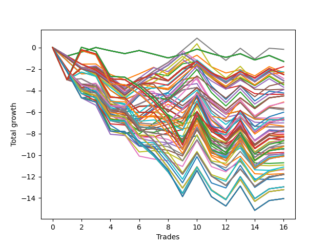

# Long HLT 242 
- Symbol: TSLA
- Date Range: 05/16/2022 - 05/17/2024
- Trading Period: 8:30-12:30
- Number of Trades: 16



| Id. | Name | Win Percent | Profit | Avg Profit / Trade | Avg Time / Trade | Std |      | Name | Win Percent | Profit | Avg Profit / Trade | Avg Time / Trade | Std |
| --- | ---- | ----------- | ------ | ------------------ | ---------------- | --- | ---- | ---- | ----------- | ------ | ------------------ | ---------------- | --- |
| | Sorted By <br> Profit | | | | | | | Sorted By <br> Win Percentage |||||
|0| TP-1 45m | 43.75 | -0.17 | -0.01 | 24:11 | 0.96 |     | TP-1 45m | 43.75 | -0.17 | -0.01 | 24:11 | 0.96 |
|1| TP-0.25 180m | 43.75 | -1.30 | -0.08 | 03:37 | 0.43 |     | TP-0.25 180m | 43.75 | -1.30 | -0.08 | 03:37 | 0.43 |
|2| TP-0.25 165m | 43.75 | -1.30 | -0.08 | 03:37 | 0.43 |     | TP-0.25 165m | 43.75 | -1.30 | -0.08 | 03:37 | 0.43 |
|3| TP-0.25 150m | 43.75 | -1.30 | -0.08 | 03:37 | 0.43 |     | TP-0.25 150m | 43.75 | -1.30 | -0.08 | 03:37 | 0.43 |
|4| TP-0.25 135m | 43.75 | -1.30 | -0.08 | 03:37 | 0.43 |     | TP-0.25 135m | 43.75 | -1.30 | -0.08 | 03:37 | 0.43 |
|5| TP-0.25 120m | 43.75 | -1.30 | -0.08 | 03:37 | 0.43 |     | TP-0.25 120m | 43.75 | -1.30 | -0.08 | 03:37 | 0.43 |
|6| TP-0.25 105m | 43.75 | -1.30 | -0.08 | 03:37 | 0.43 |     | TP-0.25 105m | 43.75 | -1.30 | -0.08 | 03:37 | 0.43 |
|7| TP-0.25 90m | 43.75 | -1.30 | -0.08 | 03:37 | 0.43 |     | TP-0.25 90m | 43.75 | -1.30 | -0.08 | 03:37 | 0.43 |
|8| TP-0.25 75m | 43.75 | -1.30 | -0.08 | 03:37 | 0.43 |     | TP-0.25 75m | 43.75 | -1.30 | -0.08 | 03:37 | 0.43 |
|9| TP-0.25 60m | 43.75 | -1.30 | -0.08 | 03:37 | 0.43 |     | TP-0.25 60m | 43.75 | -1.30 | -0.08 | 03:37 | 0.43 |
|10| TP-0.25 45m | 43.75 | -1.30 | -0.08 | 03:37 | 0.43 |     | TP-0.25 45m | 43.75 | -1.30 | -0.08 | 03:37 | 0.43 |
|11| TP-0.25 30m | 43.75 | -1.30 | -0.08 | 03:37 | 0.43 |     | TP-0.25 30m | 43.75 | -1.30 | -0.08 | 03:37 | 0.43 |
|12| TP-0.25 15m | 43.75 | -1.30 | -0.08 | 03:37 | 0.43 |     | TP-0.25 15m | 43.75 | -1.30 | -0.08 | 03:37 | 0.43 |
|13| TP-1 90m | 43.75 | -1.78 | -0.11 | 33:37 | 0.92 |     | TP-1 90m | 43.75 | -1.78 | -0.11 | 33:37 | 0.92 |
|14| TP-1 60m | 37.50 | -2.28 | -0.14 | 27:56 | 0.92 |     | TP-1.25 45m | 43.75 | -2.32 | -0.14 | 30:41 | 1.27 |
|15| TP-1.25 45m | 43.75 | -2.32 | -0.14 | 30:41 | 1.27 |     | TP-0.5 15m | 43.75 | -2.34 | -0.15 | 07:15 | 0.70 |
|16| TP-1 75m | 37.50 | -2.33 | -0.15 | 30:48 | 0.91 |     | TP-0.75 15m | 43.75 | -3.48 | -0.22 | 09:30 | 0.77 |
|17| TP-0.5 15m | 43.75 | -2.34 | -0.15 | 07:15 | 0.70 |     | TP-1 30m | 43.75 | -3.88 | -0.24 | 18:41 | 0.78 |
|18| TP-0.5 180m | 37.50 | -2.52 | -0.16 | 08:22 | 0.73 |     | TP-1.25 90m | 43.75 | -3.93 | -0.25 | 43:41 | 1.25 |
|19| TP-0.5 165m | 37.50 | -2.52 | -0.16 | 08:22 | 0.73 |     | TP-1 15m | 43.75 | -4.35 | -0.27 | 11:45 | 0.70 |
|20| TP-0.5 150m | 37.50 | -2.52 | -0.16 | 08:22 | 0.73 |     | TP-1.25 30m | 43.75 | -6.52 | -0.41 | 22:22 | 1.08 |
|21| TP-0.5 135m | 37.50 | -2.52 | -0.16 | 08:22 | 0.73 |     | TP-3 15m | 43.75 | -6.71 | -0.42 | 14:00 | 0.89 |
|22| TP-0.5 120m | 37.50 | -2.52 | -0.16 | 08:22 | 0.73 |     | TP-2.75 15m | 43.75 | -6.71 | -0.42 | 14:00 | 0.89 |
|23| TP-0.5 105m | 37.50 | -2.52 | -0.16 | 08:22 | 0.73 |     | TP-2.5 15m | 43.75 | -6.71 | -0.42 | 14:00 | 0.89 |
|24| TP-0.5 90m | 37.50 | -2.52 | -0.16 | 08:22 | 0.73 |     | TP-2.25 15m | 43.75 | -6.71 | -0.42 | 14:00 | 0.89 |
|25| TP-0.5 75m | 37.50 | -2.52 | -0.16 | 08:22 | 0.73 |     | TP-1.25 15m | 43.75 | -7.01 | -0.44 | 12:52 | 0.97 |
|26| TP-0.5 60m | 37.50 | -2.52 | -0.16 | 08:22 | 0.73 |     | TP-2 15m | 43.75 | -7.38 | -0.46 | 13:18 | 0.93 |
|27| TP-0.5 45m | 37.50 | -2.52 | -0.16 | 08:22 | 0.73 |     | TP-1.75 15m | 43.75 | -7.38 | -0.46 | 13:18 | 0.93 |
|28| TP-0.5 30m | 37.50 | -2.52 | -0.16 | 08:22 | 0.73 |     | TP-1.5 15m | 43.75 | -7.38 | -0.46 | 13:18 | 0.93 |
|29| TP-0.75 45m | 37.50 | -2.88 | -0.18 | 14:26 | 0.88 |     | TP-1 60m | 37.50 | -2.28 | -0.14 | 27:56 | 0.92 |
|30| TP-0.75 180m | 37.50 | -3.09 | -0.19 | 15:26 | 0.88 |     | TP-1 75m | 37.50 | -2.33 | -0.15 | 30:48 | 0.91 |
|31| TP-0.75 165m | 37.50 | -3.09 | -0.19 | 15:26 | 0.88 |     | TP-0.5 180m | 37.50 | -2.52 | -0.16 | 08:22 | 0.73 |
|32| TP-0.75 150m | 37.50 | -3.09 | -0.19 | 15:26 | 0.88 |     | TP-0.5 165m | 37.50 | -2.52 | -0.16 | 08:22 | 0.73 |
|33| TP-0.75 135m | 37.50 | -3.09 | -0.19 | 15:26 | 0.88 |     | TP-0.5 150m | 37.50 | -2.52 | -0.16 | 08:22 | 0.73 |
|34| TP-0.75 120m | 37.50 | -3.09 | -0.19 | 15:26 | 0.88 |     | TP-0.5 135m | 37.50 | -2.52 | -0.16 | 08:22 | 0.73 |
|35| TP-0.75 105m | 37.50 | -3.09 | -0.19 | 15:26 | 0.88 |     | TP-0.5 120m | 37.50 | -2.52 | -0.16 | 08:22 | 0.73 |
|36| TP-0.75 90m | 37.50 | -3.09 | -0.19 | 15:26 | 0.88 |     | TP-0.5 105m | 37.50 | -2.52 | -0.16 | 08:22 | 0.73 |
|37| TP-0.75 75m | 37.50 | -3.09 | -0.19 | 15:26 | 0.88 |     | TP-0.5 90m | 37.50 | -2.52 | -0.16 | 08:22 | 0.73 |
|38| TP-1 105m | 37.50 | -3.26 | -0.20 | 36:07 | 0.97 |     | TP-0.5 75m | 37.50 | -2.52 | -0.16 | 08:22 | 0.73 |
|39| TP-0.75 60m | 37.50 | -3.39 | -0.21 | 15:22 | 0.88 |     | TP-0.5 60m | 37.50 | -2.52 | -0.16 | 08:22 | 0.73 |
|40| TP-0.75 15m | 43.75 | -3.48 | -0.22 | 09:30 | 0.77 |     | TP-0.5 45m | 37.50 | -2.52 | -0.16 | 08:22 | 0.73 |
|41| TP-0.75 30m | 37.50 | -3.69 | -0.23 | 12:41 | 0.84 |     | TP-0.5 30m | 37.50 | -2.52 | -0.16 | 08:22 | 0.73 |
|42| TP-1 30m | 43.75 | -3.88 | -0.24 | 18:41 | 0.78 |     | TP-0.75 45m | 37.50 | -2.88 | -0.18 | 14:26 | 0.88 |
|43| TP-1.25 90m | 43.75 | -3.93 | -0.25 | 43:41 | 1.25 |     | TP-0.75 180m | 37.50 | -3.09 | -0.19 | 15:26 | 0.88 |
|44| TP-1.25 60m | 37.50 | -4.23 | -0.26 | 36:07 | 1.25 |     | TP-0.75 165m | 37.50 | -3.09 | -0.19 | 15:26 | 0.88 |
|45| TP-1 15m | 43.75 | -4.35 | -0.27 | 11:45 | 0.70 |     | TP-0.75 150m | 37.50 | -3.09 | -0.19 | 15:26 | 0.88 |
|46| TP-1 180m | 37.50 | -4.50 | -0.28 | 37:41 | 0.99 |     | TP-0.75 135m | 37.50 | -3.09 | -0.19 | 15:26 | 0.88 |
|47| TP-1 165m | 37.50 | -4.50 | -0.28 | 37:41 | 0.99 |     | TP-0.75 120m | 37.50 | -3.09 | -0.19 | 15:26 | 0.88 |
|48| TP-1 150m | 37.50 | -4.50 | -0.28 | 37:41 | 0.99 |     | TP-0.75 105m | 37.50 | -3.09 | -0.19 | 15:26 | 0.88 |
|49| TP-1 135m | 37.50 | -4.50 | -0.28 | 37:41 | 0.99 |     | TP-0.75 90m | 37.50 | -3.09 | -0.19 | 15:26 | 0.88 |
|50| TP-1 120m | 37.50 | -4.50 | -0.28 | 37:41 | 0.99 |     | TP-0.75 75m | 37.50 | -3.09 | -0.19 | 15:26 | 0.88 |
|51| TP-1.25 75m | 37.50 | -4.50 | -0.28 | 39:56 | 1.24 |     | TP-1 105m | 37.50 | -3.26 | -0.20 | 36:07 | 0.97 |
|52| TP-3 90m | 37.50 | -5.07 | -0.32 | 78:00 | 1.55 |     | TP-0.75 60m | 37.50 | -3.39 | -0.21 | 15:22 | 0.88 |
|53| TP-1.25 105m | 37.50 | -5.12 | -0.32 | 47:07 | 1.28 |     | TP-0.75 30m | 37.50 | -3.69 | -0.23 | 12:41 | 0.84 |
|54| TP-3 45m | 31.25 | -5.66 | -0.35 | 43:18 | 1.18 |     | TP-1.25 60m | 37.50 | -4.23 | -0.26 | 36:07 | 1.25 |
|55| TP-3 60m | 37.50 | -5.80 | -0.36 | 55:37 | 1.28 |     | TP-1 180m | 37.50 | -4.50 | -0.28 | 37:41 | 0.99 |
|56| TP-2.75 90m | 37.50 | -6.02 | -0.38 | 72:00 | 1.58 |     | TP-1 165m | 37.50 | -4.50 | -0.28 | 37:41 | 0.99 |
|57| TP-1.25 30m | 43.75 | -6.52 | -0.41 | 22:22 | 1.08 |     | TP-1 150m | 37.50 | -4.50 | -0.28 | 37:41 | 0.99 |
|58| TP-2.5 90m | 37.50 | -6.54 | -0.41 | 70:48 | 1.59 |     | TP-1 135m | 37.50 | -4.50 | -0.28 | 37:41 | 0.99 |
|59| TP-3 105m | 31.25 | -6.66 | -0.42 | 88:18 | 1.61 |     | TP-1 120m | 37.50 | -4.50 | -0.28 | 37:41 | 0.99 |
|60| TP-3 15m | 43.75 | -6.71 | -0.42 | 14:00 | 0.89 |     | TP-1.25 75m | 37.50 | -4.50 | -0.28 | 39:56 | 1.24 |
|61| TP-2.75 15m | 43.75 | -6.71 | -0.42 | 14:00 | 0.89 |     | TP-3 90m | 37.50 | -5.07 | -0.32 | 78:00 | 1.55 |
|62| TP-2.5 15m | 43.75 | -6.71 | -0.42 | 14:00 | 0.89 |     | TP-1.25 105m | 37.50 | -5.12 | -0.32 | 47:07 | 1.28 |
|63| TP-2.25 15m | 43.75 | -6.71 | -0.42 | 14:00 | 0.89 |     | TP-3 60m | 37.50 | -5.80 | -0.36 | 55:37 | 1.28 |
|64| TP-1.25 180m | 37.50 | -6.73 | -0.42 | 49:45 | 1.30 |     | TP-2.75 90m | 37.50 | -6.02 | -0.38 | 72:00 | 1.58 |
|65| TP-1.25 165m | 37.50 | -6.73 | -0.42 | 49:45 | 1.30 |     | TP-2.5 90m | 37.50 | -6.54 | -0.41 | 70:48 | 1.59 |
|66| TP-1.25 150m | 37.50 | -6.73 | -0.42 | 49:45 | 1.30 |     | TP-1.25 180m | 37.50 | -6.73 | -0.42 | 49:45 | 1.30 |
|67| TP-1.25 135m | 37.50 | -6.73 | -0.42 | 49:45 | 1.30 |     | TP-1.25 165m | 37.50 | -6.73 | -0.42 | 49:45 | 1.30 |
|68| TP-1.25 120m | 37.50 | -6.73 | -0.42 | 49:45 | 1.30 |     | TP-1.25 150m | 37.50 | -6.73 | -0.42 | 49:45 | 1.30 |
|69| TP-1.5 45m | 31.25 | -6.80 | -0.42 | 34:56 | 1.15 |     | TP-1.25 135m | 37.50 | -6.73 | -0.42 | 49:45 | 1.30 |
|70| TP-1.25 15m | 43.75 | -7.01 | -0.44 | 12:52 | 0.97 |     | TP-1.25 120m | 37.50 | -6.73 | -0.42 | 49:45 | 1.30 |
|71| TP-1.5 60m | 31.25 | -7.31 | -0.46 | 43:03 | 1.23 |     | TP-2.75 60m | 37.50 | -7.97 | -0.50 | 53:00 | 1.42 |
|72| TP-2 15m | 43.75 | -7.38 | -0.46 | 13:18 | 0.93 |     | TP-2.5 60m | 37.50 | -8.36 | -0.52 | 51:52 | 1.45 |
|73| TP-1.75 15m | 43.75 | -7.38 | -0.46 | 13:18 | 0.93 |     | TP-3 30m | 37.50 | -9.76 | -0.61 | 29:00 | 0.93 |
|74| TP-1.5 15m | 43.75 | -7.38 | -0.46 | 13:18 | 0.93 |     | TP-1.5 30m | 37.50 | -9.91 | -0.62 | 24:37 | 0.95 |
|75| TP-1.5 90m | 31.25 | -7.66 | -0.48 | 55:00 | 1.23 |     | TP-2.75 30m | 37.50 | -10.72 | -0.67 | 28:15 | 1.04 |
|76| TP-2.75 45m | 31.25 | -7.74 | -0.48 | 41:37 | 1.33 |     | TP-1.75 30m | 37.50 | -10.93 | -0.68 | 25:18 | 1.02 |
|77| TP-1.75 45m | 31.25 | -7.82 | -0.49 | 35:37 | 1.22 |     | TP-2 30m | 37.50 | -11.36 | -0.71 | 25:33 | 1.05 |
|78| TP-2.75 60m | 37.50 | -7.97 | -0.50 | 53:00 | 1.42 |     | TP-2.5 30m | 37.50 | -11.73 | -0.73 | 28:07 | 1.12 |
|79| TP-2.5 45m | 31.25 | -8.11 | -0.51 | 40:33 | 1.37 |     | TP-2.25 30m | 37.50 | -12.21 | -0.76 | 27:45 | 1.14 |
|80| TP-2 45m | 31.25 | -8.25 | -0.52 | 35:52 | 1.25 |     | TP-3 45m | 31.25 | -5.66 | -0.35 | 43:18 | 1.18 |
|81| TP-3 180m | 31.25 | -8.31 | -0.52 | 98:37 | 1.83 |     | TP-3 105m | 31.25 | -6.66 | -0.42 | 88:18 | 1.61 |
|82| TP-3 165m | 31.25 | -8.31 | -0.52 | 98:37 | 1.83 |     | TP-1.5 45m | 31.25 | -6.80 | -0.42 | 34:56 | 1.15 |
|83| TP-3 150m | 31.25 | -8.31 | -0.52 | 98:37 | 1.83 |     | TP-1.5 60m | 31.25 | -7.31 | -0.46 | 43:03 | 1.23 |
|84| TP-3 135m | 31.25 | -8.31 | -0.52 | 98:37 | 1.83 |     | TP-1.5 90m | 31.25 | -7.66 | -0.48 | 55:00 | 1.23 |
|85| TP-3 120m | 31.25 | -8.31 | -0.52 | 98:37 | 1.83 |     | TP-2.75 45m | 31.25 | -7.74 | -0.48 | 41:37 | 1.33 |
|86| TP-1.5 75m | 25.00 | -8.33 | -0.52 | 49:22 | 1.21 |     | TP-1.75 45m | 31.25 | -7.82 | -0.49 | 35:37 | 1.22 |
|87| TP-2.5 60m | 37.50 | -8.36 | -0.52 | 51:52 | 1.45 |     | TP-2.5 45m | 31.25 | -8.11 | -0.51 | 40:33 | 1.37 |
|88| TP-1.75 90m | 31.25 | -8.52 | -0.53 | 58:22 | 1.33 |     | TP-2 45m | 31.25 | -8.25 | -0.52 | 35:52 | 1.25 |
|89| TP-2 60m | 31.25 | -8.60 | -0.54 | 45:15 | 1.35 |     | TP-3 180m | 31.25 | -8.31 | -0.52 | 98:37 | 1.83 |
|90| TP-2.75 75m | 31.25 | -8.62 | -0.54 | 62:37 | 1.54 |     | TP-3 165m | 31.25 | -8.31 | -0.52 | 98:37 | 1.83 |
|91| TP-1.75 60m | 31.25 | -8.62 | -0.54 | 44:33 | 1.26 |     | TP-3 150m | 31.25 | -8.31 | -0.52 | 98:37 | 1.83 |
|92| TP-2.75 105m | 31.25 | -8.69 | -0.54 | 81:22 | 1.68 |     | TP-3 135m | 31.25 | -8.31 | -0.52 | 98:37 | 1.83 |
|93| TP-2 90m | 31.25 | -8.87 | -0.55 | 59:22 | 1.42 |     | TP-3 120m | 31.25 | -8.31 | -0.52 | 98:37 | 1.83 |
|94| TP-2.25 45m | 31.25 | -8.90 | -0.56 | 39:00 | 1.33 |     | TP-1.75 90m | 31.25 | -8.52 | -0.53 | 58:22 | 1.33 |
|95| TP-2.5 75m | 31.25 | -9.14 | -0.57 | 61:26 | 1.56 |     | TP-2 60m | 31.25 | -8.60 | -0.54 | 45:15 | 1.35 |
|96| TP-2.5 105m | 31.25 | -9.21 | -0.58 | 80:11 | 1.69 |     | TP-2.75 75m | 31.25 | -8.62 | -0.54 | 62:37 | 1.54 |
|97| TP-2.25 90m | 31.25 | -9.22 | -0.58 | 66:15 | 1.47 |     | TP-1.75 60m | 31.25 | -8.62 | -0.54 | 44:33 | 1.26 |
|98| TP-2.75 180m | 31.25 | -9.41 | -0.59 | 90:41 | 1.89 |     | TP-2.75 105m | 31.25 | -8.69 | -0.54 | 81:22 | 1.68 |
|99| TP-2.75 165m | 31.25 | -9.41 | -0.59 | 90:41 | 1.89 |     | TP-2 90m | 31.25 | -8.87 | -0.55 | 59:22 | 1.42 |
|100| TP-2.75 150m | 31.25 | -9.41 | -0.59 | 90:41 | 1.89 |     | TP-2.25 45m | 31.25 | -8.90 | -0.56 | 39:00 | 1.33 |
|101| TP-2.75 135m | 31.25 | -9.41 | -0.59 | 90:41 | 1.89 |     | TP-2.5 75m | 31.25 | -9.14 | -0.57 | 61:26 | 1.56 |
|102| TP-2.75 120m | 31.25 | -9.41 | -0.59 | 90:41 | 1.89 |     | TP-2.5 105m | 31.25 | -9.21 | -0.58 | 80:11 | 1.69 |
|103| TP-2.25 60m | 31.25 | -9.49 | -0.59 | 49:18 | 1.43 |     | TP-2.25 90m | 31.25 | -9.22 | -0.58 | 66:15 | 1.47 |
|104| TP-3 30m | 37.50 | -9.76 | -0.61 | 29:00 | 0.93 |     | TP-2.75 180m | 31.25 | -9.41 | -0.59 | 90:41 | 1.89 |
|105| TP-1.75 75m | 25.00 | -9.87 | -0.62 | 51:52 | 1.24 |     | TP-2.75 165m | 31.25 | -9.41 | -0.59 | 90:41 | 1.89 |
|106| TP-1.5 30m | 37.50 | -9.91 | -0.62 | 24:37 | 0.95 |     | TP-2.75 150m | 31.25 | -9.41 | -0.59 | 90:41 | 1.89 |
|107| TP-3 75m | 31.25 | -10.02 | -0.63 | 66:56 | 1.28 |     | TP-2.75 135m | 31.25 | -9.41 | -0.59 | 90:41 | 1.89 |
|108| TP-1.5 105m | 25.00 | -10.05 | -0.63 | 60:03 | 1.27 |     | TP-2.75 120m | 31.25 | -9.41 | -0.59 | 90:41 | 1.89 |
|109| TP-2 75m | 25.00 | -10.10 | -0.63 | 52:48 | 1.35 |     | TP-2.25 60m | 31.25 | -9.49 | -0.59 | 49:18 | 1.43 |
|110| TP-2.5 180m | 31.25 | -10.12 | -0.63 | 89:07 | 1.86 |     | TP-3 75m | 31.25 | -10.02 | -0.63 | 66:56 | 1.28 |
|111| TP-2.5 165m | 31.25 | -10.12 | -0.63 | 89:07 | 1.86 |     | TP-2.5 180m | 31.25 | -10.12 | -0.63 | 89:07 | 1.86 |
|112| TP-2.5 150m | 31.25 | -10.12 | -0.63 | 89:07 | 1.86 |     | TP-2.5 165m | 31.25 | -10.12 | -0.63 | 89:07 | 1.86 |
|113| TP-2.5 135m | 31.25 | -10.12 | -0.63 | 89:07 | 1.86 |     | TP-2.5 150m | 31.25 | -10.12 | -0.63 | 89:07 | 1.86 |
|114| TP-2.5 120m | 31.25 | -10.12 | -0.63 | 89:07 | 1.86 |     | TP-2.5 135m | 31.25 | -10.12 | -0.63 | 89:07 | 1.86 |
|115| TP-2.75 30m | 37.50 | -10.72 | -0.67 | 28:15 | 1.04 |     | TP-2.5 120m | 31.25 | -10.12 | -0.63 | 89:07 | 1.86 |
|116| TP-1.75 30m | 37.50 | -10.93 | -0.68 | 25:18 | 1.02 |     | TP-1.5 75m | 25.00 | -8.33 | -0.52 | 49:22 | 1.21 |
|117| TP-2 105m | 25.00 | -11.11 | -0.69 | 65:15 | 1.51 |     | TP-1.75 75m | 25.00 | -9.87 | -0.62 | 51:52 | 1.24 |
|118| TP-1.75 105m | 25.00 | -11.26 | -0.70 | 63:52 | 1.38 |     | TP-1.5 105m | 25.00 | -10.05 | -0.63 | 60:03 | 1.27 |
|119| TP-2 30m | 37.50 | -11.36 | -0.71 | 25:33 | 1.05 |     | TP-2 75m | 25.00 | -10.10 | -0.63 | 52:48 | 1.35 |
|120| TP-2.25 75m | 25.00 | -11.36 | -0.71 | 57:48 | 1.44 |     | TP-2 105m | 25.00 | -11.11 | -0.69 | 65:15 | 1.51 |
|121| TP-2.5 30m | 37.50 | -11.73 | -0.73 | 28:07 | 1.12 |     | TP-1.75 105m | 25.00 | -11.26 | -0.70 | 63:52 | 1.38 |
|122| TP-2.25 105m | 25.00 | -11.78 | -0.74 | 74:41 | 1.56 |     | TP-2.25 75m | 25.00 | -11.36 | -0.71 | 57:48 | 1.44 |
|123| TP-1.5 180m | 25.00 | -11.82 | -0.74 | 63:48 | 1.26 |     | TP-2.25 105m | 25.00 | -11.78 | -0.74 | 74:41 | 1.56 |
|124| TP-1.5 165m | 25.00 | -11.82 | -0.74 | 63:48 | 1.26 |     | TP-1.5 180m | 25.00 | -11.82 | -0.74 | 63:48 | 1.26 |
|125| TP-1.5 150m | 25.00 | -11.82 | -0.74 | 63:48 | 1.26 |     | TP-1.5 165m | 25.00 | -11.82 | -0.74 | 63:48 | 1.26 |
|126| TP-1.5 135m | 25.00 | -11.82 | -0.74 | 63:48 | 1.26 |     | TP-1.5 150m | 25.00 | -11.82 | -0.74 | 63:48 | 1.26 |
|127| TP-1.5 120m | 25.00 | -11.82 | -0.74 | 63:48 | 1.26 |     | TP-1.5 135m | 25.00 | -11.82 | -0.74 | 63:48 | 1.26 |
|128| TP-2.25 30m | 37.50 | -12.21 | -0.76 | 27:45 | 1.14 |     | TP-1.5 120m | 25.00 | -11.82 | -0.74 | 63:48 | 1.26 |
|129| TP-2 180m | 25.00 | -12.96 | -0.81 | 70:03 | 1.50 |     | TP-2 180m | 25.00 | -12.96 | -0.81 | 70:03 | 1.50 |
|130| TP-2 165m | 25.00 | -12.96 | -0.81 | 70:03 | 1.50 |     | TP-2 165m | 25.00 | -12.96 | -0.81 | 70:03 | 1.50 |
|131| TP-2 150m | 25.00 | -12.96 | -0.81 | 70:03 | 1.50 |     | TP-2 150m | 25.00 | -12.96 | -0.81 | 70:03 | 1.50 |
|132| TP-2 135m | 25.00 | -12.96 | -0.81 | 70:03 | 1.50 |     | TP-2 135m | 25.00 | -12.96 | -0.81 | 70:03 | 1.50 |
|133| TP-2 120m | 25.00 | -12.96 | -0.81 | 70:03 | 1.50 |     | TP-2 120m | 25.00 | -12.96 | -0.81 | 70:03 | 1.50 |
|134| TP-1.75 180m | 25.00 | -13.22 | -0.83 | 68:26 | 1.37 |     | TP-1.75 180m | 25.00 | -13.22 | -0.83 | 68:26 | 1.37 |
|135| TP-1.75 165m | 25.00 | -13.22 | -0.83 | 68:26 | 1.37 |     | TP-1.75 165m | 25.00 | -13.22 | -0.83 | 68:26 | 1.37 |
|136| TP-1.75 150m | 25.00 | -13.22 | -0.83 | 68:26 | 1.37 |     | TP-1.75 150m | 25.00 | -13.22 | -0.83 | 68:26 | 1.37 |
|137| TP-1.75 135m | 25.00 | -13.22 | -0.83 | 68:26 | 1.37 |     | TP-1.75 135m | 25.00 | -13.22 | -0.83 | 68:26 | 1.37 |
|138| TP-1.75 120m | 25.00 | -13.22 | -0.83 | 68:26 | 1.37 |     | TP-1.75 120m | 25.00 | -13.22 | -0.83 | 68:26 | 1.37 |
|139| TP-2.25 180m | 25.00 | -14.05 | -0.88 | 82:15 | 1.55 |     | TP-2.25 180m | 25.00 | -14.05 | -0.88 | 82:15 | 1.55 |
|140| TP-2.25 165m | 25.00 | -14.05 | -0.88 | 82:15 | 1.55 |     | TP-2.25 165m | 25.00 | -14.05 | -0.88 | 82:15 | 1.55 |
|141| TP-2.25 150m | 25.00 | -14.05 | -0.88 | 82:15 | 1.55 |     | TP-2.25 150m | 25.00 | -14.05 | -0.88 | 82:15 | 1.55 |
|142| TP-2.25 135m | 25.00 | -14.05 | -0.88 | 82:15 | 1.55 |     | TP-2.25 135m | 25.00 | -14.05 | -0.88 | 82:15 | 1.55 |
|143| TP-2.25 120m | 25.00 | -14.05 | -0.88 | 82:15 | 1.55 |     | TP-2.25 120m | 25.00 | -14.05 | -0.88 | 82:15 | 1.55 |

### Test TP-0.25 15m
* Take Profit of 0.25 Point
* 0.25 Stoploss
* Results:
```
Total Trades: 16
Percent Up: 43.75
Percent Down: 56.25
Total Points Moved Up: -1.30
Potential Profit: -650.00
Total Points Ups: 2.67 Count Ups: 7
Total Points Downs: -3.97 Count Downs: 9
```

<details><summary>Trades</summary>

<code>In: 2022-05-20 08:35:00		Out: 2022-05-20 08:37:00		Total Position Time: 02:00		Total Move Up: -0.80		Total to Date: -0.80</code> <br />
<code>In: 2022-06-23 10:15:00		Out: 2022-06-23 10:18:00		Total Position Time: 03:00		Total Move Up: 0.38		Total to Date: -0.42</code> <br />
<code>In: 2022-07-26 11:50:00		Out: 2022-07-26 11:52:00		Total Position Time: 02:00		Total Move Up: 0.42		Total to Date: 0.00</code> <br />
<code>In: 2022-08-08 12:05:00		Out: 2022-08-08 12:07:00		Total Position Time: 02:00		Total Move Up: -0.30		Total to Date: -0.30</code> <br />
<code>In: 2022-12-16 08:40:00		Out: 2022-12-16 08:43:00		Total Position Time: 03:00		Total Move Up: -0.27		Total to Date: -0.57</code> <br />
<code>In: 2023-01-18 08:55:00		Out: 2023-01-18 08:57:00		Total Position Time: 02:00		Total Move Up: 0.29		Total to Date: -0.28</code> <br />
<code>In: 2023-04-12 08:50:00		Out: 2023-04-12 08:53:00		Total Position Time: 03:00		Total Move Up: -0.34		Total to Date: -0.62</code> <br />
<code>In: 2023-04-20 09:35:00		Out: 2023-04-20 09:38:00		Total Position Time: 03:00		Total Move Up: -0.35		Total to Date: -0.97</code> <br />
<code>In: 2023-10-18 10:10:00		Out: 2023-10-18 10:12:00		Total Position Time: 02:00		Total Move Up: 0.33		Total to Date: -0.64</code> <br />
<code>In: 2023-10-20 08:55:00		Out: 2023-10-20 08:57:00		Total Position Time: 02:00		Total Move Up: 0.49		Total to Date: -0.15</code> <br />
<code>In: 2023-11-09 09:50:00		Out: 2023-11-09 09:56:00		Total Position Time: 06:00		Total Move Up: -0.42		Total to Date: -0.57</code> <br />
<code>In: 2024-01-26 10:30:00		Out: 2024-01-26 10:33:00		Total Position Time: 03:00		Total Move Up: -0.35		Total to Date: -0.92</code> <br />
<code>In: 2024-03-15 10:10:00		Out: 2024-03-15 10:21:00		Total Position Time: 11:00		Total Move Up: 0.34		Total to Date: -0.58</code> <br />
<code>In: 2024-04-15 10:10:00		Out: 2024-04-15 10:19:00		Total Position Time: 09:00		Total Move Up: -0.58		Total to Date: -1.16</code> <br />
<code>In: 2024-04-26 12:05:00		Out: 2024-04-26 12:07:00		Total Position Time: 02:00		Total Move Up: 0.42		Total to Date: -0.74</code> <br />
<code>In: 2024-05-09 08:35:00		Out: 2024-05-09 08:38:00		Total Position Time: 03:00		Total Move Up: -0.56		Total to Date: -1.30</code> <br />


</details>

### Test TP-0.5 15m
* Take Profit of 0.5 Point
* 0.5 Stoploss
* Results:
```
Total Trades: 16
Percent Up: 43.75
Percent Down: 56.25
Total Points Moved Up: -2.34
Potential Profit: -1170.00
Total Points Ups: 4.13 Count Ups: 7
Total Points Downs: -6.47 Count Downs: 9
```

<details><summary>Trades</summary>

<code>In: 2022-05-20 08:35:00		Out: 2022-05-20 08:37:00		Total Position Time: 02:00		Total Move Up: -0.80		Total to Date: -0.80</code> <br />
<code>In: 2022-06-23 10:15:00		Out: 2022-06-23 10:25:00		Total Position Time: 10:00		Total Move Up: -0.75		Total to Date: -1.55</code> <br />
<code>In: 2022-07-26 11:50:00		Out: 2022-07-26 12:04:00		Total Position Time: 14:00		Total Move Up: 0.02		Total to Date: -1.53</code> <br />
<code>In: 2022-08-08 12:05:00		Out: 2022-08-08 12:08:00		Total Position Time: 03:00		Total Move Up: -0.97		Total to Date: -2.50</code> <br />
<code>In: 2022-12-16 08:40:00		Out: 2022-12-16 08:48:00		Total Position Time: 08:00		Total Move Up: -0.50		Total to Date: -3.00</code> <br />
<code>In: 2023-01-18 08:55:00		Out: 2023-01-18 08:59:00		Total Position Time: 04:00		Total Move Up: 0.55		Total to Date: -2.45</code> <br />
<code>In: 2023-04-12 08:50:00		Out: 2023-04-12 09:04:00		Total Position Time: 14:00		Total Move Up: 0.61		Total to Date: -1.84</code> <br />
<code>In: 2023-04-20 09:35:00		Out: 2023-04-20 09:40:00		Total Position Time: 05:00		Total Move Up: -0.66		Total to Date: -2.50</code> <br />
<code>In: 2023-10-18 10:10:00		Out: 2023-10-18 10:14:00		Total Position Time: 04:00		Total Move Up: 1.12		Total to Date: -1.38</code> <br />
<code>In: 2023-10-20 08:55:00		Out: 2023-10-20 08:58:00		Total Position Time: 03:00		Total Move Up: 0.66		Total to Date: -0.72</code> <br />
<code>In: 2023-11-09 09:50:00		Out: 2023-11-09 10:02:00		Total Position Time: 12:00		Total Move Up: -1.07		Total to Date: -1.79</code> <br />
<code>In: 2024-01-26 10:30:00		Out: 2024-01-26 10:36:00		Total Position Time: 06:00		Total Move Up: -0.58		Total to Date: -2.37</code> <br />
<code>In: 2024-03-15 10:10:00		Out: 2024-03-15 10:24:00		Total Position Time: 14:00		Total Move Up: 0.31		Total to Date: -2.06</code> <br />
<code>In: 2024-04-15 10:10:00		Out: 2024-04-15 10:19:00		Total Position Time: 09:00		Total Move Up: -0.58		Total to Date: -2.64</code> <br />
<code>In: 2024-04-26 12:05:00		Out: 2024-04-26 12:10:00		Total Position Time: 05:00		Total Move Up: 0.86		Total to Date: -1.78</code> <br />
<code>In: 2024-05-09 08:35:00		Out: 2024-05-09 08:38:00		Total Position Time: 03:00		Total Move Up: -0.56		Total to Date: -2.34</code> <br />


</details>

### Test TP-0.75 15m
* Take Profit of 0.75 Point
* 0.75 Stoploss
* Results:
```
Total Trades: 16
Percent Up: 43.75
Percent Down: 56.25
Total Points Moved Up: -3.48
Potential Profit: -1740.00
Total Points Ups: 4.05 Count Ups: 7
Total Points Downs: -7.53 Count Downs: 9
```

<details><summary>Trades</summary>

<code>In: 2022-05-20 08:35:00		Out: 2022-05-20 08:37:00		Total Position Time: 02:00		Total Move Up: -0.80		Total to Date: -0.80</code> <br />
<code>In: 2022-06-23 10:15:00		Out: 2022-06-23 10:27:00		Total Position Time: 12:00		Total Move Up: -1.08		Total to Date: -1.88</code> <br />
<code>In: 2022-07-26 11:50:00		Out: 2022-07-26 12:04:00		Total Position Time: 14:00		Total Move Up: 0.02		Total to Date: -1.86</code> <br />
<code>In: 2022-08-08 12:05:00		Out: 2022-08-08 12:08:00		Total Position Time: 03:00		Total Move Up: -0.97		Total to Date: -2.83</code> <br />
<code>In: 2022-12-16 08:40:00		Out: 2022-12-16 08:50:00		Total Position Time: 10:00		Total Move Up: -1.07		Total to Date: -3.90</code> <br />
<code>In: 2023-01-18 08:55:00		Out: 2023-01-18 09:03:00		Total Position Time: 08:00		Total Move Up: 0.90		Total to Date: -3.00</code> <br />
<code>In: 2023-04-12 08:50:00		Out: 2023-04-12 09:04:00		Total Position Time: 14:00		Total Move Up: 0.61		Total to Date: -2.39</code> <br />
<code>In: 2023-04-20 09:35:00		Out: 2023-04-20 09:49:00		Total Position Time: 14:00		Total Move Up: -0.25		Total to Date: -2.64</code> <br />
<code>In: 2023-10-18 10:10:00		Out: 2023-10-18 10:14:00		Total Position Time: 04:00		Total Move Up: 1.12		Total to Date: -1.52</code> <br />
<code>In: 2023-10-20 08:55:00		Out: 2023-10-20 09:09:00		Total Position Time: 14:00		Total Move Up: 0.23		Total to Date: -1.29</code> <br />
<code>In: 2023-11-09 09:50:00		Out: 2023-11-09 10:02:00		Total Position Time: 12:00		Total Move Up: -1.07		Total to Date: -2.36</code> <br />
<code>In: 2024-01-26 10:30:00		Out: 2024-01-26 10:41:00		Total Position Time: 11:00		Total Move Up: -0.77		Total to Date: -3.13</code> <br />
<code>In: 2024-03-15 10:10:00		Out: 2024-03-15 10:24:00		Total Position Time: 14:00		Total Move Up: 0.31		Total to Date: -2.82</code> <br />
<code>In: 2024-04-15 10:10:00		Out: 2024-04-15 10:21:00		Total Position Time: 11:00		Total Move Up: -0.73		Total to Date: -3.55</code> <br />
<code>In: 2024-04-26 12:05:00		Out: 2024-04-26 12:10:00		Total Position Time: 05:00		Total Move Up: 0.86		Total to Date: -2.69</code> <br />
<code>In: 2024-05-09 08:35:00		Out: 2024-05-09 08:39:00		Total Position Time: 04:00		Total Move Up: -0.79		Total to Date: -3.48</code> <br />


</details>

### Test TP-1 15m
* Take Profit of 1 Point
* 1 Stoploss
* Results:
```
Total Trades: 16
Percent Up: 43.75
Percent Down: 56.25
Total Points Moved Up: -4.35
Potential Profit: -2175.00
Total Points Ups: 2.86 Count Ups: 7
Total Points Downs: -7.21 Count Downs: 9
```

<details><summary>Trades</summary>

<code>In: 2022-05-20 08:35:00		Out: 2022-05-20 08:38:00		Total Position Time: 03:00		Total Move Up: -0.98		Total to Date: -0.98</code> <br />
<code>In: 2022-06-23 10:15:00		Out: 2022-06-23 10:28:00		Total Position Time: 13:00		Total Move Up: -1.00		Total to Date: -1.98</code> <br />
<code>In: 2022-07-26 11:50:00		Out: 2022-07-26 12:04:00		Total Position Time: 14:00		Total Move Up: 0.02		Total to Date: -1.96</code> <br />
<code>In: 2022-08-08 12:05:00		Out: 2022-08-08 12:11:00		Total Position Time: 06:00		Total Move Up: -1.01		Total to Date: -2.97</code> <br />
<code>In: 2022-12-16 08:40:00		Out: 2022-12-16 08:50:00		Total Position Time: 10:00		Total Move Up: -1.07		Total to Date: -4.04</code> <br />
<code>In: 2023-01-18 08:55:00		Out: 2023-01-18 09:09:00		Total Position Time: 14:00		Total Move Up: 0.56		Total to Date: -3.48</code> <br />
<code>In: 2023-04-12 08:50:00		Out: 2023-04-12 09:04:00		Total Position Time: 14:00		Total Move Up: 0.61		Total to Date: -2.87</code> <br />
<code>In: 2023-04-20 09:35:00		Out: 2023-04-20 09:49:00		Total Position Time: 14:00		Total Move Up: -0.25		Total to Date: -3.12</code> <br />
<code>In: 2023-10-18 10:10:00		Out: 2023-10-18 10:14:00		Total Position Time: 04:00		Total Move Up: 1.12		Total to Date: -2.00</code> <br />
<code>In: 2023-10-20 08:55:00		Out: 2023-10-20 09:09:00		Total Position Time: 14:00		Total Move Up: 0.23		Total to Date: -1.77</code> <br />
<code>In: 2023-11-09 09:50:00		Out: 2023-11-09 10:02:00		Total Position Time: 12:00		Total Move Up: -1.07		Total to Date: -2.84</code> <br />
<code>In: 2024-01-26 10:30:00		Out: 2024-01-26 10:44:00		Total Position Time: 14:00		Total Move Up: -1.00		Total to Date: -3.84</code> <br />
<code>In: 2024-03-15 10:10:00		Out: 2024-03-15 10:24:00		Total Position Time: 14:00		Total Move Up: 0.31		Total to Date: -3.53</code> <br />
<code>In: 2024-04-15 10:10:00		Out: 2024-04-15 10:24:00		Total Position Time: 14:00		Total Move Up: -0.76		Total to Date: -4.29</code> <br />
<code>In: 2024-04-26 12:05:00		Out: 2024-04-26 12:19:00		Total Position Time: 14:00		Total Move Up: -0.07		Total to Date: -4.36</code> <br />
<code>In: 2024-05-09 08:35:00		Out: 2024-05-09 08:49:00		Total Position Time: 14:00		Total Move Up: 0.01		Total to Date: -4.35</code> <br />


</details>

### Test TP-1.25 15m
* Take Profit of 1.25 Point
* 1.25 Stoploss
* Results:
```
Total Trades: 16
Percent Up: 43.75
Percent Down: 56.25
Total Points Moved Up: -7.01
Potential Profit: -3505.00
Total Points Ups: 3.05 Count Ups: 7
Total Points Downs: -10.06 Count Downs: 9
```

<details><summary>Trades</summary>

<code>In: 2022-05-20 08:35:00		Out: 2022-05-20 08:39:00		Total Position Time: 04:00		Total Move Up: -2.18		Total to Date: -2.18</code> <br />
<code>In: 2022-06-23 10:15:00		Out: 2022-06-23 10:29:00		Total Position Time: 14:00		Total Move Up: -1.23		Total to Date: -3.41</code> <br />
<code>In: 2022-07-26 11:50:00		Out: 2022-07-26 12:04:00		Total Position Time: 14:00		Total Move Up: 0.02		Total to Date: -3.39</code> <br />
<code>In: 2022-08-08 12:05:00		Out: 2022-08-08 12:19:00		Total Position Time: 14:00		Total Move Up: -1.53		Total to Date: -4.92</code> <br />
<code>In: 2022-12-16 08:40:00		Out: 2022-12-16 08:54:00		Total Position Time: 14:00		Total Move Up: -0.89		Total to Date: -5.81</code> <br />
<code>In: 2023-01-18 08:55:00		Out: 2023-01-18 09:09:00		Total Position Time: 14:00		Total Move Up: 0.56		Total to Date: -5.25</code> <br />
<code>In: 2023-04-12 08:50:00		Out: 2023-04-12 09:04:00		Total Position Time: 14:00		Total Move Up: 0.61		Total to Date: -4.64</code> <br />
<code>In: 2023-04-20 09:35:00		Out: 2023-04-20 09:49:00		Total Position Time: 14:00		Total Move Up: -0.25		Total to Date: -4.89</code> <br />
<code>In: 2023-10-18 10:10:00		Out: 2023-10-18 10:17:00		Total Position Time: 07:00		Total Move Up: 1.31		Total to Date: -3.58</code> <br />
<code>In: 2023-10-20 08:55:00		Out: 2023-10-20 09:09:00		Total Position Time: 14:00		Total Move Up: 0.23		Total to Date: -3.35</code> <br />
<code>In: 2023-11-09 09:50:00		Out: 2023-11-09 10:03:00		Total Position Time: 13:00		Total Move Up: -2.15		Total to Date: -5.50</code> <br />
<code>In: 2024-01-26 10:30:00		Out: 2024-01-26 10:44:00		Total Position Time: 14:00		Total Move Up: -1.00		Total to Date: -6.50</code> <br />
<code>In: 2024-03-15 10:10:00		Out: 2024-03-15 10:24:00		Total Position Time: 14:00		Total Move Up: 0.31		Total to Date: -6.19</code> <br />
<code>In: 2024-04-15 10:10:00		Out: 2024-04-15 10:24:00		Total Position Time: 14:00		Total Move Up: -0.76		Total to Date: -6.95</code> <br />
<code>In: 2024-04-26 12:05:00		Out: 2024-04-26 12:19:00		Total Position Time: 14:00		Total Move Up: -0.07		Total to Date: -7.02</code> <br />
<code>In: 2024-05-09 08:35:00		Out: 2024-05-09 08:49:00		Total Position Time: 14:00		Total Move Up: 0.01		Total to Date: -7.01</code> <br />


</details>

### Test TP-1.5 15m
* Take Profit of 1.5 Point
* 1.5 Stoploss
* Results:
```
Total Trades: 16
Percent Up: 43.75
Percent Down: 56.25
Total Points Moved Up: -7.38
Potential Profit: -3690.00
Total Points Ups: 2.68 Count Ups: 7
Total Points Downs: -10.06 Count Downs: 9
```

<details><summary>Trades</summary>

<code>In: 2022-05-20 08:35:00		Out: 2022-05-20 08:39:00		Total Position Time: 04:00		Total Move Up: -2.18		Total to Date: -2.18</code> <br />
<code>In: 2022-06-23 10:15:00		Out: 2022-06-23 10:29:00		Total Position Time: 14:00		Total Move Up: -1.23		Total to Date: -3.41</code> <br />
<code>In: 2022-07-26 11:50:00		Out: 2022-07-26 12:04:00		Total Position Time: 14:00		Total Move Up: 0.02		Total to Date: -3.39</code> <br />
<code>In: 2022-08-08 12:05:00		Out: 2022-08-08 12:19:00		Total Position Time: 14:00		Total Move Up: -1.53		Total to Date: -4.92</code> <br />
<code>In: 2022-12-16 08:40:00		Out: 2022-12-16 08:54:00		Total Position Time: 14:00		Total Move Up: -0.89		Total to Date: -5.81</code> <br />
<code>In: 2023-01-18 08:55:00		Out: 2023-01-18 09:09:00		Total Position Time: 14:00		Total Move Up: 0.56		Total to Date: -5.25</code> <br />
<code>In: 2023-04-12 08:50:00		Out: 2023-04-12 09:04:00		Total Position Time: 14:00		Total Move Up: 0.61		Total to Date: -4.64</code> <br />
<code>In: 2023-04-20 09:35:00		Out: 2023-04-20 09:49:00		Total Position Time: 14:00		Total Move Up: -0.25		Total to Date: -4.89</code> <br />
<code>In: 2023-10-18 10:10:00		Out: 2023-10-18 10:24:00		Total Position Time: 14:00		Total Move Up: 0.94		Total to Date: -3.95</code> <br />
<code>In: 2023-10-20 08:55:00		Out: 2023-10-20 09:09:00		Total Position Time: 14:00		Total Move Up: 0.23		Total to Date: -3.72</code> <br />
<code>In: 2023-11-09 09:50:00		Out: 2023-11-09 10:03:00		Total Position Time: 13:00		Total Move Up: -2.15		Total to Date: -5.87</code> <br />
<code>In: 2024-01-26 10:30:00		Out: 2024-01-26 10:44:00		Total Position Time: 14:00		Total Move Up: -1.00		Total to Date: -6.87</code> <br />
<code>In: 2024-03-15 10:10:00		Out: 2024-03-15 10:24:00		Total Position Time: 14:00		Total Move Up: 0.31		Total to Date: -6.56</code> <br />
<code>In: 2024-04-15 10:10:00		Out: 2024-04-15 10:24:00		Total Position Time: 14:00		Total Move Up: -0.76		Total to Date: -7.32</code> <br />
<code>In: 2024-04-26 12:05:00		Out: 2024-04-26 12:19:00		Total Position Time: 14:00		Total Move Up: -0.07		Total to Date: -7.39</code> <br />
<code>In: 2024-05-09 08:35:00		Out: 2024-05-09 08:49:00		Total Position Time: 14:00		Total Move Up: 0.01		Total to Date: -7.38</code> <br />


</details>

### Test TP-1.75 15m
* Take Profit of 1.75 Point
* 1.75 Stoploss
* Results:
```
Total Trades: 16
Percent Up: 43.75
Percent Down: 56.25
Total Points Moved Up: -7.38
Potential Profit: -3690.00
Total Points Ups: 2.68 Count Ups: 7
Total Points Downs: -10.06 Count Downs: 9
```

<details><summary>Trades</summary>

<code>In: 2022-05-20 08:35:00		Out: 2022-05-20 08:39:00		Total Position Time: 04:00		Total Move Up: -2.18		Total to Date: -2.18</code> <br />
<code>In: 2022-06-23 10:15:00		Out: 2022-06-23 10:29:00		Total Position Time: 14:00		Total Move Up: -1.23		Total to Date: -3.41</code> <br />
<code>In: 2022-07-26 11:50:00		Out: 2022-07-26 12:04:00		Total Position Time: 14:00		Total Move Up: 0.02		Total to Date: -3.39</code> <br />
<code>In: 2022-08-08 12:05:00		Out: 2022-08-08 12:19:00		Total Position Time: 14:00		Total Move Up: -1.53		Total to Date: -4.92</code> <br />
<code>In: 2022-12-16 08:40:00		Out: 2022-12-16 08:54:00		Total Position Time: 14:00		Total Move Up: -0.89		Total to Date: -5.81</code> <br />
<code>In: 2023-01-18 08:55:00		Out: 2023-01-18 09:09:00		Total Position Time: 14:00		Total Move Up: 0.56		Total to Date: -5.25</code> <br />
<code>In: 2023-04-12 08:50:00		Out: 2023-04-12 09:04:00		Total Position Time: 14:00		Total Move Up: 0.61		Total to Date: -4.64</code> <br />
<code>In: 2023-04-20 09:35:00		Out: 2023-04-20 09:49:00		Total Position Time: 14:00		Total Move Up: -0.25		Total to Date: -4.89</code> <br />
<code>In: 2023-10-18 10:10:00		Out: 2023-10-18 10:24:00		Total Position Time: 14:00		Total Move Up: 0.94		Total to Date: -3.95</code> <br />
<code>In: 2023-10-20 08:55:00		Out: 2023-10-20 09:09:00		Total Position Time: 14:00		Total Move Up: 0.23		Total to Date: -3.72</code> <br />
<code>In: 2023-11-09 09:50:00		Out: 2023-11-09 10:03:00		Total Position Time: 13:00		Total Move Up: -2.15		Total to Date: -5.87</code> <br />
<code>In: 2024-01-26 10:30:00		Out: 2024-01-26 10:44:00		Total Position Time: 14:00		Total Move Up: -1.00		Total to Date: -6.87</code> <br />
<code>In: 2024-03-15 10:10:00		Out: 2024-03-15 10:24:00		Total Position Time: 14:00		Total Move Up: 0.31		Total to Date: -6.56</code> <br />
<code>In: 2024-04-15 10:10:00		Out: 2024-04-15 10:24:00		Total Position Time: 14:00		Total Move Up: -0.76		Total to Date: -7.32</code> <br />
<code>In: 2024-04-26 12:05:00		Out: 2024-04-26 12:19:00		Total Position Time: 14:00		Total Move Up: -0.07		Total to Date: -7.39</code> <br />
<code>In: 2024-05-09 08:35:00		Out: 2024-05-09 08:49:00		Total Position Time: 14:00		Total Move Up: 0.01		Total to Date: -7.38</code> <br />


</details>

### Test TP-2 15m
* Take Profit of 2 Point
* 2 Stoploss
* Results:
```
Total Trades: 16
Percent Up: 43.75
Percent Down: 56.25
Total Points Moved Up: -7.38
Potential Profit: -3690.00
Total Points Ups: 2.68 Count Ups: 7
Total Points Downs: -10.06 Count Downs: 9
```

<details><summary>Trades</summary>

<code>In: 2022-05-20 08:35:00		Out: 2022-05-20 08:39:00		Total Position Time: 04:00		Total Move Up: -2.18		Total to Date: -2.18</code> <br />
<code>In: 2022-06-23 10:15:00		Out: 2022-06-23 10:29:00		Total Position Time: 14:00		Total Move Up: -1.23		Total to Date: -3.41</code> <br />
<code>In: 2022-07-26 11:50:00		Out: 2022-07-26 12:04:00		Total Position Time: 14:00		Total Move Up: 0.02		Total to Date: -3.39</code> <br />
<code>In: 2022-08-08 12:05:00		Out: 2022-08-08 12:19:00		Total Position Time: 14:00		Total Move Up: -1.53		Total to Date: -4.92</code> <br />
<code>In: 2022-12-16 08:40:00		Out: 2022-12-16 08:54:00		Total Position Time: 14:00		Total Move Up: -0.89		Total to Date: -5.81</code> <br />
<code>In: 2023-01-18 08:55:00		Out: 2023-01-18 09:09:00		Total Position Time: 14:00		Total Move Up: 0.56		Total to Date: -5.25</code> <br />
<code>In: 2023-04-12 08:50:00		Out: 2023-04-12 09:04:00		Total Position Time: 14:00		Total Move Up: 0.61		Total to Date: -4.64</code> <br />
<code>In: 2023-04-20 09:35:00		Out: 2023-04-20 09:49:00		Total Position Time: 14:00		Total Move Up: -0.25		Total to Date: -4.89</code> <br />
<code>In: 2023-10-18 10:10:00		Out: 2023-10-18 10:24:00		Total Position Time: 14:00		Total Move Up: 0.94		Total to Date: -3.95</code> <br />
<code>In: 2023-10-20 08:55:00		Out: 2023-10-20 09:09:00		Total Position Time: 14:00		Total Move Up: 0.23		Total to Date: -3.72</code> <br />
<code>In: 2023-11-09 09:50:00		Out: 2023-11-09 10:03:00		Total Position Time: 13:00		Total Move Up: -2.15		Total to Date: -5.87</code> <br />
<code>In: 2024-01-26 10:30:00		Out: 2024-01-26 10:44:00		Total Position Time: 14:00		Total Move Up: -1.00		Total to Date: -6.87</code> <br />
<code>In: 2024-03-15 10:10:00		Out: 2024-03-15 10:24:00		Total Position Time: 14:00		Total Move Up: 0.31		Total to Date: -6.56</code> <br />
<code>In: 2024-04-15 10:10:00		Out: 2024-04-15 10:24:00		Total Position Time: 14:00		Total Move Up: -0.76		Total to Date: -7.32</code> <br />
<code>In: 2024-04-26 12:05:00		Out: 2024-04-26 12:19:00		Total Position Time: 14:00		Total Move Up: -0.07		Total to Date: -7.39</code> <br />
<code>In: 2024-05-09 08:35:00		Out: 2024-05-09 08:49:00		Total Position Time: 14:00		Total Move Up: 0.01		Total to Date: -7.38</code> <br />


</details>

### Test TP-2.25 15m
* Take Profit of 2.25 Point
* 2.25 Stoploss
* Results:
```
Total Trades: 16
Percent Up: 43.75
Percent Down: 56.25
Total Points Moved Up: -6.71
Potential Profit: -3355.00
Total Points Ups: 2.68 Count Ups: 7
Total Points Downs: -9.39 Count Downs: 9
```

<details><summary>Trades</summary>

<code>In: 2022-05-20 08:35:00		Out: 2022-05-20 08:49:00		Total Position Time: 14:00		Total Move Up: -1.22		Total to Date: -1.22</code> <br />
<code>In: 2022-06-23 10:15:00		Out: 2022-06-23 10:29:00		Total Position Time: 14:00		Total Move Up: -1.23		Total to Date: -2.45</code> <br />
<code>In: 2022-07-26 11:50:00		Out: 2022-07-26 12:04:00		Total Position Time: 14:00		Total Move Up: 0.02		Total to Date: -2.43</code> <br />
<code>In: 2022-08-08 12:05:00		Out: 2022-08-08 12:19:00		Total Position Time: 14:00		Total Move Up: -1.53		Total to Date: -3.96</code> <br />
<code>In: 2022-12-16 08:40:00		Out: 2022-12-16 08:54:00		Total Position Time: 14:00		Total Move Up: -0.89		Total to Date: -4.85</code> <br />
<code>In: 2023-01-18 08:55:00		Out: 2023-01-18 09:09:00		Total Position Time: 14:00		Total Move Up: 0.56		Total to Date: -4.29</code> <br />
<code>In: 2023-04-12 08:50:00		Out: 2023-04-12 09:04:00		Total Position Time: 14:00		Total Move Up: 0.61		Total to Date: -3.68</code> <br />
<code>In: 2023-04-20 09:35:00		Out: 2023-04-20 09:49:00		Total Position Time: 14:00		Total Move Up: -0.25		Total to Date: -3.93</code> <br />
<code>In: 2023-10-18 10:10:00		Out: 2023-10-18 10:24:00		Total Position Time: 14:00		Total Move Up: 0.94		Total to Date: -2.99</code> <br />
<code>In: 2023-10-20 08:55:00		Out: 2023-10-20 09:09:00		Total Position Time: 14:00		Total Move Up: 0.23		Total to Date: -2.76</code> <br />
<code>In: 2023-11-09 09:50:00		Out: 2023-11-09 10:04:00		Total Position Time: 14:00		Total Move Up: -2.44		Total to Date: -5.20</code> <br />
<code>In: 2024-01-26 10:30:00		Out: 2024-01-26 10:44:00		Total Position Time: 14:00		Total Move Up: -1.00		Total to Date: -6.20</code> <br />
<code>In: 2024-03-15 10:10:00		Out: 2024-03-15 10:24:00		Total Position Time: 14:00		Total Move Up: 0.31		Total to Date: -5.89</code> <br />
<code>In: 2024-04-15 10:10:00		Out: 2024-04-15 10:24:00		Total Position Time: 14:00		Total Move Up: -0.76		Total to Date: -6.65</code> <br />
<code>In: 2024-04-26 12:05:00		Out: 2024-04-26 12:19:00		Total Position Time: 14:00		Total Move Up: -0.07		Total to Date: -6.72</code> <br />
<code>In: 2024-05-09 08:35:00		Out: 2024-05-09 08:49:00		Total Position Time: 14:00		Total Move Up: 0.01		Total to Date: -6.71</code> <br />


</details>

### Test TP-2.5 15m
* Take Profit of 2.5 Point
* 2.5 Stoploss
* Results:
```
Total Trades: 16
Percent Up: 43.75
Percent Down: 56.25
Total Points Moved Up: -6.71
Potential Profit: -3355.00
Total Points Ups: 2.68 Count Ups: 7
Total Points Downs: -9.39 Count Downs: 9
```

<details><summary>Trades</summary>

<code>In: 2022-05-20 08:35:00		Out: 2022-05-20 08:49:00		Total Position Time: 14:00		Total Move Up: -1.22		Total to Date: -1.22</code> <br />
<code>In: 2022-06-23 10:15:00		Out: 2022-06-23 10:29:00		Total Position Time: 14:00		Total Move Up: -1.23		Total to Date: -2.45</code> <br />
<code>In: 2022-07-26 11:50:00		Out: 2022-07-26 12:04:00		Total Position Time: 14:00		Total Move Up: 0.02		Total to Date: -2.43</code> <br />
<code>In: 2022-08-08 12:05:00		Out: 2022-08-08 12:19:00		Total Position Time: 14:00		Total Move Up: -1.53		Total to Date: -3.96</code> <br />
<code>In: 2022-12-16 08:40:00		Out: 2022-12-16 08:54:00		Total Position Time: 14:00		Total Move Up: -0.89		Total to Date: -4.85</code> <br />
<code>In: 2023-01-18 08:55:00		Out: 2023-01-18 09:09:00		Total Position Time: 14:00		Total Move Up: 0.56		Total to Date: -4.29</code> <br />
<code>In: 2023-04-12 08:50:00		Out: 2023-04-12 09:04:00		Total Position Time: 14:00		Total Move Up: 0.61		Total to Date: -3.68</code> <br />
<code>In: 2023-04-20 09:35:00		Out: 2023-04-20 09:49:00		Total Position Time: 14:00		Total Move Up: -0.25		Total to Date: -3.93</code> <br />
<code>In: 2023-10-18 10:10:00		Out: 2023-10-18 10:24:00		Total Position Time: 14:00		Total Move Up: 0.94		Total to Date: -2.99</code> <br />
<code>In: 2023-10-20 08:55:00		Out: 2023-10-20 09:09:00		Total Position Time: 14:00		Total Move Up: 0.23		Total to Date: -2.76</code> <br />
<code>In: 2023-11-09 09:50:00		Out: 2023-11-09 10:04:00		Total Position Time: 14:00		Total Move Up: -2.44		Total to Date: -5.20</code> <br />
<code>In: 2024-01-26 10:30:00		Out: 2024-01-26 10:44:00		Total Position Time: 14:00		Total Move Up: -1.00		Total to Date: -6.20</code> <br />
<code>In: 2024-03-15 10:10:00		Out: 2024-03-15 10:24:00		Total Position Time: 14:00		Total Move Up: 0.31		Total to Date: -5.89</code> <br />
<code>In: 2024-04-15 10:10:00		Out: 2024-04-15 10:24:00		Total Position Time: 14:00		Total Move Up: -0.76		Total to Date: -6.65</code> <br />
<code>In: 2024-04-26 12:05:00		Out: 2024-04-26 12:19:00		Total Position Time: 14:00		Total Move Up: -0.07		Total to Date: -6.72</code> <br />
<code>In: 2024-05-09 08:35:00		Out: 2024-05-09 08:49:00		Total Position Time: 14:00		Total Move Up: 0.01		Total to Date: -6.71</code> <br />


</details>

### Test TP-2.75 15m
* Take Profit of 2.75 Point
* 2.75 Stoploss
* Results:
```
Total Trades: 16
Percent Up: 43.75
Percent Down: 56.25
Total Points Moved Up: -6.71
Potential Profit: -3355.00
Total Points Ups: 2.68 Count Ups: 7
Total Points Downs: -9.39 Count Downs: 9
```

<details><summary>Trades</summary>

<code>In: 2022-05-20 08:35:00		Out: 2022-05-20 08:49:00		Total Position Time: 14:00		Total Move Up: -1.22		Total to Date: -1.22</code> <br />
<code>In: 2022-06-23 10:15:00		Out: 2022-06-23 10:29:00		Total Position Time: 14:00		Total Move Up: -1.23		Total to Date: -2.45</code> <br />
<code>In: 2022-07-26 11:50:00		Out: 2022-07-26 12:04:00		Total Position Time: 14:00		Total Move Up: 0.02		Total to Date: -2.43</code> <br />
<code>In: 2022-08-08 12:05:00		Out: 2022-08-08 12:19:00		Total Position Time: 14:00		Total Move Up: -1.53		Total to Date: -3.96</code> <br />
<code>In: 2022-12-16 08:40:00		Out: 2022-12-16 08:54:00		Total Position Time: 14:00		Total Move Up: -0.89		Total to Date: -4.85</code> <br />
<code>In: 2023-01-18 08:55:00		Out: 2023-01-18 09:09:00		Total Position Time: 14:00		Total Move Up: 0.56		Total to Date: -4.29</code> <br />
<code>In: 2023-04-12 08:50:00		Out: 2023-04-12 09:04:00		Total Position Time: 14:00		Total Move Up: 0.61		Total to Date: -3.68</code> <br />
<code>In: 2023-04-20 09:35:00		Out: 2023-04-20 09:49:00		Total Position Time: 14:00		Total Move Up: -0.25		Total to Date: -3.93</code> <br />
<code>In: 2023-10-18 10:10:00		Out: 2023-10-18 10:24:00		Total Position Time: 14:00		Total Move Up: 0.94		Total to Date: -2.99</code> <br />
<code>In: 2023-10-20 08:55:00		Out: 2023-10-20 09:09:00		Total Position Time: 14:00		Total Move Up: 0.23		Total to Date: -2.76</code> <br />
<code>In: 2023-11-09 09:50:00		Out: 2023-11-09 10:04:00		Total Position Time: 14:00		Total Move Up: -2.44		Total to Date: -5.20</code> <br />
<code>In: 2024-01-26 10:30:00		Out: 2024-01-26 10:44:00		Total Position Time: 14:00		Total Move Up: -1.00		Total to Date: -6.20</code> <br />
<code>In: 2024-03-15 10:10:00		Out: 2024-03-15 10:24:00		Total Position Time: 14:00		Total Move Up: 0.31		Total to Date: -5.89</code> <br />
<code>In: 2024-04-15 10:10:00		Out: 2024-04-15 10:24:00		Total Position Time: 14:00		Total Move Up: -0.76		Total to Date: -6.65</code> <br />
<code>In: 2024-04-26 12:05:00		Out: 2024-04-26 12:19:00		Total Position Time: 14:00		Total Move Up: -0.07		Total to Date: -6.72</code> <br />
<code>In: 2024-05-09 08:35:00		Out: 2024-05-09 08:49:00		Total Position Time: 14:00		Total Move Up: 0.01		Total to Date: -6.71</code> <br />


</details>

### Test TP-3 15m
* Take Profit of 3 Point
* 3 Stoploss
* Results:
```
Total Trades: 16
Percent Up: 43.75
Percent Down: 56.25
Total Points Moved Up: -6.71
Potential Profit: -3355.00
Total Points Ups: 2.68 Count Ups: 7
Total Points Downs: -9.39 Count Downs: 9
```

<details><summary>Trades</summary>

<code>In: 2022-05-20 08:35:00		Out: 2022-05-20 08:49:00		Total Position Time: 14:00		Total Move Up: -1.22		Total to Date: -1.22</code> <br />
<code>In: 2022-06-23 10:15:00		Out: 2022-06-23 10:29:00		Total Position Time: 14:00		Total Move Up: -1.23		Total to Date: -2.45</code> <br />
<code>In: 2022-07-26 11:50:00		Out: 2022-07-26 12:04:00		Total Position Time: 14:00		Total Move Up: 0.02		Total to Date: -2.43</code> <br />
<code>In: 2022-08-08 12:05:00		Out: 2022-08-08 12:19:00		Total Position Time: 14:00		Total Move Up: -1.53		Total to Date: -3.96</code> <br />
<code>In: 2022-12-16 08:40:00		Out: 2022-12-16 08:54:00		Total Position Time: 14:00		Total Move Up: -0.89		Total to Date: -4.85</code> <br />
<code>In: 2023-01-18 08:55:00		Out: 2023-01-18 09:09:00		Total Position Time: 14:00		Total Move Up: 0.56		Total to Date: -4.29</code> <br />
<code>In: 2023-04-12 08:50:00		Out: 2023-04-12 09:04:00		Total Position Time: 14:00		Total Move Up: 0.61		Total to Date: -3.68</code> <br />
<code>In: 2023-04-20 09:35:00		Out: 2023-04-20 09:49:00		Total Position Time: 14:00		Total Move Up: -0.25		Total to Date: -3.93</code> <br />
<code>In: 2023-10-18 10:10:00		Out: 2023-10-18 10:24:00		Total Position Time: 14:00		Total Move Up: 0.94		Total to Date: -2.99</code> <br />
<code>In: 2023-10-20 08:55:00		Out: 2023-10-20 09:09:00		Total Position Time: 14:00		Total Move Up: 0.23		Total to Date: -2.76</code> <br />
<code>In: 2023-11-09 09:50:00		Out: 2023-11-09 10:04:00		Total Position Time: 14:00		Total Move Up: -2.44		Total to Date: -5.20</code> <br />
<code>In: 2024-01-26 10:30:00		Out: 2024-01-26 10:44:00		Total Position Time: 14:00		Total Move Up: -1.00		Total to Date: -6.20</code> <br />
<code>In: 2024-03-15 10:10:00		Out: 2024-03-15 10:24:00		Total Position Time: 14:00		Total Move Up: 0.31		Total to Date: -5.89</code> <br />
<code>In: 2024-04-15 10:10:00		Out: 2024-04-15 10:24:00		Total Position Time: 14:00		Total Move Up: -0.76		Total to Date: -6.65</code> <br />
<code>In: 2024-04-26 12:05:00		Out: 2024-04-26 12:19:00		Total Position Time: 14:00		Total Move Up: -0.07		Total to Date: -6.72</code> <br />
<code>In: 2024-05-09 08:35:00		Out: 2024-05-09 08:49:00		Total Position Time: 14:00		Total Move Up: 0.01		Total to Date: -6.71</code> <br />


</details>

### Test TP-0.25 30m
* Take Profit of 0.25 Point
* 0.25 Stoploss
* Results:
```
Total Trades: 16
Percent Up: 43.75
Percent Down: 56.25
Total Points Moved Up: -1.30
Potential Profit: -650.00
Total Points Ups: 2.67 Count Ups: 7
Total Points Downs: -3.97 Count Downs: 9
```

<details><summary>Trades</summary>

<code>In: 2022-05-20 08:35:00		Out: 2022-05-20 08:37:00		Total Position Time: 02:00		Total Move Up: -0.80		Total to Date: -0.80</code> <br />
<code>In: 2022-06-23 10:15:00		Out: 2022-06-23 10:18:00		Total Position Time: 03:00		Total Move Up: 0.38		Total to Date: -0.42</code> <br />
<code>In: 2022-07-26 11:50:00		Out: 2022-07-26 11:52:00		Total Position Time: 02:00		Total Move Up: 0.42		Total to Date: 0.00</code> <br />
<code>In: 2022-08-08 12:05:00		Out: 2022-08-08 12:07:00		Total Position Time: 02:00		Total Move Up: -0.30		Total to Date: -0.30</code> <br />
<code>In: 2022-12-16 08:40:00		Out: 2022-12-16 08:43:00		Total Position Time: 03:00		Total Move Up: -0.27		Total to Date: -0.57</code> <br />
<code>In: 2023-01-18 08:55:00		Out: 2023-01-18 08:57:00		Total Position Time: 02:00		Total Move Up: 0.29		Total to Date: -0.28</code> <br />
<code>In: 2023-04-12 08:50:00		Out: 2023-04-12 08:53:00		Total Position Time: 03:00		Total Move Up: -0.34		Total to Date: -0.62</code> <br />
<code>In: 2023-04-20 09:35:00		Out: 2023-04-20 09:38:00		Total Position Time: 03:00		Total Move Up: -0.35		Total to Date: -0.97</code> <br />
<code>In: 2023-10-18 10:10:00		Out: 2023-10-18 10:12:00		Total Position Time: 02:00		Total Move Up: 0.33		Total to Date: -0.64</code> <br />
<code>In: 2023-10-20 08:55:00		Out: 2023-10-20 08:57:00		Total Position Time: 02:00		Total Move Up: 0.49		Total to Date: -0.15</code> <br />
<code>In: 2023-11-09 09:50:00		Out: 2023-11-09 09:56:00		Total Position Time: 06:00		Total Move Up: -0.42		Total to Date: -0.57</code> <br />
<code>In: 2024-01-26 10:30:00		Out: 2024-01-26 10:33:00		Total Position Time: 03:00		Total Move Up: -0.35		Total to Date: -0.92</code> <br />
<code>In: 2024-03-15 10:10:00		Out: 2024-03-15 10:21:00		Total Position Time: 11:00		Total Move Up: 0.34		Total to Date: -0.58</code> <br />
<code>In: 2024-04-15 10:10:00		Out: 2024-04-15 10:19:00		Total Position Time: 09:00		Total Move Up: -0.58		Total to Date: -1.16</code> <br />
<code>In: 2024-04-26 12:05:00		Out: 2024-04-26 12:07:00		Total Position Time: 02:00		Total Move Up: 0.42		Total to Date: -0.74</code> <br />
<code>In: 2024-05-09 08:35:00		Out: 2024-05-09 08:38:00		Total Position Time: 03:00		Total Move Up: -0.56		Total to Date: -1.30</code> <br />


</details>

### Test TP-0.5 30m
* Take Profit of 0.5 Point
* 0.5 Stoploss
* Results:
```
Total Trades: 16
Percent Up: 37.50
Percent Down: 62.50
Total Points Moved Up: -2.52
Potential Profit: -1260.00
Total Points Ups: 4.50 Count Ups: 6
Total Points Downs: -7.02 Count Downs: 10
```

<details><summary>Trades</summary>

<code>In: 2022-05-20 08:35:00		Out: 2022-05-20 08:37:00		Total Position Time: 02:00		Total Move Up: -0.80		Total to Date: -0.80</code> <br />
<code>In: 2022-06-23 10:15:00		Out: 2022-06-23 10:25:00		Total Position Time: 10:00		Total Move Up: -0.75		Total to Date: -1.55</code> <br />
<code>In: 2022-07-26 11:50:00		Out: 2022-07-26 12:10:00		Total Position Time: 20:00		Total Move Up: -0.55		Total to Date: -2.10</code> <br />
<code>In: 2022-08-08 12:05:00		Out: 2022-08-08 12:08:00		Total Position Time: 03:00		Total Move Up: -0.97		Total to Date: -3.07</code> <br />
<code>In: 2022-12-16 08:40:00		Out: 2022-12-16 08:48:00		Total Position Time: 08:00		Total Move Up: -0.50		Total to Date: -3.57</code> <br />
<code>In: 2023-01-18 08:55:00		Out: 2023-01-18 08:59:00		Total Position Time: 04:00		Total Move Up: 0.55		Total to Date: -3.02</code> <br />
<code>In: 2023-04-12 08:50:00		Out: 2023-04-12 09:04:00		Total Position Time: 14:00		Total Move Up: 0.61		Total to Date: -2.41</code> <br />
<code>In: 2023-04-20 09:35:00		Out: 2023-04-20 09:40:00		Total Position Time: 05:00		Total Move Up: -0.66		Total to Date: -3.07</code> <br />
<code>In: 2023-10-18 10:10:00		Out: 2023-10-18 10:14:00		Total Position Time: 04:00		Total Move Up: 1.12		Total to Date: -1.95</code> <br />
<code>In: 2023-10-20 08:55:00		Out: 2023-10-20 08:58:00		Total Position Time: 03:00		Total Move Up: 0.66		Total to Date: -1.29</code> <br />
<code>In: 2023-11-09 09:50:00		Out: 2023-11-09 10:02:00		Total Position Time: 12:00		Total Move Up: -1.07		Total to Date: -2.36</code> <br />
<code>In: 2024-01-26 10:30:00		Out: 2024-01-26 10:36:00		Total Position Time: 06:00		Total Move Up: -0.58		Total to Date: -2.94</code> <br />
<code>In: 2024-03-15 10:10:00		Out: 2024-03-15 10:36:00		Total Position Time: 26:00		Total Move Up: 0.70		Total to Date: -2.24</code> <br />
<code>In: 2024-04-15 10:10:00		Out: 2024-04-15 10:19:00		Total Position Time: 09:00		Total Move Up: -0.58		Total to Date: -2.82</code> <br />
<code>In: 2024-04-26 12:05:00		Out: 2024-04-26 12:10:00		Total Position Time: 05:00		Total Move Up: 0.86		Total to Date: -1.96</code> <br />
<code>In: 2024-05-09 08:35:00		Out: 2024-05-09 08:38:00		Total Position Time: 03:00		Total Move Up: -0.56		Total to Date: -2.52</code> <br />


</details>

### Test TP-0.75 30m
* Take Profit of 0.75 Point
* 0.75 Stoploss
* Results:
```
Total Trades: 16
Percent Up: 37.50
Percent Down: 62.50
Total Points Moved Up: -3.69
Potential Profit: -1845.00
Total Points Ups: 4.87 Count Ups: 6
Total Points Downs: -8.56 Count Downs: 10
```

<details><summary>Trades</summary>

<code>In: 2022-05-20 08:35:00		Out: 2022-05-20 08:37:00		Total Position Time: 02:00		Total Move Up: -0.80		Total to Date: -0.80</code> <br />
<code>In: 2022-06-23 10:15:00		Out: 2022-06-23 10:27:00		Total Position Time: 12:00		Total Move Up: -1.08		Total to Date: -1.88</code> <br />
<code>In: 2022-07-26 11:50:00		Out: 2022-07-26 12:19:00		Total Position Time: 29:00		Total Move Up: 0.17		Total to Date: -1.71</code> <br />
<code>In: 2022-08-08 12:05:00		Out: 2022-08-08 12:08:00		Total Position Time: 03:00		Total Move Up: -0.97		Total to Date: -2.68</code> <br />
<code>In: 2022-12-16 08:40:00		Out: 2022-12-16 08:50:00		Total Position Time: 10:00		Total Move Up: -1.07		Total to Date: -3.75</code> <br />
<code>In: 2023-01-18 08:55:00		Out: 2023-01-18 09:03:00		Total Position Time: 08:00		Total Move Up: 0.90		Total to Date: -2.85</code> <br />
<code>In: 2023-04-12 08:50:00		Out: 2023-04-12 09:09:00		Total Position Time: 19:00		Total Move Up: 0.97		Total to Date: -1.88</code> <br />
<code>In: 2023-04-20 09:35:00		Out: 2023-04-20 10:04:00		Total Position Time: 29:00		Total Move Up: -0.36		Total to Date: -2.24</code> <br />
<code>In: 2023-10-18 10:10:00		Out: 2023-10-18 10:14:00		Total Position Time: 04:00		Total Move Up: 1.12		Total to Date: -1.12</code> <br />
<code>In: 2023-10-20 08:55:00		Out: 2023-10-20 09:12:00		Total Position Time: 17:00		Total Move Up: -0.92		Total to Date: -2.04</code> <br />
<code>In: 2023-11-09 09:50:00		Out: 2023-11-09 10:02:00		Total Position Time: 12:00		Total Move Up: -1.07		Total to Date: -3.11</code> <br />
<code>In: 2024-01-26 10:30:00		Out: 2024-01-26 10:41:00		Total Position Time: 11:00		Total Move Up: -0.77		Total to Date: -3.88</code> <br />
<code>In: 2024-03-15 10:10:00		Out: 2024-03-15 10:37:00		Total Position Time: 27:00		Total Move Up: 0.85		Total to Date: -3.03</code> <br />
<code>In: 2024-04-15 10:10:00		Out: 2024-04-15 10:21:00		Total Position Time: 11:00		Total Move Up: -0.73		Total to Date: -3.76</code> <br />
<code>In: 2024-04-26 12:05:00		Out: 2024-04-26 12:10:00		Total Position Time: 05:00		Total Move Up: 0.86		Total to Date: -2.90</code> <br />
<code>In: 2024-05-09 08:35:00		Out: 2024-05-09 08:39:00		Total Position Time: 04:00		Total Move Up: -0.79		Total to Date: -3.69</code> <br />


</details>

### Test TP-1 30m
* Take Profit of 1 Point
* 1 Stoploss
* Results:
```
Total Trades: 16
Percent Up: 43.75
Percent Down: 56.25
Total Points Moved Up: -3.88
Potential Profit: -1940.00
Total Points Ups: 3.66 Count Ups: 7
Total Points Downs: -7.54 Count Downs: 9
```

<details><summary>Trades</summary>

<code>In: 2022-05-20 08:35:00		Out: 2022-05-20 08:38:00		Total Position Time: 03:00		Total Move Up: -0.98		Total to Date: -0.98</code> <br />
<code>In: 2022-06-23 10:15:00		Out: 2022-06-23 10:28:00		Total Position Time: 13:00		Total Move Up: -1.00		Total to Date: -1.98</code> <br />
<code>In: 2022-07-26 11:50:00		Out: 2022-07-26 12:19:00		Total Position Time: 29:00		Total Move Up: 0.17		Total to Date: -1.81</code> <br />
<code>In: 2022-08-08 12:05:00		Out: 2022-08-08 12:11:00		Total Position Time: 06:00		Total Move Up: -1.01		Total to Date: -2.82</code> <br />
<code>In: 2022-12-16 08:40:00		Out: 2022-12-16 08:50:00		Total Position Time: 10:00		Total Move Up: -1.07		Total to Date: -3.89</code> <br />
<code>In: 2023-01-18 08:55:00		Out: 2023-01-18 09:12:00		Total Position Time: 17:00		Total Move Up: 1.06		Total to Date: -2.83</code> <br />
<code>In: 2023-04-12 08:50:00		Out: 2023-04-12 09:19:00		Total Position Time: 29:00		Total Move Up: 0.06		Total to Date: -2.77</code> <br />
<code>In: 2023-04-20 09:35:00		Out: 2023-04-20 10:04:00		Total Position Time: 29:00		Total Move Up: -0.36		Total to Date: -3.13</code> <br />
<code>In: 2023-10-18 10:10:00		Out: 2023-10-18 10:14:00		Total Position Time: 04:00		Total Move Up: 1.12		Total to Date: -2.01</code> <br />
<code>In: 2023-10-20 08:55:00		Out: 2023-10-20 09:24:00		Total Position Time: 29:00		Total Move Up: 0.34		Total to Date: -1.67</code> <br />
<code>In: 2023-11-09 09:50:00		Out: 2023-11-09 10:02:00		Total Position Time: 12:00		Total Move Up: -1.07		Total to Date: -2.74</code> <br />
<code>In: 2024-01-26 10:30:00		Out: 2024-01-26 10:44:00		Total Position Time: 14:00		Total Move Up: -1.00		Total to Date: -3.74</code> <br />
<code>In: 2024-03-15 10:10:00		Out: 2024-03-15 10:39:00		Total Position Time: 29:00		Total Move Up: 0.85		Total to Date: -2.89</code> <br />
<code>In: 2024-04-15 10:10:00		Out: 2024-04-15 10:27:00		Total Position Time: 17:00		Total Move Up: -1.00		Total to Date: -3.89</code> <br />
<code>In: 2024-04-26 12:05:00		Out: 2024-04-26 12:34:00		Total Position Time: 29:00		Total Move Up: -0.05		Total to Date: -3.94</code> <br />
<code>In: 2024-05-09 08:35:00		Out: 2024-05-09 09:04:00		Total Position Time: 29:00		Total Move Up: 0.06		Total to Date: -3.88</code> <br />


</details>

### Test TP-1.25 30m
* Take Profit of 1.25 Point
* 1.25 Stoploss
* Results:
```
Total Trades: 16
Percent Up: 43.75
Percent Down: 56.25
Total Points Moved Up: -6.52
Potential Profit: -3260.00
Total Points Ups: 4.15 Count Ups: 7
Total Points Downs: -10.67 Count Downs: 9
```

<details><summary>Trades</summary>

<code>In: 2022-05-20 08:35:00		Out: 2022-05-20 08:39:00		Total Position Time: 04:00		Total Move Up: -2.18		Total to Date: -2.18</code> <br />
<code>In: 2022-06-23 10:15:00		Out: 2022-06-23 10:37:00		Total Position Time: 22:00		Total Move Up: -1.31		Total to Date: -3.49</code> <br />
<code>In: 2022-07-26 11:50:00		Out: 2022-07-26 12:19:00		Total Position Time: 29:00		Total Move Up: 0.17		Total to Date: -3.32</code> <br />
<code>In: 2022-08-08 12:05:00		Out: 2022-08-08 12:19:00		Total Position Time: 14:00		Total Move Up: -1.53		Total to Date: -4.85</code> <br />
<code>In: 2022-12-16 08:40:00		Out: 2022-12-16 09:09:00		Total Position Time: 29:00		Total Move Up: -0.84		Total to Date: -5.69</code> <br />
<code>In: 2023-01-18 08:55:00		Out: 2023-01-18 09:13:00		Total Position Time: 18:00		Total Move Up: 1.36		Total to Date: -4.33</code> <br />
<code>In: 2023-04-12 08:50:00		Out: 2023-04-12 09:19:00		Total Position Time: 29:00		Total Move Up: 0.06		Total to Date: -4.27</code> <br />
<code>In: 2023-04-20 09:35:00		Out: 2023-04-20 10:04:00		Total Position Time: 29:00		Total Move Up: -0.36		Total to Date: -4.63</code> <br />
<code>In: 2023-10-18 10:10:00		Out: 2023-10-18 10:17:00		Total Position Time: 07:00		Total Move Up: 1.31		Total to Date: -3.32</code> <br />
<code>In: 2023-10-20 08:55:00		Out: 2023-10-20 09:24:00		Total Position Time: 29:00		Total Move Up: 0.34		Total to Date: -2.98</code> <br />
<code>In: 2023-11-09 09:50:00		Out: 2023-11-09 10:03:00		Total Position Time: 13:00		Total Move Up: -2.15		Total to Date: -5.13</code> <br />
<code>In: 2024-01-26 10:30:00		Out: 2024-01-26 10:59:00		Total Position Time: 29:00		Total Move Up: -0.80		Total to Date: -5.93</code> <br />
<code>In: 2024-03-15 10:10:00		Out: 2024-03-15 10:39:00		Total Position Time: 29:00		Total Move Up: 0.85		Total to Date: -5.08</code> <br />
<code>In: 2024-04-15 10:10:00		Out: 2024-04-15 10:29:00		Total Position Time: 19:00		Total Move Up: -1.45		Total to Date: -6.53</code> <br />
<code>In: 2024-04-26 12:05:00		Out: 2024-04-26 12:34:00		Total Position Time: 29:00		Total Move Up: -0.05		Total to Date: -6.58</code> <br />
<code>In: 2024-05-09 08:35:00		Out: 2024-05-09 09:04:00		Total Position Time: 29:00		Total Move Up: 0.06		Total to Date: -6.52</code> <br />


</details>

### Test TP-1.5 30m
* Take Profit of 1.5 Point
* 1.5 Stoploss
* Results:
```
Total Trades: 16
Percent Up: 37.50
Percent Down: 62.50
Total Points Moved Up: -9.91
Potential Profit: -4955.00
Total Points Ups: 2.09 Count Ups: 6
Total Points Downs: -12.00 Count Downs: 10
```

<details><summary>Trades</summary>

<code>In: 2022-05-20 08:35:00		Out: 2022-05-20 08:39:00		Total Position Time: 04:00		Total Move Up: -2.18		Total to Date: -2.18</code> <br />
<code>In: 2022-06-23 10:15:00		Out: 2022-06-23 10:39:00		Total Position Time: 24:00		Total Move Up: -1.67		Total to Date: -3.85</code> <br />
<code>In: 2022-07-26 11:50:00		Out: 2022-07-26 12:19:00		Total Position Time: 29:00		Total Move Up: 0.17		Total to Date: -3.68</code> <br />
<code>In: 2022-08-08 12:05:00		Out: 2022-08-08 12:19:00		Total Position Time: 14:00		Total Move Up: -1.53		Total to Date: -5.21</code> <br />
<code>In: 2022-12-16 08:40:00		Out: 2022-12-16 09:09:00		Total Position Time: 29:00		Total Move Up: -0.84		Total to Date: -6.05</code> <br />
<code>In: 2023-01-18 08:55:00		Out: 2023-01-18 09:24:00		Total Position Time: 29:00		Total Move Up: 0.61		Total to Date: -5.44</code> <br />
<code>In: 2023-04-12 08:50:00		Out: 2023-04-12 09:19:00		Total Position Time: 29:00		Total Move Up: 0.06		Total to Date: -5.38</code> <br />
<code>In: 2023-04-20 09:35:00		Out: 2023-04-20 10:04:00		Total Position Time: 29:00		Total Move Up: -0.36		Total to Date: -5.74</code> <br />
<code>In: 2023-10-18 10:10:00		Out: 2023-10-18 10:39:00		Total Position Time: 29:00		Total Move Up: -0.80		Total to Date: -6.54</code> <br />
<code>In: 2023-10-20 08:55:00		Out: 2023-10-20 09:24:00		Total Position Time: 29:00		Total Move Up: 0.34		Total to Date: -6.20</code> <br />
<code>In: 2023-11-09 09:50:00		Out: 2023-11-09 10:03:00		Total Position Time: 13:00		Total Move Up: -2.15		Total to Date: -8.35</code> <br />
<code>In: 2024-01-26 10:30:00		Out: 2024-01-26 10:59:00		Total Position Time: 29:00		Total Move Up: -0.80		Total to Date: -9.15</code> <br />
<code>In: 2024-03-15 10:10:00		Out: 2024-03-15 10:39:00		Total Position Time: 29:00		Total Move Up: 0.85		Total to Date: -8.30</code> <br />
<code>In: 2024-04-15 10:10:00		Out: 2024-04-15 10:30:00		Total Position Time: 20:00		Total Move Up: -1.62		Total to Date: -9.92</code> <br />
<code>In: 2024-04-26 12:05:00		Out: 2024-04-26 12:34:00		Total Position Time: 29:00		Total Move Up: -0.05		Total to Date: -9.97</code> <br />
<code>In: 2024-05-09 08:35:00		Out: 2024-05-09 09:04:00		Total Position Time: 29:00		Total Move Up: 0.06		Total to Date: -9.91</code> <br />


</details>

### Test TP-1.75 30m
* Take Profit of 1.75 Point
* 1.75 Stoploss
* Results:
```
Total Trades: 16
Percent Up: 37.50
Percent Down: 62.50
Total Points Moved Up: -10.93
Potential Profit: -5465.00
Total Points Ups: 2.09 Count Ups: 6
Total Points Downs: -13.02 Count Downs: 10
```

<details><summary>Trades</summary>

<code>In: 2022-05-20 08:35:00		Out: 2022-05-20 08:39:00		Total Position Time: 04:00		Total Move Up: -2.18		Total to Date: -2.18</code> <br />
<code>In: 2022-06-23 10:15:00		Out: 2022-06-23 10:40:00		Total Position Time: 25:00		Total Move Up: -1.87		Total to Date: -4.05</code> <br />
<code>In: 2022-07-26 11:50:00		Out: 2022-07-26 12:19:00		Total Position Time: 29:00		Total Move Up: 0.17		Total to Date: -3.88</code> <br />
<code>In: 2022-08-08 12:05:00		Out: 2022-08-08 12:28:00		Total Position Time: 23:00		Total Move Up: -1.93		Total to Date: -5.81</code> <br />
<code>In: 2022-12-16 08:40:00		Out: 2022-12-16 09:09:00		Total Position Time: 29:00		Total Move Up: -0.84		Total to Date: -6.65</code> <br />
<code>In: 2023-01-18 08:55:00		Out: 2023-01-18 09:24:00		Total Position Time: 29:00		Total Move Up: 0.61		Total to Date: -6.04</code> <br />
<code>In: 2023-04-12 08:50:00		Out: 2023-04-12 09:19:00		Total Position Time: 29:00		Total Move Up: 0.06		Total to Date: -5.98</code> <br />
<code>In: 2023-04-20 09:35:00		Out: 2023-04-20 10:04:00		Total Position Time: 29:00		Total Move Up: -0.36		Total to Date: -6.34</code> <br />
<code>In: 2023-10-18 10:10:00		Out: 2023-10-18 10:39:00		Total Position Time: 29:00		Total Move Up: -0.80		Total to Date: -7.14</code> <br />
<code>In: 2023-10-20 08:55:00		Out: 2023-10-20 09:24:00		Total Position Time: 29:00		Total Move Up: 0.34		Total to Date: -6.80</code> <br />
<code>In: 2023-11-09 09:50:00		Out: 2023-11-09 10:03:00		Total Position Time: 13:00		Total Move Up: -2.15		Total to Date: -8.95</code> <br />
<code>In: 2024-01-26 10:30:00		Out: 2024-01-26 10:59:00		Total Position Time: 29:00		Total Move Up: -0.80		Total to Date: -9.75</code> <br />
<code>In: 2024-03-15 10:10:00		Out: 2024-03-15 10:39:00		Total Position Time: 29:00		Total Move Up: 0.85		Total to Date: -8.90</code> <br />
<code>In: 2024-04-15 10:10:00		Out: 2024-04-15 10:31:00		Total Position Time: 21:00		Total Move Up: -2.04		Total to Date: -10.94</code> <br />
<code>In: 2024-04-26 12:05:00		Out: 2024-04-26 12:34:00		Total Position Time: 29:00		Total Move Up: -0.05		Total to Date: -10.99</code> <br />
<code>In: 2024-05-09 08:35:00		Out: 2024-05-09 09:04:00		Total Position Time: 29:00		Total Move Up: 0.06		Total to Date: -10.93</code> <br />


</details>

### Test TP-2 30m
* Take Profit of 2 Point
* 2 Stoploss
* Results:
```
Total Trades: 16
Percent Up: 37.50
Percent Down: 62.50
Total Points Moved Up: -11.36
Potential Profit: -5680.00
Total Points Ups: 2.09 Count Ups: 6
Total Points Downs: -13.45 Count Downs: 10
```

<details><summary>Trades</summary>

<code>In: 2022-05-20 08:35:00		Out: 2022-05-20 08:39:00		Total Position Time: 04:00		Total Move Up: -2.18		Total to Date: -2.18</code> <br />
<code>In: 2022-06-23 10:15:00		Out: 2022-06-23 10:41:00		Total Position Time: 26:00		Total Move Up: -2.10		Total to Date: -4.28</code> <br />
<code>In: 2022-07-26 11:50:00		Out: 2022-07-26 12:19:00		Total Position Time: 29:00		Total Move Up: 0.17		Total to Date: -4.11</code> <br />
<code>In: 2022-08-08 12:05:00		Out: 2022-08-08 12:31:00		Total Position Time: 26:00		Total Move Up: -2.13		Total to Date: -6.24</code> <br />
<code>In: 2022-12-16 08:40:00		Out: 2022-12-16 09:09:00		Total Position Time: 29:00		Total Move Up: -0.84		Total to Date: -7.08</code> <br />
<code>In: 2023-01-18 08:55:00		Out: 2023-01-18 09:24:00		Total Position Time: 29:00		Total Move Up: 0.61		Total to Date: -6.47</code> <br />
<code>In: 2023-04-12 08:50:00		Out: 2023-04-12 09:19:00		Total Position Time: 29:00		Total Move Up: 0.06		Total to Date: -6.41</code> <br />
<code>In: 2023-04-20 09:35:00		Out: 2023-04-20 10:04:00		Total Position Time: 29:00		Total Move Up: -0.36		Total to Date: -6.77</code> <br />
<code>In: 2023-10-18 10:10:00		Out: 2023-10-18 10:39:00		Total Position Time: 29:00		Total Move Up: -0.80		Total to Date: -7.57</code> <br />
<code>In: 2023-10-20 08:55:00		Out: 2023-10-20 09:24:00		Total Position Time: 29:00		Total Move Up: 0.34		Total to Date: -7.23</code> <br />
<code>In: 2023-11-09 09:50:00		Out: 2023-11-09 10:03:00		Total Position Time: 13:00		Total Move Up: -2.15		Total to Date: -9.38</code> <br />
<code>In: 2024-01-26 10:30:00		Out: 2024-01-26 10:59:00		Total Position Time: 29:00		Total Move Up: -0.80		Total to Date: -10.18</code> <br />
<code>In: 2024-03-15 10:10:00		Out: 2024-03-15 10:39:00		Total Position Time: 29:00		Total Move Up: 0.85		Total to Date: -9.33</code> <br />
<code>In: 2024-04-15 10:10:00		Out: 2024-04-15 10:31:00		Total Position Time: 21:00		Total Move Up: -2.04		Total to Date: -11.37</code> <br />
<code>In: 2024-04-26 12:05:00		Out: 2024-04-26 12:34:00		Total Position Time: 29:00		Total Move Up: -0.05		Total to Date: -11.42</code> <br />
<code>In: 2024-05-09 08:35:00		Out: 2024-05-09 09:04:00		Total Position Time: 29:00		Total Move Up: 0.06		Total to Date: -11.36</code> <br />


</details>

### Test TP-2.25 30m
* Take Profit of 2.25 Point
* 2.25 Stoploss
* Results:
```
Total Trades: 16
Percent Up: 37.50
Percent Down: 62.50
Total Points Moved Up: -12.21
Potential Profit: -6105.00
Total Points Ups: 2.09 Count Ups: 6
Total Points Downs: -14.30 Count Downs: 10
```

<details><summary>Trades</summary>

<code>In: 2022-05-20 08:35:00		Out: 2022-05-20 09:03:00		Total Position Time: 28:00		Total Move Up: -2.24		Total to Date: -2.24</code> <br />
<code>In: 2022-06-23 10:15:00		Out: 2022-06-23 10:42:00		Total Position Time: 27:00		Total Move Up: -2.44		Total to Date: -4.68</code> <br />
<code>In: 2022-07-26 11:50:00		Out: 2022-07-26 12:19:00		Total Position Time: 29:00		Total Move Up: 0.17		Total to Date: -4.51</code> <br />
<code>In: 2022-08-08 12:05:00		Out: 2022-08-08 12:32:00		Total Position Time: 27:00		Total Move Up: -2.70		Total to Date: -7.21</code> <br />
<code>In: 2022-12-16 08:40:00		Out: 2022-12-16 09:09:00		Total Position Time: 29:00		Total Move Up: -0.84		Total to Date: -8.05</code> <br />
<code>In: 2023-01-18 08:55:00		Out: 2023-01-18 09:24:00		Total Position Time: 29:00		Total Move Up: 0.61		Total to Date: -7.44</code> <br />
<code>In: 2023-04-12 08:50:00		Out: 2023-04-12 09:19:00		Total Position Time: 29:00		Total Move Up: 0.06		Total to Date: -7.38</code> <br />
<code>In: 2023-04-20 09:35:00		Out: 2023-04-20 10:04:00		Total Position Time: 29:00		Total Move Up: -0.36		Total to Date: -7.74</code> <br />
<code>In: 2023-10-18 10:10:00		Out: 2023-10-18 10:39:00		Total Position Time: 29:00		Total Move Up: -0.80		Total to Date: -8.54</code> <br />
<code>In: 2023-10-20 08:55:00		Out: 2023-10-20 09:24:00		Total Position Time: 29:00		Total Move Up: 0.34		Total to Date: -8.20</code> <br />
<code>In: 2023-11-09 09:50:00		Out: 2023-11-09 10:04:00		Total Position Time: 14:00		Total Move Up: -2.44		Total to Date: -10.64</code> <br />
<code>In: 2024-01-26 10:30:00		Out: 2024-01-26 10:59:00		Total Position Time: 29:00		Total Move Up: -0.80		Total to Date: -11.44</code> <br />
<code>In: 2024-03-15 10:10:00		Out: 2024-03-15 10:39:00		Total Position Time: 29:00		Total Move Up: 0.85		Total to Date: -10.59</code> <br />
<code>In: 2024-04-15 10:10:00		Out: 2024-04-15 10:39:00		Total Position Time: 29:00		Total Move Up: -1.63		Total to Date: -12.22</code> <br />
<code>In: 2024-04-26 12:05:00		Out: 2024-04-26 12:34:00		Total Position Time: 29:00		Total Move Up: -0.05		Total to Date: -12.27</code> <br />
<code>In: 2024-05-09 08:35:00		Out: 2024-05-09 09:04:00		Total Position Time: 29:00		Total Move Up: 0.06		Total to Date: -12.21</code> <br />


</details>

### Test TP-2.5 30m
* Take Profit of 2.5 Point
* 2.5 Stoploss
* Results:
```
Total Trades: 16
Percent Up: 37.50
Percent Down: 62.50
Total Points Moved Up: -11.73
Potential Profit: -5865.00
Total Points Ups: 2.09 Count Ups: 6
Total Points Downs: -13.82 Count Downs: 10
```

<details><summary>Trades</summary>

<code>In: 2022-05-20 08:35:00		Out: 2022-05-20 09:04:00		Total Position Time: 29:00		Total Move Up: -1.97		Total to Date: -1.97</code> <br />
<code>In: 2022-06-23 10:15:00		Out: 2022-06-23 10:44:00		Total Position Time: 29:00		Total Move Up: -1.76		Total to Date: -3.73</code> <br />
<code>In: 2022-07-26 11:50:00		Out: 2022-07-26 12:19:00		Total Position Time: 29:00		Total Move Up: 0.17		Total to Date: -3.56</code> <br />
<code>In: 2022-08-08 12:05:00		Out: 2022-08-08 12:32:00		Total Position Time: 27:00		Total Move Up: -2.70		Total to Date: -6.26</code> <br />
<code>In: 2022-12-16 08:40:00		Out: 2022-12-16 09:09:00		Total Position Time: 29:00		Total Move Up: -0.84		Total to Date: -7.10</code> <br />
<code>In: 2023-01-18 08:55:00		Out: 2023-01-18 09:24:00		Total Position Time: 29:00		Total Move Up: 0.61		Total to Date: -6.49</code> <br />
<code>In: 2023-04-12 08:50:00		Out: 2023-04-12 09:19:00		Total Position Time: 29:00		Total Move Up: 0.06		Total to Date: -6.43</code> <br />
<code>In: 2023-04-20 09:35:00		Out: 2023-04-20 10:04:00		Total Position Time: 29:00		Total Move Up: -0.36		Total to Date: -6.79</code> <br />
<code>In: 2023-10-18 10:10:00		Out: 2023-10-18 10:39:00		Total Position Time: 29:00		Total Move Up: -0.80		Total to Date: -7.59</code> <br />
<code>In: 2023-10-20 08:55:00		Out: 2023-10-20 09:24:00		Total Position Time: 29:00		Total Move Up: 0.34		Total to Date: -7.25</code> <br />
<code>In: 2023-11-09 09:50:00		Out: 2023-11-09 10:07:00		Total Position Time: 17:00		Total Move Up: -2.91		Total to Date: -10.16</code> <br />
<code>In: 2024-01-26 10:30:00		Out: 2024-01-26 10:59:00		Total Position Time: 29:00		Total Move Up: -0.80		Total to Date: -10.96</code> <br />
<code>In: 2024-03-15 10:10:00		Out: 2024-03-15 10:39:00		Total Position Time: 29:00		Total Move Up: 0.85		Total to Date: -10.11</code> <br />
<code>In: 2024-04-15 10:10:00		Out: 2024-04-15 10:39:00		Total Position Time: 29:00		Total Move Up: -1.63		Total to Date: -11.74</code> <br />
<code>In: 2024-04-26 12:05:00		Out: 2024-04-26 12:34:00		Total Position Time: 29:00		Total Move Up: -0.05		Total to Date: -11.79</code> <br />
<code>In: 2024-05-09 08:35:00		Out: 2024-05-09 09:04:00		Total Position Time: 29:00		Total Move Up: 0.06		Total to Date: -11.73</code> <br />


</details>

### Test TP-2.75 30m
* Take Profit of 2.75 Point
* 2.75 Stoploss
* Results:
```
Total Trades: 16
Percent Up: 37.50
Percent Down: 62.50
Total Points Moved Up: -10.72
Potential Profit: -5360.00
Total Points Ups: 2.09 Count Ups: 6
Total Points Downs: -12.81 Count Downs: 10
```

<details><summary>Trades</summary>

<code>In: 2022-05-20 08:35:00		Out: 2022-05-20 09:04:00		Total Position Time: 29:00		Total Move Up: -1.97		Total to Date: -1.97</code> <br />
<code>In: 2022-06-23 10:15:00		Out: 2022-06-23 10:44:00		Total Position Time: 29:00		Total Move Up: -1.76		Total to Date: -3.73</code> <br />
<code>In: 2022-07-26 11:50:00		Out: 2022-07-26 12:19:00		Total Position Time: 29:00		Total Move Up: 0.17		Total to Date: -3.56</code> <br />
<code>In: 2022-08-08 12:05:00		Out: 2022-08-08 12:34:00		Total Position Time: 29:00		Total Move Up: -1.69		Total to Date: -5.25</code> <br />
<code>In: 2022-12-16 08:40:00		Out: 2022-12-16 09:09:00		Total Position Time: 29:00		Total Move Up: -0.84		Total to Date: -6.09</code> <br />
<code>In: 2023-01-18 08:55:00		Out: 2023-01-18 09:24:00		Total Position Time: 29:00		Total Move Up: 0.61		Total to Date: -5.48</code> <br />
<code>In: 2023-04-12 08:50:00		Out: 2023-04-12 09:19:00		Total Position Time: 29:00		Total Move Up: 0.06		Total to Date: -5.42</code> <br />
<code>In: 2023-04-20 09:35:00		Out: 2023-04-20 10:04:00		Total Position Time: 29:00		Total Move Up: -0.36		Total to Date: -5.78</code> <br />
<code>In: 2023-10-18 10:10:00		Out: 2023-10-18 10:39:00		Total Position Time: 29:00		Total Move Up: -0.80		Total to Date: -6.58</code> <br />
<code>In: 2023-10-20 08:55:00		Out: 2023-10-20 09:24:00		Total Position Time: 29:00		Total Move Up: 0.34		Total to Date: -6.24</code> <br />
<code>In: 2023-11-09 09:50:00		Out: 2023-11-09 10:07:00		Total Position Time: 17:00		Total Move Up: -2.91		Total to Date: -9.15</code> <br />
<code>In: 2024-01-26 10:30:00		Out: 2024-01-26 10:59:00		Total Position Time: 29:00		Total Move Up: -0.80		Total to Date: -9.95</code> <br />
<code>In: 2024-03-15 10:10:00		Out: 2024-03-15 10:39:00		Total Position Time: 29:00		Total Move Up: 0.85		Total to Date: -9.10</code> <br />
<code>In: 2024-04-15 10:10:00		Out: 2024-04-15 10:39:00		Total Position Time: 29:00		Total Move Up: -1.63		Total to Date: -10.73</code> <br />
<code>In: 2024-04-26 12:05:00		Out: 2024-04-26 12:34:00		Total Position Time: 29:00		Total Move Up: -0.05		Total to Date: -10.78</code> <br />
<code>In: 2024-05-09 08:35:00		Out: 2024-05-09 09:04:00		Total Position Time: 29:00		Total Move Up: 0.06		Total to Date: -10.72</code> <br />


</details>

### Test TP-3 30m
* Take Profit of 3 Point
* 3 Stoploss
* Results:
```
Total Trades: 16
Percent Up: 37.50
Percent Down: 62.50
Total Points Moved Up: -9.76
Potential Profit: -4880.00
Total Points Ups: 2.09 Count Ups: 6
Total Points Downs: -11.85 Count Downs: 10
```

<details><summary>Trades</summary>

<code>In: 2022-05-20 08:35:00		Out: 2022-05-20 09:04:00		Total Position Time: 29:00		Total Move Up: -1.97		Total to Date: -1.97</code> <br />
<code>In: 2022-06-23 10:15:00		Out: 2022-06-23 10:44:00		Total Position Time: 29:00		Total Move Up: -1.76		Total to Date: -3.73</code> <br />
<code>In: 2022-07-26 11:50:00		Out: 2022-07-26 12:19:00		Total Position Time: 29:00		Total Move Up: 0.17		Total to Date: -3.56</code> <br />
<code>In: 2022-08-08 12:05:00		Out: 2022-08-08 12:34:00		Total Position Time: 29:00		Total Move Up: -1.69		Total to Date: -5.25</code> <br />
<code>In: 2022-12-16 08:40:00		Out: 2022-12-16 09:09:00		Total Position Time: 29:00		Total Move Up: -0.84		Total to Date: -6.09</code> <br />
<code>In: 2023-01-18 08:55:00		Out: 2023-01-18 09:24:00		Total Position Time: 29:00		Total Move Up: 0.61		Total to Date: -5.48</code> <br />
<code>In: 2023-04-12 08:50:00		Out: 2023-04-12 09:19:00		Total Position Time: 29:00		Total Move Up: 0.06		Total to Date: -5.42</code> <br />
<code>In: 2023-04-20 09:35:00		Out: 2023-04-20 10:04:00		Total Position Time: 29:00		Total Move Up: -0.36		Total to Date: -5.78</code> <br />
<code>In: 2023-10-18 10:10:00		Out: 2023-10-18 10:39:00		Total Position Time: 29:00		Total Move Up: -0.80		Total to Date: -6.58</code> <br />
<code>In: 2023-10-20 08:55:00		Out: 2023-10-20 09:24:00		Total Position Time: 29:00		Total Move Up: 0.34		Total to Date: -6.24</code> <br />
<code>In: 2023-11-09 09:50:00		Out: 2023-11-09 10:19:00		Total Position Time: 29:00		Total Move Up: -1.95		Total to Date: -8.19</code> <br />
<code>In: 2024-01-26 10:30:00		Out: 2024-01-26 10:59:00		Total Position Time: 29:00		Total Move Up: -0.80		Total to Date: -8.99</code> <br />
<code>In: 2024-03-15 10:10:00		Out: 2024-03-15 10:39:00		Total Position Time: 29:00		Total Move Up: 0.85		Total to Date: -8.14</code> <br />
<code>In: 2024-04-15 10:10:00		Out: 2024-04-15 10:39:00		Total Position Time: 29:00		Total Move Up: -1.63		Total to Date: -9.77</code> <br />
<code>In: 2024-04-26 12:05:00		Out: 2024-04-26 12:34:00		Total Position Time: 29:00		Total Move Up: -0.05		Total to Date: -9.82</code> <br />
<code>In: 2024-05-09 08:35:00		Out: 2024-05-09 09:04:00		Total Position Time: 29:00		Total Move Up: 0.06		Total to Date: -9.76</code> <br />


</details>

### Test TP-0.25 45m
* Take Profit of 0.25 Point
* 0.25 Stoploss
* Results:
```
Total Trades: 16
Percent Up: 43.75
Percent Down: 56.25
Total Points Moved Up: -1.30
Potential Profit: -650.00
Total Points Ups: 2.67 Count Ups: 7
Total Points Downs: -3.97 Count Downs: 9
```

<details><summary>Trades</summary>

<code>In: 2022-05-20 08:35:00		Out: 2022-05-20 08:37:00		Total Position Time: 02:00		Total Move Up: -0.80		Total to Date: -0.80</code> <br />
<code>In: 2022-06-23 10:15:00		Out: 2022-06-23 10:18:00		Total Position Time: 03:00		Total Move Up: 0.38		Total to Date: -0.42</code> <br />
<code>In: 2022-07-26 11:50:00		Out: 2022-07-26 11:52:00		Total Position Time: 02:00		Total Move Up: 0.42		Total to Date: 0.00</code> <br />
<code>In: 2022-08-08 12:05:00		Out: 2022-08-08 12:07:00		Total Position Time: 02:00		Total Move Up: -0.30		Total to Date: -0.30</code> <br />
<code>In: 2022-12-16 08:40:00		Out: 2022-12-16 08:43:00		Total Position Time: 03:00		Total Move Up: -0.27		Total to Date: -0.57</code> <br />
<code>In: 2023-01-18 08:55:00		Out: 2023-01-18 08:57:00		Total Position Time: 02:00		Total Move Up: 0.29		Total to Date: -0.28</code> <br />
<code>In: 2023-04-12 08:50:00		Out: 2023-04-12 08:53:00		Total Position Time: 03:00		Total Move Up: -0.34		Total to Date: -0.62</code> <br />
<code>In: 2023-04-20 09:35:00		Out: 2023-04-20 09:38:00		Total Position Time: 03:00		Total Move Up: -0.35		Total to Date: -0.97</code> <br />
<code>In: 2023-10-18 10:10:00		Out: 2023-10-18 10:12:00		Total Position Time: 02:00		Total Move Up: 0.33		Total to Date: -0.64</code> <br />
<code>In: 2023-10-20 08:55:00		Out: 2023-10-20 08:57:00		Total Position Time: 02:00		Total Move Up: 0.49		Total to Date: -0.15</code> <br />
<code>In: 2023-11-09 09:50:00		Out: 2023-11-09 09:56:00		Total Position Time: 06:00		Total Move Up: -0.42		Total to Date: -0.57</code> <br />
<code>In: 2024-01-26 10:30:00		Out: 2024-01-26 10:33:00		Total Position Time: 03:00		Total Move Up: -0.35		Total to Date: -0.92</code> <br />
<code>In: 2024-03-15 10:10:00		Out: 2024-03-15 10:21:00		Total Position Time: 11:00		Total Move Up: 0.34		Total to Date: -0.58</code> <br />
<code>In: 2024-04-15 10:10:00		Out: 2024-04-15 10:19:00		Total Position Time: 09:00		Total Move Up: -0.58		Total to Date: -1.16</code> <br />
<code>In: 2024-04-26 12:05:00		Out: 2024-04-26 12:07:00		Total Position Time: 02:00		Total Move Up: 0.42		Total to Date: -0.74</code> <br />
<code>In: 2024-05-09 08:35:00		Out: 2024-05-09 08:38:00		Total Position Time: 03:00		Total Move Up: -0.56		Total to Date: -1.30</code> <br />


</details>

### Test TP-0.5 45m
* Take Profit of 0.5 Point
* 0.5 Stoploss
* Results:
```
Total Trades: 16
Percent Up: 37.50
Percent Down: 62.50
Total Points Moved Up: -2.52
Potential Profit: -1260.00
Total Points Ups: 4.50 Count Ups: 6
Total Points Downs: -7.02 Count Downs: 10
```

<details><summary>Trades</summary>

<code>In: 2022-05-20 08:35:00		Out: 2022-05-20 08:37:00		Total Position Time: 02:00		Total Move Up: -0.80		Total to Date: -0.80</code> <br />
<code>In: 2022-06-23 10:15:00		Out: 2022-06-23 10:25:00		Total Position Time: 10:00		Total Move Up: -0.75		Total to Date: -1.55</code> <br />
<code>In: 2022-07-26 11:50:00		Out: 2022-07-26 12:10:00		Total Position Time: 20:00		Total Move Up: -0.55		Total to Date: -2.10</code> <br />
<code>In: 2022-08-08 12:05:00		Out: 2022-08-08 12:08:00		Total Position Time: 03:00		Total Move Up: -0.97		Total to Date: -3.07</code> <br />
<code>In: 2022-12-16 08:40:00		Out: 2022-12-16 08:48:00		Total Position Time: 08:00		Total Move Up: -0.50		Total to Date: -3.57</code> <br />
<code>In: 2023-01-18 08:55:00		Out: 2023-01-18 08:59:00		Total Position Time: 04:00		Total Move Up: 0.55		Total to Date: -3.02</code> <br />
<code>In: 2023-04-12 08:50:00		Out: 2023-04-12 09:04:00		Total Position Time: 14:00		Total Move Up: 0.61		Total to Date: -2.41</code> <br />
<code>In: 2023-04-20 09:35:00		Out: 2023-04-20 09:40:00		Total Position Time: 05:00		Total Move Up: -0.66		Total to Date: -3.07</code> <br />
<code>In: 2023-10-18 10:10:00		Out: 2023-10-18 10:14:00		Total Position Time: 04:00		Total Move Up: 1.12		Total to Date: -1.95</code> <br />
<code>In: 2023-10-20 08:55:00		Out: 2023-10-20 08:58:00		Total Position Time: 03:00		Total Move Up: 0.66		Total to Date: -1.29</code> <br />
<code>In: 2023-11-09 09:50:00		Out: 2023-11-09 10:02:00		Total Position Time: 12:00		Total Move Up: -1.07		Total to Date: -2.36</code> <br />
<code>In: 2024-01-26 10:30:00		Out: 2024-01-26 10:36:00		Total Position Time: 06:00		Total Move Up: -0.58		Total to Date: -2.94</code> <br />
<code>In: 2024-03-15 10:10:00		Out: 2024-03-15 10:36:00		Total Position Time: 26:00		Total Move Up: 0.70		Total to Date: -2.24</code> <br />
<code>In: 2024-04-15 10:10:00		Out: 2024-04-15 10:19:00		Total Position Time: 09:00		Total Move Up: -0.58		Total to Date: -2.82</code> <br />
<code>In: 2024-04-26 12:05:00		Out: 2024-04-26 12:10:00		Total Position Time: 05:00		Total Move Up: 0.86		Total to Date: -1.96</code> <br />
<code>In: 2024-05-09 08:35:00		Out: 2024-05-09 08:38:00		Total Position Time: 03:00		Total Move Up: -0.56		Total to Date: -2.52</code> <br />


</details>

### Test TP-0.75 45m
* Take Profit of 0.75 Point
* 0.75 Stoploss
* Results:
```
Total Trades: 16
Percent Up: 37.50
Percent Down: 62.50
Total Points Moved Up: -2.88
Potential Profit: -1440.00
Total Points Ups: 5.50 Count Ups: 6
Total Points Downs: -8.38 Count Downs: 10
```

<details><summary>Trades</summary>

<code>In: 2022-05-20 08:35:00		Out: 2022-05-20 08:37:00		Total Position Time: 02:00		Total Move Up: -0.80		Total to Date: -0.80</code> <br />
<code>In: 2022-06-23 10:15:00		Out: 2022-06-23 10:27:00		Total Position Time: 12:00		Total Move Up: -1.08		Total to Date: -1.88</code> <br />
<code>In: 2022-07-26 11:50:00		Out: 2022-07-26 12:34:00		Total Position Time: 44:00		Total Move Up: -0.18		Total to Date: -2.06</code> <br />
<code>In: 2022-08-08 12:05:00		Out: 2022-08-08 12:08:00		Total Position Time: 03:00		Total Move Up: -0.97		Total to Date: -3.03</code> <br />
<code>In: 2022-12-16 08:40:00		Out: 2022-12-16 08:50:00		Total Position Time: 10:00		Total Move Up: -1.07		Total to Date: -4.10</code> <br />
<code>In: 2023-01-18 08:55:00		Out: 2023-01-18 09:03:00		Total Position Time: 08:00		Total Move Up: 0.90		Total to Date: -3.20</code> <br />
<code>In: 2023-04-12 08:50:00		Out: 2023-04-12 09:09:00		Total Position Time: 19:00		Total Move Up: 0.97		Total to Date: -2.23</code> <br />
<code>In: 2023-04-20 09:35:00		Out: 2023-04-20 10:17:00		Total Position Time: 42:00		Total Move Up: 0.80		Total to Date: -1.43</code> <br />
<code>In: 2023-10-18 10:10:00		Out: 2023-10-18 10:14:00		Total Position Time: 04:00		Total Move Up: 1.12		Total to Date: -0.31</code> <br />
<code>In: 2023-10-20 08:55:00		Out: 2023-10-20 09:12:00		Total Position Time: 17:00		Total Move Up: -0.92		Total to Date: -1.23</code> <br />
<code>In: 2023-11-09 09:50:00		Out: 2023-11-09 10:02:00		Total Position Time: 12:00		Total Move Up: -1.07		Total to Date: -2.30</code> <br />
<code>In: 2024-01-26 10:30:00		Out: 2024-01-26 10:41:00		Total Position Time: 11:00		Total Move Up: -0.77		Total to Date: -3.07</code> <br />
<code>In: 2024-03-15 10:10:00		Out: 2024-03-15 10:37:00		Total Position Time: 27:00		Total Move Up: 0.85		Total to Date: -2.22</code> <br />
<code>In: 2024-04-15 10:10:00		Out: 2024-04-15 10:21:00		Total Position Time: 11:00		Total Move Up: -0.73		Total to Date: -2.95</code> <br />
<code>In: 2024-04-26 12:05:00		Out: 2024-04-26 12:10:00		Total Position Time: 05:00		Total Move Up: 0.86		Total to Date: -2.09</code> <br />
<code>In: 2024-05-09 08:35:00		Out: 2024-05-09 08:39:00		Total Position Time: 04:00		Total Move Up: -0.79		Total to Date: -2.88</code> <br />


</details>

### Test TP-1 45m
* Take Profit of 1 Point
* 1 Stoploss
* Results:
```
Total Trades: 16
Percent Up: 43.75
Percent Down: 56.25
Total Points Moved Up: -0.17
Potential Profit: -85.00
Total Points Ups: 7.24 Count Ups: 7
Total Points Downs: -7.41 Count Downs: 9
```

<details><summary>Trades</summary>

<code>In: 2022-05-20 08:35:00		Out: 2022-05-20 08:38:00		Total Position Time: 03:00		Total Move Up: -0.98		Total to Date: -0.98</code> <br />
<code>In: 2022-06-23 10:15:00		Out: 2022-06-23 10:28:00		Total Position Time: 13:00		Total Move Up: -1.00		Total to Date: -1.98</code> <br />
<code>In: 2022-07-26 11:50:00		Out: 2022-07-26 12:34:00		Total Position Time: 44:00		Total Move Up: -0.18		Total to Date: -2.16</code> <br />
<code>In: 2022-08-08 12:05:00		Out: 2022-08-08 12:11:00		Total Position Time: 06:00		Total Move Up: -1.01		Total to Date: -3.17</code> <br />
<code>In: 2022-12-16 08:40:00		Out: 2022-12-16 08:50:00		Total Position Time: 10:00		Total Move Up: -1.07		Total to Date: -4.24</code> <br />
<code>In: 2023-01-18 08:55:00		Out: 2023-01-18 09:12:00		Total Position Time: 17:00		Total Move Up: 1.06		Total to Date: -3.18</code> <br />
<code>In: 2023-04-12 08:50:00		Out: 2023-04-12 09:34:00		Total Position Time: 44:00		Total Move Up: 1.00		Total to Date: -2.18</code> <br />
<code>In: 2023-04-20 09:35:00		Out: 2023-04-20 10:19:00		Total Position Time: 44:00		Total Move Up: 0.80		Total to Date: -1.38</code> <br />
<code>In: 2023-10-18 10:10:00		Out: 2023-10-18 10:14:00		Total Position Time: 04:00		Total Move Up: 1.12		Total to Date: -0.26</code> <br />
<code>In: 2023-10-20 08:55:00		Out: 2023-10-20 09:35:00		Total Position Time: 40:00		Total Move Up: 1.13		Total to Date: 0.87</code> <br />
<code>In: 2023-11-09 09:50:00		Out: 2023-11-09 10:02:00		Total Position Time: 12:00		Total Move Up: -1.07		Total to Date: -0.20</code> <br />
<code>In: 2024-01-26 10:30:00		Out: 2024-01-26 10:44:00		Total Position Time: 14:00		Total Move Up: -1.00		Total to Date: -1.20</code> <br />
<code>In: 2024-03-15 10:10:00		Out: 2024-03-15 10:43:00		Total Position Time: 33:00		Total Move Up: 1.13		Total to Date: -0.07</code> <br />
<code>In: 2024-04-15 10:10:00		Out: 2024-04-15 10:27:00		Total Position Time: 17:00		Total Move Up: -1.00		Total to Date: -1.07</code> <br />
<code>In: 2024-04-26 12:05:00		Out: 2024-04-26 12:47:00		Total Position Time: 42:00		Total Move Up: 1.00		Total to Date: -0.07</code> <br />
<code>In: 2024-05-09 08:35:00		Out: 2024-05-09 09:19:00		Total Position Time: 44:00		Total Move Up: -0.10		Total to Date: -0.17</code> <br />


</details>

### Test TP-1.25 45m
* Take Profit of 1.25 Point
* 1.25 Stoploss
* Results:
```
Total Trades: 16
Percent Up: 43.75
Percent Down: 56.25
Total Points Moved Up: -2.32
Potential Profit: -1160.00
Total Points Ups: 8.00 Count Ups: 7
Total Points Downs: -10.32 Count Downs: 9
```

<details><summary>Trades</summary>

<code>In: 2022-05-20 08:35:00		Out: 2022-05-20 08:39:00		Total Position Time: 04:00		Total Move Up: -2.18		Total to Date: -2.18</code> <br />
<code>In: 2022-06-23 10:15:00		Out: 2022-06-23 10:37:00		Total Position Time: 22:00		Total Move Up: -1.31		Total to Date: -3.49</code> <br />
<code>In: 2022-07-26 11:50:00		Out: 2022-07-26 12:34:00		Total Position Time: 44:00		Total Move Up: -0.18		Total to Date: -3.67</code> <br />
<code>In: 2022-08-08 12:05:00		Out: 2022-08-08 12:19:00		Total Position Time: 14:00		Total Move Up: -1.53		Total to Date: -5.20</code> <br />
<code>In: 2022-12-16 08:40:00		Out: 2022-12-16 09:24:00		Total Position Time: 44:00		Total Move Up: -0.37		Total to Date: -5.57</code> <br />
<code>In: 2023-01-18 08:55:00		Out: 2023-01-18 09:13:00		Total Position Time: 18:00		Total Move Up: 1.36		Total to Date: -4.21</code> <br />
<code>In: 2023-04-12 08:50:00		Out: 2023-04-12 09:34:00		Total Position Time: 44:00		Total Move Up: 1.00		Total to Date: -3.21</code> <br />
<code>In: 2023-04-20 09:35:00		Out: 2023-04-20 10:19:00		Total Position Time: 44:00		Total Move Up: 0.80		Total to Date: -2.41</code> <br />
<code>In: 2023-10-18 10:10:00		Out: 2023-10-18 10:17:00		Total Position Time: 07:00		Total Move Up: 1.31		Total to Date: -1.10</code> <br />
<code>In: 2023-10-20 08:55:00		Out: 2023-10-20 09:37:00		Total Position Time: 42:00		Total Move Up: 1.45		Total to Date: 0.35</code> <br />
<code>In: 2023-11-09 09:50:00		Out: 2023-11-09 10:03:00		Total Position Time: 13:00		Total Move Up: -2.15		Total to Date: -1.80</code> <br />
<code>In: 2024-01-26 10:30:00		Out: 2024-01-26 11:14:00		Total Position Time: 44:00		Total Move Up: -1.05		Total to Date: -2.85</code> <br />
<code>In: 2024-03-15 10:10:00		Out: 2024-03-15 10:54:00		Total Position Time: 44:00		Total Move Up: 1.10		Total to Date: -1.75</code> <br />
<code>In: 2024-04-15 10:10:00		Out: 2024-04-15 10:29:00		Total Position Time: 19:00		Total Move Up: -1.45		Total to Date: -3.20</code> <br />
<code>In: 2024-04-26 12:05:00		Out: 2024-04-26 12:49:00		Total Position Time: 44:00		Total Move Up: 0.98		Total to Date: -2.22</code> <br />
<code>In: 2024-05-09 08:35:00		Out: 2024-05-09 09:19:00		Total Position Time: 44:00		Total Move Up: -0.10		Total to Date: -2.32</code> <br />


</details>

### Test TP-1.5 45m
* Take Profit of 1.5 Point
* 1.5 Stoploss
* Results:
```
Total Trades: 16
Percent Up: 31.25
Percent Down: 68.75
Total Points Moved Up: -6.80
Potential Profit: -3400.00
Total Points Ups: 4.97 Count Ups: 5
Total Points Downs: -11.77 Count Downs: 11
```

<details><summary>Trades</summary>

<code>In: 2022-05-20 08:35:00		Out: 2022-05-20 08:39:00		Total Position Time: 04:00		Total Move Up: -2.18		Total to Date: -2.18</code> <br />
<code>In: 2022-06-23 10:15:00		Out: 2022-06-23 10:39:00		Total Position Time: 24:00		Total Move Up: -1.67		Total to Date: -3.85</code> <br />
<code>In: 2022-07-26 11:50:00		Out: 2022-07-26 12:34:00		Total Position Time: 44:00		Total Move Up: -0.18		Total to Date: -4.03</code> <br />
<code>In: 2022-08-08 12:05:00		Out: 2022-08-08 12:19:00		Total Position Time: 14:00		Total Move Up: -1.53		Total to Date: -5.56</code> <br />
<code>In: 2022-12-16 08:40:00		Out: 2022-12-16 09:24:00		Total Position Time: 44:00		Total Move Up: -0.37		Total to Date: -5.93</code> <br />
<code>In: 2023-01-18 08:55:00		Out: 2023-01-18 09:39:00		Total Position Time: 44:00		Total Move Up: -0.11		Total to Date: -6.04</code> <br />
<code>In: 2023-04-12 08:50:00		Out: 2023-04-12 09:34:00		Total Position Time: 44:00		Total Move Up: 1.00		Total to Date: -5.04</code> <br />
<code>In: 2023-04-20 09:35:00		Out: 2023-04-20 10:19:00		Total Position Time: 44:00		Total Move Up: 0.80		Total to Date: -4.24</code> <br />
<code>In: 2023-10-18 10:10:00		Out: 2023-10-18 10:54:00		Total Position Time: 44:00		Total Move Up: -0.81		Total to Date: -5.05</code> <br />
<code>In: 2023-10-20 08:55:00		Out: 2023-10-20 09:39:00		Total Position Time: 44:00		Total Move Up: 1.09		Total to Date: -3.96</code> <br />
<code>In: 2023-11-09 09:50:00		Out: 2023-11-09 10:03:00		Total Position Time: 13:00		Total Move Up: -2.15		Total to Date: -6.11</code> <br />
<code>In: 2024-01-26 10:30:00		Out: 2024-01-26 11:14:00		Total Position Time: 44:00		Total Move Up: -1.05		Total to Date: -7.16</code> <br />
<code>In: 2024-03-15 10:10:00		Out: 2024-03-15 10:54:00		Total Position Time: 44:00		Total Move Up: 1.10		Total to Date: -6.06</code> <br />
<code>In: 2024-04-15 10:10:00		Out: 2024-04-15 10:30:00		Total Position Time: 20:00		Total Move Up: -1.62		Total to Date: -7.68</code> <br />
<code>In: 2024-04-26 12:05:00		Out: 2024-04-26 12:49:00		Total Position Time: 44:00		Total Move Up: 0.98		Total to Date: -6.70</code> <br />
<code>In: 2024-05-09 08:35:00		Out: 2024-05-09 09:19:00		Total Position Time: 44:00		Total Move Up: -0.10		Total to Date: -6.80</code> <br />


</details>

### Test TP-1.75 45m
* Take Profit of 1.75 Point
* 1.75 Stoploss
* Results:
```
Total Trades: 16
Percent Up: 31.25
Percent Down: 68.75
Total Points Moved Up: -7.82
Potential Profit: -3910.00
Total Points Ups: 4.97 Count Ups: 5
Total Points Downs: -12.79 Count Downs: 11
```

<details><summary>Trades</summary>

<code>In: 2022-05-20 08:35:00		Out: 2022-05-20 08:39:00		Total Position Time: 04:00		Total Move Up: -2.18		Total to Date: -2.18</code> <br />
<code>In: 2022-06-23 10:15:00		Out: 2022-06-23 10:40:00		Total Position Time: 25:00		Total Move Up: -1.87		Total to Date: -4.05</code> <br />
<code>In: 2022-07-26 11:50:00		Out: 2022-07-26 12:34:00		Total Position Time: 44:00		Total Move Up: -0.18		Total to Date: -4.23</code> <br />
<code>In: 2022-08-08 12:05:00		Out: 2022-08-08 12:28:00		Total Position Time: 23:00		Total Move Up: -1.93		Total to Date: -6.16</code> <br />
<code>In: 2022-12-16 08:40:00		Out: 2022-12-16 09:24:00		Total Position Time: 44:00		Total Move Up: -0.37		Total to Date: -6.53</code> <br />
<code>In: 2023-01-18 08:55:00		Out: 2023-01-18 09:39:00		Total Position Time: 44:00		Total Move Up: -0.11		Total to Date: -6.64</code> <br />
<code>In: 2023-04-12 08:50:00		Out: 2023-04-12 09:34:00		Total Position Time: 44:00		Total Move Up: 1.00		Total to Date: -5.64</code> <br />
<code>In: 2023-04-20 09:35:00		Out: 2023-04-20 10:19:00		Total Position Time: 44:00		Total Move Up: 0.80		Total to Date: -4.84</code> <br />
<code>In: 2023-10-18 10:10:00		Out: 2023-10-18 10:54:00		Total Position Time: 44:00		Total Move Up: -0.81		Total to Date: -5.65</code> <br />
<code>In: 2023-10-20 08:55:00		Out: 2023-10-20 09:39:00		Total Position Time: 44:00		Total Move Up: 1.09		Total to Date: -4.56</code> <br />
<code>In: 2023-11-09 09:50:00		Out: 2023-11-09 10:03:00		Total Position Time: 13:00		Total Move Up: -2.15		Total to Date: -6.71</code> <br />
<code>In: 2024-01-26 10:30:00		Out: 2024-01-26 11:14:00		Total Position Time: 44:00		Total Move Up: -1.05		Total to Date: -7.76</code> <br />
<code>In: 2024-03-15 10:10:00		Out: 2024-03-15 10:54:00		Total Position Time: 44:00		Total Move Up: 1.10		Total to Date: -6.66</code> <br />
<code>In: 2024-04-15 10:10:00		Out: 2024-04-15 10:31:00		Total Position Time: 21:00		Total Move Up: -2.04		Total to Date: -8.70</code> <br />
<code>In: 2024-04-26 12:05:00		Out: 2024-04-26 12:49:00		Total Position Time: 44:00		Total Move Up: 0.98		Total to Date: -7.72</code> <br />
<code>In: 2024-05-09 08:35:00		Out: 2024-05-09 09:19:00		Total Position Time: 44:00		Total Move Up: -0.10		Total to Date: -7.82</code> <br />


</details>

### Test TP-2 45m
* Take Profit of 2 Point
* 2 Stoploss
* Results:
```
Total Trades: 16
Percent Up: 31.25
Percent Down: 68.75
Total Points Moved Up: -8.25
Potential Profit: -4125.00
Total Points Ups: 4.97 Count Ups: 5
Total Points Downs: -13.22 Count Downs: 11
```

<details><summary>Trades</summary>

<code>In: 2022-05-20 08:35:00		Out: 2022-05-20 08:39:00		Total Position Time: 04:00		Total Move Up: -2.18		Total to Date: -2.18</code> <br />
<code>In: 2022-06-23 10:15:00		Out: 2022-06-23 10:41:00		Total Position Time: 26:00		Total Move Up: -2.10		Total to Date: -4.28</code> <br />
<code>In: 2022-07-26 11:50:00		Out: 2022-07-26 12:34:00		Total Position Time: 44:00		Total Move Up: -0.18		Total to Date: -4.46</code> <br />
<code>In: 2022-08-08 12:05:00		Out: 2022-08-08 12:31:00		Total Position Time: 26:00		Total Move Up: -2.13		Total to Date: -6.59</code> <br />
<code>In: 2022-12-16 08:40:00		Out: 2022-12-16 09:24:00		Total Position Time: 44:00		Total Move Up: -0.37		Total to Date: -6.96</code> <br />
<code>In: 2023-01-18 08:55:00		Out: 2023-01-18 09:39:00		Total Position Time: 44:00		Total Move Up: -0.11		Total to Date: -7.07</code> <br />
<code>In: 2023-04-12 08:50:00		Out: 2023-04-12 09:34:00		Total Position Time: 44:00		Total Move Up: 1.00		Total to Date: -6.07</code> <br />
<code>In: 2023-04-20 09:35:00		Out: 2023-04-20 10:19:00		Total Position Time: 44:00		Total Move Up: 0.80		Total to Date: -5.27</code> <br />
<code>In: 2023-10-18 10:10:00		Out: 2023-10-18 10:54:00		Total Position Time: 44:00		Total Move Up: -0.81		Total to Date: -6.08</code> <br />
<code>In: 2023-10-20 08:55:00		Out: 2023-10-20 09:39:00		Total Position Time: 44:00		Total Move Up: 1.09		Total to Date: -4.99</code> <br />
<code>In: 2023-11-09 09:50:00		Out: 2023-11-09 10:03:00		Total Position Time: 13:00		Total Move Up: -2.15		Total to Date: -7.14</code> <br />
<code>In: 2024-01-26 10:30:00		Out: 2024-01-26 11:14:00		Total Position Time: 44:00		Total Move Up: -1.05		Total to Date: -8.19</code> <br />
<code>In: 2024-03-15 10:10:00		Out: 2024-03-15 10:54:00		Total Position Time: 44:00		Total Move Up: 1.10		Total to Date: -7.09</code> <br />
<code>In: 2024-04-15 10:10:00		Out: 2024-04-15 10:31:00		Total Position Time: 21:00		Total Move Up: -2.04		Total to Date: -9.13</code> <br />
<code>In: 2024-04-26 12:05:00		Out: 2024-04-26 12:49:00		Total Position Time: 44:00		Total Move Up: 0.98		Total to Date: -8.15</code> <br />
<code>In: 2024-05-09 08:35:00		Out: 2024-05-09 09:19:00		Total Position Time: 44:00		Total Move Up: -0.10		Total to Date: -8.25</code> <br />


</details>

### Test TP-2.25 45m
* Take Profit of 2.25 Point
* 2.25 Stoploss
* Results:
```
Total Trades: 16
Percent Up: 31.25
Percent Down: 68.75
Total Points Moved Up: -8.90
Potential Profit: -4450.00
Total Points Ups: 4.97 Count Ups: 5
Total Points Downs: -13.87 Count Downs: 11
```

<details><summary>Trades</summary>

<code>In: 2022-05-20 08:35:00		Out: 2022-05-20 09:03:00		Total Position Time: 28:00		Total Move Up: -2.24		Total to Date: -2.24</code> <br />
<code>In: 2022-06-23 10:15:00		Out: 2022-06-23 10:42:00		Total Position Time: 27:00		Total Move Up: -2.44		Total to Date: -4.68</code> <br />
<code>In: 2022-07-26 11:50:00		Out: 2022-07-26 12:34:00		Total Position Time: 44:00		Total Move Up: -0.18		Total to Date: -4.86</code> <br />
<code>In: 2022-08-08 12:05:00		Out: 2022-08-08 12:32:00		Total Position Time: 27:00		Total Move Up: -2.70		Total to Date: -7.56</code> <br />
<code>In: 2022-12-16 08:40:00		Out: 2022-12-16 09:24:00		Total Position Time: 44:00		Total Move Up: -0.37		Total to Date: -7.93</code> <br />
<code>In: 2023-01-18 08:55:00		Out: 2023-01-18 09:39:00		Total Position Time: 44:00		Total Move Up: -0.11		Total to Date: -8.04</code> <br />
<code>In: 2023-04-12 08:50:00		Out: 2023-04-12 09:34:00		Total Position Time: 44:00		Total Move Up: 1.00		Total to Date: -7.04</code> <br />
<code>In: 2023-04-20 09:35:00		Out: 2023-04-20 10:19:00		Total Position Time: 44:00		Total Move Up: 0.80		Total to Date: -6.24</code> <br />
<code>In: 2023-10-18 10:10:00		Out: 2023-10-18 10:54:00		Total Position Time: 44:00		Total Move Up: -0.81		Total to Date: -7.05</code> <br />
<code>In: 2023-10-20 08:55:00		Out: 2023-10-20 09:39:00		Total Position Time: 44:00		Total Move Up: 1.09		Total to Date: -5.96</code> <br />
<code>In: 2023-11-09 09:50:00		Out: 2023-11-09 10:04:00		Total Position Time: 14:00		Total Move Up: -2.44		Total to Date: -8.40</code> <br />
<code>In: 2024-01-26 10:30:00		Out: 2024-01-26 11:14:00		Total Position Time: 44:00		Total Move Up: -1.05		Total to Date: -9.45</code> <br />
<code>In: 2024-03-15 10:10:00		Out: 2024-03-15 10:54:00		Total Position Time: 44:00		Total Move Up: 1.10		Total to Date: -8.35</code> <br />
<code>In: 2024-04-15 10:10:00		Out: 2024-04-15 10:54:00		Total Position Time: 44:00		Total Move Up: -1.43		Total to Date: -9.78</code> <br />
<code>In: 2024-04-26 12:05:00		Out: 2024-04-26 12:49:00		Total Position Time: 44:00		Total Move Up: 0.98		Total to Date: -8.80</code> <br />
<code>In: 2024-05-09 08:35:00		Out: 2024-05-09 09:19:00		Total Position Time: 44:00		Total Move Up: -0.10		Total to Date: -8.90</code> <br />


</details>

### Test TP-2.5 45m
* Take Profit of 2.5 Point
* 2.5 Stoploss
* Results:
```
Total Trades: 16
Percent Up: 31.25
Percent Down: 68.75
Total Points Moved Up: -8.11
Potential Profit: -4055.00
Total Points Ups: 4.97 Count Ups: 5
Total Points Downs: -13.08 Count Downs: 11
```

<details><summary>Trades</summary>

<code>In: 2022-05-20 08:35:00		Out: 2022-05-20 09:08:00		Total Position Time: 33:00		Total Move Up: -3.00		Total to Date: -3.00</code> <br />
<code>In: 2022-06-23 10:15:00		Out: 2022-06-23 10:59:00		Total Position Time: 44:00		Total Move Up: -0.42		Total to Date: -3.42</code> <br />
<code>In: 2022-07-26 11:50:00		Out: 2022-07-26 12:34:00		Total Position Time: 44:00		Total Move Up: -0.18		Total to Date: -3.60</code> <br />
<code>In: 2022-08-08 12:05:00		Out: 2022-08-08 12:32:00		Total Position Time: 27:00		Total Move Up: -2.70		Total to Date: -6.30</code> <br />
<code>In: 2022-12-16 08:40:00		Out: 2022-12-16 09:24:00		Total Position Time: 44:00		Total Move Up: -0.37		Total to Date: -6.67</code> <br />
<code>In: 2023-01-18 08:55:00		Out: 2023-01-18 09:39:00		Total Position Time: 44:00		Total Move Up: -0.11		Total to Date: -6.78</code> <br />
<code>In: 2023-04-12 08:50:00		Out: 2023-04-12 09:34:00		Total Position Time: 44:00		Total Move Up: 1.00		Total to Date: -5.78</code> <br />
<code>In: 2023-04-20 09:35:00		Out: 2023-04-20 10:19:00		Total Position Time: 44:00		Total Move Up: 0.80		Total to Date: -4.98</code> <br />
<code>In: 2023-10-18 10:10:00		Out: 2023-10-18 10:54:00		Total Position Time: 44:00		Total Move Up: -0.81		Total to Date: -5.79</code> <br />
<code>In: 2023-10-20 08:55:00		Out: 2023-10-20 09:39:00		Total Position Time: 44:00		Total Move Up: 1.09		Total to Date: -4.70</code> <br />
<code>In: 2023-11-09 09:50:00		Out: 2023-11-09 10:07:00		Total Position Time: 17:00		Total Move Up: -2.91		Total to Date: -7.61</code> <br />
<code>In: 2024-01-26 10:30:00		Out: 2024-01-26 11:14:00		Total Position Time: 44:00		Total Move Up: -1.05		Total to Date: -8.66</code> <br />
<code>In: 2024-03-15 10:10:00		Out: 2024-03-15 10:54:00		Total Position Time: 44:00		Total Move Up: 1.10		Total to Date: -7.56</code> <br />
<code>In: 2024-04-15 10:10:00		Out: 2024-04-15 10:54:00		Total Position Time: 44:00		Total Move Up: -1.43		Total to Date: -8.99</code> <br />
<code>In: 2024-04-26 12:05:00		Out: 2024-04-26 12:49:00		Total Position Time: 44:00		Total Move Up: 0.98		Total to Date: -8.01</code> <br />
<code>In: 2024-05-09 08:35:00		Out: 2024-05-09 09:19:00		Total Position Time: 44:00		Total Move Up: -0.10		Total to Date: -8.11</code> <br />


</details>

### Test TP-2.75 45m
* Take Profit of 2.75 Point
* 2.75 Stoploss
* Results:
```
Total Trades: 16
Percent Up: 31.25
Percent Down: 68.75
Total Points Moved Up: -7.74
Potential Profit: -3870.00
Total Points Ups: 4.97 Count Ups: 5
Total Points Downs: -12.71 Count Downs: 11
```

<details><summary>Trades</summary>

<code>In: 2022-05-20 08:35:00		Out: 2022-05-20 09:08:00		Total Position Time: 33:00		Total Move Up: -3.00		Total to Date: -3.00</code> <br />
<code>In: 2022-06-23 10:15:00		Out: 2022-06-23 10:59:00		Total Position Time: 44:00		Total Move Up: -0.42		Total to Date: -3.42</code> <br />
<code>In: 2022-07-26 11:50:00		Out: 2022-07-26 12:34:00		Total Position Time: 44:00		Total Move Up: -0.18		Total to Date: -3.60</code> <br />
<code>In: 2022-08-08 12:05:00		Out: 2022-08-08 12:49:00		Total Position Time: 44:00		Total Move Up: -2.33		Total to Date: -5.93</code> <br />
<code>In: 2022-12-16 08:40:00		Out: 2022-12-16 09:24:00		Total Position Time: 44:00		Total Move Up: -0.37		Total to Date: -6.30</code> <br />
<code>In: 2023-01-18 08:55:00		Out: 2023-01-18 09:39:00		Total Position Time: 44:00		Total Move Up: -0.11		Total to Date: -6.41</code> <br />
<code>In: 2023-04-12 08:50:00		Out: 2023-04-12 09:34:00		Total Position Time: 44:00		Total Move Up: 1.00		Total to Date: -5.41</code> <br />
<code>In: 2023-04-20 09:35:00		Out: 2023-04-20 10:19:00		Total Position Time: 44:00		Total Move Up: 0.80		Total to Date: -4.61</code> <br />
<code>In: 2023-10-18 10:10:00		Out: 2023-10-18 10:54:00		Total Position Time: 44:00		Total Move Up: -0.81		Total to Date: -5.42</code> <br />
<code>In: 2023-10-20 08:55:00		Out: 2023-10-20 09:39:00		Total Position Time: 44:00		Total Move Up: 1.09		Total to Date: -4.33</code> <br />
<code>In: 2023-11-09 09:50:00		Out: 2023-11-09 10:07:00		Total Position Time: 17:00		Total Move Up: -2.91		Total to Date: -7.24</code> <br />
<code>In: 2024-01-26 10:30:00		Out: 2024-01-26 11:14:00		Total Position Time: 44:00		Total Move Up: -1.05		Total to Date: -8.29</code> <br />
<code>In: 2024-03-15 10:10:00		Out: 2024-03-15 10:54:00		Total Position Time: 44:00		Total Move Up: 1.10		Total to Date: -7.19</code> <br />
<code>In: 2024-04-15 10:10:00		Out: 2024-04-15 10:54:00		Total Position Time: 44:00		Total Move Up: -1.43		Total to Date: -8.62</code> <br />
<code>In: 2024-04-26 12:05:00		Out: 2024-04-26 12:49:00		Total Position Time: 44:00		Total Move Up: 0.98		Total to Date: -7.64</code> <br />
<code>In: 2024-05-09 08:35:00		Out: 2024-05-09 09:19:00		Total Position Time: 44:00		Total Move Up: -0.10		Total to Date: -7.74</code> <br />


</details>

### Test TP-3 45m
* Take Profit of 3 Point
* 3 Stoploss
* Results:
```
Total Trades: 16
Percent Up: 31.25
Percent Down: 68.75
Total Points Moved Up: -5.66
Potential Profit: -2830.00
Total Points Ups: 4.97 Count Ups: 5
Total Points Downs: -10.63 Count Downs: 11
```

<details><summary>Trades</summary>

<code>In: 2022-05-20 08:35:00		Out: 2022-05-20 09:08:00		Total Position Time: 33:00		Total Move Up: -3.00		Total to Date: -3.00</code> <br />
<code>In: 2022-06-23 10:15:00		Out: 2022-06-23 10:59:00		Total Position Time: 44:00		Total Move Up: -0.42		Total to Date: -3.42</code> <br />
<code>In: 2022-07-26 11:50:00		Out: 2022-07-26 12:34:00		Total Position Time: 44:00		Total Move Up: -0.18		Total to Date: -3.60</code> <br />
<code>In: 2022-08-08 12:05:00		Out: 2022-08-08 12:49:00		Total Position Time: 44:00		Total Move Up: -2.33		Total to Date: -5.93</code> <br />
<code>In: 2022-12-16 08:40:00		Out: 2022-12-16 09:24:00		Total Position Time: 44:00		Total Move Up: -0.37		Total to Date: -6.30</code> <br />
<code>In: 2023-01-18 08:55:00		Out: 2023-01-18 09:39:00		Total Position Time: 44:00		Total Move Up: -0.11		Total to Date: -6.41</code> <br />
<code>In: 2023-04-12 08:50:00		Out: 2023-04-12 09:34:00		Total Position Time: 44:00		Total Move Up: 1.00		Total to Date: -5.41</code> <br />
<code>In: 2023-04-20 09:35:00		Out: 2023-04-20 10:19:00		Total Position Time: 44:00		Total Move Up: 0.80		Total to Date: -4.61</code> <br />
<code>In: 2023-10-18 10:10:00		Out: 2023-10-18 10:54:00		Total Position Time: 44:00		Total Move Up: -0.81		Total to Date: -5.42</code> <br />
<code>In: 2023-10-20 08:55:00		Out: 2023-10-20 09:39:00		Total Position Time: 44:00		Total Move Up: 1.09		Total to Date: -4.33</code> <br />
<code>In: 2023-11-09 09:50:00		Out: 2023-11-09 10:34:00		Total Position Time: 44:00		Total Move Up: -0.83		Total to Date: -5.16</code> <br />
<code>In: 2024-01-26 10:30:00		Out: 2024-01-26 11:14:00		Total Position Time: 44:00		Total Move Up: -1.05		Total to Date: -6.21</code> <br />
<code>In: 2024-03-15 10:10:00		Out: 2024-03-15 10:54:00		Total Position Time: 44:00		Total Move Up: 1.10		Total to Date: -5.11</code> <br />
<code>In: 2024-04-15 10:10:00		Out: 2024-04-15 10:54:00		Total Position Time: 44:00		Total Move Up: -1.43		Total to Date: -6.54</code> <br />
<code>In: 2024-04-26 12:05:00		Out: 2024-04-26 12:49:00		Total Position Time: 44:00		Total Move Up: 0.98		Total to Date: -5.56</code> <br />
<code>In: 2024-05-09 08:35:00		Out: 2024-05-09 09:19:00		Total Position Time: 44:00		Total Move Up: -0.10		Total to Date: -5.66</code> <br />


</details>

### Test TP-0.25 60m
* Take Profit of 0.25 Point
* 0.25 Stoploss
* Results:
```
Total Trades: 16
Percent Up: 43.75
Percent Down: 56.25
Total Points Moved Up: -1.30
Potential Profit: -650.00
Total Points Ups: 2.67 Count Ups: 7
Total Points Downs: -3.97 Count Downs: 9
```

<details><summary>Trades</summary>

<code>In: 2022-05-20 08:35:00		Out: 2022-05-20 08:37:00		Total Position Time: 02:00		Total Move Up: -0.80		Total to Date: -0.80</code> <br />
<code>In: 2022-06-23 10:15:00		Out: 2022-06-23 10:18:00		Total Position Time: 03:00		Total Move Up: 0.38		Total to Date: -0.42</code> <br />
<code>In: 2022-07-26 11:50:00		Out: 2022-07-26 11:52:00		Total Position Time: 02:00		Total Move Up: 0.42		Total to Date: 0.00</code> <br />
<code>In: 2022-08-08 12:05:00		Out: 2022-08-08 12:07:00		Total Position Time: 02:00		Total Move Up: -0.30		Total to Date: -0.30</code> <br />
<code>In: 2022-12-16 08:40:00		Out: 2022-12-16 08:43:00		Total Position Time: 03:00		Total Move Up: -0.27		Total to Date: -0.57</code> <br />
<code>In: 2023-01-18 08:55:00		Out: 2023-01-18 08:57:00		Total Position Time: 02:00		Total Move Up: 0.29		Total to Date: -0.28</code> <br />
<code>In: 2023-04-12 08:50:00		Out: 2023-04-12 08:53:00		Total Position Time: 03:00		Total Move Up: -0.34		Total to Date: -0.62</code> <br />
<code>In: 2023-04-20 09:35:00		Out: 2023-04-20 09:38:00		Total Position Time: 03:00		Total Move Up: -0.35		Total to Date: -0.97</code> <br />
<code>In: 2023-10-18 10:10:00		Out: 2023-10-18 10:12:00		Total Position Time: 02:00		Total Move Up: 0.33		Total to Date: -0.64</code> <br />
<code>In: 2023-10-20 08:55:00		Out: 2023-10-20 08:57:00		Total Position Time: 02:00		Total Move Up: 0.49		Total to Date: -0.15</code> <br />
<code>In: 2023-11-09 09:50:00		Out: 2023-11-09 09:56:00		Total Position Time: 06:00		Total Move Up: -0.42		Total to Date: -0.57</code> <br />
<code>In: 2024-01-26 10:30:00		Out: 2024-01-26 10:33:00		Total Position Time: 03:00		Total Move Up: -0.35		Total to Date: -0.92</code> <br />
<code>In: 2024-03-15 10:10:00		Out: 2024-03-15 10:21:00		Total Position Time: 11:00		Total Move Up: 0.34		Total to Date: -0.58</code> <br />
<code>In: 2024-04-15 10:10:00		Out: 2024-04-15 10:19:00		Total Position Time: 09:00		Total Move Up: -0.58		Total to Date: -1.16</code> <br />
<code>In: 2024-04-26 12:05:00		Out: 2024-04-26 12:07:00		Total Position Time: 02:00		Total Move Up: 0.42		Total to Date: -0.74</code> <br />
<code>In: 2024-05-09 08:35:00		Out: 2024-05-09 08:38:00		Total Position Time: 03:00		Total Move Up: -0.56		Total to Date: -1.30</code> <br />


</details>

### Test TP-0.5 60m
* Take Profit of 0.5 Point
* 0.5 Stoploss
* Results:
```
Total Trades: 16
Percent Up: 37.50
Percent Down: 62.50
Total Points Moved Up: -2.52
Potential Profit: -1260.00
Total Points Ups: 4.50 Count Ups: 6
Total Points Downs: -7.02 Count Downs: 10
```

<details><summary>Trades</summary>

<code>In: 2022-05-20 08:35:00		Out: 2022-05-20 08:37:00		Total Position Time: 02:00		Total Move Up: -0.80		Total to Date: -0.80</code> <br />
<code>In: 2022-06-23 10:15:00		Out: 2022-06-23 10:25:00		Total Position Time: 10:00		Total Move Up: -0.75		Total to Date: -1.55</code> <br />
<code>In: 2022-07-26 11:50:00		Out: 2022-07-26 12:10:00		Total Position Time: 20:00		Total Move Up: -0.55		Total to Date: -2.10</code> <br />
<code>In: 2022-08-08 12:05:00		Out: 2022-08-08 12:08:00		Total Position Time: 03:00		Total Move Up: -0.97		Total to Date: -3.07</code> <br />
<code>In: 2022-12-16 08:40:00		Out: 2022-12-16 08:48:00		Total Position Time: 08:00		Total Move Up: -0.50		Total to Date: -3.57</code> <br />
<code>In: 2023-01-18 08:55:00		Out: 2023-01-18 08:59:00		Total Position Time: 04:00		Total Move Up: 0.55		Total to Date: -3.02</code> <br />
<code>In: 2023-04-12 08:50:00		Out: 2023-04-12 09:04:00		Total Position Time: 14:00		Total Move Up: 0.61		Total to Date: -2.41</code> <br />
<code>In: 2023-04-20 09:35:00		Out: 2023-04-20 09:40:00		Total Position Time: 05:00		Total Move Up: -0.66		Total to Date: -3.07</code> <br />
<code>In: 2023-10-18 10:10:00		Out: 2023-10-18 10:14:00		Total Position Time: 04:00		Total Move Up: 1.12		Total to Date: -1.95</code> <br />
<code>In: 2023-10-20 08:55:00		Out: 2023-10-20 08:58:00		Total Position Time: 03:00		Total Move Up: 0.66		Total to Date: -1.29</code> <br />
<code>In: 2023-11-09 09:50:00		Out: 2023-11-09 10:02:00		Total Position Time: 12:00		Total Move Up: -1.07		Total to Date: -2.36</code> <br />
<code>In: 2024-01-26 10:30:00		Out: 2024-01-26 10:36:00		Total Position Time: 06:00		Total Move Up: -0.58		Total to Date: -2.94</code> <br />
<code>In: 2024-03-15 10:10:00		Out: 2024-03-15 10:36:00		Total Position Time: 26:00		Total Move Up: 0.70		Total to Date: -2.24</code> <br />
<code>In: 2024-04-15 10:10:00		Out: 2024-04-15 10:19:00		Total Position Time: 09:00		Total Move Up: -0.58		Total to Date: -2.82</code> <br />
<code>In: 2024-04-26 12:05:00		Out: 2024-04-26 12:10:00		Total Position Time: 05:00		Total Move Up: 0.86		Total to Date: -1.96</code> <br />
<code>In: 2024-05-09 08:35:00		Out: 2024-05-09 08:38:00		Total Position Time: 03:00		Total Move Up: -0.56		Total to Date: -2.52</code> <br />


</details>

### Test TP-0.75 60m
* Take Profit of 0.75 Point
* 0.75 Stoploss
* Results:
```
Total Trades: 16
Percent Up: 37.50
Percent Down: 62.50
Total Points Moved Up: -3.39
Potential Profit: -1695.00
Total Points Ups: 5.50 Count Ups: 6
Total Points Downs: -8.89 Count Downs: 10
```

<details><summary>Trades</summary>

<code>In: 2022-05-20 08:35:00		Out: 2022-05-20 08:37:00		Total Position Time: 02:00		Total Move Up: -0.80		Total to Date: -0.80</code> <br />
<code>In: 2022-06-23 10:15:00		Out: 2022-06-23 10:27:00		Total Position Time: 12:00		Total Move Up: -1.08		Total to Date: -1.88</code> <br />
<code>In: 2022-07-26 11:50:00		Out: 2022-07-26 12:49:00		Total Position Time: 59:00		Total Move Up: -0.69		Total to Date: -2.57</code> <br />
<code>In: 2022-08-08 12:05:00		Out: 2022-08-08 12:08:00		Total Position Time: 03:00		Total Move Up: -0.97		Total to Date: -3.54</code> <br />
<code>In: 2022-12-16 08:40:00		Out: 2022-12-16 08:50:00		Total Position Time: 10:00		Total Move Up: -1.07		Total to Date: -4.61</code> <br />
<code>In: 2023-01-18 08:55:00		Out: 2023-01-18 09:03:00		Total Position Time: 08:00		Total Move Up: 0.90		Total to Date: -3.71</code> <br />
<code>In: 2023-04-12 08:50:00		Out: 2023-04-12 09:09:00		Total Position Time: 19:00		Total Move Up: 0.97		Total to Date: -2.74</code> <br />
<code>In: 2023-04-20 09:35:00		Out: 2023-04-20 10:17:00		Total Position Time: 42:00		Total Move Up: 0.80		Total to Date: -1.94</code> <br />
<code>In: 2023-10-18 10:10:00		Out: 2023-10-18 10:14:00		Total Position Time: 04:00		Total Move Up: 1.12		Total to Date: -0.82</code> <br />
<code>In: 2023-10-20 08:55:00		Out: 2023-10-20 09:12:00		Total Position Time: 17:00		Total Move Up: -0.92		Total to Date: -1.74</code> <br />
<code>In: 2023-11-09 09:50:00		Out: 2023-11-09 10:02:00		Total Position Time: 12:00		Total Move Up: -1.07		Total to Date: -2.81</code> <br />
<code>In: 2024-01-26 10:30:00		Out: 2024-01-26 10:41:00		Total Position Time: 11:00		Total Move Up: -0.77		Total to Date: -3.58</code> <br />
<code>In: 2024-03-15 10:10:00		Out: 2024-03-15 10:37:00		Total Position Time: 27:00		Total Move Up: 0.85		Total to Date: -2.73</code> <br />
<code>In: 2024-04-15 10:10:00		Out: 2024-04-15 10:21:00		Total Position Time: 11:00		Total Move Up: -0.73		Total to Date: -3.46</code> <br />
<code>In: 2024-04-26 12:05:00		Out: 2024-04-26 12:10:00		Total Position Time: 05:00		Total Move Up: 0.86		Total to Date: -2.60</code> <br />
<code>In: 2024-05-09 08:35:00		Out: 2024-05-09 08:39:00		Total Position Time: 04:00		Total Move Up: -0.79		Total to Date: -3.39</code> <br />


</details>

### Test TP-1 60m
* Take Profit of 1 Point
* 1 Stoploss
* Results:
```
Total Trades: 16
Percent Up: 37.50
Percent Down: 62.50
Total Points Moved Up: -2.28
Potential Profit: -1140.00
Total Points Ups: 5.82 Count Ups: 6
Total Points Downs: -8.10 Count Downs: 10
```

<details><summary>Trades</summary>

<code>In: 2022-05-20 08:35:00		Out: 2022-05-20 08:38:00		Total Position Time: 03:00		Total Move Up: -0.98		Total to Date: -0.98</code> <br />
<code>In: 2022-06-23 10:15:00		Out: 2022-06-23 10:28:00		Total Position Time: 13:00		Total Move Up: -1.00		Total to Date: -1.98</code> <br />
<code>In: 2022-07-26 11:50:00		Out: 2022-07-26 12:49:00		Total Position Time: 59:00		Total Move Up: -0.69		Total to Date: -2.67</code> <br />
<code>In: 2022-08-08 12:05:00		Out: 2022-08-08 12:11:00		Total Position Time: 06:00		Total Move Up: -1.01		Total to Date: -3.68</code> <br />
<code>In: 2022-12-16 08:40:00		Out: 2022-12-16 08:50:00		Total Position Time: 10:00		Total Move Up: -1.07		Total to Date: -4.75</code> <br />
<code>In: 2023-01-18 08:55:00		Out: 2023-01-18 09:12:00		Total Position Time: 17:00		Total Move Up: 1.06		Total to Date: -3.69</code> <br />
<code>In: 2023-04-12 08:50:00		Out: 2023-04-12 09:49:00		Total Position Time: 59:00		Total Move Up: -0.11		Total to Date: -3.80</code> <br />
<code>In: 2023-04-20 09:35:00		Out: 2023-04-20 10:34:00		Total Position Time: 59:00		Total Move Up: 0.38		Total to Date: -3.42</code> <br />
<code>In: 2023-10-18 10:10:00		Out: 2023-10-18 10:14:00		Total Position Time: 04:00		Total Move Up: 1.12		Total to Date: -2.30</code> <br />
<code>In: 2023-10-20 08:55:00		Out: 2023-10-20 09:35:00		Total Position Time: 40:00		Total Move Up: 1.13		Total to Date: -1.17</code> <br />
<code>In: 2023-11-09 09:50:00		Out: 2023-11-09 10:02:00		Total Position Time: 12:00		Total Move Up: -1.07		Total to Date: -2.24</code> <br />
<code>In: 2024-01-26 10:30:00		Out: 2024-01-26 10:44:00		Total Position Time: 14:00		Total Move Up: -1.00		Total to Date: -3.24</code> <br />
<code>In: 2024-03-15 10:10:00		Out: 2024-03-15 10:43:00		Total Position Time: 33:00		Total Move Up: 1.13		Total to Date: -2.11</code> <br />
<code>In: 2024-04-15 10:10:00		Out: 2024-04-15 10:27:00		Total Position Time: 17:00		Total Move Up: -1.00		Total to Date: -3.11</code> <br />
<code>In: 2024-04-26 12:05:00		Out: 2024-04-26 12:47:00		Total Position Time: 42:00		Total Move Up: 1.00		Total to Date: -2.11</code> <br />
<code>In: 2024-05-09 08:35:00		Out: 2024-05-09 09:34:00		Total Position Time: 59:00		Total Move Up: -0.17		Total to Date: -2.28</code> <br />


</details>

### Test TP-1.25 60m
* Take Profit of 1.25 Point
* 1.25 Stoploss
* Results:
```
Total Trades: 16
Percent Up: 37.50
Percent Down: 62.50
Total Points Moved Up: -4.23
Potential Profit: -2115.00
Total Points Ups: 6.72 Count Ups: 6
Total Points Downs: -10.95 Count Downs: 10
```

<details><summary>Trades</summary>

<code>In: 2022-05-20 08:35:00		Out: 2022-05-20 08:39:00		Total Position Time: 04:00		Total Move Up: -2.18		Total to Date: -2.18</code> <br />
<code>In: 2022-06-23 10:15:00		Out: 2022-06-23 10:37:00		Total Position Time: 22:00		Total Move Up: -1.31		Total to Date: -3.49</code> <br />
<code>In: 2022-07-26 11:50:00		Out: 2022-07-26 12:49:00		Total Position Time: 59:00		Total Move Up: -0.69		Total to Date: -4.18</code> <br />
<code>In: 2022-08-08 12:05:00		Out: 2022-08-08 12:19:00		Total Position Time: 14:00		Total Move Up: -1.53		Total to Date: -5.71</code> <br />
<code>In: 2022-12-16 08:40:00		Out: 2022-12-16 09:39:00		Total Position Time: 59:00		Total Move Up: -0.11		Total to Date: -5.82</code> <br />
<code>In: 2023-01-18 08:55:00		Out: 2023-01-18 09:13:00		Total Position Time: 18:00		Total Move Up: 1.36		Total to Date: -4.46</code> <br />
<code>In: 2023-04-12 08:50:00		Out: 2023-04-12 09:49:00		Total Position Time: 59:00		Total Move Up: -0.11		Total to Date: -4.57</code> <br />
<code>In: 2023-04-20 09:35:00		Out: 2023-04-20 10:34:00		Total Position Time: 59:00		Total Move Up: 0.38		Total to Date: -4.19</code> <br />
<code>In: 2023-10-18 10:10:00		Out: 2023-10-18 10:17:00		Total Position Time: 07:00		Total Move Up: 1.31		Total to Date: -2.88</code> <br />
<code>In: 2023-10-20 08:55:00		Out: 2023-10-20 09:37:00		Total Position Time: 42:00		Total Move Up: 1.45		Total to Date: -1.43</code> <br />
<code>In: 2023-11-09 09:50:00		Out: 2023-11-09 10:03:00		Total Position Time: 13:00		Total Move Up: -2.15		Total to Date: -3.58</code> <br />
<code>In: 2024-01-26 10:30:00		Out: 2024-01-26 11:24:00		Total Position Time: 54:00		Total Move Up: -1.25		Total to Date: -4.83</code> <br />
<code>In: 2024-03-15 10:10:00		Out: 2024-03-15 10:55:00		Total Position Time: 45:00		Total Move Up: 1.31		Total to Date: -3.52</code> <br />
<code>In: 2024-04-15 10:10:00		Out: 2024-04-15 10:29:00		Total Position Time: 19:00		Total Move Up: -1.45		Total to Date: -4.97</code> <br />
<code>In: 2024-04-26 12:05:00		Out: 2024-04-26 12:50:00		Total Position Time: 45:00		Total Move Up: 0.91		Total to Date: -4.06</code> <br />
<code>In: 2024-05-09 08:35:00		Out: 2024-05-09 09:34:00		Total Position Time: 59:00		Total Move Up: -0.17		Total to Date: -4.23</code> <br />


</details>

### Test TP-1.5 60m
* Take Profit of 1.5 Point
* 1.5 Stoploss
* Results:
```
Total Trades: 16
Percent Up: 31.25
Percent Down: 68.75
Total Points Moved Up: -7.31
Potential Profit: -3655.00
Total Points Ups: 5.11 Count Ups: 5
Total Points Downs: -12.42 Count Downs: 11
```

<details><summary>Trades</summary>

<code>In: 2022-05-20 08:35:00		Out: 2022-05-20 08:39:00		Total Position Time: 04:00		Total Move Up: -2.18		Total to Date: -2.18</code> <br />
<code>In: 2022-06-23 10:15:00		Out: 2022-06-23 10:39:00		Total Position Time: 24:00		Total Move Up: -1.67		Total to Date: -3.85</code> <br />
<code>In: 2022-07-26 11:50:00		Out: 2022-07-26 12:49:00		Total Position Time: 59:00		Total Move Up: -0.69		Total to Date: -4.54</code> <br />
<code>In: 2022-08-08 12:05:00		Out: 2022-08-08 12:19:00		Total Position Time: 14:00		Total Move Up: -1.53		Total to Date: -6.07</code> <br />
<code>In: 2022-12-16 08:40:00		Out: 2022-12-16 09:39:00		Total Position Time: 59:00		Total Move Up: -0.11		Total to Date: -6.18</code> <br />
<code>In: 2023-01-18 08:55:00		Out: 2023-01-18 09:54:00		Total Position Time: 59:00		Total Move Up: -1.00		Total to Date: -7.18</code> <br />
<code>In: 2023-04-12 08:50:00		Out: 2023-04-12 09:49:00		Total Position Time: 59:00		Total Move Up: -0.11		Total to Date: -7.29</code> <br />
<code>In: 2023-04-20 09:35:00		Out: 2023-04-20 10:34:00		Total Position Time: 59:00		Total Move Up: 0.38		Total to Date: -6.91</code> <br />
<code>In: 2023-10-18 10:10:00		Out: 2023-10-18 11:09:00		Total Position Time: 59:00		Total Move Up: 0.31		Total to Date: -6.60</code> <br />
<code>In: 2023-10-20 08:55:00		Out: 2023-10-20 09:46:00		Total Position Time: 51:00		Total Move Up: 1.98		Total to Date: -4.62</code> <br />
<code>In: 2023-11-09 09:50:00		Out: 2023-11-09 10:03:00		Total Position Time: 13:00		Total Move Up: -2.15		Total to Date: -6.77</code> <br />
<code>In: 2024-01-26 10:30:00		Out: 2024-01-26 11:29:00		Total Position Time: 59:00		Total Move Up: -1.19		Total to Date: -7.96</code> <br />
<code>In: 2024-03-15 10:10:00		Out: 2024-03-15 10:56:00		Total Position Time: 46:00		Total Move Up: 1.53		Total to Date: -6.43</code> <br />
<code>In: 2024-04-15 10:10:00		Out: 2024-04-15 10:30:00		Total Position Time: 20:00		Total Move Up: -1.62		Total to Date: -8.05</code> <br />
<code>In: 2024-04-26 12:05:00		Out: 2024-04-26 12:50:00		Total Position Time: 45:00		Total Move Up: 0.91		Total to Date: -7.14</code> <br />
<code>In: 2024-05-09 08:35:00		Out: 2024-05-09 09:34:00		Total Position Time: 59:00		Total Move Up: -0.17		Total to Date: -7.31</code> <br />


</details>

### Test TP-1.75 60m
* Take Profit of 1.75 Point
* 1.75 Stoploss
* Results:
```
Total Trades: 16
Percent Up: 31.25
Percent Down: 68.75
Total Points Moved Up: -8.62
Potential Profit: -4310.00
Total Points Ups: 4.82 Count Ups: 5
Total Points Downs: -13.44 Count Downs: 11
```

<details><summary>Trades</summary>

<code>In: 2022-05-20 08:35:00		Out: 2022-05-20 08:39:00		Total Position Time: 04:00		Total Move Up: -2.18		Total to Date: -2.18</code> <br />
<code>In: 2022-06-23 10:15:00		Out: 2022-06-23 10:40:00		Total Position Time: 25:00		Total Move Up: -1.87		Total to Date: -4.05</code> <br />
<code>In: 2022-07-26 11:50:00		Out: 2022-07-26 12:49:00		Total Position Time: 59:00		Total Move Up: -0.69		Total to Date: -4.74</code> <br />
<code>In: 2022-08-08 12:05:00		Out: 2022-08-08 12:28:00		Total Position Time: 23:00		Total Move Up: -1.93		Total to Date: -6.67</code> <br />
<code>In: 2022-12-16 08:40:00		Out: 2022-12-16 09:39:00		Total Position Time: 59:00		Total Move Up: -0.11		Total to Date: -6.78</code> <br />
<code>In: 2023-01-18 08:55:00		Out: 2023-01-18 09:54:00		Total Position Time: 59:00		Total Move Up: -1.00		Total to Date: -7.78</code> <br />
<code>In: 2023-04-12 08:50:00		Out: 2023-04-12 09:49:00		Total Position Time: 59:00		Total Move Up: -0.11		Total to Date: -7.89</code> <br />
<code>In: 2023-04-20 09:35:00		Out: 2023-04-20 10:34:00		Total Position Time: 59:00		Total Move Up: 0.38		Total to Date: -7.51</code> <br />
<code>In: 2023-10-18 10:10:00		Out: 2023-10-18 11:09:00		Total Position Time: 59:00		Total Move Up: 0.31		Total to Date: -7.20</code> <br />
<code>In: 2023-10-20 08:55:00		Out: 2023-10-20 09:46:00		Total Position Time: 51:00		Total Move Up: 1.98		Total to Date: -5.22</code> <br />
<code>In: 2023-11-09 09:50:00		Out: 2023-11-09 10:03:00		Total Position Time: 13:00		Total Move Up: -2.15		Total to Date: -7.37</code> <br />
<code>In: 2024-01-26 10:30:00		Out: 2024-01-26 11:29:00		Total Position Time: 59:00		Total Move Up: -1.19		Total to Date: -8.56</code> <br />
<code>In: 2024-03-15 10:10:00		Out: 2024-03-15 11:09:00		Total Position Time: 59:00		Total Move Up: 1.24		Total to Date: -7.32</code> <br />
<code>In: 2024-04-15 10:10:00		Out: 2024-04-15 10:31:00		Total Position Time: 21:00		Total Move Up: -2.04		Total to Date: -9.36</code> <br />
<code>In: 2024-04-26 12:05:00		Out: 2024-04-26 12:50:00		Total Position Time: 45:00		Total Move Up: 0.91		Total to Date: -8.45</code> <br />
<code>In: 2024-05-09 08:35:00		Out: 2024-05-09 09:34:00		Total Position Time: 59:00		Total Move Up: -0.17		Total to Date: -8.62</code> <br />


</details>

### Test TP-2 60m
* Take Profit of 2 Point
* 2 Stoploss
* Results:
```
Total Trades: 16
Percent Up: 31.25
Percent Down: 68.75
Total Points Moved Up: -8.60
Potential Profit: -4300.00
Total Points Ups: 5.27 Count Ups: 5
Total Points Downs: -13.87 Count Downs: 11
```

<details><summary>Trades</summary>

<code>In: 2022-05-20 08:35:00		Out: 2022-05-20 08:39:00		Total Position Time: 04:00		Total Move Up: -2.18		Total to Date: -2.18</code> <br />
<code>In: 2022-06-23 10:15:00		Out: 2022-06-23 10:41:00		Total Position Time: 26:00		Total Move Up: -2.10		Total to Date: -4.28</code> <br />
<code>In: 2022-07-26 11:50:00		Out: 2022-07-26 12:49:00		Total Position Time: 59:00		Total Move Up: -0.69		Total to Date: -4.97</code> <br />
<code>In: 2022-08-08 12:05:00		Out: 2022-08-08 12:31:00		Total Position Time: 26:00		Total Move Up: -2.13		Total to Date: -7.10</code> <br />
<code>In: 2022-12-16 08:40:00		Out: 2022-12-16 09:39:00		Total Position Time: 59:00		Total Move Up: -0.11		Total to Date: -7.21</code> <br />
<code>In: 2023-01-18 08:55:00		Out: 2023-01-18 09:54:00		Total Position Time: 59:00		Total Move Up: -1.00		Total to Date: -8.21</code> <br />
<code>In: 2023-04-12 08:50:00		Out: 2023-04-12 09:49:00		Total Position Time: 59:00		Total Move Up: -0.11		Total to Date: -8.32</code> <br />
<code>In: 2023-04-20 09:35:00		Out: 2023-04-20 10:34:00		Total Position Time: 59:00		Total Move Up: 0.38		Total to Date: -7.94</code> <br />
<code>In: 2023-10-18 10:10:00		Out: 2023-10-18 11:09:00		Total Position Time: 59:00		Total Move Up: 0.31		Total to Date: -7.63</code> <br />
<code>In: 2023-10-20 08:55:00		Out: 2023-10-20 09:53:00		Total Position Time: 58:00		Total Move Up: 2.43		Total to Date: -5.20</code> <br />
<code>In: 2023-11-09 09:50:00		Out: 2023-11-09 10:03:00		Total Position Time: 13:00		Total Move Up: -2.15		Total to Date: -7.35</code> <br />
<code>In: 2024-01-26 10:30:00		Out: 2024-01-26 11:29:00		Total Position Time: 59:00		Total Move Up: -1.19		Total to Date: -8.54</code> <br />
<code>In: 2024-03-15 10:10:00		Out: 2024-03-15 11:09:00		Total Position Time: 59:00		Total Move Up: 1.24		Total to Date: -7.30</code> <br />
<code>In: 2024-04-15 10:10:00		Out: 2024-04-15 10:31:00		Total Position Time: 21:00		Total Move Up: -2.04		Total to Date: -9.34</code> <br />
<code>In: 2024-04-26 12:05:00		Out: 2024-04-26 12:50:00		Total Position Time: 45:00		Total Move Up: 0.91		Total to Date: -8.43</code> <br />
<code>In: 2024-05-09 08:35:00		Out: 2024-05-09 09:34:00		Total Position Time: 59:00		Total Move Up: -0.17		Total to Date: -8.60</code> <br />


</details>

### Test TP-2.25 60m
* Take Profit of 2.25 Point
* 2.25 Stoploss
* Results:
```
Total Trades: 16
Percent Up: 31.25
Percent Down: 68.75
Total Points Moved Up: -9.49
Potential Profit: -4745.00
Total Points Ups: 5.27 Count Ups: 5
Total Points Downs: -14.76 Count Downs: 11
```

<details><summary>Trades</summary>

<code>In: 2022-05-20 08:35:00		Out: 2022-05-20 09:03:00		Total Position Time: 28:00		Total Move Up: -2.24		Total to Date: -2.24</code> <br />
<code>In: 2022-06-23 10:15:00		Out: 2022-06-23 10:42:00		Total Position Time: 27:00		Total Move Up: -2.44		Total to Date: -4.68</code> <br />
<code>In: 2022-07-26 11:50:00		Out: 2022-07-26 12:49:00		Total Position Time: 59:00		Total Move Up: -0.69		Total to Date: -5.37</code> <br />
<code>In: 2022-08-08 12:05:00		Out: 2022-08-08 12:32:00		Total Position Time: 27:00		Total Move Up: -2.70		Total to Date: -8.07</code> <br />
<code>In: 2022-12-16 08:40:00		Out: 2022-12-16 09:39:00		Total Position Time: 59:00		Total Move Up: -0.11		Total to Date: -8.18</code> <br />
<code>In: 2023-01-18 08:55:00		Out: 2023-01-18 09:54:00		Total Position Time: 59:00		Total Move Up: -1.00		Total to Date: -9.18</code> <br />
<code>In: 2023-04-12 08:50:00		Out: 2023-04-12 09:49:00		Total Position Time: 59:00		Total Move Up: -0.11		Total to Date: -9.29</code> <br />
<code>In: 2023-04-20 09:35:00		Out: 2023-04-20 10:34:00		Total Position Time: 59:00		Total Move Up: 0.38		Total to Date: -8.91</code> <br />
<code>In: 2023-10-18 10:10:00		Out: 2023-10-18 11:09:00		Total Position Time: 59:00		Total Move Up: 0.31		Total to Date: -8.60</code> <br />
<code>In: 2023-10-20 08:55:00		Out: 2023-10-20 09:53:00		Total Position Time: 58:00		Total Move Up: 2.43		Total to Date: -6.17</code> <br />
<code>In: 2023-11-09 09:50:00		Out: 2023-11-09 10:04:00		Total Position Time: 14:00		Total Move Up: -2.44		Total to Date: -8.61</code> <br />
<code>In: 2024-01-26 10:30:00		Out: 2024-01-26 11:29:00		Total Position Time: 59:00		Total Move Up: -1.19		Total to Date: -9.80</code> <br />
<code>In: 2024-03-15 10:10:00		Out: 2024-03-15 11:09:00		Total Position Time: 59:00		Total Move Up: 1.24		Total to Date: -8.56</code> <br />
<code>In: 2024-04-15 10:10:00		Out: 2024-04-15 11:09:00		Total Position Time: 59:00		Total Move Up: -1.67		Total to Date: -10.23</code> <br />
<code>In: 2024-04-26 12:05:00		Out: 2024-04-26 12:50:00		Total Position Time: 45:00		Total Move Up: 0.91		Total to Date: -9.32</code> <br />
<code>In: 2024-05-09 08:35:00		Out: 2024-05-09 09:34:00		Total Position Time: 59:00		Total Move Up: -0.17		Total to Date: -9.49</code> <br />


</details>

### Test TP-2.5 60m
* Take Profit of 2.5 Point
* 2.5 Stoploss
* Results:
```
Total Trades: 16
Percent Up: 37.50
Percent Down: 62.50
Total Points Moved Up: -8.36
Potential Profit: -4180.00
Total Points Ups: 5.19 Count Ups: 6
Total Points Downs: -13.55 Count Downs: 10
```

<details><summary>Trades</summary>

<code>In: 2022-05-20 08:35:00		Out: 2022-05-20 09:08:00		Total Position Time: 33:00		Total Move Up: -3.00		Total to Date: -3.00</code> <br />
<code>In: 2022-06-23 10:15:00		Out: 2022-06-23 11:14:00		Total Position Time: 59:00		Total Move Up: 0.09		Total to Date: -2.91</code> <br />
<code>In: 2022-07-26 11:50:00		Out: 2022-07-26 12:49:00		Total Position Time: 59:00		Total Move Up: -0.69		Total to Date: -3.60</code> <br />
<code>In: 2022-08-08 12:05:00		Out: 2022-08-08 12:32:00		Total Position Time: 27:00		Total Move Up: -2.70		Total to Date: -6.30</code> <br />
<code>In: 2022-12-16 08:40:00		Out: 2022-12-16 09:39:00		Total Position Time: 59:00		Total Move Up: -0.11		Total to Date: -6.41</code> <br />
<code>In: 2023-01-18 08:55:00		Out: 2023-01-18 09:54:00		Total Position Time: 59:00		Total Move Up: -1.00		Total to Date: -7.41</code> <br />
<code>In: 2023-04-12 08:50:00		Out: 2023-04-12 09:49:00		Total Position Time: 59:00		Total Move Up: -0.11		Total to Date: -7.52</code> <br />
<code>In: 2023-04-20 09:35:00		Out: 2023-04-20 10:34:00		Total Position Time: 59:00		Total Move Up: 0.38		Total to Date: -7.14</code> <br />
<code>In: 2023-10-18 10:10:00		Out: 2023-10-18 11:09:00		Total Position Time: 59:00		Total Move Up: 0.31		Total to Date: -6.83</code> <br />
<code>In: 2023-10-20 08:55:00		Out: 2023-10-20 09:54:00		Total Position Time: 59:00		Total Move Up: 2.26		Total to Date: -4.57</code> <br />
<code>In: 2023-11-09 09:50:00		Out: 2023-11-09 10:07:00		Total Position Time: 17:00		Total Move Up: -2.91		Total to Date: -7.48</code> <br />
<code>In: 2024-01-26 10:30:00		Out: 2024-01-26 11:29:00		Total Position Time: 59:00		Total Move Up: -1.19		Total to Date: -8.67</code> <br />
<code>In: 2024-03-15 10:10:00		Out: 2024-03-15 11:09:00		Total Position Time: 59:00		Total Move Up: 1.24		Total to Date: -7.43</code> <br />
<code>In: 2024-04-15 10:10:00		Out: 2024-04-15 11:09:00		Total Position Time: 59:00		Total Move Up: -1.67		Total to Date: -9.10</code> <br />
<code>In: 2024-04-26 12:05:00		Out: 2024-04-26 12:50:00		Total Position Time: 45:00		Total Move Up: 0.91		Total to Date: -8.19</code> <br />
<code>In: 2024-05-09 08:35:00		Out: 2024-05-09 09:34:00		Total Position Time: 59:00		Total Move Up: -0.17		Total to Date: -8.36</code> <br />


</details>

### Test TP-2.75 60m
* Take Profit of 2.75 Point
* 2.75 Stoploss
* Results:
```
Total Trades: 16
Percent Up: 37.50
Percent Down: 62.50
Total Points Moved Up: -7.97
Potential Profit: -3985.00
Total Points Ups: 5.19 Count Ups: 6
Total Points Downs: -13.16 Count Downs: 10
```

<details><summary>Trades</summary>

<code>In: 2022-05-20 08:35:00		Out: 2022-05-20 09:08:00		Total Position Time: 33:00		Total Move Up: -3.00		Total to Date: -3.00</code> <br />
<code>In: 2022-06-23 10:15:00		Out: 2022-06-23 11:14:00		Total Position Time: 59:00		Total Move Up: 0.09		Total to Date: -2.91</code> <br />
<code>In: 2022-07-26 11:50:00		Out: 2022-07-26 12:49:00		Total Position Time: 59:00		Total Move Up: -0.69		Total to Date: -3.60</code> <br />
<code>In: 2022-08-08 12:05:00		Out: 2022-08-08 12:50:00		Total Position Time: 45:00		Total Move Up: -2.31		Total to Date: -5.91</code> <br />
<code>In: 2022-12-16 08:40:00		Out: 2022-12-16 09:39:00		Total Position Time: 59:00		Total Move Up: -0.11		Total to Date: -6.02</code> <br />
<code>In: 2023-01-18 08:55:00		Out: 2023-01-18 09:54:00		Total Position Time: 59:00		Total Move Up: -1.00		Total to Date: -7.02</code> <br />
<code>In: 2023-04-12 08:50:00		Out: 2023-04-12 09:49:00		Total Position Time: 59:00		Total Move Up: -0.11		Total to Date: -7.13</code> <br />
<code>In: 2023-04-20 09:35:00		Out: 2023-04-20 10:34:00		Total Position Time: 59:00		Total Move Up: 0.38		Total to Date: -6.75</code> <br />
<code>In: 2023-10-18 10:10:00		Out: 2023-10-18 11:09:00		Total Position Time: 59:00		Total Move Up: 0.31		Total to Date: -6.44</code> <br />
<code>In: 2023-10-20 08:55:00		Out: 2023-10-20 09:54:00		Total Position Time: 59:00		Total Move Up: 2.26		Total to Date: -4.18</code> <br />
<code>In: 2023-11-09 09:50:00		Out: 2023-11-09 10:07:00		Total Position Time: 17:00		Total Move Up: -2.91		Total to Date: -7.09</code> <br />
<code>In: 2024-01-26 10:30:00		Out: 2024-01-26 11:29:00		Total Position Time: 59:00		Total Move Up: -1.19		Total to Date: -8.28</code> <br />
<code>In: 2024-03-15 10:10:00		Out: 2024-03-15 11:09:00		Total Position Time: 59:00		Total Move Up: 1.24		Total to Date: -7.04</code> <br />
<code>In: 2024-04-15 10:10:00		Out: 2024-04-15 11:09:00		Total Position Time: 59:00		Total Move Up: -1.67		Total to Date: -8.71</code> <br />
<code>In: 2024-04-26 12:05:00		Out: 2024-04-26 12:50:00		Total Position Time: 45:00		Total Move Up: 0.91		Total to Date: -7.80</code> <br />
<code>In: 2024-05-09 08:35:00		Out: 2024-05-09 09:34:00		Total Position Time: 59:00		Total Move Up: -0.17		Total to Date: -7.97</code> <br />


</details>

### Test TP-3 60m
* Take Profit of 3 Point
* 3 Stoploss
* Results:
```
Total Trades: 16
Percent Up: 37.50
Percent Down: 62.50
Total Points Moved Up: -5.80
Potential Profit: -2900.00
Total Points Ups: 5.19 Count Ups: 6
Total Points Downs: -10.99 Count Downs: 10
```

<details><summary>Trades</summary>

<code>In: 2022-05-20 08:35:00		Out: 2022-05-20 09:08:00		Total Position Time: 33:00		Total Move Up: -3.00		Total to Date: -3.00</code> <br />
<code>In: 2022-06-23 10:15:00		Out: 2022-06-23 11:14:00		Total Position Time: 59:00		Total Move Up: 0.09		Total to Date: -2.91</code> <br />
<code>In: 2022-07-26 11:50:00		Out: 2022-07-26 12:49:00		Total Position Time: 59:00		Total Move Up: -0.69		Total to Date: -3.60</code> <br />
<code>In: 2022-08-08 12:05:00		Out: 2022-08-08 12:50:00		Total Position Time: 45:00		Total Move Up: -2.31		Total to Date: -5.91</code> <br />
<code>In: 2022-12-16 08:40:00		Out: 2022-12-16 09:39:00		Total Position Time: 59:00		Total Move Up: -0.11		Total to Date: -6.02</code> <br />
<code>In: 2023-01-18 08:55:00		Out: 2023-01-18 09:54:00		Total Position Time: 59:00		Total Move Up: -1.00		Total to Date: -7.02</code> <br />
<code>In: 2023-04-12 08:50:00		Out: 2023-04-12 09:49:00		Total Position Time: 59:00		Total Move Up: -0.11		Total to Date: -7.13</code> <br />
<code>In: 2023-04-20 09:35:00		Out: 2023-04-20 10:34:00		Total Position Time: 59:00		Total Move Up: 0.38		Total to Date: -6.75</code> <br />
<code>In: 2023-10-18 10:10:00		Out: 2023-10-18 11:09:00		Total Position Time: 59:00		Total Move Up: 0.31		Total to Date: -6.44</code> <br />
<code>In: 2023-10-20 08:55:00		Out: 2023-10-20 09:54:00		Total Position Time: 59:00		Total Move Up: 2.26		Total to Date: -4.18</code> <br />
<code>In: 2023-11-09 09:50:00		Out: 2023-11-09 10:49:00		Total Position Time: 59:00		Total Move Up: -0.74		Total to Date: -4.92</code> <br />
<code>In: 2024-01-26 10:30:00		Out: 2024-01-26 11:29:00		Total Position Time: 59:00		Total Move Up: -1.19		Total to Date: -6.11</code> <br />
<code>In: 2024-03-15 10:10:00		Out: 2024-03-15 11:09:00		Total Position Time: 59:00		Total Move Up: 1.24		Total to Date: -4.87</code> <br />
<code>In: 2024-04-15 10:10:00		Out: 2024-04-15 11:09:00		Total Position Time: 59:00		Total Move Up: -1.67		Total to Date: -6.54</code> <br />
<code>In: 2024-04-26 12:05:00		Out: 2024-04-26 12:50:00		Total Position Time: 45:00		Total Move Up: 0.91		Total to Date: -5.63</code> <br />
<code>In: 2024-05-09 08:35:00		Out: 2024-05-09 09:34:00		Total Position Time: 59:00		Total Move Up: -0.17		Total to Date: -5.80</code> <br />


</details>

### Test TP-0.25 75m
* Take Profit of 0.25 Point
* 0.25 Stoploss
* Results:
```
Total Trades: 16
Percent Up: 43.75
Percent Down: 56.25
Total Points Moved Up: -1.30
Potential Profit: -650.00
Total Points Ups: 2.67 Count Ups: 7
Total Points Downs: -3.97 Count Downs: 9
```

<details><summary>Trades</summary>

<code>In: 2022-05-20 08:35:00		Out: 2022-05-20 08:37:00		Total Position Time: 02:00		Total Move Up: -0.80		Total to Date: -0.80</code> <br />
<code>In: 2022-06-23 10:15:00		Out: 2022-06-23 10:18:00		Total Position Time: 03:00		Total Move Up: 0.38		Total to Date: -0.42</code> <br />
<code>In: 2022-07-26 11:50:00		Out: 2022-07-26 11:52:00		Total Position Time: 02:00		Total Move Up: 0.42		Total to Date: 0.00</code> <br />
<code>In: 2022-08-08 12:05:00		Out: 2022-08-08 12:07:00		Total Position Time: 02:00		Total Move Up: -0.30		Total to Date: -0.30</code> <br />
<code>In: 2022-12-16 08:40:00		Out: 2022-12-16 08:43:00		Total Position Time: 03:00		Total Move Up: -0.27		Total to Date: -0.57</code> <br />
<code>In: 2023-01-18 08:55:00		Out: 2023-01-18 08:57:00		Total Position Time: 02:00		Total Move Up: 0.29		Total to Date: -0.28</code> <br />
<code>In: 2023-04-12 08:50:00		Out: 2023-04-12 08:53:00		Total Position Time: 03:00		Total Move Up: -0.34		Total to Date: -0.62</code> <br />
<code>In: 2023-04-20 09:35:00		Out: 2023-04-20 09:38:00		Total Position Time: 03:00		Total Move Up: -0.35		Total to Date: -0.97</code> <br />
<code>In: 2023-10-18 10:10:00		Out: 2023-10-18 10:12:00		Total Position Time: 02:00		Total Move Up: 0.33		Total to Date: -0.64</code> <br />
<code>In: 2023-10-20 08:55:00		Out: 2023-10-20 08:57:00		Total Position Time: 02:00		Total Move Up: 0.49		Total to Date: -0.15</code> <br />
<code>In: 2023-11-09 09:50:00		Out: 2023-11-09 09:56:00		Total Position Time: 06:00		Total Move Up: -0.42		Total to Date: -0.57</code> <br />
<code>In: 2024-01-26 10:30:00		Out: 2024-01-26 10:33:00		Total Position Time: 03:00		Total Move Up: -0.35		Total to Date: -0.92</code> <br />
<code>In: 2024-03-15 10:10:00		Out: 2024-03-15 10:21:00		Total Position Time: 11:00		Total Move Up: 0.34		Total to Date: -0.58</code> <br />
<code>In: 2024-04-15 10:10:00		Out: 2024-04-15 10:19:00		Total Position Time: 09:00		Total Move Up: -0.58		Total to Date: -1.16</code> <br />
<code>In: 2024-04-26 12:05:00		Out: 2024-04-26 12:07:00		Total Position Time: 02:00		Total Move Up: 0.42		Total to Date: -0.74</code> <br />
<code>In: 2024-05-09 08:35:00		Out: 2024-05-09 08:38:00		Total Position Time: 03:00		Total Move Up: -0.56		Total to Date: -1.30</code> <br />


</details>

### Test TP-0.5 75m
* Take Profit of 0.5 Point
* 0.5 Stoploss
* Results:
```
Total Trades: 16
Percent Up: 37.50
Percent Down: 62.50
Total Points Moved Up: -2.52
Potential Profit: -1260.00
Total Points Ups: 4.50 Count Ups: 6
Total Points Downs: -7.02 Count Downs: 10
```

<details><summary>Trades</summary>

<code>In: 2022-05-20 08:35:00		Out: 2022-05-20 08:37:00		Total Position Time: 02:00		Total Move Up: -0.80		Total to Date: -0.80</code> <br />
<code>In: 2022-06-23 10:15:00		Out: 2022-06-23 10:25:00		Total Position Time: 10:00		Total Move Up: -0.75		Total to Date: -1.55</code> <br />
<code>In: 2022-07-26 11:50:00		Out: 2022-07-26 12:10:00		Total Position Time: 20:00		Total Move Up: -0.55		Total to Date: -2.10</code> <br />
<code>In: 2022-08-08 12:05:00		Out: 2022-08-08 12:08:00		Total Position Time: 03:00		Total Move Up: -0.97		Total to Date: -3.07</code> <br />
<code>In: 2022-12-16 08:40:00		Out: 2022-12-16 08:48:00		Total Position Time: 08:00		Total Move Up: -0.50		Total to Date: -3.57</code> <br />
<code>In: 2023-01-18 08:55:00		Out: 2023-01-18 08:59:00		Total Position Time: 04:00		Total Move Up: 0.55		Total to Date: -3.02</code> <br />
<code>In: 2023-04-12 08:50:00		Out: 2023-04-12 09:04:00		Total Position Time: 14:00		Total Move Up: 0.61		Total to Date: -2.41</code> <br />
<code>In: 2023-04-20 09:35:00		Out: 2023-04-20 09:40:00		Total Position Time: 05:00		Total Move Up: -0.66		Total to Date: -3.07</code> <br />
<code>In: 2023-10-18 10:10:00		Out: 2023-10-18 10:14:00		Total Position Time: 04:00		Total Move Up: 1.12		Total to Date: -1.95</code> <br />
<code>In: 2023-10-20 08:55:00		Out: 2023-10-20 08:58:00		Total Position Time: 03:00		Total Move Up: 0.66		Total to Date: -1.29</code> <br />
<code>In: 2023-11-09 09:50:00		Out: 2023-11-09 10:02:00		Total Position Time: 12:00		Total Move Up: -1.07		Total to Date: -2.36</code> <br />
<code>In: 2024-01-26 10:30:00		Out: 2024-01-26 10:36:00		Total Position Time: 06:00		Total Move Up: -0.58		Total to Date: -2.94</code> <br />
<code>In: 2024-03-15 10:10:00		Out: 2024-03-15 10:36:00		Total Position Time: 26:00		Total Move Up: 0.70		Total to Date: -2.24</code> <br />
<code>In: 2024-04-15 10:10:00		Out: 2024-04-15 10:19:00		Total Position Time: 09:00		Total Move Up: -0.58		Total to Date: -2.82</code> <br />
<code>In: 2024-04-26 12:05:00		Out: 2024-04-26 12:10:00		Total Position Time: 05:00		Total Move Up: 0.86		Total to Date: -1.96</code> <br />
<code>In: 2024-05-09 08:35:00		Out: 2024-05-09 08:38:00		Total Position Time: 03:00		Total Move Up: -0.56		Total to Date: -2.52</code> <br />


</details>

### Test TP-0.75 75m
* Take Profit of 0.75 Point
* 0.75 Stoploss
* Results:
```
Total Trades: 16
Percent Up: 37.50
Percent Down: 62.50
Total Points Moved Up: -3.09
Potential Profit: -1545.00
Total Points Ups: 5.50 Count Ups: 6
Total Points Downs: -8.59 Count Downs: 10
```

<details><summary>Trades</summary>

<code>In: 2022-05-20 08:35:00		Out: 2022-05-20 08:37:00		Total Position Time: 02:00		Total Move Up: -0.80		Total to Date: -0.80</code> <br />
<code>In: 2022-06-23 10:15:00		Out: 2022-06-23 10:27:00		Total Position Time: 12:00		Total Move Up: -1.08		Total to Date: -1.88</code> <br />
<code>In: 2022-07-26 11:50:00		Out: 2022-07-26 12:50:00		Total Position Time: 60:00		Total Move Up: -0.39		Total to Date: -2.27</code> <br />
<code>In: 2022-08-08 12:05:00		Out: 2022-08-08 12:08:00		Total Position Time: 03:00		Total Move Up: -0.97		Total to Date: -3.24</code> <br />
<code>In: 2022-12-16 08:40:00		Out: 2022-12-16 08:50:00		Total Position Time: 10:00		Total Move Up: -1.07		Total to Date: -4.31</code> <br />
<code>In: 2023-01-18 08:55:00		Out: 2023-01-18 09:03:00		Total Position Time: 08:00		Total Move Up: 0.90		Total to Date: -3.41</code> <br />
<code>In: 2023-04-12 08:50:00		Out: 2023-04-12 09:09:00		Total Position Time: 19:00		Total Move Up: 0.97		Total to Date: -2.44</code> <br />
<code>In: 2023-04-20 09:35:00		Out: 2023-04-20 10:17:00		Total Position Time: 42:00		Total Move Up: 0.80		Total to Date: -1.64</code> <br />
<code>In: 2023-10-18 10:10:00		Out: 2023-10-18 10:14:00		Total Position Time: 04:00		Total Move Up: 1.12		Total to Date: -0.52</code> <br />
<code>In: 2023-10-20 08:55:00		Out: 2023-10-20 09:12:00		Total Position Time: 17:00		Total Move Up: -0.92		Total to Date: -1.44</code> <br />
<code>In: 2023-11-09 09:50:00		Out: 2023-11-09 10:02:00		Total Position Time: 12:00		Total Move Up: -1.07		Total to Date: -2.51</code> <br />
<code>In: 2024-01-26 10:30:00		Out: 2024-01-26 10:41:00		Total Position Time: 11:00		Total Move Up: -0.77		Total to Date: -3.28</code> <br />
<code>In: 2024-03-15 10:10:00		Out: 2024-03-15 10:37:00		Total Position Time: 27:00		Total Move Up: 0.85		Total to Date: -2.43</code> <br />
<code>In: 2024-04-15 10:10:00		Out: 2024-04-15 10:21:00		Total Position Time: 11:00		Total Move Up: -0.73		Total to Date: -3.16</code> <br />
<code>In: 2024-04-26 12:05:00		Out: 2024-04-26 12:10:00		Total Position Time: 05:00		Total Move Up: 0.86		Total to Date: -2.30</code> <br />
<code>In: 2024-05-09 08:35:00		Out: 2024-05-09 08:39:00		Total Position Time: 04:00		Total Move Up: -0.79		Total to Date: -3.09</code> <br />


</details>

### Test TP-1 75m
* Take Profit of 1 Point
* 1 Stoploss
* Results:
```
Total Trades: 16
Percent Up: 37.50
Percent Down: 62.50
Total Points Moved Up: -2.33
Potential Profit: -1165.00
Total Points Ups: 5.61 Count Ups: 6
Total Points Downs: -7.94 Count Downs: 10
```

<details><summary>Trades</summary>

<code>In: 2022-05-20 08:35:00		Out: 2022-05-20 08:38:00		Total Position Time: 03:00		Total Move Up: -0.98		Total to Date: -0.98</code> <br />
<code>In: 2022-06-23 10:15:00		Out: 2022-06-23 10:28:00		Total Position Time: 13:00		Total Move Up: -1.00		Total to Date: -1.98</code> <br />
<code>In: 2022-07-26 11:50:00		Out: 2022-07-26 12:50:00		Total Position Time: 60:00		Total Move Up: -0.39		Total to Date: -2.37</code> <br />
<code>In: 2022-08-08 12:05:00		Out: 2022-08-08 12:11:00		Total Position Time: 06:00		Total Move Up: -1.01		Total to Date: -3.38</code> <br />
<code>In: 2022-12-16 08:40:00		Out: 2022-12-16 08:50:00		Total Position Time: 10:00		Total Move Up: -1.07		Total to Date: -4.45</code> <br />
<code>In: 2023-01-18 08:55:00		Out: 2023-01-18 09:12:00		Total Position Time: 17:00		Total Move Up: 1.06		Total to Date: -3.39</code> <br />
<code>In: 2023-04-12 08:50:00		Out: 2023-04-12 10:04:00		Total Position Time: 74:00		Total Move Up: -0.27		Total to Date: -3.66</code> <br />
<code>In: 2023-04-20 09:35:00		Out: 2023-04-20 10:49:00		Total Position Time: 74:00		Total Move Up: -0.15		Total to Date: -3.81</code> <br />
<code>In: 2023-10-18 10:10:00		Out: 2023-10-18 10:14:00		Total Position Time: 04:00		Total Move Up: 1.12		Total to Date: -2.69</code> <br />
<code>In: 2023-10-20 08:55:00		Out: 2023-10-20 09:35:00		Total Position Time: 40:00		Total Move Up: 1.13		Total to Date: -1.56</code> <br />
<code>In: 2023-11-09 09:50:00		Out: 2023-11-09 10:02:00		Total Position Time: 12:00		Total Move Up: -1.07		Total to Date: -2.63</code> <br />
<code>In: 2024-01-26 10:30:00		Out: 2024-01-26 10:44:00		Total Position Time: 14:00		Total Move Up: -1.00		Total to Date: -3.63</code> <br />
<code>In: 2024-03-15 10:10:00		Out: 2024-03-15 10:43:00		Total Position Time: 33:00		Total Move Up: 1.13		Total to Date: -2.50</code> <br />
<code>In: 2024-04-15 10:10:00		Out: 2024-04-15 10:27:00		Total Position Time: 17:00		Total Move Up: -1.00		Total to Date: -3.50</code> <br />
<code>In: 2024-04-26 12:05:00		Out: 2024-04-26 12:47:00		Total Position Time: 42:00		Total Move Up: 1.00		Total to Date: -2.50</code> <br />
<code>In: 2024-05-09 08:35:00		Out: 2024-05-09 09:49:00		Total Position Time: 74:00		Total Move Up: 0.17		Total to Date: -2.33</code> <br />


</details>

### Test TP-1.25 75m
* Take Profit of 1.25 Point
* 1.25 Stoploss
* Results:
```
Total Trades: 16
Percent Up: 37.50
Percent Down: 62.50
Total Points Moved Up: -4.50
Potential Profit: -2250.00
Total Points Ups: 6.51 Count Ups: 6
Total Points Downs: -11.01 Count Downs: 10
```

<details><summary>Trades</summary>

<code>In: 2022-05-20 08:35:00		Out: 2022-05-20 08:39:00		Total Position Time: 04:00		Total Move Up: -2.18		Total to Date: -2.18</code> <br />
<code>In: 2022-06-23 10:15:00		Out: 2022-06-23 10:37:00		Total Position Time: 22:00		Total Move Up: -1.31		Total to Date: -3.49</code> <br />
<code>In: 2022-07-26 11:50:00		Out: 2022-07-26 12:50:00		Total Position Time: 60:00		Total Move Up: -0.39		Total to Date: -3.88</code> <br />
<code>In: 2022-08-08 12:05:00		Out: 2022-08-08 12:19:00		Total Position Time: 14:00		Total Move Up: -1.53		Total to Date: -5.41</code> <br />
<code>In: 2022-12-16 08:40:00		Out: 2022-12-16 09:54:00		Total Position Time: 74:00		Total Move Up: -0.33		Total to Date: -5.74</code> <br />
<code>In: 2023-01-18 08:55:00		Out: 2023-01-18 09:13:00		Total Position Time: 18:00		Total Move Up: 1.36		Total to Date: -4.38</code> <br />
<code>In: 2023-04-12 08:50:00		Out: 2023-04-12 10:04:00		Total Position Time: 74:00		Total Move Up: -0.27		Total to Date: -4.65</code> <br />
<code>In: 2023-04-20 09:35:00		Out: 2023-04-20 10:49:00		Total Position Time: 74:00		Total Move Up: -0.15		Total to Date: -4.80</code> <br />
<code>In: 2023-10-18 10:10:00		Out: 2023-10-18 10:17:00		Total Position Time: 07:00		Total Move Up: 1.31		Total to Date: -3.49</code> <br />
<code>In: 2023-10-20 08:55:00		Out: 2023-10-20 09:37:00		Total Position Time: 42:00		Total Move Up: 1.45		Total to Date: -2.04</code> <br />
<code>In: 2023-11-09 09:50:00		Out: 2023-11-09 10:03:00		Total Position Time: 13:00		Total Move Up: -2.15		Total to Date: -4.19</code> <br />
<code>In: 2024-01-26 10:30:00		Out: 2024-01-26 11:24:00		Total Position Time: 54:00		Total Move Up: -1.25		Total to Date: -5.44</code> <br />
<code>In: 2024-03-15 10:10:00		Out: 2024-03-15 10:55:00		Total Position Time: 45:00		Total Move Up: 1.31		Total to Date: -4.13</code> <br />
<code>In: 2024-04-15 10:10:00		Out: 2024-04-15 10:29:00		Total Position Time: 19:00		Total Move Up: -1.45		Total to Date: -5.58</code> <br />
<code>In: 2024-04-26 12:05:00		Out: 2024-04-26 12:50:00		Total Position Time: 45:00		Total Move Up: 0.91		Total to Date: -4.67</code> <br />
<code>In: 2024-05-09 08:35:00		Out: 2024-05-09 09:49:00		Total Position Time: 74:00		Total Move Up: 0.17		Total to Date: -4.50</code> <br />


</details>

### Test TP-1.5 75m
* Take Profit of 1.5 Point
* 1.5 Stoploss
* Results:
```
Total Trades: 16
Percent Up: 25.00
Percent Down: 75.00
Total Points Moved Up: -8.33
Potential Profit: -4165.00
Total Points Ups: 4.59 Count Ups: 4
Total Points Downs: -12.92 Count Downs: 12
```

<details><summary>Trades</summary>

<code>In: 2022-05-20 08:35:00		Out: 2022-05-20 08:39:00		Total Position Time: 04:00		Total Move Up: -2.18		Total to Date: -2.18</code> <br />
<code>In: 2022-06-23 10:15:00		Out: 2022-06-23 10:39:00		Total Position Time: 24:00		Total Move Up: -1.67		Total to Date: -3.85</code> <br />
<code>In: 2022-07-26 11:50:00		Out: 2022-07-26 12:50:00		Total Position Time: 60:00		Total Move Up: -0.39		Total to Date: -4.24</code> <br />
<code>In: 2022-08-08 12:05:00		Out: 2022-08-08 12:19:00		Total Position Time: 14:00		Total Move Up: -1.53		Total to Date: -5.77</code> <br />
<code>In: 2022-12-16 08:40:00		Out: 2022-12-16 09:54:00		Total Position Time: 74:00		Total Move Up: -0.33		Total to Date: -6.10</code> <br />
<code>In: 2023-01-18 08:55:00		Out: 2023-01-18 10:04:00		Total Position Time: 69:00		Total Move Up: -1.60		Total to Date: -7.70</code> <br />
<code>In: 2023-04-12 08:50:00		Out: 2023-04-12 10:04:00		Total Position Time: 74:00		Total Move Up: -0.27		Total to Date: -7.97</code> <br />
<code>In: 2023-04-20 09:35:00		Out: 2023-04-20 10:49:00		Total Position Time: 74:00		Total Move Up: -0.15		Total to Date: -8.12</code> <br />
<code>In: 2023-10-18 10:10:00		Out: 2023-10-18 11:24:00		Total Position Time: 74:00		Total Move Up: -0.54		Total to Date: -8.66</code> <br />
<code>In: 2023-10-20 08:55:00		Out: 2023-10-20 09:46:00		Total Position Time: 51:00		Total Move Up: 1.98		Total to Date: -6.68</code> <br />
<code>In: 2023-11-09 09:50:00		Out: 2023-11-09 10:03:00		Total Position Time: 13:00		Total Move Up: -2.15		Total to Date: -8.83</code> <br />
<code>In: 2024-01-26 10:30:00		Out: 2024-01-26 11:44:00		Total Position Time: 74:00		Total Move Up: -0.49		Total to Date: -9.32</code> <br />
<code>In: 2024-03-15 10:10:00		Out: 2024-03-15 10:56:00		Total Position Time: 46:00		Total Move Up: 1.53		Total to Date: -7.79</code> <br />
<code>In: 2024-04-15 10:10:00		Out: 2024-04-15 10:30:00		Total Position Time: 20:00		Total Move Up: -1.62		Total to Date: -9.41</code> <br />
<code>In: 2024-04-26 12:05:00		Out: 2024-04-26 12:50:00		Total Position Time: 45:00		Total Move Up: 0.91		Total to Date: -8.50</code> <br />
<code>In: 2024-05-09 08:35:00		Out: 2024-05-09 09:49:00		Total Position Time: 74:00		Total Move Up: 0.17		Total to Date: -8.33</code> <br />


</details>

### Test TP-1.75 75m
* Take Profit of 1.75 Point
* 1.75 Stoploss
* Results:
```
Total Trades: 16
Percent Up: 25.00
Percent Down: 75.00
Total Points Moved Up: -9.87
Potential Profit: -4935.00
Total Points Ups: 4.22 Count Ups: 4
Total Points Downs: -14.09 Count Downs: 12
```

<details><summary>Trades</summary>

<code>In: 2022-05-20 08:35:00		Out: 2022-05-20 08:39:00		Total Position Time: 04:00		Total Move Up: -2.18		Total to Date: -2.18</code> <br />
<code>In: 2022-06-23 10:15:00		Out: 2022-06-23 10:40:00		Total Position Time: 25:00		Total Move Up: -1.87		Total to Date: -4.05</code> <br />
<code>In: 2022-07-26 11:50:00		Out: 2022-07-26 12:50:00		Total Position Time: 60:00		Total Move Up: -0.39		Total to Date: -4.44</code> <br />
<code>In: 2022-08-08 12:05:00		Out: 2022-08-08 12:28:00		Total Position Time: 23:00		Total Move Up: -1.93		Total to Date: -6.37</code> <br />
<code>In: 2022-12-16 08:40:00		Out: 2022-12-16 09:54:00		Total Position Time: 74:00		Total Move Up: -0.33		Total to Date: -6.70</code> <br />
<code>In: 2023-01-18 08:55:00		Out: 2023-01-18 10:05:00		Total Position Time: 70:00		Total Move Up: -1.75		Total to Date: -8.45</code> <br />
<code>In: 2023-04-12 08:50:00		Out: 2023-04-12 10:04:00		Total Position Time: 74:00		Total Move Up: -0.27		Total to Date: -8.72</code> <br />
<code>In: 2023-04-20 09:35:00		Out: 2023-04-20 10:49:00		Total Position Time: 74:00		Total Move Up: -0.15		Total to Date: -8.87</code> <br />
<code>In: 2023-10-18 10:10:00		Out: 2023-10-18 11:24:00		Total Position Time: 74:00		Total Move Up: -0.54		Total to Date: -9.41</code> <br />
<code>In: 2023-10-20 08:55:00		Out: 2023-10-20 09:46:00		Total Position Time: 51:00		Total Move Up: 1.98		Total to Date: -7.43</code> <br />
<code>In: 2023-11-09 09:50:00		Out: 2023-11-09 10:03:00		Total Position Time: 13:00		Total Move Up: -2.15		Total to Date: -9.58</code> <br />
<code>In: 2024-01-26 10:30:00		Out: 2024-01-26 11:44:00		Total Position Time: 74:00		Total Move Up: -0.49		Total to Date: -10.07</code> <br />
<code>In: 2024-03-15 10:10:00		Out: 2024-03-15 11:24:00		Total Position Time: 74:00		Total Move Up: 1.16		Total to Date: -8.91</code> <br />
<code>In: 2024-04-15 10:10:00		Out: 2024-04-15 10:31:00		Total Position Time: 21:00		Total Move Up: -2.04		Total to Date: -10.95</code> <br />
<code>In: 2024-04-26 12:05:00		Out: 2024-04-26 12:50:00		Total Position Time: 45:00		Total Move Up: 0.91		Total to Date: -10.04</code> <br />
<code>In: 2024-05-09 08:35:00		Out: 2024-05-09 09:49:00		Total Position Time: 74:00		Total Move Up: 0.17		Total to Date: -9.87</code> <br />


</details>

### Test TP-2 75m
* Take Profit of 2 Point
* 2 Stoploss
* Results:
```
Total Trades: 16
Percent Up: 25.00
Percent Down: 75.00
Total Points Moved Up: -10.10
Potential Profit: -5050.00
Total Points Ups: 4.67 Count Ups: 4
Total Points Downs: -14.77 Count Downs: 12
```

<details><summary>Trades</summary>

<code>In: 2022-05-20 08:35:00		Out: 2022-05-20 08:39:00		Total Position Time: 04:00		Total Move Up: -2.18		Total to Date: -2.18</code> <br />
<code>In: 2022-06-23 10:15:00		Out: 2022-06-23 10:41:00		Total Position Time: 26:00		Total Move Up: -2.10		Total to Date: -4.28</code> <br />
<code>In: 2022-07-26 11:50:00		Out: 2022-07-26 12:50:00		Total Position Time: 60:00		Total Move Up: -0.39		Total to Date: -4.67</code> <br />
<code>In: 2022-08-08 12:05:00		Out: 2022-08-08 12:31:00		Total Position Time: 26:00		Total Move Up: -2.13		Total to Date: -6.80</code> <br />
<code>In: 2022-12-16 08:40:00		Out: 2022-12-16 09:54:00		Total Position Time: 74:00		Total Move Up: -0.33		Total to Date: -7.13</code> <br />
<code>In: 2023-01-18 08:55:00		Out: 2023-01-18 10:09:00		Total Position Time: 74:00		Total Move Up: -2.00		Total to Date: -9.13</code> <br />
<code>In: 2023-04-12 08:50:00		Out: 2023-04-12 10:04:00		Total Position Time: 74:00		Total Move Up: -0.27		Total to Date: -9.40</code> <br />
<code>In: 2023-04-20 09:35:00		Out: 2023-04-20 10:49:00		Total Position Time: 74:00		Total Move Up: -0.15		Total to Date: -9.55</code> <br />
<code>In: 2023-10-18 10:10:00		Out: 2023-10-18 11:24:00		Total Position Time: 74:00		Total Move Up: -0.54		Total to Date: -10.09</code> <br />
<code>In: 2023-10-20 08:55:00		Out: 2023-10-20 09:53:00		Total Position Time: 58:00		Total Move Up: 2.43		Total to Date: -7.66</code> <br />
<code>In: 2023-11-09 09:50:00		Out: 2023-11-09 10:03:00		Total Position Time: 13:00		Total Move Up: -2.15		Total to Date: -9.81</code> <br />
<code>In: 2024-01-26 10:30:00		Out: 2024-01-26 11:44:00		Total Position Time: 74:00		Total Move Up: -0.49		Total to Date: -10.30</code> <br />
<code>In: 2024-03-15 10:10:00		Out: 2024-03-15 11:24:00		Total Position Time: 74:00		Total Move Up: 1.16		Total to Date: -9.14</code> <br />
<code>In: 2024-04-15 10:10:00		Out: 2024-04-15 10:31:00		Total Position Time: 21:00		Total Move Up: -2.04		Total to Date: -11.18</code> <br />
<code>In: 2024-04-26 12:05:00		Out: 2024-04-26 12:50:00		Total Position Time: 45:00		Total Move Up: 0.91		Total to Date: -10.27</code> <br />
<code>In: 2024-05-09 08:35:00		Out: 2024-05-09 09:49:00		Total Position Time: 74:00		Total Move Up: 0.17		Total to Date: -10.10</code> <br />


</details>

### Test TP-2.25 75m
* Take Profit of 2.25 Point
* 2.25 Stoploss
* Results:
```
Total Trades: 16
Percent Up: 25.00
Percent Down: 75.00
Total Points Moved Up: -11.36
Potential Profit: -5680.00
Total Points Ups: 4.67 Count Ups: 4
Total Points Downs: -16.03 Count Downs: 12
```

<details><summary>Trades</summary>

<code>In: 2022-05-20 08:35:00		Out: 2022-05-20 09:03:00		Total Position Time: 28:00		Total Move Up: -2.24		Total to Date: -2.24</code> <br />
<code>In: 2022-06-23 10:15:00		Out: 2022-06-23 10:42:00		Total Position Time: 27:00		Total Move Up: -2.44		Total to Date: -4.68</code> <br />
<code>In: 2022-07-26 11:50:00		Out: 2022-07-26 12:50:00		Total Position Time: 60:00		Total Move Up: -0.39		Total to Date: -5.07</code> <br />
<code>In: 2022-08-08 12:05:00		Out: 2022-08-08 12:32:00		Total Position Time: 27:00		Total Move Up: -2.70		Total to Date: -7.77</code> <br />
<code>In: 2022-12-16 08:40:00		Out: 2022-12-16 09:54:00		Total Position Time: 74:00		Total Move Up: -0.33		Total to Date: -8.10</code> <br />
<code>In: 2023-01-18 08:55:00		Out: 2023-01-18 10:09:00		Total Position Time: 74:00		Total Move Up: -2.00		Total to Date: -10.10</code> <br />
<code>In: 2023-04-12 08:50:00		Out: 2023-04-12 10:04:00		Total Position Time: 74:00		Total Move Up: -0.27		Total to Date: -10.37</code> <br />
<code>In: 2023-04-20 09:35:00		Out: 2023-04-20 10:49:00		Total Position Time: 74:00		Total Move Up: -0.15		Total to Date: -10.52</code> <br />
<code>In: 2023-10-18 10:10:00		Out: 2023-10-18 11:24:00		Total Position Time: 74:00		Total Move Up: -0.54		Total to Date: -11.06</code> <br />
<code>In: 2023-10-20 08:55:00		Out: 2023-10-20 09:53:00		Total Position Time: 58:00		Total Move Up: 2.43		Total to Date: -8.63</code> <br />
<code>In: 2023-11-09 09:50:00		Out: 2023-11-09 10:04:00		Total Position Time: 14:00		Total Move Up: -2.44		Total to Date: -11.07</code> <br />
<code>In: 2024-01-26 10:30:00		Out: 2024-01-26 11:44:00		Total Position Time: 74:00		Total Move Up: -0.49		Total to Date: -11.56</code> <br />
<code>In: 2024-03-15 10:10:00		Out: 2024-03-15 11:24:00		Total Position Time: 74:00		Total Move Up: 1.16		Total to Date: -10.40</code> <br />
<code>In: 2024-04-15 10:10:00		Out: 2024-04-15 11:24:00		Total Position Time: 74:00		Total Move Up: -2.04		Total to Date: -12.44</code> <br />
<code>In: 2024-04-26 12:05:00		Out: 2024-04-26 12:50:00		Total Position Time: 45:00		Total Move Up: 0.91		Total to Date: -11.53</code> <br />
<code>In: 2024-05-09 08:35:00		Out: 2024-05-09 09:49:00		Total Position Time: 74:00		Total Move Up: 0.17		Total to Date: -11.36</code> <br />


</details>

### Test TP-2.5 75m
* Take Profit of 2.5 Point
* 2.5 Stoploss
* Results:
```
Total Trades: 16
Percent Up: 31.25
Percent Down: 68.75
Total Points Moved Up: -9.14
Potential Profit: -4570.00
Total Points Ups: 5.68 Count Ups: 5
Total Points Downs: -14.82 Count Downs: 11
```

<details><summary>Trades</summary>

<code>In: 2022-05-20 08:35:00		Out: 2022-05-20 09:08:00		Total Position Time: 33:00		Total Move Up: -3.00		Total to Date: -3.00</code> <br />
<code>In: 2022-06-23 10:15:00		Out: 2022-06-23 11:29:00		Total Position Time: 74:00		Total Move Up: 0.71		Total to Date: -2.29</code> <br />
<code>In: 2022-07-26 11:50:00		Out: 2022-07-26 12:50:00		Total Position Time: 60:00		Total Move Up: -0.39		Total to Date: -2.68</code> <br />
<code>In: 2022-08-08 12:05:00		Out: 2022-08-08 12:32:00		Total Position Time: 27:00		Total Move Up: -2.70		Total to Date: -5.38</code> <br />
<code>In: 2022-12-16 08:40:00		Out: 2022-12-16 09:54:00		Total Position Time: 74:00		Total Move Up: -0.33		Total to Date: -5.71</code> <br />
<code>In: 2023-01-18 08:55:00		Out: 2023-01-18 10:09:00		Total Position Time: 74:00		Total Move Up: -2.00		Total to Date: -7.71</code> <br />
<code>In: 2023-04-12 08:50:00		Out: 2023-04-12 10:04:00		Total Position Time: 74:00		Total Move Up: -0.27		Total to Date: -7.98</code> <br />
<code>In: 2023-04-20 09:35:00		Out: 2023-04-20 10:49:00		Total Position Time: 74:00		Total Move Up: -0.15		Total to Date: -8.13</code> <br />
<code>In: 2023-10-18 10:10:00		Out: 2023-10-18 11:24:00		Total Position Time: 74:00		Total Move Up: -0.54		Total to Date: -8.67</code> <br />
<code>In: 2023-10-20 08:55:00		Out: 2023-10-20 09:56:00		Total Position Time: 61:00		Total Move Up: 2.73		Total to Date: -5.94</code> <br />
<code>In: 2023-11-09 09:50:00		Out: 2023-11-09 10:07:00		Total Position Time: 17:00		Total Move Up: -2.91		Total to Date: -8.85</code> <br />
<code>In: 2024-01-26 10:30:00		Out: 2024-01-26 11:44:00		Total Position Time: 74:00		Total Move Up: -0.49		Total to Date: -9.34</code> <br />
<code>In: 2024-03-15 10:10:00		Out: 2024-03-15 11:24:00		Total Position Time: 74:00		Total Move Up: 1.16		Total to Date: -8.18</code> <br />
<code>In: 2024-04-15 10:10:00		Out: 2024-04-15 11:24:00		Total Position Time: 74:00		Total Move Up: -2.04		Total to Date: -10.22</code> <br />
<code>In: 2024-04-26 12:05:00		Out: 2024-04-26 12:50:00		Total Position Time: 45:00		Total Move Up: 0.91		Total to Date: -9.31</code> <br />
<code>In: 2024-05-09 08:35:00		Out: 2024-05-09 09:49:00		Total Position Time: 74:00		Total Move Up: 0.17		Total to Date: -9.14</code> <br />


</details>

### Test TP-2.75 75m
* Take Profit of 2.75 Point
* 2.75 Stoploss
* Results:
```
Total Trades: 16
Percent Up: 31.25
Percent Down: 68.75
Total Points Moved Up: -8.62
Potential Profit: -4310.00
Total Points Ups: 5.81 Count Ups: 5
Total Points Downs: -14.43 Count Downs: 11
```

<details><summary>Trades</summary>

<code>In: 2022-05-20 08:35:00		Out: 2022-05-20 09:08:00		Total Position Time: 33:00		Total Move Up: -3.00		Total to Date: -3.00</code> <br />
<code>In: 2022-06-23 10:15:00		Out: 2022-06-23 11:29:00		Total Position Time: 74:00		Total Move Up: 0.71		Total to Date: -2.29</code> <br />
<code>In: 2022-07-26 11:50:00		Out: 2022-07-26 12:50:00		Total Position Time: 60:00		Total Move Up: -0.39		Total to Date: -2.68</code> <br />
<code>In: 2022-08-08 12:05:00		Out: 2022-08-08 12:50:00		Total Position Time: 45:00		Total Move Up: -2.31		Total to Date: -4.99</code> <br />
<code>In: 2022-12-16 08:40:00		Out: 2022-12-16 09:54:00		Total Position Time: 74:00		Total Move Up: -0.33		Total to Date: -5.32</code> <br />
<code>In: 2023-01-18 08:55:00		Out: 2023-01-18 10:09:00		Total Position Time: 74:00		Total Move Up: -2.00		Total to Date: -7.32</code> <br />
<code>In: 2023-04-12 08:50:00		Out: 2023-04-12 10:04:00		Total Position Time: 74:00		Total Move Up: -0.27		Total to Date: -7.59</code> <br />
<code>In: 2023-04-20 09:35:00		Out: 2023-04-20 10:49:00		Total Position Time: 74:00		Total Move Up: -0.15		Total to Date: -7.74</code> <br />
<code>In: 2023-10-18 10:10:00		Out: 2023-10-18 11:24:00		Total Position Time: 74:00		Total Move Up: -0.54		Total to Date: -8.28</code> <br />
<code>In: 2023-10-20 08:55:00		Out: 2023-10-20 09:57:00		Total Position Time: 62:00		Total Move Up: 2.86		Total to Date: -5.42</code> <br />
<code>In: 2023-11-09 09:50:00		Out: 2023-11-09 10:07:00		Total Position Time: 17:00		Total Move Up: -2.91		Total to Date: -8.33</code> <br />
<code>In: 2024-01-26 10:30:00		Out: 2024-01-26 11:44:00		Total Position Time: 74:00		Total Move Up: -0.49		Total to Date: -8.82</code> <br />
<code>In: 2024-03-15 10:10:00		Out: 2024-03-15 11:24:00		Total Position Time: 74:00		Total Move Up: 1.16		Total to Date: -7.66</code> <br />
<code>In: 2024-04-15 10:10:00		Out: 2024-04-15 11:24:00		Total Position Time: 74:00		Total Move Up: -2.04		Total to Date: -9.70</code> <br />
<code>In: 2024-04-26 12:05:00		Out: 2024-04-26 12:50:00		Total Position Time: 45:00		Total Move Up: 0.91		Total to Date: -8.79</code> <br />
<code>In: 2024-05-09 08:35:00		Out: 2024-05-09 09:49:00		Total Position Time: 74:00		Total Move Up: 0.17		Total to Date: -8.62</code> <br />


</details>

### Test TP-3 75m
* Take Profit of 3 Point
* 3 Stoploss
* Results:
```
Total Trades: 16
Percent Up: 31.25
Percent Down: 68.75
Total Points Moved Up: -10.02
Potential Profit: -5010.00
Total Points Ups: 3.86 Count Ups: 5
Total Points Downs: -13.88 Count Downs: 11
```

<details><summary>Trades</summary>

<code>In: 2022-05-20 08:35:00		Out: 2022-05-20 09:08:00		Total Position Time: 33:00		Total Move Up: -3.00		Total to Date: -3.00</code> <br />
<code>In: 2022-06-23 10:15:00		Out: 2022-06-23 11:29:00		Total Position Time: 74:00		Total Move Up: 0.71		Total to Date: -2.29</code> <br />
<code>In: 2022-07-26 11:50:00		Out: 2022-07-26 12:50:00		Total Position Time: 60:00		Total Move Up: -0.39		Total to Date: -2.68</code> <br />
<code>In: 2022-08-08 12:05:00		Out: 2022-08-08 12:50:00		Total Position Time: 45:00		Total Move Up: -2.31		Total to Date: -4.99</code> <br />
<code>In: 2022-12-16 08:40:00		Out: 2022-12-16 09:54:00		Total Position Time: 74:00		Total Move Up: -0.33		Total to Date: -5.32</code> <br />
<code>In: 2023-01-18 08:55:00		Out: 2023-01-18 10:09:00		Total Position Time: 74:00		Total Move Up: -2.00		Total to Date: -7.32</code> <br />
<code>In: 2023-04-12 08:50:00		Out: 2023-04-12 10:04:00		Total Position Time: 74:00		Total Move Up: -0.27		Total to Date: -7.59</code> <br />
<code>In: 2023-04-20 09:35:00		Out: 2023-04-20 10:49:00		Total Position Time: 74:00		Total Move Up: -0.15		Total to Date: -7.74</code> <br />
<code>In: 2023-10-18 10:10:00		Out: 2023-10-18 11:24:00		Total Position Time: 74:00		Total Move Up: -0.54		Total to Date: -8.28</code> <br />
<code>In: 2023-10-20 08:55:00		Out: 2023-10-20 10:09:00		Total Position Time: 74:00		Total Move Up: 0.91		Total to Date: -7.37</code> <br />
<code>In: 2023-11-09 09:50:00		Out: 2023-11-09 11:04:00		Total Position Time: 74:00		Total Move Up: -2.36		Total to Date: -9.73</code> <br />
<code>In: 2024-01-26 10:30:00		Out: 2024-01-26 11:44:00		Total Position Time: 74:00		Total Move Up: -0.49		Total to Date: -10.22</code> <br />
<code>In: 2024-03-15 10:10:00		Out: 2024-03-15 11:24:00		Total Position Time: 74:00		Total Move Up: 1.16		Total to Date: -9.06</code> <br />
<code>In: 2024-04-15 10:10:00		Out: 2024-04-15 11:24:00		Total Position Time: 74:00		Total Move Up: -2.04		Total to Date: -11.10</code> <br />
<code>In: 2024-04-26 12:05:00		Out: 2024-04-26 12:50:00		Total Position Time: 45:00		Total Move Up: 0.91		Total to Date: -10.19</code> <br />
<code>In: 2024-05-09 08:35:00		Out: 2024-05-09 09:49:00		Total Position Time: 74:00		Total Move Up: 0.17		Total to Date: -10.02</code> <br />


</details>

### Test TP-0.25 90m
* Take Profit of 0.25 Point
* 0.25 Stoploss
* Results:
```
Total Trades: 16
Percent Up: 43.75
Percent Down: 56.25
Total Points Moved Up: -1.30
Potential Profit: -650.00
Total Points Ups: 2.67 Count Ups: 7
Total Points Downs: -3.97 Count Downs: 9
```

<details><summary>Trades</summary>

<code>In: 2022-05-20 08:35:00		Out: 2022-05-20 08:37:00		Total Position Time: 02:00		Total Move Up: -0.80		Total to Date: -0.80</code> <br />
<code>In: 2022-06-23 10:15:00		Out: 2022-06-23 10:18:00		Total Position Time: 03:00		Total Move Up: 0.38		Total to Date: -0.42</code> <br />
<code>In: 2022-07-26 11:50:00		Out: 2022-07-26 11:52:00		Total Position Time: 02:00		Total Move Up: 0.42		Total to Date: 0.00</code> <br />
<code>In: 2022-08-08 12:05:00		Out: 2022-08-08 12:07:00		Total Position Time: 02:00		Total Move Up: -0.30		Total to Date: -0.30</code> <br />
<code>In: 2022-12-16 08:40:00		Out: 2022-12-16 08:43:00		Total Position Time: 03:00		Total Move Up: -0.27		Total to Date: -0.57</code> <br />
<code>In: 2023-01-18 08:55:00		Out: 2023-01-18 08:57:00		Total Position Time: 02:00		Total Move Up: 0.29		Total to Date: -0.28</code> <br />
<code>In: 2023-04-12 08:50:00		Out: 2023-04-12 08:53:00		Total Position Time: 03:00		Total Move Up: -0.34		Total to Date: -0.62</code> <br />
<code>In: 2023-04-20 09:35:00		Out: 2023-04-20 09:38:00		Total Position Time: 03:00		Total Move Up: -0.35		Total to Date: -0.97</code> <br />
<code>In: 2023-10-18 10:10:00		Out: 2023-10-18 10:12:00		Total Position Time: 02:00		Total Move Up: 0.33		Total to Date: -0.64</code> <br />
<code>In: 2023-10-20 08:55:00		Out: 2023-10-20 08:57:00		Total Position Time: 02:00		Total Move Up: 0.49		Total to Date: -0.15</code> <br />
<code>In: 2023-11-09 09:50:00		Out: 2023-11-09 09:56:00		Total Position Time: 06:00		Total Move Up: -0.42		Total to Date: -0.57</code> <br />
<code>In: 2024-01-26 10:30:00		Out: 2024-01-26 10:33:00		Total Position Time: 03:00		Total Move Up: -0.35		Total to Date: -0.92</code> <br />
<code>In: 2024-03-15 10:10:00		Out: 2024-03-15 10:21:00		Total Position Time: 11:00		Total Move Up: 0.34		Total to Date: -0.58</code> <br />
<code>In: 2024-04-15 10:10:00		Out: 2024-04-15 10:19:00		Total Position Time: 09:00		Total Move Up: -0.58		Total to Date: -1.16</code> <br />
<code>In: 2024-04-26 12:05:00		Out: 2024-04-26 12:07:00		Total Position Time: 02:00		Total Move Up: 0.42		Total to Date: -0.74</code> <br />
<code>In: 2024-05-09 08:35:00		Out: 2024-05-09 08:38:00		Total Position Time: 03:00		Total Move Up: -0.56		Total to Date: -1.30</code> <br />


</details>

### Test TP-0.5 90m
* Take Profit of 0.5 Point
* 0.5 Stoploss
* Results:
```
Total Trades: 16
Percent Up: 37.50
Percent Down: 62.50
Total Points Moved Up: -2.52
Potential Profit: -1260.00
Total Points Ups: 4.50 Count Ups: 6
Total Points Downs: -7.02 Count Downs: 10
```

<details><summary>Trades</summary>

<code>In: 2022-05-20 08:35:00		Out: 2022-05-20 08:37:00		Total Position Time: 02:00		Total Move Up: -0.80		Total to Date: -0.80</code> <br />
<code>In: 2022-06-23 10:15:00		Out: 2022-06-23 10:25:00		Total Position Time: 10:00		Total Move Up: -0.75		Total to Date: -1.55</code> <br />
<code>In: 2022-07-26 11:50:00		Out: 2022-07-26 12:10:00		Total Position Time: 20:00		Total Move Up: -0.55		Total to Date: -2.10</code> <br />
<code>In: 2022-08-08 12:05:00		Out: 2022-08-08 12:08:00		Total Position Time: 03:00		Total Move Up: -0.97		Total to Date: -3.07</code> <br />
<code>In: 2022-12-16 08:40:00		Out: 2022-12-16 08:48:00		Total Position Time: 08:00		Total Move Up: -0.50		Total to Date: -3.57</code> <br />
<code>In: 2023-01-18 08:55:00		Out: 2023-01-18 08:59:00		Total Position Time: 04:00		Total Move Up: 0.55		Total to Date: -3.02</code> <br />
<code>In: 2023-04-12 08:50:00		Out: 2023-04-12 09:04:00		Total Position Time: 14:00		Total Move Up: 0.61		Total to Date: -2.41</code> <br />
<code>In: 2023-04-20 09:35:00		Out: 2023-04-20 09:40:00		Total Position Time: 05:00		Total Move Up: -0.66		Total to Date: -3.07</code> <br />
<code>In: 2023-10-18 10:10:00		Out: 2023-10-18 10:14:00		Total Position Time: 04:00		Total Move Up: 1.12		Total to Date: -1.95</code> <br />
<code>In: 2023-10-20 08:55:00		Out: 2023-10-20 08:58:00		Total Position Time: 03:00		Total Move Up: 0.66		Total to Date: -1.29</code> <br />
<code>In: 2023-11-09 09:50:00		Out: 2023-11-09 10:02:00		Total Position Time: 12:00		Total Move Up: -1.07		Total to Date: -2.36</code> <br />
<code>In: 2024-01-26 10:30:00		Out: 2024-01-26 10:36:00		Total Position Time: 06:00		Total Move Up: -0.58		Total to Date: -2.94</code> <br />
<code>In: 2024-03-15 10:10:00		Out: 2024-03-15 10:36:00		Total Position Time: 26:00		Total Move Up: 0.70		Total to Date: -2.24</code> <br />
<code>In: 2024-04-15 10:10:00		Out: 2024-04-15 10:19:00		Total Position Time: 09:00		Total Move Up: -0.58		Total to Date: -2.82</code> <br />
<code>In: 2024-04-26 12:05:00		Out: 2024-04-26 12:10:00		Total Position Time: 05:00		Total Move Up: 0.86		Total to Date: -1.96</code> <br />
<code>In: 2024-05-09 08:35:00		Out: 2024-05-09 08:38:00		Total Position Time: 03:00		Total Move Up: -0.56		Total to Date: -2.52</code> <br />


</details>

### Test TP-0.75 90m
* Take Profit of 0.75 Point
* 0.75 Stoploss
* Results:
```
Total Trades: 16
Percent Up: 37.50
Percent Down: 62.50
Total Points Moved Up: -3.09
Potential Profit: -1545.00
Total Points Ups: 5.50 Count Ups: 6
Total Points Downs: -8.59 Count Downs: 10
```

<details><summary>Trades</summary>

<code>In: 2022-05-20 08:35:00		Out: 2022-05-20 08:37:00		Total Position Time: 02:00		Total Move Up: -0.80		Total to Date: -0.80</code> <br />
<code>In: 2022-06-23 10:15:00		Out: 2022-06-23 10:27:00		Total Position Time: 12:00		Total Move Up: -1.08		Total to Date: -1.88</code> <br />
<code>In: 2022-07-26 11:50:00		Out: 2022-07-26 12:50:00		Total Position Time: 60:00		Total Move Up: -0.39		Total to Date: -2.27</code> <br />
<code>In: 2022-08-08 12:05:00		Out: 2022-08-08 12:08:00		Total Position Time: 03:00		Total Move Up: -0.97		Total to Date: -3.24</code> <br />
<code>In: 2022-12-16 08:40:00		Out: 2022-12-16 08:50:00		Total Position Time: 10:00		Total Move Up: -1.07		Total to Date: -4.31</code> <br />
<code>In: 2023-01-18 08:55:00		Out: 2023-01-18 09:03:00		Total Position Time: 08:00		Total Move Up: 0.90		Total to Date: -3.41</code> <br />
<code>In: 2023-04-12 08:50:00		Out: 2023-04-12 09:09:00		Total Position Time: 19:00		Total Move Up: 0.97		Total to Date: -2.44</code> <br />
<code>In: 2023-04-20 09:35:00		Out: 2023-04-20 10:17:00		Total Position Time: 42:00		Total Move Up: 0.80		Total to Date: -1.64</code> <br />
<code>In: 2023-10-18 10:10:00		Out: 2023-10-18 10:14:00		Total Position Time: 04:00		Total Move Up: 1.12		Total to Date: -0.52</code> <br />
<code>In: 2023-10-20 08:55:00		Out: 2023-10-20 09:12:00		Total Position Time: 17:00		Total Move Up: -0.92		Total to Date: -1.44</code> <br />
<code>In: 2023-11-09 09:50:00		Out: 2023-11-09 10:02:00		Total Position Time: 12:00		Total Move Up: -1.07		Total to Date: -2.51</code> <br />
<code>In: 2024-01-26 10:30:00		Out: 2024-01-26 10:41:00		Total Position Time: 11:00		Total Move Up: -0.77		Total to Date: -3.28</code> <br />
<code>In: 2024-03-15 10:10:00		Out: 2024-03-15 10:37:00		Total Position Time: 27:00		Total Move Up: 0.85		Total to Date: -2.43</code> <br />
<code>In: 2024-04-15 10:10:00		Out: 2024-04-15 10:21:00		Total Position Time: 11:00		Total Move Up: -0.73		Total to Date: -3.16</code> <br />
<code>In: 2024-04-26 12:05:00		Out: 2024-04-26 12:10:00		Total Position Time: 05:00		Total Move Up: 0.86		Total to Date: -2.30</code> <br />
<code>In: 2024-05-09 08:35:00		Out: 2024-05-09 08:39:00		Total Position Time: 04:00		Total Move Up: -0.79		Total to Date: -3.09</code> <br />


</details>

### Test TP-1 90m
* Take Profit of 1 Point
* 1 Stoploss
* Results:
```
Total Trades: 16
Percent Up: 43.75
Percent Down: 56.25
Total Points Moved Up: -1.78
Potential Profit: -890.00
Total Points Ups: 5.98 Count Ups: 7
Total Points Downs: -7.76 Count Downs: 9
```

<details><summary>Trades</summary>

<code>In: 2022-05-20 08:35:00		Out: 2022-05-20 08:38:00		Total Position Time: 03:00		Total Move Up: -0.98		Total to Date: -0.98</code> <br />
<code>In: 2022-06-23 10:15:00		Out: 2022-06-23 10:28:00		Total Position Time: 13:00		Total Move Up: -1.00		Total to Date: -1.98</code> <br />
<code>In: 2022-07-26 11:50:00		Out: 2022-07-26 12:50:00		Total Position Time: 60:00		Total Move Up: -0.39		Total to Date: -2.37</code> <br />
<code>In: 2022-08-08 12:05:00		Out: 2022-08-08 12:11:00		Total Position Time: 06:00		Total Move Up: -1.01		Total to Date: -3.38</code> <br />
<code>In: 2022-12-16 08:40:00		Out: 2022-12-16 08:50:00		Total Position Time: 10:00		Total Move Up: -1.07		Total to Date: -4.45</code> <br />
<code>In: 2023-01-18 08:55:00		Out: 2023-01-18 09:12:00		Total Position Time: 17:00		Total Move Up: 1.06		Total to Date: -3.39</code> <br />
<code>In: 2023-04-12 08:50:00		Out: 2023-04-12 10:19:00		Total Position Time: 89:00		Total Move Up: 0.12		Total to Date: -3.27</code> <br />
<code>In: 2023-04-20 09:35:00		Out: 2023-04-20 11:04:00		Total Position Time: 89:00		Total Move Up: -0.24		Total to Date: -3.51</code> <br />
<code>In: 2023-10-18 10:10:00		Out: 2023-10-18 10:14:00		Total Position Time: 04:00		Total Move Up: 1.12		Total to Date: -2.39</code> <br />
<code>In: 2023-10-20 08:55:00		Out: 2023-10-20 09:35:00		Total Position Time: 40:00		Total Move Up: 1.13		Total to Date: -1.26</code> <br />
<code>In: 2023-11-09 09:50:00		Out: 2023-11-09 10:02:00		Total Position Time: 12:00		Total Move Up: -1.07		Total to Date: -2.33</code> <br />
<code>In: 2024-01-26 10:30:00		Out: 2024-01-26 10:44:00		Total Position Time: 14:00		Total Move Up: -1.00		Total to Date: -3.33</code> <br />
<code>In: 2024-03-15 10:10:00		Out: 2024-03-15 10:43:00		Total Position Time: 33:00		Total Move Up: 1.13		Total to Date: -2.20</code> <br />
<code>In: 2024-04-15 10:10:00		Out: 2024-04-15 10:27:00		Total Position Time: 17:00		Total Move Up: -1.00		Total to Date: -3.20</code> <br />
<code>In: 2024-04-26 12:05:00		Out: 2024-04-26 12:47:00		Total Position Time: 42:00		Total Move Up: 1.00		Total to Date: -2.20</code> <br />
<code>In: 2024-05-09 08:35:00		Out: 2024-05-09 10:04:00		Total Position Time: 89:00		Total Move Up: 0.42		Total to Date: -1.78</code> <br />


</details>

### Test TP-1.25 90m
* Take Profit of 1.25 Point
* 1.25 Stoploss
* Results:
```
Total Trades: 16
Percent Up: 43.75
Percent Down: 56.25
Total Points Moved Up: -3.93
Potential Profit: -1965.00
Total Points Ups: 6.88 Count Ups: 7
Total Points Downs: -10.81 Count Downs: 9
```

<details><summary>Trades</summary>

<code>In: 2022-05-20 08:35:00		Out: 2022-05-20 08:39:00		Total Position Time: 04:00		Total Move Up: -2.18		Total to Date: -2.18</code> <br />
<code>In: 2022-06-23 10:15:00		Out: 2022-06-23 10:37:00		Total Position Time: 22:00		Total Move Up: -1.31		Total to Date: -3.49</code> <br />
<code>In: 2022-07-26 11:50:00		Out: 2022-07-26 12:50:00		Total Position Time: 60:00		Total Move Up: -0.39		Total to Date: -3.88</code> <br />
<code>In: 2022-08-08 12:05:00		Out: 2022-08-08 12:19:00		Total Position Time: 14:00		Total Move Up: -1.53		Total to Date: -5.41</code> <br />
<code>In: 2022-12-16 08:40:00		Out: 2022-12-16 10:09:00		Total Position Time: 89:00		Total Move Up: -0.31		Total to Date: -5.72</code> <br />
<code>In: 2023-01-18 08:55:00		Out: 2023-01-18 09:13:00		Total Position Time: 18:00		Total Move Up: 1.36		Total to Date: -4.36</code> <br />
<code>In: 2023-04-12 08:50:00		Out: 2023-04-12 10:19:00		Total Position Time: 89:00		Total Move Up: 0.12		Total to Date: -4.24</code> <br />
<code>In: 2023-04-20 09:35:00		Out: 2023-04-20 11:04:00		Total Position Time: 89:00		Total Move Up: -0.24		Total to Date: -4.48</code> <br />
<code>In: 2023-10-18 10:10:00		Out: 2023-10-18 10:17:00		Total Position Time: 07:00		Total Move Up: 1.31		Total to Date: -3.17</code> <br />
<code>In: 2023-10-20 08:55:00		Out: 2023-10-20 09:37:00		Total Position Time: 42:00		Total Move Up: 1.45		Total to Date: -1.72</code> <br />
<code>In: 2023-11-09 09:50:00		Out: 2023-11-09 10:03:00		Total Position Time: 13:00		Total Move Up: -2.15		Total to Date: -3.87</code> <br />
<code>In: 2024-01-26 10:30:00		Out: 2024-01-26 11:24:00		Total Position Time: 54:00		Total Move Up: -1.25		Total to Date: -5.12</code> <br />
<code>In: 2024-03-15 10:10:00		Out: 2024-03-15 10:55:00		Total Position Time: 45:00		Total Move Up: 1.31		Total to Date: -3.81</code> <br />
<code>In: 2024-04-15 10:10:00		Out: 2024-04-15 10:29:00		Total Position Time: 19:00		Total Move Up: -1.45		Total to Date: -5.26</code> <br />
<code>In: 2024-04-26 12:05:00		Out: 2024-04-26 12:50:00		Total Position Time: 45:00		Total Move Up: 0.91		Total to Date: -4.35</code> <br />
<code>In: 2024-05-09 08:35:00		Out: 2024-05-09 10:04:00		Total Position Time: 89:00		Total Move Up: 0.42		Total to Date: -3.93</code> <br />


</details>

### Test TP-1.5 90m
* Take Profit of 1.5 Point
* 1.5 Stoploss
* Results:
```
Total Trades: 16
Percent Up: 31.25
Percent Down: 68.75
Total Points Moved Up: -7.66
Potential Profit: -3830.00
Total Points Ups: 4.96 Count Ups: 5
Total Points Downs: -12.62 Count Downs: 11
```

<details><summary>Trades</summary>

<code>In: 2022-05-20 08:35:00		Out: 2022-05-20 08:39:00		Total Position Time: 04:00		Total Move Up: -2.18		Total to Date: -2.18</code> <br />
<code>In: 2022-06-23 10:15:00		Out: 2022-06-23 10:39:00		Total Position Time: 24:00		Total Move Up: -1.67		Total to Date: -3.85</code> <br />
<code>In: 2022-07-26 11:50:00		Out: 2022-07-26 12:50:00		Total Position Time: 60:00		Total Move Up: -0.39		Total to Date: -4.24</code> <br />
<code>In: 2022-08-08 12:05:00		Out: 2022-08-08 12:19:00		Total Position Time: 14:00		Total Move Up: -1.53		Total to Date: -5.77</code> <br />
<code>In: 2022-12-16 08:40:00		Out: 2022-12-16 10:09:00		Total Position Time: 89:00		Total Move Up: -0.31		Total to Date: -6.08</code> <br />
<code>In: 2023-01-18 08:55:00		Out: 2023-01-18 10:04:00		Total Position Time: 69:00		Total Move Up: -1.60		Total to Date: -7.68</code> <br />
<code>In: 2023-04-12 08:50:00		Out: 2023-04-12 10:19:00		Total Position Time: 89:00		Total Move Up: 0.12		Total to Date: -7.56</code> <br />
<code>In: 2023-04-20 09:35:00		Out: 2023-04-20 11:04:00		Total Position Time: 89:00		Total Move Up: -0.24		Total to Date: -7.80</code> <br />
<code>In: 2023-10-18 10:10:00		Out: 2023-10-18 11:39:00		Total Position Time: 89:00		Total Move Up: -0.71		Total to Date: -8.51</code> <br />
<code>In: 2023-10-20 08:55:00		Out: 2023-10-20 09:46:00		Total Position Time: 51:00		Total Move Up: 1.98		Total to Date: -6.53</code> <br />
<code>In: 2023-11-09 09:50:00		Out: 2023-11-09 10:03:00		Total Position Time: 13:00		Total Move Up: -2.15		Total to Date: -8.68</code> <br />
<code>In: 2024-01-26 10:30:00		Out: 2024-01-26 11:59:00		Total Position Time: 89:00		Total Move Up: -0.22		Total to Date: -8.90</code> <br />
<code>In: 2024-03-15 10:10:00		Out: 2024-03-15 10:56:00		Total Position Time: 46:00		Total Move Up: 1.53		Total to Date: -7.37</code> <br />
<code>In: 2024-04-15 10:10:00		Out: 2024-04-15 10:30:00		Total Position Time: 20:00		Total Move Up: -1.62		Total to Date: -8.99</code> <br />
<code>In: 2024-04-26 12:05:00		Out: 2024-04-26 12:50:00		Total Position Time: 45:00		Total Move Up: 0.91		Total to Date: -8.08</code> <br />
<code>In: 2024-05-09 08:35:00		Out: 2024-05-09 10:04:00		Total Position Time: 89:00		Total Move Up: 0.42		Total to Date: -7.66</code> <br />


</details>

### Test TP-1.75 90m
* Take Profit of 1.75 Point
* 1.75 Stoploss
* Results:
```
Total Trades: 16
Percent Up: 31.25
Percent Down: 68.75
Total Points Moved Up: -8.52
Potential Profit: -4260.00
Total Points Ups: 5.27 Count Ups: 5
Total Points Downs: -13.79 Count Downs: 11
```

<details><summary>Trades</summary>

<code>In: 2022-05-20 08:35:00		Out: 2022-05-20 08:39:00		Total Position Time: 04:00		Total Move Up: -2.18		Total to Date: -2.18</code> <br />
<code>In: 2022-06-23 10:15:00		Out: 2022-06-23 10:40:00		Total Position Time: 25:00		Total Move Up: -1.87		Total to Date: -4.05</code> <br />
<code>In: 2022-07-26 11:50:00		Out: 2022-07-26 12:50:00		Total Position Time: 60:00		Total Move Up: -0.39		Total to Date: -4.44</code> <br />
<code>In: 2022-08-08 12:05:00		Out: 2022-08-08 12:28:00		Total Position Time: 23:00		Total Move Up: -1.93		Total to Date: -6.37</code> <br />
<code>In: 2022-12-16 08:40:00		Out: 2022-12-16 10:09:00		Total Position Time: 89:00		Total Move Up: -0.31		Total to Date: -6.68</code> <br />
<code>In: 2023-01-18 08:55:00		Out: 2023-01-18 10:05:00		Total Position Time: 70:00		Total Move Up: -1.75		Total to Date: -8.43</code> <br />
<code>In: 2023-04-12 08:50:00		Out: 2023-04-12 10:19:00		Total Position Time: 89:00		Total Move Up: 0.12		Total to Date: -8.31</code> <br />
<code>In: 2023-04-20 09:35:00		Out: 2023-04-20 11:04:00		Total Position Time: 89:00		Total Move Up: -0.24		Total to Date: -8.55</code> <br />
<code>In: 2023-10-18 10:10:00		Out: 2023-10-18 11:39:00		Total Position Time: 89:00		Total Move Up: -0.71		Total to Date: -9.26</code> <br />
<code>In: 2023-10-20 08:55:00		Out: 2023-10-20 09:46:00		Total Position Time: 51:00		Total Move Up: 1.98		Total to Date: -7.28</code> <br />
<code>In: 2023-11-09 09:50:00		Out: 2023-11-09 10:03:00		Total Position Time: 13:00		Total Move Up: -2.15		Total to Date: -9.43</code> <br />
<code>In: 2024-01-26 10:30:00		Out: 2024-01-26 11:59:00		Total Position Time: 89:00		Total Move Up: -0.22		Total to Date: -9.65</code> <br />
<code>In: 2024-03-15 10:10:00		Out: 2024-03-15 11:38:00		Total Position Time: 88:00		Total Move Up: 1.84		Total to Date: -7.81</code> <br />
<code>In: 2024-04-15 10:10:00		Out: 2024-04-15 10:31:00		Total Position Time: 21:00		Total Move Up: -2.04		Total to Date: -9.85</code> <br />
<code>In: 2024-04-26 12:05:00		Out: 2024-04-26 12:50:00		Total Position Time: 45:00		Total Move Up: 0.91		Total to Date: -8.94</code> <br />
<code>In: 2024-05-09 08:35:00		Out: 2024-05-09 10:04:00		Total Position Time: 89:00		Total Move Up: 0.42		Total to Date: -8.52</code> <br />


</details>

### Test TP-2 90m
* Take Profit of 2 Point
* 2 Stoploss
* Results:
```
Total Trades: 16
Percent Up: 31.25
Percent Down: 68.75
Total Points Moved Up: -8.87
Potential Profit: -4435.00
Total Points Ups: 5.60 Count Ups: 5
Total Points Downs: -14.47 Count Downs: 11
```

<details><summary>Trades</summary>

<code>In: 2022-05-20 08:35:00		Out: 2022-05-20 08:39:00		Total Position Time: 04:00		Total Move Up: -2.18		Total to Date: -2.18</code> <br />
<code>In: 2022-06-23 10:15:00		Out: 2022-06-23 10:41:00		Total Position Time: 26:00		Total Move Up: -2.10		Total to Date: -4.28</code> <br />
<code>In: 2022-07-26 11:50:00		Out: 2022-07-26 12:50:00		Total Position Time: 60:00		Total Move Up: -0.39		Total to Date: -4.67</code> <br />
<code>In: 2022-08-08 12:05:00		Out: 2022-08-08 12:31:00		Total Position Time: 26:00		Total Move Up: -2.13		Total to Date: -6.80</code> <br />
<code>In: 2022-12-16 08:40:00		Out: 2022-12-16 10:09:00		Total Position Time: 89:00		Total Move Up: -0.31		Total to Date: -7.11</code> <br />
<code>In: 2023-01-18 08:55:00		Out: 2023-01-18 10:09:00		Total Position Time: 74:00		Total Move Up: -2.00		Total to Date: -9.11</code> <br />
<code>In: 2023-04-12 08:50:00		Out: 2023-04-12 10:19:00		Total Position Time: 89:00		Total Move Up: 0.12		Total to Date: -8.99</code> <br />
<code>In: 2023-04-20 09:35:00		Out: 2023-04-20 11:04:00		Total Position Time: 89:00		Total Move Up: -0.24		Total to Date: -9.23</code> <br />
<code>In: 2023-10-18 10:10:00		Out: 2023-10-18 11:39:00		Total Position Time: 89:00		Total Move Up: -0.71		Total to Date: -9.94</code> <br />
<code>In: 2023-10-20 08:55:00		Out: 2023-10-20 09:53:00		Total Position Time: 58:00		Total Move Up: 2.43		Total to Date: -7.51</code> <br />
<code>In: 2023-11-09 09:50:00		Out: 2023-11-09 10:03:00		Total Position Time: 13:00		Total Move Up: -2.15		Total to Date: -9.66</code> <br />
<code>In: 2024-01-26 10:30:00		Out: 2024-01-26 11:59:00		Total Position Time: 89:00		Total Move Up: -0.22		Total to Date: -9.88</code> <br />
<code>In: 2024-03-15 10:10:00		Out: 2024-03-15 11:39:00		Total Position Time: 89:00		Total Move Up: 1.72		Total to Date: -8.16</code> <br />
<code>In: 2024-04-15 10:10:00		Out: 2024-04-15 10:31:00		Total Position Time: 21:00		Total Move Up: -2.04		Total to Date: -10.20</code> <br />
<code>In: 2024-04-26 12:05:00		Out: 2024-04-26 12:50:00		Total Position Time: 45:00		Total Move Up: 0.91		Total to Date: -9.29</code> <br />
<code>In: 2024-05-09 08:35:00		Out: 2024-05-09 10:04:00		Total Position Time: 89:00		Total Move Up: 0.42		Total to Date: -8.87</code> <br />


</details>

### Test TP-2.25 90m
* Take Profit of 2.25 Point
* 2.25 Stoploss
* Results:
```
Total Trades: 16
Percent Up: 31.25
Percent Down: 68.75
Total Points Moved Up: -9.22
Potential Profit: -4610.00
Total Points Ups: 5.60 Count Ups: 5
Total Points Downs: -14.82 Count Downs: 11
```

<details><summary>Trades</summary>

<code>In: 2022-05-20 08:35:00		Out: 2022-05-20 09:03:00		Total Position Time: 28:00		Total Move Up: -2.24		Total to Date: -2.24</code> <br />
<code>In: 2022-06-23 10:15:00		Out: 2022-06-23 10:42:00		Total Position Time: 27:00		Total Move Up: -2.44		Total to Date: -4.68</code> <br />
<code>In: 2022-07-26 11:50:00		Out: 2022-07-26 12:50:00		Total Position Time: 60:00		Total Move Up: -0.39		Total to Date: -5.07</code> <br />
<code>In: 2022-08-08 12:05:00		Out: 2022-08-08 12:32:00		Total Position Time: 27:00		Total Move Up: -2.70		Total to Date: -7.77</code> <br />
<code>In: 2022-12-16 08:40:00		Out: 2022-12-16 10:09:00		Total Position Time: 89:00		Total Move Up: -0.31		Total to Date: -8.08</code> <br />
<code>In: 2023-01-18 08:55:00		Out: 2023-01-18 10:24:00		Total Position Time: 89:00		Total Move Up: -1.63		Total to Date: -9.71</code> <br />
<code>In: 2023-04-12 08:50:00		Out: 2023-04-12 10:19:00		Total Position Time: 89:00		Total Move Up: 0.12		Total to Date: -9.59</code> <br />
<code>In: 2023-04-20 09:35:00		Out: 2023-04-20 11:04:00		Total Position Time: 89:00		Total Move Up: -0.24		Total to Date: -9.83</code> <br />
<code>In: 2023-10-18 10:10:00		Out: 2023-10-18 11:39:00		Total Position Time: 89:00		Total Move Up: -0.71		Total to Date: -10.54</code> <br />
<code>In: 2023-10-20 08:55:00		Out: 2023-10-20 09:53:00		Total Position Time: 58:00		Total Move Up: 2.43		Total to Date: -8.11</code> <br />
<code>In: 2023-11-09 09:50:00		Out: 2023-11-09 10:04:00		Total Position Time: 14:00		Total Move Up: -2.44		Total to Date: -10.55</code> <br />
<code>In: 2024-01-26 10:30:00		Out: 2024-01-26 11:59:00		Total Position Time: 89:00		Total Move Up: -0.22		Total to Date: -10.77</code> <br />
<code>In: 2024-03-15 10:10:00		Out: 2024-03-15 11:39:00		Total Position Time: 89:00		Total Move Up: 1.72		Total to Date: -9.05</code> <br />
<code>In: 2024-04-15 10:10:00		Out: 2024-04-15 11:39:00		Total Position Time: 89:00		Total Move Up: -1.50		Total to Date: -10.55</code> <br />
<code>In: 2024-04-26 12:05:00		Out: 2024-04-26 12:50:00		Total Position Time: 45:00		Total Move Up: 0.91		Total to Date: -9.64</code> <br />
<code>In: 2024-05-09 08:35:00		Out: 2024-05-09 10:04:00		Total Position Time: 89:00		Total Move Up: 0.42		Total to Date: -9.22</code> <br />


</details>

### Test TP-2.5 90m
* Take Profit of 2.5 Point
* 2.5 Stoploss
* Results:
```
Total Trades: 16
Percent Up: 37.50
Percent Down: 62.50
Total Points Moved Up: -6.54
Potential Profit: -3270.00
Total Points Ups: 7.07 Count Ups: 6
Total Points Downs: -13.61 Count Downs: 10
```

<details><summary>Trades</summary>

<code>In: 2022-05-20 08:35:00		Out: 2022-05-20 09:08:00		Total Position Time: 33:00		Total Move Up: -3.00		Total to Date: -3.00</code> <br />
<code>In: 2022-06-23 10:15:00		Out: 2022-06-23 11:44:00		Total Position Time: 89:00		Total Move Up: 1.17		Total to Date: -1.83</code> <br />
<code>In: 2022-07-26 11:50:00		Out: 2022-07-26 12:50:00		Total Position Time: 60:00		Total Move Up: -0.39		Total to Date: -2.22</code> <br />
<code>In: 2022-08-08 12:05:00		Out: 2022-08-08 12:32:00		Total Position Time: 27:00		Total Move Up: -2.70		Total to Date: -4.92</code> <br />
<code>In: 2022-12-16 08:40:00		Out: 2022-12-16 10:09:00		Total Position Time: 89:00		Total Move Up: -0.31		Total to Date: -5.23</code> <br />
<code>In: 2023-01-18 08:55:00		Out: 2023-01-18 10:24:00		Total Position Time: 89:00		Total Move Up: -1.63		Total to Date: -6.86</code> <br />
<code>In: 2023-04-12 08:50:00		Out: 2023-04-12 10:19:00		Total Position Time: 89:00		Total Move Up: 0.12		Total to Date: -6.74</code> <br />
<code>In: 2023-04-20 09:35:00		Out: 2023-04-20 11:04:00		Total Position Time: 89:00		Total Move Up: -0.24		Total to Date: -6.98</code> <br />
<code>In: 2023-10-18 10:10:00		Out: 2023-10-18 11:39:00		Total Position Time: 89:00		Total Move Up: -0.71		Total to Date: -7.69</code> <br />
<code>In: 2023-10-20 08:55:00		Out: 2023-10-20 09:56:00		Total Position Time: 61:00		Total Move Up: 2.73		Total to Date: -4.96</code> <br />
<code>In: 2023-11-09 09:50:00		Out: 2023-11-09 10:07:00		Total Position Time: 17:00		Total Move Up: -2.91		Total to Date: -7.87</code> <br />
<code>In: 2024-01-26 10:30:00		Out: 2024-01-26 11:59:00		Total Position Time: 89:00		Total Move Up: -0.22		Total to Date: -8.09</code> <br />
<code>In: 2024-03-15 10:10:00		Out: 2024-03-15 11:39:00		Total Position Time: 89:00		Total Move Up: 1.72		Total to Date: -6.37</code> <br />
<code>In: 2024-04-15 10:10:00		Out: 2024-04-15 11:39:00		Total Position Time: 89:00		Total Move Up: -1.50		Total to Date: -7.87</code> <br />
<code>In: 2024-04-26 12:05:00		Out: 2024-04-26 12:50:00		Total Position Time: 45:00		Total Move Up: 0.91		Total to Date: -6.96</code> <br />
<code>In: 2024-05-09 08:35:00		Out: 2024-05-09 10:04:00		Total Position Time: 89:00		Total Move Up: 0.42		Total to Date: -6.54</code> <br />


</details>

### Test TP-2.75 90m
* Take Profit of 2.75 Point
* 2.75 Stoploss
* Results:
```
Total Trades: 16
Percent Up: 37.50
Percent Down: 62.50
Total Points Moved Up: -6.02
Potential Profit: -3010.00
Total Points Ups: 7.20 Count Ups: 6
Total Points Downs: -13.22 Count Downs: 10
```

<details><summary>Trades</summary>

<code>In: 2022-05-20 08:35:00		Out: 2022-05-20 09:08:00		Total Position Time: 33:00		Total Move Up: -3.00		Total to Date: -3.00</code> <br />
<code>In: 2022-06-23 10:15:00		Out: 2022-06-23 11:44:00		Total Position Time: 89:00		Total Move Up: 1.17		Total to Date: -1.83</code> <br />
<code>In: 2022-07-26 11:50:00		Out: 2022-07-26 12:50:00		Total Position Time: 60:00		Total Move Up: -0.39		Total to Date: -2.22</code> <br />
<code>In: 2022-08-08 12:05:00		Out: 2022-08-08 12:50:00		Total Position Time: 45:00		Total Move Up: -2.31		Total to Date: -4.53</code> <br />
<code>In: 2022-12-16 08:40:00		Out: 2022-12-16 10:09:00		Total Position Time: 89:00		Total Move Up: -0.31		Total to Date: -4.84</code> <br />
<code>In: 2023-01-18 08:55:00		Out: 2023-01-18 10:24:00		Total Position Time: 89:00		Total Move Up: -1.63		Total to Date: -6.47</code> <br />
<code>In: 2023-04-12 08:50:00		Out: 2023-04-12 10:19:00		Total Position Time: 89:00		Total Move Up: 0.12		Total to Date: -6.35</code> <br />
<code>In: 2023-04-20 09:35:00		Out: 2023-04-20 11:04:00		Total Position Time: 89:00		Total Move Up: -0.24		Total to Date: -6.59</code> <br />
<code>In: 2023-10-18 10:10:00		Out: 2023-10-18 11:39:00		Total Position Time: 89:00		Total Move Up: -0.71		Total to Date: -7.30</code> <br />
<code>In: 2023-10-20 08:55:00		Out: 2023-10-20 09:57:00		Total Position Time: 62:00		Total Move Up: 2.86		Total to Date: -4.44</code> <br />
<code>In: 2023-11-09 09:50:00		Out: 2023-11-09 10:07:00		Total Position Time: 17:00		Total Move Up: -2.91		Total to Date: -7.35</code> <br />
<code>In: 2024-01-26 10:30:00		Out: 2024-01-26 11:59:00		Total Position Time: 89:00		Total Move Up: -0.22		Total to Date: -7.57</code> <br />
<code>In: 2024-03-15 10:10:00		Out: 2024-03-15 11:39:00		Total Position Time: 89:00		Total Move Up: 1.72		Total to Date: -5.85</code> <br />
<code>In: 2024-04-15 10:10:00		Out: 2024-04-15 11:39:00		Total Position Time: 89:00		Total Move Up: -1.50		Total to Date: -7.35</code> <br />
<code>In: 2024-04-26 12:05:00		Out: 2024-04-26 12:50:00		Total Position Time: 45:00		Total Move Up: 0.91		Total to Date: -6.44</code> <br />
<code>In: 2024-05-09 08:35:00		Out: 2024-05-09 10:04:00		Total Position Time: 89:00		Total Move Up: 0.42		Total to Date: -6.02</code> <br />


</details>

### Test TP-3 90m
* Take Profit of 3 Point
* 3 Stoploss
* Results:
```
Total Trades: 16
Percent Up: 37.50
Percent Down: 62.50
Total Points Moved Up: -5.07
Potential Profit: -2535.00
Total Points Ups: 7.45 Count Ups: 6
Total Points Downs: -12.52 Count Downs: 10
```

<details><summary>Trades</summary>

<code>In: 2022-05-20 08:35:00		Out: 2022-05-20 09:08:00		Total Position Time: 33:00		Total Move Up: -3.00		Total to Date: -3.00</code> <br />
<code>In: 2022-06-23 10:15:00		Out: 2022-06-23 11:44:00		Total Position Time: 89:00		Total Move Up: 1.17		Total to Date: -1.83</code> <br />
<code>In: 2022-07-26 11:50:00		Out: 2022-07-26 12:50:00		Total Position Time: 60:00		Total Move Up: -0.39		Total to Date: -2.22</code> <br />
<code>In: 2022-08-08 12:05:00		Out: 2022-08-08 12:50:00		Total Position Time: 45:00		Total Move Up: -2.31		Total to Date: -4.53</code> <br />
<code>In: 2022-12-16 08:40:00		Out: 2022-12-16 10:09:00		Total Position Time: 89:00		Total Move Up: -0.31		Total to Date: -4.84</code> <br />
<code>In: 2023-01-18 08:55:00		Out: 2023-01-18 10:24:00		Total Position Time: 89:00		Total Move Up: -1.63		Total to Date: -6.47</code> <br />
<code>In: 2023-04-12 08:50:00		Out: 2023-04-12 10:19:00		Total Position Time: 89:00		Total Move Up: 0.12		Total to Date: -6.35</code> <br />
<code>In: 2023-04-20 09:35:00		Out: 2023-04-20 11:04:00		Total Position Time: 89:00		Total Move Up: -0.24		Total to Date: -6.59</code> <br />
<code>In: 2023-10-18 10:10:00		Out: 2023-10-18 11:39:00		Total Position Time: 89:00		Total Move Up: -0.71		Total to Date: -7.30</code> <br />
<code>In: 2023-10-20 08:55:00		Out: 2023-10-20 10:21:00		Total Position Time: 86:00		Total Move Up: 3.11		Total to Date: -4.19</code> <br />
<code>In: 2023-11-09 09:50:00		Out: 2023-11-09 11:19:00		Total Position Time: 89:00		Total Move Up: -2.21		Total to Date: -6.40</code> <br />
<code>In: 2024-01-26 10:30:00		Out: 2024-01-26 11:59:00		Total Position Time: 89:00		Total Move Up: -0.22		Total to Date: -6.62</code> <br />
<code>In: 2024-03-15 10:10:00		Out: 2024-03-15 11:39:00		Total Position Time: 89:00		Total Move Up: 1.72		Total to Date: -4.90</code> <br />
<code>In: 2024-04-15 10:10:00		Out: 2024-04-15 11:39:00		Total Position Time: 89:00		Total Move Up: -1.50		Total to Date: -6.40</code> <br />
<code>In: 2024-04-26 12:05:00		Out: 2024-04-26 12:50:00		Total Position Time: 45:00		Total Move Up: 0.91		Total to Date: -5.49</code> <br />
<code>In: 2024-05-09 08:35:00		Out: 2024-05-09 10:04:00		Total Position Time: 89:00		Total Move Up: 0.42		Total to Date: -5.07</code> <br />


</details>

### Test TP-0.25 105m
* Take Profit of 0.25 Point
* 0.25 Stoploss
* Results:
```
Total Trades: 16
Percent Up: 43.75
Percent Down: 56.25
Total Points Moved Up: -1.30
Potential Profit: -650.00
Total Points Ups: 2.67 Count Ups: 7
Total Points Downs: -3.97 Count Downs: 9
```

<details><summary>Trades</summary>

<code>In: 2022-05-20 08:35:00		Out: 2022-05-20 08:37:00		Total Position Time: 02:00		Total Move Up: -0.80		Total to Date: -0.80</code> <br />
<code>In: 2022-06-23 10:15:00		Out: 2022-06-23 10:18:00		Total Position Time: 03:00		Total Move Up: 0.38		Total to Date: -0.42</code> <br />
<code>In: 2022-07-26 11:50:00		Out: 2022-07-26 11:52:00		Total Position Time: 02:00		Total Move Up: 0.42		Total to Date: 0.00</code> <br />
<code>In: 2022-08-08 12:05:00		Out: 2022-08-08 12:07:00		Total Position Time: 02:00		Total Move Up: -0.30		Total to Date: -0.30</code> <br />
<code>In: 2022-12-16 08:40:00		Out: 2022-12-16 08:43:00		Total Position Time: 03:00		Total Move Up: -0.27		Total to Date: -0.57</code> <br />
<code>In: 2023-01-18 08:55:00		Out: 2023-01-18 08:57:00		Total Position Time: 02:00		Total Move Up: 0.29		Total to Date: -0.28</code> <br />
<code>In: 2023-04-12 08:50:00		Out: 2023-04-12 08:53:00		Total Position Time: 03:00		Total Move Up: -0.34		Total to Date: -0.62</code> <br />
<code>In: 2023-04-20 09:35:00		Out: 2023-04-20 09:38:00		Total Position Time: 03:00		Total Move Up: -0.35		Total to Date: -0.97</code> <br />
<code>In: 2023-10-18 10:10:00		Out: 2023-10-18 10:12:00		Total Position Time: 02:00		Total Move Up: 0.33		Total to Date: -0.64</code> <br />
<code>In: 2023-10-20 08:55:00		Out: 2023-10-20 08:57:00		Total Position Time: 02:00		Total Move Up: 0.49		Total to Date: -0.15</code> <br />
<code>In: 2023-11-09 09:50:00		Out: 2023-11-09 09:56:00		Total Position Time: 06:00		Total Move Up: -0.42		Total to Date: -0.57</code> <br />
<code>In: 2024-01-26 10:30:00		Out: 2024-01-26 10:33:00		Total Position Time: 03:00		Total Move Up: -0.35		Total to Date: -0.92</code> <br />
<code>In: 2024-03-15 10:10:00		Out: 2024-03-15 10:21:00		Total Position Time: 11:00		Total Move Up: 0.34		Total to Date: -0.58</code> <br />
<code>In: 2024-04-15 10:10:00		Out: 2024-04-15 10:19:00		Total Position Time: 09:00		Total Move Up: -0.58		Total to Date: -1.16</code> <br />
<code>In: 2024-04-26 12:05:00		Out: 2024-04-26 12:07:00		Total Position Time: 02:00		Total Move Up: 0.42		Total to Date: -0.74</code> <br />
<code>In: 2024-05-09 08:35:00		Out: 2024-05-09 08:38:00		Total Position Time: 03:00		Total Move Up: -0.56		Total to Date: -1.30</code> <br />


</details>

### Test TP-0.5 105m
* Take Profit of 0.5 Point
* 0.5 Stoploss
* Results:
```
Total Trades: 16
Percent Up: 37.50
Percent Down: 62.50
Total Points Moved Up: -2.52
Potential Profit: -1260.00
Total Points Ups: 4.50 Count Ups: 6
Total Points Downs: -7.02 Count Downs: 10
```

<details><summary>Trades</summary>

<code>In: 2022-05-20 08:35:00		Out: 2022-05-20 08:37:00		Total Position Time: 02:00		Total Move Up: -0.80		Total to Date: -0.80</code> <br />
<code>In: 2022-06-23 10:15:00		Out: 2022-06-23 10:25:00		Total Position Time: 10:00		Total Move Up: -0.75		Total to Date: -1.55</code> <br />
<code>In: 2022-07-26 11:50:00		Out: 2022-07-26 12:10:00		Total Position Time: 20:00		Total Move Up: -0.55		Total to Date: -2.10</code> <br />
<code>In: 2022-08-08 12:05:00		Out: 2022-08-08 12:08:00		Total Position Time: 03:00		Total Move Up: -0.97		Total to Date: -3.07</code> <br />
<code>In: 2022-12-16 08:40:00		Out: 2022-12-16 08:48:00		Total Position Time: 08:00		Total Move Up: -0.50		Total to Date: -3.57</code> <br />
<code>In: 2023-01-18 08:55:00		Out: 2023-01-18 08:59:00		Total Position Time: 04:00		Total Move Up: 0.55		Total to Date: -3.02</code> <br />
<code>In: 2023-04-12 08:50:00		Out: 2023-04-12 09:04:00		Total Position Time: 14:00		Total Move Up: 0.61		Total to Date: -2.41</code> <br />
<code>In: 2023-04-20 09:35:00		Out: 2023-04-20 09:40:00		Total Position Time: 05:00		Total Move Up: -0.66		Total to Date: -3.07</code> <br />
<code>In: 2023-10-18 10:10:00		Out: 2023-10-18 10:14:00		Total Position Time: 04:00		Total Move Up: 1.12		Total to Date: -1.95</code> <br />
<code>In: 2023-10-20 08:55:00		Out: 2023-10-20 08:58:00		Total Position Time: 03:00		Total Move Up: 0.66		Total to Date: -1.29</code> <br />
<code>In: 2023-11-09 09:50:00		Out: 2023-11-09 10:02:00		Total Position Time: 12:00		Total Move Up: -1.07		Total to Date: -2.36</code> <br />
<code>In: 2024-01-26 10:30:00		Out: 2024-01-26 10:36:00		Total Position Time: 06:00		Total Move Up: -0.58		Total to Date: -2.94</code> <br />
<code>In: 2024-03-15 10:10:00		Out: 2024-03-15 10:36:00		Total Position Time: 26:00		Total Move Up: 0.70		Total to Date: -2.24</code> <br />
<code>In: 2024-04-15 10:10:00		Out: 2024-04-15 10:19:00		Total Position Time: 09:00		Total Move Up: -0.58		Total to Date: -2.82</code> <br />
<code>In: 2024-04-26 12:05:00		Out: 2024-04-26 12:10:00		Total Position Time: 05:00		Total Move Up: 0.86		Total to Date: -1.96</code> <br />
<code>In: 2024-05-09 08:35:00		Out: 2024-05-09 08:38:00		Total Position Time: 03:00		Total Move Up: -0.56		Total to Date: -2.52</code> <br />


</details>

### Test TP-0.75 105m
* Take Profit of 0.75 Point
* 0.75 Stoploss
* Results:
```
Total Trades: 16
Percent Up: 37.50
Percent Down: 62.50
Total Points Moved Up: -3.09
Potential Profit: -1545.00
Total Points Ups: 5.50 Count Ups: 6
Total Points Downs: -8.59 Count Downs: 10
```

<details><summary>Trades</summary>

<code>In: 2022-05-20 08:35:00		Out: 2022-05-20 08:37:00		Total Position Time: 02:00		Total Move Up: -0.80		Total to Date: -0.80</code> <br />
<code>In: 2022-06-23 10:15:00		Out: 2022-06-23 10:27:00		Total Position Time: 12:00		Total Move Up: -1.08		Total to Date: -1.88</code> <br />
<code>In: 2022-07-26 11:50:00		Out: 2022-07-26 12:50:00		Total Position Time: 60:00		Total Move Up: -0.39		Total to Date: -2.27</code> <br />
<code>In: 2022-08-08 12:05:00		Out: 2022-08-08 12:08:00		Total Position Time: 03:00		Total Move Up: -0.97		Total to Date: -3.24</code> <br />
<code>In: 2022-12-16 08:40:00		Out: 2022-12-16 08:50:00		Total Position Time: 10:00		Total Move Up: -1.07		Total to Date: -4.31</code> <br />
<code>In: 2023-01-18 08:55:00		Out: 2023-01-18 09:03:00		Total Position Time: 08:00		Total Move Up: 0.90		Total to Date: -3.41</code> <br />
<code>In: 2023-04-12 08:50:00		Out: 2023-04-12 09:09:00		Total Position Time: 19:00		Total Move Up: 0.97		Total to Date: -2.44</code> <br />
<code>In: 2023-04-20 09:35:00		Out: 2023-04-20 10:17:00		Total Position Time: 42:00		Total Move Up: 0.80		Total to Date: -1.64</code> <br />
<code>In: 2023-10-18 10:10:00		Out: 2023-10-18 10:14:00		Total Position Time: 04:00		Total Move Up: 1.12		Total to Date: -0.52</code> <br />
<code>In: 2023-10-20 08:55:00		Out: 2023-10-20 09:12:00		Total Position Time: 17:00		Total Move Up: -0.92		Total to Date: -1.44</code> <br />
<code>In: 2023-11-09 09:50:00		Out: 2023-11-09 10:02:00		Total Position Time: 12:00		Total Move Up: -1.07		Total to Date: -2.51</code> <br />
<code>In: 2024-01-26 10:30:00		Out: 2024-01-26 10:41:00		Total Position Time: 11:00		Total Move Up: -0.77		Total to Date: -3.28</code> <br />
<code>In: 2024-03-15 10:10:00		Out: 2024-03-15 10:37:00		Total Position Time: 27:00		Total Move Up: 0.85		Total to Date: -2.43</code> <br />
<code>In: 2024-04-15 10:10:00		Out: 2024-04-15 10:21:00		Total Position Time: 11:00		Total Move Up: -0.73		Total to Date: -3.16</code> <br />
<code>In: 2024-04-26 12:05:00		Out: 2024-04-26 12:10:00		Total Position Time: 05:00		Total Move Up: 0.86		Total to Date: -2.30</code> <br />
<code>In: 2024-05-09 08:35:00		Out: 2024-05-09 08:39:00		Total Position Time: 04:00		Total Move Up: -0.79		Total to Date: -3.09</code> <br />


</details>

### Test TP-1 105m
* Take Profit of 1 Point
* 1 Stoploss
* Results:
```
Total Trades: 16
Percent Up: 37.50
Percent Down: 62.50
Total Points Moved Up: -3.26
Potential Profit: -1630.00
Total Points Ups: 5.76 Count Ups: 6
Total Points Downs: -9.02 Count Downs: 10
```

<details><summary>Trades</summary>

<code>In: 2022-05-20 08:35:00		Out: 2022-05-20 08:38:00		Total Position Time: 03:00		Total Move Up: -0.98		Total to Date: -0.98</code> <br />
<code>In: 2022-06-23 10:15:00		Out: 2022-06-23 10:28:00		Total Position Time: 13:00		Total Move Up: -1.00		Total to Date: -1.98</code> <br />
<code>In: 2022-07-26 11:50:00		Out: 2022-07-26 12:50:00		Total Position Time: 60:00		Total Move Up: -0.39		Total to Date: -2.37</code> <br />
<code>In: 2022-08-08 12:05:00		Out: 2022-08-08 12:11:00		Total Position Time: 06:00		Total Move Up: -1.01		Total to Date: -3.38</code> <br />
<code>In: 2022-12-16 08:40:00		Out: 2022-12-16 08:50:00		Total Position Time: 10:00		Total Move Up: -1.07		Total to Date: -4.45</code> <br />
<code>In: 2023-01-18 08:55:00		Out: 2023-01-18 09:12:00		Total Position Time: 17:00		Total Move Up: 1.06		Total to Date: -3.39</code> <br />
<code>In: 2023-04-12 08:50:00		Out: 2023-04-12 10:34:00		Total Position Time: 104:00		Total Move Up: -0.02		Total to Date: -3.41</code> <br />
<code>In: 2023-04-20 09:35:00		Out: 2023-04-20 11:14:00		Total Position Time: 99:00		Total Move Up: -1.48		Total to Date: -4.89</code> <br />
<code>In: 2023-10-18 10:10:00		Out: 2023-10-18 10:14:00		Total Position Time: 04:00		Total Move Up: 1.12		Total to Date: -3.77</code> <br />
<code>In: 2023-10-20 08:55:00		Out: 2023-10-20 09:35:00		Total Position Time: 40:00		Total Move Up: 1.13		Total to Date: -2.64</code> <br />
<code>In: 2023-11-09 09:50:00		Out: 2023-11-09 10:02:00		Total Position Time: 12:00		Total Move Up: -1.07		Total to Date: -3.71</code> <br />
<code>In: 2024-01-26 10:30:00		Out: 2024-01-26 10:44:00		Total Position Time: 14:00		Total Move Up: -1.00		Total to Date: -4.71</code> <br />
<code>In: 2024-03-15 10:10:00		Out: 2024-03-15 10:43:00		Total Position Time: 33:00		Total Move Up: 1.13		Total to Date: -3.58</code> <br />
<code>In: 2024-04-15 10:10:00		Out: 2024-04-15 10:27:00		Total Position Time: 17:00		Total Move Up: -1.00		Total to Date: -4.58</code> <br />
<code>In: 2024-04-26 12:05:00		Out: 2024-04-26 12:47:00		Total Position Time: 42:00		Total Move Up: 1.00		Total to Date: -3.58</code> <br />
<code>In: 2024-05-09 08:35:00		Out: 2024-05-09 10:19:00		Total Position Time: 104:00		Total Move Up: 0.32		Total to Date: -3.26</code> <br />


</details>

### Test TP-1.25 105m
* Take Profit of 1.25 Point
* 1.25 Stoploss
* Results:
```
Total Trades: 16
Percent Up: 37.50
Percent Down: 62.50
Total Points Moved Up: -5.12
Potential Profit: -2560.00
Total Points Ups: 6.66 Count Ups: 6
Total Points Downs: -11.78 Count Downs: 10
```

<details><summary>Trades</summary>

<code>In: 2022-05-20 08:35:00		Out: 2022-05-20 08:39:00		Total Position Time: 04:00		Total Move Up: -2.18		Total to Date: -2.18</code> <br />
<code>In: 2022-06-23 10:15:00		Out: 2022-06-23 10:37:00		Total Position Time: 22:00		Total Move Up: -1.31		Total to Date: -3.49</code> <br />
<code>In: 2022-07-26 11:50:00		Out: 2022-07-26 12:50:00		Total Position Time: 60:00		Total Move Up: -0.39		Total to Date: -3.88</code> <br />
<code>In: 2022-08-08 12:05:00		Out: 2022-08-08 12:19:00		Total Position Time: 14:00		Total Move Up: -1.53		Total to Date: -5.41</code> <br />
<code>In: 2022-12-16 08:40:00		Out: 2022-12-16 10:24:00		Total Position Time: 104:00		Total Move Up: -0.02		Total to Date: -5.43</code> <br />
<code>In: 2023-01-18 08:55:00		Out: 2023-01-18 09:13:00		Total Position Time: 18:00		Total Move Up: 1.36		Total to Date: -4.07</code> <br />
<code>In: 2023-04-12 08:50:00		Out: 2023-04-12 10:34:00		Total Position Time: 104:00		Total Move Up: -0.02		Total to Date: -4.09</code> <br />
<code>In: 2023-04-20 09:35:00		Out: 2023-04-20 11:14:00		Total Position Time: 99:00		Total Move Up: -1.48		Total to Date: -5.57</code> <br />
<code>In: 2023-10-18 10:10:00		Out: 2023-10-18 10:17:00		Total Position Time: 07:00		Total Move Up: 1.31		Total to Date: -4.26</code> <br />
<code>In: 2023-10-20 08:55:00		Out: 2023-10-20 09:37:00		Total Position Time: 42:00		Total Move Up: 1.45		Total to Date: -2.81</code> <br />
<code>In: 2023-11-09 09:50:00		Out: 2023-11-09 10:03:00		Total Position Time: 13:00		Total Move Up: -2.15		Total to Date: -4.96</code> <br />
<code>In: 2024-01-26 10:30:00		Out: 2024-01-26 11:24:00		Total Position Time: 54:00		Total Move Up: -1.25		Total to Date: -6.21</code> <br />
<code>In: 2024-03-15 10:10:00		Out: 2024-03-15 10:55:00		Total Position Time: 45:00		Total Move Up: 1.31		Total to Date: -4.90</code> <br />
<code>In: 2024-04-15 10:10:00		Out: 2024-04-15 10:29:00		Total Position Time: 19:00		Total Move Up: -1.45		Total to Date: -6.35</code> <br />
<code>In: 2024-04-26 12:05:00		Out: 2024-04-26 12:50:00		Total Position Time: 45:00		Total Move Up: 0.91		Total to Date: -5.44</code> <br />
<code>In: 2024-05-09 08:35:00		Out: 2024-05-09 10:19:00		Total Position Time: 104:00		Total Move Up: 0.32		Total to Date: -5.12</code> <br />


</details>

### Test TP-1.5 105m
* Take Profit of 1.5 Point
* 1.5 Stoploss
* Results:
```
Total Trades: 16
Percent Up: 25.00
Percent Down: 75.00
Total Points Moved Up: -10.05
Potential Profit: -5025.00
Total Points Ups: 4.74 Count Ups: 4
Total Points Downs: -14.79 Count Downs: 12
```

<details><summary>Trades</summary>

<code>In: 2022-05-20 08:35:00		Out: 2022-05-20 08:39:00		Total Position Time: 04:00		Total Move Up: -2.18		Total to Date: -2.18</code> <br />
<code>In: 2022-06-23 10:15:00		Out: 2022-06-23 10:39:00		Total Position Time: 24:00		Total Move Up: -1.67		Total to Date: -3.85</code> <br />
<code>In: 2022-07-26 11:50:00		Out: 2022-07-26 12:50:00		Total Position Time: 60:00		Total Move Up: -0.39		Total to Date: -4.24</code> <br />
<code>In: 2022-08-08 12:05:00		Out: 2022-08-08 12:19:00		Total Position Time: 14:00		Total Move Up: -1.53		Total to Date: -5.77</code> <br />
<code>In: 2022-12-16 08:40:00		Out: 2022-12-16 10:24:00		Total Position Time: 104:00		Total Move Up: -0.02		Total to Date: -5.79</code> <br />
<code>In: 2023-01-18 08:55:00		Out: 2023-01-18 10:04:00		Total Position Time: 69:00		Total Move Up: -1.60		Total to Date: -7.39</code> <br />
<code>In: 2023-04-12 08:50:00		Out: 2023-04-12 10:34:00		Total Position Time: 104:00		Total Move Up: -0.02		Total to Date: -7.41</code> <br />
<code>In: 2023-04-20 09:35:00		Out: 2023-04-20 11:17:00		Total Position Time: 102:00		Total Move Up: -1.57		Total to Date: -8.98</code> <br />
<code>In: 2023-10-18 10:10:00		Out: 2023-10-18 11:47:00		Total Position Time: 97:00		Total Move Up: -1.57		Total to Date: -10.55</code> <br />
<code>In: 2023-10-20 08:55:00		Out: 2023-10-20 09:46:00		Total Position Time: 51:00		Total Move Up: 1.98		Total to Date: -8.57</code> <br />
<code>In: 2023-11-09 09:50:00		Out: 2023-11-09 10:03:00		Total Position Time: 13:00		Total Move Up: -2.15		Total to Date: -10.72</code> <br />
<code>In: 2024-01-26 10:30:00		Out: 2024-01-26 12:14:00		Total Position Time: 104:00		Total Move Up: -0.47		Total to Date: -11.19</code> <br />
<code>In: 2024-03-15 10:10:00		Out: 2024-03-15 10:56:00		Total Position Time: 46:00		Total Move Up: 1.53		Total to Date: -9.66</code> <br />
<code>In: 2024-04-15 10:10:00		Out: 2024-04-15 10:30:00		Total Position Time: 20:00		Total Move Up: -1.62		Total to Date: -11.28</code> <br />
<code>In: 2024-04-26 12:05:00		Out: 2024-04-26 12:50:00		Total Position Time: 45:00		Total Move Up: 0.91		Total to Date: -10.37</code> <br />
<code>In: 2024-05-09 08:35:00		Out: 2024-05-09 10:19:00		Total Position Time: 104:00		Total Move Up: 0.32		Total to Date: -10.05</code> <br />


</details>

### Test TP-1.75 105m
* Take Profit of 1.75 Point
* 1.75 Stoploss
* Results:
```
Total Trades: 16
Percent Up: 25.00
Percent Down: 75.00
Total Points Moved Up: -11.26
Potential Profit: -5630.00
Total Points Ups: 5.05 Count Ups: 4
Total Points Downs: -16.31 Count Downs: 12
```

<details><summary>Trades</summary>

<code>In: 2022-05-20 08:35:00		Out: 2022-05-20 08:39:00		Total Position Time: 04:00		Total Move Up: -2.18		Total to Date: -2.18</code> <br />
<code>In: 2022-06-23 10:15:00		Out: 2022-06-23 10:40:00		Total Position Time: 25:00		Total Move Up: -1.87		Total to Date: -4.05</code> <br />
<code>In: 2022-07-26 11:50:00		Out: 2022-07-26 12:50:00		Total Position Time: 60:00		Total Move Up: -0.39		Total to Date: -4.44</code> <br />
<code>In: 2022-08-08 12:05:00		Out: 2022-08-08 12:28:00		Total Position Time: 23:00		Total Move Up: -1.93		Total to Date: -6.37</code> <br />
<code>In: 2022-12-16 08:40:00		Out: 2022-12-16 10:24:00		Total Position Time: 104:00		Total Move Up: -0.02		Total to Date: -6.39</code> <br />
<code>In: 2023-01-18 08:55:00		Out: 2023-01-18 10:05:00		Total Position Time: 70:00		Total Move Up: -1.75		Total to Date: -8.14</code> <br />
<code>In: 2023-04-12 08:50:00		Out: 2023-04-12 10:34:00		Total Position Time: 104:00		Total Move Up: -0.02		Total to Date: -8.16</code> <br />
<code>In: 2023-04-20 09:35:00		Out: 2023-04-20 11:19:00		Total Position Time: 104:00		Total Move Up: -1.59		Total to Date: -9.75</code> <br />
<code>In: 2023-10-18 10:10:00		Out: 2023-10-18 11:52:00		Total Position Time: 102:00		Total Move Up: -1.90		Total to Date: -11.65</code> <br />
<code>In: 2023-10-20 08:55:00		Out: 2023-10-20 09:46:00		Total Position Time: 51:00		Total Move Up: 1.98		Total to Date: -9.67</code> <br />
<code>In: 2023-11-09 09:50:00		Out: 2023-11-09 10:03:00		Total Position Time: 13:00		Total Move Up: -2.15		Total to Date: -11.82</code> <br />
<code>In: 2024-01-26 10:30:00		Out: 2024-01-26 12:14:00		Total Position Time: 104:00		Total Move Up: -0.47		Total to Date: -12.29</code> <br />
<code>In: 2024-03-15 10:10:00		Out: 2024-03-15 11:38:00		Total Position Time: 88:00		Total Move Up: 1.84		Total to Date: -10.45</code> <br />
<code>In: 2024-04-15 10:10:00		Out: 2024-04-15 10:31:00		Total Position Time: 21:00		Total Move Up: -2.04		Total to Date: -12.49</code> <br />
<code>In: 2024-04-26 12:05:00		Out: 2024-04-26 12:50:00		Total Position Time: 45:00		Total Move Up: 0.91		Total to Date: -11.58</code> <br />
<code>In: 2024-05-09 08:35:00		Out: 2024-05-09 10:19:00		Total Position Time: 104:00		Total Move Up: 0.32		Total to Date: -11.26</code> <br />


</details>

### Test TP-2 105m
* Take Profit of 2 Point
* 2 Stoploss
* Results:
```
Total Trades: 16
Percent Up: 25.00
Percent Down: 75.00
Total Points Moved Up: -11.11
Potential Profit: -5555.00
Total Points Ups: 5.80 Count Ups: 4
Total Points Downs: -16.91 Count Downs: 12
```

<details><summary>Trades</summary>

<code>In: 2022-05-20 08:35:00		Out: 2022-05-20 08:39:00		Total Position Time: 04:00		Total Move Up: -2.18		Total to Date: -2.18</code> <br />
<code>In: 2022-06-23 10:15:00		Out: 2022-06-23 10:41:00		Total Position Time: 26:00		Total Move Up: -2.10		Total to Date: -4.28</code> <br />
<code>In: 2022-07-26 11:50:00		Out: 2022-07-26 12:50:00		Total Position Time: 60:00		Total Move Up: -0.39		Total to Date: -4.67</code> <br />
<code>In: 2022-08-08 12:05:00		Out: 2022-08-08 12:31:00		Total Position Time: 26:00		Total Move Up: -2.13		Total to Date: -6.80</code> <br />
<code>In: 2022-12-16 08:40:00		Out: 2022-12-16 10:24:00		Total Position Time: 104:00		Total Move Up: -0.02		Total to Date: -6.82</code> <br />
<code>In: 2023-01-18 08:55:00		Out: 2023-01-18 10:09:00		Total Position Time: 74:00		Total Move Up: -2.00		Total to Date: -8.82</code> <br />
<code>In: 2023-04-12 08:50:00		Out: 2023-04-12 10:34:00		Total Position Time: 104:00		Total Move Up: -0.02		Total to Date: -8.84</code> <br />
<code>In: 2023-04-20 09:35:00		Out: 2023-04-20 11:19:00		Total Position Time: 104:00		Total Move Up: -1.59		Total to Date: -10.43</code> <br />
<code>In: 2023-10-18 10:10:00		Out: 2023-10-18 11:54:00		Total Position Time: 104:00		Total Move Up: -1.82		Total to Date: -12.25</code> <br />
<code>In: 2023-10-20 08:55:00		Out: 2023-10-20 09:53:00		Total Position Time: 58:00		Total Move Up: 2.43		Total to Date: -9.82</code> <br />
<code>In: 2023-11-09 09:50:00		Out: 2023-11-09 10:03:00		Total Position Time: 13:00		Total Move Up: -2.15		Total to Date: -11.97</code> <br />
<code>In: 2024-01-26 10:30:00		Out: 2024-01-26 12:14:00		Total Position Time: 104:00		Total Move Up: -0.47		Total to Date: -12.44</code> <br />
<code>In: 2024-03-15 10:10:00		Out: 2024-03-15 11:43:00		Total Position Time: 93:00		Total Move Up: 2.14		Total to Date: -10.30</code> <br />
<code>In: 2024-04-15 10:10:00		Out: 2024-04-15 10:31:00		Total Position Time: 21:00		Total Move Up: -2.04		Total to Date: -12.34</code> <br />
<code>In: 2024-04-26 12:05:00		Out: 2024-04-26 12:50:00		Total Position Time: 45:00		Total Move Up: 0.91		Total to Date: -11.43</code> <br />
<code>In: 2024-05-09 08:35:00		Out: 2024-05-09 10:19:00		Total Position Time: 104:00		Total Move Up: 0.32		Total to Date: -11.11</code> <br />


</details>

### Test TP-2.25 105m
* Take Profit of 2.25 Point
* 2.25 Stoploss
* Results:
```
Total Trades: 16
Percent Up: 25.00
Percent Down: 75.00
Total Points Moved Up: -11.78
Potential Profit: -5890.00
Total Points Ups: 5.76 Count Ups: 4
Total Points Downs: -17.54 Count Downs: 12
```

<details><summary>Trades</summary>

<code>In: 2022-05-20 08:35:00		Out: 2022-05-20 09:03:00		Total Position Time: 28:00		Total Move Up: -2.24		Total to Date: -2.24</code> <br />
<code>In: 2022-06-23 10:15:00		Out: 2022-06-23 10:42:00		Total Position Time: 27:00		Total Move Up: -2.44		Total to Date: -4.68</code> <br />
<code>In: 2022-07-26 11:50:00		Out: 2022-07-26 12:50:00		Total Position Time: 60:00		Total Move Up: -0.39		Total to Date: -5.07</code> <br />
<code>In: 2022-08-08 12:05:00		Out: 2022-08-08 12:32:00		Total Position Time: 27:00		Total Move Up: -2.70		Total to Date: -7.77</code> <br />
<code>In: 2022-12-16 08:40:00		Out: 2022-12-16 10:24:00		Total Position Time: 104:00		Total Move Up: -0.02		Total to Date: -7.79</code> <br />
<code>In: 2023-01-18 08:55:00		Out: 2023-01-18 10:39:00		Total Position Time: 104:00		Total Move Up: -1.36		Total to Date: -9.15</code> <br />
<code>In: 2023-04-12 08:50:00		Out: 2023-04-12 10:34:00		Total Position Time: 104:00		Total Move Up: -0.02		Total to Date: -9.17</code> <br />
<code>In: 2023-04-20 09:35:00		Out: 2023-04-20 11:19:00		Total Position Time: 104:00		Total Move Up: -1.59		Total to Date: -10.76</code> <br />
<code>In: 2023-10-18 10:10:00		Out: 2023-10-18 11:54:00		Total Position Time: 104:00		Total Move Up: -1.82		Total to Date: -12.58</code> <br />
<code>In: 2023-10-20 08:55:00		Out: 2023-10-20 09:53:00		Total Position Time: 58:00		Total Move Up: 2.43		Total to Date: -10.15</code> <br />
<code>In: 2023-11-09 09:50:00		Out: 2023-11-09 10:04:00		Total Position Time: 14:00		Total Move Up: -2.44		Total to Date: -12.59</code> <br />
<code>In: 2024-01-26 10:30:00		Out: 2024-01-26 12:14:00		Total Position Time: 104:00		Total Move Up: -0.47		Total to Date: -13.06</code> <br />
<code>In: 2024-03-15 10:10:00		Out: 2024-03-15 11:54:00		Total Position Time: 104:00		Total Move Up: 2.10		Total to Date: -10.96</code> <br />
<code>In: 2024-04-15 10:10:00		Out: 2024-04-15 11:54:00		Total Position Time: 104:00		Total Move Up: -2.05		Total to Date: -13.01</code> <br />
<code>In: 2024-04-26 12:05:00		Out: 2024-04-26 12:50:00		Total Position Time: 45:00		Total Move Up: 0.91		Total to Date: -12.10</code> <br />
<code>In: 2024-05-09 08:35:00		Out: 2024-05-09 10:19:00		Total Position Time: 104:00		Total Move Up: 0.32		Total to Date: -11.78</code> <br />


</details>

### Test TP-2.5 105m
* Take Profit of 2.5 Point
* 2.5 Stoploss
* Results:
```
Total Trades: 16
Percent Up: 31.25
Percent Down: 68.75
Total Points Moved Up: -9.21
Potential Profit: -4605.00
Total Points Ups: 7.12 Count Ups: 5
Total Points Downs: -16.33 Count Downs: 11
```

<details><summary>Trades</summary>

<code>In: 2022-05-20 08:35:00		Out: 2022-05-20 09:08:00		Total Position Time: 33:00		Total Move Up: -3.00		Total to Date: -3.00</code> <br />
<code>In: 2022-06-23 10:15:00		Out: 2022-06-23 11:59:00		Total Position Time: 104:00		Total Move Up: 1.06		Total to Date: -1.94</code> <br />
<code>In: 2022-07-26 11:50:00		Out: 2022-07-26 12:50:00		Total Position Time: 60:00		Total Move Up: -0.39		Total to Date: -2.33</code> <br />
<code>In: 2022-08-08 12:05:00		Out: 2022-08-08 12:32:00		Total Position Time: 27:00		Total Move Up: -2.70		Total to Date: -5.03</code> <br />
<code>In: 2022-12-16 08:40:00		Out: 2022-12-16 10:24:00		Total Position Time: 104:00		Total Move Up: -0.02		Total to Date: -5.05</code> <br />
<code>In: 2023-01-18 08:55:00		Out: 2023-01-18 10:39:00		Total Position Time: 104:00		Total Move Up: -1.36		Total to Date: -6.41</code> <br />
<code>In: 2023-04-12 08:50:00		Out: 2023-04-12 10:34:00		Total Position Time: 104:00		Total Move Up: -0.02		Total to Date: -6.43</code> <br />
<code>In: 2023-04-20 09:35:00		Out: 2023-04-20 11:19:00		Total Position Time: 104:00		Total Move Up: -1.59		Total to Date: -8.02</code> <br />
<code>In: 2023-10-18 10:10:00		Out: 2023-10-18 11:54:00		Total Position Time: 104:00		Total Move Up: -1.82		Total to Date: -9.84</code> <br />
<code>In: 2023-10-20 08:55:00		Out: 2023-10-20 09:56:00		Total Position Time: 61:00		Total Move Up: 2.73		Total to Date: -7.11</code> <br />
<code>In: 2023-11-09 09:50:00		Out: 2023-11-09 10:07:00		Total Position Time: 17:00		Total Move Up: -2.91		Total to Date: -10.02</code> <br />
<code>In: 2024-01-26 10:30:00		Out: 2024-01-26 12:14:00		Total Position Time: 104:00		Total Move Up: -0.47		Total to Date: -10.49</code> <br />
<code>In: 2024-03-15 10:10:00		Out: 2024-03-15 11:54:00		Total Position Time: 104:00		Total Move Up: 2.10		Total to Date: -8.39</code> <br />
<code>In: 2024-04-15 10:10:00		Out: 2024-04-15 11:54:00		Total Position Time: 104:00		Total Move Up: -2.05		Total to Date: -10.44</code> <br />
<code>In: 2024-04-26 12:05:00		Out: 2024-04-26 12:50:00		Total Position Time: 45:00		Total Move Up: 0.91		Total to Date: -9.53</code> <br />
<code>In: 2024-05-09 08:35:00		Out: 2024-05-09 10:19:00		Total Position Time: 104:00		Total Move Up: 0.32		Total to Date: -9.21</code> <br />


</details>

### Test TP-2.75 105m
* Take Profit of 2.75 Point
* 2.75 Stoploss
* Results:
```
Total Trades: 16
Percent Up: 31.25
Percent Down: 68.75
Total Points Moved Up: -8.69
Potential Profit: -4345.00
Total Points Ups: 7.25 Count Ups: 5
Total Points Downs: -15.94 Count Downs: 11
```

<details><summary>Trades</summary>

<code>In: 2022-05-20 08:35:00		Out: 2022-05-20 09:08:00		Total Position Time: 33:00		Total Move Up: -3.00		Total to Date: -3.00</code> <br />
<code>In: 2022-06-23 10:15:00		Out: 2022-06-23 11:59:00		Total Position Time: 104:00		Total Move Up: 1.06		Total to Date: -1.94</code> <br />
<code>In: 2022-07-26 11:50:00		Out: 2022-07-26 12:50:00		Total Position Time: 60:00		Total Move Up: -0.39		Total to Date: -2.33</code> <br />
<code>In: 2022-08-08 12:05:00		Out: 2022-08-08 12:50:00		Total Position Time: 45:00		Total Move Up: -2.31		Total to Date: -4.64</code> <br />
<code>In: 2022-12-16 08:40:00		Out: 2022-12-16 10:24:00		Total Position Time: 104:00		Total Move Up: -0.02		Total to Date: -4.66</code> <br />
<code>In: 2023-01-18 08:55:00		Out: 2023-01-18 10:39:00		Total Position Time: 104:00		Total Move Up: -1.36		Total to Date: -6.02</code> <br />
<code>In: 2023-04-12 08:50:00		Out: 2023-04-12 10:34:00		Total Position Time: 104:00		Total Move Up: -0.02		Total to Date: -6.04</code> <br />
<code>In: 2023-04-20 09:35:00		Out: 2023-04-20 11:19:00		Total Position Time: 104:00		Total Move Up: -1.59		Total to Date: -7.63</code> <br />
<code>In: 2023-10-18 10:10:00		Out: 2023-10-18 11:54:00		Total Position Time: 104:00		Total Move Up: -1.82		Total to Date: -9.45</code> <br />
<code>In: 2023-10-20 08:55:00		Out: 2023-10-20 09:57:00		Total Position Time: 62:00		Total Move Up: 2.86		Total to Date: -6.59</code> <br />
<code>In: 2023-11-09 09:50:00		Out: 2023-11-09 10:07:00		Total Position Time: 17:00		Total Move Up: -2.91		Total to Date: -9.50</code> <br />
<code>In: 2024-01-26 10:30:00		Out: 2024-01-26 12:14:00		Total Position Time: 104:00		Total Move Up: -0.47		Total to Date: -9.97</code> <br />
<code>In: 2024-03-15 10:10:00		Out: 2024-03-15 11:54:00		Total Position Time: 104:00		Total Move Up: 2.10		Total to Date: -7.87</code> <br />
<code>In: 2024-04-15 10:10:00		Out: 2024-04-15 11:54:00		Total Position Time: 104:00		Total Move Up: -2.05		Total to Date: -9.92</code> <br />
<code>In: 2024-04-26 12:05:00		Out: 2024-04-26 12:50:00		Total Position Time: 45:00		Total Move Up: 0.91		Total to Date: -9.01</code> <br />
<code>In: 2024-05-09 08:35:00		Out: 2024-05-09 10:19:00		Total Position Time: 104:00		Total Move Up: 0.32		Total to Date: -8.69</code> <br />


</details>

### Test TP-3 105m
* Take Profit of 3 Point
* 3 Stoploss
* Results:
```
Total Trades: 16
Percent Up: 31.25
Percent Down: 68.75
Total Points Moved Up: -6.66
Potential Profit: -3330.00
Total Points Ups: 7.50 Count Ups: 5
Total Points Downs: -14.16 Count Downs: 11
```

<details><summary>Trades</summary>

<code>In: 2022-05-20 08:35:00		Out: 2022-05-20 09:08:00		Total Position Time: 33:00		Total Move Up: -3.00		Total to Date: -3.00</code> <br />
<code>In: 2022-06-23 10:15:00		Out: 2022-06-23 11:59:00		Total Position Time: 104:00		Total Move Up: 1.06		Total to Date: -1.94</code> <br />
<code>In: 2022-07-26 11:50:00		Out: 2022-07-26 12:50:00		Total Position Time: 60:00		Total Move Up: -0.39		Total to Date: -2.33</code> <br />
<code>In: 2022-08-08 12:05:00		Out: 2022-08-08 12:50:00		Total Position Time: 45:00		Total Move Up: -2.31		Total to Date: -4.64</code> <br />
<code>In: 2022-12-16 08:40:00		Out: 2022-12-16 10:24:00		Total Position Time: 104:00		Total Move Up: -0.02		Total to Date: -4.66</code> <br />
<code>In: 2023-01-18 08:55:00		Out: 2023-01-18 10:39:00		Total Position Time: 104:00		Total Move Up: -1.36		Total to Date: -6.02</code> <br />
<code>In: 2023-04-12 08:50:00		Out: 2023-04-12 10:34:00		Total Position Time: 104:00		Total Move Up: -0.02		Total to Date: -6.04</code> <br />
<code>In: 2023-04-20 09:35:00		Out: 2023-04-20 11:19:00		Total Position Time: 104:00		Total Move Up: -1.59		Total to Date: -7.63</code> <br />
<code>In: 2023-10-18 10:10:00		Out: 2023-10-18 11:54:00		Total Position Time: 104:00		Total Move Up: -1.82		Total to Date: -9.45</code> <br />
<code>In: 2023-10-20 08:55:00		Out: 2023-10-20 10:21:00		Total Position Time: 86:00		Total Move Up: 3.11		Total to Date: -6.34</code> <br />
<code>In: 2023-11-09 09:50:00		Out: 2023-11-09 11:34:00		Total Position Time: 104:00		Total Move Up: -1.13		Total to Date: -7.47</code> <br />
<code>In: 2024-01-26 10:30:00		Out: 2024-01-26 12:14:00		Total Position Time: 104:00		Total Move Up: -0.47		Total to Date: -7.94</code> <br />
<code>In: 2024-03-15 10:10:00		Out: 2024-03-15 11:54:00		Total Position Time: 104:00		Total Move Up: 2.10		Total to Date: -5.84</code> <br />
<code>In: 2024-04-15 10:10:00		Out: 2024-04-15 11:54:00		Total Position Time: 104:00		Total Move Up: -2.05		Total to Date: -7.89</code> <br />
<code>In: 2024-04-26 12:05:00		Out: 2024-04-26 12:50:00		Total Position Time: 45:00		Total Move Up: 0.91		Total to Date: -6.98</code> <br />
<code>In: 2024-05-09 08:35:00		Out: 2024-05-09 10:19:00		Total Position Time: 104:00		Total Move Up: 0.32		Total to Date: -6.66</code> <br />


</details>

### Test TP-0.25 120m
* Take Profit of 0.25 Point
* 0.25 Stoploss
* Results:
```
Total Trades: 16
Percent Up: 43.75
Percent Down: 56.25
Total Points Moved Up: -1.30
Potential Profit: -650.00
Total Points Ups: 2.67 Count Ups: 7
Total Points Downs: -3.97 Count Downs: 9
```

<details><summary>Trades</summary>

<code>In: 2022-05-20 08:35:00		Out: 2022-05-20 08:37:00		Total Position Time: 02:00		Total Move Up: -0.80		Total to Date: -0.80</code> <br />
<code>In: 2022-06-23 10:15:00		Out: 2022-06-23 10:18:00		Total Position Time: 03:00		Total Move Up: 0.38		Total to Date: -0.42</code> <br />
<code>In: 2022-07-26 11:50:00		Out: 2022-07-26 11:52:00		Total Position Time: 02:00		Total Move Up: 0.42		Total to Date: 0.00</code> <br />
<code>In: 2022-08-08 12:05:00		Out: 2022-08-08 12:07:00		Total Position Time: 02:00		Total Move Up: -0.30		Total to Date: -0.30</code> <br />
<code>In: 2022-12-16 08:40:00		Out: 2022-12-16 08:43:00		Total Position Time: 03:00		Total Move Up: -0.27		Total to Date: -0.57</code> <br />
<code>In: 2023-01-18 08:55:00		Out: 2023-01-18 08:57:00		Total Position Time: 02:00		Total Move Up: 0.29		Total to Date: -0.28</code> <br />
<code>In: 2023-04-12 08:50:00		Out: 2023-04-12 08:53:00		Total Position Time: 03:00		Total Move Up: -0.34		Total to Date: -0.62</code> <br />
<code>In: 2023-04-20 09:35:00		Out: 2023-04-20 09:38:00		Total Position Time: 03:00		Total Move Up: -0.35		Total to Date: -0.97</code> <br />
<code>In: 2023-10-18 10:10:00		Out: 2023-10-18 10:12:00		Total Position Time: 02:00		Total Move Up: 0.33		Total to Date: -0.64</code> <br />
<code>In: 2023-10-20 08:55:00		Out: 2023-10-20 08:57:00		Total Position Time: 02:00		Total Move Up: 0.49		Total to Date: -0.15</code> <br />
<code>In: 2023-11-09 09:50:00		Out: 2023-11-09 09:56:00		Total Position Time: 06:00		Total Move Up: -0.42		Total to Date: -0.57</code> <br />
<code>In: 2024-01-26 10:30:00		Out: 2024-01-26 10:33:00		Total Position Time: 03:00		Total Move Up: -0.35		Total to Date: -0.92</code> <br />
<code>In: 2024-03-15 10:10:00		Out: 2024-03-15 10:21:00		Total Position Time: 11:00		Total Move Up: 0.34		Total to Date: -0.58</code> <br />
<code>In: 2024-04-15 10:10:00		Out: 2024-04-15 10:19:00		Total Position Time: 09:00		Total Move Up: -0.58		Total to Date: -1.16</code> <br />
<code>In: 2024-04-26 12:05:00		Out: 2024-04-26 12:07:00		Total Position Time: 02:00		Total Move Up: 0.42		Total to Date: -0.74</code> <br />
<code>In: 2024-05-09 08:35:00		Out: 2024-05-09 08:38:00		Total Position Time: 03:00		Total Move Up: -0.56		Total to Date: -1.30</code> <br />


</details>

### Test TP-0.5 120m
* Take Profit of 0.5 Point
* 0.5 Stoploss
* Results:
```
Total Trades: 16
Percent Up: 37.50
Percent Down: 62.50
Total Points Moved Up: -2.52
Potential Profit: -1260.00
Total Points Ups: 4.50 Count Ups: 6
Total Points Downs: -7.02 Count Downs: 10
```

<details><summary>Trades</summary>

<code>In: 2022-05-20 08:35:00		Out: 2022-05-20 08:37:00		Total Position Time: 02:00		Total Move Up: -0.80		Total to Date: -0.80</code> <br />
<code>In: 2022-06-23 10:15:00		Out: 2022-06-23 10:25:00		Total Position Time: 10:00		Total Move Up: -0.75		Total to Date: -1.55</code> <br />
<code>In: 2022-07-26 11:50:00		Out: 2022-07-26 12:10:00		Total Position Time: 20:00		Total Move Up: -0.55		Total to Date: -2.10</code> <br />
<code>In: 2022-08-08 12:05:00		Out: 2022-08-08 12:08:00		Total Position Time: 03:00		Total Move Up: -0.97		Total to Date: -3.07</code> <br />
<code>In: 2022-12-16 08:40:00		Out: 2022-12-16 08:48:00		Total Position Time: 08:00		Total Move Up: -0.50		Total to Date: -3.57</code> <br />
<code>In: 2023-01-18 08:55:00		Out: 2023-01-18 08:59:00		Total Position Time: 04:00		Total Move Up: 0.55		Total to Date: -3.02</code> <br />
<code>In: 2023-04-12 08:50:00		Out: 2023-04-12 09:04:00		Total Position Time: 14:00		Total Move Up: 0.61		Total to Date: -2.41</code> <br />
<code>In: 2023-04-20 09:35:00		Out: 2023-04-20 09:40:00		Total Position Time: 05:00		Total Move Up: -0.66		Total to Date: -3.07</code> <br />
<code>In: 2023-10-18 10:10:00		Out: 2023-10-18 10:14:00		Total Position Time: 04:00		Total Move Up: 1.12		Total to Date: -1.95</code> <br />
<code>In: 2023-10-20 08:55:00		Out: 2023-10-20 08:58:00		Total Position Time: 03:00		Total Move Up: 0.66		Total to Date: -1.29</code> <br />
<code>In: 2023-11-09 09:50:00		Out: 2023-11-09 10:02:00		Total Position Time: 12:00		Total Move Up: -1.07		Total to Date: -2.36</code> <br />
<code>In: 2024-01-26 10:30:00		Out: 2024-01-26 10:36:00		Total Position Time: 06:00		Total Move Up: -0.58		Total to Date: -2.94</code> <br />
<code>In: 2024-03-15 10:10:00		Out: 2024-03-15 10:36:00		Total Position Time: 26:00		Total Move Up: 0.70		Total to Date: -2.24</code> <br />
<code>In: 2024-04-15 10:10:00		Out: 2024-04-15 10:19:00		Total Position Time: 09:00		Total Move Up: -0.58		Total to Date: -2.82</code> <br />
<code>In: 2024-04-26 12:05:00		Out: 2024-04-26 12:10:00		Total Position Time: 05:00		Total Move Up: 0.86		Total to Date: -1.96</code> <br />
<code>In: 2024-05-09 08:35:00		Out: 2024-05-09 08:38:00		Total Position Time: 03:00		Total Move Up: -0.56		Total to Date: -2.52</code> <br />


</details>

### Test TP-0.75 120m
* Take Profit of 0.75 Point
* 0.75 Stoploss
* Results:
```
Total Trades: 16
Percent Up: 37.50
Percent Down: 62.50
Total Points Moved Up: -3.09
Potential Profit: -1545.00
Total Points Ups: 5.50 Count Ups: 6
Total Points Downs: -8.59 Count Downs: 10
```

<details><summary>Trades</summary>

<code>In: 2022-05-20 08:35:00		Out: 2022-05-20 08:37:00		Total Position Time: 02:00		Total Move Up: -0.80		Total to Date: -0.80</code> <br />
<code>In: 2022-06-23 10:15:00		Out: 2022-06-23 10:27:00		Total Position Time: 12:00		Total Move Up: -1.08		Total to Date: -1.88</code> <br />
<code>In: 2022-07-26 11:50:00		Out: 2022-07-26 12:50:00		Total Position Time: 60:00		Total Move Up: -0.39		Total to Date: -2.27</code> <br />
<code>In: 2022-08-08 12:05:00		Out: 2022-08-08 12:08:00		Total Position Time: 03:00		Total Move Up: -0.97		Total to Date: -3.24</code> <br />
<code>In: 2022-12-16 08:40:00		Out: 2022-12-16 08:50:00		Total Position Time: 10:00		Total Move Up: -1.07		Total to Date: -4.31</code> <br />
<code>In: 2023-01-18 08:55:00		Out: 2023-01-18 09:03:00		Total Position Time: 08:00		Total Move Up: 0.90		Total to Date: -3.41</code> <br />
<code>In: 2023-04-12 08:50:00		Out: 2023-04-12 09:09:00		Total Position Time: 19:00		Total Move Up: 0.97		Total to Date: -2.44</code> <br />
<code>In: 2023-04-20 09:35:00		Out: 2023-04-20 10:17:00		Total Position Time: 42:00		Total Move Up: 0.80		Total to Date: -1.64</code> <br />
<code>In: 2023-10-18 10:10:00		Out: 2023-10-18 10:14:00		Total Position Time: 04:00		Total Move Up: 1.12		Total to Date: -0.52</code> <br />
<code>In: 2023-10-20 08:55:00		Out: 2023-10-20 09:12:00		Total Position Time: 17:00		Total Move Up: -0.92		Total to Date: -1.44</code> <br />
<code>In: 2023-11-09 09:50:00		Out: 2023-11-09 10:02:00		Total Position Time: 12:00		Total Move Up: -1.07		Total to Date: -2.51</code> <br />
<code>In: 2024-01-26 10:30:00		Out: 2024-01-26 10:41:00		Total Position Time: 11:00		Total Move Up: -0.77		Total to Date: -3.28</code> <br />
<code>In: 2024-03-15 10:10:00		Out: 2024-03-15 10:37:00		Total Position Time: 27:00		Total Move Up: 0.85		Total to Date: -2.43</code> <br />
<code>In: 2024-04-15 10:10:00		Out: 2024-04-15 10:21:00		Total Position Time: 11:00		Total Move Up: -0.73		Total to Date: -3.16</code> <br />
<code>In: 2024-04-26 12:05:00		Out: 2024-04-26 12:10:00		Total Position Time: 05:00		Total Move Up: 0.86		Total to Date: -2.30</code> <br />
<code>In: 2024-05-09 08:35:00		Out: 2024-05-09 08:39:00		Total Position Time: 04:00		Total Move Up: -0.79		Total to Date: -3.09</code> <br />


</details>

### Test TP-1 120m
* Take Profit of 1 Point
* 1 Stoploss
* Results:
```
Total Trades: 16
Percent Up: 37.50
Percent Down: 62.50
Total Points Moved Up: -4.50
Potential Profit: -2250.00
Total Points Ups: 5.62 Count Ups: 6
Total Points Downs: -10.12 Count Downs: 10
```

<details><summary>Trades</summary>

<code>In: 2022-05-20 08:35:00		Out: 2022-05-20 08:38:00		Total Position Time: 03:00		Total Move Up: -0.98		Total to Date: -0.98</code> <br />
<code>In: 2022-06-23 10:15:00		Out: 2022-06-23 10:28:00		Total Position Time: 13:00		Total Move Up: -1.00		Total to Date: -1.98</code> <br />
<code>In: 2022-07-26 11:50:00		Out: 2022-07-26 12:50:00		Total Position Time: 60:00		Total Move Up: -0.39		Total to Date: -2.37</code> <br />
<code>In: 2022-08-08 12:05:00		Out: 2022-08-08 12:11:00		Total Position Time: 06:00		Total Move Up: -1.01		Total to Date: -3.38</code> <br />
<code>In: 2022-12-16 08:40:00		Out: 2022-12-16 08:50:00		Total Position Time: 10:00		Total Move Up: -1.07		Total to Date: -4.45</code> <br />
<code>In: 2023-01-18 08:55:00		Out: 2023-01-18 09:12:00		Total Position Time: 17:00		Total Move Up: 1.06		Total to Date: -3.39</code> <br />
<code>In: 2023-04-12 08:50:00		Out: 2023-04-12 10:44:00		Total Position Time: 114:00		Total Move Up: -1.12		Total to Date: -4.51</code> <br />
<code>In: 2023-04-20 09:35:00		Out: 2023-04-20 11:14:00		Total Position Time: 99:00		Total Move Up: -1.48		Total to Date: -5.99</code> <br />
<code>In: 2023-10-18 10:10:00		Out: 2023-10-18 10:14:00		Total Position Time: 04:00		Total Move Up: 1.12		Total to Date: -4.87</code> <br />
<code>In: 2023-10-20 08:55:00		Out: 2023-10-20 09:35:00		Total Position Time: 40:00		Total Move Up: 1.13		Total to Date: -3.74</code> <br />
<code>In: 2023-11-09 09:50:00		Out: 2023-11-09 10:02:00		Total Position Time: 12:00		Total Move Up: -1.07		Total to Date: -4.81</code> <br />
<code>In: 2024-01-26 10:30:00		Out: 2024-01-26 10:44:00		Total Position Time: 14:00		Total Move Up: -1.00		Total to Date: -5.81</code> <br />
<code>In: 2024-03-15 10:10:00		Out: 2024-03-15 10:43:00		Total Position Time: 33:00		Total Move Up: 1.13		Total to Date: -4.68</code> <br />
<code>In: 2024-04-15 10:10:00		Out: 2024-04-15 10:27:00		Total Position Time: 17:00		Total Move Up: -1.00		Total to Date: -5.68</code> <br />
<code>In: 2024-04-26 12:05:00		Out: 2024-04-26 12:47:00		Total Position Time: 42:00		Total Move Up: 1.00		Total to Date: -4.68</code> <br />
<code>In: 2024-05-09 08:35:00		Out: 2024-05-09 10:34:00		Total Position Time: 119:00		Total Move Up: 0.18		Total to Date: -4.50</code> <br />


</details>

### Test TP-1.25 120m
* Take Profit of 1.25 Point
* 1.25 Stoploss
* Results:
```
Total Trades: 16
Percent Up: 37.50
Percent Down: 62.50
Total Points Moved Up: -6.73
Potential Profit: -3365.00
Total Points Ups: 6.52 Count Ups: 6
Total Points Downs: -13.25 Count Downs: 10
```

<details><summary>Trades</summary>

<code>In: 2022-05-20 08:35:00		Out: 2022-05-20 08:39:00		Total Position Time: 04:00		Total Move Up: -2.18		Total to Date: -2.18</code> <br />
<code>In: 2022-06-23 10:15:00		Out: 2022-06-23 10:37:00		Total Position Time: 22:00		Total Move Up: -1.31		Total to Date: -3.49</code> <br />
<code>In: 2022-07-26 11:50:00		Out: 2022-07-26 12:50:00		Total Position Time: 60:00		Total Move Up: -0.39		Total to Date: -3.88</code> <br />
<code>In: 2022-08-08 12:05:00		Out: 2022-08-08 12:19:00		Total Position Time: 14:00		Total Move Up: -1.53		Total to Date: -5.41</code> <br />
<code>In: 2022-12-16 08:40:00		Out: 2022-12-16 10:39:00		Total Position Time: 119:00		Total Move Up: -0.08		Total to Date: -5.49</code> <br />
<code>In: 2023-01-18 08:55:00		Out: 2023-01-18 09:13:00		Total Position Time: 18:00		Total Move Up: 1.36		Total to Date: -4.13</code> <br />
<code>In: 2023-04-12 08:50:00		Out: 2023-04-12 10:46:00		Total Position Time: 116:00		Total Move Up: -1.43		Total to Date: -5.56</code> <br />
<code>In: 2023-04-20 09:35:00		Out: 2023-04-20 11:14:00		Total Position Time: 99:00		Total Move Up: -1.48		Total to Date: -7.04</code> <br />
<code>In: 2023-10-18 10:10:00		Out: 2023-10-18 10:17:00		Total Position Time: 07:00		Total Move Up: 1.31		Total to Date: -5.73</code> <br />
<code>In: 2023-10-20 08:55:00		Out: 2023-10-20 09:37:00		Total Position Time: 42:00		Total Move Up: 1.45		Total to Date: -4.28</code> <br />
<code>In: 2023-11-09 09:50:00		Out: 2023-11-09 10:03:00		Total Position Time: 13:00		Total Move Up: -2.15		Total to Date: -6.43</code> <br />
<code>In: 2024-01-26 10:30:00		Out: 2024-01-26 11:24:00		Total Position Time: 54:00		Total Move Up: -1.25		Total to Date: -7.68</code> <br />
<code>In: 2024-03-15 10:10:00		Out: 2024-03-15 10:55:00		Total Position Time: 45:00		Total Move Up: 1.31		Total to Date: -6.37</code> <br />
<code>In: 2024-04-15 10:10:00		Out: 2024-04-15 10:29:00		Total Position Time: 19:00		Total Move Up: -1.45		Total to Date: -7.82</code> <br />
<code>In: 2024-04-26 12:05:00		Out: 2024-04-26 12:50:00		Total Position Time: 45:00		Total Move Up: 0.91		Total to Date: -6.91</code> <br />
<code>In: 2024-05-09 08:35:00		Out: 2024-05-09 10:34:00		Total Position Time: 119:00		Total Move Up: 0.18		Total to Date: -6.73</code> <br />


</details>

### Test TP-1.5 120m
* Take Profit of 1.5 Point
* 1.5 Stoploss
* Results:
```
Total Trades: 16
Percent Up: 25.00
Percent Down: 75.00
Total Points Moved Up: -11.82
Potential Profit: -5910.00
Total Points Ups: 4.60 Count Ups: 4
Total Points Downs: -16.42 Count Downs: 12
```

<details><summary>Trades</summary>

<code>In: 2022-05-20 08:35:00		Out: 2022-05-20 08:39:00		Total Position Time: 04:00		Total Move Up: -2.18		Total to Date: -2.18</code> <br />
<code>In: 2022-06-23 10:15:00		Out: 2022-06-23 10:39:00		Total Position Time: 24:00		Total Move Up: -1.67		Total to Date: -3.85</code> <br />
<code>In: 2022-07-26 11:50:00		Out: 2022-07-26 12:50:00		Total Position Time: 60:00		Total Move Up: -0.39		Total to Date: -4.24</code> <br />
<code>In: 2022-08-08 12:05:00		Out: 2022-08-08 12:19:00		Total Position Time: 14:00		Total Move Up: -1.53		Total to Date: -5.77</code> <br />
<code>In: 2022-12-16 08:40:00		Out: 2022-12-16 10:39:00		Total Position Time: 119:00		Total Move Up: -0.08		Total to Date: -5.85</code> <br />
<code>In: 2023-01-18 08:55:00		Out: 2023-01-18 10:04:00		Total Position Time: 69:00		Total Move Up: -1.60		Total to Date: -7.45</code> <br />
<code>In: 2023-04-12 08:50:00		Out: 2023-04-12 10:49:00		Total Position Time: 119:00		Total Move Up: -1.19		Total to Date: -8.64</code> <br />
<code>In: 2023-04-20 09:35:00		Out: 2023-04-20 11:17:00		Total Position Time: 102:00		Total Move Up: -1.57		Total to Date: -10.21</code> <br />
<code>In: 2023-10-18 10:10:00		Out: 2023-10-18 11:47:00		Total Position Time: 97:00		Total Move Up: -1.57		Total to Date: -11.78</code> <br />
<code>In: 2023-10-20 08:55:00		Out: 2023-10-20 09:46:00		Total Position Time: 51:00		Total Move Up: 1.98		Total to Date: -9.80</code> <br />
<code>In: 2023-11-09 09:50:00		Out: 2023-11-09 10:03:00		Total Position Time: 13:00		Total Move Up: -2.15		Total to Date: -11.95</code> <br />
<code>In: 2024-01-26 10:30:00		Out: 2024-01-26 12:29:00		Total Position Time: 119:00		Total Move Up: -0.87		Total to Date: -12.82</code> <br />
<code>In: 2024-03-15 10:10:00		Out: 2024-03-15 10:56:00		Total Position Time: 46:00		Total Move Up: 1.53		Total to Date: -11.29</code> <br />
<code>In: 2024-04-15 10:10:00		Out: 2024-04-15 10:30:00		Total Position Time: 20:00		Total Move Up: -1.62		Total to Date: -12.91</code> <br />
<code>In: 2024-04-26 12:05:00		Out: 2024-04-26 12:50:00		Total Position Time: 45:00		Total Move Up: 0.91		Total to Date: -12.00</code> <br />
<code>In: 2024-05-09 08:35:00		Out: 2024-05-09 10:34:00		Total Position Time: 119:00		Total Move Up: 0.18		Total to Date: -11.82</code> <br />


</details>

### Test TP-1.75 120m
* Take Profit of 1.75 Point
* 1.75 Stoploss
* Results:
```
Total Trades: 16
Percent Up: 25.00
Percent Down: 75.00
Total Points Moved Up: -13.22
Potential Profit: -6610.00
Total Points Ups: 4.91 Count Ups: 4
Total Points Downs: -18.13 Count Downs: 12
```

<details><summary>Trades</summary>

<code>In: 2022-05-20 08:35:00		Out: 2022-05-20 08:39:00		Total Position Time: 04:00		Total Move Up: -2.18		Total to Date: -2.18</code> <br />
<code>In: 2022-06-23 10:15:00		Out: 2022-06-23 10:40:00		Total Position Time: 25:00		Total Move Up: -1.87		Total to Date: -4.05</code> <br />
<code>In: 2022-07-26 11:50:00		Out: 2022-07-26 12:50:00		Total Position Time: 60:00		Total Move Up: -0.39		Total to Date: -4.44</code> <br />
<code>In: 2022-08-08 12:05:00		Out: 2022-08-08 12:28:00		Total Position Time: 23:00		Total Move Up: -1.93		Total to Date: -6.37</code> <br />
<code>In: 2022-12-16 08:40:00		Out: 2022-12-16 10:39:00		Total Position Time: 119:00		Total Move Up: -0.08		Total to Date: -6.45</code> <br />
<code>In: 2023-01-18 08:55:00		Out: 2023-01-18 10:05:00		Total Position Time: 70:00		Total Move Up: -1.75		Total to Date: -8.20</code> <br />
<code>In: 2023-04-12 08:50:00		Out: 2023-04-12 10:49:00		Total Position Time: 119:00		Total Move Up: -1.19		Total to Date: -9.39</code> <br />
<code>In: 2023-04-20 09:35:00		Out: 2023-04-20 11:32:00		Total Position Time: 117:00		Total Move Up: -1.78		Total to Date: -11.17</code> <br />
<code>In: 2023-10-18 10:10:00		Out: 2023-10-18 11:52:00		Total Position Time: 102:00		Total Move Up: -1.90		Total to Date: -13.07</code> <br />
<code>In: 2023-10-20 08:55:00		Out: 2023-10-20 09:46:00		Total Position Time: 51:00		Total Move Up: 1.98		Total to Date: -11.09</code> <br />
<code>In: 2023-11-09 09:50:00		Out: 2023-11-09 10:03:00		Total Position Time: 13:00		Total Move Up: -2.15		Total to Date: -13.24</code> <br />
<code>In: 2024-01-26 10:30:00		Out: 2024-01-26 12:29:00		Total Position Time: 119:00		Total Move Up: -0.87		Total to Date: -14.11</code> <br />
<code>In: 2024-03-15 10:10:00		Out: 2024-03-15 11:38:00		Total Position Time: 88:00		Total Move Up: 1.84		Total to Date: -12.27</code> <br />
<code>In: 2024-04-15 10:10:00		Out: 2024-04-15 10:31:00		Total Position Time: 21:00		Total Move Up: -2.04		Total to Date: -14.31</code> <br />
<code>In: 2024-04-26 12:05:00		Out: 2024-04-26 12:50:00		Total Position Time: 45:00		Total Move Up: 0.91		Total to Date: -13.40</code> <br />
<code>In: 2024-05-09 08:35:00		Out: 2024-05-09 10:34:00		Total Position Time: 119:00		Total Move Up: 0.18		Total to Date: -13.22</code> <br />


</details>

### Test TP-2 120m
* Take Profit of 2 Point
* 2 Stoploss
* Results:
```
Total Trades: 16
Percent Up: 25.00
Percent Down: 75.00
Total Points Moved Up: -12.96
Potential Profit: -6480.00
Total Points Ups: 5.66 Count Ups: 4
Total Points Downs: -18.62 Count Downs: 12
```

<details><summary>Trades</summary>

<code>In: 2022-05-20 08:35:00		Out: 2022-05-20 08:39:00		Total Position Time: 04:00		Total Move Up: -2.18		Total to Date: -2.18</code> <br />
<code>In: 2022-06-23 10:15:00		Out: 2022-06-23 10:41:00		Total Position Time: 26:00		Total Move Up: -2.10		Total to Date: -4.28</code> <br />
<code>In: 2022-07-26 11:50:00		Out: 2022-07-26 12:50:00		Total Position Time: 60:00		Total Move Up: -0.39		Total to Date: -4.67</code> <br />
<code>In: 2022-08-08 12:05:00		Out: 2022-08-08 12:31:00		Total Position Time: 26:00		Total Move Up: -2.13		Total to Date: -6.80</code> <br />
<code>In: 2022-12-16 08:40:00		Out: 2022-12-16 10:39:00		Total Position Time: 119:00		Total Move Up: -0.08		Total to Date: -6.88</code> <br />
<code>In: 2023-01-18 08:55:00		Out: 2023-01-18 10:09:00		Total Position Time: 74:00		Total Move Up: -2.00		Total to Date: -8.88</code> <br />
<code>In: 2023-04-12 08:50:00		Out: 2023-04-12 10:49:00		Total Position Time: 119:00		Total Move Up: -1.19		Total to Date: -10.07</code> <br />
<code>In: 2023-04-20 09:35:00		Out: 2023-04-20 11:34:00		Total Position Time: 119:00		Total Move Up: -1.50		Total to Date: -11.57</code> <br />
<code>In: 2023-10-18 10:10:00		Out: 2023-10-18 11:56:00		Total Position Time: 106:00		Total Move Up: -1.99		Total to Date: -13.56</code> <br />
<code>In: 2023-10-20 08:55:00		Out: 2023-10-20 09:53:00		Total Position Time: 58:00		Total Move Up: 2.43		Total to Date: -11.13</code> <br />
<code>In: 2023-11-09 09:50:00		Out: 2023-11-09 10:03:00		Total Position Time: 13:00		Total Move Up: -2.15		Total to Date: -13.28</code> <br />
<code>In: 2024-01-26 10:30:00		Out: 2024-01-26 12:29:00		Total Position Time: 119:00		Total Move Up: -0.87		Total to Date: -14.15</code> <br />
<code>In: 2024-03-15 10:10:00		Out: 2024-03-15 11:43:00		Total Position Time: 93:00		Total Move Up: 2.14		Total to Date: -12.01</code> <br />
<code>In: 2024-04-15 10:10:00		Out: 2024-04-15 10:31:00		Total Position Time: 21:00		Total Move Up: -2.04		Total to Date: -14.05</code> <br />
<code>In: 2024-04-26 12:05:00		Out: 2024-04-26 12:50:00		Total Position Time: 45:00		Total Move Up: 0.91		Total to Date: -13.14</code> <br />
<code>In: 2024-05-09 08:35:00		Out: 2024-05-09 10:34:00		Total Position Time: 119:00		Total Move Up: 0.18		Total to Date: -12.96</code> <br />


</details>

### Test TP-2.25 120m
* Take Profit of 2.25 Point
* 2.25 Stoploss
* Results:
```
Total Trades: 16
Percent Up: 25.00
Percent Down: 75.00
Total Points Moved Up: -14.05
Potential Profit: -7025.00
Total Points Ups: 5.38 Count Ups: 4
Total Points Downs: -19.43 Count Downs: 12
```

<details><summary>Trades</summary>

<code>In: 2022-05-20 08:35:00		Out: 2022-05-20 09:03:00		Total Position Time: 28:00		Total Move Up: -2.24		Total to Date: -2.24</code> <br />
<code>In: 2022-06-23 10:15:00		Out: 2022-06-23 10:42:00		Total Position Time: 27:00		Total Move Up: -2.44		Total to Date: -4.68</code> <br />
<code>In: 2022-07-26 11:50:00		Out: 2022-07-26 12:50:00		Total Position Time: 60:00		Total Move Up: -0.39		Total to Date: -5.07</code> <br />
<code>In: 2022-08-08 12:05:00		Out: 2022-08-08 12:32:00		Total Position Time: 27:00		Total Move Up: -2.70		Total to Date: -7.77</code> <br />
<code>In: 2022-12-16 08:40:00		Out: 2022-12-16 10:39:00		Total Position Time: 119:00		Total Move Up: -0.08		Total to Date: -7.85</code> <br />
<code>In: 2023-01-18 08:55:00		Out: 2023-01-18 10:54:00		Total Position Time: 119:00		Total Move Up: -0.86		Total to Date: -8.71</code> <br />
<code>In: 2023-04-12 08:50:00		Out: 2023-04-12 10:49:00		Total Position Time: 119:00		Total Move Up: -1.19		Total to Date: -9.90</code> <br />
<code>In: 2023-04-20 09:35:00		Out: 2023-04-20 11:34:00		Total Position Time: 119:00		Total Move Up: -1.50		Total to Date: -11.40</code> <br />
<code>In: 2023-10-18 10:10:00		Out: 2023-10-18 12:02:00		Total Position Time: 112:00		Total Move Up: -2.46		Total to Date: -13.86</code> <br />
<code>In: 2023-10-20 08:55:00		Out: 2023-10-20 09:53:00		Total Position Time: 58:00		Total Move Up: 2.43		Total to Date: -11.43</code> <br />
<code>In: 2023-11-09 09:50:00		Out: 2023-11-09 10:04:00		Total Position Time: 14:00		Total Move Up: -2.44		Total to Date: -13.87</code> <br />
<code>In: 2024-01-26 10:30:00		Out: 2024-01-26 12:29:00		Total Position Time: 119:00		Total Move Up: -0.87		Total to Date: -14.74</code> <br />
<code>In: 2024-03-15 10:10:00		Out: 2024-03-15 12:09:00		Total Position Time: 119:00		Total Move Up: 1.86		Total to Date: -12.88</code> <br />
<code>In: 2024-04-15 10:10:00		Out: 2024-04-15 12:02:00		Total Position Time: 112:00		Total Move Up: -2.26		Total to Date: -15.14</code> <br />
<code>In: 2024-04-26 12:05:00		Out: 2024-04-26 12:50:00		Total Position Time: 45:00		Total Move Up: 0.91		Total to Date: -14.23</code> <br />
<code>In: 2024-05-09 08:35:00		Out: 2024-05-09 10:34:00		Total Position Time: 119:00		Total Move Up: 0.18		Total to Date: -14.05</code> <br />


</details>

### Test TP-2.5 120m
* Take Profit of 2.5 Point
* 2.5 Stoploss
* Results:
```
Total Trades: 16
Percent Up: 31.25
Percent Down: 68.75
Total Points Moved Up: -10.12
Potential Profit: -5060.00
Total Points Ups: 8.39 Count Ups: 5
Total Points Downs: -18.51 Count Downs: 11
```

<details><summary>Trades</summary>

<code>In: 2022-05-20 08:35:00		Out: 2022-05-20 09:08:00		Total Position Time: 33:00		Total Move Up: -3.00		Total to Date: -3.00</code> <br />
<code>In: 2022-06-23 10:15:00		Out: 2022-06-23 12:11:00		Total Position Time: 116:00		Total Move Up: 2.71		Total to Date: -0.29</code> <br />
<code>In: 2022-07-26 11:50:00		Out: 2022-07-26 12:50:00		Total Position Time: 60:00		Total Move Up: -0.39		Total to Date: -0.68</code> <br />
<code>In: 2022-08-08 12:05:00		Out: 2022-08-08 12:32:00		Total Position Time: 27:00		Total Move Up: -2.70		Total to Date: -3.38</code> <br />
<code>In: 2022-12-16 08:40:00		Out: 2022-12-16 10:39:00		Total Position Time: 119:00		Total Move Up: -0.08		Total to Date: -3.46</code> <br />
<code>In: 2023-01-18 08:55:00		Out: 2023-01-18 10:54:00		Total Position Time: 119:00		Total Move Up: -0.86		Total to Date: -4.32</code> <br />
<code>In: 2023-04-12 08:50:00		Out: 2023-04-12 10:49:00		Total Position Time: 119:00		Total Move Up: -1.19		Total to Date: -5.51</code> <br />
<code>In: 2023-04-20 09:35:00		Out: 2023-04-20 11:34:00		Total Position Time: 119:00		Total Move Up: -1.50		Total to Date: -7.01</code> <br />
<code>In: 2023-10-18 10:10:00		Out: 2023-10-18 12:07:00		Total Position Time: 117:00		Total Move Up: -2.48		Total to Date: -9.49</code> <br />
<code>In: 2023-10-20 08:55:00		Out: 2023-10-20 09:56:00		Total Position Time: 61:00		Total Move Up: 2.73		Total to Date: -6.76</code> <br />
<code>In: 2023-11-09 09:50:00		Out: 2023-11-09 10:07:00		Total Position Time: 17:00		Total Move Up: -2.91		Total to Date: -9.67</code> <br />
<code>In: 2024-01-26 10:30:00		Out: 2024-01-26 12:29:00		Total Position Time: 119:00		Total Move Up: -0.87		Total to Date: -10.54</code> <br />
<code>In: 2024-03-15 10:10:00		Out: 2024-03-15 12:09:00		Total Position Time: 119:00		Total Move Up: 1.86		Total to Date: -8.68</code> <br />
<code>In: 2024-04-15 10:10:00		Out: 2024-04-15 12:07:00		Total Position Time: 117:00		Total Move Up: -2.53		Total to Date: -11.21</code> <br />
<code>In: 2024-04-26 12:05:00		Out: 2024-04-26 12:50:00		Total Position Time: 45:00		Total Move Up: 0.91		Total to Date: -10.30</code> <br />
<code>In: 2024-05-09 08:35:00		Out: 2024-05-09 10:34:00		Total Position Time: 119:00		Total Move Up: 0.18		Total to Date: -10.12</code> <br />


</details>

### Test TP-2.75 120m
* Take Profit of 2.75 Point
* 2.75 Stoploss
* Results:
```
Total Trades: 16
Percent Up: 31.25
Percent Down: 68.75
Total Points Moved Up: -9.41
Potential Profit: -4705.00
Total Points Ups: 8.83 Count Ups: 5
Total Points Downs: -18.24 Count Downs: 11
```

<details><summary>Trades</summary>

<code>In: 2022-05-20 08:35:00		Out: 2022-05-20 09:08:00		Total Position Time: 33:00		Total Move Up: -3.00		Total to Date: -3.00</code> <br />
<code>In: 2022-06-23 10:15:00		Out: 2022-06-23 12:13:00		Total Position Time: 118:00		Total Move Up: 3.02		Total to Date: 0.02</code> <br />
<code>In: 2022-07-26 11:50:00		Out: 2022-07-26 12:50:00		Total Position Time: 60:00		Total Move Up: -0.39		Total to Date: -0.37</code> <br />
<code>In: 2022-08-08 12:05:00		Out: 2022-08-08 12:50:00		Total Position Time: 45:00		Total Move Up: -2.31		Total to Date: -2.68</code> <br />
<code>In: 2022-12-16 08:40:00		Out: 2022-12-16 10:39:00		Total Position Time: 119:00		Total Move Up: -0.08		Total to Date: -2.76</code> <br />
<code>In: 2023-01-18 08:55:00		Out: 2023-01-18 10:54:00		Total Position Time: 119:00		Total Move Up: -0.86		Total to Date: -3.62</code> <br />
<code>In: 2023-04-12 08:50:00		Out: 2023-04-12 10:49:00		Total Position Time: 119:00		Total Move Up: -1.19		Total to Date: -4.81</code> <br />
<code>In: 2023-04-20 09:35:00		Out: 2023-04-20 11:34:00		Total Position Time: 119:00		Total Move Up: -1.50		Total to Date: -6.31</code> <br />
<code>In: 2023-10-18 10:10:00		Out: 2023-10-18 12:09:00		Total Position Time: 119:00		Total Move Up: -2.53		Total to Date: -8.84</code> <br />
<code>In: 2023-10-20 08:55:00		Out: 2023-10-20 09:57:00		Total Position Time: 62:00		Total Move Up: 2.86		Total to Date: -5.98</code> <br />
<code>In: 2023-11-09 09:50:00		Out: 2023-11-09 10:07:00		Total Position Time: 17:00		Total Move Up: -2.91		Total to Date: -8.89</code> <br />
<code>In: 2024-01-26 10:30:00		Out: 2024-01-26 12:29:00		Total Position Time: 119:00		Total Move Up: -0.87		Total to Date: -9.76</code> <br />
<code>In: 2024-03-15 10:10:00		Out: 2024-03-15 12:09:00		Total Position Time: 119:00		Total Move Up: 1.86		Total to Date: -7.90</code> <br />
<code>In: 2024-04-15 10:10:00		Out: 2024-04-15 12:09:00		Total Position Time: 119:00		Total Move Up: -2.60		Total to Date: -10.50</code> <br />
<code>In: 2024-04-26 12:05:00		Out: 2024-04-26 12:50:00		Total Position Time: 45:00		Total Move Up: 0.91		Total to Date: -9.59</code> <br />
<code>In: 2024-05-09 08:35:00		Out: 2024-05-09 10:34:00		Total Position Time: 119:00		Total Move Up: 0.18		Total to Date: -9.41</code> <br />


</details>

### Test TP-3 120m
* Take Profit of 3 Point
* 3 Stoploss
* Results:
```
Total Trades: 16
Percent Up: 31.25
Percent Down: 68.75
Total Points Moved Up: -8.31
Potential Profit: -4155.00
Total Points Ups: 8.85 Count Ups: 5
Total Points Downs: -17.16 Count Downs: 11
```

<details><summary>Trades</summary>

<code>In: 2022-05-20 08:35:00		Out: 2022-05-20 09:08:00		Total Position Time: 33:00		Total Move Up: -3.00		Total to Date: -3.00</code> <br />
<code>In: 2022-06-23 10:15:00		Out: 2022-06-23 12:14:00		Total Position Time: 119:00		Total Move Up: 2.79		Total to Date: -0.21</code> <br />
<code>In: 2022-07-26 11:50:00		Out: 2022-07-26 12:50:00		Total Position Time: 60:00		Total Move Up: -0.39		Total to Date: -0.60</code> <br />
<code>In: 2022-08-08 12:05:00		Out: 2022-08-08 12:50:00		Total Position Time: 45:00		Total Move Up: -2.31		Total to Date: -2.91</code> <br />
<code>In: 2022-12-16 08:40:00		Out: 2022-12-16 10:39:00		Total Position Time: 119:00		Total Move Up: -0.08		Total to Date: -2.99</code> <br />
<code>In: 2023-01-18 08:55:00		Out: 2023-01-18 10:54:00		Total Position Time: 119:00		Total Move Up: -0.86		Total to Date: -3.85</code> <br />
<code>In: 2023-04-12 08:50:00		Out: 2023-04-12 10:49:00		Total Position Time: 119:00		Total Move Up: -1.19		Total to Date: -5.04</code> <br />
<code>In: 2023-04-20 09:35:00		Out: 2023-04-20 11:34:00		Total Position Time: 119:00		Total Move Up: -1.50		Total to Date: -6.54</code> <br />
<code>In: 2023-10-18 10:10:00		Out: 2023-10-18 12:09:00		Total Position Time: 119:00		Total Move Up: -2.53		Total to Date: -9.07</code> <br />
<code>In: 2023-10-20 08:55:00		Out: 2023-10-20 10:21:00		Total Position Time: 86:00		Total Move Up: 3.11		Total to Date: -5.96</code> <br />
<code>In: 2023-11-09 09:50:00		Out: 2023-11-09 11:49:00		Total Position Time: 119:00		Total Move Up: -1.83		Total to Date: -7.79</code> <br />
<code>In: 2024-01-26 10:30:00		Out: 2024-01-26 12:29:00		Total Position Time: 119:00		Total Move Up: -0.87		Total to Date: -8.66</code> <br />
<code>In: 2024-03-15 10:10:00		Out: 2024-03-15 12:09:00		Total Position Time: 119:00		Total Move Up: 1.86		Total to Date: -6.80</code> <br />
<code>In: 2024-04-15 10:10:00		Out: 2024-04-15 12:09:00		Total Position Time: 119:00		Total Move Up: -2.60		Total to Date: -9.40</code> <br />
<code>In: 2024-04-26 12:05:00		Out: 2024-04-26 12:50:00		Total Position Time: 45:00		Total Move Up: 0.91		Total to Date: -8.49</code> <br />
<code>In: 2024-05-09 08:35:00		Out: 2024-05-09 10:34:00		Total Position Time: 119:00		Total Move Up: 0.18		Total to Date: -8.31</code> <br />


</details>

### Test TP-0.25 135m
* Take Profit of 0.25 Point
* 0.25 Stoploss
* Results:
```
Total Trades: 16
Percent Up: 43.75
Percent Down: 56.25
Total Points Moved Up: -1.30
Potential Profit: -650.00
Total Points Ups: 2.67 Count Ups: 7
Total Points Downs: -3.97 Count Downs: 9
```

<details><summary>Trades</summary>

<code>In: 2022-05-20 08:35:00		Out: 2022-05-20 08:37:00		Total Position Time: 02:00		Total Move Up: -0.80		Total to Date: -0.80</code> <br />
<code>In: 2022-06-23 10:15:00		Out: 2022-06-23 10:18:00		Total Position Time: 03:00		Total Move Up: 0.38		Total to Date: -0.42</code> <br />
<code>In: 2022-07-26 11:50:00		Out: 2022-07-26 11:52:00		Total Position Time: 02:00		Total Move Up: 0.42		Total to Date: 0.00</code> <br />
<code>In: 2022-08-08 12:05:00		Out: 2022-08-08 12:07:00		Total Position Time: 02:00		Total Move Up: -0.30		Total to Date: -0.30</code> <br />
<code>In: 2022-12-16 08:40:00		Out: 2022-12-16 08:43:00		Total Position Time: 03:00		Total Move Up: -0.27		Total to Date: -0.57</code> <br />
<code>In: 2023-01-18 08:55:00		Out: 2023-01-18 08:57:00		Total Position Time: 02:00		Total Move Up: 0.29		Total to Date: -0.28</code> <br />
<code>In: 2023-04-12 08:50:00		Out: 2023-04-12 08:53:00		Total Position Time: 03:00		Total Move Up: -0.34		Total to Date: -0.62</code> <br />
<code>In: 2023-04-20 09:35:00		Out: 2023-04-20 09:38:00		Total Position Time: 03:00		Total Move Up: -0.35		Total to Date: -0.97</code> <br />
<code>In: 2023-10-18 10:10:00		Out: 2023-10-18 10:12:00		Total Position Time: 02:00		Total Move Up: 0.33		Total to Date: -0.64</code> <br />
<code>In: 2023-10-20 08:55:00		Out: 2023-10-20 08:57:00		Total Position Time: 02:00		Total Move Up: 0.49		Total to Date: -0.15</code> <br />
<code>In: 2023-11-09 09:50:00		Out: 2023-11-09 09:56:00		Total Position Time: 06:00		Total Move Up: -0.42		Total to Date: -0.57</code> <br />
<code>In: 2024-01-26 10:30:00		Out: 2024-01-26 10:33:00		Total Position Time: 03:00		Total Move Up: -0.35		Total to Date: -0.92</code> <br />
<code>In: 2024-03-15 10:10:00		Out: 2024-03-15 10:21:00		Total Position Time: 11:00		Total Move Up: 0.34		Total to Date: -0.58</code> <br />
<code>In: 2024-04-15 10:10:00		Out: 2024-04-15 10:19:00		Total Position Time: 09:00		Total Move Up: -0.58		Total to Date: -1.16</code> <br />
<code>In: 2024-04-26 12:05:00		Out: 2024-04-26 12:07:00		Total Position Time: 02:00		Total Move Up: 0.42		Total to Date: -0.74</code> <br />
<code>In: 2024-05-09 08:35:00		Out: 2024-05-09 08:38:00		Total Position Time: 03:00		Total Move Up: -0.56		Total to Date: -1.30</code> <br />


</details>

### Test TP-0.5 135m
* Take Profit of 0.5 Point
* 0.5 Stoploss
* Results:
```
Total Trades: 16
Percent Up: 37.50
Percent Down: 62.50
Total Points Moved Up: -2.52
Potential Profit: -1260.00
Total Points Ups: 4.50 Count Ups: 6
Total Points Downs: -7.02 Count Downs: 10
```

<details><summary>Trades</summary>

<code>In: 2022-05-20 08:35:00		Out: 2022-05-20 08:37:00		Total Position Time: 02:00		Total Move Up: -0.80		Total to Date: -0.80</code> <br />
<code>In: 2022-06-23 10:15:00		Out: 2022-06-23 10:25:00		Total Position Time: 10:00		Total Move Up: -0.75		Total to Date: -1.55</code> <br />
<code>In: 2022-07-26 11:50:00		Out: 2022-07-26 12:10:00		Total Position Time: 20:00		Total Move Up: -0.55		Total to Date: -2.10</code> <br />
<code>In: 2022-08-08 12:05:00		Out: 2022-08-08 12:08:00		Total Position Time: 03:00		Total Move Up: -0.97		Total to Date: -3.07</code> <br />
<code>In: 2022-12-16 08:40:00		Out: 2022-12-16 08:48:00		Total Position Time: 08:00		Total Move Up: -0.50		Total to Date: -3.57</code> <br />
<code>In: 2023-01-18 08:55:00		Out: 2023-01-18 08:59:00		Total Position Time: 04:00		Total Move Up: 0.55		Total to Date: -3.02</code> <br />
<code>In: 2023-04-12 08:50:00		Out: 2023-04-12 09:04:00		Total Position Time: 14:00		Total Move Up: 0.61		Total to Date: -2.41</code> <br />
<code>In: 2023-04-20 09:35:00		Out: 2023-04-20 09:40:00		Total Position Time: 05:00		Total Move Up: -0.66		Total to Date: -3.07</code> <br />
<code>In: 2023-10-18 10:10:00		Out: 2023-10-18 10:14:00		Total Position Time: 04:00		Total Move Up: 1.12		Total to Date: -1.95</code> <br />
<code>In: 2023-10-20 08:55:00		Out: 2023-10-20 08:58:00		Total Position Time: 03:00		Total Move Up: 0.66		Total to Date: -1.29</code> <br />
<code>In: 2023-11-09 09:50:00		Out: 2023-11-09 10:02:00		Total Position Time: 12:00		Total Move Up: -1.07		Total to Date: -2.36</code> <br />
<code>In: 2024-01-26 10:30:00		Out: 2024-01-26 10:36:00		Total Position Time: 06:00		Total Move Up: -0.58		Total to Date: -2.94</code> <br />
<code>In: 2024-03-15 10:10:00		Out: 2024-03-15 10:36:00		Total Position Time: 26:00		Total Move Up: 0.70		Total to Date: -2.24</code> <br />
<code>In: 2024-04-15 10:10:00		Out: 2024-04-15 10:19:00		Total Position Time: 09:00		Total Move Up: -0.58		Total to Date: -2.82</code> <br />
<code>In: 2024-04-26 12:05:00		Out: 2024-04-26 12:10:00		Total Position Time: 05:00		Total Move Up: 0.86		Total to Date: -1.96</code> <br />
<code>In: 2024-05-09 08:35:00		Out: 2024-05-09 08:38:00		Total Position Time: 03:00		Total Move Up: -0.56		Total to Date: -2.52</code> <br />


</details>

### Test TP-0.75 135m
* Take Profit of 0.75 Point
* 0.75 Stoploss
* Results:
```
Total Trades: 16
Percent Up: 37.50
Percent Down: 62.50
Total Points Moved Up: -3.09
Potential Profit: -1545.00
Total Points Ups: 5.50 Count Ups: 6
Total Points Downs: -8.59 Count Downs: 10
```

<details><summary>Trades</summary>

<code>In: 2022-05-20 08:35:00		Out: 2022-05-20 08:37:00		Total Position Time: 02:00		Total Move Up: -0.80		Total to Date: -0.80</code> <br />
<code>In: 2022-06-23 10:15:00		Out: 2022-06-23 10:27:00		Total Position Time: 12:00		Total Move Up: -1.08		Total to Date: -1.88</code> <br />
<code>In: 2022-07-26 11:50:00		Out: 2022-07-26 12:50:00		Total Position Time: 60:00		Total Move Up: -0.39		Total to Date: -2.27</code> <br />
<code>In: 2022-08-08 12:05:00		Out: 2022-08-08 12:08:00		Total Position Time: 03:00		Total Move Up: -0.97		Total to Date: -3.24</code> <br />
<code>In: 2022-12-16 08:40:00		Out: 2022-12-16 08:50:00		Total Position Time: 10:00		Total Move Up: -1.07		Total to Date: -4.31</code> <br />
<code>In: 2023-01-18 08:55:00		Out: 2023-01-18 09:03:00		Total Position Time: 08:00		Total Move Up: 0.90		Total to Date: -3.41</code> <br />
<code>In: 2023-04-12 08:50:00		Out: 2023-04-12 09:09:00		Total Position Time: 19:00		Total Move Up: 0.97		Total to Date: -2.44</code> <br />
<code>In: 2023-04-20 09:35:00		Out: 2023-04-20 10:17:00		Total Position Time: 42:00		Total Move Up: 0.80		Total to Date: -1.64</code> <br />
<code>In: 2023-10-18 10:10:00		Out: 2023-10-18 10:14:00		Total Position Time: 04:00		Total Move Up: 1.12		Total to Date: -0.52</code> <br />
<code>In: 2023-10-20 08:55:00		Out: 2023-10-20 09:12:00		Total Position Time: 17:00		Total Move Up: -0.92		Total to Date: -1.44</code> <br />
<code>In: 2023-11-09 09:50:00		Out: 2023-11-09 10:02:00		Total Position Time: 12:00		Total Move Up: -1.07		Total to Date: -2.51</code> <br />
<code>In: 2024-01-26 10:30:00		Out: 2024-01-26 10:41:00		Total Position Time: 11:00		Total Move Up: -0.77		Total to Date: -3.28</code> <br />
<code>In: 2024-03-15 10:10:00		Out: 2024-03-15 10:37:00		Total Position Time: 27:00		Total Move Up: 0.85		Total to Date: -2.43</code> <br />
<code>In: 2024-04-15 10:10:00		Out: 2024-04-15 10:21:00		Total Position Time: 11:00		Total Move Up: -0.73		Total to Date: -3.16</code> <br />
<code>In: 2024-04-26 12:05:00		Out: 2024-04-26 12:10:00		Total Position Time: 05:00		Total Move Up: 0.86		Total to Date: -2.30</code> <br />
<code>In: 2024-05-09 08:35:00		Out: 2024-05-09 08:39:00		Total Position Time: 04:00		Total Move Up: -0.79		Total to Date: -3.09</code> <br />


</details>

### Test TP-1 135m
* Take Profit of 1 Point
* 1 Stoploss
* Results:
```
Total Trades: 16
Percent Up: 37.50
Percent Down: 62.50
Total Points Moved Up: -4.50
Potential Profit: -2250.00
Total Points Ups: 5.62 Count Ups: 6
Total Points Downs: -10.12 Count Downs: 10
```

<details><summary>Trades</summary>

<code>In: 2022-05-20 08:35:00		Out: 2022-05-20 08:38:00		Total Position Time: 03:00		Total Move Up: -0.98		Total to Date: -0.98</code> <br />
<code>In: 2022-06-23 10:15:00		Out: 2022-06-23 10:28:00		Total Position Time: 13:00		Total Move Up: -1.00		Total to Date: -1.98</code> <br />
<code>In: 2022-07-26 11:50:00		Out: 2022-07-26 12:50:00		Total Position Time: 60:00		Total Move Up: -0.39		Total to Date: -2.37</code> <br />
<code>In: 2022-08-08 12:05:00		Out: 2022-08-08 12:11:00		Total Position Time: 06:00		Total Move Up: -1.01		Total to Date: -3.38</code> <br />
<code>In: 2022-12-16 08:40:00		Out: 2022-12-16 08:50:00		Total Position Time: 10:00		Total Move Up: -1.07		Total to Date: -4.45</code> <br />
<code>In: 2023-01-18 08:55:00		Out: 2023-01-18 09:12:00		Total Position Time: 17:00		Total Move Up: 1.06		Total to Date: -3.39</code> <br />
<code>In: 2023-04-12 08:50:00		Out: 2023-04-12 10:44:00		Total Position Time: 114:00		Total Move Up: -1.12		Total to Date: -4.51</code> <br />
<code>In: 2023-04-20 09:35:00		Out: 2023-04-20 11:14:00		Total Position Time: 99:00		Total Move Up: -1.48		Total to Date: -5.99</code> <br />
<code>In: 2023-10-18 10:10:00		Out: 2023-10-18 10:14:00		Total Position Time: 04:00		Total Move Up: 1.12		Total to Date: -4.87</code> <br />
<code>In: 2023-10-20 08:55:00		Out: 2023-10-20 09:35:00		Total Position Time: 40:00		Total Move Up: 1.13		Total to Date: -3.74</code> <br />
<code>In: 2023-11-09 09:50:00		Out: 2023-11-09 10:02:00		Total Position Time: 12:00		Total Move Up: -1.07		Total to Date: -4.81</code> <br />
<code>In: 2024-01-26 10:30:00		Out: 2024-01-26 10:44:00		Total Position Time: 14:00		Total Move Up: -1.00		Total to Date: -5.81</code> <br />
<code>In: 2024-03-15 10:10:00		Out: 2024-03-15 10:43:00		Total Position Time: 33:00		Total Move Up: 1.13		Total to Date: -4.68</code> <br />
<code>In: 2024-04-15 10:10:00		Out: 2024-04-15 10:27:00		Total Position Time: 17:00		Total Move Up: -1.00		Total to Date: -5.68</code> <br />
<code>In: 2024-04-26 12:05:00		Out: 2024-04-26 12:47:00		Total Position Time: 42:00		Total Move Up: 1.00		Total to Date: -4.68</code> <br />
<code>In: 2024-05-09 08:35:00		Out: 2024-05-09 10:34:00		Total Position Time: 119:00		Total Move Up: 0.18		Total to Date: -4.50</code> <br />


</details>

### Test TP-1.25 135m
* Take Profit of 1.25 Point
* 1.25 Stoploss
* Results:
```
Total Trades: 16
Percent Up: 37.50
Percent Down: 62.50
Total Points Moved Up: -6.73
Potential Profit: -3365.00
Total Points Ups: 6.52 Count Ups: 6
Total Points Downs: -13.25 Count Downs: 10
```

<details><summary>Trades</summary>

<code>In: 2022-05-20 08:35:00		Out: 2022-05-20 08:39:00		Total Position Time: 04:00		Total Move Up: -2.18		Total to Date: -2.18</code> <br />
<code>In: 2022-06-23 10:15:00		Out: 2022-06-23 10:37:00		Total Position Time: 22:00		Total Move Up: -1.31		Total to Date: -3.49</code> <br />
<code>In: 2022-07-26 11:50:00		Out: 2022-07-26 12:50:00		Total Position Time: 60:00		Total Move Up: -0.39		Total to Date: -3.88</code> <br />
<code>In: 2022-08-08 12:05:00		Out: 2022-08-08 12:19:00		Total Position Time: 14:00		Total Move Up: -1.53		Total to Date: -5.41</code> <br />
<code>In: 2022-12-16 08:40:00		Out: 2022-12-16 10:39:00		Total Position Time: 119:00		Total Move Up: -0.08		Total to Date: -5.49</code> <br />
<code>In: 2023-01-18 08:55:00		Out: 2023-01-18 09:13:00		Total Position Time: 18:00		Total Move Up: 1.36		Total to Date: -4.13</code> <br />
<code>In: 2023-04-12 08:50:00		Out: 2023-04-12 10:46:00		Total Position Time: 116:00		Total Move Up: -1.43		Total to Date: -5.56</code> <br />
<code>In: 2023-04-20 09:35:00		Out: 2023-04-20 11:14:00		Total Position Time: 99:00		Total Move Up: -1.48		Total to Date: -7.04</code> <br />
<code>In: 2023-10-18 10:10:00		Out: 2023-10-18 10:17:00		Total Position Time: 07:00		Total Move Up: 1.31		Total to Date: -5.73</code> <br />
<code>In: 2023-10-20 08:55:00		Out: 2023-10-20 09:37:00		Total Position Time: 42:00		Total Move Up: 1.45		Total to Date: -4.28</code> <br />
<code>In: 2023-11-09 09:50:00		Out: 2023-11-09 10:03:00		Total Position Time: 13:00		Total Move Up: -2.15		Total to Date: -6.43</code> <br />
<code>In: 2024-01-26 10:30:00		Out: 2024-01-26 11:24:00		Total Position Time: 54:00		Total Move Up: -1.25		Total to Date: -7.68</code> <br />
<code>In: 2024-03-15 10:10:00		Out: 2024-03-15 10:55:00		Total Position Time: 45:00		Total Move Up: 1.31		Total to Date: -6.37</code> <br />
<code>In: 2024-04-15 10:10:00		Out: 2024-04-15 10:29:00		Total Position Time: 19:00		Total Move Up: -1.45		Total to Date: -7.82</code> <br />
<code>In: 2024-04-26 12:05:00		Out: 2024-04-26 12:50:00		Total Position Time: 45:00		Total Move Up: 0.91		Total to Date: -6.91</code> <br />
<code>In: 2024-05-09 08:35:00		Out: 2024-05-09 10:34:00		Total Position Time: 119:00		Total Move Up: 0.18		Total to Date: -6.73</code> <br />


</details>

### Test TP-1.5 135m
* Take Profit of 1.5 Point
* 1.5 Stoploss
* Results:
```
Total Trades: 16
Percent Up: 25.00
Percent Down: 75.00
Total Points Moved Up: -11.82
Potential Profit: -5910.00
Total Points Ups: 4.60 Count Ups: 4
Total Points Downs: -16.42 Count Downs: 12
```

<details><summary>Trades</summary>

<code>In: 2022-05-20 08:35:00		Out: 2022-05-20 08:39:00		Total Position Time: 04:00		Total Move Up: -2.18		Total to Date: -2.18</code> <br />
<code>In: 2022-06-23 10:15:00		Out: 2022-06-23 10:39:00		Total Position Time: 24:00		Total Move Up: -1.67		Total to Date: -3.85</code> <br />
<code>In: 2022-07-26 11:50:00		Out: 2022-07-26 12:50:00		Total Position Time: 60:00		Total Move Up: -0.39		Total to Date: -4.24</code> <br />
<code>In: 2022-08-08 12:05:00		Out: 2022-08-08 12:19:00		Total Position Time: 14:00		Total Move Up: -1.53		Total to Date: -5.77</code> <br />
<code>In: 2022-12-16 08:40:00		Out: 2022-12-16 10:39:00		Total Position Time: 119:00		Total Move Up: -0.08		Total to Date: -5.85</code> <br />
<code>In: 2023-01-18 08:55:00		Out: 2023-01-18 10:04:00		Total Position Time: 69:00		Total Move Up: -1.60		Total to Date: -7.45</code> <br />
<code>In: 2023-04-12 08:50:00		Out: 2023-04-12 10:49:00		Total Position Time: 119:00		Total Move Up: -1.19		Total to Date: -8.64</code> <br />
<code>In: 2023-04-20 09:35:00		Out: 2023-04-20 11:17:00		Total Position Time: 102:00		Total Move Up: -1.57		Total to Date: -10.21</code> <br />
<code>In: 2023-10-18 10:10:00		Out: 2023-10-18 11:47:00		Total Position Time: 97:00		Total Move Up: -1.57		Total to Date: -11.78</code> <br />
<code>In: 2023-10-20 08:55:00		Out: 2023-10-20 09:46:00		Total Position Time: 51:00		Total Move Up: 1.98		Total to Date: -9.80</code> <br />
<code>In: 2023-11-09 09:50:00		Out: 2023-11-09 10:03:00		Total Position Time: 13:00		Total Move Up: -2.15		Total to Date: -11.95</code> <br />
<code>In: 2024-01-26 10:30:00		Out: 2024-01-26 12:29:00		Total Position Time: 119:00		Total Move Up: -0.87		Total to Date: -12.82</code> <br />
<code>In: 2024-03-15 10:10:00		Out: 2024-03-15 10:56:00		Total Position Time: 46:00		Total Move Up: 1.53		Total to Date: -11.29</code> <br />
<code>In: 2024-04-15 10:10:00		Out: 2024-04-15 10:30:00		Total Position Time: 20:00		Total Move Up: -1.62		Total to Date: -12.91</code> <br />
<code>In: 2024-04-26 12:05:00		Out: 2024-04-26 12:50:00		Total Position Time: 45:00		Total Move Up: 0.91		Total to Date: -12.00</code> <br />
<code>In: 2024-05-09 08:35:00		Out: 2024-05-09 10:34:00		Total Position Time: 119:00		Total Move Up: 0.18		Total to Date: -11.82</code> <br />


</details>

### Test TP-1.75 135m
* Take Profit of 1.75 Point
* 1.75 Stoploss
* Results:
```
Total Trades: 16
Percent Up: 25.00
Percent Down: 75.00
Total Points Moved Up: -13.22
Potential Profit: -6610.00
Total Points Ups: 4.91 Count Ups: 4
Total Points Downs: -18.13 Count Downs: 12
```

<details><summary>Trades</summary>

<code>In: 2022-05-20 08:35:00		Out: 2022-05-20 08:39:00		Total Position Time: 04:00		Total Move Up: -2.18		Total to Date: -2.18</code> <br />
<code>In: 2022-06-23 10:15:00		Out: 2022-06-23 10:40:00		Total Position Time: 25:00		Total Move Up: -1.87		Total to Date: -4.05</code> <br />
<code>In: 2022-07-26 11:50:00		Out: 2022-07-26 12:50:00		Total Position Time: 60:00		Total Move Up: -0.39		Total to Date: -4.44</code> <br />
<code>In: 2022-08-08 12:05:00		Out: 2022-08-08 12:28:00		Total Position Time: 23:00		Total Move Up: -1.93		Total to Date: -6.37</code> <br />
<code>In: 2022-12-16 08:40:00		Out: 2022-12-16 10:39:00		Total Position Time: 119:00		Total Move Up: -0.08		Total to Date: -6.45</code> <br />
<code>In: 2023-01-18 08:55:00		Out: 2023-01-18 10:05:00		Total Position Time: 70:00		Total Move Up: -1.75		Total to Date: -8.20</code> <br />
<code>In: 2023-04-12 08:50:00		Out: 2023-04-12 10:49:00		Total Position Time: 119:00		Total Move Up: -1.19		Total to Date: -9.39</code> <br />
<code>In: 2023-04-20 09:35:00		Out: 2023-04-20 11:32:00		Total Position Time: 117:00		Total Move Up: -1.78		Total to Date: -11.17</code> <br />
<code>In: 2023-10-18 10:10:00		Out: 2023-10-18 11:52:00		Total Position Time: 102:00		Total Move Up: -1.90		Total to Date: -13.07</code> <br />
<code>In: 2023-10-20 08:55:00		Out: 2023-10-20 09:46:00		Total Position Time: 51:00		Total Move Up: 1.98		Total to Date: -11.09</code> <br />
<code>In: 2023-11-09 09:50:00		Out: 2023-11-09 10:03:00		Total Position Time: 13:00		Total Move Up: -2.15		Total to Date: -13.24</code> <br />
<code>In: 2024-01-26 10:30:00		Out: 2024-01-26 12:29:00		Total Position Time: 119:00		Total Move Up: -0.87		Total to Date: -14.11</code> <br />
<code>In: 2024-03-15 10:10:00		Out: 2024-03-15 11:38:00		Total Position Time: 88:00		Total Move Up: 1.84		Total to Date: -12.27</code> <br />
<code>In: 2024-04-15 10:10:00		Out: 2024-04-15 10:31:00		Total Position Time: 21:00		Total Move Up: -2.04		Total to Date: -14.31</code> <br />
<code>In: 2024-04-26 12:05:00		Out: 2024-04-26 12:50:00		Total Position Time: 45:00		Total Move Up: 0.91		Total to Date: -13.40</code> <br />
<code>In: 2024-05-09 08:35:00		Out: 2024-05-09 10:34:00		Total Position Time: 119:00		Total Move Up: 0.18		Total to Date: -13.22</code> <br />


</details>

### Test TP-2 135m
* Take Profit of 2 Point
* 2 Stoploss
* Results:
```
Total Trades: 16
Percent Up: 25.00
Percent Down: 75.00
Total Points Moved Up: -12.96
Potential Profit: -6480.00
Total Points Ups: 5.66 Count Ups: 4
Total Points Downs: -18.62 Count Downs: 12
```

<details><summary>Trades</summary>

<code>In: 2022-05-20 08:35:00		Out: 2022-05-20 08:39:00		Total Position Time: 04:00		Total Move Up: -2.18		Total to Date: -2.18</code> <br />
<code>In: 2022-06-23 10:15:00		Out: 2022-06-23 10:41:00		Total Position Time: 26:00		Total Move Up: -2.10		Total to Date: -4.28</code> <br />
<code>In: 2022-07-26 11:50:00		Out: 2022-07-26 12:50:00		Total Position Time: 60:00		Total Move Up: -0.39		Total to Date: -4.67</code> <br />
<code>In: 2022-08-08 12:05:00		Out: 2022-08-08 12:31:00		Total Position Time: 26:00		Total Move Up: -2.13		Total to Date: -6.80</code> <br />
<code>In: 2022-12-16 08:40:00		Out: 2022-12-16 10:39:00		Total Position Time: 119:00		Total Move Up: -0.08		Total to Date: -6.88</code> <br />
<code>In: 2023-01-18 08:55:00		Out: 2023-01-18 10:09:00		Total Position Time: 74:00		Total Move Up: -2.00		Total to Date: -8.88</code> <br />
<code>In: 2023-04-12 08:50:00		Out: 2023-04-12 10:49:00		Total Position Time: 119:00		Total Move Up: -1.19		Total to Date: -10.07</code> <br />
<code>In: 2023-04-20 09:35:00		Out: 2023-04-20 11:34:00		Total Position Time: 119:00		Total Move Up: -1.50		Total to Date: -11.57</code> <br />
<code>In: 2023-10-18 10:10:00		Out: 2023-10-18 11:56:00		Total Position Time: 106:00		Total Move Up: -1.99		Total to Date: -13.56</code> <br />
<code>In: 2023-10-20 08:55:00		Out: 2023-10-20 09:53:00		Total Position Time: 58:00		Total Move Up: 2.43		Total to Date: -11.13</code> <br />
<code>In: 2023-11-09 09:50:00		Out: 2023-11-09 10:03:00		Total Position Time: 13:00		Total Move Up: -2.15		Total to Date: -13.28</code> <br />
<code>In: 2024-01-26 10:30:00		Out: 2024-01-26 12:29:00		Total Position Time: 119:00		Total Move Up: -0.87		Total to Date: -14.15</code> <br />
<code>In: 2024-03-15 10:10:00		Out: 2024-03-15 11:43:00		Total Position Time: 93:00		Total Move Up: 2.14		Total to Date: -12.01</code> <br />
<code>In: 2024-04-15 10:10:00		Out: 2024-04-15 10:31:00		Total Position Time: 21:00		Total Move Up: -2.04		Total to Date: -14.05</code> <br />
<code>In: 2024-04-26 12:05:00		Out: 2024-04-26 12:50:00		Total Position Time: 45:00		Total Move Up: 0.91		Total to Date: -13.14</code> <br />
<code>In: 2024-05-09 08:35:00		Out: 2024-05-09 10:34:00		Total Position Time: 119:00		Total Move Up: 0.18		Total to Date: -12.96</code> <br />


</details>

### Test TP-2.25 135m
* Take Profit of 2.25 Point
* 2.25 Stoploss
* Results:
```
Total Trades: 16
Percent Up: 25.00
Percent Down: 75.00
Total Points Moved Up: -14.05
Potential Profit: -7025.00
Total Points Ups: 5.38 Count Ups: 4
Total Points Downs: -19.43 Count Downs: 12
```

<details><summary>Trades</summary>

<code>In: 2022-05-20 08:35:00		Out: 2022-05-20 09:03:00		Total Position Time: 28:00		Total Move Up: -2.24		Total to Date: -2.24</code> <br />
<code>In: 2022-06-23 10:15:00		Out: 2022-06-23 10:42:00		Total Position Time: 27:00		Total Move Up: -2.44		Total to Date: -4.68</code> <br />
<code>In: 2022-07-26 11:50:00		Out: 2022-07-26 12:50:00		Total Position Time: 60:00		Total Move Up: -0.39		Total to Date: -5.07</code> <br />
<code>In: 2022-08-08 12:05:00		Out: 2022-08-08 12:32:00		Total Position Time: 27:00		Total Move Up: -2.70		Total to Date: -7.77</code> <br />
<code>In: 2022-12-16 08:40:00		Out: 2022-12-16 10:39:00		Total Position Time: 119:00		Total Move Up: -0.08		Total to Date: -7.85</code> <br />
<code>In: 2023-01-18 08:55:00		Out: 2023-01-18 10:54:00		Total Position Time: 119:00		Total Move Up: -0.86		Total to Date: -8.71</code> <br />
<code>In: 2023-04-12 08:50:00		Out: 2023-04-12 10:49:00		Total Position Time: 119:00		Total Move Up: -1.19		Total to Date: -9.90</code> <br />
<code>In: 2023-04-20 09:35:00		Out: 2023-04-20 11:34:00		Total Position Time: 119:00		Total Move Up: -1.50		Total to Date: -11.40</code> <br />
<code>In: 2023-10-18 10:10:00		Out: 2023-10-18 12:02:00		Total Position Time: 112:00		Total Move Up: -2.46		Total to Date: -13.86</code> <br />
<code>In: 2023-10-20 08:55:00		Out: 2023-10-20 09:53:00		Total Position Time: 58:00		Total Move Up: 2.43		Total to Date: -11.43</code> <br />
<code>In: 2023-11-09 09:50:00		Out: 2023-11-09 10:04:00		Total Position Time: 14:00		Total Move Up: -2.44		Total to Date: -13.87</code> <br />
<code>In: 2024-01-26 10:30:00		Out: 2024-01-26 12:29:00		Total Position Time: 119:00		Total Move Up: -0.87		Total to Date: -14.74</code> <br />
<code>In: 2024-03-15 10:10:00		Out: 2024-03-15 12:09:00		Total Position Time: 119:00		Total Move Up: 1.86		Total to Date: -12.88</code> <br />
<code>In: 2024-04-15 10:10:00		Out: 2024-04-15 12:02:00		Total Position Time: 112:00		Total Move Up: -2.26		Total to Date: -15.14</code> <br />
<code>In: 2024-04-26 12:05:00		Out: 2024-04-26 12:50:00		Total Position Time: 45:00		Total Move Up: 0.91		Total to Date: -14.23</code> <br />
<code>In: 2024-05-09 08:35:00		Out: 2024-05-09 10:34:00		Total Position Time: 119:00		Total Move Up: 0.18		Total to Date: -14.05</code> <br />


</details>

### Test TP-2.5 135m
* Take Profit of 2.5 Point
* 2.5 Stoploss
* Results:
```
Total Trades: 16
Percent Up: 31.25
Percent Down: 68.75
Total Points Moved Up: -10.12
Potential Profit: -5060.00
Total Points Ups: 8.39 Count Ups: 5
Total Points Downs: -18.51 Count Downs: 11
```

<details><summary>Trades</summary>

<code>In: 2022-05-20 08:35:00		Out: 2022-05-20 09:08:00		Total Position Time: 33:00		Total Move Up: -3.00		Total to Date: -3.00</code> <br />
<code>In: 2022-06-23 10:15:00		Out: 2022-06-23 12:11:00		Total Position Time: 116:00		Total Move Up: 2.71		Total to Date: -0.29</code> <br />
<code>In: 2022-07-26 11:50:00		Out: 2022-07-26 12:50:00		Total Position Time: 60:00		Total Move Up: -0.39		Total to Date: -0.68</code> <br />
<code>In: 2022-08-08 12:05:00		Out: 2022-08-08 12:32:00		Total Position Time: 27:00		Total Move Up: -2.70		Total to Date: -3.38</code> <br />
<code>In: 2022-12-16 08:40:00		Out: 2022-12-16 10:39:00		Total Position Time: 119:00		Total Move Up: -0.08		Total to Date: -3.46</code> <br />
<code>In: 2023-01-18 08:55:00		Out: 2023-01-18 10:54:00		Total Position Time: 119:00		Total Move Up: -0.86		Total to Date: -4.32</code> <br />
<code>In: 2023-04-12 08:50:00		Out: 2023-04-12 10:49:00		Total Position Time: 119:00		Total Move Up: -1.19		Total to Date: -5.51</code> <br />
<code>In: 2023-04-20 09:35:00		Out: 2023-04-20 11:34:00		Total Position Time: 119:00		Total Move Up: -1.50		Total to Date: -7.01</code> <br />
<code>In: 2023-10-18 10:10:00		Out: 2023-10-18 12:07:00		Total Position Time: 117:00		Total Move Up: -2.48		Total to Date: -9.49</code> <br />
<code>In: 2023-10-20 08:55:00		Out: 2023-10-20 09:56:00		Total Position Time: 61:00		Total Move Up: 2.73		Total to Date: -6.76</code> <br />
<code>In: 2023-11-09 09:50:00		Out: 2023-11-09 10:07:00		Total Position Time: 17:00		Total Move Up: -2.91		Total to Date: -9.67</code> <br />
<code>In: 2024-01-26 10:30:00		Out: 2024-01-26 12:29:00		Total Position Time: 119:00		Total Move Up: -0.87		Total to Date: -10.54</code> <br />
<code>In: 2024-03-15 10:10:00		Out: 2024-03-15 12:09:00		Total Position Time: 119:00		Total Move Up: 1.86		Total to Date: -8.68</code> <br />
<code>In: 2024-04-15 10:10:00		Out: 2024-04-15 12:07:00		Total Position Time: 117:00		Total Move Up: -2.53		Total to Date: -11.21</code> <br />
<code>In: 2024-04-26 12:05:00		Out: 2024-04-26 12:50:00		Total Position Time: 45:00		Total Move Up: 0.91		Total to Date: -10.30</code> <br />
<code>In: 2024-05-09 08:35:00		Out: 2024-05-09 10:34:00		Total Position Time: 119:00		Total Move Up: 0.18		Total to Date: -10.12</code> <br />


</details>

### Test TP-2.75 135m
* Take Profit of 2.75 Point
* 2.75 Stoploss
* Results:
```
Total Trades: 16
Percent Up: 31.25
Percent Down: 68.75
Total Points Moved Up: -9.41
Potential Profit: -4705.00
Total Points Ups: 8.83 Count Ups: 5
Total Points Downs: -18.24 Count Downs: 11
```

<details><summary>Trades</summary>

<code>In: 2022-05-20 08:35:00		Out: 2022-05-20 09:08:00		Total Position Time: 33:00		Total Move Up: -3.00		Total to Date: -3.00</code> <br />
<code>In: 2022-06-23 10:15:00		Out: 2022-06-23 12:13:00		Total Position Time: 118:00		Total Move Up: 3.02		Total to Date: 0.02</code> <br />
<code>In: 2022-07-26 11:50:00		Out: 2022-07-26 12:50:00		Total Position Time: 60:00		Total Move Up: -0.39		Total to Date: -0.37</code> <br />
<code>In: 2022-08-08 12:05:00		Out: 2022-08-08 12:50:00		Total Position Time: 45:00		Total Move Up: -2.31		Total to Date: -2.68</code> <br />
<code>In: 2022-12-16 08:40:00		Out: 2022-12-16 10:39:00		Total Position Time: 119:00		Total Move Up: -0.08		Total to Date: -2.76</code> <br />
<code>In: 2023-01-18 08:55:00		Out: 2023-01-18 10:54:00		Total Position Time: 119:00		Total Move Up: -0.86		Total to Date: -3.62</code> <br />
<code>In: 2023-04-12 08:50:00		Out: 2023-04-12 10:49:00		Total Position Time: 119:00		Total Move Up: -1.19		Total to Date: -4.81</code> <br />
<code>In: 2023-04-20 09:35:00		Out: 2023-04-20 11:34:00		Total Position Time: 119:00		Total Move Up: -1.50		Total to Date: -6.31</code> <br />
<code>In: 2023-10-18 10:10:00		Out: 2023-10-18 12:09:00		Total Position Time: 119:00		Total Move Up: -2.53		Total to Date: -8.84</code> <br />
<code>In: 2023-10-20 08:55:00		Out: 2023-10-20 09:57:00		Total Position Time: 62:00		Total Move Up: 2.86		Total to Date: -5.98</code> <br />
<code>In: 2023-11-09 09:50:00		Out: 2023-11-09 10:07:00		Total Position Time: 17:00		Total Move Up: -2.91		Total to Date: -8.89</code> <br />
<code>In: 2024-01-26 10:30:00		Out: 2024-01-26 12:29:00		Total Position Time: 119:00		Total Move Up: -0.87		Total to Date: -9.76</code> <br />
<code>In: 2024-03-15 10:10:00		Out: 2024-03-15 12:09:00		Total Position Time: 119:00		Total Move Up: 1.86		Total to Date: -7.90</code> <br />
<code>In: 2024-04-15 10:10:00		Out: 2024-04-15 12:09:00		Total Position Time: 119:00		Total Move Up: -2.60		Total to Date: -10.50</code> <br />
<code>In: 2024-04-26 12:05:00		Out: 2024-04-26 12:50:00		Total Position Time: 45:00		Total Move Up: 0.91		Total to Date: -9.59</code> <br />
<code>In: 2024-05-09 08:35:00		Out: 2024-05-09 10:34:00		Total Position Time: 119:00		Total Move Up: 0.18		Total to Date: -9.41</code> <br />


</details>

### Test TP-3 135m
* Take Profit of 3 Point
* 3 Stoploss
* Results:
```
Total Trades: 16
Percent Up: 31.25
Percent Down: 68.75
Total Points Moved Up: -8.31
Potential Profit: -4155.00
Total Points Ups: 8.85 Count Ups: 5
Total Points Downs: -17.16 Count Downs: 11
```

<details><summary>Trades</summary>

<code>In: 2022-05-20 08:35:00		Out: 2022-05-20 09:08:00		Total Position Time: 33:00		Total Move Up: -3.00		Total to Date: -3.00</code> <br />
<code>In: 2022-06-23 10:15:00		Out: 2022-06-23 12:14:00		Total Position Time: 119:00		Total Move Up: 2.79		Total to Date: -0.21</code> <br />
<code>In: 2022-07-26 11:50:00		Out: 2022-07-26 12:50:00		Total Position Time: 60:00		Total Move Up: -0.39		Total to Date: -0.60</code> <br />
<code>In: 2022-08-08 12:05:00		Out: 2022-08-08 12:50:00		Total Position Time: 45:00		Total Move Up: -2.31		Total to Date: -2.91</code> <br />
<code>In: 2022-12-16 08:40:00		Out: 2022-12-16 10:39:00		Total Position Time: 119:00		Total Move Up: -0.08		Total to Date: -2.99</code> <br />
<code>In: 2023-01-18 08:55:00		Out: 2023-01-18 10:54:00		Total Position Time: 119:00		Total Move Up: -0.86		Total to Date: -3.85</code> <br />
<code>In: 2023-04-12 08:50:00		Out: 2023-04-12 10:49:00		Total Position Time: 119:00		Total Move Up: -1.19		Total to Date: -5.04</code> <br />
<code>In: 2023-04-20 09:35:00		Out: 2023-04-20 11:34:00		Total Position Time: 119:00		Total Move Up: -1.50		Total to Date: -6.54</code> <br />
<code>In: 2023-10-18 10:10:00		Out: 2023-10-18 12:09:00		Total Position Time: 119:00		Total Move Up: -2.53		Total to Date: -9.07</code> <br />
<code>In: 2023-10-20 08:55:00		Out: 2023-10-20 10:21:00		Total Position Time: 86:00		Total Move Up: 3.11		Total to Date: -5.96</code> <br />
<code>In: 2023-11-09 09:50:00		Out: 2023-11-09 11:49:00		Total Position Time: 119:00		Total Move Up: -1.83		Total to Date: -7.79</code> <br />
<code>In: 2024-01-26 10:30:00		Out: 2024-01-26 12:29:00		Total Position Time: 119:00		Total Move Up: -0.87		Total to Date: -8.66</code> <br />
<code>In: 2024-03-15 10:10:00		Out: 2024-03-15 12:09:00		Total Position Time: 119:00		Total Move Up: 1.86		Total to Date: -6.80</code> <br />
<code>In: 2024-04-15 10:10:00		Out: 2024-04-15 12:09:00		Total Position Time: 119:00		Total Move Up: -2.60		Total to Date: -9.40</code> <br />
<code>In: 2024-04-26 12:05:00		Out: 2024-04-26 12:50:00		Total Position Time: 45:00		Total Move Up: 0.91		Total to Date: -8.49</code> <br />
<code>In: 2024-05-09 08:35:00		Out: 2024-05-09 10:34:00		Total Position Time: 119:00		Total Move Up: 0.18		Total to Date: -8.31</code> <br />


</details>

### Test TP-0.25 150m
* Take Profit of 0.25 Point
* 0.25 Stoploss
* Results:
```
Total Trades: 16
Percent Up: 43.75
Percent Down: 56.25
Total Points Moved Up: -1.30
Potential Profit: -650.00
Total Points Ups: 2.67 Count Ups: 7
Total Points Downs: -3.97 Count Downs: 9
```

<details><summary>Trades</summary>

<code>In: 2022-05-20 08:35:00		Out: 2022-05-20 08:37:00		Total Position Time: 02:00		Total Move Up: -0.80		Total to Date: -0.80</code> <br />
<code>In: 2022-06-23 10:15:00		Out: 2022-06-23 10:18:00		Total Position Time: 03:00		Total Move Up: 0.38		Total to Date: -0.42</code> <br />
<code>In: 2022-07-26 11:50:00		Out: 2022-07-26 11:52:00		Total Position Time: 02:00		Total Move Up: 0.42		Total to Date: 0.00</code> <br />
<code>In: 2022-08-08 12:05:00		Out: 2022-08-08 12:07:00		Total Position Time: 02:00		Total Move Up: -0.30		Total to Date: -0.30</code> <br />
<code>In: 2022-12-16 08:40:00		Out: 2022-12-16 08:43:00		Total Position Time: 03:00		Total Move Up: -0.27		Total to Date: -0.57</code> <br />
<code>In: 2023-01-18 08:55:00		Out: 2023-01-18 08:57:00		Total Position Time: 02:00		Total Move Up: 0.29		Total to Date: -0.28</code> <br />
<code>In: 2023-04-12 08:50:00		Out: 2023-04-12 08:53:00		Total Position Time: 03:00		Total Move Up: -0.34		Total to Date: -0.62</code> <br />
<code>In: 2023-04-20 09:35:00		Out: 2023-04-20 09:38:00		Total Position Time: 03:00		Total Move Up: -0.35		Total to Date: -0.97</code> <br />
<code>In: 2023-10-18 10:10:00		Out: 2023-10-18 10:12:00		Total Position Time: 02:00		Total Move Up: 0.33		Total to Date: -0.64</code> <br />
<code>In: 2023-10-20 08:55:00		Out: 2023-10-20 08:57:00		Total Position Time: 02:00		Total Move Up: 0.49		Total to Date: -0.15</code> <br />
<code>In: 2023-11-09 09:50:00		Out: 2023-11-09 09:56:00		Total Position Time: 06:00		Total Move Up: -0.42		Total to Date: -0.57</code> <br />
<code>In: 2024-01-26 10:30:00		Out: 2024-01-26 10:33:00		Total Position Time: 03:00		Total Move Up: -0.35		Total to Date: -0.92</code> <br />
<code>In: 2024-03-15 10:10:00		Out: 2024-03-15 10:21:00		Total Position Time: 11:00		Total Move Up: 0.34		Total to Date: -0.58</code> <br />
<code>In: 2024-04-15 10:10:00		Out: 2024-04-15 10:19:00		Total Position Time: 09:00		Total Move Up: -0.58		Total to Date: -1.16</code> <br />
<code>In: 2024-04-26 12:05:00		Out: 2024-04-26 12:07:00		Total Position Time: 02:00		Total Move Up: 0.42		Total to Date: -0.74</code> <br />
<code>In: 2024-05-09 08:35:00		Out: 2024-05-09 08:38:00		Total Position Time: 03:00		Total Move Up: -0.56		Total to Date: -1.30</code> <br />


</details>

### Test TP-0.5 150m
* Take Profit of 0.5 Point
* 0.5 Stoploss
* Results:
```
Total Trades: 16
Percent Up: 37.50
Percent Down: 62.50
Total Points Moved Up: -2.52
Potential Profit: -1260.00
Total Points Ups: 4.50 Count Ups: 6
Total Points Downs: -7.02 Count Downs: 10
```

<details><summary>Trades</summary>

<code>In: 2022-05-20 08:35:00		Out: 2022-05-20 08:37:00		Total Position Time: 02:00		Total Move Up: -0.80		Total to Date: -0.80</code> <br />
<code>In: 2022-06-23 10:15:00		Out: 2022-06-23 10:25:00		Total Position Time: 10:00		Total Move Up: -0.75		Total to Date: -1.55</code> <br />
<code>In: 2022-07-26 11:50:00		Out: 2022-07-26 12:10:00		Total Position Time: 20:00		Total Move Up: -0.55		Total to Date: -2.10</code> <br />
<code>In: 2022-08-08 12:05:00		Out: 2022-08-08 12:08:00		Total Position Time: 03:00		Total Move Up: -0.97		Total to Date: -3.07</code> <br />
<code>In: 2022-12-16 08:40:00		Out: 2022-12-16 08:48:00		Total Position Time: 08:00		Total Move Up: -0.50		Total to Date: -3.57</code> <br />
<code>In: 2023-01-18 08:55:00		Out: 2023-01-18 08:59:00		Total Position Time: 04:00		Total Move Up: 0.55		Total to Date: -3.02</code> <br />
<code>In: 2023-04-12 08:50:00		Out: 2023-04-12 09:04:00		Total Position Time: 14:00		Total Move Up: 0.61		Total to Date: -2.41</code> <br />
<code>In: 2023-04-20 09:35:00		Out: 2023-04-20 09:40:00		Total Position Time: 05:00		Total Move Up: -0.66		Total to Date: -3.07</code> <br />
<code>In: 2023-10-18 10:10:00		Out: 2023-10-18 10:14:00		Total Position Time: 04:00		Total Move Up: 1.12		Total to Date: -1.95</code> <br />
<code>In: 2023-10-20 08:55:00		Out: 2023-10-20 08:58:00		Total Position Time: 03:00		Total Move Up: 0.66		Total to Date: -1.29</code> <br />
<code>In: 2023-11-09 09:50:00		Out: 2023-11-09 10:02:00		Total Position Time: 12:00		Total Move Up: -1.07		Total to Date: -2.36</code> <br />
<code>In: 2024-01-26 10:30:00		Out: 2024-01-26 10:36:00		Total Position Time: 06:00		Total Move Up: -0.58		Total to Date: -2.94</code> <br />
<code>In: 2024-03-15 10:10:00		Out: 2024-03-15 10:36:00		Total Position Time: 26:00		Total Move Up: 0.70		Total to Date: -2.24</code> <br />
<code>In: 2024-04-15 10:10:00		Out: 2024-04-15 10:19:00		Total Position Time: 09:00		Total Move Up: -0.58		Total to Date: -2.82</code> <br />
<code>In: 2024-04-26 12:05:00		Out: 2024-04-26 12:10:00		Total Position Time: 05:00		Total Move Up: 0.86		Total to Date: -1.96</code> <br />
<code>In: 2024-05-09 08:35:00		Out: 2024-05-09 08:38:00		Total Position Time: 03:00		Total Move Up: -0.56		Total to Date: -2.52</code> <br />


</details>

### Test TP-0.75 150m
* Take Profit of 0.75 Point
* 0.75 Stoploss
* Results:
```
Total Trades: 16
Percent Up: 37.50
Percent Down: 62.50
Total Points Moved Up: -3.09
Potential Profit: -1545.00
Total Points Ups: 5.50 Count Ups: 6
Total Points Downs: -8.59 Count Downs: 10
```

<details><summary>Trades</summary>

<code>In: 2022-05-20 08:35:00		Out: 2022-05-20 08:37:00		Total Position Time: 02:00		Total Move Up: -0.80		Total to Date: -0.80</code> <br />
<code>In: 2022-06-23 10:15:00		Out: 2022-06-23 10:27:00		Total Position Time: 12:00		Total Move Up: -1.08		Total to Date: -1.88</code> <br />
<code>In: 2022-07-26 11:50:00		Out: 2022-07-26 12:50:00		Total Position Time: 60:00		Total Move Up: -0.39		Total to Date: -2.27</code> <br />
<code>In: 2022-08-08 12:05:00		Out: 2022-08-08 12:08:00		Total Position Time: 03:00		Total Move Up: -0.97		Total to Date: -3.24</code> <br />
<code>In: 2022-12-16 08:40:00		Out: 2022-12-16 08:50:00		Total Position Time: 10:00		Total Move Up: -1.07		Total to Date: -4.31</code> <br />
<code>In: 2023-01-18 08:55:00		Out: 2023-01-18 09:03:00		Total Position Time: 08:00		Total Move Up: 0.90		Total to Date: -3.41</code> <br />
<code>In: 2023-04-12 08:50:00		Out: 2023-04-12 09:09:00		Total Position Time: 19:00		Total Move Up: 0.97		Total to Date: -2.44</code> <br />
<code>In: 2023-04-20 09:35:00		Out: 2023-04-20 10:17:00		Total Position Time: 42:00		Total Move Up: 0.80		Total to Date: -1.64</code> <br />
<code>In: 2023-10-18 10:10:00		Out: 2023-10-18 10:14:00		Total Position Time: 04:00		Total Move Up: 1.12		Total to Date: -0.52</code> <br />
<code>In: 2023-10-20 08:55:00		Out: 2023-10-20 09:12:00		Total Position Time: 17:00		Total Move Up: -0.92		Total to Date: -1.44</code> <br />
<code>In: 2023-11-09 09:50:00		Out: 2023-11-09 10:02:00		Total Position Time: 12:00		Total Move Up: -1.07		Total to Date: -2.51</code> <br />
<code>In: 2024-01-26 10:30:00		Out: 2024-01-26 10:41:00		Total Position Time: 11:00		Total Move Up: -0.77		Total to Date: -3.28</code> <br />
<code>In: 2024-03-15 10:10:00		Out: 2024-03-15 10:37:00		Total Position Time: 27:00		Total Move Up: 0.85		Total to Date: -2.43</code> <br />
<code>In: 2024-04-15 10:10:00		Out: 2024-04-15 10:21:00		Total Position Time: 11:00		Total Move Up: -0.73		Total to Date: -3.16</code> <br />
<code>In: 2024-04-26 12:05:00		Out: 2024-04-26 12:10:00		Total Position Time: 05:00		Total Move Up: 0.86		Total to Date: -2.30</code> <br />
<code>In: 2024-05-09 08:35:00		Out: 2024-05-09 08:39:00		Total Position Time: 04:00		Total Move Up: -0.79		Total to Date: -3.09</code> <br />


</details>

### Test TP-1 150m
* Take Profit of 1 Point
* 1 Stoploss
* Results:
```
Total Trades: 16
Percent Up: 37.50
Percent Down: 62.50
Total Points Moved Up: -4.50
Potential Profit: -2250.00
Total Points Ups: 5.62 Count Ups: 6
Total Points Downs: -10.12 Count Downs: 10
```

<details><summary>Trades</summary>

<code>In: 2022-05-20 08:35:00		Out: 2022-05-20 08:38:00		Total Position Time: 03:00		Total Move Up: -0.98		Total to Date: -0.98</code> <br />
<code>In: 2022-06-23 10:15:00		Out: 2022-06-23 10:28:00		Total Position Time: 13:00		Total Move Up: -1.00		Total to Date: -1.98</code> <br />
<code>In: 2022-07-26 11:50:00		Out: 2022-07-26 12:50:00		Total Position Time: 60:00		Total Move Up: -0.39		Total to Date: -2.37</code> <br />
<code>In: 2022-08-08 12:05:00		Out: 2022-08-08 12:11:00		Total Position Time: 06:00		Total Move Up: -1.01		Total to Date: -3.38</code> <br />
<code>In: 2022-12-16 08:40:00		Out: 2022-12-16 08:50:00		Total Position Time: 10:00		Total Move Up: -1.07		Total to Date: -4.45</code> <br />
<code>In: 2023-01-18 08:55:00		Out: 2023-01-18 09:12:00		Total Position Time: 17:00		Total Move Up: 1.06		Total to Date: -3.39</code> <br />
<code>In: 2023-04-12 08:50:00		Out: 2023-04-12 10:44:00		Total Position Time: 114:00		Total Move Up: -1.12		Total to Date: -4.51</code> <br />
<code>In: 2023-04-20 09:35:00		Out: 2023-04-20 11:14:00		Total Position Time: 99:00		Total Move Up: -1.48		Total to Date: -5.99</code> <br />
<code>In: 2023-10-18 10:10:00		Out: 2023-10-18 10:14:00		Total Position Time: 04:00		Total Move Up: 1.12		Total to Date: -4.87</code> <br />
<code>In: 2023-10-20 08:55:00		Out: 2023-10-20 09:35:00		Total Position Time: 40:00		Total Move Up: 1.13		Total to Date: -3.74</code> <br />
<code>In: 2023-11-09 09:50:00		Out: 2023-11-09 10:02:00		Total Position Time: 12:00		Total Move Up: -1.07		Total to Date: -4.81</code> <br />
<code>In: 2024-01-26 10:30:00		Out: 2024-01-26 10:44:00		Total Position Time: 14:00		Total Move Up: -1.00		Total to Date: -5.81</code> <br />
<code>In: 2024-03-15 10:10:00		Out: 2024-03-15 10:43:00		Total Position Time: 33:00		Total Move Up: 1.13		Total to Date: -4.68</code> <br />
<code>In: 2024-04-15 10:10:00		Out: 2024-04-15 10:27:00		Total Position Time: 17:00		Total Move Up: -1.00		Total to Date: -5.68</code> <br />
<code>In: 2024-04-26 12:05:00		Out: 2024-04-26 12:47:00		Total Position Time: 42:00		Total Move Up: 1.00		Total to Date: -4.68</code> <br />
<code>In: 2024-05-09 08:35:00		Out: 2024-05-09 10:34:00		Total Position Time: 119:00		Total Move Up: 0.18		Total to Date: -4.50</code> <br />


</details>

### Test TP-1.25 150m
* Take Profit of 1.25 Point
* 1.25 Stoploss
* Results:
```
Total Trades: 16
Percent Up: 37.50
Percent Down: 62.50
Total Points Moved Up: -6.73
Potential Profit: -3365.00
Total Points Ups: 6.52 Count Ups: 6
Total Points Downs: -13.25 Count Downs: 10
```

<details><summary>Trades</summary>

<code>In: 2022-05-20 08:35:00		Out: 2022-05-20 08:39:00		Total Position Time: 04:00		Total Move Up: -2.18		Total to Date: -2.18</code> <br />
<code>In: 2022-06-23 10:15:00		Out: 2022-06-23 10:37:00		Total Position Time: 22:00		Total Move Up: -1.31		Total to Date: -3.49</code> <br />
<code>In: 2022-07-26 11:50:00		Out: 2022-07-26 12:50:00		Total Position Time: 60:00		Total Move Up: -0.39		Total to Date: -3.88</code> <br />
<code>In: 2022-08-08 12:05:00		Out: 2022-08-08 12:19:00		Total Position Time: 14:00		Total Move Up: -1.53		Total to Date: -5.41</code> <br />
<code>In: 2022-12-16 08:40:00		Out: 2022-12-16 10:39:00		Total Position Time: 119:00		Total Move Up: -0.08		Total to Date: -5.49</code> <br />
<code>In: 2023-01-18 08:55:00		Out: 2023-01-18 09:13:00		Total Position Time: 18:00		Total Move Up: 1.36		Total to Date: -4.13</code> <br />
<code>In: 2023-04-12 08:50:00		Out: 2023-04-12 10:46:00		Total Position Time: 116:00		Total Move Up: -1.43		Total to Date: -5.56</code> <br />
<code>In: 2023-04-20 09:35:00		Out: 2023-04-20 11:14:00		Total Position Time: 99:00		Total Move Up: -1.48		Total to Date: -7.04</code> <br />
<code>In: 2023-10-18 10:10:00		Out: 2023-10-18 10:17:00		Total Position Time: 07:00		Total Move Up: 1.31		Total to Date: -5.73</code> <br />
<code>In: 2023-10-20 08:55:00		Out: 2023-10-20 09:37:00		Total Position Time: 42:00		Total Move Up: 1.45		Total to Date: -4.28</code> <br />
<code>In: 2023-11-09 09:50:00		Out: 2023-11-09 10:03:00		Total Position Time: 13:00		Total Move Up: -2.15		Total to Date: -6.43</code> <br />
<code>In: 2024-01-26 10:30:00		Out: 2024-01-26 11:24:00		Total Position Time: 54:00		Total Move Up: -1.25		Total to Date: -7.68</code> <br />
<code>In: 2024-03-15 10:10:00		Out: 2024-03-15 10:55:00		Total Position Time: 45:00		Total Move Up: 1.31		Total to Date: -6.37</code> <br />
<code>In: 2024-04-15 10:10:00		Out: 2024-04-15 10:29:00		Total Position Time: 19:00		Total Move Up: -1.45		Total to Date: -7.82</code> <br />
<code>In: 2024-04-26 12:05:00		Out: 2024-04-26 12:50:00		Total Position Time: 45:00		Total Move Up: 0.91		Total to Date: -6.91</code> <br />
<code>In: 2024-05-09 08:35:00		Out: 2024-05-09 10:34:00		Total Position Time: 119:00		Total Move Up: 0.18		Total to Date: -6.73</code> <br />


</details>

### Test TP-1.5 150m
* Take Profit of 1.5 Point
* 1.5 Stoploss
* Results:
```
Total Trades: 16
Percent Up: 25.00
Percent Down: 75.00
Total Points Moved Up: -11.82
Potential Profit: -5910.00
Total Points Ups: 4.60 Count Ups: 4
Total Points Downs: -16.42 Count Downs: 12
```

<details><summary>Trades</summary>

<code>In: 2022-05-20 08:35:00		Out: 2022-05-20 08:39:00		Total Position Time: 04:00		Total Move Up: -2.18		Total to Date: -2.18</code> <br />
<code>In: 2022-06-23 10:15:00		Out: 2022-06-23 10:39:00		Total Position Time: 24:00		Total Move Up: -1.67		Total to Date: -3.85</code> <br />
<code>In: 2022-07-26 11:50:00		Out: 2022-07-26 12:50:00		Total Position Time: 60:00		Total Move Up: -0.39		Total to Date: -4.24</code> <br />
<code>In: 2022-08-08 12:05:00		Out: 2022-08-08 12:19:00		Total Position Time: 14:00		Total Move Up: -1.53		Total to Date: -5.77</code> <br />
<code>In: 2022-12-16 08:40:00		Out: 2022-12-16 10:39:00		Total Position Time: 119:00		Total Move Up: -0.08		Total to Date: -5.85</code> <br />
<code>In: 2023-01-18 08:55:00		Out: 2023-01-18 10:04:00		Total Position Time: 69:00		Total Move Up: -1.60		Total to Date: -7.45</code> <br />
<code>In: 2023-04-12 08:50:00		Out: 2023-04-12 10:49:00		Total Position Time: 119:00		Total Move Up: -1.19		Total to Date: -8.64</code> <br />
<code>In: 2023-04-20 09:35:00		Out: 2023-04-20 11:17:00		Total Position Time: 102:00		Total Move Up: -1.57		Total to Date: -10.21</code> <br />
<code>In: 2023-10-18 10:10:00		Out: 2023-10-18 11:47:00		Total Position Time: 97:00		Total Move Up: -1.57		Total to Date: -11.78</code> <br />
<code>In: 2023-10-20 08:55:00		Out: 2023-10-20 09:46:00		Total Position Time: 51:00		Total Move Up: 1.98		Total to Date: -9.80</code> <br />
<code>In: 2023-11-09 09:50:00		Out: 2023-11-09 10:03:00		Total Position Time: 13:00		Total Move Up: -2.15		Total to Date: -11.95</code> <br />
<code>In: 2024-01-26 10:30:00		Out: 2024-01-26 12:29:00		Total Position Time: 119:00		Total Move Up: -0.87		Total to Date: -12.82</code> <br />
<code>In: 2024-03-15 10:10:00		Out: 2024-03-15 10:56:00		Total Position Time: 46:00		Total Move Up: 1.53		Total to Date: -11.29</code> <br />
<code>In: 2024-04-15 10:10:00		Out: 2024-04-15 10:30:00		Total Position Time: 20:00		Total Move Up: -1.62		Total to Date: -12.91</code> <br />
<code>In: 2024-04-26 12:05:00		Out: 2024-04-26 12:50:00		Total Position Time: 45:00		Total Move Up: 0.91		Total to Date: -12.00</code> <br />
<code>In: 2024-05-09 08:35:00		Out: 2024-05-09 10:34:00		Total Position Time: 119:00		Total Move Up: 0.18		Total to Date: -11.82</code> <br />


</details>

### Test TP-1.75 150m
* Take Profit of 1.75 Point
* 1.75 Stoploss
* Results:
```
Total Trades: 16
Percent Up: 25.00
Percent Down: 75.00
Total Points Moved Up: -13.22
Potential Profit: -6610.00
Total Points Ups: 4.91 Count Ups: 4
Total Points Downs: -18.13 Count Downs: 12
```

<details><summary>Trades</summary>

<code>In: 2022-05-20 08:35:00		Out: 2022-05-20 08:39:00		Total Position Time: 04:00		Total Move Up: -2.18		Total to Date: -2.18</code> <br />
<code>In: 2022-06-23 10:15:00		Out: 2022-06-23 10:40:00		Total Position Time: 25:00		Total Move Up: -1.87		Total to Date: -4.05</code> <br />
<code>In: 2022-07-26 11:50:00		Out: 2022-07-26 12:50:00		Total Position Time: 60:00		Total Move Up: -0.39		Total to Date: -4.44</code> <br />
<code>In: 2022-08-08 12:05:00		Out: 2022-08-08 12:28:00		Total Position Time: 23:00		Total Move Up: -1.93		Total to Date: -6.37</code> <br />
<code>In: 2022-12-16 08:40:00		Out: 2022-12-16 10:39:00		Total Position Time: 119:00		Total Move Up: -0.08		Total to Date: -6.45</code> <br />
<code>In: 2023-01-18 08:55:00		Out: 2023-01-18 10:05:00		Total Position Time: 70:00		Total Move Up: -1.75		Total to Date: -8.20</code> <br />
<code>In: 2023-04-12 08:50:00		Out: 2023-04-12 10:49:00		Total Position Time: 119:00		Total Move Up: -1.19		Total to Date: -9.39</code> <br />
<code>In: 2023-04-20 09:35:00		Out: 2023-04-20 11:32:00		Total Position Time: 117:00		Total Move Up: -1.78		Total to Date: -11.17</code> <br />
<code>In: 2023-10-18 10:10:00		Out: 2023-10-18 11:52:00		Total Position Time: 102:00		Total Move Up: -1.90		Total to Date: -13.07</code> <br />
<code>In: 2023-10-20 08:55:00		Out: 2023-10-20 09:46:00		Total Position Time: 51:00		Total Move Up: 1.98		Total to Date: -11.09</code> <br />
<code>In: 2023-11-09 09:50:00		Out: 2023-11-09 10:03:00		Total Position Time: 13:00		Total Move Up: -2.15		Total to Date: -13.24</code> <br />
<code>In: 2024-01-26 10:30:00		Out: 2024-01-26 12:29:00		Total Position Time: 119:00		Total Move Up: -0.87		Total to Date: -14.11</code> <br />
<code>In: 2024-03-15 10:10:00		Out: 2024-03-15 11:38:00		Total Position Time: 88:00		Total Move Up: 1.84		Total to Date: -12.27</code> <br />
<code>In: 2024-04-15 10:10:00		Out: 2024-04-15 10:31:00		Total Position Time: 21:00		Total Move Up: -2.04		Total to Date: -14.31</code> <br />
<code>In: 2024-04-26 12:05:00		Out: 2024-04-26 12:50:00		Total Position Time: 45:00		Total Move Up: 0.91		Total to Date: -13.40</code> <br />
<code>In: 2024-05-09 08:35:00		Out: 2024-05-09 10:34:00		Total Position Time: 119:00		Total Move Up: 0.18		Total to Date: -13.22</code> <br />


</details>

### Test TP-2 150m
* Take Profit of 2 Point
* 2 Stoploss
* Results:
```
Total Trades: 16
Percent Up: 25.00
Percent Down: 75.00
Total Points Moved Up: -12.96
Potential Profit: -6480.00
Total Points Ups: 5.66 Count Ups: 4
Total Points Downs: -18.62 Count Downs: 12
```

<details><summary>Trades</summary>

<code>In: 2022-05-20 08:35:00		Out: 2022-05-20 08:39:00		Total Position Time: 04:00		Total Move Up: -2.18		Total to Date: -2.18</code> <br />
<code>In: 2022-06-23 10:15:00		Out: 2022-06-23 10:41:00		Total Position Time: 26:00		Total Move Up: -2.10		Total to Date: -4.28</code> <br />
<code>In: 2022-07-26 11:50:00		Out: 2022-07-26 12:50:00		Total Position Time: 60:00		Total Move Up: -0.39		Total to Date: -4.67</code> <br />
<code>In: 2022-08-08 12:05:00		Out: 2022-08-08 12:31:00		Total Position Time: 26:00		Total Move Up: -2.13		Total to Date: -6.80</code> <br />
<code>In: 2022-12-16 08:40:00		Out: 2022-12-16 10:39:00		Total Position Time: 119:00		Total Move Up: -0.08		Total to Date: -6.88</code> <br />
<code>In: 2023-01-18 08:55:00		Out: 2023-01-18 10:09:00		Total Position Time: 74:00		Total Move Up: -2.00		Total to Date: -8.88</code> <br />
<code>In: 2023-04-12 08:50:00		Out: 2023-04-12 10:49:00		Total Position Time: 119:00		Total Move Up: -1.19		Total to Date: -10.07</code> <br />
<code>In: 2023-04-20 09:35:00		Out: 2023-04-20 11:34:00		Total Position Time: 119:00		Total Move Up: -1.50		Total to Date: -11.57</code> <br />
<code>In: 2023-10-18 10:10:00		Out: 2023-10-18 11:56:00		Total Position Time: 106:00		Total Move Up: -1.99		Total to Date: -13.56</code> <br />
<code>In: 2023-10-20 08:55:00		Out: 2023-10-20 09:53:00		Total Position Time: 58:00		Total Move Up: 2.43		Total to Date: -11.13</code> <br />
<code>In: 2023-11-09 09:50:00		Out: 2023-11-09 10:03:00		Total Position Time: 13:00		Total Move Up: -2.15		Total to Date: -13.28</code> <br />
<code>In: 2024-01-26 10:30:00		Out: 2024-01-26 12:29:00		Total Position Time: 119:00		Total Move Up: -0.87		Total to Date: -14.15</code> <br />
<code>In: 2024-03-15 10:10:00		Out: 2024-03-15 11:43:00		Total Position Time: 93:00		Total Move Up: 2.14		Total to Date: -12.01</code> <br />
<code>In: 2024-04-15 10:10:00		Out: 2024-04-15 10:31:00		Total Position Time: 21:00		Total Move Up: -2.04		Total to Date: -14.05</code> <br />
<code>In: 2024-04-26 12:05:00		Out: 2024-04-26 12:50:00		Total Position Time: 45:00		Total Move Up: 0.91		Total to Date: -13.14</code> <br />
<code>In: 2024-05-09 08:35:00		Out: 2024-05-09 10:34:00		Total Position Time: 119:00		Total Move Up: 0.18		Total to Date: -12.96</code> <br />


</details>

### Test TP-2.25 150m
* Take Profit of 2.25 Point
* 2.25 Stoploss
* Results:
```
Total Trades: 16
Percent Up: 25.00
Percent Down: 75.00
Total Points Moved Up: -14.05
Potential Profit: -7025.00
Total Points Ups: 5.38 Count Ups: 4
Total Points Downs: -19.43 Count Downs: 12
```

<details><summary>Trades</summary>

<code>In: 2022-05-20 08:35:00		Out: 2022-05-20 09:03:00		Total Position Time: 28:00		Total Move Up: -2.24		Total to Date: -2.24</code> <br />
<code>In: 2022-06-23 10:15:00		Out: 2022-06-23 10:42:00		Total Position Time: 27:00		Total Move Up: -2.44		Total to Date: -4.68</code> <br />
<code>In: 2022-07-26 11:50:00		Out: 2022-07-26 12:50:00		Total Position Time: 60:00		Total Move Up: -0.39		Total to Date: -5.07</code> <br />
<code>In: 2022-08-08 12:05:00		Out: 2022-08-08 12:32:00		Total Position Time: 27:00		Total Move Up: -2.70		Total to Date: -7.77</code> <br />
<code>In: 2022-12-16 08:40:00		Out: 2022-12-16 10:39:00		Total Position Time: 119:00		Total Move Up: -0.08		Total to Date: -7.85</code> <br />
<code>In: 2023-01-18 08:55:00		Out: 2023-01-18 10:54:00		Total Position Time: 119:00		Total Move Up: -0.86		Total to Date: -8.71</code> <br />
<code>In: 2023-04-12 08:50:00		Out: 2023-04-12 10:49:00		Total Position Time: 119:00		Total Move Up: -1.19		Total to Date: -9.90</code> <br />
<code>In: 2023-04-20 09:35:00		Out: 2023-04-20 11:34:00		Total Position Time: 119:00		Total Move Up: -1.50		Total to Date: -11.40</code> <br />
<code>In: 2023-10-18 10:10:00		Out: 2023-10-18 12:02:00		Total Position Time: 112:00		Total Move Up: -2.46		Total to Date: -13.86</code> <br />
<code>In: 2023-10-20 08:55:00		Out: 2023-10-20 09:53:00		Total Position Time: 58:00		Total Move Up: 2.43		Total to Date: -11.43</code> <br />
<code>In: 2023-11-09 09:50:00		Out: 2023-11-09 10:04:00		Total Position Time: 14:00		Total Move Up: -2.44		Total to Date: -13.87</code> <br />
<code>In: 2024-01-26 10:30:00		Out: 2024-01-26 12:29:00		Total Position Time: 119:00		Total Move Up: -0.87		Total to Date: -14.74</code> <br />
<code>In: 2024-03-15 10:10:00		Out: 2024-03-15 12:09:00		Total Position Time: 119:00		Total Move Up: 1.86		Total to Date: -12.88</code> <br />
<code>In: 2024-04-15 10:10:00		Out: 2024-04-15 12:02:00		Total Position Time: 112:00		Total Move Up: -2.26		Total to Date: -15.14</code> <br />
<code>In: 2024-04-26 12:05:00		Out: 2024-04-26 12:50:00		Total Position Time: 45:00		Total Move Up: 0.91		Total to Date: -14.23</code> <br />
<code>In: 2024-05-09 08:35:00		Out: 2024-05-09 10:34:00		Total Position Time: 119:00		Total Move Up: 0.18		Total to Date: -14.05</code> <br />


</details>

### Test TP-2.5 150m
* Take Profit of 2.5 Point
* 2.5 Stoploss
* Results:
```
Total Trades: 16
Percent Up: 31.25
Percent Down: 68.75
Total Points Moved Up: -10.12
Potential Profit: -5060.00
Total Points Ups: 8.39 Count Ups: 5
Total Points Downs: -18.51 Count Downs: 11
```

<details><summary>Trades</summary>

<code>In: 2022-05-20 08:35:00		Out: 2022-05-20 09:08:00		Total Position Time: 33:00		Total Move Up: -3.00		Total to Date: -3.00</code> <br />
<code>In: 2022-06-23 10:15:00		Out: 2022-06-23 12:11:00		Total Position Time: 116:00		Total Move Up: 2.71		Total to Date: -0.29</code> <br />
<code>In: 2022-07-26 11:50:00		Out: 2022-07-26 12:50:00		Total Position Time: 60:00		Total Move Up: -0.39		Total to Date: -0.68</code> <br />
<code>In: 2022-08-08 12:05:00		Out: 2022-08-08 12:32:00		Total Position Time: 27:00		Total Move Up: -2.70		Total to Date: -3.38</code> <br />
<code>In: 2022-12-16 08:40:00		Out: 2022-12-16 10:39:00		Total Position Time: 119:00		Total Move Up: -0.08		Total to Date: -3.46</code> <br />
<code>In: 2023-01-18 08:55:00		Out: 2023-01-18 10:54:00		Total Position Time: 119:00		Total Move Up: -0.86		Total to Date: -4.32</code> <br />
<code>In: 2023-04-12 08:50:00		Out: 2023-04-12 10:49:00		Total Position Time: 119:00		Total Move Up: -1.19		Total to Date: -5.51</code> <br />
<code>In: 2023-04-20 09:35:00		Out: 2023-04-20 11:34:00		Total Position Time: 119:00		Total Move Up: -1.50		Total to Date: -7.01</code> <br />
<code>In: 2023-10-18 10:10:00		Out: 2023-10-18 12:07:00		Total Position Time: 117:00		Total Move Up: -2.48		Total to Date: -9.49</code> <br />
<code>In: 2023-10-20 08:55:00		Out: 2023-10-20 09:56:00		Total Position Time: 61:00		Total Move Up: 2.73		Total to Date: -6.76</code> <br />
<code>In: 2023-11-09 09:50:00		Out: 2023-11-09 10:07:00		Total Position Time: 17:00		Total Move Up: -2.91		Total to Date: -9.67</code> <br />
<code>In: 2024-01-26 10:30:00		Out: 2024-01-26 12:29:00		Total Position Time: 119:00		Total Move Up: -0.87		Total to Date: -10.54</code> <br />
<code>In: 2024-03-15 10:10:00		Out: 2024-03-15 12:09:00		Total Position Time: 119:00		Total Move Up: 1.86		Total to Date: -8.68</code> <br />
<code>In: 2024-04-15 10:10:00		Out: 2024-04-15 12:07:00		Total Position Time: 117:00		Total Move Up: -2.53		Total to Date: -11.21</code> <br />
<code>In: 2024-04-26 12:05:00		Out: 2024-04-26 12:50:00		Total Position Time: 45:00		Total Move Up: 0.91		Total to Date: -10.30</code> <br />
<code>In: 2024-05-09 08:35:00		Out: 2024-05-09 10:34:00		Total Position Time: 119:00		Total Move Up: 0.18		Total to Date: -10.12</code> <br />


</details>

### Test TP-2.75 150m
* Take Profit of 2.75 Point
* 2.75 Stoploss
* Results:
```
Total Trades: 16
Percent Up: 31.25
Percent Down: 68.75
Total Points Moved Up: -9.41
Potential Profit: -4705.00
Total Points Ups: 8.83 Count Ups: 5
Total Points Downs: -18.24 Count Downs: 11
```

<details><summary>Trades</summary>

<code>In: 2022-05-20 08:35:00		Out: 2022-05-20 09:08:00		Total Position Time: 33:00		Total Move Up: -3.00		Total to Date: -3.00</code> <br />
<code>In: 2022-06-23 10:15:00		Out: 2022-06-23 12:13:00		Total Position Time: 118:00		Total Move Up: 3.02		Total to Date: 0.02</code> <br />
<code>In: 2022-07-26 11:50:00		Out: 2022-07-26 12:50:00		Total Position Time: 60:00		Total Move Up: -0.39		Total to Date: -0.37</code> <br />
<code>In: 2022-08-08 12:05:00		Out: 2022-08-08 12:50:00		Total Position Time: 45:00		Total Move Up: -2.31		Total to Date: -2.68</code> <br />
<code>In: 2022-12-16 08:40:00		Out: 2022-12-16 10:39:00		Total Position Time: 119:00		Total Move Up: -0.08		Total to Date: -2.76</code> <br />
<code>In: 2023-01-18 08:55:00		Out: 2023-01-18 10:54:00		Total Position Time: 119:00		Total Move Up: -0.86		Total to Date: -3.62</code> <br />
<code>In: 2023-04-12 08:50:00		Out: 2023-04-12 10:49:00		Total Position Time: 119:00		Total Move Up: -1.19		Total to Date: -4.81</code> <br />
<code>In: 2023-04-20 09:35:00		Out: 2023-04-20 11:34:00		Total Position Time: 119:00		Total Move Up: -1.50		Total to Date: -6.31</code> <br />
<code>In: 2023-10-18 10:10:00		Out: 2023-10-18 12:09:00		Total Position Time: 119:00		Total Move Up: -2.53		Total to Date: -8.84</code> <br />
<code>In: 2023-10-20 08:55:00		Out: 2023-10-20 09:57:00		Total Position Time: 62:00		Total Move Up: 2.86		Total to Date: -5.98</code> <br />
<code>In: 2023-11-09 09:50:00		Out: 2023-11-09 10:07:00		Total Position Time: 17:00		Total Move Up: -2.91		Total to Date: -8.89</code> <br />
<code>In: 2024-01-26 10:30:00		Out: 2024-01-26 12:29:00		Total Position Time: 119:00		Total Move Up: -0.87		Total to Date: -9.76</code> <br />
<code>In: 2024-03-15 10:10:00		Out: 2024-03-15 12:09:00		Total Position Time: 119:00		Total Move Up: 1.86		Total to Date: -7.90</code> <br />
<code>In: 2024-04-15 10:10:00		Out: 2024-04-15 12:09:00		Total Position Time: 119:00		Total Move Up: -2.60		Total to Date: -10.50</code> <br />
<code>In: 2024-04-26 12:05:00		Out: 2024-04-26 12:50:00		Total Position Time: 45:00		Total Move Up: 0.91		Total to Date: -9.59</code> <br />
<code>In: 2024-05-09 08:35:00		Out: 2024-05-09 10:34:00		Total Position Time: 119:00		Total Move Up: 0.18		Total to Date: -9.41</code> <br />


</details>

### Test TP-3 150m
* Take Profit of 3 Point
* 3 Stoploss
* Results:
```
Total Trades: 16
Percent Up: 31.25
Percent Down: 68.75
Total Points Moved Up: -8.31
Potential Profit: -4155.00
Total Points Ups: 8.85 Count Ups: 5
Total Points Downs: -17.16 Count Downs: 11
```

<details><summary>Trades</summary>

<code>In: 2022-05-20 08:35:00		Out: 2022-05-20 09:08:00		Total Position Time: 33:00		Total Move Up: -3.00		Total to Date: -3.00</code> <br />
<code>In: 2022-06-23 10:15:00		Out: 2022-06-23 12:14:00		Total Position Time: 119:00		Total Move Up: 2.79		Total to Date: -0.21</code> <br />
<code>In: 2022-07-26 11:50:00		Out: 2022-07-26 12:50:00		Total Position Time: 60:00		Total Move Up: -0.39		Total to Date: -0.60</code> <br />
<code>In: 2022-08-08 12:05:00		Out: 2022-08-08 12:50:00		Total Position Time: 45:00		Total Move Up: -2.31		Total to Date: -2.91</code> <br />
<code>In: 2022-12-16 08:40:00		Out: 2022-12-16 10:39:00		Total Position Time: 119:00		Total Move Up: -0.08		Total to Date: -2.99</code> <br />
<code>In: 2023-01-18 08:55:00		Out: 2023-01-18 10:54:00		Total Position Time: 119:00		Total Move Up: -0.86		Total to Date: -3.85</code> <br />
<code>In: 2023-04-12 08:50:00		Out: 2023-04-12 10:49:00		Total Position Time: 119:00		Total Move Up: -1.19		Total to Date: -5.04</code> <br />
<code>In: 2023-04-20 09:35:00		Out: 2023-04-20 11:34:00		Total Position Time: 119:00		Total Move Up: -1.50		Total to Date: -6.54</code> <br />
<code>In: 2023-10-18 10:10:00		Out: 2023-10-18 12:09:00		Total Position Time: 119:00		Total Move Up: -2.53		Total to Date: -9.07</code> <br />
<code>In: 2023-10-20 08:55:00		Out: 2023-10-20 10:21:00		Total Position Time: 86:00		Total Move Up: 3.11		Total to Date: -5.96</code> <br />
<code>In: 2023-11-09 09:50:00		Out: 2023-11-09 11:49:00		Total Position Time: 119:00		Total Move Up: -1.83		Total to Date: -7.79</code> <br />
<code>In: 2024-01-26 10:30:00		Out: 2024-01-26 12:29:00		Total Position Time: 119:00		Total Move Up: -0.87		Total to Date: -8.66</code> <br />
<code>In: 2024-03-15 10:10:00		Out: 2024-03-15 12:09:00		Total Position Time: 119:00		Total Move Up: 1.86		Total to Date: -6.80</code> <br />
<code>In: 2024-04-15 10:10:00		Out: 2024-04-15 12:09:00		Total Position Time: 119:00		Total Move Up: -2.60		Total to Date: -9.40</code> <br />
<code>In: 2024-04-26 12:05:00		Out: 2024-04-26 12:50:00		Total Position Time: 45:00		Total Move Up: 0.91		Total to Date: -8.49</code> <br />
<code>In: 2024-05-09 08:35:00		Out: 2024-05-09 10:34:00		Total Position Time: 119:00		Total Move Up: 0.18		Total to Date: -8.31</code> <br />


</details>

### Test TP-0.25 165m
* Take Profit of 0.25 Point
* 0.25 Stoploss
* Results:
```
Total Trades: 16
Percent Up: 43.75
Percent Down: 56.25
Total Points Moved Up: -1.30
Potential Profit: -650.00
Total Points Ups: 2.67 Count Ups: 7
Total Points Downs: -3.97 Count Downs: 9
```

<details><summary>Trades</summary>

<code>In: 2022-05-20 08:35:00		Out: 2022-05-20 08:37:00		Total Position Time: 02:00		Total Move Up: -0.80		Total to Date: -0.80</code> <br />
<code>In: 2022-06-23 10:15:00		Out: 2022-06-23 10:18:00		Total Position Time: 03:00		Total Move Up: 0.38		Total to Date: -0.42</code> <br />
<code>In: 2022-07-26 11:50:00		Out: 2022-07-26 11:52:00		Total Position Time: 02:00		Total Move Up: 0.42		Total to Date: 0.00</code> <br />
<code>In: 2022-08-08 12:05:00		Out: 2022-08-08 12:07:00		Total Position Time: 02:00		Total Move Up: -0.30		Total to Date: -0.30</code> <br />
<code>In: 2022-12-16 08:40:00		Out: 2022-12-16 08:43:00		Total Position Time: 03:00		Total Move Up: -0.27		Total to Date: -0.57</code> <br />
<code>In: 2023-01-18 08:55:00		Out: 2023-01-18 08:57:00		Total Position Time: 02:00		Total Move Up: 0.29		Total to Date: -0.28</code> <br />
<code>In: 2023-04-12 08:50:00		Out: 2023-04-12 08:53:00		Total Position Time: 03:00		Total Move Up: -0.34		Total to Date: -0.62</code> <br />
<code>In: 2023-04-20 09:35:00		Out: 2023-04-20 09:38:00		Total Position Time: 03:00		Total Move Up: -0.35		Total to Date: -0.97</code> <br />
<code>In: 2023-10-18 10:10:00		Out: 2023-10-18 10:12:00		Total Position Time: 02:00		Total Move Up: 0.33		Total to Date: -0.64</code> <br />
<code>In: 2023-10-20 08:55:00		Out: 2023-10-20 08:57:00		Total Position Time: 02:00		Total Move Up: 0.49		Total to Date: -0.15</code> <br />
<code>In: 2023-11-09 09:50:00		Out: 2023-11-09 09:56:00		Total Position Time: 06:00		Total Move Up: -0.42		Total to Date: -0.57</code> <br />
<code>In: 2024-01-26 10:30:00		Out: 2024-01-26 10:33:00		Total Position Time: 03:00		Total Move Up: -0.35		Total to Date: -0.92</code> <br />
<code>In: 2024-03-15 10:10:00		Out: 2024-03-15 10:21:00		Total Position Time: 11:00		Total Move Up: 0.34		Total to Date: -0.58</code> <br />
<code>In: 2024-04-15 10:10:00		Out: 2024-04-15 10:19:00		Total Position Time: 09:00		Total Move Up: -0.58		Total to Date: -1.16</code> <br />
<code>In: 2024-04-26 12:05:00		Out: 2024-04-26 12:07:00		Total Position Time: 02:00		Total Move Up: 0.42		Total to Date: -0.74</code> <br />
<code>In: 2024-05-09 08:35:00		Out: 2024-05-09 08:38:00		Total Position Time: 03:00		Total Move Up: -0.56		Total to Date: -1.30</code> <br />


</details>

### Test TP-0.5 165m
* Take Profit of 0.5 Point
* 0.5 Stoploss
* Results:
```
Total Trades: 16
Percent Up: 37.50
Percent Down: 62.50
Total Points Moved Up: -2.52
Potential Profit: -1260.00
Total Points Ups: 4.50 Count Ups: 6
Total Points Downs: -7.02 Count Downs: 10
```

<details><summary>Trades</summary>

<code>In: 2022-05-20 08:35:00		Out: 2022-05-20 08:37:00		Total Position Time: 02:00		Total Move Up: -0.80		Total to Date: -0.80</code> <br />
<code>In: 2022-06-23 10:15:00		Out: 2022-06-23 10:25:00		Total Position Time: 10:00		Total Move Up: -0.75		Total to Date: -1.55</code> <br />
<code>In: 2022-07-26 11:50:00		Out: 2022-07-26 12:10:00		Total Position Time: 20:00		Total Move Up: -0.55		Total to Date: -2.10</code> <br />
<code>In: 2022-08-08 12:05:00		Out: 2022-08-08 12:08:00		Total Position Time: 03:00		Total Move Up: -0.97		Total to Date: -3.07</code> <br />
<code>In: 2022-12-16 08:40:00		Out: 2022-12-16 08:48:00		Total Position Time: 08:00		Total Move Up: -0.50		Total to Date: -3.57</code> <br />
<code>In: 2023-01-18 08:55:00		Out: 2023-01-18 08:59:00		Total Position Time: 04:00		Total Move Up: 0.55		Total to Date: -3.02</code> <br />
<code>In: 2023-04-12 08:50:00		Out: 2023-04-12 09:04:00		Total Position Time: 14:00		Total Move Up: 0.61		Total to Date: -2.41</code> <br />
<code>In: 2023-04-20 09:35:00		Out: 2023-04-20 09:40:00		Total Position Time: 05:00		Total Move Up: -0.66		Total to Date: -3.07</code> <br />
<code>In: 2023-10-18 10:10:00		Out: 2023-10-18 10:14:00		Total Position Time: 04:00		Total Move Up: 1.12		Total to Date: -1.95</code> <br />
<code>In: 2023-10-20 08:55:00		Out: 2023-10-20 08:58:00		Total Position Time: 03:00		Total Move Up: 0.66		Total to Date: -1.29</code> <br />
<code>In: 2023-11-09 09:50:00		Out: 2023-11-09 10:02:00		Total Position Time: 12:00		Total Move Up: -1.07		Total to Date: -2.36</code> <br />
<code>In: 2024-01-26 10:30:00		Out: 2024-01-26 10:36:00		Total Position Time: 06:00		Total Move Up: -0.58		Total to Date: -2.94</code> <br />
<code>In: 2024-03-15 10:10:00		Out: 2024-03-15 10:36:00		Total Position Time: 26:00		Total Move Up: 0.70		Total to Date: -2.24</code> <br />
<code>In: 2024-04-15 10:10:00		Out: 2024-04-15 10:19:00		Total Position Time: 09:00		Total Move Up: -0.58		Total to Date: -2.82</code> <br />
<code>In: 2024-04-26 12:05:00		Out: 2024-04-26 12:10:00		Total Position Time: 05:00		Total Move Up: 0.86		Total to Date: -1.96</code> <br />
<code>In: 2024-05-09 08:35:00		Out: 2024-05-09 08:38:00		Total Position Time: 03:00		Total Move Up: -0.56		Total to Date: -2.52</code> <br />


</details>

### Test TP-0.75 165m
* Take Profit of 0.75 Point
* 0.75 Stoploss
* Results:
```
Total Trades: 16
Percent Up: 37.50
Percent Down: 62.50
Total Points Moved Up: -3.09
Potential Profit: -1545.00
Total Points Ups: 5.50 Count Ups: 6
Total Points Downs: -8.59 Count Downs: 10
```

<details><summary>Trades</summary>

<code>In: 2022-05-20 08:35:00		Out: 2022-05-20 08:37:00		Total Position Time: 02:00		Total Move Up: -0.80		Total to Date: -0.80</code> <br />
<code>In: 2022-06-23 10:15:00		Out: 2022-06-23 10:27:00		Total Position Time: 12:00		Total Move Up: -1.08		Total to Date: -1.88</code> <br />
<code>In: 2022-07-26 11:50:00		Out: 2022-07-26 12:50:00		Total Position Time: 60:00		Total Move Up: -0.39		Total to Date: -2.27</code> <br />
<code>In: 2022-08-08 12:05:00		Out: 2022-08-08 12:08:00		Total Position Time: 03:00		Total Move Up: -0.97		Total to Date: -3.24</code> <br />
<code>In: 2022-12-16 08:40:00		Out: 2022-12-16 08:50:00		Total Position Time: 10:00		Total Move Up: -1.07		Total to Date: -4.31</code> <br />
<code>In: 2023-01-18 08:55:00		Out: 2023-01-18 09:03:00		Total Position Time: 08:00		Total Move Up: 0.90		Total to Date: -3.41</code> <br />
<code>In: 2023-04-12 08:50:00		Out: 2023-04-12 09:09:00		Total Position Time: 19:00		Total Move Up: 0.97		Total to Date: -2.44</code> <br />
<code>In: 2023-04-20 09:35:00		Out: 2023-04-20 10:17:00		Total Position Time: 42:00		Total Move Up: 0.80		Total to Date: -1.64</code> <br />
<code>In: 2023-10-18 10:10:00		Out: 2023-10-18 10:14:00		Total Position Time: 04:00		Total Move Up: 1.12		Total to Date: -0.52</code> <br />
<code>In: 2023-10-20 08:55:00		Out: 2023-10-20 09:12:00		Total Position Time: 17:00		Total Move Up: -0.92		Total to Date: -1.44</code> <br />
<code>In: 2023-11-09 09:50:00		Out: 2023-11-09 10:02:00		Total Position Time: 12:00		Total Move Up: -1.07		Total to Date: -2.51</code> <br />
<code>In: 2024-01-26 10:30:00		Out: 2024-01-26 10:41:00		Total Position Time: 11:00		Total Move Up: -0.77		Total to Date: -3.28</code> <br />
<code>In: 2024-03-15 10:10:00		Out: 2024-03-15 10:37:00		Total Position Time: 27:00		Total Move Up: 0.85		Total to Date: -2.43</code> <br />
<code>In: 2024-04-15 10:10:00		Out: 2024-04-15 10:21:00		Total Position Time: 11:00		Total Move Up: -0.73		Total to Date: -3.16</code> <br />
<code>In: 2024-04-26 12:05:00		Out: 2024-04-26 12:10:00		Total Position Time: 05:00		Total Move Up: 0.86		Total to Date: -2.30</code> <br />
<code>In: 2024-05-09 08:35:00		Out: 2024-05-09 08:39:00		Total Position Time: 04:00		Total Move Up: -0.79		Total to Date: -3.09</code> <br />


</details>

### Test TP-1 165m
* Take Profit of 1 Point
* 1 Stoploss
* Results:
```
Total Trades: 16
Percent Up: 37.50
Percent Down: 62.50
Total Points Moved Up: -4.50
Potential Profit: -2250.00
Total Points Ups: 5.62 Count Ups: 6
Total Points Downs: -10.12 Count Downs: 10
```

<details><summary>Trades</summary>

<code>In: 2022-05-20 08:35:00		Out: 2022-05-20 08:38:00		Total Position Time: 03:00		Total Move Up: -0.98		Total to Date: -0.98</code> <br />
<code>In: 2022-06-23 10:15:00		Out: 2022-06-23 10:28:00		Total Position Time: 13:00		Total Move Up: -1.00		Total to Date: -1.98</code> <br />
<code>In: 2022-07-26 11:50:00		Out: 2022-07-26 12:50:00		Total Position Time: 60:00		Total Move Up: -0.39		Total to Date: -2.37</code> <br />
<code>In: 2022-08-08 12:05:00		Out: 2022-08-08 12:11:00		Total Position Time: 06:00		Total Move Up: -1.01		Total to Date: -3.38</code> <br />
<code>In: 2022-12-16 08:40:00		Out: 2022-12-16 08:50:00		Total Position Time: 10:00		Total Move Up: -1.07		Total to Date: -4.45</code> <br />
<code>In: 2023-01-18 08:55:00		Out: 2023-01-18 09:12:00		Total Position Time: 17:00		Total Move Up: 1.06		Total to Date: -3.39</code> <br />
<code>In: 2023-04-12 08:50:00		Out: 2023-04-12 10:44:00		Total Position Time: 114:00		Total Move Up: -1.12		Total to Date: -4.51</code> <br />
<code>In: 2023-04-20 09:35:00		Out: 2023-04-20 11:14:00		Total Position Time: 99:00		Total Move Up: -1.48		Total to Date: -5.99</code> <br />
<code>In: 2023-10-18 10:10:00		Out: 2023-10-18 10:14:00		Total Position Time: 04:00		Total Move Up: 1.12		Total to Date: -4.87</code> <br />
<code>In: 2023-10-20 08:55:00		Out: 2023-10-20 09:35:00		Total Position Time: 40:00		Total Move Up: 1.13		Total to Date: -3.74</code> <br />
<code>In: 2023-11-09 09:50:00		Out: 2023-11-09 10:02:00		Total Position Time: 12:00		Total Move Up: -1.07		Total to Date: -4.81</code> <br />
<code>In: 2024-01-26 10:30:00		Out: 2024-01-26 10:44:00		Total Position Time: 14:00		Total Move Up: -1.00		Total to Date: -5.81</code> <br />
<code>In: 2024-03-15 10:10:00		Out: 2024-03-15 10:43:00		Total Position Time: 33:00		Total Move Up: 1.13		Total to Date: -4.68</code> <br />
<code>In: 2024-04-15 10:10:00		Out: 2024-04-15 10:27:00		Total Position Time: 17:00		Total Move Up: -1.00		Total to Date: -5.68</code> <br />
<code>In: 2024-04-26 12:05:00		Out: 2024-04-26 12:47:00		Total Position Time: 42:00		Total Move Up: 1.00		Total to Date: -4.68</code> <br />
<code>In: 2024-05-09 08:35:00		Out: 2024-05-09 10:34:00		Total Position Time: 119:00		Total Move Up: 0.18		Total to Date: -4.50</code> <br />


</details>

### Test TP-1.25 165m
* Take Profit of 1.25 Point
* 1.25 Stoploss
* Results:
```
Total Trades: 16
Percent Up: 37.50
Percent Down: 62.50
Total Points Moved Up: -6.73
Potential Profit: -3365.00
Total Points Ups: 6.52 Count Ups: 6
Total Points Downs: -13.25 Count Downs: 10
```

<details><summary>Trades</summary>

<code>In: 2022-05-20 08:35:00		Out: 2022-05-20 08:39:00		Total Position Time: 04:00		Total Move Up: -2.18		Total to Date: -2.18</code> <br />
<code>In: 2022-06-23 10:15:00		Out: 2022-06-23 10:37:00		Total Position Time: 22:00		Total Move Up: -1.31		Total to Date: -3.49</code> <br />
<code>In: 2022-07-26 11:50:00		Out: 2022-07-26 12:50:00		Total Position Time: 60:00		Total Move Up: -0.39		Total to Date: -3.88</code> <br />
<code>In: 2022-08-08 12:05:00		Out: 2022-08-08 12:19:00		Total Position Time: 14:00		Total Move Up: -1.53		Total to Date: -5.41</code> <br />
<code>In: 2022-12-16 08:40:00		Out: 2022-12-16 10:39:00		Total Position Time: 119:00		Total Move Up: -0.08		Total to Date: -5.49</code> <br />
<code>In: 2023-01-18 08:55:00		Out: 2023-01-18 09:13:00		Total Position Time: 18:00		Total Move Up: 1.36		Total to Date: -4.13</code> <br />
<code>In: 2023-04-12 08:50:00		Out: 2023-04-12 10:46:00		Total Position Time: 116:00		Total Move Up: -1.43		Total to Date: -5.56</code> <br />
<code>In: 2023-04-20 09:35:00		Out: 2023-04-20 11:14:00		Total Position Time: 99:00		Total Move Up: -1.48		Total to Date: -7.04</code> <br />
<code>In: 2023-10-18 10:10:00		Out: 2023-10-18 10:17:00		Total Position Time: 07:00		Total Move Up: 1.31		Total to Date: -5.73</code> <br />
<code>In: 2023-10-20 08:55:00		Out: 2023-10-20 09:37:00		Total Position Time: 42:00		Total Move Up: 1.45		Total to Date: -4.28</code> <br />
<code>In: 2023-11-09 09:50:00		Out: 2023-11-09 10:03:00		Total Position Time: 13:00		Total Move Up: -2.15		Total to Date: -6.43</code> <br />
<code>In: 2024-01-26 10:30:00		Out: 2024-01-26 11:24:00		Total Position Time: 54:00		Total Move Up: -1.25		Total to Date: -7.68</code> <br />
<code>In: 2024-03-15 10:10:00		Out: 2024-03-15 10:55:00		Total Position Time: 45:00		Total Move Up: 1.31		Total to Date: -6.37</code> <br />
<code>In: 2024-04-15 10:10:00		Out: 2024-04-15 10:29:00		Total Position Time: 19:00		Total Move Up: -1.45		Total to Date: -7.82</code> <br />
<code>In: 2024-04-26 12:05:00		Out: 2024-04-26 12:50:00		Total Position Time: 45:00		Total Move Up: 0.91		Total to Date: -6.91</code> <br />
<code>In: 2024-05-09 08:35:00		Out: 2024-05-09 10:34:00		Total Position Time: 119:00		Total Move Up: 0.18		Total to Date: -6.73</code> <br />


</details>

### Test TP-1.5 165m
* Take Profit of 1.5 Point
* 1.5 Stoploss
* Results:
```
Total Trades: 16
Percent Up: 25.00
Percent Down: 75.00
Total Points Moved Up: -11.82
Potential Profit: -5910.00
Total Points Ups: 4.60 Count Ups: 4
Total Points Downs: -16.42 Count Downs: 12
```

<details><summary>Trades</summary>

<code>In: 2022-05-20 08:35:00		Out: 2022-05-20 08:39:00		Total Position Time: 04:00		Total Move Up: -2.18		Total to Date: -2.18</code> <br />
<code>In: 2022-06-23 10:15:00		Out: 2022-06-23 10:39:00		Total Position Time: 24:00		Total Move Up: -1.67		Total to Date: -3.85</code> <br />
<code>In: 2022-07-26 11:50:00		Out: 2022-07-26 12:50:00		Total Position Time: 60:00		Total Move Up: -0.39		Total to Date: -4.24</code> <br />
<code>In: 2022-08-08 12:05:00		Out: 2022-08-08 12:19:00		Total Position Time: 14:00		Total Move Up: -1.53		Total to Date: -5.77</code> <br />
<code>In: 2022-12-16 08:40:00		Out: 2022-12-16 10:39:00		Total Position Time: 119:00		Total Move Up: -0.08		Total to Date: -5.85</code> <br />
<code>In: 2023-01-18 08:55:00		Out: 2023-01-18 10:04:00		Total Position Time: 69:00		Total Move Up: -1.60		Total to Date: -7.45</code> <br />
<code>In: 2023-04-12 08:50:00		Out: 2023-04-12 10:49:00		Total Position Time: 119:00		Total Move Up: -1.19		Total to Date: -8.64</code> <br />
<code>In: 2023-04-20 09:35:00		Out: 2023-04-20 11:17:00		Total Position Time: 102:00		Total Move Up: -1.57		Total to Date: -10.21</code> <br />
<code>In: 2023-10-18 10:10:00		Out: 2023-10-18 11:47:00		Total Position Time: 97:00		Total Move Up: -1.57		Total to Date: -11.78</code> <br />
<code>In: 2023-10-20 08:55:00		Out: 2023-10-20 09:46:00		Total Position Time: 51:00		Total Move Up: 1.98		Total to Date: -9.80</code> <br />
<code>In: 2023-11-09 09:50:00		Out: 2023-11-09 10:03:00		Total Position Time: 13:00		Total Move Up: -2.15		Total to Date: -11.95</code> <br />
<code>In: 2024-01-26 10:30:00		Out: 2024-01-26 12:29:00		Total Position Time: 119:00		Total Move Up: -0.87		Total to Date: -12.82</code> <br />
<code>In: 2024-03-15 10:10:00		Out: 2024-03-15 10:56:00		Total Position Time: 46:00		Total Move Up: 1.53		Total to Date: -11.29</code> <br />
<code>In: 2024-04-15 10:10:00		Out: 2024-04-15 10:30:00		Total Position Time: 20:00		Total Move Up: -1.62		Total to Date: -12.91</code> <br />
<code>In: 2024-04-26 12:05:00		Out: 2024-04-26 12:50:00		Total Position Time: 45:00		Total Move Up: 0.91		Total to Date: -12.00</code> <br />
<code>In: 2024-05-09 08:35:00		Out: 2024-05-09 10:34:00		Total Position Time: 119:00		Total Move Up: 0.18		Total to Date: -11.82</code> <br />


</details>

### Test TP-1.75 165m
* Take Profit of 1.75 Point
* 1.75 Stoploss
* Results:
```
Total Trades: 16
Percent Up: 25.00
Percent Down: 75.00
Total Points Moved Up: -13.22
Potential Profit: -6610.00
Total Points Ups: 4.91 Count Ups: 4
Total Points Downs: -18.13 Count Downs: 12
```

<details><summary>Trades</summary>

<code>In: 2022-05-20 08:35:00		Out: 2022-05-20 08:39:00		Total Position Time: 04:00		Total Move Up: -2.18		Total to Date: -2.18</code> <br />
<code>In: 2022-06-23 10:15:00		Out: 2022-06-23 10:40:00		Total Position Time: 25:00		Total Move Up: -1.87		Total to Date: -4.05</code> <br />
<code>In: 2022-07-26 11:50:00		Out: 2022-07-26 12:50:00		Total Position Time: 60:00		Total Move Up: -0.39		Total to Date: -4.44</code> <br />
<code>In: 2022-08-08 12:05:00		Out: 2022-08-08 12:28:00		Total Position Time: 23:00		Total Move Up: -1.93		Total to Date: -6.37</code> <br />
<code>In: 2022-12-16 08:40:00		Out: 2022-12-16 10:39:00		Total Position Time: 119:00		Total Move Up: -0.08		Total to Date: -6.45</code> <br />
<code>In: 2023-01-18 08:55:00		Out: 2023-01-18 10:05:00		Total Position Time: 70:00		Total Move Up: -1.75		Total to Date: -8.20</code> <br />
<code>In: 2023-04-12 08:50:00		Out: 2023-04-12 10:49:00		Total Position Time: 119:00		Total Move Up: -1.19		Total to Date: -9.39</code> <br />
<code>In: 2023-04-20 09:35:00		Out: 2023-04-20 11:32:00		Total Position Time: 117:00		Total Move Up: -1.78		Total to Date: -11.17</code> <br />
<code>In: 2023-10-18 10:10:00		Out: 2023-10-18 11:52:00		Total Position Time: 102:00		Total Move Up: -1.90		Total to Date: -13.07</code> <br />
<code>In: 2023-10-20 08:55:00		Out: 2023-10-20 09:46:00		Total Position Time: 51:00		Total Move Up: 1.98		Total to Date: -11.09</code> <br />
<code>In: 2023-11-09 09:50:00		Out: 2023-11-09 10:03:00		Total Position Time: 13:00		Total Move Up: -2.15		Total to Date: -13.24</code> <br />
<code>In: 2024-01-26 10:30:00		Out: 2024-01-26 12:29:00		Total Position Time: 119:00		Total Move Up: -0.87		Total to Date: -14.11</code> <br />
<code>In: 2024-03-15 10:10:00		Out: 2024-03-15 11:38:00		Total Position Time: 88:00		Total Move Up: 1.84		Total to Date: -12.27</code> <br />
<code>In: 2024-04-15 10:10:00		Out: 2024-04-15 10:31:00		Total Position Time: 21:00		Total Move Up: -2.04		Total to Date: -14.31</code> <br />
<code>In: 2024-04-26 12:05:00		Out: 2024-04-26 12:50:00		Total Position Time: 45:00		Total Move Up: 0.91		Total to Date: -13.40</code> <br />
<code>In: 2024-05-09 08:35:00		Out: 2024-05-09 10:34:00		Total Position Time: 119:00		Total Move Up: 0.18		Total to Date: -13.22</code> <br />


</details>

### Test TP-2 165m
* Take Profit of 2 Point
* 2 Stoploss
* Results:
```
Total Trades: 16
Percent Up: 25.00
Percent Down: 75.00
Total Points Moved Up: -12.96
Potential Profit: -6480.00
Total Points Ups: 5.66 Count Ups: 4
Total Points Downs: -18.62 Count Downs: 12
```

<details><summary>Trades</summary>

<code>In: 2022-05-20 08:35:00		Out: 2022-05-20 08:39:00		Total Position Time: 04:00		Total Move Up: -2.18		Total to Date: -2.18</code> <br />
<code>In: 2022-06-23 10:15:00		Out: 2022-06-23 10:41:00		Total Position Time: 26:00		Total Move Up: -2.10		Total to Date: -4.28</code> <br />
<code>In: 2022-07-26 11:50:00		Out: 2022-07-26 12:50:00		Total Position Time: 60:00		Total Move Up: -0.39		Total to Date: -4.67</code> <br />
<code>In: 2022-08-08 12:05:00		Out: 2022-08-08 12:31:00		Total Position Time: 26:00		Total Move Up: -2.13		Total to Date: -6.80</code> <br />
<code>In: 2022-12-16 08:40:00		Out: 2022-12-16 10:39:00		Total Position Time: 119:00		Total Move Up: -0.08		Total to Date: -6.88</code> <br />
<code>In: 2023-01-18 08:55:00		Out: 2023-01-18 10:09:00		Total Position Time: 74:00		Total Move Up: -2.00		Total to Date: -8.88</code> <br />
<code>In: 2023-04-12 08:50:00		Out: 2023-04-12 10:49:00		Total Position Time: 119:00		Total Move Up: -1.19		Total to Date: -10.07</code> <br />
<code>In: 2023-04-20 09:35:00		Out: 2023-04-20 11:34:00		Total Position Time: 119:00		Total Move Up: -1.50		Total to Date: -11.57</code> <br />
<code>In: 2023-10-18 10:10:00		Out: 2023-10-18 11:56:00		Total Position Time: 106:00		Total Move Up: -1.99		Total to Date: -13.56</code> <br />
<code>In: 2023-10-20 08:55:00		Out: 2023-10-20 09:53:00		Total Position Time: 58:00		Total Move Up: 2.43		Total to Date: -11.13</code> <br />
<code>In: 2023-11-09 09:50:00		Out: 2023-11-09 10:03:00		Total Position Time: 13:00		Total Move Up: -2.15		Total to Date: -13.28</code> <br />
<code>In: 2024-01-26 10:30:00		Out: 2024-01-26 12:29:00		Total Position Time: 119:00		Total Move Up: -0.87		Total to Date: -14.15</code> <br />
<code>In: 2024-03-15 10:10:00		Out: 2024-03-15 11:43:00		Total Position Time: 93:00		Total Move Up: 2.14		Total to Date: -12.01</code> <br />
<code>In: 2024-04-15 10:10:00		Out: 2024-04-15 10:31:00		Total Position Time: 21:00		Total Move Up: -2.04		Total to Date: -14.05</code> <br />
<code>In: 2024-04-26 12:05:00		Out: 2024-04-26 12:50:00		Total Position Time: 45:00		Total Move Up: 0.91		Total to Date: -13.14</code> <br />
<code>In: 2024-05-09 08:35:00		Out: 2024-05-09 10:34:00		Total Position Time: 119:00		Total Move Up: 0.18		Total to Date: -12.96</code> <br />


</details>

### Test TP-2.25 165m
* Take Profit of 2.25 Point
* 2.25 Stoploss
* Results:
```
Total Trades: 16
Percent Up: 25.00
Percent Down: 75.00
Total Points Moved Up: -14.05
Potential Profit: -7025.00
Total Points Ups: 5.38 Count Ups: 4
Total Points Downs: -19.43 Count Downs: 12
```

<details><summary>Trades</summary>

<code>In: 2022-05-20 08:35:00		Out: 2022-05-20 09:03:00		Total Position Time: 28:00		Total Move Up: -2.24		Total to Date: -2.24</code> <br />
<code>In: 2022-06-23 10:15:00		Out: 2022-06-23 10:42:00		Total Position Time: 27:00		Total Move Up: -2.44		Total to Date: -4.68</code> <br />
<code>In: 2022-07-26 11:50:00		Out: 2022-07-26 12:50:00		Total Position Time: 60:00		Total Move Up: -0.39		Total to Date: -5.07</code> <br />
<code>In: 2022-08-08 12:05:00		Out: 2022-08-08 12:32:00		Total Position Time: 27:00		Total Move Up: -2.70		Total to Date: -7.77</code> <br />
<code>In: 2022-12-16 08:40:00		Out: 2022-12-16 10:39:00		Total Position Time: 119:00		Total Move Up: -0.08		Total to Date: -7.85</code> <br />
<code>In: 2023-01-18 08:55:00		Out: 2023-01-18 10:54:00		Total Position Time: 119:00		Total Move Up: -0.86		Total to Date: -8.71</code> <br />
<code>In: 2023-04-12 08:50:00		Out: 2023-04-12 10:49:00		Total Position Time: 119:00		Total Move Up: -1.19		Total to Date: -9.90</code> <br />
<code>In: 2023-04-20 09:35:00		Out: 2023-04-20 11:34:00		Total Position Time: 119:00		Total Move Up: -1.50		Total to Date: -11.40</code> <br />
<code>In: 2023-10-18 10:10:00		Out: 2023-10-18 12:02:00		Total Position Time: 112:00		Total Move Up: -2.46		Total to Date: -13.86</code> <br />
<code>In: 2023-10-20 08:55:00		Out: 2023-10-20 09:53:00		Total Position Time: 58:00		Total Move Up: 2.43		Total to Date: -11.43</code> <br />
<code>In: 2023-11-09 09:50:00		Out: 2023-11-09 10:04:00		Total Position Time: 14:00		Total Move Up: -2.44		Total to Date: -13.87</code> <br />
<code>In: 2024-01-26 10:30:00		Out: 2024-01-26 12:29:00		Total Position Time: 119:00		Total Move Up: -0.87		Total to Date: -14.74</code> <br />
<code>In: 2024-03-15 10:10:00		Out: 2024-03-15 12:09:00		Total Position Time: 119:00		Total Move Up: 1.86		Total to Date: -12.88</code> <br />
<code>In: 2024-04-15 10:10:00		Out: 2024-04-15 12:02:00		Total Position Time: 112:00		Total Move Up: -2.26		Total to Date: -15.14</code> <br />
<code>In: 2024-04-26 12:05:00		Out: 2024-04-26 12:50:00		Total Position Time: 45:00		Total Move Up: 0.91		Total to Date: -14.23</code> <br />
<code>In: 2024-05-09 08:35:00		Out: 2024-05-09 10:34:00		Total Position Time: 119:00		Total Move Up: 0.18		Total to Date: -14.05</code> <br />


</details>

### Test TP-2.5 165m
* Take Profit of 2.5 Point
* 2.5 Stoploss
* Results:
```
Total Trades: 16
Percent Up: 31.25
Percent Down: 68.75
Total Points Moved Up: -10.12
Potential Profit: -5060.00
Total Points Ups: 8.39 Count Ups: 5
Total Points Downs: -18.51 Count Downs: 11
```

<details><summary>Trades</summary>

<code>In: 2022-05-20 08:35:00		Out: 2022-05-20 09:08:00		Total Position Time: 33:00		Total Move Up: -3.00		Total to Date: -3.00</code> <br />
<code>In: 2022-06-23 10:15:00		Out: 2022-06-23 12:11:00		Total Position Time: 116:00		Total Move Up: 2.71		Total to Date: -0.29</code> <br />
<code>In: 2022-07-26 11:50:00		Out: 2022-07-26 12:50:00		Total Position Time: 60:00		Total Move Up: -0.39		Total to Date: -0.68</code> <br />
<code>In: 2022-08-08 12:05:00		Out: 2022-08-08 12:32:00		Total Position Time: 27:00		Total Move Up: -2.70		Total to Date: -3.38</code> <br />
<code>In: 2022-12-16 08:40:00		Out: 2022-12-16 10:39:00		Total Position Time: 119:00		Total Move Up: -0.08		Total to Date: -3.46</code> <br />
<code>In: 2023-01-18 08:55:00		Out: 2023-01-18 10:54:00		Total Position Time: 119:00		Total Move Up: -0.86		Total to Date: -4.32</code> <br />
<code>In: 2023-04-12 08:50:00		Out: 2023-04-12 10:49:00		Total Position Time: 119:00		Total Move Up: -1.19		Total to Date: -5.51</code> <br />
<code>In: 2023-04-20 09:35:00		Out: 2023-04-20 11:34:00		Total Position Time: 119:00		Total Move Up: -1.50		Total to Date: -7.01</code> <br />
<code>In: 2023-10-18 10:10:00		Out: 2023-10-18 12:07:00		Total Position Time: 117:00		Total Move Up: -2.48		Total to Date: -9.49</code> <br />
<code>In: 2023-10-20 08:55:00		Out: 2023-10-20 09:56:00		Total Position Time: 61:00		Total Move Up: 2.73		Total to Date: -6.76</code> <br />
<code>In: 2023-11-09 09:50:00		Out: 2023-11-09 10:07:00		Total Position Time: 17:00		Total Move Up: -2.91		Total to Date: -9.67</code> <br />
<code>In: 2024-01-26 10:30:00		Out: 2024-01-26 12:29:00		Total Position Time: 119:00		Total Move Up: -0.87		Total to Date: -10.54</code> <br />
<code>In: 2024-03-15 10:10:00		Out: 2024-03-15 12:09:00		Total Position Time: 119:00		Total Move Up: 1.86		Total to Date: -8.68</code> <br />
<code>In: 2024-04-15 10:10:00		Out: 2024-04-15 12:07:00		Total Position Time: 117:00		Total Move Up: -2.53		Total to Date: -11.21</code> <br />
<code>In: 2024-04-26 12:05:00		Out: 2024-04-26 12:50:00		Total Position Time: 45:00		Total Move Up: 0.91		Total to Date: -10.30</code> <br />
<code>In: 2024-05-09 08:35:00		Out: 2024-05-09 10:34:00		Total Position Time: 119:00		Total Move Up: 0.18		Total to Date: -10.12</code> <br />


</details>

### Test TP-2.75 165m
* Take Profit of 2.75 Point
* 2.75 Stoploss
* Results:
```
Total Trades: 16
Percent Up: 31.25
Percent Down: 68.75
Total Points Moved Up: -9.41
Potential Profit: -4705.00
Total Points Ups: 8.83 Count Ups: 5
Total Points Downs: -18.24 Count Downs: 11
```

<details><summary>Trades</summary>

<code>In: 2022-05-20 08:35:00		Out: 2022-05-20 09:08:00		Total Position Time: 33:00		Total Move Up: -3.00		Total to Date: -3.00</code> <br />
<code>In: 2022-06-23 10:15:00		Out: 2022-06-23 12:13:00		Total Position Time: 118:00		Total Move Up: 3.02		Total to Date: 0.02</code> <br />
<code>In: 2022-07-26 11:50:00		Out: 2022-07-26 12:50:00		Total Position Time: 60:00		Total Move Up: -0.39		Total to Date: -0.37</code> <br />
<code>In: 2022-08-08 12:05:00		Out: 2022-08-08 12:50:00		Total Position Time: 45:00		Total Move Up: -2.31		Total to Date: -2.68</code> <br />
<code>In: 2022-12-16 08:40:00		Out: 2022-12-16 10:39:00		Total Position Time: 119:00		Total Move Up: -0.08		Total to Date: -2.76</code> <br />
<code>In: 2023-01-18 08:55:00		Out: 2023-01-18 10:54:00		Total Position Time: 119:00		Total Move Up: -0.86		Total to Date: -3.62</code> <br />
<code>In: 2023-04-12 08:50:00		Out: 2023-04-12 10:49:00		Total Position Time: 119:00		Total Move Up: -1.19		Total to Date: -4.81</code> <br />
<code>In: 2023-04-20 09:35:00		Out: 2023-04-20 11:34:00		Total Position Time: 119:00		Total Move Up: -1.50		Total to Date: -6.31</code> <br />
<code>In: 2023-10-18 10:10:00		Out: 2023-10-18 12:09:00		Total Position Time: 119:00		Total Move Up: -2.53		Total to Date: -8.84</code> <br />
<code>In: 2023-10-20 08:55:00		Out: 2023-10-20 09:57:00		Total Position Time: 62:00		Total Move Up: 2.86		Total to Date: -5.98</code> <br />
<code>In: 2023-11-09 09:50:00		Out: 2023-11-09 10:07:00		Total Position Time: 17:00		Total Move Up: -2.91		Total to Date: -8.89</code> <br />
<code>In: 2024-01-26 10:30:00		Out: 2024-01-26 12:29:00		Total Position Time: 119:00		Total Move Up: -0.87		Total to Date: -9.76</code> <br />
<code>In: 2024-03-15 10:10:00		Out: 2024-03-15 12:09:00		Total Position Time: 119:00		Total Move Up: 1.86		Total to Date: -7.90</code> <br />
<code>In: 2024-04-15 10:10:00		Out: 2024-04-15 12:09:00		Total Position Time: 119:00		Total Move Up: -2.60		Total to Date: -10.50</code> <br />
<code>In: 2024-04-26 12:05:00		Out: 2024-04-26 12:50:00		Total Position Time: 45:00		Total Move Up: 0.91		Total to Date: -9.59</code> <br />
<code>In: 2024-05-09 08:35:00		Out: 2024-05-09 10:34:00		Total Position Time: 119:00		Total Move Up: 0.18		Total to Date: -9.41</code> <br />


</details>

### Test TP-3 165m
* Take Profit of 3 Point
* 3 Stoploss
* Results:
```
Total Trades: 16
Percent Up: 31.25
Percent Down: 68.75
Total Points Moved Up: -8.31
Potential Profit: -4155.00
Total Points Ups: 8.85 Count Ups: 5
Total Points Downs: -17.16 Count Downs: 11
```

<details><summary>Trades</summary>

<code>In: 2022-05-20 08:35:00		Out: 2022-05-20 09:08:00		Total Position Time: 33:00		Total Move Up: -3.00		Total to Date: -3.00</code> <br />
<code>In: 2022-06-23 10:15:00		Out: 2022-06-23 12:14:00		Total Position Time: 119:00		Total Move Up: 2.79		Total to Date: -0.21</code> <br />
<code>In: 2022-07-26 11:50:00		Out: 2022-07-26 12:50:00		Total Position Time: 60:00		Total Move Up: -0.39		Total to Date: -0.60</code> <br />
<code>In: 2022-08-08 12:05:00		Out: 2022-08-08 12:50:00		Total Position Time: 45:00		Total Move Up: -2.31		Total to Date: -2.91</code> <br />
<code>In: 2022-12-16 08:40:00		Out: 2022-12-16 10:39:00		Total Position Time: 119:00		Total Move Up: -0.08		Total to Date: -2.99</code> <br />
<code>In: 2023-01-18 08:55:00		Out: 2023-01-18 10:54:00		Total Position Time: 119:00		Total Move Up: -0.86		Total to Date: -3.85</code> <br />
<code>In: 2023-04-12 08:50:00		Out: 2023-04-12 10:49:00		Total Position Time: 119:00		Total Move Up: -1.19		Total to Date: -5.04</code> <br />
<code>In: 2023-04-20 09:35:00		Out: 2023-04-20 11:34:00		Total Position Time: 119:00		Total Move Up: -1.50		Total to Date: -6.54</code> <br />
<code>In: 2023-10-18 10:10:00		Out: 2023-10-18 12:09:00		Total Position Time: 119:00		Total Move Up: -2.53		Total to Date: -9.07</code> <br />
<code>In: 2023-10-20 08:55:00		Out: 2023-10-20 10:21:00		Total Position Time: 86:00		Total Move Up: 3.11		Total to Date: -5.96</code> <br />
<code>In: 2023-11-09 09:50:00		Out: 2023-11-09 11:49:00		Total Position Time: 119:00		Total Move Up: -1.83		Total to Date: -7.79</code> <br />
<code>In: 2024-01-26 10:30:00		Out: 2024-01-26 12:29:00		Total Position Time: 119:00		Total Move Up: -0.87		Total to Date: -8.66</code> <br />
<code>In: 2024-03-15 10:10:00		Out: 2024-03-15 12:09:00		Total Position Time: 119:00		Total Move Up: 1.86		Total to Date: -6.80</code> <br />
<code>In: 2024-04-15 10:10:00		Out: 2024-04-15 12:09:00		Total Position Time: 119:00		Total Move Up: -2.60		Total to Date: -9.40</code> <br />
<code>In: 2024-04-26 12:05:00		Out: 2024-04-26 12:50:00		Total Position Time: 45:00		Total Move Up: 0.91		Total to Date: -8.49</code> <br />
<code>In: 2024-05-09 08:35:00		Out: 2024-05-09 10:34:00		Total Position Time: 119:00		Total Move Up: 0.18		Total to Date: -8.31</code> <br />


</details>

### Test TP-0.25 180m
* Take Profit of 0.25 Point
* 0.25 Stoploss
* Results:
```
Total Trades: 16
Percent Up: 43.75
Percent Down: 56.25
Total Points Moved Up: -1.30
Potential Profit: -650.00
Total Points Ups: 2.67 Count Ups: 7
Total Points Downs: -3.97 Count Downs: 9
```

<details><summary>Trades</summary>

<code>In: 2022-05-20 08:35:00		Out: 2022-05-20 08:37:00		Total Position Time: 02:00		Total Move Up: -0.80		Total to Date: -0.80</code> <br />
<code>In: 2022-06-23 10:15:00		Out: 2022-06-23 10:18:00		Total Position Time: 03:00		Total Move Up: 0.38		Total to Date: -0.42</code> <br />
<code>In: 2022-07-26 11:50:00		Out: 2022-07-26 11:52:00		Total Position Time: 02:00		Total Move Up: 0.42		Total to Date: 0.00</code> <br />
<code>In: 2022-08-08 12:05:00		Out: 2022-08-08 12:07:00		Total Position Time: 02:00		Total Move Up: -0.30		Total to Date: -0.30</code> <br />
<code>In: 2022-12-16 08:40:00		Out: 2022-12-16 08:43:00		Total Position Time: 03:00		Total Move Up: -0.27		Total to Date: -0.57</code> <br />
<code>In: 2023-01-18 08:55:00		Out: 2023-01-18 08:57:00		Total Position Time: 02:00		Total Move Up: 0.29		Total to Date: -0.28</code> <br />
<code>In: 2023-04-12 08:50:00		Out: 2023-04-12 08:53:00		Total Position Time: 03:00		Total Move Up: -0.34		Total to Date: -0.62</code> <br />
<code>In: 2023-04-20 09:35:00		Out: 2023-04-20 09:38:00		Total Position Time: 03:00		Total Move Up: -0.35		Total to Date: -0.97</code> <br />
<code>In: 2023-10-18 10:10:00		Out: 2023-10-18 10:12:00		Total Position Time: 02:00		Total Move Up: 0.33		Total to Date: -0.64</code> <br />
<code>In: 2023-10-20 08:55:00		Out: 2023-10-20 08:57:00		Total Position Time: 02:00		Total Move Up: 0.49		Total to Date: -0.15</code> <br />
<code>In: 2023-11-09 09:50:00		Out: 2023-11-09 09:56:00		Total Position Time: 06:00		Total Move Up: -0.42		Total to Date: -0.57</code> <br />
<code>In: 2024-01-26 10:30:00		Out: 2024-01-26 10:33:00		Total Position Time: 03:00		Total Move Up: -0.35		Total to Date: -0.92</code> <br />
<code>In: 2024-03-15 10:10:00		Out: 2024-03-15 10:21:00		Total Position Time: 11:00		Total Move Up: 0.34		Total to Date: -0.58</code> <br />
<code>In: 2024-04-15 10:10:00		Out: 2024-04-15 10:19:00		Total Position Time: 09:00		Total Move Up: -0.58		Total to Date: -1.16</code> <br />
<code>In: 2024-04-26 12:05:00		Out: 2024-04-26 12:07:00		Total Position Time: 02:00		Total Move Up: 0.42		Total to Date: -0.74</code> <br />
<code>In: 2024-05-09 08:35:00		Out: 2024-05-09 08:38:00		Total Position Time: 03:00		Total Move Up: -0.56		Total to Date: -1.30</code> <br />


</details>

### Test TP-0.5 180m
* Take Profit of 0.5 Point
* 0.5 Stoploss
* Results:
```
Total Trades: 16
Percent Up: 37.50
Percent Down: 62.50
Total Points Moved Up: -2.52
Potential Profit: -1260.00
Total Points Ups: 4.50 Count Ups: 6
Total Points Downs: -7.02 Count Downs: 10
```

<details><summary>Trades</summary>

<code>In: 2022-05-20 08:35:00		Out: 2022-05-20 08:37:00		Total Position Time: 02:00		Total Move Up: -0.80		Total to Date: -0.80</code> <br />
<code>In: 2022-06-23 10:15:00		Out: 2022-06-23 10:25:00		Total Position Time: 10:00		Total Move Up: -0.75		Total to Date: -1.55</code> <br />
<code>In: 2022-07-26 11:50:00		Out: 2022-07-26 12:10:00		Total Position Time: 20:00		Total Move Up: -0.55		Total to Date: -2.10</code> <br />
<code>In: 2022-08-08 12:05:00		Out: 2022-08-08 12:08:00		Total Position Time: 03:00		Total Move Up: -0.97		Total to Date: -3.07</code> <br />
<code>In: 2022-12-16 08:40:00		Out: 2022-12-16 08:48:00		Total Position Time: 08:00		Total Move Up: -0.50		Total to Date: -3.57</code> <br />
<code>In: 2023-01-18 08:55:00		Out: 2023-01-18 08:59:00		Total Position Time: 04:00		Total Move Up: 0.55		Total to Date: -3.02</code> <br />
<code>In: 2023-04-12 08:50:00		Out: 2023-04-12 09:04:00		Total Position Time: 14:00		Total Move Up: 0.61		Total to Date: -2.41</code> <br />
<code>In: 2023-04-20 09:35:00		Out: 2023-04-20 09:40:00		Total Position Time: 05:00		Total Move Up: -0.66		Total to Date: -3.07</code> <br />
<code>In: 2023-10-18 10:10:00		Out: 2023-10-18 10:14:00		Total Position Time: 04:00		Total Move Up: 1.12		Total to Date: -1.95</code> <br />
<code>In: 2023-10-20 08:55:00		Out: 2023-10-20 08:58:00		Total Position Time: 03:00		Total Move Up: 0.66		Total to Date: -1.29</code> <br />
<code>In: 2023-11-09 09:50:00		Out: 2023-11-09 10:02:00		Total Position Time: 12:00		Total Move Up: -1.07		Total to Date: -2.36</code> <br />
<code>In: 2024-01-26 10:30:00		Out: 2024-01-26 10:36:00		Total Position Time: 06:00		Total Move Up: -0.58		Total to Date: -2.94</code> <br />
<code>In: 2024-03-15 10:10:00		Out: 2024-03-15 10:36:00		Total Position Time: 26:00		Total Move Up: 0.70		Total to Date: -2.24</code> <br />
<code>In: 2024-04-15 10:10:00		Out: 2024-04-15 10:19:00		Total Position Time: 09:00		Total Move Up: -0.58		Total to Date: -2.82</code> <br />
<code>In: 2024-04-26 12:05:00		Out: 2024-04-26 12:10:00		Total Position Time: 05:00		Total Move Up: 0.86		Total to Date: -1.96</code> <br />
<code>In: 2024-05-09 08:35:00		Out: 2024-05-09 08:38:00		Total Position Time: 03:00		Total Move Up: -0.56		Total to Date: -2.52</code> <br />


</details>

### Test TP-0.75 180m
* Take Profit of 0.75 Point
* 0.75 Stoploss
* Results:
```
Total Trades: 16
Percent Up: 37.50
Percent Down: 62.50
Total Points Moved Up: -3.09
Potential Profit: -1545.00
Total Points Ups: 5.50 Count Ups: 6
Total Points Downs: -8.59 Count Downs: 10
```

<details><summary>Trades</summary>

<code>In: 2022-05-20 08:35:00		Out: 2022-05-20 08:37:00		Total Position Time: 02:00		Total Move Up: -0.80		Total to Date: -0.80</code> <br />
<code>In: 2022-06-23 10:15:00		Out: 2022-06-23 10:27:00		Total Position Time: 12:00		Total Move Up: -1.08		Total to Date: -1.88</code> <br />
<code>In: 2022-07-26 11:50:00		Out: 2022-07-26 12:50:00		Total Position Time: 60:00		Total Move Up: -0.39		Total to Date: -2.27</code> <br />
<code>In: 2022-08-08 12:05:00		Out: 2022-08-08 12:08:00		Total Position Time: 03:00		Total Move Up: -0.97		Total to Date: -3.24</code> <br />
<code>In: 2022-12-16 08:40:00		Out: 2022-12-16 08:50:00		Total Position Time: 10:00		Total Move Up: -1.07		Total to Date: -4.31</code> <br />
<code>In: 2023-01-18 08:55:00		Out: 2023-01-18 09:03:00		Total Position Time: 08:00		Total Move Up: 0.90		Total to Date: -3.41</code> <br />
<code>In: 2023-04-12 08:50:00		Out: 2023-04-12 09:09:00		Total Position Time: 19:00		Total Move Up: 0.97		Total to Date: -2.44</code> <br />
<code>In: 2023-04-20 09:35:00		Out: 2023-04-20 10:17:00		Total Position Time: 42:00		Total Move Up: 0.80		Total to Date: -1.64</code> <br />
<code>In: 2023-10-18 10:10:00		Out: 2023-10-18 10:14:00		Total Position Time: 04:00		Total Move Up: 1.12		Total to Date: -0.52</code> <br />
<code>In: 2023-10-20 08:55:00		Out: 2023-10-20 09:12:00		Total Position Time: 17:00		Total Move Up: -0.92		Total to Date: -1.44</code> <br />
<code>In: 2023-11-09 09:50:00		Out: 2023-11-09 10:02:00		Total Position Time: 12:00		Total Move Up: -1.07		Total to Date: -2.51</code> <br />
<code>In: 2024-01-26 10:30:00		Out: 2024-01-26 10:41:00		Total Position Time: 11:00		Total Move Up: -0.77		Total to Date: -3.28</code> <br />
<code>In: 2024-03-15 10:10:00		Out: 2024-03-15 10:37:00		Total Position Time: 27:00		Total Move Up: 0.85		Total to Date: -2.43</code> <br />
<code>In: 2024-04-15 10:10:00		Out: 2024-04-15 10:21:00		Total Position Time: 11:00		Total Move Up: -0.73		Total to Date: -3.16</code> <br />
<code>In: 2024-04-26 12:05:00		Out: 2024-04-26 12:10:00		Total Position Time: 05:00		Total Move Up: 0.86		Total to Date: -2.30</code> <br />
<code>In: 2024-05-09 08:35:00		Out: 2024-05-09 08:39:00		Total Position Time: 04:00		Total Move Up: -0.79		Total to Date: -3.09</code> <br />


</details>

### Test TP-1 180m
* Take Profit of 1 Point
* 1 Stoploss
* Results:
```
Total Trades: 16
Percent Up: 37.50
Percent Down: 62.50
Total Points Moved Up: -4.50
Potential Profit: -2250.00
Total Points Ups: 5.62 Count Ups: 6
Total Points Downs: -10.12 Count Downs: 10
```

<details><summary>Trades</summary>

<code>In: 2022-05-20 08:35:00		Out: 2022-05-20 08:38:00		Total Position Time: 03:00		Total Move Up: -0.98		Total to Date: -0.98</code> <br />
<code>In: 2022-06-23 10:15:00		Out: 2022-06-23 10:28:00		Total Position Time: 13:00		Total Move Up: -1.00		Total to Date: -1.98</code> <br />
<code>In: 2022-07-26 11:50:00		Out: 2022-07-26 12:50:00		Total Position Time: 60:00		Total Move Up: -0.39		Total to Date: -2.37</code> <br />
<code>In: 2022-08-08 12:05:00		Out: 2022-08-08 12:11:00		Total Position Time: 06:00		Total Move Up: -1.01		Total to Date: -3.38</code> <br />
<code>In: 2022-12-16 08:40:00		Out: 2022-12-16 08:50:00		Total Position Time: 10:00		Total Move Up: -1.07		Total to Date: -4.45</code> <br />
<code>In: 2023-01-18 08:55:00		Out: 2023-01-18 09:12:00		Total Position Time: 17:00		Total Move Up: 1.06		Total to Date: -3.39</code> <br />
<code>In: 2023-04-12 08:50:00		Out: 2023-04-12 10:44:00		Total Position Time: 114:00		Total Move Up: -1.12		Total to Date: -4.51</code> <br />
<code>In: 2023-04-20 09:35:00		Out: 2023-04-20 11:14:00		Total Position Time: 99:00		Total Move Up: -1.48		Total to Date: -5.99</code> <br />
<code>In: 2023-10-18 10:10:00		Out: 2023-10-18 10:14:00		Total Position Time: 04:00		Total Move Up: 1.12		Total to Date: -4.87</code> <br />
<code>In: 2023-10-20 08:55:00		Out: 2023-10-20 09:35:00		Total Position Time: 40:00		Total Move Up: 1.13		Total to Date: -3.74</code> <br />
<code>In: 2023-11-09 09:50:00		Out: 2023-11-09 10:02:00		Total Position Time: 12:00		Total Move Up: -1.07		Total to Date: -4.81</code> <br />
<code>In: 2024-01-26 10:30:00		Out: 2024-01-26 10:44:00		Total Position Time: 14:00		Total Move Up: -1.00		Total to Date: -5.81</code> <br />
<code>In: 2024-03-15 10:10:00		Out: 2024-03-15 10:43:00		Total Position Time: 33:00		Total Move Up: 1.13		Total to Date: -4.68</code> <br />
<code>In: 2024-04-15 10:10:00		Out: 2024-04-15 10:27:00		Total Position Time: 17:00		Total Move Up: -1.00		Total to Date: -5.68</code> <br />
<code>In: 2024-04-26 12:05:00		Out: 2024-04-26 12:47:00		Total Position Time: 42:00		Total Move Up: 1.00		Total to Date: -4.68</code> <br />
<code>In: 2024-05-09 08:35:00		Out: 2024-05-09 10:34:00		Total Position Time: 119:00		Total Move Up: 0.18		Total to Date: -4.50</code> <br />


</details>

### Test TP-1.25 180m
* Take Profit of 1.25 Point
* 1.25 Stoploss
* Results:
```
Total Trades: 16
Percent Up: 37.50
Percent Down: 62.50
Total Points Moved Up: -6.73
Potential Profit: -3365.00
Total Points Ups: 6.52 Count Ups: 6
Total Points Downs: -13.25 Count Downs: 10
```

<details><summary>Trades</summary>

<code>In: 2022-05-20 08:35:00		Out: 2022-05-20 08:39:00		Total Position Time: 04:00		Total Move Up: -2.18		Total to Date: -2.18</code> <br />
<code>In: 2022-06-23 10:15:00		Out: 2022-06-23 10:37:00		Total Position Time: 22:00		Total Move Up: -1.31		Total to Date: -3.49</code> <br />
<code>In: 2022-07-26 11:50:00		Out: 2022-07-26 12:50:00		Total Position Time: 60:00		Total Move Up: -0.39		Total to Date: -3.88</code> <br />
<code>In: 2022-08-08 12:05:00		Out: 2022-08-08 12:19:00		Total Position Time: 14:00		Total Move Up: -1.53		Total to Date: -5.41</code> <br />
<code>In: 2022-12-16 08:40:00		Out: 2022-12-16 10:39:00		Total Position Time: 119:00		Total Move Up: -0.08		Total to Date: -5.49</code> <br />
<code>In: 2023-01-18 08:55:00		Out: 2023-01-18 09:13:00		Total Position Time: 18:00		Total Move Up: 1.36		Total to Date: -4.13</code> <br />
<code>In: 2023-04-12 08:50:00		Out: 2023-04-12 10:46:00		Total Position Time: 116:00		Total Move Up: -1.43		Total to Date: -5.56</code> <br />
<code>In: 2023-04-20 09:35:00		Out: 2023-04-20 11:14:00		Total Position Time: 99:00		Total Move Up: -1.48		Total to Date: -7.04</code> <br />
<code>In: 2023-10-18 10:10:00		Out: 2023-10-18 10:17:00		Total Position Time: 07:00		Total Move Up: 1.31		Total to Date: -5.73</code> <br />
<code>In: 2023-10-20 08:55:00		Out: 2023-10-20 09:37:00		Total Position Time: 42:00		Total Move Up: 1.45		Total to Date: -4.28</code> <br />
<code>In: 2023-11-09 09:50:00		Out: 2023-11-09 10:03:00		Total Position Time: 13:00		Total Move Up: -2.15		Total to Date: -6.43</code> <br />
<code>In: 2024-01-26 10:30:00		Out: 2024-01-26 11:24:00		Total Position Time: 54:00		Total Move Up: -1.25		Total to Date: -7.68</code> <br />
<code>In: 2024-03-15 10:10:00		Out: 2024-03-15 10:55:00		Total Position Time: 45:00		Total Move Up: 1.31		Total to Date: -6.37</code> <br />
<code>In: 2024-04-15 10:10:00		Out: 2024-04-15 10:29:00		Total Position Time: 19:00		Total Move Up: -1.45		Total to Date: -7.82</code> <br />
<code>In: 2024-04-26 12:05:00		Out: 2024-04-26 12:50:00		Total Position Time: 45:00		Total Move Up: 0.91		Total to Date: -6.91</code> <br />
<code>In: 2024-05-09 08:35:00		Out: 2024-05-09 10:34:00		Total Position Time: 119:00		Total Move Up: 0.18		Total to Date: -6.73</code> <br />


</details>

### Test TP-1.5 180m
* Take Profit of 1.5 Point
* 1.5 Stoploss
* Results:
```
Total Trades: 16
Percent Up: 25.00
Percent Down: 75.00
Total Points Moved Up: -11.82
Potential Profit: -5910.00
Total Points Ups: 4.60 Count Ups: 4
Total Points Downs: -16.42 Count Downs: 12
```

<details><summary>Trades</summary>

<code>In: 2022-05-20 08:35:00		Out: 2022-05-20 08:39:00		Total Position Time: 04:00		Total Move Up: -2.18		Total to Date: -2.18</code> <br />
<code>In: 2022-06-23 10:15:00		Out: 2022-06-23 10:39:00		Total Position Time: 24:00		Total Move Up: -1.67		Total to Date: -3.85</code> <br />
<code>In: 2022-07-26 11:50:00		Out: 2022-07-26 12:50:00		Total Position Time: 60:00		Total Move Up: -0.39		Total to Date: -4.24</code> <br />
<code>In: 2022-08-08 12:05:00		Out: 2022-08-08 12:19:00		Total Position Time: 14:00		Total Move Up: -1.53		Total to Date: -5.77</code> <br />
<code>In: 2022-12-16 08:40:00		Out: 2022-12-16 10:39:00		Total Position Time: 119:00		Total Move Up: -0.08		Total to Date: -5.85</code> <br />
<code>In: 2023-01-18 08:55:00		Out: 2023-01-18 10:04:00		Total Position Time: 69:00		Total Move Up: -1.60		Total to Date: -7.45</code> <br />
<code>In: 2023-04-12 08:50:00		Out: 2023-04-12 10:49:00		Total Position Time: 119:00		Total Move Up: -1.19		Total to Date: -8.64</code> <br />
<code>In: 2023-04-20 09:35:00		Out: 2023-04-20 11:17:00		Total Position Time: 102:00		Total Move Up: -1.57		Total to Date: -10.21</code> <br />
<code>In: 2023-10-18 10:10:00		Out: 2023-10-18 11:47:00		Total Position Time: 97:00		Total Move Up: -1.57		Total to Date: -11.78</code> <br />
<code>In: 2023-10-20 08:55:00		Out: 2023-10-20 09:46:00		Total Position Time: 51:00		Total Move Up: 1.98		Total to Date: -9.80</code> <br />
<code>In: 2023-11-09 09:50:00		Out: 2023-11-09 10:03:00		Total Position Time: 13:00		Total Move Up: -2.15		Total to Date: -11.95</code> <br />
<code>In: 2024-01-26 10:30:00		Out: 2024-01-26 12:29:00		Total Position Time: 119:00		Total Move Up: -0.87		Total to Date: -12.82</code> <br />
<code>In: 2024-03-15 10:10:00		Out: 2024-03-15 10:56:00		Total Position Time: 46:00		Total Move Up: 1.53		Total to Date: -11.29</code> <br />
<code>In: 2024-04-15 10:10:00		Out: 2024-04-15 10:30:00		Total Position Time: 20:00		Total Move Up: -1.62		Total to Date: -12.91</code> <br />
<code>In: 2024-04-26 12:05:00		Out: 2024-04-26 12:50:00		Total Position Time: 45:00		Total Move Up: 0.91		Total to Date: -12.00</code> <br />
<code>In: 2024-05-09 08:35:00		Out: 2024-05-09 10:34:00		Total Position Time: 119:00		Total Move Up: 0.18		Total to Date: -11.82</code> <br />


</details>

### Test TP-1.75 180m
* Take Profit of 1.75 Point
* 1.75 Stoploss
* Results:
```
Total Trades: 16
Percent Up: 25.00
Percent Down: 75.00
Total Points Moved Up: -13.22
Potential Profit: -6610.00
Total Points Ups: 4.91 Count Ups: 4
Total Points Downs: -18.13 Count Downs: 12
```

<details><summary>Trades</summary>

<code>In: 2022-05-20 08:35:00		Out: 2022-05-20 08:39:00		Total Position Time: 04:00		Total Move Up: -2.18		Total to Date: -2.18</code> <br />
<code>In: 2022-06-23 10:15:00		Out: 2022-06-23 10:40:00		Total Position Time: 25:00		Total Move Up: -1.87		Total to Date: -4.05</code> <br />
<code>In: 2022-07-26 11:50:00		Out: 2022-07-26 12:50:00		Total Position Time: 60:00		Total Move Up: -0.39		Total to Date: -4.44</code> <br />
<code>In: 2022-08-08 12:05:00		Out: 2022-08-08 12:28:00		Total Position Time: 23:00		Total Move Up: -1.93		Total to Date: -6.37</code> <br />
<code>In: 2022-12-16 08:40:00		Out: 2022-12-16 10:39:00		Total Position Time: 119:00		Total Move Up: -0.08		Total to Date: -6.45</code> <br />
<code>In: 2023-01-18 08:55:00		Out: 2023-01-18 10:05:00		Total Position Time: 70:00		Total Move Up: -1.75		Total to Date: -8.20</code> <br />
<code>In: 2023-04-12 08:50:00		Out: 2023-04-12 10:49:00		Total Position Time: 119:00		Total Move Up: -1.19		Total to Date: -9.39</code> <br />
<code>In: 2023-04-20 09:35:00		Out: 2023-04-20 11:32:00		Total Position Time: 117:00		Total Move Up: -1.78		Total to Date: -11.17</code> <br />
<code>In: 2023-10-18 10:10:00		Out: 2023-10-18 11:52:00		Total Position Time: 102:00		Total Move Up: -1.90		Total to Date: -13.07</code> <br />
<code>In: 2023-10-20 08:55:00		Out: 2023-10-20 09:46:00		Total Position Time: 51:00		Total Move Up: 1.98		Total to Date: -11.09</code> <br />
<code>In: 2023-11-09 09:50:00		Out: 2023-11-09 10:03:00		Total Position Time: 13:00		Total Move Up: -2.15		Total to Date: -13.24</code> <br />
<code>In: 2024-01-26 10:30:00		Out: 2024-01-26 12:29:00		Total Position Time: 119:00		Total Move Up: -0.87		Total to Date: -14.11</code> <br />
<code>In: 2024-03-15 10:10:00		Out: 2024-03-15 11:38:00		Total Position Time: 88:00		Total Move Up: 1.84		Total to Date: -12.27</code> <br />
<code>In: 2024-04-15 10:10:00		Out: 2024-04-15 10:31:00		Total Position Time: 21:00		Total Move Up: -2.04		Total to Date: -14.31</code> <br />
<code>In: 2024-04-26 12:05:00		Out: 2024-04-26 12:50:00		Total Position Time: 45:00		Total Move Up: 0.91		Total to Date: -13.40</code> <br />
<code>In: 2024-05-09 08:35:00		Out: 2024-05-09 10:34:00		Total Position Time: 119:00		Total Move Up: 0.18		Total to Date: -13.22</code> <br />


</details>

### Test TP-2 180m
* Take Profit of 2 Point
* 2 Stoploss
* Results:
```
Total Trades: 16
Percent Up: 25.00
Percent Down: 75.00
Total Points Moved Up: -12.96
Potential Profit: -6480.00
Total Points Ups: 5.66 Count Ups: 4
Total Points Downs: -18.62 Count Downs: 12
```

<details><summary>Trades</summary>

<code>In: 2022-05-20 08:35:00		Out: 2022-05-20 08:39:00		Total Position Time: 04:00		Total Move Up: -2.18		Total to Date: -2.18</code> <br />
<code>In: 2022-06-23 10:15:00		Out: 2022-06-23 10:41:00		Total Position Time: 26:00		Total Move Up: -2.10		Total to Date: -4.28</code> <br />
<code>In: 2022-07-26 11:50:00		Out: 2022-07-26 12:50:00		Total Position Time: 60:00		Total Move Up: -0.39		Total to Date: -4.67</code> <br />
<code>In: 2022-08-08 12:05:00		Out: 2022-08-08 12:31:00		Total Position Time: 26:00		Total Move Up: -2.13		Total to Date: -6.80</code> <br />
<code>In: 2022-12-16 08:40:00		Out: 2022-12-16 10:39:00		Total Position Time: 119:00		Total Move Up: -0.08		Total to Date: -6.88</code> <br />
<code>In: 2023-01-18 08:55:00		Out: 2023-01-18 10:09:00		Total Position Time: 74:00		Total Move Up: -2.00		Total to Date: -8.88</code> <br />
<code>In: 2023-04-12 08:50:00		Out: 2023-04-12 10:49:00		Total Position Time: 119:00		Total Move Up: -1.19		Total to Date: -10.07</code> <br />
<code>In: 2023-04-20 09:35:00		Out: 2023-04-20 11:34:00		Total Position Time: 119:00		Total Move Up: -1.50		Total to Date: -11.57</code> <br />
<code>In: 2023-10-18 10:10:00		Out: 2023-10-18 11:56:00		Total Position Time: 106:00		Total Move Up: -1.99		Total to Date: -13.56</code> <br />
<code>In: 2023-10-20 08:55:00		Out: 2023-10-20 09:53:00		Total Position Time: 58:00		Total Move Up: 2.43		Total to Date: -11.13</code> <br />
<code>In: 2023-11-09 09:50:00		Out: 2023-11-09 10:03:00		Total Position Time: 13:00		Total Move Up: -2.15		Total to Date: -13.28</code> <br />
<code>In: 2024-01-26 10:30:00		Out: 2024-01-26 12:29:00		Total Position Time: 119:00		Total Move Up: -0.87		Total to Date: -14.15</code> <br />
<code>In: 2024-03-15 10:10:00		Out: 2024-03-15 11:43:00		Total Position Time: 93:00		Total Move Up: 2.14		Total to Date: -12.01</code> <br />
<code>In: 2024-04-15 10:10:00		Out: 2024-04-15 10:31:00		Total Position Time: 21:00		Total Move Up: -2.04		Total to Date: -14.05</code> <br />
<code>In: 2024-04-26 12:05:00		Out: 2024-04-26 12:50:00		Total Position Time: 45:00		Total Move Up: 0.91		Total to Date: -13.14</code> <br />
<code>In: 2024-05-09 08:35:00		Out: 2024-05-09 10:34:00		Total Position Time: 119:00		Total Move Up: 0.18		Total to Date: -12.96</code> <br />


</details>

### Test TP-2.25 180m
* Take Profit of 2.25 Point
* 2.25 Stoploss
* Results:
```
Total Trades: 16
Percent Up: 25.00
Percent Down: 75.00
Total Points Moved Up: -14.05
Potential Profit: -7025.00
Total Points Ups: 5.38 Count Ups: 4
Total Points Downs: -19.43 Count Downs: 12
```

<details><summary>Trades</summary>

<code>In: 2022-05-20 08:35:00		Out: 2022-05-20 09:03:00		Total Position Time: 28:00		Total Move Up: -2.24		Total to Date: -2.24</code> <br />
<code>In: 2022-06-23 10:15:00		Out: 2022-06-23 10:42:00		Total Position Time: 27:00		Total Move Up: -2.44		Total to Date: -4.68</code> <br />
<code>In: 2022-07-26 11:50:00		Out: 2022-07-26 12:50:00		Total Position Time: 60:00		Total Move Up: -0.39		Total to Date: -5.07</code> <br />
<code>In: 2022-08-08 12:05:00		Out: 2022-08-08 12:32:00		Total Position Time: 27:00		Total Move Up: -2.70		Total to Date: -7.77</code> <br />
<code>In: 2022-12-16 08:40:00		Out: 2022-12-16 10:39:00		Total Position Time: 119:00		Total Move Up: -0.08		Total to Date: -7.85</code> <br />
<code>In: 2023-01-18 08:55:00		Out: 2023-01-18 10:54:00		Total Position Time: 119:00		Total Move Up: -0.86		Total to Date: -8.71</code> <br />
<code>In: 2023-04-12 08:50:00		Out: 2023-04-12 10:49:00		Total Position Time: 119:00		Total Move Up: -1.19		Total to Date: -9.90</code> <br />
<code>In: 2023-04-20 09:35:00		Out: 2023-04-20 11:34:00		Total Position Time: 119:00		Total Move Up: -1.50		Total to Date: -11.40</code> <br />
<code>In: 2023-10-18 10:10:00		Out: 2023-10-18 12:02:00		Total Position Time: 112:00		Total Move Up: -2.46		Total to Date: -13.86</code> <br />
<code>In: 2023-10-20 08:55:00		Out: 2023-10-20 09:53:00		Total Position Time: 58:00		Total Move Up: 2.43		Total to Date: -11.43</code> <br />
<code>In: 2023-11-09 09:50:00		Out: 2023-11-09 10:04:00		Total Position Time: 14:00		Total Move Up: -2.44		Total to Date: -13.87</code> <br />
<code>In: 2024-01-26 10:30:00		Out: 2024-01-26 12:29:00		Total Position Time: 119:00		Total Move Up: -0.87		Total to Date: -14.74</code> <br />
<code>In: 2024-03-15 10:10:00		Out: 2024-03-15 12:09:00		Total Position Time: 119:00		Total Move Up: 1.86		Total to Date: -12.88</code> <br />
<code>In: 2024-04-15 10:10:00		Out: 2024-04-15 12:02:00		Total Position Time: 112:00		Total Move Up: -2.26		Total to Date: -15.14</code> <br />
<code>In: 2024-04-26 12:05:00		Out: 2024-04-26 12:50:00		Total Position Time: 45:00		Total Move Up: 0.91		Total to Date: -14.23</code> <br />
<code>In: 2024-05-09 08:35:00		Out: 2024-05-09 10:34:00		Total Position Time: 119:00		Total Move Up: 0.18		Total to Date: -14.05</code> <br />


</details>

### Test TP-2.5 180m
* Take Profit of 2.5 Point
* 2.5 Stoploss
* Results:
```
Total Trades: 16
Percent Up: 31.25
Percent Down: 68.75
Total Points Moved Up: -10.12
Potential Profit: -5060.00
Total Points Ups: 8.39 Count Ups: 5
Total Points Downs: -18.51 Count Downs: 11
```

<details><summary>Trades</summary>

<code>In: 2022-05-20 08:35:00		Out: 2022-05-20 09:08:00		Total Position Time: 33:00		Total Move Up: -3.00		Total to Date: -3.00</code> <br />
<code>In: 2022-06-23 10:15:00		Out: 2022-06-23 12:11:00		Total Position Time: 116:00		Total Move Up: 2.71		Total to Date: -0.29</code> <br />
<code>In: 2022-07-26 11:50:00		Out: 2022-07-26 12:50:00		Total Position Time: 60:00		Total Move Up: -0.39		Total to Date: -0.68</code> <br />
<code>In: 2022-08-08 12:05:00		Out: 2022-08-08 12:32:00		Total Position Time: 27:00		Total Move Up: -2.70		Total to Date: -3.38</code> <br />
<code>In: 2022-12-16 08:40:00		Out: 2022-12-16 10:39:00		Total Position Time: 119:00		Total Move Up: -0.08		Total to Date: -3.46</code> <br />
<code>In: 2023-01-18 08:55:00		Out: 2023-01-18 10:54:00		Total Position Time: 119:00		Total Move Up: -0.86		Total to Date: -4.32</code> <br />
<code>In: 2023-04-12 08:50:00		Out: 2023-04-12 10:49:00		Total Position Time: 119:00		Total Move Up: -1.19		Total to Date: -5.51</code> <br />
<code>In: 2023-04-20 09:35:00		Out: 2023-04-20 11:34:00		Total Position Time: 119:00		Total Move Up: -1.50		Total to Date: -7.01</code> <br />
<code>In: 2023-10-18 10:10:00		Out: 2023-10-18 12:07:00		Total Position Time: 117:00		Total Move Up: -2.48		Total to Date: -9.49</code> <br />
<code>In: 2023-10-20 08:55:00		Out: 2023-10-20 09:56:00		Total Position Time: 61:00		Total Move Up: 2.73		Total to Date: -6.76</code> <br />
<code>In: 2023-11-09 09:50:00		Out: 2023-11-09 10:07:00		Total Position Time: 17:00		Total Move Up: -2.91		Total to Date: -9.67</code> <br />
<code>In: 2024-01-26 10:30:00		Out: 2024-01-26 12:29:00		Total Position Time: 119:00		Total Move Up: -0.87		Total to Date: -10.54</code> <br />
<code>In: 2024-03-15 10:10:00		Out: 2024-03-15 12:09:00		Total Position Time: 119:00		Total Move Up: 1.86		Total to Date: -8.68</code> <br />
<code>In: 2024-04-15 10:10:00		Out: 2024-04-15 12:07:00		Total Position Time: 117:00		Total Move Up: -2.53		Total to Date: -11.21</code> <br />
<code>In: 2024-04-26 12:05:00		Out: 2024-04-26 12:50:00		Total Position Time: 45:00		Total Move Up: 0.91		Total to Date: -10.30</code> <br />
<code>In: 2024-05-09 08:35:00		Out: 2024-05-09 10:34:00		Total Position Time: 119:00		Total Move Up: 0.18		Total to Date: -10.12</code> <br />


</details>

### Test TP-2.75 180m
* Take Profit of 2.75 Point
* 2.75 Stoploss
* Results:
```
Total Trades: 16
Percent Up: 31.25
Percent Down: 68.75
Total Points Moved Up: -9.41
Potential Profit: -4705.00
Total Points Ups: 8.83 Count Ups: 5
Total Points Downs: -18.24 Count Downs: 11
```

<details><summary>Trades</summary>

<code>In: 2022-05-20 08:35:00		Out: 2022-05-20 09:08:00		Total Position Time: 33:00		Total Move Up: -3.00		Total to Date: -3.00</code> <br />
<code>In: 2022-06-23 10:15:00		Out: 2022-06-23 12:13:00		Total Position Time: 118:00		Total Move Up: 3.02		Total to Date: 0.02</code> <br />
<code>In: 2022-07-26 11:50:00		Out: 2022-07-26 12:50:00		Total Position Time: 60:00		Total Move Up: -0.39		Total to Date: -0.37</code> <br />
<code>In: 2022-08-08 12:05:00		Out: 2022-08-08 12:50:00		Total Position Time: 45:00		Total Move Up: -2.31		Total to Date: -2.68</code> <br />
<code>In: 2022-12-16 08:40:00		Out: 2022-12-16 10:39:00		Total Position Time: 119:00		Total Move Up: -0.08		Total to Date: -2.76</code> <br />
<code>In: 2023-01-18 08:55:00		Out: 2023-01-18 10:54:00		Total Position Time: 119:00		Total Move Up: -0.86		Total to Date: -3.62</code> <br />
<code>In: 2023-04-12 08:50:00		Out: 2023-04-12 10:49:00		Total Position Time: 119:00		Total Move Up: -1.19		Total to Date: -4.81</code> <br />
<code>In: 2023-04-20 09:35:00		Out: 2023-04-20 11:34:00		Total Position Time: 119:00		Total Move Up: -1.50		Total to Date: -6.31</code> <br />
<code>In: 2023-10-18 10:10:00		Out: 2023-10-18 12:09:00		Total Position Time: 119:00		Total Move Up: -2.53		Total to Date: -8.84</code> <br />
<code>In: 2023-10-20 08:55:00		Out: 2023-10-20 09:57:00		Total Position Time: 62:00		Total Move Up: 2.86		Total to Date: -5.98</code> <br />
<code>In: 2023-11-09 09:50:00		Out: 2023-11-09 10:07:00		Total Position Time: 17:00		Total Move Up: -2.91		Total to Date: -8.89</code> <br />
<code>In: 2024-01-26 10:30:00		Out: 2024-01-26 12:29:00		Total Position Time: 119:00		Total Move Up: -0.87		Total to Date: -9.76</code> <br />
<code>In: 2024-03-15 10:10:00		Out: 2024-03-15 12:09:00		Total Position Time: 119:00		Total Move Up: 1.86		Total to Date: -7.90</code> <br />
<code>In: 2024-04-15 10:10:00		Out: 2024-04-15 12:09:00		Total Position Time: 119:00		Total Move Up: -2.60		Total to Date: -10.50</code> <br />
<code>In: 2024-04-26 12:05:00		Out: 2024-04-26 12:50:00		Total Position Time: 45:00		Total Move Up: 0.91		Total to Date: -9.59</code> <br />
<code>In: 2024-05-09 08:35:00		Out: 2024-05-09 10:34:00		Total Position Time: 119:00		Total Move Up: 0.18		Total to Date: -9.41</code> <br />


</details>

### Test TP-3 180m
* Take Profit of 3 Point
* 3 Stoploss
* Results:
```
Total Trades: 16
Percent Up: 31.25
Percent Down: 68.75
Total Points Moved Up: -8.31
Potential Profit: -4155.00
Total Points Ups: 8.85 Count Ups: 5
Total Points Downs: -17.16 Count Downs: 11
```

<details><summary>Trades</summary>

<code>In: 2022-05-20 08:35:00		Out: 2022-05-20 09:08:00		Total Position Time: 33:00		Total Move Up: -3.00		Total to Date: -3.00</code> <br />
<code>In: 2022-06-23 10:15:00		Out: 2022-06-23 12:14:00		Total Position Time: 119:00		Total Move Up: 2.79		Total to Date: -0.21</code> <br />
<code>In: 2022-07-26 11:50:00		Out: 2022-07-26 12:50:00		Total Position Time: 60:00		Total Move Up: -0.39		Total to Date: -0.60</code> <br />
<code>In: 2022-08-08 12:05:00		Out: 2022-08-08 12:50:00		Total Position Time: 45:00		Total Move Up: -2.31		Total to Date: -2.91</code> <br />
<code>In: 2022-12-16 08:40:00		Out: 2022-12-16 10:39:00		Total Position Time: 119:00		Total Move Up: -0.08		Total to Date: -2.99</code> <br />
<code>In: 2023-01-18 08:55:00		Out: 2023-01-18 10:54:00		Total Position Time: 119:00		Total Move Up: -0.86		Total to Date: -3.85</code> <br />
<code>In: 2023-04-12 08:50:00		Out: 2023-04-12 10:49:00		Total Position Time: 119:00		Total Move Up: -1.19		Total to Date: -5.04</code> <br />
<code>In: 2023-04-20 09:35:00		Out: 2023-04-20 11:34:00		Total Position Time: 119:00		Total Move Up: -1.50		Total to Date: -6.54</code> <br />
<code>In: 2023-10-18 10:10:00		Out: 2023-10-18 12:09:00		Total Position Time: 119:00		Total Move Up: -2.53		Total to Date: -9.07</code> <br />
<code>In: 2023-10-20 08:55:00		Out: 2023-10-20 10:21:00		Total Position Time: 86:00		Total Move Up: 3.11		Total to Date: -5.96</code> <br />
<code>In: 2023-11-09 09:50:00		Out: 2023-11-09 11:49:00		Total Position Time: 119:00		Total Move Up: -1.83		Total to Date: -7.79</code> <br />
<code>In: 2024-01-26 10:30:00		Out: 2024-01-26 12:29:00		Total Position Time: 119:00		Total Move Up: -0.87		Total to Date: -8.66</code> <br />
<code>In: 2024-03-15 10:10:00		Out: 2024-03-15 12:09:00		Total Position Time: 119:00		Total Move Up: 1.86		Total to Date: -6.80</code> <br />
<code>In: 2024-04-15 10:10:00		Out: 2024-04-15 12:09:00		Total Position Time: 119:00		Total Move Up: -2.60		Total to Date: -9.40</code> <br />
<code>In: 2024-04-26 12:05:00		Out: 2024-04-26 12:50:00		Total Position Time: 45:00		Total Move Up: 0.91		Total to Date: -8.49</code> <br />
<code>In: 2024-05-09 08:35:00		Out: 2024-05-09 10:34:00		Total Position Time: 119:00		Total Move Up: 0.18		Total to Date: -8.31</code> <br />


</details>