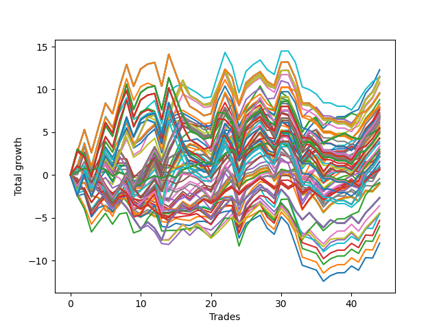

# Long HLT 301 
- Symbol: TSLA
- Date Range: 05/16/2022 - 05/17/2024
- Trading Period: 8:30-12:30
- Number of Trades: 44



| Id. | Name | Win Percent | Profit | Avg Profit / Trade | Avg Time / Trade | Std |      | Name | Win Percent | Profit | Avg Profit / Trade | Avg Time / Trade | Std |
| --- | ---- | ----------- | ------ | ------------------ | ---------------- | --- | ---- | ---- | ----------- | ------ | ------------------ | ---------------- | --- |
| | Sorted By <br> Profit | | | | | | | Sorted By <br> Win Percentage |||||
|0| TP-1.75 45m | 68.18 | 12.30 | 0.28 | 35:00 | 1.25 |     | TP-1.75 45m | 68.18 | 12.30 | 0.28 | 35:00 | 1.25 |
|1| TP-1.75 75m | 56.82 | 11.53 | 0.26 | 49:13 | 1.38 |     | TP-1.25 45m | 68.18 | 9.46 | 0.22 | 27:09 | 1.19 |
|2| TP-1.75 60m | 59.09 | 11.49 | 0.26 | 42:53 | 1.33 |     | TP-1.5 45m | 65.91 | 8.39 | 0.19 | 30:57 | 1.28 |
|3| TP-1.75 180m | 54.55 | 11.46 | 0.26 | 56:28 | 1.50 |     | TP-0.25 180m | 65.91 | 5.42 | 0.12 | 04:00 | 0.48 |
|4| TP-1.75 165m | 54.55 | 11.46 | 0.26 | 56:28 | 1.50 |     | TP-0.25 165m | 65.91 | 5.42 | 0.12 | 04:00 | 0.48 |
|5| TP-1.75 150m | 54.55 | 11.46 | 0.26 | 56:28 | 1.50 |     | TP-0.25 150m | 65.91 | 5.42 | 0.12 | 04:00 | 0.48 |
|6| TP-1.75 135m | 54.55 | 11.46 | 0.26 | 56:28 | 1.50 |     | TP-0.25 135m | 65.91 | 5.42 | 0.12 | 04:00 | 0.48 |
|7| TP-1.75 120m | 54.55 | 11.46 | 0.26 | 56:28 | 1.50 |     | TP-0.25 120m | 65.91 | 5.42 | 0.12 | 04:00 | 0.48 |
|8| TP-2.5 90m | 56.82 | 11.43 | 0.26 | 68:57 | 1.69 |     | TP-0.25 105m | 65.91 | 5.42 | 0.12 | 04:00 | 0.48 |
|9| TP-1.75 105m | 52.27 | 10.91 | 0.25 | 55:23 | 1.49 |     | TP-0.25 90m | 65.91 | 5.42 | 0.12 | 04:00 | 0.48 |
|10| TP-1.75 90m | 54.55 | 10.73 | 0.24 | 53:13 | 1.43 |     | TP-0.25 75m | 65.91 | 5.42 | 0.12 | 04:00 | 0.48 |
|11| TP-2.5 180m | 52.27 | 9.58 | 0.22 | 77:28 | 1.90 |     | TP-0.25 60m | 65.91 | 5.42 | 0.12 | 04:00 | 0.48 |
|12| TP-2.5 165m | 52.27 | 9.58 | 0.22 | 77:28 | 1.90 |     | TP-0.25 45m | 65.91 | 5.42 | 0.12 | 04:00 | 0.48 |
|13| TP-2.5 150m | 52.27 | 9.58 | 0.22 | 77:28 | 1.90 |     | TP-0.25 30m | 65.91 | 5.42 | 0.12 | 04:00 | 0.48 |
|14| TP-2.5 135m | 52.27 | 9.58 | 0.22 | 77:28 | 1.90 |     | TP-0.25 15m | 65.91 | 5.42 | 0.12 | 04:00 | 0.48 |
|15| TP-2.5 120m | 52.27 | 9.58 | 0.22 | 77:28 | 1.90 |     | TP-3 45m | 65.91 | 5.36 | 0.12 | 42:30 | 1.25 |
|16| TP-1.25 45m | 68.18 | 9.46 | 0.22 | 27:09 | 1.19 |     | TP-2.75 45m | 65.91 | 3.67 | 0.08 | 41:50 | 1.32 |
|17| TP-1.25 75m | 56.82 | 8.81 | 0.20 | 34:31 | 1.25 |     | TP-2.5 45m | 65.91 | 2.74 | 0.06 | 41:02 | 1.35 |
|18| TP-1.5 45m | 65.91 | 8.39 | 0.19 | 30:57 | 1.28 |     | TP-2 45m | 65.91 | 2.60 | 0.06 | 38:32 | 1.25 |
|19| TP-2.5 105m | 50.00 | 8.28 | 0.19 | 73:57 | 1.84 |     | TP-2.25 45m | 65.91 | -0.87 | -0.02 | 39:24 | 1.37 |
|20| TP-2.5 75m | 56.82 | 7.97 | 0.18 | 61:50 | 1.59 |     | TP-1 45m | 63.64 | 6.08 | 0.14 | 22:46 | 1.04 |
|21| TP-3 90m | 54.55 | 7.92 | 0.18 | 76:19 | 1.63 |     | TP-1.75 60m | 59.09 | 11.49 | 0.26 | 42:53 | 1.33 |
|22| TP-1.5 75m | 54.55 | 7.81 | 0.18 | 40:35 | 1.36 |     | TP-2.5 60m | 59.09 | 7.27 | 0.17 | 52:08 | 1.48 |
|23| TP-2 60m | 56.82 | 7.62 | 0.17 | 47:53 | 1.40 |     | TP-3 60m | 59.09 | 7.19 | 0.16 | 55:10 | 1.33 |
|24| TP-2.5 60m | 59.09 | 7.27 | 0.17 | 52:08 | 1.48 |     | TP-1.25 60m | 59.09 | 7.00 | 0.16 | 31:19 | 1.21 |
|25| TP-3 60m | 59.09 | 7.19 | 0.16 | 55:10 | 1.33 |     | TP-2.75 60m | 59.09 | 5.09 | 0.12 | 53:50 | 1.37 |
|26| TP-1.25 60m | 59.09 | 7.00 | 0.16 | 31:19 | 1.21 |     | TP-1.75 75m | 56.82 | 11.53 | 0.26 | 49:13 | 1.38 |
|27| TP-1.25 180m | 54.55 | 7.00 | 0.16 | 37:19 | 1.31 |     | TP-2.5 90m | 56.82 | 11.43 | 0.26 | 68:57 | 1.69 |
|28| TP-1.25 165m | 54.55 | 7.00 | 0.16 | 37:19 | 1.31 |     | TP-1.25 75m | 56.82 | 8.81 | 0.20 | 34:31 | 1.25 |
|29| TP-1.25 150m | 54.55 | 7.00 | 0.16 | 37:19 | 1.31 |     | TP-2.5 75m | 56.82 | 7.97 | 0.18 | 61:50 | 1.59 |
|30| TP-1.25 135m | 54.55 | 7.00 | 0.16 | 37:19 | 1.31 |     | TP-2 60m | 56.82 | 7.62 | 0.17 | 47:53 | 1.40 |
|31| TP-1.25 120m | 54.55 | 7.00 | 0.16 | 37:19 | 1.31 |     | TP-2 75m | 56.82 | 6.95 | 0.16 | 55:32 | 1.41 |
|32| TP-2 75m | 56.82 | 6.95 | 0.16 | 55:32 | 1.41 |     | TP-1.5 60m | 56.82 | 5.19 | 0.12 | 36:40 | 1.34 |
|33| TP-1.25 90m | 54.55 | 6.90 | 0.16 | 36:24 | 1.27 |     | TP-3 75m | 56.82 | 4.99 | 0.11 | 66:57 | 1.46 |
|34| TP-1.5 180m | 54.55 | 6.81 | 0.15 | 44:31 | 1.42 |     | TP-2.75 75m | 56.82 | 4.76 | 0.11 | 64:55 | 1.47 |
|35| TP-1.5 165m | 54.55 | 6.81 | 0.15 | 44:31 | 1.42 |     | TP-2.25 60m | 56.82 | 2.81 | 0.06 | 49:40 | 1.49 |
|36| TP-1.5 150m | 54.55 | 6.81 | 0.15 | 44:31 | 1.42 |     | TP-0.5 15m | 56.82 | 2.18 | 0.05 | 07:50 | 0.64 |
|37| TP-1.5 135m | 54.55 | 6.81 | 0.15 | 44:31 | 1.42 |     | TP-1.75 180m | 54.55 | 11.46 | 0.26 | 56:28 | 1.50 |
|38| TP-1.5 120m | 54.55 | 6.81 | 0.15 | 44:31 | 1.42 |     | TP-1.75 165m | 54.55 | 11.46 | 0.26 | 56:28 | 1.50 |
|39| TP-2.75 90m | 54.55 | 6.68 | 0.15 | 73:28 | 1.61 |     | TP-1.75 150m | 54.55 | 11.46 | 0.26 | 56:28 | 1.50 |
|40| TP-2 90m | 54.55 | 6.59 | 0.15 | 60:55 | 1.48 |     | TP-1.75 135m | 54.55 | 11.46 | 0.26 | 56:28 | 1.50 |
|41| TP-1.5 90m | 54.55 | 6.54 | 0.15 | 42:49 | 1.37 |     | TP-1.75 120m | 54.55 | 11.46 | 0.26 | 56:28 | 1.50 |
|42| TP-1.25 105m | 54.55 | 6.45 | 0.15 | 37:17 | 1.30 |     | TP-1.75 90m | 54.55 | 10.73 | 0.24 | 53:13 | 1.43 |
|43| TP-1.5 105m | 54.55 | 6.30 | 0.14 | 44:08 | 1.41 |     | TP-3 90m | 54.55 | 7.92 | 0.18 | 76:19 | 1.63 |
|44| TP-1 45m | 63.64 | 6.08 | 0.14 | 22:46 | 1.04 |     | TP-1.5 75m | 54.55 | 7.81 | 0.18 | 40:35 | 1.36 |
|45| TP-1 75m | 54.55 | 5.79 | 0.13 | 28:06 | 1.11 |     | TP-1.25 180m | 54.55 | 7.00 | 0.16 | 37:19 | 1.31 |
|46| TP-2.25 90m | 54.55 | 5.53 | 0.13 | 64:51 | 1.65 |     | TP-1.25 165m | 54.55 | 7.00 | 0.16 | 37:19 | 1.31 |
|47| TP-3 180m | 47.73 | 5.51 | 0.13 | 87:54 | 1.87 |     | TP-1.25 150m | 54.55 | 7.00 | 0.16 | 37:19 | 1.31 |
|48| TP-3 165m | 47.73 | 5.51 | 0.13 | 87:54 | 1.87 |     | TP-1.25 135m | 54.55 | 7.00 | 0.16 | 37:19 | 1.31 |
|49| TP-3 150m | 47.73 | 5.51 | 0.13 | 87:54 | 1.87 |     | TP-1.25 120m | 54.55 | 7.00 | 0.16 | 37:19 | 1.31 |
|50| TP-3 135m | 47.73 | 5.51 | 0.13 | 87:54 | 1.87 |     | TP-1.25 90m | 54.55 | 6.90 | 0.16 | 36:24 | 1.27 |
|51| TP-3 120m | 47.73 | 5.51 | 0.13 | 87:54 | 1.87 |     | TP-1.5 180m | 54.55 | 6.81 | 0.15 | 44:31 | 1.42 |
|52| TP-0.25 180m | 65.91 | 5.42 | 0.12 | 04:00 | 0.48 |     | TP-1.5 165m | 54.55 | 6.81 | 0.15 | 44:31 | 1.42 |
|53| TP-0.25 165m | 65.91 | 5.42 | 0.12 | 04:00 | 0.48 |     | TP-1.5 150m | 54.55 | 6.81 | 0.15 | 44:31 | 1.42 |
|54| TP-0.25 150m | 65.91 | 5.42 | 0.12 | 04:00 | 0.48 |     | TP-1.5 135m | 54.55 | 6.81 | 0.15 | 44:31 | 1.42 |
|55| TP-0.25 135m | 65.91 | 5.42 | 0.12 | 04:00 | 0.48 |     | TP-1.5 120m | 54.55 | 6.81 | 0.15 | 44:31 | 1.42 |
|56| TP-0.25 120m | 65.91 | 5.42 | 0.12 | 04:00 | 0.48 |     | TP-2.75 90m | 54.55 | 6.68 | 0.15 | 73:28 | 1.61 |
|57| TP-0.25 105m | 65.91 | 5.42 | 0.12 | 04:00 | 0.48 |     | TP-2 90m | 54.55 | 6.59 | 0.15 | 60:55 | 1.48 |
|58| TP-0.25 90m | 65.91 | 5.42 | 0.12 | 04:00 | 0.48 |     | TP-1.5 90m | 54.55 | 6.54 | 0.15 | 42:49 | 1.37 |
|59| TP-0.25 75m | 65.91 | 5.42 | 0.12 | 04:00 | 0.48 |     | TP-1.25 105m | 54.55 | 6.45 | 0.15 | 37:17 | 1.30 |
|60| TP-0.25 60m | 65.91 | 5.42 | 0.12 | 04:00 | 0.48 |     | TP-1.5 105m | 54.55 | 6.30 | 0.14 | 44:08 | 1.41 |
|61| TP-0.25 45m | 65.91 | 5.42 | 0.12 | 04:00 | 0.48 |     | TP-1 75m | 54.55 | 5.79 | 0.13 | 28:06 | 1.11 |
|62| TP-0.25 30m | 65.91 | 5.42 | 0.12 | 04:00 | 0.48 |     | TP-2.25 90m | 54.55 | 5.53 | 0.13 | 64:51 | 1.65 |
|63| TP-0.25 15m | 65.91 | 5.42 | 0.12 | 04:00 | 0.48 |     | TP-1 90m | 54.55 | 4.95 | 0.11 | 29:02 | 1.12 |
|64| TP-3 45m | 65.91 | 5.36 | 0.12 | 42:30 | 1.25 |     | TP-1 180m | 54.55 | 4.30 | 0.10 | 29:20 | 1.13 |
|65| TP-1.5 60m | 56.82 | 5.19 | 0.12 | 36:40 | 1.34 |     | TP-1 165m | 54.55 | 4.30 | 0.10 | 29:20 | 1.13 |
|66| TP-2.75 60m | 59.09 | 5.09 | 0.12 | 53:50 | 1.37 |     | TP-1 150m | 54.55 | 4.30 | 0.10 | 29:20 | 1.13 |
|67| TP-2.75 180m | 47.73 | 5.01 | 0.11 | 83:35 | 1.88 |     | TP-1 135m | 54.55 | 4.30 | 0.10 | 29:20 | 1.13 |
|68| TP-2.75 165m | 47.73 | 5.01 | 0.11 | 83:35 | 1.88 |     | TP-1 120m | 54.55 | 4.30 | 0.10 | 29:20 | 1.13 |
|69| TP-2.75 150m | 47.73 | 5.01 | 0.11 | 83:35 | 1.88 |     | TP-1 105m | 54.55 | 4.30 | 0.10 | 29:20 | 1.13 |
|70| TP-2.75 135m | 47.73 | 5.01 | 0.11 | 83:35 | 1.88 |     | TP-1 60m | 54.55 | 3.91 | 0.09 | 25:50 | 1.05 |
|71| TP-2.75 120m | 47.73 | 5.01 | 0.11 | 83:35 | 1.88 |     | TP-2.25 75m | 54.55 | 3.36 | 0.08 | 58:31 | 1.59 |
|72| TP-3 75m | 56.82 | 4.99 | 0.11 | 66:57 | 1.46 |     | TP-1.75 30m | 54.55 | 2.94 | 0.07 | 25:43 | 1.21 |
|73| TP-1 90m | 54.55 | 4.95 | 0.11 | 29:02 | 1.12 |     | TP-1 15m | 54.55 | 2.58 | 0.06 | 12:02 | 0.85 |
|74| TP-3 105m | 47.73 | 4.95 | 0.11 | 83:19 | 1.77 |     | TP-0.75 15m | 54.55 | 2.20 | 0.05 | 10:46 | 0.77 |
|75| TP-2.75 75m | 56.82 | 4.76 | 0.11 | 64:55 | 1.47 |     | TP-0.5 30m | 54.55 | 0.88 | 0.02 | 09:05 | 0.67 |
|76| TP-1 180m | 54.55 | 4.30 | 0.10 | 29:20 | 1.13 |     | TP-1.75 15m | 54.55 | 0.69 | 0.02 | 13:35 | 0.98 |
|77| TP-1 165m | 54.55 | 4.30 | 0.10 | 29:20 | 1.13 |     | TP-0.5 180m | 54.55 | 0.67 | 0.02 | 09:08 | 0.68 |
|78| TP-1 150m | 54.55 | 4.30 | 0.10 | 29:20 | 1.13 |     | TP-0.5 165m | 54.55 | 0.67 | 0.02 | 09:08 | 0.68 |
|79| TP-1 135m | 54.55 | 4.30 | 0.10 | 29:20 | 1.13 |     | TP-0.5 150m | 54.55 | 0.67 | 0.02 | 09:08 | 0.68 |
|80| TP-1 120m | 54.55 | 4.30 | 0.10 | 29:20 | 1.13 |     | TP-0.5 135m | 54.55 | 0.67 | 0.02 | 09:08 | 0.68 |
|81| TP-1 105m | 54.55 | 4.30 | 0.10 | 29:20 | 1.13 |     | TP-0.5 120m | 54.55 | 0.67 | 0.02 | 09:08 | 0.68 |
|82| TP-1 60m | 54.55 | 3.91 | 0.09 | 25:50 | 1.05 |     | TP-0.5 105m | 54.55 | 0.67 | 0.02 | 09:08 | 0.68 |
|83| TP-2.75 45m | 65.91 | 3.67 | 0.08 | 41:50 | 1.32 |     | TP-0.5 90m | 54.55 | 0.67 | 0.02 | 09:08 | 0.68 |
|84| TP-2.25 75m | 54.55 | 3.36 | 0.08 | 58:31 | 1.59 |     | TP-0.5 75m | 54.55 | 0.67 | 0.02 | 09:08 | 0.68 |
|85| TP-2.75 105m | 47.73 | 3.04 | 0.07 | 79:42 | 1.78 |     | TP-0.5 60m | 54.55 | 0.67 | 0.02 | 09:08 | 0.68 |
|86| TP-1.75 30m | 54.55 | 2.94 | 0.07 | 25:43 | 1.21 |     | TP-0.5 45m | 54.55 | 0.67 | 0.02 | 09:08 | 0.68 |
|87| TP-2.25 60m | 56.82 | 2.81 | 0.06 | 49:40 | 1.49 |     | TP-1.25 15m | 54.55 | 0.59 | 0.01 | 12:55 | 0.97 |
|88| TP-2.5 45m | 65.91 | 2.74 | 0.06 | 41:02 | 1.35 |     | TP-1.5 15m | 54.55 | 0.58 | 0.01 | 13:21 | 0.98 |
|89| TP-2 45m | 65.91 | 2.60 | 0.06 | 38:32 | 1.25 |     | TP-2 15m | 54.55 | -0.41 | -0.01 | 13:46 | 0.91 |
|90| TP-1 15m | 54.55 | 2.58 | 0.06 | 12:02 | 0.85 |     | TP-3 15m | 54.55 | -0.98 | -0.02 | 14:00 | 0.94 |
|91| TP-2.25 180m | 50.00 | 2.51 | 0.06 | 72:02 | 1.82 |     | TP-2.75 15m | 54.55 | -0.98 | -0.02 | 14:00 | 0.94 |
|92| TP-2.25 165m | 50.00 | 2.51 | 0.06 | 72:02 | 1.82 |     | TP-2.5 15m | 54.55 | -0.98 | -0.02 | 14:00 | 0.94 |
|93| TP-2.25 150m | 50.00 | 2.51 | 0.06 | 72:02 | 1.82 |     | TP-2.25 15m | 54.55 | -1.10 | -0.03 | 13:49 | 0.95 |
|94| TP-2.25 135m | 50.00 | 2.51 | 0.06 | 72:02 | 1.82 |     | TP-1.75 105m | 52.27 | 10.91 | 0.25 | 55:23 | 1.49 |
|95| TP-2.25 120m | 50.00 | 2.51 | 0.06 | 72:02 | 1.82 |     | TP-2.5 180m | 52.27 | 9.58 | 0.22 | 77:28 | 1.90 |
|96| TP-0.75 15m | 54.55 | 2.20 | 0.05 | 10:46 | 0.77 |     | TP-2.5 165m | 52.27 | 9.58 | 0.22 | 77:28 | 1.90 |
|97| TP-0.5 15m | 56.82 | 2.18 | 0.05 | 07:50 | 0.64 |     | TP-2.5 150m | 52.27 | 9.58 | 0.22 | 77:28 | 1.90 |
|98| TP-2 180m | 50.00 | 2.13 | 0.05 | 66:24 | 1.66 |     | TP-2.5 135m | 52.27 | 9.58 | 0.22 | 77:28 | 1.90 |
|99| TP-2 165m | 50.00 | 2.13 | 0.05 | 66:24 | 1.66 |     | TP-2.5 120m | 52.27 | 9.58 | 0.22 | 77:28 | 1.90 |
|100| TP-2 150m | 50.00 | 2.13 | 0.05 | 66:24 | 1.66 |     | TP-1.25 30m | 52.27 | 1.63 | 0.04 | 21:13 | 1.13 |
|101| TP-2 135m | 50.00 | 2.13 | 0.05 | 66:24 | 1.66 |     | TP-1.5 30m | 52.27 | 0.74 | 0.02 | 23:36 | 1.20 |
|102| TP-2 120m | 50.00 | 2.13 | 0.05 | 66:24 | 1.66 |     | TP-1 30m | 52.27 | 0.70 | 0.02 | 18:30 | 0.99 |
|103| TP-1.25 30m | 52.27 | 1.63 | 0.04 | 21:13 | 1.13 |     | TP-2 30m | 52.27 | -4.49 | -0.10 | 27:23 | 1.15 |
|104| TP-2.25 105m | 47.73 | 1.52 | 0.03 | 69:09 | 1.81 |     | TP-3 30m | 52.27 | -5.30 | -0.12 | 28:50 | 1.19 |
|105| TP-2 105m | 47.73 | 1.12 | 0.03 | 64:24 | 1.61 |     | TP-2.75 30m | 52.27 | -5.98 | -0.14 | 28:32 | 1.21 |
|106| TP-0.5 30m | 54.55 | 0.88 | 0.02 | 09:05 | 0.67 |     | TP-2.5 30m | 52.27 | -6.99 | -0.16 | 28:30 | 1.25 |
|107| TP-1.5 30m | 52.27 | 0.74 | 0.02 | 23:36 | 1.20 |     | TP-2.25 30m | 52.27 | -7.94 | -0.18 | 27:40 | 1.27 |
|108| TP-1 30m | 52.27 | 0.70 | 0.02 | 18:30 | 0.99 |     | TP-2.5 105m | 50.00 | 8.28 | 0.19 | 73:57 | 1.84 |
|109| TP-1.75 15m | 54.55 | 0.69 | 0.02 | 13:35 | 0.98 |     | TP-2.25 180m | 50.00 | 2.51 | 0.06 | 72:02 | 1.82 |
|110| TP-0.5 180m | 54.55 | 0.67 | 0.02 | 09:08 | 0.68 |     | TP-2.25 165m | 50.00 | 2.51 | 0.06 | 72:02 | 1.82 |
|111| TP-0.5 165m | 54.55 | 0.67 | 0.02 | 09:08 | 0.68 |     | TP-2.25 150m | 50.00 | 2.51 | 0.06 | 72:02 | 1.82 |
|112| TP-0.5 150m | 54.55 | 0.67 | 0.02 | 09:08 | 0.68 |     | TP-2.25 135m | 50.00 | 2.51 | 0.06 | 72:02 | 1.82 |
|113| TP-0.5 135m | 54.55 | 0.67 | 0.02 | 09:08 | 0.68 |     | TP-2.25 120m | 50.00 | 2.51 | 0.06 | 72:02 | 1.82 |
|114| TP-0.5 120m | 54.55 | 0.67 | 0.02 | 09:08 | 0.68 |     | TP-2 180m | 50.00 | 2.13 | 0.05 | 66:24 | 1.66 |
|115| TP-0.5 105m | 54.55 | 0.67 | 0.02 | 09:08 | 0.68 |     | TP-2 165m | 50.00 | 2.13 | 0.05 | 66:24 | 1.66 |
|116| TP-0.5 90m | 54.55 | 0.67 | 0.02 | 09:08 | 0.68 |     | TP-2 150m | 50.00 | 2.13 | 0.05 | 66:24 | 1.66 |
|117| TP-0.5 75m | 54.55 | 0.67 | 0.02 | 09:08 | 0.68 |     | TP-2 135m | 50.00 | 2.13 | 0.05 | 66:24 | 1.66 |
|118| TP-0.5 60m | 54.55 | 0.67 | 0.02 | 09:08 | 0.68 |     | TP-2 120m | 50.00 | 2.13 | 0.05 | 66:24 | 1.66 |
|119| TP-0.5 45m | 54.55 | 0.67 | 0.02 | 09:08 | 0.68 |     | TP-0.75 45m | 50.00 | -3.57 | -0.08 | 16:21 | 0.92 |
|120| TP-1.25 15m | 54.55 | 0.59 | 0.01 | 12:55 | 0.97 |     | TP-3 180m | 47.73 | 5.51 | 0.13 | 87:54 | 1.87 |
|121| TP-1.5 15m | 54.55 | 0.58 | 0.01 | 13:21 | 0.98 |     | TP-3 165m | 47.73 | 5.51 | 0.13 | 87:54 | 1.87 |
|122| TP-2 15m | 54.55 | -0.41 | -0.01 | 13:46 | 0.91 |     | TP-3 150m | 47.73 | 5.51 | 0.13 | 87:54 | 1.87 |
|123| TP-2.25 45m | 65.91 | -0.87 | -0.02 | 39:24 | 1.37 |     | TP-3 135m | 47.73 | 5.51 | 0.13 | 87:54 | 1.87 |
|124| TP-3 15m | 54.55 | -0.98 | -0.02 | 14:00 | 0.94 |     | TP-3 120m | 47.73 | 5.51 | 0.13 | 87:54 | 1.87 |
|125| TP-2.75 15m | 54.55 | -0.98 | -0.02 | 14:00 | 0.94 |     | TP-2.75 180m | 47.73 | 5.01 | 0.11 | 83:35 | 1.88 |
|126| TP-2.5 15m | 54.55 | -0.98 | -0.02 | 14:00 | 0.94 |     | TP-2.75 165m | 47.73 | 5.01 | 0.11 | 83:35 | 1.88 |
|127| TP-2.25 15m | 54.55 | -1.10 | -0.03 | 13:49 | 0.95 |     | TP-2.75 150m | 47.73 | 5.01 | 0.11 | 83:35 | 1.88 |
|128| TP-0.75 180m | 47.73 | -2.65 | -0.06 | 17:36 | 0.98 |     | TP-2.75 135m | 47.73 | 5.01 | 0.11 | 83:35 | 1.88 |
|129| TP-0.75 165m | 47.73 | -2.65 | -0.06 | 17:36 | 0.98 |     | TP-2.75 120m | 47.73 | 5.01 | 0.11 | 83:35 | 1.88 |
|130| TP-0.75 150m | 47.73 | -2.65 | -0.06 | 17:36 | 0.98 |     | TP-3 105m | 47.73 | 4.95 | 0.11 | 83:19 | 1.77 |
|131| TP-0.75 135m | 47.73 | -2.65 | -0.06 | 17:36 | 0.98 |     | TP-2.75 105m | 47.73 | 3.04 | 0.07 | 79:42 | 1.78 |
|132| TP-0.75 120m | 47.73 | -2.65 | -0.06 | 17:36 | 0.98 |     | TP-2.25 105m | 47.73 | 1.52 | 0.03 | 69:09 | 1.81 |
|133| TP-0.75 105m | 47.73 | -2.65 | -0.06 | 17:36 | 0.98 |     | TP-2 105m | 47.73 | 1.12 | 0.03 | 64:24 | 1.61 |
|134| TP-0.75 90m | 47.73 | -2.65 | -0.06 | 17:36 | 0.98 |     | TP-0.75 180m | 47.73 | -2.65 | -0.06 | 17:36 | 0.98 |
|135| TP-0.75 75m | 47.73 | -2.65 | -0.06 | 17:36 | 0.98 |     | TP-0.75 165m | 47.73 | -2.65 | -0.06 | 17:36 | 0.98 |
|136| TP-0.75 45m | 50.00 | -3.57 | -0.08 | 16:21 | 0.92 |     | TP-0.75 150m | 47.73 | -2.65 | -0.06 | 17:36 | 0.98 |
|137| TP-0.75 60m | 47.73 | -4.41 | -0.10 | 17:19 | 0.92 |     | TP-0.75 135m | 47.73 | -2.65 | -0.06 | 17:36 | 0.98 |
|138| TP-2 30m | 52.27 | -4.49 | -0.10 | 27:23 | 1.15 |     | TP-0.75 120m | 47.73 | -2.65 | -0.06 | 17:36 | 0.98 |
|139| TP-0.75 30m | 47.73 | -4.58 | -0.10 | 14:45 | 0.88 |     | TP-0.75 105m | 47.73 | -2.65 | -0.06 | 17:36 | 0.98 |
|140| TP-3 30m | 52.27 | -5.30 | -0.12 | 28:50 | 1.19 |     | TP-0.75 90m | 47.73 | -2.65 | -0.06 | 17:36 | 0.98 |
|141| TP-2.75 30m | 52.27 | -5.98 | -0.14 | 28:32 | 1.21 |     | TP-0.75 75m | 47.73 | -2.65 | -0.06 | 17:36 | 0.98 |
|142| TP-2.5 30m | 52.27 | -6.99 | -0.16 | 28:30 | 1.25 |     | TP-0.75 60m | 47.73 | -4.41 | -0.10 | 17:19 | 0.92 |
|143| TP-2.25 30m | 52.27 | -7.94 | -0.18 | 27:40 | 1.27 |     | TP-0.75 30m | 47.73 | -4.58 | -0.10 | 14:45 | 0.88 |

### Test TP-0.25 15m
* Take Profit of 0.25 Point
* 0.25 Stoploss
* Results:
```
Total Trades: 44
Percent Up: 65.91
Percent Down: 34.09
Total Points Moved Up: 5.42
Potential Profit: 2710.00
Total Points Ups: 12.58 Count Ups: 29
Total Points Downs: -7.16 Count Downs: 15
```

<details><summary>Trades</summary>

<code>In: 2022-06-23 10:15:00		Out: 2022-06-23 10:18:00		Total Position Time: 03:00		Total Move Up: 0.38		Total to Date: 0.38</code> <br />
<code>In: 2022-08-01 11:05:00		Out: 2022-08-01 11:07:00		Total Position Time: 02:00		Total Move Up: 0.43		Total to Date: 0.81</code> <br />
<code>In: 2022-08-08 12:05:00		Out: 2022-08-08 12:07:00		Total Position Time: 02:00		Total Move Up: -0.30		Total to Date: 0.51</code> <br />
<code>In: 2022-08-09 09:35:00		Out: 2022-08-09 09:38:00		Total Position Time: 03:00		Total Move Up: 0.40		Total to Date: 0.91</code> <br />
<code>In: 2022-08-09 09:40:00		Out: 2022-08-09 09:43:00		Total Position Time: 03:00		Total Move Up: -0.27		Total to Date: 0.64</code> <br />
<code>In: 2022-08-11 12:05:00		Out: 2022-08-11 12:07:00		Total Position Time: 02:00		Total Move Up: -0.74		Total to Date: -0.10</code> <br />
<code>In: 2022-08-30 10:35:00		Out: 2022-08-30 10:39:00		Total Position Time: 04:00		Total Move Up: 0.42		Total to Date: 0.32</code> <br />
<code>In: 2022-08-30 10:40:00		Out: 2022-08-30 10:43:00		Total Position Time: 03:00		Total Move Up: -0.36		Total to Date: -0.04</code> <br />
<code>In: 2022-09-02 10:20:00		Out: 2022-09-02 10:22:00		Total Position Time: 02:00		Total Move Up: -1.28		Total to Date: -1.32</code> <br />
<code>In: 2022-09-13 08:35:00		Out: 2022-09-13 08:39:00		Total Position Time: 04:00		Total Move Up: 0.33		Total to Date: -0.99</code> <br />
<code>In: 2022-10-07 09:45:00		Out: 2022-10-07 09:52:00		Total Position Time: 07:00		Total Move Up: 0.52		Total to Date: -0.47</code> <br />
<code>In: 2022-10-07 09:50:00		Out: 2022-10-07 09:52:00		Total Position Time: 02:00		Total Move Up: 0.38		Total to Date: -0.09</code> <br />
<code>In: 2022-10-11 11:30:00		Out: 2022-10-11 11:34:00		Total Position Time: 04:00		Total Move Up: -0.29		Total to Date: -0.38</code> <br />
<code>In: 2022-11-02 09:55:00		Out: 2022-11-02 09:59:00		Total Position Time: 04:00		Total Move Up: 0.39		Total to Date: 0.01</code> <br />
<code>In: 2022-11-09 11:05:00		Out: 2022-11-09 11:07:00		Total Position Time: 02:00		Total Move Up: -0.32		Total to Date: -0.31</code> <br />
<code>In: 2022-11-09 11:10:00		Out: 2022-11-09 11:19:00		Total Position Time: 09:00		Total Move Up: 0.93		Total to Date: 0.62</code> <br />
<code>In: 2022-11-21 09:40:00		Out: 2022-11-21 09:44:00		Total Position Time: 04:00		Total Move Up: 0.32		Total to Date: 0.94</code> <br />
<code>In: 2022-11-28 11:25:00		Out: 2022-11-28 11:27:00		Total Position Time: 02:00		Total Move Up: 0.27		Total to Date: 1.21</code> <br />
<code>In: 2022-11-28 11:30:00		Out: 2022-11-28 11:34:00		Total Position Time: 04:00		Total Move Up: 0.31		Total to Date: 1.52</code> <br />
<code>In: 2022-11-29 11:05:00		Out: 2022-11-29 11:07:00		Total Position Time: 02:00		Total Move Up: -0.29		Total to Date: 1.23</code> <br />
<code>In: 2023-01-03 10:25:00		Out: 2023-01-03 10:27:00		Total Position Time: 02:00		Total Move Up: 0.41		Total to Date: 1.64</code> <br />
<code>In: 2023-03-10 11:00:00		Out: 2023-03-10 11:02:00		Total Position Time: 02:00		Total Move Up: 0.84		Total to Date: 2.48</code> <br />
<code>In: 2023-05-23 10:00:00		Out: 2023-05-23 10:08:00		Total Position Time: 08:00		Total Move Up: 0.51		Total to Date: 2.99</code> <br />
<code>In: 2023-06-26 08:35:00		Out: 2023-06-26 08:42:00		Total Position Time: 07:00		Total Move Up: -0.84		Total to Date: 2.15</code> <br />
<code>In: 2023-08-07 08:45:00		Out: 2023-08-07 08:48:00		Total Position Time: 03:00		Total Move Up: 0.80		Total to Date: 2.95</code> <br />
<code>In: 2023-09-15 11:40:00		Out: 2023-09-15 11:45:00		Total Position Time: 05:00		Total Move Up: 0.23		Total to Date: 3.18</code> <br />
<code>In: 2023-09-15 11:45:00		Out: 2023-09-15 11:48:00		Total Position Time: 03:00		Total Move Up: 0.28		Total to Date: 3.46</code> <br />
<code>In: 2023-09-22 11:30:00		Out: 2023-09-22 11:37:00		Total Position Time: 07:00		Total Move Up: 0.26		Total to Date: 3.72</code> <br />
<code>In: 2023-09-26 11:00:00		Out: 2023-09-26 11:02:00		Total Position Time: 02:00		Total Move Up: -0.58		Total to Date: 3.14</code> <br />
<code>In: 2023-09-29 11:15:00		Out: 2023-09-29 11:21:00		Total Position Time: 06:00		Total Move Up: 0.57		Total to Date: 3.71</code> <br />
<code>In: 2023-10-12 11:30:00		Out: 2023-10-12 11:41:00		Total Position Time: 11:00		Total Move Up: -0.32		Total to Date: 3.39</code> <br />
<code>In: 2023-11-09 09:45:00		Out: 2023-11-09 09:49:00		Total Position Time: 04:00		Total Move Up: 0.50		Total to Date: 3.89</code> <br />
<code>In: 2023-11-09 09:50:00		Out: 2023-11-09 09:56:00		Total Position Time: 06:00		Total Move Up: -0.42		Total to Date: 3.47</code> <br />
<code>In: 2023-12-05 11:15:00		Out: 2023-12-05 11:17:00		Total Position Time: 02:00		Total Move Up: 0.46		Total to Date: 3.93</code> <br />
<code>In: 2023-12-05 11:20:00		Out: 2023-12-05 11:22:00		Total Position Time: 02:00		Total Move Up: -0.46		Total to Date: 3.47</code> <br />
<code>In: 2023-12-20 12:20:00		Out: 2023-12-20 12:23:00		Total Position Time: 03:00		Total Move Up: 0.34		Total to Date: 3.81</code> <br />
<code>In: 2023-12-22 11:40:00		Out: 2023-12-22 11:43:00		Total Position Time: 03:00		Total Move Up: 0.37		Total to Date: 4.18</code> <br />
<code>In: 2023-12-22 11:45:00		Out: 2023-12-22 11:53:00		Total Position Time: 08:00		Total Move Up: 0.36		Total to Date: 4.54</code> <br />
<code>In: 2023-12-28 12:25:00		Out: 2023-12-28 12:32:00		Total Position Time: 07:00		Total Move Up: 0.35		Total to Date: 4.89</code> <br />
<code>In: 2024-01-04 11:40:00		Out: 2024-01-04 11:46:00		Total Position Time: 06:00		Total Move Up: -0.47		Total to Date: 4.42</code> <br />
<code>In: 2024-02-20 09:35:00		Out: 2024-02-20 09:37:00		Total Position Time: 02:00		Total Move Up: -0.22		Total to Date: 4.20</code> <br />
<code>In: 2024-02-27 10:45:00		Out: 2024-02-27 10:49:00		Total Position Time: 04:00		Total Move Up: 0.30		Total to Date: 4.50</code> <br />
<code>In: 2024-04-26 12:05:00		Out: 2024-04-26 12:07:00		Total Position Time: 02:00		Total Move Up: 0.42		Total to Date: 4.92</code> <br />
<code>In: 2024-04-30 09:00:00		Out: 2024-04-30 09:03:00		Total Position Time: 03:00		Total Move Up: 0.50		Total to Date: 5.42</code> <br />


</details>

### Test TP-0.5 15m
* Take Profit of 0.5 Point
* 0.5 Stoploss
* Results:
```
Total Trades: 44
Percent Up: 56.82
Percent Down: 43.18
Total Points Moved Up: 2.18
Potential Profit: 1090.00
Total Points Ups: 14.47 Count Ups: 25
Total Points Downs: -12.29 Count Downs: 19
```

<details><summary>Trades</summary>

<code>In: 2022-06-23 10:15:00		Out: 2022-06-23 10:25:00		Total Position Time: 10:00		Total Move Up: -0.75		Total to Date: -0.75</code> <br />
<code>In: 2022-08-01 11:05:00		Out: 2022-08-01 11:07:00		Total Position Time: 02:00		Total Move Up: 0.43		Total to Date: -0.32</code> <br />
<code>In: 2022-08-08 12:05:00		Out: 2022-08-08 12:08:00		Total Position Time: 03:00		Total Move Up: -0.97		Total to Date: -1.29</code> <br />
<code>In: 2022-08-09 09:35:00		Out: 2022-08-09 09:40:00		Total Position Time: 05:00		Total Move Up: 0.52		Total to Date: -0.77</code> <br />
<code>In: 2022-08-09 09:40:00		Out: 2022-08-09 09:46:00		Total Position Time: 06:00		Total Move Up: -0.63		Total to Date: -1.40</code> <br />
<code>In: 2022-08-11 12:05:00		Out: 2022-08-11 12:07:00		Total Position Time: 02:00		Total Move Up: -0.74		Total to Date: -2.14</code> <br />
<code>In: 2022-08-30 10:35:00		Out: 2022-08-30 10:48:00		Total Position Time: 13:00		Total Move Up: 0.61		Total to Date: -1.53</code> <br />
<code>In: 2022-08-30 10:40:00		Out: 2022-08-30 10:44:00		Total Position Time: 04:00		Total Move Up: -0.59		Total to Date: -2.12</code> <br />
<code>In: 2022-09-02 10:20:00		Out: 2022-09-02 10:22:00		Total Position Time: 02:00		Total Move Up: -1.28		Total to Date: -3.40</code> <br />
<code>In: 2022-09-13 08:35:00		Out: 2022-09-13 08:46:00		Total Position Time: 11:00		Total Move Up: -0.56		Total to Date: -3.96</code> <br />
<code>In: 2022-10-07 09:45:00		Out: 2022-10-07 09:52:00		Total Position Time: 07:00		Total Move Up: 0.52		Total to Date: -3.44</code> <br />
<code>In: 2022-10-07 09:50:00		Out: 2022-10-07 10:04:00		Total Position Time: 14:00		Total Move Up: -0.45		Total to Date: -3.89</code> <br />
<code>In: 2022-10-11 11:30:00		Out: 2022-10-11 11:40:00		Total Position Time: 10:00		Total Move Up: -0.55		Total to Date: -4.44</code> <br />
<code>In: 2022-11-02 09:55:00		Out: 2022-11-02 10:09:00		Total Position Time: 14:00		Total Move Up: -0.46		Total to Date: -4.90</code> <br />
<code>In: 2022-11-09 11:05:00		Out: 2022-11-09 11:19:00		Total Position Time: 14:00		Total Move Up: 0.89		Total to Date: -4.01</code> <br />
<code>In: 2022-11-09 11:10:00		Out: 2022-11-09 11:19:00		Total Position Time: 09:00		Total Move Up: 0.93		Total to Date: -3.08</code> <br />
<code>In: 2022-11-21 09:40:00		Out: 2022-11-21 09:51:00		Total Position Time: 11:00		Total Move Up: -0.52		Total to Date: -3.60</code> <br />
<code>In: 2022-11-28 11:25:00		Out: 2022-11-28 11:36:00		Total Position Time: 11:00		Total Move Up: 0.56		Total to Date: -3.04</code> <br />
<code>In: 2022-11-28 11:30:00		Out: 2022-11-28 11:39:00		Total Position Time: 09:00		Total Move Up: 0.69		Total to Date: -2.35</code> <br />
<code>In: 2022-11-29 11:05:00		Out: 2022-11-29 11:19:00		Total Position Time: 14:00		Total Move Up: -0.22		Total to Date: -2.57</code> <br />
<code>In: 2023-01-03 10:25:00		Out: 2023-01-03 10:28:00		Total Position Time: 03:00		Total Move Up: 0.51		Total to Date: -2.06</code> <br />
<code>In: 2023-03-10 11:00:00		Out: 2023-03-10 11:02:00		Total Position Time: 02:00		Total Move Up: 0.84		Total to Date: -1.22</code> <br />
<code>In: 2023-05-23 10:00:00		Out: 2023-05-23 10:08:00		Total Position Time: 08:00		Total Move Up: 0.51		Total to Date: -0.71</code> <br />
<code>In: 2023-06-26 08:35:00		Out: 2023-06-26 08:42:00		Total Position Time: 07:00		Total Move Up: -0.84		Total to Date: -1.55</code> <br />
<code>In: 2023-08-07 08:45:00		Out: 2023-08-07 08:48:00		Total Position Time: 03:00		Total Move Up: 0.80		Total to Date: -0.75</code> <br />
<code>In: 2023-09-15 11:40:00		Out: 2023-09-15 11:48:00		Total Position Time: 08:00		Total Move Up: 0.51		Total to Date: -0.24</code> <br />
<code>In: 2023-09-15 11:45:00		Out: 2023-09-15 11:59:00		Total Position Time: 14:00		Total Move Up: 0.59		Total to Date: 0.35</code> <br />
<code>In: 2023-09-22 11:30:00		Out: 2023-09-22 11:44:00		Total Position Time: 14:00		Total Move Up: 0.21		Total to Date: 0.56</code> <br />
<code>In: 2023-09-26 11:00:00		Out: 2023-09-26 11:02:00		Total Position Time: 02:00		Total Move Up: -0.58		Total to Date: -0.02</code> <br />
<code>In: 2023-09-29 11:15:00		Out: 2023-09-29 11:21:00		Total Position Time: 06:00		Total Move Up: 0.57		Total to Date: 0.55</code> <br />
<code>In: 2023-10-12 11:30:00		Out: 2023-10-12 11:44:00		Total Position Time: 14:00		Total Move Up: -0.20		Total to Date: 0.35</code> <br />
<code>In: 2023-11-09 09:45:00		Out: 2023-11-09 09:49:00		Total Position Time: 04:00		Total Move Up: 0.50		Total to Date: 0.85</code> <br />
<code>In: 2023-11-09 09:50:00		Out: 2023-11-09 10:02:00		Total Position Time: 12:00		Total Move Up: -1.07		Total to Date: -0.22</code> <br />
<code>In: 2023-12-05 11:15:00		Out: 2023-12-05 11:18:00		Total Position Time: 03:00		Total Move Up: 0.56		Total to Date: 0.34</code> <br />
<code>In: 2023-12-05 11:20:00		Out: 2023-12-05 11:26:00		Total Position Time: 06:00		Total Move Up: -0.56		Total to Date: -0.22</code> <br />
<code>In: 2023-12-20 12:20:00		Out: 2023-12-20 12:25:00		Total Position Time: 05:00		Total Move Up: -0.70		Total to Date: -0.92</code> <br />
<code>In: 2023-12-22 11:40:00		Out: 2023-12-22 11:48:00		Total Position Time: 08:00		Total Move Up: 0.50		Total to Date: -0.42</code> <br />
<code>In: 2023-12-22 11:45:00		Out: 2023-12-22 11:54:00		Total Position Time: 09:00		Total Move Up: 0.51		Total to Date: 0.09</code> <br />
<code>In: 2023-12-28 12:25:00		Out: 2023-12-28 12:33:00		Total Position Time: 08:00		Total Move Up: 0.63		Total to Date: 0.72</code> <br />
<code>In: 2024-01-04 11:40:00		Out: 2024-01-04 11:54:00		Total Position Time: 14:00		Total Move Up: 0.13		Total to Date: 0.85</code> <br />
<code>In: 2024-02-20 09:35:00		Out: 2024-02-20 09:38:00		Total Position Time: 03:00		Total Move Up: -0.62		Total to Date: 0.23</code> <br />
<code>In: 2024-02-27 10:45:00		Out: 2024-02-27 10:58:00		Total Position Time: 13:00		Total Move Up: 0.59		Total to Date: 0.82</code> <br />
<code>In: 2024-04-26 12:05:00		Out: 2024-04-26 12:10:00		Total Position Time: 05:00		Total Move Up: 0.86		Total to Date: 1.68</code> <br />
<code>In: 2024-04-30 09:00:00		Out: 2024-04-30 09:03:00		Total Position Time: 03:00		Total Move Up: 0.50		Total to Date: 2.18</code> <br />


</details>

### Test TP-0.75 15m
* Take Profit of 0.75 Point
* 0.75 Stoploss
* Results:
```
Total Trades: 44
Percent Up: 54.55
Percent Down: 45.45
Total Points Moved Up: 2.20
Potential Profit: 1100.00
Total Points Ups: 16.52 Count Ups: 24
Total Points Downs: -14.32 Count Downs: 20
```

<details><summary>Trades</summary>

<code>In: 2022-06-23 10:15:00		Out: 2022-06-23 10:27:00		Total Position Time: 12:00		Total Move Up: -1.08		Total to Date: -1.08</code> <br />
<code>In: 2022-08-01 11:05:00		Out: 2022-08-01 11:15:00		Total Position Time: 10:00		Total Move Up: 1.13		Total to Date: 0.05</code> <br />
<code>In: 2022-08-08 12:05:00		Out: 2022-08-08 12:08:00		Total Position Time: 03:00		Total Move Up: -0.97		Total to Date: -0.92</code> <br />
<code>In: 2022-08-09 09:35:00		Out: 2022-08-09 09:49:00		Total Position Time: 14:00		Total Move Up: -0.24		Total to Date: -1.16</code> <br />
<code>In: 2022-08-09 09:40:00		Out: 2022-08-09 09:49:00		Total Position Time: 09:00		Total Move Up: -0.76		Total to Date: -1.92</code> <br />
<code>In: 2022-08-11 12:05:00		Out: 2022-08-11 12:13:00		Total Position Time: 08:00		Total Move Up: -1.20		Total to Date: -3.12</code> <br />
<code>In: 2022-08-30 10:35:00		Out: 2022-08-30 10:49:00		Total Position Time: 14:00		Total Move Up: 0.96		Total to Date: -2.16</code> <br />
<code>In: 2022-08-30 10:40:00		Out: 2022-08-30 10:45:00		Total Position Time: 05:00		Total Move Up: -0.90		Total to Date: -3.06</code> <br />
<code>In: 2022-09-02 10:20:00		Out: 2022-09-02 10:22:00		Total Position Time: 02:00		Total Move Up: -1.28		Total to Date: -4.34</code> <br />
<code>In: 2022-09-13 08:35:00		Out: 2022-09-13 08:49:00		Total Position Time: 14:00		Total Move Up: -0.54		Total to Date: -4.88</code> <br />
<code>In: 2022-10-07 09:45:00		Out: 2022-10-07 09:59:00		Total Position Time: 14:00		Total Move Up: 0.52		Total to Date: -4.36</code> <br />
<code>In: 2022-10-07 09:50:00		Out: 2022-10-07 10:04:00		Total Position Time: 14:00		Total Move Up: -0.45		Total to Date: -4.81</code> <br />
<code>In: 2022-10-11 11:30:00		Out: 2022-10-11 11:44:00		Total Position Time: 14:00		Total Move Up: -0.03		Total to Date: -4.84</code> <br />
<code>In: 2022-11-02 09:55:00		Out: 2022-11-02 10:09:00		Total Position Time: 14:00		Total Move Up: -0.46		Total to Date: -5.30</code> <br />
<code>In: 2022-11-09 11:05:00		Out: 2022-11-09 11:19:00		Total Position Time: 14:00		Total Move Up: 0.89		Total to Date: -4.41</code> <br />
<code>In: 2022-11-09 11:10:00		Out: 2022-11-09 11:19:00		Total Position Time: 09:00		Total Move Up: 0.93		Total to Date: -3.48</code> <br />
<code>In: 2022-11-21 09:40:00		Out: 2022-11-21 09:53:00		Total Position Time: 13:00		Total Move Up: -0.75		Total to Date: -4.23</code> <br />
<code>In: 2022-11-28 11:25:00		Out: 2022-11-28 11:39:00		Total Position Time: 14:00		Total Move Up: 0.83		Total to Date: -3.40</code> <br />
<code>In: 2022-11-28 11:30:00		Out: 2022-11-28 11:44:00		Total Position Time: 14:00		Total Move Up: 0.53		Total to Date: -2.87</code> <br />
<code>In: 2022-11-29 11:05:00		Out: 2022-11-29 11:19:00		Total Position Time: 14:00		Total Move Up: -0.22		Total to Date: -3.09</code> <br />
<code>In: 2023-01-03 10:25:00		Out: 2023-01-03 10:36:00		Total Position Time: 11:00		Total Move Up: 0.75		Total to Date: -2.34</code> <br />
<code>In: 2023-03-10 11:00:00		Out: 2023-03-10 11:02:00		Total Position Time: 02:00		Total Move Up: 0.84		Total to Date: -1.50</code> <br />
<code>In: 2023-05-23 10:00:00		Out: 2023-05-23 10:13:00		Total Position Time: 13:00		Total Move Up: 0.92		Total to Date: -0.58</code> <br />
<code>In: 2023-06-26 08:35:00		Out: 2023-06-26 08:42:00		Total Position Time: 07:00		Total Move Up: -0.84		Total to Date: -1.42</code> <br />
<code>In: 2023-08-07 08:45:00		Out: 2023-08-07 08:48:00		Total Position Time: 03:00		Total Move Up: 0.80		Total to Date: -0.62</code> <br />
<code>In: 2023-09-15 11:40:00		Out: 2023-09-15 11:54:00		Total Position Time: 14:00		Total Move Up: 0.23		Total to Date: -0.39</code> <br />
<code>In: 2023-09-15 11:45:00		Out: 2023-09-15 11:59:00		Total Position Time: 14:00		Total Move Up: 0.59		Total to Date: 0.20</code> <br />
<code>In: 2023-09-22 11:30:00		Out: 2023-09-22 11:44:00		Total Position Time: 14:00		Total Move Up: 0.21		Total to Date: 0.41</code> <br />
<code>In: 2023-09-26 11:00:00		Out: 2023-09-26 11:04:00		Total Position Time: 04:00		Total Move Up: -0.80		Total to Date: -0.39</code> <br />
<code>In: 2023-09-29 11:15:00		Out: 2023-09-29 11:24:00		Total Position Time: 09:00		Total Move Up: 1.07		Total to Date: 0.68</code> <br />
<code>In: 2023-10-12 11:30:00		Out: 2023-10-12 11:44:00		Total Position Time: 14:00		Total Move Up: -0.20		Total to Date: 0.48</code> <br />
<code>In: 2023-11-09 09:45:00		Out: 2023-11-09 09:59:00		Total Position Time: 14:00		Total Move Up: 0.18		Total to Date: 0.66</code> <br />
<code>In: 2023-11-09 09:50:00		Out: 2023-11-09 10:02:00		Total Position Time: 12:00		Total Move Up: -1.07		Total to Date: -0.41</code> <br />
<code>In: 2023-12-05 11:15:00		Out: 2023-12-05 11:29:00		Total Position Time: 14:00		Total Move Up: 0.32		Total to Date: -0.09</code> <br />
<code>In: 2023-12-05 11:20:00		Out: 2023-12-05 11:33:00		Total Position Time: 13:00		Total Move Up: -0.95		Total to Date: -1.04</code> <br />
<code>In: 2023-12-20 12:20:00		Out: 2023-12-20 12:27:00		Total Position Time: 07:00		Total Move Up: -0.77		Total to Date: -1.81</code> <br />
<code>In: 2023-12-22 11:40:00		Out: 2023-12-22 11:54:00		Total Position Time: 14:00		Total Move Up: 0.88		Total to Date: -0.93</code> <br />
<code>In: 2023-12-22 11:45:00		Out: 2023-12-22 11:59:00		Total Position Time: 14:00		Total Move Up: 0.52		Total to Date: -0.41</code> <br />
<code>In: 2023-12-28 12:25:00		Out: 2023-12-28 12:39:00		Total Position Time: 14:00		Total Move Up: 0.30		Total to Date: -0.11</code> <br />
<code>In: 2024-01-04 11:40:00		Out: 2024-01-04 11:54:00		Total Position Time: 14:00		Total Move Up: 0.13		Total to Date: 0.02</code> <br />
<code>In: 2024-02-20 09:35:00		Out: 2024-02-20 09:39:00		Total Position Time: 04:00		Total Move Up: -0.81		Total to Date: -0.79</code> <br />
<code>In: 2024-02-27 10:45:00		Out: 2024-02-27 10:59:00		Total Position Time: 14:00		Total Move Up: 1.22		Total to Date: 0.43</code> <br />
<code>In: 2024-04-26 12:05:00		Out: 2024-04-26 12:10:00		Total Position Time: 05:00		Total Move Up: 0.86		Total to Date: 1.29</code> <br />
<code>In: 2024-04-30 09:00:00		Out: 2024-04-30 09:05:00		Total Position Time: 05:00		Total Move Up: 0.91		Total to Date: 2.20</code> <br />


</details>

### Test TP-1 15m
* Take Profit of 1 Point
* 1 Stoploss
* Results:
```
Total Trades: 44
Percent Up: 54.55
Percent Down: 45.45
Total Points Moved Up: 2.58
Potential Profit: 1290.00
Total Points Ups: 17.68 Count Ups: 24
Total Points Downs: -15.10 Count Downs: 20
```

<details><summary>Trades</summary>

<code>In: 2022-06-23 10:15:00		Out: 2022-06-23 10:28:00		Total Position Time: 13:00		Total Move Up: -1.00		Total to Date: -1.00</code> <br />
<code>In: 2022-08-01 11:05:00		Out: 2022-08-01 11:15:00		Total Position Time: 10:00		Total Move Up: 1.13		Total to Date: 0.13</code> <br />
<code>In: 2022-08-08 12:05:00		Out: 2022-08-08 12:11:00		Total Position Time: 06:00		Total Move Up: -1.01		Total to Date: -0.88</code> <br />
<code>In: 2022-08-09 09:35:00		Out: 2022-08-09 09:49:00		Total Position Time: 14:00		Total Move Up: -0.24		Total to Date: -1.12</code> <br />
<code>In: 2022-08-09 09:40:00		Out: 2022-08-09 09:53:00		Total Position Time: 13:00		Total Move Up: -1.49		Total to Date: -2.61</code> <br />
<code>In: 2022-08-11 12:05:00		Out: 2022-08-11 12:13:00		Total Position Time: 08:00		Total Move Up: -1.20		Total to Date: -3.81</code> <br />
<code>In: 2022-08-30 10:35:00		Out: 2022-08-30 10:49:00		Total Position Time: 14:00		Total Move Up: 0.96		Total to Date: -2.85</code> <br />
<code>In: 2022-08-30 10:40:00		Out: 2022-08-30 10:53:00		Total Position Time: 13:00		Total Move Up: 1.11		Total to Date: -1.74</code> <br />
<code>In: 2022-09-02 10:20:00		Out: 2022-09-02 10:22:00		Total Position Time: 02:00		Total Move Up: -1.28		Total to Date: -3.02</code> <br />
<code>In: 2022-09-13 08:35:00		Out: 2022-09-13 08:49:00		Total Position Time: 14:00		Total Move Up: -0.54		Total to Date: -3.56</code> <br />
<code>In: 2022-10-07 09:45:00		Out: 2022-10-07 09:59:00		Total Position Time: 14:00		Total Move Up: 0.52		Total to Date: -3.04</code> <br />
<code>In: 2022-10-07 09:50:00		Out: 2022-10-07 10:04:00		Total Position Time: 14:00		Total Move Up: -0.45		Total to Date: -3.49</code> <br />
<code>In: 2022-10-11 11:30:00		Out: 2022-10-11 11:44:00		Total Position Time: 14:00		Total Move Up: -0.03		Total to Date: -3.52</code> <br />
<code>In: 2022-11-02 09:55:00		Out: 2022-11-02 10:09:00		Total Position Time: 14:00		Total Move Up: -0.46		Total to Date: -3.98</code> <br />
<code>In: 2022-11-09 11:05:00		Out: 2022-11-09 11:19:00		Total Position Time: 14:00		Total Move Up: 0.89		Total to Date: -3.09</code> <br />
<code>In: 2022-11-09 11:10:00		Out: 2022-11-09 11:24:00		Total Position Time: 14:00		Total Move Up: 0.88		Total to Date: -2.21</code> <br />
<code>In: 2022-11-21 09:40:00		Out: 2022-11-21 09:54:00		Total Position Time: 14:00		Total Move Up: -0.61		Total to Date: -2.82</code> <br />
<code>In: 2022-11-28 11:25:00		Out: 2022-11-28 11:39:00		Total Position Time: 14:00		Total Move Up: 0.83		Total to Date: -1.99</code> <br />
<code>In: 2022-11-28 11:30:00		Out: 2022-11-28 11:44:00		Total Position Time: 14:00		Total Move Up: 0.53		Total to Date: -1.46</code> <br />
<code>In: 2022-11-29 11:05:00		Out: 2022-11-29 11:19:00		Total Position Time: 14:00		Total Move Up: -0.22		Total to Date: -1.68</code> <br />
<code>In: 2023-01-03 10:25:00		Out: 2023-01-03 10:37:00		Total Position Time: 12:00		Total Move Up: 1.05		Total to Date: -0.63</code> <br />
<code>In: 2023-03-10 11:00:00		Out: 2023-03-10 11:04:00		Total Position Time: 04:00		Total Move Up: 1.02		Total to Date: 0.39</code> <br />
<code>In: 2023-05-23 10:00:00		Out: 2023-05-23 10:14:00		Total Position Time: 14:00		Total Move Up: 1.02		Total to Date: 1.41</code> <br />
<code>In: 2023-06-26 08:35:00		Out: 2023-06-26 08:43:00		Total Position Time: 08:00		Total Move Up: -1.09		Total to Date: 0.32</code> <br />
<code>In: 2023-08-07 08:45:00		Out: 2023-08-07 08:50:00		Total Position Time: 05:00		Total Move Up: 1.01		Total to Date: 1.33</code> <br />
<code>In: 2023-09-15 11:40:00		Out: 2023-09-15 11:54:00		Total Position Time: 14:00		Total Move Up: 0.23		Total to Date: 1.56</code> <br />
<code>In: 2023-09-15 11:45:00		Out: 2023-09-15 11:59:00		Total Position Time: 14:00		Total Move Up: 0.59		Total to Date: 2.15</code> <br />
<code>In: 2023-09-22 11:30:00		Out: 2023-09-22 11:44:00		Total Position Time: 14:00		Total Move Up: 0.21		Total to Date: 2.36</code> <br />
<code>In: 2023-09-26 11:00:00		Out: 2023-09-26 11:08:00		Total Position Time: 08:00		Total Move Up: -1.06		Total to Date: 1.30</code> <br />
<code>In: 2023-09-29 11:15:00		Out: 2023-09-29 11:24:00		Total Position Time: 09:00		Total Move Up: 1.07		Total to Date: 2.37</code> <br />
<code>In: 2023-10-12 11:30:00		Out: 2023-10-12 11:44:00		Total Position Time: 14:00		Total Move Up: -0.20		Total to Date: 2.17</code> <br />
<code>In: 2023-11-09 09:45:00		Out: 2023-11-09 09:59:00		Total Position Time: 14:00		Total Move Up: 0.18		Total to Date: 2.35</code> <br />
<code>In: 2023-11-09 09:50:00		Out: 2023-11-09 10:02:00		Total Position Time: 12:00		Total Move Up: -1.07		Total to Date: 1.28</code> <br />
<code>In: 2023-12-05 11:15:00		Out: 2023-12-05 11:29:00		Total Position Time: 14:00		Total Move Up: 0.32		Total to Date: 1.60</code> <br />
<code>In: 2023-12-05 11:20:00		Out: 2023-12-05 11:34:00		Total Position Time: 14:00		Total Move Up: -1.02		Total to Date: 0.58</code> <br />
<code>In: 2023-12-20 12:20:00		Out: 2023-12-20 12:29:00		Total Position Time: 09:00		Total Move Up: -1.53		Total to Date: -0.95</code> <br />
<code>In: 2023-12-22 11:40:00		Out: 2023-12-22 11:54:00		Total Position Time: 14:00		Total Move Up: 0.88		Total to Date: -0.07</code> <br />
<code>In: 2023-12-22 11:45:00		Out: 2023-12-22 11:59:00		Total Position Time: 14:00		Total Move Up: 0.52		Total to Date: 0.45</code> <br />
<code>In: 2023-12-28 12:25:00		Out: 2023-12-28 12:39:00		Total Position Time: 14:00		Total Move Up: 0.30		Total to Date: 0.75</code> <br />
<code>In: 2024-01-04 11:40:00		Out: 2024-01-04 11:54:00		Total Position Time: 14:00		Total Move Up: 0.13		Total to Date: 0.88</code> <br />
<code>In: 2024-02-20 09:35:00		Out: 2024-02-20 09:49:00		Total Position Time: 14:00		Total Move Up: -0.53		Total to Date: 0.35</code> <br />
<code>In: 2024-02-27 10:45:00		Out: 2024-02-27 10:59:00		Total Position Time: 14:00		Total Move Up: 1.22		Total to Date: 1.57</code> <br />
<code>In: 2024-04-26 12:05:00		Out: 2024-04-26 12:19:00		Total Position Time: 14:00		Total Move Up: -0.07		Total to Date: 1.50</code> <br />
<code>In: 2024-04-30 09:00:00		Out: 2024-04-30 09:06:00		Total Position Time: 06:00		Total Move Up: 1.08		Total to Date: 2.58</code> <br />


</details>

### Test TP-1.25 15m
* Take Profit of 1.25 Point
* 1.25 Stoploss
* Results:
```
Total Trades: 44
Percent Up: 54.55
Percent Down: 45.45
Total Points Moved Up: 0.59
Potential Profit: 295.00
Total Points Ups: 18.44 Count Ups: 24
Total Points Downs: -17.85 Count Downs: 20
```

<details><summary>Trades</summary>

<code>In: 2022-06-23 10:15:00		Out: 2022-06-23 10:29:00		Total Position Time: 14:00		Total Move Up: -1.23		Total to Date: -1.23</code> <br />
<code>In: 2022-08-01 11:05:00		Out: 2022-08-01 11:16:00		Total Position Time: 11:00		Total Move Up: 1.51		Total to Date: 0.28</code> <br />
<code>In: 2022-08-08 12:05:00		Out: 2022-08-08 12:19:00		Total Position Time: 14:00		Total Move Up: -1.53		Total to Date: -1.25</code> <br />
<code>In: 2022-08-09 09:35:00		Out: 2022-08-09 09:49:00		Total Position Time: 14:00		Total Move Up: -0.24		Total to Date: -1.49</code> <br />
<code>In: 2022-08-09 09:40:00		Out: 2022-08-09 09:53:00		Total Position Time: 13:00		Total Move Up: -1.49		Total to Date: -2.98</code> <br />
<code>In: 2022-08-11 12:05:00		Out: 2022-08-11 12:14:00		Total Position Time: 09:00		Total Move Up: -1.25		Total to Date: -4.23</code> <br />
<code>In: 2022-08-30 10:35:00		Out: 2022-08-30 10:49:00		Total Position Time: 14:00		Total Move Up: 0.96		Total to Date: -3.27</code> <br />
<code>In: 2022-08-30 10:40:00		Out: 2022-08-30 10:54:00		Total Position Time: 14:00		Total Move Up: 1.35		Total to Date: -1.92</code> <br />
<code>In: 2022-09-02 10:20:00		Out: 2022-09-02 10:22:00		Total Position Time: 02:00		Total Move Up: -1.28		Total to Date: -3.20</code> <br />
<code>In: 2022-09-13 08:35:00		Out: 2022-09-13 08:49:00		Total Position Time: 14:00		Total Move Up: -0.54		Total to Date: -3.74</code> <br />
<code>In: 2022-10-07 09:45:00		Out: 2022-10-07 09:59:00		Total Position Time: 14:00		Total Move Up: 0.52		Total to Date: -3.22</code> <br />
<code>In: 2022-10-07 09:50:00		Out: 2022-10-07 10:04:00		Total Position Time: 14:00		Total Move Up: -0.45		Total to Date: -3.67</code> <br />
<code>In: 2022-10-11 11:30:00		Out: 2022-10-11 11:44:00		Total Position Time: 14:00		Total Move Up: -0.03		Total to Date: -3.70</code> <br />
<code>In: 2022-11-02 09:55:00		Out: 2022-11-02 10:09:00		Total Position Time: 14:00		Total Move Up: -0.46		Total to Date: -4.16</code> <br />
<code>In: 2022-11-09 11:05:00		Out: 2022-11-09 11:19:00		Total Position Time: 14:00		Total Move Up: 0.89		Total to Date: -3.27</code> <br />
<code>In: 2022-11-09 11:10:00		Out: 2022-11-09 11:24:00		Total Position Time: 14:00		Total Move Up: 0.88		Total to Date: -2.39</code> <br />
<code>In: 2022-11-21 09:40:00		Out: 2022-11-21 09:54:00		Total Position Time: 14:00		Total Move Up: -0.61		Total to Date: -3.00</code> <br />
<code>In: 2022-11-28 11:25:00		Out: 2022-11-28 11:39:00		Total Position Time: 14:00		Total Move Up: 0.83		Total to Date: -2.17</code> <br />
<code>In: 2022-11-28 11:30:00		Out: 2022-11-28 11:44:00		Total Position Time: 14:00		Total Move Up: 0.53		Total to Date: -1.64</code> <br />
<code>In: 2022-11-29 11:05:00		Out: 2022-11-29 11:19:00		Total Position Time: 14:00		Total Move Up: -0.22		Total to Date: -1.86</code> <br />
<code>In: 2023-01-03 10:25:00		Out: 2023-01-03 10:39:00		Total Position Time: 14:00		Total Move Up: 0.79		Total to Date: -1.07</code> <br />
<code>In: 2023-03-10 11:00:00		Out: 2023-03-10 11:05:00		Total Position Time: 05:00		Total Move Up: 1.40		Total to Date: 0.33</code> <br />
<code>In: 2023-05-23 10:00:00		Out: 2023-05-23 10:14:00		Total Position Time: 14:00		Total Move Up: 1.02		Total to Date: 1.35</code> <br />
<code>In: 2023-06-26 08:35:00		Out: 2023-06-26 08:44:00		Total Position Time: 09:00		Total Move Up: -1.76		Total to Date: -0.41</code> <br />
<code>In: 2023-08-07 08:45:00		Out: 2023-08-07 08:59:00		Total Position Time: 14:00		Total Move Up: 0.98		Total to Date: 0.57</code> <br />
<code>In: 2023-09-15 11:40:00		Out: 2023-09-15 11:54:00		Total Position Time: 14:00		Total Move Up: 0.23		Total to Date: 0.80</code> <br />
<code>In: 2023-09-15 11:45:00		Out: 2023-09-15 11:59:00		Total Position Time: 14:00		Total Move Up: 0.59		Total to Date: 1.39</code> <br />
<code>In: 2023-09-22 11:30:00		Out: 2023-09-22 11:44:00		Total Position Time: 14:00		Total Move Up: 0.21		Total to Date: 1.60</code> <br />
<code>In: 2023-09-26 11:00:00		Out: 2023-09-26 11:11:00		Total Position Time: 11:00		Total Move Up: -1.26		Total to Date: 0.34</code> <br />
<code>In: 2023-09-29 11:15:00		Out: 2023-09-29 11:26:00		Total Position Time: 11:00		Total Move Up: 1.32		Total to Date: 1.66</code> <br />
<code>In: 2023-10-12 11:30:00		Out: 2023-10-12 11:44:00		Total Position Time: 14:00		Total Move Up: -0.20		Total to Date: 1.46</code> <br />
<code>In: 2023-11-09 09:45:00		Out: 2023-11-09 09:59:00		Total Position Time: 14:00		Total Move Up: 0.18		Total to Date: 1.64</code> <br />
<code>In: 2023-11-09 09:50:00		Out: 2023-11-09 10:03:00		Total Position Time: 13:00		Total Move Up: -2.15		Total to Date: -0.51</code> <br />
<code>In: 2023-12-05 11:15:00		Out: 2023-12-05 11:29:00		Total Position Time: 14:00		Total Move Up: 0.32		Total to Date: -0.19</code> <br />
<code>In: 2023-12-05 11:20:00		Out: 2023-12-05 11:34:00		Total Position Time: 14:00		Total Move Up: -1.02		Total to Date: -1.21</code> <br />
<code>In: 2023-12-20 12:20:00		Out: 2023-12-20 12:29:00		Total Position Time: 09:00		Total Move Up: -1.53		Total to Date: -2.74</code> <br />
<code>In: 2023-12-22 11:40:00		Out: 2023-12-22 11:54:00		Total Position Time: 14:00		Total Move Up: 0.88		Total to Date: -1.86</code> <br />
<code>In: 2023-12-22 11:45:00		Out: 2023-12-22 11:59:00		Total Position Time: 14:00		Total Move Up: 0.52		Total to Date: -1.34</code> <br />
<code>In: 2023-12-28 12:25:00		Out: 2023-12-28 12:39:00		Total Position Time: 14:00		Total Move Up: 0.30		Total to Date: -1.04</code> <br />
<code>In: 2024-01-04 11:40:00		Out: 2024-01-04 11:54:00		Total Position Time: 14:00		Total Move Up: 0.13		Total to Date: -0.91</code> <br />
<code>In: 2024-02-20 09:35:00		Out: 2024-02-20 09:49:00		Total Position Time: 14:00		Total Move Up: -0.53		Total to Date: -1.44</code> <br />
<code>In: 2024-02-27 10:45:00		Out: 2024-02-27 10:59:00		Total Position Time: 14:00		Total Move Up: 1.22		Total to Date: -0.22</code> <br />
<code>In: 2024-04-26 12:05:00		Out: 2024-04-26 12:19:00		Total Position Time: 14:00		Total Move Up: -0.07		Total to Date: -0.29</code> <br />
<code>In: 2024-04-30 09:00:00		Out: 2024-04-30 09:14:00		Total Position Time: 14:00		Total Move Up: 0.88		Total to Date: 0.59</code> <br />


</details>

### Test TP-1.5 15m
* Take Profit of 1.5 Point
* 1.5 Stoploss
* Results:
```
Total Trades: 44
Percent Up: 54.55
Percent Down: 45.45
Total Points Moved Up: 0.58
Potential Profit: 290.00
Total Points Ups: 18.23 Count Ups: 24
Total Points Downs: -17.65 Count Downs: 20
```

<details><summary>Trades</summary>

<code>In: 2022-06-23 10:15:00		Out: 2022-06-23 10:29:00		Total Position Time: 14:00		Total Move Up: -1.23		Total to Date: -1.23</code> <br />
<code>In: 2022-08-01 11:05:00		Out: 2022-08-01 11:16:00		Total Position Time: 11:00		Total Move Up: 1.51		Total to Date: 0.28</code> <br />
<code>In: 2022-08-08 12:05:00		Out: 2022-08-08 12:19:00		Total Position Time: 14:00		Total Move Up: -1.53		Total to Date: -1.25</code> <br />
<code>In: 2022-08-09 09:35:00		Out: 2022-08-09 09:49:00		Total Position Time: 14:00		Total Move Up: -0.24		Total to Date: -1.49</code> <br />
<code>In: 2022-08-09 09:40:00		Out: 2022-08-09 09:53:00		Total Position Time: 13:00		Total Move Up: -1.49		Total to Date: -2.98</code> <br />
<code>In: 2022-08-11 12:05:00		Out: 2022-08-11 12:19:00		Total Position Time: 14:00		Total Move Up: -0.24		Total to Date: -3.22</code> <br />
<code>In: 2022-08-30 10:35:00		Out: 2022-08-30 10:49:00		Total Position Time: 14:00		Total Move Up: 0.96		Total to Date: -2.26</code> <br />
<code>In: 2022-08-30 10:40:00		Out: 2022-08-30 10:54:00		Total Position Time: 14:00		Total Move Up: 1.35		Total to Date: -0.91</code> <br />
<code>In: 2022-09-02 10:20:00		Out: 2022-09-02 10:24:00		Total Position Time: 04:00		Total Move Up: -1.82		Total to Date: -2.73</code> <br />
<code>In: 2022-09-13 08:35:00		Out: 2022-09-13 08:49:00		Total Position Time: 14:00		Total Move Up: -0.54		Total to Date: -3.27</code> <br />
<code>In: 2022-10-07 09:45:00		Out: 2022-10-07 09:59:00		Total Position Time: 14:00		Total Move Up: 0.52		Total to Date: -2.75</code> <br />
<code>In: 2022-10-07 09:50:00		Out: 2022-10-07 10:04:00		Total Position Time: 14:00		Total Move Up: -0.45		Total to Date: -3.20</code> <br />
<code>In: 2022-10-11 11:30:00		Out: 2022-10-11 11:44:00		Total Position Time: 14:00		Total Move Up: -0.03		Total to Date: -3.23</code> <br />
<code>In: 2022-11-02 09:55:00		Out: 2022-11-02 10:09:00		Total Position Time: 14:00		Total Move Up: -0.46		Total to Date: -3.69</code> <br />
<code>In: 2022-11-09 11:05:00		Out: 2022-11-09 11:19:00		Total Position Time: 14:00		Total Move Up: 0.89		Total to Date: -2.80</code> <br />
<code>In: 2022-11-09 11:10:00		Out: 2022-11-09 11:24:00		Total Position Time: 14:00		Total Move Up: 0.88		Total to Date: -1.92</code> <br />
<code>In: 2022-11-21 09:40:00		Out: 2022-11-21 09:54:00		Total Position Time: 14:00		Total Move Up: -0.61		Total to Date: -2.53</code> <br />
<code>In: 2022-11-28 11:25:00		Out: 2022-11-28 11:39:00		Total Position Time: 14:00		Total Move Up: 0.83		Total to Date: -1.70</code> <br />
<code>In: 2022-11-28 11:30:00		Out: 2022-11-28 11:44:00		Total Position Time: 14:00		Total Move Up: 0.53		Total to Date: -1.17</code> <br />
<code>In: 2022-11-29 11:05:00		Out: 2022-11-29 11:19:00		Total Position Time: 14:00		Total Move Up: -0.22		Total to Date: -1.39</code> <br />
<code>In: 2023-01-03 10:25:00		Out: 2023-01-03 10:39:00		Total Position Time: 14:00		Total Move Up: 0.79		Total to Date: -0.60</code> <br />
<code>In: 2023-03-10 11:00:00		Out: 2023-03-10 11:11:00		Total Position Time: 11:00		Total Move Up: 1.67		Total to Date: 1.07</code> <br />
<code>In: 2023-05-23 10:00:00		Out: 2023-05-23 10:14:00		Total Position Time: 14:00		Total Move Up: 1.02		Total to Date: 2.09</code> <br />
<code>In: 2023-06-26 08:35:00		Out: 2023-06-26 08:44:00		Total Position Time: 09:00		Total Move Up: -1.76		Total to Date: 0.33</code> <br />
<code>In: 2023-08-07 08:45:00		Out: 2023-08-07 08:59:00		Total Position Time: 14:00		Total Move Up: 0.98		Total to Date: 1.31</code> <br />
<code>In: 2023-09-15 11:40:00		Out: 2023-09-15 11:54:00		Total Position Time: 14:00		Total Move Up: 0.23		Total to Date: 1.54</code> <br />
<code>In: 2023-09-15 11:45:00		Out: 2023-09-15 11:59:00		Total Position Time: 14:00		Total Move Up: 0.59		Total to Date: 2.13</code> <br />
<code>In: 2023-09-22 11:30:00		Out: 2023-09-22 11:44:00		Total Position Time: 14:00		Total Move Up: 0.21		Total to Date: 2.34</code> <br />
<code>In: 2023-09-26 11:00:00		Out: 2023-09-26 11:14:00		Total Position Time: 14:00		Total Move Up: -1.53		Total to Date: 0.81</code> <br />
<code>In: 2023-09-29 11:15:00		Out: 2023-09-29 11:29:00		Total Position Time: 14:00		Total Move Up: 0.84		Total to Date: 1.65</code> <br />
<code>In: 2023-10-12 11:30:00		Out: 2023-10-12 11:44:00		Total Position Time: 14:00		Total Move Up: -0.20		Total to Date: 1.45</code> <br />
<code>In: 2023-11-09 09:45:00		Out: 2023-11-09 09:59:00		Total Position Time: 14:00		Total Move Up: 0.18		Total to Date: 1.63</code> <br />
<code>In: 2023-11-09 09:50:00		Out: 2023-11-09 10:03:00		Total Position Time: 13:00		Total Move Up: -2.15		Total to Date: -0.52</code> <br />
<code>In: 2023-12-05 11:15:00		Out: 2023-12-05 11:29:00		Total Position Time: 14:00		Total Move Up: 0.32		Total to Date: -0.20</code> <br />
<code>In: 2023-12-05 11:20:00		Out: 2023-12-05 11:34:00		Total Position Time: 14:00		Total Move Up: -1.02		Total to Date: -1.22</code> <br />
<code>In: 2023-12-20 12:20:00		Out: 2023-12-20 12:29:00		Total Position Time: 09:00		Total Move Up: -1.53		Total to Date: -2.75</code> <br />
<code>In: 2023-12-22 11:40:00		Out: 2023-12-22 11:54:00		Total Position Time: 14:00		Total Move Up: 0.88		Total to Date: -1.87</code> <br />
<code>In: 2023-12-22 11:45:00		Out: 2023-12-22 11:59:00		Total Position Time: 14:00		Total Move Up: 0.52		Total to Date: -1.35</code> <br />
<code>In: 2023-12-28 12:25:00		Out: 2023-12-28 12:39:00		Total Position Time: 14:00		Total Move Up: 0.30		Total to Date: -1.05</code> <br />
<code>In: 2024-01-04 11:40:00		Out: 2024-01-04 11:54:00		Total Position Time: 14:00		Total Move Up: 0.13		Total to Date: -0.92</code> <br />
<code>In: 2024-02-20 09:35:00		Out: 2024-02-20 09:49:00		Total Position Time: 14:00		Total Move Up: -0.53		Total to Date: -1.45</code> <br />
<code>In: 2024-02-27 10:45:00		Out: 2024-02-27 10:59:00		Total Position Time: 14:00		Total Move Up: 1.22		Total to Date: -0.23</code> <br />
<code>In: 2024-04-26 12:05:00		Out: 2024-04-26 12:19:00		Total Position Time: 14:00		Total Move Up: -0.07		Total to Date: -0.30</code> <br />
<code>In: 2024-04-30 09:00:00		Out: 2024-04-30 09:14:00		Total Position Time: 14:00		Total Move Up: 0.88		Total to Date: 0.58</code> <br />


</details>

### Test TP-1.75 15m
* Take Profit of 1.75 Point
* 1.75 Stoploss
* Results:
```
Total Trades: 44
Percent Up: 54.55
Percent Down: 45.45
Total Points Moved Up: 0.69
Potential Profit: 345.00
Total Points Ups: 18.17 Count Ups: 24
Total Points Downs: -17.48 Count Downs: 20
```

<details><summary>Trades</summary>

<code>In: 2022-06-23 10:15:00		Out: 2022-06-23 10:29:00		Total Position Time: 14:00		Total Move Up: -1.23		Total to Date: -1.23</code> <br />
<code>In: 2022-08-01 11:05:00		Out: 2022-08-01 11:17:00		Total Position Time: 12:00		Total Move Up: 2.07		Total to Date: 0.84</code> <br />
<code>In: 2022-08-08 12:05:00		Out: 2022-08-08 12:19:00		Total Position Time: 14:00		Total Move Up: -1.53		Total to Date: -0.69</code> <br />
<code>In: 2022-08-09 09:35:00		Out: 2022-08-09 09:49:00		Total Position Time: 14:00		Total Move Up: -0.24		Total to Date: -0.93</code> <br />
<code>In: 2022-08-09 09:40:00		Out: 2022-08-09 09:54:00		Total Position Time: 14:00		Total Move Up: -1.49		Total to Date: -2.42</code> <br />
<code>In: 2022-08-11 12:05:00		Out: 2022-08-11 12:19:00		Total Position Time: 14:00		Total Move Up: -0.24		Total to Date: -2.66</code> <br />
<code>In: 2022-08-30 10:35:00		Out: 2022-08-30 10:49:00		Total Position Time: 14:00		Total Move Up: 0.96		Total to Date: -1.70</code> <br />
<code>In: 2022-08-30 10:40:00		Out: 2022-08-30 10:54:00		Total Position Time: 14:00		Total Move Up: 1.35		Total to Date: -0.35</code> <br />
<code>In: 2022-09-02 10:20:00		Out: 2022-09-02 10:24:00		Total Position Time: 04:00		Total Move Up: -1.82		Total to Date: -2.17</code> <br />
<code>In: 2022-09-13 08:35:00		Out: 2022-09-13 08:49:00		Total Position Time: 14:00		Total Move Up: -0.54		Total to Date: -2.71</code> <br />
<code>In: 2022-10-07 09:45:00		Out: 2022-10-07 09:59:00		Total Position Time: 14:00		Total Move Up: 0.52		Total to Date: -2.19</code> <br />
<code>In: 2022-10-07 09:50:00		Out: 2022-10-07 10:04:00		Total Position Time: 14:00		Total Move Up: -0.45		Total to Date: -2.64</code> <br />
<code>In: 2022-10-11 11:30:00		Out: 2022-10-11 11:44:00		Total Position Time: 14:00		Total Move Up: -0.03		Total to Date: -2.67</code> <br />
<code>In: 2022-11-02 09:55:00		Out: 2022-11-02 10:09:00		Total Position Time: 14:00		Total Move Up: -0.46		Total to Date: -3.13</code> <br />
<code>In: 2022-11-09 11:05:00		Out: 2022-11-09 11:19:00		Total Position Time: 14:00		Total Move Up: 0.89		Total to Date: -2.24</code> <br />
<code>In: 2022-11-09 11:10:00		Out: 2022-11-09 11:24:00		Total Position Time: 14:00		Total Move Up: 0.88		Total to Date: -1.36</code> <br />
<code>In: 2022-11-21 09:40:00		Out: 2022-11-21 09:54:00		Total Position Time: 14:00		Total Move Up: -0.61		Total to Date: -1.97</code> <br />
<code>In: 2022-11-28 11:25:00		Out: 2022-11-28 11:39:00		Total Position Time: 14:00		Total Move Up: 0.83		Total to Date: -1.14</code> <br />
<code>In: 2022-11-28 11:30:00		Out: 2022-11-28 11:44:00		Total Position Time: 14:00		Total Move Up: 0.53		Total to Date: -0.61</code> <br />
<code>In: 2022-11-29 11:05:00		Out: 2022-11-29 11:19:00		Total Position Time: 14:00		Total Move Up: -0.22		Total to Date: -0.83</code> <br />
<code>In: 2023-01-03 10:25:00		Out: 2023-01-03 10:39:00		Total Position Time: 14:00		Total Move Up: 0.79		Total to Date: -0.04</code> <br />
<code>In: 2023-03-10 11:00:00		Out: 2023-03-10 11:14:00		Total Position Time: 14:00		Total Move Up: 1.05		Total to Date: 1.01</code> <br />
<code>In: 2023-05-23 10:00:00		Out: 2023-05-23 10:14:00		Total Position Time: 14:00		Total Move Up: 1.02		Total to Date: 2.03</code> <br />
<code>In: 2023-06-26 08:35:00		Out: 2023-06-26 08:44:00		Total Position Time: 09:00		Total Move Up: -1.76		Total to Date: 0.27</code> <br />
<code>In: 2023-08-07 08:45:00		Out: 2023-08-07 08:59:00		Total Position Time: 14:00		Total Move Up: 0.98		Total to Date: 1.25</code> <br />
<code>In: 2023-09-15 11:40:00		Out: 2023-09-15 11:54:00		Total Position Time: 14:00		Total Move Up: 0.23		Total to Date: 1.48</code> <br />
<code>In: 2023-09-15 11:45:00		Out: 2023-09-15 11:59:00		Total Position Time: 14:00		Total Move Up: 0.59		Total to Date: 2.07</code> <br />
<code>In: 2023-09-22 11:30:00		Out: 2023-09-22 11:44:00		Total Position Time: 14:00		Total Move Up: 0.21		Total to Date: 2.28</code> <br />
<code>In: 2023-09-26 11:00:00		Out: 2023-09-26 11:14:00		Total Position Time: 14:00		Total Move Up: -1.53		Total to Date: 0.75</code> <br />
<code>In: 2023-09-29 11:15:00		Out: 2023-09-29 11:29:00		Total Position Time: 14:00		Total Move Up: 0.84		Total to Date: 1.59</code> <br />
<code>In: 2023-10-12 11:30:00		Out: 2023-10-12 11:44:00		Total Position Time: 14:00		Total Move Up: -0.20		Total to Date: 1.39</code> <br />
<code>In: 2023-11-09 09:45:00		Out: 2023-11-09 09:59:00		Total Position Time: 14:00		Total Move Up: 0.18		Total to Date: 1.57</code> <br />
<code>In: 2023-11-09 09:50:00		Out: 2023-11-09 10:03:00		Total Position Time: 13:00		Total Move Up: -2.15		Total to Date: -0.58</code> <br />
<code>In: 2023-12-05 11:15:00		Out: 2023-12-05 11:29:00		Total Position Time: 14:00		Total Move Up: 0.32		Total to Date: -0.26</code> <br />
<code>In: 2023-12-05 11:20:00		Out: 2023-12-05 11:34:00		Total Position Time: 14:00		Total Move Up: -1.02		Total to Date: -1.28</code> <br />
<code>In: 2023-12-20 12:20:00		Out: 2023-12-20 12:34:00		Total Position Time: 14:00		Total Move Up: -1.36		Total to Date: -2.64</code> <br />
<code>In: 2023-12-22 11:40:00		Out: 2023-12-22 11:54:00		Total Position Time: 14:00		Total Move Up: 0.88		Total to Date: -1.76</code> <br />
<code>In: 2023-12-22 11:45:00		Out: 2023-12-22 11:59:00		Total Position Time: 14:00		Total Move Up: 0.52		Total to Date: -1.24</code> <br />
<code>In: 2023-12-28 12:25:00		Out: 2023-12-28 12:39:00		Total Position Time: 14:00		Total Move Up: 0.30		Total to Date: -0.94</code> <br />
<code>In: 2024-01-04 11:40:00		Out: 2024-01-04 11:54:00		Total Position Time: 14:00		Total Move Up: 0.13		Total to Date: -0.81</code> <br />
<code>In: 2024-02-20 09:35:00		Out: 2024-02-20 09:49:00		Total Position Time: 14:00		Total Move Up: -0.53		Total to Date: -1.34</code> <br />
<code>In: 2024-02-27 10:45:00		Out: 2024-02-27 10:59:00		Total Position Time: 14:00		Total Move Up: 1.22		Total to Date: -0.12</code> <br />
<code>In: 2024-04-26 12:05:00		Out: 2024-04-26 12:19:00		Total Position Time: 14:00		Total Move Up: -0.07		Total to Date: -0.19</code> <br />
<code>In: 2024-04-30 09:00:00		Out: 2024-04-30 09:14:00		Total Position Time: 14:00		Total Move Up: 0.88		Total to Date: 0.69</code> <br />


</details>

### Test TP-2 15m
* Take Profit of 2 Point
* 2 Stoploss
* Results:
```
Total Trades: 44
Percent Up: 54.55
Percent Down: 45.45
Total Points Moved Up: -0.41
Potential Profit: -205.00
Total Points Ups: 16.46 Count Ups: 24
Total Points Downs: -16.87 Count Downs: 20
```

<details><summary>Trades</summary>

<code>In: 2022-06-23 10:15:00		Out: 2022-06-23 10:29:00		Total Position Time: 14:00		Total Move Up: -1.23		Total to Date: -1.23</code> <br />
<code>In: 2022-08-01 11:05:00		Out: 2022-08-01 11:19:00		Total Position Time: 14:00		Total Move Up: 0.36		Total to Date: -0.87</code> <br />
<code>In: 2022-08-08 12:05:00		Out: 2022-08-08 12:19:00		Total Position Time: 14:00		Total Move Up: -1.53		Total to Date: -2.40</code> <br />
<code>In: 2022-08-09 09:35:00		Out: 2022-08-09 09:49:00		Total Position Time: 14:00		Total Move Up: -0.24		Total to Date: -2.64</code> <br />
<code>In: 2022-08-09 09:40:00		Out: 2022-08-09 09:54:00		Total Position Time: 14:00		Total Move Up: -1.49		Total to Date: -4.13</code> <br />
<code>In: 2022-08-11 12:05:00		Out: 2022-08-11 12:19:00		Total Position Time: 14:00		Total Move Up: -0.24		Total to Date: -4.37</code> <br />
<code>In: 2022-08-30 10:35:00		Out: 2022-08-30 10:49:00		Total Position Time: 14:00		Total Move Up: 0.96		Total to Date: -3.41</code> <br />
<code>In: 2022-08-30 10:40:00		Out: 2022-08-30 10:54:00		Total Position Time: 14:00		Total Move Up: 1.35		Total to Date: -2.06</code> <br />
<code>In: 2022-09-02 10:20:00		Out: 2022-09-02 10:25:00		Total Position Time: 05:00		Total Move Up: -1.96		Total to Date: -4.02</code> <br />
<code>In: 2022-09-13 08:35:00		Out: 2022-09-13 08:49:00		Total Position Time: 14:00		Total Move Up: -0.54		Total to Date: -4.56</code> <br />
<code>In: 2022-10-07 09:45:00		Out: 2022-10-07 09:59:00		Total Position Time: 14:00		Total Move Up: 0.52		Total to Date: -4.04</code> <br />
<code>In: 2022-10-07 09:50:00		Out: 2022-10-07 10:04:00		Total Position Time: 14:00		Total Move Up: -0.45		Total to Date: -4.49</code> <br />
<code>In: 2022-10-11 11:30:00		Out: 2022-10-11 11:44:00		Total Position Time: 14:00		Total Move Up: -0.03		Total to Date: -4.52</code> <br />
<code>In: 2022-11-02 09:55:00		Out: 2022-11-02 10:09:00		Total Position Time: 14:00		Total Move Up: -0.46		Total to Date: -4.98</code> <br />
<code>In: 2022-11-09 11:05:00		Out: 2022-11-09 11:19:00		Total Position Time: 14:00		Total Move Up: 0.89		Total to Date: -4.09</code> <br />
<code>In: 2022-11-09 11:10:00		Out: 2022-11-09 11:24:00		Total Position Time: 14:00		Total Move Up: 0.88		Total to Date: -3.21</code> <br />
<code>In: 2022-11-21 09:40:00		Out: 2022-11-21 09:54:00		Total Position Time: 14:00		Total Move Up: -0.61		Total to Date: -3.82</code> <br />
<code>In: 2022-11-28 11:25:00		Out: 2022-11-28 11:39:00		Total Position Time: 14:00		Total Move Up: 0.83		Total to Date: -2.99</code> <br />
<code>In: 2022-11-28 11:30:00		Out: 2022-11-28 11:44:00		Total Position Time: 14:00		Total Move Up: 0.53		Total to Date: -2.46</code> <br />
<code>In: 2022-11-29 11:05:00		Out: 2022-11-29 11:19:00		Total Position Time: 14:00		Total Move Up: -0.22		Total to Date: -2.68</code> <br />
<code>In: 2023-01-03 10:25:00		Out: 2023-01-03 10:39:00		Total Position Time: 14:00		Total Move Up: 0.79		Total to Date: -1.89</code> <br />
<code>In: 2023-03-10 11:00:00		Out: 2023-03-10 11:14:00		Total Position Time: 14:00		Total Move Up: 1.05		Total to Date: -0.84</code> <br />
<code>In: 2023-05-23 10:00:00		Out: 2023-05-23 10:14:00		Total Position Time: 14:00		Total Move Up: 1.02		Total to Date: 0.18</code> <br />
<code>In: 2023-06-26 08:35:00		Out: 2023-06-26 08:49:00		Total Position Time: 14:00		Total Move Up: -1.01		Total to Date: -0.83</code> <br />
<code>In: 2023-08-07 08:45:00		Out: 2023-08-07 08:59:00		Total Position Time: 14:00		Total Move Up: 0.98		Total to Date: 0.15</code> <br />
<code>In: 2023-09-15 11:40:00		Out: 2023-09-15 11:54:00		Total Position Time: 14:00		Total Move Up: 0.23		Total to Date: 0.38</code> <br />
<code>In: 2023-09-15 11:45:00		Out: 2023-09-15 11:59:00		Total Position Time: 14:00		Total Move Up: 0.59		Total to Date: 0.97</code> <br />
<code>In: 2023-09-22 11:30:00		Out: 2023-09-22 11:44:00		Total Position Time: 14:00		Total Move Up: 0.21		Total to Date: 1.18</code> <br />
<code>In: 2023-09-26 11:00:00		Out: 2023-09-26 11:14:00		Total Position Time: 14:00		Total Move Up: -1.53		Total to Date: -0.35</code> <br />
<code>In: 2023-09-29 11:15:00		Out: 2023-09-29 11:29:00		Total Position Time: 14:00		Total Move Up: 0.84		Total to Date: 0.49</code> <br />
<code>In: 2023-10-12 11:30:00		Out: 2023-10-12 11:44:00		Total Position Time: 14:00		Total Move Up: -0.20		Total to Date: 0.29</code> <br />
<code>In: 2023-11-09 09:45:00		Out: 2023-11-09 09:59:00		Total Position Time: 14:00		Total Move Up: 0.18		Total to Date: 0.47</code> <br />
<code>In: 2023-11-09 09:50:00		Out: 2023-11-09 10:03:00		Total Position Time: 13:00		Total Move Up: -2.15		Total to Date: -1.68</code> <br />
<code>In: 2023-12-05 11:15:00		Out: 2023-12-05 11:29:00		Total Position Time: 14:00		Total Move Up: 0.32		Total to Date: -1.36</code> <br />
<code>In: 2023-12-05 11:20:00		Out: 2023-12-05 11:34:00		Total Position Time: 14:00		Total Move Up: -1.02		Total to Date: -2.38</code> <br />
<code>In: 2023-12-20 12:20:00		Out: 2023-12-20 12:34:00		Total Position Time: 14:00		Total Move Up: -1.36		Total to Date: -3.74</code> <br />
<code>In: 2023-12-22 11:40:00		Out: 2023-12-22 11:54:00		Total Position Time: 14:00		Total Move Up: 0.88		Total to Date: -2.86</code> <br />
<code>In: 2023-12-22 11:45:00		Out: 2023-12-22 11:59:00		Total Position Time: 14:00		Total Move Up: 0.52		Total to Date: -2.34</code> <br />
<code>In: 2023-12-28 12:25:00		Out: 2023-12-28 12:39:00		Total Position Time: 14:00		Total Move Up: 0.30		Total to Date: -2.04</code> <br />
<code>In: 2024-01-04 11:40:00		Out: 2024-01-04 11:54:00		Total Position Time: 14:00		Total Move Up: 0.13		Total to Date: -1.91</code> <br />
<code>In: 2024-02-20 09:35:00		Out: 2024-02-20 09:49:00		Total Position Time: 14:00		Total Move Up: -0.53		Total to Date: -2.44</code> <br />
<code>In: 2024-02-27 10:45:00		Out: 2024-02-27 10:59:00		Total Position Time: 14:00		Total Move Up: 1.22		Total to Date: -1.22</code> <br />
<code>In: 2024-04-26 12:05:00		Out: 2024-04-26 12:19:00		Total Position Time: 14:00		Total Move Up: -0.07		Total to Date: -1.29</code> <br />
<code>In: 2024-04-30 09:00:00		Out: 2024-04-30 09:14:00		Total Position Time: 14:00		Total Move Up: 0.88		Total to Date: -0.41</code> <br />


</details>

### Test TP-2.25 15m
* Take Profit of 2.25 Point
* 2.25 Stoploss
* Results:
```
Total Trades: 44
Percent Up: 54.55
Percent Down: 45.45
Total Points Moved Up: -1.10
Potential Profit: -550.00
Total Points Ups: 16.46 Count Ups: 24
Total Points Downs: -17.56 Count Downs: 20
```

<details><summary>Trades</summary>

<code>In: 2022-06-23 10:15:00		Out: 2022-06-23 10:29:00		Total Position Time: 14:00		Total Move Up: -1.23		Total to Date: -1.23</code> <br />
<code>In: 2022-08-01 11:05:00		Out: 2022-08-01 11:19:00		Total Position Time: 14:00		Total Move Up: 0.36		Total to Date: -0.87</code> <br />
<code>In: 2022-08-08 12:05:00		Out: 2022-08-08 12:19:00		Total Position Time: 14:00		Total Move Up: -1.53		Total to Date: -2.40</code> <br />
<code>In: 2022-08-09 09:35:00		Out: 2022-08-09 09:49:00		Total Position Time: 14:00		Total Move Up: -0.24		Total to Date: -2.64</code> <br />
<code>In: 2022-08-09 09:40:00		Out: 2022-08-09 09:54:00		Total Position Time: 14:00		Total Move Up: -1.49		Total to Date: -4.13</code> <br />
<code>In: 2022-08-11 12:05:00		Out: 2022-08-11 12:19:00		Total Position Time: 14:00		Total Move Up: -0.24		Total to Date: -4.37</code> <br />
<code>In: 2022-08-30 10:35:00		Out: 2022-08-30 10:49:00		Total Position Time: 14:00		Total Move Up: 0.96		Total to Date: -3.41</code> <br />
<code>In: 2022-08-30 10:40:00		Out: 2022-08-30 10:54:00		Total Position Time: 14:00		Total Move Up: 1.35		Total to Date: -2.06</code> <br />
<code>In: 2022-09-02 10:20:00		Out: 2022-09-02 10:26:00		Total Position Time: 06:00		Total Move Up: -2.36		Total to Date: -4.42</code> <br />
<code>In: 2022-09-13 08:35:00		Out: 2022-09-13 08:49:00		Total Position Time: 14:00		Total Move Up: -0.54		Total to Date: -4.96</code> <br />
<code>In: 2022-10-07 09:45:00		Out: 2022-10-07 09:59:00		Total Position Time: 14:00		Total Move Up: 0.52		Total to Date: -4.44</code> <br />
<code>In: 2022-10-07 09:50:00		Out: 2022-10-07 10:04:00		Total Position Time: 14:00		Total Move Up: -0.45		Total to Date: -4.89</code> <br />
<code>In: 2022-10-11 11:30:00		Out: 2022-10-11 11:44:00		Total Position Time: 14:00		Total Move Up: -0.03		Total to Date: -4.92</code> <br />
<code>In: 2022-11-02 09:55:00		Out: 2022-11-02 10:09:00		Total Position Time: 14:00		Total Move Up: -0.46		Total to Date: -5.38</code> <br />
<code>In: 2022-11-09 11:05:00		Out: 2022-11-09 11:19:00		Total Position Time: 14:00		Total Move Up: 0.89		Total to Date: -4.49</code> <br />
<code>In: 2022-11-09 11:10:00		Out: 2022-11-09 11:24:00		Total Position Time: 14:00		Total Move Up: 0.88		Total to Date: -3.61</code> <br />
<code>In: 2022-11-21 09:40:00		Out: 2022-11-21 09:54:00		Total Position Time: 14:00		Total Move Up: -0.61		Total to Date: -4.22</code> <br />
<code>In: 2022-11-28 11:25:00		Out: 2022-11-28 11:39:00		Total Position Time: 14:00		Total Move Up: 0.83		Total to Date: -3.39</code> <br />
<code>In: 2022-11-28 11:30:00		Out: 2022-11-28 11:44:00		Total Position Time: 14:00		Total Move Up: 0.53		Total to Date: -2.86</code> <br />
<code>In: 2022-11-29 11:05:00		Out: 2022-11-29 11:19:00		Total Position Time: 14:00		Total Move Up: -0.22		Total to Date: -3.08</code> <br />
<code>In: 2023-01-03 10:25:00		Out: 2023-01-03 10:39:00		Total Position Time: 14:00		Total Move Up: 0.79		Total to Date: -2.29</code> <br />
<code>In: 2023-03-10 11:00:00		Out: 2023-03-10 11:14:00		Total Position Time: 14:00		Total Move Up: 1.05		Total to Date: -1.24</code> <br />
<code>In: 2023-05-23 10:00:00		Out: 2023-05-23 10:14:00		Total Position Time: 14:00		Total Move Up: 1.02		Total to Date: -0.22</code> <br />
<code>In: 2023-06-26 08:35:00		Out: 2023-06-26 08:49:00		Total Position Time: 14:00		Total Move Up: -1.01		Total to Date: -1.23</code> <br />
<code>In: 2023-08-07 08:45:00		Out: 2023-08-07 08:59:00		Total Position Time: 14:00		Total Move Up: 0.98		Total to Date: -0.25</code> <br />
<code>In: 2023-09-15 11:40:00		Out: 2023-09-15 11:54:00		Total Position Time: 14:00		Total Move Up: 0.23		Total to Date: -0.02</code> <br />
<code>In: 2023-09-15 11:45:00		Out: 2023-09-15 11:59:00		Total Position Time: 14:00		Total Move Up: 0.59		Total to Date: 0.57</code> <br />
<code>In: 2023-09-22 11:30:00		Out: 2023-09-22 11:44:00		Total Position Time: 14:00		Total Move Up: 0.21		Total to Date: 0.78</code> <br />
<code>In: 2023-09-26 11:00:00		Out: 2023-09-26 11:14:00		Total Position Time: 14:00		Total Move Up: -1.53		Total to Date: -0.75</code> <br />
<code>In: 2023-09-29 11:15:00		Out: 2023-09-29 11:29:00		Total Position Time: 14:00		Total Move Up: 0.84		Total to Date: 0.09</code> <br />
<code>In: 2023-10-12 11:30:00		Out: 2023-10-12 11:44:00		Total Position Time: 14:00		Total Move Up: -0.20		Total to Date: -0.11</code> <br />
<code>In: 2023-11-09 09:45:00		Out: 2023-11-09 09:59:00		Total Position Time: 14:00		Total Move Up: 0.18		Total to Date: 0.07</code> <br />
<code>In: 2023-11-09 09:50:00		Out: 2023-11-09 10:04:00		Total Position Time: 14:00		Total Move Up: -2.44		Total to Date: -2.37</code> <br />
<code>In: 2023-12-05 11:15:00		Out: 2023-12-05 11:29:00		Total Position Time: 14:00		Total Move Up: 0.32		Total to Date: -2.05</code> <br />
<code>In: 2023-12-05 11:20:00		Out: 2023-12-05 11:34:00		Total Position Time: 14:00		Total Move Up: -1.02		Total to Date: -3.07</code> <br />
<code>In: 2023-12-20 12:20:00		Out: 2023-12-20 12:34:00		Total Position Time: 14:00		Total Move Up: -1.36		Total to Date: -4.43</code> <br />
<code>In: 2023-12-22 11:40:00		Out: 2023-12-22 11:54:00		Total Position Time: 14:00		Total Move Up: 0.88		Total to Date: -3.55</code> <br />
<code>In: 2023-12-22 11:45:00		Out: 2023-12-22 11:59:00		Total Position Time: 14:00		Total Move Up: 0.52		Total to Date: -3.03</code> <br />
<code>In: 2023-12-28 12:25:00		Out: 2023-12-28 12:39:00		Total Position Time: 14:00		Total Move Up: 0.30		Total to Date: -2.73</code> <br />
<code>In: 2024-01-04 11:40:00		Out: 2024-01-04 11:54:00		Total Position Time: 14:00		Total Move Up: 0.13		Total to Date: -2.60</code> <br />
<code>In: 2024-02-20 09:35:00		Out: 2024-02-20 09:49:00		Total Position Time: 14:00		Total Move Up: -0.53		Total to Date: -3.13</code> <br />
<code>In: 2024-02-27 10:45:00		Out: 2024-02-27 10:59:00		Total Position Time: 14:00		Total Move Up: 1.22		Total to Date: -1.91</code> <br />
<code>In: 2024-04-26 12:05:00		Out: 2024-04-26 12:19:00		Total Position Time: 14:00		Total Move Up: -0.07		Total to Date: -1.98</code> <br />
<code>In: 2024-04-30 09:00:00		Out: 2024-04-30 09:14:00		Total Position Time: 14:00		Total Move Up: 0.88		Total to Date: -1.10</code> <br />


</details>

### Test TP-2.5 15m
* Take Profit of 2.5 Point
* 2.5 Stoploss
* Results:
```
Total Trades: 44
Percent Up: 54.55
Percent Down: 45.45
Total Points Moved Up: -0.98
Potential Profit: -490.00
Total Points Ups: 16.46 Count Ups: 24
Total Points Downs: -17.44 Count Downs: 20
```

<details><summary>Trades</summary>

<code>In: 2022-06-23 10:15:00		Out: 2022-06-23 10:29:00		Total Position Time: 14:00		Total Move Up: -1.23		Total to Date: -1.23</code> <br />
<code>In: 2022-08-01 11:05:00		Out: 2022-08-01 11:19:00		Total Position Time: 14:00		Total Move Up: 0.36		Total to Date: -0.87</code> <br />
<code>In: 2022-08-08 12:05:00		Out: 2022-08-08 12:19:00		Total Position Time: 14:00		Total Move Up: -1.53		Total to Date: -2.40</code> <br />
<code>In: 2022-08-09 09:35:00		Out: 2022-08-09 09:49:00		Total Position Time: 14:00		Total Move Up: -0.24		Total to Date: -2.64</code> <br />
<code>In: 2022-08-09 09:40:00		Out: 2022-08-09 09:54:00		Total Position Time: 14:00		Total Move Up: -1.49		Total to Date: -4.13</code> <br />
<code>In: 2022-08-11 12:05:00		Out: 2022-08-11 12:19:00		Total Position Time: 14:00		Total Move Up: -0.24		Total to Date: -4.37</code> <br />
<code>In: 2022-08-30 10:35:00		Out: 2022-08-30 10:49:00		Total Position Time: 14:00		Total Move Up: 0.96		Total to Date: -3.41</code> <br />
<code>In: 2022-08-30 10:40:00		Out: 2022-08-30 10:54:00		Total Position Time: 14:00		Total Move Up: 1.35		Total to Date: -2.06</code> <br />
<code>In: 2022-09-02 10:20:00		Out: 2022-09-02 10:34:00		Total Position Time: 14:00		Total Move Up: -2.24		Total to Date: -4.30</code> <br />
<code>In: 2022-09-13 08:35:00		Out: 2022-09-13 08:49:00		Total Position Time: 14:00		Total Move Up: -0.54		Total to Date: -4.84</code> <br />
<code>In: 2022-10-07 09:45:00		Out: 2022-10-07 09:59:00		Total Position Time: 14:00		Total Move Up: 0.52		Total to Date: -4.32</code> <br />
<code>In: 2022-10-07 09:50:00		Out: 2022-10-07 10:04:00		Total Position Time: 14:00		Total Move Up: -0.45		Total to Date: -4.77</code> <br />
<code>In: 2022-10-11 11:30:00		Out: 2022-10-11 11:44:00		Total Position Time: 14:00		Total Move Up: -0.03		Total to Date: -4.80</code> <br />
<code>In: 2022-11-02 09:55:00		Out: 2022-11-02 10:09:00		Total Position Time: 14:00		Total Move Up: -0.46		Total to Date: -5.26</code> <br />
<code>In: 2022-11-09 11:05:00		Out: 2022-11-09 11:19:00		Total Position Time: 14:00		Total Move Up: 0.89		Total to Date: -4.37</code> <br />
<code>In: 2022-11-09 11:10:00		Out: 2022-11-09 11:24:00		Total Position Time: 14:00		Total Move Up: 0.88		Total to Date: -3.49</code> <br />
<code>In: 2022-11-21 09:40:00		Out: 2022-11-21 09:54:00		Total Position Time: 14:00		Total Move Up: -0.61		Total to Date: -4.10</code> <br />
<code>In: 2022-11-28 11:25:00		Out: 2022-11-28 11:39:00		Total Position Time: 14:00		Total Move Up: 0.83		Total to Date: -3.27</code> <br />
<code>In: 2022-11-28 11:30:00		Out: 2022-11-28 11:44:00		Total Position Time: 14:00		Total Move Up: 0.53		Total to Date: -2.74</code> <br />
<code>In: 2022-11-29 11:05:00		Out: 2022-11-29 11:19:00		Total Position Time: 14:00		Total Move Up: -0.22		Total to Date: -2.96</code> <br />
<code>In: 2023-01-03 10:25:00		Out: 2023-01-03 10:39:00		Total Position Time: 14:00		Total Move Up: 0.79		Total to Date: -2.17</code> <br />
<code>In: 2023-03-10 11:00:00		Out: 2023-03-10 11:14:00		Total Position Time: 14:00		Total Move Up: 1.05		Total to Date: -1.12</code> <br />
<code>In: 2023-05-23 10:00:00		Out: 2023-05-23 10:14:00		Total Position Time: 14:00		Total Move Up: 1.02		Total to Date: -0.10</code> <br />
<code>In: 2023-06-26 08:35:00		Out: 2023-06-26 08:49:00		Total Position Time: 14:00		Total Move Up: -1.01		Total to Date: -1.11</code> <br />
<code>In: 2023-08-07 08:45:00		Out: 2023-08-07 08:59:00		Total Position Time: 14:00		Total Move Up: 0.98		Total to Date: -0.13</code> <br />
<code>In: 2023-09-15 11:40:00		Out: 2023-09-15 11:54:00		Total Position Time: 14:00		Total Move Up: 0.23		Total to Date: 0.10</code> <br />
<code>In: 2023-09-15 11:45:00		Out: 2023-09-15 11:59:00		Total Position Time: 14:00		Total Move Up: 0.59		Total to Date: 0.69</code> <br />
<code>In: 2023-09-22 11:30:00		Out: 2023-09-22 11:44:00		Total Position Time: 14:00		Total Move Up: 0.21		Total to Date: 0.90</code> <br />
<code>In: 2023-09-26 11:00:00		Out: 2023-09-26 11:14:00		Total Position Time: 14:00		Total Move Up: -1.53		Total to Date: -0.63</code> <br />
<code>In: 2023-09-29 11:15:00		Out: 2023-09-29 11:29:00		Total Position Time: 14:00		Total Move Up: 0.84		Total to Date: 0.21</code> <br />
<code>In: 2023-10-12 11:30:00		Out: 2023-10-12 11:44:00		Total Position Time: 14:00		Total Move Up: -0.20		Total to Date: 0.01</code> <br />
<code>In: 2023-11-09 09:45:00		Out: 2023-11-09 09:59:00		Total Position Time: 14:00		Total Move Up: 0.18		Total to Date: 0.19</code> <br />
<code>In: 2023-11-09 09:50:00		Out: 2023-11-09 10:04:00		Total Position Time: 14:00		Total Move Up: -2.44		Total to Date: -2.25</code> <br />
<code>In: 2023-12-05 11:15:00		Out: 2023-12-05 11:29:00		Total Position Time: 14:00		Total Move Up: 0.32		Total to Date: -1.93</code> <br />
<code>In: 2023-12-05 11:20:00		Out: 2023-12-05 11:34:00		Total Position Time: 14:00		Total Move Up: -1.02		Total to Date: -2.95</code> <br />
<code>In: 2023-12-20 12:20:00		Out: 2023-12-20 12:34:00		Total Position Time: 14:00		Total Move Up: -1.36		Total to Date: -4.31</code> <br />
<code>In: 2023-12-22 11:40:00		Out: 2023-12-22 11:54:00		Total Position Time: 14:00		Total Move Up: 0.88		Total to Date: -3.43</code> <br />
<code>In: 2023-12-22 11:45:00		Out: 2023-12-22 11:59:00		Total Position Time: 14:00		Total Move Up: 0.52		Total to Date: -2.91</code> <br />
<code>In: 2023-12-28 12:25:00		Out: 2023-12-28 12:39:00		Total Position Time: 14:00		Total Move Up: 0.30		Total to Date: -2.61</code> <br />
<code>In: 2024-01-04 11:40:00		Out: 2024-01-04 11:54:00		Total Position Time: 14:00		Total Move Up: 0.13		Total to Date: -2.48</code> <br />
<code>In: 2024-02-20 09:35:00		Out: 2024-02-20 09:49:00		Total Position Time: 14:00		Total Move Up: -0.53		Total to Date: -3.01</code> <br />
<code>In: 2024-02-27 10:45:00		Out: 2024-02-27 10:59:00		Total Position Time: 14:00		Total Move Up: 1.22		Total to Date: -1.79</code> <br />
<code>In: 2024-04-26 12:05:00		Out: 2024-04-26 12:19:00		Total Position Time: 14:00		Total Move Up: -0.07		Total to Date: -1.86</code> <br />
<code>In: 2024-04-30 09:00:00		Out: 2024-04-30 09:14:00		Total Position Time: 14:00		Total Move Up: 0.88		Total to Date: -0.98</code> <br />


</details>

### Test TP-2.75 15m
* Take Profit of 2.75 Point
* 2.75 Stoploss
* Results:
```
Total Trades: 44
Percent Up: 54.55
Percent Down: 45.45
Total Points Moved Up: -0.98
Potential Profit: -490.00
Total Points Ups: 16.46 Count Ups: 24
Total Points Downs: -17.44 Count Downs: 20
```

<details><summary>Trades</summary>

<code>In: 2022-06-23 10:15:00		Out: 2022-06-23 10:29:00		Total Position Time: 14:00		Total Move Up: -1.23		Total to Date: -1.23</code> <br />
<code>In: 2022-08-01 11:05:00		Out: 2022-08-01 11:19:00		Total Position Time: 14:00		Total Move Up: 0.36		Total to Date: -0.87</code> <br />
<code>In: 2022-08-08 12:05:00		Out: 2022-08-08 12:19:00		Total Position Time: 14:00		Total Move Up: -1.53		Total to Date: -2.40</code> <br />
<code>In: 2022-08-09 09:35:00		Out: 2022-08-09 09:49:00		Total Position Time: 14:00		Total Move Up: -0.24		Total to Date: -2.64</code> <br />
<code>In: 2022-08-09 09:40:00		Out: 2022-08-09 09:54:00		Total Position Time: 14:00		Total Move Up: -1.49		Total to Date: -4.13</code> <br />
<code>In: 2022-08-11 12:05:00		Out: 2022-08-11 12:19:00		Total Position Time: 14:00		Total Move Up: -0.24		Total to Date: -4.37</code> <br />
<code>In: 2022-08-30 10:35:00		Out: 2022-08-30 10:49:00		Total Position Time: 14:00		Total Move Up: 0.96		Total to Date: -3.41</code> <br />
<code>In: 2022-08-30 10:40:00		Out: 2022-08-30 10:54:00		Total Position Time: 14:00		Total Move Up: 1.35		Total to Date: -2.06</code> <br />
<code>In: 2022-09-02 10:20:00		Out: 2022-09-02 10:34:00		Total Position Time: 14:00		Total Move Up: -2.24		Total to Date: -4.30</code> <br />
<code>In: 2022-09-13 08:35:00		Out: 2022-09-13 08:49:00		Total Position Time: 14:00		Total Move Up: -0.54		Total to Date: -4.84</code> <br />
<code>In: 2022-10-07 09:45:00		Out: 2022-10-07 09:59:00		Total Position Time: 14:00		Total Move Up: 0.52		Total to Date: -4.32</code> <br />
<code>In: 2022-10-07 09:50:00		Out: 2022-10-07 10:04:00		Total Position Time: 14:00		Total Move Up: -0.45		Total to Date: -4.77</code> <br />
<code>In: 2022-10-11 11:30:00		Out: 2022-10-11 11:44:00		Total Position Time: 14:00		Total Move Up: -0.03		Total to Date: -4.80</code> <br />
<code>In: 2022-11-02 09:55:00		Out: 2022-11-02 10:09:00		Total Position Time: 14:00		Total Move Up: -0.46		Total to Date: -5.26</code> <br />
<code>In: 2022-11-09 11:05:00		Out: 2022-11-09 11:19:00		Total Position Time: 14:00		Total Move Up: 0.89		Total to Date: -4.37</code> <br />
<code>In: 2022-11-09 11:10:00		Out: 2022-11-09 11:24:00		Total Position Time: 14:00		Total Move Up: 0.88		Total to Date: -3.49</code> <br />
<code>In: 2022-11-21 09:40:00		Out: 2022-11-21 09:54:00		Total Position Time: 14:00		Total Move Up: -0.61		Total to Date: -4.10</code> <br />
<code>In: 2022-11-28 11:25:00		Out: 2022-11-28 11:39:00		Total Position Time: 14:00		Total Move Up: 0.83		Total to Date: -3.27</code> <br />
<code>In: 2022-11-28 11:30:00		Out: 2022-11-28 11:44:00		Total Position Time: 14:00		Total Move Up: 0.53		Total to Date: -2.74</code> <br />
<code>In: 2022-11-29 11:05:00		Out: 2022-11-29 11:19:00		Total Position Time: 14:00		Total Move Up: -0.22		Total to Date: -2.96</code> <br />
<code>In: 2023-01-03 10:25:00		Out: 2023-01-03 10:39:00		Total Position Time: 14:00		Total Move Up: 0.79		Total to Date: -2.17</code> <br />
<code>In: 2023-03-10 11:00:00		Out: 2023-03-10 11:14:00		Total Position Time: 14:00		Total Move Up: 1.05		Total to Date: -1.12</code> <br />
<code>In: 2023-05-23 10:00:00		Out: 2023-05-23 10:14:00		Total Position Time: 14:00		Total Move Up: 1.02		Total to Date: -0.10</code> <br />
<code>In: 2023-06-26 08:35:00		Out: 2023-06-26 08:49:00		Total Position Time: 14:00		Total Move Up: -1.01		Total to Date: -1.11</code> <br />
<code>In: 2023-08-07 08:45:00		Out: 2023-08-07 08:59:00		Total Position Time: 14:00		Total Move Up: 0.98		Total to Date: -0.13</code> <br />
<code>In: 2023-09-15 11:40:00		Out: 2023-09-15 11:54:00		Total Position Time: 14:00		Total Move Up: 0.23		Total to Date: 0.10</code> <br />
<code>In: 2023-09-15 11:45:00		Out: 2023-09-15 11:59:00		Total Position Time: 14:00		Total Move Up: 0.59		Total to Date: 0.69</code> <br />
<code>In: 2023-09-22 11:30:00		Out: 2023-09-22 11:44:00		Total Position Time: 14:00		Total Move Up: 0.21		Total to Date: 0.90</code> <br />
<code>In: 2023-09-26 11:00:00		Out: 2023-09-26 11:14:00		Total Position Time: 14:00		Total Move Up: -1.53		Total to Date: -0.63</code> <br />
<code>In: 2023-09-29 11:15:00		Out: 2023-09-29 11:29:00		Total Position Time: 14:00		Total Move Up: 0.84		Total to Date: 0.21</code> <br />
<code>In: 2023-10-12 11:30:00		Out: 2023-10-12 11:44:00		Total Position Time: 14:00		Total Move Up: -0.20		Total to Date: 0.01</code> <br />
<code>In: 2023-11-09 09:45:00		Out: 2023-11-09 09:59:00		Total Position Time: 14:00		Total Move Up: 0.18		Total to Date: 0.19</code> <br />
<code>In: 2023-11-09 09:50:00		Out: 2023-11-09 10:04:00		Total Position Time: 14:00		Total Move Up: -2.44		Total to Date: -2.25</code> <br />
<code>In: 2023-12-05 11:15:00		Out: 2023-12-05 11:29:00		Total Position Time: 14:00		Total Move Up: 0.32		Total to Date: -1.93</code> <br />
<code>In: 2023-12-05 11:20:00		Out: 2023-12-05 11:34:00		Total Position Time: 14:00		Total Move Up: -1.02		Total to Date: -2.95</code> <br />
<code>In: 2023-12-20 12:20:00		Out: 2023-12-20 12:34:00		Total Position Time: 14:00		Total Move Up: -1.36		Total to Date: -4.31</code> <br />
<code>In: 2023-12-22 11:40:00		Out: 2023-12-22 11:54:00		Total Position Time: 14:00		Total Move Up: 0.88		Total to Date: -3.43</code> <br />
<code>In: 2023-12-22 11:45:00		Out: 2023-12-22 11:59:00		Total Position Time: 14:00		Total Move Up: 0.52		Total to Date: -2.91</code> <br />
<code>In: 2023-12-28 12:25:00		Out: 2023-12-28 12:39:00		Total Position Time: 14:00		Total Move Up: 0.30		Total to Date: -2.61</code> <br />
<code>In: 2024-01-04 11:40:00		Out: 2024-01-04 11:54:00		Total Position Time: 14:00		Total Move Up: 0.13		Total to Date: -2.48</code> <br />
<code>In: 2024-02-20 09:35:00		Out: 2024-02-20 09:49:00		Total Position Time: 14:00		Total Move Up: -0.53		Total to Date: -3.01</code> <br />
<code>In: 2024-02-27 10:45:00		Out: 2024-02-27 10:59:00		Total Position Time: 14:00		Total Move Up: 1.22		Total to Date: -1.79</code> <br />
<code>In: 2024-04-26 12:05:00		Out: 2024-04-26 12:19:00		Total Position Time: 14:00		Total Move Up: -0.07		Total to Date: -1.86</code> <br />
<code>In: 2024-04-30 09:00:00		Out: 2024-04-30 09:14:00		Total Position Time: 14:00		Total Move Up: 0.88		Total to Date: -0.98</code> <br />


</details>

### Test TP-3 15m
* Take Profit of 3 Point
* 3 Stoploss
* Results:
```
Total Trades: 44
Percent Up: 54.55
Percent Down: 45.45
Total Points Moved Up: -0.98
Potential Profit: -490.00
Total Points Ups: 16.46 Count Ups: 24
Total Points Downs: -17.44 Count Downs: 20
```

<details><summary>Trades</summary>

<code>In: 2022-06-23 10:15:00		Out: 2022-06-23 10:29:00		Total Position Time: 14:00		Total Move Up: -1.23		Total to Date: -1.23</code> <br />
<code>In: 2022-08-01 11:05:00		Out: 2022-08-01 11:19:00		Total Position Time: 14:00		Total Move Up: 0.36		Total to Date: -0.87</code> <br />
<code>In: 2022-08-08 12:05:00		Out: 2022-08-08 12:19:00		Total Position Time: 14:00		Total Move Up: -1.53		Total to Date: -2.40</code> <br />
<code>In: 2022-08-09 09:35:00		Out: 2022-08-09 09:49:00		Total Position Time: 14:00		Total Move Up: -0.24		Total to Date: -2.64</code> <br />
<code>In: 2022-08-09 09:40:00		Out: 2022-08-09 09:54:00		Total Position Time: 14:00		Total Move Up: -1.49		Total to Date: -4.13</code> <br />
<code>In: 2022-08-11 12:05:00		Out: 2022-08-11 12:19:00		Total Position Time: 14:00		Total Move Up: -0.24		Total to Date: -4.37</code> <br />
<code>In: 2022-08-30 10:35:00		Out: 2022-08-30 10:49:00		Total Position Time: 14:00		Total Move Up: 0.96		Total to Date: -3.41</code> <br />
<code>In: 2022-08-30 10:40:00		Out: 2022-08-30 10:54:00		Total Position Time: 14:00		Total Move Up: 1.35		Total to Date: -2.06</code> <br />
<code>In: 2022-09-02 10:20:00		Out: 2022-09-02 10:34:00		Total Position Time: 14:00		Total Move Up: -2.24		Total to Date: -4.30</code> <br />
<code>In: 2022-09-13 08:35:00		Out: 2022-09-13 08:49:00		Total Position Time: 14:00		Total Move Up: -0.54		Total to Date: -4.84</code> <br />
<code>In: 2022-10-07 09:45:00		Out: 2022-10-07 09:59:00		Total Position Time: 14:00		Total Move Up: 0.52		Total to Date: -4.32</code> <br />
<code>In: 2022-10-07 09:50:00		Out: 2022-10-07 10:04:00		Total Position Time: 14:00		Total Move Up: -0.45		Total to Date: -4.77</code> <br />
<code>In: 2022-10-11 11:30:00		Out: 2022-10-11 11:44:00		Total Position Time: 14:00		Total Move Up: -0.03		Total to Date: -4.80</code> <br />
<code>In: 2022-11-02 09:55:00		Out: 2022-11-02 10:09:00		Total Position Time: 14:00		Total Move Up: -0.46		Total to Date: -5.26</code> <br />
<code>In: 2022-11-09 11:05:00		Out: 2022-11-09 11:19:00		Total Position Time: 14:00		Total Move Up: 0.89		Total to Date: -4.37</code> <br />
<code>In: 2022-11-09 11:10:00		Out: 2022-11-09 11:24:00		Total Position Time: 14:00		Total Move Up: 0.88		Total to Date: -3.49</code> <br />
<code>In: 2022-11-21 09:40:00		Out: 2022-11-21 09:54:00		Total Position Time: 14:00		Total Move Up: -0.61		Total to Date: -4.10</code> <br />
<code>In: 2022-11-28 11:25:00		Out: 2022-11-28 11:39:00		Total Position Time: 14:00		Total Move Up: 0.83		Total to Date: -3.27</code> <br />
<code>In: 2022-11-28 11:30:00		Out: 2022-11-28 11:44:00		Total Position Time: 14:00		Total Move Up: 0.53		Total to Date: -2.74</code> <br />
<code>In: 2022-11-29 11:05:00		Out: 2022-11-29 11:19:00		Total Position Time: 14:00		Total Move Up: -0.22		Total to Date: -2.96</code> <br />
<code>In: 2023-01-03 10:25:00		Out: 2023-01-03 10:39:00		Total Position Time: 14:00		Total Move Up: 0.79		Total to Date: -2.17</code> <br />
<code>In: 2023-03-10 11:00:00		Out: 2023-03-10 11:14:00		Total Position Time: 14:00		Total Move Up: 1.05		Total to Date: -1.12</code> <br />
<code>In: 2023-05-23 10:00:00		Out: 2023-05-23 10:14:00		Total Position Time: 14:00		Total Move Up: 1.02		Total to Date: -0.10</code> <br />
<code>In: 2023-06-26 08:35:00		Out: 2023-06-26 08:49:00		Total Position Time: 14:00		Total Move Up: -1.01		Total to Date: -1.11</code> <br />
<code>In: 2023-08-07 08:45:00		Out: 2023-08-07 08:59:00		Total Position Time: 14:00		Total Move Up: 0.98		Total to Date: -0.13</code> <br />
<code>In: 2023-09-15 11:40:00		Out: 2023-09-15 11:54:00		Total Position Time: 14:00		Total Move Up: 0.23		Total to Date: 0.10</code> <br />
<code>In: 2023-09-15 11:45:00		Out: 2023-09-15 11:59:00		Total Position Time: 14:00		Total Move Up: 0.59		Total to Date: 0.69</code> <br />
<code>In: 2023-09-22 11:30:00		Out: 2023-09-22 11:44:00		Total Position Time: 14:00		Total Move Up: 0.21		Total to Date: 0.90</code> <br />
<code>In: 2023-09-26 11:00:00		Out: 2023-09-26 11:14:00		Total Position Time: 14:00		Total Move Up: -1.53		Total to Date: -0.63</code> <br />
<code>In: 2023-09-29 11:15:00		Out: 2023-09-29 11:29:00		Total Position Time: 14:00		Total Move Up: 0.84		Total to Date: 0.21</code> <br />
<code>In: 2023-10-12 11:30:00		Out: 2023-10-12 11:44:00		Total Position Time: 14:00		Total Move Up: -0.20		Total to Date: 0.01</code> <br />
<code>In: 2023-11-09 09:45:00		Out: 2023-11-09 09:59:00		Total Position Time: 14:00		Total Move Up: 0.18		Total to Date: 0.19</code> <br />
<code>In: 2023-11-09 09:50:00		Out: 2023-11-09 10:04:00		Total Position Time: 14:00		Total Move Up: -2.44		Total to Date: -2.25</code> <br />
<code>In: 2023-12-05 11:15:00		Out: 2023-12-05 11:29:00		Total Position Time: 14:00		Total Move Up: 0.32		Total to Date: -1.93</code> <br />
<code>In: 2023-12-05 11:20:00		Out: 2023-12-05 11:34:00		Total Position Time: 14:00		Total Move Up: -1.02		Total to Date: -2.95</code> <br />
<code>In: 2023-12-20 12:20:00		Out: 2023-12-20 12:34:00		Total Position Time: 14:00		Total Move Up: -1.36		Total to Date: -4.31</code> <br />
<code>In: 2023-12-22 11:40:00		Out: 2023-12-22 11:54:00		Total Position Time: 14:00		Total Move Up: 0.88		Total to Date: -3.43</code> <br />
<code>In: 2023-12-22 11:45:00		Out: 2023-12-22 11:59:00		Total Position Time: 14:00		Total Move Up: 0.52		Total to Date: -2.91</code> <br />
<code>In: 2023-12-28 12:25:00		Out: 2023-12-28 12:39:00		Total Position Time: 14:00		Total Move Up: 0.30		Total to Date: -2.61</code> <br />
<code>In: 2024-01-04 11:40:00		Out: 2024-01-04 11:54:00		Total Position Time: 14:00		Total Move Up: 0.13		Total to Date: -2.48</code> <br />
<code>In: 2024-02-20 09:35:00		Out: 2024-02-20 09:49:00		Total Position Time: 14:00		Total Move Up: -0.53		Total to Date: -3.01</code> <br />
<code>In: 2024-02-27 10:45:00		Out: 2024-02-27 10:59:00		Total Position Time: 14:00		Total Move Up: 1.22		Total to Date: -1.79</code> <br />
<code>In: 2024-04-26 12:05:00		Out: 2024-04-26 12:19:00		Total Position Time: 14:00		Total Move Up: -0.07		Total to Date: -1.86</code> <br />
<code>In: 2024-04-30 09:00:00		Out: 2024-04-30 09:14:00		Total Position Time: 14:00		Total Move Up: 0.88		Total to Date: -0.98</code> <br />


</details>

### Test TP-0.25 30m
* Take Profit of 0.25 Point
* 0.25 Stoploss
* Results:
```
Total Trades: 44
Percent Up: 65.91
Percent Down: 34.09
Total Points Moved Up: 5.42
Potential Profit: 2710.00
Total Points Ups: 12.58 Count Ups: 29
Total Points Downs: -7.16 Count Downs: 15
```

<details><summary>Trades</summary>

<code>In: 2022-06-23 10:15:00		Out: 2022-06-23 10:18:00		Total Position Time: 03:00		Total Move Up: 0.38		Total to Date: 0.38</code> <br />
<code>In: 2022-08-01 11:05:00		Out: 2022-08-01 11:07:00		Total Position Time: 02:00		Total Move Up: 0.43		Total to Date: 0.81</code> <br />
<code>In: 2022-08-08 12:05:00		Out: 2022-08-08 12:07:00		Total Position Time: 02:00		Total Move Up: -0.30		Total to Date: 0.51</code> <br />
<code>In: 2022-08-09 09:35:00		Out: 2022-08-09 09:38:00		Total Position Time: 03:00		Total Move Up: 0.40		Total to Date: 0.91</code> <br />
<code>In: 2022-08-09 09:40:00		Out: 2022-08-09 09:43:00		Total Position Time: 03:00		Total Move Up: -0.27		Total to Date: 0.64</code> <br />
<code>In: 2022-08-11 12:05:00		Out: 2022-08-11 12:07:00		Total Position Time: 02:00		Total Move Up: -0.74		Total to Date: -0.10</code> <br />
<code>In: 2022-08-30 10:35:00		Out: 2022-08-30 10:39:00		Total Position Time: 04:00		Total Move Up: 0.42		Total to Date: 0.32</code> <br />
<code>In: 2022-08-30 10:40:00		Out: 2022-08-30 10:43:00		Total Position Time: 03:00		Total Move Up: -0.36		Total to Date: -0.04</code> <br />
<code>In: 2022-09-02 10:20:00		Out: 2022-09-02 10:22:00		Total Position Time: 02:00		Total Move Up: -1.28		Total to Date: -1.32</code> <br />
<code>In: 2022-09-13 08:35:00		Out: 2022-09-13 08:39:00		Total Position Time: 04:00		Total Move Up: 0.33		Total to Date: -0.99</code> <br />
<code>In: 2022-10-07 09:45:00		Out: 2022-10-07 09:52:00		Total Position Time: 07:00		Total Move Up: 0.52		Total to Date: -0.47</code> <br />
<code>In: 2022-10-07 09:50:00		Out: 2022-10-07 09:52:00		Total Position Time: 02:00		Total Move Up: 0.38		Total to Date: -0.09</code> <br />
<code>In: 2022-10-11 11:30:00		Out: 2022-10-11 11:34:00		Total Position Time: 04:00		Total Move Up: -0.29		Total to Date: -0.38</code> <br />
<code>In: 2022-11-02 09:55:00		Out: 2022-11-02 09:59:00		Total Position Time: 04:00		Total Move Up: 0.39		Total to Date: 0.01</code> <br />
<code>In: 2022-11-09 11:05:00		Out: 2022-11-09 11:07:00		Total Position Time: 02:00		Total Move Up: -0.32		Total to Date: -0.31</code> <br />
<code>In: 2022-11-09 11:10:00		Out: 2022-11-09 11:19:00		Total Position Time: 09:00		Total Move Up: 0.93		Total to Date: 0.62</code> <br />
<code>In: 2022-11-21 09:40:00		Out: 2022-11-21 09:44:00		Total Position Time: 04:00		Total Move Up: 0.32		Total to Date: 0.94</code> <br />
<code>In: 2022-11-28 11:25:00		Out: 2022-11-28 11:27:00		Total Position Time: 02:00		Total Move Up: 0.27		Total to Date: 1.21</code> <br />
<code>In: 2022-11-28 11:30:00		Out: 2022-11-28 11:34:00		Total Position Time: 04:00		Total Move Up: 0.31		Total to Date: 1.52</code> <br />
<code>In: 2022-11-29 11:05:00		Out: 2022-11-29 11:07:00		Total Position Time: 02:00		Total Move Up: -0.29		Total to Date: 1.23</code> <br />
<code>In: 2023-01-03 10:25:00		Out: 2023-01-03 10:27:00		Total Position Time: 02:00		Total Move Up: 0.41		Total to Date: 1.64</code> <br />
<code>In: 2023-03-10 11:00:00		Out: 2023-03-10 11:02:00		Total Position Time: 02:00		Total Move Up: 0.84		Total to Date: 2.48</code> <br />
<code>In: 2023-05-23 10:00:00		Out: 2023-05-23 10:08:00		Total Position Time: 08:00		Total Move Up: 0.51		Total to Date: 2.99</code> <br />
<code>In: 2023-06-26 08:35:00		Out: 2023-06-26 08:42:00		Total Position Time: 07:00		Total Move Up: -0.84		Total to Date: 2.15</code> <br />
<code>In: 2023-08-07 08:45:00		Out: 2023-08-07 08:48:00		Total Position Time: 03:00		Total Move Up: 0.80		Total to Date: 2.95</code> <br />
<code>In: 2023-09-15 11:40:00		Out: 2023-09-15 11:45:00		Total Position Time: 05:00		Total Move Up: 0.23		Total to Date: 3.18</code> <br />
<code>In: 2023-09-15 11:45:00		Out: 2023-09-15 11:48:00		Total Position Time: 03:00		Total Move Up: 0.28		Total to Date: 3.46</code> <br />
<code>In: 2023-09-22 11:30:00		Out: 2023-09-22 11:37:00		Total Position Time: 07:00		Total Move Up: 0.26		Total to Date: 3.72</code> <br />
<code>In: 2023-09-26 11:00:00		Out: 2023-09-26 11:02:00		Total Position Time: 02:00		Total Move Up: -0.58		Total to Date: 3.14</code> <br />
<code>In: 2023-09-29 11:15:00		Out: 2023-09-29 11:21:00		Total Position Time: 06:00		Total Move Up: 0.57		Total to Date: 3.71</code> <br />
<code>In: 2023-10-12 11:30:00		Out: 2023-10-12 11:41:00		Total Position Time: 11:00		Total Move Up: -0.32		Total to Date: 3.39</code> <br />
<code>In: 2023-11-09 09:45:00		Out: 2023-11-09 09:49:00		Total Position Time: 04:00		Total Move Up: 0.50		Total to Date: 3.89</code> <br />
<code>In: 2023-11-09 09:50:00		Out: 2023-11-09 09:56:00		Total Position Time: 06:00		Total Move Up: -0.42		Total to Date: 3.47</code> <br />
<code>In: 2023-12-05 11:15:00		Out: 2023-12-05 11:17:00		Total Position Time: 02:00		Total Move Up: 0.46		Total to Date: 3.93</code> <br />
<code>In: 2023-12-05 11:20:00		Out: 2023-12-05 11:22:00		Total Position Time: 02:00		Total Move Up: -0.46		Total to Date: 3.47</code> <br />
<code>In: 2023-12-20 12:20:00		Out: 2023-12-20 12:23:00		Total Position Time: 03:00		Total Move Up: 0.34		Total to Date: 3.81</code> <br />
<code>In: 2023-12-22 11:40:00		Out: 2023-12-22 11:43:00		Total Position Time: 03:00		Total Move Up: 0.37		Total to Date: 4.18</code> <br />
<code>In: 2023-12-22 11:45:00		Out: 2023-12-22 11:53:00		Total Position Time: 08:00		Total Move Up: 0.36		Total to Date: 4.54</code> <br />
<code>In: 2023-12-28 12:25:00		Out: 2023-12-28 12:32:00		Total Position Time: 07:00		Total Move Up: 0.35		Total to Date: 4.89</code> <br />
<code>In: 2024-01-04 11:40:00		Out: 2024-01-04 11:46:00		Total Position Time: 06:00		Total Move Up: -0.47		Total to Date: 4.42</code> <br />
<code>In: 2024-02-20 09:35:00		Out: 2024-02-20 09:37:00		Total Position Time: 02:00		Total Move Up: -0.22		Total to Date: 4.20</code> <br />
<code>In: 2024-02-27 10:45:00		Out: 2024-02-27 10:49:00		Total Position Time: 04:00		Total Move Up: 0.30		Total to Date: 4.50</code> <br />
<code>In: 2024-04-26 12:05:00		Out: 2024-04-26 12:07:00		Total Position Time: 02:00		Total Move Up: 0.42		Total to Date: 4.92</code> <br />
<code>In: 2024-04-30 09:00:00		Out: 2024-04-30 09:03:00		Total Position Time: 03:00		Total Move Up: 0.50		Total to Date: 5.42</code> <br />


</details>

### Test TP-0.5 30m
* Take Profit of 0.5 Point
* 0.5 Stoploss
* Results:
```
Total Trades: 44
Percent Up: 54.55
Percent Down: 45.45
Total Points Moved Up: 0.88
Potential Profit: 440.00
Total Points Ups: 14.70 Count Ups: 24
Total Points Downs: -13.82 Count Downs: 20
```

<details><summary>Trades</summary>

<code>In: 2022-06-23 10:15:00		Out: 2022-06-23 10:25:00		Total Position Time: 10:00		Total Move Up: -0.75		Total to Date: -0.75</code> <br />
<code>In: 2022-08-01 11:05:00		Out: 2022-08-01 11:07:00		Total Position Time: 02:00		Total Move Up: 0.43		Total to Date: -0.32</code> <br />
<code>In: 2022-08-08 12:05:00		Out: 2022-08-08 12:08:00		Total Position Time: 03:00		Total Move Up: -0.97		Total to Date: -1.29</code> <br />
<code>In: 2022-08-09 09:35:00		Out: 2022-08-09 09:40:00		Total Position Time: 05:00		Total Move Up: 0.52		Total to Date: -0.77</code> <br />
<code>In: 2022-08-09 09:40:00		Out: 2022-08-09 09:46:00		Total Position Time: 06:00		Total Move Up: -0.63		Total to Date: -1.40</code> <br />
<code>In: 2022-08-11 12:05:00		Out: 2022-08-11 12:07:00		Total Position Time: 02:00		Total Move Up: -0.74		Total to Date: -2.14</code> <br />
<code>In: 2022-08-30 10:35:00		Out: 2022-08-30 10:48:00		Total Position Time: 13:00		Total Move Up: 0.61		Total to Date: -1.53</code> <br />
<code>In: 2022-08-30 10:40:00		Out: 2022-08-30 10:44:00		Total Position Time: 04:00		Total Move Up: -0.59		Total to Date: -2.12</code> <br />
<code>In: 2022-09-02 10:20:00		Out: 2022-09-02 10:22:00		Total Position Time: 02:00		Total Move Up: -1.28		Total to Date: -3.40</code> <br />
<code>In: 2022-09-13 08:35:00		Out: 2022-09-13 08:46:00		Total Position Time: 11:00		Total Move Up: -0.56		Total to Date: -3.96</code> <br />
<code>In: 2022-10-07 09:45:00		Out: 2022-10-07 09:52:00		Total Position Time: 07:00		Total Move Up: 0.52		Total to Date: -3.44</code> <br />
<code>In: 2022-10-07 09:50:00		Out: 2022-10-07 10:09:00		Total Position Time: 19:00		Total Move Up: -0.75		Total to Date: -4.19</code> <br />
<code>In: 2022-10-11 11:30:00		Out: 2022-10-11 11:40:00		Total Position Time: 10:00		Total Move Up: -0.55		Total to Date: -4.74</code> <br />
<code>In: 2022-11-02 09:55:00		Out: 2022-11-02 10:14:00		Total Position Time: 19:00		Total Move Up: -0.61		Total to Date: -5.35</code> <br />
<code>In: 2022-11-09 11:05:00		Out: 2022-11-09 11:19:00		Total Position Time: 14:00		Total Move Up: 0.89		Total to Date: -4.46</code> <br />
<code>In: 2022-11-09 11:10:00		Out: 2022-11-09 11:19:00		Total Position Time: 09:00		Total Move Up: 0.93		Total to Date: -3.53</code> <br />
<code>In: 2022-11-21 09:40:00		Out: 2022-11-21 09:51:00		Total Position Time: 11:00		Total Move Up: -0.52		Total to Date: -4.05</code> <br />
<code>In: 2022-11-28 11:25:00		Out: 2022-11-28 11:36:00		Total Position Time: 11:00		Total Move Up: 0.56		Total to Date: -3.49</code> <br />
<code>In: 2022-11-28 11:30:00		Out: 2022-11-28 11:39:00		Total Position Time: 09:00		Total Move Up: 0.69		Total to Date: -2.80</code> <br />
<code>In: 2022-11-29 11:05:00		Out: 2022-11-29 11:34:00		Total Position Time: 29:00		Total Move Up: -0.29		Total to Date: -3.09</code> <br />
<code>In: 2023-01-03 10:25:00		Out: 2023-01-03 10:28:00		Total Position Time: 03:00		Total Move Up: 0.51		Total to Date: -2.58</code> <br />
<code>In: 2023-03-10 11:00:00		Out: 2023-03-10 11:02:00		Total Position Time: 02:00		Total Move Up: 0.84		Total to Date: -1.74</code> <br />
<code>In: 2023-05-23 10:00:00		Out: 2023-05-23 10:08:00		Total Position Time: 08:00		Total Move Up: 0.51		Total to Date: -1.23</code> <br />
<code>In: 2023-06-26 08:35:00		Out: 2023-06-26 08:42:00		Total Position Time: 07:00		Total Move Up: -0.84		Total to Date: -2.07</code> <br />
<code>In: 2023-08-07 08:45:00		Out: 2023-08-07 08:48:00		Total Position Time: 03:00		Total Move Up: 0.80		Total to Date: -1.27</code> <br />
<code>In: 2023-09-15 11:40:00		Out: 2023-09-15 11:48:00		Total Position Time: 08:00		Total Move Up: 0.51		Total to Date: -0.76</code> <br />
<code>In: 2023-09-15 11:45:00		Out: 2023-09-15 11:59:00		Total Position Time: 14:00		Total Move Up: 0.59		Total to Date: -0.17</code> <br />
<code>In: 2023-09-22 11:30:00		Out: 2023-09-22 11:53:00		Total Position Time: 23:00		Total Move Up: -0.60		Total to Date: -0.77</code> <br />
<code>In: 2023-09-26 11:00:00		Out: 2023-09-26 11:02:00		Total Position Time: 02:00		Total Move Up: -0.58		Total to Date: -1.35</code> <br />
<code>In: 2023-09-29 11:15:00		Out: 2023-09-29 11:21:00		Total Position Time: 06:00		Total Move Up: 0.57		Total to Date: -0.78</code> <br />
<code>In: 2023-10-12 11:30:00		Out: 2023-10-12 11:53:00		Total Position Time: 23:00		Total Move Up: -0.61		Total to Date: -1.39</code> <br />
<code>In: 2023-11-09 09:45:00		Out: 2023-11-09 09:49:00		Total Position Time: 04:00		Total Move Up: 0.50		Total to Date: -0.89</code> <br />
<code>In: 2023-11-09 09:50:00		Out: 2023-11-09 10:02:00		Total Position Time: 12:00		Total Move Up: -1.07		Total to Date: -1.96</code> <br />
<code>In: 2023-12-05 11:15:00		Out: 2023-12-05 11:18:00		Total Position Time: 03:00		Total Move Up: 0.56		Total to Date: -1.40</code> <br />
<code>In: 2023-12-05 11:20:00		Out: 2023-12-05 11:26:00		Total Position Time: 06:00		Total Move Up: -0.56		Total to Date: -1.96</code> <br />
<code>In: 2023-12-20 12:20:00		Out: 2023-12-20 12:25:00		Total Position Time: 05:00		Total Move Up: -0.70		Total to Date: -2.66</code> <br />
<code>In: 2023-12-22 11:40:00		Out: 2023-12-22 11:48:00		Total Position Time: 08:00		Total Move Up: 0.50		Total to Date: -2.16</code> <br />
<code>In: 2023-12-22 11:45:00		Out: 2023-12-22 11:54:00		Total Position Time: 09:00		Total Move Up: 0.51		Total to Date: -1.65</code> <br />
<code>In: 2023-12-28 12:25:00		Out: 2023-12-28 12:33:00		Total Position Time: 08:00		Total Move Up: 0.63		Total to Date: -1.02</code> <br />
<code>In: 2024-01-04 11:40:00		Out: 2024-01-04 12:06:00		Total Position Time: 26:00		Total Move Up: 0.57		Total to Date: -0.45</code> <br />
<code>In: 2024-02-20 09:35:00		Out: 2024-02-20 09:38:00		Total Position Time: 03:00		Total Move Up: -0.62		Total to Date: -1.07</code> <br />
<code>In: 2024-02-27 10:45:00		Out: 2024-02-27 10:58:00		Total Position Time: 13:00		Total Move Up: 0.59		Total to Date: -0.48</code> <br />
<code>In: 2024-04-26 12:05:00		Out: 2024-04-26 12:10:00		Total Position Time: 05:00		Total Move Up: 0.86		Total to Date: 0.38</code> <br />
<code>In: 2024-04-30 09:00:00		Out: 2024-04-30 09:03:00		Total Position Time: 03:00		Total Move Up: 0.50		Total to Date: 0.88</code> <br />


</details>

### Test TP-0.75 30m
* Take Profit of 0.75 Point
* 0.75 Stoploss
* Results:
```
Total Trades: 44
Percent Up: 47.73
Percent Down: 52.27
Total Points Moved Up: -4.58
Potential Profit: -2290.00
Total Points Ups: 15.88 Count Ups: 21
Total Points Downs: -20.46 Count Downs: 23
```

<details><summary>Trades</summary>

<code>In: 2022-06-23 10:15:00		Out: 2022-06-23 10:27:00		Total Position Time: 12:00		Total Move Up: -1.08		Total to Date: -1.08</code> <br />
<code>In: 2022-08-01 11:05:00		Out: 2022-08-01 11:15:00		Total Position Time: 10:00		Total Move Up: 1.13		Total to Date: 0.05</code> <br />
<code>In: 2022-08-08 12:05:00		Out: 2022-08-08 12:08:00		Total Position Time: 03:00		Total Move Up: -0.97		Total to Date: -0.92</code> <br />
<code>In: 2022-08-09 09:35:00		Out: 2022-08-09 09:53:00		Total Position Time: 18:00		Total Move Up: -0.97		Total to Date: -1.89</code> <br />
<code>In: 2022-08-09 09:40:00		Out: 2022-08-09 09:49:00		Total Position Time: 09:00		Total Move Up: -0.76		Total to Date: -2.65</code> <br />
<code>In: 2022-08-11 12:05:00		Out: 2022-08-11 12:13:00		Total Position Time: 08:00		Total Move Up: -1.20		Total to Date: -3.85</code> <br />
<code>In: 2022-08-30 10:35:00		Out: 2022-08-30 10:49:00		Total Position Time: 14:00		Total Move Up: 0.96		Total to Date: -2.89</code> <br />
<code>In: 2022-08-30 10:40:00		Out: 2022-08-30 10:45:00		Total Position Time: 05:00		Total Move Up: -0.90		Total to Date: -3.79</code> <br />
<code>In: 2022-09-02 10:20:00		Out: 2022-09-02 10:22:00		Total Position Time: 02:00		Total Move Up: -1.28		Total to Date: -5.07</code> <br />
<code>In: 2022-09-13 08:35:00		Out: 2022-09-13 08:50:00		Total Position Time: 15:00		Total Move Up: -1.21		Total to Date: -6.28</code> <br />
<code>In: 2022-10-07 09:45:00		Out: 2022-10-07 10:14:00		Total Position Time: 29:00		Total Move Up: 0.39		Total to Date: -5.89</code> <br />
<code>In: 2022-10-07 09:50:00		Out: 2022-10-07 10:09:00		Total Position Time: 19:00		Total Move Up: -0.75		Total to Date: -6.64</code> <br />
<code>In: 2022-10-11 11:30:00		Out: 2022-10-11 11:47:00		Total Position Time: 17:00		Total Move Up: -1.36		Total to Date: -8.00</code> <br />
<code>In: 2022-11-02 09:55:00		Out: 2022-11-02 10:24:00		Total Position Time: 29:00		Total Move Up: -0.11		Total to Date: -8.11</code> <br />
<code>In: 2022-11-09 11:05:00		Out: 2022-11-09 11:19:00		Total Position Time: 14:00		Total Move Up: 0.89		Total to Date: -7.22</code> <br />
<code>In: 2022-11-09 11:10:00		Out: 2022-11-09 11:19:00		Total Position Time: 09:00		Total Move Up: 0.93		Total to Date: -6.29</code> <br />
<code>In: 2022-11-21 09:40:00		Out: 2022-11-21 09:53:00		Total Position Time: 13:00		Total Move Up: -0.75		Total to Date: -7.04</code> <br />
<code>In: 2022-11-28 11:25:00		Out: 2022-11-28 11:39:00		Total Position Time: 14:00		Total Move Up: 0.83		Total to Date: -6.21</code> <br />
<code>In: 2022-11-28 11:30:00		Out: 2022-11-28 11:59:00		Total Position Time: 29:00		Total Move Up: 0.06		Total to Date: -6.15</code> <br />
<code>In: 2022-11-29 11:05:00		Out: 2022-11-29 11:34:00		Total Position Time: 29:00		Total Move Up: -0.29		Total to Date: -6.44</code> <br />
<code>In: 2023-01-03 10:25:00		Out: 2023-01-03 10:36:00		Total Position Time: 11:00		Total Move Up: 0.75		Total to Date: -5.69</code> <br />
<code>In: 2023-03-10 11:00:00		Out: 2023-03-10 11:02:00		Total Position Time: 02:00		Total Move Up: 0.84		Total to Date: -4.85</code> <br />
<code>In: 2023-05-23 10:00:00		Out: 2023-05-23 10:13:00		Total Position Time: 13:00		Total Move Up: 0.92		Total to Date: -3.93</code> <br />
<code>In: 2023-06-26 08:35:00		Out: 2023-06-26 08:42:00		Total Position Time: 07:00		Total Move Up: -0.84		Total to Date: -4.77</code> <br />
<code>In: 2023-08-07 08:45:00		Out: 2023-08-07 08:48:00		Total Position Time: 03:00		Total Move Up: 0.80		Total to Date: -3.97</code> <br />
<code>In: 2023-09-15 11:40:00		Out: 2023-09-15 11:59:00		Total Position Time: 19:00		Total Move Up: 0.82		Total to Date: -3.15</code> <br />
<code>In: 2023-09-15 11:45:00		Out: 2023-09-15 12:14:00		Total Position Time: 29:00		Total Move Up: 0.49		Total to Date: -2.66</code> <br />
<code>In: 2023-09-22 11:30:00		Out: 2023-09-22 11:56:00		Total Position Time: 26:00		Total Move Up: -0.83		Total to Date: -3.49</code> <br />
<code>In: 2023-09-26 11:00:00		Out: 2023-09-26 11:04:00		Total Position Time: 04:00		Total Move Up: -0.80		Total to Date: -4.29</code> <br />
<code>In: 2023-09-29 11:15:00		Out: 2023-09-29 11:24:00		Total Position Time: 09:00		Total Move Up: 1.07		Total to Date: -3.22</code> <br />
<code>In: 2023-10-12 11:30:00		Out: 2023-10-12 11:54:00		Total Position Time: 24:00		Total Move Up: -0.92		Total to Date: -4.14</code> <br />
<code>In: 2023-11-09 09:45:00		Out: 2023-11-09 10:03:00		Total Position Time: 18:00		Total Move Up: -1.56		Total to Date: -5.70</code> <br />
<code>In: 2023-11-09 09:50:00		Out: 2023-11-09 10:02:00		Total Position Time: 12:00		Total Move Up: -1.07		Total to Date: -6.77</code> <br />
<code>In: 2023-12-05 11:15:00		Out: 2023-12-05 11:44:00		Total Position Time: 29:00		Total Move Up: -0.28		Total to Date: -7.05</code> <br />
<code>In: 2023-12-05 11:20:00		Out: 2023-12-05 11:33:00		Total Position Time: 13:00		Total Move Up: -0.95		Total to Date: -8.00</code> <br />
<code>In: 2023-12-20 12:20:00		Out: 2023-12-20 12:27:00		Total Position Time: 07:00		Total Move Up: -0.77		Total to Date: -8.77</code> <br />
<code>In: 2023-12-22 11:40:00		Out: 2023-12-22 11:54:00		Total Position Time: 14:00		Total Move Up: 0.88		Total to Date: -7.89</code> <br />
<code>In: 2023-12-22 11:45:00		Out: 2023-12-22 12:14:00		Total Position Time: 29:00		Total Move Up: 0.33		Total to Date: -7.56</code> <br />
<code>In: 2023-12-28 12:25:00		Out: 2023-12-28 12:50:00		Total Position Time: 25:00		Total Move Up: 0.01		Total to Date: -7.55</code> <br />
<code>In: 2024-01-04 11:40:00		Out: 2024-01-04 12:09:00		Total Position Time: 29:00		Total Move Up: 0.79		Total to Date: -6.76</code> <br />
<code>In: 2024-02-20 09:35:00		Out: 2024-02-20 09:39:00		Total Position Time: 04:00		Total Move Up: -0.81		Total to Date: -7.57</code> <br />
<code>In: 2024-02-27 10:45:00		Out: 2024-02-27 10:59:00		Total Position Time: 14:00		Total Move Up: 1.22		Total to Date: -6.35</code> <br />
<code>In: 2024-04-26 12:05:00		Out: 2024-04-26 12:10:00		Total Position Time: 05:00		Total Move Up: 0.86		Total to Date: -5.49</code> <br />
<code>In: 2024-04-30 09:00:00		Out: 2024-04-30 09:05:00		Total Position Time: 05:00		Total Move Up: 0.91		Total to Date: -4.58</code> <br />


</details>

### Test TP-1 30m
* Take Profit of 1 Point
* 1 Stoploss
* Results:
```
Total Trades: 44
Percent Up: 52.27
Percent Down: 47.73
Total Points Moved Up: 0.70
Potential Profit: 350.00
Total Points Ups: 19.89 Count Ups: 23
Total Points Downs: -19.19 Count Downs: 21
```

<details><summary>Trades</summary>

<code>In: 2022-06-23 10:15:00		Out: 2022-06-23 10:28:00		Total Position Time: 13:00		Total Move Up: -1.00		Total to Date: -1.00</code> <br />
<code>In: 2022-08-01 11:05:00		Out: 2022-08-01 11:15:00		Total Position Time: 10:00		Total Move Up: 1.13		Total to Date: 0.13</code> <br />
<code>In: 2022-08-08 12:05:00		Out: 2022-08-08 12:11:00		Total Position Time: 06:00		Total Move Up: -1.01		Total to Date: -0.88</code> <br />
<code>In: 2022-08-09 09:35:00		Out: 2022-08-09 10:01:00		Total Position Time: 26:00		Total Move Up: 1.18		Total to Date: 0.30</code> <br />
<code>In: 2022-08-09 09:40:00		Out: 2022-08-09 09:53:00		Total Position Time: 13:00		Total Move Up: -1.49		Total to Date: -1.19</code> <br />
<code>In: 2022-08-11 12:05:00		Out: 2022-08-11 12:13:00		Total Position Time: 08:00		Total Move Up: -1.20		Total to Date: -2.39</code> <br />
<code>In: 2022-08-30 10:35:00		Out: 2022-08-30 10:50:00		Total Position Time: 15:00		Total Move Up: 1.11		Total to Date: -1.28</code> <br />
<code>In: 2022-08-30 10:40:00		Out: 2022-08-30 10:53:00		Total Position Time: 13:00		Total Move Up: 1.11		Total to Date: -0.17</code> <br />
<code>In: 2022-09-02 10:20:00		Out: 2022-09-02 10:22:00		Total Position Time: 02:00		Total Move Up: -1.28		Total to Date: -1.45</code> <br />
<code>In: 2022-09-13 08:35:00		Out: 2022-09-13 08:50:00		Total Position Time: 15:00		Total Move Up: -1.21		Total to Date: -2.66</code> <br />
<code>In: 2022-10-07 09:45:00		Out: 2022-10-07 10:14:00		Total Position Time: 29:00		Total Move Up: 0.39		Total to Date: -2.27</code> <br />
<code>In: 2022-10-07 09:50:00		Out: 2022-10-07 10:19:00		Total Position Time: 29:00		Total Move Up: 0.93		Total to Date: -1.34</code> <br />
<code>In: 2022-10-11 11:30:00		Out: 2022-10-11 11:47:00		Total Position Time: 17:00		Total Move Up: -1.36		Total to Date: -2.70</code> <br />
<code>In: 2022-11-02 09:55:00		Out: 2022-11-02 10:24:00		Total Position Time: 29:00		Total Move Up: -0.11		Total to Date: -2.81</code> <br />
<code>In: 2022-11-09 11:05:00		Out: 2022-11-09 11:26:00		Total Position Time: 21:00		Total Move Up: 1.47		Total to Date: -1.34</code> <br />
<code>In: 2022-11-09 11:10:00		Out: 2022-11-09 11:26:00		Total Position Time: 16:00		Total Move Up: 1.51		Total to Date: 0.17</code> <br />
<code>In: 2022-11-21 09:40:00		Out: 2022-11-21 10:09:00		Total Position Time: 29:00		Total Move Up: -0.10		Total to Date: 0.07</code> <br />
<code>In: 2022-11-28 11:25:00		Out: 2022-11-28 11:54:00		Total Position Time: 29:00		Total Move Up: 0.44		Total to Date: 0.51</code> <br />
<code>In: 2022-11-28 11:30:00		Out: 2022-11-28 11:59:00		Total Position Time: 29:00		Total Move Up: 0.06		Total to Date: 0.57</code> <br />
<code>In: 2022-11-29 11:05:00		Out: 2022-11-29 11:34:00		Total Position Time: 29:00		Total Move Up: -0.29		Total to Date: 0.28</code> <br />
<code>In: 2023-01-03 10:25:00		Out: 2023-01-03 10:37:00		Total Position Time: 12:00		Total Move Up: 1.05		Total to Date: 1.33</code> <br />
<code>In: 2023-03-10 11:00:00		Out: 2023-03-10 11:04:00		Total Position Time: 04:00		Total Move Up: 1.02		Total to Date: 2.35</code> <br />
<code>In: 2023-05-23 10:00:00		Out: 2023-05-23 10:14:00		Total Position Time: 14:00		Total Move Up: 1.02		Total to Date: 3.37</code> <br />
<code>In: 2023-06-26 08:35:00		Out: 2023-06-26 08:43:00		Total Position Time: 08:00		Total Move Up: -1.09		Total to Date: 2.28</code> <br />
<code>In: 2023-08-07 08:45:00		Out: 2023-08-07 08:50:00		Total Position Time: 05:00		Total Move Up: 1.01		Total to Date: 3.29</code> <br />
<code>In: 2023-09-15 11:40:00		Out: 2023-09-15 12:09:00		Total Position Time: 29:00		Total Move Up: 0.45		Total to Date: 3.74</code> <br />
<code>In: 2023-09-15 11:45:00		Out: 2023-09-15 12:14:00		Total Position Time: 29:00		Total Move Up: 0.49		Total to Date: 4.23</code> <br />
<code>In: 2023-09-22 11:30:00		Out: 2023-09-22 11:58:00		Total Position Time: 28:00		Total Move Up: -1.07		Total to Date: 3.16</code> <br />
<code>In: 2023-09-26 11:00:00		Out: 2023-09-26 11:08:00		Total Position Time: 08:00		Total Move Up: -1.06		Total to Date: 2.10</code> <br />
<code>In: 2023-09-29 11:15:00		Out: 2023-09-29 11:24:00		Total Position Time: 09:00		Total Move Up: 1.07		Total to Date: 3.17</code> <br />
<code>In: 2023-10-12 11:30:00		Out: 2023-10-12 11:59:00		Total Position Time: 29:00		Total Move Up: -0.91		Total to Date: 2.26</code> <br />
<code>In: 2023-11-09 09:45:00		Out: 2023-11-09 10:03:00		Total Position Time: 18:00		Total Move Up: -1.56		Total to Date: 0.70</code> <br />
<code>In: 2023-11-09 09:50:00		Out: 2023-11-09 10:02:00		Total Position Time: 12:00		Total Move Up: -1.07		Total to Date: -0.37</code> <br />
<code>In: 2023-12-05 11:15:00		Out: 2023-12-05 11:44:00		Total Position Time: 29:00		Total Move Up: -0.28		Total to Date: -0.65</code> <br />
<code>In: 2023-12-05 11:20:00		Out: 2023-12-05 11:34:00		Total Position Time: 14:00		Total Move Up: -1.02		Total to Date: -1.67</code> <br />
<code>In: 2023-12-20 12:20:00		Out: 2023-12-20 12:29:00		Total Position Time: 09:00		Total Move Up: -1.53		Total to Date: -3.20</code> <br />
<code>In: 2023-12-22 11:40:00		Out: 2023-12-22 11:58:00		Total Position Time: 18:00		Total Move Up: 1.02		Total to Date: -2.18</code> <br />
<code>In: 2023-12-22 11:45:00		Out: 2023-12-22 12:14:00		Total Position Time: 29:00		Total Move Up: 0.33		Total to Date: -1.85</code> <br />
<code>In: 2023-12-28 12:25:00		Out: 2023-12-28 12:50:00		Total Position Time: 25:00		Total Move Up: 0.01		Total to Date: -1.84</code> <br />
<code>In: 2024-01-04 11:40:00		Out: 2024-01-04 12:09:00		Total Position Time: 29:00		Total Move Up: 0.79		Total to Date: -1.05</code> <br />
<code>In: 2024-02-20 09:35:00		Out: 2024-02-20 10:04:00		Total Position Time: 29:00		Total Move Up: -0.50		Total to Date: -1.55</code> <br />
<code>In: 2024-02-27 10:45:00		Out: 2024-02-27 10:59:00		Total Position Time: 14:00		Total Move Up: 1.22		Total to Date: -0.33</code> <br />
<code>In: 2024-04-26 12:05:00		Out: 2024-04-26 12:34:00		Total Position Time: 29:00		Total Move Up: -0.05		Total to Date: -0.38</code> <br />
<code>In: 2024-04-30 09:00:00		Out: 2024-04-30 09:06:00		Total Position Time: 06:00		Total Move Up: 1.08		Total to Date: 0.70</code> <br />


</details>

### Test TP-1.25 30m
* Take Profit of 1.25 Point
* 1.25 Stoploss
* Results:
```
Total Trades: 44
Percent Up: 52.27
Percent Down: 47.73
Total Points Moved Up: 1.63
Potential Profit: 815.00
Total Points Ups: 22.33 Count Ups: 23
Total Points Downs: -20.70 Count Downs: 21
```

<details><summary>Trades</summary>

<code>In: 2022-06-23 10:15:00		Out: 2022-06-23 10:37:00		Total Position Time: 22:00		Total Move Up: -1.31		Total to Date: -1.31</code> <br />
<code>In: 2022-08-01 11:05:00		Out: 2022-08-01 11:16:00		Total Position Time: 11:00		Total Move Up: 1.51		Total to Date: 0.20</code> <br />
<code>In: 2022-08-08 12:05:00		Out: 2022-08-08 12:19:00		Total Position Time: 14:00		Total Move Up: -1.53		Total to Date: -1.33</code> <br />
<code>In: 2022-08-09 09:35:00		Out: 2022-08-09 10:02:00		Total Position Time: 27:00		Total Move Up: 1.46		Total to Date: 0.13</code> <br />
<code>In: 2022-08-09 09:40:00		Out: 2022-08-09 09:53:00		Total Position Time: 13:00		Total Move Up: -1.49		Total to Date: -1.36</code> <br />
<code>In: 2022-08-11 12:05:00		Out: 2022-08-11 12:14:00		Total Position Time: 09:00		Total Move Up: -1.25		Total to Date: -2.61</code> <br />
<code>In: 2022-08-30 10:35:00		Out: 2022-08-30 10:52:00		Total Position Time: 17:00		Total Move Up: 1.27		Total to Date: -1.34</code> <br />
<code>In: 2022-08-30 10:40:00		Out: 2022-08-30 10:54:00		Total Position Time: 14:00		Total Move Up: 1.35		Total to Date: 0.01</code> <br />
<code>In: 2022-09-02 10:20:00		Out: 2022-09-02 10:22:00		Total Position Time: 02:00		Total Move Up: -1.28		Total to Date: -1.27</code> <br />
<code>In: 2022-09-13 08:35:00		Out: 2022-09-13 09:04:00		Total Position Time: 29:00		Total Move Up: -0.18		Total to Date: -1.45</code> <br />
<code>In: 2022-10-07 09:45:00		Out: 2022-10-07 10:14:00		Total Position Time: 29:00		Total Move Up: 0.39		Total to Date: -1.06</code> <br />
<code>In: 2022-10-07 09:50:00		Out: 2022-10-07 10:19:00		Total Position Time: 29:00		Total Move Up: 0.93		Total to Date: -0.13</code> <br />
<code>In: 2022-10-11 11:30:00		Out: 2022-10-11 11:47:00		Total Position Time: 17:00		Total Move Up: -1.36		Total to Date: -1.49</code> <br />
<code>In: 2022-11-02 09:55:00		Out: 2022-11-02 10:24:00		Total Position Time: 29:00		Total Move Up: -0.11		Total to Date: -1.60</code> <br />
<code>In: 2022-11-09 11:05:00		Out: 2022-11-09 11:26:00		Total Position Time: 21:00		Total Move Up: 1.47		Total to Date: -0.13</code> <br />
<code>In: 2022-11-09 11:10:00		Out: 2022-11-09 11:26:00		Total Position Time: 16:00		Total Move Up: 1.51		Total to Date: 1.38</code> <br />
<code>In: 2022-11-21 09:40:00		Out: 2022-11-21 10:09:00		Total Position Time: 29:00		Total Move Up: -0.10		Total to Date: 1.28</code> <br />
<code>In: 2022-11-28 11:25:00		Out: 2022-11-28 11:54:00		Total Position Time: 29:00		Total Move Up: 0.44		Total to Date: 1.72</code> <br />
<code>In: 2022-11-28 11:30:00		Out: 2022-11-28 11:59:00		Total Position Time: 29:00		Total Move Up: 0.06		Total to Date: 1.78</code> <br />
<code>In: 2022-11-29 11:05:00		Out: 2022-11-29 11:34:00		Total Position Time: 29:00		Total Move Up: -0.29		Total to Date: 1.49</code> <br />
<code>In: 2023-01-03 10:25:00		Out: 2023-01-03 10:54:00		Total Position Time: 29:00		Total Move Up: 1.16		Total to Date: 2.65</code> <br />
<code>In: 2023-03-10 11:00:00		Out: 2023-03-10 11:05:00		Total Position Time: 05:00		Total Move Up: 1.40		Total to Date: 4.05</code> <br />
<code>In: 2023-05-23 10:00:00		Out: 2023-05-23 10:18:00		Total Position Time: 18:00		Total Move Up: 1.27		Total to Date: 5.32</code> <br />
<code>In: 2023-06-26 08:35:00		Out: 2023-06-26 08:44:00		Total Position Time: 09:00		Total Move Up: -1.76		Total to Date: 3.56</code> <br />
<code>In: 2023-08-07 08:45:00		Out: 2023-08-07 09:00:00		Total Position Time: 15:00		Total Move Up: 1.30		Total to Date: 4.86</code> <br />
<code>In: 2023-09-15 11:40:00		Out: 2023-09-15 12:09:00		Total Position Time: 29:00		Total Move Up: 0.45		Total to Date: 5.31</code> <br />
<code>In: 2023-09-15 11:45:00		Out: 2023-09-15 12:14:00		Total Position Time: 29:00		Total Move Up: 0.49		Total to Date: 5.80</code> <br />
<code>In: 2023-09-22 11:30:00		Out: 2023-09-22 11:59:00		Total Position Time: 29:00		Total Move Up: -1.51		Total to Date: 4.29</code> <br />
<code>In: 2023-09-26 11:00:00		Out: 2023-09-26 11:11:00		Total Position Time: 11:00		Total Move Up: -1.26		Total to Date: 3.03</code> <br />
<code>In: 2023-09-29 11:15:00		Out: 2023-09-29 11:26:00		Total Position Time: 11:00		Total Move Up: 1.32		Total to Date: 4.35</code> <br />
<code>In: 2023-10-12 11:30:00		Out: 2023-10-12 11:59:00		Total Position Time: 29:00		Total Move Up: -0.91		Total to Date: 3.44</code> <br />
<code>In: 2023-11-09 09:45:00		Out: 2023-11-09 10:03:00		Total Position Time: 18:00		Total Move Up: -1.56		Total to Date: 1.88</code> <br />
<code>In: 2023-11-09 09:50:00		Out: 2023-11-09 10:03:00		Total Position Time: 13:00		Total Move Up: -2.15		Total to Date: -0.27</code> <br />
<code>In: 2023-12-05 11:15:00		Out: 2023-12-05 11:44:00		Total Position Time: 29:00		Total Move Up: -0.28		Total to Date: -0.55</code> <br />
<code>In: 2023-12-05 11:20:00		Out: 2023-12-05 11:49:00		Total Position Time: 29:00		Total Move Up: -0.29		Total to Date: -0.84</code> <br />
<code>In: 2023-12-20 12:20:00		Out: 2023-12-20 12:29:00		Total Position Time: 09:00		Total Move Up: -1.53		Total to Date: -2.37</code> <br />
<code>In: 2023-12-22 11:40:00		Out: 2023-12-22 12:09:00		Total Position Time: 29:00		Total Move Up: 0.66		Total to Date: -1.71</code> <br />
<code>In: 2023-12-22 11:45:00		Out: 2023-12-22 12:14:00		Total Position Time: 29:00		Total Move Up: 0.33		Total to Date: -1.38</code> <br />
<code>In: 2023-12-28 12:25:00		Out: 2023-12-28 12:50:00		Total Position Time: 25:00		Total Move Up: 0.01		Total to Date: -1.37</code> <br />
<code>In: 2024-01-04 11:40:00		Out: 2024-01-04 12:09:00		Total Position Time: 29:00		Total Move Up: 0.79		Total to Date: -0.58</code> <br />
<code>In: 2024-02-20 09:35:00		Out: 2024-02-20 10:04:00		Total Position Time: 29:00		Total Move Up: -0.50		Total to Date: -1.08</code> <br />
<code>In: 2024-02-27 10:45:00		Out: 2024-02-27 11:00:00		Total Position Time: 15:00		Total Move Up: 1.48		Total to Date: 0.40</code> <br />
<code>In: 2024-04-26 12:05:00		Out: 2024-04-26 12:34:00		Total Position Time: 29:00		Total Move Up: -0.05		Total to Date: 0.35</code> <br />
<code>In: 2024-04-30 09:00:00		Out: 2024-04-30 09:22:00		Total Position Time: 22:00		Total Move Up: 1.28		Total to Date: 1.63</code> <br />


</details>

### Test TP-1.5 30m
* Take Profit of 1.5 Point
* 1.5 Stoploss
* Results:
```
Total Trades: 44
Percent Up: 52.27
Percent Down: 47.73
Total Points Moved Up: 0.74
Potential Profit: 370.00
Total Points Ups: 22.48 Count Ups: 23
Total Points Downs: -21.74 Count Downs: 21
```

<details><summary>Trades</summary>

<code>In: 2022-06-23 10:15:00		Out: 2022-06-23 10:39:00		Total Position Time: 24:00		Total Move Up: -1.67		Total to Date: -1.67</code> <br />
<code>In: 2022-08-01 11:05:00		Out: 2022-08-01 11:16:00		Total Position Time: 11:00		Total Move Up: 1.51		Total to Date: -0.16</code> <br />
<code>In: 2022-08-08 12:05:00		Out: 2022-08-08 12:19:00		Total Position Time: 14:00		Total Move Up: -1.53		Total to Date: -1.69</code> <br />
<code>In: 2022-08-09 09:35:00		Out: 2022-08-09 10:04:00		Total Position Time: 29:00		Total Move Up: 1.07		Total to Date: -0.62</code> <br />
<code>In: 2022-08-09 09:40:00		Out: 2022-08-09 09:53:00		Total Position Time: 13:00		Total Move Up: -1.49		Total to Date: -2.11</code> <br />
<code>In: 2022-08-11 12:05:00		Out: 2022-08-11 12:34:00		Total Position Time: 29:00		Total Move Up: -0.73		Total to Date: -2.84</code> <br />
<code>In: 2022-08-30 10:35:00		Out: 2022-08-30 10:53:00		Total Position Time: 18:00		Total Move Up: 1.57		Total to Date: -1.27</code> <br />
<code>In: 2022-08-30 10:40:00		Out: 2022-08-30 11:09:00		Total Position Time: 29:00		Total Move Up: 0.85		Total to Date: -0.42</code> <br />
<code>In: 2022-09-02 10:20:00		Out: 2022-09-02 10:24:00		Total Position Time: 04:00		Total Move Up: -1.82		Total to Date: -2.24</code> <br />
<code>In: 2022-09-13 08:35:00		Out: 2022-09-13 09:04:00		Total Position Time: 29:00		Total Move Up: -0.18		Total to Date: -2.42</code> <br />
<code>In: 2022-10-07 09:45:00		Out: 2022-10-07 10:14:00		Total Position Time: 29:00		Total Move Up: 0.39		Total to Date: -2.03</code> <br />
<code>In: 2022-10-07 09:50:00		Out: 2022-10-07 10:19:00		Total Position Time: 29:00		Total Move Up: 0.93		Total to Date: -1.10</code> <br />
<code>In: 2022-10-11 11:30:00		Out: 2022-10-11 11:49:00		Total Position Time: 19:00		Total Move Up: -1.75		Total to Date: -2.85</code> <br />
<code>In: 2022-11-02 09:55:00		Out: 2022-11-02 10:24:00		Total Position Time: 29:00		Total Move Up: -0.11		Total to Date: -2.96</code> <br />
<code>In: 2022-11-09 11:05:00		Out: 2022-11-09 11:29:00		Total Position Time: 24:00		Total Move Up: 1.79		Total to Date: -1.17</code> <br />
<code>In: 2022-11-09 11:10:00		Out: 2022-11-09 11:26:00		Total Position Time: 16:00		Total Move Up: 1.51		Total to Date: 0.34</code> <br />
<code>In: 2022-11-21 09:40:00		Out: 2022-11-21 10:09:00		Total Position Time: 29:00		Total Move Up: -0.10		Total to Date: 0.24</code> <br />
<code>In: 2022-11-28 11:25:00		Out: 2022-11-28 11:54:00		Total Position Time: 29:00		Total Move Up: 0.44		Total to Date: 0.68</code> <br />
<code>In: 2022-11-28 11:30:00		Out: 2022-11-28 11:59:00		Total Position Time: 29:00		Total Move Up: 0.06		Total to Date: 0.74</code> <br />
<code>In: 2022-11-29 11:05:00		Out: 2022-11-29 11:34:00		Total Position Time: 29:00		Total Move Up: -0.29		Total to Date: 0.45</code> <br />
<code>In: 2023-01-03 10:25:00		Out: 2023-01-03 10:54:00		Total Position Time: 29:00		Total Move Up: 1.16		Total to Date: 1.61</code> <br />
<code>In: 2023-03-10 11:00:00		Out: 2023-03-10 11:11:00		Total Position Time: 11:00		Total Move Up: 1.67		Total to Date: 3.28</code> <br />
<code>In: 2023-05-23 10:00:00		Out: 2023-05-23 10:29:00		Total Position Time: 29:00		Total Move Up: 0.10		Total to Date: 3.38</code> <br />
<code>In: 2023-06-26 08:35:00		Out: 2023-06-26 08:44:00		Total Position Time: 09:00		Total Move Up: -1.76		Total to Date: 1.62</code> <br />
<code>In: 2023-08-07 08:45:00		Out: 2023-08-07 09:02:00		Total Position Time: 17:00		Total Move Up: 1.70		Total to Date: 3.32</code> <br />
<code>In: 2023-09-15 11:40:00		Out: 2023-09-15 12:09:00		Total Position Time: 29:00		Total Move Up: 0.45		Total to Date: 3.77</code> <br />
<code>In: 2023-09-15 11:45:00		Out: 2023-09-15 12:14:00		Total Position Time: 29:00		Total Move Up: 0.49		Total to Date: 4.26</code> <br />
<code>In: 2023-09-22 11:30:00		Out: 2023-09-22 11:59:00		Total Position Time: 29:00		Total Move Up: -1.51		Total to Date: 2.75</code> <br />
<code>In: 2023-09-26 11:00:00		Out: 2023-09-26 11:14:00		Total Position Time: 14:00		Total Move Up: -1.53		Total to Date: 1.22</code> <br />
<code>In: 2023-09-29 11:15:00		Out: 2023-09-29 11:44:00		Total Position Time: 29:00		Total Move Up: 2.05		Total to Date: 3.27</code> <br />
<code>In: 2023-10-12 11:30:00		Out: 2023-10-12 11:59:00		Total Position Time: 29:00		Total Move Up: -0.91		Total to Date: 2.36</code> <br />
<code>In: 2023-11-09 09:45:00		Out: 2023-11-09 10:03:00		Total Position Time: 18:00		Total Move Up: -1.56		Total to Date: 0.80</code> <br />
<code>In: 2023-11-09 09:50:00		Out: 2023-11-09 10:03:00		Total Position Time: 13:00		Total Move Up: -2.15		Total to Date: -1.35</code> <br />
<code>In: 2023-12-05 11:15:00		Out: 2023-12-05 11:44:00		Total Position Time: 29:00		Total Move Up: -0.28		Total to Date: -1.63</code> <br />
<code>In: 2023-12-05 11:20:00		Out: 2023-12-05 11:49:00		Total Position Time: 29:00		Total Move Up: -0.29		Total to Date: -1.92</code> <br />
<code>In: 2023-12-20 12:20:00		Out: 2023-12-20 12:29:00		Total Position Time: 09:00		Total Move Up: -1.53		Total to Date: -3.45</code> <br />
<code>In: 2023-12-22 11:40:00		Out: 2023-12-22 12:09:00		Total Position Time: 29:00		Total Move Up: 0.66		Total to Date: -2.79</code> <br />
<code>In: 2023-12-22 11:45:00		Out: 2023-12-22 12:14:00		Total Position Time: 29:00		Total Move Up: 0.33		Total to Date: -2.46</code> <br />
<code>In: 2023-12-28 12:25:00		Out: 2023-12-28 12:50:00		Total Position Time: 25:00		Total Move Up: 0.01		Total to Date: -2.45</code> <br />
<code>In: 2024-01-04 11:40:00		Out: 2024-01-04 12:09:00		Total Position Time: 29:00		Total Move Up: 0.79		Total to Date: -1.66</code> <br />
<code>In: 2024-02-20 09:35:00		Out: 2024-02-20 10:04:00		Total Position Time: 29:00		Total Move Up: -0.50		Total to Date: -2.16</code> <br />
<code>In: 2024-02-27 10:45:00		Out: 2024-02-27 11:14:00		Total Position Time: 29:00		Total Move Up: 1.47		Total to Date: -0.69</code> <br />
<code>In: 2024-04-26 12:05:00		Out: 2024-04-26 12:34:00		Total Position Time: 29:00		Total Move Up: -0.05		Total to Date: -0.74</code> <br />
<code>In: 2024-04-30 09:00:00		Out: 2024-04-30 09:26:00		Total Position Time: 26:00		Total Move Up: 1.48		Total to Date: 0.74</code> <br />


</details>

### Test TP-1.75 30m
* Take Profit of 1.75 Point
* 1.75 Stoploss
* Results:
```
Total Trades: 44
Percent Up: 54.55
Percent Down: 45.45
Total Points Moved Up: 2.94
Potential Profit: 1470.00
Total Points Ups: 23.04 Count Ups: 24
Total Points Downs: -20.10 Count Downs: 20
```

<details><summary>Trades</summary>

<code>In: 2022-06-23 10:15:00		Out: 2022-06-23 10:40:00		Total Position Time: 25:00		Total Move Up: -1.87		Total to Date: -1.87</code> <br />
<code>In: 2022-08-01 11:05:00		Out: 2022-08-01 11:17:00		Total Position Time: 12:00		Total Move Up: 2.07		Total to Date: 0.20</code> <br />
<code>In: 2022-08-08 12:05:00		Out: 2022-08-08 12:28:00		Total Position Time: 23:00		Total Move Up: -1.93		Total to Date: -1.73</code> <br />
<code>In: 2022-08-09 09:35:00		Out: 2022-08-09 10:04:00		Total Position Time: 29:00		Total Move Up: 1.07		Total to Date: -0.66</code> <br />
<code>In: 2022-08-09 09:40:00		Out: 2022-08-09 10:09:00		Total Position Time: 29:00		Total Move Up: 0.29		Total to Date: -0.37</code> <br />
<code>In: 2022-08-11 12:05:00		Out: 2022-08-11 12:34:00		Total Position Time: 29:00		Total Move Up: -0.73		Total to Date: -1.10</code> <br />
<code>In: 2022-08-30 10:35:00		Out: 2022-08-30 10:54:00		Total Position Time: 19:00		Total Move Up: 1.81		Total to Date: 0.71</code> <br />
<code>In: 2022-08-30 10:40:00		Out: 2022-08-30 11:09:00		Total Position Time: 29:00		Total Move Up: 0.85		Total to Date: 1.56</code> <br />
<code>In: 2022-09-02 10:20:00		Out: 2022-09-02 10:24:00		Total Position Time: 04:00		Total Move Up: -1.82		Total to Date: -0.26</code> <br />
<code>In: 2022-09-13 08:35:00		Out: 2022-09-13 09:04:00		Total Position Time: 29:00		Total Move Up: -0.18		Total to Date: -0.44</code> <br />
<code>In: 2022-10-07 09:45:00		Out: 2022-10-07 10:14:00		Total Position Time: 29:00		Total Move Up: 0.39		Total to Date: -0.05</code> <br />
<code>In: 2022-10-07 09:50:00		Out: 2022-10-07 10:19:00		Total Position Time: 29:00		Total Move Up: 0.93		Total to Date: 0.88</code> <br />
<code>In: 2022-10-11 11:30:00		Out: 2022-10-11 11:49:00		Total Position Time: 19:00		Total Move Up: -1.75		Total to Date: -0.87</code> <br />
<code>In: 2022-11-02 09:55:00		Out: 2022-11-02 10:24:00		Total Position Time: 29:00		Total Move Up: -0.11		Total to Date: -0.98</code> <br />
<code>In: 2022-11-09 11:05:00		Out: 2022-11-09 11:29:00		Total Position Time: 24:00		Total Move Up: 1.79		Total to Date: 0.81</code> <br />
<code>In: 2022-11-09 11:10:00		Out: 2022-11-09 11:29:00		Total Position Time: 19:00		Total Move Up: 1.83		Total to Date: 2.64</code> <br />
<code>In: 2022-11-21 09:40:00		Out: 2022-11-21 10:09:00		Total Position Time: 29:00		Total Move Up: -0.10		Total to Date: 2.54</code> <br />
<code>In: 2022-11-28 11:25:00		Out: 2022-11-28 11:54:00		Total Position Time: 29:00		Total Move Up: 0.44		Total to Date: 2.98</code> <br />
<code>In: 2022-11-28 11:30:00		Out: 2022-11-28 11:59:00		Total Position Time: 29:00		Total Move Up: 0.06		Total to Date: 3.04</code> <br />
<code>In: 2022-11-29 11:05:00		Out: 2022-11-29 11:34:00		Total Position Time: 29:00		Total Move Up: -0.29		Total to Date: 2.75</code> <br />
<code>In: 2023-01-03 10:25:00		Out: 2023-01-03 10:54:00		Total Position Time: 29:00		Total Move Up: 1.16		Total to Date: 3.91</code> <br />
<code>In: 2023-03-10 11:00:00		Out: 2023-03-10 11:29:00		Total Position Time: 29:00		Total Move Up: 0.26		Total to Date: 4.17</code> <br />
<code>In: 2023-05-23 10:00:00		Out: 2023-05-23 10:29:00		Total Position Time: 29:00		Total Move Up: 0.10		Total to Date: 4.27</code> <br />
<code>In: 2023-06-26 08:35:00		Out: 2023-06-26 08:44:00		Total Position Time: 09:00		Total Move Up: -1.76		Total to Date: 2.51</code> <br />
<code>In: 2023-08-07 08:45:00		Out: 2023-08-07 09:07:00		Total Position Time: 22:00		Total Move Up: 1.98		Total to Date: 4.49</code> <br />
<code>In: 2023-09-15 11:40:00		Out: 2023-09-15 12:09:00		Total Position Time: 29:00		Total Move Up: 0.45		Total to Date: 4.94</code> <br />
<code>In: 2023-09-15 11:45:00		Out: 2023-09-15 12:14:00		Total Position Time: 29:00		Total Move Up: 0.49		Total to Date: 5.43</code> <br />
<code>In: 2023-09-22 11:30:00		Out: 2023-09-22 11:59:00		Total Position Time: 29:00		Total Move Up: -1.51		Total to Date: 3.92</code> <br />
<code>In: 2023-09-26 11:00:00		Out: 2023-09-26 11:29:00		Total Position Time: 29:00		Total Move Up: -0.72		Total to Date: 3.20</code> <br />
<code>In: 2023-09-29 11:15:00		Out: 2023-09-29 11:44:00		Total Position Time: 29:00		Total Move Up: 2.05		Total to Date: 5.25</code> <br />
<code>In: 2023-10-12 11:30:00		Out: 2023-10-12 11:59:00		Total Position Time: 29:00		Total Move Up: -0.91		Total to Date: 4.34</code> <br />
<code>In: 2023-11-09 09:45:00		Out: 2023-11-09 10:04:00		Total Position Time: 19:00		Total Move Up: -1.85		Total to Date: 2.49</code> <br />
<code>In: 2023-11-09 09:50:00		Out: 2023-11-09 10:03:00		Total Position Time: 13:00		Total Move Up: -2.15		Total to Date: 0.34</code> <br />
<code>In: 2023-12-05 11:15:00		Out: 2023-12-05 11:44:00		Total Position Time: 29:00		Total Move Up: -0.28		Total to Date: 0.06</code> <br />
<code>In: 2023-12-05 11:20:00		Out: 2023-12-05 11:49:00		Total Position Time: 29:00		Total Move Up: -0.29		Total to Date: -0.23</code> <br />
<code>In: 2023-12-20 12:20:00		Out: 2023-12-20 12:49:00		Total Position Time: 29:00		Total Move Up: -1.30		Total to Date: -1.53</code> <br />
<code>In: 2023-12-22 11:40:00		Out: 2023-12-22 12:09:00		Total Position Time: 29:00		Total Move Up: 0.66		Total to Date: -0.87</code> <br />
<code>In: 2023-12-22 11:45:00		Out: 2023-12-22 12:14:00		Total Position Time: 29:00		Total Move Up: 0.33		Total to Date: -0.54</code> <br />
<code>In: 2023-12-28 12:25:00		Out: 2023-12-28 12:50:00		Total Position Time: 25:00		Total Move Up: 0.01		Total to Date: -0.53</code> <br />
<code>In: 2024-01-04 11:40:00		Out: 2024-01-04 12:09:00		Total Position Time: 29:00		Total Move Up: 0.79		Total to Date: 0.26</code> <br />
<code>In: 2024-02-20 09:35:00		Out: 2024-02-20 10:04:00		Total Position Time: 29:00		Total Move Up: -0.50		Total to Date: -0.24</code> <br />
<code>In: 2024-02-27 10:45:00		Out: 2024-02-27 11:14:00		Total Position Time: 29:00		Total Move Up: 1.47		Total to Date: 1.23</code> <br />
<code>In: 2024-04-26 12:05:00		Out: 2024-04-26 12:34:00		Total Position Time: 29:00		Total Move Up: -0.05		Total to Date: 1.18</code> <br />
<code>In: 2024-04-30 09:00:00		Out: 2024-04-30 09:29:00		Total Position Time: 29:00		Total Move Up: 1.76		Total to Date: 2.94</code> <br />


</details>

### Test TP-2 30m
* Take Profit of 2 Point
* 2 Stoploss
* Results:
```
Total Trades: 44
Percent Up: 52.27
Percent Down: 47.73
Total Points Moved Up: -4.49
Potential Profit: -2245.00
Total Points Ups: 17.41 Count Ups: 23
Total Points Downs: -21.90 Count Downs: 21
```

<details><summary>Trades</summary>

<code>In: 2022-06-23 10:15:00		Out: 2022-06-23 10:41:00		Total Position Time: 26:00		Total Move Up: -2.10		Total to Date: -2.10</code> <br />
<code>In: 2022-08-01 11:05:00		Out: 2022-08-01 11:34:00		Total Position Time: 29:00		Total Move Up: 0.25		Total to Date: -1.85</code> <br />
<code>In: 2022-08-08 12:05:00		Out: 2022-08-08 12:31:00		Total Position Time: 26:00		Total Move Up: -2.13		Total to Date: -3.98</code> <br />
<code>In: 2022-08-09 09:35:00		Out: 2022-08-09 10:04:00		Total Position Time: 29:00		Total Move Up: 1.07		Total to Date: -2.91</code> <br />
<code>In: 2022-08-09 09:40:00		Out: 2022-08-09 10:09:00		Total Position Time: 29:00		Total Move Up: 0.29		Total to Date: -2.62</code> <br />
<code>In: 2022-08-11 12:05:00		Out: 2022-08-11 12:34:00		Total Position Time: 29:00		Total Move Up: -0.73		Total to Date: -3.35</code> <br />
<code>In: 2022-08-30 10:35:00		Out: 2022-08-30 11:04:00		Total Position Time: 29:00		Total Move Up: 1.08		Total to Date: -2.27</code> <br />
<code>In: 2022-08-30 10:40:00		Out: 2022-08-30 11:09:00		Total Position Time: 29:00		Total Move Up: 0.85		Total to Date: -1.42</code> <br />
<code>In: 2022-09-02 10:20:00		Out: 2022-09-02 10:25:00		Total Position Time: 05:00		Total Move Up: -1.96		Total to Date: -3.38</code> <br />
<code>In: 2022-09-13 08:35:00		Out: 2022-09-13 09:04:00		Total Position Time: 29:00		Total Move Up: -0.18		Total to Date: -3.56</code> <br />
<code>In: 2022-10-07 09:45:00		Out: 2022-10-07 10:14:00		Total Position Time: 29:00		Total Move Up: 0.39		Total to Date: -3.17</code> <br />
<code>In: 2022-10-07 09:50:00		Out: 2022-10-07 10:19:00		Total Position Time: 29:00		Total Move Up: 0.93		Total to Date: -2.24</code> <br />
<code>In: 2022-10-11 11:30:00		Out: 2022-10-11 11:53:00		Total Position Time: 23:00		Total Move Up: -2.05		Total to Date: -4.29</code> <br />
<code>In: 2022-11-02 09:55:00		Out: 2022-11-02 10:24:00		Total Position Time: 29:00		Total Move Up: -0.11		Total to Date: -4.40</code> <br />
<code>In: 2022-11-09 11:05:00		Out: 2022-11-09 11:34:00		Total Position Time: 29:00		Total Move Up: 0.47		Total to Date: -3.93</code> <br />
<code>In: 2022-11-09 11:10:00		Out: 2022-11-09 11:39:00		Total Position Time: 29:00		Total Move Up: -0.15		Total to Date: -4.08</code> <br />
<code>In: 2022-11-21 09:40:00		Out: 2022-11-21 10:09:00		Total Position Time: 29:00		Total Move Up: -0.10		Total to Date: -4.18</code> <br />
<code>In: 2022-11-28 11:25:00		Out: 2022-11-28 11:54:00		Total Position Time: 29:00		Total Move Up: 0.44		Total to Date: -3.74</code> <br />
<code>In: 2022-11-28 11:30:00		Out: 2022-11-28 11:59:00		Total Position Time: 29:00		Total Move Up: 0.06		Total to Date: -3.68</code> <br />
<code>In: 2022-11-29 11:05:00		Out: 2022-11-29 11:34:00		Total Position Time: 29:00		Total Move Up: -0.29		Total to Date: -3.97</code> <br />
<code>In: 2023-01-03 10:25:00		Out: 2023-01-03 10:54:00		Total Position Time: 29:00		Total Move Up: 1.16		Total to Date: -2.81</code> <br />
<code>In: 2023-03-10 11:00:00		Out: 2023-03-10 11:29:00		Total Position Time: 29:00		Total Move Up: 0.26		Total to Date: -2.55</code> <br />
<code>In: 2023-05-23 10:00:00		Out: 2023-05-23 10:29:00		Total Position Time: 29:00		Total Move Up: 0.10		Total to Date: -2.45</code> <br />
<code>In: 2023-06-26 08:35:00		Out: 2023-06-26 09:02:00		Total Position Time: 27:00		Total Move Up: -2.07		Total to Date: -4.52</code> <br />
<code>In: 2023-08-07 08:45:00		Out: 2023-08-07 09:08:00		Total Position Time: 23:00		Total Move Up: 2.05		Total to Date: -2.47</code> <br />
<code>In: 2023-09-15 11:40:00		Out: 2023-09-15 12:09:00		Total Position Time: 29:00		Total Move Up: 0.45		Total to Date: -2.02</code> <br />
<code>In: 2023-09-15 11:45:00		Out: 2023-09-15 12:14:00		Total Position Time: 29:00		Total Move Up: 0.49		Total to Date: -1.53</code> <br />
<code>In: 2023-09-22 11:30:00		Out: 2023-09-22 11:59:00		Total Position Time: 29:00		Total Move Up: -1.51		Total to Date: -3.04</code> <br />
<code>In: 2023-09-26 11:00:00		Out: 2023-09-26 11:29:00		Total Position Time: 29:00		Total Move Up: -0.72		Total to Date: -3.76</code> <br />
<code>In: 2023-09-29 11:15:00		Out: 2023-09-29 11:44:00		Total Position Time: 29:00		Total Move Up: 2.05		Total to Date: -1.71</code> <br />
<code>In: 2023-10-12 11:30:00		Out: 2023-10-12 11:59:00		Total Position Time: 29:00		Total Move Up: -0.91		Total to Date: -2.62</code> <br />
<code>In: 2023-11-09 09:45:00		Out: 2023-11-09 10:07:00		Total Position Time: 22:00		Total Move Up: -2.32		Total to Date: -4.94</code> <br />
<code>In: 2023-11-09 09:50:00		Out: 2023-11-09 10:03:00		Total Position Time: 13:00		Total Move Up: -2.15		Total to Date: -7.09</code> <br />
<code>In: 2023-12-05 11:15:00		Out: 2023-12-05 11:44:00		Total Position Time: 29:00		Total Move Up: -0.28		Total to Date: -7.37</code> <br />
<code>In: 2023-12-05 11:20:00		Out: 2023-12-05 11:49:00		Total Position Time: 29:00		Total Move Up: -0.29		Total to Date: -7.66</code> <br />
<code>In: 2023-12-20 12:20:00		Out: 2023-12-20 12:49:00		Total Position Time: 29:00		Total Move Up: -1.30		Total to Date: -8.96</code> <br />
<code>In: 2023-12-22 11:40:00		Out: 2023-12-22 12:09:00		Total Position Time: 29:00		Total Move Up: 0.66		Total to Date: -8.30</code> <br />
<code>In: 2023-12-22 11:45:00		Out: 2023-12-22 12:14:00		Total Position Time: 29:00		Total Move Up: 0.33		Total to Date: -7.97</code> <br />
<code>In: 2023-12-28 12:25:00		Out: 2023-12-28 12:50:00		Total Position Time: 25:00		Total Move Up: 0.01		Total to Date: -7.96</code> <br />
<code>In: 2024-01-04 11:40:00		Out: 2024-01-04 12:09:00		Total Position Time: 29:00		Total Move Up: 0.79		Total to Date: -7.17</code> <br />
<code>In: 2024-02-20 09:35:00		Out: 2024-02-20 10:04:00		Total Position Time: 29:00		Total Move Up: -0.50		Total to Date: -7.67</code> <br />
<code>In: 2024-02-27 10:45:00		Out: 2024-02-27 11:14:00		Total Position Time: 29:00		Total Move Up: 1.47		Total to Date: -6.20</code> <br />
<code>In: 2024-04-26 12:05:00		Out: 2024-04-26 12:34:00		Total Position Time: 29:00		Total Move Up: -0.05		Total to Date: -6.25</code> <br />
<code>In: 2024-04-30 09:00:00		Out: 2024-04-30 09:29:00		Total Position Time: 29:00		Total Move Up: 1.76		Total to Date: -4.49</code> <br />


</details>

### Test TP-2.25 30m
* Take Profit of 2.25 Point
* 2.25 Stoploss
* Results:
```
Total Trades: 44
Percent Up: 52.27
Percent Down: 47.73
Total Points Moved Up: -7.94
Potential Profit: -3970.00
Total Points Ups: 17.09 Count Ups: 23
Total Points Downs: -25.03 Count Downs: 21
```

<details><summary>Trades</summary>

<code>In: 2022-06-23 10:15:00		Out: 2022-06-23 10:42:00		Total Position Time: 27:00		Total Move Up: -2.44		Total to Date: -2.44</code> <br />
<code>In: 2022-08-01 11:05:00		Out: 2022-08-01 11:34:00		Total Position Time: 29:00		Total Move Up: 0.25		Total to Date: -2.19</code> <br />
<code>In: 2022-08-08 12:05:00		Out: 2022-08-08 12:32:00		Total Position Time: 27:00		Total Move Up: -2.70		Total to Date: -4.89</code> <br />
<code>In: 2022-08-09 09:35:00		Out: 2022-08-09 10:04:00		Total Position Time: 29:00		Total Move Up: 1.07		Total to Date: -3.82</code> <br />
<code>In: 2022-08-09 09:40:00		Out: 2022-08-09 10:09:00		Total Position Time: 29:00		Total Move Up: 0.29		Total to Date: -3.53</code> <br />
<code>In: 2022-08-11 12:05:00		Out: 2022-08-11 12:34:00		Total Position Time: 29:00		Total Move Up: -0.73		Total to Date: -4.26</code> <br />
<code>In: 2022-08-30 10:35:00		Out: 2022-08-30 11:04:00		Total Position Time: 29:00		Total Move Up: 1.08		Total to Date: -3.18</code> <br />
<code>In: 2022-08-30 10:40:00		Out: 2022-08-30 11:09:00		Total Position Time: 29:00		Total Move Up: 0.85		Total to Date: -2.33</code> <br />
<code>In: 2022-09-02 10:20:00		Out: 2022-09-02 10:26:00		Total Position Time: 06:00		Total Move Up: -2.36		Total to Date: -4.69</code> <br />
<code>In: 2022-09-13 08:35:00		Out: 2022-09-13 09:04:00		Total Position Time: 29:00		Total Move Up: -0.18		Total to Date: -4.87</code> <br />
<code>In: 2022-10-07 09:45:00		Out: 2022-10-07 10:14:00		Total Position Time: 29:00		Total Move Up: 0.39		Total to Date: -4.48</code> <br />
<code>In: 2022-10-07 09:50:00		Out: 2022-10-07 10:19:00		Total Position Time: 29:00		Total Move Up: 0.93		Total to Date: -3.55</code> <br />
<code>In: 2022-10-11 11:30:00		Out: 2022-10-11 11:55:00		Total Position Time: 25:00		Total Move Up: -2.45		Total to Date: -6.00</code> <br />
<code>In: 2022-11-02 09:55:00		Out: 2022-11-02 10:24:00		Total Position Time: 29:00		Total Move Up: -0.11		Total to Date: -6.11</code> <br />
<code>In: 2022-11-09 11:05:00		Out: 2022-11-09 11:34:00		Total Position Time: 29:00		Total Move Up: 0.47		Total to Date: -5.64</code> <br />
<code>In: 2022-11-09 11:10:00		Out: 2022-11-09 11:39:00		Total Position Time: 29:00		Total Move Up: -0.15		Total to Date: -5.79</code> <br />
<code>In: 2022-11-21 09:40:00		Out: 2022-11-21 10:09:00		Total Position Time: 29:00		Total Move Up: -0.10		Total to Date: -5.89</code> <br />
<code>In: 2022-11-28 11:25:00		Out: 2022-11-28 11:54:00		Total Position Time: 29:00		Total Move Up: 0.44		Total to Date: -5.45</code> <br />
<code>In: 2022-11-28 11:30:00		Out: 2022-11-28 11:59:00		Total Position Time: 29:00		Total Move Up: 0.06		Total to Date: -5.39</code> <br />
<code>In: 2022-11-29 11:05:00		Out: 2022-11-29 11:34:00		Total Position Time: 29:00		Total Move Up: -0.29		Total to Date: -5.68</code> <br />
<code>In: 2023-01-03 10:25:00		Out: 2023-01-03 10:54:00		Total Position Time: 29:00		Total Move Up: 1.16		Total to Date: -4.52</code> <br />
<code>In: 2023-03-10 11:00:00		Out: 2023-03-10 11:29:00		Total Position Time: 29:00		Total Move Up: 0.26		Total to Date: -4.26</code> <br />
<code>In: 2023-05-23 10:00:00		Out: 2023-05-23 10:29:00		Total Position Time: 29:00		Total Move Up: 0.10		Total to Date: -4.16</code> <br />
<code>In: 2023-06-26 08:35:00		Out: 2023-06-26 09:03:00		Total Position Time: 28:00		Total Move Up: -3.20		Total to Date: -7.36</code> <br />
<code>In: 2023-08-07 08:45:00		Out: 2023-08-07 09:14:00		Total Position Time: 29:00		Total Move Up: 1.73		Total to Date: -5.63</code> <br />
<code>In: 2023-09-15 11:40:00		Out: 2023-09-15 12:09:00		Total Position Time: 29:00		Total Move Up: 0.45		Total to Date: -5.18</code> <br />
<code>In: 2023-09-15 11:45:00		Out: 2023-09-15 12:14:00		Total Position Time: 29:00		Total Move Up: 0.49		Total to Date: -4.69</code> <br />
<code>In: 2023-09-22 11:30:00		Out: 2023-09-22 11:59:00		Total Position Time: 29:00		Total Move Up: -1.51		Total to Date: -6.20</code> <br />
<code>In: 2023-09-26 11:00:00		Out: 2023-09-26 11:29:00		Total Position Time: 29:00		Total Move Up: -0.72		Total to Date: -6.92</code> <br />
<code>In: 2023-09-29 11:15:00		Out: 2023-09-29 11:44:00		Total Position Time: 29:00		Total Move Up: 2.05		Total to Date: -4.87</code> <br />
<code>In: 2023-10-12 11:30:00		Out: 2023-10-12 11:59:00		Total Position Time: 29:00		Total Move Up: -0.91		Total to Date: -5.78</code> <br />
<code>In: 2023-11-09 09:45:00		Out: 2023-11-09 10:07:00		Total Position Time: 22:00		Total Move Up: -2.32		Total to Date: -8.10</code> <br />
<code>In: 2023-11-09 09:50:00		Out: 2023-11-09 10:04:00		Total Position Time: 14:00		Total Move Up: -2.44		Total to Date: -10.54</code> <br />
<code>In: 2023-12-05 11:15:00		Out: 2023-12-05 11:44:00		Total Position Time: 29:00		Total Move Up: -0.28		Total to Date: -10.82</code> <br />
<code>In: 2023-12-05 11:20:00		Out: 2023-12-05 11:49:00		Total Position Time: 29:00		Total Move Up: -0.29		Total to Date: -11.11</code> <br />
<code>In: 2023-12-20 12:20:00		Out: 2023-12-20 12:49:00		Total Position Time: 29:00		Total Move Up: -1.30		Total to Date: -12.41</code> <br />
<code>In: 2023-12-22 11:40:00		Out: 2023-12-22 12:09:00		Total Position Time: 29:00		Total Move Up: 0.66		Total to Date: -11.75</code> <br />
<code>In: 2023-12-22 11:45:00		Out: 2023-12-22 12:14:00		Total Position Time: 29:00		Total Move Up: 0.33		Total to Date: -11.42</code> <br />
<code>In: 2023-12-28 12:25:00		Out: 2023-12-28 12:50:00		Total Position Time: 25:00		Total Move Up: 0.01		Total to Date: -11.41</code> <br />
<code>In: 2024-01-04 11:40:00		Out: 2024-01-04 12:09:00		Total Position Time: 29:00		Total Move Up: 0.79		Total to Date: -10.62</code> <br />
<code>In: 2024-02-20 09:35:00		Out: 2024-02-20 10:04:00		Total Position Time: 29:00		Total Move Up: -0.50		Total to Date: -11.12</code> <br />
<code>In: 2024-02-27 10:45:00		Out: 2024-02-27 11:14:00		Total Position Time: 29:00		Total Move Up: 1.47		Total to Date: -9.65</code> <br />
<code>In: 2024-04-26 12:05:00		Out: 2024-04-26 12:34:00		Total Position Time: 29:00		Total Move Up: -0.05		Total to Date: -9.70</code> <br />
<code>In: 2024-04-30 09:00:00		Out: 2024-04-30 09:29:00		Total Position Time: 29:00		Total Move Up: 1.76		Total to Date: -7.94</code> <br />


</details>

### Test TP-2.5 30m
* Take Profit of 2.5 Point
* 2.5 Stoploss
* Results:
```
Total Trades: 44
Percent Up: 52.27
Percent Down: 47.73
Total Points Moved Up: -6.99
Potential Profit: -3495.00
Total Points Ups: 17.09 Count Ups: 23
Total Points Downs: -24.08 Count Downs: 21
```

<details><summary>Trades</summary>

<code>In: 2022-06-23 10:15:00		Out: 2022-06-23 10:44:00		Total Position Time: 29:00		Total Move Up: -1.76		Total to Date: -1.76</code> <br />
<code>In: 2022-08-01 11:05:00		Out: 2022-08-01 11:34:00		Total Position Time: 29:00		Total Move Up: 0.25		Total to Date: -1.51</code> <br />
<code>In: 2022-08-08 12:05:00		Out: 2022-08-08 12:32:00		Total Position Time: 27:00		Total Move Up: -2.70		Total to Date: -4.21</code> <br />
<code>In: 2022-08-09 09:35:00		Out: 2022-08-09 10:04:00		Total Position Time: 29:00		Total Move Up: 1.07		Total to Date: -3.14</code> <br />
<code>In: 2022-08-09 09:40:00		Out: 2022-08-09 10:09:00		Total Position Time: 29:00		Total Move Up: 0.29		Total to Date: -2.85</code> <br />
<code>In: 2022-08-11 12:05:00		Out: 2022-08-11 12:34:00		Total Position Time: 29:00		Total Move Up: -0.73		Total to Date: -3.58</code> <br />
<code>In: 2022-08-30 10:35:00		Out: 2022-08-30 11:04:00		Total Position Time: 29:00		Total Move Up: 1.08		Total to Date: -2.50</code> <br />
<code>In: 2022-08-30 10:40:00		Out: 2022-08-30 11:09:00		Total Position Time: 29:00		Total Move Up: 0.85		Total to Date: -1.65</code> <br />
<code>In: 2022-09-02 10:20:00		Out: 2022-09-02 10:49:00		Total Position Time: 29:00		Total Move Up: -2.15		Total to Date: -3.80</code> <br />
<code>In: 2022-09-13 08:35:00		Out: 2022-09-13 09:04:00		Total Position Time: 29:00		Total Move Up: -0.18		Total to Date: -3.98</code> <br />
<code>In: 2022-10-07 09:45:00		Out: 2022-10-07 10:14:00		Total Position Time: 29:00		Total Move Up: 0.39		Total to Date: -3.59</code> <br />
<code>In: 2022-10-07 09:50:00		Out: 2022-10-07 10:19:00		Total Position Time: 29:00		Total Move Up: 0.93		Total to Date: -2.66</code> <br />
<code>In: 2022-10-11 11:30:00		Out: 2022-10-11 11:56:00		Total Position Time: 26:00		Total Move Up: -2.77		Total to Date: -5.43</code> <br />
<code>In: 2022-11-02 09:55:00		Out: 2022-11-02 10:24:00		Total Position Time: 29:00		Total Move Up: -0.11		Total to Date: -5.54</code> <br />
<code>In: 2022-11-09 11:05:00		Out: 2022-11-09 11:34:00		Total Position Time: 29:00		Total Move Up: 0.47		Total to Date: -5.07</code> <br />
<code>In: 2022-11-09 11:10:00		Out: 2022-11-09 11:39:00		Total Position Time: 29:00		Total Move Up: -0.15		Total to Date: -5.22</code> <br />
<code>In: 2022-11-21 09:40:00		Out: 2022-11-21 10:09:00		Total Position Time: 29:00		Total Move Up: -0.10		Total to Date: -5.32</code> <br />
<code>In: 2022-11-28 11:25:00		Out: 2022-11-28 11:54:00		Total Position Time: 29:00		Total Move Up: 0.44		Total to Date: -4.88</code> <br />
<code>In: 2022-11-28 11:30:00		Out: 2022-11-28 11:59:00		Total Position Time: 29:00		Total Move Up: 0.06		Total to Date: -4.82</code> <br />
<code>In: 2022-11-29 11:05:00		Out: 2022-11-29 11:34:00		Total Position Time: 29:00		Total Move Up: -0.29		Total to Date: -5.11</code> <br />
<code>In: 2023-01-03 10:25:00		Out: 2023-01-03 10:54:00		Total Position Time: 29:00		Total Move Up: 1.16		Total to Date: -3.95</code> <br />
<code>In: 2023-03-10 11:00:00		Out: 2023-03-10 11:29:00		Total Position Time: 29:00		Total Move Up: 0.26		Total to Date: -3.69</code> <br />
<code>In: 2023-05-23 10:00:00		Out: 2023-05-23 10:29:00		Total Position Time: 29:00		Total Move Up: 0.10		Total to Date: -3.59</code> <br />
<code>In: 2023-06-26 08:35:00		Out: 2023-06-26 09:03:00		Total Position Time: 28:00		Total Move Up: -3.20		Total to Date: -6.79</code> <br />
<code>In: 2023-08-07 08:45:00		Out: 2023-08-07 09:14:00		Total Position Time: 29:00		Total Move Up: 1.73		Total to Date: -5.06</code> <br />
<code>In: 2023-09-15 11:40:00		Out: 2023-09-15 12:09:00		Total Position Time: 29:00		Total Move Up: 0.45		Total to Date: -4.61</code> <br />
<code>In: 2023-09-15 11:45:00		Out: 2023-09-15 12:14:00		Total Position Time: 29:00		Total Move Up: 0.49		Total to Date: -4.12</code> <br />
<code>In: 2023-09-22 11:30:00		Out: 2023-09-22 11:59:00		Total Position Time: 29:00		Total Move Up: -1.51		Total to Date: -5.63</code> <br />
<code>In: 2023-09-26 11:00:00		Out: 2023-09-26 11:29:00		Total Position Time: 29:00		Total Move Up: -0.72		Total to Date: -6.35</code> <br />
<code>In: 2023-09-29 11:15:00		Out: 2023-09-29 11:44:00		Total Position Time: 29:00		Total Move Up: 2.05		Total to Date: -4.30</code> <br />
<code>In: 2023-10-12 11:30:00		Out: 2023-10-12 11:59:00		Total Position Time: 29:00		Total Move Up: -0.91		Total to Date: -5.21</code> <br />
<code>In: 2023-11-09 09:45:00		Out: 2023-11-09 10:14:00		Total Position Time: 29:00		Total Move Up: -1.47		Total to Date: -6.68</code> <br />
<code>In: 2023-11-09 09:50:00		Out: 2023-11-09 10:07:00		Total Position Time: 17:00		Total Move Up: -2.91		Total to Date: -9.59</code> <br />
<code>In: 2023-12-05 11:15:00		Out: 2023-12-05 11:44:00		Total Position Time: 29:00		Total Move Up: -0.28		Total to Date: -9.87</code> <br />
<code>In: 2023-12-05 11:20:00		Out: 2023-12-05 11:49:00		Total Position Time: 29:00		Total Move Up: -0.29		Total to Date: -10.16</code> <br />
<code>In: 2023-12-20 12:20:00		Out: 2023-12-20 12:49:00		Total Position Time: 29:00		Total Move Up: -1.30		Total to Date: -11.46</code> <br />
<code>In: 2023-12-22 11:40:00		Out: 2023-12-22 12:09:00		Total Position Time: 29:00		Total Move Up: 0.66		Total to Date: -10.80</code> <br />
<code>In: 2023-12-22 11:45:00		Out: 2023-12-22 12:14:00		Total Position Time: 29:00		Total Move Up: 0.33		Total to Date: -10.47</code> <br />
<code>In: 2023-12-28 12:25:00		Out: 2023-12-28 12:50:00		Total Position Time: 25:00		Total Move Up: 0.01		Total to Date: -10.46</code> <br />
<code>In: 2024-01-04 11:40:00		Out: 2024-01-04 12:09:00		Total Position Time: 29:00		Total Move Up: 0.79		Total to Date: -9.67</code> <br />
<code>In: 2024-02-20 09:35:00		Out: 2024-02-20 10:04:00		Total Position Time: 29:00		Total Move Up: -0.50		Total to Date: -10.17</code> <br />
<code>In: 2024-02-27 10:45:00		Out: 2024-02-27 11:14:00		Total Position Time: 29:00		Total Move Up: 1.47		Total to Date: -8.70</code> <br />
<code>In: 2024-04-26 12:05:00		Out: 2024-04-26 12:34:00		Total Position Time: 29:00		Total Move Up: -0.05		Total to Date: -8.75</code> <br />
<code>In: 2024-04-30 09:00:00		Out: 2024-04-30 09:29:00		Total Position Time: 29:00		Total Move Up: 1.76		Total to Date: -6.99</code> <br />


</details>

### Test TP-2.75 30m
* Take Profit of 2.75 Point
* 2.75 Stoploss
* Results:
```
Total Trades: 44
Percent Up: 52.27
Percent Down: 47.73
Total Points Moved Up: -5.98
Potential Profit: -2990.00
Total Points Ups: 17.09 Count Ups: 23
Total Points Downs: -23.07 Count Downs: 21
```

<details><summary>Trades</summary>

<code>In: 2022-06-23 10:15:00		Out: 2022-06-23 10:44:00		Total Position Time: 29:00		Total Move Up: -1.76		Total to Date: -1.76</code> <br />
<code>In: 2022-08-01 11:05:00		Out: 2022-08-01 11:34:00		Total Position Time: 29:00		Total Move Up: 0.25		Total to Date: -1.51</code> <br />
<code>In: 2022-08-08 12:05:00		Out: 2022-08-08 12:34:00		Total Position Time: 29:00		Total Move Up: -1.69		Total to Date: -3.20</code> <br />
<code>In: 2022-08-09 09:35:00		Out: 2022-08-09 10:04:00		Total Position Time: 29:00		Total Move Up: 1.07		Total to Date: -2.13</code> <br />
<code>In: 2022-08-09 09:40:00		Out: 2022-08-09 10:09:00		Total Position Time: 29:00		Total Move Up: 0.29		Total to Date: -1.84</code> <br />
<code>In: 2022-08-11 12:05:00		Out: 2022-08-11 12:34:00		Total Position Time: 29:00		Total Move Up: -0.73		Total to Date: -2.57</code> <br />
<code>In: 2022-08-30 10:35:00		Out: 2022-08-30 11:04:00		Total Position Time: 29:00		Total Move Up: 1.08		Total to Date: -1.49</code> <br />
<code>In: 2022-08-30 10:40:00		Out: 2022-08-30 11:09:00		Total Position Time: 29:00		Total Move Up: 0.85		Total to Date: -0.64</code> <br />
<code>In: 2022-09-02 10:20:00		Out: 2022-09-02 10:49:00		Total Position Time: 29:00		Total Move Up: -2.15		Total to Date: -2.79</code> <br />
<code>In: 2022-09-13 08:35:00		Out: 2022-09-13 09:04:00		Total Position Time: 29:00		Total Move Up: -0.18		Total to Date: -2.97</code> <br />
<code>In: 2022-10-07 09:45:00		Out: 2022-10-07 10:14:00		Total Position Time: 29:00		Total Move Up: 0.39		Total to Date: -2.58</code> <br />
<code>In: 2022-10-07 09:50:00		Out: 2022-10-07 10:19:00		Total Position Time: 29:00		Total Move Up: 0.93		Total to Date: -1.65</code> <br />
<code>In: 2022-10-11 11:30:00		Out: 2022-10-11 11:56:00		Total Position Time: 26:00		Total Move Up: -2.77		Total to Date: -4.42</code> <br />
<code>In: 2022-11-02 09:55:00		Out: 2022-11-02 10:24:00		Total Position Time: 29:00		Total Move Up: -0.11		Total to Date: -4.53</code> <br />
<code>In: 2022-11-09 11:05:00		Out: 2022-11-09 11:34:00		Total Position Time: 29:00		Total Move Up: 0.47		Total to Date: -4.06</code> <br />
<code>In: 2022-11-09 11:10:00		Out: 2022-11-09 11:39:00		Total Position Time: 29:00		Total Move Up: -0.15		Total to Date: -4.21</code> <br />
<code>In: 2022-11-21 09:40:00		Out: 2022-11-21 10:09:00		Total Position Time: 29:00		Total Move Up: -0.10		Total to Date: -4.31</code> <br />
<code>In: 2022-11-28 11:25:00		Out: 2022-11-28 11:54:00		Total Position Time: 29:00		Total Move Up: 0.44		Total to Date: -3.87</code> <br />
<code>In: 2022-11-28 11:30:00		Out: 2022-11-28 11:59:00		Total Position Time: 29:00		Total Move Up: 0.06		Total to Date: -3.81</code> <br />
<code>In: 2022-11-29 11:05:00		Out: 2022-11-29 11:34:00		Total Position Time: 29:00		Total Move Up: -0.29		Total to Date: -4.10</code> <br />
<code>In: 2023-01-03 10:25:00		Out: 2023-01-03 10:54:00		Total Position Time: 29:00		Total Move Up: 1.16		Total to Date: -2.94</code> <br />
<code>In: 2023-03-10 11:00:00		Out: 2023-03-10 11:29:00		Total Position Time: 29:00		Total Move Up: 0.26		Total to Date: -2.68</code> <br />
<code>In: 2023-05-23 10:00:00		Out: 2023-05-23 10:29:00		Total Position Time: 29:00		Total Move Up: 0.10		Total to Date: -2.58</code> <br />
<code>In: 2023-06-26 08:35:00		Out: 2023-06-26 09:03:00		Total Position Time: 28:00		Total Move Up: -3.20		Total to Date: -5.78</code> <br />
<code>In: 2023-08-07 08:45:00		Out: 2023-08-07 09:14:00		Total Position Time: 29:00		Total Move Up: 1.73		Total to Date: -4.05</code> <br />
<code>In: 2023-09-15 11:40:00		Out: 2023-09-15 12:09:00		Total Position Time: 29:00		Total Move Up: 0.45		Total to Date: -3.60</code> <br />
<code>In: 2023-09-15 11:45:00		Out: 2023-09-15 12:14:00		Total Position Time: 29:00		Total Move Up: 0.49		Total to Date: -3.11</code> <br />
<code>In: 2023-09-22 11:30:00		Out: 2023-09-22 11:59:00		Total Position Time: 29:00		Total Move Up: -1.51		Total to Date: -4.62</code> <br />
<code>In: 2023-09-26 11:00:00		Out: 2023-09-26 11:29:00		Total Position Time: 29:00		Total Move Up: -0.72		Total to Date: -5.34</code> <br />
<code>In: 2023-09-29 11:15:00		Out: 2023-09-29 11:44:00		Total Position Time: 29:00		Total Move Up: 2.05		Total to Date: -3.29</code> <br />
<code>In: 2023-10-12 11:30:00		Out: 2023-10-12 11:59:00		Total Position Time: 29:00		Total Move Up: -0.91		Total to Date: -4.20</code> <br />
<code>In: 2023-11-09 09:45:00		Out: 2023-11-09 10:14:00		Total Position Time: 29:00		Total Move Up: -1.47		Total to Date: -5.67</code> <br />
<code>In: 2023-11-09 09:50:00		Out: 2023-11-09 10:07:00		Total Position Time: 17:00		Total Move Up: -2.91		Total to Date: -8.58</code> <br />
<code>In: 2023-12-05 11:15:00		Out: 2023-12-05 11:44:00		Total Position Time: 29:00		Total Move Up: -0.28		Total to Date: -8.86</code> <br />
<code>In: 2023-12-05 11:20:00		Out: 2023-12-05 11:49:00		Total Position Time: 29:00		Total Move Up: -0.29		Total to Date: -9.15</code> <br />
<code>In: 2023-12-20 12:20:00		Out: 2023-12-20 12:49:00		Total Position Time: 29:00		Total Move Up: -1.30		Total to Date: -10.45</code> <br />
<code>In: 2023-12-22 11:40:00		Out: 2023-12-22 12:09:00		Total Position Time: 29:00		Total Move Up: 0.66		Total to Date: -9.79</code> <br />
<code>In: 2023-12-22 11:45:00		Out: 2023-12-22 12:14:00		Total Position Time: 29:00		Total Move Up: 0.33		Total to Date: -9.46</code> <br />
<code>In: 2023-12-28 12:25:00		Out: 2023-12-28 12:50:00		Total Position Time: 25:00		Total Move Up: 0.01		Total to Date: -9.45</code> <br />
<code>In: 2024-01-04 11:40:00		Out: 2024-01-04 12:09:00		Total Position Time: 29:00		Total Move Up: 0.79		Total to Date: -8.66</code> <br />
<code>In: 2024-02-20 09:35:00		Out: 2024-02-20 10:04:00		Total Position Time: 29:00		Total Move Up: -0.50		Total to Date: -9.16</code> <br />
<code>In: 2024-02-27 10:45:00		Out: 2024-02-27 11:14:00		Total Position Time: 29:00		Total Move Up: 1.47		Total to Date: -7.69</code> <br />
<code>In: 2024-04-26 12:05:00		Out: 2024-04-26 12:34:00		Total Position Time: 29:00		Total Move Up: -0.05		Total to Date: -7.74</code> <br />
<code>In: 2024-04-30 09:00:00		Out: 2024-04-30 09:29:00		Total Position Time: 29:00		Total Move Up: 1.76		Total to Date: -5.98</code> <br />


</details>

### Test TP-3 30m
* Take Profit of 3 Point
* 3 Stoploss
* Results:
```
Total Trades: 44
Percent Up: 52.27
Percent Down: 47.73
Total Points Moved Up: -5.30
Potential Profit: -2650.00
Total Points Ups: 17.09 Count Ups: 23
Total Points Downs: -22.39 Count Downs: 21
```

<details><summary>Trades</summary>

<code>In: 2022-06-23 10:15:00		Out: 2022-06-23 10:44:00		Total Position Time: 29:00		Total Move Up: -1.76		Total to Date: -1.76</code> <br />
<code>In: 2022-08-01 11:05:00		Out: 2022-08-01 11:34:00		Total Position Time: 29:00		Total Move Up: 0.25		Total to Date: -1.51</code> <br />
<code>In: 2022-08-08 12:05:00		Out: 2022-08-08 12:34:00		Total Position Time: 29:00		Total Move Up: -1.69		Total to Date: -3.20</code> <br />
<code>In: 2022-08-09 09:35:00		Out: 2022-08-09 10:04:00		Total Position Time: 29:00		Total Move Up: 1.07		Total to Date: -2.13</code> <br />
<code>In: 2022-08-09 09:40:00		Out: 2022-08-09 10:09:00		Total Position Time: 29:00		Total Move Up: 0.29		Total to Date: -1.84</code> <br />
<code>In: 2022-08-11 12:05:00		Out: 2022-08-11 12:34:00		Total Position Time: 29:00		Total Move Up: -0.73		Total to Date: -2.57</code> <br />
<code>In: 2022-08-30 10:35:00		Out: 2022-08-30 11:04:00		Total Position Time: 29:00		Total Move Up: 1.08		Total to Date: -1.49</code> <br />
<code>In: 2022-08-30 10:40:00		Out: 2022-08-30 11:09:00		Total Position Time: 29:00		Total Move Up: 0.85		Total to Date: -0.64</code> <br />
<code>In: 2022-09-02 10:20:00		Out: 2022-09-02 10:49:00		Total Position Time: 29:00		Total Move Up: -2.15		Total to Date: -2.79</code> <br />
<code>In: 2022-09-13 08:35:00		Out: 2022-09-13 09:04:00		Total Position Time: 29:00		Total Move Up: -0.18		Total to Date: -2.97</code> <br />
<code>In: 2022-10-07 09:45:00		Out: 2022-10-07 10:14:00		Total Position Time: 29:00		Total Move Up: 0.39		Total to Date: -2.58</code> <br />
<code>In: 2022-10-07 09:50:00		Out: 2022-10-07 10:19:00		Total Position Time: 29:00		Total Move Up: 0.93		Total to Date: -1.65</code> <br />
<code>In: 2022-10-11 11:30:00		Out: 2022-10-11 11:57:00		Total Position Time: 27:00		Total Move Up: -3.05		Total to Date: -4.70</code> <br />
<code>In: 2022-11-02 09:55:00		Out: 2022-11-02 10:24:00		Total Position Time: 29:00		Total Move Up: -0.11		Total to Date: -4.81</code> <br />
<code>In: 2022-11-09 11:05:00		Out: 2022-11-09 11:34:00		Total Position Time: 29:00		Total Move Up: 0.47		Total to Date: -4.34</code> <br />
<code>In: 2022-11-09 11:10:00		Out: 2022-11-09 11:39:00		Total Position Time: 29:00		Total Move Up: -0.15		Total to Date: -4.49</code> <br />
<code>In: 2022-11-21 09:40:00		Out: 2022-11-21 10:09:00		Total Position Time: 29:00		Total Move Up: -0.10		Total to Date: -4.59</code> <br />
<code>In: 2022-11-28 11:25:00		Out: 2022-11-28 11:54:00		Total Position Time: 29:00		Total Move Up: 0.44		Total to Date: -4.15</code> <br />
<code>In: 2022-11-28 11:30:00		Out: 2022-11-28 11:59:00		Total Position Time: 29:00		Total Move Up: 0.06		Total to Date: -4.09</code> <br />
<code>In: 2022-11-29 11:05:00		Out: 2022-11-29 11:34:00		Total Position Time: 29:00		Total Move Up: -0.29		Total to Date: -4.38</code> <br />
<code>In: 2023-01-03 10:25:00		Out: 2023-01-03 10:54:00		Total Position Time: 29:00		Total Move Up: 1.16		Total to Date: -3.22</code> <br />
<code>In: 2023-03-10 11:00:00		Out: 2023-03-10 11:29:00		Total Position Time: 29:00		Total Move Up: 0.26		Total to Date: -2.96</code> <br />
<code>In: 2023-05-23 10:00:00		Out: 2023-05-23 10:29:00		Total Position Time: 29:00		Total Move Up: 0.10		Total to Date: -2.86</code> <br />
<code>In: 2023-06-26 08:35:00		Out: 2023-06-26 09:03:00		Total Position Time: 28:00		Total Move Up: -3.20		Total to Date: -6.06</code> <br />
<code>In: 2023-08-07 08:45:00		Out: 2023-08-07 09:14:00		Total Position Time: 29:00		Total Move Up: 1.73		Total to Date: -4.33</code> <br />
<code>In: 2023-09-15 11:40:00		Out: 2023-09-15 12:09:00		Total Position Time: 29:00		Total Move Up: 0.45		Total to Date: -3.88</code> <br />
<code>In: 2023-09-15 11:45:00		Out: 2023-09-15 12:14:00		Total Position Time: 29:00		Total Move Up: 0.49		Total to Date: -3.39</code> <br />
<code>In: 2023-09-22 11:30:00		Out: 2023-09-22 11:59:00		Total Position Time: 29:00		Total Move Up: -1.51		Total to Date: -4.90</code> <br />
<code>In: 2023-09-26 11:00:00		Out: 2023-09-26 11:29:00		Total Position Time: 29:00		Total Move Up: -0.72		Total to Date: -5.62</code> <br />
<code>In: 2023-09-29 11:15:00		Out: 2023-09-29 11:44:00		Total Position Time: 29:00		Total Move Up: 2.05		Total to Date: -3.57</code> <br />
<code>In: 2023-10-12 11:30:00		Out: 2023-10-12 11:59:00		Total Position Time: 29:00		Total Move Up: -0.91		Total to Date: -4.48</code> <br />
<code>In: 2023-11-09 09:45:00		Out: 2023-11-09 10:14:00		Total Position Time: 29:00		Total Move Up: -1.47		Total to Date: -5.95</code> <br />
<code>In: 2023-11-09 09:50:00		Out: 2023-11-09 10:19:00		Total Position Time: 29:00		Total Move Up: -1.95		Total to Date: -7.90</code> <br />
<code>In: 2023-12-05 11:15:00		Out: 2023-12-05 11:44:00		Total Position Time: 29:00		Total Move Up: -0.28		Total to Date: -8.18</code> <br />
<code>In: 2023-12-05 11:20:00		Out: 2023-12-05 11:49:00		Total Position Time: 29:00		Total Move Up: -0.29		Total to Date: -8.47</code> <br />
<code>In: 2023-12-20 12:20:00		Out: 2023-12-20 12:49:00		Total Position Time: 29:00		Total Move Up: -1.30		Total to Date: -9.77</code> <br />
<code>In: 2023-12-22 11:40:00		Out: 2023-12-22 12:09:00		Total Position Time: 29:00		Total Move Up: 0.66		Total to Date: -9.11</code> <br />
<code>In: 2023-12-22 11:45:00		Out: 2023-12-22 12:14:00		Total Position Time: 29:00		Total Move Up: 0.33		Total to Date: -8.78</code> <br />
<code>In: 2023-12-28 12:25:00		Out: 2023-12-28 12:50:00		Total Position Time: 25:00		Total Move Up: 0.01		Total to Date: -8.77</code> <br />
<code>In: 2024-01-04 11:40:00		Out: 2024-01-04 12:09:00		Total Position Time: 29:00		Total Move Up: 0.79		Total to Date: -7.98</code> <br />
<code>In: 2024-02-20 09:35:00		Out: 2024-02-20 10:04:00		Total Position Time: 29:00		Total Move Up: -0.50		Total to Date: -8.48</code> <br />
<code>In: 2024-02-27 10:45:00		Out: 2024-02-27 11:14:00		Total Position Time: 29:00		Total Move Up: 1.47		Total to Date: -7.01</code> <br />
<code>In: 2024-04-26 12:05:00		Out: 2024-04-26 12:34:00		Total Position Time: 29:00		Total Move Up: -0.05		Total to Date: -7.06</code> <br />
<code>In: 2024-04-30 09:00:00		Out: 2024-04-30 09:29:00		Total Position Time: 29:00		Total Move Up: 1.76		Total to Date: -5.30</code> <br />


</details>

### Test TP-0.25 45m
* Take Profit of 0.25 Point
* 0.25 Stoploss
* Results:
```
Total Trades: 44
Percent Up: 65.91
Percent Down: 34.09
Total Points Moved Up: 5.42
Potential Profit: 2710.00
Total Points Ups: 12.58 Count Ups: 29
Total Points Downs: -7.16 Count Downs: 15
```

<details><summary>Trades</summary>

<code>In: 2022-06-23 10:15:00		Out: 2022-06-23 10:18:00		Total Position Time: 03:00		Total Move Up: 0.38		Total to Date: 0.38</code> <br />
<code>In: 2022-08-01 11:05:00		Out: 2022-08-01 11:07:00		Total Position Time: 02:00		Total Move Up: 0.43		Total to Date: 0.81</code> <br />
<code>In: 2022-08-08 12:05:00		Out: 2022-08-08 12:07:00		Total Position Time: 02:00		Total Move Up: -0.30		Total to Date: 0.51</code> <br />
<code>In: 2022-08-09 09:35:00		Out: 2022-08-09 09:38:00		Total Position Time: 03:00		Total Move Up: 0.40		Total to Date: 0.91</code> <br />
<code>In: 2022-08-09 09:40:00		Out: 2022-08-09 09:43:00		Total Position Time: 03:00		Total Move Up: -0.27		Total to Date: 0.64</code> <br />
<code>In: 2022-08-11 12:05:00		Out: 2022-08-11 12:07:00		Total Position Time: 02:00		Total Move Up: -0.74		Total to Date: -0.10</code> <br />
<code>In: 2022-08-30 10:35:00		Out: 2022-08-30 10:39:00		Total Position Time: 04:00		Total Move Up: 0.42		Total to Date: 0.32</code> <br />
<code>In: 2022-08-30 10:40:00		Out: 2022-08-30 10:43:00		Total Position Time: 03:00		Total Move Up: -0.36		Total to Date: -0.04</code> <br />
<code>In: 2022-09-02 10:20:00		Out: 2022-09-02 10:22:00		Total Position Time: 02:00		Total Move Up: -1.28		Total to Date: -1.32</code> <br />
<code>In: 2022-09-13 08:35:00		Out: 2022-09-13 08:39:00		Total Position Time: 04:00		Total Move Up: 0.33		Total to Date: -0.99</code> <br />
<code>In: 2022-10-07 09:45:00		Out: 2022-10-07 09:52:00		Total Position Time: 07:00		Total Move Up: 0.52		Total to Date: -0.47</code> <br />
<code>In: 2022-10-07 09:50:00		Out: 2022-10-07 09:52:00		Total Position Time: 02:00		Total Move Up: 0.38		Total to Date: -0.09</code> <br />
<code>In: 2022-10-11 11:30:00		Out: 2022-10-11 11:34:00		Total Position Time: 04:00		Total Move Up: -0.29		Total to Date: -0.38</code> <br />
<code>In: 2022-11-02 09:55:00		Out: 2022-11-02 09:59:00		Total Position Time: 04:00		Total Move Up: 0.39		Total to Date: 0.01</code> <br />
<code>In: 2022-11-09 11:05:00		Out: 2022-11-09 11:07:00		Total Position Time: 02:00		Total Move Up: -0.32		Total to Date: -0.31</code> <br />
<code>In: 2022-11-09 11:10:00		Out: 2022-11-09 11:19:00		Total Position Time: 09:00		Total Move Up: 0.93		Total to Date: 0.62</code> <br />
<code>In: 2022-11-21 09:40:00		Out: 2022-11-21 09:44:00		Total Position Time: 04:00		Total Move Up: 0.32		Total to Date: 0.94</code> <br />
<code>In: 2022-11-28 11:25:00		Out: 2022-11-28 11:27:00		Total Position Time: 02:00		Total Move Up: 0.27		Total to Date: 1.21</code> <br />
<code>In: 2022-11-28 11:30:00		Out: 2022-11-28 11:34:00		Total Position Time: 04:00		Total Move Up: 0.31		Total to Date: 1.52</code> <br />
<code>In: 2022-11-29 11:05:00		Out: 2022-11-29 11:07:00		Total Position Time: 02:00		Total Move Up: -0.29		Total to Date: 1.23</code> <br />
<code>In: 2023-01-03 10:25:00		Out: 2023-01-03 10:27:00		Total Position Time: 02:00		Total Move Up: 0.41		Total to Date: 1.64</code> <br />
<code>In: 2023-03-10 11:00:00		Out: 2023-03-10 11:02:00		Total Position Time: 02:00		Total Move Up: 0.84		Total to Date: 2.48</code> <br />
<code>In: 2023-05-23 10:00:00		Out: 2023-05-23 10:08:00		Total Position Time: 08:00		Total Move Up: 0.51		Total to Date: 2.99</code> <br />
<code>In: 2023-06-26 08:35:00		Out: 2023-06-26 08:42:00		Total Position Time: 07:00		Total Move Up: -0.84		Total to Date: 2.15</code> <br />
<code>In: 2023-08-07 08:45:00		Out: 2023-08-07 08:48:00		Total Position Time: 03:00		Total Move Up: 0.80		Total to Date: 2.95</code> <br />
<code>In: 2023-09-15 11:40:00		Out: 2023-09-15 11:45:00		Total Position Time: 05:00		Total Move Up: 0.23		Total to Date: 3.18</code> <br />
<code>In: 2023-09-15 11:45:00		Out: 2023-09-15 11:48:00		Total Position Time: 03:00		Total Move Up: 0.28		Total to Date: 3.46</code> <br />
<code>In: 2023-09-22 11:30:00		Out: 2023-09-22 11:37:00		Total Position Time: 07:00		Total Move Up: 0.26		Total to Date: 3.72</code> <br />
<code>In: 2023-09-26 11:00:00		Out: 2023-09-26 11:02:00		Total Position Time: 02:00		Total Move Up: -0.58		Total to Date: 3.14</code> <br />
<code>In: 2023-09-29 11:15:00		Out: 2023-09-29 11:21:00		Total Position Time: 06:00		Total Move Up: 0.57		Total to Date: 3.71</code> <br />
<code>In: 2023-10-12 11:30:00		Out: 2023-10-12 11:41:00		Total Position Time: 11:00		Total Move Up: -0.32		Total to Date: 3.39</code> <br />
<code>In: 2023-11-09 09:45:00		Out: 2023-11-09 09:49:00		Total Position Time: 04:00		Total Move Up: 0.50		Total to Date: 3.89</code> <br />
<code>In: 2023-11-09 09:50:00		Out: 2023-11-09 09:56:00		Total Position Time: 06:00		Total Move Up: -0.42		Total to Date: 3.47</code> <br />
<code>In: 2023-12-05 11:15:00		Out: 2023-12-05 11:17:00		Total Position Time: 02:00		Total Move Up: 0.46		Total to Date: 3.93</code> <br />
<code>In: 2023-12-05 11:20:00		Out: 2023-12-05 11:22:00		Total Position Time: 02:00		Total Move Up: -0.46		Total to Date: 3.47</code> <br />
<code>In: 2023-12-20 12:20:00		Out: 2023-12-20 12:23:00		Total Position Time: 03:00		Total Move Up: 0.34		Total to Date: 3.81</code> <br />
<code>In: 2023-12-22 11:40:00		Out: 2023-12-22 11:43:00		Total Position Time: 03:00		Total Move Up: 0.37		Total to Date: 4.18</code> <br />
<code>In: 2023-12-22 11:45:00		Out: 2023-12-22 11:53:00		Total Position Time: 08:00		Total Move Up: 0.36		Total to Date: 4.54</code> <br />
<code>In: 2023-12-28 12:25:00		Out: 2023-12-28 12:32:00		Total Position Time: 07:00		Total Move Up: 0.35		Total to Date: 4.89</code> <br />
<code>In: 2024-01-04 11:40:00		Out: 2024-01-04 11:46:00		Total Position Time: 06:00		Total Move Up: -0.47		Total to Date: 4.42</code> <br />
<code>In: 2024-02-20 09:35:00		Out: 2024-02-20 09:37:00		Total Position Time: 02:00		Total Move Up: -0.22		Total to Date: 4.20</code> <br />
<code>In: 2024-02-27 10:45:00		Out: 2024-02-27 10:49:00		Total Position Time: 04:00		Total Move Up: 0.30		Total to Date: 4.50</code> <br />
<code>In: 2024-04-26 12:05:00		Out: 2024-04-26 12:07:00		Total Position Time: 02:00		Total Move Up: 0.42		Total to Date: 4.92</code> <br />
<code>In: 2024-04-30 09:00:00		Out: 2024-04-30 09:03:00		Total Position Time: 03:00		Total Move Up: 0.50		Total to Date: 5.42</code> <br />


</details>

### Test TP-0.5 45m
* Take Profit of 0.5 Point
* 0.5 Stoploss
* Results:
```
Total Trades: 44
Percent Up: 54.55
Percent Down: 45.45
Total Points Moved Up: 0.67
Potential Profit: 335.00
Total Points Ups: 14.70 Count Ups: 24
Total Points Downs: -14.03 Count Downs: 20
```

<details><summary>Trades</summary>

<code>In: 2022-06-23 10:15:00		Out: 2022-06-23 10:25:00		Total Position Time: 10:00		Total Move Up: -0.75		Total to Date: -0.75</code> <br />
<code>In: 2022-08-01 11:05:00		Out: 2022-08-01 11:07:00		Total Position Time: 02:00		Total Move Up: 0.43		Total to Date: -0.32</code> <br />
<code>In: 2022-08-08 12:05:00		Out: 2022-08-08 12:08:00		Total Position Time: 03:00		Total Move Up: -0.97		Total to Date: -1.29</code> <br />
<code>In: 2022-08-09 09:35:00		Out: 2022-08-09 09:40:00		Total Position Time: 05:00		Total Move Up: 0.52		Total to Date: -0.77</code> <br />
<code>In: 2022-08-09 09:40:00		Out: 2022-08-09 09:46:00		Total Position Time: 06:00		Total Move Up: -0.63		Total to Date: -1.40</code> <br />
<code>In: 2022-08-11 12:05:00		Out: 2022-08-11 12:07:00		Total Position Time: 02:00		Total Move Up: -0.74		Total to Date: -2.14</code> <br />
<code>In: 2022-08-30 10:35:00		Out: 2022-08-30 10:48:00		Total Position Time: 13:00		Total Move Up: 0.61		Total to Date: -1.53</code> <br />
<code>In: 2022-08-30 10:40:00		Out: 2022-08-30 10:44:00		Total Position Time: 04:00		Total Move Up: -0.59		Total to Date: -2.12</code> <br />
<code>In: 2022-09-02 10:20:00		Out: 2022-09-02 10:22:00		Total Position Time: 02:00		Total Move Up: -1.28		Total to Date: -3.40</code> <br />
<code>In: 2022-09-13 08:35:00		Out: 2022-09-13 08:46:00		Total Position Time: 11:00		Total Move Up: -0.56		Total to Date: -3.96</code> <br />
<code>In: 2022-10-07 09:45:00		Out: 2022-10-07 09:52:00		Total Position Time: 07:00		Total Move Up: 0.52		Total to Date: -3.44</code> <br />
<code>In: 2022-10-07 09:50:00		Out: 2022-10-07 10:09:00		Total Position Time: 19:00		Total Move Up: -0.75		Total to Date: -4.19</code> <br />
<code>In: 2022-10-11 11:30:00		Out: 2022-10-11 11:40:00		Total Position Time: 10:00		Total Move Up: -0.55		Total to Date: -4.74</code> <br />
<code>In: 2022-11-02 09:55:00		Out: 2022-11-02 10:14:00		Total Position Time: 19:00		Total Move Up: -0.61		Total to Date: -5.35</code> <br />
<code>In: 2022-11-09 11:05:00		Out: 2022-11-09 11:19:00		Total Position Time: 14:00		Total Move Up: 0.89		Total to Date: -4.46</code> <br />
<code>In: 2022-11-09 11:10:00		Out: 2022-11-09 11:19:00		Total Position Time: 09:00		Total Move Up: 0.93		Total to Date: -3.53</code> <br />
<code>In: 2022-11-21 09:40:00		Out: 2022-11-21 09:51:00		Total Position Time: 11:00		Total Move Up: -0.52		Total to Date: -4.05</code> <br />
<code>In: 2022-11-28 11:25:00		Out: 2022-11-28 11:36:00		Total Position Time: 11:00		Total Move Up: 0.56		Total to Date: -3.49</code> <br />
<code>In: 2022-11-28 11:30:00		Out: 2022-11-28 11:39:00		Total Position Time: 09:00		Total Move Up: 0.69		Total to Date: -2.80</code> <br />
<code>In: 2022-11-29 11:05:00		Out: 2022-11-29 11:36:00		Total Position Time: 31:00		Total Move Up: -0.50		Total to Date: -3.30</code> <br />
<code>In: 2023-01-03 10:25:00		Out: 2023-01-03 10:28:00		Total Position Time: 03:00		Total Move Up: 0.51		Total to Date: -2.79</code> <br />
<code>In: 2023-03-10 11:00:00		Out: 2023-03-10 11:02:00		Total Position Time: 02:00		Total Move Up: 0.84		Total to Date: -1.95</code> <br />
<code>In: 2023-05-23 10:00:00		Out: 2023-05-23 10:08:00		Total Position Time: 08:00		Total Move Up: 0.51		Total to Date: -1.44</code> <br />
<code>In: 2023-06-26 08:35:00		Out: 2023-06-26 08:42:00		Total Position Time: 07:00		Total Move Up: -0.84		Total to Date: -2.28</code> <br />
<code>In: 2023-08-07 08:45:00		Out: 2023-08-07 08:48:00		Total Position Time: 03:00		Total Move Up: 0.80		Total to Date: -1.48</code> <br />
<code>In: 2023-09-15 11:40:00		Out: 2023-09-15 11:48:00		Total Position Time: 08:00		Total Move Up: 0.51		Total to Date: -0.97</code> <br />
<code>In: 2023-09-15 11:45:00		Out: 2023-09-15 11:59:00		Total Position Time: 14:00		Total Move Up: 0.59		Total to Date: -0.38</code> <br />
<code>In: 2023-09-22 11:30:00		Out: 2023-09-22 11:53:00		Total Position Time: 23:00		Total Move Up: -0.60		Total to Date: -0.98</code> <br />
<code>In: 2023-09-26 11:00:00		Out: 2023-09-26 11:02:00		Total Position Time: 02:00		Total Move Up: -0.58		Total to Date: -1.56</code> <br />
<code>In: 2023-09-29 11:15:00		Out: 2023-09-29 11:21:00		Total Position Time: 06:00		Total Move Up: 0.57		Total to Date: -0.99</code> <br />
<code>In: 2023-10-12 11:30:00		Out: 2023-10-12 11:53:00		Total Position Time: 23:00		Total Move Up: -0.61		Total to Date: -1.60</code> <br />
<code>In: 2023-11-09 09:45:00		Out: 2023-11-09 09:49:00		Total Position Time: 04:00		Total Move Up: 0.50		Total to Date: -1.10</code> <br />
<code>In: 2023-11-09 09:50:00		Out: 2023-11-09 10:02:00		Total Position Time: 12:00		Total Move Up: -1.07		Total to Date: -2.17</code> <br />
<code>In: 2023-12-05 11:15:00		Out: 2023-12-05 11:18:00		Total Position Time: 03:00		Total Move Up: 0.56		Total to Date: -1.61</code> <br />
<code>In: 2023-12-05 11:20:00		Out: 2023-12-05 11:26:00		Total Position Time: 06:00		Total Move Up: -0.56		Total to Date: -2.17</code> <br />
<code>In: 2023-12-20 12:20:00		Out: 2023-12-20 12:25:00		Total Position Time: 05:00		Total Move Up: -0.70		Total to Date: -2.87</code> <br />
<code>In: 2023-12-22 11:40:00		Out: 2023-12-22 11:48:00		Total Position Time: 08:00		Total Move Up: 0.50		Total to Date: -2.37</code> <br />
<code>In: 2023-12-22 11:45:00		Out: 2023-12-22 11:54:00		Total Position Time: 09:00		Total Move Up: 0.51		Total to Date: -1.86</code> <br />
<code>In: 2023-12-28 12:25:00		Out: 2023-12-28 12:33:00		Total Position Time: 08:00		Total Move Up: 0.63		Total to Date: -1.23</code> <br />
<code>In: 2024-01-04 11:40:00		Out: 2024-01-04 12:06:00		Total Position Time: 26:00		Total Move Up: 0.57		Total to Date: -0.66</code> <br />
<code>In: 2024-02-20 09:35:00		Out: 2024-02-20 09:38:00		Total Position Time: 03:00		Total Move Up: -0.62		Total to Date: -1.28</code> <br />
<code>In: 2024-02-27 10:45:00		Out: 2024-02-27 10:58:00		Total Position Time: 13:00		Total Move Up: 0.59		Total to Date: -0.69</code> <br />
<code>In: 2024-04-26 12:05:00		Out: 2024-04-26 12:10:00		Total Position Time: 05:00		Total Move Up: 0.86		Total to Date: 0.17</code> <br />
<code>In: 2024-04-30 09:00:00		Out: 2024-04-30 09:03:00		Total Position Time: 03:00		Total Move Up: 0.50		Total to Date: 0.67</code> <br />


</details>

### Test TP-0.75 45m
* Take Profit of 0.75 Point
* 0.75 Stoploss
* Results:
```
Total Trades: 44
Percent Up: 50.00
Percent Down: 50.00
Total Points Moved Up: -3.57
Potential Profit: -1785.00
Total Points Ups: 17.66 Count Ups: 22
Total Points Downs: -21.23 Count Downs: 22
```

<details><summary>Trades</summary>

<code>In: 2022-06-23 10:15:00		Out: 2022-06-23 10:27:00		Total Position Time: 12:00		Total Move Up: -1.08		Total to Date: -1.08</code> <br />
<code>In: 2022-08-01 11:05:00		Out: 2022-08-01 11:15:00		Total Position Time: 10:00		Total Move Up: 1.13		Total to Date: 0.05</code> <br />
<code>In: 2022-08-08 12:05:00		Out: 2022-08-08 12:08:00		Total Position Time: 03:00		Total Move Up: -0.97		Total to Date: -0.92</code> <br />
<code>In: 2022-08-09 09:35:00		Out: 2022-08-09 09:53:00		Total Position Time: 18:00		Total Move Up: -0.97		Total to Date: -1.89</code> <br />
<code>In: 2022-08-09 09:40:00		Out: 2022-08-09 09:49:00		Total Position Time: 09:00		Total Move Up: -0.76		Total to Date: -2.65</code> <br />
<code>In: 2022-08-11 12:05:00		Out: 2022-08-11 12:13:00		Total Position Time: 08:00		Total Move Up: -1.20		Total to Date: -3.85</code> <br />
<code>In: 2022-08-30 10:35:00		Out: 2022-08-30 10:49:00		Total Position Time: 14:00		Total Move Up: 0.96		Total to Date: -2.89</code> <br />
<code>In: 2022-08-30 10:40:00		Out: 2022-08-30 10:45:00		Total Position Time: 05:00		Total Move Up: -0.90		Total to Date: -3.79</code> <br />
<code>In: 2022-09-02 10:20:00		Out: 2022-09-02 10:22:00		Total Position Time: 02:00		Total Move Up: -1.28		Total to Date: -5.07</code> <br />
<code>In: 2022-09-13 08:35:00		Out: 2022-09-13 08:50:00		Total Position Time: 15:00		Total Move Up: -1.21		Total to Date: -6.28</code> <br />
<code>In: 2022-10-07 09:45:00		Out: 2022-10-07 10:17:00		Total Position Time: 32:00		Total Move Up: 0.80		Total to Date: -5.48</code> <br />
<code>In: 2022-10-07 09:50:00		Out: 2022-10-07 10:09:00		Total Position Time: 19:00		Total Move Up: -0.75		Total to Date: -6.23</code> <br />
<code>In: 2022-10-11 11:30:00		Out: 2022-10-11 11:47:00		Total Position Time: 17:00		Total Move Up: -1.36		Total to Date: -7.59</code> <br />
<code>In: 2022-11-02 09:55:00		Out: 2022-11-02 10:39:00		Total Position Time: 44:00		Total Move Up: 0.07		Total to Date: -7.52</code> <br />
<code>In: 2022-11-09 11:05:00		Out: 2022-11-09 11:19:00		Total Position Time: 14:00		Total Move Up: 0.89		Total to Date: -6.63</code> <br />
<code>In: 2022-11-09 11:10:00		Out: 2022-11-09 11:19:00		Total Position Time: 09:00		Total Move Up: 0.93		Total to Date: -5.70</code> <br />
<code>In: 2022-11-21 09:40:00		Out: 2022-11-21 09:53:00		Total Position Time: 13:00		Total Move Up: -0.75		Total to Date: -6.45</code> <br />
<code>In: 2022-11-28 11:25:00		Out: 2022-11-28 11:39:00		Total Position Time: 14:00		Total Move Up: 0.83		Total to Date: -5.62</code> <br />
<code>In: 2022-11-28 11:30:00		Out: 2022-11-28 12:14:00		Total Position Time: 44:00		Total Move Up: -0.59		Total to Date: -6.21</code> <br />
<code>In: 2022-11-29 11:05:00		Out: 2022-11-29 11:47:00		Total Position Time: 42:00		Total Move Up: -0.86		Total to Date: -7.07</code> <br />
<code>In: 2023-01-03 10:25:00		Out: 2023-01-03 10:36:00		Total Position Time: 11:00		Total Move Up: 0.75		Total to Date: -6.32</code> <br />
<code>In: 2023-03-10 11:00:00		Out: 2023-03-10 11:02:00		Total Position Time: 02:00		Total Move Up: 0.84		Total to Date: -5.48</code> <br />
<code>In: 2023-05-23 10:00:00		Out: 2023-05-23 10:13:00		Total Position Time: 13:00		Total Move Up: 0.92		Total to Date: -4.56</code> <br />
<code>In: 2023-06-26 08:35:00		Out: 2023-06-26 08:42:00		Total Position Time: 07:00		Total Move Up: -0.84		Total to Date: -5.40</code> <br />
<code>In: 2023-08-07 08:45:00		Out: 2023-08-07 08:48:00		Total Position Time: 03:00		Total Move Up: 0.80		Total to Date: -4.60</code> <br />
<code>In: 2023-09-15 11:40:00		Out: 2023-09-15 11:59:00		Total Position Time: 19:00		Total Move Up: 0.82		Total to Date: -3.78</code> <br />
<code>In: 2023-09-15 11:45:00		Out: 2023-09-15 12:15:00		Total Position Time: 30:00		Total Move Up: 0.75		Total to Date: -3.03</code> <br />
<code>In: 2023-09-22 11:30:00		Out: 2023-09-22 11:56:00		Total Position Time: 26:00		Total Move Up: -0.83		Total to Date: -3.86</code> <br />
<code>In: 2023-09-26 11:00:00		Out: 2023-09-26 11:04:00		Total Position Time: 04:00		Total Move Up: -0.80		Total to Date: -4.66</code> <br />
<code>In: 2023-09-29 11:15:00		Out: 2023-09-29 11:24:00		Total Position Time: 09:00		Total Move Up: 1.07		Total to Date: -3.59</code> <br />
<code>In: 2023-10-12 11:30:00		Out: 2023-10-12 11:54:00		Total Position Time: 24:00		Total Move Up: -0.92		Total to Date: -4.51</code> <br />
<code>In: 2023-11-09 09:45:00		Out: 2023-11-09 10:03:00		Total Position Time: 18:00		Total Move Up: -1.56		Total to Date: -6.07</code> <br />
<code>In: 2023-11-09 09:50:00		Out: 2023-11-09 10:02:00		Total Position Time: 12:00		Total Move Up: -1.07		Total to Date: -7.14</code> <br />
<code>In: 2023-12-05 11:15:00		Out: 2023-12-05 11:53:00		Total Position Time: 38:00		Total Move Up: 0.81		Total to Date: -6.33</code> <br />
<code>In: 2023-12-05 11:20:00		Out: 2023-12-05 11:33:00		Total Position Time: 13:00		Total Move Up: -0.95		Total to Date: -7.28</code> <br />
<code>In: 2023-12-20 12:20:00		Out: 2023-12-20 12:27:00		Total Position Time: 07:00		Total Move Up: -0.77		Total to Date: -8.05</code> <br />
<code>In: 2023-12-22 11:40:00		Out: 2023-12-22 11:54:00		Total Position Time: 14:00		Total Move Up: 0.88		Total to Date: -7.17</code> <br />
<code>In: 2023-12-22 11:45:00		Out: 2023-12-22 12:29:00		Total Position Time: 44:00		Total Move Up: 0.62		Total to Date: -6.55</code> <br />
<code>In: 2023-12-28 12:25:00		Out: 2023-12-28 12:50:00		Total Position Time: 25:00		Total Move Up: 0.01		Total to Date: -6.54</code> <br />
<code>In: 2024-01-04 11:40:00		Out: 2024-01-04 12:09:00		Total Position Time: 29:00		Total Move Up: 0.79		Total to Date: -5.75</code> <br />
<code>In: 2024-02-20 09:35:00		Out: 2024-02-20 09:39:00		Total Position Time: 04:00		Total Move Up: -0.81		Total to Date: -6.56</code> <br />
<code>In: 2024-02-27 10:45:00		Out: 2024-02-27 10:59:00		Total Position Time: 14:00		Total Move Up: 1.22		Total to Date: -5.34</code> <br />
<code>In: 2024-04-26 12:05:00		Out: 2024-04-26 12:10:00		Total Position Time: 05:00		Total Move Up: 0.86		Total to Date: -4.48</code> <br />
<code>In: 2024-04-30 09:00:00		Out: 2024-04-30 09:05:00		Total Position Time: 05:00		Total Move Up: 0.91		Total to Date: -3.57</code> <br />


</details>

### Test TP-1 45m
* Take Profit of 1 Point
* 1 Stoploss
* Results:
```
Total Trades: 44
Percent Up: 63.64
Percent Down: 36.36
Total Points Moved Up: 6.08
Potential Profit: 3040.00
Total Points Ups: 24.32 Count Ups: 28
Total Points Downs: -18.24 Count Downs: 16
```

<details><summary>Trades</summary>

<code>In: 2022-06-23 10:15:00		Out: 2022-06-23 10:28:00		Total Position Time: 13:00		Total Move Up: -1.00		Total to Date: -1.00</code> <br />
<code>In: 2022-08-01 11:05:00		Out: 2022-08-01 11:15:00		Total Position Time: 10:00		Total Move Up: 1.13		Total to Date: 0.13</code> <br />
<code>In: 2022-08-08 12:05:00		Out: 2022-08-08 12:11:00		Total Position Time: 06:00		Total Move Up: -1.01		Total to Date: -0.88</code> <br />
<code>In: 2022-08-09 09:35:00		Out: 2022-08-09 10:01:00		Total Position Time: 26:00		Total Move Up: 1.18		Total to Date: 0.30</code> <br />
<code>In: 2022-08-09 09:40:00		Out: 2022-08-09 09:53:00		Total Position Time: 13:00		Total Move Up: -1.49		Total to Date: -1.19</code> <br />
<code>In: 2022-08-11 12:05:00		Out: 2022-08-11 12:13:00		Total Position Time: 08:00		Total Move Up: -1.20		Total to Date: -2.39</code> <br />
<code>In: 2022-08-30 10:35:00		Out: 2022-08-30 10:50:00		Total Position Time: 15:00		Total Move Up: 1.11		Total to Date: -1.28</code> <br />
<code>In: 2022-08-30 10:40:00		Out: 2022-08-30 10:53:00		Total Position Time: 13:00		Total Move Up: 1.11		Total to Date: -0.17</code> <br />
<code>In: 2022-09-02 10:20:00		Out: 2022-09-02 10:22:00		Total Position Time: 02:00		Total Move Up: -1.28		Total to Date: -1.45</code> <br />
<code>In: 2022-09-13 08:35:00		Out: 2022-09-13 08:50:00		Total Position Time: 15:00		Total Move Up: -1.21		Total to Date: -2.66</code> <br />
<code>In: 2022-10-07 09:45:00		Out: 2022-10-07 10:19:00		Total Position Time: 34:00		Total Move Up: 1.07		Total to Date: -1.59</code> <br />
<code>In: 2022-10-07 09:50:00		Out: 2022-10-07 10:28:00		Total Position Time: 38:00		Total Move Up: 1.05		Total to Date: -0.54</code> <br />
<code>In: 2022-10-11 11:30:00		Out: 2022-10-11 11:47:00		Total Position Time: 17:00		Total Move Up: -1.36		Total to Date: -1.90</code> <br />
<code>In: 2022-11-02 09:55:00		Out: 2022-11-02 10:39:00		Total Position Time: 44:00		Total Move Up: 0.07		Total to Date: -1.83</code> <br />
<code>In: 2022-11-09 11:05:00		Out: 2022-11-09 11:26:00		Total Position Time: 21:00		Total Move Up: 1.47		Total to Date: -0.36</code> <br />
<code>In: 2022-11-09 11:10:00		Out: 2022-11-09 11:26:00		Total Position Time: 16:00		Total Move Up: 1.51		Total to Date: 1.15</code> <br />
<code>In: 2022-11-21 09:40:00		Out: 2022-11-21 10:24:00		Total Position Time: 44:00		Total Move Up: 0.10		Total to Date: 1.25</code> <br />
<code>In: 2022-11-28 11:25:00		Out: 2022-11-28 12:09:00		Total Position Time: 44:00		Total Move Up: 0.21		Total to Date: 1.46</code> <br />
<code>In: 2022-11-28 11:30:00		Out: 2022-11-28 12:14:00		Total Position Time: 44:00		Total Move Up: -0.59		Total to Date: 0.87</code> <br />
<code>In: 2022-11-29 11:05:00		Out: 2022-11-29 11:49:00		Total Position Time: 44:00		Total Move Up: -0.70		Total to Date: 0.17</code> <br />
<code>In: 2023-01-03 10:25:00		Out: 2023-01-03 10:37:00		Total Position Time: 12:00		Total Move Up: 1.05		Total to Date: 1.22</code> <br />
<code>In: 2023-03-10 11:00:00		Out: 2023-03-10 11:04:00		Total Position Time: 04:00		Total Move Up: 1.02		Total to Date: 2.24</code> <br />
<code>In: 2023-05-23 10:00:00		Out: 2023-05-23 10:14:00		Total Position Time: 14:00		Total Move Up: 1.02		Total to Date: 3.26</code> <br />
<code>In: 2023-06-26 08:35:00		Out: 2023-06-26 08:43:00		Total Position Time: 08:00		Total Move Up: -1.09		Total to Date: 2.17</code> <br />
<code>In: 2023-08-07 08:45:00		Out: 2023-08-07 08:50:00		Total Position Time: 05:00		Total Move Up: 1.01		Total to Date: 3.18</code> <br />
<code>In: 2023-09-15 11:40:00		Out: 2023-09-15 12:16:00		Total Position Time: 36:00		Total Move Up: 1.21		Total to Date: 4.39</code> <br />
<code>In: 2023-09-15 11:45:00		Out: 2023-09-15 12:20:00		Total Position Time: 35:00		Total Move Up: 1.10		Total to Date: 5.49</code> <br />
<code>In: 2023-09-22 11:30:00		Out: 2023-09-22 11:58:00		Total Position Time: 28:00		Total Move Up: -1.07		Total to Date: 4.42</code> <br />
<code>In: 2023-09-26 11:00:00		Out: 2023-09-26 11:08:00		Total Position Time: 08:00		Total Move Up: -1.06		Total to Date: 3.36</code> <br />
<code>In: 2023-09-29 11:15:00		Out: 2023-09-29 11:24:00		Total Position Time: 09:00		Total Move Up: 1.07		Total to Date: 4.43</code> <br />
<code>In: 2023-10-12 11:30:00		Out: 2023-10-12 12:14:00		Total Position Time: 44:00		Total Move Up: 0.03		Total to Date: 4.46</code> <br />
<code>In: 2023-11-09 09:45:00		Out: 2023-11-09 10:03:00		Total Position Time: 18:00		Total Move Up: -1.56		Total to Date: 2.90</code> <br />
<code>In: 2023-11-09 09:50:00		Out: 2023-11-09 10:02:00		Total Position Time: 12:00		Total Move Up: -1.07		Total to Date: 1.83</code> <br />
<code>In: 2023-12-05 11:15:00		Out: 2023-12-05 11:57:00		Total Position Time: 42:00		Total Move Up: 1.02		Total to Date: 2.85</code> <br />
<code>In: 2023-12-05 11:20:00		Out: 2023-12-05 11:34:00		Total Position Time: 14:00		Total Move Up: -1.02		Total to Date: 1.83</code> <br />
<code>In: 2023-12-20 12:20:00		Out: 2023-12-20 12:29:00		Total Position Time: 09:00		Total Move Up: -1.53		Total to Date: 0.30</code> <br />
<code>In: 2023-12-22 11:40:00		Out: 2023-12-22 11:58:00		Total Position Time: 18:00		Total Move Up: 1.02		Total to Date: 1.32</code> <br />
<code>In: 2023-12-22 11:45:00		Out: 2023-12-22 12:29:00		Total Position Time: 44:00		Total Move Up: 0.62		Total to Date: 1.94</code> <br />
<code>In: 2023-12-28 12:25:00		Out: 2023-12-28 12:50:00		Total Position Time: 25:00		Total Move Up: 0.01		Total to Date: 1.95</code> <br />
<code>In: 2024-01-04 11:40:00		Out: 2024-01-04 12:24:00		Total Position Time: 44:00		Total Move Up: 0.48		Total to Date: 2.43</code> <br />
<code>In: 2024-02-20 09:35:00		Out: 2024-02-20 10:19:00		Total Position Time: 44:00		Total Move Up: 0.35		Total to Date: 2.78</code> <br />
<code>In: 2024-02-27 10:45:00		Out: 2024-02-27 10:59:00		Total Position Time: 14:00		Total Move Up: 1.22		Total to Date: 4.00</code> <br />
<code>In: 2024-04-26 12:05:00		Out: 2024-04-26 12:47:00		Total Position Time: 42:00		Total Move Up: 1.00		Total to Date: 5.00</code> <br />
<code>In: 2024-04-30 09:00:00		Out: 2024-04-30 09:06:00		Total Position Time: 06:00		Total Move Up: 1.08		Total to Date: 6.08</code> <br />


</details>

### Test TP-1.25 45m
* Take Profit of 1.25 Point
* 1.25 Stoploss
* Results:
```
Total Trades: 44
Percent Up: 68.18
Percent Down: 31.82
Total Points Moved Up: 9.46
Potential Profit: 4730.00
Total Points Ups: 28.74 Count Ups: 30
Total Points Downs: -19.28 Count Downs: 14
```

<details><summary>Trades</summary>

<code>In: 2022-06-23 10:15:00		Out: 2022-06-23 10:37:00		Total Position Time: 22:00		Total Move Up: -1.31		Total to Date: -1.31</code> <br />
<code>In: 2022-08-01 11:05:00		Out: 2022-08-01 11:16:00		Total Position Time: 11:00		Total Move Up: 1.51		Total to Date: 0.20</code> <br />
<code>In: 2022-08-08 12:05:00		Out: 2022-08-08 12:19:00		Total Position Time: 14:00		Total Move Up: -1.53		Total to Date: -1.33</code> <br />
<code>In: 2022-08-09 09:35:00		Out: 2022-08-09 10:02:00		Total Position Time: 27:00		Total Move Up: 1.46		Total to Date: 0.13</code> <br />
<code>In: 2022-08-09 09:40:00		Out: 2022-08-09 09:53:00		Total Position Time: 13:00		Total Move Up: -1.49		Total to Date: -1.36</code> <br />
<code>In: 2022-08-11 12:05:00		Out: 2022-08-11 12:14:00		Total Position Time: 09:00		Total Move Up: -1.25		Total to Date: -2.61</code> <br />
<code>In: 2022-08-30 10:35:00		Out: 2022-08-30 10:52:00		Total Position Time: 17:00		Total Move Up: 1.27		Total to Date: -1.34</code> <br />
<code>In: 2022-08-30 10:40:00		Out: 2022-08-30 10:54:00		Total Position Time: 14:00		Total Move Up: 1.35		Total to Date: 0.01</code> <br />
<code>In: 2022-09-02 10:20:00		Out: 2022-09-02 10:22:00		Total Position Time: 02:00		Total Move Up: -1.28		Total to Date: -1.27</code> <br />
<code>In: 2022-09-13 08:35:00		Out: 2022-09-13 09:19:00		Total Position Time: 44:00		Total Move Up: 0.30		Total to Date: -0.97</code> <br />
<code>In: 2022-10-07 09:45:00		Out: 2022-10-07 10:29:00		Total Position Time: 44:00		Total Move Up: 1.39		Total to Date: 0.42</code> <br />
<code>In: 2022-10-07 09:50:00		Out: 2022-10-07 10:29:00		Total Position Time: 39:00		Total Move Up: 1.25		Total to Date: 1.67</code> <br />
<code>In: 2022-10-11 11:30:00		Out: 2022-10-11 11:47:00		Total Position Time: 17:00		Total Move Up: -1.36		Total to Date: 0.31</code> <br />
<code>In: 2022-11-02 09:55:00		Out: 2022-11-02 10:39:00		Total Position Time: 44:00		Total Move Up: 0.07		Total to Date: 0.38</code> <br />
<code>In: 2022-11-09 11:05:00		Out: 2022-11-09 11:26:00		Total Position Time: 21:00		Total Move Up: 1.47		Total to Date: 1.85</code> <br />
<code>In: 2022-11-09 11:10:00		Out: 2022-11-09 11:26:00		Total Position Time: 16:00		Total Move Up: 1.51		Total to Date: 3.36</code> <br />
<code>In: 2022-11-21 09:40:00		Out: 2022-11-21 10:24:00		Total Position Time: 44:00		Total Move Up: 0.10		Total to Date: 3.46</code> <br />
<code>In: 2022-11-28 11:25:00		Out: 2022-11-28 12:09:00		Total Position Time: 44:00		Total Move Up: 0.21		Total to Date: 3.67</code> <br />
<code>In: 2022-11-28 11:30:00		Out: 2022-11-28 12:14:00		Total Position Time: 44:00		Total Move Up: -0.59		Total to Date: 3.08</code> <br />
<code>In: 2022-11-29 11:05:00		Out: 2022-11-29 11:49:00		Total Position Time: 44:00		Total Move Up: -0.70		Total to Date: 2.38</code> <br />
<code>In: 2023-01-03 10:25:00		Out: 2023-01-03 10:55:00		Total Position Time: 30:00		Total Move Up: 1.34		Total to Date: 3.72</code> <br />
<code>In: 2023-03-10 11:00:00		Out: 2023-03-10 11:05:00		Total Position Time: 05:00		Total Move Up: 1.40		Total to Date: 5.12</code> <br />
<code>In: 2023-05-23 10:00:00		Out: 2023-05-23 10:18:00		Total Position Time: 18:00		Total Move Up: 1.27		Total to Date: 6.39</code> <br />
<code>In: 2023-06-26 08:35:00		Out: 2023-06-26 08:44:00		Total Position Time: 09:00		Total Move Up: -1.76		Total to Date: 4.63</code> <br />
<code>In: 2023-08-07 08:45:00		Out: 2023-08-07 09:00:00		Total Position Time: 15:00		Total Move Up: 1.30		Total to Date: 5.93</code> <br />
<code>In: 2023-09-15 11:40:00		Out: 2023-09-15 12:20:00		Total Position Time: 40:00		Total Move Up: 1.33		Total to Date: 7.26</code> <br />
<code>In: 2023-09-15 11:45:00		Out: 2023-09-15 12:29:00		Total Position Time: 44:00		Total Move Up: 0.74		Total to Date: 8.00</code> <br />
<code>In: 2023-09-22 11:30:00		Out: 2023-09-22 11:59:00		Total Position Time: 29:00		Total Move Up: -1.51		Total to Date: 6.49</code> <br />
<code>In: 2023-09-26 11:00:00		Out: 2023-09-26 11:11:00		Total Position Time: 11:00		Total Move Up: -1.26		Total to Date: 5.23</code> <br />
<code>In: 2023-09-29 11:15:00		Out: 2023-09-29 11:26:00		Total Position Time: 11:00		Total Move Up: 1.32		Total to Date: 6.55</code> <br />
<code>In: 2023-10-12 11:30:00		Out: 2023-10-12 12:14:00		Total Position Time: 44:00		Total Move Up: 0.03		Total to Date: 6.58</code> <br />
<code>In: 2023-11-09 09:45:00		Out: 2023-11-09 10:03:00		Total Position Time: 18:00		Total Move Up: -1.56		Total to Date: 5.02</code> <br />
<code>In: 2023-11-09 09:50:00		Out: 2023-11-09 10:03:00		Total Position Time: 13:00		Total Move Up: -2.15		Total to Date: 2.87</code> <br />
<code>In: 2023-12-05 11:15:00		Out: 2023-12-05 11:58:00		Total Position Time: 43:00		Total Move Up: 1.26		Total to Date: 4.13</code> <br />
<code>In: 2023-12-05 11:20:00		Out: 2023-12-05 12:04:00		Total Position Time: 44:00		Total Move Up: 0.90		Total to Date: 5.03</code> <br />
<code>In: 2023-12-20 12:20:00		Out: 2023-12-20 12:29:00		Total Position Time: 09:00		Total Move Up: -1.53		Total to Date: 3.50</code> <br />
<code>In: 2023-12-22 11:40:00		Out: 2023-12-22 12:24:00		Total Position Time: 44:00		Total Move Up: 0.76		Total to Date: 4.26</code> <br />
<code>In: 2023-12-22 11:45:00		Out: 2023-12-22 12:29:00		Total Position Time: 44:00		Total Move Up: 0.62		Total to Date: 4.88</code> <br />
<code>In: 2023-12-28 12:25:00		Out: 2023-12-28 12:50:00		Total Position Time: 25:00		Total Move Up: 0.01		Total to Date: 4.89</code> <br />
<code>In: 2024-01-04 11:40:00		Out: 2024-01-04 12:24:00		Total Position Time: 44:00		Total Move Up: 0.48		Total to Date: 5.37</code> <br />
<code>In: 2024-02-20 09:35:00		Out: 2024-02-20 10:19:00		Total Position Time: 44:00		Total Move Up: 0.35		Total to Date: 5.72</code> <br />
<code>In: 2024-02-27 10:45:00		Out: 2024-02-27 11:00:00		Total Position Time: 15:00		Total Move Up: 1.48		Total to Date: 7.20</code> <br />
<code>In: 2024-04-26 12:05:00		Out: 2024-04-26 12:49:00		Total Position Time: 44:00		Total Move Up: 0.98		Total to Date: 8.18</code> <br />
<code>In: 2024-04-30 09:00:00		Out: 2024-04-30 09:22:00		Total Position Time: 22:00		Total Move Up: 1.28		Total to Date: 9.46</code> <br />


</details>

### Test TP-1.5 45m
* Take Profit of 1.5 Point
* 1.5 Stoploss
* Results:
```
Total Trades: 44
Percent Up: 65.91
Percent Down: 34.09
Total Points Moved Up: 8.39
Potential Profit: 4195.00
Total Points Ups: 29.33 Count Ups: 29
Total Points Downs: -20.94 Count Downs: 15
```

<details><summary>Trades</summary>

<code>In: 2022-06-23 10:15:00		Out: 2022-06-23 10:39:00		Total Position Time: 24:00		Total Move Up: -1.67		Total to Date: -1.67</code> <br />
<code>In: 2022-08-01 11:05:00		Out: 2022-08-01 11:16:00		Total Position Time: 11:00		Total Move Up: 1.51		Total to Date: -0.16</code> <br />
<code>In: 2022-08-08 12:05:00		Out: 2022-08-08 12:19:00		Total Position Time: 14:00		Total Move Up: -1.53		Total to Date: -1.69</code> <br />
<code>In: 2022-08-09 09:35:00		Out: 2022-08-09 10:19:00		Total Position Time: 44:00		Total Move Up: 1.13		Total to Date: -0.56</code> <br />
<code>In: 2022-08-09 09:40:00		Out: 2022-08-09 09:53:00		Total Position Time: 13:00		Total Move Up: -1.49		Total to Date: -2.05</code> <br />
<code>In: 2022-08-11 12:05:00		Out: 2022-08-11 12:49:00		Total Position Time: 44:00		Total Move Up: -1.28		Total to Date: -3.33</code> <br />
<code>In: 2022-08-30 10:35:00		Out: 2022-08-30 10:53:00		Total Position Time: 18:00		Total Move Up: 1.57		Total to Date: -1.76</code> <br />
<code>In: 2022-08-30 10:40:00		Out: 2022-08-30 11:14:00		Total Position Time: 34:00		Total Move Up: 1.53		Total to Date: -0.23</code> <br />
<code>In: 2022-09-02 10:20:00		Out: 2022-09-02 10:24:00		Total Position Time: 04:00		Total Move Up: -1.82		Total to Date: -2.05</code> <br />
<code>In: 2022-09-13 08:35:00		Out: 2022-09-13 09:19:00		Total Position Time: 44:00		Total Move Up: 0.30		Total to Date: -1.75</code> <br />
<code>In: 2022-10-07 09:45:00		Out: 2022-10-07 10:29:00		Total Position Time: 44:00		Total Move Up: 1.39		Total to Date: -0.36</code> <br />
<code>In: 2022-10-07 09:50:00		Out: 2022-10-07 10:34:00		Total Position Time: 44:00		Total Move Up: 0.98		Total to Date: 0.62</code> <br />
<code>In: 2022-10-11 11:30:00		Out: 2022-10-11 11:49:00		Total Position Time: 19:00		Total Move Up: -1.75		Total to Date: -1.13</code> <br />
<code>In: 2022-11-02 09:55:00		Out: 2022-11-02 10:39:00		Total Position Time: 44:00		Total Move Up: 0.07		Total to Date: -1.06</code> <br />
<code>In: 2022-11-09 11:05:00		Out: 2022-11-09 11:29:00		Total Position Time: 24:00		Total Move Up: 1.79		Total to Date: 0.73</code> <br />
<code>In: 2022-11-09 11:10:00		Out: 2022-11-09 11:26:00		Total Position Time: 16:00		Total Move Up: 1.51		Total to Date: 2.24</code> <br />
<code>In: 2022-11-21 09:40:00		Out: 2022-11-21 10:24:00		Total Position Time: 44:00		Total Move Up: 0.10		Total to Date: 2.34</code> <br />
<code>In: 2022-11-28 11:25:00		Out: 2022-11-28 12:09:00		Total Position Time: 44:00		Total Move Up: 0.21		Total to Date: 2.55</code> <br />
<code>In: 2022-11-28 11:30:00		Out: 2022-11-28 12:14:00		Total Position Time: 44:00		Total Move Up: -0.59		Total to Date: 1.96</code> <br />
<code>In: 2022-11-29 11:05:00		Out: 2022-11-29 11:49:00		Total Position Time: 44:00		Total Move Up: -0.70		Total to Date: 1.26</code> <br />
<code>In: 2023-01-03 10:25:00		Out: 2023-01-03 10:56:00		Total Position Time: 31:00		Total Move Up: 1.55		Total to Date: 2.81</code> <br />
<code>In: 2023-03-10 11:00:00		Out: 2023-03-10 11:11:00		Total Position Time: 11:00		Total Move Up: 1.67		Total to Date: 4.48</code> <br />
<code>In: 2023-05-23 10:00:00		Out: 2023-05-23 10:44:00		Total Position Time: 44:00		Total Move Up: -0.07		Total to Date: 4.41</code> <br />
<code>In: 2023-06-26 08:35:00		Out: 2023-06-26 08:44:00		Total Position Time: 09:00		Total Move Up: -1.76		Total to Date: 2.65</code> <br />
<code>In: 2023-08-07 08:45:00		Out: 2023-08-07 09:02:00		Total Position Time: 17:00		Total Move Up: 1.70		Total to Date: 4.35</code> <br />
<code>In: 2023-09-15 11:40:00		Out: 2023-09-15 12:24:00		Total Position Time: 44:00		Total Move Up: 1.11		Total to Date: 5.46</code> <br />
<code>In: 2023-09-15 11:45:00		Out: 2023-09-15 12:29:00		Total Position Time: 44:00		Total Move Up: 0.74		Total to Date: 6.20</code> <br />
<code>In: 2023-09-22 11:30:00		Out: 2023-09-22 11:59:00		Total Position Time: 29:00		Total Move Up: -1.51		Total to Date: 4.69</code> <br />
<code>In: 2023-09-26 11:00:00		Out: 2023-09-26 11:14:00		Total Position Time: 14:00		Total Move Up: -1.53		Total to Date: 3.16</code> <br />
<code>In: 2023-09-29 11:15:00		Out: 2023-09-29 11:44:00		Total Position Time: 29:00		Total Move Up: 2.05		Total to Date: 5.21</code> <br />
<code>In: 2023-10-12 11:30:00		Out: 2023-10-12 12:14:00		Total Position Time: 44:00		Total Move Up: 0.03		Total to Date: 5.24</code> <br />
<code>In: 2023-11-09 09:45:00		Out: 2023-11-09 10:03:00		Total Position Time: 18:00		Total Move Up: -1.56		Total to Date: 3.68</code> <br />
<code>In: 2023-11-09 09:50:00		Out: 2023-11-09 10:03:00		Total Position Time: 13:00		Total Move Up: -2.15		Total to Date: 1.53</code> <br />
<code>In: 2023-12-05 11:15:00		Out: 2023-12-05 11:59:00		Total Position Time: 44:00		Total Move Up: 1.18		Total to Date: 2.71</code> <br />
<code>In: 2023-12-05 11:20:00		Out: 2023-12-05 12:04:00		Total Position Time: 44:00		Total Move Up: 0.90		Total to Date: 3.61</code> <br />
<code>In: 2023-12-20 12:20:00		Out: 2023-12-20 12:29:00		Total Position Time: 09:00		Total Move Up: -1.53		Total to Date: 2.08</code> <br />
<code>In: 2023-12-22 11:40:00		Out: 2023-12-22 12:24:00		Total Position Time: 44:00		Total Move Up: 0.76		Total to Date: 2.84</code> <br />
<code>In: 2023-12-22 11:45:00		Out: 2023-12-22 12:29:00		Total Position Time: 44:00		Total Move Up: 0.62		Total to Date: 3.46</code> <br />
<code>In: 2023-12-28 12:25:00		Out: 2023-12-28 12:50:00		Total Position Time: 25:00		Total Move Up: 0.01		Total to Date: 3.47</code> <br />
<code>In: 2024-01-04 11:40:00		Out: 2024-01-04 12:24:00		Total Position Time: 44:00		Total Move Up: 0.48		Total to Date: 3.95</code> <br />
<code>In: 2024-02-20 09:35:00		Out: 2024-02-20 10:19:00		Total Position Time: 44:00		Total Move Up: 0.35		Total to Date: 4.30</code> <br />
<code>In: 2024-02-27 10:45:00		Out: 2024-02-27 11:15:00		Total Position Time: 30:00		Total Move Up: 1.63		Total to Date: 5.93</code> <br />
<code>In: 2024-04-26 12:05:00		Out: 2024-04-26 12:49:00		Total Position Time: 44:00		Total Move Up: 0.98		Total to Date: 6.91</code> <br />
<code>In: 2024-04-30 09:00:00		Out: 2024-04-30 09:26:00		Total Position Time: 26:00		Total Move Up: 1.48		Total to Date: 8.39</code> <br />


</details>

### Test TP-1.75 45m
* Take Profit of 1.75 Point
* 1.75 Stoploss
* Results:
```
Total Trades: 44
Percent Up: 68.18
Percent Down: 31.82
Total Points Moved Up: 12.30
Potential Profit: 6150.00
Total Points Ups: 30.03 Count Ups: 30
Total Points Downs: -17.73 Count Downs: 14
```

<details><summary>Trades</summary>

<code>In: 2022-06-23 10:15:00		Out: 2022-06-23 10:40:00		Total Position Time: 25:00		Total Move Up: -1.87		Total to Date: -1.87</code> <br />
<code>In: 2022-08-01 11:05:00		Out: 2022-08-01 11:17:00		Total Position Time: 12:00		Total Move Up: 2.07		Total to Date: 0.20</code> <br />
<code>In: 2022-08-08 12:05:00		Out: 2022-08-08 12:28:00		Total Position Time: 23:00		Total Move Up: -1.93		Total to Date: -1.73</code> <br />
<code>In: 2022-08-09 09:35:00		Out: 2022-08-09 10:19:00		Total Position Time: 44:00		Total Move Up: 1.13		Total to Date: -0.60</code> <br />
<code>In: 2022-08-09 09:40:00		Out: 2022-08-09 10:24:00		Total Position Time: 44:00		Total Move Up: 1.06		Total to Date: 0.46</code> <br />
<code>In: 2022-08-11 12:05:00		Out: 2022-08-11 12:49:00		Total Position Time: 44:00		Total Move Up: -1.28		Total to Date: -0.82</code> <br />
<code>In: 2022-08-30 10:35:00		Out: 2022-08-30 10:54:00		Total Position Time: 19:00		Total Move Up: 1.81		Total to Date: 0.99</code> <br />
<code>In: 2022-08-30 10:40:00		Out: 2022-08-30 11:24:00		Total Position Time: 44:00		Total Move Up: 0.14		Total to Date: 1.13</code> <br />
<code>In: 2022-09-02 10:20:00		Out: 2022-09-02 10:24:00		Total Position Time: 04:00		Total Move Up: -1.82		Total to Date: -0.69</code> <br />
<code>In: 2022-09-13 08:35:00		Out: 2022-09-13 09:19:00		Total Position Time: 44:00		Total Move Up: 0.30		Total to Date: -0.39</code> <br />
<code>In: 2022-10-07 09:45:00		Out: 2022-10-07 10:29:00		Total Position Time: 44:00		Total Move Up: 1.39		Total to Date: 1.00</code> <br />
<code>In: 2022-10-07 09:50:00		Out: 2022-10-07 10:34:00		Total Position Time: 44:00		Total Move Up: 0.98		Total to Date: 1.98</code> <br />
<code>In: 2022-10-11 11:30:00		Out: 2022-10-11 11:49:00		Total Position Time: 19:00		Total Move Up: -1.75		Total to Date: 0.23</code> <br />
<code>In: 2022-11-02 09:55:00		Out: 2022-11-02 10:39:00		Total Position Time: 44:00		Total Move Up: 0.07		Total to Date: 0.30</code> <br />
<code>In: 2022-11-09 11:05:00		Out: 2022-11-09 11:29:00		Total Position Time: 24:00		Total Move Up: 1.79		Total to Date: 2.09</code> <br />
<code>In: 2022-11-09 11:10:00		Out: 2022-11-09 11:29:00		Total Position Time: 19:00		Total Move Up: 1.83		Total to Date: 3.92</code> <br />
<code>In: 2022-11-21 09:40:00		Out: 2022-11-21 10:24:00		Total Position Time: 44:00		Total Move Up: 0.10		Total to Date: 4.02</code> <br />
<code>In: 2022-11-28 11:25:00		Out: 2022-11-28 12:09:00		Total Position Time: 44:00		Total Move Up: 0.21		Total to Date: 4.23</code> <br />
<code>In: 2022-11-28 11:30:00		Out: 2022-11-28 12:14:00		Total Position Time: 44:00		Total Move Up: -0.59		Total to Date: 3.64</code> <br />
<code>In: 2022-11-29 11:05:00		Out: 2022-11-29 11:49:00		Total Position Time: 44:00		Total Move Up: -0.70		Total to Date: 2.94</code> <br />
<code>In: 2023-01-03 10:25:00		Out: 2023-01-03 11:09:00		Total Position Time: 44:00		Total Move Up: 1.17		Total to Date: 4.11</code> <br />
<code>In: 2023-03-10 11:00:00		Out: 2023-03-10 11:44:00		Total Position Time: 44:00		Total Move Up: 1.13		Total to Date: 5.24</code> <br />
<code>In: 2023-05-23 10:00:00		Out: 2023-05-23 10:44:00		Total Position Time: 44:00		Total Move Up: -0.07		Total to Date: 5.17</code> <br />
<code>In: 2023-06-26 08:35:00		Out: 2023-06-26 08:44:00		Total Position Time: 09:00		Total Move Up: -1.76		Total to Date: 3.41</code> <br />
<code>In: 2023-08-07 08:45:00		Out: 2023-08-07 09:07:00		Total Position Time: 22:00		Total Move Up: 1.98		Total to Date: 5.39</code> <br />
<code>In: 2023-09-15 11:40:00		Out: 2023-09-15 12:24:00		Total Position Time: 44:00		Total Move Up: 1.11		Total to Date: 6.50</code> <br />
<code>In: 2023-09-15 11:45:00		Out: 2023-09-15 12:29:00		Total Position Time: 44:00		Total Move Up: 0.74		Total to Date: 7.24</code> <br />
<code>In: 2023-09-22 11:30:00		Out: 2023-09-22 12:14:00		Total Position Time: 44:00		Total Move Up: -0.19		Total to Date: 7.05</code> <br />
<code>In: 2023-09-26 11:00:00		Out: 2023-09-26 11:44:00		Total Position Time: 44:00		Total Move Up: -0.76		Total to Date: 6.29</code> <br />
<code>In: 2023-09-29 11:15:00		Out: 2023-09-29 11:44:00		Total Position Time: 29:00		Total Move Up: 2.05		Total to Date: 8.34</code> <br />
<code>In: 2023-10-12 11:30:00		Out: 2023-10-12 12:14:00		Total Position Time: 44:00		Total Move Up: 0.03		Total to Date: 8.37</code> <br />
<code>In: 2023-11-09 09:45:00		Out: 2023-11-09 10:04:00		Total Position Time: 19:00		Total Move Up: -1.85		Total to Date: 6.52</code> <br />
<code>In: 2023-11-09 09:50:00		Out: 2023-11-09 10:03:00		Total Position Time: 13:00		Total Move Up: -2.15		Total to Date: 4.37</code> <br />
<code>In: 2023-12-05 11:15:00		Out: 2023-12-05 11:59:00		Total Position Time: 44:00		Total Move Up: 1.18		Total to Date: 5.55</code> <br />
<code>In: 2023-12-05 11:20:00		Out: 2023-12-05 12:04:00		Total Position Time: 44:00		Total Move Up: 0.90		Total to Date: 6.45</code> <br />
<code>In: 2023-12-20 12:20:00		Out: 2023-12-20 12:50:00		Total Position Time: 30:00		Total Move Up: -1.01		Total to Date: 5.44</code> <br />
<code>In: 2023-12-22 11:40:00		Out: 2023-12-22 12:24:00		Total Position Time: 44:00		Total Move Up: 0.76		Total to Date: 6.20</code> <br />
<code>In: 2023-12-22 11:45:00		Out: 2023-12-22 12:29:00		Total Position Time: 44:00		Total Move Up: 0.62		Total to Date: 6.82</code> <br />
<code>In: 2023-12-28 12:25:00		Out: 2023-12-28 12:50:00		Total Position Time: 25:00		Total Move Up: 0.01		Total to Date: 6.83</code> <br />
<code>In: 2024-01-04 11:40:00		Out: 2024-01-04 12:24:00		Total Position Time: 44:00		Total Move Up: 0.48		Total to Date: 7.31</code> <br />
<code>In: 2024-02-20 09:35:00		Out: 2024-02-20 10:19:00		Total Position Time: 44:00		Total Move Up: 0.35		Total to Date: 7.66</code> <br />
<code>In: 2024-02-27 10:45:00		Out: 2024-02-27 11:16:00		Total Position Time: 31:00		Total Move Up: 1.90		Total to Date: 9.56</code> <br />
<code>In: 2024-04-26 12:05:00		Out: 2024-04-26 12:49:00		Total Position Time: 44:00		Total Move Up: 0.98		Total to Date: 10.54</code> <br />
<code>In: 2024-04-30 09:00:00		Out: 2024-04-30 09:29:00		Total Position Time: 29:00		Total Move Up: 1.76		Total to Date: 12.30</code> <br />


</details>

### Test TP-2 45m
* Take Profit of 2 Point
* 2 Stoploss
* Results:
```
Total Trades: 44
Percent Up: 65.91
Percent Down: 34.09
Total Points Moved Up: 2.60
Potential Profit: 1300.00
Total Points Ups: 23.49 Count Ups: 29
Total Points Downs: -20.89 Count Downs: 15
```

<details><summary>Trades</summary>

<code>In: 2022-06-23 10:15:00		Out: 2022-06-23 10:41:00		Total Position Time: 26:00		Total Move Up: -2.10		Total to Date: -2.10</code> <br />
<code>In: 2022-08-01 11:05:00		Out: 2022-08-01 11:49:00		Total Position Time: 44:00		Total Move Up: -1.51		Total to Date: -3.61</code> <br />
<code>In: 2022-08-08 12:05:00		Out: 2022-08-08 12:31:00		Total Position Time: 26:00		Total Move Up: -2.13		Total to Date: -5.74</code> <br />
<code>In: 2022-08-09 09:35:00		Out: 2022-08-09 10:19:00		Total Position Time: 44:00		Total Move Up: 1.13		Total to Date: -4.61</code> <br />
<code>In: 2022-08-09 09:40:00		Out: 2022-08-09 10:24:00		Total Position Time: 44:00		Total Move Up: 1.06		Total to Date: -3.55</code> <br />
<code>In: 2022-08-11 12:05:00		Out: 2022-08-11 12:49:00		Total Position Time: 44:00		Total Move Up: -1.28		Total to Date: -4.83</code> <br />
<code>In: 2022-08-30 10:35:00		Out: 2022-08-30 11:14:00		Total Position Time: 39:00		Total Move Up: 1.99		Total to Date: -2.84</code> <br />
<code>In: 2022-08-30 10:40:00		Out: 2022-08-30 11:24:00		Total Position Time: 44:00		Total Move Up: 0.14		Total to Date: -2.70</code> <br />
<code>In: 2022-09-02 10:20:00		Out: 2022-09-02 10:25:00		Total Position Time: 05:00		Total Move Up: -1.96		Total to Date: -4.66</code> <br />
<code>In: 2022-09-13 08:35:00		Out: 2022-09-13 09:19:00		Total Position Time: 44:00		Total Move Up: 0.30		Total to Date: -4.36</code> <br />
<code>In: 2022-10-07 09:45:00		Out: 2022-10-07 10:29:00		Total Position Time: 44:00		Total Move Up: 1.39		Total to Date: -2.97</code> <br />
<code>In: 2022-10-07 09:50:00		Out: 2022-10-07 10:34:00		Total Position Time: 44:00		Total Move Up: 0.98		Total to Date: -1.99</code> <br />
<code>In: 2022-10-11 11:30:00		Out: 2022-10-11 11:53:00		Total Position Time: 23:00		Total Move Up: -2.05		Total to Date: -4.04</code> <br />
<code>In: 2022-11-02 09:55:00		Out: 2022-11-02 10:39:00		Total Position Time: 44:00		Total Move Up: 0.07		Total to Date: -3.97</code> <br />
<code>In: 2022-11-09 11:05:00		Out: 2022-11-09 11:49:00		Total Position Time: 44:00		Total Move Up: 0.00		Total to Date: -3.97</code> <br />
<code>In: 2022-11-09 11:10:00		Out: 2022-11-09 11:54:00		Total Position Time: 44:00		Total Move Up: 0.13		Total to Date: -3.84</code> <br />
<code>In: 2022-11-21 09:40:00		Out: 2022-11-21 10:24:00		Total Position Time: 44:00		Total Move Up: 0.10		Total to Date: -3.74</code> <br />
<code>In: 2022-11-28 11:25:00		Out: 2022-11-28 12:09:00		Total Position Time: 44:00		Total Move Up: 0.21		Total to Date: -3.53</code> <br />
<code>In: 2022-11-28 11:30:00		Out: 2022-11-28 12:14:00		Total Position Time: 44:00		Total Move Up: -0.59		Total to Date: -4.12</code> <br />
<code>In: 2022-11-29 11:05:00		Out: 2022-11-29 11:49:00		Total Position Time: 44:00		Total Move Up: -0.70		Total to Date: -4.82</code> <br />
<code>In: 2023-01-03 10:25:00		Out: 2023-01-03 11:09:00		Total Position Time: 44:00		Total Move Up: 1.17		Total to Date: -3.65</code> <br />
<code>In: 2023-03-10 11:00:00		Out: 2023-03-10 11:44:00		Total Position Time: 44:00		Total Move Up: 1.13		Total to Date: -2.52</code> <br />
<code>In: 2023-05-23 10:00:00		Out: 2023-05-23 10:44:00		Total Position Time: 44:00		Total Move Up: -0.07		Total to Date: -2.59</code> <br />
<code>In: 2023-06-26 08:35:00		Out: 2023-06-26 09:02:00		Total Position Time: 27:00		Total Move Up: -2.07		Total to Date: -4.66</code> <br />
<code>In: 2023-08-07 08:45:00		Out: 2023-08-07 09:08:00		Total Position Time: 23:00		Total Move Up: 2.05		Total to Date: -2.61</code> <br />
<code>In: 2023-09-15 11:40:00		Out: 2023-09-15 12:24:00		Total Position Time: 44:00		Total Move Up: 1.11		Total to Date: -1.50</code> <br />
<code>In: 2023-09-15 11:45:00		Out: 2023-09-15 12:29:00		Total Position Time: 44:00		Total Move Up: 0.74		Total to Date: -0.76</code> <br />
<code>In: 2023-09-22 11:30:00		Out: 2023-09-22 12:14:00		Total Position Time: 44:00		Total Move Up: -0.19		Total to Date: -0.95</code> <br />
<code>In: 2023-09-26 11:00:00		Out: 2023-09-26 11:44:00		Total Position Time: 44:00		Total Move Up: -0.76		Total to Date: -1.71</code> <br />
<code>In: 2023-09-29 11:15:00		Out: 2023-09-29 11:44:00		Total Position Time: 29:00		Total Move Up: 2.05		Total to Date: 0.34</code> <br />
<code>In: 2023-10-12 11:30:00		Out: 2023-10-12 12:14:00		Total Position Time: 44:00		Total Move Up: 0.03		Total to Date: 0.37</code> <br />
<code>In: 2023-11-09 09:45:00		Out: 2023-11-09 10:07:00		Total Position Time: 22:00		Total Move Up: -2.32		Total to Date: -1.95</code> <br />
<code>In: 2023-11-09 09:50:00		Out: 2023-11-09 10:03:00		Total Position Time: 13:00		Total Move Up: -2.15		Total to Date: -4.10</code> <br />
<code>In: 2023-12-05 11:15:00		Out: 2023-12-05 11:59:00		Total Position Time: 44:00		Total Move Up: 1.18		Total to Date: -2.92</code> <br />
<code>In: 2023-12-05 11:20:00		Out: 2023-12-05 12:04:00		Total Position Time: 44:00		Total Move Up: 0.90		Total to Date: -2.02</code> <br />
<code>In: 2023-12-20 12:20:00		Out: 2023-12-20 12:50:00		Total Position Time: 30:00		Total Move Up: -1.01		Total to Date: -3.03</code> <br />
<code>In: 2023-12-22 11:40:00		Out: 2023-12-22 12:24:00		Total Position Time: 44:00		Total Move Up: 0.76		Total to Date: -2.27</code> <br />
<code>In: 2023-12-22 11:45:00		Out: 2023-12-22 12:29:00		Total Position Time: 44:00		Total Move Up: 0.62		Total to Date: -1.65</code> <br />
<code>In: 2023-12-28 12:25:00		Out: 2023-12-28 12:50:00		Total Position Time: 25:00		Total Move Up: 0.01		Total to Date: -1.64</code> <br />
<code>In: 2024-01-04 11:40:00		Out: 2024-01-04 12:24:00		Total Position Time: 44:00		Total Move Up: 0.48		Total to Date: -1.16</code> <br />
<code>In: 2024-02-20 09:35:00		Out: 2024-02-20 10:19:00		Total Position Time: 44:00		Total Move Up: 0.35		Total to Date: -0.81</code> <br />
<code>In: 2024-02-27 10:45:00		Out: 2024-02-27 11:29:00		Total Position Time: 44:00		Total Move Up: 1.95		Total to Date: 1.14</code> <br />
<code>In: 2024-04-26 12:05:00		Out: 2024-04-26 12:49:00		Total Position Time: 44:00		Total Move Up: 0.98		Total to Date: 2.12</code> <br />
<code>In: 2024-04-30 09:00:00		Out: 2024-04-30 09:44:00		Total Position Time: 44:00		Total Move Up: 0.48		Total to Date: 2.60</code> <br />


</details>

### Test TP-2.25 45m
* Take Profit of 2.25 Point
* 2.25 Stoploss
* Results:
```
Total Trades: 44
Percent Up: 65.91
Percent Down: 34.09
Total Points Moved Up: -0.87
Potential Profit: -435.00
Total Points Ups: 23.15 Count Ups: 29
Total Points Downs: -24.02 Count Downs: 15
```

<details><summary>Trades</summary>

<code>In: 2022-06-23 10:15:00		Out: 2022-06-23 10:42:00		Total Position Time: 27:00		Total Move Up: -2.44		Total to Date: -2.44</code> <br />
<code>In: 2022-08-01 11:05:00		Out: 2022-08-01 11:49:00		Total Position Time: 44:00		Total Move Up: -1.51		Total to Date: -3.95</code> <br />
<code>In: 2022-08-08 12:05:00		Out: 2022-08-08 12:32:00		Total Position Time: 27:00		Total Move Up: -2.70		Total to Date: -6.65</code> <br />
<code>In: 2022-08-09 09:35:00		Out: 2022-08-09 10:19:00		Total Position Time: 44:00		Total Move Up: 1.13		Total to Date: -5.52</code> <br />
<code>In: 2022-08-09 09:40:00		Out: 2022-08-09 10:24:00		Total Position Time: 44:00		Total Move Up: 1.06		Total to Date: -4.46</code> <br />
<code>In: 2022-08-11 12:05:00		Out: 2022-08-11 12:49:00		Total Position Time: 44:00		Total Move Up: -1.28		Total to Date: -5.74</code> <br />
<code>In: 2022-08-30 10:35:00		Out: 2022-08-30 11:19:00		Total Position Time: 44:00		Total Move Up: 1.20		Total to Date: -4.54</code> <br />
<code>In: 2022-08-30 10:40:00		Out: 2022-08-30 11:24:00		Total Position Time: 44:00		Total Move Up: 0.14		Total to Date: -4.40</code> <br />
<code>In: 2022-09-02 10:20:00		Out: 2022-09-02 10:26:00		Total Position Time: 06:00		Total Move Up: -2.36		Total to Date: -6.76</code> <br />
<code>In: 2022-09-13 08:35:00		Out: 2022-09-13 09:19:00		Total Position Time: 44:00		Total Move Up: 0.30		Total to Date: -6.46</code> <br />
<code>In: 2022-10-07 09:45:00		Out: 2022-10-07 10:29:00		Total Position Time: 44:00		Total Move Up: 1.39		Total to Date: -5.07</code> <br />
<code>In: 2022-10-07 09:50:00		Out: 2022-10-07 10:34:00		Total Position Time: 44:00		Total Move Up: 0.98		Total to Date: -4.09</code> <br />
<code>In: 2022-10-11 11:30:00		Out: 2022-10-11 11:55:00		Total Position Time: 25:00		Total Move Up: -2.45		Total to Date: -6.54</code> <br />
<code>In: 2022-11-02 09:55:00		Out: 2022-11-02 10:39:00		Total Position Time: 44:00		Total Move Up: 0.07		Total to Date: -6.47</code> <br />
<code>In: 2022-11-09 11:05:00		Out: 2022-11-09 11:49:00		Total Position Time: 44:00		Total Move Up: 0.00		Total to Date: -6.47</code> <br />
<code>In: 2022-11-09 11:10:00		Out: 2022-11-09 11:54:00		Total Position Time: 44:00		Total Move Up: 0.13		Total to Date: -6.34</code> <br />
<code>In: 2022-11-21 09:40:00		Out: 2022-11-21 10:24:00		Total Position Time: 44:00		Total Move Up: 0.10		Total to Date: -6.24</code> <br />
<code>In: 2022-11-28 11:25:00		Out: 2022-11-28 12:09:00		Total Position Time: 44:00		Total Move Up: 0.21		Total to Date: -6.03</code> <br />
<code>In: 2022-11-28 11:30:00		Out: 2022-11-28 12:14:00		Total Position Time: 44:00		Total Move Up: -0.59		Total to Date: -6.62</code> <br />
<code>In: 2022-11-29 11:05:00		Out: 2022-11-29 11:49:00		Total Position Time: 44:00		Total Move Up: -0.70		Total to Date: -7.32</code> <br />
<code>In: 2023-01-03 10:25:00		Out: 2023-01-03 11:09:00		Total Position Time: 44:00		Total Move Up: 1.17		Total to Date: -6.15</code> <br />
<code>In: 2023-03-10 11:00:00		Out: 2023-03-10 11:44:00		Total Position Time: 44:00		Total Move Up: 1.13		Total to Date: -5.02</code> <br />
<code>In: 2023-05-23 10:00:00		Out: 2023-05-23 10:44:00		Total Position Time: 44:00		Total Move Up: -0.07		Total to Date: -5.09</code> <br />
<code>In: 2023-06-26 08:35:00		Out: 2023-06-26 09:03:00		Total Position Time: 28:00		Total Move Up: -3.20		Total to Date: -8.29</code> <br />
<code>In: 2023-08-07 08:45:00		Out: 2023-08-07 09:23:00		Total Position Time: 38:00		Total Move Up: 2.28		Total to Date: -6.01</code> <br />
<code>In: 2023-09-15 11:40:00		Out: 2023-09-15 12:24:00		Total Position Time: 44:00		Total Move Up: 1.11		Total to Date: -4.90</code> <br />
<code>In: 2023-09-15 11:45:00		Out: 2023-09-15 12:29:00		Total Position Time: 44:00		Total Move Up: 0.74		Total to Date: -4.16</code> <br />
<code>In: 2023-09-22 11:30:00		Out: 2023-09-22 12:14:00		Total Position Time: 44:00		Total Move Up: -0.19		Total to Date: -4.35</code> <br />
<code>In: 2023-09-26 11:00:00		Out: 2023-09-26 11:44:00		Total Position Time: 44:00		Total Move Up: -0.76		Total to Date: -5.11</code> <br />
<code>In: 2023-09-29 11:15:00		Out: 2023-09-29 11:55:00		Total Position Time: 40:00		Total Move Up: 2.27		Total to Date: -2.84</code> <br />
<code>In: 2023-10-12 11:30:00		Out: 2023-10-12 12:14:00		Total Position Time: 44:00		Total Move Up: 0.03		Total to Date: -2.81</code> <br />
<code>In: 2023-11-09 09:45:00		Out: 2023-11-09 10:07:00		Total Position Time: 22:00		Total Move Up: -2.32		Total to Date: -5.13</code> <br />
<code>In: 2023-11-09 09:50:00		Out: 2023-11-09 10:04:00		Total Position Time: 14:00		Total Move Up: -2.44		Total to Date: -7.57</code> <br />
<code>In: 2023-12-05 11:15:00		Out: 2023-12-05 11:59:00		Total Position Time: 44:00		Total Move Up: 1.18		Total to Date: -6.39</code> <br />
<code>In: 2023-12-05 11:20:00		Out: 2023-12-05 12:04:00		Total Position Time: 44:00		Total Move Up: 0.90		Total to Date: -5.49</code> <br />
<code>In: 2023-12-20 12:20:00		Out: 2023-12-20 12:50:00		Total Position Time: 30:00		Total Move Up: -1.01		Total to Date: -6.50</code> <br />
<code>In: 2023-12-22 11:40:00		Out: 2023-12-22 12:24:00		Total Position Time: 44:00		Total Move Up: 0.76		Total to Date: -5.74</code> <br />
<code>In: 2023-12-22 11:45:00		Out: 2023-12-22 12:29:00		Total Position Time: 44:00		Total Move Up: 0.62		Total to Date: -5.12</code> <br />
<code>In: 2023-12-28 12:25:00		Out: 2023-12-28 12:50:00		Total Position Time: 25:00		Total Move Up: 0.01		Total to Date: -5.11</code> <br />
<code>In: 2024-01-04 11:40:00		Out: 2024-01-04 12:24:00		Total Position Time: 44:00		Total Move Up: 0.48		Total to Date: -4.63</code> <br />
<code>In: 2024-02-20 09:35:00		Out: 2024-02-20 10:19:00		Total Position Time: 44:00		Total Move Up: 0.35		Total to Date: -4.28</code> <br />
<code>In: 2024-02-27 10:45:00		Out: 2024-02-27 11:29:00		Total Position Time: 44:00		Total Move Up: 1.95		Total to Date: -2.33</code> <br />
<code>In: 2024-04-26 12:05:00		Out: 2024-04-26 12:49:00		Total Position Time: 44:00		Total Move Up: 0.98		Total to Date: -1.35</code> <br />
<code>In: 2024-04-30 09:00:00		Out: 2024-04-30 09:44:00		Total Position Time: 44:00		Total Move Up: 0.48		Total to Date: -0.87</code> <br />


</details>

### Test TP-2.5 45m
* Take Profit of 2.5 Point
* 2.5 Stoploss
* Results:
```
Total Trades: 44
Percent Up: 65.91
Percent Down: 34.09
Total Points Moved Up: 2.74
Potential Profit: 1370.00
Total Points Ups: 23.85 Count Ups: 29
Total Points Downs: -21.11 Count Downs: 15
```

<details><summary>Trades</summary>

<code>In: 2022-06-23 10:15:00		Out: 2022-06-23 10:59:00		Total Position Time: 44:00		Total Move Up: -0.42		Total to Date: -0.42</code> <br />
<code>In: 2022-08-01 11:05:00		Out: 2022-08-01 11:49:00		Total Position Time: 44:00		Total Move Up: -1.51		Total to Date: -1.93</code> <br />
<code>In: 2022-08-08 12:05:00		Out: 2022-08-08 12:32:00		Total Position Time: 27:00		Total Move Up: -2.70		Total to Date: -4.63</code> <br />
<code>In: 2022-08-09 09:35:00		Out: 2022-08-09 10:19:00		Total Position Time: 44:00		Total Move Up: 1.13		Total to Date: -3.50</code> <br />
<code>In: 2022-08-09 09:40:00		Out: 2022-08-09 10:24:00		Total Position Time: 44:00		Total Move Up: 1.06		Total to Date: -2.44</code> <br />
<code>In: 2022-08-11 12:05:00		Out: 2022-08-11 12:49:00		Total Position Time: 44:00		Total Move Up: -1.28		Total to Date: -3.72</code> <br />
<code>In: 2022-08-30 10:35:00		Out: 2022-08-30 11:19:00		Total Position Time: 44:00		Total Move Up: 1.20		Total to Date: -2.52</code> <br />
<code>In: 2022-08-30 10:40:00		Out: 2022-08-30 11:24:00		Total Position Time: 44:00		Total Move Up: 0.14		Total to Date: -2.38</code> <br />
<code>In: 2022-09-02 10:20:00		Out: 2022-09-02 10:51:00		Total Position Time: 31:00		Total Move Up: -2.54		Total to Date: -4.92</code> <br />
<code>In: 2022-09-13 08:35:00		Out: 2022-09-13 09:19:00		Total Position Time: 44:00		Total Move Up: 0.30		Total to Date: -4.62</code> <br />
<code>In: 2022-10-07 09:45:00		Out: 2022-10-07 10:29:00		Total Position Time: 44:00		Total Move Up: 1.39		Total to Date: -3.23</code> <br />
<code>In: 2022-10-07 09:50:00		Out: 2022-10-07 10:34:00		Total Position Time: 44:00		Total Move Up: 0.98		Total to Date: -2.25</code> <br />
<code>In: 2022-10-11 11:30:00		Out: 2022-10-11 11:56:00		Total Position Time: 26:00		Total Move Up: -2.77		Total to Date: -5.02</code> <br />
<code>In: 2022-11-02 09:55:00		Out: 2022-11-02 10:39:00		Total Position Time: 44:00		Total Move Up: 0.07		Total to Date: -4.95</code> <br />
<code>In: 2022-11-09 11:05:00		Out: 2022-11-09 11:49:00		Total Position Time: 44:00		Total Move Up: 0.00		Total to Date: -4.95</code> <br />
<code>In: 2022-11-09 11:10:00		Out: 2022-11-09 11:54:00		Total Position Time: 44:00		Total Move Up: 0.13		Total to Date: -4.82</code> <br />
<code>In: 2022-11-21 09:40:00		Out: 2022-11-21 10:24:00		Total Position Time: 44:00		Total Move Up: 0.10		Total to Date: -4.72</code> <br />
<code>In: 2022-11-28 11:25:00		Out: 2022-11-28 12:09:00		Total Position Time: 44:00		Total Move Up: 0.21		Total to Date: -4.51</code> <br />
<code>In: 2022-11-28 11:30:00		Out: 2022-11-28 12:14:00		Total Position Time: 44:00		Total Move Up: -0.59		Total to Date: -5.10</code> <br />
<code>In: 2022-11-29 11:05:00		Out: 2022-11-29 11:49:00		Total Position Time: 44:00		Total Move Up: -0.70		Total to Date: -5.80</code> <br />
<code>In: 2023-01-03 10:25:00		Out: 2023-01-03 11:09:00		Total Position Time: 44:00		Total Move Up: 1.17		Total to Date: -4.63</code> <br />
<code>In: 2023-03-10 11:00:00		Out: 2023-03-10 11:44:00		Total Position Time: 44:00		Total Move Up: 1.13		Total to Date: -3.50</code> <br />
<code>In: 2023-05-23 10:00:00		Out: 2023-05-23 10:44:00		Total Position Time: 44:00		Total Move Up: -0.07		Total to Date: -3.57</code> <br />
<code>In: 2023-06-26 08:35:00		Out: 2023-06-26 09:03:00		Total Position Time: 28:00		Total Move Up: -3.20		Total to Date: -6.77</code> <br />
<code>In: 2023-08-07 08:45:00		Out: 2023-08-07 09:26:00		Total Position Time: 41:00		Total Move Up: 2.52		Total to Date: -4.25</code> <br />
<code>In: 2023-09-15 11:40:00		Out: 2023-09-15 12:24:00		Total Position Time: 44:00		Total Move Up: 1.11		Total to Date: -3.14</code> <br />
<code>In: 2023-09-15 11:45:00		Out: 2023-09-15 12:29:00		Total Position Time: 44:00		Total Move Up: 0.74		Total to Date: -2.40</code> <br />
<code>In: 2023-09-22 11:30:00		Out: 2023-09-22 12:14:00		Total Position Time: 44:00		Total Move Up: -0.19		Total to Date: -2.59</code> <br />
<code>In: 2023-09-26 11:00:00		Out: 2023-09-26 11:44:00		Total Position Time: 44:00		Total Move Up: -0.76		Total to Date: -3.35</code> <br />
<code>In: 2023-09-29 11:15:00		Out: 2023-09-29 11:56:00		Total Position Time: 41:00		Total Move Up: 2.73		Total to Date: -0.62</code> <br />
<code>In: 2023-10-12 11:30:00		Out: 2023-10-12 12:14:00		Total Position Time: 44:00		Total Move Up: 0.03		Total to Date: -0.59</code> <br />
<code>In: 2023-11-09 09:45:00		Out: 2023-11-09 10:29:00		Total Position Time: 44:00		Total Move Up: -0.46		Total to Date: -1.05</code> <br />
<code>In: 2023-11-09 09:50:00		Out: 2023-11-09 10:07:00		Total Position Time: 17:00		Total Move Up: -2.91		Total to Date: -3.96</code> <br />
<code>In: 2023-12-05 11:15:00		Out: 2023-12-05 11:59:00		Total Position Time: 44:00		Total Move Up: 1.18		Total to Date: -2.78</code> <br />
<code>In: 2023-12-05 11:20:00		Out: 2023-12-05 12:04:00		Total Position Time: 44:00		Total Move Up: 0.90		Total to Date: -1.88</code> <br />
<code>In: 2023-12-20 12:20:00		Out: 2023-12-20 12:50:00		Total Position Time: 30:00		Total Move Up: -1.01		Total to Date: -2.89</code> <br />
<code>In: 2023-12-22 11:40:00		Out: 2023-12-22 12:24:00		Total Position Time: 44:00		Total Move Up: 0.76		Total to Date: -2.13</code> <br />
<code>In: 2023-12-22 11:45:00		Out: 2023-12-22 12:29:00		Total Position Time: 44:00		Total Move Up: 0.62		Total to Date: -1.51</code> <br />
<code>In: 2023-12-28 12:25:00		Out: 2023-12-28 12:50:00		Total Position Time: 25:00		Total Move Up: 0.01		Total to Date: -1.50</code> <br />
<code>In: 2024-01-04 11:40:00		Out: 2024-01-04 12:24:00		Total Position Time: 44:00		Total Move Up: 0.48		Total to Date: -1.02</code> <br />
<code>In: 2024-02-20 09:35:00		Out: 2024-02-20 10:19:00		Total Position Time: 44:00		Total Move Up: 0.35		Total to Date: -0.67</code> <br />
<code>In: 2024-02-27 10:45:00		Out: 2024-02-27 11:29:00		Total Position Time: 44:00		Total Move Up: 1.95		Total to Date: 1.28</code> <br />
<code>In: 2024-04-26 12:05:00		Out: 2024-04-26 12:49:00		Total Position Time: 44:00		Total Move Up: 0.98		Total to Date: 2.26</code> <br />
<code>In: 2024-04-30 09:00:00		Out: 2024-04-30 09:44:00		Total Position Time: 44:00		Total Move Up: 0.48		Total to Date: 2.74</code> <br />


</details>

### Test TP-2.75 45m
* Take Profit of 2.75 Point
* 2.75 Stoploss
* Results:
```
Total Trades: 44
Percent Up: 65.91
Percent Down: 34.09
Total Points Moved Up: 3.67
Potential Profit: 1835.00
Total Points Ups: 23.89 Count Ups: 29
Total Points Downs: -20.22 Count Downs: 15
```

<details><summary>Trades</summary>

<code>In: 2022-06-23 10:15:00		Out: 2022-06-23 10:59:00		Total Position Time: 44:00		Total Move Up: -0.42		Total to Date: -0.42</code> <br />
<code>In: 2022-08-01 11:05:00		Out: 2022-08-01 11:49:00		Total Position Time: 44:00		Total Move Up: -1.51		Total to Date: -1.93</code> <br />
<code>In: 2022-08-08 12:05:00		Out: 2022-08-08 12:49:00		Total Position Time: 44:00		Total Move Up: -2.33		Total to Date: -4.26</code> <br />
<code>In: 2022-08-09 09:35:00		Out: 2022-08-09 10:19:00		Total Position Time: 44:00		Total Move Up: 1.13		Total to Date: -3.13</code> <br />
<code>In: 2022-08-09 09:40:00		Out: 2022-08-09 10:24:00		Total Position Time: 44:00		Total Move Up: 1.06		Total to Date: -2.07</code> <br />
<code>In: 2022-08-11 12:05:00		Out: 2022-08-11 12:49:00		Total Position Time: 44:00		Total Move Up: -1.28		Total to Date: -3.35</code> <br />
<code>In: 2022-08-30 10:35:00		Out: 2022-08-30 11:19:00		Total Position Time: 44:00		Total Move Up: 1.20		Total to Date: -2.15</code> <br />
<code>In: 2022-08-30 10:40:00		Out: 2022-08-30 11:24:00		Total Position Time: 44:00		Total Move Up: 0.14		Total to Date: -2.01</code> <br />
<code>In: 2022-09-02 10:20:00		Out: 2022-09-02 11:04:00		Total Position Time: 44:00		Total Move Up: -2.02		Total to Date: -4.03</code> <br />
<code>In: 2022-09-13 08:35:00		Out: 2022-09-13 09:19:00		Total Position Time: 44:00		Total Move Up: 0.30		Total to Date: -3.73</code> <br />
<code>In: 2022-10-07 09:45:00		Out: 2022-10-07 10:29:00		Total Position Time: 44:00		Total Move Up: 1.39		Total to Date: -2.34</code> <br />
<code>In: 2022-10-07 09:50:00		Out: 2022-10-07 10:34:00		Total Position Time: 44:00		Total Move Up: 0.98		Total to Date: -1.36</code> <br />
<code>In: 2022-10-11 11:30:00		Out: 2022-10-11 11:56:00		Total Position Time: 26:00		Total Move Up: -2.77		Total to Date: -4.13</code> <br />
<code>In: 2022-11-02 09:55:00		Out: 2022-11-02 10:39:00		Total Position Time: 44:00		Total Move Up: 0.07		Total to Date: -4.06</code> <br />
<code>In: 2022-11-09 11:05:00		Out: 2022-11-09 11:49:00		Total Position Time: 44:00		Total Move Up: 0.00		Total to Date: -4.06</code> <br />
<code>In: 2022-11-09 11:10:00		Out: 2022-11-09 11:54:00		Total Position Time: 44:00		Total Move Up: 0.13		Total to Date: -3.93</code> <br />
<code>In: 2022-11-21 09:40:00		Out: 2022-11-21 10:24:00		Total Position Time: 44:00		Total Move Up: 0.10		Total to Date: -3.83</code> <br />
<code>In: 2022-11-28 11:25:00		Out: 2022-11-28 12:09:00		Total Position Time: 44:00		Total Move Up: 0.21		Total to Date: -3.62</code> <br />
<code>In: 2022-11-28 11:30:00		Out: 2022-11-28 12:14:00		Total Position Time: 44:00		Total Move Up: -0.59		Total to Date: -4.21</code> <br />
<code>In: 2022-11-29 11:05:00		Out: 2022-11-29 11:49:00		Total Position Time: 44:00		Total Move Up: -0.70		Total to Date: -4.91</code> <br />
<code>In: 2023-01-03 10:25:00		Out: 2023-01-03 11:09:00		Total Position Time: 44:00		Total Move Up: 1.17		Total to Date: -3.74</code> <br />
<code>In: 2023-03-10 11:00:00		Out: 2023-03-10 11:44:00		Total Position Time: 44:00		Total Move Up: 1.13		Total to Date: -2.61</code> <br />
<code>In: 2023-05-23 10:00:00		Out: 2023-05-23 10:44:00		Total Position Time: 44:00		Total Move Up: -0.07		Total to Date: -2.68</code> <br />
<code>In: 2023-06-26 08:35:00		Out: 2023-06-26 09:03:00		Total Position Time: 28:00		Total Move Up: -3.20		Total to Date: -5.88</code> <br />
<code>In: 2023-08-07 08:45:00		Out: 2023-08-07 09:29:00		Total Position Time: 44:00		Total Move Up: 2.58		Total to Date: -3.30</code> <br />
<code>In: 2023-09-15 11:40:00		Out: 2023-09-15 12:24:00		Total Position Time: 44:00		Total Move Up: 1.11		Total to Date: -2.19</code> <br />
<code>In: 2023-09-15 11:45:00		Out: 2023-09-15 12:29:00		Total Position Time: 44:00		Total Move Up: 0.74		Total to Date: -1.45</code> <br />
<code>In: 2023-09-22 11:30:00		Out: 2023-09-22 12:14:00		Total Position Time: 44:00		Total Move Up: -0.19		Total to Date: -1.64</code> <br />
<code>In: 2023-09-26 11:00:00		Out: 2023-09-26 11:44:00		Total Position Time: 44:00		Total Move Up: -0.76		Total to Date: -2.40</code> <br />
<code>In: 2023-09-29 11:15:00		Out: 2023-09-29 11:58:00		Total Position Time: 43:00		Total Move Up: 2.71		Total to Date: 0.31</code> <br />
<code>In: 2023-10-12 11:30:00		Out: 2023-10-12 12:14:00		Total Position Time: 44:00		Total Move Up: 0.03		Total to Date: 0.34</code> <br />
<code>In: 2023-11-09 09:45:00		Out: 2023-11-09 10:29:00		Total Position Time: 44:00		Total Move Up: -0.46		Total to Date: -0.12</code> <br />
<code>In: 2023-11-09 09:50:00		Out: 2023-11-09 10:07:00		Total Position Time: 17:00		Total Move Up: -2.91		Total to Date: -3.03</code> <br />
<code>In: 2023-12-05 11:15:00		Out: 2023-12-05 11:59:00		Total Position Time: 44:00		Total Move Up: 1.18		Total to Date: -1.85</code> <br />
<code>In: 2023-12-05 11:20:00		Out: 2023-12-05 12:04:00		Total Position Time: 44:00		Total Move Up: 0.90		Total to Date: -0.95</code> <br />
<code>In: 2023-12-20 12:20:00		Out: 2023-12-20 12:50:00		Total Position Time: 30:00		Total Move Up: -1.01		Total to Date: -1.96</code> <br />
<code>In: 2023-12-22 11:40:00		Out: 2023-12-22 12:24:00		Total Position Time: 44:00		Total Move Up: 0.76		Total to Date: -1.20</code> <br />
<code>In: 2023-12-22 11:45:00		Out: 2023-12-22 12:29:00		Total Position Time: 44:00		Total Move Up: 0.62		Total to Date: -0.58</code> <br />
<code>In: 2023-12-28 12:25:00		Out: 2023-12-28 12:50:00		Total Position Time: 25:00		Total Move Up: 0.01		Total to Date: -0.57</code> <br />
<code>In: 2024-01-04 11:40:00		Out: 2024-01-04 12:24:00		Total Position Time: 44:00		Total Move Up: 0.48		Total to Date: -0.09</code> <br />
<code>In: 2024-02-20 09:35:00		Out: 2024-02-20 10:19:00		Total Position Time: 44:00		Total Move Up: 0.35		Total to Date: 0.26</code> <br />
<code>In: 2024-02-27 10:45:00		Out: 2024-02-27 11:29:00		Total Position Time: 44:00		Total Move Up: 1.95		Total to Date: 2.21</code> <br />
<code>In: 2024-04-26 12:05:00		Out: 2024-04-26 12:49:00		Total Position Time: 44:00		Total Move Up: 0.98		Total to Date: 3.19</code> <br />
<code>In: 2024-04-30 09:00:00		Out: 2024-04-30 09:44:00		Total Position Time: 44:00		Total Move Up: 0.48		Total to Date: 3.67</code> <br />


</details>

### Test TP-3 45m
* Take Profit of 3 Point
* 3 Stoploss
* Results:
```
Total Trades: 44
Percent Up: 65.91
Percent Down: 34.09
Total Points Moved Up: 5.36
Potential Profit: 2680.00
Total Points Ups: 23.78 Count Ups: 29
Total Points Downs: -18.42 Count Downs: 15
```

<details><summary>Trades</summary>

<code>In: 2022-06-23 10:15:00		Out: 2022-06-23 10:59:00		Total Position Time: 44:00		Total Move Up: -0.42		Total to Date: -0.42</code> <br />
<code>In: 2022-08-01 11:05:00		Out: 2022-08-01 11:49:00		Total Position Time: 44:00		Total Move Up: -1.51		Total to Date: -1.93</code> <br />
<code>In: 2022-08-08 12:05:00		Out: 2022-08-08 12:49:00		Total Position Time: 44:00		Total Move Up: -2.33		Total to Date: -4.26</code> <br />
<code>In: 2022-08-09 09:35:00		Out: 2022-08-09 10:19:00		Total Position Time: 44:00		Total Move Up: 1.13		Total to Date: -3.13</code> <br />
<code>In: 2022-08-09 09:40:00		Out: 2022-08-09 10:24:00		Total Position Time: 44:00		Total Move Up: 1.06		Total to Date: -2.07</code> <br />
<code>In: 2022-08-11 12:05:00		Out: 2022-08-11 12:49:00		Total Position Time: 44:00		Total Move Up: -1.28		Total to Date: -3.35</code> <br />
<code>In: 2022-08-30 10:35:00		Out: 2022-08-30 11:19:00		Total Position Time: 44:00		Total Move Up: 1.20		Total to Date: -2.15</code> <br />
<code>In: 2022-08-30 10:40:00		Out: 2022-08-30 11:24:00		Total Position Time: 44:00		Total Move Up: 0.14		Total to Date: -2.01</code> <br />
<code>In: 2022-09-02 10:20:00		Out: 2022-09-02 11:04:00		Total Position Time: 44:00		Total Move Up: -2.02		Total to Date: -4.03</code> <br />
<code>In: 2022-09-13 08:35:00		Out: 2022-09-13 09:19:00		Total Position Time: 44:00		Total Move Up: 0.30		Total to Date: -3.73</code> <br />
<code>In: 2022-10-07 09:45:00		Out: 2022-10-07 10:29:00		Total Position Time: 44:00		Total Move Up: 1.39		Total to Date: -2.34</code> <br />
<code>In: 2022-10-07 09:50:00		Out: 2022-10-07 10:34:00		Total Position Time: 44:00		Total Move Up: 0.98		Total to Date: -1.36</code> <br />
<code>In: 2022-10-11 11:30:00		Out: 2022-10-11 11:57:00		Total Position Time: 27:00		Total Move Up: -3.05		Total to Date: -4.41</code> <br />
<code>In: 2022-11-02 09:55:00		Out: 2022-11-02 10:39:00		Total Position Time: 44:00		Total Move Up: 0.07		Total to Date: -4.34</code> <br />
<code>In: 2022-11-09 11:05:00		Out: 2022-11-09 11:49:00		Total Position Time: 44:00		Total Move Up: 0.00		Total to Date: -4.34</code> <br />
<code>In: 2022-11-09 11:10:00		Out: 2022-11-09 11:54:00		Total Position Time: 44:00		Total Move Up: 0.13		Total to Date: -4.21</code> <br />
<code>In: 2022-11-21 09:40:00		Out: 2022-11-21 10:24:00		Total Position Time: 44:00		Total Move Up: 0.10		Total to Date: -4.11</code> <br />
<code>In: 2022-11-28 11:25:00		Out: 2022-11-28 12:09:00		Total Position Time: 44:00		Total Move Up: 0.21		Total to Date: -3.90</code> <br />
<code>In: 2022-11-28 11:30:00		Out: 2022-11-28 12:14:00		Total Position Time: 44:00		Total Move Up: -0.59		Total to Date: -4.49</code> <br />
<code>In: 2022-11-29 11:05:00		Out: 2022-11-29 11:49:00		Total Position Time: 44:00		Total Move Up: -0.70		Total to Date: -5.19</code> <br />
<code>In: 2023-01-03 10:25:00		Out: 2023-01-03 11:09:00		Total Position Time: 44:00		Total Move Up: 1.17		Total to Date: -4.02</code> <br />
<code>In: 2023-03-10 11:00:00		Out: 2023-03-10 11:44:00		Total Position Time: 44:00		Total Move Up: 1.13		Total to Date: -2.89</code> <br />
<code>In: 2023-05-23 10:00:00		Out: 2023-05-23 10:44:00		Total Position Time: 44:00		Total Move Up: -0.07		Total to Date: -2.96</code> <br />
<code>In: 2023-06-26 08:35:00		Out: 2023-06-26 09:03:00		Total Position Time: 28:00		Total Move Up: -3.20		Total to Date: -6.16</code> <br />
<code>In: 2023-08-07 08:45:00		Out: 2023-08-07 09:29:00		Total Position Time: 44:00		Total Move Up: 2.58		Total to Date: -3.58</code> <br />
<code>In: 2023-09-15 11:40:00		Out: 2023-09-15 12:24:00		Total Position Time: 44:00		Total Move Up: 1.11		Total to Date: -2.47</code> <br />
<code>In: 2023-09-15 11:45:00		Out: 2023-09-15 12:29:00		Total Position Time: 44:00		Total Move Up: 0.74		Total to Date: -1.73</code> <br />
<code>In: 2023-09-22 11:30:00		Out: 2023-09-22 12:14:00		Total Position Time: 44:00		Total Move Up: -0.19		Total to Date: -1.92</code> <br />
<code>In: 2023-09-26 11:00:00		Out: 2023-09-26 11:44:00		Total Position Time: 44:00		Total Move Up: -0.76		Total to Date: -2.68</code> <br />
<code>In: 2023-09-29 11:15:00		Out: 2023-09-29 11:59:00		Total Position Time: 44:00		Total Move Up: 2.60		Total to Date: -0.08</code> <br />
<code>In: 2023-10-12 11:30:00		Out: 2023-10-12 12:14:00		Total Position Time: 44:00		Total Move Up: 0.03		Total to Date: -0.05</code> <br />
<code>In: 2023-11-09 09:45:00		Out: 2023-11-09 10:29:00		Total Position Time: 44:00		Total Move Up: -0.46		Total to Date: -0.51</code> <br />
<code>In: 2023-11-09 09:50:00		Out: 2023-11-09 10:34:00		Total Position Time: 44:00		Total Move Up: -0.83		Total to Date: -1.34</code> <br />
<code>In: 2023-12-05 11:15:00		Out: 2023-12-05 11:59:00		Total Position Time: 44:00		Total Move Up: 1.18		Total to Date: -0.16</code> <br />
<code>In: 2023-12-05 11:20:00		Out: 2023-12-05 12:04:00		Total Position Time: 44:00		Total Move Up: 0.90		Total to Date: 0.74</code> <br />
<code>In: 2023-12-20 12:20:00		Out: 2023-12-20 12:50:00		Total Position Time: 30:00		Total Move Up: -1.01		Total to Date: -0.27</code> <br />
<code>In: 2023-12-22 11:40:00		Out: 2023-12-22 12:24:00		Total Position Time: 44:00		Total Move Up: 0.76		Total to Date: 0.49</code> <br />
<code>In: 2023-12-22 11:45:00		Out: 2023-12-22 12:29:00		Total Position Time: 44:00		Total Move Up: 0.62		Total to Date: 1.11</code> <br />
<code>In: 2023-12-28 12:25:00		Out: 2023-12-28 12:50:00		Total Position Time: 25:00		Total Move Up: 0.01		Total to Date: 1.12</code> <br />
<code>In: 2024-01-04 11:40:00		Out: 2024-01-04 12:24:00		Total Position Time: 44:00		Total Move Up: 0.48		Total to Date: 1.60</code> <br />
<code>In: 2024-02-20 09:35:00		Out: 2024-02-20 10:19:00		Total Position Time: 44:00		Total Move Up: 0.35		Total to Date: 1.95</code> <br />
<code>In: 2024-02-27 10:45:00		Out: 2024-02-27 11:29:00		Total Position Time: 44:00		Total Move Up: 1.95		Total to Date: 3.90</code> <br />
<code>In: 2024-04-26 12:05:00		Out: 2024-04-26 12:49:00		Total Position Time: 44:00		Total Move Up: 0.98		Total to Date: 4.88</code> <br />
<code>In: 2024-04-30 09:00:00		Out: 2024-04-30 09:44:00		Total Position Time: 44:00		Total Move Up: 0.48		Total to Date: 5.36</code> <br />


</details>

### Test TP-0.25 60m
* Take Profit of 0.25 Point
* 0.25 Stoploss
* Results:
```
Total Trades: 44
Percent Up: 65.91
Percent Down: 34.09
Total Points Moved Up: 5.42
Potential Profit: 2710.00
Total Points Ups: 12.58 Count Ups: 29
Total Points Downs: -7.16 Count Downs: 15
```

<details><summary>Trades</summary>

<code>In: 2022-06-23 10:15:00		Out: 2022-06-23 10:18:00		Total Position Time: 03:00		Total Move Up: 0.38		Total to Date: 0.38</code> <br />
<code>In: 2022-08-01 11:05:00		Out: 2022-08-01 11:07:00		Total Position Time: 02:00		Total Move Up: 0.43		Total to Date: 0.81</code> <br />
<code>In: 2022-08-08 12:05:00		Out: 2022-08-08 12:07:00		Total Position Time: 02:00		Total Move Up: -0.30		Total to Date: 0.51</code> <br />
<code>In: 2022-08-09 09:35:00		Out: 2022-08-09 09:38:00		Total Position Time: 03:00		Total Move Up: 0.40		Total to Date: 0.91</code> <br />
<code>In: 2022-08-09 09:40:00		Out: 2022-08-09 09:43:00		Total Position Time: 03:00		Total Move Up: -0.27		Total to Date: 0.64</code> <br />
<code>In: 2022-08-11 12:05:00		Out: 2022-08-11 12:07:00		Total Position Time: 02:00		Total Move Up: -0.74		Total to Date: -0.10</code> <br />
<code>In: 2022-08-30 10:35:00		Out: 2022-08-30 10:39:00		Total Position Time: 04:00		Total Move Up: 0.42		Total to Date: 0.32</code> <br />
<code>In: 2022-08-30 10:40:00		Out: 2022-08-30 10:43:00		Total Position Time: 03:00		Total Move Up: -0.36		Total to Date: -0.04</code> <br />
<code>In: 2022-09-02 10:20:00		Out: 2022-09-02 10:22:00		Total Position Time: 02:00		Total Move Up: -1.28		Total to Date: -1.32</code> <br />
<code>In: 2022-09-13 08:35:00		Out: 2022-09-13 08:39:00		Total Position Time: 04:00		Total Move Up: 0.33		Total to Date: -0.99</code> <br />
<code>In: 2022-10-07 09:45:00		Out: 2022-10-07 09:52:00		Total Position Time: 07:00		Total Move Up: 0.52		Total to Date: -0.47</code> <br />
<code>In: 2022-10-07 09:50:00		Out: 2022-10-07 09:52:00		Total Position Time: 02:00		Total Move Up: 0.38		Total to Date: -0.09</code> <br />
<code>In: 2022-10-11 11:30:00		Out: 2022-10-11 11:34:00		Total Position Time: 04:00		Total Move Up: -0.29		Total to Date: -0.38</code> <br />
<code>In: 2022-11-02 09:55:00		Out: 2022-11-02 09:59:00		Total Position Time: 04:00		Total Move Up: 0.39		Total to Date: 0.01</code> <br />
<code>In: 2022-11-09 11:05:00		Out: 2022-11-09 11:07:00		Total Position Time: 02:00		Total Move Up: -0.32		Total to Date: -0.31</code> <br />
<code>In: 2022-11-09 11:10:00		Out: 2022-11-09 11:19:00		Total Position Time: 09:00		Total Move Up: 0.93		Total to Date: 0.62</code> <br />
<code>In: 2022-11-21 09:40:00		Out: 2022-11-21 09:44:00		Total Position Time: 04:00		Total Move Up: 0.32		Total to Date: 0.94</code> <br />
<code>In: 2022-11-28 11:25:00		Out: 2022-11-28 11:27:00		Total Position Time: 02:00		Total Move Up: 0.27		Total to Date: 1.21</code> <br />
<code>In: 2022-11-28 11:30:00		Out: 2022-11-28 11:34:00		Total Position Time: 04:00		Total Move Up: 0.31		Total to Date: 1.52</code> <br />
<code>In: 2022-11-29 11:05:00		Out: 2022-11-29 11:07:00		Total Position Time: 02:00		Total Move Up: -0.29		Total to Date: 1.23</code> <br />
<code>In: 2023-01-03 10:25:00		Out: 2023-01-03 10:27:00		Total Position Time: 02:00		Total Move Up: 0.41		Total to Date: 1.64</code> <br />
<code>In: 2023-03-10 11:00:00		Out: 2023-03-10 11:02:00		Total Position Time: 02:00		Total Move Up: 0.84		Total to Date: 2.48</code> <br />
<code>In: 2023-05-23 10:00:00		Out: 2023-05-23 10:08:00		Total Position Time: 08:00		Total Move Up: 0.51		Total to Date: 2.99</code> <br />
<code>In: 2023-06-26 08:35:00		Out: 2023-06-26 08:42:00		Total Position Time: 07:00		Total Move Up: -0.84		Total to Date: 2.15</code> <br />
<code>In: 2023-08-07 08:45:00		Out: 2023-08-07 08:48:00		Total Position Time: 03:00		Total Move Up: 0.80		Total to Date: 2.95</code> <br />
<code>In: 2023-09-15 11:40:00		Out: 2023-09-15 11:45:00		Total Position Time: 05:00		Total Move Up: 0.23		Total to Date: 3.18</code> <br />
<code>In: 2023-09-15 11:45:00		Out: 2023-09-15 11:48:00		Total Position Time: 03:00		Total Move Up: 0.28		Total to Date: 3.46</code> <br />
<code>In: 2023-09-22 11:30:00		Out: 2023-09-22 11:37:00		Total Position Time: 07:00		Total Move Up: 0.26		Total to Date: 3.72</code> <br />
<code>In: 2023-09-26 11:00:00		Out: 2023-09-26 11:02:00		Total Position Time: 02:00		Total Move Up: -0.58		Total to Date: 3.14</code> <br />
<code>In: 2023-09-29 11:15:00		Out: 2023-09-29 11:21:00		Total Position Time: 06:00		Total Move Up: 0.57		Total to Date: 3.71</code> <br />
<code>In: 2023-10-12 11:30:00		Out: 2023-10-12 11:41:00		Total Position Time: 11:00		Total Move Up: -0.32		Total to Date: 3.39</code> <br />
<code>In: 2023-11-09 09:45:00		Out: 2023-11-09 09:49:00		Total Position Time: 04:00		Total Move Up: 0.50		Total to Date: 3.89</code> <br />
<code>In: 2023-11-09 09:50:00		Out: 2023-11-09 09:56:00		Total Position Time: 06:00		Total Move Up: -0.42		Total to Date: 3.47</code> <br />
<code>In: 2023-12-05 11:15:00		Out: 2023-12-05 11:17:00		Total Position Time: 02:00		Total Move Up: 0.46		Total to Date: 3.93</code> <br />
<code>In: 2023-12-05 11:20:00		Out: 2023-12-05 11:22:00		Total Position Time: 02:00		Total Move Up: -0.46		Total to Date: 3.47</code> <br />
<code>In: 2023-12-20 12:20:00		Out: 2023-12-20 12:23:00		Total Position Time: 03:00		Total Move Up: 0.34		Total to Date: 3.81</code> <br />
<code>In: 2023-12-22 11:40:00		Out: 2023-12-22 11:43:00		Total Position Time: 03:00		Total Move Up: 0.37		Total to Date: 4.18</code> <br />
<code>In: 2023-12-22 11:45:00		Out: 2023-12-22 11:53:00		Total Position Time: 08:00		Total Move Up: 0.36		Total to Date: 4.54</code> <br />
<code>In: 2023-12-28 12:25:00		Out: 2023-12-28 12:32:00		Total Position Time: 07:00		Total Move Up: 0.35		Total to Date: 4.89</code> <br />
<code>In: 2024-01-04 11:40:00		Out: 2024-01-04 11:46:00		Total Position Time: 06:00		Total Move Up: -0.47		Total to Date: 4.42</code> <br />
<code>In: 2024-02-20 09:35:00		Out: 2024-02-20 09:37:00		Total Position Time: 02:00		Total Move Up: -0.22		Total to Date: 4.20</code> <br />
<code>In: 2024-02-27 10:45:00		Out: 2024-02-27 10:49:00		Total Position Time: 04:00		Total Move Up: 0.30		Total to Date: 4.50</code> <br />
<code>In: 2024-04-26 12:05:00		Out: 2024-04-26 12:07:00		Total Position Time: 02:00		Total Move Up: 0.42		Total to Date: 4.92</code> <br />
<code>In: 2024-04-30 09:00:00		Out: 2024-04-30 09:03:00		Total Position Time: 03:00		Total Move Up: 0.50		Total to Date: 5.42</code> <br />


</details>

### Test TP-0.5 60m
* Take Profit of 0.5 Point
* 0.5 Stoploss
* Results:
```
Total Trades: 44
Percent Up: 54.55
Percent Down: 45.45
Total Points Moved Up: 0.67
Potential Profit: 335.00
Total Points Ups: 14.70 Count Ups: 24
Total Points Downs: -14.03 Count Downs: 20
```

<details><summary>Trades</summary>

<code>In: 2022-06-23 10:15:00		Out: 2022-06-23 10:25:00		Total Position Time: 10:00		Total Move Up: -0.75		Total to Date: -0.75</code> <br />
<code>In: 2022-08-01 11:05:00		Out: 2022-08-01 11:07:00		Total Position Time: 02:00		Total Move Up: 0.43		Total to Date: -0.32</code> <br />
<code>In: 2022-08-08 12:05:00		Out: 2022-08-08 12:08:00		Total Position Time: 03:00		Total Move Up: -0.97		Total to Date: -1.29</code> <br />
<code>In: 2022-08-09 09:35:00		Out: 2022-08-09 09:40:00		Total Position Time: 05:00		Total Move Up: 0.52		Total to Date: -0.77</code> <br />
<code>In: 2022-08-09 09:40:00		Out: 2022-08-09 09:46:00		Total Position Time: 06:00		Total Move Up: -0.63		Total to Date: -1.40</code> <br />
<code>In: 2022-08-11 12:05:00		Out: 2022-08-11 12:07:00		Total Position Time: 02:00		Total Move Up: -0.74		Total to Date: -2.14</code> <br />
<code>In: 2022-08-30 10:35:00		Out: 2022-08-30 10:48:00		Total Position Time: 13:00		Total Move Up: 0.61		Total to Date: -1.53</code> <br />
<code>In: 2022-08-30 10:40:00		Out: 2022-08-30 10:44:00		Total Position Time: 04:00		Total Move Up: -0.59		Total to Date: -2.12</code> <br />
<code>In: 2022-09-02 10:20:00		Out: 2022-09-02 10:22:00		Total Position Time: 02:00		Total Move Up: -1.28		Total to Date: -3.40</code> <br />
<code>In: 2022-09-13 08:35:00		Out: 2022-09-13 08:46:00		Total Position Time: 11:00		Total Move Up: -0.56		Total to Date: -3.96</code> <br />
<code>In: 2022-10-07 09:45:00		Out: 2022-10-07 09:52:00		Total Position Time: 07:00		Total Move Up: 0.52		Total to Date: -3.44</code> <br />
<code>In: 2022-10-07 09:50:00		Out: 2022-10-07 10:09:00		Total Position Time: 19:00		Total Move Up: -0.75		Total to Date: -4.19</code> <br />
<code>In: 2022-10-11 11:30:00		Out: 2022-10-11 11:40:00		Total Position Time: 10:00		Total Move Up: -0.55		Total to Date: -4.74</code> <br />
<code>In: 2022-11-02 09:55:00		Out: 2022-11-02 10:14:00		Total Position Time: 19:00		Total Move Up: -0.61		Total to Date: -5.35</code> <br />
<code>In: 2022-11-09 11:05:00		Out: 2022-11-09 11:19:00		Total Position Time: 14:00		Total Move Up: 0.89		Total to Date: -4.46</code> <br />
<code>In: 2022-11-09 11:10:00		Out: 2022-11-09 11:19:00		Total Position Time: 09:00		Total Move Up: 0.93		Total to Date: -3.53</code> <br />
<code>In: 2022-11-21 09:40:00		Out: 2022-11-21 09:51:00		Total Position Time: 11:00		Total Move Up: -0.52		Total to Date: -4.05</code> <br />
<code>In: 2022-11-28 11:25:00		Out: 2022-11-28 11:36:00		Total Position Time: 11:00		Total Move Up: 0.56		Total to Date: -3.49</code> <br />
<code>In: 2022-11-28 11:30:00		Out: 2022-11-28 11:39:00		Total Position Time: 09:00		Total Move Up: 0.69		Total to Date: -2.80</code> <br />
<code>In: 2022-11-29 11:05:00		Out: 2022-11-29 11:36:00		Total Position Time: 31:00		Total Move Up: -0.50		Total to Date: -3.30</code> <br />
<code>In: 2023-01-03 10:25:00		Out: 2023-01-03 10:28:00		Total Position Time: 03:00		Total Move Up: 0.51		Total to Date: -2.79</code> <br />
<code>In: 2023-03-10 11:00:00		Out: 2023-03-10 11:02:00		Total Position Time: 02:00		Total Move Up: 0.84		Total to Date: -1.95</code> <br />
<code>In: 2023-05-23 10:00:00		Out: 2023-05-23 10:08:00		Total Position Time: 08:00		Total Move Up: 0.51		Total to Date: -1.44</code> <br />
<code>In: 2023-06-26 08:35:00		Out: 2023-06-26 08:42:00		Total Position Time: 07:00		Total Move Up: -0.84		Total to Date: -2.28</code> <br />
<code>In: 2023-08-07 08:45:00		Out: 2023-08-07 08:48:00		Total Position Time: 03:00		Total Move Up: 0.80		Total to Date: -1.48</code> <br />
<code>In: 2023-09-15 11:40:00		Out: 2023-09-15 11:48:00		Total Position Time: 08:00		Total Move Up: 0.51		Total to Date: -0.97</code> <br />
<code>In: 2023-09-15 11:45:00		Out: 2023-09-15 11:59:00		Total Position Time: 14:00		Total Move Up: 0.59		Total to Date: -0.38</code> <br />
<code>In: 2023-09-22 11:30:00		Out: 2023-09-22 11:53:00		Total Position Time: 23:00		Total Move Up: -0.60		Total to Date: -0.98</code> <br />
<code>In: 2023-09-26 11:00:00		Out: 2023-09-26 11:02:00		Total Position Time: 02:00		Total Move Up: -0.58		Total to Date: -1.56</code> <br />
<code>In: 2023-09-29 11:15:00		Out: 2023-09-29 11:21:00		Total Position Time: 06:00		Total Move Up: 0.57		Total to Date: -0.99</code> <br />
<code>In: 2023-10-12 11:30:00		Out: 2023-10-12 11:53:00		Total Position Time: 23:00		Total Move Up: -0.61		Total to Date: -1.60</code> <br />
<code>In: 2023-11-09 09:45:00		Out: 2023-11-09 09:49:00		Total Position Time: 04:00		Total Move Up: 0.50		Total to Date: -1.10</code> <br />
<code>In: 2023-11-09 09:50:00		Out: 2023-11-09 10:02:00		Total Position Time: 12:00		Total Move Up: -1.07		Total to Date: -2.17</code> <br />
<code>In: 2023-12-05 11:15:00		Out: 2023-12-05 11:18:00		Total Position Time: 03:00		Total Move Up: 0.56		Total to Date: -1.61</code> <br />
<code>In: 2023-12-05 11:20:00		Out: 2023-12-05 11:26:00		Total Position Time: 06:00		Total Move Up: -0.56		Total to Date: -2.17</code> <br />
<code>In: 2023-12-20 12:20:00		Out: 2023-12-20 12:25:00		Total Position Time: 05:00		Total Move Up: -0.70		Total to Date: -2.87</code> <br />
<code>In: 2023-12-22 11:40:00		Out: 2023-12-22 11:48:00		Total Position Time: 08:00		Total Move Up: 0.50		Total to Date: -2.37</code> <br />
<code>In: 2023-12-22 11:45:00		Out: 2023-12-22 11:54:00		Total Position Time: 09:00		Total Move Up: 0.51		Total to Date: -1.86</code> <br />
<code>In: 2023-12-28 12:25:00		Out: 2023-12-28 12:33:00		Total Position Time: 08:00		Total Move Up: 0.63		Total to Date: -1.23</code> <br />
<code>In: 2024-01-04 11:40:00		Out: 2024-01-04 12:06:00		Total Position Time: 26:00		Total Move Up: 0.57		Total to Date: -0.66</code> <br />
<code>In: 2024-02-20 09:35:00		Out: 2024-02-20 09:38:00		Total Position Time: 03:00		Total Move Up: -0.62		Total to Date: -1.28</code> <br />
<code>In: 2024-02-27 10:45:00		Out: 2024-02-27 10:58:00		Total Position Time: 13:00		Total Move Up: 0.59		Total to Date: -0.69</code> <br />
<code>In: 2024-04-26 12:05:00		Out: 2024-04-26 12:10:00		Total Position Time: 05:00		Total Move Up: 0.86		Total to Date: 0.17</code> <br />
<code>In: 2024-04-30 09:00:00		Out: 2024-04-30 09:03:00		Total Position Time: 03:00		Total Move Up: 0.50		Total to Date: 0.67</code> <br />


</details>

### Test TP-0.75 60m
* Take Profit of 0.75 Point
* 0.75 Stoploss
* Results:
```
Total Trades: 44
Percent Up: 47.73
Percent Down: 52.27
Total Points Moved Up: -4.41
Potential Profit: -2205.00
Total Points Ups: 17.08 Count Ups: 21
Total Points Downs: -21.49 Count Downs: 23
```

<details><summary>Trades</summary>

<code>In: 2022-06-23 10:15:00		Out: 2022-06-23 10:27:00		Total Position Time: 12:00		Total Move Up: -1.08		Total to Date: -1.08</code> <br />
<code>In: 2022-08-01 11:05:00		Out: 2022-08-01 11:15:00		Total Position Time: 10:00		Total Move Up: 1.13		Total to Date: 0.05</code> <br />
<code>In: 2022-08-08 12:05:00		Out: 2022-08-08 12:08:00		Total Position Time: 03:00		Total Move Up: -0.97		Total to Date: -0.92</code> <br />
<code>In: 2022-08-09 09:35:00		Out: 2022-08-09 09:53:00		Total Position Time: 18:00		Total Move Up: -0.97		Total to Date: -1.89</code> <br />
<code>In: 2022-08-09 09:40:00		Out: 2022-08-09 09:49:00		Total Position Time: 09:00		Total Move Up: -0.76		Total to Date: -2.65</code> <br />
<code>In: 2022-08-11 12:05:00		Out: 2022-08-11 12:13:00		Total Position Time: 08:00		Total Move Up: -1.20		Total to Date: -3.85</code> <br />
<code>In: 2022-08-30 10:35:00		Out: 2022-08-30 10:49:00		Total Position Time: 14:00		Total Move Up: 0.96		Total to Date: -2.89</code> <br />
<code>In: 2022-08-30 10:40:00		Out: 2022-08-30 10:45:00		Total Position Time: 05:00		Total Move Up: -0.90		Total to Date: -3.79</code> <br />
<code>In: 2022-09-02 10:20:00		Out: 2022-09-02 10:22:00		Total Position Time: 02:00		Total Move Up: -1.28		Total to Date: -5.07</code> <br />
<code>In: 2022-09-13 08:35:00		Out: 2022-09-13 08:50:00		Total Position Time: 15:00		Total Move Up: -1.21		Total to Date: -6.28</code> <br />
<code>In: 2022-10-07 09:45:00		Out: 2022-10-07 10:17:00		Total Position Time: 32:00		Total Move Up: 0.80		Total to Date: -5.48</code> <br />
<code>In: 2022-10-07 09:50:00		Out: 2022-10-07 10:09:00		Total Position Time: 19:00		Total Move Up: -0.75		Total to Date: -6.23</code> <br />
<code>In: 2022-10-11 11:30:00		Out: 2022-10-11 11:47:00		Total Position Time: 17:00		Total Move Up: -1.36		Total to Date: -7.59</code> <br />
<code>In: 2022-11-02 09:55:00		Out: 2022-11-02 10:54:00		Total Position Time: 59:00		Total Move Up: -0.03		Total to Date: -7.62</code> <br />
<code>In: 2022-11-09 11:05:00		Out: 2022-11-09 11:19:00		Total Position Time: 14:00		Total Move Up: 0.89		Total to Date: -6.73</code> <br />
<code>In: 2022-11-09 11:10:00		Out: 2022-11-09 11:19:00		Total Position Time: 09:00		Total Move Up: 0.93		Total to Date: -5.80</code> <br />
<code>In: 2022-11-21 09:40:00		Out: 2022-11-21 09:53:00		Total Position Time: 13:00		Total Move Up: -0.75		Total to Date: -6.55</code> <br />
<code>In: 2022-11-28 11:25:00		Out: 2022-11-28 11:39:00		Total Position Time: 14:00		Total Move Up: 0.83		Total to Date: -5.72</code> <br />
<code>In: 2022-11-28 11:30:00		Out: 2022-11-28 12:26:00		Total Position Time: 56:00		Total Move Up: -0.82		Total to Date: -6.54</code> <br />
<code>In: 2022-11-29 11:05:00		Out: 2022-11-29 11:47:00		Total Position Time: 42:00		Total Move Up: -0.86		Total to Date: -7.40</code> <br />
<code>In: 2023-01-03 10:25:00		Out: 2023-01-03 10:36:00		Total Position Time: 11:00		Total Move Up: 0.75		Total to Date: -6.65</code> <br />
<code>In: 2023-03-10 11:00:00		Out: 2023-03-10 11:02:00		Total Position Time: 02:00		Total Move Up: 0.84		Total to Date: -5.81</code> <br />
<code>In: 2023-05-23 10:00:00		Out: 2023-05-23 10:13:00		Total Position Time: 13:00		Total Move Up: 0.92		Total to Date: -4.89</code> <br />
<code>In: 2023-06-26 08:35:00		Out: 2023-06-26 08:42:00		Total Position Time: 07:00		Total Move Up: -0.84		Total to Date: -5.73</code> <br />
<code>In: 2023-08-07 08:45:00		Out: 2023-08-07 08:48:00		Total Position Time: 03:00		Total Move Up: 0.80		Total to Date: -4.93</code> <br />
<code>In: 2023-09-15 11:40:00		Out: 2023-09-15 11:59:00		Total Position Time: 19:00		Total Move Up: 0.82		Total to Date: -4.11</code> <br />
<code>In: 2023-09-15 11:45:00		Out: 2023-09-15 12:15:00		Total Position Time: 30:00		Total Move Up: 0.75		Total to Date: -3.36</code> <br />
<code>In: 2023-09-22 11:30:00		Out: 2023-09-22 11:56:00		Total Position Time: 26:00		Total Move Up: -0.83		Total to Date: -4.19</code> <br />
<code>In: 2023-09-26 11:00:00		Out: 2023-09-26 11:04:00		Total Position Time: 04:00		Total Move Up: -0.80		Total to Date: -4.99</code> <br />
<code>In: 2023-09-29 11:15:00		Out: 2023-09-29 11:24:00		Total Position Time: 09:00		Total Move Up: 1.07		Total to Date: -3.92</code> <br />
<code>In: 2023-10-12 11:30:00		Out: 2023-10-12 11:54:00		Total Position Time: 24:00		Total Move Up: -0.92		Total to Date: -4.84</code> <br />
<code>In: 2023-11-09 09:45:00		Out: 2023-11-09 10:03:00		Total Position Time: 18:00		Total Move Up: -1.56		Total to Date: -6.40</code> <br />
<code>In: 2023-11-09 09:50:00		Out: 2023-11-09 10:02:00		Total Position Time: 12:00		Total Move Up: -1.07		Total to Date: -7.47</code> <br />
<code>In: 2023-12-05 11:15:00		Out: 2023-12-05 11:53:00		Total Position Time: 38:00		Total Move Up: 0.81		Total to Date: -6.66</code> <br />
<code>In: 2023-12-05 11:20:00		Out: 2023-12-05 11:33:00		Total Position Time: 13:00		Total Move Up: -0.95		Total to Date: -7.61</code> <br />
<code>In: 2023-12-20 12:20:00		Out: 2023-12-20 12:27:00		Total Position Time: 07:00		Total Move Up: -0.77		Total to Date: -8.38</code> <br />
<code>In: 2023-12-22 11:40:00		Out: 2023-12-22 11:54:00		Total Position Time: 14:00		Total Move Up: 0.88		Total to Date: -7.50</code> <br />
<code>In: 2023-12-22 11:45:00		Out: 2023-12-22 12:44:00		Total Position Time: 59:00		Total Move Up: 0.11		Total to Date: -7.39</code> <br />
<code>In: 2023-12-28 12:25:00		Out: 2023-12-28 12:50:00		Total Position Time: 25:00		Total Move Up: 0.01		Total to Date: -7.38</code> <br />
<code>In: 2024-01-04 11:40:00		Out: 2024-01-04 12:09:00		Total Position Time: 29:00		Total Move Up: 0.79		Total to Date: -6.59</code> <br />
<code>In: 2024-02-20 09:35:00		Out: 2024-02-20 09:39:00		Total Position Time: 04:00		Total Move Up: -0.81		Total to Date: -7.40</code> <br />
<code>In: 2024-02-27 10:45:00		Out: 2024-02-27 10:59:00		Total Position Time: 14:00		Total Move Up: 1.22		Total to Date: -6.18</code> <br />
<code>In: 2024-04-26 12:05:00		Out: 2024-04-26 12:10:00		Total Position Time: 05:00		Total Move Up: 0.86		Total to Date: -5.32</code> <br />
<code>In: 2024-04-30 09:00:00		Out: 2024-04-30 09:05:00		Total Position Time: 05:00		Total Move Up: 0.91		Total to Date: -4.41</code> <br />


</details>

### Test TP-1 60m
* Take Profit of 1 Point
* 1 Stoploss
* Results:
```
Total Trades: 44
Percent Up: 54.55
Percent Down: 45.45
Total Points Moved Up: 3.91
Potential Profit: 1955.00
Total Points Ups: 23.75 Count Ups: 24
Total Points Downs: -19.84 Count Downs: 20
```

<details><summary>Trades</summary>

<code>In: 2022-06-23 10:15:00		Out: 2022-06-23 10:28:00		Total Position Time: 13:00		Total Move Up: -1.00		Total to Date: -1.00</code> <br />
<code>In: 2022-08-01 11:05:00		Out: 2022-08-01 11:15:00		Total Position Time: 10:00		Total Move Up: 1.13		Total to Date: 0.13</code> <br />
<code>In: 2022-08-08 12:05:00		Out: 2022-08-08 12:11:00		Total Position Time: 06:00		Total Move Up: -1.01		Total to Date: -0.88</code> <br />
<code>In: 2022-08-09 09:35:00		Out: 2022-08-09 10:01:00		Total Position Time: 26:00		Total Move Up: 1.18		Total to Date: 0.30</code> <br />
<code>In: 2022-08-09 09:40:00		Out: 2022-08-09 09:53:00		Total Position Time: 13:00		Total Move Up: -1.49		Total to Date: -1.19</code> <br />
<code>In: 2022-08-11 12:05:00		Out: 2022-08-11 12:13:00		Total Position Time: 08:00		Total Move Up: -1.20		Total to Date: -2.39</code> <br />
<code>In: 2022-08-30 10:35:00		Out: 2022-08-30 10:50:00		Total Position Time: 15:00		Total Move Up: 1.11		Total to Date: -1.28</code> <br />
<code>In: 2022-08-30 10:40:00		Out: 2022-08-30 10:53:00		Total Position Time: 13:00		Total Move Up: 1.11		Total to Date: -0.17</code> <br />
<code>In: 2022-09-02 10:20:00		Out: 2022-09-02 10:22:00		Total Position Time: 02:00		Total Move Up: -1.28		Total to Date: -1.45</code> <br />
<code>In: 2022-09-13 08:35:00		Out: 2022-09-13 08:50:00		Total Position Time: 15:00		Total Move Up: -1.21		Total to Date: -2.66</code> <br />
<code>In: 2022-10-07 09:45:00		Out: 2022-10-07 10:19:00		Total Position Time: 34:00		Total Move Up: 1.07		Total to Date: -1.59</code> <br />
<code>In: 2022-10-07 09:50:00		Out: 2022-10-07 10:28:00		Total Position Time: 38:00		Total Move Up: 1.05		Total to Date: -0.54</code> <br />
<code>In: 2022-10-11 11:30:00		Out: 2022-10-11 11:47:00		Total Position Time: 17:00		Total Move Up: -1.36		Total to Date: -1.90</code> <br />
<code>In: 2022-11-02 09:55:00		Out: 2022-11-02 10:54:00		Total Position Time: 59:00		Total Move Up: -0.03		Total to Date: -1.93</code> <br />
<code>In: 2022-11-09 11:05:00		Out: 2022-11-09 11:26:00		Total Position Time: 21:00		Total Move Up: 1.47		Total to Date: -0.46</code> <br />
<code>In: 2022-11-09 11:10:00		Out: 2022-11-09 11:26:00		Total Position Time: 16:00		Total Move Up: 1.51		Total to Date: 1.05</code> <br />
<code>In: 2022-11-21 09:40:00		Out: 2022-11-21 10:39:00		Total Position Time: 59:00		Total Move Up: 0.62		Total to Date: 1.67</code> <br />
<code>In: 2022-11-28 11:25:00		Out: 2022-11-28 12:24:00		Total Position Time: 59:00		Total Move Up: -0.31		Total to Date: 1.36</code> <br />
<code>In: 2022-11-28 11:30:00		Out: 2022-11-28 12:29:00		Total Position Time: 59:00		Total Move Up: -0.65		Total to Date: 0.71</code> <br />
<code>In: 2022-11-29 11:05:00		Out: 2022-11-29 12:04:00		Total Position Time: 59:00		Total Move Up: -0.99		Total to Date: -0.28</code> <br />
<code>In: 2023-01-03 10:25:00		Out: 2023-01-03 10:37:00		Total Position Time: 12:00		Total Move Up: 1.05		Total to Date: 0.77</code> <br />
<code>In: 2023-03-10 11:00:00		Out: 2023-03-10 11:04:00		Total Position Time: 04:00		Total Move Up: 1.02		Total to Date: 1.79</code> <br />
<code>In: 2023-05-23 10:00:00		Out: 2023-05-23 10:14:00		Total Position Time: 14:00		Total Move Up: 1.02		Total to Date: 2.81</code> <br />
<code>In: 2023-06-26 08:35:00		Out: 2023-06-26 08:43:00		Total Position Time: 08:00		Total Move Up: -1.09		Total to Date: 1.72</code> <br />
<code>In: 2023-08-07 08:45:00		Out: 2023-08-07 08:50:00		Total Position Time: 05:00		Total Move Up: 1.01		Total to Date: 2.73</code> <br />
<code>In: 2023-09-15 11:40:00		Out: 2023-09-15 12:16:00		Total Position Time: 36:00		Total Move Up: 1.21		Total to Date: 3.94</code> <br />
<code>In: 2023-09-15 11:45:00		Out: 2023-09-15 12:20:00		Total Position Time: 35:00		Total Move Up: 1.10		Total to Date: 5.04</code> <br />
<code>In: 2023-09-22 11:30:00		Out: 2023-09-22 11:58:00		Total Position Time: 28:00		Total Move Up: -1.07		Total to Date: 3.97</code> <br />
<code>In: 2023-09-26 11:00:00		Out: 2023-09-26 11:08:00		Total Position Time: 08:00		Total Move Up: -1.06		Total to Date: 2.91</code> <br />
<code>In: 2023-09-29 11:15:00		Out: 2023-09-29 11:24:00		Total Position Time: 09:00		Total Move Up: 1.07		Total to Date: 3.98</code> <br />
<code>In: 2023-10-12 11:30:00		Out: 2023-10-12 12:29:00		Total Position Time: 59:00		Total Move Up: -0.62		Total to Date: 3.36</code> <br />
<code>In: 2023-11-09 09:45:00		Out: 2023-11-09 10:03:00		Total Position Time: 18:00		Total Move Up: -1.56		Total to Date: 1.80</code> <br />
<code>In: 2023-11-09 09:50:00		Out: 2023-11-09 10:02:00		Total Position Time: 12:00		Total Move Up: -1.07		Total to Date: 0.73</code> <br />
<code>In: 2023-12-05 11:15:00		Out: 2023-12-05 11:57:00		Total Position Time: 42:00		Total Move Up: 1.02		Total to Date: 1.75</code> <br />
<code>In: 2023-12-05 11:20:00		Out: 2023-12-05 11:34:00		Total Position Time: 14:00		Total Move Up: -1.02		Total to Date: 0.73</code> <br />
<code>In: 2023-12-20 12:20:00		Out: 2023-12-20 12:29:00		Total Position Time: 09:00		Total Move Up: -1.53		Total to Date: -0.80</code> <br />
<code>In: 2023-12-22 11:40:00		Out: 2023-12-22 11:58:00		Total Position Time: 18:00		Total Move Up: 1.02		Total to Date: 0.22</code> <br />
<code>In: 2023-12-22 11:45:00		Out: 2023-12-22 12:44:00		Total Position Time: 59:00		Total Move Up: 0.11		Total to Date: 0.33</code> <br />
<code>In: 2023-12-28 12:25:00		Out: 2023-12-28 12:50:00		Total Position Time: 25:00		Total Move Up: 0.01		Total to Date: 0.34</code> <br />
<code>In: 2024-01-04 11:40:00		Out: 2024-01-04 12:39:00		Total Position Time: 59:00		Total Move Up: 0.56		Total to Date: 0.90</code> <br />
<code>In: 2024-02-20 09:35:00		Out: 2024-02-20 10:34:00		Total Position Time: 59:00		Total Move Up: -0.29		Total to Date: 0.61</code> <br />
<code>In: 2024-02-27 10:45:00		Out: 2024-02-27 10:59:00		Total Position Time: 14:00		Total Move Up: 1.22		Total to Date: 1.83</code> <br />
<code>In: 2024-04-26 12:05:00		Out: 2024-04-26 12:47:00		Total Position Time: 42:00		Total Move Up: 1.00		Total to Date: 2.83</code> <br />
<code>In: 2024-04-30 09:00:00		Out: 2024-04-30 09:06:00		Total Position Time: 06:00		Total Move Up: 1.08		Total to Date: 3.91</code> <br />


</details>

### Test TP-1.25 60m
* Take Profit of 1.25 Point
* 1.25 Stoploss
* Results:
```
Total Trades: 44
Percent Up: 59.09
Percent Down: 40.91
Total Points Moved Up: 7.00
Potential Profit: 3500.00
Total Points Ups: 27.88 Count Ups: 26
Total Points Downs: -20.88 Count Downs: 18
```

<details><summary>Trades</summary>

<code>In: 2022-06-23 10:15:00		Out: 2022-06-23 10:37:00		Total Position Time: 22:00		Total Move Up: -1.31		Total to Date: -1.31</code> <br />
<code>In: 2022-08-01 11:05:00		Out: 2022-08-01 11:16:00		Total Position Time: 11:00		Total Move Up: 1.51		Total to Date: 0.20</code> <br />
<code>In: 2022-08-08 12:05:00		Out: 2022-08-08 12:19:00		Total Position Time: 14:00		Total Move Up: -1.53		Total to Date: -1.33</code> <br />
<code>In: 2022-08-09 09:35:00		Out: 2022-08-09 10:02:00		Total Position Time: 27:00		Total Move Up: 1.46		Total to Date: 0.13</code> <br />
<code>In: 2022-08-09 09:40:00		Out: 2022-08-09 09:53:00		Total Position Time: 13:00		Total Move Up: -1.49		Total to Date: -1.36</code> <br />
<code>In: 2022-08-11 12:05:00		Out: 2022-08-11 12:14:00		Total Position Time: 09:00		Total Move Up: -1.25		Total to Date: -2.61</code> <br />
<code>In: 2022-08-30 10:35:00		Out: 2022-08-30 10:52:00		Total Position Time: 17:00		Total Move Up: 1.27		Total to Date: -1.34</code> <br />
<code>In: 2022-08-30 10:40:00		Out: 2022-08-30 10:54:00		Total Position Time: 14:00		Total Move Up: 1.35		Total to Date: 0.01</code> <br />
<code>In: 2022-09-02 10:20:00		Out: 2022-09-02 10:22:00		Total Position Time: 02:00		Total Move Up: -1.28		Total to Date: -1.27</code> <br />
<code>In: 2022-09-13 08:35:00		Out: 2022-09-13 09:34:00		Total Position Time: 59:00		Total Move Up: 0.01		Total to Date: -1.26</code> <br />
<code>In: 2022-10-07 09:45:00		Out: 2022-10-07 10:29:00		Total Position Time: 44:00		Total Move Up: 1.39		Total to Date: 0.13</code> <br />
<code>In: 2022-10-07 09:50:00		Out: 2022-10-07 10:29:00		Total Position Time: 39:00		Total Move Up: 1.25		Total to Date: 1.38</code> <br />
<code>In: 2022-10-11 11:30:00		Out: 2022-10-11 11:47:00		Total Position Time: 17:00		Total Move Up: -1.36		Total to Date: 0.02</code> <br />
<code>In: 2022-11-02 09:55:00		Out: 2022-11-02 10:54:00		Total Position Time: 59:00		Total Move Up: -0.03		Total to Date: -0.01</code> <br />
<code>In: 2022-11-09 11:05:00		Out: 2022-11-09 11:26:00		Total Position Time: 21:00		Total Move Up: 1.47		Total to Date: 1.46</code> <br />
<code>In: 2022-11-09 11:10:00		Out: 2022-11-09 11:26:00		Total Position Time: 16:00		Total Move Up: 1.51		Total to Date: 2.97</code> <br />
<code>In: 2022-11-21 09:40:00		Out: 2022-11-21 10:39:00		Total Position Time: 59:00		Total Move Up: 0.62		Total to Date: 3.59</code> <br />
<code>In: 2022-11-28 11:25:00		Out: 2022-11-28 12:24:00		Total Position Time: 59:00		Total Move Up: -0.31		Total to Date: 3.28</code> <br />
<code>In: 2022-11-28 11:30:00		Out: 2022-11-28 12:29:00		Total Position Time: 59:00		Total Move Up: -0.65		Total to Date: 2.63</code> <br />
<code>In: 2022-11-29 11:05:00		Out: 2022-11-29 12:04:00		Total Position Time: 59:00		Total Move Up: -0.99		Total to Date: 1.64</code> <br />
<code>In: 2023-01-03 10:25:00		Out: 2023-01-03 10:55:00		Total Position Time: 30:00		Total Move Up: 1.34		Total to Date: 2.98</code> <br />
<code>In: 2023-03-10 11:00:00		Out: 2023-03-10 11:05:00		Total Position Time: 05:00		Total Move Up: 1.40		Total to Date: 4.38</code> <br />
<code>In: 2023-05-23 10:00:00		Out: 2023-05-23 10:18:00		Total Position Time: 18:00		Total Move Up: 1.27		Total to Date: 5.65</code> <br />
<code>In: 2023-06-26 08:35:00		Out: 2023-06-26 08:44:00		Total Position Time: 09:00		Total Move Up: -1.76		Total to Date: 3.89</code> <br />
<code>In: 2023-08-07 08:45:00		Out: 2023-08-07 09:00:00		Total Position Time: 15:00		Total Move Up: 1.30		Total to Date: 5.19</code> <br />
<code>In: 2023-09-15 11:40:00		Out: 2023-09-15 12:20:00		Total Position Time: 40:00		Total Move Up: 1.33		Total to Date: 6.52</code> <br />
<code>In: 2023-09-15 11:45:00		Out: 2023-09-15 12:31:00		Total Position Time: 46:00		Total Move Up: 1.27		Total to Date: 7.79</code> <br />
<code>In: 2023-09-22 11:30:00		Out: 2023-09-22 11:59:00		Total Position Time: 29:00		Total Move Up: -1.51		Total to Date: 6.28</code> <br />
<code>In: 2023-09-26 11:00:00		Out: 2023-09-26 11:11:00		Total Position Time: 11:00		Total Move Up: -1.26		Total to Date: 5.02</code> <br />
<code>In: 2023-09-29 11:15:00		Out: 2023-09-29 11:26:00		Total Position Time: 11:00		Total Move Up: 1.32		Total to Date: 6.34</code> <br />
<code>In: 2023-10-12 11:30:00		Out: 2023-10-12 12:29:00		Total Position Time: 59:00		Total Move Up: -0.62		Total to Date: 5.72</code> <br />
<code>In: 2023-11-09 09:45:00		Out: 2023-11-09 10:03:00		Total Position Time: 18:00		Total Move Up: -1.56		Total to Date: 4.16</code> <br />
<code>In: 2023-11-09 09:50:00		Out: 2023-11-09 10:03:00		Total Position Time: 13:00		Total Move Up: -2.15		Total to Date: 2.01</code> <br />
<code>In: 2023-12-05 11:15:00		Out: 2023-12-05 11:58:00		Total Position Time: 43:00		Total Move Up: 1.26		Total to Date: 3.27</code> <br />
<code>In: 2023-12-05 11:20:00		Out: 2023-12-05 12:19:00		Total Position Time: 59:00		Total Move Up: 0.47		Total to Date: 3.74</code> <br />
<code>In: 2023-12-20 12:20:00		Out: 2023-12-20 12:29:00		Total Position Time: 09:00		Total Move Up: -1.53		Total to Date: 2.21</code> <br />
<code>In: 2023-12-22 11:40:00		Out: 2023-12-22 12:39:00		Total Position Time: 59:00		Total Move Up: 0.73		Total to Date: 2.94</code> <br />
<code>In: 2023-12-22 11:45:00		Out: 2023-12-22 12:44:00		Total Position Time: 59:00		Total Move Up: 0.11		Total to Date: 3.05</code> <br />
<code>In: 2023-12-28 12:25:00		Out: 2023-12-28 12:50:00		Total Position Time: 25:00		Total Move Up: 0.01		Total to Date: 3.06</code> <br />
<code>In: 2024-01-04 11:40:00		Out: 2024-01-04 12:39:00		Total Position Time: 59:00		Total Move Up: 0.56		Total to Date: 3.62</code> <br />
<code>In: 2024-02-20 09:35:00		Out: 2024-02-20 10:34:00		Total Position Time: 59:00		Total Move Up: -0.29		Total to Date: 3.33</code> <br />
<code>In: 2024-02-27 10:45:00		Out: 2024-02-27 11:00:00		Total Position Time: 15:00		Total Move Up: 1.48		Total to Date: 4.81</code> <br />
<code>In: 2024-04-26 12:05:00		Out: 2024-04-26 12:50:00		Total Position Time: 45:00		Total Move Up: 0.91		Total to Date: 5.72</code> <br />
<code>In: 2024-04-30 09:00:00		Out: 2024-04-30 09:22:00		Total Position Time: 22:00		Total Move Up: 1.28		Total to Date: 7.00</code> <br />


</details>

### Test TP-1.5 60m
* Take Profit of 1.5 Point
* 1.5 Stoploss
* Results:
```
Total Trades: 44
Percent Up: 56.82
Percent Down: 43.18
Total Points Moved Up: 5.19
Potential Profit: 2595.00
Total Points Ups: 29.13 Count Ups: 25
Total Points Downs: -23.94 Count Downs: 19
```

<details><summary>Trades</summary>

<code>In: 2022-06-23 10:15:00		Out: 2022-06-23 10:39:00		Total Position Time: 24:00		Total Move Up: -1.67		Total to Date: -1.67</code> <br />
<code>In: 2022-08-01 11:05:00		Out: 2022-08-01 11:16:00		Total Position Time: 11:00		Total Move Up: 1.51		Total to Date: -0.16</code> <br />
<code>In: 2022-08-08 12:05:00		Out: 2022-08-08 12:19:00		Total Position Time: 14:00		Total Move Up: -1.53		Total to Date: -1.69</code> <br />
<code>In: 2022-08-09 09:35:00		Out: 2022-08-09 10:24:00		Total Position Time: 49:00		Total Move Up: 1.58		Total to Date: -0.11</code> <br />
<code>In: 2022-08-09 09:40:00		Out: 2022-08-09 09:53:00		Total Position Time: 13:00		Total Move Up: -1.49		Total to Date: -1.60</code> <br />
<code>In: 2022-08-11 12:05:00		Out: 2022-08-11 12:50:00		Total Position Time: 45:00		Total Move Up: -1.23		Total to Date: -2.83</code> <br />
<code>In: 2022-08-30 10:35:00		Out: 2022-08-30 10:53:00		Total Position Time: 18:00		Total Move Up: 1.57		Total to Date: -1.26</code> <br />
<code>In: 2022-08-30 10:40:00		Out: 2022-08-30 11:14:00		Total Position Time: 34:00		Total Move Up: 1.53		Total to Date: 0.27</code> <br />
<code>In: 2022-09-02 10:20:00		Out: 2022-09-02 10:24:00		Total Position Time: 04:00		Total Move Up: -1.82		Total to Date: -1.55</code> <br />
<code>In: 2022-09-13 08:35:00		Out: 2022-09-13 09:34:00		Total Position Time: 59:00		Total Move Up: 0.01		Total to Date: -1.54</code> <br />
<code>In: 2022-10-07 09:45:00		Out: 2022-10-07 10:42:00		Total Position Time: 57:00		Total Move Up: 1.54		Total to Date: 0.00</code> <br />
<code>In: 2022-10-07 09:50:00		Out: 2022-10-07 10:45:00		Total Position Time: 55:00		Total Move Up: 1.54		Total to Date: 1.54</code> <br />
<code>In: 2022-10-11 11:30:00		Out: 2022-10-11 11:49:00		Total Position Time: 19:00		Total Move Up: -1.75		Total to Date: -0.21</code> <br />
<code>In: 2022-11-02 09:55:00		Out: 2022-11-02 10:54:00		Total Position Time: 59:00		Total Move Up: -0.03		Total to Date: -0.24</code> <br />
<code>In: 2022-11-09 11:05:00		Out: 2022-11-09 11:29:00		Total Position Time: 24:00		Total Move Up: 1.79		Total to Date: 1.55</code> <br />
<code>In: 2022-11-09 11:10:00		Out: 2022-11-09 11:26:00		Total Position Time: 16:00		Total Move Up: 1.51		Total to Date: 3.06</code> <br />
<code>In: 2022-11-21 09:40:00		Out: 2022-11-21 10:39:00		Total Position Time: 59:00		Total Move Up: 0.62		Total to Date: 3.68</code> <br />
<code>In: 2022-11-28 11:25:00		Out: 2022-11-28 12:24:00		Total Position Time: 59:00		Total Move Up: -0.31		Total to Date: 3.37</code> <br />
<code>In: 2022-11-28 11:30:00		Out: 2022-11-28 12:29:00		Total Position Time: 59:00		Total Move Up: -0.65		Total to Date: 2.72</code> <br />
<code>In: 2022-11-29 11:05:00		Out: 2022-11-29 12:04:00		Total Position Time: 59:00		Total Move Up: -0.99		Total to Date: 1.73</code> <br />
<code>In: 2023-01-03 10:25:00		Out: 2023-01-03 10:56:00		Total Position Time: 31:00		Total Move Up: 1.55		Total to Date: 3.28</code> <br />
<code>In: 2023-03-10 11:00:00		Out: 2023-03-10 11:11:00		Total Position Time: 11:00		Total Move Up: 1.67		Total to Date: 4.95</code> <br />
<code>In: 2023-05-23 10:00:00		Out: 2023-05-23 10:51:00		Total Position Time: 51:00		Total Move Up: -1.52		Total to Date: 3.43</code> <br />
<code>In: 2023-06-26 08:35:00		Out: 2023-06-26 08:44:00		Total Position Time: 09:00		Total Move Up: -1.76		Total to Date: 1.67</code> <br />
<code>In: 2023-08-07 08:45:00		Out: 2023-08-07 09:02:00		Total Position Time: 17:00		Total Move Up: 1.70		Total to Date: 3.37</code> <br />
<code>In: 2023-09-15 11:40:00		Out: 2023-09-15 12:39:00		Total Position Time: 59:00		Total Move Up: 0.72		Total to Date: 4.09</code> <br />
<code>In: 2023-09-15 11:45:00		Out: 2023-09-15 12:44:00		Total Position Time: 59:00		Total Move Up: 0.68		Total to Date: 4.77</code> <br />
<code>In: 2023-09-22 11:30:00		Out: 2023-09-22 11:59:00		Total Position Time: 29:00		Total Move Up: -1.51		Total to Date: 3.26</code> <br />
<code>In: 2023-09-26 11:00:00		Out: 2023-09-26 11:14:00		Total Position Time: 14:00		Total Move Up: -1.53		Total to Date: 1.73</code> <br />
<code>In: 2023-09-29 11:15:00		Out: 2023-09-29 11:44:00		Total Position Time: 29:00		Total Move Up: 2.05		Total to Date: 3.78</code> <br />
<code>In: 2023-10-12 11:30:00		Out: 2023-10-12 12:29:00		Total Position Time: 59:00		Total Move Up: -0.62		Total to Date: 3.16</code> <br />
<code>In: 2023-11-09 09:45:00		Out: 2023-11-09 10:03:00		Total Position Time: 18:00		Total Move Up: -1.56		Total to Date: 1.60</code> <br />
<code>In: 2023-11-09 09:50:00		Out: 2023-11-09 10:03:00		Total Position Time: 13:00		Total Move Up: -2.15		Total to Date: -0.55</code> <br />
<code>In: 2023-12-05 11:15:00		Out: 2023-12-05 12:03:00		Total Position Time: 48:00		Total Move Up: 1.66		Total to Date: 1.11</code> <br />
<code>In: 2023-12-05 11:20:00		Out: 2023-12-05 12:19:00		Total Position Time: 59:00		Total Move Up: 0.47		Total to Date: 1.58</code> <br />
<code>In: 2023-12-20 12:20:00		Out: 2023-12-20 12:29:00		Total Position Time: 09:00		Total Move Up: -1.53		Total to Date: 0.05</code> <br />
<code>In: 2023-12-22 11:40:00		Out: 2023-12-22 12:39:00		Total Position Time: 59:00		Total Move Up: 0.73		Total to Date: 0.78</code> <br />
<code>In: 2023-12-22 11:45:00		Out: 2023-12-22 12:44:00		Total Position Time: 59:00		Total Move Up: 0.11		Total to Date: 0.89</code> <br />
<code>In: 2023-12-28 12:25:00		Out: 2023-12-28 12:50:00		Total Position Time: 25:00		Total Move Up: 0.01		Total to Date: 0.90</code> <br />
<code>In: 2024-01-04 11:40:00		Out: 2024-01-04 12:39:00		Total Position Time: 59:00		Total Move Up: 0.56		Total to Date: 1.46</code> <br />
<code>In: 2024-02-20 09:35:00		Out: 2024-02-20 10:34:00		Total Position Time: 59:00		Total Move Up: -0.29		Total to Date: 1.17</code> <br />
<code>In: 2024-02-27 10:45:00		Out: 2024-02-27 11:15:00		Total Position Time: 30:00		Total Move Up: 1.63		Total to Date: 2.80</code> <br />
<code>In: 2024-04-26 12:05:00		Out: 2024-04-26 12:50:00		Total Position Time: 45:00		Total Move Up: 0.91		Total to Date: 3.71</code> <br />
<code>In: 2024-04-30 09:00:00		Out: 2024-04-30 09:26:00		Total Position Time: 26:00		Total Move Up: 1.48		Total to Date: 5.19</code> <br />


</details>

### Test TP-1.75 60m
* Take Profit of 1.75 Point
* 1.75 Stoploss
* Results:
```
Total Trades: 44
Percent Up: 59.09
Percent Down: 40.91
Total Points Moved Up: 11.49
Potential Profit: 5745.00
Total Points Ups: 31.08 Count Ups: 26
Total Points Downs: -19.59 Count Downs: 18
```

<details><summary>Trades</summary>

<code>In: 2022-06-23 10:15:00		Out: 2022-06-23 10:40:00		Total Position Time: 25:00		Total Move Up: -1.87		Total to Date: -1.87</code> <br />
<code>In: 2022-08-01 11:05:00		Out: 2022-08-01 11:17:00		Total Position Time: 12:00		Total Move Up: 2.07		Total to Date: 0.20</code> <br />
<code>In: 2022-08-08 12:05:00		Out: 2022-08-08 12:28:00		Total Position Time: 23:00		Total Move Up: -1.93		Total to Date: -1.73</code> <br />
<code>In: 2022-08-09 09:35:00		Out: 2022-08-09 10:25:00		Total Position Time: 50:00		Total Move Up: 1.75		Total to Date: 0.02</code> <br />
<code>In: 2022-08-09 09:40:00		Out: 2022-08-09 10:39:00		Total Position Time: 59:00		Total Move Up: 0.56		Total to Date: 0.58</code> <br />
<code>In: 2022-08-11 12:05:00		Out: 2022-08-11 12:50:00		Total Position Time: 45:00		Total Move Up: -1.23		Total to Date: -0.65</code> <br />
<code>In: 2022-08-30 10:35:00		Out: 2022-08-30 10:54:00		Total Position Time: 19:00		Total Move Up: 1.81		Total to Date: 1.16</code> <br />
<code>In: 2022-08-30 10:40:00		Out: 2022-08-30 11:39:00		Total Position Time: 59:00		Total Move Up: -0.02		Total to Date: 1.14</code> <br />
<code>In: 2022-09-02 10:20:00		Out: 2022-09-02 10:24:00		Total Position Time: 04:00		Total Move Up: -1.82		Total to Date: -0.68</code> <br />
<code>In: 2022-09-13 08:35:00		Out: 2022-09-13 09:34:00		Total Position Time: 59:00		Total Move Up: 0.01		Total to Date: -0.67</code> <br />
<code>In: 2022-10-07 09:45:00		Out: 2022-10-07 10:44:00		Total Position Time: 59:00		Total Move Up: 1.65		Total to Date: 0.98</code> <br />
<code>In: 2022-10-07 09:50:00		Out: 2022-10-07 10:49:00		Total Position Time: 59:00		Total Move Up: 1.64		Total to Date: 2.62</code> <br />
<code>In: 2022-10-11 11:30:00		Out: 2022-10-11 11:49:00		Total Position Time: 19:00		Total Move Up: -1.75		Total to Date: 0.87</code> <br />
<code>In: 2022-11-02 09:55:00		Out: 2022-11-02 10:54:00		Total Position Time: 59:00		Total Move Up: -0.03		Total to Date: 0.84</code> <br />
<code>In: 2022-11-09 11:05:00		Out: 2022-11-09 11:29:00		Total Position Time: 24:00		Total Move Up: 1.79		Total to Date: 2.63</code> <br />
<code>In: 2022-11-09 11:10:00		Out: 2022-11-09 11:29:00		Total Position Time: 19:00		Total Move Up: 1.83		Total to Date: 4.46</code> <br />
<code>In: 2022-11-21 09:40:00		Out: 2022-11-21 10:39:00		Total Position Time: 59:00		Total Move Up: 0.62		Total to Date: 5.08</code> <br />
<code>In: 2022-11-28 11:25:00		Out: 2022-11-28 12:24:00		Total Position Time: 59:00		Total Move Up: -0.31		Total to Date: 4.77</code> <br />
<code>In: 2022-11-28 11:30:00		Out: 2022-11-28 12:29:00		Total Position Time: 59:00		Total Move Up: -0.65		Total to Date: 4.12</code> <br />
<code>In: 2022-11-29 11:05:00		Out: 2022-11-29 12:04:00		Total Position Time: 59:00		Total Move Up: -0.99		Total to Date: 3.13</code> <br />
<code>In: 2023-01-03 10:25:00		Out: 2023-01-03 11:14:00		Total Position Time: 49:00		Total Move Up: 1.86		Total to Date: 4.99</code> <br />
<code>In: 2023-03-10 11:00:00		Out: 2023-03-10 11:48:00		Total Position Time: 48:00		Total Move Up: 2.04		Total to Date: 7.03</code> <br />
<code>In: 2023-05-23 10:00:00		Out: 2023-05-23 10:59:00		Total Position Time: 59:00		Total Move Up: -1.11		Total to Date: 5.92</code> <br />
<code>In: 2023-06-26 08:35:00		Out: 2023-06-26 08:44:00		Total Position Time: 09:00		Total Move Up: -1.76		Total to Date: 4.16</code> <br />
<code>In: 2023-08-07 08:45:00		Out: 2023-08-07 09:07:00		Total Position Time: 22:00		Total Move Up: 1.98		Total to Date: 6.14</code> <br />
<code>In: 2023-09-15 11:40:00		Out: 2023-09-15 12:39:00		Total Position Time: 59:00		Total Move Up: 0.72		Total to Date: 6.86</code> <br />
<code>In: 2023-09-15 11:45:00		Out: 2023-09-15 12:44:00		Total Position Time: 59:00		Total Move Up: 0.68		Total to Date: 7.54</code> <br />
<code>In: 2023-09-22 11:30:00		Out: 2023-09-22 12:29:00		Total Position Time: 59:00		Total Move Up: 0.27		Total to Date: 7.81</code> <br />
<code>In: 2023-09-26 11:00:00		Out: 2023-09-26 11:59:00		Total Position Time: 59:00		Total Move Up: -0.20		Total to Date: 7.61</code> <br />
<code>In: 2023-09-29 11:15:00		Out: 2023-09-29 11:44:00		Total Position Time: 29:00		Total Move Up: 2.05		Total to Date: 9.66</code> <br />
<code>In: 2023-10-12 11:30:00		Out: 2023-10-12 12:29:00		Total Position Time: 59:00		Total Move Up: -0.62		Total to Date: 9.04</code> <br />
<code>In: 2023-11-09 09:45:00		Out: 2023-11-09 10:04:00		Total Position Time: 19:00		Total Move Up: -1.85		Total to Date: 7.19</code> <br />
<code>In: 2023-11-09 09:50:00		Out: 2023-11-09 10:03:00		Total Position Time: 13:00		Total Move Up: -2.15		Total to Date: 5.04</code> <br />
<code>In: 2023-12-05 11:15:00		Out: 2023-12-05 12:14:00		Total Position Time: 59:00		Total Move Up: 1.30		Total to Date: 6.34</code> <br />
<code>In: 2023-12-05 11:20:00		Out: 2023-12-05 12:19:00		Total Position Time: 59:00		Total Move Up: 0.47		Total to Date: 6.81</code> <br />
<code>In: 2023-12-20 12:20:00		Out: 2023-12-20 12:50:00		Total Position Time: 30:00		Total Move Up: -1.01		Total to Date: 5.80</code> <br />
<code>In: 2023-12-22 11:40:00		Out: 2023-12-22 12:39:00		Total Position Time: 59:00		Total Move Up: 0.73		Total to Date: 6.53</code> <br />
<code>In: 2023-12-22 11:45:00		Out: 2023-12-22 12:44:00		Total Position Time: 59:00		Total Move Up: 0.11		Total to Date: 6.64</code> <br />
<code>In: 2023-12-28 12:25:00		Out: 2023-12-28 12:50:00		Total Position Time: 25:00		Total Move Up: 0.01		Total to Date: 6.65</code> <br />
<code>In: 2024-01-04 11:40:00		Out: 2024-01-04 12:39:00		Total Position Time: 59:00		Total Move Up: 0.56		Total to Date: 7.21</code> <br />
<code>In: 2024-02-20 09:35:00		Out: 2024-02-20 10:34:00		Total Position Time: 59:00		Total Move Up: -0.29		Total to Date: 6.92</code> <br />
<code>In: 2024-02-27 10:45:00		Out: 2024-02-27 11:16:00		Total Position Time: 31:00		Total Move Up: 1.90		Total to Date: 8.82</code> <br />
<code>In: 2024-04-26 12:05:00		Out: 2024-04-26 12:50:00		Total Position Time: 45:00		Total Move Up: 0.91		Total to Date: 9.73</code> <br />
<code>In: 2024-04-30 09:00:00		Out: 2024-04-30 09:29:00		Total Position Time: 29:00		Total Move Up: 1.76		Total to Date: 11.49</code> <br />


</details>

### Test TP-2 60m
* Take Profit of 2 Point
* 2 Stoploss
* Results:
```
Total Trades: 44
Percent Up: 56.82
Percent Down: 43.18
Total Points Moved Up: 7.62
Potential Profit: 3810.00
Total Points Ups: 29.21 Count Ups: 25
Total Points Downs: -21.59 Count Downs: 19
```

<details><summary>Trades</summary>

<code>In: 2022-06-23 10:15:00		Out: 2022-06-23 10:41:00		Total Position Time: 26:00		Total Move Up: -2.10		Total to Date: -2.10</code> <br />
<code>In: 2022-08-01 11:05:00		Out: 2022-08-01 11:58:00		Total Position Time: 53:00		Total Move Up: 2.60		Total to Date: 0.50</code> <br />
<code>In: 2022-08-08 12:05:00		Out: 2022-08-08 12:31:00		Total Position Time: 26:00		Total Move Up: -2.13		Total to Date: -1.63</code> <br />
<code>In: 2022-08-09 09:35:00		Out: 2022-08-09 10:30:00		Total Position Time: 55:00		Total Move Up: 2.21		Total to Date: 0.58</code> <br />
<code>In: 2022-08-09 09:40:00		Out: 2022-08-09 10:39:00		Total Position Time: 59:00		Total Move Up: 0.56		Total to Date: 1.14</code> <br />
<code>In: 2022-08-11 12:05:00		Out: 2022-08-11 12:50:00		Total Position Time: 45:00		Total Move Up: -1.23		Total to Date: -0.09</code> <br />
<code>In: 2022-08-30 10:35:00		Out: 2022-08-30 11:14:00		Total Position Time: 39:00		Total Move Up: 1.99		Total to Date: 1.90</code> <br />
<code>In: 2022-08-30 10:40:00		Out: 2022-08-30 11:39:00		Total Position Time: 59:00		Total Move Up: -0.02		Total to Date: 1.88</code> <br />
<code>In: 2022-09-02 10:20:00		Out: 2022-09-02 10:25:00		Total Position Time: 05:00		Total Move Up: -1.96		Total to Date: -0.08</code> <br />
<code>In: 2022-09-13 08:35:00		Out: 2022-09-13 09:34:00		Total Position Time: 59:00		Total Move Up: 0.01		Total to Date: -0.07</code> <br />
<code>In: 2022-10-07 09:45:00		Out: 2022-10-07 10:44:00		Total Position Time: 59:00		Total Move Up: 1.65		Total to Date: 1.58</code> <br />
<code>In: 2022-10-07 09:50:00		Out: 2022-10-07 10:49:00		Total Position Time: 59:00		Total Move Up: 1.64		Total to Date: 3.22</code> <br />
<code>In: 2022-10-11 11:30:00		Out: 2022-10-11 11:53:00		Total Position Time: 23:00		Total Move Up: -2.05		Total to Date: 1.17</code> <br />
<code>In: 2022-11-02 09:55:00		Out: 2022-11-02 10:54:00		Total Position Time: 59:00		Total Move Up: -0.03		Total to Date: 1.14</code> <br />
<code>In: 2022-11-09 11:05:00		Out: 2022-11-09 12:04:00		Total Position Time: 59:00		Total Move Up: -0.35		Total to Date: 0.79</code> <br />
<code>In: 2022-11-09 11:10:00		Out: 2022-11-09 12:09:00		Total Position Time: 59:00		Total Move Up: 0.33		Total to Date: 1.12</code> <br />
<code>In: 2022-11-21 09:40:00		Out: 2022-11-21 10:39:00		Total Position Time: 59:00		Total Move Up: 0.62		Total to Date: 1.74</code> <br />
<code>In: 2022-11-28 11:25:00		Out: 2022-11-28 12:24:00		Total Position Time: 59:00		Total Move Up: -0.31		Total to Date: 1.43</code> <br />
<code>In: 2022-11-28 11:30:00		Out: 2022-11-28 12:29:00		Total Position Time: 59:00		Total Move Up: -0.65		Total to Date: 0.78</code> <br />
<code>In: 2022-11-29 11:05:00		Out: 2022-11-29 12:04:00		Total Position Time: 59:00		Total Move Up: -0.99		Total to Date: -0.21</code> <br />
<code>In: 2023-01-03 10:25:00		Out: 2023-01-03 11:17:00		Total Position Time: 52:00		Total Move Up: 2.07		Total to Date: 1.86</code> <br />
<code>In: 2023-03-10 11:00:00		Out: 2023-03-10 11:48:00		Total Position Time: 48:00		Total Move Up: 2.04		Total to Date: 3.90</code> <br />
<code>In: 2023-05-23 10:00:00		Out: 2023-05-23 10:59:00		Total Position Time: 59:00		Total Move Up: -1.11		Total to Date: 2.79</code> <br />
<code>In: 2023-06-26 08:35:00		Out: 2023-06-26 09:02:00		Total Position Time: 27:00		Total Move Up: -2.07		Total to Date: 0.72</code> <br />
<code>In: 2023-08-07 08:45:00		Out: 2023-08-07 09:08:00		Total Position Time: 23:00		Total Move Up: 2.05		Total to Date: 2.77</code> <br />
<code>In: 2023-09-15 11:40:00		Out: 2023-09-15 12:39:00		Total Position Time: 59:00		Total Move Up: 0.72		Total to Date: 3.49</code> <br />
<code>In: 2023-09-15 11:45:00		Out: 2023-09-15 12:44:00		Total Position Time: 59:00		Total Move Up: 0.68		Total to Date: 4.17</code> <br />
<code>In: 2023-09-22 11:30:00		Out: 2023-09-22 12:29:00		Total Position Time: 59:00		Total Move Up: 0.27		Total to Date: 4.44</code> <br />
<code>In: 2023-09-26 11:00:00		Out: 2023-09-26 11:59:00		Total Position Time: 59:00		Total Move Up: -0.20		Total to Date: 4.24</code> <br />
<code>In: 2023-09-29 11:15:00		Out: 2023-09-29 11:44:00		Total Position Time: 29:00		Total Move Up: 2.05		Total to Date: 6.29</code> <br />
<code>In: 2023-10-12 11:30:00		Out: 2023-10-12 12:29:00		Total Position Time: 59:00		Total Move Up: -0.62		Total to Date: 5.67</code> <br />
<code>In: 2023-11-09 09:45:00		Out: 2023-11-09 10:07:00		Total Position Time: 22:00		Total Move Up: -2.32		Total to Date: 3.35</code> <br />
<code>In: 2023-11-09 09:50:00		Out: 2023-11-09 10:03:00		Total Position Time: 13:00		Total Move Up: -2.15		Total to Date: 1.20</code> <br />
<code>In: 2023-12-05 11:15:00		Out: 2023-12-05 12:14:00		Total Position Time: 59:00		Total Move Up: 1.30		Total to Date: 2.50</code> <br />
<code>In: 2023-12-05 11:20:00		Out: 2023-12-05 12:19:00		Total Position Time: 59:00		Total Move Up: 0.47		Total to Date: 2.97</code> <br />
<code>In: 2023-12-20 12:20:00		Out: 2023-12-20 12:50:00		Total Position Time: 30:00		Total Move Up: -1.01		Total to Date: 1.96</code> <br />
<code>In: 2023-12-22 11:40:00		Out: 2023-12-22 12:39:00		Total Position Time: 59:00		Total Move Up: 0.73		Total to Date: 2.69</code> <br />
<code>In: 2023-12-22 11:45:00		Out: 2023-12-22 12:44:00		Total Position Time: 59:00		Total Move Up: 0.11		Total to Date: 2.80</code> <br />
<code>In: 2023-12-28 12:25:00		Out: 2023-12-28 12:50:00		Total Position Time: 25:00		Total Move Up: 0.01		Total to Date: 2.81</code> <br />
<code>In: 2024-01-04 11:40:00		Out: 2024-01-04 12:39:00		Total Position Time: 59:00		Total Move Up: 0.56		Total to Date: 3.37</code> <br />
<code>In: 2024-02-20 09:35:00		Out: 2024-02-20 10:34:00		Total Position Time: 59:00		Total Move Up: -0.29		Total to Date: 3.08</code> <br />
<code>In: 2024-02-27 10:45:00		Out: 2024-02-27 11:31:00		Total Position Time: 46:00		Total Move Up: 2.12		Total to Date: 5.20</code> <br />
<code>In: 2024-04-26 12:05:00		Out: 2024-04-26 12:50:00		Total Position Time: 45:00		Total Move Up: 0.91		Total to Date: 6.11</code> <br />
<code>In: 2024-04-30 09:00:00		Out: 2024-04-30 09:59:00		Total Position Time: 59:00		Total Move Up: 1.51		Total to Date: 7.62</code> <br />


</details>

### Test TP-2.25 60m
* Take Profit of 2.25 Point
* 2.25 Stoploss
* Results:
```
Total Trades: 44
Percent Up: 56.82
Percent Down: 43.18
Total Points Moved Up: 2.81
Potential Profit: 1405.00
Total Points Ups: 27.53 Count Ups: 25
Total Points Downs: -24.72 Count Downs: 19
```

<details><summary>Trades</summary>

<code>In: 2022-06-23 10:15:00		Out: 2022-06-23 10:42:00		Total Position Time: 27:00		Total Move Up: -2.44		Total to Date: -2.44</code> <br />
<code>In: 2022-08-01 11:05:00		Out: 2022-08-01 11:58:00		Total Position Time: 53:00		Total Move Up: 2.60		Total to Date: 0.16</code> <br />
<code>In: 2022-08-08 12:05:00		Out: 2022-08-08 12:32:00		Total Position Time: 27:00		Total Move Up: -2.70		Total to Date: -2.54</code> <br />
<code>In: 2022-08-09 09:35:00		Out: 2022-08-09 10:34:00		Total Position Time: 59:00		Total Move Up: 1.69		Total to Date: -0.85</code> <br />
<code>In: 2022-08-09 09:40:00		Out: 2022-08-09 10:39:00		Total Position Time: 59:00		Total Move Up: 0.56		Total to Date: -0.29</code> <br />
<code>In: 2022-08-11 12:05:00		Out: 2022-08-11 12:50:00		Total Position Time: 45:00		Total Move Up: -1.23		Total to Date: -1.52</code> <br />
<code>In: 2022-08-30 10:35:00		Out: 2022-08-30 11:34:00		Total Position Time: 59:00		Total Move Up: 0.40		Total to Date: -1.12</code> <br />
<code>In: 2022-08-30 10:40:00		Out: 2022-08-30 11:39:00		Total Position Time: 59:00		Total Move Up: -0.02		Total to Date: -1.14</code> <br />
<code>In: 2022-09-02 10:20:00		Out: 2022-09-02 10:26:00		Total Position Time: 06:00		Total Move Up: -2.36		Total to Date: -3.50</code> <br />
<code>In: 2022-09-13 08:35:00		Out: 2022-09-13 09:34:00		Total Position Time: 59:00		Total Move Up: 0.01		Total to Date: -3.49</code> <br />
<code>In: 2022-10-07 09:45:00		Out: 2022-10-07 10:44:00		Total Position Time: 59:00		Total Move Up: 1.65		Total to Date: -1.84</code> <br />
<code>In: 2022-10-07 09:50:00		Out: 2022-10-07 10:49:00		Total Position Time: 59:00		Total Move Up: 1.64		Total to Date: -0.20</code> <br />
<code>In: 2022-10-11 11:30:00		Out: 2022-10-11 11:55:00		Total Position Time: 25:00		Total Move Up: -2.45		Total to Date: -2.65</code> <br />
<code>In: 2022-11-02 09:55:00		Out: 2022-11-02 10:54:00		Total Position Time: 59:00		Total Move Up: -0.03		Total to Date: -2.68</code> <br />
<code>In: 2022-11-09 11:05:00		Out: 2022-11-09 12:04:00		Total Position Time: 59:00		Total Move Up: -0.35		Total to Date: -3.03</code> <br />
<code>In: 2022-11-09 11:10:00		Out: 2022-11-09 12:09:00		Total Position Time: 59:00		Total Move Up: 0.33		Total to Date: -2.70</code> <br />
<code>In: 2022-11-21 09:40:00		Out: 2022-11-21 10:39:00		Total Position Time: 59:00		Total Move Up: 0.62		Total to Date: -2.08</code> <br />
<code>In: 2022-11-28 11:25:00		Out: 2022-11-28 12:24:00		Total Position Time: 59:00		Total Move Up: -0.31		Total to Date: -2.39</code> <br />
<code>In: 2022-11-28 11:30:00		Out: 2022-11-28 12:29:00		Total Position Time: 59:00		Total Move Up: -0.65		Total to Date: -3.04</code> <br />
<code>In: 2022-11-29 11:05:00		Out: 2022-11-29 12:04:00		Total Position Time: 59:00		Total Move Up: -0.99		Total to Date: -4.03</code> <br />
<code>In: 2023-01-03 10:25:00		Out: 2023-01-03 11:24:00		Total Position Time: 59:00		Total Move Up: 1.97		Total to Date: -2.06</code> <br />
<code>In: 2023-03-10 11:00:00		Out: 2023-03-10 11:50:00		Total Position Time: 50:00		Total Move Up: 2.31		Total to Date: 0.25</code> <br />
<code>In: 2023-05-23 10:00:00		Out: 2023-05-23 10:59:00		Total Position Time: 59:00		Total Move Up: -1.11		Total to Date: -0.86</code> <br />
<code>In: 2023-06-26 08:35:00		Out: 2023-06-26 09:03:00		Total Position Time: 28:00		Total Move Up: -3.20		Total to Date: -4.06</code> <br />
<code>In: 2023-08-07 08:45:00		Out: 2023-08-07 09:23:00		Total Position Time: 38:00		Total Move Up: 2.28		Total to Date: -1.78</code> <br />
<code>In: 2023-09-15 11:40:00		Out: 2023-09-15 12:39:00		Total Position Time: 59:00		Total Move Up: 0.72		Total to Date: -1.06</code> <br />
<code>In: 2023-09-15 11:45:00		Out: 2023-09-15 12:44:00		Total Position Time: 59:00		Total Move Up: 0.68		Total to Date: -0.38</code> <br />
<code>In: 2023-09-22 11:30:00		Out: 2023-09-22 12:29:00		Total Position Time: 59:00		Total Move Up: 0.27		Total to Date: -0.11</code> <br />
<code>In: 2023-09-26 11:00:00		Out: 2023-09-26 11:59:00		Total Position Time: 59:00		Total Move Up: -0.20		Total to Date: -0.31</code> <br />
<code>In: 2023-09-29 11:15:00		Out: 2023-09-29 11:55:00		Total Position Time: 40:00		Total Move Up: 2.27		Total to Date: 1.96</code> <br />
<code>In: 2023-10-12 11:30:00		Out: 2023-10-12 12:29:00		Total Position Time: 59:00		Total Move Up: -0.62		Total to Date: 1.34</code> <br />
<code>In: 2023-11-09 09:45:00		Out: 2023-11-09 10:07:00		Total Position Time: 22:00		Total Move Up: -2.32		Total to Date: -0.98</code> <br />
<code>In: 2023-11-09 09:50:00		Out: 2023-11-09 10:04:00		Total Position Time: 14:00		Total Move Up: -2.44		Total to Date: -3.42</code> <br />
<code>In: 2023-12-05 11:15:00		Out: 2023-12-05 12:14:00		Total Position Time: 59:00		Total Move Up: 1.30		Total to Date: -2.12</code> <br />
<code>In: 2023-12-05 11:20:00		Out: 2023-12-05 12:19:00		Total Position Time: 59:00		Total Move Up: 0.47		Total to Date: -1.65</code> <br />
<code>In: 2023-12-20 12:20:00		Out: 2023-12-20 12:50:00		Total Position Time: 30:00		Total Move Up: -1.01		Total to Date: -2.66</code> <br />
<code>In: 2023-12-22 11:40:00		Out: 2023-12-22 12:39:00		Total Position Time: 59:00		Total Move Up: 0.73		Total to Date: -1.93</code> <br />
<code>In: 2023-12-22 11:45:00		Out: 2023-12-22 12:44:00		Total Position Time: 59:00		Total Move Up: 0.11		Total to Date: -1.82</code> <br />
<code>In: 2023-12-28 12:25:00		Out: 2023-12-28 12:50:00		Total Position Time: 25:00		Total Move Up: 0.01		Total to Date: -1.81</code> <br />
<code>In: 2024-01-04 11:40:00		Out: 2024-01-04 12:39:00		Total Position Time: 59:00		Total Move Up: 0.56		Total to Date: -1.25</code> <br />
<code>In: 2024-02-20 09:35:00		Out: 2024-02-20 10:34:00		Total Position Time: 59:00		Total Move Up: -0.29		Total to Date: -1.54</code> <br />
<code>In: 2024-02-27 10:45:00		Out: 2024-02-27 11:44:00		Total Position Time: 59:00		Total Move Up: 1.93		Total to Date: 0.39</code> <br />
<code>In: 2024-04-26 12:05:00		Out: 2024-04-26 12:50:00		Total Position Time: 45:00		Total Move Up: 0.91		Total to Date: 1.30</code> <br />
<code>In: 2024-04-30 09:00:00		Out: 2024-04-30 09:59:00		Total Position Time: 59:00		Total Move Up: 1.51		Total to Date: 2.81</code> <br />


</details>

### Test TP-2.5 60m
* Take Profit of 2.5 Point
* 2.5 Stoploss
* Results:
```
Total Trades: 44
Percent Up: 59.09
Percent Down: 40.91
Total Points Moved Up: 7.27
Potential Profit: 3635.00
Total Points Ups: 28.55 Count Ups: 26
Total Points Downs: -21.28 Count Downs: 18
```

<details><summary>Trades</summary>

<code>In: 2022-06-23 10:15:00		Out: 2022-06-23 11:14:00		Total Position Time: 59:00		Total Move Up: 0.09		Total to Date: 0.09</code> <br />
<code>In: 2022-08-01 11:05:00		Out: 2022-08-01 11:58:00		Total Position Time: 53:00		Total Move Up: 2.60		Total to Date: 2.69</code> <br />
<code>In: 2022-08-08 12:05:00		Out: 2022-08-08 12:32:00		Total Position Time: 27:00		Total Move Up: -2.70		Total to Date: -0.01</code> <br />
<code>In: 2022-08-09 09:35:00		Out: 2022-08-09 10:34:00		Total Position Time: 59:00		Total Move Up: 1.69		Total to Date: 1.68</code> <br />
<code>In: 2022-08-09 09:40:00		Out: 2022-08-09 10:39:00		Total Position Time: 59:00		Total Move Up: 0.56		Total to Date: 2.24</code> <br />
<code>In: 2022-08-11 12:05:00		Out: 2022-08-11 12:50:00		Total Position Time: 45:00		Total Move Up: -1.23		Total to Date: 1.01</code> <br />
<code>In: 2022-08-30 10:35:00		Out: 2022-08-30 11:34:00		Total Position Time: 59:00		Total Move Up: 0.40		Total to Date: 1.41</code> <br />
<code>In: 2022-08-30 10:40:00		Out: 2022-08-30 11:39:00		Total Position Time: 59:00		Total Move Up: -0.02		Total to Date: 1.39</code> <br />
<code>In: 2022-09-02 10:20:00		Out: 2022-09-02 10:51:00		Total Position Time: 31:00		Total Move Up: -2.54		Total to Date: -1.15</code> <br />
<code>In: 2022-09-13 08:35:00		Out: 2022-09-13 09:34:00		Total Position Time: 59:00		Total Move Up: 0.01		Total to Date: -1.14</code> <br />
<code>In: 2022-10-07 09:45:00		Out: 2022-10-07 10:44:00		Total Position Time: 59:00		Total Move Up: 1.65		Total to Date: 0.51</code> <br />
<code>In: 2022-10-07 09:50:00		Out: 2022-10-07 10:49:00		Total Position Time: 59:00		Total Move Up: 1.64		Total to Date: 2.15</code> <br />
<code>In: 2022-10-11 11:30:00		Out: 2022-10-11 11:56:00		Total Position Time: 26:00		Total Move Up: -2.77		Total to Date: -0.62</code> <br />
<code>In: 2022-11-02 09:55:00		Out: 2022-11-02 10:54:00		Total Position Time: 59:00		Total Move Up: -0.03		Total to Date: -0.65</code> <br />
<code>In: 2022-11-09 11:05:00		Out: 2022-11-09 12:04:00		Total Position Time: 59:00		Total Move Up: -0.35		Total to Date: -1.00</code> <br />
<code>In: 2022-11-09 11:10:00		Out: 2022-11-09 12:09:00		Total Position Time: 59:00		Total Move Up: 0.33		Total to Date: -0.67</code> <br />
<code>In: 2022-11-21 09:40:00		Out: 2022-11-21 10:39:00		Total Position Time: 59:00		Total Move Up: 0.62		Total to Date: -0.05</code> <br />
<code>In: 2022-11-28 11:25:00		Out: 2022-11-28 12:24:00		Total Position Time: 59:00		Total Move Up: -0.31		Total to Date: -0.36</code> <br />
<code>In: 2022-11-28 11:30:00		Out: 2022-11-28 12:29:00		Total Position Time: 59:00		Total Move Up: -0.65		Total to Date: -1.01</code> <br />
<code>In: 2022-11-29 11:05:00		Out: 2022-11-29 12:04:00		Total Position Time: 59:00		Total Move Up: -0.99		Total to Date: -2.00</code> <br />
<code>In: 2023-01-03 10:25:00		Out: 2023-01-03 11:24:00		Total Position Time: 59:00		Total Move Up: 1.97		Total to Date: -0.03</code> <br />
<code>In: 2023-03-10 11:00:00		Out: 2023-03-10 11:56:00		Total Position Time: 56:00		Total Move Up: 2.54		Total to Date: 2.51</code> <br />
<code>In: 2023-05-23 10:00:00		Out: 2023-05-23 10:59:00		Total Position Time: 59:00		Total Move Up: -1.11		Total to Date: 1.40</code> <br />
<code>In: 2023-06-26 08:35:00		Out: 2023-06-26 09:03:00		Total Position Time: 28:00		Total Move Up: -3.20		Total to Date: -1.80</code> <br />
<code>In: 2023-08-07 08:45:00		Out: 2023-08-07 09:26:00		Total Position Time: 41:00		Total Move Up: 2.52		Total to Date: 0.72</code> <br />
<code>In: 2023-09-15 11:40:00		Out: 2023-09-15 12:39:00		Total Position Time: 59:00		Total Move Up: 0.72		Total to Date: 1.44</code> <br />
<code>In: 2023-09-15 11:45:00		Out: 2023-09-15 12:44:00		Total Position Time: 59:00		Total Move Up: 0.68		Total to Date: 2.12</code> <br />
<code>In: 2023-09-22 11:30:00		Out: 2023-09-22 12:29:00		Total Position Time: 59:00		Total Move Up: 0.27		Total to Date: 2.39</code> <br />
<code>In: 2023-09-26 11:00:00		Out: 2023-09-26 11:59:00		Total Position Time: 59:00		Total Move Up: -0.20		Total to Date: 2.19</code> <br />
<code>In: 2023-09-29 11:15:00		Out: 2023-09-29 11:56:00		Total Position Time: 41:00		Total Move Up: 2.73		Total to Date: 4.92</code> <br />
<code>In: 2023-10-12 11:30:00		Out: 2023-10-12 12:29:00		Total Position Time: 59:00		Total Move Up: -0.62		Total to Date: 4.30</code> <br />
<code>In: 2023-11-09 09:45:00		Out: 2023-11-09 10:44:00		Total Position Time: 59:00		Total Move Up: -0.35		Total to Date: 3.95</code> <br />
<code>In: 2023-11-09 09:50:00		Out: 2023-11-09 10:07:00		Total Position Time: 17:00		Total Move Up: -2.91		Total to Date: 1.04</code> <br />
<code>In: 2023-12-05 11:15:00		Out: 2023-12-05 12:14:00		Total Position Time: 59:00		Total Move Up: 1.30		Total to Date: 2.34</code> <br />
<code>In: 2023-12-05 11:20:00		Out: 2023-12-05 12:19:00		Total Position Time: 59:00		Total Move Up: 0.47		Total to Date: 2.81</code> <br />
<code>In: 2023-12-20 12:20:00		Out: 2023-12-20 12:50:00		Total Position Time: 30:00		Total Move Up: -1.01		Total to Date: 1.80</code> <br />
<code>In: 2023-12-22 11:40:00		Out: 2023-12-22 12:39:00		Total Position Time: 59:00		Total Move Up: 0.73		Total to Date: 2.53</code> <br />
<code>In: 2023-12-22 11:45:00		Out: 2023-12-22 12:44:00		Total Position Time: 59:00		Total Move Up: 0.11		Total to Date: 2.64</code> <br />
<code>In: 2023-12-28 12:25:00		Out: 2023-12-28 12:50:00		Total Position Time: 25:00		Total Move Up: 0.01		Total to Date: 2.65</code> <br />
<code>In: 2024-01-04 11:40:00		Out: 2024-01-04 12:39:00		Total Position Time: 59:00		Total Move Up: 0.56		Total to Date: 3.21</code> <br />
<code>In: 2024-02-20 09:35:00		Out: 2024-02-20 10:34:00		Total Position Time: 59:00		Total Move Up: -0.29		Total to Date: 2.92</code> <br />
<code>In: 2024-02-27 10:45:00		Out: 2024-02-27 11:44:00		Total Position Time: 59:00		Total Move Up: 1.93		Total to Date: 4.85</code> <br />
<code>In: 2024-04-26 12:05:00		Out: 2024-04-26 12:50:00		Total Position Time: 45:00		Total Move Up: 0.91		Total to Date: 5.76</code> <br />
<code>In: 2024-04-30 09:00:00		Out: 2024-04-30 09:59:00		Total Position Time: 59:00		Total Move Up: 1.51		Total to Date: 7.27</code> <br />


</details>

### Test TP-2.75 60m
* Take Profit of 2.75 Point
* 2.75 Stoploss
* Results:
```
Total Trades: 44
Percent Up: 59.09
Percent Down: 40.91
Total Points Moved Up: 5.09
Potential Profit: 2545.00
Total Points Ups: 25.94 Count Ups: 26
Total Points Downs: -20.85 Count Downs: 18
```

<details><summary>Trades</summary>

<code>In: 2022-06-23 10:15:00		Out: 2022-06-23 11:14:00		Total Position Time: 59:00		Total Move Up: 0.09		Total to Date: 0.09</code> <br />
<code>In: 2022-08-01 11:05:00		Out: 2022-08-01 12:04:00		Total Position Time: 59:00		Total Move Up: 1.47		Total to Date: 1.56</code> <br />
<code>In: 2022-08-08 12:05:00		Out: 2022-08-08 12:50:00		Total Position Time: 45:00		Total Move Up: -2.31		Total to Date: -0.75</code> <br />
<code>In: 2022-08-09 09:35:00		Out: 2022-08-09 10:34:00		Total Position Time: 59:00		Total Move Up: 1.69		Total to Date: 0.94</code> <br />
<code>In: 2022-08-09 09:40:00		Out: 2022-08-09 10:39:00		Total Position Time: 59:00		Total Move Up: 0.56		Total to Date: 1.50</code> <br />
<code>In: 2022-08-11 12:05:00		Out: 2022-08-11 12:50:00		Total Position Time: 45:00		Total Move Up: -1.23		Total to Date: 0.27</code> <br />
<code>In: 2022-08-30 10:35:00		Out: 2022-08-30 11:34:00		Total Position Time: 59:00		Total Move Up: 0.40		Total to Date: 0.67</code> <br />
<code>In: 2022-08-30 10:40:00		Out: 2022-08-30 11:39:00		Total Position Time: 59:00		Total Move Up: -0.02		Total to Date: 0.65</code> <br />
<code>In: 2022-09-02 10:20:00		Out: 2022-09-02 11:19:00		Total Position Time: 59:00		Total Move Up: -2.50		Total to Date: -1.85</code> <br />
<code>In: 2022-09-13 08:35:00		Out: 2022-09-13 09:34:00		Total Position Time: 59:00		Total Move Up: 0.01		Total to Date: -1.84</code> <br />
<code>In: 2022-10-07 09:45:00		Out: 2022-10-07 10:44:00		Total Position Time: 59:00		Total Move Up: 1.65		Total to Date: -0.19</code> <br />
<code>In: 2022-10-07 09:50:00		Out: 2022-10-07 10:49:00		Total Position Time: 59:00		Total Move Up: 1.64		Total to Date: 1.45</code> <br />
<code>In: 2022-10-11 11:30:00		Out: 2022-10-11 11:56:00		Total Position Time: 26:00		Total Move Up: -2.77		Total to Date: -1.32</code> <br />
<code>In: 2022-11-02 09:55:00		Out: 2022-11-02 10:54:00		Total Position Time: 59:00		Total Move Up: -0.03		Total to Date: -1.35</code> <br />
<code>In: 2022-11-09 11:05:00		Out: 2022-11-09 12:04:00		Total Position Time: 59:00		Total Move Up: -0.35		Total to Date: -1.70</code> <br />
<code>In: 2022-11-09 11:10:00		Out: 2022-11-09 12:09:00		Total Position Time: 59:00		Total Move Up: 0.33		Total to Date: -1.37</code> <br />
<code>In: 2022-11-21 09:40:00		Out: 2022-11-21 10:39:00		Total Position Time: 59:00		Total Move Up: 0.62		Total to Date: -0.75</code> <br />
<code>In: 2022-11-28 11:25:00		Out: 2022-11-28 12:24:00		Total Position Time: 59:00		Total Move Up: -0.31		Total to Date: -1.06</code> <br />
<code>In: 2022-11-28 11:30:00		Out: 2022-11-28 12:29:00		Total Position Time: 59:00		Total Move Up: -0.65		Total to Date: -1.71</code> <br />
<code>In: 2022-11-29 11:05:00		Out: 2022-11-29 12:04:00		Total Position Time: 59:00		Total Move Up: -0.99		Total to Date: -2.70</code> <br />
<code>In: 2023-01-03 10:25:00		Out: 2023-01-03 11:24:00		Total Position Time: 59:00		Total Move Up: 1.97		Total to Date: -0.73</code> <br />
<code>In: 2023-03-10 11:00:00		Out: 2023-03-10 11:59:00		Total Position Time: 59:00		Total Move Up: 1.90		Total to Date: 1.17</code> <br />
<code>In: 2023-05-23 10:00:00		Out: 2023-05-23 10:59:00		Total Position Time: 59:00		Total Move Up: -1.11		Total to Date: 0.06</code> <br />
<code>In: 2023-06-26 08:35:00		Out: 2023-06-26 09:03:00		Total Position Time: 28:00		Total Move Up: -3.20		Total to Date: -3.14</code> <br />
<code>In: 2023-08-07 08:45:00		Out: 2023-08-07 09:44:00		Total Position Time: 59:00		Total Move Up: 1.70		Total to Date: -1.44</code> <br />
<code>In: 2023-09-15 11:40:00		Out: 2023-09-15 12:39:00		Total Position Time: 59:00		Total Move Up: 0.72		Total to Date: -0.72</code> <br />
<code>In: 2023-09-15 11:45:00		Out: 2023-09-15 12:44:00		Total Position Time: 59:00		Total Move Up: 0.68		Total to Date: -0.04</code> <br />
<code>In: 2023-09-22 11:30:00		Out: 2023-09-22 12:29:00		Total Position Time: 59:00		Total Move Up: 0.27		Total to Date: 0.23</code> <br />
<code>In: 2023-09-26 11:00:00		Out: 2023-09-26 11:59:00		Total Position Time: 59:00		Total Move Up: -0.20		Total to Date: 0.03</code> <br />
<code>In: 2023-09-29 11:15:00		Out: 2023-09-29 11:58:00		Total Position Time: 43:00		Total Move Up: 2.71		Total to Date: 2.74</code> <br />
<code>In: 2023-10-12 11:30:00		Out: 2023-10-12 12:29:00		Total Position Time: 59:00		Total Move Up: -0.62		Total to Date: 2.12</code> <br />
<code>In: 2023-11-09 09:45:00		Out: 2023-11-09 10:44:00		Total Position Time: 59:00		Total Move Up: -0.35		Total to Date: 1.77</code> <br />
<code>In: 2023-11-09 09:50:00		Out: 2023-11-09 10:07:00		Total Position Time: 17:00		Total Move Up: -2.91		Total to Date: -1.14</code> <br />
<code>In: 2023-12-05 11:15:00		Out: 2023-12-05 12:14:00		Total Position Time: 59:00		Total Move Up: 1.30		Total to Date: 0.16</code> <br />
<code>In: 2023-12-05 11:20:00		Out: 2023-12-05 12:19:00		Total Position Time: 59:00		Total Move Up: 0.47		Total to Date: 0.63</code> <br />
<code>In: 2023-12-20 12:20:00		Out: 2023-12-20 12:50:00		Total Position Time: 30:00		Total Move Up: -1.01		Total to Date: -0.38</code> <br />
<code>In: 2023-12-22 11:40:00		Out: 2023-12-22 12:39:00		Total Position Time: 59:00		Total Move Up: 0.73		Total to Date: 0.35</code> <br />
<code>In: 2023-12-22 11:45:00		Out: 2023-12-22 12:44:00		Total Position Time: 59:00		Total Move Up: 0.11		Total to Date: 0.46</code> <br />
<code>In: 2023-12-28 12:25:00		Out: 2023-12-28 12:50:00		Total Position Time: 25:00		Total Move Up: 0.01		Total to Date: 0.47</code> <br />
<code>In: 2024-01-04 11:40:00		Out: 2024-01-04 12:39:00		Total Position Time: 59:00		Total Move Up: 0.56		Total to Date: 1.03</code> <br />
<code>In: 2024-02-20 09:35:00		Out: 2024-02-20 10:34:00		Total Position Time: 59:00		Total Move Up: -0.29		Total to Date: 0.74</code> <br />
<code>In: 2024-02-27 10:45:00		Out: 2024-02-27 11:44:00		Total Position Time: 59:00		Total Move Up: 1.93		Total to Date: 2.67</code> <br />
<code>In: 2024-04-26 12:05:00		Out: 2024-04-26 12:50:00		Total Position Time: 45:00		Total Move Up: 0.91		Total to Date: 3.58</code> <br />
<code>In: 2024-04-30 09:00:00		Out: 2024-04-30 09:59:00		Total Position Time: 59:00		Total Move Up: 1.51		Total to Date: 5.09</code> <br />


</details>

### Test TP-3 60m
* Take Profit of 3 Point
* 3 Stoploss
* Results:
```
Total Trades: 44
Percent Up: 59.09
Percent Down: 40.91
Total Points Moved Up: 7.19
Potential Profit: 3595.00
Total Points Ups: 26.15 Count Ups: 26
Total Points Downs: -18.96 Count Downs: 18
```

<details><summary>Trades</summary>

<code>In: 2022-06-23 10:15:00		Out: 2022-06-23 11:14:00		Total Position Time: 59:00		Total Move Up: 0.09		Total to Date: 0.09</code> <br />
<code>In: 2022-08-01 11:05:00		Out: 2022-08-01 12:04:00		Total Position Time: 59:00		Total Move Up: 1.47		Total to Date: 1.56</code> <br />
<code>In: 2022-08-08 12:05:00		Out: 2022-08-08 12:50:00		Total Position Time: 45:00		Total Move Up: -2.31		Total to Date: -0.75</code> <br />
<code>In: 2022-08-09 09:35:00		Out: 2022-08-09 10:34:00		Total Position Time: 59:00		Total Move Up: 1.69		Total to Date: 0.94</code> <br />
<code>In: 2022-08-09 09:40:00		Out: 2022-08-09 10:39:00		Total Position Time: 59:00		Total Move Up: 0.56		Total to Date: 1.50</code> <br />
<code>In: 2022-08-11 12:05:00		Out: 2022-08-11 12:50:00		Total Position Time: 45:00		Total Move Up: -1.23		Total to Date: 0.27</code> <br />
<code>In: 2022-08-30 10:35:00		Out: 2022-08-30 11:34:00		Total Position Time: 59:00		Total Move Up: 0.40		Total to Date: 0.67</code> <br />
<code>In: 2022-08-30 10:40:00		Out: 2022-08-30 11:39:00		Total Position Time: 59:00		Total Move Up: -0.02		Total to Date: 0.65</code> <br />
<code>In: 2022-09-02 10:20:00		Out: 2022-09-02 11:19:00		Total Position Time: 59:00		Total Move Up: -2.50		Total to Date: -1.85</code> <br />
<code>In: 2022-09-13 08:35:00		Out: 2022-09-13 09:34:00		Total Position Time: 59:00		Total Move Up: 0.01		Total to Date: -1.84</code> <br />
<code>In: 2022-10-07 09:45:00		Out: 2022-10-07 10:44:00		Total Position Time: 59:00		Total Move Up: 1.65		Total to Date: -0.19</code> <br />
<code>In: 2022-10-07 09:50:00		Out: 2022-10-07 10:49:00		Total Position Time: 59:00		Total Move Up: 1.64		Total to Date: 1.45</code> <br />
<code>In: 2022-10-11 11:30:00		Out: 2022-10-11 11:57:00		Total Position Time: 27:00		Total Move Up: -3.05		Total to Date: -1.60</code> <br />
<code>In: 2022-11-02 09:55:00		Out: 2022-11-02 10:54:00		Total Position Time: 59:00		Total Move Up: -0.03		Total to Date: -1.63</code> <br />
<code>In: 2022-11-09 11:05:00		Out: 2022-11-09 12:04:00		Total Position Time: 59:00		Total Move Up: -0.35		Total to Date: -1.98</code> <br />
<code>In: 2022-11-09 11:10:00		Out: 2022-11-09 12:09:00		Total Position Time: 59:00		Total Move Up: 0.33		Total to Date: -1.65</code> <br />
<code>In: 2022-11-21 09:40:00		Out: 2022-11-21 10:39:00		Total Position Time: 59:00		Total Move Up: 0.62		Total to Date: -1.03</code> <br />
<code>In: 2022-11-28 11:25:00		Out: 2022-11-28 12:24:00		Total Position Time: 59:00		Total Move Up: -0.31		Total to Date: -1.34</code> <br />
<code>In: 2022-11-28 11:30:00		Out: 2022-11-28 12:29:00		Total Position Time: 59:00		Total Move Up: -0.65		Total to Date: -1.99</code> <br />
<code>In: 2022-11-29 11:05:00		Out: 2022-11-29 12:04:00		Total Position Time: 59:00		Total Move Up: -0.99		Total to Date: -2.98</code> <br />
<code>In: 2023-01-03 10:25:00		Out: 2023-01-03 11:24:00		Total Position Time: 59:00		Total Move Up: 1.97		Total to Date: -1.01</code> <br />
<code>In: 2023-03-10 11:00:00		Out: 2023-03-10 11:59:00		Total Position Time: 59:00		Total Move Up: 1.90		Total to Date: 0.89</code> <br />
<code>In: 2023-05-23 10:00:00		Out: 2023-05-23 10:59:00		Total Position Time: 59:00		Total Move Up: -1.11		Total to Date: -0.22</code> <br />
<code>In: 2023-06-26 08:35:00		Out: 2023-06-26 09:03:00		Total Position Time: 28:00		Total Move Up: -3.20		Total to Date: -3.42</code> <br />
<code>In: 2023-08-07 08:45:00		Out: 2023-08-07 09:44:00		Total Position Time: 59:00		Total Move Up: 1.70		Total to Date: -1.72</code> <br />
<code>In: 2023-09-15 11:40:00		Out: 2023-09-15 12:39:00		Total Position Time: 59:00		Total Move Up: 0.72		Total to Date: -1.00</code> <br />
<code>In: 2023-09-15 11:45:00		Out: 2023-09-15 12:44:00		Total Position Time: 59:00		Total Move Up: 0.68		Total to Date: -0.32</code> <br />
<code>In: 2023-09-22 11:30:00		Out: 2023-09-22 12:29:00		Total Position Time: 59:00		Total Move Up: 0.27		Total to Date: -0.05</code> <br />
<code>In: 2023-09-26 11:00:00		Out: 2023-09-26 11:59:00		Total Position Time: 59:00		Total Move Up: -0.20		Total to Date: -0.25</code> <br />
<code>In: 2023-09-29 11:15:00		Out: 2023-09-29 12:14:00		Total Position Time: 59:00		Total Move Up: 2.92		Total to Date: 2.67</code> <br />
<code>In: 2023-10-12 11:30:00		Out: 2023-10-12 12:29:00		Total Position Time: 59:00		Total Move Up: -0.62		Total to Date: 2.05</code> <br />
<code>In: 2023-11-09 09:45:00		Out: 2023-11-09 10:44:00		Total Position Time: 59:00		Total Move Up: -0.35		Total to Date: 1.70</code> <br />
<code>In: 2023-11-09 09:50:00		Out: 2023-11-09 10:49:00		Total Position Time: 59:00		Total Move Up: -0.74		Total to Date: 0.96</code> <br />
<code>In: 2023-12-05 11:15:00		Out: 2023-12-05 12:14:00		Total Position Time: 59:00		Total Move Up: 1.30		Total to Date: 2.26</code> <br />
<code>In: 2023-12-05 11:20:00		Out: 2023-12-05 12:19:00		Total Position Time: 59:00		Total Move Up: 0.47		Total to Date: 2.73</code> <br />
<code>In: 2023-12-20 12:20:00		Out: 2023-12-20 12:50:00		Total Position Time: 30:00		Total Move Up: -1.01		Total to Date: 1.72</code> <br />
<code>In: 2023-12-22 11:40:00		Out: 2023-12-22 12:39:00		Total Position Time: 59:00		Total Move Up: 0.73		Total to Date: 2.45</code> <br />
<code>In: 2023-12-22 11:45:00		Out: 2023-12-22 12:44:00		Total Position Time: 59:00		Total Move Up: 0.11		Total to Date: 2.56</code> <br />
<code>In: 2023-12-28 12:25:00		Out: 2023-12-28 12:50:00		Total Position Time: 25:00		Total Move Up: 0.01		Total to Date: 2.57</code> <br />
<code>In: 2024-01-04 11:40:00		Out: 2024-01-04 12:39:00		Total Position Time: 59:00		Total Move Up: 0.56		Total to Date: 3.13</code> <br />
<code>In: 2024-02-20 09:35:00		Out: 2024-02-20 10:34:00		Total Position Time: 59:00		Total Move Up: -0.29		Total to Date: 2.84</code> <br />
<code>In: 2024-02-27 10:45:00		Out: 2024-02-27 11:44:00		Total Position Time: 59:00		Total Move Up: 1.93		Total to Date: 4.77</code> <br />
<code>In: 2024-04-26 12:05:00		Out: 2024-04-26 12:50:00		Total Position Time: 45:00		Total Move Up: 0.91		Total to Date: 5.68</code> <br />
<code>In: 2024-04-30 09:00:00		Out: 2024-04-30 09:59:00		Total Position Time: 59:00		Total Move Up: 1.51		Total to Date: 7.19</code> <br />


</details>

### Test TP-0.25 75m
* Take Profit of 0.25 Point
* 0.25 Stoploss
* Results:
```
Total Trades: 44
Percent Up: 65.91
Percent Down: 34.09
Total Points Moved Up: 5.42
Potential Profit: 2710.00
Total Points Ups: 12.58 Count Ups: 29
Total Points Downs: -7.16 Count Downs: 15
```

<details><summary>Trades</summary>

<code>In: 2022-06-23 10:15:00		Out: 2022-06-23 10:18:00		Total Position Time: 03:00		Total Move Up: 0.38		Total to Date: 0.38</code> <br />
<code>In: 2022-08-01 11:05:00		Out: 2022-08-01 11:07:00		Total Position Time: 02:00		Total Move Up: 0.43		Total to Date: 0.81</code> <br />
<code>In: 2022-08-08 12:05:00		Out: 2022-08-08 12:07:00		Total Position Time: 02:00		Total Move Up: -0.30		Total to Date: 0.51</code> <br />
<code>In: 2022-08-09 09:35:00		Out: 2022-08-09 09:38:00		Total Position Time: 03:00		Total Move Up: 0.40		Total to Date: 0.91</code> <br />
<code>In: 2022-08-09 09:40:00		Out: 2022-08-09 09:43:00		Total Position Time: 03:00		Total Move Up: -0.27		Total to Date: 0.64</code> <br />
<code>In: 2022-08-11 12:05:00		Out: 2022-08-11 12:07:00		Total Position Time: 02:00		Total Move Up: -0.74		Total to Date: -0.10</code> <br />
<code>In: 2022-08-30 10:35:00		Out: 2022-08-30 10:39:00		Total Position Time: 04:00		Total Move Up: 0.42		Total to Date: 0.32</code> <br />
<code>In: 2022-08-30 10:40:00		Out: 2022-08-30 10:43:00		Total Position Time: 03:00		Total Move Up: -0.36		Total to Date: -0.04</code> <br />
<code>In: 2022-09-02 10:20:00		Out: 2022-09-02 10:22:00		Total Position Time: 02:00		Total Move Up: -1.28		Total to Date: -1.32</code> <br />
<code>In: 2022-09-13 08:35:00		Out: 2022-09-13 08:39:00		Total Position Time: 04:00		Total Move Up: 0.33		Total to Date: -0.99</code> <br />
<code>In: 2022-10-07 09:45:00		Out: 2022-10-07 09:52:00		Total Position Time: 07:00		Total Move Up: 0.52		Total to Date: -0.47</code> <br />
<code>In: 2022-10-07 09:50:00		Out: 2022-10-07 09:52:00		Total Position Time: 02:00		Total Move Up: 0.38		Total to Date: -0.09</code> <br />
<code>In: 2022-10-11 11:30:00		Out: 2022-10-11 11:34:00		Total Position Time: 04:00		Total Move Up: -0.29		Total to Date: -0.38</code> <br />
<code>In: 2022-11-02 09:55:00		Out: 2022-11-02 09:59:00		Total Position Time: 04:00		Total Move Up: 0.39		Total to Date: 0.01</code> <br />
<code>In: 2022-11-09 11:05:00		Out: 2022-11-09 11:07:00		Total Position Time: 02:00		Total Move Up: -0.32		Total to Date: -0.31</code> <br />
<code>In: 2022-11-09 11:10:00		Out: 2022-11-09 11:19:00		Total Position Time: 09:00		Total Move Up: 0.93		Total to Date: 0.62</code> <br />
<code>In: 2022-11-21 09:40:00		Out: 2022-11-21 09:44:00		Total Position Time: 04:00		Total Move Up: 0.32		Total to Date: 0.94</code> <br />
<code>In: 2022-11-28 11:25:00		Out: 2022-11-28 11:27:00		Total Position Time: 02:00		Total Move Up: 0.27		Total to Date: 1.21</code> <br />
<code>In: 2022-11-28 11:30:00		Out: 2022-11-28 11:34:00		Total Position Time: 04:00		Total Move Up: 0.31		Total to Date: 1.52</code> <br />
<code>In: 2022-11-29 11:05:00		Out: 2022-11-29 11:07:00		Total Position Time: 02:00		Total Move Up: -0.29		Total to Date: 1.23</code> <br />
<code>In: 2023-01-03 10:25:00		Out: 2023-01-03 10:27:00		Total Position Time: 02:00		Total Move Up: 0.41		Total to Date: 1.64</code> <br />
<code>In: 2023-03-10 11:00:00		Out: 2023-03-10 11:02:00		Total Position Time: 02:00		Total Move Up: 0.84		Total to Date: 2.48</code> <br />
<code>In: 2023-05-23 10:00:00		Out: 2023-05-23 10:08:00		Total Position Time: 08:00		Total Move Up: 0.51		Total to Date: 2.99</code> <br />
<code>In: 2023-06-26 08:35:00		Out: 2023-06-26 08:42:00		Total Position Time: 07:00		Total Move Up: -0.84		Total to Date: 2.15</code> <br />
<code>In: 2023-08-07 08:45:00		Out: 2023-08-07 08:48:00		Total Position Time: 03:00		Total Move Up: 0.80		Total to Date: 2.95</code> <br />
<code>In: 2023-09-15 11:40:00		Out: 2023-09-15 11:45:00		Total Position Time: 05:00		Total Move Up: 0.23		Total to Date: 3.18</code> <br />
<code>In: 2023-09-15 11:45:00		Out: 2023-09-15 11:48:00		Total Position Time: 03:00		Total Move Up: 0.28		Total to Date: 3.46</code> <br />
<code>In: 2023-09-22 11:30:00		Out: 2023-09-22 11:37:00		Total Position Time: 07:00		Total Move Up: 0.26		Total to Date: 3.72</code> <br />
<code>In: 2023-09-26 11:00:00		Out: 2023-09-26 11:02:00		Total Position Time: 02:00		Total Move Up: -0.58		Total to Date: 3.14</code> <br />
<code>In: 2023-09-29 11:15:00		Out: 2023-09-29 11:21:00		Total Position Time: 06:00		Total Move Up: 0.57		Total to Date: 3.71</code> <br />
<code>In: 2023-10-12 11:30:00		Out: 2023-10-12 11:41:00		Total Position Time: 11:00		Total Move Up: -0.32		Total to Date: 3.39</code> <br />
<code>In: 2023-11-09 09:45:00		Out: 2023-11-09 09:49:00		Total Position Time: 04:00		Total Move Up: 0.50		Total to Date: 3.89</code> <br />
<code>In: 2023-11-09 09:50:00		Out: 2023-11-09 09:56:00		Total Position Time: 06:00		Total Move Up: -0.42		Total to Date: 3.47</code> <br />
<code>In: 2023-12-05 11:15:00		Out: 2023-12-05 11:17:00		Total Position Time: 02:00		Total Move Up: 0.46		Total to Date: 3.93</code> <br />
<code>In: 2023-12-05 11:20:00		Out: 2023-12-05 11:22:00		Total Position Time: 02:00		Total Move Up: -0.46		Total to Date: 3.47</code> <br />
<code>In: 2023-12-20 12:20:00		Out: 2023-12-20 12:23:00		Total Position Time: 03:00		Total Move Up: 0.34		Total to Date: 3.81</code> <br />
<code>In: 2023-12-22 11:40:00		Out: 2023-12-22 11:43:00		Total Position Time: 03:00		Total Move Up: 0.37		Total to Date: 4.18</code> <br />
<code>In: 2023-12-22 11:45:00		Out: 2023-12-22 11:53:00		Total Position Time: 08:00		Total Move Up: 0.36		Total to Date: 4.54</code> <br />
<code>In: 2023-12-28 12:25:00		Out: 2023-12-28 12:32:00		Total Position Time: 07:00		Total Move Up: 0.35		Total to Date: 4.89</code> <br />
<code>In: 2024-01-04 11:40:00		Out: 2024-01-04 11:46:00		Total Position Time: 06:00		Total Move Up: -0.47		Total to Date: 4.42</code> <br />
<code>In: 2024-02-20 09:35:00		Out: 2024-02-20 09:37:00		Total Position Time: 02:00		Total Move Up: -0.22		Total to Date: 4.20</code> <br />
<code>In: 2024-02-27 10:45:00		Out: 2024-02-27 10:49:00		Total Position Time: 04:00		Total Move Up: 0.30		Total to Date: 4.50</code> <br />
<code>In: 2024-04-26 12:05:00		Out: 2024-04-26 12:07:00		Total Position Time: 02:00		Total Move Up: 0.42		Total to Date: 4.92</code> <br />
<code>In: 2024-04-30 09:00:00		Out: 2024-04-30 09:03:00		Total Position Time: 03:00		Total Move Up: 0.50		Total to Date: 5.42</code> <br />


</details>

### Test TP-0.5 75m
* Take Profit of 0.5 Point
* 0.5 Stoploss
* Results:
```
Total Trades: 44
Percent Up: 54.55
Percent Down: 45.45
Total Points Moved Up: 0.67
Potential Profit: 335.00
Total Points Ups: 14.70 Count Ups: 24
Total Points Downs: -14.03 Count Downs: 20
```

<details><summary>Trades</summary>

<code>In: 2022-06-23 10:15:00		Out: 2022-06-23 10:25:00		Total Position Time: 10:00		Total Move Up: -0.75		Total to Date: -0.75</code> <br />
<code>In: 2022-08-01 11:05:00		Out: 2022-08-01 11:07:00		Total Position Time: 02:00		Total Move Up: 0.43		Total to Date: -0.32</code> <br />
<code>In: 2022-08-08 12:05:00		Out: 2022-08-08 12:08:00		Total Position Time: 03:00		Total Move Up: -0.97		Total to Date: -1.29</code> <br />
<code>In: 2022-08-09 09:35:00		Out: 2022-08-09 09:40:00		Total Position Time: 05:00		Total Move Up: 0.52		Total to Date: -0.77</code> <br />
<code>In: 2022-08-09 09:40:00		Out: 2022-08-09 09:46:00		Total Position Time: 06:00		Total Move Up: -0.63		Total to Date: -1.40</code> <br />
<code>In: 2022-08-11 12:05:00		Out: 2022-08-11 12:07:00		Total Position Time: 02:00		Total Move Up: -0.74		Total to Date: -2.14</code> <br />
<code>In: 2022-08-30 10:35:00		Out: 2022-08-30 10:48:00		Total Position Time: 13:00		Total Move Up: 0.61		Total to Date: -1.53</code> <br />
<code>In: 2022-08-30 10:40:00		Out: 2022-08-30 10:44:00		Total Position Time: 04:00		Total Move Up: -0.59		Total to Date: -2.12</code> <br />
<code>In: 2022-09-02 10:20:00		Out: 2022-09-02 10:22:00		Total Position Time: 02:00		Total Move Up: -1.28		Total to Date: -3.40</code> <br />
<code>In: 2022-09-13 08:35:00		Out: 2022-09-13 08:46:00		Total Position Time: 11:00		Total Move Up: -0.56		Total to Date: -3.96</code> <br />
<code>In: 2022-10-07 09:45:00		Out: 2022-10-07 09:52:00		Total Position Time: 07:00		Total Move Up: 0.52		Total to Date: -3.44</code> <br />
<code>In: 2022-10-07 09:50:00		Out: 2022-10-07 10:09:00		Total Position Time: 19:00		Total Move Up: -0.75		Total to Date: -4.19</code> <br />
<code>In: 2022-10-11 11:30:00		Out: 2022-10-11 11:40:00		Total Position Time: 10:00		Total Move Up: -0.55		Total to Date: -4.74</code> <br />
<code>In: 2022-11-02 09:55:00		Out: 2022-11-02 10:14:00		Total Position Time: 19:00		Total Move Up: -0.61		Total to Date: -5.35</code> <br />
<code>In: 2022-11-09 11:05:00		Out: 2022-11-09 11:19:00		Total Position Time: 14:00		Total Move Up: 0.89		Total to Date: -4.46</code> <br />
<code>In: 2022-11-09 11:10:00		Out: 2022-11-09 11:19:00		Total Position Time: 09:00		Total Move Up: 0.93		Total to Date: -3.53</code> <br />
<code>In: 2022-11-21 09:40:00		Out: 2022-11-21 09:51:00		Total Position Time: 11:00		Total Move Up: -0.52		Total to Date: -4.05</code> <br />
<code>In: 2022-11-28 11:25:00		Out: 2022-11-28 11:36:00		Total Position Time: 11:00		Total Move Up: 0.56		Total to Date: -3.49</code> <br />
<code>In: 2022-11-28 11:30:00		Out: 2022-11-28 11:39:00		Total Position Time: 09:00		Total Move Up: 0.69		Total to Date: -2.80</code> <br />
<code>In: 2022-11-29 11:05:00		Out: 2022-11-29 11:36:00		Total Position Time: 31:00		Total Move Up: -0.50		Total to Date: -3.30</code> <br />
<code>In: 2023-01-03 10:25:00		Out: 2023-01-03 10:28:00		Total Position Time: 03:00		Total Move Up: 0.51		Total to Date: -2.79</code> <br />
<code>In: 2023-03-10 11:00:00		Out: 2023-03-10 11:02:00		Total Position Time: 02:00		Total Move Up: 0.84		Total to Date: -1.95</code> <br />
<code>In: 2023-05-23 10:00:00		Out: 2023-05-23 10:08:00		Total Position Time: 08:00		Total Move Up: 0.51		Total to Date: -1.44</code> <br />
<code>In: 2023-06-26 08:35:00		Out: 2023-06-26 08:42:00		Total Position Time: 07:00		Total Move Up: -0.84		Total to Date: -2.28</code> <br />
<code>In: 2023-08-07 08:45:00		Out: 2023-08-07 08:48:00		Total Position Time: 03:00		Total Move Up: 0.80		Total to Date: -1.48</code> <br />
<code>In: 2023-09-15 11:40:00		Out: 2023-09-15 11:48:00		Total Position Time: 08:00		Total Move Up: 0.51		Total to Date: -0.97</code> <br />
<code>In: 2023-09-15 11:45:00		Out: 2023-09-15 11:59:00		Total Position Time: 14:00		Total Move Up: 0.59		Total to Date: -0.38</code> <br />
<code>In: 2023-09-22 11:30:00		Out: 2023-09-22 11:53:00		Total Position Time: 23:00		Total Move Up: -0.60		Total to Date: -0.98</code> <br />
<code>In: 2023-09-26 11:00:00		Out: 2023-09-26 11:02:00		Total Position Time: 02:00		Total Move Up: -0.58		Total to Date: -1.56</code> <br />
<code>In: 2023-09-29 11:15:00		Out: 2023-09-29 11:21:00		Total Position Time: 06:00		Total Move Up: 0.57		Total to Date: -0.99</code> <br />
<code>In: 2023-10-12 11:30:00		Out: 2023-10-12 11:53:00		Total Position Time: 23:00		Total Move Up: -0.61		Total to Date: -1.60</code> <br />
<code>In: 2023-11-09 09:45:00		Out: 2023-11-09 09:49:00		Total Position Time: 04:00		Total Move Up: 0.50		Total to Date: -1.10</code> <br />
<code>In: 2023-11-09 09:50:00		Out: 2023-11-09 10:02:00		Total Position Time: 12:00		Total Move Up: -1.07		Total to Date: -2.17</code> <br />
<code>In: 2023-12-05 11:15:00		Out: 2023-12-05 11:18:00		Total Position Time: 03:00		Total Move Up: 0.56		Total to Date: -1.61</code> <br />
<code>In: 2023-12-05 11:20:00		Out: 2023-12-05 11:26:00		Total Position Time: 06:00		Total Move Up: -0.56		Total to Date: -2.17</code> <br />
<code>In: 2023-12-20 12:20:00		Out: 2023-12-20 12:25:00		Total Position Time: 05:00		Total Move Up: -0.70		Total to Date: -2.87</code> <br />
<code>In: 2023-12-22 11:40:00		Out: 2023-12-22 11:48:00		Total Position Time: 08:00		Total Move Up: 0.50		Total to Date: -2.37</code> <br />
<code>In: 2023-12-22 11:45:00		Out: 2023-12-22 11:54:00		Total Position Time: 09:00		Total Move Up: 0.51		Total to Date: -1.86</code> <br />
<code>In: 2023-12-28 12:25:00		Out: 2023-12-28 12:33:00		Total Position Time: 08:00		Total Move Up: 0.63		Total to Date: -1.23</code> <br />
<code>In: 2024-01-04 11:40:00		Out: 2024-01-04 12:06:00		Total Position Time: 26:00		Total Move Up: 0.57		Total to Date: -0.66</code> <br />
<code>In: 2024-02-20 09:35:00		Out: 2024-02-20 09:38:00		Total Position Time: 03:00		Total Move Up: -0.62		Total to Date: -1.28</code> <br />
<code>In: 2024-02-27 10:45:00		Out: 2024-02-27 10:58:00		Total Position Time: 13:00		Total Move Up: 0.59		Total to Date: -0.69</code> <br />
<code>In: 2024-04-26 12:05:00		Out: 2024-04-26 12:10:00		Total Position Time: 05:00		Total Move Up: 0.86		Total to Date: 0.17</code> <br />
<code>In: 2024-04-30 09:00:00		Out: 2024-04-30 09:03:00		Total Position Time: 03:00		Total Move Up: 0.50		Total to Date: 0.67</code> <br />


</details>

### Test TP-0.75 75m
* Take Profit of 0.75 Point
* 0.75 Stoploss
* Results:
```
Total Trades: 44
Percent Up: 47.73
Percent Down: 52.27
Total Points Moved Up: -2.65
Potential Profit: -1325.00
Total Points Ups: 19.20 Count Ups: 21
Total Points Downs: -21.85 Count Downs: 23
```

<details><summary>Trades</summary>

<code>In: 2022-06-23 10:15:00		Out: 2022-06-23 10:27:00		Total Position Time: 12:00		Total Move Up: -1.08		Total to Date: -1.08</code> <br />
<code>In: 2022-08-01 11:05:00		Out: 2022-08-01 11:15:00		Total Position Time: 10:00		Total Move Up: 1.13		Total to Date: 0.05</code> <br />
<code>In: 2022-08-08 12:05:00		Out: 2022-08-08 12:08:00		Total Position Time: 03:00		Total Move Up: -0.97		Total to Date: -0.92</code> <br />
<code>In: 2022-08-09 09:35:00		Out: 2022-08-09 09:53:00		Total Position Time: 18:00		Total Move Up: -0.97		Total to Date: -1.89</code> <br />
<code>In: 2022-08-09 09:40:00		Out: 2022-08-09 09:49:00		Total Position Time: 09:00		Total Move Up: -0.76		Total to Date: -2.65</code> <br />
<code>In: 2022-08-11 12:05:00		Out: 2022-08-11 12:13:00		Total Position Time: 08:00		Total Move Up: -1.20		Total to Date: -3.85</code> <br />
<code>In: 2022-08-30 10:35:00		Out: 2022-08-30 10:49:00		Total Position Time: 14:00		Total Move Up: 0.96		Total to Date: -2.89</code> <br />
<code>In: 2022-08-30 10:40:00		Out: 2022-08-30 10:45:00		Total Position Time: 05:00		Total Move Up: -0.90		Total to Date: -3.79</code> <br />
<code>In: 2022-09-02 10:20:00		Out: 2022-09-02 10:22:00		Total Position Time: 02:00		Total Move Up: -1.28		Total to Date: -5.07</code> <br />
<code>In: 2022-09-13 08:35:00		Out: 2022-09-13 08:50:00		Total Position Time: 15:00		Total Move Up: -1.21		Total to Date: -6.28</code> <br />
<code>In: 2022-10-07 09:45:00		Out: 2022-10-07 10:17:00		Total Position Time: 32:00		Total Move Up: 0.80		Total to Date: -5.48</code> <br />
<code>In: 2022-10-07 09:50:00		Out: 2022-10-07 10:09:00		Total Position Time: 19:00		Total Move Up: -0.75		Total to Date: -6.23</code> <br />
<code>In: 2022-10-11 11:30:00		Out: 2022-10-11 11:47:00		Total Position Time: 17:00		Total Move Up: -1.36		Total to Date: -7.59</code> <br />
<code>In: 2022-11-02 09:55:00		Out: 2022-11-02 11:01:00		Total Position Time: 66:00		Total Move Up: 2.23		Total to Date: -5.36</code> <br />
<code>In: 2022-11-09 11:05:00		Out: 2022-11-09 11:19:00		Total Position Time: 14:00		Total Move Up: 0.89		Total to Date: -4.47</code> <br />
<code>In: 2022-11-09 11:10:00		Out: 2022-11-09 11:19:00		Total Position Time: 09:00		Total Move Up: 0.93		Total to Date: -3.54</code> <br />
<code>In: 2022-11-21 09:40:00		Out: 2022-11-21 09:53:00		Total Position Time: 13:00		Total Move Up: -0.75		Total to Date: -4.29</code> <br />
<code>In: 2022-11-28 11:25:00		Out: 2022-11-28 11:39:00		Total Position Time: 14:00		Total Move Up: 0.83		Total to Date: -3.46</code> <br />
<code>In: 2022-11-28 11:30:00		Out: 2022-11-28 12:26:00		Total Position Time: 56:00		Total Move Up: -0.82		Total to Date: -4.28</code> <br />
<code>In: 2022-11-29 11:05:00		Out: 2022-11-29 11:47:00		Total Position Time: 42:00		Total Move Up: -0.86		Total to Date: -5.14</code> <br />
<code>In: 2023-01-03 10:25:00		Out: 2023-01-03 10:36:00		Total Position Time: 11:00		Total Move Up: 0.75		Total to Date: -4.39</code> <br />
<code>In: 2023-03-10 11:00:00		Out: 2023-03-10 11:02:00		Total Position Time: 02:00		Total Move Up: 0.84		Total to Date: -3.55</code> <br />
<code>In: 2023-05-23 10:00:00		Out: 2023-05-23 10:13:00		Total Position Time: 13:00		Total Move Up: 0.92		Total to Date: -2.63</code> <br />
<code>In: 2023-06-26 08:35:00		Out: 2023-06-26 08:42:00		Total Position Time: 07:00		Total Move Up: -0.84		Total to Date: -3.47</code> <br />
<code>In: 2023-08-07 08:45:00		Out: 2023-08-07 08:48:00		Total Position Time: 03:00		Total Move Up: 0.80		Total to Date: -2.67</code> <br />
<code>In: 2023-09-15 11:40:00		Out: 2023-09-15 11:59:00		Total Position Time: 19:00		Total Move Up: 0.82		Total to Date: -1.85</code> <br />
<code>In: 2023-09-15 11:45:00		Out: 2023-09-15 12:15:00		Total Position Time: 30:00		Total Move Up: 0.75		Total to Date: -1.10</code> <br />
<code>In: 2023-09-22 11:30:00		Out: 2023-09-22 11:56:00		Total Position Time: 26:00		Total Move Up: -0.83		Total to Date: -1.93</code> <br />
<code>In: 2023-09-26 11:00:00		Out: 2023-09-26 11:04:00		Total Position Time: 04:00		Total Move Up: -0.80		Total to Date: -2.73</code> <br />
<code>In: 2023-09-29 11:15:00		Out: 2023-09-29 11:24:00		Total Position Time: 09:00		Total Move Up: 1.07		Total to Date: -1.66</code> <br />
<code>In: 2023-10-12 11:30:00		Out: 2023-10-12 11:54:00		Total Position Time: 24:00		Total Move Up: -0.92		Total to Date: -2.58</code> <br />
<code>In: 2023-11-09 09:45:00		Out: 2023-11-09 10:03:00		Total Position Time: 18:00		Total Move Up: -1.56		Total to Date: -4.14</code> <br />
<code>In: 2023-11-09 09:50:00		Out: 2023-11-09 10:02:00		Total Position Time: 12:00		Total Move Up: -1.07		Total to Date: -5.21</code> <br />
<code>In: 2023-12-05 11:15:00		Out: 2023-12-05 11:53:00		Total Position Time: 38:00		Total Move Up: 0.81		Total to Date: -4.40</code> <br />
<code>In: 2023-12-05 11:20:00		Out: 2023-12-05 11:33:00		Total Position Time: 13:00		Total Move Up: -0.95		Total to Date: -5.35</code> <br />
<code>In: 2023-12-20 12:20:00		Out: 2023-12-20 12:27:00		Total Position Time: 07:00		Total Move Up: -0.77		Total to Date: -6.12</code> <br />
<code>In: 2023-12-22 11:40:00		Out: 2023-12-22 11:54:00		Total Position Time: 14:00		Total Move Up: 0.88		Total to Date: -5.24</code> <br />
<code>In: 2023-12-22 11:45:00		Out: 2023-12-22 12:50:00		Total Position Time: 65:00		Total Move Up: -0.39		Total to Date: -5.63</code> <br />
<code>In: 2023-12-28 12:25:00		Out: 2023-12-28 12:50:00		Total Position Time: 25:00		Total Move Up: 0.01		Total to Date: -5.62</code> <br />
<code>In: 2024-01-04 11:40:00		Out: 2024-01-04 12:09:00		Total Position Time: 29:00		Total Move Up: 0.79		Total to Date: -4.83</code> <br />
<code>In: 2024-02-20 09:35:00		Out: 2024-02-20 09:39:00		Total Position Time: 04:00		Total Move Up: -0.81		Total to Date: -5.64</code> <br />
<code>In: 2024-02-27 10:45:00		Out: 2024-02-27 10:59:00		Total Position Time: 14:00		Total Move Up: 1.22		Total to Date: -4.42</code> <br />
<code>In: 2024-04-26 12:05:00		Out: 2024-04-26 12:10:00		Total Position Time: 05:00		Total Move Up: 0.86		Total to Date: -3.56</code> <br />
<code>In: 2024-04-30 09:00:00		Out: 2024-04-30 09:05:00		Total Position Time: 05:00		Total Move Up: 0.91		Total to Date: -2.65</code> <br />


</details>

### Test TP-1 75m
* Take Profit of 1 Point
* 1 Stoploss
* Results:
```
Total Trades: 44
Percent Up: 54.55
Percent Down: 45.45
Total Points Moved Up: 5.79
Potential Profit: 2895.00
Total Points Ups: 25.60 Count Ups: 24
Total Points Downs: -19.81 Count Downs: 20
```

<details><summary>Trades</summary>

<code>In: 2022-06-23 10:15:00		Out: 2022-06-23 10:28:00		Total Position Time: 13:00		Total Move Up: -1.00		Total to Date: -1.00</code> <br />
<code>In: 2022-08-01 11:05:00		Out: 2022-08-01 11:15:00		Total Position Time: 10:00		Total Move Up: 1.13		Total to Date: 0.13</code> <br />
<code>In: 2022-08-08 12:05:00		Out: 2022-08-08 12:11:00		Total Position Time: 06:00		Total Move Up: -1.01		Total to Date: -0.88</code> <br />
<code>In: 2022-08-09 09:35:00		Out: 2022-08-09 10:01:00		Total Position Time: 26:00		Total Move Up: 1.18		Total to Date: 0.30</code> <br />
<code>In: 2022-08-09 09:40:00		Out: 2022-08-09 09:53:00		Total Position Time: 13:00		Total Move Up: -1.49		Total to Date: -1.19</code> <br />
<code>In: 2022-08-11 12:05:00		Out: 2022-08-11 12:13:00		Total Position Time: 08:00		Total Move Up: -1.20		Total to Date: -2.39</code> <br />
<code>In: 2022-08-30 10:35:00		Out: 2022-08-30 10:50:00		Total Position Time: 15:00		Total Move Up: 1.11		Total to Date: -1.28</code> <br />
<code>In: 2022-08-30 10:40:00		Out: 2022-08-30 10:53:00		Total Position Time: 13:00		Total Move Up: 1.11		Total to Date: -0.17</code> <br />
<code>In: 2022-09-02 10:20:00		Out: 2022-09-02 10:22:00		Total Position Time: 02:00		Total Move Up: -1.28		Total to Date: -1.45</code> <br />
<code>In: 2022-09-13 08:35:00		Out: 2022-09-13 08:50:00		Total Position Time: 15:00		Total Move Up: -1.21		Total to Date: -2.66</code> <br />
<code>In: 2022-10-07 09:45:00		Out: 2022-10-07 10:19:00		Total Position Time: 34:00		Total Move Up: 1.07		Total to Date: -1.59</code> <br />
<code>In: 2022-10-07 09:50:00		Out: 2022-10-07 10:28:00		Total Position Time: 38:00		Total Move Up: 1.05		Total to Date: -0.54</code> <br />
<code>In: 2022-10-11 11:30:00		Out: 2022-10-11 11:47:00		Total Position Time: 17:00		Total Move Up: -1.36		Total to Date: -1.90</code> <br />
<code>In: 2022-11-02 09:55:00		Out: 2022-11-02 11:01:00		Total Position Time: 66:00		Total Move Up: 2.23		Total to Date: 0.33</code> <br />
<code>In: 2022-11-09 11:05:00		Out: 2022-11-09 11:26:00		Total Position Time: 21:00		Total Move Up: 1.47		Total to Date: 1.80</code> <br />
<code>In: 2022-11-09 11:10:00		Out: 2022-11-09 11:26:00		Total Position Time: 16:00		Total Move Up: 1.51		Total to Date: 3.31</code> <br />
<code>In: 2022-11-21 09:40:00		Out: 2022-11-21 10:54:00		Total Position Time: 74:00		Total Move Up: -0.08		Total to Date: 3.23</code> <br />
<code>In: 2022-11-28 11:25:00		Out: 2022-11-28 12:39:00		Total Position Time: 74:00		Total Move Up: -0.27		Total to Date: 2.96</code> <br />
<code>In: 2022-11-28 11:30:00		Out: 2022-11-28 12:44:00		Total Position Time: 74:00		Total Move Up: 0.02		Total to Date: 2.98</code> <br />
<code>In: 2022-11-29 11:05:00		Out: 2022-11-29 12:05:00		Total Position Time: 60:00		Total Move Up: -1.42		Total to Date: 1.56</code> <br />
<code>In: 2023-01-03 10:25:00		Out: 2023-01-03 10:37:00		Total Position Time: 12:00		Total Move Up: 1.05		Total to Date: 2.61</code> <br />
<code>In: 2023-03-10 11:00:00		Out: 2023-03-10 11:04:00		Total Position Time: 04:00		Total Move Up: 1.02		Total to Date: 3.63</code> <br />
<code>In: 2023-05-23 10:00:00		Out: 2023-05-23 10:14:00		Total Position Time: 14:00		Total Move Up: 1.02		Total to Date: 4.65</code> <br />
<code>In: 2023-06-26 08:35:00		Out: 2023-06-26 08:43:00		Total Position Time: 08:00		Total Move Up: -1.09		Total to Date: 3.56</code> <br />
<code>In: 2023-08-07 08:45:00		Out: 2023-08-07 08:50:00		Total Position Time: 05:00		Total Move Up: 1.01		Total to Date: 4.57</code> <br />
<code>In: 2023-09-15 11:40:00		Out: 2023-09-15 12:16:00		Total Position Time: 36:00		Total Move Up: 1.21		Total to Date: 5.78</code> <br />
<code>In: 2023-09-15 11:45:00		Out: 2023-09-15 12:20:00		Total Position Time: 35:00		Total Move Up: 1.10		Total to Date: 6.88</code> <br />
<code>In: 2023-09-22 11:30:00		Out: 2023-09-22 11:58:00		Total Position Time: 28:00		Total Move Up: -1.07		Total to Date: 5.81</code> <br />
<code>In: 2023-09-26 11:00:00		Out: 2023-09-26 11:08:00		Total Position Time: 08:00		Total Move Up: -1.06		Total to Date: 4.75</code> <br />
<code>In: 2023-09-29 11:15:00		Out: 2023-09-29 11:24:00		Total Position Time: 09:00		Total Move Up: 1.07		Total to Date: 5.82</code> <br />
<code>In: 2023-10-12 11:30:00		Out: 2023-10-12 12:44:00		Total Position Time: 74:00		Total Move Up: -0.26		Total to Date: 5.56</code> <br />
<code>In: 2023-11-09 09:45:00		Out: 2023-11-09 10:03:00		Total Position Time: 18:00		Total Move Up: -1.56		Total to Date: 4.00</code> <br />
<code>In: 2023-11-09 09:50:00		Out: 2023-11-09 10:02:00		Total Position Time: 12:00		Total Move Up: -1.07		Total to Date: 2.93</code> <br />
<code>In: 2023-12-05 11:15:00		Out: 2023-12-05 11:57:00		Total Position Time: 42:00		Total Move Up: 1.02		Total to Date: 3.95</code> <br />
<code>In: 2023-12-05 11:20:00		Out: 2023-12-05 11:34:00		Total Position Time: 14:00		Total Move Up: -1.02		Total to Date: 2.93</code> <br />
<code>In: 2023-12-20 12:20:00		Out: 2023-12-20 12:29:00		Total Position Time: 09:00		Total Move Up: -1.53		Total to Date: 1.40</code> <br />
<code>In: 2023-12-22 11:40:00		Out: 2023-12-22 11:58:00		Total Position Time: 18:00		Total Move Up: 1.02		Total to Date: 2.42</code> <br />
<code>In: 2023-12-22 11:45:00		Out: 2023-12-22 12:50:00		Total Position Time: 65:00		Total Move Up: -0.39		Total to Date: 2.03</code> <br />
<code>In: 2023-12-28 12:25:00		Out: 2023-12-28 12:50:00		Total Position Time: 25:00		Total Move Up: 0.01		Total to Date: 2.04</code> <br />
<code>In: 2024-01-04 11:40:00		Out: 2024-01-04 12:50:00		Total Position Time: 70:00		Total Move Up: -0.44		Total to Date: 1.60</code> <br />
<code>In: 2024-02-20 09:35:00		Out: 2024-02-20 10:49:00		Total Position Time: 74:00		Total Move Up: 0.89		Total to Date: 2.49</code> <br />
<code>In: 2024-02-27 10:45:00		Out: 2024-02-27 10:59:00		Total Position Time: 14:00		Total Move Up: 1.22		Total to Date: 3.71</code> <br />
<code>In: 2024-04-26 12:05:00		Out: 2024-04-26 12:47:00		Total Position Time: 42:00		Total Move Up: 1.00		Total to Date: 4.71</code> <br />
<code>In: 2024-04-30 09:00:00		Out: 2024-04-30 09:06:00		Total Position Time: 06:00		Total Move Up: 1.08		Total to Date: 5.79</code> <br />


</details>

### Test TP-1.25 75m
* Take Profit of 1.25 Point
* 1.25 Stoploss
* Results:
```
Total Trades: 44
Percent Up: 56.82
Percent Down: 43.18
Total Points Moved Up: 8.81
Potential Profit: 4405.00
Total Points Ups: 29.68 Count Ups: 25
Total Points Downs: -20.87 Count Downs: 19
```

<details><summary>Trades</summary>

<code>In: 2022-06-23 10:15:00		Out: 2022-06-23 10:37:00		Total Position Time: 22:00		Total Move Up: -1.31		Total to Date: -1.31</code> <br />
<code>In: 2022-08-01 11:05:00		Out: 2022-08-01 11:16:00		Total Position Time: 11:00		Total Move Up: 1.51		Total to Date: 0.20</code> <br />
<code>In: 2022-08-08 12:05:00		Out: 2022-08-08 12:19:00		Total Position Time: 14:00		Total Move Up: -1.53		Total to Date: -1.33</code> <br />
<code>In: 2022-08-09 09:35:00		Out: 2022-08-09 10:02:00		Total Position Time: 27:00		Total Move Up: 1.46		Total to Date: 0.13</code> <br />
<code>In: 2022-08-09 09:40:00		Out: 2022-08-09 09:53:00		Total Position Time: 13:00		Total Move Up: -1.49		Total to Date: -1.36</code> <br />
<code>In: 2022-08-11 12:05:00		Out: 2022-08-11 12:14:00		Total Position Time: 09:00		Total Move Up: -1.25		Total to Date: -2.61</code> <br />
<code>In: 2022-08-30 10:35:00		Out: 2022-08-30 10:52:00		Total Position Time: 17:00		Total Move Up: 1.27		Total to Date: -1.34</code> <br />
<code>In: 2022-08-30 10:40:00		Out: 2022-08-30 10:54:00		Total Position Time: 14:00		Total Move Up: 1.35		Total to Date: 0.01</code> <br />
<code>In: 2022-09-02 10:20:00		Out: 2022-09-02 10:22:00		Total Position Time: 02:00		Total Move Up: -1.28		Total to Date: -1.27</code> <br />
<code>In: 2022-09-13 08:35:00		Out: 2022-09-13 09:49:00		Total Position Time: 74:00		Total Move Up: 0.79		Total to Date: -0.48</code> <br />
<code>In: 2022-10-07 09:45:00		Out: 2022-10-07 10:29:00		Total Position Time: 44:00		Total Move Up: 1.39		Total to Date: 0.91</code> <br />
<code>In: 2022-10-07 09:50:00		Out: 2022-10-07 10:29:00		Total Position Time: 39:00		Total Move Up: 1.25		Total to Date: 2.16</code> <br />
<code>In: 2022-10-11 11:30:00		Out: 2022-10-11 11:47:00		Total Position Time: 17:00		Total Move Up: -1.36		Total to Date: 0.80</code> <br />
<code>In: 2022-11-02 09:55:00		Out: 2022-11-02 11:01:00		Total Position Time: 66:00		Total Move Up: 2.23		Total to Date: 3.03</code> <br />
<code>In: 2022-11-09 11:05:00		Out: 2022-11-09 11:26:00		Total Position Time: 21:00		Total Move Up: 1.47		Total to Date: 4.50</code> <br />
<code>In: 2022-11-09 11:10:00		Out: 2022-11-09 11:26:00		Total Position Time: 16:00		Total Move Up: 1.51		Total to Date: 6.01</code> <br />
<code>In: 2022-11-21 09:40:00		Out: 2022-11-21 10:54:00		Total Position Time: 74:00		Total Move Up: -0.08		Total to Date: 5.93</code> <br />
<code>In: 2022-11-28 11:25:00		Out: 2022-11-28 12:39:00		Total Position Time: 74:00		Total Move Up: -0.27		Total to Date: 5.66</code> <br />
<code>In: 2022-11-28 11:30:00		Out: 2022-11-28 12:44:00		Total Position Time: 74:00		Total Move Up: 0.02		Total to Date: 5.68</code> <br />
<code>In: 2022-11-29 11:05:00		Out: 2022-11-29 12:05:00		Total Position Time: 60:00		Total Move Up: -1.42		Total to Date: 4.26</code> <br />
<code>In: 2023-01-03 10:25:00		Out: 2023-01-03 10:55:00		Total Position Time: 30:00		Total Move Up: 1.34		Total to Date: 5.60</code> <br />
<code>In: 2023-03-10 11:00:00		Out: 2023-03-10 11:05:00		Total Position Time: 05:00		Total Move Up: 1.40		Total to Date: 7.00</code> <br />
<code>In: 2023-05-23 10:00:00		Out: 2023-05-23 10:18:00		Total Position Time: 18:00		Total Move Up: 1.27		Total to Date: 8.27</code> <br />
<code>In: 2023-06-26 08:35:00		Out: 2023-06-26 08:44:00		Total Position Time: 09:00		Total Move Up: -1.76		Total to Date: 6.51</code> <br />
<code>In: 2023-08-07 08:45:00		Out: 2023-08-07 09:00:00		Total Position Time: 15:00		Total Move Up: 1.30		Total to Date: 7.81</code> <br />
<code>In: 2023-09-15 11:40:00		Out: 2023-09-15 12:20:00		Total Position Time: 40:00		Total Move Up: 1.33		Total to Date: 9.14</code> <br />
<code>In: 2023-09-15 11:45:00		Out: 2023-09-15 12:31:00		Total Position Time: 46:00		Total Move Up: 1.27		Total to Date: 10.41</code> <br />
<code>In: 2023-09-22 11:30:00		Out: 2023-09-22 11:59:00		Total Position Time: 29:00		Total Move Up: -1.51		Total to Date: 8.90</code> <br />
<code>In: 2023-09-26 11:00:00		Out: 2023-09-26 11:11:00		Total Position Time: 11:00		Total Move Up: -1.26		Total to Date: 7.64</code> <br />
<code>In: 2023-09-29 11:15:00		Out: 2023-09-29 11:26:00		Total Position Time: 11:00		Total Move Up: 1.32		Total to Date: 8.96</code> <br />
<code>In: 2023-10-12 11:30:00		Out: 2023-10-12 12:44:00		Total Position Time: 74:00		Total Move Up: -0.26		Total to Date: 8.70</code> <br />
<code>In: 2023-11-09 09:45:00		Out: 2023-11-09 10:03:00		Total Position Time: 18:00		Total Move Up: -1.56		Total to Date: 7.14</code> <br />
<code>In: 2023-11-09 09:50:00		Out: 2023-11-09 10:03:00		Total Position Time: 13:00		Total Move Up: -2.15		Total to Date: 4.99</code> <br />
<code>In: 2023-12-05 11:15:00		Out: 2023-12-05 11:58:00		Total Position Time: 43:00		Total Move Up: 1.26		Total to Date: 6.25</code> <br />
<code>In: 2023-12-05 11:20:00		Out: 2023-12-05 12:34:00		Total Position Time: 74:00		Total Move Up: 0.37		Total to Date: 6.62</code> <br />
<code>In: 2023-12-20 12:20:00		Out: 2023-12-20 12:29:00		Total Position Time: 09:00		Total Move Up: -1.53		Total to Date: 5.09</code> <br />
<code>In: 2023-12-22 11:40:00		Out: 2023-12-22 12:50:00		Total Position Time: 70:00		Total Move Up: -0.02		Total to Date: 5.07</code> <br />
<code>In: 2023-12-22 11:45:00		Out: 2023-12-22 12:50:00		Total Position Time: 65:00		Total Move Up: -0.39		Total to Date: 4.68</code> <br />
<code>In: 2023-12-28 12:25:00		Out: 2023-12-28 12:50:00		Total Position Time: 25:00		Total Move Up: 0.01		Total to Date: 4.69</code> <br />
<code>In: 2024-01-04 11:40:00		Out: 2024-01-04 12:50:00		Total Position Time: 70:00		Total Move Up: -0.44		Total to Date: 4.25</code> <br />
<code>In: 2024-02-20 09:35:00		Out: 2024-02-20 10:49:00		Total Position Time: 74:00		Total Move Up: 0.89		Total to Date: 5.14</code> <br />
<code>In: 2024-02-27 10:45:00		Out: 2024-02-27 11:00:00		Total Position Time: 15:00		Total Move Up: 1.48		Total to Date: 6.62</code> <br />
<code>In: 2024-04-26 12:05:00		Out: 2024-04-26 12:50:00		Total Position Time: 45:00		Total Move Up: 0.91		Total to Date: 7.53</code> <br />
<code>In: 2024-04-30 09:00:00		Out: 2024-04-30 09:22:00		Total Position Time: 22:00		Total Move Up: 1.28		Total to Date: 8.81</code> <br />


</details>

### Test TP-1.5 75m
* Take Profit of 1.5 Point
* 1.5 Stoploss
* Results:
```
Total Trades: 44
Percent Up: 54.55
Percent Down: 45.45
Total Points Moved Up: 7.81
Potential Profit: 3905.00
Total Points Ups: 30.84 Count Ups: 24
Total Points Downs: -23.03 Count Downs: 20
```

<details><summary>Trades</summary>

<code>In: 2022-06-23 10:15:00		Out: 2022-06-23 10:39:00		Total Position Time: 24:00		Total Move Up: -1.67		Total to Date: -1.67</code> <br />
<code>In: 2022-08-01 11:05:00		Out: 2022-08-01 11:16:00		Total Position Time: 11:00		Total Move Up: 1.51		Total to Date: -0.16</code> <br />
<code>In: 2022-08-08 12:05:00		Out: 2022-08-08 12:19:00		Total Position Time: 14:00		Total Move Up: -1.53		Total to Date: -1.69</code> <br />
<code>In: 2022-08-09 09:35:00		Out: 2022-08-09 10:24:00		Total Position Time: 49:00		Total Move Up: 1.58		Total to Date: -0.11</code> <br />
<code>In: 2022-08-09 09:40:00		Out: 2022-08-09 09:53:00		Total Position Time: 13:00		Total Move Up: -1.49		Total to Date: -1.60</code> <br />
<code>In: 2022-08-11 12:05:00		Out: 2022-08-11 12:50:00		Total Position Time: 45:00		Total Move Up: -1.23		Total to Date: -2.83</code> <br />
<code>In: 2022-08-30 10:35:00		Out: 2022-08-30 10:53:00		Total Position Time: 18:00		Total Move Up: 1.57		Total to Date: -1.26</code> <br />
<code>In: 2022-08-30 10:40:00		Out: 2022-08-30 11:14:00		Total Position Time: 34:00		Total Move Up: 1.53		Total to Date: 0.27</code> <br />
<code>In: 2022-09-02 10:20:00		Out: 2022-09-02 10:24:00		Total Position Time: 04:00		Total Move Up: -1.82		Total to Date: -1.55</code> <br />
<code>In: 2022-09-13 08:35:00		Out: 2022-09-13 09:49:00		Total Position Time: 74:00		Total Move Up: 0.79		Total to Date: -0.76</code> <br />
<code>In: 2022-10-07 09:45:00		Out: 2022-10-07 10:42:00		Total Position Time: 57:00		Total Move Up: 1.54		Total to Date: 0.78</code> <br />
<code>In: 2022-10-07 09:50:00		Out: 2022-10-07 10:45:00		Total Position Time: 55:00		Total Move Up: 1.54		Total to Date: 2.32</code> <br />
<code>In: 2022-10-11 11:30:00		Out: 2022-10-11 11:49:00		Total Position Time: 19:00		Total Move Up: -1.75		Total to Date: 0.57</code> <br />
<code>In: 2022-11-02 09:55:00		Out: 2022-11-02 11:01:00		Total Position Time: 66:00		Total Move Up: 2.23		Total to Date: 2.80</code> <br />
<code>In: 2022-11-09 11:05:00		Out: 2022-11-09 11:29:00		Total Position Time: 24:00		Total Move Up: 1.79		Total to Date: 4.59</code> <br />
<code>In: 2022-11-09 11:10:00		Out: 2022-11-09 11:26:00		Total Position Time: 16:00		Total Move Up: 1.51		Total to Date: 6.10</code> <br />
<code>In: 2022-11-21 09:40:00		Out: 2022-11-21 10:54:00		Total Position Time: 74:00		Total Move Up: -0.08		Total to Date: 6.02</code> <br />
<code>In: 2022-11-28 11:25:00		Out: 2022-11-28 12:39:00		Total Position Time: 74:00		Total Move Up: -0.27		Total to Date: 5.75</code> <br />
<code>In: 2022-11-28 11:30:00		Out: 2022-11-28 12:44:00		Total Position Time: 74:00		Total Move Up: 0.02		Total to Date: 5.77</code> <br />
<code>In: 2022-11-29 11:05:00		Out: 2022-11-29 12:19:00		Total Position Time: 74:00		Total Move Up: -0.52		Total to Date: 5.25</code> <br />
<code>In: 2023-01-03 10:25:00		Out: 2023-01-03 10:56:00		Total Position Time: 31:00		Total Move Up: 1.55		Total to Date: 6.80</code> <br />
<code>In: 2023-03-10 11:00:00		Out: 2023-03-10 11:11:00		Total Position Time: 11:00		Total Move Up: 1.67		Total to Date: 8.47</code> <br />
<code>In: 2023-05-23 10:00:00		Out: 2023-05-23 10:51:00		Total Position Time: 51:00		Total Move Up: -1.52		Total to Date: 6.95</code> <br />
<code>In: 2023-06-26 08:35:00		Out: 2023-06-26 08:44:00		Total Position Time: 09:00		Total Move Up: -1.76		Total to Date: 5.19</code> <br />
<code>In: 2023-08-07 08:45:00		Out: 2023-08-07 09:02:00		Total Position Time: 17:00		Total Move Up: 1.70		Total to Date: 6.89</code> <br />
<code>In: 2023-09-15 11:40:00		Out: 2023-09-15 12:50:00		Total Position Time: 70:00		Total Move Up: 0.77		Total to Date: 7.66</code> <br />
<code>In: 2023-09-15 11:45:00		Out: 2023-09-15 12:50:00		Total Position Time: 65:00		Total Move Up: 0.54		Total to Date: 8.20</code> <br />
<code>In: 2023-09-22 11:30:00		Out: 2023-09-22 11:59:00		Total Position Time: 29:00		Total Move Up: -1.51		Total to Date: 6.69</code> <br />
<code>In: 2023-09-26 11:00:00		Out: 2023-09-26 11:14:00		Total Position Time: 14:00		Total Move Up: -1.53		Total to Date: 5.16</code> <br />
<code>In: 2023-09-29 11:15:00		Out: 2023-09-29 11:44:00		Total Position Time: 29:00		Total Move Up: 2.05		Total to Date: 7.21</code> <br />
<code>In: 2023-10-12 11:30:00		Out: 2023-10-12 12:44:00		Total Position Time: 74:00		Total Move Up: -0.26		Total to Date: 6.95</code> <br />
<code>In: 2023-11-09 09:45:00		Out: 2023-11-09 10:03:00		Total Position Time: 18:00		Total Move Up: -1.56		Total to Date: 5.39</code> <br />
<code>In: 2023-11-09 09:50:00		Out: 2023-11-09 10:03:00		Total Position Time: 13:00		Total Move Up: -2.15		Total to Date: 3.24</code> <br />
<code>In: 2023-12-05 11:15:00		Out: 2023-12-05 12:03:00		Total Position Time: 48:00		Total Move Up: 1.66		Total to Date: 4.90</code> <br />
<code>In: 2023-12-05 11:20:00		Out: 2023-12-05 12:34:00		Total Position Time: 74:00		Total Move Up: 0.37		Total to Date: 5.27</code> <br />
<code>In: 2023-12-20 12:20:00		Out: 2023-12-20 12:29:00		Total Position Time: 09:00		Total Move Up: -1.53		Total to Date: 3.74</code> <br />
<code>In: 2023-12-22 11:40:00		Out: 2023-12-22 12:50:00		Total Position Time: 70:00		Total Move Up: -0.02		Total to Date: 3.72</code> <br />
<code>In: 2023-12-22 11:45:00		Out: 2023-12-22 12:50:00		Total Position Time: 65:00		Total Move Up: -0.39		Total to Date: 3.33</code> <br />
<code>In: 2023-12-28 12:25:00		Out: 2023-12-28 12:50:00		Total Position Time: 25:00		Total Move Up: 0.01		Total to Date: 3.34</code> <br />
<code>In: 2024-01-04 11:40:00		Out: 2024-01-04 12:50:00		Total Position Time: 70:00		Total Move Up: -0.44		Total to Date: 2.90</code> <br />
<code>In: 2024-02-20 09:35:00		Out: 2024-02-20 10:49:00		Total Position Time: 74:00		Total Move Up: 0.89		Total to Date: 3.79</code> <br />
<code>In: 2024-02-27 10:45:00		Out: 2024-02-27 11:15:00		Total Position Time: 30:00		Total Move Up: 1.63		Total to Date: 5.42</code> <br />
<code>In: 2024-04-26 12:05:00		Out: 2024-04-26 12:50:00		Total Position Time: 45:00		Total Move Up: 0.91		Total to Date: 6.33</code> <br />
<code>In: 2024-04-30 09:00:00		Out: 2024-04-30 09:26:00		Total Position Time: 26:00		Total Move Up: 1.48		Total to Date: 7.81</code> <br />


</details>

### Test TP-1.75 75m
* Take Profit of 1.75 Point
* 1.75 Stoploss
* Results:
```
Total Trades: 44
Percent Up: 56.82
Percent Down: 43.18
Total Points Moved Up: 11.53
Potential Profit: 5765.00
Total Points Ups: 32.19 Count Ups: 25
Total Points Downs: -20.66 Count Downs: 19
```

<details><summary>Trades</summary>

<code>In: 2022-06-23 10:15:00		Out: 2022-06-23 10:40:00		Total Position Time: 25:00		Total Move Up: -1.87		Total to Date: -1.87</code> <br />
<code>In: 2022-08-01 11:05:00		Out: 2022-08-01 11:17:00		Total Position Time: 12:00		Total Move Up: 2.07		Total to Date: 0.20</code> <br />
<code>In: 2022-08-08 12:05:00		Out: 2022-08-08 12:28:00		Total Position Time: 23:00		Total Move Up: -1.93		Total to Date: -1.73</code> <br />
<code>In: 2022-08-09 09:35:00		Out: 2022-08-09 10:25:00		Total Position Time: 50:00		Total Move Up: 1.75		Total to Date: 0.02</code> <br />
<code>In: 2022-08-09 09:40:00		Out: 2022-08-09 10:54:00		Total Position Time: 74:00		Total Move Up: 1.59		Total to Date: 1.61</code> <br />
<code>In: 2022-08-11 12:05:00		Out: 2022-08-11 12:50:00		Total Position Time: 45:00		Total Move Up: -1.23		Total to Date: 0.38</code> <br />
<code>In: 2022-08-30 10:35:00		Out: 2022-08-30 10:54:00		Total Position Time: 19:00		Total Move Up: 1.81		Total to Date: 2.19</code> <br />
<code>In: 2022-08-30 10:40:00		Out: 2022-08-30 11:54:00		Total Position Time: 74:00		Total Move Up: -1.28		Total to Date: 0.91</code> <br />
<code>In: 2022-09-02 10:20:00		Out: 2022-09-02 10:24:00		Total Position Time: 04:00		Total Move Up: -1.82		Total to Date: -0.91</code> <br />
<code>In: 2022-09-13 08:35:00		Out: 2022-09-13 09:49:00		Total Position Time: 74:00		Total Move Up: 0.79		Total to Date: -0.12</code> <br />
<code>In: 2022-10-07 09:45:00		Out: 2022-10-07 10:46:00		Total Position Time: 61:00		Total Move Up: 1.76		Total to Date: 1.64</code> <br />
<code>In: 2022-10-07 09:50:00		Out: 2022-10-07 11:04:00		Total Position Time: 74:00		Total Move Up: 0.61		Total to Date: 2.25</code> <br />
<code>In: 2022-10-11 11:30:00		Out: 2022-10-11 11:49:00		Total Position Time: 19:00		Total Move Up: -1.75		Total to Date: 0.50</code> <br />
<code>In: 2022-11-02 09:55:00		Out: 2022-11-02 11:01:00		Total Position Time: 66:00		Total Move Up: 2.23		Total to Date: 2.73</code> <br />
<code>In: 2022-11-09 11:05:00		Out: 2022-11-09 11:29:00		Total Position Time: 24:00		Total Move Up: 1.79		Total to Date: 4.52</code> <br />
<code>In: 2022-11-09 11:10:00		Out: 2022-11-09 11:29:00		Total Position Time: 19:00		Total Move Up: 1.83		Total to Date: 6.35</code> <br />
<code>In: 2022-11-21 09:40:00		Out: 2022-11-21 10:54:00		Total Position Time: 74:00		Total Move Up: -0.08		Total to Date: 6.27</code> <br />
<code>In: 2022-11-28 11:25:00		Out: 2022-11-28 12:39:00		Total Position Time: 74:00		Total Move Up: -0.27		Total to Date: 6.00</code> <br />
<code>In: 2022-11-28 11:30:00		Out: 2022-11-28 12:44:00		Total Position Time: 74:00		Total Move Up: 0.02		Total to Date: 6.02</code> <br />
<code>In: 2022-11-29 11:05:00		Out: 2022-11-29 12:19:00		Total Position Time: 74:00		Total Move Up: -0.52		Total to Date: 5.50</code> <br />
<code>In: 2023-01-03 10:25:00		Out: 2023-01-03 11:14:00		Total Position Time: 49:00		Total Move Up: 1.86		Total to Date: 7.36</code> <br />
<code>In: 2023-03-10 11:00:00		Out: 2023-03-10 11:48:00		Total Position Time: 48:00		Total Move Up: 2.04		Total to Date: 9.40</code> <br />
<code>In: 2023-05-23 10:00:00		Out: 2023-05-23 11:14:00		Total Position Time: 74:00		Total Move Up: -0.80		Total to Date: 8.60</code> <br />
<code>In: 2023-06-26 08:35:00		Out: 2023-06-26 08:44:00		Total Position Time: 09:00		Total Move Up: -1.76		Total to Date: 6.84</code> <br />
<code>In: 2023-08-07 08:45:00		Out: 2023-08-07 09:07:00		Total Position Time: 22:00		Total Move Up: 1.98		Total to Date: 8.82</code> <br />
<code>In: 2023-09-15 11:40:00		Out: 2023-09-15 12:50:00		Total Position Time: 70:00		Total Move Up: 0.77		Total to Date: 9.59</code> <br />
<code>In: 2023-09-15 11:45:00		Out: 2023-09-15 12:50:00		Total Position Time: 65:00		Total Move Up: 0.54		Total to Date: 10.13</code> <br />
<code>In: 2023-09-22 11:30:00		Out: 2023-09-22 12:44:00		Total Position Time: 74:00		Total Move Up: -1.23		Total to Date: 8.90</code> <br />
<code>In: 2023-09-26 11:00:00		Out: 2023-09-26 12:14:00		Total Position Time: 74:00		Total Move Up: 0.07		Total to Date: 8.97</code> <br />
<code>In: 2023-09-29 11:15:00		Out: 2023-09-29 11:44:00		Total Position Time: 29:00		Total Move Up: 2.05		Total to Date: 11.02</code> <br />
<code>In: 2023-10-12 11:30:00		Out: 2023-10-12 12:44:00		Total Position Time: 74:00		Total Move Up: -0.26		Total to Date: 10.76</code> <br />
<code>In: 2023-11-09 09:45:00		Out: 2023-11-09 10:04:00		Total Position Time: 19:00		Total Move Up: -1.85		Total to Date: 8.91</code> <br />
<code>In: 2023-11-09 09:50:00		Out: 2023-11-09 10:03:00		Total Position Time: 13:00		Total Move Up: -2.15		Total to Date: 6.76</code> <br />
<code>In: 2023-12-05 11:15:00		Out: 2023-12-05 12:29:00		Total Position Time: 74:00		Total Move Up: 0.79		Total to Date: 7.55</code> <br />
<code>In: 2023-12-05 11:20:00		Out: 2023-12-05 12:34:00		Total Position Time: 74:00		Total Move Up: 0.37		Total to Date: 7.92</code> <br />
<code>In: 2023-12-20 12:20:00		Out: 2023-12-20 12:50:00		Total Position Time: 30:00		Total Move Up: -1.01		Total to Date: 6.91</code> <br />
<code>In: 2023-12-22 11:40:00		Out: 2023-12-22 12:50:00		Total Position Time: 70:00		Total Move Up: -0.02		Total to Date: 6.89</code> <br />
<code>In: 2023-12-22 11:45:00		Out: 2023-12-22 12:50:00		Total Position Time: 65:00		Total Move Up: -0.39		Total to Date: 6.50</code> <br />
<code>In: 2023-12-28 12:25:00		Out: 2023-12-28 12:50:00		Total Position Time: 25:00		Total Move Up: 0.01		Total to Date: 6.51</code> <br />
<code>In: 2024-01-04 11:40:00		Out: 2024-01-04 12:50:00		Total Position Time: 70:00		Total Move Up: -0.44		Total to Date: 6.07</code> <br />
<code>In: 2024-02-20 09:35:00		Out: 2024-02-20 10:49:00		Total Position Time: 74:00		Total Move Up: 0.89		Total to Date: 6.96</code> <br />
<code>In: 2024-02-27 10:45:00		Out: 2024-02-27 11:16:00		Total Position Time: 31:00		Total Move Up: 1.90		Total to Date: 8.86</code> <br />
<code>In: 2024-04-26 12:05:00		Out: 2024-04-26 12:50:00		Total Position Time: 45:00		Total Move Up: 0.91		Total to Date: 9.77</code> <br />
<code>In: 2024-04-30 09:00:00		Out: 2024-04-30 09:29:00		Total Position Time: 29:00		Total Move Up: 1.76		Total to Date: 11.53</code> <br />


</details>

### Test TP-2 75m
* Take Profit of 2 Point
* 2 Stoploss
* Results:
```
Total Trades: 44
Percent Up: 56.82
Percent Down: 43.18
Total Points Moved Up: 6.95
Potential Profit: 3475.00
Total Points Ups: 29.26 Count Ups: 25
Total Points Downs: -22.31 Count Downs: 19
```

<details><summary>Trades</summary>

<code>In: 2022-06-23 10:15:00		Out: 2022-06-23 10:41:00		Total Position Time: 26:00		Total Move Up: -2.10		Total to Date: -2.10</code> <br />
<code>In: 2022-08-01 11:05:00		Out: 2022-08-01 11:58:00		Total Position Time: 53:00		Total Move Up: 2.60		Total to Date: 0.50</code> <br />
<code>In: 2022-08-08 12:05:00		Out: 2022-08-08 12:31:00		Total Position Time: 26:00		Total Move Up: -2.13		Total to Date: -1.63</code> <br />
<code>In: 2022-08-09 09:35:00		Out: 2022-08-09 10:30:00		Total Position Time: 55:00		Total Move Up: 2.21		Total to Date: 0.58</code> <br />
<code>In: 2022-08-09 09:40:00		Out: 2022-08-09 10:54:00		Total Position Time: 74:00		Total Move Up: 1.59		Total to Date: 2.17</code> <br />
<code>In: 2022-08-11 12:05:00		Out: 2022-08-11 12:50:00		Total Position Time: 45:00		Total Move Up: -1.23		Total to Date: 0.94</code> <br />
<code>In: 2022-08-30 10:35:00		Out: 2022-08-30 11:14:00		Total Position Time: 39:00		Total Move Up: 1.99		Total to Date: 2.93</code> <br />
<code>In: 2022-08-30 10:40:00		Out: 2022-08-30 11:54:00		Total Position Time: 74:00		Total Move Up: -1.28		Total to Date: 1.65</code> <br />
<code>In: 2022-09-02 10:20:00		Out: 2022-09-02 10:25:00		Total Position Time: 05:00		Total Move Up: -1.96		Total to Date: -0.31</code> <br />
<code>In: 2022-09-13 08:35:00		Out: 2022-09-13 09:49:00		Total Position Time: 74:00		Total Move Up: 0.79		Total to Date: 0.48</code> <br />
<code>In: 2022-10-07 09:45:00		Out: 2022-10-07 10:59:00		Total Position Time: 74:00		Total Move Up: 0.68		Total to Date: 1.16</code> <br />
<code>In: 2022-10-07 09:50:00		Out: 2022-10-07 11:04:00		Total Position Time: 74:00		Total Move Up: 0.61		Total to Date: 1.77</code> <br />
<code>In: 2022-10-11 11:30:00		Out: 2022-10-11 11:53:00		Total Position Time: 23:00		Total Move Up: -2.05		Total to Date: -0.28</code> <br />
<code>In: 2022-11-02 09:55:00		Out: 2022-11-02 11:01:00		Total Position Time: 66:00		Total Move Up: 2.23		Total to Date: 1.95</code> <br />
<code>In: 2022-11-09 11:05:00		Out: 2022-11-09 12:19:00		Total Position Time: 74:00		Total Move Up: 0.46		Total to Date: 2.41</code> <br />
<code>In: 2022-11-09 11:10:00		Out: 2022-11-09 12:24:00		Total Position Time: 74:00		Total Move Up: 0.28		Total to Date: 2.69</code> <br />
<code>In: 2022-11-21 09:40:00		Out: 2022-11-21 10:54:00		Total Position Time: 74:00		Total Move Up: -0.08		Total to Date: 2.61</code> <br />
<code>In: 2022-11-28 11:25:00		Out: 2022-11-28 12:39:00		Total Position Time: 74:00		Total Move Up: -0.27		Total to Date: 2.34</code> <br />
<code>In: 2022-11-28 11:30:00		Out: 2022-11-28 12:44:00		Total Position Time: 74:00		Total Move Up: 0.02		Total to Date: 2.36</code> <br />
<code>In: 2022-11-29 11:05:00		Out: 2022-11-29 12:19:00		Total Position Time: 74:00		Total Move Up: -0.52		Total to Date: 1.84</code> <br />
<code>In: 2023-01-03 10:25:00		Out: 2023-01-03 11:17:00		Total Position Time: 52:00		Total Move Up: 2.07		Total to Date: 3.91</code> <br />
<code>In: 2023-03-10 11:00:00		Out: 2023-03-10 11:48:00		Total Position Time: 48:00		Total Move Up: 2.04		Total to Date: 5.95</code> <br />
<code>In: 2023-05-23 10:00:00		Out: 2023-05-23 11:14:00		Total Position Time: 74:00		Total Move Up: -0.80		Total to Date: 5.15</code> <br />
<code>In: 2023-06-26 08:35:00		Out: 2023-06-26 09:02:00		Total Position Time: 27:00		Total Move Up: -2.07		Total to Date: 3.08</code> <br />
<code>In: 2023-08-07 08:45:00		Out: 2023-08-07 09:08:00		Total Position Time: 23:00		Total Move Up: 2.05		Total to Date: 5.13</code> <br />
<code>In: 2023-09-15 11:40:00		Out: 2023-09-15 12:50:00		Total Position Time: 70:00		Total Move Up: 0.77		Total to Date: 5.90</code> <br />
<code>In: 2023-09-15 11:45:00		Out: 2023-09-15 12:50:00		Total Position Time: 65:00		Total Move Up: 0.54		Total to Date: 6.44</code> <br />
<code>In: 2023-09-22 11:30:00		Out: 2023-09-22 12:44:00		Total Position Time: 74:00		Total Move Up: -1.23		Total to Date: 5.21</code> <br />
<code>In: 2023-09-26 11:00:00		Out: 2023-09-26 12:14:00		Total Position Time: 74:00		Total Move Up: 0.07		Total to Date: 5.28</code> <br />
<code>In: 2023-09-29 11:15:00		Out: 2023-09-29 11:44:00		Total Position Time: 29:00		Total Move Up: 2.05		Total to Date: 7.33</code> <br />
<code>In: 2023-10-12 11:30:00		Out: 2023-10-12 12:44:00		Total Position Time: 74:00		Total Move Up: -0.26		Total to Date: 7.07</code> <br />
<code>In: 2023-11-09 09:45:00		Out: 2023-11-09 10:07:00		Total Position Time: 22:00		Total Move Up: -2.32		Total to Date: 4.75</code> <br />
<code>In: 2023-11-09 09:50:00		Out: 2023-11-09 10:03:00		Total Position Time: 13:00		Total Move Up: -2.15		Total to Date: 2.60</code> <br />
<code>In: 2023-12-05 11:15:00		Out: 2023-12-05 12:29:00		Total Position Time: 74:00		Total Move Up: 0.79		Total to Date: 3.39</code> <br />
<code>In: 2023-12-05 11:20:00		Out: 2023-12-05 12:34:00		Total Position Time: 74:00		Total Move Up: 0.37		Total to Date: 3.76</code> <br />
<code>In: 2023-12-20 12:20:00		Out: 2023-12-20 12:50:00		Total Position Time: 30:00		Total Move Up: -1.01		Total to Date: 2.75</code> <br />
<code>In: 2023-12-22 11:40:00		Out: 2023-12-22 12:50:00		Total Position Time: 70:00		Total Move Up: -0.02		Total to Date: 2.73</code> <br />
<code>In: 2023-12-22 11:45:00		Out: 2023-12-22 12:50:00		Total Position Time: 65:00		Total Move Up: -0.39		Total to Date: 2.34</code> <br />
<code>In: 2023-12-28 12:25:00		Out: 2023-12-28 12:50:00		Total Position Time: 25:00		Total Move Up: 0.01		Total to Date: 2.35</code> <br />
<code>In: 2024-01-04 11:40:00		Out: 2024-01-04 12:50:00		Total Position Time: 70:00		Total Move Up: -0.44		Total to Date: 1.91</code> <br />
<code>In: 2024-02-20 09:35:00		Out: 2024-02-20 10:49:00		Total Position Time: 74:00		Total Move Up: 0.89		Total to Date: 2.80</code> <br />
<code>In: 2024-02-27 10:45:00		Out: 2024-02-27 11:31:00		Total Position Time: 46:00		Total Move Up: 2.12		Total to Date: 4.92</code> <br />
<code>In: 2024-04-26 12:05:00		Out: 2024-04-26 12:50:00		Total Position Time: 45:00		Total Move Up: 0.91		Total to Date: 5.83</code> <br />
<code>In: 2024-04-30 09:00:00		Out: 2024-04-30 10:14:00		Total Position Time: 74:00		Total Move Up: 1.12		Total to Date: 6.95</code> <br />


</details>

### Test TP-2.25 75m
* Take Profit of 2.25 Point
* 2.25 Stoploss
* Results:
```
Total Trades: 44
Percent Up: 54.55
Percent Down: 45.45
Total Points Moved Up: 3.36
Potential Profit: 1680.00
Total Points Ups: 29.20 Count Ups: 24
Total Points Downs: -25.84 Count Downs: 20
```

<details><summary>Trades</summary>

<code>In: 2022-06-23 10:15:00		Out: 2022-06-23 10:42:00		Total Position Time: 27:00		Total Move Up: -2.44		Total to Date: -2.44</code> <br />
<code>In: 2022-08-01 11:05:00		Out: 2022-08-01 11:58:00		Total Position Time: 53:00		Total Move Up: 2.60		Total to Date: 0.16</code> <br />
<code>In: 2022-08-08 12:05:00		Out: 2022-08-08 12:32:00		Total Position Time: 27:00		Total Move Up: -2.70		Total to Date: -2.54</code> <br />
<code>In: 2022-08-09 09:35:00		Out: 2022-08-09 10:49:00		Total Position Time: 74:00		Total Move Up: 2.22		Total to Date: -0.32</code> <br />
<code>In: 2022-08-09 09:40:00		Out: 2022-08-09 10:54:00		Total Position Time: 74:00		Total Move Up: 1.59		Total to Date: 1.27</code> <br />
<code>In: 2022-08-11 12:05:00		Out: 2022-08-11 12:50:00		Total Position Time: 45:00		Total Move Up: -1.23		Total to Date: 0.04</code> <br />
<code>In: 2022-08-30 10:35:00		Out: 2022-08-30 11:49:00		Total Position Time: 74:00		Total Move Up: -0.40		Total to Date: -0.36</code> <br />
<code>In: 2022-08-30 10:40:00		Out: 2022-08-30 11:54:00		Total Position Time: 74:00		Total Move Up: -1.28		Total to Date: -1.64</code> <br />
<code>In: 2022-09-02 10:20:00		Out: 2022-09-02 10:26:00		Total Position Time: 06:00		Total Move Up: -2.36		Total to Date: -4.00</code> <br />
<code>In: 2022-09-13 08:35:00		Out: 2022-09-13 09:49:00		Total Position Time: 74:00		Total Move Up: 0.79		Total to Date: -3.21</code> <br />
<code>In: 2022-10-07 09:45:00		Out: 2022-10-07 10:59:00		Total Position Time: 74:00		Total Move Up: 0.68		Total to Date: -2.53</code> <br />
<code>In: 2022-10-07 09:50:00		Out: 2022-10-07 11:04:00		Total Position Time: 74:00		Total Move Up: 0.61		Total to Date: -1.92</code> <br />
<code>In: 2022-10-11 11:30:00		Out: 2022-10-11 11:55:00		Total Position Time: 25:00		Total Move Up: -2.45		Total to Date: -4.37</code> <br />
<code>In: 2022-11-02 09:55:00		Out: 2022-11-02 11:02:00		Total Position Time: 67:00		Total Move Up: 3.73		Total to Date: -0.64</code> <br />
<code>In: 2022-11-09 11:05:00		Out: 2022-11-09 12:19:00		Total Position Time: 74:00		Total Move Up: 0.46		Total to Date: -0.18</code> <br />
<code>In: 2022-11-09 11:10:00		Out: 2022-11-09 12:24:00		Total Position Time: 74:00		Total Move Up: 0.28		Total to Date: 0.10</code> <br />
<code>In: 2022-11-21 09:40:00		Out: 2022-11-21 10:54:00		Total Position Time: 74:00		Total Move Up: -0.08		Total to Date: 0.02</code> <br />
<code>In: 2022-11-28 11:25:00		Out: 2022-11-28 12:39:00		Total Position Time: 74:00		Total Move Up: -0.27		Total to Date: -0.25</code> <br />
<code>In: 2022-11-28 11:30:00		Out: 2022-11-28 12:44:00		Total Position Time: 74:00		Total Move Up: 0.02		Total to Date: -0.23</code> <br />
<code>In: 2022-11-29 11:05:00		Out: 2022-11-29 12:19:00		Total Position Time: 74:00		Total Move Up: -0.52		Total to Date: -0.75</code> <br />
<code>In: 2023-01-03 10:25:00		Out: 2023-01-03 11:30:00		Total Position Time: 65:00		Total Move Up: 2.34		Total to Date: 1.59</code> <br />
<code>In: 2023-03-10 11:00:00		Out: 2023-03-10 11:50:00		Total Position Time: 50:00		Total Move Up: 2.31		Total to Date: 3.90</code> <br />
<code>In: 2023-05-23 10:00:00		Out: 2023-05-23 11:14:00		Total Position Time: 74:00		Total Move Up: -0.80		Total to Date: 3.10</code> <br />
<code>In: 2023-06-26 08:35:00		Out: 2023-06-26 09:03:00		Total Position Time: 28:00		Total Move Up: -3.20		Total to Date: -0.10</code> <br />
<code>In: 2023-08-07 08:45:00		Out: 2023-08-07 09:23:00		Total Position Time: 38:00		Total Move Up: 2.28		Total to Date: 2.18</code> <br />
<code>In: 2023-09-15 11:40:00		Out: 2023-09-15 12:50:00		Total Position Time: 70:00		Total Move Up: 0.77		Total to Date: 2.95</code> <br />
<code>In: 2023-09-15 11:45:00		Out: 2023-09-15 12:50:00		Total Position Time: 65:00		Total Move Up: 0.54		Total to Date: 3.49</code> <br />
<code>In: 2023-09-22 11:30:00		Out: 2023-09-22 12:44:00		Total Position Time: 74:00		Total Move Up: -1.23		Total to Date: 2.26</code> <br />
<code>In: 2023-09-26 11:00:00		Out: 2023-09-26 12:14:00		Total Position Time: 74:00		Total Move Up: 0.07		Total to Date: 2.33</code> <br />
<code>In: 2023-09-29 11:15:00		Out: 2023-09-29 11:55:00		Total Position Time: 40:00		Total Move Up: 2.27		Total to Date: 4.60</code> <br />
<code>In: 2023-10-12 11:30:00		Out: 2023-10-12 12:44:00		Total Position Time: 74:00		Total Move Up: -0.26		Total to Date: 4.34</code> <br />
<code>In: 2023-11-09 09:45:00		Out: 2023-11-09 10:07:00		Total Position Time: 22:00		Total Move Up: -2.32		Total to Date: 2.02</code> <br />
<code>In: 2023-11-09 09:50:00		Out: 2023-11-09 10:04:00		Total Position Time: 14:00		Total Move Up: -2.44		Total to Date: -0.42</code> <br />
<code>In: 2023-12-05 11:15:00		Out: 2023-12-05 12:29:00		Total Position Time: 74:00		Total Move Up: 0.79		Total to Date: 0.37</code> <br />
<code>In: 2023-12-05 11:20:00		Out: 2023-12-05 12:34:00		Total Position Time: 74:00		Total Move Up: 0.37		Total to Date: 0.74</code> <br />
<code>In: 2023-12-20 12:20:00		Out: 2023-12-20 12:50:00		Total Position Time: 30:00		Total Move Up: -1.01		Total to Date: -0.27</code> <br />
<code>In: 2023-12-22 11:40:00		Out: 2023-12-22 12:50:00		Total Position Time: 70:00		Total Move Up: -0.02		Total to Date: -0.29</code> <br />
<code>In: 2023-12-22 11:45:00		Out: 2023-12-22 12:50:00		Total Position Time: 65:00		Total Move Up: -0.39		Total to Date: -0.68</code> <br />
<code>In: 2023-12-28 12:25:00		Out: 2023-12-28 12:50:00		Total Position Time: 25:00		Total Move Up: 0.01		Total to Date: -0.67</code> <br />
<code>In: 2024-01-04 11:40:00		Out: 2024-01-04 12:50:00		Total Position Time: 70:00		Total Move Up: -0.44		Total to Date: -1.11</code> <br />
<code>In: 2024-02-20 09:35:00		Out: 2024-02-20 10:49:00		Total Position Time: 74:00		Total Move Up: 0.89		Total to Date: -0.22</code> <br />
<code>In: 2024-02-27 10:45:00		Out: 2024-02-27 11:59:00		Total Position Time: 74:00		Total Move Up: 1.55		Total to Date: 1.33</code> <br />
<code>In: 2024-04-26 12:05:00		Out: 2024-04-26 12:50:00		Total Position Time: 45:00		Total Move Up: 0.91		Total to Date: 2.24</code> <br />
<code>In: 2024-04-30 09:00:00		Out: 2024-04-30 10:14:00		Total Position Time: 74:00		Total Move Up: 1.12		Total to Date: 3.36</code> <br />


</details>

### Test TP-2.5 75m
* Take Profit of 2.5 Point
* 2.5 Stoploss
* Results:
```
Total Trades: 44
Percent Up: 56.82
Percent Down: 43.18
Total Points Moved Up: 7.97
Potential Profit: 3985.00
Total Points Ups: 31.16 Count Ups: 25
Total Points Downs: -23.19 Count Downs: 19
```

<details><summary>Trades</summary>

<code>In: 2022-06-23 10:15:00		Out: 2022-06-23 11:29:00		Total Position Time: 74:00		Total Move Up: 0.71		Total to Date: 0.71</code> <br />
<code>In: 2022-08-01 11:05:00		Out: 2022-08-01 11:58:00		Total Position Time: 53:00		Total Move Up: 2.60		Total to Date: 3.31</code> <br />
<code>In: 2022-08-08 12:05:00		Out: 2022-08-08 12:32:00		Total Position Time: 27:00		Total Move Up: -2.70		Total to Date: 0.61</code> <br />
<code>In: 2022-08-09 09:35:00		Out: 2022-08-09 10:49:00		Total Position Time: 74:00		Total Move Up: 2.22		Total to Date: 2.83</code> <br />
<code>In: 2022-08-09 09:40:00		Out: 2022-08-09 10:54:00		Total Position Time: 74:00		Total Move Up: 1.59		Total to Date: 4.42</code> <br />
<code>In: 2022-08-11 12:05:00		Out: 2022-08-11 12:50:00		Total Position Time: 45:00		Total Move Up: -1.23		Total to Date: 3.19</code> <br />
<code>In: 2022-08-30 10:35:00		Out: 2022-08-30 11:49:00		Total Position Time: 74:00		Total Move Up: -0.40		Total to Date: 2.79</code> <br />
<code>In: 2022-08-30 10:40:00		Out: 2022-08-30 11:54:00		Total Position Time: 74:00		Total Move Up: -1.28		Total to Date: 1.51</code> <br />
<code>In: 2022-09-02 10:20:00		Out: 2022-09-02 10:51:00		Total Position Time: 31:00		Total Move Up: -2.54		Total to Date: -1.03</code> <br />
<code>In: 2022-09-13 08:35:00		Out: 2022-09-13 09:49:00		Total Position Time: 74:00		Total Move Up: 0.79		Total to Date: -0.24</code> <br />
<code>In: 2022-10-07 09:45:00		Out: 2022-10-07 10:59:00		Total Position Time: 74:00		Total Move Up: 0.68		Total to Date: 0.44</code> <br />
<code>In: 2022-10-07 09:50:00		Out: 2022-10-07 11:04:00		Total Position Time: 74:00		Total Move Up: 0.61		Total to Date: 1.05</code> <br />
<code>In: 2022-10-11 11:30:00		Out: 2022-10-11 11:56:00		Total Position Time: 26:00		Total Move Up: -2.77		Total to Date: -1.72</code> <br />
<code>In: 2022-11-02 09:55:00		Out: 2022-11-02 11:02:00		Total Position Time: 67:00		Total Move Up: 3.73		Total to Date: 2.01</code> <br />
<code>In: 2022-11-09 11:05:00		Out: 2022-11-09 12:19:00		Total Position Time: 74:00		Total Move Up: 0.46		Total to Date: 2.47</code> <br />
<code>In: 2022-11-09 11:10:00		Out: 2022-11-09 12:24:00		Total Position Time: 74:00		Total Move Up: 0.28		Total to Date: 2.75</code> <br />
<code>In: 2022-11-21 09:40:00		Out: 2022-11-21 10:54:00		Total Position Time: 74:00		Total Move Up: -0.08		Total to Date: 2.67</code> <br />
<code>In: 2022-11-28 11:25:00		Out: 2022-11-28 12:39:00		Total Position Time: 74:00		Total Move Up: -0.27		Total to Date: 2.40</code> <br />
<code>In: 2022-11-28 11:30:00		Out: 2022-11-28 12:44:00		Total Position Time: 74:00		Total Move Up: 0.02		Total to Date: 2.42</code> <br />
<code>In: 2022-11-29 11:05:00		Out: 2022-11-29 12:19:00		Total Position Time: 74:00		Total Move Up: -0.52		Total to Date: 1.90</code> <br />
<code>In: 2023-01-03 10:25:00		Out: 2023-01-03 11:38:00		Total Position Time: 73:00		Total Move Up: 2.66		Total to Date: 4.56</code> <br />
<code>In: 2023-03-10 11:00:00		Out: 2023-03-10 11:56:00		Total Position Time: 56:00		Total Move Up: 2.54		Total to Date: 7.10</code> <br />
<code>In: 2023-05-23 10:00:00		Out: 2023-05-23 11:14:00		Total Position Time: 74:00		Total Move Up: -0.80		Total to Date: 6.30</code> <br />
<code>In: 2023-06-26 08:35:00		Out: 2023-06-26 09:03:00		Total Position Time: 28:00		Total Move Up: -3.20		Total to Date: 3.10</code> <br />
<code>In: 2023-08-07 08:45:00		Out: 2023-08-07 09:26:00		Total Position Time: 41:00		Total Move Up: 2.52		Total to Date: 5.62</code> <br />
<code>In: 2023-09-15 11:40:00		Out: 2023-09-15 12:50:00		Total Position Time: 70:00		Total Move Up: 0.77		Total to Date: 6.39</code> <br />
<code>In: 2023-09-15 11:45:00		Out: 2023-09-15 12:50:00		Total Position Time: 65:00		Total Move Up: 0.54		Total to Date: 6.93</code> <br />
<code>In: 2023-09-22 11:30:00		Out: 2023-09-22 12:44:00		Total Position Time: 74:00		Total Move Up: -1.23		Total to Date: 5.70</code> <br />
<code>In: 2023-09-26 11:00:00		Out: 2023-09-26 12:14:00		Total Position Time: 74:00		Total Move Up: 0.07		Total to Date: 5.77</code> <br />
<code>In: 2023-09-29 11:15:00		Out: 2023-09-29 11:56:00		Total Position Time: 41:00		Total Move Up: 2.73		Total to Date: 8.50</code> <br />
<code>In: 2023-10-12 11:30:00		Out: 2023-10-12 12:44:00		Total Position Time: 74:00		Total Move Up: -0.26		Total to Date: 8.24</code> <br />
<code>In: 2023-11-09 09:45:00		Out: 2023-11-09 10:59:00		Total Position Time: 74:00		Total Move Up: -1.14		Total to Date: 7.10</code> <br />
<code>In: 2023-11-09 09:50:00		Out: 2023-11-09 10:07:00		Total Position Time: 17:00		Total Move Up: -2.91		Total to Date: 4.19</code> <br />
<code>In: 2023-12-05 11:15:00		Out: 2023-12-05 12:29:00		Total Position Time: 74:00		Total Move Up: 0.79		Total to Date: 4.98</code> <br />
<code>In: 2023-12-05 11:20:00		Out: 2023-12-05 12:34:00		Total Position Time: 74:00		Total Move Up: 0.37		Total to Date: 5.35</code> <br />
<code>In: 2023-12-20 12:20:00		Out: 2023-12-20 12:50:00		Total Position Time: 30:00		Total Move Up: -1.01		Total to Date: 4.34</code> <br />
<code>In: 2023-12-22 11:40:00		Out: 2023-12-22 12:50:00		Total Position Time: 70:00		Total Move Up: -0.02		Total to Date: 4.32</code> <br />
<code>In: 2023-12-22 11:45:00		Out: 2023-12-22 12:50:00		Total Position Time: 65:00		Total Move Up: -0.39		Total to Date: 3.93</code> <br />
<code>In: 2023-12-28 12:25:00		Out: 2023-12-28 12:50:00		Total Position Time: 25:00		Total Move Up: 0.01		Total to Date: 3.94</code> <br />
<code>In: 2024-01-04 11:40:00		Out: 2024-01-04 12:50:00		Total Position Time: 70:00		Total Move Up: -0.44		Total to Date: 3.50</code> <br />
<code>In: 2024-02-20 09:35:00		Out: 2024-02-20 10:49:00		Total Position Time: 74:00		Total Move Up: 0.89		Total to Date: 4.39</code> <br />
<code>In: 2024-02-27 10:45:00		Out: 2024-02-27 11:59:00		Total Position Time: 74:00		Total Move Up: 1.55		Total to Date: 5.94</code> <br />
<code>In: 2024-04-26 12:05:00		Out: 2024-04-26 12:50:00		Total Position Time: 45:00		Total Move Up: 0.91		Total to Date: 6.85</code> <br />
<code>In: 2024-04-30 09:00:00		Out: 2024-04-30 10:14:00		Total Position Time: 74:00		Total Move Up: 1.12		Total to Date: 7.97</code> <br />


</details>

### Test TP-2.75 75m
* Take Profit of 2.75 Point
* 2.75 Stoploss
* Results:
```
Total Trades: 44
Percent Up: 56.82
Percent Down: 43.18
Total Points Moved Up: 4.76
Potential Profit: 2380.00
Total Points Ups: 27.28 Count Ups: 25
Total Points Downs: -22.52 Count Downs: 19
```

<details><summary>Trades</summary>

<code>In: 2022-06-23 10:15:00		Out: 2022-06-23 11:29:00		Total Position Time: 74:00		Total Move Up: 0.71		Total to Date: 0.71</code> <br />
<code>In: 2022-08-01 11:05:00		Out: 2022-08-01 12:19:00		Total Position Time: 74:00		Total Move Up: 0.37		Total to Date: 1.08</code> <br />
<code>In: 2022-08-08 12:05:00		Out: 2022-08-08 12:50:00		Total Position Time: 45:00		Total Move Up: -2.31		Total to Date: -1.23</code> <br />
<code>In: 2022-08-09 09:35:00		Out: 2022-08-09 10:49:00		Total Position Time: 74:00		Total Move Up: 2.22		Total to Date: 0.99</code> <br />
<code>In: 2022-08-09 09:40:00		Out: 2022-08-09 10:54:00		Total Position Time: 74:00		Total Move Up: 1.59		Total to Date: 2.58</code> <br />
<code>In: 2022-08-11 12:05:00		Out: 2022-08-11 12:50:00		Total Position Time: 45:00		Total Move Up: -1.23		Total to Date: 1.35</code> <br />
<code>In: 2022-08-30 10:35:00		Out: 2022-08-30 11:49:00		Total Position Time: 74:00		Total Move Up: -0.40		Total to Date: 0.95</code> <br />
<code>In: 2022-08-30 10:40:00		Out: 2022-08-30 11:54:00		Total Position Time: 74:00		Total Move Up: -1.28		Total to Date: -0.33</code> <br />
<code>In: 2022-09-02 10:20:00		Out: 2022-09-02 11:34:00		Total Position Time: 74:00		Total Move Up: -2.26		Total to Date: -2.59</code> <br />
<code>In: 2022-09-13 08:35:00		Out: 2022-09-13 09:49:00		Total Position Time: 74:00		Total Move Up: 0.79		Total to Date: -1.80</code> <br />
<code>In: 2022-10-07 09:45:00		Out: 2022-10-07 10:59:00		Total Position Time: 74:00		Total Move Up: 0.68		Total to Date: -1.12</code> <br />
<code>In: 2022-10-07 09:50:00		Out: 2022-10-07 11:04:00		Total Position Time: 74:00		Total Move Up: 0.61		Total to Date: -0.51</code> <br />
<code>In: 2022-10-11 11:30:00		Out: 2022-10-11 11:56:00		Total Position Time: 26:00		Total Move Up: -2.77		Total to Date: -3.28</code> <br />
<code>In: 2022-11-02 09:55:00		Out: 2022-11-02 11:02:00		Total Position Time: 67:00		Total Move Up: 3.73		Total to Date: 0.45</code> <br />
<code>In: 2022-11-09 11:05:00		Out: 2022-11-09 12:19:00		Total Position Time: 74:00		Total Move Up: 0.46		Total to Date: 0.91</code> <br />
<code>In: 2022-11-09 11:10:00		Out: 2022-11-09 12:24:00		Total Position Time: 74:00		Total Move Up: 0.28		Total to Date: 1.19</code> <br />
<code>In: 2022-11-21 09:40:00		Out: 2022-11-21 10:54:00		Total Position Time: 74:00		Total Move Up: -0.08		Total to Date: 1.11</code> <br />
<code>In: 2022-11-28 11:25:00		Out: 2022-11-28 12:39:00		Total Position Time: 74:00		Total Move Up: -0.27		Total to Date: 0.84</code> <br />
<code>In: 2022-11-28 11:30:00		Out: 2022-11-28 12:44:00		Total Position Time: 74:00		Total Move Up: 0.02		Total to Date: 0.86</code> <br />
<code>In: 2022-11-29 11:05:00		Out: 2022-11-29 12:19:00		Total Position Time: 74:00		Total Move Up: -0.52		Total to Date: 0.34</code> <br />
<code>In: 2023-01-03 10:25:00		Out: 2023-01-03 11:39:00		Total Position Time: 74:00		Total Move Up: 2.38		Total to Date: 2.72</code> <br />
<code>In: 2023-03-10 11:00:00		Out: 2023-03-10 12:14:00		Total Position Time: 74:00		Total Move Up: 2.06		Total to Date: 4.78</code> <br />
<code>In: 2023-05-23 10:00:00		Out: 2023-05-23 11:14:00		Total Position Time: 74:00		Total Move Up: -0.80		Total to Date: 3.98</code> <br />
<code>In: 2023-06-26 08:35:00		Out: 2023-06-26 09:03:00		Total Position Time: 28:00		Total Move Up: -3.20		Total to Date: 0.78</code> <br />
<code>In: 2023-08-07 08:45:00		Out: 2023-08-07 09:59:00		Total Position Time: 74:00		Total Move Up: 1.65		Total to Date: 2.43</code> <br />
<code>In: 2023-09-15 11:40:00		Out: 2023-09-15 12:50:00		Total Position Time: 70:00		Total Move Up: 0.77		Total to Date: 3.20</code> <br />
<code>In: 2023-09-15 11:45:00		Out: 2023-09-15 12:50:00		Total Position Time: 65:00		Total Move Up: 0.54		Total to Date: 3.74</code> <br />
<code>In: 2023-09-22 11:30:00		Out: 2023-09-22 12:44:00		Total Position Time: 74:00		Total Move Up: -1.23		Total to Date: 2.51</code> <br />
<code>In: 2023-09-26 11:00:00		Out: 2023-09-26 12:14:00		Total Position Time: 74:00		Total Move Up: 0.07		Total to Date: 2.58</code> <br />
<code>In: 2023-09-29 11:15:00		Out: 2023-09-29 11:58:00		Total Position Time: 43:00		Total Move Up: 2.71		Total to Date: 5.29</code> <br />
<code>In: 2023-10-12 11:30:00		Out: 2023-10-12 12:44:00		Total Position Time: 74:00		Total Move Up: -0.26		Total to Date: 5.03</code> <br />
<code>In: 2023-11-09 09:45:00		Out: 2023-11-09 10:59:00		Total Position Time: 74:00		Total Move Up: -1.14		Total to Date: 3.89</code> <br />
<code>In: 2023-11-09 09:50:00		Out: 2023-11-09 10:07:00		Total Position Time: 17:00		Total Move Up: -2.91		Total to Date: 0.98</code> <br />
<code>In: 2023-12-05 11:15:00		Out: 2023-12-05 12:29:00		Total Position Time: 74:00		Total Move Up: 0.79		Total to Date: 1.77</code> <br />
<code>In: 2023-12-05 11:20:00		Out: 2023-12-05 12:34:00		Total Position Time: 74:00		Total Move Up: 0.37		Total to Date: 2.14</code> <br />
<code>In: 2023-12-20 12:20:00		Out: 2023-12-20 12:50:00		Total Position Time: 30:00		Total Move Up: -1.01		Total to Date: 1.13</code> <br />
<code>In: 2023-12-22 11:40:00		Out: 2023-12-22 12:50:00		Total Position Time: 70:00		Total Move Up: -0.02		Total to Date: 1.11</code> <br />
<code>In: 2023-12-22 11:45:00		Out: 2023-12-22 12:50:00		Total Position Time: 65:00		Total Move Up: -0.39		Total to Date: 0.72</code> <br />
<code>In: 2023-12-28 12:25:00		Out: 2023-12-28 12:50:00		Total Position Time: 25:00		Total Move Up: 0.01		Total to Date: 0.73</code> <br />
<code>In: 2024-01-04 11:40:00		Out: 2024-01-04 12:50:00		Total Position Time: 70:00		Total Move Up: -0.44		Total to Date: 0.29</code> <br />
<code>In: 2024-02-20 09:35:00		Out: 2024-02-20 10:49:00		Total Position Time: 74:00		Total Move Up: 0.89		Total to Date: 1.18</code> <br />
<code>In: 2024-02-27 10:45:00		Out: 2024-02-27 11:59:00		Total Position Time: 74:00		Total Move Up: 1.55		Total to Date: 2.73</code> <br />
<code>In: 2024-04-26 12:05:00		Out: 2024-04-26 12:50:00		Total Position Time: 45:00		Total Move Up: 0.91		Total to Date: 3.64</code> <br />
<code>In: 2024-04-30 09:00:00		Out: 2024-04-30 10:14:00		Total Position Time: 74:00		Total Move Up: 1.12		Total to Date: 4.76</code> <br />


</details>

### Test TP-3 75m
* Take Profit of 3 Point
* 3 Stoploss
* Results:
```
Total Trades: 44
Percent Up: 56.82
Percent Down: 43.18
Total Points Moved Up: 4.99
Potential Profit: 2495.00
Total Points Ups: 27.24 Count Ups: 25
Total Points Downs: -22.25 Count Downs: 19
```

<details><summary>Trades</summary>

<code>In: 2022-06-23 10:15:00		Out: 2022-06-23 11:29:00		Total Position Time: 74:00		Total Move Up: 0.71		Total to Date: 0.71</code> <br />
<code>In: 2022-08-01 11:05:00		Out: 2022-08-01 12:19:00		Total Position Time: 74:00		Total Move Up: 0.37		Total to Date: 1.08</code> <br />
<code>In: 2022-08-08 12:05:00		Out: 2022-08-08 12:50:00		Total Position Time: 45:00		Total Move Up: -2.31		Total to Date: -1.23</code> <br />
<code>In: 2022-08-09 09:35:00		Out: 2022-08-09 10:49:00		Total Position Time: 74:00		Total Move Up: 2.22		Total to Date: 0.99</code> <br />
<code>In: 2022-08-09 09:40:00		Out: 2022-08-09 10:54:00		Total Position Time: 74:00		Total Move Up: 1.59		Total to Date: 2.58</code> <br />
<code>In: 2022-08-11 12:05:00		Out: 2022-08-11 12:50:00		Total Position Time: 45:00		Total Move Up: -1.23		Total to Date: 1.35</code> <br />
<code>In: 2022-08-30 10:35:00		Out: 2022-08-30 11:49:00		Total Position Time: 74:00		Total Move Up: -0.40		Total to Date: 0.95</code> <br />
<code>In: 2022-08-30 10:40:00		Out: 2022-08-30 11:54:00		Total Position Time: 74:00		Total Move Up: -1.28		Total to Date: -0.33</code> <br />
<code>In: 2022-09-02 10:20:00		Out: 2022-09-02 11:34:00		Total Position Time: 74:00		Total Move Up: -2.26		Total to Date: -2.59</code> <br />
<code>In: 2022-09-13 08:35:00		Out: 2022-09-13 09:49:00		Total Position Time: 74:00		Total Move Up: 0.79		Total to Date: -1.80</code> <br />
<code>In: 2022-10-07 09:45:00		Out: 2022-10-07 10:59:00		Total Position Time: 74:00		Total Move Up: 0.68		Total to Date: -1.12</code> <br />
<code>In: 2022-10-07 09:50:00		Out: 2022-10-07 11:04:00		Total Position Time: 74:00		Total Move Up: 0.61		Total to Date: -0.51</code> <br />
<code>In: 2022-10-11 11:30:00		Out: 2022-10-11 11:57:00		Total Position Time: 27:00		Total Move Up: -3.05		Total to Date: -3.56</code> <br />
<code>In: 2022-11-02 09:55:00		Out: 2022-11-02 11:02:00		Total Position Time: 67:00		Total Move Up: 3.73		Total to Date: 0.17</code> <br />
<code>In: 2022-11-09 11:05:00		Out: 2022-11-09 12:19:00		Total Position Time: 74:00		Total Move Up: 0.46		Total to Date: 0.63</code> <br />
<code>In: 2022-11-09 11:10:00		Out: 2022-11-09 12:24:00		Total Position Time: 74:00		Total Move Up: 0.28		Total to Date: 0.91</code> <br />
<code>In: 2022-11-21 09:40:00		Out: 2022-11-21 10:54:00		Total Position Time: 74:00		Total Move Up: -0.08		Total to Date: 0.83</code> <br />
<code>In: 2022-11-28 11:25:00		Out: 2022-11-28 12:39:00		Total Position Time: 74:00		Total Move Up: -0.27		Total to Date: 0.56</code> <br />
<code>In: 2022-11-28 11:30:00		Out: 2022-11-28 12:44:00		Total Position Time: 74:00		Total Move Up: 0.02		Total to Date: 0.58</code> <br />
<code>In: 2022-11-29 11:05:00		Out: 2022-11-29 12:19:00		Total Position Time: 74:00		Total Move Up: -0.52		Total to Date: 0.06</code> <br />
<code>In: 2023-01-03 10:25:00		Out: 2023-01-03 11:39:00		Total Position Time: 74:00		Total Move Up: 2.38		Total to Date: 2.44</code> <br />
<code>In: 2023-03-10 11:00:00		Out: 2023-03-10 12:14:00		Total Position Time: 74:00		Total Move Up: 2.06		Total to Date: 4.50</code> <br />
<code>In: 2023-05-23 10:00:00		Out: 2023-05-23 11:14:00		Total Position Time: 74:00		Total Move Up: -0.80		Total to Date: 3.70</code> <br />
<code>In: 2023-06-26 08:35:00		Out: 2023-06-26 09:03:00		Total Position Time: 28:00		Total Move Up: -3.20		Total to Date: 0.50</code> <br />
<code>In: 2023-08-07 08:45:00		Out: 2023-08-07 09:59:00		Total Position Time: 74:00		Total Move Up: 1.65		Total to Date: 2.15</code> <br />
<code>In: 2023-09-15 11:40:00		Out: 2023-09-15 12:50:00		Total Position Time: 70:00		Total Move Up: 0.77		Total to Date: 2.92</code> <br />
<code>In: 2023-09-15 11:45:00		Out: 2023-09-15 12:50:00		Total Position Time: 65:00		Total Move Up: 0.54		Total to Date: 3.46</code> <br />
<code>In: 2023-09-22 11:30:00		Out: 2023-09-22 12:44:00		Total Position Time: 74:00		Total Move Up: -1.23		Total to Date: 2.23</code> <br />
<code>In: 2023-09-26 11:00:00		Out: 2023-09-26 12:14:00		Total Position Time: 74:00		Total Move Up: 0.07		Total to Date: 2.30</code> <br />
<code>In: 2023-09-29 11:15:00		Out: 2023-09-29 12:29:00		Total Position Time: 74:00		Total Move Up: 2.67		Total to Date: 4.97</code> <br />
<code>In: 2023-10-12 11:30:00		Out: 2023-10-12 12:44:00		Total Position Time: 74:00		Total Move Up: -0.26		Total to Date: 4.71</code> <br />
<code>In: 2023-11-09 09:45:00		Out: 2023-11-09 10:59:00		Total Position Time: 74:00		Total Move Up: -1.14		Total to Date: 3.57</code> <br />
<code>In: 2023-11-09 09:50:00		Out: 2023-11-09 11:04:00		Total Position Time: 74:00		Total Move Up: -2.36		Total to Date: 1.21</code> <br />
<code>In: 2023-12-05 11:15:00		Out: 2023-12-05 12:29:00		Total Position Time: 74:00		Total Move Up: 0.79		Total to Date: 2.00</code> <br />
<code>In: 2023-12-05 11:20:00		Out: 2023-12-05 12:34:00		Total Position Time: 74:00		Total Move Up: 0.37		Total to Date: 2.37</code> <br />
<code>In: 2023-12-20 12:20:00		Out: 2023-12-20 12:50:00		Total Position Time: 30:00		Total Move Up: -1.01		Total to Date: 1.36</code> <br />
<code>In: 2023-12-22 11:40:00		Out: 2023-12-22 12:50:00		Total Position Time: 70:00		Total Move Up: -0.02		Total to Date: 1.34</code> <br />
<code>In: 2023-12-22 11:45:00		Out: 2023-12-22 12:50:00		Total Position Time: 65:00		Total Move Up: -0.39		Total to Date: 0.95</code> <br />
<code>In: 2023-12-28 12:25:00		Out: 2023-12-28 12:50:00		Total Position Time: 25:00		Total Move Up: 0.01		Total to Date: 0.96</code> <br />
<code>In: 2024-01-04 11:40:00		Out: 2024-01-04 12:50:00		Total Position Time: 70:00		Total Move Up: -0.44		Total to Date: 0.52</code> <br />
<code>In: 2024-02-20 09:35:00		Out: 2024-02-20 10:49:00		Total Position Time: 74:00		Total Move Up: 0.89		Total to Date: 1.41</code> <br />
<code>In: 2024-02-27 10:45:00		Out: 2024-02-27 11:59:00		Total Position Time: 74:00		Total Move Up: 1.55		Total to Date: 2.96</code> <br />
<code>In: 2024-04-26 12:05:00		Out: 2024-04-26 12:50:00		Total Position Time: 45:00		Total Move Up: 0.91		Total to Date: 3.87</code> <br />
<code>In: 2024-04-30 09:00:00		Out: 2024-04-30 10:14:00		Total Position Time: 74:00		Total Move Up: 1.12		Total to Date: 4.99</code> <br />


</details>

### Test TP-0.25 90m
* Take Profit of 0.25 Point
* 0.25 Stoploss
* Results:
```
Total Trades: 44
Percent Up: 65.91
Percent Down: 34.09
Total Points Moved Up: 5.42
Potential Profit: 2710.00
Total Points Ups: 12.58 Count Ups: 29
Total Points Downs: -7.16 Count Downs: 15
```

<details><summary>Trades</summary>

<code>In: 2022-06-23 10:15:00		Out: 2022-06-23 10:18:00		Total Position Time: 03:00		Total Move Up: 0.38		Total to Date: 0.38</code> <br />
<code>In: 2022-08-01 11:05:00		Out: 2022-08-01 11:07:00		Total Position Time: 02:00		Total Move Up: 0.43		Total to Date: 0.81</code> <br />
<code>In: 2022-08-08 12:05:00		Out: 2022-08-08 12:07:00		Total Position Time: 02:00		Total Move Up: -0.30		Total to Date: 0.51</code> <br />
<code>In: 2022-08-09 09:35:00		Out: 2022-08-09 09:38:00		Total Position Time: 03:00		Total Move Up: 0.40		Total to Date: 0.91</code> <br />
<code>In: 2022-08-09 09:40:00		Out: 2022-08-09 09:43:00		Total Position Time: 03:00		Total Move Up: -0.27		Total to Date: 0.64</code> <br />
<code>In: 2022-08-11 12:05:00		Out: 2022-08-11 12:07:00		Total Position Time: 02:00		Total Move Up: -0.74		Total to Date: -0.10</code> <br />
<code>In: 2022-08-30 10:35:00		Out: 2022-08-30 10:39:00		Total Position Time: 04:00		Total Move Up: 0.42		Total to Date: 0.32</code> <br />
<code>In: 2022-08-30 10:40:00		Out: 2022-08-30 10:43:00		Total Position Time: 03:00		Total Move Up: -0.36		Total to Date: -0.04</code> <br />
<code>In: 2022-09-02 10:20:00		Out: 2022-09-02 10:22:00		Total Position Time: 02:00		Total Move Up: -1.28		Total to Date: -1.32</code> <br />
<code>In: 2022-09-13 08:35:00		Out: 2022-09-13 08:39:00		Total Position Time: 04:00		Total Move Up: 0.33		Total to Date: -0.99</code> <br />
<code>In: 2022-10-07 09:45:00		Out: 2022-10-07 09:52:00		Total Position Time: 07:00		Total Move Up: 0.52		Total to Date: -0.47</code> <br />
<code>In: 2022-10-07 09:50:00		Out: 2022-10-07 09:52:00		Total Position Time: 02:00		Total Move Up: 0.38		Total to Date: -0.09</code> <br />
<code>In: 2022-10-11 11:30:00		Out: 2022-10-11 11:34:00		Total Position Time: 04:00		Total Move Up: -0.29		Total to Date: -0.38</code> <br />
<code>In: 2022-11-02 09:55:00		Out: 2022-11-02 09:59:00		Total Position Time: 04:00		Total Move Up: 0.39		Total to Date: 0.01</code> <br />
<code>In: 2022-11-09 11:05:00		Out: 2022-11-09 11:07:00		Total Position Time: 02:00		Total Move Up: -0.32		Total to Date: -0.31</code> <br />
<code>In: 2022-11-09 11:10:00		Out: 2022-11-09 11:19:00		Total Position Time: 09:00		Total Move Up: 0.93		Total to Date: 0.62</code> <br />
<code>In: 2022-11-21 09:40:00		Out: 2022-11-21 09:44:00		Total Position Time: 04:00		Total Move Up: 0.32		Total to Date: 0.94</code> <br />
<code>In: 2022-11-28 11:25:00		Out: 2022-11-28 11:27:00		Total Position Time: 02:00		Total Move Up: 0.27		Total to Date: 1.21</code> <br />
<code>In: 2022-11-28 11:30:00		Out: 2022-11-28 11:34:00		Total Position Time: 04:00		Total Move Up: 0.31		Total to Date: 1.52</code> <br />
<code>In: 2022-11-29 11:05:00		Out: 2022-11-29 11:07:00		Total Position Time: 02:00		Total Move Up: -0.29		Total to Date: 1.23</code> <br />
<code>In: 2023-01-03 10:25:00		Out: 2023-01-03 10:27:00		Total Position Time: 02:00		Total Move Up: 0.41		Total to Date: 1.64</code> <br />
<code>In: 2023-03-10 11:00:00		Out: 2023-03-10 11:02:00		Total Position Time: 02:00		Total Move Up: 0.84		Total to Date: 2.48</code> <br />
<code>In: 2023-05-23 10:00:00		Out: 2023-05-23 10:08:00		Total Position Time: 08:00		Total Move Up: 0.51		Total to Date: 2.99</code> <br />
<code>In: 2023-06-26 08:35:00		Out: 2023-06-26 08:42:00		Total Position Time: 07:00		Total Move Up: -0.84		Total to Date: 2.15</code> <br />
<code>In: 2023-08-07 08:45:00		Out: 2023-08-07 08:48:00		Total Position Time: 03:00		Total Move Up: 0.80		Total to Date: 2.95</code> <br />
<code>In: 2023-09-15 11:40:00		Out: 2023-09-15 11:45:00		Total Position Time: 05:00		Total Move Up: 0.23		Total to Date: 3.18</code> <br />
<code>In: 2023-09-15 11:45:00		Out: 2023-09-15 11:48:00		Total Position Time: 03:00		Total Move Up: 0.28		Total to Date: 3.46</code> <br />
<code>In: 2023-09-22 11:30:00		Out: 2023-09-22 11:37:00		Total Position Time: 07:00		Total Move Up: 0.26		Total to Date: 3.72</code> <br />
<code>In: 2023-09-26 11:00:00		Out: 2023-09-26 11:02:00		Total Position Time: 02:00		Total Move Up: -0.58		Total to Date: 3.14</code> <br />
<code>In: 2023-09-29 11:15:00		Out: 2023-09-29 11:21:00		Total Position Time: 06:00		Total Move Up: 0.57		Total to Date: 3.71</code> <br />
<code>In: 2023-10-12 11:30:00		Out: 2023-10-12 11:41:00		Total Position Time: 11:00		Total Move Up: -0.32		Total to Date: 3.39</code> <br />
<code>In: 2023-11-09 09:45:00		Out: 2023-11-09 09:49:00		Total Position Time: 04:00		Total Move Up: 0.50		Total to Date: 3.89</code> <br />
<code>In: 2023-11-09 09:50:00		Out: 2023-11-09 09:56:00		Total Position Time: 06:00		Total Move Up: -0.42		Total to Date: 3.47</code> <br />
<code>In: 2023-12-05 11:15:00		Out: 2023-12-05 11:17:00		Total Position Time: 02:00		Total Move Up: 0.46		Total to Date: 3.93</code> <br />
<code>In: 2023-12-05 11:20:00		Out: 2023-12-05 11:22:00		Total Position Time: 02:00		Total Move Up: -0.46		Total to Date: 3.47</code> <br />
<code>In: 2023-12-20 12:20:00		Out: 2023-12-20 12:23:00		Total Position Time: 03:00		Total Move Up: 0.34		Total to Date: 3.81</code> <br />
<code>In: 2023-12-22 11:40:00		Out: 2023-12-22 11:43:00		Total Position Time: 03:00		Total Move Up: 0.37		Total to Date: 4.18</code> <br />
<code>In: 2023-12-22 11:45:00		Out: 2023-12-22 11:53:00		Total Position Time: 08:00		Total Move Up: 0.36		Total to Date: 4.54</code> <br />
<code>In: 2023-12-28 12:25:00		Out: 2023-12-28 12:32:00		Total Position Time: 07:00		Total Move Up: 0.35		Total to Date: 4.89</code> <br />
<code>In: 2024-01-04 11:40:00		Out: 2024-01-04 11:46:00		Total Position Time: 06:00		Total Move Up: -0.47		Total to Date: 4.42</code> <br />
<code>In: 2024-02-20 09:35:00		Out: 2024-02-20 09:37:00		Total Position Time: 02:00		Total Move Up: -0.22		Total to Date: 4.20</code> <br />
<code>In: 2024-02-27 10:45:00		Out: 2024-02-27 10:49:00		Total Position Time: 04:00		Total Move Up: 0.30		Total to Date: 4.50</code> <br />
<code>In: 2024-04-26 12:05:00		Out: 2024-04-26 12:07:00		Total Position Time: 02:00		Total Move Up: 0.42		Total to Date: 4.92</code> <br />
<code>In: 2024-04-30 09:00:00		Out: 2024-04-30 09:03:00		Total Position Time: 03:00		Total Move Up: 0.50		Total to Date: 5.42</code> <br />


</details>

### Test TP-0.5 90m
* Take Profit of 0.5 Point
* 0.5 Stoploss
* Results:
```
Total Trades: 44
Percent Up: 54.55
Percent Down: 45.45
Total Points Moved Up: 0.67
Potential Profit: 335.00
Total Points Ups: 14.70 Count Ups: 24
Total Points Downs: -14.03 Count Downs: 20
```

<details><summary>Trades</summary>

<code>In: 2022-06-23 10:15:00		Out: 2022-06-23 10:25:00		Total Position Time: 10:00		Total Move Up: -0.75		Total to Date: -0.75</code> <br />
<code>In: 2022-08-01 11:05:00		Out: 2022-08-01 11:07:00		Total Position Time: 02:00		Total Move Up: 0.43		Total to Date: -0.32</code> <br />
<code>In: 2022-08-08 12:05:00		Out: 2022-08-08 12:08:00		Total Position Time: 03:00		Total Move Up: -0.97		Total to Date: -1.29</code> <br />
<code>In: 2022-08-09 09:35:00		Out: 2022-08-09 09:40:00		Total Position Time: 05:00		Total Move Up: 0.52		Total to Date: -0.77</code> <br />
<code>In: 2022-08-09 09:40:00		Out: 2022-08-09 09:46:00		Total Position Time: 06:00		Total Move Up: -0.63		Total to Date: -1.40</code> <br />
<code>In: 2022-08-11 12:05:00		Out: 2022-08-11 12:07:00		Total Position Time: 02:00		Total Move Up: -0.74		Total to Date: -2.14</code> <br />
<code>In: 2022-08-30 10:35:00		Out: 2022-08-30 10:48:00		Total Position Time: 13:00		Total Move Up: 0.61		Total to Date: -1.53</code> <br />
<code>In: 2022-08-30 10:40:00		Out: 2022-08-30 10:44:00		Total Position Time: 04:00		Total Move Up: -0.59		Total to Date: -2.12</code> <br />
<code>In: 2022-09-02 10:20:00		Out: 2022-09-02 10:22:00		Total Position Time: 02:00		Total Move Up: -1.28		Total to Date: -3.40</code> <br />
<code>In: 2022-09-13 08:35:00		Out: 2022-09-13 08:46:00		Total Position Time: 11:00		Total Move Up: -0.56		Total to Date: -3.96</code> <br />
<code>In: 2022-10-07 09:45:00		Out: 2022-10-07 09:52:00		Total Position Time: 07:00		Total Move Up: 0.52		Total to Date: -3.44</code> <br />
<code>In: 2022-10-07 09:50:00		Out: 2022-10-07 10:09:00		Total Position Time: 19:00		Total Move Up: -0.75		Total to Date: -4.19</code> <br />
<code>In: 2022-10-11 11:30:00		Out: 2022-10-11 11:40:00		Total Position Time: 10:00		Total Move Up: -0.55		Total to Date: -4.74</code> <br />
<code>In: 2022-11-02 09:55:00		Out: 2022-11-02 10:14:00		Total Position Time: 19:00		Total Move Up: -0.61		Total to Date: -5.35</code> <br />
<code>In: 2022-11-09 11:05:00		Out: 2022-11-09 11:19:00		Total Position Time: 14:00		Total Move Up: 0.89		Total to Date: -4.46</code> <br />
<code>In: 2022-11-09 11:10:00		Out: 2022-11-09 11:19:00		Total Position Time: 09:00		Total Move Up: 0.93		Total to Date: -3.53</code> <br />
<code>In: 2022-11-21 09:40:00		Out: 2022-11-21 09:51:00		Total Position Time: 11:00		Total Move Up: -0.52		Total to Date: -4.05</code> <br />
<code>In: 2022-11-28 11:25:00		Out: 2022-11-28 11:36:00		Total Position Time: 11:00		Total Move Up: 0.56		Total to Date: -3.49</code> <br />
<code>In: 2022-11-28 11:30:00		Out: 2022-11-28 11:39:00		Total Position Time: 09:00		Total Move Up: 0.69		Total to Date: -2.80</code> <br />
<code>In: 2022-11-29 11:05:00		Out: 2022-11-29 11:36:00		Total Position Time: 31:00		Total Move Up: -0.50		Total to Date: -3.30</code> <br />
<code>In: 2023-01-03 10:25:00		Out: 2023-01-03 10:28:00		Total Position Time: 03:00		Total Move Up: 0.51		Total to Date: -2.79</code> <br />
<code>In: 2023-03-10 11:00:00		Out: 2023-03-10 11:02:00		Total Position Time: 02:00		Total Move Up: 0.84		Total to Date: -1.95</code> <br />
<code>In: 2023-05-23 10:00:00		Out: 2023-05-23 10:08:00		Total Position Time: 08:00		Total Move Up: 0.51		Total to Date: -1.44</code> <br />
<code>In: 2023-06-26 08:35:00		Out: 2023-06-26 08:42:00		Total Position Time: 07:00		Total Move Up: -0.84		Total to Date: -2.28</code> <br />
<code>In: 2023-08-07 08:45:00		Out: 2023-08-07 08:48:00		Total Position Time: 03:00		Total Move Up: 0.80		Total to Date: -1.48</code> <br />
<code>In: 2023-09-15 11:40:00		Out: 2023-09-15 11:48:00		Total Position Time: 08:00		Total Move Up: 0.51		Total to Date: -0.97</code> <br />
<code>In: 2023-09-15 11:45:00		Out: 2023-09-15 11:59:00		Total Position Time: 14:00		Total Move Up: 0.59		Total to Date: -0.38</code> <br />
<code>In: 2023-09-22 11:30:00		Out: 2023-09-22 11:53:00		Total Position Time: 23:00		Total Move Up: -0.60		Total to Date: -0.98</code> <br />
<code>In: 2023-09-26 11:00:00		Out: 2023-09-26 11:02:00		Total Position Time: 02:00		Total Move Up: -0.58		Total to Date: -1.56</code> <br />
<code>In: 2023-09-29 11:15:00		Out: 2023-09-29 11:21:00		Total Position Time: 06:00		Total Move Up: 0.57		Total to Date: -0.99</code> <br />
<code>In: 2023-10-12 11:30:00		Out: 2023-10-12 11:53:00		Total Position Time: 23:00		Total Move Up: -0.61		Total to Date: -1.60</code> <br />
<code>In: 2023-11-09 09:45:00		Out: 2023-11-09 09:49:00		Total Position Time: 04:00		Total Move Up: 0.50		Total to Date: -1.10</code> <br />
<code>In: 2023-11-09 09:50:00		Out: 2023-11-09 10:02:00		Total Position Time: 12:00		Total Move Up: -1.07		Total to Date: -2.17</code> <br />
<code>In: 2023-12-05 11:15:00		Out: 2023-12-05 11:18:00		Total Position Time: 03:00		Total Move Up: 0.56		Total to Date: -1.61</code> <br />
<code>In: 2023-12-05 11:20:00		Out: 2023-12-05 11:26:00		Total Position Time: 06:00		Total Move Up: -0.56		Total to Date: -2.17</code> <br />
<code>In: 2023-12-20 12:20:00		Out: 2023-12-20 12:25:00		Total Position Time: 05:00		Total Move Up: -0.70		Total to Date: -2.87</code> <br />
<code>In: 2023-12-22 11:40:00		Out: 2023-12-22 11:48:00		Total Position Time: 08:00		Total Move Up: 0.50		Total to Date: -2.37</code> <br />
<code>In: 2023-12-22 11:45:00		Out: 2023-12-22 11:54:00		Total Position Time: 09:00		Total Move Up: 0.51		Total to Date: -1.86</code> <br />
<code>In: 2023-12-28 12:25:00		Out: 2023-12-28 12:33:00		Total Position Time: 08:00		Total Move Up: 0.63		Total to Date: -1.23</code> <br />
<code>In: 2024-01-04 11:40:00		Out: 2024-01-04 12:06:00		Total Position Time: 26:00		Total Move Up: 0.57		Total to Date: -0.66</code> <br />
<code>In: 2024-02-20 09:35:00		Out: 2024-02-20 09:38:00		Total Position Time: 03:00		Total Move Up: -0.62		Total to Date: -1.28</code> <br />
<code>In: 2024-02-27 10:45:00		Out: 2024-02-27 10:58:00		Total Position Time: 13:00		Total Move Up: 0.59		Total to Date: -0.69</code> <br />
<code>In: 2024-04-26 12:05:00		Out: 2024-04-26 12:10:00		Total Position Time: 05:00		Total Move Up: 0.86		Total to Date: 0.17</code> <br />
<code>In: 2024-04-30 09:00:00		Out: 2024-04-30 09:03:00		Total Position Time: 03:00		Total Move Up: 0.50		Total to Date: 0.67</code> <br />


</details>

### Test TP-0.75 90m
* Take Profit of 0.75 Point
* 0.75 Stoploss
* Results:
```
Total Trades: 44
Percent Up: 47.73
Percent Down: 52.27
Total Points Moved Up: -2.65
Potential Profit: -1325.00
Total Points Ups: 19.20 Count Ups: 21
Total Points Downs: -21.85 Count Downs: 23
```

<details><summary>Trades</summary>

<code>In: 2022-06-23 10:15:00		Out: 2022-06-23 10:27:00		Total Position Time: 12:00		Total Move Up: -1.08		Total to Date: -1.08</code> <br />
<code>In: 2022-08-01 11:05:00		Out: 2022-08-01 11:15:00		Total Position Time: 10:00		Total Move Up: 1.13		Total to Date: 0.05</code> <br />
<code>In: 2022-08-08 12:05:00		Out: 2022-08-08 12:08:00		Total Position Time: 03:00		Total Move Up: -0.97		Total to Date: -0.92</code> <br />
<code>In: 2022-08-09 09:35:00		Out: 2022-08-09 09:53:00		Total Position Time: 18:00		Total Move Up: -0.97		Total to Date: -1.89</code> <br />
<code>In: 2022-08-09 09:40:00		Out: 2022-08-09 09:49:00		Total Position Time: 09:00		Total Move Up: -0.76		Total to Date: -2.65</code> <br />
<code>In: 2022-08-11 12:05:00		Out: 2022-08-11 12:13:00		Total Position Time: 08:00		Total Move Up: -1.20		Total to Date: -3.85</code> <br />
<code>In: 2022-08-30 10:35:00		Out: 2022-08-30 10:49:00		Total Position Time: 14:00		Total Move Up: 0.96		Total to Date: -2.89</code> <br />
<code>In: 2022-08-30 10:40:00		Out: 2022-08-30 10:45:00		Total Position Time: 05:00		Total Move Up: -0.90		Total to Date: -3.79</code> <br />
<code>In: 2022-09-02 10:20:00		Out: 2022-09-02 10:22:00		Total Position Time: 02:00		Total Move Up: -1.28		Total to Date: -5.07</code> <br />
<code>In: 2022-09-13 08:35:00		Out: 2022-09-13 08:50:00		Total Position Time: 15:00		Total Move Up: -1.21		Total to Date: -6.28</code> <br />
<code>In: 2022-10-07 09:45:00		Out: 2022-10-07 10:17:00		Total Position Time: 32:00		Total Move Up: 0.80		Total to Date: -5.48</code> <br />
<code>In: 2022-10-07 09:50:00		Out: 2022-10-07 10:09:00		Total Position Time: 19:00		Total Move Up: -0.75		Total to Date: -6.23</code> <br />
<code>In: 2022-10-11 11:30:00		Out: 2022-10-11 11:47:00		Total Position Time: 17:00		Total Move Up: -1.36		Total to Date: -7.59</code> <br />
<code>In: 2022-11-02 09:55:00		Out: 2022-11-02 11:01:00		Total Position Time: 66:00		Total Move Up: 2.23		Total to Date: -5.36</code> <br />
<code>In: 2022-11-09 11:05:00		Out: 2022-11-09 11:19:00		Total Position Time: 14:00		Total Move Up: 0.89		Total to Date: -4.47</code> <br />
<code>In: 2022-11-09 11:10:00		Out: 2022-11-09 11:19:00		Total Position Time: 09:00		Total Move Up: 0.93		Total to Date: -3.54</code> <br />
<code>In: 2022-11-21 09:40:00		Out: 2022-11-21 09:53:00		Total Position Time: 13:00		Total Move Up: -0.75		Total to Date: -4.29</code> <br />
<code>In: 2022-11-28 11:25:00		Out: 2022-11-28 11:39:00		Total Position Time: 14:00		Total Move Up: 0.83		Total to Date: -3.46</code> <br />
<code>In: 2022-11-28 11:30:00		Out: 2022-11-28 12:26:00		Total Position Time: 56:00		Total Move Up: -0.82		Total to Date: -4.28</code> <br />
<code>In: 2022-11-29 11:05:00		Out: 2022-11-29 11:47:00		Total Position Time: 42:00		Total Move Up: -0.86		Total to Date: -5.14</code> <br />
<code>In: 2023-01-03 10:25:00		Out: 2023-01-03 10:36:00		Total Position Time: 11:00		Total Move Up: 0.75		Total to Date: -4.39</code> <br />
<code>In: 2023-03-10 11:00:00		Out: 2023-03-10 11:02:00		Total Position Time: 02:00		Total Move Up: 0.84		Total to Date: -3.55</code> <br />
<code>In: 2023-05-23 10:00:00		Out: 2023-05-23 10:13:00		Total Position Time: 13:00		Total Move Up: 0.92		Total to Date: -2.63</code> <br />
<code>In: 2023-06-26 08:35:00		Out: 2023-06-26 08:42:00		Total Position Time: 07:00		Total Move Up: -0.84		Total to Date: -3.47</code> <br />
<code>In: 2023-08-07 08:45:00		Out: 2023-08-07 08:48:00		Total Position Time: 03:00		Total Move Up: 0.80		Total to Date: -2.67</code> <br />
<code>In: 2023-09-15 11:40:00		Out: 2023-09-15 11:59:00		Total Position Time: 19:00		Total Move Up: 0.82		Total to Date: -1.85</code> <br />
<code>In: 2023-09-15 11:45:00		Out: 2023-09-15 12:15:00		Total Position Time: 30:00		Total Move Up: 0.75		Total to Date: -1.10</code> <br />
<code>In: 2023-09-22 11:30:00		Out: 2023-09-22 11:56:00		Total Position Time: 26:00		Total Move Up: -0.83		Total to Date: -1.93</code> <br />
<code>In: 2023-09-26 11:00:00		Out: 2023-09-26 11:04:00		Total Position Time: 04:00		Total Move Up: -0.80		Total to Date: -2.73</code> <br />
<code>In: 2023-09-29 11:15:00		Out: 2023-09-29 11:24:00		Total Position Time: 09:00		Total Move Up: 1.07		Total to Date: -1.66</code> <br />
<code>In: 2023-10-12 11:30:00		Out: 2023-10-12 11:54:00		Total Position Time: 24:00		Total Move Up: -0.92		Total to Date: -2.58</code> <br />
<code>In: 2023-11-09 09:45:00		Out: 2023-11-09 10:03:00		Total Position Time: 18:00		Total Move Up: -1.56		Total to Date: -4.14</code> <br />
<code>In: 2023-11-09 09:50:00		Out: 2023-11-09 10:02:00		Total Position Time: 12:00		Total Move Up: -1.07		Total to Date: -5.21</code> <br />
<code>In: 2023-12-05 11:15:00		Out: 2023-12-05 11:53:00		Total Position Time: 38:00		Total Move Up: 0.81		Total to Date: -4.40</code> <br />
<code>In: 2023-12-05 11:20:00		Out: 2023-12-05 11:33:00		Total Position Time: 13:00		Total Move Up: -0.95		Total to Date: -5.35</code> <br />
<code>In: 2023-12-20 12:20:00		Out: 2023-12-20 12:27:00		Total Position Time: 07:00		Total Move Up: -0.77		Total to Date: -6.12</code> <br />
<code>In: 2023-12-22 11:40:00		Out: 2023-12-22 11:54:00		Total Position Time: 14:00		Total Move Up: 0.88		Total to Date: -5.24</code> <br />
<code>In: 2023-12-22 11:45:00		Out: 2023-12-22 12:50:00		Total Position Time: 65:00		Total Move Up: -0.39		Total to Date: -5.63</code> <br />
<code>In: 2023-12-28 12:25:00		Out: 2023-12-28 12:50:00		Total Position Time: 25:00		Total Move Up: 0.01		Total to Date: -5.62</code> <br />
<code>In: 2024-01-04 11:40:00		Out: 2024-01-04 12:09:00		Total Position Time: 29:00		Total Move Up: 0.79		Total to Date: -4.83</code> <br />
<code>In: 2024-02-20 09:35:00		Out: 2024-02-20 09:39:00		Total Position Time: 04:00		Total Move Up: -0.81		Total to Date: -5.64</code> <br />
<code>In: 2024-02-27 10:45:00		Out: 2024-02-27 10:59:00		Total Position Time: 14:00		Total Move Up: 1.22		Total to Date: -4.42</code> <br />
<code>In: 2024-04-26 12:05:00		Out: 2024-04-26 12:10:00		Total Position Time: 05:00		Total Move Up: 0.86		Total to Date: -3.56</code> <br />
<code>In: 2024-04-30 09:00:00		Out: 2024-04-30 09:05:00		Total Position Time: 05:00		Total Move Up: 0.91		Total to Date: -2.65</code> <br />


</details>

### Test TP-1 90m
* Take Profit of 1 Point
* 1 Stoploss
* Results:
```
Total Trades: 44
Percent Up: 54.55
Percent Down: 45.45
Total Points Moved Up: 4.95
Potential Profit: 2475.00
Total Points Ups: 25.72 Count Ups: 24
Total Points Downs: -20.77 Count Downs: 20
```

<details><summary>Trades</summary>

<code>In: 2022-06-23 10:15:00		Out: 2022-06-23 10:28:00		Total Position Time: 13:00		Total Move Up: -1.00		Total to Date: -1.00</code> <br />
<code>In: 2022-08-01 11:05:00		Out: 2022-08-01 11:15:00		Total Position Time: 10:00		Total Move Up: 1.13		Total to Date: 0.13</code> <br />
<code>In: 2022-08-08 12:05:00		Out: 2022-08-08 12:11:00		Total Position Time: 06:00		Total Move Up: -1.01		Total to Date: -0.88</code> <br />
<code>In: 2022-08-09 09:35:00		Out: 2022-08-09 10:01:00		Total Position Time: 26:00		Total Move Up: 1.18		Total to Date: 0.30</code> <br />
<code>In: 2022-08-09 09:40:00		Out: 2022-08-09 09:53:00		Total Position Time: 13:00		Total Move Up: -1.49		Total to Date: -1.19</code> <br />
<code>In: 2022-08-11 12:05:00		Out: 2022-08-11 12:13:00		Total Position Time: 08:00		Total Move Up: -1.20		Total to Date: -2.39</code> <br />
<code>In: 2022-08-30 10:35:00		Out: 2022-08-30 10:50:00		Total Position Time: 15:00		Total Move Up: 1.11		Total to Date: -1.28</code> <br />
<code>In: 2022-08-30 10:40:00		Out: 2022-08-30 10:53:00		Total Position Time: 13:00		Total Move Up: 1.11		Total to Date: -0.17</code> <br />
<code>In: 2022-09-02 10:20:00		Out: 2022-09-02 10:22:00		Total Position Time: 02:00		Total Move Up: -1.28		Total to Date: -1.45</code> <br />
<code>In: 2022-09-13 08:35:00		Out: 2022-09-13 08:50:00		Total Position Time: 15:00		Total Move Up: -1.21		Total to Date: -2.66</code> <br />
<code>In: 2022-10-07 09:45:00		Out: 2022-10-07 10:19:00		Total Position Time: 34:00		Total Move Up: 1.07		Total to Date: -1.59</code> <br />
<code>In: 2022-10-07 09:50:00		Out: 2022-10-07 10:28:00		Total Position Time: 38:00		Total Move Up: 1.05		Total to Date: -0.54</code> <br />
<code>In: 2022-10-11 11:30:00		Out: 2022-10-11 11:47:00		Total Position Time: 17:00		Total Move Up: -1.36		Total to Date: -1.90</code> <br />
<code>In: 2022-11-02 09:55:00		Out: 2022-11-02 11:01:00		Total Position Time: 66:00		Total Move Up: 2.23		Total to Date: 0.33</code> <br />
<code>In: 2022-11-09 11:05:00		Out: 2022-11-09 11:26:00		Total Position Time: 21:00		Total Move Up: 1.47		Total to Date: 1.80</code> <br />
<code>In: 2022-11-09 11:10:00		Out: 2022-11-09 11:26:00		Total Position Time: 16:00		Total Move Up: 1.51		Total to Date: 3.31</code> <br />
<code>In: 2022-11-21 09:40:00		Out: 2022-11-21 11:09:00		Total Position Time: 89:00		Total Move Up: -0.49		Total to Date: 2.82</code> <br />
<code>In: 2022-11-28 11:25:00		Out: 2022-11-28 12:50:00		Total Position Time: 85:00		Total Move Up: -0.47		Total to Date: 2.35</code> <br />
<code>In: 2022-11-28 11:30:00		Out: 2022-11-28 12:50:00		Total Position Time: 80:00		Total Move Up: -0.61		Total to Date: 1.74</code> <br />
<code>In: 2022-11-29 11:05:00		Out: 2022-11-29 12:05:00		Total Position Time: 60:00		Total Move Up: -1.42		Total to Date: 0.32</code> <br />
<code>In: 2023-01-03 10:25:00		Out: 2023-01-03 10:37:00		Total Position Time: 12:00		Total Move Up: 1.05		Total to Date: 1.37</code> <br />
<code>In: 2023-03-10 11:00:00		Out: 2023-03-10 11:04:00		Total Position Time: 04:00		Total Move Up: 1.02		Total to Date: 2.39</code> <br />
<code>In: 2023-05-23 10:00:00		Out: 2023-05-23 10:14:00		Total Position Time: 14:00		Total Move Up: 1.02		Total to Date: 3.41</code> <br />
<code>In: 2023-06-26 08:35:00		Out: 2023-06-26 08:43:00		Total Position Time: 08:00		Total Move Up: -1.09		Total to Date: 2.32</code> <br />
<code>In: 2023-08-07 08:45:00		Out: 2023-08-07 08:50:00		Total Position Time: 05:00		Total Move Up: 1.01		Total to Date: 3.33</code> <br />
<code>In: 2023-09-15 11:40:00		Out: 2023-09-15 12:16:00		Total Position Time: 36:00		Total Move Up: 1.21		Total to Date: 4.54</code> <br />
<code>In: 2023-09-15 11:45:00		Out: 2023-09-15 12:20:00		Total Position Time: 35:00		Total Move Up: 1.10		Total to Date: 5.64</code> <br />
<code>In: 2023-09-22 11:30:00		Out: 2023-09-22 11:58:00		Total Position Time: 28:00		Total Move Up: -1.07		Total to Date: 4.57</code> <br />
<code>In: 2023-09-26 11:00:00		Out: 2023-09-26 11:08:00		Total Position Time: 08:00		Total Move Up: -1.06		Total to Date: 3.51</code> <br />
<code>In: 2023-09-29 11:15:00		Out: 2023-09-29 11:24:00		Total Position Time: 09:00		Total Move Up: 1.07		Total to Date: 4.58</code> <br />
<code>In: 2023-10-12 11:30:00		Out: 2023-10-12 12:50:00		Total Position Time: 80:00		Total Move Up: 0.01		Total to Date: 4.59</code> <br />
<code>In: 2023-11-09 09:45:00		Out: 2023-11-09 10:03:00		Total Position Time: 18:00		Total Move Up: -1.56		Total to Date: 3.03</code> <br />
<code>In: 2023-11-09 09:50:00		Out: 2023-11-09 10:02:00		Total Position Time: 12:00		Total Move Up: -1.07		Total to Date: 1.96</code> <br />
<code>In: 2023-12-05 11:15:00		Out: 2023-12-05 11:57:00		Total Position Time: 42:00		Total Move Up: 1.02		Total to Date: 2.98</code> <br />
<code>In: 2023-12-05 11:20:00		Out: 2023-12-05 11:34:00		Total Position Time: 14:00		Total Move Up: -1.02		Total to Date: 1.96</code> <br />
<code>In: 2023-12-20 12:20:00		Out: 2023-12-20 12:29:00		Total Position Time: 09:00		Total Move Up: -1.53		Total to Date: 0.43</code> <br />
<code>In: 2023-12-22 11:40:00		Out: 2023-12-22 11:58:00		Total Position Time: 18:00		Total Move Up: 1.02		Total to Date: 1.45</code> <br />
<code>In: 2023-12-22 11:45:00		Out: 2023-12-22 12:50:00		Total Position Time: 65:00		Total Move Up: -0.39		Total to Date: 1.06</code> <br />
<code>In: 2023-12-28 12:25:00		Out: 2023-12-28 12:50:00		Total Position Time: 25:00		Total Move Up: 0.01		Total to Date: 1.07</code> <br />
<code>In: 2024-01-04 11:40:00		Out: 2024-01-04 12:50:00		Total Position Time: 70:00		Total Move Up: -0.44		Total to Date: 0.63</code> <br />
<code>In: 2024-02-20 09:35:00		Out: 2024-02-20 10:52:00		Total Position Time: 77:00		Total Move Up: 1.02		Total to Date: 1.65</code> <br />
<code>In: 2024-02-27 10:45:00		Out: 2024-02-27 10:59:00		Total Position Time: 14:00		Total Move Up: 1.22		Total to Date: 2.87</code> <br />
<code>In: 2024-04-26 12:05:00		Out: 2024-04-26 12:47:00		Total Position Time: 42:00		Total Move Up: 1.00		Total to Date: 3.87</code> <br />
<code>In: 2024-04-30 09:00:00		Out: 2024-04-30 09:06:00		Total Position Time: 06:00		Total Move Up: 1.08		Total to Date: 4.95</code> <br />


</details>

### Test TP-1.25 90m
* Take Profit of 1.25 Point
* 1.25 Stoploss
* Results:
```
Total Trades: 44
Percent Up: 54.55
Percent Down: 45.45
Total Points Moved Up: 6.90
Potential Profit: 3450.00
Total Points Ups: 29.27 Count Ups: 24
Total Points Downs: -22.37 Count Downs: 20
```

<details><summary>Trades</summary>

<code>In: 2022-06-23 10:15:00		Out: 2022-06-23 10:37:00		Total Position Time: 22:00		Total Move Up: -1.31		Total to Date: -1.31</code> <br />
<code>In: 2022-08-01 11:05:00		Out: 2022-08-01 11:16:00		Total Position Time: 11:00		Total Move Up: 1.51		Total to Date: 0.20</code> <br />
<code>In: 2022-08-08 12:05:00		Out: 2022-08-08 12:19:00		Total Position Time: 14:00		Total Move Up: -1.53		Total to Date: -1.33</code> <br />
<code>In: 2022-08-09 09:35:00		Out: 2022-08-09 10:02:00		Total Position Time: 27:00		Total Move Up: 1.46		Total to Date: 0.13</code> <br />
<code>In: 2022-08-09 09:40:00		Out: 2022-08-09 09:53:00		Total Position Time: 13:00		Total Move Up: -1.49		Total to Date: -1.36</code> <br />
<code>In: 2022-08-11 12:05:00		Out: 2022-08-11 12:14:00		Total Position Time: 09:00		Total Move Up: -1.25		Total to Date: -2.61</code> <br />
<code>In: 2022-08-30 10:35:00		Out: 2022-08-30 10:52:00		Total Position Time: 17:00		Total Move Up: 1.27		Total to Date: -1.34</code> <br />
<code>In: 2022-08-30 10:40:00		Out: 2022-08-30 10:54:00		Total Position Time: 14:00		Total Move Up: 1.35		Total to Date: 0.01</code> <br />
<code>In: 2022-09-02 10:20:00		Out: 2022-09-02 10:22:00		Total Position Time: 02:00		Total Move Up: -1.28		Total to Date: -1.27</code> <br />
<code>In: 2022-09-13 08:35:00		Out: 2022-09-13 10:04:00		Total Position Time: 89:00		Total Move Up: 0.54		Total to Date: -0.73</code> <br />
<code>In: 2022-10-07 09:45:00		Out: 2022-10-07 10:29:00		Total Position Time: 44:00		Total Move Up: 1.39		Total to Date: 0.66</code> <br />
<code>In: 2022-10-07 09:50:00		Out: 2022-10-07 10:29:00		Total Position Time: 39:00		Total Move Up: 1.25		Total to Date: 1.91</code> <br />
<code>In: 2022-10-11 11:30:00		Out: 2022-10-11 11:47:00		Total Position Time: 17:00		Total Move Up: -1.36		Total to Date: 0.55</code> <br />
<code>In: 2022-11-02 09:55:00		Out: 2022-11-02 11:01:00		Total Position Time: 66:00		Total Move Up: 2.23		Total to Date: 2.78</code> <br />
<code>In: 2022-11-09 11:05:00		Out: 2022-11-09 11:26:00		Total Position Time: 21:00		Total Move Up: 1.47		Total to Date: 4.25</code> <br />
<code>In: 2022-11-09 11:10:00		Out: 2022-11-09 11:26:00		Total Position Time: 16:00		Total Move Up: 1.51		Total to Date: 5.76</code> <br />
<code>In: 2022-11-21 09:40:00		Out: 2022-11-21 11:09:00		Total Position Time: 89:00		Total Move Up: -0.49		Total to Date: 5.27</code> <br />
<code>In: 2022-11-28 11:25:00		Out: 2022-11-28 12:50:00		Total Position Time: 85:00		Total Move Up: -0.47		Total to Date: 4.80</code> <br />
<code>In: 2022-11-28 11:30:00		Out: 2022-11-28 12:50:00		Total Position Time: 80:00		Total Move Up: -0.61		Total to Date: 4.19</code> <br />
<code>In: 2022-11-29 11:05:00		Out: 2022-11-29 12:05:00		Total Position Time: 60:00		Total Move Up: -1.42		Total to Date: 2.77</code> <br />
<code>In: 2023-01-03 10:25:00		Out: 2023-01-03 10:55:00		Total Position Time: 30:00		Total Move Up: 1.34		Total to Date: 4.11</code> <br />
<code>In: 2023-03-10 11:00:00		Out: 2023-03-10 11:05:00		Total Position Time: 05:00		Total Move Up: 1.40		Total to Date: 5.51</code> <br />
<code>In: 2023-05-23 10:00:00		Out: 2023-05-23 10:18:00		Total Position Time: 18:00		Total Move Up: 1.27		Total to Date: 6.78</code> <br />
<code>In: 2023-06-26 08:35:00		Out: 2023-06-26 08:44:00		Total Position Time: 09:00		Total Move Up: -1.76		Total to Date: 5.02</code> <br />
<code>In: 2023-08-07 08:45:00		Out: 2023-08-07 09:00:00		Total Position Time: 15:00		Total Move Up: 1.30		Total to Date: 6.32</code> <br />
<code>In: 2023-09-15 11:40:00		Out: 2023-09-15 12:20:00		Total Position Time: 40:00		Total Move Up: 1.33		Total to Date: 7.65</code> <br />
<code>In: 2023-09-15 11:45:00		Out: 2023-09-15 12:31:00		Total Position Time: 46:00		Total Move Up: 1.27		Total to Date: 8.92</code> <br />
<code>In: 2023-09-22 11:30:00		Out: 2023-09-22 11:59:00		Total Position Time: 29:00		Total Move Up: -1.51		Total to Date: 7.41</code> <br />
<code>In: 2023-09-26 11:00:00		Out: 2023-09-26 11:11:00		Total Position Time: 11:00		Total Move Up: -1.26		Total to Date: 6.15</code> <br />
<code>In: 2023-09-29 11:15:00		Out: 2023-09-29 11:26:00		Total Position Time: 11:00		Total Move Up: 1.32		Total to Date: 7.47</code> <br />
<code>In: 2023-10-12 11:30:00		Out: 2023-10-12 12:50:00		Total Position Time: 80:00		Total Move Up: 0.01		Total to Date: 7.48</code> <br />
<code>In: 2023-11-09 09:45:00		Out: 2023-11-09 10:03:00		Total Position Time: 18:00		Total Move Up: -1.56		Total to Date: 5.92</code> <br />
<code>In: 2023-11-09 09:50:00		Out: 2023-11-09 10:03:00		Total Position Time: 13:00		Total Move Up: -2.15		Total to Date: 3.77</code> <br />
<code>In: 2023-12-05 11:15:00		Out: 2023-12-05 11:58:00		Total Position Time: 43:00		Total Move Up: 1.26		Total to Date: 5.03</code> <br />
<code>In: 2023-12-05 11:20:00		Out: 2023-12-05 12:49:00		Total Position Time: 89:00		Total Move Up: -0.54		Total to Date: 4.49</code> <br />
<code>In: 2023-12-20 12:20:00		Out: 2023-12-20 12:29:00		Total Position Time: 09:00		Total Move Up: -1.53		Total to Date: 2.96</code> <br />
<code>In: 2023-12-22 11:40:00		Out: 2023-12-22 12:50:00		Total Position Time: 70:00		Total Move Up: -0.02		Total to Date: 2.94</code> <br />
<code>In: 2023-12-22 11:45:00		Out: 2023-12-22 12:50:00		Total Position Time: 65:00		Total Move Up: -0.39		Total to Date: 2.55</code> <br />
<code>In: 2023-12-28 12:25:00		Out: 2023-12-28 12:50:00		Total Position Time: 25:00		Total Move Up: 0.01		Total to Date: 2.56</code> <br />
<code>In: 2024-01-04 11:40:00		Out: 2024-01-04 12:50:00		Total Position Time: 70:00		Total Move Up: -0.44		Total to Date: 2.12</code> <br />
<code>In: 2024-02-20 09:35:00		Out: 2024-02-20 11:04:00		Total Position Time: 89:00		Total Move Up: 1.11		Total to Date: 3.23</code> <br />
<code>In: 2024-02-27 10:45:00		Out: 2024-02-27 11:00:00		Total Position Time: 15:00		Total Move Up: 1.48		Total to Date: 4.71</code> <br />
<code>In: 2024-04-26 12:05:00		Out: 2024-04-26 12:50:00		Total Position Time: 45:00		Total Move Up: 0.91		Total to Date: 5.62</code> <br />
<code>In: 2024-04-30 09:00:00		Out: 2024-04-30 09:22:00		Total Position Time: 22:00		Total Move Up: 1.28		Total to Date: 6.90</code> <br />


</details>

### Test TP-1.5 90m
* Take Profit of 1.5 Point
* 1.5 Stoploss
* Results:
```
Total Trades: 44
Percent Up: 54.55
Percent Down: 45.45
Total Points Moved Up: 6.54
Potential Profit: 3270.00
Total Points Ups: 30.55 Count Ups: 24
Total Points Downs: -24.01 Count Downs: 20
```

<details><summary>Trades</summary>

<code>In: 2022-06-23 10:15:00		Out: 2022-06-23 10:39:00		Total Position Time: 24:00		Total Move Up: -1.67		Total to Date: -1.67</code> <br />
<code>In: 2022-08-01 11:05:00		Out: 2022-08-01 11:16:00		Total Position Time: 11:00		Total Move Up: 1.51		Total to Date: -0.16</code> <br />
<code>In: 2022-08-08 12:05:00		Out: 2022-08-08 12:19:00		Total Position Time: 14:00		Total Move Up: -1.53		Total to Date: -1.69</code> <br />
<code>In: 2022-08-09 09:35:00		Out: 2022-08-09 10:24:00		Total Position Time: 49:00		Total Move Up: 1.58		Total to Date: -0.11</code> <br />
<code>In: 2022-08-09 09:40:00		Out: 2022-08-09 09:53:00		Total Position Time: 13:00		Total Move Up: -1.49		Total to Date: -1.60</code> <br />
<code>In: 2022-08-11 12:05:00		Out: 2022-08-11 12:50:00		Total Position Time: 45:00		Total Move Up: -1.23		Total to Date: -2.83</code> <br />
<code>In: 2022-08-30 10:35:00		Out: 2022-08-30 10:53:00		Total Position Time: 18:00		Total Move Up: 1.57		Total to Date: -1.26</code> <br />
<code>In: 2022-08-30 10:40:00		Out: 2022-08-30 11:14:00		Total Position Time: 34:00		Total Move Up: 1.53		Total to Date: 0.27</code> <br />
<code>In: 2022-09-02 10:20:00		Out: 2022-09-02 10:24:00		Total Position Time: 04:00		Total Move Up: -1.82		Total to Date: -1.55</code> <br />
<code>In: 2022-09-13 08:35:00		Out: 2022-09-13 10:04:00		Total Position Time: 89:00		Total Move Up: 0.54		Total to Date: -1.01</code> <br />
<code>In: 2022-10-07 09:45:00		Out: 2022-10-07 10:42:00		Total Position Time: 57:00		Total Move Up: 1.54		Total to Date: 0.53</code> <br />
<code>In: 2022-10-07 09:50:00		Out: 2022-10-07 10:45:00		Total Position Time: 55:00		Total Move Up: 1.54		Total to Date: 2.07</code> <br />
<code>In: 2022-10-11 11:30:00		Out: 2022-10-11 11:49:00		Total Position Time: 19:00		Total Move Up: -1.75		Total to Date: 0.32</code> <br />
<code>In: 2022-11-02 09:55:00		Out: 2022-11-02 11:01:00		Total Position Time: 66:00		Total Move Up: 2.23		Total to Date: 2.55</code> <br />
<code>In: 2022-11-09 11:05:00		Out: 2022-11-09 11:29:00		Total Position Time: 24:00		Total Move Up: 1.79		Total to Date: 4.34</code> <br />
<code>In: 2022-11-09 11:10:00		Out: 2022-11-09 11:26:00		Total Position Time: 16:00		Total Move Up: 1.51		Total to Date: 5.85</code> <br />
<code>In: 2022-11-21 09:40:00		Out: 2022-11-21 11:09:00		Total Position Time: 89:00		Total Move Up: -0.49		Total to Date: 5.36</code> <br />
<code>In: 2022-11-28 11:25:00		Out: 2022-11-28 12:50:00		Total Position Time: 85:00		Total Move Up: -0.47		Total to Date: 4.89</code> <br />
<code>In: 2022-11-28 11:30:00		Out: 2022-11-28 12:50:00		Total Position Time: 80:00		Total Move Up: -0.61		Total to Date: 4.28</code> <br />
<code>In: 2022-11-29 11:05:00		Out: 2022-11-29 12:34:00		Total Position Time: 89:00		Total Move Up: 0.12		Total to Date: 4.40</code> <br />
<code>In: 2023-01-03 10:25:00		Out: 2023-01-03 10:56:00		Total Position Time: 31:00		Total Move Up: 1.55		Total to Date: 5.95</code> <br />
<code>In: 2023-03-10 11:00:00		Out: 2023-03-10 11:11:00		Total Position Time: 11:00		Total Move Up: 1.67		Total to Date: 7.62</code> <br />
<code>In: 2023-05-23 10:00:00		Out: 2023-05-23 10:51:00		Total Position Time: 51:00		Total Move Up: -1.52		Total to Date: 6.10</code> <br />
<code>In: 2023-06-26 08:35:00		Out: 2023-06-26 08:44:00		Total Position Time: 09:00		Total Move Up: -1.76		Total to Date: 4.34</code> <br />
<code>In: 2023-08-07 08:45:00		Out: 2023-08-07 09:02:00		Total Position Time: 17:00		Total Move Up: 1.70		Total to Date: 6.04</code> <br />
<code>In: 2023-09-15 11:40:00		Out: 2023-09-15 12:50:00		Total Position Time: 70:00		Total Move Up: 0.77		Total to Date: 6.81</code> <br />
<code>In: 2023-09-15 11:45:00		Out: 2023-09-15 12:50:00		Total Position Time: 65:00		Total Move Up: 0.54		Total to Date: 7.35</code> <br />
<code>In: 2023-09-22 11:30:00		Out: 2023-09-22 11:59:00		Total Position Time: 29:00		Total Move Up: -1.51		Total to Date: 5.84</code> <br />
<code>In: 2023-09-26 11:00:00		Out: 2023-09-26 11:14:00		Total Position Time: 14:00		Total Move Up: -1.53		Total to Date: 4.31</code> <br />
<code>In: 2023-09-29 11:15:00		Out: 2023-09-29 11:44:00		Total Position Time: 29:00		Total Move Up: 2.05		Total to Date: 6.36</code> <br />
<code>In: 2023-10-12 11:30:00		Out: 2023-10-12 12:50:00		Total Position Time: 80:00		Total Move Up: 0.01		Total to Date: 6.37</code> <br />
<code>In: 2023-11-09 09:45:00		Out: 2023-11-09 10:03:00		Total Position Time: 18:00		Total Move Up: -1.56		Total to Date: 4.81</code> <br />
<code>In: 2023-11-09 09:50:00		Out: 2023-11-09 10:03:00		Total Position Time: 13:00		Total Move Up: -2.15		Total to Date: 2.66</code> <br />
<code>In: 2023-12-05 11:15:00		Out: 2023-12-05 12:03:00		Total Position Time: 48:00		Total Move Up: 1.66		Total to Date: 4.32</code> <br />
<code>In: 2023-12-05 11:20:00		Out: 2023-12-05 12:49:00		Total Position Time: 89:00		Total Move Up: -0.54		Total to Date: 3.78</code> <br />
<code>In: 2023-12-20 12:20:00		Out: 2023-12-20 12:29:00		Total Position Time: 09:00		Total Move Up: -1.53		Total to Date: 2.25</code> <br />
<code>In: 2023-12-22 11:40:00		Out: 2023-12-22 12:50:00		Total Position Time: 70:00		Total Move Up: -0.02		Total to Date: 2.23</code> <br />
<code>In: 2023-12-22 11:45:00		Out: 2023-12-22 12:50:00		Total Position Time: 65:00		Total Move Up: -0.39		Total to Date: 1.84</code> <br />
<code>In: 2023-12-28 12:25:00		Out: 2023-12-28 12:50:00		Total Position Time: 25:00		Total Move Up: 0.01		Total to Date: 1.85</code> <br />
<code>In: 2024-01-04 11:40:00		Out: 2024-01-04 12:50:00		Total Position Time: 70:00		Total Move Up: -0.44		Total to Date: 1.41</code> <br />
<code>In: 2024-02-20 09:35:00		Out: 2024-02-20 11:04:00		Total Position Time: 89:00		Total Move Up: 1.11		Total to Date: 2.52</code> <br />
<code>In: 2024-02-27 10:45:00		Out: 2024-02-27 11:15:00		Total Position Time: 30:00		Total Move Up: 1.63		Total to Date: 4.15</code> <br />
<code>In: 2024-04-26 12:05:00		Out: 2024-04-26 12:50:00		Total Position Time: 45:00		Total Move Up: 0.91		Total to Date: 5.06</code> <br />
<code>In: 2024-04-30 09:00:00		Out: 2024-04-30 09:26:00		Total Position Time: 26:00		Total Move Up: 1.48		Total to Date: 6.54</code> <br />


</details>

### Test TP-1.75 90m
* Take Profit of 1.75 Point
* 1.75 Stoploss
* Results:
```
Total Trades: 44
Percent Up: 54.55
Percent Down: 45.45
Total Points Moved Up: 10.73
Potential Profit: 5365.00
Total Points Ups: 33.13 Count Ups: 24
Total Points Downs: -22.40 Count Downs: 20
```

<details><summary>Trades</summary>

<code>In: 2022-06-23 10:15:00		Out: 2022-06-23 10:40:00		Total Position Time: 25:00		Total Move Up: -1.87		Total to Date: -1.87</code> <br />
<code>In: 2022-08-01 11:05:00		Out: 2022-08-01 11:17:00		Total Position Time: 12:00		Total Move Up: 2.07		Total to Date: 0.20</code> <br />
<code>In: 2022-08-08 12:05:00		Out: 2022-08-08 12:28:00		Total Position Time: 23:00		Total Move Up: -1.93		Total to Date: -1.73</code> <br />
<code>In: 2022-08-09 09:35:00		Out: 2022-08-09 10:25:00		Total Position Time: 50:00		Total Move Up: 1.75		Total to Date: 0.02</code> <br />
<code>In: 2022-08-09 09:40:00		Out: 2022-08-09 10:56:00		Total Position Time: 76:00		Total Move Up: 1.83		Total to Date: 1.85</code> <br />
<code>In: 2022-08-11 12:05:00		Out: 2022-08-11 12:50:00		Total Position Time: 45:00		Total Move Up: -1.23		Total to Date: 0.62</code> <br />
<code>In: 2022-08-30 10:35:00		Out: 2022-08-30 10:54:00		Total Position Time: 19:00		Total Move Up: 1.81		Total to Date: 2.43</code> <br />
<code>In: 2022-08-30 10:40:00		Out: 2022-08-30 12:09:00		Total Position Time: 89:00		Total Move Up: 1.73		Total to Date: 4.16</code> <br />
<code>In: 2022-09-02 10:20:00		Out: 2022-09-02 10:24:00		Total Position Time: 04:00		Total Move Up: -1.82		Total to Date: 2.34</code> <br />
<code>In: 2022-09-13 08:35:00		Out: 2022-09-13 10:04:00		Total Position Time: 89:00		Total Move Up: 0.54		Total to Date: 2.88</code> <br />
<code>In: 2022-10-07 09:45:00		Out: 2022-10-07 10:46:00		Total Position Time: 61:00		Total Move Up: 1.76		Total to Date: 4.64</code> <br />
<code>In: 2022-10-07 09:50:00		Out: 2022-10-07 11:19:00		Total Position Time: 89:00		Total Move Up: 0.73		Total to Date: 5.37</code> <br />
<code>In: 2022-10-11 11:30:00		Out: 2022-10-11 11:49:00		Total Position Time: 19:00		Total Move Up: -1.75		Total to Date: 3.62</code> <br />
<code>In: 2022-11-02 09:55:00		Out: 2022-11-02 11:01:00		Total Position Time: 66:00		Total Move Up: 2.23		Total to Date: 5.85</code> <br />
<code>In: 2022-11-09 11:05:00		Out: 2022-11-09 11:29:00		Total Position Time: 24:00		Total Move Up: 1.79		Total to Date: 7.64</code> <br />
<code>In: 2022-11-09 11:10:00		Out: 2022-11-09 11:29:00		Total Position Time: 19:00		Total Move Up: 1.83		Total to Date: 9.47</code> <br />
<code>In: 2022-11-21 09:40:00		Out: 2022-11-21 11:09:00		Total Position Time: 89:00		Total Move Up: -0.49		Total to Date: 8.98</code> <br />
<code>In: 2022-11-28 11:25:00		Out: 2022-11-28 12:50:00		Total Position Time: 85:00		Total Move Up: -0.47		Total to Date: 8.51</code> <br />
<code>In: 2022-11-28 11:30:00		Out: 2022-11-28 12:50:00		Total Position Time: 80:00		Total Move Up: -0.61		Total to Date: 7.90</code> <br />
<code>In: 2022-11-29 11:05:00		Out: 2022-11-29 12:34:00		Total Position Time: 89:00		Total Move Up: 0.12		Total to Date: 8.02</code> <br />
<code>In: 2023-01-03 10:25:00		Out: 2023-01-03 11:14:00		Total Position Time: 49:00		Total Move Up: 1.86		Total to Date: 9.88</code> <br />
<code>In: 2023-03-10 11:00:00		Out: 2023-03-10 11:48:00		Total Position Time: 48:00		Total Move Up: 2.04		Total to Date: 11.92</code> <br />
<code>In: 2023-05-23 10:00:00		Out: 2023-05-23 11:24:00		Total Position Time: 84:00		Total Move Up: -2.09		Total to Date: 9.83</code> <br />
<code>In: 2023-06-26 08:35:00		Out: 2023-06-26 08:44:00		Total Position Time: 09:00		Total Move Up: -1.76		Total to Date: 8.07</code> <br />
<code>In: 2023-08-07 08:45:00		Out: 2023-08-07 09:07:00		Total Position Time: 22:00		Total Move Up: 1.98		Total to Date: 10.05</code> <br />
<code>In: 2023-09-15 11:40:00		Out: 2023-09-15 12:50:00		Total Position Time: 70:00		Total Move Up: 0.77		Total to Date: 10.82</code> <br />
<code>In: 2023-09-15 11:45:00		Out: 2023-09-15 12:50:00		Total Position Time: 65:00		Total Move Up: 0.54		Total to Date: 11.36</code> <br />
<code>In: 2023-09-22 11:30:00		Out: 2023-09-22 12:50:00		Total Position Time: 80:00		Total Move Up: -1.13		Total to Date: 10.23</code> <br />
<code>In: 2023-09-26 11:00:00		Out: 2023-09-26 12:29:00		Total Position Time: 89:00		Total Move Up: -0.56		Total to Date: 9.67</code> <br />
<code>In: 2023-09-29 11:15:00		Out: 2023-09-29 11:44:00		Total Position Time: 29:00		Total Move Up: 2.05		Total to Date: 11.72</code> <br />
<code>In: 2023-10-12 11:30:00		Out: 2023-10-12 12:50:00		Total Position Time: 80:00		Total Move Up: 0.01		Total to Date: 11.73</code> <br />
<code>In: 2023-11-09 09:45:00		Out: 2023-11-09 10:04:00		Total Position Time: 19:00		Total Move Up: -1.85		Total to Date: 9.88</code> <br />
<code>In: 2023-11-09 09:50:00		Out: 2023-11-09 10:03:00		Total Position Time: 13:00		Total Move Up: -2.15		Total to Date: 7.73</code> <br />
<code>In: 2023-12-05 11:15:00		Out: 2023-12-05 12:44:00		Total Position Time: 89:00		Total Move Up: -0.29		Total to Date: 7.44</code> <br />
<code>In: 2023-12-05 11:20:00		Out: 2023-12-05 12:49:00		Total Position Time: 89:00		Total Move Up: -0.54		Total to Date: 6.90</code> <br />
<code>In: 2023-12-20 12:20:00		Out: 2023-12-20 12:50:00		Total Position Time: 30:00		Total Move Up: -1.01		Total to Date: 5.89</code> <br />
<code>In: 2023-12-22 11:40:00		Out: 2023-12-22 12:50:00		Total Position Time: 70:00		Total Move Up: -0.02		Total to Date: 5.87</code> <br />
<code>In: 2023-12-22 11:45:00		Out: 2023-12-22 12:50:00		Total Position Time: 65:00		Total Move Up: -0.39		Total to Date: 5.48</code> <br />
<code>In: 2023-12-28 12:25:00		Out: 2023-12-28 12:50:00		Total Position Time: 25:00		Total Move Up: 0.01		Total to Date: 5.49</code> <br />
<code>In: 2024-01-04 11:40:00		Out: 2024-01-04 12:50:00		Total Position Time: 70:00		Total Move Up: -0.44		Total to Date: 5.05</code> <br />
<code>In: 2024-02-20 09:35:00		Out: 2024-02-20 11:04:00		Total Position Time: 89:00		Total Move Up: 1.11		Total to Date: 6.16</code> <br />
<code>In: 2024-02-27 10:45:00		Out: 2024-02-27 11:16:00		Total Position Time: 31:00		Total Move Up: 1.90		Total to Date: 8.06</code> <br />
<code>In: 2024-04-26 12:05:00		Out: 2024-04-26 12:50:00		Total Position Time: 45:00		Total Move Up: 0.91		Total to Date: 8.97</code> <br />
<code>In: 2024-04-30 09:00:00		Out: 2024-04-30 09:29:00		Total Position Time: 29:00		Total Move Up: 1.76		Total to Date: 10.73</code> <br />


</details>

### Test TP-2 90m
* Take Profit of 2 Point
* 2 Stoploss
* Results:
```
Total Trades: 44
Percent Up: 54.55
Percent Down: 45.45
Total Points Moved Up: 6.59
Potential Profit: 3295.00
Total Points Ups: 30.64 Count Ups: 24
Total Points Downs: -24.05 Count Downs: 20
```

<details><summary>Trades</summary>

<code>In: 2022-06-23 10:15:00		Out: 2022-06-23 10:41:00		Total Position Time: 26:00		Total Move Up: -2.10		Total to Date: -2.10</code> <br />
<code>In: 2022-08-01 11:05:00		Out: 2022-08-01 11:58:00		Total Position Time: 53:00		Total Move Up: 2.60		Total to Date: 0.50</code> <br />
<code>In: 2022-08-08 12:05:00		Out: 2022-08-08 12:31:00		Total Position Time: 26:00		Total Move Up: -2.13		Total to Date: -1.63</code> <br />
<code>In: 2022-08-09 09:35:00		Out: 2022-08-09 10:30:00		Total Position Time: 55:00		Total Move Up: 2.21		Total to Date: 0.58</code> <br />
<code>In: 2022-08-09 09:40:00		Out: 2022-08-09 10:57:00		Total Position Time: 77:00		Total Move Up: 2.44		Total to Date: 3.02</code> <br />
<code>In: 2022-08-11 12:05:00		Out: 2022-08-11 12:50:00		Total Position Time: 45:00		Total Move Up: -1.23		Total to Date: 1.79</code> <br />
<code>In: 2022-08-30 10:35:00		Out: 2022-08-30 11:14:00		Total Position Time: 39:00		Total Move Up: 1.99		Total to Date: 3.78</code> <br />
<code>In: 2022-08-30 10:40:00		Out: 2022-08-30 12:09:00		Total Position Time: 89:00		Total Move Up: 1.73		Total to Date: 5.51</code> <br />
<code>In: 2022-09-02 10:20:00		Out: 2022-09-02 10:25:00		Total Position Time: 05:00		Total Move Up: -1.96		Total to Date: 3.55</code> <br />
<code>In: 2022-09-13 08:35:00		Out: 2022-09-13 10:04:00		Total Position Time: 89:00		Total Move Up: 0.54		Total to Date: 4.09</code> <br />
<code>In: 2022-10-07 09:45:00		Out: 2022-10-07 11:14:00		Total Position Time: 89:00		Total Move Up: 0.94		Total to Date: 5.03</code> <br />
<code>In: 2022-10-07 09:50:00		Out: 2022-10-07 11:19:00		Total Position Time: 89:00		Total Move Up: 0.73		Total to Date: 5.76</code> <br />
<code>In: 2022-10-11 11:30:00		Out: 2022-10-11 11:53:00		Total Position Time: 23:00		Total Move Up: -2.05		Total to Date: 3.71</code> <br />
<code>In: 2022-11-02 09:55:00		Out: 2022-11-02 11:01:00		Total Position Time: 66:00		Total Move Up: 2.23		Total to Date: 5.94</code> <br />
<code>In: 2022-11-09 11:05:00		Out: 2022-11-09 12:34:00		Total Position Time: 89:00		Total Move Up: 0.70		Total to Date: 6.64</code> <br />
<code>In: 2022-11-09 11:10:00		Out: 2022-11-09 12:39:00		Total Position Time: 89:00		Total Move Up: 0.21		Total to Date: 6.85</code> <br />
<code>In: 2022-11-21 09:40:00		Out: 2022-11-21 11:09:00		Total Position Time: 89:00		Total Move Up: -0.49		Total to Date: 6.36</code> <br />
<code>In: 2022-11-28 11:25:00		Out: 2022-11-28 12:50:00		Total Position Time: 85:00		Total Move Up: -0.47		Total to Date: 5.89</code> <br />
<code>In: 2022-11-28 11:30:00		Out: 2022-11-28 12:50:00		Total Position Time: 80:00		Total Move Up: -0.61		Total to Date: 5.28</code> <br />
<code>In: 2022-11-29 11:05:00		Out: 2022-11-29 12:34:00		Total Position Time: 89:00		Total Move Up: 0.12		Total to Date: 5.40</code> <br />
<code>In: 2023-01-03 10:25:00		Out: 2023-01-03 11:17:00		Total Position Time: 52:00		Total Move Up: 2.07		Total to Date: 7.47</code> <br />
<code>In: 2023-03-10 11:00:00		Out: 2023-03-10 11:48:00		Total Position Time: 48:00		Total Move Up: 2.04		Total to Date: 9.51</code> <br />
<code>In: 2023-05-23 10:00:00		Out: 2023-05-23 11:24:00		Total Position Time: 84:00		Total Move Up: -2.09		Total to Date: 7.42</code> <br />
<code>In: 2023-06-26 08:35:00		Out: 2023-06-26 09:02:00		Total Position Time: 27:00		Total Move Up: -2.07		Total to Date: 5.35</code> <br />
<code>In: 2023-08-07 08:45:00		Out: 2023-08-07 09:08:00		Total Position Time: 23:00		Total Move Up: 2.05		Total to Date: 7.40</code> <br />
<code>In: 2023-09-15 11:40:00		Out: 2023-09-15 12:50:00		Total Position Time: 70:00		Total Move Up: 0.77		Total to Date: 8.17</code> <br />
<code>In: 2023-09-15 11:45:00		Out: 2023-09-15 12:50:00		Total Position Time: 65:00		Total Move Up: 0.54		Total to Date: 8.71</code> <br />
<code>In: 2023-09-22 11:30:00		Out: 2023-09-22 12:50:00		Total Position Time: 80:00		Total Move Up: -1.13		Total to Date: 7.58</code> <br />
<code>In: 2023-09-26 11:00:00		Out: 2023-09-26 12:29:00		Total Position Time: 89:00		Total Move Up: -0.56		Total to Date: 7.02</code> <br />
<code>In: 2023-09-29 11:15:00		Out: 2023-09-29 11:44:00		Total Position Time: 29:00		Total Move Up: 2.05		Total to Date: 9.07</code> <br />
<code>In: 2023-10-12 11:30:00		Out: 2023-10-12 12:50:00		Total Position Time: 80:00		Total Move Up: 0.01		Total to Date: 9.08</code> <br />
<code>In: 2023-11-09 09:45:00		Out: 2023-11-09 10:07:00		Total Position Time: 22:00		Total Move Up: -2.32		Total to Date: 6.76</code> <br />
<code>In: 2023-11-09 09:50:00		Out: 2023-11-09 10:03:00		Total Position Time: 13:00		Total Move Up: -2.15		Total to Date: 4.61</code> <br />
<code>In: 2023-12-05 11:15:00		Out: 2023-12-05 12:44:00		Total Position Time: 89:00		Total Move Up: -0.29		Total to Date: 4.32</code> <br />
<code>In: 2023-12-05 11:20:00		Out: 2023-12-05 12:49:00		Total Position Time: 89:00		Total Move Up: -0.54		Total to Date: 3.78</code> <br />
<code>In: 2023-12-20 12:20:00		Out: 2023-12-20 12:50:00		Total Position Time: 30:00		Total Move Up: -1.01		Total to Date: 2.77</code> <br />
<code>In: 2023-12-22 11:40:00		Out: 2023-12-22 12:50:00		Total Position Time: 70:00		Total Move Up: -0.02		Total to Date: 2.75</code> <br />
<code>In: 2023-12-22 11:45:00		Out: 2023-12-22 12:50:00		Total Position Time: 65:00		Total Move Up: -0.39		Total to Date: 2.36</code> <br />
<code>In: 2023-12-28 12:25:00		Out: 2023-12-28 12:50:00		Total Position Time: 25:00		Total Move Up: 0.01		Total to Date: 2.37</code> <br />
<code>In: 2024-01-04 11:40:00		Out: 2024-01-04 12:50:00		Total Position Time: 70:00		Total Move Up: -0.44		Total to Date: 1.93</code> <br />
<code>In: 2024-02-20 09:35:00		Out: 2024-02-20 11:04:00		Total Position Time: 89:00		Total Move Up: 1.11		Total to Date: 3.04</code> <br />
<code>In: 2024-02-27 10:45:00		Out: 2024-02-27 11:31:00		Total Position Time: 46:00		Total Move Up: 2.12		Total to Date: 5.16</code> <br />
<code>In: 2024-04-26 12:05:00		Out: 2024-04-26 12:50:00		Total Position Time: 45:00		Total Move Up: 0.91		Total to Date: 6.07</code> <br />
<code>In: 2024-04-30 09:00:00		Out: 2024-04-30 10:29:00		Total Position Time: 89:00		Total Move Up: 0.52		Total to Date: 6.59</code> <br />


</details>

### Test TP-2.25 90m
* Take Profit of 2.25 Point
* 2.25 Stoploss
* Results:
```
Total Trades: 44
Percent Up: 54.55
Percent Down: 45.45
Total Points Moved Up: 5.53
Potential Profit: 2765.00
Total Points Ups: 32.14 Count Ups: 24
Total Points Downs: -26.61 Count Downs: 20
```

<details><summary>Trades</summary>

<code>In: 2022-06-23 10:15:00		Out: 2022-06-23 10:42:00		Total Position Time: 27:00		Total Move Up: -2.44		Total to Date: -2.44</code> <br />
<code>In: 2022-08-01 11:05:00		Out: 2022-08-01 11:58:00		Total Position Time: 53:00		Total Move Up: 2.60		Total to Date: 0.16</code> <br />
<code>In: 2022-08-08 12:05:00		Out: 2022-08-08 12:32:00		Total Position Time: 27:00		Total Move Up: -2.70		Total to Date: -2.54</code> <br />
<code>In: 2022-08-09 09:35:00		Out: 2022-08-09 10:56:00		Total Position Time: 81:00		Total Move Up: 2.35		Total to Date: -0.19</code> <br />
<code>In: 2022-08-09 09:40:00		Out: 2022-08-09 10:57:00		Total Position Time: 77:00		Total Move Up: 2.44		Total to Date: 2.25</code> <br />
<code>In: 2022-08-11 12:05:00		Out: 2022-08-11 12:50:00		Total Position Time: 45:00		Total Move Up: -1.23		Total to Date: 1.02</code> <br />
<code>In: 2022-08-30 10:35:00		Out: 2022-08-30 12:04:00		Total Position Time: 89:00		Total Move Up: 1.69		Total to Date: 2.71</code> <br />
<code>In: 2022-08-30 10:40:00		Out: 2022-08-30 12:09:00		Total Position Time: 89:00		Total Move Up: 1.73		Total to Date: 4.44</code> <br />
<code>In: 2022-09-02 10:20:00		Out: 2022-09-02 10:26:00		Total Position Time: 06:00		Total Move Up: -2.36		Total to Date: 2.08</code> <br />
<code>In: 2022-09-13 08:35:00		Out: 2022-09-13 10:04:00		Total Position Time: 89:00		Total Move Up: 0.54		Total to Date: 2.62</code> <br />
<code>In: 2022-10-07 09:45:00		Out: 2022-10-07 11:14:00		Total Position Time: 89:00		Total Move Up: 0.94		Total to Date: 3.56</code> <br />
<code>In: 2022-10-07 09:50:00		Out: 2022-10-07 11:19:00		Total Position Time: 89:00		Total Move Up: 0.73		Total to Date: 4.29</code> <br />
<code>In: 2022-10-11 11:30:00		Out: 2022-10-11 11:55:00		Total Position Time: 25:00		Total Move Up: -2.45		Total to Date: 1.84</code> <br />
<code>In: 2022-11-02 09:55:00		Out: 2022-11-02 11:02:00		Total Position Time: 67:00		Total Move Up: 3.73		Total to Date: 5.57</code> <br />
<code>In: 2022-11-09 11:05:00		Out: 2022-11-09 12:34:00		Total Position Time: 89:00		Total Move Up: 0.70		Total to Date: 6.27</code> <br />
<code>In: 2022-11-09 11:10:00		Out: 2022-11-09 12:39:00		Total Position Time: 89:00		Total Move Up: 0.21		Total to Date: 6.48</code> <br />
<code>In: 2022-11-21 09:40:00		Out: 2022-11-21 11:09:00		Total Position Time: 89:00		Total Move Up: -0.49		Total to Date: 5.99</code> <br />
<code>In: 2022-11-28 11:25:00		Out: 2022-11-28 12:50:00		Total Position Time: 85:00		Total Move Up: -0.47		Total to Date: 5.52</code> <br />
<code>In: 2022-11-28 11:30:00		Out: 2022-11-28 12:50:00		Total Position Time: 80:00		Total Move Up: -0.61		Total to Date: 4.91</code> <br />
<code>In: 2022-11-29 11:05:00		Out: 2022-11-29 12:34:00		Total Position Time: 89:00		Total Move Up: 0.12		Total to Date: 5.03</code> <br />
<code>In: 2023-01-03 10:25:00		Out: 2023-01-03 11:30:00		Total Position Time: 65:00		Total Move Up: 2.34		Total to Date: 7.37</code> <br />
<code>In: 2023-03-10 11:00:00		Out: 2023-03-10 11:50:00		Total Position Time: 50:00		Total Move Up: 2.31		Total to Date: 9.68</code> <br />
<code>In: 2023-05-23 10:00:00		Out: 2023-05-23 11:29:00		Total Position Time: 89:00		Total Move Up: -1.52		Total to Date: 8.16</code> <br />
<code>In: 2023-06-26 08:35:00		Out: 2023-06-26 09:03:00		Total Position Time: 28:00		Total Move Up: -3.20		Total to Date: 4.96</code> <br />
<code>In: 2023-08-07 08:45:00		Out: 2023-08-07 09:23:00		Total Position Time: 38:00		Total Move Up: 2.28		Total to Date: 7.24</code> <br />
<code>In: 2023-09-15 11:40:00		Out: 2023-09-15 12:50:00		Total Position Time: 70:00		Total Move Up: 0.77		Total to Date: 8.01</code> <br />
<code>In: 2023-09-15 11:45:00		Out: 2023-09-15 12:50:00		Total Position Time: 65:00		Total Move Up: 0.54		Total to Date: 8.55</code> <br />
<code>In: 2023-09-22 11:30:00		Out: 2023-09-22 12:50:00		Total Position Time: 80:00		Total Move Up: -1.13		Total to Date: 7.42</code> <br />
<code>In: 2023-09-26 11:00:00		Out: 2023-09-26 12:29:00		Total Position Time: 89:00		Total Move Up: -0.56		Total to Date: 6.86</code> <br />
<code>In: 2023-09-29 11:15:00		Out: 2023-09-29 11:55:00		Total Position Time: 40:00		Total Move Up: 2.27		Total to Date: 9.13</code> <br />
<code>In: 2023-10-12 11:30:00		Out: 2023-10-12 12:50:00		Total Position Time: 80:00		Total Move Up: 0.01		Total to Date: 9.14</code> <br />
<code>In: 2023-11-09 09:45:00		Out: 2023-11-09 10:07:00		Total Position Time: 22:00		Total Move Up: -2.32		Total to Date: 6.82</code> <br />
<code>In: 2023-11-09 09:50:00		Out: 2023-11-09 10:04:00		Total Position Time: 14:00		Total Move Up: -2.44		Total to Date: 4.38</code> <br />
<code>In: 2023-12-05 11:15:00		Out: 2023-12-05 12:44:00		Total Position Time: 89:00		Total Move Up: -0.29		Total to Date: 4.09</code> <br />
<code>In: 2023-12-05 11:20:00		Out: 2023-12-05 12:49:00		Total Position Time: 89:00		Total Move Up: -0.54		Total to Date: 3.55</code> <br />
<code>In: 2023-12-20 12:20:00		Out: 2023-12-20 12:50:00		Total Position Time: 30:00		Total Move Up: -1.01		Total to Date: 2.54</code> <br />
<code>In: 2023-12-22 11:40:00		Out: 2023-12-22 12:50:00		Total Position Time: 70:00		Total Move Up: -0.02		Total to Date: 2.52</code> <br />
<code>In: 2023-12-22 11:45:00		Out: 2023-12-22 12:50:00		Total Position Time: 65:00		Total Move Up: -0.39		Total to Date: 2.13</code> <br />
<code>In: 2023-12-28 12:25:00		Out: 2023-12-28 12:50:00		Total Position Time: 25:00		Total Move Up: 0.01		Total to Date: 2.14</code> <br />
<code>In: 2024-01-04 11:40:00		Out: 2024-01-04 12:50:00		Total Position Time: 70:00		Total Move Up: -0.44		Total to Date: 1.70</code> <br />
<code>In: 2024-02-20 09:35:00		Out: 2024-02-20 11:04:00		Total Position Time: 89:00		Total Move Up: 1.11		Total to Date: 2.81</code> <br />
<code>In: 2024-02-27 10:45:00		Out: 2024-02-27 12:14:00		Total Position Time: 89:00		Total Move Up: 1.29		Total to Date: 4.10</code> <br />
<code>In: 2024-04-26 12:05:00		Out: 2024-04-26 12:50:00		Total Position Time: 45:00		Total Move Up: 0.91		Total to Date: 5.01</code> <br />
<code>In: 2024-04-30 09:00:00		Out: 2024-04-30 10:29:00		Total Position Time: 89:00		Total Move Up: 0.52		Total to Date: 5.53</code> <br />


</details>

### Test TP-2.5 90m
* Take Profit of 2.5 Point
* 2.5 Stoploss
* Results:
```
Total Trades: 44
Percent Up: 56.82
Percent Down: 43.18
Total Points Moved Up: 11.43
Potential Profit: 5715.00
Total Points Ups: 35.55 Count Ups: 25
Total Points Downs: -24.12 Count Downs: 19
```

<details><summary>Trades</summary>

<code>In: 2022-06-23 10:15:00		Out: 2022-06-23 11:44:00		Total Position Time: 89:00		Total Move Up: 1.17		Total to Date: 1.17</code> <br />
<code>In: 2022-08-01 11:05:00		Out: 2022-08-01 11:58:00		Total Position Time: 53:00		Total Move Up: 2.60		Total to Date: 3.77</code> <br />
<code>In: 2022-08-08 12:05:00		Out: 2022-08-08 12:32:00		Total Position Time: 27:00		Total Move Up: -2.70		Total to Date: 1.07</code> <br />
<code>In: 2022-08-09 09:35:00		Out: 2022-08-09 10:57:00		Total Position Time: 82:00		Total Move Up: 2.96		Total to Date: 4.03</code> <br />
<code>In: 2022-08-09 09:40:00		Out: 2022-08-09 11:00:00		Total Position Time: 80:00		Total Move Up: 2.82		Total to Date: 6.85</code> <br />
<code>In: 2022-08-11 12:05:00		Out: 2022-08-11 12:50:00		Total Position Time: 45:00		Total Move Up: -1.23		Total to Date: 5.62</code> <br />
<code>In: 2022-08-30 10:35:00		Out: 2022-08-30 12:04:00		Total Position Time: 89:00		Total Move Up: 1.69		Total to Date: 7.31</code> <br />
<code>In: 2022-08-30 10:40:00		Out: 2022-08-30 12:09:00		Total Position Time: 89:00		Total Move Up: 1.73		Total to Date: 9.04</code> <br />
<code>In: 2022-09-02 10:20:00		Out: 2022-09-02 10:51:00		Total Position Time: 31:00		Total Move Up: -2.54		Total to Date: 6.50</code> <br />
<code>In: 2022-09-13 08:35:00		Out: 2022-09-13 10:04:00		Total Position Time: 89:00		Total Move Up: 0.54		Total to Date: 7.04</code> <br />
<code>In: 2022-10-07 09:45:00		Out: 2022-10-07 11:14:00		Total Position Time: 89:00		Total Move Up: 0.94		Total to Date: 7.98</code> <br />
<code>In: 2022-10-07 09:50:00		Out: 2022-10-07 11:19:00		Total Position Time: 89:00		Total Move Up: 0.73		Total to Date: 8.71</code> <br />
<code>In: 2022-10-11 11:30:00		Out: 2022-10-11 11:56:00		Total Position Time: 26:00		Total Move Up: -2.77		Total to Date: 5.94</code> <br />
<code>In: 2022-11-02 09:55:00		Out: 2022-11-02 11:02:00		Total Position Time: 67:00		Total Move Up: 3.73		Total to Date: 9.67</code> <br />
<code>In: 2022-11-09 11:05:00		Out: 2022-11-09 12:34:00		Total Position Time: 89:00		Total Move Up: 0.70		Total to Date: 10.37</code> <br />
<code>In: 2022-11-09 11:10:00		Out: 2022-11-09 12:39:00		Total Position Time: 89:00		Total Move Up: 0.21		Total to Date: 10.58</code> <br />
<code>In: 2022-11-21 09:40:00		Out: 2022-11-21 11:09:00		Total Position Time: 89:00		Total Move Up: -0.49		Total to Date: 10.09</code> <br />
<code>In: 2022-11-28 11:25:00		Out: 2022-11-28 12:50:00		Total Position Time: 85:00		Total Move Up: -0.47		Total to Date: 9.62</code> <br />
<code>In: 2022-11-28 11:30:00		Out: 2022-11-28 12:50:00		Total Position Time: 80:00		Total Move Up: -0.61		Total to Date: 9.01</code> <br />
<code>In: 2022-11-29 11:05:00		Out: 2022-11-29 12:34:00		Total Position Time: 89:00		Total Move Up: 0.12		Total to Date: 9.13</code> <br />
<code>In: 2023-01-03 10:25:00		Out: 2023-01-03 11:38:00		Total Position Time: 73:00		Total Move Up: 2.66		Total to Date: 11.79</code> <br />
<code>In: 2023-03-10 11:00:00		Out: 2023-03-10 11:56:00		Total Position Time: 56:00		Total Move Up: 2.54		Total to Date: 14.33</code> <br />
<code>In: 2023-05-23 10:00:00		Out: 2023-05-23 11:29:00		Total Position Time: 89:00		Total Move Up: -1.52		Total to Date: 12.81</code> <br />
<code>In: 2023-06-26 08:35:00		Out: 2023-06-26 09:03:00		Total Position Time: 28:00		Total Move Up: -3.20		Total to Date: 9.61</code> <br />
<code>In: 2023-08-07 08:45:00		Out: 2023-08-07 09:26:00		Total Position Time: 41:00		Total Move Up: 2.52		Total to Date: 12.13</code> <br />
<code>In: 2023-09-15 11:40:00		Out: 2023-09-15 12:50:00		Total Position Time: 70:00		Total Move Up: 0.77		Total to Date: 12.90</code> <br />
<code>In: 2023-09-15 11:45:00		Out: 2023-09-15 12:50:00		Total Position Time: 65:00		Total Move Up: 0.54		Total to Date: 13.44</code> <br />
<code>In: 2023-09-22 11:30:00		Out: 2023-09-22 12:50:00		Total Position Time: 80:00		Total Move Up: -1.13		Total to Date: 12.31</code> <br />
<code>In: 2023-09-26 11:00:00		Out: 2023-09-26 12:29:00		Total Position Time: 89:00		Total Move Up: -0.56		Total to Date: 11.75</code> <br />
<code>In: 2023-09-29 11:15:00		Out: 2023-09-29 11:56:00		Total Position Time: 41:00		Total Move Up: 2.73		Total to Date: 14.48</code> <br />
<code>In: 2023-10-12 11:30:00		Out: 2023-10-12 12:50:00		Total Position Time: 80:00		Total Move Up: 0.01		Total to Date: 14.49</code> <br />
<code>In: 2023-11-09 09:45:00		Out: 2023-11-09 11:14:00		Total Position Time: 89:00		Total Move Up: -1.30		Total to Date: 13.19</code> <br />
<code>In: 2023-11-09 09:50:00		Out: 2023-11-09 10:07:00		Total Position Time: 17:00		Total Move Up: -2.91		Total to Date: 10.28</code> <br />
<code>In: 2023-12-05 11:15:00		Out: 2023-12-05 12:44:00		Total Position Time: 89:00		Total Move Up: -0.29		Total to Date: 9.99</code> <br />
<code>In: 2023-12-05 11:20:00		Out: 2023-12-05 12:49:00		Total Position Time: 89:00		Total Move Up: -0.54		Total to Date: 9.45</code> <br />
<code>In: 2023-12-20 12:20:00		Out: 2023-12-20 12:50:00		Total Position Time: 30:00		Total Move Up: -1.01		Total to Date: 8.44</code> <br />
<code>In: 2023-12-22 11:40:00		Out: 2023-12-22 12:50:00		Total Position Time: 70:00		Total Move Up: -0.02		Total to Date: 8.42</code> <br />
<code>In: 2023-12-22 11:45:00		Out: 2023-12-22 12:50:00		Total Position Time: 65:00		Total Move Up: -0.39		Total to Date: 8.03</code> <br />
<code>In: 2023-12-28 12:25:00		Out: 2023-12-28 12:50:00		Total Position Time: 25:00		Total Move Up: 0.01		Total to Date: 8.04</code> <br />
<code>In: 2024-01-04 11:40:00		Out: 2024-01-04 12:50:00		Total Position Time: 70:00		Total Move Up: -0.44		Total to Date: 7.60</code> <br />
<code>In: 2024-02-20 09:35:00		Out: 2024-02-20 11:04:00		Total Position Time: 89:00		Total Move Up: 1.11		Total to Date: 8.71</code> <br />
<code>In: 2024-02-27 10:45:00		Out: 2024-02-27 12:14:00		Total Position Time: 89:00		Total Move Up: 1.29		Total to Date: 10.00</code> <br />
<code>In: 2024-04-26 12:05:00		Out: 2024-04-26 12:50:00		Total Position Time: 45:00		Total Move Up: 0.91		Total to Date: 10.91</code> <br />
<code>In: 2024-04-30 09:00:00		Out: 2024-04-30 10:29:00		Total Position Time: 89:00		Total Move Up: 0.52		Total to Date: 11.43</code> <br />


</details>

### Test TP-2.75 90m
* Take Profit of 2.75 Point
* 2.75 Stoploss
* Results:
```
Total Trades: 44
Percent Up: 54.55
Percent Down: 45.45
Total Points Moved Up: 6.68
Potential Profit: 3340.00
Total Points Ups: 31.54 Count Ups: 24
Total Points Downs: -24.86 Count Downs: 20
```

<details><summary>Trades</summary>

<code>In: 2022-06-23 10:15:00		Out: 2022-06-23 11:44:00		Total Position Time: 89:00		Total Move Up: 1.17		Total to Date: 1.17</code> <br />
<code>In: 2022-08-01 11:05:00		Out: 2022-08-01 12:34:00		Total Position Time: 89:00		Total Move Up: -1.34		Total to Date: -0.17</code> <br />
<code>In: 2022-08-08 12:05:00		Out: 2022-08-08 12:50:00		Total Position Time: 45:00		Total Move Up: -2.31		Total to Date: -2.48</code> <br />
<code>In: 2022-08-09 09:35:00		Out: 2022-08-09 10:57:00		Total Position Time: 82:00		Total Move Up: 2.96		Total to Date: 0.48</code> <br />
<code>In: 2022-08-09 09:40:00		Out: 2022-08-09 11:00:00		Total Position Time: 80:00		Total Move Up: 2.82		Total to Date: 3.30</code> <br />
<code>In: 2022-08-11 12:05:00		Out: 2022-08-11 12:50:00		Total Position Time: 45:00		Total Move Up: -1.23		Total to Date: 2.07</code> <br />
<code>In: 2022-08-30 10:35:00		Out: 2022-08-30 12:04:00		Total Position Time: 89:00		Total Move Up: 1.69		Total to Date: 3.76</code> <br />
<code>In: 2022-08-30 10:40:00		Out: 2022-08-30 12:09:00		Total Position Time: 89:00		Total Move Up: 1.73		Total to Date: 5.49</code> <br />
<code>In: 2022-09-02 10:20:00		Out: 2022-09-02 11:49:00		Total Position Time: 89:00		Total Move Up: -2.33		Total to Date: 3.16</code> <br />
<code>In: 2022-09-13 08:35:00		Out: 2022-09-13 10:04:00		Total Position Time: 89:00		Total Move Up: 0.54		Total to Date: 3.70</code> <br />
<code>In: 2022-10-07 09:45:00		Out: 2022-10-07 11:14:00		Total Position Time: 89:00		Total Move Up: 0.94		Total to Date: 4.64</code> <br />
<code>In: 2022-10-07 09:50:00		Out: 2022-10-07 11:19:00		Total Position Time: 89:00		Total Move Up: 0.73		Total to Date: 5.37</code> <br />
<code>In: 2022-10-11 11:30:00		Out: 2022-10-11 11:56:00		Total Position Time: 26:00		Total Move Up: -2.77		Total to Date: 2.60</code> <br />
<code>In: 2022-11-02 09:55:00		Out: 2022-11-02 11:02:00		Total Position Time: 67:00		Total Move Up: 3.73		Total to Date: 6.33</code> <br />
<code>In: 2022-11-09 11:05:00		Out: 2022-11-09 12:34:00		Total Position Time: 89:00		Total Move Up: 0.70		Total to Date: 7.03</code> <br />
<code>In: 2022-11-09 11:10:00		Out: 2022-11-09 12:39:00		Total Position Time: 89:00		Total Move Up: 0.21		Total to Date: 7.24</code> <br />
<code>In: 2022-11-21 09:40:00		Out: 2022-11-21 11:09:00		Total Position Time: 89:00		Total Move Up: -0.49		Total to Date: 6.75</code> <br />
<code>In: 2022-11-28 11:25:00		Out: 2022-11-28 12:50:00		Total Position Time: 85:00		Total Move Up: -0.47		Total to Date: 6.28</code> <br />
<code>In: 2022-11-28 11:30:00		Out: 2022-11-28 12:50:00		Total Position Time: 80:00		Total Move Up: -0.61		Total to Date: 5.67</code> <br />
<code>In: 2022-11-29 11:05:00		Out: 2022-11-29 12:34:00		Total Position Time: 89:00		Total Move Up: 0.12		Total to Date: 5.79</code> <br />
<code>In: 2023-01-03 10:25:00		Out: 2023-01-03 11:42:00		Total Position Time: 77:00		Total Move Up: 2.91		Total to Date: 8.70</code> <br />
<code>In: 2023-03-10 11:00:00		Out: 2023-03-10 12:29:00		Total Position Time: 89:00		Total Move Up: 1.70		Total to Date: 10.40</code> <br />
<code>In: 2023-05-23 10:00:00		Out: 2023-05-23 11:29:00		Total Position Time: 89:00		Total Move Up: -1.52		Total to Date: 8.88</code> <br />
<code>In: 2023-06-26 08:35:00		Out: 2023-06-26 09:03:00		Total Position Time: 28:00		Total Move Up: -3.20		Total to Date: 5.68</code> <br />
<code>In: 2023-08-07 08:45:00		Out: 2023-08-07 10:14:00		Total Position Time: 89:00		Total Move Up: 1.72		Total to Date: 7.40</code> <br />
<code>In: 2023-09-15 11:40:00		Out: 2023-09-15 12:50:00		Total Position Time: 70:00		Total Move Up: 0.77		Total to Date: 8.17</code> <br />
<code>In: 2023-09-15 11:45:00		Out: 2023-09-15 12:50:00		Total Position Time: 65:00		Total Move Up: 0.54		Total to Date: 8.71</code> <br />
<code>In: 2023-09-22 11:30:00		Out: 2023-09-22 12:50:00		Total Position Time: 80:00		Total Move Up: -1.13		Total to Date: 7.58</code> <br />
<code>In: 2023-09-26 11:00:00		Out: 2023-09-26 12:29:00		Total Position Time: 89:00		Total Move Up: -0.56		Total to Date: 7.02</code> <br />
<code>In: 2023-09-29 11:15:00		Out: 2023-09-29 11:58:00		Total Position Time: 43:00		Total Move Up: 2.71		Total to Date: 9.73</code> <br />
<code>In: 2023-10-12 11:30:00		Out: 2023-10-12 12:50:00		Total Position Time: 80:00		Total Move Up: 0.01		Total to Date: 9.74</code> <br />
<code>In: 2023-11-09 09:45:00		Out: 2023-11-09 11:14:00		Total Position Time: 89:00		Total Move Up: -1.30		Total to Date: 8.44</code> <br />
<code>In: 2023-11-09 09:50:00		Out: 2023-11-09 10:07:00		Total Position Time: 17:00		Total Move Up: -2.91		Total to Date: 5.53</code> <br />
<code>In: 2023-12-05 11:15:00		Out: 2023-12-05 12:44:00		Total Position Time: 89:00		Total Move Up: -0.29		Total to Date: 5.24</code> <br />
<code>In: 2023-12-05 11:20:00		Out: 2023-12-05 12:49:00		Total Position Time: 89:00		Total Move Up: -0.54		Total to Date: 4.70</code> <br />
<code>In: 2023-12-20 12:20:00		Out: 2023-12-20 12:50:00		Total Position Time: 30:00		Total Move Up: -1.01		Total to Date: 3.69</code> <br />
<code>In: 2023-12-22 11:40:00		Out: 2023-12-22 12:50:00		Total Position Time: 70:00		Total Move Up: -0.02		Total to Date: 3.67</code> <br />
<code>In: 2023-12-22 11:45:00		Out: 2023-12-22 12:50:00		Total Position Time: 65:00		Total Move Up: -0.39		Total to Date: 3.28</code> <br />
<code>In: 2023-12-28 12:25:00		Out: 2023-12-28 12:50:00		Total Position Time: 25:00		Total Move Up: 0.01		Total to Date: 3.29</code> <br />
<code>In: 2024-01-04 11:40:00		Out: 2024-01-04 12:50:00		Total Position Time: 70:00		Total Move Up: -0.44		Total to Date: 2.85</code> <br />
<code>In: 2024-02-20 09:35:00		Out: 2024-02-20 11:04:00		Total Position Time: 89:00		Total Move Up: 1.11		Total to Date: 3.96</code> <br />
<code>In: 2024-02-27 10:45:00		Out: 2024-02-27 12:14:00		Total Position Time: 89:00		Total Move Up: 1.29		Total to Date: 5.25</code> <br />
<code>In: 2024-04-26 12:05:00		Out: 2024-04-26 12:50:00		Total Position Time: 45:00		Total Move Up: 0.91		Total to Date: 6.16</code> <br />
<code>In: 2024-04-30 09:00:00		Out: 2024-04-30 10:29:00		Total Position Time: 89:00		Total Move Up: 0.52		Total to Date: 6.68</code> <br />


</details>

### Test TP-3 90m
* Take Profit of 3 Point
* 3 Stoploss
* Results:
```
Total Trades: 44
Percent Up: 54.55
Percent Down: 45.45
Total Points Moved Up: 7.92
Potential Profit: 3960.00
Total Points Ups: 32.36 Count Ups: 24
Total Points Downs: -24.44 Count Downs: 20
```

<details><summary>Trades</summary>

<code>In: 2022-06-23 10:15:00		Out: 2022-06-23 11:44:00		Total Position Time: 89:00		Total Move Up: 1.17		Total to Date: 1.17</code> <br />
<code>In: 2022-08-01 11:05:00		Out: 2022-08-01 12:34:00		Total Position Time: 89:00		Total Move Up: -1.34		Total to Date: -0.17</code> <br />
<code>In: 2022-08-08 12:05:00		Out: 2022-08-08 12:50:00		Total Position Time: 45:00		Total Move Up: -2.31		Total to Date: -2.48</code> <br />
<code>In: 2022-08-09 09:35:00		Out: 2022-08-09 11:00:00		Total Position Time: 85:00		Total Move Up: 3.34		Total to Date: 0.86</code> <br />
<code>In: 2022-08-09 09:40:00		Out: 2022-08-09 11:01:00		Total Position Time: 81:00		Total Move Up: 3.04		Total to Date: 3.90</code> <br />
<code>In: 2022-08-11 12:05:00		Out: 2022-08-11 12:50:00		Total Position Time: 45:00		Total Move Up: -1.23		Total to Date: 2.67</code> <br />
<code>In: 2022-08-30 10:35:00		Out: 2022-08-30 12:04:00		Total Position Time: 89:00		Total Move Up: 1.69		Total to Date: 4.36</code> <br />
<code>In: 2022-08-30 10:40:00		Out: 2022-08-30 12:09:00		Total Position Time: 89:00		Total Move Up: 1.73		Total to Date: 6.09</code> <br />
<code>In: 2022-09-02 10:20:00		Out: 2022-09-02 11:49:00		Total Position Time: 89:00		Total Move Up: -2.33		Total to Date: 3.76</code> <br />
<code>In: 2022-09-13 08:35:00		Out: 2022-09-13 10:04:00		Total Position Time: 89:00		Total Move Up: 0.54		Total to Date: 4.30</code> <br />
<code>In: 2022-10-07 09:45:00		Out: 2022-10-07 11:14:00		Total Position Time: 89:00		Total Move Up: 0.94		Total to Date: 5.24</code> <br />
<code>In: 2022-10-07 09:50:00		Out: 2022-10-07 11:19:00		Total Position Time: 89:00		Total Move Up: 0.73		Total to Date: 5.97</code> <br />
<code>In: 2022-10-11 11:30:00		Out: 2022-10-11 11:57:00		Total Position Time: 27:00		Total Move Up: -3.05		Total to Date: 2.92</code> <br />
<code>In: 2022-11-02 09:55:00		Out: 2022-11-02 11:02:00		Total Position Time: 67:00		Total Move Up: 3.73		Total to Date: 6.65</code> <br />
<code>In: 2022-11-09 11:05:00		Out: 2022-11-09 12:34:00		Total Position Time: 89:00		Total Move Up: 0.70		Total to Date: 7.35</code> <br />
<code>In: 2022-11-09 11:10:00		Out: 2022-11-09 12:39:00		Total Position Time: 89:00		Total Move Up: 0.21		Total to Date: 7.56</code> <br />
<code>In: 2022-11-21 09:40:00		Out: 2022-11-21 11:09:00		Total Position Time: 89:00		Total Move Up: -0.49		Total to Date: 7.07</code> <br />
<code>In: 2022-11-28 11:25:00		Out: 2022-11-28 12:50:00		Total Position Time: 85:00		Total Move Up: -0.47		Total to Date: 6.60</code> <br />
<code>In: 2022-11-28 11:30:00		Out: 2022-11-28 12:50:00		Total Position Time: 80:00		Total Move Up: -0.61		Total to Date: 5.99</code> <br />
<code>In: 2022-11-29 11:05:00		Out: 2022-11-29 12:34:00		Total Position Time: 89:00		Total Move Up: 0.12		Total to Date: 6.11</code> <br />
<code>In: 2023-01-03 10:25:00		Out: 2023-01-03 11:44:00		Total Position Time: 79:00		Total Move Up: 3.33		Total to Date: 9.44</code> <br />
<code>In: 2023-03-10 11:00:00		Out: 2023-03-10 12:29:00		Total Position Time: 89:00		Total Move Up: 1.70		Total to Date: 11.14</code> <br />
<code>In: 2023-05-23 10:00:00		Out: 2023-05-23 11:29:00		Total Position Time: 89:00		Total Move Up: -1.52		Total to Date: 9.62</code> <br />
<code>In: 2023-06-26 08:35:00		Out: 2023-06-26 09:03:00		Total Position Time: 28:00		Total Move Up: -3.20		Total to Date: 6.42</code> <br />
<code>In: 2023-08-07 08:45:00		Out: 2023-08-07 10:14:00		Total Position Time: 89:00		Total Move Up: 1.72		Total to Date: 8.14</code> <br />
<code>In: 2023-09-15 11:40:00		Out: 2023-09-15 12:50:00		Total Position Time: 70:00		Total Move Up: 0.77		Total to Date: 8.91</code> <br />
<code>In: 2023-09-15 11:45:00		Out: 2023-09-15 12:50:00		Total Position Time: 65:00		Total Move Up: 0.54		Total to Date: 9.45</code> <br />
<code>In: 2023-09-22 11:30:00		Out: 2023-09-22 12:50:00		Total Position Time: 80:00		Total Move Up: -1.13		Total to Date: 8.32</code> <br />
<code>In: 2023-09-26 11:00:00		Out: 2023-09-26 12:29:00		Total Position Time: 89:00		Total Move Up: -0.56		Total to Date: 7.76</code> <br />
<code>In: 2023-09-29 11:15:00		Out: 2023-09-29 12:44:00		Total Position Time: 89:00		Total Move Up: 2.51		Total to Date: 10.27</code> <br />
<code>In: 2023-10-12 11:30:00		Out: 2023-10-12 12:50:00		Total Position Time: 80:00		Total Move Up: 0.01		Total to Date: 10.28</code> <br />
<code>In: 2023-11-09 09:45:00		Out: 2023-11-09 11:14:00		Total Position Time: 89:00		Total Move Up: -1.30		Total to Date: 8.98</code> <br />
<code>In: 2023-11-09 09:50:00		Out: 2023-11-09 11:19:00		Total Position Time: 89:00		Total Move Up: -2.21		Total to Date: 6.77</code> <br />
<code>In: 2023-12-05 11:15:00		Out: 2023-12-05 12:44:00		Total Position Time: 89:00		Total Move Up: -0.29		Total to Date: 6.48</code> <br />
<code>In: 2023-12-05 11:20:00		Out: 2023-12-05 12:49:00		Total Position Time: 89:00		Total Move Up: -0.54		Total to Date: 5.94</code> <br />
<code>In: 2023-12-20 12:20:00		Out: 2023-12-20 12:50:00		Total Position Time: 30:00		Total Move Up: -1.01		Total to Date: 4.93</code> <br />
<code>In: 2023-12-22 11:40:00		Out: 2023-12-22 12:50:00		Total Position Time: 70:00		Total Move Up: -0.02		Total to Date: 4.91</code> <br />
<code>In: 2023-12-22 11:45:00		Out: 2023-12-22 12:50:00		Total Position Time: 65:00		Total Move Up: -0.39		Total to Date: 4.52</code> <br />
<code>In: 2023-12-28 12:25:00		Out: 2023-12-28 12:50:00		Total Position Time: 25:00		Total Move Up: 0.01		Total to Date: 4.53</code> <br />
<code>In: 2024-01-04 11:40:00		Out: 2024-01-04 12:50:00		Total Position Time: 70:00		Total Move Up: -0.44		Total to Date: 4.09</code> <br />
<code>In: 2024-02-20 09:35:00		Out: 2024-02-20 11:04:00		Total Position Time: 89:00		Total Move Up: 1.11		Total to Date: 5.20</code> <br />
<code>In: 2024-02-27 10:45:00		Out: 2024-02-27 12:14:00		Total Position Time: 89:00		Total Move Up: 1.29		Total to Date: 6.49</code> <br />
<code>In: 2024-04-26 12:05:00		Out: 2024-04-26 12:50:00		Total Position Time: 45:00		Total Move Up: 0.91		Total to Date: 7.40</code> <br />
<code>In: 2024-04-30 09:00:00		Out: 2024-04-30 10:29:00		Total Position Time: 89:00		Total Move Up: 0.52		Total to Date: 7.92</code> <br />


</details>

### Test TP-0.25 105m
* Take Profit of 0.25 Point
* 0.25 Stoploss
* Results:
```
Total Trades: 44
Percent Up: 65.91
Percent Down: 34.09
Total Points Moved Up: 5.42
Potential Profit: 2710.00
Total Points Ups: 12.58 Count Ups: 29
Total Points Downs: -7.16 Count Downs: 15
```

<details><summary>Trades</summary>

<code>In: 2022-06-23 10:15:00		Out: 2022-06-23 10:18:00		Total Position Time: 03:00		Total Move Up: 0.38		Total to Date: 0.38</code> <br />
<code>In: 2022-08-01 11:05:00		Out: 2022-08-01 11:07:00		Total Position Time: 02:00		Total Move Up: 0.43		Total to Date: 0.81</code> <br />
<code>In: 2022-08-08 12:05:00		Out: 2022-08-08 12:07:00		Total Position Time: 02:00		Total Move Up: -0.30		Total to Date: 0.51</code> <br />
<code>In: 2022-08-09 09:35:00		Out: 2022-08-09 09:38:00		Total Position Time: 03:00		Total Move Up: 0.40		Total to Date: 0.91</code> <br />
<code>In: 2022-08-09 09:40:00		Out: 2022-08-09 09:43:00		Total Position Time: 03:00		Total Move Up: -0.27		Total to Date: 0.64</code> <br />
<code>In: 2022-08-11 12:05:00		Out: 2022-08-11 12:07:00		Total Position Time: 02:00		Total Move Up: -0.74		Total to Date: -0.10</code> <br />
<code>In: 2022-08-30 10:35:00		Out: 2022-08-30 10:39:00		Total Position Time: 04:00		Total Move Up: 0.42		Total to Date: 0.32</code> <br />
<code>In: 2022-08-30 10:40:00		Out: 2022-08-30 10:43:00		Total Position Time: 03:00		Total Move Up: -0.36		Total to Date: -0.04</code> <br />
<code>In: 2022-09-02 10:20:00		Out: 2022-09-02 10:22:00		Total Position Time: 02:00		Total Move Up: -1.28		Total to Date: -1.32</code> <br />
<code>In: 2022-09-13 08:35:00		Out: 2022-09-13 08:39:00		Total Position Time: 04:00		Total Move Up: 0.33		Total to Date: -0.99</code> <br />
<code>In: 2022-10-07 09:45:00		Out: 2022-10-07 09:52:00		Total Position Time: 07:00		Total Move Up: 0.52		Total to Date: -0.47</code> <br />
<code>In: 2022-10-07 09:50:00		Out: 2022-10-07 09:52:00		Total Position Time: 02:00		Total Move Up: 0.38		Total to Date: -0.09</code> <br />
<code>In: 2022-10-11 11:30:00		Out: 2022-10-11 11:34:00		Total Position Time: 04:00		Total Move Up: -0.29		Total to Date: -0.38</code> <br />
<code>In: 2022-11-02 09:55:00		Out: 2022-11-02 09:59:00		Total Position Time: 04:00		Total Move Up: 0.39		Total to Date: 0.01</code> <br />
<code>In: 2022-11-09 11:05:00		Out: 2022-11-09 11:07:00		Total Position Time: 02:00		Total Move Up: -0.32		Total to Date: -0.31</code> <br />
<code>In: 2022-11-09 11:10:00		Out: 2022-11-09 11:19:00		Total Position Time: 09:00		Total Move Up: 0.93		Total to Date: 0.62</code> <br />
<code>In: 2022-11-21 09:40:00		Out: 2022-11-21 09:44:00		Total Position Time: 04:00		Total Move Up: 0.32		Total to Date: 0.94</code> <br />
<code>In: 2022-11-28 11:25:00		Out: 2022-11-28 11:27:00		Total Position Time: 02:00		Total Move Up: 0.27		Total to Date: 1.21</code> <br />
<code>In: 2022-11-28 11:30:00		Out: 2022-11-28 11:34:00		Total Position Time: 04:00		Total Move Up: 0.31		Total to Date: 1.52</code> <br />
<code>In: 2022-11-29 11:05:00		Out: 2022-11-29 11:07:00		Total Position Time: 02:00		Total Move Up: -0.29		Total to Date: 1.23</code> <br />
<code>In: 2023-01-03 10:25:00		Out: 2023-01-03 10:27:00		Total Position Time: 02:00		Total Move Up: 0.41		Total to Date: 1.64</code> <br />
<code>In: 2023-03-10 11:00:00		Out: 2023-03-10 11:02:00		Total Position Time: 02:00		Total Move Up: 0.84		Total to Date: 2.48</code> <br />
<code>In: 2023-05-23 10:00:00		Out: 2023-05-23 10:08:00		Total Position Time: 08:00		Total Move Up: 0.51		Total to Date: 2.99</code> <br />
<code>In: 2023-06-26 08:35:00		Out: 2023-06-26 08:42:00		Total Position Time: 07:00		Total Move Up: -0.84		Total to Date: 2.15</code> <br />
<code>In: 2023-08-07 08:45:00		Out: 2023-08-07 08:48:00		Total Position Time: 03:00		Total Move Up: 0.80		Total to Date: 2.95</code> <br />
<code>In: 2023-09-15 11:40:00		Out: 2023-09-15 11:45:00		Total Position Time: 05:00		Total Move Up: 0.23		Total to Date: 3.18</code> <br />
<code>In: 2023-09-15 11:45:00		Out: 2023-09-15 11:48:00		Total Position Time: 03:00		Total Move Up: 0.28		Total to Date: 3.46</code> <br />
<code>In: 2023-09-22 11:30:00		Out: 2023-09-22 11:37:00		Total Position Time: 07:00		Total Move Up: 0.26		Total to Date: 3.72</code> <br />
<code>In: 2023-09-26 11:00:00		Out: 2023-09-26 11:02:00		Total Position Time: 02:00		Total Move Up: -0.58		Total to Date: 3.14</code> <br />
<code>In: 2023-09-29 11:15:00		Out: 2023-09-29 11:21:00		Total Position Time: 06:00		Total Move Up: 0.57		Total to Date: 3.71</code> <br />
<code>In: 2023-10-12 11:30:00		Out: 2023-10-12 11:41:00		Total Position Time: 11:00		Total Move Up: -0.32		Total to Date: 3.39</code> <br />
<code>In: 2023-11-09 09:45:00		Out: 2023-11-09 09:49:00		Total Position Time: 04:00		Total Move Up: 0.50		Total to Date: 3.89</code> <br />
<code>In: 2023-11-09 09:50:00		Out: 2023-11-09 09:56:00		Total Position Time: 06:00		Total Move Up: -0.42		Total to Date: 3.47</code> <br />
<code>In: 2023-12-05 11:15:00		Out: 2023-12-05 11:17:00		Total Position Time: 02:00		Total Move Up: 0.46		Total to Date: 3.93</code> <br />
<code>In: 2023-12-05 11:20:00		Out: 2023-12-05 11:22:00		Total Position Time: 02:00		Total Move Up: -0.46		Total to Date: 3.47</code> <br />
<code>In: 2023-12-20 12:20:00		Out: 2023-12-20 12:23:00		Total Position Time: 03:00		Total Move Up: 0.34		Total to Date: 3.81</code> <br />
<code>In: 2023-12-22 11:40:00		Out: 2023-12-22 11:43:00		Total Position Time: 03:00		Total Move Up: 0.37		Total to Date: 4.18</code> <br />
<code>In: 2023-12-22 11:45:00		Out: 2023-12-22 11:53:00		Total Position Time: 08:00		Total Move Up: 0.36		Total to Date: 4.54</code> <br />
<code>In: 2023-12-28 12:25:00		Out: 2023-12-28 12:32:00		Total Position Time: 07:00		Total Move Up: 0.35		Total to Date: 4.89</code> <br />
<code>In: 2024-01-04 11:40:00		Out: 2024-01-04 11:46:00		Total Position Time: 06:00		Total Move Up: -0.47		Total to Date: 4.42</code> <br />
<code>In: 2024-02-20 09:35:00		Out: 2024-02-20 09:37:00		Total Position Time: 02:00		Total Move Up: -0.22		Total to Date: 4.20</code> <br />
<code>In: 2024-02-27 10:45:00		Out: 2024-02-27 10:49:00		Total Position Time: 04:00		Total Move Up: 0.30		Total to Date: 4.50</code> <br />
<code>In: 2024-04-26 12:05:00		Out: 2024-04-26 12:07:00		Total Position Time: 02:00		Total Move Up: 0.42		Total to Date: 4.92</code> <br />
<code>In: 2024-04-30 09:00:00		Out: 2024-04-30 09:03:00		Total Position Time: 03:00		Total Move Up: 0.50		Total to Date: 5.42</code> <br />


</details>

### Test TP-0.5 105m
* Take Profit of 0.5 Point
* 0.5 Stoploss
* Results:
```
Total Trades: 44
Percent Up: 54.55
Percent Down: 45.45
Total Points Moved Up: 0.67
Potential Profit: 335.00
Total Points Ups: 14.70 Count Ups: 24
Total Points Downs: -14.03 Count Downs: 20
```

<details><summary>Trades</summary>

<code>In: 2022-06-23 10:15:00		Out: 2022-06-23 10:25:00		Total Position Time: 10:00		Total Move Up: -0.75		Total to Date: -0.75</code> <br />
<code>In: 2022-08-01 11:05:00		Out: 2022-08-01 11:07:00		Total Position Time: 02:00		Total Move Up: 0.43		Total to Date: -0.32</code> <br />
<code>In: 2022-08-08 12:05:00		Out: 2022-08-08 12:08:00		Total Position Time: 03:00		Total Move Up: -0.97		Total to Date: -1.29</code> <br />
<code>In: 2022-08-09 09:35:00		Out: 2022-08-09 09:40:00		Total Position Time: 05:00		Total Move Up: 0.52		Total to Date: -0.77</code> <br />
<code>In: 2022-08-09 09:40:00		Out: 2022-08-09 09:46:00		Total Position Time: 06:00		Total Move Up: -0.63		Total to Date: -1.40</code> <br />
<code>In: 2022-08-11 12:05:00		Out: 2022-08-11 12:07:00		Total Position Time: 02:00		Total Move Up: -0.74		Total to Date: -2.14</code> <br />
<code>In: 2022-08-30 10:35:00		Out: 2022-08-30 10:48:00		Total Position Time: 13:00		Total Move Up: 0.61		Total to Date: -1.53</code> <br />
<code>In: 2022-08-30 10:40:00		Out: 2022-08-30 10:44:00		Total Position Time: 04:00		Total Move Up: -0.59		Total to Date: -2.12</code> <br />
<code>In: 2022-09-02 10:20:00		Out: 2022-09-02 10:22:00		Total Position Time: 02:00		Total Move Up: -1.28		Total to Date: -3.40</code> <br />
<code>In: 2022-09-13 08:35:00		Out: 2022-09-13 08:46:00		Total Position Time: 11:00		Total Move Up: -0.56		Total to Date: -3.96</code> <br />
<code>In: 2022-10-07 09:45:00		Out: 2022-10-07 09:52:00		Total Position Time: 07:00		Total Move Up: 0.52		Total to Date: -3.44</code> <br />
<code>In: 2022-10-07 09:50:00		Out: 2022-10-07 10:09:00		Total Position Time: 19:00		Total Move Up: -0.75		Total to Date: -4.19</code> <br />
<code>In: 2022-10-11 11:30:00		Out: 2022-10-11 11:40:00		Total Position Time: 10:00		Total Move Up: -0.55		Total to Date: -4.74</code> <br />
<code>In: 2022-11-02 09:55:00		Out: 2022-11-02 10:14:00		Total Position Time: 19:00		Total Move Up: -0.61		Total to Date: -5.35</code> <br />
<code>In: 2022-11-09 11:05:00		Out: 2022-11-09 11:19:00		Total Position Time: 14:00		Total Move Up: 0.89		Total to Date: -4.46</code> <br />
<code>In: 2022-11-09 11:10:00		Out: 2022-11-09 11:19:00		Total Position Time: 09:00		Total Move Up: 0.93		Total to Date: -3.53</code> <br />
<code>In: 2022-11-21 09:40:00		Out: 2022-11-21 09:51:00		Total Position Time: 11:00		Total Move Up: -0.52		Total to Date: -4.05</code> <br />
<code>In: 2022-11-28 11:25:00		Out: 2022-11-28 11:36:00		Total Position Time: 11:00		Total Move Up: 0.56		Total to Date: -3.49</code> <br />
<code>In: 2022-11-28 11:30:00		Out: 2022-11-28 11:39:00		Total Position Time: 09:00		Total Move Up: 0.69		Total to Date: -2.80</code> <br />
<code>In: 2022-11-29 11:05:00		Out: 2022-11-29 11:36:00		Total Position Time: 31:00		Total Move Up: -0.50		Total to Date: -3.30</code> <br />
<code>In: 2023-01-03 10:25:00		Out: 2023-01-03 10:28:00		Total Position Time: 03:00		Total Move Up: 0.51		Total to Date: -2.79</code> <br />
<code>In: 2023-03-10 11:00:00		Out: 2023-03-10 11:02:00		Total Position Time: 02:00		Total Move Up: 0.84		Total to Date: -1.95</code> <br />
<code>In: 2023-05-23 10:00:00		Out: 2023-05-23 10:08:00		Total Position Time: 08:00		Total Move Up: 0.51		Total to Date: -1.44</code> <br />
<code>In: 2023-06-26 08:35:00		Out: 2023-06-26 08:42:00		Total Position Time: 07:00		Total Move Up: -0.84		Total to Date: -2.28</code> <br />
<code>In: 2023-08-07 08:45:00		Out: 2023-08-07 08:48:00		Total Position Time: 03:00		Total Move Up: 0.80		Total to Date: -1.48</code> <br />
<code>In: 2023-09-15 11:40:00		Out: 2023-09-15 11:48:00		Total Position Time: 08:00		Total Move Up: 0.51		Total to Date: -0.97</code> <br />
<code>In: 2023-09-15 11:45:00		Out: 2023-09-15 11:59:00		Total Position Time: 14:00		Total Move Up: 0.59		Total to Date: -0.38</code> <br />
<code>In: 2023-09-22 11:30:00		Out: 2023-09-22 11:53:00		Total Position Time: 23:00		Total Move Up: -0.60		Total to Date: -0.98</code> <br />
<code>In: 2023-09-26 11:00:00		Out: 2023-09-26 11:02:00		Total Position Time: 02:00		Total Move Up: -0.58		Total to Date: -1.56</code> <br />
<code>In: 2023-09-29 11:15:00		Out: 2023-09-29 11:21:00		Total Position Time: 06:00		Total Move Up: 0.57		Total to Date: -0.99</code> <br />
<code>In: 2023-10-12 11:30:00		Out: 2023-10-12 11:53:00		Total Position Time: 23:00		Total Move Up: -0.61		Total to Date: -1.60</code> <br />
<code>In: 2023-11-09 09:45:00		Out: 2023-11-09 09:49:00		Total Position Time: 04:00		Total Move Up: 0.50		Total to Date: -1.10</code> <br />
<code>In: 2023-11-09 09:50:00		Out: 2023-11-09 10:02:00		Total Position Time: 12:00		Total Move Up: -1.07		Total to Date: -2.17</code> <br />
<code>In: 2023-12-05 11:15:00		Out: 2023-12-05 11:18:00		Total Position Time: 03:00		Total Move Up: 0.56		Total to Date: -1.61</code> <br />
<code>In: 2023-12-05 11:20:00		Out: 2023-12-05 11:26:00		Total Position Time: 06:00		Total Move Up: -0.56		Total to Date: -2.17</code> <br />
<code>In: 2023-12-20 12:20:00		Out: 2023-12-20 12:25:00		Total Position Time: 05:00		Total Move Up: -0.70		Total to Date: -2.87</code> <br />
<code>In: 2023-12-22 11:40:00		Out: 2023-12-22 11:48:00		Total Position Time: 08:00		Total Move Up: 0.50		Total to Date: -2.37</code> <br />
<code>In: 2023-12-22 11:45:00		Out: 2023-12-22 11:54:00		Total Position Time: 09:00		Total Move Up: 0.51		Total to Date: -1.86</code> <br />
<code>In: 2023-12-28 12:25:00		Out: 2023-12-28 12:33:00		Total Position Time: 08:00		Total Move Up: 0.63		Total to Date: -1.23</code> <br />
<code>In: 2024-01-04 11:40:00		Out: 2024-01-04 12:06:00		Total Position Time: 26:00		Total Move Up: 0.57		Total to Date: -0.66</code> <br />
<code>In: 2024-02-20 09:35:00		Out: 2024-02-20 09:38:00		Total Position Time: 03:00		Total Move Up: -0.62		Total to Date: -1.28</code> <br />
<code>In: 2024-02-27 10:45:00		Out: 2024-02-27 10:58:00		Total Position Time: 13:00		Total Move Up: 0.59		Total to Date: -0.69</code> <br />
<code>In: 2024-04-26 12:05:00		Out: 2024-04-26 12:10:00		Total Position Time: 05:00		Total Move Up: 0.86		Total to Date: 0.17</code> <br />
<code>In: 2024-04-30 09:00:00		Out: 2024-04-30 09:03:00		Total Position Time: 03:00		Total Move Up: 0.50		Total to Date: 0.67</code> <br />


</details>

### Test TP-0.75 105m
* Take Profit of 0.75 Point
* 0.75 Stoploss
* Results:
```
Total Trades: 44
Percent Up: 47.73
Percent Down: 52.27
Total Points Moved Up: -2.65
Potential Profit: -1325.00
Total Points Ups: 19.20 Count Ups: 21
Total Points Downs: -21.85 Count Downs: 23
```

<details><summary>Trades</summary>

<code>In: 2022-06-23 10:15:00		Out: 2022-06-23 10:27:00		Total Position Time: 12:00		Total Move Up: -1.08		Total to Date: -1.08</code> <br />
<code>In: 2022-08-01 11:05:00		Out: 2022-08-01 11:15:00		Total Position Time: 10:00		Total Move Up: 1.13		Total to Date: 0.05</code> <br />
<code>In: 2022-08-08 12:05:00		Out: 2022-08-08 12:08:00		Total Position Time: 03:00		Total Move Up: -0.97		Total to Date: -0.92</code> <br />
<code>In: 2022-08-09 09:35:00		Out: 2022-08-09 09:53:00		Total Position Time: 18:00		Total Move Up: -0.97		Total to Date: -1.89</code> <br />
<code>In: 2022-08-09 09:40:00		Out: 2022-08-09 09:49:00		Total Position Time: 09:00		Total Move Up: -0.76		Total to Date: -2.65</code> <br />
<code>In: 2022-08-11 12:05:00		Out: 2022-08-11 12:13:00		Total Position Time: 08:00		Total Move Up: -1.20		Total to Date: -3.85</code> <br />
<code>In: 2022-08-30 10:35:00		Out: 2022-08-30 10:49:00		Total Position Time: 14:00		Total Move Up: 0.96		Total to Date: -2.89</code> <br />
<code>In: 2022-08-30 10:40:00		Out: 2022-08-30 10:45:00		Total Position Time: 05:00		Total Move Up: -0.90		Total to Date: -3.79</code> <br />
<code>In: 2022-09-02 10:20:00		Out: 2022-09-02 10:22:00		Total Position Time: 02:00		Total Move Up: -1.28		Total to Date: -5.07</code> <br />
<code>In: 2022-09-13 08:35:00		Out: 2022-09-13 08:50:00		Total Position Time: 15:00		Total Move Up: -1.21		Total to Date: -6.28</code> <br />
<code>In: 2022-10-07 09:45:00		Out: 2022-10-07 10:17:00		Total Position Time: 32:00		Total Move Up: 0.80		Total to Date: -5.48</code> <br />
<code>In: 2022-10-07 09:50:00		Out: 2022-10-07 10:09:00		Total Position Time: 19:00		Total Move Up: -0.75		Total to Date: -6.23</code> <br />
<code>In: 2022-10-11 11:30:00		Out: 2022-10-11 11:47:00		Total Position Time: 17:00		Total Move Up: -1.36		Total to Date: -7.59</code> <br />
<code>In: 2022-11-02 09:55:00		Out: 2022-11-02 11:01:00		Total Position Time: 66:00		Total Move Up: 2.23		Total to Date: -5.36</code> <br />
<code>In: 2022-11-09 11:05:00		Out: 2022-11-09 11:19:00		Total Position Time: 14:00		Total Move Up: 0.89		Total to Date: -4.47</code> <br />
<code>In: 2022-11-09 11:10:00		Out: 2022-11-09 11:19:00		Total Position Time: 09:00		Total Move Up: 0.93		Total to Date: -3.54</code> <br />
<code>In: 2022-11-21 09:40:00		Out: 2022-11-21 09:53:00		Total Position Time: 13:00		Total Move Up: -0.75		Total to Date: -4.29</code> <br />
<code>In: 2022-11-28 11:25:00		Out: 2022-11-28 11:39:00		Total Position Time: 14:00		Total Move Up: 0.83		Total to Date: -3.46</code> <br />
<code>In: 2022-11-28 11:30:00		Out: 2022-11-28 12:26:00		Total Position Time: 56:00		Total Move Up: -0.82		Total to Date: -4.28</code> <br />
<code>In: 2022-11-29 11:05:00		Out: 2022-11-29 11:47:00		Total Position Time: 42:00		Total Move Up: -0.86		Total to Date: -5.14</code> <br />
<code>In: 2023-01-03 10:25:00		Out: 2023-01-03 10:36:00		Total Position Time: 11:00		Total Move Up: 0.75		Total to Date: -4.39</code> <br />
<code>In: 2023-03-10 11:00:00		Out: 2023-03-10 11:02:00		Total Position Time: 02:00		Total Move Up: 0.84		Total to Date: -3.55</code> <br />
<code>In: 2023-05-23 10:00:00		Out: 2023-05-23 10:13:00		Total Position Time: 13:00		Total Move Up: 0.92		Total to Date: -2.63</code> <br />
<code>In: 2023-06-26 08:35:00		Out: 2023-06-26 08:42:00		Total Position Time: 07:00		Total Move Up: -0.84		Total to Date: -3.47</code> <br />
<code>In: 2023-08-07 08:45:00		Out: 2023-08-07 08:48:00		Total Position Time: 03:00		Total Move Up: 0.80		Total to Date: -2.67</code> <br />
<code>In: 2023-09-15 11:40:00		Out: 2023-09-15 11:59:00		Total Position Time: 19:00		Total Move Up: 0.82		Total to Date: -1.85</code> <br />
<code>In: 2023-09-15 11:45:00		Out: 2023-09-15 12:15:00		Total Position Time: 30:00		Total Move Up: 0.75		Total to Date: -1.10</code> <br />
<code>In: 2023-09-22 11:30:00		Out: 2023-09-22 11:56:00		Total Position Time: 26:00		Total Move Up: -0.83		Total to Date: -1.93</code> <br />
<code>In: 2023-09-26 11:00:00		Out: 2023-09-26 11:04:00		Total Position Time: 04:00		Total Move Up: -0.80		Total to Date: -2.73</code> <br />
<code>In: 2023-09-29 11:15:00		Out: 2023-09-29 11:24:00		Total Position Time: 09:00		Total Move Up: 1.07		Total to Date: -1.66</code> <br />
<code>In: 2023-10-12 11:30:00		Out: 2023-10-12 11:54:00		Total Position Time: 24:00		Total Move Up: -0.92		Total to Date: -2.58</code> <br />
<code>In: 2023-11-09 09:45:00		Out: 2023-11-09 10:03:00		Total Position Time: 18:00		Total Move Up: -1.56		Total to Date: -4.14</code> <br />
<code>In: 2023-11-09 09:50:00		Out: 2023-11-09 10:02:00		Total Position Time: 12:00		Total Move Up: -1.07		Total to Date: -5.21</code> <br />
<code>In: 2023-12-05 11:15:00		Out: 2023-12-05 11:53:00		Total Position Time: 38:00		Total Move Up: 0.81		Total to Date: -4.40</code> <br />
<code>In: 2023-12-05 11:20:00		Out: 2023-12-05 11:33:00		Total Position Time: 13:00		Total Move Up: -0.95		Total to Date: -5.35</code> <br />
<code>In: 2023-12-20 12:20:00		Out: 2023-12-20 12:27:00		Total Position Time: 07:00		Total Move Up: -0.77		Total to Date: -6.12</code> <br />
<code>In: 2023-12-22 11:40:00		Out: 2023-12-22 11:54:00		Total Position Time: 14:00		Total Move Up: 0.88		Total to Date: -5.24</code> <br />
<code>In: 2023-12-22 11:45:00		Out: 2023-12-22 12:50:00		Total Position Time: 65:00		Total Move Up: -0.39		Total to Date: -5.63</code> <br />
<code>In: 2023-12-28 12:25:00		Out: 2023-12-28 12:50:00		Total Position Time: 25:00		Total Move Up: 0.01		Total to Date: -5.62</code> <br />
<code>In: 2024-01-04 11:40:00		Out: 2024-01-04 12:09:00		Total Position Time: 29:00		Total Move Up: 0.79		Total to Date: -4.83</code> <br />
<code>In: 2024-02-20 09:35:00		Out: 2024-02-20 09:39:00		Total Position Time: 04:00		Total Move Up: -0.81		Total to Date: -5.64</code> <br />
<code>In: 2024-02-27 10:45:00		Out: 2024-02-27 10:59:00		Total Position Time: 14:00		Total Move Up: 1.22		Total to Date: -4.42</code> <br />
<code>In: 2024-04-26 12:05:00		Out: 2024-04-26 12:10:00		Total Position Time: 05:00		Total Move Up: 0.86		Total to Date: -3.56</code> <br />
<code>In: 2024-04-30 09:00:00		Out: 2024-04-30 09:05:00		Total Position Time: 05:00		Total Move Up: 0.91		Total to Date: -2.65</code> <br />


</details>

### Test TP-1 105m
* Take Profit of 1 Point
* 1 Stoploss
* Results:
```
Total Trades: 44
Percent Up: 54.55
Percent Down: 45.45
Total Points Moved Up: 4.30
Potential Profit: 2150.00
Total Points Ups: 25.72 Count Ups: 24
Total Points Downs: -21.42 Count Downs: 20
```

<details><summary>Trades</summary>

<code>In: 2022-06-23 10:15:00		Out: 2022-06-23 10:28:00		Total Position Time: 13:00		Total Move Up: -1.00		Total to Date: -1.00</code> <br />
<code>In: 2022-08-01 11:05:00		Out: 2022-08-01 11:15:00		Total Position Time: 10:00		Total Move Up: 1.13		Total to Date: 0.13</code> <br />
<code>In: 2022-08-08 12:05:00		Out: 2022-08-08 12:11:00		Total Position Time: 06:00		Total Move Up: -1.01		Total to Date: -0.88</code> <br />
<code>In: 2022-08-09 09:35:00		Out: 2022-08-09 10:01:00		Total Position Time: 26:00		Total Move Up: 1.18		Total to Date: 0.30</code> <br />
<code>In: 2022-08-09 09:40:00		Out: 2022-08-09 09:53:00		Total Position Time: 13:00		Total Move Up: -1.49		Total to Date: -1.19</code> <br />
<code>In: 2022-08-11 12:05:00		Out: 2022-08-11 12:13:00		Total Position Time: 08:00		Total Move Up: -1.20		Total to Date: -2.39</code> <br />
<code>In: 2022-08-30 10:35:00		Out: 2022-08-30 10:50:00		Total Position Time: 15:00		Total Move Up: 1.11		Total to Date: -1.28</code> <br />
<code>In: 2022-08-30 10:40:00		Out: 2022-08-30 10:53:00		Total Position Time: 13:00		Total Move Up: 1.11		Total to Date: -0.17</code> <br />
<code>In: 2022-09-02 10:20:00		Out: 2022-09-02 10:22:00		Total Position Time: 02:00		Total Move Up: -1.28		Total to Date: -1.45</code> <br />
<code>In: 2022-09-13 08:35:00		Out: 2022-09-13 08:50:00		Total Position Time: 15:00		Total Move Up: -1.21		Total to Date: -2.66</code> <br />
<code>In: 2022-10-07 09:45:00		Out: 2022-10-07 10:19:00		Total Position Time: 34:00		Total Move Up: 1.07		Total to Date: -1.59</code> <br />
<code>In: 2022-10-07 09:50:00		Out: 2022-10-07 10:28:00		Total Position Time: 38:00		Total Move Up: 1.05		Total to Date: -0.54</code> <br />
<code>In: 2022-10-11 11:30:00		Out: 2022-10-11 11:47:00		Total Position Time: 17:00		Total Move Up: -1.36		Total to Date: -1.90</code> <br />
<code>In: 2022-11-02 09:55:00		Out: 2022-11-02 11:01:00		Total Position Time: 66:00		Total Move Up: 2.23		Total to Date: 0.33</code> <br />
<code>In: 2022-11-09 11:05:00		Out: 2022-11-09 11:26:00		Total Position Time: 21:00		Total Move Up: 1.47		Total to Date: 1.80</code> <br />
<code>In: 2022-11-09 11:10:00		Out: 2022-11-09 11:26:00		Total Position Time: 16:00		Total Move Up: 1.51		Total to Date: 3.31</code> <br />
<code>In: 2022-11-21 09:40:00		Out: 2022-11-21 11:22:00		Total Position Time: 102:00		Total Move Up: -1.14		Total to Date: 2.17</code> <br />
<code>In: 2022-11-28 11:25:00		Out: 2022-11-28 12:50:00		Total Position Time: 85:00		Total Move Up: -0.47		Total to Date: 1.70</code> <br />
<code>In: 2022-11-28 11:30:00		Out: 2022-11-28 12:50:00		Total Position Time: 80:00		Total Move Up: -0.61		Total to Date: 1.09</code> <br />
<code>In: 2022-11-29 11:05:00		Out: 2022-11-29 12:05:00		Total Position Time: 60:00		Total Move Up: -1.42		Total to Date: -0.33</code> <br />
<code>In: 2023-01-03 10:25:00		Out: 2023-01-03 10:37:00		Total Position Time: 12:00		Total Move Up: 1.05		Total to Date: 0.72</code> <br />
<code>In: 2023-03-10 11:00:00		Out: 2023-03-10 11:04:00		Total Position Time: 04:00		Total Move Up: 1.02		Total to Date: 1.74</code> <br />
<code>In: 2023-05-23 10:00:00		Out: 2023-05-23 10:14:00		Total Position Time: 14:00		Total Move Up: 1.02		Total to Date: 2.76</code> <br />
<code>In: 2023-06-26 08:35:00		Out: 2023-06-26 08:43:00		Total Position Time: 08:00		Total Move Up: -1.09		Total to Date: 1.67</code> <br />
<code>In: 2023-08-07 08:45:00		Out: 2023-08-07 08:50:00		Total Position Time: 05:00		Total Move Up: 1.01		Total to Date: 2.68</code> <br />
<code>In: 2023-09-15 11:40:00		Out: 2023-09-15 12:16:00		Total Position Time: 36:00		Total Move Up: 1.21		Total to Date: 3.89</code> <br />
<code>In: 2023-09-15 11:45:00		Out: 2023-09-15 12:20:00		Total Position Time: 35:00		Total Move Up: 1.10		Total to Date: 4.99</code> <br />
<code>In: 2023-09-22 11:30:00		Out: 2023-09-22 11:58:00		Total Position Time: 28:00		Total Move Up: -1.07		Total to Date: 3.92</code> <br />
<code>In: 2023-09-26 11:00:00		Out: 2023-09-26 11:08:00		Total Position Time: 08:00		Total Move Up: -1.06		Total to Date: 2.86</code> <br />
<code>In: 2023-09-29 11:15:00		Out: 2023-09-29 11:24:00		Total Position Time: 09:00		Total Move Up: 1.07		Total to Date: 3.93</code> <br />
<code>In: 2023-10-12 11:30:00		Out: 2023-10-12 12:50:00		Total Position Time: 80:00		Total Move Up: 0.01		Total to Date: 3.94</code> <br />
<code>In: 2023-11-09 09:45:00		Out: 2023-11-09 10:03:00		Total Position Time: 18:00		Total Move Up: -1.56		Total to Date: 2.38</code> <br />
<code>In: 2023-11-09 09:50:00		Out: 2023-11-09 10:02:00		Total Position Time: 12:00		Total Move Up: -1.07		Total to Date: 1.31</code> <br />
<code>In: 2023-12-05 11:15:00		Out: 2023-12-05 11:57:00		Total Position Time: 42:00		Total Move Up: 1.02		Total to Date: 2.33</code> <br />
<code>In: 2023-12-05 11:20:00		Out: 2023-12-05 11:34:00		Total Position Time: 14:00		Total Move Up: -1.02		Total to Date: 1.31</code> <br />
<code>In: 2023-12-20 12:20:00		Out: 2023-12-20 12:29:00		Total Position Time: 09:00		Total Move Up: -1.53		Total to Date: -0.22</code> <br />
<code>In: 2023-12-22 11:40:00		Out: 2023-12-22 11:58:00		Total Position Time: 18:00		Total Move Up: 1.02		Total to Date: 0.80</code> <br />
<code>In: 2023-12-22 11:45:00		Out: 2023-12-22 12:50:00		Total Position Time: 65:00		Total Move Up: -0.39		Total to Date: 0.41</code> <br />
<code>In: 2023-12-28 12:25:00		Out: 2023-12-28 12:50:00		Total Position Time: 25:00		Total Move Up: 0.01		Total to Date: 0.42</code> <br />
<code>In: 2024-01-04 11:40:00		Out: 2024-01-04 12:50:00		Total Position Time: 70:00		Total Move Up: -0.44		Total to Date: -0.02</code> <br />
<code>In: 2024-02-20 09:35:00		Out: 2024-02-20 10:52:00		Total Position Time: 77:00		Total Move Up: 1.02		Total to Date: 1.00</code> <br />
<code>In: 2024-02-27 10:45:00		Out: 2024-02-27 10:59:00		Total Position Time: 14:00		Total Move Up: 1.22		Total to Date: 2.22</code> <br />
<code>In: 2024-04-26 12:05:00		Out: 2024-04-26 12:47:00		Total Position Time: 42:00		Total Move Up: 1.00		Total to Date: 3.22</code> <br />
<code>In: 2024-04-30 09:00:00		Out: 2024-04-30 09:06:00		Total Position Time: 06:00		Total Move Up: 1.08		Total to Date: 4.30</code> <br />


</details>

### Test TP-1.25 105m
* Take Profit of 1.25 Point
* 1.25 Stoploss
* Results:
```
Total Trades: 44
Percent Up: 54.55
Percent Down: 45.45
Total Points Moved Up: 6.45
Potential Profit: 3225.00
Total Points Ups: 29.89 Count Ups: 24
Total Points Downs: -23.44 Count Downs: 20
```

<details><summary>Trades</summary>

<code>In: 2022-06-23 10:15:00		Out: 2022-06-23 10:37:00		Total Position Time: 22:00		Total Move Up: -1.31		Total to Date: -1.31</code> <br />
<code>In: 2022-08-01 11:05:00		Out: 2022-08-01 11:16:00		Total Position Time: 11:00		Total Move Up: 1.51		Total to Date: 0.20</code> <br />
<code>In: 2022-08-08 12:05:00		Out: 2022-08-08 12:19:00		Total Position Time: 14:00		Total Move Up: -1.53		Total to Date: -1.33</code> <br />
<code>In: 2022-08-09 09:35:00		Out: 2022-08-09 10:02:00		Total Position Time: 27:00		Total Move Up: 1.46		Total to Date: 0.13</code> <br />
<code>In: 2022-08-09 09:40:00		Out: 2022-08-09 09:53:00		Total Position Time: 13:00		Total Move Up: -1.49		Total to Date: -1.36</code> <br />
<code>In: 2022-08-11 12:05:00		Out: 2022-08-11 12:14:00		Total Position Time: 09:00		Total Move Up: -1.25		Total to Date: -2.61</code> <br />
<code>In: 2022-08-30 10:35:00		Out: 2022-08-30 10:52:00		Total Position Time: 17:00		Total Move Up: 1.27		Total to Date: -1.34</code> <br />
<code>In: 2022-08-30 10:40:00		Out: 2022-08-30 10:54:00		Total Position Time: 14:00		Total Move Up: 1.35		Total to Date: 0.01</code> <br />
<code>In: 2022-09-02 10:20:00		Out: 2022-09-02 10:22:00		Total Position Time: 02:00		Total Move Up: -1.28		Total to Date: -1.27</code> <br />
<code>In: 2022-09-13 08:35:00		Out: 2022-09-13 10:13:00		Total Position Time: 98:00		Total Move Up: 1.52		Total to Date: 0.25</code> <br />
<code>In: 2022-10-07 09:45:00		Out: 2022-10-07 10:29:00		Total Position Time: 44:00		Total Move Up: 1.39		Total to Date: 1.64</code> <br />
<code>In: 2022-10-07 09:50:00		Out: 2022-10-07 10:29:00		Total Position Time: 39:00		Total Move Up: 1.25		Total to Date: 2.89</code> <br />
<code>In: 2022-10-11 11:30:00		Out: 2022-10-11 11:47:00		Total Position Time: 17:00		Total Move Up: -1.36		Total to Date: 1.53</code> <br />
<code>In: 2022-11-02 09:55:00		Out: 2022-11-02 11:01:00		Total Position Time: 66:00		Total Move Up: 2.23		Total to Date: 3.76</code> <br />
<code>In: 2022-11-09 11:05:00		Out: 2022-11-09 11:26:00		Total Position Time: 21:00		Total Move Up: 1.47		Total to Date: 5.23</code> <br />
<code>In: 2022-11-09 11:10:00		Out: 2022-11-09 11:26:00		Total Position Time: 16:00		Total Move Up: 1.51		Total to Date: 6.74</code> <br />
<code>In: 2022-11-21 09:40:00		Out: 2022-11-21 11:23:00		Total Position Time: 103:00		Total Move Up: -1.38		Total to Date: 5.36</code> <br />
<code>In: 2022-11-28 11:25:00		Out: 2022-11-28 12:50:00		Total Position Time: 85:00		Total Move Up: -0.47		Total to Date: 4.89</code> <br />
<code>In: 2022-11-28 11:30:00		Out: 2022-11-28 12:50:00		Total Position Time: 80:00		Total Move Up: -0.61		Total to Date: 4.28</code> <br />
<code>In: 2022-11-29 11:05:00		Out: 2022-11-29 12:05:00		Total Position Time: 60:00		Total Move Up: -1.42		Total to Date: 2.86</code> <br />
<code>In: 2023-01-03 10:25:00		Out: 2023-01-03 10:55:00		Total Position Time: 30:00		Total Move Up: 1.34		Total to Date: 4.20</code> <br />
<code>In: 2023-03-10 11:00:00		Out: 2023-03-10 11:05:00		Total Position Time: 05:00		Total Move Up: 1.40		Total to Date: 5.60</code> <br />
<code>In: 2023-05-23 10:00:00		Out: 2023-05-23 10:18:00		Total Position Time: 18:00		Total Move Up: 1.27		Total to Date: 6.87</code> <br />
<code>In: 2023-06-26 08:35:00		Out: 2023-06-26 08:44:00		Total Position Time: 09:00		Total Move Up: -1.76		Total to Date: 5.11</code> <br />
<code>In: 2023-08-07 08:45:00		Out: 2023-08-07 09:00:00		Total Position Time: 15:00		Total Move Up: 1.30		Total to Date: 6.41</code> <br />
<code>In: 2023-09-15 11:40:00		Out: 2023-09-15 12:20:00		Total Position Time: 40:00		Total Move Up: 1.33		Total to Date: 7.74</code> <br />
<code>In: 2023-09-15 11:45:00		Out: 2023-09-15 12:31:00		Total Position Time: 46:00		Total Move Up: 1.27		Total to Date: 9.01</code> <br />
<code>In: 2023-09-22 11:30:00		Out: 2023-09-22 11:59:00		Total Position Time: 29:00		Total Move Up: -1.51		Total to Date: 7.50</code> <br />
<code>In: 2023-09-26 11:00:00		Out: 2023-09-26 11:11:00		Total Position Time: 11:00		Total Move Up: -1.26		Total to Date: 6.24</code> <br />
<code>In: 2023-09-29 11:15:00		Out: 2023-09-29 11:26:00		Total Position Time: 11:00		Total Move Up: 1.32		Total to Date: 7.56</code> <br />
<code>In: 2023-10-12 11:30:00		Out: 2023-10-12 12:50:00		Total Position Time: 80:00		Total Move Up: 0.01		Total to Date: 7.57</code> <br />
<code>In: 2023-11-09 09:45:00		Out: 2023-11-09 10:03:00		Total Position Time: 18:00		Total Move Up: -1.56		Total to Date: 6.01</code> <br />
<code>In: 2023-11-09 09:50:00		Out: 2023-11-09 10:03:00		Total Position Time: 13:00		Total Move Up: -2.15		Total to Date: 3.86</code> <br />
<code>In: 2023-12-05 11:15:00		Out: 2023-12-05 11:58:00		Total Position Time: 43:00		Total Move Up: 1.26		Total to Date: 5.12</code> <br />
<code>In: 2023-12-05 11:20:00		Out: 2023-12-05 12:50:00		Total Position Time: 90:00		Total Move Up: -0.72		Total to Date: 4.40</code> <br />
<code>In: 2023-12-20 12:20:00		Out: 2023-12-20 12:29:00		Total Position Time: 09:00		Total Move Up: -1.53		Total to Date: 2.87</code> <br />
<code>In: 2023-12-22 11:40:00		Out: 2023-12-22 12:50:00		Total Position Time: 70:00		Total Move Up: -0.02		Total to Date: 2.85</code> <br />
<code>In: 2023-12-22 11:45:00		Out: 2023-12-22 12:50:00		Total Position Time: 65:00		Total Move Up: -0.39		Total to Date: 2.46</code> <br />
<code>In: 2023-12-28 12:25:00		Out: 2023-12-28 12:50:00		Total Position Time: 25:00		Total Move Up: 0.01		Total to Date: 2.47</code> <br />
<code>In: 2024-01-04 11:40:00		Out: 2024-01-04 12:50:00		Total Position Time: 70:00		Total Move Up: -0.44		Total to Date: 2.03</code> <br />
<code>In: 2024-02-20 09:35:00		Out: 2024-02-20 11:19:00		Total Position Time: 104:00		Total Move Up: 0.75		Total to Date: 2.78</code> <br />
<code>In: 2024-02-27 10:45:00		Out: 2024-02-27 11:00:00		Total Position Time: 15:00		Total Move Up: 1.48		Total to Date: 4.26</code> <br />
<code>In: 2024-04-26 12:05:00		Out: 2024-04-26 12:50:00		Total Position Time: 45:00		Total Move Up: 0.91		Total to Date: 5.17</code> <br />
<code>In: 2024-04-30 09:00:00		Out: 2024-04-30 09:22:00		Total Position Time: 22:00		Total Move Up: 1.28		Total to Date: 6.45</code> <br />


</details>

### Test TP-1.5 105m
* Take Profit of 1.5 Point
* 1.5 Stoploss
* Results:
```
Total Trades: 44
Percent Up: 54.55
Percent Down: 45.45
Total Points Moved Up: 6.30
Potential Profit: 3150.00
Total Points Ups: 31.34 Count Ups: 24
Total Points Downs: -25.04 Count Downs: 20
```

<details><summary>Trades</summary>

<code>In: 2022-06-23 10:15:00		Out: 2022-06-23 10:39:00		Total Position Time: 24:00		Total Move Up: -1.67		Total to Date: -1.67</code> <br />
<code>In: 2022-08-01 11:05:00		Out: 2022-08-01 11:16:00		Total Position Time: 11:00		Total Move Up: 1.51		Total to Date: -0.16</code> <br />
<code>In: 2022-08-08 12:05:00		Out: 2022-08-08 12:19:00		Total Position Time: 14:00		Total Move Up: -1.53		Total to Date: -1.69</code> <br />
<code>In: 2022-08-09 09:35:00		Out: 2022-08-09 10:24:00		Total Position Time: 49:00		Total Move Up: 1.58		Total to Date: -0.11</code> <br />
<code>In: 2022-08-09 09:40:00		Out: 2022-08-09 09:53:00		Total Position Time: 13:00		Total Move Up: -1.49		Total to Date: -1.60</code> <br />
<code>In: 2022-08-11 12:05:00		Out: 2022-08-11 12:50:00		Total Position Time: 45:00		Total Move Up: -1.23		Total to Date: -2.83</code> <br />
<code>In: 2022-08-30 10:35:00		Out: 2022-08-30 10:53:00		Total Position Time: 18:00		Total Move Up: 1.57		Total to Date: -1.26</code> <br />
<code>In: 2022-08-30 10:40:00		Out: 2022-08-30 11:14:00		Total Position Time: 34:00		Total Move Up: 1.53		Total to Date: 0.27</code> <br />
<code>In: 2022-09-02 10:20:00		Out: 2022-09-02 10:24:00		Total Position Time: 04:00		Total Move Up: -1.82		Total to Date: -1.55</code> <br />
<code>In: 2022-09-13 08:35:00		Out: 2022-09-13 10:16:00		Total Position Time: 101:00		Total Move Up: 1.77		Total to Date: 0.22</code> <br />
<code>In: 2022-10-07 09:45:00		Out: 2022-10-07 10:42:00		Total Position Time: 57:00		Total Move Up: 1.54		Total to Date: 1.76</code> <br />
<code>In: 2022-10-07 09:50:00		Out: 2022-10-07 10:45:00		Total Position Time: 55:00		Total Move Up: 1.54		Total to Date: 3.30</code> <br />
<code>In: 2022-10-11 11:30:00		Out: 2022-10-11 11:49:00		Total Position Time: 19:00		Total Move Up: -1.75		Total to Date: 1.55</code> <br />
<code>In: 2022-11-02 09:55:00		Out: 2022-11-02 11:01:00		Total Position Time: 66:00		Total Move Up: 2.23		Total to Date: 3.78</code> <br />
<code>In: 2022-11-09 11:05:00		Out: 2022-11-09 11:29:00		Total Position Time: 24:00		Total Move Up: 1.79		Total to Date: 5.57</code> <br />
<code>In: 2022-11-09 11:10:00		Out: 2022-11-09 11:26:00		Total Position Time: 16:00		Total Move Up: 1.51		Total to Date: 7.08</code> <br />
<code>In: 2022-11-21 09:40:00		Out: 2022-11-21 11:24:00		Total Position Time: 104:00		Total Move Up: -1.34		Total to Date: 5.74</code> <br />
<code>In: 2022-11-28 11:25:00		Out: 2022-11-28 12:50:00		Total Position Time: 85:00		Total Move Up: -0.47		Total to Date: 5.27</code> <br />
<code>In: 2022-11-28 11:30:00		Out: 2022-11-28 12:50:00		Total Position Time: 80:00		Total Move Up: -0.61		Total to Date: 4.66</code> <br />
<code>In: 2022-11-29 11:05:00		Out: 2022-11-29 12:49:00		Total Position Time: 104:00		Total Move Up: 0.04		Total to Date: 4.70</code> <br />
<code>In: 2023-01-03 10:25:00		Out: 2023-01-03 10:56:00		Total Position Time: 31:00		Total Move Up: 1.55		Total to Date: 6.25</code> <br />
<code>In: 2023-03-10 11:00:00		Out: 2023-03-10 11:11:00		Total Position Time: 11:00		Total Move Up: 1.67		Total to Date: 7.92</code> <br />
<code>In: 2023-05-23 10:00:00		Out: 2023-05-23 10:51:00		Total Position Time: 51:00		Total Move Up: -1.52		Total to Date: 6.40</code> <br />
<code>In: 2023-06-26 08:35:00		Out: 2023-06-26 08:44:00		Total Position Time: 09:00		Total Move Up: -1.76		Total to Date: 4.64</code> <br />
<code>In: 2023-08-07 08:45:00		Out: 2023-08-07 09:02:00		Total Position Time: 17:00		Total Move Up: 1.70		Total to Date: 6.34</code> <br />
<code>In: 2023-09-15 11:40:00		Out: 2023-09-15 12:50:00		Total Position Time: 70:00		Total Move Up: 0.77		Total to Date: 7.11</code> <br />
<code>In: 2023-09-15 11:45:00		Out: 2023-09-15 12:50:00		Total Position Time: 65:00		Total Move Up: 0.54		Total to Date: 7.65</code> <br />
<code>In: 2023-09-22 11:30:00		Out: 2023-09-22 11:59:00		Total Position Time: 29:00		Total Move Up: -1.51		Total to Date: 6.14</code> <br />
<code>In: 2023-09-26 11:00:00		Out: 2023-09-26 11:14:00		Total Position Time: 14:00		Total Move Up: -1.53		Total to Date: 4.61</code> <br />
<code>In: 2023-09-29 11:15:00		Out: 2023-09-29 11:44:00		Total Position Time: 29:00		Total Move Up: 2.05		Total to Date: 6.66</code> <br />
<code>In: 2023-10-12 11:30:00		Out: 2023-10-12 12:50:00		Total Position Time: 80:00		Total Move Up: 0.01		Total to Date: 6.67</code> <br />
<code>In: 2023-11-09 09:45:00		Out: 2023-11-09 10:03:00		Total Position Time: 18:00		Total Move Up: -1.56		Total to Date: 5.11</code> <br />
<code>In: 2023-11-09 09:50:00		Out: 2023-11-09 10:03:00		Total Position Time: 13:00		Total Move Up: -2.15		Total to Date: 2.96</code> <br />
<code>In: 2023-12-05 11:15:00		Out: 2023-12-05 12:03:00		Total Position Time: 48:00		Total Move Up: 1.66		Total to Date: 4.62</code> <br />
<code>In: 2023-12-05 11:20:00		Out: 2023-12-05 12:50:00		Total Position Time: 90:00		Total Move Up: -0.72		Total to Date: 3.90</code> <br />
<code>In: 2023-12-20 12:20:00		Out: 2023-12-20 12:29:00		Total Position Time: 09:00		Total Move Up: -1.53		Total to Date: 2.37</code> <br />
<code>In: 2023-12-22 11:40:00		Out: 2023-12-22 12:50:00		Total Position Time: 70:00		Total Move Up: -0.02		Total to Date: 2.35</code> <br />
<code>In: 2023-12-22 11:45:00		Out: 2023-12-22 12:50:00		Total Position Time: 65:00		Total Move Up: -0.39		Total to Date: 1.96</code> <br />
<code>In: 2023-12-28 12:25:00		Out: 2023-12-28 12:50:00		Total Position Time: 25:00		Total Move Up: 0.01		Total to Date: 1.97</code> <br />
<code>In: 2024-01-04 11:40:00		Out: 2024-01-04 12:50:00		Total Position Time: 70:00		Total Move Up: -0.44		Total to Date: 1.53</code> <br />
<code>In: 2024-02-20 09:35:00		Out: 2024-02-20 11:19:00		Total Position Time: 104:00		Total Move Up: 0.75		Total to Date: 2.28</code> <br />
<code>In: 2024-02-27 10:45:00		Out: 2024-02-27 11:15:00		Total Position Time: 30:00		Total Move Up: 1.63		Total to Date: 3.91</code> <br />
<code>In: 2024-04-26 12:05:00		Out: 2024-04-26 12:50:00		Total Position Time: 45:00		Total Move Up: 0.91		Total to Date: 4.82</code> <br />
<code>In: 2024-04-30 09:00:00		Out: 2024-04-30 09:26:00		Total Position Time: 26:00		Total Move Up: 1.48		Total to Date: 6.30</code> <br />


</details>

### Test TP-1.75 105m
* Take Profit of 1.75 Point
* 1.75 Stoploss
* Results:
```
Total Trades: 44
Percent Up: 52.27
Percent Down: 47.73
Total Points Moved Up: 10.91
Potential Profit: 5455.00
Total Points Ups: 34.11 Count Ups: 23
Total Points Downs: -23.20 Count Downs: 21
```

<details><summary>Trades</summary>

<code>In: 2022-06-23 10:15:00		Out: 2022-06-23 10:40:00		Total Position Time: 25:00		Total Move Up: -1.87		Total to Date: -1.87</code> <br />
<code>In: 2022-08-01 11:05:00		Out: 2022-08-01 11:17:00		Total Position Time: 12:00		Total Move Up: 2.07		Total to Date: 0.20</code> <br />
<code>In: 2022-08-08 12:05:00		Out: 2022-08-08 12:28:00		Total Position Time: 23:00		Total Move Up: -1.93		Total to Date: -1.73</code> <br />
<code>In: 2022-08-09 09:35:00		Out: 2022-08-09 10:25:00		Total Position Time: 50:00		Total Move Up: 1.75		Total to Date: 0.02</code> <br />
<code>In: 2022-08-09 09:40:00		Out: 2022-08-09 10:56:00		Total Position Time: 76:00		Total Move Up: 1.83		Total to Date: 1.85</code> <br />
<code>In: 2022-08-11 12:05:00		Out: 2022-08-11 12:50:00		Total Position Time: 45:00		Total Move Up: -1.23		Total to Date: 0.62</code> <br />
<code>In: 2022-08-30 10:35:00		Out: 2022-08-30 10:54:00		Total Position Time: 19:00		Total Move Up: 1.81		Total to Date: 2.43</code> <br />
<code>In: 2022-08-30 10:40:00		Out: 2022-08-30 12:10:00		Total Position Time: 90:00		Total Move Up: 2.65		Total to Date: 5.08</code> <br />
<code>In: 2022-09-02 10:20:00		Out: 2022-09-02 10:24:00		Total Position Time: 04:00		Total Move Up: -1.82		Total to Date: 3.26</code> <br />
<code>In: 2022-09-13 08:35:00		Out: 2022-09-13 10:16:00		Total Position Time: 101:00		Total Move Up: 1.77		Total to Date: 5.03</code> <br />
<code>In: 2022-10-07 09:45:00		Out: 2022-10-07 10:46:00		Total Position Time: 61:00		Total Move Up: 1.76		Total to Date: 6.79</code> <br />
<code>In: 2022-10-07 09:50:00		Out: 2022-10-07 11:34:00		Total Position Time: 104:00		Total Move Up: -0.32		Total to Date: 6.47</code> <br />
<code>In: 2022-10-11 11:30:00		Out: 2022-10-11 11:49:00		Total Position Time: 19:00		Total Move Up: -1.75		Total to Date: 4.72</code> <br />
<code>In: 2022-11-02 09:55:00		Out: 2022-11-02 11:01:00		Total Position Time: 66:00		Total Move Up: 2.23		Total to Date: 6.95</code> <br />
<code>In: 2022-11-09 11:05:00		Out: 2022-11-09 11:29:00		Total Position Time: 24:00		Total Move Up: 1.79		Total to Date: 8.74</code> <br />
<code>In: 2022-11-09 11:10:00		Out: 2022-11-09 11:29:00		Total Position Time: 19:00		Total Move Up: 1.83		Total to Date: 10.57</code> <br />
<code>In: 2022-11-21 09:40:00		Out: 2022-11-21 11:24:00		Total Position Time: 104:00		Total Move Up: -1.34		Total to Date: 9.23</code> <br />
<code>In: 2022-11-28 11:25:00		Out: 2022-11-28 12:50:00		Total Position Time: 85:00		Total Move Up: -0.47		Total to Date: 8.76</code> <br />
<code>In: 2022-11-28 11:30:00		Out: 2022-11-28 12:50:00		Total Position Time: 80:00		Total Move Up: -0.61		Total to Date: 8.15</code> <br />
<code>In: 2022-11-29 11:05:00		Out: 2022-11-29 12:49:00		Total Position Time: 104:00		Total Move Up: 0.04		Total to Date: 8.19</code> <br />
<code>In: 2023-01-03 10:25:00		Out: 2023-01-03 11:14:00		Total Position Time: 49:00		Total Move Up: 1.86		Total to Date: 10.05</code> <br />
<code>In: 2023-03-10 11:00:00		Out: 2023-03-10 11:48:00		Total Position Time: 48:00		Total Move Up: 2.04		Total to Date: 12.09</code> <br />
<code>In: 2023-05-23 10:00:00		Out: 2023-05-23 11:24:00		Total Position Time: 84:00		Total Move Up: -2.09		Total to Date: 10.00</code> <br />
<code>In: 2023-06-26 08:35:00		Out: 2023-06-26 08:44:00		Total Position Time: 09:00		Total Move Up: -1.76		Total to Date: 8.24</code> <br />
<code>In: 2023-08-07 08:45:00		Out: 2023-08-07 09:07:00		Total Position Time: 22:00		Total Move Up: 1.98		Total to Date: 10.22</code> <br />
<code>In: 2023-09-15 11:40:00		Out: 2023-09-15 12:50:00		Total Position Time: 70:00		Total Move Up: 0.77		Total to Date: 10.99</code> <br />
<code>In: 2023-09-15 11:45:00		Out: 2023-09-15 12:50:00		Total Position Time: 65:00		Total Move Up: 0.54		Total to Date: 11.53</code> <br />
<code>In: 2023-09-22 11:30:00		Out: 2023-09-22 12:50:00		Total Position Time: 80:00		Total Move Up: -1.13		Total to Date: 10.40</code> <br />
<code>In: 2023-09-26 11:00:00		Out: 2023-09-26 12:44:00		Total Position Time: 104:00		Total Move Up: -0.25		Total to Date: 10.15</code> <br />
<code>In: 2023-09-29 11:15:00		Out: 2023-09-29 11:44:00		Total Position Time: 29:00		Total Move Up: 2.05		Total to Date: 12.20</code> <br />
<code>In: 2023-10-12 11:30:00		Out: 2023-10-12 12:50:00		Total Position Time: 80:00		Total Move Up: 0.01		Total to Date: 12.21</code> <br />
<code>In: 2023-11-09 09:45:00		Out: 2023-11-09 10:04:00		Total Position Time: 19:00		Total Move Up: -1.85		Total to Date: 10.36</code> <br />
<code>In: 2023-11-09 09:50:00		Out: 2023-11-09 10:03:00		Total Position Time: 13:00		Total Move Up: -2.15		Total to Date: 8.21</code> <br />
<code>In: 2023-12-05 11:15:00		Out: 2023-12-05 12:50:00		Total Position Time: 95:00		Total Move Up: -0.05		Total to Date: 8.16</code> <br />
<code>In: 2023-12-05 11:20:00		Out: 2023-12-05 12:50:00		Total Position Time: 90:00		Total Move Up: -0.72		Total to Date: 7.44</code> <br />
<code>In: 2023-12-20 12:20:00		Out: 2023-12-20 12:50:00		Total Position Time: 30:00		Total Move Up: -1.01		Total to Date: 6.43</code> <br />
<code>In: 2023-12-22 11:40:00		Out: 2023-12-22 12:50:00		Total Position Time: 70:00		Total Move Up: -0.02		Total to Date: 6.41</code> <br />
<code>In: 2023-12-22 11:45:00		Out: 2023-12-22 12:50:00		Total Position Time: 65:00		Total Move Up: -0.39		Total to Date: 6.02</code> <br />
<code>In: 2023-12-28 12:25:00		Out: 2023-12-28 12:50:00		Total Position Time: 25:00		Total Move Up: 0.01		Total to Date: 6.03</code> <br />
<code>In: 2024-01-04 11:40:00		Out: 2024-01-04 12:50:00		Total Position Time: 70:00		Total Move Up: -0.44		Total to Date: 5.59</code> <br />
<code>In: 2024-02-20 09:35:00		Out: 2024-02-20 11:19:00		Total Position Time: 104:00		Total Move Up: 0.75		Total to Date: 6.34</code> <br />
<code>In: 2024-02-27 10:45:00		Out: 2024-02-27 11:16:00		Total Position Time: 31:00		Total Move Up: 1.90		Total to Date: 8.24</code> <br />
<code>In: 2024-04-26 12:05:00		Out: 2024-04-26 12:50:00		Total Position Time: 45:00		Total Move Up: 0.91		Total to Date: 9.15</code> <br />
<code>In: 2024-04-30 09:00:00		Out: 2024-04-30 09:29:00		Total Position Time: 29:00		Total Move Up: 1.76		Total to Date: 10.91</code> <br />


</details>

### Test TP-2 105m
* Take Profit of 2 Point
* 2 Stoploss
* Results:
```
Total Trades: 44
Percent Up: 47.73
Percent Down: 52.27
Total Points Moved Up: 1.12
Potential Profit: 560.00
Total Points Ups: 30.59 Count Ups: 21
Total Points Downs: -29.47 Count Downs: 23
```

<details><summary>Trades</summary>

<code>In: 2022-06-23 10:15:00		Out: 2022-06-23 10:41:00		Total Position Time: 26:00		Total Move Up: -2.10		Total to Date: -2.10</code> <br />
<code>In: 2022-08-01 11:05:00		Out: 2022-08-01 11:58:00		Total Position Time: 53:00		Total Move Up: 2.60		Total to Date: 0.50</code> <br />
<code>In: 2022-08-08 12:05:00		Out: 2022-08-08 12:31:00		Total Position Time: 26:00		Total Move Up: -2.13		Total to Date: -1.63</code> <br />
<code>In: 2022-08-09 09:35:00		Out: 2022-08-09 10:30:00		Total Position Time: 55:00		Total Move Up: 2.21		Total to Date: 0.58</code> <br />
<code>In: 2022-08-09 09:40:00		Out: 2022-08-09 10:57:00		Total Position Time: 77:00		Total Move Up: 2.44		Total to Date: 3.02</code> <br />
<code>In: 2022-08-11 12:05:00		Out: 2022-08-11 12:50:00		Total Position Time: 45:00		Total Move Up: -1.23		Total to Date: 1.79</code> <br />
<code>In: 2022-08-30 10:35:00		Out: 2022-08-30 11:14:00		Total Position Time: 39:00		Total Move Up: 1.99		Total to Date: 3.78</code> <br />
<code>In: 2022-08-30 10:40:00		Out: 2022-08-30 12:10:00		Total Position Time: 90:00		Total Move Up: 2.65		Total to Date: 6.43</code> <br />
<code>In: 2022-09-02 10:20:00		Out: 2022-09-02 10:25:00		Total Position Time: 05:00		Total Move Up: -1.96		Total to Date: 4.47</code> <br />
<code>In: 2022-09-13 08:35:00		Out: 2022-09-13 10:19:00		Total Position Time: 104:00		Total Move Up: 1.60		Total to Date: 6.07</code> <br />
<code>In: 2022-10-07 09:45:00		Out: 2022-10-07 11:29:00		Total Position Time: 104:00		Total Move Up: 0.40		Total to Date: 6.47</code> <br />
<code>In: 2022-10-07 09:50:00		Out: 2022-10-07 11:34:00		Total Position Time: 104:00		Total Move Up: -0.32		Total to Date: 6.15</code> <br />
<code>In: 2022-10-11 11:30:00		Out: 2022-10-11 11:53:00		Total Position Time: 23:00		Total Move Up: -2.05		Total to Date: 4.10</code> <br />
<code>In: 2022-11-02 09:55:00		Out: 2022-11-02 11:01:00		Total Position Time: 66:00		Total Move Up: 2.23		Total to Date: 6.33</code> <br />
<code>In: 2022-11-09 11:05:00		Out: 2022-11-09 12:49:00		Total Position Time: 104:00		Total Move Up: -2.33		Total to Date: 4.00</code> <br />
<code>In: 2022-11-09 11:10:00		Out: 2022-11-09 12:49:00		Total Position Time: 99:00		Total Move Up: -2.29		Total to Date: 1.71</code> <br />
<code>In: 2022-11-21 09:40:00		Out: 2022-11-21 11:24:00		Total Position Time: 104:00		Total Move Up: -1.34		Total to Date: 0.37</code> <br />
<code>In: 2022-11-28 11:25:00		Out: 2022-11-28 12:50:00		Total Position Time: 85:00		Total Move Up: -0.47		Total to Date: -0.10</code> <br />
<code>In: 2022-11-28 11:30:00		Out: 2022-11-28 12:50:00		Total Position Time: 80:00		Total Move Up: -0.61		Total to Date: -0.71</code> <br />
<code>In: 2022-11-29 11:05:00		Out: 2022-11-29 12:49:00		Total Position Time: 104:00		Total Move Up: 0.04		Total to Date: -0.67</code> <br />
<code>In: 2023-01-03 10:25:00		Out: 2023-01-03 11:17:00		Total Position Time: 52:00		Total Move Up: 2.07		Total to Date: 1.40</code> <br />
<code>In: 2023-03-10 11:00:00		Out: 2023-03-10 11:48:00		Total Position Time: 48:00		Total Move Up: 2.04		Total to Date: 3.44</code> <br />
<code>In: 2023-05-23 10:00:00		Out: 2023-05-23 11:24:00		Total Position Time: 84:00		Total Move Up: -2.09		Total to Date: 1.35</code> <br />
<code>In: 2023-06-26 08:35:00		Out: 2023-06-26 09:02:00		Total Position Time: 27:00		Total Move Up: -2.07		Total to Date: -0.72</code> <br />
<code>In: 2023-08-07 08:45:00		Out: 2023-08-07 09:08:00		Total Position Time: 23:00		Total Move Up: 2.05		Total to Date: 1.33</code> <br />
<code>In: 2023-09-15 11:40:00		Out: 2023-09-15 12:50:00		Total Position Time: 70:00		Total Move Up: 0.77		Total to Date: 2.10</code> <br />
<code>In: 2023-09-15 11:45:00		Out: 2023-09-15 12:50:00		Total Position Time: 65:00		Total Move Up: 0.54		Total to Date: 2.64</code> <br />
<code>In: 2023-09-22 11:30:00		Out: 2023-09-22 12:50:00		Total Position Time: 80:00		Total Move Up: -1.13		Total to Date: 1.51</code> <br />
<code>In: 2023-09-26 11:00:00		Out: 2023-09-26 12:44:00		Total Position Time: 104:00		Total Move Up: -0.25		Total to Date: 1.26</code> <br />
<code>In: 2023-09-29 11:15:00		Out: 2023-09-29 11:44:00		Total Position Time: 29:00		Total Move Up: 2.05		Total to Date: 3.31</code> <br />
<code>In: 2023-10-12 11:30:00		Out: 2023-10-12 12:50:00		Total Position Time: 80:00		Total Move Up: 0.01		Total to Date: 3.32</code> <br />
<code>In: 2023-11-09 09:45:00		Out: 2023-11-09 10:07:00		Total Position Time: 22:00		Total Move Up: -2.32		Total to Date: 1.00</code> <br />
<code>In: 2023-11-09 09:50:00		Out: 2023-11-09 10:03:00		Total Position Time: 13:00		Total Move Up: -2.15		Total to Date: -1.15</code> <br />
<code>In: 2023-12-05 11:15:00		Out: 2023-12-05 12:50:00		Total Position Time: 95:00		Total Move Up: -0.05		Total to Date: -1.20</code> <br />
<code>In: 2023-12-05 11:20:00		Out: 2023-12-05 12:50:00		Total Position Time: 90:00		Total Move Up: -0.72		Total to Date: -1.92</code> <br />
<code>In: 2023-12-20 12:20:00		Out: 2023-12-20 12:50:00		Total Position Time: 30:00		Total Move Up: -1.01		Total to Date: -2.93</code> <br />
<code>In: 2023-12-22 11:40:00		Out: 2023-12-22 12:50:00		Total Position Time: 70:00		Total Move Up: -0.02		Total to Date: -2.95</code> <br />
<code>In: 2023-12-22 11:45:00		Out: 2023-12-22 12:50:00		Total Position Time: 65:00		Total Move Up: -0.39		Total to Date: -3.34</code> <br />
<code>In: 2023-12-28 12:25:00		Out: 2023-12-28 12:50:00		Total Position Time: 25:00		Total Move Up: 0.01		Total to Date: -3.33</code> <br />
<code>In: 2024-01-04 11:40:00		Out: 2024-01-04 12:50:00		Total Position Time: 70:00		Total Move Up: -0.44		Total to Date: -3.77</code> <br />
<code>In: 2024-02-20 09:35:00		Out: 2024-02-20 11:19:00		Total Position Time: 104:00		Total Move Up: 0.75		Total to Date: -3.02</code> <br />
<code>In: 2024-02-27 10:45:00		Out: 2024-02-27 11:31:00		Total Position Time: 46:00		Total Move Up: 2.12		Total to Date: -0.90</code> <br />
<code>In: 2024-04-26 12:05:00		Out: 2024-04-26 12:50:00		Total Position Time: 45:00		Total Move Up: 0.91		Total to Date: 0.01</code> <br />
<code>In: 2024-04-30 09:00:00		Out: 2024-04-30 10:44:00		Total Position Time: 104:00		Total Move Up: 1.11		Total to Date: 1.12</code> <br />


</details>

### Test TP-2.25 105m
* Take Profit of 2.25 Point
* 2.25 Stoploss
* Results:
```
Total Trades: 44
Percent Up: 47.73
Percent Down: 52.27
Total Points Moved Up: 1.52
Potential Profit: 760.00
Total Points Ups: 33.44 Count Ups: 21
Total Points Downs: -31.92 Count Downs: 23
```

<details><summary>Trades</summary>

<code>In: 2022-06-23 10:15:00		Out: 2022-06-23 10:42:00		Total Position Time: 27:00		Total Move Up: -2.44		Total to Date: -2.44</code> <br />
<code>In: 2022-08-01 11:05:00		Out: 2022-08-01 11:58:00		Total Position Time: 53:00		Total Move Up: 2.60		Total to Date: 0.16</code> <br />
<code>In: 2022-08-08 12:05:00		Out: 2022-08-08 12:32:00		Total Position Time: 27:00		Total Move Up: -2.70		Total to Date: -2.54</code> <br />
<code>In: 2022-08-09 09:35:00		Out: 2022-08-09 10:56:00		Total Position Time: 81:00		Total Move Up: 2.35		Total to Date: -0.19</code> <br />
<code>In: 2022-08-09 09:40:00		Out: 2022-08-09 10:57:00		Total Position Time: 77:00		Total Move Up: 2.44		Total to Date: 2.25</code> <br />
<code>In: 2022-08-11 12:05:00		Out: 2022-08-11 12:50:00		Total Position Time: 45:00		Total Move Up: -1.23		Total to Date: 1.02</code> <br />
<code>In: 2022-08-30 10:35:00		Out: 2022-08-30 12:10:00		Total Position Time: 95:00		Total Move Up: 3.11		Total to Date: 4.13</code> <br />
<code>In: 2022-08-30 10:40:00		Out: 2022-08-30 12:10:00		Total Position Time: 90:00		Total Move Up: 2.65		Total to Date: 6.78</code> <br />
<code>In: 2022-09-02 10:20:00		Out: 2022-09-02 10:26:00		Total Position Time: 06:00		Total Move Up: -2.36		Total to Date: 4.42</code> <br />
<code>In: 2022-09-13 08:35:00		Out: 2022-09-13 10:19:00		Total Position Time: 104:00		Total Move Up: 1.60		Total to Date: 6.02</code> <br />
<code>In: 2022-10-07 09:45:00		Out: 2022-10-07 11:29:00		Total Position Time: 104:00		Total Move Up: 0.40		Total to Date: 6.42</code> <br />
<code>In: 2022-10-07 09:50:00		Out: 2022-10-07 11:34:00		Total Position Time: 104:00		Total Move Up: -0.32		Total to Date: 6.10</code> <br />
<code>In: 2022-10-11 11:30:00		Out: 2022-10-11 11:55:00		Total Position Time: 25:00		Total Move Up: -2.45		Total to Date: 3.65</code> <br />
<code>In: 2022-11-02 09:55:00		Out: 2022-11-02 11:02:00		Total Position Time: 67:00		Total Move Up: 3.73		Total to Date: 7.38</code> <br />
<code>In: 2022-11-09 11:05:00		Out: 2022-11-09 12:49:00		Total Position Time: 104:00		Total Move Up: -2.33		Total to Date: 5.05</code> <br />
<code>In: 2022-11-09 11:10:00		Out: 2022-11-09 12:49:00		Total Position Time: 99:00		Total Move Up: -2.29		Total to Date: 2.76</code> <br />
<code>In: 2022-11-21 09:40:00		Out: 2022-11-21 11:24:00		Total Position Time: 104:00		Total Move Up: -1.34		Total to Date: 1.42</code> <br />
<code>In: 2022-11-28 11:25:00		Out: 2022-11-28 12:50:00		Total Position Time: 85:00		Total Move Up: -0.47		Total to Date: 0.95</code> <br />
<code>In: 2022-11-28 11:30:00		Out: 2022-11-28 12:50:00		Total Position Time: 80:00		Total Move Up: -0.61		Total to Date: 0.34</code> <br />
<code>In: 2022-11-29 11:05:00		Out: 2022-11-29 12:49:00		Total Position Time: 104:00		Total Move Up: 0.04		Total to Date: 0.38</code> <br />
<code>In: 2023-01-03 10:25:00		Out: 2023-01-03 11:30:00		Total Position Time: 65:00		Total Move Up: 2.34		Total to Date: 2.72</code> <br />
<code>In: 2023-03-10 11:00:00		Out: 2023-03-10 11:50:00		Total Position Time: 50:00		Total Move Up: 2.31		Total to Date: 5.03</code> <br />
<code>In: 2023-05-23 10:00:00		Out: 2023-05-23 11:44:00		Total Position Time: 104:00		Total Move Up: -1.41		Total to Date: 3.62</code> <br />
<code>In: 2023-06-26 08:35:00		Out: 2023-06-26 09:03:00		Total Position Time: 28:00		Total Move Up: -3.20		Total to Date: 0.42</code> <br />
<code>In: 2023-08-07 08:45:00		Out: 2023-08-07 09:23:00		Total Position Time: 38:00		Total Move Up: 2.28		Total to Date: 2.70</code> <br />
<code>In: 2023-09-15 11:40:00		Out: 2023-09-15 12:50:00		Total Position Time: 70:00		Total Move Up: 0.77		Total to Date: 3.47</code> <br />
<code>In: 2023-09-15 11:45:00		Out: 2023-09-15 12:50:00		Total Position Time: 65:00		Total Move Up: 0.54		Total to Date: 4.01</code> <br />
<code>In: 2023-09-22 11:30:00		Out: 2023-09-22 12:50:00		Total Position Time: 80:00		Total Move Up: -1.13		Total to Date: 2.88</code> <br />
<code>In: 2023-09-26 11:00:00		Out: 2023-09-26 12:44:00		Total Position Time: 104:00		Total Move Up: -0.25		Total to Date: 2.63</code> <br />
<code>In: 2023-09-29 11:15:00		Out: 2023-09-29 11:55:00		Total Position Time: 40:00		Total Move Up: 2.27		Total to Date: 4.90</code> <br />
<code>In: 2023-10-12 11:30:00		Out: 2023-10-12 12:50:00		Total Position Time: 80:00		Total Move Up: 0.01		Total to Date: 4.91</code> <br />
<code>In: 2023-11-09 09:45:00		Out: 2023-11-09 10:07:00		Total Position Time: 22:00		Total Move Up: -2.32		Total to Date: 2.59</code> <br />
<code>In: 2023-11-09 09:50:00		Out: 2023-11-09 10:04:00		Total Position Time: 14:00		Total Move Up: -2.44		Total to Date: 0.15</code> <br />
<code>In: 2023-12-05 11:15:00		Out: 2023-12-05 12:50:00		Total Position Time: 95:00		Total Move Up: -0.05		Total to Date: 0.10</code> <br />
<code>In: 2023-12-05 11:20:00		Out: 2023-12-05 12:50:00		Total Position Time: 90:00		Total Move Up: -0.72		Total to Date: -0.62</code> <br />
<code>In: 2023-12-20 12:20:00		Out: 2023-12-20 12:50:00		Total Position Time: 30:00		Total Move Up: -1.01		Total to Date: -1.63</code> <br />
<code>In: 2023-12-22 11:40:00		Out: 2023-12-22 12:50:00		Total Position Time: 70:00		Total Move Up: -0.02		Total to Date: -1.65</code> <br />
<code>In: 2023-12-22 11:45:00		Out: 2023-12-22 12:50:00		Total Position Time: 65:00		Total Move Up: -0.39		Total to Date: -2.04</code> <br />
<code>In: 2023-12-28 12:25:00		Out: 2023-12-28 12:50:00		Total Position Time: 25:00		Total Move Up: 0.01		Total to Date: -2.03</code> <br />
<code>In: 2024-01-04 11:40:00		Out: 2024-01-04 12:50:00		Total Position Time: 70:00		Total Move Up: -0.44		Total to Date: -2.47</code> <br />
<code>In: 2024-02-20 09:35:00		Out: 2024-02-20 11:19:00		Total Position Time: 104:00		Total Move Up: 0.75		Total to Date: -1.72</code> <br />
<code>In: 2024-02-27 10:45:00		Out: 2024-02-27 12:29:00		Total Position Time: 104:00		Total Move Up: 1.22		Total to Date: -0.50</code> <br />
<code>In: 2024-04-26 12:05:00		Out: 2024-04-26 12:50:00		Total Position Time: 45:00		Total Move Up: 0.91		Total to Date: 0.41</code> <br />
<code>In: 2024-04-30 09:00:00		Out: 2024-04-30 10:44:00		Total Position Time: 104:00		Total Move Up: 1.11		Total to Date: 1.52</code> <br />


</details>

### Test TP-2.5 105m
* Take Profit of 2.5 Point
* 2.5 Stoploss
* Results:
```
Total Trades: 44
Percent Up: 50.00
Percent Down: 50.00
Total Points Moved Up: 8.28
Potential Profit: 4140.00
Total Points Ups: 36.74 Count Ups: 22
Total Points Downs: -28.46 Count Downs: 22
```

<details><summary>Trades</summary>

<code>In: 2022-06-23 10:15:00		Out: 2022-06-23 11:59:00		Total Position Time: 104:00		Total Move Up: 1.06		Total to Date: 1.06</code> <br />
<code>In: 2022-08-01 11:05:00		Out: 2022-08-01 11:58:00		Total Position Time: 53:00		Total Move Up: 2.60		Total to Date: 3.66</code> <br />
<code>In: 2022-08-08 12:05:00		Out: 2022-08-08 12:32:00		Total Position Time: 27:00		Total Move Up: -2.70		Total to Date: 0.96</code> <br />
<code>In: 2022-08-09 09:35:00		Out: 2022-08-09 10:57:00		Total Position Time: 82:00		Total Move Up: 2.96		Total to Date: 3.92</code> <br />
<code>In: 2022-08-09 09:40:00		Out: 2022-08-09 11:00:00		Total Position Time: 80:00		Total Move Up: 2.82		Total to Date: 6.74</code> <br />
<code>In: 2022-08-11 12:05:00		Out: 2022-08-11 12:50:00		Total Position Time: 45:00		Total Move Up: -1.23		Total to Date: 5.51</code> <br />
<code>In: 2022-08-30 10:35:00		Out: 2022-08-30 12:10:00		Total Position Time: 95:00		Total Move Up: 3.11		Total to Date: 8.62</code> <br />
<code>In: 2022-08-30 10:40:00		Out: 2022-08-30 12:10:00		Total Position Time: 90:00		Total Move Up: 2.65		Total to Date: 11.27</code> <br />
<code>In: 2022-09-02 10:20:00		Out: 2022-09-02 10:51:00		Total Position Time: 31:00		Total Move Up: -2.54		Total to Date: 8.73</code> <br />
<code>In: 2022-09-13 08:35:00		Out: 2022-09-13 10:19:00		Total Position Time: 104:00		Total Move Up: 1.60		Total to Date: 10.33</code> <br />
<code>In: 2022-10-07 09:45:00		Out: 2022-10-07 11:29:00		Total Position Time: 104:00		Total Move Up: 0.40		Total to Date: 10.73</code> <br />
<code>In: 2022-10-07 09:50:00		Out: 2022-10-07 11:34:00		Total Position Time: 104:00		Total Move Up: -0.32		Total to Date: 10.41</code> <br />
<code>In: 2022-10-11 11:30:00		Out: 2022-10-11 11:56:00		Total Position Time: 26:00		Total Move Up: -2.77		Total to Date: 7.64</code> <br />
<code>In: 2022-11-02 09:55:00		Out: 2022-11-02 11:02:00		Total Position Time: 67:00		Total Move Up: 3.73		Total to Date: 11.37</code> <br />
<code>In: 2022-11-09 11:05:00		Out: 2022-11-09 12:49:00		Total Position Time: 104:00		Total Move Up: -2.33		Total to Date: 9.04</code> <br />
<code>In: 2022-11-09 11:10:00		Out: 2022-11-09 12:50:00		Total Position Time: 100:00		Total Move Up: -2.21		Total to Date: 6.83</code> <br />
<code>In: 2022-11-21 09:40:00		Out: 2022-11-21 11:24:00		Total Position Time: 104:00		Total Move Up: -1.34		Total to Date: 5.49</code> <br />
<code>In: 2022-11-28 11:25:00		Out: 2022-11-28 12:50:00		Total Position Time: 85:00		Total Move Up: -0.47		Total to Date: 5.02</code> <br />
<code>In: 2022-11-28 11:30:00		Out: 2022-11-28 12:50:00		Total Position Time: 80:00		Total Move Up: -0.61		Total to Date: 4.41</code> <br />
<code>In: 2022-11-29 11:05:00		Out: 2022-11-29 12:49:00		Total Position Time: 104:00		Total Move Up: 0.04		Total to Date: 4.45</code> <br />
<code>In: 2023-01-03 10:25:00		Out: 2023-01-03 11:38:00		Total Position Time: 73:00		Total Move Up: 2.66		Total to Date: 7.11</code> <br />
<code>In: 2023-03-10 11:00:00		Out: 2023-03-10 11:56:00		Total Position Time: 56:00		Total Move Up: 2.54		Total to Date: 9.65</code> <br />
<code>In: 2023-05-23 10:00:00		Out: 2023-05-23 11:44:00		Total Position Time: 104:00		Total Move Up: -1.41		Total to Date: 8.24</code> <br />
<code>In: 2023-06-26 08:35:00		Out: 2023-06-26 09:03:00		Total Position Time: 28:00		Total Move Up: -3.20		Total to Date: 5.04</code> <br />
<code>In: 2023-08-07 08:45:00		Out: 2023-08-07 09:26:00		Total Position Time: 41:00		Total Move Up: 2.52		Total to Date: 7.56</code> <br />
<code>In: 2023-09-15 11:40:00		Out: 2023-09-15 12:50:00		Total Position Time: 70:00		Total Move Up: 0.77		Total to Date: 8.33</code> <br />
<code>In: 2023-09-15 11:45:00		Out: 2023-09-15 12:50:00		Total Position Time: 65:00		Total Move Up: 0.54		Total to Date: 8.87</code> <br />
<code>In: 2023-09-22 11:30:00		Out: 2023-09-22 12:50:00		Total Position Time: 80:00		Total Move Up: -1.13		Total to Date: 7.74</code> <br />
<code>In: 2023-09-26 11:00:00		Out: 2023-09-26 12:44:00		Total Position Time: 104:00		Total Move Up: -0.25		Total to Date: 7.49</code> <br />
<code>In: 2023-09-29 11:15:00		Out: 2023-09-29 11:56:00		Total Position Time: 41:00		Total Move Up: 2.73		Total to Date: 10.22</code> <br />
<code>In: 2023-10-12 11:30:00		Out: 2023-10-12 12:50:00		Total Position Time: 80:00		Total Move Up: 0.01		Total to Date: 10.23</code> <br />
<code>In: 2023-11-09 09:45:00		Out: 2023-11-09 11:29:00		Total Position Time: 104:00		Total Move Up: -0.41		Total to Date: 9.82</code> <br />
<code>In: 2023-11-09 09:50:00		Out: 2023-11-09 10:07:00		Total Position Time: 17:00		Total Move Up: -2.91		Total to Date: 6.91</code> <br />
<code>In: 2023-12-05 11:15:00		Out: 2023-12-05 12:50:00		Total Position Time: 95:00		Total Move Up: -0.05		Total to Date: 6.86</code> <br />
<code>In: 2023-12-05 11:20:00		Out: 2023-12-05 12:50:00		Total Position Time: 90:00		Total Move Up: -0.72		Total to Date: 6.14</code> <br />
<code>In: 2023-12-20 12:20:00		Out: 2023-12-20 12:50:00		Total Position Time: 30:00		Total Move Up: -1.01		Total to Date: 5.13</code> <br />
<code>In: 2023-12-22 11:40:00		Out: 2023-12-22 12:50:00		Total Position Time: 70:00		Total Move Up: -0.02		Total to Date: 5.11</code> <br />
<code>In: 2023-12-22 11:45:00		Out: 2023-12-22 12:50:00		Total Position Time: 65:00		Total Move Up: -0.39		Total to Date: 4.72</code> <br />
<code>In: 2023-12-28 12:25:00		Out: 2023-12-28 12:50:00		Total Position Time: 25:00		Total Move Up: 0.01		Total to Date: 4.73</code> <br />
<code>In: 2024-01-04 11:40:00		Out: 2024-01-04 12:50:00		Total Position Time: 70:00		Total Move Up: -0.44		Total to Date: 4.29</code> <br />
<code>In: 2024-02-20 09:35:00		Out: 2024-02-20 11:19:00		Total Position Time: 104:00		Total Move Up: 0.75		Total to Date: 5.04</code> <br />
<code>In: 2024-02-27 10:45:00		Out: 2024-02-27 12:29:00		Total Position Time: 104:00		Total Move Up: 1.22		Total to Date: 6.26</code> <br />
<code>In: 2024-04-26 12:05:00		Out: 2024-04-26 12:50:00		Total Position Time: 45:00		Total Move Up: 0.91		Total to Date: 7.17</code> <br />
<code>In: 2024-04-30 09:00:00		Out: 2024-04-30 10:44:00		Total Position Time: 104:00		Total Move Up: 1.11		Total to Date: 8.28</code> <br />


</details>

### Test TP-2.75 105m
* Take Profit of 2.75 Point
* 2.75 Stoploss
* Results:
```
Total Trades: 44
Percent Up: 47.73
Percent Down: 52.27
Total Points Moved Up: 3.04
Potential Profit: 1520.00
Total Points Ups: 32.16 Count Ups: 21
Total Points Downs: -29.12 Count Downs: 23
```

<details><summary>Trades</summary>

<code>In: 2022-06-23 10:15:00		Out: 2022-06-23 11:59:00		Total Position Time: 104:00		Total Move Up: 1.06		Total to Date: 1.06</code> <br />
<code>In: 2022-08-01 11:05:00		Out: 2022-08-01 12:49:00		Total Position Time: 104:00		Total Move Up: -0.62		Total to Date: 0.44</code> <br />
<code>In: 2022-08-08 12:05:00		Out: 2022-08-08 12:50:00		Total Position Time: 45:00		Total Move Up: -2.31		Total to Date: -1.87</code> <br />
<code>In: 2022-08-09 09:35:00		Out: 2022-08-09 10:57:00		Total Position Time: 82:00		Total Move Up: 2.96		Total to Date: 1.09</code> <br />
<code>In: 2022-08-09 09:40:00		Out: 2022-08-09 11:00:00		Total Position Time: 80:00		Total Move Up: 2.82		Total to Date: 3.91</code> <br />
<code>In: 2022-08-11 12:05:00		Out: 2022-08-11 12:50:00		Total Position Time: 45:00		Total Move Up: -1.23		Total to Date: 2.68</code> <br />
<code>In: 2022-08-30 10:35:00		Out: 2022-08-30 12:10:00		Total Position Time: 95:00		Total Move Up: 3.11		Total to Date: 5.79</code> <br />
<code>In: 2022-08-30 10:40:00		Out: 2022-08-30 12:12:00		Total Position Time: 92:00		Total Move Up: 2.96		Total to Date: 8.75</code> <br />
<code>In: 2022-09-02 10:20:00		Out: 2022-09-02 11:56:00		Total Position Time: 96:00		Total Move Up: -2.97		Total to Date: 5.78</code> <br />
<code>In: 2022-09-13 08:35:00		Out: 2022-09-13 10:19:00		Total Position Time: 104:00		Total Move Up: 1.60		Total to Date: 7.38</code> <br />
<code>In: 2022-10-07 09:45:00		Out: 2022-10-07 11:29:00		Total Position Time: 104:00		Total Move Up: 0.40		Total to Date: 7.78</code> <br />
<code>In: 2022-10-07 09:50:00		Out: 2022-10-07 11:34:00		Total Position Time: 104:00		Total Move Up: -0.32		Total to Date: 7.46</code> <br />
<code>In: 2022-10-11 11:30:00		Out: 2022-10-11 11:56:00		Total Position Time: 26:00		Total Move Up: -2.77		Total to Date: 4.69</code> <br />
<code>In: 2022-11-02 09:55:00		Out: 2022-11-02 11:02:00		Total Position Time: 67:00		Total Move Up: 3.73		Total to Date: 8.42</code> <br />
<code>In: 2022-11-09 11:05:00		Out: 2022-11-09 12:49:00		Total Position Time: 104:00		Total Move Up: -2.33		Total to Date: 6.09</code> <br />
<code>In: 2022-11-09 11:10:00		Out: 2022-11-09 12:50:00		Total Position Time: 100:00		Total Move Up: -2.21		Total to Date: 3.88</code> <br />
<code>In: 2022-11-21 09:40:00		Out: 2022-11-21 11:24:00		Total Position Time: 104:00		Total Move Up: -1.34		Total to Date: 2.54</code> <br />
<code>In: 2022-11-28 11:25:00		Out: 2022-11-28 12:50:00		Total Position Time: 85:00		Total Move Up: -0.47		Total to Date: 2.07</code> <br />
<code>In: 2022-11-28 11:30:00		Out: 2022-11-28 12:50:00		Total Position Time: 80:00		Total Move Up: -0.61		Total to Date: 1.46</code> <br />
<code>In: 2022-11-29 11:05:00		Out: 2022-11-29 12:49:00		Total Position Time: 104:00		Total Move Up: 0.04		Total to Date: 1.50</code> <br />
<code>In: 2023-01-03 10:25:00		Out: 2023-01-03 11:42:00		Total Position Time: 77:00		Total Move Up: 2.91		Total to Date: 4.41</code> <br />
<code>In: 2023-03-10 11:00:00		Out: 2023-03-10 12:44:00		Total Position Time: 104:00		Total Move Up: 0.22		Total to Date: 4.63</code> <br />
<code>In: 2023-05-23 10:00:00		Out: 2023-05-23 11:44:00		Total Position Time: 104:00		Total Move Up: -1.41		Total to Date: 3.22</code> <br />
<code>In: 2023-06-26 08:35:00		Out: 2023-06-26 09:03:00		Total Position Time: 28:00		Total Move Up: -3.20		Total to Date: 0.02</code> <br />
<code>In: 2023-08-07 08:45:00		Out: 2023-08-07 10:29:00		Total Position Time: 104:00		Total Move Up: 2.32		Total to Date: 2.34</code> <br />
<code>In: 2023-09-15 11:40:00		Out: 2023-09-15 12:50:00		Total Position Time: 70:00		Total Move Up: 0.77		Total to Date: 3.11</code> <br />
<code>In: 2023-09-15 11:45:00		Out: 2023-09-15 12:50:00		Total Position Time: 65:00		Total Move Up: 0.54		Total to Date: 3.65</code> <br />
<code>In: 2023-09-22 11:30:00		Out: 2023-09-22 12:50:00		Total Position Time: 80:00		Total Move Up: -1.13		Total to Date: 2.52</code> <br />
<code>In: 2023-09-26 11:00:00		Out: 2023-09-26 12:44:00		Total Position Time: 104:00		Total Move Up: -0.25		Total to Date: 2.27</code> <br />
<code>In: 2023-09-29 11:15:00		Out: 2023-09-29 11:58:00		Total Position Time: 43:00		Total Move Up: 2.71		Total to Date: 4.98</code> <br />
<code>In: 2023-10-12 11:30:00		Out: 2023-10-12 12:50:00		Total Position Time: 80:00		Total Move Up: 0.01		Total to Date: 4.99</code> <br />
<code>In: 2023-11-09 09:45:00		Out: 2023-11-09 11:29:00		Total Position Time: 104:00		Total Move Up: -0.41		Total to Date: 4.58</code> <br />
<code>In: 2023-11-09 09:50:00		Out: 2023-11-09 10:07:00		Total Position Time: 17:00		Total Move Up: -2.91		Total to Date: 1.67</code> <br />
<code>In: 2023-12-05 11:15:00		Out: 2023-12-05 12:50:00		Total Position Time: 95:00		Total Move Up: -0.05		Total to Date: 1.62</code> <br />
<code>In: 2023-12-05 11:20:00		Out: 2023-12-05 12:50:00		Total Position Time: 90:00		Total Move Up: -0.72		Total to Date: 0.90</code> <br />
<code>In: 2023-12-20 12:20:00		Out: 2023-12-20 12:50:00		Total Position Time: 30:00		Total Move Up: -1.01		Total to Date: -0.11</code> <br />
<code>In: 2023-12-22 11:40:00		Out: 2023-12-22 12:50:00		Total Position Time: 70:00		Total Move Up: -0.02		Total to Date: -0.13</code> <br />
<code>In: 2023-12-22 11:45:00		Out: 2023-12-22 12:50:00		Total Position Time: 65:00		Total Move Up: -0.39		Total to Date: -0.52</code> <br />
<code>In: 2023-12-28 12:25:00		Out: 2023-12-28 12:50:00		Total Position Time: 25:00		Total Move Up: 0.01		Total to Date: -0.51</code> <br />
<code>In: 2024-01-04 11:40:00		Out: 2024-01-04 12:50:00		Total Position Time: 70:00		Total Move Up: -0.44		Total to Date: -0.95</code> <br />
<code>In: 2024-02-20 09:35:00		Out: 2024-02-20 11:19:00		Total Position Time: 104:00		Total Move Up: 0.75		Total to Date: -0.20</code> <br />
<code>In: 2024-02-27 10:45:00		Out: 2024-02-27 12:29:00		Total Position Time: 104:00		Total Move Up: 1.22		Total to Date: 1.02</code> <br />
<code>In: 2024-04-26 12:05:00		Out: 2024-04-26 12:50:00		Total Position Time: 45:00		Total Move Up: 0.91		Total to Date: 1.93</code> <br />
<code>In: 2024-04-30 09:00:00		Out: 2024-04-30 10:44:00		Total Position Time: 104:00		Total Move Up: 1.11		Total to Date: 3.04</code> <br />


</details>

### Test TP-3 105m
* Take Profit of 3 Point
* 3 Stoploss
* Results:
```
Total Trades: 44
Percent Up: 47.73
Percent Down: 52.27
Total Points Moved Up: 4.95
Potential Profit: 2475.00
Total Points Ups: 32.73 Count Ups: 21
Total Points Downs: -27.78 Count Downs: 23
```

<details><summary>Trades</summary>

<code>In: 2022-06-23 10:15:00		Out: 2022-06-23 11:59:00		Total Position Time: 104:00		Total Move Up: 1.06		Total to Date: 1.06</code> <br />
<code>In: 2022-08-01 11:05:00		Out: 2022-08-01 12:49:00		Total Position Time: 104:00		Total Move Up: -0.62		Total to Date: 0.44</code> <br />
<code>In: 2022-08-08 12:05:00		Out: 2022-08-08 12:50:00		Total Position Time: 45:00		Total Move Up: -2.31		Total to Date: -1.87</code> <br />
<code>In: 2022-08-09 09:35:00		Out: 2022-08-09 11:00:00		Total Position Time: 85:00		Total Move Up: 3.34		Total to Date: 1.47</code> <br />
<code>In: 2022-08-09 09:40:00		Out: 2022-08-09 11:01:00		Total Position Time: 81:00		Total Move Up: 3.04		Total to Date: 4.51</code> <br />
<code>In: 2022-08-11 12:05:00		Out: 2022-08-11 12:50:00		Total Position Time: 45:00		Total Move Up: -1.23		Total to Date: 3.28</code> <br />
<code>In: 2022-08-30 10:35:00		Out: 2022-08-30 12:10:00		Total Position Time: 95:00		Total Move Up: 3.11		Total to Date: 6.39</code> <br />
<code>In: 2022-08-30 10:40:00		Out: 2022-08-30 12:24:00		Total Position Time: 104:00		Total Move Up: 2.35		Total to Date: 8.74</code> <br />
<code>In: 2022-09-02 10:20:00		Out: 2022-09-02 11:57:00		Total Position Time: 97:00		Total Move Up: -3.13		Total to Date: 5.61</code> <br />
<code>In: 2022-09-13 08:35:00		Out: 2022-09-13 10:19:00		Total Position Time: 104:00		Total Move Up: 1.60		Total to Date: 7.21</code> <br />
<code>In: 2022-10-07 09:45:00		Out: 2022-10-07 11:29:00		Total Position Time: 104:00		Total Move Up: 0.40		Total to Date: 7.61</code> <br />
<code>In: 2022-10-07 09:50:00		Out: 2022-10-07 11:34:00		Total Position Time: 104:00		Total Move Up: -0.32		Total to Date: 7.29</code> <br />
<code>In: 2022-10-11 11:30:00		Out: 2022-10-11 11:57:00		Total Position Time: 27:00		Total Move Up: -3.05		Total to Date: 4.24</code> <br />
<code>In: 2022-11-02 09:55:00		Out: 2022-11-02 11:02:00		Total Position Time: 67:00		Total Move Up: 3.73		Total to Date: 7.97</code> <br />
<code>In: 2022-11-09 11:05:00		Out: 2022-11-09 12:49:00		Total Position Time: 104:00		Total Move Up: -2.33		Total to Date: 5.64</code> <br />
<code>In: 2022-11-09 11:10:00		Out: 2022-11-09 12:50:00		Total Position Time: 100:00		Total Move Up: -2.21		Total to Date: 3.43</code> <br />
<code>In: 2022-11-21 09:40:00		Out: 2022-11-21 11:24:00		Total Position Time: 104:00		Total Move Up: -1.34		Total to Date: 2.09</code> <br />
<code>In: 2022-11-28 11:25:00		Out: 2022-11-28 12:50:00		Total Position Time: 85:00		Total Move Up: -0.47		Total to Date: 1.62</code> <br />
<code>In: 2022-11-28 11:30:00		Out: 2022-11-28 12:50:00		Total Position Time: 80:00		Total Move Up: -0.61		Total to Date: 1.01</code> <br />
<code>In: 2022-11-29 11:05:00		Out: 2022-11-29 12:49:00		Total Position Time: 104:00		Total Move Up: 0.04		Total to Date: 1.05</code> <br />
<code>In: 2023-01-03 10:25:00		Out: 2023-01-03 11:44:00		Total Position Time: 79:00		Total Move Up: 3.33		Total to Date: 4.38</code> <br />
<code>In: 2023-03-10 11:00:00		Out: 2023-03-10 12:44:00		Total Position Time: 104:00		Total Move Up: 0.22		Total to Date: 4.60</code> <br />
<code>In: 2023-05-23 10:00:00		Out: 2023-05-23 11:44:00		Total Position Time: 104:00		Total Move Up: -1.41		Total to Date: 3.19</code> <br />
<code>In: 2023-06-26 08:35:00		Out: 2023-06-26 09:03:00		Total Position Time: 28:00		Total Move Up: -3.20		Total to Date: -0.01</code> <br />
<code>In: 2023-08-07 08:45:00		Out: 2023-08-07 10:29:00		Total Position Time: 104:00		Total Move Up: 2.32		Total to Date: 2.31</code> <br />
<code>In: 2023-09-15 11:40:00		Out: 2023-09-15 12:50:00		Total Position Time: 70:00		Total Move Up: 0.77		Total to Date: 3.08</code> <br />
<code>In: 2023-09-15 11:45:00		Out: 2023-09-15 12:50:00		Total Position Time: 65:00		Total Move Up: 0.54		Total to Date: 3.62</code> <br />
<code>In: 2023-09-22 11:30:00		Out: 2023-09-22 12:50:00		Total Position Time: 80:00		Total Move Up: -1.13		Total to Date: 2.49</code> <br />
<code>In: 2023-09-26 11:00:00		Out: 2023-09-26 12:44:00		Total Position Time: 104:00		Total Move Up: -0.25		Total to Date: 2.24</code> <br />
<code>In: 2023-09-29 11:15:00		Out: 2023-09-29 12:50:00		Total Position Time: 95:00		Total Move Up: 2.87		Total to Date: 5.11</code> <br />
<code>In: 2023-10-12 11:30:00		Out: 2023-10-12 12:50:00		Total Position Time: 80:00		Total Move Up: 0.01		Total to Date: 5.12</code> <br />
<code>In: 2023-11-09 09:45:00		Out: 2023-11-09 11:29:00		Total Position Time: 104:00		Total Move Up: -0.41		Total to Date: 4.71</code> <br />
<code>In: 2023-11-09 09:50:00		Out: 2023-11-09 11:34:00		Total Position Time: 104:00		Total Move Up: -1.13		Total to Date: 3.58</code> <br />
<code>In: 2023-12-05 11:15:00		Out: 2023-12-05 12:50:00		Total Position Time: 95:00		Total Move Up: -0.05		Total to Date: 3.53</code> <br />
<code>In: 2023-12-05 11:20:00		Out: 2023-12-05 12:50:00		Total Position Time: 90:00		Total Move Up: -0.72		Total to Date: 2.81</code> <br />
<code>In: 2023-12-20 12:20:00		Out: 2023-12-20 12:50:00		Total Position Time: 30:00		Total Move Up: -1.01		Total to Date: 1.80</code> <br />
<code>In: 2023-12-22 11:40:00		Out: 2023-12-22 12:50:00		Total Position Time: 70:00		Total Move Up: -0.02		Total to Date: 1.78</code> <br />
<code>In: 2023-12-22 11:45:00		Out: 2023-12-22 12:50:00		Total Position Time: 65:00		Total Move Up: -0.39		Total to Date: 1.39</code> <br />
<code>In: 2023-12-28 12:25:00		Out: 2023-12-28 12:50:00		Total Position Time: 25:00		Total Move Up: 0.01		Total to Date: 1.40</code> <br />
<code>In: 2024-01-04 11:40:00		Out: 2024-01-04 12:50:00		Total Position Time: 70:00		Total Move Up: -0.44		Total to Date: 0.96</code> <br />
<code>In: 2024-02-20 09:35:00		Out: 2024-02-20 11:19:00		Total Position Time: 104:00		Total Move Up: 0.75		Total to Date: 1.71</code> <br />
<code>In: 2024-02-27 10:45:00		Out: 2024-02-27 12:29:00		Total Position Time: 104:00		Total Move Up: 1.22		Total to Date: 2.93</code> <br />
<code>In: 2024-04-26 12:05:00		Out: 2024-04-26 12:50:00		Total Position Time: 45:00		Total Move Up: 0.91		Total to Date: 3.84</code> <br />
<code>In: 2024-04-30 09:00:00		Out: 2024-04-30 10:44:00		Total Position Time: 104:00		Total Move Up: 1.11		Total to Date: 4.95</code> <br />


</details>

### Test TP-0.25 120m
* Take Profit of 0.25 Point
* 0.25 Stoploss
* Results:
```
Total Trades: 44
Percent Up: 65.91
Percent Down: 34.09
Total Points Moved Up: 5.42
Potential Profit: 2710.00
Total Points Ups: 12.58 Count Ups: 29
Total Points Downs: -7.16 Count Downs: 15
```

<details><summary>Trades</summary>

<code>In: 2022-06-23 10:15:00		Out: 2022-06-23 10:18:00		Total Position Time: 03:00		Total Move Up: 0.38		Total to Date: 0.38</code> <br />
<code>In: 2022-08-01 11:05:00		Out: 2022-08-01 11:07:00		Total Position Time: 02:00		Total Move Up: 0.43		Total to Date: 0.81</code> <br />
<code>In: 2022-08-08 12:05:00		Out: 2022-08-08 12:07:00		Total Position Time: 02:00		Total Move Up: -0.30		Total to Date: 0.51</code> <br />
<code>In: 2022-08-09 09:35:00		Out: 2022-08-09 09:38:00		Total Position Time: 03:00		Total Move Up: 0.40		Total to Date: 0.91</code> <br />
<code>In: 2022-08-09 09:40:00		Out: 2022-08-09 09:43:00		Total Position Time: 03:00		Total Move Up: -0.27		Total to Date: 0.64</code> <br />
<code>In: 2022-08-11 12:05:00		Out: 2022-08-11 12:07:00		Total Position Time: 02:00		Total Move Up: -0.74		Total to Date: -0.10</code> <br />
<code>In: 2022-08-30 10:35:00		Out: 2022-08-30 10:39:00		Total Position Time: 04:00		Total Move Up: 0.42		Total to Date: 0.32</code> <br />
<code>In: 2022-08-30 10:40:00		Out: 2022-08-30 10:43:00		Total Position Time: 03:00		Total Move Up: -0.36		Total to Date: -0.04</code> <br />
<code>In: 2022-09-02 10:20:00		Out: 2022-09-02 10:22:00		Total Position Time: 02:00		Total Move Up: -1.28		Total to Date: -1.32</code> <br />
<code>In: 2022-09-13 08:35:00		Out: 2022-09-13 08:39:00		Total Position Time: 04:00		Total Move Up: 0.33		Total to Date: -0.99</code> <br />
<code>In: 2022-10-07 09:45:00		Out: 2022-10-07 09:52:00		Total Position Time: 07:00		Total Move Up: 0.52		Total to Date: -0.47</code> <br />
<code>In: 2022-10-07 09:50:00		Out: 2022-10-07 09:52:00		Total Position Time: 02:00		Total Move Up: 0.38		Total to Date: -0.09</code> <br />
<code>In: 2022-10-11 11:30:00		Out: 2022-10-11 11:34:00		Total Position Time: 04:00		Total Move Up: -0.29		Total to Date: -0.38</code> <br />
<code>In: 2022-11-02 09:55:00		Out: 2022-11-02 09:59:00		Total Position Time: 04:00		Total Move Up: 0.39		Total to Date: 0.01</code> <br />
<code>In: 2022-11-09 11:05:00		Out: 2022-11-09 11:07:00		Total Position Time: 02:00		Total Move Up: -0.32		Total to Date: -0.31</code> <br />
<code>In: 2022-11-09 11:10:00		Out: 2022-11-09 11:19:00		Total Position Time: 09:00		Total Move Up: 0.93		Total to Date: 0.62</code> <br />
<code>In: 2022-11-21 09:40:00		Out: 2022-11-21 09:44:00		Total Position Time: 04:00		Total Move Up: 0.32		Total to Date: 0.94</code> <br />
<code>In: 2022-11-28 11:25:00		Out: 2022-11-28 11:27:00		Total Position Time: 02:00		Total Move Up: 0.27		Total to Date: 1.21</code> <br />
<code>In: 2022-11-28 11:30:00		Out: 2022-11-28 11:34:00		Total Position Time: 04:00		Total Move Up: 0.31		Total to Date: 1.52</code> <br />
<code>In: 2022-11-29 11:05:00		Out: 2022-11-29 11:07:00		Total Position Time: 02:00		Total Move Up: -0.29		Total to Date: 1.23</code> <br />
<code>In: 2023-01-03 10:25:00		Out: 2023-01-03 10:27:00		Total Position Time: 02:00		Total Move Up: 0.41		Total to Date: 1.64</code> <br />
<code>In: 2023-03-10 11:00:00		Out: 2023-03-10 11:02:00		Total Position Time: 02:00		Total Move Up: 0.84		Total to Date: 2.48</code> <br />
<code>In: 2023-05-23 10:00:00		Out: 2023-05-23 10:08:00		Total Position Time: 08:00		Total Move Up: 0.51		Total to Date: 2.99</code> <br />
<code>In: 2023-06-26 08:35:00		Out: 2023-06-26 08:42:00		Total Position Time: 07:00		Total Move Up: -0.84		Total to Date: 2.15</code> <br />
<code>In: 2023-08-07 08:45:00		Out: 2023-08-07 08:48:00		Total Position Time: 03:00		Total Move Up: 0.80		Total to Date: 2.95</code> <br />
<code>In: 2023-09-15 11:40:00		Out: 2023-09-15 11:45:00		Total Position Time: 05:00		Total Move Up: 0.23		Total to Date: 3.18</code> <br />
<code>In: 2023-09-15 11:45:00		Out: 2023-09-15 11:48:00		Total Position Time: 03:00		Total Move Up: 0.28		Total to Date: 3.46</code> <br />
<code>In: 2023-09-22 11:30:00		Out: 2023-09-22 11:37:00		Total Position Time: 07:00		Total Move Up: 0.26		Total to Date: 3.72</code> <br />
<code>In: 2023-09-26 11:00:00		Out: 2023-09-26 11:02:00		Total Position Time: 02:00		Total Move Up: -0.58		Total to Date: 3.14</code> <br />
<code>In: 2023-09-29 11:15:00		Out: 2023-09-29 11:21:00		Total Position Time: 06:00		Total Move Up: 0.57		Total to Date: 3.71</code> <br />
<code>In: 2023-10-12 11:30:00		Out: 2023-10-12 11:41:00		Total Position Time: 11:00		Total Move Up: -0.32		Total to Date: 3.39</code> <br />
<code>In: 2023-11-09 09:45:00		Out: 2023-11-09 09:49:00		Total Position Time: 04:00		Total Move Up: 0.50		Total to Date: 3.89</code> <br />
<code>In: 2023-11-09 09:50:00		Out: 2023-11-09 09:56:00		Total Position Time: 06:00		Total Move Up: -0.42		Total to Date: 3.47</code> <br />
<code>In: 2023-12-05 11:15:00		Out: 2023-12-05 11:17:00		Total Position Time: 02:00		Total Move Up: 0.46		Total to Date: 3.93</code> <br />
<code>In: 2023-12-05 11:20:00		Out: 2023-12-05 11:22:00		Total Position Time: 02:00		Total Move Up: -0.46		Total to Date: 3.47</code> <br />
<code>In: 2023-12-20 12:20:00		Out: 2023-12-20 12:23:00		Total Position Time: 03:00		Total Move Up: 0.34		Total to Date: 3.81</code> <br />
<code>In: 2023-12-22 11:40:00		Out: 2023-12-22 11:43:00		Total Position Time: 03:00		Total Move Up: 0.37		Total to Date: 4.18</code> <br />
<code>In: 2023-12-22 11:45:00		Out: 2023-12-22 11:53:00		Total Position Time: 08:00		Total Move Up: 0.36		Total to Date: 4.54</code> <br />
<code>In: 2023-12-28 12:25:00		Out: 2023-12-28 12:32:00		Total Position Time: 07:00		Total Move Up: 0.35		Total to Date: 4.89</code> <br />
<code>In: 2024-01-04 11:40:00		Out: 2024-01-04 11:46:00		Total Position Time: 06:00		Total Move Up: -0.47		Total to Date: 4.42</code> <br />
<code>In: 2024-02-20 09:35:00		Out: 2024-02-20 09:37:00		Total Position Time: 02:00		Total Move Up: -0.22		Total to Date: 4.20</code> <br />
<code>In: 2024-02-27 10:45:00		Out: 2024-02-27 10:49:00		Total Position Time: 04:00		Total Move Up: 0.30		Total to Date: 4.50</code> <br />
<code>In: 2024-04-26 12:05:00		Out: 2024-04-26 12:07:00		Total Position Time: 02:00		Total Move Up: 0.42		Total to Date: 4.92</code> <br />
<code>In: 2024-04-30 09:00:00		Out: 2024-04-30 09:03:00		Total Position Time: 03:00		Total Move Up: 0.50		Total to Date: 5.42</code> <br />


</details>

### Test TP-0.5 120m
* Take Profit of 0.5 Point
* 0.5 Stoploss
* Results:
```
Total Trades: 44
Percent Up: 54.55
Percent Down: 45.45
Total Points Moved Up: 0.67
Potential Profit: 335.00
Total Points Ups: 14.70 Count Ups: 24
Total Points Downs: -14.03 Count Downs: 20
```

<details><summary>Trades</summary>

<code>In: 2022-06-23 10:15:00		Out: 2022-06-23 10:25:00		Total Position Time: 10:00		Total Move Up: -0.75		Total to Date: -0.75</code> <br />
<code>In: 2022-08-01 11:05:00		Out: 2022-08-01 11:07:00		Total Position Time: 02:00		Total Move Up: 0.43		Total to Date: -0.32</code> <br />
<code>In: 2022-08-08 12:05:00		Out: 2022-08-08 12:08:00		Total Position Time: 03:00		Total Move Up: -0.97		Total to Date: -1.29</code> <br />
<code>In: 2022-08-09 09:35:00		Out: 2022-08-09 09:40:00		Total Position Time: 05:00		Total Move Up: 0.52		Total to Date: -0.77</code> <br />
<code>In: 2022-08-09 09:40:00		Out: 2022-08-09 09:46:00		Total Position Time: 06:00		Total Move Up: -0.63		Total to Date: -1.40</code> <br />
<code>In: 2022-08-11 12:05:00		Out: 2022-08-11 12:07:00		Total Position Time: 02:00		Total Move Up: -0.74		Total to Date: -2.14</code> <br />
<code>In: 2022-08-30 10:35:00		Out: 2022-08-30 10:48:00		Total Position Time: 13:00		Total Move Up: 0.61		Total to Date: -1.53</code> <br />
<code>In: 2022-08-30 10:40:00		Out: 2022-08-30 10:44:00		Total Position Time: 04:00		Total Move Up: -0.59		Total to Date: -2.12</code> <br />
<code>In: 2022-09-02 10:20:00		Out: 2022-09-02 10:22:00		Total Position Time: 02:00		Total Move Up: -1.28		Total to Date: -3.40</code> <br />
<code>In: 2022-09-13 08:35:00		Out: 2022-09-13 08:46:00		Total Position Time: 11:00		Total Move Up: -0.56		Total to Date: -3.96</code> <br />
<code>In: 2022-10-07 09:45:00		Out: 2022-10-07 09:52:00		Total Position Time: 07:00		Total Move Up: 0.52		Total to Date: -3.44</code> <br />
<code>In: 2022-10-07 09:50:00		Out: 2022-10-07 10:09:00		Total Position Time: 19:00		Total Move Up: -0.75		Total to Date: -4.19</code> <br />
<code>In: 2022-10-11 11:30:00		Out: 2022-10-11 11:40:00		Total Position Time: 10:00		Total Move Up: -0.55		Total to Date: -4.74</code> <br />
<code>In: 2022-11-02 09:55:00		Out: 2022-11-02 10:14:00		Total Position Time: 19:00		Total Move Up: -0.61		Total to Date: -5.35</code> <br />
<code>In: 2022-11-09 11:05:00		Out: 2022-11-09 11:19:00		Total Position Time: 14:00		Total Move Up: 0.89		Total to Date: -4.46</code> <br />
<code>In: 2022-11-09 11:10:00		Out: 2022-11-09 11:19:00		Total Position Time: 09:00		Total Move Up: 0.93		Total to Date: -3.53</code> <br />
<code>In: 2022-11-21 09:40:00		Out: 2022-11-21 09:51:00		Total Position Time: 11:00		Total Move Up: -0.52		Total to Date: -4.05</code> <br />
<code>In: 2022-11-28 11:25:00		Out: 2022-11-28 11:36:00		Total Position Time: 11:00		Total Move Up: 0.56		Total to Date: -3.49</code> <br />
<code>In: 2022-11-28 11:30:00		Out: 2022-11-28 11:39:00		Total Position Time: 09:00		Total Move Up: 0.69		Total to Date: -2.80</code> <br />
<code>In: 2022-11-29 11:05:00		Out: 2022-11-29 11:36:00		Total Position Time: 31:00		Total Move Up: -0.50		Total to Date: -3.30</code> <br />
<code>In: 2023-01-03 10:25:00		Out: 2023-01-03 10:28:00		Total Position Time: 03:00		Total Move Up: 0.51		Total to Date: -2.79</code> <br />
<code>In: 2023-03-10 11:00:00		Out: 2023-03-10 11:02:00		Total Position Time: 02:00		Total Move Up: 0.84		Total to Date: -1.95</code> <br />
<code>In: 2023-05-23 10:00:00		Out: 2023-05-23 10:08:00		Total Position Time: 08:00		Total Move Up: 0.51		Total to Date: -1.44</code> <br />
<code>In: 2023-06-26 08:35:00		Out: 2023-06-26 08:42:00		Total Position Time: 07:00		Total Move Up: -0.84		Total to Date: -2.28</code> <br />
<code>In: 2023-08-07 08:45:00		Out: 2023-08-07 08:48:00		Total Position Time: 03:00		Total Move Up: 0.80		Total to Date: -1.48</code> <br />
<code>In: 2023-09-15 11:40:00		Out: 2023-09-15 11:48:00		Total Position Time: 08:00		Total Move Up: 0.51		Total to Date: -0.97</code> <br />
<code>In: 2023-09-15 11:45:00		Out: 2023-09-15 11:59:00		Total Position Time: 14:00		Total Move Up: 0.59		Total to Date: -0.38</code> <br />
<code>In: 2023-09-22 11:30:00		Out: 2023-09-22 11:53:00		Total Position Time: 23:00		Total Move Up: -0.60		Total to Date: -0.98</code> <br />
<code>In: 2023-09-26 11:00:00		Out: 2023-09-26 11:02:00		Total Position Time: 02:00		Total Move Up: -0.58		Total to Date: -1.56</code> <br />
<code>In: 2023-09-29 11:15:00		Out: 2023-09-29 11:21:00		Total Position Time: 06:00		Total Move Up: 0.57		Total to Date: -0.99</code> <br />
<code>In: 2023-10-12 11:30:00		Out: 2023-10-12 11:53:00		Total Position Time: 23:00		Total Move Up: -0.61		Total to Date: -1.60</code> <br />
<code>In: 2023-11-09 09:45:00		Out: 2023-11-09 09:49:00		Total Position Time: 04:00		Total Move Up: 0.50		Total to Date: -1.10</code> <br />
<code>In: 2023-11-09 09:50:00		Out: 2023-11-09 10:02:00		Total Position Time: 12:00		Total Move Up: -1.07		Total to Date: -2.17</code> <br />
<code>In: 2023-12-05 11:15:00		Out: 2023-12-05 11:18:00		Total Position Time: 03:00		Total Move Up: 0.56		Total to Date: -1.61</code> <br />
<code>In: 2023-12-05 11:20:00		Out: 2023-12-05 11:26:00		Total Position Time: 06:00		Total Move Up: -0.56		Total to Date: -2.17</code> <br />
<code>In: 2023-12-20 12:20:00		Out: 2023-12-20 12:25:00		Total Position Time: 05:00		Total Move Up: -0.70		Total to Date: -2.87</code> <br />
<code>In: 2023-12-22 11:40:00		Out: 2023-12-22 11:48:00		Total Position Time: 08:00		Total Move Up: 0.50		Total to Date: -2.37</code> <br />
<code>In: 2023-12-22 11:45:00		Out: 2023-12-22 11:54:00		Total Position Time: 09:00		Total Move Up: 0.51		Total to Date: -1.86</code> <br />
<code>In: 2023-12-28 12:25:00		Out: 2023-12-28 12:33:00		Total Position Time: 08:00		Total Move Up: 0.63		Total to Date: -1.23</code> <br />
<code>In: 2024-01-04 11:40:00		Out: 2024-01-04 12:06:00		Total Position Time: 26:00		Total Move Up: 0.57		Total to Date: -0.66</code> <br />
<code>In: 2024-02-20 09:35:00		Out: 2024-02-20 09:38:00		Total Position Time: 03:00		Total Move Up: -0.62		Total to Date: -1.28</code> <br />
<code>In: 2024-02-27 10:45:00		Out: 2024-02-27 10:58:00		Total Position Time: 13:00		Total Move Up: 0.59		Total to Date: -0.69</code> <br />
<code>In: 2024-04-26 12:05:00		Out: 2024-04-26 12:10:00		Total Position Time: 05:00		Total Move Up: 0.86		Total to Date: 0.17</code> <br />
<code>In: 2024-04-30 09:00:00		Out: 2024-04-30 09:03:00		Total Position Time: 03:00		Total Move Up: 0.50		Total to Date: 0.67</code> <br />


</details>

### Test TP-0.75 120m
* Take Profit of 0.75 Point
* 0.75 Stoploss
* Results:
```
Total Trades: 44
Percent Up: 47.73
Percent Down: 52.27
Total Points Moved Up: -2.65
Potential Profit: -1325.00
Total Points Ups: 19.20 Count Ups: 21
Total Points Downs: -21.85 Count Downs: 23
```

<details><summary>Trades</summary>

<code>In: 2022-06-23 10:15:00		Out: 2022-06-23 10:27:00		Total Position Time: 12:00		Total Move Up: -1.08		Total to Date: -1.08</code> <br />
<code>In: 2022-08-01 11:05:00		Out: 2022-08-01 11:15:00		Total Position Time: 10:00		Total Move Up: 1.13		Total to Date: 0.05</code> <br />
<code>In: 2022-08-08 12:05:00		Out: 2022-08-08 12:08:00		Total Position Time: 03:00		Total Move Up: -0.97		Total to Date: -0.92</code> <br />
<code>In: 2022-08-09 09:35:00		Out: 2022-08-09 09:53:00		Total Position Time: 18:00		Total Move Up: -0.97		Total to Date: -1.89</code> <br />
<code>In: 2022-08-09 09:40:00		Out: 2022-08-09 09:49:00		Total Position Time: 09:00		Total Move Up: -0.76		Total to Date: -2.65</code> <br />
<code>In: 2022-08-11 12:05:00		Out: 2022-08-11 12:13:00		Total Position Time: 08:00		Total Move Up: -1.20		Total to Date: -3.85</code> <br />
<code>In: 2022-08-30 10:35:00		Out: 2022-08-30 10:49:00		Total Position Time: 14:00		Total Move Up: 0.96		Total to Date: -2.89</code> <br />
<code>In: 2022-08-30 10:40:00		Out: 2022-08-30 10:45:00		Total Position Time: 05:00		Total Move Up: -0.90		Total to Date: -3.79</code> <br />
<code>In: 2022-09-02 10:20:00		Out: 2022-09-02 10:22:00		Total Position Time: 02:00		Total Move Up: -1.28		Total to Date: -5.07</code> <br />
<code>In: 2022-09-13 08:35:00		Out: 2022-09-13 08:50:00		Total Position Time: 15:00		Total Move Up: -1.21		Total to Date: -6.28</code> <br />
<code>In: 2022-10-07 09:45:00		Out: 2022-10-07 10:17:00		Total Position Time: 32:00		Total Move Up: 0.80		Total to Date: -5.48</code> <br />
<code>In: 2022-10-07 09:50:00		Out: 2022-10-07 10:09:00		Total Position Time: 19:00		Total Move Up: -0.75		Total to Date: -6.23</code> <br />
<code>In: 2022-10-11 11:30:00		Out: 2022-10-11 11:47:00		Total Position Time: 17:00		Total Move Up: -1.36		Total to Date: -7.59</code> <br />
<code>In: 2022-11-02 09:55:00		Out: 2022-11-02 11:01:00		Total Position Time: 66:00		Total Move Up: 2.23		Total to Date: -5.36</code> <br />
<code>In: 2022-11-09 11:05:00		Out: 2022-11-09 11:19:00		Total Position Time: 14:00		Total Move Up: 0.89		Total to Date: -4.47</code> <br />
<code>In: 2022-11-09 11:10:00		Out: 2022-11-09 11:19:00		Total Position Time: 09:00		Total Move Up: 0.93		Total to Date: -3.54</code> <br />
<code>In: 2022-11-21 09:40:00		Out: 2022-11-21 09:53:00		Total Position Time: 13:00		Total Move Up: -0.75		Total to Date: -4.29</code> <br />
<code>In: 2022-11-28 11:25:00		Out: 2022-11-28 11:39:00		Total Position Time: 14:00		Total Move Up: 0.83		Total to Date: -3.46</code> <br />
<code>In: 2022-11-28 11:30:00		Out: 2022-11-28 12:26:00		Total Position Time: 56:00		Total Move Up: -0.82		Total to Date: -4.28</code> <br />
<code>In: 2022-11-29 11:05:00		Out: 2022-11-29 11:47:00		Total Position Time: 42:00		Total Move Up: -0.86		Total to Date: -5.14</code> <br />
<code>In: 2023-01-03 10:25:00		Out: 2023-01-03 10:36:00		Total Position Time: 11:00		Total Move Up: 0.75		Total to Date: -4.39</code> <br />
<code>In: 2023-03-10 11:00:00		Out: 2023-03-10 11:02:00		Total Position Time: 02:00		Total Move Up: 0.84		Total to Date: -3.55</code> <br />
<code>In: 2023-05-23 10:00:00		Out: 2023-05-23 10:13:00		Total Position Time: 13:00		Total Move Up: 0.92		Total to Date: -2.63</code> <br />
<code>In: 2023-06-26 08:35:00		Out: 2023-06-26 08:42:00		Total Position Time: 07:00		Total Move Up: -0.84		Total to Date: -3.47</code> <br />
<code>In: 2023-08-07 08:45:00		Out: 2023-08-07 08:48:00		Total Position Time: 03:00		Total Move Up: 0.80		Total to Date: -2.67</code> <br />
<code>In: 2023-09-15 11:40:00		Out: 2023-09-15 11:59:00		Total Position Time: 19:00		Total Move Up: 0.82		Total to Date: -1.85</code> <br />
<code>In: 2023-09-15 11:45:00		Out: 2023-09-15 12:15:00		Total Position Time: 30:00		Total Move Up: 0.75		Total to Date: -1.10</code> <br />
<code>In: 2023-09-22 11:30:00		Out: 2023-09-22 11:56:00		Total Position Time: 26:00		Total Move Up: -0.83		Total to Date: -1.93</code> <br />
<code>In: 2023-09-26 11:00:00		Out: 2023-09-26 11:04:00		Total Position Time: 04:00		Total Move Up: -0.80		Total to Date: -2.73</code> <br />
<code>In: 2023-09-29 11:15:00		Out: 2023-09-29 11:24:00		Total Position Time: 09:00		Total Move Up: 1.07		Total to Date: -1.66</code> <br />
<code>In: 2023-10-12 11:30:00		Out: 2023-10-12 11:54:00		Total Position Time: 24:00		Total Move Up: -0.92		Total to Date: -2.58</code> <br />
<code>In: 2023-11-09 09:45:00		Out: 2023-11-09 10:03:00		Total Position Time: 18:00		Total Move Up: -1.56		Total to Date: -4.14</code> <br />
<code>In: 2023-11-09 09:50:00		Out: 2023-11-09 10:02:00		Total Position Time: 12:00		Total Move Up: -1.07		Total to Date: -5.21</code> <br />
<code>In: 2023-12-05 11:15:00		Out: 2023-12-05 11:53:00		Total Position Time: 38:00		Total Move Up: 0.81		Total to Date: -4.40</code> <br />
<code>In: 2023-12-05 11:20:00		Out: 2023-12-05 11:33:00		Total Position Time: 13:00		Total Move Up: -0.95		Total to Date: -5.35</code> <br />
<code>In: 2023-12-20 12:20:00		Out: 2023-12-20 12:27:00		Total Position Time: 07:00		Total Move Up: -0.77		Total to Date: -6.12</code> <br />
<code>In: 2023-12-22 11:40:00		Out: 2023-12-22 11:54:00		Total Position Time: 14:00		Total Move Up: 0.88		Total to Date: -5.24</code> <br />
<code>In: 2023-12-22 11:45:00		Out: 2023-12-22 12:50:00		Total Position Time: 65:00		Total Move Up: -0.39		Total to Date: -5.63</code> <br />
<code>In: 2023-12-28 12:25:00		Out: 2023-12-28 12:50:00		Total Position Time: 25:00		Total Move Up: 0.01		Total to Date: -5.62</code> <br />
<code>In: 2024-01-04 11:40:00		Out: 2024-01-04 12:09:00		Total Position Time: 29:00		Total Move Up: 0.79		Total to Date: -4.83</code> <br />
<code>In: 2024-02-20 09:35:00		Out: 2024-02-20 09:39:00		Total Position Time: 04:00		Total Move Up: -0.81		Total to Date: -5.64</code> <br />
<code>In: 2024-02-27 10:45:00		Out: 2024-02-27 10:59:00		Total Position Time: 14:00		Total Move Up: 1.22		Total to Date: -4.42</code> <br />
<code>In: 2024-04-26 12:05:00		Out: 2024-04-26 12:10:00		Total Position Time: 05:00		Total Move Up: 0.86		Total to Date: -3.56</code> <br />
<code>In: 2024-04-30 09:00:00		Out: 2024-04-30 09:05:00		Total Position Time: 05:00		Total Move Up: 0.91		Total to Date: -2.65</code> <br />


</details>

### Test TP-1 120m
* Take Profit of 1 Point
* 1 Stoploss
* Results:
```
Total Trades: 44
Percent Up: 54.55
Percent Down: 45.45
Total Points Moved Up: 4.30
Potential Profit: 2150.00
Total Points Ups: 25.72 Count Ups: 24
Total Points Downs: -21.42 Count Downs: 20
```

<details><summary>Trades</summary>

<code>In: 2022-06-23 10:15:00		Out: 2022-06-23 10:28:00		Total Position Time: 13:00		Total Move Up: -1.00		Total to Date: -1.00</code> <br />
<code>In: 2022-08-01 11:05:00		Out: 2022-08-01 11:15:00		Total Position Time: 10:00		Total Move Up: 1.13		Total to Date: 0.13</code> <br />
<code>In: 2022-08-08 12:05:00		Out: 2022-08-08 12:11:00		Total Position Time: 06:00		Total Move Up: -1.01		Total to Date: -0.88</code> <br />
<code>In: 2022-08-09 09:35:00		Out: 2022-08-09 10:01:00		Total Position Time: 26:00		Total Move Up: 1.18		Total to Date: 0.30</code> <br />
<code>In: 2022-08-09 09:40:00		Out: 2022-08-09 09:53:00		Total Position Time: 13:00		Total Move Up: -1.49		Total to Date: -1.19</code> <br />
<code>In: 2022-08-11 12:05:00		Out: 2022-08-11 12:13:00		Total Position Time: 08:00		Total Move Up: -1.20		Total to Date: -2.39</code> <br />
<code>In: 2022-08-30 10:35:00		Out: 2022-08-30 10:50:00		Total Position Time: 15:00		Total Move Up: 1.11		Total to Date: -1.28</code> <br />
<code>In: 2022-08-30 10:40:00		Out: 2022-08-30 10:53:00		Total Position Time: 13:00		Total Move Up: 1.11		Total to Date: -0.17</code> <br />
<code>In: 2022-09-02 10:20:00		Out: 2022-09-02 10:22:00		Total Position Time: 02:00		Total Move Up: -1.28		Total to Date: -1.45</code> <br />
<code>In: 2022-09-13 08:35:00		Out: 2022-09-13 08:50:00		Total Position Time: 15:00		Total Move Up: -1.21		Total to Date: -2.66</code> <br />
<code>In: 2022-10-07 09:45:00		Out: 2022-10-07 10:19:00		Total Position Time: 34:00		Total Move Up: 1.07		Total to Date: -1.59</code> <br />
<code>In: 2022-10-07 09:50:00		Out: 2022-10-07 10:28:00		Total Position Time: 38:00		Total Move Up: 1.05		Total to Date: -0.54</code> <br />
<code>In: 2022-10-11 11:30:00		Out: 2022-10-11 11:47:00		Total Position Time: 17:00		Total Move Up: -1.36		Total to Date: -1.90</code> <br />
<code>In: 2022-11-02 09:55:00		Out: 2022-11-02 11:01:00		Total Position Time: 66:00		Total Move Up: 2.23		Total to Date: 0.33</code> <br />
<code>In: 2022-11-09 11:05:00		Out: 2022-11-09 11:26:00		Total Position Time: 21:00		Total Move Up: 1.47		Total to Date: 1.80</code> <br />
<code>In: 2022-11-09 11:10:00		Out: 2022-11-09 11:26:00		Total Position Time: 16:00		Total Move Up: 1.51		Total to Date: 3.31</code> <br />
<code>In: 2022-11-21 09:40:00		Out: 2022-11-21 11:22:00		Total Position Time: 102:00		Total Move Up: -1.14		Total to Date: 2.17</code> <br />
<code>In: 2022-11-28 11:25:00		Out: 2022-11-28 12:50:00		Total Position Time: 85:00		Total Move Up: -0.47		Total to Date: 1.70</code> <br />
<code>In: 2022-11-28 11:30:00		Out: 2022-11-28 12:50:00		Total Position Time: 80:00		Total Move Up: -0.61		Total to Date: 1.09</code> <br />
<code>In: 2022-11-29 11:05:00		Out: 2022-11-29 12:05:00		Total Position Time: 60:00		Total Move Up: -1.42		Total to Date: -0.33</code> <br />
<code>In: 2023-01-03 10:25:00		Out: 2023-01-03 10:37:00		Total Position Time: 12:00		Total Move Up: 1.05		Total to Date: 0.72</code> <br />
<code>In: 2023-03-10 11:00:00		Out: 2023-03-10 11:04:00		Total Position Time: 04:00		Total Move Up: 1.02		Total to Date: 1.74</code> <br />
<code>In: 2023-05-23 10:00:00		Out: 2023-05-23 10:14:00		Total Position Time: 14:00		Total Move Up: 1.02		Total to Date: 2.76</code> <br />
<code>In: 2023-06-26 08:35:00		Out: 2023-06-26 08:43:00		Total Position Time: 08:00		Total Move Up: -1.09		Total to Date: 1.67</code> <br />
<code>In: 2023-08-07 08:45:00		Out: 2023-08-07 08:50:00		Total Position Time: 05:00		Total Move Up: 1.01		Total to Date: 2.68</code> <br />
<code>In: 2023-09-15 11:40:00		Out: 2023-09-15 12:16:00		Total Position Time: 36:00		Total Move Up: 1.21		Total to Date: 3.89</code> <br />
<code>In: 2023-09-15 11:45:00		Out: 2023-09-15 12:20:00		Total Position Time: 35:00		Total Move Up: 1.10		Total to Date: 4.99</code> <br />
<code>In: 2023-09-22 11:30:00		Out: 2023-09-22 11:58:00		Total Position Time: 28:00		Total Move Up: -1.07		Total to Date: 3.92</code> <br />
<code>In: 2023-09-26 11:00:00		Out: 2023-09-26 11:08:00		Total Position Time: 08:00		Total Move Up: -1.06		Total to Date: 2.86</code> <br />
<code>In: 2023-09-29 11:15:00		Out: 2023-09-29 11:24:00		Total Position Time: 09:00		Total Move Up: 1.07		Total to Date: 3.93</code> <br />
<code>In: 2023-10-12 11:30:00		Out: 2023-10-12 12:50:00		Total Position Time: 80:00		Total Move Up: 0.01		Total to Date: 3.94</code> <br />
<code>In: 2023-11-09 09:45:00		Out: 2023-11-09 10:03:00		Total Position Time: 18:00		Total Move Up: -1.56		Total to Date: 2.38</code> <br />
<code>In: 2023-11-09 09:50:00		Out: 2023-11-09 10:02:00		Total Position Time: 12:00		Total Move Up: -1.07		Total to Date: 1.31</code> <br />
<code>In: 2023-12-05 11:15:00		Out: 2023-12-05 11:57:00		Total Position Time: 42:00		Total Move Up: 1.02		Total to Date: 2.33</code> <br />
<code>In: 2023-12-05 11:20:00		Out: 2023-12-05 11:34:00		Total Position Time: 14:00		Total Move Up: -1.02		Total to Date: 1.31</code> <br />
<code>In: 2023-12-20 12:20:00		Out: 2023-12-20 12:29:00		Total Position Time: 09:00		Total Move Up: -1.53		Total to Date: -0.22</code> <br />
<code>In: 2023-12-22 11:40:00		Out: 2023-12-22 11:58:00		Total Position Time: 18:00		Total Move Up: 1.02		Total to Date: 0.80</code> <br />
<code>In: 2023-12-22 11:45:00		Out: 2023-12-22 12:50:00		Total Position Time: 65:00		Total Move Up: -0.39		Total to Date: 0.41</code> <br />
<code>In: 2023-12-28 12:25:00		Out: 2023-12-28 12:50:00		Total Position Time: 25:00		Total Move Up: 0.01		Total to Date: 0.42</code> <br />
<code>In: 2024-01-04 11:40:00		Out: 2024-01-04 12:50:00		Total Position Time: 70:00		Total Move Up: -0.44		Total to Date: -0.02</code> <br />
<code>In: 2024-02-20 09:35:00		Out: 2024-02-20 10:52:00		Total Position Time: 77:00		Total Move Up: 1.02		Total to Date: 1.00</code> <br />
<code>In: 2024-02-27 10:45:00		Out: 2024-02-27 10:59:00		Total Position Time: 14:00		Total Move Up: 1.22		Total to Date: 2.22</code> <br />
<code>In: 2024-04-26 12:05:00		Out: 2024-04-26 12:47:00		Total Position Time: 42:00		Total Move Up: 1.00		Total to Date: 3.22</code> <br />
<code>In: 2024-04-30 09:00:00		Out: 2024-04-30 09:06:00		Total Position Time: 06:00		Total Move Up: 1.08		Total to Date: 4.30</code> <br />


</details>

### Test TP-1.25 120m
* Take Profit of 1.25 Point
* 1.25 Stoploss
* Results:
```
Total Trades: 44
Percent Up: 54.55
Percent Down: 45.45
Total Points Moved Up: 7.00
Potential Profit: 3500.00
Total Points Ups: 30.44 Count Ups: 24
Total Points Downs: -23.44 Count Downs: 20
```

<details><summary>Trades</summary>

<code>In: 2022-06-23 10:15:00		Out: 2022-06-23 10:37:00		Total Position Time: 22:00		Total Move Up: -1.31		Total to Date: -1.31</code> <br />
<code>In: 2022-08-01 11:05:00		Out: 2022-08-01 11:16:00		Total Position Time: 11:00		Total Move Up: 1.51		Total to Date: 0.20</code> <br />
<code>In: 2022-08-08 12:05:00		Out: 2022-08-08 12:19:00		Total Position Time: 14:00		Total Move Up: -1.53		Total to Date: -1.33</code> <br />
<code>In: 2022-08-09 09:35:00		Out: 2022-08-09 10:02:00		Total Position Time: 27:00		Total Move Up: 1.46		Total to Date: 0.13</code> <br />
<code>In: 2022-08-09 09:40:00		Out: 2022-08-09 09:53:00		Total Position Time: 13:00		Total Move Up: -1.49		Total to Date: -1.36</code> <br />
<code>In: 2022-08-11 12:05:00		Out: 2022-08-11 12:14:00		Total Position Time: 09:00		Total Move Up: -1.25		Total to Date: -2.61</code> <br />
<code>In: 2022-08-30 10:35:00		Out: 2022-08-30 10:52:00		Total Position Time: 17:00		Total Move Up: 1.27		Total to Date: -1.34</code> <br />
<code>In: 2022-08-30 10:40:00		Out: 2022-08-30 10:54:00		Total Position Time: 14:00		Total Move Up: 1.35		Total to Date: 0.01</code> <br />
<code>In: 2022-09-02 10:20:00		Out: 2022-09-02 10:22:00		Total Position Time: 02:00		Total Move Up: -1.28		Total to Date: -1.27</code> <br />
<code>In: 2022-09-13 08:35:00		Out: 2022-09-13 10:13:00		Total Position Time: 98:00		Total Move Up: 1.52		Total to Date: 0.25</code> <br />
<code>In: 2022-10-07 09:45:00		Out: 2022-10-07 10:29:00		Total Position Time: 44:00		Total Move Up: 1.39		Total to Date: 1.64</code> <br />
<code>In: 2022-10-07 09:50:00		Out: 2022-10-07 10:29:00		Total Position Time: 39:00		Total Move Up: 1.25		Total to Date: 2.89</code> <br />
<code>In: 2022-10-11 11:30:00		Out: 2022-10-11 11:47:00		Total Position Time: 17:00		Total Move Up: -1.36		Total to Date: 1.53</code> <br />
<code>In: 2022-11-02 09:55:00		Out: 2022-11-02 11:01:00		Total Position Time: 66:00		Total Move Up: 2.23		Total to Date: 3.76</code> <br />
<code>In: 2022-11-09 11:05:00		Out: 2022-11-09 11:26:00		Total Position Time: 21:00		Total Move Up: 1.47		Total to Date: 5.23</code> <br />
<code>In: 2022-11-09 11:10:00		Out: 2022-11-09 11:26:00		Total Position Time: 16:00		Total Move Up: 1.51		Total to Date: 6.74</code> <br />
<code>In: 2022-11-21 09:40:00		Out: 2022-11-21 11:23:00		Total Position Time: 103:00		Total Move Up: -1.38		Total to Date: 5.36</code> <br />
<code>In: 2022-11-28 11:25:00		Out: 2022-11-28 12:50:00		Total Position Time: 85:00		Total Move Up: -0.47		Total to Date: 4.89</code> <br />
<code>In: 2022-11-28 11:30:00		Out: 2022-11-28 12:50:00		Total Position Time: 80:00		Total Move Up: -0.61		Total to Date: 4.28</code> <br />
<code>In: 2022-11-29 11:05:00		Out: 2022-11-29 12:05:00		Total Position Time: 60:00		Total Move Up: -1.42		Total to Date: 2.86</code> <br />
<code>In: 2023-01-03 10:25:00		Out: 2023-01-03 10:55:00		Total Position Time: 30:00		Total Move Up: 1.34		Total to Date: 4.20</code> <br />
<code>In: 2023-03-10 11:00:00		Out: 2023-03-10 11:05:00		Total Position Time: 05:00		Total Move Up: 1.40		Total to Date: 5.60</code> <br />
<code>In: 2023-05-23 10:00:00		Out: 2023-05-23 10:18:00		Total Position Time: 18:00		Total Move Up: 1.27		Total to Date: 6.87</code> <br />
<code>In: 2023-06-26 08:35:00		Out: 2023-06-26 08:44:00		Total Position Time: 09:00		Total Move Up: -1.76		Total to Date: 5.11</code> <br />
<code>In: 2023-08-07 08:45:00		Out: 2023-08-07 09:00:00		Total Position Time: 15:00		Total Move Up: 1.30		Total to Date: 6.41</code> <br />
<code>In: 2023-09-15 11:40:00		Out: 2023-09-15 12:20:00		Total Position Time: 40:00		Total Move Up: 1.33		Total to Date: 7.74</code> <br />
<code>In: 2023-09-15 11:45:00		Out: 2023-09-15 12:31:00		Total Position Time: 46:00		Total Move Up: 1.27		Total to Date: 9.01</code> <br />
<code>In: 2023-09-22 11:30:00		Out: 2023-09-22 11:59:00		Total Position Time: 29:00		Total Move Up: -1.51		Total to Date: 7.50</code> <br />
<code>In: 2023-09-26 11:00:00		Out: 2023-09-26 11:11:00		Total Position Time: 11:00		Total Move Up: -1.26		Total to Date: 6.24</code> <br />
<code>In: 2023-09-29 11:15:00		Out: 2023-09-29 11:26:00		Total Position Time: 11:00		Total Move Up: 1.32		Total to Date: 7.56</code> <br />
<code>In: 2023-10-12 11:30:00		Out: 2023-10-12 12:50:00		Total Position Time: 80:00		Total Move Up: 0.01		Total to Date: 7.57</code> <br />
<code>In: 2023-11-09 09:45:00		Out: 2023-11-09 10:03:00		Total Position Time: 18:00		Total Move Up: -1.56		Total to Date: 6.01</code> <br />
<code>In: 2023-11-09 09:50:00		Out: 2023-11-09 10:03:00		Total Position Time: 13:00		Total Move Up: -2.15		Total to Date: 3.86</code> <br />
<code>In: 2023-12-05 11:15:00		Out: 2023-12-05 11:58:00		Total Position Time: 43:00		Total Move Up: 1.26		Total to Date: 5.12</code> <br />
<code>In: 2023-12-05 11:20:00		Out: 2023-12-05 12:50:00		Total Position Time: 90:00		Total Move Up: -0.72		Total to Date: 4.40</code> <br />
<code>In: 2023-12-20 12:20:00		Out: 2023-12-20 12:29:00		Total Position Time: 09:00		Total Move Up: -1.53		Total to Date: 2.87</code> <br />
<code>In: 2023-12-22 11:40:00		Out: 2023-12-22 12:50:00		Total Position Time: 70:00		Total Move Up: -0.02		Total to Date: 2.85</code> <br />
<code>In: 2023-12-22 11:45:00		Out: 2023-12-22 12:50:00		Total Position Time: 65:00		Total Move Up: -0.39		Total to Date: 2.46</code> <br />
<code>In: 2023-12-28 12:25:00		Out: 2023-12-28 12:50:00		Total Position Time: 25:00		Total Move Up: 0.01		Total to Date: 2.47</code> <br />
<code>In: 2024-01-04 11:40:00		Out: 2024-01-04 12:50:00		Total Position Time: 70:00		Total Move Up: -0.44		Total to Date: 2.03</code> <br />
<code>In: 2024-02-20 09:35:00		Out: 2024-02-20 11:20:00		Total Position Time: 105:00		Total Move Up: 1.30		Total to Date: 3.33</code> <br />
<code>In: 2024-02-27 10:45:00		Out: 2024-02-27 11:00:00		Total Position Time: 15:00		Total Move Up: 1.48		Total to Date: 4.81</code> <br />
<code>In: 2024-04-26 12:05:00		Out: 2024-04-26 12:50:00		Total Position Time: 45:00		Total Move Up: 0.91		Total to Date: 5.72</code> <br />
<code>In: 2024-04-30 09:00:00		Out: 2024-04-30 09:22:00		Total Position Time: 22:00		Total Move Up: 1.28		Total to Date: 7.00</code> <br />


</details>

### Test TP-1.5 120m
* Take Profit of 1.5 Point
* 1.5 Stoploss
* Results:
```
Total Trades: 44
Percent Up: 54.55
Percent Down: 45.45
Total Points Moved Up: 6.81
Potential Profit: 3405.00
Total Points Ups: 32.07 Count Ups: 24
Total Points Downs: -25.26 Count Downs: 20
```

<details><summary>Trades</summary>

<code>In: 2022-06-23 10:15:00		Out: 2022-06-23 10:39:00		Total Position Time: 24:00		Total Move Up: -1.67		Total to Date: -1.67</code> <br />
<code>In: 2022-08-01 11:05:00		Out: 2022-08-01 11:16:00		Total Position Time: 11:00		Total Move Up: 1.51		Total to Date: -0.16</code> <br />
<code>In: 2022-08-08 12:05:00		Out: 2022-08-08 12:19:00		Total Position Time: 14:00		Total Move Up: -1.53		Total to Date: -1.69</code> <br />
<code>In: 2022-08-09 09:35:00		Out: 2022-08-09 10:24:00		Total Position Time: 49:00		Total Move Up: 1.58		Total to Date: -0.11</code> <br />
<code>In: 2022-08-09 09:40:00		Out: 2022-08-09 09:53:00		Total Position Time: 13:00		Total Move Up: -1.49		Total to Date: -1.60</code> <br />
<code>In: 2022-08-11 12:05:00		Out: 2022-08-11 12:50:00		Total Position Time: 45:00		Total Move Up: -1.23		Total to Date: -2.83</code> <br />
<code>In: 2022-08-30 10:35:00		Out: 2022-08-30 10:53:00		Total Position Time: 18:00		Total Move Up: 1.57		Total to Date: -1.26</code> <br />
<code>In: 2022-08-30 10:40:00		Out: 2022-08-30 11:14:00		Total Position Time: 34:00		Total Move Up: 1.53		Total to Date: 0.27</code> <br />
<code>In: 2022-09-02 10:20:00		Out: 2022-09-02 10:24:00		Total Position Time: 04:00		Total Move Up: -1.82		Total to Date: -1.55</code> <br />
<code>In: 2022-09-13 08:35:00		Out: 2022-09-13 10:16:00		Total Position Time: 101:00		Total Move Up: 1.77		Total to Date: 0.22</code> <br />
<code>In: 2022-10-07 09:45:00		Out: 2022-10-07 10:42:00		Total Position Time: 57:00		Total Move Up: 1.54		Total to Date: 1.76</code> <br />
<code>In: 2022-10-07 09:50:00		Out: 2022-10-07 10:45:00		Total Position Time: 55:00		Total Move Up: 1.54		Total to Date: 3.30</code> <br />
<code>In: 2022-10-11 11:30:00		Out: 2022-10-11 11:49:00		Total Position Time: 19:00		Total Move Up: -1.75		Total to Date: 1.55</code> <br />
<code>In: 2022-11-02 09:55:00		Out: 2022-11-02 11:01:00		Total Position Time: 66:00		Total Move Up: 2.23		Total to Date: 3.78</code> <br />
<code>In: 2022-11-09 11:05:00		Out: 2022-11-09 11:29:00		Total Position Time: 24:00		Total Move Up: 1.79		Total to Date: 5.57</code> <br />
<code>In: 2022-11-09 11:10:00		Out: 2022-11-09 11:26:00		Total Position Time: 16:00		Total Move Up: 1.51		Total to Date: 7.08</code> <br />
<code>In: 2022-11-21 09:40:00		Out: 2022-11-21 11:25:00		Total Position Time: 105:00		Total Move Up: -1.56		Total to Date: 5.52</code> <br />
<code>In: 2022-11-28 11:25:00		Out: 2022-11-28 12:50:00		Total Position Time: 85:00		Total Move Up: -0.47		Total to Date: 5.05</code> <br />
<code>In: 2022-11-28 11:30:00		Out: 2022-11-28 12:50:00		Total Position Time: 80:00		Total Move Up: -0.61		Total to Date: 4.44</code> <br />
<code>In: 2022-11-29 11:05:00		Out: 2022-11-29 12:50:00		Total Position Time: 105:00		Total Move Up: 0.22		Total to Date: 4.66</code> <br />
<code>In: 2023-01-03 10:25:00		Out: 2023-01-03 10:56:00		Total Position Time: 31:00		Total Move Up: 1.55		Total to Date: 6.21</code> <br />
<code>In: 2023-03-10 11:00:00		Out: 2023-03-10 11:11:00		Total Position Time: 11:00		Total Move Up: 1.67		Total to Date: 7.88</code> <br />
<code>In: 2023-05-23 10:00:00		Out: 2023-05-23 10:51:00		Total Position Time: 51:00		Total Move Up: -1.52		Total to Date: 6.36</code> <br />
<code>In: 2023-06-26 08:35:00		Out: 2023-06-26 08:44:00		Total Position Time: 09:00		Total Move Up: -1.76		Total to Date: 4.60</code> <br />
<code>In: 2023-08-07 08:45:00		Out: 2023-08-07 09:02:00		Total Position Time: 17:00		Total Move Up: 1.70		Total to Date: 6.30</code> <br />
<code>In: 2023-09-15 11:40:00		Out: 2023-09-15 12:50:00		Total Position Time: 70:00		Total Move Up: 0.77		Total to Date: 7.07</code> <br />
<code>In: 2023-09-15 11:45:00		Out: 2023-09-15 12:50:00		Total Position Time: 65:00		Total Move Up: 0.54		Total to Date: 7.61</code> <br />
<code>In: 2023-09-22 11:30:00		Out: 2023-09-22 11:59:00		Total Position Time: 29:00		Total Move Up: -1.51		Total to Date: 6.10</code> <br />
<code>In: 2023-09-26 11:00:00		Out: 2023-09-26 11:14:00		Total Position Time: 14:00		Total Move Up: -1.53		Total to Date: 4.57</code> <br />
<code>In: 2023-09-29 11:15:00		Out: 2023-09-29 11:44:00		Total Position Time: 29:00		Total Move Up: 2.05		Total to Date: 6.62</code> <br />
<code>In: 2023-10-12 11:30:00		Out: 2023-10-12 12:50:00		Total Position Time: 80:00		Total Move Up: 0.01		Total to Date: 6.63</code> <br />
<code>In: 2023-11-09 09:45:00		Out: 2023-11-09 10:03:00		Total Position Time: 18:00		Total Move Up: -1.56		Total to Date: 5.07</code> <br />
<code>In: 2023-11-09 09:50:00		Out: 2023-11-09 10:03:00		Total Position Time: 13:00		Total Move Up: -2.15		Total to Date: 2.92</code> <br />
<code>In: 2023-12-05 11:15:00		Out: 2023-12-05 12:03:00		Total Position Time: 48:00		Total Move Up: 1.66		Total to Date: 4.58</code> <br />
<code>In: 2023-12-05 11:20:00		Out: 2023-12-05 12:50:00		Total Position Time: 90:00		Total Move Up: -0.72		Total to Date: 3.86</code> <br />
<code>In: 2023-12-20 12:20:00		Out: 2023-12-20 12:29:00		Total Position Time: 09:00		Total Move Up: -1.53		Total to Date: 2.33</code> <br />
<code>In: 2023-12-22 11:40:00		Out: 2023-12-22 12:50:00		Total Position Time: 70:00		Total Move Up: -0.02		Total to Date: 2.31</code> <br />
<code>In: 2023-12-22 11:45:00		Out: 2023-12-22 12:50:00		Total Position Time: 65:00		Total Move Up: -0.39		Total to Date: 1.92</code> <br />
<code>In: 2023-12-28 12:25:00		Out: 2023-12-28 12:50:00		Total Position Time: 25:00		Total Move Up: 0.01		Total to Date: 1.93</code> <br />
<code>In: 2024-01-04 11:40:00		Out: 2024-01-04 12:50:00		Total Position Time: 70:00		Total Move Up: -0.44		Total to Date: 1.49</code> <br />
<code>In: 2024-02-20 09:35:00		Out: 2024-02-20 11:34:00		Total Position Time: 119:00		Total Move Up: 1.30		Total to Date: 2.79</code> <br />
<code>In: 2024-02-27 10:45:00		Out: 2024-02-27 11:15:00		Total Position Time: 30:00		Total Move Up: 1.63		Total to Date: 4.42</code> <br />
<code>In: 2024-04-26 12:05:00		Out: 2024-04-26 12:50:00		Total Position Time: 45:00		Total Move Up: 0.91		Total to Date: 5.33</code> <br />
<code>In: 2024-04-30 09:00:00		Out: 2024-04-30 09:26:00		Total Position Time: 26:00		Total Move Up: 1.48		Total to Date: 6.81</code> <br />


</details>

### Test TP-1.75 120m
* Take Profit of 1.75 Point
* 1.75 Stoploss
* Results:
```
Total Trades: 44
Percent Up: 54.55
Percent Down: 45.45
Total Points Moved Up: 11.46
Potential Profit: 5730.00
Total Points Ups: 35.02 Count Ups: 24
Total Points Downs: -23.56 Count Downs: 20
```

<details><summary>Trades</summary>

<code>In: 2022-06-23 10:15:00		Out: 2022-06-23 10:40:00		Total Position Time: 25:00		Total Move Up: -1.87		Total to Date: -1.87</code> <br />
<code>In: 2022-08-01 11:05:00		Out: 2022-08-01 11:17:00		Total Position Time: 12:00		Total Move Up: 2.07		Total to Date: 0.20</code> <br />
<code>In: 2022-08-08 12:05:00		Out: 2022-08-08 12:28:00		Total Position Time: 23:00		Total Move Up: -1.93		Total to Date: -1.73</code> <br />
<code>In: 2022-08-09 09:35:00		Out: 2022-08-09 10:25:00		Total Position Time: 50:00		Total Move Up: 1.75		Total to Date: 0.02</code> <br />
<code>In: 2022-08-09 09:40:00		Out: 2022-08-09 10:56:00		Total Position Time: 76:00		Total Move Up: 1.83		Total to Date: 1.85</code> <br />
<code>In: 2022-08-11 12:05:00		Out: 2022-08-11 12:50:00		Total Position Time: 45:00		Total Move Up: -1.23		Total to Date: 0.62</code> <br />
<code>In: 2022-08-30 10:35:00		Out: 2022-08-30 10:54:00		Total Position Time: 19:00		Total Move Up: 1.81		Total to Date: 2.43</code> <br />
<code>In: 2022-08-30 10:40:00		Out: 2022-08-30 12:10:00		Total Position Time: 90:00		Total Move Up: 2.65		Total to Date: 5.08</code> <br />
<code>In: 2022-09-02 10:20:00		Out: 2022-09-02 10:24:00		Total Position Time: 04:00		Total Move Up: -1.82		Total to Date: 3.26</code> <br />
<code>In: 2022-09-13 08:35:00		Out: 2022-09-13 10:16:00		Total Position Time: 101:00		Total Move Up: 1.77		Total to Date: 5.03</code> <br />
<code>In: 2022-10-07 09:45:00		Out: 2022-10-07 10:46:00		Total Position Time: 61:00		Total Move Up: 1.76		Total to Date: 6.79</code> <br />
<code>In: 2022-10-07 09:50:00		Out: 2022-10-07 11:49:00		Total Position Time: 119:00		Total Move Up: 0.18		Total to Date: 6.97</code> <br />
<code>In: 2022-10-11 11:30:00		Out: 2022-10-11 11:49:00		Total Position Time: 19:00		Total Move Up: -1.75		Total to Date: 5.22</code> <br />
<code>In: 2022-11-02 09:55:00		Out: 2022-11-02 11:01:00		Total Position Time: 66:00		Total Move Up: 2.23		Total to Date: 7.45</code> <br />
<code>In: 2022-11-09 11:05:00		Out: 2022-11-09 11:29:00		Total Position Time: 24:00		Total Move Up: 1.79		Total to Date: 9.24</code> <br />
<code>In: 2022-11-09 11:10:00		Out: 2022-11-09 11:29:00		Total Position Time: 19:00		Total Move Up: 1.83		Total to Date: 11.07</code> <br />
<code>In: 2022-11-21 09:40:00		Out: 2022-11-21 11:35:00		Total Position Time: 115:00		Total Move Up: -1.77		Total to Date: 9.30</code> <br />
<code>In: 2022-11-28 11:25:00		Out: 2022-11-28 12:50:00		Total Position Time: 85:00		Total Move Up: -0.47		Total to Date: 8.83</code> <br />
<code>In: 2022-11-28 11:30:00		Out: 2022-11-28 12:50:00		Total Position Time: 80:00		Total Move Up: -0.61		Total to Date: 8.22</code> <br />
<code>In: 2022-11-29 11:05:00		Out: 2022-11-29 12:50:00		Total Position Time: 105:00		Total Move Up: 0.22		Total to Date: 8.44</code> <br />
<code>In: 2023-01-03 10:25:00		Out: 2023-01-03 11:14:00		Total Position Time: 49:00		Total Move Up: 1.86		Total to Date: 10.30</code> <br />
<code>In: 2023-03-10 11:00:00		Out: 2023-03-10 11:48:00		Total Position Time: 48:00		Total Move Up: 2.04		Total to Date: 12.34</code> <br />
<code>In: 2023-05-23 10:00:00		Out: 2023-05-23 11:24:00		Total Position Time: 84:00		Total Move Up: -2.09		Total to Date: 10.25</code> <br />
<code>In: 2023-06-26 08:35:00		Out: 2023-06-26 08:44:00		Total Position Time: 09:00		Total Move Up: -1.76		Total to Date: 8.49</code> <br />
<code>In: 2023-08-07 08:45:00		Out: 2023-08-07 09:07:00		Total Position Time: 22:00		Total Move Up: 1.98		Total to Date: 10.47</code> <br />
<code>In: 2023-09-15 11:40:00		Out: 2023-09-15 12:50:00		Total Position Time: 70:00		Total Move Up: 0.77		Total to Date: 11.24</code> <br />
<code>In: 2023-09-15 11:45:00		Out: 2023-09-15 12:50:00		Total Position Time: 65:00		Total Move Up: 0.54		Total to Date: 11.78</code> <br />
<code>In: 2023-09-22 11:30:00		Out: 2023-09-22 12:50:00		Total Position Time: 80:00		Total Move Up: -1.13		Total to Date: 10.65</code> <br />
<code>In: 2023-09-26 11:00:00		Out: 2023-09-26 12:50:00		Total Position Time: 110:00		Total Move Up: -0.50		Total to Date: 10.15</code> <br />
<code>In: 2023-09-29 11:15:00		Out: 2023-09-29 11:44:00		Total Position Time: 29:00		Total Move Up: 2.05		Total to Date: 12.20</code> <br />
<code>In: 2023-10-12 11:30:00		Out: 2023-10-12 12:50:00		Total Position Time: 80:00		Total Move Up: 0.01		Total to Date: 12.21</code> <br />
<code>In: 2023-11-09 09:45:00		Out: 2023-11-09 10:04:00		Total Position Time: 19:00		Total Move Up: -1.85		Total to Date: 10.36</code> <br />
<code>In: 2023-11-09 09:50:00		Out: 2023-11-09 10:03:00		Total Position Time: 13:00		Total Move Up: -2.15		Total to Date: 8.21</code> <br />
<code>In: 2023-12-05 11:15:00		Out: 2023-12-05 12:50:00		Total Position Time: 95:00		Total Move Up: -0.05		Total to Date: 8.16</code> <br />
<code>In: 2023-12-05 11:20:00		Out: 2023-12-05 12:50:00		Total Position Time: 90:00		Total Move Up: -0.72		Total to Date: 7.44</code> <br />
<code>In: 2023-12-20 12:20:00		Out: 2023-12-20 12:50:00		Total Position Time: 30:00		Total Move Up: -1.01		Total to Date: 6.43</code> <br />
<code>In: 2023-12-22 11:40:00		Out: 2023-12-22 12:50:00		Total Position Time: 70:00		Total Move Up: -0.02		Total to Date: 6.41</code> <br />
<code>In: 2023-12-22 11:45:00		Out: 2023-12-22 12:50:00		Total Position Time: 65:00		Total Move Up: -0.39		Total to Date: 6.02</code> <br />
<code>In: 2023-12-28 12:25:00		Out: 2023-12-28 12:50:00		Total Position Time: 25:00		Total Move Up: 0.01		Total to Date: 6.03</code> <br />
<code>In: 2024-01-04 11:40:00		Out: 2024-01-04 12:50:00		Total Position Time: 70:00		Total Move Up: -0.44		Total to Date: 5.59</code> <br />
<code>In: 2024-02-20 09:35:00		Out: 2024-02-20 11:34:00		Total Position Time: 119:00		Total Move Up: 1.30		Total to Date: 6.89</code> <br />
<code>In: 2024-02-27 10:45:00		Out: 2024-02-27 11:16:00		Total Position Time: 31:00		Total Move Up: 1.90		Total to Date: 8.79</code> <br />
<code>In: 2024-04-26 12:05:00		Out: 2024-04-26 12:50:00		Total Position Time: 45:00		Total Move Up: 0.91		Total to Date: 9.70</code> <br />
<code>In: 2024-04-30 09:00:00		Out: 2024-04-30 09:29:00		Total Position Time: 29:00		Total Move Up: 1.76		Total to Date: 11.46</code> <br />


</details>

### Test TP-2 120m
* Take Profit of 2 Point
* 2 Stoploss
* Results:
```
Total Trades: 44
Percent Up: 50.00
Percent Down: 50.00
Total Points Moved Up: 2.13
Potential Profit: 1065.00
Total Points Ups: 32.30 Count Ups: 22
Total Points Downs: -30.17 Count Downs: 22
```

<details><summary>Trades</summary>

<code>In: 2022-06-23 10:15:00		Out: 2022-06-23 10:41:00		Total Position Time: 26:00		Total Move Up: -2.10		Total to Date: -2.10</code> <br />
<code>In: 2022-08-01 11:05:00		Out: 2022-08-01 11:58:00		Total Position Time: 53:00		Total Move Up: 2.60		Total to Date: 0.50</code> <br />
<code>In: 2022-08-08 12:05:00		Out: 2022-08-08 12:31:00		Total Position Time: 26:00		Total Move Up: -2.13		Total to Date: -1.63</code> <br />
<code>In: 2022-08-09 09:35:00		Out: 2022-08-09 10:30:00		Total Position Time: 55:00		Total Move Up: 2.21		Total to Date: 0.58</code> <br />
<code>In: 2022-08-09 09:40:00		Out: 2022-08-09 10:57:00		Total Position Time: 77:00		Total Move Up: 2.44		Total to Date: 3.02</code> <br />
<code>In: 2022-08-11 12:05:00		Out: 2022-08-11 12:50:00		Total Position Time: 45:00		Total Move Up: -1.23		Total to Date: 1.79</code> <br />
<code>In: 2022-08-30 10:35:00		Out: 2022-08-30 11:14:00		Total Position Time: 39:00		Total Move Up: 1.99		Total to Date: 3.78</code> <br />
<code>In: 2022-08-30 10:40:00		Out: 2022-08-30 12:10:00		Total Position Time: 90:00		Total Move Up: 2.65		Total to Date: 6.43</code> <br />
<code>In: 2022-09-02 10:20:00		Out: 2022-09-02 10:25:00		Total Position Time: 05:00		Total Move Up: -1.96		Total to Date: 4.47</code> <br />
<code>In: 2022-09-13 08:35:00		Out: 2022-09-13 10:28:00		Total Position Time: 113:00		Total Move Up: 2.10		Total to Date: 6.57</code> <br />
<code>In: 2022-10-07 09:45:00		Out: 2022-10-07 11:44:00		Total Position Time: 119:00		Total Move Up: 0.57		Total to Date: 7.14</code> <br />
<code>In: 2022-10-07 09:50:00		Out: 2022-10-07 11:49:00		Total Position Time: 119:00		Total Move Up: 0.18		Total to Date: 7.32</code> <br />
<code>In: 2022-10-11 11:30:00		Out: 2022-10-11 11:53:00		Total Position Time: 23:00		Total Move Up: -2.05		Total to Date: 5.27</code> <br />
<code>In: 2022-11-02 09:55:00		Out: 2022-11-02 11:01:00		Total Position Time: 66:00		Total Move Up: 2.23		Total to Date: 7.50</code> <br />
<code>In: 2022-11-09 11:05:00		Out: 2022-11-09 12:49:00		Total Position Time: 104:00		Total Move Up: -2.33		Total to Date: 5.17</code> <br />
<code>In: 2022-11-09 11:10:00		Out: 2022-11-09 12:49:00		Total Position Time: 99:00		Total Move Up: -2.29		Total to Date: 2.88</code> <br />
<code>In: 2022-11-21 09:40:00		Out: 2022-11-21 11:36:00		Total Position Time: 116:00		Total Move Up: -2.11		Total to Date: 0.77</code> <br />
<code>In: 2022-11-28 11:25:00		Out: 2022-11-28 12:50:00		Total Position Time: 85:00		Total Move Up: -0.47		Total to Date: 0.30</code> <br />
<code>In: 2022-11-28 11:30:00		Out: 2022-11-28 12:50:00		Total Position Time: 80:00		Total Move Up: -0.61		Total to Date: -0.31</code> <br />
<code>In: 2022-11-29 11:05:00		Out: 2022-11-29 12:50:00		Total Position Time: 105:00		Total Move Up: 0.22		Total to Date: -0.09</code> <br />
<code>In: 2023-01-03 10:25:00		Out: 2023-01-03 11:17:00		Total Position Time: 52:00		Total Move Up: 2.07		Total to Date: 1.98</code> <br />
<code>In: 2023-03-10 11:00:00		Out: 2023-03-10 11:48:00		Total Position Time: 48:00		Total Move Up: 2.04		Total to Date: 4.02</code> <br />
<code>In: 2023-05-23 10:00:00		Out: 2023-05-23 11:24:00		Total Position Time: 84:00		Total Move Up: -2.09		Total to Date: 1.93</code> <br />
<code>In: 2023-06-26 08:35:00		Out: 2023-06-26 09:02:00		Total Position Time: 27:00		Total Move Up: -2.07		Total to Date: -0.14</code> <br />
<code>In: 2023-08-07 08:45:00		Out: 2023-08-07 09:08:00		Total Position Time: 23:00		Total Move Up: 2.05		Total to Date: 1.91</code> <br />
<code>In: 2023-09-15 11:40:00		Out: 2023-09-15 12:50:00		Total Position Time: 70:00		Total Move Up: 0.77		Total to Date: 2.68</code> <br />
<code>In: 2023-09-15 11:45:00		Out: 2023-09-15 12:50:00		Total Position Time: 65:00		Total Move Up: 0.54		Total to Date: 3.22</code> <br />
<code>In: 2023-09-22 11:30:00		Out: 2023-09-22 12:50:00		Total Position Time: 80:00		Total Move Up: -1.13		Total to Date: 2.09</code> <br />
<code>In: 2023-09-26 11:00:00		Out: 2023-09-26 12:50:00		Total Position Time: 110:00		Total Move Up: -0.50		Total to Date: 1.59</code> <br />
<code>In: 2023-09-29 11:15:00		Out: 2023-09-29 11:44:00		Total Position Time: 29:00		Total Move Up: 2.05		Total to Date: 3.64</code> <br />
<code>In: 2023-10-12 11:30:00		Out: 2023-10-12 12:50:00		Total Position Time: 80:00		Total Move Up: 0.01		Total to Date: 3.65</code> <br />
<code>In: 2023-11-09 09:45:00		Out: 2023-11-09 10:07:00		Total Position Time: 22:00		Total Move Up: -2.32		Total to Date: 1.33</code> <br />
<code>In: 2023-11-09 09:50:00		Out: 2023-11-09 10:03:00		Total Position Time: 13:00		Total Move Up: -2.15		Total to Date: -0.82</code> <br />
<code>In: 2023-12-05 11:15:00		Out: 2023-12-05 12:50:00		Total Position Time: 95:00		Total Move Up: -0.05		Total to Date: -0.87</code> <br />
<code>In: 2023-12-05 11:20:00		Out: 2023-12-05 12:50:00		Total Position Time: 90:00		Total Move Up: -0.72		Total to Date: -1.59</code> <br />
<code>In: 2023-12-20 12:20:00		Out: 2023-12-20 12:50:00		Total Position Time: 30:00		Total Move Up: -1.01		Total to Date: -2.60</code> <br />
<code>In: 2023-12-22 11:40:00		Out: 2023-12-22 12:50:00		Total Position Time: 70:00		Total Move Up: -0.02		Total to Date: -2.62</code> <br />
<code>In: 2023-12-22 11:45:00		Out: 2023-12-22 12:50:00		Total Position Time: 65:00		Total Move Up: -0.39		Total to Date: -3.01</code> <br />
<code>In: 2023-12-28 12:25:00		Out: 2023-12-28 12:50:00		Total Position Time: 25:00		Total Move Up: 0.01		Total to Date: -3.00</code> <br />
<code>In: 2024-01-04 11:40:00		Out: 2024-01-04 12:50:00		Total Position Time: 70:00		Total Move Up: -0.44		Total to Date: -3.44</code> <br />
<code>In: 2024-02-20 09:35:00		Out: 2024-02-20 11:34:00		Total Position Time: 119:00		Total Move Up: 1.30		Total to Date: -2.14</code> <br />
<code>In: 2024-02-27 10:45:00		Out: 2024-02-27 11:31:00		Total Position Time: 46:00		Total Move Up: 2.12		Total to Date: -0.02</code> <br />
<code>In: 2024-04-26 12:05:00		Out: 2024-04-26 12:50:00		Total Position Time: 45:00		Total Move Up: 0.91		Total to Date: 0.89</code> <br />
<code>In: 2024-04-30 09:00:00		Out: 2024-04-30 10:59:00		Total Position Time: 119:00		Total Move Up: 1.24		Total to Date: 2.13</code> <br />


</details>

### Test TP-2.25 120m
* Take Profit of 2.25 Point
* 2.25 Stoploss
* Results:
```
Total Trades: 44
Percent Up: 50.00
Percent Down: 50.00
Total Points Moved Up: 2.51
Potential Profit: 1255.00
Total Points Ups: 34.15 Count Ups: 22
Total Points Downs: -31.64 Count Downs: 22
```

<details><summary>Trades</summary>

<code>In: 2022-06-23 10:15:00		Out: 2022-06-23 10:42:00		Total Position Time: 27:00		Total Move Up: -2.44		Total to Date: -2.44</code> <br />
<code>In: 2022-08-01 11:05:00		Out: 2022-08-01 11:58:00		Total Position Time: 53:00		Total Move Up: 2.60		Total to Date: 0.16</code> <br />
<code>In: 2022-08-08 12:05:00		Out: 2022-08-08 12:32:00		Total Position Time: 27:00		Total Move Up: -2.70		Total to Date: -2.54</code> <br />
<code>In: 2022-08-09 09:35:00		Out: 2022-08-09 10:56:00		Total Position Time: 81:00		Total Move Up: 2.35		Total to Date: -0.19</code> <br />
<code>In: 2022-08-09 09:40:00		Out: 2022-08-09 10:57:00		Total Position Time: 77:00		Total Move Up: 2.44		Total to Date: 2.25</code> <br />
<code>In: 2022-08-11 12:05:00		Out: 2022-08-11 12:50:00		Total Position Time: 45:00		Total Move Up: -1.23		Total to Date: 1.02</code> <br />
<code>In: 2022-08-30 10:35:00		Out: 2022-08-30 12:10:00		Total Position Time: 95:00		Total Move Up: 3.11		Total to Date: 4.13</code> <br />
<code>In: 2022-08-30 10:40:00		Out: 2022-08-30 12:10:00		Total Position Time: 90:00		Total Move Up: 2.65		Total to Date: 6.78</code> <br />
<code>In: 2022-09-02 10:20:00		Out: 2022-09-02 10:26:00		Total Position Time: 06:00		Total Move Up: -2.36		Total to Date: 4.42</code> <br />
<code>In: 2022-09-13 08:35:00		Out: 2022-09-13 10:34:00		Total Position Time: 119:00		Total Move Up: 2.01		Total to Date: 6.43</code> <br />
<code>In: 2022-10-07 09:45:00		Out: 2022-10-07 11:44:00		Total Position Time: 119:00		Total Move Up: 0.57		Total to Date: 7.00</code> <br />
<code>In: 2022-10-07 09:50:00		Out: 2022-10-07 11:49:00		Total Position Time: 119:00		Total Move Up: 0.18		Total to Date: 7.18</code> <br />
<code>In: 2022-10-11 11:30:00		Out: 2022-10-11 11:55:00		Total Position Time: 25:00		Total Move Up: -2.45		Total to Date: 4.73</code> <br />
<code>In: 2022-11-02 09:55:00		Out: 2022-11-02 11:02:00		Total Position Time: 67:00		Total Move Up: 3.73		Total to Date: 8.46</code> <br />
<code>In: 2022-11-09 11:05:00		Out: 2022-11-09 12:49:00		Total Position Time: 104:00		Total Move Up: -2.33		Total to Date: 6.13</code> <br />
<code>In: 2022-11-09 11:10:00		Out: 2022-11-09 12:49:00		Total Position Time: 99:00		Total Move Up: -2.29		Total to Date: 3.84</code> <br />
<code>In: 2022-11-21 09:40:00		Out: 2022-11-21 11:39:00		Total Position Time: 119:00		Total Move Up: -1.62		Total to Date: 2.22</code> <br />
<code>In: 2022-11-28 11:25:00		Out: 2022-11-28 12:50:00		Total Position Time: 85:00		Total Move Up: -0.47		Total to Date: 1.75</code> <br />
<code>In: 2022-11-28 11:30:00		Out: 2022-11-28 12:50:00		Total Position Time: 80:00		Total Move Up: -0.61		Total to Date: 1.14</code> <br />
<code>In: 2022-11-29 11:05:00		Out: 2022-11-29 12:50:00		Total Position Time: 105:00		Total Move Up: 0.22		Total to Date: 1.36</code> <br />
<code>In: 2023-01-03 10:25:00		Out: 2023-01-03 11:30:00		Total Position Time: 65:00		Total Move Up: 2.34		Total to Date: 3.70</code> <br />
<code>In: 2023-03-10 11:00:00		Out: 2023-03-10 11:50:00		Total Position Time: 50:00		Total Move Up: 2.31		Total to Date: 6.01</code> <br />
<code>In: 2023-05-23 10:00:00		Out: 2023-05-23 11:59:00		Total Position Time: 119:00		Total Move Up: -0.92		Total to Date: 5.09</code> <br />
<code>In: 2023-06-26 08:35:00		Out: 2023-06-26 09:03:00		Total Position Time: 28:00		Total Move Up: -3.20		Total to Date: 1.89</code> <br />
<code>In: 2023-08-07 08:45:00		Out: 2023-08-07 09:23:00		Total Position Time: 38:00		Total Move Up: 2.28		Total to Date: 4.17</code> <br />
<code>In: 2023-09-15 11:40:00		Out: 2023-09-15 12:50:00		Total Position Time: 70:00		Total Move Up: 0.77		Total to Date: 4.94</code> <br />
<code>In: 2023-09-15 11:45:00		Out: 2023-09-15 12:50:00		Total Position Time: 65:00		Total Move Up: 0.54		Total to Date: 5.48</code> <br />
<code>In: 2023-09-22 11:30:00		Out: 2023-09-22 12:50:00		Total Position Time: 80:00		Total Move Up: -1.13		Total to Date: 4.35</code> <br />
<code>In: 2023-09-26 11:00:00		Out: 2023-09-26 12:50:00		Total Position Time: 110:00		Total Move Up: -0.50		Total to Date: 3.85</code> <br />
<code>In: 2023-09-29 11:15:00		Out: 2023-09-29 11:55:00		Total Position Time: 40:00		Total Move Up: 2.27		Total to Date: 6.12</code> <br />
<code>In: 2023-10-12 11:30:00		Out: 2023-10-12 12:50:00		Total Position Time: 80:00		Total Move Up: 0.01		Total to Date: 6.13</code> <br />
<code>In: 2023-11-09 09:45:00		Out: 2023-11-09 10:07:00		Total Position Time: 22:00		Total Move Up: -2.32		Total to Date: 3.81</code> <br />
<code>In: 2023-11-09 09:50:00		Out: 2023-11-09 10:04:00		Total Position Time: 14:00		Total Move Up: -2.44		Total to Date: 1.37</code> <br />
<code>In: 2023-12-05 11:15:00		Out: 2023-12-05 12:50:00		Total Position Time: 95:00		Total Move Up: -0.05		Total to Date: 1.32</code> <br />
<code>In: 2023-12-05 11:20:00		Out: 2023-12-05 12:50:00		Total Position Time: 90:00		Total Move Up: -0.72		Total to Date: 0.60</code> <br />
<code>In: 2023-12-20 12:20:00		Out: 2023-12-20 12:50:00		Total Position Time: 30:00		Total Move Up: -1.01		Total to Date: -0.41</code> <br />
<code>In: 2023-12-22 11:40:00		Out: 2023-12-22 12:50:00		Total Position Time: 70:00		Total Move Up: -0.02		Total to Date: -0.43</code> <br />
<code>In: 2023-12-22 11:45:00		Out: 2023-12-22 12:50:00		Total Position Time: 65:00		Total Move Up: -0.39		Total to Date: -0.82</code> <br />
<code>In: 2023-12-28 12:25:00		Out: 2023-12-28 12:50:00		Total Position Time: 25:00		Total Move Up: 0.01		Total to Date: -0.81</code> <br />
<code>In: 2024-01-04 11:40:00		Out: 2024-01-04 12:50:00		Total Position Time: 70:00		Total Move Up: -0.44		Total to Date: -1.25</code> <br />
<code>In: 2024-02-20 09:35:00		Out: 2024-02-20 11:34:00		Total Position Time: 119:00		Total Move Up: 1.30		Total to Date: 0.05</code> <br />
<code>In: 2024-02-27 10:45:00		Out: 2024-02-27 12:44:00		Total Position Time: 119:00		Total Move Up: 0.31		Total to Date: 0.36</code> <br />
<code>In: 2024-04-26 12:05:00		Out: 2024-04-26 12:50:00		Total Position Time: 45:00		Total Move Up: 0.91		Total to Date: 1.27</code> <br />
<code>In: 2024-04-30 09:00:00		Out: 2024-04-30 10:59:00		Total Position Time: 119:00		Total Move Up: 1.24		Total to Date: 2.51</code> <br />


</details>

### Test TP-2.5 120m
* Take Profit of 2.5 Point
* 2.5 Stoploss
* Results:
```
Total Trades: 44
Percent Up: 52.27
Percent Down: 47.73
Total Points Moved Up: 9.58
Potential Profit: 4790.00
Total Points Ups: 39.10 Count Ups: 23
Total Points Downs: -29.52 Count Downs: 21
```

<details><summary>Trades</summary>

<code>In: 2022-06-23 10:15:00		Out: 2022-06-23 12:11:00		Total Position Time: 116:00		Total Move Up: 2.71		Total to Date: 2.71</code> <br />
<code>In: 2022-08-01 11:05:00		Out: 2022-08-01 11:58:00		Total Position Time: 53:00		Total Move Up: 2.60		Total to Date: 5.31</code> <br />
<code>In: 2022-08-08 12:05:00		Out: 2022-08-08 12:32:00		Total Position Time: 27:00		Total Move Up: -2.70		Total to Date: 2.61</code> <br />
<code>In: 2022-08-09 09:35:00		Out: 2022-08-09 10:57:00		Total Position Time: 82:00		Total Move Up: 2.96		Total to Date: 5.57</code> <br />
<code>In: 2022-08-09 09:40:00		Out: 2022-08-09 11:00:00		Total Position Time: 80:00		Total Move Up: 2.82		Total to Date: 8.39</code> <br />
<code>In: 2022-08-11 12:05:00		Out: 2022-08-11 12:50:00		Total Position Time: 45:00		Total Move Up: -1.23		Total to Date: 7.16</code> <br />
<code>In: 2022-08-30 10:35:00		Out: 2022-08-30 12:10:00		Total Position Time: 95:00		Total Move Up: 3.11		Total to Date: 10.27</code> <br />
<code>In: 2022-08-30 10:40:00		Out: 2022-08-30 12:10:00		Total Position Time: 90:00		Total Move Up: 2.65		Total to Date: 12.92</code> <br />
<code>In: 2022-09-02 10:20:00		Out: 2022-09-02 10:51:00		Total Position Time: 31:00		Total Move Up: -2.54		Total to Date: 10.38</code> <br />
<code>In: 2022-09-13 08:35:00		Out: 2022-09-13 10:34:00		Total Position Time: 119:00		Total Move Up: 2.01		Total to Date: 12.39</code> <br />
<code>In: 2022-10-07 09:45:00		Out: 2022-10-07 11:44:00		Total Position Time: 119:00		Total Move Up: 0.57		Total to Date: 12.96</code> <br />
<code>In: 2022-10-07 09:50:00		Out: 2022-10-07 11:49:00		Total Position Time: 119:00		Total Move Up: 0.18		Total to Date: 13.14</code> <br />
<code>In: 2022-10-11 11:30:00		Out: 2022-10-11 11:56:00		Total Position Time: 26:00		Total Move Up: -2.77		Total to Date: 10.37</code> <br />
<code>In: 2022-11-02 09:55:00		Out: 2022-11-02 11:02:00		Total Position Time: 67:00		Total Move Up: 3.73		Total to Date: 14.10</code> <br />
<code>In: 2022-11-09 11:05:00		Out: 2022-11-09 12:50:00		Total Position Time: 105:00		Total Move Up: -2.25		Total to Date: 11.85</code> <br />
<code>In: 2022-11-09 11:10:00		Out: 2022-11-09 12:50:00		Total Position Time: 100:00		Total Move Up: -2.21		Total to Date: 9.64</code> <br />
<code>In: 2022-11-21 09:40:00		Out: 2022-11-21 11:39:00		Total Position Time: 119:00		Total Move Up: -1.62		Total to Date: 8.02</code> <br />
<code>In: 2022-11-28 11:25:00		Out: 2022-11-28 12:50:00		Total Position Time: 85:00		Total Move Up: -0.47		Total to Date: 7.55</code> <br />
<code>In: 2022-11-28 11:30:00		Out: 2022-11-28 12:50:00		Total Position Time: 80:00		Total Move Up: -0.61		Total to Date: 6.94</code> <br />
<code>In: 2022-11-29 11:05:00		Out: 2022-11-29 12:50:00		Total Position Time: 105:00		Total Move Up: 0.22		Total to Date: 7.16</code> <br />
<code>In: 2023-01-03 10:25:00		Out: 2023-01-03 11:38:00		Total Position Time: 73:00		Total Move Up: 2.66		Total to Date: 9.82</code> <br />
<code>In: 2023-03-10 11:00:00		Out: 2023-03-10 11:56:00		Total Position Time: 56:00		Total Move Up: 2.54		Total to Date: 12.36</code> <br />
<code>In: 2023-05-23 10:00:00		Out: 2023-05-23 11:59:00		Total Position Time: 119:00		Total Move Up: -0.92		Total to Date: 11.44</code> <br />
<code>In: 2023-06-26 08:35:00		Out: 2023-06-26 09:03:00		Total Position Time: 28:00		Total Move Up: -3.20		Total to Date: 8.24</code> <br />
<code>In: 2023-08-07 08:45:00		Out: 2023-08-07 09:26:00		Total Position Time: 41:00		Total Move Up: 2.52		Total to Date: 10.76</code> <br />
<code>In: 2023-09-15 11:40:00		Out: 2023-09-15 12:50:00		Total Position Time: 70:00		Total Move Up: 0.77		Total to Date: 11.53</code> <br />
<code>In: 2023-09-15 11:45:00		Out: 2023-09-15 12:50:00		Total Position Time: 65:00		Total Move Up: 0.54		Total to Date: 12.07</code> <br />
<code>In: 2023-09-22 11:30:00		Out: 2023-09-22 12:50:00		Total Position Time: 80:00		Total Move Up: -1.13		Total to Date: 10.94</code> <br />
<code>In: 2023-09-26 11:00:00		Out: 2023-09-26 12:50:00		Total Position Time: 110:00		Total Move Up: -0.50		Total to Date: 10.44</code> <br />
<code>In: 2023-09-29 11:15:00		Out: 2023-09-29 11:56:00		Total Position Time: 41:00		Total Move Up: 2.73		Total to Date: 13.17</code> <br />
<code>In: 2023-10-12 11:30:00		Out: 2023-10-12 12:50:00		Total Position Time: 80:00		Total Move Up: 0.01		Total to Date: 13.18</code> <br />
<code>In: 2023-11-09 09:45:00		Out: 2023-11-09 11:44:00		Total Position Time: 119:00		Total Move Up: -1.83		Total to Date: 11.35</code> <br />
<code>In: 2023-11-09 09:50:00		Out: 2023-11-09 10:07:00		Total Position Time: 17:00		Total Move Up: -2.91		Total to Date: 8.44</code> <br />
<code>In: 2023-12-05 11:15:00		Out: 2023-12-05 12:50:00		Total Position Time: 95:00		Total Move Up: -0.05		Total to Date: 8.39</code> <br />
<code>In: 2023-12-05 11:20:00		Out: 2023-12-05 12:50:00		Total Position Time: 90:00		Total Move Up: -0.72		Total to Date: 7.67</code> <br />
<code>In: 2023-12-20 12:20:00		Out: 2023-12-20 12:50:00		Total Position Time: 30:00		Total Move Up: -1.01		Total to Date: 6.66</code> <br />
<code>In: 2023-12-22 11:40:00		Out: 2023-12-22 12:50:00		Total Position Time: 70:00		Total Move Up: -0.02		Total to Date: 6.64</code> <br />
<code>In: 2023-12-22 11:45:00		Out: 2023-12-22 12:50:00		Total Position Time: 65:00		Total Move Up: -0.39		Total to Date: 6.25</code> <br />
<code>In: 2023-12-28 12:25:00		Out: 2023-12-28 12:50:00		Total Position Time: 25:00		Total Move Up: 0.01		Total to Date: 6.26</code> <br />
<code>In: 2024-01-04 11:40:00		Out: 2024-01-04 12:50:00		Total Position Time: 70:00		Total Move Up: -0.44		Total to Date: 5.82</code> <br />
<code>In: 2024-02-20 09:35:00		Out: 2024-02-20 11:34:00		Total Position Time: 119:00		Total Move Up: 1.30		Total to Date: 7.12</code> <br />
<code>In: 2024-02-27 10:45:00		Out: 2024-02-27 12:44:00		Total Position Time: 119:00		Total Move Up: 0.31		Total to Date: 7.43</code> <br />
<code>In: 2024-04-26 12:05:00		Out: 2024-04-26 12:50:00		Total Position Time: 45:00		Total Move Up: 0.91		Total to Date: 8.34</code> <br />
<code>In: 2024-04-30 09:00:00		Out: 2024-04-30 10:59:00		Total Position Time: 119:00		Total Move Up: 1.24		Total to Date: 9.58</code> <br />


</details>

### Test TP-2.75 120m
* Take Profit of 2.75 Point
* 2.75 Stoploss
* Results:
```
Total Trades: 44
Percent Up: 47.73
Percent Down: 52.27
Total Points Moved Up: 5.01
Potential Profit: 2505.00
Total Points Ups: 35.40 Count Ups: 21
Total Points Downs: -30.39 Count Downs: 23
```

<details><summary>Trades</summary>

<code>In: 2022-06-23 10:15:00		Out: 2022-06-23 12:13:00		Total Position Time: 118:00		Total Move Up: 3.02		Total to Date: 3.02</code> <br />
<code>In: 2022-08-01 11:05:00		Out: 2022-08-01 12:50:00		Total Position Time: 105:00		Total Move Up: -0.72		Total to Date: 2.30</code> <br />
<code>In: 2022-08-08 12:05:00		Out: 2022-08-08 12:50:00		Total Position Time: 45:00		Total Move Up: -2.31		Total to Date: -0.01</code> <br />
<code>In: 2022-08-09 09:35:00		Out: 2022-08-09 10:57:00		Total Position Time: 82:00		Total Move Up: 2.96		Total to Date: 2.95</code> <br />
<code>In: 2022-08-09 09:40:00		Out: 2022-08-09 11:00:00		Total Position Time: 80:00		Total Move Up: 2.82		Total to Date: 5.77</code> <br />
<code>In: 2022-08-11 12:05:00		Out: 2022-08-11 12:50:00		Total Position Time: 45:00		Total Move Up: -1.23		Total to Date: 4.54</code> <br />
<code>In: 2022-08-30 10:35:00		Out: 2022-08-30 12:10:00		Total Position Time: 95:00		Total Move Up: 3.11		Total to Date: 7.65</code> <br />
<code>In: 2022-08-30 10:40:00		Out: 2022-08-30 12:12:00		Total Position Time: 92:00		Total Move Up: 2.96		Total to Date: 10.61</code> <br />
<code>In: 2022-09-02 10:20:00		Out: 2022-09-02 11:56:00		Total Position Time: 96:00		Total Move Up: -2.97		Total to Date: 7.64</code> <br />
<code>In: 2022-09-13 08:35:00		Out: 2022-09-13 10:34:00		Total Position Time: 119:00		Total Move Up: 2.01		Total to Date: 9.65</code> <br />
<code>In: 2022-10-07 09:45:00		Out: 2022-10-07 11:44:00		Total Position Time: 119:00		Total Move Up: 0.57		Total to Date: 10.22</code> <br />
<code>In: 2022-10-07 09:50:00		Out: 2022-10-07 11:49:00		Total Position Time: 119:00		Total Move Up: 0.18		Total to Date: 10.40</code> <br />
<code>In: 2022-10-11 11:30:00		Out: 2022-10-11 11:56:00		Total Position Time: 26:00		Total Move Up: -2.77		Total to Date: 7.63</code> <br />
<code>In: 2022-11-02 09:55:00		Out: 2022-11-02 11:02:00		Total Position Time: 67:00		Total Move Up: 3.73		Total to Date: 11.36</code> <br />
<code>In: 2022-11-09 11:05:00		Out: 2022-11-09 12:50:00		Total Position Time: 105:00		Total Move Up: -2.25		Total to Date: 9.11</code> <br />
<code>In: 2022-11-09 11:10:00		Out: 2022-11-09 12:50:00		Total Position Time: 100:00		Total Move Up: -2.21		Total to Date: 6.90</code> <br />
<code>In: 2022-11-21 09:40:00		Out: 2022-11-21 11:39:00		Total Position Time: 119:00		Total Move Up: -1.62		Total to Date: 5.28</code> <br />
<code>In: 2022-11-28 11:25:00		Out: 2022-11-28 12:50:00		Total Position Time: 85:00		Total Move Up: -0.47		Total to Date: 4.81</code> <br />
<code>In: 2022-11-28 11:30:00		Out: 2022-11-28 12:50:00		Total Position Time: 80:00		Total Move Up: -0.61		Total to Date: 4.20</code> <br />
<code>In: 2022-11-29 11:05:00		Out: 2022-11-29 12:50:00		Total Position Time: 105:00		Total Move Up: 0.22		Total to Date: 4.42</code> <br />
<code>In: 2023-01-03 10:25:00		Out: 2023-01-03 11:42:00		Total Position Time: 77:00		Total Move Up: 2.91		Total to Date: 7.33</code> <br />
<code>In: 2023-03-10 11:00:00		Out: 2023-03-10 12:50:00		Total Position Time: 110:00		Total Move Up: -0.11		Total to Date: 7.22</code> <br />
<code>In: 2023-05-23 10:00:00		Out: 2023-05-23 11:59:00		Total Position Time: 119:00		Total Move Up: -0.92		Total to Date: 6.30</code> <br />
<code>In: 2023-06-26 08:35:00		Out: 2023-06-26 09:03:00		Total Position Time: 28:00		Total Move Up: -3.20		Total to Date: 3.10</code> <br />
<code>In: 2023-08-07 08:45:00		Out: 2023-08-07 10:36:00		Total Position Time: 111:00		Total Move Up: 3.11		Total to Date: 6.21</code> <br />
<code>In: 2023-09-15 11:40:00		Out: 2023-09-15 12:50:00		Total Position Time: 70:00		Total Move Up: 0.77		Total to Date: 6.98</code> <br />
<code>In: 2023-09-15 11:45:00		Out: 2023-09-15 12:50:00		Total Position Time: 65:00		Total Move Up: 0.54		Total to Date: 7.52</code> <br />
<code>In: 2023-09-22 11:30:00		Out: 2023-09-22 12:50:00		Total Position Time: 80:00		Total Move Up: -1.13		Total to Date: 6.39</code> <br />
<code>In: 2023-09-26 11:00:00		Out: 2023-09-26 12:50:00		Total Position Time: 110:00		Total Move Up: -0.50		Total to Date: 5.89</code> <br />
<code>In: 2023-09-29 11:15:00		Out: 2023-09-29 11:58:00		Total Position Time: 43:00		Total Move Up: 2.71		Total to Date: 8.60</code> <br />
<code>In: 2023-10-12 11:30:00		Out: 2023-10-12 12:50:00		Total Position Time: 80:00		Total Move Up: 0.01		Total to Date: 8.61</code> <br />
<code>In: 2023-11-09 09:45:00		Out: 2023-11-09 11:44:00		Total Position Time: 119:00		Total Move Up: -1.83		Total to Date: 6.78</code> <br />
<code>In: 2023-11-09 09:50:00		Out: 2023-11-09 10:07:00		Total Position Time: 17:00		Total Move Up: -2.91		Total to Date: 3.87</code> <br />
<code>In: 2023-12-05 11:15:00		Out: 2023-12-05 12:50:00		Total Position Time: 95:00		Total Move Up: -0.05		Total to Date: 3.82</code> <br />
<code>In: 2023-12-05 11:20:00		Out: 2023-12-05 12:50:00		Total Position Time: 90:00		Total Move Up: -0.72		Total to Date: 3.10</code> <br />
<code>In: 2023-12-20 12:20:00		Out: 2023-12-20 12:50:00		Total Position Time: 30:00		Total Move Up: -1.01		Total to Date: 2.09</code> <br />
<code>In: 2023-12-22 11:40:00		Out: 2023-12-22 12:50:00		Total Position Time: 70:00		Total Move Up: -0.02		Total to Date: 2.07</code> <br />
<code>In: 2023-12-22 11:45:00		Out: 2023-12-22 12:50:00		Total Position Time: 65:00		Total Move Up: -0.39		Total to Date: 1.68</code> <br />
<code>In: 2023-12-28 12:25:00		Out: 2023-12-28 12:50:00		Total Position Time: 25:00		Total Move Up: 0.01		Total to Date: 1.69</code> <br />
<code>In: 2024-01-04 11:40:00		Out: 2024-01-04 12:50:00		Total Position Time: 70:00		Total Move Up: -0.44		Total to Date: 1.25</code> <br />
<code>In: 2024-02-20 09:35:00		Out: 2024-02-20 11:34:00		Total Position Time: 119:00		Total Move Up: 1.30		Total to Date: 2.55</code> <br />
<code>In: 2024-02-27 10:45:00		Out: 2024-02-27 12:44:00		Total Position Time: 119:00		Total Move Up: 0.31		Total to Date: 2.86</code> <br />
<code>In: 2024-04-26 12:05:00		Out: 2024-04-26 12:50:00		Total Position Time: 45:00		Total Move Up: 0.91		Total to Date: 3.77</code> <br />
<code>In: 2024-04-30 09:00:00		Out: 2024-04-30 10:59:00		Total Position Time: 119:00		Total Move Up: 1.24		Total to Date: 5.01</code> <br />


</details>

### Test TP-3 120m
* Take Profit of 3 Point
* 3 Stoploss
* Results:
```
Total Trades: 44
Percent Up: 47.73
Percent Down: 52.27
Total Points Moved Up: 5.51
Potential Profit: 2755.00
Total Points Ups: 35.26 Count Ups: 21
Total Points Downs: -29.75 Count Downs: 23
```

<details><summary>Trades</summary>

<code>In: 2022-06-23 10:15:00		Out: 2022-06-23 12:14:00		Total Position Time: 119:00		Total Move Up: 2.79		Total to Date: 2.79</code> <br />
<code>In: 2022-08-01 11:05:00		Out: 2022-08-01 12:50:00		Total Position Time: 105:00		Total Move Up: -0.72		Total to Date: 2.07</code> <br />
<code>In: 2022-08-08 12:05:00		Out: 2022-08-08 12:50:00		Total Position Time: 45:00		Total Move Up: -2.31		Total to Date: -0.24</code> <br />
<code>In: 2022-08-09 09:35:00		Out: 2022-08-09 11:00:00		Total Position Time: 85:00		Total Move Up: 3.34		Total to Date: 3.10</code> <br />
<code>In: 2022-08-09 09:40:00		Out: 2022-08-09 11:01:00		Total Position Time: 81:00		Total Move Up: 3.04		Total to Date: 6.14</code> <br />
<code>In: 2022-08-11 12:05:00		Out: 2022-08-11 12:50:00		Total Position Time: 45:00		Total Move Up: -1.23		Total to Date: 4.91</code> <br />
<code>In: 2022-08-30 10:35:00		Out: 2022-08-30 12:10:00		Total Position Time: 95:00		Total Move Up: 3.11		Total to Date: 8.02</code> <br />
<code>In: 2022-08-30 10:40:00		Out: 2022-08-30 12:39:00		Total Position Time: 119:00		Total Move Up: 1.87		Total to Date: 9.89</code> <br />
<code>In: 2022-09-02 10:20:00		Out: 2022-09-02 11:57:00		Total Position Time: 97:00		Total Move Up: -3.13		Total to Date: 6.76</code> <br />
<code>In: 2022-09-13 08:35:00		Out: 2022-09-13 10:34:00		Total Position Time: 119:00		Total Move Up: 2.01		Total to Date: 8.77</code> <br />
<code>In: 2022-10-07 09:45:00		Out: 2022-10-07 11:44:00		Total Position Time: 119:00		Total Move Up: 0.57		Total to Date: 9.34</code> <br />
<code>In: 2022-10-07 09:50:00		Out: 2022-10-07 11:49:00		Total Position Time: 119:00		Total Move Up: 0.18		Total to Date: 9.52</code> <br />
<code>In: 2022-10-11 11:30:00		Out: 2022-10-11 11:57:00		Total Position Time: 27:00		Total Move Up: -3.05		Total to Date: 6.47</code> <br />
<code>In: 2022-11-02 09:55:00		Out: 2022-11-02 11:02:00		Total Position Time: 67:00		Total Move Up: 3.73		Total to Date: 10.20</code> <br />
<code>In: 2022-11-09 11:05:00		Out: 2022-11-09 12:50:00		Total Position Time: 105:00		Total Move Up: -2.25		Total to Date: 7.95</code> <br />
<code>In: 2022-11-09 11:10:00		Out: 2022-11-09 12:50:00		Total Position Time: 100:00		Total Move Up: -2.21		Total to Date: 5.74</code> <br />
<code>In: 2022-11-21 09:40:00		Out: 2022-11-21 11:39:00		Total Position Time: 119:00		Total Move Up: -1.62		Total to Date: 4.12</code> <br />
<code>In: 2022-11-28 11:25:00		Out: 2022-11-28 12:50:00		Total Position Time: 85:00		Total Move Up: -0.47		Total to Date: 3.65</code> <br />
<code>In: 2022-11-28 11:30:00		Out: 2022-11-28 12:50:00		Total Position Time: 80:00		Total Move Up: -0.61		Total to Date: 3.04</code> <br />
<code>In: 2022-11-29 11:05:00		Out: 2022-11-29 12:50:00		Total Position Time: 105:00		Total Move Up: 0.22		Total to Date: 3.26</code> <br />
<code>In: 2023-01-03 10:25:00		Out: 2023-01-03 11:44:00		Total Position Time: 79:00		Total Move Up: 3.33		Total to Date: 6.59</code> <br />
<code>In: 2023-03-10 11:00:00		Out: 2023-03-10 12:50:00		Total Position Time: 110:00		Total Move Up: -0.11		Total to Date: 6.48</code> <br />
<code>In: 2023-05-23 10:00:00		Out: 2023-05-23 11:59:00		Total Position Time: 119:00		Total Move Up: -0.92		Total to Date: 5.56</code> <br />
<code>In: 2023-06-26 08:35:00		Out: 2023-06-26 09:03:00		Total Position Time: 28:00		Total Move Up: -3.20		Total to Date: 2.36</code> <br />
<code>In: 2023-08-07 08:45:00		Out: 2023-08-07 10:36:00		Total Position Time: 111:00		Total Move Up: 3.11		Total to Date: 5.47</code> <br />
<code>In: 2023-09-15 11:40:00		Out: 2023-09-15 12:50:00		Total Position Time: 70:00		Total Move Up: 0.77		Total to Date: 6.24</code> <br />
<code>In: 2023-09-15 11:45:00		Out: 2023-09-15 12:50:00		Total Position Time: 65:00		Total Move Up: 0.54		Total to Date: 6.78</code> <br />
<code>In: 2023-09-22 11:30:00		Out: 2023-09-22 12:50:00		Total Position Time: 80:00		Total Move Up: -1.13		Total to Date: 5.65</code> <br />
<code>In: 2023-09-26 11:00:00		Out: 2023-09-26 12:50:00		Total Position Time: 110:00		Total Move Up: -0.50		Total to Date: 5.15</code> <br />
<code>In: 2023-09-29 11:15:00		Out: 2023-09-29 12:50:00		Total Position Time: 95:00		Total Move Up: 2.87		Total to Date: 8.02</code> <br />
<code>In: 2023-10-12 11:30:00		Out: 2023-10-12 12:50:00		Total Position Time: 80:00		Total Move Up: 0.01		Total to Date: 8.03</code> <br />
<code>In: 2023-11-09 09:45:00		Out: 2023-11-09 11:44:00		Total Position Time: 119:00		Total Move Up: -1.83		Total to Date: 6.20</code> <br />
<code>In: 2023-11-09 09:50:00		Out: 2023-11-09 11:49:00		Total Position Time: 119:00		Total Move Up: -1.83		Total to Date: 4.37</code> <br />
<code>In: 2023-12-05 11:15:00		Out: 2023-12-05 12:50:00		Total Position Time: 95:00		Total Move Up: -0.05		Total to Date: 4.32</code> <br />
<code>In: 2023-12-05 11:20:00		Out: 2023-12-05 12:50:00		Total Position Time: 90:00		Total Move Up: -0.72		Total to Date: 3.60</code> <br />
<code>In: 2023-12-20 12:20:00		Out: 2023-12-20 12:50:00		Total Position Time: 30:00		Total Move Up: -1.01		Total to Date: 2.59</code> <br />
<code>In: 2023-12-22 11:40:00		Out: 2023-12-22 12:50:00		Total Position Time: 70:00		Total Move Up: -0.02		Total to Date: 2.57</code> <br />
<code>In: 2023-12-22 11:45:00		Out: 2023-12-22 12:50:00		Total Position Time: 65:00		Total Move Up: -0.39		Total to Date: 2.18</code> <br />
<code>In: 2023-12-28 12:25:00		Out: 2023-12-28 12:50:00		Total Position Time: 25:00		Total Move Up: 0.01		Total to Date: 2.19</code> <br />
<code>In: 2024-01-04 11:40:00		Out: 2024-01-04 12:50:00		Total Position Time: 70:00		Total Move Up: -0.44		Total to Date: 1.75</code> <br />
<code>In: 2024-02-20 09:35:00		Out: 2024-02-20 11:34:00		Total Position Time: 119:00		Total Move Up: 1.30		Total to Date: 3.05</code> <br />
<code>In: 2024-02-27 10:45:00		Out: 2024-02-27 12:44:00		Total Position Time: 119:00		Total Move Up: 0.31		Total to Date: 3.36</code> <br />
<code>In: 2024-04-26 12:05:00		Out: 2024-04-26 12:50:00		Total Position Time: 45:00		Total Move Up: 0.91		Total to Date: 4.27</code> <br />
<code>In: 2024-04-30 09:00:00		Out: 2024-04-30 10:59:00		Total Position Time: 119:00		Total Move Up: 1.24		Total to Date: 5.51</code> <br />


</details>

### Test TP-0.25 135m
* Take Profit of 0.25 Point
* 0.25 Stoploss
* Results:
```
Total Trades: 44
Percent Up: 65.91
Percent Down: 34.09
Total Points Moved Up: 5.42
Potential Profit: 2710.00
Total Points Ups: 12.58 Count Ups: 29
Total Points Downs: -7.16 Count Downs: 15
```

<details><summary>Trades</summary>

<code>In: 2022-06-23 10:15:00		Out: 2022-06-23 10:18:00		Total Position Time: 03:00		Total Move Up: 0.38		Total to Date: 0.38</code> <br />
<code>In: 2022-08-01 11:05:00		Out: 2022-08-01 11:07:00		Total Position Time: 02:00		Total Move Up: 0.43		Total to Date: 0.81</code> <br />
<code>In: 2022-08-08 12:05:00		Out: 2022-08-08 12:07:00		Total Position Time: 02:00		Total Move Up: -0.30		Total to Date: 0.51</code> <br />
<code>In: 2022-08-09 09:35:00		Out: 2022-08-09 09:38:00		Total Position Time: 03:00		Total Move Up: 0.40		Total to Date: 0.91</code> <br />
<code>In: 2022-08-09 09:40:00		Out: 2022-08-09 09:43:00		Total Position Time: 03:00		Total Move Up: -0.27		Total to Date: 0.64</code> <br />
<code>In: 2022-08-11 12:05:00		Out: 2022-08-11 12:07:00		Total Position Time: 02:00		Total Move Up: -0.74		Total to Date: -0.10</code> <br />
<code>In: 2022-08-30 10:35:00		Out: 2022-08-30 10:39:00		Total Position Time: 04:00		Total Move Up: 0.42		Total to Date: 0.32</code> <br />
<code>In: 2022-08-30 10:40:00		Out: 2022-08-30 10:43:00		Total Position Time: 03:00		Total Move Up: -0.36		Total to Date: -0.04</code> <br />
<code>In: 2022-09-02 10:20:00		Out: 2022-09-02 10:22:00		Total Position Time: 02:00		Total Move Up: -1.28		Total to Date: -1.32</code> <br />
<code>In: 2022-09-13 08:35:00		Out: 2022-09-13 08:39:00		Total Position Time: 04:00		Total Move Up: 0.33		Total to Date: -0.99</code> <br />
<code>In: 2022-10-07 09:45:00		Out: 2022-10-07 09:52:00		Total Position Time: 07:00		Total Move Up: 0.52		Total to Date: -0.47</code> <br />
<code>In: 2022-10-07 09:50:00		Out: 2022-10-07 09:52:00		Total Position Time: 02:00		Total Move Up: 0.38		Total to Date: -0.09</code> <br />
<code>In: 2022-10-11 11:30:00		Out: 2022-10-11 11:34:00		Total Position Time: 04:00		Total Move Up: -0.29		Total to Date: -0.38</code> <br />
<code>In: 2022-11-02 09:55:00		Out: 2022-11-02 09:59:00		Total Position Time: 04:00		Total Move Up: 0.39		Total to Date: 0.01</code> <br />
<code>In: 2022-11-09 11:05:00		Out: 2022-11-09 11:07:00		Total Position Time: 02:00		Total Move Up: -0.32		Total to Date: -0.31</code> <br />
<code>In: 2022-11-09 11:10:00		Out: 2022-11-09 11:19:00		Total Position Time: 09:00		Total Move Up: 0.93		Total to Date: 0.62</code> <br />
<code>In: 2022-11-21 09:40:00		Out: 2022-11-21 09:44:00		Total Position Time: 04:00		Total Move Up: 0.32		Total to Date: 0.94</code> <br />
<code>In: 2022-11-28 11:25:00		Out: 2022-11-28 11:27:00		Total Position Time: 02:00		Total Move Up: 0.27		Total to Date: 1.21</code> <br />
<code>In: 2022-11-28 11:30:00		Out: 2022-11-28 11:34:00		Total Position Time: 04:00		Total Move Up: 0.31		Total to Date: 1.52</code> <br />
<code>In: 2022-11-29 11:05:00		Out: 2022-11-29 11:07:00		Total Position Time: 02:00		Total Move Up: -0.29		Total to Date: 1.23</code> <br />
<code>In: 2023-01-03 10:25:00		Out: 2023-01-03 10:27:00		Total Position Time: 02:00		Total Move Up: 0.41		Total to Date: 1.64</code> <br />
<code>In: 2023-03-10 11:00:00		Out: 2023-03-10 11:02:00		Total Position Time: 02:00		Total Move Up: 0.84		Total to Date: 2.48</code> <br />
<code>In: 2023-05-23 10:00:00		Out: 2023-05-23 10:08:00		Total Position Time: 08:00		Total Move Up: 0.51		Total to Date: 2.99</code> <br />
<code>In: 2023-06-26 08:35:00		Out: 2023-06-26 08:42:00		Total Position Time: 07:00		Total Move Up: -0.84		Total to Date: 2.15</code> <br />
<code>In: 2023-08-07 08:45:00		Out: 2023-08-07 08:48:00		Total Position Time: 03:00		Total Move Up: 0.80		Total to Date: 2.95</code> <br />
<code>In: 2023-09-15 11:40:00		Out: 2023-09-15 11:45:00		Total Position Time: 05:00		Total Move Up: 0.23		Total to Date: 3.18</code> <br />
<code>In: 2023-09-15 11:45:00		Out: 2023-09-15 11:48:00		Total Position Time: 03:00		Total Move Up: 0.28		Total to Date: 3.46</code> <br />
<code>In: 2023-09-22 11:30:00		Out: 2023-09-22 11:37:00		Total Position Time: 07:00		Total Move Up: 0.26		Total to Date: 3.72</code> <br />
<code>In: 2023-09-26 11:00:00		Out: 2023-09-26 11:02:00		Total Position Time: 02:00		Total Move Up: -0.58		Total to Date: 3.14</code> <br />
<code>In: 2023-09-29 11:15:00		Out: 2023-09-29 11:21:00		Total Position Time: 06:00		Total Move Up: 0.57		Total to Date: 3.71</code> <br />
<code>In: 2023-10-12 11:30:00		Out: 2023-10-12 11:41:00		Total Position Time: 11:00		Total Move Up: -0.32		Total to Date: 3.39</code> <br />
<code>In: 2023-11-09 09:45:00		Out: 2023-11-09 09:49:00		Total Position Time: 04:00		Total Move Up: 0.50		Total to Date: 3.89</code> <br />
<code>In: 2023-11-09 09:50:00		Out: 2023-11-09 09:56:00		Total Position Time: 06:00		Total Move Up: -0.42		Total to Date: 3.47</code> <br />
<code>In: 2023-12-05 11:15:00		Out: 2023-12-05 11:17:00		Total Position Time: 02:00		Total Move Up: 0.46		Total to Date: 3.93</code> <br />
<code>In: 2023-12-05 11:20:00		Out: 2023-12-05 11:22:00		Total Position Time: 02:00		Total Move Up: -0.46		Total to Date: 3.47</code> <br />
<code>In: 2023-12-20 12:20:00		Out: 2023-12-20 12:23:00		Total Position Time: 03:00		Total Move Up: 0.34		Total to Date: 3.81</code> <br />
<code>In: 2023-12-22 11:40:00		Out: 2023-12-22 11:43:00		Total Position Time: 03:00		Total Move Up: 0.37		Total to Date: 4.18</code> <br />
<code>In: 2023-12-22 11:45:00		Out: 2023-12-22 11:53:00		Total Position Time: 08:00		Total Move Up: 0.36		Total to Date: 4.54</code> <br />
<code>In: 2023-12-28 12:25:00		Out: 2023-12-28 12:32:00		Total Position Time: 07:00		Total Move Up: 0.35		Total to Date: 4.89</code> <br />
<code>In: 2024-01-04 11:40:00		Out: 2024-01-04 11:46:00		Total Position Time: 06:00		Total Move Up: -0.47		Total to Date: 4.42</code> <br />
<code>In: 2024-02-20 09:35:00		Out: 2024-02-20 09:37:00		Total Position Time: 02:00		Total Move Up: -0.22		Total to Date: 4.20</code> <br />
<code>In: 2024-02-27 10:45:00		Out: 2024-02-27 10:49:00		Total Position Time: 04:00		Total Move Up: 0.30		Total to Date: 4.50</code> <br />
<code>In: 2024-04-26 12:05:00		Out: 2024-04-26 12:07:00		Total Position Time: 02:00		Total Move Up: 0.42		Total to Date: 4.92</code> <br />
<code>In: 2024-04-30 09:00:00		Out: 2024-04-30 09:03:00		Total Position Time: 03:00		Total Move Up: 0.50		Total to Date: 5.42</code> <br />


</details>

### Test TP-0.5 135m
* Take Profit of 0.5 Point
* 0.5 Stoploss
* Results:
```
Total Trades: 44
Percent Up: 54.55
Percent Down: 45.45
Total Points Moved Up: 0.67
Potential Profit: 335.00
Total Points Ups: 14.70 Count Ups: 24
Total Points Downs: -14.03 Count Downs: 20
```

<details><summary>Trades</summary>

<code>In: 2022-06-23 10:15:00		Out: 2022-06-23 10:25:00		Total Position Time: 10:00		Total Move Up: -0.75		Total to Date: -0.75</code> <br />
<code>In: 2022-08-01 11:05:00		Out: 2022-08-01 11:07:00		Total Position Time: 02:00		Total Move Up: 0.43		Total to Date: -0.32</code> <br />
<code>In: 2022-08-08 12:05:00		Out: 2022-08-08 12:08:00		Total Position Time: 03:00		Total Move Up: -0.97		Total to Date: -1.29</code> <br />
<code>In: 2022-08-09 09:35:00		Out: 2022-08-09 09:40:00		Total Position Time: 05:00		Total Move Up: 0.52		Total to Date: -0.77</code> <br />
<code>In: 2022-08-09 09:40:00		Out: 2022-08-09 09:46:00		Total Position Time: 06:00		Total Move Up: -0.63		Total to Date: -1.40</code> <br />
<code>In: 2022-08-11 12:05:00		Out: 2022-08-11 12:07:00		Total Position Time: 02:00		Total Move Up: -0.74		Total to Date: -2.14</code> <br />
<code>In: 2022-08-30 10:35:00		Out: 2022-08-30 10:48:00		Total Position Time: 13:00		Total Move Up: 0.61		Total to Date: -1.53</code> <br />
<code>In: 2022-08-30 10:40:00		Out: 2022-08-30 10:44:00		Total Position Time: 04:00		Total Move Up: -0.59		Total to Date: -2.12</code> <br />
<code>In: 2022-09-02 10:20:00		Out: 2022-09-02 10:22:00		Total Position Time: 02:00		Total Move Up: -1.28		Total to Date: -3.40</code> <br />
<code>In: 2022-09-13 08:35:00		Out: 2022-09-13 08:46:00		Total Position Time: 11:00		Total Move Up: -0.56		Total to Date: -3.96</code> <br />
<code>In: 2022-10-07 09:45:00		Out: 2022-10-07 09:52:00		Total Position Time: 07:00		Total Move Up: 0.52		Total to Date: -3.44</code> <br />
<code>In: 2022-10-07 09:50:00		Out: 2022-10-07 10:09:00		Total Position Time: 19:00		Total Move Up: -0.75		Total to Date: -4.19</code> <br />
<code>In: 2022-10-11 11:30:00		Out: 2022-10-11 11:40:00		Total Position Time: 10:00		Total Move Up: -0.55		Total to Date: -4.74</code> <br />
<code>In: 2022-11-02 09:55:00		Out: 2022-11-02 10:14:00		Total Position Time: 19:00		Total Move Up: -0.61		Total to Date: -5.35</code> <br />
<code>In: 2022-11-09 11:05:00		Out: 2022-11-09 11:19:00		Total Position Time: 14:00		Total Move Up: 0.89		Total to Date: -4.46</code> <br />
<code>In: 2022-11-09 11:10:00		Out: 2022-11-09 11:19:00		Total Position Time: 09:00		Total Move Up: 0.93		Total to Date: -3.53</code> <br />
<code>In: 2022-11-21 09:40:00		Out: 2022-11-21 09:51:00		Total Position Time: 11:00		Total Move Up: -0.52		Total to Date: -4.05</code> <br />
<code>In: 2022-11-28 11:25:00		Out: 2022-11-28 11:36:00		Total Position Time: 11:00		Total Move Up: 0.56		Total to Date: -3.49</code> <br />
<code>In: 2022-11-28 11:30:00		Out: 2022-11-28 11:39:00		Total Position Time: 09:00		Total Move Up: 0.69		Total to Date: -2.80</code> <br />
<code>In: 2022-11-29 11:05:00		Out: 2022-11-29 11:36:00		Total Position Time: 31:00		Total Move Up: -0.50		Total to Date: -3.30</code> <br />
<code>In: 2023-01-03 10:25:00		Out: 2023-01-03 10:28:00		Total Position Time: 03:00		Total Move Up: 0.51		Total to Date: -2.79</code> <br />
<code>In: 2023-03-10 11:00:00		Out: 2023-03-10 11:02:00		Total Position Time: 02:00		Total Move Up: 0.84		Total to Date: -1.95</code> <br />
<code>In: 2023-05-23 10:00:00		Out: 2023-05-23 10:08:00		Total Position Time: 08:00		Total Move Up: 0.51		Total to Date: -1.44</code> <br />
<code>In: 2023-06-26 08:35:00		Out: 2023-06-26 08:42:00		Total Position Time: 07:00		Total Move Up: -0.84		Total to Date: -2.28</code> <br />
<code>In: 2023-08-07 08:45:00		Out: 2023-08-07 08:48:00		Total Position Time: 03:00		Total Move Up: 0.80		Total to Date: -1.48</code> <br />
<code>In: 2023-09-15 11:40:00		Out: 2023-09-15 11:48:00		Total Position Time: 08:00		Total Move Up: 0.51		Total to Date: -0.97</code> <br />
<code>In: 2023-09-15 11:45:00		Out: 2023-09-15 11:59:00		Total Position Time: 14:00		Total Move Up: 0.59		Total to Date: -0.38</code> <br />
<code>In: 2023-09-22 11:30:00		Out: 2023-09-22 11:53:00		Total Position Time: 23:00		Total Move Up: -0.60		Total to Date: -0.98</code> <br />
<code>In: 2023-09-26 11:00:00		Out: 2023-09-26 11:02:00		Total Position Time: 02:00		Total Move Up: -0.58		Total to Date: -1.56</code> <br />
<code>In: 2023-09-29 11:15:00		Out: 2023-09-29 11:21:00		Total Position Time: 06:00		Total Move Up: 0.57		Total to Date: -0.99</code> <br />
<code>In: 2023-10-12 11:30:00		Out: 2023-10-12 11:53:00		Total Position Time: 23:00		Total Move Up: -0.61		Total to Date: -1.60</code> <br />
<code>In: 2023-11-09 09:45:00		Out: 2023-11-09 09:49:00		Total Position Time: 04:00		Total Move Up: 0.50		Total to Date: -1.10</code> <br />
<code>In: 2023-11-09 09:50:00		Out: 2023-11-09 10:02:00		Total Position Time: 12:00		Total Move Up: -1.07		Total to Date: -2.17</code> <br />
<code>In: 2023-12-05 11:15:00		Out: 2023-12-05 11:18:00		Total Position Time: 03:00		Total Move Up: 0.56		Total to Date: -1.61</code> <br />
<code>In: 2023-12-05 11:20:00		Out: 2023-12-05 11:26:00		Total Position Time: 06:00		Total Move Up: -0.56		Total to Date: -2.17</code> <br />
<code>In: 2023-12-20 12:20:00		Out: 2023-12-20 12:25:00		Total Position Time: 05:00		Total Move Up: -0.70		Total to Date: -2.87</code> <br />
<code>In: 2023-12-22 11:40:00		Out: 2023-12-22 11:48:00		Total Position Time: 08:00		Total Move Up: 0.50		Total to Date: -2.37</code> <br />
<code>In: 2023-12-22 11:45:00		Out: 2023-12-22 11:54:00		Total Position Time: 09:00		Total Move Up: 0.51		Total to Date: -1.86</code> <br />
<code>In: 2023-12-28 12:25:00		Out: 2023-12-28 12:33:00		Total Position Time: 08:00		Total Move Up: 0.63		Total to Date: -1.23</code> <br />
<code>In: 2024-01-04 11:40:00		Out: 2024-01-04 12:06:00		Total Position Time: 26:00		Total Move Up: 0.57		Total to Date: -0.66</code> <br />
<code>In: 2024-02-20 09:35:00		Out: 2024-02-20 09:38:00		Total Position Time: 03:00		Total Move Up: -0.62		Total to Date: -1.28</code> <br />
<code>In: 2024-02-27 10:45:00		Out: 2024-02-27 10:58:00		Total Position Time: 13:00		Total Move Up: 0.59		Total to Date: -0.69</code> <br />
<code>In: 2024-04-26 12:05:00		Out: 2024-04-26 12:10:00		Total Position Time: 05:00		Total Move Up: 0.86		Total to Date: 0.17</code> <br />
<code>In: 2024-04-30 09:00:00		Out: 2024-04-30 09:03:00		Total Position Time: 03:00		Total Move Up: 0.50		Total to Date: 0.67</code> <br />


</details>

### Test TP-0.75 135m
* Take Profit of 0.75 Point
* 0.75 Stoploss
* Results:
```
Total Trades: 44
Percent Up: 47.73
Percent Down: 52.27
Total Points Moved Up: -2.65
Potential Profit: -1325.00
Total Points Ups: 19.20 Count Ups: 21
Total Points Downs: -21.85 Count Downs: 23
```

<details><summary>Trades</summary>

<code>In: 2022-06-23 10:15:00		Out: 2022-06-23 10:27:00		Total Position Time: 12:00		Total Move Up: -1.08		Total to Date: -1.08</code> <br />
<code>In: 2022-08-01 11:05:00		Out: 2022-08-01 11:15:00		Total Position Time: 10:00		Total Move Up: 1.13		Total to Date: 0.05</code> <br />
<code>In: 2022-08-08 12:05:00		Out: 2022-08-08 12:08:00		Total Position Time: 03:00		Total Move Up: -0.97		Total to Date: -0.92</code> <br />
<code>In: 2022-08-09 09:35:00		Out: 2022-08-09 09:53:00		Total Position Time: 18:00		Total Move Up: -0.97		Total to Date: -1.89</code> <br />
<code>In: 2022-08-09 09:40:00		Out: 2022-08-09 09:49:00		Total Position Time: 09:00		Total Move Up: -0.76		Total to Date: -2.65</code> <br />
<code>In: 2022-08-11 12:05:00		Out: 2022-08-11 12:13:00		Total Position Time: 08:00		Total Move Up: -1.20		Total to Date: -3.85</code> <br />
<code>In: 2022-08-30 10:35:00		Out: 2022-08-30 10:49:00		Total Position Time: 14:00		Total Move Up: 0.96		Total to Date: -2.89</code> <br />
<code>In: 2022-08-30 10:40:00		Out: 2022-08-30 10:45:00		Total Position Time: 05:00		Total Move Up: -0.90		Total to Date: -3.79</code> <br />
<code>In: 2022-09-02 10:20:00		Out: 2022-09-02 10:22:00		Total Position Time: 02:00		Total Move Up: -1.28		Total to Date: -5.07</code> <br />
<code>In: 2022-09-13 08:35:00		Out: 2022-09-13 08:50:00		Total Position Time: 15:00		Total Move Up: -1.21		Total to Date: -6.28</code> <br />
<code>In: 2022-10-07 09:45:00		Out: 2022-10-07 10:17:00		Total Position Time: 32:00		Total Move Up: 0.80		Total to Date: -5.48</code> <br />
<code>In: 2022-10-07 09:50:00		Out: 2022-10-07 10:09:00		Total Position Time: 19:00		Total Move Up: -0.75		Total to Date: -6.23</code> <br />
<code>In: 2022-10-11 11:30:00		Out: 2022-10-11 11:47:00		Total Position Time: 17:00		Total Move Up: -1.36		Total to Date: -7.59</code> <br />
<code>In: 2022-11-02 09:55:00		Out: 2022-11-02 11:01:00		Total Position Time: 66:00		Total Move Up: 2.23		Total to Date: -5.36</code> <br />
<code>In: 2022-11-09 11:05:00		Out: 2022-11-09 11:19:00		Total Position Time: 14:00		Total Move Up: 0.89		Total to Date: -4.47</code> <br />
<code>In: 2022-11-09 11:10:00		Out: 2022-11-09 11:19:00		Total Position Time: 09:00		Total Move Up: 0.93		Total to Date: -3.54</code> <br />
<code>In: 2022-11-21 09:40:00		Out: 2022-11-21 09:53:00		Total Position Time: 13:00		Total Move Up: -0.75		Total to Date: -4.29</code> <br />
<code>In: 2022-11-28 11:25:00		Out: 2022-11-28 11:39:00		Total Position Time: 14:00		Total Move Up: 0.83		Total to Date: -3.46</code> <br />
<code>In: 2022-11-28 11:30:00		Out: 2022-11-28 12:26:00		Total Position Time: 56:00		Total Move Up: -0.82		Total to Date: -4.28</code> <br />
<code>In: 2022-11-29 11:05:00		Out: 2022-11-29 11:47:00		Total Position Time: 42:00		Total Move Up: -0.86		Total to Date: -5.14</code> <br />
<code>In: 2023-01-03 10:25:00		Out: 2023-01-03 10:36:00		Total Position Time: 11:00		Total Move Up: 0.75		Total to Date: -4.39</code> <br />
<code>In: 2023-03-10 11:00:00		Out: 2023-03-10 11:02:00		Total Position Time: 02:00		Total Move Up: 0.84		Total to Date: -3.55</code> <br />
<code>In: 2023-05-23 10:00:00		Out: 2023-05-23 10:13:00		Total Position Time: 13:00		Total Move Up: 0.92		Total to Date: -2.63</code> <br />
<code>In: 2023-06-26 08:35:00		Out: 2023-06-26 08:42:00		Total Position Time: 07:00		Total Move Up: -0.84		Total to Date: -3.47</code> <br />
<code>In: 2023-08-07 08:45:00		Out: 2023-08-07 08:48:00		Total Position Time: 03:00		Total Move Up: 0.80		Total to Date: -2.67</code> <br />
<code>In: 2023-09-15 11:40:00		Out: 2023-09-15 11:59:00		Total Position Time: 19:00		Total Move Up: 0.82		Total to Date: -1.85</code> <br />
<code>In: 2023-09-15 11:45:00		Out: 2023-09-15 12:15:00		Total Position Time: 30:00		Total Move Up: 0.75		Total to Date: -1.10</code> <br />
<code>In: 2023-09-22 11:30:00		Out: 2023-09-22 11:56:00		Total Position Time: 26:00		Total Move Up: -0.83		Total to Date: -1.93</code> <br />
<code>In: 2023-09-26 11:00:00		Out: 2023-09-26 11:04:00		Total Position Time: 04:00		Total Move Up: -0.80		Total to Date: -2.73</code> <br />
<code>In: 2023-09-29 11:15:00		Out: 2023-09-29 11:24:00		Total Position Time: 09:00		Total Move Up: 1.07		Total to Date: -1.66</code> <br />
<code>In: 2023-10-12 11:30:00		Out: 2023-10-12 11:54:00		Total Position Time: 24:00		Total Move Up: -0.92		Total to Date: -2.58</code> <br />
<code>In: 2023-11-09 09:45:00		Out: 2023-11-09 10:03:00		Total Position Time: 18:00		Total Move Up: -1.56		Total to Date: -4.14</code> <br />
<code>In: 2023-11-09 09:50:00		Out: 2023-11-09 10:02:00		Total Position Time: 12:00		Total Move Up: -1.07		Total to Date: -5.21</code> <br />
<code>In: 2023-12-05 11:15:00		Out: 2023-12-05 11:53:00		Total Position Time: 38:00		Total Move Up: 0.81		Total to Date: -4.40</code> <br />
<code>In: 2023-12-05 11:20:00		Out: 2023-12-05 11:33:00		Total Position Time: 13:00		Total Move Up: -0.95		Total to Date: -5.35</code> <br />
<code>In: 2023-12-20 12:20:00		Out: 2023-12-20 12:27:00		Total Position Time: 07:00		Total Move Up: -0.77		Total to Date: -6.12</code> <br />
<code>In: 2023-12-22 11:40:00		Out: 2023-12-22 11:54:00		Total Position Time: 14:00		Total Move Up: 0.88		Total to Date: -5.24</code> <br />
<code>In: 2023-12-22 11:45:00		Out: 2023-12-22 12:50:00		Total Position Time: 65:00		Total Move Up: -0.39		Total to Date: -5.63</code> <br />
<code>In: 2023-12-28 12:25:00		Out: 2023-12-28 12:50:00		Total Position Time: 25:00		Total Move Up: 0.01		Total to Date: -5.62</code> <br />
<code>In: 2024-01-04 11:40:00		Out: 2024-01-04 12:09:00		Total Position Time: 29:00		Total Move Up: 0.79		Total to Date: -4.83</code> <br />
<code>In: 2024-02-20 09:35:00		Out: 2024-02-20 09:39:00		Total Position Time: 04:00		Total Move Up: -0.81		Total to Date: -5.64</code> <br />
<code>In: 2024-02-27 10:45:00		Out: 2024-02-27 10:59:00		Total Position Time: 14:00		Total Move Up: 1.22		Total to Date: -4.42</code> <br />
<code>In: 2024-04-26 12:05:00		Out: 2024-04-26 12:10:00		Total Position Time: 05:00		Total Move Up: 0.86		Total to Date: -3.56</code> <br />
<code>In: 2024-04-30 09:00:00		Out: 2024-04-30 09:05:00		Total Position Time: 05:00		Total Move Up: 0.91		Total to Date: -2.65</code> <br />


</details>

### Test TP-1 135m
* Take Profit of 1 Point
* 1 Stoploss
* Results:
```
Total Trades: 44
Percent Up: 54.55
Percent Down: 45.45
Total Points Moved Up: 4.30
Potential Profit: 2150.00
Total Points Ups: 25.72 Count Ups: 24
Total Points Downs: -21.42 Count Downs: 20
```

<details><summary>Trades</summary>

<code>In: 2022-06-23 10:15:00		Out: 2022-06-23 10:28:00		Total Position Time: 13:00		Total Move Up: -1.00		Total to Date: -1.00</code> <br />
<code>In: 2022-08-01 11:05:00		Out: 2022-08-01 11:15:00		Total Position Time: 10:00		Total Move Up: 1.13		Total to Date: 0.13</code> <br />
<code>In: 2022-08-08 12:05:00		Out: 2022-08-08 12:11:00		Total Position Time: 06:00		Total Move Up: -1.01		Total to Date: -0.88</code> <br />
<code>In: 2022-08-09 09:35:00		Out: 2022-08-09 10:01:00		Total Position Time: 26:00		Total Move Up: 1.18		Total to Date: 0.30</code> <br />
<code>In: 2022-08-09 09:40:00		Out: 2022-08-09 09:53:00		Total Position Time: 13:00		Total Move Up: -1.49		Total to Date: -1.19</code> <br />
<code>In: 2022-08-11 12:05:00		Out: 2022-08-11 12:13:00		Total Position Time: 08:00		Total Move Up: -1.20		Total to Date: -2.39</code> <br />
<code>In: 2022-08-30 10:35:00		Out: 2022-08-30 10:50:00		Total Position Time: 15:00		Total Move Up: 1.11		Total to Date: -1.28</code> <br />
<code>In: 2022-08-30 10:40:00		Out: 2022-08-30 10:53:00		Total Position Time: 13:00		Total Move Up: 1.11		Total to Date: -0.17</code> <br />
<code>In: 2022-09-02 10:20:00		Out: 2022-09-02 10:22:00		Total Position Time: 02:00		Total Move Up: -1.28		Total to Date: -1.45</code> <br />
<code>In: 2022-09-13 08:35:00		Out: 2022-09-13 08:50:00		Total Position Time: 15:00		Total Move Up: -1.21		Total to Date: -2.66</code> <br />
<code>In: 2022-10-07 09:45:00		Out: 2022-10-07 10:19:00		Total Position Time: 34:00		Total Move Up: 1.07		Total to Date: -1.59</code> <br />
<code>In: 2022-10-07 09:50:00		Out: 2022-10-07 10:28:00		Total Position Time: 38:00		Total Move Up: 1.05		Total to Date: -0.54</code> <br />
<code>In: 2022-10-11 11:30:00		Out: 2022-10-11 11:47:00		Total Position Time: 17:00		Total Move Up: -1.36		Total to Date: -1.90</code> <br />
<code>In: 2022-11-02 09:55:00		Out: 2022-11-02 11:01:00		Total Position Time: 66:00		Total Move Up: 2.23		Total to Date: 0.33</code> <br />
<code>In: 2022-11-09 11:05:00		Out: 2022-11-09 11:26:00		Total Position Time: 21:00		Total Move Up: 1.47		Total to Date: 1.80</code> <br />
<code>In: 2022-11-09 11:10:00		Out: 2022-11-09 11:26:00		Total Position Time: 16:00		Total Move Up: 1.51		Total to Date: 3.31</code> <br />
<code>In: 2022-11-21 09:40:00		Out: 2022-11-21 11:22:00		Total Position Time: 102:00		Total Move Up: -1.14		Total to Date: 2.17</code> <br />
<code>In: 2022-11-28 11:25:00		Out: 2022-11-28 12:50:00		Total Position Time: 85:00		Total Move Up: -0.47		Total to Date: 1.70</code> <br />
<code>In: 2022-11-28 11:30:00		Out: 2022-11-28 12:50:00		Total Position Time: 80:00		Total Move Up: -0.61		Total to Date: 1.09</code> <br />
<code>In: 2022-11-29 11:05:00		Out: 2022-11-29 12:05:00		Total Position Time: 60:00		Total Move Up: -1.42		Total to Date: -0.33</code> <br />
<code>In: 2023-01-03 10:25:00		Out: 2023-01-03 10:37:00		Total Position Time: 12:00		Total Move Up: 1.05		Total to Date: 0.72</code> <br />
<code>In: 2023-03-10 11:00:00		Out: 2023-03-10 11:04:00		Total Position Time: 04:00		Total Move Up: 1.02		Total to Date: 1.74</code> <br />
<code>In: 2023-05-23 10:00:00		Out: 2023-05-23 10:14:00		Total Position Time: 14:00		Total Move Up: 1.02		Total to Date: 2.76</code> <br />
<code>In: 2023-06-26 08:35:00		Out: 2023-06-26 08:43:00		Total Position Time: 08:00		Total Move Up: -1.09		Total to Date: 1.67</code> <br />
<code>In: 2023-08-07 08:45:00		Out: 2023-08-07 08:50:00		Total Position Time: 05:00		Total Move Up: 1.01		Total to Date: 2.68</code> <br />
<code>In: 2023-09-15 11:40:00		Out: 2023-09-15 12:16:00		Total Position Time: 36:00		Total Move Up: 1.21		Total to Date: 3.89</code> <br />
<code>In: 2023-09-15 11:45:00		Out: 2023-09-15 12:20:00		Total Position Time: 35:00		Total Move Up: 1.10		Total to Date: 4.99</code> <br />
<code>In: 2023-09-22 11:30:00		Out: 2023-09-22 11:58:00		Total Position Time: 28:00		Total Move Up: -1.07		Total to Date: 3.92</code> <br />
<code>In: 2023-09-26 11:00:00		Out: 2023-09-26 11:08:00		Total Position Time: 08:00		Total Move Up: -1.06		Total to Date: 2.86</code> <br />
<code>In: 2023-09-29 11:15:00		Out: 2023-09-29 11:24:00		Total Position Time: 09:00		Total Move Up: 1.07		Total to Date: 3.93</code> <br />
<code>In: 2023-10-12 11:30:00		Out: 2023-10-12 12:50:00		Total Position Time: 80:00		Total Move Up: 0.01		Total to Date: 3.94</code> <br />
<code>In: 2023-11-09 09:45:00		Out: 2023-11-09 10:03:00		Total Position Time: 18:00		Total Move Up: -1.56		Total to Date: 2.38</code> <br />
<code>In: 2023-11-09 09:50:00		Out: 2023-11-09 10:02:00		Total Position Time: 12:00		Total Move Up: -1.07		Total to Date: 1.31</code> <br />
<code>In: 2023-12-05 11:15:00		Out: 2023-12-05 11:57:00		Total Position Time: 42:00		Total Move Up: 1.02		Total to Date: 2.33</code> <br />
<code>In: 2023-12-05 11:20:00		Out: 2023-12-05 11:34:00		Total Position Time: 14:00		Total Move Up: -1.02		Total to Date: 1.31</code> <br />
<code>In: 2023-12-20 12:20:00		Out: 2023-12-20 12:29:00		Total Position Time: 09:00		Total Move Up: -1.53		Total to Date: -0.22</code> <br />
<code>In: 2023-12-22 11:40:00		Out: 2023-12-22 11:58:00		Total Position Time: 18:00		Total Move Up: 1.02		Total to Date: 0.80</code> <br />
<code>In: 2023-12-22 11:45:00		Out: 2023-12-22 12:50:00		Total Position Time: 65:00		Total Move Up: -0.39		Total to Date: 0.41</code> <br />
<code>In: 2023-12-28 12:25:00		Out: 2023-12-28 12:50:00		Total Position Time: 25:00		Total Move Up: 0.01		Total to Date: 0.42</code> <br />
<code>In: 2024-01-04 11:40:00		Out: 2024-01-04 12:50:00		Total Position Time: 70:00		Total Move Up: -0.44		Total to Date: -0.02</code> <br />
<code>In: 2024-02-20 09:35:00		Out: 2024-02-20 10:52:00		Total Position Time: 77:00		Total Move Up: 1.02		Total to Date: 1.00</code> <br />
<code>In: 2024-02-27 10:45:00		Out: 2024-02-27 10:59:00		Total Position Time: 14:00		Total Move Up: 1.22		Total to Date: 2.22</code> <br />
<code>In: 2024-04-26 12:05:00		Out: 2024-04-26 12:47:00		Total Position Time: 42:00		Total Move Up: 1.00		Total to Date: 3.22</code> <br />
<code>In: 2024-04-30 09:00:00		Out: 2024-04-30 09:06:00		Total Position Time: 06:00		Total Move Up: 1.08		Total to Date: 4.30</code> <br />


</details>

### Test TP-1.25 135m
* Take Profit of 1.25 Point
* 1.25 Stoploss
* Results:
```
Total Trades: 44
Percent Up: 54.55
Percent Down: 45.45
Total Points Moved Up: 7.00
Potential Profit: 3500.00
Total Points Ups: 30.44 Count Ups: 24
Total Points Downs: -23.44 Count Downs: 20
```

<details><summary>Trades</summary>

<code>In: 2022-06-23 10:15:00		Out: 2022-06-23 10:37:00		Total Position Time: 22:00		Total Move Up: -1.31		Total to Date: -1.31</code> <br />
<code>In: 2022-08-01 11:05:00		Out: 2022-08-01 11:16:00		Total Position Time: 11:00		Total Move Up: 1.51		Total to Date: 0.20</code> <br />
<code>In: 2022-08-08 12:05:00		Out: 2022-08-08 12:19:00		Total Position Time: 14:00		Total Move Up: -1.53		Total to Date: -1.33</code> <br />
<code>In: 2022-08-09 09:35:00		Out: 2022-08-09 10:02:00		Total Position Time: 27:00		Total Move Up: 1.46		Total to Date: 0.13</code> <br />
<code>In: 2022-08-09 09:40:00		Out: 2022-08-09 09:53:00		Total Position Time: 13:00		Total Move Up: -1.49		Total to Date: -1.36</code> <br />
<code>In: 2022-08-11 12:05:00		Out: 2022-08-11 12:14:00		Total Position Time: 09:00		Total Move Up: -1.25		Total to Date: -2.61</code> <br />
<code>In: 2022-08-30 10:35:00		Out: 2022-08-30 10:52:00		Total Position Time: 17:00		Total Move Up: 1.27		Total to Date: -1.34</code> <br />
<code>In: 2022-08-30 10:40:00		Out: 2022-08-30 10:54:00		Total Position Time: 14:00		Total Move Up: 1.35		Total to Date: 0.01</code> <br />
<code>In: 2022-09-02 10:20:00		Out: 2022-09-02 10:22:00		Total Position Time: 02:00		Total Move Up: -1.28		Total to Date: -1.27</code> <br />
<code>In: 2022-09-13 08:35:00		Out: 2022-09-13 10:13:00		Total Position Time: 98:00		Total Move Up: 1.52		Total to Date: 0.25</code> <br />
<code>In: 2022-10-07 09:45:00		Out: 2022-10-07 10:29:00		Total Position Time: 44:00		Total Move Up: 1.39		Total to Date: 1.64</code> <br />
<code>In: 2022-10-07 09:50:00		Out: 2022-10-07 10:29:00		Total Position Time: 39:00		Total Move Up: 1.25		Total to Date: 2.89</code> <br />
<code>In: 2022-10-11 11:30:00		Out: 2022-10-11 11:47:00		Total Position Time: 17:00		Total Move Up: -1.36		Total to Date: 1.53</code> <br />
<code>In: 2022-11-02 09:55:00		Out: 2022-11-02 11:01:00		Total Position Time: 66:00		Total Move Up: 2.23		Total to Date: 3.76</code> <br />
<code>In: 2022-11-09 11:05:00		Out: 2022-11-09 11:26:00		Total Position Time: 21:00		Total Move Up: 1.47		Total to Date: 5.23</code> <br />
<code>In: 2022-11-09 11:10:00		Out: 2022-11-09 11:26:00		Total Position Time: 16:00		Total Move Up: 1.51		Total to Date: 6.74</code> <br />
<code>In: 2022-11-21 09:40:00		Out: 2022-11-21 11:23:00		Total Position Time: 103:00		Total Move Up: -1.38		Total to Date: 5.36</code> <br />
<code>In: 2022-11-28 11:25:00		Out: 2022-11-28 12:50:00		Total Position Time: 85:00		Total Move Up: -0.47		Total to Date: 4.89</code> <br />
<code>In: 2022-11-28 11:30:00		Out: 2022-11-28 12:50:00		Total Position Time: 80:00		Total Move Up: -0.61		Total to Date: 4.28</code> <br />
<code>In: 2022-11-29 11:05:00		Out: 2022-11-29 12:05:00		Total Position Time: 60:00		Total Move Up: -1.42		Total to Date: 2.86</code> <br />
<code>In: 2023-01-03 10:25:00		Out: 2023-01-03 10:55:00		Total Position Time: 30:00		Total Move Up: 1.34		Total to Date: 4.20</code> <br />
<code>In: 2023-03-10 11:00:00		Out: 2023-03-10 11:05:00		Total Position Time: 05:00		Total Move Up: 1.40		Total to Date: 5.60</code> <br />
<code>In: 2023-05-23 10:00:00		Out: 2023-05-23 10:18:00		Total Position Time: 18:00		Total Move Up: 1.27		Total to Date: 6.87</code> <br />
<code>In: 2023-06-26 08:35:00		Out: 2023-06-26 08:44:00		Total Position Time: 09:00		Total Move Up: -1.76		Total to Date: 5.11</code> <br />
<code>In: 2023-08-07 08:45:00		Out: 2023-08-07 09:00:00		Total Position Time: 15:00		Total Move Up: 1.30		Total to Date: 6.41</code> <br />
<code>In: 2023-09-15 11:40:00		Out: 2023-09-15 12:20:00		Total Position Time: 40:00		Total Move Up: 1.33		Total to Date: 7.74</code> <br />
<code>In: 2023-09-15 11:45:00		Out: 2023-09-15 12:31:00		Total Position Time: 46:00		Total Move Up: 1.27		Total to Date: 9.01</code> <br />
<code>In: 2023-09-22 11:30:00		Out: 2023-09-22 11:59:00		Total Position Time: 29:00		Total Move Up: -1.51		Total to Date: 7.50</code> <br />
<code>In: 2023-09-26 11:00:00		Out: 2023-09-26 11:11:00		Total Position Time: 11:00		Total Move Up: -1.26		Total to Date: 6.24</code> <br />
<code>In: 2023-09-29 11:15:00		Out: 2023-09-29 11:26:00		Total Position Time: 11:00		Total Move Up: 1.32		Total to Date: 7.56</code> <br />
<code>In: 2023-10-12 11:30:00		Out: 2023-10-12 12:50:00		Total Position Time: 80:00		Total Move Up: 0.01		Total to Date: 7.57</code> <br />
<code>In: 2023-11-09 09:45:00		Out: 2023-11-09 10:03:00		Total Position Time: 18:00		Total Move Up: -1.56		Total to Date: 6.01</code> <br />
<code>In: 2023-11-09 09:50:00		Out: 2023-11-09 10:03:00		Total Position Time: 13:00		Total Move Up: -2.15		Total to Date: 3.86</code> <br />
<code>In: 2023-12-05 11:15:00		Out: 2023-12-05 11:58:00		Total Position Time: 43:00		Total Move Up: 1.26		Total to Date: 5.12</code> <br />
<code>In: 2023-12-05 11:20:00		Out: 2023-12-05 12:50:00		Total Position Time: 90:00		Total Move Up: -0.72		Total to Date: 4.40</code> <br />
<code>In: 2023-12-20 12:20:00		Out: 2023-12-20 12:29:00		Total Position Time: 09:00		Total Move Up: -1.53		Total to Date: 2.87</code> <br />
<code>In: 2023-12-22 11:40:00		Out: 2023-12-22 12:50:00		Total Position Time: 70:00		Total Move Up: -0.02		Total to Date: 2.85</code> <br />
<code>In: 2023-12-22 11:45:00		Out: 2023-12-22 12:50:00		Total Position Time: 65:00		Total Move Up: -0.39		Total to Date: 2.46</code> <br />
<code>In: 2023-12-28 12:25:00		Out: 2023-12-28 12:50:00		Total Position Time: 25:00		Total Move Up: 0.01		Total to Date: 2.47</code> <br />
<code>In: 2024-01-04 11:40:00		Out: 2024-01-04 12:50:00		Total Position Time: 70:00		Total Move Up: -0.44		Total to Date: 2.03</code> <br />
<code>In: 2024-02-20 09:35:00		Out: 2024-02-20 11:20:00		Total Position Time: 105:00		Total Move Up: 1.30		Total to Date: 3.33</code> <br />
<code>In: 2024-02-27 10:45:00		Out: 2024-02-27 11:00:00		Total Position Time: 15:00		Total Move Up: 1.48		Total to Date: 4.81</code> <br />
<code>In: 2024-04-26 12:05:00		Out: 2024-04-26 12:50:00		Total Position Time: 45:00		Total Move Up: 0.91		Total to Date: 5.72</code> <br />
<code>In: 2024-04-30 09:00:00		Out: 2024-04-30 09:22:00		Total Position Time: 22:00		Total Move Up: 1.28		Total to Date: 7.00</code> <br />


</details>

### Test TP-1.5 135m
* Take Profit of 1.5 Point
* 1.5 Stoploss
* Results:
```
Total Trades: 44
Percent Up: 54.55
Percent Down: 45.45
Total Points Moved Up: 6.81
Potential Profit: 3405.00
Total Points Ups: 32.07 Count Ups: 24
Total Points Downs: -25.26 Count Downs: 20
```

<details><summary>Trades</summary>

<code>In: 2022-06-23 10:15:00		Out: 2022-06-23 10:39:00		Total Position Time: 24:00		Total Move Up: -1.67		Total to Date: -1.67</code> <br />
<code>In: 2022-08-01 11:05:00		Out: 2022-08-01 11:16:00		Total Position Time: 11:00		Total Move Up: 1.51		Total to Date: -0.16</code> <br />
<code>In: 2022-08-08 12:05:00		Out: 2022-08-08 12:19:00		Total Position Time: 14:00		Total Move Up: -1.53		Total to Date: -1.69</code> <br />
<code>In: 2022-08-09 09:35:00		Out: 2022-08-09 10:24:00		Total Position Time: 49:00		Total Move Up: 1.58		Total to Date: -0.11</code> <br />
<code>In: 2022-08-09 09:40:00		Out: 2022-08-09 09:53:00		Total Position Time: 13:00		Total Move Up: -1.49		Total to Date: -1.60</code> <br />
<code>In: 2022-08-11 12:05:00		Out: 2022-08-11 12:50:00		Total Position Time: 45:00		Total Move Up: -1.23		Total to Date: -2.83</code> <br />
<code>In: 2022-08-30 10:35:00		Out: 2022-08-30 10:53:00		Total Position Time: 18:00		Total Move Up: 1.57		Total to Date: -1.26</code> <br />
<code>In: 2022-08-30 10:40:00		Out: 2022-08-30 11:14:00		Total Position Time: 34:00		Total Move Up: 1.53		Total to Date: 0.27</code> <br />
<code>In: 2022-09-02 10:20:00		Out: 2022-09-02 10:24:00		Total Position Time: 04:00		Total Move Up: -1.82		Total to Date: -1.55</code> <br />
<code>In: 2022-09-13 08:35:00		Out: 2022-09-13 10:16:00		Total Position Time: 101:00		Total Move Up: 1.77		Total to Date: 0.22</code> <br />
<code>In: 2022-10-07 09:45:00		Out: 2022-10-07 10:42:00		Total Position Time: 57:00		Total Move Up: 1.54		Total to Date: 1.76</code> <br />
<code>In: 2022-10-07 09:50:00		Out: 2022-10-07 10:45:00		Total Position Time: 55:00		Total Move Up: 1.54		Total to Date: 3.30</code> <br />
<code>In: 2022-10-11 11:30:00		Out: 2022-10-11 11:49:00		Total Position Time: 19:00		Total Move Up: -1.75		Total to Date: 1.55</code> <br />
<code>In: 2022-11-02 09:55:00		Out: 2022-11-02 11:01:00		Total Position Time: 66:00		Total Move Up: 2.23		Total to Date: 3.78</code> <br />
<code>In: 2022-11-09 11:05:00		Out: 2022-11-09 11:29:00		Total Position Time: 24:00		Total Move Up: 1.79		Total to Date: 5.57</code> <br />
<code>In: 2022-11-09 11:10:00		Out: 2022-11-09 11:26:00		Total Position Time: 16:00		Total Move Up: 1.51		Total to Date: 7.08</code> <br />
<code>In: 2022-11-21 09:40:00		Out: 2022-11-21 11:25:00		Total Position Time: 105:00		Total Move Up: -1.56		Total to Date: 5.52</code> <br />
<code>In: 2022-11-28 11:25:00		Out: 2022-11-28 12:50:00		Total Position Time: 85:00		Total Move Up: -0.47		Total to Date: 5.05</code> <br />
<code>In: 2022-11-28 11:30:00		Out: 2022-11-28 12:50:00		Total Position Time: 80:00		Total Move Up: -0.61		Total to Date: 4.44</code> <br />
<code>In: 2022-11-29 11:05:00		Out: 2022-11-29 12:50:00		Total Position Time: 105:00		Total Move Up: 0.22		Total to Date: 4.66</code> <br />
<code>In: 2023-01-03 10:25:00		Out: 2023-01-03 10:56:00		Total Position Time: 31:00		Total Move Up: 1.55		Total to Date: 6.21</code> <br />
<code>In: 2023-03-10 11:00:00		Out: 2023-03-10 11:11:00		Total Position Time: 11:00		Total Move Up: 1.67		Total to Date: 7.88</code> <br />
<code>In: 2023-05-23 10:00:00		Out: 2023-05-23 10:51:00		Total Position Time: 51:00		Total Move Up: -1.52		Total to Date: 6.36</code> <br />
<code>In: 2023-06-26 08:35:00		Out: 2023-06-26 08:44:00		Total Position Time: 09:00		Total Move Up: -1.76		Total to Date: 4.60</code> <br />
<code>In: 2023-08-07 08:45:00		Out: 2023-08-07 09:02:00		Total Position Time: 17:00		Total Move Up: 1.70		Total to Date: 6.30</code> <br />
<code>In: 2023-09-15 11:40:00		Out: 2023-09-15 12:50:00		Total Position Time: 70:00		Total Move Up: 0.77		Total to Date: 7.07</code> <br />
<code>In: 2023-09-15 11:45:00		Out: 2023-09-15 12:50:00		Total Position Time: 65:00		Total Move Up: 0.54		Total to Date: 7.61</code> <br />
<code>In: 2023-09-22 11:30:00		Out: 2023-09-22 11:59:00		Total Position Time: 29:00		Total Move Up: -1.51		Total to Date: 6.10</code> <br />
<code>In: 2023-09-26 11:00:00		Out: 2023-09-26 11:14:00		Total Position Time: 14:00		Total Move Up: -1.53		Total to Date: 4.57</code> <br />
<code>In: 2023-09-29 11:15:00		Out: 2023-09-29 11:44:00		Total Position Time: 29:00		Total Move Up: 2.05		Total to Date: 6.62</code> <br />
<code>In: 2023-10-12 11:30:00		Out: 2023-10-12 12:50:00		Total Position Time: 80:00		Total Move Up: 0.01		Total to Date: 6.63</code> <br />
<code>In: 2023-11-09 09:45:00		Out: 2023-11-09 10:03:00		Total Position Time: 18:00		Total Move Up: -1.56		Total to Date: 5.07</code> <br />
<code>In: 2023-11-09 09:50:00		Out: 2023-11-09 10:03:00		Total Position Time: 13:00		Total Move Up: -2.15		Total to Date: 2.92</code> <br />
<code>In: 2023-12-05 11:15:00		Out: 2023-12-05 12:03:00		Total Position Time: 48:00		Total Move Up: 1.66		Total to Date: 4.58</code> <br />
<code>In: 2023-12-05 11:20:00		Out: 2023-12-05 12:50:00		Total Position Time: 90:00		Total Move Up: -0.72		Total to Date: 3.86</code> <br />
<code>In: 2023-12-20 12:20:00		Out: 2023-12-20 12:29:00		Total Position Time: 09:00		Total Move Up: -1.53		Total to Date: 2.33</code> <br />
<code>In: 2023-12-22 11:40:00		Out: 2023-12-22 12:50:00		Total Position Time: 70:00		Total Move Up: -0.02		Total to Date: 2.31</code> <br />
<code>In: 2023-12-22 11:45:00		Out: 2023-12-22 12:50:00		Total Position Time: 65:00		Total Move Up: -0.39		Total to Date: 1.92</code> <br />
<code>In: 2023-12-28 12:25:00		Out: 2023-12-28 12:50:00		Total Position Time: 25:00		Total Move Up: 0.01		Total to Date: 1.93</code> <br />
<code>In: 2024-01-04 11:40:00		Out: 2024-01-04 12:50:00		Total Position Time: 70:00		Total Move Up: -0.44		Total to Date: 1.49</code> <br />
<code>In: 2024-02-20 09:35:00		Out: 2024-02-20 11:34:00		Total Position Time: 119:00		Total Move Up: 1.30		Total to Date: 2.79</code> <br />
<code>In: 2024-02-27 10:45:00		Out: 2024-02-27 11:15:00		Total Position Time: 30:00		Total Move Up: 1.63		Total to Date: 4.42</code> <br />
<code>In: 2024-04-26 12:05:00		Out: 2024-04-26 12:50:00		Total Position Time: 45:00		Total Move Up: 0.91		Total to Date: 5.33</code> <br />
<code>In: 2024-04-30 09:00:00		Out: 2024-04-30 09:26:00		Total Position Time: 26:00		Total Move Up: 1.48		Total to Date: 6.81</code> <br />


</details>

### Test TP-1.75 135m
* Take Profit of 1.75 Point
* 1.75 Stoploss
* Results:
```
Total Trades: 44
Percent Up: 54.55
Percent Down: 45.45
Total Points Moved Up: 11.46
Potential Profit: 5730.00
Total Points Ups: 35.02 Count Ups: 24
Total Points Downs: -23.56 Count Downs: 20
```

<details><summary>Trades</summary>

<code>In: 2022-06-23 10:15:00		Out: 2022-06-23 10:40:00		Total Position Time: 25:00		Total Move Up: -1.87		Total to Date: -1.87</code> <br />
<code>In: 2022-08-01 11:05:00		Out: 2022-08-01 11:17:00		Total Position Time: 12:00		Total Move Up: 2.07		Total to Date: 0.20</code> <br />
<code>In: 2022-08-08 12:05:00		Out: 2022-08-08 12:28:00		Total Position Time: 23:00		Total Move Up: -1.93		Total to Date: -1.73</code> <br />
<code>In: 2022-08-09 09:35:00		Out: 2022-08-09 10:25:00		Total Position Time: 50:00		Total Move Up: 1.75		Total to Date: 0.02</code> <br />
<code>In: 2022-08-09 09:40:00		Out: 2022-08-09 10:56:00		Total Position Time: 76:00		Total Move Up: 1.83		Total to Date: 1.85</code> <br />
<code>In: 2022-08-11 12:05:00		Out: 2022-08-11 12:50:00		Total Position Time: 45:00		Total Move Up: -1.23		Total to Date: 0.62</code> <br />
<code>In: 2022-08-30 10:35:00		Out: 2022-08-30 10:54:00		Total Position Time: 19:00		Total Move Up: 1.81		Total to Date: 2.43</code> <br />
<code>In: 2022-08-30 10:40:00		Out: 2022-08-30 12:10:00		Total Position Time: 90:00		Total Move Up: 2.65		Total to Date: 5.08</code> <br />
<code>In: 2022-09-02 10:20:00		Out: 2022-09-02 10:24:00		Total Position Time: 04:00		Total Move Up: -1.82		Total to Date: 3.26</code> <br />
<code>In: 2022-09-13 08:35:00		Out: 2022-09-13 10:16:00		Total Position Time: 101:00		Total Move Up: 1.77		Total to Date: 5.03</code> <br />
<code>In: 2022-10-07 09:45:00		Out: 2022-10-07 10:46:00		Total Position Time: 61:00		Total Move Up: 1.76		Total to Date: 6.79</code> <br />
<code>In: 2022-10-07 09:50:00		Out: 2022-10-07 11:49:00		Total Position Time: 119:00		Total Move Up: 0.18		Total to Date: 6.97</code> <br />
<code>In: 2022-10-11 11:30:00		Out: 2022-10-11 11:49:00		Total Position Time: 19:00		Total Move Up: -1.75		Total to Date: 5.22</code> <br />
<code>In: 2022-11-02 09:55:00		Out: 2022-11-02 11:01:00		Total Position Time: 66:00		Total Move Up: 2.23		Total to Date: 7.45</code> <br />
<code>In: 2022-11-09 11:05:00		Out: 2022-11-09 11:29:00		Total Position Time: 24:00		Total Move Up: 1.79		Total to Date: 9.24</code> <br />
<code>In: 2022-11-09 11:10:00		Out: 2022-11-09 11:29:00		Total Position Time: 19:00		Total Move Up: 1.83		Total to Date: 11.07</code> <br />
<code>In: 2022-11-21 09:40:00		Out: 2022-11-21 11:35:00		Total Position Time: 115:00		Total Move Up: -1.77		Total to Date: 9.30</code> <br />
<code>In: 2022-11-28 11:25:00		Out: 2022-11-28 12:50:00		Total Position Time: 85:00		Total Move Up: -0.47		Total to Date: 8.83</code> <br />
<code>In: 2022-11-28 11:30:00		Out: 2022-11-28 12:50:00		Total Position Time: 80:00		Total Move Up: -0.61		Total to Date: 8.22</code> <br />
<code>In: 2022-11-29 11:05:00		Out: 2022-11-29 12:50:00		Total Position Time: 105:00		Total Move Up: 0.22		Total to Date: 8.44</code> <br />
<code>In: 2023-01-03 10:25:00		Out: 2023-01-03 11:14:00		Total Position Time: 49:00		Total Move Up: 1.86		Total to Date: 10.30</code> <br />
<code>In: 2023-03-10 11:00:00		Out: 2023-03-10 11:48:00		Total Position Time: 48:00		Total Move Up: 2.04		Total to Date: 12.34</code> <br />
<code>In: 2023-05-23 10:00:00		Out: 2023-05-23 11:24:00		Total Position Time: 84:00		Total Move Up: -2.09		Total to Date: 10.25</code> <br />
<code>In: 2023-06-26 08:35:00		Out: 2023-06-26 08:44:00		Total Position Time: 09:00		Total Move Up: -1.76		Total to Date: 8.49</code> <br />
<code>In: 2023-08-07 08:45:00		Out: 2023-08-07 09:07:00		Total Position Time: 22:00		Total Move Up: 1.98		Total to Date: 10.47</code> <br />
<code>In: 2023-09-15 11:40:00		Out: 2023-09-15 12:50:00		Total Position Time: 70:00		Total Move Up: 0.77		Total to Date: 11.24</code> <br />
<code>In: 2023-09-15 11:45:00		Out: 2023-09-15 12:50:00		Total Position Time: 65:00		Total Move Up: 0.54		Total to Date: 11.78</code> <br />
<code>In: 2023-09-22 11:30:00		Out: 2023-09-22 12:50:00		Total Position Time: 80:00		Total Move Up: -1.13		Total to Date: 10.65</code> <br />
<code>In: 2023-09-26 11:00:00		Out: 2023-09-26 12:50:00		Total Position Time: 110:00		Total Move Up: -0.50		Total to Date: 10.15</code> <br />
<code>In: 2023-09-29 11:15:00		Out: 2023-09-29 11:44:00		Total Position Time: 29:00		Total Move Up: 2.05		Total to Date: 12.20</code> <br />
<code>In: 2023-10-12 11:30:00		Out: 2023-10-12 12:50:00		Total Position Time: 80:00		Total Move Up: 0.01		Total to Date: 12.21</code> <br />
<code>In: 2023-11-09 09:45:00		Out: 2023-11-09 10:04:00		Total Position Time: 19:00		Total Move Up: -1.85		Total to Date: 10.36</code> <br />
<code>In: 2023-11-09 09:50:00		Out: 2023-11-09 10:03:00		Total Position Time: 13:00		Total Move Up: -2.15		Total to Date: 8.21</code> <br />
<code>In: 2023-12-05 11:15:00		Out: 2023-12-05 12:50:00		Total Position Time: 95:00		Total Move Up: -0.05		Total to Date: 8.16</code> <br />
<code>In: 2023-12-05 11:20:00		Out: 2023-12-05 12:50:00		Total Position Time: 90:00		Total Move Up: -0.72		Total to Date: 7.44</code> <br />
<code>In: 2023-12-20 12:20:00		Out: 2023-12-20 12:50:00		Total Position Time: 30:00		Total Move Up: -1.01		Total to Date: 6.43</code> <br />
<code>In: 2023-12-22 11:40:00		Out: 2023-12-22 12:50:00		Total Position Time: 70:00		Total Move Up: -0.02		Total to Date: 6.41</code> <br />
<code>In: 2023-12-22 11:45:00		Out: 2023-12-22 12:50:00		Total Position Time: 65:00		Total Move Up: -0.39		Total to Date: 6.02</code> <br />
<code>In: 2023-12-28 12:25:00		Out: 2023-12-28 12:50:00		Total Position Time: 25:00		Total Move Up: 0.01		Total to Date: 6.03</code> <br />
<code>In: 2024-01-04 11:40:00		Out: 2024-01-04 12:50:00		Total Position Time: 70:00		Total Move Up: -0.44		Total to Date: 5.59</code> <br />
<code>In: 2024-02-20 09:35:00		Out: 2024-02-20 11:34:00		Total Position Time: 119:00		Total Move Up: 1.30		Total to Date: 6.89</code> <br />
<code>In: 2024-02-27 10:45:00		Out: 2024-02-27 11:16:00		Total Position Time: 31:00		Total Move Up: 1.90		Total to Date: 8.79</code> <br />
<code>In: 2024-04-26 12:05:00		Out: 2024-04-26 12:50:00		Total Position Time: 45:00		Total Move Up: 0.91		Total to Date: 9.70</code> <br />
<code>In: 2024-04-30 09:00:00		Out: 2024-04-30 09:29:00		Total Position Time: 29:00		Total Move Up: 1.76		Total to Date: 11.46</code> <br />


</details>

### Test TP-2 135m
* Take Profit of 2 Point
* 2 Stoploss
* Results:
```
Total Trades: 44
Percent Up: 50.00
Percent Down: 50.00
Total Points Moved Up: 2.13
Potential Profit: 1065.00
Total Points Ups: 32.30 Count Ups: 22
Total Points Downs: -30.17 Count Downs: 22
```

<details><summary>Trades</summary>

<code>In: 2022-06-23 10:15:00		Out: 2022-06-23 10:41:00		Total Position Time: 26:00		Total Move Up: -2.10		Total to Date: -2.10</code> <br />
<code>In: 2022-08-01 11:05:00		Out: 2022-08-01 11:58:00		Total Position Time: 53:00		Total Move Up: 2.60		Total to Date: 0.50</code> <br />
<code>In: 2022-08-08 12:05:00		Out: 2022-08-08 12:31:00		Total Position Time: 26:00		Total Move Up: -2.13		Total to Date: -1.63</code> <br />
<code>In: 2022-08-09 09:35:00		Out: 2022-08-09 10:30:00		Total Position Time: 55:00		Total Move Up: 2.21		Total to Date: 0.58</code> <br />
<code>In: 2022-08-09 09:40:00		Out: 2022-08-09 10:57:00		Total Position Time: 77:00		Total Move Up: 2.44		Total to Date: 3.02</code> <br />
<code>In: 2022-08-11 12:05:00		Out: 2022-08-11 12:50:00		Total Position Time: 45:00		Total Move Up: -1.23		Total to Date: 1.79</code> <br />
<code>In: 2022-08-30 10:35:00		Out: 2022-08-30 11:14:00		Total Position Time: 39:00		Total Move Up: 1.99		Total to Date: 3.78</code> <br />
<code>In: 2022-08-30 10:40:00		Out: 2022-08-30 12:10:00		Total Position Time: 90:00		Total Move Up: 2.65		Total to Date: 6.43</code> <br />
<code>In: 2022-09-02 10:20:00		Out: 2022-09-02 10:25:00		Total Position Time: 05:00		Total Move Up: -1.96		Total to Date: 4.47</code> <br />
<code>In: 2022-09-13 08:35:00		Out: 2022-09-13 10:28:00		Total Position Time: 113:00		Total Move Up: 2.10		Total to Date: 6.57</code> <br />
<code>In: 2022-10-07 09:45:00		Out: 2022-10-07 11:44:00		Total Position Time: 119:00		Total Move Up: 0.57		Total to Date: 7.14</code> <br />
<code>In: 2022-10-07 09:50:00		Out: 2022-10-07 11:49:00		Total Position Time: 119:00		Total Move Up: 0.18		Total to Date: 7.32</code> <br />
<code>In: 2022-10-11 11:30:00		Out: 2022-10-11 11:53:00		Total Position Time: 23:00		Total Move Up: -2.05		Total to Date: 5.27</code> <br />
<code>In: 2022-11-02 09:55:00		Out: 2022-11-02 11:01:00		Total Position Time: 66:00		Total Move Up: 2.23		Total to Date: 7.50</code> <br />
<code>In: 2022-11-09 11:05:00		Out: 2022-11-09 12:49:00		Total Position Time: 104:00		Total Move Up: -2.33		Total to Date: 5.17</code> <br />
<code>In: 2022-11-09 11:10:00		Out: 2022-11-09 12:49:00		Total Position Time: 99:00		Total Move Up: -2.29		Total to Date: 2.88</code> <br />
<code>In: 2022-11-21 09:40:00		Out: 2022-11-21 11:36:00		Total Position Time: 116:00		Total Move Up: -2.11		Total to Date: 0.77</code> <br />
<code>In: 2022-11-28 11:25:00		Out: 2022-11-28 12:50:00		Total Position Time: 85:00		Total Move Up: -0.47		Total to Date: 0.30</code> <br />
<code>In: 2022-11-28 11:30:00		Out: 2022-11-28 12:50:00		Total Position Time: 80:00		Total Move Up: -0.61		Total to Date: -0.31</code> <br />
<code>In: 2022-11-29 11:05:00		Out: 2022-11-29 12:50:00		Total Position Time: 105:00		Total Move Up: 0.22		Total to Date: -0.09</code> <br />
<code>In: 2023-01-03 10:25:00		Out: 2023-01-03 11:17:00		Total Position Time: 52:00		Total Move Up: 2.07		Total to Date: 1.98</code> <br />
<code>In: 2023-03-10 11:00:00		Out: 2023-03-10 11:48:00		Total Position Time: 48:00		Total Move Up: 2.04		Total to Date: 4.02</code> <br />
<code>In: 2023-05-23 10:00:00		Out: 2023-05-23 11:24:00		Total Position Time: 84:00		Total Move Up: -2.09		Total to Date: 1.93</code> <br />
<code>In: 2023-06-26 08:35:00		Out: 2023-06-26 09:02:00		Total Position Time: 27:00		Total Move Up: -2.07		Total to Date: -0.14</code> <br />
<code>In: 2023-08-07 08:45:00		Out: 2023-08-07 09:08:00		Total Position Time: 23:00		Total Move Up: 2.05		Total to Date: 1.91</code> <br />
<code>In: 2023-09-15 11:40:00		Out: 2023-09-15 12:50:00		Total Position Time: 70:00		Total Move Up: 0.77		Total to Date: 2.68</code> <br />
<code>In: 2023-09-15 11:45:00		Out: 2023-09-15 12:50:00		Total Position Time: 65:00		Total Move Up: 0.54		Total to Date: 3.22</code> <br />
<code>In: 2023-09-22 11:30:00		Out: 2023-09-22 12:50:00		Total Position Time: 80:00		Total Move Up: -1.13		Total to Date: 2.09</code> <br />
<code>In: 2023-09-26 11:00:00		Out: 2023-09-26 12:50:00		Total Position Time: 110:00		Total Move Up: -0.50		Total to Date: 1.59</code> <br />
<code>In: 2023-09-29 11:15:00		Out: 2023-09-29 11:44:00		Total Position Time: 29:00		Total Move Up: 2.05		Total to Date: 3.64</code> <br />
<code>In: 2023-10-12 11:30:00		Out: 2023-10-12 12:50:00		Total Position Time: 80:00		Total Move Up: 0.01		Total to Date: 3.65</code> <br />
<code>In: 2023-11-09 09:45:00		Out: 2023-11-09 10:07:00		Total Position Time: 22:00		Total Move Up: -2.32		Total to Date: 1.33</code> <br />
<code>In: 2023-11-09 09:50:00		Out: 2023-11-09 10:03:00		Total Position Time: 13:00		Total Move Up: -2.15		Total to Date: -0.82</code> <br />
<code>In: 2023-12-05 11:15:00		Out: 2023-12-05 12:50:00		Total Position Time: 95:00		Total Move Up: -0.05		Total to Date: -0.87</code> <br />
<code>In: 2023-12-05 11:20:00		Out: 2023-12-05 12:50:00		Total Position Time: 90:00		Total Move Up: -0.72		Total to Date: -1.59</code> <br />
<code>In: 2023-12-20 12:20:00		Out: 2023-12-20 12:50:00		Total Position Time: 30:00		Total Move Up: -1.01		Total to Date: -2.60</code> <br />
<code>In: 2023-12-22 11:40:00		Out: 2023-12-22 12:50:00		Total Position Time: 70:00		Total Move Up: -0.02		Total to Date: -2.62</code> <br />
<code>In: 2023-12-22 11:45:00		Out: 2023-12-22 12:50:00		Total Position Time: 65:00		Total Move Up: -0.39		Total to Date: -3.01</code> <br />
<code>In: 2023-12-28 12:25:00		Out: 2023-12-28 12:50:00		Total Position Time: 25:00		Total Move Up: 0.01		Total to Date: -3.00</code> <br />
<code>In: 2024-01-04 11:40:00		Out: 2024-01-04 12:50:00		Total Position Time: 70:00		Total Move Up: -0.44		Total to Date: -3.44</code> <br />
<code>In: 2024-02-20 09:35:00		Out: 2024-02-20 11:34:00		Total Position Time: 119:00		Total Move Up: 1.30		Total to Date: -2.14</code> <br />
<code>In: 2024-02-27 10:45:00		Out: 2024-02-27 11:31:00		Total Position Time: 46:00		Total Move Up: 2.12		Total to Date: -0.02</code> <br />
<code>In: 2024-04-26 12:05:00		Out: 2024-04-26 12:50:00		Total Position Time: 45:00		Total Move Up: 0.91		Total to Date: 0.89</code> <br />
<code>In: 2024-04-30 09:00:00		Out: 2024-04-30 10:59:00		Total Position Time: 119:00		Total Move Up: 1.24		Total to Date: 2.13</code> <br />


</details>

### Test TP-2.25 135m
* Take Profit of 2.25 Point
* 2.25 Stoploss
* Results:
```
Total Trades: 44
Percent Up: 50.00
Percent Down: 50.00
Total Points Moved Up: 2.51
Potential Profit: 1255.00
Total Points Ups: 34.15 Count Ups: 22
Total Points Downs: -31.64 Count Downs: 22
```

<details><summary>Trades</summary>

<code>In: 2022-06-23 10:15:00		Out: 2022-06-23 10:42:00		Total Position Time: 27:00		Total Move Up: -2.44		Total to Date: -2.44</code> <br />
<code>In: 2022-08-01 11:05:00		Out: 2022-08-01 11:58:00		Total Position Time: 53:00		Total Move Up: 2.60		Total to Date: 0.16</code> <br />
<code>In: 2022-08-08 12:05:00		Out: 2022-08-08 12:32:00		Total Position Time: 27:00		Total Move Up: -2.70		Total to Date: -2.54</code> <br />
<code>In: 2022-08-09 09:35:00		Out: 2022-08-09 10:56:00		Total Position Time: 81:00		Total Move Up: 2.35		Total to Date: -0.19</code> <br />
<code>In: 2022-08-09 09:40:00		Out: 2022-08-09 10:57:00		Total Position Time: 77:00		Total Move Up: 2.44		Total to Date: 2.25</code> <br />
<code>In: 2022-08-11 12:05:00		Out: 2022-08-11 12:50:00		Total Position Time: 45:00		Total Move Up: -1.23		Total to Date: 1.02</code> <br />
<code>In: 2022-08-30 10:35:00		Out: 2022-08-30 12:10:00		Total Position Time: 95:00		Total Move Up: 3.11		Total to Date: 4.13</code> <br />
<code>In: 2022-08-30 10:40:00		Out: 2022-08-30 12:10:00		Total Position Time: 90:00		Total Move Up: 2.65		Total to Date: 6.78</code> <br />
<code>In: 2022-09-02 10:20:00		Out: 2022-09-02 10:26:00		Total Position Time: 06:00		Total Move Up: -2.36		Total to Date: 4.42</code> <br />
<code>In: 2022-09-13 08:35:00		Out: 2022-09-13 10:34:00		Total Position Time: 119:00		Total Move Up: 2.01		Total to Date: 6.43</code> <br />
<code>In: 2022-10-07 09:45:00		Out: 2022-10-07 11:44:00		Total Position Time: 119:00		Total Move Up: 0.57		Total to Date: 7.00</code> <br />
<code>In: 2022-10-07 09:50:00		Out: 2022-10-07 11:49:00		Total Position Time: 119:00		Total Move Up: 0.18		Total to Date: 7.18</code> <br />
<code>In: 2022-10-11 11:30:00		Out: 2022-10-11 11:55:00		Total Position Time: 25:00		Total Move Up: -2.45		Total to Date: 4.73</code> <br />
<code>In: 2022-11-02 09:55:00		Out: 2022-11-02 11:02:00		Total Position Time: 67:00		Total Move Up: 3.73		Total to Date: 8.46</code> <br />
<code>In: 2022-11-09 11:05:00		Out: 2022-11-09 12:49:00		Total Position Time: 104:00		Total Move Up: -2.33		Total to Date: 6.13</code> <br />
<code>In: 2022-11-09 11:10:00		Out: 2022-11-09 12:49:00		Total Position Time: 99:00		Total Move Up: -2.29		Total to Date: 3.84</code> <br />
<code>In: 2022-11-21 09:40:00		Out: 2022-11-21 11:39:00		Total Position Time: 119:00		Total Move Up: -1.62		Total to Date: 2.22</code> <br />
<code>In: 2022-11-28 11:25:00		Out: 2022-11-28 12:50:00		Total Position Time: 85:00		Total Move Up: -0.47		Total to Date: 1.75</code> <br />
<code>In: 2022-11-28 11:30:00		Out: 2022-11-28 12:50:00		Total Position Time: 80:00		Total Move Up: -0.61		Total to Date: 1.14</code> <br />
<code>In: 2022-11-29 11:05:00		Out: 2022-11-29 12:50:00		Total Position Time: 105:00		Total Move Up: 0.22		Total to Date: 1.36</code> <br />
<code>In: 2023-01-03 10:25:00		Out: 2023-01-03 11:30:00		Total Position Time: 65:00		Total Move Up: 2.34		Total to Date: 3.70</code> <br />
<code>In: 2023-03-10 11:00:00		Out: 2023-03-10 11:50:00		Total Position Time: 50:00		Total Move Up: 2.31		Total to Date: 6.01</code> <br />
<code>In: 2023-05-23 10:00:00		Out: 2023-05-23 11:59:00		Total Position Time: 119:00		Total Move Up: -0.92		Total to Date: 5.09</code> <br />
<code>In: 2023-06-26 08:35:00		Out: 2023-06-26 09:03:00		Total Position Time: 28:00		Total Move Up: -3.20		Total to Date: 1.89</code> <br />
<code>In: 2023-08-07 08:45:00		Out: 2023-08-07 09:23:00		Total Position Time: 38:00		Total Move Up: 2.28		Total to Date: 4.17</code> <br />
<code>In: 2023-09-15 11:40:00		Out: 2023-09-15 12:50:00		Total Position Time: 70:00		Total Move Up: 0.77		Total to Date: 4.94</code> <br />
<code>In: 2023-09-15 11:45:00		Out: 2023-09-15 12:50:00		Total Position Time: 65:00		Total Move Up: 0.54		Total to Date: 5.48</code> <br />
<code>In: 2023-09-22 11:30:00		Out: 2023-09-22 12:50:00		Total Position Time: 80:00		Total Move Up: -1.13		Total to Date: 4.35</code> <br />
<code>In: 2023-09-26 11:00:00		Out: 2023-09-26 12:50:00		Total Position Time: 110:00		Total Move Up: -0.50		Total to Date: 3.85</code> <br />
<code>In: 2023-09-29 11:15:00		Out: 2023-09-29 11:55:00		Total Position Time: 40:00		Total Move Up: 2.27		Total to Date: 6.12</code> <br />
<code>In: 2023-10-12 11:30:00		Out: 2023-10-12 12:50:00		Total Position Time: 80:00		Total Move Up: 0.01		Total to Date: 6.13</code> <br />
<code>In: 2023-11-09 09:45:00		Out: 2023-11-09 10:07:00		Total Position Time: 22:00		Total Move Up: -2.32		Total to Date: 3.81</code> <br />
<code>In: 2023-11-09 09:50:00		Out: 2023-11-09 10:04:00		Total Position Time: 14:00		Total Move Up: -2.44		Total to Date: 1.37</code> <br />
<code>In: 2023-12-05 11:15:00		Out: 2023-12-05 12:50:00		Total Position Time: 95:00		Total Move Up: -0.05		Total to Date: 1.32</code> <br />
<code>In: 2023-12-05 11:20:00		Out: 2023-12-05 12:50:00		Total Position Time: 90:00		Total Move Up: -0.72		Total to Date: 0.60</code> <br />
<code>In: 2023-12-20 12:20:00		Out: 2023-12-20 12:50:00		Total Position Time: 30:00		Total Move Up: -1.01		Total to Date: -0.41</code> <br />
<code>In: 2023-12-22 11:40:00		Out: 2023-12-22 12:50:00		Total Position Time: 70:00		Total Move Up: -0.02		Total to Date: -0.43</code> <br />
<code>In: 2023-12-22 11:45:00		Out: 2023-12-22 12:50:00		Total Position Time: 65:00		Total Move Up: -0.39		Total to Date: -0.82</code> <br />
<code>In: 2023-12-28 12:25:00		Out: 2023-12-28 12:50:00		Total Position Time: 25:00		Total Move Up: 0.01		Total to Date: -0.81</code> <br />
<code>In: 2024-01-04 11:40:00		Out: 2024-01-04 12:50:00		Total Position Time: 70:00		Total Move Up: -0.44		Total to Date: -1.25</code> <br />
<code>In: 2024-02-20 09:35:00		Out: 2024-02-20 11:34:00		Total Position Time: 119:00		Total Move Up: 1.30		Total to Date: 0.05</code> <br />
<code>In: 2024-02-27 10:45:00		Out: 2024-02-27 12:44:00		Total Position Time: 119:00		Total Move Up: 0.31		Total to Date: 0.36</code> <br />
<code>In: 2024-04-26 12:05:00		Out: 2024-04-26 12:50:00		Total Position Time: 45:00		Total Move Up: 0.91		Total to Date: 1.27</code> <br />
<code>In: 2024-04-30 09:00:00		Out: 2024-04-30 10:59:00		Total Position Time: 119:00		Total Move Up: 1.24		Total to Date: 2.51</code> <br />


</details>

### Test TP-2.5 135m
* Take Profit of 2.5 Point
* 2.5 Stoploss
* Results:
```
Total Trades: 44
Percent Up: 52.27
Percent Down: 47.73
Total Points Moved Up: 9.58
Potential Profit: 4790.00
Total Points Ups: 39.10 Count Ups: 23
Total Points Downs: -29.52 Count Downs: 21
```

<details><summary>Trades</summary>

<code>In: 2022-06-23 10:15:00		Out: 2022-06-23 12:11:00		Total Position Time: 116:00		Total Move Up: 2.71		Total to Date: 2.71</code> <br />
<code>In: 2022-08-01 11:05:00		Out: 2022-08-01 11:58:00		Total Position Time: 53:00		Total Move Up: 2.60		Total to Date: 5.31</code> <br />
<code>In: 2022-08-08 12:05:00		Out: 2022-08-08 12:32:00		Total Position Time: 27:00		Total Move Up: -2.70		Total to Date: 2.61</code> <br />
<code>In: 2022-08-09 09:35:00		Out: 2022-08-09 10:57:00		Total Position Time: 82:00		Total Move Up: 2.96		Total to Date: 5.57</code> <br />
<code>In: 2022-08-09 09:40:00		Out: 2022-08-09 11:00:00		Total Position Time: 80:00		Total Move Up: 2.82		Total to Date: 8.39</code> <br />
<code>In: 2022-08-11 12:05:00		Out: 2022-08-11 12:50:00		Total Position Time: 45:00		Total Move Up: -1.23		Total to Date: 7.16</code> <br />
<code>In: 2022-08-30 10:35:00		Out: 2022-08-30 12:10:00		Total Position Time: 95:00		Total Move Up: 3.11		Total to Date: 10.27</code> <br />
<code>In: 2022-08-30 10:40:00		Out: 2022-08-30 12:10:00		Total Position Time: 90:00		Total Move Up: 2.65		Total to Date: 12.92</code> <br />
<code>In: 2022-09-02 10:20:00		Out: 2022-09-02 10:51:00		Total Position Time: 31:00		Total Move Up: -2.54		Total to Date: 10.38</code> <br />
<code>In: 2022-09-13 08:35:00		Out: 2022-09-13 10:34:00		Total Position Time: 119:00		Total Move Up: 2.01		Total to Date: 12.39</code> <br />
<code>In: 2022-10-07 09:45:00		Out: 2022-10-07 11:44:00		Total Position Time: 119:00		Total Move Up: 0.57		Total to Date: 12.96</code> <br />
<code>In: 2022-10-07 09:50:00		Out: 2022-10-07 11:49:00		Total Position Time: 119:00		Total Move Up: 0.18		Total to Date: 13.14</code> <br />
<code>In: 2022-10-11 11:30:00		Out: 2022-10-11 11:56:00		Total Position Time: 26:00		Total Move Up: -2.77		Total to Date: 10.37</code> <br />
<code>In: 2022-11-02 09:55:00		Out: 2022-11-02 11:02:00		Total Position Time: 67:00		Total Move Up: 3.73		Total to Date: 14.10</code> <br />
<code>In: 2022-11-09 11:05:00		Out: 2022-11-09 12:50:00		Total Position Time: 105:00		Total Move Up: -2.25		Total to Date: 11.85</code> <br />
<code>In: 2022-11-09 11:10:00		Out: 2022-11-09 12:50:00		Total Position Time: 100:00		Total Move Up: -2.21		Total to Date: 9.64</code> <br />
<code>In: 2022-11-21 09:40:00		Out: 2022-11-21 11:39:00		Total Position Time: 119:00		Total Move Up: -1.62		Total to Date: 8.02</code> <br />
<code>In: 2022-11-28 11:25:00		Out: 2022-11-28 12:50:00		Total Position Time: 85:00		Total Move Up: -0.47		Total to Date: 7.55</code> <br />
<code>In: 2022-11-28 11:30:00		Out: 2022-11-28 12:50:00		Total Position Time: 80:00		Total Move Up: -0.61		Total to Date: 6.94</code> <br />
<code>In: 2022-11-29 11:05:00		Out: 2022-11-29 12:50:00		Total Position Time: 105:00		Total Move Up: 0.22		Total to Date: 7.16</code> <br />
<code>In: 2023-01-03 10:25:00		Out: 2023-01-03 11:38:00		Total Position Time: 73:00		Total Move Up: 2.66		Total to Date: 9.82</code> <br />
<code>In: 2023-03-10 11:00:00		Out: 2023-03-10 11:56:00		Total Position Time: 56:00		Total Move Up: 2.54		Total to Date: 12.36</code> <br />
<code>In: 2023-05-23 10:00:00		Out: 2023-05-23 11:59:00		Total Position Time: 119:00		Total Move Up: -0.92		Total to Date: 11.44</code> <br />
<code>In: 2023-06-26 08:35:00		Out: 2023-06-26 09:03:00		Total Position Time: 28:00		Total Move Up: -3.20		Total to Date: 8.24</code> <br />
<code>In: 2023-08-07 08:45:00		Out: 2023-08-07 09:26:00		Total Position Time: 41:00		Total Move Up: 2.52		Total to Date: 10.76</code> <br />
<code>In: 2023-09-15 11:40:00		Out: 2023-09-15 12:50:00		Total Position Time: 70:00		Total Move Up: 0.77		Total to Date: 11.53</code> <br />
<code>In: 2023-09-15 11:45:00		Out: 2023-09-15 12:50:00		Total Position Time: 65:00		Total Move Up: 0.54		Total to Date: 12.07</code> <br />
<code>In: 2023-09-22 11:30:00		Out: 2023-09-22 12:50:00		Total Position Time: 80:00		Total Move Up: -1.13		Total to Date: 10.94</code> <br />
<code>In: 2023-09-26 11:00:00		Out: 2023-09-26 12:50:00		Total Position Time: 110:00		Total Move Up: -0.50		Total to Date: 10.44</code> <br />
<code>In: 2023-09-29 11:15:00		Out: 2023-09-29 11:56:00		Total Position Time: 41:00		Total Move Up: 2.73		Total to Date: 13.17</code> <br />
<code>In: 2023-10-12 11:30:00		Out: 2023-10-12 12:50:00		Total Position Time: 80:00		Total Move Up: 0.01		Total to Date: 13.18</code> <br />
<code>In: 2023-11-09 09:45:00		Out: 2023-11-09 11:44:00		Total Position Time: 119:00		Total Move Up: -1.83		Total to Date: 11.35</code> <br />
<code>In: 2023-11-09 09:50:00		Out: 2023-11-09 10:07:00		Total Position Time: 17:00		Total Move Up: -2.91		Total to Date: 8.44</code> <br />
<code>In: 2023-12-05 11:15:00		Out: 2023-12-05 12:50:00		Total Position Time: 95:00		Total Move Up: -0.05		Total to Date: 8.39</code> <br />
<code>In: 2023-12-05 11:20:00		Out: 2023-12-05 12:50:00		Total Position Time: 90:00		Total Move Up: -0.72		Total to Date: 7.67</code> <br />
<code>In: 2023-12-20 12:20:00		Out: 2023-12-20 12:50:00		Total Position Time: 30:00		Total Move Up: -1.01		Total to Date: 6.66</code> <br />
<code>In: 2023-12-22 11:40:00		Out: 2023-12-22 12:50:00		Total Position Time: 70:00		Total Move Up: -0.02		Total to Date: 6.64</code> <br />
<code>In: 2023-12-22 11:45:00		Out: 2023-12-22 12:50:00		Total Position Time: 65:00		Total Move Up: -0.39		Total to Date: 6.25</code> <br />
<code>In: 2023-12-28 12:25:00		Out: 2023-12-28 12:50:00		Total Position Time: 25:00		Total Move Up: 0.01		Total to Date: 6.26</code> <br />
<code>In: 2024-01-04 11:40:00		Out: 2024-01-04 12:50:00		Total Position Time: 70:00		Total Move Up: -0.44		Total to Date: 5.82</code> <br />
<code>In: 2024-02-20 09:35:00		Out: 2024-02-20 11:34:00		Total Position Time: 119:00		Total Move Up: 1.30		Total to Date: 7.12</code> <br />
<code>In: 2024-02-27 10:45:00		Out: 2024-02-27 12:44:00		Total Position Time: 119:00		Total Move Up: 0.31		Total to Date: 7.43</code> <br />
<code>In: 2024-04-26 12:05:00		Out: 2024-04-26 12:50:00		Total Position Time: 45:00		Total Move Up: 0.91		Total to Date: 8.34</code> <br />
<code>In: 2024-04-30 09:00:00		Out: 2024-04-30 10:59:00		Total Position Time: 119:00		Total Move Up: 1.24		Total to Date: 9.58</code> <br />


</details>

### Test TP-2.75 135m
* Take Profit of 2.75 Point
* 2.75 Stoploss
* Results:
```
Total Trades: 44
Percent Up: 47.73
Percent Down: 52.27
Total Points Moved Up: 5.01
Potential Profit: 2505.00
Total Points Ups: 35.40 Count Ups: 21
Total Points Downs: -30.39 Count Downs: 23
```

<details><summary>Trades</summary>

<code>In: 2022-06-23 10:15:00		Out: 2022-06-23 12:13:00		Total Position Time: 118:00		Total Move Up: 3.02		Total to Date: 3.02</code> <br />
<code>In: 2022-08-01 11:05:00		Out: 2022-08-01 12:50:00		Total Position Time: 105:00		Total Move Up: -0.72		Total to Date: 2.30</code> <br />
<code>In: 2022-08-08 12:05:00		Out: 2022-08-08 12:50:00		Total Position Time: 45:00		Total Move Up: -2.31		Total to Date: -0.01</code> <br />
<code>In: 2022-08-09 09:35:00		Out: 2022-08-09 10:57:00		Total Position Time: 82:00		Total Move Up: 2.96		Total to Date: 2.95</code> <br />
<code>In: 2022-08-09 09:40:00		Out: 2022-08-09 11:00:00		Total Position Time: 80:00		Total Move Up: 2.82		Total to Date: 5.77</code> <br />
<code>In: 2022-08-11 12:05:00		Out: 2022-08-11 12:50:00		Total Position Time: 45:00		Total Move Up: -1.23		Total to Date: 4.54</code> <br />
<code>In: 2022-08-30 10:35:00		Out: 2022-08-30 12:10:00		Total Position Time: 95:00		Total Move Up: 3.11		Total to Date: 7.65</code> <br />
<code>In: 2022-08-30 10:40:00		Out: 2022-08-30 12:12:00		Total Position Time: 92:00		Total Move Up: 2.96		Total to Date: 10.61</code> <br />
<code>In: 2022-09-02 10:20:00		Out: 2022-09-02 11:56:00		Total Position Time: 96:00		Total Move Up: -2.97		Total to Date: 7.64</code> <br />
<code>In: 2022-09-13 08:35:00		Out: 2022-09-13 10:34:00		Total Position Time: 119:00		Total Move Up: 2.01		Total to Date: 9.65</code> <br />
<code>In: 2022-10-07 09:45:00		Out: 2022-10-07 11:44:00		Total Position Time: 119:00		Total Move Up: 0.57		Total to Date: 10.22</code> <br />
<code>In: 2022-10-07 09:50:00		Out: 2022-10-07 11:49:00		Total Position Time: 119:00		Total Move Up: 0.18		Total to Date: 10.40</code> <br />
<code>In: 2022-10-11 11:30:00		Out: 2022-10-11 11:56:00		Total Position Time: 26:00		Total Move Up: -2.77		Total to Date: 7.63</code> <br />
<code>In: 2022-11-02 09:55:00		Out: 2022-11-02 11:02:00		Total Position Time: 67:00		Total Move Up: 3.73		Total to Date: 11.36</code> <br />
<code>In: 2022-11-09 11:05:00		Out: 2022-11-09 12:50:00		Total Position Time: 105:00		Total Move Up: -2.25		Total to Date: 9.11</code> <br />
<code>In: 2022-11-09 11:10:00		Out: 2022-11-09 12:50:00		Total Position Time: 100:00		Total Move Up: -2.21		Total to Date: 6.90</code> <br />
<code>In: 2022-11-21 09:40:00		Out: 2022-11-21 11:39:00		Total Position Time: 119:00		Total Move Up: -1.62		Total to Date: 5.28</code> <br />
<code>In: 2022-11-28 11:25:00		Out: 2022-11-28 12:50:00		Total Position Time: 85:00		Total Move Up: -0.47		Total to Date: 4.81</code> <br />
<code>In: 2022-11-28 11:30:00		Out: 2022-11-28 12:50:00		Total Position Time: 80:00		Total Move Up: -0.61		Total to Date: 4.20</code> <br />
<code>In: 2022-11-29 11:05:00		Out: 2022-11-29 12:50:00		Total Position Time: 105:00		Total Move Up: 0.22		Total to Date: 4.42</code> <br />
<code>In: 2023-01-03 10:25:00		Out: 2023-01-03 11:42:00		Total Position Time: 77:00		Total Move Up: 2.91		Total to Date: 7.33</code> <br />
<code>In: 2023-03-10 11:00:00		Out: 2023-03-10 12:50:00		Total Position Time: 110:00		Total Move Up: -0.11		Total to Date: 7.22</code> <br />
<code>In: 2023-05-23 10:00:00		Out: 2023-05-23 11:59:00		Total Position Time: 119:00		Total Move Up: -0.92		Total to Date: 6.30</code> <br />
<code>In: 2023-06-26 08:35:00		Out: 2023-06-26 09:03:00		Total Position Time: 28:00		Total Move Up: -3.20		Total to Date: 3.10</code> <br />
<code>In: 2023-08-07 08:45:00		Out: 2023-08-07 10:36:00		Total Position Time: 111:00		Total Move Up: 3.11		Total to Date: 6.21</code> <br />
<code>In: 2023-09-15 11:40:00		Out: 2023-09-15 12:50:00		Total Position Time: 70:00		Total Move Up: 0.77		Total to Date: 6.98</code> <br />
<code>In: 2023-09-15 11:45:00		Out: 2023-09-15 12:50:00		Total Position Time: 65:00		Total Move Up: 0.54		Total to Date: 7.52</code> <br />
<code>In: 2023-09-22 11:30:00		Out: 2023-09-22 12:50:00		Total Position Time: 80:00		Total Move Up: -1.13		Total to Date: 6.39</code> <br />
<code>In: 2023-09-26 11:00:00		Out: 2023-09-26 12:50:00		Total Position Time: 110:00		Total Move Up: -0.50		Total to Date: 5.89</code> <br />
<code>In: 2023-09-29 11:15:00		Out: 2023-09-29 11:58:00		Total Position Time: 43:00		Total Move Up: 2.71		Total to Date: 8.60</code> <br />
<code>In: 2023-10-12 11:30:00		Out: 2023-10-12 12:50:00		Total Position Time: 80:00		Total Move Up: 0.01		Total to Date: 8.61</code> <br />
<code>In: 2023-11-09 09:45:00		Out: 2023-11-09 11:44:00		Total Position Time: 119:00		Total Move Up: -1.83		Total to Date: 6.78</code> <br />
<code>In: 2023-11-09 09:50:00		Out: 2023-11-09 10:07:00		Total Position Time: 17:00		Total Move Up: -2.91		Total to Date: 3.87</code> <br />
<code>In: 2023-12-05 11:15:00		Out: 2023-12-05 12:50:00		Total Position Time: 95:00		Total Move Up: -0.05		Total to Date: 3.82</code> <br />
<code>In: 2023-12-05 11:20:00		Out: 2023-12-05 12:50:00		Total Position Time: 90:00		Total Move Up: -0.72		Total to Date: 3.10</code> <br />
<code>In: 2023-12-20 12:20:00		Out: 2023-12-20 12:50:00		Total Position Time: 30:00		Total Move Up: -1.01		Total to Date: 2.09</code> <br />
<code>In: 2023-12-22 11:40:00		Out: 2023-12-22 12:50:00		Total Position Time: 70:00		Total Move Up: -0.02		Total to Date: 2.07</code> <br />
<code>In: 2023-12-22 11:45:00		Out: 2023-12-22 12:50:00		Total Position Time: 65:00		Total Move Up: -0.39		Total to Date: 1.68</code> <br />
<code>In: 2023-12-28 12:25:00		Out: 2023-12-28 12:50:00		Total Position Time: 25:00		Total Move Up: 0.01		Total to Date: 1.69</code> <br />
<code>In: 2024-01-04 11:40:00		Out: 2024-01-04 12:50:00		Total Position Time: 70:00		Total Move Up: -0.44		Total to Date: 1.25</code> <br />
<code>In: 2024-02-20 09:35:00		Out: 2024-02-20 11:34:00		Total Position Time: 119:00		Total Move Up: 1.30		Total to Date: 2.55</code> <br />
<code>In: 2024-02-27 10:45:00		Out: 2024-02-27 12:44:00		Total Position Time: 119:00		Total Move Up: 0.31		Total to Date: 2.86</code> <br />
<code>In: 2024-04-26 12:05:00		Out: 2024-04-26 12:50:00		Total Position Time: 45:00		Total Move Up: 0.91		Total to Date: 3.77</code> <br />
<code>In: 2024-04-30 09:00:00		Out: 2024-04-30 10:59:00		Total Position Time: 119:00		Total Move Up: 1.24		Total to Date: 5.01</code> <br />


</details>

### Test TP-3 135m
* Take Profit of 3 Point
* 3 Stoploss
* Results:
```
Total Trades: 44
Percent Up: 47.73
Percent Down: 52.27
Total Points Moved Up: 5.51
Potential Profit: 2755.00
Total Points Ups: 35.26 Count Ups: 21
Total Points Downs: -29.75 Count Downs: 23
```

<details><summary>Trades</summary>

<code>In: 2022-06-23 10:15:00		Out: 2022-06-23 12:14:00		Total Position Time: 119:00		Total Move Up: 2.79		Total to Date: 2.79</code> <br />
<code>In: 2022-08-01 11:05:00		Out: 2022-08-01 12:50:00		Total Position Time: 105:00		Total Move Up: -0.72		Total to Date: 2.07</code> <br />
<code>In: 2022-08-08 12:05:00		Out: 2022-08-08 12:50:00		Total Position Time: 45:00		Total Move Up: -2.31		Total to Date: -0.24</code> <br />
<code>In: 2022-08-09 09:35:00		Out: 2022-08-09 11:00:00		Total Position Time: 85:00		Total Move Up: 3.34		Total to Date: 3.10</code> <br />
<code>In: 2022-08-09 09:40:00		Out: 2022-08-09 11:01:00		Total Position Time: 81:00		Total Move Up: 3.04		Total to Date: 6.14</code> <br />
<code>In: 2022-08-11 12:05:00		Out: 2022-08-11 12:50:00		Total Position Time: 45:00		Total Move Up: -1.23		Total to Date: 4.91</code> <br />
<code>In: 2022-08-30 10:35:00		Out: 2022-08-30 12:10:00		Total Position Time: 95:00		Total Move Up: 3.11		Total to Date: 8.02</code> <br />
<code>In: 2022-08-30 10:40:00		Out: 2022-08-30 12:39:00		Total Position Time: 119:00		Total Move Up: 1.87		Total to Date: 9.89</code> <br />
<code>In: 2022-09-02 10:20:00		Out: 2022-09-02 11:57:00		Total Position Time: 97:00		Total Move Up: -3.13		Total to Date: 6.76</code> <br />
<code>In: 2022-09-13 08:35:00		Out: 2022-09-13 10:34:00		Total Position Time: 119:00		Total Move Up: 2.01		Total to Date: 8.77</code> <br />
<code>In: 2022-10-07 09:45:00		Out: 2022-10-07 11:44:00		Total Position Time: 119:00		Total Move Up: 0.57		Total to Date: 9.34</code> <br />
<code>In: 2022-10-07 09:50:00		Out: 2022-10-07 11:49:00		Total Position Time: 119:00		Total Move Up: 0.18		Total to Date: 9.52</code> <br />
<code>In: 2022-10-11 11:30:00		Out: 2022-10-11 11:57:00		Total Position Time: 27:00		Total Move Up: -3.05		Total to Date: 6.47</code> <br />
<code>In: 2022-11-02 09:55:00		Out: 2022-11-02 11:02:00		Total Position Time: 67:00		Total Move Up: 3.73		Total to Date: 10.20</code> <br />
<code>In: 2022-11-09 11:05:00		Out: 2022-11-09 12:50:00		Total Position Time: 105:00		Total Move Up: -2.25		Total to Date: 7.95</code> <br />
<code>In: 2022-11-09 11:10:00		Out: 2022-11-09 12:50:00		Total Position Time: 100:00		Total Move Up: -2.21		Total to Date: 5.74</code> <br />
<code>In: 2022-11-21 09:40:00		Out: 2022-11-21 11:39:00		Total Position Time: 119:00		Total Move Up: -1.62		Total to Date: 4.12</code> <br />
<code>In: 2022-11-28 11:25:00		Out: 2022-11-28 12:50:00		Total Position Time: 85:00		Total Move Up: -0.47		Total to Date: 3.65</code> <br />
<code>In: 2022-11-28 11:30:00		Out: 2022-11-28 12:50:00		Total Position Time: 80:00		Total Move Up: -0.61		Total to Date: 3.04</code> <br />
<code>In: 2022-11-29 11:05:00		Out: 2022-11-29 12:50:00		Total Position Time: 105:00		Total Move Up: 0.22		Total to Date: 3.26</code> <br />
<code>In: 2023-01-03 10:25:00		Out: 2023-01-03 11:44:00		Total Position Time: 79:00		Total Move Up: 3.33		Total to Date: 6.59</code> <br />
<code>In: 2023-03-10 11:00:00		Out: 2023-03-10 12:50:00		Total Position Time: 110:00		Total Move Up: -0.11		Total to Date: 6.48</code> <br />
<code>In: 2023-05-23 10:00:00		Out: 2023-05-23 11:59:00		Total Position Time: 119:00		Total Move Up: -0.92		Total to Date: 5.56</code> <br />
<code>In: 2023-06-26 08:35:00		Out: 2023-06-26 09:03:00		Total Position Time: 28:00		Total Move Up: -3.20		Total to Date: 2.36</code> <br />
<code>In: 2023-08-07 08:45:00		Out: 2023-08-07 10:36:00		Total Position Time: 111:00		Total Move Up: 3.11		Total to Date: 5.47</code> <br />
<code>In: 2023-09-15 11:40:00		Out: 2023-09-15 12:50:00		Total Position Time: 70:00		Total Move Up: 0.77		Total to Date: 6.24</code> <br />
<code>In: 2023-09-15 11:45:00		Out: 2023-09-15 12:50:00		Total Position Time: 65:00		Total Move Up: 0.54		Total to Date: 6.78</code> <br />
<code>In: 2023-09-22 11:30:00		Out: 2023-09-22 12:50:00		Total Position Time: 80:00		Total Move Up: -1.13		Total to Date: 5.65</code> <br />
<code>In: 2023-09-26 11:00:00		Out: 2023-09-26 12:50:00		Total Position Time: 110:00		Total Move Up: -0.50		Total to Date: 5.15</code> <br />
<code>In: 2023-09-29 11:15:00		Out: 2023-09-29 12:50:00		Total Position Time: 95:00		Total Move Up: 2.87		Total to Date: 8.02</code> <br />
<code>In: 2023-10-12 11:30:00		Out: 2023-10-12 12:50:00		Total Position Time: 80:00		Total Move Up: 0.01		Total to Date: 8.03</code> <br />
<code>In: 2023-11-09 09:45:00		Out: 2023-11-09 11:44:00		Total Position Time: 119:00		Total Move Up: -1.83		Total to Date: 6.20</code> <br />
<code>In: 2023-11-09 09:50:00		Out: 2023-11-09 11:49:00		Total Position Time: 119:00		Total Move Up: -1.83		Total to Date: 4.37</code> <br />
<code>In: 2023-12-05 11:15:00		Out: 2023-12-05 12:50:00		Total Position Time: 95:00		Total Move Up: -0.05		Total to Date: 4.32</code> <br />
<code>In: 2023-12-05 11:20:00		Out: 2023-12-05 12:50:00		Total Position Time: 90:00		Total Move Up: -0.72		Total to Date: 3.60</code> <br />
<code>In: 2023-12-20 12:20:00		Out: 2023-12-20 12:50:00		Total Position Time: 30:00		Total Move Up: -1.01		Total to Date: 2.59</code> <br />
<code>In: 2023-12-22 11:40:00		Out: 2023-12-22 12:50:00		Total Position Time: 70:00		Total Move Up: -0.02		Total to Date: 2.57</code> <br />
<code>In: 2023-12-22 11:45:00		Out: 2023-12-22 12:50:00		Total Position Time: 65:00		Total Move Up: -0.39		Total to Date: 2.18</code> <br />
<code>In: 2023-12-28 12:25:00		Out: 2023-12-28 12:50:00		Total Position Time: 25:00		Total Move Up: 0.01		Total to Date: 2.19</code> <br />
<code>In: 2024-01-04 11:40:00		Out: 2024-01-04 12:50:00		Total Position Time: 70:00		Total Move Up: -0.44		Total to Date: 1.75</code> <br />
<code>In: 2024-02-20 09:35:00		Out: 2024-02-20 11:34:00		Total Position Time: 119:00		Total Move Up: 1.30		Total to Date: 3.05</code> <br />
<code>In: 2024-02-27 10:45:00		Out: 2024-02-27 12:44:00		Total Position Time: 119:00		Total Move Up: 0.31		Total to Date: 3.36</code> <br />
<code>In: 2024-04-26 12:05:00		Out: 2024-04-26 12:50:00		Total Position Time: 45:00		Total Move Up: 0.91		Total to Date: 4.27</code> <br />
<code>In: 2024-04-30 09:00:00		Out: 2024-04-30 10:59:00		Total Position Time: 119:00		Total Move Up: 1.24		Total to Date: 5.51</code> <br />


</details>

### Test TP-0.25 150m
* Take Profit of 0.25 Point
* 0.25 Stoploss
* Results:
```
Total Trades: 44
Percent Up: 65.91
Percent Down: 34.09
Total Points Moved Up: 5.42
Potential Profit: 2710.00
Total Points Ups: 12.58 Count Ups: 29
Total Points Downs: -7.16 Count Downs: 15
```

<details><summary>Trades</summary>

<code>In: 2022-06-23 10:15:00		Out: 2022-06-23 10:18:00		Total Position Time: 03:00		Total Move Up: 0.38		Total to Date: 0.38</code> <br />
<code>In: 2022-08-01 11:05:00		Out: 2022-08-01 11:07:00		Total Position Time: 02:00		Total Move Up: 0.43		Total to Date: 0.81</code> <br />
<code>In: 2022-08-08 12:05:00		Out: 2022-08-08 12:07:00		Total Position Time: 02:00		Total Move Up: -0.30		Total to Date: 0.51</code> <br />
<code>In: 2022-08-09 09:35:00		Out: 2022-08-09 09:38:00		Total Position Time: 03:00		Total Move Up: 0.40		Total to Date: 0.91</code> <br />
<code>In: 2022-08-09 09:40:00		Out: 2022-08-09 09:43:00		Total Position Time: 03:00		Total Move Up: -0.27		Total to Date: 0.64</code> <br />
<code>In: 2022-08-11 12:05:00		Out: 2022-08-11 12:07:00		Total Position Time: 02:00		Total Move Up: -0.74		Total to Date: -0.10</code> <br />
<code>In: 2022-08-30 10:35:00		Out: 2022-08-30 10:39:00		Total Position Time: 04:00		Total Move Up: 0.42		Total to Date: 0.32</code> <br />
<code>In: 2022-08-30 10:40:00		Out: 2022-08-30 10:43:00		Total Position Time: 03:00		Total Move Up: -0.36		Total to Date: -0.04</code> <br />
<code>In: 2022-09-02 10:20:00		Out: 2022-09-02 10:22:00		Total Position Time: 02:00		Total Move Up: -1.28		Total to Date: -1.32</code> <br />
<code>In: 2022-09-13 08:35:00		Out: 2022-09-13 08:39:00		Total Position Time: 04:00		Total Move Up: 0.33		Total to Date: -0.99</code> <br />
<code>In: 2022-10-07 09:45:00		Out: 2022-10-07 09:52:00		Total Position Time: 07:00		Total Move Up: 0.52		Total to Date: -0.47</code> <br />
<code>In: 2022-10-07 09:50:00		Out: 2022-10-07 09:52:00		Total Position Time: 02:00		Total Move Up: 0.38		Total to Date: -0.09</code> <br />
<code>In: 2022-10-11 11:30:00		Out: 2022-10-11 11:34:00		Total Position Time: 04:00		Total Move Up: -0.29		Total to Date: -0.38</code> <br />
<code>In: 2022-11-02 09:55:00		Out: 2022-11-02 09:59:00		Total Position Time: 04:00		Total Move Up: 0.39		Total to Date: 0.01</code> <br />
<code>In: 2022-11-09 11:05:00		Out: 2022-11-09 11:07:00		Total Position Time: 02:00		Total Move Up: -0.32		Total to Date: -0.31</code> <br />
<code>In: 2022-11-09 11:10:00		Out: 2022-11-09 11:19:00		Total Position Time: 09:00		Total Move Up: 0.93		Total to Date: 0.62</code> <br />
<code>In: 2022-11-21 09:40:00		Out: 2022-11-21 09:44:00		Total Position Time: 04:00		Total Move Up: 0.32		Total to Date: 0.94</code> <br />
<code>In: 2022-11-28 11:25:00		Out: 2022-11-28 11:27:00		Total Position Time: 02:00		Total Move Up: 0.27		Total to Date: 1.21</code> <br />
<code>In: 2022-11-28 11:30:00		Out: 2022-11-28 11:34:00		Total Position Time: 04:00		Total Move Up: 0.31		Total to Date: 1.52</code> <br />
<code>In: 2022-11-29 11:05:00		Out: 2022-11-29 11:07:00		Total Position Time: 02:00		Total Move Up: -0.29		Total to Date: 1.23</code> <br />
<code>In: 2023-01-03 10:25:00		Out: 2023-01-03 10:27:00		Total Position Time: 02:00		Total Move Up: 0.41		Total to Date: 1.64</code> <br />
<code>In: 2023-03-10 11:00:00		Out: 2023-03-10 11:02:00		Total Position Time: 02:00		Total Move Up: 0.84		Total to Date: 2.48</code> <br />
<code>In: 2023-05-23 10:00:00		Out: 2023-05-23 10:08:00		Total Position Time: 08:00		Total Move Up: 0.51		Total to Date: 2.99</code> <br />
<code>In: 2023-06-26 08:35:00		Out: 2023-06-26 08:42:00		Total Position Time: 07:00		Total Move Up: -0.84		Total to Date: 2.15</code> <br />
<code>In: 2023-08-07 08:45:00		Out: 2023-08-07 08:48:00		Total Position Time: 03:00		Total Move Up: 0.80		Total to Date: 2.95</code> <br />
<code>In: 2023-09-15 11:40:00		Out: 2023-09-15 11:45:00		Total Position Time: 05:00		Total Move Up: 0.23		Total to Date: 3.18</code> <br />
<code>In: 2023-09-15 11:45:00		Out: 2023-09-15 11:48:00		Total Position Time: 03:00		Total Move Up: 0.28		Total to Date: 3.46</code> <br />
<code>In: 2023-09-22 11:30:00		Out: 2023-09-22 11:37:00		Total Position Time: 07:00		Total Move Up: 0.26		Total to Date: 3.72</code> <br />
<code>In: 2023-09-26 11:00:00		Out: 2023-09-26 11:02:00		Total Position Time: 02:00		Total Move Up: -0.58		Total to Date: 3.14</code> <br />
<code>In: 2023-09-29 11:15:00		Out: 2023-09-29 11:21:00		Total Position Time: 06:00		Total Move Up: 0.57		Total to Date: 3.71</code> <br />
<code>In: 2023-10-12 11:30:00		Out: 2023-10-12 11:41:00		Total Position Time: 11:00		Total Move Up: -0.32		Total to Date: 3.39</code> <br />
<code>In: 2023-11-09 09:45:00		Out: 2023-11-09 09:49:00		Total Position Time: 04:00		Total Move Up: 0.50		Total to Date: 3.89</code> <br />
<code>In: 2023-11-09 09:50:00		Out: 2023-11-09 09:56:00		Total Position Time: 06:00		Total Move Up: -0.42		Total to Date: 3.47</code> <br />
<code>In: 2023-12-05 11:15:00		Out: 2023-12-05 11:17:00		Total Position Time: 02:00		Total Move Up: 0.46		Total to Date: 3.93</code> <br />
<code>In: 2023-12-05 11:20:00		Out: 2023-12-05 11:22:00		Total Position Time: 02:00		Total Move Up: -0.46		Total to Date: 3.47</code> <br />
<code>In: 2023-12-20 12:20:00		Out: 2023-12-20 12:23:00		Total Position Time: 03:00		Total Move Up: 0.34		Total to Date: 3.81</code> <br />
<code>In: 2023-12-22 11:40:00		Out: 2023-12-22 11:43:00		Total Position Time: 03:00		Total Move Up: 0.37		Total to Date: 4.18</code> <br />
<code>In: 2023-12-22 11:45:00		Out: 2023-12-22 11:53:00		Total Position Time: 08:00		Total Move Up: 0.36		Total to Date: 4.54</code> <br />
<code>In: 2023-12-28 12:25:00		Out: 2023-12-28 12:32:00		Total Position Time: 07:00		Total Move Up: 0.35		Total to Date: 4.89</code> <br />
<code>In: 2024-01-04 11:40:00		Out: 2024-01-04 11:46:00		Total Position Time: 06:00		Total Move Up: -0.47		Total to Date: 4.42</code> <br />
<code>In: 2024-02-20 09:35:00		Out: 2024-02-20 09:37:00		Total Position Time: 02:00		Total Move Up: -0.22		Total to Date: 4.20</code> <br />
<code>In: 2024-02-27 10:45:00		Out: 2024-02-27 10:49:00		Total Position Time: 04:00		Total Move Up: 0.30		Total to Date: 4.50</code> <br />
<code>In: 2024-04-26 12:05:00		Out: 2024-04-26 12:07:00		Total Position Time: 02:00		Total Move Up: 0.42		Total to Date: 4.92</code> <br />
<code>In: 2024-04-30 09:00:00		Out: 2024-04-30 09:03:00		Total Position Time: 03:00		Total Move Up: 0.50		Total to Date: 5.42</code> <br />


</details>

### Test TP-0.5 150m
* Take Profit of 0.5 Point
* 0.5 Stoploss
* Results:
```
Total Trades: 44
Percent Up: 54.55
Percent Down: 45.45
Total Points Moved Up: 0.67
Potential Profit: 335.00
Total Points Ups: 14.70 Count Ups: 24
Total Points Downs: -14.03 Count Downs: 20
```

<details><summary>Trades</summary>

<code>In: 2022-06-23 10:15:00		Out: 2022-06-23 10:25:00		Total Position Time: 10:00		Total Move Up: -0.75		Total to Date: -0.75</code> <br />
<code>In: 2022-08-01 11:05:00		Out: 2022-08-01 11:07:00		Total Position Time: 02:00		Total Move Up: 0.43		Total to Date: -0.32</code> <br />
<code>In: 2022-08-08 12:05:00		Out: 2022-08-08 12:08:00		Total Position Time: 03:00		Total Move Up: -0.97		Total to Date: -1.29</code> <br />
<code>In: 2022-08-09 09:35:00		Out: 2022-08-09 09:40:00		Total Position Time: 05:00		Total Move Up: 0.52		Total to Date: -0.77</code> <br />
<code>In: 2022-08-09 09:40:00		Out: 2022-08-09 09:46:00		Total Position Time: 06:00		Total Move Up: -0.63		Total to Date: -1.40</code> <br />
<code>In: 2022-08-11 12:05:00		Out: 2022-08-11 12:07:00		Total Position Time: 02:00		Total Move Up: -0.74		Total to Date: -2.14</code> <br />
<code>In: 2022-08-30 10:35:00		Out: 2022-08-30 10:48:00		Total Position Time: 13:00		Total Move Up: 0.61		Total to Date: -1.53</code> <br />
<code>In: 2022-08-30 10:40:00		Out: 2022-08-30 10:44:00		Total Position Time: 04:00		Total Move Up: -0.59		Total to Date: -2.12</code> <br />
<code>In: 2022-09-02 10:20:00		Out: 2022-09-02 10:22:00		Total Position Time: 02:00		Total Move Up: -1.28		Total to Date: -3.40</code> <br />
<code>In: 2022-09-13 08:35:00		Out: 2022-09-13 08:46:00		Total Position Time: 11:00		Total Move Up: -0.56		Total to Date: -3.96</code> <br />
<code>In: 2022-10-07 09:45:00		Out: 2022-10-07 09:52:00		Total Position Time: 07:00		Total Move Up: 0.52		Total to Date: -3.44</code> <br />
<code>In: 2022-10-07 09:50:00		Out: 2022-10-07 10:09:00		Total Position Time: 19:00		Total Move Up: -0.75		Total to Date: -4.19</code> <br />
<code>In: 2022-10-11 11:30:00		Out: 2022-10-11 11:40:00		Total Position Time: 10:00		Total Move Up: -0.55		Total to Date: -4.74</code> <br />
<code>In: 2022-11-02 09:55:00		Out: 2022-11-02 10:14:00		Total Position Time: 19:00		Total Move Up: -0.61		Total to Date: -5.35</code> <br />
<code>In: 2022-11-09 11:05:00		Out: 2022-11-09 11:19:00		Total Position Time: 14:00		Total Move Up: 0.89		Total to Date: -4.46</code> <br />
<code>In: 2022-11-09 11:10:00		Out: 2022-11-09 11:19:00		Total Position Time: 09:00		Total Move Up: 0.93		Total to Date: -3.53</code> <br />
<code>In: 2022-11-21 09:40:00		Out: 2022-11-21 09:51:00		Total Position Time: 11:00		Total Move Up: -0.52		Total to Date: -4.05</code> <br />
<code>In: 2022-11-28 11:25:00		Out: 2022-11-28 11:36:00		Total Position Time: 11:00		Total Move Up: 0.56		Total to Date: -3.49</code> <br />
<code>In: 2022-11-28 11:30:00		Out: 2022-11-28 11:39:00		Total Position Time: 09:00		Total Move Up: 0.69		Total to Date: -2.80</code> <br />
<code>In: 2022-11-29 11:05:00		Out: 2022-11-29 11:36:00		Total Position Time: 31:00		Total Move Up: -0.50		Total to Date: -3.30</code> <br />
<code>In: 2023-01-03 10:25:00		Out: 2023-01-03 10:28:00		Total Position Time: 03:00		Total Move Up: 0.51		Total to Date: -2.79</code> <br />
<code>In: 2023-03-10 11:00:00		Out: 2023-03-10 11:02:00		Total Position Time: 02:00		Total Move Up: 0.84		Total to Date: -1.95</code> <br />
<code>In: 2023-05-23 10:00:00		Out: 2023-05-23 10:08:00		Total Position Time: 08:00		Total Move Up: 0.51		Total to Date: -1.44</code> <br />
<code>In: 2023-06-26 08:35:00		Out: 2023-06-26 08:42:00		Total Position Time: 07:00		Total Move Up: -0.84		Total to Date: -2.28</code> <br />
<code>In: 2023-08-07 08:45:00		Out: 2023-08-07 08:48:00		Total Position Time: 03:00		Total Move Up: 0.80		Total to Date: -1.48</code> <br />
<code>In: 2023-09-15 11:40:00		Out: 2023-09-15 11:48:00		Total Position Time: 08:00		Total Move Up: 0.51		Total to Date: -0.97</code> <br />
<code>In: 2023-09-15 11:45:00		Out: 2023-09-15 11:59:00		Total Position Time: 14:00		Total Move Up: 0.59		Total to Date: -0.38</code> <br />
<code>In: 2023-09-22 11:30:00		Out: 2023-09-22 11:53:00		Total Position Time: 23:00		Total Move Up: -0.60		Total to Date: -0.98</code> <br />
<code>In: 2023-09-26 11:00:00		Out: 2023-09-26 11:02:00		Total Position Time: 02:00		Total Move Up: -0.58		Total to Date: -1.56</code> <br />
<code>In: 2023-09-29 11:15:00		Out: 2023-09-29 11:21:00		Total Position Time: 06:00		Total Move Up: 0.57		Total to Date: -0.99</code> <br />
<code>In: 2023-10-12 11:30:00		Out: 2023-10-12 11:53:00		Total Position Time: 23:00		Total Move Up: -0.61		Total to Date: -1.60</code> <br />
<code>In: 2023-11-09 09:45:00		Out: 2023-11-09 09:49:00		Total Position Time: 04:00		Total Move Up: 0.50		Total to Date: -1.10</code> <br />
<code>In: 2023-11-09 09:50:00		Out: 2023-11-09 10:02:00		Total Position Time: 12:00		Total Move Up: -1.07		Total to Date: -2.17</code> <br />
<code>In: 2023-12-05 11:15:00		Out: 2023-12-05 11:18:00		Total Position Time: 03:00		Total Move Up: 0.56		Total to Date: -1.61</code> <br />
<code>In: 2023-12-05 11:20:00		Out: 2023-12-05 11:26:00		Total Position Time: 06:00		Total Move Up: -0.56		Total to Date: -2.17</code> <br />
<code>In: 2023-12-20 12:20:00		Out: 2023-12-20 12:25:00		Total Position Time: 05:00		Total Move Up: -0.70		Total to Date: -2.87</code> <br />
<code>In: 2023-12-22 11:40:00		Out: 2023-12-22 11:48:00		Total Position Time: 08:00		Total Move Up: 0.50		Total to Date: -2.37</code> <br />
<code>In: 2023-12-22 11:45:00		Out: 2023-12-22 11:54:00		Total Position Time: 09:00		Total Move Up: 0.51		Total to Date: -1.86</code> <br />
<code>In: 2023-12-28 12:25:00		Out: 2023-12-28 12:33:00		Total Position Time: 08:00		Total Move Up: 0.63		Total to Date: -1.23</code> <br />
<code>In: 2024-01-04 11:40:00		Out: 2024-01-04 12:06:00		Total Position Time: 26:00		Total Move Up: 0.57		Total to Date: -0.66</code> <br />
<code>In: 2024-02-20 09:35:00		Out: 2024-02-20 09:38:00		Total Position Time: 03:00		Total Move Up: -0.62		Total to Date: -1.28</code> <br />
<code>In: 2024-02-27 10:45:00		Out: 2024-02-27 10:58:00		Total Position Time: 13:00		Total Move Up: 0.59		Total to Date: -0.69</code> <br />
<code>In: 2024-04-26 12:05:00		Out: 2024-04-26 12:10:00		Total Position Time: 05:00		Total Move Up: 0.86		Total to Date: 0.17</code> <br />
<code>In: 2024-04-30 09:00:00		Out: 2024-04-30 09:03:00		Total Position Time: 03:00		Total Move Up: 0.50		Total to Date: 0.67</code> <br />


</details>

### Test TP-0.75 150m
* Take Profit of 0.75 Point
* 0.75 Stoploss
* Results:
```
Total Trades: 44
Percent Up: 47.73
Percent Down: 52.27
Total Points Moved Up: -2.65
Potential Profit: -1325.00
Total Points Ups: 19.20 Count Ups: 21
Total Points Downs: -21.85 Count Downs: 23
```

<details><summary>Trades</summary>

<code>In: 2022-06-23 10:15:00		Out: 2022-06-23 10:27:00		Total Position Time: 12:00		Total Move Up: -1.08		Total to Date: -1.08</code> <br />
<code>In: 2022-08-01 11:05:00		Out: 2022-08-01 11:15:00		Total Position Time: 10:00		Total Move Up: 1.13		Total to Date: 0.05</code> <br />
<code>In: 2022-08-08 12:05:00		Out: 2022-08-08 12:08:00		Total Position Time: 03:00		Total Move Up: -0.97		Total to Date: -0.92</code> <br />
<code>In: 2022-08-09 09:35:00		Out: 2022-08-09 09:53:00		Total Position Time: 18:00		Total Move Up: -0.97		Total to Date: -1.89</code> <br />
<code>In: 2022-08-09 09:40:00		Out: 2022-08-09 09:49:00		Total Position Time: 09:00		Total Move Up: -0.76		Total to Date: -2.65</code> <br />
<code>In: 2022-08-11 12:05:00		Out: 2022-08-11 12:13:00		Total Position Time: 08:00		Total Move Up: -1.20		Total to Date: -3.85</code> <br />
<code>In: 2022-08-30 10:35:00		Out: 2022-08-30 10:49:00		Total Position Time: 14:00		Total Move Up: 0.96		Total to Date: -2.89</code> <br />
<code>In: 2022-08-30 10:40:00		Out: 2022-08-30 10:45:00		Total Position Time: 05:00		Total Move Up: -0.90		Total to Date: -3.79</code> <br />
<code>In: 2022-09-02 10:20:00		Out: 2022-09-02 10:22:00		Total Position Time: 02:00		Total Move Up: -1.28		Total to Date: -5.07</code> <br />
<code>In: 2022-09-13 08:35:00		Out: 2022-09-13 08:50:00		Total Position Time: 15:00		Total Move Up: -1.21		Total to Date: -6.28</code> <br />
<code>In: 2022-10-07 09:45:00		Out: 2022-10-07 10:17:00		Total Position Time: 32:00		Total Move Up: 0.80		Total to Date: -5.48</code> <br />
<code>In: 2022-10-07 09:50:00		Out: 2022-10-07 10:09:00		Total Position Time: 19:00		Total Move Up: -0.75		Total to Date: -6.23</code> <br />
<code>In: 2022-10-11 11:30:00		Out: 2022-10-11 11:47:00		Total Position Time: 17:00		Total Move Up: -1.36		Total to Date: -7.59</code> <br />
<code>In: 2022-11-02 09:55:00		Out: 2022-11-02 11:01:00		Total Position Time: 66:00		Total Move Up: 2.23		Total to Date: -5.36</code> <br />
<code>In: 2022-11-09 11:05:00		Out: 2022-11-09 11:19:00		Total Position Time: 14:00		Total Move Up: 0.89		Total to Date: -4.47</code> <br />
<code>In: 2022-11-09 11:10:00		Out: 2022-11-09 11:19:00		Total Position Time: 09:00		Total Move Up: 0.93		Total to Date: -3.54</code> <br />
<code>In: 2022-11-21 09:40:00		Out: 2022-11-21 09:53:00		Total Position Time: 13:00		Total Move Up: -0.75		Total to Date: -4.29</code> <br />
<code>In: 2022-11-28 11:25:00		Out: 2022-11-28 11:39:00		Total Position Time: 14:00		Total Move Up: 0.83		Total to Date: -3.46</code> <br />
<code>In: 2022-11-28 11:30:00		Out: 2022-11-28 12:26:00		Total Position Time: 56:00		Total Move Up: -0.82		Total to Date: -4.28</code> <br />
<code>In: 2022-11-29 11:05:00		Out: 2022-11-29 11:47:00		Total Position Time: 42:00		Total Move Up: -0.86		Total to Date: -5.14</code> <br />
<code>In: 2023-01-03 10:25:00		Out: 2023-01-03 10:36:00		Total Position Time: 11:00		Total Move Up: 0.75		Total to Date: -4.39</code> <br />
<code>In: 2023-03-10 11:00:00		Out: 2023-03-10 11:02:00		Total Position Time: 02:00		Total Move Up: 0.84		Total to Date: -3.55</code> <br />
<code>In: 2023-05-23 10:00:00		Out: 2023-05-23 10:13:00		Total Position Time: 13:00		Total Move Up: 0.92		Total to Date: -2.63</code> <br />
<code>In: 2023-06-26 08:35:00		Out: 2023-06-26 08:42:00		Total Position Time: 07:00		Total Move Up: -0.84		Total to Date: -3.47</code> <br />
<code>In: 2023-08-07 08:45:00		Out: 2023-08-07 08:48:00		Total Position Time: 03:00		Total Move Up: 0.80		Total to Date: -2.67</code> <br />
<code>In: 2023-09-15 11:40:00		Out: 2023-09-15 11:59:00		Total Position Time: 19:00		Total Move Up: 0.82		Total to Date: -1.85</code> <br />
<code>In: 2023-09-15 11:45:00		Out: 2023-09-15 12:15:00		Total Position Time: 30:00		Total Move Up: 0.75		Total to Date: -1.10</code> <br />
<code>In: 2023-09-22 11:30:00		Out: 2023-09-22 11:56:00		Total Position Time: 26:00		Total Move Up: -0.83		Total to Date: -1.93</code> <br />
<code>In: 2023-09-26 11:00:00		Out: 2023-09-26 11:04:00		Total Position Time: 04:00		Total Move Up: -0.80		Total to Date: -2.73</code> <br />
<code>In: 2023-09-29 11:15:00		Out: 2023-09-29 11:24:00		Total Position Time: 09:00		Total Move Up: 1.07		Total to Date: -1.66</code> <br />
<code>In: 2023-10-12 11:30:00		Out: 2023-10-12 11:54:00		Total Position Time: 24:00		Total Move Up: -0.92		Total to Date: -2.58</code> <br />
<code>In: 2023-11-09 09:45:00		Out: 2023-11-09 10:03:00		Total Position Time: 18:00		Total Move Up: -1.56		Total to Date: -4.14</code> <br />
<code>In: 2023-11-09 09:50:00		Out: 2023-11-09 10:02:00		Total Position Time: 12:00		Total Move Up: -1.07		Total to Date: -5.21</code> <br />
<code>In: 2023-12-05 11:15:00		Out: 2023-12-05 11:53:00		Total Position Time: 38:00		Total Move Up: 0.81		Total to Date: -4.40</code> <br />
<code>In: 2023-12-05 11:20:00		Out: 2023-12-05 11:33:00		Total Position Time: 13:00		Total Move Up: -0.95		Total to Date: -5.35</code> <br />
<code>In: 2023-12-20 12:20:00		Out: 2023-12-20 12:27:00		Total Position Time: 07:00		Total Move Up: -0.77		Total to Date: -6.12</code> <br />
<code>In: 2023-12-22 11:40:00		Out: 2023-12-22 11:54:00		Total Position Time: 14:00		Total Move Up: 0.88		Total to Date: -5.24</code> <br />
<code>In: 2023-12-22 11:45:00		Out: 2023-12-22 12:50:00		Total Position Time: 65:00		Total Move Up: -0.39		Total to Date: -5.63</code> <br />
<code>In: 2023-12-28 12:25:00		Out: 2023-12-28 12:50:00		Total Position Time: 25:00		Total Move Up: 0.01		Total to Date: -5.62</code> <br />
<code>In: 2024-01-04 11:40:00		Out: 2024-01-04 12:09:00		Total Position Time: 29:00		Total Move Up: 0.79		Total to Date: -4.83</code> <br />
<code>In: 2024-02-20 09:35:00		Out: 2024-02-20 09:39:00		Total Position Time: 04:00		Total Move Up: -0.81		Total to Date: -5.64</code> <br />
<code>In: 2024-02-27 10:45:00		Out: 2024-02-27 10:59:00		Total Position Time: 14:00		Total Move Up: 1.22		Total to Date: -4.42</code> <br />
<code>In: 2024-04-26 12:05:00		Out: 2024-04-26 12:10:00		Total Position Time: 05:00		Total Move Up: 0.86		Total to Date: -3.56</code> <br />
<code>In: 2024-04-30 09:00:00		Out: 2024-04-30 09:05:00		Total Position Time: 05:00		Total Move Up: 0.91		Total to Date: -2.65</code> <br />


</details>

### Test TP-1 150m
* Take Profit of 1 Point
* 1 Stoploss
* Results:
```
Total Trades: 44
Percent Up: 54.55
Percent Down: 45.45
Total Points Moved Up: 4.30
Potential Profit: 2150.00
Total Points Ups: 25.72 Count Ups: 24
Total Points Downs: -21.42 Count Downs: 20
```

<details><summary>Trades</summary>

<code>In: 2022-06-23 10:15:00		Out: 2022-06-23 10:28:00		Total Position Time: 13:00		Total Move Up: -1.00		Total to Date: -1.00</code> <br />
<code>In: 2022-08-01 11:05:00		Out: 2022-08-01 11:15:00		Total Position Time: 10:00		Total Move Up: 1.13		Total to Date: 0.13</code> <br />
<code>In: 2022-08-08 12:05:00		Out: 2022-08-08 12:11:00		Total Position Time: 06:00		Total Move Up: -1.01		Total to Date: -0.88</code> <br />
<code>In: 2022-08-09 09:35:00		Out: 2022-08-09 10:01:00		Total Position Time: 26:00		Total Move Up: 1.18		Total to Date: 0.30</code> <br />
<code>In: 2022-08-09 09:40:00		Out: 2022-08-09 09:53:00		Total Position Time: 13:00		Total Move Up: -1.49		Total to Date: -1.19</code> <br />
<code>In: 2022-08-11 12:05:00		Out: 2022-08-11 12:13:00		Total Position Time: 08:00		Total Move Up: -1.20		Total to Date: -2.39</code> <br />
<code>In: 2022-08-30 10:35:00		Out: 2022-08-30 10:50:00		Total Position Time: 15:00		Total Move Up: 1.11		Total to Date: -1.28</code> <br />
<code>In: 2022-08-30 10:40:00		Out: 2022-08-30 10:53:00		Total Position Time: 13:00		Total Move Up: 1.11		Total to Date: -0.17</code> <br />
<code>In: 2022-09-02 10:20:00		Out: 2022-09-02 10:22:00		Total Position Time: 02:00		Total Move Up: -1.28		Total to Date: -1.45</code> <br />
<code>In: 2022-09-13 08:35:00		Out: 2022-09-13 08:50:00		Total Position Time: 15:00		Total Move Up: -1.21		Total to Date: -2.66</code> <br />
<code>In: 2022-10-07 09:45:00		Out: 2022-10-07 10:19:00		Total Position Time: 34:00		Total Move Up: 1.07		Total to Date: -1.59</code> <br />
<code>In: 2022-10-07 09:50:00		Out: 2022-10-07 10:28:00		Total Position Time: 38:00		Total Move Up: 1.05		Total to Date: -0.54</code> <br />
<code>In: 2022-10-11 11:30:00		Out: 2022-10-11 11:47:00		Total Position Time: 17:00		Total Move Up: -1.36		Total to Date: -1.90</code> <br />
<code>In: 2022-11-02 09:55:00		Out: 2022-11-02 11:01:00		Total Position Time: 66:00		Total Move Up: 2.23		Total to Date: 0.33</code> <br />
<code>In: 2022-11-09 11:05:00		Out: 2022-11-09 11:26:00		Total Position Time: 21:00		Total Move Up: 1.47		Total to Date: 1.80</code> <br />
<code>In: 2022-11-09 11:10:00		Out: 2022-11-09 11:26:00		Total Position Time: 16:00		Total Move Up: 1.51		Total to Date: 3.31</code> <br />
<code>In: 2022-11-21 09:40:00		Out: 2022-11-21 11:22:00		Total Position Time: 102:00		Total Move Up: -1.14		Total to Date: 2.17</code> <br />
<code>In: 2022-11-28 11:25:00		Out: 2022-11-28 12:50:00		Total Position Time: 85:00		Total Move Up: -0.47		Total to Date: 1.70</code> <br />
<code>In: 2022-11-28 11:30:00		Out: 2022-11-28 12:50:00		Total Position Time: 80:00		Total Move Up: -0.61		Total to Date: 1.09</code> <br />
<code>In: 2022-11-29 11:05:00		Out: 2022-11-29 12:05:00		Total Position Time: 60:00		Total Move Up: -1.42		Total to Date: -0.33</code> <br />
<code>In: 2023-01-03 10:25:00		Out: 2023-01-03 10:37:00		Total Position Time: 12:00		Total Move Up: 1.05		Total to Date: 0.72</code> <br />
<code>In: 2023-03-10 11:00:00		Out: 2023-03-10 11:04:00		Total Position Time: 04:00		Total Move Up: 1.02		Total to Date: 1.74</code> <br />
<code>In: 2023-05-23 10:00:00		Out: 2023-05-23 10:14:00		Total Position Time: 14:00		Total Move Up: 1.02		Total to Date: 2.76</code> <br />
<code>In: 2023-06-26 08:35:00		Out: 2023-06-26 08:43:00		Total Position Time: 08:00		Total Move Up: -1.09		Total to Date: 1.67</code> <br />
<code>In: 2023-08-07 08:45:00		Out: 2023-08-07 08:50:00		Total Position Time: 05:00		Total Move Up: 1.01		Total to Date: 2.68</code> <br />
<code>In: 2023-09-15 11:40:00		Out: 2023-09-15 12:16:00		Total Position Time: 36:00		Total Move Up: 1.21		Total to Date: 3.89</code> <br />
<code>In: 2023-09-15 11:45:00		Out: 2023-09-15 12:20:00		Total Position Time: 35:00		Total Move Up: 1.10		Total to Date: 4.99</code> <br />
<code>In: 2023-09-22 11:30:00		Out: 2023-09-22 11:58:00		Total Position Time: 28:00		Total Move Up: -1.07		Total to Date: 3.92</code> <br />
<code>In: 2023-09-26 11:00:00		Out: 2023-09-26 11:08:00		Total Position Time: 08:00		Total Move Up: -1.06		Total to Date: 2.86</code> <br />
<code>In: 2023-09-29 11:15:00		Out: 2023-09-29 11:24:00		Total Position Time: 09:00		Total Move Up: 1.07		Total to Date: 3.93</code> <br />
<code>In: 2023-10-12 11:30:00		Out: 2023-10-12 12:50:00		Total Position Time: 80:00		Total Move Up: 0.01		Total to Date: 3.94</code> <br />
<code>In: 2023-11-09 09:45:00		Out: 2023-11-09 10:03:00		Total Position Time: 18:00		Total Move Up: -1.56		Total to Date: 2.38</code> <br />
<code>In: 2023-11-09 09:50:00		Out: 2023-11-09 10:02:00		Total Position Time: 12:00		Total Move Up: -1.07		Total to Date: 1.31</code> <br />
<code>In: 2023-12-05 11:15:00		Out: 2023-12-05 11:57:00		Total Position Time: 42:00		Total Move Up: 1.02		Total to Date: 2.33</code> <br />
<code>In: 2023-12-05 11:20:00		Out: 2023-12-05 11:34:00		Total Position Time: 14:00		Total Move Up: -1.02		Total to Date: 1.31</code> <br />
<code>In: 2023-12-20 12:20:00		Out: 2023-12-20 12:29:00		Total Position Time: 09:00		Total Move Up: -1.53		Total to Date: -0.22</code> <br />
<code>In: 2023-12-22 11:40:00		Out: 2023-12-22 11:58:00		Total Position Time: 18:00		Total Move Up: 1.02		Total to Date: 0.80</code> <br />
<code>In: 2023-12-22 11:45:00		Out: 2023-12-22 12:50:00		Total Position Time: 65:00		Total Move Up: -0.39		Total to Date: 0.41</code> <br />
<code>In: 2023-12-28 12:25:00		Out: 2023-12-28 12:50:00		Total Position Time: 25:00		Total Move Up: 0.01		Total to Date: 0.42</code> <br />
<code>In: 2024-01-04 11:40:00		Out: 2024-01-04 12:50:00		Total Position Time: 70:00		Total Move Up: -0.44		Total to Date: -0.02</code> <br />
<code>In: 2024-02-20 09:35:00		Out: 2024-02-20 10:52:00		Total Position Time: 77:00		Total Move Up: 1.02		Total to Date: 1.00</code> <br />
<code>In: 2024-02-27 10:45:00		Out: 2024-02-27 10:59:00		Total Position Time: 14:00		Total Move Up: 1.22		Total to Date: 2.22</code> <br />
<code>In: 2024-04-26 12:05:00		Out: 2024-04-26 12:47:00		Total Position Time: 42:00		Total Move Up: 1.00		Total to Date: 3.22</code> <br />
<code>In: 2024-04-30 09:00:00		Out: 2024-04-30 09:06:00		Total Position Time: 06:00		Total Move Up: 1.08		Total to Date: 4.30</code> <br />


</details>

### Test TP-1.25 150m
* Take Profit of 1.25 Point
* 1.25 Stoploss
* Results:
```
Total Trades: 44
Percent Up: 54.55
Percent Down: 45.45
Total Points Moved Up: 7.00
Potential Profit: 3500.00
Total Points Ups: 30.44 Count Ups: 24
Total Points Downs: -23.44 Count Downs: 20
```

<details><summary>Trades</summary>

<code>In: 2022-06-23 10:15:00		Out: 2022-06-23 10:37:00		Total Position Time: 22:00		Total Move Up: -1.31		Total to Date: -1.31</code> <br />
<code>In: 2022-08-01 11:05:00		Out: 2022-08-01 11:16:00		Total Position Time: 11:00		Total Move Up: 1.51		Total to Date: 0.20</code> <br />
<code>In: 2022-08-08 12:05:00		Out: 2022-08-08 12:19:00		Total Position Time: 14:00		Total Move Up: -1.53		Total to Date: -1.33</code> <br />
<code>In: 2022-08-09 09:35:00		Out: 2022-08-09 10:02:00		Total Position Time: 27:00		Total Move Up: 1.46		Total to Date: 0.13</code> <br />
<code>In: 2022-08-09 09:40:00		Out: 2022-08-09 09:53:00		Total Position Time: 13:00		Total Move Up: -1.49		Total to Date: -1.36</code> <br />
<code>In: 2022-08-11 12:05:00		Out: 2022-08-11 12:14:00		Total Position Time: 09:00		Total Move Up: -1.25		Total to Date: -2.61</code> <br />
<code>In: 2022-08-30 10:35:00		Out: 2022-08-30 10:52:00		Total Position Time: 17:00		Total Move Up: 1.27		Total to Date: -1.34</code> <br />
<code>In: 2022-08-30 10:40:00		Out: 2022-08-30 10:54:00		Total Position Time: 14:00		Total Move Up: 1.35		Total to Date: 0.01</code> <br />
<code>In: 2022-09-02 10:20:00		Out: 2022-09-02 10:22:00		Total Position Time: 02:00		Total Move Up: -1.28		Total to Date: -1.27</code> <br />
<code>In: 2022-09-13 08:35:00		Out: 2022-09-13 10:13:00		Total Position Time: 98:00		Total Move Up: 1.52		Total to Date: 0.25</code> <br />
<code>In: 2022-10-07 09:45:00		Out: 2022-10-07 10:29:00		Total Position Time: 44:00		Total Move Up: 1.39		Total to Date: 1.64</code> <br />
<code>In: 2022-10-07 09:50:00		Out: 2022-10-07 10:29:00		Total Position Time: 39:00		Total Move Up: 1.25		Total to Date: 2.89</code> <br />
<code>In: 2022-10-11 11:30:00		Out: 2022-10-11 11:47:00		Total Position Time: 17:00		Total Move Up: -1.36		Total to Date: 1.53</code> <br />
<code>In: 2022-11-02 09:55:00		Out: 2022-11-02 11:01:00		Total Position Time: 66:00		Total Move Up: 2.23		Total to Date: 3.76</code> <br />
<code>In: 2022-11-09 11:05:00		Out: 2022-11-09 11:26:00		Total Position Time: 21:00		Total Move Up: 1.47		Total to Date: 5.23</code> <br />
<code>In: 2022-11-09 11:10:00		Out: 2022-11-09 11:26:00		Total Position Time: 16:00		Total Move Up: 1.51		Total to Date: 6.74</code> <br />
<code>In: 2022-11-21 09:40:00		Out: 2022-11-21 11:23:00		Total Position Time: 103:00		Total Move Up: -1.38		Total to Date: 5.36</code> <br />
<code>In: 2022-11-28 11:25:00		Out: 2022-11-28 12:50:00		Total Position Time: 85:00		Total Move Up: -0.47		Total to Date: 4.89</code> <br />
<code>In: 2022-11-28 11:30:00		Out: 2022-11-28 12:50:00		Total Position Time: 80:00		Total Move Up: -0.61		Total to Date: 4.28</code> <br />
<code>In: 2022-11-29 11:05:00		Out: 2022-11-29 12:05:00		Total Position Time: 60:00		Total Move Up: -1.42		Total to Date: 2.86</code> <br />
<code>In: 2023-01-03 10:25:00		Out: 2023-01-03 10:55:00		Total Position Time: 30:00		Total Move Up: 1.34		Total to Date: 4.20</code> <br />
<code>In: 2023-03-10 11:00:00		Out: 2023-03-10 11:05:00		Total Position Time: 05:00		Total Move Up: 1.40		Total to Date: 5.60</code> <br />
<code>In: 2023-05-23 10:00:00		Out: 2023-05-23 10:18:00		Total Position Time: 18:00		Total Move Up: 1.27		Total to Date: 6.87</code> <br />
<code>In: 2023-06-26 08:35:00		Out: 2023-06-26 08:44:00		Total Position Time: 09:00		Total Move Up: -1.76		Total to Date: 5.11</code> <br />
<code>In: 2023-08-07 08:45:00		Out: 2023-08-07 09:00:00		Total Position Time: 15:00		Total Move Up: 1.30		Total to Date: 6.41</code> <br />
<code>In: 2023-09-15 11:40:00		Out: 2023-09-15 12:20:00		Total Position Time: 40:00		Total Move Up: 1.33		Total to Date: 7.74</code> <br />
<code>In: 2023-09-15 11:45:00		Out: 2023-09-15 12:31:00		Total Position Time: 46:00		Total Move Up: 1.27		Total to Date: 9.01</code> <br />
<code>In: 2023-09-22 11:30:00		Out: 2023-09-22 11:59:00		Total Position Time: 29:00		Total Move Up: -1.51		Total to Date: 7.50</code> <br />
<code>In: 2023-09-26 11:00:00		Out: 2023-09-26 11:11:00		Total Position Time: 11:00		Total Move Up: -1.26		Total to Date: 6.24</code> <br />
<code>In: 2023-09-29 11:15:00		Out: 2023-09-29 11:26:00		Total Position Time: 11:00		Total Move Up: 1.32		Total to Date: 7.56</code> <br />
<code>In: 2023-10-12 11:30:00		Out: 2023-10-12 12:50:00		Total Position Time: 80:00		Total Move Up: 0.01		Total to Date: 7.57</code> <br />
<code>In: 2023-11-09 09:45:00		Out: 2023-11-09 10:03:00		Total Position Time: 18:00		Total Move Up: -1.56		Total to Date: 6.01</code> <br />
<code>In: 2023-11-09 09:50:00		Out: 2023-11-09 10:03:00		Total Position Time: 13:00		Total Move Up: -2.15		Total to Date: 3.86</code> <br />
<code>In: 2023-12-05 11:15:00		Out: 2023-12-05 11:58:00		Total Position Time: 43:00		Total Move Up: 1.26		Total to Date: 5.12</code> <br />
<code>In: 2023-12-05 11:20:00		Out: 2023-12-05 12:50:00		Total Position Time: 90:00		Total Move Up: -0.72		Total to Date: 4.40</code> <br />
<code>In: 2023-12-20 12:20:00		Out: 2023-12-20 12:29:00		Total Position Time: 09:00		Total Move Up: -1.53		Total to Date: 2.87</code> <br />
<code>In: 2023-12-22 11:40:00		Out: 2023-12-22 12:50:00		Total Position Time: 70:00		Total Move Up: -0.02		Total to Date: 2.85</code> <br />
<code>In: 2023-12-22 11:45:00		Out: 2023-12-22 12:50:00		Total Position Time: 65:00		Total Move Up: -0.39		Total to Date: 2.46</code> <br />
<code>In: 2023-12-28 12:25:00		Out: 2023-12-28 12:50:00		Total Position Time: 25:00		Total Move Up: 0.01		Total to Date: 2.47</code> <br />
<code>In: 2024-01-04 11:40:00		Out: 2024-01-04 12:50:00		Total Position Time: 70:00		Total Move Up: -0.44		Total to Date: 2.03</code> <br />
<code>In: 2024-02-20 09:35:00		Out: 2024-02-20 11:20:00		Total Position Time: 105:00		Total Move Up: 1.30		Total to Date: 3.33</code> <br />
<code>In: 2024-02-27 10:45:00		Out: 2024-02-27 11:00:00		Total Position Time: 15:00		Total Move Up: 1.48		Total to Date: 4.81</code> <br />
<code>In: 2024-04-26 12:05:00		Out: 2024-04-26 12:50:00		Total Position Time: 45:00		Total Move Up: 0.91		Total to Date: 5.72</code> <br />
<code>In: 2024-04-30 09:00:00		Out: 2024-04-30 09:22:00		Total Position Time: 22:00		Total Move Up: 1.28		Total to Date: 7.00</code> <br />


</details>

### Test TP-1.5 150m
* Take Profit of 1.5 Point
* 1.5 Stoploss
* Results:
```
Total Trades: 44
Percent Up: 54.55
Percent Down: 45.45
Total Points Moved Up: 6.81
Potential Profit: 3405.00
Total Points Ups: 32.07 Count Ups: 24
Total Points Downs: -25.26 Count Downs: 20
```

<details><summary>Trades</summary>

<code>In: 2022-06-23 10:15:00		Out: 2022-06-23 10:39:00		Total Position Time: 24:00		Total Move Up: -1.67		Total to Date: -1.67</code> <br />
<code>In: 2022-08-01 11:05:00		Out: 2022-08-01 11:16:00		Total Position Time: 11:00		Total Move Up: 1.51		Total to Date: -0.16</code> <br />
<code>In: 2022-08-08 12:05:00		Out: 2022-08-08 12:19:00		Total Position Time: 14:00		Total Move Up: -1.53		Total to Date: -1.69</code> <br />
<code>In: 2022-08-09 09:35:00		Out: 2022-08-09 10:24:00		Total Position Time: 49:00		Total Move Up: 1.58		Total to Date: -0.11</code> <br />
<code>In: 2022-08-09 09:40:00		Out: 2022-08-09 09:53:00		Total Position Time: 13:00		Total Move Up: -1.49		Total to Date: -1.60</code> <br />
<code>In: 2022-08-11 12:05:00		Out: 2022-08-11 12:50:00		Total Position Time: 45:00		Total Move Up: -1.23		Total to Date: -2.83</code> <br />
<code>In: 2022-08-30 10:35:00		Out: 2022-08-30 10:53:00		Total Position Time: 18:00		Total Move Up: 1.57		Total to Date: -1.26</code> <br />
<code>In: 2022-08-30 10:40:00		Out: 2022-08-30 11:14:00		Total Position Time: 34:00		Total Move Up: 1.53		Total to Date: 0.27</code> <br />
<code>In: 2022-09-02 10:20:00		Out: 2022-09-02 10:24:00		Total Position Time: 04:00		Total Move Up: -1.82		Total to Date: -1.55</code> <br />
<code>In: 2022-09-13 08:35:00		Out: 2022-09-13 10:16:00		Total Position Time: 101:00		Total Move Up: 1.77		Total to Date: 0.22</code> <br />
<code>In: 2022-10-07 09:45:00		Out: 2022-10-07 10:42:00		Total Position Time: 57:00		Total Move Up: 1.54		Total to Date: 1.76</code> <br />
<code>In: 2022-10-07 09:50:00		Out: 2022-10-07 10:45:00		Total Position Time: 55:00		Total Move Up: 1.54		Total to Date: 3.30</code> <br />
<code>In: 2022-10-11 11:30:00		Out: 2022-10-11 11:49:00		Total Position Time: 19:00		Total Move Up: -1.75		Total to Date: 1.55</code> <br />
<code>In: 2022-11-02 09:55:00		Out: 2022-11-02 11:01:00		Total Position Time: 66:00		Total Move Up: 2.23		Total to Date: 3.78</code> <br />
<code>In: 2022-11-09 11:05:00		Out: 2022-11-09 11:29:00		Total Position Time: 24:00		Total Move Up: 1.79		Total to Date: 5.57</code> <br />
<code>In: 2022-11-09 11:10:00		Out: 2022-11-09 11:26:00		Total Position Time: 16:00		Total Move Up: 1.51		Total to Date: 7.08</code> <br />
<code>In: 2022-11-21 09:40:00		Out: 2022-11-21 11:25:00		Total Position Time: 105:00		Total Move Up: -1.56		Total to Date: 5.52</code> <br />
<code>In: 2022-11-28 11:25:00		Out: 2022-11-28 12:50:00		Total Position Time: 85:00		Total Move Up: -0.47		Total to Date: 5.05</code> <br />
<code>In: 2022-11-28 11:30:00		Out: 2022-11-28 12:50:00		Total Position Time: 80:00		Total Move Up: -0.61		Total to Date: 4.44</code> <br />
<code>In: 2022-11-29 11:05:00		Out: 2022-11-29 12:50:00		Total Position Time: 105:00		Total Move Up: 0.22		Total to Date: 4.66</code> <br />
<code>In: 2023-01-03 10:25:00		Out: 2023-01-03 10:56:00		Total Position Time: 31:00		Total Move Up: 1.55		Total to Date: 6.21</code> <br />
<code>In: 2023-03-10 11:00:00		Out: 2023-03-10 11:11:00		Total Position Time: 11:00		Total Move Up: 1.67		Total to Date: 7.88</code> <br />
<code>In: 2023-05-23 10:00:00		Out: 2023-05-23 10:51:00		Total Position Time: 51:00		Total Move Up: -1.52		Total to Date: 6.36</code> <br />
<code>In: 2023-06-26 08:35:00		Out: 2023-06-26 08:44:00		Total Position Time: 09:00		Total Move Up: -1.76		Total to Date: 4.60</code> <br />
<code>In: 2023-08-07 08:45:00		Out: 2023-08-07 09:02:00		Total Position Time: 17:00		Total Move Up: 1.70		Total to Date: 6.30</code> <br />
<code>In: 2023-09-15 11:40:00		Out: 2023-09-15 12:50:00		Total Position Time: 70:00		Total Move Up: 0.77		Total to Date: 7.07</code> <br />
<code>In: 2023-09-15 11:45:00		Out: 2023-09-15 12:50:00		Total Position Time: 65:00		Total Move Up: 0.54		Total to Date: 7.61</code> <br />
<code>In: 2023-09-22 11:30:00		Out: 2023-09-22 11:59:00		Total Position Time: 29:00		Total Move Up: -1.51		Total to Date: 6.10</code> <br />
<code>In: 2023-09-26 11:00:00		Out: 2023-09-26 11:14:00		Total Position Time: 14:00		Total Move Up: -1.53		Total to Date: 4.57</code> <br />
<code>In: 2023-09-29 11:15:00		Out: 2023-09-29 11:44:00		Total Position Time: 29:00		Total Move Up: 2.05		Total to Date: 6.62</code> <br />
<code>In: 2023-10-12 11:30:00		Out: 2023-10-12 12:50:00		Total Position Time: 80:00		Total Move Up: 0.01		Total to Date: 6.63</code> <br />
<code>In: 2023-11-09 09:45:00		Out: 2023-11-09 10:03:00		Total Position Time: 18:00		Total Move Up: -1.56		Total to Date: 5.07</code> <br />
<code>In: 2023-11-09 09:50:00		Out: 2023-11-09 10:03:00		Total Position Time: 13:00		Total Move Up: -2.15		Total to Date: 2.92</code> <br />
<code>In: 2023-12-05 11:15:00		Out: 2023-12-05 12:03:00		Total Position Time: 48:00		Total Move Up: 1.66		Total to Date: 4.58</code> <br />
<code>In: 2023-12-05 11:20:00		Out: 2023-12-05 12:50:00		Total Position Time: 90:00		Total Move Up: -0.72		Total to Date: 3.86</code> <br />
<code>In: 2023-12-20 12:20:00		Out: 2023-12-20 12:29:00		Total Position Time: 09:00		Total Move Up: -1.53		Total to Date: 2.33</code> <br />
<code>In: 2023-12-22 11:40:00		Out: 2023-12-22 12:50:00		Total Position Time: 70:00		Total Move Up: -0.02		Total to Date: 2.31</code> <br />
<code>In: 2023-12-22 11:45:00		Out: 2023-12-22 12:50:00		Total Position Time: 65:00		Total Move Up: -0.39		Total to Date: 1.92</code> <br />
<code>In: 2023-12-28 12:25:00		Out: 2023-12-28 12:50:00		Total Position Time: 25:00		Total Move Up: 0.01		Total to Date: 1.93</code> <br />
<code>In: 2024-01-04 11:40:00		Out: 2024-01-04 12:50:00		Total Position Time: 70:00		Total Move Up: -0.44		Total to Date: 1.49</code> <br />
<code>In: 2024-02-20 09:35:00		Out: 2024-02-20 11:34:00		Total Position Time: 119:00		Total Move Up: 1.30		Total to Date: 2.79</code> <br />
<code>In: 2024-02-27 10:45:00		Out: 2024-02-27 11:15:00		Total Position Time: 30:00		Total Move Up: 1.63		Total to Date: 4.42</code> <br />
<code>In: 2024-04-26 12:05:00		Out: 2024-04-26 12:50:00		Total Position Time: 45:00		Total Move Up: 0.91		Total to Date: 5.33</code> <br />
<code>In: 2024-04-30 09:00:00		Out: 2024-04-30 09:26:00		Total Position Time: 26:00		Total Move Up: 1.48		Total to Date: 6.81</code> <br />


</details>

### Test TP-1.75 150m
* Take Profit of 1.75 Point
* 1.75 Stoploss
* Results:
```
Total Trades: 44
Percent Up: 54.55
Percent Down: 45.45
Total Points Moved Up: 11.46
Potential Profit: 5730.00
Total Points Ups: 35.02 Count Ups: 24
Total Points Downs: -23.56 Count Downs: 20
```

<details><summary>Trades</summary>

<code>In: 2022-06-23 10:15:00		Out: 2022-06-23 10:40:00		Total Position Time: 25:00		Total Move Up: -1.87		Total to Date: -1.87</code> <br />
<code>In: 2022-08-01 11:05:00		Out: 2022-08-01 11:17:00		Total Position Time: 12:00		Total Move Up: 2.07		Total to Date: 0.20</code> <br />
<code>In: 2022-08-08 12:05:00		Out: 2022-08-08 12:28:00		Total Position Time: 23:00		Total Move Up: -1.93		Total to Date: -1.73</code> <br />
<code>In: 2022-08-09 09:35:00		Out: 2022-08-09 10:25:00		Total Position Time: 50:00		Total Move Up: 1.75		Total to Date: 0.02</code> <br />
<code>In: 2022-08-09 09:40:00		Out: 2022-08-09 10:56:00		Total Position Time: 76:00		Total Move Up: 1.83		Total to Date: 1.85</code> <br />
<code>In: 2022-08-11 12:05:00		Out: 2022-08-11 12:50:00		Total Position Time: 45:00		Total Move Up: -1.23		Total to Date: 0.62</code> <br />
<code>In: 2022-08-30 10:35:00		Out: 2022-08-30 10:54:00		Total Position Time: 19:00		Total Move Up: 1.81		Total to Date: 2.43</code> <br />
<code>In: 2022-08-30 10:40:00		Out: 2022-08-30 12:10:00		Total Position Time: 90:00		Total Move Up: 2.65		Total to Date: 5.08</code> <br />
<code>In: 2022-09-02 10:20:00		Out: 2022-09-02 10:24:00		Total Position Time: 04:00		Total Move Up: -1.82		Total to Date: 3.26</code> <br />
<code>In: 2022-09-13 08:35:00		Out: 2022-09-13 10:16:00		Total Position Time: 101:00		Total Move Up: 1.77		Total to Date: 5.03</code> <br />
<code>In: 2022-10-07 09:45:00		Out: 2022-10-07 10:46:00		Total Position Time: 61:00		Total Move Up: 1.76		Total to Date: 6.79</code> <br />
<code>In: 2022-10-07 09:50:00		Out: 2022-10-07 11:49:00		Total Position Time: 119:00		Total Move Up: 0.18		Total to Date: 6.97</code> <br />
<code>In: 2022-10-11 11:30:00		Out: 2022-10-11 11:49:00		Total Position Time: 19:00		Total Move Up: -1.75		Total to Date: 5.22</code> <br />
<code>In: 2022-11-02 09:55:00		Out: 2022-11-02 11:01:00		Total Position Time: 66:00		Total Move Up: 2.23		Total to Date: 7.45</code> <br />
<code>In: 2022-11-09 11:05:00		Out: 2022-11-09 11:29:00		Total Position Time: 24:00		Total Move Up: 1.79		Total to Date: 9.24</code> <br />
<code>In: 2022-11-09 11:10:00		Out: 2022-11-09 11:29:00		Total Position Time: 19:00		Total Move Up: 1.83		Total to Date: 11.07</code> <br />
<code>In: 2022-11-21 09:40:00		Out: 2022-11-21 11:35:00		Total Position Time: 115:00		Total Move Up: -1.77		Total to Date: 9.30</code> <br />
<code>In: 2022-11-28 11:25:00		Out: 2022-11-28 12:50:00		Total Position Time: 85:00		Total Move Up: -0.47		Total to Date: 8.83</code> <br />
<code>In: 2022-11-28 11:30:00		Out: 2022-11-28 12:50:00		Total Position Time: 80:00		Total Move Up: -0.61		Total to Date: 8.22</code> <br />
<code>In: 2022-11-29 11:05:00		Out: 2022-11-29 12:50:00		Total Position Time: 105:00		Total Move Up: 0.22		Total to Date: 8.44</code> <br />
<code>In: 2023-01-03 10:25:00		Out: 2023-01-03 11:14:00		Total Position Time: 49:00		Total Move Up: 1.86		Total to Date: 10.30</code> <br />
<code>In: 2023-03-10 11:00:00		Out: 2023-03-10 11:48:00		Total Position Time: 48:00		Total Move Up: 2.04		Total to Date: 12.34</code> <br />
<code>In: 2023-05-23 10:00:00		Out: 2023-05-23 11:24:00		Total Position Time: 84:00		Total Move Up: -2.09		Total to Date: 10.25</code> <br />
<code>In: 2023-06-26 08:35:00		Out: 2023-06-26 08:44:00		Total Position Time: 09:00		Total Move Up: -1.76		Total to Date: 8.49</code> <br />
<code>In: 2023-08-07 08:45:00		Out: 2023-08-07 09:07:00		Total Position Time: 22:00		Total Move Up: 1.98		Total to Date: 10.47</code> <br />
<code>In: 2023-09-15 11:40:00		Out: 2023-09-15 12:50:00		Total Position Time: 70:00		Total Move Up: 0.77		Total to Date: 11.24</code> <br />
<code>In: 2023-09-15 11:45:00		Out: 2023-09-15 12:50:00		Total Position Time: 65:00		Total Move Up: 0.54		Total to Date: 11.78</code> <br />
<code>In: 2023-09-22 11:30:00		Out: 2023-09-22 12:50:00		Total Position Time: 80:00		Total Move Up: -1.13		Total to Date: 10.65</code> <br />
<code>In: 2023-09-26 11:00:00		Out: 2023-09-26 12:50:00		Total Position Time: 110:00		Total Move Up: -0.50		Total to Date: 10.15</code> <br />
<code>In: 2023-09-29 11:15:00		Out: 2023-09-29 11:44:00		Total Position Time: 29:00		Total Move Up: 2.05		Total to Date: 12.20</code> <br />
<code>In: 2023-10-12 11:30:00		Out: 2023-10-12 12:50:00		Total Position Time: 80:00		Total Move Up: 0.01		Total to Date: 12.21</code> <br />
<code>In: 2023-11-09 09:45:00		Out: 2023-11-09 10:04:00		Total Position Time: 19:00		Total Move Up: -1.85		Total to Date: 10.36</code> <br />
<code>In: 2023-11-09 09:50:00		Out: 2023-11-09 10:03:00		Total Position Time: 13:00		Total Move Up: -2.15		Total to Date: 8.21</code> <br />
<code>In: 2023-12-05 11:15:00		Out: 2023-12-05 12:50:00		Total Position Time: 95:00		Total Move Up: -0.05		Total to Date: 8.16</code> <br />
<code>In: 2023-12-05 11:20:00		Out: 2023-12-05 12:50:00		Total Position Time: 90:00		Total Move Up: -0.72		Total to Date: 7.44</code> <br />
<code>In: 2023-12-20 12:20:00		Out: 2023-12-20 12:50:00		Total Position Time: 30:00		Total Move Up: -1.01		Total to Date: 6.43</code> <br />
<code>In: 2023-12-22 11:40:00		Out: 2023-12-22 12:50:00		Total Position Time: 70:00		Total Move Up: -0.02		Total to Date: 6.41</code> <br />
<code>In: 2023-12-22 11:45:00		Out: 2023-12-22 12:50:00		Total Position Time: 65:00		Total Move Up: -0.39		Total to Date: 6.02</code> <br />
<code>In: 2023-12-28 12:25:00		Out: 2023-12-28 12:50:00		Total Position Time: 25:00		Total Move Up: 0.01		Total to Date: 6.03</code> <br />
<code>In: 2024-01-04 11:40:00		Out: 2024-01-04 12:50:00		Total Position Time: 70:00		Total Move Up: -0.44		Total to Date: 5.59</code> <br />
<code>In: 2024-02-20 09:35:00		Out: 2024-02-20 11:34:00		Total Position Time: 119:00		Total Move Up: 1.30		Total to Date: 6.89</code> <br />
<code>In: 2024-02-27 10:45:00		Out: 2024-02-27 11:16:00		Total Position Time: 31:00		Total Move Up: 1.90		Total to Date: 8.79</code> <br />
<code>In: 2024-04-26 12:05:00		Out: 2024-04-26 12:50:00		Total Position Time: 45:00		Total Move Up: 0.91		Total to Date: 9.70</code> <br />
<code>In: 2024-04-30 09:00:00		Out: 2024-04-30 09:29:00		Total Position Time: 29:00		Total Move Up: 1.76		Total to Date: 11.46</code> <br />


</details>

### Test TP-2 150m
* Take Profit of 2 Point
* 2 Stoploss
* Results:
```
Total Trades: 44
Percent Up: 50.00
Percent Down: 50.00
Total Points Moved Up: 2.13
Potential Profit: 1065.00
Total Points Ups: 32.30 Count Ups: 22
Total Points Downs: -30.17 Count Downs: 22
```

<details><summary>Trades</summary>

<code>In: 2022-06-23 10:15:00		Out: 2022-06-23 10:41:00		Total Position Time: 26:00		Total Move Up: -2.10		Total to Date: -2.10</code> <br />
<code>In: 2022-08-01 11:05:00		Out: 2022-08-01 11:58:00		Total Position Time: 53:00		Total Move Up: 2.60		Total to Date: 0.50</code> <br />
<code>In: 2022-08-08 12:05:00		Out: 2022-08-08 12:31:00		Total Position Time: 26:00		Total Move Up: -2.13		Total to Date: -1.63</code> <br />
<code>In: 2022-08-09 09:35:00		Out: 2022-08-09 10:30:00		Total Position Time: 55:00		Total Move Up: 2.21		Total to Date: 0.58</code> <br />
<code>In: 2022-08-09 09:40:00		Out: 2022-08-09 10:57:00		Total Position Time: 77:00		Total Move Up: 2.44		Total to Date: 3.02</code> <br />
<code>In: 2022-08-11 12:05:00		Out: 2022-08-11 12:50:00		Total Position Time: 45:00		Total Move Up: -1.23		Total to Date: 1.79</code> <br />
<code>In: 2022-08-30 10:35:00		Out: 2022-08-30 11:14:00		Total Position Time: 39:00		Total Move Up: 1.99		Total to Date: 3.78</code> <br />
<code>In: 2022-08-30 10:40:00		Out: 2022-08-30 12:10:00		Total Position Time: 90:00		Total Move Up: 2.65		Total to Date: 6.43</code> <br />
<code>In: 2022-09-02 10:20:00		Out: 2022-09-02 10:25:00		Total Position Time: 05:00		Total Move Up: -1.96		Total to Date: 4.47</code> <br />
<code>In: 2022-09-13 08:35:00		Out: 2022-09-13 10:28:00		Total Position Time: 113:00		Total Move Up: 2.10		Total to Date: 6.57</code> <br />
<code>In: 2022-10-07 09:45:00		Out: 2022-10-07 11:44:00		Total Position Time: 119:00		Total Move Up: 0.57		Total to Date: 7.14</code> <br />
<code>In: 2022-10-07 09:50:00		Out: 2022-10-07 11:49:00		Total Position Time: 119:00		Total Move Up: 0.18		Total to Date: 7.32</code> <br />
<code>In: 2022-10-11 11:30:00		Out: 2022-10-11 11:53:00		Total Position Time: 23:00		Total Move Up: -2.05		Total to Date: 5.27</code> <br />
<code>In: 2022-11-02 09:55:00		Out: 2022-11-02 11:01:00		Total Position Time: 66:00		Total Move Up: 2.23		Total to Date: 7.50</code> <br />
<code>In: 2022-11-09 11:05:00		Out: 2022-11-09 12:49:00		Total Position Time: 104:00		Total Move Up: -2.33		Total to Date: 5.17</code> <br />
<code>In: 2022-11-09 11:10:00		Out: 2022-11-09 12:49:00		Total Position Time: 99:00		Total Move Up: -2.29		Total to Date: 2.88</code> <br />
<code>In: 2022-11-21 09:40:00		Out: 2022-11-21 11:36:00		Total Position Time: 116:00		Total Move Up: -2.11		Total to Date: 0.77</code> <br />
<code>In: 2022-11-28 11:25:00		Out: 2022-11-28 12:50:00		Total Position Time: 85:00		Total Move Up: -0.47		Total to Date: 0.30</code> <br />
<code>In: 2022-11-28 11:30:00		Out: 2022-11-28 12:50:00		Total Position Time: 80:00		Total Move Up: -0.61		Total to Date: -0.31</code> <br />
<code>In: 2022-11-29 11:05:00		Out: 2022-11-29 12:50:00		Total Position Time: 105:00		Total Move Up: 0.22		Total to Date: -0.09</code> <br />
<code>In: 2023-01-03 10:25:00		Out: 2023-01-03 11:17:00		Total Position Time: 52:00		Total Move Up: 2.07		Total to Date: 1.98</code> <br />
<code>In: 2023-03-10 11:00:00		Out: 2023-03-10 11:48:00		Total Position Time: 48:00		Total Move Up: 2.04		Total to Date: 4.02</code> <br />
<code>In: 2023-05-23 10:00:00		Out: 2023-05-23 11:24:00		Total Position Time: 84:00		Total Move Up: -2.09		Total to Date: 1.93</code> <br />
<code>In: 2023-06-26 08:35:00		Out: 2023-06-26 09:02:00		Total Position Time: 27:00		Total Move Up: -2.07		Total to Date: -0.14</code> <br />
<code>In: 2023-08-07 08:45:00		Out: 2023-08-07 09:08:00		Total Position Time: 23:00		Total Move Up: 2.05		Total to Date: 1.91</code> <br />
<code>In: 2023-09-15 11:40:00		Out: 2023-09-15 12:50:00		Total Position Time: 70:00		Total Move Up: 0.77		Total to Date: 2.68</code> <br />
<code>In: 2023-09-15 11:45:00		Out: 2023-09-15 12:50:00		Total Position Time: 65:00		Total Move Up: 0.54		Total to Date: 3.22</code> <br />
<code>In: 2023-09-22 11:30:00		Out: 2023-09-22 12:50:00		Total Position Time: 80:00		Total Move Up: -1.13		Total to Date: 2.09</code> <br />
<code>In: 2023-09-26 11:00:00		Out: 2023-09-26 12:50:00		Total Position Time: 110:00		Total Move Up: -0.50		Total to Date: 1.59</code> <br />
<code>In: 2023-09-29 11:15:00		Out: 2023-09-29 11:44:00		Total Position Time: 29:00		Total Move Up: 2.05		Total to Date: 3.64</code> <br />
<code>In: 2023-10-12 11:30:00		Out: 2023-10-12 12:50:00		Total Position Time: 80:00		Total Move Up: 0.01		Total to Date: 3.65</code> <br />
<code>In: 2023-11-09 09:45:00		Out: 2023-11-09 10:07:00		Total Position Time: 22:00		Total Move Up: -2.32		Total to Date: 1.33</code> <br />
<code>In: 2023-11-09 09:50:00		Out: 2023-11-09 10:03:00		Total Position Time: 13:00		Total Move Up: -2.15		Total to Date: -0.82</code> <br />
<code>In: 2023-12-05 11:15:00		Out: 2023-12-05 12:50:00		Total Position Time: 95:00		Total Move Up: -0.05		Total to Date: -0.87</code> <br />
<code>In: 2023-12-05 11:20:00		Out: 2023-12-05 12:50:00		Total Position Time: 90:00		Total Move Up: -0.72		Total to Date: -1.59</code> <br />
<code>In: 2023-12-20 12:20:00		Out: 2023-12-20 12:50:00		Total Position Time: 30:00		Total Move Up: -1.01		Total to Date: -2.60</code> <br />
<code>In: 2023-12-22 11:40:00		Out: 2023-12-22 12:50:00		Total Position Time: 70:00		Total Move Up: -0.02		Total to Date: -2.62</code> <br />
<code>In: 2023-12-22 11:45:00		Out: 2023-12-22 12:50:00		Total Position Time: 65:00		Total Move Up: -0.39		Total to Date: -3.01</code> <br />
<code>In: 2023-12-28 12:25:00		Out: 2023-12-28 12:50:00		Total Position Time: 25:00		Total Move Up: 0.01		Total to Date: -3.00</code> <br />
<code>In: 2024-01-04 11:40:00		Out: 2024-01-04 12:50:00		Total Position Time: 70:00		Total Move Up: -0.44		Total to Date: -3.44</code> <br />
<code>In: 2024-02-20 09:35:00		Out: 2024-02-20 11:34:00		Total Position Time: 119:00		Total Move Up: 1.30		Total to Date: -2.14</code> <br />
<code>In: 2024-02-27 10:45:00		Out: 2024-02-27 11:31:00		Total Position Time: 46:00		Total Move Up: 2.12		Total to Date: -0.02</code> <br />
<code>In: 2024-04-26 12:05:00		Out: 2024-04-26 12:50:00		Total Position Time: 45:00		Total Move Up: 0.91		Total to Date: 0.89</code> <br />
<code>In: 2024-04-30 09:00:00		Out: 2024-04-30 10:59:00		Total Position Time: 119:00		Total Move Up: 1.24		Total to Date: 2.13</code> <br />


</details>

### Test TP-2.25 150m
* Take Profit of 2.25 Point
* 2.25 Stoploss
* Results:
```
Total Trades: 44
Percent Up: 50.00
Percent Down: 50.00
Total Points Moved Up: 2.51
Potential Profit: 1255.00
Total Points Ups: 34.15 Count Ups: 22
Total Points Downs: -31.64 Count Downs: 22
```

<details><summary>Trades</summary>

<code>In: 2022-06-23 10:15:00		Out: 2022-06-23 10:42:00		Total Position Time: 27:00		Total Move Up: -2.44		Total to Date: -2.44</code> <br />
<code>In: 2022-08-01 11:05:00		Out: 2022-08-01 11:58:00		Total Position Time: 53:00		Total Move Up: 2.60		Total to Date: 0.16</code> <br />
<code>In: 2022-08-08 12:05:00		Out: 2022-08-08 12:32:00		Total Position Time: 27:00		Total Move Up: -2.70		Total to Date: -2.54</code> <br />
<code>In: 2022-08-09 09:35:00		Out: 2022-08-09 10:56:00		Total Position Time: 81:00		Total Move Up: 2.35		Total to Date: -0.19</code> <br />
<code>In: 2022-08-09 09:40:00		Out: 2022-08-09 10:57:00		Total Position Time: 77:00		Total Move Up: 2.44		Total to Date: 2.25</code> <br />
<code>In: 2022-08-11 12:05:00		Out: 2022-08-11 12:50:00		Total Position Time: 45:00		Total Move Up: -1.23		Total to Date: 1.02</code> <br />
<code>In: 2022-08-30 10:35:00		Out: 2022-08-30 12:10:00		Total Position Time: 95:00		Total Move Up: 3.11		Total to Date: 4.13</code> <br />
<code>In: 2022-08-30 10:40:00		Out: 2022-08-30 12:10:00		Total Position Time: 90:00		Total Move Up: 2.65		Total to Date: 6.78</code> <br />
<code>In: 2022-09-02 10:20:00		Out: 2022-09-02 10:26:00		Total Position Time: 06:00		Total Move Up: -2.36		Total to Date: 4.42</code> <br />
<code>In: 2022-09-13 08:35:00		Out: 2022-09-13 10:34:00		Total Position Time: 119:00		Total Move Up: 2.01		Total to Date: 6.43</code> <br />
<code>In: 2022-10-07 09:45:00		Out: 2022-10-07 11:44:00		Total Position Time: 119:00		Total Move Up: 0.57		Total to Date: 7.00</code> <br />
<code>In: 2022-10-07 09:50:00		Out: 2022-10-07 11:49:00		Total Position Time: 119:00		Total Move Up: 0.18		Total to Date: 7.18</code> <br />
<code>In: 2022-10-11 11:30:00		Out: 2022-10-11 11:55:00		Total Position Time: 25:00		Total Move Up: -2.45		Total to Date: 4.73</code> <br />
<code>In: 2022-11-02 09:55:00		Out: 2022-11-02 11:02:00		Total Position Time: 67:00		Total Move Up: 3.73		Total to Date: 8.46</code> <br />
<code>In: 2022-11-09 11:05:00		Out: 2022-11-09 12:49:00		Total Position Time: 104:00		Total Move Up: -2.33		Total to Date: 6.13</code> <br />
<code>In: 2022-11-09 11:10:00		Out: 2022-11-09 12:49:00		Total Position Time: 99:00		Total Move Up: -2.29		Total to Date: 3.84</code> <br />
<code>In: 2022-11-21 09:40:00		Out: 2022-11-21 11:39:00		Total Position Time: 119:00		Total Move Up: -1.62		Total to Date: 2.22</code> <br />
<code>In: 2022-11-28 11:25:00		Out: 2022-11-28 12:50:00		Total Position Time: 85:00		Total Move Up: -0.47		Total to Date: 1.75</code> <br />
<code>In: 2022-11-28 11:30:00		Out: 2022-11-28 12:50:00		Total Position Time: 80:00		Total Move Up: -0.61		Total to Date: 1.14</code> <br />
<code>In: 2022-11-29 11:05:00		Out: 2022-11-29 12:50:00		Total Position Time: 105:00		Total Move Up: 0.22		Total to Date: 1.36</code> <br />
<code>In: 2023-01-03 10:25:00		Out: 2023-01-03 11:30:00		Total Position Time: 65:00		Total Move Up: 2.34		Total to Date: 3.70</code> <br />
<code>In: 2023-03-10 11:00:00		Out: 2023-03-10 11:50:00		Total Position Time: 50:00		Total Move Up: 2.31		Total to Date: 6.01</code> <br />
<code>In: 2023-05-23 10:00:00		Out: 2023-05-23 11:59:00		Total Position Time: 119:00		Total Move Up: -0.92		Total to Date: 5.09</code> <br />
<code>In: 2023-06-26 08:35:00		Out: 2023-06-26 09:03:00		Total Position Time: 28:00		Total Move Up: -3.20		Total to Date: 1.89</code> <br />
<code>In: 2023-08-07 08:45:00		Out: 2023-08-07 09:23:00		Total Position Time: 38:00		Total Move Up: 2.28		Total to Date: 4.17</code> <br />
<code>In: 2023-09-15 11:40:00		Out: 2023-09-15 12:50:00		Total Position Time: 70:00		Total Move Up: 0.77		Total to Date: 4.94</code> <br />
<code>In: 2023-09-15 11:45:00		Out: 2023-09-15 12:50:00		Total Position Time: 65:00		Total Move Up: 0.54		Total to Date: 5.48</code> <br />
<code>In: 2023-09-22 11:30:00		Out: 2023-09-22 12:50:00		Total Position Time: 80:00		Total Move Up: -1.13		Total to Date: 4.35</code> <br />
<code>In: 2023-09-26 11:00:00		Out: 2023-09-26 12:50:00		Total Position Time: 110:00		Total Move Up: -0.50		Total to Date: 3.85</code> <br />
<code>In: 2023-09-29 11:15:00		Out: 2023-09-29 11:55:00		Total Position Time: 40:00		Total Move Up: 2.27		Total to Date: 6.12</code> <br />
<code>In: 2023-10-12 11:30:00		Out: 2023-10-12 12:50:00		Total Position Time: 80:00		Total Move Up: 0.01		Total to Date: 6.13</code> <br />
<code>In: 2023-11-09 09:45:00		Out: 2023-11-09 10:07:00		Total Position Time: 22:00		Total Move Up: -2.32		Total to Date: 3.81</code> <br />
<code>In: 2023-11-09 09:50:00		Out: 2023-11-09 10:04:00		Total Position Time: 14:00		Total Move Up: -2.44		Total to Date: 1.37</code> <br />
<code>In: 2023-12-05 11:15:00		Out: 2023-12-05 12:50:00		Total Position Time: 95:00		Total Move Up: -0.05		Total to Date: 1.32</code> <br />
<code>In: 2023-12-05 11:20:00		Out: 2023-12-05 12:50:00		Total Position Time: 90:00		Total Move Up: -0.72		Total to Date: 0.60</code> <br />
<code>In: 2023-12-20 12:20:00		Out: 2023-12-20 12:50:00		Total Position Time: 30:00		Total Move Up: -1.01		Total to Date: -0.41</code> <br />
<code>In: 2023-12-22 11:40:00		Out: 2023-12-22 12:50:00		Total Position Time: 70:00		Total Move Up: -0.02		Total to Date: -0.43</code> <br />
<code>In: 2023-12-22 11:45:00		Out: 2023-12-22 12:50:00		Total Position Time: 65:00		Total Move Up: -0.39		Total to Date: -0.82</code> <br />
<code>In: 2023-12-28 12:25:00		Out: 2023-12-28 12:50:00		Total Position Time: 25:00		Total Move Up: 0.01		Total to Date: -0.81</code> <br />
<code>In: 2024-01-04 11:40:00		Out: 2024-01-04 12:50:00		Total Position Time: 70:00		Total Move Up: -0.44		Total to Date: -1.25</code> <br />
<code>In: 2024-02-20 09:35:00		Out: 2024-02-20 11:34:00		Total Position Time: 119:00		Total Move Up: 1.30		Total to Date: 0.05</code> <br />
<code>In: 2024-02-27 10:45:00		Out: 2024-02-27 12:44:00		Total Position Time: 119:00		Total Move Up: 0.31		Total to Date: 0.36</code> <br />
<code>In: 2024-04-26 12:05:00		Out: 2024-04-26 12:50:00		Total Position Time: 45:00		Total Move Up: 0.91		Total to Date: 1.27</code> <br />
<code>In: 2024-04-30 09:00:00		Out: 2024-04-30 10:59:00		Total Position Time: 119:00		Total Move Up: 1.24		Total to Date: 2.51</code> <br />


</details>

### Test TP-2.5 150m
* Take Profit of 2.5 Point
* 2.5 Stoploss
* Results:
```
Total Trades: 44
Percent Up: 52.27
Percent Down: 47.73
Total Points Moved Up: 9.58
Potential Profit: 4790.00
Total Points Ups: 39.10 Count Ups: 23
Total Points Downs: -29.52 Count Downs: 21
```

<details><summary>Trades</summary>

<code>In: 2022-06-23 10:15:00		Out: 2022-06-23 12:11:00		Total Position Time: 116:00		Total Move Up: 2.71		Total to Date: 2.71</code> <br />
<code>In: 2022-08-01 11:05:00		Out: 2022-08-01 11:58:00		Total Position Time: 53:00		Total Move Up: 2.60		Total to Date: 5.31</code> <br />
<code>In: 2022-08-08 12:05:00		Out: 2022-08-08 12:32:00		Total Position Time: 27:00		Total Move Up: -2.70		Total to Date: 2.61</code> <br />
<code>In: 2022-08-09 09:35:00		Out: 2022-08-09 10:57:00		Total Position Time: 82:00		Total Move Up: 2.96		Total to Date: 5.57</code> <br />
<code>In: 2022-08-09 09:40:00		Out: 2022-08-09 11:00:00		Total Position Time: 80:00		Total Move Up: 2.82		Total to Date: 8.39</code> <br />
<code>In: 2022-08-11 12:05:00		Out: 2022-08-11 12:50:00		Total Position Time: 45:00		Total Move Up: -1.23		Total to Date: 7.16</code> <br />
<code>In: 2022-08-30 10:35:00		Out: 2022-08-30 12:10:00		Total Position Time: 95:00		Total Move Up: 3.11		Total to Date: 10.27</code> <br />
<code>In: 2022-08-30 10:40:00		Out: 2022-08-30 12:10:00		Total Position Time: 90:00		Total Move Up: 2.65		Total to Date: 12.92</code> <br />
<code>In: 2022-09-02 10:20:00		Out: 2022-09-02 10:51:00		Total Position Time: 31:00		Total Move Up: -2.54		Total to Date: 10.38</code> <br />
<code>In: 2022-09-13 08:35:00		Out: 2022-09-13 10:34:00		Total Position Time: 119:00		Total Move Up: 2.01		Total to Date: 12.39</code> <br />
<code>In: 2022-10-07 09:45:00		Out: 2022-10-07 11:44:00		Total Position Time: 119:00		Total Move Up: 0.57		Total to Date: 12.96</code> <br />
<code>In: 2022-10-07 09:50:00		Out: 2022-10-07 11:49:00		Total Position Time: 119:00		Total Move Up: 0.18		Total to Date: 13.14</code> <br />
<code>In: 2022-10-11 11:30:00		Out: 2022-10-11 11:56:00		Total Position Time: 26:00		Total Move Up: -2.77		Total to Date: 10.37</code> <br />
<code>In: 2022-11-02 09:55:00		Out: 2022-11-02 11:02:00		Total Position Time: 67:00		Total Move Up: 3.73		Total to Date: 14.10</code> <br />
<code>In: 2022-11-09 11:05:00		Out: 2022-11-09 12:50:00		Total Position Time: 105:00		Total Move Up: -2.25		Total to Date: 11.85</code> <br />
<code>In: 2022-11-09 11:10:00		Out: 2022-11-09 12:50:00		Total Position Time: 100:00		Total Move Up: -2.21		Total to Date: 9.64</code> <br />
<code>In: 2022-11-21 09:40:00		Out: 2022-11-21 11:39:00		Total Position Time: 119:00		Total Move Up: -1.62		Total to Date: 8.02</code> <br />
<code>In: 2022-11-28 11:25:00		Out: 2022-11-28 12:50:00		Total Position Time: 85:00		Total Move Up: -0.47		Total to Date: 7.55</code> <br />
<code>In: 2022-11-28 11:30:00		Out: 2022-11-28 12:50:00		Total Position Time: 80:00		Total Move Up: -0.61		Total to Date: 6.94</code> <br />
<code>In: 2022-11-29 11:05:00		Out: 2022-11-29 12:50:00		Total Position Time: 105:00		Total Move Up: 0.22		Total to Date: 7.16</code> <br />
<code>In: 2023-01-03 10:25:00		Out: 2023-01-03 11:38:00		Total Position Time: 73:00		Total Move Up: 2.66		Total to Date: 9.82</code> <br />
<code>In: 2023-03-10 11:00:00		Out: 2023-03-10 11:56:00		Total Position Time: 56:00		Total Move Up: 2.54		Total to Date: 12.36</code> <br />
<code>In: 2023-05-23 10:00:00		Out: 2023-05-23 11:59:00		Total Position Time: 119:00		Total Move Up: -0.92		Total to Date: 11.44</code> <br />
<code>In: 2023-06-26 08:35:00		Out: 2023-06-26 09:03:00		Total Position Time: 28:00		Total Move Up: -3.20		Total to Date: 8.24</code> <br />
<code>In: 2023-08-07 08:45:00		Out: 2023-08-07 09:26:00		Total Position Time: 41:00		Total Move Up: 2.52		Total to Date: 10.76</code> <br />
<code>In: 2023-09-15 11:40:00		Out: 2023-09-15 12:50:00		Total Position Time: 70:00		Total Move Up: 0.77		Total to Date: 11.53</code> <br />
<code>In: 2023-09-15 11:45:00		Out: 2023-09-15 12:50:00		Total Position Time: 65:00		Total Move Up: 0.54		Total to Date: 12.07</code> <br />
<code>In: 2023-09-22 11:30:00		Out: 2023-09-22 12:50:00		Total Position Time: 80:00		Total Move Up: -1.13		Total to Date: 10.94</code> <br />
<code>In: 2023-09-26 11:00:00		Out: 2023-09-26 12:50:00		Total Position Time: 110:00		Total Move Up: -0.50		Total to Date: 10.44</code> <br />
<code>In: 2023-09-29 11:15:00		Out: 2023-09-29 11:56:00		Total Position Time: 41:00		Total Move Up: 2.73		Total to Date: 13.17</code> <br />
<code>In: 2023-10-12 11:30:00		Out: 2023-10-12 12:50:00		Total Position Time: 80:00		Total Move Up: 0.01		Total to Date: 13.18</code> <br />
<code>In: 2023-11-09 09:45:00		Out: 2023-11-09 11:44:00		Total Position Time: 119:00		Total Move Up: -1.83		Total to Date: 11.35</code> <br />
<code>In: 2023-11-09 09:50:00		Out: 2023-11-09 10:07:00		Total Position Time: 17:00		Total Move Up: -2.91		Total to Date: 8.44</code> <br />
<code>In: 2023-12-05 11:15:00		Out: 2023-12-05 12:50:00		Total Position Time: 95:00		Total Move Up: -0.05		Total to Date: 8.39</code> <br />
<code>In: 2023-12-05 11:20:00		Out: 2023-12-05 12:50:00		Total Position Time: 90:00		Total Move Up: -0.72		Total to Date: 7.67</code> <br />
<code>In: 2023-12-20 12:20:00		Out: 2023-12-20 12:50:00		Total Position Time: 30:00		Total Move Up: -1.01		Total to Date: 6.66</code> <br />
<code>In: 2023-12-22 11:40:00		Out: 2023-12-22 12:50:00		Total Position Time: 70:00		Total Move Up: -0.02		Total to Date: 6.64</code> <br />
<code>In: 2023-12-22 11:45:00		Out: 2023-12-22 12:50:00		Total Position Time: 65:00		Total Move Up: -0.39		Total to Date: 6.25</code> <br />
<code>In: 2023-12-28 12:25:00		Out: 2023-12-28 12:50:00		Total Position Time: 25:00		Total Move Up: 0.01		Total to Date: 6.26</code> <br />
<code>In: 2024-01-04 11:40:00		Out: 2024-01-04 12:50:00		Total Position Time: 70:00		Total Move Up: -0.44		Total to Date: 5.82</code> <br />
<code>In: 2024-02-20 09:35:00		Out: 2024-02-20 11:34:00		Total Position Time: 119:00		Total Move Up: 1.30		Total to Date: 7.12</code> <br />
<code>In: 2024-02-27 10:45:00		Out: 2024-02-27 12:44:00		Total Position Time: 119:00		Total Move Up: 0.31		Total to Date: 7.43</code> <br />
<code>In: 2024-04-26 12:05:00		Out: 2024-04-26 12:50:00		Total Position Time: 45:00		Total Move Up: 0.91		Total to Date: 8.34</code> <br />
<code>In: 2024-04-30 09:00:00		Out: 2024-04-30 10:59:00		Total Position Time: 119:00		Total Move Up: 1.24		Total to Date: 9.58</code> <br />


</details>

### Test TP-2.75 150m
* Take Profit of 2.75 Point
* 2.75 Stoploss
* Results:
```
Total Trades: 44
Percent Up: 47.73
Percent Down: 52.27
Total Points Moved Up: 5.01
Potential Profit: 2505.00
Total Points Ups: 35.40 Count Ups: 21
Total Points Downs: -30.39 Count Downs: 23
```

<details><summary>Trades</summary>

<code>In: 2022-06-23 10:15:00		Out: 2022-06-23 12:13:00		Total Position Time: 118:00		Total Move Up: 3.02		Total to Date: 3.02</code> <br />
<code>In: 2022-08-01 11:05:00		Out: 2022-08-01 12:50:00		Total Position Time: 105:00		Total Move Up: -0.72		Total to Date: 2.30</code> <br />
<code>In: 2022-08-08 12:05:00		Out: 2022-08-08 12:50:00		Total Position Time: 45:00		Total Move Up: -2.31		Total to Date: -0.01</code> <br />
<code>In: 2022-08-09 09:35:00		Out: 2022-08-09 10:57:00		Total Position Time: 82:00		Total Move Up: 2.96		Total to Date: 2.95</code> <br />
<code>In: 2022-08-09 09:40:00		Out: 2022-08-09 11:00:00		Total Position Time: 80:00		Total Move Up: 2.82		Total to Date: 5.77</code> <br />
<code>In: 2022-08-11 12:05:00		Out: 2022-08-11 12:50:00		Total Position Time: 45:00		Total Move Up: -1.23		Total to Date: 4.54</code> <br />
<code>In: 2022-08-30 10:35:00		Out: 2022-08-30 12:10:00		Total Position Time: 95:00		Total Move Up: 3.11		Total to Date: 7.65</code> <br />
<code>In: 2022-08-30 10:40:00		Out: 2022-08-30 12:12:00		Total Position Time: 92:00		Total Move Up: 2.96		Total to Date: 10.61</code> <br />
<code>In: 2022-09-02 10:20:00		Out: 2022-09-02 11:56:00		Total Position Time: 96:00		Total Move Up: -2.97		Total to Date: 7.64</code> <br />
<code>In: 2022-09-13 08:35:00		Out: 2022-09-13 10:34:00		Total Position Time: 119:00		Total Move Up: 2.01		Total to Date: 9.65</code> <br />
<code>In: 2022-10-07 09:45:00		Out: 2022-10-07 11:44:00		Total Position Time: 119:00		Total Move Up: 0.57		Total to Date: 10.22</code> <br />
<code>In: 2022-10-07 09:50:00		Out: 2022-10-07 11:49:00		Total Position Time: 119:00		Total Move Up: 0.18		Total to Date: 10.40</code> <br />
<code>In: 2022-10-11 11:30:00		Out: 2022-10-11 11:56:00		Total Position Time: 26:00		Total Move Up: -2.77		Total to Date: 7.63</code> <br />
<code>In: 2022-11-02 09:55:00		Out: 2022-11-02 11:02:00		Total Position Time: 67:00		Total Move Up: 3.73		Total to Date: 11.36</code> <br />
<code>In: 2022-11-09 11:05:00		Out: 2022-11-09 12:50:00		Total Position Time: 105:00		Total Move Up: -2.25		Total to Date: 9.11</code> <br />
<code>In: 2022-11-09 11:10:00		Out: 2022-11-09 12:50:00		Total Position Time: 100:00		Total Move Up: -2.21		Total to Date: 6.90</code> <br />
<code>In: 2022-11-21 09:40:00		Out: 2022-11-21 11:39:00		Total Position Time: 119:00		Total Move Up: -1.62		Total to Date: 5.28</code> <br />
<code>In: 2022-11-28 11:25:00		Out: 2022-11-28 12:50:00		Total Position Time: 85:00		Total Move Up: -0.47		Total to Date: 4.81</code> <br />
<code>In: 2022-11-28 11:30:00		Out: 2022-11-28 12:50:00		Total Position Time: 80:00		Total Move Up: -0.61		Total to Date: 4.20</code> <br />
<code>In: 2022-11-29 11:05:00		Out: 2022-11-29 12:50:00		Total Position Time: 105:00		Total Move Up: 0.22		Total to Date: 4.42</code> <br />
<code>In: 2023-01-03 10:25:00		Out: 2023-01-03 11:42:00		Total Position Time: 77:00		Total Move Up: 2.91		Total to Date: 7.33</code> <br />
<code>In: 2023-03-10 11:00:00		Out: 2023-03-10 12:50:00		Total Position Time: 110:00		Total Move Up: -0.11		Total to Date: 7.22</code> <br />
<code>In: 2023-05-23 10:00:00		Out: 2023-05-23 11:59:00		Total Position Time: 119:00		Total Move Up: -0.92		Total to Date: 6.30</code> <br />
<code>In: 2023-06-26 08:35:00		Out: 2023-06-26 09:03:00		Total Position Time: 28:00		Total Move Up: -3.20		Total to Date: 3.10</code> <br />
<code>In: 2023-08-07 08:45:00		Out: 2023-08-07 10:36:00		Total Position Time: 111:00		Total Move Up: 3.11		Total to Date: 6.21</code> <br />
<code>In: 2023-09-15 11:40:00		Out: 2023-09-15 12:50:00		Total Position Time: 70:00		Total Move Up: 0.77		Total to Date: 6.98</code> <br />
<code>In: 2023-09-15 11:45:00		Out: 2023-09-15 12:50:00		Total Position Time: 65:00		Total Move Up: 0.54		Total to Date: 7.52</code> <br />
<code>In: 2023-09-22 11:30:00		Out: 2023-09-22 12:50:00		Total Position Time: 80:00		Total Move Up: -1.13		Total to Date: 6.39</code> <br />
<code>In: 2023-09-26 11:00:00		Out: 2023-09-26 12:50:00		Total Position Time: 110:00		Total Move Up: -0.50		Total to Date: 5.89</code> <br />
<code>In: 2023-09-29 11:15:00		Out: 2023-09-29 11:58:00		Total Position Time: 43:00		Total Move Up: 2.71		Total to Date: 8.60</code> <br />
<code>In: 2023-10-12 11:30:00		Out: 2023-10-12 12:50:00		Total Position Time: 80:00		Total Move Up: 0.01		Total to Date: 8.61</code> <br />
<code>In: 2023-11-09 09:45:00		Out: 2023-11-09 11:44:00		Total Position Time: 119:00		Total Move Up: -1.83		Total to Date: 6.78</code> <br />
<code>In: 2023-11-09 09:50:00		Out: 2023-11-09 10:07:00		Total Position Time: 17:00		Total Move Up: -2.91		Total to Date: 3.87</code> <br />
<code>In: 2023-12-05 11:15:00		Out: 2023-12-05 12:50:00		Total Position Time: 95:00		Total Move Up: -0.05		Total to Date: 3.82</code> <br />
<code>In: 2023-12-05 11:20:00		Out: 2023-12-05 12:50:00		Total Position Time: 90:00		Total Move Up: -0.72		Total to Date: 3.10</code> <br />
<code>In: 2023-12-20 12:20:00		Out: 2023-12-20 12:50:00		Total Position Time: 30:00		Total Move Up: -1.01		Total to Date: 2.09</code> <br />
<code>In: 2023-12-22 11:40:00		Out: 2023-12-22 12:50:00		Total Position Time: 70:00		Total Move Up: -0.02		Total to Date: 2.07</code> <br />
<code>In: 2023-12-22 11:45:00		Out: 2023-12-22 12:50:00		Total Position Time: 65:00		Total Move Up: -0.39		Total to Date: 1.68</code> <br />
<code>In: 2023-12-28 12:25:00		Out: 2023-12-28 12:50:00		Total Position Time: 25:00		Total Move Up: 0.01		Total to Date: 1.69</code> <br />
<code>In: 2024-01-04 11:40:00		Out: 2024-01-04 12:50:00		Total Position Time: 70:00		Total Move Up: -0.44		Total to Date: 1.25</code> <br />
<code>In: 2024-02-20 09:35:00		Out: 2024-02-20 11:34:00		Total Position Time: 119:00		Total Move Up: 1.30		Total to Date: 2.55</code> <br />
<code>In: 2024-02-27 10:45:00		Out: 2024-02-27 12:44:00		Total Position Time: 119:00		Total Move Up: 0.31		Total to Date: 2.86</code> <br />
<code>In: 2024-04-26 12:05:00		Out: 2024-04-26 12:50:00		Total Position Time: 45:00		Total Move Up: 0.91		Total to Date: 3.77</code> <br />
<code>In: 2024-04-30 09:00:00		Out: 2024-04-30 10:59:00		Total Position Time: 119:00		Total Move Up: 1.24		Total to Date: 5.01</code> <br />


</details>

### Test TP-3 150m
* Take Profit of 3 Point
* 3 Stoploss
* Results:
```
Total Trades: 44
Percent Up: 47.73
Percent Down: 52.27
Total Points Moved Up: 5.51
Potential Profit: 2755.00
Total Points Ups: 35.26 Count Ups: 21
Total Points Downs: -29.75 Count Downs: 23
```

<details><summary>Trades</summary>

<code>In: 2022-06-23 10:15:00		Out: 2022-06-23 12:14:00		Total Position Time: 119:00		Total Move Up: 2.79		Total to Date: 2.79</code> <br />
<code>In: 2022-08-01 11:05:00		Out: 2022-08-01 12:50:00		Total Position Time: 105:00		Total Move Up: -0.72		Total to Date: 2.07</code> <br />
<code>In: 2022-08-08 12:05:00		Out: 2022-08-08 12:50:00		Total Position Time: 45:00		Total Move Up: -2.31		Total to Date: -0.24</code> <br />
<code>In: 2022-08-09 09:35:00		Out: 2022-08-09 11:00:00		Total Position Time: 85:00		Total Move Up: 3.34		Total to Date: 3.10</code> <br />
<code>In: 2022-08-09 09:40:00		Out: 2022-08-09 11:01:00		Total Position Time: 81:00		Total Move Up: 3.04		Total to Date: 6.14</code> <br />
<code>In: 2022-08-11 12:05:00		Out: 2022-08-11 12:50:00		Total Position Time: 45:00		Total Move Up: -1.23		Total to Date: 4.91</code> <br />
<code>In: 2022-08-30 10:35:00		Out: 2022-08-30 12:10:00		Total Position Time: 95:00		Total Move Up: 3.11		Total to Date: 8.02</code> <br />
<code>In: 2022-08-30 10:40:00		Out: 2022-08-30 12:39:00		Total Position Time: 119:00		Total Move Up: 1.87		Total to Date: 9.89</code> <br />
<code>In: 2022-09-02 10:20:00		Out: 2022-09-02 11:57:00		Total Position Time: 97:00		Total Move Up: -3.13		Total to Date: 6.76</code> <br />
<code>In: 2022-09-13 08:35:00		Out: 2022-09-13 10:34:00		Total Position Time: 119:00		Total Move Up: 2.01		Total to Date: 8.77</code> <br />
<code>In: 2022-10-07 09:45:00		Out: 2022-10-07 11:44:00		Total Position Time: 119:00		Total Move Up: 0.57		Total to Date: 9.34</code> <br />
<code>In: 2022-10-07 09:50:00		Out: 2022-10-07 11:49:00		Total Position Time: 119:00		Total Move Up: 0.18		Total to Date: 9.52</code> <br />
<code>In: 2022-10-11 11:30:00		Out: 2022-10-11 11:57:00		Total Position Time: 27:00		Total Move Up: -3.05		Total to Date: 6.47</code> <br />
<code>In: 2022-11-02 09:55:00		Out: 2022-11-02 11:02:00		Total Position Time: 67:00		Total Move Up: 3.73		Total to Date: 10.20</code> <br />
<code>In: 2022-11-09 11:05:00		Out: 2022-11-09 12:50:00		Total Position Time: 105:00		Total Move Up: -2.25		Total to Date: 7.95</code> <br />
<code>In: 2022-11-09 11:10:00		Out: 2022-11-09 12:50:00		Total Position Time: 100:00		Total Move Up: -2.21		Total to Date: 5.74</code> <br />
<code>In: 2022-11-21 09:40:00		Out: 2022-11-21 11:39:00		Total Position Time: 119:00		Total Move Up: -1.62		Total to Date: 4.12</code> <br />
<code>In: 2022-11-28 11:25:00		Out: 2022-11-28 12:50:00		Total Position Time: 85:00		Total Move Up: -0.47		Total to Date: 3.65</code> <br />
<code>In: 2022-11-28 11:30:00		Out: 2022-11-28 12:50:00		Total Position Time: 80:00		Total Move Up: -0.61		Total to Date: 3.04</code> <br />
<code>In: 2022-11-29 11:05:00		Out: 2022-11-29 12:50:00		Total Position Time: 105:00		Total Move Up: 0.22		Total to Date: 3.26</code> <br />
<code>In: 2023-01-03 10:25:00		Out: 2023-01-03 11:44:00		Total Position Time: 79:00		Total Move Up: 3.33		Total to Date: 6.59</code> <br />
<code>In: 2023-03-10 11:00:00		Out: 2023-03-10 12:50:00		Total Position Time: 110:00		Total Move Up: -0.11		Total to Date: 6.48</code> <br />
<code>In: 2023-05-23 10:00:00		Out: 2023-05-23 11:59:00		Total Position Time: 119:00		Total Move Up: -0.92		Total to Date: 5.56</code> <br />
<code>In: 2023-06-26 08:35:00		Out: 2023-06-26 09:03:00		Total Position Time: 28:00		Total Move Up: -3.20		Total to Date: 2.36</code> <br />
<code>In: 2023-08-07 08:45:00		Out: 2023-08-07 10:36:00		Total Position Time: 111:00		Total Move Up: 3.11		Total to Date: 5.47</code> <br />
<code>In: 2023-09-15 11:40:00		Out: 2023-09-15 12:50:00		Total Position Time: 70:00		Total Move Up: 0.77		Total to Date: 6.24</code> <br />
<code>In: 2023-09-15 11:45:00		Out: 2023-09-15 12:50:00		Total Position Time: 65:00		Total Move Up: 0.54		Total to Date: 6.78</code> <br />
<code>In: 2023-09-22 11:30:00		Out: 2023-09-22 12:50:00		Total Position Time: 80:00		Total Move Up: -1.13		Total to Date: 5.65</code> <br />
<code>In: 2023-09-26 11:00:00		Out: 2023-09-26 12:50:00		Total Position Time: 110:00		Total Move Up: -0.50		Total to Date: 5.15</code> <br />
<code>In: 2023-09-29 11:15:00		Out: 2023-09-29 12:50:00		Total Position Time: 95:00		Total Move Up: 2.87		Total to Date: 8.02</code> <br />
<code>In: 2023-10-12 11:30:00		Out: 2023-10-12 12:50:00		Total Position Time: 80:00		Total Move Up: 0.01		Total to Date: 8.03</code> <br />
<code>In: 2023-11-09 09:45:00		Out: 2023-11-09 11:44:00		Total Position Time: 119:00		Total Move Up: -1.83		Total to Date: 6.20</code> <br />
<code>In: 2023-11-09 09:50:00		Out: 2023-11-09 11:49:00		Total Position Time: 119:00		Total Move Up: -1.83		Total to Date: 4.37</code> <br />
<code>In: 2023-12-05 11:15:00		Out: 2023-12-05 12:50:00		Total Position Time: 95:00		Total Move Up: -0.05		Total to Date: 4.32</code> <br />
<code>In: 2023-12-05 11:20:00		Out: 2023-12-05 12:50:00		Total Position Time: 90:00		Total Move Up: -0.72		Total to Date: 3.60</code> <br />
<code>In: 2023-12-20 12:20:00		Out: 2023-12-20 12:50:00		Total Position Time: 30:00		Total Move Up: -1.01		Total to Date: 2.59</code> <br />
<code>In: 2023-12-22 11:40:00		Out: 2023-12-22 12:50:00		Total Position Time: 70:00		Total Move Up: -0.02		Total to Date: 2.57</code> <br />
<code>In: 2023-12-22 11:45:00		Out: 2023-12-22 12:50:00		Total Position Time: 65:00		Total Move Up: -0.39		Total to Date: 2.18</code> <br />
<code>In: 2023-12-28 12:25:00		Out: 2023-12-28 12:50:00		Total Position Time: 25:00		Total Move Up: 0.01		Total to Date: 2.19</code> <br />
<code>In: 2024-01-04 11:40:00		Out: 2024-01-04 12:50:00		Total Position Time: 70:00		Total Move Up: -0.44		Total to Date: 1.75</code> <br />
<code>In: 2024-02-20 09:35:00		Out: 2024-02-20 11:34:00		Total Position Time: 119:00		Total Move Up: 1.30		Total to Date: 3.05</code> <br />
<code>In: 2024-02-27 10:45:00		Out: 2024-02-27 12:44:00		Total Position Time: 119:00		Total Move Up: 0.31		Total to Date: 3.36</code> <br />
<code>In: 2024-04-26 12:05:00		Out: 2024-04-26 12:50:00		Total Position Time: 45:00		Total Move Up: 0.91		Total to Date: 4.27</code> <br />
<code>In: 2024-04-30 09:00:00		Out: 2024-04-30 10:59:00		Total Position Time: 119:00		Total Move Up: 1.24		Total to Date: 5.51</code> <br />


</details>

### Test TP-0.25 165m
* Take Profit of 0.25 Point
* 0.25 Stoploss
* Results:
```
Total Trades: 44
Percent Up: 65.91
Percent Down: 34.09
Total Points Moved Up: 5.42
Potential Profit: 2710.00
Total Points Ups: 12.58 Count Ups: 29
Total Points Downs: -7.16 Count Downs: 15
```

<details><summary>Trades</summary>

<code>In: 2022-06-23 10:15:00		Out: 2022-06-23 10:18:00		Total Position Time: 03:00		Total Move Up: 0.38		Total to Date: 0.38</code> <br />
<code>In: 2022-08-01 11:05:00		Out: 2022-08-01 11:07:00		Total Position Time: 02:00		Total Move Up: 0.43		Total to Date: 0.81</code> <br />
<code>In: 2022-08-08 12:05:00		Out: 2022-08-08 12:07:00		Total Position Time: 02:00		Total Move Up: -0.30		Total to Date: 0.51</code> <br />
<code>In: 2022-08-09 09:35:00		Out: 2022-08-09 09:38:00		Total Position Time: 03:00		Total Move Up: 0.40		Total to Date: 0.91</code> <br />
<code>In: 2022-08-09 09:40:00		Out: 2022-08-09 09:43:00		Total Position Time: 03:00		Total Move Up: -0.27		Total to Date: 0.64</code> <br />
<code>In: 2022-08-11 12:05:00		Out: 2022-08-11 12:07:00		Total Position Time: 02:00		Total Move Up: -0.74		Total to Date: -0.10</code> <br />
<code>In: 2022-08-30 10:35:00		Out: 2022-08-30 10:39:00		Total Position Time: 04:00		Total Move Up: 0.42		Total to Date: 0.32</code> <br />
<code>In: 2022-08-30 10:40:00		Out: 2022-08-30 10:43:00		Total Position Time: 03:00		Total Move Up: -0.36		Total to Date: -0.04</code> <br />
<code>In: 2022-09-02 10:20:00		Out: 2022-09-02 10:22:00		Total Position Time: 02:00		Total Move Up: -1.28		Total to Date: -1.32</code> <br />
<code>In: 2022-09-13 08:35:00		Out: 2022-09-13 08:39:00		Total Position Time: 04:00		Total Move Up: 0.33		Total to Date: -0.99</code> <br />
<code>In: 2022-10-07 09:45:00		Out: 2022-10-07 09:52:00		Total Position Time: 07:00		Total Move Up: 0.52		Total to Date: -0.47</code> <br />
<code>In: 2022-10-07 09:50:00		Out: 2022-10-07 09:52:00		Total Position Time: 02:00		Total Move Up: 0.38		Total to Date: -0.09</code> <br />
<code>In: 2022-10-11 11:30:00		Out: 2022-10-11 11:34:00		Total Position Time: 04:00		Total Move Up: -0.29		Total to Date: -0.38</code> <br />
<code>In: 2022-11-02 09:55:00		Out: 2022-11-02 09:59:00		Total Position Time: 04:00		Total Move Up: 0.39		Total to Date: 0.01</code> <br />
<code>In: 2022-11-09 11:05:00		Out: 2022-11-09 11:07:00		Total Position Time: 02:00		Total Move Up: -0.32		Total to Date: -0.31</code> <br />
<code>In: 2022-11-09 11:10:00		Out: 2022-11-09 11:19:00		Total Position Time: 09:00		Total Move Up: 0.93		Total to Date: 0.62</code> <br />
<code>In: 2022-11-21 09:40:00		Out: 2022-11-21 09:44:00		Total Position Time: 04:00		Total Move Up: 0.32		Total to Date: 0.94</code> <br />
<code>In: 2022-11-28 11:25:00		Out: 2022-11-28 11:27:00		Total Position Time: 02:00		Total Move Up: 0.27		Total to Date: 1.21</code> <br />
<code>In: 2022-11-28 11:30:00		Out: 2022-11-28 11:34:00		Total Position Time: 04:00		Total Move Up: 0.31		Total to Date: 1.52</code> <br />
<code>In: 2022-11-29 11:05:00		Out: 2022-11-29 11:07:00		Total Position Time: 02:00		Total Move Up: -0.29		Total to Date: 1.23</code> <br />
<code>In: 2023-01-03 10:25:00		Out: 2023-01-03 10:27:00		Total Position Time: 02:00		Total Move Up: 0.41		Total to Date: 1.64</code> <br />
<code>In: 2023-03-10 11:00:00		Out: 2023-03-10 11:02:00		Total Position Time: 02:00		Total Move Up: 0.84		Total to Date: 2.48</code> <br />
<code>In: 2023-05-23 10:00:00		Out: 2023-05-23 10:08:00		Total Position Time: 08:00		Total Move Up: 0.51		Total to Date: 2.99</code> <br />
<code>In: 2023-06-26 08:35:00		Out: 2023-06-26 08:42:00		Total Position Time: 07:00		Total Move Up: -0.84		Total to Date: 2.15</code> <br />
<code>In: 2023-08-07 08:45:00		Out: 2023-08-07 08:48:00		Total Position Time: 03:00		Total Move Up: 0.80		Total to Date: 2.95</code> <br />
<code>In: 2023-09-15 11:40:00		Out: 2023-09-15 11:45:00		Total Position Time: 05:00		Total Move Up: 0.23		Total to Date: 3.18</code> <br />
<code>In: 2023-09-15 11:45:00		Out: 2023-09-15 11:48:00		Total Position Time: 03:00		Total Move Up: 0.28		Total to Date: 3.46</code> <br />
<code>In: 2023-09-22 11:30:00		Out: 2023-09-22 11:37:00		Total Position Time: 07:00		Total Move Up: 0.26		Total to Date: 3.72</code> <br />
<code>In: 2023-09-26 11:00:00		Out: 2023-09-26 11:02:00		Total Position Time: 02:00		Total Move Up: -0.58		Total to Date: 3.14</code> <br />
<code>In: 2023-09-29 11:15:00		Out: 2023-09-29 11:21:00		Total Position Time: 06:00		Total Move Up: 0.57		Total to Date: 3.71</code> <br />
<code>In: 2023-10-12 11:30:00		Out: 2023-10-12 11:41:00		Total Position Time: 11:00		Total Move Up: -0.32		Total to Date: 3.39</code> <br />
<code>In: 2023-11-09 09:45:00		Out: 2023-11-09 09:49:00		Total Position Time: 04:00		Total Move Up: 0.50		Total to Date: 3.89</code> <br />
<code>In: 2023-11-09 09:50:00		Out: 2023-11-09 09:56:00		Total Position Time: 06:00		Total Move Up: -0.42		Total to Date: 3.47</code> <br />
<code>In: 2023-12-05 11:15:00		Out: 2023-12-05 11:17:00		Total Position Time: 02:00		Total Move Up: 0.46		Total to Date: 3.93</code> <br />
<code>In: 2023-12-05 11:20:00		Out: 2023-12-05 11:22:00		Total Position Time: 02:00		Total Move Up: -0.46		Total to Date: 3.47</code> <br />
<code>In: 2023-12-20 12:20:00		Out: 2023-12-20 12:23:00		Total Position Time: 03:00		Total Move Up: 0.34		Total to Date: 3.81</code> <br />
<code>In: 2023-12-22 11:40:00		Out: 2023-12-22 11:43:00		Total Position Time: 03:00		Total Move Up: 0.37		Total to Date: 4.18</code> <br />
<code>In: 2023-12-22 11:45:00		Out: 2023-12-22 11:53:00		Total Position Time: 08:00		Total Move Up: 0.36		Total to Date: 4.54</code> <br />
<code>In: 2023-12-28 12:25:00		Out: 2023-12-28 12:32:00		Total Position Time: 07:00		Total Move Up: 0.35		Total to Date: 4.89</code> <br />
<code>In: 2024-01-04 11:40:00		Out: 2024-01-04 11:46:00		Total Position Time: 06:00		Total Move Up: -0.47		Total to Date: 4.42</code> <br />
<code>In: 2024-02-20 09:35:00		Out: 2024-02-20 09:37:00		Total Position Time: 02:00		Total Move Up: -0.22		Total to Date: 4.20</code> <br />
<code>In: 2024-02-27 10:45:00		Out: 2024-02-27 10:49:00		Total Position Time: 04:00		Total Move Up: 0.30		Total to Date: 4.50</code> <br />
<code>In: 2024-04-26 12:05:00		Out: 2024-04-26 12:07:00		Total Position Time: 02:00		Total Move Up: 0.42		Total to Date: 4.92</code> <br />
<code>In: 2024-04-30 09:00:00		Out: 2024-04-30 09:03:00		Total Position Time: 03:00		Total Move Up: 0.50		Total to Date: 5.42</code> <br />


</details>

### Test TP-0.5 165m
* Take Profit of 0.5 Point
* 0.5 Stoploss
* Results:
```
Total Trades: 44
Percent Up: 54.55
Percent Down: 45.45
Total Points Moved Up: 0.67
Potential Profit: 335.00
Total Points Ups: 14.70 Count Ups: 24
Total Points Downs: -14.03 Count Downs: 20
```

<details><summary>Trades</summary>

<code>In: 2022-06-23 10:15:00		Out: 2022-06-23 10:25:00		Total Position Time: 10:00		Total Move Up: -0.75		Total to Date: -0.75</code> <br />
<code>In: 2022-08-01 11:05:00		Out: 2022-08-01 11:07:00		Total Position Time: 02:00		Total Move Up: 0.43		Total to Date: -0.32</code> <br />
<code>In: 2022-08-08 12:05:00		Out: 2022-08-08 12:08:00		Total Position Time: 03:00		Total Move Up: -0.97		Total to Date: -1.29</code> <br />
<code>In: 2022-08-09 09:35:00		Out: 2022-08-09 09:40:00		Total Position Time: 05:00		Total Move Up: 0.52		Total to Date: -0.77</code> <br />
<code>In: 2022-08-09 09:40:00		Out: 2022-08-09 09:46:00		Total Position Time: 06:00		Total Move Up: -0.63		Total to Date: -1.40</code> <br />
<code>In: 2022-08-11 12:05:00		Out: 2022-08-11 12:07:00		Total Position Time: 02:00		Total Move Up: -0.74		Total to Date: -2.14</code> <br />
<code>In: 2022-08-30 10:35:00		Out: 2022-08-30 10:48:00		Total Position Time: 13:00		Total Move Up: 0.61		Total to Date: -1.53</code> <br />
<code>In: 2022-08-30 10:40:00		Out: 2022-08-30 10:44:00		Total Position Time: 04:00		Total Move Up: -0.59		Total to Date: -2.12</code> <br />
<code>In: 2022-09-02 10:20:00		Out: 2022-09-02 10:22:00		Total Position Time: 02:00		Total Move Up: -1.28		Total to Date: -3.40</code> <br />
<code>In: 2022-09-13 08:35:00		Out: 2022-09-13 08:46:00		Total Position Time: 11:00		Total Move Up: -0.56		Total to Date: -3.96</code> <br />
<code>In: 2022-10-07 09:45:00		Out: 2022-10-07 09:52:00		Total Position Time: 07:00		Total Move Up: 0.52		Total to Date: -3.44</code> <br />
<code>In: 2022-10-07 09:50:00		Out: 2022-10-07 10:09:00		Total Position Time: 19:00		Total Move Up: -0.75		Total to Date: -4.19</code> <br />
<code>In: 2022-10-11 11:30:00		Out: 2022-10-11 11:40:00		Total Position Time: 10:00		Total Move Up: -0.55		Total to Date: -4.74</code> <br />
<code>In: 2022-11-02 09:55:00		Out: 2022-11-02 10:14:00		Total Position Time: 19:00		Total Move Up: -0.61		Total to Date: -5.35</code> <br />
<code>In: 2022-11-09 11:05:00		Out: 2022-11-09 11:19:00		Total Position Time: 14:00		Total Move Up: 0.89		Total to Date: -4.46</code> <br />
<code>In: 2022-11-09 11:10:00		Out: 2022-11-09 11:19:00		Total Position Time: 09:00		Total Move Up: 0.93		Total to Date: -3.53</code> <br />
<code>In: 2022-11-21 09:40:00		Out: 2022-11-21 09:51:00		Total Position Time: 11:00		Total Move Up: -0.52		Total to Date: -4.05</code> <br />
<code>In: 2022-11-28 11:25:00		Out: 2022-11-28 11:36:00		Total Position Time: 11:00		Total Move Up: 0.56		Total to Date: -3.49</code> <br />
<code>In: 2022-11-28 11:30:00		Out: 2022-11-28 11:39:00		Total Position Time: 09:00		Total Move Up: 0.69		Total to Date: -2.80</code> <br />
<code>In: 2022-11-29 11:05:00		Out: 2022-11-29 11:36:00		Total Position Time: 31:00		Total Move Up: -0.50		Total to Date: -3.30</code> <br />
<code>In: 2023-01-03 10:25:00		Out: 2023-01-03 10:28:00		Total Position Time: 03:00		Total Move Up: 0.51		Total to Date: -2.79</code> <br />
<code>In: 2023-03-10 11:00:00		Out: 2023-03-10 11:02:00		Total Position Time: 02:00		Total Move Up: 0.84		Total to Date: -1.95</code> <br />
<code>In: 2023-05-23 10:00:00		Out: 2023-05-23 10:08:00		Total Position Time: 08:00		Total Move Up: 0.51		Total to Date: -1.44</code> <br />
<code>In: 2023-06-26 08:35:00		Out: 2023-06-26 08:42:00		Total Position Time: 07:00		Total Move Up: -0.84		Total to Date: -2.28</code> <br />
<code>In: 2023-08-07 08:45:00		Out: 2023-08-07 08:48:00		Total Position Time: 03:00		Total Move Up: 0.80		Total to Date: -1.48</code> <br />
<code>In: 2023-09-15 11:40:00		Out: 2023-09-15 11:48:00		Total Position Time: 08:00		Total Move Up: 0.51		Total to Date: -0.97</code> <br />
<code>In: 2023-09-15 11:45:00		Out: 2023-09-15 11:59:00		Total Position Time: 14:00		Total Move Up: 0.59		Total to Date: -0.38</code> <br />
<code>In: 2023-09-22 11:30:00		Out: 2023-09-22 11:53:00		Total Position Time: 23:00		Total Move Up: -0.60		Total to Date: -0.98</code> <br />
<code>In: 2023-09-26 11:00:00		Out: 2023-09-26 11:02:00		Total Position Time: 02:00		Total Move Up: -0.58		Total to Date: -1.56</code> <br />
<code>In: 2023-09-29 11:15:00		Out: 2023-09-29 11:21:00		Total Position Time: 06:00		Total Move Up: 0.57		Total to Date: -0.99</code> <br />
<code>In: 2023-10-12 11:30:00		Out: 2023-10-12 11:53:00		Total Position Time: 23:00		Total Move Up: -0.61		Total to Date: -1.60</code> <br />
<code>In: 2023-11-09 09:45:00		Out: 2023-11-09 09:49:00		Total Position Time: 04:00		Total Move Up: 0.50		Total to Date: -1.10</code> <br />
<code>In: 2023-11-09 09:50:00		Out: 2023-11-09 10:02:00		Total Position Time: 12:00		Total Move Up: -1.07		Total to Date: -2.17</code> <br />
<code>In: 2023-12-05 11:15:00		Out: 2023-12-05 11:18:00		Total Position Time: 03:00		Total Move Up: 0.56		Total to Date: -1.61</code> <br />
<code>In: 2023-12-05 11:20:00		Out: 2023-12-05 11:26:00		Total Position Time: 06:00		Total Move Up: -0.56		Total to Date: -2.17</code> <br />
<code>In: 2023-12-20 12:20:00		Out: 2023-12-20 12:25:00		Total Position Time: 05:00		Total Move Up: -0.70		Total to Date: -2.87</code> <br />
<code>In: 2023-12-22 11:40:00		Out: 2023-12-22 11:48:00		Total Position Time: 08:00		Total Move Up: 0.50		Total to Date: -2.37</code> <br />
<code>In: 2023-12-22 11:45:00		Out: 2023-12-22 11:54:00		Total Position Time: 09:00		Total Move Up: 0.51		Total to Date: -1.86</code> <br />
<code>In: 2023-12-28 12:25:00		Out: 2023-12-28 12:33:00		Total Position Time: 08:00		Total Move Up: 0.63		Total to Date: -1.23</code> <br />
<code>In: 2024-01-04 11:40:00		Out: 2024-01-04 12:06:00		Total Position Time: 26:00		Total Move Up: 0.57		Total to Date: -0.66</code> <br />
<code>In: 2024-02-20 09:35:00		Out: 2024-02-20 09:38:00		Total Position Time: 03:00		Total Move Up: -0.62		Total to Date: -1.28</code> <br />
<code>In: 2024-02-27 10:45:00		Out: 2024-02-27 10:58:00		Total Position Time: 13:00		Total Move Up: 0.59		Total to Date: -0.69</code> <br />
<code>In: 2024-04-26 12:05:00		Out: 2024-04-26 12:10:00		Total Position Time: 05:00		Total Move Up: 0.86		Total to Date: 0.17</code> <br />
<code>In: 2024-04-30 09:00:00		Out: 2024-04-30 09:03:00		Total Position Time: 03:00		Total Move Up: 0.50		Total to Date: 0.67</code> <br />


</details>

### Test TP-0.75 165m
* Take Profit of 0.75 Point
* 0.75 Stoploss
* Results:
```
Total Trades: 44
Percent Up: 47.73
Percent Down: 52.27
Total Points Moved Up: -2.65
Potential Profit: -1325.00
Total Points Ups: 19.20 Count Ups: 21
Total Points Downs: -21.85 Count Downs: 23
```

<details><summary>Trades</summary>

<code>In: 2022-06-23 10:15:00		Out: 2022-06-23 10:27:00		Total Position Time: 12:00		Total Move Up: -1.08		Total to Date: -1.08</code> <br />
<code>In: 2022-08-01 11:05:00		Out: 2022-08-01 11:15:00		Total Position Time: 10:00		Total Move Up: 1.13		Total to Date: 0.05</code> <br />
<code>In: 2022-08-08 12:05:00		Out: 2022-08-08 12:08:00		Total Position Time: 03:00		Total Move Up: -0.97		Total to Date: -0.92</code> <br />
<code>In: 2022-08-09 09:35:00		Out: 2022-08-09 09:53:00		Total Position Time: 18:00		Total Move Up: -0.97		Total to Date: -1.89</code> <br />
<code>In: 2022-08-09 09:40:00		Out: 2022-08-09 09:49:00		Total Position Time: 09:00		Total Move Up: -0.76		Total to Date: -2.65</code> <br />
<code>In: 2022-08-11 12:05:00		Out: 2022-08-11 12:13:00		Total Position Time: 08:00		Total Move Up: -1.20		Total to Date: -3.85</code> <br />
<code>In: 2022-08-30 10:35:00		Out: 2022-08-30 10:49:00		Total Position Time: 14:00		Total Move Up: 0.96		Total to Date: -2.89</code> <br />
<code>In: 2022-08-30 10:40:00		Out: 2022-08-30 10:45:00		Total Position Time: 05:00		Total Move Up: -0.90		Total to Date: -3.79</code> <br />
<code>In: 2022-09-02 10:20:00		Out: 2022-09-02 10:22:00		Total Position Time: 02:00		Total Move Up: -1.28		Total to Date: -5.07</code> <br />
<code>In: 2022-09-13 08:35:00		Out: 2022-09-13 08:50:00		Total Position Time: 15:00		Total Move Up: -1.21		Total to Date: -6.28</code> <br />
<code>In: 2022-10-07 09:45:00		Out: 2022-10-07 10:17:00		Total Position Time: 32:00		Total Move Up: 0.80		Total to Date: -5.48</code> <br />
<code>In: 2022-10-07 09:50:00		Out: 2022-10-07 10:09:00		Total Position Time: 19:00		Total Move Up: -0.75		Total to Date: -6.23</code> <br />
<code>In: 2022-10-11 11:30:00		Out: 2022-10-11 11:47:00		Total Position Time: 17:00		Total Move Up: -1.36		Total to Date: -7.59</code> <br />
<code>In: 2022-11-02 09:55:00		Out: 2022-11-02 11:01:00		Total Position Time: 66:00		Total Move Up: 2.23		Total to Date: -5.36</code> <br />
<code>In: 2022-11-09 11:05:00		Out: 2022-11-09 11:19:00		Total Position Time: 14:00		Total Move Up: 0.89		Total to Date: -4.47</code> <br />
<code>In: 2022-11-09 11:10:00		Out: 2022-11-09 11:19:00		Total Position Time: 09:00		Total Move Up: 0.93		Total to Date: -3.54</code> <br />
<code>In: 2022-11-21 09:40:00		Out: 2022-11-21 09:53:00		Total Position Time: 13:00		Total Move Up: -0.75		Total to Date: -4.29</code> <br />
<code>In: 2022-11-28 11:25:00		Out: 2022-11-28 11:39:00		Total Position Time: 14:00		Total Move Up: 0.83		Total to Date: -3.46</code> <br />
<code>In: 2022-11-28 11:30:00		Out: 2022-11-28 12:26:00		Total Position Time: 56:00		Total Move Up: -0.82		Total to Date: -4.28</code> <br />
<code>In: 2022-11-29 11:05:00		Out: 2022-11-29 11:47:00		Total Position Time: 42:00		Total Move Up: -0.86		Total to Date: -5.14</code> <br />
<code>In: 2023-01-03 10:25:00		Out: 2023-01-03 10:36:00		Total Position Time: 11:00		Total Move Up: 0.75		Total to Date: -4.39</code> <br />
<code>In: 2023-03-10 11:00:00		Out: 2023-03-10 11:02:00		Total Position Time: 02:00		Total Move Up: 0.84		Total to Date: -3.55</code> <br />
<code>In: 2023-05-23 10:00:00		Out: 2023-05-23 10:13:00		Total Position Time: 13:00		Total Move Up: 0.92		Total to Date: -2.63</code> <br />
<code>In: 2023-06-26 08:35:00		Out: 2023-06-26 08:42:00		Total Position Time: 07:00		Total Move Up: -0.84		Total to Date: -3.47</code> <br />
<code>In: 2023-08-07 08:45:00		Out: 2023-08-07 08:48:00		Total Position Time: 03:00		Total Move Up: 0.80		Total to Date: -2.67</code> <br />
<code>In: 2023-09-15 11:40:00		Out: 2023-09-15 11:59:00		Total Position Time: 19:00		Total Move Up: 0.82		Total to Date: -1.85</code> <br />
<code>In: 2023-09-15 11:45:00		Out: 2023-09-15 12:15:00		Total Position Time: 30:00		Total Move Up: 0.75		Total to Date: -1.10</code> <br />
<code>In: 2023-09-22 11:30:00		Out: 2023-09-22 11:56:00		Total Position Time: 26:00		Total Move Up: -0.83		Total to Date: -1.93</code> <br />
<code>In: 2023-09-26 11:00:00		Out: 2023-09-26 11:04:00		Total Position Time: 04:00		Total Move Up: -0.80		Total to Date: -2.73</code> <br />
<code>In: 2023-09-29 11:15:00		Out: 2023-09-29 11:24:00		Total Position Time: 09:00		Total Move Up: 1.07		Total to Date: -1.66</code> <br />
<code>In: 2023-10-12 11:30:00		Out: 2023-10-12 11:54:00		Total Position Time: 24:00		Total Move Up: -0.92		Total to Date: -2.58</code> <br />
<code>In: 2023-11-09 09:45:00		Out: 2023-11-09 10:03:00		Total Position Time: 18:00		Total Move Up: -1.56		Total to Date: -4.14</code> <br />
<code>In: 2023-11-09 09:50:00		Out: 2023-11-09 10:02:00		Total Position Time: 12:00		Total Move Up: -1.07		Total to Date: -5.21</code> <br />
<code>In: 2023-12-05 11:15:00		Out: 2023-12-05 11:53:00		Total Position Time: 38:00		Total Move Up: 0.81		Total to Date: -4.40</code> <br />
<code>In: 2023-12-05 11:20:00		Out: 2023-12-05 11:33:00		Total Position Time: 13:00		Total Move Up: -0.95		Total to Date: -5.35</code> <br />
<code>In: 2023-12-20 12:20:00		Out: 2023-12-20 12:27:00		Total Position Time: 07:00		Total Move Up: -0.77		Total to Date: -6.12</code> <br />
<code>In: 2023-12-22 11:40:00		Out: 2023-12-22 11:54:00		Total Position Time: 14:00		Total Move Up: 0.88		Total to Date: -5.24</code> <br />
<code>In: 2023-12-22 11:45:00		Out: 2023-12-22 12:50:00		Total Position Time: 65:00		Total Move Up: -0.39		Total to Date: -5.63</code> <br />
<code>In: 2023-12-28 12:25:00		Out: 2023-12-28 12:50:00		Total Position Time: 25:00		Total Move Up: 0.01		Total to Date: -5.62</code> <br />
<code>In: 2024-01-04 11:40:00		Out: 2024-01-04 12:09:00		Total Position Time: 29:00		Total Move Up: 0.79		Total to Date: -4.83</code> <br />
<code>In: 2024-02-20 09:35:00		Out: 2024-02-20 09:39:00		Total Position Time: 04:00		Total Move Up: -0.81		Total to Date: -5.64</code> <br />
<code>In: 2024-02-27 10:45:00		Out: 2024-02-27 10:59:00		Total Position Time: 14:00		Total Move Up: 1.22		Total to Date: -4.42</code> <br />
<code>In: 2024-04-26 12:05:00		Out: 2024-04-26 12:10:00		Total Position Time: 05:00		Total Move Up: 0.86		Total to Date: -3.56</code> <br />
<code>In: 2024-04-30 09:00:00		Out: 2024-04-30 09:05:00		Total Position Time: 05:00		Total Move Up: 0.91		Total to Date: -2.65</code> <br />


</details>

### Test TP-1 165m
* Take Profit of 1 Point
* 1 Stoploss
* Results:
```
Total Trades: 44
Percent Up: 54.55
Percent Down: 45.45
Total Points Moved Up: 4.30
Potential Profit: 2150.00
Total Points Ups: 25.72 Count Ups: 24
Total Points Downs: -21.42 Count Downs: 20
```

<details><summary>Trades</summary>

<code>In: 2022-06-23 10:15:00		Out: 2022-06-23 10:28:00		Total Position Time: 13:00		Total Move Up: -1.00		Total to Date: -1.00</code> <br />
<code>In: 2022-08-01 11:05:00		Out: 2022-08-01 11:15:00		Total Position Time: 10:00		Total Move Up: 1.13		Total to Date: 0.13</code> <br />
<code>In: 2022-08-08 12:05:00		Out: 2022-08-08 12:11:00		Total Position Time: 06:00		Total Move Up: -1.01		Total to Date: -0.88</code> <br />
<code>In: 2022-08-09 09:35:00		Out: 2022-08-09 10:01:00		Total Position Time: 26:00		Total Move Up: 1.18		Total to Date: 0.30</code> <br />
<code>In: 2022-08-09 09:40:00		Out: 2022-08-09 09:53:00		Total Position Time: 13:00		Total Move Up: -1.49		Total to Date: -1.19</code> <br />
<code>In: 2022-08-11 12:05:00		Out: 2022-08-11 12:13:00		Total Position Time: 08:00		Total Move Up: -1.20		Total to Date: -2.39</code> <br />
<code>In: 2022-08-30 10:35:00		Out: 2022-08-30 10:50:00		Total Position Time: 15:00		Total Move Up: 1.11		Total to Date: -1.28</code> <br />
<code>In: 2022-08-30 10:40:00		Out: 2022-08-30 10:53:00		Total Position Time: 13:00		Total Move Up: 1.11		Total to Date: -0.17</code> <br />
<code>In: 2022-09-02 10:20:00		Out: 2022-09-02 10:22:00		Total Position Time: 02:00		Total Move Up: -1.28		Total to Date: -1.45</code> <br />
<code>In: 2022-09-13 08:35:00		Out: 2022-09-13 08:50:00		Total Position Time: 15:00		Total Move Up: -1.21		Total to Date: -2.66</code> <br />
<code>In: 2022-10-07 09:45:00		Out: 2022-10-07 10:19:00		Total Position Time: 34:00		Total Move Up: 1.07		Total to Date: -1.59</code> <br />
<code>In: 2022-10-07 09:50:00		Out: 2022-10-07 10:28:00		Total Position Time: 38:00		Total Move Up: 1.05		Total to Date: -0.54</code> <br />
<code>In: 2022-10-11 11:30:00		Out: 2022-10-11 11:47:00		Total Position Time: 17:00		Total Move Up: -1.36		Total to Date: -1.90</code> <br />
<code>In: 2022-11-02 09:55:00		Out: 2022-11-02 11:01:00		Total Position Time: 66:00		Total Move Up: 2.23		Total to Date: 0.33</code> <br />
<code>In: 2022-11-09 11:05:00		Out: 2022-11-09 11:26:00		Total Position Time: 21:00		Total Move Up: 1.47		Total to Date: 1.80</code> <br />
<code>In: 2022-11-09 11:10:00		Out: 2022-11-09 11:26:00		Total Position Time: 16:00		Total Move Up: 1.51		Total to Date: 3.31</code> <br />
<code>In: 2022-11-21 09:40:00		Out: 2022-11-21 11:22:00		Total Position Time: 102:00		Total Move Up: -1.14		Total to Date: 2.17</code> <br />
<code>In: 2022-11-28 11:25:00		Out: 2022-11-28 12:50:00		Total Position Time: 85:00		Total Move Up: -0.47		Total to Date: 1.70</code> <br />
<code>In: 2022-11-28 11:30:00		Out: 2022-11-28 12:50:00		Total Position Time: 80:00		Total Move Up: -0.61		Total to Date: 1.09</code> <br />
<code>In: 2022-11-29 11:05:00		Out: 2022-11-29 12:05:00		Total Position Time: 60:00		Total Move Up: -1.42		Total to Date: -0.33</code> <br />
<code>In: 2023-01-03 10:25:00		Out: 2023-01-03 10:37:00		Total Position Time: 12:00		Total Move Up: 1.05		Total to Date: 0.72</code> <br />
<code>In: 2023-03-10 11:00:00		Out: 2023-03-10 11:04:00		Total Position Time: 04:00		Total Move Up: 1.02		Total to Date: 1.74</code> <br />
<code>In: 2023-05-23 10:00:00		Out: 2023-05-23 10:14:00		Total Position Time: 14:00		Total Move Up: 1.02		Total to Date: 2.76</code> <br />
<code>In: 2023-06-26 08:35:00		Out: 2023-06-26 08:43:00		Total Position Time: 08:00		Total Move Up: -1.09		Total to Date: 1.67</code> <br />
<code>In: 2023-08-07 08:45:00		Out: 2023-08-07 08:50:00		Total Position Time: 05:00		Total Move Up: 1.01		Total to Date: 2.68</code> <br />
<code>In: 2023-09-15 11:40:00		Out: 2023-09-15 12:16:00		Total Position Time: 36:00		Total Move Up: 1.21		Total to Date: 3.89</code> <br />
<code>In: 2023-09-15 11:45:00		Out: 2023-09-15 12:20:00		Total Position Time: 35:00		Total Move Up: 1.10		Total to Date: 4.99</code> <br />
<code>In: 2023-09-22 11:30:00		Out: 2023-09-22 11:58:00		Total Position Time: 28:00		Total Move Up: -1.07		Total to Date: 3.92</code> <br />
<code>In: 2023-09-26 11:00:00		Out: 2023-09-26 11:08:00		Total Position Time: 08:00		Total Move Up: -1.06		Total to Date: 2.86</code> <br />
<code>In: 2023-09-29 11:15:00		Out: 2023-09-29 11:24:00		Total Position Time: 09:00		Total Move Up: 1.07		Total to Date: 3.93</code> <br />
<code>In: 2023-10-12 11:30:00		Out: 2023-10-12 12:50:00		Total Position Time: 80:00		Total Move Up: 0.01		Total to Date: 3.94</code> <br />
<code>In: 2023-11-09 09:45:00		Out: 2023-11-09 10:03:00		Total Position Time: 18:00		Total Move Up: -1.56		Total to Date: 2.38</code> <br />
<code>In: 2023-11-09 09:50:00		Out: 2023-11-09 10:02:00		Total Position Time: 12:00		Total Move Up: -1.07		Total to Date: 1.31</code> <br />
<code>In: 2023-12-05 11:15:00		Out: 2023-12-05 11:57:00		Total Position Time: 42:00		Total Move Up: 1.02		Total to Date: 2.33</code> <br />
<code>In: 2023-12-05 11:20:00		Out: 2023-12-05 11:34:00		Total Position Time: 14:00		Total Move Up: -1.02		Total to Date: 1.31</code> <br />
<code>In: 2023-12-20 12:20:00		Out: 2023-12-20 12:29:00		Total Position Time: 09:00		Total Move Up: -1.53		Total to Date: -0.22</code> <br />
<code>In: 2023-12-22 11:40:00		Out: 2023-12-22 11:58:00		Total Position Time: 18:00		Total Move Up: 1.02		Total to Date: 0.80</code> <br />
<code>In: 2023-12-22 11:45:00		Out: 2023-12-22 12:50:00		Total Position Time: 65:00		Total Move Up: -0.39		Total to Date: 0.41</code> <br />
<code>In: 2023-12-28 12:25:00		Out: 2023-12-28 12:50:00		Total Position Time: 25:00		Total Move Up: 0.01		Total to Date: 0.42</code> <br />
<code>In: 2024-01-04 11:40:00		Out: 2024-01-04 12:50:00		Total Position Time: 70:00		Total Move Up: -0.44		Total to Date: -0.02</code> <br />
<code>In: 2024-02-20 09:35:00		Out: 2024-02-20 10:52:00		Total Position Time: 77:00		Total Move Up: 1.02		Total to Date: 1.00</code> <br />
<code>In: 2024-02-27 10:45:00		Out: 2024-02-27 10:59:00		Total Position Time: 14:00		Total Move Up: 1.22		Total to Date: 2.22</code> <br />
<code>In: 2024-04-26 12:05:00		Out: 2024-04-26 12:47:00		Total Position Time: 42:00		Total Move Up: 1.00		Total to Date: 3.22</code> <br />
<code>In: 2024-04-30 09:00:00		Out: 2024-04-30 09:06:00		Total Position Time: 06:00		Total Move Up: 1.08		Total to Date: 4.30</code> <br />


</details>

### Test TP-1.25 165m
* Take Profit of 1.25 Point
* 1.25 Stoploss
* Results:
```
Total Trades: 44
Percent Up: 54.55
Percent Down: 45.45
Total Points Moved Up: 7.00
Potential Profit: 3500.00
Total Points Ups: 30.44 Count Ups: 24
Total Points Downs: -23.44 Count Downs: 20
```

<details><summary>Trades</summary>

<code>In: 2022-06-23 10:15:00		Out: 2022-06-23 10:37:00		Total Position Time: 22:00		Total Move Up: -1.31		Total to Date: -1.31</code> <br />
<code>In: 2022-08-01 11:05:00		Out: 2022-08-01 11:16:00		Total Position Time: 11:00		Total Move Up: 1.51		Total to Date: 0.20</code> <br />
<code>In: 2022-08-08 12:05:00		Out: 2022-08-08 12:19:00		Total Position Time: 14:00		Total Move Up: -1.53		Total to Date: -1.33</code> <br />
<code>In: 2022-08-09 09:35:00		Out: 2022-08-09 10:02:00		Total Position Time: 27:00		Total Move Up: 1.46		Total to Date: 0.13</code> <br />
<code>In: 2022-08-09 09:40:00		Out: 2022-08-09 09:53:00		Total Position Time: 13:00		Total Move Up: -1.49		Total to Date: -1.36</code> <br />
<code>In: 2022-08-11 12:05:00		Out: 2022-08-11 12:14:00		Total Position Time: 09:00		Total Move Up: -1.25		Total to Date: -2.61</code> <br />
<code>In: 2022-08-30 10:35:00		Out: 2022-08-30 10:52:00		Total Position Time: 17:00		Total Move Up: 1.27		Total to Date: -1.34</code> <br />
<code>In: 2022-08-30 10:40:00		Out: 2022-08-30 10:54:00		Total Position Time: 14:00		Total Move Up: 1.35		Total to Date: 0.01</code> <br />
<code>In: 2022-09-02 10:20:00		Out: 2022-09-02 10:22:00		Total Position Time: 02:00		Total Move Up: -1.28		Total to Date: -1.27</code> <br />
<code>In: 2022-09-13 08:35:00		Out: 2022-09-13 10:13:00		Total Position Time: 98:00		Total Move Up: 1.52		Total to Date: 0.25</code> <br />
<code>In: 2022-10-07 09:45:00		Out: 2022-10-07 10:29:00		Total Position Time: 44:00		Total Move Up: 1.39		Total to Date: 1.64</code> <br />
<code>In: 2022-10-07 09:50:00		Out: 2022-10-07 10:29:00		Total Position Time: 39:00		Total Move Up: 1.25		Total to Date: 2.89</code> <br />
<code>In: 2022-10-11 11:30:00		Out: 2022-10-11 11:47:00		Total Position Time: 17:00		Total Move Up: -1.36		Total to Date: 1.53</code> <br />
<code>In: 2022-11-02 09:55:00		Out: 2022-11-02 11:01:00		Total Position Time: 66:00		Total Move Up: 2.23		Total to Date: 3.76</code> <br />
<code>In: 2022-11-09 11:05:00		Out: 2022-11-09 11:26:00		Total Position Time: 21:00		Total Move Up: 1.47		Total to Date: 5.23</code> <br />
<code>In: 2022-11-09 11:10:00		Out: 2022-11-09 11:26:00		Total Position Time: 16:00		Total Move Up: 1.51		Total to Date: 6.74</code> <br />
<code>In: 2022-11-21 09:40:00		Out: 2022-11-21 11:23:00		Total Position Time: 103:00		Total Move Up: -1.38		Total to Date: 5.36</code> <br />
<code>In: 2022-11-28 11:25:00		Out: 2022-11-28 12:50:00		Total Position Time: 85:00		Total Move Up: -0.47		Total to Date: 4.89</code> <br />
<code>In: 2022-11-28 11:30:00		Out: 2022-11-28 12:50:00		Total Position Time: 80:00		Total Move Up: -0.61		Total to Date: 4.28</code> <br />
<code>In: 2022-11-29 11:05:00		Out: 2022-11-29 12:05:00		Total Position Time: 60:00		Total Move Up: -1.42		Total to Date: 2.86</code> <br />
<code>In: 2023-01-03 10:25:00		Out: 2023-01-03 10:55:00		Total Position Time: 30:00		Total Move Up: 1.34		Total to Date: 4.20</code> <br />
<code>In: 2023-03-10 11:00:00		Out: 2023-03-10 11:05:00		Total Position Time: 05:00		Total Move Up: 1.40		Total to Date: 5.60</code> <br />
<code>In: 2023-05-23 10:00:00		Out: 2023-05-23 10:18:00		Total Position Time: 18:00		Total Move Up: 1.27		Total to Date: 6.87</code> <br />
<code>In: 2023-06-26 08:35:00		Out: 2023-06-26 08:44:00		Total Position Time: 09:00		Total Move Up: -1.76		Total to Date: 5.11</code> <br />
<code>In: 2023-08-07 08:45:00		Out: 2023-08-07 09:00:00		Total Position Time: 15:00		Total Move Up: 1.30		Total to Date: 6.41</code> <br />
<code>In: 2023-09-15 11:40:00		Out: 2023-09-15 12:20:00		Total Position Time: 40:00		Total Move Up: 1.33		Total to Date: 7.74</code> <br />
<code>In: 2023-09-15 11:45:00		Out: 2023-09-15 12:31:00		Total Position Time: 46:00		Total Move Up: 1.27		Total to Date: 9.01</code> <br />
<code>In: 2023-09-22 11:30:00		Out: 2023-09-22 11:59:00		Total Position Time: 29:00		Total Move Up: -1.51		Total to Date: 7.50</code> <br />
<code>In: 2023-09-26 11:00:00		Out: 2023-09-26 11:11:00		Total Position Time: 11:00		Total Move Up: -1.26		Total to Date: 6.24</code> <br />
<code>In: 2023-09-29 11:15:00		Out: 2023-09-29 11:26:00		Total Position Time: 11:00		Total Move Up: 1.32		Total to Date: 7.56</code> <br />
<code>In: 2023-10-12 11:30:00		Out: 2023-10-12 12:50:00		Total Position Time: 80:00		Total Move Up: 0.01		Total to Date: 7.57</code> <br />
<code>In: 2023-11-09 09:45:00		Out: 2023-11-09 10:03:00		Total Position Time: 18:00		Total Move Up: -1.56		Total to Date: 6.01</code> <br />
<code>In: 2023-11-09 09:50:00		Out: 2023-11-09 10:03:00		Total Position Time: 13:00		Total Move Up: -2.15		Total to Date: 3.86</code> <br />
<code>In: 2023-12-05 11:15:00		Out: 2023-12-05 11:58:00		Total Position Time: 43:00		Total Move Up: 1.26		Total to Date: 5.12</code> <br />
<code>In: 2023-12-05 11:20:00		Out: 2023-12-05 12:50:00		Total Position Time: 90:00		Total Move Up: -0.72		Total to Date: 4.40</code> <br />
<code>In: 2023-12-20 12:20:00		Out: 2023-12-20 12:29:00		Total Position Time: 09:00		Total Move Up: -1.53		Total to Date: 2.87</code> <br />
<code>In: 2023-12-22 11:40:00		Out: 2023-12-22 12:50:00		Total Position Time: 70:00		Total Move Up: -0.02		Total to Date: 2.85</code> <br />
<code>In: 2023-12-22 11:45:00		Out: 2023-12-22 12:50:00		Total Position Time: 65:00		Total Move Up: -0.39		Total to Date: 2.46</code> <br />
<code>In: 2023-12-28 12:25:00		Out: 2023-12-28 12:50:00		Total Position Time: 25:00		Total Move Up: 0.01		Total to Date: 2.47</code> <br />
<code>In: 2024-01-04 11:40:00		Out: 2024-01-04 12:50:00		Total Position Time: 70:00		Total Move Up: -0.44		Total to Date: 2.03</code> <br />
<code>In: 2024-02-20 09:35:00		Out: 2024-02-20 11:20:00		Total Position Time: 105:00		Total Move Up: 1.30		Total to Date: 3.33</code> <br />
<code>In: 2024-02-27 10:45:00		Out: 2024-02-27 11:00:00		Total Position Time: 15:00		Total Move Up: 1.48		Total to Date: 4.81</code> <br />
<code>In: 2024-04-26 12:05:00		Out: 2024-04-26 12:50:00		Total Position Time: 45:00		Total Move Up: 0.91		Total to Date: 5.72</code> <br />
<code>In: 2024-04-30 09:00:00		Out: 2024-04-30 09:22:00		Total Position Time: 22:00		Total Move Up: 1.28		Total to Date: 7.00</code> <br />


</details>

### Test TP-1.5 165m
* Take Profit of 1.5 Point
* 1.5 Stoploss
* Results:
```
Total Trades: 44
Percent Up: 54.55
Percent Down: 45.45
Total Points Moved Up: 6.81
Potential Profit: 3405.00
Total Points Ups: 32.07 Count Ups: 24
Total Points Downs: -25.26 Count Downs: 20
```

<details><summary>Trades</summary>

<code>In: 2022-06-23 10:15:00		Out: 2022-06-23 10:39:00		Total Position Time: 24:00		Total Move Up: -1.67		Total to Date: -1.67</code> <br />
<code>In: 2022-08-01 11:05:00		Out: 2022-08-01 11:16:00		Total Position Time: 11:00		Total Move Up: 1.51		Total to Date: -0.16</code> <br />
<code>In: 2022-08-08 12:05:00		Out: 2022-08-08 12:19:00		Total Position Time: 14:00		Total Move Up: -1.53		Total to Date: -1.69</code> <br />
<code>In: 2022-08-09 09:35:00		Out: 2022-08-09 10:24:00		Total Position Time: 49:00		Total Move Up: 1.58		Total to Date: -0.11</code> <br />
<code>In: 2022-08-09 09:40:00		Out: 2022-08-09 09:53:00		Total Position Time: 13:00		Total Move Up: -1.49		Total to Date: -1.60</code> <br />
<code>In: 2022-08-11 12:05:00		Out: 2022-08-11 12:50:00		Total Position Time: 45:00		Total Move Up: -1.23		Total to Date: -2.83</code> <br />
<code>In: 2022-08-30 10:35:00		Out: 2022-08-30 10:53:00		Total Position Time: 18:00		Total Move Up: 1.57		Total to Date: -1.26</code> <br />
<code>In: 2022-08-30 10:40:00		Out: 2022-08-30 11:14:00		Total Position Time: 34:00		Total Move Up: 1.53		Total to Date: 0.27</code> <br />
<code>In: 2022-09-02 10:20:00		Out: 2022-09-02 10:24:00		Total Position Time: 04:00		Total Move Up: -1.82		Total to Date: -1.55</code> <br />
<code>In: 2022-09-13 08:35:00		Out: 2022-09-13 10:16:00		Total Position Time: 101:00		Total Move Up: 1.77		Total to Date: 0.22</code> <br />
<code>In: 2022-10-07 09:45:00		Out: 2022-10-07 10:42:00		Total Position Time: 57:00		Total Move Up: 1.54		Total to Date: 1.76</code> <br />
<code>In: 2022-10-07 09:50:00		Out: 2022-10-07 10:45:00		Total Position Time: 55:00		Total Move Up: 1.54		Total to Date: 3.30</code> <br />
<code>In: 2022-10-11 11:30:00		Out: 2022-10-11 11:49:00		Total Position Time: 19:00		Total Move Up: -1.75		Total to Date: 1.55</code> <br />
<code>In: 2022-11-02 09:55:00		Out: 2022-11-02 11:01:00		Total Position Time: 66:00		Total Move Up: 2.23		Total to Date: 3.78</code> <br />
<code>In: 2022-11-09 11:05:00		Out: 2022-11-09 11:29:00		Total Position Time: 24:00		Total Move Up: 1.79		Total to Date: 5.57</code> <br />
<code>In: 2022-11-09 11:10:00		Out: 2022-11-09 11:26:00		Total Position Time: 16:00		Total Move Up: 1.51		Total to Date: 7.08</code> <br />
<code>In: 2022-11-21 09:40:00		Out: 2022-11-21 11:25:00		Total Position Time: 105:00		Total Move Up: -1.56		Total to Date: 5.52</code> <br />
<code>In: 2022-11-28 11:25:00		Out: 2022-11-28 12:50:00		Total Position Time: 85:00		Total Move Up: -0.47		Total to Date: 5.05</code> <br />
<code>In: 2022-11-28 11:30:00		Out: 2022-11-28 12:50:00		Total Position Time: 80:00		Total Move Up: -0.61		Total to Date: 4.44</code> <br />
<code>In: 2022-11-29 11:05:00		Out: 2022-11-29 12:50:00		Total Position Time: 105:00		Total Move Up: 0.22		Total to Date: 4.66</code> <br />
<code>In: 2023-01-03 10:25:00		Out: 2023-01-03 10:56:00		Total Position Time: 31:00		Total Move Up: 1.55		Total to Date: 6.21</code> <br />
<code>In: 2023-03-10 11:00:00		Out: 2023-03-10 11:11:00		Total Position Time: 11:00		Total Move Up: 1.67		Total to Date: 7.88</code> <br />
<code>In: 2023-05-23 10:00:00		Out: 2023-05-23 10:51:00		Total Position Time: 51:00		Total Move Up: -1.52		Total to Date: 6.36</code> <br />
<code>In: 2023-06-26 08:35:00		Out: 2023-06-26 08:44:00		Total Position Time: 09:00		Total Move Up: -1.76		Total to Date: 4.60</code> <br />
<code>In: 2023-08-07 08:45:00		Out: 2023-08-07 09:02:00		Total Position Time: 17:00		Total Move Up: 1.70		Total to Date: 6.30</code> <br />
<code>In: 2023-09-15 11:40:00		Out: 2023-09-15 12:50:00		Total Position Time: 70:00		Total Move Up: 0.77		Total to Date: 7.07</code> <br />
<code>In: 2023-09-15 11:45:00		Out: 2023-09-15 12:50:00		Total Position Time: 65:00		Total Move Up: 0.54		Total to Date: 7.61</code> <br />
<code>In: 2023-09-22 11:30:00		Out: 2023-09-22 11:59:00		Total Position Time: 29:00		Total Move Up: -1.51		Total to Date: 6.10</code> <br />
<code>In: 2023-09-26 11:00:00		Out: 2023-09-26 11:14:00		Total Position Time: 14:00		Total Move Up: -1.53		Total to Date: 4.57</code> <br />
<code>In: 2023-09-29 11:15:00		Out: 2023-09-29 11:44:00		Total Position Time: 29:00		Total Move Up: 2.05		Total to Date: 6.62</code> <br />
<code>In: 2023-10-12 11:30:00		Out: 2023-10-12 12:50:00		Total Position Time: 80:00		Total Move Up: 0.01		Total to Date: 6.63</code> <br />
<code>In: 2023-11-09 09:45:00		Out: 2023-11-09 10:03:00		Total Position Time: 18:00		Total Move Up: -1.56		Total to Date: 5.07</code> <br />
<code>In: 2023-11-09 09:50:00		Out: 2023-11-09 10:03:00		Total Position Time: 13:00		Total Move Up: -2.15		Total to Date: 2.92</code> <br />
<code>In: 2023-12-05 11:15:00		Out: 2023-12-05 12:03:00		Total Position Time: 48:00		Total Move Up: 1.66		Total to Date: 4.58</code> <br />
<code>In: 2023-12-05 11:20:00		Out: 2023-12-05 12:50:00		Total Position Time: 90:00		Total Move Up: -0.72		Total to Date: 3.86</code> <br />
<code>In: 2023-12-20 12:20:00		Out: 2023-12-20 12:29:00		Total Position Time: 09:00		Total Move Up: -1.53		Total to Date: 2.33</code> <br />
<code>In: 2023-12-22 11:40:00		Out: 2023-12-22 12:50:00		Total Position Time: 70:00		Total Move Up: -0.02		Total to Date: 2.31</code> <br />
<code>In: 2023-12-22 11:45:00		Out: 2023-12-22 12:50:00		Total Position Time: 65:00		Total Move Up: -0.39		Total to Date: 1.92</code> <br />
<code>In: 2023-12-28 12:25:00		Out: 2023-12-28 12:50:00		Total Position Time: 25:00		Total Move Up: 0.01		Total to Date: 1.93</code> <br />
<code>In: 2024-01-04 11:40:00		Out: 2024-01-04 12:50:00		Total Position Time: 70:00		Total Move Up: -0.44		Total to Date: 1.49</code> <br />
<code>In: 2024-02-20 09:35:00		Out: 2024-02-20 11:34:00		Total Position Time: 119:00		Total Move Up: 1.30		Total to Date: 2.79</code> <br />
<code>In: 2024-02-27 10:45:00		Out: 2024-02-27 11:15:00		Total Position Time: 30:00		Total Move Up: 1.63		Total to Date: 4.42</code> <br />
<code>In: 2024-04-26 12:05:00		Out: 2024-04-26 12:50:00		Total Position Time: 45:00		Total Move Up: 0.91		Total to Date: 5.33</code> <br />
<code>In: 2024-04-30 09:00:00		Out: 2024-04-30 09:26:00		Total Position Time: 26:00		Total Move Up: 1.48		Total to Date: 6.81</code> <br />


</details>

### Test TP-1.75 165m
* Take Profit of 1.75 Point
* 1.75 Stoploss
* Results:
```
Total Trades: 44
Percent Up: 54.55
Percent Down: 45.45
Total Points Moved Up: 11.46
Potential Profit: 5730.00
Total Points Ups: 35.02 Count Ups: 24
Total Points Downs: -23.56 Count Downs: 20
```

<details><summary>Trades</summary>

<code>In: 2022-06-23 10:15:00		Out: 2022-06-23 10:40:00		Total Position Time: 25:00		Total Move Up: -1.87		Total to Date: -1.87</code> <br />
<code>In: 2022-08-01 11:05:00		Out: 2022-08-01 11:17:00		Total Position Time: 12:00		Total Move Up: 2.07		Total to Date: 0.20</code> <br />
<code>In: 2022-08-08 12:05:00		Out: 2022-08-08 12:28:00		Total Position Time: 23:00		Total Move Up: -1.93		Total to Date: -1.73</code> <br />
<code>In: 2022-08-09 09:35:00		Out: 2022-08-09 10:25:00		Total Position Time: 50:00		Total Move Up: 1.75		Total to Date: 0.02</code> <br />
<code>In: 2022-08-09 09:40:00		Out: 2022-08-09 10:56:00		Total Position Time: 76:00		Total Move Up: 1.83		Total to Date: 1.85</code> <br />
<code>In: 2022-08-11 12:05:00		Out: 2022-08-11 12:50:00		Total Position Time: 45:00		Total Move Up: -1.23		Total to Date: 0.62</code> <br />
<code>In: 2022-08-30 10:35:00		Out: 2022-08-30 10:54:00		Total Position Time: 19:00		Total Move Up: 1.81		Total to Date: 2.43</code> <br />
<code>In: 2022-08-30 10:40:00		Out: 2022-08-30 12:10:00		Total Position Time: 90:00		Total Move Up: 2.65		Total to Date: 5.08</code> <br />
<code>In: 2022-09-02 10:20:00		Out: 2022-09-02 10:24:00		Total Position Time: 04:00		Total Move Up: -1.82		Total to Date: 3.26</code> <br />
<code>In: 2022-09-13 08:35:00		Out: 2022-09-13 10:16:00		Total Position Time: 101:00		Total Move Up: 1.77		Total to Date: 5.03</code> <br />
<code>In: 2022-10-07 09:45:00		Out: 2022-10-07 10:46:00		Total Position Time: 61:00		Total Move Up: 1.76		Total to Date: 6.79</code> <br />
<code>In: 2022-10-07 09:50:00		Out: 2022-10-07 11:49:00		Total Position Time: 119:00		Total Move Up: 0.18		Total to Date: 6.97</code> <br />
<code>In: 2022-10-11 11:30:00		Out: 2022-10-11 11:49:00		Total Position Time: 19:00		Total Move Up: -1.75		Total to Date: 5.22</code> <br />
<code>In: 2022-11-02 09:55:00		Out: 2022-11-02 11:01:00		Total Position Time: 66:00		Total Move Up: 2.23		Total to Date: 7.45</code> <br />
<code>In: 2022-11-09 11:05:00		Out: 2022-11-09 11:29:00		Total Position Time: 24:00		Total Move Up: 1.79		Total to Date: 9.24</code> <br />
<code>In: 2022-11-09 11:10:00		Out: 2022-11-09 11:29:00		Total Position Time: 19:00		Total Move Up: 1.83		Total to Date: 11.07</code> <br />
<code>In: 2022-11-21 09:40:00		Out: 2022-11-21 11:35:00		Total Position Time: 115:00		Total Move Up: -1.77		Total to Date: 9.30</code> <br />
<code>In: 2022-11-28 11:25:00		Out: 2022-11-28 12:50:00		Total Position Time: 85:00		Total Move Up: -0.47		Total to Date: 8.83</code> <br />
<code>In: 2022-11-28 11:30:00		Out: 2022-11-28 12:50:00		Total Position Time: 80:00		Total Move Up: -0.61		Total to Date: 8.22</code> <br />
<code>In: 2022-11-29 11:05:00		Out: 2022-11-29 12:50:00		Total Position Time: 105:00		Total Move Up: 0.22		Total to Date: 8.44</code> <br />
<code>In: 2023-01-03 10:25:00		Out: 2023-01-03 11:14:00		Total Position Time: 49:00		Total Move Up: 1.86		Total to Date: 10.30</code> <br />
<code>In: 2023-03-10 11:00:00		Out: 2023-03-10 11:48:00		Total Position Time: 48:00		Total Move Up: 2.04		Total to Date: 12.34</code> <br />
<code>In: 2023-05-23 10:00:00		Out: 2023-05-23 11:24:00		Total Position Time: 84:00		Total Move Up: -2.09		Total to Date: 10.25</code> <br />
<code>In: 2023-06-26 08:35:00		Out: 2023-06-26 08:44:00		Total Position Time: 09:00		Total Move Up: -1.76		Total to Date: 8.49</code> <br />
<code>In: 2023-08-07 08:45:00		Out: 2023-08-07 09:07:00		Total Position Time: 22:00		Total Move Up: 1.98		Total to Date: 10.47</code> <br />
<code>In: 2023-09-15 11:40:00		Out: 2023-09-15 12:50:00		Total Position Time: 70:00		Total Move Up: 0.77		Total to Date: 11.24</code> <br />
<code>In: 2023-09-15 11:45:00		Out: 2023-09-15 12:50:00		Total Position Time: 65:00		Total Move Up: 0.54		Total to Date: 11.78</code> <br />
<code>In: 2023-09-22 11:30:00		Out: 2023-09-22 12:50:00		Total Position Time: 80:00		Total Move Up: -1.13		Total to Date: 10.65</code> <br />
<code>In: 2023-09-26 11:00:00		Out: 2023-09-26 12:50:00		Total Position Time: 110:00		Total Move Up: -0.50		Total to Date: 10.15</code> <br />
<code>In: 2023-09-29 11:15:00		Out: 2023-09-29 11:44:00		Total Position Time: 29:00		Total Move Up: 2.05		Total to Date: 12.20</code> <br />
<code>In: 2023-10-12 11:30:00		Out: 2023-10-12 12:50:00		Total Position Time: 80:00		Total Move Up: 0.01		Total to Date: 12.21</code> <br />
<code>In: 2023-11-09 09:45:00		Out: 2023-11-09 10:04:00		Total Position Time: 19:00		Total Move Up: -1.85		Total to Date: 10.36</code> <br />
<code>In: 2023-11-09 09:50:00		Out: 2023-11-09 10:03:00		Total Position Time: 13:00		Total Move Up: -2.15		Total to Date: 8.21</code> <br />
<code>In: 2023-12-05 11:15:00		Out: 2023-12-05 12:50:00		Total Position Time: 95:00		Total Move Up: -0.05		Total to Date: 8.16</code> <br />
<code>In: 2023-12-05 11:20:00		Out: 2023-12-05 12:50:00		Total Position Time: 90:00		Total Move Up: -0.72		Total to Date: 7.44</code> <br />
<code>In: 2023-12-20 12:20:00		Out: 2023-12-20 12:50:00		Total Position Time: 30:00		Total Move Up: -1.01		Total to Date: 6.43</code> <br />
<code>In: 2023-12-22 11:40:00		Out: 2023-12-22 12:50:00		Total Position Time: 70:00		Total Move Up: -0.02		Total to Date: 6.41</code> <br />
<code>In: 2023-12-22 11:45:00		Out: 2023-12-22 12:50:00		Total Position Time: 65:00		Total Move Up: -0.39		Total to Date: 6.02</code> <br />
<code>In: 2023-12-28 12:25:00		Out: 2023-12-28 12:50:00		Total Position Time: 25:00		Total Move Up: 0.01		Total to Date: 6.03</code> <br />
<code>In: 2024-01-04 11:40:00		Out: 2024-01-04 12:50:00		Total Position Time: 70:00		Total Move Up: -0.44		Total to Date: 5.59</code> <br />
<code>In: 2024-02-20 09:35:00		Out: 2024-02-20 11:34:00		Total Position Time: 119:00		Total Move Up: 1.30		Total to Date: 6.89</code> <br />
<code>In: 2024-02-27 10:45:00		Out: 2024-02-27 11:16:00		Total Position Time: 31:00		Total Move Up: 1.90		Total to Date: 8.79</code> <br />
<code>In: 2024-04-26 12:05:00		Out: 2024-04-26 12:50:00		Total Position Time: 45:00		Total Move Up: 0.91		Total to Date: 9.70</code> <br />
<code>In: 2024-04-30 09:00:00		Out: 2024-04-30 09:29:00		Total Position Time: 29:00		Total Move Up: 1.76		Total to Date: 11.46</code> <br />


</details>

### Test TP-2 165m
* Take Profit of 2 Point
* 2 Stoploss
* Results:
```
Total Trades: 44
Percent Up: 50.00
Percent Down: 50.00
Total Points Moved Up: 2.13
Potential Profit: 1065.00
Total Points Ups: 32.30 Count Ups: 22
Total Points Downs: -30.17 Count Downs: 22
```

<details><summary>Trades</summary>

<code>In: 2022-06-23 10:15:00		Out: 2022-06-23 10:41:00		Total Position Time: 26:00		Total Move Up: -2.10		Total to Date: -2.10</code> <br />
<code>In: 2022-08-01 11:05:00		Out: 2022-08-01 11:58:00		Total Position Time: 53:00		Total Move Up: 2.60		Total to Date: 0.50</code> <br />
<code>In: 2022-08-08 12:05:00		Out: 2022-08-08 12:31:00		Total Position Time: 26:00		Total Move Up: -2.13		Total to Date: -1.63</code> <br />
<code>In: 2022-08-09 09:35:00		Out: 2022-08-09 10:30:00		Total Position Time: 55:00		Total Move Up: 2.21		Total to Date: 0.58</code> <br />
<code>In: 2022-08-09 09:40:00		Out: 2022-08-09 10:57:00		Total Position Time: 77:00		Total Move Up: 2.44		Total to Date: 3.02</code> <br />
<code>In: 2022-08-11 12:05:00		Out: 2022-08-11 12:50:00		Total Position Time: 45:00		Total Move Up: -1.23		Total to Date: 1.79</code> <br />
<code>In: 2022-08-30 10:35:00		Out: 2022-08-30 11:14:00		Total Position Time: 39:00		Total Move Up: 1.99		Total to Date: 3.78</code> <br />
<code>In: 2022-08-30 10:40:00		Out: 2022-08-30 12:10:00		Total Position Time: 90:00		Total Move Up: 2.65		Total to Date: 6.43</code> <br />
<code>In: 2022-09-02 10:20:00		Out: 2022-09-02 10:25:00		Total Position Time: 05:00		Total Move Up: -1.96		Total to Date: 4.47</code> <br />
<code>In: 2022-09-13 08:35:00		Out: 2022-09-13 10:28:00		Total Position Time: 113:00		Total Move Up: 2.10		Total to Date: 6.57</code> <br />
<code>In: 2022-10-07 09:45:00		Out: 2022-10-07 11:44:00		Total Position Time: 119:00		Total Move Up: 0.57		Total to Date: 7.14</code> <br />
<code>In: 2022-10-07 09:50:00		Out: 2022-10-07 11:49:00		Total Position Time: 119:00		Total Move Up: 0.18		Total to Date: 7.32</code> <br />
<code>In: 2022-10-11 11:30:00		Out: 2022-10-11 11:53:00		Total Position Time: 23:00		Total Move Up: -2.05		Total to Date: 5.27</code> <br />
<code>In: 2022-11-02 09:55:00		Out: 2022-11-02 11:01:00		Total Position Time: 66:00		Total Move Up: 2.23		Total to Date: 7.50</code> <br />
<code>In: 2022-11-09 11:05:00		Out: 2022-11-09 12:49:00		Total Position Time: 104:00		Total Move Up: -2.33		Total to Date: 5.17</code> <br />
<code>In: 2022-11-09 11:10:00		Out: 2022-11-09 12:49:00		Total Position Time: 99:00		Total Move Up: -2.29		Total to Date: 2.88</code> <br />
<code>In: 2022-11-21 09:40:00		Out: 2022-11-21 11:36:00		Total Position Time: 116:00		Total Move Up: -2.11		Total to Date: 0.77</code> <br />
<code>In: 2022-11-28 11:25:00		Out: 2022-11-28 12:50:00		Total Position Time: 85:00		Total Move Up: -0.47		Total to Date: 0.30</code> <br />
<code>In: 2022-11-28 11:30:00		Out: 2022-11-28 12:50:00		Total Position Time: 80:00		Total Move Up: -0.61		Total to Date: -0.31</code> <br />
<code>In: 2022-11-29 11:05:00		Out: 2022-11-29 12:50:00		Total Position Time: 105:00		Total Move Up: 0.22		Total to Date: -0.09</code> <br />
<code>In: 2023-01-03 10:25:00		Out: 2023-01-03 11:17:00		Total Position Time: 52:00		Total Move Up: 2.07		Total to Date: 1.98</code> <br />
<code>In: 2023-03-10 11:00:00		Out: 2023-03-10 11:48:00		Total Position Time: 48:00		Total Move Up: 2.04		Total to Date: 4.02</code> <br />
<code>In: 2023-05-23 10:00:00		Out: 2023-05-23 11:24:00		Total Position Time: 84:00		Total Move Up: -2.09		Total to Date: 1.93</code> <br />
<code>In: 2023-06-26 08:35:00		Out: 2023-06-26 09:02:00		Total Position Time: 27:00		Total Move Up: -2.07		Total to Date: -0.14</code> <br />
<code>In: 2023-08-07 08:45:00		Out: 2023-08-07 09:08:00		Total Position Time: 23:00		Total Move Up: 2.05		Total to Date: 1.91</code> <br />
<code>In: 2023-09-15 11:40:00		Out: 2023-09-15 12:50:00		Total Position Time: 70:00		Total Move Up: 0.77		Total to Date: 2.68</code> <br />
<code>In: 2023-09-15 11:45:00		Out: 2023-09-15 12:50:00		Total Position Time: 65:00		Total Move Up: 0.54		Total to Date: 3.22</code> <br />
<code>In: 2023-09-22 11:30:00		Out: 2023-09-22 12:50:00		Total Position Time: 80:00		Total Move Up: -1.13		Total to Date: 2.09</code> <br />
<code>In: 2023-09-26 11:00:00		Out: 2023-09-26 12:50:00		Total Position Time: 110:00		Total Move Up: -0.50		Total to Date: 1.59</code> <br />
<code>In: 2023-09-29 11:15:00		Out: 2023-09-29 11:44:00		Total Position Time: 29:00		Total Move Up: 2.05		Total to Date: 3.64</code> <br />
<code>In: 2023-10-12 11:30:00		Out: 2023-10-12 12:50:00		Total Position Time: 80:00		Total Move Up: 0.01		Total to Date: 3.65</code> <br />
<code>In: 2023-11-09 09:45:00		Out: 2023-11-09 10:07:00		Total Position Time: 22:00		Total Move Up: -2.32		Total to Date: 1.33</code> <br />
<code>In: 2023-11-09 09:50:00		Out: 2023-11-09 10:03:00		Total Position Time: 13:00		Total Move Up: -2.15		Total to Date: -0.82</code> <br />
<code>In: 2023-12-05 11:15:00		Out: 2023-12-05 12:50:00		Total Position Time: 95:00		Total Move Up: -0.05		Total to Date: -0.87</code> <br />
<code>In: 2023-12-05 11:20:00		Out: 2023-12-05 12:50:00		Total Position Time: 90:00		Total Move Up: -0.72		Total to Date: -1.59</code> <br />
<code>In: 2023-12-20 12:20:00		Out: 2023-12-20 12:50:00		Total Position Time: 30:00		Total Move Up: -1.01		Total to Date: -2.60</code> <br />
<code>In: 2023-12-22 11:40:00		Out: 2023-12-22 12:50:00		Total Position Time: 70:00		Total Move Up: -0.02		Total to Date: -2.62</code> <br />
<code>In: 2023-12-22 11:45:00		Out: 2023-12-22 12:50:00		Total Position Time: 65:00		Total Move Up: -0.39		Total to Date: -3.01</code> <br />
<code>In: 2023-12-28 12:25:00		Out: 2023-12-28 12:50:00		Total Position Time: 25:00		Total Move Up: 0.01		Total to Date: -3.00</code> <br />
<code>In: 2024-01-04 11:40:00		Out: 2024-01-04 12:50:00		Total Position Time: 70:00		Total Move Up: -0.44		Total to Date: -3.44</code> <br />
<code>In: 2024-02-20 09:35:00		Out: 2024-02-20 11:34:00		Total Position Time: 119:00		Total Move Up: 1.30		Total to Date: -2.14</code> <br />
<code>In: 2024-02-27 10:45:00		Out: 2024-02-27 11:31:00		Total Position Time: 46:00		Total Move Up: 2.12		Total to Date: -0.02</code> <br />
<code>In: 2024-04-26 12:05:00		Out: 2024-04-26 12:50:00		Total Position Time: 45:00		Total Move Up: 0.91		Total to Date: 0.89</code> <br />
<code>In: 2024-04-30 09:00:00		Out: 2024-04-30 10:59:00		Total Position Time: 119:00		Total Move Up: 1.24		Total to Date: 2.13</code> <br />


</details>

### Test TP-2.25 165m
* Take Profit of 2.25 Point
* 2.25 Stoploss
* Results:
```
Total Trades: 44
Percent Up: 50.00
Percent Down: 50.00
Total Points Moved Up: 2.51
Potential Profit: 1255.00
Total Points Ups: 34.15 Count Ups: 22
Total Points Downs: -31.64 Count Downs: 22
```

<details><summary>Trades</summary>

<code>In: 2022-06-23 10:15:00		Out: 2022-06-23 10:42:00		Total Position Time: 27:00		Total Move Up: -2.44		Total to Date: -2.44</code> <br />
<code>In: 2022-08-01 11:05:00		Out: 2022-08-01 11:58:00		Total Position Time: 53:00		Total Move Up: 2.60		Total to Date: 0.16</code> <br />
<code>In: 2022-08-08 12:05:00		Out: 2022-08-08 12:32:00		Total Position Time: 27:00		Total Move Up: -2.70		Total to Date: -2.54</code> <br />
<code>In: 2022-08-09 09:35:00		Out: 2022-08-09 10:56:00		Total Position Time: 81:00		Total Move Up: 2.35		Total to Date: -0.19</code> <br />
<code>In: 2022-08-09 09:40:00		Out: 2022-08-09 10:57:00		Total Position Time: 77:00		Total Move Up: 2.44		Total to Date: 2.25</code> <br />
<code>In: 2022-08-11 12:05:00		Out: 2022-08-11 12:50:00		Total Position Time: 45:00		Total Move Up: -1.23		Total to Date: 1.02</code> <br />
<code>In: 2022-08-30 10:35:00		Out: 2022-08-30 12:10:00		Total Position Time: 95:00		Total Move Up: 3.11		Total to Date: 4.13</code> <br />
<code>In: 2022-08-30 10:40:00		Out: 2022-08-30 12:10:00		Total Position Time: 90:00		Total Move Up: 2.65		Total to Date: 6.78</code> <br />
<code>In: 2022-09-02 10:20:00		Out: 2022-09-02 10:26:00		Total Position Time: 06:00		Total Move Up: -2.36		Total to Date: 4.42</code> <br />
<code>In: 2022-09-13 08:35:00		Out: 2022-09-13 10:34:00		Total Position Time: 119:00		Total Move Up: 2.01		Total to Date: 6.43</code> <br />
<code>In: 2022-10-07 09:45:00		Out: 2022-10-07 11:44:00		Total Position Time: 119:00		Total Move Up: 0.57		Total to Date: 7.00</code> <br />
<code>In: 2022-10-07 09:50:00		Out: 2022-10-07 11:49:00		Total Position Time: 119:00		Total Move Up: 0.18		Total to Date: 7.18</code> <br />
<code>In: 2022-10-11 11:30:00		Out: 2022-10-11 11:55:00		Total Position Time: 25:00		Total Move Up: -2.45		Total to Date: 4.73</code> <br />
<code>In: 2022-11-02 09:55:00		Out: 2022-11-02 11:02:00		Total Position Time: 67:00		Total Move Up: 3.73		Total to Date: 8.46</code> <br />
<code>In: 2022-11-09 11:05:00		Out: 2022-11-09 12:49:00		Total Position Time: 104:00		Total Move Up: -2.33		Total to Date: 6.13</code> <br />
<code>In: 2022-11-09 11:10:00		Out: 2022-11-09 12:49:00		Total Position Time: 99:00		Total Move Up: -2.29		Total to Date: 3.84</code> <br />
<code>In: 2022-11-21 09:40:00		Out: 2022-11-21 11:39:00		Total Position Time: 119:00		Total Move Up: -1.62		Total to Date: 2.22</code> <br />
<code>In: 2022-11-28 11:25:00		Out: 2022-11-28 12:50:00		Total Position Time: 85:00		Total Move Up: -0.47		Total to Date: 1.75</code> <br />
<code>In: 2022-11-28 11:30:00		Out: 2022-11-28 12:50:00		Total Position Time: 80:00		Total Move Up: -0.61		Total to Date: 1.14</code> <br />
<code>In: 2022-11-29 11:05:00		Out: 2022-11-29 12:50:00		Total Position Time: 105:00		Total Move Up: 0.22		Total to Date: 1.36</code> <br />
<code>In: 2023-01-03 10:25:00		Out: 2023-01-03 11:30:00		Total Position Time: 65:00		Total Move Up: 2.34		Total to Date: 3.70</code> <br />
<code>In: 2023-03-10 11:00:00		Out: 2023-03-10 11:50:00		Total Position Time: 50:00		Total Move Up: 2.31		Total to Date: 6.01</code> <br />
<code>In: 2023-05-23 10:00:00		Out: 2023-05-23 11:59:00		Total Position Time: 119:00		Total Move Up: -0.92		Total to Date: 5.09</code> <br />
<code>In: 2023-06-26 08:35:00		Out: 2023-06-26 09:03:00		Total Position Time: 28:00		Total Move Up: -3.20		Total to Date: 1.89</code> <br />
<code>In: 2023-08-07 08:45:00		Out: 2023-08-07 09:23:00		Total Position Time: 38:00		Total Move Up: 2.28		Total to Date: 4.17</code> <br />
<code>In: 2023-09-15 11:40:00		Out: 2023-09-15 12:50:00		Total Position Time: 70:00		Total Move Up: 0.77		Total to Date: 4.94</code> <br />
<code>In: 2023-09-15 11:45:00		Out: 2023-09-15 12:50:00		Total Position Time: 65:00		Total Move Up: 0.54		Total to Date: 5.48</code> <br />
<code>In: 2023-09-22 11:30:00		Out: 2023-09-22 12:50:00		Total Position Time: 80:00		Total Move Up: -1.13		Total to Date: 4.35</code> <br />
<code>In: 2023-09-26 11:00:00		Out: 2023-09-26 12:50:00		Total Position Time: 110:00		Total Move Up: -0.50		Total to Date: 3.85</code> <br />
<code>In: 2023-09-29 11:15:00		Out: 2023-09-29 11:55:00		Total Position Time: 40:00		Total Move Up: 2.27		Total to Date: 6.12</code> <br />
<code>In: 2023-10-12 11:30:00		Out: 2023-10-12 12:50:00		Total Position Time: 80:00		Total Move Up: 0.01		Total to Date: 6.13</code> <br />
<code>In: 2023-11-09 09:45:00		Out: 2023-11-09 10:07:00		Total Position Time: 22:00		Total Move Up: -2.32		Total to Date: 3.81</code> <br />
<code>In: 2023-11-09 09:50:00		Out: 2023-11-09 10:04:00		Total Position Time: 14:00		Total Move Up: -2.44		Total to Date: 1.37</code> <br />
<code>In: 2023-12-05 11:15:00		Out: 2023-12-05 12:50:00		Total Position Time: 95:00		Total Move Up: -0.05		Total to Date: 1.32</code> <br />
<code>In: 2023-12-05 11:20:00		Out: 2023-12-05 12:50:00		Total Position Time: 90:00		Total Move Up: -0.72		Total to Date: 0.60</code> <br />
<code>In: 2023-12-20 12:20:00		Out: 2023-12-20 12:50:00		Total Position Time: 30:00		Total Move Up: -1.01		Total to Date: -0.41</code> <br />
<code>In: 2023-12-22 11:40:00		Out: 2023-12-22 12:50:00		Total Position Time: 70:00		Total Move Up: -0.02		Total to Date: -0.43</code> <br />
<code>In: 2023-12-22 11:45:00		Out: 2023-12-22 12:50:00		Total Position Time: 65:00		Total Move Up: -0.39		Total to Date: -0.82</code> <br />
<code>In: 2023-12-28 12:25:00		Out: 2023-12-28 12:50:00		Total Position Time: 25:00		Total Move Up: 0.01		Total to Date: -0.81</code> <br />
<code>In: 2024-01-04 11:40:00		Out: 2024-01-04 12:50:00		Total Position Time: 70:00		Total Move Up: -0.44		Total to Date: -1.25</code> <br />
<code>In: 2024-02-20 09:35:00		Out: 2024-02-20 11:34:00		Total Position Time: 119:00		Total Move Up: 1.30		Total to Date: 0.05</code> <br />
<code>In: 2024-02-27 10:45:00		Out: 2024-02-27 12:44:00		Total Position Time: 119:00		Total Move Up: 0.31		Total to Date: 0.36</code> <br />
<code>In: 2024-04-26 12:05:00		Out: 2024-04-26 12:50:00		Total Position Time: 45:00		Total Move Up: 0.91		Total to Date: 1.27</code> <br />
<code>In: 2024-04-30 09:00:00		Out: 2024-04-30 10:59:00		Total Position Time: 119:00		Total Move Up: 1.24		Total to Date: 2.51</code> <br />


</details>

### Test TP-2.5 165m
* Take Profit of 2.5 Point
* 2.5 Stoploss
* Results:
```
Total Trades: 44
Percent Up: 52.27
Percent Down: 47.73
Total Points Moved Up: 9.58
Potential Profit: 4790.00
Total Points Ups: 39.10 Count Ups: 23
Total Points Downs: -29.52 Count Downs: 21
```

<details><summary>Trades</summary>

<code>In: 2022-06-23 10:15:00		Out: 2022-06-23 12:11:00		Total Position Time: 116:00		Total Move Up: 2.71		Total to Date: 2.71</code> <br />
<code>In: 2022-08-01 11:05:00		Out: 2022-08-01 11:58:00		Total Position Time: 53:00		Total Move Up: 2.60		Total to Date: 5.31</code> <br />
<code>In: 2022-08-08 12:05:00		Out: 2022-08-08 12:32:00		Total Position Time: 27:00		Total Move Up: -2.70		Total to Date: 2.61</code> <br />
<code>In: 2022-08-09 09:35:00		Out: 2022-08-09 10:57:00		Total Position Time: 82:00		Total Move Up: 2.96		Total to Date: 5.57</code> <br />
<code>In: 2022-08-09 09:40:00		Out: 2022-08-09 11:00:00		Total Position Time: 80:00		Total Move Up: 2.82		Total to Date: 8.39</code> <br />
<code>In: 2022-08-11 12:05:00		Out: 2022-08-11 12:50:00		Total Position Time: 45:00		Total Move Up: -1.23		Total to Date: 7.16</code> <br />
<code>In: 2022-08-30 10:35:00		Out: 2022-08-30 12:10:00		Total Position Time: 95:00		Total Move Up: 3.11		Total to Date: 10.27</code> <br />
<code>In: 2022-08-30 10:40:00		Out: 2022-08-30 12:10:00		Total Position Time: 90:00		Total Move Up: 2.65		Total to Date: 12.92</code> <br />
<code>In: 2022-09-02 10:20:00		Out: 2022-09-02 10:51:00		Total Position Time: 31:00		Total Move Up: -2.54		Total to Date: 10.38</code> <br />
<code>In: 2022-09-13 08:35:00		Out: 2022-09-13 10:34:00		Total Position Time: 119:00		Total Move Up: 2.01		Total to Date: 12.39</code> <br />
<code>In: 2022-10-07 09:45:00		Out: 2022-10-07 11:44:00		Total Position Time: 119:00		Total Move Up: 0.57		Total to Date: 12.96</code> <br />
<code>In: 2022-10-07 09:50:00		Out: 2022-10-07 11:49:00		Total Position Time: 119:00		Total Move Up: 0.18		Total to Date: 13.14</code> <br />
<code>In: 2022-10-11 11:30:00		Out: 2022-10-11 11:56:00		Total Position Time: 26:00		Total Move Up: -2.77		Total to Date: 10.37</code> <br />
<code>In: 2022-11-02 09:55:00		Out: 2022-11-02 11:02:00		Total Position Time: 67:00		Total Move Up: 3.73		Total to Date: 14.10</code> <br />
<code>In: 2022-11-09 11:05:00		Out: 2022-11-09 12:50:00		Total Position Time: 105:00		Total Move Up: -2.25		Total to Date: 11.85</code> <br />
<code>In: 2022-11-09 11:10:00		Out: 2022-11-09 12:50:00		Total Position Time: 100:00		Total Move Up: -2.21		Total to Date: 9.64</code> <br />
<code>In: 2022-11-21 09:40:00		Out: 2022-11-21 11:39:00		Total Position Time: 119:00		Total Move Up: -1.62		Total to Date: 8.02</code> <br />
<code>In: 2022-11-28 11:25:00		Out: 2022-11-28 12:50:00		Total Position Time: 85:00		Total Move Up: -0.47		Total to Date: 7.55</code> <br />
<code>In: 2022-11-28 11:30:00		Out: 2022-11-28 12:50:00		Total Position Time: 80:00		Total Move Up: -0.61		Total to Date: 6.94</code> <br />
<code>In: 2022-11-29 11:05:00		Out: 2022-11-29 12:50:00		Total Position Time: 105:00		Total Move Up: 0.22		Total to Date: 7.16</code> <br />
<code>In: 2023-01-03 10:25:00		Out: 2023-01-03 11:38:00		Total Position Time: 73:00		Total Move Up: 2.66		Total to Date: 9.82</code> <br />
<code>In: 2023-03-10 11:00:00		Out: 2023-03-10 11:56:00		Total Position Time: 56:00		Total Move Up: 2.54		Total to Date: 12.36</code> <br />
<code>In: 2023-05-23 10:00:00		Out: 2023-05-23 11:59:00		Total Position Time: 119:00		Total Move Up: -0.92		Total to Date: 11.44</code> <br />
<code>In: 2023-06-26 08:35:00		Out: 2023-06-26 09:03:00		Total Position Time: 28:00		Total Move Up: -3.20		Total to Date: 8.24</code> <br />
<code>In: 2023-08-07 08:45:00		Out: 2023-08-07 09:26:00		Total Position Time: 41:00		Total Move Up: 2.52		Total to Date: 10.76</code> <br />
<code>In: 2023-09-15 11:40:00		Out: 2023-09-15 12:50:00		Total Position Time: 70:00		Total Move Up: 0.77		Total to Date: 11.53</code> <br />
<code>In: 2023-09-15 11:45:00		Out: 2023-09-15 12:50:00		Total Position Time: 65:00		Total Move Up: 0.54		Total to Date: 12.07</code> <br />
<code>In: 2023-09-22 11:30:00		Out: 2023-09-22 12:50:00		Total Position Time: 80:00		Total Move Up: -1.13		Total to Date: 10.94</code> <br />
<code>In: 2023-09-26 11:00:00		Out: 2023-09-26 12:50:00		Total Position Time: 110:00		Total Move Up: -0.50		Total to Date: 10.44</code> <br />
<code>In: 2023-09-29 11:15:00		Out: 2023-09-29 11:56:00		Total Position Time: 41:00		Total Move Up: 2.73		Total to Date: 13.17</code> <br />
<code>In: 2023-10-12 11:30:00		Out: 2023-10-12 12:50:00		Total Position Time: 80:00		Total Move Up: 0.01		Total to Date: 13.18</code> <br />
<code>In: 2023-11-09 09:45:00		Out: 2023-11-09 11:44:00		Total Position Time: 119:00		Total Move Up: -1.83		Total to Date: 11.35</code> <br />
<code>In: 2023-11-09 09:50:00		Out: 2023-11-09 10:07:00		Total Position Time: 17:00		Total Move Up: -2.91		Total to Date: 8.44</code> <br />
<code>In: 2023-12-05 11:15:00		Out: 2023-12-05 12:50:00		Total Position Time: 95:00		Total Move Up: -0.05		Total to Date: 8.39</code> <br />
<code>In: 2023-12-05 11:20:00		Out: 2023-12-05 12:50:00		Total Position Time: 90:00		Total Move Up: -0.72		Total to Date: 7.67</code> <br />
<code>In: 2023-12-20 12:20:00		Out: 2023-12-20 12:50:00		Total Position Time: 30:00		Total Move Up: -1.01		Total to Date: 6.66</code> <br />
<code>In: 2023-12-22 11:40:00		Out: 2023-12-22 12:50:00		Total Position Time: 70:00		Total Move Up: -0.02		Total to Date: 6.64</code> <br />
<code>In: 2023-12-22 11:45:00		Out: 2023-12-22 12:50:00		Total Position Time: 65:00		Total Move Up: -0.39		Total to Date: 6.25</code> <br />
<code>In: 2023-12-28 12:25:00		Out: 2023-12-28 12:50:00		Total Position Time: 25:00		Total Move Up: 0.01		Total to Date: 6.26</code> <br />
<code>In: 2024-01-04 11:40:00		Out: 2024-01-04 12:50:00		Total Position Time: 70:00		Total Move Up: -0.44		Total to Date: 5.82</code> <br />
<code>In: 2024-02-20 09:35:00		Out: 2024-02-20 11:34:00		Total Position Time: 119:00		Total Move Up: 1.30		Total to Date: 7.12</code> <br />
<code>In: 2024-02-27 10:45:00		Out: 2024-02-27 12:44:00		Total Position Time: 119:00		Total Move Up: 0.31		Total to Date: 7.43</code> <br />
<code>In: 2024-04-26 12:05:00		Out: 2024-04-26 12:50:00		Total Position Time: 45:00		Total Move Up: 0.91		Total to Date: 8.34</code> <br />
<code>In: 2024-04-30 09:00:00		Out: 2024-04-30 10:59:00		Total Position Time: 119:00		Total Move Up: 1.24		Total to Date: 9.58</code> <br />


</details>

### Test TP-2.75 165m
* Take Profit of 2.75 Point
* 2.75 Stoploss
* Results:
```
Total Trades: 44
Percent Up: 47.73
Percent Down: 52.27
Total Points Moved Up: 5.01
Potential Profit: 2505.00
Total Points Ups: 35.40 Count Ups: 21
Total Points Downs: -30.39 Count Downs: 23
```

<details><summary>Trades</summary>

<code>In: 2022-06-23 10:15:00		Out: 2022-06-23 12:13:00		Total Position Time: 118:00		Total Move Up: 3.02		Total to Date: 3.02</code> <br />
<code>In: 2022-08-01 11:05:00		Out: 2022-08-01 12:50:00		Total Position Time: 105:00		Total Move Up: -0.72		Total to Date: 2.30</code> <br />
<code>In: 2022-08-08 12:05:00		Out: 2022-08-08 12:50:00		Total Position Time: 45:00		Total Move Up: -2.31		Total to Date: -0.01</code> <br />
<code>In: 2022-08-09 09:35:00		Out: 2022-08-09 10:57:00		Total Position Time: 82:00		Total Move Up: 2.96		Total to Date: 2.95</code> <br />
<code>In: 2022-08-09 09:40:00		Out: 2022-08-09 11:00:00		Total Position Time: 80:00		Total Move Up: 2.82		Total to Date: 5.77</code> <br />
<code>In: 2022-08-11 12:05:00		Out: 2022-08-11 12:50:00		Total Position Time: 45:00		Total Move Up: -1.23		Total to Date: 4.54</code> <br />
<code>In: 2022-08-30 10:35:00		Out: 2022-08-30 12:10:00		Total Position Time: 95:00		Total Move Up: 3.11		Total to Date: 7.65</code> <br />
<code>In: 2022-08-30 10:40:00		Out: 2022-08-30 12:12:00		Total Position Time: 92:00		Total Move Up: 2.96		Total to Date: 10.61</code> <br />
<code>In: 2022-09-02 10:20:00		Out: 2022-09-02 11:56:00		Total Position Time: 96:00		Total Move Up: -2.97		Total to Date: 7.64</code> <br />
<code>In: 2022-09-13 08:35:00		Out: 2022-09-13 10:34:00		Total Position Time: 119:00		Total Move Up: 2.01		Total to Date: 9.65</code> <br />
<code>In: 2022-10-07 09:45:00		Out: 2022-10-07 11:44:00		Total Position Time: 119:00		Total Move Up: 0.57		Total to Date: 10.22</code> <br />
<code>In: 2022-10-07 09:50:00		Out: 2022-10-07 11:49:00		Total Position Time: 119:00		Total Move Up: 0.18		Total to Date: 10.40</code> <br />
<code>In: 2022-10-11 11:30:00		Out: 2022-10-11 11:56:00		Total Position Time: 26:00		Total Move Up: -2.77		Total to Date: 7.63</code> <br />
<code>In: 2022-11-02 09:55:00		Out: 2022-11-02 11:02:00		Total Position Time: 67:00		Total Move Up: 3.73		Total to Date: 11.36</code> <br />
<code>In: 2022-11-09 11:05:00		Out: 2022-11-09 12:50:00		Total Position Time: 105:00		Total Move Up: -2.25		Total to Date: 9.11</code> <br />
<code>In: 2022-11-09 11:10:00		Out: 2022-11-09 12:50:00		Total Position Time: 100:00		Total Move Up: -2.21		Total to Date: 6.90</code> <br />
<code>In: 2022-11-21 09:40:00		Out: 2022-11-21 11:39:00		Total Position Time: 119:00		Total Move Up: -1.62		Total to Date: 5.28</code> <br />
<code>In: 2022-11-28 11:25:00		Out: 2022-11-28 12:50:00		Total Position Time: 85:00		Total Move Up: -0.47		Total to Date: 4.81</code> <br />
<code>In: 2022-11-28 11:30:00		Out: 2022-11-28 12:50:00		Total Position Time: 80:00		Total Move Up: -0.61		Total to Date: 4.20</code> <br />
<code>In: 2022-11-29 11:05:00		Out: 2022-11-29 12:50:00		Total Position Time: 105:00		Total Move Up: 0.22		Total to Date: 4.42</code> <br />
<code>In: 2023-01-03 10:25:00		Out: 2023-01-03 11:42:00		Total Position Time: 77:00		Total Move Up: 2.91		Total to Date: 7.33</code> <br />
<code>In: 2023-03-10 11:00:00		Out: 2023-03-10 12:50:00		Total Position Time: 110:00		Total Move Up: -0.11		Total to Date: 7.22</code> <br />
<code>In: 2023-05-23 10:00:00		Out: 2023-05-23 11:59:00		Total Position Time: 119:00		Total Move Up: -0.92		Total to Date: 6.30</code> <br />
<code>In: 2023-06-26 08:35:00		Out: 2023-06-26 09:03:00		Total Position Time: 28:00		Total Move Up: -3.20		Total to Date: 3.10</code> <br />
<code>In: 2023-08-07 08:45:00		Out: 2023-08-07 10:36:00		Total Position Time: 111:00		Total Move Up: 3.11		Total to Date: 6.21</code> <br />
<code>In: 2023-09-15 11:40:00		Out: 2023-09-15 12:50:00		Total Position Time: 70:00		Total Move Up: 0.77		Total to Date: 6.98</code> <br />
<code>In: 2023-09-15 11:45:00		Out: 2023-09-15 12:50:00		Total Position Time: 65:00		Total Move Up: 0.54		Total to Date: 7.52</code> <br />
<code>In: 2023-09-22 11:30:00		Out: 2023-09-22 12:50:00		Total Position Time: 80:00		Total Move Up: -1.13		Total to Date: 6.39</code> <br />
<code>In: 2023-09-26 11:00:00		Out: 2023-09-26 12:50:00		Total Position Time: 110:00		Total Move Up: -0.50		Total to Date: 5.89</code> <br />
<code>In: 2023-09-29 11:15:00		Out: 2023-09-29 11:58:00		Total Position Time: 43:00		Total Move Up: 2.71		Total to Date: 8.60</code> <br />
<code>In: 2023-10-12 11:30:00		Out: 2023-10-12 12:50:00		Total Position Time: 80:00		Total Move Up: 0.01		Total to Date: 8.61</code> <br />
<code>In: 2023-11-09 09:45:00		Out: 2023-11-09 11:44:00		Total Position Time: 119:00		Total Move Up: -1.83		Total to Date: 6.78</code> <br />
<code>In: 2023-11-09 09:50:00		Out: 2023-11-09 10:07:00		Total Position Time: 17:00		Total Move Up: -2.91		Total to Date: 3.87</code> <br />
<code>In: 2023-12-05 11:15:00		Out: 2023-12-05 12:50:00		Total Position Time: 95:00		Total Move Up: -0.05		Total to Date: 3.82</code> <br />
<code>In: 2023-12-05 11:20:00		Out: 2023-12-05 12:50:00		Total Position Time: 90:00		Total Move Up: -0.72		Total to Date: 3.10</code> <br />
<code>In: 2023-12-20 12:20:00		Out: 2023-12-20 12:50:00		Total Position Time: 30:00		Total Move Up: -1.01		Total to Date: 2.09</code> <br />
<code>In: 2023-12-22 11:40:00		Out: 2023-12-22 12:50:00		Total Position Time: 70:00		Total Move Up: -0.02		Total to Date: 2.07</code> <br />
<code>In: 2023-12-22 11:45:00		Out: 2023-12-22 12:50:00		Total Position Time: 65:00		Total Move Up: -0.39		Total to Date: 1.68</code> <br />
<code>In: 2023-12-28 12:25:00		Out: 2023-12-28 12:50:00		Total Position Time: 25:00		Total Move Up: 0.01		Total to Date: 1.69</code> <br />
<code>In: 2024-01-04 11:40:00		Out: 2024-01-04 12:50:00		Total Position Time: 70:00		Total Move Up: -0.44		Total to Date: 1.25</code> <br />
<code>In: 2024-02-20 09:35:00		Out: 2024-02-20 11:34:00		Total Position Time: 119:00		Total Move Up: 1.30		Total to Date: 2.55</code> <br />
<code>In: 2024-02-27 10:45:00		Out: 2024-02-27 12:44:00		Total Position Time: 119:00		Total Move Up: 0.31		Total to Date: 2.86</code> <br />
<code>In: 2024-04-26 12:05:00		Out: 2024-04-26 12:50:00		Total Position Time: 45:00		Total Move Up: 0.91		Total to Date: 3.77</code> <br />
<code>In: 2024-04-30 09:00:00		Out: 2024-04-30 10:59:00		Total Position Time: 119:00		Total Move Up: 1.24		Total to Date: 5.01</code> <br />


</details>

### Test TP-3 165m
* Take Profit of 3 Point
* 3 Stoploss
* Results:
```
Total Trades: 44
Percent Up: 47.73
Percent Down: 52.27
Total Points Moved Up: 5.51
Potential Profit: 2755.00
Total Points Ups: 35.26 Count Ups: 21
Total Points Downs: -29.75 Count Downs: 23
```

<details><summary>Trades</summary>

<code>In: 2022-06-23 10:15:00		Out: 2022-06-23 12:14:00		Total Position Time: 119:00		Total Move Up: 2.79		Total to Date: 2.79</code> <br />
<code>In: 2022-08-01 11:05:00		Out: 2022-08-01 12:50:00		Total Position Time: 105:00		Total Move Up: -0.72		Total to Date: 2.07</code> <br />
<code>In: 2022-08-08 12:05:00		Out: 2022-08-08 12:50:00		Total Position Time: 45:00		Total Move Up: -2.31		Total to Date: -0.24</code> <br />
<code>In: 2022-08-09 09:35:00		Out: 2022-08-09 11:00:00		Total Position Time: 85:00		Total Move Up: 3.34		Total to Date: 3.10</code> <br />
<code>In: 2022-08-09 09:40:00		Out: 2022-08-09 11:01:00		Total Position Time: 81:00		Total Move Up: 3.04		Total to Date: 6.14</code> <br />
<code>In: 2022-08-11 12:05:00		Out: 2022-08-11 12:50:00		Total Position Time: 45:00		Total Move Up: -1.23		Total to Date: 4.91</code> <br />
<code>In: 2022-08-30 10:35:00		Out: 2022-08-30 12:10:00		Total Position Time: 95:00		Total Move Up: 3.11		Total to Date: 8.02</code> <br />
<code>In: 2022-08-30 10:40:00		Out: 2022-08-30 12:39:00		Total Position Time: 119:00		Total Move Up: 1.87		Total to Date: 9.89</code> <br />
<code>In: 2022-09-02 10:20:00		Out: 2022-09-02 11:57:00		Total Position Time: 97:00		Total Move Up: -3.13		Total to Date: 6.76</code> <br />
<code>In: 2022-09-13 08:35:00		Out: 2022-09-13 10:34:00		Total Position Time: 119:00		Total Move Up: 2.01		Total to Date: 8.77</code> <br />
<code>In: 2022-10-07 09:45:00		Out: 2022-10-07 11:44:00		Total Position Time: 119:00		Total Move Up: 0.57		Total to Date: 9.34</code> <br />
<code>In: 2022-10-07 09:50:00		Out: 2022-10-07 11:49:00		Total Position Time: 119:00		Total Move Up: 0.18		Total to Date: 9.52</code> <br />
<code>In: 2022-10-11 11:30:00		Out: 2022-10-11 11:57:00		Total Position Time: 27:00		Total Move Up: -3.05		Total to Date: 6.47</code> <br />
<code>In: 2022-11-02 09:55:00		Out: 2022-11-02 11:02:00		Total Position Time: 67:00		Total Move Up: 3.73		Total to Date: 10.20</code> <br />
<code>In: 2022-11-09 11:05:00		Out: 2022-11-09 12:50:00		Total Position Time: 105:00		Total Move Up: -2.25		Total to Date: 7.95</code> <br />
<code>In: 2022-11-09 11:10:00		Out: 2022-11-09 12:50:00		Total Position Time: 100:00		Total Move Up: -2.21		Total to Date: 5.74</code> <br />
<code>In: 2022-11-21 09:40:00		Out: 2022-11-21 11:39:00		Total Position Time: 119:00		Total Move Up: -1.62		Total to Date: 4.12</code> <br />
<code>In: 2022-11-28 11:25:00		Out: 2022-11-28 12:50:00		Total Position Time: 85:00		Total Move Up: -0.47		Total to Date: 3.65</code> <br />
<code>In: 2022-11-28 11:30:00		Out: 2022-11-28 12:50:00		Total Position Time: 80:00		Total Move Up: -0.61		Total to Date: 3.04</code> <br />
<code>In: 2022-11-29 11:05:00		Out: 2022-11-29 12:50:00		Total Position Time: 105:00		Total Move Up: 0.22		Total to Date: 3.26</code> <br />
<code>In: 2023-01-03 10:25:00		Out: 2023-01-03 11:44:00		Total Position Time: 79:00		Total Move Up: 3.33		Total to Date: 6.59</code> <br />
<code>In: 2023-03-10 11:00:00		Out: 2023-03-10 12:50:00		Total Position Time: 110:00		Total Move Up: -0.11		Total to Date: 6.48</code> <br />
<code>In: 2023-05-23 10:00:00		Out: 2023-05-23 11:59:00		Total Position Time: 119:00		Total Move Up: -0.92		Total to Date: 5.56</code> <br />
<code>In: 2023-06-26 08:35:00		Out: 2023-06-26 09:03:00		Total Position Time: 28:00		Total Move Up: -3.20		Total to Date: 2.36</code> <br />
<code>In: 2023-08-07 08:45:00		Out: 2023-08-07 10:36:00		Total Position Time: 111:00		Total Move Up: 3.11		Total to Date: 5.47</code> <br />
<code>In: 2023-09-15 11:40:00		Out: 2023-09-15 12:50:00		Total Position Time: 70:00		Total Move Up: 0.77		Total to Date: 6.24</code> <br />
<code>In: 2023-09-15 11:45:00		Out: 2023-09-15 12:50:00		Total Position Time: 65:00		Total Move Up: 0.54		Total to Date: 6.78</code> <br />
<code>In: 2023-09-22 11:30:00		Out: 2023-09-22 12:50:00		Total Position Time: 80:00		Total Move Up: -1.13		Total to Date: 5.65</code> <br />
<code>In: 2023-09-26 11:00:00		Out: 2023-09-26 12:50:00		Total Position Time: 110:00		Total Move Up: -0.50		Total to Date: 5.15</code> <br />
<code>In: 2023-09-29 11:15:00		Out: 2023-09-29 12:50:00		Total Position Time: 95:00		Total Move Up: 2.87		Total to Date: 8.02</code> <br />
<code>In: 2023-10-12 11:30:00		Out: 2023-10-12 12:50:00		Total Position Time: 80:00		Total Move Up: 0.01		Total to Date: 8.03</code> <br />
<code>In: 2023-11-09 09:45:00		Out: 2023-11-09 11:44:00		Total Position Time: 119:00		Total Move Up: -1.83		Total to Date: 6.20</code> <br />
<code>In: 2023-11-09 09:50:00		Out: 2023-11-09 11:49:00		Total Position Time: 119:00		Total Move Up: -1.83		Total to Date: 4.37</code> <br />
<code>In: 2023-12-05 11:15:00		Out: 2023-12-05 12:50:00		Total Position Time: 95:00		Total Move Up: -0.05		Total to Date: 4.32</code> <br />
<code>In: 2023-12-05 11:20:00		Out: 2023-12-05 12:50:00		Total Position Time: 90:00		Total Move Up: -0.72		Total to Date: 3.60</code> <br />
<code>In: 2023-12-20 12:20:00		Out: 2023-12-20 12:50:00		Total Position Time: 30:00		Total Move Up: -1.01		Total to Date: 2.59</code> <br />
<code>In: 2023-12-22 11:40:00		Out: 2023-12-22 12:50:00		Total Position Time: 70:00		Total Move Up: -0.02		Total to Date: 2.57</code> <br />
<code>In: 2023-12-22 11:45:00		Out: 2023-12-22 12:50:00		Total Position Time: 65:00		Total Move Up: -0.39		Total to Date: 2.18</code> <br />
<code>In: 2023-12-28 12:25:00		Out: 2023-12-28 12:50:00		Total Position Time: 25:00		Total Move Up: 0.01		Total to Date: 2.19</code> <br />
<code>In: 2024-01-04 11:40:00		Out: 2024-01-04 12:50:00		Total Position Time: 70:00		Total Move Up: -0.44		Total to Date: 1.75</code> <br />
<code>In: 2024-02-20 09:35:00		Out: 2024-02-20 11:34:00		Total Position Time: 119:00		Total Move Up: 1.30		Total to Date: 3.05</code> <br />
<code>In: 2024-02-27 10:45:00		Out: 2024-02-27 12:44:00		Total Position Time: 119:00		Total Move Up: 0.31		Total to Date: 3.36</code> <br />
<code>In: 2024-04-26 12:05:00		Out: 2024-04-26 12:50:00		Total Position Time: 45:00		Total Move Up: 0.91		Total to Date: 4.27</code> <br />
<code>In: 2024-04-30 09:00:00		Out: 2024-04-30 10:59:00		Total Position Time: 119:00		Total Move Up: 1.24		Total to Date: 5.51</code> <br />


</details>

### Test TP-0.25 180m
* Take Profit of 0.25 Point
* 0.25 Stoploss
* Results:
```
Total Trades: 44
Percent Up: 65.91
Percent Down: 34.09
Total Points Moved Up: 5.42
Potential Profit: 2710.00
Total Points Ups: 12.58 Count Ups: 29
Total Points Downs: -7.16 Count Downs: 15
```

<details><summary>Trades</summary>

<code>In: 2022-06-23 10:15:00		Out: 2022-06-23 10:18:00		Total Position Time: 03:00		Total Move Up: 0.38		Total to Date: 0.38</code> <br />
<code>In: 2022-08-01 11:05:00		Out: 2022-08-01 11:07:00		Total Position Time: 02:00		Total Move Up: 0.43		Total to Date: 0.81</code> <br />
<code>In: 2022-08-08 12:05:00		Out: 2022-08-08 12:07:00		Total Position Time: 02:00		Total Move Up: -0.30		Total to Date: 0.51</code> <br />
<code>In: 2022-08-09 09:35:00		Out: 2022-08-09 09:38:00		Total Position Time: 03:00		Total Move Up: 0.40		Total to Date: 0.91</code> <br />
<code>In: 2022-08-09 09:40:00		Out: 2022-08-09 09:43:00		Total Position Time: 03:00		Total Move Up: -0.27		Total to Date: 0.64</code> <br />
<code>In: 2022-08-11 12:05:00		Out: 2022-08-11 12:07:00		Total Position Time: 02:00		Total Move Up: -0.74		Total to Date: -0.10</code> <br />
<code>In: 2022-08-30 10:35:00		Out: 2022-08-30 10:39:00		Total Position Time: 04:00		Total Move Up: 0.42		Total to Date: 0.32</code> <br />
<code>In: 2022-08-30 10:40:00		Out: 2022-08-30 10:43:00		Total Position Time: 03:00		Total Move Up: -0.36		Total to Date: -0.04</code> <br />
<code>In: 2022-09-02 10:20:00		Out: 2022-09-02 10:22:00		Total Position Time: 02:00		Total Move Up: -1.28		Total to Date: -1.32</code> <br />
<code>In: 2022-09-13 08:35:00		Out: 2022-09-13 08:39:00		Total Position Time: 04:00		Total Move Up: 0.33		Total to Date: -0.99</code> <br />
<code>In: 2022-10-07 09:45:00		Out: 2022-10-07 09:52:00		Total Position Time: 07:00		Total Move Up: 0.52		Total to Date: -0.47</code> <br />
<code>In: 2022-10-07 09:50:00		Out: 2022-10-07 09:52:00		Total Position Time: 02:00		Total Move Up: 0.38		Total to Date: -0.09</code> <br />
<code>In: 2022-10-11 11:30:00		Out: 2022-10-11 11:34:00		Total Position Time: 04:00		Total Move Up: -0.29		Total to Date: -0.38</code> <br />
<code>In: 2022-11-02 09:55:00		Out: 2022-11-02 09:59:00		Total Position Time: 04:00		Total Move Up: 0.39		Total to Date: 0.01</code> <br />
<code>In: 2022-11-09 11:05:00		Out: 2022-11-09 11:07:00		Total Position Time: 02:00		Total Move Up: -0.32		Total to Date: -0.31</code> <br />
<code>In: 2022-11-09 11:10:00		Out: 2022-11-09 11:19:00		Total Position Time: 09:00		Total Move Up: 0.93		Total to Date: 0.62</code> <br />
<code>In: 2022-11-21 09:40:00		Out: 2022-11-21 09:44:00		Total Position Time: 04:00		Total Move Up: 0.32		Total to Date: 0.94</code> <br />
<code>In: 2022-11-28 11:25:00		Out: 2022-11-28 11:27:00		Total Position Time: 02:00		Total Move Up: 0.27		Total to Date: 1.21</code> <br />
<code>In: 2022-11-28 11:30:00		Out: 2022-11-28 11:34:00		Total Position Time: 04:00		Total Move Up: 0.31		Total to Date: 1.52</code> <br />
<code>In: 2022-11-29 11:05:00		Out: 2022-11-29 11:07:00		Total Position Time: 02:00		Total Move Up: -0.29		Total to Date: 1.23</code> <br />
<code>In: 2023-01-03 10:25:00		Out: 2023-01-03 10:27:00		Total Position Time: 02:00		Total Move Up: 0.41		Total to Date: 1.64</code> <br />
<code>In: 2023-03-10 11:00:00		Out: 2023-03-10 11:02:00		Total Position Time: 02:00		Total Move Up: 0.84		Total to Date: 2.48</code> <br />
<code>In: 2023-05-23 10:00:00		Out: 2023-05-23 10:08:00		Total Position Time: 08:00		Total Move Up: 0.51		Total to Date: 2.99</code> <br />
<code>In: 2023-06-26 08:35:00		Out: 2023-06-26 08:42:00		Total Position Time: 07:00		Total Move Up: -0.84		Total to Date: 2.15</code> <br />
<code>In: 2023-08-07 08:45:00		Out: 2023-08-07 08:48:00		Total Position Time: 03:00		Total Move Up: 0.80		Total to Date: 2.95</code> <br />
<code>In: 2023-09-15 11:40:00		Out: 2023-09-15 11:45:00		Total Position Time: 05:00		Total Move Up: 0.23		Total to Date: 3.18</code> <br />
<code>In: 2023-09-15 11:45:00		Out: 2023-09-15 11:48:00		Total Position Time: 03:00		Total Move Up: 0.28		Total to Date: 3.46</code> <br />
<code>In: 2023-09-22 11:30:00		Out: 2023-09-22 11:37:00		Total Position Time: 07:00		Total Move Up: 0.26		Total to Date: 3.72</code> <br />
<code>In: 2023-09-26 11:00:00		Out: 2023-09-26 11:02:00		Total Position Time: 02:00		Total Move Up: -0.58		Total to Date: 3.14</code> <br />
<code>In: 2023-09-29 11:15:00		Out: 2023-09-29 11:21:00		Total Position Time: 06:00		Total Move Up: 0.57		Total to Date: 3.71</code> <br />
<code>In: 2023-10-12 11:30:00		Out: 2023-10-12 11:41:00		Total Position Time: 11:00		Total Move Up: -0.32		Total to Date: 3.39</code> <br />
<code>In: 2023-11-09 09:45:00		Out: 2023-11-09 09:49:00		Total Position Time: 04:00		Total Move Up: 0.50		Total to Date: 3.89</code> <br />
<code>In: 2023-11-09 09:50:00		Out: 2023-11-09 09:56:00		Total Position Time: 06:00		Total Move Up: -0.42		Total to Date: 3.47</code> <br />
<code>In: 2023-12-05 11:15:00		Out: 2023-12-05 11:17:00		Total Position Time: 02:00		Total Move Up: 0.46		Total to Date: 3.93</code> <br />
<code>In: 2023-12-05 11:20:00		Out: 2023-12-05 11:22:00		Total Position Time: 02:00		Total Move Up: -0.46		Total to Date: 3.47</code> <br />
<code>In: 2023-12-20 12:20:00		Out: 2023-12-20 12:23:00		Total Position Time: 03:00		Total Move Up: 0.34		Total to Date: 3.81</code> <br />
<code>In: 2023-12-22 11:40:00		Out: 2023-12-22 11:43:00		Total Position Time: 03:00		Total Move Up: 0.37		Total to Date: 4.18</code> <br />
<code>In: 2023-12-22 11:45:00		Out: 2023-12-22 11:53:00		Total Position Time: 08:00		Total Move Up: 0.36		Total to Date: 4.54</code> <br />
<code>In: 2023-12-28 12:25:00		Out: 2023-12-28 12:32:00		Total Position Time: 07:00		Total Move Up: 0.35		Total to Date: 4.89</code> <br />
<code>In: 2024-01-04 11:40:00		Out: 2024-01-04 11:46:00		Total Position Time: 06:00		Total Move Up: -0.47		Total to Date: 4.42</code> <br />
<code>In: 2024-02-20 09:35:00		Out: 2024-02-20 09:37:00		Total Position Time: 02:00		Total Move Up: -0.22		Total to Date: 4.20</code> <br />
<code>In: 2024-02-27 10:45:00		Out: 2024-02-27 10:49:00		Total Position Time: 04:00		Total Move Up: 0.30		Total to Date: 4.50</code> <br />
<code>In: 2024-04-26 12:05:00		Out: 2024-04-26 12:07:00		Total Position Time: 02:00		Total Move Up: 0.42		Total to Date: 4.92</code> <br />
<code>In: 2024-04-30 09:00:00		Out: 2024-04-30 09:03:00		Total Position Time: 03:00		Total Move Up: 0.50		Total to Date: 5.42</code> <br />


</details>

### Test TP-0.5 180m
* Take Profit of 0.5 Point
* 0.5 Stoploss
* Results:
```
Total Trades: 44
Percent Up: 54.55
Percent Down: 45.45
Total Points Moved Up: 0.67
Potential Profit: 335.00
Total Points Ups: 14.70 Count Ups: 24
Total Points Downs: -14.03 Count Downs: 20
```

<details><summary>Trades</summary>

<code>In: 2022-06-23 10:15:00		Out: 2022-06-23 10:25:00		Total Position Time: 10:00		Total Move Up: -0.75		Total to Date: -0.75</code> <br />
<code>In: 2022-08-01 11:05:00		Out: 2022-08-01 11:07:00		Total Position Time: 02:00		Total Move Up: 0.43		Total to Date: -0.32</code> <br />
<code>In: 2022-08-08 12:05:00		Out: 2022-08-08 12:08:00		Total Position Time: 03:00		Total Move Up: -0.97		Total to Date: -1.29</code> <br />
<code>In: 2022-08-09 09:35:00		Out: 2022-08-09 09:40:00		Total Position Time: 05:00		Total Move Up: 0.52		Total to Date: -0.77</code> <br />
<code>In: 2022-08-09 09:40:00		Out: 2022-08-09 09:46:00		Total Position Time: 06:00		Total Move Up: -0.63		Total to Date: -1.40</code> <br />
<code>In: 2022-08-11 12:05:00		Out: 2022-08-11 12:07:00		Total Position Time: 02:00		Total Move Up: -0.74		Total to Date: -2.14</code> <br />
<code>In: 2022-08-30 10:35:00		Out: 2022-08-30 10:48:00		Total Position Time: 13:00		Total Move Up: 0.61		Total to Date: -1.53</code> <br />
<code>In: 2022-08-30 10:40:00		Out: 2022-08-30 10:44:00		Total Position Time: 04:00		Total Move Up: -0.59		Total to Date: -2.12</code> <br />
<code>In: 2022-09-02 10:20:00		Out: 2022-09-02 10:22:00		Total Position Time: 02:00		Total Move Up: -1.28		Total to Date: -3.40</code> <br />
<code>In: 2022-09-13 08:35:00		Out: 2022-09-13 08:46:00		Total Position Time: 11:00		Total Move Up: -0.56		Total to Date: -3.96</code> <br />
<code>In: 2022-10-07 09:45:00		Out: 2022-10-07 09:52:00		Total Position Time: 07:00		Total Move Up: 0.52		Total to Date: -3.44</code> <br />
<code>In: 2022-10-07 09:50:00		Out: 2022-10-07 10:09:00		Total Position Time: 19:00		Total Move Up: -0.75		Total to Date: -4.19</code> <br />
<code>In: 2022-10-11 11:30:00		Out: 2022-10-11 11:40:00		Total Position Time: 10:00		Total Move Up: -0.55		Total to Date: -4.74</code> <br />
<code>In: 2022-11-02 09:55:00		Out: 2022-11-02 10:14:00		Total Position Time: 19:00		Total Move Up: -0.61		Total to Date: -5.35</code> <br />
<code>In: 2022-11-09 11:05:00		Out: 2022-11-09 11:19:00		Total Position Time: 14:00		Total Move Up: 0.89		Total to Date: -4.46</code> <br />
<code>In: 2022-11-09 11:10:00		Out: 2022-11-09 11:19:00		Total Position Time: 09:00		Total Move Up: 0.93		Total to Date: -3.53</code> <br />
<code>In: 2022-11-21 09:40:00		Out: 2022-11-21 09:51:00		Total Position Time: 11:00		Total Move Up: -0.52		Total to Date: -4.05</code> <br />
<code>In: 2022-11-28 11:25:00		Out: 2022-11-28 11:36:00		Total Position Time: 11:00		Total Move Up: 0.56		Total to Date: -3.49</code> <br />
<code>In: 2022-11-28 11:30:00		Out: 2022-11-28 11:39:00		Total Position Time: 09:00		Total Move Up: 0.69		Total to Date: -2.80</code> <br />
<code>In: 2022-11-29 11:05:00		Out: 2022-11-29 11:36:00		Total Position Time: 31:00		Total Move Up: -0.50		Total to Date: -3.30</code> <br />
<code>In: 2023-01-03 10:25:00		Out: 2023-01-03 10:28:00		Total Position Time: 03:00		Total Move Up: 0.51		Total to Date: -2.79</code> <br />
<code>In: 2023-03-10 11:00:00		Out: 2023-03-10 11:02:00		Total Position Time: 02:00		Total Move Up: 0.84		Total to Date: -1.95</code> <br />
<code>In: 2023-05-23 10:00:00		Out: 2023-05-23 10:08:00		Total Position Time: 08:00		Total Move Up: 0.51		Total to Date: -1.44</code> <br />
<code>In: 2023-06-26 08:35:00		Out: 2023-06-26 08:42:00		Total Position Time: 07:00		Total Move Up: -0.84		Total to Date: -2.28</code> <br />
<code>In: 2023-08-07 08:45:00		Out: 2023-08-07 08:48:00		Total Position Time: 03:00		Total Move Up: 0.80		Total to Date: -1.48</code> <br />
<code>In: 2023-09-15 11:40:00		Out: 2023-09-15 11:48:00		Total Position Time: 08:00		Total Move Up: 0.51		Total to Date: -0.97</code> <br />
<code>In: 2023-09-15 11:45:00		Out: 2023-09-15 11:59:00		Total Position Time: 14:00		Total Move Up: 0.59		Total to Date: -0.38</code> <br />
<code>In: 2023-09-22 11:30:00		Out: 2023-09-22 11:53:00		Total Position Time: 23:00		Total Move Up: -0.60		Total to Date: -0.98</code> <br />
<code>In: 2023-09-26 11:00:00		Out: 2023-09-26 11:02:00		Total Position Time: 02:00		Total Move Up: -0.58		Total to Date: -1.56</code> <br />
<code>In: 2023-09-29 11:15:00		Out: 2023-09-29 11:21:00		Total Position Time: 06:00		Total Move Up: 0.57		Total to Date: -0.99</code> <br />
<code>In: 2023-10-12 11:30:00		Out: 2023-10-12 11:53:00		Total Position Time: 23:00		Total Move Up: -0.61		Total to Date: -1.60</code> <br />
<code>In: 2023-11-09 09:45:00		Out: 2023-11-09 09:49:00		Total Position Time: 04:00		Total Move Up: 0.50		Total to Date: -1.10</code> <br />
<code>In: 2023-11-09 09:50:00		Out: 2023-11-09 10:02:00		Total Position Time: 12:00		Total Move Up: -1.07		Total to Date: -2.17</code> <br />
<code>In: 2023-12-05 11:15:00		Out: 2023-12-05 11:18:00		Total Position Time: 03:00		Total Move Up: 0.56		Total to Date: -1.61</code> <br />
<code>In: 2023-12-05 11:20:00		Out: 2023-12-05 11:26:00		Total Position Time: 06:00		Total Move Up: -0.56		Total to Date: -2.17</code> <br />
<code>In: 2023-12-20 12:20:00		Out: 2023-12-20 12:25:00		Total Position Time: 05:00		Total Move Up: -0.70		Total to Date: -2.87</code> <br />
<code>In: 2023-12-22 11:40:00		Out: 2023-12-22 11:48:00		Total Position Time: 08:00		Total Move Up: 0.50		Total to Date: -2.37</code> <br />
<code>In: 2023-12-22 11:45:00		Out: 2023-12-22 11:54:00		Total Position Time: 09:00		Total Move Up: 0.51		Total to Date: -1.86</code> <br />
<code>In: 2023-12-28 12:25:00		Out: 2023-12-28 12:33:00		Total Position Time: 08:00		Total Move Up: 0.63		Total to Date: -1.23</code> <br />
<code>In: 2024-01-04 11:40:00		Out: 2024-01-04 12:06:00		Total Position Time: 26:00		Total Move Up: 0.57		Total to Date: -0.66</code> <br />
<code>In: 2024-02-20 09:35:00		Out: 2024-02-20 09:38:00		Total Position Time: 03:00		Total Move Up: -0.62		Total to Date: -1.28</code> <br />
<code>In: 2024-02-27 10:45:00		Out: 2024-02-27 10:58:00		Total Position Time: 13:00		Total Move Up: 0.59		Total to Date: -0.69</code> <br />
<code>In: 2024-04-26 12:05:00		Out: 2024-04-26 12:10:00		Total Position Time: 05:00		Total Move Up: 0.86		Total to Date: 0.17</code> <br />
<code>In: 2024-04-30 09:00:00		Out: 2024-04-30 09:03:00		Total Position Time: 03:00		Total Move Up: 0.50		Total to Date: 0.67</code> <br />


</details>

### Test TP-0.75 180m
* Take Profit of 0.75 Point
* 0.75 Stoploss
* Results:
```
Total Trades: 44
Percent Up: 47.73
Percent Down: 52.27
Total Points Moved Up: -2.65
Potential Profit: -1325.00
Total Points Ups: 19.20 Count Ups: 21
Total Points Downs: -21.85 Count Downs: 23
```

<details><summary>Trades</summary>

<code>In: 2022-06-23 10:15:00		Out: 2022-06-23 10:27:00		Total Position Time: 12:00		Total Move Up: -1.08		Total to Date: -1.08</code> <br />
<code>In: 2022-08-01 11:05:00		Out: 2022-08-01 11:15:00		Total Position Time: 10:00		Total Move Up: 1.13		Total to Date: 0.05</code> <br />
<code>In: 2022-08-08 12:05:00		Out: 2022-08-08 12:08:00		Total Position Time: 03:00		Total Move Up: -0.97		Total to Date: -0.92</code> <br />
<code>In: 2022-08-09 09:35:00		Out: 2022-08-09 09:53:00		Total Position Time: 18:00		Total Move Up: -0.97		Total to Date: -1.89</code> <br />
<code>In: 2022-08-09 09:40:00		Out: 2022-08-09 09:49:00		Total Position Time: 09:00		Total Move Up: -0.76		Total to Date: -2.65</code> <br />
<code>In: 2022-08-11 12:05:00		Out: 2022-08-11 12:13:00		Total Position Time: 08:00		Total Move Up: -1.20		Total to Date: -3.85</code> <br />
<code>In: 2022-08-30 10:35:00		Out: 2022-08-30 10:49:00		Total Position Time: 14:00		Total Move Up: 0.96		Total to Date: -2.89</code> <br />
<code>In: 2022-08-30 10:40:00		Out: 2022-08-30 10:45:00		Total Position Time: 05:00		Total Move Up: -0.90		Total to Date: -3.79</code> <br />
<code>In: 2022-09-02 10:20:00		Out: 2022-09-02 10:22:00		Total Position Time: 02:00		Total Move Up: -1.28		Total to Date: -5.07</code> <br />
<code>In: 2022-09-13 08:35:00		Out: 2022-09-13 08:50:00		Total Position Time: 15:00		Total Move Up: -1.21		Total to Date: -6.28</code> <br />
<code>In: 2022-10-07 09:45:00		Out: 2022-10-07 10:17:00		Total Position Time: 32:00		Total Move Up: 0.80		Total to Date: -5.48</code> <br />
<code>In: 2022-10-07 09:50:00		Out: 2022-10-07 10:09:00		Total Position Time: 19:00		Total Move Up: -0.75		Total to Date: -6.23</code> <br />
<code>In: 2022-10-11 11:30:00		Out: 2022-10-11 11:47:00		Total Position Time: 17:00		Total Move Up: -1.36		Total to Date: -7.59</code> <br />
<code>In: 2022-11-02 09:55:00		Out: 2022-11-02 11:01:00		Total Position Time: 66:00		Total Move Up: 2.23		Total to Date: -5.36</code> <br />
<code>In: 2022-11-09 11:05:00		Out: 2022-11-09 11:19:00		Total Position Time: 14:00		Total Move Up: 0.89		Total to Date: -4.47</code> <br />
<code>In: 2022-11-09 11:10:00		Out: 2022-11-09 11:19:00		Total Position Time: 09:00		Total Move Up: 0.93		Total to Date: -3.54</code> <br />
<code>In: 2022-11-21 09:40:00		Out: 2022-11-21 09:53:00		Total Position Time: 13:00		Total Move Up: -0.75		Total to Date: -4.29</code> <br />
<code>In: 2022-11-28 11:25:00		Out: 2022-11-28 11:39:00		Total Position Time: 14:00		Total Move Up: 0.83		Total to Date: -3.46</code> <br />
<code>In: 2022-11-28 11:30:00		Out: 2022-11-28 12:26:00		Total Position Time: 56:00		Total Move Up: -0.82		Total to Date: -4.28</code> <br />
<code>In: 2022-11-29 11:05:00		Out: 2022-11-29 11:47:00		Total Position Time: 42:00		Total Move Up: -0.86		Total to Date: -5.14</code> <br />
<code>In: 2023-01-03 10:25:00		Out: 2023-01-03 10:36:00		Total Position Time: 11:00		Total Move Up: 0.75		Total to Date: -4.39</code> <br />
<code>In: 2023-03-10 11:00:00		Out: 2023-03-10 11:02:00		Total Position Time: 02:00		Total Move Up: 0.84		Total to Date: -3.55</code> <br />
<code>In: 2023-05-23 10:00:00		Out: 2023-05-23 10:13:00		Total Position Time: 13:00		Total Move Up: 0.92		Total to Date: -2.63</code> <br />
<code>In: 2023-06-26 08:35:00		Out: 2023-06-26 08:42:00		Total Position Time: 07:00		Total Move Up: -0.84		Total to Date: -3.47</code> <br />
<code>In: 2023-08-07 08:45:00		Out: 2023-08-07 08:48:00		Total Position Time: 03:00		Total Move Up: 0.80		Total to Date: -2.67</code> <br />
<code>In: 2023-09-15 11:40:00		Out: 2023-09-15 11:59:00		Total Position Time: 19:00		Total Move Up: 0.82		Total to Date: -1.85</code> <br />
<code>In: 2023-09-15 11:45:00		Out: 2023-09-15 12:15:00		Total Position Time: 30:00		Total Move Up: 0.75		Total to Date: -1.10</code> <br />
<code>In: 2023-09-22 11:30:00		Out: 2023-09-22 11:56:00		Total Position Time: 26:00		Total Move Up: -0.83		Total to Date: -1.93</code> <br />
<code>In: 2023-09-26 11:00:00		Out: 2023-09-26 11:04:00		Total Position Time: 04:00		Total Move Up: -0.80		Total to Date: -2.73</code> <br />
<code>In: 2023-09-29 11:15:00		Out: 2023-09-29 11:24:00		Total Position Time: 09:00		Total Move Up: 1.07		Total to Date: -1.66</code> <br />
<code>In: 2023-10-12 11:30:00		Out: 2023-10-12 11:54:00		Total Position Time: 24:00		Total Move Up: -0.92		Total to Date: -2.58</code> <br />
<code>In: 2023-11-09 09:45:00		Out: 2023-11-09 10:03:00		Total Position Time: 18:00		Total Move Up: -1.56		Total to Date: -4.14</code> <br />
<code>In: 2023-11-09 09:50:00		Out: 2023-11-09 10:02:00		Total Position Time: 12:00		Total Move Up: -1.07		Total to Date: -5.21</code> <br />
<code>In: 2023-12-05 11:15:00		Out: 2023-12-05 11:53:00		Total Position Time: 38:00		Total Move Up: 0.81		Total to Date: -4.40</code> <br />
<code>In: 2023-12-05 11:20:00		Out: 2023-12-05 11:33:00		Total Position Time: 13:00		Total Move Up: -0.95		Total to Date: -5.35</code> <br />
<code>In: 2023-12-20 12:20:00		Out: 2023-12-20 12:27:00		Total Position Time: 07:00		Total Move Up: -0.77		Total to Date: -6.12</code> <br />
<code>In: 2023-12-22 11:40:00		Out: 2023-12-22 11:54:00		Total Position Time: 14:00		Total Move Up: 0.88		Total to Date: -5.24</code> <br />
<code>In: 2023-12-22 11:45:00		Out: 2023-12-22 12:50:00		Total Position Time: 65:00		Total Move Up: -0.39		Total to Date: -5.63</code> <br />
<code>In: 2023-12-28 12:25:00		Out: 2023-12-28 12:50:00		Total Position Time: 25:00		Total Move Up: 0.01		Total to Date: -5.62</code> <br />
<code>In: 2024-01-04 11:40:00		Out: 2024-01-04 12:09:00		Total Position Time: 29:00		Total Move Up: 0.79		Total to Date: -4.83</code> <br />
<code>In: 2024-02-20 09:35:00		Out: 2024-02-20 09:39:00		Total Position Time: 04:00		Total Move Up: -0.81		Total to Date: -5.64</code> <br />
<code>In: 2024-02-27 10:45:00		Out: 2024-02-27 10:59:00		Total Position Time: 14:00		Total Move Up: 1.22		Total to Date: -4.42</code> <br />
<code>In: 2024-04-26 12:05:00		Out: 2024-04-26 12:10:00		Total Position Time: 05:00		Total Move Up: 0.86		Total to Date: -3.56</code> <br />
<code>In: 2024-04-30 09:00:00		Out: 2024-04-30 09:05:00		Total Position Time: 05:00		Total Move Up: 0.91		Total to Date: -2.65</code> <br />


</details>

### Test TP-1 180m
* Take Profit of 1 Point
* 1 Stoploss
* Results:
```
Total Trades: 44
Percent Up: 54.55
Percent Down: 45.45
Total Points Moved Up: 4.30
Potential Profit: 2150.00
Total Points Ups: 25.72 Count Ups: 24
Total Points Downs: -21.42 Count Downs: 20
```

<details><summary>Trades</summary>

<code>In: 2022-06-23 10:15:00		Out: 2022-06-23 10:28:00		Total Position Time: 13:00		Total Move Up: -1.00		Total to Date: -1.00</code> <br />
<code>In: 2022-08-01 11:05:00		Out: 2022-08-01 11:15:00		Total Position Time: 10:00		Total Move Up: 1.13		Total to Date: 0.13</code> <br />
<code>In: 2022-08-08 12:05:00		Out: 2022-08-08 12:11:00		Total Position Time: 06:00		Total Move Up: -1.01		Total to Date: -0.88</code> <br />
<code>In: 2022-08-09 09:35:00		Out: 2022-08-09 10:01:00		Total Position Time: 26:00		Total Move Up: 1.18		Total to Date: 0.30</code> <br />
<code>In: 2022-08-09 09:40:00		Out: 2022-08-09 09:53:00		Total Position Time: 13:00		Total Move Up: -1.49		Total to Date: -1.19</code> <br />
<code>In: 2022-08-11 12:05:00		Out: 2022-08-11 12:13:00		Total Position Time: 08:00		Total Move Up: -1.20		Total to Date: -2.39</code> <br />
<code>In: 2022-08-30 10:35:00		Out: 2022-08-30 10:50:00		Total Position Time: 15:00		Total Move Up: 1.11		Total to Date: -1.28</code> <br />
<code>In: 2022-08-30 10:40:00		Out: 2022-08-30 10:53:00		Total Position Time: 13:00		Total Move Up: 1.11		Total to Date: -0.17</code> <br />
<code>In: 2022-09-02 10:20:00		Out: 2022-09-02 10:22:00		Total Position Time: 02:00		Total Move Up: -1.28		Total to Date: -1.45</code> <br />
<code>In: 2022-09-13 08:35:00		Out: 2022-09-13 08:50:00		Total Position Time: 15:00		Total Move Up: -1.21		Total to Date: -2.66</code> <br />
<code>In: 2022-10-07 09:45:00		Out: 2022-10-07 10:19:00		Total Position Time: 34:00		Total Move Up: 1.07		Total to Date: -1.59</code> <br />
<code>In: 2022-10-07 09:50:00		Out: 2022-10-07 10:28:00		Total Position Time: 38:00		Total Move Up: 1.05		Total to Date: -0.54</code> <br />
<code>In: 2022-10-11 11:30:00		Out: 2022-10-11 11:47:00		Total Position Time: 17:00		Total Move Up: -1.36		Total to Date: -1.90</code> <br />
<code>In: 2022-11-02 09:55:00		Out: 2022-11-02 11:01:00		Total Position Time: 66:00		Total Move Up: 2.23		Total to Date: 0.33</code> <br />
<code>In: 2022-11-09 11:05:00		Out: 2022-11-09 11:26:00		Total Position Time: 21:00		Total Move Up: 1.47		Total to Date: 1.80</code> <br />
<code>In: 2022-11-09 11:10:00		Out: 2022-11-09 11:26:00		Total Position Time: 16:00		Total Move Up: 1.51		Total to Date: 3.31</code> <br />
<code>In: 2022-11-21 09:40:00		Out: 2022-11-21 11:22:00		Total Position Time: 102:00		Total Move Up: -1.14		Total to Date: 2.17</code> <br />
<code>In: 2022-11-28 11:25:00		Out: 2022-11-28 12:50:00		Total Position Time: 85:00		Total Move Up: -0.47		Total to Date: 1.70</code> <br />
<code>In: 2022-11-28 11:30:00		Out: 2022-11-28 12:50:00		Total Position Time: 80:00		Total Move Up: -0.61		Total to Date: 1.09</code> <br />
<code>In: 2022-11-29 11:05:00		Out: 2022-11-29 12:05:00		Total Position Time: 60:00		Total Move Up: -1.42		Total to Date: -0.33</code> <br />
<code>In: 2023-01-03 10:25:00		Out: 2023-01-03 10:37:00		Total Position Time: 12:00		Total Move Up: 1.05		Total to Date: 0.72</code> <br />
<code>In: 2023-03-10 11:00:00		Out: 2023-03-10 11:04:00		Total Position Time: 04:00		Total Move Up: 1.02		Total to Date: 1.74</code> <br />
<code>In: 2023-05-23 10:00:00		Out: 2023-05-23 10:14:00		Total Position Time: 14:00		Total Move Up: 1.02		Total to Date: 2.76</code> <br />
<code>In: 2023-06-26 08:35:00		Out: 2023-06-26 08:43:00		Total Position Time: 08:00		Total Move Up: -1.09		Total to Date: 1.67</code> <br />
<code>In: 2023-08-07 08:45:00		Out: 2023-08-07 08:50:00		Total Position Time: 05:00		Total Move Up: 1.01		Total to Date: 2.68</code> <br />
<code>In: 2023-09-15 11:40:00		Out: 2023-09-15 12:16:00		Total Position Time: 36:00		Total Move Up: 1.21		Total to Date: 3.89</code> <br />
<code>In: 2023-09-15 11:45:00		Out: 2023-09-15 12:20:00		Total Position Time: 35:00		Total Move Up: 1.10		Total to Date: 4.99</code> <br />
<code>In: 2023-09-22 11:30:00		Out: 2023-09-22 11:58:00		Total Position Time: 28:00		Total Move Up: -1.07		Total to Date: 3.92</code> <br />
<code>In: 2023-09-26 11:00:00		Out: 2023-09-26 11:08:00		Total Position Time: 08:00		Total Move Up: -1.06		Total to Date: 2.86</code> <br />
<code>In: 2023-09-29 11:15:00		Out: 2023-09-29 11:24:00		Total Position Time: 09:00		Total Move Up: 1.07		Total to Date: 3.93</code> <br />
<code>In: 2023-10-12 11:30:00		Out: 2023-10-12 12:50:00		Total Position Time: 80:00		Total Move Up: 0.01		Total to Date: 3.94</code> <br />
<code>In: 2023-11-09 09:45:00		Out: 2023-11-09 10:03:00		Total Position Time: 18:00		Total Move Up: -1.56		Total to Date: 2.38</code> <br />
<code>In: 2023-11-09 09:50:00		Out: 2023-11-09 10:02:00		Total Position Time: 12:00		Total Move Up: -1.07		Total to Date: 1.31</code> <br />
<code>In: 2023-12-05 11:15:00		Out: 2023-12-05 11:57:00		Total Position Time: 42:00		Total Move Up: 1.02		Total to Date: 2.33</code> <br />
<code>In: 2023-12-05 11:20:00		Out: 2023-12-05 11:34:00		Total Position Time: 14:00		Total Move Up: -1.02		Total to Date: 1.31</code> <br />
<code>In: 2023-12-20 12:20:00		Out: 2023-12-20 12:29:00		Total Position Time: 09:00		Total Move Up: -1.53		Total to Date: -0.22</code> <br />
<code>In: 2023-12-22 11:40:00		Out: 2023-12-22 11:58:00		Total Position Time: 18:00		Total Move Up: 1.02		Total to Date: 0.80</code> <br />
<code>In: 2023-12-22 11:45:00		Out: 2023-12-22 12:50:00		Total Position Time: 65:00		Total Move Up: -0.39		Total to Date: 0.41</code> <br />
<code>In: 2023-12-28 12:25:00		Out: 2023-12-28 12:50:00		Total Position Time: 25:00		Total Move Up: 0.01		Total to Date: 0.42</code> <br />
<code>In: 2024-01-04 11:40:00		Out: 2024-01-04 12:50:00		Total Position Time: 70:00		Total Move Up: -0.44		Total to Date: -0.02</code> <br />
<code>In: 2024-02-20 09:35:00		Out: 2024-02-20 10:52:00		Total Position Time: 77:00		Total Move Up: 1.02		Total to Date: 1.00</code> <br />
<code>In: 2024-02-27 10:45:00		Out: 2024-02-27 10:59:00		Total Position Time: 14:00		Total Move Up: 1.22		Total to Date: 2.22</code> <br />
<code>In: 2024-04-26 12:05:00		Out: 2024-04-26 12:47:00		Total Position Time: 42:00		Total Move Up: 1.00		Total to Date: 3.22</code> <br />
<code>In: 2024-04-30 09:00:00		Out: 2024-04-30 09:06:00		Total Position Time: 06:00		Total Move Up: 1.08		Total to Date: 4.30</code> <br />


</details>

### Test TP-1.25 180m
* Take Profit of 1.25 Point
* 1.25 Stoploss
* Results:
```
Total Trades: 44
Percent Up: 54.55
Percent Down: 45.45
Total Points Moved Up: 7.00
Potential Profit: 3500.00
Total Points Ups: 30.44 Count Ups: 24
Total Points Downs: -23.44 Count Downs: 20
```

<details><summary>Trades</summary>

<code>In: 2022-06-23 10:15:00		Out: 2022-06-23 10:37:00		Total Position Time: 22:00		Total Move Up: -1.31		Total to Date: -1.31</code> <br />
<code>In: 2022-08-01 11:05:00		Out: 2022-08-01 11:16:00		Total Position Time: 11:00		Total Move Up: 1.51		Total to Date: 0.20</code> <br />
<code>In: 2022-08-08 12:05:00		Out: 2022-08-08 12:19:00		Total Position Time: 14:00		Total Move Up: -1.53		Total to Date: -1.33</code> <br />
<code>In: 2022-08-09 09:35:00		Out: 2022-08-09 10:02:00		Total Position Time: 27:00		Total Move Up: 1.46		Total to Date: 0.13</code> <br />
<code>In: 2022-08-09 09:40:00		Out: 2022-08-09 09:53:00		Total Position Time: 13:00		Total Move Up: -1.49		Total to Date: -1.36</code> <br />
<code>In: 2022-08-11 12:05:00		Out: 2022-08-11 12:14:00		Total Position Time: 09:00		Total Move Up: -1.25		Total to Date: -2.61</code> <br />
<code>In: 2022-08-30 10:35:00		Out: 2022-08-30 10:52:00		Total Position Time: 17:00		Total Move Up: 1.27		Total to Date: -1.34</code> <br />
<code>In: 2022-08-30 10:40:00		Out: 2022-08-30 10:54:00		Total Position Time: 14:00		Total Move Up: 1.35		Total to Date: 0.01</code> <br />
<code>In: 2022-09-02 10:20:00		Out: 2022-09-02 10:22:00		Total Position Time: 02:00		Total Move Up: -1.28		Total to Date: -1.27</code> <br />
<code>In: 2022-09-13 08:35:00		Out: 2022-09-13 10:13:00		Total Position Time: 98:00		Total Move Up: 1.52		Total to Date: 0.25</code> <br />
<code>In: 2022-10-07 09:45:00		Out: 2022-10-07 10:29:00		Total Position Time: 44:00		Total Move Up: 1.39		Total to Date: 1.64</code> <br />
<code>In: 2022-10-07 09:50:00		Out: 2022-10-07 10:29:00		Total Position Time: 39:00		Total Move Up: 1.25		Total to Date: 2.89</code> <br />
<code>In: 2022-10-11 11:30:00		Out: 2022-10-11 11:47:00		Total Position Time: 17:00		Total Move Up: -1.36		Total to Date: 1.53</code> <br />
<code>In: 2022-11-02 09:55:00		Out: 2022-11-02 11:01:00		Total Position Time: 66:00		Total Move Up: 2.23		Total to Date: 3.76</code> <br />
<code>In: 2022-11-09 11:05:00		Out: 2022-11-09 11:26:00		Total Position Time: 21:00		Total Move Up: 1.47		Total to Date: 5.23</code> <br />
<code>In: 2022-11-09 11:10:00		Out: 2022-11-09 11:26:00		Total Position Time: 16:00		Total Move Up: 1.51		Total to Date: 6.74</code> <br />
<code>In: 2022-11-21 09:40:00		Out: 2022-11-21 11:23:00		Total Position Time: 103:00		Total Move Up: -1.38		Total to Date: 5.36</code> <br />
<code>In: 2022-11-28 11:25:00		Out: 2022-11-28 12:50:00		Total Position Time: 85:00		Total Move Up: -0.47		Total to Date: 4.89</code> <br />
<code>In: 2022-11-28 11:30:00		Out: 2022-11-28 12:50:00		Total Position Time: 80:00		Total Move Up: -0.61		Total to Date: 4.28</code> <br />
<code>In: 2022-11-29 11:05:00		Out: 2022-11-29 12:05:00		Total Position Time: 60:00		Total Move Up: -1.42		Total to Date: 2.86</code> <br />
<code>In: 2023-01-03 10:25:00		Out: 2023-01-03 10:55:00		Total Position Time: 30:00		Total Move Up: 1.34		Total to Date: 4.20</code> <br />
<code>In: 2023-03-10 11:00:00		Out: 2023-03-10 11:05:00		Total Position Time: 05:00		Total Move Up: 1.40		Total to Date: 5.60</code> <br />
<code>In: 2023-05-23 10:00:00		Out: 2023-05-23 10:18:00		Total Position Time: 18:00		Total Move Up: 1.27		Total to Date: 6.87</code> <br />
<code>In: 2023-06-26 08:35:00		Out: 2023-06-26 08:44:00		Total Position Time: 09:00		Total Move Up: -1.76		Total to Date: 5.11</code> <br />
<code>In: 2023-08-07 08:45:00		Out: 2023-08-07 09:00:00		Total Position Time: 15:00		Total Move Up: 1.30		Total to Date: 6.41</code> <br />
<code>In: 2023-09-15 11:40:00		Out: 2023-09-15 12:20:00		Total Position Time: 40:00		Total Move Up: 1.33		Total to Date: 7.74</code> <br />
<code>In: 2023-09-15 11:45:00		Out: 2023-09-15 12:31:00		Total Position Time: 46:00		Total Move Up: 1.27		Total to Date: 9.01</code> <br />
<code>In: 2023-09-22 11:30:00		Out: 2023-09-22 11:59:00		Total Position Time: 29:00		Total Move Up: -1.51		Total to Date: 7.50</code> <br />
<code>In: 2023-09-26 11:00:00		Out: 2023-09-26 11:11:00		Total Position Time: 11:00		Total Move Up: -1.26		Total to Date: 6.24</code> <br />
<code>In: 2023-09-29 11:15:00		Out: 2023-09-29 11:26:00		Total Position Time: 11:00		Total Move Up: 1.32		Total to Date: 7.56</code> <br />
<code>In: 2023-10-12 11:30:00		Out: 2023-10-12 12:50:00		Total Position Time: 80:00		Total Move Up: 0.01		Total to Date: 7.57</code> <br />
<code>In: 2023-11-09 09:45:00		Out: 2023-11-09 10:03:00		Total Position Time: 18:00		Total Move Up: -1.56		Total to Date: 6.01</code> <br />
<code>In: 2023-11-09 09:50:00		Out: 2023-11-09 10:03:00		Total Position Time: 13:00		Total Move Up: -2.15		Total to Date: 3.86</code> <br />
<code>In: 2023-12-05 11:15:00		Out: 2023-12-05 11:58:00		Total Position Time: 43:00		Total Move Up: 1.26		Total to Date: 5.12</code> <br />
<code>In: 2023-12-05 11:20:00		Out: 2023-12-05 12:50:00		Total Position Time: 90:00		Total Move Up: -0.72		Total to Date: 4.40</code> <br />
<code>In: 2023-12-20 12:20:00		Out: 2023-12-20 12:29:00		Total Position Time: 09:00		Total Move Up: -1.53		Total to Date: 2.87</code> <br />
<code>In: 2023-12-22 11:40:00		Out: 2023-12-22 12:50:00		Total Position Time: 70:00		Total Move Up: -0.02		Total to Date: 2.85</code> <br />
<code>In: 2023-12-22 11:45:00		Out: 2023-12-22 12:50:00		Total Position Time: 65:00		Total Move Up: -0.39		Total to Date: 2.46</code> <br />
<code>In: 2023-12-28 12:25:00		Out: 2023-12-28 12:50:00		Total Position Time: 25:00		Total Move Up: 0.01		Total to Date: 2.47</code> <br />
<code>In: 2024-01-04 11:40:00		Out: 2024-01-04 12:50:00		Total Position Time: 70:00		Total Move Up: -0.44		Total to Date: 2.03</code> <br />
<code>In: 2024-02-20 09:35:00		Out: 2024-02-20 11:20:00		Total Position Time: 105:00		Total Move Up: 1.30		Total to Date: 3.33</code> <br />
<code>In: 2024-02-27 10:45:00		Out: 2024-02-27 11:00:00		Total Position Time: 15:00		Total Move Up: 1.48		Total to Date: 4.81</code> <br />
<code>In: 2024-04-26 12:05:00		Out: 2024-04-26 12:50:00		Total Position Time: 45:00		Total Move Up: 0.91		Total to Date: 5.72</code> <br />
<code>In: 2024-04-30 09:00:00		Out: 2024-04-30 09:22:00		Total Position Time: 22:00		Total Move Up: 1.28		Total to Date: 7.00</code> <br />


</details>

### Test TP-1.5 180m
* Take Profit of 1.5 Point
* 1.5 Stoploss
* Results:
```
Total Trades: 44
Percent Up: 54.55
Percent Down: 45.45
Total Points Moved Up: 6.81
Potential Profit: 3405.00
Total Points Ups: 32.07 Count Ups: 24
Total Points Downs: -25.26 Count Downs: 20
```

<details><summary>Trades</summary>

<code>In: 2022-06-23 10:15:00		Out: 2022-06-23 10:39:00		Total Position Time: 24:00		Total Move Up: -1.67		Total to Date: -1.67</code> <br />
<code>In: 2022-08-01 11:05:00		Out: 2022-08-01 11:16:00		Total Position Time: 11:00		Total Move Up: 1.51		Total to Date: -0.16</code> <br />
<code>In: 2022-08-08 12:05:00		Out: 2022-08-08 12:19:00		Total Position Time: 14:00		Total Move Up: -1.53		Total to Date: -1.69</code> <br />
<code>In: 2022-08-09 09:35:00		Out: 2022-08-09 10:24:00		Total Position Time: 49:00		Total Move Up: 1.58		Total to Date: -0.11</code> <br />
<code>In: 2022-08-09 09:40:00		Out: 2022-08-09 09:53:00		Total Position Time: 13:00		Total Move Up: -1.49		Total to Date: -1.60</code> <br />
<code>In: 2022-08-11 12:05:00		Out: 2022-08-11 12:50:00		Total Position Time: 45:00		Total Move Up: -1.23		Total to Date: -2.83</code> <br />
<code>In: 2022-08-30 10:35:00		Out: 2022-08-30 10:53:00		Total Position Time: 18:00		Total Move Up: 1.57		Total to Date: -1.26</code> <br />
<code>In: 2022-08-30 10:40:00		Out: 2022-08-30 11:14:00		Total Position Time: 34:00		Total Move Up: 1.53		Total to Date: 0.27</code> <br />
<code>In: 2022-09-02 10:20:00		Out: 2022-09-02 10:24:00		Total Position Time: 04:00		Total Move Up: -1.82		Total to Date: -1.55</code> <br />
<code>In: 2022-09-13 08:35:00		Out: 2022-09-13 10:16:00		Total Position Time: 101:00		Total Move Up: 1.77		Total to Date: 0.22</code> <br />
<code>In: 2022-10-07 09:45:00		Out: 2022-10-07 10:42:00		Total Position Time: 57:00		Total Move Up: 1.54		Total to Date: 1.76</code> <br />
<code>In: 2022-10-07 09:50:00		Out: 2022-10-07 10:45:00		Total Position Time: 55:00		Total Move Up: 1.54		Total to Date: 3.30</code> <br />
<code>In: 2022-10-11 11:30:00		Out: 2022-10-11 11:49:00		Total Position Time: 19:00		Total Move Up: -1.75		Total to Date: 1.55</code> <br />
<code>In: 2022-11-02 09:55:00		Out: 2022-11-02 11:01:00		Total Position Time: 66:00		Total Move Up: 2.23		Total to Date: 3.78</code> <br />
<code>In: 2022-11-09 11:05:00		Out: 2022-11-09 11:29:00		Total Position Time: 24:00		Total Move Up: 1.79		Total to Date: 5.57</code> <br />
<code>In: 2022-11-09 11:10:00		Out: 2022-11-09 11:26:00		Total Position Time: 16:00		Total Move Up: 1.51		Total to Date: 7.08</code> <br />
<code>In: 2022-11-21 09:40:00		Out: 2022-11-21 11:25:00		Total Position Time: 105:00		Total Move Up: -1.56		Total to Date: 5.52</code> <br />
<code>In: 2022-11-28 11:25:00		Out: 2022-11-28 12:50:00		Total Position Time: 85:00		Total Move Up: -0.47		Total to Date: 5.05</code> <br />
<code>In: 2022-11-28 11:30:00		Out: 2022-11-28 12:50:00		Total Position Time: 80:00		Total Move Up: -0.61		Total to Date: 4.44</code> <br />
<code>In: 2022-11-29 11:05:00		Out: 2022-11-29 12:50:00		Total Position Time: 105:00		Total Move Up: 0.22		Total to Date: 4.66</code> <br />
<code>In: 2023-01-03 10:25:00		Out: 2023-01-03 10:56:00		Total Position Time: 31:00		Total Move Up: 1.55		Total to Date: 6.21</code> <br />
<code>In: 2023-03-10 11:00:00		Out: 2023-03-10 11:11:00		Total Position Time: 11:00		Total Move Up: 1.67		Total to Date: 7.88</code> <br />
<code>In: 2023-05-23 10:00:00		Out: 2023-05-23 10:51:00		Total Position Time: 51:00		Total Move Up: -1.52		Total to Date: 6.36</code> <br />
<code>In: 2023-06-26 08:35:00		Out: 2023-06-26 08:44:00		Total Position Time: 09:00		Total Move Up: -1.76		Total to Date: 4.60</code> <br />
<code>In: 2023-08-07 08:45:00		Out: 2023-08-07 09:02:00		Total Position Time: 17:00		Total Move Up: 1.70		Total to Date: 6.30</code> <br />
<code>In: 2023-09-15 11:40:00		Out: 2023-09-15 12:50:00		Total Position Time: 70:00		Total Move Up: 0.77		Total to Date: 7.07</code> <br />
<code>In: 2023-09-15 11:45:00		Out: 2023-09-15 12:50:00		Total Position Time: 65:00		Total Move Up: 0.54		Total to Date: 7.61</code> <br />
<code>In: 2023-09-22 11:30:00		Out: 2023-09-22 11:59:00		Total Position Time: 29:00		Total Move Up: -1.51		Total to Date: 6.10</code> <br />
<code>In: 2023-09-26 11:00:00		Out: 2023-09-26 11:14:00		Total Position Time: 14:00		Total Move Up: -1.53		Total to Date: 4.57</code> <br />
<code>In: 2023-09-29 11:15:00		Out: 2023-09-29 11:44:00		Total Position Time: 29:00		Total Move Up: 2.05		Total to Date: 6.62</code> <br />
<code>In: 2023-10-12 11:30:00		Out: 2023-10-12 12:50:00		Total Position Time: 80:00		Total Move Up: 0.01		Total to Date: 6.63</code> <br />
<code>In: 2023-11-09 09:45:00		Out: 2023-11-09 10:03:00		Total Position Time: 18:00		Total Move Up: -1.56		Total to Date: 5.07</code> <br />
<code>In: 2023-11-09 09:50:00		Out: 2023-11-09 10:03:00		Total Position Time: 13:00		Total Move Up: -2.15		Total to Date: 2.92</code> <br />
<code>In: 2023-12-05 11:15:00		Out: 2023-12-05 12:03:00		Total Position Time: 48:00		Total Move Up: 1.66		Total to Date: 4.58</code> <br />
<code>In: 2023-12-05 11:20:00		Out: 2023-12-05 12:50:00		Total Position Time: 90:00		Total Move Up: -0.72		Total to Date: 3.86</code> <br />
<code>In: 2023-12-20 12:20:00		Out: 2023-12-20 12:29:00		Total Position Time: 09:00		Total Move Up: -1.53		Total to Date: 2.33</code> <br />
<code>In: 2023-12-22 11:40:00		Out: 2023-12-22 12:50:00		Total Position Time: 70:00		Total Move Up: -0.02		Total to Date: 2.31</code> <br />
<code>In: 2023-12-22 11:45:00		Out: 2023-12-22 12:50:00		Total Position Time: 65:00		Total Move Up: -0.39		Total to Date: 1.92</code> <br />
<code>In: 2023-12-28 12:25:00		Out: 2023-12-28 12:50:00		Total Position Time: 25:00		Total Move Up: 0.01		Total to Date: 1.93</code> <br />
<code>In: 2024-01-04 11:40:00		Out: 2024-01-04 12:50:00		Total Position Time: 70:00		Total Move Up: -0.44		Total to Date: 1.49</code> <br />
<code>In: 2024-02-20 09:35:00		Out: 2024-02-20 11:34:00		Total Position Time: 119:00		Total Move Up: 1.30		Total to Date: 2.79</code> <br />
<code>In: 2024-02-27 10:45:00		Out: 2024-02-27 11:15:00		Total Position Time: 30:00		Total Move Up: 1.63		Total to Date: 4.42</code> <br />
<code>In: 2024-04-26 12:05:00		Out: 2024-04-26 12:50:00		Total Position Time: 45:00		Total Move Up: 0.91		Total to Date: 5.33</code> <br />
<code>In: 2024-04-30 09:00:00		Out: 2024-04-30 09:26:00		Total Position Time: 26:00		Total Move Up: 1.48		Total to Date: 6.81</code> <br />


</details>

### Test TP-1.75 180m
* Take Profit of 1.75 Point
* 1.75 Stoploss
* Results:
```
Total Trades: 44
Percent Up: 54.55
Percent Down: 45.45
Total Points Moved Up: 11.46
Potential Profit: 5730.00
Total Points Ups: 35.02 Count Ups: 24
Total Points Downs: -23.56 Count Downs: 20
```

<details><summary>Trades</summary>

<code>In: 2022-06-23 10:15:00		Out: 2022-06-23 10:40:00		Total Position Time: 25:00		Total Move Up: -1.87		Total to Date: -1.87</code> <br />
<code>In: 2022-08-01 11:05:00		Out: 2022-08-01 11:17:00		Total Position Time: 12:00		Total Move Up: 2.07		Total to Date: 0.20</code> <br />
<code>In: 2022-08-08 12:05:00		Out: 2022-08-08 12:28:00		Total Position Time: 23:00		Total Move Up: -1.93		Total to Date: -1.73</code> <br />
<code>In: 2022-08-09 09:35:00		Out: 2022-08-09 10:25:00		Total Position Time: 50:00		Total Move Up: 1.75		Total to Date: 0.02</code> <br />
<code>In: 2022-08-09 09:40:00		Out: 2022-08-09 10:56:00		Total Position Time: 76:00		Total Move Up: 1.83		Total to Date: 1.85</code> <br />
<code>In: 2022-08-11 12:05:00		Out: 2022-08-11 12:50:00		Total Position Time: 45:00		Total Move Up: -1.23		Total to Date: 0.62</code> <br />
<code>In: 2022-08-30 10:35:00		Out: 2022-08-30 10:54:00		Total Position Time: 19:00		Total Move Up: 1.81		Total to Date: 2.43</code> <br />
<code>In: 2022-08-30 10:40:00		Out: 2022-08-30 12:10:00		Total Position Time: 90:00		Total Move Up: 2.65		Total to Date: 5.08</code> <br />
<code>In: 2022-09-02 10:20:00		Out: 2022-09-02 10:24:00		Total Position Time: 04:00		Total Move Up: -1.82		Total to Date: 3.26</code> <br />
<code>In: 2022-09-13 08:35:00		Out: 2022-09-13 10:16:00		Total Position Time: 101:00		Total Move Up: 1.77		Total to Date: 5.03</code> <br />
<code>In: 2022-10-07 09:45:00		Out: 2022-10-07 10:46:00		Total Position Time: 61:00		Total Move Up: 1.76		Total to Date: 6.79</code> <br />
<code>In: 2022-10-07 09:50:00		Out: 2022-10-07 11:49:00		Total Position Time: 119:00		Total Move Up: 0.18		Total to Date: 6.97</code> <br />
<code>In: 2022-10-11 11:30:00		Out: 2022-10-11 11:49:00		Total Position Time: 19:00		Total Move Up: -1.75		Total to Date: 5.22</code> <br />
<code>In: 2022-11-02 09:55:00		Out: 2022-11-02 11:01:00		Total Position Time: 66:00		Total Move Up: 2.23		Total to Date: 7.45</code> <br />
<code>In: 2022-11-09 11:05:00		Out: 2022-11-09 11:29:00		Total Position Time: 24:00		Total Move Up: 1.79		Total to Date: 9.24</code> <br />
<code>In: 2022-11-09 11:10:00		Out: 2022-11-09 11:29:00		Total Position Time: 19:00		Total Move Up: 1.83		Total to Date: 11.07</code> <br />
<code>In: 2022-11-21 09:40:00		Out: 2022-11-21 11:35:00		Total Position Time: 115:00		Total Move Up: -1.77		Total to Date: 9.30</code> <br />
<code>In: 2022-11-28 11:25:00		Out: 2022-11-28 12:50:00		Total Position Time: 85:00		Total Move Up: -0.47		Total to Date: 8.83</code> <br />
<code>In: 2022-11-28 11:30:00		Out: 2022-11-28 12:50:00		Total Position Time: 80:00		Total Move Up: -0.61		Total to Date: 8.22</code> <br />
<code>In: 2022-11-29 11:05:00		Out: 2022-11-29 12:50:00		Total Position Time: 105:00		Total Move Up: 0.22		Total to Date: 8.44</code> <br />
<code>In: 2023-01-03 10:25:00		Out: 2023-01-03 11:14:00		Total Position Time: 49:00		Total Move Up: 1.86		Total to Date: 10.30</code> <br />
<code>In: 2023-03-10 11:00:00		Out: 2023-03-10 11:48:00		Total Position Time: 48:00		Total Move Up: 2.04		Total to Date: 12.34</code> <br />
<code>In: 2023-05-23 10:00:00		Out: 2023-05-23 11:24:00		Total Position Time: 84:00		Total Move Up: -2.09		Total to Date: 10.25</code> <br />
<code>In: 2023-06-26 08:35:00		Out: 2023-06-26 08:44:00		Total Position Time: 09:00		Total Move Up: -1.76		Total to Date: 8.49</code> <br />
<code>In: 2023-08-07 08:45:00		Out: 2023-08-07 09:07:00		Total Position Time: 22:00		Total Move Up: 1.98		Total to Date: 10.47</code> <br />
<code>In: 2023-09-15 11:40:00		Out: 2023-09-15 12:50:00		Total Position Time: 70:00		Total Move Up: 0.77		Total to Date: 11.24</code> <br />
<code>In: 2023-09-15 11:45:00		Out: 2023-09-15 12:50:00		Total Position Time: 65:00		Total Move Up: 0.54		Total to Date: 11.78</code> <br />
<code>In: 2023-09-22 11:30:00		Out: 2023-09-22 12:50:00		Total Position Time: 80:00		Total Move Up: -1.13		Total to Date: 10.65</code> <br />
<code>In: 2023-09-26 11:00:00		Out: 2023-09-26 12:50:00		Total Position Time: 110:00		Total Move Up: -0.50		Total to Date: 10.15</code> <br />
<code>In: 2023-09-29 11:15:00		Out: 2023-09-29 11:44:00		Total Position Time: 29:00		Total Move Up: 2.05		Total to Date: 12.20</code> <br />
<code>In: 2023-10-12 11:30:00		Out: 2023-10-12 12:50:00		Total Position Time: 80:00		Total Move Up: 0.01		Total to Date: 12.21</code> <br />
<code>In: 2023-11-09 09:45:00		Out: 2023-11-09 10:04:00		Total Position Time: 19:00		Total Move Up: -1.85		Total to Date: 10.36</code> <br />
<code>In: 2023-11-09 09:50:00		Out: 2023-11-09 10:03:00		Total Position Time: 13:00		Total Move Up: -2.15		Total to Date: 8.21</code> <br />
<code>In: 2023-12-05 11:15:00		Out: 2023-12-05 12:50:00		Total Position Time: 95:00		Total Move Up: -0.05		Total to Date: 8.16</code> <br />
<code>In: 2023-12-05 11:20:00		Out: 2023-12-05 12:50:00		Total Position Time: 90:00		Total Move Up: -0.72		Total to Date: 7.44</code> <br />
<code>In: 2023-12-20 12:20:00		Out: 2023-12-20 12:50:00		Total Position Time: 30:00		Total Move Up: -1.01		Total to Date: 6.43</code> <br />
<code>In: 2023-12-22 11:40:00		Out: 2023-12-22 12:50:00		Total Position Time: 70:00		Total Move Up: -0.02		Total to Date: 6.41</code> <br />
<code>In: 2023-12-22 11:45:00		Out: 2023-12-22 12:50:00		Total Position Time: 65:00		Total Move Up: -0.39		Total to Date: 6.02</code> <br />
<code>In: 2023-12-28 12:25:00		Out: 2023-12-28 12:50:00		Total Position Time: 25:00		Total Move Up: 0.01		Total to Date: 6.03</code> <br />
<code>In: 2024-01-04 11:40:00		Out: 2024-01-04 12:50:00		Total Position Time: 70:00		Total Move Up: -0.44		Total to Date: 5.59</code> <br />
<code>In: 2024-02-20 09:35:00		Out: 2024-02-20 11:34:00		Total Position Time: 119:00		Total Move Up: 1.30		Total to Date: 6.89</code> <br />
<code>In: 2024-02-27 10:45:00		Out: 2024-02-27 11:16:00		Total Position Time: 31:00		Total Move Up: 1.90		Total to Date: 8.79</code> <br />
<code>In: 2024-04-26 12:05:00		Out: 2024-04-26 12:50:00		Total Position Time: 45:00		Total Move Up: 0.91		Total to Date: 9.70</code> <br />
<code>In: 2024-04-30 09:00:00		Out: 2024-04-30 09:29:00		Total Position Time: 29:00		Total Move Up: 1.76		Total to Date: 11.46</code> <br />


</details>

### Test TP-2 180m
* Take Profit of 2 Point
* 2 Stoploss
* Results:
```
Total Trades: 44
Percent Up: 50.00
Percent Down: 50.00
Total Points Moved Up: 2.13
Potential Profit: 1065.00
Total Points Ups: 32.30 Count Ups: 22
Total Points Downs: -30.17 Count Downs: 22
```

<details><summary>Trades</summary>

<code>In: 2022-06-23 10:15:00		Out: 2022-06-23 10:41:00		Total Position Time: 26:00		Total Move Up: -2.10		Total to Date: -2.10</code> <br />
<code>In: 2022-08-01 11:05:00		Out: 2022-08-01 11:58:00		Total Position Time: 53:00		Total Move Up: 2.60		Total to Date: 0.50</code> <br />
<code>In: 2022-08-08 12:05:00		Out: 2022-08-08 12:31:00		Total Position Time: 26:00		Total Move Up: -2.13		Total to Date: -1.63</code> <br />
<code>In: 2022-08-09 09:35:00		Out: 2022-08-09 10:30:00		Total Position Time: 55:00		Total Move Up: 2.21		Total to Date: 0.58</code> <br />
<code>In: 2022-08-09 09:40:00		Out: 2022-08-09 10:57:00		Total Position Time: 77:00		Total Move Up: 2.44		Total to Date: 3.02</code> <br />
<code>In: 2022-08-11 12:05:00		Out: 2022-08-11 12:50:00		Total Position Time: 45:00		Total Move Up: -1.23		Total to Date: 1.79</code> <br />
<code>In: 2022-08-30 10:35:00		Out: 2022-08-30 11:14:00		Total Position Time: 39:00		Total Move Up: 1.99		Total to Date: 3.78</code> <br />
<code>In: 2022-08-30 10:40:00		Out: 2022-08-30 12:10:00		Total Position Time: 90:00		Total Move Up: 2.65		Total to Date: 6.43</code> <br />
<code>In: 2022-09-02 10:20:00		Out: 2022-09-02 10:25:00		Total Position Time: 05:00		Total Move Up: -1.96		Total to Date: 4.47</code> <br />
<code>In: 2022-09-13 08:35:00		Out: 2022-09-13 10:28:00		Total Position Time: 113:00		Total Move Up: 2.10		Total to Date: 6.57</code> <br />
<code>In: 2022-10-07 09:45:00		Out: 2022-10-07 11:44:00		Total Position Time: 119:00		Total Move Up: 0.57		Total to Date: 7.14</code> <br />
<code>In: 2022-10-07 09:50:00		Out: 2022-10-07 11:49:00		Total Position Time: 119:00		Total Move Up: 0.18		Total to Date: 7.32</code> <br />
<code>In: 2022-10-11 11:30:00		Out: 2022-10-11 11:53:00		Total Position Time: 23:00		Total Move Up: -2.05		Total to Date: 5.27</code> <br />
<code>In: 2022-11-02 09:55:00		Out: 2022-11-02 11:01:00		Total Position Time: 66:00		Total Move Up: 2.23		Total to Date: 7.50</code> <br />
<code>In: 2022-11-09 11:05:00		Out: 2022-11-09 12:49:00		Total Position Time: 104:00		Total Move Up: -2.33		Total to Date: 5.17</code> <br />
<code>In: 2022-11-09 11:10:00		Out: 2022-11-09 12:49:00		Total Position Time: 99:00		Total Move Up: -2.29		Total to Date: 2.88</code> <br />
<code>In: 2022-11-21 09:40:00		Out: 2022-11-21 11:36:00		Total Position Time: 116:00		Total Move Up: -2.11		Total to Date: 0.77</code> <br />
<code>In: 2022-11-28 11:25:00		Out: 2022-11-28 12:50:00		Total Position Time: 85:00		Total Move Up: -0.47		Total to Date: 0.30</code> <br />
<code>In: 2022-11-28 11:30:00		Out: 2022-11-28 12:50:00		Total Position Time: 80:00		Total Move Up: -0.61		Total to Date: -0.31</code> <br />
<code>In: 2022-11-29 11:05:00		Out: 2022-11-29 12:50:00		Total Position Time: 105:00		Total Move Up: 0.22		Total to Date: -0.09</code> <br />
<code>In: 2023-01-03 10:25:00		Out: 2023-01-03 11:17:00		Total Position Time: 52:00		Total Move Up: 2.07		Total to Date: 1.98</code> <br />
<code>In: 2023-03-10 11:00:00		Out: 2023-03-10 11:48:00		Total Position Time: 48:00		Total Move Up: 2.04		Total to Date: 4.02</code> <br />
<code>In: 2023-05-23 10:00:00		Out: 2023-05-23 11:24:00		Total Position Time: 84:00		Total Move Up: -2.09		Total to Date: 1.93</code> <br />
<code>In: 2023-06-26 08:35:00		Out: 2023-06-26 09:02:00		Total Position Time: 27:00		Total Move Up: -2.07		Total to Date: -0.14</code> <br />
<code>In: 2023-08-07 08:45:00		Out: 2023-08-07 09:08:00		Total Position Time: 23:00		Total Move Up: 2.05		Total to Date: 1.91</code> <br />
<code>In: 2023-09-15 11:40:00		Out: 2023-09-15 12:50:00		Total Position Time: 70:00		Total Move Up: 0.77		Total to Date: 2.68</code> <br />
<code>In: 2023-09-15 11:45:00		Out: 2023-09-15 12:50:00		Total Position Time: 65:00		Total Move Up: 0.54		Total to Date: 3.22</code> <br />
<code>In: 2023-09-22 11:30:00		Out: 2023-09-22 12:50:00		Total Position Time: 80:00		Total Move Up: -1.13		Total to Date: 2.09</code> <br />
<code>In: 2023-09-26 11:00:00		Out: 2023-09-26 12:50:00		Total Position Time: 110:00		Total Move Up: -0.50		Total to Date: 1.59</code> <br />
<code>In: 2023-09-29 11:15:00		Out: 2023-09-29 11:44:00		Total Position Time: 29:00		Total Move Up: 2.05		Total to Date: 3.64</code> <br />
<code>In: 2023-10-12 11:30:00		Out: 2023-10-12 12:50:00		Total Position Time: 80:00		Total Move Up: 0.01		Total to Date: 3.65</code> <br />
<code>In: 2023-11-09 09:45:00		Out: 2023-11-09 10:07:00		Total Position Time: 22:00		Total Move Up: -2.32		Total to Date: 1.33</code> <br />
<code>In: 2023-11-09 09:50:00		Out: 2023-11-09 10:03:00		Total Position Time: 13:00		Total Move Up: -2.15		Total to Date: -0.82</code> <br />
<code>In: 2023-12-05 11:15:00		Out: 2023-12-05 12:50:00		Total Position Time: 95:00		Total Move Up: -0.05		Total to Date: -0.87</code> <br />
<code>In: 2023-12-05 11:20:00		Out: 2023-12-05 12:50:00		Total Position Time: 90:00		Total Move Up: -0.72		Total to Date: -1.59</code> <br />
<code>In: 2023-12-20 12:20:00		Out: 2023-12-20 12:50:00		Total Position Time: 30:00		Total Move Up: -1.01		Total to Date: -2.60</code> <br />
<code>In: 2023-12-22 11:40:00		Out: 2023-12-22 12:50:00		Total Position Time: 70:00		Total Move Up: -0.02		Total to Date: -2.62</code> <br />
<code>In: 2023-12-22 11:45:00		Out: 2023-12-22 12:50:00		Total Position Time: 65:00		Total Move Up: -0.39		Total to Date: -3.01</code> <br />
<code>In: 2023-12-28 12:25:00		Out: 2023-12-28 12:50:00		Total Position Time: 25:00		Total Move Up: 0.01		Total to Date: -3.00</code> <br />
<code>In: 2024-01-04 11:40:00		Out: 2024-01-04 12:50:00		Total Position Time: 70:00		Total Move Up: -0.44		Total to Date: -3.44</code> <br />
<code>In: 2024-02-20 09:35:00		Out: 2024-02-20 11:34:00		Total Position Time: 119:00		Total Move Up: 1.30		Total to Date: -2.14</code> <br />
<code>In: 2024-02-27 10:45:00		Out: 2024-02-27 11:31:00		Total Position Time: 46:00		Total Move Up: 2.12		Total to Date: -0.02</code> <br />
<code>In: 2024-04-26 12:05:00		Out: 2024-04-26 12:50:00		Total Position Time: 45:00		Total Move Up: 0.91		Total to Date: 0.89</code> <br />
<code>In: 2024-04-30 09:00:00		Out: 2024-04-30 10:59:00		Total Position Time: 119:00		Total Move Up: 1.24		Total to Date: 2.13</code> <br />


</details>

### Test TP-2.25 180m
* Take Profit of 2.25 Point
* 2.25 Stoploss
* Results:
```
Total Trades: 44
Percent Up: 50.00
Percent Down: 50.00
Total Points Moved Up: 2.51
Potential Profit: 1255.00
Total Points Ups: 34.15 Count Ups: 22
Total Points Downs: -31.64 Count Downs: 22
```

<details><summary>Trades</summary>

<code>In: 2022-06-23 10:15:00		Out: 2022-06-23 10:42:00		Total Position Time: 27:00		Total Move Up: -2.44		Total to Date: -2.44</code> <br />
<code>In: 2022-08-01 11:05:00		Out: 2022-08-01 11:58:00		Total Position Time: 53:00		Total Move Up: 2.60		Total to Date: 0.16</code> <br />
<code>In: 2022-08-08 12:05:00		Out: 2022-08-08 12:32:00		Total Position Time: 27:00		Total Move Up: -2.70		Total to Date: -2.54</code> <br />
<code>In: 2022-08-09 09:35:00		Out: 2022-08-09 10:56:00		Total Position Time: 81:00		Total Move Up: 2.35		Total to Date: -0.19</code> <br />
<code>In: 2022-08-09 09:40:00		Out: 2022-08-09 10:57:00		Total Position Time: 77:00		Total Move Up: 2.44		Total to Date: 2.25</code> <br />
<code>In: 2022-08-11 12:05:00		Out: 2022-08-11 12:50:00		Total Position Time: 45:00		Total Move Up: -1.23		Total to Date: 1.02</code> <br />
<code>In: 2022-08-30 10:35:00		Out: 2022-08-30 12:10:00		Total Position Time: 95:00		Total Move Up: 3.11		Total to Date: 4.13</code> <br />
<code>In: 2022-08-30 10:40:00		Out: 2022-08-30 12:10:00		Total Position Time: 90:00		Total Move Up: 2.65		Total to Date: 6.78</code> <br />
<code>In: 2022-09-02 10:20:00		Out: 2022-09-02 10:26:00		Total Position Time: 06:00		Total Move Up: -2.36		Total to Date: 4.42</code> <br />
<code>In: 2022-09-13 08:35:00		Out: 2022-09-13 10:34:00		Total Position Time: 119:00		Total Move Up: 2.01		Total to Date: 6.43</code> <br />
<code>In: 2022-10-07 09:45:00		Out: 2022-10-07 11:44:00		Total Position Time: 119:00		Total Move Up: 0.57		Total to Date: 7.00</code> <br />
<code>In: 2022-10-07 09:50:00		Out: 2022-10-07 11:49:00		Total Position Time: 119:00		Total Move Up: 0.18		Total to Date: 7.18</code> <br />
<code>In: 2022-10-11 11:30:00		Out: 2022-10-11 11:55:00		Total Position Time: 25:00		Total Move Up: -2.45		Total to Date: 4.73</code> <br />
<code>In: 2022-11-02 09:55:00		Out: 2022-11-02 11:02:00		Total Position Time: 67:00		Total Move Up: 3.73		Total to Date: 8.46</code> <br />
<code>In: 2022-11-09 11:05:00		Out: 2022-11-09 12:49:00		Total Position Time: 104:00		Total Move Up: -2.33		Total to Date: 6.13</code> <br />
<code>In: 2022-11-09 11:10:00		Out: 2022-11-09 12:49:00		Total Position Time: 99:00		Total Move Up: -2.29		Total to Date: 3.84</code> <br />
<code>In: 2022-11-21 09:40:00		Out: 2022-11-21 11:39:00		Total Position Time: 119:00		Total Move Up: -1.62		Total to Date: 2.22</code> <br />
<code>In: 2022-11-28 11:25:00		Out: 2022-11-28 12:50:00		Total Position Time: 85:00		Total Move Up: -0.47		Total to Date: 1.75</code> <br />
<code>In: 2022-11-28 11:30:00		Out: 2022-11-28 12:50:00		Total Position Time: 80:00		Total Move Up: -0.61		Total to Date: 1.14</code> <br />
<code>In: 2022-11-29 11:05:00		Out: 2022-11-29 12:50:00		Total Position Time: 105:00		Total Move Up: 0.22		Total to Date: 1.36</code> <br />
<code>In: 2023-01-03 10:25:00		Out: 2023-01-03 11:30:00		Total Position Time: 65:00		Total Move Up: 2.34		Total to Date: 3.70</code> <br />
<code>In: 2023-03-10 11:00:00		Out: 2023-03-10 11:50:00		Total Position Time: 50:00		Total Move Up: 2.31		Total to Date: 6.01</code> <br />
<code>In: 2023-05-23 10:00:00		Out: 2023-05-23 11:59:00		Total Position Time: 119:00		Total Move Up: -0.92		Total to Date: 5.09</code> <br />
<code>In: 2023-06-26 08:35:00		Out: 2023-06-26 09:03:00		Total Position Time: 28:00		Total Move Up: -3.20		Total to Date: 1.89</code> <br />
<code>In: 2023-08-07 08:45:00		Out: 2023-08-07 09:23:00		Total Position Time: 38:00		Total Move Up: 2.28		Total to Date: 4.17</code> <br />
<code>In: 2023-09-15 11:40:00		Out: 2023-09-15 12:50:00		Total Position Time: 70:00		Total Move Up: 0.77		Total to Date: 4.94</code> <br />
<code>In: 2023-09-15 11:45:00		Out: 2023-09-15 12:50:00		Total Position Time: 65:00		Total Move Up: 0.54		Total to Date: 5.48</code> <br />
<code>In: 2023-09-22 11:30:00		Out: 2023-09-22 12:50:00		Total Position Time: 80:00		Total Move Up: -1.13		Total to Date: 4.35</code> <br />
<code>In: 2023-09-26 11:00:00		Out: 2023-09-26 12:50:00		Total Position Time: 110:00		Total Move Up: -0.50		Total to Date: 3.85</code> <br />
<code>In: 2023-09-29 11:15:00		Out: 2023-09-29 11:55:00		Total Position Time: 40:00		Total Move Up: 2.27		Total to Date: 6.12</code> <br />
<code>In: 2023-10-12 11:30:00		Out: 2023-10-12 12:50:00		Total Position Time: 80:00		Total Move Up: 0.01		Total to Date: 6.13</code> <br />
<code>In: 2023-11-09 09:45:00		Out: 2023-11-09 10:07:00		Total Position Time: 22:00		Total Move Up: -2.32		Total to Date: 3.81</code> <br />
<code>In: 2023-11-09 09:50:00		Out: 2023-11-09 10:04:00		Total Position Time: 14:00		Total Move Up: -2.44		Total to Date: 1.37</code> <br />
<code>In: 2023-12-05 11:15:00		Out: 2023-12-05 12:50:00		Total Position Time: 95:00		Total Move Up: -0.05		Total to Date: 1.32</code> <br />
<code>In: 2023-12-05 11:20:00		Out: 2023-12-05 12:50:00		Total Position Time: 90:00		Total Move Up: -0.72		Total to Date: 0.60</code> <br />
<code>In: 2023-12-20 12:20:00		Out: 2023-12-20 12:50:00		Total Position Time: 30:00		Total Move Up: -1.01		Total to Date: -0.41</code> <br />
<code>In: 2023-12-22 11:40:00		Out: 2023-12-22 12:50:00		Total Position Time: 70:00		Total Move Up: -0.02		Total to Date: -0.43</code> <br />
<code>In: 2023-12-22 11:45:00		Out: 2023-12-22 12:50:00		Total Position Time: 65:00		Total Move Up: -0.39		Total to Date: -0.82</code> <br />
<code>In: 2023-12-28 12:25:00		Out: 2023-12-28 12:50:00		Total Position Time: 25:00		Total Move Up: 0.01		Total to Date: -0.81</code> <br />
<code>In: 2024-01-04 11:40:00		Out: 2024-01-04 12:50:00		Total Position Time: 70:00		Total Move Up: -0.44		Total to Date: -1.25</code> <br />
<code>In: 2024-02-20 09:35:00		Out: 2024-02-20 11:34:00		Total Position Time: 119:00		Total Move Up: 1.30		Total to Date: 0.05</code> <br />
<code>In: 2024-02-27 10:45:00		Out: 2024-02-27 12:44:00		Total Position Time: 119:00		Total Move Up: 0.31		Total to Date: 0.36</code> <br />
<code>In: 2024-04-26 12:05:00		Out: 2024-04-26 12:50:00		Total Position Time: 45:00		Total Move Up: 0.91		Total to Date: 1.27</code> <br />
<code>In: 2024-04-30 09:00:00		Out: 2024-04-30 10:59:00		Total Position Time: 119:00		Total Move Up: 1.24		Total to Date: 2.51</code> <br />


</details>

### Test TP-2.5 180m
* Take Profit of 2.5 Point
* 2.5 Stoploss
* Results:
```
Total Trades: 44
Percent Up: 52.27
Percent Down: 47.73
Total Points Moved Up: 9.58
Potential Profit: 4790.00
Total Points Ups: 39.10 Count Ups: 23
Total Points Downs: -29.52 Count Downs: 21
```

<details><summary>Trades</summary>

<code>In: 2022-06-23 10:15:00		Out: 2022-06-23 12:11:00		Total Position Time: 116:00		Total Move Up: 2.71		Total to Date: 2.71</code> <br />
<code>In: 2022-08-01 11:05:00		Out: 2022-08-01 11:58:00		Total Position Time: 53:00		Total Move Up: 2.60		Total to Date: 5.31</code> <br />
<code>In: 2022-08-08 12:05:00		Out: 2022-08-08 12:32:00		Total Position Time: 27:00		Total Move Up: -2.70		Total to Date: 2.61</code> <br />
<code>In: 2022-08-09 09:35:00		Out: 2022-08-09 10:57:00		Total Position Time: 82:00		Total Move Up: 2.96		Total to Date: 5.57</code> <br />
<code>In: 2022-08-09 09:40:00		Out: 2022-08-09 11:00:00		Total Position Time: 80:00		Total Move Up: 2.82		Total to Date: 8.39</code> <br />
<code>In: 2022-08-11 12:05:00		Out: 2022-08-11 12:50:00		Total Position Time: 45:00		Total Move Up: -1.23		Total to Date: 7.16</code> <br />
<code>In: 2022-08-30 10:35:00		Out: 2022-08-30 12:10:00		Total Position Time: 95:00		Total Move Up: 3.11		Total to Date: 10.27</code> <br />
<code>In: 2022-08-30 10:40:00		Out: 2022-08-30 12:10:00		Total Position Time: 90:00		Total Move Up: 2.65		Total to Date: 12.92</code> <br />
<code>In: 2022-09-02 10:20:00		Out: 2022-09-02 10:51:00		Total Position Time: 31:00		Total Move Up: -2.54		Total to Date: 10.38</code> <br />
<code>In: 2022-09-13 08:35:00		Out: 2022-09-13 10:34:00		Total Position Time: 119:00		Total Move Up: 2.01		Total to Date: 12.39</code> <br />
<code>In: 2022-10-07 09:45:00		Out: 2022-10-07 11:44:00		Total Position Time: 119:00		Total Move Up: 0.57		Total to Date: 12.96</code> <br />
<code>In: 2022-10-07 09:50:00		Out: 2022-10-07 11:49:00		Total Position Time: 119:00		Total Move Up: 0.18		Total to Date: 13.14</code> <br />
<code>In: 2022-10-11 11:30:00		Out: 2022-10-11 11:56:00		Total Position Time: 26:00		Total Move Up: -2.77		Total to Date: 10.37</code> <br />
<code>In: 2022-11-02 09:55:00		Out: 2022-11-02 11:02:00		Total Position Time: 67:00		Total Move Up: 3.73		Total to Date: 14.10</code> <br />
<code>In: 2022-11-09 11:05:00		Out: 2022-11-09 12:50:00		Total Position Time: 105:00		Total Move Up: -2.25		Total to Date: 11.85</code> <br />
<code>In: 2022-11-09 11:10:00		Out: 2022-11-09 12:50:00		Total Position Time: 100:00		Total Move Up: -2.21		Total to Date: 9.64</code> <br />
<code>In: 2022-11-21 09:40:00		Out: 2022-11-21 11:39:00		Total Position Time: 119:00		Total Move Up: -1.62		Total to Date: 8.02</code> <br />
<code>In: 2022-11-28 11:25:00		Out: 2022-11-28 12:50:00		Total Position Time: 85:00		Total Move Up: -0.47		Total to Date: 7.55</code> <br />
<code>In: 2022-11-28 11:30:00		Out: 2022-11-28 12:50:00		Total Position Time: 80:00		Total Move Up: -0.61		Total to Date: 6.94</code> <br />
<code>In: 2022-11-29 11:05:00		Out: 2022-11-29 12:50:00		Total Position Time: 105:00		Total Move Up: 0.22		Total to Date: 7.16</code> <br />
<code>In: 2023-01-03 10:25:00		Out: 2023-01-03 11:38:00		Total Position Time: 73:00		Total Move Up: 2.66		Total to Date: 9.82</code> <br />
<code>In: 2023-03-10 11:00:00		Out: 2023-03-10 11:56:00		Total Position Time: 56:00		Total Move Up: 2.54		Total to Date: 12.36</code> <br />
<code>In: 2023-05-23 10:00:00		Out: 2023-05-23 11:59:00		Total Position Time: 119:00		Total Move Up: -0.92		Total to Date: 11.44</code> <br />
<code>In: 2023-06-26 08:35:00		Out: 2023-06-26 09:03:00		Total Position Time: 28:00		Total Move Up: -3.20		Total to Date: 8.24</code> <br />
<code>In: 2023-08-07 08:45:00		Out: 2023-08-07 09:26:00		Total Position Time: 41:00		Total Move Up: 2.52		Total to Date: 10.76</code> <br />
<code>In: 2023-09-15 11:40:00		Out: 2023-09-15 12:50:00		Total Position Time: 70:00		Total Move Up: 0.77		Total to Date: 11.53</code> <br />
<code>In: 2023-09-15 11:45:00		Out: 2023-09-15 12:50:00		Total Position Time: 65:00		Total Move Up: 0.54		Total to Date: 12.07</code> <br />
<code>In: 2023-09-22 11:30:00		Out: 2023-09-22 12:50:00		Total Position Time: 80:00		Total Move Up: -1.13		Total to Date: 10.94</code> <br />
<code>In: 2023-09-26 11:00:00		Out: 2023-09-26 12:50:00		Total Position Time: 110:00		Total Move Up: -0.50		Total to Date: 10.44</code> <br />
<code>In: 2023-09-29 11:15:00		Out: 2023-09-29 11:56:00		Total Position Time: 41:00		Total Move Up: 2.73		Total to Date: 13.17</code> <br />
<code>In: 2023-10-12 11:30:00		Out: 2023-10-12 12:50:00		Total Position Time: 80:00		Total Move Up: 0.01		Total to Date: 13.18</code> <br />
<code>In: 2023-11-09 09:45:00		Out: 2023-11-09 11:44:00		Total Position Time: 119:00		Total Move Up: -1.83		Total to Date: 11.35</code> <br />
<code>In: 2023-11-09 09:50:00		Out: 2023-11-09 10:07:00		Total Position Time: 17:00		Total Move Up: -2.91		Total to Date: 8.44</code> <br />
<code>In: 2023-12-05 11:15:00		Out: 2023-12-05 12:50:00		Total Position Time: 95:00		Total Move Up: -0.05		Total to Date: 8.39</code> <br />
<code>In: 2023-12-05 11:20:00		Out: 2023-12-05 12:50:00		Total Position Time: 90:00		Total Move Up: -0.72		Total to Date: 7.67</code> <br />
<code>In: 2023-12-20 12:20:00		Out: 2023-12-20 12:50:00		Total Position Time: 30:00		Total Move Up: -1.01		Total to Date: 6.66</code> <br />
<code>In: 2023-12-22 11:40:00		Out: 2023-12-22 12:50:00		Total Position Time: 70:00		Total Move Up: -0.02		Total to Date: 6.64</code> <br />
<code>In: 2023-12-22 11:45:00		Out: 2023-12-22 12:50:00		Total Position Time: 65:00		Total Move Up: -0.39		Total to Date: 6.25</code> <br />
<code>In: 2023-12-28 12:25:00		Out: 2023-12-28 12:50:00		Total Position Time: 25:00		Total Move Up: 0.01		Total to Date: 6.26</code> <br />
<code>In: 2024-01-04 11:40:00		Out: 2024-01-04 12:50:00		Total Position Time: 70:00		Total Move Up: -0.44		Total to Date: 5.82</code> <br />
<code>In: 2024-02-20 09:35:00		Out: 2024-02-20 11:34:00		Total Position Time: 119:00		Total Move Up: 1.30		Total to Date: 7.12</code> <br />
<code>In: 2024-02-27 10:45:00		Out: 2024-02-27 12:44:00		Total Position Time: 119:00		Total Move Up: 0.31		Total to Date: 7.43</code> <br />
<code>In: 2024-04-26 12:05:00		Out: 2024-04-26 12:50:00		Total Position Time: 45:00		Total Move Up: 0.91		Total to Date: 8.34</code> <br />
<code>In: 2024-04-30 09:00:00		Out: 2024-04-30 10:59:00		Total Position Time: 119:00		Total Move Up: 1.24		Total to Date: 9.58</code> <br />


</details>

### Test TP-2.75 180m
* Take Profit of 2.75 Point
* 2.75 Stoploss
* Results:
```
Total Trades: 44
Percent Up: 47.73
Percent Down: 52.27
Total Points Moved Up: 5.01
Potential Profit: 2505.00
Total Points Ups: 35.40 Count Ups: 21
Total Points Downs: -30.39 Count Downs: 23
```

<details><summary>Trades</summary>

<code>In: 2022-06-23 10:15:00		Out: 2022-06-23 12:13:00		Total Position Time: 118:00		Total Move Up: 3.02		Total to Date: 3.02</code> <br />
<code>In: 2022-08-01 11:05:00		Out: 2022-08-01 12:50:00		Total Position Time: 105:00		Total Move Up: -0.72		Total to Date: 2.30</code> <br />
<code>In: 2022-08-08 12:05:00		Out: 2022-08-08 12:50:00		Total Position Time: 45:00		Total Move Up: -2.31		Total to Date: -0.01</code> <br />
<code>In: 2022-08-09 09:35:00		Out: 2022-08-09 10:57:00		Total Position Time: 82:00		Total Move Up: 2.96		Total to Date: 2.95</code> <br />
<code>In: 2022-08-09 09:40:00		Out: 2022-08-09 11:00:00		Total Position Time: 80:00		Total Move Up: 2.82		Total to Date: 5.77</code> <br />
<code>In: 2022-08-11 12:05:00		Out: 2022-08-11 12:50:00		Total Position Time: 45:00		Total Move Up: -1.23		Total to Date: 4.54</code> <br />
<code>In: 2022-08-30 10:35:00		Out: 2022-08-30 12:10:00		Total Position Time: 95:00		Total Move Up: 3.11		Total to Date: 7.65</code> <br />
<code>In: 2022-08-30 10:40:00		Out: 2022-08-30 12:12:00		Total Position Time: 92:00		Total Move Up: 2.96		Total to Date: 10.61</code> <br />
<code>In: 2022-09-02 10:20:00		Out: 2022-09-02 11:56:00		Total Position Time: 96:00		Total Move Up: -2.97		Total to Date: 7.64</code> <br />
<code>In: 2022-09-13 08:35:00		Out: 2022-09-13 10:34:00		Total Position Time: 119:00		Total Move Up: 2.01		Total to Date: 9.65</code> <br />
<code>In: 2022-10-07 09:45:00		Out: 2022-10-07 11:44:00		Total Position Time: 119:00		Total Move Up: 0.57		Total to Date: 10.22</code> <br />
<code>In: 2022-10-07 09:50:00		Out: 2022-10-07 11:49:00		Total Position Time: 119:00		Total Move Up: 0.18		Total to Date: 10.40</code> <br />
<code>In: 2022-10-11 11:30:00		Out: 2022-10-11 11:56:00		Total Position Time: 26:00		Total Move Up: -2.77		Total to Date: 7.63</code> <br />
<code>In: 2022-11-02 09:55:00		Out: 2022-11-02 11:02:00		Total Position Time: 67:00		Total Move Up: 3.73		Total to Date: 11.36</code> <br />
<code>In: 2022-11-09 11:05:00		Out: 2022-11-09 12:50:00		Total Position Time: 105:00		Total Move Up: -2.25		Total to Date: 9.11</code> <br />
<code>In: 2022-11-09 11:10:00		Out: 2022-11-09 12:50:00		Total Position Time: 100:00		Total Move Up: -2.21		Total to Date: 6.90</code> <br />
<code>In: 2022-11-21 09:40:00		Out: 2022-11-21 11:39:00		Total Position Time: 119:00		Total Move Up: -1.62		Total to Date: 5.28</code> <br />
<code>In: 2022-11-28 11:25:00		Out: 2022-11-28 12:50:00		Total Position Time: 85:00		Total Move Up: -0.47		Total to Date: 4.81</code> <br />
<code>In: 2022-11-28 11:30:00		Out: 2022-11-28 12:50:00		Total Position Time: 80:00		Total Move Up: -0.61		Total to Date: 4.20</code> <br />
<code>In: 2022-11-29 11:05:00		Out: 2022-11-29 12:50:00		Total Position Time: 105:00		Total Move Up: 0.22		Total to Date: 4.42</code> <br />
<code>In: 2023-01-03 10:25:00		Out: 2023-01-03 11:42:00		Total Position Time: 77:00		Total Move Up: 2.91		Total to Date: 7.33</code> <br />
<code>In: 2023-03-10 11:00:00		Out: 2023-03-10 12:50:00		Total Position Time: 110:00		Total Move Up: -0.11		Total to Date: 7.22</code> <br />
<code>In: 2023-05-23 10:00:00		Out: 2023-05-23 11:59:00		Total Position Time: 119:00		Total Move Up: -0.92		Total to Date: 6.30</code> <br />
<code>In: 2023-06-26 08:35:00		Out: 2023-06-26 09:03:00		Total Position Time: 28:00		Total Move Up: -3.20		Total to Date: 3.10</code> <br />
<code>In: 2023-08-07 08:45:00		Out: 2023-08-07 10:36:00		Total Position Time: 111:00		Total Move Up: 3.11		Total to Date: 6.21</code> <br />
<code>In: 2023-09-15 11:40:00		Out: 2023-09-15 12:50:00		Total Position Time: 70:00		Total Move Up: 0.77		Total to Date: 6.98</code> <br />
<code>In: 2023-09-15 11:45:00		Out: 2023-09-15 12:50:00		Total Position Time: 65:00		Total Move Up: 0.54		Total to Date: 7.52</code> <br />
<code>In: 2023-09-22 11:30:00		Out: 2023-09-22 12:50:00		Total Position Time: 80:00		Total Move Up: -1.13		Total to Date: 6.39</code> <br />
<code>In: 2023-09-26 11:00:00		Out: 2023-09-26 12:50:00		Total Position Time: 110:00		Total Move Up: -0.50		Total to Date: 5.89</code> <br />
<code>In: 2023-09-29 11:15:00		Out: 2023-09-29 11:58:00		Total Position Time: 43:00		Total Move Up: 2.71		Total to Date: 8.60</code> <br />
<code>In: 2023-10-12 11:30:00		Out: 2023-10-12 12:50:00		Total Position Time: 80:00		Total Move Up: 0.01		Total to Date: 8.61</code> <br />
<code>In: 2023-11-09 09:45:00		Out: 2023-11-09 11:44:00		Total Position Time: 119:00		Total Move Up: -1.83		Total to Date: 6.78</code> <br />
<code>In: 2023-11-09 09:50:00		Out: 2023-11-09 10:07:00		Total Position Time: 17:00		Total Move Up: -2.91		Total to Date: 3.87</code> <br />
<code>In: 2023-12-05 11:15:00		Out: 2023-12-05 12:50:00		Total Position Time: 95:00		Total Move Up: -0.05		Total to Date: 3.82</code> <br />
<code>In: 2023-12-05 11:20:00		Out: 2023-12-05 12:50:00		Total Position Time: 90:00		Total Move Up: -0.72		Total to Date: 3.10</code> <br />
<code>In: 2023-12-20 12:20:00		Out: 2023-12-20 12:50:00		Total Position Time: 30:00		Total Move Up: -1.01		Total to Date: 2.09</code> <br />
<code>In: 2023-12-22 11:40:00		Out: 2023-12-22 12:50:00		Total Position Time: 70:00		Total Move Up: -0.02		Total to Date: 2.07</code> <br />
<code>In: 2023-12-22 11:45:00		Out: 2023-12-22 12:50:00		Total Position Time: 65:00		Total Move Up: -0.39		Total to Date: 1.68</code> <br />
<code>In: 2023-12-28 12:25:00		Out: 2023-12-28 12:50:00		Total Position Time: 25:00		Total Move Up: 0.01		Total to Date: 1.69</code> <br />
<code>In: 2024-01-04 11:40:00		Out: 2024-01-04 12:50:00		Total Position Time: 70:00		Total Move Up: -0.44		Total to Date: 1.25</code> <br />
<code>In: 2024-02-20 09:35:00		Out: 2024-02-20 11:34:00		Total Position Time: 119:00		Total Move Up: 1.30		Total to Date: 2.55</code> <br />
<code>In: 2024-02-27 10:45:00		Out: 2024-02-27 12:44:00		Total Position Time: 119:00		Total Move Up: 0.31		Total to Date: 2.86</code> <br />
<code>In: 2024-04-26 12:05:00		Out: 2024-04-26 12:50:00		Total Position Time: 45:00		Total Move Up: 0.91		Total to Date: 3.77</code> <br />
<code>In: 2024-04-30 09:00:00		Out: 2024-04-30 10:59:00		Total Position Time: 119:00		Total Move Up: 1.24		Total to Date: 5.01</code> <br />


</details>

### Test TP-3 180m
* Take Profit of 3 Point
* 3 Stoploss
* Results:
```
Total Trades: 44
Percent Up: 47.73
Percent Down: 52.27
Total Points Moved Up: 5.51
Potential Profit: 2755.00
Total Points Ups: 35.26 Count Ups: 21
Total Points Downs: -29.75 Count Downs: 23
```

<details><summary>Trades</summary>

<code>In: 2022-06-23 10:15:00		Out: 2022-06-23 12:14:00		Total Position Time: 119:00		Total Move Up: 2.79		Total to Date: 2.79</code> <br />
<code>In: 2022-08-01 11:05:00		Out: 2022-08-01 12:50:00		Total Position Time: 105:00		Total Move Up: -0.72		Total to Date: 2.07</code> <br />
<code>In: 2022-08-08 12:05:00		Out: 2022-08-08 12:50:00		Total Position Time: 45:00		Total Move Up: -2.31		Total to Date: -0.24</code> <br />
<code>In: 2022-08-09 09:35:00		Out: 2022-08-09 11:00:00		Total Position Time: 85:00		Total Move Up: 3.34		Total to Date: 3.10</code> <br />
<code>In: 2022-08-09 09:40:00		Out: 2022-08-09 11:01:00		Total Position Time: 81:00		Total Move Up: 3.04		Total to Date: 6.14</code> <br />
<code>In: 2022-08-11 12:05:00		Out: 2022-08-11 12:50:00		Total Position Time: 45:00		Total Move Up: -1.23		Total to Date: 4.91</code> <br />
<code>In: 2022-08-30 10:35:00		Out: 2022-08-30 12:10:00		Total Position Time: 95:00		Total Move Up: 3.11		Total to Date: 8.02</code> <br />
<code>In: 2022-08-30 10:40:00		Out: 2022-08-30 12:39:00		Total Position Time: 119:00		Total Move Up: 1.87		Total to Date: 9.89</code> <br />
<code>In: 2022-09-02 10:20:00		Out: 2022-09-02 11:57:00		Total Position Time: 97:00		Total Move Up: -3.13		Total to Date: 6.76</code> <br />
<code>In: 2022-09-13 08:35:00		Out: 2022-09-13 10:34:00		Total Position Time: 119:00		Total Move Up: 2.01		Total to Date: 8.77</code> <br />
<code>In: 2022-10-07 09:45:00		Out: 2022-10-07 11:44:00		Total Position Time: 119:00		Total Move Up: 0.57		Total to Date: 9.34</code> <br />
<code>In: 2022-10-07 09:50:00		Out: 2022-10-07 11:49:00		Total Position Time: 119:00		Total Move Up: 0.18		Total to Date: 9.52</code> <br />
<code>In: 2022-10-11 11:30:00		Out: 2022-10-11 11:57:00		Total Position Time: 27:00		Total Move Up: -3.05		Total to Date: 6.47</code> <br />
<code>In: 2022-11-02 09:55:00		Out: 2022-11-02 11:02:00		Total Position Time: 67:00		Total Move Up: 3.73		Total to Date: 10.20</code> <br />
<code>In: 2022-11-09 11:05:00		Out: 2022-11-09 12:50:00		Total Position Time: 105:00		Total Move Up: -2.25		Total to Date: 7.95</code> <br />
<code>In: 2022-11-09 11:10:00		Out: 2022-11-09 12:50:00		Total Position Time: 100:00		Total Move Up: -2.21		Total to Date: 5.74</code> <br />
<code>In: 2022-11-21 09:40:00		Out: 2022-11-21 11:39:00		Total Position Time: 119:00		Total Move Up: -1.62		Total to Date: 4.12</code> <br />
<code>In: 2022-11-28 11:25:00		Out: 2022-11-28 12:50:00		Total Position Time: 85:00		Total Move Up: -0.47		Total to Date: 3.65</code> <br />
<code>In: 2022-11-28 11:30:00		Out: 2022-11-28 12:50:00		Total Position Time: 80:00		Total Move Up: -0.61		Total to Date: 3.04</code> <br />
<code>In: 2022-11-29 11:05:00		Out: 2022-11-29 12:50:00		Total Position Time: 105:00		Total Move Up: 0.22		Total to Date: 3.26</code> <br />
<code>In: 2023-01-03 10:25:00		Out: 2023-01-03 11:44:00		Total Position Time: 79:00		Total Move Up: 3.33		Total to Date: 6.59</code> <br />
<code>In: 2023-03-10 11:00:00		Out: 2023-03-10 12:50:00		Total Position Time: 110:00		Total Move Up: -0.11		Total to Date: 6.48</code> <br />
<code>In: 2023-05-23 10:00:00		Out: 2023-05-23 11:59:00		Total Position Time: 119:00		Total Move Up: -0.92		Total to Date: 5.56</code> <br />
<code>In: 2023-06-26 08:35:00		Out: 2023-06-26 09:03:00		Total Position Time: 28:00		Total Move Up: -3.20		Total to Date: 2.36</code> <br />
<code>In: 2023-08-07 08:45:00		Out: 2023-08-07 10:36:00		Total Position Time: 111:00		Total Move Up: 3.11		Total to Date: 5.47</code> <br />
<code>In: 2023-09-15 11:40:00		Out: 2023-09-15 12:50:00		Total Position Time: 70:00		Total Move Up: 0.77		Total to Date: 6.24</code> <br />
<code>In: 2023-09-15 11:45:00		Out: 2023-09-15 12:50:00		Total Position Time: 65:00		Total Move Up: 0.54		Total to Date: 6.78</code> <br />
<code>In: 2023-09-22 11:30:00		Out: 2023-09-22 12:50:00		Total Position Time: 80:00		Total Move Up: -1.13		Total to Date: 5.65</code> <br />
<code>In: 2023-09-26 11:00:00		Out: 2023-09-26 12:50:00		Total Position Time: 110:00		Total Move Up: -0.50		Total to Date: 5.15</code> <br />
<code>In: 2023-09-29 11:15:00		Out: 2023-09-29 12:50:00		Total Position Time: 95:00		Total Move Up: 2.87		Total to Date: 8.02</code> <br />
<code>In: 2023-10-12 11:30:00		Out: 2023-10-12 12:50:00		Total Position Time: 80:00		Total Move Up: 0.01		Total to Date: 8.03</code> <br />
<code>In: 2023-11-09 09:45:00		Out: 2023-11-09 11:44:00		Total Position Time: 119:00		Total Move Up: -1.83		Total to Date: 6.20</code> <br />
<code>In: 2023-11-09 09:50:00		Out: 2023-11-09 11:49:00		Total Position Time: 119:00		Total Move Up: -1.83		Total to Date: 4.37</code> <br />
<code>In: 2023-12-05 11:15:00		Out: 2023-12-05 12:50:00		Total Position Time: 95:00		Total Move Up: -0.05		Total to Date: 4.32</code> <br />
<code>In: 2023-12-05 11:20:00		Out: 2023-12-05 12:50:00		Total Position Time: 90:00		Total Move Up: -0.72		Total to Date: 3.60</code> <br />
<code>In: 2023-12-20 12:20:00		Out: 2023-12-20 12:50:00		Total Position Time: 30:00		Total Move Up: -1.01		Total to Date: 2.59</code> <br />
<code>In: 2023-12-22 11:40:00		Out: 2023-12-22 12:50:00		Total Position Time: 70:00		Total Move Up: -0.02		Total to Date: 2.57</code> <br />
<code>In: 2023-12-22 11:45:00		Out: 2023-12-22 12:50:00		Total Position Time: 65:00		Total Move Up: -0.39		Total to Date: 2.18</code> <br />
<code>In: 2023-12-28 12:25:00		Out: 2023-12-28 12:50:00		Total Position Time: 25:00		Total Move Up: 0.01		Total to Date: 2.19</code> <br />
<code>In: 2024-01-04 11:40:00		Out: 2024-01-04 12:50:00		Total Position Time: 70:00		Total Move Up: -0.44		Total to Date: 1.75</code> <br />
<code>In: 2024-02-20 09:35:00		Out: 2024-02-20 11:34:00		Total Position Time: 119:00		Total Move Up: 1.30		Total to Date: 3.05</code> <br />
<code>In: 2024-02-27 10:45:00		Out: 2024-02-27 12:44:00		Total Position Time: 119:00		Total Move Up: 0.31		Total to Date: 3.36</code> <br />
<code>In: 2024-04-26 12:05:00		Out: 2024-04-26 12:50:00		Total Position Time: 45:00		Total Move Up: 0.91		Total to Date: 4.27</code> <br />
<code>In: 2024-04-30 09:00:00		Out: 2024-04-30 10:59:00		Total Position Time: 119:00		Total Move Up: 1.24		Total to Date: 5.51</code> <br />


</details>