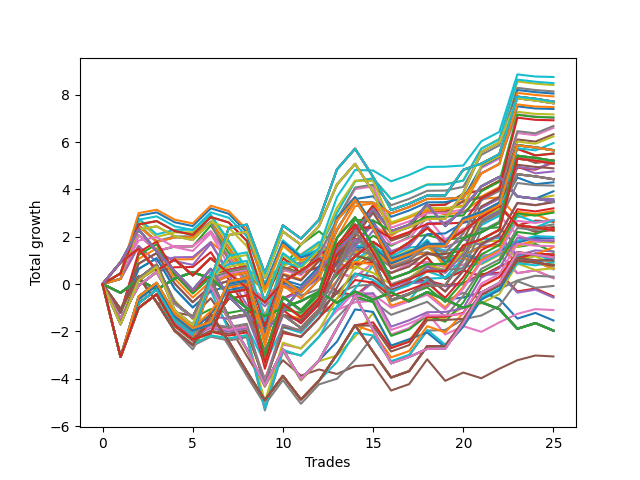

# Long HLT 302 
- Symbol: TSLA
- Date Range: 05/16/2022 - 05/17/2024
- Trading Period: 8:30-12:30
- Number of Trades: 25



| Id. | Name | Win Percent | Profit | Avg Profit / Trade | Avg Time / Trade | Std |      | Name | Win Percent | Profit | Avg Profit / Trade | Avg Time / Trade | Std |
| --- | ---- | ----------- | ------ | ------------------ | ---------------- | --- | ---- | ---- | ----------- | ------ | ------------------ | ---------------- | --- |
| | Sorted By <br> Profit | | | | | | | Sorted By <br> Win Percentage |||||
|0| TP-2 105m | 64.00 | 8.75 | 0.35 | 68:52 | 1.31 |     | TP-2.25 45m | 72.00 | 5.52 | 0.22 | 39:19 | 1.04 |
|1| TP-2.5 90m | 68.00 | 8.49 | 0.34 | 64:19 | 1.38 |     | TP-2.5 45m | 72.00 | 5.51 | 0.22 | 39:26 | 1.08 |
|2| TP-2.25 90m | 68.00 | 8.41 | 0.34 | 64:04 | 1.35 |     | TP-2 45m | 72.00 | 5.25 | 0.21 | 39:04 | 0.98 |
|3| TP-2 90m | 68.00 | 8.14 | 0.33 | 63:50 | 1.30 |     | TP-3 45m | 72.00 | 5.20 | 0.21 | 40:36 | 1.03 |
|4| TP-2.75 90m | 68.00 | 8.05 | 0.32 | 65:04 | 1.40 |     | TP-2.75 45m | 72.00 | 4.76 | 0.19 | 40:02 | 1.07 |
|5| TP-3 90m | 68.00 | 7.93 | 0.32 | 65:50 | 1.44 |     | TP-1.75 45m | 72.00 | 4.30 | 0.17 | 38:24 | 0.97 |
|6| TP-2 180m | 64.00 | 7.71 | 0.31 | 72:52 | 1.42 |     | TP-2.5 90m | 68.00 | 8.49 | 0.34 | 64:19 | 1.38 |
|7| TP-2 165m | 64.00 | 7.71 | 0.31 | 72:52 | 1.42 |     | TP-2.25 90m | 68.00 | 8.41 | 0.34 | 64:04 | 1.35 |
|8| TP-2 150m | 64.00 | 7.71 | 0.31 | 72:52 | 1.42 |     | TP-2 90m | 68.00 | 8.14 | 0.33 | 63:50 | 1.30 |
|9| TP-2 135m | 64.00 | 7.71 | 0.31 | 72:52 | 1.42 |     | TP-2.75 90m | 68.00 | 8.05 | 0.32 | 65:04 | 1.40 |
|10| TP-2 120m | 64.00 | 7.71 | 0.31 | 72:52 | 1.42 |     | TP-3 90m | 68.00 | 7.93 | 0.32 | 65:50 | 1.44 |
|11| TP-1.75 180m | 64.00 | 7.64 | 0.31 | 66:14 | 1.27 |     | TP-1.75 90m | 68.00 | 7.02 | 0.28 | 59:52 | 1.17 |
|12| TP-1.75 165m | 64.00 | 7.64 | 0.31 | 66:14 | 1.27 |     | TP-1.5 45m | 68.00 | 2.70 | 0.11 | 36:45 | 0.99 |
|13| TP-1.75 150m | 64.00 | 7.64 | 0.31 | 66:14 | 1.27 |     | TP-2 105m | 64.00 | 8.75 | 0.35 | 68:52 | 1.31 |
|14| TP-1.75 135m | 64.00 | 7.64 | 0.31 | 66:14 | 1.27 |     | TP-2 180m | 64.00 | 7.71 | 0.31 | 72:52 | 1.42 |
|15| TP-1.75 120m | 64.00 | 7.64 | 0.31 | 66:14 | 1.27 |     | TP-2 165m | 64.00 | 7.71 | 0.31 | 72:52 | 1.42 |
|16| TP-2.5 105m | 64.00 | 7.48 | 0.30 | 69:57 | 1.34 |     | TP-2 150m | 64.00 | 7.71 | 0.31 | 72:52 | 1.42 |
|17| TP-2.25 105m | 64.00 | 7.40 | 0.30 | 69:43 | 1.30 |     | TP-2 135m | 64.00 | 7.71 | 0.31 | 72:52 | 1.42 |
|18| TP-1.75 105m | 64.00 | 7.17 | 0.29 | 63:38 | 1.19 |     | TP-2 120m | 64.00 | 7.71 | 0.31 | 72:52 | 1.42 |
|19| TP-2.75 105m | 64.00 | 7.04 | 0.28 | 70:43 | 1.36 |     | TP-1.75 180m | 64.00 | 7.64 | 0.31 | 66:14 | 1.27 |
|20| TP-1.75 90m | 68.00 | 7.02 | 0.28 | 59:52 | 1.17 |     | TP-1.75 165m | 64.00 | 7.64 | 0.31 | 66:14 | 1.27 |
|21| TP-3 105m | 64.00 | 6.92 | 0.28 | 71:28 | 1.40 |     | TP-1.75 150m | 64.00 | 7.64 | 0.31 | 66:14 | 1.27 |
|22| TP-2.5 75m | 60.00 | 6.68 | 0.27 | 57:36 | 1.33 |     | TP-1.75 135m | 64.00 | 7.64 | 0.31 | 66:14 | 1.27 |
|23| TP-2.25 75m | 60.00 | 6.60 | 0.26 | 57:21 | 1.29 |     | TP-1.75 120m | 64.00 | 7.64 | 0.31 | 66:14 | 1.27 |
|24| TP-2 75m | 60.00 | 6.33 | 0.25 | 57:07 | 1.24 |     | TP-2.5 105m | 64.00 | 7.48 | 0.30 | 69:57 | 1.34 |
|25| TP-2.75 75m | 60.00 | 6.24 | 0.25 | 58:21 | 1.35 |     | TP-2.25 105m | 64.00 | 7.40 | 0.30 | 69:43 | 1.30 |
|26| TP-3 75m | 60.00 | 5.96 | 0.24 | 59:04 | 1.38 |     | TP-1.75 105m | 64.00 | 7.17 | 0.29 | 63:38 | 1.19 |
|27| TP-2.25 180m | 64.00 | 5.66 | 0.23 | 74:33 | 1.40 |     | TP-2.75 105m | 64.00 | 7.04 | 0.28 | 70:43 | 1.36 |
|28| TP-2.25 165m | 64.00 | 5.66 | 0.23 | 74:33 | 1.40 |     | TP-3 105m | 64.00 | 6.92 | 0.28 | 71:28 | 1.40 |
|29| TP-2.25 150m | 64.00 | 5.66 | 0.23 | 74:33 | 1.40 |     | TP-2.25 180m | 64.00 | 5.66 | 0.23 | 74:33 | 1.40 |
|30| TP-2.25 135m | 64.00 | 5.66 | 0.23 | 74:33 | 1.40 |     | TP-2.25 165m | 64.00 | 5.66 | 0.23 | 74:33 | 1.40 |
|31| TP-2.25 120m | 64.00 | 5.66 | 0.23 | 74:33 | 1.40 |     | TP-2.25 150m | 64.00 | 5.66 | 0.23 | 74:33 | 1.40 |
|32| TP-2.5 180m | 64.00 | 5.65 | 0.23 | 75:21 | 1.43 |     | TP-2.25 135m | 64.00 | 5.66 | 0.23 | 74:33 | 1.40 |
|33| TP-2.5 165m | 64.00 | 5.65 | 0.23 | 75:21 | 1.43 |     | TP-2.25 120m | 64.00 | 5.66 | 0.23 | 74:33 | 1.40 |
|34| TP-2.5 150m | 64.00 | 5.65 | 0.23 | 75:21 | 1.43 |     | TP-2.5 180m | 64.00 | 5.65 | 0.23 | 75:21 | 1.43 |
|35| TP-2.5 135m | 64.00 | 5.65 | 0.23 | 75:21 | 1.43 |     | TP-2.5 165m | 64.00 | 5.65 | 0.23 | 75:21 | 1.43 |
|36| TP-2.5 120m | 64.00 | 5.65 | 0.23 | 75:21 | 1.43 |     | TP-2.5 150m | 64.00 | 5.65 | 0.23 | 75:21 | 1.43 |
|37| TP-2.25 45m | 72.00 | 5.52 | 0.22 | 39:19 | 1.04 |     | TP-2.5 135m | 64.00 | 5.65 | 0.23 | 75:21 | 1.43 |
|38| TP-2.5 45m | 72.00 | 5.51 | 0.22 | 39:26 | 1.08 |     | TP-2.5 120m | 64.00 | 5.65 | 0.23 | 75:21 | 1.43 |
|39| TP-2 45m | 72.00 | 5.25 | 0.21 | 39:04 | 0.98 |     | TP-2.75 180m | 64.00 | 5.21 | 0.21 | 76:07 | 1.44 |
|40| TP-2.75 180m | 64.00 | 5.21 | 0.21 | 76:07 | 1.44 |     | TP-2.75 165m | 64.00 | 5.21 | 0.21 | 76:07 | 1.44 |
|41| TP-2.75 165m | 64.00 | 5.21 | 0.21 | 76:07 | 1.44 |     | TP-2.75 150m | 64.00 | 5.21 | 0.21 | 76:07 | 1.44 |
|42| TP-2.75 150m | 64.00 | 5.21 | 0.21 | 76:07 | 1.44 |     | TP-2.75 135m | 64.00 | 5.21 | 0.21 | 76:07 | 1.44 |
|43| TP-2.75 135m | 64.00 | 5.21 | 0.21 | 76:07 | 1.44 |     | TP-2.75 120m | 64.00 | 5.21 | 0.21 | 76:07 | 1.44 |
|44| TP-2.75 120m | 64.00 | 5.21 | 0.21 | 76:07 | 1.44 |     | TP-3 180m | 64.00 | 5.09 | 0.20 | 76:52 | 1.48 |
|45| TP-3 45m | 72.00 | 5.20 | 0.21 | 40:36 | 1.03 |     | TP-3 165m | 64.00 | 5.09 | 0.20 | 76:52 | 1.48 |
|46| TP-1.75 75m | 60.00 | 5.17 | 0.21 | 54:36 | 1.12 |     | TP-3 150m | 64.00 | 5.09 | 0.20 | 76:52 | 1.48 |
|47| TP-1.5 75m | 60.00 | 5.14 | 0.21 | 48:45 | 1.14 |     | TP-3 135m | 64.00 | 5.09 | 0.20 | 76:52 | 1.48 |
|48| TP-3 180m | 64.00 | 5.09 | 0.20 | 76:52 | 1.48 |     | TP-3 120m | 64.00 | 5.09 | 0.20 | 76:52 | 1.48 |
|49| TP-3 165m | 64.00 | 5.09 | 0.20 | 76:52 | 1.48 |     | TP-1.5 90m | 64.00 | 4.89 | 0.20 | 52:45 | 1.14 |
|50| TP-3 150m | 64.00 | 5.09 | 0.20 | 76:52 | 1.48 |     | TP-0.5 15m | 64.00 | 2.62 | 0.10 | 09:02 | 0.57 |
|51| TP-3 135m | 64.00 | 5.09 | 0.20 | 76:52 | 1.48 |     | TP-1.25 45m | 64.00 | 0.67 | 0.03 | 33:48 | 1.00 |
|52| TP-3 120m | 64.00 | 5.09 | 0.20 | 76:52 | 1.48 |     | TP-2.5 75m | 60.00 | 6.68 | 0.27 | 57:36 | 1.33 |
|53| TP-1.5 90m | 64.00 | 4.89 | 0.20 | 52:45 | 1.14 |     | TP-2.25 75m | 60.00 | 6.60 | 0.26 | 57:21 | 1.29 |
|54| TP-2.75 45m | 72.00 | 4.76 | 0.19 | 40:02 | 1.07 |     | TP-2 75m | 60.00 | 6.33 | 0.25 | 57:07 | 1.24 |
|55| TP-1.5 180m | 60.00 | 4.43 | 0.18 | 57:16 | 1.20 |     | TP-2.75 75m | 60.00 | 6.24 | 0.25 | 58:21 | 1.35 |
|56| TP-1.5 165m | 60.00 | 4.43 | 0.18 | 57:16 | 1.20 |     | TP-3 75m | 60.00 | 5.96 | 0.24 | 59:04 | 1.38 |
|57| TP-1.5 150m | 60.00 | 4.43 | 0.18 | 57:16 | 1.20 |     | TP-1.75 75m | 60.00 | 5.17 | 0.21 | 54:36 | 1.12 |
|58| TP-1.5 135m | 60.00 | 4.43 | 0.18 | 57:16 | 1.20 |     | TP-1.5 75m | 60.00 | 5.14 | 0.21 | 48:45 | 1.14 |
|59| TP-1.5 120m | 60.00 | 4.43 | 0.18 | 57:16 | 1.20 |     | TP-1.5 180m | 60.00 | 4.43 | 0.18 | 57:16 | 1.20 |
|60| TP-1.75 45m | 72.00 | 4.30 | 0.17 | 38:24 | 0.97 |     | TP-1.5 165m | 60.00 | 4.43 | 0.18 | 57:16 | 1.20 |
|61| TP-1.5 105m | 60.00 | 4.16 | 0.17 | 55:24 | 1.14 |     | TP-1.5 150m | 60.00 | 4.43 | 0.18 | 57:16 | 1.20 |
|62| TP-0.75 75m | 60.00 | 3.92 | 0.16 | 25:09 | 0.83 |     | TP-1.5 135m | 60.00 | 4.43 | 0.18 | 57:16 | 1.20 |
|63| TP-0.75 60m | 60.00 | 3.74 | 0.15 | 24:33 | 0.82 |     | TP-1.5 120m | 60.00 | 4.43 | 0.18 | 57:16 | 1.20 |
|64| TP-0.75 105m | 56.00 | 3.59 | 0.14 | 26:21 | 0.83 |     | TP-1.5 105m | 60.00 | 4.16 | 0.17 | 55:24 | 1.14 |
|65| TP-0.75 90m | 56.00 | 3.55 | 0.14 | 25:45 | 0.83 |     | TP-0.75 75m | 60.00 | 3.92 | 0.16 | 25:09 | 0.83 |
|66| TP-0.75 180m | 56.00 | 3.49 | 0.14 | 26:57 | 0.83 |     | TP-0.75 60m | 60.00 | 3.74 | 0.15 | 24:33 | 0.82 |
|67| TP-0.75 165m | 56.00 | 3.49 | 0.14 | 26:57 | 0.83 |     | TP-2.25 60m | 60.00 | 3.47 | 0.14 | 49:16 | 1.20 |
|68| TP-0.75 150m | 56.00 | 3.49 | 0.14 | 26:57 | 0.83 |     | TP-2.5 60m | 60.00 | 3.46 | 0.14 | 49:24 | 1.24 |
|69| TP-0.75 135m | 56.00 | 3.49 | 0.14 | 26:57 | 0.83 |     | TP-2 60m | 60.00 | 3.20 | 0.13 | 49:02 | 1.14 |
|70| TP-0.75 120m | 56.00 | 3.49 | 0.14 | 26:57 | 0.83 |     | TP-1.5 60m | 60.00 | 3.09 | 0.12 | 43:36 | 1.08 |
|71| TP-2.25 60m | 60.00 | 3.47 | 0.14 | 49:16 | 1.20 |     | TP-1.75 60m | 60.00 | 3.02 | 0.12 | 47:43 | 1.03 |
|72| TP-2.5 60m | 60.00 | 3.46 | 0.14 | 49:24 | 1.24 |     | TP-2.75 60m | 60.00 | 2.71 | 0.11 | 50:00 | 1.23 |
|73| TP-2 60m | 60.00 | 3.20 | 0.13 | 49:02 | 1.14 |     | TP-0.5 75m | 60.00 | 2.70 | 0.11 | 14:16 | 0.61 |
|74| TP-1.5 60m | 60.00 | 3.09 | 0.12 | 43:36 | 1.08 |     | TP-0.5 30m | 60.00 | 2.64 | 0.11 | 11:38 | 0.61 |
|75| TP-1.75 60m | 60.00 | 3.02 | 0.12 | 47:43 | 1.03 |     | TP-0.5 60m | 60.00 | 2.52 | 0.10 | 13:40 | 0.61 |
|76| TP-2.75 60m | 60.00 | 2.71 | 0.11 | 50:00 | 1.23 |     | TP-3 60m | 60.00 | 2.41 | 0.10 | 50:40 | 1.26 |
|77| TP-1.5 45m | 68.00 | 2.70 | 0.11 | 36:45 | 0.99 |     | TP-0.5 45m | 60.00 | 2.28 | 0.09 | 12:50 | 0.62 |
|78| TP-0.5 75m | 60.00 | 2.70 | 0.11 | 14:16 | 0.61 |     | TP-0.75 45m | 60.00 | 1.87 | 0.07 | 22:50 | 0.79 |
|79| TP-0.5 30m | 60.00 | 2.64 | 0.11 | 11:38 | 0.61 |     | TP-1.25 90m | 60.00 | 1.81 | 0.07 | 44:57 | 1.06 |
|80| TP-0.5 15m | 64.00 | 2.62 | 0.10 | 09:02 | 0.57 |     | TP-0.75 15m | 60.00 | 1.36 | 0.05 | 11:19 | 0.66 |
|81| TP-0.5 60m | 60.00 | 2.52 | 0.10 | 13:40 | 0.61 |     | TP-2.5 15m | 60.00 | 0.95 | 0.04 | 13:50 | 0.73 |
|82| TP-1.25 75m | 56.00 | 2.42 | 0.10 | 42:40 | 1.08 |     | TP-2.25 15m | 60.00 | 0.84 | 0.03 | 13:48 | 0.72 |
|83| TP-3 60m | 60.00 | 2.41 | 0.10 | 50:40 | 1.26 |     | TP-2 15m | 60.00 | 0.67 | 0.03 | 13:45 | 0.70 |
|84| TP-0.5 105m | 56.00 | 2.37 | 0.09 | 15:28 | 0.61 |     | TP-3 15m | 60.00 | 0.63 | 0.03 | 14:00 | 0.69 |
|85| TP-0.5 90m | 56.00 | 2.33 | 0.09 | 14:52 | 0.61 |     | TP-2.75 15m | 60.00 | 0.63 | 0.03 | 14:00 | 0.69 |
|86| TP-0.5 45m | 60.00 | 2.28 | 0.09 | 12:50 | 0.62 |     | TP-1.75 15m | 60.00 | 0.25 | 0.01 | 13:43 | 0.64 |
|87| TP-0.5 180m | 56.00 | 2.27 | 0.09 | 16:04 | 0.61 |     | TP-1.5 15m | 60.00 | 0.25 | 0.01 | 13:43 | 0.64 |
|88| TP-0.5 165m | 56.00 | 2.27 | 0.09 | 16:04 | 0.61 |     | TP-1 45m | 60.00 | -0.08 | -0.00 | 29:31 | 0.91 |
|89| TP-0.5 150m | 56.00 | 2.27 | 0.09 | 16:04 | 0.61 |     | TP-1 15m | 60.00 | -0.52 | -0.02 | 12:57 | 0.65 |
|90| TP-0.5 135m | 56.00 | 2.27 | 0.09 | 16:04 | 0.61 |     | TP-1.25 15m | 60.00 | -0.57 | -0.02 | 13:14 | 0.62 |
|91| TP-0.5 120m | 56.00 | 2.27 | 0.09 | 16:04 | 0.61 |     | TP-0.75 105m | 56.00 | 3.59 | 0.14 | 26:21 | 0.83 |
|92| TP-2 30m | 56.00 | 1.99 | 0.08 | 27:07 | 0.83 |     | TP-0.75 90m | 56.00 | 3.55 | 0.14 | 25:45 | 0.83 |
|93| TP-2.25 30m | 56.00 | 1.91 | 0.08 | 27:16 | 0.88 |     | TP-0.75 180m | 56.00 | 3.49 | 0.14 | 26:57 | 0.83 |
|94| TP-0.75 45m | 60.00 | 1.87 | 0.07 | 22:50 | 0.79 |     | TP-0.75 165m | 56.00 | 3.49 | 0.14 | 26:57 | 0.83 |
|95| TP-1.25 90m | 60.00 | 1.81 | 0.07 | 44:57 | 1.06 |     | TP-0.75 150m | 56.00 | 3.49 | 0.14 | 26:57 | 0.83 |
|96| TP-2.5 30m | 56.00 | 1.80 | 0.07 | 27:21 | 0.92 |     | TP-0.75 135m | 56.00 | 3.49 | 0.14 | 26:57 | 0.83 |
|97| TP-1.75 30m | 56.00 | 1.75 | 0.07 | 26:57 | 0.79 |     | TP-0.75 120m | 56.00 | 3.49 | 0.14 | 26:57 | 0.83 |
|98| TP-1.25 105m | 56.00 | 1.60 | 0.06 | 46:45 | 1.06 |     | TP-1.25 75m | 56.00 | 2.42 | 0.10 | 42:40 | 1.08 |
|99| TP-1 75m | 52.00 | 1.56 | 0.06 | 36:43 | 0.97 |     | TP-0.5 105m | 56.00 | 2.37 | 0.09 | 15:28 | 0.61 |
|100| TP-0.75 30m | 52.00 | 1.38 | 0.06 | 18:14 | 0.73 |     | TP-0.5 90m | 56.00 | 2.33 | 0.09 | 14:52 | 0.61 |
|101| TP-0.75 15m | 60.00 | 1.36 | 0.05 | 11:19 | 0.66 |     | TP-0.5 180m | 56.00 | 2.27 | 0.09 | 16:04 | 0.61 |
|102| TP-3 30m | 56.00 | 1.25 | 0.05 | 27:55 | 0.88 |     | TP-0.5 165m | 56.00 | 2.27 | 0.09 | 16:04 | 0.61 |
|103| TP-2.75 30m | 56.00 | 1.25 | 0.05 | 27:55 | 0.88 |     | TP-0.5 150m | 56.00 | 2.27 | 0.09 | 16:04 | 0.61 |
|104| TP-1 90m | 56.00 | 1.20 | 0.05 | 38:45 | 0.95 |     | TP-0.5 135m | 56.00 | 2.27 | 0.09 | 16:04 | 0.61 |
|105| TP-1.25 180m | 56.00 | 1.12 | 0.04 | 48:26 | 1.12 |     | TP-0.5 120m | 56.00 | 2.27 | 0.09 | 16:04 | 0.61 |
|106| TP-1.25 165m | 56.00 | 1.12 | 0.04 | 48:26 | 1.12 |     | TP-2 30m | 56.00 | 1.99 | 0.08 | 27:07 | 0.83 |
|107| TP-1.25 150m | 56.00 | 1.12 | 0.04 | 48:26 | 1.12 |     | TP-2.25 30m | 56.00 | 1.91 | 0.08 | 27:16 | 0.88 |
|108| TP-1.25 135m | 56.00 | 1.12 | 0.04 | 48:26 | 1.12 |     | TP-2.5 30m | 56.00 | 1.80 | 0.07 | 27:21 | 0.92 |
|109| TP-1.25 120m | 56.00 | 1.12 | 0.04 | 48:26 | 1.12 |     | TP-1.75 30m | 56.00 | 1.75 | 0.07 | 26:57 | 0.79 |
|110| TP-1.25 60m | 56.00 | 1.07 | 0.04 | 39:12 | 1.05 |     | TP-1.25 105m | 56.00 | 1.60 | 0.06 | 46:45 | 1.06 |
|111| TP-1 105m | 52.00 | 0.99 | 0.04 | 40:33 | 0.95 |     | TP-3 30m | 56.00 | 1.25 | 0.05 | 27:55 | 0.88 |
|112| TP-2.5 15m | 60.00 | 0.95 | 0.04 | 13:50 | 0.73 |     | TP-2.75 30m | 56.00 | 1.25 | 0.05 | 27:55 | 0.88 |
|113| TP-1 60m | 52.00 | 0.92 | 0.04 | 34:00 | 0.96 |     | TP-1 90m | 56.00 | 1.20 | 0.05 | 38:45 | 0.95 |
|114| TP-2.25 15m | 60.00 | 0.84 | 0.03 | 13:48 | 0.72 |     | TP-1.25 180m | 56.00 | 1.12 | 0.04 | 48:26 | 1.12 |
|115| TP-1 180m | 52.00 | 0.79 | 0.03 | 41:57 | 1.00 |     | TP-1.25 165m | 56.00 | 1.12 | 0.04 | 48:26 | 1.12 |
|116| TP-1 165m | 52.00 | 0.79 | 0.03 | 41:57 | 1.00 |     | TP-1.25 150m | 56.00 | 1.12 | 0.04 | 48:26 | 1.12 |
|117| TP-1 150m | 52.00 | 0.79 | 0.03 | 41:57 | 1.00 |     | TP-1.25 135m | 56.00 | 1.12 | 0.04 | 48:26 | 1.12 |
|118| TP-1 135m | 52.00 | 0.79 | 0.03 | 41:57 | 1.00 |     | TP-1.25 120m | 56.00 | 1.12 | 0.04 | 48:26 | 1.12 |
|119| TP-1 120m | 52.00 | 0.79 | 0.03 | 41:57 | 1.00 |     | TP-1.25 60m | 56.00 | 1.07 | 0.04 | 39:12 | 1.05 |
|120| TP-1.25 45m | 64.00 | 0.67 | 0.03 | 33:48 | 1.00 |     | TP-1.5 30m | 56.00 | 0.31 | 0.01 | 26:16 | 0.78 |
|121| TP-2 15m | 60.00 | 0.67 | 0.03 | 13:45 | 0.70 |     | TP-1.25 30m | 56.00 | -1.10 | -0.04 | 24:50 | 0.79 |
|122| TP-3 15m | 60.00 | 0.63 | 0.03 | 14:00 | 0.69 |     | TP-1 75m | 52.00 | 1.56 | 0.06 | 36:43 | 0.97 |
|123| TP-2.75 15m | 60.00 | 0.63 | 0.03 | 14:00 | 0.69 |     | TP-0.75 30m | 52.00 | 1.38 | 0.06 | 18:14 | 0.73 |
|124| TP-1.5 30m | 56.00 | 0.31 | 0.01 | 26:16 | 0.78 |     | TP-1 105m | 52.00 | 0.99 | 0.04 | 40:33 | 0.95 |
|125| TP-1.75 15m | 60.00 | 0.25 | 0.01 | 13:43 | 0.64 |     | TP-1 60m | 52.00 | 0.92 | 0.04 | 34:00 | 0.96 |
|126| TP-1.5 15m | 60.00 | 0.25 | 0.01 | 13:43 | 0.64 |     | TP-1 180m | 52.00 | 0.79 | 0.03 | 41:57 | 1.00 |
|127| TP-1 45m | 60.00 | -0.08 | -0.00 | 29:31 | 0.91 |     | TP-1 165m | 52.00 | 0.79 | 0.03 | 41:57 | 1.00 |
|128| TP-1 15m | 60.00 | -0.52 | -0.02 | 12:57 | 0.65 |     | TP-1 150m | 52.00 | 0.79 | 0.03 | 41:57 | 1.00 |
|129| TP-1.25 15m | 60.00 | -0.57 | -0.02 | 13:14 | 0.62 |     | TP-1 135m | 52.00 | 0.79 | 0.03 | 41:57 | 1.00 |
|130| TP-1.25 30m | 56.00 | -1.10 | -0.04 | 24:50 | 0.79 |     | TP-1 120m | 52.00 | 0.79 | 0.03 | 41:57 | 1.00 |
|131| TP-0.25 15m | 48.00 | -1.54 | -0.06 | 05:16 | 0.41 |     | TP-0.25 15m | 48.00 | -1.54 | -0.06 | 05:16 | 0.41 |
|132| TP-0.25 180m | 44.00 | -1.97 | -0.08 | 05:33 | 0.41 |     | TP-1 30m | 48.00 | -3.06 | -0.12 | 22:52 | 0.76 |
|133| TP-0.25 165m | 44.00 | -1.97 | -0.08 | 05:33 | 0.41 |     | TP-0.25 180m | 44.00 | -1.97 | -0.08 | 05:33 | 0.41 |
|134| TP-0.25 150m | 44.00 | -1.97 | -0.08 | 05:33 | 0.41 |     | TP-0.25 165m | 44.00 | -1.97 | -0.08 | 05:33 | 0.41 |
|135| TP-0.25 135m | 44.00 | -1.97 | -0.08 | 05:33 | 0.41 |     | TP-0.25 150m | 44.00 | -1.97 | -0.08 | 05:33 | 0.41 |
|136| TP-0.25 120m | 44.00 | -1.97 | -0.08 | 05:33 | 0.41 |     | TP-0.25 135m | 44.00 | -1.97 | -0.08 | 05:33 | 0.41 |
|137| TP-0.25 105m | 44.00 | -1.97 | -0.08 | 05:33 | 0.41 |     | TP-0.25 120m | 44.00 | -1.97 | -0.08 | 05:33 | 0.41 |
|138| TP-0.25 90m | 44.00 | -1.97 | -0.08 | 05:33 | 0.41 |     | TP-0.25 105m | 44.00 | -1.97 | -0.08 | 05:33 | 0.41 |
|139| TP-0.25 75m | 44.00 | -1.97 | -0.08 | 05:33 | 0.41 |     | TP-0.25 90m | 44.00 | -1.97 | -0.08 | 05:33 | 0.41 |
|140| TP-0.25 60m | 44.00 | -1.97 | -0.08 | 05:33 | 0.41 |     | TP-0.25 75m | 44.00 | -1.97 | -0.08 | 05:33 | 0.41 |
|141| TP-0.25 45m | 44.00 | -1.97 | -0.08 | 05:33 | 0.41 |     | TP-0.25 60m | 44.00 | -1.97 | -0.08 | 05:33 | 0.41 |
|142| TP-0.25 30m | 44.00 | -1.97 | -0.08 | 05:33 | 0.41 |     | TP-0.25 45m | 44.00 | -1.97 | -0.08 | 05:33 | 0.41 |
|143| TP-1 30m | 48.00 | -3.06 | -0.12 | 22:52 | 0.76 |     | TP-0.25 30m | 44.00 | -1.97 | -0.08 | 05:33 | 0.41 |

### Test TP-0.25 15m
* Take Profit of 0.25 Point
* 0.25 Stoploss
* Results:
```
Total Trades: 25
Percent Up: 48.00
Percent Down: 52.00
Total Points Moved Up: -1.54
Potential Profit: -770.00
Total Points Ups: 4.06 Count Ups: 12
Total Points Downs: -5.60 Count Downs: 13
```

<details><summary>Trades</summary>

<code>In: 2022-05-24 10:45:00		Out: 2022-05-24 10:48:00		Total Position Time: 03:00		Total Move Up: -0.37		Total to Date: -0.37</code> <br />
<code>In: 2022-05-24 12:30:00		Out: 2022-05-24 12:34:00		Total Position Time: 04:00		Total Move Up: 0.57		Total to Date: 0.20</code> <br />
<code>In: 2022-06-16 12:05:00		Out: 2022-06-16 12:09:00		Total Position Time: 04:00		Total Move Up: -0.44		Total to Date: -0.24</code> <br />
<code>In: 2022-07-25 11:30:00		Out: 2022-07-25 11:36:00		Total Position Time: 06:00		Total Move Up: 0.47		Total to Date: 0.23</code> <br />
<code>In: 2022-08-18 12:00:00		Out: 2022-08-18 12:06:00		Total Position Time: 06:00		Total Move Up: 0.27		Total to Date: 0.50</code> <br />
<code>In: 2022-08-31 08:45:00		Out: 2022-08-31 08:49:00		Total Position Time: 04:00		Total Move Up: -0.26		Total to Date: 0.24</code> <br />
<code>In: 2022-09-01 08:40:00		Out: 2022-09-01 08:42:00		Total Position Time: 02:00		Total Move Up: -0.65		Total to Date: -0.41</code> <br />
<code>In: 2022-09-23 12:10:00		Out: 2022-09-23 12:14:00		Total Position Time: 04:00		Total Move Up: -0.61		Total to Date: -1.02</code> <br />
<code>In: 2022-11-09 08:50:00		Out: 2022-11-09 08:52:00		Total Position Time: 02:00		Total Move Up: -0.33		Total to Date: -1.35</code> <br />
<code>In: 2022-11-10 12:15:00		Out: 2022-11-10 12:21:00		Total Position Time: 06:00		Total Move Up: 0.34		Total to Date: -1.01</code> <br />
<code>In: 2022-11-15 11:15:00		Out: 2022-11-15 11:18:00		Total Position Time: 03:00		Total Move Up: 0.29		Total to Date: -0.72</code> <br />
<code>In: 2022-11-22 11:55:00		Out: 2022-11-22 12:02:00		Total Position Time: 07:00		Total Move Up: 0.39		Total to Date: -0.33</code> <br />
<code>In: 2023-01-19 08:55:00		Out: 2023-01-19 08:58:00		Total Position Time: 03:00		Total Move Up: -0.46		Total to Date: -0.79</code> <br />
<code>In: 2023-03-06 10:25:00		Out: 2023-03-06 10:28:00		Total Position Time: 03:00		Total Move Up: 0.47		Total to Date: -0.32</code> <br />
<code>In: 2023-04-12 08:50:00		Out: 2023-04-12 08:53:00		Total Position Time: 03:00		Total Move Up: -0.34		Total to Date: -0.66</code> <br />
<code>In: 2023-07-11 08:55:00		Out: 2023-07-11 08:59:00		Total Position Time: 04:00		Total Move Up: 0.31		Total to Date: -0.35</code> <br />
<code>In: 2023-09-21 12:30:00		Out: 2023-09-21 12:35:00		Total Position Time: 05:00		Total Move Up: -0.38		Total to Date: -0.73</code> <br />
<code>In: 2023-09-26 11:30:00		Out: 2023-09-26 11:32:00		Total Position Time: 02:00		Total Move Up: 0.39		Total to Date: -0.34</code> <br />
<code>In: 2023-10-12 11:30:00		Out: 2023-10-12 11:41:00		Total Position Time: 11:00		Total Move Up: -0.32		Total to Date: -0.66</code> <br />
<code>In: 2023-12-11 09:10:00		Out: 2023-12-11 09:24:00		Total Position Time: 14:00		Total Move Up: 0.09		Total to Date: -0.57</code> <br />
<code>In: 2024-01-05 09:45:00		Out: 2024-01-05 09:53:00		Total Position Time: 08:00		Total Move Up: 0.23		Total to Date: -0.34</code> <br />
<code>In: 2024-03-14 12:30:00		Out: 2024-03-14 12:35:00		Total Position Time: 05:00		Total Move Up: -0.29		Total to Date: -0.63</code> <br />
<code>In: 2024-04-05 08:45:00		Out: 2024-04-05 08:47:00		Total Position Time: 02:00		Total Move Up: -0.83		Total to Date: -1.46</code> <br />
<code>In: 2024-05-07 12:00:00		Out: 2024-05-07 12:08:00		Total Position Time: 08:00		Total Move Up: 0.24		Total to Date: -1.22</code> <br />
<code>In: 2024-05-09 08:55:00		Out: 2024-05-09 09:08:00		Total Position Time: 13:00		Total Move Up: -0.32		Total to Date: -1.54</code> <br />


</details>

### Test TP-0.5 15m
* Take Profit of 0.5 Point
* 0.5 Stoploss
* Results:
```
Total Trades: 25
Percent Up: 64.00
Percent Down: 36.00
Total Points Moved Up: 2.62
Potential Profit: 1310.00
Total Points Ups: 7.81 Count Ups: 16
Total Points Downs: -5.19 Count Downs: 9
```

<details><summary>Trades</summary>

<code>In: 2022-05-24 10:45:00		Out: 2022-05-24 10:52:00		Total Position Time: 07:00		Total Move Up: 0.92		Total to Date: 0.92</code> <br />
<code>In: 2022-05-24 12:30:00		Out: 2022-05-24 12:34:00		Total Position Time: 04:00		Total Move Up: 0.57		Total to Date: 1.49</code> <br />
<code>In: 2022-06-16 12:05:00		Out: 2022-06-16 12:14:00		Total Position Time: 09:00		Total Move Up: -0.92		Total to Date: 0.57</code> <br />
<code>In: 2022-07-25 11:30:00		Out: 2022-07-25 11:36:00		Total Position Time: 06:00		Total Move Up: 0.47		Total to Date: 1.04</code> <br />
<code>In: 2022-08-18 12:00:00		Out: 2022-08-18 12:14:00		Total Position Time: 14:00		Total Move Up: 0.01		Total to Date: 1.05</code> <br />
<code>In: 2022-08-31 08:45:00		Out: 2022-08-31 08:56:00		Total Position Time: 11:00		Total Move Up: 0.73		Total to Date: 1.78</code> <br />
<code>In: 2022-09-01 08:40:00		Out: 2022-09-01 08:42:00		Total Position Time: 02:00		Total Move Up: -0.65		Total to Date: 1.13</code> <br />
<code>In: 2022-09-23 12:10:00		Out: 2022-09-23 12:14:00		Total Position Time: 04:00		Total Move Up: -0.61		Total to Date: 0.52</code> <br />
<code>In: 2022-11-09 08:50:00		Out: 2022-11-09 08:54:00		Total Position Time: 04:00		Total Move Up: -0.61		Total to Date: -0.09</code> <br />
<code>In: 2022-11-10 12:15:00		Out: 2022-11-10 12:23:00		Total Position Time: 08:00		Total Move Up: 0.85		Total to Date: 0.76</code> <br />
<code>In: 2022-11-15 11:15:00		Out: 2022-11-15 11:20:00		Total Position Time: 05:00		Total Move Up: 0.49		Total to Date: 1.25</code> <br />
<code>In: 2022-11-22 11:55:00		Out: 2022-11-22 12:03:00		Total Position Time: 08:00		Total Move Up: 0.50		Total to Date: 1.75</code> <br />
<code>In: 2023-01-19 08:55:00		Out: 2023-01-19 09:09:00		Total Position Time: 14:00		Total Move Up: -0.62		Total to Date: 1.13</code> <br />
<code>In: 2023-03-06 10:25:00		Out: 2023-03-06 10:29:00		Total Position Time: 04:00		Total Move Up: 0.72		Total to Date: 1.85</code> <br />
<code>In: 2023-04-12 08:50:00		Out: 2023-04-12 09:04:00		Total Position Time: 14:00		Total Move Up: 0.61		Total to Date: 2.46</code> <br />
<code>In: 2023-07-11 08:55:00		Out: 2023-07-11 09:09:00		Total Position Time: 14:00		Total Move Up: -0.42		Total to Date: 2.04</code> <br />
<code>In: 2023-09-21 12:30:00		Out: 2023-09-21 12:37:00		Total Position Time: 07:00		Total Move Up: 0.49		Total to Date: 2.53</code> <br />
<code>In: 2023-09-26 11:30:00		Out: 2023-09-26 11:37:00		Total Position Time: 07:00		Total Move Up: 0.61		Total to Date: 3.14</code> <br />
<code>In: 2023-10-12 11:30:00		Out: 2023-10-12 11:44:00		Total Position Time: 14:00		Total Move Up: -0.20		Total to Date: 2.94</code> <br />
<code>In: 2023-12-11 09:10:00		Out: 2023-12-11 09:24:00		Total Position Time: 14:00		Total Move Up: 0.09		Total to Date: 3.03</code> <br />
<code>In: 2024-01-05 09:45:00		Out: 2024-01-05 09:57:00		Total Position Time: 12:00		Total Move Up: 0.57		Total to Date: 3.60</code> <br />
<code>In: 2024-03-14 12:30:00		Out: 2024-03-14 12:44:00		Total Position Time: 14:00		Total Move Up: 0.06		Total to Date: 3.66</code> <br />
<code>In: 2024-04-05 08:45:00		Out: 2024-04-05 08:47:00		Total Position Time: 02:00		Total Move Up: -0.83		Total to Date: 2.83</code> <br />
<code>In: 2024-05-07 12:00:00		Out: 2024-05-07 12:14:00		Total Position Time: 14:00		Total Move Up: 0.12		Total to Date: 2.95</code> <br />
<code>In: 2024-05-09 08:55:00		Out: 2024-05-09 09:09:00		Total Position Time: 14:00		Total Move Up: -0.33		Total to Date: 2.62</code> <br />


</details>

### Test TP-0.75 15m
* Take Profit of 0.75 Point
* 0.75 Stoploss
* Results:
```
Total Trades: 25
Percent Up: 60.00
Percent Down: 40.00
Total Points Moved Up: 1.36
Potential Profit: 680.00
Total Points Ups: 7.50 Count Ups: 15
Total Points Downs: -6.14 Count Downs: 10
```

<details><summary>Trades</summary>

<code>In: 2022-05-24 10:45:00		Out: 2022-05-24 10:52:00		Total Position Time: 07:00		Total Move Up: 0.92		Total to Date: 0.92</code> <br />
<code>In: 2022-05-24 12:30:00		Out: 2022-05-24 12:36:00		Total Position Time: 06:00		Total Move Up: 1.39		Total to Date: 2.31</code> <br />
<code>In: 2022-06-16 12:05:00		Out: 2022-06-16 12:14:00		Total Position Time: 09:00		Total Move Up: -0.92		Total to Date: 1.39</code> <br />
<code>In: 2022-07-25 11:30:00		Out: 2022-07-25 11:44:00		Total Position Time: 14:00		Total Move Up: 0.19		Total to Date: 1.58</code> <br />
<code>In: 2022-08-18 12:00:00		Out: 2022-08-18 12:14:00		Total Position Time: 14:00		Total Move Up: 0.01		Total to Date: 1.59</code> <br />
<code>In: 2022-08-31 08:45:00		Out: 2022-08-31 08:57:00		Total Position Time: 12:00		Total Move Up: 0.89		Total to Date: 2.48</code> <br />
<code>In: 2022-09-01 08:40:00		Out: 2022-09-01 08:44:00		Total Position Time: 04:00		Total Move Up: -1.17		Total to Date: 1.31</code> <br />
<code>In: 2022-09-23 12:10:00		Out: 2022-09-23 12:21:00		Total Position Time: 11:00		Total Move Up: -0.74		Total to Date: 0.57</code> <br />
<code>In: 2022-11-09 08:50:00		Out: 2022-11-09 08:58:00		Total Position Time: 08:00		Total Move Up: -0.73		Total to Date: -0.16</code> <br />
<code>In: 2022-11-10 12:15:00		Out: 2022-11-10 12:23:00		Total Position Time: 08:00		Total Move Up: 0.85		Total to Date: 0.69</code> <br />
<code>In: 2022-11-15 11:15:00		Out: 2022-11-15 11:21:00		Total Position Time: 06:00		Total Move Up: 0.98		Total to Date: 1.67</code> <br />
<code>In: 2022-11-22 11:55:00		Out: 2022-11-22 12:09:00		Total Position Time: 14:00		Total Move Up: 0.56		Total to Date: 2.23</code> <br />
<code>In: 2023-01-19 08:55:00		Out: 2023-01-19 09:09:00		Total Position Time: 14:00		Total Move Up: -0.62		Total to Date: 1.61</code> <br />
<code>In: 2023-03-06 10:25:00		Out: 2023-03-06 10:39:00		Total Position Time: 14:00		Total Move Up: -0.18		Total to Date: 1.43</code> <br />
<code>In: 2023-04-12 08:50:00		Out: 2023-04-12 09:04:00		Total Position Time: 14:00		Total Move Up: 0.61		Total to Date: 2.04</code> <br />
<code>In: 2023-07-11 08:55:00		Out: 2023-07-11 09:09:00		Total Position Time: 14:00		Total Move Up: -0.42		Total to Date: 1.62</code> <br />
<code>In: 2023-09-21 12:30:00		Out: 2023-09-21 12:44:00		Total Position Time: 14:00		Total Move Up: 0.37		Total to Date: 1.99</code> <br />
<code>In: 2023-09-26 11:30:00		Out: 2023-09-26 11:44:00		Total Position Time: 14:00		Total Move Up: 0.08		Total to Date: 2.07</code> <br />
<code>In: 2023-10-12 11:30:00		Out: 2023-10-12 11:44:00		Total Position Time: 14:00		Total Move Up: -0.20		Total to Date: 1.87</code> <br />
<code>In: 2023-12-11 09:10:00		Out: 2023-12-11 09:24:00		Total Position Time: 14:00		Total Move Up: 0.09		Total to Date: 1.96</code> <br />
<code>In: 2024-01-05 09:45:00		Out: 2024-01-05 09:59:00		Total Position Time: 14:00		Total Move Up: 0.38		Total to Date: 2.34</code> <br />
<code>In: 2024-03-14 12:30:00		Out: 2024-03-14 12:44:00		Total Position Time: 14:00		Total Move Up: 0.06		Total to Date: 2.40</code> <br />
<code>In: 2024-04-05 08:45:00		Out: 2024-04-05 08:47:00		Total Position Time: 02:00		Total Move Up: -0.83		Total to Date: 1.57</code> <br />
<code>In: 2024-05-07 12:00:00		Out: 2024-05-07 12:14:00		Total Position Time: 14:00		Total Move Up: 0.12		Total to Date: 1.69</code> <br />
<code>In: 2024-05-09 08:55:00		Out: 2024-05-09 09:09:00		Total Position Time: 14:00		Total Move Up: -0.33		Total to Date: 1.36</code> <br />


</details>

### Test TP-1 15m
* Take Profit of 1 Point
* 1 Stoploss
* Results:
```
Total Trades: 25
Percent Up: 60.00
Percent Down: 40.00
Total Points Moved Up: -0.52
Potential Profit: -260.00
Total Points Ups: 6.10 Count Ups: 15
Total Points Downs: -6.62 Count Downs: 10
```

<details><summary>Trades</summary>

<code>In: 2022-05-24 10:45:00		Out: 2022-05-24 10:59:00		Total Position Time: 14:00		Total Move Up: 0.22		Total to Date: 0.22</code> <br />
<code>In: 2022-05-24 12:30:00		Out: 2022-05-24 12:36:00		Total Position Time: 06:00		Total Move Up: 1.39		Total to Date: 1.61</code> <br />
<code>In: 2022-06-16 12:05:00		Out: 2022-06-16 12:16:00		Total Position Time: 11:00		Total Move Up: -1.09		Total to Date: 0.52</code> <br />
<code>In: 2022-07-25 11:30:00		Out: 2022-07-25 11:44:00		Total Position Time: 14:00		Total Move Up: 0.19		Total to Date: 0.71</code> <br />
<code>In: 2022-08-18 12:00:00		Out: 2022-08-18 12:14:00		Total Position Time: 14:00		Total Move Up: 0.01		Total to Date: 0.72</code> <br />
<code>In: 2022-08-31 08:45:00		Out: 2022-08-31 08:59:00		Total Position Time: 14:00		Total Move Up: 0.63		Total to Date: 1.35</code> <br />
<code>In: 2022-09-01 08:40:00		Out: 2022-09-01 08:44:00		Total Position Time: 04:00		Total Move Up: -1.17		Total to Date: 0.18</code> <br />
<code>In: 2022-09-23 12:10:00		Out: 2022-09-23 12:22:00		Total Position Time: 12:00		Total Move Up: -1.27		Total to Date: -1.09</code> <br />
<code>In: 2022-11-09 08:50:00		Out: 2022-11-09 09:04:00		Total Position Time: 14:00		Total Move Up: -0.55		Total to Date: -1.64</code> <br />
<code>In: 2022-11-10 12:15:00		Out: 2022-11-10 12:26:00		Total Position Time: 11:00		Total Move Up: 1.03		Total to Date: -0.61</code> <br />
<code>In: 2022-11-15 11:15:00		Out: 2022-11-15 11:29:00		Total Position Time: 14:00		Total Move Up: 0.36		Total to Date: -0.25</code> <br />
<code>In: 2022-11-22 11:55:00		Out: 2022-11-22 12:09:00		Total Position Time: 14:00		Total Move Up: 0.56		Total to Date: 0.31</code> <br />
<code>In: 2023-01-19 08:55:00		Out: 2023-01-19 09:09:00		Total Position Time: 14:00		Total Move Up: -0.62		Total to Date: -0.31</code> <br />
<code>In: 2023-03-06 10:25:00		Out: 2023-03-06 10:39:00		Total Position Time: 14:00		Total Move Up: -0.18		Total to Date: -0.49</code> <br />
<code>In: 2023-04-12 08:50:00		Out: 2023-04-12 09:04:00		Total Position Time: 14:00		Total Move Up: 0.61		Total to Date: 0.12</code> <br />
<code>In: 2023-07-11 08:55:00		Out: 2023-07-11 09:09:00		Total Position Time: 14:00		Total Move Up: -0.42		Total to Date: -0.30</code> <br />
<code>In: 2023-09-21 12:30:00		Out: 2023-09-21 12:44:00		Total Position Time: 14:00		Total Move Up: 0.37		Total to Date: 0.07</code> <br />
<code>In: 2023-09-26 11:30:00		Out: 2023-09-26 11:44:00		Total Position Time: 14:00		Total Move Up: 0.08		Total to Date: 0.15</code> <br />
<code>In: 2023-10-12 11:30:00		Out: 2023-10-12 11:44:00		Total Position Time: 14:00		Total Move Up: -0.20		Total to Date: -0.05</code> <br />
<code>In: 2023-12-11 09:10:00		Out: 2023-12-11 09:24:00		Total Position Time: 14:00		Total Move Up: 0.09		Total to Date: 0.04</code> <br />
<code>In: 2024-01-05 09:45:00		Out: 2024-01-05 09:59:00		Total Position Time: 14:00		Total Move Up: 0.38		Total to Date: 0.42</code> <br />
<code>In: 2024-03-14 12:30:00		Out: 2024-03-14 12:44:00		Total Position Time: 14:00		Total Move Up: 0.06		Total to Date: 0.48</code> <br />
<code>In: 2024-04-05 08:45:00		Out: 2024-04-05 08:59:00		Total Position Time: 14:00		Total Move Up: -0.79		Total to Date: -0.31</code> <br />
<code>In: 2024-05-07 12:00:00		Out: 2024-05-07 12:14:00		Total Position Time: 14:00		Total Move Up: 0.12		Total to Date: -0.19</code> <br />
<code>In: 2024-05-09 08:55:00		Out: 2024-05-09 09:09:00		Total Position Time: 14:00		Total Move Up: -0.33		Total to Date: -0.52</code> <br />


</details>

### Test TP-1.25 15m
* Take Profit of 1.25 Point
* 1.25 Stoploss
* Results:
```
Total Trades: 25
Percent Up: 60.00
Percent Down: 40.00
Total Points Moved Up: -0.57
Potential Profit: -285.00
Total Points Ups: 5.84 Count Ups: 15
Total Points Downs: -6.41 Count Downs: 10
```

<details><summary>Trades</summary>

<code>In: 2022-05-24 10:45:00		Out: 2022-05-24 10:59:00		Total Position Time: 14:00		Total Move Up: 0.22		Total to Date: 0.22</code> <br />
<code>In: 2022-05-24 12:30:00		Out: 2022-05-24 12:36:00		Total Position Time: 06:00		Total Move Up: 1.39		Total to Date: 1.61</code> <br />
<code>In: 2022-06-16 12:05:00		Out: 2022-06-16 12:19:00		Total Position Time: 14:00		Total Move Up: -0.67		Total to Date: 0.94</code> <br />
<code>In: 2022-07-25 11:30:00		Out: 2022-07-25 11:44:00		Total Position Time: 14:00		Total Move Up: 0.19		Total to Date: 1.13</code> <br />
<code>In: 2022-08-18 12:00:00		Out: 2022-08-18 12:14:00		Total Position Time: 14:00		Total Move Up: 0.01		Total to Date: 1.14</code> <br />
<code>In: 2022-08-31 08:45:00		Out: 2022-08-31 08:59:00		Total Position Time: 14:00		Total Move Up: 0.63		Total to Date: 1.77</code> <br />
<code>In: 2022-09-01 08:40:00		Out: 2022-09-01 08:45:00		Total Position Time: 05:00		Total Move Up: -1.38		Total to Date: 0.39</code> <br />
<code>In: 2022-09-23 12:10:00		Out: 2022-09-23 12:22:00		Total Position Time: 12:00		Total Move Up: -1.27		Total to Date: -0.88</code> <br />
<code>In: 2022-11-09 08:50:00		Out: 2022-11-09 09:04:00		Total Position Time: 14:00		Total Move Up: -0.55		Total to Date: -1.43</code> <br />
<code>In: 2022-11-10 12:15:00		Out: 2022-11-10 12:29:00		Total Position Time: 14:00		Total Move Up: 0.77		Total to Date: -0.66</code> <br />
<code>In: 2022-11-15 11:15:00		Out: 2022-11-15 11:29:00		Total Position Time: 14:00		Total Move Up: 0.36		Total to Date: -0.30</code> <br />
<code>In: 2022-11-22 11:55:00		Out: 2022-11-22 12:09:00		Total Position Time: 14:00		Total Move Up: 0.56		Total to Date: 0.26</code> <br />
<code>In: 2023-01-19 08:55:00		Out: 2023-01-19 09:09:00		Total Position Time: 14:00		Total Move Up: -0.62		Total to Date: -0.36</code> <br />
<code>In: 2023-03-06 10:25:00		Out: 2023-03-06 10:39:00		Total Position Time: 14:00		Total Move Up: -0.18		Total to Date: -0.54</code> <br />
<code>In: 2023-04-12 08:50:00		Out: 2023-04-12 09:04:00		Total Position Time: 14:00		Total Move Up: 0.61		Total to Date: 0.07</code> <br />
<code>In: 2023-07-11 08:55:00		Out: 2023-07-11 09:09:00		Total Position Time: 14:00		Total Move Up: -0.42		Total to Date: -0.35</code> <br />
<code>In: 2023-09-21 12:30:00		Out: 2023-09-21 12:44:00		Total Position Time: 14:00		Total Move Up: 0.37		Total to Date: 0.02</code> <br />
<code>In: 2023-09-26 11:30:00		Out: 2023-09-26 11:44:00		Total Position Time: 14:00		Total Move Up: 0.08		Total to Date: 0.10</code> <br />
<code>In: 2023-10-12 11:30:00		Out: 2023-10-12 11:44:00		Total Position Time: 14:00		Total Move Up: -0.20		Total to Date: -0.10</code> <br />
<code>In: 2023-12-11 09:10:00		Out: 2023-12-11 09:24:00		Total Position Time: 14:00		Total Move Up: 0.09		Total to Date: -0.01</code> <br />
<code>In: 2024-01-05 09:45:00		Out: 2024-01-05 09:59:00		Total Position Time: 14:00		Total Move Up: 0.38		Total to Date: 0.37</code> <br />
<code>In: 2024-03-14 12:30:00		Out: 2024-03-14 12:44:00		Total Position Time: 14:00		Total Move Up: 0.06		Total to Date: 0.43</code> <br />
<code>In: 2024-04-05 08:45:00		Out: 2024-04-05 08:59:00		Total Position Time: 14:00		Total Move Up: -0.79		Total to Date: -0.36</code> <br />
<code>In: 2024-05-07 12:00:00		Out: 2024-05-07 12:14:00		Total Position Time: 14:00		Total Move Up: 0.12		Total to Date: -0.24</code> <br />
<code>In: 2024-05-09 08:55:00		Out: 2024-05-09 09:09:00		Total Position Time: 14:00		Total Move Up: -0.33		Total to Date: -0.57</code> <br />


</details>

### Test TP-1.5 15m
* Take Profit of 1.5 Point
* 1.5 Stoploss
* Results:
```
Total Trades: 25
Percent Up: 60.00
Percent Down: 40.00
Total Points Moved Up: 0.25
Potential Profit: 125.00
Total Points Ups: 6.30 Count Ups: 15
Total Points Downs: -6.05 Count Downs: 10
```

<details><summary>Trades</summary>

<code>In: 2022-05-24 10:45:00		Out: 2022-05-24 10:59:00		Total Position Time: 14:00		Total Move Up: 0.22		Total to Date: 0.22</code> <br />
<code>In: 2022-05-24 12:30:00		Out: 2022-05-24 12:37:00		Total Position Time: 07:00		Total Move Up: 1.85		Total to Date: 2.07</code> <br />
<code>In: 2022-06-16 12:05:00		Out: 2022-06-16 12:19:00		Total Position Time: 14:00		Total Move Up: -0.67		Total to Date: 1.40</code> <br />
<code>In: 2022-07-25 11:30:00		Out: 2022-07-25 11:44:00		Total Position Time: 14:00		Total Move Up: 0.19		Total to Date: 1.59</code> <br />
<code>In: 2022-08-18 12:00:00		Out: 2022-08-18 12:14:00		Total Position Time: 14:00		Total Move Up: 0.01		Total to Date: 1.60</code> <br />
<code>In: 2022-08-31 08:45:00		Out: 2022-08-31 08:59:00		Total Position Time: 14:00		Total Move Up: 0.63		Total to Date: 2.23</code> <br />
<code>In: 2022-09-01 08:40:00		Out: 2022-09-01 08:54:00		Total Position Time: 14:00		Total Move Up: -1.10		Total to Date: 1.13</code> <br />
<code>In: 2022-09-23 12:10:00		Out: 2022-09-23 12:24:00		Total Position Time: 14:00		Total Move Up: -1.19		Total to Date: -0.06</code> <br />
<code>In: 2022-11-09 08:50:00		Out: 2022-11-09 09:04:00		Total Position Time: 14:00		Total Move Up: -0.55		Total to Date: -0.61</code> <br />
<code>In: 2022-11-10 12:15:00		Out: 2022-11-10 12:29:00		Total Position Time: 14:00		Total Move Up: 0.77		Total to Date: 0.16</code> <br />
<code>In: 2022-11-15 11:15:00		Out: 2022-11-15 11:29:00		Total Position Time: 14:00		Total Move Up: 0.36		Total to Date: 0.52</code> <br />
<code>In: 2022-11-22 11:55:00		Out: 2022-11-22 12:09:00		Total Position Time: 14:00		Total Move Up: 0.56		Total to Date: 1.08</code> <br />
<code>In: 2023-01-19 08:55:00		Out: 2023-01-19 09:09:00		Total Position Time: 14:00		Total Move Up: -0.62		Total to Date: 0.46</code> <br />
<code>In: 2023-03-06 10:25:00		Out: 2023-03-06 10:39:00		Total Position Time: 14:00		Total Move Up: -0.18		Total to Date: 0.28</code> <br />
<code>In: 2023-04-12 08:50:00		Out: 2023-04-12 09:04:00		Total Position Time: 14:00		Total Move Up: 0.61		Total to Date: 0.89</code> <br />
<code>In: 2023-07-11 08:55:00		Out: 2023-07-11 09:09:00		Total Position Time: 14:00		Total Move Up: -0.42		Total to Date: 0.47</code> <br />
<code>In: 2023-09-21 12:30:00		Out: 2023-09-21 12:44:00		Total Position Time: 14:00		Total Move Up: 0.37		Total to Date: 0.84</code> <br />
<code>In: 2023-09-26 11:30:00		Out: 2023-09-26 11:44:00		Total Position Time: 14:00		Total Move Up: 0.08		Total to Date: 0.92</code> <br />
<code>In: 2023-10-12 11:30:00		Out: 2023-10-12 11:44:00		Total Position Time: 14:00		Total Move Up: -0.20		Total to Date: 0.72</code> <br />
<code>In: 2023-12-11 09:10:00		Out: 2023-12-11 09:24:00		Total Position Time: 14:00		Total Move Up: 0.09		Total to Date: 0.81</code> <br />
<code>In: 2024-01-05 09:45:00		Out: 2024-01-05 09:59:00		Total Position Time: 14:00		Total Move Up: 0.38		Total to Date: 1.19</code> <br />
<code>In: 2024-03-14 12:30:00		Out: 2024-03-14 12:44:00		Total Position Time: 14:00		Total Move Up: 0.06		Total to Date: 1.25</code> <br />
<code>In: 2024-04-05 08:45:00		Out: 2024-04-05 08:59:00		Total Position Time: 14:00		Total Move Up: -0.79		Total to Date: 0.46</code> <br />
<code>In: 2024-05-07 12:00:00		Out: 2024-05-07 12:14:00		Total Position Time: 14:00		Total Move Up: 0.12		Total to Date: 0.58</code> <br />
<code>In: 2024-05-09 08:55:00		Out: 2024-05-09 09:09:00		Total Position Time: 14:00		Total Move Up: -0.33		Total to Date: 0.25</code> <br />


</details>

### Test TP-1.75 15m
* Take Profit of 1.75 Point
* 1.75 Stoploss
* Results:
```
Total Trades: 25
Percent Up: 60.00
Percent Down: 40.00
Total Points Moved Up: 0.25
Potential Profit: 125.00
Total Points Ups: 6.30 Count Ups: 15
Total Points Downs: -6.05 Count Downs: 10
```

<details><summary>Trades</summary>

<code>In: 2022-05-24 10:45:00		Out: 2022-05-24 10:59:00		Total Position Time: 14:00		Total Move Up: 0.22		Total to Date: 0.22</code> <br />
<code>In: 2022-05-24 12:30:00		Out: 2022-05-24 12:37:00		Total Position Time: 07:00		Total Move Up: 1.85		Total to Date: 2.07</code> <br />
<code>In: 2022-06-16 12:05:00		Out: 2022-06-16 12:19:00		Total Position Time: 14:00		Total Move Up: -0.67		Total to Date: 1.40</code> <br />
<code>In: 2022-07-25 11:30:00		Out: 2022-07-25 11:44:00		Total Position Time: 14:00		Total Move Up: 0.19		Total to Date: 1.59</code> <br />
<code>In: 2022-08-18 12:00:00		Out: 2022-08-18 12:14:00		Total Position Time: 14:00		Total Move Up: 0.01		Total to Date: 1.60</code> <br />
<code>In: 2022-08-31 08:45:00		Out: 2022-08-31 08:59:00		Total Position Time: 14:00		Total Move Up: 0.63		Total to Date: 2.23</code> <br />
<code>In: 2022-09-01 08:40:00		Out: 2022-09-01 08:54:00		Total Position Time: 14:00		Total Move Up: -1.10		Total to Date: 1.13</code> <br />
<code>In: 2022-09-23 12:10:00		Out: 2022-09-23 12:24:00		Total Position Time: 14:00		Total Move Up: -1.19		Total to Date: -0.06</code> <br />
<code>In: 2022-11-09 08:50:00		Out: 2022-11-09 09:04:00		Total Position Time: 14:00		Total Move Up: -0.55		Total to Date: -0.61</code> <br />
<code>In: 2022-11-10 12:15:00		Out: 2022-11-10 12:29:00		Total Position Time: 14:00		Total Move Up: 0.77		Total to Date: 0.16</code> <br />
<code>In: 2022-11-15 11:15:00		Out: 2022-11-15 11:29:00		Total Position Time: 14:00		Total Move Up: 0.36		Total to Date: 0.52</code> <br />
<code>In: 2022-11-22 11:55:00		Out: 2022-11-22 12:09:00		Total Position Time: 14:00		Total Move Up: 0.56		Total to Date: 1.08</code> <br />
<code>In: 2023-01-19 08:55:00		Out: 2023-01-19 09:09:00		Total Position Time: 14:00		Total Move Up: -0.62		Total to Date: 0.46</code> <br />
<code>In: 2023-03-06 10:25:00		Out: 2023-03-06 10:39:00		Total Position Time: 14:00		Total Move Up: -0.18		Total to Date: 0.28</code> <br />
<code>In: 2023-04-12 08:50:00		Out: 2023-04-12 09:04:00		Total Position Time: 14:00		Total Move Up: 0.61		Total to Date: 0.89</code> <br />
<code>In: 2023-07-11 08:55:00		Out: 2023-07-11 09:09:00		Total Position Time: 14:00		Total Move Up: -0.42		Total to Date: 0.47</code> <br />
<code>In: 2023-09-21 12:30:00		Out: 2023-09-21 12:44:00		Total Position Time: 14:00		Total Move Up: 0.37		Total to Date: 0.84</code> <br />
<code>In: 2023-09-26 11:30:00		Out: 2023-09-26 11:44:00		Total Position Time: 14:00		Total Move Up: 0.08		Total to Date: 0.92</code> <br />
<code>In: 2023-10-12 11:30:00		Out: 2023-10-12 11:44:00		Total Position Time: 14:00		Total Move Up: -0.20		Total to Date: 0.72</code> <br />
<code>In: 2023-12-11 09:10:00		Out: 2023-12-11 09:24:00		Total Position Time: 14:00		Total Move Up: 0.09		Total to Date: 0.81</code> <br />
<code>In: 2024-01-05 09:45:00		Out: 2024-01-05 09:59:00		Total Position Time: 14:00		Total Move Up: 0.38		Total to Date: 1.19</code> <br />
<code>In: 2024-03-14 12:30:00		Out: 2024-03-14 12:44:00		Total Position Time: 14:00		Total Move Up: 0.06		Total to Date: 1.25</code> <br />
<code>In: 2024-04-05 08:45:00		Out: 2024-04-05 08:59:00		Total Position Time: 14:00		Total Move Up: -0.79		Total to Date: 0.46</code> <br />
<code>In: 2024-05-07 12:00:00		Out: 2024-05-07 12:14:00		Total Position Time: 14:00		Total Move Up: 0.12		Total to Date: 0.58</code> <br />
<code>In: 2024-05-09 08:55:00		Out: 2024-05-09 09:09:00		Total Position Time: 14:00		Total Move Up: -0.33		Total to Date: 0.25</code> <br />


</details>

### Test TP-2 15m
* Take Profit of 2 Point
* 2 Stoploss
* Results:
```
Total Trades: 25
Percent Up: 60.00
Percent Down: 40.00
Total Points Moved Up: 0.67
Potential Profit: 335.00
Total Points Ups: 6.72 Count Ups: 15
Total Points Downs: -6.05 Count Downs: 10
```

<details><summary>Trades</summary>

<code>In: 2022-05-24 10:45:00		Out: 2022-05-24 10:59:00		Total Position Time: 14:00		Total Move Up: 0.22		Total to Date: 0.22</code> <br />
<code>In: 2022-05-24 12:30:00		Out: 2022-05-24 12:38:00		Total Position Time: 08:00		Total Move Up: 2.27		Total to Date: 2.49</code> <br />
<code>In: 2022-06-16 12:05:00		Out: 2022-06-16 12:19:00		Total Position Time: 14:00		Total Move Up: -0.67		Total to Date: 1.82</code> <br />
<code>In: 2022-07-25 11:30:00		Out: 2022-07-25 11:44:00		Total Position Time: 14:00		Total Move Up: 0.19		Total to Date: 2.01</code> <br />
<code>In: 2022-08-18 12:00:00		Out: 2022-08-18 12:14:00		Total Position Time: 14:00		Total Move Up: 0.01		Total to Date: 2.02</code> <br />
<code>In: 2022-08-31 08:45:00		Out: 2022-08-31 08:59:00		Total Position Time: 14:00		Total Move Up: 0.63		Total to Date: 2.65</code> <br />
<code>In: 2022-09-01 08:40:00		Out: 2022-09-01 08:54:00		Total Position Time: 14:00		Total Move Up: -1.10		Total to Date: 1.55</code> <br />
<code>In: 2022-09-23 12:10:00		Out: 2022-09-23 12:24:00		Total Position Time: 14:00		Total Move Up: -1.19		Total to Date: 0.36</code> <br />
<code>In: 2022-11-09 08:50:00		Out: 2022-11-09 09:04:00		Total Position Time: 14:00		Total Move Up: -0.55		Total to Date: -0.19</code> <br />
<code>In: 2022-11-10 12:15:00		Out: 2022-11-10 12:29:00		Total Position Time: 14:00		Total Move Up: 0.77		Total to Date: 0.58</code> <br />
<code>In: 2022-11-15 11:15:00		Out: 2022-11-15 11:29:00		Total Position Time: 14:00		Total Move Up: 0.36		Total to Date: 0.94</code> <br />
<code>In: 2022-11-22 11:55:00		Out: 2022-11-22 12:09:00		Total Position Time: 14:00		Total Move Up: 0.56		Total to Date: 1.50</code> <br />
<code>In: 2023-01-19 08:55:00		Out: 2023-01-19 09:09:00		Total Position Time: 14:00		Total Move Up: -0.62		Total to Date: 0.88</code> <br />
<code>In: 2023-03-06 10:25:00		Out: 2023-03-06 10:39:00		Total Position Time: 14:00		Total Move Up: -0.18		Total to Date: 0.70</code> <br />
<code>In: 2023-04-12 08:50:00		Out: 2023-04-12 09:04:00		Total Position Time: 14:00		Total Move Up: 0.61		Total to Date: 1.31</code> <br />
<code>In: 2023-07-11 08:55:00		Out: 2023-07-11 09:09:00		Total Position Time: 14:00		Total Move Up: -0.42		Total to Date: 0.89</code> <br />
<code>In: 2023-09-21 12:30:00		Out: 2023-09-21 12:44:00		Total Position Time: 14:00		Total Move Up: 0.37		Total to Date: 1.26</code> <br />
<code>In: 2023-09-26 11:30:00		Out: 2023-09-26 11:44:00		Total Position Time: 14:00		Total Move Up: 0.08		Total to Date: 1.34</code> <br />
<code>In: 2023-10-12 11:30:00		Out: 2023-10-12 11:44:00		Total Position Time: 14:00		Total Move Up: -0.20		Total to Date: 1.14</code> <br />
<code>In: 2023-12-11 09:10:00		Out: 2023-12-11 09:24:00		Total Position Time: 14:00		Total Move Up: 0.09		Total to Date: 1.23</code> <br />
<code>In: 2024-01-05 09:45:00		Out: 2024-01-05 09:59:00		Total Position Time: 14:00		Total Move Up: 0.38		Total to Date: 1.61</code> <br />
<code>In: 2024-03-14 12:30:00		Out: 2024-03-14 12:44:00		Total Position Time: 14:00		Total Move Up: 0.06		Total to Date: 1.67</code> <br />
<code>In: 2024-04-05 08:45:00		Out: 2024-04-05 08:59:00		Total Position Time: 14:00		Total Move Up: -0.79		Total to Date: 0.88</code> <br />
<code>In: 2024-05-07 12:00:00		Out: 2024-05-07 12:14:00		Total Position Time: 14:00		Total Move Up: 0.12		Total to Date: 1.00</code> <br />
<code>In: 2024-05-09 08:55:00		Out: 2024-05-09 09:09:00		Total Position Time: 14:00		Total Move Up: -0.33		Total to Date: 0.67</code> <br />


</details>

### Test TP-2.25 15m
* Take Profit of 2.25 Point
* 2.25 Stoploss
* Results:
```
Total Trades: 25
Percent Up: 60.00
Percent Down: 40.00
Total Points Moved Up: 0.84
Potential Profit: 420.00
Total Points Ups: 6.89 Count Ups: 15
Total Points Downs: -6.05 Count Downs: 10
```

<details><summary>Trades</summary>

<code>In: 2022-05-24 10:45:00		Out: 2022-05-24 10:59:00		Total Position Time: 14:00		Total Move Up: 0.22		Total to Date: 0.22</code> <br />
<code>In: 2022-05-24 12:30:00		Out: 2022-05-24 12:39:00		Total Position Time: 09:00		Total Move Up: 2.44		Total to Date: 2.66</code> <br />
<code>In: 2022-06-16 12:05:00		Out: 2022-06-16 12:19:00		Total Position Time: 14:00		Total Move Up: -0.67		Total to Date: 1.99</code> <br />
<code>In: 2022-07-25 11:30:00		Out: 2022-07-25 11:44:00		Total Position Time: 14:00		Total Move Up: 0.19		Total to Date: 2.18</code> <br />
<code>In: 2022-08-18 12:00:00		Out: 2022-08-18 12:14:00		Total Position Time: 14:00		Total Move Up: 0.01		Total to Date: 2.19</code> <br />
<code>In: 2022-08-31 08:45:00		Out: 2022-08-31 08:59:00		Total Position Time: 14:00		Total Move Up: 0.63		Total to Date: 2.82</code> <br />
<code>In: 2022-09-01 08:40:00		Out: 2022-09-01 08:54:00		Total Position Time: 14:00		Total Move Up: -1.10		Total to Date: 1.72</code> <br />
<code>In: 2022-09-23 12:10:00		Out: 2022-09-23 12:24:00		Total Position Time: 14:00		Total Move Up: -1.19		Total to Date: 0.53</code> <br />
<code>In: 2022-11-09 08:50:00		Out: 2022-11-09 09:04:00		Total Position Time: 14:00		Total Move Up: -0.55		Total to Date: -0.02</code> <br />
<code>In: 2022-11-10 12:15:00		Out: 2022-11-10 12:29:00		Total Position Time: 14:00		Total Move Up: 0.77		Total to Date: 0.75</code> <br />
<code>In: 2022-11-15 11:15:00		Out: 2022-11-15 11:29:00		Total Position Time: 14:00		Total Move Up: 0.36		Total to Date: 1.11</code> <br />
<code>In: 2022-11-22 11:55:00		Out: 2022-11-22 12:09:00		Total Position Time: 14:00		Total Move Up: 0.56		Total to Date: 1.67</code> <br />
<code>In: 2023-01-19 08:55:00		Out: 2023-01-19 09:09:00		Total Position Time: 14:00		Total Move Up: -0.62		Total to Date: 1.05</code> <br />
<code>In: 2023-03-06 10:25:00		Out: 2023-03-06 10:39:00		Total Position Time: 14:00		Total Move Up: -0.18		Total to Date: 0.87</code> <br />
<code>In: 2023-04-12 08:50:00		Out: 2023-04-12 09:04:00		Total Position Time: 14:00		Total Move Up: 0.61		Total to Date: 1.48</code> <br />
<code>In: 2023-07-11 08:55:00		Out: 2023-07-11 09:09:00		Total Position Time: 14:00		Total Move Up: -0.42		Total to Date: 1.06</code> <br />
<code>In: 2023-09-21 12:30:00		Out: 2023-09-21 12:44:00		Total Position Time: 14:00		Total Move Up: 0.37		Total to Date: 1.43</code> <br />
<code>In: 2023-09-26 11:30:00		Out: 2023-09-26 11:44:00		Total Position Time: 14:00		Total Move Up: 0.08		Total to Date: 1.51</code> <br />
<code>In: 2023-10-12 11:30:00		Out: 2023-10-12 11:44:00		Total Position Time: 14:00		Total Move Up: -0.20		Total to Date: 1.31</code> <br />
<code>In: 2023-12-11 09:10:00		Out: 2023-12-11 09:24:00		Total Position Time: 14:00		Total Move Up: 0.09		Total to Date: 1.40</code> <br />
<code>In: 2024-01-05 09:45:00		Out: 2024-01-05 09:59:00		Total Position Time: 14:00		Total Move Up: 0.38		Total to Date: 1.78</code> <br />
<code>In: 2024-03-14 12:30:00		Out: 2024-03-14 12:44:00		Total Position Time: 14:00		Total Move Up: 0.06		Total to Date: 1.84</code> <br />
<code>In: 2024-04-05 08:45:00		Out: 2024-04-05 08:59:00		Total Position Time: 14:00		Total Move Up: -0.79		Total to Date: 1.05</code> <br />
<code>In: 2024-05-07 12:00:00		Out: 2024-05-07 12:14:00		Total Position Time: 14:00		Total Move Up: 0.12		Total to Date: 1.17</code> <br />
<code>In: 2024-05-09 08:55:00		Out: 2024-05-09 09:09:00		Total Position Time: 14:00		Total Move Up: -0.33		Total to Date: 0.84</code> <br />


</details>

### Test TP-2.5 15m
* Take Profit of 2.5 Point
* 2.5 Stoploss
* Results:
```
Total Trades: 25
Percent Up: 60.00
Percent Down: 40.00
Total Points Moved Up: 0.95
Potential Profit: 475.00
Total Points Ups: 7.00 Count Ups: 15
Total Points Downs: -6.05 Count Downs: 10
```

<details><summary>Trades</summary>

<code>In: 2022-05-24 10:45:00		Out: 2022-05-24 10:59:00		Total Position Time: 14:00		Total Move Up: 0.22		Total to Date: 0.22</code> <br />
<code>In: 2022-05-24 12:30:00		Out: 2022-05-24 12:40:00		Total Position Time: 10:00		Total Move Up: 2.55		Total to Date: 2.77</code> <br />
<code>In: 2022-06-16 12:05:00		Out: 2022-06-16 12:19:00		Total Position Time: 14:00		Total Move Up: -0.67		Total to Date: 2.10</code> <br />
<code>In: 2022-07-25 11:30:00		Out: 2022-07-25 11:44:00		Total Position Time: 14:00		Total Move Up: 0.19		Total to Date: 2.29</code> <br />
<code>In: 2022-08-18 12:00:00		Out: 2022-08-18 12:14:00		Total Position Time: 14:00		Total Move Up: 0.01		Total to Date: 2.30</code> <br />
<code>In: 2022-08-31 08:45:00		Out: 2022-08-31 08:59:00		Total Position Time: 14:00		Total Move Up: 0.63		Total to Date: 2.93</code> <br />
<code>In: 2022-09-01 08:40:00		Out: 2022-09-01 08:54:00		Total Position Time: 14:00		Total Move Up: -1.10		Total to Date: 1.83</code> <br />
<code>In: 2022-09-23 12:10:00		Out: 2022-09-23 12:24:00		Total Position Time: 14:00		Total Move Up: -1.19		Total to Date: 0.64</code> <br />
<code>In: 2022-11-09 08:50:00		Out: 2022-11-09 09:04:00		Total Position Time: 14:00		Total Move Up: -0.55		Total to Date: 0.09</code> <br />
<code>In: 2022-11-10 12:15:00		Out: 2022-11-10 12:29:00		Total Position Time: 14:00		Total Move Up: 0.77		Total to Date: 0.86</code> <br />
<code>In: 2022-11-15 11:15:00		Out: 2022-11-15 11:29:00		Total Position Time: 14:00		Total Move Up: 0.36		Total to Date: 1.22</code> <br />
<code>In: 2022-11-22 11:55:00		Out: 2022-11-22 12:09:00		Total Position Time: 14:00		Total Move Up: 0.56		Total to Date: 1.78</code> <br />
<code>In: 2023-01-19 08:55:00		Out: 2023-01-19 09:09:00		Total Position Time: 14:00		Total Move Up: -0.62		Total to Date: 1.16</code> <br />
<code>In: 2023-03-06 10:25:00		Out: 2023-03-06 10:39:00		Total Position Time: 14:00		Total Move Up: -0.18		Total to Date: 0.98</code> <br />
<code>In: 2023-04-12 08:50:00		Out: 2023-04-12 09:04:00		Total Position Time: 14:00		Total Move Up: 0.61		Total to Date: 1.59</code> <br />
<code>In: 2023-07-11 08:55:00		Out: 2023-07-11 09:09:00		Total Position Time: 14:00		Total Move Up: -0.42		Total to Date: 1.17</code> <br />
<code>In: 2023-09-21 12:30:00		Out: 2023-09-21 12:44:00		Total Position Time: 14:00		Total Move Up: 0.37		Total to Date: 1.54</code> <br />
<code>In: 2023-09-26 11:30:00		Out: 2023-09-26 11:44:00		Total Position Time: 14:00		Total Move Up: 0.08		Total to Date: 1.62</code> <br />
<code>In: 2023-10-12 11:30:00		Out: 2023-10-12 11:44:00		Total Position Time: 14:00		Total Move Up: -0.20		Total to Date: 1.42</code> <br />
<code>In: 2023-12-11 09:10:00		Out: 2023-12-11 09:24:00		Total Position Time: 14:00		Total Move Up: 0.09		Total to Date: 1.51</code> <br />
<code>In: 2024-01-05 09:45:00		Out: 2024-01-05 09:59:00		Total Position Time: 14:00		Total Move Up: 0.38		Total to Date: 1.89</code> <br />
<code>In: 2024-03-14 12:30:00		Out: 2024-03-14 12:44:00		Total Position Time: 14:00		Total Move Up: 0.06		Total to Date: 1.95</code> <br />
<code>In: 2024-04-05 08:45:00		Out: 2024-04-05 08:59:00		Total Position Time: 14:00		Total Move Up: -0.79		Total to Date: 1.16</code> <br />
<code>In: 2024-05-07 12:00:00		Out: 2024-05-07 12:14:00		Total Position Time: 14:00		Total Move Up: 0.12		Total to Date: 1.28</code> <br />
<code>In: 2024-05-09 08:55:00		Out: 2024-05-09 09:09:00		Total Position Time: 14:00		Total Move Up: -0.33		Total to Date: 0.95</code> <br />


</details>

### Test TP-2.75 15m
* Take Profit of 2.75 Point
* 2.75 Stoploss
* Results:
```
Total Trades: 25
Percent Up: 60.00
Percent Down: 40.00
Total Points Moved Up: 0.63
Potential Profit: 315.00
Total Points Ups: 6.68 Count Ups: 15
Total Points Downs: -6.05 Count Downs: 10
```

<details><summary>Trades</summary>

<code>In: 2022-05-24 10:45:00		Out: 2022-05-24 10:59:00		Total Position Time: 14:00		Total Move Up: 0.22		Total to Date: 0.22</code> <br />
<code>In: 2022-05-24 12:30:00		Out: 2022-05-24 12:44:00		Total Position Time: 14:00		Total Move Up: 2.23		Total to Date: 2.45</code> <br />
<code>In: 2022-06-16 12:05:00		Out: 2022-06-16 12:19:00		Total Position Time: 14:00		Total Move Up: -0.67		Total to Date: 1.78</code> <br />
<code>In: 2022-07-25 11:30:00		Out: 2022-07-25 11:44:00		Total Position Time: 14:00		Total Move Up: 0.19		Total to Date: 1.97</code> <br />
<code>In: 2022-08-18 12:00:00		Out: 2022-08-18 12:14:00		Total Position Time: 14:00		Total Move Up: 0.01		Total to Date: 1.98</code> <br />
<code>In: 2022-08-31 08:45:00		Out: 2022-08-31 08:59:00		Total Position Time: 14:00		Total Move Up: 0.63		Total to Date: 2.61</code> <br />
<code>In: 2022-09-01 08:40:00		Out: 2022-09-01 08:54:00		Total Position Time: 14:00		Total Move Up: -1.10		Total to Date: 1.51</code> <br />
<code>In: 2022-09-23 12:10:00		Out: 2022-09-23 12:24:00		Total Position Time: 14:00		Total Move Up: -1.19		Total to Date: 0.32</code> <br />
<code>In: 2022-11-09 08:50:00		Out: 2022-11-09 09:04:00		Total Position Time: 14:00		Total Move Up: -0.55		Total to Date: -0.23</code> <br />
<code>In: 2022-11-10 12:15:00		Out: 2022-11-10 12:29:00		Total Position Time: 14:00		Total Move Up: 0.77		Total to Date: 0.54</code> <br />
<code>In: 2022-11-15 11:15:00		Out: 2022-11-15 11:29:00		Total Position Time: 14:00		Total Move Up: 0.36		Total to Date: 0.90</code> <br />
<code>In: 2022-11-22 11:55:00		Out: 2022-11-22 12:09:00		Total Position Time: 14:00		Total Move Up: 0.56		Total to Date: 1.46</code> <br />
<code>In: 2023-01-19 08:55:00		Out: 2023-01-19 09:09:00		Total Position Time: 14:00		Total Move Up: -0.62		Total to Date: 0.84</code> <br />
<code>In: 2023-03-06 10:25:00		Out: 2023-03-06 10:39:00		Total Position Time: 14:00		Total Move Up: -0.18		Total to Date: 0.66</code> <br />
<code>In: 2023-04-12 08:50:00		Out: 2023-04-12 09:04:00		Total Position Time: 14:00		Total Move Up: 0.61		Total to Date: 1.27</code> <br />
<code>In: 2023-07-11 08:55:00		Out: 2023-07-11 09:09:00		Total Position Time: 14:00		Total Move Up: -0.42		Total to Date: 0.85</code> <br />
<code>In: 2023-09-21 12:30:00		Out: 2023-09-21 12:44:00		Total Position Time: 14:00		Total Move Up: 0.37		Total to Date: 1.22</code> <br />
<code>In: 2023-09-26 11:30:00		Out: 2023-09-26 11:44:00		Total Position Time: 14:00		Total Move Up: 0.08		Total to Date: 1.30</code> <br />
<code>In: 2023-10-12 11:30:00		Out: 2023-10-12 11:44:00		Total Position Time: 14:00		Total Move Up: -0.20		Total to Date: 1.10</code> <br />
<code>In: 2023-12-11 09:10:00		Out: 2023-12-11 09:24:00		Total Position Time: 14:00		Total Move Up: 0.09		Total to Date: 1.19</code> <br />
<code>In: 2024-01-05 09:45:00		Out: 2024-01-05 09:59:00		Total Position Time: 14:00		Total Move Up: 0.38		Total to Date: 1.57</code> <br />
<code>In: 2024-03-14 12:30:00		Out: 2024-03-14 12:44:00		Total Position Time: 14:00		Total Move Up: 0.06		Total to Date: 1.63</code> <br />
<code>In: 2024-04-05 08:45:00		Out: 2024-04-05 08:59:00		Total Position Time: 14:00		Total Move Up: -0.79		Total to Date: 0.84</code> <br />
<code>In: 2024-05-07 12:00:00		Out: 2024-05-07 12:14:00		Total Position Time: 14:00		Total Move Up: 0.12		Total to Date: 0.96</code> <br />
<code>In: 2024-05-09 08:55:00		Out: 2024-05-09 09:09:00		Total Position Time: 14:00		Total Move Up: -0.33		Total to Date: 0.63</code> <br />


</details>

### Test TP-3 15m
* Take Profit of 3 Point
* 3 Stoploss
* Results:
```
Total Trades: 25
Percent Up: 60.00
Percent Down: 40.00
Total Points Moved Up: 0.63
Potential Profit: 315.00
Total Points Ups: 6.68 Count Ups: 15
Total Points Downs: -6.05 Count Downs: 10
```

<details><summary>Trades</summary>

<code>In: 2022-05-24 10:45:00		Out: 2022-05-24 10:59:00		Total Position Time: 14:00		Total Move Up: 0.22		Total to Date: 0.22</code> <br />
<code>In: 2022-05-24 12:30:00		Out: 2022-05-24 12:44:00		Total Position Time: 14:00		Total Move Up: 2.23		Total to Date: 2.45</code> <br />
<code>In: 2022-06-16 12:05:00		Out: 2022-06-16 12:19:00		Total Position Time: 14:00		Total Move Up: -0.67		Total to Date: 1.78</code> <br />
<code>In: 2022-07-25 11:30:00		Out: 2022-07-25 11:44:00		Total Position Time: 14:00		Total Move Up: 0.19		Total to Date: 1.97</code> <br />
<code>In: 2022-08-18 12:00:00		Out: 2022-08-18 12:14:00		Total Position Time: 14:00		Total Move Up: 0.01		Total to Date: 1.98</code> <br />
<code>In: 2022-08-31 08:45:00		Out: 2022-08-31 08:59:00		Total Position Time: 14:00		Total Move Up: 0.63		Total to Date: 2.61</code> <br />
<code>In: 2022-09-01 08:40:00		Out: 2022-09-01 08:54:00		Total Position Time: 14:00		Total Move Up: -1.10		Total to Date: 1.51</code> <br />
<code>In: 2022-09-23 12:10:00		Out: 2022-09-23 12:24:00		Total Position Time: 14:00		Total Move Up: -1.19		Total to Date: 0.32</code> <br />
<code>In: 2022-11-09 08:50:00		Out: 2022-11-09 09:04:00		Total Position Time: 14:00		Total Move Up: -0.55		Total to Date: -0.23</code> <br />
<code>In: 2022-11-10 12:15:00		Out: 2022-11-10 12:29:00		Total Position Time: 14:00		Total Move Up: 0.77		Total to Date: 0.54</code> <br />
<code>In: 2022-11-15 11:15:00		Out: 2022-11-15 11:29:00		Total Position Time: 14:00		Total Move Up: 0.36		Total to Date: 0.90</code> <br />
<code>In: 2022-11-22 11:55:00		Out: 2022-11-22 12:09:00		Total Position Time: 14:00		Total Move Up: 0.56		Total to Date: 1.46</code> <br />
<code>In: 2023-01-19 08:55:00		Out: 2023-01-19 09:09:00		Total Position Time: 14:00		Total Move Up: -0.62		Total to Date: 0.84</code> <br />
<code>In: 2023-03-06 10:25:00		Out: 2023-03-06 10:39:00		Total Position Time: 14:00		Total Move Up: -0.18		Total to Date: 0.66</code> <br />
<code>In: 2023-04-12 08:50:00		Out: 2023-04-12 09:04:00		Total Position Time: 14:00		Total Move Up: 0.61		Total to Date: 1.27</code> <br />
<code>In: 2023-07-11 08:55:00		Out: 2023-07-11 09:09:00		Total Position Time: 14:00		Total Move Up: -0.42		Total to Date: 0.85</code> <br />
<code>In: 2023-09-21 12:30:00		Out: 2023-09-21 12:44:00		Total Position Time: 14:00		Total Move Up: 0.37		Total to Date: 1.22</code> <br />
<code>In: 2023-09-26 11:30:00		Out: 2023-09-26 11:44:00		Total Position Time: 14:00		Total Move Up: 0.08		Total to Date: 1.30</code> <br />
<code>In: 2023-10-12 11:30:00		Out: 2023-10-12 11:44:00		Total Position Time: 14:00		Total Move Up: -0.20		Total to Date: 1.10</code> <br />
<code>In: 2023-12-11 09:10:00		Out: 2023-12-11 09:24:00		Total Position Time: 14:00		Total Move Up: 0.09		Total to Date: 1.19</code> <br />
<code>In: 2024-01-05 09:45:00		Out: 2024-01-05 09:59:00		Total Position Time: 14:00		Total Move Up: 0.38		Total to Date: 1.57</code> <br />
<code>In: 2024-03-14 12:30:00		Out: 2024-03-14 12:44:00		Total Position Time: 14:00		Total Move Up: 0.06		Total to Date: 1.63</code> <br />
<code>In: 2024-04-05 08:45:00		Out: 2024-04-05 08:59:00		Total Position Time: 14:00		Total Move Up: -0.79		Total to Date: 0.84</code> <br />
<code>In: 2024-05-07 12:00:00		Out: 2024-05-07 12:14:00		Total Position Time: 14:00		Total Move Up: 0.12		Total to Date: 0.96</code> <br />
<code>In: 2024-05-09 08:55:00		Out: 2024-05-09 09:09:00		Total Position Time: 14:00		Total Move Up: -0.33		Total to Date: 0.63</code> <br />


</details>

### Test TP-0.25 30m
* Take Profit of 0.25 Point
* 0.25 Stoploss
* Results:
```
Total Trades: 25
Percent Up: 44.00
Percent Down: 56.00
Total Points Moved Up: -1.97
Potential Profit: -985.00
Total Points Ups: 3.97 Count Ups: 11
Total Points Downs: -5.94 Count Downs: 14
```

<details><summary>Trades</summary>

<code>In: 2022-05-24 10:45:00		Out: 2022-05-24 10:48:00		Total Position Time: 03:00		Total Move Up: -0.37		Total to Date: -0.37</code> <br />
<code>In: 2022-05-24 12:30:00		Out: 2022-05-24 12:34:00		Total Position Time: 04:00		Total Move Up: 0.57		Total to Date: 0.20</code> <br />
<code>In: 2022-06-16 12:05:00		Out: 2022-06-16 12:09:00		Total Position Time: 04:00		Total Move Up: -0.44		Total to Date: -0.24</code> <br />
<code>In: 2022-07-25 11:30:00		Out: 2022-07-25 11:36:00		Total Position Time: 06:00		Total Move Up: 0.47		Total to Date: 0.23</code> <br />
<code>In: 2022-08-18 12:00:00		Out: 2022-08-18 12:06:00		Total Position Time: 06:00		Total Move Up: 0.27		Total to Date: 0.50</code> <br />
<code>In: 2022-08-31 08:45:00		Out: 2022-08-31 08:49:00		Total Position Time: 04:00		Total Move Up: -0.26		Total to Date: 0.24</code> <br />
<code>In: 2022-09-01 08:40:00		Out: 2022-09-01 08:42:00		Total Position Time: 02:00		Total Move Up: -0.65		Total to Date: -0.41</code> <br />
<code>In: 2022-09-23 12:10:00		Out: 2022-09-23 12:14:00		Total Position Time: 04:00		Total Move Up: -0.61		Total to Date: -1.02</code> <br />
<code>In: 2022-11-09 08:50:00		Out: 2022-11-09 08:52:00		Total Position Time: 02:00		Total Move Up: -0.33		Total to Date: -1.35</code> <br />
<code>In: 2022-11-10 12:15:00		Out: 2022-11-10 12:21:00		Total Position Time: 06:00		Total Move Up: 0.34		Total to Date: -1.01</code> <br />
<code>In: 2022-11-15 11:15:00		Out: 2022-11-15 11:18:00		Total Position Time: 03:00		Total Move Up: 0.29		Total to Date: -0.72</code> <br />
<code>In: 2022-11-22 11:55:00		Out: 2022-11-22 12:02:00		Total Position Time: 07:00		Total Move Up: 0.39		Total to Date: -0.33</code> <br />
<code>In: 2023-01-19 08:55:00		Out: 2023-01-19 08:58:00		Total Position Time: 03:00		Total Move Up: -0.46		Total to Date: -0.79</code> <br />
<code>In: 2023-03-06 10:25:00		Out: 2023-03-06 10:28:00		Total Position Time: 03:00		Total Move Up: 0.47		Total to Date: -0.32</code> <br />
<code>In: 2023-04-12 08:50:00		Out: 2023-04-12 08:53:00		Total Position Time: 03:00		Total Move Up: -0.34		Total to Date: -0.66</code> <br />
<code>In: 2023-07-11 08:55:00		Out: 2023-07-11 08:59:00		Total Position Time: 04:00		Total Move Up: 0.31		Total to Date: -0.35</code> <br />
<code>In: 2023-09-21 12:30:00		Out: 2023-09-21 12:35:00		Total Position Time: 05:00		Total Move Up: -0.38		Total to Date: -0.73</code> <br />
<code>In: 2023-09-26 11:30:00		Out: 2023-09-26 11:32:00		Total Position Time: 02:00		Total Move Up: 0.39		Total to Date: -0.34</code> <br />
<code>In: 2023-10-12 11:30:00		Out: 2023-10-12 11:41:00		Total Position Time: 11:00		Total Move Up: -0.32		Total to Date: -0.66</code> <br />
<code>In: 2023-12-11 09:10:00		Out: 2023-12-11 09:31:00		Total Position Time: 21:00		Total Move Up: -0.34		Total to Date: -1.00</code> <br />
<code>In: 2024-01-05 09:45:00		Out: 2024-01-05 09:53:00		Total Position Time: 08:00		Total Move Up: 0.23		Total to Date: -0.77</code> <br />
<code>In: 2024-03-14 12:30:00		Out: 2024-03-14 12:35:00		Total Position Time: 05:00		Total Move Up: -0.29		Total to Date: -1.06</code> <br />
<code>In: 2024-04-05 08:45:00		Out: 2024-04-05 08:47:00		Total Position Time: 02:00		Total Move Up: -0.83		Total to Date: -1.89</code> <br />
<code>In: 2024-05-07 12:00:00		Out: 2024-05-07 12:08:00		Total Position Time: 08:00		Total Move Up: 0.24		Total to Date: -1.65</code> <br />
<code>In: 2024-05-09 08:55:00		Out: 2024-05-09 09:08:00		Total Position Time: 13:00		Total Move Up: -0.32		Total to Date: -1.97</code> <br />


</details>

### Test TP-0.5 30m
* Take Profit of 0.5 Point
* 0.5 Stoploss
* Results:
```
Total Trades: 25
Percent Up: 60.00
Percent Down: 40.00
Total Points Moved Up: 2.64
Potential Profit: 1320.00
Total Points Ups: 8.71 Count Ups: 15
Total Points Downs: -6.07 Count Downs: 10
```

<details><summary>Trades</summary>

<code>In: 2022-05-24 10:45:00		Out: 2022-05-24 10:52:00		Total Position Time: 07:00		Total Move Up: 0.92		Total to Date: 0.92</code> <br />
<code>In: 2022-05-24 12:30:00		Out: 2022-05-24 12:34:00		Total Position Time: 04:00		Total Move Up: 0.57		Total to Date: 1.49</code> <br />
<code>In: 2022-06-16 12:05:00		Out: 2022-06-16 12:14:00		Total Position Time: 09:00		Total Move Up: -0.92		Total to Date: 0.57</code> <br />
<code>In: 2022-07-25 11:30:00		Out: 2022-07-25 11:36:00		Total Position Time: 06:00		Total Move Up: 0.47		Total to Date: 1.04</code> <br />
<code>In: 2022-08-18 12:00:00		Out: 2022-08-18 12:22:00		Total Position Time: 22:00		Total Move Up: -0.67		Total to Date: 0.37</code> <br />
<code>In: 2022-08-31 08:45:00		Out: 2022-08-31 08:56:00		Total Position Time: 11:00		Total Move Up: 0.73		Total to Date: 1.10</code> <br />
<code>In: 2022-09-01 08:40:00		Out: 2022-09-01 08:42:00		Total Position Time: 02:00		Total Move Up: -0.65		Total to Date: 0.45</code> <br />
<code>In: 2022-09-23 12:10:00		Out: 2022-09-23 12:14:00		Total Position Time: 04:00		Total Move Up: -0.61		Total to Date: -0.16</code> <br />
<code>In: 2022-11-09 08:50:00		Out: 2022-11-09 08:54:00		Total Position Time: 04:00		Total Move Up: -0.61		Total to Date: -0.77</code> <br />
<code>In: 2022-11-10 12:15:00		Out: 2022-11-10 12:23:00		Total Position Time: 08:00		Total Move Up: 0.85		Total to Date: 0.08</code> <br />
<code>In: 2022-11-15 11:15:00		Out: 2022-11-15 11:20:00		Total Position Time: 05:00		Total Move Up: 0.49		Total to Date: 0.57</code> <br />
<code>In: 2022-11-22 11:55:00		Out: 2022-11-22 12:03:00		Total Position Time: 08:00		Total Move Up: 0.50		Total to Date: 1.07</code> <br />
<code>In: 2023-01-19 08:55:00		Out: 2023-01-19 09:09:00		Total Position Time: 14:00		Total Move Up: -0.62		Total to Date: 0.45</code> <br />
<code>In: 2023-03-06 10:25:00		Out: 2023-03-06 10:29:00		Total Position Time: 04:00		Total Move Up: 0.72		Total to Date: 1.17</code> <br />
<code>In: 2023-04-12 08:50:00		Out: 2023-04-12 09:04:00		Total Position Time: 14:00		Total Move Up: 0.61		Total to Date: 1.78</code> <br />
<code>In: 2023-07-11 08:55:00		Out: 2023-07-11 09:10:00		Total Position Time: 15:00		Total Move Up: -0.51		Total to Date: 1.27</code> <br />
<code>In: 2023-09-21 12:30:00		Out: 2023-09-21 12:37:00		Total Position Time: 07:00		Total Move Up: 0.49		Total to Date: 1.76</code> <br />
<code>In: 2023-09-26 11:30:00		Out: 2023-09-26 11:37:00		Total Position Time: 07:00		Total Move Up: 0.61		Total to Date: 2.37</code> <br />
<code>In: 2023-10-12 11:30:00		Out: 2023-10-12 11:53:00		Total Position Time: 23:00		Total Move Up: -0.61		Total to Date: 1.76</code> <br />
<code>In: 2023-12-11 09:10:00		Out: 2023-12-11 09:36:00		Total Position Time: 26:00		Total Move Up: 0.49		Total to Date: 2.25</code> <br />
<code>In: 2024-01-05 09:45:00		Out: 2024-01-05 09:57:00		Total Position Time: 12:00		Total Move Up: 0.57		Total to Date: 2.82</code> <br />
<code>In: 2024-03-14 12:30:00		Out: 2024-03-14 12:49:00		Total Position Time: 19:00		Total Move Up: 0.49		Total to Date: 3.31</code> <br />
<code>In: 2024-04-05 08:45:00		Out: 2024-04-05 08:47:00		Total Position Time: 02:00		Total Move Up: -0.83		Total to Date: 2.48</code> <br />
<code>In: 2024-05-07 12:00:00		Out: 2024-05-07 12:29:00		Total Position Time: 29:00		Total Move Up: 0.20		Total to Date: 2.68</code> <br />
<code>In: 2024-05-09 08:55:00		Out: 2024-05-09 09:24:00		Total Position Time: 29:00		Total Move Up: -0.04		Total to Date: 2.64</code> <br />


</details>

### Test TP-0.75 30m
* Take Profit of 0.75 Point
* 0.75 Stoploss
* Results:
```
Total Trades: 25
Percent Up: 52.00
Percent Down: 48.00
Total Points Moved Up: 1.38
Potential Profit: 690.00
Total Points Ups: 8.68 Count Ups: 13
Total Points Downs: -7.30 Count Downs: 12
```

<details><summary>Trades</summary>

<code>In: 2022-05-24 10:45:00		Out: 2022-05-24 10:52:00		Total Position Time: 07:00		Total Move Up: 0.92		Total to Date: 0.92</code> <br />
<code>In: 2022-05-24 12:30:00		Out: 2022-05-24 12:36:00		Total Position Time: 06:00		Total Move Up: 1.39		Total to Date: 2.31</code> <br />
<code>In: 2022-06-16 12:05:00		Out: 2022-06-16 12:14:00		Total Position Time: 09:00		Total Move Up: -0.92		Total to Date: 1.39</code> <br />
<code>In: 2022-07-25 11:30:00		Out: 2022-07-25 11:59:00		Total Position Time: 29:00		Total Move Up: -0.42		Total to Date: 0.97</code> <br />
<code>In: 2022-08-18 12:00:00		Out: 2022-08-18 12:29:00		Total Position Time: 29:00		Total Move Up: -0.16		Total to Date: 0.81</code> <br />
<code>In: 2022-08-31 08:45:00		Out: 2022-08-31 08:57:00		Total Position Time: 12:00		Total Move Up: 0.89		Total to Date: 1.70</code> <br />
<code>In: 2022-09-01 08:40:00		Out: 2022-09-01 08:44:00		Total Position Time: 04:00		Total Move Up: -1.17		Total to Date: 0.53</code> <br />
<code>In: 2022-09-23 12:10:00		Out: 2022-09-23 12:21:00		Total Position Time: 11:00		Total Move Up: -0.74		Total to Date: -0.21</code> <br />
<code>In: 2022-11-09 08:50:00		Out: 2022-11-09 08:58:00		Total Position Time: 08:00		Total Move Up: -0.73		Total to Date: -0.94</code> <br />
<code>In: 2022-11-10 12:15:00		Out: 2022-11-10 12:23:00		Total Position Time: 08:00		Total Move Up: 0.85		Total to Date: -0.09</code> <br />
<code>In: 2022-11-15 11:15:00		Out: 2022-11-15 11:21:00		Total Position Time: 06:00		Total Move Up: 0.98		Total to Date: 0.89</code> <br />
<code>In: 2022-11-22 11:55:00		Out: 2022-11-22 12:24:00		Total Position Time: 29:00		Total Move Up: 0.26		Total to Date: 1.15</code> <br />
<code>In: 2023-01-19 08:55:00		Out: 2023-01-19 09:24:00		Total Position Time: 29:00		Total Move Up: -0.19		Total to Date: 0.96</code> <br />
<code>In: 2023-03-06 10:25:00		Out: 2023-03-06 10:54:00		Total Position Time: 29:00		Total Move Up: 0.33		Total to Date: 1.29</code> <br />
<code>In: 2023-04-12 08:50:00		Out: 2023-04-12 09:09:00		Total Position Time: 19:00		Total Move Up: 0.97		Total to Date: 2.26</code> <br />
<code>In: 2023-07-11 08:55:00		Out: 2023-07-11 09:13:00		Total Position Time: 18:00		Total Move Up: -0.94		Total to Date: 1.32</code> <br />
<code>In: 2023-09-21 12:30:00		Out: 2023-09-21 12:50:00		Total Position Time: 20:00		Total Move Up: 0.27		Total to Date: 1.59</code> <br />
<code>In: 2023-09-26 11:30:00		Out: 2023-09-26 11:51:00		Total Position Time: 21:00		Total Move Up: 0.87		Total to Date: 2.46</code> <br />
<code>In: 2023-10-12 11:30:00		Out: 2023-10-12 11:54:00		Total Position Time: 24:00		Total Move Up: -0.92		Total to Date: 1.54</code> <br />
<code>In: 2023-12-11 09:10:00		Out: 2023-12-11 09:39:00		Total Position Time: 29:00		Total Move Up: 0.35		Total to Date: 1.89</code> <br />
<code>In: 2024-01-05 09:45:00		Out: 2024-01-05 10:14:00		Total Position Time: 29:00		Total Move Up: -0.24		Total to Date: 1.65</code> <br />
<code>In: 2024-03-14 12:30:00		Out: 2024-03-14 12:50:00		Total Position Time: 20:00		Total Move Up: 0.40		Total to Date: 2.05</code> <br />
<code>In: 2024-04-05 08:45:00		Out: 2024-04-05 08:47:00		Total Position Time: 02:00		Total Move Up: -0.83		Total to Date: 1.22</code> <br />
<code>In: 2024-05-07 12:00:00		Out: 2024-05-07 12:29:00		Total Position Time: 29:00		Total Move Up: 0.20		Total to Date: 1.42</code> <br />
<code>In: 2024-05-09 08:55:00		Out: 2024-05-09 09:24:00		Total Position Time: 29:00		Total Move Up: -0.04		Total to Date: 1.38</code> <br />


</details>

### Test TP-1 30m
* Take Profit of 1 Point
* 1 Stoploss
* Results:
```
Total Trades: 25
Percent Up: 48.00
Percent Down: 52.00
Total Points Moved Up: -3.06
Potential Profit: -1530.00
Total Points Ups: 6.45 Count Ups: 12
Total Points Downs: -9.51 Count Downs: 13
```

<details><summary>Trades</summary>

<code>In: 2022-05-24 10:45:00		Out: 2022-05-24 11:05:00		Total Position Time: 20:00		Total Move Up: -1.07		Total to Date: -1.07</code> <br />
<code>In: 2022-05-24 12:30:00		Out: 2022-05-24 12:36:00		Total Position Time: 06:00		Total Move Up: 1.39		Total to Date: 0.32</code> <br />
<code>In: 2022-06-16 12:05:00		Out: 2022-06-16 12:16:00		Total Position Time: 11:00		Total Move Up: -1.09		Total to Date: -0.77</code> <br />
<code>In: 2022-07-25 11:30:00		Out: 2022-07-25 11:59:00		Total Position Time: 29:00		Total Move Up: -0.42		Total to Date: -1.19</code> <br />
<code>In: 2022-08-18 12:00:00		Out: 2022-08-18 12:29:00		Total Position Time: 29:00		Total Move Up: -0.16		Total to Date: -1.35</code> <br />
<code>In: 2022-08-31 08:45:00		Out: 2022-08-31 09:14:00		Total Position Time: 29:00		Total Move Up: 0.75		Total to Date: -0.60</code> <br />
<code>In: 2022-09-01 08:40:00		Out: 2022-09-01 08:44:00		Total Position Time: 04:00		Total Move Up: -1.17		Total to Date: -1.77</code> <br />
<code>In: 2022-09-23 12:10:00		Out: 2022-09-23 12:22:00		Total Position Time: 12:00		Total Move Up: -1.27		Total to Date: -3.04</code> <br />
<code>In: 2022-11-09 08:50:00		Out: 2022-11-09 09:06:00		Total Position Time: 16:00		Total Move Up: -1.21		Total to Date: -4.25</code> <br />
<code>In: 2022-11-10 12:15:00		Out: 2022-11-10 12:26:00		Total Position Time: 11:00		Total Move Up: 1.03		Total to Date: -3.22</code> <br />
<code>In: 2022-11-15 11:15:00		Out: 2022-11-15 11:44:00		Total Position Time: 29:00		Total Move Up: -0.65		Total to Date: -3.87</code> <br />
<code>In: 2022-11-22 11:55:00		Out: 2022-11-22 12:24:00		Total Position Time: 29:00		Total Move Up: 0.26		Total to Date: -3.61</code> <br />
<code>In: 2023-01-19 08:55:00		Out: 2023-01-19 09:24:00		Total Position Time: 29:00		Total Move Up: -0.19		Total to Date: -3.80</code> <br />
<code>In: 2023-03-06 10:25:00		Out: 2023-03-06 10:54:00		Total Position Time: 29:00		Total Move Up: 0.33		Total to Date: -3.47</code> <br />
<code>In: 2023-04-12 08:50:00		Out: 2023-04-12 09:19:00		Total Position Time: 29:00		Total Move Up: 0.06		Total to Date: -3.41</code> <br />
<code>In: 2023-07-11 08:55:00		Out: 2023-07-11 09:18:00		Total Position Time: 23:00		Total Move Up: -1.09		Total to Date: -4.50</code> <br />
<code>In: 2023-09-21 12:30:00		Out: 2023-09-21 12:50:00		Total Position Time: 20:00		Total Move Up: 0.27		Total to Date: -4.23</code> <br />
<code>In: 2023-09-26 11:30:00		Out: 2023-09-26 11:53:00		Total Position Time: 23:00		Total Move Up: 1.05		Total to Date: -3.18</code> <br />
<code>In: 2023-10-12 11:30:00		Out: 2023-10-12 11:59:00		Total Position Time: 29:00		Total Move Up: -0.91		Total to Date: -4.09</code> <br />
<code>In: 2023-12-11 09:10:00		Out: 2023-12-11 09:39:00		Total Position Time: 29:00		Total Move Up: 0.35		Total to Date: -3.74</code> <br />
<code>In: 2024-01-05 09:45:00		Out: 2024-01-05 10:14:00		Total Position Time: 29:00		Total Move Up: -0.24		Total to Date: -3.98</code> <br />
<code>In: 2024-03-14 12:30:00		Out: 2024-03-14 12:50:00		Total Position Time: 20:00		Total Move Up: 0.40		Total to Date: -3.58</code> <br />
<code>In: 2024-04-05 08:45:00		Out: 2024-04-05 09:14:00		Total Position Time: 29:00		Total Move Up: 0.36		Total to Date: -3.22</code> <br />
<code>In: 2024-05-07 12:00:00		Out: 2024-05-07 12:29:00		Total Position Time: 29:00		Total Move Up: 0.20		Total to Date: -3.02</code> <br />
<code>In: 2024-05-09 08:55:00		Out: 2024-05-09 09:24:00		Total Position Time: 29:00		Total Move Up: -0.04		Total to Date: -3.06</code> <br />


</details>

### Test TP-1.25 30m
* Take Profit of 1.25 Point
* 1.25 Stoploss
* Results:
```
Total Trades: 25
Percent Up: 56.00
Percent Down: 44.00
Total Points Moved Up: -1.10
Potential Profit: -550.00
Total Points Ups: 7.12 Count Ups: 14
Total Points Downs: -8.22 Count Downs: 11
```

<details><summary>Trades</summary>

<code>In: 2022-05-24 10:45:00		Out: 2022-05-24 11:14:00		Total Position Time: 29:00		Total Move Up: 0.45		Total to Date: 0.45</code> <br />
<code>In: 2022-05-24 12:30:00		Out: 2022-05-24 12:36:00		Total Position Time: 06:00		Total Move Up: 1.39		Total to Date: 1.84</code> <br />
<code>In: 2022-06-16 12:05:00		Out: 2022-06-16 12:34:00		Total Position Time: 29:00		Total Move Up: 0.14		Total to Date: 1.98</code> <br />
<code>In: 2022-07-25 11:30:00		Out: 2022-07-25 11:59:00		Total Position Time: 29:00		Total Move Up: -0.42		Total to Date: 1.56</code> <br />
<code>In: 2022-08-18 12:00:00		Out: 2022-08-18 12:29:00		Total Position Time: 29:00		Total Move Up: -0.16		Total to Date: 1.40</code> <br />
<code>In: 2022-08-31 08:45:00		Out: 2022-08-31 09:14:00		Total Position Time: 29:00		Total Move Up: 0.75		Total to Date: 2.15</code> <br />
<code>In: 2022-09-01 08:40:00		Out: 2022-09-01 08:45:00		Total Position Time: 05:00		Total Move Up: -1.38		Total to Date: 0.77</code> <br />
<code>In: 2022-09-23 12:10:00		Out: 2022-09-23 12:22:00		Total Position Time: 12:00		Total Move Up: -1.27		Total to Date: -0.50</code> <br />
<code>In: 2022-11-09 08:50:00		Out: 2022-11-09 09:08:00		Total Position Time: 18:00		Total Move Up: -1.54		Total to Date: -2.04</code> <br />
<code>In: 2022-11-10 12:15:00		Out: 2022-11-10 12:38:00		Total Position Time: 23:00		Total Move Up: 1.52		Total to Date: -0.52</code> <br />
<code>In: 2022-11-15 11:15:00		Out: 2022-11-15 11:44:00		Total Position Time: 29:00		Total Move Up: -0.65		Total to Date: -1.17</code> <br />
<code>In: 2022-11-22 11:55:00		Out: 2022-11-22 12:24:00		Total Position Time: 29:00		Total Move Up: 0.26		Total to Date: -0.91</code> <br />
<code>In: 2023-01-19 08:55:00		Out: 2023-01-19 09:24:00		Total Position Time: 29:00		Total Move Up: -0.19		Total to Date: -1.10</code> <br />
<code>In: 2023-03-06 10:25:00		Out: 2023-03-06 10:54:00		Total Position Time: 29:00		Total Move Up: 0.33		Total to Date: -0.77</code> <br />
<code>In: 2023-04-12 08:50:00		Out: 2023-04-12 09:19:00		Total Position Time: 29:00		Total Move Up: 0.06		Total to Date: -0.71</code> <br />
<code>In: 2023-07-11 08:55:00		Out: 2023-07-11 09:19:00		Total Position Time: 24:00		Total Move Up: -1.42		Total to Date: -2.13</code> <br />
<code>In: 2023-09-21 12:30:00		Out: 2023-09-21 12:50:00		Total Position Time: 20:00		Total Move Up: 0.27		Total to Date: -1.86</code> <br />
<code>In: 2023-09-26 11:30:00		Out: 2023-09-26 11:59:00		Total Position Time: 29:00		Total Move Up: 0.64		Total to Date: -1.22</code> <br />
<code>In: 2023-10-12 11:30:00		Out: 2023-10-12 11:59:00		Total Position Time: 29:00		Total Move Up: -0.91		Total to Date: -2.13</code> <br />
<code>In: 2023-12-11 09:10:00		Out: 2023-12-11 09:39:00		Total Position Time: 29:00		Total Move Up: 0.35		Total to Date: -1.78</code> <br />
<code>In: 2024-01-05 09:45:00		Out: 2024-01-05 10:14:00		Total Position Time: 29:00		Total Move Up: -0.24		Total to Date: -2.02</code> <br />
<code>In: 2024-03-14 12:30:00		Out: 2024-03-14 12:50:00		Total Position Time: 20:00		Total Move Up: 0.40		Total to Date: -1.62</code> <br />
<code>In: 2024-04-05 08:45:00		Out: 2024-04-05 09:14:00		Total Position Time: 29:00		Total Move Up: 0.36		Total to Date: -1.26</code> <br />
<code>In: 2024-05-07 12:00:00		Out: 2024-05-07 12:29:00		Total Position Time: 29:00		Total Move Up: 0.20		Total to Date: -1.06</code> <br />
<code>In: 2024-05-09 08:55:00		Out: 2024-05-09 09:24:00		Total Position Time: 29:00		Total Move Up: -0.04		Total to Date: -1.10</code> <br />


</details>

### Test TP-1.5 30m
* Take Profit of 1.5 Point
* 1.5 Stoploss
* Results:
```
Total Trades: 25
Percent Up: 56.00
Percent Down: 44.00
Total Points Moved Up: 0.31
Potential Profit: 155.00
Total Points Ups: 7.58 Count Ups: 14
Total Points Downs: -7.27 Count Downs: 11
```

<details><summary>Trades</summary>

<code>In: 2022-05-24 10:45:00		Out: 2022-05-24 11:14:00		Total Position Time: 29:00		Total Move Up: 0.45		Total to Date: 0.45</code> <br />
<code>In: 2022-05-24 12:30:00		Out: 2022-05-24 12:37:00		Total Position Time: 07:00		Total Move Up: 1.85		Total to Date: 2.30</code> <br />
<code>In: 2022-06-16 12:05:00		Out: 2022-06-16 12:34:00		Total Position Time: 29:00		Total Move Up: 0.14		Total to Date: 2.44</code> <br />
<code>In: 2022-07-25 11:30:00		Out: 2022-07-25 11:59:00		Total Position Time: 29:00		Total Move Up: -0.42		Total to Date: 2.02</code> <br />
<code>In: 2022-08-18 12:00:00		Out: 2022-08-18 12:29:00		Total Position Time: 29:00		Total Move Up: -0.16		Total to Date: 1.86</code> <br />
<code>In: 2022-08-31 08:45:00		Out: 2022-08-31 09:14:00		Total Position Time: 29:00		Total Move Up: 0.75		Total to Date: 2.61</code> <br />
<code>In: 2022-09-01 08:40:00		Out: 2022-09-01 08:58:00		Total Position Time: 18:00		Total Move Up: -1.64		Total to Date: 0.97</code> <br />
<code>In: 2022-09-23 12:10:00		Out: 2022-09-23 12:39:00		Total Position Time: 29:00		Total Move Up: -0.78		Total to Date: 0.19</code> <br />
<code>In: 2022-11-09 08:50:00		Out: 2022-11-09 09:08:00		Total Position Time: 18:00		Total Move Up: -1.54		Total to Date: -1.35</code> <br />
<code>In: 2022-11-10 12:15:00		Out: 2022-11-10 12:38:00		Total Position Time: 23:00		Total Move Up: 1.52		Total to Date: 0.17</code> <br />
<code>In: 2022-11-15 11:15:00		Out: 2022-11-15 11:44:00		Total Position Time: 29:00		Total Move Up: -0.65		Total to Date: -0.48</code> <br />
<code>In: 2022-11-22 11:55:00		Out: 2022-11-22 12:24:00		Total Position Time: 29:00		Total Move Up: 0.26		Total to Date: -0.22</code> <br />
<code>In: 2023-01-19 08:55:00		Out: 2023-01-19 09:24:00		Total Position Time: 29:00		Total Move Up: -0.19		Total to Date: -0.41</code> <br />
<code>In: 2023-03-06 10:25:00		Out: 2023-03-06 10:54:00		Total Position Time: 29:00		Total Move Up: 0.33		Total to Date: -0.08</code> <br />
<code>In: 2023-04-12 08:50:00		Out: 2023-04-12 09:19:00		Total Position Time: 29:00		Total Move Up: 0.06		Total to Date: -0.02</code> <br />
<code>In: 2023-07-11 08:55:00		Out: 2023-07-11 09:24:00		Total Position Time: 29:00		Total Move Up: -0.70		Total to Date: -0.72</code> <br />
<code>In: 2023-09-21 12:30:00		Out: 2023-09-21 12:50:00		Total Position Time: 20:00		Total Move Up: 0.27		Total to Date: -0.45</code> <br />
<code>In: 2023-09-26 11:30:00		Out: 2023-09-26 11:59:00		Total Position Time: 29:00		Total Move Up: 0.64		Total to Date: 0.19</code> <br />
<code>In: 2023-10-12 11:30:00		Out: 2023-10-12 11:59:00		Total Position Time: 29:00		Total Move Up: -0.91		Total to Date: -0.72</code> <br />
<code>In: 2023-12-11 09:10:00		Out: 2023-12-11 09:39:00		Total Position Time: 29:00		Total Move Up: 0.35		Total to Date: -0.37</code> <br />
<code>In: 2024-01-05 09:45:00		Out: 2024-01-05 10:14:00		Total Position Time: 29:00		Total Move Up: -0.24		Total to Date: -0.61</code> <br />
<code>In: 2024-03-14 12:30:00		Out: 2024-03-14 12:50:00		Total Position Time: 20:00		Total Move Up: 0.40		Total to Date: -0.21</code> <br />
<code>In: 2024-04-05 08:45:00		Out: 2024-04-05 09:14:00		Total Position Time: 29:00		Total Move Up: 0.36		Total to Date: 0.15</code> <br />
<code>In: 2024-05-07 12:00:00		Out: 2024-05-07 12:29:00		Total Position Time: 29:00		Total Move Up: 0.20		Total to Date: 0.35</code> <br />
<code>In: 2024-05-09 08:55:00		Out: 2024-05-09 09:24:00		Total Position Time: 29:00		Total Move Up: -0.04		Total to Date: 0.31</code> <br />


</details>

### Test TP-1.75 30m
* Take Profit of 1.75 Point
* 1.75 Stoploss
* Results:
```
Total Trades: 25
Percent Up: 56.00
Percent Down: 44.00
Total Points Moved Up: 1.75
Potential Profit: 875.00
Total Points Ups: 8.02 Count Ups: 14
Total Points Downs: -6.27 Count Downs: 11
```

<details><summary>Trades</summary>

<code>In: 2022-05-24 10:45:00		Out: 2022-05-24 11:14:00		Total Position Time: 29:00		Total Move Up: 0.45		Total to Date: 0.45</code> <br />
<code>In: 2022-05-24 12:30:00		Out: 2022-05-24 12:37:00		Total Position Time: 07:00		Total Move Up: 1.85		Total to Date: 2.30</code> <br />
<code>In: 2022-06-16 12:05:00		Out: 2022-06-16 12:34:00		Total Position Time: 29:00		Total Move Up: 0.14		Total to Date: 2.44</code> <br />
<code>In: 2022-07-25 11:30:00		Out: 2022-07-25 11:59:00		Total Position Time: 29:00		Total Move Up: -0.42		Total to Date: 2.02</code> <br />
<code>In: 2022-08-18 12:00:00		Out: 2022-08-18 12:29:00		Total Position Time: 29:00		Total Move Up: -0.16		Total to Date: 1.86</code> <br />
<code>In: 2022-08-31 08:45:00		Out: 2022-08-31 09:14:00		Total Position Time: 29:00		Total Move Up: 0.75		Total to Date: 2.61</code> <br />
<code>In: 2022-09-01 08:40:00		Out: 2022-09-01 09:09:00		Total Position Time: 29:00		Total Move Up: -0.23		Total to Date: 2.38</code> <br />
<code>In: 2022-09-23 12:10:00		Out: 2022-09-23 12:39:00		Total Position Time: 29:00		Total Move Up: -0.78		Total to Date: 1.60</code> <br />
<code>In: 2022-11-09 08:50:00		Out: 2022-11-09 09:09:00		Total Position Time: 19:00		Total Move Up: -1.95		Total to Date: -0.35</code> <br />
<code>In: 2022-11-10 12:15:00		Out: 2022-11-10 12:43:00		Total Position Time: 28:00		Total Move Up: 1.96		Total to Date: 1.61</code> <br />
<code>In: 2022-11-15 11:15:00		Out: 2022-11-15 11:44:00		Total Position Time: 29:00		Total Move Up: -0.65		Total to Date: 0.96</code> <br />
<code>In: 2022-11-22 11:55:00		Out: 2022-11-22 12:24:00		Total Position Time: 29:00		Total Move Up: 0.26		Total to Date: 1.22</code> <br />
<code>In: 2023-01-19 08:55:00		Out: 2023-01-19 09:24:00		Total Position Time: 29:00		Total Move Up: -0.19		Total to Date: 1.03</code> <br />
<code>In: 2023-03-06 10:25:00		Out: 2023-03-06 10:54:00		Total Position Time: 29:00		Total Move Up: 0.33		Total to Date: 1.36</code> <br />
<code>In: 2023-04-12 08:50:00		Out: 2023-04-12 09:19:00		Total Position Time: 29:00		Total Move Up: 0.06		Total to Date: 1.42</code> <br />
<code>In: 2023-07-11 08:55:00		Out: 2023-07-11 09:24:00		Total Position Time: 29:00		Total Move Up: -0.70		Total to Date: 0.72</code> <br />
<code>In: 2023-09-21 12:30:00		Out: 2023-09-21 12:50:00		Total Position Time: 20:00		Total Move Up: 0.27		Total to Date: 0.99</code> <br />
<code>In: 2023-09-26 11:30:00		Out: 2023-09-26 11:59:00		Total Position Time: 29:00		Total Move Up: 0.64		Total to Date: 1.63</code> <br />
<code>In: 2023-10-12 11:30:00		Out: 2023-10-12 11:59:00		Total Position Time: 29:00		Total Move Up: -0.91		Total to Date: 0.72</code> <br />
<code>In: 2023-12-11 09:10:00		Out: 2023-12-11 09:39:00		Total Position Time: 29:00		Total Move Up: 0.35		Total to Date: 1.07</code> <br />
<code>In: 2024-01-05 09:45:00		Out: 2024-01-05 10:14:00		Total Position Time: 29:00		Total Move Up: -0.24		Total to Date: 0.83</code> <br />
<code>In: 2024-03-14 12:30:00		Out: 2024-03-14 12:50:00		Total Position Time: 20:00		Total Move Up: 0.40		Total to Date: 1.23</code> <br />
<code>In: 2024-04-05 08:45:00		Out: 2024-04-05 09:14:00		Total Position Time: 29:00		Total Move Up: 0.36		Total to Date: 1.59</code> <br />
<code>In: 2024-05-07 12:00:00		Out: 2024-05-07 12:29:00		Total Position Time: 29:00		Total Move Up: 0.20		Total to Date: 1.79</code> <br />
<code>In: 2024-05-09 08:55:00		Out: 2024-05-09 09:24:00		Total Position Time: 29:00		Total Move Up: -0.04		Total to Date: 1.75</code> <br />


</details>

### Test TP-2 30m
* Take Profit of 2 Point
* 2 Stoploss
* Results:
```
Total Trades: 25
Percent Up: 56.00
Percent Down: 44.00
Total Points Moved Up: 1.99
Potential Profit: 995.00
Total Points Ups: 8.37 Count Ups: 14
Total Points Downs: -6.38 Count Downs: 11
```

<details><summary>Trades</summary>

<code>In: 2022-05-24 10:45:00		Out: 2022-05-24 11:14:00		Total Position Time: 29:00		Total Move Up: 0.45		Total to Date: 0.45</code> <br />
<code>In: 2022-05-24 12:30:00		Out: 2022-05-24 12:38:00		Total Position Time: 08:00		Total Move Up: 2.27		Total to Date: 2.72</code> <br />
<code>In: 2022-06-16 12:05:00		Out: 2022-06-16 12:34:00		Total Position Time: 29:00		Total Move Up: 0.14		Total to Date: 2.86</code> <br />
<code>In: 2022-07-25 11:30:00		Out: 2022-07-25 11:59:00		Total Position Time: 29:00		Total Move Up: -0.42		Total to Date: 2.44</code> <br />
<code>In: 2022-08-18 12:00:00		Out: 2022-08-18 12:29:00		Total Position Time: 29:00		Total Move Up: -0.16		Total to Date: 2.28</code> <br />
<code>In: 2022-08-31 08:45:00		Out: 2022-08-31 09:14:00		Total Position Time: 29:00		Total Move Up: 0.75		Total to Date: 3.03</code> <br />
<code>In: 2022-09-01 08:40:00		Out: 2022-09-01 09:09:00		Total Position Time: 29:00		Total Move Up: -0.23		Total to Date: 2.80</code> <br />
<code>In: 2022-09-23 12:10:00		Out: 2022-09-23 12:39:00		Total Position Time: 29:00		Total Move Up: -0.78		Total to Date: 2.02</code> <br />
<code>In: 2022-11-09 08:50:00		Out: 2022-11-09 09:11:00		Total Position Time: 21:00		Total Move Up: -2.06		Total to Date: -0.04</code> <br />
<code>In: 2022-11-10 12:15:00		Out: 2022-11-10 12:44:00		Total Position Time: 29:00		Total Move Up: 1.89		Total to Date: 1.85</code> <br />
<code>In: 2022-11-15 11:15:00		Out: 2022-11-15 11:44:00		Total Position Time: 29:00		Total Move Up: -0.65		Total to Date: 1.20</code> <br />
<code>In: 2022-11-22 11:55:00		Out: 2022-11-22 12:24:00		Total Position Time: 29:00		Total Move Up: 0.26		Total to Date: 1.46</code> <br />
<code>In: 2023-01-19 08:55:00		Out: 2023-01-19 09:24:00		Total Position Time: 29:00		Total Move Up: -0.19		Total to Date: 1.27</code> <br />
<code>In: 2023-03-06 10:25:00		Out: 2023-03-06 10:54:00		Total Position Time: 29:00		Total Move Up: 0.33		Total to Date: 1.60</code> <br />
<code>In: 2023-04-12 08:50:00		Out: 2023-04-12 09:19:00		Total Position Time: 29:00		Total Move Up: 0.06		Total to Date: 1.66</code> <br />
<code>In: 2023-07-11 08:55:00		Out: 2023-07-11 09:24:00		Total Position Time: 29:00		Total Move Up: -0.70		Total to Date: 0.96</code> <br />
<code>In: 2023-09-21 12:30:00		Out: 2023-09-21 12:50:00		Total Position Time: 20:00		Total Move Up: 0.27		Total to Date: 1.23</code> <br />
<code>In: 2023-09-26 11:30:00		Out: 2023-09-26 11:59:00		Total Position Time: 29:00		Total Move Up: 0.64		Total to Date: 1.87</code> <br />
<code>In: 2023-10-12 11:30:00		Out: 2023-10-12 11:59:00		Total Position Time: 29:00		Total Move Up: -0.91		Total to Date: 0.96</code> <br />
<code>In: 2023-12-11 09:10:00		Out: 2023-12-11 09:39:00		Total Position Time: 29:00		Total Move Up: 0.35		Total to Date: 1.31</code> <br />
<code>In: 2024-01-05 09:45:00		Out: 2024-01-05 10:14:00		Total Position Time: 29:00		Total Move Up: -0.24		Total to Date: 1.07</code> <br />
<code>In: 2024-03-14 12:30:00		Out: 2024-03-14 12:50:00		Total Position Time: 20:00		Total Move Up: 0.40		Total to Date: 1.47</code> <br />
<code>In: 2024-04-05 08:45:00		Out: 2024-04-05 09:14:00		Total Position Time: 29:00		Total Move Up: 0.36		Total to Date: 1.83</code> <br />
<code>In: 2024-05-07 12:00:00		Out: 2024-05-07 12:29:00		Total Position Time: 29:00		Total Move Up: 0.20		Total to Date: 2.03</code> <br />
<code>In: 2024-05-09 08:55:00		Out: 2024-05-09 09:24:00		Total Position Time: 29:00		Total Move Up: -0.04		Total to Date: 1.99</code> <br />


</details>

### Test TP-2.25 30m
* Take Profit of 2.25 Point
* 2.25 Stoploss
* Results:
```
Total Trades: 25
Percent Up: 56.00
Percent Down: 44.00
Total Points Moved Up: 1.91
Potential Profit: 955.00
Total Points Ups: 8.54 Count Ups: 14
Total Points Downs: -6.63 Count Downs: 11
```

<details><summary>Trades</summary>

<code>In: 2022-05-24 10:45:00		Out: 2022-05-24 11:14:00		Total Position Time: 29:00		Total Move Up: 0.45		Total to Date: 0.45</code> <br />
<code>In: 2022-05-24 12:30:00		Out: 2022-05-24 12:39:00		Total Position Time: 09:00		Total Move Up: 2.44		Total to Date: 2.89</code> <br />
<code>In: 2022-06-16 12:05:00		Out: 2022-06-16 12:34:00		Total Position Time: 29:00		Total Move Up: 0.14		Total to Date: 3.03</code> <br />
<code>In: 2022-07-25 11:30:00		Out: 2022-07-25 11:59:00		Total Position Time: 29:00		Total Move Up: -0.42		Total to Date: 2.61</code> <br />
<code>In: 2022-08-18 12:00:00		Out: 2022-08-18 12:29:00		Total Position Time: 29:00		Total Move Up: -0.16		Total to Date: 2.45</code> <br />
<code>In: 2022-08-31 08:45:00		Out: 2022-08-31 09:14:00		Total Position Time: 29:00		Total Move Up: 0.75		Total to Date: 3.20</code> <br />
<code>In: 2022-09-01 08:40:00		Out: 2022-09-01 09:09:00		Total Position Time: 29:00		Total Move Up: -0.23		Total to Date: 2.97</code> <br />
<code>In: 2022-09-23 12:10:00		Out: 2022-09-23 12:39:00		Total Position Time: 29:00		Total Move Up: -0.78		Total to Date: 2.19</code> <br />
<code>In: 2022-11-09 08:50:00		Out: 2022-11-09 09:14:00		Total Position Time: 24:00		Total Move Up: -2.31		Total to Date: -0.12</code> <br />
<code>In: 2022-11-10 12:15:00		Out: 2022-11-10 12:44:00		Total Position Time: 29:00		Total Move Up: 1.89		Total to Date: 1.77</code> <br />
<code>In: 2022-11-15 11:15:00		Out: 2022-11-15 11:44:00		Total Position Time: 29:00		Total Move Up: -0.65		Total to Date: 1.12</code> <br />
<code>In: 2022-11-22 11:55:00		Out: 2022-11-22 12:24:00		Total Position Time: 29:00		Total Move Up: 0.26		Total to Date: 1.38</code> <br />
<code>In: 2023-01-19 08:55:00		Out: 2023-01-19 09:24:00		Total Position Time: 29:00		Total Move Up: -0.19		Total to Date: 1.19</code> <br />
<code>In: 2023-03-06 10:25:00		Out: 2023-03-06 10:54:00		Total Position Time: 29:00		Total Move Up: 0.33		Total to Date: 1.52</code> <br />
<code>In: 2023-04-12 08:50:00		Out: 2023-04-12 09:19:00		Total Position Time: 29:00		Total Move Up: 0.06		Total to Date: 1.58</code> <br />
<code>In: 2023-07-11 08:55:00		Out: 2023-07-11 09:24:00		Total Position Time: 29:00		Total Move Up: -0.70		Total to Date: 0.88</code> <br />
<code>In: 2023-09-21 12:30:00		Out: 2023-09-21 12:50:00		Total Position Time: 20:00		Total Move Up: 0.27		Total to Date: 1.15</code> <br />
<code>In: 2023-09-26 11:30:00		Out: 2023-09-26 11:59:00		Total Position Time: 29:00		Total Move Up: 0.64		Total to Date: 1.79</code> <br />
<code>In: 2023-10-12 11:30:00		Out: 2023-10-12 11:59:00		Total Position Time: 29:00		Total Move Up: -0.91		Total to Date: 0.88</code> <br />
<code>In: 2023-12-11 09:10:00		Out: 2023-12-11 09:39:00		Total Position Time: 29:00		Total Move Up: 0.35		Total to Date: 1.23</code> <br />
<code>In: 2024-01-05 09:45:00		Out: 2024-01-05 10:14:00		Total Position Time: 29:00		Total Move Up: -0.24		Total to Date: 0.99</code> <br />
<code>In: 2024-03-14 12:30:00		Out: 2024-03-14 12:50:00		Total Position Time: 20:00		Total Move Up: 0.40		Total to Date: 1.39</code> <br />
<code>In: 2024-04-05 08:45:00		Out: 2024-04-05 09:14:00		Total Position Time: 29:00		Total Move Up: 0.36		Total to Date: 1.75</code> <br />
<code>In: 2024-05-07 12:00:00		Out: 2024-05-07 12:29:00		Total Position Time: 29:00		Total Move Up: 0.20		Total to Date: 1.95</code> <br />
<code>In: 2024-05-09 08:55:00		Out: 2024-05-09 09:24:00		Total Position Time: 29:00		Total Move Up: -0.04		Total to Date: 1.91</code> <br />


</details>

### Test TP-2.5 30m
* Take Profit of 2.5 Point
* 2.5 Stoploss
* Results:
```
Total Trades: 25
Percent Up: 56.00
Percent Down: 44.00
Total Points Moved Up: 1.80
Potential Profit: 900.00
Total Points Ups: 8.65 Count Ups: 14
Total Points Downs: -6.85 Count Downs: 11
```

<details><summary>Trades</summary>

<code>In: 2022-05-24 10:45:00		Out: 2022-05-24 11:14:00		Total Position Time: 29:00		Total Move Up: 0.45		Total to Date: 0.45</code> <br />
<code>In: 2022-05-24 12:30:00		Out: 2022-05-24 12:40:00		Total Position Time: 10:00		Total Move Up: 2.55		Total to Date: 3.00</code> <br />
<code>In: 2022-06-16 12:05:00		Out: 2022-06-16 12:34:00		Total Position Time: 29:00		Total Move Up: 0.14		Total to Date: 3.14</code> <br />
<code>In: 2022-07-25 11:30:00		Out: 2022-07-25 11:59:00		Total Position Time: 29:00		Total Move Up: -0.42		Total to Date: 2.72</code> <br />
<code>In: 2022-08-18 12:00:00		Out: 2022-08-18 12:29:00		Total Position Time: 29:00		Total Move Up: -0.16		Total to Date: 2.56</code> <br />
<code>In: 2022-08-31 08:45:00		Out: 2022-08-31 09:14:00		Total Position Time: 29:00		Total Move Up: 0.75		Total to Date: 3.31</code> <br />
<code>In: 2022-09-01 08:40:00		Out: 2022-09-01 09:09:00		Total Position Time: 29:00		Total Move Up: -0.23		Total to Date: 3.08</code> <br />
<code>In: 2022-09-23 12:10:00		Out: 2022-09-23 12:39:00		Total Position Time: 29:00		Total Move Up: -0.78		Total to Date: 2.30</code> <br />
<code>In: 2022-11-09 08:50:00		Out: 2022-11-09 09:15:00		Total Position Time: 25:00		Total Move Up: -2.53		Total to Date: -0.23</code> <br />
<code>In: 2022-11-10 12:15:00		Out: 2022-11-10 12:44:00		Total Position Time: 29:00		Total Move Up: 1.89		Total to Date: 1.66</code> <br />
<code>In: 2022-11-15 11:15:00		Out: 2022-11-15 11:44:00		Total Position Time: 29:00		Total Move Up: -0.65		Total to Date: 1.01</code> <br />
<code>In: 2022-11-22 11:55:00		Out: 2022-11-22 12:24:00		Total Position Time: 29:00		Total Move Up: 0.26		Total to Date: 1.27</code> <br />
<code>In: 2023-01-19 08:55:00		Out: 2023-01-19 09:24:00		Total Position Time: 29:00		Total Move Up: -0.19		Total to Date: 1.08</code> <br />
<code>In: 2023-03-06 10:25:00		Out: 2023-03-06 10:54:00		Total Position Time: 29:00		Total Move Up: 0.33		Total to Date: 1.41</code> <br />
<code>In: 2023-04-12 08:50:00		Out: 2023-04-12 09:19:00		Total Position Time: 29:00		Total Move Up: 0.06		Total to Date: 1.47</code> <br />
<code>In: 2023-07-11 08:55:00		Out: 2023-07-11 09:24:00		Total Position Time: 29:00		Total Move Up: -0.70		Total to Date: 0.77</code> <br />
<code>In: 2023-09-21 12:30:00		Out: 2023-09-21 12:50:00		Total Position Time: 20:00		Total Move Up: 0.27		Total to Date: 1.04</code> <br />
<code>In: 2023-09-26 11:30:00		Out: 2023-09-26 11:59:00		Total Position Time: 29:00		Total Move Up: 0.64		Total to Date: 1.68</code> <br />
<code>In: 2023-10-12 11:30:00		Out: 2023-10-12 11:59:00		Total Position Time: 29:00		Total Move Up: -0.91		Total to Date: 0.77</code> <br />
<code>In: 2023-12-11 09:10:00		Out: 2023-12-11 09:39:00		Total Position Time: 29:00		Total Move Up: 0.35		Total to Date: 1.12</code> <br />
<code>In: 2024-01-05 09:45:00		Out: 2024-01-05 10:14:00		Total Position Time: 29:00		Total Move Up: -0.24		Total to Date: 0.88</code> <br />
<code>In: 2024-03-14 12:30:00		Out: 2024-03-14 12:50:00		Total Position Time: 20:00		Total Move Up: 0.40		Total to Date: 1.28</code> <br />
<code>In: 2024-04-05 08:45:00		Out: 2024-04-05 09:14:00		Total Position Time: 29:00		Total Move Up: 0.36		Total to Date: 1.64</code> <br />
<code>In: 2024-05-07 12:00:00		Out: 2024-05-07 12:29:00		Total Position Time: 29:00		Total Move Up: 0.20		Total to Date: 1.84</code> <br />
<code>In: 2024-05-09 08:55:00		Out: 2024-05-09 09:24:00		Total Position Time: 29:00		Total Move Up: -0.04		Total to Date: 1.80</code> <br />


</details>

### Test TP-2.75 30m
* Take Profit of 2.75 Point
* 2.75 Stoploss
* Results:
```
Total Trades: 25
Percent Up: 56.00
Percent Down: 44.00
Total Points Moved Up: 1.25
Potential Profit: 625.00
Total Points Ups: 8.17 Count Ups: 14
Total Points Downs: -6.92 Count Downs: 11
```

<details><summary>Trades</summary>

<code>In: 2022-05-24 10:45:00		Out: 2022-05-24 11:14:00		Total Position Time: 29:00		Total Move Up: 0.45		Total to Date: 0.45</code> <br />
<code>In: 2022-05-24 12:30:00		Out: 2022-05-24 12:50:00		Total Position Time: 20:00		Total Move Up: 2.07		Total to Date: 2.52</code> <br />
<code>In: 2022-06-16 12:05:00		Out: 2022-06-16 12:34:00		Total Position Time: 29:00		Total Move Up: 0.14		Total to Date: 2.66</code> <br />
<code>In: 2022-07-25 11:30:00		Out: 2022-07-25 11:59:00		Total Position Time: 29:00		Total Move Up: -0.42		Total to Date: 2.24</code> <br />
<code>In: 2022-08-18 12:00:00		Out: 2022-08-18 12:29:00		Total Position Time: 29:00		Total Move Up: -0.16		Total to Date: 2.08</code> <br />
<code>In: 2022-08-31 08:45:00		Out: 2022-08-31 09:14:00		Total Position Time: 29:00		Total Move Up: 0.75		Total to Date: 2.83</code> <br />
<code>In: 2022-09-01 08:40:00		Out: 2022-09-01 09:09:00		Total Position Time: 29:00		Total Move Up: -0.23		Total to Date: 2.60</code> <br />
<code>In: 2022-09-23 12:10:00		Out: 2022-09-23 12:39:00		Total Position Time: 29:00		Total Move Up: -0.78		Total to Date: 1.82</code> <br />
<code>In: 2022-11-09 08:50:00		Out: 2022-11-09 09:19:00		Total Position Time: 29:00		Total Move Up: -2.60		Total to Date: -0.78</code> <br />
<code>In: 2022-11-10 12:15:00		Out: 2022-11-10 12:44:00		Total Position Time: 29:00		Total Move Up: 1.89		Total to Date: 1.11</code> <br />
<code>In: 2022-11-15 11:15:00		Out: 2022-11-15 11:44:00		Total Position Time: 29:00		Total Move Up: -0.65		Total to Date: 0.46</code> <br />
<code>In: 2022-11-22 11:55:00		Out: 2022-11-22 12:24:00		Total Position Time: 29:00		Total Move Up: 0.26		Total to Date: 0.72</code> <br />
<code>In: 2023-01-19 08:55:00		Out: 2023-01-19 09:24:00		Total Position Time: 29:00		Total Move Up: -0.19		Total to Date: 0.53</code> <br />
<code>In: 2023-03-06 10:25:00		Out: 2023-03-06 10:54:00		Total Position Time: 29:00		Total Move Up: 0.33		Total to Date: 0.86</code> <br />
<code>In: 2023-04-12 08:50:00		Out: 2023-04-12 09:19:00		Total Position Time: 29:00		Total Move Up: 0.06		Total to Date: 0.92</code> <br />
<code>In: 2023-07-11 08:55:00		Out: 2023-07-11 09:24:00		Total Position Time: 29:00		Total Move Up: -0.70		Total to Date: 0.22</code> <br />
<code>In: 2023-09-21 12:30:00		Out: 2023-09-21 12:50:00		Total Position Time: 20:00		Total Move Up: 0.27		Total to Date: 0.49</code> <br />
<code>In: 2023-09-26 11:30:00		Out: 2023-09-26 11:59:00		Total Position Time: 29:00		Total Move Up: 0.64		Total to Date: 1.13</code> <br />
<code>In: 2023-10-12 11:30:00		Out: 2023-10-12 11:59:00		Total Position Time: 29:00		Total Move Up: -0.91		Total to Date: 0.22</code> <br />
<code>In: 2023-12-11 09:10:00		Out: 2023-12-11 09:39:00		Total Position Time: 29:00		Total Move Up: 0.35		Total to Date: 0.57</code> <br />
<code>In: 2024-01-05 09:45:00		Out: 2024-01-05 10:14:00		Total Position Time: 29:00		Total Move Up: -0.24		Total to Date: 0.33</code> <br />
<code>In: 2024-03-14 12:30:00		Out: 2024-03-14 12:50:00		Total Position Time: 20:00		Total Move Up: 0.40		Total to Date: 0.73</code> <br />
<code>In: 2024-04-05 08:45:00		Out: 2024-04-05 09:14:00		Total Position Time: 29:00		Total Move Up: 0.36		Total to Date: 1.09</code> <br />
<code>In: 2024-05-07 12:00:00		Out: 2024-05-07 12:29:00		Total Position Time: 29:00		Total Move Up: 0.20		Total to Date: 1.29</code> <br />
<code>In: 2024-05-09 08:55:00		Out: 2024-05-09 09:24:00		Total Position Time: 29:00		Total Move Up: -0.04		Total to Date: 1.25</code> <br />


</details>

### Test TP-3 30m
* Take Profit of 3 Point
* 3 Stoploss
* Results:
```
Total Trades: 25
Percent Up: 56.00
Percent Down: 44.00
Total Points Moved Up: 1.25
Potential Profit: 625.00
Total Points Ups: 8.17 Count Ups: 14
Total Points Downs: -6.92 Count Downs: 11
```

<details><summary>Trades</summary>

<code>In: 2022-05-24 10:45:00		Out: 2022-05-24 11:14:00		Total Position Time: 29:00		Total Move Up: 0.45		Total to Date: 0.45</code> <br />
<code>In: 2022-05-24 12:30:00		Out: 2022-05-24 12:50:00		Total Position Time: 20:00		Total Move Up: 2.07		Total to Date: 2.52</code> <br />
<code>In: 2022-06-16 12:05:00		Out: 2022-06-16 12:34:00		Total Position Time: 29:00		Total Move Up: 0.14		Total to Date: 2.66</code> <br />
<code>In: 2022-07-25 11:30:00		Out: 2022-07-25 11:59:00		Total Position Time: 29:00		Total Move Up: -0.42		Total to Date: 2.24</code> <br />
<code>In: 2022-08-18 12:00:00		Out: 2022-08-18 12:29:00		Total Position Time: 29:00		Total Move Up: -0.16		Total to Date: 2.08</code> <br />
<code>In: 2022-08-31 08:45:00		Out: 2022-08-31 09:14:00		Total Position Time: 29:00		Total Move Up: 0.75		Total to Date: 2.83</code> <br />
<code>In: 2022-09-01 08:40:00		Out: 2022-09-01 09:09:00		Total Position Time: 29:00		Total Move Up: -0.23		Total to Date: 2.60</code> <br />
<code>In: 2022-09-23 12:10:00		Out: 2022-09-23 12:39:00		Total Position Time: 29:00		Total Move Up: -0.78		Total to Date: 1.82</code> <br />
<code>In: 2022-11-09 08:50:00		Out: 2022-11-09 09:19:00		Total Position Time: 29:00		Total Move Up: -2.60		Total to Date: -0.78</code> <br />
<code>In: 2022-11-10 12:15:00		Out: 2022-11-10 12:44:00		Total Position Time: 29:00		Total Move Up: 1.89		Total to Date: 1.11</code> <br />
<code>In: 2022-11-15 11:15:00		Out: 2022-11-15 11:44:00		Total Position Time: 29:00		Total Move Up: -0.65		Total to Date: 0.46</code> <br />
<code>In: 2022-11-22 11:55:00		Out: 2022-11-22 12:24:00		Total Position Time: 29:00		Total Move Up: 0.26		Total to Date: 0.72</code> <br />
<code>In: 2023-01-19 08:55:00		Out: 2023-01-19 09:24:00		Total Position Time: 29:00		Total Move Up: -0.19		Total to Date: 0.53</code> <br />
<code>In: 2023-03-06 10:25:00		Out: 2023-03-06 10:54:00		Total Position Time: 29:00		Total Move Up: 0.33		Total to Date: 0.86</code> <br />
<code>In: 2023-04-12 08:50:00		Out: 2023-04-12 09:19:00		Total Position Time: 29:00		Total Move Up: 0.06		Total to Date: 0.92</code> <br />
<code>In: 2023-07-11 08:55:00		Out: 2023-07-11 09:24:00		Total Position Time: 29:00		Total Move Up: -0.70		Total to Date: 0.22</code> <br />
<code>In: 2023-09-21 12:30:00		Out: 2023-09-21 12:50:00		Total Position Time: 20:00		Total Move Up: 0.27		Total to Date: 0.49</code> <br />
<code>In: 2023-09-26 11:30:00		Out: 2023-09-26 11:59:00		Total Position Time: 29:00		Total Move Up: 0.64		Total to Date: 1.13</code> <br />
<code>In: 2023-10-12 11:30:00		Out: 2023-10-12 11:59:00		Total Position Time: 29:00		Total Move Up: -0.91		Total to Date: 0.22</code> <br />
<code>In: 2023-12-11 09:10:00		Out: 2023-12-11 09:39:00		Total Position Time: 29:00		Total Move Up: 0.35		Total to Date: 0.57</code> <br />
<code>In: 2024-01-05 09:45:00		Out: 2024-01-05 10:14:00		Total Position Time: 29:00		Total Move Up: -0.24		Total to Date: 0.33</code> <br />
<code>In: 2024-03-14 12:30:00		Out: 2024-03-14 12:50:00		Total Position Time: 20:00		Total Move Up: 0.40		Total to Date: 0.73</code> <br />
<code>In: 2024-04-05 08:45:00		Out: 2024-04-05 09:14:00		Total Position Time: 29:00		Total Move Up: 0.36		Total to Date: 1.09</code> <br />
<code>In: 2024-05-07 12:00:00		Out: 2024-05-07 12:29:00		Total Position Time: 29:00		Total Move Up: 0.20		Total to Date: 1.29</code> <br />
<code>In: 2024-05-09 08:55:00		Out: 2024-05-09 09:24:00		Total Position Time: 29:00		Total Move Up: -0.04		Total to Date: 1.25</code> <br />


</details>

### Test TP-0.25 45m
* Take Profit of 0.25 Point
* 0.25 Stoploss
* Results:
```
Total Trades: 25
Percent Up: 44.00
Percent Down: 56.00
Total Points Moved Up: -1.97
Potential Profit: -985.00
Total Points Ups: 3.97 Count Ups: 11
Total Points Downs: -5.94 Count Downs: 14
```

<details><summary>Trades</summary>

<code>In: 2022-05-24 10:45:00		Out: 2022-05-24 10:48:00		Total Position Time: 03:00		Total Move Up: -0.37		Total to Date: -0.37</code> <br />
<code>In: 2022-05-24 12:30:00		Out: 2022-05-24 12:34:00		Total Position Time: 04:00		Total Move Up: 0.57		Total to Date: 0.20</code> <br />
<code>In: 2022-06-16 12:05:00		Out: 2022-06-16 12:09:00		Total Position Time: 04:00		Total Move Up: -0.44		Total to Date: -0.24</code> <br />
<code>In: 2022-07-25 11:30:00		Out: 2022-07-25 11:36:00		Total Position Time: 06:00		Total Move Up: 0.47		Total to Date: 0.23</code> <br />
<code>In: 2022-08-18 12:00:00		Out: 2022-08-18 12:06:00		Total Position Time: 06:00		Total Move Up: 0.27		Total to Date: 0.50</code> <br />
<code>In: 2022-08-31 08:45:00		Out: 2022-08-31 08:49:00		Total Position Time: 04:00		Total Move Up: -0.26		Total to Date: 0.24</code> <br />
<code>In: 2022-09-01 08:40:00		Out: 2022-09-01 08:42:00		Total Position Time: 02:00		Total Move Up: -0.65		Total to Date: -0.41</code> <br />
<code>In: 2022-09-23 12:10:00		Out: 2022-09-23 12:14:00		Total Position Time: 04:00		Total Move Up: -0.61		Total to Date: -1.02</code> <br />
<code>In: 2022-11-09 08:50:00		Out: 2022-11-09 08:52:00		Total Position Time: 02:00		Total Move Up: -0.33		Total to Date: -1.35</code> <br />
<code>In: 2022-11-10 12:15:00		Out: 2022-11-10 12:21:00		Total Position Time: 06:00		Total Move Up: 0.34		Total to Date: -1.01</code> <br />
<code>In: 2022-11-15 11:15:00		Out: 2022-11-15 11:18:00		Total Position Time: 03:00		Total Move Up: 0.29		Total to Date: -0.72</code> <br />
<code>In: 2022-11-22 11:55:00		Out: 2022-11-22 12:02:00		Total Position Time: 07:00		Total Move Up: 0.39		Total to Date: -0.33</code> <br />
<code>In: 2023-01-19 08:55:00		Out: 2023-01-19 08:58:00		Total Position Time: 03:00		Total Move Up: -0.46		Total to Date: -0.79</code> <br />
<code>In: 2023-03-06 10:25:00		Out: 2023-03-06 10:28:00		Total Position Time: 03:00		Total Move Up: 0.47		Total to Date: -0.32</code> <br />
<code>In: 2023-04-12 08:50:00		Out: 2023-04-12 08:53:00		Total Position Time: 03:00		Total Move Up: -0.34		Total to Date: -0.66</code> <br />
<code>In: 2023-07-11 08:55:00		Out: 2023-07-11 08:59:00		Total Position Time: 04:00		Total Move Up: 0.31		Total to Date: -0.35</code> <br />
<code>In: 2023-09-21 12:30:00		Out: 2023-09-21 12:35:00		Total Position Time: 05:00		Total Move Up: -0.38		Total to Date: -0.73</code> <br />
<code>In: 2023-09-26 11:30:00		Out: 2023-09-26 11:32:00		Total Position Time: 02:00		Total Move Up: 0.39		Total to Date: -0.34</code> <br />
<code>In: 2023-10-12 11:30:00		Out: 2023-10-12 11:41:00		Total Position Time: 11:00		Total Move Up: -0.32		Total to Date: -0.66</code> <br />
<code>In: 2023-12-11 09:10:00		Out: 2023-12-11 09:31:00		Total Position Time: 21:00		Total Move Up: -0.34		Total to Date: -1.00</code> <br />
<code>In: 2024-01-05 09:45:00		Out: 2024-01-05 09:53:00		Total Position Time: 08:00		Total Move Up: 0.23		Total to Date: -0.77</code> <br />
<code>In: 2024-03-14 12:30:00		Out: 2024-03-14 12:35:00		Total Position Time: 05:00		Total Move Up: -0.29		Total to Date: -1.06</code> <br />
<code>In: 2024-04-05 08:45:00		Out: 2024-04-05 08:47:00		Total Position Time: 02:00		Total Move Up: -0.83		Total to Date: -1.89</code> <br />
<code>In: 2024-05-07 12:00:00		Out: 2024-05-07 12:08:00		Total Position Time: 08:00		Total Move Up: 0.24		Total to Date: -1.65</code> <br />
<code>In: 2024-05-09 08:55:00		Out: 2024-05-09 09:08:00		Total Position Time: 13:00		Total Move Up: -0.32		Total to Date: -1.97</code> <br />


</details>

### Test TP-0.5 45m
* Take Profit of 0.5 Point
* 0.5 Stoploss
* Results:
```
Total Trades: 25
Percent Up: 60.00
Percent Down: 40.00
Total Points Moved Up: 2.28
Potential Profit: 1140.00
Total Points Ups: 8.59 Count Ups: 15
Total Points Downs: -6.31 Count Downs: 10
```

<details><summary>Trades</summary>

<code>In: 2022-05-24 10:45:00		Out: 2022-05-24 10:52:00		Total Position Time: 07:00		Total Move Up: 0.92		Total to Date: 0.92</code> <br />
<code>In: 2022-05-24 12:30:00		Out: 2022-05-24 12:34:00		Total Position Time: 04:00		Total Move Up: 0.57		Total to Date: 1.49</code> <br />
<code>In: 2022-06-16 12:05:00		Out: 2022-06-16 12:14:00		Total Position Time: 09:00		Total Move Up: -0.92		Total to Date: 0.57</code> <br />
<code>In: 2022-07-25 11:30:00		Out: 2022-07-25 11:36:00		Total Position Time: 06:00		Total Move Up: 0.47		Total to Date: 1.04</code> <br />
<code>In: 2022-08-18 12:00:00		Out: 2022-08-18 12:22:00		Total Position Time: 22:00		Total Move Up: -0.67		Total to Date: 0.37</code> <br />
<code>In: 2022-08-31 08:45:00		Out: 2022-08-31 08:56:00		Total Position Time: 11:00		Total Move Up: 0.73		Total to Date: 1.10</code> <br />
<code>In: 2022-09-01 08:40:00		Out: 2022-09-01 08:42:00		Total Position Time: 02:00		Total Move Up: -0.65		Total to Date: 0.45</code> <br />
<code>In: 2022-09-23 12:10:00		Out: 2022-09-23 12:14:00		Total Position Time: 04:00		Total Move Up: -0.61		Total to Date: -0.16</code> <br />
<code>In: 2022-11-09 08:50:00		Out: 2022-11-09 08:54:00		Total Position Time: 04:00		Total Move Up: -0.61		Total to Date: -0.77</code> <br />
<code>In: 2022-11-10 12:15:00		Out: 2022-11-10 12:23:00		Total Position Time: 08:00		Total Move Up: 0.85		Total to Date: 0.08</code> <br />
<code>In: 2022-11-15 11:15:00		Out: 2022-11-15 11:20:00		Total Position Time: 05:00		Total Move Up: 0.49		Total to Date: 0.57</code> <br />
<code>In: 2022-11-22 11:55:00		Out: 2022-11-22 12:03:00		Total Position Time: 08:00		Total Move Up: 0.50		Total to Date: 1.07</code> <br />
<code>In: 2023-01-19 08:55:00		Out: 2023-01-19 09:09:00		Total Position Time: 14:00		Total Move Up: -0.62		Total to Date: 0.45</code> <br />
<code>In: 2023-03-06 10:25:00		Out: 2023-03-06 10:29:00		Total Position Time: 04:00		Total Move Up: 0.72		Total to Date: 1.17</code> <br />
<code>In: 2023-04-12 08:50:00		Out: 2023-04-12 09:04:00		Total Position Time: 14:00		Total Move Up: 0.61		Total to Date: 1.78</code> <br />
<code>In: 2023-07-11 08:55:00		Out: 2023-07-11 09:10:00		Total Position Time: 15:00		Total Move Up: -0.51		Total to Date: 1.27</code> <br />
<code>In: 2023-09-21 12:30:00		Out: 2023-09-21 12:37:00		Total Position Time: 07:00		Total Move Up: 0.49		Total to Date: 1.76</code> <br />
<code>In: 2023-09-26 11:30:00		Out: 2023-09-26 11:37:00		Total Position Time: 07:00		Total Move Up: 0.61		Total to Date: 2.37</code> <br />
<code>In: 2023-10-12 11:30:00		Out: 2023-10-12 11:53:00		Total Position Time: 23:00		Total Move Up: -0.61		Total to Date: 1.76</code> <br />
<code>In: 2023-12-11 09:10:00		Out: 2023-12-11 09:36:00		Total Position Time: 26:00		Total Move Up: 0.49		Total to Date: 2.25</code> <br />
<code>In: 2024-01-05 09:45:00		Out: 2024-01-05 09:57:00		Total Position Time: 12:00		Total Move Up: 0.57		Total to Date: 2.82</code> <br />
<code>In: 2024-03-14 12:30:00		Out: 2024-03-14 12:49:00		Total Position Time: 19:00		Total Move Up: 0.49		Total to Date: 3.31</code> <br />
<code>In: 2024-04-05 08:45:00		Out: 2024-04-05 08:47:00		Total Position Time: 02:00		Total Move Up: -0.83		Total to Date: 2.48</code> <br />
<code>In: 2024-05-07 12:00:00		Out: 2024-05-07 12:44:00		Total Position Time: 44:00		Total Move Up: -0.28		Total to Date: 2.20</code> <br />
<code>In: 2024-05-09 08:55:00		Out: 2024-05-09 09:39:00		Total Position Time: 44:00		Total Move Up: 0.08		Total to Date: 2.28</code> <br />


</details>

### Test TP-0.75 45m
* Take Profit of 0.75 Point
* 0.75 Stoploss
* Results:
```
Total Trades: 25
Percent Up: 60.00
Percent Down: 40.00
Total Points Moved Up: 1.87
Potential Profit: 935.00
Total Points Ups: 10.04 Count Ups: 15
Total Points Downs: -8.17 Count Downs: 10
```

<details><summary>Trades</summary>

<code>In: 2022-05-24 10:45:00		Out: 2022-05-24 10:52:00		Total Position Time: 07:00		Total Move Up: 0.92		Total to Date: 0.92</code> <br />
<code>In: 2022-05-24 12:30:00		Out: 2022-05-24 12:36:00		Total Position Time: 06:00		Total Move Up: 1.39		Total to Date: 2.31</code> <br />
<code>In: 2022-06-16 12:05:00		Out: 2022-06-16 12:14:00		Total Position Time: 09:00		Total Move Up: -0.92		Total to Date: 1.39</code> <br />
<code>In: 2022-07-25 11:30:00		Out: 2022-07-25 12:04:00		Total Position Time: 34:00		Total Move Up: -0.85		Total to Date: 0.54</code> <br />
<code>In: 2022-08-18 12:00:00		Out: 2022-08-18 12:44:00		Total Position Time: 44:00		Total Move Up: -0.79		Total to Date: -0.25</code> <br />
<code>In: 2022-08-31 08:45:00		Out: 2022-08-31 08:57:00		Total Position Time: 12:00		Total Move Up: 0.89		Total to Date: 0.64</code> <br />
<code>In: 2022-09-01 08:40:00		Out: 2022-09-01 08:44:00		Total Position Time: 04:00		Total Move Up: -1.17		Total to Date: -0.53</code> <br />
<code>In: 2022-09-23 12:10:00		Out: 2022-09-23 12:21:00		Total Position Time: 11:00		Total Move Up: -0.74		Total to Date: -1.27</code> <br />
<code>In: 2022-11-09 08:50:00		Out: 2022-11-09 08:58:00		Total Position Time: 08:00		Total Move Up: -0.73		Total to Date: -2.00</code> <br />
<code>In: 2022-11-10 12:15:00		Out: 2022-11-10 12:23:00		Total Position Time: 08:00		Total Move Up: 0.85		Total to Date: -1.15</code> <br />
<code>In: 2022-11-15 11:15:00		Out: 2022-11-15 11:21:00		Total Position Time: 06:00		Total Move Up: 0.98		Total to Date: -0.17</code> <br />
<code>In: 2022-11-22 11:55:00		Out: 2022-11-22 12:29:00		Total Position Time: 34:00		Total Move Up: 0.77		Total to Date: 0.60</code> <br />
<code>In: 2023-01-19 08:55:00		Out: 2023-01-19 09:39:00		Total Position Time: 44:00		Total Move Up: 0.24		Total to Date: 0.84</code> <br />
<code>In: 2023-03-06 10:25:00		Out: 2023-03-06 11:09:00		Total Position Time: 44:00		Total Move Up: 0.80		Total to Date: 1.64</code> <br />
<code>In: 2023-04-12 08:50:00		Out: 2023-04-12 09:09:00		Total Position Time: 19:00		Total Move Up: 0.97		Total to Date: 2.61</code> <br />
<code>In: 2023-07-11 08:55:00		Out: 2023-07-11 09:13:00		Total Position Time: 18:00		Total Move Up: -0.94		Total to Date: 1.67</code> <br />
<code>In: 2023-09-21 12:30:00		Out: 2023-09-21 12:50:00		Total Position Time: 20:00		Total Move Up: 0.27		Total to Date: 1.94</code> <br />
<code>In: 2023-09-26 11:30:00		Out: 2023-09-26 11:51:00		Total Position Time: 21:00		Total Move Up: 0.87		Total to Date: 2.81</code> <br />
<code>In: 2023-10-12 11:30:00		Out: 2023-10-12 11:54:00		Total Position Time: 24:00		Total Move Up: -0.92		Total to Date: 1.89</code> <br />
<code>In: 2023-12-11 09:10:00		Out: 2023-12-11 09:54:00		Total Position Time: 44:00		Total Move Up: 0.45		Total to Date: 2.34</code> <br />
<code>In: 2024-01-05 09:45:00		Out: 2024-01-05 10:29:00		Total Position Time: 44:00		Total Move Up: 0.16		Total to Date: 2.50</code> <br />
<code>In: 2024-03-14 12:30:00		Out: 2024-03-14 12:50:00		Total Position Time: 20:00		Total Move Up: 0.40		Total to Date: 2.90</code> <br />
<code>In: 2024-04-05 08:45:00		Out: 2024-04-05 08:47:00		Total Position Time: 02:00		Total Move Up: -0.83		Total to Date: 2.07</code> <br />
<code>In: 2024-05-07 12:00:00		Out: 2024-05-07 12:44:00		Total Position Time: 44:00		Total Move Up: -0.28		Total to Date: 1.79</code> <br />
<code>In: 2024-05-09 08:55:00		Out: 2024-05-09 09:39:00		Total Position Time: 44:00		Total Move Up: 0.08		Total to Date: 1.87</code> <br />


</details>

### Test TP-1 45m
* Take Profit of 1 Point
* 1 Stoploss
* Results:
```
Total Trades: 25
Percent Up: 60.00
Percent Down: 40.00
Total Points Moved Up: -0.08
Potential Profit: -40.00
Total Points Ups: 10.09 Count Ups: 15
Total Points Downs: -10.17 Count Downs: 10
```

<details><summary>Trades</summary>

<code>In: 2022-05-24 10:45:00		Out: 2022-05-24 11:05:00		Total Position Time: 20:00		Total Move Up: -1.07		Total to Date: -1.07</code> <br />
<code>In: 2022-05-24 12:30:00		Out: 2022-05-24 12:36:00		Total Position Time: 06:00		Total Move Up: 1.39		Total to Date: 0.32</code> <br />
<code>In: 2022-06-16 12:05:00		Out: 2022-06-16 12:16:00		Total Position Time: 11:00		Total Move Up: -1.09		Total to Date: -0.77</code> <br />
<code>In: 2022-07-25 11:30:00		Out: 2022-07-25 12:05:00		Total Position Time: 35:00		Total Move Up: -1.20		Total to Date: -1.97</code> <br />
<code>In: 2022-08-18 12:00:00		Out: 2022-08-18 12:44:00		Total Position Time: 44:00		Total Move Up: -0.79		Total to Date: -2.76</code> <br />
<code>In: 2022-08-31 08:45:00		Out: 2022-08-31 09:17:00		Total Position Time: 32:00		Total Move Up: 1.32		Total to Date: -1.44</code> <br />
<code>In: 2022-09-01 08:40:00		Out: 2022-09-01 08:44:00		Total Position Time: 04:00		Total Move Up: -1.17		Total to Date: -2.61</code> <br />
<code>In: 2022-09-23 12:10:00		Out: 2022-09-23 12:22:00		Total Position Time: 12:00		Total Move Up: -1.27		Total to Date: -3.88</code> <br />
<code>In: 2022-11-09 08:50:00		Out: 2022-11-09 09:06:00		Total Position Time: 16:00		Total Move Up: -1.21		Total to Date: -5.09</code> <br />
<code>In: 2022-11-10 12:15:00		Out: 2022-11-10 12:26:00		Total Position Time: 11:00		Total Move Up: 1.03		Total to Date: -4.06</code> <br />
<code>In: 2022-11-15 11:15:00		Out: 2022-11-15 11:47:00		Total Position Time: 32:00		Total Move Up: -1.00		Total to Date: -5.06</code> <br />
<code>In: 2022-11-22 11:55:00		Out: 2022-11-22 12:39:00		Total Position Time: 44:00		Total Move Up: 0.82		Total to Date: -4.24</code> <br />
<code>In: 2023-01-19 08:55:00		Out: 2023-01-19 09:39:00		Total Position Time: 44:00		Total Move Up: 0.24		Total to Date: -4.00</code> <br />
<code>In: 2023-03-06 10:25:00		Out: 2023-03-06 11:09:00		Total Position Time: 44:00		Total Move Up: 0.80		Total to Date: -3.20</code> <br />
<code>In: 2023-04-12 08:50:00		Out: 2023-04-12 09:34:00		Total Position Time: 44:00		Total Move Up: 1.00		Total to Date: -2.20</code> <br />
<code>In: 2023-07-11 08:55:00		Out: 2023-07-11 09:18:00		Total Position Time: 23:00		Total Move Up: -1.09		Total to Date: -3.29</code> <br />
<code>In: 2023-09-21 12:30:00		Out: 2023-09-21 12:50:00		Total Position Time: 20:00		Total Move Up: 0.27		Total to Date: -3.02</code> <br />
<code>In: 2023-09-26 11:30:00		Out: 2023-09-26 11:53:00		Total Position Time: 23:00		Total Move Up: 1.05		Total to Date: -1.97</code> <br />
<code>In: 2023-10-12 11:30:00		Out: 2023-10-12 12:14:00		Total Position Time: 44:00		Total Move Up: 0.03		Total to Date: -1.94</code> <br />
<code>In: 2023-12-11 09:10:00		Out: 2023-12-11 09:54:00		Total Position Time: 44:00		Total Move Up: 0.45		Total to Date: -1.49</code> <br />
<code>In: 2024-01-05 09:45:00		Out: 2024-01-05 10:29:00		Total Position Time: 44:00		Total Move Up: 0.16		Total to Date: -1.33</code> <br />
<code>In: 2024-03-14 12:30:00		Out: 2024-03-14 12:50:00		Total Position Time: 20:00		Total Move Up: 0.40		Total to Date: -0.93</code> <br />
<code>In: 2024-04-05 08:45:00		Out: 2024-04-05 09:18:00		Total Position Time: 33:00		Total Move Up: 1.05		Total to Date: 0.12</code> <br />
<code>In: 2024-05-07 12:00:00		Out: 2024-05-07 12:44:00		Total Position Time: 44:00		Total Move Up: -0.28		Total to Date: -0.16</code> <br />
<code>In: 2024-05-09 08:55:00		Out: 2024-05-09 09:39:00		Total Position Time: 44:00		Total Move Up: 0.08		Total to Date: -0.08</code> <br />


</details>

### Test TP-1.25 45m
* Take Profit of 1.25 Point
* 1.25 Stoploss
* Results:
```
Total Trades: 25
Percent Up: 64.00
Percent Down: 36.00
Total Points Moved Up: 0.67
Potential Profit: 335.00
Total Points Ups: 11.13 Count Ups: 16
Total Points Downs: -10.46 Count Downs: 9
```

<details><summary>Trades</summary>

<code>In: 2022-05-24 10:45:00		Out: 2022-05-24 11:29:00		Total Position Time: 44:00		Total Move Up: -1.21		Total to Date: -1.21</code> <br />
<code>In: 2022-05-24 12:30:00		Out: 2022-05-24 12:36:00		Total Position Time: 06:00		Total Move Up: 1.39		Total to Date: 0.18</code> <br />
<code>In: 2022-06-16 12:05:00		Out: 2022-06-16 12:49:00		Total Position Time: 44:00		Total Move Up: 0.45		Total to Date: 0.63</code> <br />
<code>In: 2022-07-25 11:30:00		Out: 2022-07-25 12:12:00		Total Position Time: 42:00		Total Move Up: -1.32		Total to Date: -0.69</code> <br />
<code>In: 2022-08-18 12:00:00		Out: 2022-08-18 12:44:00		Total Position Time: 44:00		Total Move Up: -0.79		Total to Date: -1.48</code> <br />
<code>In: 2022-08-31 08:45:00		Out: 2022-08-31 09:17:00		Total Position Time: 32:00		Total Move Up: 1.32		Total to Date: -0.16</code> <br />
<code>In: 2022-09-01 08:40:00		Out: 2022-09-01 08:45:00		Total Position Time: 05:00		Total Move Up: -1.38		Total to Date: -1.54</code> <br />
<code>In: 2022-09-23 12:10:00		Out: 2022-09-23 12:22:00		Total Position Time: 12:00		Total Move Up: -1.27		Total to Date: -2.81</code> <br />
<code>In: 2022-11-09 08:50:00		Out: 2022-11-09 09:08:00		Total Position Time: 18:00		Total Move Up: -1.54		Total to Date: -4.35</code> <br />
<code>In: 2022-11-10 12:15:00		Out: 2022-11-10 12:38:00		Total Position Time: 23:00		Total Move Up: 1.52		Total to Date: -2.83</code> <br />
<code>In: 2022-11-15 11:15:00		Out: 2022-11-15 11:52:00		Total Position Time: 37:00		Total Move Up: -1.25		Total to Date: -4.08</code> <br />
<code>In: 2022-11-22 11:55:00		Out: 2022-11-22 12:39:00		Total Position Time: 44:00		Total Move Up: 0.82		Total to Date: -3.26</code> <br />
<code>In: 2023-01-19 08:55:00		Out: 2023-01-19 09:39:00		Total Position Time: 44:00		Total Move Up: 0.24		Total to Date: -3.02</code> <br />
<code>In: 2023-03-06 10:25:00		Out: 2023-03-06 11:09:00		Total Position Time: 44:00		Total Move Up: 0.80		Total to Date: -2.22</code> <br />
<code>In: 2023-04-12 08:50:00		Out: 2023-04-12 09:34:00		Total Position Time: 44:00		Total Move Up: 1.00		Total to Date: -1.22</code> <br />
<code>In: 2023-07-11 08:55:00		Out: 2023-07-11 09:19:00		Total Position Time: 24:00		Total Move Up: -1.42		Total to Date: -2.64</code> <br />
<code>In: 2023-09-21 12:30:00		Out: 2023-09-21 12:50:00		Total Position Time: 20:00		Total Move Up: 0.27		Total to Date: -2.37</code> <br />
<code>In: 2023-09-26 11:30:00		Out: 2023-09-26 12:14:00		Total Position Time: 44:00		Total Move Up: 0.91		Total to Date: -1.46</code> <br />
<code>In: 2023-10-12 11:30:00		Out: 2023-10-12 12:14:00		Total Position Time: 44:00		Total Move Up: 0.03		Total to Date: -1.43</code> <br />
<code>In: 2023-12-11 09:10:00		Out: 2023-12-11 09:54:00		Total Position Time: 44:00		Total Move Up: 0.45		Total to Date: -0.98</code> <br />
<code>In: 2024-01-05 09:45:00		Out: 2024-01-05 10:29:00		Total Position Time: 44:00		Total Move Up: 0.16		Total to Date: -0.82</code> <br />
<code>In: 2024-03-14 12:30:00		Out: 2024-03-14 12:50:00		Total Position Time: 20:00		Total Move Up: 0.40		Total to Date: -0.42</code> <br />
<code>In: 2024-04-05 08:45:00		Out: 2024-04-05 09:19:00		Total Position Time: 34:00		Total Move Up: 1.29		Total to Date: 0.87</code> <br />
<code>In: 2024-05-07 12:00:00		Out: 2024-05-07 12:44:00		Total Position Time: 44:00		Total Move Up: -0.28		Total to Date: 0.59</code> <br />
<code>In: 2024-05-09 08:55:00		Out: 2024-05-09 09:39:00		Total Position Time: 44:00		Total Move Up: 0.08		Total to Date: 0.67</code> <br />


</details>

### Test TP-1.5 45m
* Take Profit of 1.5 Point
* 1.5 Stoploss
* Results:
```
Total Trades: 25
Percent Up: 68.00
Percent Down: 32.00
Total Points Moved Up: 2.70
Potential Profit: 1350.00
Total Points Ups: 11.44 Count Ups: 17
Total Points Downs: -8.74 Count Downs: 8
```

<details><summary>Trades</summary>

<code>In: 2022-05-24 10:45:00		Out: 2022-05-24 11:29:00		Total Position Time: 44:00		Total Move Up: -1.21		Total to Date: -1.21</code> <br />
<code>In: 2022-05-24 12:30:00		Out: 2022-05-24 12:37:00		Total Position Time: 07:00		Total Move Up: 1.85		Total to Date: 0.64</code> <br />
<code>In: 2022-06-16 12:05:00		Out: 2022-06-16 12:49:00		Total Position Time: 44:00		Total Move Up: 0.45		Total to Date: 1.09</code> <br />
<code>In: 2022-07-25 11:30:00		Out: 2022-07-25 12:14:00		Total Position Time: 44:00		Total Move Up: -1.29		Total to Date: -0.20</code> <br />
<code>In: 2022-08-18 12:00:00		Out: 2022-08-18 12:44:00		Total Position Time: 44:00		Total Move Up: -0.79		Total to Date: -0.99</code> <br />
<code>In: 2022-08-31 08:45:00		Out: 2022-08-31 09:29:00		Total Position Time: 44:00		Total Move Up: 0.69		Total to Date: -0.30</code> <br />
<code>In: 2022-09-01 08:40:00		Out: 2022-09-01 08:58:00		Total Position Time: 18:00		Total Move Up: -1.64		Total to Date: -1.94</code> <br />
<code>In: 2022-09-23 12:10:00		Out: 2022-09-23 12:50:00		Total Position Time: 40:00		Total Move Up: 0.14		Total to Date: -1.80</code> <br />
<code>In: 2022-11-09 08:50:00		Out: 2022-11-09 09:08:00		Total Position Time: 18:00		Total Move Up: -1.54		Total to Date: -3.34</code> <br />
<code>In: 2022-11-10 12:15:00		Out: 2022-11-10 12:38:00		Total Position Time: 23:00		Total Move Up: 1.52		Total to Date: -1.82</code> <br />
<code>In: 2022-11-15 11:15:00		Out: 2022-11-15 11:59:00		Total Position Time: 44:00		Total Move Up: -0.24		Total to Date: -2.06</code> <br />
<code>In: 2022-11-22 11:55:00		Out: 2022-11-22 12:39:00		Total Position Time: 44:00		Total Move Up: 0.82		Total to Date: -1.24</code> <br />
<code>In: 2023-01-19 08:55:00		Out: 2023-01-19 09:39:00		Total Position Time: 44:00		Total Move Up: 0.24		Total to Date: -1.00</code> <br />
<code>In: 2023-03-06 10:25:00		Out: 2023-03-06 11:09:00		Total Position Time: 44:00		Total Move Up: 0.80		Total to Date: -0.20</code> <br />
<code>In: 2023-04-12 08:50:00		Out: 2023-04-12 09:34:00		Total Position Time: 44:00		Total Move Up: 1.00		Total to Date: 0.80</code> <br />
<code>In: 2023-07-11 08:55:00		Out: 2023-07-11 09:29:00		Total Position Time: 34:00		Total Move Up: -1.75		Total to Date: -0.95</code> <br />
<code>In: 2023-09-21 12:30:00		Out: 2023-09-21 12:50:00		Total Position Time: 20:00		Total Move Up: 0.27		Total to Date: -0.68</code> <br />
<code>In: 2023-09-26 11:30:00		Out: 2023-09-26 12:14:00		Total Position Time: 44:00		Total Move Up: 0.91		Total to Date: 0.23</code> <br />
<code>In: 2023-10-12 11:30:00		Out: 2023-10-12 12:14:00		Total Position Time: 44:00		Total Move Up: 0.03		Total to Date: 0.26</code> <br />
<code>In: 2023-12-11 09:10:00		Out: 2023-12-11 09:54:00		Total Position Time: 44:00		Total Move Up: 0.45		Total to Date: 0.71</code> <br />
<code>In: 2024-01-05 09:45:00		Out: 2024-01-05 10:29:00		Total Position Time: 44:00		Total Move Up: 0.16		Total to Date: 0.87</code> <br />
<code>In: 2024-03-14 12:30:00		Out: 2024-03-14 12:50:00		Total Position Time: 20:00		Total Move Up: 0.40		Total to Date: 1.27</code> <br />
<code>In: 2024-04-05 08:45:00		Out: 2024-04-05 09:20:00		Total Position Time: 35:00		Total Move Up: 1.63		Total to Date: 2.90</code> <br />
<code>In: 2024-05-07 12:00:00		Out: 2024-05-07 12:44:00		Total Position Time: 44:00		Total Move Up: -0.28		Total to Date: 2.62</code> <br />
<code>In: 2024-05-09 08:55:00		Out: 2024-05-09 09:39:00		Total Position Time: 44:00		Total Move Up: 0.08		Total to Date: 2.70</code> <br />


</details>

### Test TP-1.75 45m
* Take Profit of 1.75 Point
* 1.75 Stoploss
* Results:
```
Total Trades: 25
Percent Up: 72.00
Percent Down: 28.00
Total Points Moved Up: 4.30
Potential Profit: 2150.00
Total Points Ups: 11.81 Count Ups: 18
Total Points Downs: -7.51 Count Downs: 7
```

<details><summary>Trades</summary>

<code>In: 2022-05-24 10:45:00		Out: 2022-05-24 11:29:00		Total Position Time: 44:00		Total Move Up: -1.21		Total to Date: -1.21</code> <br />
<code>In: 2022-05-24 12:30:00		Out: 2022-05-24 12:37:00		Total Position Time: 07:00		Total Move Up: 1.85		Total to Date: 0.64</code> <br />
<code>In: 2022-06-16 12:05:00		Out: 2022-06-16 12:49:00		Total Position Time: 44:00		Total Move Up: 0.45		Total to Date: 1.09</code> <br />
<code>In: 2022-07-25 11:30:00		Out: 2022-07-25 12:14:00		Total Position Time: 44:00		Total Move Up: -1.29		Total to Date: -0.20</code> <br />
<code>In: 2022-08-18 12:00:00		Out: 2022-08-18 12:44:00		Total Position Time: 44:00		Total Move Up: -0.79		Total to Date: -0.99</code> <br />
<code>In: 2022-08-31 08:45:00		Out: 2022-08-31 09:29:00		Total Position Time: 44:00		Total Move Up: 0.69		Total to Date: -0.30</code> <br />
<code>In: 2022-09-01 08:40:00		Out: 2022-09-01 09:24:00		Total Position Time: 44:00		Total Move Up: 0.21		Total to Date: -0.09</code> <br />
<code>In: 2022-09-23 12:10:00		Out: 2022-09-23 12:50:00		Total Position Time: 40:00		Total Move Up: 0.14		Total to Date: 0.05</code> <br />
<code>In: 2022-11-09 08:50:00		Out: 2022-11-09 09:09:00		Total Position Time: 19:00		Total Move Up: -1.95		Total to Date: -1.90</code> <br />
<code>In: 2022-11-10 12:15:00		Out: 2022-11-10 12:43:00		Total Position Time: 28:00		Total Move Up: 1.96		Total to Date: 0.06</code> <br />
<code>In: 2022-11-15 11:15:00		Out: 2022-11-15 11:59:00		Total Position Time: 44:00		Total Move Up: -0.24		Total to Date: -0.18</code> <br />
<code>In: 2022-11-22 11:55:00		Out: 2022-11-22 12:39:00		Total Position Time: 44:00		Total Move Up: 0.82		Total to Date: 0.64</code> <br />
<code>In: 2023-01-19 08:55:00		Out: 2023-01-19 09:39:00		Total Position Time: 44:00		Total Move Up: 0.24		Total to Date: 0.88</code> <br />
<code>In: 2023-03-06 10:25:00		Out: 2023-03-06 11:09:00		Total Position Time: 44:00		Total Move Up: 0.80		Total to Date: 1.68</code> <br />
<code>In: 2023-04-12 08:50:00		Out: 2023-04-12 09:34:00		Total Position Time: 44:00		Total Move Up: 1.00		Total to Date: 2.68</code> <br />
<code>In: 2023-07-11 08:55:00		Out: 2023-07-11 09:29:00		Total Position Time: 34:00		Total Move Up: -1.75		Total to Date: 0.93</code> <br />
<code>In: 2023-09-21 12:30:00		Out: 2023-09-21 12:50:00		Total Position Time: 20:00		Total Move Up: 0.27		Total to Date: 1.20</code> <br />
<code>In: 2023-09-26 11:30:00		Out: 2023-09-26 12:14:00		Total Position Time: 44:00		Total Move Up: 0.91		Total to Date: 2.11</code> <br />
<code>In: 2023-10-12 11:30:00		Out: 2023-10-12 12:14:00		Total Position Time: 44:00		Total Move Up: 0.03		Total to Date: 2.14</code> <br />
<code>In: 2023-12-11 09:10:00		Out: 2023-12-11 09:54:00		Total Position Time: 44:00		Total Move Up: 0.45		Total to Date: 2.59</code> <br />
<code>In: 2024-01-05 09:45:00		Out: 2024-01-05 10:29:00		Total Position Time: 44:00		Total Move Up: 0.16		Total to Date: 2.75</code> <br />
<code>In: 2024-03-14 12:30:00		Out: 2024-03-14 12:50:00		Total Position Time: 20:00		Total Move Up: 0.40		Total to Date: 3.15</code> <br />
<code>In: 2024-04-05 08:45:00		Out: 2024-04-05 09:29:00		Total Position Time: 44:00		Total Move Up: 1.35		Total to Date: 4.50</code> <br />
<code>In: 2024-05-07 12:00:00		Out: 2024-05-07 12:44:00		Total Position Time: 44:00		Total Move Up: -0.28		Total to Date: 4.22</code> <br />
<code>In: 2024-05-09 08:55:00		Out: 2024-05-09 09:39:00		Total Position Time: 44:00		Total Move Up: 0.08		Total to Date: 4.30</code> <br />


</details>

### Test TP-2 45m
* Take Profit of 2 Point
* 2 Stoploss
* Results:
```
Total Trades: 25
Percent Up: 72.00
Percent Down: 28.00
Total Points Moved Up: 5.25
Potential Profit: 2625.00
Total Points Ups: 12.30 Count Ups: 18
Total Points Downs: -7.05 Count Downs: 7
```

<details><summary>Trades</summary>

<code>In: 2022-05-24 10:45:00		Out: 2022-05-24 11:29:00		Total Position Time: 44:00		Total Move Up: -1.21		Total to Date: -1.21</code> <br />
<code>In: 2022-05-24 12:30:00		Out: 2022-05-24 12:38:00		Total Position Time: 08:00		Total Move Up: 2.27		Total to Date: 1.06</code> <br />
<code>In: 2022-06-16 12:05:00		Out: 2022-06-16 12:49:00		Total Position Time: 44:00		Total Move Up: 0.45		Total to Date: 1.51</code> <br />
<code>In: 2022-07-25 11:30:00		Out: 2022-07-25 12:14:00		Total Position Time: 44:00		Total Move Up: -1.29		Total to Date: 0.22</code> <br />
<code>In: 2022-08-18 12:00:00		Out: 2022-08-18 12:44:00		Total Position Time: 44:00		Total Move Up: -0.79		Total to Date: -0.57</code> <br />
<code>In: 2022-08-31 08:45:00		Out: 2022-08-31 09:29:00		Total Position Time: 44:00		Total Move Up: 0.69		Total to Date: 0.12</code> <br />
<code>In: 2022-09-01 08:40:00		Out: 2022-09-01 09:24:00		Total Position Time: 44:00		Total Move Up: 0.21		Total to Date: 0.33</code> <br />
<code>In: 2022-09-23 12:10:00		Out: 2022-09-23 12:50:00		Total Position Time: 40:00		Total Move Up: 0.14		Total to Date: 0.47</code> <br />
<code>In: 2022-11-09 08:50:00		Out: 2022-11-09 09:11:00		Total Position Time: 21:00		Total Move Up: -2.06		Total to Date: -1.59</code> <br />
<code>In: 2022-11-10 12:15:00		Out: 2022-11-10 12:47:00		Total Position Time: 32:00		Total Move Up: 2.03		Total to Date: 0.44</code> <br />
<code>In: 2022-11-15 11:15:00		Out: 2022-11-15 11:59:00		Total Position Time: 44:00		Total Move Up: -0.24		Total to Date: 0.20</code> <br />
<code>In: 2022-11-22 11:55:00		Out: 2022-11-22 12:39:00		Total Position Time: 44:00		Total Move Up: 0.82		Total to Date: 1.02</code> <br />
<code>In: 2023-01-19 08:55:00		Out: 2023-01-19 09:39:00		Total Position Time: 44:00		Total Move Up: 0.24		Total to Date: 1.26</code> <br />
<code>In: 2023-03-06 10:25:00		Out: 2023-03-06 11:09:00		Total Position Time: 44:00		Total Move Up: 0.80		Total to Date: 2.06</code> <br />
<code>In: 2023-04-12 08:50:00		Out: 2023-04-12 09:34:00		Total Position Time: 44:00		Total Move Up: 1.00		Total to Date: 3.06</code> <br />
<code>In: 2023-07-11 08:55:00		Out: 2023-07-11 09:39:00		Total Position Time: 44:00		Total Move Up: -1.18		Total to Date: 1.88</code> <br />
<code>In: 2023-09-21 12:30:00		Out: 2023-09-21 12:50:00		Total Position Time: 20:00		Total Move Up: 0.27		Total to Date: 2.15</code> <br />
<code>In: 2023-09-26 11:30:00		Out: 2023-09-26 12:14:00		Total Position Time: 44:00		Total Move Up: 0.91		Total to Date: 3.06</code> <br />
<code>In: 2023-10-12 11:30:00		Out: 2023-10-12 12:14:00		Total Position Time: 44:00		Total Move Up: 0.03		Total to Date: 3.09</code> <br />
<code>In: 2023-12-11 09:10:00		Out: 2023-12-11 09:54:00		Total Position Time: 44:00		Total Move Up: 0.45		Total to Date: 3.54</code> <br />
<code>In: 2024-01-05 09:45:00		Out: 2024-01-05 10:29:00		Total Position Time: 44:00		Total Move Up: 0.16		Total to Date: 3.70</code> <br />
<code>In: 2024-03-14 12:30:00		Out: 2024-03-14 12:50:00		Total Position Time: 20:00		Total Move Up: 0.40		Total to Date: 4.10</code> <br />
<code>In: 2024-04-05 08:45:00		Out: 2024-04-05 09:29:00		Total Position Time: 44:00		Total Move Up: 1.35		Total to Date: 5.45</code> <br />
<code>In: 2024-05-07 12:00:00		Out: 2024-05-07 12:44:00		Total Position Time: 44:00		Total Move Up: -0.28		Total to Date: 5.17</code> <br />
<code>In: 2024-05-09 08:55:00		Out: 2024-05-09 09:39:00		Total Position Time: 44:00		Total Move Up: 0.08		Total to Date: 5.25</code> <br />


</details>

### Test TP-2.25 45m
* Take Profit of 2.25 Point
* 2.25 Stoploss
* Results:
```
Total Trades: 25
Percent Up: 72.00
Percent Down: 28.00
Total Points Moved Up: 5.52
Potential Profit: 2760.00
Total Points Ups: 12.82 Count Ups: 18
Total Points Downs: -7.30 Count Downs: 7
```

<details><summary>Trades</summary>

<code>In: 2022-05-24 10:45:00		Out: 2022-05-24 11:29:00		Total Position Time: 44:00		Total Move Up: -1.21		Total to Date: -1.21</code> <br />
<code>In: 2022-05-24 12:30:00		Out: 2022-05-24 12:39:00		Total Position Time: 09:00		Total Move Up: 2.44		Total to Date: 1.23</code> <br />
<code>In: 2022-06-16 12:05:00		Out: 2022-06-16 12:49:00		Total Position Time: 44:00		Total Move Up: 0.45		Total to Date: 1.68</code> <br />
<code>In: 2022-07-25 11:30:00		Out: 2022-07-25 12:14:00		Total Position Time: 44:00		Total Move Up: -1.29		Total to Date: 0.39</code> <br />
<code>In: 2022-08-18 12:00:00		Out: 2022-08-18 12:44:00		Total Position Time: 44:00		Total Move Up: -0.79		Total to Date: -0.40</code> <br />
<code>In: 2022-08-31 08:45:00		Out: 2022-08-31 09:29:00		Total Position Time: 44:00		Total Move Up: 0.69		Total to Date: 0.29</code> <br />
<code>In: 2022-09-01 08:40:00		Out: 2022-09-01 09:24:00		Total Position Time: 44:00		Total Move Up: 0.21		Total to Date: 0.50</code> <br />
<code>In: 2022-09-23 12:10:00		Out: 2022-09-23 12:50:00		Total Position Time: 40:00		Total Move Up: 0.14		Total to Date: 0.64</code> <br />
<code>In: 2022-11-09 08:50:00		Out: 2022-11-09 09:14:00		Total Position Time: 24:00		Total Move Up: -2.31		Total to Date: -1.67</code> <br />
<code>In: 2022-11-10 12:15:00		Out: 2022-11-10 12:49:00		Total Position Time: 34:00		Total Move Up: 2.38		Total to Date: 0.71</code> <br />
<code>In: 2022-11-15 11:15:00		Out: 2022-11-15 11:59:00		Total Position Time: 44:00		Total Move Up: -0.24		Total to Date: 0.47</code> <br />
<code>In: 2022-11-22 11:55:00		Out: 2022-11-22 12:39:00		Total Position Time: 44:00		Total Move Up: 0.82		Total to Date: 1.29</code> <br />
<code>In: 2023-01-19 08:55:00		Out: 2023-01-19 09:39:00		Total Position Time: 44:00		Total Move Up: 0.24		Total to Date: 1.53</code> <br />
<code>In: 2023-03-06 10:25:00		Out: 2023-03-06 11:09:00		Total Position Time: 44:00		Total Move Up: 0.80		Total to Date: 2.33</code> <br />
<code>In: 2023-04-12 08:50:00		Out: 2023-04-12 09:34:00		Total Position Time: 44:00		Total Move Up: 1.00		Total to Date: 3.33</code> <br />
<code>In: 2023-07-11 08:55:00		Out: 2023-07-11 09:39:00		Total Position Time: 44:00		Total Move Up: -1.18		Total to Date: 2.15</code> <br />
<code>In: 2023-09-21 12:30:00		Out: 2023-09-21 12:50:00		Total Position Time: 20:00		Total Move Up: 0.27		Total to Date: 2.42</code> <br />
<code>In: 2023-09-26 11:30:00		Out: 2023-09-26 12:14:00		Total Position Time: 44:00		Total Move Up: 0.91		Total to Date: 3.33</code> <br />
<code>In: 2023-10-12 11:30:00		Out: 2023-10-12 12:14:00		Total Position Time: 44:00		Total Move Up: 0.03		Total to Date: 3.36</code> <br />
<code>In: 2023-12-11 09:10:00		Out: 2023-12-11 09:54:00		Total Position Time: 44:00		Total Move Up: 0.45		Total to Date: 3.81</code> <br />
<code>In: 2024-01-05 09:45:00		Out: 2024-01-05 10:29:00		Total Position Time: 44:00		Total Move Up: 0.16		Total to Date: 3.97</code> <br />
<code>In: 2024-03-14 12:30:00		Out: 2024-03-14 12:50:00		Total Position Time: 20:00		Total Move Up: 0.40		Total to Date: 4.37</code> <br />
<code>In: 2024-04-05 08:45:00		Out: 2024-04-05 09:29:00		Total Position Time: 44:00		Total Move Up: 1.35		Total to Date: 5.72</code> <br />
<code>In: 2024-05-07 12:00:00		Out: 2024-05-07 12:44:00		Total Position Time: 44:00		Total Move Up: -0.28		Total to Date: 5.44</code> <br />
<code>In: 2024-05-09 08:55:00		Out: 2024-05-09 09:39:00		Total Position Time: 44:00		Total Move Up: 0.08		Total to Date: 5.52</code> <br />


</details>

### Test TP-2.5 45m
* Take Profit of 2.5 Point
* 2.5 Stoploss
* Results:
```
Total Trades: 25
Percent Up: 72.00
Percent Down: 28.00
Total Points Moved Up: 5.51
Potential Profit: 2755.00
Total Points Ups: 13.03 Count Ups: 18
Total Points Downs: -7.52 Count Downs: 7
```

<details><summary>Trades</summary>

<code>In: 2022-05-24 10:45:00		Out: 2022-05-24 11:29:00		Total Position Time: 44:00		Total Move Up: -1.21		Total to Date: -1.21</code> <br />
<code>In: 2022-05-24 12:30:00		Out: 2022-05-24 12:40:00		Total Position Time: 10:00		Total Move Up: 2.55		Total to Date: 1.34</code> <br />
<code>In: 2022-06-16 12:05:00		Out: 2022-06-16 12:49:00		Total Position Time: 44:00		Total Move Up: 0.45		Total to Date: 1.79</code> <br />
<code>In: 2022-07-25 11:30:00		Out: 2022-07-25 12:14:00		Total Position Time: 44:00		Total Move Up: -1.29		Total to Date: 0.50</code> <br />
<code>In: 2022-08-18 12:00:00		Out: 2022-08-18 12:44:00		Total Position Time: 44:00		Total Move Up: -0.79		Total to Date: -0.29</code> <br />
<code>In: 2022-08-31 08:45:00		Out: 2022-08-31 09:29:00		Total Position Time: 44:00		Total Move Up: 0.69		Total to Date: 0.40</code> <br />
<code>In: 2022-09-01 08:40:00		Out: 2022-09-01 09:24:00		Total Position Time: 44:00		Total Move Up: 0.21		Total to Date: 0.61</code> <br />
<code>In: 2022-09-23 12:10:00		Out: 2022-09-23 12:50:00		Total Position Time: 40:00		Total Move Up: 0.14		Total to Date: 0.75</code> <br />
<code>In: 2022-11-09 08:50:00		Out: 2022-11-09 09:15:00		Total Position Time: 25:00		Total Move Up: -2.53		Total to Date: -1.78</code> <br />
<code>In: 2022-11-10 12:15:00		Out: 2022-11-10 12:50:00		Total Position Time: 35:00		Total Move Up: 2.48		Total to Date: 0.70</code> <br />
<code>In: 2022-11-15 11:15:00		Out: 2022-11-15 11:59:00		Total Position Time: 44:00		Total Move Up: -0.24		Total to Date: 0.46</code> <br />
<code>In: 2022-11-22 11:55:00		Out: 2022-11-22 12:39:00		Total Position Time: 44:00		Total Move Up: 0.82		Total to Date: 1.28</code> <br />
<code>In: 2023-01-19 08:55:00		Out: 2023-01-19 09:39:00		Total Position Time: 44:00		Total Move Up: 0.24		Total to Date: 1.52</code> <br />
<code>In: 2023-03-06 10:25:00		Out: 2023-03-06 11:09:00		Total Position Time: 44:00		Total Move Up: 0.80		Total to Date: 2.32</code> <br />
<code>In: 2023-04-12 08:50:00		Out: 2023-04-12 09:34:00		Total Position Time: 44:00		Total Move Up: 1.00		Total to Date: 3.32</code> <br />
<code>In: 2023-07-11 08:55:00		Out: 2023-07-11 09:39:00		Total Position Time: 44:00		Total Move Up: -1.18		Total to Date: 2.14</code> <br />
<code>In: 2023-09-21 12:30:00		Out: 2023-09-21 12:50:00		Total Position Time: 20:00		Total Move Up: 0.27		Total to Date: 2.41</code> <br />
<code>In: 2023-09-26 11:30:00		Out: 2023-09-26 12:14:00		Total Position Time: 44:00		Total Move Up: 0.91		Total to Date: 3.32</code> <br />
<code>In: 2023-10-12 11:30:00		Out: 2023-10-12 12:14:00		Total Position Time: 44:00		Total Move Up: 0.03		Total to Date: 3.35</code> <br />
<code>In: 2023-12-11 09:10:00		Out: 2023-12-11 09:54:00		Total Position Time: 44:00		Total Move Up: 0.45		Total to Date: 3.80</code> <br />
<code>In: 2024-01-05 09:45:00		Out: 2024-01-05 10:29:00		Total Position Time: 44:00		Total Move Up: 0.16		Total to Date: 3.96</code> <br />
<code>In: 2024-03-14 12:30:00		Out: 2024-03-14 12:50:00		Total Position Time: 20:00		Total Move Up: 0.40		Total to Date: 4.36</code> <br />
<code>In: 2024-04-05 08:45:00		Out: 2024-04-05 09:29:00		Total Position Time: 44:00		Total Move Up: 1.35		Total to Date: 5.71</code> <br />
<code>In: 2024-05-07 12:00:00		Out: 2024-05-07 12:44:00		Total Position Time: 44:00		Total Move Up: -0.28		Total to Date: 5.43</code> <br />
<code>In: 2024-05-09 08:55:00		Out: 2024-05-09 09:39:00		Total Position Time: 44:00		Total Move Up: 0.08		Total to Date: 5.51</code> <br />


</details>

### Test TP-2.75 45m
* Take Profit of 2.75 Point
* 2.75 Stoploss
* Results:
```
Total Trades: 25
Percent Up: 72.00
Percent Down: 28.00
Total Points Moved Up: 4.76
Potential Profit: 2380.00
Total Points Ups: 12.55 Count Ups: 18
Total Points Downs: -7.79 Count Downs: 7
```

<details><summary>Trades</summary>

<code>In: 2022-05-24 10:45:00		Out: 2022-05-24 11:29:00		Total Position Time: 44:00		Total Move Up: -1.21		Total to Date: -1.21</code> <br />
<code>In: 2022-05-24 12:30:00		Out: 2022-05-24 12:50:00		Total Position Time: 20:00		Total Move Up: 2.07		Total to Date: 0.86</code> <br />
<code>In: 2022-06-16 12:05:00		Out: 2022-06-16 12:49:00		Total Position Time: 44:00		Total Move Up: 0.45		Total to Date: 1.31</code> <br />
<code>In: 2022-07-25 11:30:00		Out: 2022-07-25 12:14:00		Total Position Time: 44:00		Total Move Up: -1.29		Total to Date: 0.02</code> <br />
<code>In: 2022-08-18 12:00:00		Out: 2022-08-18 12:44:00		Total Position Time: 44:00		Total Move Up: -0.79		Total to Date: -0.77</code> <br />
<code>In: 2022-08-31 08:45:00		Out: 2022-08-31 09:29:00		Total Position Time: 44:00		Total Move Up: 0.69		Total to Date: -0.08</code> <br />
<code>In: 2022-09-01 08:40:00		Out: 2022-09-01 09:24:00		Total Position Time: 44:00		Total Move Up: 0.21		Total to Date: 0.13</code> <br />
<code>In: 2022-09-23 12:10:00		Out: 2022-09-23 12:50:00		Total Position Time: 40:00		Total Move Up: 0.14		Total to Date: 0.27</code> <br />
<code>In: 2022-11-09 08:50:00		Out: 2022-11-09 09:20:00		Total Position Time: 30:00		Total Move Up: -2.80		Total to Date: -2.53</code> <br />
<code>In: 2022-11-10 12:15:00		Out: 2022-11-10 12:50:00		Total Position Time: 35:00		Total Move Up: 2.48		Total to Date: -0.05</code> <br />
<code>In: 2022-11-15 11:15:00		Out: 2022-11-15 11:59:00		Total Position Time: 44:00		Total Move Up: -0.24		Total to Date: -0.29</code> <br />
<code>In: 2022-11-22 11:55:00		Out: 2022-11-22 12:39:00		Total Position Time: 44:00		Total Move Up: 0.82		Total to Date: 0.53</code> <br />
<code>In: 2023-01-19 08:55:00		Out: 2023-01-19 09:39:00		Total Position Time: 44:00		Total Move Up: 0.24		Total to Date: 0.77</code> <br />
<code>In: 2023-03-06 10:25:00		Out: 2023-03-06 11:09:00		Total Position Time: 44:00		Total Move Up: 0.80		Total to Date: 1.57</code> <br />
<code>In: 2023-04-12 08:50:00		Out: 2023-04-12 09:34:00		Total Position Time: 44:00		Total Move Up: 1.00		Total to Date: 2.57</code> <br />
<code>In: 2023-07-11 08:55:00		Out: 2023-07-11 09:39:00		Total Position Time: 44:00		Total Move Up: -1.18		Total to Date: 1.39</code> <br />
<code>In: 2023-09-21 12:30:00		Out: 2023-09-21 12:50:00		Total Position Time: 20:00		Total Move Up: 0.27		Total to Date: 1.66</code> <br />
<code>In: 2023-09-26 11:30:00		Out: 2023-09-26 12:14:00		Total Position Time: 44:00		Total Move Up: 0.91		Total to Date: 2.57</code> <br />
<code>In: 2023-10-12 11:30:00		Out: 2023-10-12 12:14:00		Total Position Time: 44:00		Total Move Up: 0.03		Total to Date: 2.60</code> <br />
<code>In: 2023-12-11 09:10:00		Out: 2023-12-11 09:54:00		Total Position Time: 44:00		Total Move Up: 0.45		Total to Date: 3.05</code> <br />
<code>In: 2024-01-05 09:45:00		Out: 2024-01-05 10:29:00		Total Position Time: 44:00		Total Move Up: 0.16		Total to Date: 3.21</code> <br />
<code>In: 2024-03-14 12:30:00		Out: 2024-03-14 12:50:00		Total Position Time: 20:00		Total Move Up: 0.40		Total to Date: 3.61</code> <br />
<code>In: 2024-04-05 08:45:00		Out: 2024-04-05 09:29:00		Total Position Time: 44:00		Total Move Up: 1.35		Total to Date: 4.96</code> <br />
<code>In: 2024-05-07 12:00:00		Out: 2024-05-07 12:44:00		Total Position Time: 44:00		Total Move Up: -0.28		Total to Date: 4.68</code> <br />
<code>In: 2024-05-09 08:55:00		Out: 2024-05-09 09:39:00		Total Position Time: 44:00		Total Move Up: 0.08		Total to Date: 4.76</code> <br />


</details>

### Test TP-3 45m
* Take Profit of 3 Point
* 3 Stoploss
* Results:
```
Total Trades: 25
Percent Up: 72.00
Percent Down: 28.00
Total Points Moved Up: 5.20
Potential Profit: 2600.00
Total Points Ups: 12.55 Count Ups: 18
Total Points Downs: -7.35 Count Downs: 7
```

<details><summary>Trades</summary>

<code>In: 2022-05-24 10:45:00		Out: 2022-05-24 11:29:00		Total Position Time: 44:00		Total Move Up: -1.21		Total to Date: -1.21</code> <br />
<code>In: 2022-05-24 12:30:00		Out: 2022-05-24 12:50:00		Total Position Time: 20:00		Total Move Up: 2.07		Total to Date: 0.86</code> <br />
<code>In: 2022-06-16 12:05:00		Out: 2022-06-16 12:49:00		Total Position Time: 44:00		Total Move Up: 0.45		Total to Date: 1.31</code> <br />
<code>In: 2022-07-25 11:30:00		Out: 2022-07-25 12:14:00		Total Position Time: 44:00		Total Move Up: -1.29		Total to Date: 0.02</code> <br />
<code>In: 2022-08-18 12:00:00		Out: 2022-08-18 12:44:00		Total Position Time: 44:00		Total Move Up: -0.79		Total to Date: -0.77</code> <br />
<code>In: 2022-08-31 08:45:00		Out: 2022-08-31 09:29:00		Total Position Time: 44:00		Total Move Up: 0.69		Total to Date: -0.08</code> <br />
<code>In: 2022-09-01 08:40:00		Out: 2022-09-01 09:24:00		Total Position Time: 44:00		Total Move Up: 0.21		Total to Date: 0.13</code> <br />
<code>In: 2022-09-23 12:10:00		Out: 2022-09-23 12:50:00		Total Position Time: 40:00		Total Move Up: 0.14		Total to Date: 0.27</code> <br />
<code>In: 2022-11-09 08:50:00		Out: 2022-11-09 09:34:00		Total Position Time: 44:00		Total Move Up: -2.36		Total to Date: -2.09</code> <br />
<code>In: 2022-11-10 12:15:00		Out: 2022-11-10 12:50:00		Total Position Time: 35:00		Total Move Up: 2.48		Total to Date: 0.39</code> <br />
<code>In: 2022-11-15 11:15:00		Out: 2022-11-15 11:59:00		Total Position Time: 44:00		Total Move Up: -0.24		Total to Date: 0.15</code> <br />
<code>In: 2022-11-22 11:55:00		Out: 2022-11-22 12:39:00		Total Position Time: 44:00		Total Move Up: 0.82		Total to Date: 0.97</code> <br />
<code>In: 2023-01-19 08:55:00		Out: 2023-01-19 09:39:00		Total Position Time: 44:00		Total Move Up: 0.24		Total to Date: 1.21</code> <br />
<code>In: 2023-03-06 10:25:00		Out: 2023-03-06 11:09:00		Total Position Time: 44:00		Total Move Up: 0.80		Total to Date: 2.01</code> <br />
<code>In: 2023-04-12 08:50:00		Out: 2023-04-12 09:34:00		Total Position Time: 44:00		Total Move Up: 1.00		Total to Date: 3.01</code> <br />
<code>In: 2023-07-11 08:55:00		Out: 2023-07-11 09:39:00		Total Position Time: 44:00		Total Move Up: -1.18		Total to Date: 1.83</code> <br />
<code>In: 2023-09-21 12:30:00		Out: 2023-09-21 12:50:00		Total Position Time: 20:00		Total Move Up: 0.27		Total to Date: 2.10</code> <br />
<code>In: 2023-09-26 11:30:00		Out: 2023-09-26 12:14:00		Total Position Time: 44:00		Total Move Up: 0.91		Total to Date: 3.01</code> <br />
<code>In: 2023-10-12 11:30:00		Out: 2023-10-12 12:14:00		Total Position Time: 44:00		Total Move Up: 0.03		Total to Date: 3.04</code> <br />
<code>In: 2023-12-11 09:10:00		Out: 2023-12-11 09:54:00		Total Position Time: 44:00		Total Move Up: 0.45		Total to Date: 3.49</code> <br />
<code>In: 2024-01-05 09:45:00		Out: 2024-01-05 10:29:00		Total Position Time: 44:00		Total Move Up: 0.16		Total to Date: 3.65</code> <br />
<code>In: 2024-03-14 12:30:00		Out: 2024-03-14 12:50:00		Total Position Time: 20:00		Total Move Up: 0.40		Total to Date: 4.05</code> <br />
<code>In: 2024-04-05 08:45:00		Out: 2024-04-05 09:29:00		Total Position Time: 44:00		Total Move Up: 1.35		Total to Date: 5.40</code> <br />
<code>In: 2024-05-07 12:00:00		Out: 2024-05-07 12:44:00		Total Position Time: 44:00		Total Move Up: -0.28		Total to Date: 5.12</code> <br />
<code>In: 2024-05-09 08:55:00		Out: 2024-05-09 09:39:00		Total Position Time: 44:00		Total Move Up: 0.08		Total to Date: 5.20</code> <br />


</details>

### Test TP-0.25 60m
* Take Profit of 0.25 Point
* 0.25 Stoploss
* Results:
```
Total Trades: 25
Percent Up: 44.00
Percent Down: 56.00
Total Points Moved Up: -1.97
Potential Profit: -985.00
Total Points Ups: 3.97 Count Ups: 11
Total Points Downs: -5.94 Count Downs: 14
```

<details><summary>Trades</summary>

<code>In: 2022-05-24 10:45:00		Out: 2022-05-24 10:48:00		Total Position Time: 03:00		Total Move Up: -0.37		Total to Date: -0.37</code> <br />
<code>In: 2022-05-24 12:30:00		Out: 2022-05-24 12:34:00		Total Position Time: 04:00		Total Move Up: 0.57		Total to Date: 0.20</code> <br />
<code>In: 2022-06-16 12:05:00		Out: 2022-06-16 12:09:00		Total Position Time: 04:00		Total Move Up: -0.44		Total to Date: -0.24</code> <br />
<code>In: 2022-07-25 11:30:00		Out: 2022-07-25 11:36:00		Total Position Time: 06:00		Total Move Up: 0.47		Total to Date: 0.23</code> <br />
<code>In: 2022-08-18 12:00:00		Out: 2022-08-18 12:06:00		Total Position Time: 06:00		Total Move Up: 0.27		Total to Date: 0.50</code> <br />
<code>In: 2022-08-31 08:45:00		Out: 2022-08-31 08:49:00		Total Position Time: 04:00		Total Move Up: -0.26		Total to Date: 0.24</code> <br />
<code>In: 2022-09-01 08:40:00		Out: 2022-09-01 08:42:00		Total Position Time: 02:00		Total Move Up: -0.65		Total to Date: -0.41</code> <br />
<code>In: 2022-09-23 12:10:00		Out: 2022-09-23 12:14:00		Total Position Time: 04:00		Total Move Up: -0.61		Total to Date: -1.02</code> <br />
<code>In: 2022-11-09 08:50:00		Out: 2022-11-09 08:52:00		Total Position Time: 02:00		Total Move Up: -0.33		Total to Date: -1.35</code> <br />
<code>In: 2022-11-10 12:15:00		Out: 2022-11-10 12:21:00		Total Position Time: 06:00		Total Move Up: 0.34		Total to Date: -1.01</code> <br />
<code>In: 2022-11-15 11:15:00		Out: 2022-11-15 11:18:00		Total Position Time: 03:00		Total Move Up: 0.29		Total to Date: -0.72</code> <br />
<code>In: 2022-11-22 11:55:00		Out: 2022-11-22 12:02:00		Total Position Time: 07:00		Total Move Up: 0.39		Total to Date: -0.33</code> <br />
<code>In: 2023-01-19 08:55:00		Out: 2023-01-19 08:58:00		Total Position Time: 03:00		Total Move Up: -0.46		Total to Date: -0.79</code> <br />
<code>In: 2023-03-06 10:25:00		Out: 2023-03-06 10:28:00		Total Position Time: 03:00		Total Move Up: 0.47		Total to Date: -0.32</code> <br />
<code>In: 2023-04-12 08:50:00		Out: 2023-04-12 08:53:00		Total Position Time: 03:00		Total Move Up: -0.34		Total to Date: -0.66</code> <br />
<code>In: 2023-07-11 08:55:00		Out: 2023-07-11 08:59:00		Total Position Time: 04:00		Total Move Up: 0.31		Total to Date: -0.35</code> <br />
<code>In: 2023-09-21 12:30:00		Out: 2023-09-21 12:35:00		Total Position Time: 05:00		Total Move Up: -0.38		Total to Date: -0.73</code> <br />
<code>In: 2023-09-26 11:30:00		Out: 2023-09-26 11:32:00		Total Position Time: 02:00		Total Move Up: 0.39		Total to Date: -0.34</code> <br />
<code>In: 2023-10-12 11:30:00		Out: 2023-10-12 11:41:00		Total Position Time: 11:00		Total Move Up: -0.32		Total to Date: -0.66</code> <br />
<code>In: 2023-12-11 09:10:00		Out: 2023-12-11 09:31:00		Total Position Time: 21:00		Total Move Up: -0.34		Total to Date: -1.00</code> <br />
<code>In: 2024-01-05 09:45:00		Out: 2024-01-05 09:53:00		Total Position Time: 08:00		Total Move Up: 0.23		Total to Date: -0.77</code> <br />
<code>In: 2024-03-14 12:30:00		Out: 2024-03-14 12:35:00		Total Position Time: 05:00		Total Move Up: -0.29		Total to Date: -1.06</code> <br />
<code>In: 2024-04-05 08:45:00		Out: 2024-04-05 08:47:00		Total Position Time: 02:00		Total Move Up: -0.83		Total to Date: -1.89</code> <br />
<code>In: 2024-05-07 12:00:00		Out: 2024-05-07 12:08:00		Total Position Time: 08:00		Total Move Up: 0.24		Total to Date: -1.65</code> <br />
<code>In: 2024-05-09 08:55:00		Out: 2024-05-09 09:08:00		Total Position Time: 13:00		Total Move Up: -0.32		Total to Date: -1.97</code> <br />


</details>

### Test TP-0.5 60m
* Take Profit of 0.5 Point
* 0.5 Stoploss
* Results:
```
Total Trades: 25
Percent Up: 60.00
Percent Down: 40.00
Total Points Moved Up: 2.52
Potential Profit: 1260.00
Total Points Ups: 8.64 Count Ups: 15
Total Points Downs: -6.12 Count Downs: 10
```

<details><summary>Trades</summary>

<code>In: 2022-05-24 10:45:00		Out: 2022-05-24 10:52:00		Total Position Time: 07:00		Total Move Up: 0.92		Total to Date: 0.92</code> <br />
<code>In: 2022-05-24 12:30:00		Out: 2022-05-24 12:34:00		Total Position Time: 04:00		Total Move Up: 0.57		Total to Date: 1.49</code> <br />
<code>In: 2022-06-16 12:05:00		Out: 2022-06-16 12:14:00		Total Position Time: 09:00		Total Move Up: -0.92		Total to Date: 0.57</code> <br />
<code>In: 2022-07-25 11:30:00		Out: 2022-07-25 11:36:00		Total Position Time: 06:00		Total Move Up: 0.47		Total to Date: 1.04</code> <br />
<code>In: 2022-08-18 12:00:00		Out: 2022-08-18 12:22:00		Total Position Time: 22:00		Total Move Up: -0.67		Total to Date: 0.37</code> <br />
<code>In: 2022-08-31 08:45:00		Out: 2022-08-31 08:56:00		Total Position Time: 11:00		Total Move Up: 0.73		Total to Date: 1.10</code> <br />
<code>In: 2022-09-01 08:40:00		Out: 2022-09-01 08:42:00		Total Position Time: 02:00		Total Move Up: -0.65		Total to Date: 0.45</code> <br />
<code>In: 2022-09-23 12:10:00		Out: 2022-09-23 12:14:00		Total Position Time: 04:00		Total Move Up: -0.61		Total to Date: -0.16</code> <br />
<code>In: 2022-11-09 08:50:00		Out: 2022-11-09 08:54:00		Total Position Time: 04:00		Total Move Up: -0.61		Total to Date: -0.77</code> <br />
<code>In: 2022-11-10 12:15:00		Out: 2022-11-10 12:23:00		Total Position Time: 08:00		Total Move Up: 0.85		Total to Date: 0.08</code> <br />
<code>In: 2022-11-15 11:15:00		Out: 2022-11-15 11:20:00		Total Position Time: 05:00		Total Move Up: 0.49		Total to Date: 0.57</code> <br />
<code>In: 2022-11-22 11:55:00		Out: 2022-11-22 12:03:00		Total Position Time: 08:00		Total Move Up: 0.50		Total to Date: 1.07</code> <br />
<code>In: 2023-01-19 08:55:00		Out: 2023-01-19 09:09:00		Total Position Time: 14:00		Total Move Up: -0.62		Total to Date: 0.45</code> <br />
<code>In: 2023-03-06 10:25:00		Out: 2023-03-06 10:29:00		Total Position Time: 04:00		Total Move Up: 0.72		Total to Date: 1.17</code> <br />
<code>In: 2023-04-12 08:50:00		Out: 2023-04-12 09:04:00		Total Position Time: 14:00		Total Move Up: 0.61		Total to Date: 1.78</code> <br />
<code>In: 2023-07-11 08:55:00		Out: 2023-07-11 09:10:00		Total Position Time: 15:00		Total Move Up: -0.51		Total to Date: 1.27</code> <br />
<code>In: 2023-09-21 12:30:00		Out: 2023-09-21 12:37:00		Total Position Time: 07:00		Total Move Up: 0.49		Total to Date: 1.76</code> <br />
<code>In: 2023-09-26 11:30:00		Out: 2023-09-26 11:37:00		Total Position Time: 07:00		Total Move Up: 0.61		Total to Date: 2.37</code> <br />
<code>In: 2023-10-12 11:30:00		Out: 2023-10-12 11:53:00		Total Position Time: 23:00		Total Move Up: -0.61		Total to Date: 1.76</code> <br />
<code>In: 2023-12-11 09:10:00		Out: 2023-12-11 09:36:00		Total Position Time: 26:00		Total Move Up: 0.49		Total to Date: 2.25</code> <br />
<code>In: 2024-01-05 09:45:00		Out: 2024-01-05 09:57:00		Total Position Time: 12:00		Total Move Up: 0.57		Total to Date: 2.82</code> <br />
<code>In: 2024-03-14 12:30:00		Out: 2024-03-14 12:49:00		Total Position Time: 19:00		Total Move Up: 0.49		Total to Date: 3.31</code> <br />
<code>In: 2024-04-05 08:45:00		Out: 2024-04-05 08:47:00		Total Position Time: 02:00		Total Move Up: -0.83		Total to Date: 2.48</code> <br />
<code>In: 2024-05-07 12:00:00		Out: 2024-05-07 12:50:00		Total Position Time: 50:00		Total Move Up: -0.09		Total to Date: 2.39</code> <br />
<code>In: 2024-05-09 08:55:00		Out: 2024-05-09 09:54:00		Total Position Time: 59:00		Total Move Up: 0.13		Total to Date: 2.52</code> <br />


</details>

### Test TP-0.75 60m
* Take Profit of 0.75 Point
* 0.75 Stoploss
* Results:
```
Total Trades: 25
Percent Up: 60.00
Percent Down: 40.00
Total Points Moved Up: 3.74
Potential Profit: 1870.00
Total Points Ups: 11.72 Count Ups: 15
Total Points Downs: -7.98 Count Downs: 10
```

<details><summary>Trades</summary>

<code>In: 2022-05-24 10:45:00		Out: 2022-05-24 10:52:00		Total Position Time: 07:00		Total Move Up: 0.92		Total to Date: 0.92</code> <br />
<code>In: 2022-05-24 12:30:00		Out: 2022-05-24 12:36:00		Total Position Time: 06:00		Total Move Up: 1.39		Total to Date: 2.31</code> <br />
<code>In: 2022-06-16 12:05:00		Out: 2022-06-16 12:14:00		Total Position Time: 09:00		Total Move Up: -0.92		Total to Date: 1.39</code> <br />
<code>In: 2022-07-25 11:30:00		Out: 2022-07-25 12:04:00		Total Position Time: 34:00		Total Move Up: -0.85		Total to Date: 0.54</code> <br />
<code>In: 2022-08-18 12:00:00		Out: 2022-08-18 12:44:00		Total Position Time: 44:00		Total Move Up: -0.79		Total to Date: -0.25</code> <br />
<code>In: 2022-08-31 08:45:00		Out: 2022-08-31 08:57:00		Total Position Time: 12:00		Total Move Up: 0.89		Total to Date: 0.64</code> <br />
<code>In: 2022-09-01 08:40:00		Out: 2022-09-01 08:44:00		Total Position Time: 04:00		Total Move Up: -1.17		Total to Date: -0.53</code> <br />
<code>In: 2022-09-23 12:10:00		Out: 2022-09-23 12:21:00		Total Position Time: 11:00		Total Move Up: -0.74		Total to Date: -1.27</code> <br />
<code>In: 2022-11-09 08:50:00		Out: 2022-11-09 08:58:00		Total Position Time: 08:00		Total Move Up: -0.73		Total to Date: -2.00</code> <br />
<code>In: 2022-11-10 12:15:00		Out: 2022-11-10 12:23:00		Total Position Time: 08:00		Total Move Up: 0.85		Total to Date: -1.15</code> <br />
<code>In: 2022-11-15 11:15:00		Out: 2022-11-15 11:21:00		Total Position Time: 06:00		Total Move Up: 0.98		Total to Date: -0.17</code> <br />
<code>In: 2022-11-22 11:55:00		Out: 2022-11-22 12:29:00		Total Position Time: 34:00		Total Move Up: 0.77		Total to Date: 0.60</code> <br />
<code>In: 2023-01-19 08:55:00		Out: 2023-01-19 09:54:00		Total Position Time: 59:00		Total Move Up: 0.80		Total to Date: 1.40</code> <br />
<code>In: 2023-03-06 10:25:00		Out: 2023-03-06 11:09:00		Total Position Time: 44:00		Total Move Up: 0.80		Total to Date: 2.20</code> <br />
<code>In: 2023-04-12 08:50:00		Out: 2023-04-12 09:09:00		Total Position Time: 19:00		Total Move Up: 0.97		Total to Date: 3.17</code> <br />
<code>In: 2023-07-11 08:55:00		Out: 2023-07-11 09:13:00		Total Position Time: 18:00		Total Move Up: -0.94		Total to Date: 2.23</code> <br />
<code>In: 2023-09-21 12:30:00		Out: 2023-09-21 12:50:00		Total Position Time: 20:00		Total Move Up: 0.27		Total to Date: 2.50</code> <br />
<code>In: 2023-09-26 11:30:00		Out: 2023-09-26 11:51:00		Total Position Time: 21:00		Total Move Up: 0.87		Total to Date: 3.37</code> <br />
<code>In: 2023-10-12 11:30:00		Out: 2023-10-12 11:54:00		Total Position Time: 24:00		Total Move Up: -0.92		Total to Date: 2.45</code> <br />
<code>In: 2023-12-11 09:10:00		Out: 2023-12-11 09:58:00		Total Position Time: 48:00		Total Move Up: 0.74		Total to Date: 3.19</code> <br />
<code>In: 2024-01-05 09:45:00		Out: 2024-01-05 10:32:00		Total Position Time: 47:00		Total Move Up: 0.94		Total to Date: 4.13</code> <br />
<code>In: 2024-03-14 12:30:00		Out: 2024-03-14 12:50:00		Total Position Time: 20:00		Total Move Up: 0.40		Total to Date: 4.53</code> <br />
<code>In: 2024-04-05 08:45:00		Out: 2024-04-05 08:47:00		Total Position Time: 02:00		Total Move Up: -0.83		Total to Date: 3.70</code> <br />
<code>In: 2024-05-07 12:00:00		Out: 2024-05-07 12:50:00		Total Position Time: 50:00		Total Move Up: -0.09		Total to Date: 3.61</code> <br />
<code>In: 2024-05-09 08:55:00		Out: 2024-05-09 09:54:00		Total Position Time: 59:00		Total Move Up: 0.13		Total to Date: 3.74</code> <br />


</details>

### Test TP-1 60m
* Take Profit of 1 Point
* 1 Stoploss
* Results:
```
Total Trades: 25
Percent Up: 52.00
Percent Down: 48.00
Total Points Moved Up: 0.92
Potential Profit: 460.00
Total Points Ups: 11.45 Count Ups: 13
Total Points Downs: -10.53 Count Downs: 12
```

<details><summary>Trades</summary>

<code>In: 2022-05-24 10:45:00		Out: 2022-05-24 11:05:00		Total Position Time: 20:00		Total Move Up: -1.07		Total to Date: -1.07</code> <br />
<code>In: 2022-05-24 12:30:00		Out: 2022-05-24 12:36:00		Total Position Time: 06:00		Total Move Up: 1.39		Total to Date: 0.32</code> <br />
<code>In: 2022-06-16 12:05:00		Out: 2022-06-16 12:16:00		Total Position Time: 11:00		Total Move Up: -1.09		Total to Date: -0.77</code> <br />
<code>In: 2022-07-25 11:30:00		Out: 2022-07-25 12:05:00		Total Position Time: 35:00		Total Move Up: -1.20		Total to Date: -1.97</code> <br />
<code>In: 2022-08-18 12:00:00		Out: 2022-08-18 12:50:00		Total Position Time: 50:00		Total Move Up: -0.61		Total to Date: -2.58</code> <br />
<code>In: 2022-08-31 08:45:00		Out: 2022-08-31 09:17:00		Total Position Time: 32:00		Total Move Up: 1.32		Total to Date: -1.26</code> <br />
<code>In: 2022-09-01 08:40:00		Out: 2022-09-01 08:44:00		Total Position Time: 04:00		Total Move Up: -1.17		Total to Date: -2.43</code> <br />
<code>In: 2022-09-23 12:10:00		Out: 2022-09-23 12:22:00		Total Position Time: 12:00		Total Move Up: -1.27		Total to Date: -3.70</code> <br />
<code>In: 2022-11-09 08:50:00		Out: 2022-11-09 09:06:00		Total Position Time: 16:00		Total Move Up: -1.21		Total to Date: -4.91</code> <br />
<code>In: 2022-11-10 12:15:00		Out: 2022-11-10 12:26:00		Total Position Time: 11:00		Total Move Up: 1.03		Total to Date: -3.88</code> <br />
<code>In: 2022-11-15 11:15:00		Out: 2022-11-15 11:47:00		Total Position Time: 32:00		Total Move Up: -1.00		Total to Date: -4.88</code> <br />
<code>In: 2022-11-22 11:55:00		Out: 2022-11-22 12:50:00		Total Position Time: 55:00		Total Move Up: 0.79		Total to Date: -4.09</code> <br />
<code>In: 2023-01-19 08:55:00		Out: 2023-01-19 09:54:00		Total Position Time: 59:00		Total Move Up: 0.80		Total to Date: -3.29</code> <br />
<code>In: 2023-03-06 10:25:00		Out: 2023-03-06 11:12:00		Total Position Time: 47:00		Total Move Up: 1.23		Total to Date: -2.06</code> <br />
<code>In: 2023-04-12 08:50:00		Out: 2023-04-12 09:49:00		Total Position Time: 59:00		Total Move Up: -0.11		Total to Date: -2.17</code> <br />
<code>In: 2023-07-11 08:55:00		Out: 2023-07-11 09:18:00		Total Position Time: 23:00		Total Move Up: -1.09		Total to Date: -3.26</code> <br />
<code>In: 2023-09-21 12:30:00		Out: 2023-09-21 12:50:00		Total Position Time: 20:00		Total Move Up: 0.27		Total to Date: -2.99</code> <br />
<code>In: 2023-09-26 11:30:00		Out: 2023-09-26 11:53:00		Total Position Time: 23:00		Total Move Up: 1.05		Total to Date: -1.94</code> <br />
<code>In: 2023-10-12 11:30:00		Out: 2023-10-12 12:29:00		Total Position Time: 59:00		Total Move Up: -0.62		Total to Date: -2.56</code> <br />
<code>In: 2023-12-11 09:10:00		Out: 2023-12-11 10:09:00		Total Position Time: 59:00		Total Move Up: 0.87		Total to Date: -1.69</code> <br />
<code>In: 2024-01-05 09:45:00		Out: 2024-01-05 10:40:00		Total Position Time: 55:00		Total Move Up: 1.12		Total to Date: -0.57</code> <br />
<code>In: 2024-03-14 12:30:00		Out: 2024-03-14 12:50:00		Total Position Time: 20:00		Total Move Up: 0.40		Total to Date: -0.17</code> <br />
<code>In: 2024-04-05 08:45:00		Out: 2024-04-05 09:18:00		Total Position Time: 33:00		Total Move Up: 1.05		Total to Date: 0.88</code> <br />
<code>In: 2024-05-07 12:00:00		Out: 2024-05-07 12:50:00		Total Position Time: 50:00		Total Move Up: -0.09		Total to Date: 0.79</code> <br />
<code>In: 2024-05-09 08:55:00		Out: 2024-05-09 09:54:00		Total Position Time: 59:00		Total Move Up: 0.13		Total to Date: 0.92</code> <br />


</details>

### Test TP-1.25 60m
* Take Profit of 1.25 Point
* 1.25 Stoploss
* Results:
```
Total Trades: 25
Percent Up: 56.00
Percent Down: 44.00
Total Points Moved Up: 1.07
Potential Profit: 535.00
Total Points Ups: 12.14 Count Ups: 14
Total Points Downs: -11.07 Count Downs: 11
```

<details><summary>Trades</summary>

<code>In: 2022-05-24 10:45:00		Out: 2022-05-24 11:30:00		Total Position Time: 45:00		Total Move Up: -1.46		Total to Date: -1.46</code> <br />
<code>In: 2022-05-24 12:30:00		Out: 2022-05-24 12:36:00		Total Position Time: 06:00		Total Move Up: 1.39		Total to Date: -0.07</code> <br />
<code>In: 2022-06-16 12:05:00		Out: 2022-06-16 12:50:00		Total Position Time: 45:00		Total Move Up: 0.58		Total to Date: 0.51</code> <br />
<code>In: 2022-07-25 11:30:00		Out: 2022-07-25 12:12:00		Total Position Time: 42:00		Total Move Up: -1.32		Total to Date: -0.81</code> <br />
<code>In: 2022-08-18 12:00:00		Out: 2022-08-18 12:50:00		Total Position Time: 50:00		Total Move Up: -0.61		Total to Date: -1.42</code> <br />
<code>In: 2022-08-31 08:45:00		Out: 2022-08-31 09:17:00		Total Position Time: 32:00		Total Move Up: 1.32		Total to Date: -0.10</code> <br />
<code>In: 2022-09-01 08:40:00		Out: 2022-09-01 08:45:00		Total Position Time: 05:00		Total Move Up: -1.38		Total to Date: -1.48</code> <br />
<code>In: 2022-09-23 12:10:00		Out: 2022-09-23 12:22:00		Total Position Time: 12:00		Total Move Up: -1.27		Total to Date: -2.75</code> <br />
<code>In: 2022-11-09 08:50:00		Out: 2022-11-09 09:08:00		Total Position Time: 18:00		Total Move Up: -1.54		Total to Date: -4.29</code> <br />
<code>In: 2022-11-10 12:15:00		Out: 2022-11-10 12:38:00		Total Position Time: 23:00		Total Move Up: 1.52		Total to Date: -2.77</code> <br />
<code>In: 2022-11-15 11:15:00		Out: 2022-11-15 11:52:00		Total Position Time: 37:00		Total Move Up: -1.25		Total to Date: -4.02</code> <br />
<code>In: 2022-11-22 11:55:00		Out: 2022-11-22 12:50:00		Total Position Time: 55:00		Total Move Up: 0.79		Total to Date: -3.23</code> <br />
<code>In: 2023-01-19 08:55:00		Out: 2023-01-19 09:54:00		Total Position Time: 59:00		Total Move Up: 0.80		Total to Date: -2.43</code> <br />
<code>In: 2023-03-06 10:25:00		Out: 2023-03-06 11:14:00		Total Position Time: 49:00		Total Move Up: 1.36		Total to Date: -1.07</code> <br />
<code>In: 2023-04-12 08:50:00		Out: 2023-04-12 09:49:00		Total Position Time: 59:00		Total Move Up: -0.11		Total to Date: -1.18</code> <br />
<code>In: 2023-07-11 08:55:00		Out: 2023-07-11 09:19:00		Total Position Time: 24:00		Total Move Up: -1.42		Total to Date: -2.60</code> <br />
<code>In: 2023-09-21 12:30:00		Out: 2023-09-21 12:50:00		Total Position Time: 20:00		Total Move Up: 0.27		Total to Date: -2.33</code> <br />
<code>In: 2023-09-26 11:30:00		Out: 2023-09-26 12:29:00		Total Position Time: 59:00		Total Move Up: 0.28		Total to Date: -2.05</code> <br />
<code>In: 2023-10-12 11:30:00		Out: 2023-10-12 12:29:00		Total Position Time: 59:00		Total Move Up: -0.62		Total to Date: -2.67</code> <br />
<code>In: 2023-12-11 09:10:00		Out: 2023-12-11 10:09:00		Total Position Time: 59:00		Total Move Up: 0.87		Total to Date: -1.80</code> <br />
<code>In: 2024-01-05 09:45:00		Out: 2024-01-05 10:44:00		Total Position Time: 59:00		Total Move Up: 1.14		Total to Date: -0.66</code> <br />
<code>In: 2024-03-14 12:30:00		Out: 2024-03-14 12:50:00		Total Position Time: 20:00		Total Move Up: 0.40		Total to Date: -0.26</code> <br />
<code>In: 2024-04-05 08:45:00		Out: 2024-04-05 09:19:00		Total Position Time: 34:00		Total Move Up: 1.29		Total to Date: 1.03</code> <br />
<code>In: 2024-05-07 12:00:00		Out: 2024-05-07 12:50:00		Total Position Time: 50:00		Total Move Up: -0.09		Total to Date: 0.94</code> <br />
<code>In: 2024-05-09 08:55:00		Out: 2024-05-09 09:54:00		Total Position Time: 59:00		Total Move Up: 0.13		Total to Date: 1.07</code> <br />


</details>

### Test TP-1.5 60m
* Take Profit of 1.5 Point
* 1.5 Stoploss
* Results:
```
Total Trades: 25
Percent Up: 60.00
Percent Down: 40.00
Total Points Moved Up: 3.09
Potential Profit: 1545.00
Total Points Ups: 12.82 Count Ups: 15
Total Points Downs: -9.73 Count Downs: 10
```

<details><summary>Trades</summary>

<code>In: 2022-05-24 10:45:00		Out: 2022-05-24 11:32:00		Total Position Time: 47:00		Total Move Up: -1.61		Total to Date: -1.61</code> <br />
<code>In: 2022-05-24 12:30:00		Out: 2022-05-24 12:37:00		Total Position Time: 07:00		Total Move Up: 1.85		Total to Date: 0.24</code> <br />
<code>In: 2022-06-16 12:05:00		Out: 2022-06-16 12:50:00		Total Position Time: 45:00		Total Move Up: 0.58		Total to Date: 0.82</code> <br />
<code>In: 2022-07-25 11:30:00		Out: 2022-07-25 12:18:00		Total Position Time: 48:00		Total Move Up: -1.61		Total to Date: -0.79</code> <br />
<code>In: 2022-08-18 12:00:00		Out: 2022-08-18 12:50:00		Total Position Time: 50:00		Total Move Up: -0.61		Total to Date: -1.40</code> <br />
<code>In: 2022-08-31 08:45:00		Out: 2022-08-31 09:34:00		Total Position Time: 49:00		Total Move Up: 1.62		Total to Date: 0.22</code> <br />
<code>In: 2022-09-01 08:40:00		Out: 2022-09-01 08:58:00		Total Position Time: 18:00		Total Move Up: -1.64		Total to Date: -1.42</code> <br />
<code>In: 2022-09-23 12:10:00		Out: 2022-09-23 12:50:00		Total Position Time: 40:00		Total Move Up: 0.14		Total to Date: -1.28</code> <br />
<code>In: 2022-11-09 08:50:00		Out: 2022-11-09 09:08:00		Total Position Time: 18:00		Total Move Up: -1.54		Total to Date: -2.82</code> <br />
<code>In: 2022-11-10 12:15:00		Out: 2022-11-10 12:38:00		Total Position Time: 23:00		Total Move Up: 1.52		Total to Date: -1.30</code> <br />
<code>In: 2022-11-15 11:15:00		Out: 2022-11-15 12:14:00		Total Position Time: 59:00		Total Move Up: -0.15		Total to Date: -1.45</code> <br />
<code>In: 2022-11-22 11:55:00		Out: 2022-11-22 12:50:00		Total Position Time: 55:00		Total Move Up: 0.79		Total to Date: -0.66</code> <br />
<code>In: 2023-01-19 08:55:00		Out: 2023-01-19 09:54:00		Total Position Time: 59:00		Total Move Up: 0.80		Total to Date: 0.14</code> <br />
<code>In: 2023-03-06 10:25:00		Out: 2023-03-06 11:24:00		Total Position Time: 59:00		Total Move Up: 0.80		Total to Date: 0.94</code> <br />
<code>In: 2023-04-12 08:50:00		Out: 2023-04-12 09:49:00		Total Position Time: 59:00		Total Move Up: -0.11		Total to Date: 0.83</code> <br />
<code>In: 2023-07-11 08:55:00		Out: 2023-07-11 09:29:00		Total Position Time: 34:00		Total Move Up: -1.75		Total to Date: -0.92</code> <br />
<code>In: 2023-09-21 12:30:00		Out: 2023-09-21 12:50:00		Total Position Time: 20:00		Total Move Up: 0.27		Total to Date: -0.65</code> <br />
<code>In: 2023-09-26 11:30:00		Out: 2023-09-26 12:29:00		Total Position Time: 59:00		Total Move Up: 0.28		Total to Date: -0.37</code> <br />
<code>In: 2023-10-12 11:30:00		Out: 2023-10-12 12:29:00		Total Position Time: 59:00		Total Move Up: -0.62		Total to Date: -0.99</code> <br />
<code>In: 2023-12-11 09:10:00		Out: 2023-12-11 10:09:00		Total Position Time: 59:00		Total Move Up: 0.87		Total to Date: -0.12</code> <br />
<code>In: 2024-01-05 09:45:00		Out: 2024-01-05 10:44:00		Total Position Time: 59:00		Total Move Up: 1.14		Total to Date: 1.02</code> <br />
<code>In: 2024-03-14 12:30:00		Out: 2024-03-14 12:50:00		Total Position Time: 20:00		Total Move Up: 0.40		Total to Date: 1.42</code> <br />
<code>In: 2024-04-05 08:45:00		Out: 2024-04-05 09:20:00		Total Position Time: 35:00		Total Move Up: 1.63		Total to Date: 3.05</code> <br />
<code>In: 2024-05-07 12:00:00		Out: 2024-05-07 12:50:00		Total Position Time: 50:00		Total Move Up: -0.09		Total to Date: 2.96</code> <br />
<code>In: 2024-05-09 08:55:00		Out: 2024-05-09 09:54:00		Total Position Time: 59:00		Total Move Up: 0.13		Total to Date: 3.09</code> <br />


</details>

### Test TP-1.75 60m
* Take Profit of 1.75 Point
* 1.75 Stoploss
* Results:
```
Total Trades: 25
Percent Up: 60.00
Percent Down: 40.00
Total Points Moved Up: 3.02
Potential Profit: 1510.00
Total Points Ups: 11.72 Count Ups: 15
Total Points Downs: -8.70 Count Downs: 10
```

<details><summary>Trades</summary>

<code>In: 2022-05-24 10:45:00		Out: 2022-05-24 11:43:00		Total Position Time: 58:00		Total Move Up: -1.70		Total to Date: -1.70</code> <br />
<code>In: 2022-05-24 12:30:00		Out: 2022-05-24 12:37:00		Total Position Time: 07:00		Total Move Up: 1.85		Total to Date: 0.15</code> <br />
<code>In: 2022-06-16 12:05:00		Out: 2022-06-16 12:50:00		Total Position Time: 45:00		Total Move Up: 0.58		Total to Date: 0.73</code> <br />
<code>In: 2022-07-25 11:30:00		Out: 2022-07-25 12:29:00		Total Position Time: 59:00		Total Move Up: -1.56		Total to Date: -0.83</code> <br />
<code>In: 2022-08-18 12:00:00		Out: 2022-08-18 12:50:00		Total Position Time: 50:00		Total Move Up: -0.61		Total to Date: -1.44</code> <br />
<code>In: 2022-08-31 08:45:00		Out: 2022-08-31 09:44:00		Total Position Time: 59:00		Total Move Up: 0.38		Total to Date: -1.06</code> <br />
<code>In: 2022-09-01 08:40:00		Out: 2022-09-01 09:39:00		Total Position Time: 59:00		Total Move Up: -0.16		Total to Date: -1.22</code> <br />
<code>In: 2022-09-23 12:10:00		Out: 2022-09-23 12:50:00		Total Position Time: 40:00		Total Move Up: 0.14		Total to Date: -1.08</code> <br />
<code>In: 2022-11-09 08:50:00		Out: 2022-11-09 09:09:00		Total Position Time: 19:00		Total Move Up: -1.95		Total to Date: -3.03</code> <br />
<code>In: 2022-11-10 12:15:00		Out: 2022-11-10 12:43:00		Total Position Time: 28:00		Total Move Up: 1.96		Total to Date: -1.07</code> <br />
<code>In: 2022-11-15 11:15:00		Out: 2022-11-15 12:14:00		Total Position Time: 59:00		Total Move Up: -0.15		Total to Date: -1.22</code> <br />
<code>In: 2022-11-22 11:55:00		Out: 2022-11-22 12:50:00		Total Position Time: 55:00		Total Move Up: 0.79		Total to Date: -0.43</code> <br />
<code>In: 2023-01-19 08:55:00		Out: 2023-01-19 09:54:00		Total Position Time: 59:00		Total Move Up: 0.80		Total to Date: 0.37</code> <br />
<code>In: 2023-03-06 10:25:00		Out: 2023-03-06 11:24:00		Total Position Time: 59:00		Total Move Up: 0.80		Total to Date: 1.17</code> <br />
<code>In: 2023-04-12 08:50:00		Out: 2023-04-12 09:49:00		Total Position Time: 59:00		Total Move Up: -0.11		Total to Date: 1.06</code> <br />
<code>In: 2023-07-11 08:55:00		Out: 2023-07-11 09:29:00		Total Position Time: 34:00		Total Move Up: -1.75		Total to Date: -0.69</code> <br />
<code>In: 2023-09-21 12:30:00		Out: 2023-09-21 12:50:00		Total Position Time: 20:00		Total Move Up: 0.27		Total to Date: -0.42</code> <br />
<code>In: 2023-09-26 11:30:00		Out: 2023-09-26 12:29:00		Total Position Time: 59:00		Total Move Up: 0.28		Total to Date: -0.14</code> <br />
<code>In: 2023-10-12 11:30:00		Out: 2023-10-12 12:29:00		Total Position Time: 59:00		Total Move Up: -0.62		Total to Date: -0.76</code> <br />
<code>In: 2023-12-11 09:10:00		Out: 2023-12-11 10:09:00		Total Position Time: 59:00		Total Move Up: 0.87		Total to Date: 0.11</code> <br />
<code>In: 2024-01-05 09:45:00		Out: 2024-01-05 10:44:00		Total Position Time: 59:00		Total Move Up: 1.14		Total to Date: 1.25</code> <br />
<code>In: 2024-03-14 12:30:00		Out: 2024-03-14 12:50:00		Total Position Time: 20:00		Total Move Up: 0.40		Total to Date: 1.65</code> <br />
<code>In: 2024-04-05 08:45:00		Out: 2024-04-05 09:44:00		Total Position Time: 59:00		Total Move Up: 1.33		Total to Date: 2.98</code> <br />
<code>In: 2024-05-07 12:00:00		Out: 2024-05-07 12:50:00		Total Position Time: 50:00		Total Move Up: -0.09		Total to Date: 2.89</code> <br />
<code>In: 2024-05-09 08:55:00		Out: 2024-05-09 09:54:00		Total Position Time: 59:00		Total Move Up: 0.13		Total to Date: 3.02</code> <br />


</details>

### Test TP-2 60m
* Take Profit of 2 Point
* 2 Stoploss
* Results:
```
Total Trades: 25
Percent Up: 60.00
Percent Down: 40.00
Total Points Moved Up: 3.20
Potential Profit: 1600.00
Total Points Ups: 12.21 Count Ups: 15
Total Points Downs: -9.01 Count Downs: 10
```

<details><summary>Trades</summary>

<code>In: 2022-05-24 10:45:00		Out: 2022-05-24 11:44:00		Total Position Time: 59:00		Total Move Up: -3.08		Total to Date: -3.08</code> <br />
<code>In: 2022-05-24 12:30:00		Out: 2022-05-24 12:38:00		Total Position Time: 08:00		Total Move Up: 2.27		Total to Date: -0.81</code> <br />
<code>In: 2022-06-16 12:05:00		Out: 2022-06-16 12:50:00		Total Position Time: 45:00		Total Move Up: 0.58		Total to Date: -0.23</code> <br />
<code>In: 2022-07-25 11:30:00		Out: 2022-07-25 12:29:00		Total Position Time: 59:00		Total Move Up: -1.56		Total to Date: -1.79</code> <br />
<code>In: 2022-08-18 12:00:00		Out: 2022-08-18 12:50:00		Total Position Time: 50:00		Total Move Up: -0.61		Total to Date: -2.40</code> <br />
<code>In: 2022-08-31 08:45:00		Out: 2022-08-31 09:44:00		Total Position Time: 59:00		Total Move Up: 0.38		Total to Date: -2.02</code> <br />
<code>In: 2022-09-01 08:40:00		Out: 2022-09-01 09:39:00		Total Position Time: 59:00		Total Move Up: -0.16		Total to Date: -2.18</code> <br />
<code>In: 2022-09-23 12:10:00		Out: 2022-09-23 12:50:00		Total Position Time: 40:00		Total Move Up: 0.14		Total to Date: -2.04</code> <br />
<code>In: 2022-11-09 08:50:00		Out: 2022-11-09 09:11:00		Total Position Time: 21:00		Total Move Up: -2.06		Total to Date: -4.10</code> <br />
<code>In: 2022-11-10 12:15:00		Out: 2022-11-10 12:47:00		Total Position Time: 32:00		Total Move Up: 2.03		Total to Date: -2.07</code> <br />
<code>In: 2022-11-15 11:15:00		Out: 2022-11-15 12:14:00		Total Position Time: 59:00		Total Move Up: -0.15		Total to Date: -2.22</code> <br />
<code>In: 2022-11-22 11:55:00		Out: 2022-11-22 12:50:00		Total Position Time: 55:00		Total Move Up: 0.79		Total to Date: -1.43</code> <br />
<code>In: 2023-01-19 08:55:00		Out: 2023-01-19 09:54:00		Total Position Time: 59:00		Total Move Up: 0.80		Total to Date: -0.63</code> <br />
<code>In: 2023-03-06 10:25:00		Out: 2023-03-06 11:24:00		Total Position Time: 59:00		Total Move Up: 0.80		Total to Date: 0.17</code> <br />
<code>In: 2023-04-12 08:50:00		Out: 2023-04-12 09:49:00		Total Position Time: 59:00		Total Move Up: -0.11		Total to Date: 0.06</code> <br />
<code>In: 2023-07-11 08:55:00		Out: 2023-07-11 09:54:00		Total Position Time: 59:00		Total Move Up: -0.57		Total to Date: -0.51</code> <br />
<code>In: 2023-09-21 12:30:00		Out: 2023-09-21 12:50:00		Total Position Time: 20:00		Total Move Up: 0.27		Total to Date: -0.24</code> <br />
<code>In: 2023-09-26 11:30:00		Out: 2023-09-26 12:29:00		Total Position Time: 59:00		Total Move Up: 0.28		Total to Date: 0.04</code> <br />
<code>In: 2023-10-12 11:30:00		Out: 2023-10-12 12:29:00		Total Position Time: 59:00		Total Move Up: -0.62		Total to Date: -0.58</code> <br />
<code>In: 2023-12-11 09:10:00		Out: 2023-12-11 10:09:00		Total Position Time: 59:00		Total Move Up: 0.87		Total to Date: 0.29</code> <br />
<code>In: 2024-01-05 09:45:00		Out: 2024-01-05 10:44:00		Total Position Time: 59:00		Total Move Up: 1.14		Total to Date: 1.43</code> <br />
<code>In: 2024-03-14 12:30:00		Out: 2024-03-14 12:50:00		Total Position Time: 20:00		Total Move Up: 0.40		Total to Date: 1.83</code> <br />
<code>In: 2024-04-05 08:45:00		Out: 2024-04-05 09:44:00		Total Position Time: 59:00		Total Move Up: 1.33		Total to Date: 3.16</code> <br />
<code>In: 2024-05-07 12:00:00		Out: 2024-05-07 12:50:00		Total Position Time: 50:00		Total Move Up: -0.09		Total to Date: 3.07</code> <br />
<code>In: 2024-05-09 08:55:00		Out: 2024-05-09 09:54:00		Total Position Time: 59:00		Total Move Up: 0.13		Total to Date: 3.20</code> <br />


</details>

### Test TP-2.25 60m
* Take Profit of 2.25 Point
* 2.25 Stoploss
* Results:
```
Total Trades: 25
Percent Up: 60.00
Percent Down: 40.00
Total Points Moved Up: 3.47
Potential Profit: 1735.00
Total Points Ups: 12.73 Count Ups: 15
Total Points Downs: -9.26 Count Downs: 10
```

<details><summary>Trades</summary>

<code>In: 2022-05-24 10:45:00		Out: 2022-05-24 11:44:00		Total Position Time: 59:00		Total Move Up: -3.08		Total to Date: -3.08</code> <br />
<code>In: 2022-05-24 12:30:00		Out: 2022-05-24 12:39:00		Total Position Time: 09:00		Total Move Up: 2.44		Total to Date: -0.64</code> <br />
<code>In: 2022-06-16 12:05:00		Out: 2022-06-16 12:50:00		Total Position Time: 45:00		Total Move Up: 0.58		Total to Date: -0.06</code> <br />
<code>In: 2022-07-25 11:30:00		Out: 2022-07-25 12:29:00		Total Position Time: 59:00		Total Move Up: -1.56		Total to Date: -1.62</code> <br />
<code>In: 2022-08-18 12:00:00		Out: 2022-08-18 12:50:00		Total Position Time: 50:00		Total Move Up: -0.61		Total to Date: -2.23</code> <br />
<code>In: 2022-08-31 08:45:00		Out: 2022-08-31 09:44:00		Total Position Time: 59:00		Total Move Up: 0.38		Total to Date: -1.85</code> <br />
<code>In: 2022-09-01 08:40:00		Out: 2022-09-01 09:39:00		Total Position Time: 59:00		Total Move Up: -0.16		Total to Date: -2.01</code> <br />
<code>In: 2022-09-23 12:10:00		Out: 2022-09-23 12:50:00		Total Position Time: 40:00		Total Move Up: 0.14		Total to Date: -1.87</code> <br />
<code>In: 2022-11-09 08:50:00		Out: 2022-11-09 09:14:00		Total Position Time: 24:00		Total Move Up: -2.31		Total to Date: -4.18</code> <br />
<code>In: 2022-11-10 12:15:00		Out: 2022-11-10 12:49:00		Total Position Time: 34:00		Total Move Up: 2.38		Total to Date: -1.80</code> <br />
<code>In: 2022-11-15 11:15:00		Out: 2022-11-15 12:14:00		Total Position Time: 59:00		Total Move Up: -0.15		Total to Date: -1.95</code> <br />
<code>In: 2022-11-22 11:55:00		Out: 2022-11-22 12:50:00		Total Position Time: 55:00		Total Move Up: 0.79		Total to Date: -1.16</code> <br />
<code>In: 2023-01-19 08:55:00		Out: 2023-01-19 09:54:00		Total Position Time: 59:00		Total Move Up: 0.80		Total to Date: -0.36</code> <br />
<code>In: 2023-03-06 10:25:00		Out: 2023-03-06 11:24:00		Total Position Time: 59:00		Total Move Up: 0.80		Total to Date: 0.44</code> <br />
<code>In: 2023-04-12 08:50:00		Out: 2023-04-12 09:49:00		Total Position Time: 59:00		Total Move Up: -0.11		Total to Date: 0.33</code> <br />
<code>In: 2023-07-11 08:55:00		Out: 2023-07-11 09:54:00		Total Position Time: 59:00		Total Move Up: -0.57		Total to Date: -0.24</code> <br />
<code>In: 2023-09-21 12:30:00		Out: 2023-09-21 12:50:00		Total Position Time: 20:00		Total Move Up: 0.27		Total to Date: 0.03</code> <br />
<code>In: 2023-09-26 11:30:00		Out: 2023-09-26 12:29:00		Total Position Time: 59:00		Total Move Up: 0.28		Total to Date: 0.31</code> <br />
<code>In: 2023-10-12 11:30:00		Out: 2023-10-12 12:29:00		Total Position Time: 59:00		Total Move Up: -0.62		Total to Date: -0.31</code> <br />
<code>In: 2023-12-11 09:10:00		Out: 2023-12-11 10:09:00		Total Position Time: 59:00		Total Move Up: 0.87		Total to Date: 0.56</code> <br />
<code>In: 2024-01-05 09:45:00		Out: 2024-01-05 10:44:00		Total Position Time: 59:00		Total Move Up: 1.14		Total to Date: 1.70</code> <br />
<code>In: 2024-03-14 12:30:00		Out: 2024-03-14 12:50:00		Total Position Time: 20:00		Total Move Up: 0.40		Total to Date: 2.10</code> <br />
<code>In: 2024-04-05 08:45:00		Out: 2024-04-05 09:44:00		Total Position Time: 59:00		Total Move Up: 1.33		Total to Date: 3.43</code> <br />
<code>In: 2024-05-07 12:00:00		Out: 2024-05-07 12:50:00		Total Position Time: 50:00		Total Move Up: -0.09		Total to Date: 3.34</code> <br />
<code>In: 2024-05-09 08:55:00		Out: 2024-05-09 09:54:00		Total Position Time: 59:00		Total Move Up: 0.13		Total to Date: 3.47</code> <br />


</details>

### Test TP-2.5 60m
* Take Profit of 2.5 Point
* 2.5 Stoploss
* Results:
```
Total Trades: 25
Percent Up: 60.00
Percent Down: 40.00
Total Points Moved Up: 3.46
Potential Profit: 1730.00
Total Points Ups: 12.94 Count Ups: 15
Total Points Downs: -9.48 Count Downs: 10
```

<details><summary>Trades</summary>

<code>In: 2022-05-24 10:45:00		Out: 2022-05-24 11:44:00		Total Position Time: 59:00		Total Move Up: -3.08		Total to Date: -3.08</code> <br />
<code>In: 2022-05-24 12:30:00		Out: 2022-05-24 12:40:00		Total Position Time: 10:00		Total Move Up: 2.55		Total to Date: -0.53</code> <br />
<code>In: 2022-06-16 12:05:00		Out: 2022-06-16 12:50:00		Total Position Time: 45:00		Total Move Up: 0.58		Total to Date: 0.05</code> <br />
<code>In: 2022-07-25 11:30:00		Out: 2022-07-25 12:29:00		Total Position Time: 59:00		Total Move Up: -1.56		Total to Date: -1.51</code> <br />
<code>In: 2022-08-18 12:00:00		Out: 2022-08-18 12:50:00		Total Position Time: 50:00		Total Move Up: -0.61		Total to Date: -2.12</code> <br />
<code>In: 2022-08-31 08:45:00		Out: 2022-08-31 09:44:00		Total Position Time: 59:00		Total Move Up: 0.38		Total to Date: -1.74</code> <br />
<code>In: 2022-09-01 08:40:00		Out: 2022-09-01 09:39:00		Total Position Time: 59:00		Total Move Up: -0.16		Total to Date: -1.90</code> <br />
<code>In: 2022-09-23 12:10:00		Out: 2022-09-23 12:50:00		Total Position Time: 40:00		Total Move Up: 0.14		Total to Date: -1.76</code> <br />
<code>In: 2022-11-09 08:50:00		Out: 2022-11-09 09:15:00		Total Position Time: 25:00		Total Move Up: -2.53		Total to Date: -4.29</code> <br />
<code>In: 2022-11-10 12:15:00		Out: 2022-11-10 12:50:00		Total Position Time: 35:00		Total Move Up: 2.48		Total to Date: -1.81</code> <br />
<code>In: 2022-11-15 11:15:00		Out: 2022-11-15 12:14:00		Total Position Time: 59:00		Total Move Up: -0.15		Total to Date: -1.96</code> <br />
<code>In: 2022-11-22 11:55:00		Out: 2022-11-22 12:50:00		Total Position Time: 55:00		Total Move Up: 0.79		Total to Date: -1.17</code> <br />
<code>In: 2023-01-19 08:55:00		Out: 2023-01-19 09:54:00		Total Position Time: 59:00		Total Move Up: 0.80		Total to Date: -0.37</code> <br />
<code>In: 2023-03-06 10:25:00		Out: 2023-03-06 11:24:00		Total Position Time: 59:00		Total Move Up: 0.80		Total to Date: 0.43</code> <br />
<code>In: 2023-04-12 08:50:00		Out: 2023-04-12 09:49:00		Total Position Time: 59:00		Total Move Up: -0.11		Total to Date: 0.32</code> <br />
<code>In: 2023-07-11 08:55:00		Out: 2023-07-11 09:54:00		Total Position Time: 59:00		Total Move Up: -0.57		Total to Date: -0.25</code> <br />
<code>In: 2023-09-21 12:30:00		Out: 2023-09-21 12:50:00		Total Position Time: 20:00		Total Move Up: 0.27		Total to Date: 0.02</code> <br />
<code>In: 2023-09-26 11:30:00		Out: 2023-09-26 12:29:00		Total Position Time: 59:00		Total Move Up: 0.28		Total to Date: 0.30</code> <br />
<code>In: 2023-10-12 11:30:00		Out: 2023-10-12 12:29:00		Total Position Time: 59:00		Total Move Up: -0.62		Total to Date: -0.32</code> <br />
<code>In: 2023-12-11 09:10:00		Out: 2023-12-11 10:09:00		Total Position Time: 59:00		Total Move Up: 0.87		Total to Date: 0.55</code> <br />
<code>In: 2024-01-05 09:45:00		Out: 2024-01-05 10:44:00		Total Position Time: 59:00		Total Move Up: 1.14		Total to Date: 1.69</code> <br />
<code>In: 2024-03-14 12:30:00		Out: 2024-03-14 12:50:00		Total Position Time: 20:00		Total Move Up: 0.40		Total to Date: 2.09</code> <br />
<code>In: 2024-04-05 08:45:00		Out: 2024-04-05 09:44:00		Total Position Time: 59:00		Total Move Up: 1.33		Total to Date: 3.42</code> <br />
<code>In: 2024-05-07 12:00:00		Out: 2024-05-07 12:50:00		Total Position Time: 50:00		Total Move Up: -0.09		Total to Date: 3.33</code> <br />
<code>In: 2024-05-09 08:55:00		Out: 2024-05-09 09:54:00		Total Position Time: 59:00		Total Move Up: 0.13		Total to Date: 3.46</code> <br />


</details>

### Test TP-2.75 60m
* Take Profit of 2.75 Point
* 2.75 Stoploss
* Results:
```
Total Trades: 25
Percent Up: 60.00
Percent Down: 40.00
Total Points Moved Up: 2.71
Potential Profit: 1355.00
Total Points Ups: 12.46 Count Ups: 15
Total Points Downs: -9.75 Count Downs: 10
```

<details><summary>Trades</summary>

<code>In: 2022-05-24 10:45:00		Out: 2022-05-24 11:44:00		Total Position Time: 59:00		Total Move Up: -3.08		Total to Date: -3.08</code> <br />
<code>In: 2022-05-24 12:30:00		Out: 2022-05-24 12:50:00		Total Position Time: 20:00		Total Move Up: 2.07		Total to Date: -1.01</code> <br />
<code>In: 2022-06-16 12:05:00		Out: 2022-06-16 12:50:00		Total Position Time: 45:00		Total Move Up: 0.58		Total to Date: -0.43</code> <br />
<code>In: 2022-07-25 11:30:00		Out: 2022-07-25 12:29:00		Total Position Time: 59:00		Total Move Up: -1.56		Total to Date: -1.99</code> <br />
<code>In: 2022-08-18 12:00:00		Out: 2022-08-18 12:50:00		Total Position Time: 50:00		Total Move Up: -0.61		Total to Date: -2.60</code> <br />
<code>In: 2022-08-31 08:45:00		Out: 2022-08-31 09:44:00		Total Position Time: 59:00		Total Move Up: 0.38		Total to Date: -2.22</code> <br />
<code>In: 2022-09-01 08:40:00		Out: 2022-09-01 09:39:00		Total Position Time: 59:00		Total Move Up: -0.16		Total to Date: -2.38</code> <br />
<code>In: 2022-09-23 12:10:00		Out: 2022-09-23 12:50:00		Total Position Time: 40:00		Total Move Up: 0.14		Total to Date: -2.24</code> <br />
<code>In: 2022-11-09 08:50:00		Out: 2022-11-09 09:20:00		Total Position Time: 30:00		Total Move Up: -2.80		Total to Date: -5.04</code> <br />
<code>In: 2022-11-10 12:15:00		Out: 2022-11-10 12:50:00		Total Position Time: 35:00		Total Move Up: 2.48		Total to Date: -2.56</code> <br />
<code>In: 2022-11-15 11:15:00		Out: 2022-11-15 12:14:00		Total Position Time: 59:00		Total Move Up: -0.15		Total to Date: -2.71</code> <br />
<code>In: 2022-11-22 11:55:00		Out: 2022-11-22 12:50:00		Total Position Time: 55:00		Total Move Up: 0.79		Total to Date: -1.92</code> <br />
<code>In: 2023-01-19 08:55:00		Out: 2023-01-19 09:54:00		Total Position Time: 59:00		Total Move Up: 0.80		Total to Date: -1.12</code> <br />
<code>In: 2023-03-06 10:25:00		Out: 2023-03-06 11:24:00		Total Position Time: 59:00		Total Move Up: 0.80		Total to Date: -0.32</code> <br />
<code>In: 2023-04-12 08:50:00		Out: 2023-04-12 09:49:00		Total Position Time: 59:00		Total Move Up: -0.11		Total to Date: -0.43</code> <br />
<code>In: 2023-07-11 08:55:00		Out: 2023-07-11 09:54:00		Total Position Time: 59:00		Total Move Up: -0.57		Total to Date: -1.00</code> <br />
<code>In: 2023-09-21 12:30:00		Out: 2023-09-21 12:50:00		Total Position Time: 20:00		Total Move Up: 0.27		Total to Date: -0.73</code> <br />
<code>In: 2023-09-26 11:30:00		Out: 2023-09-26 12:29:00		Total Position Time: 59:00		Total Move Up: 0.28		Total to Date: -0.45</code> <br />
<code>In: 2023-10-12 11:30:00		Out: 2023-10-12 12:29:00		Total Position Time: 59:00		Total Move Up: -0.62		Total to Date: -1.07</code> <br />
<code>In: 2023-12-11 09:10:00		Out: 2023-12-11 10:09:00		Total Position Time: 59:00		Total Move Up: 0.87		Total to Date: -0.20</code> <br />
<code>In: 2024-01-05 09:45:00		Out: 2024-01-05 10:44:00		Total Position Time: 59:00		Total Move Up: 1.14		Total to Date: 0.94</code> <br />
<code>In: 2024-03-14 12:30:00		Out: 2024-03-14 12:50:00		Total Position Time: 20:00		Total Move Up: 0.40		Total to Date: 1.34</code> <br />
<code>In: 2024-04-05 08:45:00		Out: 2024-04-05 09:44:00		Total Position Time: 59:00		Total Move Up: 1.33		Total to Date: 2.67</code> <br />
<code>In: 2024-05-07 12:00:00		Out: 2024-05-07 12:50:00		Total Position Time: 50:00		Total Move Up: -0.09		Total to Date: 2.58</code> <br />
<code>In: 2024-05-09 08:55:00		Out: 2024-05-09 09:54:00		Total Position Time: 59:00		Total Move Up: 0.13		Total to Date: 2.71</code> <br />


</details>

### Test TP-3 60m
* Take Profit of 3 Point
* 3 Stoploss
* Results:
```
Total Trades: 25
Percent Up: 60.00
Percent Down: 40.00
Total Points Moved Up: 2.41
Potential Profit: 1205.00
Total Points Ups: 12.46 Count Ups: 15
Total Points Downs: -10.05 Count Downs: 10
```

<details><summary>Trades</summary>

<code>In: 2022-05-24 10:45:00		Out: 2022-05-24 11:44:00		Total Position Time: 59:00		Total Move Up: -3.08		Total to Date: -3.08</code> <br />
<code>In: 2022-05-24 12:30:00		Out: 2022-05-24 12:50:00		Total Position Time: 20:00		Total Move Up: 2.07		Total to Date: -1.01</code> <br />
<code>In: 2022-06-16 12:05:00		Out: 2022-06-16 12:50:00		Total Position Time: 45:00		Total Move Up: 0.58		Total to Date: -0.43</code> <br />
<code>In: 2022-07-25 11:30:00		Out: 2022-07-25 12:29:00		Total Position Time: 59:00		Total Move Up: -1.56		Total to Date: -1.99</code> <br />
<code>In: 2022-08-18 12:00:00		Out: 2022-08-18 12:50:00		Total Position Time: 50:00		Total Move Up: -0.61		Total to Date: -2.60</code> <br />
<code>In: 2022-08-31 08:45:00		Out: 2022-08-31 09:44:00		Total Position Time: 59:00		Total Move Up: 0.38		Total to Date: -2.22</code> <br />
<code>In: 2022-09-01 08:40:00		Out: 2022-09-01 09:39:00		Total Position Time: 59:00		Total Move Up: -0.16		Total to Date: -2.38</code> <br />
<code>In: 2022-09-23 12:10:00		Out: 2022-09-23 12:50:00		Total Position Time: 40:00		Total Move Up: 0.14		Total to Date: -2.24</code> <br />
<code>In: 2022-11-09 08:50:00		Out: 2022-11-09 09:37:00		Total Position Time: 47:00		Total Move Up: -3.10		Total to Date: -5.34</code> <br />
<code>In: 2022-11-10 12:15:00		Out: 2022-11-10 12:50:00		Total Position Time: 35:00		Total Move Up: 2.48		Total to Date: -2.86</code> <br />
<code>In: 2022-11-15 11:15:00		Out: 2022-11-15 12:14:00		Total Position Time: 59:00		Total Move Up: -0.15		Total to Date: -3.01</code> <br />
<code>In: 2022-11-22 11:55:00		Out: 2022-11-22 12:50:00		Total Position Time: 55:00		Total Move Up: 0.79		Total to Date: -2.22</code> <br />
<code>In: 2023-01-19 08:55:00		Out: 2023-01-19 09:54:00		Total Position Time: 59:00		Total Move Up: 0.80		Total to Date: -1.42</code> <br />
<code>In: 2023-03-06 10:25:00		Out: 2023-03-06 11:24:00		Total Position Time: 59:00		Total Move Up: 0.80		Total to Date: -0.62</code> <br />
<code>In: 2023-04-12 08:50:00		Out: 2023-04-12 09:49:00		Total Position Time: 59:00		Total Move Up: -0.11		Total to Date: -0.73</code> <br />
<code>In: 2023-07-11 08:55:00		Out: 2023-07-11 09:54:00		Total Position Time: 59:00		Total Move Up: -0.57		Total to Date: -1.30</code> <br />
<code>In: 2023-09-21 12:30:00		Out: 2023-09-21 12:50:00		Total Position Time: 20:00		Total Move Up: 0.27		Total to Date: -1.03</code> <br />
<code>In: 2023-09-26 11:30:00		Out: 2023-09-26 12:29:00		Total Position Time: 59:00		Total Move Up: 0.28		Total to Date: -0.75</code> <br />
<code>In: 2023-10-12 11:30:00		Out: 2023-10-12 12:29:00		Total Position Time: 59:00		Total Move Up: -0.62		Total to Date: -1.37</code> <br />
<code>In: 2023-12-11 09:10:00		Out: 2023-12-11 10:09:00		Total Position Time: 59:00		Total Move Up: 0.87		Total to Date: -0.50</code> <br />
<code>In: 2024-01-05 09:45:00		Out: 2024-01-05 10:44:00		Total Position Time: 59:00		Total Move Up: 1.14		Total to Date: 0.64</code> <br />
<code>In: 2024-03-14 12:30:00		Out: 2024-03-14 12:50:00		Total Position Time: 20:00		Total Move Up: 0.40		Total to Date: 1.04</code> <br />
<code>In: 2024-04-05 08:45:00		Out: 2024-04-05 09:44:00		Total Position Time: 59:00		Total Move Up: 1.33		Total to Date: 2.37</code> <br />
<code>In: 2024-05-07 12:00:00		Out: 2024-05-07 12:50:00		Total Position Time: 50:00		Total Move Up: -0.09		Total to Date: 2.28</code> <br />
<code>In: 2024-05-09 08:55:00		Out: 2024-05-09 09:54:00		Total Position Time: 59:00		Total Move Up: 0.13		Total to Date: 2.41</code> <br />


</details>

### Test TP-0.25 75m
* Take Profit of 0.25 Point
* 0.25 Stoploss
* Results:
```
Total Trades: 25
Percent Up: 44.00
Percent Down: 56.00
Total Points Moved Up: -1.97
Potential Profit: -985.00
Total Points Ups: 3.97 Count Ups: 11
Total Points Downs: -5.94 Count Downs: 14
```

<details><summary>Trades</summary>

<code>In: 2022-05-24 10:45:00		Out: 2022-05-24 10:48:00		Total Position Time: 03:00		Total Move Up: -0.37		Total to Date: -0.37</code> <br />
<code>In: 2022-05-24 12:30:00		Out: 2022-05-24 12:34:00		Total Position Time: 04:00		Total Move Up: 0.57		Total to Date: 0.20</code> <br />
<code>In: 2022-06-16 12:05:00		Out: 2022-06-16 12:09:00		Total Position Time: 04:00		Total Move Up: -0.44		Total to Date: -0.24</code> <br />
<code>In: 2022-07-25 11:30:00		Out: 2022-07-25 11:36:00		Total Position Time: 06:00		Total Move Up: 0.47		Total to Date: 0.23</code> <br />
<code>In: 2022-08-18 12:00:00		Out: 2022-08-18 12:06:00		Total Position Time: 06:00		Total Move Up: 0.27		Total to Date: 0.50</code> <br />
<code>In: 2022-08-31 08:45:00		Out: 2022-08-31 08:49:00		Total Position Time: 04:00		Total Move Up: -0.26		Total to Date: 0.24</code> <br />
<code>In: 2022-09-01 08:40:00		Out: 2022-09-01 08:42:00		Total Position Time: 02:00		Total Move Up: -0.65		Total to Date: -0.41</code> <br />
<code>In: 2022-09-23 12:10:00		Out: 2022-09-23 12:14:00		Total Position Time: 04:00		Total Move Up: -0.61		Total to Date: -1.02</code> <br />
<code>In: 2022-11-09 08:50:00		Out: 2022-11-09 08:52:00		Total Position Time: 02:00		Total Move Up: -0.33		Total to Date: -1.35</code> <br />
<code>In: 2022-11-10 12:15:00		Out: 2022-11-10 12:21:00		Total Position Time: 06:00		Total Move Up: 0.34		Total to Date: -1.01</code> <br />
<code>In: 2022-11-15 11:15:00		Out: 2022-11-15 11:18:00		Total Position Time: 03:00		Total Move Up: 0.29		Total to Date: -0.72</code> <br />
<code>In: 2022-11-22 11:55:00		Out: 2022-11-22 12:02:00		Total Position Time: 07:00		Total Move Up: 0.39		Total to Date: -0.33</code> <br />
<code>In: 2023-01-19 08:55:00		Out: 2023-01-19 08:58:00		Total Position Time: 03:00		Total Move Up: -0.46		Total to Date: -0.79</code> <br />
<code>In: 2023-03-06 10:25:00		Out: 2023-03-06 10:28:00		Total Position Time: 03:00		Total Move Up: 0.47		Total to Date: -0.32</code> <br />
<code>In: 2023-04-12 08:50:00		Out: 2023-04-12 08:53:00		Total Position Time: 03:00		Total Move Up: -0.34		Total to Date: -0.66</code> <br />
<code>In: 2023-07-11 08:55:00		Out: 2023-07-11 08:59:00		Total Position Time: 04:00		Total Move Up: 0.31		Total to Date: -0.35</code> <br />
<code>In: 2023-09-21 12:30:00		Out: 2023-09-21 12:35:00		Total Position Time: 05:00		Total Move Up: -0.38		Total to Date: -0.73</code> <br />
<code>In: 2023-09-26 11:30:00		Out: 2023-09-26 11:32:00		Total Position Time: 02:00		Total Move Up: 0.39		Total to Date: -0.34</code> <br />
<code>In: 2023-10-12 11:30:00		Out: 2023-10-12 11:41:00		Total Position Time: 11:00		Total Move Up: -0.32		Total to Date: -0.66</code> <br />
<code>In: 2023-12-11 09:10:00		Out: 2023-12-11 09:31:00		Total Position Time: 21:00		Total Move Up: -0.34		Total to Date: -1.00</code> <br />
<code>In: 2024-01-05 09:45:00		Out: 2024-01-05 09:53:00		Total Position Time: 08:00		Total Move Up: 0.23		Total to Date: -0.77</code> <br />
<code>In: 2024-03-14 12:30:00		Out: 2024-03-14 12:35:00		Total Position Time: 05:00		Total Move Up: -0.29		Total to Date: -1.06</code> <br />
<code>In: 2024-04-05 08:45:00		Out: 2024-04-05 08:47:00		Total Position Time: 02:00		Total Move Up: -0.83		Total to Date: -1.89</code> <br />
<code>In: 2024-05-07 12:00:00		Out: 2024-05-07 12:08:00		Total Position Time: 08:00		Total Move Up: 0.24		Total to Date: -1.65</code> <br />
<code>In: 2024-05-09 08:55:00		Out: 2024-05-09 09:08:00		Total Position Time: 13:00		Total Move Up: -0.32		Total to Date: -1.97</code> <br />


</details>

### Test TP-0.5 75m
* Take Profit of 0.5 Point
* 0.5 Stoploss
* Results:
```
Total Trades: 25
Percent Up: 60.00
Percent Down: 40.00
Total Points Moved Up: 2.70
Potential Profit: 1350.00
Total Points Ups: 8.82 Count Ups: 15
Total Points Downs: -6.12 Count Downs: 10
```

<details><summary>Trades</summary>

<code>In: 2022-05-24 10:45:00		Out: 2022-05-24 10:52:00		Total Position Time: 07:00		Total Move Up: 0.92		Total to Date: 0.92</code> <br />
<code>In: 2022-05-24 12:30:00		Out: 2022-05-24 12:34:00		Total Position Time: 04:00		Total Move Up: 0.57		Total to Date: 1.49</code> <br />
<code>In: 2022-06-16 12:05:00		Out: 2022-06-16 12:14:00		Total Position Time: 09:00		Total Move Up: -0.92		Total to Date: 0.57</code> <br />
<code>In: 2022-07-25 11:30:00		Out: 2022-07-25 11:36:00		Total Position Time: 06:00		Total Move Up: 0.47		Total to Date: 1.04</code> <br />
<code>In: 2022-08-18 12:00:00		Out: 2022-08-18 12:22:00		Total Position Time: 22:00		Total Move Up: -0.67		Total to Date: 0.37</code> <br />
<code>In: 2022-08-31 08:45:00		Out: 2022-08-31 08:56:00		Total Position Time: 11:00		Total Move Up: 0.73		Total to Date: 1.10</code> <br />
<code>In: 2022-09-01 08:40:00		Out: 2022-09-01 08:42:00		Total Position Time: 02:00		Total Move Up: -0.65		Total to Date: 0.45</code> <br />
<code>In: 2022-09-23 12:10:00		Out: 2022-09-23 12:14:00		Total Position Time: 04:00		Total Move Up: -0.61		Total to Date: -0.16</code> <br />
<code>In: 2022-11-09 08:50:00		Out: 2022-11-09 08:54:00		Total Position Time: 04:00		Total Move Up: -0.61		Total to Date: -0.77</code> <br />
<code>In: 2022-11-10 12:15:00		Out: 2022-11-10 12:23:00		Total Position Time: 08:00		Total Move Up: 0.85		Total to Date: 0.08</code> <br />
<code>In: 2022-11-15 11:15:00		Out: 2022-11-15 11:20:00		Total Position Time: 05:00		Total Move Up: 0.49		Total to Date: 0.57</code> <br />
<code>In: 2022-11-22 11:55:00		Out: 2022-11-22 12:03:00		Total Position Time: 08:00		Total Move Up: 0.50		Total to Date: 1.07</code> <br />
<code>In: 2023-01-19 08:55:00		Out: 2023-01-19 09:09:00		Total Position Time: 14:00		Total Move Up: -0.62		Total to Date: 0.45</code> <br />
<code>In: 2023-03-06 10:25:00		Out: 2023-03-06 10:29:00		Total Position Time: 04:00		Total Move Up: 0.72		Total to Date: 1.17</code> <br />
<code>In: 2023-04-12 08:50:00		Out: 2023-04-12 09:04:00		Total Position Time: 14:00		Total Move Up: 0.61		Total to Date: 1.78</code> <br />
<code>In: 2023-07-11 08:55:00		Out: 2023-07-11 09:10:00		Total Position Time: 15:00		Total Move Up: -0.51		Total to Date: 1.27</code> <br />
<code>In: 2023-09-21 12:30:00		Out: 2023-09-21 12:37:00		Total Position Time: 07:00		Total Move Up: 0.49		Total to Date: 1.76</code> <br />
<code>In: 2023-09-26 11:30:00		Out: 2023-09-26 11:37:00		Total Position Time: 07:00		Total Move Up: 0.61		Total to Date: 2.37</code> <br />
<code>In: 2023-10-12 11:30:00		Out: 2023-10-12 11:53:00		Total Position Time: 23:00		Total Move Up: -0.61		Total to Date: 1.76</code> <br />
<code>In: 2023-12-11 09:10:00		Out: 2023-12-11 09:36:00		Total Position Time: 26:00		Total Move Up: 0.49		Total to Date: 2.25</code> <br />
<code>In: 2024-01-05 09:45:00		Out: 2024-01-05 09:57:00		Total Position Time: 12:00		Total Move Up: 0.57		Total to Date: 2.82</code> <br />
<code>In: 2024-03-14 12:30:00		Out: 2024-03-14 12:49:00		Total Position Time: 19:00		Total Move Up: 0.49		Total to Date: 3.31</code> <br />
<code>In: 2024-04-05 08:45:00		Out: 2024-04-05 08:47:00		Total Position Time: 02:00		Total Move Up: -0.83		Total to Date: 2.48</code> <br />
<code>In: 2024-05-07 12:00:00		Out: 2024-05-07 12:50:00		Total Position Time: 50:00		Total Move Up: -0.09		Total to Date: 2.39</code> <br />
<code>In: 2024-05-09 08:55:00		Out: 2024-05-09 10:09:00		Total Position Time: 74:00		Total Move Up: 0.31		Total to Date: 2.70</code> <br />


</details>

### Test TP-0.75 75m
* Take Profit of 0.75 Point
* 0.75 Stoploss
* Results:
```
Total Trades: 25
Percent Up: 60.00
Percent Down: 40.00
Total Points Moved Up: 3.92
Potential Profit: 1960.00
Total Points Ups: 11.90 Count Ups: 15
Total Points Downs: -7.98 Count Downs: 10
```

<details><summary>Trades</summary>

<code>In: 2022-05-24 10:45:00		Out: 2022-05-24 10:52:00		Total Position Time: 07:00		Total Move Up: 0.92		Total to Date: 0.92</code> <br />
<code>In: 2022-05-24 12:30:00		Out: 2022-05-24 12:36:00		Total Position Time: 06:00		Total Move Up: 1.39		Total to Date: 2.31</code> <br />
<code>In: 2022-06-16 12:05:00		Out: 2022-06-16 12:14:00		Total Position Time: 09:00		Total Move Up: -0.92		Total to Date: 1.39</code> <br />
<code>In: 2022-07-25 11:30:00		Out: 2022-07-25 12:04:00		Total Position Time: 34:00		Total Move Up: -0.85		Total to Date: 0.54</code> <br />
<code>In: 2022-08-18 12:00:00		Out: 2022-08-18 12:44:00		Total Position Time: 44:00		Total Move Up: -0.79		Total to Date: -0.25</code> <br />
<code>In: 2022-08-31 08:45:00		Out: 2022-08-31 08:57:00		Total Position Time: 12:00		Total Move Up: 0.89		Total to Date: 0.64</code> <br />
<code>In: 2022-09-01 08:40:00		Out: 2022-09-01 08:44:00		Total Position Time: 04:00		Total Move Up: -1.17		Total to Date: -0.53</code> <br />
<code>In: 2022-09-23 12:10:00		Out: 2022-09-23 12:21:00		Total Position Time: 11:00		Total Move Up: -0.74		Total to Date: -1.27</code> <br />
<code>In: 2022-11-09 08:50:00		Out: 2022-11-09 08:58:00		Total Position Time: 08:00		Total Move Up: -0.73		Total to Date: -2.00</code> <br />
<code>In: 2022-11-10 12:15:00		Out: 2022-11-10 12:23:00		Total Position Time: 08:00		Total Move Up: 0.85		Total to Date: -1.15</code> <br />
<code>In: 2022-11-15 11:15:00		Out: 2022-11-15 11:21:00		Total Position Time: 06:00		Total Move Up: 0.98		Total to Date: -0.17</code> <br />
<code>In: 2022-11-22 11:55:00		Out: 2022-11-22 12:29:00		Total Position Time: 34:00		Total Move Up: 0.77		Total to Date: 0.60</code> <br />
<code>In: 2023-01-19 08:55:00		Out: 2023-01-19 09:54:00		Total Position Time: 59:00		Total Move Up: 0.80		Total to Date: 1.40</code> <br />
<code>In: 2023-03-06 10:25:00		Out: 2023-03-06 11:09:00		Total Position Time: 44:00		Total Move Up: 0.80		Total to Date: 2.20</code> <br />
<code>In: 2023-04-12 08:50:00		Out: 2023-04-12 09:09:00		Total Position Time: 19:00		Total Move Up: 0.97		Total to Date: 3.17</code> <br />
<code>In: 2023-07-11 08:55:00		Out: 2023-07-11 09:13:00		Total Position Time: 18:00		Total Move Up: -0.94		Total to Date: 2.23</code> <br />
<code>In: 2023-09-21 12:30:00		Out: 2023-09-21 12:50:00		Total Position Time: 20:00		Total Move Up: 0.27		Total to Date: 2.50</code> <br />
<code>In: 2023-09-26 11:30:00		Out: 2023-09-26 11:51:00		Total Position Time: 21:00		Total Move Up: 0.87		Total to Date: 3.37</code> <br />
<code>In: 2023-10-12 11:30:00		Out: 2023-10-12 11:54:00		Total Position Time: 24:00		Total Move Up: -0.92		Total to Date: 2.45</code> <br />
<code>In: 2023-12-11 09:10:00		Out: 2023-12-11 09:58:00		Total Position Time: 48:00		Total Move Up: 0.74		Total to Date: 3.19</code> <br />
<code>In: 2024-01-05 09:45:00		Out: 2024-01-05 10:32:00		Total Position Time: 47:00		Total Move Up: 0.94		Total to Date: 4.13</code> <br />
<code>In: 2024-03-14 12:30:00		Out: 2024-03-14 12:50:00		Total Position Time: 20:00		Total Move Up: 0.40		Total to Date: 4.53</code> <br />
<code>In: 2024-04-05 08:45:00		Out: 2024-04-05 08:47:00		Total Position Time: 02:00		Total Move Up: -0.83		Total to Date: 3.70</code> <br />
<code>In: 2024-05-07 12:00:00		Out: 2024-05-07 12:50:00		Total Position Time: 50:00		Total Move Up: -0.09		Total to Date: 3.61</code> <br />
<code>In: 2024-05-09 08:55:00		Out: 2024-05-09 10:09:00		Total Position Time: 74:00		Total Move Up: 0.31		Total to Date: 3.92</code> <br />


</details>

### Test TP-1 75m
* Take Profit of 1 Point
* 1 Stoploss
* Results:
```
Total Trades: 25
Percent Up: 52.00
Percent Down: 48.00
Total Points Moved Up: 1.56
Potential Profit: 780.00
Total Points Ups: 11.89 Count Ups: 13
Total Points Downs: -10.33 Count Downs: 12
```

<details><summary>Trades</summary>

<code>In: 2022-05-24 10:45:00		Out: 2022-05-24 11:05:00		Total Position Time: 20:00		Total Move Up: -1.07		Total to Date: -1.07</code> <br />
<code>In: 2022-05-24 12:30:00		Out: 2022-05-24 12:36:00		Total Position Time: 06:00		Total Move Up: 1.39		Total to Date: 0.32</code> <br />
<code>In: 2022-06-16 12:05:00		Out: 2022-06-16 12:16:00		Total Position Time: 11:00		Total Move Up: -1.09		Total to Date: -0.77</code> <br />
<code>In: 2022-07-25 11:30:00		Out: 2022-07-25 12:05:00		Total Position Time: 35:00		Total Move Up: -1.20		Total to Date: -1.97</code> <br />
<code>In: 2022-08-18 12:00:00		Out: 2022-08-18 12:50:00		Total Position Time: 50:00		Total Move Up: -0.61		Total to Date: -2.58</code> <br />
<code>In: 2022-08-31 08:45:00		Out: 2022-08-31 09:17:00		Total Position Time: 32:00		Total Move Up: 1.32		Total to Date: -1.26</code> <br />
<code>In: 2022-09-01 08:40:00		Out: 2022-09-01 08:44:00		Total Position Time: 04:00		Total Move Up: -1.17		Total to Date: -2.43</code> <br />
<code>In: 2022-09-23 12:10:00		Out: 2022-09-23 12:22:00		Total Position Time: 12:00		Total Move Up: -1.27		Total to Date: -3.70</code> <br />
<code>In: 2022-11-09 08:50:00		Out: 2022-11-09 09:06:00		Total Position Time: 16:00		Total Move Up: -1.21		Total to Date: -4.91</code> <br />
<code>In: 2022-11-10 12:15:00		Out: 2022-11-10 12:26:00		Total Position Time: 11:00		Total Move Up: 1.03		Total to Date: -3.88</code> <br />
<code>In: 2022-11-15 11:15:00		Out: 2022-11-15 11:47:00		Total Position Time: 32:00		Total Move Up: -1.00		Total to Date: -4.88</code> <br />
<code>In: 2022-11-22 11:55:00		Out: 2022-11-22 12:50:00		Total Position Time: 55:00		Total Move Up: 0.79		Total to Date: -4.09</code> <br />
<code>In: 2023-01-19 08:55:00		Out: 2023-01-19 10:02:00		Total Position Time: 67:00		Total Move Up: 1.12		Total to Date: -2.97</code> <br />
<code>In: 2023-03-06 10:25:00		Out: 2023-03-06 11:12:00		Total Position Time: 47:00		Total Move Up: 1.23		Total to Date: -1.74</code> <br />
<code>In: 2023-04-12 08:50:00		Out: 2023-04-12 10:04:00		Total Position Time: 74:00		Total Move Up: -0.27		Total to Date: -2.01</code> <br />
<code>In: 2023-07-11 08:55:00		Out: 2023-07-11 09:18:00		Total Position Time: 23:00		Total Move Up: -1.09		Total to Date: -3.10</code> <br />
<code>In: 2023-09-21 12:30:00		Out: 2023-09-21 12:50:00		Total Position Time: 20:00		Total Move Up: 0.27		Total to Date: -2.83</code> <br />
<code>In: 2023-09-26 11:30:00		Out: 2023-09-26 11:53:00		Total Position Time: 23:00		Total Move Up: 1.05		Total to Date: -1.78</code> <br />
<code>In: 2023-10-12 11:30:00		Out: 2023-10-12 12:44:00		Total Position Time: 74:00		Total Move Up: -0.26		Total to Date: -2.04</code> <br />
<code>In: 2023-12-11 09:10:00		Out: 2023-12-11 10:24:00		Total Position Time: 74:00		Total Move Up: 0.81		Total to Date: -1.23</code> <br />
<code>In: 2024-01-05 09:45:00		Out: 2024-01-05 10:40:00		Total Position Time: 55:00		Total Move Up: 1.12		Total to Date: -0.11</code> <br />
<code>In: 2024-03-14 12:30:00		Out: 2024-03-14 12:50:00		Total Position Time: 20:00		Total Move Up: 0.40		Total to Date: 0.29</code> <br />
<code>In: 2024-04-05 08:45:00		Out: 2024-04-05 09:18:00		Total Position Time: 33:00		Total Move Up: 1.05		Total to Date: 1.34</code> <br />
<code>In: 2024-05-07 12:00:00		Out: 2024-05-07 12:50:00		Total Position Time: 50:00		Total Move Up: -0.09		Total to Date: 1.25</code> <br />
<code>In: 2024-05-09 08:55:00		Out: 2024-05-09 10:09:00		Total Position Time: 74:00		Total Move Up: 0.31		Total to Date: 1.56</code> <br />


</details>

### Test TP-1.25 75m
* Take Profit of 1.25 Point
* 1.25 Stoploss
* Results:
```
Total Trades: 25
Percent Up: 56.00
Percent Down: 44.00
Total Points Moved Up: 2.42
Potential Profit: 1210.00
Total Points Ups: 13.29 Count Ups: 14
Total Points Downs: -10.87 Count Downs: 11
```

<details><summary>Trades</summary>

<code>In: 2022-05-24 10:45:00		Out: 2022-05-24 11:30:00		Total Position Time: 45:00		Total Move Up: -1.46		Total to Date: -1.46</code> <br />
<code>In: 2022-05-24 12:30:00		Out: 2022-05-24 12:36:00		Total Position Time: 06:00		Total Move Up: 1.39		Total to Date: -0.07</code> <br />
<code>In: 2022-06-16 12:05:00		Out: 2022-06-16 12:50:00		Total Position Time: 45:00		Total Move Up: 0.58		Total to Date: 0.51</code> <br />
<code>In: 2022-07-25 11:30:00		Out: 2022-07-25 12:12:00		Total Position Time: 42:00		Total Move Up: -1.32		Total to Date: -0.81</code> <br />
<code>In: 2022-08-18 12:00:00		Out: 2022-08-18 12:50:00		Total Position Time: 50:00		Total Move Up: -0.61		Total to Date: -1.42</code> <br />
<code>In: 2022-08-31 08:45:00		Out: 2022-08-31 09:17:00		Total Position Time: 32:00		Total Move Up: 1.32		Total to Date: -0.10</code> <br />
<code>In: 2022-09-01 08:40:00		Out: 2022-09-01 08:45:00		Total Position Time: 05:00		Total Move Up: -1.38		Total to Date: -1.48</code> <br />
<code>In: 2022-09-23 12:10:00		Out: 2022-09-23 12:22:00		Total Position Time: 12:00		Total Move Up: -1.27		Total to Date: -2.75</code> <br />
<code>In: 2022-11-09 08:50:00		Out: 2022-11-09 09:08:00		Total Position Time: 18:00		Total Move Up: -1.54		Total to Date: -4.29</code> <br />
<code>In: 2022-11-10 12:15:00		Out: 2022-11-10 12:38:00		Total Position Time: 23:00		Total Move Up: 1.52		Total to Date: -2.77</code> <br />
<code>In: 2022-11-15 11:15:00		Out: 2022-11-15 11:52:00		Total Position Time: 37:00		Total Move Up: -1.25		Total to Date: -4.02</code> <br />
<code>In: 2022-11-22 11:55:00		Out: 2022-11-22 12:50:00		Total Position Time: 55:00		Total Move Up: 0.79		Total to Date: -3.23</code> <br />
<code>In: 2023-01-19 08:55:00		Out: 2023-01-19 10:04:00		Total Position Time: 69:00		Total Move Up: 1.37		Total to Date: -1.86</code> <br />
<code>In: 2023-03-06 10:25:00		Out: 2023-03-06 11:14:00		Total Position Time: 49:00		Total Move Up: 1.36		Total to Date: -0.50</code> <br />
<code>In: 2023-04-12 08:50:00		Out: 2023-04-12 10:04:00		Total Position Time: 74:00		Total Move Up: -0.27		Total to Date: -0.77</code> <br />
<code>In: 2023-07-11 08:55:00		Out: 2023-07-11 09:19:00		Total Position Time: 24:00		Total Move Up: -1.42		Total to Date: -2.19</code> <br />
<code>In: 2023-09-21 12:30:00		Out: 2023-09-21 12:50:00		Total Position Time: 20:00		Total Move Up: 0.27		Total to Date: -1.92</code> <br />
<code>In: 2023-09-26 11:30:00		Out: 2023-09-26 12:44:00		Total Position Time: 74:00		Total Move Up: 0.59		Total to Date: -1.33</code> <br />
<code>In: 2023-10-12 11:30:00		Out: 2023-10-12 12:44:00		Total Position Time: 74:00		Total Move Up: -0.26		Total to Date: -1.59</code> <br />
<code>In: 2023-12-11 09:10:00		Out: 2023-12-11 10:24:00		Total Position Time: 74:00		Total Move Up: 0.81		Total to Date: -0.78</code> <br />
<code>In: 2024-01-05 09:45:00		Out: 2024-01-05 10:46:00		Total Position Time: 61:00		Total Move Up: 1.29		Total to Date: 0.51</code> <br />
<code>In: 2024-03-14 12:30:00		Out: 2024-03-14 12:50:00		Total Position Time: 20:00		Total Move Up: 0.40		Total to Date: 0.91</code> <br />
<code>In: 2024-04-05 08:45:00		Out: 2024-04-05 09:19:00		Total Position Time: 34:00		Total Move Up: 1.29		Total to Date: 2.20</code> <br />
<code>In: 2024-05-07 12:00:00		Out: 2024-05-07 12:50:00		Total Position Time: 50:00		Total Move Up: -0.09		Total to Date: 2.11</code> <br />
<code>In: 2024-05-09 08:55:00		Out: 2024-05-09 10:09:00		Total Position Time: 74:00		Total Move Up: 0.31		Total to Date: 2.42</code> <br />


</details>

### Test TP-1.5 75m
* Take Profit of 1.5 Point
* 1.5 Stoploss
* Results:
```
Total Trades: 25
Percent Up: 60.00
Percent Down: 40.00
Total Points Moved Up: 5.14
Potential Profit: 2570.00
Total Points Ups: 14.77 Count Ups: 15
Total Points Downs: -9.63 Count Downs: 10
```

<details><summary>Trades</summary>

<code>In: 2022-05-24 10:45:00		Out: 2022-05-24 11:32:00		Total Position Time: 47:00		Total Move Up: -1.61		Total to Date: -1.61</code> <br />
<code>In: 2022-05-24 12:30:00		Out: 2022-05-24 12:37:00		Total Position Time: 07:00		Total Move Up: 1.85		Total to Date: 0.24</code> <br />
<code>In: 2022-06-16 12:05:00		Out: 2022-06-16 12:50:00		Total Position Time: 45:00		Total Move Up: 0.58		Total to Date: 0.82</code> <br />
<code>In: 2022-07-25 11:30:00		Out: 2022-07-25 12:18:00		Total Position Time: 48:00		Total Move Up: -1.61		Total to Date: -0.79</code> <br />
<code>In: 2022-08-18 12:00:00		Out: 2022-08-18 12:50:00		Total Position Time: 50:00		Total Move Up: -0.61		Total to Date: -1.40</code> <br />
<code>In: 2022-08-31 08:45:00		Out: 2022-08-31 09:34:00		Total Position Time: 49:00		Total Move Up: 1.62		Total to Date: 0.22</code> <br />
<code>In: 2022-09-01 08:40:00		Out: 2022-09-01 08:58:00		Total Position Time: 18:00		Total Move Up: -1.64		Total to Date: -1.42</code> <br />
<code>In: 2022-09-23 12:10:00		Out: 2022-09-23 12:50:00		Total Position Time: 40:00		Total Move Up: 0.14		Total to Date: -1.28</code> <br />
<code>In: 2022-11-09 08:50:00		Out: 2022-11-09 09:08:00		Total Position Time: 18:00		Total Move Up: -1.54		Total to Date: -2.82</code> <br />
<code>In: 2022-11-10 12:15:00		Out: 2022-11-10 12:38:00		Total Position Time: 23:00		Total Move Up: 1.52		Total to Date: -1.30</code> <br />
<code>In: 2022-11-15 11:15:00		Out: 2022-11-15 12:29:00		Total Position Time: 74:00		Total Move Up: -0.25		Total to Date: -1.55</code> <br />
<code>In: 2022-11-22 11:55:00		Out: 2022-11-22 12:50:00		Total Position Time: 55:00		Total Move Up: 0.79		Total to Date: -0.76</code> <br />
<code>In: 2023-01-19 08:55:00		Out: 2023-01-19 10:09:00		Total Position Time: 74:00		Total Move Up: 1.31		Total to Date: 0.55</code> <br />
<code>In: 2023-03-06 10:25:00		Out: 2023-03-06 11:39:00		Total Position Time: 74:00		Total Move Up: 1.37		Total to Date: 1.92</code> <br />
<code>In: 2023-04-12 08:50:00		Out: 2023-04-12 10:04:00		Total Position Time: 74:00		Total Move Up: -0.27		Total to Date: 1.65</code> <br />
<code>In: 2023-07-11 08:55:00		Out: 2023-07-11 09:29:00		Total Position Time: 34:00		Total Move Up: -1.75		Total to Date: -0.10</code> <br />
<code>In: 2023-09-21 12:30:00		Out: 2023-09-21 12:50:00		Total Position Time: 20:00		Total Move Up: 0.27		Total to Date: 0.17</code> <br />
<code>In: 2023-09-26 11:30:00		Out: 2023-09-26 12:44:00		Total Position Time: 74:00		Total Move Up: 0.59		Total to Date: 0.76</code> <br />
<code>In: 2023-10-12 11:30:00		Out: 2023-10-12 12:44:00		Total Position Time: 74:00		Total Move Up: -0.26		Total to Date: 0.50</code> <br />
<code>In: 2023-12-11 09:10:00		Out: 2023-12-11 10:24:00		Total Position Time: 74:00		Total Move Up: 0.81		Total to Date: 1.31</code> <br />
<code>In: 2024-01-05 09:45:00		Out: 2024-01-05 10:53:00		Total Position Time: 68:00		Total Move Up: 1.58		Total to Date: 2.89</code> <br />
<code>In: 2024-03-14 12:30:00		Out: 2024-03-14 12:50:00		Total Position Time: 20:00		Total Move Up: 0.40		Total to Date: 3.29</code> <br />
<code>In: 2024-04-05 08:45:00		Out: 2024-04-05 09:20:00		Total Position Time: 35:00		Total Move Up: 1.63		Total to Date: 4.92</code> <br />
<code>In: 2024-05-07 12:00:00		Out: 2024-05-07 12:50:00		Total Position Time: 50:00		Total Move Up: -0.09		Total to Date: 4.83</code> <br />
<code>In: 2024-05-09 08:55:00		Out: 2024-05-09 10:09:00		Total Position Time: 74:00		Total Move Up: 0.31		Total to Date: 5.14</code> <br />


</details>

### Test TP-1.75 75m
* Take Profit of 1.75 Point
* 1.75 Stoploss
* Results:
```
Total Trades: 25
Percent Up: 60.00
Percent Down: 40.00
Total Points Moved Up: 5.17
Potential Profit: 2585.00
Total Points Ups: 14.03 Count Ups: 15
Total Points Downs: -8.86 Count Downs: 10
```

<details><summary>Trades</summary>

<code>In: 2022-05-24 10:45:00		Out: 2022-05-24 11:43:00		Total Position Time: 58:00		Total Move Up: -1.70		Total to Date: -1.70</code> <br />
<code>In: 2022-05-24 12:30:00		Out: 2022-05-24 12:37:00		Total Position Time: 07:00		Total Move Up: 1.85		Total to Date: 0.15</code> <br />
<code>In: 2022-06-16 12:05:00		Out: 2022-06-16 12:50:00		Total Position Time: 45:00		Total Move Up: 0.58		Total to Date: 0.73</code> <br />
<code>In: 2022-07-25 11:30:00		Out: 2022-07-25 12:30:00		Total Position Time: 60:00		Total Move Up: -1.85		Total to Date: -1.12</code> <br />
<code>In: 2022-08-18 12:00:00		Out: 2022-08-18 12:50:00		Total Position Time: 50:00		Total Move Up: -0.61		Total to Date: -1.73</code> <br />
<code>In: 2022-08-31 08:45:00		Out: 2022-08-31 09:59:00		Total Position Time: 74:00		Total Move Up: 0.38		Total to Date: -1.35</code> <br />
<code>In: 2022-09-01 08:40:00		Out: 2022-09-01 09:54:00		Total Position Time: 74:00		Total Move Up: -0.13		Total to Date: -1.48</code> <br />
<code>In: 2022-09-23 12:10:00		Out: 2022-09-23 12:50:00		Total Position Time: 40:00		Total Move Up: 0.14		Total to Date: -1.34</code> <br />
<code>In: 2022-11-09 08:50:00		Out: 2022-11-09 09:09:00		Total Position Time: 19:00		Total Move Up: -1.95		Total to Date: -3.29</code> <br />
<code>In: 2022-11-10 12:15:00		Out: 2022-11-10 12:43:00		Total Position Time: 28:00		Total Move Up: 1.96		Total to Date: -1.33</code> <br />
<code>In: 2022-11-15 11:15:00		Out: 2022-11-15 12:29:00		Total Position Time: 74:00		Total Move Up: -0.25		Total to Date: -1.58</code> <br />
<code>In: 2022-11-22 11:55:00		Out: 2022-11-22 12:50:00		Total Position Time: 55:00		Total Move Up: 0.79		Total to Date: -0.79</code> <br />
<code>In: 2023-01-19 08:55:00		Out: 2023-01-19 10:09:00		Total Position Time: 74:00		Total Move Up: 1.31		Total to Date: 0.52</code> <br />
<code>In: 2023-03-06 10:25:00		Out: 2023-03-06 11:39:00		Total Position Time: 74:00		Total Move Up: 1.37		Total to Date: 1.89</code> <br />
<code>In: 2023-04-12 08:50:00		Out: 2023-04-12 10:04:00		Total Position Time: 74:00		Total Move Up: -0.27		Total to Date: 1.62</code> <br />
<code>In: 2023-07-11 08:55:00		Out: 2023-07-11 09:29:00		Total Position Time: 34:00		Total Move Up: -1.75		Total to Date: -0.13</code> <br />
<code>In: 2023-09-21 12:30:00		Out: 2023-09-21 12:50:00		Total Position Time: 20:00		Total Move Up: 0.27		Total to Date: 0.14</code> <br />
<code>In: 2023-09-26 11:30:00		Out: 2023-09-26 12:44:00		Total Position Time: 74:00		Total Move Up: 0.59		Total to Date: 0.73</code> <br />
<code>In: 2023-10-12 11:30:00		Out: 2023-10-12 12:44:00		Total Position Time: 74:00		Total Move Up: -0.26		Total to Date: 0.47</code> <br />
<code>In: 2023-12-11 09:10:00		Out: 2023-12-11 10:24:00		Total Position Time: 74:00		Total Move Up: 0.81		Total to Date: 1.28</code> <br />
<code>In: 2024-01-05 09:45:00		Out: 2024-01-05 10:59:00		Total Position Time: 74:00		Total Move Up: 1.40		Total to Date: 2.68</code> <br />
<code>In: 2024-03-14 12:30:00		Out: 2024-03-14 12:50:00		Total Position Time: 20:00		Total Move Up: 0.40		Total to Date: 3.08</code> <br />
<code>In: 2024-04-05 08:45:00		Out: 2024-04-05 09:50:00		Total Position Time: 65:00		Total Move Up: 1.87		Total to Date: 4.95</code> <br />
<code>In: 2024-05-07 12:00:00		Out: 2024-05-07 12:50:00		Total Position Time: 50:00		Total Move Up: -0.09		Total to Date: 4.86</code> <br />
<code>In: 2024-05-09 08:55:00		Out: 2024-05-09 10:09:00		Total Position Time: 74:00		Total Move Up: 0.31		Total to Date: 5.17</code> <br />


</details>

### Test TP-2 75m
* Take Profit of 2 Point
* 2 Stoploss
* Results:
```
Total Trades: 25
Percent Up: 60.00
Percent Down: 40.00
Total Points Moved Up: 6.33
Potential Profit: 3165.00
Total Points Ups: 15.08 Count Ups: 15
Total Points Downs: -8.75 Count Downs: 10
```

<details><summary>Trades</summary>

<code>In: 2022-05-24 10:45:00		Out: 2022-05-24 11:44:00		Total Position Time: 59:00		Total Move Up: -3.08		Total to Date: -3.08</code> <br />
<code>In: 2022-05-24 12:30:00		Out: 2022-05-24 12:38:00		Total Position Time: 08:00		Total Move Up: 2.27		Total to Date: -0.81</code> <br />
<code>In: 2022-06-16 12:05:00		Out: 2022-06-16 12:50:00		Total Position Time: 45:00		Total Move Up: 0.58		Total to Date: -0.23</code> <br />
<code>In: 2022-07-25 11:30:00		Out: 2022-07-25 12:44:00		Total Position Time: 74:00		Total Move Up: -1.51		Total to Date: -1.74</code> <br />
<code>In: 2022-08-18 12:00:00		Out: 2022-08-18 12:50:00		Total Position Time: 50:00		Total Move Up: -0.61		Total to Date: -2.35</code> <br />
<code>In: 2022-08-31 08:45:00		Out: 2022-08-31 09:59:00		Total Position Time: 74:00		Total Move Up: 0.38		Total to Date: -1.97</code> <br />
<code>In: 2022-09-01 08:40:00		Out: 2022-09-01 09:54:00		Total Position Time: 74:00		Total Move Up: -0.13		Total to Date: -2.10</code> <br />
<code>In: 2022-09-23 12:10:00		Out: 2022-09-23 12:50:00		Total Position Time: 40:00		Total Move Up: 0.14		Total to Date: -1.96</code> <br />
<code>In: 2022-11-09 08:50:00		Out: 2022-11-09 09:11:00		Total Position Time: 21:00		Total Move Up: -2.06		Total to Date: -4.02</code> <br />
<code>In: 2022-11-10 12:15:00		Out: 2022-11-10 12:47:00		Total Position Time: 32:00		Total Move Up: 2.03		Total to Date: -1.99</code> <br />
<code>In: 2022-11-15 11:15:00		Out: 2022-11-15 12:29:00		Total Position Time: 74:00		Total Move Up: -0.25		Total to Date: -2.24</code> <br />
<code>In: 2022-11-22 11:55:00		Out: 2022-11-22 12:50:00		Total Position Time: 55:00		Total Move Up: 0.79		Total to Date: -1.45</code> <br />
<code>In: 2023-01-19 08:55:00		Out: 2023-01-19 10:09:00		Total Position Time: 74:00		Total Move Up: 1.31		Total to Date: -0.14</code> <br />
<code>In: 2023-03-06 10:25:00		Out: 2023-03-06 11:39:00		Total Position Time: 74:00		Total Move Up: 1.37		Total to Date: 1.23</code> <br />
<code>In: 2023-04-12 08:50:00		Out: 2023-04-12 10:04:00		Total Position Time: 74:00		Total Move Up: -0.27		Total to Date: 0.96</code> <br />
<code>In: 2023-07-11 08:55:00		Out: 2023-07-11 10:09:00		Total Position Time: 74:00		Total Move Up: -0.49		Total to Date: 0.47</code> <br />
<code>In: 2023-09-21 12:30:00		Out: 2023-09-21 12:50:00		Total Position Time: 20:00		Total Move Up: 0.27		Total to Date: 0.74</code> <br />
<code>In: 2023-09-26 11:30:00		Out: 2023-09-26 12:44:00		Total Position Time: 74:00		Total Move Up: 0.59		Total to Date: 1.33</code> <br />
<code>In: 2023-10-12 11:30:00		Out: 2023-10-12 12:44:00		Total Position Time: 74:00		Total Move Up: -0.26		Total to Date: 1.07</code> <br />
<code>In: 2023-12-11 09:10:00		Out: 2023-12-11 10:24:00		Total Position Time: 74:00		Total Move Up: 0.81		Total to Date: 1.88</code> <br />
<code>In: 2024-01-05 09:45:00		Out: 2024-01-05 10:59:00		Total Position Time: 74:00		Total Move Up: 1.40		Total to Date: 3.28</code> <br />
<code>In: 2024-03-14 12:30:00		Out: 2024-03-14 12:50:00		Total Position Time: 20:00		Total Move Up: 0.40		Total to Date: 3.68</code> <br />
<code>In: 2024-04-05 08:45:00		Out: 2024-04-05 09:51:00		Total Position Time: 66:00		Total Move Up: 2.43		Total to Date: 6.11</code> <br />
<code>In: 2024-05-07 12:00:00		Out: 2024-05-07 12:50:00		Total Position Time: 50:00		Total Move Up: -0.09		Total to Date: 6.02</code> <br />
<code>In: 2024-05-09 08:55:00		Out: 2024-05-09 10:09:00		Total Position Time: 74:00		Total Move Up: 0.31		Total to Date: 6.33</code> <br />


</details>

### Test TP-2.25 75m
* Take Profit of 2.25 Point
* 2.25 Stoploss
* Results:
```
Total Trades: 25
Percent Up: 60.00
Percent Down: 40.00
Total Points Moved Up: 6.60
Potential Profit: 3300.00
Total Points Ups: 15.60 Count Ups: 15
Total Points Downs: -9.00 Count Downs: 10
```

<details><summary>Trades</summary>

<code>In: 2022-05-24 10:45:00		Out: 2022-05-24 11:44:00		Total Position Time: 59:00		Total Move Up: -3.08		Total to Date: -3.08</code> <br />
<code>In: 2022-05-24 12:30:00		Out: 2022-05-24 12:39:00		Total Position Time: 09:00		Total Move Up: 2.44		Total to Date: -0.64</code> <br />
<code>In: 2022-06-16 12:05:00		Out: 2022-06-16 12:50:00		Total Position Time: 45:00		Total Move Up: 0.58		Total to Date: -0.06</code> <br />
<code>In: 2022-07-25 11:30:00		Out: 2022-07-25 12:44:00		Total Position Time: 74:00		Total Move Up: -1.51		Total to Date: -1.57</code> <br />
<code>In: 2022-08-18 12:00:00		Out: 2022-08-18 12:50:00		Total Position Time: 50:00		Total Move Up: -0.61		Total to Date: -2.18</code> <br />
<code>In: 2022-08-31 08:45:00		Out: 2022-08-31 09:59:00		Total Position Time: 74:00		Total Move Up: 0.38		Total to Date: -1.80</code> <br />
<code>In: 2022-09-01 08:40:00		Out: 2022-09-01 09:54:00		Total Position Time: 74:00		Total Move Up: -0.13		Total to Date: -1.93</code> <br />
<code>In: 2022-09-23 12:10:00		Out: 2022-09-23 12:50:00		Total Position Time: 40:00		Total Move Up: 0.14		Total to Date: -1.79</code> <br />
<code>In: 2022-11-09 08:50:00		Out: 2022-11-09 09:14:00		Total Position Time: 24:00		Total Move Up: -2.31		Total to Date: -4.10</code> <br />
<code>In: 2022-11-10 12:15:00		Out: 2022-11-10 12:49:00		Total Position Time: 34:00		Total Move Up: 2.38		Total to Date: -1.72</code> <br />
<code>In: 2022-11-15 11:15:00		Out: 2022-11-15 12:29:00		Total Position Time: 74:00		Total Move Up: -0.25		Total to Date: -1.97</code> <br />
<code>In: 2022-11-22 11:55:00		Out: 2022-11-22 12:50:00		Total Position Time: 55:00		Total Move Up: 0.79		Total to Date: -1.18</code> <br />
<code>In: 2023-01-19 08:55:00		Out: 2023-01-19 10:09:00		Total Position Time: 74:00		Total Move Up: 1.31		Total to Date: 0.13</code> <br />
<code>In: 2023-03-06 10:25:00		Out: 2023-03-06 11:39:00		Total Position Time: 74:00		Total Move Up: 1.37		Total to Date: 1.50</code> <br />
<code>In: 2023-04-12 08:50:00		Out: 2023-04-12 10:04:00		Total Position Time: 74:00		Total Move Up: -0.27		Total to Date: 1.23</code> <br />
<code>In: 2023-07-11 08:55:00		Out: 2023-07-11 10:09:00		Total Position Time: 74:00		Total Move Up: -0.49		Total to Date: 0.74</code> <br />
<code>In: 2023-09-21 12:30:00		Out: 2023-09-21 12:50:00		Total Position Time: 20:00		Total Move Up: 0.27		Total to Date: 1.01</code> <br />
<code>In: 2023-09-26 11:30:00		Out: 2023-09-26 12:44:00		Total Position Time: 74:00		Total Move Up: 0.59		Total to Date: 1.60</code> <br />
<code>In: 2023-10-12 11:30:00		Out: 2023-10-12 12:44:00		Total Position Time: 74:00		Total Move Up: -0.26		Total to Date: 1.34</code> <br />
<code>In: 2023-12-11 09:10:00		Out: 2023-12-11 10:24:00		Total Position Time: 74:00		Total Move Up: 0.81		Total to Date: 2.15</code> <br />
<code>In: 2024-01-05 09:45:00		Out: 2024-01-05 10:59:00		Total Position Time: 74:00		Total Move Up: 1.40		Total to Date: 3.55</code> <br />
<code>In: 2024-03-14 12:30:00		Out: 2024-03-14 12:50:00		Total Position Time: 20:00		Total Move Up: 0.40		Total to Date: 3.95</code> <br />
<code>In: 2024-04-05 08:45:00		Out: 2024-04-05 09:51:00		Total Position Time: 66:00		Total Move Up: 2.43		Total to Date: 6.38</code> <br />
<code>In: 2024-05-07 12:00:00		Out: 2024-05-07 12:50:00		Total Position Time: 50:00		Total Move Up: -0.09		Total to Date: 6.29</code> <br />
<code>In: 2024-05-09 08:55:00		Out: 2024-05-09 10:09:00		Total Position Time: 74:00		Total Move Up: 0.31		Total to Date: 6.60</code> <br />


</details>

### Test TP-2.5 75m
* Take Profit of 2.5 Point
* 2.5 Stoploss
* Results:
```
Total Trades: 25
Percent Up: 60.00
Percent Down: 40.00
Total Points Moved Up: 6.68
Potential Profit: 3340.00
Total Points Ups: 15.90 Count Ups: 15
Total Points Downs: -9.22 Count Downs: 10
```

<details><summary>Trades</summary>

<code>In: 2022-05-24 10:45:00		Out: 2022-05-24 11:44:00		Total Position Time: 59:00		Total Move Up: -3.08		Total to Date: -3.08</code> <br />
<code>In: 2022-05-24 12:30:00		Out: 2022-05-24 12:40:00		Total Position Time: 10:00		Total Move Up: 2.55		Total to Date: -0.53</code> <br />
<code>In: 2022-06-16 12:05:00		Out: 2022-06-16 12:50:00		Total Position Time: 45:00		Total Move Up: 0.58		Total to Date: 0.05</code> <br />
<code>In: 2022-07-25 11:30:00		Out: 2022-07-25 12:44:00		Total Position Time: 74:00		Total Move Up: -1.51		Total to Date: -1.46</code> <br />
<code>In: 2022-08-18 12:00:00		Out: 2022-08-18 12:50:00		Total Position Time: 50:00		Total Move Up: -0.61		Total to Date: -2.07</code> <br />
<code>In: 2022-08-31 08:45:00		Out: 2022-08-31 09:59:00		Total Position Time: 74:00		Total Move Up: 0.38		Total to Date: -1.69</code> <br />
<code>In: 2022-09-01 08:40:00		Out: 2022-09-01 09:54:00		Total Position Time: 74:00		Total Move Up: -0.13		Total to Date: -1.82</code> <br />
<code>In: 2022-09-23 12:10:00		Out: 2022-09-23 12:50:00		Total Position Time: 40:00		Total Move Up: 0.14		Total to Date: -1.68</code> <br />
<code>In: 2022-11-09 08:50:00		Out: 2022-11-09 09:15:00		Total Position Time: 25:00		Total Move Up: -2.53		Total to Date: -4.21</code> <br />
<code>In: 2022-11-10 12:15:00		Out: 2022-11-10 12:50:00		Total Position Time: 35:00		Total Move Up: 2.48		Total to Date: -1.73</code> <br />
<code>In: 2022-11-15 11:15:00		Out: 2022-11-15 12:29:00		Total Position Time: 74:00		Total Move Up: -0.25		Total to Date: -1.98</code> <br />
<code>In: 2022-11-22 11:55:00		Out: 2022-11-22 12:50:00		Total Position Time: 55:00		Total Move Up: 0.79		Total to Date: -1.19</code> <br />
<code>In: 2023-01-19 08:55:00		Out: 2023-01-19 10:09:00		Total Position Time: 74:00		Total Move Up: 1.31		Total to Date: 0.12</code> <br />
<code>In: 2023-03-06 10:25:00		Out: 2023-03-06 11:39:00		Total Position Time: 74:00		Total Move Up: 1.37		Total to Date: 1.49</code> <br />
<code>In: 2023-04-12 08:50:00		Out: 2023-04-12 10:04:00		Total Position Time: 74:00		Total Move Up: -0.27		Total to Date: 1.22</code> <br />
<code>In: 2023-07-11 08:55:00		Out: 2023-07-11 10:09:00		Total Position Time: 74:00		Total Move Up: -0.49		Total to Date: 0.73</code> <br />
<code>In: 2023-09-21 12:30:00		Out: 2023-09-21 12:50:00		Total Position Time: 20:00		Total Move Up: 0.27		Total to Date: 1.00</code> <br />
<code>In: 2023-09-26 11:30:00		Out: 2023-09-26 12:44:00		Total Position Time: 74:00		Total Move Up: 0.59		Total to Date: 1.59</code> <br />
<code>In: 2023-10-12 11:30:00		Out: 2023-10-12 12:44:00		Total Position Time: 74:00		Total Move Up: -0.26		Total to Date: 1.33</code> <br />
<code>In: 2023-12-11 09:10:00		Out: 2023-12-11 10:24:00		Total Position Time: 74:00		Total Move Up: 0.81		Total to Date: 2.14</code> <br />
<code>In: 2024-01-05 09:45:00		Out: 2024-01-05 10:59:00		Total Position Time: 74:00		Total Move Up: 1.40		Total to Date: 3.54</code> <br />
<code>In: 2024-03-14 12:30:00		Out: 2024-03-14 12:50:00		Total Position Time: 20:00		Total Move Up: 0.40		Total to Date: 3.94</code> <br />
<code>In: 2024-04-05 08:45:00		Out: 2024-04-05 09:54:00		Total Position Time: 69:00		Total Move Up: 2.52		Total to Date: 6.46</code> <br />
<code>In: 2024-05-07 12:00:00		Out: 2024-05-07 12:50:00		Total Position Time: 50:00		Total Move Up: -0.09		Total to Date: 6.37</code> <br />
<code>In: 2024-05-09 08:55:00		Out: 2024-05-09 10:09:00		Total Position Time: 74:00		Total Move Up: 0.31		Total to Date: 6.68</code> <br />


</details>

### Test TP-2.75 75m
* Take Profit of 2.75 Point
* 2.75 Stoploss
* Results:
```
Total Trades: 25
Percent Up: 60.00
Percent Down: 40.00
Total Points Moved Up: 6.24
Potential Profit: 3120.00
Total Points Ups: 15.73 Count Ups: 15
Total Points Downs: -9.49 Count Downs: 10
```

<details><summary>Trades</summary>

<code>In: 2022-05-24 10:45:00		Out: 2022-05-24 11:44:00		Total Position Time: 59:00		Total Move Up: -3.08		Total to Date: -3.08</code> <br />
<code>In: 2022-05-24 12:30:00		Out: 2022-05-24 12:50:00		Total Position Time: 20:00		Total Move Up: 2.07		Total to Date: -1.01</code> <br />
<code>In: 2022-06-16 12:05:00		Out: 2022-06-16 12:50:00		Total Position Time: 45:00		Total Move Up: 0.58		Total to Date: -0.43</code> <br />
<code>In: 2022-07-25 11:30:00		Out: 2022-07-25 12:44:00		Total Position Time: 74:00		Total Move Up: -1.51		Total to Date: -1.94</code> <br />
<code>In: 2022-08-18 12:00:00		Out: 2022-08-18 12:50:00		Total Position Time: 50:00		Total Move Up: -0.61		Total to Date: -2.55</code> <br />
<code>In: 2022-08-31 08:45:00		Out: 2022-08-31 09:59:00		Total Position Time: 74:00		Total Move Up: 0.38		Total to Date: -2.17</code> <br />
<code>In: 2022-09-01 08:40:00		Out: 2022-09-01 09:54:00		Total Position Time: 74:00		Total Move Up: -0.13		Total to Date: -2.30</code> <br />
<code>In: 2022-09-23 12:10:00		Out: 2022-09-23 12:50:00		Total Position Time: 40:00		Total Move Up: 0.14		Total to Date: -2.16</code> <br />
<code>In: 2022-11-09 08:50:00		Out: 2022-11-09 09:20:00		Total Position Time: 30:00		Total Move Up: -2.80		Total to Date: -4.96</code> <br />
<code>In: 2022-11-10 12:15:00		Out: 2022-11-10 12:50:00		Total Position Time: 35:00		Total Move Up: 2.48		Total to Date: -2.48</code> <br />
<code>In: 2022-11-15 11:15:00		Out: 2022-11-15 12:29:00		Total Position Time: 74:00		Total Move Up: -0.25		Total to Date: -2.73</code> <br />
<code>In: 2022-11-22 11:55:00		Out: 2022-11-22 12:50:00		Total Position Time: 55:00		Total Move Up: 0.79		Total to Date: -1.94</code> <br />
<code>In: 2023-01-19 08:55:00		Out: 2023-01-19 10:09:00		Total Position Time: 74:00		Total Move Up: 1.31		Total to Date: -0.63</code> <br />
<code>In: 2023-03-06 10:25:00		Out: 2023-03-06 11:39:00		Total Position Time: 74:00		Total Move Up: 1.37		Total to Date: 0.74</code> <br />
<code>In: 2023-04-12 08:50:00		Out: 2023-04-12 10:04:00		Total Position Time: 74:00		Total Move Up: -0.27		Total to Date: 0.47</code> <br />
<code>In: 2023-07-11 08:55:00		Out: 2023-07-11 10:09:00		Total Position Time: 74:00		Total Move Up: -0.49		Total to Date: -0.02</code> <br />
<code>In: 2023-09-21 12:30:00		Out: 2023-09-21 12:50:00		Total Position Time: 20:00		Total Move Up: 0.27		Total to Date: 0.25</code> <br />
<code>In: 2023-09-26 11:30:00		Out: 2023-09-26 12:44:00		Total Position Time: 74:00		Total Move Up: 0.59		Total to Date: 0.84</code> <br />
<code>In: 2023-10-12 11:30:00		Out: 2023-10-12 12:44:00		Total Position Time: 74:00		Total Move Up: -0.26		Total to Date: 0.58</code> <br />
<code>In: 2023-12-11 09:10:00		Out: 2023-12-11 10:24:00		Total Position Time: 74:00		Total Move Up: 0.81		Total to Date: 1.39</code> <br />
<code>In: 2024-01-05 09:45:00		Out: 2024-01-05 10:59:00		Total Position Time: 74:00		Total Move Up: 1.40		Total to Date: 2.79</code> <br />
<code>In: 2024-03-14 12:30:00		Out: 2024-03-14 12:50:00		Total Position Time: 20:00		Total Move Up: 0.40		Total to Date: 3.19</code> <br />
<code>In: 2024-04-05 08:45:00		Out: 2024-04-05 09:58:00		Total Position Time: 73:00		Total Move Up: 2.83		Total to Date: 6.02</code> <br />
<code>In: 2024-05-07 12:00:00		Out: 2024-05-07 12:50:00		Total Position Time: 50:00		Total Move Up: -0.09		Total to Date: 5.93</code> <br />
<code>In: 2024-05-09 08:55:00		Out: 2024-05-09 10:09:00		Total Position Time: 74:00		Total Move Up: 0.31		Total to Date: 6.24</code> <br />


</details>

### Test TP-3 75m
* Take Profit of 3 Point
* 3 Stoploss
* Results:
```
Total Trades: 25
Percent Up: 60.00
Percent Down: 40.00
Total Points Moved Up: 5.96
Potential Profit: 2980.00
Total Points Ups: 15.75 Count Ups: 15
Total Points Downs: -9.79 Count Downs: 10
```

<details><summary>Trades</summary>

<code>In: 2022-05-24 10:45:00		Out: 2022-05-24 11:44:00		Total Position Time: 59:00		Total Move Up: -3.08		Total to Date: -3.08</code> <br />
<code>In: 2022-05-24 12:30:00		Out: 2022-05-24 12:50:00		Total Position Time: 20:00		Total Move Up: 2.07		Total to Date: -1.01</code> <br />
<code>In: 2022-06-16 12:05:00		Out: 2022-06-16 12:50:00		Total Position Time: 45:00		Total Move Up: 0.58		Total to Date: -0.43</code> <br />
<code>In: 2022-07-25 11:30:00		Out: 2022-07-25 12:44:00		Total Position Time: 74:00		Total Move Up: -1.51		Total to Date: -1.94</code> <br />
<code>In: 2022-08-18 12:00:00		Out: 2022-08-18 12:50:00		Total Position Time: 50:00		Total Move Up: -0.61		Total to Date: -2.55</code> <br />
<code>In: 2022-08-31 08:45:00		Out: 2022-08-31 09:59:00		Total Position Time: 74:00		Total Move Up: 0.38		Total to Date: -2.17</code> <br />
<code>In: 2022-09-01 08:40:00		Out: 2022-09-01 09:54:00		Total Position Time: 74:00		Total Move Up: -0.13		Total to Date: -2.30</code> <br />
<code>In: 2022-09-23 12:10:00		Out: 2022-09-23 12:50:00		Total Position Time: 40:00		Total Move Up: 0.14		Total to Date: -2.16</code> <br />
<code>In: 2022-11-09 08:50:00		Out: 2022-11-09 09:37:00		Total Position Time: 47:00		Total Move Up: -3.10		Total to Date: -5.26</code> <br />
<code>In: 2022-11-10 12:15:00		Out: 2022-11-10 12:50:00		Total Position Time: 35:00		Total Move Up: 2.48		Total to Date: -2.78</code> <br />
<code>In: 2022-11-15 11:15:00		Out: 2022-11-15 12:29:00		Total Position Time: 74:00		Total Move Up: -0.25		Total to Date: -3.03</code> <br />
<code>In: 2022-11-22 11:55:00		Out: 2022-11-22 12:50:00		Total Position Time: 55:00		Total Move Up: 0.79		Total to Date: -2.24</code> <br />
<code>In: 2023-01-19 08:55:00		Out: 2023-01-19 10:09:00		Total Position Time: 74:00		Total Move Up: 1.31		Total to Date: -0.93</code> <br />
<code>In: 2023-03-06 10:25:00		Out: 2023-03-06 11:39:00		Total Position Time: 74:00		Total Move Up: 1.37		Total to Date: 0.44</code> <br />
<code>In: 2023-04-12 08:50:00		Out: 2023-04-12 10:04:00		Total Position Time: 74:00		Total Move Up: -0.27		Total to Date: 0.17</code> <br />
<code>In: 2023-07-11 08:55:00		Out: 2023-07-11 10:09:00		Total Position Time: 74:00		Total Move Up: -0.49		Total to Date: -0.32</code> <br />
<code>In: 2023-09-21 12:30:00		Out: 2023-09-21 12:50:00		Total Position Time: 20:00		Total Move Up: 0.27		Total to Date: -0.05</code> <br />
<code>In: 2023-09-26 11:30:00		Out: 2023-09-26 12:44:00		Total Position Time: 74:00		Total Move Up: 0.59		Total to Date: 0.54</code> <br />
<code>In: 2023-10-12 11:30:00		Out: 2023-10-12 12:44:00		Total Position Time: 74:00		Total Move Up: -0.26		Total to Date: 0.28</code> <br />
<code>In: 2023-12-11 09:10:00		Out: 2023-12-11 10:24:00		Total Position Time: 74:00		Total Move Up: 0.81		Total to Date: 1.09</code> <br />
<code>In: 2024-01-05 09:45:00		Out: 2024-01-05 10:59:00		Total Position Time: 74:00		Total Move Up: 1.40		Total to Date: 2.49</code> <br />
<code>In: 2024-03-14 12:30:00		Out: 2024-03-14 12:50:00		Total Position Time: 20:00		Total Move Up: 0.40		Total to Date: 2.89</code> <br />
<code>In: 2024-04-05 08:45:00		Out: 2024-04-05 09:59:00		Total Position Time: 74:00		Total Move Up: 2.85		Total to Date: 5.74</code> <br />
<code>In: 2024-05-07 12:00:00		Out: 2024-05-07 12:50:00		Total Position Time: 50:00		Total Move Up: -0.09		Total to Date: 5.65</code> <br />
<code>In: 2024-05-09 08:55:00		Out: 2024-05-09 10:09:00		Total Position Time: 74:00		Total Move Up: 0.31		Total to Date: 5.96</code> <br />


</details>

### Test TP-0.25 90m
* Take Profit of 0.25 Point
* 0.25 Stoploss
* Results:
```
Total Trades: 25
Percent Up: 44.00
Percent Down: 56.00
Total Points Moved Up: -1.97
Potential Profit: -985.00
Total Points Ups: 3.97 Count Ups: 11
Total Points Downs: -5.94 Count Downs: 14
```

<details><summary>Trades</summary>

<code>In: 2022-05-24 10:45:00		Out: 2022-05-24 10:48:00		Total Position Time: 03:00		Total Move Up: -0.37		Total to Date: -0.37</code> <br />
<code>In: 2022-05-24 12:30:00		Out: 2022-05-24 12:34:00		Total Position Time: 04:00		Total Move Up: 0.57		Total to Date: 0.20</code> <br />
<code>In: 2022-06-16 12:05:00		Out: 2022-06-16 12:09:00		Total Position Time: 04:00		Total Move Up: -0.44		Total to Date: -0.24</code> <br />
<code>In: 2022-07-25 11:30:00		Out: 2022-07-25 11:36:00		Total Position Time: 06:00		Total Move Up: 0.47		Total to Date: 0.23</code> <br />
<code>In: 2022-08-18 12:00:00		Out: 2022-08-18 12:06:00		Total Position Time: 06:00		Total Move Up: 0.27		Total to Date: 0.50</code> <br />
<code>In: 2022-08-31 08:45:00		Out: 2022-08-31 08:49:00		Total Position Time: 04:00		Total Move Up: -0.26		Total to Date: 0.24</code> <br />
<code>In: 2022-09-01 08:40:00		Out: 2022-09-01 08:42:00		Total Position Time: 02:00		Total Move Up: -0.65		Total to Date: -0.41</code> <br />
<code>In: 2022-09-23 12:10:00		Out: 2022-09-23 12:14:00		Total Position Time: 04:00		Total Move Up: -0.61		Total to Date: -1.02</code> <br />
<code>In: 2022-11-09 08:50:00		Out: 2022-11-09 08:52:00		Total Position Time: 02:00		Total Move Up: -0.33		Total to Date: -1.35</code> <br />
<code>In: 2022-11-10 12:15:00		Out: 2022-11-10 12:21:00		Total Position Time: 06:00		Total Move Up: 0.34		Total to Date: -1.01</code> <br />
<code>In: 2022-11-15 11:15:00		Out: 2022-11-15 11:18:00		Total Position Time: 03:00		Total Move Up: 0.29		Total to Date: -0.72</code> <br />
<code>In: 2022-11-22 11:55:00		Out: 2022-11-22 12:02:00		Total Position Time: 07:00		Total Move Up: 0.39		Total to Date: -0.33</code> <br />
<code>In: 2023-01-19 08:55:00		Out: 2023-01-19 08:58:00		Total Position Time: 03:00		Total Move Up: -0.46		Total to Date: -0.79</code> <br />
<code>In: 2023-03-06 10:25:00		Out: 2023-03-06 10:28:00		Total Position Time: 03:00		Total Move Up: 0.47		Total to Date: -0.32</code> <br />
<code>In: 2023-04-12 08:50:00		Out: 2023-04-12 08:53:00		Total Position Time: 03:00		Total Move Up: -0.34		Total to Date: -0.66</code> <br />
<code>In: 2023-07-11 08:55:00		Out: 2023-07-11 08:59:00		Total Position Time: 04:00		Total Move Up: 0.31		Total to Date: -0.35</code> <br />
<code>In: 2023-09-21 12:30:00		Out: 2023-09-21 12:35:00		Total Position Time: 05:00		Total Move Up: -0.38		Total to Date: -0.73</code> <br />
<code>In: 2023-09-26 11:30:00		Out: 2023-09-26 11:32:00		Total Position Time: 02:00		Total Move Up: 0.39		Total to Date: -0.34</code> <br />
<code>In: 2023-10-12 11:30:00		Out: 2023-10-12 11:41:00		Total Position Time: 11:00		Total Move Up: -0.32		Total to Date: -0.66</code> <br />
<code>In: 2023-12-11 09:10:00		Out: 2023-12-11 09:31:00		Total Position Time: 21:00		Total Move Up: -0.34		Total to Date: -1.00</code> <br />
<code>In: 2024-01-05 09:45:00		Out: 2024-01-05 09:53:00		Total Position Time: 08:00		Total Move Up: 0.23		Total to Date: -0.77</code> <br />
<code>In: 2024-03-14 12:30:00		Out: 2024-03-14 12:35:00		Total Position Time: 05:00		Total Move Up: -0.29		Total to Date: -1.06</code> <br />
<code>In: 2024-04-05 08:45:00		Out: 2024-04-05 08:47:00		Total Position Time: 02:00		Total Move Up: -0.83		Total to Date: -1.89</code> <br />
<code>In: 2024-05-07 12:00:00		Out: 2024-05-07 12:08:00		Total Position Time: 08:00		Total Move Up: 0.24		Total to Date: -1.65</code> <br />
<code>In: 2024-05-09 08:55:00		Out: 2024-05-09 09:08:00		Total Position Time: 13:00		Total Move Up: -0.32		Total to Date: -1.97</code> <br />


</details>

### Test TP-0.5 90m
* Take Profit of 0.5 Point
* 0.5 Stoploss
* Results:
```
Total Trades: 25
Percent Up: 56.00
Percent Down: 44.00
Total Points Moved Up: 2.33
Potential Profit: 1165.00
Total Points Ups: 8.51 Count Ups: 14
Total Points Downs: -6.18 Count Downs: 11
```

<details><summary>Trades</summary>

<code>In: 2022-05-24 10:45:00		Out: 2022-05-24 10:52:00		Total Position Time: 07:00		Total Move Up: 0.92		Total to Date: 0.92</code> <br />
<code>In: 2022-05-24 12:30:00		Out: 2022-05-24 12:34:00		Total Position Time: 04:00		Total Move Up: 0.57		Total to Date: 1.49</code> <br />
<code>In: 2022-06-16 12:05:00		Out: 2022-06-16 12:14:00		Total Position Time: 09:00		Total Move Up: -0.92		Total to Date: 0.57</code> <br />
<code>In: 2022-07-25 11:30:00		Out: 2022-07-25 11:36:00		Total Position Time: 06:00		Total Move Up: 0.47		Total to Date: 1.04</code> <br />
<code>In: 2022-08-18 12:00:00		Out: 2022-08-18 12:22:00		Total Position Time: 22:00		Total Move Up: -0.67		Total to Date: 0.37</code> <br />
<code>In: 2022-08-31 08:45:00		Out: 2022-08-31 08:56:00		Total Position Time: 11:00		Total Move Up: 0.73		Total to Date: 1.10</code> <br />
<code>In: 2022-09-01 08:40:00		Out: 2022-09-01 08:42:00		Total Position Time: 02:00		Total Move Up: -0.65		Total to Date: 0.45</code> <br />
<code>In: 2022-09-23 12:10:00		Out: 2022-09-23 12:14:00		Total Position Time: 04:00		Total Move Up: -0.61		Total to Date: -0.16</code> <br />
<code>In: 2022-11-09 08:50:00		Out: 2022-11-09 08:54:00		Total Position Time: 04:00		Total Move Up: -0.61		Total to Date: -0.77</code> <br />
<code>In: 2022-11-10 12:15:00		Out: 2022-11-10 12:23:00		Total Position Time: 08:00		Total Move Up: 0.85		Total to Date: 0.08</code> <br />
<code>In: 2022-11-15 11:15:00		Out: 2022-11-15 11:20:00		Total Position Time: 05:00		Total Move Up: 0.49		Total to Date: 0.57</code> <br />
<code>In: 2022-11-22 11:55:00		Out: 2022-11-22 12:03:00		Total Position Time: 08:00		Total Move Up: 0.50		Total to Date: 1.07</code> <br />
<code>In: 2023-01-19 08:55:00		Out: 2023-01-19 09:09:00		Total Position Time: 14:00		Total Move Up: -0.62		Total to Date: 0.45</code> <br />
<code>In: 2023-03-06 10:25:00		Out: 2023-03-06 10:29:00		Total Position Time: 04:00		Total Move Up: 0.72		Total to Date: 1.17</code> <br />
<code>In: 2023-04-12 08:50:00		Out: 2023-04-12 09:04:00		Total Position Time: 14:00		Total Move Up: 0.61		Total to Date: 1.78</code> <br />
<code>In: 2023-07-11 08:55:00		Out: 2023-07-11 09:10:00		Total Position Time: 15:00		Total Move Up: -0.51		Total to Date: 1.27</code> <br />
<code>In: 2023-09-21 12:30:00		Out: 2023-09-21 12:37:00		Total Position Time: 07:00		Total Move Up: 0.49		Total to Date: 1.76</code> <br />
<code>In: 2023-09-26 11:30:00		Out: 2023-09-26 11:37:00		Total Position Time: 07:00		Total Move Up: 0.61		Total to Date: 2.37</code> <br />
<code>In: 2023-10-12 11:30:00		Out: 2023-10-12 11:53:00		Total Position Time: 23:00		Total Move Up: -0.61		Total to Date: 1.76</code> <br />
<code>In: 2023-12-11 09:10:00		Out: 2023-12-11 09:36:00		Total Position Time: 26:00		Total Move Up: 0.49		Total to Date: 2.25</code> <br />
<code>In: 2024-01-05 09:45:00		Out: 2024-01-05 09:57:00		Total Position Time: 12:00		Total Move Up: 0.57		Total to Date: 2.82</code> <br />
<code>In: 2024-03-14 12:30:00		Out: 2024-03-14 12:49:00		Total Position Time: 19:00		Total Move Up: 0.49		Total to Date: 3.31</code> <br />
<code>In: 2024-04-05 08:45:00		Out: 2024-04-05 08:47:00		Total Position Time: 02:00		Total Move Up: -0.83		Total to Date: 2.48</code> <br />
<code>In: 2024-05-07 12:00:00		Out: 2024-05-07 12:50:00		Total Position Time: 50:00		Total Move Up: -0.09		Total to Date: 2.39</code> <br />
<code>In: 2024-05-09 08:55:00		Out: 2024-05-09 10:24:00		Total Position Time: 89:00		Total Move Up: -0.06		Total to Date: 2.33</code> <br />


</details>

### Test TP-0.75 90m
* Take Profit of 0.75 Point
* 0.75 Stoploss
* Results:
```
Total Trades: 25
Percent Up: 56.00
Percent Down: 44.00
Total Points Moved Up: 3.55
Potential Profit: 1775.00
Total Points Ups: 11.59 Count Ups: 14
Total Points Downs: -8.04 Count Downs: 11
```

<details><summary>Trades</summary>

<code>In: 2022-05-24 10:45:00		Out: 2022-05-24 10:52:00		Total Position Time: 07:00		Total Move Up: 0.92		Total to Date: 0.92</code> <br />
<code>In: 2022-05-24 12:30:00		Out: 2022-05-24 12:36:00		Total Position Time: 06:00		Total Move Up: 1.39		Total to Date: 2.31</code> <br />
<code>In: 2022-06-16 12:05:00		Out: 2022-06-16 12:14:00		Total Position Time: 09:00		Total Move Up: -0.92		Total to Date: 1.39</code> <br />
<code>In: 2022-07-25 11:30:00		Out: 2022-07-25 12:04:00		Total Position Time: 34:00		Total Move Up: -0.85		Total to Date: 0.54</code> <br />
<code>In: 2022-08-18 12:00:00		Out: 2022-08-18 12:44:00		Total Position Time: 44:00		Total Move Up: -0.79		Total to Date: -0.25</code> <br />
<code>In: 2022-08-31 08:45:00		Out: 2022-08-31 08:57:00		Total Position Time: 12:00		Total Move Up: 0.89		Total to Date: 0.64</code> <br />
<code>In: 2022-09-01 08:40:00		Out: 2022-09-01 08:44:00		Total Position Time: 04:00		Total Move Up: -1.17		Total to Date: -0.53</code> <br />
<code>In: 2022-09-23 12:10:00		Out: 2022-09-23 12:21:00		Total Position Time: 11:00		Total Move Up: -0.74		Total to Date: -1.27</code> <br />
<code>In: 2022-11-09 08:50:00		Out: 2022-11-09 08:58:00		Total Position Time: 08:00		Total Move Up: -0.73		Total to Date: -2.00</code> <br />
<code>In: 2022-11-10 12:15:00		Out: 2022-11-10 12:23:00		Total Position Time: 08:00		Total Move Up: 0.85		Total to Date: -1.15</code> <br />
<code>In: 2022-11-15 11:15:00		Out: 2022-11-15 11:21:00		Total Position Time: 06:00		Total Move Up: 0.98		Total to Date: -0.17</code> <br />
<code>In: 2022-11-22 11:55:00		Out: 2022-11-22 12:29:00		Total Position Time: 34:00		Total Move Up: 0.77		Total to Date: 0.60</code> <br />
<code>In: 2023-01-19 08:55:00		Out: 2023-01-19 09:54:00		Total Position Time: 59:00		Total Move Up: 0.80		Total to Date: 1.40</code> <br />
<code>In: 2023-03-06 10:25:00		Out: 2023-03-06 11:09:00		Total Position Time: 44:00		Total Move Up: 0.80		Total to Date: 2.20</code> <br />
<code>In: 2023-04-12 08:50:00		Out: 2023-04-12 09:09:00		Total Position Time: 19:00		Total Move Up: 0.97		Total to Date: 3.17</code> <br />
<code>In: 2023-07-11 08:55:00		Out: 2023-07-11 09:13:00		Total Position Time: 18:00		Total Move Up: -0.94		Total to Date: 2.23</code> <br />
<code>In: 2023-09-21 12:30:00		Out: 2023-09-21 12:50:00		Total Position Time: 20:00		Total Move Up: 0.27		Total to Date: 2.50</code> <br />
<code>In: 2023-09-26 11:30:00		Out: 2023-09-26 11:51:00		Total Position Time: 21:00		Total Move Up: 0.87		Total to Date: 3.37</code> <br />
<code>In: 2023-10-12 11:30:00		Out: 2023-10-12 11:54:00		Total Position Time: 24:00		Total Move Up: -0.92		Total to Date: 2.45</code> <br />
<code>In: 2023-12-11 09:10:00		Out: 2023-12-11 09:58:00		Total Position Time: 48:00		Total Move Up: 0.74		Total to Date: 3.19</code> <br />
<code>In: 2024-01-05 09:45:00		Out: 2024-01-05 10:32:00		Total Position Time: 47:00		Total Move Up: 0.94		Total to Date: 4.13</code> <br />
<code>In: 2024-03-14 12:30:00		Out: 2024-03-14 12:50:00		Total Position Time: 20:00		Total Move Up: 0.40		Total to Date: 4.53</code> <br />
<code>In: 2024-04-05 08:45:00		Out: 2024-04-05 08:47:00		Total Position Time: 02:00		Total Move Up: -0.83		Total to Date: 3.70</code> <br />
<code>In: 2024-05-07 12:00:00		Out: 2024-05-07 12:50:00		Total Position Time: 50:00		Total Move Up: -0.09		Total to Date: 3.61</code> <br />
<code>In: 2024-05-09 08:55:00		Out: 2024-05-09 10:24:00		Total Position Time: 89:00		Total Move Up: -0.06		Total to Date: 3.55</code> <br />


</details>

### Test TP-1 90m
* Take Profit of 1 Point
* 1 Stoploss
* Results:
```
Total Trades: 25
Percent Up: 56.00
Percent Down: 44.00
Total Points Moved Up: 1.20
Potential Profit: 600.00
Total Points Ups: 11.06 Count Ups: 14
Total Points Downs: -9.86 Count Downs: 11
```

<details><summary>Trades</summary>

<code>In: 2022-05-24 10:45:00		Out: 2022-05-24 11:05:00		Total Position Time: 20:00		Total Move Up: -1.07		Total to Date: -1.07</code> <br />
<code>In: 2022-05-24 12:30:00		Out: 2022-05-24 12:36:00		Total Position Time: 06:00		Total Move Up: 1.39		Total to Date: 0.32</code> <br />
<code>In: 2022-06-16 12:05:00		Out: 2022-06-16 12:16:00		Total Position Time: 11:00		Total Move Up: -1.09		Total to Date: -0.77</code> <br />
<code>In: 2022-07-25 11:30:00		Out: 2022-07-25 12:05:00		Total Position Time: 35:00		Total Move Up: -1.20		Total to Date: -1.97</code> <br />
<code>In: 2022-08-18 12:00:00		Out: 2022-08-18 12:50:00		Total Position Time: 50:00		Total Move Up: -0.61		Total to Date: -2.58</code> <br />
<code>In: 2022-08-31 08:45:00		Out: 2022-08-31 09:17:00		Total Position Time: 32:00		Total Move Up: 1.32		Total to Date: -1.26</code> <br />
<code>In: 2022-09-01 08:40:00		Out: 2022-09-01 08:44:00		Total Position Time: 04:00		Total Move Up: -1.17		Total to Date: -2.43</code> <br />
<code>In: 2022-09-23 12:10:00		Out: 2022-09-23 12:22:00		Total Position Time: 12:00		Total Move Up: -1.27		Total to Date: -3.70</code> <br />
<code>In: 2022-11-09 08:50:00		Out: 2022-11-09 09:06:00		Total Position Time: 16:00		Total Move Up: -1.21		Total to Date: -4.91</code> <br />
<code>In: 2022-11-10 12:15:00		Out: 2022-11-10 12:26:00		Total Position Time: 11:00		Total Move Up: 1.03		Total to Date: -3.88</code> <br />
<code>In: 2022-11-15 11:15:00		Out: 2022-11-15 11:47:00		Total Position Time: 32:00		Total Move Up: -1.00		Total to Date: -4.88</code> <br />
<code>In: 2022-11-22 11:55:00		Out: 2022-11-22 12:50:00		Total Position Time: 55:00		Total Move Up: 0.79		Total to Date: -4.09</code> <br />
<code>In: 2023-01-19 08:55:00		Out: 2023-01-19 10:02:00		Total Position Time: 67:00		Total Move Up: 1.12		Total to Date: -2.97</code> <br />
<code>In: 2023-03-06 10:25:00		Out: 2023-03-06 11:12:00		Total Position Time: 47:00		Total Move Up: 1.23		Total to Date: -1.74</code> <br />
<code>In: 2023-04-12 08:50:00		Out: 2023-04-12 10:19:00		Total Position Time: 89:00		Total Move Up: 0.12		Total to Date: -1.62</code> <br />
<code>In: 2023-07-11 08:55:00		Out: 2023-07-11 09:18:00		Total Position Time: 23:00		Total Move Up: -1.09		Total to Date: -2.71</code> <br />
<code>In: 2023-09-21 12:30:00		Out: 2023-09-21 12:50:00		Total Position Time: 20:00		Total Move Up: 0.27		Total to Date: -2.44</code> <br />
<code>In: 2023-09-26 11:30:00		Out: 2023-09-26 11:53:00		Total Position Time: 23:00		Total Move Up: 1.05		Total to Date: -1.39</code> <br />
<code>In: 2023-10-12 11:30:00		Out: 2023-10-12 12:50:00		Total Position Time: 80:00		Total Move Up: 0.01		Total to Date: -1.38</code> <br />
<code>In: 2023-12-11 09:10:00		Out: 2023-12-11 10:39:00		Total Position Time: 89:00		Total Move Up: 0.16		Total to Date: -1.22</code> <br />
<code>In: 2024-01-05 09:45:00		Out: 2024-01-05 10:40:00		Total Position Time: 55:00		Total Move Up: 1.12		Total to Date: -0.10</code> <br />
<code>In: 2024-03-14 12:30:00		Out: 2024-03-14 12:50:00		Total Position Time: 20:00		Total Move Up: 0.40		Total to Date: 0.30</code> <br />
<code>In: 2024-04-05 08:45:00		Out: 2024-04-05 09:18:00		Total Position Time: 33:00		Total Move Up: 1.05		Total to Date: 1.35</code> <br />
<code>In: 2024-05-07 12:00:00		Out: 2024-05-07 12:50:00		Total Position Time: 50:00		Total Move Up: -0.09		Total to Date: 1.26</code> <br />
<code>In: 2024-05-09 08:55:00		Out: 2024-05-09 10:24:00		Total Position Time: 89:00		Total Move Up: -0.06		Total to Date: 1.20</code> <br />


</details>

### Test TP-1.25 90m
* Take Profit of 1.25 Point
* 1.25 Stoploss
* Results:
```
Total Trades: 25
Percent Up: 60.00
Percent Down: 40.00
Total Points Moved Up: 1.81
Potential Profit: 905.00
Total Points Ups: 12.21 Count Ups: 15
Total Points Downs: -10.40 Count Downs: 10
```

<details><summary>Trades</summary>

<code>In: 2022-05-24 10:45:00		Out: 2022-05-24 11:30:00		Total Position Time: 45:00		Total Move Up: -1.46		Total to Date: -1.46</code> <br />
<code>In: 2022-05-24 12:30:00		Out: 2022-05-24 12:36:00		Total Position Time: 06:00		Total Move Up: 1.39		Total to Date: -0.07</code> <br />
<code>In: 2022-06-16 12:05:00		Out: 2022-06-16 12:50:00		Total Position Time: 45:00		Total Move Up: 0.58		Total to Date: 0.51</code> <br />
<code>In: 2022-07-25 11:30:00		Out: 2022-07-25 12:12:00		Total Position Time: 42:00		Total Move Up: -1.32		Total to Date: -0.81</code> <br />
<code>In: 2022-08-18 12:00:00		Out: 2022-08-18 12:50:00		Total Position Time: 50:00		Total Move Up: -0.61		Total to Date: -1.42</code> <br />
<code>In: 2022-08-31 08:45:00		Out: 2022-08-31 09:17:00		Total Position Time: 32:00		Total Move Up: 1.32		Total to Date: -0.10</code> <br />
<code>In: 2022-09-01 08:40:00		Out: 2022-09-01 08:45:00		Total Position Time: 05:00		Total Move Up: -1.38		Total to Date: -1.48</code> <br />
<code>In: 2022-09-23 12:10:00		Out: 2022-09-23 12:22:00		Total Position Time: 12:00		Total Move Up: -1.27		Total to Date: -2.75</code> <br />
<code>In: 2022-11-09 08:50:00		Out: 2022-11-09 09:08:00		Total Position Time: 18:00		Total Move Up: -1.54		Total to Date: -4.29</code> <br />
<code>In: 2022-11-10 12:15:00		Out: 2022-11-10 12:38:00		Total Position Time: 23:00		Total Move Up: 1.52		Total to Date: -2.77</code> <br />
<code>In: 2022-11-15 11:15:00		Out: 2022-11-15 11:52:00		Total Position Time: 37:00		Total Move Up: -1.25		Total to Date: -4.02</code> <br />
<code>In: 2022-11-22 11:55:00		Out: 2022-11-22 12:50:00		Total Position Time: 55:00		Total Move Up: 0.79		Total to Date: -3.23</code> <br />
<code>In: 2023-01-19 08:55:00		Out: 2023-01-19 10:04:00		Total Position Time: 69:00		Total Move Up: 1.37		Total to Date: -1.86</code> <br />
<code>In: 2023-03-06 10:25:00		Out: 2023-03-06 11:14:00		Total Position Time: 49:00		Total Move Up: 1.36		Total to Date: -0.50</code> <br />
<code>In: 2023-04-12 08:50:00		Out: 2023-04-12 10:19:00		Total Position Time: 89:00		Total Move Up: 0.12		Total to Date: -0.38</code> <br />
<code>In: 2023-07-11 08:55:00		Out: 2023-07-11 09:19:00		Total Position Time: 24:00		Total Move Up: -1.42		Total to Date: -1.80</code> <br />
<code>In: 2023-09-21 12:30:00		Out: 2023-09-21 12:50:00		Total Position Time: 20:00		Total Move Up: 0.27		Total to Date: -1.53</code> <br />
<code>In: 2023-09-26 11:30:00		Out: 2023-09-26 12:50:00		Total Position Time: 80:00		Total Move Up: 0.34		Total to Date: -1.19</code> <br />
<code>In: 2023-10-12 11:30:00		Out: 2023-10-12 12:50:00		Total Position Time: 80:00		Total Move Up: 0.01		Total to Date: -1.18</code> <br />
<code>In: 2023-12-11 09:10:00		Out: 2023-12-11 10:39:00		Total Position Time: 89:00		Total Move Up: 0.16		Total to Date: -1.02</code> <br />
<code>In: 2024-01-05 09:45:00		Out: 2024-01-05 10:46:00		Total Position Time: 61:00		Total Move Up: 1.29		Total to Date: 0.27</code> <br />
<code>In: 2024-03-14 12:30:00		Out: 2024-03-14 12:50:00		Total Position Time: 20:00		Total Move Up: 0.40		Total to Date: 0.67</code> <br />
<code>In: 2024-04-05 08:45:00		Out: 2024-04-05 09:19:00		Total Position Time: 34:00		Total Move Up: 1.29		Total to Date: 1.96</code> <br />
<code>In: 2024-05-07 12:00:00		Out: 2024-05-07 12:50:00		Total Position Time: 50:00		Total Move Up: -0.09		Total to Date: 1.87</code> <br />
<code>In: 2024-05-09 08:55:00		Out: 2024-05-09 10:24:00		Total Position Time: 89:00		Total Move Up: -0.06		Total to Date: 1.81</code> <br />


</details>

### Test TP-1.5 90m
* Take Profit of 1.5 Point
* 1.5 Stoploss
* Results:
```
Total Trades: 25
Percent Up: 64.00
Percent Down: 36.00
Total Points Moved Up: 4.89
Potential Profit: 2445.00
Total Points Ups: 14.03 Count Ups: 16
Total Points Downs: -9.14 Count Downs: 9
```

<details><summary>Trades</summary>

<code>In: 2022-05-24 10:45:00		Out: 2022-05-24 11:32:00		Total Position Time: 47:00		Total Move Up: -1.61		Total to Date: -1.61</code> <br />
<code>In: 2022-05-24 12:30:00		Out: 2022-05-24 12:37:00		Total Position Time: 07:00		Total Move Up: 1.85		Total to Date: 0.24</code> <br />
<code>In: 2022-06-16 12:05:00		Out: 2022-06-16 12:50:00		Total Position Time: 45:00		Total Move Up: 0.58		Total to Date: 0.82</code> <br />
<code>In: 2022-07-25 11:30:00		Out: 2022-07-25 12:18:00		Total Position Time: 48:00		Total Move Up: -1.61		Total to Date: -0.79</code> <br />
<code>In: 2022-08-18 12:00:00		Out: 2022-08-18 12:50:00		Total Position Time: 50:00		Total Move Up: -0.61		Total to Date: -1.40</code> <br />
<code>In: 2022-08-31 08:45:00		Out: 2022-08-31 09:34:00		Total Position Time: 49:00		Total Move Up: 1.62		Total to Date: 0.22</code> <br />
<code>In: 2022-09-01 08:40:00		Out: 2022-09-01 08:58:00		Total Position Time: 18:00		Total Move Up: -1.64		Total to Date: -1.42</code> <br />
<code>In: 2022-09-23 12:10:00		Out: 2022-09-23 12:50:00		Total Position Time: 40:00		Total Move Up: 0.14		Total to Date: -1.28</code> <br />
<code>In: 2022-11-09 08:50:00		Out: 2022-11-09 09:08:00		Total Position Time: 18:00		Total Move Up: -1.54		Total to Date: -2.82</code> <br />
<code>In: 2022-11-10 12:15:00		Out: 2022-11-10 12:38:00		Total Position Time: 23:00		Total Move Up: 1.52		Total to Date: -1.30</code> <br />
<code>In: 2022-11-15 11:15:00		Out: 2022-11-15 12:44:00		Total Position Time: 89:00		Total Move Up: -0.23		Total to Date: -1.53</code> <br />
<code>In: 2022-11-22 11:55:00		Out: 2022-11-22 12:50:00		Total Position Time: 55:00		Total Move Up: 0.79		Total to Date: -0.74</code> <br />
<code>In: 2023-01-19 08:55:00		Out: 2023-01-19 10:22:00		Total Position Time: 87:00		Total Move Up: 1.69		Total to Date: 0.95</code> <br />
<code>In: 2023-03-06 10:25:00		Out: 2023-03-06 11:54:00		Total Position Time: 89:00		Total Move Up: 1.33		Total to Date: 2.28</code> <br />
<code>In: 2023-04-12 08:50:00		Out: 2023-04-12 10:19:00		Total Position Time: 89:00		Total Move Up: 0.12		Total to Date: 2.40</code> <br />
<code>In: 2023-07-11 08:55:00		Out: 2023-07-11 09:29:00		Total Position Time: 34:00		Total Move Up: -1.75		Total to Date: 0.65</code> <br />
<code>In: 2023-09-21 12:30:00		Out: 2023-09-21 12:50:00		Total Position Time: 20:00		Total Move Up: 0.27		Total to Date: 0.92</code> <br />
<code>In: 2023-09-26 11:30:00		Out: 2023-09-26 12:50:00		Total Position Time: 80:00		Total Move Up: 0.34		Total to Date: 1.26</code> <br />
<code>In: 2023-10-12 11:30:00		Out: 2023-10-12 12:50:00		Total Position Time: 80:00		Total Move Up: 0.01		Total to Date: 1.27</code> <br />
<code>In: 2023-12-11 09:10:00		Out: 2023-12-11 10:39:00		Total Position Time: 89:00		Total Move Up: 0.16		Total to Date: 1.43</code> <br />
<code>In: 2024-01-05 09:45:00		Out: 2024-01-05 10:53:00		Total Position Time: 68:00		Total Move Up: 1.58		Total to Date: 3.01</code> <br />
<code>In: 2024-03-14 12:30:00		Out: 2024-03-14 12:50:00		Total Position Time: 20:00		Total Move Up: 0.40		Total to Date: 3.41</code> <br />
<code>In: 2024-04-05 08:45:00		Out: 2024-04-05 09:20:00		Total Position Time: 35:00		Total Move Up: 1.63		Total to Date: 5.04</code> <br />
<code>In: 2024-05-07 12:00:00		Out: 2024-05-07 12:50:00		Total Position Time: 50:00		Total Move Up: -0.09		Total to Date: 4.95</code> <br />
<code>In: 2024-05-09 08:55:00		Out: 2024-05-09 10:24:00		Total Position Time: 89:00		Total Move Up: -0.06		Total to Date: 4.89</code> <br />


</details>

### Test TP-1.75 90m
* Take Profit of 1.75 Point
* 1.75 Stoploss
* Results:
```
Total Trades: 25
Percent Up: 68.00
Percent Down: 32.00
Total Points Moved Up: 7.02
Potential Profit: 3510.00
Total Points Ups: 15.26 Count Ups: 17
Total Points Downs: -8.24 Count Downs: 8
```

<details><summary>Trades</summary>

<code>In: 2022-05-24 10:45:00		Out: 2022-05-24 11:43:00		Total Position Time: 58:00		Total Move Up: -1.70		Total to Date: -1.70</code> <br />
<code>In: 2022-05-24 12:30:00		Out: 2022-05-24 12:37:00		Total Position Time: 07:00		Total Move Up: 1.85		Total to Date: 0.15</code> <br />
<code>In: 2022-06-16 12:05:00		Out: 2022-06-16 12:50:00		Total Position Time: 45:00		Total Move Up: 0.58		Total to Date: 0.73</code> <br />
<code>In: 2022-07-25 11:30:00		Out: 2022-07-25 12:30:00		Total Position Time: 60:00		Total Move Up: -1.85		Total to Date: -1.12</code> <br />
<code>In: 2022-08-18 12:00:00		Out: 2022-08-18 12:50:00		Total Position Time: 50:00		Total Move Up: -0.61		Total to Date: -1.73</code> <br />
<code>In: 2022-08-31 08:45:00		Out: 2022-08-31 10:08:00		Total Position Time: 83:00		Total Move Up: 1.81		Total to Date: 0.08</code> <br />
<code>In: 2022-09-01 08:40:00		Out: 2022-09-01 10:09:00		Total Position Time: 89:00		Total Move Up: 0.37		Total to Date: 0.45</code> <br />
<code>In: 2022-09-23 12:10:00		Out: 2022-09-23 12:50:00		Total Position Time: 40:00		Total Move Up: 0.14		Total to Date: 0.59</code> <br />
<code>In: 2022-11-09 08:50:00		Out: 2022-11-09 09:09:00		Total Position Time: 19:00		Total Move Up: -1.95		Total to Date: -1.36</code> <br />
<code>In: 2022-11-10 12:15:00		Out: 2022-11-10 12:43:00		Total Position Time: 28:00		Total Move Up: 1.96		Total to Date: 0.60</code> <br />
<code>In: 2022-11-15 11:15:00		Out: 2022-11-15 12:44:00		Total Position Time: 89:00		Total Move Up: -0.23		Total to Date: 0.37</code> <br />
<code>In: 2022-11-22 11:55:00		Out: 2022-11-22 12:50:00		Total Position Time: 55:00		Total Move Up: 0.79		Total to Date: 1.16</code> <br />
<code>In: 2023-01-19 08:55:00		Out: 2023-01-19 10:24:00		Total Position Time: 89:00		Total Move Up: 1.52		Total to Date: 2.68</code> <br />
<code>In: 2023-03-06 10:25:00		Out: 2023-03-06 11:54:00		Total Position Time: 89:00		Total Move Up: 1.33		Total to Date: 4.01</code> <br />
<code>In: 2023-04-12 08:50:00		Out: 2023-04-12 10:19:00		Total Position Time: 89:00		Total Move Up: 0.12		Total to Date: 4.13</code> <br />
<code>In: 2023-07-11 08:55:00		Out: 2023-07-11 09:29:00		Total Position Time: 34:00		Total Move Up: -1.75		Total to Date: 2.38</code> <br />
<code>In: 2023-09-21 12:30:00		Out: 2023-09-21 12:50:00		Total Position Time: 20:00		Total Move Up: 0.27		Total to Date: 2.65</code> <br />
<code>In: 2023-09-26 11:30:00		Out: 2023-09-26 12:50:00		Total Position Time: 80:00		Total Move Up: 0.34		Total to Date: 2.99</code> <br />
<code>In: 2023-10-12 11:30:00		Out: 2023-10-12 12:50:00		Total Position Time: 80:00		Total Move Up: 0.01		Total to Date: 3.00</code> <br />
<code>In: 2023-12-11 09:10:00		Out: 2023-12-11 10:39:00		Total Position Time: 89:00		Total Move Up: 0.16		Total to Date: 3.16</code> <br />
<code>In: 2024-01-05 09:45:00		Out: 2024-01-05 11:05:00		Total Position Time: 80:00		Total Move Up: 1.74		Total to Date: 4.90</code> <br />
<code>In: 2024-03-14 12:30:00		Out: 2024-03-14 12:50:00		Total Position Time: 20:00		Total Move Up: 0.40		Total to Date: 5.30</code> <br />
<code>In: 2024-04-05 08:45:00		Out: 2024-04-05 09:50:00		Total Position Time: 65:00		Total Move Up: 1.87		Total to Date: 7.17</code> <br />
<code>In: 2024-05-07 12:00:00		Out: 2024-05-07 12:50:00		Total Position Time: 50:00		Total Move Up: -0.09		Total to Date: 7.08</code> <br />
<code>In: 2024-05-09 08:55:00		Out: 2024-05-09 10:24:00		Total Position Time: 89:00		Total Move Up: -0.06		Total to Date: 7.02</code> <br />


</details>

### Test TP-2 90m
* Take Profit of 2 Point
* 2 Stoploss
* Results:
```
Total Trades: 25
Percent Up: 68.00
Percent Down: 32.00
Total Points Moved Up: 8.14
Potential Profit: 4070.00
Total Points Ups: 16.44 Count Ups: 17
Total Points Downs: -8.30 Count Downs: 8
```

<details><summary>Trades</summary>

<code>In: 2022-05-24 10:45:00		Out: 2022-05-24 11:44:00		Total Position Time: 59:00		Total Move Up: -3.08		Total to Date: -3.08</code> <br />
<code>In: 2022-05-24 12:30:00		Out: 2022-05-24 12:38:00		Total Position Time: 08:00		Total Move Up: 2.27		Total to Date: -0.81</code> <br />
<code>In: 2022-06-16 12:05:00		Out: 2022-06-16 12:50:00		Total Position Time: 45:00		Total Move Up: 0.58		Total to Date: -0.23</code> <br />
<code>In: 2022-07-25 11:30:00		Out: 2022-07-25 12:50:00		Total Position Time: 80:00		Total Move Up: -1.30		Total to Date: -1.53</code> <br />
<code>In: 2022-08-18 12:00:00		Out: 2022-08-18 12:50:00		Total Position Time: 50:00		Total Move Up: -0.61		Total to Date: -2.14</code> <br />
<code>In: 2022-08-31 08:45:00		Out: 2022-08-31 10:14:00		Total Position Time: 89:00		Total Move Up: 2.33		Total to Date: 0.19</code> <br />
<code>In: 2022-09-01 08:40:00		Out: 2022-09-01 10:09:00		Total Position Time: 89:00		Total Move Up: 0.37		Total to Date: 0.56</code> <br />
<code>In: 2022-09-23 12:10:00		Out: 2022-09-23 12:50:00		Total Position Time: 40:00		Total Move Up: 0.14		Total to Date: 0.70</code> <br />
<code>In: 2022-11-09 08:50:00		Out: 2022-11-09 09:11:00		Total Position Time: 21:00		Total Move Up: -2.06		Total to Date: -1.36</code> <br />
<code>In: 2022-11-10 12:15:00		Out: 2022-11-10 12:47:00		Total Position Time: 32:00		Total Move Up: 2.03		Total to Date: 0.67</code> <br />
<code>In: 2022-11-15 11:15:00		Out: 2022-11-15 12:44:00		Total Position Time: 89:00		Total Move Up: -0.23		Total to Date: 0.44</code> <br />
<code>In: 2022-11-22 11:55:00		Out: 2022-11-22 12:50:00		Total Position Time: 55:00		Total Move Up: 0.79		Total to Date: 1.23</code> <br />
<code>In: 2023-01-19 08:55:00		Out: 2023-01-19 10:24:00		Total Position Time: 89:00		Total Move Up: 1.52		Total to Date: 2.75</code> <br />
<code>In: 2023-03-06 10:25:00		Out: 2023-03-06 11:54:00		Total Position Time: 89:00		Total Move Up: 1.33		Total to Date: 4.08</code> <br />
<code>In: 2023-04-12 08:50:00		Out: 2023-04-12 10:19:00		Total Position Time: 89:00		Total Move Up: 0.12		Total to Date: 4.20</code> <br />
<code>In: 2023-07-11 08:55:00		Out: 2023-07-11 10:24:00		Total Position Time: 89:00		Total Move Up: -0.87		Total to Date: 3.33</code> <br />
<code>In: 2023-09-21 12:30:00		Out: 2023-09-21 12:50:00		Total Position Time: 20:00		Total Move Up: 0.27		Total to Date: 3.60</code> <br />
<code>In: 2023-09-26 11:30:00		Out: 2023-09-26 12:50:00		Total Position Time: 80:00		Total Move Up: 0.34		Total to Date: 3.94</code> <br />
<code>In: 2023-10-12 11:30:00		Out: 2023-10-12 12:50:00		Total Position Time: 80:00		Total Move Up: 0.01		Total to Date: 3.95</code> <br />
<code>In: 2023-12-11 09:10:00		Out: 2023-12-11 10:39:00		Total Position Time: 89:00		Total Move Up: 0.16		Total to Date: 4.11</code> <br />
<code>In: 2024-01-05 09:45:00		Out: 2024-01-05 11:14:00		Total Position Time: 89:00		Total Move Up: 1.35		Total to Date: 5.46</code> <br />
<code>In: 2024-03-14 12:30:00		Out: 2024-03-14 12:50:00		Total Position Time: 20:00		Total Move Up: 0.40		Total to Date: 5.86</code> <br />
<code>In: 2024-04-05 08:45:00		Out: 2024-04-05 09:51:00		Total Position Time: 66:00		Total Move Up: 2.43		Total to Date: 8.29</code> <br />
<code>In: 2024-05-07 12:00:00		Out: 2024-05-07 12:50:00		Total Position Time: 50:00		Total Move Up: -0.09		Total to Date: 8.20</code> <br />
<code>In: 2024-05-09 08:55:00		Out: 2024-05-09 10:24:00		Total Position Time: 89:00		Total Move Up: -0.06		Total to Date: 8.14</code> <br />


</details>

### Test TP-2.25 90m
* Take Profit of 2.25 Point
* 2.25 Stoploss
* Results:
```
Total Trades: 25
Percent Up: 68.00
Percent Down: 32.00
Total Points Moved Up: 8.41
Potential Profit: 4205.00
Total Points Ups: 16.96 Count Ups: 17
Total Points Downs: -8.55 Count Downs: 8
```

<details><summary>Trades</summary>

<code>In: 2022-05-24 10:45:00		Out: 2022-05-24 11:44:00		Total Position Time: 59:00		Total Move Up: -3.08		Total to Date: -3.08</code> <br />
<code>In: 2022-05-24 12:30:00		Out: 2022-05-24 12:39:00		Total Position Time: 09:00		Total Move Up: 2.44		Total to Date: -0.64</code> <br />
<code>In: 2022-06-16 12:05:00		Out: 2022-06-16 12:50:00		Total Position Time: 45:00		Total Move Up: 0.58		Total to Date: -0.06</code> <br />
<code>In: 2022-07-25 11:30:00		Out: 2022-07-25 12:50:00		Total Position Time: 80:00		Total Move Up: -1.30		Total to Date: -1.36</code> <br />
<code>In: 2022-08-18 12:00:00		Out: 2022-08-18 12:50:00		Total Position Time: 50:00		Total Move Up: -0.61		Total to Date: -1.97</code> <br />
<code>In: 2022-08-31 08:45:00		Out: 2022-08-31 10:14:00		Total Position Time: 89:00		Total Move Up: 2.33		Total to Date: 0.36</code> <br />
<code>In: 2022-09-01 08:40:00		Out: 2022-09-01 10:09:00		Total Position Time: 89:00		Total Move Up: 0.37		Total to Date: 0.73</code> <br />
<code>In: 2022-09-23 12:10:00		Out: 2022-09-23 12:50:00		Total Position Time: 40:00		Total Move Up: 0.14		Total to Date: 0.87</code> <br />
<code>In: 2022-11-09 08:50:00		Out: 2022-11-09 09:14:00		Total Position Time: 24:00		Total Move Up: -2.31		Total to Date: -1.44</code> <br />
<code>In: 2022-11-10 12:15:00		Out: 2022-11-10 12:49:00		Total Position Time: 34:00		Total Move Up: 2.38		Total to Date: 0.94</code> <br />
<code>In: 2022-11-15 11:15:00		Out: 2022-11-15 12:44:00		Total Position Time: 89:00		Total Move Up: -0.23		Total to Date: 0.71</code> <br />
<code>In: 2022-11-22 11:55:00		Out: 2022-11-22 12:50:00		Total Position Time: 55:00		Total Move Up: 0.79		Total to Date: 1.50</code> <br />
<code>In: 2023-01-19 08:55:00		Out: 2023-01-19 10:24:00		Total Position Time: 89:00		Total Move Up: 1.52		Total to Date: 3.02</code> <br />
<code>In: 2023-03-06 10:25:00		Out: 2023-03-06 11:54:00		Total Position Time: 89:00		Total Move Up: 1.33		Total to Date: 4.35</code> <br />
<code>In: 2023-04-12 08:50:00		Out: 2023-04-12 10:19:00		Total Position Time: 89:00		Total Move Up: 0.12		Total to Date: 4.47</code> <br />
<code>In: 2023-07-11 08:55:00		Out: 2023-07-11 10:24:00		Total Position Time: 89:00		Total Move Up: -0.87		Total to Date: 3.60</code> <br />
<code>In: 2023-09-21 12:30:00		Out: 2023-09-21 12:50:00		Total Position Time: 20:00		Total Move Up: 0.27		Total to Date: 3.87</code> <br />
<code>In: 2023-09-26 11:30:00		Out: 2023-09-26 12:50:00		Total Position Time: 80:00		Total Move Up: 0.34		Total to Date: 4.21</code> <br />
<code>In: 2023-10-12 11:30:00		Out: 2023-10-12 12:50:00		Total Position Time: 80:00		Total Move Up: 0.01		Total to Date: 4.22</code> <br />
<code>In: 2023-12-11 09:10:00		Out: 2023-12-11 10:39:00		Total Position Time: 89:00		Total Move Up: 0.16		Total to Date: 4.38</code> <br />
<code>In: 2024-01-05 09:45:00		Out: 2024-01-05 11:14:00		Total Position Time: 89:00		Total Move Up: 1.35		Total to Date: 5.73</code> <br />
<code>In: 2024-03-14 12:30:00		Out: 2024-03-14 12:50:00		Total Position Time: 20:00		Total Move Up: 0.40		Total to Date: 6.13</code> <br />
<code>In: 2024-04-05 08:45:00		Out: 2024-04-05 09:51:00		Total Position Time: 66:00		Total Move Up: 2.43		Total to Date: 8.56</code> <br />
<code>In: 2024-05-07 12:00:00		Out: 2024-05-07 12:50:00		Total Position Time: 50:00		Total Move Up: -0.09		Total to Date: 8.47</code> <br />
<code>In: 2024-05-09 08:55:00		Out: 2024-05-09 10:24:00		Total Position Time: 89:00		Total Move Up: -0.06		Total to Date: 8.41</code> <br />


</details>

### Test TP-2.5 90m
* Take Profit of 2.5 Point
* 2.5 Stoploss
* Results:
```
Total Trades: 25
Percent Up: 68.00
Percent Down: 32.00
Total Points Moved Up: 8.49
Potential Profit: 4245.00
Total Points Ups: 17.26 Count Ups: 17
Total Points Downs: -8.77 Count Downs: 8
```

<details><summary>Trades</summary>

<code>In: 2022-05-24 10:45:00		Out: 2022-05-24 11:44:00		Total Position Time: 59:00		Total Move Up: -3.08		Total to Date: -3.08</code> <br />
<code>In: 2022-05-24 12:30:00		Out: 2022-05-24 12:40:00		Total Position Time: 10:00		Total Move Up: 2.55		Total to Date: -0.53</code> <br />
<code>In: 2022-06-16 12:05:00		Out: 2022-06-16 12:50:00		Total Position Time: 45:00		Total Move Up: 0.58		Total to Date: 0.05</code> <br />
<code>In: 2022-07-25 11:30:00		Out: 2022-07-25 12:50:00		Total Position Time: 80:00		Total Move Up: -1.30		Total to Date: -1.25</code> <br />
<code>In: 2022-08-18 12:00:00		Out: 2022-08-18 12:50:00		Total Position Time: 50:00		Total Move Up: -0.61		Total to Date: -1.86</code> <br />
<code>In: 2022-08-31 08:45:00		Out: 2022-08-31 10:14:00		Total Position Time: 89:00		Total Move Up: 2.33		Total to Date: 0.47</code> <br />
<code>In: 2022-09-01 08:40:00		Out: 2022-09-01 10:09:00		Total Position Time: 89:00		Total Move Up: 0.37		Total to Date: 0.84</code> <br />
<code>In: 2022-09-23 12:10:00		Out: 2022-09-23 12:50:00		Total Position Time: 40:00		Total Move Up: 0.14		Total to Date: 0.98</code> <br />
<code>In: 2022-11-09 08:50:00		Out: 2022-11-09 09:15:00		Total Position Time: 25:00		Total Move Up: -2.53		Total to Date: -1.55</code> <br />
<code>In: 2022-11-10 12:15:00		Out: 2022-11-10 12:50:00		Total Position Time: 35:00		Total Move Up: 2.48		Total to Date: 0.93</code> <br />
<code>In: 2022-11-15 11:15:00		Out: 2022-11-15 12:44:00		Total Position Time: 89:00		Total Move Up: -0.23		Total to Date: 0.70</code> <br />
<code>In: 2022-11-22 11:55:00		Out: 2022-11-22 12:50:00		Total Position Time: 55:00		Total Move Up: 0.79		Total to Date: 1.49</code> <br />
<code>In: 2023-01-19 08:55:00		Out: 2023-01-19 10:24:00		Total Position Time: 89:00		Total Move Up: 1.52		Total to Date: 3.01</code> <br />
<code>In: 2023-03-06 10:25:00		Out: 2023-03-06 11:54:00		Total Position Time: 89:00		Total Move Up: 1.33		Total to Date: 4.34</code> <br />
<code>In: 2023-04-12 08:50:00		Out: 2023-04-12 10:19:00		Total Position Time: 89:00		Total Move Up: 0.12		Total to Date: 4.46</code> <br />
<code>In: 2023-07-11 08:55:00		Out: 2023-07-11 10:24:00		Total Position Time: 89:00		Total Move Up: -0.87		Total to Date: 3.59</code> <br />
<code>In: 2023-09-21 12:30:00		Out: 2023-09-21 12:50:00		Total Position Time: 20:00		Total Move Up: 0.27		Total to Date: 3.86</code> <br />
<code>In: 2023-09-26 11:30:00		Out: 2023-09-26 12:50:00		Total Position Time: 80:00		Total Move Up: 0.34		Total to Date: 4.20</code> <br />
<code>In: 2023-10-12 11:30:00		Out: 2023-10-12 12:50:00		Total Position Time: 80:00		Total Move Up: 0.01		Total to Date: 4.21</code> <br />
<code>In: 2023-12-11 09:10:00		Out: 2023-12-11 10:39:00		Total Position Time: 89:00		Total Move Up: 0.16		Total to Date: 4.37</code> <br />
<code>In: 2024-01-05 09:45:00		Out: 2024-01-05 11:14:00		Total Position Time: 89:00		Total Move Up: 1.35		Total to Date: 5.72</code> <br />
<code>In: 2024-03-14 12:30:00		Out: 2024-03-14 12:50:00		Total Position Time: 20:00		Total Move Up: 0.40		Total to Date: 6.12</code> <br />
<code>In: 2024-04-05 08:45:00		Out: 2024-04-05 09:54:00		Total Position Time: 69:00		Total Move Up: 2.52		Total to Date: 8.64</code> <br />
<code>In: 2024-05-07 12:00:00		Out: 2024-05-07 12:50:00		Total Position Time: 50:00		Total Move Up: -0.09		Total to Date: 8.55</code> <br />
<code>In: 2024-05-09 08:55:00		Out: 2024-05-09 10:24:00		Total Position Time: 89:00		Total Move Up: -0.06		Total to Date: 8.49</code> <br />


</details>

### Test TP-2.75 90m
* Take Profit of 2.75 Point
* 2.75 Stoploss
* Results:
```
Total Trades: 25
Percent Up: 68.00
Percent Down: 32.00
Total Points Moved Up: 8.05
Potential Profit: 4025.00
Total Points Ups: 17.09 Count Ups: 17
Total Points Downs: -9.04 Count Downs: 8
```

<details><summary>Trades</summary>

<code>In: 2022-05-24 10:45:00		Out: 2022-05-24 11:44:00		Total Position Time: 59:00		Total Move Up: -3.08		Total to Date: -3.08</code> <br />
<code>In: 2022-05-24 12:30:00		Out: 2022-05-24 12:50:00		Total Position Time: 20:00		Total Move Up: 2.07		Total to Date: -1.01</code> <br />
<code>In: 2022-06-16 12:05:00		Out: 2022-06-16 12:50:00		Total Position Time: 45:00		Total Move Up: 0.58		Total to Date: -0.43</code> <br />
<code>In: 2022-07-25 11:30:00		Out: 2022-07-25 12:50:00		Total Position Time: 80:00		Total Move Up: -1.30		Total to Date: -1.73</code> <br />
<code>In: 2022-08-18 12:00:00		Out: 2022-08-18 12:50:00		Total Position Time: 50:00		Total Move Up: -0.61		Total to Date: -2.34</code> <br />
<code>In: 2022-08-31 08:45:00		Out: 2022-08-31 10:14:00		Total Position Time: 89:00		Total Move Up: 2.33		Total to Date: -0.01</code> <br />
<code>In: 2022-09-01 08:40:00		Out: 2022-09-01 10:09:00		Total Position Time: 89:00		Total Move Up: 0.37		Total to Date: 0.36</code> <br />
<code>In: 2022-09-23 12:10:00		Out: 2022-09-23 12:50:00		Total Position Time: 40:00		Total Move Up: 0.14		Total to Date: 0.50</code> <br />
<code>In: 2022-11-09 08:50:00		Out: 2022-11-09 09:20:00		Total Position Time: 30:00		Total Move Up: -2.80		Total to Date: -2.30</code> <br />
<code>In: 2022-11-10 12:15:00		Out: 2022-11-10 12:50:00		Total Position Time: 35:00		Total Move Up: 2.48		Total to Date: 0.18</code> <br />
<code>In: 2022-11-15 11:15:00		Out: 2022-11-15 12:44:00		Total Position Time: 89:00		Total Move Up: -0.23		Total to Date: -0.05</code> <br />
<code>In: 2022-11-22 11:55:00		Out: 2022-11-22 12:50:00		Total Position Time: 55:00		Total Move Up: 0.79		Total to Date: 0.74</code> <br />
<code>In: 2023-01-19 08:55:00		Out: 2023-01-19 10:24:00		Total Position Time: 89:00		Total Move Up: 1.52		Total to Date: 2.26</code> <br />
<code>In: 2023-03-06 10:25:00		Out: 2023-03-06 11:54:00		Total Position Time: 89:00		Total Move Up: 1.33		Total to Date: 3.59</code> <br />
<code>In: 2023-04-12 08:50:00		Out: 2023-04-12 10:19:00		Total Position Time: 89:00		Total Move Up: 0.12		Total to Date: 3.71</code> <br />
<code>In: 2023-07-11 08:55:00		Out: 2023-07-11 10:24:00		Total Position Time: 89:00		Total Move Up: -0.87		Total to Date: 2.84</code> <br />
<code>In: 2023-09-21 12:30:00		Out: 2023-09-21 12:50:00		Total Position Time: 20:00		Total Move Up: 0.27		Total to Date: 3.11</code> <br />
<code>In: 2023-09-26 11:30:00		Out: 2023-09-26 12:50:00		Total Position Time: 80:00		Total Move Up: 0.34		Total to Date: 3.45</code> <br />
<code>In: 2023-10-12 11:30:00		Out: 2023-10-12 12:50:00		Total Position Time: 80:00		Total Move Up: 0.01		Total to Date: 3.46</code> <br />
<code>In: 2023-12-11 09:10:00		Out: 2023-12-11 10:39:00		Total Position Time: 89:00		Total Move Up: 0.16		Total to Date: 3.62</code> <br />
<code>In: 2024-01-05 09:45:00		Out: 2024-01-05 11:14:00		Total Position Time: 89:00		Total Move Up: 1.35		Total to Date: 4.97</code> <br />
<code>In: 2024-03-14 12:30:00		Out: 2024-03-14 12:50:00		Total Position Time: 20:00		Total Move Up: 0.40		Total to Date: 5.37</code> <br />
<code>In: 2024-04-05 08:45:00		Out: 2024-04-05 09:58:00		Total Position Time: 73:00		Total Move Up: 2.83		Total to Date: 8.20</code> <br />
<code>In: 2024-05-07 12:00:00		Out: 2024-05-07 12:50:00		Total Position Time: 50:00		Total Move Up: -0.09		Total to Date: 8.11</code> <br />
<code>In: 2024-05-09 08:55:00		Out: 2024-05-09 10:24:00		Total Position Time: 89:00		Total Move Up: -0.06		Total to Date: 8.05</code> <br />


</details>

### Test TP-3 90m
* Take Profit of 3 Point
* 3 Stoploss
* Results:
```
Total Trades: 25
Percent Up: 68.00
Percent Down: 32.00
Total Points Moved Up: 7.93
Potential Profit: 3965.00
Total Points Ups: 17.27 Count Ups: 17
Total Points Downs: -9.34 Count Downs: 8
```

<details><summary>Trades</summary>

<code>In: 2022-05-24 10:45:00		Out: 2022-05-24 11:44:00		Total Position Time: 59:00		Total Move Up: -3.08		Total to Date: -3.08</code> <br />
<code>In: 2022-05-24 12:30:00		Out: 2022-05-24 12:50:00		Total Position Time: 20:00		Total Move Up: 2.07		Total to Date: -1.01</code> <br />
<code>In: 2022-06-16 12:05:00		Out: 2022-06-16 12:50:00		Total Position Time: 45:00		Total Move Up: 0.58		Total to Date: -0.43</code> <br />
<code>In: 2022-07-25 11:30:00		Out: 2022-07-25 12:50:00		Total Position Time: 80:00		Total Move Up: -1.30		Total to Date: -1.73</code> <br />
<code>In: 2022-08-18 12:00:00		Out: 2022-08-18 12:50:00		Total Position Time: 50:00		Total Move Up: -0.61		Total to Date: -2.34</code> <br />
<code>In: 2022-08-31 08:45:00		Out: 2022-08-31 10:14:00		Total Position Time: 89:00		Total Move Up: 2.33		Total to Date: -0.01</code> <br />
<code>In: 2022-09-01 08:40:00		Out: 2022-09-01 10:09:00		Total Position Time: 89:00		Total Move Up: 0.37		Total to Date: 0.36</code> <br />
<code>In: 2022-09-23 12:10:00		Out: 2022-09-23 12:50:00		Total Position Time: 40:00		Total Move Up: 0.14		Total to Date: 0.50</code> <br />
<code>In: 2022-11-09 08:50:00		Out: 2022-11-09 09:37:00		Total Position Time: 47:00		Total Move Up: -3.10		Total to Date: -2.60</code> <br />
<code>In: 2022-11-10 12:15:00		Out: 2022-11-10 12:50:00		Total Position Time: 35:00		Total Move Up: 2.48		Total to Date: -0.12</code> <br />
<code>In: 2022-11-15 11:15:00		Out: 2022-11-15 12:44:00		Total Position Time: 89:00		Total Move Up: -0.23		Total to Date: -0.35</code> <br />
<code>In: 2022-11-22 11:55:00		Out: 2022-11-22 12:50:00		Total Position Time: 55:00		Total Move Up: 0.79		Total to Date: 0.44</code> <br />
<code>In: 2023-01-19 08:55:00		Out: 2023-01-19 10:24:00		Total Position Time: 89:00		Total Move Up: 1.52		Total to Date: 1.96</code> <br />
<code>In: 2023-03-06 10:25:00		Out: 2023-03-06 11:54:00		Total Position Time: 89:00		Total Move Up: 1.33		Total to Date: 3.29</code> <br />
<code>In: 2023-04-12 08:50:00		Out: 2023-04-12 10:19:00		Total Position Time: 89:00		Total Move Up: 0.12		Total to Date: 3.41</code> <br />
<code>In: 2023-07-11 08:55:00		Out: 2023-07-11 10:24:00		Total Position Time: 89:00		Total Move Up: -0.87		Total to Date: 2.54</code> <br />
<code>In: 2023-09-21 12:30:00		Out: 2023-09-21 12:50:00		Total Position Time: 20:00		Total Move Up: 0.27		Total to Date: 2.81</code> <br />
<code>In: 2023-09-26 11:30:00		Out: 2023-09-26 12:50:00		Total Position Time: 80:00		Total Move Up: 0.34		Total to Date: 3.15</code> <br />
<code>In: 2023-10-12 11:30:00		Out: 2023-10-12 12:50:00		Total Position Time: 80:00		Total Move Up: 0.01		Total to Date: 3.16</code> <br />
<code>In: 2023-12-11 09:10:00		Out: 2023-12-11 10:39:00		Total Position Time: 89:00		Total Move Up: 0.16		Total to Date: 3.32</code> <br />
<code>In: 2024-01-05 09:45:00		Out: 2024-01-05 11:14:00		Total Position Time: 89:00		Total Move Up: 1.35		Total to Date: 4.67</code> <br />
<code>In: 2024-03-14 12:30:00		Out: 2024-03-14 12:50:00		Total Position Time: 20:00		Total Move Up: 0.40		Total to Date: 5.07</code> <br />
<code>In: 2024-04-05 08:45:00		Out: 2024-04-05 10:00:00		Total Position Time: 75:00		Total Move Up: 3.01		Total to Date: 8.08</code> <br />
<code>In: 2024-05-07 12:00:00		Out: 2024-05-07 12:50:00		Total Position Time: 50:00		Total Move Up: -0.09		Total to Date: 7.99</code> <br />
<code>In: 2024-05-09 08:55:00		Out: 2024-05-09 10:24:00		Total Position Time: 89:00		Total Move Up: -0.06		Total to Date: 7.93</code> <br />


</details>

### Test TP-0.25 105m
* Take Profit of 0.25 Point
* 0.25 Stoploss
* Results:
```
Total Trades: 25
Percent Up: 44.00
Percent Down: 56.00
Total Points Moved Up: -1.97
Potential Profit: -985.00
Total Points Ups: 3.97 Count Ups: 11
Total Points Downs: -5.94 Count Downs: 14
```

<details><summary>Trades</summary>

<code>In: 2022-05-24 10:45:00		Out: 2022-05-24 10:48:00		Total Position Time: 03:00		Total Move Up: -0.37		Total to Date: -0.37</code> <br />
<code>In: 2022-05-24 12:30:00		Out: 2022-05-24 12:34:00		Total Position Time: 04:00		Total Move Up: 0.57		Total to Date: 0.20</code> <br />
<code>In: 2022-06-16 12:05:00		Out: 2022-06-16 12:09:00		Total Position Time: 04:00		Total Move Up: -0.44		Total to Date: -0.24</code> <br />
<code>In: 2022-07-25 11:30:00		Out: 2022-07-25 11:36:00		Total Position Time: 06:00		Total Move Up: 0.47		Total to Date: 0.23</code> <br />
<code>In: 2022-08-18 12:00:00		Out: 2022-08-18 12:06:00		Total Position Time: 06:00		Total Move Up: 0.27		Total to Date: 0.50</code> <br />
<code>In: 2022-08-31 08:45:00		Out: 2022-08-31 08:49:00		Total Position Time: 04:00		Total Move Up: -0.26		Total to Date: 0.24</code> <br />
<code>In: 2022-09-01 08:40:00		Out: 2022-09-01 08:42:00		Total Position Time: 02:00		Total Move Up: -0.65		Total to Date: -0.41</code> <br />
<code>In: 2022-09-23 12:10:00		Out: 2022-09-23 12:14:00		Total Position Time: 04:00		Total Move Up: -0.61		Total to Date: -1.02</code> <br />
<code>In: 2022-11-09 08:50:00		Out: 2022-11-09 08:52:00		Total Position Time: 02:00		Total Move Up: -0.33		Total to Date: -1.35</code> <br />
<code>In: 2022-11-10 12:15:00		Out: 2022-11-10 12:21:00		Total Position Time: 06:00		Total Move Up: 0.34		Total to Date: -1.01</code> <br />
<code>In: 2022-11-15 11:15:00		Out: 2022-11-15 11:18:00		Total Position Time: 03:00		Total Move Up: 0.29		Total to Date: -0.72</code> <br />
<code>In: 2022-11-22 11:55:00		Out: 2022-11-22 12:02:00		Total Position Time: 07:00		Total Move Up: 0.39		Total to Date: -0.33</code> <br />
<code>In: 2023-01-19 08:55:00		Out: 2023-01-19 08:58:00		Total Position Time: 03:00		Total Move Up: -0.46		Total to Date: -0.79</code> <br />
<code>In: 2023-03-06 10:25:00		Out: 2023-03-06 10:28:00		Total Position Time: 03:00		Total Move Up: 0.47		Total to Date: -0.32</code> <br />
<code>In: 2023-04-12 08:50:00		Out: 2023-04-12 08:53:00		Total Position Time: 03:00		Total Move Up: -0.34		Total to Date: -0.66</code> <br />
<code>In: 2023-07-11 08:55:00		Out: 2023-07-11 08:59:00		Total Position Time: 04:00		Total Move Up: 0.31		Total to Date: -0.35</code> <br />
<code>In: 2023-09-21 12:30:00		Out: 2023-09-21 12:35:00		Total Position Time: 05:00		Total Move Up: -0.38		Total to Date: -0.73</code> <br />
<code>In: 2023-09-26 11:30:00		Out: 2023-09-26 11:32:00		Total Position Time: 02:00		Total Move Up: 0.39		Total to Date: -0.34</code> <br />
<code>In: 2023-10-12 11:30:00		Out: 2023-10-12 11:41:00		Total Position Time: 11:00		Total Move Up: -0.32		Total to Date: -0.66</code> <br />
<code>In: 2023-12-11 09:10:00		Out: 2023-12-11 09:31:00		Total Position Time: 21:00		Total Move Up: -0.34		Total to Date: -1.00</code> <br />
<code>In: 2024-01-05 09:45:00		Out: 2024-01-05 09:53:00		Total Position Time: 08:00		Total Move Up: 0.23		Total to Date: -0.77</code> <br />
<code>In: 2024-03-14 12:30:00		Out: 2024-03-14 12:35:00		Total Position Time: 05:00		Total Move Up: -0.29		Total to Date: -1.06</code> <br />
<code>In: 2024-04-05 08:45:00		Out: 2024-04-05 08:47:00		Total Position Time: 02:00		Total Move Up: -0.83		Total to Date: -1.89</code> <br />
<code>In: 2024-05-07 12:00:00		Out: 2024-05-07 12:08:00		Total Position Time: 08:00		Total Move Up: 0.24		Total to Date: -1.65</code> <br />
<code>In: 2024-05-09 08:55:00		Out: 2024-05-09 09:08:00		Total Position Time: 13:00		Total Move Up: -0.32		Total to Date: -1.97</code> <br />


</details>

### Test TP-0.5 105m
* Take Profit of 0.5 Point
* 0.5 Stoploss
* Results:
```
Total Trades: 25
Percent Up: 56.00
Percent Down: 44.00
Total Points Moved Up: 2.37
Potential Profit: 1185.00
Total Points Ups: 8.51 Count Ups: 14
Total Points Downs: -6.14 Count Downs: 11
```

<details><summary>Trades</summary>

<code>In: 2022-05-24 10:45:00		Out: 2022-05-24 10:52:00		Total Position Time: 07:00		Total Move Up: 0.92		Total to Date: 0.92</code> <br />
<code>In: 2022-05-24 12:30:00		Out: 2022-05-24 12:34:00		Total Position Time: 04:00		Total Move Up: 0.57		Total to Date: 1.49</code> <br />
<code>In: 2022-06-16 12:05:00		Out: 2022-06-16 12:14:00		Total Position Time: 09:00		Total Move Up: -0.92		Total to Date: 0.57</code> <br />
<code>In: 2022-07-25 11:30:00		Out: 2022-07-25 11:36:00		Total Position Time: 06:00		Total Move Up: 0.47		Total to Date: 1.04</code> <br />
<code>In: 2022-08-18 12:00:00		Out: 2022-08-18 12:22:00		Total Position Time: 22:00		Total Move Up: -0.67		Total to Date: 0.37</code> <br />
<code>In: 2022-08-31 08:45:00		Out: 2022-08-31 08:56:00		Total Position Time: 11:00		Total Move Up: 0.73		Total to Date: 1.10</code> <br />
<code>In: 2022-09-01 08:40:00		Out: 2022-09-01 08:42:00		Total Position Time: 02:00		Total Move Up: -0.65		Total to Date: 0.45</code> <br />
<code>In: 2022-09-23 12:10:00		Out: 2022-09-23 12:14:00		Total Position Time: 04:00		Total Move Up: -0.61		Total to Date: -0.16</code> <br />
<code>In: 2022-11-09 08:50:00		Out: 2022-11-09 08:54:00		Total Position Time: 04:00		Total Move Up: -0.61		Total to Date: -0.77</code> <br />
<code>In: 2022-11-10 12:15:00		Out: 2022-11-10 12:23:00		Total Position Time: 08:00		Total Move Up: 0.85		Total to Date: 0.08</code> <br />
<code>In: 2022-11-15 11:15:00		Out: 2022-11-15 11:20:00		Total Position Time: 05:00		Total Move Up: 0.49		Total to Date: 0.57</code> <br />
<code>In: 2022-11-22 11:55:00		Out: 2022-11-22 12:03:00		Total Position Time: 08:00		Total Move Up: 0.50		Total to Date: 1.07</code> <br />
<code>In: 2023-01-19 08:55:00		Out: 2023-01-19 09:09:00		Total Position Time: 14:00		Total Move Up: -0.62		Total to Date: 0.45</code> <br />
<code>In: 2023-03-06 10:25:00		Out: 2023-03-06 10:29:00		Total Position Time: 04:00		Total Move Up: 0.72		Total to Date: 1.17</code> <br />
<code>In: 2023-04-12 08:50:00		Out: 2023-04-12 09:04:00		Total Position Time: 14:00		Total Move Up: 0.61		Total to Date: 1.78</code> <br />
<code>In: 2023-07-11 08:55:00		Out: 2023-07-11 09:10:00		Total Position Time: 15:00		Total Move Up: -0.51		Total to Date: 1.27</code> <br />
<code>In: 2023-09-21 12:30:00		Out: 2023-09-21 12:37:00		Total Position Time: 07:00		Total Move Up: 0.49		Total to Date: 1.76</code> <br />
<code>In: 2023-09-26 11:30:00		Out: 2023-09-26 11:37:00		Total Position Time: 07:00		Total Move Up: 0.61		Total to Date: 2.37</code> <br />
<code>In: 2023-10-12 11:30:00		Out: 2023-10-12 11:53:00		Total Position Time: 23:00		Total Move Up: -0.61		Total to Date: 1.76</code> <br />
<code>In: 2023-12-11 09:10:00		Out: 2023-12-11 09:36:00		Total Position Time: 26:00		Total Move Up: 0.49		Total to Date: 2.25</code> <br />
<code>In: 2024-01-05 09:45:00		Out: 2024-01-05 09:57:00		Total Position Time: 12:00		Total Move Up: 0.57		Total to Date: 2.82</code> <br />
<code>In: 2024-03-14 12:30:00		Out: 2024-03-14 12:49:00		Total Position Time: 19:00		Total Move Up: 0.49		Total to Date: 3.31</code> <br />
<code>In: 2024-04-05 08:45:00		Out: 2024-04-05 08:47:00		Total Position Time: 02:00		Total Move Up: -0.83		Total to Date: 2.48</code> <br />
<code>In: 2024-05-07 12:00:00		Out: 2024-05-07 12:50:00		Total Position Time: 50:00		Total Move Up: -0.09		Total to Date: 2.39</code> <br />
<code>In: 2024-05-09 08:55:00		Out: 2024-05-09 10:39:00		Total Position Time: 104:00		Total Move Up: -0.02		Total to Date: 2.37</code> <br />


</details>

### Test TP-0.75 105m
* Take Profit of 0.75 Point
* 0.75 Stoploss
* Results:
```
Total Trades: 25
Percent Up: 56.00
Percent Down: 44.00
Total Points Moved Up: 3.59
Potential Profit: 1795.00
Total Points Ups: 11.59 Count Ups: 14
Total Points Downs: -8.00 Count Downs: 11
```

<details><summary>Trades</summary>

<code>In: 2022-05-24 10:45:00		Out: 2022-05-24 10:52:00		Total Position Time: 07:00		Total Move Up: 0.92		Total to Date: 0.92</code> <br />
<code>In: 2022-05-24 12:30:00		Out: 2022-05-24 12:36:00		Total Position Time: 06:00		Total Move Up: 1.39		Total to Date: 2.31</code> <br />
<code>In: 2022-06-16 12:05:00		Out: 2022-06-16 12:14:00		Total Position Time: 09:00		Total Move Up: -0.92		Total to Date: 1.39</code> <br />
<code>In: 2022-07-25 11:30:00		Out: 2022-07-25 12:04:00		Total Position Time: 34:00		Total Move Up: -0.85		Total to Date: 0.54</code> <br />
<code>In: 2022-08-18 12:00:00		Out: 2022-08-18 12:44:00		Total Position Time: 44:00		Total Move Up: -0.79		Total to Date: -0.25</code> <br />
<code>In: 2022-08-31 08:45:00		Out: 2022-08-31 08:57:00		Total Position Time: 12:00		Total Move Up: 0.89		Total to Date: 0.64</code> <br />
<code>In: 2022-09-01 08:40:00		Out: 2022-09-01 08:44:00		Total Position Time: 04:00		Total Move Up: -1.17		Total to Date: -0.53</code> <br />
<code>In: 2022-09-23 12:10:00		Out: 2022-09-23 12:21:00		Total Position Time: 11:00		Total Move Up: -0.74		Total to Date: -1.27</code> <br />
<code>In: 2022-11-09 08:50:00		Out: 2022-11-09 08:58:00		Total Position Time: 08:00		Total Move Up: -0.73		Total to Date: -2.00</code> <br />
<code>In: 2022-11-10 12:15:00		Out: 2022-11-10 12:23:00		Total Position Time: 08:00		Total Move Up: 0.85		Total to Date: -1.15</code> <br />
<code>In: 2022-11-15 11:15:00		Out: 2022-11-15 11:21:00		Total Position Time: 06:00		Total Move Up: 0.98		Total to Date: -0.17</code> <br />
<code>In: 2022-11-22 11:55:00		Out: 2022-11-22 12:29:00		Total Position Time: 34:00		Total Move Up: 0.77		Total to Date: 0.60</code> <br />
<code>In: 2023-01-19 08:55:00		Out: 2023-01-19 09:54:00		Total Position Time: 59:00		Total Move Up: 0.80		Total to Date: 1.40</code> <br />
<code>In: 2023-03-06 10:25:00		Out: 2023-03-06 11:09:00		Total Position Time: 44:00		Total Move Up: 0.80		Total to Date: 2.20</code> <br />
<code>In: 2023-04-12 08:50:00		Out: 2023-04-12 09:09:00		Total Position Time: 19:00		Total Move Up: 0.97		Total to Date: 3.17</code> <br />
<code>In: 2023-07-11 08:55:00		Out: 2023-07-11 09:13:00		Total Position Time: 18:00		Total Move Up: -0.94		Total to Date: 2.23</code> <br />
<code>In: 2023-09-21 12:30:00		Out: 2023-09-21 12:50:00		Total Position Time: 20:00		Total Move Up: 0.27		Total to Date: 2.50</code> <br />
<code>In: 2023-09-26 11:30:00		Out: 2023-09-26 11:51:00		Total Position Time: 21:00		Total Move Up: 0.87		Total to Date: 3.37</code> <br />
<code>In: 2023-10-12 11:30:00		Out: 2023-10-12 11:54:00		Total Position Time: 24:00		Total Move Up: -0.92		Total to Date: 2.45</code> <br />
<code>In: 2023-12-11 09:10:00		Out: 2023-12-11 09:58:00		Total Position Time: 48:00		Total Move Up: 0.74		Total to Date: 3.19</code> <br />
<code>In: 2024-01-05 09:45:00		Out: 2024-01-05 10:32:00		Total Position Time: 47:00		Total Move Up: 0.94		Total to Date: 4.13</code> <br />
<code>In: 2024-03-14 12:30:00		Out: 2024-03-14 12:50:00		Total Position Time: 20:00		Total Move Up: 0.40		Total to Date: 4.53</code> <br />
<code>In: 2024-04-05 08:45:00		Out: 2024-04-05 08:47:00		Total Position Time: 02:00		Total Move Up: -0.83		Total to Date: 3.70</code> <br />
<code>In: 2024-05-07 12:00:00		Out: 2024-05-07 12:50:00		Total Position Time: 50:00		Total Move Up: -0.09		Total to Date: 3.61</code> <br />
<code>In: 2024-05-09 08:55:00		Out: 2024-05-09 10:39:00		Total Position Time: 104:00		Total Move Up: -0.02		Total to Date: 3.59</code> <br />


</details>

### Test TP-1 105m
* Take Profit of 1 Point
* 1 Stoploss
* Results:
```
Total Trades: 25
Percent Up: 52.00
Percent Down: 48.00
Total Points Moved Up: 0.99
Potential Profit: 495.00
Total Points Ups: 10.83 Count Ups: 13
Total Points Downs: -9.84 Count Downs: 12
```

<details><summary>Trades</summary>

<code>In: 2022-05-24 10:45:00		Out: 2022-05-24 11:05:00		Total Position Time: 20:00		Total Move Up: -1.07		Total to Date: -1.07</code> <br />
<code>In: 2022-05-24 12:30:00		Out: 2022-05-24 12:36:00		Total Position Time: 06:00		Total Move Up: 1.39		Total to Date: 0.32</code> <br />
<code>In: 2022-06-16 12:05:00		Out: 2022-06-16 12:16:00		Total Position Time: 11:00		Total Move Up: -1.09		Total to Date: -0.77</code> <br />
<code>In: 2022-07-25 11:30:00		Out: 2022-07-25 12:05:00		Total Position Time: 35:00		Total Move Up: -1.20		Total to Date: -1.97</code> <br />
<code>In: 2022-08-18 12:00:00		Out: 2022-08-18 12:50:00		Total Position Time: 50:00		Total Move Up: -0.61		Total to Date: -2.58</code> <br />
<code>In: 2022-08-31 08:45:00		Out: 2022-08-31 09:17:00		Total Position Time: 32:00		Total Move Up: 1.32		Total to Date: -1.26</code> <br />
<code>In: 2022-09-01 08:40:00		Out: 2022-09-01 08:44:00		Total Position Time: 04:00		Total Move Up: -1.17		Total to Date: -2.43</code> <br />
<code>In: 2022-09-23 12:10:00		Out: 2022-09-23 12:22:00		Total Position Time: 12:00		Total Move Up: -1.27		Total to Date: -3.70</code> <br />
<code>In: 2022-11-09 08:50:00		Out: 2022-11-09 09:06:00		Total Position Time: 16:00		Total Move Up: -1.21		Total to Date: -4.91</code> <br />
<code>In: 2022-11-10 12:15:00		Out: 2022-11-10 12:26:00		Total Position Time: 11:00		Total Move Up: 1.03		Total to Date: -3.88</code> <br />
<code>In: 2022-11-15 11:15:00		Out: 2022-11-15 11:47:00		Total Position Time: 32:00		Total Move Up: -1.00		Total to Date: -4.88</code> <br />
<code>In: 2022-11-22 11:55:00		Out: 2022-11-22 12:50:00		Total Position Time: 55:00		Total Move Up: 0.79		Total to Date: -4.09</code> <br />
<code>In: 2023-01-19 08:55:00		Out: 2023-01-19 10:02:00		Total Position Time: 67:00		Total Move Up: 1.12		Total to Date: -2.97</code> <br />
<code>In: 2023-03-06 10:25:00		Out: 2023-03-06 11:12:00		Total Position Time: 47:00		Total Move Up: 1.23		Total to Date: -1.74</code> <br />
<code>In: 2023-04-12 08:50:00		Out: 2023-04-12 10:34:00		Total Position Time: 104:00		Total Move Up: -0.02		Total to Date: -1.76</code> <br />
<code>In: 2023-07-11 08:55:00		Out: 2023-07-11 09:18:00		Total Position Time: 23:00		Total Move Up: -1.09		Total to Date: -2.85</code> <br />
<code>In: 2023-09-21 12:30:00		Out: 2023-09-21 12:50:00		Total Position Time: 20:00		Total Move Up: 0.27		Total to Date: -2.58</code> <br />
<code>In: 2023-09-26 11:30:00		Out: 2023-09-26 11:53:00		Total Position Time: 23:00		Total Move Up: 1.05		Total to Date: -1.53</code> <br />
<code>In: 2023-10-12 11:30:00		Out: 2023-10-12 12:50:00		Total Position Time: 80:00		Total Move Up: 0.01		Total to Date: -1.52</code> <br />
<code>In: 2023-12-11 09:10:00		Out: 2023-12-11 10:54:00		Total Position Time: 104:00		Total Move Up: 0.05		Total to Date: -1.47</code> <br />
<code>In: 2024-01-05 09:45:00		Out: 2024-01-05 10:40:00		Total Position Time: 55:00		Total Move Up: 1.12		Total to Date: -0.35</code> <br />
<code>In: 2024-03-14 12:30:00		Out: 2024-03-14 12:50:00		Total Position Time: 20:00		Total Move Up: 0.40		Total to Date: 0.05</code> <br />
<code>In: 2024-04-05 08:45:00		Out: 2024-04-05 09:18:00		Total Position Time: 33:00		Total Move Up: 1.05		Total to Date: 1.10</code> <br />
<code>In: 2024-05-07 12:00:00		Out: 2024-05-07 12:50:00		Total Position Time: 50:00		Total Move Up: -0.09		Total to Date: 1.01</code> <br />
<code>In: 2024-05-09 08:55:00		Out: 2024-05-09 10:39:00		Total Position Time: 104:00		Total Move Up: -0.02		Total to Date: 0.99</code> <br />


</details>

### Test TP-1.25 105m
* Take Profit of 1.25 Point
* 1.25 Stoploss
* Results:
```
Total Trades: 25
Percent Up: 56.00
Percent Down: 44.00
Total Points Moved Up: 1.60
Potential Profit: 800.00
Total Points Ups: 11.98 Count Ups: 14
Total Points Downs: -10.38 Count Downs: 11
```

<details><summary>Trades</summary>

<code>In: 2022-05-24 10:45:00		Out: 2022-05-24 11:30:00		Total Position Time: 45:00		Total Move Up: -1.46		Total to Date: -1.46</code> <br />
<code>In: 2022-05-24 12:30:00		Out: 2022-05-24 12:36:00		Total Position Time: 06:00		Total Move Up: 1.39		Total to Date: -0.07</code> <br />
<code>In: 2022-06-16 12:05:00		Out: 2022-06-16 12:50:00		Total Position Time: 45:00		Total Move Up: 0.58		Total to Date: 0.51</code> <br />
<code>In: 2022-07-25 11:30:00		Out: 2022-07-25 12:12:00		Total Position Time: 42:00		Total Move Up: -1.32		Total to Date: -0.81</code> <br />
<code>In: 2022-08-18 12:00:00		Out: 2022-08-18 12:50:00		Total Position Time: 50:00		Total Move Up: -0.61		Total to Date: -1.42</code> <br />
<code>In: 2022-08-31 08:45:00		Out: 2022-08-31 09:17:00		Total Position Time: 32:00		Total Move Up: 1.32		Total to Date: -0.10</code> <br />
<code>In: 2022-09-01 08:40:00		Out: 2022-09-01 08:45:00		Total Position Time: 05:00		Total Move Up: -1.38		Total to Date: -1.48</code> <br />
<code>In: 2022-09-23 12:10:00		Out: 2022-09-23 12:22:00		Total Position Time: 12:00		Total Move Up: -1.27		Total to Date: -2.75</code> <br />
<code>In: 2022-11-09 08:50:00		Out: 2022-11-09 09:08:00		Total Position Time: 18:00		Total Move Up: -1.54		Total to Date: -4.29</code> <br />
<code>In: 2022-11-10 12:15:00		Out: 2022-11-10 12:38:00		Total Position Time: 23:00		Total Move Up: 1.52		Total to Date: -2.77</code> <br />
<code>In: 2022-11-15 11:15:00		Out: 2022-11-15 11:52:00		Total Position Time: 37:00		Total Move Up: -1.25		Total to Date: -4.02</code> <br />
<code>In: 2022-11-22 11:55:00		Out: 2022-11-22 12:50:00		Total Position Time: 55:00		Total Move Up: 0.79		Total to Date: -3.23</code> <br />
<code>In: 2023-01-19 08:55:00		Out: 2023-01-19 10:04:00		Total Position Time: 69:00		Total Move Up: 1.37		Total to Date: -1.86</code> <br />
<code>In: 2023-03-06 10:25:00		Out: 2023-03-06 11:14:00		Total Position Time: 49:00		Total Move Up: 1.36		Total to Date: -0.50</code> <br />
<code>In: 2023-04-12 08:50:00		Out: 2023-04-12 10:34:00		Total Position Time: 104:00		Total Move Up: -0.02		Total to Date: -0.52</code> <br />
<code>In: 2023-07-11 08:55:00		Out: 2023-07-11 09:19:00		Total Position Time: 24:00		Total Move Up: -1.42		Total to Date: -1.94</code> <br />
<code>In: 2023-09-21 12:30:00		Out: 2023-09-21 12:50:00		Total Position Time: 20:00		Total Move Up: 0.27		Total to Date: -1.67</code> <br />
<code>In: 2023-09-26 11:30:00		Out: 2023-09-26 12:50:00		Total Position Time: 80:00		Total Move Up: 0.34		Total to Date: -1.33</code> <br />
<code>In: 2023-10-12 11:30:00		Out: 2023-10-12 12:50:00		Total Position Time: 80:00		Total Move Up: 0.01		Total to Date: -1.32</code> <br />
<code>In: 2023-12-11 09:10:00		Out: 2023-12-11 10:54:00		Total Position Time: 104:00		Total Move Up: 0.05		Total to Date: -1.27</code> <br />
<code>In: 2024-01-05 09:45:00		Out: 2024-01-05 10:46:00		Total Position Time: 61:00		Total Move Up: 1.29		Total to Date: 0.02</code> <br />
<code>In: 2024-03-14 12:30:00		Out: 2024-03-14 12:50:00		Total Position Time: 20:00		Total Move Up: 0.40		Total to Date: 0.42</code> <br />
<code>In: 2024-04-05 08:45:00		Out: 2024-04-05 09:19:00		Total Position Time: 34:00		Total Move Up: 1.29		Total to Date: 1.71</code> <br />
<code>In: 2024-05-07 12:00:00		Out: 2024-05-07 12:50:00		Total Position Time: 50:00		Total Move Up: -0.09		Total to Date: 1.62</code> <br />
<code>In: 2024-05-09 08:55:00		Out: 2024-05-09 10:39:00		Total Position Time: 104:00		Total Move Up: -0.02		Total to Date: 1.60</code> <br />


</details>

### Test TP-1.5 105m
* Take Profit of 1.5 Point
* 1.5 Stoploss
* Results:
```
Total Trades: 25
Percent Up: 60.00
Percent Down: 40.00
Total Points Moved Up: 4.16
Potential Profit: 2080.00
Total Points Ups: 13.61 Count Ups: 15
Total Points Downs: -9.45 Count Downs: 10
```

<details><summary>Trades</summary>

<code>In: 2022-05-24 10:45:00		Out: 2022-05-24 11:32:00		Total Position Time: 47:00		Total Move Up: -1.61		Total to Date: -1.61</code> <br />
<code>In: 2022-05-24 12:30:00		Out: 2022-05-24 12:37:00		Total Position Time: 07:00		Total Move Up: 1.85		Total to Date: 0.24</code> <br />
<code>In: 2022-06-16 12:05:00		Out: 2022-06-16 12:50:00		Total Position Time: 45:00		Total Move Up: 0.58		Total to Date: 0.82</code> <br />
<code>In: 2022-07-25 11:30:00		Out: 2022-07-25 12:18:00		Total Position Time: 48:00		Total Move Up: -1.61		Total to Date: -0.79</code> <br />
<code>In: 2022-08-18 12:00:00		Out: 2022-08-18 12:50:00		Total Position Time: 50:00		Total Move Up: -0.61		Total to Date: -1.40</code> <br />
<code>In: 2022-08-31 08:45:00		Out: 2022-08-31 09:34:00		Total Position Time: 49:00		Total Move Up: 1.62		Total to Date: 0.22</code> <br />
<code>In: 2022-09-01 08:40:00		Out: 2022-09-01 08:58:00		Total Position Time: 18:00		Total Move Up: -1.64		Total to Date: -1.42</code> <br />
<code>In: 2022-09-23 12:10:00		Out: 2022-09-23 12:50:00		Total Position Time: 40:00		Total Move Up: 0.14		Total to Date: -1.28</code> <br />
<code>In: 2022-11-09 08:50:00		Out: 2022-11-09 09:08:00		Total Position Time: 18:00		Total Move Up: -1.54		Total to Date: -2.82</code> <br />
<code>In: 2022-11-10 12:15:00		Out: 2022-11-10 12:38:00		Total Position Time: 23:00		Total Move Up: 1.52		Total to Date: -1.30</code> <br />
<code>In: 2022-11-15 11:15:00		Out: 2022-11-15 12:50:00		Total Position Time: 95:00		Total Move Up: -0.56		Total to Date: -1.86</code> <br />
<code>In: 2022-11-22 11:55:00		Out: 2022-11-22 12:50:00		Total Position Time: 55:00		Total Move Up: 0.79		Total to Date: -1.07</code> <br />
<code>In: 2023-01-19 08:55:00		Out: 2023-01-19 10:22:00		Total Position Time: 87:00		Total Move Up: 1.69		Total to Date: 0.62</code> <br />
<code>In: 2023-03-06 10:25:00		Out: 2023-03-06 12:09:00		Total Position Time: 104:00		Total Move Up: 1.14		Total to Date: 1.76</code> <br />
<code>In: 2023-04-12 08:50:00		Out: 2023-04-12 10:34:00		Total Position Time: 104:00		Total Move Up: -0.02		Total to Date: 1.74</code> <br />
<code>In: 2023-07-11 08:55:00		Out: 2023-07-11 09:29:00		Total Position Time: 34:00		Total Move Up: -1.75		Total to Date: -0.01</code> <br />
<code>In: 2023-09-21 12:30:00		Out: 2023-09-21 12:50:00		Total Position Time: 20:00		Total Move Up: 0.27		Total to Date: 0.26</code> <br />
<code>In: 2023-09-26 11:30:00		Out: 2023-09-26 12:50:00		Total Position Time: 80:00		Total Move Up: 0.34		Total to Date: 0.60</code> <br />
<code>In: 2023-10-12 11:30:00		Out: 2023-10-12 12:50:00		Total Position Time: 80:00		Total Move Up: 0.01		Total to Date: 0.61</code> <br />
<code>In: 2023-12-11 09:10:00		Out: 2023-12-11 10:54:00		Total Position Time: 104:00		Total Move Up: 0.05		Total to Date: 0.66</code> <br />
<code>In: 2024-01-05 09:45:00		Out: 2024-01-05 10:53:00		Total Position Time: 68:00		Total Move Up: 1.58		Total to Date: 2.24</code> <br />
<code>In: 2024-03-14 12:30:00		Out: 2024-03-14 12:50:00		Total Position Time: 20:00		Total Move Up: 0.40		Total to Date: 2.64</code> <br />
<code>In: 2024-04-05 08:45:00		Out: 2024-04-05 09:20:00		Total Position Time: 35:00		Total Move Up: 1.63		Total to Date: 4.27</code> <br />
<code>In: 2024-05-07 12:00:00		Out: 2024-05-07 12:50:00		Total Position Time: 50:00		Total Move Up: -0.09		Total to Date: 4.18</code> <br />
<code>In: 2024-05-09 08:55:00		Out: 2024-05-09 10:39:00		Total Position Time: 104:00		Total Move Up: -0.02		Total to Date: 4.16</code> <br />


</details>

### Test TP-1.75 105m
* Take Profit of 1.75 Point
* 1.75 Stoploss
* Results:
```
Total Trades: 25
Percent Up: 64.00
Percent Down: 36.00
Total Points Moved Up: 7.17
Potential Profit: 3585.00
Total Points Ups: 15.72 Count Ups: 16
Total Points Downs: -8.55 Count Downs: 9
```

<details><summary>Trades</summary>

<code>In: 2022-05-24 10:45:00		Out: 2022-05-24 11:43:00		Total Position Time: 58:00		Total Move Up: -1.70		Total to Date: -1.70</code> <br />
<code>In: 2022-05-24 12:30:00		Out: 2022-05-24 12:37:00		Total Position Time: 07:00		Total Move Up: 1.85		Total to Date: 0.15</code> <br />
<code>In: 2022-06-16 12:05:00		Out: 2022-06-16 12:50:00		Total Position Time: 45:00		Total Move Up: 0.58		Total to Date: 0.73</code> <br />
<code>In: 2022-07-25 11:30:00		Out: 2022-07-25 12:30:00		Total Position Time: 60:00		Total Move Up: -1.85		Total to Date: -1.12</code> <br />
<code>In: 2022-08-18 12:00:00		Out: 2022-08-18 12:50:00		Total Position Time: 50:00		Total Move Up: -0.61		Total to Date: -1.73</code> <br />
<code>In: 2022-08-31 08:45:00		Out: 2022-08-31 10:08:00		Total Position Time: 83:00		Total Move Up: 1.81		Total to Date: 0.08</code> <br />
<code>In: 2022-09-01 08:40:00		Out: 2022-09-01 10:24:00		Total Position Time: 104:00		Total Move Up: 1.01		Total to Date: 1.09</code> <br />
<code>In: 2022-09-23 12:10:00		Out: 2022-09-23 12:50:00		Total Position Time: 40:00		Total Move Up: 0.14		Total to Date: 1.23</code> <br />
<code>In: 2022-11-09 08:50:00		Out: 2022-11-09 09:09:00		Total Position Time: 19:00		Total Move Up: -1.95		Total to Date: -0.72</code> <br />
<code>In: 2022-11-10 12:15:00		Out: 2022-11-10 12:43:00		Total Position Time: 28:00		Total Move Up: 1.96		Total to Date: 1.24</code> <br />
<code>In: 2022-11-15 11:15:00		Out: 2022-11-15 12:50:00		Total Position Time: 95:00		Total Move Up: -0.56		Total to Date: 0.68</code> <br />
<code>In: 2022-11-22 11:55:00		Out: 2022-11-22 12:50:00		Total Position Time: 55:00		Total Move Up: 0.79		Total to Date: 1.47</code> <br />
<code>In: 2023-01-19 08:55:00		Out: 2023-01-19 10:37:00		Total Position Time: 102:00		Total Move Up: 1.76		Total to Date: 3.23</code> <br />
<code>In: 2023-03-06 10:25:00		Out: 2023-03-06 12:09:00		Total Position Time: 104:00		Total Move Up: 1.14		Total to Date: 4.37</code> <br />
<code>In: 2023-04-12 08:50:00		Out: 2023-04-12 10:34:00		Total Position Time: 104:00		Total Move Up: -0.02		Total to Date: 4.35</code> <br />
<code>In: 2023-07-11 08:55:00		Out: 2023-07-11 09:29:00		Total Position Time: 34:00		Total Move Up: -1.75		Total to Date: 2.60</code> <br />
<code>In: 2023-09-21 12:30:00		Out: 2023-09-21 12:50:00		Total Position Time: 20:00		Total Move Up: 0.27		Total to Date: 2.87</code> <br />
<code>In: 2023-09-26 11:30:00		Out: 2023-09-26 12:50:00		Total Position Time: 80:00		Total Move Up: 0.34		Total to Date: 3.21</code> <br />
<code>In: 2023-10-12 11:30:00		Out: 2023-10-12 12:50:00		Total Position Time: 80:00		Total Move Up: 0.01		Total to Date: 3.22</code> <br />
<code>In: 2023-12-11 09:10:00		Out: 2023-12-11 10:54:00		Total Position Time: 104:00		Total Move Up: 0.05		Total to Date: 3.27</code> <br />
<code>In: 2024-01-05 09:45:00		Out: 2024-01-05 11:05:00		Total Position Time: 80:00		Total Move Up: 1.74		Total to Date: 5.01</code> <br />
<code>In: 2024-03-14 12:30:00		Out: 2024-03-14 12:50:00		Total Position Time: 20:00		Total Move Up: 0.40		Total to Date: 5.41</code> <br />
<code>In: 2024-04-05 08:45:00		Out: 2024-04-05 09:50:00		Total Position Time: 65:00		Total Move Up: 1.87		Total to Date: 7.28</code> <br />
<code>In: 2024-05-07 12:00:00		Out: 2024-05-07 12:50:00		Total Position Time: 50:00		Total Move Up: -0.09		Total to Date: 7.19</code> <br />
<code>In: 2024-05-09 08:55:00		Out: 2024-05-09 10:39:00		Total Position Time: 104:00		Total Move Up: -0.02		Total to Date: 7.17</code> <br />


</details>

### Test TP-2 105m
* Take Profit of 2 Point
* 2 Stoploss
* Results:
```
Total Trades: 25
Percent Up: 64.00
Percent Down: 36.00
Total Points Moved Up: 8.75
Potential Profit: 4375.00
Total Points Ups: 16.95 Count Ups: 16
Total Points Downs: -8.20 Count Downs: 9
```

<details><summary>Trades</summary>

<code>In: 2022-05-24 10:45:00		Out: 2022-05-24 11:44:00		Total Position Time: 59:00		Total Move Up: -3.08		Total to Date: -3.08</code> <br />
<code>In: 2022-05-24 12:30:00		Out: 2022-05-24 12:38:00		Total Position Time: 08:00		Total Move Up: 2.27		Total to Date: -0.81</code> <br />
<code>In: 2022-06-16 12:05:00		Out: 2022-06-16 12:50:00		Total Position Time: 45:00		Total Move Up: 0.58		Total to Date: -0.23</code> <br />
<code>In: 2022-07-25 11:30:00		Out: 2022-07-25 12:50:00		Total Position Time: 80:00		Total Move Up: -1.30		Total to Date: -1.53</code> <br />
<code>In: 2022-08-18 12:00:00		Out: 2022-08-18 12:50:00		Total Position Time: 50:00		Total Move Up: -0.61		Total to Date: -2.14</code> <br />
<code>In: 2022-08-31 08:45:00		Out: 2022-08-31 10:14:00		Total Position Time: 89:00		Total Move Up: 2.33		Total to Date: 0.19</code> <br />
<code>In: 2022-09-01 08:40:00		Out: 2022-09-01 10:24:00		Total Position Time: 104:00		Total Move Up: 1.01		Total to Date: 1.20</code> <br />
<code>In: 2022-09-23 12:10:00		Out: 2022-09-23 12:50:00		Total Position Time: 40:00		Total Move Up: 0.14		Total to Date: 1.34</code> <br />
<code>In: 2022-11-09 08:50:00		Out: 2022-11-09 09:11:00		Total Position Time: 21:00		Total Move Up: -2.06		Total to Date: -0.72</code> <br />
<code>In: 2022-11-10 12:15:00		Out: 2022-11-10 12:47:00		Total Position Time: 32:00		Total Move Up: 2.03		Total to Date: 1.31</code> <br />
<code>In: 2022-11-15 11:15:00		Out: 2022-11-15 12:50:00		Total Position Time: 95:00		Total Move Up: -0.56		Total to Date: 0.75</code> <br />
<code>In: 2022-11-22 11:55:00		Out: 2022-11-22 12:50:00		Total Position Time: 55:00		Total Move Up: 0.79		Total to Date: 1.54</code> <br />
<code>In: 2023-01-19 08:55:00		Out: 2023-01-19 10:39:00		Total Position Time: 104:00		Total Move Up: 2.14		Total to Date: 3.68</code> <br />
<code>In: 2023-03-06 10:25:00		Out: 2023-03-06 12:09:00		Total Position Time: 104:00		Total Move Up: 1.14		Total to Date: 4.82</code> <br />
<code>In: 2023-04-12 08:50:00		Out: 2023-04-12 10:34:00		Total Position Time: 104:00		Total Move Up: -0.02		Total to Date: 4.80</code> <br />
<code>In: 2023-07-11 08:55:00		Out: 2023-07-11 10:39:00		Total Position Time: 104:00		Total Move Up: -0.46		Total to Date: 4.34</code> <br />
<code>In: 2023-09-21 12:30:00		Out: 2023-09-21 12:50:00		Total Position Time: 20:00		Total Move Up: 0.27		Total to Date: 4.61</code> <br />
<code>In: 2023-09-26 11:30:00		Out: 2023-09-26 12:50:00		Total Position Time: 80:00		Total Move Up: 0.34		Total to Date: 4.95</code> <br />
<code>In: 2023-10-12 11:30:00		Out: 2023-10-12 12:50:00		Total Position Time: 80:00		Total Move Up: 0.01		Total to Date: 4.96</code> <br />
<code>In: 2023-12-11 09:10:00		Out: 2023-12-11 10:54:00		Total Position Time: 104:00		Total Move Up: 0.05		Total to Date: 5.01</code> <br />
<code>In: 2024-01-05 09:45:00		Out: 2024-01-05 11:29:00		Total Position Time: 104:00		Total Move Up: 1.02		Total to Date: 6.03</code> <br />
<code>In: 2024-03-14 12:30:00		Out: 2024-03-14 12:50:00		Total Position Time: 20:00		Total Move Up: 0.40		Total to Date: 6.43</code> <br />
<code>In: 2024-04-05 08:45:00		Out: 2024-04-05 09:51:00		Total Position Time: 66:00		Total Move Up: 2.43		Total to Date: 8.86</code> <br />
<code>In: 2024-05-07 12:00:00		Out: 2024-05-07 12:50:00		Total Position Time: 50:00		Total Move Up: -0.09		Total to Date: 8.77</code> <br />
<code>In: 2024-05-09 08:55:00		Out: 2024-05-09 10:39:00		Total Position Time: 104:00		Total Move Up: -0.02		Total to Date: 8.75</code> <br />


</details>

### Test TP-2.25 105m
* Take Profit of 2.25 Point
* 2.25 Stoploss
* Results:
```
Total Trades: 25
Percent Up: 64.00
Percent Down: 36.00
Total Points Moved Up: 7.40
Potential Profit: 3700.00
Total Points Ups: 15.85 Count Ups: 16
Total Points Downs: -8.45 Count Downs: 9
```

<details><summary>Trades</summary>

<code>In: 2022-05-24 10:45:00		Out: 2022-05-24 11:44:00		Total Position Time: 59:00		Total Move Up: -3.08		Total to Date: -3.08</code> <br />
<code>In: 2022-05-24 12:30:00		Out: 2022-05-24 12:39:00		Total Position Time: 09:00		Total Move Up: 2.44		Total to Date: -0.64</code> <br />
<code>In: 2022-06-16 12:05:00		Out: 2022-06-16 12:50:00		Total Position Time: 45:00		Total Move Up: 0.58		Total to Date: -0.06</code> <br />
<code>In: 2022-07-25 11:30:00		Out: 2022-07-25 12:50:00		Total Position Time: 80:00		Total Move Up: -1.30		Total to Date: -1.36</code> <br />
<code>In: 2022-08-18 12:00:00		Out: 2022-08-18 12:50:00		Total Position Time: 50:00		Total Move Up: -0.61		Total to Date: -1.97</code> <br />
<code>In: 2022-08-31 08:45:00		Out: 2022-08-31 10:29:00		Total Position Time: 104:00		Total Move Up: 0.71		Total to Date: -1.26</code> <br />
<code>In: 2022-09-01 08:40:00		Out: 2022-09-01 10:24:00		Total Position Time: 104:00		Total Move Up: 1.01		Total to Date: -0.25</code> <br />
<code>In: 2022-09-23 12:10:00		Out: 2022-09-23 12:50:00		Total Position Time: 40:00		Total Move Up: 0.14		Total to Date: -0.11</code> <br />
<code>In: 2022-11-09 08:50:00		Out: 2022-11-09 09:14:00		Total Position Time: 24:00		Total Move Up: -2.31		Total to Date: -2.42</code> <br />
<code>In: 2022-11-10 12:15:00		Out: 2022-11-10 12:49:00		Total Position Time: 34:00		Total Move Up: 2.38		Total to Date: -0.04</code> <br />
<code>In: 2022-11-15 11:15:00		Out: 2022-11-15 12:50:00		Total Position Time: 95:00		Total Move Up: -0.56		Total to Date: -0.60</code> <br />
<code>In: 2022-11-22 11:55:00		Out: 2022-11-22 12:50:00		Total Position Time: 55:00		Total Move Up: 0.79		Total to Date: 0.19</code> <br />
<code>In: 2023-01-19 08:55:00		Out: 2023-01-19 10:39:00		Total Position Time: 104:00		Total Move Up: 2.14		Total to Date: 2.33</code> <br />
<code>In: 2023-03-06 10:25:00		Out: 2023-03-06 12:09:00		Total Position Time: 104:00		Total Move Up: 1.14		Total to Date: 3.47</code> <br />
<code>In: 2023-04-12 08:50:00		Out: 2023-04-12 10:34:00		Total Position Time: 104:00		Total Move Up: -0.02		Total to Date: 3.45</code> <br />
<code>In: 2023-07-11 08:55:00		Out: 2023-07-11 10:39:00		Total Position Time: 104:00		Total Move Up: -0.46		Total to Date: 2.99</code> <br />
<code>In: 2023-09-21 12:30:00		Out: 2023-09-21 12:50:00		Total Position Time: 20:00		Total Move Up: 0.27		Total to Date: 3.26</code> <br />
<code>In: 2023-09-26 11:30:00		Out: 2023-09-26 12:50:00		Total Position Time: 80:00		Total Move Up: 0.34		Total to Date: 3.60</code> <br />
<code>In: 2023-10-12 11:30:00		Out: 2023-10-12 12:50:00		Total Position Time: 80:00		Total Move Up: 0.01		Total to Date: 3.61</code> <br />
<code>In: 2023-12-11 09:10:00		Out: 2023-12-11 10:54:00		Total Position Time: 104:00		Total Move Up: 0.05		Total to Date: 3.66</code> <br />
<code>In: 2024-01-05 09:45:00		Out: 2024-01-05 11:29:00		Total Position Time: 104:00		Total Move Up: 1.02		Total to Date: 4.68</code> <br />
<code>In: 2024-03-14 12:30:00		Out: 2024-03-14 12:50:00		Total Position Time: 20:00		Total Move Up: 0.40		Total to Date: 5.08</code> <br />
<code>In: 2024-04-05 08:45:00		Out: 2024-04-05 09:51:00		Total Position Time: 66:00		Total Move Up: 2.43		Total to Date: 7.51</code> <br />
<code>In: 2024-05-07 12:00:00		Out: 2024-05-07 12:50:00		Total Position Time: 50:00		Total Move Up: -0.09		Total to Date: 7.42</code> <br />
<code>In: 2024-05-09 08:55:00		Out: 2024-05-09 10:39:00		Total Position Time: 104:00		Total Move Up: -0.02		Total to Date: 7.40</code> <br />


</details>

### Test TP-2.5 105m
* Take Profit of 2.5 Point
* 2.5 Stoploss
* Results:
```
Total Trades: 25
Percent Up: 64.00
Percent Down: 36.00
Total Points Moved Up: 7.48
Potential Profit: 3740.00
Total Points Ups: 16.15 Count Ups: 16
Total Points Downs: -8.67 Count Downs: 9
```

<details><summary>Trades</summary>

<code>In: 2022-05-24 10:45:00		Out: 2022-05-24 11:44:00		Total Position Time: 59:00		Total Move Up: -3.08		Total to Date: -3.08</code> <br />
<code>In: 2022-05-24 12:30:00		Out: 2022-05-24 12:40:00		Total Position Time: 10:00		Total Move Up: 2.55		Total to Date: -0.53</code> <br />
<code>In: 2022-06-16 12:05:00		Out: 2022-06-16 12:50:00		Total Position Time: 45:00		Total Move Up: 0.58		Total to Date: 0.05</code> <br />
<code>In: 2022-07-25 11:30:00		Out: 2022-07-25 12:50:00		Total Position Time: 80:00		Total Move Up: -1.30		Total to Date: -1.25</code> <br />
<code>In: 2022-08-18 12:00:00		Out: 2022-08-18 12:50:00		Total Position Time: 50:00		Total Move Up: -0.61		Total to Date: -1.86</code> <br />
<code>In: 2022-08-31 08:45:00		Out: 2022-08-31 10:29:00		Total Position Time: 104:00		Total Move Up: 0.71		Total to Date: -1.15</code> <br />
<code>In: 2022-09-01 08:40:00		Out: 2022-09-01 10:24:00		Total Position Time: 104:00		Total Move Up: 1.01		Total to Date: -0.14</code> <br />
<code>In: 2022-09-23 12:10:00		Out: 2022-09-23 12:50:00		Total Position Time: 40:00		Total Move Up: 0.14		Total to Date: -0.00</code> <br />
<code>In: 2022-11-09 08:50:00		Out: 2022-11-09 09:15:00		Total Position Time: 25:00		Total Move Up: -2.53		Total to Date: -2.53</code> <br />
<code>In: 2022-11-10 12:15:00		Out: 2022-11-10 12:50:00		Total Position Time: 35:00		Total Move Up: 2.48		Total to Date: -0.05</code> <br />
<code>In: 2022-11-15 11:15:00		Out: 2022-11-15 12:50:00		Total Position Time: 95:00		Total Move Up: -0.56		Total to Date: -0.61</code> <br />
<code>In: 2022-11-22 11:55:00		Out: 2022-11-22 12:50:00		Total Position Time: 55:00		Total Move Up: 0.79		Total to Date: 0.18</code> <br />
<code>In: 2023-01-19 08:55:00		Out: 2023-01-19 10:39:00		Total Position Time: 104:00		Total Move Up: 2.14		Total to Date: 2.32</code> <br />
<code>In: 2023-03-06 10:25:00		Out: 2023-03-06 12:09:00		Total Position Time: 104:00		Total Move Up: 1.14		Total to Date: 3.46</code> <br />
<code>In: 2023-04-12 08:50:00		Out: 2023-04-12 10:34:00		Total Position Time: 104:00		Total Move Up: -0.02		Total to Date: 3.44</code> <br />
<code>In: 2023-07-11 08:55:00		Out: 2023-07-11 10:39:00		Total Position Time: 104:00		Total Move Up: -0.46		Total to Date: 2.98</code> <br />
<code>In: 2023-09-21 12:30:00		Out: 2023-09-21 12:50:00		Total Position Time: 20:00		Total Move Up: 0.27		Total to Date: 3.25</code> <br />
<code>In: 2023-09-26 11:30:00		Out: 2023-09-26 12:50:00		Total Position Time: 80:00		Total Move Up: 0.34		Total to Date: 3.59</code> <br />
<code>In: 2023-10-12 11:30:00		Out: 2023-10-12 12:50:00		Total Position Time: 80:00		Total Move Up: 0.01		Total to Date: 3.60</code> <br />
<code>In: 2023-12-11 09:10:00		Out: 2023-12-11 10:54:00		Total Position Time: 104:00		Total Move Up: 0.05		Total to Date: 3.65</code> <br />
<code>In: 2024-01-05 09:45:00		Out: 2024-01-05 11:29:00		Total Position Time: 104:00		Total Move Up: 1.02		Total to Date: 4.67</code> <br />
<code>In: 2024-03-14 12:30:00		Out: 2024-03-14 12:50:00		Total Position Time: 20:00		Total Move Up: 0.40		Total to Date: 5.07</code> <br />
<code>In: 2024-04-05 08:45:00		Out: 2024-04-05 09:54:00		Total Position Time: 69:00		Total Move Up: 2.52		Total to Date: 7.59</code> <br />
<code>In: 2024-05-07 12:00:00		Out: 2024-05-07 12:50:00		Total Position Time: 50:00		Total Move Up: -0.09		Total to Date: 7.50</code> <br />
<code>In: 2024-05-09 08:55:00		Out: 2024-05-09 10:39:00		Total Position Time: 104:00		Total Move Up: -0.02		Total to Date: 7.48</code> <br />


</details>

### Test TP-2.75 105m
* Take Profit of 2.75 Point
* 2.75 Stoploss
* Results:
```
Total Trades: 25
Percent Up: 64.00
Percent Down: 36.00
Total Points Moved Up: 7.04
Potential Profit: 3520.00
Total Points Ups: 15.98 Count Ups: 16
Total Points Downs: -8.94 Count Downs: 9
```

<details><summary>Trades</summary>

<code>In: 2022-05-24 10:45:00		Out: 2022-05-24 11:44:00		Total Position Time: 59:00		Total Move Up: -3.08		Total to Date: -3.08</code> <br />
<code>In: 2022-05-24 12:30:00		Out: 2022-05-24 12:50:00		Total Position Time: 20:00		Total Move Up: 2.07		Total to Date: -1.01</code> <br />
<code>In: 2022-06-16 12:05:00		Out: 2022-06-16 12:50:00		Total Position Time: 45:00		Total Move Up: 0.58		Total to Date: -0.43</code> <br />
<code>In: 2022-07-25 11:30:00		Out: 2022-07-25 12:50:00		Total Position Time: 80:00		Total Move Up: -1.30		Total to Date: -1.73</code> <br />
<code>In: 2022-08-18 12:00:00		Out: 2022-08-18 12:50:00		Total Position Time: 50:00		Total Move Up: -0.61		Total to Date: -2.34</code> <br />
<code>In: 2022-08-31 08:45:00		Out: 2022-08-31 10:29:00		Total Position Time: 104:00		Total Move Up: 0.71		Total to Date: -1.63</code> <br />
<code>In: 2022-09-01 08:40:00		Out: 2022-09-01 10:24:00		Total Position Time: 104:00		Total Move Up: 1.01		Total to Date: -0.62</code> <br />
<code>In: 2022-09-23 12:10:00		Out: 2022-09-23 12:50:00		Total Position Time: 40:00		Total Move Up: 0.14		Total to Date: -0.48</code> <br />
<code>In: 2022-11-09 08:50:00		Out: 2022-11-09 09:20:00		Total Position Time: 30:00		Total Move Up: -2.80		Total to Date: -3.28</code> <br />
<code>In: 2022-11-10 12:15:00		Out: 2022-11-10 12:50:00		Total Position Time: 35:00		Total Move Up: 2.48		Total to Date: -0.80</code> <br />
<code>In: 2022-11-15 11:15:00		Out: 2022-11-15 12:50:00		Total Position Time: 95:00		Total Move Up: -0.56		Total to Date: -1.36</code> <br />
<code>In: 2022-11-22 11:55:00		Out: 2022-11-22 12:50:00		Total Position Time: 55:00		Total Move Up: 0.79		Total to Date: -0.57</code> <br />
<code>In: 2023-01-19 08:55:00		Out: 2023-01-19 10:39:00		Total Position Time: 104:00		Total Move Up: 2.14		Total to Date: 1.57</code> <br />
<code>In: 2023-03-06 10:25:00		Out: 2023-03-06 12:09:00		Total Position Time: 104:00		Total Move Up: 1.14		Total to Date: 2.71</code> <br />
<code>In: 2023-04-12 08:50:00		Out: 2023-04-12 10:34:00		Total Position Time: 104:00		Total Move Up: -0.02		Total to Date: 2.69</code> <br />
<code>In: 2023-07-11 08:55:00		Out: 2023-07-11 10:39:00		Total Position Time: 104:00		Total Move Up: -0.46		Total to Date: 2.23</code> <br />
<code>In: 2023-09-21 12:30:00		Out: 2023-09-21 12:50:00		Total Position Time: 20:00		Total Move Up: 0.27		Total to Date: 2.50</code> <br />
<code>In: 2023-09-26 11:30:00		Out: 2023-09-26 12:50:00		Total Position Time: 80:00		Total Move Up: 0.34		Total to Date: 2.84</code> <br />
<code>In: 2023-10-12 11:30:00		Out: 2023-10-12 12:50:00		Total Position Time: 80:00		Total Move Up: 0.01		Total to Date: 2.85</code> <br />
<code>In: 2023-12-11 09:10:00		Out: 2023-12-11 10:54:00		Total Position Time: 104:00		Total Move Up: 0.05		Total to Date: 2.90</code> <br />
<code>In: 2024-01-05 09:45:00		Out: 2024-01-05 11:29:00		Total Position Time: 104:00		Total Move Up: 1.02		Total to Date: 3.92</code> <br />
<code>In: 2024-03-14 12:30:00		Out: 2024-03-14 12:50:00		Total Position Time: 20:00		Total Move Up: 0.40		Total to Date: 4.32</code> <br />
<code>In: 2024-04-05 08:45:00		Out: 2024-04-05 09:58:00		Total Position Time: 73:00		Total Move Up: 2.83		Total to Date: 7.15</code> <br />
<code>In: 2024-05-07 12:00:00		Out: 2024-05-07 12:50:00		Total Position Time: 50:00		Total Move Up: -0.09		Total to Date: 7.06</code> <br />
<code>In: 2024-05-09 08:55:00		Out: 2024-05-09 10:39:00		Total Position Time: 104:00		Total Move Up: -0.02		Total to Date: 7.04</code> <br />


</details>

### Test TP-3 105m
* Take Profit of 3 Point
* 3 Stoploss
* Results:
```
Total Trades: 25
Percent Up: 64.00
Percent Down: 36.00
Total Points Moved Up: 6.92
Potential Profit: 3460.00
Total Points Ups: 16.16 Count Ups: 16
Total Points Downs: -9.24 Count Downs: 9
```

<details><summary>Trades</summary>

<code>In: 2022-05-24 10:45:00		Out: 2022-05-24 11:44:00		Total Position Time: 59:00		Total Move Up: -3.08		Total to Date: -3.08</code> <br />
<code>In: 2022-05-24 12:30:00		Out: 2022-05-24 12:50:00		Total Position Time: 20:00		Total Move Up: 2.07		Total to Date: -1.01</code> <br />
<code>In: 2022-06-16 12:05:00		Out: 2022-06-16 12:50:00		Total Position Time: 45:00		Total Move Up: 0.58		Total to Date: -0.43</code> <br />
<code>In: 2022-07-25 11:30:00		Out: 2022-07-25 12:50:00		Total Position Time: 80:00		Total Move Up: -1.30		Total to Date: -1.73</code> <br />
<code>In: 2022-08-18 12:00:00		Out: 2022-08-18 12:50:00		Total Position Time: 50:00		Total Move Up: -0.61		Total to Date: -2.34</code> <br />
<code>In: 2022-08-31 08:45:00		Out: 2022-08-31 10:29:00		Total Position Time: 104:00		Total Move Up: 0.71		Total to Date: -1.63</code> <br />
<code>In: 2022-09-01 08:40:00		Out: 2022-09-01 10:24:00		Total Position Time: 104:00		Total Move Up: 1.01		Total to Date: -0.62</code> <br />
<code>In: 2022-09-23 12:10:00		Out: 2022-09-23 12:50:00		Total Position Time: 40:00		Total Move Up: 0.14		Total to Date: -0.48</code> <br />
<code>In: 2022-11-09 08:50:00		Out: 2022-11-09 09:37:00		Total Position Time: 47:00		Total Move Up: -3.10		Total to Date: -3.58</code> <br />
<code>In: 2022-11-10 12:15:00		Out: 2022-11-10 12:50:00		Total Position Time: 35:00		Total Move Up: 2.48		Total to Date: -1.10</code> <br />
<code>In: 2022-11-15 11:15:00		Out: 2022-11-15 12:50:00		Total Position Time: 95:00		Total Move Up: -0.56		Total to Date: -1.66</code> <br />
<code>In: 2022-11-22 11:55:00		Out: 2022-11-22 12:50:00		Total Position Time: 55:00		Total Move Up: 0.79		Total to Date: -0.87</code> <br />
<code>In: 2023-01-19 08:55:00		Out: 2023-01-19 10:39:00		Total Position Time: 104:00		Total Move Up: 2.14		Total to Date: 1.27</code> <br />
<code>In: 2023-03-06 10:25:00		Out: 2023-03-06 12:09:00		Total Position Time: 104:00		Total Move Up: 1.14		Total to Date: 2.41</code> <br />
<code>In: 2023-04-12 08:50:00		Out: 2023-04-12 10:34:00		Total Position Time: 104:00		Total Move Up: -0.02		Total to Date: 2.39</code> <br />
<code>In: 2023-07-11 08:55:00		Out: 2023-07-11 10:39:00		Total Position Time: 104:00		Total Move Up: -0.46		Total to Date: 1.93</code> <br />
<code>In: 2023-09-21 12:30:00		Out: 2023-09-21 12:50:00		Total Position Time: 20:00		Total Move Up: 0.27		Total to Date: 2.20</code> <br />
<code>In: 2023-09-26 11:30:00		Out: 2023-09-26 12:50:00		Total Position Time: 80:00		Total Move Up: 0.34		Total to Date: 2.54</code> <br />
<code>In: 2023-10-12 11:30:00		Out: 2023-10-12 12:50:00		Total Position Time: 80:00		Total Move Up: 0.01		Total to Date: 2.55</code> <br />
<code>In: 2023-12-11 09:10:00		Out: 2023-12-11 10:54:00		Total Position Time: 104:00		Total Move Up: 0.05		Total to Date: 2.60</code> <br />
<code>In: 2024-01-05 09:45:00		Out: 2024-01-05 11:29:00		Total Position Time: 104:00		Total Move Up: 1.02		Total to Date: 3.62</code> <br />
<code>In: 2024-03-14 12:30:00		Out: 2024-03-14 12:50:00		Total Position Time: 20:00		Total Move Up: 0.40		Total to Date: 4.02</code> <br />
<code>In: 2024-04-05 08:45:00		Out: 2024-04-05 10:00:00		Total Position Time: 75:00		Total Move Up: 3.01		Total to Date: 7.03</code> <br />
<code>In: 2024-05-07 12:00:00		Out: 2024-05-07 12:50:00		Total Position Time: 50:00		Total Move Up: -0.09		Total to Date: 6.94</code> <br />
<code>In: 2024-05-09 08:55:00		Out: 2024-05-09 10:39:00		Total Position Time: 104:00		Total Move Up: -0.02		Total to Date: 6.92</code> <br />


</details>

### Test TP-0.25 120m
* Take Profit of 0.25 Point
* 0.25 Stoploss
* Results:
```
Total Trades: 25
Percent Up: 44.00
Percent Down: 56.00
Total Points Moved Up: -1.97
Potential Profit: -985.00
Total Points Ups: 3.97 Count Ups: 11
Total Points Downs: -5.94 Count Downs: 14
```

<details><summary>Trades</summary>

<code>In: 2022-05-24 10:45:00		Out: 2022-05-24 10:48:00		Total Position Time: 03:00		Total Move Up: -0.37		Total to Date: -0.37</code> <br />
<code>In: 2022-05-24 12:30:00		Out: 2022-05-24 12:34:00		Total Position Time: 04:00		Total Move Up: 0.57		Total to Date: 0.20</code> <br />
<code>In: 2022-06-16 12:05:00		Out: 2022-06-16 12:09:00		Total Position Time: 04:00		Total Move Up: -0.44		Total to Date: -0.24</code> <br />
<code>In: 2022-07-25 11:30:00		Out: 2022-07-25 11:36:00		Total Position Time: 06:00		Total Move Up: 0.47		Total to Date: 0.23</code> <br />
<code>In: 2022-08-18 12:00:00		Out: 2022-08-18 12:06:00		Total Position Time: 06:00		Total Move Up: 0.27		Total to Date: 0.50</code> <br />
<code>In: 2022-08-31 08:45:00		Out: 2022-08-31 08:49:00		Total Position Time: 04:00		Total Move Up: -0.26		Total to Date: 0.24</code> <br />
<code>In: 2022-09-01 08:40:00		Out: 2022-09-01 08:42:00		Total Position Time: 02:00		Total Move Up: -0.65		Total to Date: -0.41</code> <br />
<code>In: 2022-09-23 12:10:00		Out: 2022-09-23 12:14:00		Total Position Time: 04:00		Total Move Up: -0.61		Total to Date: -1.02</code> <br />
<code>In: 2022-11-09 08:50:00		Out: 2022-11-09 08:52:00		Total Position Time: 02:00		Total Move Up: -0.33		Total to Date: -1.35</code> <br />
<code>In: 2022-11-10 12:15:00		Out: 2022-11-10 12:21:00		Total Position Time: 06:00		Total Move Up: 0.34		Total to Date: -1.01</code> <br />
<code>In: 2022-11-15 11:15:00		Out: 2022-11-15 11:18:00		Total Position Time: 03:00		Total Move Up: 0.29		Total to Date: -0.72</code> <br />
<code>In: 2022-11-22 11:55:00		Out: 2022-11-22 12:02:00		Total Position Time: 07:00		Total Move Up: 0.39		Total to Date: -0.33</code> <br />
<code>In: 2023-01-19 08:55:00		Out: 2023-01-19 08:58:00		Total Position Time: 03:00		Total Move Up: -0.46		Total to Date: -0.79</code> <br />
<code>In: 2023-03-06 10:25:00		Out: 2023-03-06 10:28:00		Total Position Time: 03:00		Total Move Up: 0.47		Total to Date: -0.32</code> <br />
<code>In: 2023-04-12 08:50:00		Out: 2023-04-12 08:53:00		Total Position Time: 03:00		Total Move Up: -0.34		Total to Date: -0.66</code> <br />
<code>In: 2023-07-11 08:55:00		Out: 2023-07-11 08:59:00		Total Position Time: 04:00		Total Move Up: 0.31		Total to Date: -0.35</code> <br />
<code>In: 2023-09-21 12:30:00		Out: 2023-09-21 12:35:00		Total Position Time: 05:00		Total Move Up: -0.38		Total to Date: -0.73</code> <br />
<code>In: 2023-09-26 11:30:00		Out: 2023-09-26 11:32:00		Total Position Time: 02:00		Total Move Up: 0.39		Total to Date: -0.34</code> <br />
<code>In: 2023-10-12 11:30:00		Out: 2023-10-12 11:41:00		Total Position Time: 11:00		Total Move Up: -0.32		Total to Date: -0.66</code> <br />
<code>In: 2023-12-11 09:10:00		Out: 2023-12-11 09:31:00		Total Position Time: 21:00		Total Move Up: -0.34		Total to Date: -1.00</code> <br />
<code>In: 2024-01-05 09:45:00		Out: 2024-01-05 09:53:00		Total Position Time: 08:00		Total Move Up: 0.23		Total to Date: -0.77</code> <br />
<code>In: 2024-03-14 12:30:00		Out: 2024-03-14 12:35:00		Total Position Time: 05:00		Total Move Up: -0.29		Total to Date: -1.06</code> <br />
<code>In: 2024-04-05 08:45:00		Out: 2024-04-05 08:47:00		Total Position Time: 02:00		Total Move Up: -0.83		Total to Date: -1.89</code> <br />
<code>In: 2024-05-07 12:00:00		Out: 2024-05-07 12:08:00		Total Position Time: 08:00		Total Move Up: 0.24		Total to Date: -1.65</code> <br />
<code>In: 2024-05-09 08:55:00		Out: 2024-05-09 09:08:00		Total Position Time: 13:00		Total Move Up: -0.32		Total to Date: -1.97</code> <br />


</details>

### Test TP-0.5 120m
* Take Profit of 0.5 Point
* 0.5 Stoploss
* Results:
```
Total Trades: 25
Percent Up: 56.00
Percent Down: 44.00
Total Points Moved Up: 2.27
Potential Profit: 1135.00
Total Points Ups: 8.51 Count Ups: 14
Total Points Downs: -6.24 Count Downs: 11
```

<details><summary>Trades</summary>

<code>In: 2022-05-24 10:45:00		Out: 2022-05-24 10:52:00		Total Position Time: 07:00		Total Move Up: 0.92		Total to Date: 0.92</code> <br />
<code>In: 2022-05-24 12:30:00		Out: 2022-05-24 12:34:00		Total Position Time: 04:00		Total Move Up: 0.57		Total to Date: 1.49</code> <br />
<code>In: 2022-06-16 12:05:00		Out: 2022-06-16 12:14:00		Total Position Time: 09:00		Total Move Up: -0.92		Total to Date: 0.57</code> <br />
<code>In: 2022-07-25 11:30:00		Out: 2022-07-25 11:36:00		Total Position Time: 06:00		Total Move Up: 0.47		Total to Date: 1.04</code> <br />
<code>In: 2022-08-18 12:00:00		Out: 2022-08-18 12:22:00		Total Position Time: 22:00		Total Move Up: -0.67		Total to Date: 0.37</code> <br />
<code>In: 2022-08-31 08:45:00		Out: 2022-08-31 08:56:00		Total Position Time: 11:00		Total Move Up: 0.73		Total to Date: 1.10</code> <br />
<code>In: 2022-09-01 08:40:00		Out: 2022-09-01 08:42:00		Total Position Time: 02:00		Total Move Up: -0.65		Total to Date: 0.45</code> <br />
<code>In: 2022-09-23 12:10:00		Out: 2022-09-23 12:14:00		Total Position Time: 04:00		Total Move Up: -0.61		Total to Date: -0.16</code> <br />
<code>In: 2022-11-09 08:50:00		Out: 2022-11-09 08:54:00		Total Position Time: 04:00		Total Move Up: -0.61		Total to Date: -0.77</code> <br />
<code>In: 2022-11-10 12:15:00		Out: 2022-11-10 12:23:00		Total Position Time: 08:00		Total Move Up: 0.85		Total to Date: 0.08</code> <br />
<code>In: 2022-11-15 11:15:00		Out: 2022-11-15 11:20:00		Total Position Time: 05:00		Total Move Up: 0.49		Total to Date: 0.57</code> <br />
<code>In: 2022-11-22 11:55:00		Out: 2022-11-22 12:03:00		Total Position Time: 08:00		Total Move Up: 0.50		Total to Date: 1.07</code> <br />
<code>In: 2023-01-19 08:55:00		Out: 2023-01-19 09:09:00		Total Position Time: 14:00		Total Move Up: -0.62		Total to Date: 0.45</code> <br />
<code>In: 2023-03-06 10:25:00		Out: 2023-03-06 10:29:00		Total Position Time: 04:00		Total Move Up: 0.72		Total to Date: 1.17</code> <br />
<code>In: 2023-04-12 08:50:00		Out: 2023-04-12 09:04:00		Total Position Time: 14:00		Total Move Up: 0.61		Total to Date: 1.78</code> <br />
<code>In: 2023-07-11 08:55:00		Out: 2023-07-11 09:10:00		Total Position Time: 15:00		Total Move Up: -0.51		Total to Date: 1.27</code> <br />
<code>In: 2023-09-21 12:30:00		Out: 2023-09-21 12:37:00		Total Position Time: 07:00		Total Move Up: 0.49		Total to Date: 1.76</code> <br />
<code>In: 2023-09-26 11:30:00		Out: 2023-09-26 11:37:00		Total Position Time: 07:00		Total Move Up: 0.61		Total to Date: 2.37</code> <br />
<code>In: 2023-10-12 11:30:00		Out: 2023-10-12 11:53:00		Total Position Time: 23:00		Total Move Up: -0.61		Total to Date: 1.76</code> <br />
<code>In: 2023-12-11 09:10:00		Out: 2023-12-11 09:36:00		Total Position Time: 26:00		Total Move Up: 0.49		Total to Date: 2.25</code> <br />
<code>In: 2024-01-05 09:45:00		Out: 2024-01-05 09:57:00		Total Position Time: 12:00		Total Move Up: 0.57		Total to Date: 2.82</code> <br />
<code>In: 2024-03-14 12:30:00		Out: 2024-03-14 12:49:00		Total Position Time: 19:00		Total Move Up: 0.49		Total to Date: 3.31</code> <br />
<code>In: 2024-04-05 08:45:00		Out: 2024-04-05 08:47:00		Total Position Time: 02:00		Total Move Up: -0.83		Total to Date: 2.48</code> <br />
<code>In: 2024-05-07 12:00:00		Out: 2024-05-07 12:50:00		Total Position Time: 50:00		Total Move Up: -0.09		Total to Date: 2.39</code> <br />
<code>In: 2024-05-09 08:55:00		Out: 2024-05-09 10:54:00		Total Position Time: 119:00		Total Move Up: -0.12		Total to Date: 2.27</code> <br />


</details>

### Test TP-0.75 120m
* Take Profit of 0.75 Point
* 0.75 Stoploss
* Results:
```
Total Trades: 25
Percent Up: 56.00
Percent Down: 44.00
Total Points Moved Up: 3.49
Potential Profit: 1745.00
Total Points Ups: 11.59 Count Ups: 14
Total Points Downs: -8.10 Count Downs: 11
```

<details><summary>Trades</summary>

<code>In: 2022-05-24 10:45:00		Out: 2022-05-24 10:52:00		Total Position Time: 07:00		Total Move Up: 0.92		Total to Date: 0.92</code> <br />
<code>In: 2022-05-24 12:30:00		Out: 2022-05-24 12:36:00		Total Position Time: 06:00		Total Move Up: 1.39		Total to Date: 2.31</code> <br />
<code>In: 2022-06-16 12:05:00		Out: 2022-06-16 12:14:00		Total Position Time: 09:00		Total Move Up: -0.92		Total to Date: 1.39</code> <br />
<code>In: 2022-07-25 11:30:00		Out: 2022-07-25 12:04:00		Total Position Time: 34:00		Total Move Up: -0.85		Total to Date: 0.54</code> <br />
<code>In: 2022-08-18 12:00:00		Out: 2022-08-18 12:44:00		Total Position Time: 44:00		Total Move Up: -0.79		Total to Date: -0.25</code> <br />
<code>In: 2022-08-31 08:45:00		Out: 2022-08-31 08:57:00		Total Position Time: 12:00		Total Move Up: 0.89		Total to Date: 0.64</code> <br />
<code>In: 2022-09-01 08:40:00		Out: 2022-09-01 08:44:00		Total Position Time: 04:00		Total Move Up: -1.17		Total to Date: -0.53</code> <br />
<code>In: 2022-09-23 12:10:00		Out: 2022-09-23 12:21:00		Total Position Time: 11:00		Total Move Up: -0.74		Total to Date: -1.27</code> <br />
<code>In: 2022-11-09 08:50:00		Out: 2022-11-09 08:58:00		Total Position Time: 08:00		Total Move Up: -0.73		Total to Date: -2.00</code> <br />
<code>In: 2022-11-10 12:15:00		Out: 2022-11-10 12:23:00		Total Position Time: 08:00		Total Move Up: 0.85		Total to Date: -1.15</code> <br />
<code>In: 2022-11-15 11:15:00		Out: 2022-11-15 11:21:00		Total Position Time: 06:00		Total Move Up: 0.98		Total to Date: -0.17</code> <br />
<code>In: 2022-11-22 11:55:00		Out: 2022-11-22 12:29:00		Total Position Time: 34:00		Total Move Up: 0.77		Total to Date: 0.60</code> <br />
<code>In: 2023-01-19 08:55:00		Out: 2023-01-19 09:54:00		Total Position Time: 59:00		Total Move Up: 0.80		Total to Date: 1.40</code> <br />
<code>In: 2023-03-06 10:25:00		Out: 2023-03-06 11:09:00		Total Position Time: 44:00		Total Move Up: 0.80		Total to Date: 2.20</code> <br />
<code>In: 2023-04-12 08:50:00		Out: 2023-04-12 09:09:00		Total Position Time: 19:00		Total Move Up: 0.97		Total to Date: 3.17</code> <br />
<code>In: 2023-07-11 08:55:00		Out: 2023-07-11 09:13:00		Total Position Time: 18:00		Total Move Up: -0.94		Total to Date: 2.23</code> <br />
<code>In: 2023-09-21 12:30:00		Out: 2023-09-21 12:50:00		Total Position Time: 20:00		Total Move Up: 0.27		Total to Date: 2.50</code> <br />
<code>In: 2023-09-26 11:30:00		Out: 2023-09-26 11:51:00		Total Position Time: 21:00		Total Move Up: 0.87		Total to Date: 3.37</code> <br />
<code>In: 2023-10-12 11:30:00		Out: 2023-10-12 11:54:00		Total Position Time: 24:00		Total Move Up: -0.92		Total to Date: 2.45</code> <br />
<code>In: 2023-12-11 09:10:00		Out: 2023-12-11 09:58:00		Total Position Time: 48:00		Total Move Up: 0.74		Total to Date: 3.19</code> <br />
<code>In: 2024-01-05 09:45:00		Out: 2024-01-05 10:32:00		Total Position Time: 47:00		Total Move Up: 0.94		Total to Date: 4.13</code> <br />
<code>In: 2024-03-14 12:30:00		Out: 2024-03-14 12:50:00		Total Position Time: 20:00		Total Move Up: 0.40		Total to Date: 4.53</code> <br />
<code>In: 2024-04-05 08:45:00		Out: 2024-04-05 08:47:00		Total Position Time: 02:00		Total Move Up: -0.83		Total to Date: 3.70</code> <br />
<code>In: 2024-05-07 12:00:00		Out: 2024-05-07 12:50:00		Total Position Time: 50:00		Total Move Up: -0.09		Total to Date: 3.61</code> <br />
<code>In: 2024-05-09 08:55:00		Out: 2024-05-09 10:54:00		Total Position Time: 119:00		Total Move Up: -0.12		Total to Date: 3.49</code> <br />


</details>

### Test TP-1 120m
* Take Profit of 1 Point
* 1 Stoploss
* Results:
```
Total Trades: 25
Percent Up: 52.00
Percent Down: 48.00
Total Points Moved Up: 0.79
Potential Profit: 395.00
Total Points Ups: 11.83 Count Ups: 13
Total Points Downs: -11.04 Count Downs: 12
```

<details><summary>Trades</summary>

<code>In: 2022-05-24 10:45:00		Out: 2022-05-24 11:05:00		Total Position Time: 20:00		Total Move Up: -1.07		Total to Date: -1.07</code> <br />
<code>In: 2022-05-24 12:30:00		Out: 2022-05-24 12:36:00		Total Position Time: 06:00		Total Move Up: 1.39		Total to Date: 0.32</code> <br />
<code>In: 2022-06-16 12:05:00		Out: 2022-06-16 12:16:00		Total Position Time: 11:00		Total Move Up: -1.09		Total to Date: -0.77</code> <br />
<code>In: 2022-07-25 11:30:00		Out: 2022-07-25 12:05:00		Total Position Time: 35:00		Total Move Up: -1.20		Total to Date: -1.97</code> <br />
<code>In: 2022-08-18 12:00:00		Out: 2022-08-18 12:50:00		Total Position Time: 50:00		Total Move Up: -0.61		Total to Date: -2.58</code> <br />
<code>In: 2022-08-31 08:45:00		Out: 2022-08-31 09:17:00		Total Position Time: 32:00		Total Move Up: 1.32		Total to Date: -1.26</code> <br />
<code>In: 2022-09-01 08:40:00		Out: 2022-09-01 08:44:00		Total Position Time: 04:00		Total Move Up: -1.17		Total to Date: -2.43</code> <br />
<code>In: 2022-09-23 12:10:00		Out: 2022-09-23 12:22:00		Total Position Time: 12:00		Total Move Up: -1.27		Total to Date: -3.70</code> <br />
<code>In: 2022-11-09 08:50:00		Out: 2022-11-09 09:06:00		Total Position Time: 16:00		Total Move Up: -1.21		Total to Date: -4.91</code> <br />
<code>In: 2022-11-10 12:15:00		Out: 2022-11-10 12:26:00		Total Position Time: 11:00		Total Move Up: 1.03		Total to Date: -3.88</code> <br />
<code>In: 2022-11-15 11:15:00		Out: 2022-11-15 11:47:00		Total Position Time: 32:00		Total Move Up: -1.00		Total to Date: -4.88</code> <br />
<code>In: 2022-11-22 11:55:00		Out: 2022-11-22 12:50:00		Total Position Time: 55:00		Total Move Up: 0.79		Total to Date: -4.09</code> <br />
<code>In: 2023-01-19 08:55:00		Out: 2023-01-19 10:02:00		Total Position Time: 67:00		Total Move Up: 1.12		Total to Date: -2.97</code> <br />
<code>In: 2023-03-06 10:25:00		Out: 2023-03-06 11:12:00		Total Position Time: 47:00		Total Move Up: 1.23		Total to Date: -1.74</code> <br />
<code>In: 2023-04-12 08:50:00		Out: 2023-04-12 10:44:00		Total Position Time: 114:00		Total Move Up: -1.12		Total to Date: -2.86</code> <br />
<code>In: 2023-07-11 08:55:00		Out: 2023-07-11 09:18:00		Total Position Time: 23:00		Total Move Up: -1.09		Total to Date: -3.95</code> <br />
<code>In: 2023-09-21 12:30:00		Out: 2023-09-21 12:50:00		Total Position Time: 20:00		Total Move Up: 0.27		Total to Date: -3.68</code> <br />
<code>In: 2023-09-26 11:30:00		Out: 2023-09-26 11:53:00		Total Position Time: 23:00		Total Move Up: 1.05		Total to Date: -2.63</code> <br />
<code>In: 2023-10-12 11:30:00		Out: 2023-10-12 12:50:00		Total Position Time: 80:00		Total Move Up: 0.01		Total to Date: -2.62</code> <br />
<code>In: 2023-12-11 09:10:00		Out: 2023-12-11 11:04:00		Total Position Time: 114:00		Total Move Up: 1.05		Total to Date: -1.57</code> <br />
<code>In: 2024-01-05 09:45:00		Out: 2024-01-05 10:40:00		Total Position Time: 55:00		Total Move Up: 1.12		Total to Date: -0.45</code> <br />
<code>In: 2024-03-14 12:30:00		Out: 2024-03-14 12:50:00		Total Position Time: 20:00		Total Move Up: 0.40		Total to Date: -0.05</code> <br />
<code>In: 2024-04-05 08:45:00		Out: 2024-04-05 09:18:00		Total Position Time: 33:00		Total Move Up: 1.05		Total to Date: 1.00</code> <br />
<code>In: 2024-05-07 12:00:00		Out: 2024-05-07 12:50:00		Total Position Time: 50:00		Total Move Up: -0.09		Total to Date: 0.91</code> <br />
<code>In: 2024-05-09 08:55:00		Out: 2024-05-09 10:54:00		Total Position Time: 119:00		Total Move Up: -0.12		Total to Date: 0.79</code> <br />


</details>

### Test TP-1.25 120m
* Take Profit of 1.25 Point
* 1.25 Stoploss
* Results:
```
Total Trades: 25
Percent Up: 56.00
Percent Down: 44.00
Total Points Moved Up: 1.12
Potential Profit: 560.00
Total Points Ups: 13.01 Count Ups: 14
Total Points Downs: -11.89 Count Downs: 11
```

<details><summary>Trades</summary>

<code>In: 2022-05-24 10:45:00		Out: 2022-05-24 11:30:00		Total Position Time: 45:00		Total Move Up: -1.46		Total to Date: -1.46</code> <br />
<code>In: 2022-05-24 12:30:00		Out: 2022-05-24 12:36:00		Total Position Time: 06:00		Total Move Up: 1.39		Total to Date: -0.07</code> <br />
<code>In: 2022-06-16 12:05:00		Out: 2022-06-16 12:50:00		Total Position Time: 45:00		Total Move Up: 0.58		Total to Date: 0.51</code> <br />
<code>In: 2022-07-25 11:30:00		Out: 2022-07-25 12:12:00		Total Position Time: 42:00		Total Move Up: -1.32		Total to Date: -0.81</code> <br />
<code>In: 2022-08-18 12:00:00		Out: 2022-08-18 12:50:00		Total Position Time: 50:00		Total Move Up: -0.61		Total to Date: -1.42</code> <br />
<code>In: 2022-08-31 08:45:00		Out: 2022-08-31 09:17:00		Total Position Time: 32:00		Total Move Up: 1.32		Total to Date: -0.10</code> <br />
<code>In: 2022-09-01 08:40:00		Out: 2022-09-01 08:45:00		Total Position Time: 05:00		Total Move Up: -1.38		Total to Date: -1.48</code> <br />
<code>In: 2022-09-23 12:10:00		Out: 2022-09-23 12:22:00		Total Position Time: 12:00		Total Move Up: -1.27		Total to Date: -2.75</code> <br />
<code>In: 2022-11-09 08:50:00		Out: 2022-11-09 09:08:00		Total Position Time: 18:00		Total Move Up: -1.54		Total to Date: -4.29</code> <br />
<code>In: 2022-11-10 12:15:00		Out: 2022-11-10 12:38:00		Total Position Time: 23:00		Total Move Up: 1.52		Total to Date: -2.77</code> <br />
<code>In: 2022-11-15 11:15:00		Out: 2022-11-15 11:52:00		Total Position Time: 37:00		Total Move Up: -1.25		Total to Date: -4.02</code> <br />
<code>In: 2022-11-22 11:55:00		Out: 2022-11-22 12:50:00		Total Position Time: 55:00		Total Move Up: 0.79		Total to Date: -3.23</code> <br />
<code>In: 2023-01-19 08:55:00		Out: 2023-01-19 10:04:00		Total Position Time: 69:00		Total Move Up: 1.37		Total to Date: -1.86</code> <br />
<code>In: 2023-03-06 10:25:00		Out: 2023-03-06 11:14:00		Total Position Time: 49:00		Total Move Up: 1.36		Total to Date: -0.50</code> <br />
<code>In: 2023-04-12 08:50:00		Out: 2023-04-12 10:46:00		Total Position Time: 116:00		Total Move Up: -1.43		Total to Date: -1.93</code> <br />
<code>In: 2023-07-11 08:55:00		Out: 2023-07-11 09:19:00		Total Position Time: 24:00		Total Move Up: -1.42		Total to Date: -3.35</code> <br />
<code>In: 2023-09-21 12:30:00		Out: 2023-09-21 12:50:00		Total Position Time: 20:00		Total Move Up: 0.27		Total to Date: -3.08</code> <br />
<code>In: 2023-09-26 11:30:00		Out: 2023-09-26 12:50:00		Total Position Time: 80:00		Total Move Up: 0.34		Total to Date: -2.74</code> <br />
<code>In: 2023-10-12 11:30:00		Out: 2023-10-12 12:50:00		Total Position Time: 80:00		Total Move Up: 0.01		Total to Date: -2.73</code> <br />
<code>In: 2023-12-11 09:10:00		Out: 2023-12-11 11:09:00		Total Position Time: 119:00		Total Move Up: 1.08		Total to Date: -1.65</code> <br />
<code>In: 2024-01-05 09:45:00		Out: 2024-01-05 10:46:00		Total Position Time: 61:00		Total Move Up: 1.29		Total to Date: -0.36</code> <br />
<code>In: 2024-03-14 12:30:00		Out: 2024-03-14 12:50:00		Total Position Time: 20:00		Total Move Up: 0.40		Total to Date: 0.04</code> <br />
<code>In: 2024-04-05 08:45:00		Out: 2024-04-05 09:19:00		Total Position Time: 34:00		Total Move Up: 1.29		Total to Date: 1.33</code> <br />
<code>In: 2024-05-07 12:00:00		Out: 2024-05-07 12:50:00		Total Position Time: 50:00		Total Move Up: -0.09		Total to Date: 1.24</code> <br />
<code>In: 2024-05-09 08:55:00		Out: 2024-05-09 10:54:00		Total Position Time: 119:00		Total Move Up: -0.12		Total to Date: 1.12</code> <br />


</details>

### Test TP-1.5 120m
* Take Profit of 1.5 Point
* 1.5 Stoploss
* Results:
```
Total Trades: 25
Percent Up: 60.00
Percent Down: 40.00
Total Points Moved Up: 4.43
Potential Profit: 2215.00
Total Points Ups: 15.15 Count Ups: 15
Total Points Downs: -10.72 Count Downs: 10
```

<details><summary>Trades</summary>

<code>In: 2022-05-24 10:45:00		Out: 2022-05-24 11:32:00		Total Position Time: 47:00		Total Move Up: -1.61		Total to Date: -1.61</code> <br />
<code>In: 2022-05-24 12:30:00		Out: 2022-05-24 12:37:00		Total Position Time: 07:00		Total Move Up: 1.85		Total to Date: 0.24</code> <br />
<code>In: 2022-06-16 12:05:00		Out: 2022-06-16 12:50:00		Total Position Time: 45:00		Total Move Up: 0.58		Total to Date: 0.82</code> <br />
<code>In: 2022-07-25 11:30:00		Out: 2022-07-25 12:18:00		Total Position Time: 48:00		Total Move Up: -1.61		Total to Date: -0.79</code> <br />
<code>In: 2022-08-18 12:00:00		Out: 2022-08-18 12:50:00		Total Position Time: 50:00		Total Move Up: -0.61		Total to Date: -1.40</code> <br />
<code>In: 2022-08-31 08:45:00		Out: 2022-08-31 09:34:00		Total Position Time: 49:00		Total Move Up: 1.62		Total to Date: 0.22</code> <br />
<code>In: 2022-09-01 08:40:00		Out: 2022-09-01 08:58:00		Total Position Time: 18:00		Total Move Up: -1.64		Total to Date: -1.42</code> <br />
<code>In: 2022-09-23 12:10:00		Out: 2022-09-23 12:50:00		Total Position Time: 40:00		Total Move Up: 0.14		Total to Date: -1.28</code> <br />
<code>In: 2022-11-09 08:50:00		Out: 2022-11-09 09:08:00		Total Position Time: 18:00		Total Move Up: -1.54		Total to Date: -2.82</code> <br />
<code>In: 2022-11-10 12:15:00		Out: 2022-11-10 12:38:00		Total Position Time: 23:00		Total Move Up: 1.52		Total to Date: -1.30</code> <br />
<code>In: 2022-11-15 11:15:00		Out: 2022-11-15 12:50:00		Total Position Time: 95:00		Total Move Up: -0.56		Total to Date: -1.86</code> <br />
<code>In: 2022-11-22 11:55:00		Out: 2022-11-22 12:50:00		Total Position Time: 55:00		Total Move Up: 0.79		Total to Date: -1.07</code> <br />
<code>In: 2023-01-19 08:55:00		Out: 2023-01-19 10:22:00		Total Position Time: 87:00		Total Move Up: 1.69		Total to Date: 0.62</code> <br />
<code>In: 2023-03-06 10:25:00		Out: 2023-03-06 12:11:00		Total Position Time: 106:00		Total Move Up: 1.65		Total to Date: 2.27</code> <br />
<code>In: 2023-04-12 08:50:00		Out: 2023-04-12 10:49:00		Total Position Time: 119:00		Total Move Up: -1.19		Total to Date: 1.08</code> <br />
<code>In: 2023-07-11 08:55:00		Out: 2023-07-11 09:29:00		Total Position Time: 34:00		Total Move Up: -1.75		Total to Date: -0.67</code> <br />
<code>In: 2023-09-21 12:30:00		Out: 2023-09-21 12:50:00		Total Position Time: 20:00		Total Move Up: 0.27		Total to Date: -0.40</code> <br />
<code>In: 2023-09-26 11:30:00		Out: 2023-09-26 12:50:00		Total Position Time: 80:00		Total Move Up: 0.34		Total to Date: -0.06</code> <br />
<code>In: 2023-10-12 11:30:00		Out: 2023-10-12 12:50:00		Total Position Time: 80:00		Total Move Up: 0.01		Total to Date: -0.05</code> <br />
<code>In: 2023-12-11 09:10:00		Out: 2023-12-11 11:09:00		Total Position Time: 119:00		Total Move Up: 1.08		Total to Date: 1.03</code> <br />
<code>In: 2024-01-05 09:45:00		Out: 2024-01-05 10:53:00		Total Position Time: 68:00		Total Move Up: 1.58		Total to Date: 2.61</code> <br />
<code>In: 2024-03-14 12:30:00		Out: 2024-03-14 12:50:00		Total Position Time: 20:00		Total Move Up: 0.40		Total to Date: 3.01</code> <br />
<code>In: 2024-04-05 08:45:00		Out: 2024-04-05 09:20:00		Total Position Time: 35:00		Total Move Up: 1.63		Total to Date: 4.64</code> <br />
<code>In: 2024-05-07 12:00:00		Out: 2024-05-07 12:50:00		Total Position Time: 50:00		Total Move Up: -0.09		Total to Date: 4.55</code> <br />
<code>In: 2024-05-09 08:55:00		Out: 2024-05-09 10:54:00		Total Position Time: 119:00		Total Move Up: -0.12		Total to Date: 4.43</code> <br />


</details>

### Test TP-1.75 120m
* Take Profit of 1.75 Point
* 1.75 Stoploss
* Results:
```
Total Trades: 25
Percent Up: 64.00
Percent Down: 36.00
Total Points Moved Up: 7.64
Potential Profit: 3820.00
Total Points Ups: 17.46 Count Ups: 16
Total Points Downs: -9.82 Count Downs: 9
```

<details><summary>Trades</summary>

<code>In: 2022-05-24 10:45:00		Out: 2022-05-24 11:43:00		Total Position Time: 58:00		Total Move Up: -1.70		Total to Date: -1.70</code> <br />
<code>In: 2022-05-24 12:30:00		Out: 2022-05-24 12:37:00		Total Position Time: 07:00		Total Move Up: 1.85		Total to Date: 0.15</code> <br />
<code>In: 2022-06-16 12:05:00		Out: 2022-06-16 12:50:00		Total Position Time: 45:00		Total Move Up: 0.58		Total to Date: 0.73</code> <br />
<code>In: 2022-07-25 11:30:00		Out: 2022-07-25 12:30:00		Total Position Time: 60:00		Total Move Up: -1.85		Total to Date: -1.12</code> <br />
<code>In: 2022-08-18 12:00:00		Out: 2022-08-18 12:50:00		Total Position Time: 50:00		Total Move Up: -0.61		Total to Date: -1.73</code> <br />
<code>In: 2022-08-31 08:45:00		Out: 2022-08-31 10:08:00		Total Position Time: 83:00		Total Move Up: 1.81		Total to Date: 0.08</code> <br />
<code>In: 2022-09-01 08:40:00		Out: 2022-09-01 10:29:00		Total Position Time: 109:00		Total Move Up: 1.99		Total to Date: 2.07</code> <br />
<code>In: 2022-09-23 12:10:00		Out: 2022-09-23 12:50:00		Total Position Time: 40:00		Total Move Up: 0.14		Total to Date: 2.21</code> <br />
<code>In: 2022-11-09 08:50:00		Out: 2022-11-09 09:09:00		Total Position Time: 19:00		Total Move Up: -1.95		Total to Date: 0.26</code> <br />
<code>In: 2022-11-10 12:15:00		Out: 2022-11-10 12:43:00		Total Position Time: 28:00		Total Move Up: 1.96		Total to Date: 2.22</code> <br />
<code>In: 2022-11-15 11:15:00		Out: 2022-11-15 12:50:00		Total Position Time: 95:00		Total Move Up: -0.56		Total to Date: 1.66</code> <br />
<code>In: 2022-11-22 11:55:00		Out: 2022-11-22 12:50:00		Total Position Time: 55:00		Total Move Up: 0.79		Total to Date: 2.45</code> <br />
<code>In: 2023-01-19 08:55:00		Out: 2023-01-19 10:37:00		Total Position Time: 102:00		Total Move Up: 1.76		Total to Date: 4.21</code> <br />
<code>In: 2023-03-06 10:25:00		Out: 2023-03-06 12:24:00		Total Position Time: 119:00		Total Move Up: 0.87		Total to Date: 5.08</code> <br />
<code>In: 2023-04-12 08:50:00		Out: 2023-04-12 10:49:00		Total Position Time: 119:00		Total Move Up: -1.19		Total to Date: 3.89</code> <br />
<code>In: 2023-07-11 08:55:00		Out: 2023-07-11 09:29:00		Total Position Time: 34:00		Total Move Up: -1.75		Total to Date: 2.14</code> <br />
<code>In: 2023-09-21 12:30:00		Out: 2023-09-21 12:50:00		Total Position Time: 20:00		Total Move Up: 0.27		Total to Date: 2.41</code> <br />
<code>In: 2023-09-26 11:30:00		Out: 2023-09-26 12:50:00		Total Position Time: 80:00		Total Move Up: 0.34		Total to Date: 2.75</code> <br />
<code>In: 2023-10-12 11:30:00		Out: 2023-10-12 12:50:00		Total Position Time: 80:00		Total Move Up: 0.01		Total to Date: 2.76</code> <br />
<code>In: 2023-12-11 09:10:00		Out: 2023-12-11 11:09:00		Total Position Time: 119:00		Total Move Up: 1.08		Total to Date: 3.84</code> <br />
<code>In: 2024-01-05 09:45:00		Out: 2024-01-05 11:05:00		Total Position Time: 80:00		Total Move Up: 1.74		Total to Date: 5.58</code> <br />
<code>In: 2024-03-14 12:30:00		Out: 2024-03-14 12:50:00		Total Position Time: 20:00		Total Move Up: 0.40		Total to Date: 5.98</code> <br />
<code>In: 2024-04-05 08:45:00		Out: 2024-04-05 09:50:00		Total Position Time: 65:00		Total Move Up: 1.87		Total to Date: 7.85</code> <br />
<code>In: 2024-05-07 12:00:00		Out: 2024-05-07 12:50:00		Total Position Time: 50:00		Total Move Up: -0.09		Total to Date: 7.76</code> <br />
<code>In: 2024-05-09 08:55:00		Out: 2024-05-09 10:54:00		Total Position Time: 119:00		Total Move Up: -0.12		Total to Date: 7.64</code> <br />


</details>

### Test TP-2 120m
* Take Profit of 2 Point
* 2 Stoploss
* Results:
```
Total Trades: 25
Percent Up: 64.00
Percent Down: 36.00
Total Points Moved Up: 7.71
Potential Profit: 3855.00
Total Points Ups: 18.12 Count Ups: 16
Total Points Downs: -10.41 Count Downs: 9
```

<details><summary>Trades</summary>

<code>In: 2022-05-24 10:45:00		Out: 2022-05-24 11:44:00		Total Position Time: 59:00		Total Move Up: -3.08		Total to Date: -3.08</code> <br />
<code>In: 2022-05-24 12:30:00		Out: 2022-05-24 12:38:00		Total Position Time: 08:00		Total Move Up: 2.27		Total to Date: -0.81</code> <br />
<code>In: 2022-06-16 12:05:00		Out: 2022-06-16 12:50:00		Total Position Time: 45:00		Total Move Up: 0.58		Total to Date: -0.23</code> <br />
<code>In: 2022-07-25 11:30:00		Out: 2022-07-25 12:50:00		Total Position Time: 80:00		Total Move Up: -1.30		Total to Date: -1.53</code> <br />
<code>In: 2022-08-18 12:00:00		Out: 2022-08-18 12:50:00		Total Position Time: 50:00		Total Move Up: -0.61		Total to Date: -2.14</code> <br />
<code>In: 2022-08-31 08:45:00		Out: 2022-08-31 10:14:00		Total Position Time: 89:00		Total Move Up: 2.33		Total to Date: 0.19</code> <br />
<code>In: 2022-09-01 08:40:00		Out: 2022-09-01 10:34:00		Total Position Time: 114:00		Total Move Up: 2.18		Total to Date: 2.37</code> <br />
<code>In: 2022-09-23 12:10:00		Out: 2022-09-23 12:50:00		Total Position Time: 40:00		Total Move Up: 0.14		Total to Date: 2.51</code> <br />
<code>In: 2022-11-09 08:50:00		Out: 2022-11-09 09:11:00		Total Position Time: 21:00		Total Move Up: -2.06		Total to Date: 0.45</code> <br />
<code>In: 2022-11-10 12:15:00		Out: 2022-11-10 12:47:00		Total Position Time: 32:00		Total Move Up: 2.03		Total to Date: 2.48</code> <br />
<code>In: 2022-11-15 11:15:00		Out: 2022-11-15 12:50:00		Total Position Time: 95:00		Total Move Up: -0.56		Total to Date: 1.92</code> <br />
<code>In: 2022-11-22 11:55:00		Out: 2022-11-22 12:50:00		Total Position Time: 55:00		Total Move Up: 0.79		Total to Date: 2.71</code> <br />
<code>In: 2023-01-19 08:55:00		Out: 2023-01-19 10:39:00		Total Position Time: 104:00		Total Move Up: 2.14		Total to Date: 4.85</code> <br />
<code>In: 2023-03-06 10:25:00		Out: 2023-03-06 12:24:00		Total Position Time: 119:00		Total Move Up: 0.87		Total to Date: 5.72</code> <br />
<code>In: 2023-04-12 08:50:00		Out: 2023-04-12 10:49:00		Total Position Time: 119:00		Total Move Up: -1.19		Total to Date: 4.53</code> <br />
<code>In: 2023-07-11 08:55:00		Out: 2023-07-11 10:54:00		Total Position Time: 119:00		Total Move Up: -1.40		Total to Date: 3.13</code> <br />
<code>In: 2023-09-21 12:30:00		Out: 2023-09-21 12:50:00		Total Position Time: 20:00		Total Move Up: 0.27		Total to Date: 3.40</code> <br />
<code>In: 2023-09-26 11:30:00		Out: 2023-09-26 12:50:00		Total Position Time: 80:00		Total Move Up: 0.34		Total to Date: 3.74</code> <br />
<code>In: 2023-10-12 11:30:00		Out: 2023-10-12 12:50:00		Total Position Time: 80:00		Total Move Up: 0.01		Total to Date: 3.75</code> <br />
<code>In: 2023-12-11 09:10:00		Out: 2023-12-11 11:09:00		Total Position Time: 119:00		Total Move Up: 1.08		Total to Date: 4.83</code> <br />
<code>In: 2024-01-05 09:45:00		Out: 2024-01-05 11:44:00		Total Position Time: 119:00		Total Move Up: 0.26		Total to Date: 5.09</code> <br />
<code>In: 2024-03-14 12:30:00		Out: 2024-03-14 12:50:00		Total Position Time: 20:00		Total Move Up: 0.40		Total to Date: 5.49</code> <br />
<code>In: 2024-04-05 08:45:00		Out: 2024-04-05 09:51:00		Total Position Time: 66:00		Total Move Up: 2.43		Total to Date: 7.92</code> <br />
<code>In: 2024-05-07 12:00:00		Out: 2024-05-07 12:50:00		Total Position Time: 50:00		Total Move Up: -0.09		Total to Date: 7.83</code> <br />
<code>In: 2024-05-09 08:55:00		Out: 2024-05-09 10:54:00		Total Position Time: 119:00		Total Move Up: -0.12		Total to Date: 7.71</code> <br />


</details>

### Test TP-2.25 120m
* Take Profit of 2.25 Point
* 2.25 Stoploss
* Results:
```
Total Trades: 25
Percent Up: 64.00
Percent Down: 36.00
Total Points Moved Up: 5.66
Potential Profit: 2830.00
Total Points Ups: 16.32 Count Ups: 16
Total Points Downs: -10.66 Count Downs: 9
```

<details><summary>Trades</summary>

<code>In: 2022-05-24 10:45:00		Out: 2022-05-24 11:44:00		Total Position Time: 59:00		Total Move Up: -3.08		Total to Date: -3.08</code> <br />
<code>In: 2022-05-24 12:30:00		Out: 2022-05-24 12:39:00		Total Position Time: 09:00		Total Move Up: 2.44		Total to Date: -0.64</code> <br />
<code>In: 2022-06-16 12:05:00		Out: 2022-06-16 12:50:00		Total Position Time: 45:00		Total Move Up: 0.58		Total to Date: -0.06</code> <br />
<code>In: 2022-07-25 11:30:00		Out: 2022-07-25 12:50:00		Total Position Time: 80:00		Total Move Up: -1.30		Total to Date: -1.36</code> <br />
<code>In: 2022-08-18 12:00:00		Out: 2022-08-18 12:50:00		Total Position Time: 50:00		Total Move Up: -0.61		Total to Date: -1.97</code> <br />
<code>In: 2022-08-31 08:45:00		Out: 2022-08-31 10:44:00		Total Position Time: 119:00		Total Move Up: 0.26		Total to Date: -1.71</code> <br />
<code>In: 2022-09-01 08:40:00		Out: 2022-09-01 10:39:00		Total Position Time: 119:00		Total Move Up: 1.72		Total to Date: 0.01</code> <br />
<code>In: 2022-09-23 12:10:00		Out: 2022-09-23 12:50:00		Total Position Time: 40:00		Total Move Up: 0.14		Total to Date: 0.15</code> <br />
<code>In: 2022-11-09 08:50:00		Out: 2022-11-09 09:14:00		Total Position Time: 24:00		Total Move Up: -2.31		Total to Date: -2.16</code> <br />
<code>In: 2022-11-10 12:15:00		Out: 2022-11-10 12:49:00		Total Position Time: 34:00		Total Move Up: 2.38		Total to Date: 0.22</code> <br />
<code>In: 2022-11-15 11:15:00		Out: 2022-11-15 12:50:00		Total Position Time: 95:00		Total Move Up: -0.56		Total to Date: -0.34</code> <br />
<code>In: 2022-11-22 11:55:00		Out: 2022-11-22 12:50:00		Total Position Time: 55:00		Total Move Up: 0.79		Total to Date: 0.45</code> <br />
<code>In: 2023-01-19 08:55:00		Out: 2023-01-19 10:40:00		Total Position Time: 105:00		Total Move Up: 2.35		Total to Date: 2.80</code> <br />
<code>In: 2023-03-06 10:25:00		Out: 2023-03-06 12:24:00		Total Position Time: 119:00		Total Move Up: 0.87		Total to Date: 3.67</code> <br />
<code>In: 2023-04-12 08:50:00		Out: 2023-04-12 10:49:00		Total Position Time: 119:00		Total Move Up: -1.19		Total to Date: 2.48</code> <br />
<code>In: 2023-07-11 08:55:00		Out: 2023-07-11 10:54:00		Total Position Time: 119:00		Total Move Up: -1.40		Total to Date: 1.08</code> <br />
<code>In: 2023-09-21 12:30:00		Out: 2023-09-21 12:50:00		Total Position Time: 20:00		Total Move Up: 0.27		Total to Date: 1.35</code> <br />
<code>In: 2023-09-26 11:30:00		Out: 2023-09-26 12:50:00		Total Position Time: 80:00		Total Move Up: 0.34		Total to Date: 1.69</code> <br />
<code>In: 2023-10-12 11:30:00		Out: 2023-10-12 12:50:00		Total Position Time: 80:00		Total Move Up: 0.01		Total to Date: 1.70</code> <br />
<code>In: 2023-12-11 09:10:00		Out: 2023-12-11 11:09:00		Total Position Time: 119:00		Total Move Up: 1.08		Total to Date: 2.78</code> <br />
<code>In: 2024-01-05 09:45:00		Out: 2024-01-05 11:44:00		Total Position Time: 119:00		Total Move Up: 0.26		Total to Date: 3.04</code> <br />
<code>In: 2024-03-14 12:30:00		Out: 2024-03-14 12:50:00		Total Position Time: 20:00		Total Move Up: 0.40		Total to Date: 3.44</code> <br />
<code>In: 2024-04-05 08:45:00		Out: 2024-04-05 09:51:00		Total Position Time: 66:00		Total Move Up: 2.43		Total to Date: 5.87</code> <br />
<code>In: 2024-05-07 12:00:00		Out: 2024-05-07 12:50:00		Total Position Time: 50:00		Total Move Up: -0.09		Total to Date: 5.78</code> <br />
<code>In: 2024-05-09 08:55:00		Out: 2024-05-09 10:54:00		Total Position Time: 119:00		Total Move Up: -0.12		Total to Date: 5.66</code> <br />


</details>

### Test TP-2.5 120m
* Take Profit of 2.5 Point
* 2.5 Stoploss
* Results:
```
Total Trades: 25
Percent Up: 64.00
Percent Down: 36.00
Total Points Moved Up: 5.65
Potential Profit: 2825.00
Total Points Ups: 16.53 Count Ups: 16
Total Points Downs: -10.88 Count Downs: 9
```

<details><summary>Trades</summary>

<code>In: 2022-05-24 10:45:00		Out: 2022-05-24 11:44:00		Total Position Time: 59:00		Total Move Up: -3.08		Total to Date: -3.08</code> <br />
<code>In: 2022-05-24 12:30:00		Out: 2022-05-24 12:40:00		Total Position Time: 10:00		Total Move Up: 2.55		Total to Date: -0.53</code> <br />
<code>In: 2022-06-16 12:05:00		Out: 2022-06-16 12:50:00		Total Position Time: 45:00		Total Move Up: 0.58		Total to Date: 0.05</code> <br />
<code>In: 2022-07-25 11:30:00		Out: 2022-07-25 12:50:00		Total Position Time: 80:00		Total Move Up: -1.30		Total to Date: -1.25</code> <br />
<code>In: 2022-08-18 12:00:00		Out: 2022-08-18 12:50:00		Total Position Time: 50:00		Total Move Up: -0.61		Total to Date: -1.86</code> <br />
<code>In: 2022-08-31 08:45:00		Out: 2022-08-31 10:44:00		Total Position Time: 119:00		Total Move Up: 0.26		Total to Date: -1.60</code> <br />
<code>In: 2022-09-01 08:40:00		Out: 2022-09-01 10:39:00		Total Position Time: 119:00		Total Move Up: 1.72		Total to Date: 0.12</code> <br />
<code>In: 2022-09-23 12:10:00		Out: 2022-09-23 12:50:00		Total Position Time: 40:00		Total Move Up: 0.14		Total to Date: 0.26</code> <br />
<code>In: 2022-11-09 08:50:00		Out: 2022-11-09 09:15:00		Total Position Time: 25:00		Total Move Up: -2.53		Total to Date: -2.27</code> <br />
<code>In: 2022-11-10 12:15:00		Out: 2022-11-10 12:50:00		Total Position Time: 35:00		Total Move Up: 2.48		Total to Date: 0.21</code> <br />
<code>In: 2022-11-15 11:15:00		Out: 2022-11-15 12:50:00		Total Position Time: 95:00		Total Move Up: -0.56		Total to Date: -0.35</code> <br />
<code>In: 2022-11-22 11:55:00		Out: 2022-11-22 12:50:00		Total Position Time: 55:00		Total Move Up: 0.79		Total to Date: 0.44</code> <br />
<code>In: 2023-01-19 08:55:00		Out: 2023-01-19 10:54:00		Total Position Time: 119:00		Total Move Up: 2.26		Total to Date: 2.70</code> <br />
<code>In: 2023-03-06 10:25:00		Out: 2023-03-06 12:24:00		Total Position Time: 119:00		Total Move Up: 0.87		Total to Date: 3.57</code> <br />
<code>In: 2023-04-12 08:50:00		Out: 2023-04-12 10:49:00		Total Position Time: 119:00		Total Move Up: -1.19		Total to Date: 2.38</code> <br />
<code>In: 2023-07-11 08:55:00		Out: 2023-07-11 10:54:00		Total Position Time: 119:00		Total Move Up: -1.40		Total to Date: 0.98</code> <br />
<code>In: 2023-09-21 12:30:00		Out: 2023-09-21 12:50:00		Total Position Time: 20:00		Total Move Up: 0.27		Total to Date: 1.25</code> <br />
<code>In: 2023-09-26 11:30:00		Out: 2023-09-26 12:50:00		Total Position Time: 80:00		Total Move Up: 0.34		Total to Date: 1.59</code> <br />
<code>In: 2023-10-12 11:30:00		Out: 2023-10-12 12:50:00		Total Position Time: 80:00		Total Move Up: 0.01		Total to Date: 1.60</code> <br />
<code>In: 2023-12-11 09:10:00		Out: 2023-12-11 11:09:00		Total Position Time: 119:00		Total Move Up: 1.08		Total to Date: 2.68</code> <br />
<code>In: 2024-01-05 09:45:00		Out: 2024-01-05 11:44:00		Total Position Time: 119:00		Total Move Up: 0.26		Total to Date: 2.94</code> <br />
<code>In: 2024-03-14 12:30:00		Out: 2024-03-14 12:50:00		Total Position Time: 20:00		Total Move Up: 0.40		Total to Date: 3.34</code> <br />
<code>In: 2024-04-05 08:45:00		Out: 2024-04-05 09:54:00		Total Position Time: 69:00		Total Move Up: 2.52		Total to Date: 5.86</code> <br />
<code>In: 2024-05-07 12:00:00		Out: 2024-05-07 12:50:00		Total Position Time: 50:00		Total Move Up: -0.09		Total to Date: 5.77</code> <br />
<code>In: 2024-05-09 08:55:00		Out: 2024-05-09 10:54:00		Total Position Time: 119:00		Total Move Up: -0.12		Total to Date: 5.65</code> <br />


</details>

### Test TP-2.75 120m
* Take Profit of 2.75 Point
* 2.75 Stoploss
* Results:
```
Total Trades: 25
Percent Up: 64.00
Percent Down: 36.00
Total Points Moved Up: 5.21
Potential Profit: 2605.00
Total Points Ups: 16.36 Count Ups: 16
Total Points Downs: -11.15 Count Downs: 9
```

<details><summary>Trades</summary>

<code>In: 2022-05-24 10:45:00		Out: 2022-05-24 11:44:00		Total Position Time: 59:00		Total Move Up: -3.08		Total to Date: -3.08</code> <br />
<code>In: 2022-05-24 12:30:00		Out: 2022-05-24 12:50:00		Total Position Time: 20:00		Total Move Up: 2.07		Total to Date: -1.01</code> <br />
<code>In: 2022-06-16 12:05:00		Out: 2022-06-16 12:50:00		Total Position Time: 45:00		Total Move Up: 0.58		Total to Date: -0.43</code> <br />
<code>In: 2022-07-25 11:30:00		Out: 2022-07-25 12:50:00		Total Position Time: 80:00		Total Move Up: -1.30		Total to Date: -1.73</code> <br />
<code>In: 2022-08-18 12:00:00		Out: 2022-08-18 12:50:00		Total Position Time: 50:00		Total Move Up: -0.61		Total to Date: -2.34</code> <br />
<code>In: 2022-08-31 08:45:00		Out: 2022-08-31 10:44:00		Total Position Time: 119:00		Total Move Up: 0.26		Total to Date: -2.08</code> <br />
<code>In: 2022-09-01 08:40:00		Out: 2022-09-01 10:39:00		Total Position Time: 119:00		Total Move Up: 1.72		Total to Date: -0.36</code> <br />
<code>In: 2022-09-23 12:10:00		Out: 2022-09-23 12:50:00		Total Position Time: 40:00		Total Move Up: 0.14		Total to Date: -0.22</code> <br />
<code>In: 2022-11-09 08:50:00		Out: 2022-11-09 09:20:00		Total Position Time: 30:00		Total Move Up: -2.80		Total to Date: -3.02</code> <br />
<code>In: 2022-11-10 12:15:00		Out: 2022-11-10 12:50:00		Total Position Time: 35:00		Total Move Up: 2.48		Total to Date: -0.54</code> <br />
<code>In: 2022-11-15 11:15:00		Out: 2022-11-15 12:50:00		Total Position Time: 95:00		Total Move Up: -0.56		Total to Date: -1.10</code> <br />
<code>In: 2022-11-22 11:55:00		Out: 2022-11-22 12:50:00		Total Position Time: 55:00		Total Move Up: 0.79		Total to Date: -0.31</code> <br />
<code>In: 2023-01-19 08:55:00		Out: 2023-01-19 10:54:00		Total Position Time: 119:00		Total Move Up: 2.26		Total to Date: 1.95</code> <br />
<code>In: 2023-03-06 10:25:00		Out: 2023-03-06 12:24:00		Total Position Time: 119:00		Total Move Up: 0.87		Total to Date: 2.82</code> <br />
<code>In: 2023-04-12 08:50:00		Out: 2023-04-12 10:49:00		Total Position Time: 119:00		Total Move Up: -1.19		Total to Date: 1.63</code> <br />
<code>In: 2023-07-11 08:55:00		Out: 2023-07-11 10:54:00		Total Position Time: 119:00		Total Move Up: -1.40		Total to Date: 0.23</code> <br />
<code>In: 2023-09-21 12:30:00		Out: 2023-09-21 12:50:00		Total Position Time: 20:00		Total Move Up: 0.27		Total to Date: 0.50</code> <br />
<code>In: 2023-09-26 11:30:00		Out: 2023-09-26 12:50:00		Total Position Time: 80:00		Total Move Up: 0.34		Total to Date: 0.84</code> <br />
<code>In: 2023-10-12 11:30:00		Out: 2023-10-12 12:50:00		Total Position Time: 80:00		Total Move Up: 0.01		Total to Date: 0.85</code> <br />
<code>In: 2023-12-11 09:10:00		Out: 2023-12-11 11:09:00		Total Position Time: 119:00		Total Move Up: 1.08		Total to Date: 1.93</code> <br />
<code>In: 2024-01-05 09:45:00		Out: 2024-01-05 11:44:00		Total Position Time: 119:00		Total Move Up: 0.26		Total to Date: 2.19</code> <br />
<code>In: 2024-03-14 12:30:00		Out: 2024-03-14 12:50:00		Total Position Time: 20:00		Total Move Up: 0.40		Total to Date: 2.59</code> <br />
<code>In: 2024-04-05 08:45:00		Out: 2024-04-05 09:58:00		Total Position Time: 73:00		Total Move Up: 2.83		Total to Date: 5.42</code> <br />
<code>In: 2024-05-07 12:00:00		Out: 2024-05-07 12:50:00		Total Position Time: 50:00		Total Move Up: -0.09		Total to Date: 5.33</code> <br />
<code>In: 2024-05-09 08:55:00		Out: 2024-05-09 10:54:00		Total Position Time: 119:00		Total Move Up: -0.12		Total to Date: 5.21</code> <br />


</details>

### Test TP-3 120m
* Take Profit of 3 Point
* 3 Stoploss
* Results:
```
Total Trades: 25
Percent Up: 64.00
Percent Down: 36.00
Total Points Moved Up: 5.09
Potential Profit: 2545.00
Total Points Ups: 16.54 Count Ups: 16
Total Points Downs: -11.45 Count Downs: 9
```

<details><summary>Trades</summary>

<code>In: 2022-05-24 10:45:00		Out: 2022-05-24 11:44:00		Total Position Time: 59:00		Total Move Up: -3.08		Total to Date: -3.08</code> <br />
<code>In: 2022-05-24 12:30:00		Out: 2022-05-24 12:50:00		Total Position Time: 20:00		Total Move Up: 2.07		Total to Date: -1.01</code> <br />
<code>In: 2022-06-16 12:05:00		Out: 2022-06-16 12:50:00		Total Position Time: 45:00		Total Move Up: 0.58		Total to Date: -0.43</code> <br />
<code>In: 2022-07-25 11:30:00		Out: 2022-07-25 12:50:00		Total Position Time: 80:00		Total Move Up: -1.30		Total to Date: -1.73</code> <br />
<code>In: 2022-08-18 12:00:00		Out: 2022-08-18 12:50:00		Total Position Time: 50:00		Total Move Up: -0.61		Total to Date: -2.34</code> <br />
<code>In: 2022-08-31 08:45:00		Out: 2022-08-31 10:44:00		Total Position Time: 119:00		Total Move Up: 0.26		Total to Date: -2.08</code> <br />
<code>In: 2022-09-01 08:40:00		Out: 2022-09-01 10:39:00		Total Position Time: 119:00		Total Move Up: 1.72		Total to Date: -0.36</code> <br />
<code>In: 2022-09-23 12:10:00		Out: 2022-09-23 12:50:00		Total Position Time: 40:00		Total Move Up: 0.14		Total to Date: -0.22</code> <br />
<code>In: 2022-11-09 08:50:00		Out: 2022-11-09 09:37:00		Total Position Time: 47:00		Total Move Up: -3.10		Total to Date: -3.32</code> <br />
<code>In: 2022-11-10 12:15:00		Out: 2022-11-10 12:50:00		Total Position Time: 35:00		Total Move Up: 2.48		Total to Date: -0.84</code> <br />
<code>In: 2022-11-15 11:15:00		Out: 2022-11-15 12:50:00		Total Position Time: 95:00		Total Move Up: -0.56		Total to Date: -1.40</code> <br />
<code>In: 2022-11-22 11:55:00		Out: 2022-11-22 12:50:00		Total Position Time: 55:00		Total Move Up: 0.79		Total to Date: -0.61</code> <br />
<code>In: 2023-01-19 08:55:00		Out: 2023-01-19 10:54:00		Total Position Time: 119:00		Total Move Up: 2.26		Total to Date: 1.65</code> <br />
<code>In: 2023-03-06 10:25:00		Out: 2023-03-06 12:24:00		Total Position Time: 119:00		Total Move Up: 0.87		Total to Date: 2.52</code> <br />
<code>In: 2023-04-12 08:50:00		Out: 2023-04-12 10:49:00		Total Position Time: 119:00		Total Move Up: -1.19		Total to Date: 1.33</code> <br />
<code>In: 2023-07-11 08:55:00		Out: 2023-07-11 10:54:00		Total Position Time: 119:00		Total Move Up: -1.40		Total to Date: -0.07</code> <br />
<code>In: 2023-09-21 12:30:00		Out: 2023-09-21 12:50:00		Total Position Time: 20:00		Total Move Up: 0.27		Total to Date: 0.20</code> <br />
<code>In: 2023-09-26 11:30:00		Out: 2023-09-26 12:50:00		Total Position Time: 80:00		Total Move Up: 0.34		Total to Date: 0.54</code> <br />
<code>In: 2023-10-12 11:30:00		Out: 2023-10-12 12:50:00		Total Position Time: 80:00		Total Move Up: 0.01		Total to Date: 0.55</code> <br />
<code>In: 2023-12-11 09:10:00		Out: 2023-12-11 11:09:00		Total Position Time: 119:00		Total Move Up: 1.08		Total to Date: 1.63</code> <br />
<code>In: 2024-01-05 09:45:00		Out: 2024-01-05 11:44:00		Total Position Time: 119:00		Total Move Up: 0.26		Total to Date: 1.89</code> <br />
<code>In: 2024-03-14 12:30:00		Out: 2024-03-14 12:50:00		Total Position Time: 20:00		Total Move Up: 0.40		Total to Date: 2.29</code> <br />
<code>In: 2024-04-05 08:45:00		Out: 2024-04-05 10:00:00		Total Position Time: 75:00		Total Move Up: 3.01		Total to Date: 5.30</code> <br />
<code>In: 2024-05-07 12:00:00		Out: 2024-05-07 12:50:00		Total Position Time: 50:00		Total Move Up: -0.09		Total to Date: 5.21</code> <br />
<code>In: 2024-05-09 08:55:00		Out: 2024-05-09 10:54:00		Total Position Time: 119:00		Total Move Up: -0.12		Total to Date: 5.09</code> <br />


</details>

### Test TP-0.25 135m
* Take Profit of 0.25 Point
* 0.25 Stoploss
* Results:
```
Total Trades: 25
Percent Up: 44.00
Percent Down: 56.00
Total Points Moved Up: -1.97
Potential Profit: -985.00
Total Points Ups: 3.97 Count Ups: 11
Total Points Downs: -5.94 Count Downs: 14
```

<details><summary>Trades</summary>

<code>In: 2022-05-24 10:45:00		Out: 2022-05-24 10:48:00		Total Position Time: 03:00		Total Move Up: -0.37		Total to Date: -0.37</code> <br />
<code>In: 2022-05-24 12:30:00		Out: 2022-05-24 12:34:00		Total Position Time: 04:00		Total Move Up: 0.57		Total to Date: 0.20</code> <br />
<code>In: 2022-06-16 12:05:00		Out: 2022-06-16 12:09:00		Total Position Time: 04:00		Total Move Up: -0.44		Total to Date: -0.24</code> <br />
<code>In: 2022-07-25 11:30:00		Out: 2022-07-25 11:36:00		Total Position Time: 06:00		Total Move Up: 0.47		Total to Date: 0.23</code> <br />
<code>In: 2022-08-18 12:00:00		Out: 2022-08-18 12:06:00		Total Position Time: 06:00		Total Move Up: 0.27		Total to Date: 0.50</code> <br />
<code>In: 2022-08-31 08:45:00		Out: 2022-08-31 08:49:00		Total Position Time: 04:00		Total Move Up: -0.26		Total to Date: 0.24</code> <br />
<code>In: 2022-09-01 08:40:00		Out: 2022-09-01 08:42:00		Total Position Time: 02:00		Total Move Up: -0.65		Total to Date: -0.41</code> <br />
<code>In: 2022-09-23 12:10:00		Out: 2022-09-23 12:14:00		Total Position Time: 04:00		Total Move Up: -0.61		Total to Date: -1.02</code> <br />
<code>In: 2022-11-09 08:50:00		Out: 2022-11-09 08:52:00		Total Position Time: 02:00		Total Move Up: -0.33		Total to Date: -1.35</code> <br />
<code>In: 2022-11-10 12:15:00		Out: 2022-11-10 12:21:00		Total Position Time: 06:00		Total Move Up: 0.34		Total to Date: -1.01</code> <br />
<code>In: 2022-11-15 11:15:00		Out: 2022-11-15 11:18:00		Total Position Time: 03:00		Total Move Up: 0.29		Total to Date: -0.72</code> <br />
<code>In: 2022-11-22 11:55:00		Out: 2022-11-22 12:02:00		Total Position Time: 07:00		Total Move Up: 0.39		Total to Date: -0.33</code> <br />
<code>In: 2023-01-19 08:55:00		Out: 2023-01-19 08:58:00		Total Position Time: 03:00		Total Move Up: -0.46		Total to Date: -0.79</code> <br />
<code>In: 2023-03-06 10:25:00		Out: 2023-03-06 10:28:00		Total Position Time: 03:00		Total Move Up: 0.47		Total to Date: -0.32</code> <br />
<code>In: 2023-04-12 08:50:00		Out: 2023-04-12 08:53:00		Total Position Time: 03:00		Total Move Up: -0.34		Total to Date: -0.66</code> <br />
<code>In: 2023-07-11 08:55:00		Out: 2023-07-11 08:59:00		Total Position Time: 04:00		Total Move Up: 0.31		Total to Date: -0.35</code> <br />
<code>In: 2023-09-21 12:30:00		Out: 2023-09-21 12:35:00		Total Position Time: 05:00		Total Move Up: -0.38		Total to Date: -0.73</code> <br />
<code>In: 2023-09-26 11:30:00		Out: 2023-09-26 11:32:00		Total Position Time: 02:00		Total Move Up: 0.39		Total to Date: -0.34</code> <br />
<code>In: 2023-10-12 11:30:00		Out: 2023-10-12 11:41:00		Total Position Time: 11:00		Total Move Up: -0.32		Total to Date: -0.66</code> <br />
<code>In: 2023-12-11 09:10:00		Out: 2023-12-11 09:31:00		Total Position Time: 21:00		Total Move Up: -0.34		Total to Date: -1.00</code> <br />
<code>In: 2024-01-05 09:45:00		Out: 2024-01-05 09:53:00		Total Position Time: 08:00		Total Move Up: 0.23		Total to Date: -0.77</code> <br />
<code>In: 2024-03-14 12:30:00		Out: 2024-03-14 12:35:00		Total Position Time: 05:00		Total Move Up: -0.29		Total to Date: -1.06</code> <br />
<code>In: 2024-04-05 08:45:00		Out: 2024-04-05 08:47:00		Total Position Time: 02:00		Total Move Up: -0.83		Total to Date: -1.89</code> <br />
<code>In: 2024-05-07 12:00:00		Out: 2024-05-07 12:08:00		Total Position Time: 08:00		Total Move Up: 0.24		Total to Date: -1.65</code> <br />
<code>In: 2024-05-09 08:55:00		Out: 2024-05-09 09:08:00		Total Position Time: 13:00		Total Move Up: -0.32		Total to Date: -1.97</code> <br />


</details>

### Test TP-0.5 135m
* Take Profit of 0.5 Point
* 0.5 Stoploss
* Results:
```
Total Trades: 25
Percent Up: 56.00
Percent Down: 44.00
Total Points Moved Up: 2.27
Potential Profit: 1135.00
Total Points Ups: 8.51 Count Ups: 14
Total Points Downs: -6.24 Count Downs: 11
```

<details><summary>Trades</summary>

<code>In: 2022-05-24 10:45:00		Out: 2022-05-24 10:52:00		Total Position Time: 07:00		Total Move Up: 0.92		Total to Date: 0.92</code> <br />
<code>In: 2022-05-24 12:30:00		Out: 2022-05-24 12:34:00		Total Position Time: 04:00		Total Move Up: 0.57		Total to Date: 1.49</code> <br />
<code>In: 2022-06-16 12:05:00		Out: 2022-06-16 12:14:00		Total Position Time: 09:00		Total Move Up: -0.92		Total to Date: 0.57</code> <br />
<code>In: 2022-07-25 11:30:00		Out: 2022-07-25 11:36:00		Total Position Time: 06:00		Total Move Up: 0.47		Total to Date: 1.04</code> <br />
<code>In: 2022-08-18 12:00:00		Out: 2022-08-18 12:22:00		Total Position Time: 22:00		Total Move Up: -0.67		Total to Date: 0.37</code> <br />
<code>In: 2022-08-31 08:45:00		Out: 2022-08-31 08:56:00		Total Position Time: 11:00		Total Move Up: 0.73		Total to Date: 1.10</code> <br />
<code>In: 2022-09-01 08:40:00		Out: 2022-09-01 08:42:00		Total Position Time: 02:00		Total Move Up: -0.65		Total to Date: 0.45</code> <br />
<code>In: 2022-09-23 12:10:00		Out: 2022-09-23 12:14:00		Total Position Time: 04:00		Total Move Up: -0.61		Total to Date: -0.16</code> <br />
<code>In: 2022-11-09 08:50:00		Out: 2022-11-09 08:54:00		Total Position Time: 04:00		Total Move Up: -0.61		Total to Date: -0.77</code> <br />
<code>In: 2022-11-10 12:15:00		Out: 2022-11-10 12:23:00		Total Position Time: 08:00		Total Move Up: 0.85		Total to Date: 0.08</code> <br />
<code>In: 2022-11-15 11:15:00		Out: 2022-11-15 11:20:00		Total Position Time: 05:00		Total Move Up: 0.49		Total to Date: 0.57</code> <br />
<code>In: 2022-11-22 11:55:00		Out: 2022-11-22 12:03:00		Total Position Time: 08:00		Total Move Up: 0.50		Total to Date: 1.07</code> <br />
<code>In: 2023-01-19 08:55:00		Out: 2023-01-19 09:09:00		Total Position Time: 14:00		Total Move Up: -0.62		Total to Date: 0.45</code> <br />
<code>In: 2023-03-06 10:25:00		Out: 2023-03-06 10:29:00		Total Position Time: 04:00		Total Move Up: 0.72		Total to Date: 1.17</code> <br />
<code>In: 2023-04-12 08:50:00		Out: 2023-04-12 09:04:00		Total Position Time: 14:00		Total Move Up: 0.61		Total to Date: 1.78</code> <br />
<code>In: 2023-07-11 08:55:00		Out: 2023-07-11 09:10:00		Total Position Time: 15:00		Total Move Up: -0.51		Total to Date: 1.27</code> <br />
<code>In: 2023-09-21 12:30:00		Out: 2023-09-21 12:37:00		Total Position Time: 07:00		Total Move Up: 0.49		Total to Date: 1.76</code> <br />
<code>In: 2023-09-26 11:30:00		Out: 2023-09-26 11:37:00		Total Position Time: 07:00		Total Move Up: 0.61		Total to Date: 2.37</code> <br />
<code>In: 2023-10-12 11:30:00		Out: 2023-10-12 11:53:00		Total Position Time: 23:00		Total Move Up: -0.61		Total to Date: 1.76</code> <br />
<code>In: 2023-12-11 09:10:00		Out: 2023-12-11 09:36:00		Total Position Time: 26:00		Total Move Up: 0.49		Total to Date: 2.25</code> <br />
<code>In: 2024-01-05 09:45:00		Out: 2024-01-05 09:57:00		Total Position Time: 12:00		Total Move Up: 0.57		Total to Date: 2.82</code> <br />
<code>In: 2024-03-14 12:30:00		Out: 2024-03-14 12:49:00		Total Position Time: 19:00		Total Move Up: 0.49		Total to Date: 3.31</code> <br />
<code>In: 2024-04-05 08:45:00		Out: 2024-04-05 08:47:00		Total Position Time: 02:00		Total Move Up: -0.83		Total to Date: 2.48</code> <br />
<code>In: 2024-05-07 12:00:00		Out: 2024-05-07 12:50:00		Total Position Time: 50:00		Total Move Up: -0.09		Total to Date: 2.39</code> <br />
<code>In: 2024-05-09 08:55:00		Out: 2024-05-09 10:54:00		Total Position Time: 119:00		Total Move Up: -0.12		Total to Date: 2.27</code> <br />


</details>

### Test TP-0.75 135m
* Take Profit of 0.75 Point
* 0.75 Stoploss
* Results:
```
Total Trades: 25
Percent Up: 56.00
Percent Down: 44.00
Total Points Moved Up: 3.49
Potential Profit: 1745.00
Total Points Ups: 11.59 Count Ups: 14
Total Points Downs: -8.10 Count Downs: 11
```

<details><summary>Trades</summary>

<code>In: 2022-05-24 10:45:00		Out: 2022-05-24 10:52:00		Total Position Time: 07:00		Total Move Up: 0.92		Total to Date: 0.92</code> <br />
<code>In: 2022-05-24 12:30:00		Out: 2022-05-24 12:36:00		Total Position Time: 06:00		Total Move Up: 1.39		Total to Date: 2.31</code> <br />
<code>In: 2022-06-16 12:05:00		Out: 2022-06-16 12:14:00		Total Position Time: 09:00		Total Move Up: -0.92		Total to Date: 1.39</code> <br />
<code>In: 2022-07-25 11:30:00		Out: 2022-07-25 12:04:00		Total Position Time: 34:00		Total Move Up: -0.85		Total to Date: 0.54</code> <br />
<code>In: 2022-08-18 12:00:00		Out: 2022-08-18 12:44:00		Total Position Time: 44:00		Total Move Up: -0.79		Total to Date: -0.25</code> <br />
<code>In: 2022-08-31 08:45:00		Out: 2022-08-31 08:57:00		Total Position Time: 12:00		Total Move Up: 0.89		Total to Date: 0.64</code> <br />
<code>In: 2022-09-01 08:40:00		Out: 2022-09-01 08:44:00		Total Position Time: 04:00		Total Move Up: -1.17		Total to Date: -0.53</code> <br />
<code>In: 2022-09-23 12:10:00		Out: 2022-09-23 12:21:00		Total Position Time: 11:00		Total Move Up: -0.74		Total to Date: -1.27</code> <br />
<code>In: 2022-11-09 08:50:00		Out: 2022-11-09 08:58:00		Total Position Time: 08:00		Total Move Up: -0.73		Total to Date: -2.00</code> <br />
<code>In: 2022-11-10 12:15:00		Out: 2022-11-10 12:23:00		Total Position Time: 08:00		Total Move Up: 0.85		Total to Date: -1.15</code> <br />
<code>In: 2022-11-15 11:15:00		Out: 2022-11-15 11:21:00		Total Position Time: 06:00		Total Move Up: 0.98		Total to Date: -0.17</code> <br />
<code>In: 2022-11-22 11:55:00		Out: 2022-11-22 12:29:00		Total Position Time: 34:00		Total Move Up: 0.77		Total to Date: 0.60</code> <br />
<code>In: 2023-01-19 08:55:00		Out: 2023-01-19 09:54:00		Total Position Time: 59:00		Total Move Up: 0.80		Total to Date: 1.40</code> <br />
<code>In: 2023-03-06 10:25:00		Out: 2023-03-06 11:09:00		Total Position Time: 44:00		Total Move Up: 0.80		Total to Date: 2.20</code> <br />
<code>In: 2023-04-12 08:50:00		Out: 2023-04-12 09:09:00		Total Position Time: 19:00		Total Move Up: 0.97		Total to Date: 3.17</code> <br />
<code>In: 2023-07-11 08:55:00		Out: 2023-07-11 09:13:00		Total Position Time: 18:00		Total Move Up: -0.94		Total to Date: 2.23</code> <br />
<code>In: 2023-09-21 12:30:00		Out: 2023-09-21 12:50:00		Total Position Time: 20:00		Total Move Up: 0.27		Total to Date: 2.50</code> <br />
<code>In: 2023-09-26 11:30:00		Out: 2023-09-26 11:51:00		Total Position Time: 21:00		Total Move Up: 0.87		Total to Date: 3.37</code> <br />
<code>In: 2023-10-12 11:30:00		Out: 2023-10-12 11:54:00		Total Position Time: 24:00		Total Move Up: -0.92		Total to Date: 2.45</code> <br />
<code>In: 2023-12-11 09:10:00		Out: 2023-12-11 09:58:00		Total Position Time: 48:00		Total Move Up: 0.74		Total to Date: 3.19</code> <br />
<code>In: 2024-01-05 09:45:00		Out: 2024-01-05 10:32:00		Total Position Time: 47:00		Total Move Up: 0.94		Total to Date: 4.13</code> <br />
<code>In: 2024-03-14 12:30:00		Out: 2024-03-14 12:50:00		Total Position Time: 20:00		Total Move Up: 0.40		Total to Date: 4.53</code> <br />
<code>In: 2024-04-05 08:45:00		Out: 2024-04-05 08:47:00		Total Position Time: 02:00		Total Move Up: -0.83		Total to Date: 3.70</code> <br />
<code>In: 2024-05-07 12:00:00		Out: 2024-05-07 12:50:00		Total Position Time: 50:00		Total Move Up: -0.09		Total to Date: 3.61</code> <br />
<code>In: 2024-05-09 08:55:00		Out: 2024-05-09 10:54:00		Total Position Time: 119:00		Total Move Up: -0.12		Total to Date: 3.49</code> <br />


</details>

### Test TP-1 135m
* Take Profit of 1 Point
* 1 Stoploss
* Results:
```
Total Trades: 25
Percent Up: 52.00
Percent Down: 48.00
Total Points Moved Up: 0.79
Potential Profit: 395.00
Total Points Ups: 11.83 Count Ups: 13
Total Points Downs: -11.04 Count Downs: 12
```

<details><summary>Trades</summary>

<code>In: 2022-05-24 10:45:00		Out: 2022-05-24 11:05:00		Total Position Time: 20:00		Total Move Up: -1.07		Total to Date: -1.07</code> <br />
<code>In: 2022-05-24 12:30:00		Out: 2022-05-24 12:36:00		Total Position Time: 06:00		Total Move Up: 1.39		Total to Date: 0.32</code> <br />
<code>In: 2022-06-16 12:05:00		Out: 2022-06-16 12:16:00		Total Position Time: 11:00		Total Move Up: -1.09		Total to Date: -0.77</code> <br />
<code>In: 2022-07-25 11:30:00		Out: 2022-07-25 12:05:00		Total Position Time: 35:00		Total Move Up: -1.20		Total to Date: -1.97</code> <br />
<code>In: 2022-08-18 12:00:00		Out: 2022-08-18 12:50:00		Total Position Time: 50:00		Total Move Up: -0.61		Total to Date: -2.58</code> <br />
<code>In: 2022-08-31 08:45:00		Out: 2022-08-31 09:17:00		Total Position Time: 32:00		Total Move Up: 1.32		Total to Date: -1.26</code> <br />
<code>In: 2022-09-01 08:40:00		Out: 2022-09-01 08:44:00		Total Position Time: 04:00		Total Move Up: -1.17		Total to Date: -2.43</code> <br />
<code>In: 2022-09-23 12:10:00		Out: 2022-09-23 12:22:00		Total Position Time: 12:00		Total Move Up: -1.27		Total to Date: -3.70</code> <br />
<code>In: 2022-11-09 08:50:00		Out: 2022-11-09 09:06:00		Total Position Time: 16:00		Total Move Up: -1.21		Total to Date: -4.91</code> <br />
<code>In: 2022-11-10 12:15:00		Out: 2022-11-10 12:26:00		Total Position Time: 11:00		Total Move Up: 1.03		Total to Date: -3.88</code> <br />
<code>In: 2022-11-15 11:15:00		Out: 2022-11-15 11:47:00		Total Position Time: 32:00		Total Move Up: -1.00		Total to Date: -4.88</code> <br />
<code>In: 2022-11-22 11:55:00		Out: 2022-11-22 12:50:00		Total Position Time: 55:00		Total Move Up: 0.79		Total to Date: -4.09</code> <br />
<code>In: 2023-01-19 08:55:00		Out: 2023-01-19 10:02:00		Total Position Time: 67:00		Total Move Up: 1.12		Total to Date: -2.97</code> <br />
<code>In: 2023-03-06 10:25:00		Out: 2023-03-06 11:12:00		Total Position Time: 47:00		Total Move Up: 1.23		Total to Date: -1.74</code> <br />
<code>In: 2023-04-12 08:50:00		Out: 2023-04-12 10:44:00		Total Position Time: 114:00		Total Move Up: -1.12		Total to Date: -2.86</code> <br />
<code>In: 2023-07-11 08:55:00		Out: 2023-07-11 09:18:00		Total Position Time: 23:00		Total Move Up: -1.09		Total to Date: -3.95</code> <br />
<code>In: 2023-09-21 12:30:00		Out: 2023-09-21 12:50:00		Total Position Time: 20:00		Total Move Up: 0.27		Total to Date: -3.68</code> <br />
<code>In: 2023-09-26 11:30:00		Out: 2023-09-26 11:53:00		Total Position Time: 23:00		Total Move Up: 1.05		Total to Date: -2.63</code> <br />
<code>In: 2023-10-12 11:30:00		Out: 2023-10-12 12:50:00		Total Position Time: 80:00		Total Move Up: 0.01		Total to Date: -2.62</code> <br />
<code>In: 2023-12-11 09:10:00		Out: 2023-12-11 11:04:00		Total Position Time: 114:00		Total Move Up: 1.05		Total to Date: -1.57</code> <br />
<code>In: 2024-01-05 09:45:00		Out: 2024-01-05 10:40:00		Total Position Time: 55:00		Total Move Up: 1.12		Total to Date: -0.45</code> <br />
<code>In: 2024-03-14 12:30:00		Out: 2024-03-14 12:50:00		Total Position Time: 20:00		Total Move Up: 0.40		Total to Date: -0.05</code> <br />
<code>In: 2024-04-05 08:45:00		Out: 2024-04-05 09:18:00		Total Position Time: 33:00		Total Move Up: 1.05		Total to Date: 1.00</code> <br />
<code>In: 2024-05-07 12:00:00		Out: 2024-05-07 12:50:00		Total Position Time: 50:00		Total Move Up: -0.09		Total to Date: 0.91</code> <br />
<code>In: 2024-05-09 08:55:00		Out: 2024-05-09 10:54:00		Total Position Time: 119:00		Total Move Up: -0.12		Total to Date: 0.79</code> <br />


</details>

### Test TP-1.25 135m
* Take Profit of 1.25 Point
* 1.25 Stoploss
* Results:
```
Total Trades: 25
Percent Up: 56.00
Percent Down: 44.00
Total Points Moved Up: 1.12
Potential Profit: 560.00
Total Points Ups: 13.01 Count Ups: 14
Total Points Downs: -11.89 Count Downs: 11
```

<details><summary>Trades</summary>

<code>In: 2022-05-24 10:45:00		Out: 2022-05-24 11:30:00		Total Position Time: 45:00		Total Move Up: -1.46		Total to Date: -1.46</code> <br />
<code>In: 2022-05-24 12:30:00		Out: 2022-05-24 12:36:00		Total Position Time: 06:00		Total Move Up: 1.39		Total to Date: -0.07</code> <br />
<code>In: 2022-06-16 12:05:00		Out: 2022-06-16 12:50:00		Total Position Time: 45:00		Total Move Up: 0.58		Total to Date: 0.51</code> <br />
<code>In: 2022-07-25 11:30:00		Out: 2022-07-25 12:12:00		Total Position Time: 42:00		Total Move Up: -1.32		Total to Date: -0.81</code> <br />
<code>In: 2022-08-18 12:00:00		Out: 2022-08-18 12:50:00		Total Position Time: 50:00		Total Move Up: -0.61		Total to Date: -1.42</code> <br />
<code>In: 2022-08-31 08:45:00		Out: 2022-08-31 09:17:00		Total Position Time: 32:00		Total Move Up: 1.32		Total to Date: -0.10</code> <br />
<code>In: 2022-09-01 08:40:00		Out: 2022-09-01 08:45:00		Total Position Time: 05:00		Total Move Up: -1.38		Total to Date: -1.48</code> <br />
<code>In: 2022-09-23 12:10:00		Out: 2022-09-23 12:22:00		Total Position Time: 12:00		Total Move Up: -1.27		Total to Date: -2.75</code> <br />
<code>In: 2022-11-09 08:50:00		Out: 2022-11-09 09:08:00		Total Position Time: 18:00		Total Move Up: -1.54		Total to Date: -4.29</code> <br />
<code>In: 2022-11-10 12:15:00		Out: 2022-11-10 12:38:00		Total Position Time: 23:00		Total Move Up: 1.52		Total to Date: -2.77</code> <br />
<code>In: 2022-11-15 11:15:00		Out: 2022-11-15 11:52:00		Total Position Time: 37:00		Total Move Up: -1.25		Total to Date: -4.02</code> <br />
<code>In: 2022-11-22 11:55:00		Out: 2022-11-22 12:50:00		Total Position Time: 55:00		Total Move Up: 0.79		Total to Date: -3.23</code> <br />
<code>In: 2023-01-19 08:55:00		Out: 2023-01-19 10:04:00		Total Position Time: 69:00		Total Move Up: 1.37		Total to Date: -1.86</code> <br />
<code>In: 2023-03-06 10:25:00		Out: 2023-03-06 11:14:00		Total Position Time: 49:00		Total Move Up: 1.36		Total to Date: -0.50</code> <br />
<code>In: 2023-04-12 08:50:00		Out: 2023-04-12 10:46:00		Total Position Time: 116:00		Total Move Up: -1.43		Total to Date: -1.93</code> <br />
<code>In: 2023-07-11 08:55:00		Out: 2023-07-11 09:19:00		Total Position Time: 24:00		Total Move Up: -1.42		Total to Date: -3.35</code> <br />
<code>In: 2023-09-21 12:30:00		Out: 2023-09-21 12:50:00		Total Position Time: 20:00		Total Move Up: 0.27		Total to Date: -3.08</code> <br />
<code>In: 2023-09-26 11:30:00		Out: 2023-09-26 12:50:00		Total Position Time: 80:00		Total Move Up: 0.34		Total to Date: -2.74</code> <br />
<code>In: 2023-10-12 11:30:00		Out: 2023-10-12 12:50:00		Total Position Time: 80:00		Total Move Up: 0.01		Total to Date: -2.73</code> <br />
<code>In: 2023-12-11 09:10:00		Out: 2023-12-11 11:09:00		Total Position Time: 119:00		Total Move Up: 1.08		Total to Date: -1.65</code> <br />
<code>In: 2024-01-05 09:45:00		Out: 2024-01-05 10:46:00		Total Position Time: 61:00		Total Move Up: 1.29		Total to Date: -0.36</code> <br />
<code>In: 2024-03-14 12:30:00		Out: 2024-03-14 12:50:00		Total Position Time: 20:00		Total Move Up: 0.40		Total to Date: 0.04</code> <br />
<code>In: 2024-04-05 08:45:00		Out: 2024-04-05 09:19:00		Total Position Time: 34:00		Total Move Up: 1.29		Total to Date: 1.33</code> <br />
<code>In: 2024-05-07 12:00:00		Out: 2024-05-07 12:50:00		Total Position Time: 50:00		Total Move Up: -0.09		Total to Date: 1.24</code> <br />
<code>In: 2024-05-09 08:55:00		Out: 2024-05-09 10:54:00		Total Position Time: 119:00		Total Move Up: -0.12		Total to Date: 1.12</code> <br />


</details>

### Test TP-1.5 135m
* Take Profit of 1.5 Point
* 1.5 Stoploss
* Results:
```
Total Trades: 25
Percent Up: 60.00
Percent Down: 40.00
Total Points Moved Up: 4.43
Potential Profit: 2215.00
Total Points Ups: 15.15 Count Ups: 15
Total Points Downs: -10.72 Count Downs: 10
```

<details><summary>Trades</summary>

<code>In: 2022-05-24 10:45:00		Out: 2022-05-24 11:32:00		Total Position Time: 47:00		Total Move Up: -1.61		Total to Date: -1.61</code> <br />
<code>In: 2022-05-24 12:30:00		Out: 2022-05-24 12:37:00		Total Position Time: 07:00		Total Move Up: 1.85		Total to Date: 0.24</code> <br />
<code>In: 2022-06-16 12:05:00		Out: 2022-06-16 12:50:00		Total Position Time: 45:00		Total Move Up: 0.58		Total to Date: 0.82</code> <br />
<code>In: 2022-07-25 11:30:00		Out: 2022-07-25 12:18:00		Total Position Time: 48:00		Total Move Up: -1.61		Total to Date: -0.79</code> <br />
<code>In: 2022-08-18 12:00:00		Out: 2022-08-18 12:50:00		Total Position Time: 50:00		Total Move Up: -0.61		Total to Date: -1.40</code> <br />
<code>In: 2022-08-31 08:45:00		Out: 2022-08-31 09:34:00		Total Position Time: 49:00		Total Move Up: 1.62		Total to Date: 0.22</code> <br />
<code>In: 2022-09-01 08:40:00		Out: 2022-09-01 08:58:00		Total Position Time: 18:00		Total Move Up: -1.64		Total to Date: -1.42</code> <br />
<code>In: 2022-09-23 12:10:00		Out: 2022-09-23 12:50:00		Total Position Time: 40:00		Total Move Up: 0.14		Total to Date: -1.28</code> <br />
<code>In: 2022-11-09 08:50:00		Out: 2022-11-09 09:08:00		Total Position Time: 18:00		Total Move Up: -1.54		Total to Date: -2.82</code> <br />
<code>In: 2022-11-10 12:15:00		Out: 2022-11-10 12:38:00		Total Position Time: 23:00		Total Move Up: 1.52		Total to Date: -1.30</code> <br />
<code>In: 2022-11-15 11:15:00		Out: 2022-11-15 12:50:00		Total Position Time: 95:00		Total Move Up: -0.56		Total to Date: -1.86</code> <br />
<code>In: 2022-11-22 11:55:00		Out: 2022-11-22 12:50:00		Total Position Time: 55:00		Total Move Up: 0.79		Total to Date: -1.07</code> <br />
<code>In: 2023-01-19 08:55:00		Out: 2023-01-19 10:22:00		Total Position Time: 87:00		Total Move Up: 1.69		Total to Date: 0.62</code> <br />
<code>In: 2023-03-06 10:25:00		Out: 2023-03-06 12:11:00		Total Position Time: 106:00		Total Move Up: 1.65		Total to Date: 2.27</code> <br />
<code>In: 2023-04-12 08:50:00		Out: 2023-04-12 10:49:00		Total Position Time: 119:00		Total Move Up: -1.19		Total to Date: 1.08</code> <br />
<code>In: 2023-07-11 08:55:00		Out: 2023-07-11 09:29:00		Total Position Time: 34:00		Total Move Up: -1.75		Total to Date: -0.67</code> <br />
<code>In: 2023-09-21 12:30:00		Out: 2023-09-21 12:50:00		Total Position Time: 20:00		Total Move Up: 0.27		Total to Date: -0.40</code> <br />
<code>In: 2023-09-26 11:30:00		Out: 2023-09-26 12:50:00		Total Position Time: 80:00		Total Move Up: 0.34		Total to Date: -0.06</code> <br />
<code>In: 2023-10-12 11:30:00		Out: 2023-10-12 12:50:00		Total Position Time: 80:00		Total Move Up: 0.01		Total to Date: -0.05</code> <br />
<code>In: 2023-12-11 09:10:00		Out: 2023-12-11 11:09:00		Total Position Time: 119:00		Total Move Up: 1.08		Total to Date: 1.03</code> <br />
<code>In: 2024-01-05 09:45:00		Out: 2024-01-05 10:53:00		Total Position Time: 68:00		Total Move Up: 1.58		Total to Date: 2.61</code> <br />
<code>In: 2024-03-14 12:30:00		Out: 2024-03-14 12:50:00		Total Position Time: 20:00		Total Move Up: 0.40		Total to Date: 3.01</code> <br />
<code>In: 2024-04-05 08:45:00		Out: 2024-04-05 09:20:00		Total Position Time: 35:00		Total Move Up: 1.63		Total to Date: 4.64</code> <br />
<code>In: 2024-05-07 12:00:00		Out: 2024-05-07 12:50:00		Total Position Time: 50:00		Total Move Up: -0.09		Total to Date: 4.55</code> <br />
<code>In: 2024-05-09 08:55:00		Out: 2024-05-09 10:54:00		Total Position Time: 119:00		Total Move Up: -0.12		Total to Date: 4.43</code> <br />


</details>

### Test TP-1.75 135m
* Take Profit of 1.75 Point
* 1.75 Stoploss
* Results:
```
Total Trades: 25
Percent Up: 64.00
Percent Down: 36.00
Total Points Moved Up: 7.64
Potential Profit: 3820.00
Total Points Ups: 17.46 Count Ups: 16
Total Points Downs: -9.82 Count Downs: 9
```

<details><summary>Trades</summary>

<code>In: 2022-05-24 10:45:00		Out: 2022-05-24 11:43:00		Total Position Time: 58:00		Total Move Up: -1.70		Total to Date: -1.70</code> <br />
<code>In: 2022-05-24 12:30:00		Out: 2022-05-24 12:37:00		Total Position Time: 07:00		Total Move Up: 1.85		Total to Date: 0.15</code> <br />
<code>In: 2022-06-16 12:05:00		Out: 2022-06-16 12:50:00		Total Position Time: 45:00		Total Move Up: 0.58		Total to Date: 0.73</code> <br />
<code>In: 2022-07-25 11:30:00		Out: 2022-07-25 12:30:00		Total Position Time: 60:00		Total Move Up: -1.85		Total to Date: -1.12</code> <br />
<code>In: 2022-08-18 12:00:00		Out: 2022-08-18 12:50:00		Total Position Time: 50:00		Total Move Up: -0.61		Total to Date: -1.73</code> <br />
<code>In: 2022-08-31 08:45:00		Out: 2022-08-31 10:08:00		Total Position Time: 83:00		Total Move Up: 1.81		Total to Date: 0.08</code> <br />
<code>In: 2022-09-01 08:40:00		Out: 2022-09-01 10:29:00		Total Position Time: 109:00		Total Move Up: 1.99		Total to Date: 2.07</code> <br />
<code>In: 2022-09-23 12:10:00		Out: 2022-09-23 12:50:00		Total Position Time: 40:00		Total Move Up: 0.14		Total to Date: 2.21</code> <br />
<code>In: 2022-11-09 08:50:00		Out: 2022-11-09 09:09:00		Total Position Time: 19:00		Total Move Up: -1.95		Total to Date: 0.26</code> <br />
<code>In: 2022-11-10 12:15:00		Out: 2022-11-10 12:43:00		Total Position Time: 28:00		Total Move Up: 1.96		Total to Date: 2.22</code> <br />
<code>In: 2022-11-15 11:15:00		Out: 2022-11-15 12:50:00		Total Position Time: 95:00		Total Move Up: -0.56		Total to Date: 1.66</code> <br />
<code>In: 2022-11-22 11:55:00		Out: 2022-11-22 12:50:00		Total Position Time: 55:00		Total Move Up: 0.79		Total to Date: 2.45</code> <br />
<code>In: 2023-01-19 08:55:00		Out: 2023-01-19 10:37:00		Total Position Time: 102:00		Total Move Up: 1.76		Total to Date: 4.21</code> <br />
<code>In: 2023-03-06 10:25:00		Out: 2023-03-06 12:24:00		Total Position Time: 119:00		Total Move Up: 0.87		Total to Date: 5.08</code> <br />
<code>In: 2023-04-12 08:50:00		Out: 2023-04-12 10:49:00		Total Position Time: 119:00		Total Move Up: -1.19		Total to Date: 3.89</code> <br />
<code>In: 2023-07-11 08:55:00		Out: 2023-07-11 09:29:00		Total Position Time: 34:00		Total Move Up: -1.75		Total to Date: 2.14</code> <br />
<code>In: 2023-09-21 12:30:00		Out: 2023-09-21 12:50:00		Total Position Time: 20:00		Total Move Up: 0.27		Total to Date: 2.41</code> <br />
<code>In: 2023-09-26 11:30:00		Out: 2023-09-26 12:50:00		Total Position Time: 80:00		Total Move Up: 0.34		Total to Date: 2.75</code> <br />
<code>In: 2023-10-12 11:30:00		Out: 2023-10-12 12:50:00		Total Position Time: 80:00		Total Move Up: 0.01		Total to Date: 2.76</code> <br />
<code>In: 2023-12-11 09:10:00		Out: 2023-12-11 11:09:00		Total Position Time: 119:00		Total Move Up: 1.08		Total to Date: 3.84</code> <br />
<code>In: 2024-01-05 09:45:00		Out: 2024-01-05 11:05:00		Total Position Time: 80:00		Total Move Up: 1.74		Total to Date: 5.58</code> <br />
<code>In: 2024-03-14 12:30:00		Out: 2024-03-14 12:50:00		Total Position Time: 20:00		Total Move Up: 0.40		Total to Date: 5.98</code> <br />
<code>In: 2024-04-05 08:45:00		Out: 2024-04-05 09:50:00		Total Position Time: 65:00		Total Move Up: 1.87		Total to Date: 7.85</code> <br />
<code>In: 2024-05-07 12:00:00		Out: 2024-05-07 12:50:00		Total Position Time: 50:00		Total Move Up: -0.09		Total to Date: 7.76</code> <br />
<code>In: 2024-05-09 08:55:00		Out: 2024-05-09 10:54:00		Total Position Time: 119:00		Total Move Up: -0.12		Total to Date: 7.64</code> <br />


</details>

### Test TP-2 135m
* Take Profit of 2 Point
* 2 Stoploss
* Results:
```
Total Trades: 25
Percent Up: 64.00
Percent Down: 36.00
Total Points Moved Up: 7.71
Potential Profit: 3855.00
Total Points Ups: 18.12 Count Ups: 16
Total Points Downs: -10.41 Count Downs: 9
```

<details><summary>Trades</summary>

<code>In: 2022-05-24 10:45:00		Out: 2022-05-24 11:44:00		Total Position Time: 59:00		Total Move Up: -3.08		Total to Date: -3.08</code> <br />
<code>In: 2022-05-24 12:30:00		Out: 2022-05-24 12:38:00		Total Position Time: 08:00		Total Move Up: 2.27		Total to Date: -0.81</code> <br />
<code>In: 2022-06-16 12:05:00		Out: 2022-06-16 12:50:00		Total Position Time: 45:00		Total Move Up: 0.58		Total to Date: -0.23</code> <br />
<code>In: 2022-07-25 11:30:00		Out: 2022-07-25 12:50:00		Total Position Time: 80:00		Total Move Up: -1.30		Total to Date: -1.53</code> <br />
<code>In: 2022-08-18 12:00:00		Out: 2022-08-18 12:50:00		Total Position Time: 50:00		Total Move Up: -0.61		Total to Date: -2.14</code> <br />
<code>In: 2022-08-31 08:45:00		Out: 2022-08-31 10:14:00		Total Position Time: 89:00		Total Move Up: 2.33		Total to Date: 0.19</code> <br />
<code>In: 2022-09-01 08:40:00		Out: 2022-09-01 10:34:00		Total Position Time: 114:00		Total Move Up: 2.18		Total to Date: 2.37</code> <br />
<code>In: 2022-09-23 12:10:00		Out: 2022-09-23 12:50:00		Total Position Time: 40:00		Total Move Up: 0.14		Total to Date: 2.51</code> <br />
<code>In: 2022-11-09 08:50:00		Out: 2022-11-09 09:11:00		Total Position Time: 21:00		Total Move Up: -2.06		Total to Date: 0.45</code> <br />
<code>In: 2022-11-10 12:15:00		Out: 2022-11-10 12:47:00		Total Position Time: 32:00		Total Move Up: 2.03		Total to Date: 2.48</code> <br />
<code>In: 2022-11-15 11:15:00		Out: 2022-11-15 12:50:00		Total Position Time: 95:00		Total Move Up: -0.56		Total to Date: 1.92</code> <br />
<code>In: 2022-11-22 11:55:00		Out: 2022-11-22 12:50:00		Total Position Time: 55:00		Total Move Up: 0.79		Total to Date: 2.71</code> <br />
<code>In: 2023-01-19 08:55:00		Out: 2023-01-19 10:39:00		Total Position Time: 104:00		Total Move Up: 2.14		Total to Date: 4.85</code> <br />
<code>In: 2023-03-06 10:25:00		Out: 2023-03-06 12:24:00		Total Position Time: 119:00		Total Move Up: 0.87		Total to Date: 5.72</code> <br />
<code>In: 2023-04-12 08:50:00		Out: 2023-04-12 10:49:00		Total Position Time: 119:00		Total Move Up: -1.19		Total to Date: 4.53</code> <br />
<code>In: 2023-07-11 08:55:00		Out: 2023-07-11 10:54:00		Total Position Time: 119:00		Total Move Up: -1.40		Total to Date: 3.13</code> <br />
<code>In: 2023-09-21 12:30:00		Out: 2023-09-21 12:50:00		Total Position Time: 20:00		Total Move Up: 0.27		Total to Date: 3.40</code> <br />
<code>In: 2023-09-26 11:30:00		Out: 2023-09-26 12:50:00		Total Position Time: 80:00		Total Move Up: 0.34		Total to Date: 3.74</code> <br />
<code>In: 2023-10-12 11:30:00		Out: 2023-10-12 12:50:00		Total Position Time: 80:00		Total Move Up: 0.01		Total to Date: 3.75</code> <br />
<code>In: 2023-12-11 09:10:00		Out: 2023-12-11 11:09:00		Total Position Time: 119:00		Total Move Up: 1.08		Total to Date: 4.83</code> <br />
<code>In: 2024-01-05 09:45:00		Out: 2024-01-05 11:44:00		Total Position Time: 119:00		Total Move Up: 0.26		Total to Date: 5.09</code> <br />
<code>In: 2024-03-14 12:30:00		Out: 2024-03-14 12:50:00		Total Position Time: 20:00		Total Move Up: 0.40		Total to Date: 5.49</code> <br />
<code>In: 2024-04-05 08:45:00		Out: 2024-04-05 09:51:00		Total Position Time: 66:00		Total Move Up: 2.43		Total to Date: 7.92</code> <br />
<code>In: 2024-05-07 12:00:00		Out: 2024-05-07 12:50:00		Total Position Time: 50:00		Total Move Up: -0.09		Total to Date: 7.83</code> <br />
<code>In: 2024-05-09 08:55:00		Out: 2024-05-09 10:54:00		Total Position Time: 119:00		Total Move Up: -0.12		Total to Date: 7.71</code> <br />


</details>

### Test TP-2.25 135m
* Take Profit of 2.25 Point
* 2.25 Stoploss
* Results:
```
Total Trades: 25
Percent Up: 64.00
Percent Down: 36.00
Total Points Moved Up: 5.66
Potential Profit: 2830.00
Total Points Ups: 16.32 Count Ups: 16
Total Points Downs: -10.66 Count Downs: 9
```

<details><summary>Trades</summary>

<code>In: 2022-05-24 10:45:00		Out: 2022-05-24 11:44:00		Total Position Time: 59:00		Total Move Up: -3.08		Total to Date: -3.08</code> <br />
<code>In: 2022-05-24 12:30:00		Out: 2022-05-24 12:39:00		Total Position Time: 09:00		Total Move Up: 2.44		Total to Date: -0.64</code> <br />
<code>In: 2022-06-16 12:05:00		Out: 2022-06-16 12:50:00		Total Position Time: 45:00		Total Move Up: 0.58		Total to Date: -0.06</code> <br />
<code>In: 2022-07-25 11:30:00		Out: 2022-07-25 12:50:00		Total Position Time: 80:00		Total Move Up: -1.30		Total to Date: -1.36</code> <br />
<code>In: 2022-08-18 12:00:00		Out: 2022-08-18 12:50:00		Total Position Time: 50:00		Total Move Up: -0.61		Total to Date: -1.97</code> <br />
<code>In: 2022-08-31 08:45:00		Out: 2022-08-31 10:44:00		Total Position Time: 119:00		Total Move Up: 0.26		Total to Date: -1.71</code> <br />
<code>In: 2022-09-01 08:40:00		Out: 2022-09-01 10:39:00		Total Position Time: 119:00		Total Move Up: 1.72		Total to Date: 0.01</code> <br />
<code>In: 2022-09-23 12:10:00		Out: 2022-09-23 12:50:00		Total Position Time: 40:00		Total Move Up: 0.14		Total to Date: 0.15</code> <br />
<code>In: 2022-11-09 08:50:00		Out: 2022-11-09 09:14:00		Total Position Time: 24:00		Total Move Up: -2.31		Total to Date: -2.16</code> <br />
<code>In: 2022-11-10 12:15:00		Out: 2022-11-10 12:49:00		Total Position Time: 34:00		Total Move Up: 2.38		Total to Date: 0.22</code> <br />
<code>In: 2022-11-15 11:15:00		Out: 2022-11-15 12:50:00		Total Position Time: 95:00		Total Move Up: -0.56		Total to Date: -0.34</code> <br />
<code>In: 2022-11-22 11:55:00		Out: 2022-11-22 12:50:00		Total Position Time: 55:00		Total Move Up: 0.79		Total to Date: 0.45</code> <br />
<code>In: 2023-01-19 08:55:00		Out: 2023-01-19 10:40:00		Total Position Time: 105:00		Total Move Up: 2.35		Total to Date: 2.80</code> <br />
<code>In: 2023-03-06 10:25:00		Out: 2023-03-06 12:24:00		Total Position Time: 119:00		Total Move Up: 0.87		Total to Date: 3.67</code> <br />
<code>In: 2023-04-12 08:50:00		Out: 2023-04-12 10:49:00		Total Position Time: 119:00		Total Move Up: -1.19		Total to Date: 2.48</code> <br />
<code>In: 2023-07-11 08:55:00		Out: 2023-07-11 10:54:00		Total Position Time: 119:00		Total Move Up: -1.40		Total to Date: 1.08</code> <br />
<code>In: 2023-09-21 12:30:00		Out: 2023-09-21 12:50:00		Total Position Time: 20:00		Total Move Up: 0.27		Total to Date: 1.35</code> <br />
<code>In: 2023-09-26 11:30:00		Out: 2023-09-26 12:50:00		Total Position Time: 80:00		Total Move Up: 0.34		Total to Date: 1.69</code> <br />
<code>In: 2023-10-12 11:30:00		Out: 2023-10-12 12:50:00		Total Position Time: 80:00		Total Move Up: 0.01		Total to Date: 1.70</code> <br />
<code>In: 2023-12-11 09:10:00		Out: 2023-12-11 11:09:00		Total Position Time: 119:00		Total Move Up: 1.08		Total to Date: 2.78</code> <br />
<code>In: 2024-01-05 09:45:00		Out: 2024-01-05 11:44:00		Total Position Time: 119:00		Total Move Up: 0.26		Total to Date: 3.04</code> <br />
<code>In: 2024-03-14 12:30:00		Out: 2024-03-14 12:50:00		Total Position Time: 20:00		Total Move Up: 0.40		Total to Date: 3.44</code> <br />
<code>In: 2024-04-05 08:45:00		Out: 2024-04-05 09:51:00		Total Position Time: 66:00		Total Move Up: 2.43		Total to Date: 5.87</code> <br />
<code>In: 2024-05-07 12:00:00		Out: 2024-05-07 12:50:00		Total Position Time: 50:00		Total Move Up: -0.09		Total to Date: 5.78</code> <br />
<code>In: 2024-05-09 08:55:00		Out: 2024-05-09 10:54:00		Total Position Time: 119:00		Total Move Up: -0.12		Total to Date: 5.66</code> <br />


</details>

### Test TP-2.5 135m
* Take Profit of 2.5 Point
* 2.5 Stoploss
* Results:
```
Total Trades: 25
Percent Up: 64.00
Percent Down: 36.00
Total Points Moved Up: 5.65
Potential Profit: 2825.00
Total Points Ups: 16.53 Count Ups: 16
Total Points Downs: -10.88 Count Downs: 9
```

<details><summary>Trades</summary>

<code>In: 2022-05-24 10:45:00		Out: 2022-05-24 11:44:00		Total Position Time: 59:00		Total Move Up: -3.08		Total to Date: -3.08</code> <br />
<code>In: 2022-05-24 12:30:00		Out: 2022-05-24 12:40:00		Total Position Time: 10:00		Total Move Up: 2.55		Total to Date: -0.53</code> <br />
<code>In: 2022-06-16 12:05:00		Out: 2022-06-16 12:50:00		Total Position Time: 45:00		Total Move Up: 0.58		Total to Date: 0.05</code> <br />
<code>In: 2022-07-25 11:30:00		Out: 2022-07-25 12:50:00		Total Position Time: 80:00		Total Move Up: -1.30		Total to Date: -1.25</code> <br />
<code>In: 2022-08-18 12:00:00		Out: 2022-08-18 12:50:00		Total Position Time: 50:00		Total Move Up: -0.61		Total to Date: -1.86</code> <br />
<code>In: 2022-08-31 08:45:00		Out: 2022-08-31 10:44:00		Total Position Time: 119:00		Total Move Up: 0.26		Total to Date: -1.60</code> <br />
<code>In: 2022-09-01 08:40:00		Out: 2022-09-01 10:39:00		Total Position Time: 119:00		Total Move Up: 1.72		Total to Date: 0.12</code> <br />
<code>In: 2022-09-23 12:10:00		Out: 2022-09-23 12:50:00		Total Position Time: 40:00		Total Move Up: 0.14		Total to Date: 0.26</code> <br />
<code>In: 2022-11-09 08:50:00		Out: 2022-11-09 09:15:00		Total Position Time: 25:00		Total Move Up: -2.53		Total to Date: -2.27</code> <br />
<code>In: 2022-11-10 12:15:00		Out: 2022-11-10 12:50:00		Total Position Time: 35:00		Total Move Up: 2.48		Total to Date: 0.21</code> <br />
<code>In: 2022-11-15 11:15:00		Out: 2022-11-15 12:50:00		Total Position Time: 95:00		Total Move Up: -0.56		Total to Date: -0.35</code> <br />
<code>In: 2022-11-22 11:55:00		Out: 2022-11-22 12:50:00		Total Position Time: 55:00		Total Move Up: 0.79		Total to Date: 0.44</code> <br />
<code>In: 2023-01-19 08:55:00		Out: 2023-01-19 10:54:00		Total Position Time: 119:00		Total Move Up: 2.26		Total to Date: 2.70</code> <br />
<code>In: 2023-03-06 10:25:00		Out: 2023-03-06 12:24:00		Total Position Time: 119:00		Total Move Up: 0.87		Total to Date: 3.57</code> <br />
<code>In: 2023-04-12 08:50:00		Out: 2023-04-12 10:49:00		Total Position Time: 119:00		Total Move Up: -1.19		Total to Date: 2.38</code> <br />
<code>In: 2023-07-11 08:55:00		Out: 2023-07-11 10:54:00		Total Position Time: 119:00		Total Move Up: -1.40		Total to Date: 0.98</code> <br />
<code>In: 2023-09-21 12:30:00		Out: 2023-09-21 12:50:00		Total Position Time: 20:00		Total Move Up: 0.27		Total to Date: 1.25</code> <br />
<code>In: 2023-09-26 11:30:00		Out: 2023-09-26 12:50:00		Total Position Time: 80:00		Total Move Up: 0.34		Total to Date: 1.59</code> <br />
<code>In: 2023-10-12 11:30:00		Out: 2023-10-12 12:50:00		Total Position Time: 80:00		Total Move Up: 0.01		Total to Date: 1.60</code> <br />
<code>In: 2023-12-11 09:10:00		Out: 2023-12-11 11:09:00		Total Position Time: 119:00		Total Move Up: 1.08		Total to Date: 2.68</code> <br />
<code>In: 2024-01-05 09:45:00		Out: 2024-01-05 11:44:00		Total Position Time: 119:00		Total Move Up: 0.26		Total to Date: 2.94</code> <br />
<code>In: 2024-03-14 12:30:00		Out: 2024-03-14 12:50:00		Total Position Time: 20:00		Total Move Up: 0.40		Total to Date: 3.34</code> <br />
<code>In: 2024-04-05 08:45:00		Out: 2024-04-05 09:54:00		Total Position Time: 69:00		Total Move Up: 2.52		Total to Date: 5.86</code> <br />
<code>In: 2024-05-07 12:00:00		Out: 2024-05-07 12:50:00		Total Position Time: 50:00		Total Move Up: -0.09		Total to Date: 5.77</code> <br />
<code>In: 2024-05-09 08:55:00		Out: 2024-05-09 10:54:00		Total Position Time: 119:00		Total Move Up: -0.12		Total to Date: 5.65</code> <br />


</details>

### Test TP-2.75 135m
* Take Profit of 2.75 Point
* 2.75 Stoploss
* Results:
```
Total Trades: 25
Percent Up: 64.00
Percent Down: 36.00
Total Points Moved Up: 5.21
Potential Profit: 2605.00
Total Points Ups: 16.36 Count Ups: 16
Total Points Downs: -11.15 Count Downs: 9
```

<details><summary>Trades</summary>

<code>In: 2022-05-24 10:45:00		Out: 2022-05-24 11:44:00		Total Position Time: 59:00		Total Move Up: -3.08		Total to Date: -3.08</code> <br />
<code>In: 2022-05-24 12:30:00		Out: 2022-05-24 12:50:00		Total Position Time: 20:00		Total Move Up: 2.07		Total to Date: -1.01</code> <br />
<code>In: 2022-06-16 12:05:00		Out: 2022-06-16 12:50:00		Total Position Time: 45:00		Total Move Up: 0.58		Total to Date: -0.43</code> <br />
<code>In: 2022-07-25 11:30:00		Out: 2022-07-25 12:50:00		Total Position Time: 80:00		Total Move Up: -1.30		Total to Date: -1.73</code> <br />
<code>In: 2022-08-18 12:00:00		Out: 2022-08-18 12:50:00		Total Position Time: 50:00		Total Move Up: -0.61		Total to Date: -2.34</code> <br />
<code>In: 2022-08-31 08:45:00		Out: 2022-08-31 10:44:00		Total Position Time: 119:00		Total Move Up: 0.26		Total to Date: -2.08</code> <br />
<code>In: 2022-09-01 08:40:00		Out: 2022-09-01 10:39:00		Total Position Time: 119:00		Total Move Up: 1.72		Total to Date: -0.36</code> <br />
<code>In: 2022-09-23 12:10:00		Out: 2022-09-23 12:50:00		Total Position Time: 40:00		Total Move Up: 0.14		Total to Date: -0.22</code> <br />
<code>In: 2022-11-09 08:50:00		Out: 2022-11-09 09:20:00		Total Position Time: 30:00		Total Move Up: -2.80		Total to Date: -3.02</code> <br />
<code>In: 2022-11-10 12:15:00		Out: 2022-11-10 12:50:00		Total Position Time: 35:00		Total Move Up: 2.48		Total to Date: -0.54</code> <br />
<code>In: 2022-11-15 11:15:00		Out: 2022-11-15 12:50:00		Total Position Time: 95:00		Total Move Up: -0.56		Total to Date: -1.10</code> <br />
<code>In: 2022-11-22 11:55:00		Out: 2022-11-22 12:50:00		Total Position Time: 55:00		Total Move Up: 0.79		Total to Date: -0.31</code> <br />
<code>In: 2023-01-19 08:55:00		Out: 2023-01-19 10:54:00		Total Position Time: 119:00		Total Move Up: 2.26		Total to Date: 1.95</code> <br />
<code>In: 2023-03-06 10:25:00		Out: 2023-03-06 12:24:00		Total Position Time: 119:00		Total Move Up: 0.87		Total to Date: 2.82</code> <br />
<code>In: 2023-04-12 08:50:00		Out: 2023-04-12 10:49:00		Total Position Time: 119:00		Total Move Up: -1.19		Total to Date: 1.63</code> <br />
<code>In: 2023-07-11 08:55:00		Out: 2023-07-11 10:54:00		Total Position Time: 119:00		Total Move Up: -1.40		Total to Date: 0.23</code> <br />
<code>In: 2023-09-21 12:30:00		Out: 2023-09-21 12:50:00		Total Position Time: 20:00		Total Move Up: 0.27		Total to Date: 0.50</code> <br />
<code>In: 2023-09-26 11:30:00		Out: 2023-09-26 12:50:00		Total Position Time: 80:00		Total Move Up: 0.34		Total to Date: 0.84</code> <br />
<code>In: 2023-10-12 11:30:00		Out: 2023-10-12 12:50:00		Total Position Time: 80:00		Total Move Up: 0.01		Total to Date: 0.85</code> <br />
<code>In: 2023-12-11 09:10:00		Out: 2023-12-11 11:09:00		Total Position Time: 119:00		Total Move Up: 1.08		Total to Date: 1.93</code> <br />
<code>In: 2024-01-05 09:45:00		Out: 2024-01-05 11:44:00		Total Position Time: 119:00		Total Move Up: 0.26		Total to Date: 2.19</code> <br />
<code>In: 2024-03-14 12:30:00		Out: 2024-03-14 12:50:00		Total Position Time: 20:00		Total Move Up: 0.40		Total to Date: 2.59</code> <br />
<code>In: 2024-04-05 08:45:00		Out: 2024-04-05 09:58:00		Total Position Time: 73:00		Total Move Up: 2.83		Total to Date: 5.42</code> <br />
<code>In: 2024-05-07 12:00:00		Out: 2024-05-07 12:50:00		Total Position Time: 50:00		Total Move Up: -0.09		Total to Date: 5.33</code> <br />
<code>In: 2024-05-09 08:55:00		Out: 2024-05-09 10:54:00		Total Position Time: 119:00		Total Move Up: -0.12		Total to Date: 5.21</code> <br />


</details>

### Test TP-3 135m
* Take Profit of 3 Point
* 3 Stoploss
* Results:
```
Total Trades: 25
Percent Up: 64.00
Percent Down: 36.00
Total Points Moved Up: 5.09
Potential Profit: 2545.00
Total Points Ups: 16.54 Count Ups: 16
Total Points Downs: -11.45 Count Downs: 9
```

<details><summary>Trades</summary>

<code>In: 2022-05-24 10:45:00		Out: 2022-05-24 11:44:00		Total Position Time: 59:00		Total Move Up: -3.08		Total to Date: -3.08</code> <br />
<code>In: 2022-05-24 12:30:00		Out: 2022-05-24 12:50:00		Total Position Time: 20:00		Total Move Up: 2.07		Total to Date: -1.01</code> <br />
<code>In: 2022-06-16 12:05:00		Out: 2022-06-16 12:50:00		Total Position Time: 45:00		Total Move Up: 0.58		Total to Date: -0.43</code> <br />
<code>In: 2022-07-25 11:30:00		Out: 2022-07-25 12:50:00		Total Position Time: 80:00		Total Move Up: -1.30		Total to Date: -1.73</code> <br />
<code>In: 2022-08-18 12:00:00		Out: 2022-08-18 12:50:00		Total Position Time: 50:00		Total Move Up: -0.61		Total to Date: -2.34</code> <br />
<code>In: 2022-08-31 08:45:00		Out: 2022-08-31 10:44:00		Total Position Time: 119:00		Total Move Up: 0.26		Total to Date: -2.08</code> <br />
<code>In: 2022-09-01 08:40:00		Out: 2022-09-01 10:39:00		Total Position Time: 119:00		Total Move Up: 1.72		Total to Date: -0.36</code> <br />
<code>In: 2022-09-23 12:10:00		Out: 2022-09-23 12:50:00		Total Position Time: 40:00		Total Move Up: 0.14		Total to Date: -0.22</code> <br />
<code>In: 2022-11-09 08:50:00		Out: 2022-11-09 09:37:00		Total Position Time: 47:00		Total Move Up: -3.10		Total to Date: -3.32</code> <br />
<code>In: 2022-11-10 12:15:00		Out: 2022-11-10 12:50:00		Total Position Time: 35:00		Total Move Up: 2.48		Total to Date: -0.84</code> <br />
<code>In: 2022-11-15 11:15:00		Out: 2022-11-15 12:50:00		Total Position Time: 95:00		Total Move Up: -0.56		Total to Date: -1.40</code> <br />
<code>In: 2022-11-22 11:55:00		Out: 2022-11-22 12:50:00		Total Position Time: 55:00		Total Move Up: 0.79		Total to Date: -0.61</code> <br />
<code>In: 2023-01-19 08:55:00		Out: 2023-01-19 10:54:00		Total Position Time: 119:00		Total Move Up: 2.26		Total to Date: 1.65</code> <br />
<code>In: 2023-03-06 10:25:00		Out: 2023-03-06 12:24:00		Total Position Time: 119:00		Total Move Up: 0.87		Total to Date: 2.52</code> <br />
<code>In: 2023-04-12 08:50:00		Out: 2023-04-12 10:49:00		Total Position Time: 119:00		Total Move Up: -1.19		Total to Date: 1.33</code> <br />
<code>In: 2023-07-11 08:55:00		Out: 2023-07-11 10:54:00		Total Position Time: 119:00		Total Move Up: -1.40		Total to Date: -0.07</code> <br />
<code>In: 2023-09-21 12:30:00		Out: 2023-09-21 12:50:00		Total Position Time: 20:00		Total Move Up: 0.27		Total to Date: 0.20</code> <br />
<code>In: 2023-09-26 11:30:00		Out: 2023-09-26 12:50:00		Total Position Time: 80:00		Total Move Up: 0.34		Total to Date: 0.54</code> <br />
<code>In: 2023-10-12 11:30:00		Out: 2023-10-12 12:50:00		Total Position Time: 80:00		Total Move Up: 0.01		Total to Date: 0.55</code> <br />
<code>In: 2023-12-11 09:10:00		Out: 2023-12-11 11:09:00		Total Position Time: 119:00		Total Move Up: 1.08		Total to Date: 1.63</code> <br />
<code>In: 2024-01-05 09:45:00		Out: 2024-01-05 11:44:00		Total Position Time: 119:00		Total Move Up: 0.26		Total to Date: 1.89</code> <br />
<code>In: 2024-03-14 12:30:00		Out: 2024-03-14 12:50:00		Total Position Time: 20:00		Total Move Up: 0.40		Total to Date: 2.29</code> <br />
<code>In: 2024-04-05 08:45:00		Out: 2024-04-05 10:00:00		Total Position Time: 75:00		Total Move Up: 3.01		Total to Date: 5.30</code> <br />
<code>In: 2024-05-07 12:00:00		Out: 2024-05-07 12:50:00		Total Position Time: 50:00		Total Move Up: -0.09		Total to Date: 5.21</code> <br />
<code>In: 2024-05-09 08:55:00		Out: 2024-05-09 10:54:00		Total Position Time: 119:00		Total Move Up: -0.12		Total to Date: 5.09</code> <br />


</details>

### Test TP-0.25 150m
* Take Profit of 0.25 Point
* 0.25 Stoploss
* Results:
```
Total Trades: 25
Percent Up: 44.00
Percent Down: 56.00
Total Points Moved Up: -1.97
Potential Profit: -985.00
Total Points Ups: 3.97 Count Ups: 11
Total Points Downs: -5.94 Count Downs: 14
```

<details><summary>Trades</summary>

<code>In: 2022-05-24 10:45:00		Out: 2022-05-24 10:48:00		Total Position Time: 03:00		Total Move Up: -0.37		Total to Date: -0.37</code> <br />
<code>In: 2022-05-24 12:30:00		Out: 2022-05-24 12:34:00		Total Position Time: 04:00		Total Move Up: 0.57		Total to Date: 0.20</code> <br />
<code>In: 2022-06-16 12:05:00		Out: 2022-06-16 12:09:00		Total Position Time: 04:00		Total Move Up: -0.44		Total to Date: -0.24</code> <br />
<code>In: 2022-07-25 11:30:00		Out: 2022-07-25 11:36:00		Total Position Time: 06:00		Total Move Up: 0.47		Total to Date: 0.23</code> <br />
<code>In: 2022-08-18 12:00:00		Out: 2022-08-18 12:06:00		Total Position Time: 06:00		Total Move Up: 0.27		Total to Date: 0.50</code> <br />
<code>In: 2022-08-31 08:45:00		Out: 2022-08-31 08:49:00		Total Position Time: 04:00		Total Move Up: -0.26		Total to Date: 0.24</code> <br />
<code>In: 2022-09-01 08:40:00		Out: 2022-09-01 08:42:00		Total Position Time: 02:00		Total Move Up: -0.65		Total to Date: -0.41</code> <br />
<code>In: 2022-09-23 12:10:00		Out: 2022-09-23 12:14:00		Total Position Time: 04:00		Total Move Up: -0.61		Total to Date: -1.02</code> <br />
<code>In: 2022-11-09 08:50:00		Out: 2022-11-09 08:52:00		Total Position Time: 02:00		Total Move Up: -0.33		Total to Date: -1.35</code> <br />
<code>In: 2022-11-10 12:15:00		Out: 2022-11-10 12:21:00		Total Position Time: 06:00		Total Move Up: 0.34		Total to Date: -1.01</code> <br />
<code>In: 2022-11-15 11:15:00		Out: 2022-11-15 11:18:00		Total Position Time: 03:00		Total Move Up: 0.29		Total to Date: -0.72</code> <br />
<code>In: 2022-11-22 11:55:00		Out: 2022-11-22 12:02:00		Total Position Time: 07:00		Total Move Up: 0.39		Total to Date: -0.33</code> <br />
<code>In: 2023-01-19 08:55:00		Out: 2023-01-19 08:58:00		Total Position Time: 03:00		Total Move Up: -0.46		Total to Date: -0.79</code> <br />
<code>In: 2023-03-06 10:25:00		Out: 2023-03-06 10:28:00		Total Position Time: 03:00		Total Move Up: 0.47		Total to Date: -0.32</code> <br />
<code>In: 2023-04-12 08:50:00		Out: 2023-04-12 08:53:00		Total Position Time: 03:00		Total Move Up: -0.34		Total to Date: -0.66</code> <br />
<code>In: 2023-07-11 08:55:00		Out: 2023-07-11 08:59:00		Total Position Time: 04:00		Total Move Up: 0.31		Total to Date: -0.35</code> <br />
<code>In: 2023-09-21 12:30:00		Out: 2023-09-21 12:35:00		Total Position Time: 05:00		Total Move Up: -0.38		Total to Date: -0.73</code> <br />
<code>In: 2023-09-26 11:30:00		Out: 2023-09-26 11:32:00		Total Position Time: 02:00		Total Move Up: 0.39		Total to Date: -0.34</code> <br />
<code>In: 2023-10-12 11:30:00		Out: 2023-10-12 11:41:00		Total Position Time: 11:00		Total Move Up: -0.32		Total to Date: -0.66</code> <br />
<code>In: 2023-12-11 09:10:00		Out: 2023-12-11 09:31:00		Total Position Time: 21:00		Total Move Up: -0.34		Total to Date: -1.00</code> <br />
<code>In: 2024-01-05 09:45:00		Out: 2024-01-05 09:53:00		Total Position Time: 08:00		Total Move Up: 0.23		Total to Date: -0.77</code> <br />
<code>In: 2024-03-14 12:30:00		Out: 2024-03-14 12:35:00		Total Position Time: 05:00		Total Move Up: -0.29		Total to Date: -1.06</code> <br />
<code>In: 2024-04-05 08:45:00		Out: 2024-04-05 08:47:00		Total Position Time: 02:00		Total Move Up: -0.83		Total to Date: -1.89</code> <br />
<code>In: 2024-05-07 12:00:00		Out: 2024-05-07 12:08:00		Total Position Time: 08:00		Total Move Up: 0.24		Total to Date: -1.65</code> <br />
<code>In: 2024-05-09 08:55:00		Out: 2024-05-09 09:08:00		Total Position Time: 13:00		Total Move Up: -0.32		Total to Date: -1.97</code> <br />


</details>

### Test TP-0.5 150m
* Take Profit of 0.5 Point
* 0.5 Stoploss
* Results:
```
Total Trades: 25
Percent Up: 56.00
Percent Down: 44.00
Total Points Moved Up: 2.27
Potential Profit: 1135.00
Total Points Ups: 8.51 Count Ups: 14
Total Points Downs: -6.24 Count Downs: 11
```

<details><summary>Trades</summary>

<code>In: 2022-05-24 10:45:00		Out: 2022-05-24 10:52:00		Total Position Time: 07:00		Total Move Up: 0.92		Total to Date: 0.92</code> <br />
<code>In: 2022-05-24 12:30:00		Out: 2022-05-24 12:34:00		Total Position Time: 04:00		Total Move Up: 0.57		Total to Date: 1.49</code> <br />
<code>In: 2022-06-16 12:05:00		Out: 2022-06-16 12:14:00		Total Position Time: 09:00		Total Move Up: -0.92		Total to Date: 0.57</code> <br />
<code>In: 2022-07-25 11:30:00		Out: 2022-07-25 11:36:00		Total Position Time: 06:00		Total Move Up: 0.47		Total to Date: 1.04</code> <br />
<code>In: 2022-08-18 12:00:00		Out: 2022-08-18 12:22:00		Total Position Time: 22:00		Total Move Up: -0.67		Total to Date: 0.37</code> <br />
<code>In: 2022-08-31 08:45:00		Out: 2022-08-31 08:56:00		Total Position Time: 11:00		Total Move Up: 0.73		Total to Date: 1.10</code> <br />
<code>In: 2022-09-01 08:40:00		Out: 2022-09-01 08:42:00		Total Position Time: 02:00		Total Move Up: -0.65		Total to Date: 0.45</code> <br />
<code>In: 2022-09-23 12:10:00		Out: 2022-09-23 12:14:00		Total Position Time: 04:00		Total Move Up: -0.61		Total to Date: -0.16</code> <br />
<code>In: 2022-11-09 08:50:00		Out: 2022-11-09 08:54:00		Total Position Time: 04:00		Total Move Up: -0.61		Total to Date: -0.77</code> <br />
<code>In: 2022-11-10 12:15:00		Out: 2022-11-10 12:23:00		Total Position Time: 08:00		Total Move Up: 0.85		Total to Date: 0.08</code> <br />
<code>In: 2022-11-15 11:15:00		Out: 2022-11-15 11:20:00		Total Position Time: 05:00		Total Move Up: 0.49		Total to Date: 0.57</code> <br />
<code>In: 2022-11-22 11:55:00		Out: 2022-11-22 12:03:00		Total Position Time: 08:00		Total Move Up: 0.50		Total to Date: 1.07</code> <br />
<code>In: 2023-01-19 08:55:00		Out: 2023-01-19 09:09:00		Total Position Time: 14:00		Total Move Up: -0.62		Total to Date: 0.45</code> <br />
<code>In: 2023-03-06 10:25:00		Out: 2023-03-06 10:29:00		Total Position Time: 04:00		Total Move Up: 0.72		Total to Date: 1.17</code> <br />
<code>In: 2023-04-12 08:50:00		Out: 2023-04-12 09:04:00		Total Position Time: 14:00		Total Move Up: 0.61		Total to Date: 1.78</code> <br />
<code>In: 2023-07-11 08:55:00		Out: 2023-07-11 09:10:00		Total Position Time: 15:00		Total Move Up: -0.51		Total to Date: 1.27</code> <br />
<code>In: 2023-09-21 12:30:00		Out: 2023-09-21 12:37:00		Total Position Time: 07:00		Total Move Up: 0.49		Total to Date: 1.76</code> <br />
<code>In: 2023-09-26 11:30:00		Out: 2023-09-26 11:37:00		Total Position Time: 07:00		Total Move Up: 0.61		Total to Date: 2.37</code> <br />
<code>In: 2023-10-12 11:30:00		Out: 2023-10-12 11:53:00		Total Position Time: 23:00		Total Move Up: -0.61		Total to Date: 1.76</code> <br />
<code>In: 2023-12-11 09:10:00		Out: 2023-12-11 09:36:00		Total Position Time: 26:00		Total Move Up: 0.49		Total to Date: 2.25</code> <br />
<code>In: 2024-01-05 09:45:00		Out: 2024-01-05 09:57:00		Total Position Time: 12:00		Total Move Up: 0.57		Total to Date: 2.82</code> <br />
<code>In: 2024-03-14 12:30:00		Out: 2024-03-14 12:49:00		Total Position Time: 19:00		Total Move Up: 0.49		Total to Date: 3.31</code> <br />
<code>In: 2024-04-05 08:45:00		Out: 2024-04-05 08:47:00		Total Position Time: 02:00		Total Move Up: -0.83		Total to Date: 2.48</code> <br />
<code>In: 2024-05-07 12:00:00		Out: 2024-05-07 12:50:00		Total Position Time: 50:00		Total Move Up: -0.09		Total to Date: 2.39</code> <br />
<code>In: 2024-05-09 08:55:00		Out: 2024-05-09 10:54:00		Total Position Time: 119:00		Total Move Up: -0.12		Total to Date: 2.27</code> <br />


</details>

### Test TP-0.75 150m
* Take Profit of 0.75 Point
* 0.75 Stoploss
* Results:
```
Total Trades: 25
Percent Up: 56.00
Percent Down: 44.00
Total Points Moved Up: 3.49
Potential Profit: 1745.00
Total Points Ups: 11.59 Count Ups: 14
Total Points Downs: -8.10 Count Downs: 11
```

<details><summary>Trades</summary>

<code>In: 2022-05-24 10:45:00		Out: 2022-05-24 10:52:00		Total Position Time: 07:00		Total Move Up: 0.92		Total to Date: 0.92</code> <br />
<code>In: 2022-05-24 12:30:00		Out: 2022-05-24 12:36:00		Total Position Time: 06:00		Total Move Up: 1.39		Total to Date: 2.31</code> <br />
<code>In: 2022-06-16 12:05:00		Out: 2022-06-16 12:14:00		Total Position Time: 09:00		Total Move Up: -0.92		Total to Date: 1.39</code> <br />
<code>In: 2022-07-25 11:30:00		Out: 2022-07-25 12:04:00		Total Position Time: 34:00		Total Move Up: -0.85		Total to Date: 0.54</code> <br />
<code>In: 2022-08-18 12:00:00		Out: 2022-08-18 12:44:00		Total Position Time: 44:00		Total Move Up: -0.79		Total to Date: -0.25</code> <br />
<code>In: 2022-08-31 08:45:00		Out: 2022-08-31 08:57:00		Total Position Time: 12:00		Total Move Up: 0.89		Total to Date: 0.64</code> <br />
<code>In: 2022-09-01 08:40:00		Out: 2022-09-01 08:44:00		Total Position Time: 04:00		Total Move Up: -1.17		Total to Date: -0.53</code> <br />
<code>In: 2022-09-23 12:10:00		Out: 2022-09-23 12:21:00		Total Position Time: 11:00		Total Move Up: -0.74		Total to Date: -1.27</code> <br />
<code>In: 2022-11-09 08:50:00		Out: 2022-11-09 08:58:00		Total Position Time: 08:00		Total Move Up: -0.73		Total to Date: -2.00</code> <br />
<code>In: 2022-11-10 12:15:00		Out: 2022-11-10 12:23:00		Total Position Time: 08:00		Total Move Up: 0.85		Total to Date: -1.15</code> <br />
<code>In: 2022-11-15 11:15:00		Out: 2022-11-15 11:21:00		Total Position Time: 06:00		Total Move Up: 0.98		Total to Date: -0.17</code> <br />
<code>In: 2022-11-22 11:55:00		Out: 2022-11-22 12:29:00		Total Position Time: 34:00		Total Move Up: 0.77		Total to Date: 0.60</code> <br />
<code>In: 2023-01-19 08:55:00		Out: 2023-01-19 09:54:00		Total Position Time: 59:00		Total Move Up: 0.80		Total to Date: 1.40</code> <br />
<code>In: 2023-03-06 10:25:00		Out: 2023-03-06 11:09:00		Total Position Time: 44:00		Total Move Up: 0.80		Total to Date: 2.20</code> <br />
<code>In: 2023-04-12 08:50:00		Out: 2023-04-12 09:09:00		Total Position Time: 19:00		Total Move Up: 0.97		Total to Date: 3.17</code> <br />
<code>In: 2023-07-11 08:55:00		Out: 2023-07-11 09:13:00		Total Position Time: 18:00		Total Move Up: -0.94		Total to Date: 2.23</code> <br />
<code>In: 2023-09-21 12:30:00		Out: 2023-09-21 12:50:00		Total Position Time: 20:00		Total Move Up: 0.27		Total to Date: 2.50</code> <br />
<code>In: 2023-09-26 11:30:00		Out: 2023-09-26 11:51:00		Total Position Time: 21:00		Total Move Up: 0.87		Total to Date: 3.37</code> <br />
<code>In: 2023-10-12 11:30:00		Out: 2023-10-12 11:54:00		Total Position Time: 24:00		Total Move Up: -0.92		Total to Date: 2.45</code> <br />
<code>In: 2023-12-11 09:10:00		Out: 2023-12-11 09:58:00		Total Position Time: 48:00		Total Move Up: 0.74		Total to Date: 3.19</code> <br />
<code>In: 2024-01-05 09:45:00		Out: 2024-01-05 10:32:00		Total Position Time: 47:00		Total Move Up: 0.94		Total to Date: 4.13</code> <br />
<code>In: 2024-03-14 12:30:00		Out: 2024-03-14 12:50:00		Total Position Time: 20:00		Total Move Up: 0.40		Total to Date: 4.53</code> <br />
<code>In: 2024-04-05 08:45:00		Out: 2024-04-05 08:47:00		Total Position Time: 02:00		Total Move Up: -0.83		Total to Date: 3.70</code> <br />
<code>In: 2024-05-07 12:00:00		Out: 2024-05-07 12:50:00		Total Position Time: 50:00		Total Move Up: -0.09		Total to Date: 3.61</code> <br />
<code>In: 2024-05-09 08:55:00		Out: 2024-05-09 10:54:00		Total Position Time: 119:00		Total Move Up: -0.12		Total to Date: 3.49</code> <br />


</details>

### Test TP-1 150m
* Take Profit of 1 Point
* 1 Stoploss
* Results:
```
Total Trades: 25
Percent Up: 52.00
Percent Down: 48.00
Total Points Moved Up: 0.79
Potential Profit: 395.00
Total Points Ups: 11.83 Count Ups: 13
Total Points Downs: -11.04 Count Downs: 12
```

<details><summary>Trades</summary>

<code>In: 2022-05-24 10:45:00		Out: 2022-05-24 11:05:00		Total Position Time: 20:00		Total Move Up: -1.07		Total to Date: -1.07</code> <br />
<code>In: 2022-05-24 12:30:00		Out: 2022-05-24 12:36:00		Total Position Time: 06:00		Total Move Up: 1.39		Total to Date: 0.32</code> <br />
<code>In: 2022-06-16 12:05:00		Out: 2022-06-16 12:16:00		Total Position Time: 11:00		Total Move Up: -1.09		Total to Date: -0.77</code> <br />
<code>In: 2022-07-25 11:30:00		Out: 2022-07-25 12:05:00		Total Position Time: 35:00		Total Move Up: -1.20		Total to Date: -1.97</code> <br />
<code>In: 2022-08-18 12:00:00		Out: 2022-08-18 12:50:00		Total Position Time: 50:00		Total Move Up: -0.61		Total to Date: -2.58</code> <br />
<code>In: 2022-08-31 08:45:00		Out: 2022-08-31 09:17:00		Total Position Time: 32:00		Total Move Up: 1.32		Total to Date: -1.26</code> <br />
<code>In: 2022-09-01 08:40:00		Out: 2022-09-01 08:44:00		Total Position Time: 04:00		Total Move Up: -1.17		Total to Date: -2.43</code> <br />
<code>In: 2022-09-23 12:10:00		Out: 2022-09-23 12:22:00		Total Position Time: 12:00		Total Move Up: -1.27		Total to Date: -3.70</code> <br />
<code>In: 2022-11-09 08:50:00		Out: 2022-11-09 09:06:00		Total Position Time: 16:00		Total Move Up: -1.21		Total to Date: -4.91</code> <br />
<code>In: 2022-11-10 12:15:00		Out: 2022-11-10 12:26:00		Total Position Time: 11:00		Total Move Up: 1.03		Total to Date: -3.88</code> <br />
<code>In: 2022-11-15 11:15:00		Out: 2022-11-15 11:47:00		Total Position Time: 32:00		Total Move Up: -1.00		Total to Date: -4.88</code> <br />
<code>In: 2022-11-22 11:55:00		Out: 2022-11-22 12:50:00		Total Position Time: 55:00		Total Move Up: 0.79		Total to Date: -4.09</code> <br />
<code>In: 2023-01-19 08:55:00		Out: 2023-01-19 10:02:00		Total Position Time: 67:00		Total Move Up: 1.12		Total to Date: -2.97</code> <br />
<code>In: 2023-03-06 10:25:00		Out: 2023-03-06 11:12:00		Total Position Time: 47:00		Total Move Up: 1.23		Total to Date: -1.74</code> <br />
<code>In: 2023-04-12 08:50:00		Out: 2023-04-12 10:44:00		Total Position Time: 114:00		Total Move Up: -1.12		Total to Date: -2.86</code> <br />
<code>In: 2023-07-11 08:55:00		Out: 2023-07-11 09:18:00		Total Position Time: 23:00		Total Move Up: -1.09		Total to Date: -3.95</code> <br />
<code>In: 2023-09-21 12:30:00		Out: 2023-09-21 12:50:00		Total Position Time: 20:00		Total Move Up: 0.27		Total to Date: -3.68</code> <br />
<code>In: 2023-09-26 11:30:00		Out: 2023-09-26 11:53:00		Total Position Time: 23:00		Total Move Up: 1.05		Total to Date: -2.63</code> <br />
<code>In: 2023-10-12 11:30:00		Out: 2023-10-12 12:50:00		Total Position Time: 80:00		Total Move Up: 0.01		Total to Date: -2.62</code> <br />
<code>In: 2023-12-11 09:10:00		Out: 2023-12-11 11:04:00		Total Position Time: 114:00		Total Move Up: 1.05		Total to Date: -1.57</code> <br />
<code>In: 2024-01-05 09:45:00		Out: 2024-01-05 10:40:00		Total Position Time: 55:00		Total Move Up: 1.12		Total to Date: -0.45</code> <br />
<code>In: 2024-03-14 12:30:00		Out: 2024-03-14 12:50:00		Total Position Time: 20:00		Total Move Up: 0.40		Total to Date: -0.05</code> <br />
<code>In: 2024-04-05 08:45:00		Out: 2024-04-05 09:18:00		Total Position Time: 33:00		Total Move Up: 1.05		Total to Date: 1.00</code> <br />
<code>In: 2024-05-07 12:00:00		Out: 2024-05-07 12:50:00		Total Position Time: 50:00		Total Move Up: -0.09		Total to Date: 0.91</code> <br />
<code>In: 2024-05-09 08:55:00		Out: 2024-05-09 10:54:00		Total Position Time: 119:00		Total Move Up: -0.12		Total to Date: 0.79</code> <br />


</details>

### Test TP-1.25 150m
* Take Profit of 1.25 Point
* 1.25 Stoploss
* Results:
```
Total Trades: 25
Percent Up: 56.00
Percent Down: 44.00
Total Points Moved Up: 1.12
Potential Profit: 560.00
Total Points Ups: 13.01 Count Ups: 14
Total Points Downs: -11.89 Count Downs: 11
```

<details><summary>Trades</summary>

<code>In: 2022-05-24 10:45:00		Out: 2022-05-24 11:30:00		Total Position Time: 45:00		Total Move Up: -1.46		Total to Date: -1.46</code> <br />
<code>In: 2022-05-24 12:30:00		Out: 2022-05-24 12:36:00		Total Position Time: 06:00		Total Move Up: 1.39		Total to Date: -0.07</code> <br />
<code>In: 2022-06-16 12:05:00		Out: 2022-06-16 12:50:00		Total Position Time: 45:00		Total Move Up: 0.58		Total to Date: 0.51</code> <br />
<code>In: 2022-07-25 11:30:00		Out: 2022-07-25 12:12:00		Total Position Time: 42:00		Total Move Up: -1.32		Total to Date: -0.81</code> <br />
<code>In: 2022-08-18 12:00:00		Out: 2022-08-18 12:50:00		Total Position Time: 50:00		Total Move Up: -0.61		Total to Date: -1.42</code> <br />
<code>In: 2022-08-31 08:45:00		Out: 2022-08-31 09:17:00		Total Position Time: 32:00		Total Move Up: 1.32		Total to Date: -0.10</code> <br />
<code>In: 2022-09-01 08:40:00		Out: 2022-09-01 08:45:00		Total Position Time: 05:00		Total Move Up: -1.38		Total to Date: -1.48</code> <br />
<code>In: 2022-09-23 12:10:00		Out: 2022-09-23 12:22:00		Total Position Time: 12:00		Total Move Up: -1.27		Total to Date: -2.75</code> <br />
<code>In: 2022-11-09 08:50:00		Out: 2022-11-09 09:08:00		Total Position Time: 18:00		Total Move Up: -1.54		Total to Date: -4.29</code> <br />
<code>In: 2022-11-10 12:15:00		Out: 2022-11-10 12:38:00		Total Position Time: 23:00		Total Move Up: 1.52		Total to Date: -2.77</code> <br />
<code>In: 2022-11-15 11:15:00		Out: 2022-11-15 11:52:00		Total Position Time: 37:00		Total Move Up: -1.25		Total to Date: -4.02</code> <br />
<code>In: 2022-11-22 11:55:00		Out: 2022-11-22 12:50:00		Total Position Time: 55:00		Total Move Up: 0.79		Total to Date: -3.23</code> <br />
<code>In: 2023-01-19 08:55:00		Out: 2023-01-19 10:04:00		Total Position Time: 69:00		Total Move Up: 1.37		Total to Date: -1.86</code> <br />
<code>In: 2023-03-06 10:25:00		Out: 2023-03-06 11:14:00		Total Position Time: 49:00		Total Move Up: 1.36		Total to Date: -0.50</code> <br />
<code>In: 2023-04-12 08:50:00		Out: 2023-04-12 10:46:00		Total Position Time: 116:00		Total Move Up: -1.43		Total to Date: -1.93</code> <br />
<code>In: 2023-07-11 08:55:00		Out: 2023-07-11 09:19:00		Total Position Time: 24:00		Total Move Up: -1.42		Total to Date: -3.35</code> <br />
<code>In: 2023-09-21 12:30:00		Out: 2023-09-21 12:50:00		Total Position Time: 20:00		Total Move Up: 0.27		Total to Date: -3.08</code> <br />
<code>In: 2023-09-26 11:30:00		Out: 2023-09-26 12:50:00		Total Position Time: 80:00		Total Move Up: 0.34		Total to Date: -2.74</code> <br />
<code>In: 2023-10-12 11:30:00		Out: 2023-10-12 12:50:00		Total Position Time: 80:00		Total Move Up: 0.01		Total to Date: -2.73</code> <br />
<code>In: 2023-12-11 09:10:00		Out: 2023-12-11 11:09:00		Total Position Time: 119:00		Total Move Up: 1.08		Total to Date: -1.65</code> <br />
<code>In: 2024-01-05 09:45:00		Out: 2024-01-05 10:46:00		Total Position Time: 61:00		Total Move Up: 1.29		Total to Date: -0.36</code> <br />
<code>In: 2024-03-14 12:30:00		Out: 2024-03-14 12:50:00		Total Position Time: 20:00		Total Move Up: 0.40		Total to Date: 0.04</code> <br />
<code>In: 2024-04-05 08:45:00		Out: 2024-04-05 09:19:00		Total Position Time: 34:00		Total Move Up: 1.29		Total to Date: 1.33</code> <br />
<code>In: 2024-05-07 12:00:00		Out: 2024-05-07 12:50:00		Total Position Time: 50:00		Total Move Up: -0.09		Total to Date: 1.24</code> <br />
<code>In: 2024-05-09 08:55:00		Out: 2024-05-09 10:54:00		Total Position Time: 119:00		Total Move Up: -0.12		Total to Date: 1.12</code> <br />


</details>

### Test TP-1.5 150m
* Take Profit of 1.5 Point
* 1.5 Stoploss
* Results:
```
Total Trades: 25
Percent Up: 60.00
Percent Down: 40.00
Total Points Moved Up: 4.43
Potential Profit: 2215.00
Total Points Ups: 15.15 Count Ups: 15
Total Points Downs: -10.72 Count Downs: 10
```

<details><summary>Trades</summary>

<code>In: 2022-05-24 10:45:00		Out: 2022-05-24 11:32:00		Total Position Time: 47:00		Total Move Up: -1.61		Total to Date: -1.61</code> <br />
<code>In: 2022-05-24 12:30:00		Out: 2022-05-24 12:37:00		Total Position Time: 07:00		Total Move Up: 1.85		Total to Date: 0.24</code> <br />
<code>In: 2022-06-16 12:05:00		Out: 2022-06-16 12:50:00		Total Position Time: 45:00		Total Move Up: 0.58		Total to Date: 0.82</code> <br />
<code>In: 2022-07-25 11:30:00		Out: 2022-07-25 12:18:00		Total Position Time: 48:00		Total Move Up: -1.61		Total to Date: -0.79</code> <br />
<code>In: 2022-08-18 12:00:00		Out: 2022-08-18 12:50:00		Total Position Time: 50:00		Total Move Up: -0.61		Total to Date: -1.40</code> <br />
<code>In: 2022-08-31 08:45:00		Out: 2022-08-31 09:34:00		Total Position Time: 49:00		Total Move Up: 1.62		Total to Date: 0.22</code> <br />
<code>In: 2022-09-01 08:40:00		Out: 2022-09-01 08:58:00		Total Position Time: 18:00		Total Move Up: -1.64		Total to Date: -1.42</code> <br />
<code>In: 2022-09-23 12:10:00		Out: 2022-09-23 12:50:00		Total Position Time: 40:00		Total Move Up: 0.14		Total to Date: -1.28</code> <br />
<code>In: 2022-11-09 08:50:00		Out: 2022-11-09 09:08:00		Total Position Time: 18:00		Total Move Up: -1.54		Total to Date: -2.82</code> <br />
<code>In: 2022-11-10 12:15:00		Out: 2022-11-10 12:38:00		Total Position Time: 23:00		Total Move Up: 1.52		Total to Date: -1.30</code> <br />
<code>In: 2022-11-15 11:15:00		Out: 2022-11-15 12:50:00		Total Position Time: 95:00		Total Move Up: -0.56		Total to Date: -1.86</code> <br />
<code>In: 2022-11-22 11:55:00		Out: 2022-11-22 12:50:00		Total Position Time: 55:00		Total Move Up: 0.79		Total to Date: -1.07</code> <br />
<code>In: 2023-01-19 08:55:00		Out: 2023-01-19 10:22:00		Total Position Time: 87:00		Total Move Up: 1.69		Total to Date: 0.62</code> <br />
<code>In: 2023-03-06 10:25:00		Out: 2023-03-06 12:11:00		Total Position Time: 106:00		Total Move Up: 1.65		Total to Date: 2.27</code> <br />
<code>In: 2023-04-12 08:50:00		Out: 2023-04-12 10:49:00		Total Position Time: 119:00		Total Move Up: -1.19		Total to Date: 1.08</code> <br />
<code>In: 2023-07-11 08:55:00		Out: 2023-07-11 09:29:00		Total Position Time: 34:00		Total Move Up: -1.75		Total to Date: -0.67</code> <br />
<code>In: 2023-09-21 12:30:00		Out: 2023-09-21 12:50:00		Total Position Time: 20:00		Total Move Up: 0.27		Total to Date: -0.40</code> <br />
<code>In: 2023-09-26 11:30:00		Out: 2023-09-26 12:50:00		Total Position Time: 80:00		Total Move Up: 0.34		Total to Date: -0.06</code> <br />
<code>In: 2023-10-12 11:30:00		Out: 2023-10-12 12:50:00		Total Position Time: 80:00		Total Move Up: 0.01		Total to Date: -0.05</code> <br />
<code>In: 2023-12-11 09:10:00		Out: 2023-12-11 11:09:00		Total Position Time: 119:00		Total Move Up: 1.08		Total to Date: 1.03</code> <br />
<code>In: 2024-01-05 09:45:00		Out: 2024-01-05 10:53:00		Total Position Time: 68:00		Total Move Up: 1.58		Total to Date: 2.61</code> <br />
<code>In: 2024-03-14 12:30:00		Out: 2024-03-14 12:50:00		Total Position Time: 20:00		Total Move Up: 0.40		Total to Date: 3.01</code> <br />
<code>In: 2024-04-05 08:45:00		Out: 2024-04-05 09:20:00		Total Position Time: 35:00		Total Move Up: 1.63		Total to Date: 4.64</code> <br />
<code>In: 2024-05-07 12:00:00		Out: 2024-05-07 12:50:00		Total Position Time: 50:00		Total Move Up: -0.09		Total to Date: 4.55</code> <br />
<code>In: 2024-05-09 08:55:00		Out: 2024-05-09 10:54:00		Total Position Time: 119:00		Total Move Up: -0.12		Total to Date: 4.43</code> <br />


</details>

### Test TP-1.75 150m
* Take Profit of 1.75 Point
* 1.75 Stoploss
* Results:
```
Total Trades: 25
Percent Up: 64.00
Percent Down: 36.00
Total Points Moved Up: 7.64
Potential Profit: 3820.00
Total Points Ups: 17.46 Count Ups: 16
Total Points Downs: -9.82 Count Downs: 9
```

<details><summary>Trades</summary>

<code>In: 2022-05-24 10:45:00		Out: 2022-05-24 11:43:00		Total Position Time: 58:00		Total Move Up: -1.70		Total to Date: -1.70</code> <br />
<code>In: 2022-05-24 12:30:00		Out: 2022-05-24 12:37:00		Total Position Time: 07:00		Total Move Up: 1.85		Total to Date: 0.15</code> <br />
<code>In: 2022-06-16 12:05:00		Out: 2022-06-16 12:50:00		Total Position Time: 45:00		Total Move Up: 0.58		Total to Date: 0.73</code> <br />
<code>In: 2022-07-25 11:30:00		Out: 2022-07-25 12:30:00		Total Position Time: 60:00		Total Move Up: -1.85		Total to Date: -1.12</code> <br />
<code>In: 2022-08-18 12:00:00		Out: 2022-08-18 12:50:00		Total Position Time: 50:00		Total Move Up: -0.61		Total to Date: -1.73</code> <br />
<code>In: 2022-08-31 08:45:00		Out: 2022-08-31 10:08:00		Total Position Time: 83:00		Total Move Up: 1.81		Total to Date: 0.08</code> <br />
<code>In: 2022-09-01 08:40:00		Out: 2022-09-01 10:29:00		Total Position Time: 109:00		Total Move Up: 1.99		Total to Date: 2.07</code> <br />
<code>In: 2022-09-23 12:10:00		Out: 2022-09-23 12:50:00		Total Position Time: 40:00		Total Move Up: 0.14		Total to Date: 2.21</code> <br />
<code>In: 2022-11-09 08:50:00		Out: 2022-11-09 09:09:00		Total Position Time: 19:00		Total Move Up: -1.95		Total to Date: 0.26</code> <br />
<code>In: 2022-11-10 12:15:00		Out: 2022-11-10 12:43:00		Total Position Time: 28:00		Total Move Up: 1.96		Total to Date: 2.22</code> <br />
<code>In: 2022-11-15 11:15:00		Out: 2022-11-15 12:50:00		Total Position Time: 95:00		Total Move Up: -0.56		Total to Date: 1.66</code> <br />
<code>In: 2022-11-22 11:55:00		Out: 2022-11-22 12:50:00		Total Position Time: 55:00		Total Move Up: 0.79		Total to Date: 2.45</code> <br />
<code>In: 2023-01-19 08:55:00		Out: 2023-01-19 10:37:00		Total Position Time: 102:00		Total Move Up: 1.76		Total to Date: 4.21</code> <br />
<code>In: 2023-03-06 10:25:00		Out: 2023-03-06 12:24:00		Total Position Time: 119:00		Total Move Up: 0.87		Total to Date: 5.08</code> <br />
<code>In: 2023-04-12 08:50:00		Out: 2023-04-12 10:49:00		Total Position Time: 119:00		Total Move Up: -1.19		Total to Date: 3.89</code> <br />
<code>In: 2023-07-11 08:55:00		Out: 2023-07-11 09:29:00		Total Position Time: 34:00		Total Move Up: -1.75		Total to Date: 2.14</code> <br />
<code>In: 2023-09-21 12:30:00		Out: 2023-09-21 12:50:00		Total Position Time: 20:00		Total Move Up: 0.27		Total to Date: 2.41</code> <br />
<code>In: 2023-09-26 11:30:00		Out: 2023-09-26 12:50:00		Total Position Time: 80:00		Total Move Up: 0.34		Total to Date: 2.75</code> <br />
<code>In: 2023-10-12 11:30:00		Out: 2023-10-12 12:50:00		Total Position Time: 80:00		Total Move Up: 0.01		Total to Date: 2.76</code> <br />
<code>In: 2023-12-11 09:10:00		Out: 2023-12-11 11:09:00		Total Position Time: 119:00		Total Move Up: 1.08		Total to Date: 3.84</code> <br />
<code>In: 2024-01-05 09:45:00		Out: 2024-01-05 11:05:00		Total Position Time: 80:00		Total Move Up: 1.74		Total to Date: 5.58</code> <br />
<code>In: 2024-03-14 12:30:00		Out: 2024-03-14 12:50:00		Total Position Time: 20:00		Total Move Up: 0.40		Total to Date: 5.98</code> <br />
<code>In: 2024-04-05 08:45:00		Out: 2024-04-05 09:50:00		Total Position Time: 65:00		Total Move Up: 1.87		Total to Date: 7.85</code> <br />
<code>In: 2024-05-07 12:00:00		Out: 2024-05-07 12:50:00		Total Position Time: 50:00		Total Move Up: -0.09		Total to Date: 7.76</code> <br />
<code>In: 2024-05-09 08:55:00		Out: 2024-05-09 10:54:00		Total Position Time: 119:00		Total Move Up: -0.12		Total to Date: 7.64</code> <br />


</details>

### Test TP-2 150m
* Take Profit of 2 Point
* 2 Stoploss
* Results:
```
Total Trades: 25
Percent Up: 64.00
Percent Down: 36.00
Total Points Moved Up: 7.71
Potential Profit: 3855.00
Total Points Ups: 18.12 Count Ups: 16
Total Points Downs: -10.41 Count Downs: 9
```

<details><summary>Trades</summary>

<code>In: 2022-05-24 10:45:00		Out: 2022-05-24 11:44:00		Total Position Time: 59:00		Total Move Up: -3.08		Total to Date: -3.08</code> <br />
<code>In: 2022-05-24 12:30:00		Out: 2022-05-24 12:38:00		Total Position Time: 08:00		Total Move Up: 2.27		Total to Date: -0.81</code> <br />
<code>In: 2022-06-16 12:05:00		Out: 2022-06-16 12:50:00		Total Position Time: 45:00		Total Move Up: 0.58		Total to Date: -0.23</code> <br />
<code>In: 2022-07-25 11:30:00		Out: 2022-07-25 12:50:00		Total Position Time: 80:00		Total Move Up: -1.30		Total to Date: -1.53</code> <br />
<code>In: 2022-08-18 12:00:00		Out: 2022-08-18 12:50:00		Total Position Time: 50:00		Total Move Up: -0.61		Total to Date: -2.14</code> <br />
<code>In: 2022-08-31 08:45:00		Out: 2022-08-31 10:14:00		Total Position Time: 89:00		Total Move Up: 2.33		Total to Date: 0.19</code> <br />
<code>In: 2022-09-01 08:40:00		Out: 2022-09-01 10:34:00		Total Position Time: 114:00		Total Move Up: 2.18		Total to Date: 2.37</code> <br />
<code>In: 2022-09-23 12:10:00		Out: 2022-09-23 12:50:00		Total Position Time: 40:00		Total Move Up: 0.14		Total to Date: 2.51</code> <br />
<code>In: 2022-11-09 08:50:00		Out: 2022-11-09 09:11:00		Total Position Time: 21:00		Total Move Up: -2.06		Total to Date: 0.45</code> <br />
<code>In: 2022-11-10 12:15:00		Out: 2022-11-10 12:47:00		Total Position Time: 32:00		Total Move Up: 2.03		Total to Date: 2.48</code> <br />
<code>In: 2022-11-15 11:15:00		Out: 2022-11-15 12:50:00		Total Position Time: 95:00		Total Move Up: -0.56		Total to Date: 1.92</code> <br />
<code>In: 2022-11-22 11:55:00		Out: 2022-11-22 12:50:00		Total Position Time: 55:00		Total Move Up: 0.79		Total to Date: 2.71</code> <br />
<code>In: 2023-01-19 08:55:00		Out: 2023-01-19 10:39:00		Total Position Time: 104:00		Total Move Up: 2.14		Total to Date: 4.85</code> <br />
<code>In: 2023-03-06 10:25:00		Out: 2023-03-06 12:24:00		Total Position Time: 119:00		Total Move Up: 0.87		Total to Date: 5.72</code> <br />
<code>In: 2023-04-12 08:50:00		Out: 2023-04-12 10:49:00		Total Position Time: 119:00		Total Move Up: -1.19		Total to Date: 4.53</code> <br />
<code>In: 2023-07-11 08:55:00		Out: 2023-07-11 10:54:00		Total Position Time: 119:00		Total Move Up: -1.40		Total to Date: 3.13</code> <br />
<code>In: 2023-09-21 12:30:00		Out: 2023-09-21 12:50:00		Total Position Time: 20:00		Total Move Up: 0.27		Total to Date: 3.40</code> <br />
<code>In: 2023-09-26 11:30:00		Out: 2023-09-26 12:50:00		Total Position Time: 80:00		Total Move Up: 0.34		Total to Date: 3.74</code> <br />
<code>In: 2023-10-12 11:30:00		Out: 2023-10-12 12:50:00		Total Position Time: 80:00		Total Move Up: 0.01		Total to Date: 3.75</code> <br />
<code>In: 2023-12-11 09:10:00		Out: 2023-12-11 11:09:00		Total Position Time: 119:00		Total Move Up: 1.08		Total to Date: 4.83</code> <br />
<code>In: 2024-01-05 09:45:00		Out: 2024-01-05 11:44:00		Total Position Time: 119:00		Total Move Up: 0.26		Total to Date: 5.09</code> <br />
<code>In: 2024-03-14 12:30:00		Out: 2024-03-14 12:50:00		Total Position Time: 20:00		Total Move Up: 0.40		Total to Date: 5.49</code> <br />
<code>In: 2024-04-05 08:45:00		Out: 2024-04-05 09:51:00		Total Position Time: 66:00		Total Move Up: 2.43		Total to Date: 7.92</code> <br />
<code>In: 2024-05-07 12:00:00		Out: 2024-05-07 12:50:00		Total Position Time: 50:00		Total Move Up: -0.09		Total to Date: 7.83</code> <br />
<code>In: 2024-05-09 08:55:00		Out: 2024-05-09 10:54:00		Total Position Time: 119:00		Total Move Up: -0.12		Total to Date: 7.71</code> <br />


</details>

### Test TP-2.25 150m
* Take Profit of 2.25 Point
* 2.25 Stoploss
* Results:
```
Total Trades: 25
Percent Up: 64.00
Percent Down: 36.00
Total Points Moved Up: 5.66
Potential Profit: 2830.00
Total Points Ups: 16.32 Count Ups: 16
Total Points Downs: -10.66 Count Downs: 9
```

<details><summary>Trades</summary>

<code>In: 2022-05-24 10:45:00		Out: 2022-05-24 11:44:00		Total Position Time: 59:00		Total Move Up: -3.08		Total to Date: -3.08</code> <br />
<code>In: 2022-05-24 12:30:00		Out: 2022-05-24 12:39:00		Total Position Time: 09:00		Total Move Up: 2.44		Total to Date: -0.64</code> <br />
<code>In: 2022-06-16 12:05:00		Out: 2022-06-16 12:50:00		Total Position Time: 45:00		Total Move Up: 0.58		Total to Date: -0.06</code> <br />
<code>In: 2022-07-25 11:30:00		Out: 2022-07-25 12:50:00		Total Position Time: 80:00		Total Move Up: -1.30		Total to Date: -1.36</code> <br />
<code>In: 2022-08-18 12:00:00		Out: 2022-08-18 12:50:00		Total Position Time: 50:00		Total Move Up: -0.61		Total to Date: -1.97</code> <br />
<code>In: 2022-08-31 08:45:00		Out: 2022-08-31 10:44:00		Total Position Time: 119:00		Total Move Up: 0.26		Total to Date: -1.71</code> <br />
<code>In: 2022-09-01 08:40:00		Out: 2022-09-01 10:39:00		Total Position Time: 119:00		Total Move Up: 1.72		Total to Date: 0.01</code> <br />
<code>In: 2022-09-23 12:10:00		Out: 2022-09-23 12:50:00		Total Position Time: 40:00		Total Move Up: 0.14		Total to Date: 0.15</code> <br />
<code>In: 2022-11-09 08:50:00		Out: 2022-11-09 09:14:00		Total Position Time: 24:00		Total Move Up: -2.31		Total to Date: -2.16</code> <br />
<code>In: 2022-11-10 12:15:00		Out: 2022-11-10 12:49:00		Total Position Time: 34:00		Total Move Up: 2.38		Total to Date: 0.22</code> <br />
<code>In: 2022-11-15 11:15:00		Out: 2022-11-15 12:50:00		Total Position Time: 95:00		Total Move Up: -0.56		Total to Date: -0.34</code> <br />
<code>In: 2022-11-22 11:55:00		Out: 2022-11-22 12:50:00		Total Position Time: 55:00		Total Move Up: 0.79		Total to Date: 0.45</code> <br />
<code>In: 2023-01-19 08:55:00		Out: 2023-01-19 10:40:00		Total Position Time: 105:00		Total Move Up: 2.35		Total to Date: 2.80</code> <br />
<code>In: 2023-03-06 10:25:00		Out: 2023-03-06 12:24:00		Total Position Time: 119:00		Total Move Up: 0.87		Total to Date: 3.67</code> <br />
<code>In: 2023-04-12 08:50:00		Out: 2023-04-12 10:49:00		Total Position Time: 119:00		Total Move Up: -1.19		Total to Date: 2.48</code> <br />
<code>In: 2023-07-11 08:55:00		Out: 2023-07-11 10:54:00		Total Position Time: 119:00		Total Move Up: -1.40		Total to Date: 1.08</code> <br />
<code>In: 2023-09-21 12:30:00		Out: 2023-09-21 12:50:00		Total Position Time: 20:00		Total Move Up: 0.27		Total to Date: 1.35</code> <br />
<code>In: 2023-09-26 11:30:00		Out: 2023-09-26 12:50:00		Total Position Time: 80:00		Total Move Up: 0.34		Total to Date: 1.69</code> <br />
<code>In: 2023-10-12 11:30:00		Out: 2023-10-12 12:50:00		Total Position Time: 80:00		Total Move Up: 0.01		Total to Date: 1.70</code> <br />
<code>In: 2023-12-11 09:10:00		Out: 2023-12-11 11:09:00		Total Position Time: 119:00		Total Move Up: 1.08		Total to Date: 2.78</code> <br />
<code>In: 2024-01-05 09:45:00		Out: 2024-01-05 11:44:00		Total Position Time: 119:00		Total Move Up: 0.26		Total to Date: 3.04</code> <br />
<code>In: 2024-03-14 12:30:00		Out: 2024-03-14 12:50:00		Total Position Time: 20:00		Total Move Up: 0.40		Total to Date: 3.44</code> <br />
<code>In: 2024-04-05 08:45:00		Out: 2024-04-05 09:51:00		Total Position Time: 66:00		Total Move Up: 2.43		Total to Date: 5.87</code> <br />
<code>In: 2024-05-07 12:00:00		Out: 2024-05-07 12:50:00		Total Position Time: 50:00		Total Move Up: -0.09		Total to Date: 5.78</code> <br />
<code>In: 2024-05-09 08:55:00		Out: 2024-05-09 10:54:00		Total Position Time: 119:00		Total Move Up: -0.12		Total to Date: 5.66</code> <br />


</details>

### Test TP-2.5 150m
* Take Profit of 2.5 Point
* 2.5 Stoploss
* Results:
```
Total Trades: 25
Percent Up: 64.00
Percent Down: 36.00
Total Points Moved Up: 5.65
Potential Profit: 2825.00
Total Points Ups: 16.53 Count Ups: 16
Total Points Downs: -10.88 Count Downs: 9
```

<details><summary>Trades</summary>

<code>In: 2022-05-24 10:45:00		Out: 2022-05-24 11:44:00		Total Position Time: 59:00		Total Move Up: -3.08		Total to Date: -3.08</code> <br />
<code>In: 2022-05-24 12:30:00		Out: 2022-05-24 12:40:00		Total Position Time: 10:00		Total Move Up: 2.55		Total to Date: -0.53</code> <br />
<code>In: 2022-06-16 12:05:00		Out: 2022-06-16 12:50:00		Total Position Time: 45:00		Total Move Up: 0.58		Total to Date: 0.05</code> <br />
<code>In: 2022-07-25 11:30:00		Out: 2022-07-25 12:50:00		Total Position Time: 80:00		Total Move Up: -1.30		Total to Date: -1.25</code> <br />
<code>In: 2022-08-18 12:00:00		Out: 2022-08-18 12:50:00		Total Position Time: 50:00		Total Move Up: -0.61		Total to Date: -1.86</code> <br />
<code>In: 2022-08-31 08:45:00		Out: 2022-08-31 10:44:00		Total Position Time: 119:00		Total Move Up: 0.26		Total to Date: -1.60</code> <br />
<code>In: 2022-09-01 08:40:00		Out: 2022-09-01 10:39:00		Total Position Time: 119:00		Total Move Up: 1.72		Total to Date: 0.12</code> <br />
<code>In: 2022-09-23 12:10:00		Out: 2022-09-23 12:50:00		Total Position Time: 40:00		Total Move Up: 0.14		Total to Date: 0.26</code> <br />
<code>In: 2022-11-09 08:50:00		Out: 2022-11-09 09:15:00		Total Position Time: 25:00		Total Move Up: -2.53		Total to Date: -2.27</code> <br />
<code>In: 2022-11-10 12:15:00		Out: 2022-11-10 12:50:00		Total Position Time: 35:00		Total Move Up: 2.48		Total to Date: 0.21</code> <br />
<code>In: 2022-11-15 11:15:00		Out: 2022-11-15 12:50:00		Total Position Time: 95:00		Total Move Up: -0.56		Total to Date: -0.35</code> <br />
<code>In: 2022-11-22 11:55:00		Out: 2022-11-22 12:50:00		Total Position Time: 55:00		Total Move Up: 0.79		Total to Date: 0.44</code> <br />
<code>In: 2023-01-19 08:55:00		Out: 2023-01-19 10:54:00		Total Position Time: 119:00		Total Move Up: 2.26		Total to Date: 2.70</code> <br />
<code>In: 2023-03-06 10:25:00		Out: 2023-03-06 12:24:00		Total Position Time: 119:00		Total Move Up: 0.87		Total to Date: 3.57</code> <br />
<code>In: 2023-04-12 08:50:00		Out: 2023-04-12 10:49:00		Total Position Time: 119:00		Total Move Up: -1.19		Total to Date: 2.38</code> <br />
<code>In: 2023-07-11 08:55:00		Out: 2023-07-11 10:54:00		Total Position Time: 119:00		Total Move Up: -1.40		Total to Date: 0.98</code> <br />
<code>In: 2023-09-21 12:30:00		Out: 2023-09-21 12:50:00		Total Position Time: 20:00		Total Move Up: 0.27		Total to Date: 1.25</code> <br />
<code>In: 2023-09-26 11:30:00		Out: 2023-09-26 12:50:00		Total Position Time: 80:00		Total Move Up: 0.34		Total to Date: 1.59</code> <br />
<code>In: 2023-10-12 11:30:00		Out: 2023-10-12 12:50:00		Total Position Time: 80:00		Total Move Up: 0.01		Total to Date: 1.60</code> <br />
<code>In: 2023-12-11 09:10:00		Out: 2023-12-11 11:09:00		Total Position Time: 119:00		Total Move Up: 1.08		Total to Date: 2.68</code> <br />
<code>In: 2024-01-05 09:45:00		Out: 2024-01-05 11:44:00		Total Position Time: 119:00		Total Move Up: 0.26		Total to Date: 2.94</code> <br />
<code>In: 2024-03-14 12:30:00		Out: 2024-03-14 12:50:00		Total Position Time: 20:00		Total Move Up: 0.40		Total to Date: 3.34</code> <br />
<code>In: 2024-04-05 08:45:00		Out: 2024-04-05 09:54:00		Total Position Time: 69:00		Total Move Up: 2.52		Total to Date: 5.86</code> <br />
<code>In: 2024-05-07 12:00:00		Out: 2024-05-07 12:50:00		Total Position Time: 50:00		Total Move Up: -0.09		Total to Date: 5.77</code> <br />
<code>In: 2024-05-09 08:55:00		Out: 2024-05-09 10:54:00		Total Position Time: 119:00		Total Move Up: -0.12		Total to Date: 5.65</code> <br />


</details>

### Test TP-2.75 150m
* Take Profit of 2.75 Point
* 2.75 Stoploss
* Results:
```
Total Trades: 25
Percent Up: 64.00
Percent Down: 36.00
Total Points Moved Up: 5.21
Potential Profit: 2605.00
Total Points Ups: 16.36 Count Ups: 16
Total Points Downs: -11.15 Count Downs: 9
```

<details><summary>Trades</summary>

<code>In: 2022-05-24 10:45:00		Out: 2022-05-24 11:44:00		Total Position Time: 59:00		Total Move Up: -3.08		Total to Date: -3.08</code> <br />
<code>In: 2022-05-24 12:30:00		Out: 2022-05-24 12:50:00		Total Position Time: 20:00		Total Move Up: 2.07		Total to Date: -1.01</code> <br />
<code>In: 2022-06-16 12:05:00		Out: 2022-06-16 12:50:00		Total Position Time: 45:00		Total Move Up: 0.58		Total to Date: -0.43</code> <br />
<code>In: 2022-07-25 11:30:00		Out: 2022-07-25 12:50:00		Total Position Time: 80:00		Total Move Up: -1.30		Total to Date: -1.73</code> <br />
<code>In: 2022-08-18 12:00:00		Out: 2022-08-18 12:50:00		Total Position Time: 50:00		Total Move Up: -0.61		Total to Date: -2.34</code> <br />
<code>In: 2022-08-31 08:45:00		Out: 2022-08-31 10:44:00		Total Position Time: 119:00		Total Move Up: 0.26		Total to Date: -2.08</code> <br />
<code>In: 2022-09-01 08:40:00		Out: 2022-09-01 10:39:00		Total Position Time: 119:00		Total Move Up: 1.72		Total to Date: -0.36</code> <br />
<code>In: 2022-09-23 12:10:00		Out: 2022-09-23 12:50:00		Total Position Time: 40:00		Total Move Up: 0.14		Total to Date: -0.22</code> <br />
<code>In: 2022-11-09 08:50:00		Out: 2022-11-09 09:20:00		Total Position Time: 30:00		Total Move Up: -2.80		Total to Date: -3.02</code> <br />
<code>In: 2022-11-10 12:15:00		Out: 2022-11-10 12:50:00		Total Position Time: 35:00		Total Move Up: 2.48		Total to Date: -0.54</code> <br />
<code>In: 2022-11-15 11:15:00		Out: 2022-11-15 12:50:00		Total Position Time: 95:00		Total Move Up: -0.56		Total to Date: -1.10</code> <br />
<code>In: 2022-11-22 11:55:00		Out: 2022-11-22 12:50:00		Total Position Time: 55:00		Total Move Up: 0.79		Total to Date: -0.31</code> <br />
<code>In: 2023-01-19 08:55:00		Out: 2023-01-19 10:54:00		Total Position Time: 119:00		Total Move Up: 2.26		Total to Date: 1.95</code> <br />
<code>In: 2023-03-06 10:25:00		Out: 2023-03-06 12:24:00		Total Position Time: 119:00		Total Move Up: 0.87		Total to Date: 2.82</code> <br />
<code>In: 2023-04-12 08:50:00		Out: 2023-04-12 10:49:00		Total Position Time: 119:00		Total Move Up: -1.19		Total to Date: 1.63</code> <br />
<code>In: 2023-07-11 08:55:00		Out: 2023-07-11 10:54:00		Total Position Time: 119:00		Total Move Up: -1.40		Total to Date: 0.23</code> <br />
<code>In: 2023-09-21 12:30:00		Out: 2023-09-21 12:50:00		Total Position Time: 20:00		Total Move Up: 0.27		Total to Date: 0.50</code> <br />
<code>In: 2023-09-26 11:30:00		Out: 2023-09-26 12:50:00		Total Position Time: 80:00		Total Move Up: 0.34		Total to Date: 0.84</code> <br />
<code>In: 2023-10-12 11:30:00		Out: 2023-10-12 12:50:00		Total Position Time: 80:00		Total Move Up: 0.01		Total to Date: 0.85</code> <br />
<code>In: 2023-12-11 09:10:00		Out: 2023-12-11 11:09:00		Total Position Time: 119:00		Total Move Up: 1.08		Total to Date: 1.93</code> <br />
<code>In: 2024-01-05 09:45:00		Out: 2024-01-05 11:44:00		Total Position Time: 119:00		Total Move Up: 0.26		Total to Date: 2.19</code> <br />
<code>In: 2024-03-14 12:30:00		Out: 2024-03-14 12:50:00		Total Position Time: 20:00		Total Move Up: 0.40		Total to Date: 2.59</code> <br />
<code>In: 2024-04-05 08:45:00		Out: 2024-04-05 09:58:00		Total Position Time: 73:00		Total Move Up: 2.83		Total to Date: 5.42</code> <br />
<code>In: 2024-05-07 12:00:00		Out: 2024-05-07 12:50:00		Total Position Time: 50:00		Total Move Up: -0.09		Total to Date: 5.33</code> <br />
<code>In: 2024-05-09 08:55:00		Out: 2024-05-09 10:54:00		Total Position Time: 119:00		Total Move Up: -0.12		Total to Date: 5.21</code> <br />


</details>

### Test TP-3 150m
* Take Profit of 3 Point
* 3 Stoploss
* Results:
```
Total Trades: 25
Percent Up: 64.00
Percent Down: 36.00
Total Points Moved Up: 5.09
Potential Profit: 2545.00
Total Points Ups: 16.54 Count Ups: 16
Total Points Downs: -11.45 Count Downs: 9
```

<details><summary>Trades</summary>

<code>In: 2022-05-24 10:45:00		Out: 2022-05-24 11:44:00		Total Position Time: 59:00		Total Move Up: -3.08		Total to Date: -3.08</code> <br />
<code>In: 2022-05-24 12:30:00		Out: 2022-05-24 12:50:00		Total Position Time: 20:00		Total Move Up: 2.07		Total to Date: -1.01</code> <br />
<code>In: 2022-06-16 12:05:00		Out: 2022-06-16 12:50:00		Total Position Time: 45:00		Total Move Up: 0.58		Total to Date: -0.43</code> <br />
<code>In: 2022-07-25 11:30:00		Out: 2022-07-25 12:50:00		Total Position Time: 80:00		Total Move Up: -1.30		Total to Date: -1.73</code> <br />
<code>In: 2022-08-18 12:00:00		Out: 2022-08-18 12:50:00		Total Position Time: 50:00		Total Move Up: -0.61		Total to Date: -2.34</code> <br />
<code>In: 2022-08-31 08:45:00		Out: 2022-08-31 10:44:00		Total Position Time: 119:00		Total Move Up: 0.26		Total to Date: -2.08</code> <br />
<code>In: 2022-09-01 08:40:00		Out: 2022-09-01 10:39:00		Total Position Time: 119:00		Total Move Up: 1.72		Total to Date: -0.36</code> <br />
<code>In: 2022-09-23 12:10:00		Out: 2022-09-23 12:50:00		Total Position Time: 40:00		Total Move Up: 0.14		Total to Date: -0.22</code> <br />
<code>In: 2022-11-09 08:50:00		Out: 2022-11-09 09:37:00		Total Position Time: 47:00		Total Move Up: -3.10		Total to Date: -3.32</code> <br />
<code>In: 2022-11-10 12:15:00		Out: 2022-11-10 12:50:00		Total Position Time: 35:00		Total Move Up: 2.48		Total to Date: -0.84</code> <br />
<code>In: 2022-11-15 11:15:00		Out: 2022-11-15 12:50:00		Total Position Time: 95:00		Total Move Up: -0.56		Total to Date: -1.40</code> <br />
<code>In: 2022-11-22 11:55:00		Out: 2022-11-22 12:50:00		Total Position Time: 55:00		Total Move Up: 0.79		Total to Date: -0.61</code> <br />
<code>In: 2023-01-19 08:55:00		Out: 2023-01-19 10:54:00		Total Position Time: 119:00		Total Move Up: 2.26		Total to Date: 1.65</code> <br />
<code>In: 2023-03-06 10:25:00		Out: 2023-03-06 12:24:00		Total Position Time: 119:00		Total Move Up: 0.87		Total to Date: 2.52</code> <br />
<code>In: 2023-04-12 08:50:00		Out: 2023-04-12 10:49:00		Total Position Time: 119:00		Total Move Up: -1.19		Total to Date: 1.33</code> <br />
<code>In: 2023-07-11 08:55:00		Out: 2023-07-11 10:54:00		Total Position Time: 119:00		Total Move Up: -1.40		Total to Date: -0.07</code> <br />
<code>In: 2023-09-21 12:30:00		Out: 2023-09-21 12:50:00		Total Position Time: 20:00		Total Move Up: 0.27		Total to Date: 0.20</code> <br />
<code>In: 2023-09-26 11:30:00		Out: 2023-09-26 12:50:00		Total Position Time: 80:00		Total Move Up: 0.34		Total to Date: 0.54</code> <br />
<code>In: 2023-10-12 11:30:00		Out: 2023-10-12 12:50:00		Total Position Time: 80:00		Total Move Up: 0.01		Total to Date: 0.55</code> <br />
<code>In: 2023-12-11 09:10:00		Out: 2023-12-11 11:09:00		Total Position Time: 119:00		Total Move Up: 1.08		Total to Date: 1.63</code> <br />
<code>In: 2024-01-05 09:45:00		Out: 2024-01-05 11:44:00		Total Position Time: 119:00		Total Move Up: 0.26		Total to Date: 1.89</code> <br />
<code>In: 2024-03-14 12:30:00		Out: 2024-03-14 12:50:00		Total Position Time: 20:00		Total Move Up: 0.40		Total to Date: 2.29</code> <br />
<code>In: 2024-04-05 08:45:00		Out: 2024-04-05 10:00:00		Total Position Time: 75:00		Total Move Up: 3.01		Total to Date: 5.30</code> <br />
<code>In: 2024-05-07 12:00:00		Out: 2024-05-07 12:50:00		Total Position Time: 50:00		Total Move Up: -0.09		Total to Date: 5.21</code> <br />
<code>In: 2024-05-09 08:55:00		Out: 2024-05-09 10:54:00		Total Position Time: 119:00		Total Move Up: -0.12		Total to Date: 5.09</code> <br />


</details>

### Test TP-0.25 165m
* Take Profit of 0.25 Point
* 0.25 Stoploss
* Results:
```
Total Trades: 25
Percent Up: 44.00
Percent Down: 56.00
Total Points Moved Up: -1.97
Potential Profit: -985.00
Total Points Ups: 3.97 Count Ups: 11
Total Points Downs: -5.94 Count Downs: 14
```

<details><summary>Trades</summary>

<code>In: 2022-05-24 10:45:00		Out: 2022-05-24 10:48:00		Total Position Time: 03:00		Total Move Up: -0.37		Total to Date: -0.37</code> <br />
<code>In: 2022-05-24 12:30:00		Out: 2022-05-24 12:34:00		Total Position Time: 04:00		Total Move Up: 0.57		Total to Date: 0.20</code> <br />
<code>In: 2022-06-16 12:05:00		Out: 2022-06-16 12:09:00		Total Position Time: 04:00		Total Move Up: -0.44		Total to Date: -0.24</code> <br />
<code>In: 2022-07-25 11:30:00		Out: 2022-07-25 11:36:00		Total Position Time: 06:00		Total Move Up: 0.47		Total to Date: 0.23</code> <br />
<code>In: 2022-08-18 12:00:00		Out: 2022-08-18 12:06:00		Total Position Time: 06:00		Total Move Up: 0.27		Total to Date: 0.50</code> <br />
<code>In: 2022-08-31 08:45:00		Out: 2022-08-31 08:49:00		Total Position Time: 04:00		Total Move Up: -0.26		Total to Date: 0.24</code> <br />
<code>In: 2022-09-01 08:40:00		Out: 2022-09-01 08:42:00		Total Position Time: 02:00		Total Move Up: -0.65		Total to Date: -0.41</code> <br />
<code>In: 2022-09-23 12:10:00		Out: 2022-09-23 12:14:00		Total Position Time: 04:00		Total Move Up: -0.61		Total to Date: -1.02</code> <br />
<code>In: 2022-11-09 08:50:00		Out: 2022-11-09 08:52:00		Total Position Time: 02:00		Total Move Up: -0.33		Total to Date: -1.35</code> <br />
<code>In: 2022-11-10 12:15:00		Out: 2022-11-10 12:21:00		Total Position Time: 06:00		Total Move Up: 0.34		Total to Date: -1.01</code> <br />
<code>In: 2022-11-15 11:15:00		Out: 2022-11-15 11:18:00		Total Position Time: 03:00		Total Move Up: 0.29		Total to Date: -0.72</code> <br />
<code>In: 2022-11-22 11:55:00		Out: 2022-11-22 12:02:00		Total Position Time: 07:00		Total Move Up: 0.39		Total to Date: -0.33</code> <br />
<code>In: 2023-01-19 08:55:00		Out: 2023-01-19 08:58:00		Total Position Time: 03:00		Total Move Up: -0.46		Total to Date: -0.79</code> <br />
<code>In: 2023-03-06 10:25:00		Out: 2023-03-06 10:28:00		Total Position Time: 03:00		Total Move Up: 0.47		Total to Date: -0.32</code> <br />
<code>In: 2023-04-12 08:50:00		Out: 2023-04-12 08:53:00		Total Position Time: 03:00		Total Move Up: -0.34		Total to Date: -0.66</code> <br />
<code>In: 2023-07-11 08:55:00		Out: 2023-07-11 08:59:00		Total Position Time: 04:00		Total Move Up: 0.31		Total to Date: -0.35</code> <br />
<code>In: 2023-09-21 12:30:00		Out: 2023-09-21 12:35:00		Total Position Time: 05:00		Total Move Up: -0.38		Total to Date: -0.73</code> <br />
<code>In: 2023-09-26 11:30:00		Out: 2023-09-26 11:32:00		Total Position Time: 02:00		Total Move Up: 0.39		Total to Date: -0.34</code> <br />
<code>In: 2023-10-12 11:30:00		Out: 2023-10-12 11:41:00		Total Position Time: 11:00		Total Move Up: -0.32		Total to Date: -0.66</code> <br />
<code>In: 2023-12-11 09:10:00		Out: 2023-12-11 09:31:00		Total Position Time: 21:00		Total Move Up: -0.34		Total to Date: -1.00</code> <br />
<code>In: 2024-01-05 09:45:00		Out: 2024-01-05 09:53:00		Total Position Time: 08:00		Total Move Up: 0.23		Total to Date: -0.77</code> <br />
<code>In: 2024-03-14 12:30:00		Out: 2024-03-14 12:35:00		Total Position Time: 05:00		Total Move Up: -0.29		Total to Date: -1.06</code> <br />
<code>In: 2024-04-05 08:45:00		Out: 2024-04-05 08:47:00		Total Position Time: 02:00		Total Move Up: -0.83		Total to Date: -1.89</code> <br />
<code>In: 2024-05-07 12:00:00		Out: 2024-05-07 12:08:00		Total Position Time: 08:00		Total Move Up: 0.24		Total to Date: -1.65</code> <br />
<code>In: 2024-05-09 08:55:00		Out: 2024-05-09 09:08:00		Total Position Time: 13:00		Total Move Up: -0.32		Total to Date: -1.97</code> <br />


</details>

### Test TP-0.5 165m
* Take Profit of 0.5 Point
* 0.5 Stoploss
* Results:
```
Total Trades: 25
Percent Up: 56.00
Percent Down: 44.00
Total Points Moved Up: 2.27
Potential Profit: 1135.00
Total Points Ups: 8.51 Count Ups: 14
Total Points Downs: -6.24 Count Downs: 11
```

<details><summary>Trades</summary>

<code>In: 2022-05-24 10:45:00		Out: 2022-05-24 10:52:00		Total Position Time: 07:00		Total Move Up: 0.92		Total to Date: 0.92</code> <br />
<code>In: 2022-05-24 12:30:00		Out: 2022-05-24 12:34:00		Total Position Time: 04:00		Total Move Up: 0.57		Total to Date: 1.49</code> <br />
<code>In: 2022-06-16 12:05:00		Out: 2022-06-16 12:14:00		Total Position Time: 09:00		Total Move Up: -0.92		Total to Date: 0.57</code> <br />
<code>In: 2022-07-25 11:30:00		Out: 2022-07-25 11:36:00		Total Position Time: 06:00		Total Move Up: 0.47		Total to Date: 1.04</code> <br />
<code>In: 2022-08-18 12:00:00		Out: 2022-08-18 12:22:00		Total Position Time: 22:00		Total Move Up: -0.67		Total to Date: 0.37</code> <br />
<code>In: 2022-08-31 08:45:00		Out: 2022-08-31 08:56:00		Total Position Time: 11:00		Total Move Up: 0.73		Total to Date: 1.10</code> <br />
<code>In: 2022-09-01 08:40:00		Out: 2022-09-01 08:42:00		Total Position Time: 02:00		Total Move Up: -0.65		Total to Date: 0.45</code> <br />
<code>In: 2022-09-23 12:10:00		Out: 2022-09-23 12:14:00		Total Position Time: 04:00		Total Move Up: -0.61		Total to Date: -0.16</code> <br />
<code>In: 2022-11-09 08:50:00		Out: 2022-11-09 08:54:00		Total Position Time: 04:00		Total Move Up: -0.61		Total to Date: -0.77</code> <br />
<code>In: 2022-11-10 12:15:00		Out: 2022-11-10 12:23:00		Total Position Time: 08:00		Total Move Up: 0.85		Total to Date: 0.08</code> <br />
<code>In: 2022-11-15 11:15:00		Out: 2022-11-15 11:20:00		Total Position Time: 05:00		Total Move Up: 0.49		Total to Date: 0.57</code> <br />
<code>In: 2022-11-22 11:55:00		Out: 2022-11-22 12:03:00		Total Position Time: 08:00		Total Move Up: 0.50		Total to Date: 1.07</code> <br />
<code>In: 2023-01-19 08:55:00		Out: 2023-01-19 09:09:00		Total Position Time: 14:00		Total Move Up: -0.62		Total to Date: 0.45</code> <br />
<code>In: 2023-03-06 10:25:00		Out: 2023-03-06 10:29:00		Total Position Time: 04:00		Total Move Up: 0.72		Total to Date: 1.17</code> <br />
<code>In: 2023-04-12 08:50:00		Out: 2023-04-12 09:04:00		Total Position Time: 14:00		Total Move Up: 0.61		Total to Date: 1.78</code> <br />
<code>In: 2023-07-11 08:55:00		Out: 2023-07-11 09:10:00		Total Position Time: 15:00		Total Move Up: -0.51		Total to Date: 1.27</code> <br />
<code>In: 2023-09-21 12:30:00		Out: 2023-09-21 12:37:00		Total Position Time: 07:00		Total Move Up: 0.49		Total to Date: 1.76</code> <br />
<code>In: 2023-09-26 11:30:00		Out: 2023-09-26 11:37:00		Total Position Time: 07:00		Total Move Up: 0.61		Total to Date: 2.37</code> <br />
<code>In: 2023-10-12 11:30:00		Out: 2023-10-12 11:53:00		Total Position Time: 23:00		Total Move Up: -0.61		Total to Date: 1.76</code> <br />
<code>In: 2023-12-11 09:10:00		Out: 2023-12-11 09:36:00		Total Position Time: 26:00		Total Move Up: 0.49		Total to Date: 2.25</code> <br />
<code>In: 2024-01-05 09:45:00		Out: 2024-01-05 09:57:00		Total Position Time: 12:00		Total Move Up: 0.57		Total to Date: 2.82</code> <br />
<code>In: 2024-03-14 12:30:00		Out: 2024-03-14 12:49:00		Total Position Time: 19:00		Total Move Up: 0.49		Total to Date: 3.31</code> <br />
<code>In: 2024-04-05 08:45:00		Out: 2024-04-05 08:47:00		Total Position Time: 02:00		Total Move Up: -0.83		Total to Date: 2.48</code> <br />
<code>In: 2024-05-07 12:00:00		Out: 2024-05-07 12:50:00		Total Position Time: 50:00		Total Move Up: -0.09		Total to Date: 2.39</code> <br />
<code>In: 2024-05-09 08:55:00		Out: 2024-05-09 10:54:00		Total Position Time: 119:00		Total Move Up: -0.12		Total to Date: 2.27</code> <br />


</details>

### Test TP-0.75 165m
* Take Profit of 0.75 Point
* 0.75 Stoploss
* Results:
```
Total Trades: 25
Percent Up: 56.00
Percent Down: 44.00
Total Points Moved Up: 3.49
Potential Profit: 1745.00
Total Points Ups: 11.59 Count Ups: 14
Total Points Downs: -8.10 Count Downs: 11
```

<details><summary>Trades</summary>

<code>In: 2022-05-24 10:45:00		Out: 2022-05-24 10:52:00		Total Position Time: 07:00		Total Move Up: 0.92		Total to Date: 0.92</code> <br />
<code>In: 2022-05-24 12:30:00		Out: 2022-05-24 12:36:00		Total Position Time: 06:00		Total Move Up: 1.39		Total to Date: 2.31</code> <br />
<code>In: 2022-06-16 12:05:00		Out: 2022-06-16 12:14:00		Total Position Time: 09:00		Total Move Up: -0.92		Total to Date: 1.39</code> <br />
<code>In: 2022-07-25 11:30:00		Out: 2022-07-25 12:04:00		Total Position Time: 34:00		Total Move Up: -0.85		Total to Date: 0.54</code> <br />
<code>In: 2022-08-18 12:00:00		Out: 2022-08-18 12:44:00		Total Position Time: 44:00		Total Move Up: -0.79		Total to Date: -0.25</code> <br />
<code>In: 2022-08-31 08:45:00		Out: 2022-08-31 08:57:00		Total Position Time: 12:00		Total Move Up: 0.89		Total to Date: 0.64</code> <br />
<code>In: 2022-09-01 08:40:00		Out: 2022-09-01 08:44:00		Total Position Time: 04:00		Total Move Up: -1.17		Total to Date: -0.53</code> <br />
<code>In: 2022-09-23 12:10:00		Out: 2022-09-23 12:21:00		Total Position Time: 11:00		Total Move Up: -0.74		Total to Date: -1.27</code> <br />
<code>In: 2022-11-09 08:50:00		Out: 2022-11-09 08:58:00		Total Position Time: 08:00		Total Move Up: -0.73		Total to Date: -2.00</code> <br />
<code>In: 2022-11-10 12:15:00		Out: 2022-11-10 12:23:00		Total Position Time: 08:00		Total Move Up: 0.85		Total to Date: -1.15</code> <br />
<code>In: 2022-11-15 11:15:00		Out: 2022-11-15 11:21:00		Total Position Time: 06:00		Total Move Up: 0.98		Total to Date: -0.17</code> <br />
<code>In: 2022-11-22 11:55:00		Out: 2022-11-22 12:29:00		Total Position Time: 34:00		Total Move Up: 0.77		Total to Date: 0.60</code> <br />
<code>In: 2023-01-19 08:55:00		Out: 2023-01-19 09:54:00		Total Position Time: 59:00		Total Move Up: 0.80		Total to Date: 1.40</code> <br />
<code>In: 2023-03-06 10:25:00		Out: 2023-03-06 11:09:00		Total Position Time: 44:00		Total Move Up: 0.80		Total to Date: 2.20</code> <br />
<code>In: 2023-04-12 08:50:00		Out: 2023-04-12 09:09:00		Total Position Time: 19:00		Total Move Up: 0.97		Total to Date: 3.17</code> <br />
<code>In: 2023-07-11 08:55:00		Out: 2023-07-11 09:13:00		Total Position Time: 18:00		Total Move Up: -0.94		Total to Date: 2.23</code> <br />
<code>In: 2023-09-21 12:30:00		Out: 2023-09-21 12:50:00		Total Position Time: 20:00		Total Move Up: 0.27		Total to Date: 2.50</code> <br />
<code>In: 2023-09-26 11:30:00		Out: 2023-09-26 11:51:00		Total Position Time: 21:00		Total Move Up: 0.87		Total to Date: 3.37</code> <br />
<code>In: 2023-10-12 11:30:00		Out: 2023-10-12 11:54:00		Total Position Time: 24:00		Total Move Up: -0.92		Total to Date: 2.45</code> <br />
<code>In: 2023-12-11 09:10:00		Out: 2023-12-11 09:58:00		Total Position Time: 48:00		Total Move Up: 0.74		Total to Date: 3.19</code> <br />
<code>In: 2024-01-05 09:45:00		Out: 2024-01-05 10:32:00		Total Position Time: 47:00		Total Move Up: 0.94		Total to Date: 4.13</code> <br />
<code>In: 2024-03-14 12:30:00		Out: 2024-03-14 12:50:00		Total Position Time: 20:00		Total Move Up: 0.40		Total to Date: 4.53</code> <br />
<code>In: 2024-04-05 08:45:00		Out: 2024-04-05 08:47:00		Total Position Time: 02:00		Total Move Up: -0.83		Total to Date: 3.70</code> <br />
<code>In: 2024-05-07 12:00:00		Out: 2024-05-07 12:50:00		Total Position Time: 50:00		Total Move Up: -0.09		Total to Date: 3.61</code> <br />
<code>In: 2024-05-09 08:55:00		Out: 2024-05-09 10:54:00		Total Position Time: 119:00		Total Move Up: -0.12		Total to Date: 3.49</code> <br />


</details>

### Test TP-1 165m
* Take Profit of 1 Point
* 1 Stoploss
* Results:
```
Total Trades: 25
Percent Up: 52.00
Percent Down: 48.00
Total Points Moved Up: 0.79
Potential Profit: 395.00
Total Points Ups: 11.83 Count Ups: 13
Total Points Downs: -11.04 Count Downs: 12
```

<details><summary>Trades</summary>

<code>In: 2022-05-24 10:45:00		Out: 2022-05-24 11:05:00		Total Position Time: 20:00		Total Move Up: -1.07		Total to Date: -1.07</code> <br />
<code>In: 2022-05-24 12:30:00		Out: 2022-05-24 12:36:00		Total Position Time: 06:00		Total Move Up: 1.39		Total to Date: 0.32</code> <br />
<code>In: 2022-06-16 12:05:00		Out: 2022-06-16 12:16:00		Total Position Time: 11:00		Total Move Up: -1.09		Total to Date: -0.77</code> <br />
<code>In: 2022-07-25 11:30:00		Out: 2022-07-25 12:05:00		Total Position Time: 35:00		Total Move Up: -1.20		Total to Date: -1.97</code> <br />
<code>In: 2022-08-18 12:00:00		Out: 2022-08-18 12:50:00		Total Position Time: 50:00		Total Move Up: -0.61		Total to Date: -2.58</code> <br />
<code>In: 2022-08-31 08:45:00		Out: 2022-08-31 09:17:00		Total Position Time: 32:00		Total Move Up: 1.32		Total to Date: -1.26</code> <br />
<code>In: 2022-09-01 08:40:00		Out: 2022-09-01 08:44:00		Total Position Time: 04:00		Total Move Up: -1.17		Total to Date: -2.43</code> <br />
<code>In: 2022-09-23 12:10:00		Out: 2022-09-23 12:22:00		Total Position Time: 12:00		Total Move Up: -1.27		Total to Date: -3.70</code> <br />
<code>In: 2022-11-09 08:50:00		Out: 2022-11-09 09:06:00		Total Position Time: 16:00		Total Move Up: -1.21		Total to Date: -4.91</code> <br />
<code>In: 2022-11-10 12:15:00		Out: 2022-11-10 12:26:00		Total Position Time: 11:00		Total Move Up: 1.03		Total to Date: -3.88</code> <br />
<code>In: 2022-11-15 11:15:00		Out: 2022-11-15 11:47:00		Total Position Time: 32:00		Total Move Up: -1.00		Total to Date: -4.88</code> <br />
<code>In: 2022-11-22 11:55:00		Out: 2022-11-22 12:50:00		Total Position Time: 55:00		Total Move Up: 0.79		Total to Date: -4.09</code> <br />
<code>In: 2023-01-19 08:55:00		Out: 2023-01-19 10:02:00		Total Position Time: 67:00		Total Move Up: 1.12		Total to Date: -2.97</code> <br />
<code>In: 2023-03-06 10:25:00		Out: 2023-03-06 11:12:00		Total Position Time: 47:00		Total Move Up: 1.23		Total to Date: -1.74</code> <br />
<code>In: 2023-04-12 08:50:00		Out: 2023-04-12 10:44:00		Total Position Time: 114:00		Total Move Up: -1.12		Total to Date: -2.86</code> <br />
<code>In: 2023-07-11 08:55:00		Out: 2023-07-11 09:18:00		Total Position Time: 23:00		Total Move Up: -1.09		Total to Date: -3.95</code> <br />
<code>In: 2023-09-21 12:30:00		Out: 2023-09-21 12:50:00		Total Position Time: 20:00		Total Move Up: 0.27		Total to Date: -3.68</code> <br />
<code>In: 2023-09-26 11:30:00		Out: 2023-09-26 11:53:00		Total Position Time: 23:00		Total Move Up: 1.05		Total to Date: -2.63</code> <br />
<code>In: 2023-10-12 11:30:00		Out: 2023-10-12 12:50:00		Total Position Time: 80:00		Total Move Up: 0.01		Total to Date: -2.62</code> <br />
<code>In: 2023-12-11 09:10:00		Out: 2023-12-11 11:04:00		Total Position Time: 114:00		Total Move Up: 1.05		Total to Date: -1.57</code> <br />
<code>In: 2024-01-05 09:45:00		Out: 2024-01-05 10:40:00		Total Position Time: 55:00		Total Move Up: 1.12		Total to Date: -0.45</code> <br />
<code>In: 2024-03-14 12:30:00		Out: 2024-03-14 12:50:00		Total Position Time: 20:00		Total Move Up: 0.40		Total to Date: -0.05</code> <br />
<code>In: 2024-04-05 08:45:00		Out: 2024-04-05 09:18:00		Total Position Time: 33:00		Total Move Up: 1.05		Total to Date: 1.00</code> <br />
<code>In: 2024-05-07 12:00:00		Out: 2024-05-07 12:50:00		Total Position Time: 50:00		Total Move Up: -0.09		Total to Date: 0.91</code> <br />
<code>In: 2024-05-09 08:55:00		Out: 2024-05-09 10:54:00		Total Position Time: 119:00		Total Move Up: -0.12		Total to Date: 0.79</code> <br />


</details>

### Test TP-1.25 165m
* Take Profit of 1.25 Point
* 1.25 Stoploss
* Results:
```
Total Trades: 25
Percent Up: 56.00
Percent Down: 44.00
Total Points Moved Up: 1.12
Potential Profit: 560.00
Total Points Ups: 13.01 Count Ups: 14
Total Points Downs: -11.89 Count Downs: 11
```

<details><summary>Trades</summary>

<code>In: 2022-05-24 10:45:00		Out: 2022-05-24 11:30:00		Total Position Time: 45:00		Total Move Up: -1.46		Total to Date: -1.46</code> <br />
<code>In: 2022-05-24 12:30:00		Out: 2022-05-24 12:36:00		Total Position Time: 06:00		Total Move Up: 1.39		Total to Date: -0.07</code> <br />
<code>In: 2022-06-16 12:05:00		Out: 2022-06-16 12:50:00		Total Position Time: 45:00		Total Move Up: 0.58		Total to Date: 0.51</code> <br />
<code>In: 2022-07-25 11:30:00		Out: 2022-07-25 12:12:00		Total Position Time: 42:00		Total Move Up: -1.32		Total to Date: -0.81</code> <br />
<code>In: 2022-08-18 12:00:00		Out: 2022-08-18 12:50:00		Total Position Time: 50:00		Total Move Up: -0.61		Total to Date: -1.42</code> <br />
<code>In: 2022-08-31 08:45:00		Out: 2022-08-31 09:17:00		Total Position Time: 32:00		Total Move Up: 1.32		Total to Date: -0.10</code> <br />
<code>In: 2022-09-01 08:40:00		Out: 2022-09-01 08:45:00		Total Position Time: 05:00		Total Move Up: -1.38		Total to Date: -1.48</code> <br />
<code>In: 2022-09-23 12:10:00		Out: 2022-09-23 12:22:00		Total Position Time: 12:00		Total Move Up: -1.27		Total to Date: -2.75</code> <br />
<code>In: 2022-11-09 08:50:00		Out: 2022-11-09 09:08:00		Total Position Time: 18:00		Total Move Up: -1.54		Total to Date: -4.29</code> <br />
<code>In: 2022-11-10 12:15:00		Out: 2022-11-10 12:38:00		Total Position Time: 23:00		Total Move Up: 1.52		Total to Date: -2.77</code> <br />
<code>In: 2022-11-15 11:15:00		Out: 2022-11-15 11:52:00		Total Position Time: 37:00		Total Move Up: -1.25		Total to Date: -4.02</code> <br />
<code>In: 2022-11-22 11:55:00		Out: 2022-11-22 12:50:00		Total Position Time: 55:00		Total Move Up: 0.79		Total to Date: -3.23</code> <br />
<code>In: 2023-01-19 08:55:00		Out: 2023-01-19 10:04:00		Total Position Time: 69:00		Total Move Up: 1.37		Total to Date: -1.86</code> <br />
<code>In: 2023-03-06 10:25:00		Out: 2023-03-06 11:14:00		Total Position Time: 49:00		Total Move Up: 1.36		Total to Date: -0.50</code> <br />
<code>In: 2023-04-12 08:50:00		Out: 2023-04-12 10:46:00		Total Position Time: 116:00		Total Move Up: -1.43		Total to Date: -1.93</code> <br />
<code>In: 2023-07-11 08:55:00		Out: 2023-07-11 09:19:00		Total Position Time: 24:00		Total Move Up: -1.42		Total to Date: -3.35</code> <br />
<code>In: 2023-09-21 12:30:00		Out: 2023-09-21 12:50:00		Total Position Time: 20:00		Total Move Up: 0.27		Total to Date: -3.08</code> <br />
<code>In: 2023-09-26 11:30:00		Out: 2023-09-26 12:50:00		Total Position Time: 80:00		Total Move Up: 0.34		Total to Date: -2.74</code> <br />
<code>In: 2023-10-12 11:30:00		Out: 2023-10-12 12:50:00		Total Position Time: 80:00		Total Move Up: 0.01		Total to Date: -2.73</code> <br />
<code>In: 2023-12-11 09:10:00		Out: 2023-12-11 11:09:00		Total Position Time: 119:00		Total Move Up: 1.08		Total to Date: -1.65</code> <br />
<code>In: 2024-01-05 09:45:00		Out: 2024-01-05 10:46:00		Total Position Time: 61:00		Total Move Up: 1.29		Total to Date: -0.36</code> <br />
<code>In: 2024-03-14 12:30:00		Out: 2024-03-14 12:50:00		Total Position Time: 20:00		Total Move Up: 0.40		Total to Date: 0.04</code> <br />
<code>In: 2024-04-05 08:45:00		Out: 2024-04-05 09:19:00		Total Position Time: 34:00		Total Move Up: 1.29		Total to Date: 1.33</code> <br />
<code>In: 2024-05-07 12:00:00		Out: 2024-05-07 12:50:00		Total Position Time: 50:00		Total Move Up: -0.09		Total to Date: 1.24</code> <br />
<code>In: 2024-05-09 08:55:00		Out: 2024-05-09 10:54:00		Total Position Time: 119:00		Total Move Up: -0.12		Total to Date: 1.12</code> <br />


</details>

### Test TP-1.5 165m
* Take Profit of 1.5 Point
* 1.5 Stoploss
* Results:
```
Total Trades: 25
Percent Up: 60.00
Percent Down: 40.00
Total Points Moved Up: 4.43
Potential Profit: 2215.00
Total Points Ups: 15.15 Count Ups: 15
Total Points Downs: -10.72 Count Downs: 10
```

<details><summary>Trades</summary>

<code>In: 2022-05-24 10:45:00		Out: 2022-05-24 11:32:00		Total Position Time: 47:00		Total Move Up: -1.61		Total to Date: -1.61</code> <br />
<code>In: 2022-05-24 12:30:00		Out: 2022-05-24 12:37:00		Total Position Time: 07:00		Total Move Up: 1.85		Total to Date: 0.24</code> <br />
<code>In: 2022-06-16 12:05:00		Out: 2022-06-16 12:50:00		Total Position Time: 45:00		Total Move Up: 0.58		Total to Date: 0.82</code> <br />
<code>In: 2022-07-25 11:30:00		Out: 2022-07-25 12:18:00		Total Position Time: 48:00		Total Move Up: -1.61		Total to Date: -0.79</code> <br />
<code>In: 2022-08-18 12:00:00		Out: 2022-08-18 12:50:00		Total Position Time: 50:00		Total Move Up: -0.61		Total to Date: -1.40</code> <br />
<code>In: 2022-08-31 08:45:00		Out: 2022-08-31 09:34:00		Total Position Time: 49:00		Total Move Up: 1.62		Total to Date: 0.22</code> <br />
<code>In: 2022-09-01 08:40:00		Out: 2022-09-01 08:58:00		Total Position Time: 18:00		Total Move Up: -1.64		Total to Date: -1.42</code> <br />
<code>In: 2022-09-23 12:10:00		Out: 2022-09-23 12:50:00		Total Position Time: 40:00		Total Move Up: 0.14		Total to Date: -1.28</code> <br />
<code>In: 2022-11-09 08:50:00		Out: 2022-11-09 09:08:00		Total Position Time: 18:00		Total Move Up: -1.54		Total to Date: -2.82</code> <br />
<code>In: 2022-11-10 12:15:00		Out: 2022-11-10 12:38:00		Total Position Time: 23:00		Total Move Up: 1.52		Total to Date: -1.30</code> <br />
<code>In: 2022-11-15 11:15:00		Out: 2022-11-15 12:50:00		Total Position Time: 95:00		Total Move Up: -0.56		Total to Date: -1.86</code> <br />
<code>In: 2022-11-22 11:55:00		Out: 2022-11-22 12:50:00		Total Position Time: 55:00		Total Move Up: 0.79		Total to Date: -1.07</code> <br />
<code>In: 2023-01-19 08:55:00		Out: 2023-01-19 10:22:00		Total Position Time: 87:00		Total Move Up: 1.69		Total to Date: 0.62</code> <br />
<code>In: 2023-03-06 10:25:00		Out: 2023-03-06 12:11:00		Total Position Time: 106:00		Total Move Up: 1.65		Total to Date: 2.27</code> <br />
<code>In: 2023-04-12 08:50:00		Out: 2023-04-12 10:49:00		Total Position Time: 119:00		Total Move Up: -1.19		Total to Date: 1.08</code> <br />
<code>In: 2023-07-11 08:55:00		Out: 2023-07-11 09:29:00		Total Position Time: 34:00		Total Move Up: -1.75		Total to Date: -0.67</code> <br />
<code>In: 2023-09-21 12:30:00		Out: 2023-09-21 12:50:00		Total Position Time: 20:00		Total Move Up: 0.27		Total to Date: -0.40</code> <br />
<code>In: 2023-09-26 11:30:00		Out: 2023-09-26 12:50:00		Total Position Time: 80:00		Total Move Up: 0.34		Total to Date: -0.06</code> <br />
<code>In: 2023-10-12 11:30:00		Out: 2023-10-12 12:50:00		Total Position Time: 80:00		Total Move Up: 0.01		Total to Date: -0.05</code> <br />
<code>In: 2023-12-11 09:10:00		Out: 2023-12-11 11:09:00		Total Position Time: 119:00		Total Move Up: 1.08		Total to Date: 1.03</code> <br />
<code>In: 2024-01-05 09:45:00		Out: 2024-01-05 10:53:00		Total Position Time: 68:00		Total Move Up: 1.58		Total to Date: 2.61</code> <br />
<code>In: 2024-03-14 12:30:00		Out: 2024-03-14 12:50:00		Total Position Time: 20:00		Total Move Up: 0.40		Total to Date: 3.01</code> <br />
<code>In: 2024-04-05 08:45:00		Out: 2024-04-05 09:20:00		Total Position Time: 35:00		Total Move Up: 1.63		Total to Date: 4.64</code> <br />
<code>In: 2024-05-07 12:00:00		Out: 2024-05-07 12:50:00		Total Position Time: 50:00		Total Move Up: -0.09		Total to Date: 4.55</code> <br />
<code>In: 2024-05-09 08:55:00		Out: 2024-05-09 10:54:00		Total Position Time: 119:00		Total Move Up: -0.12		Total to Date: 4.43</code> <br />


</details>

### Test TP-1.75 165m
* Take Profit of 1.75 Point
* 1.75 Stoploss
* Results:
```
Total Trades: 25
Percent Up: 64.00
Percent Down: 36.00
Total Points Moved Up: 7.64
Potential Profit: 3820.00
Total Points Ups: 17.46 Count Ups: 16
Total Points Downs: -9.82 Count Downs: 9
```

<details><summary>Trades</summary>

<code>In: 2022-05-24 10:45:00		Out: 2022-05-24 11:43:00		Total Position Time: 58:00		Total Move Up: -1.70		Total to Date: -1.70</code> <br />
<code>In: 2022-05-24 12:30:00		Out: 2022-05-24 12:37:00		Total Position Time: 07:00		Total Move Up: 1.85		Total to Date: 0.15</code> <br />
<code>In: 2022-06-16 12:05:00		Out: 2022-06-16 12:50:00		Total Position Time: 45:00		Total Move Up: 0.58		Total to Date: 0.73</code> <br />
<code>In: 2022-07-25 11:30:00		Out: 2022-07-25 12:30:00		Total Position Time: 60:00		Total Move Up: -1.85		Total to Date: -1.12</code> <br />
<code>In: 2022-08-18 12:00:00		Out: 2022-08-18 12:50:00		Total Position Time: 50:00		Total Move Up: -0.61		Total to Date: -1.73</code> <br />
<code>In: 2022-08-31 08:45:00		Out: 2022-08-31 10:08:00		Total Position Time: 83:00		Total Move Up: 1.81		Total to Date: 0.08</code> <br />
<code>In: 2022-09-01 08:40:00		Out: 2022-09-01 10:29:00		Total Position Time: 109:00		Total Move Up: 1.99		Total to Date: 2.07</code> <br />
<code>In: 2022-09-23 12:10:00		Out: 2022-09-23 12:50:00		Total Position Time: 40:00		Total Move Up: 0.14		Total to Date: 2.21</code> <br />
<code>In: 2022-11-09 08:50:00		Out: 2022-11-09 09:09:00		Total Position Time: 19:00		Total Move Up: -1.95		Total to Date: 0.26</code> <br />
<code>In: 2022-11-10 12:15:00		Out: 2022-11-10 12:43:00		Total Position Time: 28:00		Total Move Up: 1.96		Total to Date: 2.22</code> <br />
<code>In: 2022-11-15 11:15:00		Out: 2022-11-15 12:50:00		Total Position Time: 95:00		Total Move Up: -0.56		Total to Date: 1.66</code> <br />
<code>In: 2022-11-22 11:55:00		Out: 2022-11-22 12:50:00		Total Position Time: 55:00		Total Move Up: 0.79		Total to Date: 2.45</code> <br />
<code>In: 2023-01-19 08:55:00		Out: 2023-01-19 10:37:00		Total Position Time: 102:00		Total Move Up: 1.76		Total to Date: 4.21</code> <br />
<code>In: 2023-03-06 10:25:00		Out: 2023-03-06 12:24:00		Total Position Time: 119:00		Total Move Up: 0.87		Total to Date: 5.08</code> <br />
<code>In: 2023-04-12 08:50:00		Out: 2023-04-12 10:49:00		Total Position Time: 119:00		Total Move Up: -1.19		Total to Date: 3.89</code> <br />
<code>In: 2023-07-11 08:55:00		Out: 2023-07-11 09:29:00		Total Position Time: 34:00		Total Move Up: -1.75		Total to Date: 2.14</code> <br />
<code>In: 2023-09-21 12:30:00		Out: 2023-09-21 12:50:00		Total Position Time: 20:00		Total Move Up: 0.27		Total to Date: 2.41</code> <br />
<code>In: 2023-09-26 11:30:00		Out: 2023-09-26 12:50:00		Total Position Time: 80:00		Total Move Up: 0.34		Total to Date: 2.75</code> <br />
<code>In: 2023-10-12 11:30:00		Out: 2023-10-12 12:50:00		Total Position Time: 80:00		Total Move Up: 0.01		Total to Date: 2.76</code> <br />
<code>In: 2023-12-11 09:10:00		Out: 2023-12-11 11:09:00		Total Position Time: 119:00		Total Move Up: 1.08		Total to Date: 3.84</code> <br />
<code>In: 2024-01-05 09:45:00		Out: 2024-01-05 11:05:00		Total Position Time: 80:00		Total Move Up: 1.74		Total to Date: 5.58</code> <br />
<code>In: 2024-03-14 12:30:00		Out: 2024-03-14 12:50:00		Total Position Time: 20:00		Total Move Up: 0.40		Total to Date: 5.98</code> <br />
<code>In: 2024-04-05 08:45:00		Out: 2024-04-05 09:50:00		Total Position Time: 65:00		Total Move Up: 1.87		Total to Date: 7.85</code> <br />
<code>In: 2024-05-07 12:00:00		Out: 2024-05-07 12:50:00		Total Position Time: 50:00		Total Move Up: -0.09		Total to Date: 7.76</code> <br />
<code>In: 2024-05-09 08:55:00		Out: 2024-05-09 10:54:00		Total Position Time: 119:00		Total Move Up: -0.12		Total to Date: 7.64</code> <br />


</details>

### Test TP-2 165m
* Take Profit of 2 Point
* 2 Stoploss
* Results:
```
Total Trades: 25
Percent Up: 64.00
Percent Down: 36.00
Total Points Moved Up: 7.71
Potential Profit: 3855.00
Total Points Ups: 18.12 Count Ups: 16
Total Points Downs: -10.41 Count Downs: 9
```

<details><summary>Trades</summary>

<code>In: 2022-05-24 10:45:00		Out: 2022-05-24 11:44:00		Total Position Time: 59:00		Total Move Up: -3.08		Total to Date: -3.08</code> <br />
<code>In: 2022-05-24 12:30:00		Out: 2022-05-24 12:38:00		Total Position Time: 08:00		Total Move Up: 2.27		Total to Date: -0.81</code> <br />
<code>In: 2022-06-16 12:05:00		Out: 2022-06-16 12:50:00		Total Position Time: 45:00		Total Move Up: 0.58		Total to Date: -0.23</code> <br />
<code>In: 2022-07-25 11:30:00		Out: 2022-07-25 12:50:00		Total Position Time: 80:00		Total Move Up: -1.30		Total to Date: -1.53</code> <br />
<code>In: 2022-08-18 12:00:00		Out: 2022-08-18 12:50:00		Total Position Time: 50:00		Total Move Up: -0.61		Total to Date: -2.14</code> <br />
<code>In: 2022-08-31 08:45:00		Out: 2022-08-31 10:14:00		Total Position Time: 89:00		Total Move Up: 2.33		Total to Date: 0.19</code> <br />
<code>In: 2022-09-01 08:40:00		Out: 2022-09-01 10:34:00		Total Position Time: 114:00		Total Move Up: 2.18		Total to Date: 2.37</code> <br />
<code>In: 2022-09-23 12:10:00		Out: 2022-09-23 12:50:00		Total Position Time: 40:00		Total Move Up: 0.14		Total to Date: 2.51</code> <br />
<code>In: 2022-11-09 08:50:00		Out: 2022-11-09 09:11:00		Total Position Time: 21:00		Total Move Up: -2.06		Total to Date: 0.45</code> <br />
<code>In: 2022-11-10 12:15:00		Out: 2022-11-10 12:47:00		Total Position Time: 32:00		Total Move Up: 2.03		Total to Date: 2.48</code> <br />
<code>In: 2022-11-15 11:15:00		Out: 2022-11-15 12:50:00		Total Position Time: 95:00		Total Move Up: -0.56		Total to Date: 1.92</code> <br />
<code>In: 2022-11-22 11:55:00		Out: 2022-11-22 12:50:00		Total Position Time: 55:00		Total Move Up: 0.79		Total to Date: 2.71</code> <br />
<code>In: 2023-01-19 08:55:00		Out: 2023-01-19 10:39:00		Total Position Time: 104:00		Total Move Up: 2.14		Total to Date: 4.85</code> <br />
<code>In: 2023-03-06 10:25:00		Out: 2023-03-06 12:24:00		Total Position Time: 119:00		Total Move Up: 0.87		Total to Date: 5.72</code> <br />
<code>In: 2023-04-12 08:50:00		Out: 2023-04-12 10:49:00		Total Position Time: 119:00		Total Move Up: -1.19		Total to Date: 4.53</code> <br />
<code>In: 2023-07-11 08:55:00		Out: 2023-07-11 10:54:00		Total Position Time: 119:00		Total Move Up: -1.40		Total to Date: 3.13</code> <br />
<code>In: 2023-09-21 12:30:00		Out: 2023-09-21 12:50:00		Total Position Time: 20:00		Total Move Up: 0.27		Total to Date: 3.40</code> <br />
<code>In: 2023-09-26 11:30:00		Out: 2023-09-26 12:50:00		Total Position Time: 80:00		Total Move Up: 0.34		Total to Date: 3.74</code> <br />
<code>In: 2023-10-12 11:30:00		Out: 2023-10-12 12:50:00		Total Position Time: 80:00		Total Move Up: 0.01		Total to Date: 3.75</code> <br />
<code>In: 2023-12-11 09:10:00		Out: 2023-12-11 11:09:00		Total Position Time: 119:00		Total Move Up: 1.08		Total to Date: 4.83</code> <br />
<code>In: 2024-01-05 09:45:00		Out: 2024-01-05 11:44:00		Total Position Time: 119:00		Total Move Up: 0.26		Total to Date: 5.09</code> <br />
<code>In: 2024-03-14 12:30:00		Out: 2024-03-14 12:50:00		Total Position Time: 20:00		Total Move Up: 0.40		Total to Date: 5.49</code> <br />
<code>In: 2024-04-05 08:45:00		Out: 2024-04-05 09:51:00		Total Position Time: 66:00		Total Move Up: 2.43		Total to Date: 7.92</code> <br />
<code>In: 2024-05-07 12:00:00		Out: 2024-05-07 12:50:00		Total Position Time: 50:00		Total Move Up: -0.09		Total to Date: 7.83</code> <br />
<code>In: 2024-05-09 08:55:00		Out: 2024-05-09 10:54:00		Total Position Time: 119:00		Total Move Up: -0.12		Total to Date: 7.71</code> <br />


</details>

### Test TP-2.25 165m
* Take Profit of 2.25 Point
* 2.25 Stoploss
* Results:
```
Total Trades: 25
Percent Up: 64.00
Percent Down: 36.00
Total Points Moved Up: 5.66
Potential Profit: 2830.00
Total Points Ups: 16.32 Count Ups: 16
Total Points Downs: -10.66 Count Downs: 9
```

<details><summary>Trades</summary>

<code>In: 2022-05-24 10:45:00		Out: 2022-05-24 11:44:00		Total Position Time: 59:00		Total Move Up: -3.08		Total to Date: -3.08</code> <br />
<code>In: 2022-05-24 12:30:00		Out: 2022-05-24 12:39:00		Total Position Time: 09:00		Total Move Up: 2.44		Total to Date: -0.64</code> <br />
<code>In: 2022-06-16 12:05:00		Out: 2022-06-16 12:50:00		Total Position Time: 45:00		Total Move Up: 0.58		Total to Date: -0.06</code> <br />
<code>In: 2022-07-25 11:30:00		Out: 2022-07-25 12:50:00		Total Position Time: 80:00		Total Move Up: -1.30		Total to Date: -1.36</code> <br />
<code>In: 2022-08-18 12:00:00		Out: 2022-08-18 12:50:00		Total Position Time: 50:00		Total Move Up: -0.61		Total to Date: -1.97</code> <br />
<code>In: 2022-08-31 08:45:00		Out: 2022-08-31 10:44:00		Total Position Time: 119:00		Total Move Up: 0.26		Total to Date: -1.71</code> <br />
<code>In: 2022-09-01 08:40:00		Out: 2022-09-01 10:39:00		Total Position Time: 119:00		Total Move Up: 1.72		Total to Date: 0.01</code> <br />
<code>In: 2022-09-23 12:10:00		Out: 2022-09-23 12:50:00		Total Position Time: 40:00		Total Move Up: 0.14		Total to Date: 0.15</code> <br />
<code>In: 2022-11-09 08:50:00		Out: 2022-11-09 09:14:00		Total Position Time: 24:00		Total Move Up: -2.31		Total to Date: -2.16</code> <br />
<code>In: 2022-11-10 12:15:00		Out: 2022-11-10 12:49:00		Total Position Time: 34:00		Total Move Up: 2.38		Total to Date: 0.22</code> <br />
<code>In: 2022-11-15 11:15:00		Out: 2022-11-15 12:50:00		Total Position Time: 95:00		Total Move Up: -0.56		Total to Date: -0.34</code> <br />
<code>In: 2022-11-22 11:55:00		Out: 2022-11-22 12:50:00		Total Position Time: 55:00		Total Move Up: 0.79		Total to Date: 0.45</code> <br />
<code>In: 2023-01-19 08:55:00		Out: 2023-01-19 10:40:00		Total Position Time: 105:00		Total Move Up: 2.35		Total to Date: 2.80</code> <br />
<code>In: 2023-03-06 10:25:00		Out: 2023-03-06 12:24:00		Total Position Time: 119:00		Total Move Up: 0.87		Total to Date: 3.67</code> <br />
<code>In: 2023-04-12 08:50:00		Out: 2023-04-12 10:49:00		Total Position Time: 119:00		Total Move Up: -1.19		Total to Date: 2.48</code> <br />
<code>In: 2023-07-11 08:55:00		Out: 2023-07-11 10:54:00		Total Position Time: 119:00		Total Move Up: -1.40		Total to Date: 1.08</code> <br />
<code>In: 2023-09-21 12:30:00		Out: 2023-09-21 12:50:00		Total Position Time: 20:00		Total Move Up: 0.27		Total to Date: 1.35</code> <br />
<code>In: 2023-09-26 11:30:00		Out: 2023-09-26 12:50:00		Total Position Time: 80:00		Total Move Up: 0.34		Total to Date: 1.69</code> <br />
<code>In: 2023-10-12 11:30:00		Out: 2023-10-12 12:50:00		Total Position Time: 80:00		Total Move Up: 0.01		Total to Date: 1.70</code> <br />
<code>In: 2023-12-11 09:10:00		Out: 2023-12-11 11:09:00		Total Position Time: 119:00		Total Move Up: 1.08		Total to Date: 2.78</code> <br />
<code>In: 2024-01-05 09:45:00		Out: 2024-01-05 11:44:00		Total Position Time: 119:00		Total Move Up: 0.26		Total to Date: 3.04</code> <br />
<code>In: 2024-03-14 12:30:00		Out: 2024-03-14 12:50:00		Total Position Time: 20:00		Total Move Up: 0.40		Total to Date: 3.44</code> <br />
<code>In: 2024-04-05 08:45:00		Out: 2024-04-05 09:51:00		Total Position Time: 66:00		Total Move Up: 2.43		Total to Date: 5.87</code> <br />
<code>In: 2024-05-07 12:00:00		Out: 2024-05-07 12:50:00		Total Position Time: 50:00		Total Move Up: -0.09		Total to Date: 5.78</code> <br />
<code>In: 2024-05-09 08:55:00		Out: 2024-05-09 10:54:00		Total Position Time: 119:00		Total Move Up: -0.12		Total to Date: 5.66</code> <br />


</details>

### Test TP-2.5 165m
* Take Profit of 2.5 Point
* 2.5 Stoploss
* Results:
```
Total Trades: 25
Percent Up: 64.00
Percent Down: 36.00
Total Points Moved Up: 5.65
Potential Profit: 2825.00
Total Points Ups: 16.53 Count Ups: 16
Total Points Downs: -10.88 Count Downs: 9
```

<details><summary>Trades</summary>

<code>In: 2022-05-24 10:45:00		Out: 2022-05-24 11:44:00		Total Position Time: 59:00		Total Move Up: -3.08		Total to Date: -3.08</code> <br />
<code>In: 2022-05-24 12:30:00		Out: 2022-05-24 12:40:00		Total Position Time: 10:00		Total Move Up: 2.55		Total to Date: -0.53</code> <br />
<code>In: 2022-06-16 12:05:00		Out: 2022-06-16 12:50:00		Total Position Time: 45:00		Total Move Up: 0.58		Total to Date: 0.05</code> <br />
<code>In: 2022-07-25 11:30:00		Out: 2022-07-25 12:50:00		Total Position Time: 80:00		Total Move Up: -1.30		Total to Date: -1.25</code> <br />
<code>In: 2022-08-18 12:00:00		Out: 2022-08-18 12:50:00		Total Position Time: 50:00		Total Move Up: -0.61		Total to Date: -1.86</code> <br />
<code>In: 2022-08-31 08:45:00		Out: 2022-08-31 10:44:00		Total Position Time: 119:00		Total Move Up: 0.26		Total to Date: -1.60</code> <br />
<code>In: 2022-09-01 08:40:00		Out: 2022-09-01 10:39:00		Total Position Time: 119:00		Total Move Up: 1.72		Total to Date: 0.12</code> <br />
<code>In: 2022-09-23 12:10:00		Out: 2022-09-23 12:50:00		Total Position Time: 40:00		Total Move Up: 0.14		Total to Date: 0.26</code> <br />
<code>In: 2022-11-09 08:50:00		Out: 2022-11-09 09:15:00		Total Position Time: 25:00		Total Move Up: -2.53		Total to Date: -2.27</code> <br />
<code>In: 2022-11-10 12:15:00		Out: 2022-11-10 12:50:00		Total Position Time: 35:00		Total Move Up: 2.48		Total to Date: 0.21</code> <br />
<code>In: 2022-11-15 11:15:00		Out: 2022-11-15 12:50:00		Total Position Time: 95:00		Total Move Up: -0.56		Total to Date: -0.35</code> <br />
<code>In: 2022-11-22 11:55:00		Out: 2022-11-22 12:50:00		Total Position Time: 55:00		Total Move Up: 0.79		Total to Date: 0.44</code> <br />
<code>In: 2023-01-19 08:55:00		Out: 2023-01-19 10:54:00		Total Position Time: 119:00		Total Move Up: 2.26		Total to Date: 2.70</code> <br />
<code>In: 2023-03-06 10:25:00		Out: 2023-03-06 12:24:00		Total Position Time: 119:00		Total Move Up: 0.87		Total to Date: 3.57</code> <br />
<code>In: 2023-04-12 08:50:00		Out: 2023-04-12 10:49:00		Total Position Time: 119:00		Total Move Up: -1.19		Total to Date: 2.38</code> <br />
<code>In: 2023-07-11 08:55:00		Out: 2023-07-11 10:54:00		Total Position Time: 119:00		Total Move Up: -1.40		Total to Date: 0.98</code> <br />
<code>In: 2023-09-21 12:30:00		Out: 2023-09-21 12:50:00		Total Position Time: 20:00		Total Move Up: 0.27		Total to Date: 1.25</code> <br />
<code>In: 2023-09-26 11:30:00		Out: 2023-09-26 12:50:00		Total Position Time: 80:00		Total Move Up: 0.34		Total to Date: 1.59</code> <br />
<code>In: 2023-10-12 11:30:00		Out: 2023-10-12 12:50:00		Total Position Time: 80:00		Total Move Up: 0.01		Total to Date: 1.60</code> <br />
<code>In: 2023-12-11 09:10:00		Out: 2023-12-11 11:09:00		Total Position Time: 119:00		Total Move Up: 1.08		Total to Date: 2.68</code> <br />
<code>In: 2024-01-05 09:45:00		Out: 2024-01-05 11:44:00		Total Position Time: 119:00		Total Move Up: 0.26		Total to Date: 2.94</code> <br />
<code>In: 2024-03-14 12:30:00		Out: 2024-03-14 12:50:00		Total Position Time: 20:00		Total Move Up: 0.40		Total to Date: 3.34</code> <br />
<code>In: 2024-04-05 08:45:00		Out: 2024-04-05 09:54:00		Total Position Time: 69:00		Total Move Up: 2.52		Total to Date: 5.86</code> <br />
<code>In: 2024-05-07 12:00:00		Out: 2024-05-07 12:50:00		Total Position Time: 50:00		Total Move Up: -0.09		Total to Date: 5.77</code> <br />
<code>In: 2024-05-09 08:55:00		Out: 2024-05-09 10:54:00		Total Position Time: 119:00		Total Move Up: -0.12		Total to Date: 5.65</code> <br />


</details>

### Test TP-2.75 165m
* Take Profit of 2.75 Point
* 2.75 Stoploss
* Results:
```
Total Trades: 25
Percent Up: 64.00
Percent Down: 36.00
Total Points Moved Up: 5.21
Potential Profit: 2605.00
Total Points Ups: 16.36 Count Ups: 16
Total Points Downs: -11.15 Count Downs: 9
```

<details><summary>Trades</summary>

<code>In: 2022-05-24 10:45:00		Out: 2022-05-24 11:44:00		Total Position Time: 59:00		Total Move Up: -3.08		Total to Date: -3.08</code> <br />
<code>In: 2022-05-24 12:30:00		Out: 2022-05-24 12:50:00		Total Position Time: 20:00		Total Move Up: 2.07		Total to Date: -1.01</code> <br />
<code>In: 2022-06-16 12:05:00		Out: 2022-06-16 12:50:00		Total Position Time: 45:00		Total Move Up: 0.58		Total to Date: -0.43</code> <br />
<code>In: 2022-07-25 11:30:00		Out: 2022-07-25 12:50:00		Total Position Time: 80:00		Total Move Up: -1.30		Total to Date: -1.73</code> <br />
<code>In: 2022-08-18 12:00:00		Out: 2022-08-18 12:50:00		Total Position Time: 50:00		Total Move Up: -0.61		Total to Date: -2.34</code> <br />
<code>In: 2022-08-31 08:45:00		Out: 2022-08-31 10:44:00		Total Position Time: 119:00		Total Move Up: 0.26		Total to Date: -2.08</code> <br />
<code>In: 2022-09-01 08:40:00		Out: 2022-09-01 10:39:00		Total Position Time: 119:00		Total Move Up: 1.72		Total to Date: -0.36</code> <br />
<code>In: 2022-09-23 12:10:00		Out: 2022-09-23 12:50:00		Total Position Time: 40:00		Total Move Up: 0.14		Total to Date: -0.22</code> <br />
<code>In: 2022-11-09 08:50:00		Out: 2022-11-09 09:20:00		Total Position Time: 30:00		Total Move Up: -2.80		Total to Date: -3.02</code> <br />
<code>In: 2022-11-10 12:15:00		Out: 2022-11-10 12:50:00		Total Position Time: 35:00		Total Move Up: 2.48		Total to Date: -0.54</code> <br />
<code>In: 2022-11-15 11:15:00		Out: 2022-11-15 12:50:00		Total Position Time: 95:00		Total Move Up: -0.56		Total to Date: -1.10</code> <br />
<code>In: 2022-11-22 11:55:00		Out: 2022-11-22 12:50:00		Total Position Time: 55:00		Total Move Up: 0.79		Total to Date: -0.31</code> <br />
<code>In: 2023-01-19 08:55:00		Out: 2023-01-19 10:54:00		Total Position Time: 119:00		Total Move Up: 2.26		Total to Date: 1.95</code> <br />
<code>In: 2023-03-06 10:25:00		Out: 2023-03-06 12:24:00		Total Position Time: 119:00		Total Move Up: 0.87		Total to Date: 2.82</code> <br />
<code>In: 2023-04-12 08:50:00		Out: 2023-04-12 10:49:00		Total Position Time: 119:00		Total Move Up: -1.19		Total to Date: 1.63</code> <br />
<code>In: 2023-07-11 08:55:00		Out: 2023-07-11 10:54:00		Total Position Time: 119:00		Total Move Up: -1.40		Total to Date: 0.23</code> <br />
<code>In: 2023-09-21 12:30:00		Out: 2023-09-21 12:50:00		Total Position Time: 20:00		Total Move Up: 0.27		Total to Date: 0.50</code> <br />
<code>In: 2023-09-26 11:30:00		Out: 2023-09-26 12:50:00		Total Position Time: 80:00		Total Move Up: 0.34		Total to Date: 0.84</code> <br />
<code>In: 2023-10-12 11:30:00		Out: 2023-10-12 12:50:00		Total Position Time: 80:00		Total Move Up: 0.01		Total to Date: 0.85</code> <br />
<code>In: 2023-12-11 09:10:00		Out: 2023-12-11 11:09:00		Total Position Time: 119:00		Total Move Up: 1.08		Total to Date: 1.93</code> <br />
<code>In: 2024-01-05 09:45:00		Out: 2024-01-05 11:44:00		Total Position Time: 119:00		Total Move Up: 0.26		Total to Date: 2.19</code> <br />
<code>In: 2024-03-14 12:30:00		Out: 2024-03-14 12:50:00		Total Position Time: 20:00		Total Move Up: 0.40		Total to Date: 2.59</code> <br />
<code>In: 2024-04-05 08:45:00		Out: 2024-04-05 09:58:00		Total Position Time: 73:00		Total Move Up: 2.83		Total to Date: 5.42</code> <br />
<code>In: 2024-05-07 12:00:00		Out: 2024-05-07 12:50:00		Total Position Time: 50:00		Total Move Up: -0.09		Total to Date: 5.33</code> <br />
<code>In: 2024-05-09 08:55:00		Out: 2024-05-09 10:54:00		Total Position Time: 119:00		Total Move Up: -0.12		Total to Date: 5.21</code> <br />


</details>

### Test TP-3 165m
* Take Profit of 3 Point
* 3 Stoploss
* Results:
```
Total Trades: 25
Percent Up: 64.00
Percent Down: 36.00
Total Points Moved Up: 5.09
Potential Profit: 2545.00
Total Points Ups: 16.54 Count Ups: 16
Total Points Downs: -11.45 Count Downs: 9
```

<details><summary>Trades</summary>

<code>In: 2022-05-24 10:45:00		Out: 2022-05-24 11:44:00		Total Position Time: 59:00		Total Move Up: -3.08		Total to Date: -3.08</code> <br />
<code>In: 2022-05-24 12:30:00		Out: 2022-05-24 12:50:00		Total Position Time: 20:00		Total Move Up: 2.07		Total to Date: -1.01</code> <br />
<code>In: 2022-06-16 12:05:00		Out: 2022-06-16 12:50:00		Total Position Time: 45:00		Total Move Up: 0.58		Total to Date: -0.43</code> <br />
<code>In: 2022-07-25 11:30:00		Out: 2022-07-25 12:50:00		Total Position Time: 80:00		Total Move Up: -1.30		Total to Date: -1.73</code> <br />
<code>In: 2022-08-18 12:00:00		Out: 2022-08-18 12:50:00		Total Position Time: 50:00		Total Move Up: -0.61		Total to Date: -2.34</code> <br />
<code>In: 2022-08-31 08:45:00		Out: 2022-08-31 10:44:00		Total Position Time: 119:00		Total Move Up: 0.26		Total to Date: -2.08</code> <br />
<code>In: 2022-09-01 08:40:00		Out: 2022-09-01 10:39:00		Total Position Time: 119:00		Total Move Up: 1.72		Total to Date: -0.36</code> <br />
<code>In: 2022-09-23 12:10:00		Out: 2022-09-23 12:50:00		Total Position Time: 40:00		Total Move Up: 0.14		Total to Date: -0.22</code> <br />
<code>In: 2022-11-09 08:50:00		Out: 2022-11-09 09:37:00		Total Position Time: 47:00		Total Move Up: -3.10		Total to Date: -3.32</code> <br />
<code>In: 2022-11-10 12:15:00		Out: 2022-11-10 12:50:00		Total Position Time: 35:00		Total Move Up: 2.48		Total to Date: -0.84</code> <br />
<code>In: 2022-11-15 11:15:00		Out: 2022-11-15 12:50:00		Total Position Time: 95:00		Total Move Up: -0.56		Total to Date: -1.40</code> <br />
<code>In: 2022-11-22 11:55:00		Out: 2022-11-22 12:50:00		Total Position Time: 55:00		Total Move Up: 0.79		Total to Date: -0.61</code> <br />
<code>In: 2023-01-19 08:55:00		Out: 2023-01-19 10:54:00		Total Position Time: 119:00		Total Move Up: 2.26		Total to Date: 1.65</code> <br />
<code>In: 2023-03-06 10:25:00		Out: 2023-03-06 12:24:00		Total Position Time: 119:00		Total Move Up: 0.87		Total to Date: 2.52</code> <br />
<code>In: 2023-04-12 08:50:00		Out: 2023-04-12 10:49:00		Total Position Time: 119:00		Total Move Up: -1.19		Total to Date: 1.33</code> <br />
<code>In: 2023-07-11 08:55:00		Out: 2023-07-11 10:54:00		Total Position Time: 119:00		Total Move Up: -1.40		Total to Date: -0.07</code> <br />
<code>In: 2023-09-21 12:30:00		Out: 2023-09-21 12:50:00		Total Position Time: 20:00		Total Move Up: 0.27		Total to Date: 0.20</code> <br />
<code>In: 2023-09-26 11:30:00		Out: 2023-09-26 12:50:00		Total Position Time: 80:00		Total Move Up: 0.34		Total to Date: 0.54</code> <br />
<code>In: 2023-10-12 11:30:00		Out: 2023-10-12 12:50:00		Total Position Time: 80:00		Total Move Up: 0.01		Total to Date: 0.55</code> <br />
<code>In: 2023-12-11 09:10:00		Out: 2023-12-11 11:09:00		Total Position Time: 119:00		Total Move Up: 1.08		Total to Date: 1.63</code> <br />
<code>In: 2024-01-05 09:45:00		Out: 2024-01-05 11:44:00		Total Position Time: 119:00		Total Move Up: 0.26		Total to Date: 1.89</code> <br />
<code>In: 2024-03-14 12:30:00		Out: 2024-03-14 12:50:00		Total Position Time: 20:00		Total Move Up: 0.40		Total to Date: 2.29</code> <br />
<code>In: 2024-04-05 08:45:00		Out: 2024-04-05 10:00:00		Total Position Time: 75:00		Total Move Up: 3.01		Total to Date: 5.30</code> <br />
<code>In: 2024-05-07 12:00:00		Out: 2024-05-07 12:50:00		Total Position Time: 50:00		Total Move Up: -0.09		Total to Date: 5.21</code> <br />
<code>In: 2024-05-09 08:55:00		Out: 2024-05-09 10:54:00		Total Position Time: 119:00		Total Move Up: -0.12		Total to Date: 5.09</code> <br />


</details>

### Test TP-0.25 180m
* Take Profit of 0.25 Point
* 0.25 Stoploss
* Results:
```
Total Trades: 25
Percent Up: 44.00
Percent Down: 56.00
Total Points Moved Up: -1.97
Potential Profit: -985.00
Total Points Ups: 3.97 Count Ups: 11
Total Points Downs: -5.94 Count Downs: 14
```

<details><summary>Trades</summary>

<code>In: 2022-05-24 10:45:00		Out: 2022-05-24 10:48:00		Total Position Time: 03:00		Total Move Up: -0.37		Total to Date: -0.37</code> <br />
<code>In: 2022-05-24 12:30:00		Out: 2022-05-24 12:34:00		Total Position Time: 04:00		Total Move Up: 0.57		Total to Date: 0.20</code> <br />
<code>In: 2022-06-16 12:05:00		Out: 2022-06-16 12:09:00		Total Position Time: 04:00		Total Move Up: -0.44		Total to Date: -0.24</code> <br />
<code>In: 2022-07-25 11:30:00		Out: 2022-07-25 11:36:00		Total Position Time: 06:00		Total Move Up: 0.47		Total to Date: 0.23</code> <br />
<code>In: 2022-08-18 12:00:00		Out: 2022-08-18 12:06:00		Total Position Time: 06:00		Total Move Up: 0.27		Total to Date: 0.50</code> <br />
<code>In: 2022-08-31 08:45:00		Out: 2022-08-31 08:49:00		Total Position Time: 04:00		Total Move Up: -0.26		Total to Date: 0.24</code> <br />
<code>In: 2022-09-01 08:40:00		Out: 2022-09-01 08:42:00		Total Position Time: 02:00		Total Move Up: -0.65		Total to Date: -0.41</code> <br />
<code>In: 2022-09-23 12:10:00		Out: 2022-09-23 12:14:00		Total Position Time: 04:00		Total Move Up: -0.61		Total to Date: -1.02</code> <br />
<code>In: 2022-11-09 08:50:00		Out: 2022-11-09 08:52:00		Total Position Time: 02:00		Total Move Up: -0.33		Total to Date: -1.35</code> <br />
<code>In: 2022-11-10 12:15:00		Out: 2022-11-10 12:21:00		Total Position Time: 06:00		Total Move Up: 0.34		Total to Date: -1.01</code> <br />
<code>In: 2022-11-15 11:15:00		Out: 2022-11-15 11:18:00		Total Position Time: 03:00		Total Move Up: 0.29		Total to Date: -0.72</code> <br />
<code>In: 2022-11-22 11:55:00		Out: 2022-11-22 12:02:00		Total Position Time: 07:00		Total Move Up: 0.39		Total to Date: -0.33</code> <br />
<code>In: 2023-01-19 08:55:00		Out: 2023-01-19 08:58:00		Total Position Time: 03:00		Total Move Up: -0.46		Total to Date: -0.79</code> <br />
<code>In: 2023-03-06 10:25:00		Out: 2023-03-06 10:28:00		Total Position Time: 03:00		Total Move Up: 0.47		Total to Date: -0.32</code> <br />
<code>In: 2023-04-12 08:50:00		Out: 2023-04-12 08:53:00		Total Position Time: 03:00		Total Move Up: -0.34		Total to Date: -0.66</code> <br />
<code>In: 2023-07-11 08:55:00		Out: 2023-07-11 08:59:00		Total Position Time: 04:00		Total Move Up: 0.31		Total to Date: -0.35</code> <br />
<code>In: 2023-09-21 12:30:00		Out: 2023-09-21 12:35:00		Total Position Time: 05:00		Total Move Up: -0.38		Total to Date: -0.73</code> <br />
<code>In: 2023-09-26 11:30:00		Out: 2023-09-26 11:32:00		Total Position Time: 02:00		Total Move Up: 0.39		Total to Date: -0.34</code> <br />
<code>In: 2023-10-12 11:30:00		Out: 2023-10-12 11:41:00		Total Position Time: 11:00		Total Move Up: -0.32		Total to Date: -0.66</code> <br />
<code>In: 2023-12-11 09:10:00		Out: 2023-12-11 09:31:00		Total Position Time: 21:00		Total Move Up: -0.34		Total to Date: -1.00</code> <br />
<code>In: 2024-01-05 09:45:00		Out: 2024-01-05 09:53:00		Total Position Time: 08:00		Total Move Up: 0.23		Total to Date: -0.77</code> <br />
<code>In: 2024-03-14 12:30:00		Out: 2024-03-14 12:35:00		Total Position Time: 05:00		Total Move Up: -0.29		Total to Date: -1.06</code> <br />
<code>In: 2024-04-05 08:45:00		Out: 2024-04-05 08:47:00		Total Position Time: 02:00		Total Move Up: -0.83		Total to Date: -1.89</code> <br />
<code>In: 2024-05-07 12:00:00		Out: 2024-05-07 12:08:00		Total Position Time: 08:00		Total Move Up: 0.24		Total to Date: -1.65</code> <br />
<code>In: 2024-05-09 08:55:00		Out: 2024-05-09 09:08:00		Total Position Time: 13:00		Total Move Up: -0.32		Total to Date: -1.97</code> <br />


</details>

### Test TP-0.5 180m
* Take Profit of 0.5 Point
* 0.5 Stoploss
* Results:
```
Total Trades: 25
Percent Up: 56.00
Percent Down: 44.00
Total Points Moved Up: 2.27
Potential Profit: 1135.00
Total Points Ups: 8.51 Count Ups: 14
Total Points Downs: -6.24 Count Downs: 11
```

<details><summary>Trades</summary>

<code>In: 2022-05-24 10:45:00		Out: 2022-05-24 10:52:00		Total Position Time: 07:00		Total Move Up: 0.92		Total to Date: 0.92</code> <br />
<code>In: 2022-05-24 12:30:00		Out: 2022-05-24 12:34:00		Total Position Time: 04:00		Total Move Up: 0.57		Total to Date: 1.49</code> <br />
<code>In: 2022-06-16 12:05:00		Out: 2022-06-16 12:14:00		Total Position Time: 09:00		Total Move Up: -0.92		Total to Date: 0.57</code> <br />
<code>In: 2022-07-25 11:30:00		Out: 2022-07-25 11:36:00		Total Position Time: 06:00		Total Move Up: 0.47		Total to Date: 1.04</code> <br />
<code>In: 2022-08-18 12:00:00		Out: 2022-08-18 12:22:00		Total Position Time: 22:00		Total Move Up: -0.67		Total to Date: 0.37</code> <br />
<code>In: 2022-08-31 08:45:00		Out: 2022-08-31 08:56:00		Total Position Time: 11:00		Total Move Up: 0.73		Total to Date: 1.10</code> <br />
<code>In: 2022-09-01 08:40:00		Out: 2022-09-01 08:42:00		Total Position Time: 02:00		Total Move Up: -0.65		Total to Date: 0.45</code> <br />
<code>In: 2022-09-23 12:10:00		Out: 2022-09-23 12:14:00		Total Position Time: 04:00		Total Move Up: -0.61		Total to Date: -0.16</code> <br />
<code>In: 2022-11-09 08:50:00		Out: 2022-11-09 08:54:00		Total Position Time: 04:00		Total Move Up: -0.61		Total to Date: -0.77</code> <br />
<code>In: 2022-11-10 12:15:00		Out: 2022-11-10 12:23:00		Total Position Time: 08:00		Total Move Up: 0.85		Total to Date: 0.08</code> <br />
<code>In: 2022-11-15 11:15:00		Out: 2022-11-15 11:20:00		Total Position Time: 05:00		Total Move Up: 0.49		Total to Date: 0.57</code> <br />
<code>In: 2022-11-22 11:55:00		Out: 2022-11-22 12:03:00		Total Position Time: 08:00		Total Move Up: 0.50		Total to Date: 1.07</code> <br />
<code>In: 2023-01-19 08:55:00		Out: 2023-01-19 09:09:00		Total Position Time: 14:00		Total Move Up: -0.62		Total to Date: 0.45</code> <br />
<code>In: 2023-03-06 10:25:00		Out: 2023-03-06 10:29:00		Total Position Time: 04:00		Total Move Up: 0.72		Total to Date: 1.17</code> <br />
<code>In: 2023-04-12 08:50:00		Out: 2023-04-12 09:04:00		Total Position Time: 14:00		Total Move Up: 0.61		Total to Date: 1.78</code> <br />
<code>In: 2023-07-11 08:55:00		Out: 2023-07-11 09:10:00		Total Position Time: 15:00		Total Move Up: -0.51		Total to Date: 1.27</code> <br />
<code>In: 2023-09-21 12:30:00		Out: 2023-09-21 12:37:00		Total Position Time: 07:00		Total Move Up: 0.49		Total to Date: 1.76</code> <br />
<code>In: 2023-09-26 11:30:00		Out: 2023-09-26 11:37:00		Total Position Time: 07:00		Total Move Up: 0.61		Total to Date: 2.37</code> <br />
<code>In: 2023-10-12 11:30:00		Out: 2023-10-12 11:53:00		Total Position Time: 23:00		Total Move Up: -0.61		Total to Date: 1.76</code> <br />
<code>In: 2023-12-11 09:10:00		Out: 2023-12-11 09:36:00		Total Position Time: 26:00		Total Move Up: 0.49		Total to Date: 2.25</code> <br />
<code>In: 2024-01-05 09:45:00		Out: 2024-01-05 09:57:00		Total Position Time: 12:00		Total Move Up: 0.57		Total to Date: 2.82</code> <br />
<code>In: 2024-03-14 12:30:00		Out: 2024-03-14 12:49:00		Total Position Time: 19:00		Total Move Up: 0.49		Total to Date: 3.31</code> <br />
<code>In: 2024-04-05 08:45:00		Out: 2024-04-05 08:47:00		Total Position Time: 02:00		Total Move Up: -0.83		Total to Date: 2.48</code> <br />
<code>In: 2024-05-07 12:00:00		Out: 2024-05-07 12:50:00		Total Position Time: 50:00		Total Move Up: -0.09		Total to Date: 2.39</code> <br />
<code>In: 2024-05-09 08:55:00		Out: 2024-05-09 10:54:00		Total Position Time: 119:00		Total Move Up: -0.12		Total to Date: 2.27</code> <br />


</details>

### Test TP-0.75 180m
* Take Profit of 0.75 Point
* 0.75 Stoploss
* Results:
```
Total Trades: 25
Percent Up: 56.00
Percent Down: 44.00
Total Points Moved Up: 3.49
Potential Profit: 1745.00
Total Points Ups: 11.59 Count Ups: 14
Total Points Downs: -8.10 Count Downs: 11
```

<details><summary>Trades</summary>

<code>In: 2022-05-24 10:45:00		Out: 2022-05-24 10:52:00		Total Position Time: 07:00		Total Move Up: 0.92		Total to Date: 0.92</code> <br />
<code>In: 2022-05-24 12:30:00		Out: 2022-05-24 12:36:00		Total Position Time: 06:00		Total Move Up: 1.39		Total to Date: 2.31</code> <br />
<code>In: 2022-06-16 12:05:00		Out: 2022-06-16 12:14:00		Total Position Time: 09:00		Total Move Up: -0.92		Total to Date: 1.39</code> <br />
<code>In: 2022-07-25 11:30:00		Out: 2022-07-25 12:04:00		Total Position Time: 34:00		Total Move Up: -0.85		Total to Date: 0.54</code> <br />
<code>In: 2022-08-18 12:00:00		Out: 2022-08-18 12:44:00		Total Position Time: 44:00		Total Move Up: -0.79		Total to Date: -0.25</code> <br />
<code>In: 2022-08-31 08:45:00		Out: 2022-08-31 08:57:00		Total Position Time: 12:00		Total Move Up: 0.89		Total to Date: 0.64</code> <br />
<code>In: 2022-09-01 08:40:00		Out: 2022-09-01 08:44:00		Total Position Time: 04:00		Total Move Up: -1.17		Total to Date: -0.53</code> <br />
<code>In: 2022-09-23 12:10:00		Out: 2022-09-23 12:21:00		Total Position Time: 11:00		Total Move Up: -0.74		Total to Date: -1.27</code> <br />
<code>In: 2022-11-09 08:50:00		Out: 2022-11-09 08:58:00		Total Position Time: 08:00		Total Move Up: -0.73		Total to Date: -2.00</code> <br />
<code>In: 2022-11-10 12:15:00		Out: 2022-11-10 12:23:00		Total Position Time: 08:00		Total Move Up: 0.85		Total to Date: -1.15</code> <br />
<code>In: 2022-11-15 11:15:00		Out: 2022-11-15 11:21:00		Total Position Time: 06:00		Total Move Up: 0.98		Total to Date: -0.17</code> <br />
<code>In: 2022-11-22 11:55:00		Out: 2022-11-22 12:29:00		Total Position Time: 34:00		Total Move Up: 0.77		Total to Date: 0.60</code> <br />
<code>In: 2023-01-19 08:55:00		Out: 2023-01-19 09:54:00		Total Position Time: 59:00		Total Move Up: 0.80		Total to Date: 1.40</code> <br />
<code>In: 2023-03-06 10:25:00		Out: 2023-03-06 11:09:00		Total Position Time: 44:00		Total Move Up: 0.80		Total to Date: 2.20</code> <br />
<code>In: 2023-04-12 08:50:00		Out: 2023-04-12 09:09:00		Total Position Time: 19:00		Total Move Up: 0.97		Total to Date: 3.17</code> <br />
<code>In: 2023-07-11 08:55:00		Out: 2023-07-11 09:13:00		Total Position Time: 18:00		Total Move Up: -0.94		Total to Date: 2.23</code> <br />
<code>In: 2023-09-21 12:30:00		Out: 2023-09-21 12:50:00		Total Position Time: 20:00		Total Move Up: 0.27		Total to Date: 2.50</code> <br />
<code>In: 2023-09-26 11:30:00		Out: 2023-09-26 11:51:00		Total Position Time: 21:00		Total Move Up: 0.87		Total to Date: 3.37</code> <br />
<code>In: 2023-10-12 11:30:00		Out: 2023-10-12 11:54:00		Total Position Time: 24:00		Total Move Up: -0.92		Total to Date: 2.45</code> <br />
<code>In: 2023-12-11 09:10:00		Out: 2023-12-11 09:58:00		Total Position Time: 48:00		Total Move Up: 0.74		Total to Date: 3.19</code> <br />
<code>In: 2024-01-05 09:45:00		Out: 2024-01-05 10:32:00		Total Position Time: 47:00		Total Move Up: 0.94		Total to Date: 4.13</code> <br />
<code>In: 2024-03-14 12:30:00		Out: 2024-03-14 12:50:00		Total Position Time: 20:00		Total Move Up: 0.40		Total to Date: 4.53</code> <br />
<code>In: 2024-04-05 08:45:00		Out: 2024-04-05 08:47:00		Total Position Time: 02:00		Total Move Up: -0.83		Total to Date: 3.70</code> <br />
<code>In: 2024-05-07 12:00:00		Out: 2024-05-07 12:50:00		Total Position Time: 50:00		Total Move Up: -0.09		Total to Date: 3.61</code> <br />
<code>In: 2024-05-09 08:55:00		Out: 2024-05-09 10:54:00		Total Position Time: 119:00		Total Move Up: -0.12		Total to Date: 3.49</code> <br />


</details>

### Test TP-1 180m
* Take Profit of 1 Point
* 1 Stoploss
* Results:
```
Total Trades: 25
Percent Up: 52.00
Percent Down: 48.00
Total Points Moved Up: 0.79
Potential Profit: 395.00
Total Points Ups: 11.83 Count Ups: 13
Total Points Downs: -11.04 Count Downs: 12
```

<details><summary>Trades</summary>

<code>In: 2022-05-24 10:45:00		Out: 2022-05-24 11:05:00		Total Position Time: 20:00		Total Move Up: -1.07		Total to Date: -1.07</code> <br />
<code>In: 2022-05-24 12:30:00		Out: 2022-05-24 12:36:00		Total Position Time: 06:00		Total Move Up: 1.39		Total to Date: 0.32</code> <br />
<code>In: 2022-06-16 12:05:00		Out: 2022-06-16 12:16:00		Total Position Time: 11:00		Total Move Up: -1.09		Total to Date: -0.77</code> <br />
<code>In: 2022-07-25 11:30:00		Out: 2022-07-25 12:05:00		Total Position Time: 35:00		Total Move Up: -1.20		Total to Date: -1.97</code> <br />
<code>In: 2022-08-18 12:00:00		Out: 2022-08-18 12:50:00		Total Position Time: 50:00		Total Move Up: -0.61		Total to Date: -2.58</code> <br />
<code>In: 2022-08-31 08:45:00		Out: 2022-08-31 09:17:00		Total Position Time: 32:00		Total Move Up: 1.32		Total to Date: -1.26</code> <br />
<code>In: 2022-09-01 08:40:00		Out: 2022-09-01 08:44:00		Total Position Time: 04:00		Total Move Up: -1.17		Total to Date: -2.43</code> <br />
<code>In: 2022-09-23 12:10:00		Out: 2022-09-23 12:22:00		Total Position Time: 12:00		Total Move Up: -1.27		Total to Date: -3.70</code> <br />
<code>In: 2022-11-09 08:50:00		Out: 2022-11-09 09:06:00		Total Position Time: 16:00		Total Move Up: -1.21		Total to Date: -4.91</code> <br />
<code>In: 2022-11-10 12:15:00		Out: 2022-11-10 12:26:00		Total Position Time: 11:00		Total Move Up: 1.03		Total to Date: -3.88</code> <br />
<code>In: 2022-11-15 11:15:00		Out: 2022-11-15 11:47:00		Total Position Time: 32:00		Total Move Up: -1.00		Total to Date: -4.88</code> <br />
<code>In: 2022-11-22 11:55:00		Out: 2022-11-22 12:50:00		Total Position Time: 55:00		Total Move Up: 0.79		Total to Date: -4.09</code> <br />
<code>In: 2023-01-19 08:55:00		Out: 2023-01-19 10:02:00		Total Position Time: 67:00		Total Move Up: 1.12		Total to Date: -2.97</code> <br />
<code>In: 2023-03-06 10:25:00		Out: 2023-03-06 11:12:00		Total Position Time: 47:00		Total Move Up: 1.23		Total to Date: -1.74</code> <br />
<code>In: 2023-04-12 08:50:00		Out: 2023-04-12 10:44:00		Total Position Time: 114:00		Total Move Up: -1.12		Total to Date: -2.86</code> <br />
<code>In: 2023-07-11 08:55:00		Out: 2023-07-11 09:18:00		Total Position Time: 23:00		Total Move Up: -1.09		Total to Date: -3.95</code> <br />
<code>In: 2023-09-21 12:30:00		Out: 2023-09-21 12:50:00		Total Position Time: 20:00		Total Move Up: 0.27		Total to Date: -3.68</code> <br />
<code>In: 2023-09-26 11:30:00		Out: 2023-09-26 11:53:00		Total Position Time: 23:00		Total Move Up: 1.05		Total to Date: -2.63</code> <br />
<code>In: 2023-10-12 11:30:00		Out: 2023-10-12 12:50:00		Total Position Time: 80:00		Total Move Up: 0.01		Total to Date: -2.62</code> <br />
<code>In: 2023-12-11 09:10:00		Out: 2023-12-11 11:04:00		Total Position Time: 114:00		Total Move Up: 1.05		Total to Date: -1.57</code> <br />
<code>In: 2024-01-05 09:45:00		Out: 2024-01-05 10:40:00		Total Position Time: 55:00		Total Move Up: 1.12		Total to Date: -0.45</code> <br />
<code>In: 2024-03-14 12:30:00		Out: 2024-03-14 12:50:00		Total Position Time: 20:00		Total Move Up: 0.40		Total to Date: -0.05</code> <br />
<code>In: 2024-04-05 08:45:00		Out: 2024-04-05 09:18:00		Total Position Time: 33:00		Total Move Up: 1.05		Total to Date: 1.00</code> <br />
<code>In: 2024-05-07 12:00:00		Out: 2024-05-07 12:50:00		Total Position Time: 50:00		Total Move Up: -0.09		Total to Date: 0.91</code> <br />
<code>In: 2024-05-09 08:55:00		Out: 2024-05-09 10:54:00		Total Position Time: 119:00		Total Move Up: -0.12		Total to Date: 0.79</code> <br />


</details>

### Test TP-1.25 180m
* Take Profit of 1.25 Point
* 1.25 Stoploss
* Results:
```
Total Trades: 25
Percent Up: 56.00
Percent Down: 44.00
Total Points Moved Up: 1.12
Potential Profit: 560.00
Total Points Ups: 13.01 Count Ups: 14
Total Points Downs: -11.89 Count Downs: 11
```

<details><summary>Trades</summary>

<code>In: 2022-05-24 10:45:00		Out: 2022-05-24 11:30:00		Total Position Time: 45:00		Total Move Up: -1.46		Total to Date: -1.46</code> <br />
<code>In: 2022-05-24 12:30:00		Out: 2022-05-24 12:36:00		Total Position Time: 06:00		Total Move Up: 1.39		Total to Date: -0.07</code> <br />
<code>In: 2022-06-16 12:05:00		Out: 2022-06-16 12:50:00		Total Position Time: 45:00		Total Move Up: 0.58		Total to Date: 0.51</code> <br />
<code>In: 2022-07-25 11:30:00		Out: 2022-07-25 12:12:00		Total Position Time: 42:00		Total Move Up: -1.32		Total to Date: -0.81</code> <br />
<code>In: 2022-08-18 12:00:00		Out: 2022-08-18 12:50:00		Total Position Time: 50:00		Total Move Up: -0.61		Total to Date: -1.42</code> <br />
<code>In: 2022-08-31 08:45:00		Out: 2022-08-31 09:17:00		Total Position Time: 32:00		Total Move Up: 1.32		Total to Date: -0.10</code> <br />
<code>In: 2022-09-01 08:40:00		Out: 2022-09-01 08:45:00		Total Position Time: 05:00		Total Move Up: -1.38		Total to Date: -1.48</code> <br />
<code>In: 2022-09-23 12:10:00		Out: 2022-09-23 12:22:00		Total Position Time: 12:00		Total Move Up: -1.27		Total to Date: -2.75</code> <br />
<code>In: 2022-11-09 08:50:00		Out: 2022-11-09 09:08:00		Total Position Time: 18:00		Total Move Up: -1.54		Total to Date: -4.29</code> <br />
<code>In: 2022-11-10 12:15:00		Out: 2022-11-10 12:38:00		Total Position Time: 23:00		Total Move Up: 1.52		Total to Date: -2.77</code> <br />
<code>In: 2022-11-15 11:15:00		Out: 2022-11-15 11:52:00		Total Position Time: 37:00		Total Move Up: -1.25		Total to Date: -4.02</code> <br />
<code>In: 2022-11-22 11:55:00		Out: 2022-11-22 12:50:00		Total Position Time: 55:00		Total Move Up: 0.79		Total to Date: -3.23</code> <br />
<code>In: 2023-01-19 08:55:00		Out: 2023-01-19 10:04:00		Total Position Time: 69:00		Total Move Up: 1.37		Total to Date: -1.86</code> <br />
<code>In: 2023-03-06 10:25:00		Out: 2023-03-06 11:14:00		Total Position Time: 49:00		Total Move Up: 1.36		Total to Date: -0.50</code> <br />
<code>In: 2023-04-12 08:50:00		Out: 2023-04-12 10:46:00		Total Position Time: 116:00		Total Move Up: -1.43		Total to Date: -1.93</code> <br />
<code>In: 2023-07-11 08:55:00		Out: 2023-07-11 09:19:00		Total Position Time: 24:00		Total Move Up: -1.42		Total to Date: -3.35</code> <br />
<code>In: 2023-09-21 12:30:00		Out: 2023-09-21 12:50:00		Total Position Time: 20:00		Total Move Up: 0.27		Total to Date: -3.08</code> <br />
<code>In: 2023-09-26 11:30:00		Out: 2023-09-26 12:50:00		Total Position Time: 80:00		Total Move Up: 0.34		Total to Date: -2.74</code> <br />
<code>In: 2023-10-12 11:30:00		Out: 2023-10-12 12:50:00		Total Position Time: 80:00		Total Move Up: 0.01		Total to Date: -2.73</code> <br />
<code>In: 2023-12-11 09:10:00		Out: 2023-12-11 11:09:00		Total Position Time: 119:00		Total Move Up: 1.08		Total to Date: -1.65</code> <br />
<code>In: 2024-01-05 09:45:00		Out: 2024-01-05 10:46:00		Total Position Time: 61:00		Total Move Up: 1.29		Total to Date: -0.36</code> <br />
<code>In: 2024-03-14 12:30:00		Out: 2024-03-14 12:50:00		Total Position Time: 20:00		Total Move Up: 0.40		Total to Date: 0.04</code> <br />
<code>In: 2024-04-05 08:45:00		Out: 2024-04-05 09:19:00		Total Position Time: 34:00		Total Move Up: 1.29		Total to Date: 1.33</code> <br />
<code>In: 2024-05-07 12:00:00		Out: 2024-05-07 12:50:00		Total Position Time: 50:00		Total Move Up: -0.09		Total to Date: 1.24</code> <br />
<code>In: 2024-05-09 08:55:00		Out: 2024-05-09 10:54:00		Total Position Time: 119:00		Total Move Up: -0.12		Total to Date: 1.12</code> <br />


</details>

### Test TP-1.5 180m
* Take Profit of 1.5 Point
* 1.5 Stoploss
* Results:
```
Total Trades: 25
Percent Up: 60.00
Percent Down: 40.00
Total Points Moved Up: 4.43
Potential Profit: 2215.00
Total Points Ups: 15.15 Count Ups: 15
Total Points Downs: -10.72 Count Downs: 10
```

<details><summary>Trades</summary>

<code>In: 2022-05-24 10:45:00		Out: 2022-05-24 11:32:00		Total Position Time: 47:00		Total Move Up: -1.61		Total to Date: -1.61</code> <br />
<code>In: 2022-05-24 12:30:00		Out: 2022-05-24 12:37:00		Total Position Time: 07:00		Total Move Up: 1.85		Total to Date: 0.24</code> <br />
<code>In: 2022-06-16 12:05:00		Out: 2022-06-16 12:50:00		Total Position Time: 45:00		Total Move Up: 0.58		Total to Date: 0.82</code> <br />
<code>In: 2022-07-25 11:30:00		Out: 2022-07-25 12:18:00		Total Position Time: 48:00		Total Move Up: -1.61		Total to Date: -0.79</code> <br />
<code>In: 2022-08-18 12:00:00		Out: 2022-08-18 12:50:00		Total Position Time: 50:00		Total Move Up: -0.61		Total to Date: -1.40</code> <br />
<code>In: 2022-08-31 08:45:00		Out: 2022-08-31 09:34:00		Total Position Time: 49:00		Total Move Up: 1.62		Total to Date: 0.22</code> <br />
<code>In: 2022-09-01 08:40:00		Out: 2022-09-01 08:58:00		Total Position Time: 18:00		Total Move Up: -1.64		Total to Date: -1.42</code> <br />
<code>In: 2022-09-23 12:10:00		Out: 2022-09-23 12:50:00		Total Position Time: 40:00		Total Move Up: 0.14		Total to Date: -1.28</code> <br />
<code>In: 2022-11-09 08:50:00		Out: 2022-11-09 09:08:00		Total Position Time: 18:00		Total Move Up: -1.54		Total to Date: -2.82</code> <br />
<code>In: 2022-11-10 12:15:00		Out: 2022-11-10 12:38:00		Total Position Time: 23:00		Total Move Up: 1.52		Total to Date: -1.30</code> <br />
<code>In: 2022-11-15 11:15:00		Out: 2022-11-15 12:50:00		Total Position Time: 95:00		Total Move Up: -0.56		Total to Date: -1.86</code> <br />
<code>In: 2022-11-22 11:55:00		Out: 2022-11-22 12:50:00		Total Position Time: 55:00		Total Move Up: 0.79		Total to Date: -1.07</code> <br />
<code>In: 2023-01-19 08:55:00		Out: 2023-01-19 10:22:00		Total Position Time: 87:00		Total Move Up: 1.69		Total to Date: 0.62</code> <br />
<code>In: 2023-03-06 10:25:00		Out: 2023-03-06 12:11:00		Total Position Time: 106:00		Total Move Up: 1.65		Total to Date: 2.27</code> <br />
<code>In: 2023-04-12 08:50:00		Out: 2023-04-12 10:49:00		Total Position Time: 119:00		Total Move Up: -1.19		Total to Date: 1.08</code> <br />
<code>In: 2023-07-11 08:55:00		Out: 2023-07-11 09:29:00		Total Position Time: 34:00		Total Move Up: -1.75		Total to Date: -0.67</code> <br />
<code>In: 2023-09-21 12:30:00		Out: 2023-09-21 12:50:00		Total Position Time: 20:00		Total Move Up: 0.27		Total to Date: -0.40</code> <br />
<code>In: 2023-09-26 11:30:00		Out: 2023-09-26 12:50:00		Total Position Time: 80:00		Total Move Up: 0.34		Total to Date: -0.06</code> <br />
<code>In: 2023-10-12 11:30:00		Out: 2023-10-12 12:50:00		Total Position Time: 80:00		Total Move Up: 0.01		Total to Date: -0.05</code> <br />
<code>In: 2023-12-11 09:10:00		Out: 2023-12-11 11:09:00		Total Position Time: 119:00		Total Move Up: 1.08		Total to Date: 1.03</code> <br />
<code>In: 2024-01-05 09:45:00		Out: 2024-01-05 10:53:00		Total Position Time: 68:00		Total Move Up: 1.58		Total to Date: 2.61</code> <br />
<code>In: 2024-03-14 12:30:00		Out: 2024-03-14 12:50:00		Total Position Time: 20:00		Total Move Up: 0.40		Total to Date: 3.01</code> <br />
<code>In: 2024-04-05 08:45:00		Out: 2024-04-05 09:20:00		Total Position Time: 35:00		Total Move Up: 1.63		Total to Date: 4.64</code> <br />
<code>In: 2024-05-07 12:00:00		Out: 2024-05-07 12:50:00		Total Position Time: 50:00		Total Move Up: -0.09		Total to Date: 4.55</code> <br />
<code>In: 2024-05-09 08:55:00		Out: 2024-05-09 10:54:00		Total Position Time: 119:00		Total Move Up: -0.12		Total to Date: 4.43</code> <br />


</details>

### Test TP-1.75 180m
* Take Profit of 1.75 Point
* 1.75 Stoploss
* Results:
```
Total Trades: 25
Percent Up: 64.00
Percent Down: 36.00
Total Points Moved Up: 7.64
Potential Profit: 3820.00
Total Points Ups: 17.46 Count Ups: 16
Total Points Downs: -9.82 Count Downs: 9
```

<details><summary>Trades</summary>

<code>In: 2022-05-24 10:45:00		Out: 2022-05-24 11:43:00		Total Position Time: 58:00		Total Move Up: -1.70		Total to Date: -1.70</code> <br />
<code>In: 2022-05-24 12:30:00		Out: 2022-05-24 12:37:00		Total Position Time: 07:00		Total Move Up: 1.85		Total to Date: 0.15</code> <br />
<code>In: 2022-06-16 12:05:00		Out: 2022-06-16 12:50:00		Total Position Time: 45:00		Total Move Up: 0.58		Total to Date: 0.73</code> <br />
<code>In: 2022-07-25 11:30:00		Out: 2022-07-25 12:30:00		Total Position Time: 60:00		Total Move Up: -1.85		Total to Date: -1.12</code> <br />
<code>In: 2022-08-18 12:00:00		Out: 2022-08-18 12:50:00		Total Position Time: 50:00		Total Move Up: -0.61		Total to Date: -1.73</code> <br />
<code>In: 2022-08-31 08:45:00		Out: 2022-08-31 10:08:00		Total Position Time: 83:00		Total Move Up: 1.81		Total to Date: 0.08</code> <br />
<code>In: 2022-09-01 08:40:00		Out: 2022-09-01 10:29:00		Total Position Time: 109:00		Total Move Up: 1.99		Total to Date: 2.07</code> <br />
<code>In: 2022-09-23 12:10:00		Out: 2022-09-23 12:50:00		Total Position Time: 40:00		Total Move Up: 0.14		Total to Date: 2.21</code> <br />
<code>In: 2022-11-09 08:50:00		Out: 2022-11-09 09:09:00		Total Position Time: 19:00		Total Move Up: -1.95		Total to Date: 0.26</code> <br />
<code>In: 2022-11-10 12:15:00		Out: 2022-11-10 12:43:00		Total Position Time: 28:00		Total Move Up: 1.96		Total to Date: 2.22</code> <br />
<code>In: 2022-11-15 11:15:00		Out: 2022-11-15 12:50:00		Total Position Time: 95:00		Total Move Up: -0.56		Total to Date: 1.66</code> <br />
<code>In: 2022-11-22 11:55:00		Out: 2022-11-22 12:50:00		Total Position Time: 55:00		Total Move Up: 0.79		Total to Date: 2.45</code> <br />
<code>In: 2023-01-19 08:55:00		Out: 2023-01-19 10:37:00		Total Position Time: 102:00		Total Move Up: 1.76		Total to Date: 4.21</code> <br />
<code>In: 2023-03-06 10:25:00		Out: 2023-03-06 12:24:00		Total Position Time: 119:00		Total Move Up: 0.87		Total to Date: 5.08</code> <br />
<code>In: 2023-04-12 08:50:00		Out: 2023-04-12 10:49:00		Total Position Time: 119:00		Total Move Up: -1.19		Total to Date: 3.89</code> <br />
<code>In: 2023-07-11 08:55:00		Out: 2023-07-11 09:29:00		Total Position Time: 34:00		Total Move Up: -1.75		Total to Date: 2.14</code> <br />
<code>In: 2023-09-21 12:30:00		Out: 2023-09-21 12:50:00		Total Position Time: 20:00		Total Move Up: 0.27		Total to Date: 2.41</code> <br />
<code>In: 2023-09-26 11:30:00		Out: 2023-09-26 12:50:00		Total Position Time: 80:00		Total Move Up: 0.34		Total to Date: 2.75</code> <br />
<code>In: 2023-10-12 11:30:00		Out: 2023-10-12 12:50:00		Total Position Time: 80:00		Total Move Up: 0.01		Total to Date: 2.76</code> <br />
<code>In: 2023-12-11 09:10:00		Out: 2023-12-11 11:09:00		Total Position Time: 119:00		Total Move Up: 1.08		Total to Date: 3.84</code> <br />
<code>In: 2024-01-05 09:45:00		Out: 2024-01-05 11:05:00		Total Position Time: 80:00		Total Move Up: 1.74		Total to Date: 5.58</code> <br />
<code>In: 2024-03-14 12:30:00		Out: 2024-03-14 12:50:00		Total Position Time: 20:00		Total Move Up: 0.40		Total to Date: 5.98</code> <br />
<code>In: 2024-04-05 08:45:00		Out: 2024-04-05 09:50:00		Total Position Time: 65:00		Total Move Up: 1.87		Total to Date: 7.85</code> <br />
<code>In: 2024-05-07 12:00:00		Out: 2024-05-07 12:50:00		Total Position Time: 50:00		Total Move Up: -0.09		Total to Date: 7.76</code> <br />
<code>In: 2024-05-09 08:55:00		Out: 2024-05-09 10:54:00		Total Position Time: 119:00		Total Move Up: -0.12		Total to Date: 7.64</code> <br />


</details>

### Test TP-2 180m
* Take Profit of 2 Point
* 2 Stoploss
* Results:
```
Total Trades: 25
Percent Up: 64.00
Percent Down: 36.00
Total Points Moved Up: 7.71
Potential Profit: 3855.00
Total Points Ups: 18.12 Count Ups: 16
Total Points Downs: -10.41 Count Downs: 9
```

<details><summary>Trades</summary>

<code>In: 2022-05-24 10:45:00		Out: 2022-05-24 11:44:00		Total Position Time: 59:00		Total Move Up: -3.08		Total to Date: -3.08</code> <br />
<code>In: 2022-05-24 12:30:00		Out: 2022-05-24 12:38:00		Total Position Time: 08:00		Total Move Up: 2.27		Total to Date: -0.81</code> <br />
<code>In: 2022-06-16 12:05:00		Out: 2022-06-16 12:50:00		Total Position Time: 45:00		Total Move Up: 0.58		Total to Date: -0.23</code> <br />
<code>In: 2022-07-25 11:30:00		Out: 2022-07-25 12:50:00		Total Position Time: 80:00		Total Move Up: -1.30		Total to Date: -1.53</code> <br />
<code>In: 2022-08-18 12:00:00		Out: 2022-08-18 12:50:00		Total Position Time: 50:00		Total Move Up: -0.61		Total to Date: -2.14</code> <br />
<code>In: 2022-08-31 08:45:00		Out: 2022-08-31 10:14:00		Total Position Time: 89:00		Total Move Up: 2.33		Total to Date: 0.19</code> <br />
<code>In: 2022-09-01 08:40:00		Out: 2022-09-01 10:34:00		Total Position Time: 114:00		Total Move Up: 2.18		Total to Date: 2.37</code> <br />
<code>In: 2022-09-23 12:10:00		Out: 2022-09-23 12:50:00		Total Position Time: 40:00		Total Move Up: 0.14		Total to Date: 2.51</code> <br />
<code>In: 2022-11-09 08:50:00		Out: 2022-11-09 09:11:00		Total Position Time: 21:00		Total Move Up: -2.06		Total to Date: 0.45</code> <br />
<code>In: 2022-11-10 12:15:00		Out: 2022-11-10 12:47:00		Total Position Time: 32:00		Total Move Up: 2.03		Total to Date: 2.48</code> <br />
<code>In: 2022-11-15 11:15:00		Out: 2022-11-15 12:50:00		Total Position Time: 95:00		Total Move Up: -0.56		Total to Date: 1.92</code> <br />
<code>In: 2022-11-22 11:55:00		Out: 2022-11-22 12:50:00		Total Position Time: 55:00		Total Move Up: 0.79		Total to Date: 2.71</code> <br />
<code>In: 2023-01-19 08:55:00		Out: 2023-01-19 10:39:00		Total Position Time: 104:00		Total Move Up: 2.14		Total to Date: 4.85</code> <br />
<code>In: 2023-03-06 10:25:00		Out: 2023-03-06 12:24:00		Total Position Time: 119:00		Total Move Up: 0.87		Total to Date: 5.72</code> <br />
<code>In: 2023-04-12 08:50:00		Out: 2023-04-12 10:49:00		Total Position Time: 119:00		Total Move Up: -1.19		Total to Date: 4.53</code> <br />
<code>In: 2023-07-11 08:55:00		Out: 2023-07-11 10:54:00		Total Position Time: 119:00		Total Move Up: -1.40		Total to Date: 3.13</code> <br />
<code>In: 2023-09-21 12:30:00		Out: 2023-09-21 12:50:00		Total Position Time: 20:00		Total Move Up: 0.27		Total to Date: 3.40</code> <br />
<code>In: 2023-09-26 11:30:00		Out: 2023-09-26 12:50:00		Total Position Time: 80:00		Total Move Up: 0.34		Total to Date: 3.74</code> <br />
<code>In: 2023-10-12 11:30:00		Out: 2023-10-12 12:50:00		Total Position Time: 80:00		Total Move Up: 0.01		Total to Date: 3.75</code> <br />
<code>In: 2023-12-11 09:10:00		Out: 2023-12-11 11:09:00		Total Position Time: 119:00		Total Move Up: 1.08		Total to Date: 4.83</code> <br />
<code>In: 2024-01-05 09:45:00		Out: 2024-01-05 11:44:00		Total Position Time: 119:00		Total Move Up: 0.26		Total to Date: 5.09</code> <br />
<code>In: 2024-03-14 12:30:00		Out: 2024-03-14 12:50:00		Total Position Time: 20:00		Total Move Up: 0.40		Total to Date: 5.49</code> <br />
<code>In: 2024-04-05 08:45:00		Out: 2024-04-05 09:51:00		Total Position Time: 66:00		Total Move Up: 2.43		Total to Date: 7.92</code> <br />
<code>In: 2024-05-07 12:00:00		Out: 2024-05-07 12:50:00		Total Position Time: 50:00		Total Move Up: -0.09		Total to Date: 7.83</code> <br />
<code>In: 2024-05-09 08:55:00		Out: 2024-05-09 10:54:00		Total Position Time: 119:00		Total Move Up: -0.12		Total to Date: 7.71</code> <br />


</details>

### Test TP-2.25 180m
* Take Profit of 2.25 Point
* 2.25 Stoploss
* Results:
```
Total Trades: 25
Percent Up: 64.00
Percent Down: 36.00
Total Points Moved Up: 5.66
Potential Profit: 2830.00
Total Points Ups: 16.32 Count Ups: 16
Total Points Downs: -10.66 Count Downs: 9
```

<details><summary>Trades</summary>

<code>In: 2022-05-24 10:45:00		Out: 2022-05-24 11:44:00		Total Position Time: 59:00		Total Move Up: -3.08		Total to Date: -3.08</code> <br />
<code>In: 2022-05-24 12:30:00		Out: 2022-05-24 12:39:00		Total Position Time: 09:00		Total Move Up: 2.44		Total to Date: -0.64</code> <br />
<code>In: 2022-06-16 12:05:00		Out: 2022-06-16 12:50:00		Total Position Time: 45:00		Total Move Up: 0.58		Total to Date: -0.06</code> <br />
<code>In: 2022-07-25 11:30:00		Out: 2022-07-25 12:50:00		Total Position Time: 80:00		Total Move Up: -1.30		Total to Date: -1.36</code> <br />
<code>In: 2022-08-18 12:00:00		Out: 2022-08-18 12:50:00		Total Position Time: 50:00		Total Move Up: -0.61		Total to Date: -1.97</code> <br />
<code>In: 2022-08-31 08:45:00		Out: 2022-08-31 10:44:00		Total Position Time: 119:00		Total Move Up: 0.26		Total to Date: -1.71</code> <br />
<code>In: 2022-09-01 08:40:00		Out: 2022-09-01 10:39:00		Total Position Time: 119:00		Total Move Up: 1.72		Total to Date: 0.01</code> <br />
<code>In: 2022-09-23 12:10:00		Out: 2022-09-23 12:50:00		Total Position Time: 40:00		Total Move Up: 0.14		Total to Date: 0.15</code> <br />
<code>In: 2022-11-09 08:50:00		Out: 2022-11-09 09:14:00		Total Position Time: 24:00		Total Move Up: -2.31		Total to Date: -2.16</code> <br />
<code>In: 2022-11-10 12:15:00		Out: 2022-11-10 12:49:00		Total Position Time: 34:00		Total Move Up: 2.38		Total to Date: 0.22</code> <br />
<code>In: 2022-11-15 11:15:00		Out: 2022-11-15 12:50:00		Total Position Time: 95:00		Total Move Up: -0.56		Total to Date: -0.34</code> <br />
<code>In: 2022-11-22 11:55:00		Out: 2022-11-22 12:50:00		Total Position Time: 55:00		Total Move Up: 0.79		Total to Date: 0.45</code> <br />
<code>In: 2023-01-19 08:55:00		Out: 2023-01-19 10:40:00		Total Position Time: 105:00		Total Move Up: 2.35		Total to Date: 2.80</code> <br />
<code>In: 2023-03-06 10:25:00		Out: 2023-03-06 12:24:00		Total Position Time: 119:00		Total Move Up: 0.87		Total to Date: 3.67</code> <br />
<code>In: 2023-04-12 08:50:00		Out: 2023-04-12 10:49:00		Total Position Time: 119:00		Total Move Up: -1.19		Total to Date: 2.48</code> <br />
<code>In: 2023-07-11 08:55:00		Out: 2023-07-11 10:54:00		Total Position Time: 119:00		Total Move Up: -1.40		Total to Date: 1.08</code> <br />
<code>In: 2023-09-21 12:30:00		Out: 2023-09-21 12:50:00		Total Position Time: 20:00		Total Move Up: 0.27		Total to Date: 1.35</code> <br />
<code>In: 2023-09-26 11:30:00		Out: 2023-09-26 12:50:00		Total Position Time: 80:00		Total Move Up: 0.34		Total to Date: 1.69</code> <br />
<code>In: 2023-10-12 11:30:00		Out: 2023-10-12 12:50:00		Total Position Time: 80:00		Total Move Up: 0.01		Total to Date: 1.70</code> <br />
<code>In: 2023-12-11 09:10:00		Out: 2023-12-11 11:09:00		Total Position Time: 119:00		Total Move Up: 1.08		Total to Date: 2.78</code> <br />
<code>In: 2024-01-05 09:45:00		Out: 2024-01-05 11:44:00		Total Position Time: 119:00		Total Move Up: 0.26		Total to Date: 3.04</code> <br />
<code>In: 2024-03-14 12:30:00		Out: 2024-03-14 12:50:00		Total Position Time: 20:00		Total Move Up: 0.40		Total to Date: 3.44</code> <br />
<code>In: 2024-04-05 08:45:00		Out: 2024-04-05 09:51:00		Total Position Time: 66:00		Total Move Up: 2.43		Total to Date: 5.87</code> <br />
<code>In: 2024-05-07 12:00:00		Out: 2024-05-07 12:50:00		Total Position Time: 50:00		Total Move Up: -0.09		Total to Date: 5.78</code> <br />
<code>In: 2024-05-09 08:55:00		Out: 2024-05-09 10:54:00		Total Position Time: 119:00		Total Move Up: -0.12		Total to Date: 5.66</code> <br />


</details>

### Test TP-2.5 180m
* Take Profit of 2.5 Point
* 2.5 Stoploss
* Results:
```
Total Trades: 25
Percent Up: 64.00
Percent Down: 36.00
Total Points Moved Up: 5.65
Potential Profit: 2825.00
Total Points Ups: 16.53 Count Ups: 16
Total Points Downs: -10.88 Count Downs: 9
```

<details><summary>Trades</summary>

<code>In: 2022-05-24 10:45:00		Out: 2022-05-24 11:44:00		Total Position Time: 59:00		Total Move Up: -3.08		Total to Date: -3.08</code> <br />
<code>In: 2022-05-24 12:30:00		Out: 2022-05-24 12:40:00		Total Position Time: 10:00		Total Move Up: 2.55		Total to Date: -0.53</code> <br />
<code>In: 2022-06-16 12:05:00		Out: 2022-06-16 12:50:00		Total Position Time: 45:00		Total Move Up: 0.58		Total to Date: 0.05</code> <br />
<code>In: 2022-07-25 11:30:00		Out: 2022-07-25 12:50:00		Total Position Time: 80:00		Total Move Up: -1.30		Total to Date: -1.25</code> <br />
<code>In: 2022-08-18 12:00:00		Out: 2022-08-18 12:50:00		Total Position Time: 50:00		Total Move Up: -0.61		Total to Date: -1.86</code> <br />
<code>In: 2022-08-31 08:45:00		Out: 2022-08-31 10:44:00		Total Position Time: 119:00		Total Move Up: 0.26		Total to Date: -1.60</code> <br />
<code>In: 2022-09-01 08:40:00		Out: 2022-09-01 10:39:00		Total Position Time: 119:00		Total Move Up: 1.72		Total to Date: 0.12</code> <br />
<code>In: 2022-09-23 12:10:00		Out: 2022-09-23 12:50:00		Total Position Time: 40:00		Total Move Up: 0.14		Total to Date: 0.26</code> <br />
<code>In: 2022-11-09 08:50:00		Out: 2022-11-09 09:15:00		Total Position Time: 25:00		Total Move Up: -2.53		Total to Date: -2.27</code> <br />
<code>In: 2022-11-10 12:15:00		Out: 2022-11-10 12:50:00		Total Position Time: 35:00		Total Move Up: 2.48		Total to Date: 0.21</code> <br />
<code>In: 2022-11-15 11:15:00		Out: 2022-11-15 12:50:00		Total Position Time: 95:00		Total Move Up: -0.56		Total to Date: -0.35</code> <br />
<code>In: 2022-11-22 11:55:00		Out: 2022-11-22 12:50:00		Total Position Time: 55:00		Total Move Up: 0.79		Total to Date: 0.44</code> <br />
<code>In: 2023-01-19 08:55:00		Out: 2023-01-19 10:54:00		Total Position Time: 119:00		Total Move Up: 2.26		Total to Date: 2.70</code> <br />
<code>In: 2023-03-06 10:25:00		Out: 2023-03-06 12:24:00		Total Position Time: 119:00		Total Move Up: 0.87		Total to Date: 3.57</code> <br />
<code>In: 2023-04-12 08:50:00		Out: 2023-04-12 10:49:00		Total Position Time: 119:00		Total Move Up: -1.19		Total to Date: 2.38</code> <br />
<code>In: 2023-07-11 08:55:00		Out: 2023-07-11 10:54:00		Total Position Time: 119:00		Total Move Up: -1.40		Total to Date: 0.98</code> <br />
<code>In: 2023-09-21 12:30:00		Out: 2023-09-21 12:50:00		Total Position Time: 20:00		Total Move Up: 0.27		Total to Date: 1.25</code> <br />
<code>In: 2023-09-26 11:30:00		Out: 2023-09-26 12:50:00		Total Position Time: 80:00		Total Move Up: 0.34		Total to Date: 1.59</code> <br />
<code>In: 2023-10-12 11:30:00		Out: 2023-10-12 12:50:00		Total Position Time: 80:00		Total Move Up: 0.01		Total to Date: 1.60</code> <br />
<code>In: 2023-12-11 09:10:00		Out: 2023-12-11 11:09:00		Total Position Time: 119:00		Total Move Up: 1.08		Total to Date: 2.68</code> <br />
<code>In: 2024-01-05 09:45:00		Out: 2024-01-05 11:44:00		Total Position Time: 119:00		Total Move Up: 0.26		Total to Date: 2.94</code> <br />
<code>In: 2024-03-14 12:30:00		Out: 2024-03-14 12:50:00		Total Position Time: 20:00		Total Move Up: 0.40		Total to Date: 3.34</code> <br />
<code>In: 2024-04-05 08:45:00		Out: 2024-04-05 09:54:00		Total Position Time: 69:00		Total Move Up: 2.52		Total to Date: 5.86</code> <br />
<code>In: 2024-05-07 12:00:00		Out: 2024-05-07 12:50:00		Total Position Time: 50:00		Total Move Up: -0.09		Total to Date: 5.77</code> <br />
<code>In: 2024-05-09 08:55:00		Out: 2024-05-09 10:54:00		Total Position Time: 119:00		Total Move Up: -0.12		Total to Date: 5.65</code> <br />


</details>

### Test TP-2.75 180m
* Take Profit of 2.75 Point
* 2.75 Stoploss
* Results:
```
Total Trades: 25
Percent Up: 64.00
Percent Down: 36.00
Total Points Moved Up: 5.21
Potential Profit: 2605.00
Total Points Ups: 16.36 Count Ups: 16
Total Points Downs: -11.15 Count Downs: 9
```

<details><summary>Trades</summary>

<code>In: 2022-05-24 10:45:00		Out: 2022-05-24 11:44:00		Total Position Time: 59:00		Total Move Up: -3.08		Total to Date: -3.08</code> <br />
<code>In: 2022-05-24 12:30:00		Out: 2022-05-24 12:50:00		Total Position Time: 20:00		Total Move Up: 2.07		Total to Date: -1.01</code> <br />
<code>In: 2022-06-16 12:05:00		Out: 2022-06-16 12:50:00		Total Position Time: 45:00		Total Move Up: 0.58		Total to Date: -0.43</code> <br />
<code>In: 2022-07-25 11:30:00		Out: 2022-07-25 12:50:00		Total Position Time: 80:00		Total Move Up: -1.30		Total to Date: -1.73</code> <br />
<code>In: 2022-08-18 12:00:00		Out: 2022-08-18 12:50:00		Total Position Time: 50:00		Total Move Up: -0.61		Total to Date: -2.34</code> <br />
<code>In: 2022-08-31 08:45:00		Out: 2022-08-31 10:44:00		Total Position Time: 119:00		Total Move Up: 0.26		Total to Date: -2.08</code> <br />
<code>In: 2022-09-01 08:40:00		Out: 2022-09-01 10:39:00		Total Position Time: 119:00		Total Move Up: 1.72		Total to Date: -0.36</code> <br />
<code>In: 2022-09-23 12:10:00		Out: 2022-09-23 12:50:00		Total Position Time: 40:00		Total Move Up: 0.14		Total to Date: -0.22</code> <br />
<code>In: 2022-11-09 08:50:00		Out: 2022-11-09 09:20:00		Total Position Time: 30:00		Total Move Up: -2.80		Total to Date: -3.02</code> <br />
<code>In: 2022-11-10 12:15:00		Out: 2022-11-10 12:50:00		Total Position Time: 35:00		Total Move Up: 2.48		Total to Date: -0.54</code> <br />
<code>In: 2022-11-15 11:15:00		Out: 2022-11-15 12:50:00		Total Position Time: 95:00		Total Move Up: -0.56		Total to Date: -1.10</code> <br />
<code>In: 2022-11-22 11:55:00		Out: 2022-11-22 12:50:00		Total Position Time: 55:00		Total Move Up: 0.79		Total to Date: -0.31</code> <br />
<code>In: 2023-01-19 08:55:00		Out: 2023-01-19 10:54:00		Total Position Time: 119:00		Total Move Up: 2.26		Total to Date: 1.95</code> <br />
<code>In: 2023-03-06 10:25:00		Out: 2023-03-06 12:24:00		Total Position Time: 119:00		Total Move Up: 0.87		Total to Date: 2.82</code> <br />
<code>In: 2023-04-12 08:50:00		Out: 2023-04-12 10:49:00		Total Position Time: 119:00		Total Move Up: -1.19		Total to Date: 1.63</code> <br />
<code>In: 2023-07-11 08:55:00		Out: 2023-07-11 10:54:00		Total Position Time: 119:00		Total Move Up: -1.40		Total to Date: 0.23</code> <br />
<code>In: 2023-09-21 12:30:00		Out: 2023-09-21 12:50:00		Total Position Time: 20:00		Total Move Up: 0.27		Total to Date: 0.50</code> <br />
<code>In: 2023-09-26 11:30:00		Out: 2023-09-26 12:50:00		Total Position Time: 80:00		Total Move Up: 0.34		Total to Date: 0.84</code> <br />
<code>In: 2023-10-12 11:30:00		Out: 2023-10-12 12:50:00		Total Position Time: 80:00		Total Move Up: 0.01		Total to Date: 0.85</code> <br />
<code>In: 2023-12-11 09:10:00		Out: 2023-12-11 11:09:00		Total Position Time: 119:00		Total Move Up: 1.08		Total to Date: 1.93</code> <br />
<code>In: 2024-01-05 09:45:00		Out: 2024-01-05 11:44:00		Total Position Time: 119:00		Total Move Up: 0.26		Total to Date: 2.19</code> <br />
<code>In: 2024-03-14 12:30:00		Out: 2024-03-14 12:50:00		Total Position Time: 20:00		Total Move Up: 0.40		Total to Date: 2.59</code> <br />
<code>In: 2024-04-05 08:45:00		Out: 2024-04-05 09:58:00		Total Position Time: 73:00		Total Move Up: 2.83		Total to Date: 5.42</code> <br />
<code>In: 2024-05-07 12:00:00		Out: 2024-05-07 12:50:00		Total Position Time: 50:00		Total Move Up: -0.09		Total to Date: 5.33</code> <br />
<code>In: 2024-05-09 08:55:00		Out: 2024-05-09 10:54:00		Total Position Time: 119:00		Total Move Up: -0.12		Total to Date: 5.21</code> <br />


</details>

### Test TP-3 180m
* Take Profit of 3 Point
* 3 Stoploss
* Results:
```
Total Trades: 25
Percent Up: 64.00
Percent Down: 36.00
Total Points Moved Up: 5.09
Potential Profit: 2545.00
Total Points Ups: 16.54 Count Ups: 16
Total Points Downs: -11.45 Count Downs: 9
```

<details><summary>Trades</summary>

<code>In: 2022-05-24 10:45:00		Out: 2022-05-24 11:44:00		Total Position Time: 59:00		Total Move Up: -3.08		Total to Date: -3.08</code> <br />
<code>In: 2022-05-24 12:30:00		Out: 2022-05-24 12:50:00		Total Position Time: 20:00		Total Move Up: 2.07		Total to Date: -1.01</code> <br />
<code>In: 2022-06-16 12:05:00		Out: 2022-06-16 12:50:00		Total Position Time: 45:00		Total Move Up: 0.58		Total to Date: -0.43</code> <br />
<code>In: 2022-07-25 11:30:00		Out: 2022-07-25 12:50:00		Total Position Time: 80:00		Total Move Up: -1.30		Total to Date: -1.73</code> <br />
<code>In: 2022-08-18 12:00:00		Out: 2022-08-18 12:50:00		Total Position Time: 50:00		Total Move Up: -0.61		Total to Date: -2.34</code> <br />
<code>In: 2022-08-31 08:45:00		Out: 2022-08-31 10:44:00		Total Position Time: 119:00		Total Move Up: 0.26		Total to Date: -2.08</code> <br />
<code>In: 2022-09-01 08:40:00		Out: 2022-09-01 10:39:00		Total Position Time: 119:00		Total Move Up: 1.72		Total to Date: -0.36</code> <br />
<code>In: 2022-09-23 12:10:00		Out: 2022-09-23 12:50:00		Total Position Time: 40:00		Total Move Up: 0.14		Total to Date: -0.22</code> <br />
<code>In: 2022-11-09 08:50:00		Out: 2022-11-09 09:37:00		Total Position Time: 47:00		Total Move Up: -3.10		Total to Date: -3.32</code> <br />
<code>In: 2022-11-10 12:15:00		Out: 2022-11-10 12:50:00		Total Position Time: 35:00		Total Move Up: 2.48		Total to Date: -0.84</code> <br />
<code>In: 2022-11-15 11:15:00		Out: 2022-11-15 12:50:00		Total Position Time: 95:00		Total Move Up: -0.56		Total to Date: -1.40</code> <br />
<code>In: 2022-11-22 11:55:00		Out: 2022-11-22 12:50:00		Total Position Time: 55:00		Total Move Up: 0.79		Total to Date: -0.61</code> <br />
<code>In: 2023-01-19 08:55:00		Out: 2023-01-19 10:54:00		Total Position Time: 119:00		Total Move Up: 2.26		Total to Date: 1.65</code> <br />
<code>In: 2023-03-06 10:25:00		Out: 2023-03-06 12:24:00		Total Position Time: 119:00		Total Move Up: 0.87		Total to Date: 2.52</code> <br />
<code>In: 2023-04-12 08:50:00		Out: 2023-04-12 10:49:00		Total Position Time: 119:00		Total Move Up: -1.19		Total to Date: 1.33</code> <br />
<code>In: 2023-07-11 08:55:00		Out: 2023-07-11 10:54:00		Total Position Time: 119:00		Total Move Up: -1.40		Total to Date: -0.07</code> <br />
<code>In: 2023-09-21 12:30:00		Out: 2023-09-21 12:50:00		Total Position Time: 20:00		Total Move Up: 0.27		Total to Date: 0.20</code> <br />
<code>In: 2023-09-26 11:30:00		Out: 2023-09-26 12:50:00		Total Position Time: 80:00		Total Move Up: 0.34		Total to Date: 0.54</code> <br />
<code>In: 2023-10-12 11:30:00		Out: 2023-10-12 12:50:00		Total Position Time: 80:00		Total Move Up: 0.01		Total to Date: 0.55</code> <br />
<code>In: 2023-12-11 09:10:00		Out: 2023-12-11 11:09:00		Total Position Time: 119:00		Total Move Up: 1.08		Total to Date: 1.63</code> <br />
<code>In: 2024-01-05 09:45:00		Out: 2024-01-05 11:44:00		Total Position Time: 119:00		Total Move Up: 0.26		Total to Date: 1.89</code> <br />
<code>In: 2024-03-14 12:30:00		Out: 2024-03-14 12:50:00		Total Position Time: 20:00		Total Move Up: 0.40		Total to Date: 2.29</code> <br />
<code>In: 2024-04-05 08:45:00		Out: 2024-04-05 10:00:00		Total Position Time: 75:00		Total Move Up: 3.01		Total to Date: 5.30</code> <br />
<code>In: 2024-05-07 12:00:00		Out: 2024-05-07 12:50:00		Total Position Time: 50:00		Total Move Up: -0.09		Total to Date: 5.21</code> <br />
<code>In: 2024-05-09 08:55:00		Out: 2024-05-09 10:54:00		Total Position Time: 119:00		Total Move Up: -0.12		Total to Date: 5.09</code> <br />


</details>