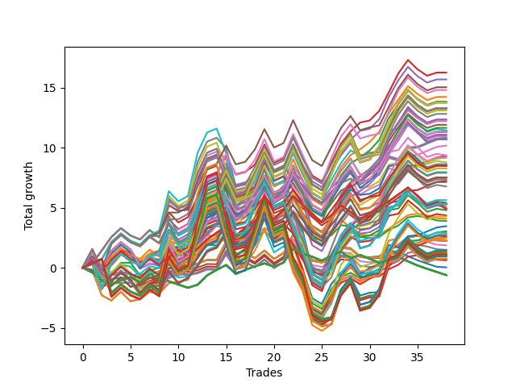

# Long HLT 304 
- Symbol: TSLA
- Date Range: 05/16/2022 - 05/17/2024
- Trading Period: 8:30-12:30
- Number of Trades: 38



| Id. | Name | Win Percent | Profit | Avg Profit / Trade | Avg Time / Trade | Std |      | Name | Win Percent | Profit | Avg Profit / Trade | Avg Time / Trade | Std |
| --- | ---- | ----------- | ------ | ------------------ | ---------------- | --- | ---- | ---- | ----------- | ------ | ------------------ | ---------------- | --- |
| | Sorted By <br> Profit | | | | | | | Sorted By <br> Win Percentage |||||
|0| TP-1.5 75m | 71.05 | 16.25 | 0.43 | 41:56 | 1.13 |     | TP-1.5 75m | 71.05 | 16.25 | 0.43 | 41:56 | 1.13 |
|1| TP-1.75 75m | 71.05 | 15.68 | 0.41 | 44:25 | 1.22 |     | TP-1.75 75m | 71.05 | 15.68 | 0.41 | 44:25 | 1.22 |
|2| TP-1.5 90m | 71.05 | 15.03 | 0.40 | 44:04 | 1.14 |     | TP-1.5 90m | 71.05 | 15.03 | 0.40 | 44:04 | 1.14 |
|3| TP-1.75 90m | 71.05 | 14.80 | 0.39 | 46:42 | 1.25 |     | TP-1.75 90m | 71.05 | 14.80 | 0.39 | 46:42 | 1.25 |
|4| TP-1.5 60m | 68.42 | 14.22 | 0.37 | 38:45 | 1.08 |     | TP-1.25 90m | 71.05 | 12.35 | 0.32 | 38:47 | 1.02 |
|5| TP-1.75 60m | 68.42 | 13.83 | 0.36 | 41:04 | 1.19 |     | TP-1.5 30m | 71.05 | 10.85 | 0.29 | 25:15 | 0.98 |
|6| TP-1.75 180m | 65.79 | 13.76 | 0.36 | 49:55 | 1.32 |     | TP-0.75 30m | 71.05 | 10.77 | 0.28 | 19:18 | 0.71 |
|7| TP-1.75 165m | 65.79 | 13.76 | 0.36 | 49:55 | 1.32 |     | TP-1.25 30m | 71.05 | 10.17 | 0.27 | 23:11 | 0.92 |
|8| TP-1.75 150m | 65.79 | 13.76 | 0.36 | 49:55 | 1.32 |     | TP-1 30m | 71.05 | 9.30 | 0.24 | 22:11 | 0.80 |
|9| TP-1.75 135m | 65.79 | 13.76 | 0.36 | 49:55 | 1.32 |     | TP-1.75 30m | 71.05 | 9.18 | 0.24 | 26:14 | 1.04 |
|10| TP-1.75 120m | 65.79 | 13.76 | 0.36 | 49:55 | 1.32 |     | TP-1.5 60m | 68.42 | 14.22 | 0.37 | 38:45 | 1.08 |
|11| TP-1.5 180m | 65.79 | 13.28 | 0.35 | 46:39 | 1.23 |     | TP-1.75 60m | 68.42 | 13.83 | 0.36 | 41:04 | 1.19 |
|12| TP-1.5 165m | 65.79 | 13.28 | 0.35 | 46:39 | 1.23 |     | TP-1.75 105m | 68.42 | 13.09 | 0.34 | 48:37 | 1.30 |
|13| TP-1.5 150m | 65.79 | 13.28 | 0.35 | 46:39 | 1.23 |     | TP-1.5 105m | 68.42 | 12.81 | 0.34 | 45:47 | 1.22 |
|14| TP-1.5 135m | 65.79 | 13.28 | 0.35 | 46:39 | 1.23 |     | TP-1.25 75m | 68.42 | 11.65 | 0.31 | 37:03 | 1.03 |
|15| TP-1.5 120m | 65.79 | 13.28 | 0.35 | 46:39 | 1.23 |     | TP-1.25 105m | 68.42 | 10.92 | 0.29 | 40:04 | 1.07 |
|16| TP-1.75 105m | 68.42 | 13.09 | 0.34 | 48:37 | 1.30 |     | TP-2.25 75m | 68.42 | 9.16 | 0.24 | 56:25 | 1.36 |
|17| TP-1.5 105m | 68.42 | 12.81 | 0.34 | 45:47 | 1.22 |     | TP-3 75m | 68.42 | 8.60 | 0.23 | 58:39 | 1.58 |
|18| TP-1.25 90m | 71.05 | 12.35 | 0.32 | 38:47 | 1.02 |     | TP-1 90m | 68.42 | 8.52 | 0.22 | 35:28 | 0.92 |
|19| TP-3 60m | 65.79 | 12.33 | 0.32 | 51:03 | 1.38 |     | TP-2.75 75m | 68.42 | 8.26 | 0.22 | 57:55 | 1.47 |
|20| TP-2.75 60m | 65.79 | 12.20 | 0.32 | 50:31 | 1.28 |     | TP-2.5 75m | 68.42 | 7.90 | 0.21 | 57:04 | 1.44 |
|21| TP-2.5 60m | 65.79 | 11.90 | 0.31 | 49:42 | 1.24 |     | TP-0.5 30m | 68.42 | 7.24 | 0.19 | 13:41 | 0.59 |
|22| TP-1.25 75m | 68.42 | 11.65 | 0.31 | 37:03 | 1.03 |     | TP-1.75 180m | 65.79 | 13.76 | 0.36 | 49:55 | 1.32 |
|23| TP-1.5 45m | 65.79 | 11.44 | 0.30 | 33:41 | 1.07 |     | TP-1.75 165m | 65.79 | 13.76 | 0.36 | 49:55 | 1.32 |
|24| TP-1.25 180m | 65.79 | 11.32 | 0.30 | 40:52 | 1.08 |     | TP-1.75 150m | 65.79 | 13.76 | 0.36 | 49:55 | 1.32 |
|25| TP-1.25 165m | 65.79 | 11.32 | 0.30 | 40:52 | 1.08 |     | TP-1.75 135m | 65.79 | 13.76 | 0.36 | 49:55 | 1.32 |
|26| TP-1.25 150m | 65.79 | 11.32 | 0.30 | 40:52 | 1.08 |     | TP-1.75 120m | 65.79 | 13.76 | 0.36 | 49:55 | 1.32 |
|27| TP-1.25 135m | 65.79 | 11.32 | 0.30 | 40:52 | 1.08 |     | TP-1.5 180m | 65.79 | 13.28 | 0.35 | 46:39 | 1.23 |
|28| TP-1.25 120m | 65.79 | 11.32 | 0.30 | 40:52 | 1.08 |     | TP-1.5 165m | 65.79 | 13.28 | 0.35 | 46:39 | 1.23 |
|29| TP-2.25 60m | 65.79 | 11.08 | 0.29 | 49:25 | 1.24 |     | TP-1.5 150m | 65.79 | 13.28 | 0.35 | 46:39 | 1.23 |
|30| TP-1.25 60m | 65.79 | 11.01 | 0.29 | 34:31 | 1.02 |     | TP-1.5 135m | 65.79 | 13.28 | 0.35 | 46:39 | 1.23 |
|31| TP-1.25 105m | 68.42 | 10.92 | 0.29 | 40:04 | 1.07 |     | TP-1.5 120m | 65.79 | 13.28 | 0.35 | 46:39 | 1.23 |
|32| TP-1.5 30m | 71.05 | 10.85 | 0.29 | 25:15 | 0.98 |     | TP-3 60m | 65.79 | 12.33 | 0.32 | 51:03 | 1.38 |
|33| TP-0.75 30m | 71.05 | 10.77 | 0.28 | 19:18 | 0.71 |     | TP-2.75 60m | 65.79 | 12.20 | 0.32 | 50:31 | 1.28 |
|34| TP-0.75 180m | 65.79 | 10.72 | 0.28 | 24:03 | 0.85 |     | TP-2.5 60m | 65.79 | 11.90 | 0.31 | 49:42 | 1.24 |
|35| TP-0.75 165m | 65.79 | 10.72 | 0.28 | 24:03 | 0.85 |     | TP-1.5 45m | 65.79 | 11.44 | 0.30 | 33:41 | 1.07 |
|36| TP-0.75 150m | 65.79 | 10.72 | 0.28 | 24:03 | 0.85 |     | TP-1.25 180m | 65.79 | 11.32 | 0.30 | 40:52 | 1.08 |
|37| TP-0.75 135m | 65.79 | 10.72 | 0.28 | 24:03 | 0.85 |     | TP-1.25 165m | 65.79 | 11.32 | 0.30 | 40:52 | 1.08 |
|38| TP-0.75 120m | 65.79 | 10.72 | 0.28 | 24:03 | 0.85 |     | TP-1.25 150m | 65.79 | 11.32 | 0.30 | 40:52 | 1.08 |
|39| TP-0.75 105m | 65.79 | 10.72 | 0.28 | 24:03 | 0.85 |     | TP-1.25 135m | 65.79 | 11.32 | 0.30 | 40:52 | 1.08 |
|40| TP-0.75 90m | 65.79 | 10.72 | 0.28 | 24:03 | 0.85 |     | TP-1.25 120m | 65.79 | 11.32 | 0.30 | 40:52 | 1.08 |
|41| TP-0.75 75m | 65.79 | 10.72 | 0.28 | 24:03 | 0.85 |     | TP-2.25 60m | 65.79 | 11.08 | 0.29 | 49:25 | 1.24 |
|42| TP-0.75 60m | 65.79 | 10.72 | 0.28 | 24:03 | 0.85 |     | TP-1.25 60m | 65.79 | 11.01 | 0.29 | 34:31 | 1.02 |
|43| TP-1.25 30m | 71.05 | 10.17 | 0.27 | 23:11 | 0.92 |     | TP-0.75 180m | 65.79 | 10.72 | 0.28 | 24:03 | 0.85 |
|44| TP-0.75 45m | 63.16 | 9.36 | 0.25 | 23:48 | 0.84 |     | TP-0.75 165m | 65.79 | 10.72 | 0.28 | 24:03 | 0.85 |
|45| TP-1 30m | 71.05 | 9.30 | 0.24 | 22:11 | 0.80 |     | TP-0.75 150m | 65.79 | 10.72 | 0.28 | 24:03 | 0.85 |
|46| TP-1.75 30m | 71.05 | 9.18 | 0.24 | 26:14 | 1.04 |     | TP-0.75 135m | 65.79 | 10.72 | 0.28 | 24:03 | 0.85 |
|47| TP-2.25 75m | 68.42 | 9.16 | 0.24 | 56:25 | 1.36 |     | TP-0.75 120m | 65.79 | 10.72 | 0.28 | 24:03 | 0.85 |
|48| TP-1.25 45m | 63.16 | 8.77 | 0.23 | 30:11 | 1.01 |     | TP-0.75 105m | 65.79 | 10.72 | 0.28 | 24:03 | 0.85 |
|49| TP-2 75m | 65.79 | 8.62 | 0.23 | 49:18 | 1.45 |     | TP-0.75 90m | 65.79 | 10.72 | 0.28 | 24:03 | 0.85 |
|50| TP-3 75m | 68.42 | 8.60 | 0.23 | 58:39 | 1.58 |     | TP-0.75 75m | 65.79 | 10.72 | 0.28 | 24:03 | 0.85 |
|51| TP-1 90m | 68.42 | 8.52 | 0.22 | 35:28 | 0.92 |     | TP-0.75 60m | 65.79 | 10.72 | 0.28 | 24:03 | 0.85 |
|52| TP-2 60m | 63.16 | 8.48 | 0.22 | 45:18 | 1.35 |     | TP-2 75m | 65.79 | 8.62 | 0.23 | 49:18 | 1.45 |
|53| TP-1.75 45m | 63.16 | 8.46 | 0.22 | 35:33 | 1.13 |     | TP-1 75m | 65.79 | 8.27 | 0.22 | 34:07 | 0.94 |
|54| TP-1 75m | 65.79 | 8.27 | 0.22 | 34:07 | 0.94 |     | TP-2 90m | 65.79 | 7.35 | 0.19 | 51:50 | 1.45 |
|55| TP-2.75 75m | 68.42 | 8.26 | 0.22 | 57:55 | 1.47 |     | TP-1 105m | 65.79 | 7.14 | 0.19 | 36:18 | 0.94 |
|56| TP-1 60m | 63.16 | 7.96 | 0.21 | 32:04 | 0.93 |     | TP-2.25 30m | 65.79 | 3.46 | 0.09 | 28:11 | 1.00 |
|57| TP-2.5 75m | 68.42 | 7.90 | 0.21 | 57:04 | 1.44 |     | TP-2.75 30m | 65.79 | 3.04 | 0.08 | 28:33 | 1.03 |
|58| TP-1 180m | 63.16 | 7.51 | 0.20 | 36:58 | 0.95 |     | TP-2 30m | 65.79 | 2.83 | 0.07 | 27:37 | 1.06 |
|59| TP-1 165m | 63.16 | 7.51 | 0.20 | 36:58 | 0.95 |     | TP-2.5 30m | 65.79 | 2.78 | 0.07 | 28:15 | 1.05 |
|60| TP-1 150m | 63.16 | 7.51 | 0.20 | 36:58 | 0.95 |     | TP-3 30m | 65.79 | 2.58 | 0.07 | 28:34 | 1.07 |
|61| TP-1 135m | 63.16 | 7.51 | 0.20 | 36:58 | 0.95 |     | TP-0.75 45m | 63.16 | 9.36 | 0.25 | 23:48 | 0.84 |
|62| TP-1 120m | 63.16 | 7.51 | 0.20 | 36:58 | 0.95 |     | TP-1.25 45m | 63.16 | 8.77 | 0.23 | 30:11 | 1.01 |
|63| TP-2 90m | 65.79 | 7.35 | 0.19 | 51:50 | 1.45 |     | TP-2 60m | 63.16 | 8.48 | 0.22 | 45:18 | 1.35 |
|64| TP-0.5 30m | 68.42 | 7.24 | 0.19 | 13:41 | 0.59 |     | TP-1.75 45m | 63.16 | 8.46 | 0.22 | 35:33 | 1.13 |
|65| TP-1 105m | 65.79 | 7.14 | 0.19 | 36:18 | 0.94 |     | TP-1 60m | 63.16 | 7.96 | 0.21 | 32:04 | 0.93 |
|66| TP-1 45m | 63.16 | 6.77 | 0.18 | 28:39 | 0.91 |     | TP-1 180m | 63.16 | 7.51 | 0.20 | 36:58 | 0.95 |
|67| TP-2 105m | 63.16 | 5.63 | 0.15 | 54:12 | 1.48 |     | TP-1 165m | 63.16 | 7.51 | 0.20 | 36:58 | 0.95 |
|68| TP-3 45m | 57.89 | 5.40 | 0.14 | 41:14 | 1.17 |     | TP-1 150m | 63.16 | 7.51 | 0.20 | 36:58 | 0.95 |
|69| TP-2 180m | 60.53 | 5.29 | 0.14 | 56:25 | 1.52 |     | TP-1 135m | 63.16 | 7.51 | 0.20 | 36:58 | 0.95 |
|70| TP-2 165m | 60.53 | 5.29 | 0.14 | 56:25 | 1.52 |     | TP-1 120m | 63.16 | 7.51 | 0.20 | 36:58 | 0.95 |
|71| TP-2 150m | 60.53 | 5.29 | 0.14 | 56:25 | 1.52 |     | TP-1 45m | 63.16 | 6.77 | 0.18 | 28:39 | 0.91 |
|72| TP-2 135m | 60.53 | 5.29 | 0.14 | 56:25 | 1.52 |     | TP-2 105m | 63.16 | 5.63 | 0.15 | 54:12 | 1.48 |
|73| TP-2 120m | 60.53 | 5.29 | 0.14 | 56:25 | 1.52 |     | TP-2.25 90m | 63.16 | 4.27 | 0.11 | 60:52 | 1.45 |
|74| TP-2.75 45m | 57.89 | 5.06 | 0.13 | 41:09 | 1.08 |     | TP-2.5 90m | 63.16 | 2.92 | 0.08 | 62:14 | 1.52 |
|75| TP-0.5 180m | 60.53 | 4.89 | 0.13 | 14:48 | 0.64 |     | TP-2.75 90m | 63.16 | 2.66 | 0.07 | 63:25 | 1.53 |
|76| TP-0.5 165m | 60.53 | 4.89 | 0.13 | 14:48 | 0.64 |     | TP-3 90m | 63.16 | 2.48 | 0.07 | 64:22 | 1.66 |
|77| TP-0.5 150m | 60.53 | 4.89 | 0.13 | 14:48 | 0.64 |     | TP-2.25 105m | 63.16 | 1.44 | 0.04 | 64:30 | 1.52 |
|78| TP-0.5 135m | 60.53 | 4.89 | 0.13 | 14:48 | 0.64 |     | TP-2.75 105m | 63.16 | 1.34 | 0.04 | 68:07 | 1.65 |
|79| TP-0.5 120m | 60.53 | 4.89 | 0.13 | 14:48 | 0.64 |     | TP-2.5 105m | 63.16 | 1.24 | 0.03 | 66:09 | 1.63 |
|80| TP-0.5 105m | 60.53 | 4.89 | 0.13 | 14:48 | 0.64 |     | TP-3 105m | 63.16 | 1.18 | 0.03 | 69:14 | 1.80 |
|81| TP-0.5 90m | 60.53 | 4.89 | 0.13 | 14:48 | 0.64 |     | TP-2 180m | 60.53 | 5.29 | 0.14 | 56:25 | 1.52 |
|82| TP-0.5 75m | 60.53 | 4.89 | 0.13 | 14:48 | 0.64 |     | TP-2 165m | 60.53 | 5.29 | 0.14 | 56:25 | 1.52 |
|83| TP-0.5 60m | 60.53 | 4.89 | 0.13 | 14:48 | 0.64 |     | TP-2 150m | 60.53 | 5.29 | 0.14 | 56:25 | 1.52 |
|84| TP-0.5 45m | 60.53 | 4.89 | 0.13 | 14:48 | 0.64 |     | TP-2 135m | 60.53 | 5.29 | 0.14 | 56:25 | 1.52 |
|85| TP-2.25 45m | 57.89 | 4.79 | 0.13 | 40:18 | 1.03 |     | TP-2 120m | 60.53 | 5.29 | 0.14 | 56:25 | 1.52 |
|86| TP-2.5 45m | 57.89 | 4.35 | 0.11 | 40:26 | 1.09 |     | TP-0.5 180m | 60.53 | 4.89 | 0.13 | 14:48 | 0.64 |
|87| TP-2.25 90m | 63.16 | 4.27 | 0.11 | 60:52 | 1.45 |     | TP-0.5 165m | 60.53 | 4.89 | 0.13 | 14:48 | 0.64 |
|88| TP-0.5 15m | 57.89 | 4.08 | 0.11 | 10:01 | 0.55 |     | TP-0.5 150m | 60.53 | 4.89 | 0.13 | 14:48 | 0.64 |
|89| TP-0.75 15m | 57.89 | 3.89 | 0.10 | 12:01 | 0.63 |     | TP-0.5 135m | 60.53 | 4.89 | 0.13 | 14:48 | 0.64 |
|90| TP-2.25 30m | 65.79 | 3.46 | 0.09 | 28:11 | 1.00 |     | TP-0.5 120m | 60.53 | 4.89 | 0.13 | 14:48 | 0.64 |
|91| TP-2.75 30m | 65.79 | 3.04 | 0.08 | 28:33 | 1.03 |     | TP-0.5 105m | 60.53 | 4.89 | 0.13 | 14:48 | 0.64 |
|92| TP-2.5 90m | 63.16 | 2.92 | 0.08 | 62:14 | 1.52 |     | TP-0.5 90m | 60.53 | 4.89 | 0.13 | 14:48 | 0.64 |
|93| TP-2 30m | 65.79 | 2.83 | 0.07 | 27:37 | 1.06 |     | TP-0.5 75m | 60.53 | 4.89 | 0.13 | 14:48 | 0.64 |
|94| TP-2.5 30m | 65.79 | 2.78 | 0.07 | 28:15 | 1.05 |     | TP-0.5 60m | 60.53 | 4.89 | 0.13 | 14:48 | 0.64 |
|95| TP-2.75 90m | 63.16 | 2.66 | 0.07 | 63:25 | 1.53 |     | TP-0.5 45m | 60.53 | 4.89 | 0.13 | 14:48 | 0.64 |
|96| TP-3 30m | 65.79 | 2.58 | 0.07 | 28:34 | 1.07 |     | TP-3 180m | 60.53 | 1.11 | 0.03 | 73:31 | 1.87 |
|97| TP-3 90m | 63.16 | 2.48 | 0.07 | 64:22 | 1.66 |     | TP-3 165m | 60.53 | 1.11 | 0.03 | 73:31 | 1.87 |
|98| TP-1.5 15m | 57.89 | 2.29 | 0.06 | 13:28 | 0.70 |     | TP-3 150m | 60.53 | 1.11 | 0.03 | 73:31 | 1.87 |
|99| TP-2 45m | 57.89 | 2.28 | 0.06 | 38:20 | 1.18 |     | TP-3 135m | 60.53 | 1.11 | 0.03 | 73:31 | 1.87 |
|100| TP-3 15m | 57.89 | 2.23 | 0.06 | 14:00 | 0.66 |     | TP-3 120m | 60.53 | 1.11 | 0.03 | 73:31 | 1.87 |
|101| TP-2.75 15m | 57.89 | 2.23 | 0.06 | 14:00 | 0.66 |     | TP-2.75 180m | 60.53 | 1.04 | 0.03 | 72:12 | 1.72 |
|102| TP-2.5 15m | 57.89 | 2.23 | 0.06 | 14:00 | 0.66 |     | TP-2.75 165m | 60.53 | 1.04 | 0.03 | 72:12 | 1.72 |
|103| TP-2.25 15m | 57.89 | 2.23 | 0.06 | 14:00 | 0.66 |     | TP-2.75 150m | 60.53 | 1.04 | 0.03 | 72:12 | 1.72 |
|104| TP-1.75 15m | 57.89 | 1.87 | 0.05 | 13:39 | 0.73 |     | TP-2.75 135m | 60.53 | 1.04 | 0.03 | 72:12 | 1.72 |
|105| TP-2 15m | 57.89 | 1.49 | 0.04 | 13:56 | 0.71 |     | TP-2.75 120m | 60.53 | 1.04 | 0.03 | 72:12 | 1.72 |
|106| TP-2.25 105m | 63.16 | 1.44 | 0.04 | 64:30 | 1.52 |     | TP-2.25 180m | 60.53 | 0.94 | 0.02 | 67:58 | 1.58 |
|107| TP-2.75 105m | 63.16 | 1.34 | 0.04 | 68:07 | 1.65 |     | TP-2.25 165m | 60.53 | 0.94 | 0.02 | 67:58 | 1.58 |
|108| TP-2.5 105m | 63.16 | 1.24 | 0.03 | 66:09 | 1.63 |     | TP-2.25 150m | 60.53 | 0.94 | 0.02 | 67:58 | 1.58 |
|109| TP-3 105m | 63.16 | 1.18 | 0.03 | 69:14 | 1.80 |     | TP-2.25 135m | 60.53 | 0.94 | 0.02 | 67:58 | 1.58 |
|110| TP-3 180m | 60.53 | 1.11 | 0.03 | 73:31 | 1.87 |     | TP-2.25 120m | 60.53 | 0.94 | 0.02 | 67:58 | 1.58 |
|111| TP-3 165m | 60.53 | 1.11 | 0.03 | 73:31 | 1.87 |     | TP-2.5 180m | 60.53 | 0.74 | 0.02 | 69:37 | 1.69 |
|112| TP-3 150m | 60.53 | 1.11 | 0.03 | 73:31 | 1.87 |     | TP-2.5 165m | 60.53 | 0.74 | 0.02 | 69:37 | 1.69 |
|113| TP-3 135m | 60.53 | 1.11 | 0.03 | 73:31 | 1.87 |     | TP-2.5 150m | 60.53 | 0.74 | 0.02 | 69:37 | 1.69 |
|114| TP-3 120m | 60.53 | 1.11 | 0.03 | 73:31 | 1.87 |     | TP-2.5 135m | 60.53 | 0.74 | 0.02 | 69:37 | 1.69 |
|115| TP-2.75 180m | 60.53 | 1.04 | 0.03 | 72:12 | 1.72 |     | TP-2.5 120m | 60.53 | 0.74 | 0.02 | 69:37 | 1.69 |
|116| TP-2.75 165m | 60.53 | 1.04 | 0.03 | 72:12 | 1.72 |     | TP-3 45m | 57.89 | 5.40 | 0.14 | 41:14 | 1.17 |
|117| TP-2.75 150m | 60.53 | 1.04 | 0.03 | 72:12 | 1.72 |     | TP-2.75 45m | 57.89 | 5.06 | 0.13 | 41:09 | 1.08 |
|118| TP-2.75 135m | 60.53 | 1.04 | 0.03 | 72:12 | 1.72 |     | TP-2.25 45m | 57.89 | 4.79 | 0.13 | 40:18 | 1.03 |
|119| TP-2.75 120m | 60.53 | 1.04 | 0.03 | 72:12 | 1.72 |     | TP-2.5 45m | 57.89 | 4.35 | 0.11 | 40:26 | 1.09 |
|120| TP-2.25 180m | 60.53 | 0.94 | 0.02 | 67:58 | 1.58 |     | TP-0.5 15m | 57.89 | 4.08 | 0.11 | 10:01 | 0.55 |
|121| TP-2.25 165m | 60.53 | 0.94 | 0.02 | 67:58 | 1.58 |     | TP-0.75 15m | 57.89 | 3.89 | 0.10 | 12:01 | 0.63 |
|122| TP-2.25 150m | 60.53 | 0.94 | 0.02 | 67:58 | 1.58 |     | TP-1.5 15m | 57.89 | 2.29 | 0.06 | 13:28 | 0.70 |
|123| TP-2.25 135m | 60.53 | 0.94 | 0.02 | 67:58 | 1.58 |     | TP-2 45m | 57.89 | 2.28 | 0.06 | 38:20 | 1.18 |
|124| TP-2.25 120m | 60.53 | 0.94 | 0.02 | 67:58 | 1.58 |     | TP-3 15m | 57.89 | 2.23 | 0.06 | 14:00 | 0.66 |
|125| TP-1.25 15m | 57.89 | 0.94 | 0.02 | 13:00 | 0.72 |     | TP-2.75 15m | 57.89 | 2.23 | 0.06 | 14:00 | 0.66 |
|126| TP-2.5 180m | 60.53 | 0.74 | 0.02 | 69:37 | 1.69 |     | TP-2.5 15m | 57.89 | 2.23 | 0.06 | 14:00 | 0.66 |
|127| TP-2.5 165m | 60.53 | 0.74 | 0.02 | 69:37 | 1.69 |     | TP-2.25 15m | 57.89 | 2.23 | 0.06 | 14:00 | 0.66 |
|128| TP-2.5 150m | 60.53 | 0.74 | 0.02 | 69:37 | 1.69 |     | TP-1.75 15m | 57.89 | 1.87 | 0.05 | 13:39 | 0.73 |
|129| TP-2.5 135m | 60.53 | 0.74 | 0.02 | 69:37 | 1.69 |     | TP-2 15m | 57.89 | 1.49 | 0.04 | 13:56 | 0.71 |
|130| TP-2.5 120m | 60.53 | 0.74 | 0.02 | 69:37 | 1.69 |     | TP-1.25 15m | 57.89 | 0.94 | 0.02 | 13:00 | 0.72 |
|131| TP-1 15m | 57.89 | 0.62 | 0.02 | 12:41 | 0.64 |     | TP-1 15m | 57.89 | 0.62 | 0.02 | 12:41 | 0.64 |
|132| TP-0.25 15m | 47.37 | 0.03 | 0.00 | 05:22 | 0.42 |     | TP-0.25 15m | 47.37 | 0.03 | 0.00 | 05:22 | 0.42 |
|133| TP-0.25 180m | 44.74 | -0.61 | -0.02 | 05:36 | 0.43 |     | TP-0.25 180m | 44.74 | -0.61 | -0.02 | 05:36 | 0.43 |
|134| TP-0.25 165m | 44.74 | -0.61 | -0.02 | 05:36 | 0.43 |     | TP-0.25 165m | 44.74 | -0.61 | -0.02 | 05:36 | 0.43 |
|135| TP-0.25 150m | 44.74 | -0.61 | -0.02 | 05:36 | 0.43 |     | TP-0.25 150m | 44.74 | -0.61 | -0.02 | 05:36 | 0.43 |
|136| TP-0.25 135m | 44.74 | -0.61 | -0.02 | 05:36 | 0.43 |     | TP-0.25 135m | 44.74 | -0.61 | -0.02 | 05:36 | 0.43 |
|137| TP-0.25 120m | 44.74 | -0.61 | -0.02 | 05:36 | 0.43 |     | TP-0.25 120m | 44.74 | -0.61 | -0.02 | 05:36 | 0.43 |
|138| TP-0.25 105m | 44.74 | -0.61 | -0.02 | 05:36 | 0.43 |     | TP-0.25 105m | 44.74 | -0.61 | -0.02 | 05:36 | 0.43 |
|139| TP-0.25 90m | 44.74 | -0.61 | -0.02 | 05:36 | 0.43 |     | TP-0.25 90m | 44.74 | -0.61 | -0.02 | 05:36 | 0.43 |
|140| TP-0.25 75m | 44.74 | -0.61 | -0.02 | 05:36 | 0.43 |     | TP-0.25 75m | 44.74 | -0.61 | -0.02 | 05:36 | 0.43 |
|141| TP-0.25 60m | 44.74 | -0.61 | -0.02 | 05:36 | 0.43 |     | TP-0.25 60m | 44.74 | -0.61 | -0.02 | 05:36 | 0.43 |
|142| TP-0.25 45m | 44.74 | -0.61 | -0.02 | 05:36 | 0.43 |     | TP-0.25 45m | 44.74 | -0.61 | -0.02 | 05:36 | 0.43 |
|143| TP-0.25 30m | 44.74 | -0.61 | -0.02 | 05:36 | 0.43 |     | TP-0.25 30m | 44.74 | -0.61 | -0.02 | 05:36 | 0.43 |

### Test TP-0.25 15m
* Take Profit of 0.25 Point
* 0.25 Stoploss
* Results:
```
Total Trades: 38
Percent Up: 47.37
Percent Down: 52.63
Total Points Moved Up: 0.03
Potential Profit: 15.00
Total Points Ups: 7.10 Count Ups: 18
Total Points Downs: -7.07 Count Downs: 20
```

<details><summary>Trades</summary>

<code>In: 2022-08-04 12:00:00		Out: 2022-08-04 12:04:00		Total Position Time: 04:00		Total Move Up: -0.40		Total to Date: -0.40</code> <br />
<code>In: 2022-08-11 08:40:00		Out: 2022-08-11 08:45:00		Total Position Time: 05:00		Total Move Up: -0.61		Total to Date: -1.01</code> <br />
<code>In: 2022-08-16 10:10:00		Out: 2022-08-16 10:12:00		Total Position Time: 02:00		Total Move Up: -0.33		Total to Date: -1.34</code> <br />
<code>In: 2022-08-16 12:30:00		Out: 2022-08-16 12:32:00		Total Position Time: 02:00		Total Move Up: 0.29		Total to Date: -1.05</code> <br />
<code>In: 2022-08-18 12:00:00		Out: 2022-08-18 12:06:00		Total Position Time: 06:00		Total Move Up: 0.27		Total to Date: -0.78</code> <br />
<code>In: 2022-11-08 11:55:00		Out: 2022-11-08 11:57:00		Total Position Time: 02:00		Total Move Up: -0.41		Total to Date: -1.19</code> <br />
<code>In: 2022-11-18 12:05:00		Out: 2022-11-18 12:07:00		Total Position Time: 02:00		Total Move Up: 0.65		Total to Date: -0.54</code> <br />
<code>In: 2022-11-22 09:05:00		Out: 2022-11-22 09:09:00		Total Position Time: 04:00		Total Move Up: -0.28		Total to Date: -0.82</code> <br />
<code>In: 2022-11-30 09:50:00		Out: 2022-11-30 09:57:00		Total Position Time: 07:00		Total Move Up: -0.31		Total to Date: -1.13</code> <br />
<code>In: 2022-12-02 08:35:00		Out: 2022-12-02 08:37:00		Total Position Time: 02:00		Total Move Up: -0.27		Total to Date: -1.40</code> <br />
<code>In: 2022-12-15 11:40:00		Out: 2022-12-15 11:47:00		Total Position Time: 07:00		Total Move Up: -0.27		Total to Date: -1.67</code> <br />
<code>In: 2022-12-19 09:15:00		Out: 2022-12-19 09:22:00		Total Position Time: 07:00		Total Move Up: 0.25		Total to Date: -1.42</code> <br />
<code>In: 2023-02-07 11:05:00		Out: 2023-02-07 11:08:00		Total Position Time: 03:00		Total Move Up: 0.78		Total to Date: -0.64</code> <br />
<code>In: 2023-02-13 12:15:00		Out: 2023-02-13 12:20:00		Total Position Time: 05:00		Total Move Up: 0.46		Total to Date: -0.18</code> <br />
<code>In: 2023-02-16 10:50:00		Out: 2023-02-16 10:55:00		Total Position Time: 05:00		Total Move Up: 0.41		Total to Date: 0.23</code> <br />
<code>In: 2023-03-10 09:40:00		Out: 2023-03-10 09:42:00		Total Position Time: 02:00		Total Move Up: -0.75		Total to Date: -0.52</code> <br />
<code>In: 2023-03-17 12:00:00		Out: 2023-03-17 12:11:00		Total Position Time: 11:00		Total Move Up: 0.34		Total to Date: -0.18</code> <br />
<code>In: 2023-04-14 09:35:00		Out: 2023-04-14 09:42:00		Total Position Time: 07:00		Total Move Up: 0.30		Total to Date: 0.12</code> <br />
<code>In: 2023-04-17 11:30:00		Out: 2023-04-17 11:32:00		Total Position Time: 02:00		Total Move Up: 0.24		Total to Date: 0.36</code> <br />
<code>In: 2023-04-26 11:35:00		Out: 2023-04-26 11:40:00		Total Position Time: 05:00		Total Move Up: -0.26		Total to Date: 0.10</code> <br />
<code>In: 2023-05-24 12:20:00		Out: 2023-05-24 12:22:00		Total Position Time: 02:00		Total Move Up: 0.33		Total to Date: 0.43</code> <br />
<code>In: 2023-06-21 08:35:00		Out: 2023-06-21 08:37:00		Total Position Time: 02:00		Total Move Up: 1.16		Total to Date: 1.59</code> <br />
<code>In: 2023-07-11 09:00:00		Out: 2023-07-11 09:07:00		Total Position Time: 07:00		Total Move Up: -0.40		Total to Date: 1.19</code> <br />
<code>In: 2023-09-22 09:45:00		Out: 2023-09-22 09:48:00		Total Position Time: 03:00		Total Move Up: -0.28		Total to Date: 0.91</code> <br />
<code>In: 2023-10-18 12:25:00		Out: 2023-10-18 12:28:00		Total Position Time: 03:00		Total Move Up: -0.32		Total to Date: 0.59</code> <br />
<code>In: 2023-10-24 10:05:00		Out: 2023-10-24 10:08:00		Total Position Time: 03:00		Total Move Up: 0.41		Total to Date: 1.00</code> <br />
<code>In: 2023-11-08 09:50:00		Out: 2023-11-08 10:03:00		Total Position Time: 13:00		Total Move Up: 0.34		Total to Date: 1.34</code> <br />
<code>In: 2023-11-22 12:05:00		Out: 2023-11-22 12:13:00		Total Position Time: 08:00		Total Move Up: -0.56		Total to Date: 0.78</code> <br />
<code>In: 2023-11-30 08:50:00		Out: 2023-11-30 08:52:00		Total Position Time: 02:00		Total Move Up: 0.29		Total to Date: 1.07</code> <br />
<code>In: 2023-12-01 11:30:00		Out: 2023-12-01 11:33:00		Total Position Time: 03:00		Total Move Up: -0.33		Total to Date: 0.74</code> <br />
<code>In: 2023-12-11 09:10:00		Out: 2023-12-11 09:24:00		Total Position Time: 14:00		Total Move Up: 0.09		Total to Date: 0.83</code> <br />
<code>In: 2023-12-21 10:30:00		Out: 2023-12-21 10:32:00		Total Position Time: 02:00		Total Move Up: 0.26		Total to Date: 1.09</code> <br />
<code>In: 2024-01-05 09:45:00		Out: 2024-01-05 09:53:00		Total Position Time: 08:00		Total Move Up: 0.23		Total to Date: 1.32</code> <br />
<code>In: 2024-02-21 12:20:00		Out: 2024-02-21 12:22:00		Total Position Time: 02:00		Total Move Up: -0.36		Total to Date: 0.96</code> <br />
<code>In: 2024-02-23 11:45:00		Out: 2024-02-23 11:52:00		Total Position Time: 07:00		Total Move Up: -0.34		Total to Date: 0.62</code> <br />
<code>In: 2024-03-13 11:50:00		Out: 2024-03-13 11:58:00		Total Position Time: 08:00		Total Move Up: -0.28		Total to Date: 0.34</code> <br />
<code>In: 2024-04-02 12:10:00		Out: 2024-04-02 12:23:00		Total Position Time: 13:00		Total Move Up: -0.26		Total to Date: 0.08</code> <br />
<code>In: 2024-04-22 12:05:00		Out: 2024-04-22 12:19:00		Total Position Time: 14:00		Total Move Up: -0.05		Total to Date: 0.03</code> <br />


</details>

### Test TP-0.5 15m
* Take Profit of 0.5 Point
* 0.5 Stoploss
* Results:
```
Total Trades: 38
Percent Up: 57.89
Percent Down: 42.11
Total Points Moved Up: 4.08
Potential Profit: 2040.00
Total Points Ups: 11.35 Count Ups: 22
Total Points Downs: -7.27 Count Downs: 16
```

<details><summary>Trades</summary>

<code>In: 2022-08-04 12:00:00		Out: 2022-08-04 12:14:00		Total Position Time: 14:00		Total Move Up: 0.56		Total to Date: 0.56</code> <br />
<code>In: 2022-08-11 08:40:00		Out: 2022-08-11 08:45:00		Total Position Time: 05:00		Total Move Up: -0.61		Total to Date: -0.05</code> <br />
<code>In: 2022-08-16 10:10:00		Out: 2022-08-16 10:24:00		Total Position Time: 14:00		Total Move Up: 0.22		Total to Date: 0.17</code> <br />
<code>In: 2022-08-16 12:30:00		Out: 2022-08-16 12:42:00		Total Position Time: 12:00		Total Move Up: 0.90		Total to Date: 1.07</code> <br />
<code>In: 2022-08-18 12:00:00		Out: 2022-08-18 12:14:00		Total Position Time: 14:00		Total Move Up: 0.01		Total to Date: 1.08</code> <br />
<code>In: 2022-11-08 11:55:00		Out: 2022-11-08 11:58:00		Total Position Time: 03:00		Total Move Up: -0.54		Total to Date: 0.54</code> <br />
<code>In: 2022-11-18 12:05:00		Out: 2022-11-18 12:07:00		Total Position Time: 02:00		Total Move Up: 0.65		Total to Date: 1.19</code> <br />
<code>In: 2022-11-22 09:05:00		Out: 2022-11-22 09:19:00		Total Position Time: 14:00		Total Move Up: 0.25		Total to Date: 1.44</code> <br />
<code>In: 2022-11-30 09:50:00		Out: 2022-11-30 10:04:00		Total Position Time: 14:00		Total Move Up: 0.22		Total to Date: 1.66</code> <br />
<code>In: 2022-12-02 08:35:00		Out: 2022-12-02 08:42:00		Total Position Time: 07:00		Total Move Up: 0.60		Total to Date: 2.26</code> <br />
<code>In: 2022-12-15 11:40:00		Out: 2022-12-15 11:48:00		Total Position Time: 08:00		Total Move Up: -0.51		Total to Date: 1.75</code> <br />
<code>In: 2022-12-19 09:15:00		Out: 2022-12-19 09:29:00		Total Position Time: 14:00		Total Move Up: 0.15		Total to Date: 1.90</code> <br />
<code>In: 2023-02-07 11:05:00		Out: 2023-02-07 11:08:00		Total Position Time: 03:00		Total Move Up: 0.78		Total to Date: 2.68</code> <br />
<code>In: 2023-02-13 12:15:00		Out: 2023-02-13 12:29:00		Total Position Time: 14:00		Total Move Up: -0.02		Total to Date: 2.66</code> <br />
<code>In: 2023-02-16 10:50:00		Out: 2023-02-16 10:59:00		Total Position Time: 09:00		Total Move Up: 0.52		Total to Date: 3.18</code> <br />
<code>In: 2023-03-10 09:40:00		Out: 2023-03-10 09:42:00		Total Position Time: 02:00		Total Move Up: -0.75		Total to Date: 2.43</code> <br />
<code>In: 2023-03-17 12:00:00		Out: 2023-03-17 12:14:00		Total Position Time: 14:00		Total Move Up: 0.63		Total to Date: 3.06</code> <br />
<code>In: 2023-04-14 09:35:00		Out: 2023-04-14 09:49:00		Total Position Time: 14:00		Total Move Up: -0.42		Total to Date: 2.64</code> <br />
<code>In: 2023-04-17 11:30:00		Out: 2023-04-17 11:42:00		Total Position Time: 12:00		Total Move Up: 0.67		Total to Date: 3.31</code> <br />
<code>In: 2023-04-26 11:35:00		Out: 2023-04-26 11:44:00		Total Position Time: 09:00		Total Move Up: -0.52		Total to Date: 2.79</code> <br />
<code>In: 2023-05-24 12:20:00		Out: 2023-05-24 12:32:00		Total Position Time: 12:00		Total Move Up: 0.78		Total to Date: 3.57</code> <br />
<code>In: 2023-06-21 08:35:00		Out: 2023-06-21 08:37:00		Total Position Time: 02:00		Total Move Up: 1.16		Total to Date: 4.73</code> <br />
<code>In: 2023-07-11 09:00:00		Out: 2023-07-11 09:09:00		Total Position Time: 09:00		Total Move Up: -0.76		Total to Date: 3.97</code> <br />
<code>In: 2023-09-22 09:45:00		Out: 2023-09-22 09:49:00		Total Position Time: 04:00		Total Move Up: -0.73		Total to Date: 3.24</code> <br />
<code>In: 2023-10-18 12:25:00		Out: 2023-10-18 12:29:00		Total Position Time: 04:00		Total Move Up: -0.71		Total to Date: 2.53</code> <br />
<code>In: 2023-10-24 10:05:00		Out: 2023-10-24 10:17:00		Total Position Time: 12:00		Total Move Up: 0.59		Total to Date: 3.12</code> <br />
<code>In: 2023-11-08 09:50:00		Out: 2023-11-08 10:04:00		Total Position Time: 14:00		Total Move Up: 0.83		Total to Date: 3.95</code> <br />
<code>In: 2023-11-22 12:05:00		Out: 2023-11-22 12:13:00		Total Position Time: 08:00		Total Move Up: -0.56		Total to Date: 3.39</code> <br />
<code>In: 2023-11-30 08:50:00		Out: 2023-11-30 08:57:00		Total Position Time: 07:00		Total Move Up: -0.63		Total to Date: 2.76</code> <br />
<code>In: 2023-12-01 11:30:00		Out: 2023-12-01 11:44:00		Total Position Time: 14:00		Total Move Up: -0.09		Total to Date: 2.67</code> <br />
<code>In: 2023-12-11 09:10:00		Out: 2023-12-11 09:24:00		Total Position Time: 14:00		Total Move Up: 0.09		Total to Date: 2.76</code> <br />
<code>In: 2023-12-21 10:30:00		Out: 2023-12-21 10:33:00		Total Position Time: 03:00		Total Move Up: 0.48		Total to Date: 3.24</code> <br />
<code>In: 2024-01-05 09:45:00		Out: 2024-01-05 09:57:00		Total Position Time: 12:00		Total Move Up: 0.57		Total to Date: 3.81</code> <br />
<code>In: 2024-02-21 12:20:00		Out: 2024-02-21 12:32:00		Total Position Time: 12:00		Total Move Up: 0.57		Total to Date: 4.38</code> <br />
<code>In: 2024-02-23 11:45:00		Out: 2024-02-23 11:59:00		Total Position Time: 14:00		Total Move Up: 0.12		Total to Date: 4.50</code> <br />
<code>In: 2024-03-13 11:50:00		Out: 2024-03-13 12:04:00		Total Position Time: 14:00		Total Move Up: -0.14		Total to Date: 4.36</code> <br />
<code>In: 2024-04-02 12:10:00		Out: 2024-04-02 12:24:00		Total Position Time: 14:00		Total Move Up: -0.23		Total to Date: 4.13</code> <br />
<code>In: 2024-04-22 12:05:00		Out: 2024-04-22 12:19:00		Total Position Time: 14:00		Total Move Up: -0.05		Total to Date: 4.08</code> <br />


</details>

### Test TP-0.75 15m
* Take Profit of 0.75 Point
* 0.75 Stoploss
* Results:
```
Total Trades: 38
Percent Up: 57.89
Percent Down: 42.11
Total Points Moved Up: 3.89
Potential Profit: 1945.00
Total Points Ups: 11.79 Count Ups: 22
Total Points Downs: -7.90 Count Downs: 16
```

<details><summary>Trades</summary>

<code>In: 2022-08-04 12:00:00		Out: 2022-08-04 12:14:00		Total Position Time: 14:00		Total Move Up: 0.56		Total to Date: 0.56</code> <br />
<code>In: 2022-08-11 08:40:00		Out: 2022-08-11 08:46:00		Total Position Time: 06:00		Total Move Up: -1.27		Total to Date: -0.71</code> <br />
<code>In: 2022-08-16 10:10:00		Out: 2022-08-16 10:24:00		Total Position Time: 14:00		Total Move Up: 0.22		Total to Date: -0.49</code> <br />
<code>In: 2022-08-16 12:30:00		Out: 2022-08-16 12:42:00		Total Position Time: 12:00		Total Move Up: 0.90		Total to Date: 0.41</code> <br />
<code>In: 2022-08-18 12:00:00		Out: 2022-08-18 12:14:00		Total Position Time: 14:00		Total Move Up: 0.01		Total to Date: 0.42</code> <br />
<code>In: 2022-11-08 11:55:00		Out: 2022-11-08 11:59:00		Total Position Time: 04:00		Total Move Up: -1.07		Total to Date: -0.65</code> <br />
<code>In: 2022-11-18 12:05:00		Out: 2022-11-18 12:19:00		Total Position Time: 14:00		Total Move Up: 0.40		Total to Date: -0.25</code> <br />
<code>In: 2022-11-22 09:05:00		Out: 2022-11-22 09:19:00		Total Position Time: 14:00		Total Move Up: 0.25		Total to Date: 0.00</code> <br />
<code>In: 2022-11-30 09:50:00		Out: 2022-11-30 10:04:00		Total Position Time: 14:00		Total Move Up: 0.22		Total to Date: 0.22</code> <br />
<code>In: 2022-12-02 08:35:00		Out: 2022-12-02 08:47:00		Total Position Time: 12:00		Total Move Up: 0.84		Total to Date: 1.06</code> <br />
<code>In: 2022-12-15 11:40:00		Out: 2022-12-15 11:54:00		Total Position Time: 14:00		Total Move Up: -0.09		Total to Date: 0.97</code> <br />
<code>In: 2022-12-19 09:15:00		Out: 2022-12-19 09:29:00		Total Position Time: 14:00		Total Move Up: 0.15		Total to Date: 1.12</code> <br />
<code>In: 2023-02-07 11:05:00		Out: 2023-02-07 11:08:00		Total Position Time: 03:00		Total Move Up: 0.78		Total to Date: 1.90</code> <br />
<code>In: 2023-02-13 12:15:00		Out: 2023-02-13 12:29:00		Total Position Time: 14:00		Total Move Up: -0.02		Total to Date: 1.88</code> <br />
<code>In: 2023-02-16 10:50:00		Out: 2023-02-16 11:01:00		Total Position Time: 11:00		Total Move Up: 1.19		Total to Date: 3.07</code> <br />
<code>In: 2023-03-10 09:40:00		Out: 2023-03-10 09:43:00		Total Position Time: 03:00		Total Move Up: -0.84		Total to Date: 2.23</code> <br />
<code>In: 2023-03-17 12:00:00		Out: 2023-03-17 12:14:00		Total Position Time: 14:00		Total Move Up: 0.63		Total to Date: 2.86</code> <br />
<code>In: 2023-04-14 09:35:00		Out: 2023-04-14 09:49:00		Total Position Time: 14:00		Total Move Up: -0.42		Total to Date: 2.44</code> <br />
<code>In: 2023-04-17 11:30:00		Out: 2023-04-17 11:44:00		Total Position Time: 14:00		Total Move Up: 0.64		Total to Date: 3.08</code> <br />
<code>In: 2023-04-26 11:35:00		Out: 2023-04-26 11:48:00		Total Position Time: 13:00		Total Move Up: -0.79		Total to Date: 2.29</code> <br />
<code>In: 2023-05-24 12:20:00		Out: 2023-05-24 12:32:00		Total Position Time: 12:00		Total Move Up: 0.78		Total to Date: 3.07</code> <br />
<code>In: 2023-06-21 08:35:00		Out: 2023-06-21 08:37:00		Total Position Time: 02:00		Total Move Up: 1.16		Total to Date: 4.23</code> <br />
<code>In: 2023-07-11 09:00:00		Out: 2023-07-11 09:09:00		Total Position Time: 09:00		Total Move Up: -0.76		Total to Date: 3.47</code> <br />
<code>In: 2023-09-22 09:45:00		Out: 2023-09-22 09:55:00		Total Position Time: 10:00		Total Move Up: -1.00		Total to Date: 2.47</code> <br />
<code>In: 2023-10-18 12:25:00		Out: 2023-10-18 12:39:00		Total Position Time: 14:00		Total Move Up: -0.15		Total to Date: 2.32</code> <br />
<code>In: 2023-10-24 10:05:00		Out: 2023-10-24 10:19:00		Total Position Time: 14:00		Total Move Up: 0.39		Total to Date: 2.71</code> <br />
<code>In: 2023-11-08 09:50:00		Out: 2023-11-08 10:04:00		Total Position Time: 14:00		Total Move Up: 0.83		Total to Date: 3.54</code> <br />
<code>In: 2023-11-22 12:05:00		Out: 2023-11-22 12:19:00		Total Position Time: 14:00		Total Move Up: -0.08		Total to Date: 3.46</code> <br />
<code>In: 2023-11-30 08:50:00		Out: 2023-11-30 09:00:00		Total Position Time: 10:00		Total Move Up: -0.90		Total to Date: 2.56</code> <br />
<code>In: 2023-12-01 11:30:00		Out: 2023-12-01 11:44:00		Total Position Time: 14:00		Total Move Up: -0.09		Total to Date: 2.47</code> <br />
<code>In: 2023-12-11 09:10:00		Out: 2023-12-11 09:24:00		Total Position Time: 14:00		Total Move Up: 0.09		Total to Date: 2.56</code> <br />
<code>In: 2023-12-21 10:30:00		Out: 2023-12-21 10:44:00		Total Position Time: 14:00		Total Move Up: 0.58		Total to Date: 3.14</code> <br />
<code>In: 2024-01-05 09:45:00		Out: 2024-01-05 09:59:00		Total Position Time: 14:00		Total Move Up: 0.38		Total to Date: 3.52</code> <br />
<code>In: 2024-02-21 12:20:00		Out: 2024-02-21 12:34:00		Total Position Time: 14:00		Total Move Up: 0.67		Total to Date: 4.19</code> <br />
<code>In: 2024-02-23 11:45:00		Out: 2024-02-23 11:59:00		Total Position Time: 14:00		Total Move Up: 0.12		Total to Date: 4.31</code> <br />
<code>In: 2024-03-13 11:50:00		Out: 2024-03-13 12:04:00		Total Position Time: 14:00		Total Move Up: -0.14		Total to Date: 4.17</code> <br />
<code>In: 2024-04-02 12:10:00		Out: 2024-04-02 12:24:00		Total Position Time: 14:00		Total Move Up: -0.23		Total to Date: 3.94</code> <br />
<code>In: 2024-04-22 12:05:00		Out: 2024-04-22 12:19:00		Total Position Time: 14:00		Total Move Up: -0.05		Total to Date: 3.89</code> <br />


</details>

### Test TP-1 15m
* Take Profit of 1 Point
* 1 Stoploss
* Results:
```
Total Trades: 38
Percent Up: 57.89
Percent Down: 42.11
Total Points Moved Up: 0.62
Potential Profit: 310.00
Total Points Ups: 9.71 Count Ups: 22
Total Points Downs: -9.09 Count Downs: 16
```

<details><summary>Trades</summary>

<code>In: 2022-08-04 12:00:00		Out: 2022-08-04 12:14:00		Total Position Time: 14:00		Total Move Up: 0.56		Total to Date: 0.56</code> <br />
<code>In: 2022-08-11 08:40:00		Out: 2022-08-11 08:46:00		Total Position Time: 06:00		Total Move Up: -1.27		Total to Date: -0.71</code> <br />
<code>In: 2022-08-16 10:10:00		Out: 2022-08-16 10:24:00		Total Position Time: 14:00		Total Move Up: 0.22		Total to Date: -0.49</code> <br />
<code>In: 2022-08-16 12:30:00		Out: 2022-08-16 12:44:00		Total Position Time: 14:00		Total Move Up: 0.06		Total to Date: -0.43</code> <br />
<code>In: 2022-08-18 12:00:00		Out: 2022-08-18 12:14:00		Total Position Time: 14:00		Total Move Up: 0.01		Total to Date: -0.42</code> <br />
<code>In: 2022-11-08 11:55:00		Out: 2022-11-08 11:59:00		Total Position Time: 04:00		Total Move Up: -1.07		Total to Date: -1.49</code> <br />
<code>In: 2022-11-18 12:05:00		Out: 2022-11-18 12:19:00		Total Position Time: 14:00		Total Move Up: 0.40		Total to Date: -1.09</code> <br />
<code>In: 2022-11-22 09:05:00		Out: 2022-11-22 09:19:00		Total Position Time: 14:00		Total Move Up: 0.25		Total to Date: -0.84</code> <br />
<code>In: 2022-11-30 09:50:00		Out: 2022-11-30 10:04:00		Total Position Time: 14:00		Total Move Up: 0.22		Total to Date: -0.62</code> <br />
<code>In: 2022-12-02 08:35:00		Out: 2022-12-02 08:49:00		Total Position Time: 14:00		Total Move Up: 0.35		Total to Date: -0.27</code> <br />
<code>In: 2022-12-15 11:40:00		Out: 2022-12-15 11:54:00		Total Position Time: 14:00		Total Move Up: -0.09		Total to Date: -0.36</code> <br />
<code>In: 2022-12-19 09:15:00		Out: 2022-12-19 09:29:00		Total Position Time: 14:00		Total Move Up: 0.15		Total to Date: -0.21</code> <br />
<code>In: 2023-02-07 11:05:00		Out: 2023-02-07 11:19:00		Total Position Time: 14:00		Total Move Up: 0.31		Total to Date: 0.10</code> <br />
<code>In: 2023-02-13 12:15:00		Out: 2023-02-13 12:29:00		Total Position Time: 14:00		Total Move Up: -0.02		Total to Date: 0.08</code> <br />
<code>In: 2023-02-16 10:50:00		Out: 2023-02-16 11:01:00		Total Position Time: 11:00		Total Move Up: 1.19		Total to Date: 1.27</code> <br />
<code>In: 2023-03-10 09:40:00		Out: 2023-03-10 09:44:00		Total Position Time: 04:00		Total Move Up: -1.15		Total to Date: 0.12</code> <br />
<code>In: 2023-03-17 12:00:00		Out: 2023-03-17 12:14:00		Total Position Time: 14:00		Total Move Up: 0.63		Total to Date: 0.75</code> <br />
<code>In: 2023-04-14 09:35:00		Out: 2023-04-14 09:49:00		Total Position Time: 14:00		Total Move Up: -0.42		Total to Date: 0.33</code> <br />
<code>In: 2023-04-17 11:30:00		Out: 2023-04-17 11:44:00		Total Position Time: 14:00		Total Move Up: 0.64		Total to Date: 0.97</code> <br />
<code>In: 2023-04-26 11:35:00		Out: 2023-04-26 11:49:00		Total Position Time: 14:00		Total Move Up: -0.70		Total to Date: 0.27</code> <br />
<code>In: 2023-05-24 12:20:00		Out: 2023-05-24 12:34:00		Total Position Time: 14:00		Total Move Up: 0.50		Total to Date: 0.77</code> <br />
<code>In: 2023-06-21 08:35:00		Out: 2023-06-21 08:37:00		Total Position Time: 02:00		Total Move Up: 1.16		Total to Date: 1.93</code> <br />
<code>In: 2023-07-11 09:00:00		Out: 2023-07-11 09:13:00		Total Position Time: 13:00		Total Move Up: -1.28		Total to Date: 0.65</code> <br />
<code>In: 2023-09-22 09:45:00		Out: 2023-09-22 09:56:00		Total Position Time: 11:00		Total Move Up: -1.02		Total to Date: -0.37</code> <br />
<code>In: 2023-10-18 12:25:00		Out: 2023-10-18 12:39:00		Total Position Time: 14:00		Total Move Up: -0.15		Total to Date: -0.52</code> <br />
<code>In: 2023-10-24 10:05:00		Out: 2023-10-24 10:19:00		Total Position Time: 14:00		Total Move Up: 0.39		Total to Date: -0.13</code> <br />
<code>In: 2023-11-08 09:50:00		Out: 2023-11-08 10:04:00		Total Position Time: 14:00		Total Move Up: 0.83		Total to Date: 0.70</code> <br />
<code>In: 2023-11-22 12:05:00		Out: 2023-11-22 12:19:00		Total Position Time: 14:00		Total Move Up: -0.08		Total to Date: 0.62</code> <br />
<code>In: 2023-11-30 08:50:00		Out: 2023-11-30 09:01:00		Total Position Time: 11:00		Total Move Up: -1.33		Total to Date: -0.71</code> <br />
<code>In: 2023-12-01 11:30:00		Out: 2023-12-01 11:44:00		Total Position Time: 14:00		Total Move Up: -0.09		Total to Date: -0.80</code> <br />
<code>In: 2023-12-11 09:10:00		Out: 2023-12-11 09:24:00		Total Position Time: 14:00		Total Move Up: 0.09		Total to Date: -0.71</code> <br />
<code>In: 2023-12-21 10:30:00		Out: 2023-12-21 10:44:00		Total Position Time: 14:00		Total Move Up: 0.58		Total to Date: -0.13</code> <br />
<code>In: 2024-01-05 09:45:00		Out: 2024-01-05 09:59:00		Total Position Time: 14:00		Total Move Up: 0.38		Total to Date: 0.25</code> <br />
<code>In: 2024-02-21 12:20:00		Out: 2024-02-21 12:34:00		Total Position Time: 14:00		Total Move Up: 0.67		Total to Date: 0.92</code> <br />
<code>In: 2024-02-23 11:45:00		Out: 2024-02-23 11:59:00		Total Position Time: 14:00		Total Move Up: 0.12		Total to Date: 1.04</code> <br />
<code>In: 2024-03-13 11:50:00		Out: 2024-03-13 12:04:00		Total Position Time: 14:00		Total Move Up: -0.14		Total to Date: 0.90</code> <br />
<code>In: 2024-04-02 12:10:00		Out: 2024-04-02 12:24:00		Total Position Time: 14:00		Total Move Up: -0.23		Total to Date: 0.67</code> <br />
<code>In: 2024-04-22 12:05:00		Out: 2024-04-22 12:19:00		Total Position Time: 14:00		Total Move Up: -0.05		Total to Date: 0.62</code> <br />


</details>

### Test TP-1.25 15m
* Take Profit of 1.25 Point
* 1.25 Stoploss
* Results:
```
Total Trades: 38
Percent Up: 57.89
Percent Down: 42.11
Total Points Moved Up: 0.94
Potential Profit: 470.00
Total Points Ups: 10.56 Count Ups: 22
Total Points Downs: -9.62 Count Downs: 16
```

<details><summary>Trades</summary>

<code>In: 2022-08-04 12:00:00		Out: 2022-08-04 12:14:00		Total Position Time: 14:00		Total Move Up: 0.56		Total to Date: 0.56</code> <br />
<code>In: 2022-08-11 08:40:00		Out: 2022-08-11 08:46:00		Total Position Time: 06:00		Total Move Up: -1.27		Total to Date: -0.71</code> <br />
<code>In: 2022-08-16 10:10:00		Out: 2022-08-16 10:24:00		Total Position Time: 14:00		Total Move Up: 0.22		Total to Date: -0.49</code> <br />
<code>In: 2022-08-16 12:30:00		Out: 2022-08-16 12:44:00		Total Position Time: 14:00		Total Move Up: 0.06		Total to Date: -0.43</code> <br />
<code>In: 2022-08-18 12:00:00		Out: 2022-08-18 12:14:00		Total Position Time: 14:00		Total Move Up: 0.01		Total to Date: -0.42</code> <br />
<code>In: 2022-11-08 11:55:00		Out: 2022-11-08 12:00:00		Total Position Time: 05:00		Total Move Up: -1.33		Total to Date: -1.75</code> <br />
<code>In: 2022-11-18 12:05:00		Out: 2022-11-18 12:19:00		Total Position Time: 14:00		Total Move Up: 0.40		Total to Date: -1.35</code> <br />
<code>In: 2022-11-22 09:05:00		Out: 2022-11-22 09:19:00		Total Position Time: 14:00		Total Move Up: 0.25		Total to Date: -1.10</code> <br />
<code>In: 2022-11-30 09:50:00		Out: 2022-11-30 10:04:00		Total Position Time: 14:00		Total Move Up: 0.22		Total to Date: -0.88</code> <br />
<code>In: 2022-12-02 08:35:00		Out: 2022-12-02 08:49:00		Total Position Time: 14:00		Total Move Up: 0.35		Total to Date: -0.53</code> <br />
<code>In: 2022-12-15 11:40:00		Out: 2022-12-15 11:54:00		Total Position Time: 14:00		Total Move Up: -0.09		Total to Date: -0.62</code> <br />
<code>In: 2022-12-19 09:15:00		Out: 2022-12-19 09:29:00		Total Position Time: 14:00		Total Move Up: 0.15		Total to Date: -0.47</code> <br />
<code>In: 2023-02-07 11:05:00		Out: 2023-02-07 11:19:00		Total Position Time: 14:00		Total Move Up: 0.31		Total to Date: -0.16</code> <br />
<code>In: 2023-02-13 12:15:00		Out: 2023-02-13 12:29:00		Total Position Time: 14:00		Total Move Up: -0.02		Total to Date: -0.18</code> <br />
<code>In: 2023-02-16 10:50:00		Out: 2023-02-16 11:02:00		Total Position Time: 12:00		Total Move Up: 1.29		Total to Date: 1.11</code> <br />
<code>In: 2023-03-10 09:40:00		Out: 2023-03-10 09:50:00		Total Position Time: 10:00		Total Move Up: -1.30		Total to Date: -0.19</code> <br />
<code>In: 2023-03-17 12:00:00		Out: 2023-03-17 12:14:00		Total Position Time: 14:00		Total Move Up: 0.63		Total to Date: 0.44</code> <br />
<code>In: 2023-04-14 09:35:00		Out: 2023-04-14 09:49:00		Total Position Time: 14:00		Total Move Up: -0.42		Total to Date: 0.02</code> <br />
<code>In: 2023-04-17 11:30:00		Out: 2023-04-17 11:44:00		Total Position Time: 14:00		Total Move Up: 0.64		Total to Date: 0.66</code> <br />
<code>In: 2023-04-26 11:35:00		Out: 2023-04-26 11:49:00		Total Position Time: 14:00		Total Move Up: -0.70		Total to Date: -0.04</code> <br />
<code>In: 2023-05-24 12:20:00		Out: 2023-05-24 12:34:00		Total Position Time: 14:00		Total Move Up: 0.50		Total to Date: 0.46</code> <br />
<code>In: 2023-06-21 08:35:00		Out: 2023-06-21 08:38:00		Total Position Time: 03:00		Total Move Up: 1.91		Total to Date: 2.37</code> <br />
<code>In: 2023-07-11 09:00:00		Out: 2023-07-11 09:13:00		Total Position Time: 13:00		Total Move Up: -1.28		Total to Date: 1.09</code> <br />
<code>In: 2023-09-22 09:45:00		Out: 2023-09-22 09:59:00		Total Position Time: 14:00		Total Move Up: -1.14		Total to Date: -0.05</code> <br />
<code>In: 2023-10-18 12:25:00		Out: 2023-10-18 12:39:00		Total Position Time: 14:00		Total Move Up: -0.15		Total to Date: -0.20</code> <br />
<code>In: 2023-10-24 10:05:00		Out: 2023-10-24 10:19:00		Total Position Time: 14:00		Total Move Up: 0.39		Total to Date: 0.19</code> <br />
<code>In: 2023-11-08 09:50:00		Out: 2023-11-08 10:04:00		Total Position Time: 14:00		Total Move Up: 0.83		Total to Date: 1.02</code> <br />
<code>In: 2023-11-22 12:05:00		Out: 2023-11-22 12:19:00		Total Position Time: 14:00		Total Move Up: -0.08		Total to Date: 0.94</code> <br />
<code>In: 2023-11-30 08:50:00		Out: 2023-11-30 09:01:00		Total Position Time: 11:00		Total Move Up: -1.33		Total to Date: -0.39</code> <br />
<code>In: 2023-12-01 11:30:00		Out: 2023-12-01 11:44:00		Total Position Time: 14:00		Total Move Up: -0.09		Total to Date: -0.48</code> <br />
<code>In: 2023-12-11 09:10:00		Out: 2023-12-11 09:24:00		Total Position Time: 14:00		Total Move Up: 0.09		Total to Date: -0.39</code> <br />
<code>In: 2023-12-21 10:30:00		Out: 2023-12-21 10:44:00		Total Position Time: 14:00		Total Move Up: 0.58		Total to Date: 0.19</code> <br />
<code>In: 2024-01-05 09:45:00		Out: 2024-01-05 09:59:00		Total Position Time: 14:00		Total Move Up: 0.38		Total to Date: 0.57</code> <br />
<code>In: 2024-02-21 12:20:00		Out: 2024-02-21 12:34:00		Total Position Time: 14:00		Total Move Up: 0.67		Total to Date: 1.24</code> <br />
<code>In: 2024-02-23 11:45:00		Out: 2024-02-23 11:59:00		Total Position Time: 14:00		Total Move Up: 0.12		Total to Date: 1.36</code> <br />
<code>In: 2024-03-13 11:50:00		Out: 2024-03-13 12:04:00		Total Position Time: 14:00		Total Move Up: -0.14		Total to Date: 1.22</code> <br />
<code>In: 2024-04-02 12:10:00		Out: 2024-04-02 12:24:00		Total Position Time: 14:00		Total Move Up: -0.23		Total to Date: 0.99</code> <br />
<code>In: 2024-04-22 12:05:00		Out: 2024-04-22 12:19:00		Total Position Time: 14:00		Total Move Up: -0.05		Total to Date: 0.94</code> <br />


</details>

### Test TP-1.5 15m
* Take Profit of 1.5 Point
* 1.5 Stoploss
* Results:
```
Total Trades: 38
Percent Up: 57.89
Percent Down: 42.11
Total Points Moved Up: 2.29
Potential Profit: 1145.00
Total Points Ups: 10.81 Count Ups: 22
Total Points Downs: -8.52 Count Downs: 16
```

<details><summary>Trades</summary>

<code>In: 2022-08-04 12:00:00		Out: 2022-08-04 12:14:00		Total Position Time: 14:00		Total Move Up: 0.56		Total to Date: 0.56</code> <br />
<code>In: 2022-08-11 08:40:00		Out: 2022-08-11 08:47:00		Total Position Time: 07:00		Total Move Up: -1.70		Total to Date: -1.14</code> <br />
<code>In: 2022-08-16 10:10:00		Out: 2022-08-16 10:24:00		Total Position Time: 14:00		Total Move Up: 0.22		Total to Date: -0.92</code> <br />
<code>In: 2022-08-16 12:30:00		Out: 2022-08-16 12:44:00		Total Position Time: 14:00		Total Move Up: 0.06		Total to Date: -0.86</code> <br />
<code>In: 2022-08-18 12:00:00		Out: 2022-08-18 12:14:00		Total Position Time: 14:00		Total Move Up: 0.01		Total to Date: -0.85</code> <br />
<code>In: 2022-11-08 11:55:00		Out: 2022-11-08 12:09:00		Total Position Time: 14:00		Total Move Up: -0.43		Total to Date: -1.28</code> <br />
<code>In: 2022-11-18 12:05:00		Out: 2022-11-18 12:19:00		Total Position Time: 14:00		Total Move Up: 0.40		Total to Date: -0.88</code> <br />
<code>In: 2022-11-22 09:05:00		Out: 2022-11-22 09:19:00		Total Position Time: 14:00		Total Move Up: 0.25		Total to Date: -0.63</code> <br />
<code>In: 2022-11-30 09:50:00		Out: 2022-11-30 10:04:00		Total Position Time: 14:00		Total Move Up: 0.22		Total to Date: -0.41</code> <br />
<code>In: 2022-12-02 08:35:00		Out: 2022-12-02 08:49:00		Total Position Time: 14:00		Total Move Up: 0.35		Total to Date: -0.06</code> <br />
<code>In: 2022-12-15 11:40:00		Out: 2022-12-15 11:54:00		Total Position Time: 14:00		Total Move Up: -0.09		Total to Date: -0.15</code> <br />
<code>In: 2022-12-19 09:15:00		Out: 2022-12-19 09:29:00		Total Position Time: 14:00		Total Move Up: 0.15		Total to Date: -0.00</code> <br />
<code>In: 2023-02-07 11:05:00		Out: 2023-02-07 11:19:00		Total Position Time: 14:00		Total Move Up: 0.31		Total to Date: 0.31</code> <br />
<code>In: 2023-02-13 12:15:00		Out: 2023-02-13 12:29:00		Total Position Time: 14:00		Total Move Up: -0.02		Total to Date: 0.29</code> <br />
<code>In: 2023-02-16 10:50:00		Out: 2023-02-16 11:04:00		Total Position Time: 14:00		Total Move Up: 1.54		Total to Date: 1.83</code> <br />
<code>In: 2023-03-10 09:40:00		Out: 2023-03-10 09:52:00		Total Position Time: 12:00		Total Move Up: -1.57		Total to Date: 0.26</code> <br />
<code>In: 2023-03-17 12:00:00		Out: 2023-03-17 12:14:00		Total Position Time: 14:00		Total Move Up: 0.63		Total to Date: 0.89</code> <br />
<code>In: 2023-04-14 09:35:00		Out: 2023-04-14 09:49:00		Total Position Time: 14:00		Total Move Up: -0.42		Total to Date: 0.47</code> <br />
<code>In: 2023-04-17 11:30:00		Out: 2023-04-17 11:44:00		Total Position Time: 14:00		Total Move Up: 0.64		Total to Date: 1.11</code> <br />
<code>In: 2023-04-26 11:35:00		Out: 2023-04-26 11:49:00		Total Position Time: 14:00		Total Move Up: -0.70		Total to Date: 0.41</code> <br />
<code>In: 2023-05-24 12:20:00		Out: 2023-05-24 12:34:00		Total Position Time: 14:00		Total Move Up: 0.50		Total to Date: 0.91</code> <br />
<code>In: 2023-06-21 08:35:00		Out: 2023-06-21 08:38:00		Total Position Time: 03:00		Total Move Up: 1.91		Total to Date: 2.82</code> <br />
<code>In: 2023-07-11 09:00:00		Out: 2023-07-11 09:14:00		Total Position Time: 14:00		Total Move Up: -1.04		Total to Date: 1.78</code> <br />
<code>In: 2023-09-22 09:45:00		Out: 2023-09-22 09:59:00		Total Position Time: 14:00		Total Move Up: -1.14		Total to Date: 0.64</code> <br />
<code>In: 2023-10-18 12:25:00		Out: 2023-10-18 12:39:00		Total Position Time: 14:00		Total Move Up: -0.15		Total to Date: 0.49</code> <br />
<code>In: 2023-10-24 10:05:00		Out: 2023-10-24 10:19:00		Total Position Time: 14:00		Total Move Up: 0.39		Total to Date: 0.88</code> <br />
<code>In: 2023-11-08 09:50:00		Out: 2023-11-08 10:04:00		Total Position Time: 14:00		Total Move Up: 0.83		Total to Date: 1.71</code> <br />
<code>In: 2023-11-22 12:05:00		Out: 2023-11-22 12:19:00		Total Position Time: 14:00		Total Move Up: -0.08		Total to Date: 1.63</code> <br />
<code>In: 2023-11-30 08:50:00		Out: 2023-11-30 09:04:00		Total Position Time: 14:00		Total Move Up: -0.67		Total to Date: 0.96</code> <br />
<code>In: 2023-12-01 11:30:00		Out: 2023-12-01 11:44:00		Total Position Time: 14:00		Total Move Up: -0.09		Total to Date: 0.87</code> <br />
<code>In: 2023-12-11 09:10:00		Out: 2023-12-11 09:24:00		Total Position Time: 14:00		Total Move Up: 0.09		Total to Date: 0.96</code> <br />
<code>In: 2023-12-21 10:30:00		Out: 2023-12-21 10:44:00		Total Position Time: 14:00		Total Move Up: 0.58		Total to Date: 1.54</code> <br />
<code>In: 2024-01-05 09:45:00		Out: 2024-01-05 09:59:00		Total Position Time: 14:00		Total Move Up: 0.38		Total to Date: 1.92</code> <br />
<code>In: 2024-02-21 12:20:00		Out: 2024-02-21 12:34:00		Total Position Time: 14:00		Total Move Up: 0.67		Total to Date: 2.59</code> <br />
<code>In: 2024-02-23 11:45:00		Out: 2024-02-23 11:59:00		Total Position Time: 14:00		Total Move Up: 0.12		Total to Date: 2.71</code> <br />
<code>In: 2024-03-13 11:50:00		Out: 2024-03-13 12:04:00		Total Position Time: 14:00		Total Move Up: -0.14		Total to Date: 2.57</code> <br />
<code>In: 2024-04-02 12:10:00		Out: 2024-04-02 12:24:00		Total Position Time: 14:00		Total Move Up: -0.23		Total to Date: 2.34</code> <br />
<code>In: 2024-04-22 12:05:00		Out: 2024-04-22 12:19:00		Total Position Time: 14:00		Total Move Up: -0.05		Total to Date: 2.29</code> <br />


</details>

### Test TP-1.75 15m
* Take Profit of 1.75 Point
* 1.75 Stoploss
* Results:
```
Total Trades: 38
Percent Up: 57.89
Percent Down: 42.11
Total Points Moved Up: 1.87
Potential Profit: 935.00
Total Points Ups: 10.81 Count Ups: 22
Total Points Downs: -8.94 Count Downs: 16
```

<details><summary>Trades</summary>

<code>In: 2022-08-04 12:00:00		Out: 2022-08-04 12:14:00		Total Position Time: 14:00		Total Move Up: 0.56		Total to Date: 0.56</code> <br />
<code>In: 2022-08-11 08:40:00		Out: 2022-08-11 08:52:00		Total Position Time: 12:00		Total Move Up: -2.10		Total to Date: -1.54</code> <br />
<code>In: 2022-08-16 10:10:00		Out: 2022-08-16 10:24:00		Total Position Time: 14:00		Total Move Up: 0.22		Total to Date: -1.32</code> <br />
<code>In: 2022-08-16 12:30:00		Out: 2022-08-16 12:44:00		Total Position Time: 14:00		Total Move Up: 0.06		Total to Date: -1.26</code> <br />
<code>In: 2022-08-18 12:00:00		Out: 2022-08-18 12:14:00		Total Position Time: 14:00		Total Move Up: 0.01		Total to Date: -1.25</code> <br />
<code>In: 2022-11-08 11:55:00		Out: 2022-11-08 12:09:00		Total Position Time: 14:00		Total Move Up: -0.43		Total to Date: -1.68</code> <br />
<code>In: 2022-11-18 12:05:00		Out: 2022-11-18 12:19:00		Total Position Time: 14:00		Total Move Up: 0.40		Total to Date: -1.28</code> <br />
<code>In: 2022-11-22 09:05:00		Out: 2022-11-22 09:19:00		Total Position Time: 14:00		Total Move Up: 0.25		Total to Date: -1.03</code> <br />
<code>In: 2022-11-30 09:50:00		Out: 2022-11-30 10:04:00		Total Position Time: 14:00		Total Move Up: 0.22		Total to Date: -0.81</code> <br />
<code>In: 2022-12-02 08:35:00		Out: 2022-12-02 08:49:00		Total Position Time: 14:00		Total Move Up: 0.35		Total to Date: -0.46</code> <br />
<code>In: 2022-12-15 11:40:00		Out: 2022-12-15 11:54:00		Total Position Time: 14:00		Total Move Up: -0.09		Total to Date: -0.55</code> <br />
<code>In: 2022-12-19 09:15:00		Out: 2022-12-19 09:29:00		Total Position Time: 14:00		Total Move Up: 0.15		Total to Date: -0.40</code> <br />
<code>In: 2023-02-07 11:05:00		Out: 2023-02-07 11:19:00		Total Position Time: 14:00		Total Move Up: 0.31		Total to Date: -0.09</code> <br />
<code>In: 2023-02-13 12:15:00		Out: 2023-02-13 12:29:00		Total Position Time: 14:00		Total Move Up: -0.02		Total to Date: -0.11</code> <br />
<code>In: 2023-02-16 10:50:00		Out: 2023-02-16 11:04:00		Total Position Time: 14:00		Total Move Up: 1.54		Total to Date: 1.43</code> <br />
<code>In: 2023-03-10 09:40:00		Out: 2023-03-10 09:54:00		Total Position Time: 14:00		Total Move Up: -1.59		Total to Date: -0.16</code> <br />
<code>In: 2023-03-17 12:00:00		Out: 2023-03-17 12:14:00		Total Position Time: 14:00		Total Move Up: 0.63		Total to Date: 0.47</code> <br />
<code>In: 2023-04-14 09:35:00		Out: 2023-04-14 09:49:00		Total Position Time: 14:00		Total Move Up: -0.42		Total to Date: 0.05</code> <br />
<code>In: 2023-04-17 11:30:00		Out: 2023-04-17 11:44:00		Total Position Time: 14:00		Total Move Up: 0.64		Total to Date: 0.69</code> <br />
<code>In: 2023-04-26 11:35:00		Out: 2023-04-26 11:49:00		Total Position Time: 14:00		Total Move Up: -0.70		Total to Date: -0.01</code> <br />
<code>In: 2023-05-24 12:20:00		Out: 2023-05-24 12:34:00		Total Position Time: 14:00		Total Move Up: 0.50		Total to Date: 0.49</code> <br />
<code>In: 2023-06-21 08:35:00		Out: 2023-06-21 08:38:00		Total Position Time: 03:00		Total Move Up: 1.91		Total to Date: 2.40</code> <br />
<code>In: 2023-07-11 09:00:00		Out: 2023-07-11 09:14:00		Total Position Time: 14:00		Total Move Up: -1.04		Total to Date: 1.36</code> <br />
<code>In: 2023-09-22 09:45:00		Out: 2023-09-22 09:59:00		Total Position Time: 14:00		Total Move Up: -1.14		Total to Date: 0.22</code> <br />
<code>In: 2023-10-18 12:25:00		Out: 2023-10-18 12:39:00		Total Position Time: 14:00		Total Move Up: -0.15		Total to Date: 0.07</code> <br />
<code>In: 2023-10-24 10:05:00		Out: 2023-10-24 10:19:00		Total Position Time: 14:00		Total Move Up: 0.39		Total to Date: 0.46</code> <br />
<code>In: 2023-11-08 09:50:00		Out: 2023-11-08 10:04:00		Total Position Time: 14:00		Total Move Up: 0.83		Total to Date: 1.29</code> <br />
<code>In: 2023-11-22 12:05:00		Out: 2023-11-22 12:19:00		Total Position Time: 14:00		Total Move Up: -0.08		Total to Date: 1.21</code> <br />
<code>In: 2023-11-30 08:50:00		Out: 2023-11-30 09:04:00		Total Position Time: 14:00		Total Move Up: -0.67		Total to Date: 0.54</code> <br />
<code>In: 2023-12-01 11:30:00		Out: 2023-12-01 11:44:00		Total Position Time: 14:00		Total Move Up: -0.09		Total to Date: 0.45</code> <br />
<code>In: 2023-12-11 09:10:00		Out: 2023-12-11 09:24:00		Total Position Time: 14:00		Total Move Up: 0.09		Total to Date: 0.54</code> <br />
<code>In: 2023-12-21 10:30:00		Out: 2023-12-21 10:44:00		Total Position Time: 14:00		Total Move Up: 0.58		Total to Date: 1.12</code> <br />
<code>In: 2024-01-05 09:45:00		Out: 2024-01-05 09:59:00		Total Position Time: 14:00		Total Move Up: 0.38		Total to Date: 1.50</code> <br />
<code>In: 2024-02-21 12:20:00		Out: 2024-02-21 12:34:00		Total Position Time: 14:00		Total Move Up: 0.67		Total to Date: 2.17</code> <br />
<code>In: 2024-02-23 11:45:00		Out: 2024-02-23 11:59:00		Total Position Time: 14:00		Total Move Up: 0.12		Total to Date: 2.29</code> <br />
<code>In: 2024-03-13 11:50:00		Out: 2024-03-13 12:04:00		Total Position Time: 14:00		Total Move Up: -0.14		Total to Date: 2.15</code> <br />
<code>In: 2024-04-02 12:10:00		Out: 2024-04-02 12:24:00		Total Position Time: 14:00		Total Move Up: -0.23		Total to Date: 1.92</code> <br />
<code>In: 2024-04-22 12:05:00		Out: 2024-04-22 12:19:00		Total Position Time: 14:00		Total Move Up: -0.05		Total to Date: 1.87</code> <br />


</details>

### Test TP-2 15m
* Take Profit of 2 Point
* 2 Stoploss
* Results:
```
Total Trades: 38
Percent Up: 57.89
Percent Down: 42.11
Total Points Moved Up: 1.49
Potential Profit: 745.00
Total Points Ups: 10.43 Count Ups: 22
Total Points Downs: -8.94 Count Downs: 16
```

<details><summary>Trades</summary>

<code>In: 2022-08-04 12:00:00		Out: 2022-08-04 12:14:00		Total Position Time: 14:00		Total Move Up: 0.56		Total to Date: 0.56</code> <br />
<code>In: 2022-08-11 08:40:00		Out: 2022-08-11 08:52:00		Total Position Time: 12:00		Total Move Up: -2.10		Total to Date: -1.54</code> <br />
<code>In: 2022-08-16 10:10:00		Out: 2022-08-16 10:24:00		Total Position Time: 14:00		Total Move Up: 0.22		Total to Date: -1.32</code> <br />
<code>In: 2022-08-16 12:30:00		Out: 2022-08-16 12:44:00		Total Position Time: 14:00		Total Move Up: 0.06		Total to Date: -1.26</code> <br />
<code>In: 2022-08-18 12:00:00		Out: 2022-08-18 12:14:00		Total Position Time: 14:00		Total Move Up: 0.01		Total to Date: -1.25</code> <br />
<code>In: 2022-11-08 11:55:00		Out: 2022-11-08 12:09:00		Total Position Time: 14:00		Total Move Up: -0.43		Total to Date: -1.68</code> <br />
<code>In: 2022-11-18 12:05:00		Out: 2022-11-18 12:19:00		Total Position Time: 14:00		Total Move Up: 0.40		Total to Date: -1.28</code> <br />
<code>In: 2022-11-22 09:05:00		Out: 2022-11-22 09:19:00		Total Position Time: 14:00		Total Move Up: 0.25		Total to Date: -1.03</code> <br />
<code>In: 2022-11-30 09:50:00		Out: 2022-11-30 10:04:00		Total Position Time: 14:00		Total Move Up: 0.22		Total to Date: -0.81</code> <br />
<code>In: 2022-12-02 08:35:00		Out: 2022-12-02 08:49:00		Total Position Time: 14:00		Total Move Up: 0.35		Total to Date: -0.46</code> <br />
<code>In: 2022-12-15 11:40:00		Out: 2022-12-15 11:54:00		Total Position Time: 14:00		Total Move Up: -0.09		Total to Date: -0.55</code> <br />
<code>In: 2022-12-19 09:15:00		Out: 2022-12-19 09:29:00		Total Position Time: 14:00		Total Move Up: 0.15		Total to Date: -0.40</code> <br />
<code>In: 2023-02-07 11:05:00		Out: 2023-02-07 11:19:00		Total Position Time: 14:00		Total Move Up: 0.31		Total to Date: -0.09</code> <br />
<code>In: 2023-02-13 12:15:00		Out: 2023-02-13 12:29:00		Total Position Time: 14:00		Total Move Up: -0.02		Total to Date: -0.11</code> <br />
<code>In: 2023-02-16 10:50:00		Out: 2023-02-16 11:04:00		Total Position Time: 14:00		Total Move Up: 1.54		Total to Date: 1.43</code> <br />
<code>In: 2023-03-10 09:40:00		Out: 2023-03-10 09:54:00		Total Position Time: 14:00		Total Move Up: -1.59		Total to Date: -0.16</code> <br />
<code>In: 2023-03-17 12:00:00		Out: 2023-03-17 12:14:00		Total Position Time: 14:00		Total Move Up: 0.63		Total to Date: 0.47</code> <br />
<code>In: 2023-04-14 09:35:00		Out: 2023-04-14 09:49:00		Total Position Time: 14:00		Total Move Up: -0.42		Total to Date: 0.05</code> <br />
<code>In: 2023-04-17 11:30:00		Out: 2023-04-17 11:44:00		Total Position Time: 14:00		Total Move Up: 0.64		Total to Date: 0.69</code> <br />
<code>In: 2023-04-26 11:35:00		Out: 2023-04-26 11:49:00		Total Position Time: 14:00		Total Move Up: -0.70		Total to Date: -0.01</code> <br />
<code>In: 2023-05-24 12:20:00		Out: 2023-05-24 12:34:00		Total Position Time: 14:00		Total Move Up: 0.50		Total to Date: 0.49</code> <br />
<code>In: 2023-06-21 08:35:00		Out: 2023-06-21 08:49:00		Total Position Time: 14:00		Total Move Up: 1.53		Total to Date: 2.02</code> <br />
<code>In: 2023-07-11 09:00:00		Out: 2023-07-11 09:14:00		Total Position Time: 14:00		Total Move Up: -1.04		Total to Date: 0.98</code> <br />
<code>In: 2023-09-22 09:45:00		Out: 2023-09-22 09:59:00		Total Position Time: 14:00		Total Move Up: -1.14		Total to Date: -0.16</code> <br />
<code>In: 2023-10-18 12:25:00		Out: 2023-10-18 12:39:00		Total Position Time: 14:00		Total Move Up: -0.15		Total to Date: -0.31</code> <br />
<code>In: 2023-10-24 10:05:00		Out: 2023-10-24 10:19:00		Total Position Time: 14:00		Total Move Up: 0.39		Total to Date: 0.08</code> <br />
<code>In: 2023-11-08 09:50:00		Out: 2023-11-08 10:04:00		Total Position Time: 14:00		Total Move Up: 0.83		Total to Date: 0.91</code> <br />
<code>In: 2023-11-22 12:05:00		Out: 2023-11-22 12:19:00		Total Position Time: 14:00		Total Move Up: -0.08		Total to Date: 0.83</code> <br />
<code>In: 2023-11-30 08:50:00		Out: 2023-11-30 09:04:00		Total Position Time: 14:00		Total Move Up: -0.67		Total to Date: 0.16</code> <br />
<code>In: 2023-12-01 11:30:00		Out: 2023-12-01 11:44:00		Total Position Time: 14:00		Total Move Up: -0.09		Total to Date: 0.07</code> <br />
<code>In: 2023-12-11 09:10:00		Out: 2023-12-11 09:24:00		Total Position Time: 14:00		Total Move Up: 0.09		Total to Date: 0.16</code> <br />
<code>In: 2023-12-21 10:30:00		Out: 2023-12-21 10:44:00		Total Position Time: 14:00		Total Move Up: 0.58		Total to Date: 0.74</code> <br />
<code>In: 2024-01-05 09:45:00		Out: 2024-01-05 09:59:00		Total Position Time: 14:00		Total Move Up: 0.38		Total to Date: 1.12</code> <br />
<code>In: 2024-02-21 12:20:00		Out: 2024-02-21 12:34:00		Total Position Time: 14:00		Total Move Up: 0.67		Total to Date: 1.79</code> <br />
<code>In: 2024-02-23 11:45:00		Out: 2024-02-23 11:59:00		Total Position Time: 14:00		Total Move Up: 0.12		Total to Date: 1.91</code> <br />
<code>In: 2024-03-13 11:50:00		Out: 2024-03-13 12:04:00		Total Position Time: 14:00		Total Move Up: -0.14		Total to Date: 1.77</code> <br />
<code>In: 2024-04-02 12:10:00		Out: 2024-04-02 12:24:00		Total Position Time: 14:00		Total Move Up: -0.23		Total to Date: 1.54</code> <br />
<code>In: 2024-04-22 12:05:00		Out: 2024-04-22 12:19:00		Total Position Time: 14:00		Total Move Up: -0.05		Total to Date: 1.49</code> <br />


</details>

### Test TP-2.25 15m
* Take Profit of 2.25 Point
* 2.25 Stoploss
* Results:
```
Total Trades: 38
Percent Up: 57.89
Percent Down: 42.11
Total Points Moved Up: 2.23
Potential Profit: 1115.00
Total Points Ups: 10.43 Count Ups: 22
Total Points Downs: -8.20 Count Downs: 16
```

<details><summary>Trades</summary>

<code>In: 2022-08-04 12:00:00		Out: 2022-08-04 12:14:00		Total Position Time: 14:00		Total Move Up: 0.56		Total to Date: 0.56</code> <br />
<code>In: 2022-08-11 08:40:00		Out: 2022-08-11 08:54:00		Total Position Time: 14:00		Total Move Up: -1.36		Total to Date: -0.80</code> <br />
<code>In: 2022-08-16 10:10:00		Out: 2022-08-16 10:24:00		Total Position Time: 14:00		Total Move Up: 0.22		Total to Date: -0.58</code> <br />
<code>In: 2022-08-16 12:30:00		Out: 2022-08-16 12:44:00		Total Position Time: 14:00		Total Move Up: 0.06		Total to Date: -0.52</code> <br />
<code>In: 2022-08-18 12:00:00		Out: 2022-08-18 12:14:00		Total Position Time: 14:00		Total Move Up: 0.01		Total to Date: -0.51</code> <br />
<code>In: 2022-11-08 11:55:00		Out: 2022-11-08 12:09:00		Total Position Time: 14:00		Total Move Up: -0.43		Total to Date: -0.94</code> <br />
<code>In: 2022-11-18 12:05:00		Out: 2022-11-18 12:19:00		Total Position Time: 14:00		Total Move Up: 0.40		Total to Date: -0.54</code> <br />
<code>In: 2022-11-22 09:05:00		Out: 2022-11-22 09:19:00		Total Position Time: 14:00		Total Move Up: 0.25		Total to Date: -0.29</code> <br />
<code>In: 2022-11-30 09:50:00		Out: 2022-11-30 10:04:00		Total Position Time: 14:00		Total Move Up: 0.22		Total to Date: -0.07</code> <br />
<code>In: 2022-12-02 08:35:00		Out: 2022-12-02 08:49:00		Total Position Time: 14:00		Total Move Up: 0.35		Total to Date: 0.28</code> <br />
<code>In: 2022-12-15 11:40:00		Out: 2022-12-15 11:54:00		Total Position Time: 14:00		Total Move Up: -0.09		Total to Date: 0.19</code> <br />
<code>In: 2022-12-19 09:15:00		Out: 2022-12-19 09:29:00		Total Position Time: 14:00		Total Move Up: 0.15		Total to Date: 0.34</code> <br />
<code>In: 2023-02-07 11:05:00		Out: 2023-02-07 11:19:00		Total Position Time: 14:00		Total Move Up: 0.31		Total to Date: 0.65</code> <br />
<code>In: 2023-02-13 12:15:00		Out: 2023-02-13 12:29:00		Total Position Time: 14:00		Total Move Up: -0.02		Total to Date: 0.63</code> <br />
<code>In: 2023-02-16 10:50:00		Out: 2023-02-16 11:04:00		Total Position Time: 14:00		Total Move Up: 1.54		Total to Date: 2.17</code> <br />
<code>In: 2023-03-10 09:40:00		Out: 2023-03-10 09:54:00		Total Position Time: 14:00		Total Move Up: -1.59		Total to Date: 0.58</code> <br />
<code>In: 2023-03-17 12:00:00		Out: 2023-03-17 12:14:00		Total Position Time: 14:00		Total Move Up: 0.63		Total to Date: 1.21</code> <br />
<code>In: 2023-04-14 09:35:00		Out: 2023-04-14 09:49:00		Total Position Time: 14:00		Total Move Up: -0.42		Total to Date: 0.79</code> <br />
<code>In: 2023-04-17 11:30:00		Out: 2023-04-17 11:44:00		Total Position Time: 14:00		Total Move Up: 0.64		Total to Date: 1.43</code> <br />
<code>In: 2023-04-26 11:35:00		Out: 2023-04-26 11:49:00		Total Position Time: 14:00		Total Move Up: -0.70		Total to Date: 0.73</code> <br />
<code>In: 2023-05-24 12:20:00		Out: 2023-05-24 12:34:00		Total Position Time: 14:00		Total Move Up: 0.50		Total to Date: 1.23</code> <br />
<code>In: 2023-06-21 08:35:00		Out: 2023-06-21 08:49:00		Total Position Time: 14:00		Total Move Up: 1.53		Total to Date: 2.76</code> <br />
<code>In: 2023-07-11 09:00:00		Out: 2023-07-11 09:14:00		Total Position Time: 14:00		Total Move Up: -1.04		Total to Date: 1.72</code> <br />
<code>In: 2023-09-22 09:45:00		Out: 2023-09-22 09:59:00		Total Position Time: 14:00		Total Move Up: -1.14		Total to Date: 0.58</code> <br />
<code>In: 2023-10-18 12:25:00		Out: 2023-10-18 12:39:00		Total Position Time: 14:00		Total Move Up: -0.15		Total to Date: 0.43</code> <br />
<code>In: 2023-10-24 10:05:00		Out: 2023-10-24 10:19:00		Total Position Time: 14:00		Total Move Up: 0.39		Total to Date: 0.82</code> <br />
<code>In: 2023-11-08 09:50:00		Out: 2023-11-08 10:04:00		Total Position Time: 14:00		Total Move Up: 0.83		Total to Date: 1.65</code> <br />
<code>In: 2023-11-22 12:05:00		Out: 2023-11-22 12:19:00		Total Position Time: 14:00		Total Move Up: -0.08		Total to Date: 1.57</code> <br />
<code>In: 2023-11-30 08:50:00		Out: 2023-11-30 09:04:00		Total Position Time: 14:00		Total Move Up: -0.67		Total to Date: 0.90</code> <br />
<code>In: 2023-12-01 11:30:00		Out: 2023-12-01 11:44:00		Total Position Time: 14:00		Total Move Up: -0.09		Total to Date: 0.81</code> <br />
<code>In: 2023-12-11 09:10:00		Out: 2023-12-11 09:24:00		Total Position Time: 14:00		Total Move Up: 0.09		Total to Date: 0.90</code> <br />
<code>In: 2023-12-21 10:30:00		Out: 2023-12-21 10:44:00		Total Position Time: 14:00		Total Move Up: 0.58		Total to Date: 1.48</code> <br />
<code>In: 2024-01-05 09:45:00		Out: 2024-01-05 09:59:00		Total Position Time: 14:00		Total Move Up: 0.38		Total to Date: 1.86</code> <br />
<code>In: 2024-02-21 12:20:00		Out: 2024-02-21 12:34:00		Total Position Time: 14:00		Total Move Up: 0.67		Total to Date: 2.53</code> <br />
<code>In: 2024-02-23 11:45:00		Out: 2024-02-23 11:59:00		Total Position Time: 14:00		Total Move Up: 0.12		Total to Date: 2.65</code> <br />
<code>In: 2024-03-13 11:50:00		Out: 2024-03-13 12:04:00		Total Position Time: 14:00		Total Move Up: -0.14		Total to Date: 2.51</code> <br />
<code>In: 2024-04-02 12:10:00		Out: 2024-04-02 12:24:00		Total Position Time: 14:00		Total Move Up: -0.23		Total to Date: 2.28</code> <br />
<code>In: 2024-04-22 12:05:00		Out: 2024-04-22 12:19:00		Total Position Time: 14:00		Total Move Up: -0.05		Total to Date: 2.23</code> <br />


</details>

### Test TP-2.5 15m
* Take Profit of 2.5 Point
* 2.5 Stoploss
* Results:
```
Total Trades: 38
Percent Up: 57.89
Percent Down: 42.11
Total Points Moved Up: 2.23
Potential Profit: 1115.00
Total Points Ups: 10.43 Count Ups: 22
Total Points Downs: -8.20 Count Downs: 16
```

<details><summary>Trades</summary>

<code>In: 2022-08-04 12:00:00		Out: 2022-08-04 12:14:00		Total Position Time: 14:00		Total Move Up: 0.56		Total to Date: 0.56</code> <br />
<code>In: 2022-08-11 08:40:00		Out: 2022-08-11 08:54:00		Total Position Time: 14:00		Total Move Up: -1.36		Total to Date: -0.80</code> <br />
<code>In: 2022-08-16 10:10:00		Out: 2022-08-16 10:24:00		Total Position Time: 14:00		Total Move Up: 0.22		Total to Date: -0.58</code> <br />
<code>In: 2022-08-16 12:30:00		Out: 2022-08-16 12:44:00		Total Position Time: 14:00		Total Move Up: 0.06		Total to Date: -0.52</code> <br />
<code>In: 2022-08-18 12:00:00		Out: 2022-08-18 12:14:00		Total Position Time: 14:00		Total Move Up: 0.01		Total to Date: -0.51</code> <br />
<code>In: 2022-11-08 11:55:00		Out: 2022-11-08 12:09:00		Total Position Time: 14:00		Total Move Up: -0.43		Total to Date: -0.94</code> <br />
<code>In: 2022-11-18 12:05:00		Out: 2022-11-18 12:19:00		Total Position Time: 14:00		Total Move Up: 0.40		Total to Date: -0.54</code> <br />
<code>In: 2022-11-22 09:05:00		Out: 2022-11-22 09:19:00		Total Position Time: 14:00		Total Move Up: 0.25		Total to Date: -0.29</code> <br />
<code>In: 2022-11-30 09:50:00		Out: 2022-11-30 10:04:00		Total Position Time: 14:00		Total Move Up: 0.22		Total to Date: -0.07</code> <br />
<code>In: 2022-12-02 08:35:00		Out: 2022-12-02 08:49:00		Total Position Time: 14:00		Total Move Up: 0.35		Total to Date: 0.28</code> <br />
<code>In: 2022-12-15 11:40:00		Out: 2022-12-15 11:54:00		Total Position Time: 14:00		Total Move Up: -0.09		Total to Date: 0.19</code> <br />
<code>In: 2022-12-19 09:15:00		Out: 2022-12-19 09:29:00		Total Position Time: 14:00		Total Move Up: 0.15		Total to Date: 0.34</code> <br />
<code>In: 2023-02-07 11:05:00		Out: 2023-02-07 11:19:00		Total Position Time: 14:00		Total Move Up: 0.31		Total to Date: 0.65</code> <br />
<code>In: 2023-02-13 12:15:00		Out: 2023-02-13 12:29:00		Total Position Time: 14:00		Total Move Up: -0.02		Total to Date: 0.63</code> <br />
<code>In: 2023-02-16 10:50:00		Out: 2023-02-16 11:04:00		Total Position Time: 14:00		Total Move Up: 1.54		Total to Date: 2.17</code> <br />
<code>In: 2023-03-10 09:40:00		Out: 2023-03-10 09:54:00		Total Position Time: 14:00		Total Move Up: -1.59		Total to Date: 0.58</code> <br />
<code>In: 2023-03-17 12:00:00		Out: 2023-03-17 12:14:00		Total Position Time: 14:00		Total Move Up: 0.63		Total to Date: 1.21</code> <br />
<code>In: 2023-04-14 09:35:00		Out: 2023-04-14 09:49:00		Total Position Time: 14:00		Total Move Up: -0.42		Total to Date: 0.79</code> <br />
<code>In: 2023-04-17 11:30:00		Out: 2023-04-17 11:44:00		Total Position Time: 14:00		Total Move Up: 0.64		Total to Date: 1.43</code> <br />
<code>In: 2023-04-26 11:35:00		Out: 2023-04-26 11:49:00		Total Position Time: 14:00		Total Move Up: -0.70		Total to Date: 0.73</code> <br />
<code>In: 2023-05-24 12:20:00		Out: 2023-05-24 12:34:00		Total Position Time: 14:00		Total Move Up: 0.50		Total to Date: 1.23</code> <br />
<code>In: 2023-06-21 08:35:00		Out: 2023-06-21 08:49:00		Total Position Time: 14:00		Total Move Up: 1.53		Total to Date: 2.76</code> <br />
<code>In: 2023-07-11 09:00:00		Out: 2023-07-11 09:14:00		Total Position Time: 14:00		Total Move Up: -1.04		Total to Date: 1.72</code> <br />
<code>In: 2023-09-22 09:45:00		Out: 2023-09-22 09:59:00		Total Position Time: 14:00		Total Move Up: -1.14		Total to Date: 0.58</code> <br />
<code>In: 2023-10-18 12:25:00		Out: 2023-10-18 12:39:00		Total Position Time: 14:00		Total Move Up: -0.15		Total to Date: 0.43</code> <br />
<code>In: 2023-10-24 10:05:00		Out: 2023-10-24 10:19:00		Total Position Time: 14:00		Total Move Up: 0.39		Total to Date: 0.82</code> <br />
<code>In: 2023-11-08 09:50:00		Out: 2023-11-08 10:04:00		Total Position Time: 14:00		Total Move Up: 0.83		Total to Date: 1.65</code> <br />
<code>In: 2023-11-22 12:05:00		Out: 2023-11-22 12:19:00		Total Position Time: 14:00		Total Move Up: -0.08		Total to Date: 1.57</code> <br />
<code>In: 2023-11-30 08:50:00		Out: 2023-11-30 09:04:00		Total Position Time: 14:00		Total Move Up: -0.67		Total to Date: 0.90</code> <br />
<code>In: 2023-12-01 11:30:00		Out: 2023-12-01 11:44:00		Total Position Time: 14:00		Total Move Up: -0.09		Total to Date: 0.81</code> <br />
<code>In: 2023-12-11 09:10:00		Out: 2023-12-11 09:24:00		Total Position Time: 14:00		Total Move Up: 0.09		Total to Date: 0.90</code> <br />
<code>In: 2023-12-21 10:30:00		Out: 2023-12-21 10:44:00		Total Position Time: 14:00		Total Move Up: 0.58		Total to Date: 1.48</code> <br />
<code>In: 2024-01-05 09:45:00		Out: 2024-01-05 09:59:00		Total Position Time: 14:00		Total Move Up: 0.38		Total to Date: 1.86</code> <br />
<code>In: 2024-02-21 12:20:00		Out: 2024-02-21 12:34:00		Total Position Time: 14:00		Total Move Up: 0.67		Total to Date: 2.53</code> <br />
<code>In: 2024-02-23 11:45:00		Out: 2024-02-23 11:59:00		Total Position Time: 14:00		Total Move Up: 0.12		Total to Date: 2.65</code> <br />
<code>In: 2024-03-13 11:50:00		Out: 2024-03-13 12:04:00		Total Position Time: 14:00		Total Move Up: -0.14		Total to Date: 2.51</code> <br />
<code>In: 2024-04-02 12:10:00		Out: 2024-04-02 12:24:00		Total Position Time: 14:00		Total Move Up: -0.23		Total to Date: 2.28</code> <br />
<code>In: 2024-04-22 12:05:00		Out: 2024-04-22 12:19:00		Total Position Time: 14:00		Total Move Up: -0.05		Total to Date: 2.23</code> <br />


</details>

### Test TP-2.75 15m
* Take Profit of 2.75 Point
* 2.75 Stoploss
* Results:
```
Total Trades: 38
Percent Up: 57.89
Percent Down: 42.11
Total Points Moved Up: 2.23
Potential Profit: 1115.00
Total Points Ups: 10.43 Count Ups: 22
Total Points Downs: -8.20 Count Downs: 16
```

<details><summary>Trades</summary>

<code>In: 2022-08-04 12:00:00		Out: 2022-08-04 12:14:00		Total Position Time: 14:00		Total Move Up: 0.56		Total to Date: 0.56</code> <br />
<code>In: 2022-08-11 08:40:00		Out: 2022-08-11 08:54:00		Total Position Time: 14:00		Total Move Up: -1.36		Total to Date: -0.80</code> <br />
<code>In: 2022-08-16 10:10:00		Out: 2022-08-16 10:24:00		Total Position Time: 14:00		Total Move Up: 0.22		Total to Date: -0.58</code> <br />
<code>In: 2022-08-16 12:30:00		Out: 2022-08-16 12:44:00		Total Position Time: 14:00		Total Move Up: 0.06		Total to Date: -0.52</code> <br />
<code>In: 2022-08-18 12:00:00		Out: 2022-08-18 12:14:00		Total Position Time: 14:00		Total Move Up: 0.01		Total to Date: -0.51</code> <br />
<code>In: 2022-11-08 11:55:00		Out: 2022-11-08 12:09:00		Total Position Time: 14:00		Total Move Up: -0.43		Total to Date: -0.94</code> <br />
<code>In: 2022-11-18 12:05:00		Out: 2022-11-18 12:19:00		Total Position Time: 14:00		Total Move Up: 0.40		Total to Date: -0.54</code> <br />
<code>In: 2022-11-22 09:05:00		Out: 2022-11-22 09:19:00		Total Position Time: 14:00		Total Move Up: 0.25		Total to Date: -0.29</code> <br />
<code>In: 2022-11-30 09:50:00		Out: 2022-11-30 10:04:00		Total Position Time: 14:00		Total Move Up: 0.22		Total to Date: -0.07</code> <br />
<code>In: 2022-12-02 08:35:00		Out: 2022-12-02 08:49:00		Total Position Time: 14:00		Total Move Up: 0.35		Total to Date: 0.28</code> <br />
<code>In: 2022-12-15 11:40:00		Out: 2022-12-15 11:54:00		Total Position Time: 14:00		Total Move Up: -0.09		Total to Date: 0.19</code> <br />
<code>In: 2022-12-19 09:15:00		Out: 2022-12-19 09:29:00		Total Position Time: 14:00		Total Move Up: 0.15		Total to Date: 0.34</code> <br />
<code>In: 2023-02-07 11:05:00		Out: 2023-02-07 11:19:00		Total Position Time: 14:00		Total Move Up: 0.31		Total to Date: 0.65</code> <br />
<code>In: 2023-02-13 12:15:00		Out: 2023-02-13 12:29:00		Total Position Time: 14:00		Total Move Up: -0.02		Total to Date: 0.63</code> <br />
<code>In: 2023-02-16 10:50:00		Out: 2023-02-16 11:04:00		Total Position Time: 14:00		Total Move Up: 1.54		Total to Date: 2.17</code> <br />
<code>In: 2023-03-10 09:40:00		Out: 2023-03-10 09:54:00		Total Position Time: 14:00		Total Move Up: -1.59		Total to Date: 0.58</code> <br />
<code>In: 2023-03-17 12:00:00		Out: 2023-03-17 12:14:00		Total Position Time: 14:00		Total Move Up: 0.63		Total to Date: 1.21</code> <br />
<code>In: 2023-04-14 09:35:00		Out: 2023-04-14 09:49:00		Total Position Time: 14:00		Total Move Up: -0.42		Total to Date: 0.79</code> <br />
<code>In: 2023-04-17 11:30:00		Out: 2023-04-17 11:44:00		Total Position Time: 14:00		Total Move Up: 0.64		Total to Date: 1.43</code> <br />
<code>In: 2023-04-26 11:35:00		Out: 2023-04-26 11:49:00		Total Position Time: 14:00		Total Move Up: -0.70		Total to Date: 0.73</code> <br />
<code>In: 2023-05-24 12:20:00		Out: 2023-05-24 12:34:00		Total Position Time: 14:00		Total Move Up: 0.50		Total to Date: 1.23</code> <br />
<code>In: 2023-06-21 08:35:00		Out: 2023-06-21 08:49:00		Total Position Time: 14:00		Total Move Up: 1.53		Total to Date: 2.76</code> <br />
<code>In: 2023-07-11 09:00:00		Out: 2023-07-11 09:14:00		Total Position Time: 14:00		Total Move Up: -1.04		Total to Date: 1.72</code> <br />
<code>In: 2023-09-22 09:45:00		Out: 2023-09-22 09:59:00		Total Position Time: 14:00		Total Move Up: -1.14		Total to Date: 0.58</code> <br />
<code>In: 2023-10-18 12:25:00		Out: 2023-10-18 12:39:00		Total Position Time: 14:00		Total Move Up: -0.15		Total to Date: 0.43</code> <br />
<code>In: 2023-10-24 10:05:00		Out: 2023-10-24 10:19:00		Total Position Time: 14:00		Total Move Up: 0.39		Total to Date: 0.82</code> <br />
<code>In: 2023-11-08 09:50:00		Out: 2023-11-08 10:04:00		Total Position Time: 14:00		Total Move Up: 0.83		Total to Date: 1.65</code> <br />
<code>In: 2023-11-22 12:05:00		Out: 2023-11-22 12:19:00		Total Position Time: 14:00		Total Move Up: -0.08		Total to Date: 1.57</code> <br />
<code>In: 2023-11-30 08:50:00		Out: 2023-11-30 09:04:00		Total Position Time: 14:00		Total Move Up: -0.67		Total to Date: 0.90</code> <br />
<code>In: 2023-12-01 11:30:00		Out: 2023-12-01 11:44:00		Total Position Time: 14:00		Total Move Up: -0.09		Total to Date: 0.81</code> <br />
<code>In: 2023-12-11 09:10:00		Out: 2023-12-11 09:24:00		Total Position Time: 14:00		Total Move Up: 0.09		Total to Date: 0.90</code> <br />
<code>In: 2023-12-21 10:30:00		Out: 2023-12-21 10:44:00		Total Position Time: 14:00		Total Move Up: 0.58		Total to Date: 1.48</code> <br />
<code>In: 2024-01-05 09:45:00		Out: 2024-01-05 09:59:00		Total Position Time: 14:00		Total Move Up: 0.38		Total to Date: 1.86</code> <br />
<code>In: 2024-02-21 12:20:00		Out: 2024-02-21 12:34:00		Total Position Time: 14:00		Total Move Up: 0.67		Total to Date: 2.53</code> <br />
<code>In: 2024-02-23 11:45:00		Out: 2024-02-23 11:59:00		Total Position Time: 14:00		Total Move Up: 0.12		Total to Date: 2.65</code> <br />
<code>In: 2024-03-13 11:50:00		Out: 2024-03-13 12:04:00		Total Position Time: 14:00		Total Move Up: -0.14		Total to Date: 2.51</code> <br />
<code>In: 2024-04-02 12:10:00		Out: 2024-04-02 12:24:00		Total Position Time: 14:00		Total Move Up: -0.23		Total to Date: 2.28</code> <br />
<code>In: 2024-04-22 12:05:00		Out: 2024-04-22 12:19:00		Total Position Time: 14:00		Total Move Up: -0.05		Total to Date: 2.23</code> <br />


</details>

### Test TP-3 15m
* Take Profit of 3 Point
* 3 Stoploss
* Results:
```
Total Trades: 38
Percent Up: 57.89
Percent Down: 42.11
Total Points Moved Up: 2.23
Potential Profit: 1115.00
Total Points Ups: 10.43 Count Ups: 22
Total Points Downs: -8.20 Count Downs: 16
```

<details><summary>Trades</summary>

<code>In: 2022-08-04 12:00:00		Out: 2022-08-04 12:14:00		Total Position Time: 14:00		Total Move Up: 0.56		Total to Date: 0.56</code> <br />
<code>In: 2022-08-11 08:40:00		Out: 2022-08-11 08:54:00		Total Position Time: 14:00		Total Move Up: -1.36		Total to Date: -0.80</code> <br />
<code>In: 2022-08-16 10:10:00		Out: 2022-08-16 10:24:00		Total Position Time: 14:00		Total Move Up: 0.22		Total to Date: -0.58</code> <br />
<code>In: 2022-08-16 12:30:00		Out: 2022-08-16 12:44:00		Total Position Time: 14:00		Total Move Up: 0.06		Total to Date: -0.52</code> <br />
<code>In: 2022-08-18 12:00:00		Out: 2022-08-18 12:14:00		Total Position Time: 14:00		Total Move Up: 0.01		Total to Date: -0.51</code> <br />
<code>In: 2022-11-08 11:55:00		Out: 2022-11-08 12:09:00		Total Position Time: 14:00		Total Move Up: -0.43		Total to Date: -0.94</code> <br />
<code>In: 2022-11-18 12:05:00		Out: 2022-11-18 12:19:00		Total Position Time: 14:00		Total Move Up: 0.40		Total to Date: -0.54</code> <br />
<code>In: 2022-11-22 09:05:00		Out: 2022-11-22 09:19:00		Total Position Time: 14:00		Total Move Up: 0.25		Total to Date: -0.29</code> <br />
<code>In: 2022-11-30 09:50:00		Out: 2022-11-30 10:04:00		Total Position Time: 14:00		Total Move Up: 0.22		Total to Date: -0.07</code> <br />
<code>In: 2022-12-02 08:35:00		Out: 2022-12-02 08:49:00		Total Position Time: 14:00		Total Move Up: 0.35		Total to Date: 0.28</code> <br />
<code>In: 2022-12-15 11:40:00		Out: 2022-12-15 11:54:00		Total Position Time: 14:00		Total Move Up: -0.09		Total to Date: 0.19</code> <br />
<code>In: 2022-12-19 09:15:00		Out: 2022-12-19 09:29:00		Total Position Time: 14:00		Total Move Up: 0.15		Total to Date: 0.34</code> <br />
<code>In: 2023-02-07 11:05:00		Out: 2023-02-07 11:19:00		Total Position Time: 14:00		Total Move Up: 0.31		Total to Date: 0.65</code> <br />
<code>In: 2023-02-13 12:15:00		Out: 2023-02-13 12:29:00		Total Position Time: 14:00		Total Move Up: -0.02		Total to Date: 0.63</code> <br />
<code>In: 2023-02-16 10:50:00		Out: 2023-02-16 11:04:00		Total Position Time: 14:00		Total Move Up: 1.54		Total to Date: 2.17</code> <br />
<code>In: 2023-03-10 09:40:00		Out: 2023-03-10 09:54:00		Total Position Time: 14:00		Total Move Up: -1.59		Total to Date: 0.58</code> <br />
<code>In: 2023-03-17 12:00:00		Out: 2023-03-17 12:14:00		Total Position Time: 14:00		Total Move Up: 0.63		Total to Date: 1.21</code> <br />
<code>In: 2023-04-14 09:35:00		Out: 2023-04-14 09:49:00		Total Position Time: 14:00		Total Move Up: -0.42		Total to Date: 0.79</code> <br />
<code>In: 2023-04-17 11:30:00		Out: 2023-04-17 11:44:00		Total Position Time: 14:00		Total Move Up: 0.64		Total to Date: 1.43</code> <br />
<code>In: 2023-04-26 11:35:00		Out: 2023-04-26 11:49:00		Total Position Time: 14:00		Total Move Up: -0.70		Total to Date: 0.73</code> <br />
<code>In: 2023-05-24 12:20:00		Out: 2023-05-24 12:34:00		Total Position Time: 14:00		Total Move Up: 0.50		Total to Date: 1.23</code> <br />
<code>In: 2023-06-21 08:35:00		Out: 2023-06-21 08:49:00		Total Position Time: 14:00		Total Move Up: 1.53		Total to Date: 2.76</code> <br />
<code>In: 2023-07-11 09:00:00		Out: 2023-07-11 09:14:00		Total Position Time: 14:00		Total Move Up: -1.04		Total to Date: 1.72</code> <br />
<code>In: 2023-09-22 09:45:00		Out: 2023-09-22 09:59:00		Total Position Time: 14:00		Total Move Up: -1.14		Total to Date: 0.58</code> <br />
<code>In: 2023-10-18 12:25:00		Out: 2023-10-18 12:39:00		Total Position Time: 14:00		Total Move Up: -0.15		Total to Date: 0.43</code> <br />
<code>In: 2023-10-24 10:05:00		Out: 2023-10-24 10:19:00		Total Position Time: 14:00		Total Move Up: 0.39		Total to Date: 0.82</code> <br />
<code>In: 2023-11-08 09:50:00		Out: 2023-11-08 10:04:00		Total Position Time: 14:00		Total Move Up: 0.83		Total to Date: 1.65</code> <br />
<code>In: 2023-11-22 12:05:00		Out: 2023-11-22 12:19:00		Total Position Time: 14:00		Total Move Up: -0.08		Total to Date: 1.57</code> <br />
<code>In: 2023-11-30 08:50:00		Out: 2023-11-30 09:04:00		Total Position Time: 14:00		Total Move Up: -0.67		Total to Date: 0.90</code> <br />
<code>In: 2023-12-01 11:30:00		Out: 2023-12-01 11:44:00		Total Position Time: 14:00		Total Move Up: -0.09		Total to Date: 0.81</code> <br />
<code>In: 2023-12-11 09:10:00		Out: 2023-12-11 09:24:00		Total Position Time: 14:00		Total Move Up: 0.09		Total to Date: 0.90</code> <br />
<code>In: 2023-12-21 10:30:00		Out: 2023-12-21 10:44:00		Total Position Time: 14:00		Total Move Up: 0.58		Total to Date: 1.48</code> <br />
<code>In: 2024-01-05 09:45:00		Out: 2024-01-05 09:59:00		Total Position Time: 14:00		Total Move Up: 0.38		Total to Date: 1.86</code> <br />
<code>In: 2024-02-21 12:20:00		Out: 2024-02-21 12:34:00		Total Position Time: 14:00		Total Move Up: 0.67		Total to Date: 2.53</code> <br />
<code>In: 2024-02-23 11:45:00		Out: 2024-02-23 11:59:00		Total Position Time: 14:00		Total Move Up: 0.12		Total to Date: 2.65</code> <br />
<code>In: 2024-03-13 11:50:00		Out: 2024-03-13 12:04:00		Total Position Time: 14:00		Total Move Up: -0.14		Total to Date: 2.51</code> <br />
<code>In: 2024-04-02 12:10:00		Out: 2024-04-02 12:24:00		Total Position Time: 14:00		Total Move Up: -0.23		Total to Date: 2.28</code> <br />
<code>In: 2024-04-22 12:05:00		Out: 2024-04-22 12:19:00		Total Position Time: 14:00		Total Move Up: -0.05		Total to Date: 2.23</code> <br />


</details>

### Test TP-0.25 30m
* Take Profit of 0.25 Point
* 0.25 Stoploss
* Results:
```
Total Trades: 38
Percent Up: 44.74
Percent Down: 55.26
Total Points Moved Up: -0.61
Potential Profit: -305.00
Total Points Ups: 7.01 Count Ups: 17
Total Points Downs: -7.62 Count Downs: 21
```

<details><summary>Trades</summary>

<code>In: 2022-08-04 12:00:00		Out: 2022-08-04 12:04:00		Total Position Time: 04:00		Total Move Up: -0.40		Total to Date: -0.40</code> <br />
<code>In: 2022-08-11 08:40:00		Out: 2022-08-11 08:45:00		Total Position Time: 05:00		Total Move Up: -0.61		Total to Date: -1.01</code> <br />
<code>In: 2022-08-16 10:10:00		Out: 2022-08-16 10:12:00		Total Position Time: 02:00		Total Move Up: -0.33		Total to Date: -1.34</code> <br />
<code>In: 2022-08-16 12:30:00		Out: 2022-08-16 12:32:00		Total Position Time: 02:00		Total Move Up: 0.29		Total to Date: -1.05</code> <br />
<code>In: 2022-08-18 12:00:00		Out: 2022-08-18 12:06:00		Total Position Time: 06:00		Total Move Up: 0.27		Total to Date: -0.78</code> <br />
<code>In: 2022-11-08 11:55:00		Out: 2022-11-08 11:57:00		Total Position Time: 02:00		Total Move Up: -0.41		Total to Date: -1.19</code> <br />
<code>In: 2022-11-18 12:05:00		Out: 2022-11-18 12:07:00		Total Position Time: 02:00		Total Move Up: 0.65		Total to Date: -0.54</code> <br />
<code>In: 2022-11-22 09:05:00		Out: 2022-11-22 09:09:00		Total Position Time: 04:00		Total Move Up: -0.28		Total to Date: -0.82</code> <br />
<code>In: 2022-11-30 09:50:00		Out: 2022-11-30 09:57:00		Total Position Time: 07:00		Total Move Up: -0.31		Total to Date: -1.13</code> <br />
<code>In: 2022-12-02 08:35:00		Out: 2022-12-02 08:37:00		Total Position Time: 02:00		Total Move Up: -0.27		Total to Date: -1.40</code> <br />
<code>In: 2022-12-15 11:40:00		Out: 2022-12-15 11:47:00		Total Position Time: 07:00		Total Move Up: -0.27		Total to Date: -1.67</code> <br />
<code>In: 2022-12-19 09:15:00		Out: 2022-12-19 09:22:00		Total Position Time: 07:00		Total Move Up: 0.25		Total to Date: -1.42</code> <br />
<code>In: 2023-02-07 11:05:00		Out: 2023-02-07 11:08:00		Total Position Time: 03:00		Total Move Up: 0.78		Total to Date: -0.64</code> <br />
<code>In: 2023-02-13 12:15:00		Out: 2023-02-13 12:20:00		Total Position Time: 05:00		Total Move Up: 0.46		Total to Date: -0.18</code> <br />
<code>In: 2023-02-16 10:50:00		Out: 2023-02-16 10:55:00		Total Position Time: 05:00		Total Move Up: 0.41		Total to Date: 0.23</code> <br />
<code>In: 2023-03-10 09:40:00		Out: 2023-03-10 09:42:00		Total Position Time: 02:00		Total Move Up: -0.75		Total to Date: -0.52</code> <br />
<code>In: 2023-03-17 12:00:00		Out: 2023-03-17 12:11:00		Total Position Time: 11:00		Total Move Up: 0.34		Total to Date: -0.18</code> <br />
<code>In: 2023-04-14 09:35:00		Out: 2023-04-14 09:42:00		Total Position Time: 07:00		Total Move Up: 0.30		Total to Date: 0.12</code> <br />
<code>In: 2023-04-17 11:30:00		Out: 2023-04-17 11:32:00		Total Position Time: 02:00		Total Move Up: 0.24		Total to Date: 0.36</code> <br />
<code>In: 2023-04-26 11:35:00		Out: 2023-04-26 11:40:00		Total Position Time: 05:00		Total Move Up: -0.26		Total to Date: 0.10</code> <br />
<code>In: 2023-05-24 12:20:00		Out: 2023-05-24 12:22:00		Total Position Time: 02:00		Total Move Up: 0.33		Total to Date: 0.43</code> <br />
<code>In: 2023-06-21 08:35:00		Out: 2023-06-21 08:37:00		Total Position Time: 02:00		Total Move Up: 1.16		Total to Date: 1.59</code> <br />
<code>In: 2023-07-11 09:00:00		Out: 2023-07-11 09:07:00		Total Position Time: 07:00		Total Move Up: -0.40		Total to Date: 1.19</code> <br />
<code>In: 2023-09-22 09:45:00		Out: 2023-09-22 09:48:00		Total Position Time: 03:00		Total Move Up: -0.28		Total to Date: 0.91</code> <br />
<code>In: 2023-10-18 12:25:00		Out: 2023-10-18 12:28:00		Total Position Time: 03:00		Total Move Up: -0.32		Total to Date: 0.59</code> <br />
<code>In: 2023-10-24 10:05:00		Out: 2023-10-24 10:08:00		Total Position Time: 03:00		Total Move Up: 0.41		Total to Date: 1.00</code> <br />
<code>In: 2023-11-08 09:50:00		Out: 2023-11-08 10:03:00		Total Position Time: 13:00		Total Move Up: 0.34		Total to Date: 1.34</code> <br />
<code>In: 2023-11-22 12:05:00		Out: 2023-11-22 12:13:00		Total Position Time: 08:00		Total Move Up: -0.56		Total to Date: 0.78</code> <br />
<code>In: 2023-11-30 08:50:00		Out: 2023-11-30 08:52:00		Total Position Time: 02:00		Total Move Up: 0.29		Total to Date: 1.07</code> <br />
<code>In: 2023-12-01 11:30:00		Out: 2023-12-01 11:33:00		Total Position Time: 03:00		Total Move Up: -0.33		Total to Date: 0.74</code> <br />
<code>In: 2023-12-11 09:10:00		Out: 2023-12-11 09:31:00		Total Position Time: 21:00		Total Move Up: -0.34		Total to Date: 0.40</code> <br />
<code>In: 2023-12-21 10:30:00		Out: 2023-12-21 10:32:00		Total Position Time: 02:00		Total Move Up: 0.26		Total to Date: 0.66</code> <br />
<code>In: 2024-01-05 09:45:00		Out: 2024-01-05 09:53:00		Total Position Time: 08:00		Total Move Up: 0.23		Total to Date: 0.89</code> <br />
<code>In: 2024-02-21 12:20:00		Out: 2024-02-21 12:22:00		Total Position Time: 02:00		Total Move Up: -0.36		Total to Date: 0.53</code> <br />
<code>In: 2024-02-23 11:45:00		Out: 2024-02-23 11:52:00		Total Position Time: 07:00		Total Move Up: -0.34		Total to Date: 0.19</code> <br />
<code>In: 2024-03-13 11:50:00		Out: 2024-03-13 11:58:00		Total Position Time: 08:00		Total Move Up: -0.28		Total to Date: -0.09</code> <br />
<code>In: 2024-04-02 12:10:00		Out: 2024-04-02 12:23:00		Total Position Time: 13:00		Total Move Up: -0.26		Total to Date: -0.35</code> <br />
<code>In: 2024-04-22 12:05:00		Out: 2024-04-22 12:21:00		Total Position Time: 16:00		Total Move Up: -0.26		Total to Date: -0.61</code> <br />


</details>

### Test TP-0.5 30m
* Take Profit of 0.5 Point
* 0.5 Stoploss
* Results:
```
Total Trades: 38
Percent Up: 68.42
Percent Down: 31.58
Total Points Moved Up: 7.24
Potential Profit: 3620.00
Total Points Ups: 14.75 Count Ups: 26
Total Points Downs: -7.51 Count Downs: 12
```

<details><summary>Trades</summary>

<code>In: 2022-08-04 12:00:00		Out: 2022-08-04 12:14:00		Total Position Time: 14:00		Total Move Up: 0.56		Total to Date: 0.56</code> <br />
<code>In: 2022-08-11 08:40:00		Out: 2022-08-11 08:45:00		Total Position Time: 05:00		Total Move Up: -0.61		Total to Date: -0.05</code> <br />
<code>In: 2022-08-16 10:10:00		Out: 2022-08-16 10:26:00		Total Position Time: 16:00		Total Move Up: 0.52		Total to Date: 0.47</code> <br />
<code>In: 2022-08-16 12:30:00		Out: 2022-08-16 12:42:00		Total Position Time: 12:00		Total Move Up: 0.90		Total to Date: 1.37</code> <br />
<code>In: 2022-08-18 12:00:00		Out: 2022-08-18 12:22:00		Total Position Time: 22:00		Total Move Up: -0.67		Total to Date: 0.70</code> <br />
<code>In: 2022-11-08 11:55:00		Out: 2022-11-08 11:58:00		Total Position Time: 03:00		Total Move Up: -0.54		Total to Date: 0.16</code> <br />
<code>In: 2022-11-18 12:05:00		Out: 2022-11-18 12:07:00		Total Position Time: 02:00		Total Move Up: 0.65		Total to Date: 0.81</code> <br />
<code>In: 2022-11-22 09:05:00		Out: 2022-11-22 09:31:00		Total Position Time: 26:00		Total Move Up: -0.52		Total to Date: 0.29</code> <br />
<code>In: 2022-11-30 09:50:00		Out: 2022-11-30 10:14:00		Total Position Time: 24:00		Total Move Up: 0.59		Total to Date: 0.88</code> <br />
<code>In: 2022-12-02 08:35:00		Out: 2022-12-02 08:42:00		Total Position Time: 07:00		Total Move Up: 0.60		Total to Date: 1.48</code> <br />
<code>In: 2022-12-15 11:40:00		Out: 2022-12-15 11:48:00		Total Position Time: 08:00		Total Move Up: -0.51		Total to Date: 0.97</code> <br />
<code>In: 2022-12-19 09:15:00		Out: 2022-12-19 09:31:00		Total Position Time: 16:00		Total Move Up: 0.60		Total to Date: 1.57</code> <br />
<code>In: 2023-02-07 11:05:00		Out: 2023-02-07 11:08:00		Total Position Time: 03:00		Total Move Up: 0.78		Total to Date: 2.35</code> <br />
<code>In: 2023-02-13 12:15:00		Out: 2023-02-13 12:33:00		Total Position Time: 18:00		Total Move Up: 0.56		Total to Date: 2.91</code> <br />
<code>In: 2023-02-16 10:50:00		Out: 2023-02-16 10:59:00		Total Position Time: 09:00		Total Move Up: 0.52		Total to Date: 3.43</code> <br />
<code>In: 2023-03-10 09:40:00		Out: 2023-03-10 09:42:00		Total Position Time: 02:00		Total Move Up: -0.75		Total to Date: 2.68</code> <br />
<code>In: 2023-03-17 12:00:00		Out: 2023-03-17 12:14:00		Total Position Time: 14:00		Total Move Up: 0.63		Total to Date: 3.31</code> <br />
<code>In: 2023-04-14 09:35:00		Out: 2023-04-14 10:04:00		Total Position Time: 29:00		Total Move Up: 0.32		Total to Date: 3.63</code> <br />
<code>In: 2023-04-17 11:30:00		Out: 2023-04-17 11:42:00		Total Position Time: 12:00		Total Move Up: 0.67		Total to Date: 4.30</code> <br />
<code>In: 2023-04-26 11:35:00		Out: 2023-04-26 11:44:00		Total Position Time: 09:00		Total Move Up: -0.52		Total to Date: 3.78</code> <br />
<code>In: 2023-05-24 12:20:00		Out: 2023-05-24 12:32:00		Total Position Time: 12:00		Total Move Up: 0.78		Total to Date: 4.56</code> <br />
<code>In: 2023-06-21 08:35:00		Out: 2023-06-21 08:37:00		Total Position Time: 02:00		Total Move Up: 1.16		Total to Date: 5.72</code> <br />
<code>In: 2023-07-11 09:00:00		Out: 2023-07-11 09:09:00		Total Position Time: 09:00		Total Move Up: -0.76		Total to Date: 4.96</code> <br />
<code>In: 2023-09-22 09:45:00		Out: 2023-09-22 09:49:00		Total Position Time: 04:00		Total Move Up: -0.73		Total to Date: 4.23</code> <br />
<code>In: 2023-10-18 12:25:00		Out: 2023-10-18 12:29:00		Total Position Time: 04:00		Total Move Up: -0.71		Total to Date: 3.52</code> <br />
<code>In: 2023-10-24 10:05:00		Out: 2023-10-24 10:17:00		Total Position Time: 12:00		Total Move Up: 0.59		Total to Date: 4.11</code> <br />
<code>In: 2023-11-08 09:50:00		Out: 2023-11-08 10:04:00		Total Position Time: 14:00		Total Move Up: 0.83		Total to Date: 4.94</code> <br />
<code>In: 2023-11-22 12:05:00		Out: 2023-11-22 12:13:00		Total Position Time: 08:00		Total Move Up: -0.56		Total to Date: 4.38</code> <br />
<code>In: 2023-11-30 08:50:00		Out: 2023-11-30 08:57:00		Total Position Time: 07:00		Total Move Up: -0.63		Total to Date: 3.75</code> <br />
<code>In: 2023-12-01 11:30:00		Out: 2023-12-01 11:58:00		Total Position Time: 28:00		Total Move Up: 0.55		Total to Date: 4.30</code> <br />
<code>In: 2023-12-11 09:10:00		Out: 2023-12-11 09:36:00		Total Position Time: 26:00		Total Move Up: 0.49		Total to Date: 4.79</code> <br />
<code>In: 2023-12-21 10:30:00		Out: 2023-12-21 10:33:00		Total Position Time: 03:00		Total Move Up: 0.48		Total to Date: 5.27</code> <br />
<code>In: 2024-01-05 09:45:00		Out: 2024-01-05 09:57:00		Total Position Time: 12:00		Total Move Up: 0.57		Total to Date: 5.84</code> <br />
<code>In: 2024-02-21 12:20:00		Out: 2024-02-21 12:32:00		Total Position Time: 12:00		Total Move Up: 0.57		Total to Date: 6.41</code> <br />
<code>In: 2024-02-23 11:45:00		Out: 2024-02-23 12:14:00		Total Position Time: 29:00		Total Move Up: 0.06		Total to Date: 6.47</code> <br />
<code>In: 2024-03-13 11:50:00		Out: 2024-03-13 12:19:00		Total Position Time: 29:00		Total Move Up: 0.33		Total to Date: 6.80</code> <br />
<code>In: 2024-04-02 12:10:00		Out: 2024-04-02 12:39:00		Total Position Time: 29:00		Total Move Up: 0.33		Total to Date: 7.13</code> <br />
<code>In: 2024-04-22 12:05:00		Out: 2024-04-22 12:34:00		Total Position Time: 29:00		Total Move Up: 0.11		Total to Date: 7.24</code> <br />


</details>

### Test TP-0.75 30m
* Take Profit of 0.75 Point
* 0.75 Stoploss
* Results:
```
Total Trades: 38
Percent Up: 71.05
Percent Down: 28.95
Total Points Moved Up: 10.77
Potential Profit: 5385.00
Total Points Ups: 18.43 Count Ups: 27
Total Points Downs: -7.66 Count Downs: 11
```

<details><summary>Trades</summary>

<code>In: 2022-08-04 12:00:00		Out: 2022-08-04 12:15:00		Total Position Time: 15:00		Total Move Up: 0.82		Total to Date: 0.82</code> <br />
<code>In: 2022-08-11 08:40:00		Out: 2022-08-11 08:46:00		Total Position Time: 06:00		Total Move Up: -1.27		Total to Date: -0.45</code> <br />
<code>In: 2022-08-16 10:10:00		Out: 2022-08-16 10:39:00		Total Position Time: 29:00		Total Move Up: 0.69		Total to Date: 0.24</code> <br />
<code>In: 2022-08-16 12:30:00		Out: 2022-08-16 12:42:00		Total Position Time: 12:00		Total Move Up: 0.90		Total to Date: 1.14</code> <br />
<code>In: 2022-08-18 12:00:00		Out: 2022-08-18 12:29:00		Total Position Time: 29:00		Total Move Up: -0.16		Total to Date: 0.98</code> <br />
<code>In: 2022-11-08 11:55:00		Out: 2022-11-08 11:59:00		Total Position Time: 04:00		Total Move Up: -1.07		Total to Date: -0.09</code> <br />
<code>In: 2022-11-18 12:05:00		Out: 2022-11-18 12:34:00		Total Position Time: 29:00		Total Move Up: 0.41		Total to Date: 0.32</code> <br />
<code>In: 2022-11-22 09:05:00		Out: 2022-11-22 09:34:00		Total Position Time: 29:00		Total Move Up: -0.15		Total to Date: 0.17</code> <br />
<code>In: 2022-11-30 09:50:00		Out: 2022-11-30 10:19:00		Total Position Time: 29:00		Total Move Up: 0.42		Total to Date: 0.59</code> <br />
<code>In: 2022-12-02 08:35:00		Out: 2022-12-02 08:47:00		Total Position Time: 12:00		Total Move Up: 0.84		Total to Date: 1.43</code> <br />
<code>In: 2022-12-15 11:40:00		Out: 2022-12-15 12:09:00		Total Position Time: 29:00		Total Move Up: 0.53		Total to Date: 1.96</code> <br />
<code>In: 2022-12-19 09:15:00		Out: 2022-12-19 09:35:00		Total Position Time: 20:00		Total Move Up: 0.99		Total to Date: 2.95</code> <br />
<code>In: 2023-02-07 11:05:00		Out: 2023-02-07 11:08:00		Total Position Time: 03:00		Total Move Up: 0.78		Total to Date: 3.73</code> <br />
<code>In: 2023-02-13 12:15:00		Out: 2023-02-13 12:40:00		Total Position Time: 25:00		Total Move Up: 0.85		Total to Date: 4.58</code> <br />
<code>In: 2023-02-16 10:50:00		Out: 2023-02-16 11:01:00		Total Position Time: 11:00		Total Move Up: 1.19		Total to Date: 5.77</code> <br />
<code>In: 2023-03-10 09:40:00		Out: 2023-03-10 09:43:00		Total Position Time: 03:00		Total Move Up: -0.84		Total to Date: 4.93</code> <br />
<code>In: 2023-03-17 12:00:00		Out: 2023-03-17 12:18:00		Total Position Time: 18:00		Total Move Up: 0.75		Total to Date: 5.68</code> <br />
<code>In: 2023-04-14 09:35:00		Out: 2023-04-14 10:04:00		Total Position Time: 29:00		Total Move Up: 0.32		Total to Date: 6.00</code> <br />
<code>In: 2023-04-17 11:30:00		Out: 2023-04-17 11:50:00		Total Position Time: 20:00		Total Move Up: 0.82		Total to Date: 6.82</code> <br />
<code>In: 2023-04-26 11:35:00		Out: 2023-04-26 11:48:00		Total Position Time: 13:00		Total Move Up: -0.79		Total to Date: 6.03</code> <br />
<code>In: 2023-05-24 12:20:00		Out: 2023-05-24 12:32:00		Total Position Time: 12:00		Total Move Up: 0.78		Total to Date: 6.81</code> <br />
<code>In: 2023-06-21 08:35:00		Out: 2023-06-21 08:37:00		Total Position Time: 02:00		Total Move Up: 1.16		Total to Date: 7.97</code> <br />
<code>In: 2023-07-11 09:00:00		Out: 2023-07-11 09:09:00		Total Position Time: 09:00		Total Move Up: -0.76		Total to Date: 7.21</code> <br />
<code>In: 2023-09-22 09:45:00		Out: 2023-09-22 09:55:00		Total Position Time: 10:00		Total Move Up: -1.00		Total to Date: 6.21</code> <br />
<code>In: 2023-10-18 12:25:00		Out: 2023-10-18 12:50:00		Total Position Time: 25:00		Total Move Up: -0.48		Total to Date: 5.73</code> <br />
<code>In: 2023-10-24 10:05:00		Out: 2023-10-24 10:21:00		Total Position Time: 16:00		Total Move Up: 0.91		Total to Date: 6.64</code> <br />
<code>In: 2023-11-08 09:50:00		Out: 2023-11-08 10:04:00		Total Position Time: 14:00		Total Move Up: 0.83		Total to Date: 7.47</code> <br />
<code>In: 2023-11-22 12:05:00		Out: 2023-11-22 12:34:00		Total Position Time: 29:00		Total Move Up: 0.38		Total to Date: 7.85</code> <br />
<code>In: 2023-11-30 08:50:00		Out: 2023-11-30 09:00:00		Total Position Time: 10:00		Total Move Up: -0.90		Total to Date: 6.95</code> <br />
<code>In: 2023-12-01 11:30:00		Out: 2023-12-01 11:59:00		Total Position Time: 29:00		Total Move Up: 0.47		Total to Date: 7.42</code> <br />
<code>In: 2023-12-11 09:10:00		Out: 2023-12-11 09:39:00		Total Position Time: 29:00		Total Move Up: 0.35		Total to Date: 7.77</code> <br />
<code>In: 2023-12-21 10:30:00		Out: 2023-12-21 10:53:00		Total Position Time: 23:00		Total Move Up: 1.38		Total to Date: 9.15</code> <br />
<code>In: 2024-01-05 09:45:00		Out: 2024-01-05 10:14:00		Total Position Time: 29:00		Total Move Up: -0.24		Total to Date: 8.91</code> <br />
<code>In: 2024-02-21 12:20:00		Out: 2024-02-21 12:36:00		Total Position Time: 16:00		Total Move Up: 1.03		Total to Date: 9.94</code> <br />
<code>In: 2024-02-23 11:45:00		Out: 2024-02-23 12:14:00		Total Position Time: 29:00		Total Move Up: 0.06		Total to Date: 10.00</code> <br />
<code>In: 2024-03-13 11:50:00		Out: 2024-03-13 12:19:00		Total Position Time: 29:00		Total Move Up: 0.33		Total to Date: 10.33</code> <br />
<code>In: 2024-04-02 12:10:00		Out: 2024-04-02 12:39:00		Total Position Time: 29:00		Total Move Up: 0.33		Total to Date: 10.66</code> <br />
<code>In: 2024-04-22 12:05:00		Out: 2024-04-22 12:34:00		Total Position Time: 29:00		Total Move Up: 0.11		Total to Date: 10.77</code> <br />


</details>

### Test TP-1 30m
* Take Profit of 1 Point
* 1 Stoploss
* Results:
```
Total Trades: 38
Percent Up: 71.05
Percent Down: 28.95
Total Points Moved Up: 9.30
Potential Profit: 4650.00
Total Points Ups: 18.47 Count Ups: 27
Total Points Downs: -9.17 Count Downs: 11
```

<details><summary>Trades</summary>

<code>In: 2022-08-04 12:00:00		Out: 2022-08-04 12:16:00		Total Position Time: 16:00		Total Move Up: 1.32		Total to Date: 1.32</code> <br />
<code>In: 2022-08-11 08:40:00		Out: 2022-08-11 08:46:00		Total Position Time: 06:00		Total Move Up: -1.27		Total to Date: 0.05</code> <br />
<code>In: 2022-08-16 10:10:00		Out: 2022-08-16 10:39:00		Total Position Time: 29:00		Total Move Up: 0.69		Total to Date: 0.74</code> <br />
<code>In: 2022-08-16 12:30:00		Out: 2022-08-16 12:50:00		Total Position Time: 20:00		Total Move Up: 0.73		Total to Date: 1.47</code> <br />
<code>In: 2022-08-18 12:00:00		Out: 2022-08-18 12:29:00		Total Position Time: 29:00		Total Move Up: -0.16		Total to Date: 1.31</code> <br />
<code>In: 2022-11-08 11:55:00		Out: 2022-11-08 11:59:00		Total Position Time: 04:00		Total Move Up: -1.07		Total to Date: 0.24</code> <br />
<code>In: 2022-11-18 12:05:00		Out: 2022-11-18 12:34:00		Total Position Time: 29:00		Total Move Up: 0.41		Total to Date: 0.65</code> <br />
<code>In: 2022-11-22 09:05:00		Out: 2022-11-22 09:34:00		Total Position Time: 29:00		Total Move Up: -0.15		Total to Date: 0.50</code> <br />
<code>In: 2022-11-30 09:50:00		Out: 2022-11-30 10:19:00		Total Position Time: 29:00		Total Move Up: 0.42		Total to Date: 0.92</code> <br />
<code>In: 2022-12-02 08:35:00		Out: 2022-12-02 09:04:00		Total Position Time: 29:00		Total Move Up: 0.10		Total to Date: 1.02</code> <br />
<code>In: 2022-12-15 11:40:00		Out: 2022-12-15 12:09:00		Total Position Time: 29:00		Total Move Up: 0.53		Total to Date: 1.55</code> <br />
<code>In: 2022-12-19 09:15:00		Out: 2022-12-19 09:35:00		Total Position Time: 20:00		Total Move Up: 0.99		Total to Date: 2.54</code> <br />
<code>In: 2023-02-07 11:05:00		Out: 2023-02-07 11:33:00		Total Position Time: 28:00		Total Move Up: 1.20		Total to Date: 3.74</code> <br />
<code>In: 2023-02-13 12:15:00		Out: 2023-02-13 12:44:00		Total Position Time: 29:00		Total Move Up: 0.49		Total to Date: 4.23</code> <br />
<code>In: 2023-02-16 10:50:00		Out: 2023-02-16 11:01:00		Total Position Time: 11:00		Total Move Up: 1.19		Total to Date: 5.42</code> <br />
<code>In: 2023-03-10 09:40:00		Out: 2023-03-10 09:44:00		Total Position Time: 04:00		Total Move Up: -1.15		Total to Date: 4.27</code> <br />
<code>In: 2023-03-17 12:00:00		Out: 2023-03-17 12:29:00		Total Position Time: 29:00		Total Move Up: 0.69		Total to Date: 4.96</code> <br />
<code>In: 2023-04-14 09:35:00		Out: 2023-04-14 10:04:00		Total Position Time: 29:00		Total Move Up: 0.32		Total to Date: 5.28</code> <br />
<code>In: 2023-04-17 11:30:00		Out: 2023-04-17 11:55:00		Total Position Time: 25:00		Total Move Up: 1.11		Total to Date: 6.39</code> <br />
<code>In: 2023-04-26 11:35:00		Out: 2023-04-26 11:54:00		Total Position Time: 19:00		Total Move Up: -1.02		Total to Date: 5.37</code> <br />
<code>In: 2023-05-24 12:20:00		Out: 2023-05-24 12:49:00		Total Position Time: 29:00		Total Move Up: 0.52		Total to Date: 5.89</code> <br />
<code>In: 2023-06-21 08:35:00		Out: 2023-06-21 08:37:00		Total Position Time: 02:00		Total Move Up: 1.16		Total to Date: 7.05</code> <br />
<code>In: 2023-07-11 09:00:00		Out: 2023-07-11 09:13:00		Total Position Time: 13:00		Total Move Up: -1.28		Total to Date: 5.77</code> <br />
<code>In: 2023-09-22 09:45:00		Out: 2023-09-22 09:56:00		Total Position Time: 11:00		Total Move Up: -1.02		Total to Date: 4.75</code> <br />
<code>In: 2023-10-18 12:25:00		Out: 2023-10-18 12:50:00		Total Position Time: 25:00		Total Move Up: -0.48		Total to Date: 4.27</code> <br />
<code>In: 2023-10-24 10:05:00		Out: 2023-10-24 10:23:00		Total Position Time: 18:00		Total Move Up: 1.09		Total to Date: 5.36</code> <br />
<code>In: 2023-11-08 09:50:00		Out: 2023-11-08 10:10:00		Total Position Time: 20:00		Total Move Up: 1.07		Total to Date: 6.43</code> <br />
<code>In: 2023-11-22 12:05:00		Out: 2023-11-22 12:34:00		Total Position Time: 29:00		Total Move Up: 0.38		Total to Date: 6.81</code> <br />
<code>In: 2023-11-30 08:50:00		Out: 2023-11-30 09:01:00		Total Position Time: 11:00		Total Move Up: -1.33		Total to Date: 5.48</code> <br />
<code>In: 2023-12-01 11:30:00		Out: 2023-12-01 11:59:00		Total Position Time: 29:00		Total Move Up: 0.47		Total to Date: 5.95</code> <br />
<code>In: 2023-12-11 09:10:00		Out: 2023-12-11 09:39:00		Total Position Time: 29:00		Total Move Up: 0.35		Total to Date: 6.30</code> <br />
<code>In: 2023-12-21 10:30:00		Out: 2023-12-21 10:53:00		Total Position Time: 23:00		Total Move Up: 1.38		Total to Date: 7.68</code> <br />
<code>In: 2024-01-05 09:45:00		Out: 2024-01-05 10:14:00		Total Position Time: 29:00		Total Move Up: -0.24		Total to Date: 7.44</code> <br />
<code>In: 2024-02-21 12:20:00		Out: 2024-02-21 12:36:00		Total Position Time: 16:00		Total Move Up: 1.03		Total to Date: 8.47</code> <br />
<code>In: 2024-02-23 11:45:00		Out: 2024-02-23 12:14:00		Total Position Time: 29:00		Total Move Up: 0.06		Total to Date: 8.53</code> <br />
<code>In: 2024-03-13 11:50:00		Out: 2024-03-13 12:19:00		Total Position Time: 29:00		Total Move Up: 0.33		Total to Date: 8.86</code> <br />
<code>In: 2024-04-02 12:10:00		Out: 2024-04-02 12:39:00		Total Position Time: 29:00		Total Move Up: 0.33		Total to Date: 9.19</code> <br />
<code>In: 2024-04-22 12:05:00		Out: 2024-04-22 12:34:00		Total Position Time: 29:00		Total Move Up: 0.11		Total to Date: 9.30</code> <br />


</details>

### Test TP-1.25 30m
* Take Profit of 1.25 Point
* 1.25 Stoploss
* Results:
```
Total Trades: 38
Percent Up: 71.05
Percent Down: 28.95
Total Points Moved Up: 10.17
Potential Profit: 5085.00
Total Points Ups: 20.49 Count Ups: 27
Total Points Downs: -10.32 Count Downs: 11
```

<details><summary>Trades</summary>

<code>In: 2022-08-04 12:00:00		Out: 2022-08-04 12:16:00		Total Position Time: 16:00		Total Move Up: 1.32		Total to Date: 1.32</code> <br />
<code>In: 2022-08-11 08:40:00		Out: 2022-08-11 08:46:00		Total Position Time: 06:00		Total Move Up: -1.27		Total to Date: 0.05</code> <br />
<code>In: 2022-08-16 10:10:00		Out: 2022-08-16 10:39:00		Total Position Time: 29:00		Total Move Up: 0.69		Total to Date: 0.74</code> <br />
<code>In: 2022-08-16 12:30:00		Out: 2022-08-16 12:50:00		Total Position Time: 20:00		Total Move Up: 0.73		Total to Date: 1.47</code> <br />
<code>In: 2022-08-18 12:00:00		Out: 2022-08-18 12:29:00		Total Position Time: 29:00		Total Move Up: -0.16		Total to Date: 1.31</code> <br />
<code>In: 2022-11-08 11:55:00		Out: 2022-11-08 12:00:00		Total Position Time: 05:00		Total Move Up: -1.33		Total to Date: -0.02</code> <br />
<code>In: 2022-11-18 12:05:00		Out: 2022-11-18 12:34:00		Total Position Time: 29:00		Total Move Up: 0.41		Total to Date: 0.39</code> <br />
<code>In: 2022-11-22 09:05:00		Out: 2022-11-22 09:34:00		Total Position Time: 29:00		Total Move Up: -0.15		Total to Date: 0.24</code> <br />
<code>In: 2022-11-30 09:50:00		Out: 2022-11-30 10:19:00		Total Position Time: 29:00		Total Move Up: 0.42		Total to Date: 0.66</code> <br />
<code>In: 2022-12-02 08:35:00		Out: 2022-12-02 09:04:00		Total Position Time: 29:00		Total Move Up: 0.10		Total to Date: 0.76</code> <br />
<code>In: 2022-12-15 11:40:00		Out: 2022-12-15 12:09:00		Total Position Time: 29:00		Total Move Up: 0.53		Total to Date: 1.29</code> <br />
<code>In: 2022-12-19 09:15:00		Out: 2022-12-19 09:37:00		Total Position Time: 22:00		Total Move Up: 1.37		Total to Date: 2.66</code> <br />
<code>In: 2023-02-07 11:05:00		Out: 2023-02-07 11:34:00		Total Position Time: 29:00		Total Move Up: 1.46		Total to Date: 4.12</code> <br />
<code>In: 2023-02-13 12:15:00		Out: 2023-02-13 12:44:00		Total Position Time: 29:00		Total Move Up: 0.49		Total to Date: 4.61</code> <br />
<code>In: 2023-02-16 10:50:00		Out: 2023-02-16 11:02:00		Total Position Time: 12:00		Total Move Up: 1.29		Total to Date: 5.90</code> <br />
<code>In: 2023-03-10 09:40:00		Out: 2023-03-10 09:50:00		Total Position Time: 10:00		Total Move Up: -1.30		Total to Date: 4.60</code> <br />
<code>In: 2023-03-17 12:00:00		Out: 2023-03-17 12:29:00		Total Position Time: 29:00		Total Move Up: 0.69		Total to Date: 5.29</code> <br />
<code>In: 2023-04-14 09:35:00		Out: 2023-04-14 10:04:00		Total Position Time: 29:00		Total Move Up: 0.32		Total to Date: 5.61</code> <br />
<code>In: 2023-04-17 11:30:00		Out: 2023-04-17 11:59:00		Total Position Time: 29:00		Total Move Up: 1.25		Total to Date: 6.86</code> <br />
<code>In: 2023-04-26 11:35:00		Out: 2023-04-26 11:59:00		Total Position Time: 24:00		Total Move Up: -1.42		Total to Date: 5.44</code> <br />
<code>In: 2023-05-24 12:20:00		Out: 2023-05-24 12:49:00		Total Position Time: 29:00		Total Move Up: 0.52		Total to Date: 5.96</code> <br />
<code>In: 2023-06-21 08:35:00		Out: 2023-06-21 08:38:00		Total Position Time: 03:00		Total Move Up: 1.91		Total to Date: 7.87</code> <br />
<code>In: 2023-07-11 09:00:00		Out: 2023-07-11 09:13:00		Total Position Time: 13:00		Total Move Up: -1.28		Total to Date: 6.59</code> <br />
<code>In: 2023-09-22 09:45:00		Out: 2023-09-22 10:00:00		Total Position Time: 15:00		Total Move Up: -1.36		Total to Date: 5.23</code> <br />
<code>In: 2023-10-18 12:25:00		Out: 2023-10-18 12:50:00		Total Position Time: 25:00		Total Move Up: -0.48		Total to Date: 4.75</code> <br />
<code>In: 2023-10-24 10:05:00		Out: 2023-10-24 10:24:00		Total Position Time: 19:00		Total Move Up: 1.32		Total to Date: 6.07</code> <br />
<code>In: 2023-11-08 09:50:00		Out: 2023-11-08 10:19:00		Total Position Time: 29:00		Total Move Up: 0.97		Total to Date: 7.04</code> <br />
<code>In: 2023-11-22 12:05:00		Out: 2023-11-22 12:34:00		Total Position Time: 29:00		Total Move Up: 0.38		Total to Date: 7.42</code> <br />
<code>In: 2023-11-30 08:50:00		Out: 2023-11-30 09:01:00		Total Position Time: 11:00		Total Move Up: -1.33		Total to Date: 6.09</code> <br />
<code>In: 2023-12-01 11:30:00		Out: 2023-12-01 11:59:00		Total Position Time: 29:00		Total Move Up: 0.47		Total to Date: 6.56</code> <br />
<code>In: 2023-12-11 09:10:00		Out: 2023-12-11 09:39:00		Total Position Time: 29:00		Total Move Up: 0.35		Total to Date: 6.91</code> <br />
<code>In: 2023-12-21 10:30:00		Out: 2023-12-21 10:53:00		Total Position Time: 23:00		Total Move Up: 1.38		Total to Date: 8.29</code> <br />
<code>In: 2024-01-05 09:45:00		Out: 2024-01-05 10:14:00		Total Position Time: 29:00		Total Move Up: -0.24		Total to Date: 8.05</code> <br />
<code>In: 2024-02-21 12:20:00		Out: 2024-02-21 12:39:00		Total Position Time: 19:00		Total Move Up: 1.29		Total to Date: 9.34</code> <br />
<code>In: 2024-02-23 11:45:00		Out: 2024-02-23 12:14:00		Total Position Time: 29:00		Total Move Up: 0.06		Total to Date: 9.40</code> <br />
<code>In: 2024-03-13 11:50:00		Out: 2024-03-13 12:19:00		Total Position Time: 29:00		Total Move Up: 0.33		Total to Date: 9.73</code> <br />
<code>In: 2024-04-02 12:10:00		Out: 2024-04-02 12:39:00		Total Position Time: 29:00		Total Move Up: 0.33		Total to Date: 10.06</code> <br />
<code>In: 2024-04-22 12:05:00		Out: 2024-04-22 12:34:00		Total Position Time: 29:00		Total Move Up: 0.11		Total to Date: 10.17</code> <br />


</details>

### Test TP-1.5 30m
* Take Profit of 1.5 Point
* 1.5 Stoploss
* Results:
```
Total Trades: 38
Percent Up: 71.05
Percent Down: 28.95
Total Points Moved Up: 10.85
Potential Profit: 5425.00
Total Points Ups: 21.36 Count Ups: 27
Total Points Downs: -10.51 Count Downs: 11
```

<details><summary>Trades</summary>

<code>In: 2022-08-04 12:00:00		Out: 2022-08-04 12:18:00		Total Position Time: 18:00		Total Move Up: 1.52		Total to Date: 1.52</code> <br />
<code>In: 2022-08-11 08:40:00		Out: 2022-08-11 08:47:00		Total Position Time: 07:00		Total Move Up: -1.70		Total to Date: -0.18</code> <br />
<code>In: 2022-08-16 10:10:00		Out: 2022-08-16 10:39:00		Total Position Time: 29:00		Total Move Up: 0.69		Total to Date: 0.51</code> <br />
<code>In: 2022-08-16 12:30:00		Out: 2022-08-16 12:50:00		Total Position Time: 20:00		Total Move Up: 0.73		Total to Date: 1.24</code> <br />
<code>In: 2022-08-18 12:00:00		Out: 2022-08-18 12:29:00		Total Position Time: 29:00		Total Move Up: -0.16		Total to Date: 1.08</code> <br />
<code>In: 2022-11-08 11:55:00		Out: 2022-11-08 12:24:00		Total Position Time: 29:00		Total Move Up: -0.84		Total to Date: 0.24</code> <br />
<code>In: 2022-11-18 12:05:00		Out: 2022-11-18 12:34:00		Total Position Time: 29:00		Total Move Up: 0.41		Total to Date: 0.65</code> <br />
<code>In: 2022-11-22 09:05:00		Out: 2022-11-22 09:34:00		Total Position Time: 29:00		Total Move Up: -0.15		Total to Date: 0.50</code> <br />
<code>In: 2022-11-30 09:50:00		Out: 2022-11-30 10:19:00		Total Position Time: 29:00		Total Move Up: 0.42		Total to Date: 0.92</code> <br />
<code>In: 2022-12-02 08:35:00		Out: 2022-12-02 09:04:00		Total Position Time: 29:00		Total Move Up: 0.10		Total to Date: 1.02</code> <br />
<code>In: 2022-12-15 11:40:00		Out: 2022-12-15 12:09:00		Total Position Time: 29:00		Total Move Up: 0.53		Total to Date: 1.55</code> <br />
<code>In: 2022-12-19 09:15:00		Out: 2022-12-19 09:39:00		Total Position Time: 24:00		Total Move Up: 1.68		Total to Date: 3.23</code> <br />
<code>In: 2023-02-07 11:05:00		Out: 2023-02-07 11:34:00		Total Position Time: 29:00		Total Move Up: 1.46		Total to Date: 4.69</code> <br />
<code>In: 2023-02-13 12:15:00		Out: 2023-02-13 12:44:00		Total Position Time: 29:00		Total Move Up: 0.49		Total to Date: 5.18</code> <br />
<code>In: 2023-02-16 10:50:00		Out: 2023-02-16 11:04:00		Total Position Time: 14:00		Total Move Up: 1.54		Total to Date: 6.72</code> <br />
<code>In: 2023-03-10 09:40:00		Out: 2023-03-10 09:52:00		Total Position Time: 12:00		Total Move Up: -1.57		Total to Date: 5.15</code> <br />
<code>In: 2023-03-17 12:00:00		Out: 2023-03-17 12:29:00		Total Position Time: 29:00		Total Move Up: 0.69		Total to Date: 5.84</code> <br />
<code>In: 2023-04-14 09:35:00		Out: 2023-04-14 10:04:00		Total Position Time: 29:00		Total Move Up: 0.32		Total to Date: 6.16</code> <br />
<code>In: 2023-04-17 11:30:00		Out: 2023-04-17 11:59:00		Total Position Time: 29:00		Total Move Up: 1.25		Total to Date: 7.41</code> <br />
<code>In: 2023-04-26 11:35:00		Out: 2023-04-26 12:01:00		Total Position Time: 26:00		Total Move Up: -1.53		Total to Date: 5.88</code> <br />
<code>In: 2023-05-24 12:20:00		Out: 2023-05-24 12:49:00		Total Position Time: 29:00		Total Move Up: 0.52		Total to Date: 6.40</code> <br />
<code>In: 2023-06-21 08:35:00		Out: 2023-06-21 08:38:00		Total Position Time: 03:00		Total Move Up: 1.91		Total to Date: 8.31</code> <br />
<code>In: 2023-07-11 09:00:00		Out: 2023-07-11 09:19:00		Total Position Time: 19:00		Total Move Up: -1.76		Total to Date: 6.55</code> <br />
<code>In: 2023-09-22 09:45:00		Out: 2023-09-22 10:02:00		Total Position Time: 17:00		Total Move Up: -1.58		Total to Date: 4.97</code> <br />
<code>In: 2023-10-18 12:25:00		Out: 2023-10-18 12:50:00		Total Position Time: 25:00		Total Move Up: -0.48		Total to Date: 4.49</code> <br />
<code>In: 2023-10-24 10:05:00		Out: 2023-10-24 10:29:00		Total Position Time: 24:00		Total Move Up: 1.59		Total to Date: 6.08</code> <br />
<code>In: 2023-11-08 09:50:00		Out: 2023-11-08 10:19:00		Total Position Time: 29:00		Total Move Up: 0.97		Total to Date: 7.05</code> <br />
<code>In: 2023-11-22 12:05:00		Out: 2023-11-22 12:34:00		Total Position Time: 29:00		Total Move Up: 0.38		Total to Date: 7.43</code> <br />
<code>In: 2023-11-30 08:50:00		Out: 2023-11-30 09:19:00		Total Position Time: 29:00		Total Move Up: -0.50		Total to Date: 6.93</code> <br />
<code>In: 2023-12-01 11:30:00		Out: 2023-12-01 11:59:00		Total Position Time: 29:00		Total Move Up: 0.47		Total to Date: 7.40</code> <br />
<code>In: 2023-12-11 09:10:00		Out: 2023-12-11 09:39:00		Total Position Time: 29:00		Total Move Up: 0.35		Total to Date: 7.75</code> <br />
<code>In: 2023-12-21 10:30:00		Out: 2023-12-21 10:56:00		Total Position Time: 26:00		Total Move Up: 1.54		Total to Date: 9.29</code> <br />
<code>In: 2024-01-05 09:45:00		Out: 2024-01-05 10:14:00		Total Position Time: 29:00		Total Move Up: -0.24		Total to Date: 9.05</code> <br />
<code>In: 2024-02-21 12:20:00		Out: 2024-02-21 12:49:00		Total Position Time: 29:00		Total Move Up: 0.97		Total to Date: 10.02</code> <br />
<code>In: 2024-02-23 11:45:00		Out: 2024-02-23 12:14:00		Total Position Time: 29:00		Total Move Up: 0.06		Total to Date: 10.08</code> <br />
<code>In: 2024-03-13 11:50:00		Out: 2024-03-13 12:19:00		Total Position Time: 29:00		Total Move Up: 0.33		Total to Date: 10.41</code> <br />
<code>In: 2024-04-02 12:10:00		Out: 2024-04-02 12:39:00		Total Position Time: 29:00		Total Move Up: 0.33		Total to Date: 10.74</code> <br />
<code>In: 2024-04-22 12:05:00		Out: 2024-04-22 12:34:00		Total Position Time: 29:00		Total Move Up: 0.11		Total to Date: 10.85</code> <br />


</details>

### Test TP-1.75 30m
* Take Profit of 1.75 Point
* 1.75 Stoploss
* Results:
```
Total Trades: 38
Percent Up: 71.05
Percent Down: 28.95
Total Points Moved Up: 9.18
Potential Profit: 4590.00
Total Points Ups: 20.87 Count Ups: 27
Total Points Downs: -11.69 Count Downs: 11
```

<details><summary>Trades</summary>

<code>In: 2022-08-04 12:00:00		Out: 2022-08-04 12:29:00		Total Position Time: 29:00		Total Move Up: 0.93		Total to Date: 0.93</code> <br />
<code>In: 2022-08-11 08:40:00		Out: 2022-08-11 08:52:00		Total Position Time: 12:00		Total Move Up: -2.10		Total to Date: -1.17</code> <br />
<code>In: 2022-08-16 10:10:00		Out: 2022-08-16 10:39:00		Total Position Time: 29:00		Total Move Up: 0.69		Total to Date: -0.48</code> <br />
<code>In: 2022-08-16 12:30:00		Out: 2022-08-16 12:50:00		Total Position Time: 20:00		Total Move Up: 0.73		Total to Date: 0.25</code> <br />
<code>In: 2022-08-18 12:00:00		Out: 2022-08-18 12:29:00		Total Position Time: 29:00		Total Move Up: -0.16		Total to Date: 0.09</code> <br />
<code>In: 2022-11-08 11:55:00		Out: 2022-11-08 12:24:00		Total Position Time: 29:00		Total Move Up: -0.84		Total to Date: -0.75</code> <br />
<code>In: 2022-11-18 12:05:00		Out: 2022-11-18 12:34:00		Total Position Time: 29:00		Total Move Up: 0.41		Total to Date: -0.34</code> <br />
<code>In: 2022-11-22 09:05:00		Out: 2022-11-22 09:34:00		Total Position Time: 29:00		Total Move Up: -0.15		Total to Date: -0.49</code> <br />
<code>In: 2022-11-30 09:50:00		Out: 2022-11-30 10:19:00		Total Position Time: 29:00		Total Move Up: 0.42		Total to Date: -0.07</code> <br />
<code>In: 2022-12-02 08:35:00		Out: 2022-12-02 09:04:00		Total Position Time: 29:00		Total Move Up: 0.10		Total to Date: 0.03</code> <br />
<code>In: 2022-12-15 11:40:00		Out: 2022-12-15 12:09:00		Total Position Time: 29:00		Total Move Up: 0.53		Total to Date: 0.56</code> <br />
<code>In: 2022-12-19 09:15:00		Out: 2022-12-19 09:44:00		Total Position Time: 29:00		Total Move Up: 0.97		Total to Date: 1.53</code> <br />
<code>In: 2023-02-07 11:05:00		Out: 2023-02-07 11:34:00		Total Position Time: 29:00		Total Move Up: 1.46		Total to Date: 2.99</code> <br />
<code>In: 2023-02-13 12:15:00		Out: 2023-02-13 12:44:00		Total Position Time: 29:00		Total Move Up: 0.49		Total to Date: 3.48</code> <br />
<code>In: 2023-02-16 10:50:00		Out: 2023-02-16 11:05:00		Total Position Time: 15:00		Total Move Up: 1.82		Total to Date: 5.30</code> <br />
<code>In: 2023-03-10 09:40:00		Out: 2023-03-10 09:55:00		Total Position Time: 15:00		Total Move Up: -1.77		Total to Date: 3.53</code> <br />
<code>In: 2023-03-17 12:00:00		Out: 2023-03-17 12:29:00		Total Position Time: 29:00		Total Move Up: 0.69		Total to Date: 4.22</code> <br />
<code>In: 2023-04-14 09:35:00		Out: 2023-04-14 10:04:00		Total Position Time: 29:00		Total Move Up: 0.32		Total to Date: 4.54</code> <br />
<code>In: 2023-04-17 11:30:00		Out: 2023-04-17 11:59:00		Total Position Time: 29:00		Total Move Up: 1.25		Total to Date: 5.79</code> <br />
<code>In: 2023-04-26 11:35:00		Out: 2023-04-26 12:04:00		Total Position Time: 29:00		Total Move Up: -1.86		Total to Date: 3.93</code> <br />
<code>In: 2023-05-24 12:20:00		Out: 2023-05-24 12:49:00		Total Position Time: 29:00		Total Move Up: 0.52		Total to Date: 4.45</code> <br />
<code>In: 2023-06-21 08:35:00		Out: 2023-06-21 08:38:00		Total Position Time: 03:00		Total Move Up: 1.91		Total to Date: 6.36</code> <br />
<code>In: 2023-07-11 09:00:00		Out: 2023-07-11 09:19:00		Total Position Time: 19:00		Total Move Up: -1.76		Total to Date: 4.60</code> <br />
<code>In: 2023-09-22 09:45:00		Out: 2023-09-22 10:06:00		Total Position Time: 21:00		Total Move Up: -1.83		Total to Date: 2.77</code> <br />
<code>In: 2023-10-18 12:25:00		Out: 2023-10-18 12:50:00		Total Position Time: 25:00		Total Move Up: -0.48		Total to Date: 2.29</code> <br />
<code>In: 2023-10-24 10:05:00		Out: 2023-10-24 10:31:00		Total Position Time: 26:00		Total Move Up: 2.08		Total to Date: 4.37</code> <br />
<code>In: 2023-11-08 09:50:00		Out: 2023-11-08 10:19:00		Total Position Time: 29:00		Total Move Up: 0.97		Total to Date: 5.34</code> <br />
<code>In: 2023-11-22 12:05:00		Out: 2023-11-22 12:34:00		Total Position Time: 29:00		Total Move Up: 0.38		Total to Date: 5.72</code> <br />
<code>In: 2023-11-30 08:50:00		Out: 2023-11-30 09:19:00		Total Position Time: 29:00		Total Move Up: -0.50		Total to Date: 5.22</code> <br />
<code>In: 2023-12-01 11:30:00		Out: 2023-12-01 11:59:00		Total Position Time: 29:00		Total Move Up: 0.47		Total to Date: 5.69</code> <br />
<code>In: 2023-12-11 09:10:00		Out: 2023-12-11 09:39:00		Total Position Time: 29:00		Total Move Up: 0.35		Total to Date: 6.04</code> <br />
<code>In: 2023-12-21 10:30:00		Out: 2023-12-21 10:59:00		Total Position Time: 29:00		Total Move Up: 1.58		Total to Date: 7.62</code> <br />
<code>In: 2024-01-05 09:45:00		Out: 2024-01-05 10:14:00		Total Position Time: 29:00		Total Move Up: -0.24		Total to Date: 7.38</code> <br />
<code>In: 2024-02-21 12:20:00		Out: 2024-02-21 12:49:00		Total Position Time: 29:00		Total Move Up: 0.97		Total to Date: 8.35</code> <br />
<code>In: 2024-02-23 11:45:00		Out: 2024-02-23 12:14:00		Total Position Time: 29:00		Total Move Up: 0.06		Total to Date: 8.41</code> <br />
<code>In: 2024-03-13 11:50:00		Out: 2024-03-13 12:19:00		Total Position Time: 29:00		Total Move Up: 0.33		Total to Date: 8.74</code> <br />
<code>In: 2024-04-02 12:10:00		Out: 2024-04-02 12:39:00		Total Position Time: 29:00		Total Move Up: 0.33		Total to Date: 9.07</code> <br />
<code>In: 2024-04-22 12:05:00		Out: 2024-04-22 12:34:00		Total Position Time: 29:00		Total Move Up: 0.11		Total to Date: 9.18</code> <br />


</details>

### Test TP-2 30m
* Take Profit of 2 Point
* 2 Stoploss
* Results:
```
Total Trades: 38
Percent Up: 65.79
Percent Down: 34.21
Total Points Moved Up: 2.83
Potential Profit: 1415.00
Total Points Ups: 17.14 Count Ups: 25
Total Points Downs: -14.31 Count Downs: 13
```

<details><summary>Trades</summary>

<code>In: 2022-08-04 12:00:00		Out: 2022-08-04 12:29:00		Total Position Time: 29:00		Total Move Up: 0.93		Total to Date: 0.93</code> <br />
<code>In: 2022-08-11 08:40:00		Out: 2022-08-11 08:52:00		Total Position Time: 12:00		Total Move Up: -2.10		Total to Date: -1.17</code> <br />
<code>In: 2022-08-16 10:10:00		Out: 2022-08-16 10:39:00		Total Position Time: 29:00		Total Move Up: 0.69		Total to Date: -0.48</code> <br />
<code>In: 2022-08-16 12:30:00		Out: 2022-08-16 12:50:00		Total Position Time: 20:00		Total Move Up: 0.73		Total to Date: 0.25</code> <br />
<code>In: 2022-08-18 12:00:00		Out: 2022-08-18 12:29:00		Total Position Time: 29:00		Total Move Up: -0.16		Total to Date: 0.09</code> <br />
<code>In: 2022-11-08 11:55:00		Out: 2022-11-08 12:24:00		Total Position Time: 29:00		Total Move Up: -0.84		Total to Date: -0.75</code> <br />
<code>In: 2022-11-18 12:05:00		Out: 2022-11-18 12:34:00		Total Position Time: 29:00		Total Move Up: 0.41		Total to Date: -0.34</code> <br />
<code>In: 2022-11-22 09:05:00		Out: 2022-11-22 09:34:00		Total Position Time: 29:00		Total Move Up: -0.15		Total to Date: -0.49</code> <br />
<code>In: 2022-11-30 09:50:00		Out: 2022-11-30 10:19:00		Total Position Time: 29:00		Total Move Up: 0.42		Total to Date: -0.07</code> <br />
<code>In: 2022-12-02 08:35:00		Out: 2022-12-02 09:04:00		Total Position Time: 29:00		Total Move Up: 0.10		Total to Date: 0.03</code> <br />
<code>In: 2022-12-15 11:40:00		Out: 2022-12-15 12:09:00		Total Position Time: 29:00		Total Move Up: 0.53		Total to Date: 0.56</code> <br />
<code>In: 2022-12-19 09:15:00		Out: 2022-12-19 09:44:00		Total Position Time: 29:00		Total Move Up: 0.97		Total to Date: 1.53</code> <br />
<code>In: 2023-02-07 11:05:00		Out: 2023-02-07 11:34:00		Total Position Time: 29:00		Total Move Up: 1.46		Total to Date: 2.99</code> <br />
<code>In: 2023-02-13 12:15:00		Out: 2023-02-13 12:44:00		Total Position Time: 29:00		Total Move Up: 0.49		Total to Date: 3.48</code> <br />
<code>In: 2023-02-16 10:50:00		Out: 2023-02-16 11:19:00		Total Position Time: 29:00		Total Move Up: -0.24		Total to Date: 3.24</code> <br />
<code>In: 2023-03-10 09:40:00		Out: 2023-03-10 09:56:00		Total Position Time: 16:00		Total Move Up: -2.37		Total to Date: 0.87</code> <br />
<code>In: 2023-03-17 12:00:00		Out: 2023-03-17 12:29:00		Total Position Time: 29:00		Total Move Up: 0.69		Total to Date: 1.56</code> <br />
<code>In: 2023-04-14 09:35:00		Out: 2023-04-14 10:04:00		Total Position Time: 29:00		Total Move Up: 0.32		Total to Date: 1.88</code> <br />
<code>In: 2023-04-17 11:30:00		Out: 2023-04-17 11:59:00		Total Position Time: 29:00		Total Move Up: 1.25		Total to Date: 3.13</code> <br />
<code>In: 2023-04-26 11:35:00		Out: 2023-04-26 12:04:00		Total Position Time: 29:00		Total Move Up: -1.86		Total to Date: 1.27</code> <br />
<code>In: 2023-05-24 12:20:00		Out: 2023-05-24 12:49:00		Total Position Time: 29:00		Total Move Up: 0.52		Total to Date: 1.79</code> <br />
<code>In: 2023-06-21 08:35:00		Out: 2023-06-21 09:04:00		Total Position Time: 29:00		Total Move Up: -1.02		Total to Date: 0.77</code> <br />
<code>In: 2023-07-11 09:00:00		Out: 2023-07-11 09:29:00		Total Position Time: 29:00		Total Move Up: -2.09		Total to Date: -1.32</code> <br />
<code>In: 2023-09-22 09:45:00		Out: 2023-09-22 10:08:00		Total Position Time: 23:00		Total Move Up: -2.26		Total to Date: -3.58</code> <br />
<code>In: 2023-10-18 12:25:00		Out: 2023-10-18 12:50:00		Total Position Time: 25:00		Total Move Up: -0.48		Total to Date: -4.06</code> <br />
<code>In: 2023-10-24 10:05:00		Out: 2023-10-24 10:31:00		Total Position Time: 26:00		Total Move Up: 2.08		Total to Date: -1.98</code> <br />
<code>In: 2023-11-08 09:50:00		Out: 2023-11-08 10:19:00		Total Position Time: 29:00		Total Move Up: 0.97		Total to Date: -1.01</code> <br />
<code>In: 2023-11-22 12:05:00		Out: 2023-11-22 12:34:00		Total Position Time: 29:00		Total Move Up: 0.38		Total to Date: -0.63</code> <br />
<code>In: 2023-11-30 08:50:00		Out: 2023-11-30 09:19:00		Total Position Time: 29:00		Total Move Up: -0.50		Total to Date: -1.13</code> <br />
<code>In: 2023-12-01 11:30:00		Out: 2023-12-01 11:59:00		Total Position Time: 29:00		Total Move Up: 0.47		Total to Date: -0.66</code> <br />
<code>In: 2023-12-11 09:10:00		Out: 2023-12-11 09:39:00		Total Position Time: 29:00		Total Move Up: 0.35		Total to Date: -0.31</code> <br />
<code>In: 2023-12-21 10:30:00		Out: 2023-12-21 10:59:00		Total Position Time: 29:00		Total Move Up: 1.58		Total to Date: 1.27</code> <br />
<code>In: 2024-01-05 09:45:00		Out: 2024-01-05 10:14:00		Total Position Time: 29:00		Total Move Up: -0.24		Total to Date: 1.03</code> <br />
<code>In: 2024-02-21 12:20:00		Out: 2024-02-21 12:49:00		Total Position Time: 29:00		Total Move Up: 0.97		Total to Date: 2.00</code> <br />
<code>In: 2024-02-23 11:45:00		Out: 2024-02-23 12:14:00		Total Position Time: 29:00		Total Move Up: 0.06		Total to Date: 2.06</code> <br />
<code>In: 2024-03-13 11:50:00		Out: 2024-03-13 12:19:00		Total Position Time: 29:00		Total Move Up: 0.33		Total to Date: 2.39</code> <br />
<code>In: 2024-04-02 12:10:00		Out: 2024-04-02 12:39:00		Total Position Time: 29:00		Total Move Up: 0.33		Total to Date: 2.72</code> <br />
<code>In: 2024-04-22 12:05:00		Out: 2024-04-22 12:34:00		Total Position Time: 29:00		Total Move Up: 0.11		Total to Date: 2.83</code> <br />


</details>

### Test TP-2.25 30m
* Take Profit of 2.25 Point
* 2.25 Stoploss
* Results:
```
Total Trades: 38
Percent Up: 65.79
Percent Down: 34.21
Total Points Moved Up: 3.46
Potential Profit: 1730.00
Total Points Ups: 16.73 Count Ups: 25
Total Points Downs: -13.27 Count Downs: 13
```

<details><summary>Trades</summary>

<code>In: 2022-08-04 12:00:00		Out: 2022-08-04 12:29:00		Total Position Time: 29:00		Total Move Up: 0.93		Total to Date: 0.93</code> <br />
<code>In: 2022-08-11 08:40:00		Out: 2022-08-11 09:09:00		Total Position Time: 29:00		Total Move Up: -0.96		Total to Date: -0.03</code> <br />
<code>In: 2022-08-16 10:10:00		Out: 2022-08-16 10:39:00		Total Position Time: 29:00		Total Move Up: 0.69		Total to Date: 0.66</code> <br />
<code>In: 2022-08-16 12:30:00		Out: 2022-08-16 12:50:00		Total Position Time: 20:00		Total Move Up: 0.73		Total to Date: 1.39</code> <br />
<code>In: 2022-08-18 12:00:00		Out: 2022-08-18 12:29:00		Total Position Time: 29:00		Total Move Up: -0.16		Total to Date: 1.23</code> <br />
<code>In: 2022-11-08 11:55:00		Out: 2022-11-08 12:24:00		Total Position Time: 29:00		Total Move Up: -0.84		Total to Date: 0.39</code> <br />
<code>In: 2022-11-18 12:05:00		Out: 2022-11-18 12:34:00		Total Position Time: 29:00		Total Move Up: 0.41		Total to Date: 0.80</code> <br />
<code>In: 2022-11-22 09:05:00		Out: 2022-11-22 09:34:00		Total Position Time: 29:00		Total Move Up: -0.15		Total to Date: 0.65</code> <br />
<code>In: 2022-11-30 09:50:00		Out: 2022-11-30 10:19:00		Total Position Time: 29:00		Total Move Up: 0.42		Total to Date: 1.07</code> <br />
<code>In: 2022-12-02 08:35:00		Out: 2022-12-02 09:04:00		Total Position Time: 29:00		Total Move Up: 0.10		Total to Date: 1.17</code> <br />
<code>In: 2022-12-15 11:40:00		Out: 2022-12-15 12:09:00		Total Position Time: 29:00		Total Move Up: 0.53		Total to Date: 1.70</code> <br />
<code>In: 2022-12-19 09:15:00		Out: 2022-12-19 09:44:00		Total Position Time: 29:00		Total Move Up: 0.97		Total to Date: 2.67</code> <br />
<code>In: 2023-02-07 11:05:00		Out: 2023-02-07 11:34:00		Total Position Time: 29:00		Total Move Up: 1.46		Total to Date: 4.13</code> <br />
<code>In: 2023-02-13 12:15:00		Out: 2023-02-13 12:44:00		Total Position Time: 29:00		Total Move Up: 0.49		Total to Date: 4.62</code> <br />
<code>In: 2023-02-16 10:50:00		Out: 2023-02-16 11:19:00		Total Position Time: 29:00		Total Move Up: -0.24		Total to Date: 4.38</code> <br />
<code>In: 2023-03-10 09:40:00		Out: 2023-03-10 09:56:00		Total Position Time: 16:00		Total Move Up: -2.37		Total to Date: 2.01</code> <br />
<code>In: 2023-03-17 12:00:00		Out: 2023-03-17 12:29:00		Total Position Time: 29:00		Total Move Up: 0.69		Total to Date: 2.70</code> <br />
<code>In: 2023-04-14 09:35:00		Out: 2023-04-14 10:04:00		Total Position Time: 29:00		Total Move Up: 0.32		Total to Date: 3.02</code> <br />
<code>In: 2023-04-17 11:30:00		Out: 2023-04-17 11:59:00		Total Position Time: 29:00		Total Move Up: 1.25		Total to Date: 4.27</code> <br />
<code>In: 2023-04-26 11:35:00		Out: 2023-04-26 12:04:00		Total Position Time: 29:00		Total Move Up: -1.86		Total to Date: 2.41</code> <br />
<code>In: 2023-05-24 12:20:00		Out: 2023-05-24 12:49:00		Total Position Time: 29:00		Total Move Up: 0.52		Total to Date: 2.93</code> <br />
<code>In: 2023-06-21 08:35:00		Out: 2023-06-21 09:04:00		Total Position Time: 29:00		Total Move Up: -1.02		Total to Date: 1.91</code> <br />
<code>In: 2023-07-11 09:00:00		Out: 2023-07-11 09:29:00		Total Position Time: 29:00		Total Move Up: -2.09		Total to Date: -0.18</code> <br />
<code>In: 2023-09-22 09:45:00		Out: 2023-09-22 10:09:00		Total Position Time: 24:00		Total Move Up: -2.36		Total to Date: -2.54</code> <br />
<code>In: 2023-10-18 12:25:00		Out: 2023-10-18 12:50:00		Total Position Time: 25:00		Total Move Up: -0.48		Total to Date: -3.02</code> <br />
<code>In: 2023-10-24 10:05:00		Out: 2023-10-24 10:34:00		Total Position Time: 29:00		Total Move Up: 1.67		Total to Date: -1.35</code> <br />
<code>In: 2023-11-08 09:50:00		Out: 2023-11-08 10:19:00		Total Position Time: 29:00		Total Move Up: 0.97		Total to Date: -0.38</code> <br />
<code>In: 2023-11-22 12:05:00		Out: 2023-11-22 12:34:00		Total Position Time: 29:00		Total Move Up: 0.38		Total to Date: -0.00</code> <br />
<code>In: 2023-11-30 08:50:00		Out: 2023-11-30 09:19:00		Total Position Time: 29:00		Total Move Up: -0.50		Total to Date: -0.50</code> <br />
<code>In: 2023-12-01 11:30:00		Out: 2023-12-01 11:59:00		Total Position Time: 29:00		Total Move Up: 0.47		Total to Date: -0.03</code> <br />
<code>In: 2023-12-11 09:10:00		Out: 2023-12-11 09:39:00		Total Position Time: 29:00		Total Move Up: 0.35		Total to Date: 0.32</code> <br />
<code>In: 2023-12-21 10:30:00		Out: 2023-12-21 10:59:00		Total Position Time: 29:00		Total Move Up: 1.58		Total to Date: 1.90</code> <br />
<code>In: 2024-01-05 09:45:00		Out: 2024-01-05 10:14:00		Total Position Time: 29:00		Total Move Up: -0.24		Total to Date: 1.66</code> <br />
<code>In: 2024-02-21 12:20:00		Out: 2024-02-21 12:49:00		Total Position Time: 29:00		Total Move Up: 0.97		Total to Date: 2.63</code> <br />
<code>In: 2024-02-23 11:45:00		Out: 2024-02-23 12:14:00		Total Position Time: 29:00		Total Move Up: 0.06		Total to Date: 2.69</code> <br />
<code>In: 2024-03-13 11:50:00		Out: 2024-03-13 12:19:00		Total Position Time: 29:00		Total Move Up: 0.33		Total to Date: 3.02</code> <br />
<code>In: 2024-04-02 12:10:00		Out: 2024-04-02 12:39:00		Total Position Time: 29:00		Total Move Up: 0.33		Total to Date: 3.35</code> <br />
<code>In: 2024-04-22 12:05:00		Out: 2024-04-22 12:34:00		Total Position Time: 29:00		Total Move Up: 0.11		Total to Date: 3.46</code> <br />


</details>

### Test TP-2.5 30m
* Take Profit of 2.5 Point
* 2.5 Stoploss
* Results:
```
Total Trades: 38
Percent Up: 65.79
Percent Down: 34.21
Total Points Moved Up: 2.78
Potential Profit: 1390.00
Total Points Ups: 16.73 Count Ups: 25
Total Points Downs: -13.95 Count Downs: 13
```

<details><summary>Trades</summary>

<code>In: 2022-08-04 12:00:00		Out: 2022-08-04 12:29:00		Total Position Time: 29:00		Total Move Up: 0.93		Total to Date: 0.93</code> <br />
<code>In: 2022-08-11 08:40:00		Out: 2022-08-11 09:09:00		Total Position Time: 29:00		Total Move Up: -0.96		Total to Date: -0.03</code> <br />
<code>In: 2022-08-16 10:10:00		Out: 2022-08-16 10:39:00		Total Position Time: 29:00		Total Move Up: 0.69		Total to Date: 0.66</code> <br />
<code>In: 2022-08-16 12:30:00		Out: 2022-08-16 12:50:00		Total Position Time: 20:00		Total Move Up: 0.73		Total to Date: 1.39</code> <br />
<code>In: 2022-08-18 12:00:00		Out: 2022-08-18 12:29:00		Total Position Time: 29:00		Total Move Up: -0.16		Total to Date: 1.23</code> <br />
<code>In: 2022-11-08 11:55:00		Out: 2022-11-08 12:24:00		Total Position Time: 29:00		Total Move Up: -0.84		Total to Date: 0.39</code> <br />
<code>In: 2022-11-18 12:05:00		Out: 2022-11-18 12:34:00		Total Position Time: 29:00		Total Move Up: 0.41		Total to Date: 0.80</code> <br />
<code>In: 2022-11-22 09:05:00		Out: 2022-11-22 09:34:00		Total Position Time: 29:00		Total Move Up: -0.15		Total to Date: 0.65</code> <br />
<code>In: 2022-11-30 09:50:00		Out: 2022-11-30 10:19:00		Total Position Time: 29:00		Total Move Up: 0.42		Total to Date: 1.07</code> <br />
<code>In: 2022-12-02 08:35:00		Out: 2022-12-02 09:04:00		Total Position Time: 29:00		Total Move Up: 0.10		Total to Date: 1.17</code> <br />
<code>In: 2022-12-15 11:40:00		Out: 2022-12-15 12:09:00		Total Position Time: 29:00		Total Move Up: 0.53		Total to Date: 1.70</code> <br />
<code>In: 2022-12-19 09:15:00		Out: 2022-12-19 09:44:00		Total Position Time: 29:00		Total Move Up: 0.97		Total to Date: 2.67</code> <br />
<code>In: 2023-02-07 11:05:00		Out: 2023-02-07 11:34:00		Total Position Time: 29:00		Total Move Up: 1.46		Total to Date: 4.13</code> <br />
<code>In: 2023-02-13 12:15:00		Out: 2023-02-13 12:44:00		Total Position Time: 29:00		Total Move Up: 0.49		Total to Date: 4.62</code> <br />
<code>In: 2023-02-16 10:50:00		Out: 2023-02-16 11:19:00		Total Position Time: 29:00		Total Move Up: -0.24		Total to Date: 4.38</code> <br />
<code>In: 2023-03-10 09:40:00		Out: 2023-03-10 09:58:00		Total Position Time: 18:00		Total Move Up: -2.58		Total to Date: 1.80</code> <br />
<code>In: 2023-03-17 12:00:00		Out: 2023-03-17 12:29:00		Total Position Time: 29:00		Total Move Up: 0.69		Total to Date: 2.49</code> <br />
<code>In: 2023-04-14 09:35:00		Out: 2023-04-14 10:04:00		Total Position Time: 29:00		Total Move Up: 0.32		Total to Date: 2.81</code> <br />
<code>In: 2023-04-17 11:30:00		Out: 2023-04-17 11:59:00		Total Position Time: 29:00		Total Move Up: 1.25		Total to Date: 4.06</code> <br />
<code>In: 2023-04-26 11:35:00		Out: 2023-04-26 12:04:00		Total Position Time: 29:00		Total Move Up: -1.86		Total to Date: 2.20</code> <br />
<code>In: 2023-05-24 12:20:00		Out: 2023-05-24 12:49:00		Total Position Time: 29:00		Total Move Up: 0.52		Total to Date: 2.72</code> <br />
<code>In: 2023-06-21 08:35:00		Out: 2023-06-21 09:04:00		Total Position Time: 29:00		Total Move Up: -1.02		Total to Date: 1.70</code> <br />
<code>In: 2023-07-11 09:00:00		Out: 2023-07-11 09:29:00		Total Position Time: 29:00		Total Move Up: -2.09		Total to Date: -0.39</code> <br />
<code>In: 2023-09-22 09:45:00		Out: 2023-09-22 10:10:00		Total Position Time: 25:00		Total Move Up: -2.83		Total to Date: -3.22</code> <br />
<code>In: 2023-10-18 12:25:00		Out: 2023-10-18 12:50:00		Total Position Time: 25:00		Total Move Up: -0.48		Total to Date: -3.70</code> <br />
<code>In: 2023-10-24 10:05:00		Out: 2023-10-24 10:34:00		Total Position Time: 29:00		Total Move Up: 1.67		Total to Date: -2.03</code> <br />
<code>In: 2023-11-08 09:50:00		Out: 2023-11-08 10:19:00		Total Position Time: 29:00		Total Move Up: 0.97		Total to Date: -1.06</code> <br />
<code>In: 2023-11-22 12:05:00		Out: 2023-11-22 12:34:00		Total Position Time: 29:00		Total Move Up: 0.38		Total to Date: -0.68</code> <br />
<code>In: 2023-11-30 08:50:00		Out: 2023-11-30 09:19:00		Total Position Time: 29:00		Total Move Up: -0.50		Total to Date: -1.18</code> <br />
<code>In: 2023-12-01 11:30:00		Out: 2023-12-01 11:59:00		Total Position Time: 29:00		Total Move Up: 0.47		Total to Date: -0.71</code> <br />
<code>In: 2023-12-11 09:10:00		Out: 2023-12-11 09:39:00		Total Position Time: 29:00		Total Move Up: 0.35		Total to Date: -0.36</code> <br />
<code>In: 2023-12-21 10:30:00		Out: 2023-12-21 10:59:00		Total Position Time: 29:00		Total Move Up: 1.58		Total to Date: 1.22</code> <br />
<code>In: 2024-01-05 09:45:00		Out: 2024-01-05 10:14:00		Total Position Time: 29:00		Total Move Up: -0.24		Total to Date: 0.98</code> <br />
<code>In: 2024-02-21 12:20:00		Out: 2024-02-21 12:49:00		Total Position Time: 29:00		Total Move Up: 0.97		Total to Date: 1.95</code> <br />
<code>In: 2024-02-23 11:45:00		Out: 2024-02-23 12:14:00		Total Position Time: 29:00		Total Move Up: 0.06		Total to Date: 2.01</code> <br />
<code>In: 2024-03-13 11:50:00		Out: 2024-03-13 12:19:00		Total Position Time: 29:00		Total Move Up: 0.33		Total to Date: 2.34</code> <br />
<code>In: 2024-04-02 12:10:00		Out: 2024-04-02 12:39:00		Total Position Time: 29:00		Total Move Up: 0.33		Total to Date: 2.67</code> <br />
<code>In: 2024-04-22 12:05:00		Out: 2024-04-22 12:34:00		Total Position Time: 29:00		Total Move Up: 0.11		Total to Date: 2.78</code> <br />


</details>

### Test TP-2.75 30m
* Take Profit of 2.75 Point
* 2.75 Stoploss
* Results:
```
Total Trades: 38
Percent Up: 65.79
Percent Down: 34.21
Total Points Moved Up: 3.04
Potential Profit: 1520.00
Total Points Ups: 16.73 Count Ups: 25
Total Points Downs: -13.69 Count Downs: 13
```

<details><summary>Trades</summary>

<code>In: 2022-08-04 12:00:00		Out: 2022-08-04 12:29:00		Total Position Time: 29:00		Total Move Up: 0.93		Total to Date: 0.93</code> <br />
<code>In: 2022-08-11 08:40:00		Out: 2022-08-11 09:09:00		Total Position Time: 29:00		Total Move Up: -0.96		Total to Date: -0.03</code> <br />
<code>In: 2022-08-16 10:10:00		Out: 2022-08-16 10:39:00		Total Position Time: 29:00		Total Move Up: 0.69		Total to Date: 0.66</code> <br />
<code>In: 2022-08-16 12:30:00		Out: 2022-08-16 12:50:00		Total Position Time: 20:00		Total Move Up: 0.73		Total to Date: 1.39</code> <br />
<code>In: 2022-08-18 12:00:00		Out: 2022-08-18 12:29:00		Total Position Time: 29:00		Total Move Up: -0.16		Total to Date: 1.23</code> <br />
<code>In: 2022-11-08 11:55:00		Out: 2022-11-08 12:24:00		Total Position Time: 29:00		Total Move Up: -0.84		Total to Date: 0.39</code> <br />
<code>In: 2022-11-18 12:05:00		Out: 2022-11-18 12:34:00		Total Position Time: 29:00		Total Move Up: 0.41		Total to Date: 0.80</code> <br />
<code>In: 2022-11-22 09:05:00		Out: 2022-11-22 09:34:00		Total Position Time: 29:00		Total Move Up: -0.15		Total to Date: 0.65</code> <br />
<code>In: 2022-11-30 09:50:00		Out: 2022-11-30 10:19:00		Total Position Time: 29:00		Total Move Up: 0.42		Total to Date: 1.07</code> <br />
<code>In: 2022-12-02 08:35:00		Out: 2022-12-02 09:04:00		Total Position Time: 29:00		Total Move Up: 0.10		Total to Date: 1.17</code> <br />
<code>In: 2022-12-15 11:40:00		Out: 2022-12-15 12:09:00		Total Position Time: 29:00		Total Move Up: 0.53		Total to Date: 1.70</code> <br />
<code>In: 2022-12-19 09:15:00		Out: 2022-12-19 09:44:00		Total Position Time: 29:00		Total Move Up: 0.97		Total to Date: 2.67</code> <br />
<code>In: 2023-02-07 11:05:00		Out: 2023-02-07 11:34:00		Total Position Time: 29:00		Total Move Up: 1.46		Total to Date: 4.13</code> <br />
<code>In: 2023-02-13 12:15:00		Out: 2023-02-13 12:44:00		Total Position Time: 29:00		Total Move Up: 0.49		Total to Date: 4.62</code> <br />
<code>In: 2023-02-16 10:50:00		Out: 2023-02-16 11:19:00		Total Position Time: 29:00		Total Move Up: -0.24		Total to Date: 4.38</code> <br />
<code>In: 2023-03-10 09:40:00		Out: 2023-03-10 10:09:00		Total Position Time: 29:00		Total Move Up: -2.32		Total to Date: 2.06</code> <br />
<code>In: 2023-03-17 12:00:00		Out: 2023-03-17 12:29:00		Total Position Time: 29:00		Total Move Up: 0.69		Total to Date: 2.75</code> <br />
<code>In: 2023-04-14 09:35:00		Out: 2023-04-14 10:04:00		Total Position Time: 29:00		Total Move Up: 0.32		Total to Date: 3.07</code> <br />
<code>In: 2023-04-17 11:30:00		Out: 2023-04-17 11:59:00		Total Position Time: 29:00		Total Move Up: 1.25		Total to Date: 4.32</code> <br />
<code>In: 2023-04-26 11:35:00		Out: 2023-04-26 12:04:00		Total Position Time: 29:00		Total Move Up: -1.86		Total to Date: 2.46</code> <br />
<code>In: 2023-05-24 12:20:00		Out: 2023-05-24 12:49:00		Total Position Time: 29:00		Total Move Up: 0.52		Total to Date: 2.98</code> <br />
<code>In: 2023-06-21 08:35:00		Out: 2023-06-21 09:04:00		Total Position Time: 29:00		Total Move Up: -1.02		Total to Date: 1.96</code> <br />
<code>In: 2023-07-11 09:00:00		Out: 2023-07-11 09:29:00		Total Position Time: 29:00		Total Move Up: -2.09		Total to Date: -0.13</code> <br />
<code>In: 2023-09-22 09:45:00		Out: 2023-09-22 10:10:00		Total Position Time: 25:00		Total Move Up: -2.83		Total to Date: -2.96</code> <br />
<code>In: 2023-10-18 12:25:00		Out: 2023-10-18 12:50:00		Total Position Time: 25:00		Total Move Up: -0.48		Total to Date: -3.44</code> <br />
<code>In: 2023-10-24 10:05:00		Out: 2023-10-24 10:34:00		Total Position Time: 29:00		Total Move Up: 1.67		Total to Date: -1.77</code> <br />
<code>In: 2023-11-08 09:50:00		Out: 2023-11-08 10:19:00		Total Position Time: 29:00		Total Move Up: 0.97		Total to Date: -0.80</code> <br />
<code>In: 2023-11-22 12:05:00		Out: 2023-11-22 12:34:00		Total Position Time: 29:00		Total Move Up: 0.38		Total to Date: -0.42</code> <br />
<code>In: 2023-11-30 08:50:00		Out: 2023-11-30 09:19:00		Total Position Time: 29:00		Total Move Up: -0.50		Total to Date: -0.92</code> <br />
<code>In: 2023-12-01 11:30:00		Out: 2023-12-01 11:59:00		Total Position Time: 29:00		Total Move Up: 0.47		Total to Date: -0.45</code> <br />
<code>In: 2023-12-11 09:10:00		Out: 2023-12-11 09:39:00		Total Position Time: 29:00		Total Move Up: 0.35		Total to Date: -0.10</code> <br />
<code>In: 2023-12-21 10:30:00		Out: 2023-12-21 10:59:00		Total Position Time: 29:00		Total Move Up: 1.58		Total to Date: 1.48</code> <br />
<code>In: 2024-01-05 09:45:00		Out: 2024-01-05 10:14:00		Total Position Time: 29:00		Total Move Up: -0.24		Total to Date: 1.24</code> <br />
<code>In: 2024-02-21 12:20:00		Out: 2024-02-21 12:49:00		Total Position Time: 29:00		Total Move Up: 0.97		Total to Date: 2.21</code> <br />
<code>In: 2024-02-23 11:45:00		Out: 2024-02-23 12:14:00		Total Position Time: 29:00		Total Move Up: 0.06		Total to Date: 2.27</code> <br />
<code>In: 2024-03-13 11:50:00		Out: 2024-03-13 12:19:00		Total Position Time: 29:00		Total Move Up: 0.33		Total to Date: 2.60</code> <br />
<code>In: 2024-04-02 12:10:00		Out: 2024-04-02 12:39:00		Total Position Time: 29:00		Total Move Up: 0.33		Total to Date: 2.93</code> <br />
<code>In: 2024-04-22 12:05:00		Out: 2024-04-22 12:34:00		Total Position Time: 29:00		Total Move Up: 0.11		Total to Date: 3.04</code> <br />


</details>

### Test TP-3 30m
* Take Profit of 3 Point
* 3 Stoploss
* Results:
```
Total Trades: 38
Percent Up: 65.79
Percent Down: 34.21
Total Points Moved Up: 2.58
Potential Profit: 1290.00
Total Points Ups: 16.73 Count Ups: 25
Total Points Downs: -14.15 Count Downs: 13
```

<details><summary>Trades</summary>

<code>In: 2022-08-04 12:00:00		Out: 2022-08-04 12:29:00		Total Position Time: 29:00		Total Move Up: 0.93		Total to Date: 0.93</code> <br />
<code>In: 2022-08-11 08:40:00		Out: 2022-08-11 09:09:00		Total Position Time: 29:00		Total Move Up: -0.96		Total to Date: -0.03</code> <br />
<code>In: 2022-08-16 10:10:00		Out: 2022-08-16 10:39:00		Total Position Time: 29:00		Total Move Up: 0.69		Total to Date: 0.66</code> <br />
<code>In: 2022-08-16 12:30:00		Out: 2022-08-16 12:50:00		Total Position Time: 20:00		Total Move Up: 0.73		Total to Date: 1.39</code> <br />
<code>In: 2022-08-18 12:00:00		Out: 2022-08-18 12:29:00		Total Position Time: 29:00		Total Move Up: -0.16		Total to Date: 1.23</code> <br />
<code>In: 2022-11-08 11:55:00		Out: 2022-11-08 12:24:00		Total Position Time: 29:00		Total Move Up: -0.84		Total to Date: 0.39</code> <br />
<code>In: 2022-11-18 12:05:00		Out: 2022-11-18 12:34:00		Total Position Time: 29:00		Total Move Up: 0.41		Total to Date: 0.80</code> <br />
<code>In: 2022-11-22 09:05:00		Out: 2022-11-22 09:34:00		Total Position Time: 29:00		Total Move Up: -0.15		Total to Date: 0.65</code> <br />
<code>In: 2022-11-30 09:50:00		Out: 2022-11-30 10:19:00		Total Position Time: 29:00		Total Move Up: 0.42		Total to Date: 1.07</code> <br />
<code>In: 2022-12-02 08:35:00		Out: 2022-12-02 09:04:00		Total Position Time: 29:00		Total Move Up: 0.10		Total to Date: 1.17</code> <br />
<code>In: 2022-12-15 11:40:00		Out: 2022-12-15 12:09:00		Total Position Time: 29:00		Total Move Up: 0.53		Total to Date: 1.70</code> <br />
<code>In: 2022-12-19 09:15:00		Out: 2022-12-19 09:44:00		Total Position Time: 29:00		Total Move Up: 0.97		Total to Date: 2.67</code> <br />
<code>In: 2023-02-07 11:05:00		Out: 2023-02-07 11:34:00		Total Position Time: 29:00		Total Move Up: 1.46		Total to Date: 4.13</code> <br />
<code>In: 2023-02-13 12:15:00		Out: 2023-02-13 12:44:00		Total Position Time: 29:00		Total Move Up: 0.49		Total to Date: 4.62</code> <br />
<code>In: 2023-02-16 10:50:00		Out: 2023-02-16 11:19:00		Total Position Time: 29:00		Total Move Up: -0.24		Total to Date: 4.38</code> <br />
<code>In: 2023-03-10 09:40:00		Out: 2023-03-10 10:09:00		Total Position Time: 29:00		Total Move Up: -2.32		Total to Date: 2.06</code> <br />
<code>In: 2023-03-17 12:00:00		Out: 2023-03-17 12:29:00		Total Position Time: 29:00		Total Move Up: 0.69		Total to Date: 2.75</code> <br />
<code>In: 2023-04-14 09:35:00		Out: 2023-04-14 10:04:00		Total Position Time: 29:00		Total Move Up: 0.32		Total to Date: 3.07</code> <br />
<code>In: 2023-04-17 11:30:00		Out: 2023-04-17 11:59:00		Total Position Time: 29:00		Total Move Up: 1.25		Total to Date: 4.32</code> <br />
<code>In: 2023-04-26 11:35:00		Out: 2023-04-26 12:04:00		Total Position Time: 29:00		Total Move Up: -1.86		Total to Date: 2.46</code> <br />
<code>In: 2023-05-24 12:20:00		Out: 2023-05-24 12:49:00		Total Position Time: 29:00		Total Move Up: 0.52		Total to Date: 2.98</code> <br />
<code>In: 2023-06-21 08:35:00		Out: 2023-06-21 09:04:00		Total Position Time: 29:00		Total Move Up: -1.02		Total to Date: 1.96</code> <br />
<code>In: 2023-07-11 09:00:00		Out: 2023-07-11 09:29:00		Total Position Time: 29:00		Total Move Up: -2.09		Total to Date: -0.13</code> <br />
<code>In: 2023-09-22 09:45:00		Out: 2023-09-22 10:11:00		Total Position Time: 26:00		Total Move Up: -3.29		Total to Date: -3.42</code> <br />
<code>In: 2023-10-18 12:25:00		Out: 2023-10-18 12:50:00		Total Position Time: 25:00		Total Move Up: -0.48		Total to Date: -3.90</code> <br />
<code>In: 2023-10-24 10:05:00		Out: 2023-10-24 10:34:00		Total Position Time: 29:00		Total Move Up: 1.67		Total to Date: -2.23</code> <br />
<code>In: 2023-11-08 09:50:00		Out: 2023-11-08 10:19:00		Total Position Time: 29:00		Total Move Up: 0.97		Total to Date: -1.26</code> <br />
<code>In: 2023-11-22 12:05:00		Out: 2023-11-22 12:34:00		Total Position Time: 29:00		Total Move Up: 0.38		Total to Date: -0.88</code> <br />
<code>In: 2023-11-30 08:50:00		Out: 2023-11-30 09:19:00		Total Position Time: 29:00		Total Move Up: -0.50		Total to Date: -1.38</code> <br />
<code>In: 2023-12-01 11:30:00		Out: 2023-12-01 11:59:00		Total Position Time: 29:00		Total Move Up: 0.47		Total to Date: -0.91</code> <br />
<code>In: 2023-12-11 09:10:00		Out: 2023-12-11 09:39:00		Total Position Time: 29:00		Total Move Up: 0.35		Total to Date: -0.56</code> <br />
<code>In: 2023-12-21 10:30:00		Out: 2023-12-21 10:59:00		Total Position Time: 29:00		Total Move Up: 1.58		Total to Date: 1.02</code> <br />
<code>In: 2024-01-05 09:45:00		Out: 2024-01-05 10:14:00		Total Position Time: 29:00		Total Move Up: -0.24		Total to Date: 0.78</code> <br />
<code>In: 2024-02-21 12:20:00		Out: 2024-02-21 12:49:00		Total Position Time: 29:00		Total Move Up: 0.97		Total to Date: 1.75</code> <br />
<code>In: 2024-02-23 11:45:00		Out: 2024-02-23 12:14:00		Total Position Time: 29:00		Total Move Up: 0.06		Total to Date: 1.81</code> <br />
<code>In: 2024-03-13 11:50:00		Out: 2024-03-13 12:19:00		Total Position Time: 29:00		Total Move Up: 0.33		Total to Date: 2.14</code> <br />
<code>In: 2024-04-02 12:10:00		Out: 2024-04-02 12:39:00		Total Position Time: 29:00		Total Move Up: 0.33		Total to Date: 2.47</code> <br />
<code>In: 2024-04-22 12:05:00		Out: 2024-04-22 12:34:00		Total Position Time: 29:00		Total Move Up: 0.11		Total to Date: 2.58</code> <br />


</details>

### Test TP-0.25 45m
* Take Profit of 0.25 Point
* 0.25 Stoploss
* Results:
```
Total Trades: 38
Percent Up: 44.74
Percent Down: 55.26
Total Points Moved Up: -0.61
Potential Profit: -305.00
Total Points Ups: 7.01 Count Ups: 17
Total Points Downs: -7.62 Count Downs: 21
```

<details><summary>Trades</summary>

<code>In: 2022-08-04 12:00:00		Out: 2022-08-04 12:04:00		Total Position Time: 04:00		Total Move Up: -0.40		Total to Date: -0.40</code> <br />
<code>In: 2022-08-11 08:40:00		Out: 2022-08-11 08:45:00		Total Position Time: 05:00		Total Move Up: -0.61		Total to Date: -1.01</code> <br />
<code>In: 2022-08-16 10:10:00		Out: 2022-08-16 10:12:00		Total Position Time: 02:00		Total Move Up: -0.33		Total to Date: -1.34</code> <br />
<code>In: 2022-08-16 12:30:00		Out: 2022-08-16 12:32:00		Total Position Time: 02:00		Total Move Up: 0.29		Total to Date: -1.05</code> <br />
<code>In: 2022-08-18 12:00:00		Out: 2022-08-18 12:06:00		Total Position Time: 06:00		Total Move Up: 0.27		Total to Date: -0.78</code> <br />
<code>In: 2022-11-08 11:55:00		Out: 2022-11-08 11:57:00		Total Position Time: 02:00		Total Move Up: -0.41		Total to Date: -1.19</code> <br />
<code>In: 2022-11-18 12:05:00		Out: 2022-11-18 12:07:00		Total Position Time: 02:00		Total Move Up: 0.65		Total to Date: -0.54</code> <br />
<code>In: 2022-11-22 09:05:00		Out: 2022-11-22 09:09:00		Total Position Time: 04:00		Total Move Up: -0.28		Total to Date: -0.82</code> <br />
<code>In: 2022-11-30 09:50:00		Out: 2022-11-30 09:57:00		Total Position Time: 07:00		Total Move Up: -0.31		Total to Date: -1.13</code> <br />
<code>In: 2022-12-02 08:35:00		Out: 2022-12-02 08:37:00		Total Position Time: 02:00		Total Move Up: -0.27		Total to Date: -1.40</code> <br />
<code>In: 2022-12-15 11:40:00		Out: 2022-12-15 11:47:00		Total Position Time: 07:00		Total Move Up: -0.27		Total to Date: -1.67</code> <br />
<code>In: 2022-12-19 09:15:00		Out: 2022-12-19 09:22:00		Total Position Time: 07:00		Total Move Up: 0.25		Total to Date: -1.42</code> <br />
<code>In: 2023-02-07 11:05:00		Out: 2023-02-07 11:08:00		Total Position Time: 03:00		Total Move Up: 0.78		Total to Date: -0.64</code> <br />
<code>In: 2023-02-13 12:15:00		Out: 2023-02-13 12:20:00		Total Position Time: 05:00		Total Move Up: 0.46		Total to Date: -0.18</code> <br />
<code>In: 2023-02-16 10:50:00		Out: 2023-02-16 10:55:00		Total Position Time: 05:00		Total Move Up: 0.41		Total to Date: 0.23</code> <br />
<code>In: 2023-03-10 09:40:00		Out: 2023-03-10 09:42:00		Total Position Time: 02:00		Total Move Up: -0.75		Total to Date: -0.52</code> <br />
<code>In: 2023-03-17 12:00:00		Out: 2023-03-17 12:11:00		Total Position Time: 11:00		Total Move Up: 0.34		Total to Date: -0.18</code> <br />
<code>In: 2023-04-14 09:35:00		Out: 2023-04-14 09:42:00		Total Position Time: 07:00		Total Move Up: 0.30		Total to Date: 0.12</code> <br />
<code>In: 2023-04-17 11:30:00		Out: 2023-04-17 11:32:00		Total Position Time: 02:00		Total Move Up: 0.24		Total to Date: 0.36</code> <br />
<code>In: 2023-04-26 11:35:00		Out: 2023-04-26 11:40:00		Total Position Time: 05:00		Total Move Up: -0.26		Total to Date: 0.10</code> <br />
<code>In: 2023-05-24 12:20:00		Out: 2023-05-24 12:22:00		Total Position Time: 02:00		Total Move Up: 0.33		Total to Date: 0.43</code> <br />
<code>In: 2023-06-21 08:35:00		Out: 2023-06-21 08:37:00		Total Position Time: 02:00		Total Move Up: 1.16		Total to Date: 1.59</code> <br />
<code>In: 2023-07-11 09:00:00		Out: 2023-07-11 09:07:00		Total Position Time: 07:00		Total Move Up: -0.40		Total to Date: 1.19</code> <br />
<code>In: 2023-09-22 09:45:00		Out: 2023-09-22 09:48:00		Total Position Time: 03:00		Total Move Up: -0.28		Total to Date: 0.91</code> <br />
<code>In: 2023-10-18 12:25:00		Out: 2023-10-18 12:28:00		Total Position Time: 03:00		Total Move Up: -0.32		Total to Date: 0.59</code> <br />
<code>In: 2023-10-24 10:05:00		Out: 2023-10-24 10:08:00		Total Position Time: 03:00		Total Move Up: 0.41		Total to Date: 1.00</code> <br />
<code>In: 2023-11-08 09:50:00		Out: 2023-11-08 10:03:00		Total Position Time: 13:00		Total Move Up: 0.34		Total to Date: 1.34</code> <br />
<code>In: 2023-11-22 12:05:00		Out: 2023-11-22 12:13:00		Total Position Time: 08:00		Total Move Up: -0.56		Total to Date: 0.78</code> <br />
<code>In: 2023-11-30 08:50:00		Out: 2023-11-30 08:52:00		Total Position Time: 02:00		Total Move Up: 0.29		Total to Date: 1.07</code> <br />
<code>In: 2023-12-01 11:30:00		Out: 2023-12-01 11:33:00		Total Position Time: 03:00		Total Move Up: -0.33		Total to Date: 0.74</code> <br />
<code>In: 2023-12-11 09:10:00		Out: 2023-12-11 09:31:00		Total Position Time: 21:00		Total Move Up: -0.34		Total to Date: 0.40</code> <br />
<code>In: 2023-12-21 10:30:00		Out: 2023-12-21 10:32:00		Total Position Time: 02:00		Total Move Up: 0.26		Total to Date: 0.66</code> <br />
<code>In: 2024-01-05 09:45:00		Out: 2024-01-05 09:53:00		Total Position Time: 08:00		Total Move Up: 0.23		Total to Date: 0.89</code> <br />
<code>In: 2024-02-21 12:20:00		Out: 2024-02-21 12:22:00		Total Position Time: 02:00		Total Move Up: -0.36		Total to Date: 0.53</code> <br />
<code>In: 2024-02-23 11:45:00		Out: 2024-02-23 11:52:00		Total Position Time: 07:00		Total Move Up: -0.34		Total to Date: 0.19</code> <br />
<code>In: 2024-03-13 11:50:00		Out: 2024-03-13 11:58:00		Total Position Time: 08:00		Total Move Up: -0.28		Total to Date: -0.09</code> <br />
<code>In: 2024-04-02 12:10:00		Out: 2024-04-02 12:23:00		Total Position Time: 13:00		Total Move Up: -0.26		Total to Date: -0.35</code> <br />
<code>In: 2024-04-22 12:05:00		Out: 2024-04-22 12:21:00		Total Position Time: 16:00		Total Move Up: -0.26		Total to Date: -0.61</code> <br />


</details>

### Test TP-0.5 45m
* Take Profit of 0.5 Point
* 0.5 Stoploss
* Results:
```
Total Trades: 38
Percent Up: 60.53
Percent Down: 39.47
Total Points Moved Up: 4.89
Potential Profit: 2445.00
Total Points Ups: 14.44 Count Ups: 23
Total Points Downs: -9.55 Count Downs: 15
```

<details><summary>Trades</summary>

<code>In: 2022-08-04 12:00:00		Out: 2022-08-04 12:14:00		Total Position Time: 14:00		Total Move Up: 0.56		Total to Date: 0.56</code> <br />
<code>In: 2022-08-11 08:40:00		Out: 2022-08-11 08:45:00		Total Position Time: 05:00		Total Move Up: -0.61		Total to Date: -0.05</code> <br />
<code>In: 2022-08-16 10:10:00		Out: 2022-08-16 10:26:00		Total Position Time: 16:00		Total Move Up: 0.52		Total to Date: 0.47</code> <br />
<code>In: 2022-08-16 12:30:00		Out: 2022-08-16 12:42:00		Total Position Time: 12:00		Total Move Up: 0.90		Total to Date: 1.37</code> <br />
<code>In: 2022-08-18 12:00:00		Out: 2022-08-18 12:22:00		Total Position Time: 22:00		Total Move Up: -0.67		Total to Date: 0.70</code> <br />
<code>In: 2022-11-08 11:55:00		Out: 2022-11-08 11:58:00		Total Position Time: 03:00		Total Move Up: -0.54		Total to Date: 0.16</code> <br />
<code>In: 2022-11-18 12:05:00		Out: 2022-11-18 12:07:00		Total Position Time: 02:00		Total Move Up: 0.65		Total to Date: 0.81</code> <br />
<code>In: 2022-11-22 09:05:00		Out: 2022-11-22 09:31:00		Total Position Time: 26:00		Total Move Up: -0.52		Total to Date: 0.29</code> <br />
<code>In: 2022-11-30 09:50:00		Out: 2022-11-30 10:14:00		Total Position Time: 24:00		Total Move Up: 0.59		Total to Date: 0.88</code> <br />
<code>In: 2022-12-02 08:35:00		Out: 2022-12-02 08:42:00		Total Position Time: 07:00		Total Move Up: 0.60		Total to Date: 1.48</code> <br />
<code>In: 2022-12-15 11:40:00		Out: 2022-12-15 11:48:00		Total Position Time: 08:00		Total Move Up: -0.51		Total to Date: 0.97</code> <br />
<code>In: 2022-12-19 09:15:00		Out: 2022-12-19 09:31:00		Total Position Time: 16:00		Total Move Up: 0.60		Total to Date: 1.57</code> <br />
<code>In: 2023-02-07 11:05:00		Out: 2023-02-07 11:08:00		Total Position Time: 03:00		Total Move Up: 0.78		Total to Date: 2.35</code> <br />
<code>In: 2023-02-13 12:15:00		Out: 2023-02-13 12:33:00		Total Position Time: 18:00		Total Move Up: 0.56		Total to Date: 2.91</code> <br />
<code>In: 2023-02-16 10:50:00		Out: 2023-02-16 10:59:00		Total Position Time: 09:00		Total Move Up: 0.52		Total to Date: 3.43</code> <br />
<code>In: 2023-03-10 09:40:00		Out: 2023-03-10 09:42:00		Total Position Time: 02:00		Total Move Up: -0.75		Total to Date: 2.68</code> <br />
<code>In: 2023-03-17 12:00:00		Out: 2023-03-17 12:14:00		Total Position Time: 14:00		Total Move Up: 0.63		Total to Date: 3.31</code> <br />
<code>In: 2023-04-14 09:35:00		Out: 2023-04-14 10:06:00		Total Position Time: 31:00		Total Move Up: 0.58		Total to Date: 3.89</code> <br />
<code>In: 2023-04-17 11:30:00		Out: 2023-04-17 11:42:00		Total Position Time: 12:00		Total Move Up: 0.67		Total to Date: 4.56</code> <br />
<code>In: 2023-04-26 11:35:00		Out: 2023-04-26 11:44:00		Total Position Time: 09:00		Total Move Up: -0.52		Total to Date: 4.04</code> <br />
<code>In: 2023-05-24 12:20:00		Out: 2023-05-24 12:32:00		Total Position Time: 12:00		Total Move Up: 0.78		Total to Date: 4.82</code> <br />
<code>In: 2023-06-21 08:35:00		Out: 2023-06-21 08:37:00		Total Position Time: 02:00		Total Move Up: 1.16		Total to Date: 5.98</code> <br />
<code>In: 2023-07-11 09:00:00		Out: 2023-07-11 09:09:00		Total Position Time: 09:00		Total Move Up: -0.76		Total to Date: 5.22</code> <br />
<code>In: 2023-09-22 09:45:00		Out: 2023-09-22 09:49:00		Total Position Time: 04:00		Total Move Up: -0.73		Total to Date: 4.49</code> <br />
<code>In: 2023-10-18 12:25:00		Out: 2023-10-18 12:29:00		Total Position Time: 04:00		Total Move Up: -0.71		Total to Date: 3.78</code> <br />
<code>In: 2023-10-24 10:05:00		Out: 2023-10-24 10:17:00		Total Position Time: 12:00		Total Move Up: 0.59		Total to Date: 4.37</code> <br />
<code>In: 2023-11-08 09:50:00		Out: 2023-11-08 10:04:00		Total Position Time: 14:00		Total Move Up: 0.83		Total to Date: 5.20</code> <br />
<code>In: 2023-11-22 12:05:00		Out: 2023-11-22 12:13:00		Total Position Time: 08:00		Total Move Up: -0.56		Total to Date: 4.64</code> <br />
<code>In: 2023-11-30 08:50:00		Out: 2023-11-30 08:57:00		Total Position Time: 07:00		Total Move Up: -0.63		Total to Date: 4.01</code> <br />
<code>In: 2023-12-01 11:30:00		Out: 2023-12-01 11:58:00		Total Position Time: 28:00		Total Move Up: 0.55		Total to Date: 4.56</code> <br />
<code>In: 2023-12-11 09:10:00		Out: 2023-12-11 09:36:00		Total Position Time: 26:00		Total Move Up: 0.49		Total to Date: 5.05</code> <br />
<code>In: 2023-12-21 10:30:00		Out: 2023-12-21 10:33:00		Total Position Time: 03:00		Total Move Up: 0.48		Total to Date: 5.53</code> <br />
<code>In: 2024-01-05 09:45:00		Out: 2024-01-05 09:57:00		Total Position Time: 12:00		Total Move Up: 0.57		Total to Date: 6.10</code> <br />
<code>In: 2024-02-21 12:20:00		Out: 2024-02-21 12:32:00		Total Position Time: 12:00		Total Move Up: 0.57		Total to Date: 6.67</code> <br />
<code>In: 2024-02-23 11:45:00		Out: 2024-02-23 12:27:00		Total Position Time: 42:00		Total Move Up: -0.68		Total to Date: 5.99</code> <br />
<code>In: 2024-03-13 11:50:00		Out: 2024-03-13 12:29:00		Total Position Time: 39:00		Total Move Up: -0.83		Total to Date: 5.16</code> <br />
<code>In: 2024-04-02 12:10:00		Out: 2024-04-02 12:50:00		Total Position Time: 40:00		Total Move Up: 0.26		Total to Date: 5.42</code> <br />
<code>In: 2024-04-22 12:05:00		Out: 2024-04-22 12:41:00		Total Position Time: 36:00		Total Move Up: -0.53		Total to Date: 4.89</code> <br />


</details>

### Test TP-0.75 45m
* Take Profit of 0.75 Point
* 0.75 Stoploss
* Results:
```
Total Trades: 38
Percent Up: 63.16
Percent Down: 36.84
Total Points Moved Up: 9.36
Potential Profit: 4680.00
Total Points Ups: 20.47 Count Ups: 24
Total Points Downs: -11.11 Count Downs: 14
```

<details><summary>Trades</summary>

<code>In: 2022-08-04 12:00:00		Out: 2022-08-04 12:15:00		Total Position Time: 15:00		Total Move Up: 0.82		Total to Date: 0.82</code> <br />
<code>In: 2022-08-11 08:40:00		Out: 2022-08-11 08:46:00		Total Position Time: 06:00		Total Move Up: -1.27		Total to Date: -0.45</code> <br />
<code>In: 2022-08-16 10:10:00		Out: 2022-08-16 10:45:00		Total Position Time: 35:00		Total Move Up: -0.70		Total to Date: -1.15</code> <br />
<code>In: 2022-08-16 12:30:00		Out: 2022-08-16 12:42:00		Total Position Time: 12:00		Total Move Up: 0.90		Total to Date: -0.25</code> <br />
<code>In: 2022-08-18 12:00:00		Out: 2022-08-18 12:44:00		Total Position Time: 44:00		Total Move Up: -0.79		Total to Date: -1.04</code> <br />
<code>In: 2022-11-08 11:55:00		Out: 2022-11-08 11:59:00		Total Position Time: 04:00		Total Move Up: -1.07		Total to Date: -2.11</code> <br />
<code>In: 2022-11-18 12:05:00		Out: 2022-11-18 12:49:00		Total Position Time: 44:00		Total Move Up: 0.61		Total to Date: -1.50</code> <br />
<code>In: 2022-11-22 09:05:00		Out: 2022-11-22 09:42:00		Total Position Time: 37:00		Total Move Up: -0.78		Total to Date: -2.28</code> <br />
<code>In: 2022-11-30 09:50:00		Out: 2022-11-30 10:31:00		Total Position Time: 41:00		Total Move Up: 1.55		Total to Date: -0.73</code> <br />
<code>In: 2022-12-02 08:35:00		Out: 2022-12-02 08:47:00		Total Position Time: 12:00		Total Move Up: 0.84		Total to Date: 0.11</code> <br />
<code>In: 2022-12-15 11:40:00		Out: 2022-12-15 12:11:00		Total Position Time: 31:00		Total Move Up: 0.77		Total to Date: 0.88</code> <br />
<code>In: 2022-12-19 09:15:00		Out: 2022-12-19 09:35:00		Total Position Time: 20:00		Total Move Up: 0.99		Total to Date: 1.87</code> <br />
<code>In: 2023-02-07 11:05:00		Out: 2023-02-07 11:08:00		Total Position Time: 03:00		Total Move Up: 0.78		Total to Date: 2.65</code> <br />
<code>In: 2023-02-13 12:15:00		Out: 2023-02-13 12:40:00		Total Position Time: 25:00		Total Move Up: 0.85		Total to Date: 3.50</code> <br />
<code>In: 2023-02-16 10:50:00		Out: 2023-02-16 11:01:00		Total Position Time: 11:00		Total Move Up: 1.19		Total to Date: 4.69</code> <br />
<code>In: 2023-03-10 09:40:00		Out: 2023-03-10 09:43:00		Total Position Time: 03:00		Total Move Up: -0.84		Total to Date: 3.85</code> <br />
<code>In: 2023-03-17 12:00:00		Out: 2023-03-17 12:18:00		Total Position Time: 18:00		Total Move Up: 0.75		Total to Date: 4.60</code> <br />
<code>In: 2023-04-14 09:35:00		Out: 2023-04-14 10:17:00		Total Position Time: 42:00		Total Move Up: 0.89		Total to Date: 5.49</code> <br />
<code>In: 2023-04-17 11:30:00		Out: 2023-04-17 11:50:00		Total Position Time: 20:00		Total Move Up: 0.82		Total to Date: 6.31</code> <br />
<code>In: 2023-04-26 11:35:00		Out: 2023-04-26 11:48:00		Total Position Time: 13:00		Total Move Up: -0.79		Total to Date: 5.52</code> <br />
<code>In: 2023-05-24 12:20:00		Out: 2023-05-24 12:32:00		Total Position Time: 12:00		Total Move Up: 0.78		Total to Date: 6.30</code> <br />
<code>In: 2023-06-21 08:35:00		Out: 2023-06-21 08:37:00		Total Position Time: 02:00		Total Move Up: 1.16		Total to Date: 7.46</code> <br />
<code>In: 2023-07-11 09:00:00		Out: 2023-07-11 09:09:00		Total Position Time: 09:00		Total Move Up: -0.76		Total to Date: 6.70</code> <br />
<code>In: 2023-09-22 09:45:00		Out: 2023-09-22 09:55:00		Total Position Time: 10:00		Total Move Up: -1.00		Total to Date: 5.70</code> <br />
<code>In: 2023-10-18 12:25:00		Out: 2023-10-18 12:50:00		Total Position Time: 25:00		Total Move Up: -0.48		Total to Date: 5.22</code> <br />
<code>In: 2023-10-24 10:05:00		Out: 2023-10-24 10:21:00		Total Position Time: 16:00		Total Move Up: 0.91		Total to Date: 6.13</code> <br />
<code>In: 2023-11-08 09:50:00		Out: 2023-11-08 10:04:00		Total Position Time: 14:00		Total Move Up: 0.83		Total to Date: 6.96</code> <br />
<code>In: 2023-11-22 12:05:00		Out: 2023-11-22 12:47:00		Total Position Time: 42:00		Total Move Up: 0.96		Total to Date: 7.92</code> <br />
<code>In: 2023-11-30 08:50:00		Out: 2023-11-30 09:00:00		Total Position Time: 10:00		Total Move Up: -0.90		Total to Date: 7.02</code> <br />
<code>In: 2023-12-01 11:30:00		Out: 2023-12-01 12:06:00		Total Position Time: 36:00		Total Move Up: 0.79		Total to Date: 7.81</code> <br />
<code>In: 2023-12-11 09:10:00		Out: 2023-12-11 09:54:00		Total Position Time: 44:00		Total Move Up: 0.45		Total to Date: 8.26</code> <br />
<code>In: 2023-12-21 10:30:00		Out: 2023-12-21 10:53:00		Total Position Time: 23:00		Total Move Up: 1.38		Total to Date: 9.64</code> <br />
<code>In: 2024-01-05 09:45:00		Out: 2024-01-05 10:29:00		Total Position Time: 44:00		Total Move Up: 0.16		Total to Date: 9.80</code> <br />
<code>In: 2024-02-21 12:20:00		Out: 2024-02-21 12:36:00		Total Position Time: 16:00		Total Move Up: 1.03		Total to Date: 10.83</code> <br />
<code>In: 2024-02-23 11:45:00		Out: 2024-02-23 12:28:00		Total Position Time: 43:00		Total Move Up: -0.78		Total to Date: 10.05</code> <br />
<code>In: 2024-03-13 11:50:00		Out: 2024-03-13 12:29:00		Total Position Time: 39:00		Total Move Up: -0.83		Total to Date: 9.22</code> <br />
<code>In: 2024-04-02 12:10:00		Out: 2024-04-02 12:50:00		Total Position Time: 40:00		Total Move Up: 0.26		Total to Date: 9.48</code> <br />
<code>In: 2024-04-22 12:05:00		Out: 2024-04-22 12:49:00		Total Position Time: 44:00		Total Move Up: -0.12		Total to Date: 9.36</code> <br />


</details>

### Test TP-1 45m
* Take Profit of 1 Point
* 1 Stoploss
* Results:
```
Total Trades: 38
Percent Up: 63.16
Percent Down: 36.84
Total Points Moved Up: 6.77
Potential Profit: 3385.00
Total Points Ups: 19.06 Count Ups: 24
Total Points Downs: -12.29 Count Downs: 14
```

<details><summary>Trades</summary>

<code>In: 2022-08-04 12:00:00		Out: 2022-08-04 12:16:00		Total Position Time: 16:00		Total Move Up: 1.32		Total to Date: 1.32</code> <br />
<code>In: 2022-08-11 08:40:00		Out: 2022-08-11 08:46:00		Total Position Time: 06:00		Total Move Up: -1.27		Total to Date: 0.05</code> <br />
<code>In: 2022-08-16 10:10:00		Out: 2022-08-16 10:47:00		Total Position Time: 37:00		Total Move Up: -1.19		Total to Date: -1.14</code> <br />
<code>In: 2022-08-16 12:30:00		Out: 2022-08-16 12:50:00		Total Position Time: 20:00		Total Move Up: 0.73		Total to Date: -0.41</code> <br />
<code>In: 2022-08-18 12:00:00		Out: 2022-08-18 12:44:00		Total Position Time: 44:00		Total Move Up: -0.79		Total to Date: -1.20</code> <br />
<code>In: 2022-11-08 11:55:00		Out: 2022-11-08 11:59:00		Total Position Time: 04:00		Total Move Up: -1.07		Total to Date: -2.27</code> <br />
<code>In: 2022-11-18 12:05:00		Out: 2022-11-18 12:49:00		Total Position Time: 44:00		Total Move Up: 0.61		Total to Date: -1.66</code> <br />
<code>In: 2022-11-22 09:05:00		Out: 2022-11-22 09:49:00		Total Position Time: 44:00		Total Move Up: -0.17		Total to Date: -1.83</code> <br />
<code>In: 2022-11-30 09:50:00		Out: 2022-11-30 10:31:00		Total Position Time: 41:00		Total Move Up: 1.55		Total to Date: -0.28</code> <br />
<code>In: 2022-12-02 08:35:00		Out: 2022-12-02 09:19:00		Total Position Time: 44:00		Total Move Up: 0.10		Total to Date: -0.18</code> <br />
<code>In: 2022-12-15 11:40:00		Out: 2022-12-15 12:24:00		Total Position Time: 44:00		Total Move Up: 0.18		Total to Date: -0.00</code> <br />
<code>In: 2022-12-19 09:15:00		Out: 2022-12-19 09:35:00		Total Position Time: 20:00		Total Move Up: 0.99		Total to Date: 0.99</code> <br />
<code>In: 2023-02-07 11:05:00		Out: 2023-02-07 11:33:00		Total Position Time: 28:00		Total Move Up: 1.20		Total to Date: 2.19</code> <br />
<code>In: 2023-02-13 12:15:00		Out: 2023-02-13 12:50:00		Total Position Time: 35:00		Total Move Up: 0.33		Total to Date: 2.52</code> <br />
<code>In: 2023-02-16 10:50:00		Out: 2023-02-16 11:01:00		Total Position Time: 11:00		Total Move Up: 1.19		Total to Date: 3.71</code> <br />
<code>In: 2023-03-10 09:40:00		Out: 2023-03-10 09:44:00		Total Position Time: 04:00		Total Move Up: -1.15		Total to Date: 2.56</code> <br />
<code>In: 2023-03-17 12:00:00		Out: 2023-03-17 12:44:00		Total Position Time: 44:00		Total Move Up: 0.53		Total to Date: 3.09</code> <br />
<code>In: 2023-04-14 09:35:00		Out: 2023-04-14 10:18:00		Total Position Time: 43:00		Total Move Up: 1.08		Total to Date: 4.17</code> <br />
<code>In: 2023-04-17 11:30:00		Out: 2023-04-17 11:55:00		Total Position Time: 25:00		Total Move Up: 1.11		Total to Date: 5.28</code> <br />
<code>In: 2023-04-26 11:35:00		Out: 2023-04-26 11:54:00		Total Position Time: 19:00		Total Move Up: -1.02		Total to Date: 4.26</code> <br />
<code>In: 2023-05-24 12:20:00		Out: 2023-05-24 12:50:00		Total Position Time: 30:00		Total Move Up: 0.37		Total to Date: 4.63</code> <br />
<code>In: 2023-06-21 08:35:00		Out: 2023-06-21 08:37:00		Total Position Time: 02:00		Total Move Up: 1.16		Total to Date: 5.79</code> <br />
<code>In: 2023-07-11 09:00:00		Out: 2023-07-11 09:13:00		Total Position Time: 13:00		Total Move Up: -1.28		Total to Date: 4.51</code> <br />
<code>In: 2023-09-22 09:45:00		Out: 2023-09-22 09:56:00		Total Position Time: 11:00		Total Move Up: -1.02		Total to Date: 3.49</code> <br />
<code>In: 2023-10-18 12:25:00		Out: 2023-10-18 12:50:00		Total Position Time: 25:00		Total Move Up: -0.48		Total to Date: 3.01</code> <br />
<code>In: 2023-10-24 10:05:00		Out: 2023-10-24 10:23:00		Total Position Time: 18:00		Total Move Up: 1.09		Total to Date: 4.10</code> <br />
<code>In: 2023-11-08 09:50:00		Out: 2023-11-08 10:10:00		Total Position Time: 20:00		Total Move Up: 1.07		Total to Date: 5.17</code> <br />
<code>In: 2023-11-22 12:05:00		Out: 2023-11-22 12:48:00		Total Position Time: 43:00		Total Move Up: 1.07		Total to Date: 6.24</code> <br />
<code>In: 2023-11-30 08:50:00		Out: 2023-11-30 09:01:00		Total Position Time: 11:00		Total Move Up: -1.33		Total to Date: 4.91</code> <br />
<code>In: 2023-12-01 11:30:00		Out: 2023-12-01 12:14:00		Total Position Time: 44:00		Total Move Up: 0.10		Total to Date: 5.01</code> <br />
<code>In: 2023-12-11 09:10:00		Out: 2023-12-11 09:54:00		Total Position Time: 44:00		Total Move Up: 0.45		Total to Date: 5.46</code> <br />
<code>In: 2023-12-21 10:30:00		Out: 2023-12-21 10:53:00		Total Position Time: 23:00		Total Move Up: 1.38		Total to Date: 6.84</code> <br />
<code>In: 2024-01-05 09:45:00		Out: 2024-01-05 10:29:00		Total Position Time: 44:00		Total Move Up: 0.16		Total to Date: 7.00</code> <br />
<code>In: 2024-02-21 12:20:00		Out: 2024-02-21 12:36:00		Total Position Time: 16:00		Total Move Up: 1.03		Total to Date: 8.03</code> <br />
<code>In: 2024-02-23 11:45:00		Out: 2024-02-23 12:29:00		Total Position Time: 44:00		Total Move Up: -0.64		Total to Date: 7.39</code> <br />
<code>In: 2024-03-13 11:50:00		Out: 2024-03-13 12:34:00		Total Position Time: 44:00		Total Move Up: -0.76		Total to Date: 6.63</code> <br />
<code>In: 2024-04-02 12:10:00		Out: 2024-04-02 12:50:00		Total Position Time: 40:00		Total Move Up: 0.26		Total to Date: 6.89</code> <br />
<code>In: 2024-04-22 12:05:00		Out: 2024-04-22 12:49:00		Total Position Time: 44:00		Total Move Up: -0.12		Total to Date: 6.77</code> <br />


</details>

### Test TP-1.25 45m
* Take Profit of 1.25 Point
* 1.25 Stoploss
* Results:
```
Total Trades: 38
Percent Up: 63.16
Percent Down: 36.84
Total Points Moved Up: 8.77
Potential Profit: 4385.00
Total Points Ups: 21.45 Count Ups: 24
Total Points Downs: -12.68 Count Downs: 14
```

<details><summary>Trades</summary>

<code>In: 2022-08-04 12:00:00		Out: 2022-08-04 12:16:00		Total Position Time: 16:00		Total Move Up: 1.32		Total to Date: 1.32</code> <br />
<code>In: 2022-08-11 08:40:00		Out: 2022-08-11 08:46:00		Total Position Time: 06:00		Total Move Up: -1.27		Total to Date: 0.05</code> <br />
<code>In: 2022-08-16 10:10:00		Out: 2022-08-16 10:54:00		Total Position Time: 44:00		Total Move Up: -0.43		Total to Date: -0.38</code> <br />
<code>In: 2022-08-16 12:30:00		Out: 2022-08-16 12:50:00		Total Position Time: 20:00		Total Move Up: 0.73		Total to Date: 0.35</code> <br />
<code>In: 2022-08-18 12:00:00		Out: 2022-08-18 12:44:00		Total Position Time: 44:00		Total Move Up: -0.79		Total to Date: -0.44</code> <br />
<code>In: 2022-11-08 11:55:00		Out: 2022-11-08 12:00:00		Total Position Time: 05:00		Total Move Up: -1.33		Total to Date: -1.77</code> <br />
<code>In: 2022-11-18 12:05:00		Out: 2022-11-18 12:49:00		Total Position Time: 44:00		Total Move Up: 0.61		Total to Date: -1.16</code> <br />
<code>In: 2022-11-22 09:05:00		Out: 2022-11-22 09:49:00		Total Position Time: 44:00		Total Move Up: -0.17		Total to Date: -1.33</code> <br />
<code>In: 2022-11-30 09:50:00		Out: 2022-11-30 10:31:00		Total Position Time: 41:00		Total Move Up: 1.55		Total to Date: 0.22</code> <br />
<code>In: 2022-12-02 08:35:00		Out: 2022-12-02 09:19:00		Total Position Time: 44:00		Total Move Up: 0.10		Total to Date: 0.32</code> <br />
<code>In: 2022-12-15 11:40:00		Out: 2022-12-15 12:24:00		Total Position Time: 44:00		Total Move Up: 0.18		Total to Date: 0.50</code> <br />
<code>In: 2022-12-19 09:15:00		Out: 2022-12-19 09:37:00		Total Position Time: 22:00		Total Move Up: 1.37		Total to Date: 1.87</code> <br />
<code>In: 2023-02-07 11:05:00		Out: 2023-02-07 11:34:00		Total Position Time: 29:00		Total Move Up: 1.46		Total to Date: 3.33</code> <br />
<code>In: 2023-02-13 12:15:00		Out: 2023-02-13 12:50:00		Total Position Time: 35:00		Total Move Up: 0.33		Total to Date: 3.66</code> <br />
<code>In: 2023-02-16 10:50:00		Out: 2023-02-16 11:02:00		Total Position Time: 12:00		Total Move Up: 1.29		Total to Date: 4.95</code> <br />
<code>In: 2023-03-10 09:40:00		Out: 2023-03-10 09:50:00		Total Position Time: 10:00		Total Move Up: -1.30		Total to Date: 3.65</code> <br />
<code>In: 2023-03-17 12:00:00		Out: 2023-03-17 12:44:00		Total Position Time: 44:00		Total Move Up: 0.53		Total to Date: 4.18</code> <br />
<code>In: 2023-04-14 09:35:00		Out: 2023-04-14 10:19:00		Total Position Time: 44:00		Total Move Up: 1.10		Total to Date: 5.28</code> <br />
<code>In: 2023-04-17 11:30:00		Out: 2023-04-17 12:00:00		Total Position Time: 30:00		Total Move Up: 1.26		Total to Date: 6.54</code> <br />
<code>In: 2023-04-26 11:35:00		Out: 2023-04-26 11:59:00		Total Position Time: 24:00		Total Move Up: -1.42		Total to Date: 5.12</code> <br />
<code>In: 2023-05-24 12:20:00		Out: 2023-05-24 12:50:00		Total Position Time: 30:00		Total Move Up: 0.37		Total to Date: 5.49</code> <br />
<code>In: 2023-06-21 08:35:00		Out: 2023-06-21 08:38:00		Total Position Time: 03:00		Total Move Up: 1.91		Total to Date: 7.40</code> <br />
<code>In: 2023-07-11 09:00:00		Out: 2023-07-11 09:13:00		Total Position Time: 13:00		Total Move Up: -1.28		Total to Date: 6.12</code> <br />
<code>In: 2023-09-22 09:45:00		Out: 2023-09-22 10:00:00		Total Position Time: 15:00		Total Move Up: -1.36		Total to Date: 4.76</code> <br />
<code>In: 2023-10-18 12:25:00		Out: 2023-10-18 12:50:00		Total Position Time: 25:00		Total Move Up: -0.48		Total to Date: 4.28</code> <br />
<code>In: 2023-10-24 10:05:00		Out: 2023-10-24 10:24:00		Total Position Time: 19:00		Total Move Up: 1.32		Total to Date: 5.60</code> <br />
<code>In: 2023-11-08 09:50:00		Out: 2023-11-08 10:29:00		Total Position Time: 39:00		Total Move Up: 1.33		Total to Date: 6.93</code> <br />
<code>In: 2023-11-22 12:05:00		Out: 2023-11-22 12:49:00		Total Position Time: 44:00		Total Move Up: 1.05		Total to Date: 7.98</code> <br />
<code>In: 2023-11-30 08:50:00		Out: 2023-11-30 09:01:00		Total Position Time: 11:00		Total Move Up: -1.33		Total to Date: 6.65</code> <br />
<code>In: 2023-12-01 11:30:00		Out: 2023-12-01 12:14:00		Total Position Time: 44:00		Total Move Up: 0.10		Total to Date: 6.75</code> <br />
<code>In: 2023-12-11 09:10:00		Out: 2023-12-11 09:54:00		Total Position Time: 44:00		Total Move Up: 0.45		Total to Date: 7.20</code> <br />
<code>In: 2023-12-21 10:30:00		Out: 2023-12-21 10:53:00		Total Position Time: 23:00		Total Move Up: 1.38		Total to Date: 8.58</code> <br />
<code>In: 2024-01-05 09:45:00		Out: 2024-01-05 10:29:00		Total Position Time: 44:00		Total Move Up: 0.16		Total to Date: 8.74</code> <br />
<code>In: 2024-02-21 12:20:00		Out: 2024-02-21 12:39:00		Total Position Time: 19:00		Total Move Up: 1.29		Total to Date: 10.03</code> <br />
<code>In: 2024-02-23 11:45:00		Out: 2024-02-23 12:29:00		Total Position Time: 44:00		Total Move Up: -0.64		Total to Date: 9.39</code> <br />
<code>In: 2024-03-13 11:50:00		Out: 2024-03-13 12:34:00		Total Position Time: 44:00		Total Move Up: -0.76		Total to Date: 8.63</code> <br />
<code>In: 2024-04-02 12:10:00		Out: 2024-04-02 12:50:00		Total Position Time: 40:00		Total Move Up: 0.26		Total to Date: 8.89</code> <br />
<code>In: 2024-04-22 12:05:00		Out: 2024-04-22 12:49:00		Total Position Time: 44:00		Total Move Up: -0.12		Total to Date: 8.77</code> <br />


</details>

### Test TP-1.5 45m
* Take Profit of 1.5 Point
* 1.5 Stoploss
* Results:
```
Total Trades: 38
Percent Up: 65.79
Percent Down: 34.21
Total Points Moved Up: 11.44
Potential Profit: 5720.00
Total Points Ups: 23.40 Count Ups: 25
Total Points Downs: -11.96 Count Downs: 13
```

<details><summary>Trades</summary>

<code>In: 2022-08-04 12:00:00		Out: 2022-08-04 12:18:00		Total Position Time: 18:00		Total Move Up: 1.52		Total to Date: 1.52</code> <br />
<code>In: 2022-08-11 08:40:00		Out: 2022-08-11 08:47:00		Total Position Time: 07:00		Total Move Up: -1.70		Total to Date: -0.18</code> <br />
<code>In: 2022-08-16 10:10:00		Out: 2022-08-16 10:54:00		Total Position Time: 44:00		Total Move Up: -0.43		Total to Date: -0.61</code> <br />
<code>In: 2022-08-16 12:30:00		Out: 2022-08-16 12:50:00		Total Position Time: 20:00		Total Move Up: 0.73		Total to Date: 0.12</code> <br />
<code>In: 2022-08-18 12:00:00		Out: 2022-08-18 12:44:00		Total Position Time: 44:00		Total Move Up: -0.79		Total to Date: -0.67</code> <br />
<code>In: 2022-11-08 11:55:00		Out: 2022-11-08 12:39:00		Total Position Time: 44:00		Total Move Up: 0.18		Total to Date: -0.49</code> <br />
<code>In: 2022-11-18 12:05:00		Out: 2022-11-18 12:49:00		Total Position Time: 44:00		Total Move Up: 0.61		Total to Date: 0.12</code> <br />
<code>In: 2022-11-22 09:05:00		Out: 2022-11-22 09:49:00		Total Position Time: 44:00		Total Move Up: -0.17		Total to Date: -0.05</code> <br />
<code>In: 2022-11-30 09:50:00		Out: 2022-11-30 10:32:00		Total Position Time: 42:00		Total Move Up: 1.65		Total to Date: 1.60</code> <br />
<code>In: 2022-12-02 08:35:00		Out: 2022-12-02 09:19:00		Total Position Time: 44:00		Total Move Up: 0.10		Total to Date: 1.70</code> <br />
<code>In: 2022-12-15 11:40:00		Out: 2022-12-15 12:24:00		Total Position Time: 44:00		Total Move Up: 0.18		Total to Date: 1.88</code> <br />
<code>In: 2022-12-19 09:15:00		Out: 2022-12-19 09:39:00		Total Position Time: 24:00		Total Move Up: 1.68		Total to Date: 3.56</code> <br />
<code>In: 2023-02-07 11:05:00		Out: 2023-02-07 11:43:00		Total Position Time: 38:00		Total Move Up: 1.59		Total to Date: 5.15</code> <br />
<code>In: 2023-02-13 12:15:00		Out: 2023-02-13 12:50:00		Total Position Time: 35:00		Total Move Up: 0.33		Total to Date: 5.48</code> <br />
<code>In: 2023-02-16 10:50:00		Out: 2023-02-16 11:04:00		Total Position Time: 14:00		Total Move Up: 1.54		Total to Date: 7.02</code> <br />
<code>In: 2023-03-10 09:40:00		Out: 2023-03-10 09:52:00		Total Position Time: 12:00		Total Move Up: -1.57		Total to Date: 5.45</code> <br />
<code>In: 2023-03-17 12:00:00		Out: 2023-03-17 12:44:00		Total Position Time: 44:00		Total Move Up: 0.53		Total to Date: 5.98</code> <br />
<code>In: 2023-04-14 09:35:00		Out: 2023-04-14 10:19:00		Total Position Time: 44:00		Total Move Up: 1.10		Total to Date: 7.08</code> <br />
<code>In: 2023-04-17 11:30:00		Out: 2023-04-17 12:08:00		Total Position Time: 38:00		Total Move Up: 1.69		Total to Date: 8.77</code> <br />
<code>In: 2023-04-26 11:35:00		Out: 2023-04-26 12:01:00		Total Position Time: 26:00		Total Move Up: -1.53		Total to Date: 7.24</code> <br />
<code>In: 2023-05-24 12:20:00		Out: 2023-05-24 12:50:00		Total Position Time: 30:00		Total Move Up: 0.37		Total to Date: 7.61</code> <br />
<code>In: 2023-06-21 08:35:00		Out: 2023-06-21 08:38:00		Total Position Time: 03:00		Total Move Up: 1.91		Total to Date: 9.52</code> <br />
<code>In: 2023-07-11 09:00:00		Out: 2023-07-11 09:19:00		Total Position Time: 19:00		Total Move Up: -1.76		Total to Date: 7.76</code> <br />
<code>In: 2023-09-22 09:45:00		Out: 2023-09-22 10:02:00		Total Position Time: 17:00		Total Move Up: -1.58		Total to Date: 6.18</code> <br />
<code>In: 2023-10-18 12:25:00		Out: 2023-10-18 12:50:00		Total Position Time: 25:00		Total Move Up: -0.48		Total to Date: 5.70</code> <br />
<code>In: 2023-10-24 10:05:00		Out: 2023-10-24 10:29:00		Total Position Time: 24:00		Total Move Up: 1.59		Total to Date: 7.29</code> <br />
<code>In: 2023-11-08 09:50:00		Out: 2023-11-08 10:34:00		Total Position Time: 44:00		Total Move Up: 1.43		Total to Date: 8.72</code> <br />
<code>In: 2023-11-22 12:05:00		Out: 2023-11-22 12:49:00		Total Position Time: 44:00		Total Move Up: 1.05		Total to Date: 9.77</code> <br />
<code>In: 2023-11-30 08:50:00		Out: 2023-11-30 09:34:00		Total Position Time: 44:00		Total Move Up: -0.43		Total to Date: 9.34</code> <br />
<code>In: 2023-12-01 11:30:00		Out: 2023-12-01 12:14:00		Total Position Time: 44:00		Total Move Up: 0.10		Total to Date: 9.44</code> <br />
<code>In: 2023-12-11 09:10:00		Out: 2023-12-11 09:54:00		Total Position Time: 44:00		Total Move Up: 0.45		Total to Date: 9.89</code> <br />
<code>In: 2023-12-21 10:30:00		Out: 2023-12-21 10:56:00		Total Position Time: 26:00		Total Move Up: 1.54		Total to Date: 11.43</code> <br />
<code>In: 2024-01-05 09:45:00		Out: 2024-01-05 10:29:00		Total Position Time: 44:00		Total Move Up: 0.16		Total to Date: 11.59</code> <br />
<code>In: 2024-02-21 12:20:00		Out: 2024-02-21 12:50:00		Total Position Time: 30:00		Total Move Up: 1.11		Total to Date: 12.70</code> <br />
<code>In: 2024-02-23 11:45:00		Out: 2024-02-23 12:29:00		Total Position Time: 44:00		Total Move Up: -0.64		Total to Date: 12.06</code> <br />
<code>In: 2024-03-13 11:50:00		Out: 2024-03-13 12:34:00		Total Position Time: 44:00		Total Move Up: -0.76		Total to Date: 11.30</code> <br />
<code>In: 2024-04-02 12:10:00		Out: 2024-04-02 12:50:00		Total Position Time: 40:00		Total Move Up: 0.26		Total to Date: 11.56</code> <br />
<code>In: 2024-04-22 12:05:00		Out: 2024-04-22 12:49:00		Total Position Time: 44:00		Total Move Up: -0.12		Total to Date: 11.44</code> <br />


</details>

### Test TP-1.75 45m
* Take Profit of 1.75 Point
* 1.75 Stoploss
* Results:
```
Total Trades: 38
Percent Up: 63.16
Percent Down: 36.84
Total Points Moved Up: 8.46
Potential Profit: 4230.00
Total Points Ups: 21.80 Count Ups: 24
Total Points Downs: -13.34 Count Downs: 14
```

<details><summary>Trades</summary>

<code>In: 2022-08-04 12:00:00		Out: 2022-08-04 12:44:00		Total Position Time: 44:00		Total Move Up: -0.20		Total to Date: -0.20</code> <br />
<code>In: 2022-08-11 08:40:00		Out: 2022-08-11 08:52:00		Total Position Time: 12:00		Total Move Up: -2.10		Total to Date: -2.30</code> <br />
<code>In: 2022-08-16 10:10:00		Out: 2022-08-16 10:54:00		Total Position Time: 44:00		Total Move Up: -0.43		Total to Date: -2.73</code> <br />
<code>In: 2022-08-16 12:30:00		Out: 2022-08-16 12:50:00		Total Position Time: 20:00		Total Move Up: 0.73		Total to Date: -2.00</code> <br />
<code>In: 2022-08-18 12:00:00		Out: 2022-08-18 12:44:00		Total Position Time: 44:00		Total Move Up: -0.79		Total to Date: -2.79</code> <br />
<code>In: 2022-11-08 11:55:00		Out: 2022-11-08 12:39:00		Total Position Time: 44:00		Total Move Up: 0.18		Total to Date: -2.61</code> <br />
<code>In: 2022-11-18 12:05:00		Out: 2022-11-18 12:49:00		Total Position Time: 44:00		Total Move Up: 0.61		Total to Date: -2.00</code> <br />
<code>In: 2022-11-22 09:05:00		Out: 2022-11-22 09:49:00		Total Position Time: 44:00		Total Move Up: -0.17		Total to Date: -2.17</code> <br />
<code>In: 2022-11-30 09:50:00		Out: 2022-11-30 10:34:00		Total Position Time: 44:00		Total Move Up: 0.89		Total to Date: -1.28</code> <br />
<code>In: 2022-12-02 08:35:00		Out: 2022-12-02 09:19:00		Total Position Time: 44:00		Total Move Up: 0.10		Total to Date: -1.18</code> <br />
<code>In: 2022-12-15 11:40:00		Out: 2022-12-15 12:24:00		Total Position Time: 44:00		Total Move Up: 0.18		Total to Date: -1.00</code> <br />
<code>In: 2022-12-19 09:15:00		Out: 2022-12-19 09:50:00		Total Position Time: 35:00		Total Move Up: 1.96		Total to Date: 0.96</code> <br />
<code>In: 2023-02-07 11:05:00		Out: 2023-02-07 11:49:00		Total Position Time: 44:00		Total Move Up: 0.87		Total to Date: 1.83</code> <br />
<code>In: 2023-02-13 12:15:00		Out: 2023-02-13 12:50:00		Total Position Time: 35:00		Total Move Up: 0.33		Total to Date: 2.16</code> <br />
<code>In: 2023-02-16 10:50:00		Out: 2023-02-16 11:05:00		Total Position Time: 15:00		Total Move Up: 1.82		Total to Date: 3.98</code> <br />
<code>In: 2023-03-10 09:40:00		Out: 2023-03-10 09:55:00		Total Position Time: 15:00		Total Move Up: -1.77		Total to Date: 2.21</code> <br />
<code>In: 2023-03-17 12:00:00		Out: 2023-03-17 12:44:00		Total Position Time: 44:00		Total Move Up: 0.53		Total to Date: 2.74</code> <br />
<code>In: 2023-04-14 09:35:00		Out: 2023-04-14 10:19:00		Total Position Time: 44:00		Total Move Up: 1.10		Total to Date: 3.84</code> <br />
<code>In: 2023-04-17 11:30:00		Out: 2023-04-17 12:09:00		Total Position Time: 39:00		Total Move Up: 1.74		Total to Date: 5.58</code> <br />
<code>In: 2023-04-26 11:35:00		Out: 2023-04-26 12:04:00		Total Position Time: 29:00		Total Move Up: -1.86		Total to Date: 3.72</code> <br />
<code>In: 2023-05-24 12:20:00		Out: 2023-05-24 12:50:00		Total Position Time: 30:00		Total Move Up: 0.37		Total to Date: 4.09</code> <br />
<code>In: 2023-06-21 08:35:00		Out: 2023-06-21 08:38:00		Total Position Time: 03:00		Total Move Up: 1.91		Total to Date: 6.00</code> <br />
<code>In: 2023-07-11 09:00:00		Out: 2023-07-11 09:19:00		Total Position Time: 19:00		Total Move Up: -1.76		Total to Date: 4.24</code> <br />
<code>In: 2023-09-22 09:45:00		Out: 2023-09-22 10:06:00		Total Position Time: 21:00		Total Move Up: -1.83		Total to Date: 2.41</code> <br />
<code>In: 2023-10-18 12:25:00		Out: 2023-10-18 12:50:00		Total Position Time: 25:00		Total Move Up: -0.48		Total to Date: 1.93</code> <br />
<code>In: 2023-10-24 10:05:00		Out: 2023-10-24 10:31:00		Total Position Time: 26:00		Total Move Up: 2.08		Total to Date: 4.01</code> <br />
<code>In: 2023-11-08 09:50:00		Out: 2023-11-08 10:34:00		Total Position Time: 44:00		Total Move Up: 1.43		Total to Date: 5.44</code> <br />
<code>In: 2023-11-22 12:05:00		Out: 2023-11-22 12:49:00		Total Position Time: 44:00		Total Move Up: 1.05		Total to Date: 6.49</code> <br />
<code>In: 2023-11-30 08:50:00		Out: 2023-11-30 09:34:00		Total Position Time: 44:00		Total Move Up: -0.43		Total to Date: 6.06</code> <br />
<code>In: 2023-12-01 11:30:00		Out: 2023-12-01 12:14:00		Total Position Time: 44:00		Total Move Up: 0.10		Total to Date: 6.16</code> <br />
<code>In: 2023-12-11 09:10:00		Out: 2023-12-11 09:54:00		Total Position Time: 44:00		Total Move Up: 0.45		Total to Date: 6.61</code> <br />
<code>In: 2023-12-21 10:30:00		Out: 2023-12-21 11:03:00		Total Position Time: 33:00		Total Move Up: 1.84		Total to Date: 8.45</code> <br />
<code>In: 2024-01-05 09:45:00		Out: 2024-01-05 10:29:00		Total Position Time: 44:00		Total Move Up: 0.16		Total to Date: 8.61</code> <br />
<code>In: 2024-02-21 12:20:00		Out: 2024-02-21 12:50:00		Total Position Time: 30:00		Total Move Up: 1.11		Total to Date: 9.72</code> <br />
<code>In: 2024-02-23 11:45:00		Out: 2024-02-23 12:29:00		Total Position Time: 44:00		Total Move Up: -0.64		Total to Date: 9.08</code> <br />
<code>In: 2024-03-13 11:50:00		Out: 2024-03-13 12:34:00		Total Position Time: 44:00		Total Move Up: -0.76		Total to Date: 8.32</code> <br />
<code>In: 2024-04-02 12:10:00		Out: 2024-04-02 12:50:00		Total Position Time: 40:00		Total Move Up: 0.26		Total to Date: 8.58</code> <br />
<code>In: 2024-04-22 12:05:00		Out: 2024-04-22 12:49:00		Total Position Time: 44:00		Total Move Up: -0.12		Total to Date: 8.46</code> <br />


</details>

### Test TP-2 45m
* Take Profit of 2 Point
* 2 Stoploss
* Results:
```
Total Trades: 38
Percent Up: 57.89
Percent Down: 42.11
Total Points Moved Up: 2.28
Potential Profit: 1140.00
Total Points Ups: 18.58 Count Ups: 22
Total Points Downs: -16.30 Count Downs: 16
```

<details><summary>Trades</summary>

<code>In: 2022-08-04 12:00:00		Out: 2022-08-04 12:44:00		Total Position Time: 44:00		Total Move Up: -0.20		Total to Date: -0.20</code> <br />
<code>In: 2022-08-11 08:40:00		Out: 2022-08-11 08:52:00		Total Position Time: 12:00		Total Move Up: -2.10		Total to Date: -2.30</code> <br />
<code>In: 2022-08-16 10:10:00		Out: 2022-08-16 10:54:00		Total Position Time: 44:00		Total Move Up: -0.43		Total to Date: -2.73</code> <br />
<code>In: 2022-08-16 12:30:00		Out: 2022-08-16 12:50:00		Total Position Time: 20:00		Total Move Up: 0.73		Total to Date: -2.00</code> <br />
<code>In: 2022-08-18 12:00:00		Out: 2022-08-18 12:44:00		Total Position Time: 44:00		Total Move Up: -0.79		Total to Date: -2.79</code> <br />
<code>In: 2022-11-08 11:55:00		Out: 2022-11-08 12:39:00		Total Position Time: 44:00		Total Move Up: 0.18		Total to Date: -2.61</code> <br />
<code>In: 2022-11-18 12:05:00		Out: 2022-11-18 12:49:00		Total Position Time: 44:00		Total Move Up: 0.61		Total to Date: -2.00</code> <br />
<code>In: 2022-11-22 09:05:00		Out: 2022-11-22 09:49:00		Total Position Time: 44:00		Total Move Up: -0.17		Total to Date: -2.17</code> <br />
<code>In: 2022-11-30 09:50:00		Out: 2022-11-30 10:34:00		Total Position Time: 44:00		Total Move Up: 0.89		Total to Date: -1.28</code> <br />
<code>In: 2022-12-02 08:35:00		Out: 2022-12-02 09:19:00		Total Position Time: 44:00		Total Move Up: 0.10		Total to Date: -1.18</code> <br />
<code>In: 2022-12-15 11:40:00		Out: 2022-12-15 12:24:00		Total Position Time: 44:00		Total Move Up: 0.18		Total to Date: -1.00</code> <br />
<code>In: 2022-12-19 09:15:00		Out: 2022-12-19 09:51:00		Total Position Time: 36:00		Total Move Up: 2.29		Total to Date: 1.29</code> <br />
<code>In: 2023-02-07 11:05:00		Out: 2023-02-07 11:49:00		Total Position Time: 44:00		Total Move Up: 0.87		Total to Date: 2.16</code> <br />
<code>In: 2023-02-13 12:15:00		Out: 2023-02-13 12:50:00		Total Position Time: 35:00		Total Move Up: 0.33		Total to Date: 2.49</code> <br />
<code>In: 2023-02-16 10:50:00		Out: 2023-02-16 11:34:00		Total Position Time: 44:00		Total Move Up: -0.32		Total to Date: 2.17</code> <br />
<code>In: 2023-03-10 09:40:00		Out: 2023-03-10 09:56:00		Total Position Time: 16:00		Total Move Up: -2.37		Total to Date: -0.20</code> <br />
<code>In: 2023-03-17 12:00:00		Out: 2023-03-17 12:44:00		Total Position Time: 44:00		Total Move Up: 0.53		Total to Date: 0.33</code> <br />
<code>In: 2023-04-14 09:35:00		Out: 2023-04-14 10:19:00		Total Position Time: 44:00		Total Move Up: 1.10		Total to Date: 1.43</code> <br />
<code>In: 2023-04-17 11:30:00		Out: 2023-04-17 12:14:00		Total Position Time: 44:00		Total Move Up: 1.73		Total to Date: 3.16</code> <br />
<code>In: 2023-04-26 11:35:00		Out: 2023-04-26 12:19:00		Total Position Time: 44:00		Total Move Up: -1.12		Total to Date: 2.04</code> <br />
<code>In: 2023-05-24 12:20:00		Out: 2023-05-24 12:50:00		Total Position Time: 30:00		Total Move Up: 0.37		Total to Date: 2.41</code> <br />
<code>In: 2023-06-21 08:35:00		Out: 2023-06-21 09:13:00		Total Position Time: 38:00		Total Move Up: -2.02		Total to Date: 0.39</code> <br />
<code>In: 2023-07-11 09:00:00		Out: 2023-07-11 09:29:00		Total Position Time: 29:00		Total Move Up: -2.09		Total to Date: -1.70</code> <br />
<code>In: 2023-09-22 09:45:00		Out: 2023-09-22 10:08:00		Total Position Time: 23:00		Total Move Up: -2.26		Total to Date: -3.96</code> <br />
<code>In: 2023-10-18 12:25:00		Out: 2023-10-18 12:50:00		Total Position Time: 25:00		Total Move Up: -0.48		Total to Date: -4.44</code> <br />
<code>In: 2023-10-24 10:05:00		Out: 2023-10-24 10:31:00		Total Position Time: 26:00		Total Move Up: 2.08		Total to Date: -2.36</code> <br />
<code>In: 2023-11-08 09:50:00		Out: 2023-11-08 10:34:00		Total Position Time: 44:00		Total Move Up: 1.43		Total to Date: -0.93</code> <br />
<code>In: 2023-11-22 12:05:00		Out: 2023-11-22 12:49:00		Total Position Time: 44:00		Total Move Up: 1.05		Total to Date: 0.12</code> <br />
<code>In: 2023-11-30 08:50:00		Out: 2023-11-30 09:34:00		Total Position Time: 44:00		Total Move Up: -0.43		Total to Date: -0.31</code> <br />
<code>In: 2023-12-01 11:30:00		Out: 2023-12-01 12:14:00		Total Position Time: 44:00		Total Move Up: 0.10		Total to Date: -0.21</code> <br />
<code>In: 2023-12-11 09:10:00		Out: 2023-12-11 09:54:00		Total Position Time: 44:00		Total Move Up: 0.45		Total to Date: 0.24</code> <br />
<code>In: 2023-12-21 10:30:00		Out: 2023-12-21 11:11:00		Total Position Time: 41:00		Total Move Up: 2.03		Total to Date: 2.27</code> <br />
<code>In: 2024-01-05 09:45:00		Out: 2024-01-05 10:29:00		Total Position Time: 44:00		Total Move Up: 0.16		Total to Date: 2.43</code> <br />
<code>In: 2024-02-21 12:20:00		Out: 2024-02-21 12:50:00		Total Position Time: 30:00		Total Move Up: 1.11		Total to Date: 3.54</code> <br />
<code>In: 2024-02-23 11:45:00		Out: 2024-02-23 12:29:00		Total Position Time: 44:00		Total Move Up: -0.64		Total to Date: 2.90</code> <br />
<code>In: 2024-03-13 11:50:00		Out: 2024-03-13 12:34:00		Total Position Time: 44:00		Total Move Up: -0.76		Total to Date: 2.14</code> <br />
<code>In: 2024-04-02 12:10:00		Out: 2024-04-02 12:50:00		Total Position Time: 40:00		Total Move Up: 0.26		Total to Date: 2.40</code> <br />
<code>In: 2024-04-22 12:05:00		Out: 2024-04-22 12:49:00		Total Position Time: 44:00		Total Move Up: -0.12		Total to Date: 2.28</code> <br />


</details>

### Test TP-2.25 45m
* Take Profit of 2.25 Point
* 2.25 Stoploss
* Results:
```
Total Trades: 38
Percent Up: 57.89
Percent Down: 42.11
Total Points Moved Up: 4.79
Potential Profit: 2395.00
Total Points Ups: 17.96 Count Ups: 22
Total Points Downs: -13.17 Count Downs: 16
```

<details><summary>Trades</summary>

<code>In: 2022-08-04 12:00:00		Out: 2022-08-04 12:44:00		Total Position Time: 44:00		Total Move Up: -0.20		Total to Date: -0.20</code> <br />
<code>In: 2022-08-11 08:40:00		Out: 2022-08-11 09:24:00		Total Position Time: 44:00		Total Move Up: -0.89		Total to Date: -1.09</code> <br />
<code>In: 2022-08-16 10:10:00		Out: 2022-08-16 10:54:00		Total Position Time: 44:00		Total Move Up: -0.43		Total to Date: -1.52</code> <br />
<code>In: 2022-08-16 12:30:00		Out: 2022-08-16 12:50:00		Total Position Time: 20:00		Total Move Up: 0.73		Total to Date: -0.79</code> <br />
<code>In: 2022-08-18 12:00:00		Out: 2022-08-18 12:44:00		Total Position Time: 44:00		Total Move Up: -0.79		Total to Date: -1.58</code> <br />
<code>In: 2022-11-08 11:55:00		Out: 2022-11-08 12:39:00		Total Position Time: 44:00		Total Move Up: 0.18		Total to Date: -1.40</code> <br />
<code>In: 2022-11-18 12:05:00		Out: 2022-11-18 12:49:00		Total Position Time: 44:00		Total Move Up: 0.61		Total to Date: -0.79</code> <br />
<code>In: 2022-11-22 09:05:00		Out: 2022-11-22 09:49:00		Total Position Time: 44:00		Total Move Up: -0.17		Total to Date: -0.96</code> <br />
<code>In: 2022-11-30 09:50:00		Out: 2022-11-30 10:34:00		Total Position Time: 44:00		Total Move Up: 0.89		Total to Date: -0.07</code> <br />
<code>In: 2022-12-02 08:35:00		Out: 2022-12-02 09:19:00		Total Position Time: 44:00		Total Move Up: 0.10		Total to Date: 0.03</code> <br />
<code>In: 2022-12-15 11:40:00		Out: 2022-12-15 12:24:00		Total Position Time: 44:00		Total Move Up: 0.18		Total to Date: 0.21</code> <br />
<code>In: 2022-12-19 09:15:00		Out: 2022-12-19 09:51:00		Total Position Time: 36:00		Total Move Up: 2.29		Total to Date: 2.50</code> <br />
<code>In: 2023-02-07 11:05:00		Out: 2023-02-07 11:49:00		Total Position Time: 44:00		Total Move Up: 0.87		Total to Date: 3.37</code> <br />
<code>In: 2023-02-13 12:15:00		Out: 2023-02-13 12:50:00		Total Position Time: 35:00		Total Move Up: 0.33		Total to Date: 3.70</code> <br />
<code>In: 2023-02-16 10:50:00		Out: 2023-02-16 11:34:00		Total Position Time: 44:00		Total Move Up: -0.32		Total to Date: 3.38</code> <br />
<code>In: 2023-03-10 09:40:00		Out: 2023-03-10 09:56:00		Total Position Time: 16:00		Total Move Up: -2.37		Total to Date: 1.01</code> <br />
<code>In: 2023-03-17 12:00:00		Out: 2023-03-17 12:44:00		Total Position Time: 44:00		Total Move Up: 0.53		Total to Date: 1.54</code> <br />
<code>In: 2023-04-14 09:35:00		Out: 2023-04-14 10:19:00		Total Position Time: 44:00		Total Move Up: 1.10		Total to Date: 2.64</code> <br />
<code>In: 2023-04-17 11:30:00		Out: 2023-04-17 12:14:00		Total Position Time: 44:00		Total Move Up: 1.73		Total to Date: 4.37</code> <br />
<code>In: 2023-04-26 11:35:00		Out: 2023-04-26 12:19:00		Total Position Time: 44:00		Total Move Up: -1.12		Total to Date: 3.25</code> <br />
<code>In: 2023-05-24 12:20:00		Out: 2023-05-24 12:50:00		Total Position Time: 30:00		Total Move Up: 0.37		Total to Date: 3.62</code> <br />
<code>In: 2023-06-21 08:35:00		Out: 2023-06-21 09:19:00		Total Position Time: 44:00		Total Move Up: -0.78		Total to Date: 2.84</code> <br />
<code>In: 2023-07-11 09:00:00		Out: 2023-07-11 09:44:00		Total Position Time: 44:00		Total Move Up: -1.31		Total to Date: 1.53</code> <br />
<code>In: 2023-09-22 09:45:00		Out: 2023-09-22 10:09:00		Total Position Time: 24:00		Total Move Up: -2.36		Total to Date: -0.83</code> <br />
<code>In: 2023-10-18 12:25:00		Out: 2023-10-18 12:50:00		Total Position Time: 25:00		Total Move Up: -0.48		Total to Date: -1.31</code> <br />
<code>In: 2023-10-24 10:05:00		Out: 2023-10-24 10:49:00		Total Position Time: 44:00		Total Move Up: 1.84		Total to Date: 0.53</code> <br />
<code>In: 2023-11-08 09:50:00		Out: 2023-11-08 10:34:00		Total Position Time: 44:00		Total Move Up: 1.43		Total to Date: 1.96</code> <br />
<code>In: 2023-11-22 12:05:00		Out: 2023-11-22 12:49:00		Total Position Time: 44:00		Total Move Up: 1.05		Total to Date: 3.01</code> <br />
<code>In: 2023-11-30 08:50:00		Out: 2023-11-30 09:34:00		Total Position Time: 44:00		Total Move Up: -0.43		Total to Date: 2.58</code> <br />
<code>In: 2023-12-01 11:30:00		Out: 2023-12-01 12:14:00		Total Position Time: 44:00		Total Move Up: 0.10		Total to Date: 2.68</code> <br />
<code>In: 2023-12-11 09:10:00		Out: 2023-12-11 09:54:00		Total Position Time: 44:00		Total Move Up: 0.45		Total to Date: 3.13</code> <br />
<code>In: 2023-12-21 10:30:00		Out: 2023-12-21 11:14:00		Total Position Time: 44:00		Total Move Up: 1.65		Total to Date: 4.78</code> <br />
<code>In: 2024-01-05 09:45:00		Out: 2024-01-05 10:29:00		Total Position Time: 44:00		Total Move Up: 0.16		Total to Date: 4.94</code> <br />
<code>In: 2024-02-21 12:20:00		Out: 2024-02-21 12:50:00		Total Position Time: 30:00		Total Move Up: 1.11		Total to Date: 6.05</code> <br />
<code>In: 2024-02-23 11:45:00		Out: 2024-02-23 12:29:00		Total Position Time: 44:00		Total Move Up: -0.64		Total to Date: 5.41</code> <br />
<code>In: 2024-03-13 11:50:00		Out: 2024-03-13 12:34:00		Total Position Time: 44:00		Total Move Up: -0.76		Total to Date: 4.65</code> <br />
<code>In: 2024-04-02 12:10:00		Out: 2024-04-02 12:50:00		Total Position Time: 40:00		Total Move Up: 0.26		Total to Date: 4.91</code> <br />
<code>In: 2024-04-22 12:05:00		Out: 2024-04-22 12:49:00		Total Position Time: 44:00		Total Move Up: -0.12		Total to Date: 4.79</code> <br />


</details>

### Test TP-2.5 45m
* Take Profit of 2.5 Point
* 2.5 Stoploss
* Results:
```
Total Trades: 38
Percent Up: 57.89
Percent Down: 42.11
Total Points Moved Up: 4.35
Potential Profit: 2175.00
Total Points Ups: 18.20 Count Ups: 22
Total Points Downs: -13.85 Count Downs: 16
```

<details><summary>Trades</summary>

<code>In: 2022-08-04 12:00:00		Out: 2022-08-04 12:44:00		Total Position Time: 44:00		Total Move Up: -0.20		Total to Date: -0.20</code> <br />
<code>In: 2022-08-11 08:40:00		Out: 2022-08-11 09:24:00		Total Position Time: 44:00		Total Move Up: -0.89		Total to Date: -1.09</code> <br />
<code>In: 2022-08-16 10:10:00		Out: 2022-08-16 10:54:00		Total Position Time: 44:00		Total Move Up: -0.43		Total to Date: -1.52</code> <br />
<code>In: 2022-08-16 12:30:00		Out: 2022-08-16 12:50:00		Total Position Time: 20:00		Total Move Up: 0.73		Total to Date: -0.79</code> <br />
<code>In: 2022-08-18 12:00:00		Out: 2022-08-18 12:44:00		Total Position Time: 44:00		Total Move Up: -0.79		Total to Date: -1.58</code> <br />
<code>In: 2022-11-08 11:55:00		Out: 2022-11-08 12:39:00		Total Position Time: 44:00		Total Move Up: 0.18		Total to Date: -1.40</code> <br />
<code>In: 2022-11-18 12:05:00		Out: 2022-11-18 12:49:00		Total Position Time: 44:00		Total Move Up: 0.61		Total to Date: -0.79</code> <br />
<code>In: 2022-11-22 09:05:00		Out: 2022-11-22 09:49:00		Total Position Time: 44:00		Total Move Up: -0.17		Total to Date: -0.96</code> <br />
<code>In: 2022-11-30 09:50:00		Out: 2022-11-30 10:34:00		Total Position Time: 44:00		Total Move Up: 0.89		Total to Date: -0.07</code> <br />
<code>In: 2022-12-02 08:35:00		Out: 2022-12-02 09:19:00		Total Position Time: 44:00		Total Move Up: 0.10		Total to Date: 0.03</code> <br />
<code>In: 2022-12-15 11:40:00		Out: 2022-12-15 12:24:00		Total Position Time: 44:00		Total Move Up: 0.18		Total to Date: 0.21</code> <br />
<code>In: 2022-12-19 09:15:00		Out: 2022-12-19 09:53:00		Total Position Time: 38:00		Total Move Up: 2.53		Total to Date: 2.74</code> <br />
<code>In: 2023-02-07 11:05:00		Out: 2023-02-07 11:49:00		Total Position Time: 44:00		Total Move Up: 0.87		Total to Date: 3.61</code> <br />
<code>In: 2023-02-13 12:15:00		Out: 2023-02-13 12:50:00		Total Position Time: 35:00		Total Move Up: 0.33		Total to Date: 3.94</code> <br />
<code>In: 2023-02-16 10:50:00		Out: 2023-02-16 11:34:00		Total Position Time: 44:00		Total Move Up: -0.32		Total to Date: 3.62</code> <br />
<code>In: 2023-03-10 09:40:00		Out: 2023-03-10 09:58:00		Total Position Time: 18:00		Total Move Up: -2.58		Total to Date: 1.04</code> <br />
<code>In: 2023-03-17 12:00:00		Out: 2023-03-17 12:44:00		Total Position Time: 44:00		Total Move Up: 0.53		Total to Date: 1.57</code> <br />
<code>In: 2023-04-14 09:35:00		Out: 2023-04-14 10:19:00		Total Position Time: 44:00		Total Move Up: 1.10		Total to Date: 2.67</code> <br />
<code>In: 2023-04-17 11:30:00		Out: 2023-04-17 12:14:00		Total Position Time: 44:00		Total Move Up: 1.73		Total to Date: 4.40</code> <br />
<code>In: 2023-04-26 11:35:00		Out: 2023-04-26 12:19:00		Total Position Time: 44:00		Total Move Up: -1.12		Total to Date: 3.28</code> <br />
<code>In: 2023-05-24 12:20:00		Out: 2023-05-24 12:50:00		Total Position Time: 30:00		Total Move Up: 0.37		Total to Date: 3.65</code> <br />
<code>In: 2023-06-21 08:35:00		Out: 2023-06-21 09:19:00		Total Position Time: 44:00		Total Move Up: -0.78		Total to Date: 2.87</code> <br />
<code>In: 2023-07-11 09:00:00		Out: 2023-07-11 09:44:00		Total Position Time: 44:00		Total Move Up: -1.31		Total to Date: 1.56</code> <br />
<code>In: 2023-09-22 09:45:00		Out: 2023-09-22 10:10:00		Total Position Time: 25:00		Total Move Up: -2.83		Total to Date: -1.27</code> <br />
<code>In: 2023-10-18 12:25:00		Out: 2023-10-18 12:50:00		Total Position Time: 25:00		Total Move Up: -0.48		Total to Date: -1.75</code> <br />
<code>In: 2023-10-24 10:05:00		Out: 2023-10-24 10:49:00		Total Position Time: 44:00		Total Move Up: 1.84		Total to Date: 0.09</code> <br />
<code>In: 2023-11-08 09:50:00		Out: 2023-11-08 10:34:00		Total Position Time: 44:00		Total Move Up: 1.43		Total to Date: 1.52</code> <br />
<code>In: 2023-11-22 12:05:00		Out: 2023-11-22 12:49:00		Total Position Time: 44:00		Total Move Up: 1.05		Total to Date: 2.57</code> <br />
<code>In: 2023-11-30 08:50:00		Out: 2023-11-30 09:34:00		Total Position Time: 44:00		Total Move Up: -0.43		Total to Date: 2.14</code> <br />
<code>In: 2023-12-01 11:30:00		Out: 2023-12-01 12:14:00		Total Position Time: 44:00		Total Move Up: 0.10		Total to Date: 2.24</code> <br />
<code>In: 2023-12-11 09:10:00		Out: 2023-12-11 09:54:00		Total Position Time: 44:00		Total Move Up: 0.45		Total to Date: 2.69</code> <br />
<code>In: 2023-12-21 10:30:00		Out: 2023-12-21 11:14:00		Total Position Time: 44:00		Total Move Up: 1.65		Total to Date: 4.34</code> <br />
<code>In: 2024-01-05 09:45:00		Out: 2024-01-05 10:29:00		Total Position Time: 44:00		Total Move Up: 0.16		Total to Date: 4.50</code> <br />
<code>In: 2024-02-21 12:20:00		Out: 2024-02-21 12:50:00		Total Position Time: 30:00		Total Move Up: 1.11		Total to Date: 5.61</code> <br />
<code>In: 2024-02-23 11:45:00		Out: 2024-02-23 12:29:00		Total Position Time: 44:00		Total Move Up: -0.64		Total to Date: 4.97</code> <br />
<code>In: 2024-03-13 11:50:00		Out: 2024-03-13 12:34:00		Total Position Time: 44:00		Total Move Up: -0.76		Total to Date: 4.21</code> <br />
<code>In: 2024-04-02 12:10:00		Out: 2024-04-02 12:50:00		Total Position Time: 40:00		Total Move Up: 0.26		Total to Date: 4.47</code> <br />
<code>In: 2024-04-22 12:05:00		Out: 2024-04-22 12:49:00		Total Position Time: 44:00		Total Move Up: -0.12		Total to Date: 4.35</code> <br />


</details>

### Test TP-2.75 45m
* Take Profit of 2.75 Point
* 2.75 Stoploss
* Results:
```
Total Trades: 38
Percent Up: 57.89
Percent Down: 42.11
Total Points Moved Up: 5.06
Potential Profit: 2530.00
Total Points Ups: 18.45 Count Ups: 22
Total Points Downs: -13.39 Count Downs: 16
```

<details><summary>Trades</summary>

<code>In: 2022-08-04 12:00:00		Out: 2022-08-04 12:44:00		Total Position Time: 44:00		Total Move Up: -0.20		Total to Date: -0.20</code> <br />
<code>In: 2022-08-11 08:40:00		Out: 2022-08-11 09:24:00		Total Position Time: 44:00		Total Move Up: -0.89		Total to Date: -1.09</code> <br />
<code>In: 2022-08-16 10:10:00		Out: 2022-08-16 10:54:00		Total Position Time: 44:00		Total Move Up: -0.43		Total to Date: -1.52</code> <br />
<code>In: 2022-08-16 12:30:00		Out: 2022-08-16 12:50:00		Total Position Time: 20:00		Total Move Up: 0.73		Total to Date: -0.79</code> <br />
<code>In: 2022-08-18 12:00:00		Out: 2022-08-18 12:44:00		Total Position Time: 44:00		Total Move Up: -0.79		Total to Date: -1.58</code> <br />
<code>In: 2022-11-08 11:55:00		Out: 2022-11-08 12:39:00		Total Position Time: 44:00		Total Move Up: 0.18		Total to Date: -1.40</code> <br />
<code>In: 2022-11-18 12:05:00		Out: 2022-11-18 12:49:00		Total Position Time: 44:00		Total Move Up: 0.61		Total to Date: -0.79</code> <br />
<code>In: 2022-11-22 09:05:00		Out: 2022-11-22 09:49:00		Total Position Time: 44:00		Total Move Up: -0.17		Total to Date: -0.96</code> <br />
<code>In: 2022-11-30 09:50:00		Out: 2022-11-30 10:34:00		Total Position Time: 44:00		Total Move Up: 0.89		Total to Date: -0.07</code> <br />
<code>In: 2022-12-02 08:35:00		Out: 2022-12-02 09:19:00		Total Position Time: 44:00		Total Move Up: 0.10		Total to Date: 0.03</code> <br />
<code>In: 2022-12-15 11:40:00		Out: 2022-12-15 12:24:00		Total Position Time: 44:00		Total Move Up: 0.18		Total to Date: 0.21</code> <br />
<code>In: 2022-12-19 09:15:00		Out: 2022-12-19 09:54:00		Total Position Time: 39:00		Total Move Up: 2.78		Total to Date: 2.99</code> <br />
<code>In: 2023-02-07 11:05:00		Out: 2023-02-07 11:49:00		Total Position Time: 44:00		Total Move Up: 0.87		Total to Date: 3.86</code> <br />
<code>In: 2023-02-13 12:15:00		Out: 2023-02-13 12:50:00		Total Position Time: 35:00		Total Move Up: 0.33		Total to Date: 4.19</code> <br />
<code>In: 2023-02-16 10:50:00		Out: 2023-02-16 11:34:00		Total Position Time: 44:00		Total Move Up: -0.32		Total to Date: 3.87</code> <br />
<code>In: 2023-03-10 09:40:00		Out: 2023-03-10 10:24:00		Total Position Time: 44:00		Total Move Up: -2.12		Total to Date: 1.75</code> <br />
<code>In: 2023-03-17 12:00:00		Out: 2023-03-17 12:44:00		Total Position Time: 44:00		Total Move Up: 0.53		Total to Date: 2.28</code> <br />
<code>In: 2023-04-14 09:35:00		Out: 2023-04-14 10:19:00		Total Position Time: 44:00		Total Move Up: 1.10		Total to Date: 3.38</code> <br />
<code>In: 2023-04-17 11:30:00		Out: 2023-04-17 12:14:00		Total Position Time: 44:00		Total Move Up: 1.73		Total to Date: 5.11</code> <br />
<code>In: 2023-04-26 11:35:00		Out: 2023-04-26 12:19:00		Total Position Time: 44:00		Total Move Up: -1.12		Total to Date: 3.99</code> <br />
<code>In: 2023-05-24 12:20:00		Out: 2023-05-24 12:50:00		Total Position Time: 30:00		Total Move Up: 0.37		Total to Date: 4.36</code> <br />
<code>In: 2023-06-21 08:35:00		Out: 2023-06-21 09:19:00		Total Position Time: 44:00		Total Move Up: -0.78		Total to Date: 3.58</code> <br />
<code>In: 2023-07-11 09:00:00		Out: 2023-07-11 09:44:00		Total Position Time: 44:00		Total Move Up: -1.31		Total to Date: 2.27</code> <br />
<code>In: 2023-09-22 09:45:00		Out: 2023-09-22 10:10:00		Total Position Time: 25:00		Total Move Up: -2.83		Total to Date: -0.56</code> <br />
<code>In: 2023-10-18 12:25:00		Out: 2023-10-18 12:50:00		Total Position Time: 25:00		Total Move Up: -0.48		Total to Date: -1.04</code> <br />
<code>In: 2023-10-24 10:05:00		Out: 2023-10-24 10:49:00		Total Position Time: 44:00		Total Move Up: 1.84		Total to Date: 0.80</code> <br />
<code>In: 2023-11-08 09:50:00		Out: 2023-11-08 10:34:00		Total Position Time: 44:00		Total Move Up: 1.43		Total to Date: 2.23</code> <br />
<code>In: 2023-11-22 12:05:00		Out: 2023-11-22 12:49:00		Total Position Time: 44:00		Total Move Up: 1.05		Total to Date: 3.28</code> <br />
<code>In: 2023-11-30 08:50:00		Out: 2023-11-30 09:34:00		Total Position Time: 44:00		Total Move Up: -0.43		Total to Date: 2.85</code> <br />
<code>In: 2023-12-01 11:30:00		Out: 2023-12-01 12:14:00		Total Position Time: 44:00		Total Move Up: 0.10		Total to Date: 2.95</code> <br />
<code>In: 2023-12-11 09:10:00		Out: 2023-12-11 09:54:00		Total Position Time: 44:00		Total Move Up: 0.45		Total to Date: 3.40</code> <br />
<code>In: 2023-12-21 10:30:00		Out: 2023-12-21 11:14:00		Total Position Time: 44:00		Total Move Up: 1.65		Total to Date: 5.05</code> <br />
<code>In: 2024-01-05 09:45:00		Out: 2024-01-05 10:29:00		Total Position Time: 44:00		Total Move Up: 0.16		Total to Date: 5.21</code> <br />
<code>In: 2024-02-21 12:20:00		Out: 2024-02-21 12:50:00		Total Position Time: 30:00		Total Move Up: 1.11		Total to Date: 6.32</code> <br />
<code>In: 2024-02-23 11:45:00		Out: 2024-02-23 12:29:00		Total Position Time: 44:00		Total Move Up: -0.64		Total to Date: 5.68</code> <br />
<code>In: 2024-03-13 11:50:00		Out: 2024-03-13 12:34:00		Total Position Time: 44:00		Total Move Up: -0.76		Total to Date: 4.92</code> <br />
<code>In: 2024-04-02 12:10:00		Out: 2024-04-02 12:50:00		Total Position Time: 40:00		Total Move Up: 0.26		Total to Date: 5.18</code> <br />
<code>In: 2024-04-22 12:05:00		Out: 2024-04-22 12:49:00		Total Position Time: 44:00		Total Move Up: -0.12		Total to Date: 5.06</code> <br />


</details>

### Test TP-3 45m
* Take Profit of 3 Point
* 3 Stoploss
* Results:
```
Total Trades: 38
Percent Up: 57.89
Percent Down: 42.11
Total Points Moved Up: 5.40
Potential Profit: 2700.00
Total Points Ups: 19.25 Count Ups: 22
Total Points Downs: -13.85 Count Downs: 16
```

<details><summary>Trades</summary>

<code>In: 2022-08-04 12:00:00		Out: 2022-08-04 12:44:00		Total Position Time: 44:00		Total Move Up: -0.20		Total to Date: -0.20</code> <br />
<code>In: 2022-08-11 08:40:00		Out: 2022-08-11 09:24:00		Total Position Time: 44:00		Total Move Up: -0.89		Total to Date: -1.09</code> <br />
<code>In: 2022-08-16 10:10:00		Out: 2022-08-16 10:54:00		Total Position Time: 44:00		Total Move Up: -0.43		Total to Date: -1.52</code> <br />
<code>In: 2022-08-16 12:30:00		Out: 2022-08-16 12:50:00		Total Position Time: 20:00		Total Move Up: 0.73		Total to Date: -0.79</code> <br />
<code>In: 2022-08-18 12:00:00		Out: 2022-08-18 12:44:00		Total Position Time: 44:00		Total Move Up: -0.79		Total to Date: -1.58</code> <br />
<code>In: 2022-11-08 11:55:00		Out: 2022-11-08 12:39:00		Total Position Time: 44:00		Total Move Up: 0.18		Total to Date: -1.40</code> <br />
<code>In: 2022-11-18 12:05:00		Out: 2022-11-18 12:49:00		Total Position Time: 44:00		Total Move Up: 0.61		Total to Date: -0.79</code> <br />
<code>In: 2022-11-22 09:05:00		Out: 2022-11-22 09:49:00		Total Position Time: 44:00		Total Move Up: -0.17		Total to Date: -0.96</code> <br />
<code>In: 2022-11-30 09:50:00		Out: 2022-11-30 10:34:00		Total Position Time: 44:00		Total Move Up: 0.89		Total to Date: -0.07</code> <br />
<code>In: 2022-12-02 08:35:00		Out: 2022-12-02 09:19:00		Total Position Time: 44:00		Total Move Up: 0.10		Total to Date: 0.03</code> <br />
<code>In: 2022-12-15 11:40:00		Out: 2022-12-15 12:24:00		Total Position Time: 44:00		Total Move Up: 0.18		Total to Date: 0.21</code> <br />
<code>In: 2022-12-19 09:15:00		Out: 2022-12-19 09:56:00		Total Position Time: 41:00		Total Move Up: 3.58		Total to Date: 3.79</code> <br />
<code>In: 2023-02-07 11:05:00		Out: 2023-02-07 11:49:00		Total Position Time: 44:00		Total Move Up: 0.87		Total to Date: 4.66</code> <br />
<code>In: 2023-02-13 12:15:00		Out: 2023-02-13 12:50:00		Total Position Time: 35:00		Total Move Up: 0.33		Total to Date: 4.99</code> <br />
<code>In: 2023-02-16 10:50:00		Out: 2023-02-16 11:34:00		Total Position Time: 44:00		Total Move Up: -0.32		Total to Date: 4.67</code> <br />
<code>In: 2023-03-10 09:40:00		Out: 2023-03-10 10:24:00		Total Position Time: 44:00		Total Move Up: -2.12		Total to Date: 2.55</code> <br />
<code>In: 2023-03-17 12:00:00		Out: 2023-03-17 12:44:00		Total Position Time: 44:00		Total Move Up: 0.53		Total to Date: 3.08</code> <br />
<code>In: 2023-04-14 09:35:00		Out: 2023-04-14 10:19:00		Total Position Time: 44:00		Total Move Up: 1.10		Total to Date: 4.18</code> <br />
<code>In: 2023-04-17 11:30:00		Out: 2023-04-17 12:14:00		Total Position Time: 44:00		Total Move Up: 1.73		Total to Date: 5.91</code> <br />
<code>In: 2023-04-26 11:35:00		Out: 2023-04-26 12:19:00		Total Position Time: 44:00		Total Move Up: -1.12		Total to Date: 4.79</code> <br />
<code>In: 2023-05-24 12:20:00		Out: 2023-05-24 12:50:00		Total Position Time: 30:00		Total Move Up: 0.37		Total to Date: 5.16</code> <br />
<code>In: 2023-06-21 08:35:00		Out: 2023-06-21 09:19:00		Total Position Time: 44:00		Total Move Up: -0.78		Total to Date: 4.38</code> <br />
<code>In: 2023-07-11 09:00:00		Out: 2023-07-11 09:44:00		Total Position Time: 44:00		Total Move Up: -1.31		Total to Date: 3.07</code> <br />
<code>In: 2023-09-22 09:45:00		Out: 2023-09-22 10:11:00		Total Position Time: 26:00		Total Move Up: -3.29		Total to Date: -0.22</code> <br />
<code>In: 2023-10-18 12:25:00		Out: 2023-10-18 12:50:00		Total Position Time: 25:00		Total Move Up: -0.48		Total to Date: -0.70</code> <br />
<code>In: 2023-10-24 10:05:00		Out: 2023-10-24 10:49:00		Total Position Time: 44:00		Total Move Up: 1.84		Total to Date: 1.14</code> <br />
<code>In: 2023-11-08 09:50:00		Out: 2023-11-08 10:34:00		Total Position Time: 44:00		Total Move Up: 1.43		Total to Date: 2.57</code> <br />
<code>In: 2023-11-22 12:05:00		Out: 2023-11-22 12:49:00		Total Position Time: 44:00		Total Move Up: 1.05		Total to Date: 3.62</code> <br />
<code>In: 2023-11-30 08:50:00		Out: 2023-11-30 09:34:00		Total Position Time: 44:00		Total Move Up: -0.43		Total to Date: 3.19</code> <br />
<code>In: 2023-12-01 11:30:00		Out: 2023-12-01 12:14:00		Total Position Time: 44:00		Total Move Up: 0.10		Total to Date: 3.29</code> <br />
<code>In: 2023-12-11 09:10:00		Out: 2023-12-11 09:54:00		Total Position Time: 44:00		Total Move Up: 0.45		Total to Date: 3.74</code> <br />
<code>In: 2023-12-21 10:30:00		Out: 2023-12-21 11:14:00		Total Position Time: 44:00		Total Move Up: 1.65		Total to Date: 5.39</code> <br />
<code>In: 2024-01-05 09:45:00		Out: 2024-01-05 10:29:00		Total Position Time: 44:00		Total Move Up: 0.16		Total to Date: 5.55</code> <br />
<code>In: 2024-02-21 12:20:00		Out: 2024-02-21 12:50:00		Total Position Time: 30:00		Total Move Up: 1.11		Total to Date: 6.66</code> <br />
<code>In: 2024-02-23 11:45:00		Out: 2024-02-23 12:29:00		Total Position Time: 44:00		Total Move Up: -0.64		Total to Date: 6.02</code> <br />
<code>In: 2024-03-13 11:50:00		Out: 2024-03-13 12:34:00		Total Position Time: 44:00		Total Move Up: -0.76		Total to Date: 5.26</code> <br />
<code>In: 2024-04-02 12:10:00		Out: 2024-04-02 12:50:00		Total Position Time: 40:00		Total Move Up: 0.26		Total to Date: 5.52</code> <br />
<code>In: 2024-04-22 12:05:00		Out: 2024-04-22 12:49:00		Total Position Time: 44:00		Total Move Up: -0.12		Total to Date: 5.40</code> <br />


</details>

### Test TP-0.25 60m
* Take Profit of 0.25 Point
* 0.25 Stoploss
* Results:
```
Total Trades: 38
Percent Up: 44.74
Percent Down: 55.26
Total Points Moved Up: -0.61
Potential Profit: -305.00
Total Points Ups: 7.01 Count Ups: 17
Total Points Downs: -7.62 Count Downs: 21
```

<details><summary>Trades</summary>

<code>In: 2022-08-04 12:00:00		Out: 2022-08-04 12:04:00		Total Position Time: 04:00		Total Move Up: -0.40		Total to Date: -0.40</code> <br />
<code>In: 2022-08-11 08:40:00		Out: 2022-08-11 08:45:00		Total Position Time: 05:00		Total Move Up: -0.61		Total to Date: -1.01</code> <br />
<code>In: 2022-08-16 10:10:00		Out: 2022-08-16 10:12:00		Total Position Time: 02:00		Total Move Up: -0.33		Total to Date: -1.34</code> <br />
<code>In: 2022-08-16 12:30:00		Out: 2022-08-16 12:32:00		Total Position Time: 02:00		Total Move Up: 0.29		Total to Date: -1.05</code> <br />
<code>In: 2022-08-18 12:00:00		Out: 2022-08-18 12:06:00		Total Position Time: 06:00		Total Move Up: 0.27		Total to Date: -0.78</code> <br />
<code>In: 2022-11-08 11:55:00		Out: 2022-11-08 11:57:00		Total Position Time: 02:00		Total Move Up: -0.41		Total to Date: -1.19</code> <br />
<code>In: 2022-11-18 12:05:00		Out: 2022-11-18 12:07:00		Total Position Time: 02:00		Total Move Up: 0.65		Total to Date: -0.54</code> <br />
<code>In: 2022-11-22 09:05:00		Out: 2022-11-22 09:09:00		Total Position Time: 04:00		Total Move Up: -0.28		Total to Date: -0.82</code> <br />
<code>In: 2022-11-30 09:50:00		Out: 2022-11-30 09:57:00		Total Position Time: 07:00		Total Move Up: -0.31		Total to Date: -1.13</code> <br />
<code>In: 2022-12-02 08:35:00		Out: 2022-12-02 08:37:00		Total Position Time: 02:00		Total Move Up: -0.27		Total to Date: -1.40</code> <br />
<code>In: 2022-12-15 11:40:00		Out: 2022-12-15 11:47:00		Total Position Time: 07:00		Total Move Up: -0.27		Total to Date: -1.67</code> <br />
<code>In: 2022-12-19 09:15:00		Out: 2022-12-19 09:22:00		Total Position Time: 07:00		Total Move Up: 0.25		Total to Date: -1.42</code> <br />
<code>In: 2023-02-07 11:05:00		Out: 2023-02-07 11:08:00		Total Position Time: 03:00		Total Move Up: 0.78		Total to Date: -0.64</code> <br />
<code>In: 2023-02-13 12:15:00		Out: 2023-02-13 12:20:00		Total Position Time: 05:00		Total Move Up: 0.46		Total to Date: -0.18</code> <br />
<code>In: 2023-02-16 10:50:00		Out: 2023-02-16 10:55:00		Total Position Time: 05:00		Total Move Up: 0.41		Total to Date: 0.23</code> <br />
<code>In: 2023-03-10 09:40:00		Out: 2023-03-10 09:42:00		Total Position Time: 02:00		Total Move Up: -0.75		Total to Date: -0.52</code> <br />
<code>In: 2023-03-17 12:00:00		Out: 2023-03-17 12:11:00		Total Position Time: 11:00		Total Move Up: 0.34		Total to Date: -0.18</code> <br />
<code>In: 2023-04-14 09:35:00		Out: 2023-04-14 09:42:00		Total Position Time: 07:00		Total Move Up: 0.30		Total to Date: 0.12</code> <br />
<code>In: 2023-04-17 11:30:00		Out: 2023-04-17 11:32:00		Total Position Time: 02:00		Total Move Up: 0.24		Total to Date: 0.36</code> <br />
<code>In: 2023-04-26 11:35:00		Out: 2023-04-26 11:40:00		Total Position Time: 05:00		Total Move Up: -0.26		Total to Date: 0.10</code> <br />
<code>In: 2023-05-24 12:20:00		Out: 2023-05-24 12:22:00		Total Position Time: 02:00		Total Move Up: 0.33		Total to Date: 0.43</code> <br />
<code>In: 2023-06-21 08:35:00		Out: 2023-06-21 08:37:00		Total Position Time: 02:00		Total Move Up: 1.16		Total to Date: 1.59</code> <br />
<code>In: 2023-07-11 09:00:00		Out: 2023-07-11 09:07:00		Total Position Time: 07:00		Total Move Up: -0.40		Total to Date: 1.19</code> <br />
<code>In: 2023-09-22 09:45:00		Out: 2023-09-22 09:48:00		Total Position Time: 03:00		Total Move Up: -0.28		Total to Date: 0.91</code> <br />
<code>In: 2023-10-18 12:25:00		Out: 2023-10-18 12:28:00		Total Position Time: 03:00		Total Move Up: -0.32		Total to Date: 0.59</code> <br />
<code>In: 2023-10-24 10:05:00		Out: 2023-10-24 10:08:00		Total Position Time: 03:00		Total Move Up: 0.41		Total to Date: 1.00</code> <br />
<code>In: 2023-11-08 09:50:00		Out: 2023-11-08 10:03:00		Total Position Time: 13:00		Total Move Up: 0.34		Total to Date: 1.34</code> <br />
<code>In: 2023-11-22 12:05:00		Out: 2023-11-22 12:13:00		Total Position Time: 08:00		Total Move Up: -0.56		Total to Date: 0.78</code> <br />
<code>In: 2023-11-30 08:50:00		Out: 2023-11-30 08:52:00		Total Position Time: 02:00		Total Move Up: 0.29		Total to Date: 1.07</code> <br />
<code>In: 2023-12-01 11:30:00		Out: 2023-12-01 11:33:00		Total Position Time: 03:00		Total Move Up: -0.33		Total to Date: 0.74</code> <br />
<code>In: 2023-12-11 09:10:00		Out: 2023-12-11 09:31:00		Total Position Time: 21:00		Total Move Up: -0.34		Total to Date: 0.40</code> <br />
<code>In: 2023-12-21 10:30:00		Out: 2023-12-21 10:32:00		Total Position Time: 02:00		Total Move Up: 0.26		Total to Date: 0.66</code> <br />
<code>In: 2024-01-05 09:45:00		Out: 2024-01-05 09:53:00		Total Position Time: 08:00		Total Move Up: 0.23		Total to Date: 0.89</code> <br />
<code>In: 2024-02-21 12:20:00		Out: 2024-02-21 12:22:00		Total Position Time: 02:00		Total Move Up: -0.36		Total to Date: 0.53</code> <br />
<code>In: 2024-02-23 11:45:00		Out: 2024-02-23 11:52:00		Total Position Time: 07:00		Total Move Up: -0.34		Total to Date: 0.19</code> <br />
<code>In: 2024-03-13 11:50:00		Out: 2024-03-13 11:58:00		Total Position Time: 08:00		Total Move Up: -0.28		Total to Date: -0.09</code> <br />
<code>In: 2024-04-02 12:10:00		Out: 2024-04-02 12:23:00		Total Position Time: 13:00		Total Move Up: -0.26		Total to Date: -0.35</code> <br />
<code>In: 2024-04-22 12:05:00		Out: 2024-04-22 12:21:00		Total Position Time: 16:00		Total Move Up: -0.26		Total to Date: -0.61</code> <br />


</details>

### Test TP-0.5 60m
* Take Profit of 0.5 Point
* 0.5 Stoploss
* Results:
```
Total Trades: 38
Percent Up: 60.53
Percent Down: 39.47
Total Points Moved Up: 4.89
Potential Profit: 2445.00
Total Points Ups: 14.44 Count Ups: 23
Total Points Downs: -9.55 Count Downs: 15
```

<details><summary>Trades</summary>

<code>In: 2022-08-04 12:00:00		Out: 2022-08-04 12:14:00		Total Position Time: 14:00		Total Move Up: 0.56		Total to Date: 0.56</code> <br />
<code>In: 2022-08-11 08:40:00		Out: 2022-08-11 08:45:00		Total Position Time: 05:00		Total Move Up: -0.61		Total to Date: -0.05</code> <br />
<code>In: 2022-08-16 10:10:00		Out: 2022-08-16 10:26:00		Total Position Time: 16:00		Total Move Up: 0.52		Total to Date: 0.47</code> <br />
<code>In: 2022-08-16 12:30:00		Out: 2022-08-16 12:42:00		Total Position Time: 12:00		Total Move Up: 0.90		Total to Date: 1.37</code> <br />
<code>In: 2022-08-18 12:00:00		Out: 2022-08-18 12:22:00		Total Position Time: 22:00		Total Move Up: -0.67		Total to Date: 0.70</code> <br />
<code>In: 2022-11-08 11:55:00		Out: 2022-11-08 11:58:00		Total Position Time: 03:00		Total Move Up: -0.54		Total to Date: 0.16</code> <br />
<code>In: 2022-11-18 12:05:00		Out: 2022-11-18 12:07:00		Total Position Time: 02:00		Total Move Up: 0.65		Total to Date: 0.81</code> <br />
<code>In: 2022-11-22 09:05:00		Out: 2022-11-22 09:31:00		Total Position Time: 26:00		Total Move Up: -0.52		Total to Date: 0.29</code> <br />
<code>In: 2022-11-30 09:50:00		Out: 2022-11-30 10:14:00		Total Position Time: 24:00		Total Move Up: 0.59		Total to Date: 0.88</code> <br />
<code>In: 2022-12-02 08:35:00		Out: 2022-12-02 08:42:00		Total Position Time: 07:00		Total Move Up: 0.60		Total to Date: 1.48</code> <br />
<code>In: 2022-12-15 11:40:00		Out: 2022-12-15 11:48:00		Total Position Time: 08:00		Total Move Up: -0.51		Total to Date: 0.97</code> <br />
<code>In: 2022-12-19 09:15:00		Out: 2022-12-19 09:31:00		Total Position Time: 16:00		Total Move Up: 0.60		Total to Date: 1.57</code> <br />
<code>In: 2023-02-07 11:05:00		Out: 2023-02-07 11:08:00		Total Position Time: 03:00		Total Move Up: 0.78		Total to Date: 2.35</code> <br />
<code>In: 2023-02-13 12:15:00		Out: 2023-02-13 12:33:00		Total Position Time: 18:00		Total Move Up: 0.56		Total to Date: 2.91</code> <br />
<code>In: 2023-02-16 10:50:00		Out: 2023-02-16 10:59:00		Total Position Time: 09:00		Total Move Up: 0.52		Total to Date: 3.43</code> <br />
<code>In: 2023-03-10 09:40:00		Out: 2023-03-10 09:42:00		Total Position Time: 02:00		Total Move Up: -0.75		Total to Date: 2.68</code> <br />
<code>In: 2023-03-17 12:00:00		Out: 2023-03-17 12:14:00		Total Position Time: 14:00		Total Move Up: 0.63		Total to Date: 3.31</code> <br />
<code>In: 2023-04-14 09:35:00		Out: 2023-04-14 10:06:00		Total Position Time: 31:00		Total Move Up: 0.58		Total to Date: 3.89</code> <br />
<code>In: 2023-04-17 11:30:00		Out: 2023-04-17 11:42:00		Total Position Time: 12:00		Total Move Up: 0.67		Total to Date: 4.56</code> <br />
<code>In: 2023-04-26 11:35:00		Out: 2023-04-26 11:44:00		Total Position Time: 09:00		Total Move Up: -0.52		Total to Date: 4.04</code> <br />
<code>In: 2023-05-24 12:20:00		Out: 2023-05-24 12:32:00		Total Position Time: 12:00		Total Move Up: 0.78		Total to Date: 4.82</code> <br />
<code>In: 2023-06-21 08:35:00		Out: 2023-06-21 08:37:00		Total Position Time: 02:00		Total Move Up: 1.16		Total to Date: 5.98</code> <br />
<code>In: 2023-07-11 09:00:00		Out: 2023-07-11 09:09:00		Total Position Time: 09:00		Total Move Up: -0.76		Total to Date: 5.22</code> <br />
<code>In: 2023-09-22 09:45:00		Out: 2023-09-22 09:49:00		Total Position Time: 04:00		Total Move Up: -0.73		Total to Date: 4.49</code> <br />
<code>In: 2023-10-18 12:25:00		Out: 2023-10-18 12:29:00		Total Position Time: 04:00		Total Move Up: -0.71		Total to Date: 3.78</code> <br />
<code>In: 2023-10-24 10:05:00		Out: 2023-10-24 10:17:00		Total Position Time: 12:00		Total Move Up: 0.59		Total to Date: 4.37</code> <br />
<code>In: 2023-11-08 09:50:00		Out: 2023-11-08 10:04:00		Total Position Time: 14:00		Total Move Up: 0.83		Total to Date: 5.20</code> <br />
<code>In: 2023-11-22 12:05:00		Out: 2023-11-22 12:13:00		Total Position Time: 08:00		Total Move Up: -0.56		Total to Date: 4.64</code> <br />
<code>In: 2023-11-30 08:50:00		Out: 2023-11-30 08:57:00		Total Position Time: 07:00		Total Move Up: -0.63		Total to Date: 4.01</code> <br />
<code>In: 2023-12-01 11:30:00		Out: 2023-12-01 11:58:00		Total Position Time: 28:00		Total Move Up: 0.55		Total to Date: 4.56</code> <br />
<code>In: 2023-12-11 09:10:00		Out: 2023-12-11 09:36:00		Total Position Time: 26:00		Total Move Up: 0.49		Total to Date: 5.05</code> <br />
<code>In: 2023-12-21 10:30:00		Out: 2023-12-21 10:33:00		Total Position Time: 03:00		Total Move Up: 0.48		Total to Date: 5.53</code> <br />
<code>In: 2024-01-05 09:45:00		Out: 2024-01-05 09:57:00		Total Position Time: 12:00		Total Move Up: 0.57		Total to Date: 6.10</code> <br />
<code>In: 2024-02-21 12:20:00		Out: 2024-02-21 12:32:00		Total Position Time: 12:00		Total Move Up: 0.57		Total to Date: 6.67</code> <br />
<code>In: 2024-02-23 11:45:00		Out: 2024-02-23 12:27:00		Total Position Time: 42:00		Total Move Up: -0.68		Total to Date: 5.99</code> <br />
<code>In: 2024-03-13 11:50:00		Out: 2024-03-13 12:29:00		Total Position Time: 39:00		Total Move Up: -0.83		Total to Date: 5.16</code> <br />
<code>In: 2024-04-02 12:10:00		Out: 2024-04-02 12:50:00		Total Position Time: 40:00		Total Move Up: 0.26		Total to Date: 5.42</code> <br />
<code>In: 2024-04-22 12:05:00		Out: 2024-04-22 12:41:00		Total Position Time: 36:00		Total Move Up: -0.53		Total to Date: 4.89</code> <br />


</details>

### Test TP-0.75 60m
* Take Profit of 0.75 Point
* 0.75 Stoploss
* Results:
```
Total Trades: 38
Percent Up: 65.79
Percent Down: 34.21
Total Points Moved Up: 10.72
Potential Profit: 5360.00
Total Points Ups: 21.71 Count Ups: 25
Total Points Downs: -10.99 Count Downs: 13
```

<details><summary>Trades</summary>

<code>In: 2022-08-04 12:00:00		Out: 2022-08-04 12:15:00		Total Position Time: 15:00		Total Move Up: 0.82		Total to Date: 0.82</code> <br />
<code>In: 2022-08-11 08:40:00		Out: 2022-08-11 08:46:00		Total Position Time: 06:00		Total Move Up: -1.27		Total to Date: -0.45</code> <br />
<code>In: 2022-08-16 10:10:00		Out: 2022-08-16 10:45:00		Total Position Time: 35:00		Total Move Up: -0.70		Total to Date: -1.15</code> <br />
<code>In: 2022-08-16 12:30:00		Out: 2022-08-16 12:42:00		Total Position Time: 12:00		Total Move Up: 0.90		Total to Date: -0.25</code> <br />
<code>In: 2022-08-18 12:00:00		Out: 2022-08-18 12:44:00		Total Position Time: 44:00		Total Move Up: -0.79		Total to Date: -1.04</code> <br />
<code>In: 2022-11-08 11:55:00		Out: 2022-11-08 11:59:00		Total Position Time: 04:00		Total Move Up: -1.07		Total to Date: -2.11</code> <br />
<code>In: 2022-11-18 12:05:00		Out: 2022-11-18 12:50:00		Total Position Time: 45:00		Total Move Up: 0.78		Total to Date: -1.33</code> <br />
<code>In: 2022-11-22 09:05:00		Out: 2022-11-22 09:42:00		Total Position Time: 37:00		Total Move Up: -0.78		Total to Date: -2.11</code> <br />
<code>In: 2022-11-30 09:50:00		Out: 2022-11-30 10:31:00		Total Position Time: 41:00		Total Move Up: 1.55		Total to Date: -0.56</code> <br />
<code>In: 2022-12-02 08:35:00		Out: 2022-12-02 08:47:00		Total Position Time: 12:00		Total Move Up: 0.84		Total to Date: 0.28</code> <br />
<code>In: 2022-12-15 11:40:00		Out: 2022-12-15 12:11:00		Total Position Time: 31:00		Total Move Up: 0.77		Total to Date: 1.05</code> <br />
<code>In: 2022-12-19 09:15:00		Out: 2022-12-19 09:35:00		Total Position Time: 20:00		Total Move Up: 0.99		Total to Date: 2.04</code> <br />
<code>In: 2023-02-07 11:05:00		Out: 2023-02-07 11:08:00		Total Position Time: 03:00		Total Move Up: 0.78		Total to Date: 2.82</code> <br />
<code>In: 2023-02-13 12:15:00		Out: 2023-02-13 12:40:00		Total Position Time: 25:00		Total Move Up: 0.85		Total to Date: 3.67</code> <br />
<code>In: 2023-02-16 10:50:00		Out: 2023-02-16 11:01:00		Total Position Time: 11:00		Total Move Up: 1.19		Total to Date: 4.86</code> <br />
<code>In: 2023-03-10 09:40:00		Out: 2023-03-10 09:43:00		Total Position Time: 03:00		Total Move Up: -0.84		Total to Date: 4.02</code> <br />
<code>In: 2023-03-17 12:00:00		Out: 2023-03-17 12:18:00		Total Position Time: 18:00		Total Move Up: 0.75		Total to Date: 4.77</code> <br />
<code>In: 2023-04-14 09:35:00		Out: 2023-04-14 10:17:00		Total Position Time: 42:00		Total Move Up: 0.89		Total to Date: 5.66</code> <br />
<code>In: 2023-04-17 11:30:00		Out: 2023-04-17 11:50:00		Total Position Time: 20:00		Total Move Up: 0.82		Total to Date: 6.48</code> <br />
<code>In: 2023-04-26 11:35:00		Out: 2023-04-26 11:48:00		Total Position Time: 13:00		Total Move Up: -0.79		Total to Date: 5.69</code> <br />
<code>In: 2023-05-24 12:20:00		Out: 2023-05-24 12:32:00		Total Position Time: 12:00		Total Move Up: 0.78		Total to Date: 6.47</code> <br />
<code>In: 2023-06-21 08:35:00		Out: 2023-06-21 08:37:00		Total Position Time: 02:00		Total Move Up: 1.16		Total to Date: 7.63</code> <br />
<code>In: 2023-07-11 09:00:00		Out: 2023-07-11 09:09:00		Total Position Time: 09:00		Total Move Up: -0.76		Total to Date: 6.87</code> <br />
<code>In: 2023-09-22 09:45:00		Out: 2023-09-22 09:55:00		Total Position Time: 10:00		Total Move Up: -1.00		Total to Date: 5.87</code> <br />
<code>In: 2023-10-18 12:25:00		Out: 2023-10-18 12:50:00		Total Position Time: 25:00		Total Move Up: -0.48		Total to Date: 5.39</code> <br />
<code>In: 2023-10-24 10:05:00		Out: 2023-10-24 10:21:00		Total Position Time: 16:00		Total Move Up: 0.91		Total to Date: 6.30</code> <br />
<code>In: 2023-11-08 09:50:00		Out: 2023-11-08 10:04:00		Total Position Time: 14:00		Total Move Up: 0.83		Total to Date: 7.13</code> <br />
<code>In: 2023-11-22 12:05:00		Out: 2023-11-22 12:47:00		Total Position Time: 42:00		Total Move Up: 0.96		Total to Date: 8.09</code> <br />
<code>In: 2023-11-30 08:50:00		Out: 2023-11-30 09:00:00		Total Position Time: 10:00		Total Move Up: -0.90		Total to Date: 7.19</code> <br />
<code>In: 2023-12-01 11:30:00		Out: 2023-12-01 12:06:00		Total Position Time: 36:00		Total Move Up: 0.79		Total to Date: 7.98</code> <br />
<code>In: 2023-12-11 09:10:00		Out: 2023-12-11 09:58:00		Total Position Time: 48:00		Total Move Up: 0.74		Total to Date: 8.72</code> <br />
<code>In: 2023-12-21 10:30:00		Out: 2023-12-21 10:53:00		Total Position Time: 23:00		Total Move Up: 1.38		Total to Date: 10.10</code> <br />
<code>In: 2024-01-05 09:45:00		Out: 2024-01-05 10:32:00		Total Position Time: 47:00		Total Move Up: 0.94		Total to Date: 11.04</code> <br />
<code>In: 2024-02-21 12:20:00		Out: 2024-02-21 12:36:00		Total Position Time: 16:00		Total Move Up: 1.03		Total to Date: 12.07</code> <br />
<code>In: 2024-02-23 11:45:00		Out: 2024-02-23 12:28:00		Total Position Time: 43:00		Total Move Up: -0.78		Total to Date: 11.29</code> <br />
<code>In: 2024-03-13 11:50:00		Out: 2024-03-13 12:29:00		Total Position Time: 39:00		Total Move Up: -0.83		Total to Date: 10.46</code> <br />
<code>In: 2024-04-02 12:10:00		Out: 2024-04-02 12:50:00		Total Position Time: 40:00		Total Move Up: 0.26		Total to Date: 10.72</code> <br />
<code>In: 2024-04-22 12:05:00		Out: 2024-04-22 12:50:00		Total Position Time: 45:00		Total Move Up: 0.00		Total to Date: 10.72</code> <br />


</details>

### Test TP-1 60m
* Take Profit of 1 Point
* 1 Stoploss
* Results:
```
Total Trades: 38
Percent Up: 63.16
Percent Down: 36.84
Total Points Moved Up: 7.96
Potential Profit: 3980.00
Total Points Ups: 20.61 Count Ups: 24
Total Points Downs: -12.65 Count Downs: 14
```

<details><summary>Trades</summary>

<code>In: 2022-08-04 12:00:00		Out: 2022-08-04 12:16:00		Total Position Time: 16:00		Total Move Up: 1.32		Total to Date: 1.32</code> <br />
<code>In: 2022-08-11 08:40:00		Out: 2022-08-11 08:46:00		Total Position Time: 06:00		Total Move Up: -1.27		Total to Date: 0.05</code> <br />
<code>In: 2022-08-16 10:10:00		Out: 2022-08-16 10:47:00		Total Position Time: 37:00		Total Move Up: -1.19		Total to Date: -1.14</code> <br />
<code>In: 2022-08-16 12:30:00		Out: 2022-08-16 12:50:00		Total Position Time: 20:00		Total Move Up: 0.73		Total to Date: -0.41</code> <br />
<code>In: 2022-08-18 12:00:00		Out: 2022-08-18 12:50:00		Total Position Time: 50:00		Total Move Up: -0.61		Total to Date: -1.02</code> <br />
<code>In: 2022-11-08 11:55:00		Out: 2022-11-08 11:59:00		Total Position Time: 04:00		Total Move Up: -1.07		Total to Date: -2.09</code> <br />
<code>In: 2022-11-18 12:05:00		Out: 2022-11-18 12:50:00		Total Position Time: 45:00		Total Move Up: 0.78		Total to Date: -1.31</code> <br />
<code>In: 2022-11-22 09:05:00		Out: 2022-11-22 10:04:00		Total Position Time: 59:00		Total Move Up: -0.59		Total to Date: -1.90</code> <br />
<code>In: 2022-11-30 09:50:00		Out: 2022-11-30 10:31:00		Total Position Time: 41:00		Total Move Up: 1.55		Total to Date: -0.35</code> <br />
<code>In: 2022-12-02 08:35:00		Out: 2022-12-02 09:34:00		Total Position Time: 59:00		Total Move Up: -0.48		Total to Date: -0.83</code> <br />
<code>In: 2022-12-15 11:40:00		Out: 2022-12-15 12:39:00		Total Position Time: 59:00		Total Move Up: 0.11		Total to Date: -0.72</code> <br />
<code>In: 2022-12-19 09:15:00		Out: 2022-12-19 09:35:00		Total Position Time: 20:00		Total Move Up: 0.99		Total to Date: 0.27</code> <br />
<code>In: 2023-02-07 11:05:00		Out: 2023-02-07 11:33:00		Total Position Time: 28:00		Total Move Up: 1.20		Total to Date: 1.47</code> <br />
<code>In: 2023-02-13 12:15:00		Out: 2023-02-13 12:50:00		Total Position Time: 35:00		Total Move Up: 0.33		Total to Date: 1.80</code> <br />
<code>In: 2023-02-16 10:50:00		Out: 2023-02-16 11:01:00		Total Position Time: 11:00		Total Move Up: 1.19		Total to Date: 2.99</code> <br />
<code>In: 2023-03-10 09:40:00		Out: 2023-03-10 09:44:00		Total Position Time: 04:00		Total Move Up: -1.15		Total to Date: 1.84</code> <br />
<code>In: 2023-03-17 12:00:00		Out: 2023-03-17 12:50:00		Total Position Time: 50:00		Total Move Up: 0.21		Total to Date: 2.05</code> <br />
<code>In: 2023-04-14 09:35:00		Out: 2023-04-14 10:18:00		Total Position Time: 43:00		Total Move Up: 1.08		Total to Date: 3.13</code> <br />
<code>In: 2023-04-17 11:30:00		Out: 2023-04-17 11:55:00		Total Position Time: 25:00		Total Move Up: 1.11		Total to Date: 4.24</code> <br />
<code>In: 2023-04-26 11:35:00		Out: 2023-04-26 11:54:00		Total Position Time: 19:00		Total Move Up: -1.02		Total to Date: 3.22</code> <br />
<code>In: 2023-05-24 12:20:00		Out: 2023-05-24 12:50:00		Total Position Time: 30:00		Total Move Up: 0.37		Total to Date: 3.59</code> <br />
<code>In: 2023-06-21 08:35:00		Out: 2023-06-21 08:37:00		Total Position Time: 02:00		Total Move Up: 1.16		Total to Date: 4.75</code> <br />
<code>In: 2023-07-11 09:00:00		Out: 2023-07-11 09:13:00		Total Position Time: 13:00		Total Move Up: -1.28		Total to Date: 3.47</code> <br />
<code>In: 2023-09-22 09:45:00		Out: 2023-09-22 09:56:00		Total Position Time: 11:00		Total Move Up: -1.02		Total to Date: 2.45</code> <br />
<code>In: 2023-10-18 12:25:00		Out: 2023-10-18 12:50:00		Total Position Time: 25:00		Total Move Up: -0.48		Total to Date: 1.97</code> <br />
<code>In: 2023-10-24 10:05:00		Out: 2023-10-24 10:23:00		Total Position Time: 18:00		Total Move Up: 1.09		Total to Date: 3.06</code> <br />
<code>In: 2023-11-08 09:50:00		Out: 2023-11-08 10:10:00		Total Position Time: 20:00		Total Move Up: 1.07		Total to Date: 4.13</code> <br />
<code>In: 2023-11-22 12:05:00		Out: 2023-11-22 12:48:00		Total Position Time: 43:00		Total Move Up: 1.07		Total to Date: 5.20</code> <br />
<code>In: 2023-11-30 08:50:00		Out: 2023-11-30 09:01:00		Total Position Time: 11:00		Total Move Up: -1.33		Total to Date: 3.87</code> <br />
<code>In: 2023-12-01 11:30:00		Out: 2023-12-01 12:29:00		Total Position Time: 59:00		Total Move Up: 0.59		Total to Date: 4.46</code> <br />
<code>In: 2023-12-11 09:10:00		Out: 2023-12-11 10:09:00		Total Position Time: 59:00		Total Move Up: 0.87		Total to Date: 5.33</code> <br />
<code>In: 2023-12-21 10:30:00		Out: 2023-12-21 10:53:00		Total Position Time: 23:00		Total Move Up: 1.38		Total to Date: 6.71</code> <br />
<code>In: 2024-01-05 09:45:00		Out: 2024-01-05 10:40:00		Total Position Time: 55:00		Total Move Up: 1.12		Total to Date: 7.83</code> <br />
<code>In: 2024-02-21 12:20:00		Out: 2024-02-21 12:36:00		Total Position Time: 16:00		Total Move Up: 1.03		Total to Date: 8.86</code> <br />
<code>In: 2024-02-23 11:45:00		Out: 2024-02-23 12:44:00		Total Position Time: 59:00		Total Move Up: -0.65		Total to Date: 8.21</code> <br />
<code>In: 2024-03-13 11:50:00		Out: 2024-03-13 12:49:00		Total Position Time: 59:00		Total Move Up: -0.51		Total to Date: 7.70</code> <br />
<code>In: 2024-04-02 12:10:00		Out: 2024-04-02 12:50:00		Total Position Time: 40:00		Total Move Up: 0.26		Total to Date: 7.96</code> <br />
<code>In: 2024-04-22 12:05:00		Out: 2024-04-22 12:50:00		Total Position Time: 45:00		Total Move Up: 0.00		Total to Date: 7.96</code> <br />


</details>

### Test TP-1.25 60m
* Take Profit of 1.25 Point
* 1.25 Stoploss
* Results:
```
Total Trades: 38
Percent Up: 65.79
Percent Down: 34.21
Total Points Moved Up: 11.01
Potential Profit: 5505.00
Total Points Ups: 23.62 Count Ups: 25
Total Points Downs: -12.61 Count Downs: 13
```

<details><summary>Trades</summary>

<code>In: 2022-08-04 12:00:00		Out: 2022-08-04 12:16:00		Total Position Time: 16:00		Total Move Up: 1.32		Total to Date: 1.32</code> <br />
<code>In: 2022-08-11 08:40:00		Out: 2022-08-11 08:46:00		Total Position Time: 06:00		Total Move Up: -1.27		Total to Date: 0.05</code> <br />
<code>In: 2022-08-16 10:10:00		Out: 2022-08-16 11:09:00		Total Position Time: 59:00		Total Move Up: 1.12		Total to Date: 1.17</code> <br />
<code>In: 2022-08-16 12:30:00		Out: 2022-08-16 12:50:00		Total Position Time: 20:00		Total Move Up: 0.73		Total to Date: 1.90</code> <br />
<code>In: 2022-08-18 12:00:00		Out: 2022-08-18 12:50:00		Total Position Time: 50:00		Total Move Up: -0.61		Total to Date: 1.29</code> <br />
<code>In: 2022-11-08 11:55:00		Out: 2022-11-08 12:00:00		Total Position Time: 05:00		Total Move Up: -1.33		Total to Date: -0.04</code> <br />
<code>In: 2022-11-18 12:05:00		Out: 2022-11-18 12:50:00		Total Position Time: 45:00		Total Move Up: 0.78		Total to Date: 0.74</code> <br />
<code>In: 2022-11-22 09:05:00		Out: 2022-11-22 10:04:00		Total Position Time: 59:00		Total Move Up: -0.59		Total to Date: 0.15</code> <br />
<code>In: 2022-11-30 09:50:00		Out: 2022-11-30 10:31:00		Total Position Time: 41:00		Total Move Up: 1.55		Total to Date: 1.70</code> <br />
<code>In: 2022-12-02 08:35:00		Out: 2022-12-02 09:34:00		Total Position Time: 59:00		Total Move Up: -0.48		Total to Date: 1.22</code> <br />
<code>In: 2022-12-15 11:40:00		Out: 2022-12-15 12:39:00		Total Position Time: 59:00		Total Move Up: 0.11		Total to Date: 1.33</code> <br />
<code>In: 2022-12-19 09:15:00		Out: 2022-12-19 09:37:00		Total Position Time: 22:00		Total Move Up: 1.37		Total to Date: 2.70</code> <br />
<code>In: 2023-02-07 11:05:00		Out: 2023-02-07 11:34:00		Total Position Time: 29:00		Total Move Up: 1.46		Total to Date: 4.16</code> <br />
<code>In: 2023-02-13 12:15:00		Out: 2023-02-13 12:50:00		Total Position Time: 35:00		Total Move Up: 0.33		Total to Date: 4.49</code> <br />
<code>In: 2023-02-16 10:50:00		Out: 2023-02-16 11:02:00		Total Position Time: 12:00		Total Move Up: 1.29		Total to Date: 5.78</code> <br />
<code>In: 2023-03-10 09:40:00		Out: 2023-03-10 09:50:00		Total Position Time: 10:00		Total Move Up: -1.30		Total to Date: 4.48</code> <br />
<code>In: 2023-03-17 12:00:00		Out: 2023-03-17 12:50:00		Total Position Time: 50:00		Total Move Up: 0.21		Total to Date: 4.69</code> <br />
<code>In: 2023-04-14 09:35:00		Out: 2023-04-14 10:34:00		Total Position Time: 59:00		Total Move Up: 0.62		Total to Date: 5.31</code> <br />
<code>In: 2023-04-17 11:30:00		Out: 2023-04-17 12:00:00		Total Position Time: 30:00		Total Move Up: 1.26		Total to Date: 6.57</code> <br />
<code>In: 2023-04-26 11:35:00		Out: 2023-04-26 11:59:00		Total Position Time: 24:00		Total Move Up: -1.42		Total to Date: 5.15</code> <br />
<code>In: 2023-05-24 12:20:00		Out: 2023-05-24 12:50:00		Total Position Time: 30:00		Total Move Up: 0.37		Total to Date: 5.52</code> <br />
<code>In: 2023-06-21 08:35:00		Out: 2023-06-21 08:38:00		Total Position Time: 03:00		Total Move Up: 1.91		Total to Date: 7.43</code> <br />
<code>In: 2023-07-11 09:00:00		Out: 2023-07-11 09:13:00		Total Position Time: 13:00		Total Move Up: -1.28		Total to Date: 6.15</code> <br />
<code>In: 2023-09-22 09:45:00		Out: 2023-09-22 10:00:00		Total Position Time: 15:00		Total Move Up: -1.36		Total to Date: 4.79</code> <br />
<code>In: 2023-10-18 12:25:00		Out: 2023-10-18 12:50:00		Total Position Time: 25:00		Total Move Up: -0.48		Total to Date: 4.31</code> <br />
<code>In: 2023-10-24 10:05:00		Out: 2023-10-24 10:24:00		Total Position Time: 19:00		Total Move Up: 1.32		Total to Date: 5.63</code> <br />
<code>In: 2023-11-08 09:50:00		Out: 2023-11-08 10:29:00		Total Position Time: 39:00		Total Move Up: 1.33		Total to Date: 6.96</code> <br />
<code>In: 2023-11-22 12:05:00		Out: 2023-11-22 12:50:00		Total Position Time: 45:00		Total Move Up: 1.01		Total to Date: 7.97</code> <br />
<code>In: 2023-11-30 08:50:00		Out: 2023-11-30 09:01:00		Total Position Time: 11:00		Total Move Up: -1.33		Total to Date: 6.64</code> <br />
<code>In: 2023-12-01 11:30:00		Out: 2023-12-01 12:29:00		Total Position Time: 59:00		Total Move Up: 0.59		Total to Date: 7.23</code> <br />
<code>In: 2023-12-11 09:10:00		Out: 2023-12-11 10:09:00		Total Position Time: 59:00		Total Move Up: 0.87		Total to Date: 8.10</code> <br />
<code>In: 2023-12-21 10:30:00		Out: 2023-12-21 10:53:00		Total Position Time: 23:00		Total Move Up: 1.38		Total to Date: 9.48</code> <br />
<code>In: 2024-01-05 09:45:00		Out: 2024-01-05 10:44:00		Total Position Time: 59:00		Total Move Up: 1.14		Total to Date: 10.62</code> <br />
<code>In: 2024-02-21 12:20:00		Out: 2024-02-21 12:39:00		Total Position Time: 19:00		Total Move Up: 1.29		Total to Date: 11.91</code> <br />
<code>In: 2024-02-23 11:45:00		Out: 2024-02-23 12:44:00		Total Position Time: 59:00		Total Move Up: -0.65		Total to Date: 11.26</code> <br />
<code>In: 2024-03-13 11:50:00		Out: 2024-03-13 12:49:00		Total Position Time: 59:00		Total Move Up: -0.51		Total to Date: 10.75</code> <br />
<code>In: 2024-04-02 12:10:00		Out: 2024-04-02 12:50:00		Total Position Time: 40:00		Total Move Up: 0.26		Total to Date: 11.01</code> <br />
<code>In: 2024-04-22 12:05:00		Out: 2024-04-22 12:50:00		Total Position Time: 45:00		Total Move Up: 0.00		Total to Date: 11.01</code> <br />


</details>

### Test TP-1.5 60m
* Take Profit of 1.5 Point
* 1.5 Stoploss
* Results:
```
Total Trades: 38
Percent Up: 68.42
Percent Down: 31.58
Total Points Moved Up: 14.22
Potential Profit: 7110.00
Total Points Ups: 26.01 Count Ups: 26
Total Points Downs: -11.79 Count Downs: 12
```

<details><summary>Trades</summary>

<code>In: 2022-08-04 12:00:00		Out: 2022-08-04 12:18:00		Total Position Time: 18:00		Total Move Up: 1.52		Total to Date: 1.52</code> <br />
<code>In: 2022-08-11 08:40:00		Out: 2022-08-11 08:47:00		Total Position Time: 07:00		Total Move Up: -1.70		Total to Date: -0.18</code> <br />
<code>In: 2022-08-16 10:10:00		Out: 2022-08-16 11:09:00		Total Position Time: 59:00		Total Move Up: 1.12		Total to Date: 0.94</code> <br />
<code>In: 2022-08-16 12:30:00		Out: 2022-08-16 12:50:00		Total Position Time: 20:00		Total Move Up: 0.73		Total to Date: 1.67</code> <br />
<code>In: 2022-08-18 12:00:00		Out: 2022-08-18 12:50:00		Total Position Time: 50:00		Total Move Up: -0.61		Total to Date: 1.06</code> <br />
<code>In: 2022-11-08 11:55:00		Out: 2022-11-08 12:50:00		Total Position Time: 55:00		Total Move Up: -0.33		Total to Date: 0.73</code> <br />
<code>In: 2022-11-18 12:05:00		Out: 2022-11-18 12:50:00		Total Position Time: 45:00		Total Move Up: 0.78		Total to Date: 1.51</code> <br />
<code>In: 2022-11-22 09:05:00		Out: 2022-11-22 10:04:00		Total Position Time: 59:00		Total Move Up: -0.59		Total to Date: 0.92</code> <br />
<code>In: 2022-11-30 09:50:00		Out: 2022-11-30 10:32:00		Total Position Time: 42:00		Total Move Up: 1.65		Total to Date: 2.57</code> <br />
<code>In: 2022-12-02 08:35:00		Out: 2022-12-02 09:34:00		Total Position Time: 59:00		Total Move Up: -0.48		Total to Date: 2.09</code> <br />
<code>In: 2022-12-15 11:40:00		Out: 2022-12-15 12:39:00		Total Position Time: 59:00		Total Move Up: 0.11		Total to Date: 2.20</code> <br />
<code>In: 2022-12-19 09:15:00		Out: 2022-12-19 09:39:00		Total Position Time: 24:00		Total Move Up: 1.68		Total to Date: 3.88</code> <br />
<code>In: 2023-02-07 11:05:00		Out: 2023-02-07 11:43:00		Total Position Time: 38:00		Total Move Up: 1.59		Total to Date: 5.47</code> <br />
<code>In: 2023-02-13 12:15:00		Out: 2023-02-13 12:50:00		Total Position Time: 35:00		Total Move Up: 0.33		Total to Date: 5.80</code> <br />
<code>In: 2023-02-16 10:50:00		Out: 2023-02-16 11:04:00		Total Position Time: 14:00		Total Move Up: 1.54		Total to Date: 7.34</code> <br />
<code>In: 2023-03-10 09:40:00		Out: 2023-03-10 09:52:00		Total Position Time: 12:00		Total Move Up: -1.57		Total to Date: 5.77</code> <br />
<code>In: 2023-03-17 12:00:00		Out: 2023-03-17 12:50:00		Total Position Time: 50:00		Total Move Up: 0.21		Total to Date: 5.98</code> <br />
<code>In: 2023-04-14 09:35:00		Out: 2023-04-14 10:34:00		Total Position Time: 59:00		Total Move Up: 0.62		Total to Date: 6.60</code> <br />
<code>In: 2023-04-17 11:30:00		Out: 2023-04-17 12:08:00		Total Position Time: 38:00		Total Move Up: 1.69		Total to Date: 8.29</code> <br />
<code>In: 2023-04-26 11:35:00		Out: 2023-04-26 12:01:00		Total Position Time: 26:00		Total Move Up: -1.53		Total to Date: 6.76</code> <br />
<code>In: 2023-05-24 12:20:00		Out: 2023-05-24 12:50:00		Total Position Time: 30:00		Total Move Up: 0.37		Total to Date: 7.13</code> <br />
<code>In: 2023-06-21 08:35:00		Out: 2023-06-21 08:38:00		Total Position Time: 03:00		Total Move Up: 1.91		Total to Date: 9.04</code> <br />
<code>In: 2023-07-11 09:00:00		Out: 2023-07-11 09:19:00		Total Position Time: 19:00		Total Move Up: -1.76		Total to Date: 7.28</code> <br />
<code>In: 2023-09-22 09:45:00		Out: 2023-09-22 10:02:00		Total Position Time: 17:00		Total Move Up: -1.58		Total to Date: 5.70</code> <br />
<code>In: 2023-10-18 12:25:00		Out: 2023-10-18 12:50:00		Total Position Time: 25:00		Total Move Up: -0.48		Total to Date: 5.22</code> <br />
<code>In: 2023-10-24 10:05:00		Out: 2023-10-24 10:29:00		Total Position Time: 24:00		Total Move Up: 1.59		Total to Date: 6.81</code> <br />
<code>In: 2023-11-08 09:50:00		Out: 2023-11-08 10:36:00		Total Position Time: 46:00		Total Move Up: 1.56		Total to Date: 8.37</code> <br />
<code>In: 2023-11-22 12:05:00		Out: 2023-11-22 12:50:00		Total Position Time: 45:00		Total Move Up: 1.01		Total to Date: 9.38</code> <br />
<code>In: 2023-11-30 08:50:00		Out: 2023-11-30 09:49:00		Total Position Time: 59:00		Total Move Up: 0.49		Total to Date: 9.87</code> <br />
<code>In: 2023-12-01 11:30:00		Out: 2023-12-01 12:29:00		Total Position Time: 59:00		Total Move Up: 0.59		Total to Date: 10.46</code> <br />
<code>In: 2023-12-11 09:10:00		Out: 2023-12-11 10:09:00		Total Position Time: 59:00		Total Move Up: 0.87		Total to Date: 11.33</code> <br />
<code>In: 2023-12-21 10:30:00		Out: 2023-12-21 10:56:00		Total Position Time: 26:00		Total Move Up: 1.54		Total to Date: 12.87</code> <br />
<code>In: 2024-01-05 09:45:00		Out: 2024-01-05 10:44:00		Total Position Time: 59:00		Total Move Up: 1.14		Total to Date: 14.01</code> <br />
<code>In: 2024-02-21 12:20:00		Out: 2024-02-21 12:50:00		Total Position Time: 30:00		Total Move Up: 1.11		Total to Date: 15.12</code> <br />
<code>In: 2024-02-23 11:45:00		Out: 2024-02-23 12:44:00		Total Position Time: 59:00		Total Move Up: -0.65		Total to Date: 14.47</code> <br />
<code>In: 2024-03-13 11:50:00		Out: 2024-03-13 12:49:00		Total Position Time: 59:00		Total Move Up: -0.51		Total to Date: 13.96</code> <br />
<code>In: 2024-04-02 12:10:00		Out: 2024-04-02 12:50:00		Total Position Time: 40:00		Total Move Up: 0.26		Total to Date: 14.22</code> <br />
<code>In: 2024-04-22 12:05:00		Out: 2024-04-22 12:50:00		Total Position Time: 45:00		Total Move Up: 0.00		Total to Date: 14.22</code> <br />


</details>

### Test TP-1.75 60m
* Take Profit of 1.75 Point
* 1.75 Stoploss
* Results:
```
Total Trades: 38
Percent Up: 68.42
Percent Down: 31.58
Total Points Moved Up: 13.83
Potential Profit: 6915.00
Total Points Ups: 26.80 Count Ups: 26
Total Points Downs: -12.97 Count Downs: 12
```

<details><summary>Trades</summary>

<code>In: 2022-08-04 12:00:00		Out: 2022-08-04 12:50:00		Total Position Time: 50:00		Total Move Up: 0.34		Total to Date: 0.34</code> <br />
<code>In: 2022-08-11 08:40:00		Out: 2022-08-11 08:52:00		Total Position Time: 12:00		Total Move Up: -2.10		Total to Date: -1.76</code> <br />
<code>In: 2022-08-16 10:10:00		Out: 2022-08-16 11:09:00		Total Position Time: 59:00		Total Move Up: 1.12		Total to Date: -0.64</code> <br />
<code>In: 2022-08-16 12:30:00		Out: 2022-08-16 12:50:00		Total Position Time: 20:00		Total Move Up: 0.73		Total to Date: 0.09</code> <br />
<code>In: 2022-08-18 12:00:00		Out: 2022-08-18 12:50:00		Total Position Time: 50:00		Total Move Up: -0.61		Total to Date: -0.52</code> <br />
<code>In: 2022-11-08 11:55:00		Out: 2022-11-08 12:50:00		Total Position Time: 55:00		Total Move Up: -0.33		Total to Date: -0.85</code> <br />
<code>In: 2022-11-18 12:05:00		Out: 2022-11-18 12:50:00		Total Position Time: 45:00		Total Move Up: 0.78		Total to Date: -0.07</code> <br />
<code>In: 2022-11-22 09:05:00		Out: 2022-11-22 10:04:00		Total Position Time: 59:00		Total Move Up: -0.59		Total to Date: -0.66</code> <br />
<code>In: 2022-11-30 09:50:00		Out: 2022-11-30 10:38:00		Total Position Time: 48:00		Total Move Up: 1.80		Total to Date: 1.14</code> <br />
<code>In: 2022-12-02 08:35:00		Out: 2022-12-02 09:34:00		Total Position Time: 59:00		Total Move Up: -0.48		Total to Date: 0.66</code> <br />
<code>In: 2022-12-15 11:40:00		Out: 2022-12-15 12:39:00		Total Position Time: 59:00		Total Move Up: 0.11		Total to Date: 0.77</code> <br />
<code>In: 2022-12-19 09:15:00		Out: 2022-12-19 09:50:00		Total Position Time: 35:00		Total Move Up: 1.96		Total to Date: 2.73</code> <br />
<code>In: 2023-02-07 11:05:00		Out: 2023-02-07 11:55:00		Total Position Time: 50:00		Total Move Up: 1.78		Total to Date: 4.51</code> <br />
<code>In: 2023-02-13 12:15:00		Out: 2023-02-13 12:50:00		Total Position Time: 35:00		Total Move Up: 0.33		Total to Date: 4.84</code> <br />
<code>In: 2023-02-16 10:50:00		Out: 2023-02-16 11:05:00		Total Position Time: 15:00		Total Move Up: 1.82		Total to Date: 6.66</code> <br />
<code>In: 2023-03-10 09:40:00		Out: 2023-03-10 09:55:00		Total Position Time: 15:00		Total Move Up: -1.77		Total to Date: 4.89</code> <br />
<code>In: 2023-03-17 12:00:00		Out: 2023-03-17 12:50:00		Total Position Time: 50:00		Total Move Up: 0.21		Total to Date: 5.10</code> <br />
<code>In: 2023-04-14 09:35:00		Out: 2023-04-14 10:34:00		Total Position Time: 59:00		Total Move Up: 0.62		Total to Date: 5.72</code> <br />
<code>In: 2023-04-17 11:30:00		Out: 2023-04-17 12:09:00		Total Position Time: 39:00		Total Move Up: 1.74		Total to Date: 7.46</code> <br />
<code>In: 2023-04-26 11:35:00		Out: 2023-04-26 12:04:00		Total Position Time: 29:00		Total Move Up: -1.86		Total to Date: 5.60</code> <br />
<code>In: 2023-05-24 12:20:00		Out: 2023-05-24 12:50:00		Total Position Time: 30:00		Total Move Up: 0.37		Total to Date: 5.97</code> <br />
<code>In: 2023-06-21 08:35:00		Out: 2023-06-21 08:38:00		Total Position Time: 03:00		Total Move Up: 1.91		Total to Date: 7.88</code> <br />
<code>In: 2023-07-11 09:00:00		Out: 2023-07-11 09:19:00		Total Position Time: 19:00		Total Move Up: -1.76		Total to Date: 6.12</code> <br />
<code>In: 2023-09-22 09:45:00		Out: 2023-09-22 10:06:00		Total Position Time: 21:00		Total Move Up: -1.83		Total to Date: 4.29</code> <br />
<code>In: 2023-10-18 12:25:00		Out: 2023-10-18 12:50:00		Total Position Time: 25:00		Total Move Up: -0.48		Total to Date: 3.81</code> <br />
<code>In: 2023-10-24 10:05:00		Out: 2023-10-24 10:31:00		Total Position Time: 26:00		Total Move Up: 2.08		Total to Date: 5.89</code> <br />
<code>In: 2023-11-08 09:50:00		Out: 2023-11-08 10:37:00		Total Position Time: 47:00		Total Move Up: 1.79		Total to Date: 7.68</code> <br />
<code>In: 2023-11-22 12:05:00		Out: 2023-11-22 12:50:00		Total Position Time: 45:00		Total Move Up: 1.01		Total to Date: 8.69</code> <br />
<code>In: 2023-11-30 08:50:00		Out: 2023-11-30 09:49:00		Total Position Time: 59:00		Total Move Up: 0.49		Total to Date: 9.18</code> <br />
<code>In: 2023-12-01 11:30:00		Out: 2023-12-01 12:29:00		Total Position Time: 59:00		Total Move Up: 0.59		Total to Date: 9.77</code> <br />
<code>In: 2023-12-11 09:10:00		Out: 2023-12-11 10:09:00		Total Position Time: 59:00		Total Move Up: 0.87		Total to Date: 10.64</code> <br />
<code>In: 2023-12-21 10:30:00		Out: 2023-12-21 11:03:00		Total Position Time: 33:00		Total Move Up: 1.84		Total to Date: 12.48</code> <br />
<code>In: 2024-01-05 09:45:00		Out: 2024-01-05 10:44:00		Total Position Time: 59:00		Total Move Up: 1.14		Total to Date: 13.62</code> <br />
<code>In: 2024-02-21 12:20:00		Out: 2024-02-21 12:50:00		Total Position Time: 30:00		Total Move Up: 1.11		Total to Date: 14.73</code> <br />
<code>In: 2024-02-23 11:45:00		Out: 2024-02-23 12:44:00		Total Position Time: 59:00		Total Move Up: -0.65		Total to Date: 14.08</code> <br />
<code>In: 2024-03-13 11:50:00		Out: 2024-03-13 12:49:00		Total Position Time: 59:00		Total Move Up: -0.51		Total to Date: 13.57</code> <br />
<code>In: 2024-04-02 12:10:00		Out: 2024-04-02 12:50:00		Total Position Time: 40:00		Total Move Up: 0.26		Total to Date: 13.83</code> <br />
<code>In: 2024-04-22 12:05:00		Out: 2024-04-22 12:50:00		Total Position Time: 45:00		Total Move Up: 0.00		Total to Date: 13.83</code> <br />


</details>

### Test TP-2 60m
* Take Profit of 2 Point
* 2 Stoploss
* Results:
```
Total Trades: 38
Percent Up: 63.16
Percent Down: 36.84
Total Points Moved Up: 8.48
Potential Profit: 4240.00
Total Points Ups: 25.46 Count Ups: 24
Total Points Downs: -16.98 Count Downs: 14
```

<details><summary>Trades</summary>

<code>In: 2022-08-04 12:00:00		Out: 2022-08-04 12:50:00		Total Position Time: 50:00		Total Move Up: 0.34		Total to Date: 0.34</code> <br />
<code>In: 2022-08-11 08:40:00		Out: 2022-08-11 08:52:00		Total Position Time: 12:00		Total Move Up: -2.10		Total to Date: -1.76</code> <br />
<code>In: 2022-08-16 10:10:00		Out: 2022-08-16 11:09:00		Total Position Time: 59:00		Total Move Up: 1.12		Total to Date: -0.64</code> <br />
<code>In: 2022-08-16 12:30:00		Out: 2022-08-16 12:50:00		Total Position Time: 20:00		Total Move Up: 0.73		Total to Date: 0.09</code> <br />
<code>In: 2022-08-18 12:00:00		Out: 2022-08-18 12:50:00		Total Position Time: 50:00		Total Move Up: -0.61		Total to Date: -0.52</code> <br />
<code>In: 2022-11-08 11:55:00		Out: 2022-11-08 12:50:00		Total Position Time: 55:00		Total Move Up: -0.33		Total to Date: -0.85</code> <br />
<code>In: 2022-11-18 12:05:00		Out: 2022-11-18 12:50:00		Total Position Time: 45:00		Total Move Up: 0.78		Total to Date: -0.07</code> <br />
<code>In: 2022-11-22 09:05:00		Out: 2022-11-22 10:04:00		Total Position Time: 59:00		Total Move Up: -0.59		Total to Date: -0.66</code> <br />
<code>In: 2022-11-30 09:50:00		Out: 2022-11-30 10:39:00		Total Position Time: 49:00		Total Move Up: 2.67		Total to Date: 2.01</code> <br />
<code>In: 2022-12-02 08:35:00		Out: 2022-12-02 09:34:00		Total Position Time: 59:00		Total Move Up: -0.48		Total to Date: 1.53</code> <br />
<code>In: 2022-12-15 11:40:00		Out: 2022-12-15 12:39:00		Total Position Time: 59:00		Total Move Up: 0.11		Total to Date: 1.64</code> <br />
<code>In: 2022-12-19 09:15:00		Out: 2022-12-19 09:51:00		Total Position Time: 36:00		Total Move Up: 2.29		Total to Date: 3.93</code> <br />
<code>In: 2023-02-07 11:05:00		Out: 2023-02-07 12:01:00		Total Position Time: 56:00		Total Move Up: 2.22		Total to Date: 6.15</code> <br />
<code>In: 2023-02-13 12:15:00		Out: 2023-02-13 12:50:00		Total Position Time: 35:00		Total Move Up: 0.33		Total to Date: 6.48</code> <br />
<code>In: 2023-02-16 10:50:00		Out: 2023-02-16 11:49:00		Total Position Time: 59:00		Total Move Up: -0.91		Total to Date: 5.57</code> <br />
<code>In: 2023-03-10 09:40:00		Out: 2023-03-10 09:56:00		Total Position Time: 16:00		Total Move Up: -2.37		Total to Date: 3.20</code> <br />
<code>In: 2023-03-17 12:00:00		Out: 2023-03-17 12:50:00		Total Position Time: 50:00		Total Move Up: 0.21		Total to Date: 3.41</code> <br />
<code>In: 2023-04-14 09:35:00		Out: 2023-04-14 10:34:00		Total Position Time: 59:00		Total Move Up: 0.62		Total to Date: 4.03</code> <br />
<code>In: 2023-04-17 11:30:00		Out: 2023-04-17 12:24:00		Total Position Time: 54:00		Total Move Up: 2.08		Total to Date: 6.11</code> <br />
<code>In: 2023-04-26 11:35:00		Out: 2023-04-26 12:34:00		Total Position Time: 59:00		Total Move Up: -1.58		Total to Date: 4.53</code> <br />
<code>In: 2023-05-24 12:20:00		Out: 2023-05-24 12:50:00		Total Position Time: 30:00		Total Move Up: 0.37		Total to Date: 4.90</code> <br />
<code>In: 2023-06-21 08:35:00		Out: 2023-06-21 09:13:00		Total Position Time: 38:00		Total Move Up: -2.02		Total to Date: 2.88</code> <br />
<code>In: 2023-07-11 09:00:00		Out: 2023-07-11 09:29:00		Total Position Time: 29:00		Total Move Up: -2.09		Total to Date: 0.79</code> <br />
<code>In: 2023-09-22 09:45:00		Out: 2023-09-22 10:08:00		Total Position Time: 23:00		Total Move Up: -2.26		Total to Date: -1.47</code> <br />
<code>In: 2023-10-18 12:25:00		Out: 2023-10-18 12:50:00		Total Position Time: 25:00		Total Move Up: -0.48		Total to Date: -1.95</code> <br />
<code>In: 2023-10-24 10:05:00		Out: 2023-10-24 10:31:00		Total Position Time: 26:00		Total Move Up: 2.08		Total to Date: 0.13</code> <br />
<code>In: 2023-11-08 09:50:00		Out: 2023-11-08 10:45:00		Total Position Time: 55:00		Total Move Up: 2.01		Total to Date: 2.14</code> <br />
<code>In: 2023-11-22 12:05:00		Out: 2023-11-22 12:50:00		Total Position Time: 45:00		Total Move Up: 1.01		Total to Date: 3.15</code> <br />
<code>In: 2023-11-30 08:50:00		Out: 2023-11-30 09:49:00		Total Position Time: 59:00		Total Move Up: 0.49		Total to Date: 3.64</code> <br />
<code>In: 2023-12-01 11:30:00		Out: 2023-12-01 12:29:00		Total Position Time: 59:00		Total Move Up: 0.59		Total to Date: 4.23</code> <br />
<code>In: 2023-12-11 09:10:00		Out: 2023-12-11 10:09:00		Total Position Time: 59:00		Total Move Up: 0.87		Total to Date: 5.10</code> <br />
<code>In: 2023-12-21 10:30:00		Out: 2023-12-21 11:11:00		Total Position Time: 41:00		Total Move Up: 2.03		Total to Date: 7.13</code> <br />
<code>In: 2024-01-05 09:45:00		Out: 2024-01-05 10:44:00		Total Position Time: 59:00		Total Move Up: 1.14		Total to Date: 8.27</code> <br />
<code>In: 2024-02-21 12:20:00		Out: 2024-02-21 12:50:00		Total Position Time: 30:00		Total Move Up: 1.11		Total to Date: 9.38</code> <br />
<code>In: 2024-02-23 11:45:00		Out: 2024-02-23 12:44:00		Total Position Time: 59:00		Total Move Up: -0.65		Total to Date: 8.73</code> <br />
<code>In: 2024-03-13 11:50:00		Out: 2024-03-13 12:49:00		Total Position Time: 59:00		Total Move Up: -0.51		Total to Date: 8.22</code> <br />
<code>In: 2024-04-02 12:10:00		Out: 2024-04-02 12:50:00		Total Position Time: 40:00		Total Move Up: 0.26		Total to Date: 8.48</code> <br />
<code>In: 2024-04-22 12:05:00		Out: 2024-04-22 12:50:00		Total Position Time: 45:00		Total Move Up: 0.00		Total to Date: 8.48</code> <br />


</details>

### Test TP-2.25 60m
* Take Profit of 2.25 Point
* 2.25 Stoploss
* Results:
```
Total Trades: 38
Percent Up: 65.79
Percent Down: 34.21
Total Points Moved Up: 11.08
Potential Profit: 5540.00
Total Points Ups: 25.32 Count Ups: 25
Total Points Downs: -14.24 Count Downs: 13
```

<details><summary>Trades</summary>

<code>In: 2022-08-04 12:00:00		Out: 2022-08-04 12:50:00		Total Position Time: 50:00		Total Move Up: 0.34		Total to Date: 0.34</code> <br />
<code>In: 2022-08-11 08:40:00		Out: 2022-08-11 09:39:00		Total Position Time: 59:00		Total Move Up: 1.10		Total to Date: 1.44</code> <br />
<code>In: 2022-08-16 10:10:00		Out: 2022-08-16 11:09:00		Total Position Time: 59:00		Total Move Up: 1.12		Total to Date: 2.56</code> <br />
<code>In: 2022-08-16 12:30:00		Out: 2022-08-16 12:50:00		Total Position Time: 20:00		Total Move Up: 0.73		Total to Date: 3.29</code> <br />
<code>In: 2022-08-18 12:00:00		Out: 2022-08-18 12:50:00		Total Position Time: 50:00		Total Move Up: -0.61		Total to Date: 2.68</code> <br />
<code>In: 2022-11-08 11:55:00		Out: 2022-11-08 12:50:00		Total Position Time: 55:00		Total Move Up: -0.33		Total to Date: 2.35</code> <br />
<code>In: 2022-11-18 12:05:00		Out: 2022-11-18 12:50:00		Total Position Time: 45:00		Total Move Up: 0.78		Total to Date: 3.13</code> <br />
<code>In: 2022-11-22 09:05:00		Out: 2022-11-22 10:04:00		Total Position Time: 59:00		Total Move Up: -0.59		Total to Date: 2.54</code> <br />
<code>In: 2022-11-30 09:50:00		Out: 2022-11-30 10:39:00		Total Position Time: 49:00		Total Move Up: 2.67		Total to Date: 5.21</code> <br />
<code>In: 2022-12-02 08:35:00		Out: 2022-12-02 09:34:00		Total Position Time: 59:00		Total Move Up: -0.48		Total to Date: 4.73</code> <br />
<code>In: 2022-12-15 11:40:00		Out: 2022-12-15 12:39:00		Total Position Time: 59:00		Total Move Up: 0.11		Total to Date: 4.84</code> <br />
<code>In: 2022-12-19 09:15:00		Out: 2022-12-19 09:51:00		Total Position Time: 36:00		Total Move Up: 2.29		Total to Date: 7.13</code> <br />
<code>In: 2023-02-07 11:05:00		Out: 2023-02-07 12:04:00		Total Position Time: 59:00		Total Move Up: 1.71		Total to Date: 8.84</code> <br />
<code>In: 2023-02-13 12:15:00		Out: 2023-02-13 12:50:00		Total Position Time: 35:00		Total Move Up: 0.33		Total to Date: 9.17</code> <br />
<code>In: 2023-02-16 10:50:00		Out: 2023-02-16 11:49:00		Total Position Time: 59:00		Total Move Up: -0.91		Total to Date: 8.26</code> <br />
<code>In: 2023-03-10 09:40:00		Out: 2023-03-10 09:56:00		Total Position Time: 16:00		Total Move Up: -2.37		Total to Date: 5.89</code> <br />
<code>In: 2023-03-17 12:00:00		Out: 2023-03-17 12:50:00		Total Position Time: 50:00		Total Move Up: 0.21		Total to Date: 6.10</code> <br />
<code>In: 2023-04-14 09:35:00		Out: 2023-04-14 10:34:00		Total Position Time: 59:00		Total Move Up: 0.62		Total to Date: 6.72</code> <br />
<code>In: 2023-04-17 11:30:00		Out: 2023-04-17 12:29:00		Total Position Time: 59:00		Total Move Up: 2.08		Total to Date: 8.80</code> <br />
<code>In: 2023-04-26 11:35:00		Out: 2023-04-26 12:34:00		Total Position Time: 59:00		Total Move Up: -1.58		Total to Date: 7.22</code> <br />
<code>In: 2023-05-24 12:20:00		Out: 2023-05-24 12:50:00		Total Position Time: 30:00		Total Move Up: 0.37		Total to Date: 7.59</code> <br />
<code>In: 2023-06-21 08:35:00		Out: 2023-06-21 09:28:00		Total Position Time: 53:00		Total Move Up: -2.40		Total to Date: 5.19</code> <br />
<code>In: 2023-07-11 09:00:00		Out: 2023-07-11 09:59:00		Total Position Time: 59:00		Total Move Up: -0.97		Total to Date: 4.22</code> <br />
<code>In: 2023-09-22 09:45:00		Out: 2023-09-22 10:09:00		Total Position Time: 24:00		Total Move Up: -2.36		Total to Date: 1.86</code> <br />
<code>In: 2023-10-18 12:25:00		Out: 2023-10-18 12:50:00		Total Position Time: 25:00		Total Move Up: -0.48		Total to Date: 1.38</code> <br />
<code>In: 2023-10-24 10:05:00		Out: 2023-10-24 11:04:00		Total Position Time: 59:00		Total Move Up: 1.60		Total to Date: 2.98</code> <br />
<code>In: 2023-11-08 09:50:00		Out: 2023-11-08 10:49:00		Total Position Time: 59:00		Total Move Up: 1.91		Total to Date: 4.89</code> <br />
<code>In: 2023-11-22 12:05:00		Out: 2023-11-22 12:50:00		Total Position Time: 45:00		Total Move Up: 1.01		Total to Date: 5.90</code> <br />
<code>In: 2023-11-30 08:50:00		Out: 2023-11-30 09:49:00		Total Position Time: 59:00		Total Move Up: 0.49		Total to Date: 6.39</code> <br />
<code>In: 2023-12-01 11:30:00		Out: 2023-12-01 12:29:00		Total Position Time: 59:00		Total Move Up: 0.59		Total to Date: 6.98</code> <br />
<code>In: 2023-12-11 09:10:00		Out: 2023-12-11 10:09:00		Total Position Time: 59:00		Total Move Up: 0.87		Total to Date: 7.85</code> <br />
<code>In: 2023-12-21 10:30:00		Out: 2023-12-21 11:29:00		Total Position Time: 59:00		Total Move Up: 1.88		Total to Date: 9.73</code> <br />
<code>In: 2024-01-05 09:45:00		Out: 2024-01-05 10:44:00		Total Position Time: 59:00		Total Move Up: 1.14		Total to Date: 10.87</code> <br />
<code>In: 2024-02-21 12:20:00		Out: 2024-02-21 12:50:00		Total Position Time: 30:00		Total Move Up: 1.11		Total to Date: 11.98</code> <br />
<code>In: 2024-02-23 11:45:00		Out: 2024-02-23 12:44:00		Total Position Time: 59:00		Total Move Up: -0.65		Total to Date: 11.33</code> <br />
<code>In: 2024-03-13 11:50:00		Out: 2024-03-13 12:49:00		Total Position Time: 59:00		Total Move Up: -0.51		Total to Date: 10.82</code> <br />
<code>In: 2024-04-02 12:10:00		Out: 2024-04-02 12:50:00		Total Position Time: 40:00		Total Move Up: 0.26		Total to Date: 11.08</code> <br />
<code>In: 2024-04-22 12:05:00		Out: 2024-04-22 12:50:00		Total Position Time: 45:00		Total Move Up: 0.00		Total to Date: 11.08</code> <br />


</details>

### Test TP-2.5 60m
* Take Profit of 2.5 Point
* 2.5 Stoploss
* Results:
```
Total Trades: 38
Percent Up: 65.79
Percent Down: 34.21
Total Points Moved Up: 11.90
Potential Profit: 5950.00
Total Points Ups: 25.56 Count Ups: 25
Total Points Downs: -13.66 Count Downs: 13
```

<details><summary>Trades</summary>

<code>In: 2022-08-04 12:00:00		Out: 2022-08-04 12:50:00		Total Position Time: 50:00		Total Move Up: 0.34		Total to Date: 0.34</code> <br />
<code>In: 2022-08-11 08:40:00		Out: 2022-08-11 09:39:00		Total Position Time: 59:00		Total Move Up: 1.10		Total to Date: 1.44</code> <br />
<code>In: 2022-08-16 10:10:00		Out: 2022-08-16 11:09:00		Total Position Time: 59:00		Total Move Up: 1.12		Total to Date: 2.56</code> <br />
<code>In: 2022-08-16 12:30:00		Out: 2022-08-16 12:50:00		Total Position Time: 20:00		Total Move Up: 0.73		Total to Date: 3.29</code> <br />
<code>In: 2022-08-18 12:00:00		Out: 2022-08-18 12:50:00		Total Position Time: 50:00		Total Move Up: -0.61		Total to Date: 2.68</code> <br />
<code>In: 2022-11-08 11:55:00		Out: 2022-11-08 12:50:00		Total Position Time: 55:00		Total Move Up: -0.33		Total to Date: 2.35</code> <br />
<code>In: 2022-11-18 12:05:00		Out: 2022-11-18 12:50:00		Total Position Time: 45:00		Total Move Up: 0.78		Total to Date: 3.13</code> <br />
<code>In: 2022-11-22 09:05:00		Out: 2022-11-22 10:04:00		Total Position Time: 59:00		Total Move Up: -0.59		Total to Date: 2.54</code> <br />
<code>In: 2022-11-30 09:50:00		Out: 2022-11-30 10:39:00		Total Position Time: 49:00		Total Move Up: 2.67		Total to Date: 5.21</code> <br />
<code>In: 2022-12-02 08:35:00		Out: 2022-12-02 09:34:00		Total Position Time: 59:00		Total Move Up: -0.48		Total to Date: 4.73</code> <br />
<code>In: 2022-12-15 11:40:00		Out: 2022-12-15 12:39:00		Total Position Time: 59:00		Total Move Up: 0.11		Total to Date: 4.84</code> <br />
<code>In: 2022-12-19 09:15:00		Out: 2022-12-19 09:53:00		Total Position Time: 38:00		Total Move Up: 2.53		Total to Date: 7.37</code> <br />
<code>In: 2023-02-07 11:05:00		Out: 2023-02-07 12:04:00		Total Position Time: 59:00		Total Move Up: 1.71		Total to Date: 9.08</code> <br />
<code>In: 2023-02-13 12:15:00		Out: 2023-02-13 12:50:00		Total Position Time: 35:00		Total Move Up: 0.33		Total to Date: 9.41</code> <br />
<code>In: 2023-02-16 10:50:00		Out: 2023-02-16 11:49:00		Total Position Time: 59:00		Total Move Up: -0.91		Total to Date: 8.50</code> <br />
<code>In: 2023-03-10 09:40:00		Out: 2023-03-10 09:58:00		Total Position Time: 18:00		Total Move Up: -2.58		Total to Date: 5.92</code> <br />
<code>In: 2023-03-17 12:00:00		Out: 2023-03-17 12:50:00		Total Position Time: 50:00		Total Move Up: 0.21		Total to Date: 6.13</code> <br />
<code>In: 2023-04-14 09:35:00		Out: 2023-04-14 10:34:00		Total Position Time: 59:00		Total Move Up: 0.62		Total to Date: 6.75</code> <br />
<code>In: 2023-04-17 11:30:00		Out: 2023-04-17 12:29:00		Total Position Time: 59:00		Total Move Up: 2.08		Total to Date: 8.83</code> <br />
<code>In: 2023-04-26 11:35:00		Out: 2023-04-26 12:34:00		Total Position Time: 59:00		Total Move Up: -1.58		Total to Date: 7.25</code> <br />
<code>In: 2023-05-24 12:20:00		Out: 2023-05-24 12:50:00		Total Position Time: 30:00		Total Move Up: 0.37		Total to Date: 7.62</code> <br />
<code>In: 2023-06-21 08:35:00		Out: 2023-06-21 09:34:00		Total Position Time: 59:00		Total Move Up: -1.14		Total to Date: 6.48</code> <br />
<code>In: 2023-07-11 09:00:00		Out: 2023-07-11 09:59:00		Total Position Time: 59:00		Total Move Up: -0.97		Total to Date: 5.51</code> <br />
<code>In: 2023-09-22 09:45:00		Out: 2023-09-22 10:10:00		Total Position Time: 25:00		Total Move Up: -2.83		Total to Date: 2.68</code> <br />
<code>In: 2023-10-18 12:25:00		Out: 2023-10-18 12:50:00		Total Position Time: 25:00		Total Move Up: -0.48		Total to Date: 2.20</code> <br />
<code>In: 2023-10-24 10:05:00		Out: 2023-10-24 11:04:00		Total Position Time: 59:00		Total Move Up: 1.60		Total to Date: 3.80</code> <br />
<code>In: 2023-11-08 09:50:00		Out: 2023-11-08 10:49:00		Total Position Time: 59:00		Total Move Up: 1.91		Total to Date: 5.71</code> <br />
<code>In: 2023-11-22 12:05:00		Out: 2023-11-22 12:50:00		Total Position Time: 45:00		Total Move Up: 1.01		Total to Date: 6.72</code> <br />
<code>In: 2023-11-30 08:50:00		Out: 2023-11-30 09:49:00		Total Position Time: 59:00		Total Move Up: 0.49		Total to Date: 7.21</code> <br />
<code>In: 2023-12-01 11:30:00		Out: 2023-12-01 12:29:00		Total Position Time: 59:00		Total Move Up: 0.59		Total to Date: 7.80</code> <br />
<code>In: 2023-12-11 09:10:00		Out: 2023-12-11 10:09:00		Total Position Time: 59:00		Total Move Up: 0.87		Total to Date: 8.67</code> <br />
<code>In: 2023-12-21 10:30:00		Out: 2023-12-21 11:29:00		Total Position Time: 59:00		Total Move Up: 1.88		Total to Date: 10.55</code> <br />
<code>In: 2024-01-05 09:45:00		Out: 2024-01-05 10:44:00		Total Position Time: 59:00		Total Move Up: 1.14		Total to Date: 11.69</code> <br />
<code>In: 2024-02-21 12:20:00		Out: 2024-02-21 12:50:00		Total Position Time: 30:00		Total Move Up: 1.11		Total to Date: 12.80</code> <br />
<code>In: 2024-02-23 11:45:00		Out: 2024-02-23 12:44:00		Total Position Time: 59:00		Total Move Up: -0.65		Total to Date: 12.15</code> <br />
<code>In: 2024-03-13 11:50:00		Out: 2024-03-13 12:49:00		Total Position Time: 59:00		Total Move Up: -0.51		Total to Date: 11.64</code> <br />
<code>In: 2024-04-02 12:10:00		Out: 2024-04-02 12:50:00		Total Position Time: 40:00		Total Move Up: 0.26		Total to Date: 11.90</code> <br />
<code>In: 2024-04-22 12:05:00		Out: 2024-04-22 12:50:00		Total Position Time: 45:00		Total Move Up: 0.00		Total to Date: 11.90</code> <br />


</details>

### Test TP-2.75 60m
* Take Profit of 2.75 Point
* 2.75 Stoploss
* Results:
```
Total Trades: 38
Percent Up: 65.79
Percent Down: 34.21
Total Points Moved Up: 12.20
Potential Profit: 6100.00
Total Points Ups: 26.06 Count Ups: 25
Total Points Downs: -13.86 Count Downs: 13
```

<details><summary>Trades</summary>

<code>In: 2022-08-04 12:00:00		Out: 2022-08-04 12:50:00		Total Position Time: 50:00		Total Move Up: 0.34		Total to Date: 0.34</code> <br />
<code>In: 2022-08-11 08:40:00		Out: 2022-08-11 09:39:00		Total Position Time: 59:00		Total Move Up: 1.10		Total to Date: 1.44</code> <br />
<code>In: 2022-08-16 10:10:00		Out: 2022-08-16 11:09:00		Total Position Time: 59:00		Total Move Up: 1.12		Total to Date: 2.56</code> <br />
<code>In: 2022-08-16 12:30:00		Out: 2022-08-16 12:50:00		Total Position Time: 20:00		Total Move Up: 0.73		Total to Date: 3.29</code> <br />
<code>In: 2022-08-18 12:00:00		Out: 2022-08-18 12:50:00		Total Position Time: 50:00		Total Move Up: -0.61		Total to Date: 2.68</code> <br />
<code>In: 2022-11-08 11:55:00		Out: 2022-11-08 12:50:00		Total Position Time: 55:00		Total Move Up: -0.33		Total to Date: 2.35</code> <br />
<code>In: 2022-11-18 12:05:00		Out: 2022-11-18 12:50:00		Total Position Time: 45:00		Total Move Up: 0.78		Total to Date: 3.13</code> <br />
<code>In: 2022-11-22 09:05:00		Out: 2022-11-22 10:04:00		Total Position Time: 59:00		Total Move Up: -0.59		Total to Date: 2.54</code> <br />
<code>In: 2022-11-30 09:50:00		Out: 2022-11-30 10:40:00		Total Position Time: 50:00		Total Move Up: 2.92		Total to Date: 5.46</code> <br />
<code>In: 2022-12-02 08:35:00		Out: 2022-12-02 09:34:00		Total Position Time: 59:00		Total Move Up: -0.48		Total to Date: 4.98</code> <br />
<code>In: 2022-12-15 11:40:00		Out: 2022-12-15 12:39:00		Total Position Time: 59:00		Total Move Up: 0.11		Total to Date: 5.09</code> <br />
<code>In: 2022-12-19 09:15:00		Out: 2022-12-19 09:54:00		Total Position Time: 39:00		Total Move Up: 2.78		Total to Date: 7.87</code> <br />
<code>In: 2023-02-07 11:05:00		Out: 2023-02-07 12:04:00		Total Position Time: 59:00		Total Move Up: 1.71		Total to Date: 9.58</code> <br />
<code>In: 2023-02-13 12:15:00		Out: 2023-02-13 12:50:00		Total Position Time: 35:00		Total Move Up: 0.33		Total to Date: 9.91</code> <br />
<code>In: 2023-02-16 10:50:00		Out: 2023-02-16 11:49:00		Total Position Time: 59:00		Total Move Up: -0.91		Total to Date: 9.00</code> <br />
<code>In: 2023-03-10 09:40:00		Out: 2023-03-10 10:27:00		Total Position Time: 47:00		Total Move Up: -2.78		Total to Date: 6.22</code> <br />
<code>In: 2023-03-17 12:00:00		Out: 2023-03-17 12:50:00		Total Position Time: 50:00		Total Move Up: 0.21		Total to Date: 6.43</code> <br />
<code>In: 2023-04-14 09:35:00		Out: 2023-04-14 10:34:00		Total Position Time: 59:00		Total Move Up: 0.62		Total to Date: 7.05</code> <br />
<code>In: 2023-04-17 11:30:00		Out: 2023-04-17 12:29:00		Total Position Time: 59:00		Total Move Up: 2.08		Total to Date: 9.13</code> <br />
<code>In: 2023-04-26 11:35:00		Out: 2023-04-26 12:34:00		Total Position Time: 59:00		Total Move Up: -1.58		Total to Date: 7.55</code> <br />
<code>In: 2023-05-24 12:20:00		Out: 2023-05-24 12:50:00		Total Position Time: 30:00		Total Move Up: 0.37		Total to Date: 7.92</code> <br />
<code>In: 2023-06-21 08:35:00		Out: 2023-06-21 09:34:00		Total Position Time: 59:00		Total Move Up: -1.14		Total to Date: 6.78</code> <br />
<code>In: 2023-07-11 09:00:00		Out: 2023-07-11 09:59:00		Total Position Time: 59:00		Total Move Up: -0.97		Total to Date: 5.81</code> <br />
<code>In: 2023-09-22 09:45:00		Out: 2023-09-22 10:10:00		Total Position Time: 25:00		Total Move Up: -2.83		Total to Date: 2.98</code> <br />
<code>In: 2023-10-18 12:25:00		Out: 2023-10-18 12:50:00		Total Position Time: 25:00		Total Move Up: -0.48		Total to Date: 2.50</code> <br />
<code>In: 2023-10-24 10:05:00		Out: 2023-10-24 11:04:00		Total Position Time: 59:00		Total Move Up: 1.60		Total to Date: 4.10</code> <br />
<code>In: 2023-11-08 09:50:00		Out: 2023-11-08 10:49:00		Total Position Time: 59:00		Total Move Up: 1.91		Total to Date: 6.01</code> <br />
<code>In: 2023-11-22 12:05:00		Out: 2023-11-22 12:50:00		Total Position Time: 45:00		Total Move Up: 1.01		Total to Date: 7.02</code> <br />
<code>In: 2023-11-30 08:50:00		Out: 2023-11-30 09:49:00		Total Position Time: 59:00		Total Move Up: 0.49		Total to Date: 7.51</code> <br />
<code>In: 2023-12-01 11:30:00		Out: 2023-12-01 12:29:00		Total Position Time: 59:00		Total Move Up: 0.59		Total to Date: 8.10</code> <br />
<code>In: 2023-12-11 09:10:00		Out: 2023-12-11 10:09:00		Total Position Time: 59:00		Total Move Up: 0.87		Total to Date: 8.97</code> <br />
<code>In: 2023-12-21 10:30:00		Out: 2023-12-21 11:29:00		Total Position Time: 59:00		Total Move Up: 1.88		Total to Date: 10.85</code> <br />
<code>In: 2024-01-05 09:45:00		Out: 2024-01-05 10:44:00		Total Position Time: 59:00		Total Move Up: 1.14		Total to Date: 11.99</code> <br />
<code>In: 2024-02-21 12:20:00		Out: 2024-02-21 12:50:00		Total Position Time: 30:00		Total Move Up: 1.11		Total to Date: 13.10</code> <br />
<code>In: 2024-02-23 11:45:00		Out: 2024-02-23 12:44:00		Total Position Time: 59:00		Total Move Up: -0.65		Total to Date: 12.45</code> <br />
<code>In: 2024-03-13 11:50:00		Out: 2024-03-13 12:49:00		Total Position Time: 59:00		Total Move Up: -0.51		Total to Date: 11.94</code> <br />
<code>In: 2024-04-02 12:10:00		Out: 2024-04-02 12:50:00		Total Position Time: 40:00		Total Move Up: 0.26		Total to Date: 12.20</code> <br />
<code>In: 2024-04-22 12:05:00		Out: 2024-04-22 12:50:00		Total Position Time: 45:00		Total Move Up: 0.00		Total to Date: 12.20</code> <br />


</details>

### Test TP-3 60m
* Take Profit of 3 Point
* 3 Stoploss
* Results:
```
Total Trades: 38
Percent Up: 65.79
Percent Down: 34.21
Total Points Moved Up: 12.33
Potential Profit: 6165.00
Total Points Ups: 26.98 Count Ups: 25
Total Points Downs: -14.65 Count Downs: 13
```

<details><summary>Trades</summary>

<code>In: 2022-08-04 12:00:00		Out: 2022-08-04 12:50:00		Total Position Time: 50:00		Total Move Up: 0.34		Total to Date: 0.34</code> <br />
<code>In: 2022-08-11 08:40:00		Out: 2022-08-11 09:39:00		Total Position Time: 59:00		Total Move Up: 1.10		Total to Date: 1.44</code> <br />
<code>In: 2022-08-16 10:10:00		Out: 2022-08-16 11:09:00		Total Position Time: 59:00		Total Move Up: 1.12		Total to Date: 2.56</code> <br />
<code>In: 2022-08-16 12:30:00		Out: 2022-08-16 12:50:00		Total Position Time: 20:00		Total Move Up: 0.73		Total to Date: 3.29</code> <br />
<code>In: 2022-08-18 12:00:00		Out: 2022-08-18 12:50:00		Total Position Time: 50:00		Total Move Up: -0.61		Total to Date: 2.68</code> <br />
<code>In: 2022-11-08 11:55:00		Out: 2022-11-08 12:50:00		Total Position Time: 55:00		Total Move Up: -0.33		Total to Date: 2.35</code> <br />
<code>In: 2022-11-18 12:05:00		Out: 2022-11-18 12:50:00		Total Position Time: 45:00		Total Move Up: 0.78		Total to Date: 3.13</code> <br />
<code>In: 2022-11-22 09:05:00		Out: 2022-11-22 10:04:00		Total Position Time: 59:00		Total Move Up: -0.59		Total to Date: 2.54</code> <br />
<code>In: 2022-11-30 09:50:00		Out: 2022-11-30 10:49:00		Total Position Time: 59:00		Total Move Up: 3.04		Total to Date: 5.58</code> <br />
<code>In: 2022-12-02 08:35:00		Out: 2022-12-02 09:34:00		Total Position Time: 59:00		Total Move Up: -0.48		Total to Date: 5.10</code> <br />
<code>In: 2022-12-15 11:40:00		Out: 2022-12-15 12:39:00		Total Position Time: 59:00		Total Move Up: 0.11		Total to Date: 5.21</code> <br />
<code>In: 2022-12-19 09:15:00		Out: 2022-12-19 09:56:00		Total Position Time: 41:00		Total Move Up: 3.58		Total to Date: 8.79</code> <br />
<code>In: 2023-02-07 11:05:00		Out: 2023-02-07 12:04:00		Total Position Time: 59:00		Total Move Up: 1.71		Total to Date: 10.50</code> <br />
<code>In: 2023-02-13 12:15:00		Out: 2023-02-13 12:50:00		Total Position Time: 35:00		Total Move Up: 0.33		Total to Date: 10.83</code> <br />
<code>In: 2023-02-16 10:50:00		Out: 2023-02-16 11:49:00		Total Position Time: 59:00		Total Move Up: -0.91		Total to Date: 9.92</code> <br />
<code>In: 2023-03-10 09:40:00		Out: 2023-03-10 10:35:00		Total Position Time: 55:00		Total Move Up: -3.11		Total to Date: 6.81</code> <br />
<code>In: 2023-03-17 12:00:00		Out: 2023-03-17 12:50:00		Total Position Time: 50:00		Total Move Up: 0.21		Total to Date: 7.02</code> <br />
<code>In: 2023-04-14 09:35:00		Out: 2023-04-14 10:34:00		Total Position Time: 59:00		Total Move Up: 0.62		Total to Date: 7.64</code> <br />
<code>In: 2023-04-17 11:30:00		Out: 2023-04-17 12:29:00		Total Position Time: 59:00		Total Move Up: 2.08		Total to Date: 9.72</code> <br />
<code>In: 2023-04-26 11:35:00		Out: 2023-04-26 12:34:00		Total Position Time: 59:00		Total Move Up: -1.58		Total to Date: 8.14</code> <br />
<code>In: 2023-05-24 12:20:00		Out: 2023-05-24 12:50:00		Total Position Time: 30:00		Total Move Up: 0.37		Total to Date: 8.51</code> <br />
<code>In: 2023-06-21 08:35:00		Out: 2023-06-21 09:34:00		Total Position Time: 59:00		Total Move Up: -1.14		Total to Date: 7.37</code> <br />
<code>In: 2023-07-11 09:00:00		Out: 2023-07-11 09:59:00		Total Position Time: 59:00		Total Move Up: -0.97		Total to Date: 6.40</code> <br />
<code>In: 2023-09-22 09:45:00		Out: 2023-09-22 10:11:00		Total Position Time: 26:00		Total Move Up: -3.29		Total to Date: 3.11</code> <br />
<code>In: 2023-10-18 12:25:00		Out: 2023-10-18 12:50:00		Total Position Time: 25:00		Total Move Up: -0.48		Total to Date: 2.63</code> <br />
<code>In: 2023-10-24 10:05:00		Out: 2023-10-24 11:04:00		Total Position Time: 59:00		Total Move Up: 1.60		Total to Date: 4.23</code> <br />
<code>In: 2023-11-08 09:50:00		Out: 2023-11-08 10:49:00		Total Position Time: 59:00		Total Move Up: 1.91		Total to Date: 6.14</code> <br />
<code>In: 2023-11-22 12:05:00		Out: 2023-11-22 12:50:00		Total Position Time: 45:00		Total Move Up: 1.01		Total to Date: 7.15</code> <br />
<code>In: 2023-11-30 08:50:00		Out: 2023-11-30 09:49:00		Total Position Time: 59:00		Total Move Up: 0.49		Total to Date: 7.64</code> <br />
<code>In: 2023-12-01 11:30:00		Out: 2023-12-01 12:29:00		Total Position Time: 59:00		Total Move Up: 0.59		Total to Date: 8.23</code> <br />
<code>In: 2023-12-11 09:10:00		Out: 2023-12-11 10:09:00		Total Position Time: 59:00		Total Move Up: 0.87		Total to Date: 9.10</code> <br />
<code>In: 2023-12-21 10:30:00		Out: 2023-12-21 11:29:00		Total Position Time: 59:00		Total Move Up: 1.88		Total to Date: 10.98</code> <br />
<code>In: 2024-01-05 09:45:00		Out: 2024-01-05 10:44:00		Total Position Time: 59:00		Total Move Up: 1.14		Total to Date: 12.12</code> <br />
<code>In: 2024-02-21 12:20:00		Out: 2024-02-21 12:50:00		Total Position Time: 30:00		Total Move Up: 1.11		Total to Date: 13.23</code> <br />
<code>In: 2024-02-23 11:45:00		Out: 2024-02-23 12:44:00		Total Position Time: 59:00		Total Move Up: -0.65		Total to Date: 12.58</code> <br />
<code>In: 2024-03-13 11:50:00		Out: 2024-03-13 12:49:00		Total Position Time: 59:00		Total Move Up: -0.51		Total to Date: 12.07</code> <br />
<code>In: 2024-04-02 12:10:00		Out: 2024-04-02 12:50:00		Total Position Time: 40:00		Total Move Up: 0.26		Total to Date: 12.33</code> <br />
<code>In: 2024-04-22 12:05:00		Out: 2024-04-22 12:50:00		Total Position Time: 45:00		Total Move Up: 0.00		Total to Date: 12.33</code> <br />


</details>

### Test TP-0.25 75m
* Take Profit of 0.25 Point
* 0.25 Stoploss
* Results:
```
Total Trades: 38
Percent Up: 44.74
Percent Down: 55.26
Total Points Moved Up: -0.61
Potential Profit: -305.00
Total Points Ups: 7.01 Count Ups: 17
Total Points Downs: -7.62 Count Downs: 21
```

<details><summary>Trades</summary>

<code>In: 2022-08-04 12:00:00		Out: 2022-08-04 12:04:00		Total Position Time: 04:00		Total Move Up: -0.40		Total to Date: -0.40</code> <br />
<code>In: 2022-08-11 08:40:00		Out: 2022-08-11 08:45:00		Total Position Time: 05:00		Total Move Up: -0.61		Total to Date: -1.01</code> <br />
<code>In: 2022-08-16 10:10:00		Out: 2022-08-16 10:12:00		Total Position Time: 02:00		Total Move Up: -0.33		Total to Date: -1.34</code> <br />
<code>In: 2022-08-16 12:30:00		Out: 2022-08-16 12:32:00		Total Position Time: 02:00		Total Move Up: 0.29		Total to Date: -1.05</code> <br />
<code>In: 2022-08-18 12:00:00		Out: 2022-08-18 12:06:00		Total Position Time: 06:00		Total Move Up: 0.27		Total to Date: -0.78</code> <br />
<code>In: 2022-11-08 11:55:00		Out: 2022-11-08 11:57:00		Total Position Time: 02:00		Total Move Up: -0.41		Total to Date: -1.19</code> <br />
<code>In: 2022-11-18 12:05:00		Out: 2022-11-18 12:07:00		Total Position Time: 02:00		Total Move Up: 0.65		Total to Date: -0.54</code> <br />
<code>In: 2022-11-22 09:05:00		Out: 2022-11-22 09:09:00		Total Position Time: 04:00		Total Move Up: -0.28		Total to Date: -0.82</code> <br />
<code>In: 2022-11-30 09:50:00		Out: 2022-11-30 09:57:00		Total Position Time: 07:00		Total Move Up: -0.31		Total to Date: -1.13</code> <br />
<code>In: 2022-12-02 08:35:00		Out: 2022-12-02 08:37:00		Total Position Time: 02:00		Total Move Up: -0.27		Total to Date: -1.40</code> <br />
<code>In: 2022-12-15 11:40:00		Out: 2022-12-15 11:47:00		Total Position Time: 07:00		Total Move Up: -0.27		Total to Date: -1.67</code> <br />
<code>In: 2022-12-19 09:15:00		Out: 2022-12-19 09:22:00		Total Position Time: 07:00		Total Move Up: 0.25		Total to Date: -1.42</code> <br />
<code>In: 2023-02-07 11:05:00		Out: 2023-02-07 11:08:00		Total Position Time: 03:00		Total Move Up: 0.78		Total to Date: -0.64</code> <br />
<code>In: 2023-02-13 12:15:00		Out: 2023-02-13 12:20:00		Total Position Time: 05:00		Total Move Up: 0.46		Total to Date: -0.18</code> <br />
<code>In: 2023-02-16 10:50:00		Out: 2023-02-16 10:55:00		Total Position Time: 05:00		Total Move Up: 0.41		Total to Date: 0.23</code> <br />
<code>In: 2023-03-10 09:40:00		Out: 2023-03-10 09:42:00		Total Position Time: 02:00		Total Move Up: -0.75		Total to Date: -0.52</code> <br />
<code>In: 2023-03-17 12:00:00		Out: 2023-03-17 12:11:00		Total Position Time: 11:00		Total Move Up: 0.34		Total to Date: -0.18</code> <br />
<code>In: 2023-04-14 09:35:00		Out: 2023-04-14 09:42:00		Total Position Time: 07:00		Total Move Up: 0.30		Total to Date: 0.12</code> <br />
<code>In: 2023-04-17 11:30:00		Out: 2023-04-17 11:32:00		Total Position Time: 02:00		Total Move Up: 0.24		Total to Date: 0.36</code> <br />
<code>In: 2023-04-26 11:35:00		Out: 2023-04-26 11:40:00		Total Position Time: 05:00		Total Move Up: -0.26		Total to Date: 0.10</code> <br />
<code>In: 2023-05-24 12:20:00		Out: 2023-05-24 12:22:00		Total Position Time: 02:00		Total Move Up: 0.33		Total to Date: 0.43</code> <br />
<code>In: 2023-06-21 08:35:00		Out: 2023-06-21 08:37:00		Total Position Time: 02:00		Total Move Up: 1.16		Total to Date: 1.59</code> <br />
<code>In: 2023-07-11 09:00:00		Out: 2023-07-11 09:07:00		Total Position Time: 07:00		Total Move Up: -0.40		Total to Date: 1.19</code> <br />
<code>In: 2023-09-22 09:45:00		Out: 2023-09-22 09:48:00		Total Position Time: 03:00		Total Move Up: -0.28		Total to Date: 0.91</code> <br />
<code>In: 2023-10-18 12:25:00		Out: 2023-10-18 12:28:00		Total Position Time: 03:00		Total Move Up: -0.32		Total to Date: 0.59</code> <br />
<code>In: 2023-10-24 10:05:00		Out: 2023-10-24 10:08:00		Total Position Time: 03:00		Total Move Up: 0.41		Total to Date: 1.00</code> <br />
<code>In: 2023-11-08 09:50:00		Out: 2023-11-08 10:03:00		Total Position Time: 13:00		Total Move Up: 0.34		Total to Date: 1.34</code> <br />
<code>In: 2023-11-22 12:05:00		Out: 2023-11-22 12:13:00		Total Position Time: 08:00		Total Move Up: -0.56		Total to Date: 0.78</code> <br />
<code>In: 2023-11-30 08:50:00		Out: 2023-11-30 08:52:00		Total Position Time: 02:00		Total Move Up: 0.29		Total to Date: 1.07</code> <br />
<code>In: 2023-12-01 11:30:00		Out: 2023-12-01 11:33:00		Total Position Time: 03:00		Total Move Up: -0.33		Total to Date: 0.74</code> <br />
<code>In: 2023-12-11 09:10:00		Out: 2023-12-11 09:31:00		Total Position Time: 21:00		Total Move Up: -0.34		Total to Date: 0.40</code> <br />
<code>In: 2023-12-21 10:30:00		Out: 2023-12-21 10:32:00		Total Position Time: 02:00		Total Move Up: 0.26		Total to Date: 0.66</code> <br />
<code>In: 2024-01-05 09:45:00		Out: 2024-01-05 09:53:00		Total Position Time: 08:00		Total Move Up: 0.23		Total to Date: 0.89</code> <br />
<code>In: 2024-02-21 12:20:00		Out: 2024-02-21 12:22:00		Total Position Time: 02:00		Total Move Up: -0.36		Total to Date: 0.53</code> <br />
<code>In: 2024-02-23 11:45:00		Out: 2024-02-23 11:52:00		Total Position Time: 07:00		Total Move Up: -0.34		Total to Date: 0.19</code> <br />
<code>In: 2024-03-13 11:50:00		Out: 2024-03-13 11:58:00		Total Position Time: 08:00		Total Move Up: -0.28		Total to Date: -0.09</code> <br />
<code>In: 2024-04-02 12:10:00		Out: 2024-04-02 12:23:00		Total Position Time: 13:00		Total Move Up: -0.26		Total to Date: -0.35</code> <br />
<code>In: 2024-04-22 12:05:00		Out: 2024-04-22 12:21:00		Total Position Time: 16:00		Total Move Up: -0.26		Total to Date: -0.61</code> <br />


</details>

### Test TP-0.5 75m
* Take Profit of 0.5 Point
* 0.5 Stoploss
* Results:
```
Total Trades: 38
Percent Up: 60.53
Percent Down: 39.47
Total Points Moved Up: 4.89
Potential Profit: 2445.00
Total Points Ups: 14.44 Count Ups: 23
Total Points Downs: -9.55 Count Downs: 15
```

<details><summary>Trades</summary>

<code>In: 2022-08-04 12:00:00		Out: 2022-08-04 12:14:00		Total Position Time: 14:00		Total Move Up: 0.56		Total to Date: 0.56</code> <br />
<code>In: 2022-08-11 08:40:00		Out: 2022-08-11 08:45:00		Total Position Time: 05:00		Total Move Up: -0.61		Total to Date: -0.05</code> <br />
<code>In: 2022-08-16 10:10:00		Out: 2022-08-16 10:26:00		Total Position Time: 16:00		Total Move Up: 0.52		Total to Date: 0.47</code> <br />
<code>In: 2022-08-16 12:30:00		Out: 2022-08-16 12:42:00		Total Position Time: 12:00		Total Move Up: 0.90		Total to Date: 1.37</code> <br />
<code>In: 2022-08-18 12:00:00		Out: 2022-08-18 12:22:00		Total Position Time: 22:00		Total Move Up: -0.67		Total to Date: 0.70</code> <br />
<code>In: 2022-11-08 11:55:00		Out: 2022-11-08 11:58:00		Total Position Time: 03:00		Total Move Up: -0.54		Total to Date: 0.16</code> <br />
<code>In: 2022-11-18 12:05:00		Out: 2022-11-18 12:07:00		Total Position Time: 02:00		Total Move Up: 0.65		Total to Date: 0.81</code> <br />
<code>In: 2022-11-22 09:05:00		Out: 2022-11-22 09:31:00		Total Position Time: 26:00		Total Move Up: -0.52		Total to Date: 0.29</code> <br />
<code>In: 2022-11-30 09:50:00		Out: 2022-11-30 10:14:00		Total Position Time: 24:00		Total Move Up: 0.59		Total to Date: 0.88</code> <br />
<code>In: 2022-12-02 08:35:00		Out: 2022-12-02 08:42:00		Total Position Time: 07:00		Total Move Up: 0.60		Total to Date: 1.48</code> <br />
<code>In: 2022-12-15 11:40:00		Out: 2022-12-15 11:48:00		Total Position Time: 08:00		Total Move Up: -0.51		Total to Date: 0.97</code> <br />
<code>In: 2022-12-19 09:15:00		Out: 2022-12-19 09:31:00		Total Position Time: 16:00		Total Move Up: 0.60		Total to Date: 1.57</code> <br />
<code>In: 2023-02-07 11:05:00		Out: 2023-02-07 11:08:00		Total Position Time: 03:00		Total Move Up: 0.78		Total to Date: 2.35</code> <br />
<code>In: 2023-02-13 12:15:00		Out: 2023-02-13 12:33:00		Total Position Time: 18:00		Total Move Up: 0.56		Total to Date: 2.91</code> <br />
<code>In: 2023-02-16 10:50:00		Out: 2023-02-16 10:59:00		Total Position Time: 09:00		Total Move Up: 0.52		Total to Date: 3.43</code> <br />
<code>In: 2023-03-10 09:40:00		Out: 2023-03-10 09:42:00		Total Position Time: 02:00		Total Move Up: -0.75		Total to Date: 2.68</code> <br />
<code>In: 2023-03-17 12:00:00		Out: 2023-03-17 12:14:00		Total Position Time: 14:00		Total Move Up: 0.63		Total to Date: 3.31</code> <br />
<code>In: 2023-04-14 09:35:00		Out: 2023-04-14 10:06:00		Total Position Time: 31:00		Total Move Up: 0.58		Total to Date: 3.89</code> <br />
<code>In: 2023-04-17 11:30:00		Out: 2023-04-17 11:42:00		Total Position Time: 12:00		Total Move Up: 0.67		Total to Date: 4.56</code> <br />
<code>In: 2023-04-26 11:35:00		Out: 2023-04-26 11:44:00		Total Position Time: 09:00		Total Move Up: -0.52		Total to Date: 4.04</code> <br />
<code>In: 2023-05-24 12:20:00		Out: 2023-05-24 12:32:00		Total Position Time: 12:00		Total Move Up: 0.78		Total to Date: 4.82</code> <br />
<code>In: 2023-06-21 08:35:00		Out: 2023-06-21 08:37:00		Total Position Time: 02:00		Total Move Up: 1.16		Total to Date: 5.98</code> <br />
<code>In: 2023-07-11 09:00:00		Out: 2023-07-11 09:09:00		Total Position Time: 09:00		Total Move Up: -0.76		Total to Date: 5.22</code> <br />
<code>In: 2023-09-22 09:45:00		Out: 2023-09-22 09:49:00		Total Position Time: 04:00		Total Move Up: -0.73		Total to Date: 4.49</code> <br />
<code>In: 2023-10-18 12:25:00		Out: 2023-10-18 12:29:00		Total Position Time: 04:00		Total Move Up: -0.71		Total to Date: 3.78</code> <br />
<code>In: 2023-10-24 10:05:00		Out: 2023-10-24 10:17:00		Total Position Time: 12:00		Total Move Up: 0.59		Total to Date: 4.37</code> <br />
<code>In: 2023-11-08 09:50:00		Out: 2023-11-08 10:04:00		Total Position Time: 14:00		Total Move Up: 0.83		Total to Date: 5.20</code> <br />
<code>In: 2023-11-22 12:05:00		Out: 2023-11-22 12:13:00		Total Position Time: 08:00		Total Move Up: -0.56		Total to Date: 4.64</code> <br />
<code>In: 2023-11-30 08:50:00		Out: 2023-11-30 08:57:00		Total Position Time: 07:00		Total Move Up: -0.63		Total to Date: 4.01</code> <br />
<code>In: 2023-12-01 11:30:00		Out: 2023-12-01 11:58:00		Total Position Time: 28:00		Total Move Up: 0.55		Total to Date: 4.56</code> <br />
<code>In: 2023-12-11 09:10:00		Out: 2023-12-11 09:36:00		Total Position Time: 26:00		Total Move Up: 0.49		Total to Date: 5.05</code> <br />
<code>In: 2023-12-21 10:30:00		Out: 2023-12-21 10:33:00		Total Position Time: 03:00		Total Move Up: 0.48		Total to Date: 5.53</code> <br />
<code>In: 2024-01-05 09:45:00		Out: 2024-01-05 09:57:00		Total Position Time: 12:00		Total Move Up: 0.57		Total to Date: 6.10</code> <br />
<code>In: 2024-02-21 12:20:00		Out: 2024-02-21 12:32:00		Total Position Time: 12:00		Total Move Up: 0.57		Total to Date: 6.67</code> <br />
<code>In: 2024-02-23 11:45:00		Out: 2024-02-23 12:27:00		Total Position Time: 42:00		Total Move Up: -0.68		Total to Date: 5.99</code> <br />
<code>In: 2024-03-13 11:50:00		Out: 2024-03-13 12:29:00		Total Position Time: 39:00		Total Move Up: -0.83		Total to Date: 5.16</code> <br />
<code>In: 2024-04-02 12:10:00		Out: 2024-04-02 12:50:00		Total Position Time: 40:00		Total Move Up: 0.26		Total to Date: 5.42</code> <br />
<code>In: 2024-04-22 12:05:00		Out: 2024-04-22 12:41:00		Total Position Time: 36:00		Total Move Up: -0.53		Total to Date: 4.89</code> <br />


</details>

### Test TP-0.75 75m
* Take Profit of 0.75 Point
* 0.75 Stoploss
* Results:
```
Total Trades: 38
Percent Up: 65.79
Percent Down: 34.21
Total Points Moved Up: 10.72
Potential Profit: 5360.00
Total Points Ups: 21.71 Count Ups: 25
Total Points Downs: -10.99 Count Downs: 13
```

<details><summary>Trades</summary>

<code>In: 2022-08-04 12:00:00		Out: 2022-08-04 12:15:00		Total Position Time: 15:00		Total Move Up: 0.82		Total to Date: 0.82</code> <br />
<code>In: 2022-08-11 08:40:00		Out: 2022-08-11 08:46:00		Total Position Time: 06:00		Total Move Up: -1.27		Total to Date: -0.45</code> <br />
<code>In: 2022-08-16 10:10:00		Out: 2022-08-16 10:45:00		Total Position Time: 35:00		Total Move Up: -0.70		Total to Date: -1.15</code> <br />
<code>In: 2022-08-16 12:30:00		Out: 2022-08-16 12:42:00		Total Position Time: 12:00		Total Move Up: 0.90		Total to Date: -0.25</code> <br />
<code>In: 2022-08-18 12:00:00		Out: 2022-08-18 12:44:00		Total Position Time: 44:00		Total Move Up: -0.79		Total to Date: -1.04</code> <br />
<code>In: 2022-11-08 11:55:00		Out: 2022-11-08 11:59:00		Total Position Time: 04:00		Total Move Up: -1.07		Total to Date: -2.11</code> <br />
<code>In: 2022-11-18 12:05:00		Out: 2022-11-18 12:50:00		Total Position Time: 45:00		Total Move Up: 0.78		Total to Date: -1.33</code> <br />
<code>In: 2022-11-22 09:05:00		Out: 2022-11-22 09:42:00		Total Position Time: 37:00		Total Move Up: -0.78		Total to Date: -2.11</code> <br />
<code>In: 2022-11-30 09:50:00		Out: 2022-11-30 10:31:00		Total Position Time: 41:00		Total Move Up: 1.55		Total to Date: -0.56</code> <br />
<code>In: 2022-12-02 08:35:00		Out: 2022-12-02 08:47:00		Total Position Time: 12:00		Total Move Up: 0.84		Total to Date: 0.28</code> <br />
<code>In: 2022-12-15 11:40:00		Out: 2022-12-15 12:11:00		Total Position Time: 31:00		Total Move Up: 0.77		Total to Date: 1.05</code> <br />
<code>In: 2022-12-19 09:15:00		Out: 2022-12-19 09:35:00		Total Position Time: 20:00		Total Move Up: 0.99		Total to Date: 2.04</code> <br />
<code>In: 2023-02-07 11:05:00		Out: 2023-02-07 11:08:00		Total Position Time: 03:00		Total Move Up: 0.78		Total to Date: 2.82</code> <br />
<code>In: 2023-02-13 12:15:00		Out: 2023-02-13 12:40:00		Total Position Time: 25:00		Total Move Up: 0.85		Total to Date: 3.67</code> <br />
<code>In: 2023-02-16 10:50:00		Out: 2023-02-16 11:01:00		Total Position Time: 11:00		Total Move Up: 1.19		Total to Date: 4.86</code> <br />
<code>In: 2023-03-10 09:40:00		Out: 2023-03-10 09:43:00		Total Position Time: 03:00		Total Move Up: -0.84		Total to Date: 4.02</code> <br />
<code>In: 2023-03-17 12:00:00		Out: 2023-03-17 12:18:00		Total Position Time: 18:00		Total Move Up: 0.75		Total to Date: 4.77</code> <br />
<code>In: 2023-04-14 09:35:00		Out: 2023-04-14 10:17:00		Total Position Time: 42:00		Total Move Up: 0.89		Total to Date: 5.66</code> <br />
<code>In: 2023-04-17 11:30:00		Out: 2023-04-17 11:50:00		Total Position Time: 20:00		Total Move Up: 0.82		Total to Date: 6.48</code> <br />
<code>In: 2023-04-26 11:35:00		Out: 2023-04-26 11:48:00		Total Position Time: 13:00		Total Move Up: -0.79		Total to Date: 5.69</code> <br />
<code>In: 2023-05-24 12:20:00		Out: 2023-05-24 12:32:00		Total Position Time: 12:00		Total Move Up: 0.78		Total to Date: 6.47</code> <br />
<code>In: 2023-06-21 08:35:00		Out: 2023-06-21 08:37:00		Total Position Time: 02:00		Total Move Up: 1.16		Total to Date: 7.63</code> <br />
<code>In: 2023-07-11 09:00:00		Out: 2023-07-11 09:09:00		Total Position Time: 09:00		Total Move Up: -0.76		Total to Date: 6.87</code> <br />
<code>In: 2023-09-22 09:45:00		Out: 2023-09-22 09:55:00		Total Position Time: 10:00		Total Move Up: -1.00		Total to Date: 5.87</code> <br />
<code>In: 2023-10-18 12:25:00		Out: 2023-10-18 12:50:00		Total Position Time: 25:00		Total Move Up: -0.48		Total to Date: 5.39</code> <br />
<code>In: 2023-10-24 10:05:00		Out: 2023-10-24 10:21:00		Total Position Time: 16:00		Total Move Up: 0.91		Total to Date: 6.30</code> <br />
<code>In: 2023-11-08 09:50:00		Out: 2023-11-08 10:04:00		Total Position Time: 14:00		Total Move Up: 0.83		Total to Date: 7.13</code> <br />
<code>In: 2023-11-22 12:05:00		Out: 2023-11-22 12:47:00		Total Position Time: 42:00		Total Move Up: 0.96		Total to Date: 8.09</code> <br />
<code>In: 2023-11-30 08:50:00		Out: 2023-11-30 09:00:00		Total Position Time: 10:00		Total Move Up: -0.90		Total to Date: 7.19</code> <br />
<code>In: 2023-12-01 11:30:00		Out: 2023-12-01 12:06:00		Total Position Time: 36:00		Total Move Up: 0.79		Total to Date: 7.98</code> <br />
<code>In: 2023-12-11 09:10:00		Out: 2023-12-11 09:58:00		Total Position Time: 48:00		Total Move Up: 0.74		Total to Date: 8.72</code> <br />
<code>In: 2023-12-21 10:30:00		Out: 2023-12-21 10:53:00		Total Position Time: 23:00		Total Move Up: 1.38		Total to Date: 10.10</code> <br />
<code>In: 2024-01-05 09:45:00		Out: 2024-01-05 10:32:00		Total Position Time: 47:00		Total Move Up: 0.94		Total to Date: 11.04</code> <br />
<code>In: 2024-02-21 12:20:00		Out: 2024-02-21 12:36:00		Total Position Time: 16:00		Total Move Up: 1.03		Total to Date: 12.07</code> <br />
<code>In: 2024-02-23 11:45:00		Out: 2024-02-23 12:28:00		Total Position Time: 43:00		Total Move Up: -0.78		Total to Date: 11.29</code> <br />
<code>In: 2024-03-13 11:50:00		Out: 2024-03-13 12:29:00		Total Position Time: 39:00		Total Move Up: -0.83		Total to Date: 10.46</code> <br />
<code>In: 2024-04-02 12:10:00		Out: 2024-04-02 12:50:00		Total Position Time: 40:00		Total Move Up: 0.26		Total to Date: 10.72</code> <br />
<code>In: 2024-04-22 12:05:00		Out: 2024-04-22 12:50:00		Total Position Time: 45:00		Total Move Up: 0.00		Total to Date: 10.72</code> <br />


</details>

### Test TP-1 75m
* Take Profit of 1 Point
* 1 Stoploss
* Results:
```
Total Trades: 38
Percent Up: 65.79
Percent Down: 34.21
Total Points Moved Up: 8.27
Potential Profit: 4135.00
Total Points Ups: 20.84 Count Ups: 25
Total Points Downs: -12.57 Count Downs: 13
```

<details><summary>Trades</summary>

<code>In: 2022-08-04 12:00:00		Out: 2022-08-04 12:16:00		Total Position Time: 16:00		Total Move Up: 1.32		Total to Date: 1.32</code> <br />
<code>In: 2022-08-11 08:40:00		Out: 2022-08-11 08:46:00		Total Position Time: 06:00		Total Move Up: -1.27		Total to Date: 0.05</code> <br />
<code>In: 2022-08-16 10:10:00		Out: 2022-08-16 10:47:00		Total Position Time: 37:00		Total Move Up: -1.19		Total to Date: -1.14</code> <br />
<code>In: 2022-08-16 12:30:00		Out: 2022-08-16 12:50:00		Total Position Time: 20:00		Total Move Up: 0.73		Total to Date: -0.41</code> <br />
<code>In: 2022-08-18 12:00:00		Out: 2022-08-18 12:50:00		Total Position Time: 50:00		Total Move Up: -0.61		Total to Date: -1.02</code> <br />
<code>In: 2022-11-08 11:55:00		Out: 2022-11-08 11:59:00		Total Position Time: 04:00		Total Move Up: -1.07		Total to Date: -2.09</code> <br />
<code>In: 2022-11-18 12:05:00		Out: 2022-11-18 12:50:00		Total Position Time: 45:00		Total Move Up: 0.78		Total to Date: -1.31</code> <br />
<code>In: 2022-11-22 09:05:00		Out: 2022-11-22 10:19:00		Total Position Time: 74:00		Total Move Up: 0.38		Total to Date: -0.93</code> <br />
<code>In: 2022-11-30 09:50:00		Out: 2022-11-30 10:31:00		Total Position Time: 41:00		Total Move Up: 1.55		Total to Date: 0.62</code> <br />
<code>In: 2022-12-02 08:35:00		Out: 2022-12-02 09:49:00		Total Position Time: 74:00		Total Move Up: -0.84		Total to Date: -0.22</code> <br />
<code>In: 2022-12-15 11:40:00		Out: 2022-12-15 12:50:00		Total Position Time: 70:00		Total Move Up: 0.44		Total to Date: 0.22</code> <br />
<code>In: 2022-12-19 09:15:00		Out: 2022-12-19 09:35:00		Total Position Time: 20:00		Total Move Up: 0.99		Total to Date: 1.21</code> <br />
<code>In: 2023-02-07 11:05:00		Out: 2023-02-07 11:33:00		Total Position Time: 28:00		Total Move Up: 1.20		Total to Date: 2.41</code> <br />
<code>In: 2023-02-13 12:15:00		Out: 2023-02-13 12:50:00		Total Position Time: 35:00		Total Move Up: 0.33		Total to Date: 2.74</code> <br />
<code>In: 2023-02-16 10:50:00		Out: 2023-02-16 11:01:00		Total Position Time: 11:00		Total Move Up: 1.19		Total to Date: 3.93</code> <br />
<code>In: 2023-03-10 09:40:00		Out: 2023-03-10 09:44:00		Total Position Time: 04:00		Total Move Up: -1.15		Total to Date: 2.78</code> <br />
<code>In: 2023-03-17 12:00:00		Out: 2023-03-17 12:50:00		Total Position Time: 50:00		Total Move Up: 0.21		Total to Date: 2.99</code> <br />
<code>In: 2023-04-14 09:35:00		Out: 2023-04-14 10:18:00		Total Position Time: 43:00		Total Move Up: 1.08		Total to Date: 4.07</code> <br />
<code>In: 2023-04-17 11:30:00		Out: 2023-04-17 11:55:00		Total Position Time: 25:00		Total Move Up: 1.11		Total to Date: 5.18</code> <br />
<code>In: 2023-04-26 11:35:00		Out: 2023-04-26 11:54:00		Total Position Time: 19:00		Total Move Up: -1.02		Total to Date: 4.16</code> <br />
<code>In: 2023-05-24 12:20:00		Out: 2023-05-24 12:50:00		Total Position Time: 30:00		Total Move Up: 0.37		Total to Date: 4.53</code> <br />
<code>In: 2023-06-21 08:35:00		Out: 2023-06-21 08:37:00		Total Position Time: 02:00		Total Move Up: 1.16		Total to Date: 5.69</code> <br />
<code>In: 2023-07-11 09:00:00		Out: 2023-07-11 09:13:00		Total Position Time: 13:00		Total Move Up: -1.28		Total to Date: 4.41</code> <br />
<code>In: 2023-09-22 09:45:00		Out: 2023-09-22 09:56:00		Total Position Time: 11:00		Total Move Up: -1.02		Total to Date: 3.39</code> <br />
<code>In: 2023-10-18 12:25:00		Out: 2023-10-18 12:50:00		Total Position Time: 25:00		Total Move Up: -0.48		Total to Date: 2.91</code> <br />
<code>In: 2023-10-24 10:05:00		Out: 2023-10-24 10:23:00		Total Position Time: 18:00		Total Move Up: 1.09		Total to Date: 4.00</code> <br />
<code>In: 2023-11-08 09:50:00		Out: 2023-11-08 10:10:00		Total Position Time: 20:00		Total Move Up: 1.07		Total to Date: 5.07</code> <br />
<code>In: 2023-11-22 12:05:00		Out: 2023-11-22 12:48:00		Total Position Time: 43:00		Total Move Up: 1.07		Total to Date: 6.14</code> <br />
<code>In: 2023-11-30 08:50:00		Out: 2023-11-30 09:01:00		Total Position Time: 11:00		Total Move Up: -1.33		Total to Date: 4.81</code> <br />
<code>In: 2023-12-01 11:30:00		Out: 2023-12-01 12:44:00		Total Position Time: 74:00		Total Move Up: 0.17		Total to Date: 4.98</code> <br />
<code>In: 2023-12-11 09:10:00		Out: 2023-12-11 10:24:00		Total Position Time: 74:00		Total Move Up: 0.81		Total to Date: 5.79</code> <br />
<code>In: 2023-12-21 10:30:00		Out: 2023-12-21 10:53:00		Total Position Time: 23:00		Total Move Up: 1.38		Total to Date: 7.17</code> <br />
<code>In: 2024-01-05 09:45:00		Out: 2024-01-05 10:40:00		Total Position Time: 55:00		Total Move Up: 1.12		Total to Date: 8.29</code> <br />
<code>In: 2024-02-21 12:20:00		Out: 2024-02-21 12:36:00		Total Position Time: 16:00		Total Move Up: 1.03		Total to Date: 9.32</code> <br />
<code>In: 2024-02-23 11:45:00		Out: 2024-02-23 12:50:00		Total Position Time: 65:00		Total Move Up: -0.78		Total to Date: 8.54</code> <br />
<code>In: 2024-03-13 11:50:00		Out: 2024-03-13 12:50:00		Total Position Time: 60:00		Total Move Up: -0.53		Total to Date: 8.01</code> <br />
<code>In: 2024-04-02 12:10:00		Out: 2024-04-02 12:50:00		Total Position Time: 40:00		Total Move Up: 0.26		Total to Date: 8.27</code> <br />
<code>In: 2024-04-22 12:05:00		Out: 2024-04-22 12:50:00		Total Position Time: 45:00		Total Move Up: 0.00		Total to Date: 8.27</code> <br />


</details>

### Test TP-1.25 75m
* Take Profit of 1.25 Point
* 1.25 Stoploss
* Results:
```
Total Trades: 38
Percent Up: 68.42
Percent Down: 31.58
Total Points Moved Up: 11.65
Potential Profit: 5825.00
Total Points Ups: 24.18 Count Ups: 26
Total Points Downs: -12.53 Count Downs: 12
```

<details><summary>Trades</summary>

<code>In: 2022-08-04 12:00:00		Out: 2022-08-04 12:16:00		Total Position Time: 16:00		Total Move Up: 1.32		Total to Date: 1.32</code> <br />
<code>In: 2022-08-11 08:40:00		Out: 2022-08-11 08:46:00		Total Position Time: 06:00		Total Move Up: -1.27		Total to Date: 0.05</code> <br />
<code>In: 2022-08-16 10:10:00		Out: 2022-08-16 11:10:00		Total Position Time: 60:00		Total Move Up: 1.34		Total to Date: 1.39</code> <br />
<code>In: 2022-08-16 12:30:00		Out: 2022-08-16 12:50:00		Total Position Time: 20:00		Total Move Up: 0.73		Total to Date: 2.12</code> <br />
<code>In: 2022-08-18 12:00:00		Out: 2022-08-18 12:50:00		Total Position Time: 50:00		Total Move Up: -0.61		Total to Date: 1.51</code> <br />
<code>In: 2022-11-08 11:55:00		Out: 2022-11-08 12:00:00		Total Position Time: 05:00		Total Move Up: -1.33		Total to Date: 0.18</code> <br />
<code>In: 2022-11-18 12:05:00		Out: 2022-11-18 12:50:00		Total Position Time: 45:00		Total Move Up: 0.78		Total to Date: 0.96</code> <br />
<code>In: 2022-11-22 09:05:00		Out: 2022-11-22 10:19:00		Total Position Time: 74:00		Total Move Up: 0.38		Total to Date: 1.34</code> <br />
<code>In: 2022-11-30 09:50:00		Out: 2022-11-30 10:31:00		Total Position Time: 41:00		Total Move Up: 1.55		Total to Date: 2.89</code> <br />
<code>In: 2022-12-02 08:35:00		Out: 2022-12-02 09:49:00		Total Position Time: 74:00		Total Move Up: -0.84		Total to Date: 2.05</code> <br />
<code>In: 2022-12-15 11:40:00		Out: 2022-12-15 12:50:00		Total Position Time: 70:00		Total Move Up: 0.44		Total to Date: 2.49</code> <br />
<code>In: 2022-12-19 09:15:00		Out: 2022-12-19 09:37:00		Total Position Time: 22:00		Total Move Up: 1.37		Total to Date: 3.86</code> <br />
<code>In: 2023-02-07 11:05:00		Out: 2023-02-07 11:34:00		Total Position Time: 29:00		Total Move Up: 1.46		Total to Date: 5.32</code> <br />
<code>In: 2023-02-13 12:15:00		Out: 2023-02-13 12:50:00		Total Position Time: 35:00		Total Move Up: 0.33		Total to Date: 5.65</code> <br />
<code>In: 2023-02-16 10:50:00		Out: 2023-02-16 11:02:00		Total Position Time: 12:00		Total Move Up: 1.29		Total to Date: 6.94</code> <br />
<code>In: 2023-03-10 09:40:00		Out: 2023-03-10 09:50:00		Total Position Time: 10:00		Total Move Up: -1.30		Total to Date: 5.64</code> <br />
<code>In: 2023-03-17 12:00:00		Out: 2023-03-17 12:50:00		Total Position Time: 50:00		Total Move Up: 0.21		Total to Date: 5.85</code> <br />
<code>In: 2023-04-14 09:35:00		Out: 2023-04-14 10:49:00		Total Position Time: 74:00		Total Move Up: 0.58		Total to Date: 6.43</code> <br />
<code>In: 2023-04-17 11:30:00		Out: 2023-04-17 12:00:00		Total Position Time: 30:00		Total Move Up: 1.26		Total to Date: 7.69</code> <br />
<code>In: 2023-04-26 11:35:00		Out: 2023-04-26 11:59:00		Total Position Time: 24:00		Total Move Up: -1.42		Total to Date: 6.27</code> <br />
<code>In: 2023-05-24 12:20:00		Out: 2023-05-24 12:50:00		Total Position Time: 30:00		Total Move Up: 0.37		Total to Date: 6.64</code> <br />
<code>In: 2023-06-21 08:35:00		Out: 2023-06-21 08:38:00		Total Position Time: 03:00		Total Move Up: 1.91		Total to Date: 8.55</code> <br />
<code>In: 2023-07-11 09:00:00		Out: 2023-07-11 09:13:00		Total Position Time: 13:00		Total Move Up: -1.28		Total to Date: 7.27</code> <br />
<code>In: 2023-09-22 09:45:00		Out: 2023-09-22 10:00:00		Total Position Time: 15:00		Total Move Up: -1.36		Total to Date: 5.91</code> <br />
<code>In: 2023-10-18 12:25:00		Out: 2023-10-18 12:50:00		Total Position Time: 25:00		Total Move Up: -0.48		Total to Date: 5.43</code> <br />
<code>In: 2023-10-24 10:05:00		Out: 2023-10-24 10:24:00		Total Position Time: 19:00		Total Move Up: 1.32		Total to Date: 6.75</code> <br />
<code>In: 2023-11-08 09:50:00		Out: 2023-11-08 10:29:00		Total Position Time: 39:00		Total Move Up: 1.33		Total to Date: 8.08</code> <br />
<code>In: 2023-11-22 12:05:00		Out: 2023-11-22 12:50:00		Total Position Time: 45:00		Total Move Up: 1.01		Total to Date: 9.09</code> <br />
<code>In: 2023-11-30 08:50:00		Out: 2023-11-30 09:01:00		Total Position Time: 11:00		Total Move Up: -1.33		Total to Date: 7.76</code> <br />
<code>In: 2023-12-01 11:30:00		Out: 2023-12-01 12:44:00		Total Position Time: 74:00		Total Move Up: 0.17		Total to Date: 7.93</code> <br />
<code>In: 2023-12-11 09:10:00		Out: 2023-12-11 10:24:00		Total Position Time: 74:00		Total Move Up: 0.81		Total to Date: 8.74</code> <br />
<code>In: 2023-12-21 10:30:00		Out: 2023-12-21 10:53:00		Total Position Time: 23:00		Total Move Up: 1.38		Total to Date: 10.12</code> <br />
<code>In: 2024-01-05 09:45:00		Out: 2024-01-05 10:46:00		Total Position Time: 61:00		Total Move Up: 1.29		Total to Date: 11.41</code> <br />
<code>In: 2024-02-21 12:20:00		Out: 2024-02-21 12:39:00		Total Position Time: 19:00		Total Move Up: 1.29		Total to Date: 12.70</code> <br />
<code>In: 2024-02-23 11:45:00		Out: 2024-02-23 12:50:00		Total Position Time: 65:00		Total Move Up: -0.78		Total to Date: 11.92</code> <br />
<code>In: 2024-03-13 11:50:00		Out: 2024-03-13 12:50:00		Total Position Time: 60:00		Total Move Up: -0.53		Total to Date: 11.39</code> <br />
<code>In: 2024-04-02 12:10:00		Out: 2024-04-02 12:50:00		Total Position Time: 40:00		Total Move Up: 0.26		Total to Date: 11.65</code> <br />
<code>In: 2024-04-22 12:05:00		Out: 2024-04-22 12:50:00		Total Position Time: 45:00		Total Move Up: 0.00		Total to Date: 11.65</code> <br />


</details>

### Test TP-1.5 75m
* Take Profit of 1.5 Point
* 1.5 Stoploss
* Results:
```
Total Trades: 38
Percent Up: 71.05
Percent Down: 28.95
Total Points Moved Up: 16.25
Potential Profit: 8125.00
Total Points Ups: 27.96 Count Ups: 27
Total Points Downs: -11.71 Count Downs: 11
```

<details><summary>Trades</summary>

<code>In: 2022-08-04 12:00:00		Out: 2022-08-04 12:18:00		Total Position Time: 18:00		Total Move Up: 1.52		Total to Date: 1.52</code> <br />
<code>In: 2022-08-11 08:40:00		Out: 2022-08-11 08:47:00		Total Position Time: 07:00		Total Move Up: -1.70		Total to Date: -0.18</code> <br />
<code>In: 2022-08-16 10:10:00		Out: 2022-08-16 11:13:00		Total Position Time: 63:00		Total Move Up: 2.19		Total to Date: 2.01</code> <br />
<code>In: 2022-08-16 12:30:00		Out: 2022-08-16 12:50:00		Total Position Time: 20:00		Total Move Up: 0.73		Total to Date: 2.74</code> <br />
<code>In: 2022-08-18 12:00:00		Out: 2022-08-18 12:50:00		Total Position Time: 50:00		Total Move Up: -0.61		Total to Date: 2.13</code> <br />
<code>In: 2022-11-08 11:55:00		Out: 2022-11-08 12:50:00		Total Position Time: 55:00		Total Move Up: -0.33		Total to Date: 1.80</code> <br />
<code>In: 2022-11-18 12:05:00		Out: 2022-11-18 12:50:00		Total Position Time: 45:00		Total Move Up: 0.78		Total to Date: 2.58</code> <br />
<code>In: 2022-11-22 09:05:00		Out: 2022-11-22 10:19:00		Total Position Time: 74:00		Total Move Up: 0.38		Total to Date: 2.96</code> <br />
<code>In: 2022-11-30 09:50:00		Out: 2022-11-30 10:32:00		Total Position Time: 42:00		Total Move Up: 1.65		Total to Date: 4.61</code> <br />
<code>In: 2022-12-02 08:35:00		Out: 2022-12-02 09:49:00		Total Position Time: 74:00		Total Move Up: -0.84		Total to Date: 3.77</code> <br />
<code>In: 2022-12-15 11:40:00		Out: 2022-12-15 12:50:00		Total Position Time: 70:00		Total Move Up: 0.44		Total to Date: 4.21</code> <br />
<code>In: 2022-12-19 09:15:00		Out: 2022-12-19 09:39:00		Total Position Time: 24:00		Total Move Up: 1.68		Total to Date: 5.89</code> <br />
<code>In: 2023-02-07 11:05:00		Out: 2023-02-07 11:43:00		Total Position Time: 38:00		Total Move Up: 1.59		Total to Date: 7.48</code> <br />
<code>In: 2023-02-13 12:15:00		Out: 2023-02-13 12:50:00		Total Position Time: 35:00		Total Move Up: 0.33		Total to Date: 7.81</code> <br />
<code>In: 2023-02-16 10:50:00		Out: 2023-02-16 11:04:00		Total Position Time: 14:00		Total Move Up: 1.54		Total to Date: 9.35</code> <br />
<code>In: 2023-03-10 09:40:00		Out: 2023-03-10 09:52:00		Total Position Time: 12:00		Total Move Up: -1.57		Total to Date: 7.78</code> <br />
<code>In: 2023-03-17 12:00:00		Out: 2023-03-17 12:50:00		Total Position Time: 50:00		Total Move Up: 0.21		Total to Date: 7.99</code> <br />
<code>In: 2023-04-14 09:35:00		Out: 2023-04-14 10:49:00		Total Position Time: 74:00		Total Move Up: 0.58		Total to Date: 8.57</code> <br />
<code>In: 2023-04-17 11:30:00		Out: 2023-04-17 12:08:00		Total Position Time: 38:00		Total Move Up: 1.69		Total to Date: 10.26</code> <br />
<code>In: 2023-04-26 11:35:00		Out: 2023-04-26 12:01:00		Total Position Time: 26:00		Total Move Up: -1.53		Total to Date: 8.73</code> <br />
<code>In: 2023-05-24 12:20:00		Out: 2023-05-24 12:50:00		Total Position Time: 30:00		Total Move Up: 0.37		Total to Date: 9.10</code> <br />
<code>In: 2023-06-21 08:35:00		Out: 2023-06-21 08:38:00		Total Position Time: 03:00		Total Move Up: 1.91		Total to Date: 11.01</code> <br />
<code>In: 2023-07-11 09:00:00		Out: 2023-07-11 09:19:00		Total Position Time: 19:00		Total Move Up: -1.76		Total to Date: 9.25</code> <br />
<code>In: 2023-09-22 09:45:00		Out: 2023-09-22 10:02:00		Total Position Time: 17:00		Total Move Up: -1.58		Total to Date: 7.67</code> <br />
<code>In: 2023-10-18 12:25:00		Out: 2023-10-18 12:50:00		Total Position Time: 25:00		Total Move Up: -0.48		Total to Date: 7.19</code> <br />
<code>In: 2023-10-24 10:05:00		Out: 2023-10-24 10:29:00		Total Position Time: 24:00		Total Move Up: 1.59		Total to Date: 8.78</code> <br />
<code>In: 2023-11-08 09:50:00		Out: 2023-11-08 10:36:00		Total Position Time: 46:00		Total Move Up: 1.56		Total to Date: 10.34</code> <br />
<code>In: 2023-11-22 12:05:00		Out: 2023-11-22 12:50:00		Total Position Time: 45:00		Total Move Up: 1.01		Total to Date: 11.35</code> <br />
<code>In: 2023-11-30 08:50:00		Out: 2023-11-30 10:04:00		Total Position Time: 74:00		Total Move Up: 0.74		Total to Date: 12.09</code> <br />
<code>In: 2023-12-01 11:30:00		Out: 2023-12-01 12:44:00		Total Position Time: 74:00		Total Move Up: 0.17		Total to Date: 12.26</code> <br />
<code>In: 2023-12-11 09:10:00		Out: 2023-12-11 10:24:00		Total Position Time: 74:00		Total Move Up: 0.81		Total to Date: 13.07</code> <br />
<code>In: 2023-12-21 10:30:00		Out: 2023-12-21 10:56:00		Total Position Time: 26:00		Total Move Up: 1.54		Total to Date: 14.61</code> <br />
<code>In: 2024-01-05 09:45:00		Out: 2024-01-05 10:53:00		Total Position Time: 68:00		Total Move Up: 1.58		Total to Date: 16.19</code> <br />
<code>In: 2024-02-21 12:20:00		Out: 2024-02-21 12:50:00		Total Position Time: 30:00		Total Move Up: 1.11		Total to Date: 17.30</code> <br />
<code>In: 2024-02-23 11:45:00		Out: 2024-02-23 12:50:00		Total Position Time: 65:00		Total Move Up: -0.78		Total to Date: 16.52</code> <br />
<code>In: 2024-03-13 11:50:00		Out: 2024-03-13 12:50:00		Total Position Time: 60:00		Total Move Up: -0.53		Total to Date: 15.99</code> <br />
<code>In: 2024-04-02 12:10:00		Out: 2024-04-02 12:50:00		Total Position Time: 40:00		Total Move Up: 0.26		Total to Date: 16.25</code> <br />
<code>In: 2024-04-22 12:05:00		Out: 2024-04-22 12:50:00		Total Position Time: 45:00		Total Move Up: 0.00		Total to Date: 16.25</code> <br />


</details>

### Test TP-1.75 75m
* Take Profit of 1.75 Point
* 1.75 Stoploss
* Results:
```
Total Trades: 38
Percent Up: 71.05
Percent Down: 28.95
Total Points Moved Up: 15.68
Potential Profit: 7840.00
Total Points Ups: 28.57 Count Ups: 27
Total Points Downs: -12.89 Count Downs: 11
```

<details><summary>Trades</summary>

<code>In: 2022-08-04 12:00:00		Out: 2022-08-04 12:50:00		Total Position Time: 50:00		Total Move Up: 0.34		Total to Date: 0.34</code> <br />
<code>In: 2022-08-11 08:40:00		Out: 2022-08-11 08:52:00		Total Position Time: 12:00		Total Move Up: -2.10		Total to Date: -1.76</code> <br />
<code>In: 2022-08-16 10:10:00		Out: 2022-08-16 11:13:00		Total Position Time: 63:00		Total Move Up: 2.19		Total to Date: 0.43</code> <br />
<code>In: 2022-08-16 12:30:00		Out: 2022-08-16 12:50:00		Total Position Time: 20:00		Total Move Up: 0.73		Total to Date: 1.16</code> <br />
<code>In: 2022-08-18 12:00:00		Out: 2022-08-18 12:50:00		Total Position Time: 50:00		Total Move Up: -0.61		Total to Date: 0.55</code> <br />
<code>In: 2022-11-08 11:55:00		Out: 2022-11-08 12:50:00		Total Position Time: 55:00		Total Move Up: -0.33		Total to Date: 0.22</code> <br />
<code>In: 2022-11-18 12:05:00		Out: 2022-11-18 12:50:00		Total Position Time: 45:00		Total Move Up: 0.78		Total to Date: 1.00</code> <br />
<code>In: 2022-11-22 09:05:00		Out: 2022-11-22 10:19:00		Total Position Time: 74:00		Total Move Up: 0.38		Total to Date: 1.38</code> <br />
<code>In: 2022-11-30 09:50:00		Out: 2022-11-30 10:38:00		Total Position Time: 48:00		Total Move Up: 1.80		Total to Date: 3.18</code> <br />
<code>In: 2022-12-02 08:35:00		Out: 2022-12-02 09:49:00		Total Position Time: 74:00		Total Move Up: -0.84		Total to Date: 2.34</code> <br />
<code>In: 2022-12-15 11:40:00		Out: 2022-12-15 12:50:00		Total Position Time: 70:00		Total Move Up: 0.44		Total to Date: 2.78</code> <br />
<code>In: 2022-12-19 09:15:00		Out: 2022-12-19 09:50:00		Total Position Time: 35:00		Total Move Up: 1.96		Total to Date: 4.74</code> <br />
<code>In: 2023-02-07 11:05:00		Out: 2023-02-07 11:55:00		Total Position Time: 50:00		Total Move Up: 1.78		Total to Date: 6.52</code> <br />
<code>In: 2023-02-13 12:15:00		Out: 2023-02-13 12:50:00		Total Position Time: 35:00		Total Move Up: 0.33		Total to Date: 6.85</code> <br />
<code>In: 2023-02-16 10:50:00		Out: 2023-02-16 11:05:00		Total Position Time: 15:00		Total Move Up: 1.82		Total to Date: 8.67</code> <br />
<code>In: 2023-03-10 09:40:00		Out: 2023-03-10 09:55:00		Total Position Time: 15:00		Total Move Up: -1.77		Total to Date: 6.90</code> <br />
<code>In: 2023-03-17 12:00:00		Out: 2023-03-17 12:50:00		Total Position Time: 50:00		Total Move Up: 0.21		Total to Date: 7.11</code> <br />
<code>In: 2023-04-14 09:35:00		Out: 2023-04-14 10:49:00		Total Position Time: 74:00		Total Move Up: 0.58		Total to Date: 7.69</code> <br />
<code>In: 2023-04-17 11:30:00		Out: 2023-04-17 12:09:00		Total Position Time: 39:00		Total Move Up: 1.74		Total to Date: 9.43</code> <br />
<code>In: 2023-04-26 11:35:00		Out: 2023-04-26 12:04:00		Total Position Time: 29:00		Total Move Up: -1.86		Total to Date: 7.57</code> <br />
<code>In: 2023-05-24 12:20:00		Out: 2023-05-24 12:50:00		Total Position Time: 30:00		Total Move Up: 0.37		Total to Date: 7.94</code> <br />
<code>In: 2023-06-21 08:35:00		Out: 2023-06-21 08:38:00		Total Position Time: 03:00		Total Move Up: 1.91		Total to Date: 9.85</code> <br />
<code>In: 2023-07-11 09:00:00		Out: 2023-07-11 09:19:00		Total Position Time: 19:00		Total Move Up: -1.76		Total to Date: 8.09</code> <br />
<code>In: 2023-09-22 09:45:00		Out: 2023-09-22 10:06:00		Total Position Time: 21:00		Total Move Up: -1.83		Total to Date: 6.26</code> <br />
<code>In: 2023-10-18 12:25:00		Out: 2023-10-18 12:50:00		Total Position Time: 25:00		Total Move Up: -0.48		Total to Date: 5.78</code> <br />
<code>In: 2023-10-24 10:05:00		Out: 2023-10-24 10:31:00		Total Position Time: 26:00		Total Move Up: 2.08		Total to Date: 7.86</code> <br />
<code>In: 2023-11-08 09:50:00		Out: 2023-11-08 10:37:00		Total Position Time: 47:00		Total Move Up: 1.79		Total to Date: 9.65</code> <br />
<code>In: 2023-11-22 12:05:00		Out: 2023-11-22 12:50:00		Total Position Time: 45:00		Total Move Up: 1.01		Total to Date: 10.66</code> <br />
<code>In: 2023-11-30 08:50:00		Out: 2023-11-30 10:04:00		Total Position Time: 74:00		Total Move Up: 0.74		Total to Date: 11.40</code> <br />
<code>In: 2023-12-01 11:30:00		Out: 2023-12-01 12:44:00		Total Position Time: 74:00		Total Move Up: 0.17		Total to Date: 11.57</code> <br />
<code>In: 2023-12-11 09:10:00		Out: 2023-12-11 10:24:00		Total Position Time: 74:00		Total Move Up: 0.81		Total to Date: 12.38</code> <br />
<code>In: 2023-12-21 10:30:00		Out: 2023-12-21 11:03:00		Total Position Time: 33:00		Total Move Up: 1.84		Total to Date: 14.22</code> <br />
<code>In: 2024-01-05 09:45:00		Out: 2024-01-05 10:59:00		Total Position Time: 74:00		Total Move Up: 1.40		Total to Date: 15.62</code> <br />
<code>In: 2024-02-21 12:20:00		Out: 2024-02-21 12:50:00		Total Position Time: 30:00		Total Move Up: 1.11		Total to Date: 16.73</code> <br />
<code>In: 2024-02-23 11:45:00		Out: 2024-02-23 12:50:00		Total Position Time: 65:00		Total Move Up: -0.78		Total to Date: 15.95</code> <br />
<code>In: 2024-03-13 11:50:00		Out: 2024-03-13 12:50:00		Total Position Time: 60:00		Total Move Up: -0.53		Total to Date: 15.42</code> <br />
<code>In: 2024-04-02 12:10:00		Out: 2024-04-02 12:50:00		Total Position Time: 40:00		Total Move Up: 0.26		Total to Date: 15.68</code> <br />
<code>In: 2024-04-22 12:05:00		Out: 2024-04-22 12:50:00		Total Position Time: 45:00		Total Move Up: 0.00		Total to Date: 15.68</code> <br />


</details>

### Test TP-2 75m
* Take Profit of 2 Point
* 2 Stoploss
* Results:
```
Total Trades: 38
Percent Up: 65.79
Percent Down: 34.21
Total Points Moved Up: 8.62
Potential Profit: 4310.00
Total Points Ups: 27.23 Count Ups: 25
Total Points Downs: -18.61 Count Downs: 13
```

<details><summary>Trades</summary>

<code>In: 2022-08-04 12:00:00		Out: 2022-08-04 12:50:00		Total Position Time: 50:00		Total Move Up: 0.34		Total to Date: 0.34</code> <br />
<code>In: 2022-08-11 08:40:00		Out: 2022-08-11 08:52:00		Total Position Time: 12:00		Total Move Up: -2.10		Total to Date: -1.76</code> <br />
<code>In: 2022-08-16 10:10:00		Out: 2022-08-16 11:13:00		Total Position Time: 63:00		Total Move Up: 2.19		Total to Date: 0.43</code> <br />
<code>In: 2022-08-16 12:30:00		Out: 2022-08-16 12:50:00		Total Position Time: 20:00		Total Move Up: 0.73		Total to Date: 1.16</code> <br />
<code>In: 2022-08-18 12:00:00		Out: 2022-08-18 12:50:00		Total Position Time: 50:00		Total Move Up: -0.61		Total to Date: 0.55</code> <br />
<code>In: 2022-11-08 11:55:00		Out: 2022-11-08 12:50:00		Total Position Time: 55:00		Total Move Up: -0.33		Total to Date: 0.22</code> <br />
<code>In: 2022-11-18 12:05:00		Out: 2022-11-18 12:50:00		Total Position Time: 45:00		Total Move Up: 0.78		Total to Date: 1.00</code> <br />
<code>In: 2022-11-22 09:05:00		Out: 2022-11-22 10:19:00		Total Position Time: 74:00		Total Move Up: 0.38		Total to Date: 1.38</code> <br />
<code>In: 2022-11-30 09:50:00		Out: 2022-11-30 10:39:00		Total Position Time: 49:00		Total Move Up: 2.67		Total to Date: 4.05</code> <br />
<code>In: 2022-12-02 08:35:00		Out: 2022-12-02 09:49:00		Total Position Time: 74:00		Total Move Up: -0.84		Total to Date: 3.21</code> <br />
<code>In: 2022-12-15 11:40:00		Out: 2022-12-15 12:50:00		Total Position Time: 70:00		Total Move Up: 0.44		Total to Date: 3.65</code> <br />
<code>In: 2022-12-19 09:15:00		Out: 2022-12-19 09:51:00		Total Position Time: 36:00		Total Move Up: 2.29		Total to Date: 5.94</code> <br />
<code>In: 2023-02-07 11:05:00		Out: 2023-02-07 12:01:00		Total Position Time: 56:00		Total Move Up: 2.22		Total to Date: 8.16</code> <br />
<code>In: 2023-02-13 12:15:00		Out: 2023-02-13 12:50:00		Total Position Time: 35:00		Total Move Up: 0.33		Total to Date: 8.49</code> <br />
<code>In: 2023-02-16 10:50:00		Out: 2023-02-16 12:04:00		Total Position Time: 74:00		Total Move Up: -2.09		Total to Date: 6.40</code> <br />
<code>In: 2023-03-10 09:40:00		Out: 2023-03-10 09:56:00		Total Position Time: 16:00		Total Move Up: -2.37		Total to Date: 4.03</code> <br />
<code>In: 2023-03-17 12:00:00		Out: 2023-03-17 12:50:00		Total Position Time: 50:00		Total Move Up: 0.21		Total to Date: 4.24</code> <br />
<code>In: 2023-04-14 09:35:00		Out: 2023-04-14 10:49:00		Total Position Time: 74:00		Total Move Up: 0.58		Total to Date: 4.82</code> <br />
<code>In: 2023-04-17 11:30:00		Out: 2023-04-17 12:24:00		Total Position Time: 54:00		Total Move Up: 2.08		Total to Date: 6.90</code> <br />
<code>In: 2023-04-26 11:35:00		Out: 2023-04-26 12:44:00		Total Position Time: 69:00		Total Move Up: -2.11		Total to Date: 4.79</code> <br />
<code>In: 2023-05-24 12:20:00		Out: 2023-05-24 12:50:00		Total Position Time: 30:00		Total Move Up: 0.37		Total to Date: 5.16</code> <br />
<code>In: 2023-06-21 08:35:00		Out: 2023-06-21 09:13:00		Total Position Time: 38:00		Total Move Up: -2.02		Total to Date: 3.14</code> <br />
<code>In: 2023-07-11 09:00:00		Out: 2023-07-11 09:29:00		Total Position Time: 29:00		Total Move Up: -2.09		Total to Date: 1.05</code> <br />
<code>In: 2023-09-22 09:45:00		Out: 2023-09-22 10:08:00		Total Position Time: 23:00		Total Move Up: -2.26		Total to Date: -1.21</code> <br />
<code>In: 2023-10-18 12:25:00		Out: 2023-10-18 12:50:00		Total Position Time: 25:00		Total Move Up: -0.48		Total to Date: -1.69</code> <br />
<code>In: 2023-10-24 10:05:00		Out: 2023-10-24 10:31:00		Total Position Time: 26:00		Total Move Up: 2.08		Total to Date: 0.39</code> <br />
<code>In: 2023-11-08 09:50:00		Out: 2023-11-08 10:45:00		Total Position Time: 55:00		Total Move Up: 2.01		Total to Date: 2.40</code> <br />
<code>In: 2023-11-22 12:05:00		Out: 2023-11-22 12:50:00		Total Position Time: 45:00		Total Move Up: 1.01		Total to Date: 3.41</code> <br />
<code>In: 2023-11-30 08:50:00		Out: 2023-11-30 10:04:00		Total Position Time: 74:00		Total Move Up: 0.74		Total to Date: 4.15</code> <br />
<code>In: 2023-12-01 11:30:00		Out: 2023-12-01 12:44:00		Total Position Time: 74:00		Total Move Up: 0.17		Total to Date: 4.32</code> <br />
<code>In: 2023-12-11 09:10:00		Out: 2023-12-11 10:24:00		Total Position Time: 74:00		Total Move Up: 0.81		Total to Date: 5.13</code> <br />
<code>In: 2023-12-21 10:30:00		Out: 2023-12-21 11:11:00		Total Position Time: 41:00		Total Move Up: 2.03		Total to Date: 7.16</code> <br />
<code>In: 2024-01-05 09:45:00		Out: 2024-01-05 10:59:00		Total Position Time: 74:00		Total Move Up: 1.40		Total to Date: 8.56</code> <br />
<code>In: 2024-02-21 12:20:00		Out: 2024-02-21 12:50:00		Total Position Time: 30:00		Total Move Up: 1.11		Total to Date: 9.67</code> <br />
<code>In: 2024-02-23 11:45:00		Out: 2024-02-23 12:50:00		Total Position Time: 65:00		Total Move Up: -0.78		Total to Date: 8.89</code> <br />
<code>In: 2024-03-13 11:50:00		Out: 2024-03-13 12:50:00		Total Position Time: 60:00		Total Move Up: -0.53		Total to Date: 8.36</code> <br />
<code>In: 2024-04-02 12:10:00		Out: 2024-04-02 12:50:00		Total Position Time: 40:00		Total Move Up: 0.26		Total to Date: 8.62</code> <br />
<code>In: 2024-04-22 12:05:00		Out: 2024-04-22 12:50:00		Total Position Time: 45:00		Total Move Up: 0.00		Total to Date: 8.62</code> <br />


</details>

### Test TP-2.25 75m
* Take Profit of 2.25 Point
* 2.25 Stoploss
* Results:
```
Total Trades: 38
Percent Up: 68.42
Percent Down: 31.58
Total Points Moved Up: 9.16
Potential Profit: 4580.00
Total Points Ups: 25.73 Count Ups: 26
Total Points Downs: -16.57 Count Downs: 12
```

<details><summary>Trades</summary>

<code>In: 2022-08-04 12:00:00		Out: 2022-08-04 12:50:00		Total Position Time: 50:00		Total Move Up: 0.34		Total to Date: 0.34</code> <br />
<code>In: 2022-08-11 08:40:00		Out: 2022-08-11 09:54:00		Total Position Time: 74:00		Total Move Up: 0.38		Total to Date: 0.72</code> <br />
<code>In: 2022-08-16 10:10:00		Out: 2022-08-16 11:24:00		Total Position Time: 74:00		Total Move Up: 1.40		Total to Date: 2.12</code> <br />
<code>In: 2022-08-16 12:30:00		Out: 2022-08-16 12:50:00		Total Position Time: 20:00		Total Move Up: 0.73		Total to Date: 2.85</code> <br />
<code>In: 2022-08-18 12:00:00		Out: 2022-08-18 12:50:00		Total Position Time: 50:00		Total Move Up: -0.61		Total to Date: 2.24</code> <br />
<code>In: 2022-11-08 11:55:00		Out: 2022-11-08 12:50:00		Total Position Time: 55:00		Total Move Up: -0.33		Total to Date: 1.91</code> <br />
<code>In: 2022-11-18 12:05:00		Out: 2022-11-18 12:50:00		Total Position Time: 45:00		Total Move Up: 0.78		Total to Date: 2.69</code> <br />
<code>In: 2022-11-22 09:05:00		Out: 2022-11-22 10:19:00		Total Position Time: 74:00		Total Move Up: 0.38		Total to Date: 3.07</code> <br />
<code>In: 2022-11-30 09:50:00		Out: 2022-11-30 10:39:00		Total Position Time: 49:00		Total Move Up: 2.67		Total to Date: 5.74</code> <br />
<code>In: 2022-12-02 08:35:00		Out: 2022-12-02 09:49:00		Total Position Time: 74:00		Total Move Up: -0.84		Total to Date: 4.90</code> <br />
<code>In: 2022-12-15 11:40:00		Out: 2022-12-15 12:50:00		Total Position Time: 70:00		Total Move Up: 0.44		Total to Date: 5.34</code> <br />
<code>In: 2022-12-19 09:15:00		Out: 2022-12-19 09:51:00		Total Position Time: 36:00		Total Move Up: 2.29		Total to Date: 7.63</code> <br />
<code>In: 2023-02-07 11:05:00		Out: 2023-02-07 12:19:00		Total Position Time: 74:00		Total Move Up: 1.71		Total to Date: 9.34</code> <br />
<code>In: 2023-02-13 12:15:00		Out: 2023-02-13 12:50:00		Total Position Time: 35:00		Total Move Up: 0.33		Total to Date: 9.67</code> <br />
<code>In: 2023-02-16 10:50:00		Out: 2023-02-16 12:04:00		Total Position Time: 74:00		Total Move Up: -2.09		Total to Date: 7.58</code> <br />
<code>In: 2023-03-10 09:40:00		Out: 2023-03-10 09:56:00		Total Position Time: 16:00		Total Move Up: -2.37		Total to Date: 5.21</code> <br />
<code>In: 2023-03-17 12:00:00		Out: 2023-03-17 12:50:00		Total Position Time: 50:00		Total Move Up: 0.21		Total to Date: 5.42</code> <br />
<code>In: 2023-04-14 09:35:00		Out: 2023-04-14 10:49:00		Total Position Time: 74:00		Total Move Up: 0.58		Total to Date: 6.00</code> <br />
<code>In: 2023-04-17 11:30:00		Out: 2023-04-17 12:43:00		Total Position Time: 73:00		Total Move Up: 2.25		Total to Date: 8.25</code> <br />
<code>In: 2023-04-26 11:35:00		Out: 2023-04-26 12:47:00		Total Position Time: 72:00		Total Move Up: -2.41		Total to Date: 5.84</code> <br />
<code>In: 2023-05-24 12:20:00		Out: 2023-05-24 12:50:00		Total Position Time: 30:00		Total Move Up: 0.37		Total to Date: 6.21</code> <br />
<code>In: 2023-06-21 08:35:00		Out: 2023-06-21 09:28:00		Total Position Time: 53:00		Total Move Up: -2.40		Total to Date: 3.81</code> <br />
<code>In: 2023-07-11 09:00:00		Out: 2023-07-11 10:14:00		Total Position Time: 74:00		Total Move Up: -1.37		Total to Date: 2.44</code> <br />
<code>In: 2023-09-22 09:45:00		Out: 2023-09-22 10:09:00		Total Position Time: 24:00		Total Move Up: -2.36		Total to Date: 0.08</code> <br />
<code>In: 2023-10-18 12:25:00		Out: 2023-10-18 12:50:00		Total Position Time: 25:00		Total Move Up: -0.48		Total to Date: -0.40</code> <br />
<code>In: 2023-10-24 10:05:00		Out: 2023-10-24 11:19:00		Total Position Time: 74:00		Total Move Up: 0.84		Total to Date: 0.44</code> <br />
<code>In: 2023-11-08 09:50:00		Out: 2023-11-08 11:04:00		Total Position Time: 74:00		Total Move Up: 2.14		Total to Date: 2.58</code> <br />
<code>In: 2023-11-22 12:05:00		Out: 2023-11-22 12:50:00		Total Position Time: 45:00		Total Move Up: 1.01		Total to Date: 3.59</code> <br />
<code>In: 2023-11-30 08:50:00		Out: 2023-11-30 10:04:00		Total Position Time: 74:00		Total Move Up: 0.74		Total to Date: 4.33</code> <br />
<code>In: 2023-12-01 11:30:00		Out: 2023-12-01 12:44:00		Total Position Time: 74:00		Total Move Up: 0.17		Total to Date: 4.50</code> <br />
<code>In: 2023-12-11 09:10:00		Out: 2023-12-11 10:24:00		Total Position Time: 74:00		Total Move Up: 0.81		Total to Date: 5.31</code> <br />
<code>In: 2023-12-21 10:30:00		Out: 2023-12-21 11:40:00		Total Position Time: 70:00		Total Move Up: 2.39		Total to Date: 7.70</code> <br />
<code>In: 2024-01-05 09:45:00		Out: 2024-01-05 10:59:00		Total Position Time: 74:00		Total Move Up: 1.40		Total to Date: 9.10</code> <br />
<code>In: 2024-02-21 12:20:00		Out: 2024-02-21 12:50:00		Total Position Time: 30:00		Total Move Up: 1.11		Total to Date: 10.21</code> <br />
<code>In: 2024-02-23 11:45:00		Out: 2024-02-23 12:50:00		Total Position Time: 65:00		Total Move Up: -0.78		Total to Date: 9.43</code> <br />
<code>In: 2024-03-13 11:50:00		Out: 2024-03-13 12:50:00		Total Position Time: 60:00		Total Move Up: -0.53		Total to Date: 8.90</code> <br />
<code>In: 2024-04-02 12:10:00		Out: 2024-04-02 12:50:00		Total Position Time: 40:00		Total Move Up: 0.26		Total to Date: 9.16</code> <br />
<code>In: 2024-04-22 12:05:00		Out: 2024-04-22 12:50:00		Total Position Time: 45:00		Total Move Up: 0.00		Total to Date: 9.16</code> <br />


</details>

### Test TP-2.5 75m
* Take Profit of 2.5 Point
* 2.5 Stoploss
* Results:
```
Total Trades: 38
Percent Up: 68.42
Percent Down: 31.58
Total Points Moved Up: 7.90
Potential Profit: 3950.00
Total Points Ups: 25.87 Count Ups: 26
Total Points Downs: -17.97 Count Downs: 12
```

<details><summary>Trades</summary>

<code>In: 2022-08-04 12:00:00		Out: 2022-08-04 12:50:00		Total Position Time: 50:00		Total Move Up: 0.34		Total to Date: 0.34</code> <br />
<code>In: 2022-08-11 08:40:00		Out: 2022-08-11 09:54:00		Total Position Time: 74:00		Total Move Up: 0.38		Total to Date: 0.72</code> <br />
<code>In: 2022-08-16 10:10:00		Out: 2022-08-16 11:24:00		Total Position Time: 74:00		Total Move Up: 1.40		Total to Date: 2.12</code> <br />
<code>In: 2022-08-16 12:30:00		Out: 2022-08-16 12:50:00		Total Position Time: 20:00		Total Move Up: 0.73		Total to Date: 2.85</code> <br />
<code>In: 2022-08-18 12:00:00		Out: 2022-08-18 12:50:00		Total Position Time: 50:00		Total Move Up: -0.61		Total to Date: 2.24</code> <br />
<code>In: 2022-11-08 11:55:00		Out: 2022-11-08 12:50:00		Total Position Time: 55:00		Total Move Up: -0.33		Total to Date: 1.91</code> <br />
<code>In: 2022-11-18 12:05:00		Out: 2022-11-18 12:50:00		Total Position Time: 45:00		Total Move Up: 0.78		Total to Date: 2.69</code> <br />
<code>In: 2022-11-22 09:05:00		Out: 2022-11-22 10:19:00		Total Position Time: 74:00		Total Move Up: 0.38		Total to Date: 3.07</code> <br />
<code>In: 2022-11-30 09:50:00		Out: 2022-11-30 10:39:00		Total Position Time: 49:00		Total Move Up: 2.67		Total to Date: 5.74</code> <br />
<code>In: 2022-12-02 08:35:00		Out: 2022-12-02 09:49:00		Total Position Time: 74:00		Total Move Up: -0.84		Total to Date: 4.90</code> <br />
<code>In: 2022-12-15 11:40:00		Out: 2022-12-15 12:50:00		Total Position Time: 70:00		Total Move Up: 0.44		Total to Date: 5.34</code> <br />
<code>In: 2022-12-19 09:15:00		Out: 2022-12-19 09:53:00		Total Position Time: 38:00		Total Move Up: 2.53		Total to Date: 7.87</code> <br />
<code>In: 2023-02-07 11:05:00		Out: 2023-02-07 12:19:00		Total Position Time: 74:00		Total Move Up: 1.71		Total to Date: 9.58</code> <br />
<code>In: 2023-02-13 12:15:00		Out: 2023-02-13 12:50:00		Total Position Time: 35:00		Total Move Up: 0.33		Total to Date: 9.91</code> <br />
<code>In: 2023-02-16 10:50:00		Out: 2023-02-16 12:04:00		Total Position Time: 74:00		Total Move Up: -2.09		Total to Date: 7.82</code> <br />
<code>In: 2023-03-10 09:40:00		Out: 2023-03-10 09:58:00		Total Position Time: 18:00		Total Move Up: -2.58		Total to Date: 5.24</code> <br />
<code>In: 2023-03-17 12:00:00		Out: 2023-03-17 12:50:00		Total Position Time: 50:00		Total Move Up: 0.21		Total to Date: 5.45</code> <br />
<code>In: 2023-04-14 09:35:00		Out: 2023-04-14 10:49:00		Total Position Time: 74:00		Total Move Up: 0.58		Total to Date: 6.03</code> <br />
<code>In: 2023-04-17 11:30:00		Out: 2023-04-17 12:44:00		Total Position Time: 74:00		Total Move Up: 2.18		Total to Date: 8.21</code> <br />
<code>In: 2023-04-26 11:35:00		Out: 2023-04-26 12:48:00		Total Position Time: 73:00		Total Move Up: -2.53		Total to Date: 5.68</code> <br />
<code>In: 2023-05-24 12:20:00		Out: 2023-05-24 12:50:00		Total Position Time: 30:00		Total Move Up: 0.37		Total to Date: 6.05</code> <br />
<code>In: 2023-06-21 08:35:00		Out: 2023-06-21 09:42:00		Total Position Time: 67:00		Total Move Up: -3.00		Total to Date: 3.05</code> <br />
<code>In: 2023-07-11 09:00:00		Out: 2023-07-11 10:14:00		Total Position Time: 74:00		Total Move Up: -1.37		Total to Date: 1.68</code> <br />
<code>In: 2023-09-22 09:45:00		Out: 2023-09-22 10:10:00		Total Position Time: 25:00		Total Move Up: -2.83		Total to Date: -1.15</code> <br />
<code>In: 2023-10-18 12:25:00		Out: 2023-10-18 12:50:00		Total Position Time: 25:00		Total Move Up: -0.48		Total to Date: -1.63</code> <br />
<code>In: 2023-10-24 10:05:00		Out: 2023-10-24 11:19:00		Total Position Time: 74:00		Total Move Up: 0.84		Total to Date: -0.79</code> <br />
<code>In: 2023-11-08 09:50:00		Out: 2023-11-08 11:04:00		Total Position Time: 74:00		Total Move Up: 2.14		Total to Date: 1.35</code> <br />
<code>In: 2023-11-22 12:05:00		Out: 2023-11-22 12:50:00		Total Position Time: 45:00		Total Move Up: 1.01		Total to Date: 2.36</code> <br />
<code>In: 2023-11-30 08:50:00		Out: 2023-11-30 10:04:00		Total Position Time: 74:00		Total Move Up: 0.74		Total to Date: 3.10</code> <br />
<code>In: 2023-12-01 11:30:00		Out: 2023-12-01 12:44:00		Total Position Time: 74:00		Total Move Up: 0.17		Total to Date: 3.27</code> <br />
<code>In: 2023-12-11 09:10:00		Out: 2023-12-11 10:24:00		Total Position Time: 74:00		Total Move Up: 0.81		Total to Date: 4.08</code> <br />
<code>In: 2023-12-21 10:30:00		Out: 2023-12-21 11:44:00		Total Position Time: 74:00		Total Move Up: 2.36		Total to Date: 6.44</code> <br />
<code>In: 2024-01-05 09:45:00		Out: 2024-01-05 10:59:00		Total Position Time: 74:00		Total Move Up: 1.40		Total to Date: 7.84</code> <br />
<code>In: 2024-02-21 12:20:00		Out: 2024-02-21 12:50:00		Total Position Time: 30:00		Total Move Up: 1.11		Total to Date: 8.95</code> <br />
<code>In: 2024-02-23 11:45:00		Out: 2024-02-23 12:50:00		Total Position Time: 65:00		Total Move Up: -0.78		Total to Date: 8.17</code> <br />
<code>In: 2024-03-13 11:50:00		Out: 2024-03-13 12:50:00		Total Position Time: 60:00		Total Move Up: -0.53		Total to Date: 7.64</code> <br />
<code>In: 2024-04-02 12:10:00		Out: 2024-04-02 12:50:00		Total Position Time: 40:00		Total Move Up: 0.26		Total to Date: 7.90</code> <br />
<code>In: 2024-04-22 12:05:00		Out: 2024-04-22 12:50:00		Total Position Time: 45:00		Total Move Up: 0.00		Total to Date: 7.90</code> <br />


</details>

### Test TP-2.75 75m
* Take Profit of 2.75 Point
* 2.75 Stoploss
* Results:
```
Total Trades: 38
Percent Up: 68.42
Percent Down: 31.58
Total Points Moved Up: 8.26
Potential Profit: 4130.00
Total Points Ups: 26.37 Count Ups: 26
Total Points Downs: -18.11 Count Downs: 12
```

<details><summary>Trades</summary>

<code>In: 2022-08-04 12:00:00		Out: 2022-08-04 12:50:00		Total Position Time: 50:00		Total Move Up: 0.34		Total to Date: 0.34</code> <br />
<code>In: 2022-08-11 08:40:00		Out: 2022-08-11 09:54:00		Total Position Time: 74:00		Total Move Up: 0.38		Total to Date: 0.72</code> <br />
<code>In: 2022-08-16 10:10:00		Out: 2022-08-16 11:24:00		Total Position Time: 74:00		Total Move Up: 1.40		Total to Date: 2.12</code> <br />
<code>In: 2022-08-16 12:30:00		Out: 2022-08-16 12:50:00		Total Position Time: 20:00		Total Move Up: 0.73		Total to Date: 2.85</code> <br />
<code>In: 2022-08-18 12:00:00		Out: 2022-08-18 12:50:00		Total Position Time: 50:00		Total Move Up: -0.61		Total to Date: 2.24</code> <br />
<code>In: 2022-11-08 11:55:00		Out: 2022-11-08 12:50:00		Total Position Time: 55:00		Total Move Up: -0.33		Total to Date: 1.91</code> <br />
<code>In: 2022-11-18 12:05:00		Out: 2022-11-18 12:50:00		Total Position Time: 45:00		Total Move Up: 0.78		Total to Date: 2.69</code> <br />
<code>In: 2022-11-22 09:05:00		Out: 2022-11-22 10:19:00		Total Position Time: 74:00		Total Move Up: 0.38		Total to Date: 3.07</code> <br />
<code>In: 2022-11-30 09:50:00		Out: 2022-11-30 10:40:00		Total Position Time: 50:00		Total Move Up: 2.92		Total to Date: 5.99</code> <br />
<code>In: 2022-12-02 08:35:00		Out: 2022-12-02 09:49:00		Total Position Time: 74:00		Total Move Up: -0.84		Total to Date: 5.15</code> <br />
<code>In: 2022-12-15 11:40:00		Out: 2022-12-15 12:50:00		Total Position Time: 70:00		Total Move Up: 0.44		Total to Date: 5.59</code> <br />
<code>In: 2022-12-19 09:15:00		Out: 2022-12-19 09:54:00		Total Position Time: 39:00		Total Move Up: 2.78		Total to Date: 8.37</code> <br />
<code>In: 2023-02-07 11:05:00		Out: 2023-02-07 12:19:00		Total Position Time: 74:00		Total Move Up: 1.71		Total to Date: 10.08</code> <br />
<code>In: 2023-02-13 12:15:00		Out: 2023-02-13 12:50:00		Total Position Time: 35:00		Total Move Up: 0.33		Total to Date: 10.41</code> <br />
<code>In: 2023-02-16 10:50:00		Out: 2023-02-16 12:04:00		Total Position Time: 74:00		Total Move Up: -2.09		Total to Date: 8.32</code> <br />
<code>In: 2023-03-10 09:40:00		Out: 2023-03-10 10:27:00		Total Position Time: 47:00		Total Move Up: -2.78		Total to Date: 5.54</code> <br />
<code>In: 2023-03-17 12:00:00		Out: 2023-03-17 12:50:00		Total Position Time: 50:00		Total Move Up: 0.21		Total to Date: 5.75</code> <br />
<code>In: 2023-04-14 09:35:00		Out: 2023-04-14 10:49:00		Total Position Time: 74:00		Total Move Up: 0.58		Total to Date: 6.33</code> <br />
<code>In: 2023-04-17 11:30:00		Out: 2023-04-17 12:44:00		Total Position Time: 74:00		Total Move Up: 2.18		Total to Date: 8.51</code> <br />
<code>In: 2023-04-26 11:35:00		Out: 2023-04-26 12:49:00		Total Position Time: 74:00		Total Move Up: -2.47		Total to Date: 6.04</code> <br />
<code>In: 2023-05-24 12:20:00		Out: 2023-05-24 12:50:00		Total Position Time: 30:00		Total Move Up: 0.37		Total to Date: 6.41</code> <br />
<code>In: 2023-06-21 08:35:00		Out: 2023-06-21 09:42:00		Total Position Time: 67:00		Total Move Up: -3.00		Total to Date: 3.41</code> <br />
<code>In: 2023-07-11 09:00:00		Out: 2023-07-11 10:14:00		Total Position Time: 74:00		Total Move Up: -1.37		Total to Date: 2.04</code> <br />
<code>In: 2023-09-22 09:45:00		Out: 2023-09-22 10:10:00		Total Position Time: 25:00		Total Move Up: -2.83		Total to Date: -0.79</code> <br />
<code>In: 2023-10-18 12:25:00		Out: 2023-10-18 12:50:00		Total Position Time: 25:00		Total Move Up: -0.48		Total to Date: -1.27</code> <br />
<code>In: 2023-10-24 10:05:00		Out: 2023-10-24 11:19:00		Total Position Time: 74:00		Total Move Up: 0.84		Total to Date: -0.43</code> <br />
<code>In: 2023-11-08 09:50:00		Out: 2023-11-08 11:04:00		Total Position Time: 74:00		Total Move Up: 2.14		Total to Date: 1.71</code> <br />
<code>In: 2023-11-22 12:05:00		Out: 2023-11-22 12:50:00		Total Position Time: 45:00		Total Move Up: 1.01		Total to Date: 2.72</code> <br />
<code>In: 2023-11-30 08:50:00		Out: 2023-11-30 10:04:00		Total Position Time: 74:00		Total Move Up: 0.74		Total to Date: 3.46</code> <br />
<code>In: 2023-12-01 11:30:00		Out: 2023-12-01 12:44:00		Total Position Time: 74:00		Total Move Up: 0.17		Total to Date: 3.63</code> <br />
<code>In: 2023-12-11 09:10:00		Out: 2023-12-11 10:24:00		Total Position Time: 74:00		Total Move Up: 0.81		Total to Date: 4.44</code> <br />
<code>In: 2023-12-21 10:30:00		Out: 2023-12-21 11:44:00		Total Position Time: 74:00		Total Move Up: 2.36		Total to Date: 6.80</code> <br />
<code>In: 2024-01-05 09:45:00		Out: 2024-01-05 10:59:00		Total Position Time: 74:00		Total Move Up: 1.40		Total to Date: 8.20</code> <br />
<code>In: 2024-02-21 12:20:00		Out: 2024-02-21 12:50:00		Total Position Time: 30:00		Total Move Up: 1.11		Total to Date: 9.31</code> <br />
<code>In: 2024-02-23 11:45:00		Out: 2024-02-23 12:50:00		Total Position Time: 65:00		Total Move Up: -0.78		Total to Date: 8.53</code> <br />
<code>In: 2024-03-13 11:50:00		Out: 2024-03-13 12:50:00		Total Position Time: 60:00		Total Move Up: -0.53		Total to Date: 8.00</code> <br />
<code>In: 2024-04-02 12:10:00		Out: 2024-04-02 12:50:00		Total Position Time: 40:00		Total Move Up: 0.26		Total to Date: 8.26</code> <br />
<code>In: 2024-04-22 12:05:00		Out: 2024-04-22 12:50:00		Total Position Time: 45:00		Total Move Up: 0.00		Total to Date: 8.26</code> <br />


</details>

### Test TP-3 75m
* Take Profit of 3 Point
* 3 Stoploss
* Results:
```
Total Trades: 38
Percent Up: 68.42
Percent Down: 31.58
Total Points Moved Up: 8.60
Potential Profit: 4300.00
Total Points Ups: 27.55 Count Ups: 26
Total Points Downs: -18.95 Count Downs: 12
```

<details><summary>Trades</summary>

<code>In: 2022-08-04 12:00:00		Out: 2022-08-04 12:50:00		Total Position Time: 50:00		Total Move Up: 0.34		Total to Date: 0.34</code> <br />
<code>In: 2022-08-11 08:40:00		Out: 2022-08-11 09:54:00		Total Position Time: 74:00		Total Move Up: 0.38		Total to Date: 0.72</code> <br />
<code>In: 2022-08-16 10:10:00		Out: 2022-08-16 11:24:00		Total Position Time: 74:00		Total Move Up: 1.40		Total to Date: 2.12</code> <br />
<code>In: 2022-08-16 12:30:00		Out: 2022-08-16 12:50:00		Total Position Time: 20:00		Total Move Up: 0.73		Total to Date: 2.85</code> <br />
<code>In: 2022-08-18 12:00:00		Out: 2022-08-18 12:50:00		Total Position Time: 50:00		Total Move Up: -0.61		Total to Date: 2.24</code> <br />
<code>In: 2022-11-08 11:55:00		Out: 2022-11-08 12:50:00		Total Position Time: 55:00		Total Move Up: -0.33		Total to Date: 1.91</code> <br />
<code>In: 2022-11-18 12:05:00		Out: 2022-11-18 12:50:00		Total Position Time: 45:00		Total Move Up: 0.78		Total to Date: 2.69</code> <br />
<code>In: 2022-11-22 09:05:00		Out: 2022-11-22 10:19:00		Total Position Time: 74:00		Total Move Up: 0.38		Total to Date: 3.07</code> <br />
<code>In: 2022-11-30 09:50:00		Out: 2022-11-30 10:56:00		Total Position Time: 66:00		Total Move Up: 3.30		Total to Date: 6.37</code> <br />
<code>In: 2022-12-02 08:35:00		Out: 2022-12-02 09:49:00		Total Position Time: 74:00		Total Move Up: -0.84		Total to Date: 5.53</code> <br />
<code>In: 2022-12-15 11:40:00		Out: 2022-12-15 12:50:00		Total Position Time: 70:00		Total Move Up: 0.44		Total to Date: 5.97</code> <br />
<code>In: 2022-12-19 09:15:00		Out: 2022-12-19 09:56:00		Total Position Time: 41:00		Total Move Up: 3.58		Total to Date: 9.55</code> <br />
<code>In: 2023-02-07 11:05:00		Out: 2023-02-07 12:19:00		Total Position Time: 74:00		Total Move Up: 1.71		Total to Date: 11.26</code> <br />
<code>In: 2023-02-13 12:15:00		Out: 2023-02-13 12:50:00		Total Position Time: 35:00		Total Move Up: 0.33		Total to Date: 11.59</code> <br />
<code>In: 2023-02-16 10:50:00		Out: 2023-02-16 12:04:00		Total Position Time: 74:00		Total Move Up: -2.09		Total to Date: 9.50</code> <br />
<code>In: 2023-03-10 09:40:00		Out: 2023-03-10 10:35:00		Total Position Time: 55:00		Total Move Up: -3.11		Total to Date: 6.39</code> <br />
<code>In: 2023-03-17 12:00:00		Out: 2023-03-17 12:50:00		Total Position Time: 50:00		Total Move Up: 0.21		Total to Date: 6.60</code> <br />
<code>In: 2023-04-14 09:35:00		Out: 2023-04-14 10:49:00		Total Position Time: 74:00		Total Move Up: 0.58		Total to Date: 7.18</code> <br />
<code>In: 2023-04-17 11:30:00		Out: 2023-04-17 12:44:00		Total Position Time: 74:00		Total Move Up: 2.18		Total to Date: 9.36</code> <br />
<code>In: 2023-04-26 11:35:00		Out: 2023-04-26 12:49:00		Total Position Time: 74:00		Total Move Up: -2.47		Total to Date: 6.89</code> <br />
<code>In: 2023-05-24 12:20:00		Out: 2023-05-24 12:50:00		Total Position Time: 30:00		Total Move Up: 0.37		Total to Date: 7.26</code> <br />
<code>In: 2023-06-21 08:35:00		Out: 2023-06-21 09:43:00		Total Position Time: 68:00		Total Move Up: -3.05		Total to Date: 4.21</code> <br />
<code>In: 2023-07-11 09:00:00		Out: 2023-07-11 10:14:00		Total Position Time: 74:00		Total Move Up: -1.37		Total to Date: 2.84</code> <br />
<code>In: 2023-09-22 09:45:00		Out: 2023-09-22 10:11:00		Total Position Time: 26:00		Total Move Up: -3.29		Total to Date: -0.45</code> <br />
<code>In: 2023-10-18 12:25:00		Out: 2023-10-18 12:50:00		Total Position Time: 25:00		Total Move Up: -0.48		Total to Date: -0.93</code> <br />
<code>In: 2023-10-24 10:05:00		Out: 2023-10-24 11:19:00		Total Position Time: 74:00		Total Move Up: 0.84		Total to Date: -0.09</code> <br />
<code>In: 2023-11-08 09:50:00		Out: 2023-11-08 11:04:00		Total Position Time: 74:00		Total Move Up: 2.14		Total to Date: 2.05</code> <br />
<code>In: 2023-11-22 12:05:00		Out: 2023-11-22 12:50:00		Total Position Time: 45:00		Total Move Up: 1.01		Total to Date: 3.06</code> <br />
<code>In: 2023-11-30 08:50:00		Out: 2023-11-30 10:04:00		Total Position Time: 74:00		Total Move Up: 0.74		Total to Date: 3.80</code> <br />
<code>In: 2023-12-01 11:30:00		Out: 2023-12-01 12:44:00		Total Position Time: 74:00		Total Move Up: 0.17		Total to Date: 3.97</code> <br />
<code>In: 2023-12-11 09:10:00		Out: 2023-12-11 10:24:00		Total Position Time: 74:00		Total Move Up: 0.81		Total to Date: 4.78</code> <br />
<code>In: 2023-12-21 10:30:00		Out: 2023-12-21 11:44:00		Total Position Time: 74:00		Total Move Up: 2.36		Total to Date: 7.14</code> <br />
<code>In: 2024-01-05 09:45:00		Out: 2024-01-05 10:59:00		Total Position Time: 74:00		Total Move Up: 1.40		Total to Date: 8.54</code> <br />
<code>In: 2024-02-21 12:20:00		Out: 2024-02-21 12:50:00		Total Position Time: 30:00		Total Move Up: 1.11		Total to Date: 9.65</code> <br />
<code>In: 2024-02-23 11:45:00		Out: 2024-02-23 12:50:00		Total Position Time: 65:00		Total Move Up: -0.78		Total to Date: 8.87</code> <br />
<code>In: 2024-03-13 11:50:00		Out: 2024-03-13 12:50:00		Total Position Time: 60:00		Total Move Up: -0.53		Total to Date: 8.34</code> <br />
<code>In: 2024-04-02 12:10:00		Out: 2024-04-02 12:50:00		Total Position Time: 40:00		Total Move Up: 0.26		Total to Date: 8.60</code> <br />
<code>In: 2024-04-22 12:05:00		Out: 2024-04-22 12:50:00		Total Position Time: 45:00		Total Move Up: 0.00		Total to Date: 8.60</code> <br />


</details>

### Test TP-0.25 90m
* Take Profit of 0.25 Point
* 0.25 Stoploss
* Results:
```
Total Trades: 38
Percent Up: 44.74
Percent Down: 55.26
Total Points Moved Up: -0.61
Potential Profit: -305.00
Total Points Ups: 7.01 Count Ups: 17
Total Points Downs: -7.62 Count Downs: 21
```

<details><summary>Trades</summary>

<code>In: 2022-08-04 12:00:00		Out: 2022-08-04 12:04:00		Total Position Time: 04:00		Total Move Up: -0.40		Total to Date: -0.40</code> <br />
<code>In: 2022-08-11 08:40:00		Out: 2022-08-11 08:45:00		Total Position Time: 05:00		Total Move Up: -0.61		Total to Date: -1.01</code> <br />
<code>In: 2022-08-16 10:10:00		Out: 2022-08-16 10:12:00		Total Position Time: 02:00		Total Move Up: -0.33		Total to Date: -1.34</code> <br />
<code>In: 2022-08-16 12:30:00		Out: 2022-08-16 12:32:00		Total Position Time: 02:00		Total Move Up: 0.29		Total to Date: -1.05</code> <br />
<code>In: 2022-08-18 12:00:00		Out: 2022-08-18 12:06:00		Total Position Time: 06:00		Total Move Up: 0.27		Total to Date: -0.78</code> <br />
<code>In: 2022-11-08 11:55:00		Out: 2022-11-08 11:57:00		Total Position Time: 02:00		Total Move Up: -0.41		Total to Date: -1.19</code> <br />
<code>In: 2022-11-18 12:05:00		Out: 2022-11-18 12:07:00		Total Position Time: 02:00		Total Move Up: 0.65		Total to Date: -0.54</code> <br />
<code>In: 2022-11-22 09:05:00		Out: 2022-11-22 09:09:00		Total Position Time: 04:00		Total Move Up: -0.28		Total to Date: -0.82</code> <br />
<code>In: 2022-11-30 09:50:00		Out: 2022-11-30 09:57:00		Total Position Time: 07:00		Total Move Up: -0.31		Total to Date: -1.13</code> <br />
<code>In: 2022-12-02 08:35:00		Out: 2022-12-02 08:37:00		Total Position Time: 02:00		Total Move Up: -0.27		Total to Date: -1.40</code> <br />
<code>In: 2022-12-15 11:40:00		Out: 2022-12-15 11:47:00		Total Position Time: 07:00		Total Move Up: -0.27		Total to Date: -1.67</code> <br />
<code>In: 2022-12-19 09:15:00		Out: 2022-12-19 09:22:00		Total Position Time: 07:00		Total Move Up: 0.25		Total to Date: -1.42</code> <br />
<code>In: 2023-02-07 11:05:00		Out: 2023-02-07 11:08:00		Total Position Time: 03:00		Total Move Up: 0.78		Total to Date: -0.64</code> <br />
<code>In: 2023-02-13 12:15:00		Out: 2023-02-13 12:20:00		Total Position Time: 05:00		Total Move Up: 0.46		Total to Date: -0.18</code> <br />
<code>In: 2023-02-16 10:50:00		Out: 2023-02-16 10:55:00		Total Position Time: 05:00		Total Move Up: 0.41		Total to Date: 0.23</code> <br />
<code>In: 2023-03-10 09:40:00		Out: 2023-03-10 09:42:00		Total Position Time: 02:00		Total Move Up: -0.75		Total to Date: -0.52</code> <br />
<code>In: 2023-03-17 12:00:00		Out: 2023-03-17 12:11:00		Total Position Time: 11:00		Total Move Up: 0.34		Total to Date: -0.18</code> <br />
<code>In: 2023-04-14 09:35:00		Out: 2023-04-14 09:42:00		Total Position Time: 07:00		Total Move Up: 0.30		Total to Date: 0.12</code> <br />
<code>In: 2023-04-17 11:30:00		Out: 2023-04-17 11:32:00		Total Position Time: 02:00		Total Move Up: 0.24		Total to Date: 0.36</code> <br />
<code>In: 2023-04-26 11:35:00		Out: 2023-04-26 11:40:00		Total Position Time: 05:00		Total Move Up: -0.26		Total to Date: 0.10</code> <br />
<code>In: 2023-05-24 12:20:00		Out: 2023-05-24 12:22:00		Total Position Time: 02:00		Total Move Up: 0.33		Total to Date: 0.43</code> <br />
<code>In: 2023-06-21 08:35:00		Out: 2023-06-21 08:37:00		Total Position Time: 02:00		Total Move Up: 1.16		Total to Date: 1.59</code> <br />
<code>In: 2023-07-11 09:00:00		Out: 2023-07-11 09:07:00		Total Position Time: 07:00		Total Move Up: -0.40		Total to Date: 1.19</code> <br />
<code>In: 2023-09-22 09:45:00		Out: 2023-09-22 09:48:00		Total Position Time: 03:00		Total Move Up: -0.28		Total to Date: 0.91</code> <br />
<code>In: 2023-10-18 12:25:00		Out: 2023-10-18 12:28:00		Total Position Time: 03:00		Total Move Up: -0.32		Total to Date: 0.59</code> <br />
<code>In: 2023-10-24 10:05:00		Out: 2023-10-24 10:08:00		Total Position Time: 03:00		Total Move Up: 0.41		Total to Date: 1.00</code> <br />
<code>In: 2023-11-08 09:50:00		Out: 2023-11-08 10:03:00		Total Position Time: 13:00		Total Move Up: 0.34		Total to Date: 1.34</code> <br />
<code>In: 2023-11-22 12:05:00		Out: 2023-11-22 12:13:00		Total Position Time: 08:00		Total Move Up: -0.56		Total to Date: 0.78</code> <br />
<code>In: 2023-11-30 08:50:00		Out: 2023-11-30 08:52:00		Total Position Time: 02:00		Total Move Up: 0.29		Total to Date: 1.07</code> <br />
<code>In: 2023-12-01 11:30:00		Out: 2023-12-01 11:33:00		Total Position Time: 03:00		Total Move Up: -0.33		Total to Date: 0.74</code> <br />
<code>In: 2023-12-11 09:10:00		Out: 2023-12-11 09:31:00		Total Position Time: 21:00		Total Move Up: -0.34		Total to Date: 0.40</code> <br />
<code>In: 2023-12-21 10:30:00		Out: 2023-12-21 10:32:00		Total Position Time: 02:00		Total Move Up: 0.26		Total to Date: 0.66</code> <br />
<code>In: 2024-01-05 09:45:00		Out: 2024-01-05 09:53:00		Total Position Time: 08:00		Total Move Up: 0.23		Total to Date: 0.89</code> <br />
<code>In: 2024-02-21 12:20:00		Out: 2024-02-21 12:22:00		Total Position Time: 02:00		Total Move Up: -0.36		Total to Date: 0.53</code> <br />
<code>In: 2024-02-23 11:45:00		Out: 2024-02-23 11:52:00		Total Position Time: 07:00		Total Move Up: -0.34		Total to Date: 0.19</code> <br />
<code>In: 2024-03-13 11:50:00		Out: 2024-03-13 11:58:00		Total Position Time: 08:00		Total Move Up: -0.28		Total to Date: -0.09</code> <br />
<code>In: 2024-04-02 12:10:00		Out: 2024-04-02 12:23:00		Total Position Time: 13:00		Total Move Up: -0.26		Total to Date: -0.35</code> <br />
<code>In: 2024-04-22 12:05:00		Out: 2024-04-22 12:21:00		Total Position Time: 16:00		Total Move Up: -0.26		Total to Date: -0.61</code> <br />


</details>

### Test TP-0.5 90m
* Take Profit of 0.5 Point
* 0.5 Stoploss
* Results:
```
Total Trades: 38
Percent Up: 60.53
Percent Down: 39.47
Total Points Moved Up: 4.89
Potential Profit: 2445.00
Total Points Ups: 14.44 Count Ups: 23
Total Points Downs: -9.55 Count Downs: 15
```

<details><summary>Trades</summary>

<code>In: 2022-08-04 12:00:00		Out: 2022-08-04 12:14:00		Total Position Time: 14:00		Total Move Up: 0.56		Total to Date: 0.56</code> <br />
<code>In: 2022-08-11 08:40:00		Out: 2022-08-11 08:45:00		Total Position Time: 05:00		Total Move Up: -0.61		Total to Date: -0.05</code> <br />
<code>In: 2022-08-16 10:10:00		Out: 2022-08-16 10:26:00		Total Position Time: 16:00		Total Move Up: 0.52		Total to Date: 0.47</code> <br />
<code>In: 2022-08-16 12:30:00		Out: 2022-08-16 12:42:00		Total Position Time: 12:00		Total Move Up: 0.90		Total to Date: 1.37</code> <br />
<code>In: 2022-08-18 12:00:00		Out: 2022-08-18 12:22:00		Total Position Time: 22:00		Total Move Up: -0.67		Total to Date: 0.70</code> <br />
<code>In: 2022-11-08 11:55:00		Out: 2022-11-08 11:58:00		Total Position Time: 03:00		Total Move Up: -0.54		Total to Date: 0.16</code> <br />
<code>In: 2022-11-18 12:05:00		Out: 2022-11-18 12:07:00		Total Position Time: 02:00		Total Move Up: 0.65		Total to Date: 0.81</code> <br />
<code>In: 2022-11-22 09:05:00		Out: 2022-11-22 09:31:00		Total Position Time: 26:00		Total Move Up: -0.52		Total to Date: 0.29</code> <br />
<code>In: 2022-11-30 09:50:00		Out: 2022-11-30 10:14:00		Total Position Time: 24:00		Total Move Up: 0.59		Total to Date: 0.88</code> <br />
<code>In: 2022-12-02 08:35:00		Out: 2022-12-02 08:42:00		Total Position Time: 07:00		Total Move Up: 0.60		Total to Date: 1.48</code> <br />
<code>In: 2022-12-15 11:40:00		Out: 2022-12-15 11:48:00		Total Position Time: 08:00		Total Move Up: -0.51		Total to Date: 0.97</code> <br />
<code>In: 2022-12-19 09:15:00		Out: 2022-12-19 09:31:00		Total Position Time: 16:00		Total Move Up: 0.60		Total to Date: 1.57</code> <br />
<code>In: 2023-02-07 11:05:00		Out: 2023-02-07 11:08:00		Total Position Time: 03:00		Total Move Up: 0.78		Total to Date: 2.35</code> <br />
<code>In: 2023-02-13 12:15:00		Out: 2023-02-13 12:33:00		Total Position Time: 18:00		Total Move Up: 0.56		Total to Date: 2.91</code> <br />
<code>In: 2023-02-16 10:50:00		Out: 2023-02-16 10:59:00		Total Position Time: 09:00		Total Move Up: 0.52		Total to Date: 3.43</code> <br />
<code>In: 2023-03-10 09:40:00		Out: 2023-03-10 09:42:00		Total Position Time: 02:00		Total Move Up: -0.75		Total to Date: 2.68</code> <br />
<code>In: 2023-03-17 12:00:00		Out: 2023-03-17 12:14:00		Total Position Time: 14:00		Total Move Up: 0.63		Total to Date: 3.31</code> <br />
<code>In: 2023-04-14 09:35:00		Out: 2023-04-14 10:06:00		Total Position Time: 31:00		Total Move Up: 0.58		Total to Date: 3.89</code> <br />
<code>In: 2023-04-17 11:30:00		Out: 2023-04-17 11:42:00		Total Position Time: 12:00		Total Move Up: 0.67		Total to Date: 4.56</code> <br />
<code>In: 2023-04-26 11:35:00		Out: 2023-04-26 11:44:00		Total Position Time: 09:00		Total Move Up: -0.52		Total to Date: 4.04</code> <br />
<code>In: 2023-05-24 12:20:00		Out: 2023-05-24 12:32:00		Total Position Time: 12:00		Total Move Up: 0.78		Total to Date: 4.82</code> <br />
<code>In: 2023-06-21 08:35:00		Out: 2023-06-21 08:37:00		Total Position Time: 02:00		Total Move Up: 1.16		Total to Date: 5.98</code> <br />
<code>In: 2023-07-11 09:00:00		Out: 2023-07-11 09:09:00		Total Position Time: 09:00		Total Move Up: -0.76		Total to Date: 5.22</code> <br />
<code>In: 2023-09-22 09:45:00		Out: 2023-09-22 09:49:00		Total Position Time: 04:00		Total Move Up: -0.73		Total to Date: 4.49</code> <br />
<code>In: 2023-10-18 12:25:00		Out: 2023-10-18 12:29:00		Total Position Time: 04:00		Total Move Up: -0.71		Total to Date: 3.78</code> <br />
<code>In: 2023-10-24 10:05:00		Out: 2023-10-24 10:17:00		Total Position Time: 12:00		Total Move Up: 0.59		Total to Date: 4.37</code> <br />
<code>In: 2023-11-08 09:50:00		Out: 2023-11-08 10:04:00		Total Position Time: 14:00		Total Move Up: 0.83		Total to Date: 5.20</code> <br />
<code>In: 2023-11-22 12:05:00		Out: 2023-11-22 12:13:00		Total Position Time: 08:00		Total Move Up: -0.56		Total to Date: 4.64</code> <br />
<code>In: 2023-11-30 08:50:00		Out: 2023-11-30 08:57:00		Total Position Time: 07:00		Total Move Up: -0.63		Total to Date: 4.01</code> <br />
<code>In: 2023-12-01 11:30:00		Out: 2023-12-01 11:58:00		Total Position Time: 28:00		Total Move Up: 0.55		Total to Date: 4.56</code> <br />
<code>In: 2023-12-11 09:10:00		Out: 2023-12-11 09:36:00		Total Position Time: 26:00		Total Move Up: 0.49		Total to Date: 5.05</code> <br />
<code>In: 2023-12-21 10:30:00		Out: 2023-12-21 10:33:00		Total Position Time: 03:00		Total Move Up: 0.48		Total to Date: 5.53</code> <br />
<code>In: 2024-01-05 09:45:00		Out: 2024-01-05 09:57:00		Total Position Time: 12:00		Total Move Up: 0.57		Total to Date: 6.10</code> <br />
<code>In: 2024-02-21 12:20:00		Out: 2024-02-21 12:32:00		Total Position Time: 12:00		Total Move Up: 0.57		Total to Date: 6.67</code> <br />
<code>In: 2024-02-23 11:45:00		Out: 2024-02-23 12:27:00		Total Position Time: 42:00		Total Move Up: -0.68		Total to Date: 5.99</code> <br />
<code>In: 2024-03-13 11:50:00		Out: 2024-03-13 12:29:00		Total Position Time: 39:00		Total Move Up: -0.83		Total to Date: 5.16</code> <br />
<code>In: 2024-04-02 12:10:00		Out: 2024-04-02 12:50:00		Total Position Time: 40:00		Total Move Up: 0.26		Total to Date: 5.42</code> <br />
<code>In: 2024-04-22 12:05:00		Out: 2024-04-22 12:41:00		Total Position Time: 36:00		Total Move Up: -0.53		Total to Date: 4.89</code> <br />


</details>

### Test TP-0.75 90m
* Take Profit of 0.75 Point
* 0.75 Stoploss
* Results:
```
Total Trades: 38
Percent Up: 65.79
Percent Down: 34.21
Total Points Moved Up: 10.72
Potential Profit: 5360.00
Total Points Ups: 21.71 Count Ups: 25
Total Points Downs: -10.99 Count Downs: 13
```

<details><summary>Trades</summary>

<code>In: 2022-08-04 12:00:00		Out: 2022-08-04 12:15:00		Total Position Time: 15:00		Total Move Up: 0.82		Total to Date: 0.82</code> <br />
<code>In: 2022-08-11 08:40:00		Out: 2022-08-11 08:46:00		Total Position Time: 06:00		Total Move Up: -1.27		Total to Date: -0.45</code> <br />
<code>In: 2022-08-16 10:10:00		Out: 2022-08-16 10:45:00		Total Position Time: 35:00		Total Move Up: -0.70		Total to Date: -1.15</code> <br />
<code>In: 2022-08-16 12:30:00		Out: 2022-08-16 12:42:00		Total Position Time: 12:00		Total Move Up: 0.90		Total to Date: -0.25</code> <br />
<code>In: 2022-08-18 12:00:00		Out: 2022-08-18 12:44:00		Total Position Time: 44:00		Total Move Up: -0.79		Total to Date: -1.04</code> <br />
<code>In: 2022-11-08 11:55:00		Out: 2022-11-08 11:59:00		Total Position Time: 04:00		Total Move Up: -1.07		Total to Date: -2.11</code> <br />
<code>In: 2022-11-18 12:05:00		Out: 2022-11-18 12:50:00		Total Position Time: 45:00		Total Move Up: 0.78		Total to Date: -1.33</code> <br />
<code>In: 2022-11-22 09:05:00		Out: 2022-11-22 09:42:00		Total Position Time: 37:00		Total Move Up: -0.78		Total to Date: -2.11</code> <br />
<code>In: 2022-11-30 09:50:00		Out: 2022-11-30 10:31:00		Total Position Time: 41:00		Total Move Up: 1.55		Total to Date: -0.56</code> <br />
<code>In: 2022-12-02 08:35:00		Out: 2022-12-02 08:47:00		Total Position Time: 12:00		Total Move Up: 0.84		Total to Date: 0.28</code> <br />
<code>In: 2022-12-15 11:40:00		Out: 2022-12-15 12:11:00		Total Position Time: 31:00		Total Move Up: 0.77		Total to Date: 1.05</code> <br />
<code>In: 2022-12-19 09:15:00		Out: 2022-12-19 09:35:00		Total Position Time: 20:00		Total Move Up: 0.99		Total to Date: 2.04</code> <br />
<code>In: 2023-02-07 11:05:00		Out: 2023-02-07 11:08:00		Total Position Time: 03:00		Total Move Up: 0.78		Total to Date: 2.82</code> <br />
<code>In: 2023-02-13 12:15:00		Out: 2023-02-13 12:40:00		Total Position Time: 25:00		Total Move Up: 0.85		Total to Date: 3.67</code> <br />
<code>In: 2023-02-16 10:50:00		Out: 2023-02-16 11:01:00		Total Position Time: 11:00		Total Move Up: 1.19		Total to Date: 4.86</code> <br />
<code>In: 2023-03-10 09:40:00		Out: 2023-03-10 09:43:00		Total Position Time: 03:00		Total Move Up: -0.84		Total to Date: 4.02</code> <br />
<code>In: 2023-03-17 12:00:00		Out: 2023-03-17 12:18:00		Total Position Time: 18:00		Total Move Up: 0.75		Total to Date: 4.77</code> <br />
<code>In: 2023-04-14 09:35:00		Out: 2023-04-14 10:17:00		Total Position Time: 42:00		Total Move Up: 0.89		Total to Date: 5.66</code> <br />
<code>In: 2023-04-17 11:30:00		Out: 2023-04-17 11:50:00		Total Position Time: 20:00		Total Move Up: 0.82		Total to Date: 6.48</code> <br />
<code>In: 2023-04-26 11:35:00		Out: 2023-04-26 11:48:00		Total Position Time: 13:00		Total Move Up: -0.79		Total to Date: 5.69</code> <br />
<code>In: 2023-05-24 12:20:00		Out: 2023-05-24 12:32:00		Total Position Time: 12:00		Total Move Up: 0.78		Total to Date: 6.47</code> <br />
<code>In: 2023-06-21 08:35:00		Out: 2023-06-21 08:37:00		Total Position Time: 02:00		Total Move Up: 1.16		Total to Date: 7.63</code> <br />
<code>In: 2023-07-11 09:00:00		Out: 2023-07-11 09:09:00		Total Position Time: 09:00		Total Move Up: -0.76		Total to Date: 6.87</code> <br />
<code>In: 2023-09-22 09:45:00		Out: 2023-09-22 09:55:00		Total Position Time: 10:00		Total Move Up: -1.00		Total to Date: 5.87</code> <br />
<code>In: 2023-10-18 12:25:00		Out: 2023-10-18 12:50:00		Total Position Time: 25:00		Total Move Up: -0.48		Total to Date: 5.39</code> <br />
<code>In: 2023-10-24 10:05:00		Out: 2023-10-24 10:21:00		Total Position Time: 16:00		Total Move Up: 0.91		Total to Date: 6.30</code> <br />
<code>In: 2023-11-08 09:50:00		Out: 2023-11-08 10:04:00		Total Position Time: 14:00		Total Move Up: 0.83		Total to Date: 7.13</code> <br />
<code>In: 2023-11-22 12:05:00		Out: 2023-11-22 12:47:00		Total Position Time: 42:00		Total Move Up: 0.96		Total to Date: 8.09</code> <br />
<code>In: 2023-11-30 08:50:00		Out: 2023-11-30 09:00:00		Total Position Time: 10:00		Total Move Up: -0.90		Total to Date: 7.19</code> <br />
<code>In: 2023-12-01 11:30:00		Out: 2023-12-01 12:06:00		Total Position Time: 36:00		Total Move Up: 0.79		Total to Date: 7.98</code> <br />
<code>In: 2023-12-11 09:10:00		Out: 2023-12-11 09:58:00		Total Position Time: 48:00		Total Move Up: 0.74		Total to Date: 8.72</code> <br />
<code>In: 2023-12-21 10:30:00		Out: 2023-12-21 10:53:00		Total Position Time: 23:00		Total Move Up: 1.38		Total to Date: 10.10</code> <br />
<code>In: 2024-01-05 09:45:00		Out: 2024-01-05 10:32:00		Total Position Time: 47:00		Total Move Up: 0.94		Total to Date: 11.04</code> <br />
<code>In: 2024-02-21 12:20:00		Out: 2024-02-21 12:36:00		Total Position Time: 16:00		Total Move Up: 1.03		Total to Date: 12.07</code> <br />
<code>In: 2024-02-23 11:45:00		Out: 2024-02-23 12:28:00		Total Position Time: 43:00		Total Move Up: -0.78		Total to Date: 11.29</code> <br />
<code>In: 2024-03-13 11:50:00		Out: 2024-03-13 12:29:00		Total Position Time: 39:00		Total Move Up: -0.83		Total to Date: 10.46</code> <br />
<code>In: 2024-04-02 12:10:00		Out: 2024-04-02 12:50:00		Total Position Time: 40:00		Total Move Up: 0.26		Total to Date: 10.72</code> <br />
<code>In: 2024-04-22 12:05:00		Out: 2024-04-22 12:50:00		Total Position Time: 45:00		Total Move Up: 0.00		Total to Date: 10.72</code> <br />


</details>

### Test TP-1 90m
* Take Profit of 1 Point
* 1 Stoploss
* Results:
```
Total Trades: 38
Percent Up: 68.42
Percent Down: 31.58
Total Points Moved Up: 8.52
Potential Profit: 4260.00
Total Points Ups: 20.25 Count Ups: 26
Total Points Downs: -11.73 Count Downs: 12
```

<details><summary>Trades</summary>

<code>In: 2022-08-04 12:00:00		Out: 2022-08-04 12:16:00		Total Position Time: 16:00		Total Move Up: 1.32		Total to Date: 1.32</code> <br />
<code>In: 2022-08-11 08:40:00		Out: 2022-08-11 08:46:00		Total Position Time: 06:00		Total Move Up: -1.27		Total to Date: 0.05</code> <br />
<code>In: 2022-08-16 10:10:00		Out: 2022-08-16 10:47:00		Total Position Time: 37:00		Total Move Up: -1.19		Total to Date: -1.14</code> <br />
<code>In: 2022-08-16 12:30:00		Out: 2022-08-16 12:50:00		Total Position Time: 20:00		Total Move Up: 0.73		Total to Date: -0.41</code> <br />
<code>In: 2022-08-18 12:00:00		Out: 2022-08-18 12:50:00		Total Position Time: 50:00		Total Move Up: -0.61		Total to Date: -1.02</code> <br />
<code>In: 2022-11-08 11:55:00		Out: 2022-11-08 11:59:00		Total Position Time: 04:00		Total Move Up: -1.07		Total to Date: -2.09</code> <br />
<code>In: 2022-11-18 12:05:00		Out: 2022-11-18 12:50:00		Total Position Time: 45:00		Total Move Up: 0.78		Total to Date: -1.31</code> <br />
<code>In: 2022-11-22 09:05:00		Out: 2022-11-22 10:34:00		Total Position Time: 89:00		Total Move Up: 0.36		Total to Date: -0.95</code> <br />
<code>In: 2022-11-30 09:50:00		Out: 2022-11-30 10:31:00		Total Position Time: 41:00		Total Move Up: 1.55		Total to Date: 0.60</code> <br />
<code>In: 2022-12-02 08:35:00		Out: 2022-12-02 10:04:00		Total Position Time: 89:00		Total Move Up: 0.01		Total to Date: 0.61</code> <br />
<code>In: 2022-12-15 11:40:00		Out: 2022-12-15 12:50:00		Total Position Time: 70:00		Total Move Up: 0.44		Total to Date: 1.05</code> <br />
<code>In: 2022-12-19 09:15:00		Out: 2022-12-19 09:35:00		Total Position Time: 20:00		Total Move Up: 0.99		Total to Date: 2.04</code> <br />
<code>In: 2023-02-07 11:05:00		Out: 2023-02-07 11:33:00		Total Position Time: 28:00		Total Move Up: 1.20		Total to Date: 3.24</code> <br />
<code>In: 2023-02-13 12:15:00		Out: 2023-02-13 12:50:00		Total Position Time: 35:00		Total Move Up: 0.33		Total to Date: 3.57</code> <br />
<code>In: 2023-02-16 10:50:00		Out: 2023-02-16 11:01:00		Total Position Time: 11:00		Total Move Up: 1.19		Total to Date: 4.76</code> <br />
<code>In: 2023-03-10 09:40:00		Out: 2023-03-10 09:44:00		Total Position Time: 04:00		Total Move Up: -1.15		Total to Date: 3.61</code> <br />
<code>In: 2023-03-17 12:00:00		Out: 2023-03-17 12:50:00		Total Position Time: 50:00		Total Move Up: 0.21		Total to Date: 3.82</code> <br />
<code>In: 2023-04-14 09:35:00		Out: 2023-04-14 10:18:00		Total Position Time: 43:00		Total Move Up: 1.08		Total to Date: 4.90</code> <br />
<code>In: 2023-04-17 11:30:00		Out: 2023-04-17 11:55:00		Total Position Time: 25:00		Total Move Up: 1.11		Total to Date: 6.01</code> <br />
<code>In: 2023-04-26 11:35:00		Out: 2023-04-26 11:54:00		Total Position Time: 19:00		Total Move Up: -1.02		Total to Date: 4.99</code> <br />
<code>In: 2023-05-24 12:20:00		Out: 2023-05-24 12:50:00		Total Position Time: 30:00		Total Move Up: 0.37		Total to Date: 5.36</code> <br />
<code>In: 2023-06-21 08:35:00		Out: 2023-06-21 08:37:00		Total Position Time: 02:00		Total Move Up: 1.16		Total to Date: 6.52</code> <br />
<code>In: 2023-07-11 09:00:00		Out: 2023-07-11 09:13:00		Total Position Time: 13:00		Total Move Up: -1.28		Total to Date: 5.24</code> <br />
<code>In: 2023-09-22 09:45:00		Out: 2023-09-22 09:56:00		Total Position Time: 11:00		Total Move Up: -1.02		Total to Date: 4.22</code> <br />
<code>In: 2023-10-18 12:25:00		Out: 2023-10-18 12:50:00		Total Position Time: 25:00		Total Move Up: -0.48		Total to Date: 3.74</code> <br />
<code>In: 2023-10-24 10:05:00		Out: 2023-10-24 10:23:00		Total Position Time: 18:00		Total Move Up: 1.09		Total to Date: 4.83</code> <br />
<code>In: 2023-11-08 09:50:00		Out: 2023-11-08 10:10:00		Total Position Time: 20:00		Total Move Up: 1.07		Total to Date: 5.90</code> <br />
<code>In: 2023-11-22 12:05:00		Out: 2023-11-22 12:48:00		Total Position Time: 43:00		Total Move Up: 1.07		Total to Date: 6.97</code> <br />
<code>In: 2023-11-30 08:50:00		Out: 2023-11-30 09:01:00		Total Position Time: 11:00		Total Move Up: -1.33		Total to Date: 5.64</code> <br />
<code>In: 2023-12-01 11:30:00		Out: 2023-12-01 12:50:00		Total Position Time: 80:00		Total Move Up: 0.24		Total to Date: 5.88</code> <br />
<code>In: 2023-12-11 09:10:00		Out: 2023-12-11 10:39:00		Total Position Time: 89:00		Total Move Up: 0.16		Total to Date: 6.04</code> <br />
<code>In: 2023-12-21 10:30:00		Out: 2023-12-21 10:53:00		Total Position Time: 23:00		Total Move Up: 1.38		Total to Date: 7.42</code> <br />
<code>In: 2024-01-05 09:45:00		Out: 2024-01-05 10:40:00		Total Position Time: 55:00		Total Move Up: 1.12		Total to Date: 8.54</code> <br />
<code>In: 2024-02-21 12:20:00		Out: 2024-02-21 12:36:00		Total Position Time: 16:00		Total Move Up: 1.03		Total to Date: 9.57</code> <br />
<code>In: 2024-02-23 11:45:00		Out: 2024-02-23 12:50:00		Total Position Time: 65:00		Total Move Up: -0.78		Total to Date: 8.79</code> <br />
<code>In: 2024-03-13 11:50:00		Out: 2024-03-13 12:50:00		Total Position Time: 60:00		Total Move Up: -0.53		Total to Date: 8.26</code> <br />
<code>In: 2024-04-02 12:10:00		Out: 2024-04-02 12:50:00		Total Position Time: 40:00		Total Move Up: 0.26		Total to Date: 8.52</code> <br />
<code>In: 2024-04-22 12:05:00		Out: 2024-04-22 12:50:00		Total Position Time: 45:00		Total Move Up: 0.00		Total to Date: 8.52</code> <br />


</details>

### Test TP-1.25 90m
* Take Profit of 1.25 Point
* 1.25 Stoploss
* Results:
```
Total Trades: 38
Percent Up: 71.05
Percent Down: 28.95
Total Points Moved Up: 12.35
Potential Profit: 6175.00
Total Points Ups: 24.04 Count Ups: 27
Total Points Downs: -11.69 Count Downs: 11
```

<details><summary>Trades</summary>

<code>In: 2022-08-04 12:00:00		Out: 2022-08-04 12:16:00		Total Position Time: 16:00		Total Move Up: 1.32		Total to Date: 1.32</code> <br />
<code>In: 2022-08-11 08:40:00		Out: 2022-08-11 08:46:00		Total Position Time: 06:00		Total Move Up: -1.27		Total to Date: 0.05</code> <br />
<code>In: 2022-08-16 10:10:00		Out: 2022-08-16 11:10:00		Total Position Time: 60:00		Total Move Up: 1.34		Total to Date: 1.39</code> <br />
<code>In: 2022-08-16 12:30:00		Out: 2022-08-16 12:50:00		Total Position Time: 20:00		Total Move Up: 0.73		Total to Date: 2.12</code> <br />
<code>In: 2022-08-18 12:00:00		Out: 2022-08-18 12:50:00		Total Position Time: 50:00		Total Move Up: -0.61		Total to Date: 1.51</code> <br />
<code>In: 2022-11-08 11:55:00		Out: 2022-11-08 12:00:00		Total Position Time: 05:00		Total Move Up: -1.33		Total to Date: 0.18</code> <br />
<code>In: 2022-11-18 12:05:00		Out: 2022-11-18 12:50:00		Total Position Time: 45:00		Total Move Up: 0.78		Total to Date: 0.96</code> <br />
<code>In: 2022-11-22 09:05:00		Out: 2022-11-22 10:34:00		Total Position Time: 89:00		Total Move Up: 0.36		Total to Date: 1.32</code> <br />
<code>In: 2022-11-30 09:50:00		Out: 2022-11-30 10:31:00		Total Position Time: 41:00		Total Move Up: 1.55		Total to Date: 2.87</code> <br />
<code>In: 2022-12-02 08:35:00		Out: 2022-12-02 10:04:00		Total Position Time: 89:00		Total Move Up: 0.01		Total to Date: 2.88</code> <br />
<code>In: 2022-12-15 11:40:00		Out: 2022-12-15 12:50:00		Total Position Time: 70:00		Total Move Up: 0.44		Total to Date: 3.32</code> <br />
<code>In: 2022-12-19 09:15:00		Out: 2022-12-19 09:37:00		Total Position Time: 22:00		Total Move Up: 1.37		Total to Date: 4.69</code> <br />
<code>In: 2023-02-07 11:05:00		Out: 2023-02-07 11:34:00		Total Position Time: 29:00		Total Move Up: 1.46		Total to Date: 6.15</code> <br />
<code>In: 2023-02-13 12:15:00		Out: 2023-02-13 12:50:00		Total Position Time: 35:00		Total Move Up: 0.33		Total to Date: 6.48</code> <br />
<code>In: 2023-02-16 10:50:00		Out: 2023-02-16 11:02:00		Total Position Time: 12:00		Total Move Up: 1.29		Total to Date: 7.77</code> <br />
<code>In: 2023-03-10 09:40:00		Out: 2023-03-10 09:50:00		Total Position Time: 10:00		Total Move Up: -1.30		Total to Date: 6.47</code> <br />
<code>In: 2023-03-17 12:00:00		Out: 2023-03-17 12:50:00		Total Position Time: 50:00		Total Move Up: 0.21		Total to Date: 6.68</code> <br />
<code>In: 2023-04-14 09:35:00		Out: 2023-04-14 11:04:00		Total Position Time: 89:00		Total Move Up: 1.03		Total to Date: 7.71</code> <br />
<code>In: 2023-04-17 11:30:00		Out: 2023-04-17 12:00:00		Total Position Time: 30:00		Total Move Up: 1.26		Total to Date: 8.97</code> <br />
<code>In: 2023-04-26 11:35:00		Out: 2023-04-26 11:59:00		Total Position Time: 24:00		Total Move Up: -1.42		Total to Date: 7.55</code> <br />
<code>In: 2023-05-24 12:20:00		Out: 2023-05-24 12:50:00		Total Position Time: 30:00		Total Move Up: 0.37		Total to Date: 7.92</code> <br />
<code>In: 2023-06-21 08:35:00		Out: 2023-06-21 08:38:00		Total Position Time: 03:00		Total Move Up: 1.91		Total to Date: 9.83</code> <br />
<code>In: 2023-07-11 09:00:00		Out: 2023-07-11 09:13:00		Total Position Time: 13:00		Total Move Up: -1.28		Total to Date: 8.55</code> <br />
<code>In: 2023-09-22 09:45:00		Out: 2023-09-22 10:00:00		Total Position Time: 15:00		Total Move Up: -1.36		Total to Date: 7.19</code> <br />
<code>In: 2023-10-18 12:25:00		Out: 2023-10-18 12:50:00		Total Position Time: 25:00		Total Move Up: -0.48		Total to Date: 6.71</code> <br />
<code>In: 2023-10-24 10:05:00		Out: 2023-10-24 10:24:00		Total Position Time: 19:00		Total Move Up: 1.32		Total to Date: 8.03</code> <br />
<code>In: 2023-11-08 09:50:00		Out: 2023-11-08 10:29:00		Total Position Time: 39:00		Total Move Up: 1.33		Total to Date: 9.36</code> <br />
<code>In: 2023-11-22 12:05:00		Out: 2023-11-22 12:50:00		Total Position Time: 45:00		Total Move Up: 1.01		Total to Date: 10.37</code> <br />
<code>In: 2023-11-30 08:50:00		Out: 2023-11-30 09:01:00		Total Position Time: 11:00		Total Move Up: -1.33		Total to Date: 9.04</code> <br />
<code>In: 2023-12-01 11:30:00		Out: 2023-12-01 12:50:00		Total Position Time: 80:00		Total Move Up: 0.24		Total to Date: 9.28</code> <br />
<code>In: 2023-12-11 09:10:00		Out: 2023-12-11 10:39:00		Total Position Time: 89:00		Total Move Up: 0.16		Total to Date: 9.44</code> <br />
<code>In: 2023-12-21 10:30:00		Out: 2023-12-21 10:53:00		Total Position Time: 23:00		Total Move Up: 1.38		Total to Date: 10.82</code> <br />
<code>In: 2024-01-05 09:45:00		Out: 2024-01-05 10:46:00		Total Position Time: 61:00		Total Move Up: 1.29		Total to Date: 12.11</code> <br />
<code>In: 2024-02-21 12:20:00		Out: 2024-02-21 12:39:00		Total Position Time: 19:00		Total Move Up: 1.29		Total to Date: 13.40</code> <br />
<code>In: 2024-02-23 11:45:00		Out: 2024-02-23 12:50:00		Total Position Time: 65:00		Total Move Up: -0.78		Total to Date: 12.62</code> <br />
<code>In: 2024-03-13 11:50:00		Out: 2024-03-13 12:50:00		Total Position Time: 60:00		Total Move Up: -0.53		Total to Date: 12.09</code> <br />
<code>In: 2024-04-02 12:10:00		Out: 2024-04-02 12:50:00		Total Position Time: 40:00		Total Move Up: 0.26		Total to Date: 12.35</code> <br />
<code>In: 2024-04-22 12:05:00		Out: 2024-04-22 12:50:00		Total Position Time: 45:00		Total Move Up: 0.00		Total to Date: 12.35</code> <br />


</details>

### Test TP-1.5 90m
* Take Profit of 1.5 Point
* 1.5 Stoploss
* Results:
```
Total Trades: 38
Percent Up: 71.05
Percent Down: 28.95
Total Points Moved Up: 15.03
Potential Profit: 7515.00
Total Points Ups: 27.08 Count Ups: 27
Total Points Downs: -12.05 Count Downs: 11
```

<details><summary>Trades</summary>

<code>In: 2022-08-04 12:00:00		Out: 2022-08-04 12:18:00		Total Position Time: 18:00		Total Move Up: 1.52		Total to Date: 1.52</code> <br />
<code>In: 2022-08-11 08:40:00		Out: 2022-08-11 08:47:00		Total Position Time: 07:00		Total Move Up: -1.70		Total to Date: -0.18</code> <br />
<code>In: 2022-08-16 10:10:00		Out: 2022-08-16 11:13:00		Total Position Time: 63:00		Total Move Up: 2.19		Total to Date: 2.01</code> <br />
<code>In: 2022-08-16 12:30:00		Out: 2022-08-16 12:50:00		Total Position Time: 20:00		Total Move Up: 0.73		Total to Date: 2.74</code> <br />
<code>In: 2022-08-18 12:00:00		Out: 2022-08-18 12:50:00		Total Position Time: 50:00		Total Move Up: -0.61		Total to Date: 2.13</code> <br />
<code>In: 2022-11-08 11:55:00		Out: 2022-11-08 12:50:00		Total Position Time: 55:00		Total Move Up: -0.33		Total to Date: 1.80</code> <br />
<code>In: 2022-11-18 12:05:00		Out: 2022-11-18 12:50:00		Total Position Time: 45:00		Total Move Up: 0.78		Total to Date: 2.58</code> <br />
<code>In: 2022-11-22 09:05:00		Out: 2022-11-22 10:34:00		Total Position Time: 89:00		Total Move Up: 0.36		Total to Date: 2.94</code> <br />
<code>In: 2022-11-30 09:50:00		Out: 2022-11-30 10:32:00		Total Position Time: 42:00		Total Move Up: 1.65		Total to Date: 4.59</code> <br />
<code>In: 2022-12-02 08:35:00		Out: 2022-12-02 10:04:00		Total Position Time: 89:00		Total Move Up: 0.01		Total to Date: 4.60</code> <br />
<code>In: 2022-12-15 11:40:00		Out: 2022-12-15 12:50:00		Total Position Time: 70:00		Total Move Up: 0.44		Total to Date: 5.04</code> <br />
<code>In: 2022-12-19 09:15:00		Out: 2022-12-19 09:39:00		Total Position Time: 24:00		Total Move Up: 1.68		Total to Date: 6.72</code> <br />
<code>In: 2023-02-07 11:05:00		Out: 2023-02-07 11:43:00		Total Position Time: 38:00		Total Move Up: 1.59		Total to Date: 8.31</code> <br />
<code>In: 2023-02-13 12:15:00		Out: 2023-02-13 12:50:00		Total Position Time: 35:00		Total Move Up: 0.33		Total to Date: 8.64</code> <br />
<code>In: 2023-02-16 10:50:00		Out: 2023-02-16 11:04:00		Total Position Time: 14:00		Total Move Up: 1.54		Total to Date: 10.18</code> <br />
<code>In: 2023-03-10 09:40:00		Out: 2023-03-10 09:52:00		Total Position Time: 12:00		Total Move Up: -1.57		Total to Date: 8.61</code> <br />
<code>In: 2023-03-17 12:00:00		Out: 2023-03-17 12:50:00		Total Position Time: 50:00		Total Move Up: 0.21		Total to Date: 8.82</code> <br />
<code>In: 2023-04-14 09:35:00		Out: 2023-04-14 11:04:00		Total Position Time: 89:00		Total Move Up: 1.03		Total to Date: 9.85</code> <br />
<code>In: 2023-04-17 11:30:00		Out: 2023-04-17 12:08:00		Total Position Time: 38:00		Total Move Up: 1.69		Total to Date: 11.54</code> <br />
<code>In: 2023-04-26 11:35:00		Out: 2023-04-26 12:01:00		Total Position Time: 26:00		Total Move Up: -1.53		Total to Date: 10.01</code> <br />
<code>In: 2023-05-24 12:20:00		Out: 2023-05-24 12:50:00		Total Position Time: 30:00		Total Move Up: 0.37		Total to Date: 10.38</code> <br />
<code>In: 2023-06-21 08:35:00		Out: 2023-06-21 08:38:00		Total Position Time: 03:00		Total Move Up: 1.91		Total to Date: 12.29</code> <br />
<code>In: 2023-07-11 09:00:00		Out: 2023-07-11 09:19:00		Total Position Time: 19:00		Total Move Up: -1.76		Total to Date: 10.53</code> <br />
<code>In: 2023-09-22 09:45:00		Out: 2023-09-22 10:02:00		Total Position Time: 17:00		Total Move Up: -1.58		Total to Date: 8.95</code> <br />
<code>In: 2023-10-18 12:25:00		Out: 2023-10-18 12:50:00		Total Position Time: 25:00		Total Move Up: -0.48		Total to Date: 8.47</code> <br />
<code>In: 2023-10-24 10:05:00		Out: 2023-10-24 10:29:00		Total Position Time: 24:00		Total Move Up: 1.59		Total to Date: 10.06</code> <br />
<code>In: 2023-11-08 09:50:00		Out: 2023-11-08 10:36:00		Total Position Time: 46:00		Total Move Up: 1.56		Total to Date: 11.62</code> <br />
<code>In: 2023-11-22 12:05:00		Out: 2023-11-22 12:50:00		Total Position Time: 45:00		Total Move Up: 1.01		Total to Date: 12.63</code> <br />
<code>In: 2023-11-30 08:50:00		Out: 2023-11-30 10:19:00		Total Position Time: 89:00		Total Move Up: -1.18		Total to Date: 11.45</code> <br />
<code>In: 2023-12-01 11:30:00		Out: 2023-12-01 12:50:00		Total Position Time: 80:00		Total Move Up: 0.24		Total to Date: 11.69</code> <br />
<code>In: 2023-12-11 09:10:00		Out: 2023-12-11 10:39:00		Total Position Time: 89:00		Total Move Up: 0.16		Total to Date: 11.85</code> <br />
<code>In: 2023-12-21 10:30:00		Out: 2023-12-21 10:56:00		Total Position Time: 26:00		Total Move Up: 1.54		Total to Date: 13.39</code> <br />
<code>In: 2024-01-05 09:45:00		Out: 2024-01-05 10:53:00		Total Position Time: 68:00		Total Move Up: 1.58		Total to Date: 14.97</code> <br />
<code>In: 2024-02-21 12:20:00		Out: 2024-02-21 12:50:00		Total Position Time: 30:00		Total Move Up: 1.11		Total to Date: 16.08</code> <br />
<code>In: 2024-02-23 11:45:00		Out: 2024-02-23 12:50:00		Total Position Time: 65:00		Total Move Up: -0.78		Total to Date: 15.30</code> <br />
<code>In: 2024-03-13 11:50:00		Out: 2024-03-13 12:50:00		Total Position Time: 60:00		Total Move Up: -0.53		Total to Date: 14.77</code> <br />
<code>In: 2024-04-02 12:10:00		Out: 2024-04-02 12:50:00		Total Position Time: 40:00		Total Move Up: 0.26		Total to Date: 15.03</code> <br />
<code>In: 2024-04-22 12:05:00		Out: 2024-04-22 12:50:00		Total Position Time: 45:00		Total Move Up: 0.00		Total to Date: 15.03</code> <br />


</details>

### Test TP-1.75 90m
* Take Profit of 1.75 Point
* 1.75 Stoploss
* Results:
```
Total Trades: 38
Percent Up: 71.05
Percent Down: 28.95
Total Points Moved Up: 14.80
Potential Profit: 7400.00
Total Points Ups: 28.03 Count Ups: 27
Total Points Downs: -13.23 Count Downs: 11
```

<details><summary>Trades</summary>

<code>In: 2022-08-04 12:00:00		Out: 2022-08-04 12:50:00		Total Position Time: 50:00		Total Move Up: 0.34		Total to Date: 0.34</code> <br />
<code>In: 2022-08-11 08:40:00		Out: 2022-08-11 08:52:00		Total Position Time: 12:00		Total Move Up: -2.10		Total to Date: -1.76</code> <br />
<code>In: 2022-08-16 10:10:00		Out: 2022-08-16 11:13:00		Total Position Time: 63:00		Total Move Up: 2.19		Total to Date: 0.43</code> <br />
<code>In: 2022-08-16 12:30:00		Out: 2022-08-16 12:50:00		Total Position Time: 20:00		Total Move Up: 0.73		Total to Date: 1.16</code> <br />
<code>In: 2022-08-18 12:00:00		Out: 2022-08-18 12:50:00		Total Position Time: 50:00		Total Move Up: -0.61		Total to Date: 0.55</code> <br />
<code>In: 2022-11-08 11:55:00		Out: 2022-11-08 12:50:00		Total Position Time: 55:00		Total Move Up: -0.33		Total to Date: 0.22</code> <br />
<code>In: 2022-11-18 12:05:00		Out: 2022-11-18 12:50:00		Total Position Time: 45:00		Total Move Up: 0.78		Total to Date: 1.00</code> <br />
<code>In: 2022-11-22 09:05:00		Out: 2022-11-22 10:34:00		Total Position Time: 89:00		Total Move Up: 0.36		Total to Date: 1.36</code> <br />
<code>In: 2022-11-30 09:50:00		Out: 2022-11-30 10:38:00		Total Position Time: 48:00		Total Move Up: 1.80		Total to Date: 3.16</code> <br />
<code>In: 2022-12-02 08:35:00		Out: 2022-12-02 10:04:00		Total Position Time: 89:00		Total Move Up: 0.01		Total to Date: 3.17</code> <br />
<code>In: 2022-12-15 11:40:00		Out: 2022-12-15 12:50:00		Total Position Time: 70:00		Total Move Up: 0.44		Total to Date: 3.61</code> <br />
<code>In: 2022-12-19 09:15:00		Out: 2022-12-19 09:50:00		Total Position Time: 35:00		Total Move Up: 1.96		Total to Date: 5.57</code> <br />
<code>In: 2023-02-07 11:05:00		Out: 2023-02-07 11:55:00		Total Position Time: 50:00		Total Move Up: 1.78		Total to Date: 7.35</code> <br />
<code>In: 2023-02-13 12:15:00		Out: 2023-02-13 12:50:00		Total Position Time: 35:00		Total Move Up: 0.33		Total to Date: 7.68</code> <br />
<code>In: 2023-02-16 10:50:00		Out: 2023-02-16 11:05:00		Total Position Time: 15:00		Total Move Up: 1.82		Total to Date: 9.50</code> <br />
<code>In: 2023-03-10 09:40:00		Out: 2023-03-10 09:55:00		Total Position Time: 15:00		Total Move Up: -1.77		Total to Date: 7.73</code> <br />
<code>In: 2023-03-17 12:00:00		Out: 2023-03-17 12:50:00		Total Position Time: 50:00		Total Move Up: 0.21		Total to Date: 7.94</code> <br />
<code>In: 2023-04-14 09:35:00		Out: 2023-04-14 11:04:00		Total Position Time: 89:00		Total Move Up: 1.03		Total to Date: 8.97</code> <br />
<code>In: 2023-04-17 11:30:00		Out: 2023-04-17 12:09:00		Total Position Time: 39:00		Total Move Up: 1.74		Total to Date: 10.71</code> <br />
<code>In: 2023-04-26 11:35:00		Out: 2023-04-26 12:04:00		Total Position Time: 29:00		Total Move Up: -1.86		Total to Date: 8.85</code> <br />
<code>In: 2023-05-24 12:20:00		Out: 2023-05-24 12:50:00		Total Position Time: 30:00		Total Move Up: 0.37		Total to Date: 9.22</code> <br />
<code>In: 2023-06-21 08:35:00		Out: 2023-06-21 08:38:00		Total Position Time: 03:00		Total Move Up: 1.91		Total to Date: 11.13</code> <br />
<code>In: 2023-07-11 09:00:00		Out: 2023-07-11 09:19:00		Total Position Time: 19:00		Total Move Up: -1.76		Total to Date: 9.37</code> <br />
<code>In: 2023-09-22 09:45:00		Out: 2023-09-22 10:06:00		Total Position Time: 21:00		Total Move Up: -1.83		Total to Date: 7.54</code> <br />
<code>In: 2023-10-18 12:25:00		Out: 2023-10-18 12:50:00		Total Position Time: 25:00		Total Move Up: -0.48		Total to Date: 7.06</code> <br />
<code>In: 2023-10-24 10:05:00		Out: 2023-10-24 10:31:00		Total Position Time: 26:00		Total Move Up: 2.08		Total to Date: 9.14</code> <br />
<code>In: 2023-11-08 09:50:00		Out: 2023-11-08 10:37:00		Total Position Time: 47:00		Total Move Up: 1.79		Total to Date: 10.93</code> <br />
<code>In: 2023-11-22 12:05:00		Out: 2023-11-22 12:50:00		Total Position Time: 45:00		Total Move Up: 1.01		Total to Date: 11.94</code> <br />
<code>In: 2023-11-30 08:50:00		Out: 2023-11-30 10:19:00		Total Position Time: 89:00		Total Move Up: -1.18		Total to Date: 10.76</code> <br />
<code>In: 2023-12-01 11:30:00		Out: 2023-12-01 12:50:00		Total Position Time: 80:00		Total Move Up: 0.24		Total to Date: 11.00</code> <br />
<code>In: 2023-12-11 09:10:00		Out: 2023-12-11 10:39:00		Total Position Time: 89:00		Total Move Up: 0.16		Total to Date: 11.16</code> <br />
<code>In: 2023-12-21 10:30:00		Out: 2023-12-21 11:03:00		Total Position Time: 33:00		Total Move Up: 1.84		Total to Date: 13.00</code> <br />
<code>In: 2024-01-05 09:45:00		Out: 2024-01-05 11:05:00		Total Position Time: 80:00		Total Move Up: 1.74		Total to Date: 14.74</code> <br />
<code>In: 2024-02-21 12:20:00		Out: 2024-02-21 12:50:00		Total Position Time: 30:00		Total Move Up: 1.11		Total to Date: 15.85</code> <br />
<code>In: 2024-02-23 11:45:00		Out: 2024-02-23 12:50:00		Total Position Time: 65:00		Total Move Up: -0.78		Total to Date: 15.07</code> <br />
<code>In: 2024-03-13 11:50:00		Out: 2024-03-13 12:50:00		Total Position Time: 60:00		Total Move Up: -0.53		Total to Date: 14.54</code> <br />
<code>In: 2024-04-02 12:10:00		Out: 2024-04-02 12:50:00		Total Position Time: 40:00		Total Move Up: 0.26		Total to Date: 14.80</code> <br />
<code>In: 2024-04-22 12:05:00		Out: 2024-04-22 12:50:00		Total Position Time: 45:00		Total Move Up: 0.00		Total to Date: 14.80</code> <br />


</details>

### Test TP-2 90m
* Take Profit of 2 Point
* 2 Stoploss
* Results:
```
Total Trades: 38
Percent Up: 65.79
Percent Down: 34.21
Total Points Moved Up: 7.35
Potential Profit: 3675.00
Total Points Ups: 26.30 Count Ups: 25
Total Points Downs: -18.95 Count Downs: 13
```

<details><summary>Trades</summary>

<code>In: 2022-08-04 12:00:00		Out: 2022-08-04 12:50:00		Total Position Time: 50:00		Total Move Up: 0.34		Total to Date: 0.34</code> <br />
<code>In: 2022-08-11 08:40:00		Out: 2022-08-11 08:52:00		Total Position Time: 12:00		Total Move Up: -2.10		Total to Date: -1.76</code> <br />
<code>In: 2022-08-16 10:10:00		Out: 2022-08-16 11:13:00		Total Position Time: 63:00		Total Move Up: 2.19		Total to Date: 0.43</code> <br />
<code>In: 2022-08-16 12:30:00		Out: 2022-08-16 12:50:00		Total Position Time: 20:00		Total Move Up: 0.73		Total to Date: 1.16</code> <br />
<code>In: 2022-08-18 12:00:00		Out: 2022-08-18 12:50:00		Total Position Time: 50:00		Total Move Up: -0.61		Total to Date: 0.55</code> <br />
<code>In: 2022-11-08 11:55:00		Out: 2022-11-08 12:50:00		Total Position Time: 55:00		Total Move Up: -0.33		Total to Date: 0.22</code> <br />
<code>In: 2022-11-18 12:05:00		Out: 2022-11-18 12:50:00		Total Position Time: 45:00		Total Move Up: 0.78		Total to Date: 1.00</code> <br />
<code>In: 2022-11-22 09:05:00		Out: 2022-11-22 10:34:00		Total Position Time: 89:00		Total Move Up: 0.36		Total to Date: 1.36</code> <br />
<code>In: 2022-11-30 09:50:00		Out: 2022-11-30 10:39:00		Total Position Time: 49:00		Total Move Up: 2.67		Total to Date: 4.03</code> <br />
<code>In: 2022-12-02 08:35:00		Out: 2022-12-02 10:04:00		Total Position Time: 89:00		Total Move Up: 0.01		Total to Date: 4.04</code> <br />
<code>In: 2022-12-15 11:40:00		Out: 2022-12-15 12:50:00		Total Position Time: 70:00		Total Move Up: 0.44		Total to Date: 4.48</code> <br />
<code>In: 2022-12-19 09:15:00		Out: 2022-12-19 09:51:00		Total Position Time: 36:00		Total Move Up: 2.29		Total to Date: 6.77</code> <br />
<code>In: 2023-02-07 11:05:00		Out: 2023-02-07 12:01:00		Total Position Time: 56:00		Total Move Up: 2.22		Total to Date: 8.99</code> <br />
<code>In: 2023-02-13 12:15:00		Out: 2023-02-13 12:50:00		Total Position Time: 35:00		Total Move Up: 0.33		Total to Date: 9.32</code> <br />
<code>In: 2023-02-16 10:50:00		Out: 2023-02-16 12:04:00		Total Position Time: 74:00		Total Move Up: -2.09		Total to Date: 7.23</code> <br />
<code>In: 2023-03-10 09:40:00		Out: 2023-03-10 09:56:00		Total Position Time: 16:00		Total Move Up: -2.37		Total to Date: 4.86</code> <br />
<code>In: 2023-03-17 12:00:00		Out: 2023-03-17 12:50:00		Total Position Time: 50:00		Total Move Up: 0.21		Total to Date: 5.07</code> <br />
<code>In: 2023-04-14 09:35:00		Out: 2023-04-14 11:04:00		Total Position Time: 89:00		Total Move Up: 1.03		Total to Date: 6.10</code> <br />
<code>In: 2023-04-17 11:30:00		Out: 2023-04-17 12:24:00		Total Position Time: 54:00		Total Move Up: 2.08		Total to Date: 8.18</code> <br />
<code>In: 2023-04-26 11:35:00		Out: 2023-04-26 12:44:00		Total Position Time: 69:00		Total Move Up: -2.11		Total to Date: 6.07</code> <br />
<code>In: 2023-05-24 12:20:00		Out: 2023-05-24 12:50:00		Total Position Time: 30:00		Total Move Up: 0.37		Total to Date: 6.44</code> <br />
<code>In: 2023-06-21 08:35:00		Out: 2023-06-21 09:13:00		Total Position Time: 38:00		Total Move Up: -2.02		Total to Date: 4.42</code> <br />
<code>In: 2023-07-11 09:00:00		Out: 2023-07-11 09:29:00		Total Position Time: 29:00		Total Move Up: -2.09		Total to Date: 2.33</code> <br />
<code>In: 2023-09-22 09:45:00		Out: 2023-09-22 10:08:00		Total Position Time: 23:00		Total Move Up: -2.26		Total to Date: 0.07</code> <br />
<code>In: 2023-10-18 12:25:00		Out: 2023-10-18 12:50:00		Total Position Time: 25:00		Total Move Up: -0.48		Total to Date: -0.41</code> <br />
<code>In: 2023-10-24 10:05:00		Out: 2023-10-24 10:31:00		Total Position Time: 26:00		Total Move Up: 2.08		Total to Date: 1.67</code> <br />
<code>In: 2023-11-08 09:50:00		Out: 2023-11-08 10:45:00		Total Position Time: 55:00		Total Move Up: 2.01		Total to Date: 3.68</code> <br />
<code>In: 2023-11-22 12:05:00		Out: 2023-11-22 12:50:00		Total Position Time: 45:00		Total Move Up: 1.01		Total to Date: 4.69</code> <br />
<code>In: 2023-11-30 08:50:00		Out: 2023-11-30 10:19:00		Total Position Time: 89:00		Total Move Up: -1.18		Total to Date: 3.51</code> <br />
<code>In: 2023-12-01 11:30:00		Out: 2023-12-01 12:50:00		Total Position Time: 80:00		Total Move Up: 0.24		Total to Date: 3.75</code> <br />
<code>In: 2023-12-11 09:10:00		Out: 2023-12-11 10:39:00		Total Position Time: 89:00		Total Move Up: 0.16		Total to Date: 3.91</code> <br />
<code>In: 2023-12-21 10:30:00		Out: 2023-12-21 11:11:00		Total Position Time: 41:00		Total Move Up: 2.03		Total to Date: 5.94</code> <br />
<code>In: 2024-01-05 09:45:00		Out: 2024-01-05 11:14:00		Total Position Time: 89:00		Total Move Up: 1.35		Total to Date: 7.29</code> <br />
<code>In: 2024-02-21 12:20:00		Out: 2024-02-21 12:50:00		Total Position Time: 30:00		Total Move Up: 1.11		Total to Date: 8.40</code> <br />
<code>In: 2024-02-23 11:45:00		Out: 2024-02-23 12:50:00		Total Position Time: 65:00		Total Move Up: -0.78		Total to Date: 7.62</code> <br />
<code>In: 2024-03-13 11:50:00		Out: 2024-03-13 12:50:00		Total Position Time: 60:00		Total Move Up: -0.53		Total to Date: 7.09</code> <br />
<code>In: 2024-04-02 12:10:00		Out: 2024-04-02 12:50:00		Total Position Time: 40:00		Total Move Up: 0.26		Total to Date: 7.35</code> <br />
<code>In: 2024-04-22 12:05:00		Out: 2024-04-22 12:50:00		Total Position Time: 45:00		Total Move Up: 0.00		Total to Date: 7.35</code> <br />


</details>

### Test TP-2.25 90m
* Take Profit of 2.25 Point
* 2.25 Stoploss
* Results:
```
Total Trades: 38
Percent Up: 63.16
Percent Down: 36.84
Total Points Moved Up: 4.27
Potential Profit: 2135.00
Total Points Ups: 24.06 Count Ups: 24
Total Points Downs: -19.79 Count Downs: 14
```

<details><summary>Trades</summary>

<code>In: 2022-08-04 12:00:00		Out: 2022-08-04 12:50:00		Total Position Time: 50:00		Total Move Up: 0.34		Total to Date: 0.34</code> <br />
<code>In: 2022-08-11 08:40:00		Out: 2022-08-11 10:09:00		Total Position Time: 89:00		Total Move Up: -0.80		Total to Date: -0.46</code> <br />
<code>In: 2022-08-16 10:10:00		Out: 2022-08-16 11:39:00		Total Position Time: 89:00		Total Move Up: -1.66		Total to Date: -2.12</code> <br />
<code>In: 2022-08-16 12:30:00		Out: 2022-08-16 12:50:00		Total Position Time: 20:00		Total Move Up: 0.73		Total to Date: -1.39</code> <br />
<code>In: 2022-08-18 12:00:00		Out: 2022-08-18 12:50:00		Total Position Time: 50:00		Total Move Up: -0.61		Total to Date: -2.00</code> <br />
<code>In: 2022-11-08 11:55:00		Out: 2022-11-08 12:50:00		Total Position Time: 55:00		Total Move Up: -0.33		Total to Date: -2.33</code> <br />
<code>In: 2022-11-18 12:05:00		Out: 2022-11-18 12:50:00		Total Position Time: 45:00		Total Move Up: 0.78		Total to Date: -1.55</code> <br />
<code>In: 2022-11-22 09:05:00		Out: 2022-11-22 10:34:00		Total Position Time: 89:00		Total Move Up: 0.36		Total to Date: -1.19</code> <br />
<code>In: 2022-11-30 09:50:00		Out: 2022-11-30 10:39:00		Total Position Time: 49:00		Total Move Up: 2.67		Total to Date: 1.48</code> <br />
<code>In: 2022-12-02 08:35:00		Out: 2022-12-02 10:04:00		Total Position Time: 89:00		Total Move Up: 0.01		Total to Date: 1.49</code> <br />
<code>In: 2022-12-15 11:40:00		Out: 2022-12-15 12:50:00		Total Position Time: 70:00		Total Move Up: 0.44		Total to Date: 1.93</code> <br />
<code>In: 2022-12-19 09:15:00		Out: 2022-12-19 09:51:00		Total Position Time: 36:00		Total Move Up: 2.29		Total to Date: 4.22</code> <br />
<code>In: 2023-02-07 11:05:00		Out: 2023-02-07 12:30:00		Total Position Time: 85:00		Total Move Up: 2.25		Total to Date: 6.47</code> <br />
<code>In: 2023-02-13 12:15:00		Out: 2023-02-13 12:50:00		Total Position Time: 35:00		Total Move Up: 0.33		Total to Date: 6.80</code> <br />
<code>In: 2023-02-16 10:50:00		Out: 2023-02-16 12:05:00		Total Position Time: 75:00		Total Move Up: -2.79		Total to Date: 4.01</code> <br />
<code>In: 2023-03-10 09:40:00		Out: 2023-03-10 09:56:00		Total Position Time: 16:00		Total Move Up: -2.37		Total to Date: 1.64</code> <br />
<code>In: 2023-03-17 12:00:00		Out: 2023-03-17 12:50:00		Total Position Time: 50:00		Total Move Up: 0.21		Total to Date: 1.85</code> <br />
<code>In: 2023-04-14 09:35:00		Out: 2023-04-14 11:04:00		Total Position Time: 89:00		Total Move Up: 1.03		Total to Date: 2.88</code> <br />
<code>In: 2023-04-17 11:30:00		Out: 2023-04-17 12:43:00		Total Position Time: 73:00		Total Move Up: 2.25		Total to Date: 5.13</code> <br />
<code>In: 2023-04-26 11:35:00		Out: 2023-04-26 12:47:00		Total Position Time: 72:00		Total Move Up: -2.41		Total to Date: 2.72</code> <br />
<code>In: 2023-05-24 12:20:00		Out: 2023-05-24 12:50:00		Total Position Time: 30:00		Total Move Up: 0.37		Total to Date: 3.09</code> <br />
<code>In: 2023-06-21 08:35:00		Out: 2023-06-21 09:28:00		Total Position Time: 53:00		Total Move Up: -2.40		Total to Date: 0.69</code> <br />
<code>In: 2023-07-11 09:00:00		Out: 2023-07-11 10:29:00		Total Position Time: 89:00		Total Move Up: -1.09		Total to Date: -0.40</code> <br />
<code>In: 2023-09-22 09:45:00		Out: 2023-09-22 10:09:00		Total Position Time: 24:00		Total Move Up: -2.36		Total to Date: -2.76</code> <br />
<code>In: 2023-10-18 12:25:00		Out: 2023-10-18 12:50:00		Total Position Time: 25:00		Total Move Up: -0.48		Total to Date: -3.24</code> <br />
<code>In: 2023-10-24 10:05:00		Out: 2023-10-24 11:34:00		Total Position Time: 89:00		Total Move Up: 1.18		Total to Date: -2.06</code> <br />
<code>In: 2023-11-08 09:50:00		Out: 2023-11-08 11:05:00		Total Position Time: 75:00		Total Move Up: 2.30		Total to Date: 0.24</code> <br />
<code>In: 2023-11-22 12:05:00		Out: 2023-11-22 12:50:00		Total Position Time: 45:00		Total Move Up: 1.01		Total to Date: 1.25</code> <br />
<code>In: 2023-11-30 08:50:00		Out: 2023-11-30 10:19:00		Total Position Time: 89:00		Total Move Up: -1.18		Total to Date: 0.07</code> <br />
<code>In: 2023-12-01 11:30:00		Out: 2023-12-01 12:50:00		Total Position Time: 80:00		Total Move Up: 0.24		Total to Date: 0.31</code> <br />
<code>In: 2023-12-11 09:10:00		Out: 2023-12-11 10:39:00		Total Position Time: 89:00		Total Move Up: 0.16		Total to Date: 0.47</code> <br />
<code>In: 2023-12-21 10:30:00		Out: 2023-12-21 11:40:00		Total Position Time: 70:00		Total Move Up: 2.39		Total to Date: 2.86</code> <br />
<code>In: 2024-01-05 09:45:00		Out: 2024-01-05 11:14:00		Total Position Time: 89:00		Total Move Up: 1.35		Total to Date: 4.21</code> <br />
<code>In: 2024-02-21 12:20:00		Out: 2024-02-21 12:50:00		Total Position Time: 30:00		Total Move Up: 1.11		Total to Date: 5.32</code> <br />
<code>In: 2024-02-23 11:45:00		Out: 2024-02-23 12:50:00		Total Position Time: 65:00		Total Move Up: -0.78		Total to Date: 4.54</code> <br />
<code>In: 2024-03-13 11:50:00		Out: 2024-03-13 12:50:00		Total Position Time: 60:00		Total Move Up: -0.53		Total to Date: 4.01</code> <br />
<code>In: 2024-04-02 12:10:00		Out: 2024-04-02 12:50:00		Total Position Time: 40:00		Total Move Up: 0.26		Total to Date: 4.27</code> <br />
<code>In: 2024-04-22 12:05:00		Out: 2024-04-22 12:50:00		Total Position Time: 45:00		Total Move Up: 0.00		Total to Date: 4.27</code> <br />


</details>

### Test TP-2.5 90m
* Take Profit of 2.5 Point
* 2.5 Stoploss
* Results:
```
Total Trades: 38
Percent Up: 63.16
Percent Down: 36.84
Total Points Moved Up: 2.92
Potential Profit: 1460.00
Total Points Ups: 24.11 Count Ups: 24
Total Points Downs: -21.19 Count Downs: 14
```

<details><summary>Trades</summary>

<code>In: 2022-08-04 12:00:00		Out: 2022-08-04 12:50:00		Total Position Time: 50:00		Total Move Up: 0.34		Total to Date: 0.34</code> <br />
<code>In: 2022-08-11 08:40:00		Out: 2022-08-11 10:09:00		Total Position Time: 89:00		Total Move Up: -0.80		Total to Date: -0.46</code> <br />
<code>In: 2022-08-16 10:10:00		Out: 2022-08-16 11:39:00		Total Position Time: 89:00		Total Move Up: -1.66		Total to Date: -2.12</code> <br />
<code>In: 2022-08-16 12:30:00		Out: 2022-08-16 12:50:00		Total Position Time: 20:00		Total Move Up: 0.73		Total to Date: -1.39</code> <br />
<code>In: 2022-08-18 12:00:00		Out: 2022-08-18 12:50:00		Total Position Time: 50:00		Total Move Up: -0.61		Total to Date: -2.00</code> <br />
<code>In: 2022-11-08 11:55:00		Out: 2022-11-08 12:50:00		Total Position Time: 55:00		Total Move Up: -0.33		Total to Date: -2.33</code> <br />
<code>In: 2022-11-18 12:05:00		Out: 2022-11-18 12:50:00		Total Position Time: 45:00		Total Move Up: 0.78		Total to Date: -1.55</code> <br />
<code>In: 2022-11-22 09:05:00		Out: 2022-11-22 10:34:00		Total Position Time: 89:00		Total Move Up: 0.36		Total to Date: -1.19</code> <br />
<code>In: 2022-11-30 09:50:00		Out: 2022-11-30 10:39:00		Total Position Time: 49:00		Total Move Up: 2.67		Total to Date: 1.48</code> <br />
<code>In: 2022-12-02 08:35:00		Out: 2022-12-02 10:04:00		Total Position Time: 89:00		Total Move Up: 0.01		Total to Date: 1.49</code> <br />
<code>In: 2022-12-15 11:40:00		Out: 2022-12-15 12:50:00		Total Position Time: 70:00		Total Move Up: 0.44		Total to Date: 1.93</code> <br />
<code>In: 2022-12-19 09:15:00		Out: 2022-12-19 09:53:00		Total Position Time: 38:00		Total Move Up: 2.53		Total to Date: 4.46</code> <br />
<code>In: 2023-02-07 11:05:00		Out: 2023-02-07 12:34:00		Total Position Time: 89:00		Total Move Up: 2.20		Total to Date: 6.66</code> <br />
<code>In: 2023-02-13 12:15:00		Out: 2023-02-13 12:50:00		Total Position Time: 35:00		Total Move Up: 0.33		Total to Date: 6.99</code> <br />
<code>In: 2023-02-16 10:50:00		Out: 2023-02-16 12:05:00		Total Position Time: 75:00		Total Move Up: -2.79		Total to Date: 4.20</code> <br />
<code>In: 2023-03-10 09:40:00		Out: 2023-03-10 09:58:00		Total Position Time: 18:00		Total Move Up: -2.58		Total to Date: 1.62</code> <br />
<code>In: 2023-03-17 12:00:00		Out: 2023-03-17 12:50:00		Total Position Time: 50:00		Total Move Up: 0.21		Total to Date: 1.83</code> <br />
<code>In: 2023-04-14 09:35:00		Out: 2023-04-14 11:04:00		Total Position Time: 89:00		Total Move Up: 1.03		Total to Date: 2.86</code> <br />
<code>In: 2023-04-17 11:30:00		Out: 2023-04-17 12:49:00		Total Position Time: 79:00		Total Move Up: 2.53		Total to Date: 5.39</code> <br />
<code>In: 2023-04-26 11:35:00		Out: 2023-04-26 12:48:00		Total Position Time: 73:00		Total Move Up: -2.53		Total to Date: 2.86</code> <br />
<code>In: 2023-05-24 12:20:00		Out: 2023-05-24 12:50:00		Total Position Time: 30:00		Total Move Up: 0.37		Total to Date: 3.23</code> <br />
<code>In: 2023-06-21 08:35:00		Out: 2023-06-21 09:42:00		Total Position Time: 67:00		Total Move Up: -3.00		Total to Date: 0.23</code> <br />
<code>In: 2023-07-11 09:00:00		Out: 2023-07-11 10:29:00		Total Position Time: 89:00		Total Move Up: -1.09		Total to Date: -0.86</code> <br />
<code>In: 2023-09-22 09:45:00		Out: 2023-09-22 10:10:00		Total Position Time: 25:00		Total Move Up: -2.83		Total to Date: -3.69</code> <br />
<code>In: 2023-10-18 12:25:00		Out: 2023-10-18 12:50:00		Total Position Time: 25:00		Total Move Up: -0.48		Total to Date: -4.17</code> <br />
<code>In: 2023-10-24 10:05:00		Out: 2023-10-24 11:34:00		Total Position Time: 89:00		Total Move Up: 1.18		Total to Date: -2.99</code> <br />
<code>In: 2023-11-08 09:50:00		Out: 2023-11-08 11:08:00		Total Position Time: 78:00		Total Move Up: 2.56		Total to Date: -0.43</code> <br />
<code>In: 2023-11-22 12:05:00		Out: 2023-11-22 12:50:00		Total Position Time: 45:00		Total Move Up: 1.01		Total to Date: 0.58</code> <br />
<code>In: 2023-11-30 08:50:00		Out: 2023-11-30 10:19:00		Total Position Time: 89:00		Total Move Up: -1.18		Total to Date: -0.60</code> <br />
<code>In: 2023-12-01 11:30:00		Out: 2023-12-01 12:50:00		Total Position Time: 80:00		Total Move Up: 0.24		Total to Date: -0.36</code> <br />
<code>In: 2023-12-11 09:10:00		Out: 2023-12-11 10:39:00		Total Position Time: 89:00		Total Move Up: 0.16		Total to Date: -0.20</code> <br />
<code>In: 2023-12-21 10:30:00		Out: 2023-12-21 11:59:00		Total Position Time: 89:00		Total Move Up: 1.71		Total to Date: 1.51</code> <br />
<code>In: 2024-01-05 09:45:00		Out: 2024-01-05 11:14:00		Total Position Time: 89:00		Total Move Up: 1.35		Total to Date: 2.86</code> <br />
<code>In: 2024-02-21 12:20:00		Out: 2024-02-21 12:50:00		Total Position Time: 30:00		Total Move Up: 1.11		Total to Date: 3.97</code> <br />
<code>In: 2024-02-23 11:45:00		Out: 2024-02-23 12:50:00		Total Position Time: 65:00		Total Move Up: -0.78		Total to Date: 3.19</code> <br />
<code>In: 2024-03-13 11:50:00		Out: 2024-03-13 12:50:00		Total Position Time: 60:00		Total Move Up: -0.53		Total to Date: 2.66</code> <br />
<code>In: 2024-04-02 12:10:00		Out: 2024-04-02 12:50:00		Total Position Time: 40:00		Total Move Up: 0.26		Total to Date: 2.92</code> <br />
<code>In: 2024-04-22 12:05:00		Out: 2024-04-22 12:50:00		Total Position Time: 45:00		Total Move Up: 0.00		Total to Date: 2.92</code> <br />


</details>

### Test TP-2.75 90m
* Take Profit of 2.75 Point
* 2.75 Stoploss
* Results:
```
Total Trades: 38
Percent Up: 63.16
Percent Down: 36.84
Total Points Moved Up: 2.66
Potential Profit: 1330.00
Total Points Ups: 24.04 Count Ups: 24
Total Points Downs: -21.38 Count Downs: 14
```

<details><summary>Trades</summary>

<code>In: 2022-08-04 12:00:00		Out: 2022-08-04 12:50:00		Total Position Time: 50:00		Total Move Up: 0.34		Total to Date: 0.34</code> <br />
<code>In: 2022-08-11 08:40:00		Out: 2022-08-11 10:09:00		Total Position Time: 89:00		Total Move Up: -0.80		Total to Date: -0.46</code> <br />
<code>In: 2022-08-16 10:10:00		Out: 2022-08-16 11:39:00		Total Position Time: 89:00		Total Move Up: -1.66		Total to Date: -2.12</code> <br />
<code>In: 2022-08-16 12:30:00		Out: 2022-08-16 12:50:00		Total Position Time: 20:00		Total Move Up: 0.73		Total to Date: -1.39</code> <br />
<code>In: 2022-08-18 12:00:00		Out: 2022-08-18 12:50:00		Total Position Time: 50:00		Total Move Up: -0.61		Total to Date: -2.00</code> <br />
<code>In: 2022-11-08 11:55:00		Out: 2022-11-08 12:50:00		Total Position Time: 55:00		Total Move Up: -0.33		Total to Date: -2.33</code> <br />
<code>In: 2022-11-18 12:05:00		Out: 2022-11-18 12:50:00		Total Position Time: 45:00		Total Move Up: 0.78		Total to Date: -1.55</code> <br />
<code>In: 2022-11-22 09:05:00		Out: 2022-11-22 10:34:00		Total Position Time: 89:00		Total Move Up: 0.36		Total to Date: -1.19</code> <br />
<code>In: 2022-11-30 09:50:00		Out: 2022-11-30 10:40:00		Total Position Time: 50:00		Total Move Up: 2.92		Total to Date: 1.73</code> <br />
<code>In: 2022-12-02 08:35:00		Out: 2022-12-02 10:04:00		Total Position Time: 89:00		Total Move Up: 0.01		Total to Date: 1.74</code> <br />
<code>In: 2022-12-15 11:40:00		Out: 2022-12-15 12:50:00		Total Position Time: 70:00		Total Move Up: 0.44		Total to Date: 2.18</code> <br />
<code>In: 2022-12-19 09:15:00		Out: 2022-12-19 09:54:00		Total Position Time: 39:00		Total Move Up: 2.78		Total to Date: 4.96</code> <br />
<code>In: 2023-02-07 11:05:00		Out: 2023-02-07 12:34:00		Total Position Time: 89:00		Total Move Up: 2.20		Total to Date: 7.16</code> <br />
<code>In: 2023-02-13 12:15:00		Out: 2023-02-13 12:50:00		Total Position Time: 35:00		Total Move Up: 0.33		Total to Date: 7.49</code> <br />
<code>In: 2023-02-16 10:50:00		Out: 2023-02-16 12:05:00		Total Position Time: 75:00		Total Move Up: -2.79		Total to Date: 4.70</code> <br />
<code>In: 2023-03-10 09:40:00		Out: 2023-03-10 10:27:00		Total Position Time: 47:00		Total Move Up: -2.78		Total to Date: 1.92</code> <br />
<code>In: 2023-03-17 12:00:00		Out: 2023-03-17 12:50:00		Total Position Time: 50:00		Total Move Up: 0.21		Total to Date: 2.13</code> <br />
<code>In: 2023-04-14 09:35:00		Out: 2023-04-14 11:04:00		Total Position Time: 89:00		Total Move Up: 1.03		Total to Date: 3.16</code> <br />
<code>In: 2023-04-17 11:30:00		Out: 2023-04-17 12:50:00		Total Position Time: 80:00		Total Move Up: 2.53		Total to Date: 5.69</code> <br />
<code>In: 2023-04-26 11:35:00		Out: 2023-04-26 12:50:00		Total Position Time: 75:00		Total Move Up: -2.52		Total to Date: 3.17</code> <br />
<code>In: 2023-05-24 12:20:00		Out: 2023-05-24 12:50:00		Total Position Time: 30:00		Total Move Up: 0.37		Total to Date: 3.54</code> <br />
<code>In: 2023-06-21 08:35:00		Out: 2023-06-21 09:42:00		Total Position Time: 67:00		Total Move Up: -3.00		Total to Date: 0.54</code> <br />
<code>In: 2023-07-11 09:00:00		Out: 2023-07-11 10:29:00		Total Position Time: 89:00		Total Move Up: -1.09		Total to Date: -0.55</code> <br />
<code>In: 2023-09-22 09:45:00		Out: 2023-09-22 10:10:00		Total Position Time: 25:00		Total Move Up: -2.83		Total to Date: -3.38</code> <br />
<code>In: 2023-10-18 12:25:00		Out: 2023-10-18 12:50:00		Total Position Time: 25:00		Total Move Up: -0.48		Total to Date: -3.86</code> <br />
<code>In: 2023-10-24 10:05:00		Out: 2023-10-24 11:34:00		Total Position Time: 89:00		Total Move Up: 1.18		Total to Date: -2.68</code> <br />
<code>In: 2023-11-08 09:50:00		Out: 2023-11-08 11:19:00		Total Position Time: 89:00		Total Move Up: 1.99		Total to Date: -0.69</code> <br />
<code>In: 2023-11-22 12:05:00		Out: 2023-11-22 12:50:00		Total Position Time: 45:00		Total Move Up: 1.01		Total to Date: 0.32</code> <br />
<code>In: 2023-11-30 08:50:00		Out: 2023-11-30 10:19:00		Total Position Time: 89:00		Total Move Up: -1.18		Total to Date: -0.86</code> <br />
<code>In: 2023-12-01 11:30:00		Out: 2023-12-01 12:50:00		Total Position Time: 80:00		Total Move Up: 0.24		Total to Date: -0.62</code> <br />
<code>In: 2023-12-11 09:10:00		Out: 2023-12-11 10:39:00		Total Position Time: 89:00		Total Move Up: 0.16		Total to Date: -0.46</code> <br />
<code>In: 2023-12-21 10:30:00		Out: 2023-12-21 11:59:00		Total Position Time: 89:00		Total Move Up: 1.71		Total to Date: 1.25</code> <br />
<code>In: 2024-01-05 09:45:00		Out: 2024-01-05 11:14:00		Total Position Time: 89:00		Total Move Up: 1.35		Total to Date: 2.60</code> <br />
<code>In: 2024-02-21 12:20:00		Out: 2024-02-21 12:50:00		Total Position Time: 30:00		Total Move Up: 1.11		Total to Date: 3.71</code> <br />
<code>In: 2024-02-23 11:45:00		Out: 2024-02-23 12:50:00		Total Position Time: 65:00		Total Move Up: -0.78		Total to Date: 2.93</code> <br />
<code>In: 2024-03-13 11:50:00		Out: 2024-03-13 12:50:00		Total Position Time: 60:00		Total Move Up: -0.53		Total to Date: 2.40</code> <br />
<code>In: 2024-04-02 12:10:00		Out: 2024-04-02 12:50:00		Total Position Time: 40:00		Total Move Up: 0.26		Total to Date: 2.66</code> <br />
<code>In: 2024-04-22 12:05:00		Out: 2024-04-22 12:50:00		Total Position Time: 45:00		Total Move Up: 0.00		Total to Date: 2.66</code> <br />


</details>

### Test TP-3 90m
* Take Profit of 3 Point
* 3 Stoploss
* Results:
```
Total Trades: 38
Percent Up: 63.16
Percent Down: 36.84
Total Points Moved Up: 2.48
Potential Profit: 1240.00
Total Points Ups: 25.22 Count Ups: 24
Total Points Downs: -22.74 Count Downs: 14
```

<details><summary>Trades</summary>

<code>In: 2022-08-04 12:00:00		Out: 2022-08-04 12:50:00		Total Position Time: 50:00		Total Move Up: 0.34		Total to Date: 0.34</code> <br />
<code>In: 2022-08-11 08:40:00		Out: 2022-08-11 10:09:00		Total Position Time: 89:00		Total Move Up: -0.80		Total to Date: -0.46</code> <br />
<code>In: 2022-08-16 10:10:00		Out: 2022-08-16 11:39:00		Total Position Time: 89:00		Total Move Up: -1.66		Total to Date: -2.12</code> <br />
<code>In: 2022-08-16 12:30:00		Out: 2022-08-16 12:50:00		Total Position Time: 20:00		Total Move Up: 0.73		Total to Date: -1.39</code> <br />
<code>In: 2022-08-18 12:00:00		Out: 2022-08-18 12:50:00		Total Position Time: 50:00		Total Move Up: -0.61		Total to Date: -2.00</code> <br />
<code>In: 2022-11-08 11:55:00		Out: 2022-11-08 12:50:00		Total Position Time: 55:00		Total Move Up: -0.33		Total to Date: -2.33</code> <br />
<code>In: 2022-11-18 12:05:00		Out: 2022-11-18 12:50:00		Total Position Time: 45:00		Total Move Up: 0.78		Total to Date: -1.55</code> <br />
<code>In: 2022-11-22 09:05:00		Out: 2022-11-22 10:34:00		Total Position Time: 89:00		Total Move Up: 0.36		Total to Date: -1.19</code> <br />
<code>In: 2022-11-30 09:50:00		Out: 2022-11-30 10:56:00		Total Position Time: 66:00		Total Move Up: 3.30		Total to Date: 2.11</code> <br />
<code>In: 2022-12-02 08:35:00		Out: 2022-12-02 10:04:00		Total Position Time: 89:00		Total Move Up: 0.01		Total to Date: 2.12</code> <br />
<code>In: 2022-12-15 11:40:00		Out: 2022-12-15 12:50:00		Total Position Time: 70:00		Total Move Up: 0.44		Total to Date: 2.56</code> <br />
<code>In: 2022-12-19 09:15:00		Out: 2022-12-19 09:56:00		Total Position Time: 41:00		Total Move Up: 3.58		Total to Date: 6.14</code> <br />
<code>In: 2023-02-07 11:05:00		Out: 2023-02-07 12:34:00		Total Position Time: 89:00		Total Move Up: 2.20		Total to Date: 8.34</code> <br />
<code>In: 2023-02-13 12:15:00		Out: 2023-02-13 12:50:00		Total Position Time: 35:00		Total Move Up: 0.33		Total to Date: 8.67</code> <br />
<code>In: 2023-02-16 10:50:00		Out: 2023-02-16 12:13:00		Total Position Time: 83:00		Total Move Up: -3.31		Total to Date: 5.36</code> <br />
<code>In: 2023-03-10 09:40:00		Out: 2023-03-10 10:35:00		Total Position Time: 55:00		Total Move Up: -3.11		Total to Date: 2.25</code> <br />
<code>In: 2023-03-17 12:00:00		Out: 2023-03-17 12:50:00		Total Position Time: 50:00		Total Move Up: 0.21		Total to Date: 2.46</code> <br />
<code>In: 2023-04-14 09:35:00		Out: 2023-04-14 11:04:00		Total Position Time: 89:00		Total Move Up: 1.03		Total to Date: 3.49</code> <br />
<code>In: 2023-04-17 11:30:00		Out: 2023-04-17 12:50:00		Total Position Time: 80:00		Total Move Up: 2.53		Total to Date: 6.02</code> <br />
<code>In: 2023-04-26 11:35:00		Out: 2023-04-26 12:50:00		Total Position Time: 75:00		Total Move Up: -2.52		Total to Date: 3.50</code> <br />
<code>In: 2023-05-24 12:20:00		Out: 2023-05-24 12:50:00		Total Position Time: 30:00		Total Move Up: 0.37		Total to Date: 3.87</code> <br />
<code>In: 2023-06-21 08:35:00		Out: 2023-06-21 09:43:00		Total Position Time: 68:00		Total Move Up: -3.05		Total to Date: 0.82</code> <br />
<code>In: 2023-07-11 09:00:00		Out: 2023-07-11 10:29:00		Total Position Time: 89:00		Total Move Up: -1.09		Total to Date: -0.27</code> <br />
<code>In: 2023-09-22 09:45:00		Out: 2023-09-22 10:11:00		Total Position Time: 26:00		Total Move Up: -3.29		Total to Date: -3.56</code> <br />
<code>In: 2023-10-18 12:25:00		Out: 2023-10-18 12:50:00		Total Position Time: 25:00		Total Move Up: -0.48		Total to Date: -4.04</code> <br />
<code>In: 2023-10-24 10:05:00		Out: 2023-10-24 11:34:00		Total Position Time: 89:00		Total Move Up: 1.18		Total to Date: -2.86</code> <br />
<code>In: 2023-11-08 09:50:00		Out: 2023-11-08 11:19:00		Total Position Time: 89:00		Total Move Up: 1.99		Total to Date: -0.87</code> <br />
<code>In: 2023-11-22 12:05:00		Out: 2023-11-22 12:50:00		Total Position Time: 45:00		Total Move Up: 1.01		Total to Date: 0.14</code> <br />
<code>In: 2023-11-30 08:50:00		Out: 2023-11-30 10:19:00		Total Position Time: 89:00		Total Move Up: -1.18		Total to Date: -1.04</code> <br />
<code>In: 2023-12-01 11:30:00		Out: 2023-12-01 12:50:00		Total Position Time: 80:00		Total Move Up: 0.24		Total to Date: -0.80</code> <br />
<code>In: 2023-12-11 09:10:00		Out: 2023-12-11 10:39:00		Total Position Time: 89:00		Total Move Up: 0.16		Total to Date: -0.64</code> <br />
<code>In: 2023-12-21 10:30:00		Out: 2023-12-21 11:59:00		Total Position Time: 89:00		Total Move Up: 1.71		Total to Date: 1.07</code> <br />
<code>In: 2024-01-05 09:45:00		Out: 2024-01-05 11:14:00		Total Position Time: 89:00		Total Move Up: 1.35		Total to Date: 2.42</code> <br />
<code>In: 2024-02-21 12:20:00		Out: 2024-02-21 12:50:00		Total Position Time: 30:00		Total Move Up: 1.11		Total to Date: 3.53</code> <br />
<code>In: 2024-02-23 11:45:00		Out: 2024-02-23 12:50:00		Total Position Time: 65:00		Total Move Up: -0.78		Total to Date: 2.75</code> <br />
<code>In: 2024-03-13 11:50:00		Out: 2024-03-13 12:50:00		Total Position Time: 60:00		Total Move Up: -0.53		Total to Date: 2.22</code> <br />
<code>In: 2024-04-02 12:10:00		Out: 2024-04-02 12:50:00		Total Position Time: 40:00		Total Move Up: 0.26		Total to Date: 2.48</code> <br />
<code>In: 2024-04-22 12:05:00		Out: 2024-04-22 12:50:00		Total Position Time: 45:00		Total Move Up: 0.00		Total to Date: 2.48</code> <br />


</details>

### Test TP-0.25 105m
* Take Profit of 0.25 Point
* 0.25 Stoploss
* Results:
```
Total Trades: 38
Percent Up: 44.74
Percent Down: 55.26
Total Points Moved Up: -0.61
Potential Profit: -305.00
Total Points Ups: 7.01 Count Ups: 17
Total Points Downs: -7.62 Count Downs: 21
```

<details><summary>Trades</summary>

<code>In: 2022-08-04 12:00:00		Out: 2022-08-04 12:04:00		Total Position Time: 04:00		Total Move Up: -0.40		Total to Date: -0.40</code> <br />
<code>In: 2022-08-11 08:40:00		Out: 2022-08-11 08:45:00		Total Position Time: 05:00		Total Move Up: -0.61		Total to Date: -1.01</code> <br />
<code>In: 2022-08-16 10:10:00		Out: 2022-08-16 10:12:00		Total Position Time: 02:00		Total Move Up: -0.33		Total to Date: -1.34</code> <br />
<code>In: 2022-08-16 12:30:00		Out: 2022-08-16 12:32:00		Total Position Time: 02:00		Total Move Up: 0.29		Total to Date: -1.05</code> <br />
<code>In: 2022-08-18 12:00:00		Out: 2022-08-18 12:06:00		Total Position Time: 06:00		Total Move Up: 0.27		Total to Date: -0.78</code> <br />
<code>In: 2022-11-08 11:55:00		Out: 2022-11-08 11:57:00		Total Position Time: 02:00		Total Move Up: -0.41		Total to Date: -1.19</code> <br />
<code>In: 2022-11-18 12:05:00		Out: 2022-11-18 12:07:00		Total Position Time: 02:00		Total Move Up: 0.65		Total to Date: -0.54</code> <br />
<code>In: 2022-11-22 09:05:00		Out: 2022-11-22 09:09:00		Total Position Time: 04:00		Total Move Up: -0.28		Total to Date: -0.82</code> <br />
<code>In: 2022-11-30 09:50:00		Out: 2022-11-30 09:57:00		Total Position Time: 07:00		Total Move Up: -0.31		Total to Date: -1.13</code> <br />
<code>In: 2022-12-02 08:35:00		Out: 2022-12-02 08:37:00		Total Position Time: 02:00		Total Move Up: -0.27		Total to Date: -1.40</code> <br />
<code>In: 2022-12-15 11:40:00		Out: 2022-12-15 11:47:00		Total Position Time: 07:00		Total Move Up: -0.27		Total to Date: -1.67</code> <br />
<code>In: 2022-12-19 09:15:00		Out: 2022-12-19 09:22:00		Total Position Time: 07:00		Total Move Up: 0.25		Total to Date: -1.42</code> <br />
<code>In: 2023-02-07 11:05:00		Out: 2023-02-07 11:08:00		Total Position Time: 03:00		Total Move Up: 0.78		Total to Date: -0.64</code> <br />
<code>In: 2023-02-13 12:15:00		Out: 2023-02-13 12:20:00		Total Position Time: 05:00		Total Move Up: 0.46		Total to Date: -0.18</code> <br />
<code>In: 2023-02-16 10:50:00		Out: 2023-02-16 10:55:00		Total Position Time: 05:00		Total Move Up: 0.41		Total to Date: 0.23</code> <br />
<code>In: 2023-03-10 09:40:00		Out: 2023-03-10 09:42:00		Total Position Time: 02:00		Total Move Up: -0.75		Total to Date: -0.52</code> <br />
<code>In: 2023-03-17 12:00:00		Out: 2023-03-17 12:11:00		Total Position Time: 11:00		Total Move Up: 0.34		Total to Date: -0.18</code> <br />
<code>In: 2023-04-14 09:35:00		Out: 2023-04-14 09:42:00		Total Position Time: 07:00		Total Move Up: 0.30		Total to Date: 0.12</code> <br />
<code>In: 2023-04-17 11:30:00		Out: 2023-04-17 11:32:00		Total Position Time: 02:00		Total Move Up: 0.24		Total to Date: 0.36</code> <br />
<code>In: 2023-04-26 11:35:00		Out: 2023-04-26 11:40:00		Total Position Time: 05:00		Total Move Up: -0.26		Total to Date: 0.10</code> <br />
<code>In: 2023-05-24 12:20:00		Out: 2023-05-24 12:22:00		Total Position Time: 02:00		Total Move Up: 0.33		Total to Date: 0.43</code> <br />
<code>In: 2023-06-21 08:35:00		Out: 2023-06-21 08:37:00		Total Position Time: 02:00		Total Move Up: 1.16		Total to Date: 1.59</code> <br />
<code>In: 2023-07-11 09:00:00		Out: 2023-07-11 09:07:00		Total Position Time: 07:00		Total Move Up: -0.40		Total to Date: 1.19</code> <br />
<code>In: 2023-09-22 09:45:00		Out: 2023-09-22 09:48:00		Total Position Time: 03:00		Total Move Up: -0.28		Total to Date: 0.91</code> <br />
<code>In: 2023-10-18 12:25:00		Out: 2023-10-18 12:28:00		Total Position Time: 03:00		Total Move Up: -0.32		Total to Date: 0.59</code> <br />
<code>In: 2023-10-24 10:05:00		Out: 2023-10-24 10:08:00		Total Position Time: 03:00		Total Move Up: 0.41		Total to Date: 1.00</code> <br />
<code>In: 2023-11-08 09:50:00		Out: 2023-11-08 10:03:00		Total Position Time: 13:00		Total Move Up: 0.34		Total to Date: 1.34</code> <br />
<code>In: 2023-11-22 12:05:00		Out: 2023-11-22 12:13:00		Total Position Time: 08:00		Total Move Up: -0.56		Total to Date: 0.78</code> <br />
<code>In: 2023-11-30 08:50:00		Out: 2023-11-30 08:52:00		Total Position Time: 02:00		Total Move Up: 0.29		Total to Date: 1.07</code> <br />
<code>In: 2023-12-01 11:30:00		Out: 2023-12-01 11:33:00		Total Position Time: 03:00		Total Move Up: -0.33		Total to Date: 0.74</code> <br />
<code>In: 2023-12-11 09:10:00		Out: 2023-12-11 09:31:00		Total Position Time: 21:00		Total Move Up: -0.34		Total to Date: 0.40</code> <br />
<code>In: 2023-12-21 10:30:00		Out: 2023-12-21 10:32:00		Total Position Time: 02:00		Total Move Up: 0.26		Total to Date: 0.66</code> <br />
<code>In: 2024-01-05 09:45:00		Out: 2024-01-05 09:53:00		Total Position Time: 08:00		Total Move Up: 0.23		Total to Date: 0.89</code> <br />
<code>In: 2024-02-21 12:20:00		Out: 2024-02-21 12:22:00		Total Position Time: 02:00		Total Move Up: -0.36		Total to Date: 0.53</code> <br />
<code>In: 2024-02-23 11:45:00		Out: 2024-02-23 11:52:00		Total Position Time: 07:00		Total Move Up: -0.34		Total to Date: 0.19</code> <br />
<code>In: 2024-03-13 11:50:00		Out: 2024-03-13 11:58:00		Total Position Time: 08:00		Total Move Up: -0.28		Total to Date: -0.09</code> <br />
<code>In: 2024-04-02 12:10:00		Out: 2024-04-02 12:23:00		Total Position Time: 13:00		Total Move Up: -0.26		Total to Date: -0.35</code> <br />
<code>In: 2024-04-22 12:05:00		Out: 2024-04-22 12:21:00		Total Position Time: 16:00		Total Move Up: -0.26		Total to Date: -0.61</code> <br />


</details>

### Test TP-0.5 105m
* Take Profit of 0.5 Point
* 0.5 Stoploss
* Results:
```
Total Trades: 38
Percent Up: 60.53
Percent Down: 39.47
Total Points Moved Up: 4.89
Potential Profit: 2445.00
Total Points Ups: 14.44 Count Ups: 23
Total Points Downs: -9.55 Count Downs: 15
```

<details><summary>Trades</summary>

<code>In: 2022-08-04 12:00:00		Out: 2022-08-04 12:14:00		Total Position Time: 14:00		Total Move Up: 0.56		Total to Date: 0.56</code> <br />
<code>In: 2022-08-11 08:40:00		Out: 2022-08-11 08:45:00		Total Position Time: 05:00		Total Move Up: -0.61		Total to Date: -0.05</code> <br />
<code>In: 2022-08-16 10:10:00		Out: 2022-08-16 10:26:00		Total Position Time: 16:00		Total Move Up: 0.52		Total to Date: 0.47</code> <br />
<code>In: 2022-08-16 12:30:00		Out: 2022-08-16 12:42:00		Total Position Time: 12:00		Total Move Up: 0.90		Total to Date: 1.37</code> <br />
<code>In: 2022-08-18 12:00:00		Out: 2022-08-18 12:22:00		Total Position Time: 22:00		Total Move Up: -0.67		Total to Date: 0.70</code> <br />
<code>In: 2022-11-08 11:55:00		Out: 2022-11-08 11:58:00		Total Position Time: 03:00		Total Move Up: -0.54		Total to Date: 0.16</code> <br />
<code>In: 2022-11-18 12:05:00		Out: 2022-11-18 12:07:00		Total Position Time: 02:00		Total Move Up: 0.65		Total to Date: 0.81</code> <br />
<code>In: 2022-11-22 09:05:00		Out: 2022-11-22 09:31:00		Total Position Time: 26:00		Total Move Up: -0.52		Total to Date: 0.29</code> <br />
<code>In: 2022-11-30 09:50:00		Out: 2022-11-30 10:14:00		Total Position Time: 24:00		Total Move Up: 0.59		Total to Date: 0.88</code> <br />
<code>In: 2022-12-02 08:35:00		Out: 2022-12-02 08:42:00		Total Position Time: 07:00		Total Move Up: 0.60		Total to Date: 1.48</code> <br />
<code>In: 2022-12-15 11:40:00		Out: 2022-12-15 11:48:00		Total Position Time: 08:00		Total Move Up: -0.51		Total to Date: 0.97</code> <br />
<code>In: 2022-12-19 09:15:00		Out: 2022-12-19 09:31:00		Total Position Time: 16:00		Total Move Up: 0.60		Total to Date: 1.57</code> <br />
<code>In: 2023-02-07 11:05:00		Out: 2023-02-07 11:08:00		Total Position Time: 03:00		Total Move Up: 0.78		Total to Date: 2.35</code> <br />
<code>In: 2023-02-13 12:15:00		Out: 2023-02-13 12:33:00		Total Position Time: 18:00		Total Move Up: 0.56		Total to Date: 2.91</code> <br />
<code>In: 2023-02-16 10:50:00		Out: 2023-02-16 10:59:00		Total Position Time: 09:00		Total Move Up: 0.52		Total to Date: 3.43</code> <br />
<code>In: 2023-03-10 09:40:00		Out: 2023-03-10 09:42:00		Total Position Time: 02:00		Total Move Up: -0.75		Total to Date: 2.68</code> <br />
<code>In: 2023-03-17 12:00:00		Out: 2023-03-17 12:14:00		Total Position Time: 14:00		Total Move Up: 0.63		Total to Date: 3.31</code> <br />
<code>In: 2023-04-14 09:35:00		Out: 2023-04-14 10:06:00		Total Position Time: 31:00		Total Move Up: 0.58		Total to Date: 3.89</code> <br />
<code>In: 2023-04-17 11:30:00		Out: 2023-04-17 11:42:00		Total Position Time: 12:00		Total Move Up: 0.67		Total to Date: 4.56</code> <br />
<code>In: 2023-04-26 11:35:00		Out: 2023-04-26 11:44:00		Total Position Time: 09:00		Total Move Up: -0.52		Total to Date: 4.04</code> <br />
<code>In: 2023-05-24 12:20:00		Out: 2023-05-24 12:32:00		Total Position Time: 12:00		Total Move Up: 0.78		Total to Date: 4.82</code> <br />
<code>In: 2023-06-21 08:35:00		Out: 2023-06-21 08:37:00		Total Position Time: 02:00		Total Move Up: 1.16		Total to Date: 5.98</code> <br />
<code>In: 2023-07-11 09:00:00		Out: 2023-07-11 09:09:00		Total Position Time: 09:00		Total Move Up: -0.76		Total to Date: 5.22</code> <br />
<code>In: 2023-09-22 09:45:00		Out: 2023-09-22 09:49:00		Total Position Time: 04:00		Total Move Up: -0.73		Total to Date: 4.49</code> <br />
<code>In: 2023-10-18 12:25:00		Out: 2023-10-18 12:29:00		Total Position Time: 04:00		Total Move Up: -0.71		Total to Date: 3.78</code> <br />
<code>In: 2023-10-24 10:05:00		Out: 2023-10-24 10:17:00		Total Position Time: 12:00		Total Move Up: 0.59		Total to Date: 4.37</code> <br />
<code>In: 2023-11-08 09:50:00		Out: 2023-11-08 10:04:00		Total Position Time: 14:00		Total Move Up: 0.83		Total to Date: 5.20</code> <br />
<code>In: 2023-11-22 12:05:00		Out: 2023-11-22 12:13:00		Total Position Time: 08:00		Total Move Up: -0.56		Total to Date: 4.64</code> <br />
<code>In: 2023-11-30 08:50:00		Out: 2023-11-30 08:57:00		Total Position Time: 07:00		Total Move Up: -0.63		Total to Date: 4.01</code> <br />
<code>In: 2023-12-01 11:30:00		Out: 2023-12-01 11:58:00		Total Position Time: 28:00		Total Move Up: 0.55		Total to Date: 4.56</code> <br />
<code>In: 2023-12-11 09:10:00		Out: 2023-12-11 09:36:00		Total Position Time: 26:00		Total Move Up: 0.49		Total to Date: 5.05</code> <br />
<code>In: 2023-12-21 10:30:00		Out: 2023-12-21 10:33:00		Total Position Time: 03:00		Total Move Up: 0.48		Total to Date: 5.53</code> <br />
<code>In: 2024-01-05 09:45:00		Out: 2024-01-05 09:57:00		Total Position Time: 12:00		Total Move Up: 0.57		Total to Date: 6.10</code> <br />
<code>In: 2024-02-21 12:20:00		Out: 2024-02-21 12:32:00		Total Position Time: 12:00		Total Move Up: 0.57		Total to Date: 6.67</code> <br />
<code>In: 2024-02-23 11:45:00		Out: 2024-02-23 12:27:00		Total Position Time: 42:00		Total Move Up: -0.68		Total to Date: 5.99</code> <br />
<code>In: 2024-03-13 11:50:00		Out: 2024-03-13 12:29:00		Total Position Time: 39:00		Total Move Up: -0.83		Total to Date: 5.16</code> <br />
<code>In: 2024-04-02 12:10:00		Out: 2024-04-02 12:50:00		Total Position Time: 40:00		Total Move Up: 0.26		Total to Date: 5.42</code> <br />
<code>In: 2024-04-22 12:05:00		Out: 2024-04-22 12:41:00		Total Position Time: 36:00		Total Move Up: -0.53		Total to Date: 4.89</code> <br />


</details>

### Test TP-0.75 105m
* Take Profit of 0.75 Point
* 0.75 Stoploss
* Results:
```
Total Trades: 38
Percent Up: 65.79
Percent Down: 34.21
Total Points Moved Up: 10.72
Potential Profit: 5360.00
Total Points Ups: 21.71 Count Ups: 25
Total Points Downs: -10.99 Count Downs: 13
```

<details><summary>Trades</summary>

<code>In: 2022-08-04 12:00:00		Out: 2022-08-04 12:15:00		Total Position Time: 15:00		Total Move Up: 0.82		Total to Date: 0.82</code> <br />
<code>In: 2022-08-11 08:40:00		Out: 2022-08-11 08:46:00		Total Position Time: 06:00		Total Move Up: -1.27		Total to Date: -0.45</code> <br />
<code>In: 2022-08-16 10:10:00		Out: 2022-08-16 10:45:00		Total Position Time: 35:00		Total Move Up: -0.70		Total to Date: -1.15</code> <br />
<code>In: 2022-08-16 12:30:00		Out: 2022-08-16 12:42:00		Total Position Time: 12:00		Total Move Up: 0.90		Total to Date: -0.25</code> <br />
<code>In: 2022-08-18 12:00:00		Out: 2022-08-18 12:44:00		Total Position Time: 44:00		Total Move Up: -0.79		Total to Date: -1.04</code> <br />
<code>In: 2022-11-08 11:55:00		Out: 2022-11-08 11:59:00		Total Position Time: 04:00		Total Move Up: -1.07		Total to Date: -2.11</code> <br />
<code>In: 2022-11-18 12:05:00		Out: 2022-11-18 12:50:00		Total Position Time: 45:00		Total Move Up: 0.78		Total to Date: -1.33</code> <br />
<code>In: 2022-11-22 09:05:00		Out: 2022-11-22 09:42:00		Total Position Time: 37:00		Total Move Up: -0.78		Total to Date: -2.11</code> <br />
<code>In: 2022-11-30 09:50:00		Out: 2022-11-30 10:31:00		Total Position Time: 41:00		Total Move Up: 1.55		Total to Date: -0.56</code> <br />
<code>In: 2022-12-02 08:35:00		Out: 2022-12-02 08:47:00		Total Position Time: 12:00		Total Move Up: 0.84		Total to Date: 0.28</code> <br />
<code>In: 2022-12-15 11:40:00		Out: 2022-12-15 12:11:00		Total Position Time: 31:00		Total Move Up: 0.77		Total to Date: 1.05</code> <br />
<code>In: 2022-12-19 09:15:00		Out: 2022-12-19 09:35:00		Total Position Time: 20:00		Total Move Up: 0.99		Total to Date: 2.04</code> <br />
<code>In: 2023-02-07 11:05:00		Out: 2023-02-07 11:08:00		Total Position Time: 03:00		Total Move Up: 0.78		Total to Date: 2.82</code> <br />
<code>In: 2023-02-13 12:15:00		Out: 2023-02-13 12:40:00		Total Position Time: 25:00		Total Move Up: 0.85		Total to Date: 3.67</code> <br />
<code>In: 2023-02-16 10:50:00		Out: 2023-02-16 11:01:00		Total Position Time: 11:00		Total Move Up: 1.19		Total to Date: 4.86</code> <br />
<code>In: 2023-03-10 09:40:00		Out: 2023-03-10 09:43:00		Total Position Time: 03:00		Total Move Up: -0.84		Total to Date: 4.02</code> <br />
<code>In: 2023-03-17 12:00:00		Out: 2023-03-17 12:18:00		Total Position Time: 18:00		Total Move Up: 0.75		Total to Date: 4.77</code> <br />
<code>In: 2023-04-14 09:35:00		Out: 2023-04-14 10:17:00		Total Position Time: 42:00		Total Move Up: 0.89		Total to Date: 5.66</code> <br />
<code>In: 2023-04-17 11:30:00		Out: 2023-04-17 11:50:00		Total Position Time: 20:00		Total Move Up: 0.82		Total to Date: 6.48</code> <br />
<code>In: 2023-04-26 11:35:00		Out: 2023-04-26 11:48:00		Total Position Time: 13:00		Total Move Up: -0.79		Total to Date: 5.69</code> <br />
<code>In: 2023-05-24 12:20:00		Out: 2023-05-24 12:32:00		Total Position Time: 12:00		Total Move Up: 0.78		Total to Date: 6.47</code> <br />
<code>In: 2023-06-21 08:35:00		Out: 2023-06-21 08:37:00		Total Position Time: 02:00		Total Move Up: 1.16		Total to Date: 7.63</code> <br />
<code>In: 2023-07-11 09:00:00		Out: 2023-07-11 09:09:00		Total Position Time: 09:00		Total Move Up: -0.76		Total to Date: 6.87</code> <br />
<code>In: 2023-09-22 09:45:00		Out: 2023-09-22 09:55:00		Total Position Time: 10:00		Total Move Up: -1.00		Total to Date: 5.87</code> <br />
<code>In: 2023-10-18 12:25:00		Out: 2023-10-18 12:50:00		Total Position Time: 25:00		Total Move Up: -0.48		Total to Date: 5.39</code> <br />
<code>In: 2023-10-24 10:05:00		Out: 2023-10-24 10:21:00		Total Position Time: 16:00		Total Move Up: 0.91		Total to Date: 6.30</code> <br />
<code>In: 2023-11-08 09:50:00		Out: 2023-11-08 10:04:00		Total Position Time: 14:00		Total Move Up: 0.83		Total to Date: 7.13</code> <br />
<code>In: 2023-11-22 12:05:00		Out: 2023-11-22 12:47:00		Total Position Time: 42:00		Total Move Up: 0.96		Total to Date: 8.09</code> <br />
<code>In: 2023-11-30 08:50:00		Out: 2023-11-30 09:00:00		Total Position Time: 10:00		Total Move Up: -0.90		Total to Date: 7.19</code> <br />
<code>In: 2023-12-01 11:30:00		Out: 2023-12-01 12:06:00		Total Position Time: 36:00		Total Move Up: 0.79		Total to Date: 7.98</code> <br />
<code>In: 2023-12-11 09:10:00		Out: 2023-12-11 09:58:00		Total Position Time: 48:00		Total Move Up: 0.74		Total to Date: 8.72</code> <br />
<code>In: 2023-12-21 10:30:00		Out: 2023-12-21 10:53:00		Total Position Time: 23:00		Total Move Up: 1.38		Total to Date: 10.10</code> <br />
<code>In: 2024-01-05 09:45:00		Out: 2024-01-05 10:32:00		Total Position Time: 47:00		Total Move Up: 0.94		Total to Date: 11.04</code> <br />
<code>In: 2024-02-21 12:20:00		Out: 2024-02-21 12:36:00		Total Position Time: 16:00		Total Move Up: 1.03		Total to Date: 12.07</code> <br />
<code>In: 2024-02-23 11:45:00		Out: 2024-02-23 12:28:00		Total Position Time: 43:00		Total Move Up: -0.78		Total to Date: 11.29</code> <br />
<code>In: 2024-03-13 11:50:00		Out: 2024-03-13 12:29:00		Total Position Time: 39:00		Total Move Up: -0.83		Total to Date: 10.46</code> <br />
<code>In: 2024-04-02 12:10:00		Out: 2024-04-02 12:50:00		Total Position Time: 40:00		Total Move Up: 0.26		Total to Date: 10.72</code> <br />
<code>In: 2024-04-22 12:05:00		Out: 2024-04-22 12:50:00		Total Position Time: 45:00		Total Move Up: 0.00		Total to Date: 10.72</code> <br />


</details>

### Test TP-1 105m
* Take Profit of 1 Point
* 1 Stoploss
* Results:
```
Total Trades: 38
Percent Up: 65.79
Percent Down: 34.21
Total Points Moved Up: 7.14
Potential Profit: 3570.00
Total Points Ups: 19.86 Count Ups: 25
Total Points Downs: -12.72 Count Downs: 13
```

<details><summary>Trades</summary>

<code>In: 2022-08-04 12:00:00		Out: 2022-08-04 12:16:00		Total Position Time: 16:00		Total Move Up: 1.32		Total to Date: 1.32</code> <br />
<code>In: 2022-08-11 08:40:00		Out: 2022-08-11 08:46:00		Total Position Time: 06:00		Total Move Up: -1.27		Total to Date: 0.05</code> <br />
<code>In: 2022-08-16 10:10:00		Out: 2022-08-16 10:47:00		Total Position Time: 37:00		Total Move Up: -1.19		Total to Date: -1.14</code> <br />
<code>In: 2022-08-16 12:30:00		Out: 2022-08-16 12:50:00		Total Position Time: 20:00		Total Move Up: 0.73		Total to Date: -0.41</code> <br />
<code>In: 2022-08-18 12:00:00		Out: 2022-08-18 12:50:00		Total Position Time: 50:00		Total Move Up: -0.61		Total to Date: -1.02</code> <br />
<code>In: 2022-11-08 11:55:00		Out: 2022-11-08 11:59:00		Total Position Time: 04:00		Total Move Up: -1.07		Total to Date: -2.09</code> <br />
<code>In: 2022-11-18 12:05:00		Out: 2022-11-18 12:50:00		Total Position Time: 45:00		Total Move Up: 0.78		Total to Date: -1.31</code> <br />
<code>In: 2022-11-22 09:05:00		Out: 2022-11-22 10:49:00		Total Position Time: 104:00		Total Move Up: 0.09		Total to Date: -1.22</code> <br />
<code>In: 2022-11-30 09:50:00		Out: 2022-11-30 10:31:00		Total Position Time: 41:00		Total Move Up: 1.55		Total to Date: 0.33</code> <br />
<code>In: 2022-12-02 08:35:00		Out: 2022-12-02 10:06:00		Total Position Time: 91:00		Total Move Up: -0.99		Total to Date: -0.66</code> <br />
<code>In: 2022-12-15 11:40:00		Out: 2022-12-15 12:50:00		Total Position Time: 70:00		Total Move Up: 0.44		Total to Date: -0.22</code> <br />
<code>In: 2022-12-19 09:15:00		Out: 2022-12-19 09:35:00		Total Position Time: 20:00		Total Move Up: 0.99		Total to Date: 0.77</code> <br />
<code>In: 2023-02-07 11:05:00		Out: 2023-02-07 11:33:00		Total Position Time: 28:00		Total Move Up: 1.20		Total to Date: 1.97</code> <br />
<code>In: 2023-02-13 12:15:00		Out: 2023-02-13 12:50:00		Total Position Time: 35:00		Total Move Up: 0.33		Total to Date: 2.30</code> <br />
<code>In: 2023-02-16 10:50:00		Out: 2023-02-16 11:01:00		Total Position Time: 11:00		Total Move Up: 1.19		Total to Date: 3.49</code> <br />
<code>In: 2023-03-10 09:40:00		Out: 2023-03-10 09:44:00		Total Position Time: 04:00		Total Move Up: -1.15		Total to Date: 2.34</code> <br />
<code>In: 2023-03-17 12:00:00		Out: 2023-03-17 12:50:00		Total Position Time: 50:00		Total Move Up: 0.21		Total to Date: 2.55</code> <br />
<code>In: 2023-04-14 09:35:00		Out: 2023-04-14 10:18:00		Total Position Time: 43:00		Total Move Up: 1.08		Total to Date: 3.63</code> <br />
<code>In: 2023-04-17 11:30:00		Out: 2023-04-17 11:55:00		Total Position Time: 25:00		Total Move Up: 1.11		Total to Date: 4.74</code> <br />
<code>In: 2023-04-26 11:35:00		Out: 2023-04-26 11:54:00		Total Position Time: 19:00		Total Move Up: -1.02		Total to Date: 3.72</code> <br />
<code>In: 2023-05-24 12:20:00		Out: 2023-05-24 12:50:00		Total Position Time: 30:00		Total Move Up: 0.37		Total to Date: 4.09</code> <br />
<code>In: 2023-06-21 08:35:00		Out: 2023-06-21 08:37:00		Total Position Time: 02:00		Total Move Up: 1.16		Total to Date: 5.25</code> <br />
<code>In: 2023-07-11 09:00:00		Out: 2023-07-11 09:13:00		Total Position Time: 13:00		Total Move Up: -1.28		Total to Date: 3.97</code> <br />
<code>In: 2023-09-22 09:45:00		Out: 2023-09-22 09:56:00		Total Position Time: 11:00		Total Move Up: -1.02		Total to Date: 2.95</code> <br />
<code>In: 2023-10-18 12:25:00		Out: 2023-10-18 12:50:00		Total Position Time: 25:00		Total Move Up: -0.48		Total to Date: 2.47</code> <br />
<code>In: 2023-10-24 10:05:00		Out: 2023-10-24 10:23:00		Total Position Time: 18:00		Total Move Up: 1.09		Total to Date: 3.56</code> <br />
<code>In: 2023-11-08 09:50:00		Out: 2023-11-08 10:10:00		Total Position Time: 20:00		Total Move Up: 1.07		Total to Date: 4.63</code> <br />
<code>In: 2023-11-22 12:05:00		Out: 2023-11-22 12:48:00		Total Position Time: 43:00		Total Move Up: 1.07		Total to Date: 5.70</code> <br />
<code>In: 2023-11-30 08:50:00		Out: 2023-11-30 09:01:00		Total Position Time: 11:00		Total Move Up: -1.33		Total to Date: 4.37</code> <br />
<code>In: 2023-12-01 11:30:00		Out: 2023-12-01 12:50:00		Total Position Time: 80:00		Total Move Up: 0.24		Total to Date: 4.61</code> <br />
<code>In: 2023-12-11 09:10:00		Out: 2023-12-11 10:54:00		Total Position Time: 104:00		Total Move Up: 0.05		Total to Date: 4.66</code> <br />
<code>In: 2023-12-21 10:30:00		Out: 2023-12-21 10:53:00		Total Position Time: 23:00		Total Move Up: 1.38		Total to Date: 6.04</code> <br />
<code>In: 2024-01-05 09:45:00		Out: 2024-01-05 10:40:00		Total Position Time: 55:00		Total Move Up: 1.12		Total to Date: 7.16</code> <br />
<code>In: 2024-02-21 12:20:00		Out: 2024-02-21 12:36:00		Total Position Time: 16:00		Total Move Up: 1.03		Total to Date: 8.19</code> <br />
<code>In: 2024-02-23 11:45:00		Out: 2024-02-23 12:50:00		Total Position Time: 65:00		Total Move Up: -0.78		Total to Date: 7.41</code> <br />
<code>In: 2024-03-13 11:50:00		Out: 2024-03-13 12:50:00		Total Position Time: 60:00		Total Move Up: -0.53		Total to Date: 6.88</code> <br />
<code>In: 2024-04-02 12:10:00		Out: 2024-04-02 12:50:00		Total Position Time: 40:00		Total Move Up: 0.26		Total to Date: 7.14</code> <br />
<code>In: 2024-04-22 12:05:00		Out: 2024-04-22 12:50:00		Total Position Time: 45:00		Total Move Up: 0.00		Total to Date: 7.14</code> <br />


</details>

### Test TP-1.25 105m
* Take Profit of 1.25 Point
* 1.25 Stoploss
* Results:
```
Total Trades: 38
Percent Up: 68.42
Percent Down: 31.58
Total Points Moved Up: 10.92
Potential Profit: 5460.00
Total Points Ups: 24.08 Count Ups: 26
Total Points Downs: -13.16 Count Downs: 12
```

<details><summary>Trades</summary>

<code>In: 2022-08-04 12:00:00		Out: 2022-08-04 12:16:00		Total Position Time: 16:00		Total Move Up: 1.32		Total to Date: 1.32</code> <br />
<code>In: 2022-08-11 08:40:00		Out: 2022-08-11 08:46:00		Total Position Time: 06:00		Total Move Up: -1.27		Total to Date: 0.05</code> <br />
<code>In: 2022-08-16 10:10:00		Out: 2022-08-16 11:10:00		Total Position Time: 60:00		Total Move Up: 1.34		Total to Date: 1.39</code> <br />
<code>In: 2022-08-16 12:30:00		Out: 2022-08-16 12:50:00		Total Position Time: 20:00		Total Move Up: 0.73		Total to Date: 2.12</code> <br />
<code>In: 2022-08-18 12:00:00		Out: 2022-08-18 12:50:00		Total Position Time: 50:00		Total Move Up: -0.61		Total to Date: 1.51</code> <br />
<code>In: 2022-11-08 11:55:00		Out: 2022-11-08 12:00:00		Total Position Time: 05:00		Total Move Up: -1.33		Total to Date: 0.18</code> <br />
<code>In: 2022-11-18 12:05:00		Out: 2022-11-18 12:50:00		Total Position Time: 45:00		Total Move Up: 0.78		Total to Date: 0.96</code> <br />
<code>In: 2022-11-22 09:05:00		Out: 2022-11-22 10:49:00		Total Position Time: 104:00		Total Move Up: 0.09		Total to Date: 1.05</code> <br />
<code>In: 2022-11-30 09:50:00		Out: 2022-11-30 10:31:00		Total Position Time: 41:00		Total Move Up: 1.55		Total to Date: 2.60</code> <br />
<code>In: 2022-12-02 08:35:00		Out: 2022-12-02 10:10:00		Total Position Time: 95:00		Total Move Up: -1.47		Total to Date: 1.13</code> <br />
<code>In: 2022-12-15 11:40:00		Out: 2022-12-15 12:50:00		Total Position Time: 70:00		Total Move Up: 0.44		Total to Date: 1.57</code> <br />
<code>In: 2022-12-19 09:15:00		Out: 2022-12-19 09:37:00		Total Position Time: 22:00		Total Move Up: 1.37		Total to Date: 2.94</code> <br />
<code>In: 2023-02-07 11:05:00		Out: 2023-02-07 11:34:00		Total Position Time: 29:00		Total Move Up: 1.46		Total to Date: 4.40</code> <br />
<code>In: 2023-02-13 12:15:00		Out: 2023-02-13 12:50:00		Total Position Time: 35:00		Total Move Up: 0.33		Total to Date: 4.73</code> <br />
<code>In: 2023-02-16 10:50:00		Out: 2023-02-16 11:02:00		Total Position Time: 12:00		Total Move Up: 1.29		Total to Date: 6.02</code> <br />
<code>In: 2023-03-10 09:40:00		Out: 2023-03-10 09:50:00		Total Position Time: 10:00		Total Move Up: -1.30		Total to Date: 4.72</code> <br />
<code>In: 2023-03-17 12:00:00		Out: 2023-03-17 12:50:00		Total Position Time: 50:00		Total Move Up: 0.21		Total to Date: 4.93</code> <br />
<code>In: 2023-04-14 09:35:00		Out: 2023-04-14 11:17:00		Total Position Time: 102:00		Total Move Up: 1.46		Total to Date: 6.39</code> <br />
<code>In: 2023-04-17 11:30:00		Out: 2023-04-17 12:00:00		Total Position Time: 30:00		Total Move Up: 1.26		Total to Date: 7.65</code> <br />
<code>In: 2023-04-26 11:35:00		Out: 2023-04-26 11:59:00		Total Position Time: 24:00		Total Move Up: -1.42		Total to Date: 6.23</code> <br />
<code>In: 2023-05-24 12:20:00		Out: 2023-05-24 12:50:00		Total Position Time: 30:00		Total Move Up: 0.37		Total to Date: 6.60</code> <br />
<code>In: 2023-06-21 08:35:00		Out: 2023-06-21 08:38:00		Total Position Time: 03:00		Total Move Up: 1.91		Total to Date: 8.51</code> <br />
<code>In: 2023-07-11 09:00:00		Out: 2023-07-11 09:13:00		Total Position Time: 13:00		Total Move Up: -1.28		Total to Date: 7.23</code> <br />
<code>In: 2023-09-22 09:45:00		Out: 2023-09-22 10:00:00		Total Position Time: 15:00		Total Move Up: -1.36		Total to Date: 5.87</code> <br />
<code>In: 2023-10-18 12:25:00		Out: 2023-10-18 12:50:00		Total Position Time: 25:00		Total Move Up: -0.48		Total to Date: 5.39</code> <br />
<code>In: 2023-10-24 10:05:00		Out: 2023-10-24 10:24:00		Total Position Time: 19:00		Total Move Up: 1.32		Total to Date: 6.71</code> <br />
<code>In: 2023-11-08 09:50:00		Out: 2023-11-08 10:29:00		Total Position Time: 39:00		Total Move Up: 1.33		Total to Date: 8.04</code> <br />
<code>In: 2023-11-22 12:05:00		Out: 2023-11-22 12:50:00		Total Position Time: 45:00		Total Move Up: 1.01		Total to Date: 9.05</code> <br />
<code>In: 2023-11-30 08:50:00		Out: 2023-11-30 09:01:00		Total Position Time: 11:00		Total Move Up: -1.33		Total to Date: 7.72</code> <br />
<code>In: 2023-12-01 11:30:00		Out: 2023-12-01 12:50:00		Total Position Time: 80:00		Total Move Up: 0.24		Total to Date: 7.96</code> <br />
<code>In: 2023-12-11 09:10:00		Out: 2023-12-11 10:54:00		Total Position Time: 104:00		Total Move Up: 0.05		Total to Date: 8.01</code> <br />
<code>In: 2023-12-21 10:30:00		Out: 2023-12-21 10:53:00		Total Position Time: 23:00		Total Move Up: 1.38		Total to Date: 9.39</code> <br />
<code>In: 2024-01-05 09:45:00		Out: 2024-01-05 10:46:00		Total Position Time: 61:00		Total Move Up: 1.29		Total to Date: 10.68</code> <br />
<code>In: 2024-02-21 12:20:00		Out: 2024-02-21 12:39:00		Total Position Time: 19:00		Total Move Up: 1.29		Total to Date: 11.97</code> <br />
<code>In: 2024-02-23 11:45:00		Out: 2024-02-23 12:50:00		Total Position Time: 65:00		Total Move Up: -0.78		Total to Date: 11.19</code> <br />
<code>In: 2024-03-13 11:50:00		Out: 2024-03-13 12:50:00		Total Position Time: 60:00		Total Move Up: -0.53		Total to Date: 10.66</code> <br />
<code>In: 2024-04-02 12:10:00		Out: 2024-04-02 12:50:00		Total Position Time: 40:00		Total Move Up: 0.26		Total to Date: 10.92</code> <br />
<code>In: 2024-04-22 12:05:00		Out: 2024-04-22 12:50:00		Total Position Time: 45:00		Total Move Up: 0.00		Total to Date: 10.92</code> <br />


</details>

### Test TP-1.5 105m
* Take Profit of 1.5 Point
* 1.5 Stoploss
* Results:
```
Total Trades: 38
Percent Up: 68.42
Percent Down: 31.58
Total Points Moved Up: 12.81
Potential Profit: 6405.00
Total Points Ups: 27.12 Count Ups: 26
Total Points Downs: -14.31 Count Downs: 12
```

<details><summary>Trades</summary>

<code>In: 2022-08-04 12:00:00		Out: 2022-08-04 12:18:00		Total Position Time: 18:00		Total Move Up: 1.52		Total to Date: 1.52</code> <br />
<code>In: 2022-08-11 08:40:00		Out: 2022-08-11 08:47:00		Total Position Time: 07:00		Total Move Up: -1.70		Total to Date: -0.18</code> <br />
<code>In: 2022-08-16 10:10:00		Out: 2022-08-16 11:13:00		Total Position Time: 63:00		Total Move Up: 2.19		Total to Date: 2.01</code> <br />
<code>In: 2022-08-16 12:30:00		Out: 2022-08-16 12:50:00		Total Position Time: 20:00		Total Move Up: 0.73		Total to Date: 2.74</code> <br />
<code>In: 2022-08-18 12:00:00		Out: 2022-08-18 12:50:00		Total Position Time: 50:00		Total Move Up: -0.61		Total to Date: 2.13</code> <br />
<code>In: 2022-11-08 11:55:00		Out: 2022-11-08 12:50:00		Total Position Time: 55:00		Total Move Up: -0.33		Total to Date: 1.80</code> <br />
<code>In: 2022-11-18 12:05:00		Out: 2022-11-18 12:50:00		Total Position Time: 45:00		Total Move Up: 0.78		Total to Date: 2.58</code> <br />
<code>In: 2022-11-22 09:05:00		Out: 2022-11-22 10:49:00		Total Position Time: 104:00		Total Move Up: 0.09		Total to Date: 2.67</code> <br />
<code>In: 2022-11-30 09:50:00		Out: 2022-11-30 10:32:00		Total Position Time: 42:00		Total Move Up: 1.65		Total to Date: 4.32</code> <br />
<code>In: 2022-12-02 08:35:00		Out: 2022-12-02 10:11:00		Total Position Time: 96:00		Total Move Up: -1.61		Total to Date: 2.71</code> <br />
<code>In: 2022-12-15 11:40:00		Out: 2022-12-15 12:50:00		Total Position Time: 70:00		Total Move Up: 0.44		Total to Date: 3.15</code> <br />
<code>In: 2022-12-19 09:15:00		Out: 2022-12-19 09:39:00		Total Position Time: 24:00		Total Move Up: 1.68		Total to Date: 4.83</code> <br />
<code>In: 2023-02-07 11:05:00		Out: 2023-02-07 11:43:00		Total Position Time: 38:00		Total Move Up: 1.59		Total to Date: 6.42</code> <br />
<code>In: 2023-02-13 12:15:00		Out: 2023-02-13 12:50:00		Total Position Time: 35:00		Total Move Up: 0.33		Total to Date: 6.75</code> <br />
<code>In: 2023-02-16 10:50:00		Out: 2023-02-16 11:04:00		Total Position Time: 14:00		Total Move Up: 1.54		Total to Date: 8.29</code> <br />
<code>In: 2023-03-10 09:40:00		Out: 2023-03-10 09:52:00		Total Position Time: 12:00		Total Move Up: -1.57		Total to Date: 6.72</code> <br />
<code>In: 2023-03-17 12:00:00		Out: 2023-03-17 12:50:00		Total Position Time: 50:00		Total Move Up: 0.21		Total to Date: 6.93</code> <br />
<code>In: 2023-04-14 09:35:00		Out: 2023-04-14 11:19:00		Total Position Time: 104:00		Total Move Up: 1.46		Total to Date: 8.39</code> <br />
<code>In: 2023-04-17 11:30:00		Out: 2023-04-17 12:08:00		Total Position Time: 38:00		Total Move Up: 1.69		Total to Date: 10.08</code> <br />
<code>In: 2023-04-26 11:35:00		Out: 2023-04-26 12:01:00		Total Position Time: 26:00		Total Move Up: -1.53		Total to Date: 8.55</code> <br />
<code>In: 2023-05-24 12:20:00		Out: 2023-05-24 12:50:00		Total Position Time: 30:00		Total Move Up: 0.37		Total to Date: 8.92</code> <br />
<code>In: 2023-06-21 08:35:00		Out: 2023-06-21 08:38:00		Total Position Time: 03:00		Total Move Up: 1.91		Total to Date: 10.83</code> <br />
<code>In: 2023-07-11 09:00:00		Out: 2023-07-11 09:19:00		Total Position Time: 19:00		Total Move Up: -1.76		Total to Date: 9.07</code> <br />
<code>In: 2023-09-22 09:45:00		Out: 2023-09-22 10:02:00		Total Position Time: 17:00		Total Move Up: -1.58		Total to Date: 7.49</code> <br />
<code>In: 2023-10-18 12:25:00		Out: 2023-10-18 12:50:00		Total Position Time: 25:00		Total Move Up: -0.48		Total to Date: 7.01</code> <br />
<code>In: 2023-10-24 10:05:00		Out: 2023-10-24 10:29:00		Total Position Time: 24:00		Total Move Up: 1.59		Total to Date: 8.60</code> <br />
<code>In: 2023-11-08 09:50:00		Out: 2023-11-08 10:36:00		Total Position Time: 46:00		Total Move Up: 1.56		Total to Date: 10.16</code> <br />
<code>In: 2023-11-22 12:05:00		Out: 2023-11-22 12:50:00		Total Position Time: 45:00		Total Move Up: 1.01		Total to Date: 11.17</code> <br />
<code>In: 2023-11-30 08:50:00		Out: 2023-11-30 10:32:00		Total Position Time: 102:00		Total Move Up: -1.83		Total to Date: 9.34</code> <br />
<code>In: 2023-12-01 11:30:00		Out: 2023-12-01 12:50:00		Total Position Time: 80:00		Total Move Up: 0.24		Total to Date: 9.58</code> <br />
<code>In: 2023-12-11 09:10:00		Out: 2023-12-11 10:54:00		Total Position Time: 104:00		Total Move Up: 0.05		Total to Date: 9.63</code> <br />
<code>In: 2023-12-21 10:30:00		Out: 2023-12-21 10:56:00		Total Position Time: 26:00		Total Move Up: 1.54		Total to Date: 11.17</code> <br />
<code>In: 2024-01-05 09:45:00		Out: 2024-01-05 10:53:00		Total Position Time: 68:00		Total Move Up: 1.58		Total to Date: 12.75</code> <br />
<code>In: 2024-02-21 12:20:00		Out: 2024-02-21 12:50:00		Total Position Time: 30:00		Total Move Up: 1.11		Total to Date: 13.86</code> <br />
<code>In: 2024-02-23 11:45:00		Out: 2024-02-23 12:50:00		Total Position Time: 65:00		Total Move Up: -0.78		Total to Date: 13.08</code> <br />
<code>In: 2024-03-13 11:50:00		Out: 2024-03-13 12:50:00		Total Position Time: 60:00		Total Move Up: -0.53		Total to Date: 12.55</code> <br />
<code>In: 2024-04-02 12:10:00		Out: 2024-04-02 12:50:00		Total Position Time: 40:00		Total Move Up: 0.26		Total to Date: 12.81</code> <br />
<code>In: 2024-04-22 12:05:00		Out: 2024-04-22 12:50:00		Total Position Time: 45:00		Total Move Up: 0.00		Total to Date: 12.81</code> <br />


</details>

### Test TP-1.75 105m
* Take Profit of 1.75 Point
* 1.75 Stoploss
* Results:
```
Total Trades: 38
Percent Up: 68.42
Percent Down: 31.58
Total Points Moved Up: 13.09
Potential Profit: 6545.00
Total Points Ups: 28.07 Count Ups: 26
Total Points Downs: -14.98 Count Downs: 12
```

<details><summary>Trades</summary>

<code>In: 2022-08-04 12:00:00		Out: 2022-08-04 12:50:00		Total Position Time: 50:00		Total Move Up: 0.34		Total to Date: 0.34</code> <br />
<code>In: 2022-08-11 08:40:00		Out: 2022-08-11 08:52:00		Total Position Time: 12:00		Total Move Up: -2.10		Total to Date: -1.76</code> <br />
<code>In: 2022-08-16 10:10:00		Out: 2022-08-16 11:13:00		Total Position Time: 63:00		Total Move Up: 2.19		Total to Date: 0.43</code> <br />
<code>In: 2022-08-16 12:30:00		Out: 2022-08-16 12:50:00		Total Position Time: 20:00		Total Move Up: 0.73		Total to Date: 1.16</code> <br />
<code>In: 2022-08-18 12:00:00		Out: 2022-08-18 12:50:00		Total Position Time: 50:00		Total Move Up: -0.61		Total to Date: 0.55</code> <br />
<code>In: 2022-11-08 11:55:00		Out: 2022-11-08 12:50:00		Total Position Time: 55:00		Total Move Up: -0.33		Total to Date: 0.22</code> <br />
<code>In: 2022-11-18 12:05:00		Out: 2022-11-18 12:50:00		Total Position Time: 45:00		Total Move Up: 0.78		Total to Date: 1.00</code> <br />
<code>In: 2022-11-22 09:05:00		Out: 2022-11-22 10:49:00		Total Position Time: 104:00		Total Move Up: 0.09		Total to Date: 1.09</code> <br />
<code>In: 2022-11-30 09:50:00		Out: 2022-11-30 10:38:00		Total Position Time: 48:00		Total Move Up: 1.80		Total to Date: 2.89</code> <br />
<code>In: 2022-12-02 08:35:00		Out: 2022-12-02 10:19:00		Total Position Time: 104:00		Total Move Up: -1.10		Total to Date: 1.79</code> <br />
<code>In: 2022-12-15 11:40:00		Out: 2022-12-15 12:50:00		Total Position Time: 70:00		Total Move Up: 0.44		Total to Date: 2.23</code> <br />
<code>In: 2022-12-19 09:15:00		Out: 2022-12-19 09:50:00		Total Position Time: 35:00		Total Move Up: 1.96		Total to Date: 4.19</code> <br />
<code>In: 2023-02-07 11:05:00		Out: 2023-02-07 11:55:00		Total Position Time: 50:00		Total Move Up: 1.78		Total to Date: 5.97</code> <br />
<code>In: 2023-02-13 12:15:00		Out: 2023-02-13 12:50:00		Total Position Time: 35:00		Total Move Up: 0.33		Total to Date: 6.30</code> <br />
<code>In: 2023-02-16 10:50:00		Out: 2023-02-16 11:05:00		Total Position Time: 15:00		Total Move Up: 1.82		Total to Date: 8.12</code> <br />
<code>In: 2023-03-10 09:40:00		Out: 2023-03-10 09:55:00		Total Position Time: 15:00		Total Move Up: -1.77		Total to Date: 6.35</code> <br />
<code>In: 2023-03-17 12:00:00		Out: 2023-03-17 12:50:00		Total Position Time: 50:00		Total Move Up: 0.21		Total to Date: 6.56</code> <br />
<code>In: 2023-04-14 09:35:00		Out: 2023-04-14 11:19:00		Total Position Time: 104:00		Total Move Up: 1.46		Total to Date: 8.02</code> <br />
<code>In: 2023-04-17 11:30:00		Out: 2023-04-17 12:09:00		Total Position Time: 39:00		Total Move Up: 1.74		Total to Date: 9.76</code> <br />
<code>In: 2023-04-26 11:35:00		Out: 2023-04-26 12:04:00		Total Position Time: 29:00		Total Move Up: -1.86		Total to Date: 7.90</code> <br />
<code>In: 2023-05-24 12:20:00		Out: 2023-05-24 12:50:00		Total Position Time: 30:00		Total Move Up: 0.37		Total to Date: 8.27</code> <br />
<code>In: 2023-06-21 08:35:00		Out: 2023-06-21 08:38:00		Total Position Time: 03:00		Total Move Up: 1.91		Total to Date: 10.18</code> <br />
<code>In: 2023-07-11 09:00:00		Out: 2023-07-11 09:19:00		Total Position Time: 19:00		Total Move Up: -1.76		Total to Date: 8.42</code> <br />
<code>In: 2023-09-22 09:45:00		Out: 2023-09-22 10:06:00		Total Position Time: 21:00		Total Move Up: -1.83		Total to Date: 6.59</code> <br />
<code>In: 2023-10-18 12:25:00		Out: 2023-10-18 12:50:00		Total Position Time: 25:00		Total Move Up: -0.48		Total to Date: 6.11</code> <br />
<code>In: 2023-10-24 10:05:00		Out: 2023-10-24 10:31:00		Total Position Time: 26:00		Total Move Up: 2.08		Total to Date: 8.19</code> <br />
<code>In: 2023-11-08 09:50:00		Out: 2023-11-08 10:37:00		Total Position Time: 47:00		Total Move Up: 1.79		Total to Date: 9.98</code> <br />
<code>In: 2023-11-22 12:05:00		Out: 2023-11-22 12:50:00		Total Position Time: 45:00		Total Move Up: 1.01		Total to Date: 10.99</code> <br />
<code>In: 2023-11-30 08:50:00		Out: 2023-11-30 10:32:00		Total Position Time: 102:00		Total Move Up: -1.83		Total to Date: 9.16</code> <br />
<code>In: 2023-12-01 11:30:00		Out: 2023-12-01 12:50:00		Total Position Time: 80:00		Total Move Up: 0.24		Total to Date: 9.40</code> <br />
<code>In: 2023-12-11 09:10:00		Out: 2023-12-11 10:54:00		Total Position Time: 104:00		Total Move Up: 0.05		Total to Date: 9.45</code> <br />
<code>In: 2023-12-21 10:30:00		Out: 2023-12-21 11:03:00		Total Position Time: 33:00		Total Move Up: 1.84		Total to Date: 11.29</code> <br />
<code>In: 2024-01-05 09:45:00		Out: 2024-01-05 11:05:00		Total Position Time: 80:00		Total Move Up: 1.74		Total to Date: 13.03</code> <br />
<code>In: 2024-02-21 12:20:00		Out: 2024-02-21 12:50:00		Total Position Time: 30:00		Total Move Up: 1.11		Total to Date: 14.14</code> <br />
<code>In: 2024-02-23 11:45:00		Out: 2024-02-23 12:50:00		Total Position Time: 65:00		Total Move Up: -0.78		Total to Date: 13.36</code> <br />
<code>In: 2024-03-13 11:50:00		Out: 2024-03-13 12:50:00		Total Position Time: 60:00		Total Move Up: -0.53		Total to Date: 12.83</code> <br />
<code>In: 2024-04-02 12:10:00		Out: 2024-04-02 12:50:00		Total Position Time: 40:00		Total Move Up: 0.26		Total to Date: 13.09</code> <br />
<code>In: 2024-04-22 12:05:00		Out: 2024-04-22 12:50:00		Total Position Time: 45:00		Total Move Up: 0.00		Total to Date: 13.09</code> <br />


</details>

### Test TP-2 105m
* Take Profit of 2 Point
* 2 Stoploss
* Results:
```
Total Trades: 38
Percent Up: 63.16
Percent Down: 36.84
Total Points Moved Up: 5.63
Potential Profit: 2815.00
Total Points Ups: 26.01 Count Ups: 24
Total Points Downs: -20.38 Count Downs: 14
```

<details><summary>Trades</summary>

<code>In: 2022-08-04 12:00:00		Out: 2022-08-04 12:50:00		Total Position Time: 50:00		Total Move Up: 0.34		Total to Date: 0.34</code> <br />
<code>In: 2022-08-11 08:40:00		Out: 2022-08-11 08:52:00		Total Position Time: 12:00		Total Move Up: -2.10		Total to Date: -1.76</code> <br />
<code>In: 2022-08-16 10:10:00		Out: 2022-08-16 11:13:00		Total Position Time: 63:00		Total Move Up: 2.19		Total to Date: 0.43</code> <br />
<code>In: 2022-08-16 12:30:00		Out: 2022-08-16 12:50:00		Total Position Time: 20:00		Total Move Up: 0.73		Total to Date: 1.16</code> <br />
<code>In: 2022-08-18 12:00:00		Out: 2022-08-18 12:50:00		Total Position Time: 50:00		Total Move Up: -0.61		Total to Date: 0.55</code> <br />
<code>In: 2022-11-08 11:55:00		Out: 2022-11-08 12:50:00		Total Position Time: 55:00		Total Move Up: -0.33		Total to Date: 0.22</code> <br />
<code>In: 2022-11-18 12:05:00		Out: 2022-11-18 12:50:00		Total Position Time: 45:00		Total Move Up: 0.78		Total to Date: 1.00</code> <br />
<code>In: 2022-11-22 09:05:00		Out: 2022-11-22 10:49:00		Total Position Time: 104:00		Total Move Up: 0.09		Total to Date: 1.09</code> <br />
<code>In: 2022-11-30 09:50:00		Out: 2022-11-30 10:39:00		Total Position Time: 49:00		Total Move Up: 2.67		Total to Date: 3.76</code> <br />
<code>In: 2022-12-02 08:35:00		Out: 2022-12-02 10:19:00		Total Position Time: 104:00		Total Move Up: -1.10		Total to Date: 2.66</code> <br />
<code>In: 2022-12-15 11:40:00		Out: 2022-12-15 12:50:00		Total Position Time: 70:00		Total Move Up: 0.44		Total to Date: 3.10</code> <br />
<code>In: 2022-12-19 09:15:00		Out: 2022-12-19 09:51:00		Total Position Time: 36:00		Total Move Up: 2.29		Total to Date: 5.39</code> <br />
<code>In: 2023-02-07 11:05:00		Out: 2023-02-07 12:01:00		Total Position Time: 56:00		Total Move Up: 2.22		Total to Date: 7.61</code> <br />
<code>In: 2023-02-13 12:15:00		Out: 2023-02-13 12:50:00		Total Position Time: 35:00		Total Move Up: 0.33		Total to Date: 7.94</code> <br />
<code>In: 2023-02-16 10:50:00		Out: 2023-02-16 12:04:00		Total Position Time: 74:00		Total Move Up: -2.09		Total to Date: 5.85</code> <br />
<code>In: 2023-03-10 09:40:00		Out: 2023-03-10 09:56:00		Total Position Time: 16:00		Total Move Up: -2.37		Total to Date: 3.48</code> <br />
<code>In: 2023-03-17 12:00:00		Out: 2023-03-17 12:50:00		Total Position Time: 50:00		Total Move Up: 0.21		Total to Date: 3.69</code> <br />
<code>In: 2023-04-14 09:35:00		Out: 2023-04-14 11:19:00		Total Position Time: 104:00		Total Move Up: 1.46		Total to Date: 5.15</code> <br />
<code>In: 2023-04-17 11:30:00		Out: 2023-04-17 12:24:00		Total Position Time: 54:00		Total Move Up: 2.08		Total to Date: 7.23</code> <br />
<code>In: 2023-04-26 11:35:00		Out: 2023-04-26 12:44:00		Total Position Time: 69:00		Total Move Up: -2.11		Total to Date: 5.12</code> <br />
<code>In: 2023-05-24 12:20:00		Out: 2023-05-24 12:50:00		Total Position Time: 30:00		Total Move Up: 0.37		Total to Date: 5.49</code> <br />
<code>In: 2023-06-21 08:35:00		Out: 2023-06-21 09:13:00		Total Position Time: 38:00		Total Move Up: -2.02		Total to Date: 3.47</code> <br />
<code>In: 2023-07-11 09:00:00		Out: 2023-07-11 09:29:00		Total Position Time: 29:00		Total Move Up: -2.09		Total to Date: 1.38</code> <br />
<code>In: 2023-09-22 09:45:00		Out: 2023-09-22 10:08:00		Total Position Time: 23:00		Total Move Up: -2.26		Total to Date: -0.88</code> <br />
<code>In: 2023-10-18 12:25:00		Out: 2023-10-18 12:50:00		Total Position Time: 25:00		Total Move Up: -0.48		Total to Date: -1.36</code> <br />
<code>In: 2023-10-24 10:05:00		Out: 2023-10-24 10:31:00		Total Position Time: 26:00		Total Move Up: 2.08		Total to Date: 0.72</code> <br />
<code>In: 2023-11-08 09:50:00		Out: 2023-11-08 10:45:00		Total Position Time: 55:00		Total Move Up: 2.01		Total to Date: 2.73</code> <br />
<code>In: 2023-11-22 12:05:00		Out: 2023-11-22 12:50:00		Total Position Time: 45:00		Total Move Up: 1.01		Total to Date: 3.74</code> <br />
<code>In: 2023-11-30 08:50:00		Out: 2023-11-30 10:34:00		Total Position Time: 104:00		Total Move Up: -1.51		Total to Date: 2.23</code> <br />
<code>In: 2023-12-01 11:30:00		Out: 2023-12-01 12:50:00		Total Position Time: 80:00		Total Move Up: 0.24		Total to Date: 2.47</code> <br />
<code>In: 2023-12-11 09:10:00		Out: 2023-12-11 10:54:00		Total Position Time: 104:00		Total Move Up: 0.05		Total to Date: 2.52</code> <br />
<code>In: 2023-12-21 10:30:00		Out: 2023-12-21 11:11:00		Total Position Time: 41:00		Total Move Up: 2.03		Total to Date: 4.55</code> <br />
<code>In: 2024-01-05 09:45:00		Out: 2024-01-05 11:29:00		Total Position Time: 104:00		Total Move Up: 1.02		Total to Date: 5.57</code> <br />
<code>In: 2024-02-21 12:20:00		Out: 2024-02-21 12:50:00		Total Position Time: 30:00		Total Move Up: 1.11		Total to Date: 6.68</code> <br />
<code>In: 2024-02-23 11:45:00		Out: 2024-02-23 12:50:00		Total Position Time: 65:00		Total Move Up: -0.78		Total to Date: 5.90</code> <br />
<code>In: 2024-03-13 11:50:00		Out: 2024-03-13 12:50:00		Total Position Time: 60:00		Total Move Up: -0.53		Total to Date: 5.37</code> <br />
<code>In: 2024-04-02 12:10:00		Out: 2024-04-02 12:50:00		Total Position Time: 40:00		Total Move Up: 0.26		Total to Date: 5.63</code> <br />
<code>In: 2024-04-22 12:05:00		Out: 2024-04-22 12:50:00		Total Position Time: 45:00		Total Move Up: 0.00		Total to Date: 5.63</code> <br />


</details>

### Test TP-2.25 105m
* Take Profit of 2.25 Point
* 2.25 Stoploss
* Results:
```
Total Trades: 38
Percent Up: 63.16
Percent Down: 36.84
Total Points Moved Up: 1.44
Potential Profit: 720.00
Total Points Ups: 23.50 Count Ups: 24
Total Points Downs: -22.06 Count Downs: 14
```

<details><summary>Trades</summary>

<code>In: 2022-08-04 12:00:00		Out: 2022-08-04 12:50:00		Total Position Time: 50:00		Total Move Up: 0.34		Total to Date: 0.34</code> <br />
<code>In: 2022-08-11 08:40:00		Out: 2022-08-11 10:24:00		Total Position Time: 104:00		Total Move Up: 0.36		Total to Date: 0.70</code> <br />
<code>In: 2022-08-16 10:10:00		Out: 2022-08-16 11:42:00		Total Position Time: 92:00		Total Move Up: -2.85		Total to Date: -2.15</code> <br />
<code>In: 2022-08-16 12:30:00		Out: 2022-08-16 12:50:00		Total Position Time: 20:00		Total Move Up: 0.73		Total to Date: -1.42</code> <br />
<code>In: 2022-08-18 12:00:00		Out: 2022-08-18 12:50:00		Total Position Time: 50:00		Total Move Up: -0.61		Total to Date: -2.03</code> <br />
<code>In: 2022-11-08 11:55:00		Out: 2022-11-08 12:50:00		Total Position Time: 55:00		Total Move Up: -0.33		Total to Date: -2.36</code> <br />
<code>In: 2022-11-18 12:05:00		Out: 2022-11-18 12:50:00		Total Position Time: 45:00		Total Move Up: 0.78		Total to Date: -1.58</code> <br />
<code>In: 2022-11-22 09:05:00		Out: 2022-11-22 10:49:00		Total Position Time: 104:00		Total Move Up: 0.09		Total to Date: -1.49</code> <br />
<code>In: 2022-11-30 09:50:00		Out: 2022-11-30 10:39:00		Total Position Time: 49:00		Total Move Up: 2.67		Total to Date: 1.18</code> <br />
<code>In: 2022-12-02 08:35:00		Out: 2022-12-02 10:19:00		Total Position Time: 104:00		Total Move Up: -1.10		Total to Date: 0.08</code> <br />
<code>In: 2022-12-15 11:40:00		Out: 2022-12-15 12:50:00		Total Position Time: 70:00		Total Move Up: 0.44		Total to Date: 0.52</code> <br />
<code>In: 2022-12-19 09:15:00		Out: 2022-12-19 09:51:00		Total Position Time: 36:00		Total Move Up: 2.29		Total to Date: 2.81</code> <br />
<code>In: 2023-02-07 11:05:00		Out: 2023-02-07 12:30:00		Total Position Time: 85:00		Total Move Up: 2.25		Total to Date: 5.06</code> <br />
<code>In: 2023-02-13 12:15:00		Out: 2023-02-13 12:50:00		Total Position Time: 35:00		Total Move Up: 0.33		Total to Date: 5.39</code> <br />
<code>In: 2023-02-16 10:50:00		Out: 2023-02-16 12:05:00		Total Position Time: 75:00		Total Move Up: -2.79		Total to Date: 2.60</code> <br />
<code>In: 2023-03-10 09:40:00		Out: 2023-03-10 09:56:00		Total Position Time: 16:00		Total Move Up: -2.37		Total to Date: 0.23</code> <br />
<code>In: 2023-03-17 12:00:00		Out: 2023-03-17 12:50:00		Total Position Time: 50:00		Total Move Up: 0.21		Total to Date: 0.44</code> <br />
<code>In: 2023-04-14 09:35:00		Out: 2023-04-14 11:19:00		Total Position Time: 104:00		Total Move Up: 1.46		Total to Date: 1.90</code> <br />
<code>In: 2023-04-17 11:30:00		Out: 2023-04-17 12:43:00		Total Position Time: 73:00		Total Move Up: 2.25		Total to Date: 4.15</code> <br />
<code>In: 2023-04-26 11:35:00		Out: 2023-04-26 12:47:00		Total Position Time: 72:00		Total Move Up: -2.41		Total to Date: 1.74</code> <br />
<code>In: 2023-05-24 12:20:00		Out: 2023-05-24 12:50:00		Total Position Time: 30:00		Total Move Up: 0.37		Total to Date: 2.11</code> <br />
<code>In: 2023-06-21 08:35:00		Out: 2023-06-21 09:28:00		Total Position Time: 53:00		Total Move Up: -2.40		Total to Date: -0.29</code> <br />
<code>In: 2023-07-11 09:00:00		Out: 2023-07-11 10:44:00		Total Position Time: 104:00		Total Move Up: -1.54		Total to Date: -1.83</code> <br />
<code>In: 2023-09-22 09:45:00		Out: 2023-09-22 10:09:00		Total Position Time: 24:00		Total Move Up: -2.36		Total to Date: -4.19</code> <br />
<code>In: 2023-10-18 12:25:00		Out: 2023-10-18 12:50:00		Total Position Time: 25:00		Total Move Up: -0.48		Total to Date: -4.67</code> <br />
<code>In: 2023-10-24 10:05:00		Out: 2023-10-24 11:49:00		Total Position Time: 104:00		Total Move Up: 0.55		Total to Date: -4.12</code> <br />
<code>In: 2023-11-08 09:50:00		Out: 2023-11-08 11:05:00		Total Position Time: 75:00		Total Move Up: 2.30		Total to Date: -1.82</code> <br />
<code>In: 2023-11-22 12:05:00		Out: 2023-11-22 12:50:00		Total Position Time: 45:00		Total Move Up: 1.01		Total to Date: -0.81</code> <br />
<code>In: 2023-11-30 08:50:00		Out: 2023-11-30 10:34:00		Total Position Time: 104:00		Total Move Up: -1.51		Total to Date: -2.32</code> <br />
<code>In: 2023-12-01 11:30:00		Out: 2023-12-01 12:50:00		Total Position Time: 80:00		Total Move Up: 0.24		Total to Date: -2.08</code> <br />
<code>In: 2023-12-11 09:10:00		Out: 2023-12-11 10:54:00		Total Position Time: 104:00		Total Move Up: 0.05		Total to Date: -2.03</code> <br />
<code>In: 2023-12-21 10:30:00		Out: 2023-12-21 11:40:00		Total Position Time: 70:00		Total Move Up: 2.39		Total to Date: 0.36</code> <br />
<code>In: 2024-01-05 09:45:00		Out: 2024-01-05 11:29:00		Total Position Time: 104:00		Total Move Up: 1.02		Total to Date: 1.38</code> <br />
<code>In: 2024-02-21 12:20:00		Out: 2024-02-21 12:50:00		Total Position Time: 30:00		Total Move Up: 1.11		Total to Date: 2.49</code> <br />
<code>In: 2024-02-23 11:45:00		Out: 2024-02-23 12:50:00		Total Position Time: 65:00		Total Move Up: -0.78		Total to Date: 1.71</code> <br />
<code>In: 2024-03-13 11:50:00		Out: 2024-03-13 12:50:00		Total Position Time: 60:00		Total Move Up: -0.53		Total to Date: 1.18</code> <br />
<code>In: 2024-04-02 12:10:00		Out: 2024-04-02 12:50:00		Total Position Time: 40:00		Total Move Up: 0.26		Total to Date: 1.44</code> <br />
<code>In: 2024-04-22 12:05:00		Out: 2024-04-22 12:50:00		Total Position Time: 45:00		Total Move Up: 0.00		Total to Date: 1.44</code> <br />


</details>

### Test TP-2.5 105m
* Take Profit of 2.5 Point
* 2.5 Stoploss
* Results:
```
Total Trades: 38
Percent Up: 63.16
Percent Down: 36.84
Total Points Moved Up: 1.24
Potential Profit: 620.00
Total Points Ups: 24.70 Count Ups: 24
Total Points Downs: -23.46 Count Downs: 14
```

<details><summary>Trades</summary>

<code>In: 2022-08-04 12:00:00		Out: 2022-08-04 12:50:00		Total Position Time: 50:00		Total Move Up: 0.34		Total to Date: 0.34</code> <br />
<code>In: 2022-08-11 08:40:00		Out: 2022-08-11 10:24:00		Total Position Time: 104:00		Total Move Up: 0.36		Total to Date: 0.70</code> <br />
<code>In: 2022-08-16 10:10:00		Out: 2022-08-16 11:42:00		Total Position Time: 92:00		Total Move Up: -2.85		Total to Date: -2.15</code> <br />
<code>In: 2022-08-16 12:30:00		Out: 2022-08-16 12:50:00		Total Position Time: 20:00		Total Move Up: 0.73		Total to Date: -1.42</code> <br />
<code>In: 2022-08-18 12:00:00		Out: 2022-08-18 12:50:00		Total Position Time: 50:00		Total Move Up: -0.61		Total to Date: -2.03</code> <br />
<code>In: 2022-11-08 11:55:00		Out: 2022-11-08 12:50:00		Total Position Time: 55:00		Total Move Up: -0.33		Total to Date: -2.36</code> <br />
<code>In: 2022-11-18 12:05:00		Out: 2022-11-18 12:50:00		Total Position Time: 45:00		Total Move Up: 0.78		Total to Date: -1.58</code> <br />
<code>In: 2022-11-22 09:05:00		Out: 2022-11-22 10:49:00		Total Position Time: 104:00		Total Move Up: 0.09		Total to Date: -1.49</code> <br />
<code>In: 2022-11-30 09:50:00		Out: 2022-11-30 10:39:00		Total Position Time: 49:00		Total Move Up: 2.67		Total to Date: 1.18</code> <br />
<code>In: 2022-12-02 08:35:00		Out: 2022-12-02 10:19:00		Total Position Time: 104:00		Total Move Up: -1.10		Total to Date: 0.08</code> <br />
<code>In: 2022-12-15 11:40:00		Out: 2022-12-15 12:50:00		Total Position Time: 70:00		Total Move Up: 0.44		Total to Date: 0.52</code> <br />
<code>In: 2022-12-19 09:15:00		Out: 2022-12-19 09:53:00		Total Position Time: 38:00		Total Move Up: 2.53		Total to Date: 3.05</code> <br />
<code>In: 2023-02-07 11:05:00		Out: 2023-02-07 12:40:00		Total Position Time: 95:00		Total Move Up: 2.54		Total to Date: 5.59</code> <br />
<code>In: 2023-02-13 12:15:00		Out: 2023-02-13 12:50:00		Total Position Time: 35:00		Total Move Up: 0.33		Total to Date: 5.92</code> <br />
<code>In: 2023-02-16 10:50:00		Out: 2023-02-16 12:05:00		Total Position Time: 75:00		Total Move Up: -2.79		Total to Date: 3.13</code> <br />
<code>In: 2023-03-10 09:40:00		Out: 2023-03-10 09:58:00		Total Position Time: 18:00		Total Move Up: -2.58		Total to Date: 0.55</code> <br />
<code>In: 2023-03-17 12:00:00		Out: 2023-03-17 12:50:00		Total Position Time: 50:00		Total Move Up: 0.21		Total to Date: 0.76</code> <br />
<code>In: 2023-04-14 09:35:00		Out: 2023-04-14 11:19:00		Total Position Time: 104:00		Total Move Up: 1.46		Total to Date: 2.22</code> <br />
<code>In: 2023-04-17 11:30:00		Out: 2023-04-17 12:49:00		Total Position Time: 79:00		Total Move Up: 2.53		Total to Date: 4.75</code> <br />
<code>In: 2023-04-26 11:35:00		Out: 2023-04-26 12:48:00		Total Position Time: 73:00		Total Move Up: -2.53		Total to Date: 2.22</code> <br />
<code>In: 2023-05-24 12:20:00		Out: 2023-05-24 12:50:00		Total Position Time: 30:00		Total Move Up: 0.37		Total to Date: 2.59</code> <br />
<code>In: 2023-06-21 08:35:00		Out: 2023-06-21 09:42:00		Total Position Time: 67:00		Total Move Up: -3.00		Total to Date: -0.41</code> <br />
<code>In: 2023-07-11 09:00:00		Out: 2023-07-11 10:44:00		Total Position Time: 104:00		Total Move Up: -1.54		Total to Date: -1.95</code> <br />
<code>In: 2023-09-22 09:45:00		Out: 2023-09-22 10:10:00		Total Position Time: 25:00		Total Move Up: -2.83		Total to Date: -4.78</code> <br />
<code>In: 2023-10-18 12:25:00		Out: 2023-10-18 12:50:00		Total Position Time: 25:00		Total Move Up: -0.48		Total to Date: -5.26</code> <br />
<code>In: 2023-10-24 10:05:00		Out: 2023-10-24 11:49:00		Total Position Time: 104:00		Total Move Up: 0.55		Total to Date: -4.71</code> <br />
<code>In: 2023-11-08 09:50:00		Out: 2023-11-08 11:08:00		Total Position Time: 78:00		Total Move Up: 2.56		Total to Date: -2.15</code> <br />
<code>In: 2023-11-22 12:05:00		Out: 2023-11-22 12:50:00		Total Position Time: 45:00		Total Move Up: 1.01		Total to Date: -1.14</code> <br />
<code>In: 2023-11-30 08:50:00		Out: 2023-11-30 10:34:00		Total Position Time: 104:00		Total Move Up: -1.51		Total to Date: -2.65</code> <br />
<code>In: 2023-12-01 11:30:00		Out: 2023-12-01 12:50:00		Total Position Time: 80:00		Total Move Up: 0.24		Total to Date: -2.41</code> <br />
<code>In: 2023-12-11 09:10:00		Out: 2023-12-11 10:54:00		Total Position Time: 104:00		Total Move Up: 0.05		Total to Date: -2.36</code> <br />
<code>In: 2023-12-21 10:30:00		Out: 2023-12-21 12:04:00		Total Position Time: 94:00		Total Move Up: 2.52		Total to Date: 0.16</code> <br />
<code>In: 2024-01-05 09:45:00		Out: 2024-01-05 11:29:00		Total Position Time: 104:00		Total Move Up: 1.02		Total to Date: 1.18</code> <br />
<code>In: 2024-02-21 12:20:00		Out: 2024-02-21 12:50:00		Total Position Time: 30:00		Total Move Up: 1.11		Total to Date: 2.29</code> <br />
<code>In: 2024-02-23 11:45:00		Out: 2024-02-23 12:50:00		Total Position Time: 65:00		Total Move Up: -0.78		Total to Date: 1.51</code> <br />
<code>In: 2024-03-13 11:50:00		Out: 2024-03-13 12:50:00		Total Position Time: 60:00		Total Move Up: -0.53		Total to Date: 0.98</code> <br />
<code>In: 2024-04-02 12:10:00		Out: 2024-04-02 12:50:00		Total Position Time: 40:00		Total Move Up: 0.26		Total to Date: 1.24</code> <br />
<code>In: 2024-04-22 12:05:00		Out: 2024-04-22 12:50:00		Total Position Time: 45:00		Total Move Up: 0.00		Total to Date: 1.24</code> <br />


</details>

### Test TP-2.75 105m
* Take Profit of 2.75 Point
* 2.75 Stoploss
* Results:
```
Total Trades: 38
Percent Up: 63.16
Percent Down: 36.84
Total Points Moved Up: 1.34
Potential Profit: 670.00
Total Points Ups: 24.99 Count Ups: 24
Total Points Downs: -23.65 Count Downs: 14
```

<details><summary>Trades</summary>

<code>In: 2022-08-04 12:00:00		Out: 2022-08-04 12:50:00		Total Position Time: 50:00		Total Move Up: 0.34		Total to Date: 0.34</code> <br />
<code>In: 2022-08-11 08:40:00		Out: 2022-08-11 10:24:00		Total Position Time: 104:00		Total Move Up: 0.36		Total to Date: 0.70</code> <br />
<code>In: 2022-08-16 10:10:00		Out: 2022-08-16 11:42:00		Total Position Time: 92:00		Total Move Up: -2.85		Total to Date: -2.15</code> <br />
<code>In: 2022-08-16 12:30:00		Out: 2022-08-16 12:50:00		Total Position Time: 20:00		Total Move Up: 0.73		Total to Date: -1.42</code> <br />
<code>In: 2022-08-18 12:00:00		Out: 2022-08-18 12:50:00		Total Position Time: 50:00		Total Move Up: -0.61		Total to Date: -2.03</code> <br />
<code>In: 2022-11-08 11:55:00		Out: 2022-11-08 12:50:00		Total Position Time: 55:00		Total Move Up: -0.33		Total to Date: -2.36</code> <br />
<code>In: 2022-11-18 12:05:00		Out: 2022-11-18 12:50:00		Total Position Time: 45:00		Total Move Up: 0.78		Total to Date: -1.58</code> <br />
<code>In: 2022-11-22 09:05:00		Out: 2022-11-22 10:49:00		Total Position Time: 104:00		Total Move Up: 0.09		Total to Date: -1.49</code> <br />
<code>In: 2022-11-30 09:50:00		Out: 2022-11-30 10:40:00		Total Position Time: 50:00		Total Move Up: 2.92		Total to Date: 1.43</code> <br />
<code>In: 2022-12-02 08:35:00		Out: 2022-12-02 10:19:00		Total Position Time: 104:00		Total Move Up: -1.10		Total to Date: 0.33</code> <br />
<code>In: 2022-12-15 11:40:00		Out: 2022-12-15 12:50:00		Total Position Time: 70:00		Total Move Up: 0.44		Total to Date: 0.77</code> <br />
<code>In: 2022-12-19 09:15:00		Out: 2022-12-19 09:54:00		Total Position Time: 39:00		Total Move Up: 2.78		Total to Date: 3.55</code> <br />
<code>In: 2023-02-07 11:05:00		Out: 2023-02-07 12:45:00		Total Position Time: 100:00		Total Move Up: 2.86		Total to Date: 6.41</code> <br />
<code>In: 2023-02-13 12:15:00		Out: 2023-02-13 12:50:00		Total Position Time: 35:00		Total Move Up: 0.33		Total to Date: 6.74</code> <br />
<code>In: 2023-02-16 10:50:00		Out: 2023-02-16 12:05:00		Total Position Time: 75:00		Total Move Up: -2.79		Total to Date: 3.95</code> <br />
<code>In: 2023-03-10 09:40:00		Out: 2023-03-10 10:27:00		Total Position Time: 47:00		Total Move Up: -2.78		Total to Date: 1.17</code> <br />
<code>In: 2023-03-17 12:00:00		Out: 2023-03-17 12:50:00		Total Position Time: 50:00		Total Move Up: 0.21		Total to Date: 1.38</code> <br />
<code>In: 2023-04-14 09:35:00		Out: 2023-04-14 11:19:00		Total Position Time: 104:00		Total Move Up: 1.46		Total to Date: 2.84</code> <br />
<code>In: 2023-04-17 11:30:00		Out: 2023-04-17 12:50:00		Total Position Time: 80:00		Total Move Up: 2.53		Total to Date: 5.37</code> <br />
<code>In: 2023-04-26 11:35:00		Out: 2023-04-26 12:50:00		Total Position Time: 75:00		Total Move Up: -2.52		Total to Date: 2.85</code> <br />
<code>In: 2023-05-24 12:20:00		Out: 2023-05-24 12:50:00		Total Position Time: 30:00		Total Move Up: 0.37		Total to Date: 3.22</code> <br />
<code>In: 2023-06-21 08:35:00		Out: 2023-06-21 09:42:00		Total Position Time: 67:00		Total Move Up: -3.00		Total to Date: 0.22</code> <br />
<code>In: 2023-07-11 09:00:00		Out: 2023-07-11 10:44:00		Total Position Time: 104:00		Total Move Up: -1.54		Total to Date: -1.32</code> <br />
<code>In: 2023-09-22 09:45:00		Out: 2023-09-22 10:10:00		Total Position Time: 25:00		Total Move Up: -2.83		Total to Date: -4.15</code> <br />
<code>In: 2023-10-18 12:25:00		Out: 2023-10-18 12:50:00		Total Position Time: 25:00		Total Move Up: -0.48		Total to Date: -4.63</code> <br />
<code>In: 2023-10-24 10:05:00		Out: 2023-10-24 11:49:00		Total Position Time: 104:00		Total Move Up: 0.55		Total to Date: -4.08</code> <br />
<code>In: 2023-11-08 09:50:00		Out: 2023-11-08 11:34:00		Total Position Time: 104:00		Total Move Up: 2.03		Total to Date: -2.05</code> <br />
<code>In: 2023-11-22 12:05:00		Out: 2023-11-22 12:50:00		Total Position Time: 45:00		Total Move Up: 1.01		Total to Date: -1.04</code> <br />
<code>In: 2023-11-30 08:50:00		Out: 2023-11-30 10:34:00		Total Position Time: 104:00		Total Move Up: -1.51		Total to Date: -2.55</code> <br />
<code>In: 2023-12-01 11:30:00		Out: 2023-12-01 12:50:00		Total Position Time: 80:00		Total Move Up: 0.24		Total to Date: -2.31</code> <br />
<code>In: 2023-12-11 09:10:00		Out: 2023-12-11 10:54:00		Total Position Time: 104:00		Total Move Up: 0.05		Total to Date: -2.26</code> <br />
<code>In: 2023-12-21 10:30:00		Out: 2023-12-21 12:14:00		Total Position Time: 104:00		Total Move Up: 2.52		Total to Date: 0.26</code> <br />
<code>In: 2024-01-05 09:45:00		Out: 2024-01-05 11:29:00		Total Position Time: 104:00		Total Move Up: 1.02		Total to Date: 1.28</code> <br />
<code>In: 2024-02-21 12:20:00		Out: 2024-02-21 12:50:00		Total Position Time: 30:00		Total Move Up: 1.11		Total to Date: 2.39</code> <br />
<code>In: 2024-02-23 11:45:00		Out: 2024-02-23 12:50:00		Total Position Time: 65:00		Total Move Up: -0.78		Total to Date: 1.61</code> <br />
<code>In: 2024-03-13 11:50:00		Out: 2024-03-13 12:50:00		Total Position Time: 60:00		Total Move Up: -0.53		Total to Date: 1.08</code> <br />
<code>In: 2024-04-02 12:10:00		Out: 2024-04-02 12:50:00		Total Position Time: 40:00		Total Move Up: 0.26		Total to Date: 1.34</code> <br />
<code>In: 2024-04-22 12:05:00		Out: 2024-04-22 12:50:00		Total Position Time: 45:00		Total Move Up: 0.00		Total to Date: 1.34</code> <br />


</details>

### Test TP-3 105m
* Take Profit of 3 Point
* 3 Stoploss
* Results:
```
Total Trades: 38
Percent Up: 63.16
Percent Down: 36.84
Total Points Moved Up: 1.18
Potential Profit: 590.00
Total Points Ups: 26.48 Count Ups: 24
Total Points Downs: -25.30 Count Downs: 14
```

<details><summary>Trades</summary>

<code>In: 2022-08-04 12:00:00		Out: 2022-08-04 12:50:00		Total Position Time: 50:00		Total Move Up: 0.34		Total to Date: 0.34</code> <br />
<code>In: 2022-08-11 08:40:00		Out: 2022-08-11 10:24:00		Total Position Time: 104:00		Total Move Up: 0.36		Total to Date: 0.70</code> <br />
<code>In: 2022-08-16 10:10:00		Out: 2022-08-16 11:47:00		Total Position Time: 97:00		Total Move Up: -3.14		Total to Date: -2.44</code> <br />
<code>In: 2022-08-16 12:30:00		Out: 2022-08-16 12:50:00		Total Position Time: 20:00		Total Move Up: 0.73		Total to Date: -1.71</code> <br />
<code>In: 2022-08-18 12:00:00		Out: 2022-08-18 12:50:00		Total Position Time: 50:00		Total Move Up: -0.61		Total to Date: -2.32</code> <br />
<code>In: 2022-11-08 11:55:00		Out: 2022-11-08 12:50:00		Total Position Time: 55:00		Total Move Up: -0.33		Total to Date: -2.65</code> <br />
<code>In: 2022-11-18 12:05:00		Out: 2022-11-18 12:50:00		Total Position Time: 45:00		Total Move Up: 0.78		Total to Date: -1.87</code> <br />
<code>In: 2022-11-22 09:05:00		Out: 2022-11-22 10:49:00		Total Position Time: 104:00		Total Move Up: 0.09		Total to Date: -1.78</code> <br />
<code>In: 2022-11-30 09:50:00		Out: 2022-11-30 10:56:00		Total Position Time: 66:00		Total Move Up: 3.30		Total to Date: 1.52</code> <br />
<code>In: 2022-12-02 08:35:00		Out: 2022-12-02 10:19:00		Total Position Time: 104:00		Total Move Up: -1.10		Total to Date: 0.42</code> <br />
<code>In: 2022-12-15 11:40:00		Out: 2022-12-15 12:50:00		Total Position Time: 70:00		Total Move Up: 0.44		Total to Date: 0.86</code> <br />
<code>In: 2022-12-19 09:15:00		Out: 2022-12-19 09:56:00		Total Position Time: 41:00		Total Move Up: 3.58		Total to Date: 4.44</code> <br />
<code>In: 2023-02-07 11:05:00		Out: 2023-02-07 12:46:00		Total Position Time: 101:00		Total Move Up: 3.17		Total to Date: 7.61</code> <br />
<code>In: 2023-02-13 12:15:00		Out: 2023-02-13 12:50:00		Total Position Time: 35:00		Total Move Up: 0.33		Total to Date: 7.94</code> <br />
<code>In: 2023-02-16 10:50:00		Out: 2023-02-16 12:13:00		Total Position Time: 83:00		Total Move Up: -3.31		Total to Date: 4.63</code> <br />
<code>In: 2023-03-10 09:40:00		Out: 2023-03-10 10:35:00		Total Position Time: 55:00		Total Move Up: -3.11		Total to Date: 1.52</code> <br />
<code>In: 2023-03-17 12:00:00		Out: 2023-03-17 12:50:00		Total Position Time: 50:00		Total Move Up: 0.21		Total to Date: 1.73</code> <br />
<code>In: 2023-04-14 09:35:00		Out: 2023-04-14 11:19:00		Total Position Time: 104:00		Total Move Up: 1.46		Total to Date: 3.19</code> <br />
<code>In: 2023-04-17 11:30:00		Out: 2023-04-17 12:50:00		Total Position Time: 80:00		Total Move Up: 2.53		Total to Date: 5.72</code> <br />
<code>In: 2023-04-26 11:35:00		Out: 2023-04-26 12:50:00		Total Position Time: 75:00		Total Move Up: -2.52		Total to Date: 3.20</code> <br />
<code>In: 2023-05-24 12:20:00		Out: 2023-05-24 12:50:00		Total Position Time: 30:00		Total Move Up: 0.37		Total to Date: 3.57</code> <br />
<code>In: 2023-06-21 08:35:00		Out: 2023-06-21 09:43:00		Total Position Time: 68:00		Total Move Up: -3.05		Total to Date: 0.52</code> <br />
<code>In: 2023-07-11 09:00:00		Out: 2023-07-11 10:44:00		Total Position Time: 104:00		Total Move Up: -1.54		Total to Date: -1.02</code> <br />
<code>In: 2023-09-22 09:45:00		Out: 2023-09-22 10:11:00		Total Position Time: 26:00		Total Move Up: -3.29		Total to Date: -4.31</code> <br />
<code>In: 2023-10-18 12:25:00		Out: 2023-10-18 12:50:00		Total Position Time: 25:00		Total Move Up: -0.48		Total to Date: -4.79</code> <br />
<code>In: 2023-10-24 10:05:00		Out: 2023-10-24 11:49:00		Total Position Time: 104:00		Total Move Up: 0.55		Total to Date: -4.24</code> <br />
<code>In: 2023-11-08 09:50:00		Out: 2023-11-08 11:34:00		Total Position Time: 104:00		Total Move Up: 2.03		Total to Date: -2.21</code> <br />
<code>In: 2023-11-22 12:05:00		Out: 2023-11-22 12:50:00		Total Position Time: 45:00		Total Move Up: 1.01		Total to Date: -1.20</code> <br />
<code>In: 2023-11-30 08:50:00		Out: 2023-11-30 10:34:00		Total Position Time: 104:00		Total Move Up: -1.51		Total to Date: -2.71</code> <br />
<code>In: 2023-12-01 11:30:00		Out: 2023-12-01 12:50:00		Total Position Time: 80:00		Total Move Up: 0.24		Total to Date: -2.47</code> <br />
<code>In: 2023-12-11 09:10:00		Out: 2023-12-11 10:54:00		Total Position Time: 104:00		Total Move Up: 0.05		Total to Date: -2.42</code> <br />
<code>In: 2023-12-21 10:30:00		Out: 2023-12-21 12:14:00		Total Position Time: 104:00		Total Move Up: 2.52		Total to Date: 0.10</code> <br />
<code>In: 2024-01-05 09:45:00		Out: 2024-01-05 11:29:00		Total Position Time: 104:00		Total Move Up: 1.02		Total to Date: 1.12</code> <br />
<code>In: 2024-02-21 12:20:00		Out: 2024-02-21 12:50:00		Total Position Time: 30:00		Total Move Up: 1.11		Total to Date: 2.23</code> <br />
<code>In: 2024-02-23 11:45:00		Out: 2024-02-23 12:50:00		Total Position Time: 65:00		Total Move Up: -0.78		Total to Date: 1.45</code> <br />
<code>In: 2024-03-13 11:50:00		Out: 2024-03-13 12:50:00		Total Position Time: 60:00		Total Move Up: -0.53		Total to Date: 0.92</code> <br />
<code>In: 2024-04-02 12:10:00		Out: 2024-04-02 12:50:00		Total Position Time: 40:00		Total Move Up: 0.26		Total to Date: 1.18</code> <br />
<code>In: 2024-04-22 12:05:00		Out: 2024-04-22 12:50:00		Total Position Time: 45:00		Total Move Up: 0.00		Total to Date: 1.18</code> <br />


</details>

### Test TP-0.25 120m
* Take Profit of 0.25 Point
* 0.25 Stoploss
* Results:
```
Total Trades: 38
Percent Up: 44.74
Percent Down: 55.26
Total Points Moved Up: -0.61
Potential Profit: -305.00
Total Points Ups: 7.01 Count Ups: 17
Total Points Downs: -7.62 Count Downs: 21
```

<details><summary>Trades</summary>

<code>In: 2022-08-04 12:00:00		Out: 2022-08-04 12:04:00		Total Position Time: 04:00		Total Move Up: -0.40		Total to Date: -0.40</code> <br />
<code>In: 2022-08-11 08:40:00		Out: 2022-08-11 08:45:00		Total Position Time: 05:00		Total Move Up: -0.61		Total to Date: -1.01</code> <br />
<code>In: 2022-08-16 10:10:00		Out: 2022-08-16 10:12:00		Total Position Time: 02:00		Total Move Up: -0.33		Total to Date: -1.34</code> <br />
<code>In: 2022-08-16 12:30:00		Out: 2022-08-16 12:32:00		Total Position Time: 02:00		Total Move Up: 0.29		Total to Date: -1.05</code> <br />
<code>In: 2022-08-18 12:00:00		Out: 2022-08-18 12:06:00		Total Position Time: 06:00		Total Move Up: 0.27		Total to Date: -0.78</code> <br />
<code>In: 2022-11-08 11:55:00		Out: 2022-11-08 11:57:00		Total Position Time: 02:00		Total Move Up: -0.41		Total to Date: -1.19</code> <br />
<code>In: 2022-11-18 12:05:00		Out: 2022-11-18 12:07:00		Total Position Time: 02:00		Total Move Up: 0.65		Total to Date: -0.54</code> <br />
<code>In: 2022-11-22 09:05:00		Out: 2022-11-22 09:09:00		Total Position Time: 04:00		Total Move Up: -0.28		Total to Date: -0.82</code> <br />
<code>In: 2022-11-30 09:50:00		Out: 2022-11-30 09:57:00		Total Position Time: 07:00		Total Move Up: -0.31		Total to Date: -1.13</code> <br />
<code>In: 2022-12-02 08:35:00		Out: 2022-12-02 08:37:00		Total Position Time: 02:00		Total Move Up: -0.27		Total to Date: -1.40</code> <br />
<code>In: 2022-12-15 11:40:00		Out: 2022-12-15 11:47:00		Total Position Time: 07:00		Total Move Up: -0.27		Total to Date: -1.67</code> <br />
<code>In: 2022-12-19 09:15:00		Out: 2022-12-19 09:22:00		Total Position Time: 07:00		Total Move Up: 0.25		Total to Date: -1.42</code> <br />
<code>In: 2023-02-07 11:05:00		Out: 2023-02-07 11:08:00		Total Position Time: 03:00		Total Move Up: 0.78		Total to Date: -0.64</code> <br />
<code>In: 2023-02-13 12:15:00		Out: 2023-02-13 12:20:00		Total Position Time: 05:00		Total Move Up: 0.46		Total to Date: -0.18</code> <br />
<code>In: 2023-02-16 10:50:00		Out: 2023-02-16 10:55:00		Total Position Time: 05:00		Total Move Up: 0.41		Total to Date: 0.23</code> <br />
<code>In: 2023-03-10 09:40:00		Out: 2023-03-10 09:42:00		Total Position Time: 02:00		Total Move Up: -0.75		Total to Date: -0.52</code> <br />
<code>In: 2023-03-17 12:00:00		Out: 2023-03-17 12:11:00		Total Position Time: 11:00		Total Move Up: 0.34		Total to Date: -0.18</code> <br />
<code>In: 2023-04-14 09:35:00		Out: 2023-04-14 09:42:00		Total Position Time: 07:00		Total Move Up: 0.30		Total to Date: 0.12</code> <br />
<code>In: 2023-04-17 11:30:00		Out: 2023-04-17 11:32:00		Total Position Time: 02:00		Total Move Up: 0.24		Total to Date: 0.36</code> <br />
<code>In: 2023-04-26 11:35:00		Out: 2023-04-26 11:40:00		Total Position Time: 05:00		Total Move Up: -0.26		Total to Date: 0.10</code> <br />
<code>In: 2023-05-24 12:20:00		Out: 2023-05-24 12:22:00		Total Position Time: 02:00		Total Move Up: 0.33		Total to Date: 0.43</code> <br />
<code>In: 2023-06-21 08:35:00		Out: 2023-06-21 08:37:00		Total Position Time: 02:00		Total Move Up: 1.16		Total to Date: 1.59</code> <br />
<code>In: 2023-07-11 09:00:00		Out: 2023-07-11 09:07:00		Total Position Time: 07:00		Total Move Up: -0.40		Total to Date: 1.19</code> <br />
<code>In: 2023-09-22 09:45:00		Out: 2023-09-22 09:48:00		Total Position Time: 03:00		Total Move Up: -0.28		Total to Date: 0.91</code> <br />
<code>In: 2023-10-18 12:25:00		Out: 2023-10-18 12:28:00		Total Position Time: 03:00		Total Move Up: -0.32		Total to Date: 0.59</code> <br />
<code>In: 2023-10-24 10:05:00		Out: 2023-10-24 10:08:00		Total Position Time: 03:00		Total Move Up: 0.41		Total to Date: 1.00</code> <br />
<code>In: 2023-11-08 09:50:00		Out: 2023-11-08 10:03:00		Total Position Time: 13:00		Total Move Up: 0.34		Total to Date: 1.34</code> <br />
<code>In: 2023-11-22 12:05:00		Out: 2023-11-22 12:13:00		Total Position Time: 08:00		Total Move Up: -0.56		Total to Date: 0.78</code> <br />
<code>In: 2023-11-30 08:50:00		Out: 2023-11-30 08:52:00		Total Position Time: 02:00		Total Move Up: 0.29		Total to Date: 1.07</code> <br />
<code>In: 2023-12-01 11:30:00		Out: 2023-12-01 11:33:00		Total Position Time: 03:00		Total Move Up: -0.33		Total to Date: 0.74</code> <br />
<code>In: 2023-12-11 09:10:00		Out: 2023-12-11 09:31:00		Total Position Time: 21:00		Total Move Up: -0.34		Total to Date: 0.40</code> <br />
<code>In: 2023-12-21 10:30:00		Out: 2023-12-21 10:32:00		Total Position Time: 02:00		Total Move Up: 0.26		Total to Date: 0.66</code> <br />
<code>In: 2024-01-05 09:45:00		Out: 2024-01-05 09:53:00		Total Position Time: 08:00		Total Move Up: 0.23		Total to Date: 0.89</code> <br />
<code>In: 2024-02-21 12:20:00		Out: 2024-02-21 12:22:00		Total Position Time: 02:00		Total Move Up: -0.36		Total to Date: 0.53</code> <br />
<code>In: 2024-02-23 11:45:00		Out: 2024-02-23 11:52:00		Total Position Time: 07:00		Total Move Up: -0.34		Total to Date: 0.19</code> <br />
<code>In: 2024-03-13 11:50:00		Out: 2024-03-13 11:58:00		Total Position Time: 08:00		Total Move Up: -0.28		Total to Date: -0.09</code> <br />
<code>In: 2024-04-02 12:10:00		Out: 2024-04-02 12:23:00		Total Position Time: 13:00		Total Move Up: -0.26		Total to Date: -0.35</code> <br />
<code>In: 2024-04-22 12:05:00		Out: 2024-04-22 12:21:00		Total Position Time: 16:00		Total Move Up: -0.26		Total to Date: -0.61</code> <br />


</details>

### Test TP-0.5 120m
* Take Profit of 0.5 Point
* 0.5 Stoploss
* Results:
```
Total Trades: 38
Percent Up: 60.53
Percent Down: 39.47
Total Points Moved Up: 4.89
Potential Profit: 2445.00
Total Points Ups: 14.44 Count Ups: 23
Total Points Downs: -9.55 Count Downs: 15
```

<details><summary>Trades</summary>

<code>In: 2022-08-04 12:00:00		Out: 2022-08-04 12:14:00		Total Position Time: 14:00		Total Move Up: 0.56		Total to Date: 0.56</code> <br />
<code>In: 2022-08-11 08:40:00		Out: 2022-08-11 08:45:00		Total Position Time: 05:00		Total Move Up: -0.61		Total to Date: -0.05</code> <br />
<code>In: 2022-08-16 10:10:00		Out: 2022-08-16 10:26:00		Total Position Time: 16:00		Total Move Up: 0.52		Total to Date: 0.47</code> <br />
<code>In: 2022-08-16 12:30:00		Out: 2022-08-16 12:42:00		Total Position Time: 12:00		Total Move Up: 0.90		Total to Date: 1.37</code> <br />
<code>In: 2022-08-18 12:00:00		Out: 2022-08-18 12:22:00		Total Position Time: 22:00		Total Move Up: -0.67		Total to Date: 0.70</code> <br />
<code>In: 2022-11-08 11:55:00		Out: 2022-11-08 11:58:00		Total Position Time: 03:00		Total Move Up: -0.54		Total to Date: 0.16</code> <br />
<code>In: 2022-11-18 12:05:00		Out: 2022-11-18 12:07:00		Total Position Time: 02:00		Total Move Up: 0.65		Total to Date: 0.81</code> <br />
<code>In: 2022-11-22 09:05:00		Out: 2022-11-22 09:31:00		Total Position Time: 26:00		Total Move Up: -0.52		Total to Date: 0.29</code> <br />
<code>In: 2022-11-30 09:50:00		Out: 2022-11-30 10:14:00		Total Position Time: 24:00		Total Move Up: 0.59		Total to Date: 0.88</code> <br />
<code>In: 2022-12-02 08:35:00		Out: 2022-12-02 08:42:00		Total Position Time: 07:00		Total Move Up: 0.60		Total to Date: 1.48</code> <br />
<code>In: 2022-12-15 11:40:00		Out: 2022-12-15 11:48:00		Total Position Time: 08:00		Total Move Up: -0.51		Total to Date: 0.97</code> <br />
<code>In: 2022-12-19 09:15:00		Out: 2022-12-19 09:31:00		Total Position Time: 16:00		Total Move Up: 0.60		Total to Date: 1.57</code> <br />
<code>In: 2023-02-07 11:05:00		Out: 2023-02-07 11:08:00		Total Position Time: 03:00		Total Move Up: 0.78		Total to Date: 2.35</code> <br />
<code>In: 2023-02-13 12:15:00		Out: 2023-02-13 12:33:00		Total Position Time: 18:00		Total Move Up: 0.56		Total to Date: 2.91</code> <br />
<code>In: 2023-02-16 10:50:00		Out: 2023-02-16 10:59:00		Total Position Time: 09:00		Total Move Up: 0.52		Total to Date: 3.43</code> <br />
<code>In: 2023-03-10 09:40:00		Out: 2023-03-10 09:42:00		Total Position Time: 02:00		Total Move Up: -0.75		Total to Date: 2.68</code> <br />
<code>In: 2023-03-17 12:00:00		Out: 2023-03-17 12:14:00		Total Position Time: 14:00		Total Move Up: 0.63		Total to Date: 3.31</code> <br />
<code>In: 2023-04-14 09:35:00		Out: 2023-04-14 10:06:00		Total Position Time: 31:00		Total Move Up: 0.58		Total to Date: 3.89</code> <br />
<code>In: 2023-04-17 11:30:00		Out: 2023-04-17 11:42:00		Total Position Time: 12:00		Total Move Up: 0.67		Total to Date: 4.56</code> <br />
<code>In: 2023-04-26 11:35:00		Out: 2023-04-26 11:44:00		Total Position Time: 09:00		Total Move Up: -0.52		Total to Date: 4.04</code> <br />
<code>In: 2023-05-24 12:20:00		Out: 2023-05-24 12:32:00		Total Position Time: 12:00		Total Move Up: 0.78		Total to Date: 4.82</code> <br />
<code>In: 2023-06-21 08:35:00		Out: 2023-06-21 08:37:00		Total Position Time: 02:00		Total Move Up: 1.16		Total to Date: 5.98</code> <br />
<code>In: 2023-07-11 09:00:00		Out: 2023-07-11 09:09:00		Total Position Time: 09:00		Total Move Up: -0.76		Total to Date: 5.22</code> <br />
<code>In: 2023-09-22 09:45:00		Out: 2023-09-22 09:49:00		Total Position Time: 04:00		Total Move Up: -0.73		Total to Date: 4.49</code> <br />
<code>In: 2023-10-18 12:25:00		Out: 2023-10-18 12:29:00		Total Position Time: 04:00		Total Move Up: -0.71		Total to Date: 3.78</code> <br />
<code>In: 2023-10-24 10:05:00		Out: 2023-10-24 10:17:00		Total Position Time: 12:00		Total Move Up: 0.59		Total to Date: 4.37</code> <br />
<code>In: 2023-11-08 09:50:00		Out: 2023-11-08 10:04:00		Total Position Time: 14:00		Total Move Up: 0.83		Total to Date: 5.20</code> <br />
<code>In: 2023-11-22 12:05:00		Out: 2023-11-22 12:13:00		Total Position Time: 08:00		Total Move Up: -0.56		Total to Date: 4.64</code> <br />
<code>In: 2023-11-30 08:50:00		Out: 2023-11-30 08:57:00		Total Position Time: 07:00		Total Move Up: -0.63		Total to Date: 4.01</code> <br />
<code>In: 2023-12-01 11:30:00		Out: 2023-12-01 11:58:00		Total Position Time: 28:00		Total Move Up: 0.55		Total to Date: 4.56</code> <br />
<code>In: 2023-12-11 09:10:00		Out: 2023-12-11 09:36:00		Total Position Time: 26:00		Total Move Up: 0.49		Total to Date: 5.05</code> <br />
<code>In: 2023-12-21 10:30:00		Out: 2023-12-21 10:33:00		Total Position Time: 03:00		Total Move Up: 0.48		Total to Date: 5.53</code> <br />
<code>In: 2024-01-05 09:45:00		Out: 2024-01-05 09:57:00		Total Position Time: 12:00		Total Move Up: 0.57		Total to Date: 6.10</code> <br />
<code>In: 2024-02-21 12:20:00		Out: 2024-02-21 12:32:00		Total Position Time: 12:00		Total Move Up: 0.57		Total to Date: 6.67</code> <br />
<code>In: 2024-02-23 11:45:00		Out: 2024-02-23 12:27:00		Total Position Time: 42:00		Total Move Up: -0.68		Total to Date: 5.99</code> <br />
<code>In: 2024-03-13 11:50:00		Out: 2024-03-13 12:29:00		Total Position Time: 39:00		Total Move Up: -0.83		Total to Date: 5.16</code> <br />
<code>In: 2024-04-02 12:10:00		Out: 2024-04-02 12:50:00		Total Position Time: 40:00		Total Move Up: 0.26		Total to Date: 5.42</code> <br />
<code>In: 2024-04-22 12:05:00		Out: 2024-04-22 12:41:00		Total Position Time: 36:00		Total Move Up: -0.53		Total to Date: 4.89</code> <br />


</details>

### Test TP-0.75 120m
* Take Profit of 0.75 Point
* 0.75 Stoploss
* Results:
```
Total Trades: 38
Percent Up: 65.79
Percent Down: 34.21
Total Points Moved Up: 10.72
Potential Profit: 5360.00
Total Points Ups: 21.71 Count Ups: 25
Total Points Downs: -10.99 Count Downs: 13
```

<details><summary>Trades</summary>

<code>In: 2022-08-04 12:00:00		Out: 2022-08-04 12:15:00		Total Position Time: 15:00		Total Move Up: 0.82		Total to Date: 0.82</code> <br />
<code>In: 2022-08-11 08:40:00		Out: 2022-08-11 08:46:00		Total Position Time: 06:00		Total Move Up: -1.27		Total to Date: -0.45</code> <br />
<code>In: 2022-08-16 10:10:00		Out: 2022-08-16 10:45:00		Total Position Time: 35:00		Total Move Up: -0.70		Total to Date: -1.15</code> <br />
<code>In: 2022-08-16 12:30:00		Out: 2022-08-16 12:42:00		Total Position Time: 12:00		Total Move Up: 0.90		Total to Date: -0.25</code> <br />
<code>In: 2022-08-18 12:00:00		Out: 2022-08-18 12:44:00		Total Position Time: 44:00		Total Move Up: -0.79		Total to Date: -1.04</code> <br />
<code>In: 2022-11-08 11:55:00		Out: 2022-11-08 11:59:00		Total Position Time: 04:00		Total Move Up: -1.07		Total to Date: -2.11</code> <br />
<code>In: 2022-11-18 12:05:00		Out: 2022-11-18 12:50:00		Total Position Time: 45:00		Total Move Up: 0.78		Total to Date: -1.33</code> <br />
<code>In: 2022-11-22 09:05:00		Out: 2022-11-22 09:42:00		Total Position Time: 37:00		Total Move Up: -0.78		Total to Date: -2.11</code> <br />
<code>In: 2022-11-30 09:50:00		Out: 2022-11-30 10:31:00		Total Position Time: 41:00		Total Move Up: 1.55		Total to Date: -0.56</code> <br />
<code>In: 2022-12-02 08:35:00		Out: 2022-12-02 08:47:00		Total Position Time: 12:00		Total Move Up: 0.84		Total to Date: 0.28</code> <br />
<code>In: 2022-12-15 11:40:00		Out: 2022-12-15 12:11:00		Total Position Time: 31:00		Total Move Up: 0.77		Total to Date: 1.05</code> <br />
<code>In: 2022-12-19 09:15:00		Out: 2022-12-19 09:35:00		Total Position Time: 20:00		Total Move Up: 0.99		Total to Date: 2.04</code> <br />
<code>In: 2023-02-07 11:05:00		Out: 2023-02-07 11:08:00		Total Position Time: 03:00		Total Move Up: 0.78		Total to Date: 2.82</code> <br />
<code>In: 2023-02-13 12:15:00		Out: 2023-02-13 12:40:00		Total Position Time: 25:00		Total Move Up: 0.85		Total to Date: 3.67</code> <br />
<code>In: 2023-02-16 10:50:00		Out: 2023-02-16 11:01:00		Total Position Time: 11:00		Total Move Up: 1.19		Total to Date: 4.86</code> <br />
<code>In: 2023-03-10 09:40:00		Out: 2023-03-10 09:43:00		Total Position Time: 03:00		Total Move Up: -0.84		Total to Date: 4.02</code> <br />
<code>In: 2023-03-17 12:00:00		Out: 2023-03-17 12:18:00		Total Position Time: 18:00		Total Move Up: 0.75		Total to Date: 4.77</code> <br />
<code>In: 2023-04-14 09:35:00		Out: 2023-04-14 10:17:00		Total Position Time: 42:00		Total Move Up: 0.89		Total to Date: 5.66</code> <br />
<code>In: 2023-04-17 11:30:00		Out: 2023-04-17 11:50:00		Total Position Time: 20:00		Total Move Up: 0.82		Total to Date: 6.48</code> <br />
<code>In: 2023-04-26 11:35:00		Out: 2023-04-26 11:48:00		Total Position Time: 13:00		Total Move Up: -0.79		Total to Date: 5.69</code> <br />
<code>In: 2023-05-24 12:20:00		Out: 2023-05-24 12:32:00		Total Position Time: 12:00		Total Move Up: 0.78		Total to Date: 6.47</code> <br />
<code>In: 2023-06-21 08:35:00		Out: 2023-06-21 08:37:00		Total Position Time: 02:00		Total Move Up: 1.16		Total to Date: 7.63</code> <br />
<code>In: 2023-07-11 09:00:00		Out: 2023-07-11 09:09:00		Total Position Time: 09:00		Total Move Up: -0.76		Total to Date: 6.87</code> <br />
<code>In: 2023-09-22 09:45:00		Out: 2023-09-22 09:55:00		Total Position Time: 10:00		Total Move Up: -1.00		Total to Date: 5.87</code> <br />
<code>In: 2023-10-18 12:25:00		Out: 2023-10-18 12:50:00		Total Position Time: 25:00		Total Move Up: -0.48		Total to Date: 5.39</code> <br />
<code>In: 2023-10-24 10:05:00		Out: 2023-10-24 10:21:00		Total Position Time: 16:00		Total Move Up: 0.91		Total to Date: 6.30</code> <br />
<code>In: 2023-11-08 09:50:00		Out: 2023-11-08 10:04:00		Total Position Time: 14:00		Total Move Up: 0.83		Total to Date: 7.13</code> <br />
<code>In: 2023-11-22 12:05:00		Out: 2023-11-22 12:47:00		Total Position Time: 42:00		Total Move Up: 0.96		Total to Date: 8.09</code> <br />
<code>In: 2023-11-30 08:50:00		Out: 2023-11-30 09:00:00		Total Position Time: 10:00		Total Move Up: -0.90		Total to Date: 7.19</code> <br />
<code>In: 2023-12-01 11:30:00		Out: 2023-12-01 12:06:00		Total Position Time: 36:00		Total Move Up: 0.79		Total to Date: 7.98</code> <br />
<code>In: 2023-12-11 09:10:00		Out: 2023-12-11 09:58:00		Total Position Time: 48:00		Total Move Up: 0.74		Total to Date: 8.72</code> <br />
<code>In: 2023-12-21 10:30:00		Out: 2023-12-21 10:53:00		Total Position Time: 23:00		Total Move Up: 1.38		Total to Date: 10.10</code> <br />
<code>In: 2024-01-05 09:45:00		Out: 2024-01-05 10:32:00		Total Position Time: 47:00		Total Move Up: 0.94		Total to Date: 11.04</code> <br />
<code>In: 2024-02-21 12:20:00		Out: 2024-02-21 12:36:00		Total Position Time: 16:00		Total Move Up: 1.03		Total to Date: 12.07</code> <br />
<code>In: 2024-02-23 11:45:00		Out: 2024-02-23 12:28:00		Total Position Time: 43:00		Total Move Up: -0.78		Total to Date: 11.29</code> <br />
<code>In: 2024-03-13 11:50:00		Out: 2024-03-13 12:29:00		Total Position Time: 39:00		Total Move Up: -0.83		Total to Date: 10.46</code> <br />
<code>In: 2024-04-02 12:10:00		Out: 2024-04-02 12:50:00		Total Position Time: 40:00		Total Move Up: 0.26		Total to Date: 10.72</code> <br />
<code>In: 2024-04-22 12:05:00		Out: 2024-04-22 12:50:00		Total Position Time: 45:00		Total Move Up: 0.00		Total to Date: 10.72</code> <br />


</details>

### Test TP-1 120m
* Take Profit of 1 Point
* 1 Stoploss
* Results:
```
Total Trades: 38
Percent Up: 63.16
Percent Down: 36.84
Total Points Moved Up: 7.51
Potential Profit: 3755.00
Total Points Ups: 20.77 Count Ups: 24
Total Points Downs: -13.26 Count Downs: 14
```

<details><summary>Trades</summary>

<code>In: 2022-08-04 12:00:00		Out: 2022-08-04 12:16:00		Total Position Time: 16:00		Total Move Up: 1.32		Total to Date: 1.32</code> <br />
<code>In: 2022-08-11 08:40:00		Out: 2022-08-11 08:46:00		Total Position Time: 06:00		Total Move Up: -1.27		Total to Date: 0.05</code> <br />
<code>In: 2022-08-16 10:10:00		Out: 2022-08-16 10:47:00		Total Position Time: 37:00		Total Move Up: -1.19		Total to Date: -1.14</code> <br />
<code>In: 2022-08-16 12:30:00		Out: 2022-08-16 12:50:00		Total Position Time: 20:00		Total Move Up: 0.73		Total to Date: -0.41</code> <br />
<code>In: 2022-08-18 12:00:00		Out: 2022-08-18 12:50:00		Total Position Time: 50:00		Total Move Up: -0.61		Total to Date: -1.02</code> <br />
<code>In: 2022-11-08 11:55:00		Out: 2022-11-08 11:59:00		Total Position Time: 04:00		Total Move Up: -1.07		Total to Date: -2.09</code> <br />
<code>In: 2022-11-18 12:05:00		Out: 2022-11-18 12:50:00		Total Position Time: 45:00		Total Move Up: 0.78		Total to Date: -1.31</code> <br />
<code>In: 2022-11-22 09:05:00		Out: 2022-11-22 11:04:00		Total Position Time: 119:00		Total Move Up: -0.54		Total to Date: -1.85</code> <br />
<code>In: 2022-11-30 09:50:00		Out: 2022-11-30 10:31:00		Total Position Time: 41:00		Total Move Up: 1.55		Total to Date: -0.30</code> <br />
<code>In: 2022-12-02 08:35:00		Out: 2022-12-02 10:06:00		Total Position Time: 91:00		Total Move Up: -0.99		Total to Date: -1.29</code> <br />
<code>In: 2022-12-15 11:40:00		Out: 2022-12-15 12:50:00		Total Position Time: 70:00		Total Move Up: 0.44		Total to Date: -0.85</code> <br />
<code>In: 2022-12-19 09:15:00		Out: 2022-12-19 09:35:00		Total Position Time: 20:00		Total Move Up: 0.99		Total to Date: 0.14</code> <br />
<code>In: 2023-02-07 11:05:00		Out: 2023-02-07 11:33:00		Total Position Time: 28:00		Total Move Up: 1.20		Total to Date: 1.34</code> <br />
<code>In: 2023-02-13 12:15:00		Out: 2023-02-13 12:50:00		Total Position Time: 35:00		Total Move Up: 0.33		Total to Date: 1.67</code> <br />
<code>In: 2023-02-16 10:50:00		Out: 2023-02-16 11:01:00		Total Position Time: 11:00		Total Move Up: 1.19		Total to Date: 2.86</code> <br />
<code>In: 2023-03-10 09:40:00		Out: 2023-03-10 09:44:00		Total Position Time: 04:00		Total Move Up: -1.15		Total to Date: 1.71</code> <br />
<code>In: 2023-03-17 12:00:00		Out: 2023-03-17 12:50:00		Total Position Time: 50:00		Total Move Up: 0.21		Total to Date: 1.92</code> <br />
<code>In: 2023-04-14 09:35:00		Out: 2023-04-14 10:18:00		Total Position Time: 43:00		Total Move Up: 1.08		Total to Date: 3.00</code> <br />
<code>In: 2023-04-17 11:30:00		Out: 2023-04-17 11:55:00		Total Position Time: 25:00		Total Move Up: 1.11		Total to Date: 4.11</code> <br />
<code>In: 2023-04-26 11:35:00		Out: 2023-04-26 11:54:00		Total Position Time: 19:00		Total Move Up: -1.02		Total to Date: 3.09</code> <br />
<code>In: 2023-05-24 12:20:00		Out: 2023-05-24 12:50:00		Total Position Time: 30:00		Total Move Up: 0.37		Total to Date: 3.46</code> <br />
<code>In: 2023-06-21 08:35:00		Out: 2023-06-21 08:37:00		Total Position Time: 02:00		Total Move Up: 1.16		Total to Date: 4.62</code> <br />
<code>In: 2023-07-11 09:00:00		Out: 2023-07-11 09:13:00		Total Position Time: 13:00		Total Move Up: -1.28		Total to Date: 3.34</code> <br />
<code>In: 2023-09-22 09:45:00		Out: 2023-09-22 09:56:00		Total Position Time: 11:00		Total Move Up: -1.02		Total to Date: 2.32</code> <br />
<code>In: 2023-10-18 12:25:00		Out: 2023-10-18 12:50:00		Total Position Time: 25:00		Total Move Up: -0.48		Total to Date: 1.84</code> <br />
<code>In: 2023-10-24 10:05:00		Out: 2023-10-24 10:23:00		Total Position Time: 18:00		Total Move Up: 1.09		Total to Date: 2.93</code> <br />
<code>In: 2023-11-08 09:50:00		Out: 2023-11-08 10:10:00		Total Position Time: 20:00		Total Move Up: 1.07		Total to Date: 4.00</code> <br />
<code>In: 2023-11-22 12:05:00		Out: 2023-11-22 12:48:00		Total Position Time: 43:00		Total Move Up: 1.07		Total to Date: 5.07</code> <br />
<code>In: 2023-11-30 08:50:00		Out: 2023-11-30 09:01:00		Total Position Time: 11:00		Total Move Up: -1.33		Total to Date: 3.74</code> <br />
<code>In: 2023-12-01 11:30:00		Out: 2023-12-01 12:50:00		Total Position Time: 80:00		Total Move Up: 0.24		Total to Date: 3.98</code> <br />
<code>In: 2023-12-11 09:10:00		Out: 2023-12-11 11:04:00		Total Position Time: 114:00		Total Move Up: 1.05		Total to Date: 5.03</code> <br />
<code>In: 2023-12-21 10:30:00		Out: 2023-12-21 10:53:00		Total Position Time: 23:00		Total Move Up: 1.38		Total to Date: 6.41</code> <br />
<code>In: 2024-01-05 09:45:00		Out: 2024-01-05 10:40:00		Total Position Time: 55:00		Total Move Up: 1.12		Total to Date: 7.53</code> <br />
<code>In: 2024-02-21 12:20:00		Out: 2024-02-21 12:36:00		Total Position Time: 16:00		Total Move Up: 1.03		Total to Date: 8.56</code> <br />
<code>In: 2024-02-23 11:45:00		Out: 2024-02-23 12:50:00		Total Position Time: 65:00		Total Move Up: -0.78		Total to Date: 7.78</code> <br />
<code>In: 2024-03-13 11:50:00		Out: 2024-03-13 12:50:00		Total Position Time: 60:00		Total Move Up: -0.53		Total to Date: 7.25</code> <br />
<code>In: 2024-04-02 12:10:00		Out: 2024-04-02 12:50:00		Total Position Time: 40:00		Total Move Up: 0.26		Total to Date: 7.51</code> <br />
<code>In: 2024-04-22 12:05:00		Out: 2024-04-22 12:50:00		Total Position Time: 45:00		Total Move Up: 0.00		Total to Date: 7.51</code> <br />


</details>

### Test TP-1.25 120m
* Take Profit of 1.25 Point
* 1.25 Stoploss
* Results:
```
Total Trades: 38
Percent Up: 65.79
Percent Down: 34.21
Total Points Moved Up: 11.32
Potential Profit: 5660.00
Total Points Ups: 25.02 Count Ups: 25
Total Points Downs: -13.70 Count Downs: 13
```

<details><summary>Trades</summary>

<code>In: 2022-08-04 12:00:00		Out: 2022-08-04 12:16:00		Total Position Time: 16:00		Total Move Up: 1.32		Total to Date: 1.32</code> <br />
<code>In: 2022-08-11 08:40:00		Out: 2022-08-11 08:46:00		Total Position Time: 06:00		Total Move Up: -1.27		Total to Date: 0.05</code> <br />
<code>In: 2022-08-16 10:10:00		Out: 2022-08-16 11:10:00		Total Position Time: 60:00		Total Move Up: 1.34		Total to Date: 1.39</code> <br />
<code>In: 2022-08-16 12:30:00		Out: 2022-08-16 12:50:00		Total Position Time: 20:00		Total Move Up: 0.73		Total to Date: 2.12</code> <br />
<code>In: 2022-08-18 12:00:00		Out: 2022-08-18 12:50:00		Total Position Time: 50:00		Total Move Up: -0.61		Total to Date: 1.51</code> <br />
<code>In: 2022-11-08 11:55:00		Out: 2022-11-08 12:00:00		Total Position Time: 05:00		Total Move Up: -1.33		Total to Date: 0.18</code> <br />
<code>In: 2022-11-18 12:05:00		Out: 2022-11-18 12:50:00		Total Position Time: 45:00		Total Move Up: 0.78		Total to Date: 0.96</code> <br />
<code>In: 2022-11-22 09:05:00		Out: 2022-11-22 11:04:00		Total Position Time: 119:00		Total Move Up: -0.54		Total to Date: 0.42</code> <br />
<code>In: 2022-11-30 09:50:00		Out: 2022-11-30 10:31:00		Total Position Time: 41:00		Total Move Up: 1.55		Total to Date: 1.97</code> <br />
<code>In: 2022-12-02 08:35:00		Out: 2022-12-02 10:10:00		Total Position Time: 95:00		Total Move Up: -1.47		Total to Date: 0.50</code> <br />
<code>In: 2022-12-15 11:40:00		Out: 2022-12-15 12:50:00		Total Position Time: 70:00		Total Move Up: 0.44		Total to Date: 0.94</code> <br />
<code>In: 2022-12-19 09:15:00		Out: 2022-12-19 09:37:00		Total Position Time: 22:00		Total Move Up: 1.37		Total to Date: 2.31</code> <br />
<code>In: 2023-02-07 11:05:00		Out: 2023-02-07 11:34:00		Total Position Time: 29:00		Total Move Up: 1.46		Total to Date: 3.77</code> <br />
<code>In: 2023-02-13 12:15:00		Out: 2023-02-13 12:50:00		Total Position Time: 35:00		Total Move Up: 0.33		Total to Date: 4.10</code> <br />
<code>In: 2023-02-16 10:50:00		Out: 2023-02-16 11:02:00		Total Position Time: 12:00		Total Move Up: 1.29		Total to Date: 5.39</code> <br />
<code>In: 2023-03-10 09:40:00		Out: 2023-03-10 09:50:00		Total Position Time: 10:00		Total Move Up: -1.30		Total to Date: 4.09</code> <br />
<code>In: 2023-03-17 12:00:00		Out: 2023-03-17 12:50:00		Total Position Time: 50:00		Total Move Up: 0.21		Total to Date: 4.30</code> <br />
<code>In: 2023-04-14 09:35:00		Out: 2023-04-14 11:17:00		Total Position Time: 102:00		Total Move Up: 1.46		Total to Date: 5.76</code> <br />
<code>In: 2023-04-17 11:30:00		Out: 2023-04-17 12:00:00		Total Position Time: 30:00		Total Move Up: 1.26		Total to Date: 7.02</code> <br />
<code>In: 2023-04-26 11:35:00		Out: 2023-04-26 11:59:00		Total Position Time: 24:00		Total Move Up: -1.42		Total to Date: 5.60</code> <br />
<code>In: 2023-05-24 12:20:00		Out: 2023-05-24 12:50:00		Total Position Time: 30:00		Total Move Up: 0.37		Total to Date: 5.97</code> <br />
<code>In: 2023-06-21 08:35:00		Out: 2023-06-21 08:38:00		Total Position Time: 03:00		Total Move Up: 1.91		Total to Date: 7.88</code> <br />
<code>In: 2023-07-11 09:00:00		Out: 2023-07-11 09:13:00		Total Position Time: 13:00		Total Move Up: -1.28		Total to Date: 6.60</code> <br />
<code>In: 2023-09-22 09:45:00		Out: 2023-09-22 10:00:00		Total Position Time: 15:00		Total Move Up: -1.36		Total to Date: 5.24</code> <br />
<code>In: 2023-10-18 12:25:00		Out: 2023-10-18 12:50:00		Total Position Time: 25:00		Total Move Up: -0.48		Total to Date: 4.76</code> <br />
<code>In: 2023-10-24 10:05:00		Out: 2023-10-24 10:24:00		Total Position Time: 19:00		Total Move Up: 1.32		Total to Date: 6.08</code> <br />
<code>In: 2023-11-08 09:50:00		Out: 2023-11-08 10:29:00		Total Position Time: 39:00		Total Move Up: 1.33		Total to Date: 7.41</code> <br />
<code>In: 2023-11-22 12:05:00		Out: 2023-11-22 12:50:00		Total Position Time: 45:00		Total Move Up: 1.01		Total to Date: 8.42</code> <br />
<code>In: 2023-11-30 08:50:00		Out: 2023-11-30 09:01:00		Total Position Time: 11:00		Total Move Up: -1.33		Total to Date: 7.09</code> <br />
<code>In: 2023-12-01 11:30:00		Out: 2023-12-01 12:50:00		Total Position Time: 80:00		Total Move Up: 0.24		Total to Date: 7.33</code> <br />
<code>In: 2023-12-11 09:10:00		Out: 2023-12-11 11:09:00		Total Position Time: 119:00		Total Move Up: 1.08		Total to Date: 8.41</code> <br />
<code>In: 2023-12-21 10:30:00		Out: 2023-12-21 10:53:00		Total Position Time: 23:00		Total Move Up: 1.38		Total to Date: 9.79</code> <br />
<code>In: 2024-01-05 09:45:00		Out: 2024-01-05 10:46:00		Total Position Time: 61:00		Total Move Up: 1.29		Total to Date: 11.08</code> <br />
<code>In: 2024-02-21 12:20:00		Out: 2024-02-21 12:39:00		Total Position Time: 19:00		Total Move Up: 1.29		Total to Date: 12.37</code> <br />
<code>In: 2024-02-23 11:45:00		Out: 2024-02-23 12:50:00		Total Position Time: 65:00		Total Move Up: -0.78		Total to Date: 11.59</code> <br />
<code>In: 2024-03-13 11:50:00		Out: 2024-03-13 12:50:00		Total Position Time: 60:00		Total Move Up: -0.53		Total to Date: 11.06</code> <br />
<code>In: 2024-04-02 12:10:00		Out: 2024-04-02 12:50:00		Total Position Time: 40:00		Total Move Up: 0.26		Total to Date: 11.32</code> <br />
<code>In: 2024-04-22 12:05:00		Out: 2024-04-22 12:50:00		Total Position Time: 45:00		Total Move Up: 0.00		Total to Date: 11.32</code> <br />


</details>

### Test TP-1.5 120m
* Take Profit of 1.5 Point
* 1.5 Stoploss
* Results:
```
Total Trades: 38
Percent Up: 65.79
Percent Down: 34.21
Total Points Moved Up: 13.28
Potential Profit: 6640.00
Total Points Ups: 28.13 Count Ups: 25
Total Points Downs: -14.85 Count Downs: 13
```

<details><summary>Trades</summary>

<code>In: 2022-08-04 12:00:00		Out: 2022-08-04 12:18:00		Total Position Time: 18:00		Total Move Up: 1.52		Total to Date: 1.52</code> <br />
<code>In: 2022-08-11 08:40:00		Out: 2022-08-11 08:47:00		Total Position Time: 07:00		Total Move Up: -1.70		Total to Date: -0.18</code> <br />
<code>In: 2022-08-16 10:10:00		Out: 2022-08-16 11:13:00		Total Position Time: 63:00		Total Move Up: 2.19		Total to Date: 2.01</code> <br />
<code>In: 2022-08-16 12:30:00		Out: 2022-08-16 12:50:00		Total Position Time: 20:00		Total Move Up: 0.73		Total to Date: 2.74</code> <br />
<code>In: 2022-08-18 12:00:00		Out: 2022-08-18 12:50:00		Total Position Time: 50:00		Total Move Up: -0.61		Total to Date: 2.13</code> <br />
<code>In: 2022-11-08 11:55:00		Out: 2022-11-08 12:50:00		Total Position Time: 55:00		Total Move Up: -0.33		Total to Date: 1.80</code> <br />
<code>In: 2022-11-18 12:05:00		Out: 2022-11-18 12:50:00		Total Position Time: 45:00		Total Move Up: 0.78		Total to Date: 2.58</code> <br />
<code>In: 2022-11-22 09:05:00		Out: 2022-11-22 11:04:00		Total Position Time: 119:00		Total Move Up: -0.54		Total to Date: 2.04</code> <br />
<code>In: 2022-11-30 09:50:00		Out: 2022-11-30 10:32:00		Total Position Time: 42:00		Total Move Up: 1.65		Total to Date: 3.69</code> <br />
<code>In: 2022-12-02 08:35:00		Out: 2022-12-02 10:11:00		Total Position Time: 96:00		Total Move Up: -1.61		Total to Date: 2.08</code> <br />
<code>In: 2022-12-15 11:40:00		Out: 2022-12-15 12:50:00		Total Position Time: 70:00		Total Move Up: 0.44		Total to Date: 2.52</code> <br />
<code>In: 2022-12-19 09:15:00		Out: 2022-12-19 09:39:00		Total Position Time: 24:00		Total Move Up: 1.68		Total to Date: 4.20</code> <br />
<code>In: 2023-02-07 11:05:00		Out: 2023-02-07 11:43:00		Total Position Time: 38:00		Total Move Up: 1.59		Total to Date: 5.79</code> <br />
<code>In: 2023-02-13 12:15:00		Out: 2023-02-13 12:50:00		Total Position Time: 35:00		Total Move Up: 0.33		Total to Date: 6.12</code> <br />
<code>In: 2023-02-16 10:50:00		Out: 2023-02-16 11:04:00		Total Position Time: 14:00		Total Move Up: 1.54		Total to Date: 7.66</code> <br />
<code>In: 2023-03-10 09:40:00		Out: 2023-03-10 09:52:00		Total Position Time: 12:00		Total Move Up: -1.57		Total to Date: 6.09</code> <br />
<code>In: 2023-03-17 12:00:00		Out: 2023-03-17 12:50:00		Total Position Time: 50:00		Total Move Up: 0.21		Total to Date: 6.30</code> <br />
<code>In: 2023-04-14 09:35:00		Out: 2023-04-14 11:22:00		Total Position Time: 107:00		Total Move Up: 1.53		Total to Date: 7.83</code> <br />
<code>In: 2023-04-17 11:30:00		Out: 2023-04-17 12:08:00		Total Position Time: 38:00		Total Move Up: 1.69		Total to Date: 9.52</code> <br />
<code>In: 2023-04-26 11:35:00		Out: 2023-04-26 12:01:00		Total Position Time: 26:00		Total Move Up: -1.53		Total to Date: 7.99</code> <br />
<code>In: 2023-05-24 12:20:00		Out: 2023-05-24 12:50:00		Total Position Time: 30:00		Total Move Up: 0.37		Total to Date: 8.36</code> <br />
<code>In: 2023-06-21 08:35:00		Out: 2023-06-21 08:38:00		Total Position Time: 03:00		Total Move Up: 1.91		Total to Date: 10.27</code> <br />
<code>In: 2023-07-11 09:00:00		Out: 2023-07-11 09:19:00		Total Position Time: 19:00		Total Move Up: -1.76		Total to Date: 8.51</code> <br />
<code>In: 2023-09-22 09:45:00		Out: 2023-09-22 10:02:00		Total Position Time: 17:00		Total Move Up: -1.58		Total to Date: 6.93</code> <br />
<code>In: 2023-10-18 12:25:00		Out: 2023-10-18 12:50:00		Total Position Time: 25:00		Total Move Up: -0.48		Total to Date: 6.45</code> <br />
<code>In: 2023-10-24 10:05:00		Out: 2023-10-24 10:29:00		Total Position Time: 24:00		Total Move Up: 1.59		Total to Date: 8.04</code> <br />
<code>In: 2023-11-08 09:50:00		Out: 2023-11-08 10:36:00		Total Position Time: 46:00		Total Move Up: 1.56		Total to Date: 9.60</code> <br />
<code>In: 2023-11-22 12:05:00		Out: 2023-11-22 12:50:00		Total Position Time: 45:00		Total Move Up: 1.01		Total to Date: 10.61</code> <br />
<code>In: 2023-11-30 08:50:00		Out: 2023-11-30 10:32:00		Total Position Time: 102:00		Total Move Up: -1.83		Total to Date: 8.78</code> <br />
<code>In: 2023-12-01 11:30:00		Out: 2023-12-01 12:50:00		Total Position Time: 80:00		Total Move Up: 0.24		Total to Date: 9.02</code> <br />
<code>In: 2023-12-11 09:10:00		Out: 2023-12-11 11:09:00		Total Position Time: 119:00		Total Move Up: 1.08		Total to Date: 10.10</code> <br />
<code>In: 2023-12-21 10:30:00		Out: 2023-12-21 10:56:00		Total Position Time: 26:00		Total Move Up: 1.54		Total to Date: 11.64</code> <br />
<code>In: 2024-01-05 09:45:00		Out: 2024-01-05 10:53:00		Total Position Time: 68:00		Total Move Up: 1.58		Total to Date: 13.22</code> <br />
<code>In: 2024-02-21 12:20:00		Out: 2024-02-21 12:50:00		Total Position Time: 30:00		Total Move Up: 1.11		Total to Date: 14.33</code> <br />
<code>In: 2024-02-23 11:45:00		Out: 2024-02-23 12:50:00		Total Position Time: 65:00		Total Move Up: -0.78		Total to Date: 13.55</code> <br />
<code>In: 2024-03-13 11:50:00		Out: 2024-03-13 12:50:00		Total Position Time: 60:00		Total Move Up: -0.53		Total to Date: 13.02</code> <br />
<code>In: 2024-04-02 12:10:00		Out: 2024-04-02 12:50:00		Total Position Time: 40:00		Total Move Up: 0.26		Total to Date: 13.28</code> <br />
<code>In: 2024-04-22 12:05:00		Out: 2024-04-22 12:50:00		Total Position Time: 45:00		Total Move Up: 0.00		Total to Date: 13.28</code> <br />


</details>

### Test TP-1.75 120m
* Take Profit of 1.75 Point
* 1.75 Stoploss
* Results:
```
Total Trades: 38
Percent Up: 65.79
Percent Down: 34.21
Total Points Moved Up: 13.76
Potential Profit: 6880.00
Total Points Ups: 29.36 Count Ups: 25
Total Points Downs: -15.60 Count Downs: 13
```

<details><summary>Trades</summary>

<code>In: 2022-08-04 12:00:00		Out: 2022-08-04 12:50:00		Total Position Time: 50:00		Total Move Up: 0.34		Total to Date: 0.34</code> <br />
<code>In: 2022-08-11 08:40:00		Out: 2022-08-11 08:52:00		Total Position Time: 12:00		Total Move Up: -2.10		Total to Date: -1.76</code> <br />
<code>In: 2022-08-16 10:10:00		Out: 2022-08-16 11:13:00		Total Position Time: 63:00		Total Move Up: 2.19		Total to Date: 0.43</code> <br />
<code>In: 2022-08-16 12:30:00		Out: 2022-08-16 12:50:00		Total Position Time: 20:00		Total Move Up: 0.73		Total to Date: 1.16</code> <br />
<code>In: 2022-08-18 12:00:00		Out: 2022-08-18 12:50:00		Total Position Time: 50:00		Total Move Up: -0.61		Total to Date: 0.55</code> <br />
<code>In: 2022-11-08 11:55:00		Out: 2022-11-08 12:50:00		Total Position Time: 55:00		Total Move Up: -0.33		Total to Date: 0.22</code> <br />
<code>In: 2022-11-18 12:05:00		Out: 2022-11-18 12:50:00		Total Position Time: 45:00		Total Move Up: 0.78		Total to Date: 1.00</code> <br />
<code>In: 2022-11-22 09:05:00		Out: 2022-11-22 11:04:00		Total Position Time: 119:00		Total Move Up: -0.54		Total to Date: 0.46</code> <br />
<code>In: 2022-11-30 09:50:00		Out: 2022-11-30 10:38:00		Total Position Time: 48:00		Total Move Up: 1.80		Total to Date: 2.26</code> <br />
<code>In: 2022-12-02 08:35:00		Out: 2022-12-02 10:34:00		Total Position Time: 119:00		Total Move Up: -1.18		Total to Date: 1.08</code> <br />
<code>In: 2022-12-15 11:40:00		Out: 2022-12-15 12:50:00		Total Position Time: 70:00		Total Move Up: 0.44		Total to Date: 1.52</code> <br />
<code>In: 2022-12-19 09:15:00		Out: 2022-12-19 09:50:00		Total Position Time: 35:00		Total Move Up: 1.96		Total to Date: 3.48</code> <br />
<code>In: 2023-02-07 11:05:00		Out: 2023-02-07 11:55:00		Total Position Time: 50:00		Total Move Up: 1.78		Total to Date: 5.26</code> <br />
<code>In: 2023-02-13 12:15:00		Out: 2023-02-13 12:50:00		Total Position Time: 35:00		Total Move Up: 0.33		Total to Date: 5.59</code> <br />
<code>In: 2023-02-16 10:50:00		Out: 2023-02-16 11:05:00		Total Position Time: 15:00		Total Move Up: 1.82		Total to Date: 7.41</code> <br />
<code>In: 2023-03-10 09:40:00		Out: 2023-03-10 09:55:00		Total Position Time: 15:00		Total Move Up: -1.77		Total to Date: 5.64</code> <br />
<code>In: 2023-03-17 12:00:00		Out: 2023-03-17 12:50:00		Total Position Time: 50:00		Total Move Up: 0.21		Total to Date: 5.85</code> <br />
<code>In: 2023-04-14 09:35:00		Out: 2023-04-14 11:23:00		Total Position Time: 108:00		Total Move Up: 1.81		Total to Date: 7.66</code> <br />
<code>In: 2023-04-17 11:30:00		Out: 2023-04-17 12:09:00		Total Position Time: 39:00		Total Move Up: 1.74		Total to Date: 9.40</code> <br />
<code>In: 2023-04-26 11:35:00		Out: 2023-04-26 12:04:00		Total Position Time: 29:00		Total Move Up: -1.86		Total to Date: 7.54</code> <br />
<code>In: 2023-05-24 12:20:00		Out: 2023-05-24 12:50:00		Total Position Time: 30:00		Total Move Up: 0.37		Total to Date: 7.91</code> <br />
<code>In: 2023-06-21 08:35:00		Out: 2023-06-21 08:38:00		Total Position Time: 03:00		Total Move Up: 1.91		Total to Date: 9.82</code> <br />
<code>In: 2023-07-11 09:00:00		Out: 2023-07-11 09:19:00		Total Position Time: 19:00		Total Move Up: -1.76		Total to Date: 8.06</code> <br />
<code>In: 2023-09-22 09:45:00		Out: 2023-09-22 10:06:00		Total Position Time: 21:00		Total Move Up: -1.83		Total to Date: 6.23</code> <br />
<code>In: 2023-10-18 12:25:00		Out: 2023-10-18 12:50:00		Total Position Time: 25:00		Total Move Up: -0.48		Total to Date: 5.75</code> <br />
<code>In: 2023-10-24 10:05:00		Out: 2023-10-24 10:31:00		Total Position Time: 26:00		Total Move Up: 2.08		Total to Date: 7.83</code> <br />
<code>In: 2023-11-08 09:50:00		Out: 2023-11-08 10:37:00		Total Position Time: 47:00		Total Move Up: 1.79		Total to Date: 9.62</code> <br />
<code>In: 2023-11-22 12:05:00		Out: 2023-11-22 12:50:00		Total Position Time: 45:00		Total Move Up: 1.01		Total to Date: 10.63</code> <br />
<code>In: 2023-11-30 08:50:00		Out: 2023-11-30 10:32:00		Total Position Time: 102:00		Total Move Up: -1.83		Total to Date: 8.80</code> <br />
<code>In: 2023-12-01 11:30:00		Out: 2023-12-01 12:50:00		Total Position Time: 80:00		Total Move Up: 0.24		Total to Date: 9.04</code> <br />
<code>In: 2023-12-11 09:10:00		Out: 2023-12-11 11:09:00		Total Position Time: 119:00		Total Move Up: 1.08		Total to Date: 10.12</code> <br />
<code>In: 2023-12-21 10:30:00		Out: 2023-12-21 11:03:00		Total Position Time: 33:00		Total Move Up: 1.84		Total to Date: 11.96</code> <br />
<code>In: 2024-01-05 09:45:00		Out: 2024-01-05 11:05:00		Total Position Time: 80:00		Total Move Up: 1.74		Total to Date: 13.70</code> <br />
<code>In: 2024-02-21 12:20:00		Out: 2024-02-21 12:50:00		Total Position Time: 30:00		Total Move Up: 1.11		Total to Date: 14.81</code> <br />
<code>In: 2024-02-23 11:45:00		Out: 2024-02-23 12:50:00		Total Position Time: 65:00		Total Move Up: -0.78		Total to Date: 14.03</code> <br />
<code>In: 2024-03-13 11:50:00		Out: 2024-03-13 12:50:00		Total Position Time: 60:00		Total Move Up: -0.53		Total to Date: 13.50</code> <br />
<code>In: 2024-04-02 12:10:00		Out: 2024-04-02 12:50:00		Total Position Time: 40:00		Total Move Up: 0.26		Total to Date: 13.76</code> <br />
<code>In: 2024-04-22 12:05:00		Out: 2024-04-22 12:50:00		Total Position Time: 45:00		Total Move Up: 0.00		Total to Date: 13.76</code> <br />


</details>

### Test TP-2 120m
* Take Profit of 2 Point
* 2 Stoploss
* Results:
```
Total Trades: 38
Percent Up: 60.53
Percent Down: 39.47
Total Points Moved Up: 5.29
Potential Profit: 2645.00
Total Points Ups: 26.84 Count Ups: 23
Total Points Downs: -21.55 Count Downs: 15
```

<details><summary>Trades</summary>

<code>In: 2022-08-04 12:00:00		Out: 2022-08-04 12:50:00		Total Position Time: 50:00		Total Move Up: 0.34		Total to Date: 0.34</code> <br />
<code>In: 2022-08-11 08:40:00		Out: 2022-08-11 08:52:00		Total Position Time: 12:00		Total Move Up: -2.10		Total to Date: -1.76</code> <br />
<code>In: 2022-08-16 10:10:00		Out: 2022-08-16 11:13:00		Total Position Time: 63:00		Total Move Up: 2.19		Total to Date: 0.43</code> <br />
<code>In: 2022-08-16 12:30:00		Out: 2022-08-16 12:50:00		Total Position Time: 20:00		Total Move Up: 0.73		Total to Date: 1.16</code> <br />
<code>In: 2022-08-18 12:00:00		Out: 2022-08-18 12:50:00		Total Position Time: 50:00		Total Move Up: -0.61		Total to Date: 0.55</code> <br />
<code>In: 2022-11-08 11:55:00		Out: 2022-11-08 12:50:00		Total Position Time: 55:00		Total Move Up: -0.33		Total to Date: 0.22</code> <br />
<code>In: 2022-11-18 12:05:00		Out: 2022-11-18 12:50:00		Total Position Time: 45:00		Total Move Up: 0.78		Total to Date: 1.00</code> <br />
<code>In: 2022-11-22 09:05:00		Out: 2022-11-22 11:04:00		Total Position Time: 119:00		Total Move Up: -0.54		Total to Date: 0.46</code> <br />
<code>In: 2022-11-30 09:50:00		Out: 2022-11-30 10:39:00		Total Position Time: 49:00		Total Move Up: 2.67		Total to Date: 3.13</code> <br />
<code>In: 2022-12-02 08:35:00		Out: 2022-12-02 10:34:00		Total Position Time: 119:00		Total Move Up: -1.18		Total to Date: 1.95</code> <br />
<code>In: 2022-12-15 11:40:00		Out: 2022-12-15 12:50:00		Total Position Time: 70:00		Total Move Up: 0.44		Total to Date: 2.39</code> <br />
<code>In: 2022-12-19 09:15:00		Out: 2022-12-19 09:51:00		Total Position Time: 36:00		Total Move Up: 2.29		Total to Date: 4.68</code> <br />
<code>In: 2023-02-07 11:05:00		Out: 2023-02-07 12:01:00		Total Position Time: 56:00		Total Move Up: 2.22		Total to Date: 6.90</code> <br />
<code>In: 2023-02-13 12:15:00		Out: 2023-02-13 12:50:00		Total Position Time: 35:00		Total Move Up: 0.33		Total to Date: 7.23</code> <br />
<code>In: 2023-02-16 10:50:00		Out: 2023-02-16 12:04:00		Total Position Time: 74:00		Total Move Up: -2.09		Total to Date: 5.14</code> <br />
<code>In: 2023-03-10 09:40:00		Out: 2023-03-10 09:56:00		Total Position Time: 16:00		Total Move Up: -2.37		Total to Date: 2.77</code> <br />
<code>In: 2023-03-17 12:00:00		Out: 2023-03-17 12:50:00		Total Position Time: 50:00		Total Move Up: 0.21		Total to Date: 2.98</code> <br />
<code>In: 2023-04-14 09:35:00		Out: 2023-04-14 11:29:00		Total Position Time: 114:00		Total Move Up: 2.11		Total to Date: 5.09</code> <br />
<code>In: 2023-04-17 11:30:00		Out: 2023-04-17 12:24:00		Total Position Time: 54:00		Total Move Up: 2.08		Total to Date: 7.17</code> <br />
<code>In: 2023-04-26 11:35:00		Out: 2023-04-26 12:44:00		Total Position Time: 69:00		Total Move Up: -2.11		Total to Date: 5.06</code> <br />
<code>In: 2023-05-24 12:20:00		Out: 2023-05-24 12:50:00		Total Position Time: 30:00		Total Move Up: 0.37		Total to Date: 5.43</code> <br />
<code>In: 2023-06-21 08:35:00		Out: 2023-06-21 09:13:00		Total Position Time: 38:00		Total Move Up: -2.02		Total to Date: 3.41</code> <br />
<code>In: 2023-07-11 09:00:00		Out: 2023-07-11 09:29:00		Total Position Time: 29:00		Total Move Up: -2.09		Total to Date: 1.32</code> <br />
<code>In: 2023-09-22 09:45:00		Out: 2023-09-22 10:08:00		Total Position Time: 23:00		Total Move Up: -2.26		Total to Date: -0.94</code> <br />
<code>In: 2023-10-18 12:25:00		Out: 2023-10-18 12:50:00		Total Position Time: 25:00		Total Move Up: -0.48		Total to Date: -1.42</code> <br />
<code>In: 2023-10-24 10:05:00		Out: 2023-10-24 10:31:00		Total Position Time: 26:00		Total Move Up: 2.08		Total to Date: 0.66</code> <br />
<code>In: 2023-11-08 09:50:00		Out: 2023-11-08 10:45:00		Total Position Time: 55:00		Total Move Up: 2.01		Total to Date: 2.67</code> <br />
<code>In: 2023-11-22 12:05:00		Out: 2023-11-22 12:50:00		Total Position Time: 45:00		Total Move Up: 1.01		Total to Date: 3.68</code> <br />
<code>In: 2023-11-30 08:50:00		Out: 2023-11-30 10:48:00		Total Position Time: 118:00		Total Move Up: -2.06		Total to Date: 1.62</code> <br />
<code>In: 2023-12-01 11:30:00		Out: 2023-12-01 12:50:00		Total Position Time: 80:00		Total Move Up: 0.24		Total to Date: 1.86</code> <br />
<code>In: 2023-12-11 09:10:00		Out: 2023-12-11 11:09:00		Total Position Time: 119:00		Total Move Up: 1.08		Total to Date: 2.94</code> <br />
<code>In: 2023-12-21 10:30:00		Out: 2023-12-21 11:11:00		Total Position Time: 41:00		Total Move Up: 2.03		Total to Date: 4.97</code> <br />
<code>In: 2024-01-05 09:45:00		Out: 2024-01-05 11:44:00		Total Position Time: 119:00		Total Move Up: 0.26		Total to Date: 5.23</code> <br />
<code>In: 2024-02-21 12:20:00		Out: 2024-02-21 12:50:00		Total Position Time: 30:00		Total Move Up: 1.11		Total to Date: 6.34</code> <br />
<code>In: 2024-02-23 11:45:00		Out: 2024-02-23 12:50:00		Total Position Time: 65:00		Total Move Up: -0.78		Total to Date: 5.56</code> <br />
<code>In: 2024-03-13 11:50:00		Out: 2024-03-13 12:50:00		Total Position Time: 60:00		Total Move Up: -0.53		Total to Date: 5.03</code> <br />
<code>In: 2024-04-02 12:10:00		Out: 2024-04-02 12:50:00		Total Position Time: 40:00		Total Move Up: 0.26		Total to Date: 5.29</code> <br />
<code>In: 2024-04-22 12:05:00		Out: 2024-04-22 12:50:00		Total Position Time: 45:00		Total Move Up: 0.00		Total to Date: 5.29</code> <br />


</details>

### Test TP-2.25 120m
* Take Profit of 2.25 Point
* 2.25 Stoploss
* Results:
```
Total Trades: 38
Percent Up: 60.53
Percent Down: 39.47
Total Points Moved Up: 0.94
Potential Profit: 470.00
Total Points Ups: 24.38 Count Ups: 23
Total Points Downs: -23.44 Count Downs: 15
```

<details><summary>Trades</summary>

<code>In: 2022-08-04 12:00:00		Out: 2022-08-04 12:50:00		Total Position Time: 50:00		Total Move Up: 0.34		Total to Date: 0.34</code> <br />
<code>In: 2022-08-11 08:40:00		Out: 2022-08-11 10:39:00		Total Position Time: 119:00		Total Move Up: 0.40		Total to Date: 0.74</code> <br />
<code>In: 2022-08-16 10:10:00		Out: 2022-08-16 11:42:00		Total Position Time: 92:00		Total Move Up: -2.85		Total to Date: -2.11</code> <br />
<code>In: 2022-08-16 12:30:00		Out: 2022-08-16 12:50:00		Total Position Time: 20:00		Total Move Up: 0.73		Total to Date: -1.38</code> <br />
<code>In: 2022-08-18 12:00:00		Out: 2022-08-18 12:50:00		Total Position Time: 50:00		Total Move Up: -0.61		Total to Date: -1.99</code> <br />
<code>In: 2022-11-08 11:55:00		Out: 2022-11-08 12:50:00		Total Position Time: 55:00		Total Move Up: -0.33		Total to Date: -2.32</code> <br />
<code>In: 2022-11-18 12:05:00		Out: 2022-11-18 12:50:00		Total Position Time: 45:00		Total Move Up: 0.78		Total to Date: -1.54</code> <br />
<code>In: 2022-11-22 09:05:00		Out: 2022-11-22 11:04:00		Total Position Time: 119:00		Total Move Up: -0.54		Total to Date: -2.08</code> <br />
<code>In: 2022-11-30 09:50:00		Out: 2022-11-30 10:39:00		Total Position Time: 49:00		Total Move Up: 2.67		Total to Date: 0.59</code> <br />
<code>In: 2022-12-02 08:35:00		Out: 2022-12-02 10:34:00		Total Position Time: 119:00		Total Move Up: -1.18		Total to Date: -0.59</code> <br />
<code>In: 2022-12-15 11:40:00		Out: 2022-12-15 12:50:00		Total Position Time: 70:00		Total Move Up: 0.44		Total to Date: -0.15</code> <br />
<code>In: 2022-12-19 09:15:00		Out: 2022-12-19 09:51:00		Total Position Time: 36:00		Total Move Up: 2.29		Total to Date: 2.14</code> <br />
<code>In: 2023-02-07 11:05:00		Out: 2023-02-07 12:30:00		Total Position Time: 85:00		Total Move Up: 2.25		Total to Date: 4.39</code> <br />
<code>In: 2023-02-13 12:15:00		Out: 2023-02-13 12:50:00		Total Position Time: 35:00		Total Move Up: 0.33		Total to Date: 4.72</code> <br />
<code>In: 2023-02-16 10:50:00		Out: 2023-02-16 12:05:00		Total Position Time: 75:00		Total Move Up: -2.79		Total to Date: 1.93</code> <br />
<code>In: 2023-03-10 09:40:00		Out: 2023-03-10 09:56:00		Total Position Time: 16:00		Total Move Up: -2.37		Total to Date: -0.44</code> <br />
<code>In: 2023-03-17 12:00:00		Out: 2023-03-17 12:50:00		Total Position Time: 50:00		Total Move Up: 0.21		Total to Date: -0.23</code> <br />
<code>In: 2023-04-14 09:35:00		Out: 2023-04-14 11:31:00		Total Position Time: 116:00		Total Move Up: 2.52		Total to Date: 2.29</code> <br />
<code>In: 2023-04-17 11:30:00		Out: 2023-04-17 12:43:00		Total Position Time: 73:00		Total Move Up: 2.25		Total to Date: 4.54</code> <br />
<code>In: 2023-04-26 11:35:00		Out: 2023-04-26 12:47:00		Total Position Time: 72:00		Total Move Up: -2.41		Total to Date: 2.13</code> <br />
<code>In: 2023-05-24 12:20:00		Out: 2023-05-24 12:50:00		Total Position Time: 30:00		Total Move Up: 0.37		Total to Date: 2.50</code> <br />
<code>In: 2023-06-21 08:35:00		Out: 2023-06-21 09:28:00		Total Position Time: 53:00		Total Move Up: -2.40		Total to Date: 0.10</code> <br />
<code>In: 2023-07-11 09:00:00		Out: 2023-07-11 10:59:00		Total Position Time: 119:00		Total Move Up: -1.54		Total to Date: -1.44</code> <br />
<code>In: 2023-09-22 09:45:00		Out: 2023-09-22 10:09:00		Total Position Time: 24:00		Total Move Up: -2.36		Total to Date: -3.80</code> <br />
<code>In: 2023-10-18 12:25:00		Out: 2023-10-18 12:50:00		Total Position Time: 25:00		Total Move Up: -0.48		Total to Date: -4.28</code> <br />
<code>In: 2023-10-24 10:05:00		Out: 2023-10-24 12:04:00		Total Position Time: 119:00		Total Move Up: 0.15		Total to Date: -4.13</code> <br />
<code>In: 2023-11-08 09:50:00		Out: 2023-11-08 11:05:00		Total Position Time: 75:00		Total Move Up: 2.30		Total to Date: -1.83</code> <br />
<code>In: 2023-11-22 12:05:00		Out: 2023-11-22 12:50:00		Total Position Time: 45:00		Total Move Up: 1.01		Total to Date: -0.82</code> <br />
<code>In: 2023-11-30 08:50:00		Out: 2023-11-30 10:49:00		Total Position Time: 119:00		Total Move Up: -2.27		Total to Date: -3.09</code> <br />
<code>In: 2023-12-01 11:30:00		Out: 2023-12-01 12:50:00		Total Position Time: 80:00		Total Move Up: 0.24		Total to Date: -2.85</code> <br />
<code>In: 2023-12-11 09:10:00		Out: 2023-12-11 11:09:00		Total Position Time: 119:00		Total Move Up: 1.08		Total to Date: -1.77</code> <br />
<code>In: 2023-12-21 10:30:00		Out: 2023-12-21 11:40:00		Total Position Time: 70:00		Total Move Up: 2.39		Total to Date: 0.62</code> <br />
<code>In: 2024-01-05 09:45:00		Out: 2024-01-05 11:44:00		Total Position Time: 119:00		Total Move Up: 0.26		Total to Date: 0.88</code> <br />
<code>In: 2024-02-21 12:20:00		Out: 2024-02-21 12:50:00		Total Position Time: 30:00		Total Move Up: 1.11		Total to Date: 1.99</code> <br />
<code>In: 2024-02-23 11:45:00		Out: 2024-02-23 12:50:00		Total Position Time: 65:00		Total Move Up: -0.78		Total to Date: 1.21</code> <br />
<code>In: 2024-03-13 11:50:00		Out: 2024-03-13 12:50:00		Total Position Time: 60:00		Total Move Up: -0.53		Total to Date: 0.68</code> <br />
<code>In: 2024-04-02 12:10:00		Out: 2024-04-02 12:50:00		Total Position Time: 40:00		Total Move Up: 0.26		Total to Date: 0.94</code> <br />
<code>In: 2024-04-22 12:05:00		Out: 2024-04-22 12:50:00		Total Position Time: 45:00		Total Move Up: 0.00		Total to Date: 0.94</code> <br />


</details>

### Test TP-2.5 120m
* Take Profit of 2.5 Point
* 2.5 Stoploss
* Results:
```
Total Trades: 38
Percent Up: 60.53
Percent Down: 39.47
Total Points Moved Up: 0.74
Potential Profit: 370.00
Total Points Ups: 25.58 Count Ups: 23
Total Points Downs: -24.84 Count Downs: 15
```

<details><summary>Trades</summary>

<code>In: 2022-08-04 12:00:00		Out: 2022-08-04 12:50:00		Total Position Time: 50:00		Total Move Up: 0.34		Total to Date: 0.34</code> <br />
<code>In: 2022-08-11 08:40:00		Out: 2022-08-11 10:39:00		Total Position Time: 119:00		Total Move Up: 0.40		Total to Date: 0.74</code> <br />
<code>In: 2022-08-16 10:10:00		Out: 2022-08-16 11:42:00		Total Position Time: 92:00		Total Move Up: -2.85		Total to Date: -2.11</code> <br />
<code>In: 2022-08-16 12:30:00		Out: 2022-08-16 12:50:00		Total Position Time: 20:00		Total Move Up: 0.73		Total to Date: -1.38</code> <br />
<code>In: 2022-08-18 12:00:00		Out: 2022-08-18 12:50:00		Total Position Time: 50:00		Total Move Up: -0.61		Total to Date: -1.99</code> <br />
<code>In: 2022-11-08 11:55:00		Out: 2022-11-08 12:50:00		Total Position Time: 55:00		Total Move Up: -0.33		Total to Date: -2.32</code> <br />
<code>In: 2022-11-18 12:05:00		Out: 2022-11-18 12:50:00		Total Position Time: 45:00		Total Move Up: 0.78		Total to Date: -1.54</code> <br />
<code>In: 2022-11-22 09:05:00		Out: 2022-11-22 11:04:00		Total Position Time: 119:00		Total Move Up: -0.54		Total to Date: -2.08</code> <br />
<code>In: 2022-11-30 09:50:00		Out: 2022-11-30 10:39:00		Total Position Time: 49:00		Total Move Up: 2.67		Total to Date: 0.59</code> <br />
<code>In: 2022-12-02 08:35:00		Out: 2022-12-02 10:34:00		Total Position Time: 119:00		Total Move Up: -1.18		Total to Date: -0.59</code> <br />
<code>In: 2022-12-15 11:40:00		Out: 2022-12-15 12:50:00		Total Position Time: 70:00		Total Move Up: 0.44		Total to Date: -0.15</code> <br />
<code>In: 2022-12-19 09:15:00		Out: 2022-12-19 09:53:00		Total Position Time: 38:00		Total Move Up: 2.53		Total to Date: 2.38</code> <br />
<code>In: 2023-02-07 11:05:00		Out: 2023-02-07 12:40:00		Total Position Time: 95:00		Total Move Up: 2.54		Total to Date: 4.92</code> <br />
<code>In: 2023-02-13 12:15:00		Out: 2023-02-13 12:50:00		Total Position Time: 35:00		Total Move Up: 0.33		Total to Date: 5.25</code> <br />
<code>In: 2023-02-16 10:50:00		Out: 2023-02-16 12:05:00		Total Position Time: 75:00		Total Move Up: -2.79		Total to Date: 2.46</code> <br />
<code>In: 2023-03-10 09:40:00		Out: 2023-03-10 09:58:00		Total Position Time: 18:00		Total Move Up: -2.58		Total to Date: -0.12</code> <br />
<code>In: 2023-03-17 12:00:00		Out: 2023-03-17 12:50:00		Total Position Time: 50:00		Total Move Up: 0.21		Total to Date: 0.09</code> <br />
<code>In: 2023-04-14 09:35:00		Out: 2023-04-14 11:31:00		Total Position Time: 116:00		Total Move Up: 2.52		Total to Date: 2.61</code> <br />
<code>In: 2023-04-17 11:30:00		Out: 2023-04-17 12:49:00		Total Position Time: 79:00		Total Move Up: 2.53		Total to Date: 5.14</code> <br />
<code>In: 2023-04-26 11:35:00		Out: 2023-04-26 12:48:00		Total Position Time: 73:00		Total Move Up: -2.53		Total to Date: 2.61</code> <br />
<code>In: 2023-05-24 12:20:00		Out: 2023-05-24 12:50:00		Total Position Time: 30:00		Total Move Up: 0.37		Total to Date: 2.98</code> <br />
<code>In: 2023-06-21 08:35:00		Out: 2023-06-21 09:42:00		Total Position Time: 67:00		Total Move Up: -3.00		Total to Date: -0.02</code> <br />
<code>In: 2023-07-11 09:00:00		Out: 2023-07-11 10:59:00		Total Position Time: 119:00		Total Move Up: -1.54		Total to Date: -1.56</code> <br />
<code>In: 2023-09-22 09:45:00		Out: 2023-09-22 10:10:00		Total Position Time: 25:00		Total Move Up: -2.83		Total to Date: -4.39</code> <br />
<code>In: 2023-10-18 12:25:00		Out: 2023-10-18 12:50:00		Total Position Time: 25:00		Total Move Up: -0.48		Total to Date: -4.87</code> <br />
<code>In: 2023-10-24 10:05:00		Out: 2023-10-24 12:04:00		Total Position Time: 119:00		Total Move Up: 0.15		Total to Date: -4.72</code> <br />
<code>In: 2023-11-08 09:50:00		Out: 2023-11-08 11:08:00		Total Position Time: 78:00		Total Move Up: 2.56		Total to Date: -2.16</code> <br />
<code>In: 2023-11-22 12:05:00		Out: 2023-11-22 12:50:00		Total Position Time: 45:00		Total Move Up: 1.01		Total to Date: -1.15</code> <br />
<code>In: 2023-11-30 08:50:00		Out: 2023-11-30 10:49:00		Total Position Time: 119:00		Total Move Up: -2.27		Total to Date: -3.42</code> <br />
<code>In: 2023-12-01 11:30:00		Out: 2023-12-01 12:50:00		Total Position Time: 80:00		Total Move Up: 0.24		Total to Date: -3.18</code> <br />
<code>In: 2023-12-11 09:10:00		Out: 2023-12-11 11:09:00		Total Position Time: 119:00		Total Move Up: 1.08		Total to Date: -2.10</code> <br />
<code>In: 2023-12-21 10:30:00		Out: 2023-12-21 12:04:00		Total Position Time: 94:00		Total Move Up: 2.52		Total to Date: 0.42</code> <br />
<code>In: 2024-01-05 09:45:00		Out: 2024-01-05 11:44:00		Total Position Time: 119:00		Total Move Up: 0.26		Total to Date: 0.68</code> <br />
<code>In: 2024-02-21 12:20:00		Out: 2024-02-21 12:50:00		Total Position Time: 30:00		Total Move Up: 1.11		Total to Date: 1.79</code> <br />
<code>In: 2024-02-23 11:45:00		Out: 2024-02-23 12:50:00		Total Position Time: 65:00		Total Move Up: -0.78		Total to Date: 1.01</code> <br />
<code>In: 2024-03-13 11:50:00		Out: 2024-03-13 12:50:00		Total Position Time: 60:00		Total Move Up: -0.53		Total to Date: 0.48</code> <br />
<code>In: 2024-04-02 12:10:00		Out: 2024-04-02 12:50:00		Total Position Time: 40:00		Total Move Up: 0.26		Total to Date: 0.74</code> <br />
<code>In: 2024-04-22 12:05:00		Out: 2024-04-22 12:50:00		Total Position Time: 45:00		Total Move Up: 0.00		Total to Date: 0.74</code> <br />


</details>

### Test TP-2.75 120m
* Take Profit of 2.75 Point
* 2.75 Stoploss
* Results:
```
Total Trades: 38
Percent Up: 60.53
Percent Down: 39.47
Total Points Moved Up: 1.04
Potential Profit: 520.00
Total Points Ups: 26.07 Count Ups: 23
Total Points Downs: -25.03 Count Downs: 15
```

<details><summary>Trades</summary>

<code>In: 2022-08-04 12:00:00		Out: 2022-08-04 12:50:00		Total Position Time: 50:00		Total Move Up: 0.34		Total to Date: 0.34</code> <br />
<code>In: 2022-08-11 08:40:00		Out: 2022-08-11 10:39:00		Total Position Time: 119:00		Total Move Up: 0.40		Total to Date: 0.74</code> <br />
<code>In: 2022-08-16 10:10:00		Out: 2022-08-16 11:42:00		Total Position Time: 92:00		Total Move Up: -2.85		Total to Date: -2.11</code> <br />
<code>In: 2022-08-16 12:30:00		Out: 2022-08-16 12:50:00		Total Position Time: 20:00		Total Move Up: 0.73		Total to Date: -1.38</code> <br />
<code>In: 2022-08-18 12:00:00		Out: 2022-08-18 12:50:00		Total Position Time: 50:00		Total Move Up: -0.61		Total to Date: -1.99</code> <br />
<code>In: 2022-11-08 11:55:00		Out: 2022-11-08 12:50:00		Total Position Time: 55:00		Total Move Up: -0.33		Total to Date: -2.32</code> <br />
<code>In: 2022-11-18 12:05:00		Out: 2022-11-18 12:50:00		Total Position Time: 45:00		Total Move Up: 0.78		Total to Date: -1.54</code> <br />
<code>In: 2022-11-22 09:05:00		Out: 2022-11-22 11:04:00		Total Position Time: 119:00		Total Move Up: -0.54		Total to Date: -2.08</code> <br />
<code>In: 2022-11-30 09:50:00		Out: 2022-11-30 10:40:00		Total Position Time: 50:00		Total Move Up: 2.92		Total to Date: 0.84</code> <br />
<code>In: 2022-12-02 08:35:00		Out: 2022-12-02 10:34:00		Total Position Time: 119:00		Total Move Up: -1.18		Total to Date: -0.34</code> <br />
<code>In: 2022-12-15 11:40:00		Out: 2022-12-15 12:50:00		Total Position Time: 70:00		Total Move Up: 0.44		Total to Date: 0.10</code> <br />
<code>In: 2022-12-19 09:15:00		Out: 2022-12-19 09:54:00		Total Position Time: 39:00		Total Move Up: 2.78		Total to Date: 2.88</code> <br />
<code>In: 2023-02-07 11:05:00		Out: 2023-02-07 12:45:00		Total Position Time: 100:00		Total Move Up: 2.86		Total to Date: 5.74</code> <br />
<code>In: 2023-02-13 12:15:00		Out: 2023-02-13 12:50:00		Total Position Time: 35:00		Total Move Up: 0.33		Total to Date: 6.07</code> <br />
<code>In: 2023-02-16 10:50:00		Out: 2023-02-16 12:05:00		Total Position Time: 75:00		Total Move Up: -2.79		Total to Date: 3.28</code> <br />
<code>In: 2023-03-10 09:40:00		Out: 2023-03-10 10:27:00		Total Position Time: 47:00		Total Move Up: -2.78		Total to Date: 0.50</code> <br />
<code>In: 2023-03-17 12:00:00		Out: 2023-03-17 12:50:00		Total Position Time: 50:00		Total Move Up: 0.21		Total to Date: 0.71</code> <br />
<code>In: 2023-04-14 09:35:00		Out: 2023-04-14 11:34:00		Total Position Time: 119:00		Total Move Up: 2.45		Total to Date: 3.16</code> <br />
<code>In: 2023-04-17 11:30:00		Out: 2023-04-17 12:50:00		Total Position Time: 80:00		Total Move Up: 2.53		Total to Date: 5.69</code> <br />
<code>In: 2023-04-26 11:35:00		Out: 2023-04-26 12:50:00		Total Position Time: 75:00		Total Move Up: -2.52		Total to Date: 3.17</code> <br />
<code>In: 2023-05-24 12:20:00		Out: 2023-05-24 12:50:00		Total Position Time: 30:00		Total Move Up: 0.37		Total to Date: 3.54</code> <br />
<code>In: 2023-06-21 08:35:00		Out: 2023-06-21 09:42:00		Total Position Time: 67:00		Total Move Up: -3.00		Total to Date: 0.54</code> <br />
<code>In: 2023-07-11 09:00:00		Out: 2023-07-11 10:59:00		Total Position Time: 119:00		Total Move Up: -1.54		Total to Date: -1.00</code> <br />
<code>In: 2023-09-22 09:45:00		Out: 2023-09-22 10:10:00		Total Position Time: 25:00		Total Move Up: -2.83		Total to Date: -3.83</code> <br />
<code>In: 2023-10-18 12:25:00		Out: 2023-10-18 12:50:00		Total Position Time: 25:00		Total Move Up: -0.48		Total to Date: -4.31</code> <br />
<code>In: 2023-10-24 10:05:00		Out: 2023-10-24 12:04:00		Total Position Time: 119:00		Total Move Up: 0.15		Total to Date: -4.16</code> <br />
<code>In: 2023-11-08 09:50:00		Out: 2023-11-08 11:49:00		Total Position Time: 119:00		Total Move Up: 2.01		Total to Date: -2.15</code> <br />
<code>In: 2023-11-22 12:05:00		Out: 2023-11-22 12:50:00		Total Position Time: 45:00		Total Move Up: 1.01		Total to Date: -1.14</code> <br />
<code>In: 2023-11-30 08:50:00		Out: 2023-11-30 10:49:00		Total Position Time: 119:00		Total Move Up: -2.27		Total to Date: -3.41</code> <br />
<code>In: 2023-12-01 11:30:00		Out: 2023-12-01 12:50:00		Total Position Time: 80:00		Total Move Up: 0.24		Total to Date: -3.17</code> <br />
<code>In: 2023-12-11 09:10:00		Out: 2023-12-11 11:09:00		Total Position Time: 119:00		Total Move Up: 1.08		Total to Date: -2.09</code> <br />
<code>In: 2023-12-21 10:30:00		Out: 2023-12-21 12:19:00		Total Position Time: 109:00		Total Move Up: 2.81		Total to Date: 0.72</code> <br />
<code>In: 2024-01-05 09:45:00		Out: 2024-01-05 11:44:00		Total Position Time: 119:00		Total Move Up: 0.26		Total to Date: 0.98</code> <br />
<code>In: 2024-02-21 12:20:00		Out: 2024-02-21 12:50:00		Total Position Time: 30:00		Total Move Up: 1.11		Total to Date: 2.09</code> <br />
<code>In: 2024-02-23 11:45:00		Out: 2024-02-23 12:50:00		Total Position Time: 65:00		Total Move Up: -0.78		Total to Date: 1.31</code> <br />
<code>In: 2024-03-13 11:50:00		Out: 2024-03-13 12:50:00		Total Position Time: 60:00		Total Move Up: -0.53		Total to Date: 0.78</code> <br />
<code>In: 2024-04-02 12:10:00		Out: 2024-04-02 12:50:00		Total Position Time: 40:00		Total Move Up: 0.26		Total to Date: 1.04</code> <br />
<code>In: 2024-04-22 12:05:00		Out: 2024-04-22 12:50:00		Total Position Time: 45:00		Total Move Up: 0.00		Total to Date: 1.04</code> <br />


</details>

### Test TP-3 120m
* Take Profit of 3 Point
* 3 Stoploss
* Results:
```
Total Trades: 38
Percent Up: 60.53
Percent Down: 39.47
Total Points Moved Up: 1.11
Potential Profit: 555.00
Total Points Ups: 27.79 Count Ups: 23
Total Points Downs: -26.68 Count Downs: 15
```

<details><summary>Trades</summary>

<code>In: 2022-08-04 12:00:00		Out: 2022-08-04 12:50:00		Total Position Time: 50:00		Total Move Up: 0.34		Total to Date: 0.34</code> <br />
<code>In: 2022-08-11 08:40:00		Out: 2022-08-11 10:39:00		Total Position Time: 119:00		Total Move Up: 0.40		Total to Date: 0.74</code> <br />
<code>In: 2022-08-16 10:10:00		Out: 2022-08-16 11:47:00		Total Position Time: 97:00		Total Move Up: -3.14		Total to Date: -2.40</code> <br />
<code>In: 2022-08-16 12:30:00		Out: 2022-08-16 12:50:00		Total Position Time: 20:00		Total Move Up: 0.73		Total to Date: -1.67</code> <br />
<code>In: 2022-08-18 12:00:00		Out: 2022-08-18 12:50:00		Total Position Time: 50:00		Total Move Up: -0.61		Total to Date: -2.28</code> <br />
<code>In: 2022-11-08 11:55:00		Out: 2022-11-08 12:50:00		Total Position Time: 55:00		Total Move Up: -0.33		Total to Date: -2.61</code> <br />
<code>In: 2022-11-18 12:05:00		Out: 2022-11-18 12:50:00		Total Position Time: 45:00		Total Move Up: 0.78		Total to Date: -1.83</code> <br />
<code>In: 2022-11-22 09:05:00		Out: 2022-11-22 11:04:00		Total Position Time: 119:00		Total Move Up: -0.54		Total to Date: -2.37</code> <br />
<code>In: 2022-11-30 09:50:00		Out: 2022-11-30 10:56:00		Total Position Time: 66:00		Total Move Up: 3.30		Total to Date: 0.93</code> <br />
<code>In: 2022-12-02 08:35:00		Out: 2022-12-02 10:34:00		Total Position Time: 119:00		Total Move Up: -1.18		Total to Date: -0.25</code> <br />
<code>In: 2022-12-15 11:40:00		Out: 2022-12-15 12:50:00		Total Position Time: 70:00		Total Move Up: 0.44		Total to Date: 0.19</code> <br />
<code>In: 2022-12-19 09:15:00		Out: 2022-12-19 09:56:00		Total Position Time: 41:00		Total Move Up: 3.58		Total to Date: 3.77</code> <br />
<code>In: 2023-02-07 11:05:00		Out: 2023-02-07 12:46:00		Total Position Time: 101:00		Total Move Up: 3.17		Total to Date: 6.94</code> <br />
<code>In: 2023-02-13 12:15:00		Out: 2023-02-13 12:50:00		Total Position Time: 35:00		Total Move Up: 0.33		Total to Date: 7.27</code> <br />
<code>In: 2023-02-16 10:50:00		Out: 2023-02-16 12:13:00		Total Position Time: 83:00		Total Move Up: -3.31		Total to Date: 3.96</code> <br />
<code>In: 2023-03-10 09:40:00		Out: 2023-03-10 10:35:00		Total Position Time: 55:00		Total Move Up: -3.11		Total to Date: 0.85</code> <br />
<code>In: 2023-03-17 12:00:00		Out: 2023-03-17 12:50:00		Total Position Time: 50:00		Total Move Up: 0.21		Total to Date: 1.06</code> <br />
<code>In: 2023-04-14 09:35:00		Out: 2023-04-14 11:34:00		Total Position Time: 119:00		Total Move Up: 2.45		Total to Date: 3.51</code> <br />
<code>In: 2023-04-17 11:30:00		Out: 2023-04-17 12:50:00		Total Position Time: 80:00		Total Move Up: 2.53		Total to Date: 6.04</code> <br />
<code>In: 2023-04-26 11:35:00		Out: 2023-04-26 12:50:00		Total Position Time: 75:00		Total Move Up: -2.52		Total to Date: 3.52</code> <br />
<code>In: 2023-05-24 12:20:00		Out: 2023-05-24 12:50:00		Total Position Time: 30:00		Total Move Up: 0.37		Total to Date: 3.89</code> <br />
<code>In: 2023-06-21 08:35:00		Out: 2023-06-21 09:43:00		Total Position Time: 68:00		Total Move Up: -3.05		Total to Date: 0.84</code> <br />
<code>In: 2023-07-11 09:00:00		Out: 2023-07-11 10:59:00		Total Position Time: 119:00		Total Move Up: -1.54		Total to Date: -0.70</code> <br />
<code>In: 2023-09-22 09:45:00		Out: 2023-09-22 10:11:00		Total Position Time: 26:00		Total Move Up: -3.29		Total to Date: -3.99</code> <br />
<code>In: 2023-10-18 12:25:00		Out: 2023-10-18 12:50:00		Total Position Time: 25:00		Total Move Up: -0.48		Total to Date: -4.47</code> <br />
<code>In: 2023-10-24 10:05:00		Out: 2023-10-24 12:04:00		Total Position Time: 119:00		Total Move Up: 0.15		Total to Date: -4.32</code> <br />
<code>In: 2023-11-08 09:50:00		Out: 2023-11-08 11:49:00		Total Position Time: 119:00		Total Move Up: 2.01		Total to Date: -2.31</code> <br />
<code>In: 2023-11-22 12:05:00		Out: 2023-11-22 12:50:00		Total Position Time: 45:00		Total Move Up: 1.01		Total to Date: -1.30</code> <br />
<code>In: 2023-11-30 08:50:00		Out: 2023-11-30 10:49:00		Total Position Time: 119:00		Total Move Up: -2.27		Total to Date: -3.57</code> <br />
<code>In: 2023-12-01 11:30:00		Out: 2023-12-01 12:50:00		Total Position Time: 80:00		Total Move Up: 0.24		Total to Date: -3.33</code> <br />
<code>In: 2023-12-11 09:10:00		Out: 2023-12-11 11:09:00		Total Position Time: 119:00		Total Move Up: 1.08		Total to Date: -2.25</code> <br />
<code>In: 2023-12-21 10:30:00		Out: 2023-12-21 12:27:00		Total Position Time: 117:00		Total Move Up: 3.04		Total to Date: 0.79</code> <br />
<code>In: 2024-01-05 09:45:00		Out: 2024-01-05 11:44:00		Total Position Time: 119:00		Total Move Up: 0.26		Total to Date: 1.05</code> <br />
<code>In: 2024-02-21 12:20:00		Out: 2024-02-21 12:50:00		Total Position Time: 30:00		Total Move Up: 1.11		Total to Date: 2.16</code> <br />
<code>In: 2024-02-23 11:45:00		Out: 2024-02-23 12:50:00		Total Position Time: 65:00		Total Move Up: -0.78		Total to Date: 1.38</code> <br />
<code>In: 2024-03-13 11:50:00		Out: 2024-03-13 12:50:00		Total Position Time: 60:00		Total Move Up: -0.53		Total to Date: 0.85</code> <br />
<code>In: 2024-04-02 12:10:00		Out: 2024-04-02 12:50:00		Total Position Time: 40:00		Total Move Up: 0.26		Total to Date: 1.11</code> <br />
<code>In: 2024-04-22 12:05:00		Out: 2024-04-22 12:50:00		Total Position Time: 45:00		Total Move Up: 0.00		Total to Date: 1.11</code> <br />


</details>

### Test TP-0.25 135m
* Take Profit of 0.25 Point
* 0.25 Stoploss
* Results:
```
Total Trades: 38
Percent Up: 44.74
Percent Down: 55.26
Total Points Moved Up: -0.61
Potential Profit: -305.00
Total Points Ups: 7.01 Count Ups: 17
Total Points Downs: -7.62 Count Downs: 21
```

<details><summary>Trades</summary>

<code>In: 2022-08-04 12:00:00		Out: 2022-08-04 12:04:00		Total Position Time: 04:00		Total Move Up: -0.40		Total to Date: -0.40</code> <br />
<code>In: 2022-08-11 08:40:00		Out: 2022-08-11 08:45:00		Total Position Time: 05:00		Total Move Up: -0.61		Total to Date: -1.01</code> <br />
<code>In: 2022-08-16 10:10:00		Out: 2022-08-16 10:12:00		Total Position Time: 02:00		Total Move Up: -0.33		Total to Date: -1.34</code> <br />
<code>In: 2022-08-16 12:30:00		Out: 2022-08-16 12:32:00		Total Position Time: 02:00		Total Move Up: 0.29		Total to Date: -1.05</code> <br />
<code>In: 2022-08-18 12:00:00		Out: 2022-08-18 12:06:00		Total Position Time: 06:00		Total Move Up: 0.27		Total to Date: -0.78</code> <br />
<code>In: 2022-11-08 11:55:00		Out: 2022-11-08 11:57:00		Total Position Time: 02:00		Total Move Up: -0.41		Total to Date: -1.19</code> <br />
<code>In: 2022-11-18 12:05:00		Out: 2022-11-18 12:07:00		Total Position Time: 02:00		Total Move Up: 0.65		Total to Date: -0.54</code> <br />
<code>In: 2022-11-22 09:05:00		Out: 2022-11-22 09:09:00		Total Position Time: 04:00		Total Move Up: -0.28		Total to Date: -0.82</code> <br />
<code>In: 2022-11-30 09:50:00		Out: 2022-11-30 09:57:00		Total Position Time: 07:00		Total Move Up: -0.31		Total to Date: -1.13</code> <br />
<code>In: 2022-12-02 08:35:00		Out: 2022-12-02 08:37:00		Total Position Time: 02:00		Total Move Up: -0.27		Total to Date: -1.40</code> <br />
<code>In: 2022-12-15 11:40:00		Out: 2022-12-15 11:47:00		Total Position Time: 07:00		Total Move Up: -0.27		Total to Date: -1.67</code> <br />
<code>In: 2022-12-19 09:15:00		Out: 2022-12-19 09:22:00		Total Position Time: 07:00		Total Move Up: 0.25		Total to Date: -1.42</code> <br />
<code>In: 2023-02-07 11:05:00		Out: 2023-02-07 11:08:00		Total Position Time: 03:00		Total Move Up: 0.78		Total to Date: -0.64</code> <br />
<code>In: 2023-02-13 12:15:00		Out: 2023-02-13 12:20:00		Total Position Time: 05:00		Total Move Up: 0.46		Total to Date: -0.18</code> <br />
<code>In: 2023-02-16 10:50:00		Out: 2023-02-16 10:55:00		Total Position Time: 05:00		Total Move Up: 0.41		Total to Date: 0.23</code> <br />
<code>In: 2023-03-10 09:40:00		Out: 2023-03-10 09:42:00		Total Position Time: 02:00		Total Move Up: -0.75		Total to Date: -0.52</code> <br />
<code>In: 2023-03-17 12:00:00		Out: 2023-03-17 12:11:00		Total Position Time: 11:00		Total Move Up: 0.34		Total to Date: -0.18</code> <br />
<code>In: 2023-04-14 09:35:00		Out: 2023-04-14 09:42:00		Total Position Time: 07:00		Total Move Up: 0.30		Total to Date: 0.12</code> <br />
<code>In: 2023-04-17 11:30:00		Out: 2023-04-17 11:32:00		Total Position Time: 02:00		Total Move Up: 0.24		Total to Date: 0.36</code> <br />
<code>In: 2023-04-26 11:35:00		Out: 2023-04-26 11:40:00		Total Position Time: 05:00		Total Move Up: -0.26		Total to Date: 0.10</code> <br />
<code>In: 2023-05-24 12:20:00		Out: 2023-05-24 12:22:00		Total Position Time: 02:00		Total Move Up: 0.33		Total to Date: 0.43</code> <br />
<code>In: 2023-06-21 08:35:00		Out: 2023-06-21 08:37:00		Total Position Time: 02:00		Total Move Up: 1.16		Total to Date: 1.59</code> <br />
<code>In: 2023-07-11 09:00:00		Out: 2023-07-11 09:07:00		Total Position Time: 07:00		Total Move Up: -0.40		Total to Date: 1.19</code> <br />
<code>In: 2023-09-22 09:45:00		Out: 2023-09-22 09:48:00		Total Position Time: 03:00		Total Move Up: -0.28		Total to Date: 0.91</code> <br />
<code>In: 2023-10-18 12:25:00		Out: 2023-10-18 12:28:00		Total Position Time: 03:00		Total Move Up: -0.32		Total to Date: 0.59</code> <br />
<code>In: 2023-10-24 10:05:00		Out: 2023-10-24 10:08:00		Total Position Time: 03:00		Total Move Up: 0.41		Total to Date: 1.00</code> <br />
<code>In: 2023-11-08 09:50:00		Out: 2023-11-08 10:03:00		Total Position Time: 13:00		Total Move Up: 0.34		Total to Date: 1.34</code> <br />
<code>In: 2023-11-22 12:05:00		Out: 2023-11-22 12:13:00		Total Position Time: 08:00		Total Move Up: -0.56		Total to Date: 0.78</code> <br />
<code>In: 2023-11-30 08:50:00		Out: 2023-11-30 08:52:00		Total Position Time: 02:00		Total Move Up: 0.29		Total to Date: 1.07</code> <br />
<code>In: 2023-12-01 11:30:00		Out: 2023-12-01 11:33:00		Total Position Time: 03:00		Total Move Up: -0.33		Total to Date: 0.74</code> <br />
<code>In: 2023-12-11 09:10:00		Out: 2023-12-11 09:31:00		Total Position Time: 21:00		Total Move Up: -0.34		Total to Date: 0.40</code> <br />
<code>In: 2023-12-21 10:30:00		Out: 2023-12-21 10:32:00		Total Position Time: 02:00		Total Move Up: 0.26		Total to Date: 0.66</code> <br />
<code>In: 2024-01-05 09:45:00		Out: 2024-01-05 09:53:00		Total Position Time: 08:00		Total Move Up: 0.23		Total to Date: 0.89</code> <br />
<code>In: 2024-02-21 12:20:00		Out: 2024-02-21 12:22:00		Total Position Time: 02:00		Total Move Up: -0.36		Total to Date: 0.53</code> <br />
<code>In: 2024-02-23 11:45:00		Out: 2024-02-23 11:52:00		Total Position Time: 07:00		Total Move Up: -0.34		Total to Date: 0.19</code> <br />
<code>In: 2024-03-13 11:50:00		Out: 2024-03-13 11:58:00		Total Position Time: 08:00		Total Move Up: -0.28		Total to Date: -0.09</code> <br />
<code>In: 2024-04-02 12:10:00		Out: 2024-04-02 12:23:00		Total Position Time: 13:00		Total Move Up: -0.26		Total to Date: -0.35</code> <br />
<code>In: 2024-04-22 12:05:00		Out: 2024-04-22 12:21:00		Total Position Time: 16:00		Total Move Up: -0.26		Total to Date: -0.61</code> <br />


</details>

### Test TP-0.5 135m
* Take Profit of 0.5 Point
* 0.5 Stoploss
* Results:
```
Total Trades: 38
Percent Up: 60.53
Percent Down: 39.47
Total Points Moved Up: 4.89
Potential Profit: 2445.00
Total Points Ups: 14.44 Count Ups: 23
Total Points Downs: -9.55 Count Downs: 15
```

<details><summary>Trades</summary>

<code>In: 2022-08-04 12:00:00		Out: 2022-08-04 12:14:00		Total Position Time: 14:00		Total Move Up: 0.56		Total to Date: 0.56</code> <br />
<code>In: 2022-08-11 08:40:00		Out: 2022-08-11 08:45:00		Total Position Time: 05:00		Total Move Up: -0.61		Total to Date: -0.05</code> <br />
<code>In: 2022-08-16 10:10:00		Out: 2022-08-16 10:26:00		Total Position Time: 16:00		Total Move Up: 0.52		Total to Date: 0.47</code> <br />
<code>In: 2022-08-16 12:30:00		Out: 2022-08-16 12:42:00		Total Position Time: 12:00		Total Move Up: 0.90		Total to Date: 1.37</code> <br />
<code>In: 2022-08-18 12:00:00		Out: 2022-08-18 12:22:00		Total Position Time: 22:00		Total Move Up: -0.67		Total to Date: 0.70</code> <br />
<code>In: 2022-11-08 11:55:00		Out: 2022-11-08 11:58:00		Total Position Time: 03:00		Total Move Up: -0.54		Total to Date: 0.16</code> <br />
<code>In: 2022-11-18 12:05:00		Out: 2022-11-18 12:07:00		Total Position Time: 02:00		Total Move Up: 0.65		Total to Date: 0.81</code> <br />
<code>In: 2022-11-22 09:05:00		Out: 2022-11-22 09:31:00		Total Position Time: 26:00		Total Move Up: -0.52		Total to Date: 0.29</code> <br />
<code>In: 2022-11-30 09:50:00		Out: 2022-11-30 10:14:00		Total Position Time: 24:00		Total Move Up: 0.59		Total to Date: 0.88</code> <br />
<code>In: 2022-12-02 08:35:00		Out: 2022-12-02 08:42:00		Total Position Time: 07:00		Total Move Up: 0.60		Total to Date: 1.48</code> <br />
<code>In: 2022-12-15 11:40:00		Out: 2022-12-15 11:48:00		Total Position Time: 08:00		Total Move Up: -0.51		Total to Date: 0.97</code> <br />
<code>In: 2022-12-19 09:15:00		Out: 2022-12-19 09:31:00		Total Position Time: 16:00		Total Move Up: 0.60		Total to Date: 1.57</code> <br />
<code>In: 2023-02-07 11:05:00		Out: 2023-02-07 11:08:00		Total Position Time: 03:00		Total Move Up: 0.78		Total to Date: 2.35</code> <br />
<code>In: 2023-02-13 12:15:00		Out: 2023-02-13 12:33:00		Total Position Time: 18:00		Total Move Up: 0.56		Total to Date: 2.91</code> <br />
<code>In: 2023-02-16 10:50:00		Out: 2023-02-16 10:59:00		Total Position Time: 09:00		Total Move Up: 0.52		Total to Date: 3.43</code> <br />
<code>In: 2023-03-10 09:40:00		Out: 2023-03-10 09:42:00		Total Position Time: 02:00		Total Move Up: -0.75		Total to Date: 2.68</code> <br />
<code>In: 2023-03-17 12:00:00		Out: 2023-03-17 12:14:00		Total Position Time: 14:00		Total Move Up: 0.63		Total to Date: 3.31</code> <br />
<code>In: 2023-04-14 09:35:00		Out: 2023-04-14 10:06:00		Total Position Time: 31:00		Total Move Up: 0.58		Total to Date: 3.89</code> <br />
<code>In: 2023-04-17 11:30:00		Out: 2023-04-17 11:42:00		Total Position Time: 12:00		Total Move Up: 0.67		Total to Date: 4.56</code> <br />
<code>In: 2023-04-26 11:35:00		Out: 2023-04-26 11:44:00		Total Position Time: 09:00		Total Move Up: -0.52		Total to Date: 4.04</code> <br />
<code>In: 2023-05-24 12:20:00		Out: 2023-05-24 12:32:00		Total Position Time: 12:00		Total Move Up: 0.78		Total to Date: 4.82</code> <br />
<code>In: 2023-06-21 08:35:00		Out: 2023-06-21 08:37:00		Total Position Time: 02:00		Total Move Up: 1.16		Total to Date: 5.98</code> <br />
<code>In: 2023-07-11 09:00:00		Out: 2023-07-11 09:09:00		Total Position Time: 09:00		Total Move Up: -0.76		Total to Date: 5.22</code> <br />
<code>In: 2023-09-22 09:45:00		Out: 2023-09-22 09:49:00		Total Position Time: 04:00		Total Move Up: -0.73		Total to Date: 4.49</code> <br />
<code>In: 2023-10-18 12:25:00		Out: 2023-10-18 12:29:00		Total Position Time: 04:00		Total Move Up: -0.71		Total to Date: 3.78</code> <br />
<code>In: 2023-10-24 10:05:00		Out: 2023-10-24 10:17:00		Total Position Time: 12:00		Total Move Up: 0.59		Total to Date: 4.37</code> <br />
<code>In: 2023-11-08 09:50:00		Out: 2023-11-08 10:04:00		Total Position Time: 14:00		Total Move Up: 0.83		Total to Date: 5.20</code> <br />
<code>In: 2023-11-22 12:05:00		Out: 2023-11-22 12:13:00		Total Position Time: 08:00		Total Move Up: -0.56		Total to Date: 4.64</code> <br />
<code>In: 2023-11-30 08:50:00		Out: 2023-11-30 08:57:00		Total Position Time: 07:00		Total Move Up: -0.63		Total to Date: 4.01</code> <br />
<code>In: 2023-12-01 11:30:00		Out: 2023-12-01 11:58:00		Total Position Time: 28:00		Total Move Up: 0.55		Total to Date: 4.56</code> <br />
<code>In: 2023-12-11 09:10:00		Out: 2023-12-11 09:36:00		Total Position Time: 26:00		Total Move Up: 0.49		Total to Date: 5.05</code> <br />
<code>In: 2023-12-21 10:30:00		Out: 2023-12-21 10:33:00		Total Position Time: 03:00		Total Move Up: 0.48		Total to Date: 5.53</code> <br />
<code>In: 2024-01-05 09:45:00		Out: 2024-01-05 09:57:00		Total Position Time: 12:00		Total Move Up: 0.57		Total to Date: 6.10</code> <br />
<code>In: 2024-02-21 12:20:00		Out: 2024-02-21 12:32:00		Total Position Time: 12:00		Total Move Up: 0.57		Total to Date: 6.67</code> <br />
<code>In: 2024-02-23 11:45:00		Out: 2024-02-23 12:27:00		Total Position Time: 42:00		Total Move Up: -0.68		Total to Date: 5.99</code> <br />
<code>In: 2024-03-13 11:50:00		Out: 2024-03-13 12:29:00		Total Position Time: 39:00		Total Move Up: -0.83		Total to Date: 5.16</code> <br />
<code>In: 2024-04-02 12:10:00		Out: 2024-04-02 12:50:00		Total Position Time: 40:00		Total Move Up: 0.26		Total to Date: 5.42</code> <br />
<code>In: 2024-04-22 12:05:00		Out: 2024-04-22 12:41:00		Total Position Time: 36:00		Total Move Up: -0.53		Total to Date: 4.89</code> <br />


</details>

### Test TP-0.75 135m
* Take Profit of 0.75 Point
* 0.75 Stoploss
* Results:
```
Total Trades: 38
Percent Up: 65.79
Percent Down: 34.21
Total Points Moved Up: 10.72
Potential Profit: 5360.00
Total Points Ups: 21.71 Count Ups: 25
Total Points Downs: -10.99 Count Downs: 13
```

<details><summary>Trades</summary>

<code>In: 2022-08-04 12:00:00		Out: 2022-08-04 12:15:00		Total Position Time: 15:00		Total Move Up: 0.82		Total to Date: 0.82</code> <br />
<code>In: 2022-08-11 08:40:00		Out: 2022-08-11 08:46:00		Total Position Time: 06:00		Total Move Up: -1.27		Total to Date: -0.45</code> <br />
<code>In: 2022-08-16 10:10:00		Out: 2022-08-16 10:45:00		Total Position Time: 35:00		Total Move Up: -0.70		Total to Date: -1.15</code> <br />
<code>In: 2022-08-16 12:30:00		Out: 2022-08-16 12:42:00		Total Position Time: 12:00		Total Move Up: 0.90		Total to Date: -0.25</code> <br />
<code>In: 2022-08-18 12:00:00		Out: 2022-08-18 12:44:00		Total Position Time: 44:00		Total Move Up: -0.79		Total to Date: -1.04</code> <br />
<code>In: 2022-11-08 11:55:00		Out: 2022-11-08 11:59:00		Total Position Time: 04:00		Total Move Up: -1.07		Total to Date: -2.11</code> <br />
<code>In: 2022-11-18 12:05:00		Out: 2022-11-18 12:50:00		Total Position Time: 45:00		Total Move Up: 0.78		Total to Date: -1.33</code> <br />
<code>In: 2022-11-22 09:05:00		Out: 2022-11-22 09:42:00		Total Position Time: 37:00		Total Move Up: -0.78		Total to Date: -2.11</code> <br />
<code>In: 2022-11-30 09:50:00		Out: 2022-11-30 10:31:00		Total Position Time: 41:00		Total Move Up: 1.55		Total to Date: -0.56</code> <br />
<code>In: 2022-12-02 08:35:00		Out: 2022-12-02 08:47:00		Total Position Time: 12:00		Total Move Up: 0.84		Total to Date: 0.28</code> <br />
<code>In: 2022-12-15 11:40:00		Out: 2022-12-15 12:11:00		Total Position Time: 31:00		Total Move Up: 0.77		Total to Date: 1.05</code> <br />
<code>In: 2022-12-19 09:15:00		Out: 2022-12-19 09:35:00		Total Position Time: 20:00		Total Move Up: 0.99		Total to Date: 2.04</code> <br />
<code>In: 2023-02-07 11:05:00		Out: 2023-02-07 11:08:00		Total Position Time: 03:00		Total Move Up: 0.78		Total to Date: 2.82</code> <br />
<code>In: 2023-02-13 12:15:00		Out: 2023-02-13 12:40:00		Total Position Time: 25:00		Total Move Up: 0.85		Total to Date: 3.67</code> <br />
<code>In: 2023-02-16 10:50:00		Out: 2023-02-16 11:01:00		Total Position Time: 11:00		Total Move Up: 1.19		Total to Date: 4.86</code> <br />
<code>In: 2023-03-10 09:40:00		Out: 2023-03-10 09:43:00		Total Position Time: 03:00		Total Move Up: -0.84		Total to Date: 4.02</code> <br />
<code>In: 2023-03-17 12:00:00		Out: 2023-03-17 12:18:00		Total Position Time: 18:00		Total Move Up: 0.75		Total to Date: 4.77</code> <br />
<code>In: 2023-04-14 09:35:00		Out: 2023-04-14 10:17:00		Total Position Time: 42:00		Total Move Up: 0.89		Total to Date: 5.66</code> <br />
<code>In: 2023-04-17 11:30:00		Out: 2023-04-17 11:50:00		Total Position Time: 20:00		Total Move Up: 0.82		Total to Date: 6.48</code> <br />
<code>In: 2023-04-26 11:35:00		Out: 2023-04-26 11:48:00		Total Position Time: 13:00		Total Move Up: -0.79		Total to Date: 5.69</code> <br />
<code>In: 2023-05-24 12:20:00		Out: 2023-05-24 12:32:00		Total Position Time: 12:00		Total Move Up: 0.78		Total to Date: 6.47</code> <br />
<code>In: 2023-06-21 08:35:00		Out: 2023-06-21 08:37:00		Total Position Time: 02:00		Total Move Up: 1.16		Total to Date: 7.63</code> <br />
<code>In: 2023-07-11 09:00:00		Out: 2023-07-11 09:09:00		Total Position Time: 09:00		Total Move Up: -0.76		Total to Date: 6.87</code> <br />
<code>In: 2023-09-22 09:45:00		Out: 2023-09-22 09:55:00		Total Position Time: 10:00		Total Move Up: -1.00		Total to Date: 5.87</code> <br />
<code>In: 2023-10-18 12:25:00		Out: 2023-10-18 12:50:00		Total Position Time: 25:00		Total Move Up: -0.48		Total to Date: 5.39</code> <br />
<code>In: 2023-10-24 10:05:00		Out: 2023-10-24 10:21:00		Total Position Time: 16:00		Total Move Up: 0.91		Total to Date: 6.30</code> <br />
<code>In: 2023-11-08 09:50:00		Out: 2023-11-08 10:04:00		Total Position Time: 14:00		Total Move Up: 0.83		Total to Date: 7.13</code> <br />
<code>In: 2023-11-22 12:05:00		Out: 2023-11-22 12:47:00		Total Position Time: 42:00		Total Move Up: 0.96		Total to Date: 8.09</code> <br />
<code>In: 2023-11-30 08:50:00		Out: 2023-11-30 09:00:00		Total Position Time: 10:00		Total Move Up: -0.90		Total to Date: 7.19</code> <br />
<code>In: 2023-12-01 11:30:00		Out: 2023-12-01 12:06:00		Total Position Time: 36:00		Total Move Up: 0.79		Total to Date: 7.98</code> <br />
<code>In: 2023-12-11 09:10:00		Out: 2023-12-11 09:58:00		Total Position Time: 48:00		Total Move Up: 0.74		Total to Date: 8.72</code> <br />
<code>In: 2023-12-21 10:30:00		Out: 2023-12-21 10:53:00		Total Position Time: 23:00		Total Move Up: 1.38		Total to Date: 10.10</code> <br />
<code>In: 2024-01-05 09:45:00		Out: 2024-01-05 10:32:00		Total Position Time: 47:00		Total Move Up: 0.94		Total to Date: 11.04</code> <br />
<code>In: 2024-02-21 12:20:00		Out: 2024-02-21 12:36:00		Total Position Time: 16:00		Total Move Up: 1.03		Total to Date: 12.07</code> <br />
<code>In: 2024-02-23 11:45:00		Out: 2024-02-23 12:28:00		Total Position Time: 43:00		Total Move Up: -0.78		Total to Date: 11.29</code> <br />
<code>In: 2024-03-13 11:50:00		Out: 2024-03-13 12:29:00		Total Position Time: 39:00		Total Move Up: -0.83		Total to Date: 10.46</code> <br />
<code>In: 2024-04-02 12:10:00		Out: 2024-04-02 12:50:00		Total Position Time: 40:00		Total Move Up: 0.26		Total to Date: 10.72</code> <br />
<code>In: 2024-04-22 12:05:00		Out: 2024-04-22 12:50:00		Total Position Time: 45:00		Total Move Up: 0.00		Total to Date: 10.72</code> <br />


</details>

### Test TP-1 135m
* Take Profit of 1 Point
* 1 Stoploss
* Results:
```
Total Trades: 38
Percent Up: 63.16
Percent Down: 36.84
Total Points Moved Up: 7.51
Potential Profit: 3755.00
Total Points Ups: 20.77 Count Ups: 24
Total Points Downs: -13.26 Count Downs: 14
```

<details><summary>Trades</summary>

<code>In: 2022-08-04 12:00:00		Out: 2022-08-04 12:16:00		Total Position Time: 16:00		Total Move Up: 1.32		Total to Date: 1.32</code> <br />
<code>In: 2022-08-11 08:40:00		Out: 2022-08-11 08:46:00		Total Position Time: 06:00		Total Move Up: -1.27		Total to Date: 0.05</code> <br />
<code>In: 2022-08-16 10:10:00		Out: 2022-08-16 10:47:00		Total Position Time: 37:00		Total Move Up: -1.19		Total to Date: -1.14</code> <br />
<code>In: 2022-08-16 12:30:00		Out: 2022-08-16 12:50:00		Total Position Time: 20:00		Total Move Up: 0.73		Total to Date: -0.41</code> <br />
<code>In: 2022-08-18 12:00:00		Out: 2022-08-18 12:50:00		Total Position Time: 50:00		Total Move Up: -0.61		Total to Date: -1.02</code> <br />
<code>In: 2022-11-08 11:55:00		Out: 2022-11-08 11:59:00		Total Position Time: 04:00		Total Move Up: -1.07		Total to Date: -2.09</code> <br />
<code>In: 2022-11-18 12:05:00		Out: 2022-11-18 12:50:00		Total Position Time: 45:00		Total Move Up: 0.78		Total to Date: -1.31</code> <br />
<code>In: 2022-11-22 09:05:00		Out: 2022-11-22 11:04:00		Total Position Time: 119:00		Total Move Up: -0.54		Total to Date: -1.85</code> <br />
<code>In: 2022-11-30 09:50:00		Out: 2022-11-30 10:31:00		Total Position Time: 41:00		Total Move Up: 1.55		Total to Date: -0.30</code> <br />
<code>In: 2022-12-02 08:35:00		Out: 2022-12-02 10:06:00		Total Position Time: 91:00		Total Move Up: -0.99		Total to Date: -1.29</code> <br />
<code>In: 2022-12-15 11:40:00		Out: 2022-12-15 12:50:00		Total Position Time: 70:00		Total Move Up: 0.44		Total to Date: -0.85</code> <br />
<code>In: 2022-12-19 09:15:00		Out: 2022-12-19 09:35:00		Total Position Time: 20:00		Total Move Up: 0.99		Total to Date: 0.14</code> <br />
<code>In: 2023-02-07 11:05:00		Out: 2023-02-07 11:33:00		Total Position Time: 28:00		Total Move Up: 1.20		Total to Date: 1.34</code> <br />
<code>In: 2023-02-13 12:15:00		Out: 2023-02-13 12:50:00		Total Position Time: 35:00		Total Move Up: 0.33		Total to Date: 1.67</code> <br />
<code>In: 2023-02-16 10:50:00		Out: 2023-02-16 11:01:00		Total Position Time: 11:00		Total Move Up: 1.19		Total to Date: 2.86</code> <br />
<code>In: 2023-03-10 09:40:00		Out: 2023-03-10 09:44:00		Total Position Time: 04:00		Total Move Up: -1.15		Total to Date: 1.71</code> <br />
<code>In: 2023-03-17 12:00:00		Out: 2023-03-17 12:50:00		Total Position Time: 50:00		Total Move Up: 0.21		Total to Date: 1.92</code> <br />
<code>In: 2023-04-14 09:35:00		Out: 2023-04-14 10:18:00		Total Position Time: 43:00		Total Move Up: 1.08		Total to Date: 3.00</code> <br />
<code>In: 2023-04-17 11:30:00		Out: 2023-04-17 11:55:00		Total Position Time: 25:00		Total Move Up: 1.11		Total to Date: 4.11</code> <br />
<code>In: 2023-04-26 11:35:00		Out: 2023-04-26 11:54:00		Total Position Time: 19:00		Total Move Up: -1.02		Total to Date: 3.09</code> <br />
<code>In: 2023-05-24 12:20:00		Out: 2023-05-24 12:50:00		Total Position Time: 30:00		Total Move Up: 0.37		Total to Date: 3.46</code> <br />
<code>In: 2023-06-21 08:35:00		Out: 2023-06-21 08:37:00		Total Position Time: 02:00		Total Move Up: 1.16		Total to Date: 4.62</code> <br />
<code>In: 2023-07-11 09:00:00		Out: 2023-07-11 09:13:00		Total Position Time: 13:00		Total Move Up: -1.28		Total to Date: 3.34</code> <br />
<code>In: 2023-09-22 09:45:00		Out: 2023-09-22 09:56:00		Total Position Time: 11:00		Total Move Up: -1.02		Total to Date: 2.32</code> <br />
<code>In: 2023-10-18 12:25:00		Out: 2023-10-18 12:50:00		Total Position Time: 25:00		Total Move Up: -0.48		Total to Date: 1.84</code> <br />
<code>In: 2023-10-24 10:05:00		Out: 2023-10-24 10:23:00		Total Position Time: 18:00		Total Move Up: 1.09		Total to Date: 2.93</code> <br />
<code>In: 2023-11-08 09:50:00		Out: 2023-11-08 10:10:00		Total Position Time: 20:00		Total Move Up: 1.07		Total to Date: 4.00</code> <br />
<code>In: 2023-11-22 12:05:00		Out: 2023-11-22 12:48:00		Total Position Time: 43:00		Total Move Up: 1.07		Total to Date: 5.07</code> <br />
<code>In: 2023-11-30 08:50:00		Out: 2023-11-30 09:01:00		Total Position Time: 11:00		Total Move Up: -1.33		Total to Date: 3.74</code> <br />
<code>In: 2023-12-01 11:30:00		Out: 2023-12-01 12:50:00		Total Position Time: 80:00		Total Move Up: 0.24		Total to Date: 3.98</code> <br />
<code>In: 2023-12-11 09:10:00		Out: 2023-12-11 11:04:00		Total Position Time: 114:00		Total Move Up: 1.05		Total to Date: 5.03</code> <br />
<code>In: 2023-12-21 10:30:00		Out: 2023-12-21 10:53:00		Total Position Time: 23:00		Total Move Up: 1.38		Total to Date: 6.41</code> <br />
<code>In: 2024-01-05 09:45:00		Out: 2024-01-05 10:40:00		Total Position Time: 55:00		Total Move Up: 1.12		Total to Date: 7.53</code> <br />
<code>In: 2024-02-21 12:20:00		Out: 2024-02-21 12:36:00		Total Position Time: 16:00		Total Move Up: 1.03		Total to Date: 8.56</code> <br />
<code>In: 2024-02-23 11:45:00		Out: 2024-02-23 12:50:00		Total Position Time: 65:00		Total Move Up: -0.78		Total to Date: 7.78</code> <br />
<code>In: 2024-03-13 11:50:00		Out: 2024-03-13 12:50:00		Total Position Time: 60:00		Total Move Up: -0.53		Total to Date: 7.25</code> <br />
<code>In: 2024-04-02 12:10:00		Out: 2024-04-02 12:50:00		Total Position Time: 40:00		Total Move Up: 0.26		Total to Date: 7.51</code> <br />
<code>In: 2024-04-22 12:05:00		Out: 2024-04-22 12:50:00		Total Position Time: 45:00		Total Move Up: 0.00		Total to Date: 7.51</code> <br />


</details>

### Test TP-1.25 135m
* Take Profit of 1.25 Point
* 1.25 Stoploss
* Results:
```
Total Trades: 38
Percent Up: 65.79
Percent Down: 34.21
Total Points Moved Up: 11.32
Potential Profit: 5660.00
Total Points Ups: 25.02 Count Ups: 25
Total Points Downs: -13.70 Count Downs: 13
```

<details><summary>Trades</summary>

<code>In: 2022-08-04 12:00:00		Out: 2022-08-04 12:16:00		Total Position Time: 16:00		Total Move Up: 1.32		Total to Date: 1.32</code> <br />
<code>In: 2022-08-11 08:40:00		Out: 2022-08-11 08:46:00		Total Position Time: 06:00		Total Move Up: -1.27		Total to Date: 0.05</code> <br />
<code>In: 2022-08-16 10:10:00		Out: 2022-08-16 11:10:00		Total Position Time: 60:00		Total Move Up: 1.34		Total to Date: 1.39</code> <br />
<code>In: 2022-08-16 12:30:00		Out: 2022-08-16 12:50:00		Total Position Time: 20:00		Total Move Up: 0.73		Total to Date: 2.12</code> <br />
<code>In: 2022-08-18 12:00:00		Out: 2022-08-18 12:50:00		Total Position Time: 50:00		Total Move Up: -0.61		Total to Date: 1.51</code> <br />
<code>In: 2022-11-08 11:55:00		Out: 2022-11-08 12:00:00		Total Position Time: 05:00		Total Move Up: -1.33		Total to Date: 0.18</code> <br />
<code>In: 2022-11-18 12:05:00		Out: 2022-11-18 12:50:00		Total Position Time: 45:00		Total Move Up: 0.78		Total to Date: 0.96</code> <br />
<code>In: 2022-11-22 09:05:00		Out: 2022-11-22 11:04:00		Total Position Time: 119:00		Total Move Up: -0.54		Total to Date: 0.42</code> <br />
<code>In: 2022-11-30 09:50:00		Out: 2022-11-30 10:31:00		Total Position Time: 41:00		Total Move Up: 1.55		Total to Date: 1.97</code> <br />
<code>In: 2022-12-02 08:35:00		Out: 2022-12-02 10:10:00		Total Position Time: 95:00		Total Move Up: -1.47		Total to Date: 0.50</code> <br />
<code>In: 2022-12-15 11:40:00		Out: 2022-12-15 12:50:00		Total Position Time: 70:00		Total Move Up: 0.44		Total to Date: 0.94</code> <br />
<code>In: 2022-12-19 09:15:00		Out: 2022-12-19 09:37:00		Total Position Time: 22:00		Total Move Up: 1.37		Total to Date: 2.31</code> <br />
<code>In: 2023-02-07 11:05:00		Out: 2023-02-07 11:34:00		Total Position Time: 29:00		Total Move Up: 1.46		Total to Date: 3.77</code> <br />
<code>In: 2023-02-13 12:15:00		Out: 2023-02-13 12:50:00		Total Position Time: 35:00		Total Move Up: 0.33		Total to Date: 4.10</code> <br />
<code>In: 2023-02-16 10:50:00		Out: 2023-02-16 11:02:00		Total Position Time: 12:00		Total Move Up: 1.29		Total to Date: 5.39</code> <br />
<code>In: 2023-03-10 09:40:00		Out: 2023-03-10 09:50:00		Total Position Time: 10:00		Total Move Up: -1.30		Total to Date: 4.09</code> <br />
<code>In: 2023-03-17 12:00:00		Out: 2023-03-17 12:50:00		Total Position Time: 50:00		Total Move Up: 0.21		Total to Date: 4.30</code> <br />
<code>In: 2023-04-14 09:35:00		Out: 2023-04-14 11:17:00		Total Position Time: 102:00		Total Move Up: 1.46		Total to Date: 5.76</code> <br />
<code>In: 2023-04-17 11:30:00		Out: 2023-04-17 12:00:00		Total Position Time: 30:00		Total Move Up: 1.26		Total to Date: 7.02</code> <br />
<code>In: 2023-04-26 11:35:00		Out: 2023-04-26 11:59:00		Total Position Time: 24:00		Total Move Up: -1.42		Total to Date: 5.60</code> <br />
<code>In: 2023-05-24 12:20:00		Out: 2023-05-24 12:50:00		Total Position Time: 30:00		Total Move Up: 0.37		Total to Date: 5.97</code> <br />
<code>In: 2023-06-21 08:35:00		Out: 2023-06-21 08:38:00		Total Position Time: 03:00		Total Move Up: 1.91		Total to Date: 7.88</code> <br />
<code>In: 2023-07-11 09:00:00		Out: 2023-07-11 09:13:00		Total Position Time: 13:00		Total Move Up: -1.28		Total to Date: 6.60</code> <br />
<code>In: 2023-09-22 09:45:00		Out: 2023-09-22 10:00:00		Total Position Time: 15:00		Total Move Up: -1.36		Total to Date: 5.24</code> <br />
<code>In: 2023-10-18 12:25:00		Out: 2023-10-18 12:50:00		Total Position Time: 25:00		Total Move Up: -0.48		Total to Date: 4.76</code> <br />
<code>In: 2023-10-24 10:05:00		Out: 2023-10-24 10:24:00		Total Position Time: 19:00		Total Move Up: 1.32		Total to Date: 6.08</code> <br />
<code>In: 2023-11-08 09:50:00		Out: 2023-11-08 10:29:00		Total Position Time: 39:00		Total Move Up: 1.33		Total to Date: 7.41</code> <br />
<code>In: 2023-11-22 12:05:00		Out: 2023-11-22 12:50:00		Total Position Time: 45:00		Total Move Up: 1.01		Total to Date: 8.42</code> <br />
<code>In: 2023-11-30 08:50:00		Out: 2023-11-30 09:01:00		Total Position Time: 11:00		Total Move Up: -1.33		Total to Date: 7.09</code> <br />
<code>In: 2023-12-01 11:30:00		Out: 2023-12-01 12:50:00		Total Position Time: 80:00		Total Move Up: 0.24		Total to Date: 7.33</code> <br />
<code>In: 2023-12-11 09:10:00		Out: 2023-12-11 11:09:00		Total Position Time: 119:00		Total Move Up: 1.08		Total to Date: 8.41</code> <br />
<code>In: 2023-12-21 10:30:00		Out: 2023-12-21 10:53:00		Total Position Time: 23:00		Total Move Up: 1.38		Total to Date: 9.79</code> <br />
<code>In: 2024-01-05 09:45:00		Out: 2024-01-05 10:46:00		Total Position Time: 61:00		Total Move Up: 1.29		Total to Date: 11.08</code> <br />
<code>In: 2024-02-21 12:20:00		Out: 2024-02-21 12:39:00		Total Position Time: 19:00		Total Move Up: 1.29		Total to Date: 12.37</code> <br />
<code>In: 2024-02-23 11:45:00		Out: 2024-02-23 12:50:00		Total Position Time: 65:00		Total Move Up: -0.78		Total to Date: 11.59</code> <br />
<code>In: 2024-03-13 11:50:00		Out: 2024-03-13 12:50:00		Total Position Time: 60:00		Total Move Up: -0.53		Total to Date: 11.06</code> <br />
<code>In: 2024-04-02 12:10:00		Out: 2024-04-02 12:50:00		Total Position Time: 40:00		Total Move Up: 0.26		Total to Date: 11.32</code> <br />
<code>In: 2024-04-22 12:05:00		Out: 2024-04-22 12:50:00		Total Position Time: 45:00		Total Move Up: 0.00		Total to Date: 11.32</code> <br />


</details>

### Test TP-1.5 135m
* Take Profit of 1.5 Point
* 1.5 Stoploss
* Results:
```
Total Trades: 38
Percent Up: 65.79
Percent Down: 34.21
Total Points Moved Up: 13.28
Potential Profit: 6640.00
Total Points Ups: 28.13 Count Ups: 25
Total Points Downs: -14.85 Count Downs: 13
```

<details><summary>Trades</summary>

<code>In: 2022-08-04 12:00:00		Out: 2022-08-04 12:18:00		Total Position Time: 18:00		Total Move Up: 1.52		Total to Date: 1.52</code> <br />
<code>In: 2022-08-11 08:40:00		Out: 2022-08-11 08:47:00		Total Position Time: 07:00		Total Move Up: -1.70		Total to Date: -0.18</code> <br />
<code>In: 2022-08-16 10:10:00		Out: 2022-08-16 11:13:00		Total Position Time: 63:00		Total Move Up: 2.19		Total to Date: 2.01</code> <br />
<code>In: 2022-08-16 12:30:00		Out: 2022-08-16 12:50:00		Total Position Time: 20:00		Total Move Up: 0.73		Total to Date: 2.74</code> <br />
<code>In: 2022-08-18 12:00:00		Out: 2022-08-18 12:50:00		Total Position Time: 50:00		Total Move Up: -0.61		Total to Date: 2.13</code> <br />
<code>In: 2022-11-08 11:55:00		Out: 2022-11-08 12:50:00		Total Position Time: 55:00		Total Move Up: -0.33		Total to Date: 1.80</code> <br />
<code>In: 2022-11-18 12:05:00		Out: 2022-11-18 12:50:00		Total Position Time: 45:00		Total Move Up: 0.78		Total to Date: 2.58</code> <br />
<code>In: 2022-11-22 09:05:00		Out: 2022-11-22 11:04:00		Total Position Time: 119:00		Total Move Up: -0.54		Total to Date: 2.04</code> <br />
<code>In: 2022-11-30 09:50:00		Out: 2022-11-30 10:32:00		Total Position Time: 42:00		Total Move Up: 1.65		Total to Date: 3.69</code> <br />
<code>In: 2022-12-02 08:35:00		Out: 2022-12-02 10:11:00		Total Position Time: 96:00		Total Move Up: -1.61		Total to Date: 2.08</code> <br />
<code>In: 2022-12-15 11:40:00		Out: 2022-12-15 12:50:00		Total Position Time: 70:00		Total Move Up: 0.44		Total to Date: 2.52</code> <br />
<code>In: 2022-12-19 09:15:00		Out: 2022-12-19 09:39:00		Total Position Time: 24:00		Total Move Up: 1.68		Total to Date: 4.20</code> <br />
<code>In: 2023-02-07 11:05:00		Out: 2023-02-07 11:43:00		Total Position Time: 38:00		Total Move Up: 1.59		Total to Date: 5.79</code> <br />
<code>In: 2023-02-13 12:15:00		Out: 2023-02-13 12:50:00		Total Position Time: 35:00		Total Move Up: 0.33		Total to Date: 6.12</code> <br />
<code>In: 2023-02-16 10:50:00		Out: 2023-02-16 11:04:00		Total Position Time: 14:00		Total Move Up: 1.54		Total to Date: 7.66</code> <br />
<code>In: 2023-03-10 09:40:00		Out: 2023-03-10 09:52:00		Total Position Time: 12:00		Total Move Up: -1.57		Total to Date: 6.09</code> <br />
<code>In: 2023-03-17 12:00:00		Out: 2023-03-17 12:50:00		Total Position Time: 50:00		Total Move Up: 0.21		Total to Date: 6.30</code> <br />
<code>In: 2023-04-14 09:35:00		Out: 2023-04-14 11:22:00		Total Position Time: 107:00		Total Move Up: 1.53		Total to Date: 7.83</code> <br />
<code>In: 2023-04-17 11:30:00		Out: 2023-04-17 12:08:00		Total Position Time: 38:00		Total Move Up: 1.69		Total to Date: 9.52</code> <br />
<code>In: 2023-04-26 11:35:00		Out: 2023-04-26 12:01:00		Total Position Time: 26:00		Total Move Up: -1.53		Total to Date: 7.99</code> <br />
<code>In: 2023-05-24 12:20:00		Out: 2023-05-24 12:50:00		Total Position Time: 30:00		Total Move Up: 0.37		Total to Date: 8.36</code> <br />
<code>In: 2023-06-21 08:35:00		Out: 2023-06-21 08:38:00		Total Position Time: 03:00		Total Move Up: 1.91		Total to Date: 10.27</code> <br />
<code>In: 2023-07-11 09:00:00		Out: 2023-07-11 09:19:00		Total Position Time: 19:00		Total Move Up: -1.76		Total to Date: 8.51</code> <br />
<code>In: 2023-09-22 09:45:00		Out: 2023-09-22 10:02:00		Total Position Time: 17:00		Total Move Up: -1.58		Total to Date: 6.93</code> <br />
<code>In: 2023-10-18 12:25:00		Out: 2023-10-18 12:50:00		Total Position Time: 25:00		Total Move Up: -0.48		Total to Date: 6.45</code> <br />
<code>In: 2023-10-24 10:05:00		Out: 2023-10-24 10:29:00		Total Position Time: 24:00		Total Move Up: 1.59		Total to Date: 8.04</code> <br />
<code>In: 2023-11-08 09:50:00		Out: 2023-11-08 10:36:00		Total Position Time: 46:00		Total Move Up: 1.56		Total to Date: 9.60</code> <br />
<code>In: 2023-11-22 12:05:00		Out: 2023-11-22 12:50:00		Total Position Time: 45:00		Total Move Up: 1.01		Total to Date: 10.61</code> <br />
<code>In: 2023-11-30 08:50:00		Out: 2023-11-30 10:32:00		Total Position Time: 102:00		Total Move Up: -1.83		Total to Date: 8.78</code> <br />
<code>In: 2023-12-01 11:30:00		Out: 2023-12-01 12:50:00		Total Position Time: 80:00		Total Move Up: 0.24		Total to Date: 9.02</code> <br />
<code>In: 2023-12-11 09:10:00		Out: 2023-12-11 11:09:00		Total Position Time: 119:00		Total Move Up: 1.08		Total to Date: 10.10</code> <br />
<code>In: 2023-12-21 10:30:00		Out: 2023-12-21 10:56:00		Total Position Time: 26:00		Total Move Up: 1.54		Total to Date: 11.64</code> <br />
<code>In: 2024-01-05 09:45:00		Out: 2024-01-05 10:53:00		Total Position Time: 68:00		Total Move Up: 1.58		Total to Date: 13.22</code> <br />
<code>In: 2024-02-21 12:20:00		Out: 2024-02-21 12:50:00		Total Position Time: 30:00		Total Move Up: 1.11		Total to Date: 14.33</code> <br />
<code>In: 2024-02-23 11:45:00		Out: 2024-02-23 12:50:00		Total Position Time: 65:00		Total Move Up: -0.78		Total to Date: 13.55</code> <br />
<code>In: 2024-03-13 11:50:00		Out: 2024-03-13 12:50:00		Total Position Time: 60:00		Total Move Up: -0.53		Total to Date: 13.02</code> <br />
<code>In: 2024-04-02 12:10:00		Out: 2024-04-02 12:50:00		Total Position Time: 40:00		Total Move Up: 0.26		Total to Date: 13.28</code> <br />
<code>In: 2024-04-22 12:05:00		Out: 2024-04-22 12:50:00		Total Position Time: 45:00		Total Move Up: 0.00		Total to Date: 13.28</code> <br />


</details>

### Test TP-1.75 135m
* Take Profit of 1.75 Point
* 1.75 Stoploss
* Results:
```
Total Trades: 38
Percent Up: 65.79
Percent Down: 34.21
Total Points Moved Up: 13.76
Potential Profit: 6880.00
Total Points Ups: 29.36 Count Ups: 25
Total Points Downs: -15.60 Count Downs: 13
```

<details><summary>Trades</summary>

<code>In: 2022-08-04 12:00:00		Out: 2022-08-04 12:50:00		Total Position Time: 50:00		Total Move Up: 0.34		Total to Date: 0.34</code> <br />
<code>In: 2022-08-11 08:40:00		Out: 2022-08-11 08:52:00		Total Position Time: 12:00		Total Move Up: -2.10		Total to Date: -1.76</code> <br />
<code>In: 2022-08-16 10:10:00		Out: 2022-08-16 11:13:00		Total Position Time: 63:00		Total Move Up: 2.19		Total to Date: 0.43</code> <br />
<code>In: 2022-08-16 12:30:00		Out: 2022-08-16 12:50:00		Total Position Time: 20:00		Total Move Up: 0.73		Total to Date: 1.16</code> <br />
<code>In: 2022-08-18 12:00:00		Out: 2022-08-18 12:50:00		Total Position Time: 50:00		Total Move Up: -0.61		Total to Date: 0.55</code> <br />
<code>In: 2022-11-08 11:55:00		Out: 2022-11-08 12:50:00		Total Position Time: 55:00		Total Move Up: -0.33		Total to Date: 0.22</code> <br />
<code>In: 2022-11-18 12:05:00		Out: 2022-11-18 12:50:00		Total Position Time: 45:00		Total Move Up: 0.78		Total to Date: 1.00</code> <br />
<code>In: 2022-11-22 09:05:00		Out: 2022-11-22 11:04:00		Total Position Time: 119:00		Total Move Up: -0.54		Total to Date: 0.46</code> <br />
<code>In: 2022-11-30 09:50:00		Out: 2022-11-30 10:38:00		Total Position Time: 48:00		Total Move Up: 1.80		Total to Date: 2.26</code> <br />
<code>In: 2022-12-02 08:35:00		Out: 2022-12-02 10:34:00		Total Position Time: 119:00		Total Move Up: -1.18		Total to Date: 1.08</code> <br />
<code>In: 2022-12-15 11:40:00		Out: 2022-12-15 12:50:00		Total Position Time: 70:00		Total Move Up: 0.44		Total to Date: 1.52</code> <br />
<code>In: 2022-12-19 09:15:00		Out: 2022-12-19 09:50:00		Total Position Time: 35:00		Total Move Up: 1.96		Total to Date: 3.48</code> <br />
<code>In: 2023-02-07 11:05:00		Out: 2023-02-07 11:55:00		Total Position Time: 50:00		Total Move Up: 1.78		Total to Date: 5.26</code> <br />
<code>In: 2023-02-13 12:15:00		Out: 2023-02-13 12:50:00		Total Position Time: 35:00		Total Move Up: 0.33		Total to Date: 5.59</code> <br />
<code>In: 2023-02-16 10:50:00		Out: 2023-02-16 11:05:00		Total Position Time: 15:00		Total Move Up: 1.82		Total to Date: 7.41</code> <br />
<code>In: 2023-03-10 09:40:00		Out: 2023-03-10 09:55:00		Total Position Time: 15:00		Total Move Up: -1.77		Total to Date: 5.64</code> <br />
<code>In: 2023-03-17 12:00:00		Out: 2023-03-17 12:50:00		Total Position Time: 50:00		Total Move Up: 0.21		Total to Date: 5.85</code> <br />
<code>In: 2023-04-14 09:35:00		Out: 2023-04-14 11:23:00		Total Position Time: 108:00		Total Move Up: 1.81		Total to Date: 7.66</code> <br />
<code>In: 2023-04-17 11:30:00		Out: 2023-04-17 12:09:00		Total Position Time: 39:00		Total Move Up: 1.74		Total to Date: 9.40</code> <br />
<code>In: 2023-04-26 11:35:00		Out: 2023-04-26 12:04:00		Total Position Time: 29:00		Total Move Up: -1.86		Total to Date: 7.54</code> <br />
<code>In: 2023-05-24 12:20:00		Out: 2023-05-24 12:50:00		Total Position Time: 30:00		Total Move Up: 0.37		Total to Date: 7.91</code> <br />
<code>In: 2023-06-21 08:35:00		Out: 2023-06-21 08:38:00		Total Position Time: 03:00		Total Move Up: 1.91		Total to Date: 9.82</code> <br />
<code>In: 2023-07-11 09:00:00		Out: 2023-07-11 09:19:00		Total Position Time: 19:00		Total Move Up: -1.76		Total to Date: 8.06</code> <br />
<code>In: 2023-09-22 09:45:00		Out: 2023-09-22 10:06:00		Total Position Time: 21:00		Total Move Up: -1.83		Total to Date: 6.23</code> <br />
<code>In: 2023-10-18 12:25:00		Out: 2023-10-18 12:50:00		Total Position Time: 25:00		Total Move Up: -0.48		Total to Date: 5.75</code> <br />
<code>In: 2023-10-24 10:05:00		Out: 2023-10-24 10:31:00		Total Position Time: 26:00		Total Move Up: 2.08		Total to Date: 7.83</code> <br />
<code>In: 2023-11-08 09:50:00		Out: 2023-11-08 10:37:00		Total Position Time: 47:00		Total Move Up: 1.79		Total to Date: 9.62</code> <br />
<code>In: 2023-11-22 12:05:00		Out: 2023-11-22 12:50:00		Total Position Time: 45:00		Total Move Up: 1.01		Total to Date: 10.63</code> <br />
<code>In: 2023-11-30 08:50:00		Out: 2023-11-30 10:32:00		Total Position Time: 102:00		Total Move Up: -1.83		Total to Date: 8.80</code> <br />
<code>In: 2023-12-01 11:30:00		Out: 2023-12-01 12:50:00		Total Position Time: 80:00		Total Move Up: 0.24		Total to Date: 9.04</code> <br />
<code>In: 2023-12-11 09:10:00		Out: 2023-12-11 11:09:00		Total Position Time: 119:00		Total Move Up: 1.08		Total to Date: 10.12</code> <br />
<code>In: 2023-12-21 10:30:00		Out: 2023-12-21 11:03:00		Total Position Time: 33:00		Total Move Up: 1.84		Total to Date: 11.96</code> <br />
<code>In: 2024-01-05 09:45:00		Out: 2024-01-05 11:05:00		Total Position Time: 80:00		Total Move Up: 1.74		Total to Date: 13.70</code> <br />
<code>In: 2024-02-21 12:20:00		Out: 2024-02-21 12:50:00		Total Position Time: 30:00		Total Move Up: 1.11		Total to Date: 14.81</code> <br />
<code>In: 2024-02-23 11:45:00		Out: 2024-02-23 12:50:00		Total Position Time: 65:00		Total Move Up: -0.78		Total to Date: 14.03</code> <br />
<code>In: 2024-03-13 11:50:00		Out: 2024-03-13 12:50:00		Total Position Time: 60:00		Total Move Up: -0.53		Total to Date: 13.50</code> <br />
<code>In: 2024-04-02 12:10:00		Out: 2024-04-02 12:50:00		Total Position Time: 40:00		Total Move Up: 0.26		Total to Date: 13.76</code> <br />
<code>In: 2024-04-22 12:05:00		Out: 2024-04-22 12:50:00		Total Position Time: 45:00		Total Move Up: 0.00		Total to Date: 13.76</code> <br />


</details>

### Test TP-2 135m
* Take Profit of 2 Point
* 2 Stoploss
* Results:
```
Total Trades: 38
Percent Up: 60.53
Percent Down: 39.47
Total Points Moved Up: 5.29
Potential Profit: 2645.00
Total Points Ups: 26.84 Count Ups: 23
Total Points Downs: -21.55 Count Downs: 15
```

<details><summary>Trades</summary>

<code>In: 2022-08-04 12:00:00		Out: 2022-08-04 12:50:00		Total Position Time: 50:00		Total Move Up: 0.34		Total to Date: 0.34</code> <br />
<code>In: 2022-08-11 08:40:00		Out: 2022-08-11 08:52:00		Total Position Time: 12:00		Total Move Up: -2.10		Total to Date: -1.76</code> <br />
<code>In: 2022-08-16 10:10:00		Out: 2022-08-16 11:13:00		Total Position Time: 63:00		Total Move Up: 2.19		Total to Date: 0.43</code> <br />
<code>In: 2022-08-16 12:30:00		Out: 2022-08-16 12:50:00		Total Position Time: 20:00		Total Move Up: 0.73		Total to Date: 1.16</code> <br />
<code>In: 2022-08-18 12:00:00		Out: 2022-08-18 12:50:00		Total Position Time: 50:00		Total Move Up: -0.61		Total to Date: 0.55</code> <br />
<code>In: 2022-11-08 11:55:00		Out: 2022-11-08 12:50:00		Total Position Time: 55:00		Total Move Up: -0.33		Total to Date: 0.22</code> <br />
<code>In: 2022-11-18 12:05:00		Out: 2022-11-18 12:50:00		Total Position Time: 45:00		Total Move Up: 0.78		Total to Date: 1.00</code> <br />
<code>In: 2022-11-22 09:05:00		Out: 2022-11-22 11:04:00		Total Position Time: 119:00		Total Move Up: -0.54		Total to Date: 0.46</code> <br />
<code>In: 2022-11-30 09:50:00		Out: 2022-11-30 10:39:00		Total Position Time: 49:00		Total Move Up: 2.67		Total to Date: 3.13</code> <br />
<code>In: 2022-12-02 08:35:00		Out: 2022-12-02 10:34:00		Total Position Time: 119:00		Total Move Up: -1.18		Total to Date: 1.95</code> <br />
<code>In: 2022-12-15 11:40:00		Out: 2022-12-15 12:50:00		Total Position Time: 70:00		Total Move Up: 0.44		Total to Date: 2.39</code> <br />
<code>In: 2022-12-19 09:15:00		Out: 2022-12-19 09:51:00		Total Position Time: 36:00		Total Move Up: 2.29		Total to Date: 4.68</code> <br />
<code>In: 2023-02-07 11:05:00		Out: 2023-02-07 12:01:00		Total Position Time: 56:00		Total Move Up: 2.22		Total to Date: 6.90</code> <br />
<code>In: 2023-02-13 12:15:00		Out: 2023-02-13 12:50:00		Total Position Time: 35:00		Total Move Up: 0.33		Total to Date: 7.23</code> <br />
<code>In: 2023-02-16 10:50:00		Out: 2023-02-16 12:04:00		Total Position Time: 74:00		Total Move Up: -2.09		Total to Date: 5.14</code> <br />
<code>In: 2023-03-10 09:40:00		Out: 2023-03-10 09:56:00		Total Position Time: 16:00		Total Move Up: -2.37		Total to Date: 2.77</code> <br />
<code>In: 2023-03-17 12:00:00		Out: 2023-03-17 12:50:00		Total Position Time: 50:00		Total Move Up: 0.21		Total to Date: 2.98</code> <br />
<code>In: 2023-04-14 09:35:00		Out: 2023-04-14 11:29:00		Total Position Time: 114:00		Total Move Up: 2.11		Total to Date: 5.09</code> <br />
<code>In: 2023-04-17 11:30:00		Out: 2023-04-17 12:24:00		Total Position Time: 54:00		Total Move Up: 2.08		Total to Date: 7.17</code> <br />
<code>In: 2023-04-26 11:35:00		Out: 2023-04-26 12:44:00		Total Position Time: 69:00		Total Move Up: -2.11		Total to Date: 5.06</code> <br />
<code>In: 2023-05-24 12:20:00		Out: 2023-05-24 12:50:00		Total Position Time: 30:00		Total Move Up: 0.37		Total to Date: 5.43</code> <br />
<code>In: 2023-06-21 08:35:00		Out: 2023-06-21 09:13:00		Total Position Time: 38:00		Total Move Up: -2.02		Total to Date: 3.41</code> <br />
<code>In: 2023-07-11 09:00:00		Out: 2023-07-11 09:29:00		Total Position Time: 29:00		Total Move Up: -2.09		Total to Date: 1.32</code> <br />
<code>In: 2023-09-22 09:45:00		Out: 2023-09-22 10:08:00		Total Position Time: 23:00		Total Move Up: -2.26		Total to Date: -0.94</code> <br />
<code>In: 2023-10-18 12:25:00		Out: 2023-10-18 12:50:00		Total Position Time: 25:00		Total Move Up: -0.48		Total to Date: -1.42</code> <br />
<code>In: 2023-10-24 10:05:00		Out: 2023-10-24 10:31:00		Total Position Time: 26:00		Total Move Up: 2.08		Total to Date: 0.66</code> <br />
<code>In: 2023-11-08 09:50:00		Out: 2023-11-08 10:45:00		Total Position Time: 55:00		Total Move Up: 2.01		Total to Date: 2.67</code> <br />
<code>In: 2023-11-22 12:05:00		Out: 2023-11-22 12:50:00		Total Position Time: 45:00		Total Move Up: 1.01		Total to Date: 3.68</code> <br />
<code>In: 2023-11-30 08:50:00		Out: 2023-11-30 10:48:00		Total Position Time: 118:00		Total Move Up: -2.06		Total to Date: 1.62</code> <br />
<code>In: 2023-12-01 11:30:00		Out: 2023-12-01 12:50:00		Total Position Time: 80:00		Total Move Up: 0.24		Total to Date: 1.86</code> <br />
<code>In: 2023-12-11 09:10:00		Out: 2023-12-11 11:09:00		Total Position Time: 119:00		Total Move Up: 1.08		Total to Date: 2.94</code> <br />
<code>In: 2023-12-21 10:30:00		Out: 2023-12-21 11:11:00		Total Position Time: 41:00		Total Move Up: 2.03		Total to Date: 4.97</code> <br />
<code>In: 2024-01-05 09:45:00		Out: 2024-01-05 11:44:00		Total Position Time: 119:00		Total Move Up: 0.26		Total to Date: 5.23</code> <br />
<code>In: 2024-02-21 12:20:00		Out: 2024-02-21 12:50:00		Total Position Time: 30:00		Total Move Up: 1.11		Total to Date: 6.34</code> <br />
<code>In: 2024-02-23 11:45:00		Out: 2024-02-23 12:50:00		Total Position Time: 65:00		Total Move Up: -0.78		Total to Date: 5.56</code> <br />
<code>In: 2024-03-13 11:50:00		Out: 2024-03-13 12:50:00		Total Position Time: 60:00		Total Move Up: -0.53		Total to Date: 5.03</code> <br />
<code>In: 2024-04-02 12:10:00		Out: 2024-04-02 12:50:00		Total Position Time: 40:00		Total Move Up: 0.26		Total to Date: 5.29</code> <br />
<code>In: 2024-04-22 12:05:00		Out: 2024-04-22 12:50:00		Total Position Time: 45:00		Total Move Up: 0.00		Total to Date: 5.29</code> <br />


</details>

### Test TP-2.25 135m
* Take Profit of 2.25 Point
* 2.25 Stoploss
* Results:
```
Total Trades: 38
Percent Up: 60.53
Percent Down: 39.47
Total Points Moved Up: 0.94
Potential Profit: 470.00
Total Points Ups: 24.38 Count Ups: 23
Total Points Downs: -23.44 Count Downs: 15
```

<details><summary>Trades</summary>

<code>In: 2022-08-04 12:00:00		Out: 2022-08-04 12:50:00		Total Position Time: 50:00		Total Move Up: 0.34		Total to Date: 0.34</code> <br />
<code>In: 2022-08-11 08:40:00		Out: 2022-08-11 10:39:00		Total Position Time: 119:00		Total Move Up: 0.40		Total to Date: 0.74</code> <br />
<code>In: 2022-08-16 10:10:00		Out: 2022-08-16 11:42:00		Total Position Time: 92:00		Total Move Up: -2.85		Total to Date: -2.11</code> <br />
<code>In: 2022-08-16 12:30:00		Out: 2022-08-16 12:50:00		Total Position Time: 20:00		Total Move Up: 0.73		Total to Date: -1.38</code> <br />
<code>In: 2022-08-18 12:00:00		Out: 2022-08-18 12:50:00		Total Position Time: 50:00		Total Move Up: -0.61		Total to Date: -1.99</code> <br />
<code>In: 2022-11-08 11:55:00		Out: 2022-11-08 12:50:00		Total Position Time: 55:00		Total Move Up: -0.33		Total to Date: -2.32</code> <br />
<code>In: 2022-11-18 12:05:00		Out: 2022-11-18 12:50:00		Total Position Time: 45:00		Total Move Up: 0.78		Total to Date: -1.54</code> <br />
<code>In: 2022-11-22 09:05:00		Out: 2022-11-22 11:04:00		Total Position Time: 119:00		Total Move Up: -0.54		Total to Date: -2.08</code> <br />
<code>In: 2022-11-30 09:50:00		Out: 2022-11-30 10:39:00		Total Position Time: 49:00		Total Move Up: 2.67		Total to Date: 0.59</code> <br />
<code>In: 2022-12-02 08:35:00		Out: 2022-12-02 10:34:00		Total Position Time: 119:00		Total Move Up: -1.18		Total to Date: -0.59</code> <br />
<code>In: 2022-12-15 11:40:00		Out: 2022-12-15 12:50:00		Total Position Time: 70:00		Total Move Up: 0.44		Total to Date: -0.15</code> <br />
<code>In: 2022-12-19 09:15:00		Out: 2022-12-19 09:51:00		Total Position Time: 36:00		Total Move Up: 2.29		Total to Date: 2.14</code> <br />
<code>In: 2023-02-07 11:05:00		Out: 2023-02-07 12:30:00		Total Position Time: 85:00		Total Move Up: 2.25		Total to Date: 4.39</code> <br />
<code>In: 2023-02-13 12:15:00		Out: 2023-02-13 12:50:00		Total Position Time: 35:00		Total Move Up: 0.33		Total to Date: 4.72</code> <br />
<code>In: 2023-02-16 10:50:00		Out: 2023-02-16 12:05:00		Total Position Time: 75:00		Total Move Up: -2.79		Total to Date: 1.93</code> <br />
<code>In: 2023-03-10 09:40:00		Out: 2023-03-10 09:56:00		Total Position Time: 16:00		Total Move Up: -2.37		Total to Date: -0.44</code> <br />
<code>In: 2023-03-17 12:00:00		Out: 2023-03-17 12:50:00		Total Position Time: 50:00		Total Move Up: 0.21		Total to Date: -0.23</code> <br />
<code>In: 2023-04-14 09:35:00		Out: 2023-04-14 11:31:00		Total Position Time: 116:00		Total Move Up: 2.52		Total to Date: 2.29</code> <br />
<code>In: 2023-04-17 11:30:00		Out: 2023-04-17 12:43:00		Total Position Time: 73:00		Total Move Up: 2.25		Total to Date: 4.54</code> <br />
<code>In: 2023-04-26 11:35:00		Out: 2023-04-26 12:47:00		Total Position Time: 72:00		Total Move Up: -2.41		Total to Date: 2.13</code> <br />
<code>In: 2023-05-24 12:20:00		Out: 2023-05-24 12:50:00		Total Position Time: 30:00		Total Move Up: 0.37		Total to Date: 2.50</code> <br />
<code>In: 2023-06-21 08:35:00		Out: 2023-06-21 09:28:00		Total Position Time: 53:00		Total Move Up: -2.40		Total to Date: 0.10</code> <br />
<code>In: 2023-07-11 09:00:00		Out: 2023-07-11 10:59:00		Total Position Time: 119:00		Total Move Up: -1.54		Total to Date: -1.44</code> <br />
<code>In: 2023-09-22 09:45:00		Out: 2023-09-22 10:09:00		Total Position Time: 24:00		Total Move Up: -2.36		Total to Date: -3.80</code> <br />
<code>In: 2023-10-18 12:25:00		Out: 2023-10-18 12:50:00		Total Position Time: 25:00		Total Move Up: -0.48		Total to Date: -4.28</code> <br />
<code>In: 2023-10-24 10:05:00		Out: 2023-10-24 12:04:00		Total Position Time: 119:00		Total Move Up: 0.15		Total to Date: -4.13</code> <br />
<code>In: 2023-11-08 09:50:00		Out: 2023-11-08 11:05:00		Total Position Time: 75:00		Total Move Up: 2.30		Total to Date: -1.83</code> <br />
<code>In: 2023-11-22 12:05:00		Out: 2023-11-22 12:50:00		Total Position Time: 45:00		Total Move Up: 1.01		Total to Date: -0.82</code> <br />
<code>In: 2023-11-30 08:50:00		Out: 2023-11-30 10:49:00		Total Position Time: 119:00		Total Move Up: -2.27		Total to Date: -3.09</code> <br />
<code>In: 2023-12-01 11:30:00		Out: 2023-12-01 12:50:00		Total Position Time: 80:00		Total Move Up: 0.24		Total to Date: -2.85</code> <br />
<code>In: 2023-12-11 09:10:00		Out: 2023-12-11 11:09:00		Total Position Time: 119:00		Total Move Up: 1.08		Total to Date: -1.77</code> <br />
<code>In: 2023-12-21 10:30:00		Out: 2023-12-21 11:40:00		Total Position Time: 70:00		Total Move Up: 2.39		Total to Date: 0.62</code> <br />
<code>In: 2024-01-05 09:45:00		Out: 2024-01-05 11:44:00		Total Position Time: 119:00		Total Move Up: 0.26		Total to Date: 0.88</code> <br />
<code>In: 2024-02-21 12:20:00		Out: 2024-02-21 12:50:00		Total Position Time: 30:00		Total Move Up: 1.11		Total to Date: 1.99</code> <br />
<code>In: 2024-02-23 11:45:00		Out: 2024-02-23 12:50:00		Total Position Time: 65:00		Total Move Up: -0.78		Total to Date: 1.21</code> <br />
<code>In: 2024-03-13 11:50:00		Out: 2024-03-13 12:50:00		Total Position Time: 60:00		Total Move Up: -0.53		Total to Date: 0.68</code> <br />
<code>In: 2024-04-02 12:10:00		Out: 2024-04-02 12:50:00		Total Position Time: 40:00		Total Move Up: 0.26		Total to Date: 0.94</code> <br />
<code>In: 2024-04-22 12:05:00		Out: 2024-04-22 12:50:00		Total Position Time: 45:00		Total Move Up: 0.00		Total to Date: 0.94</code> <br />


</details>

### Test TP-2.5 135m
* Take Profit of 2.5 Point
* 2.5 Stoploss
* Results:
```
Total Trades: 38
Percent Up: 60.53
Percent Down: 39.47
Total Points Moved Up: 0.74
Potential Profit: 370.00
Total Points Ups: 25.58 Count Ups: 23
Total Points Downs: -24.84 Count Downs: 15
```

<details><summary>Trades</summary>

<code>In: 2022-08-04 12:00:00		Out: 2022-08-04 12:50:00		Total Position Time: 50:00		Total Move Up: 0.34		Total to Date: 0.34</code> <br />
<code>In: 2022-08-11 08:40:00		Out: 2022-08-11 10:39:00		Total Position Time: 119:00		Total Move Up: 0.40		Total to Date: 0.74</code> <br />
<code>In: 2022-08-16 10:10:00		Out: 2022-08-16 11:42:00		Total Position Time: 92:00		Total Move Up: -2.85		Total to Date: -2.11</code> <br />
<code>In: 2022-08-16 12:30:00		Out: 2022-08-16 12:50:00		Total Position Time: 20:00		Total Move Up: 0.73		Total to Date: -1.38</code> <br />
<code>In: 2022-08-18 12:00:00		Out: 2022-08-18 12:50:00		Total Position Time: 50:00		Total Move Up: -0.61		Total to Date: -1.99</code> <br />
<code>In: 2022-11-08 11:55:00		Out: 2022-11-08 12:50:00		Total Position Time: 55:00		Total Move Up: -0.33		Total to Date: -2.32</code> <br />
<code>In: 2022-11-18 12:05:00		Out: 2022-11-18 12:50:00		Total Position Time: 45:00		Total Move Up: 0.78		Total to Date: -1.54</code> <br />
<code>In: 2022-11-22 09:05:00		Out: 2022-11-22 11:04:00		Total Position Time: 119:00		Total Move Up: -0.54		Total to Date: -2.08</code> <br />
<code>In: 2022-11-30 09:50:00		Out: 2022-11-30 10:39:00		Total Position Time: 49:00		Total Move Up: 2.67		Total to Date: 0.59</code> <br />
<code>In: 2022-12-02 08:35:00		Out: 2022-12-02 10:34:00		Total Position Time: 119:00		Total Move Up: -1.18		Total to Date: -0.59</code> <br />
<code>In: 2022-12-15 11:40:00		Out: 2022-12-15 12:50:00		Total Position Time: 70:00		Total Move Up: 0.44		Total to Date: -0.15</code> <br />
<code>In: 2022-12-19 09:15:00		Out: 2022-12-19 09:53:00		Total Position Time: 38:00		Total Move Up: 2.53		Total to Date: 2.38</code> <br />
<code>In: 2023-02-07 11:05:00		Out: 2023-02-07 12:40:00		Total Position Time: 95:00		Total Move Up: 2.54		Total to Date: 4.92</code> <br />
<code>In: 2023-02-13 12:15:00		Out: 2023-02-13 12:50:00		Total Position Time: 35:00		Total Move Up: 0.33		Total to Date: 5.25</code> <br />
<code>In: 2023-02-16 10:50:00		Out: 2023-02-16 12:05:00		Total Position Time: 75:00		Total Move Up: -2.79		Total to Date: 2.46</code> <br />
<code>In: 2023-03-10 09:40:00		Out: 2023-03-10 09:58:00		Total Position Time: 18:00		Total Move Up: -2.58		Total to Date: -0.12</code> <br />
<code>In: 2023-03-17 12:00:00		Out: 2023-03-17 12:50:00		Total Position Time: 50:00		Total Move Up: 0.21		Total to Date: 0.09</code> <br />
<code>In: 2023-04-14 09:35:00		Out: 2023-04-14 11:31:00		Total Position Time: 116:00		Total Move Up: 2.52		Total to Date: 2.61</code> <br />
<code>In: 2023-04-17 11:30:00		Out: 2023-04-17 12:49:00		Total Position Time: 79:00		Total Move Up: 2.53		Total to Date: 5.14</code> <br />
<code>In: 2023-04-26 11:35:00		Out: 2023-04-26 12:48:00		Total Position Time: 73:00		Total Move Up: -2.53		Total to Date: 2.61</code> <br />
<code>In: 2023-05-24 12:20:00		Out: 2023-05-24 12:50:00		Total Position Time: 30:00		Total Move Up: 0.37		Total to Date: 2.98</code> <br />
<code>In: 2023-06-21 08:35:00		Out: 2023-06-21 09:42:00		Total Position Time: 67:00		Total Move Up: -3.00		Total to Date: -0.02</code> <br />
<code>In: 2023-07-11 09:00:00		Out: 2023-07-11 10:59:00		Total Position Time: 119:00		Total Move Up: -1.54		Total to Date: -1.56</code> <br />
<code>In: 2023-09-22 09:45:00		Out: 2023-09-22 10:10:00		Total Position Time: 25:00		Total Move Up: -2.83		Total to Date: -4.39</code> <br />
<code>In: 2023-10-18 12:25:00		Out: 2023-10-18 12:50:00		Total Position Time: 25:00		Total Move Up: -0.48		Total to Date: -4.87</code> <br />
<code>In: 2023-10-24 10:05:00		Out: 2023-10-24 12:04:00		Total Position Time: 119:00		Total Move Up: 0.15		Total to Date: -4.72</code> <br />
<code>In: 2023-11-08 09:50:00		Out: 2023-11-08 11:08:00		Total Position Time: 78:00		Total Move Up: 2.56		Total to Date: -2.16</code> <br />
<code>In: 2023-11-22 12:05:00		Out: 2023-11-22 12:50:00		Total Position Time: 45:00		Total Move Up: 1.01		Total to Date: -1.15</code> <br />
<code>In: 2023-11-30 08:50:00		Out: 2023-11-30 10:49:00		Total Position Time: 119:00		Total Move Up: -2.27		Total to Date: -3.42</code> <br />
<code>In: 2023-12-01 11:30:00		Out: 2023-12-01 12:50:00		Total Position Time: 80:00		Total Move Up: 0.24		Total to Date: -3.18</code> <br />
<code>In: 2023-12-11 09:10:00		Out: 2023-12-11 11:09:00		Total Position Time: 119:00		Total Move Up: 1.08		Total to Date: -2.10</code> <br />
<code>In: 2023-12-21 10:30:00		Out: 2023-12-21 12:04:00		Total Position Time: 94:00		Total Move Up: 2.52		Total to Date: 0.42</code> <br />
<code>In: 2024-01-05 09:45:00		Out: 2024-01-05 11:44:00		Total Position Time: 119:00		Total Move Up: 0.26		Total to Date: 0.68</code> <br />
<code>In: 2024-02-21 12:20:00		Out: 2024-02-21 12:50:00		Total Position Time: 30:00		Total Move Up: 1.11		Total to Date: 1.79</code> <br />
<code>In: 2024-02-23 11:45:00		Out: 2024-02-23 12:50:00		Total Position Time: 65:00		Total Move Up: -0.78		Total to Date: 1.01</code> <br />
<code>In: 2024-03-13 11:50:00		Out: 2024-03-13 12:50:00		Total Position Time: 60:00		Total Move Up: -0.53		Total to Date: 0.48</code> <br />
<code>In: 2024-04-02 12:10:00		Out: 2024-04-02 12:50:00		Total Position Time: 40:00		Total Move Up: 0.26		Total to Date: 0.74</code> <br />
<code>In: 2024-04-22 12:05:00		Out: 2024-04-22 12:50:00		Total Position Time: 45:00		Total Move Up: 0.00		Total to Date: 0.74</code> <br />


</details>

### Test TP-2.75 135m
* Take Profit of 2.75 Point
* 2.75 Stoploss
* Results:
```
Total Trades: 38
Percent Up: 60.53
Percent Down: 39.47
Total Points Moved Up: 1.04
Potential Profit: 520.00
Total Points Ups: 26.07 Count Ups: 23
Total Points Downs: -25.03 Count Downs: 15
```

<details><summary>Trades</summary>

<code>In: 2022-08-04 12:00:00		Out: 2022-08-04 12:50:00		Total Position Time: 50:00		Total Move Up: 0.34		Total to Date: 0.34</code> <br />
<code>In: 2022-08-11 08:40:00		Out: 2022-08-11 10:39:00		Total Position Time: 119:00		Total Move Up: 0.40		Total to Date: 0.74</code> <br />
<code>In: 2022-08-16 10:10:00		Out: 2022-08-16 11:42:00		Total Position Time: 92:00		Total Move Up: -2.85		Total to Date: -2.11</code> <br />
<code>In: 2022-08-16 12:30:00		Out: 2022-08-16 12:50:00		Total Position Time: 20:00		Total Move Up: 0.73		Total to Date: -1.38</code> <br />
<code>In: 2022-08-18 12:00:00		Out: 2022-08-18 12:50:00		Total Position Time: 50:00		Total Move Up: -0.61		Total to Date: -1.99</code> <br />
<code>In: 2022-11-08 11:55:00		Out: 2022-11-08 12:50:00		Total Position Time: 55:00		Total Move Up: -0.33		Total to Date: -2.32</code> <br />
<code>In: 2022-11-18 12:05:00		Out: 2022-11-18 12:50:00		Total Position Time: 45:00		Total Move Up: 0.78		Total to Date: -1.54</code> <br />
<code>In: 2022-11-22 09:05:00		Out: 2022-11-22 11:04:00		Total Position Time: 119:00		Total Move Up: -0.54		Total to Date: -2.08</code> <br />
<code>In: 2022-11-30 09:50:00		Out: 2022-11-30 10:40:00		Total Position Time: 50:00		Total Move Up: 2.92		Total to Date: 0.84</code> <br />
<code>In: 2022-12-02 08:35:00		Out: 2022-12-02 10:34:00		Total Position Time: 119:00		Total Move Up: -1.18		Total to Date: -0.34</code> <br />
<code>In: 2022-12-15 11:40:00		Out: 2022-12-15 12:50:00		Total Position Time: 70:00		Total Move Up: 0.44		Total to Date: 0.10</code> <br />
<code>In: 2022-12-19 09:15:00		Out: 2022-12-19 09:54:00		Total Position Time: 39:00		Total Move Up: 2.78		Total to Date: 2.88</code> <br />
<code>In: 2023-02-07 11:05:00		Out: 2023-02-07 12:45:00		Total Position Time: 100:00		Total Move Up: 2.86		Total to Date: 5.74</code> <br />
<code>In: 2023-02-13 12:15:00		Out: 2023-02-13 12:50:00		Total Position Time: 35:00		Total Move Up: 0.33		Total to Date: 6.07</code> <br />
<code>In: 2023-02-16 10:50:00		Out: 2023-02-16 12:05:00		Total Position Time: 75:00		Total Move Up: -2.79		Total to Date: 3.28</code> <br />
<code>In: 2023-03-10 09:40:00		Out: 2023-03-10 10:27:00		Total Position Time: 47:00		Total Move Up: -2.78		Total to Date: 0.50</code> <br />
<code>In: 2023-03-17 12:00:00		Out: 2023-03-17 12:50:00		Total Position Time: 50:00		Total Move Up: 0.21		Total to Date: 0.71</code> <br />
<code>In: 2023-04-14 09:35:00		Out: 2023-04-14 11:34:00		Total Position Time: 119:00		Total Move Up: 2.45		Total to Date: 3.16</code> <br />
<code>In: 2023-04-17 11:30:00		Out: 2023-04-17 12:50:00		Total Position Time: 80:00		Total Move Up: 2.53		Total to Date: 5.69</code> <br />
<code>In: 2023-04-26 11:35:00		Out: 2023-04-26 12:50:00		Total Position Time: 75:00		Total Move Up: -2.52		Total to Date: 3.17</code> <br />
<code>In: 2023-05-24 12:20:00		Out: 2023-05-24 12:50:00		Total Position Time: 30:00		Total Move Up: 0.37		Total to Date: 3.54</code> <br />
<code>In: 2023-06-21 08:35:00		Out: 2023-06-21 09:42:00		Total Position Time: 67:00		Total Move Up: -3.00		Total to Date: 0.54</code> <br />
<code>In: 2023-07-11 09:00:00		Out: 2023-07-11 10:59:00		Total Position Time: 119:00		Total Move Up: -1.54		Total to Date: -1.00</code> <br />
<code>In: 2023-09-22 09:45:00		Out: 2023-09-22 10:10:00		Total Position Time: 25:00		Total Move Up: -2.83		Total to Date: -3.83</code> <br />
<code>In: 2023-10-18 12:25:00		Out: 2023-10-18 12:50:00		Total Position Time: 25:00		Total Move Up: -0.48		Total to Date: -4.31</code> <br />
<code>In: 2023-10-24 10:05:00		Out: 2023-10-24 12:04:00		Total Position Time: 119:00		Total Move Up: 0.15		Total to Date: -4.16</code> <br />
<code>In: 2023-11-08 09:50:00		Out: 2023-11-08 11:49:00		Total Position Time: 119:00		Total Move Up: 2.01		Total to Date: -2.15</code> <br />
<code>In: 2023-11-22 12:05:00		Out: 2023-11-22 12:50:00		Total Position Time: 45:00		Total Move Up: 1.01		Total to Date: -1.14</code> <br />
<code>In: 2023-11-30 08:50:00		Out: 2023-11-30 10:49:00		Total Position Time: 119:00		Total Move Up: -2.27		Total to Date: -3.41</code> <br />
<code>In: 2023-12-01 11:30:00		Out: 2023-12-01 12:50:00		Total Position Time: 80:00		Total Move Up: 0.24		Total to Date: -3.17</code> <br />
<code>In: 2023-12-11 09:10:00		Out: 2023-12-11 11:09:00		Total Position Time: 119:00		Total Move Up: 1.08		Total to Date: -2.09</code> <br />
<code>In: 2023-12-21 10:30:00		Out: 2023-12-21 12:19:00		Total Position Time: 109:00		Total Move Up: 2.81		Total to Date: 0.72</code> <br />
<code>In: 2024-01-05 09:45:00		Out: 2024-01-05 11:44:00		Total Position Time: 119:00		Total Move Up: 0.26		Total to Date: 0.98</code> <br />
<code>In: 2024-02-21 12:20:00		Out: 2024-02-21 12:50:00		Total Position Time: 30:00		Total Move Up: 1.11		Total to Date: 2.09</code> <br />
<code>In: 2024-02-23 11:45:00		Out: 2024-02-23 12:50:00		Total Position Time: 65:00		Total Move Up: -0.78		Total to Date: 1.31</code> <br />
<code>In: 2024-03-13 11:50:00		Out: 2024-03-13 12:50:00		Total Position Time: 60:00		Total Move Up: -0.53		Total to Date: 0.78</code> <br />
<code>In: 2024-04-02 12:10:00		Out: 2024-04-02 12:50:00		Total Position Time: 40:00		Total Move Up: 0.26		Total to Date: 1.04</code> <br />
<code>In: 2024-04-22 12:05:00		Out: 2024-04-22 12:50:00		Total Position Time: 45:00		Total Move Up: 0.00		Total to Date: 1.04</code> <br />


</details>

### Test TP-3 135m
* Take Profit of 3 Point
* 3 Stoploss
* Results:
```
Total Trades: 38
Percent Up: 60.53
Percent Down: 39.47
Total Points Moved Up: 1.11
Potential Profit: 555.00
Total Points Ups: 27.79 Count Ups: 23
Total Points Downs: -26.68 Count Downs: 15
```

<details><summary>Trades</summary>

<code>In: 2022-08-04 12:00:00		Out: 2022-08-04 12:50:00		Total Position Time: 50:00		Total Move Up: 0.34		Total to Date: 0.34</code> <br />
<code>In: 2022-08-11 08:40:00		Out: 2022-08-11 10:39:00		Total Position Time: 119:00		Total Move Up: 0.40		Total to Date: 0.74</code> <br />
<code>In: 2022-08-16 10:10:00		Out: 2022-08-16 11:47:00		Total Position Time: 97:00		Total Move Up: -3.14		Total to Date: -2.40</code> <br />
<code>In: 2022-08-16 12:30:00		Out: 2022-08-16 12:50:00		Total Position Time: 20:00		Total Move Up: 0.73		Total to Date: -1.67</code> <br />
<code>In: 2022-08-18 12:00:00		Out: 2022-08-18 12:50:00		Total Position Time: 50:00		Total Move Up: -0.61		Total to Date: -2.28</code> <br />
<code>In: 2022-11-08 11:55:00		Out: 2022-11-08 12:50:00		Total Position Time: 55:00		Total Move Up: -0.33		Total to Date: -2.61</code> <br />
<code>In: 2022-11-18 12:05:00		Out: 2022-11-18 12:50:00		Total Position Time: 45:00		Total Move Up: 0.78		Total to Date: -1.83</code> <br />
<code>In: 2022-11-22 09:05:00		Out: 2022-11-22 11:04:00		Total Position Time: 119:00		Total Move Up: -0.54		Total to Date: -2.37</code> <br />
<code>In: 2022-11-30 09:50:00		Out: 2022-11-30 10:56:00		Total Position Time: 66:00		Total Move Up: 3.30		Total to Date: 0.93</code> <br />
<code>In: 2022-12-02 08:35:00		Out: 2022-12-02 10:34:00		Total Position Time: 119:00		Total Move Up: -1.18		Total to Date: -0.25</code> <br />
<code>In: 2022-12-15 11:40:00		Out: 2022-12-15 12:50:00		Total Position Time: 70:00		Total Move Up: 0.44		Total to Date: 0.19</code> <br />
<code>In: 2022-12-19 09:15:00		Out: 2022-12-19 09:56:00		Total Position Time: 41:00		Total Move Up: 3.58		Total to Date: 3.77</code> <br />
<code>In: 2023-02-07 11:05:00		Out: 2023-02-07 12:46:00		Total Position Time: 101:00		Total Move Up: 3.17		Total to Date: 6.94</code> <br />
<code>In: 2023-02-13 12:15:00		Out: 2023-02-13 12:50:00		Total Position Time: 35:00		Total Move Up: 0.33		Total to Date: 7.27</code> <br />
<code>In: 2023-02-16 10:50:00		Out: 2023-02-16 12:13:00		Total Position Time: 83:00		Total Move Up: -3.31		Total to Date: 3.96</code> <br />
<code>In: 2023-03-10 09:40:00		Out: 2023-03-10 10:35:00		Total Position Time: 55:00		Total Move Up: -3.11		Total to Date: 0.85</code> <br />
<code>In: 2023-03-17 12:00:00		Out: 2023-03-17 12:50:00		Total Position Time: 50:00		Total Move Up: 0.21		Total to Date: 1.06</code> <br />
<code>In: 2023-04-14 09:35:00		Out: 2023-04-14 11:34:00		Total Position Time: 119:00		Total Move Up: 2.45		Total to Date: 3.51</code> <br />
<code>In: 2023-04-17 11:30:00		Out: 2023-04-17 12:50:00		Total Position Time: 80:00		Total Move Up: 2.53		Total to Date: 6.04</code> <br />
<code>In: 2023-04-26 11:35:00		Out: 2023-04-26 12:50:00		Total Position Time: 75:00		Total Move Up: -2.52		Total to Date: 3.52</code> <br />
<code>In: 2023-05-24 12:20:00		Out: 2023-05-24 12:50:00		Total Position Time: 30:00		Total Move Up: 0.37		Total to Date: 3.89</code> <br />
<code>In: 2023-06-21 08:35:00		Out: 2023-06-21 09:43:00		Total Position Time: 68:00		Total Move Up: -3.05		Total to Date: 0.84</code> <br />
<code>In: 2023-07-11 09:00:00		Out: 2023-07-11 10:59:00		Total Position Time: 119:00		Total Move Up: -1.54		Total to Date: -0.70</code> <br />
<code>In: 2023-09-22 09:45:00		Out: 2023-09-22 10:11:00		Total Position Time: 26:00		Total Move Up: -3.29		Total to Date: -3.99</code> <br />
<code>In: 2023-10-18 12:25:00		Out: 2023-10-18 12:50:00		Total Position Time: 25:00		Total Move Up: -0.48		Total to Date: -4.47</code> <br />
<code>In: 2023-10-24 10:05:00		Out: 2023-10-24 12:04:00		Total Position Time: 119:00		Total Move Up: 0.15		Total to Date: -4.32</code> <br />
<code>In: 2023-11-08 09:50:00		Out: 2023-11-08 11:49:00		Total Position Time: 119:00		Total Move Up: 2.01		Total to Date: -2.31</code> <br />
<code>In: 2023-11-22 12:05:00		Out: 2023-11-22 12:50:00		Total Position Time: 45:00		Total Move Up: 1.01		Total to Date: -1.30</code> <br />
<code>In: 2023-11-30 08:50:00		Out: 2023-11-30 10:49:00		Total Position Time: 119:00		Total Move Up: -2.27		Total to Date: -3.57</code> <br />
<code>In: 2023-12-01 11:30:00		Out: 2023-12-01 12:50:00		Total Position Time: 80:00		Total Move Up: 0.24		Total to Date: -3.33</code> <br />
<code>In: 2023-12-11 09:10:00		Out: 2023-12-11 11:09:00		Total Position Time: 119:00		Total Move Up: 1.08		Total to Date: -2.25</code> <br />
<code>In: 2023-12-21 10:30:00		Out: 2023-12-21 12:27:00		Total Position Time: 117:00		Total Move Up: 3.04		Total to Date: 0.79</code> <br />
<code>In: 2024-01-05 09:45:00		Out: 2024-01-05 11:44:00		Total Position Time: 119:00		Total Move Up: 0.26		Total to Date: 1.05</code> <br />
<code>In: 2024-02-21 12:20:00		Out: 2024-02-21 12:50:00		Total Position Time: 30:00		Total Move Up: 1.11		Total to Date: 2.16</code> <br />
<code>In: 2024-02-23 11:45:00		Out: 2024-02-23 12:50:00		Total Position Time: 65:00		Total Move Up: -0.78		Total to Date: 1.38</code> <br />
<code>In: 2024-03-13 11:50:00		Out: 2024-03-13 12:50:00		Total Position Time: 60:00		Total Move Up: -0.53		Total to Date: 0.85</code> <br />
<code>In: 2024-04-02 12:10:00		Out: 2024-04-02 12:50:00		Total Position Time: 40:00		Total Move Up: 0.26		Total to Date: 1.11</code> <br />
<code>In: 2024-04-22 12:05:00		Out: 2024-04-22 12:50:00		Total Position Time: 45:00		Total Move Up: 0.00		Total to Date: 1.11</code> <br />


</details>

### Test TP-0.25 150m
* Take Profit of 0.25 Point
* 0.25 Stoploss
* Results:
```
Total Trades: 38
Percent Up: 44.74
Percent Down: 55.26
Total Points Moved Up: -0.61
Potential Profit: -305.00
Total Points Ups: 7.01 Count Ups: 17
Total Points Downs: -7.62 Count Downs: 21
```

<details><summary>Trades</summary>

<code>In: 2022-08-04 12:00:00		Out: 2022-08-04 12:04:00		Total Position Time: 04:00		Total Move Up: -0.40		Total to Date: -0.40</code> <br />
<code>In: 2022-08-11 08:40:00		Out: 2022-08-11 08:45:00		Total Position Time: 05:00		Total Move Up: -0.61		Total to Date: -1.01</code> <br />
<code>In: 2022-08-16 10:10:00		Out: 2022-08-16 10:12:00		Total Position Time: 02:00		Total Move Up: -0.33		Total to Date: -1.34</code> <br />
<code>In: 2022-08-16 12:30:00		Out: 2022-08-16 12:32:00		Total Position Time: 02:00		Total Move Up: 0.29		Total to Date: -1.05</code> <br />
<code>In: 2022-08-18 12:00:00		Out: 2022-08-18 12:06:00		Total Position Time: 06:00		Total Move Up: 0.27		Total to Date: -0.78</code> <br />
<code>In: 2022-11-08 11:55:00		Out: 2022-11-08 11:57:00		Total Position Time: 02:00		Total Move Up: -0.41		Total to Date: -1.19</code> <br />
<code>In: 2022-11-18 12:05:00		Out: 2022-11-18 12:07:00		Total Position Time: 02:00		Total Move Up: 0.65		Total to Date: -0.54</code> <br />
<code>In: 2022-11-22 09:05:00		Out: 2022-11-22 09:09:00		Total Position Time: 04:00		Total Move Up: -0.28		Total to Date: -0.82</code> <br />
<code>In: 2022-11-30 09:50:00		Out: 2022-11-30 09:57:00		Total Position Time: 07:00		Total Move Up: -0.31		Total to Date: -1.13</code> <br />
<code>In: 2022-12-02 08:35:00		Out: 2022-12-02 08:37:00		Total Position Time: 02:00		Total Move Up: -0.27		Total to Date: -1.40</code> <br />
<code>In: 2022-12-15 11:40:00		Out: 2022-12-15 11:47:00		Total Position Time: 07:00		Total Move Up: -0.27		Total to Date: -1.67</code> <br />
<code>In: 2022-12-19 09:15:00		Out: 2022-12-19 09:22:00		Total Position Time: 07:00		Total Move Up: 0.25		Total to Date: -1.42</code> <br />
<code>In: 2023-02-07 11:05:00		Out: 2023-02-07 11:08:00		Total Position Time: 03:00		Total Move Up: 0.78		Total to Date: -0.64</code> <br />
<code>In: 2023-02-13 12:15:00		Out: 2023-02-13 12:20:00		Total Position Time: 05:00		Total Move Up: 0.46		Total to Date: -0.18</code> <br />
<code>In: 2023-02-16 10:50:00		Out: 2023-02-16 10:55:00		Total Position Time: 05:00		Total Move Up: 0.41		Total to Date: 0.23</code> <br />
<code>In: 2023-03-10 09:40:00		Out: 2023-03-10 09:42:00		Total Position Time: 02:00		Total Move Up: -0.75		Total to Date: -0.52</code> <br />
<code>In: 2023-03-17 12:00:00		Out: 2023-03-17 12:11:00		Total Position Time: 11:00		Total Move Up: 0.34		Total to Date: -0.18</code> <br />
<code>In: 2023-04-14 09:35:00		Out: 2023-04-14 09:42:00		Total Position Time: 07:00		Total Move Up: 0.30		Total to Date: 0.12</code> <br />
<code>In: 2023-04-17 11:30:00		Out: 2023-04-17 11:32:00		Total Position Time: 02:00		Total Move Up: 0.24		Total to Date: 0.36</code> <br />
<code>In: 2023-04-26 11:35:00		Out: 2023-04-26 11:40:00		Total Position Time: 05:00		Total Move Up: -0.26		Total to Date: 0.10</code> <br />
<code>In: 2023-05-24 12:20:00		Out: 2023-05-24 12:22:00		Total Position Time: 02:00		Total Move Up: 0.33		Total to Date: 0.43</code> <br />
<code>In: 2023-06-21 08:35:00		Out: 2023-06-21 08:37:00		Total Position Time: 02:00		Total Move Up: 1.16		Total to Date: 1.59</code> <br />
<code>In: 2023-07-11 09:00:00		Out: 2023-07-11 09:07:00		Total Position Time: 07:00		Total Move Up: -0.40		Total to Date: 1.19</code> <br />
<code>In: 2023-09-22 09:45:00		Out: 2023-09-22 09:48:00		Total Position Time: 03:00		Total Move Up: -0.28		Total to Date: 0.91</code> <br />
<code>In: 2023-10-18 12:25:00		Out: 2023-10-18 12:28:00		Total Position Time: 03:00		Total Move Up: -0.32		Total to Date: 0.59</code> <br />
<code>In: 2023-10-24 10:05:00		Out: 2023-10-24 10:08:00		Total Position Time: 03:00		Total Move Up: 0.41		Total to Date: 1.00</code> <br />
<code>In: 2023-11-08 09:50:00		Out: 2023-11-08 10:03:00		Total Position Time: 13:00		Total Move Up: 0.34		Total to Date: 1.34</code> <br />
<code>In: 2023-11-22 12:05:00		Out: 2023-11-22 12:13:00		Total Position Time: 08:00		Total Move Up: -0.56		Total to Date: 0.78</code> <br />
<code>In: 2023-11-30 08:50:00		Out: 2023-11-30 08:52:00		Total Position Time: 02:00		Total Move Up: 0.29		Total to Date: 1.07</code> <br />
<code>In: 2023-12-01 11:30:00		Out: 2023-12-01 11:33:00		Total Position Time: 03:00		Total Move Up: -0.33		Total to Date: 0.74</code> <br />
<code>In: 2023-12-11 09:10:00		Out: 2023-12-11 09:31:00		Total Position Time: 21:00		Total Move Up: -0.34		Total to Date: 0.40</code> <br />
<code>In: 2023-12-21 10:30:00		Out: 2023-12-21 10:32:00		Total Position Time: 02:00		Total Move Up: 0.26		Total to Date: 0.66</code> <br />
<code>In: 2024-01-05 09:45:00		Out: 2024-01-05 09:53:00		Total Position Time: 08:00		Total Move Up: 0.23		Total to Date: 0.89</code> <br />
<code>In: 2024-02-21 12:20:00		Out: 2024-02-21 12:22:00		Total Position Time: 02:00		Total Move Up: -0.36		Total to Date: 0.53</code> <br />
<code>In: 2024-02-23 11:45:00		Out: 2024-02-23 11:52:00		Total Position Time: 07:00		Total Move Up: -0.34		Total to Date: 0.19</code> <br />
<code>In: 2024-03-13 11:50:00		Out: 2024-03-13 11:58:00		Total Position Time: 08:00		Total Move Up: -0.28		Total to Date: -0.09</code> <br />
<code>In: 2024-04-02 12:10:00		Out: 2024-04-02 12:23:00		Total Position Time: 13:00		Total Move Up: -0.26		Total to Date: -0.35</code> <br />
<code>In: 2024-04-22 12:05:00		Out: 2024-04-22 12:21:00		Total Position Time: 16:00		Total Move Up: -0.26		Total to Date: -0.61</code> <br />


</details>

### Test TP-0.5 150m
* Take Profit of 0.5 Point
* 0.5 Stoploss
* Results:
```
Total Trades: 38
Percent Up: 60.53
Percent Down: 39.47
Total Points Moved Up: 4.89
Potential Profit: 2445.00
Total Points Ups: 14.44 Count Ups: 23
Total Points Downs: -9.55 Count Downs: 15
```

<details><summary>Trades</summary>

<code>In: 2022-08-04 12:00:00		Out: 2022-08-04 12:14:00		Total Position Time: 14:00		Total Move Up: 0.56		Total to Date: 0.56</code> <br />
<code>In: 2022-08-11 08:40:00		Out: 2022-08-11 08:45:00		Total Position Time: 05:00		Total Move Up: -0.61		Total to Date: -0.05</code> <br />
<code>In: 2022-08-16 10:10:00		Out: 2022-08-16 10:26:00		Total Position Time: 16:00		Total Move Up: 0.52		Total to Date: 0.47</code> <br />
<code>In: 2022-08-16 12:30:00		Out: 2022-08-16 12:42:00		Total Position Time: 12:00		Total Move Up: 0.90		Total to Date: 1.37</code> <br />
<code>In: 2022-08-18 12:00:00		Out: 2022-08-18 12:22:00		Total Position Time: 22:00		Total Move Up: -0.67		Total to Date: 0.70</code> <br />
<code>In: 2022-11-08 11:55:00		Out: 2022-11-08 11:58:00		Total Position Time: 03:00		Total Move Up: -0.54		Total to Date: 0.16</code> <br />
<code>In: 2022-11-18 12:05:00		Out: 2022-11-18 12:07:00		Total Position Time: 02:00		Total Move Up: 0.65		Total to Date: 0.81</code> <br />
<code>In: 2022-11-22 09:05:00		Out: 2022-11-22 09:31:00		Total Position Time: 26:00		Total Move Up: -0.52		Total to Date: 0.29</code> <br />
<code>In: 2022-11-30 09:50:00		Out: 2022-11-30 10:14:00		Total Position Time: 24:00		Total Move Up: 0.59		Total to Date: 0.88</code> <br />
<code>In: 2022-12-02 08:35:00		Out: 2022-12-02 08:42:00		Total Position Time: 07:00		Total Move Up: 0.60		Total to Date: 1.48</code> <br />
<code>In: 2022-12-15 11:40:00		Out: 2022-12-15 11:48:00		Total Position Time: 08:00		Total Move Up: -0.51		Total to Date: 0.97</code> <br />
<code>In: 2022-12-19 09:15:00		Out: 2022-12-19 09:31:00		Total Position Time: 16:00		Total Move Up: 0.60		Total to Date: 1.57</code> <br />
<code>In: 2023-02-07 11:05:00		Out: 2023-02-07 11:08:00		Total Position Time: 03:00		Total Move Up: 0.78		Total to Date: 2.35</code> <br />
<code>In: 2023-02-13 12:15:00		Out: 2023-02-13 12:33:00		Total Position Time: 18:00		Total Move Up: 0.56		Total to Date: 2.91</code> <br />
<code>In: 2023-02-16 10:50:00		Out: 2023-02-16 10:59:00		Total Position Time: 09:00		Total Move Up: 0.52		Total to Date: 3.43</code> <br />
<code>In: 2023-03-10 09:40:00		Out: 2023-03-10 09:42:00		Total Position Time: 02:00		Total Move Up: -0.75		Total to Date: 2.68</code> <br />
<code>In: 2023-03-17 12:00:00		Out: 2023-03-17 12:14:00		Total Position Time: 14:00		Total Move Up: 0.63		Total to Date: 3.31</code> <br />
<code>In: 2023-04-14 09:35:00		Out: 2023-04-14 10:06:00		Total Position Time: 31:00		Total Move Up: 0.58		Total to Date: 3.89</code> <br />
<code>In: 2023-04-17 11:30:00		Out: 2023-04-17 11:42:00		Total Position Time: 12:00		Total Move Up: 0.67		Total to Date: 4.56</code> <br />
<code>In: 2023-04-26 11:35:00		Out: 2023-04-26 11:44:00		Total Position Time: 09:00		Total Move Up: -0.52		Total to Date: 4.04</code> <br />
<code>In: 2023-05-24 12:20:00		Out: 2023-05-24 12:32:00		Total Position Time: 12:00		Total Move Up: 0.78		Total to Date: 4.82</code> <br />
<code>In: 2023-06-21 08:35:00		Out: 2023-06-21 08:37:00		Total Position Time: 02:00		Total Move Up: 1.16		Total to Date: 5.98</code> <br />
<code>In: 2023-07-11 09:00:00		Out: 2023-07-11 09:09:00		Total Position Time: 09:00		Total Move Up: -0.76		Total to Date: 5.22</code> <br />
<code>In: 2023-09-22 09:45:00		Out: 2023-09-22 09:49:00		Total Position Time: 04:00		Total Move Up: -0.73		Total to Date: 4.49</code> <br />
<code>In: 2023-10-18 12:25:00		Out: 2023-10-18 12:29:00		Total Position Time: 04:00		Total Move Up: -0.71		Total to Date: 3.78</code> <br />
<code>In: 2023-10-24 10:05:00		Out: 2023-10-24 10:17:00		Total Position Time: 12:00		Total Move Up: 0.59		Total to Date: 4.37</code> <br />
<code>In: 2023-11-08 09:50:00		Out: 2023-11-08 10:04:00		Total Position Time: 14:00		Total Move Up: 0.83		Total to Date: 5.20</code> <br />
<code>In: 2023-11-22 12:05:00		Out: 2023-11-22 12:13:00		Total Position Time: 08:00		Total Move Up: -0.56		Total to Date: 4.64</code> <br />
<code>In: 2023-11-30 08:50:00		Out: 2023-11-30 08:57:00		Total Position Time: 07:00		Total Move Up: -0.63		Total to Date: 4.01</code> <br />
<code>In: 2023-12-01 11:30:00		Out: 2023-12-01 11:58:00		Total Position Time: 28:00		Total Move Up: 0.55		Total to Date: 4.56</code> <br />
<code>In: 2023-12-11 09:10:00		Out: 2023-12-11 09:36:00		Total Position Time: 26:00		Total Move Up: 0.49		Total to Date: 5.05</code> <br />
<code>In: 2023-12-21 10:30:00		Out: 2023-12-21 10:33:00		Total Position Time: 03:00		Total Move Up: 0.48		Total to Date: 5.53</code> <br />
<code>In: 2024-01-05 09:45:00		Out: 2024-01-05 09:57:00		Total Position Time: 12:00		Total Move Up: 0.57		Total to Date: 6.10</code> <br />
<code>In: 2024-02-21 12:20:00		Out: 2024-02-21 12:32:00		Total Position Time: 12:00		Total Move Up: 0.57		Total to Date: 6.67</code> <br />
<code>In: 2024-02-23 11:45:00		Out: 2024-02-23 12:27:00		Total Position Time: 42:00		Total Move Up: -0.68		Total to Date: 5.99</code> <br />
<code>In: 2024-03-13 11:50:00		Out: 2024-03-13 12:29:00		Total Position Time: 39:00		Total Move Up: -0.83		Total to Date: 5.16</code> <br />
<code>In: 2024-04-02 12:10:00		Out: 2024-04-02 12:50:00		Total Position Time: 40:00		Total Move Up: 0.26		Total to Date: 5.42</code> <br />
<code>In: 2024-04-22 12:05:00		Out: 2024-04-22 12:41:00		Total Position Time: 36:00		Total Move Up: -0.53		Total to Date: 4.89</code> <br />


</details>

### Test TP-0.75 150m
* Take Profit of 0.75 Point
* 0.75 Stoploss
* Results:
```
Total Trades: 38
Percent Up: 65.79
Percent Down: 34.21
Total Points Moved Up: 10.72
Potential Profit: 5360.00
Total Points Ups: 21.71 Count Ups: 25
Total Points Downs: -10.99 Count Downs: 13
```

<details><summary>Trades</summary>

<code>In: 2022-08-04 12:00:00		Out: 2022-08-04 12:15:00		Total Position Time: 15:00		Total Move Up: 0.82		Total to Date: 0.82</code> <br />
<code>In: 2022-08-11 08:40:00		Out: 2022-08-11 08:46:00		Total Position Time: 06:00		Total Move Up: -1.27		Total to Date: -0.45</code> <br />
<code>In: 2022-08-16 10:10:00		Out: 2022-08-16 10:45:00		Total Position Time: 35:00		Total Move Up: -0.70		Total to Date: -1.15</code> <br />
<code>In: 2022-08-16 12:30:00		Out: 2022-08-16 12:42:00		Total Position Time: 12:00		Total Move Up: 0.90		Total to Date: -0.25</code> <br />
<code>In: 2022-08-18 12:00:00		Out: 2022-08-18 12:44:00		Total Position Time: 44:00		Total Move Up: -0.79		Total to Date: -1.04</code> <br />
<code>In: 2022-11-08 11:55:00		Out: 2022-11-08 11:59:00		Total Position Time: 04:00		Total Move Up: -1.07		Total to Date: -2.11</code> <br />
<code>In: 2022-11-18 12:05:00		Out: 2022-11-18 12:50:00		Total Position Time: 45:00		Total Move Up: 0.78		Total to Date: -1.33</code> <br />
<code>In: 2022-11-22 09:05:00		Out: 2022-11-22 09:42:00		Total Position Time: 37:00		Total Move Up: -0.78		Total to Date: -2.11</code> <br />
<code>In: 2022-11-30 09:50:00		Out: 2022-11-30 10:31:00		Total Position Time: 41:00		Total Move Up: 1.55		Total to Date: -0.56</code> <br />
<code>In: 2022-12-02 08:35:00		Out: 2022-12-02 08:47:00		Total Position Time: 12:00		Total Move Up: 0.84		Total to Date: 0.28</code> <br />
<code>In: 2022-12-15 11:40:00		Out: 2022-12-15 12:11:00		Total Position Time: 31:00		Total Move Up: 0.77		Total to Date: 1.05</code> <br />
<code>In: 2022-12-19 09:15:00		Out: 2022-12-19 09:35:00		Total Position Time: 20:00		Total Move Up: 0.99		Total to Date: 2.04</code> <br />
<code>In: 2023-02-07 11:05:00		Out: 2023-02-07 11:08:00		Total Position Time: 03:00		Total Move Up: 0.78		Total to Date: 2.82</code> <br />
<code>In: 2023-02-13 12:15:00		Out: 2023-02-13 12:40:00		Total Position Time: 25:00		Total Move Up: 0.85		Total to Date: 3.67</code> <br />
<code>In: 2023-02-16 10:50:00		Out: 2023-02-16 11:01:00		Total Position Time: 11:00		Total Move Up: 1.19		Total to Date: 4.86</code> <br />
<code>In: 2023-03-10 09:40:00		Out: 2023-03-10 09:43:00		Total Position Time: 03:00		Total Move Up: -0.84		Total to Date: 4.02</code> <br />
<code>In: 2023-03-17 12:00:00		Out: 2023-03-17 12:18:00		Total Position Time: 18:00		Total Move Up: 0.75		Total to Date: 4.77</code> <br />
<code>In: 2023-04-14 09:35:00		Out: 2023-04-14 10:17:00		Total Position Time: 42:00		Total Move Up: 0.89		Total to Date: 5.66</code> <br />
<code>In: 2023-04-17 11:30:00		Out: 2023-04-17 11:50:00		Total Position Time: 20:00		Total Move Up: 0.82		Total to Date: 6.48</code> <br />
<code>In: 2023-04-26 11:35:00		Out: 2023-04-26 11:48:00		Total Position Time: 13:00		Total Move Up: -0.79		Total to Date: 5.69</code> <br />
<code>In: 2023-05-24 12:20:00		Out: 2023-05-24 12:32:00		Total Position Time: 12:00		Total Move Up: 0.78		Total to Date: 6.47</code> <br />
<code>In: 2023-06-21 08:35:00		Out: 2023-06-21 08:37:00		Total Position Time: 02:00		Total Move Up: 1.16		Total to Date: 7.63</code> <br />
<code>In: 2023-07-11 09:00:00		Out: 2023-07-11 09:09:00		Total Position Time: 09:00		Total Move Up: -0.76		Total to Date: 6.87</code> <br />
<code>In: 2023-09-22 09:45:00		Out: 2023-09-22 09:55:00		Total Position Time: 10:00		Total Move Up: -1.00		Total to Date: 5.87</code> <br />
<code>In: 2023-10-18 12:25:00		Out: 2023-10-18 12:50:00		Total Position Time: 25:00		Total Move Up: -0.48		Total to Date: 5.39</code> <br />
<code>In: 2023-10-24 10:05:00		Out: 2023-10-24 10:21:00		Total Position Time: 16:00		Total Move Up: 0.91		Total to Date: 6.30</code> <br />
<code>In: 2023-11-08 09:50:00		Out: 2023-11-08 10:04:00		Total Position Time: 14:00		Total Move Up: 0.83		Total to Date: 7.13</code> <br />
<code>In: 2023-11-22 12:05:00		Out: 2023-11-22 12:47:00		Total Position Time: 42:00		Total Move Up: 0.96		Total to Date: 8.09</code> <br />
<code>In: 2023-11-30 08:50:00		Out: 2023-11-30 09:00:00		Total Position Time: 10:00		Total Move Up: -0.90		Total to Date: 7.19</code> <br />
<code>In: 2023-12-01 11:30:00		Out: 2023-12-01 12:06:00		Total Position Time: 36:00		Total Move Up: 0.79		Total to Date: 7.98</code> <br />
<code>In: 2023-12-11 09:10:00		Out: 2023-12-11 09:58:00		Total Position Time: 48:00		Total Move Up: 0.74		Total to Date: 8.72</code> <br />
<code>In: 2023-12-21 10:30:00		Out: 2023-12-21 10:53:00		Total Position Time: 23:00		Total Move Up: 1.38		Total to Date: 10.10</code> <br />
<code>In: 2024-01-05 09:45:00		Out: 2024-01-05 10:32:00		Total Position Time: 47:00		Total Move Up: 0.94		Total to Date: 11.04</code> <br />
<code>In: 2024-02-21 12:20:00		Out: 2024-02-21 12:36:00		Total Position Time: 16:00		Total Move Up: 1.03		Total to Date: 12.07</code> <br />
<code>In: 2024-02-23 11:45:00		Out: 2024-02-23 12:28:00		Total Position Time: 43:00		Total Move Up: -0.78		Total to Date: 11.29</code> <br />
<code>In: 2024-03-13 11:50:00		Out: 2024-03-13 12:29:00		Total Position Time: 39:00		Total Move Up: -0.83		Total to Date: 10.46</code> <br />
<code>In: 2024-04-02 12:10:00		Out: 2024-04-02 12:50:00		Total Position Time: 40:00		Total Move Up: 0.26		Total to Date: 10.72</code> <br />
<code>In: 2024-04-22 12:05:00		Out: 2024-04-22 12:50:00		Total Position Time: 45:00		Total Move Up: 0.00		Total to Date: 10.72</code> <br />


</details>

### Test TP-1 150m
* Take Profit of 1 Point
* 1 Stoploss
* Results:
```
Total Trades: 38
Percent Up: 63.16
Percent Down: 36.84
Total Points Moved Up: 7.51
Potential Profit: 3755.00
Total Points Ups: 20.77 Count Ups: 24
Total Points Downs: -13.26 Count Downs: 14
```

<details><summary>Trades</summary>

<code>In: 2022-08-04 12:00:00		Out: 2022-08-04 12:16:00		Total Position Time: 16:00		Total Move Up: 1.32		Total to Date: 1.32</code> <br />
<code>In: 2022-08-11 08:40:00		Out: 2022-08-11 08:46:00		Total Position Time: 06:00		Total Move Up: -1.27		Total to Date: 0.05</code> <br />
<code>In: 2022-08-16 10:10:00		Out: 2022-08-16 10:47:00		Total Position Time: 37:00		Total Move Up: -1.19		Total to Date: -1.14</code> <br />
<code>In: 2022-08-16 12:30:00		Out: 2022-08-16 12:50:00		Total Position Time: 20:00		Total Move Up: 0.73		Total to Date: -0.41</code> <br />
<code>In: 2022-08-18 12:00:00		Out: 2022-08-18 12:50:00		Total Position Time: 50:00		Total Move Up: -0.61		Total to Date: -1.02</code> <br />
<code>In: 2022-11-08 11:55:00		Out: 2022-11-08 11:59:00		Total Position Time: 04:00		Total Move Up: -1.07		Total to Date: -2.09</code> <br />
<code>In: 2022-11-18 12:05:00		Out: 2022-11-18 12:50:00		Total Position Time: 45:00		Total Move Up: 0.78		Total to Date: -1.31</code> <br />
<code>In: 2022-11-22 09:05:00		Out: 2022-11-22 11:04:00		Total Position Time: 119:00		Total Move Up: -0.54		Total to Date: -1.85</code> <br />
<code>In: 2022-11-30 09:50:00		Out: 2022-11-30 10:31:00		Total Position Time: 41:00		Total Move Up: 1.55		Total to Date: -0.30</code> <br />
<code>In: 2022-12-02 08:35:00		Out: 2022-12-02 10:06:00		Total Position Time: 91:00		Total Move Up: -0.99		Total to Date: -1.29</code> <br />
<code>In: 2022-12-15 11:40:00		Out: 2022-12-15 12:50:00		Total Position Time: 70:00		Total Move Up: 0.44		Total to Date: -0.85</code> <br />
<code>In: 2022-12-19 09:15:00		Out: 2022-12-19 09:35:00		Total Position Time: 20:00		Total Move Up: 0.99		Total to Date: 0.14</code> <br />
<code>In: 2023-02-07 11:05:00		Out: 2023-02-07 11:33:00		Total Position Time: 28:00		Total Move Up: 1.20		Total to Date: 1.34</code> <br />
<code>In: 2023-02-13 12:15:00		Out: 2023-02-13 12:50:00		Total Position Time: 35:00		Total Move Up: 0.33		Total to Date: 1.67</code> <br />
<code>In: 2023-02-16 10:50:00		Out: 2023-02-16 11:01:00		Total Position Time: 11:00		Total Move Up: 1.19		Total to Date: 2.86</code> <br />
<code>In: 2023-03-10 09:40:00		Out: 2023-03-10 09:44:00		Total Position Time: 04:00		Total Move Up: -1.15		Total to Date: 1.71</code> <br />
<code>In: 2023-03-17 12:00:00		Out: 2023-03-17 12:50:00		Total Position Time: 50:00		Total Move Up: 0.21		Total to Date: 1.92</code> <br />
<code>In: 2023-04-14 09:35:00		Out: 2023-04-14 10:18:00		Total Position Time: 43:00		Total Move Up: 1.08		Total to Date: 3.00</code> <br />
<code>In: 2023-04-17 11:30:00		Out: 2023-04-17 11:55:00		Total Position Time: 25:00		Total Move Up: 1.11		Total to Date: 4.11</code> <br />
<code>In: 2023-04-26 11:35:00		Out: 2023-04-26 11:54:00		Total Position Time: 19:00		Total Move Up: -1.02		Total to Date: 3.09</code> <br />
<code>In: 2023-05-24 12:20:00		Out: 2023-05-24 12:50:00		Total Position Time: 30:00		Total Move Up: 0.37		Total to Date: 3.46</code> <br />
<code>In: 2023-06-21 08:35:00		Out: 2023-06-21 08:37:00		Total Position Time: 02:00		Total Move Up: 1.16		Total to Date: 4.62</code> <br />
<code>In: 2023-07-11 09:00:00		Out: 2023-07-11 09:13:00		Total Position Time: 13:00		Total Move Up: -1.28		Total to Date: 3.34</code> <br />
<code>In: 2023-09-22 09:45:00		Out: 2023-09-22 09:56:00		Total Position Time: 11:00		Total Move Up: -1.02		Total to Date: 2.32</code> <br />
<code>In: 2023-10-18 12:25:00		Out: 2023-10-18 12:50:00		Total Position Time: 25:00		Total Move Up: -0.48		Total to Date: 1.84</code> <br />
<code>In: 2023-10-24 10:05:00		Out: 2023-10-24 10:23:00		Total Position Time: 18:00		Total Move Up: 1.09		Total to Date: 2.93</code> <br />
<code>In: 2023-11-08 09:50:00		Out: 2023-11-08 10:10:00		Total Position Time: 20:00		Total Move Up: 1.07		Total to Date: 4.00</code> <br />
<code>In: 2023-11-22 12:05:00		Out: 2023-11-22 12:48:00		Total Position Time: 43:00		Total Move Up: 1.07		Total to Date: 5.07</code> <br />
<code>In: 2023-11-30 08:50:00		Out: 2023-11-30 09:01:00		Total Position Time: 11:00		Total Move Up: -1.33		Total to Date: 3.74</code> <br />
<code>In: 2023-12-01 11:30:00		Out: 2023-12-01 12:50:00		Total Position Time: 80:00		Total Move Up: 0.24		Total to Date: 3.98</code> <br />
<code>In: 2023-12-11 09:10:00		Out: 2023-12-11 11:04:00		Total Position Time: 114:00		Total Move Up: 1.05		Total to Date: 5.03</code> <br />
<code>In: 2023-12-21 10:30:00		Out: 2023-12-21 10:53:00		Total Position Time: 23:00		Total Move Up: 1.38		Total to Date: 6.41</code> <br />
<code>In: 2024-01-05 09:45:00		Out: 2024-01-05 10:40:00		Total Position Time: 55:00		Total Move Up: 1.12		Total to Date: 7.53</code> <br />
<code>In: 2024-02-21 12:20:00		Out: 2024-02-21 12:36:00		Total Position Time: 16:00		Total Move Up: 1.03		Total to Date: 8.56</code> <br />
<code>In: 2024-02-23 11:45:00		Out: 2024-02-23 12:50:00		Total Position Time: 65:00		Total Move Up: -0.78		Total to Date: 7.78</code> <br />
<code>In: 2024-03-13 11:50:00		Out: 2024-03-13 12:50:00		Total Position Time: 60:00		Total Move Up: -0.53		Total to Date: 7.25</code> <br />
<code>In: 2024-04-02 12:10:00		Out: 2024-04-02 12:50:00		Total Position Time: 40:00		Total Move Up: 0.26		Total to Date: 7.51</code> <br />
<code>In: 2024-04-22 12:05:00		Out: 2024-04-22 12:50:00		Total Position Time: 45:00		Total Move Up: 0.00		Total to Date: 7.51</code> <br />


</details>

### Test TP-1.25 150m
* Take Profit of 1.25 Point
* 1.25 Stoploss
* Results:
```
Total Trades: 38
Percent Up: 65.79
Percent Down: 34.21
Total Points Moved Up: 11.32
Potential Profit: 5660.00
Total Points Ups: 25.02 Count Ups: 25
Total Points Downs: -13.70 Count Downs: 13
```

<details><summary>Trades</summary>

<code>In: 2022-08-04 12:00:00		Out: 2022-08-04 12:16:00		Total Position Time: 16:00		Total Move Up: 1.32		Total to Date: 1.32</code> <br />
<code>In: 2022-08-11 08:40:00		Out: 2022-08-11 08:46:00		Total Position Time: 06:00		Total Move Up: -1.27		Total to Date: 0.05</code> <br />
<code>In: 2022-08-16 10:10:00		Out: 2022-08-16 11:10:00		Total Position Time: 60:00		Total Move Up: 1.34		Total to Date: 1.39</code> <br />
<code>In: 2022-08-16 12:30:00		Out: 2022-08-16 12:50:00		Total Position Time: 20:00		Total Move Up: 0.73		Total to Date: 2.12</code> <br />
<code>In: 2022-08-18 12:00:00		Out: 2022-08-18 12:50:00		Total Position Time: 50:00		Total Move Up: -0.61		Total to Date: 1.51</code> <br />
<code>In: 2022-11-08 11:55:00		Out: 2022-11-08 12:00:00		Total Position Time: 05:00		Total Move Up: -1.33		Total to Date: 0.18</code> <br />
<code>In: 2022-11-18 12:05:00		Out: 2022-11-18 12:50:00		Total Position Time: 45:00		Total Move Up: 0.78		Total to Date: 0.96</code> <br />
<code>In: 2022-11-22 09:05:00		Out: 2022-11-22 11:04:00		Total Position Time: 119:00		Total Move Up: -0.54		Total to Date: 0.42</code> <br />
<code>In: 2022-11-30 09:50:00		Out: 2022-11-30 10:31:00		Total Position Time: 41:00		Total Move Up: 1.55		Total to Date: 1.97</code> <br />
<code>In: 2022-12-02 08:35:00		Out: 2022-12-02 10:10:00		Total Position Time: 95:00		Total Move Up: -1.47		Total to Date: 0.50</code> <br />
<code>In: 2022-12-15 11:40:00		Out: 2022-12-15 12:50:00		Total Position Time: 70:00		Total Move Up: 0.44		Total to Date: 0.94</code> <br />
<code>In: 2022-12-19 09:15:00		Out: 2022-12-19 09:37:00		Total Position Time: 22:00		Total Move Up: 1.37		Total to Date: 2.31</code> <br />
<code>In: 2023-02-07 11:05:00		Out: 2023-02-07 11:34:00		Total Position Time: 29:00		Total Move Up: 1.46		Total to Date: 3.77</code> <br />
<code>In: 2023-02-13 12:15:00		Out: 2023-02-13 12:50:00		Total Position Time: 35:00		Total Move Up: 0.33		Total to Date: 4.10</code> <br />
<code>In: 2023-02-16 10:50:00		Out: 2023-02-16 11:02:00		Total Position Time: 12:00		Total Move Up: 1.29		Total to Date: 5.39</code> <br />
<code>In: 2023-03-10 09:40:00		Out: 2023-03-10 09:50:00		Total Position Time: 10:00		Total Move Up: -1.30		Total to Date: 4.09</code> <br />
<code>In: 2023-03-17 12:00:00		Out: 2023-03-17 12:50:00		Total Position Time: 50:00		Total Move Up: 0.21		Total to Date: 4.30</code> <br />
<code>In: 2023-04-14 09:35:00		Out: 2023-04-14 11:17:00		Total Position Time: 102:00		Total Move Up: 1.46		Total to Date: 5.76</code> <br />
<code>In: 2023-04-17 11:30:00		Out: 2023-04-17 12:00:00		Total Position Time: 30:00		Total Move Up: 1.26		Total to Date: 7.02</code> <br />
<code>In: 2023-04-26 11:35:00		Out: 2023-04-26 11:59:00		Total Position Time: 24:00		Total Move Up: -1.42		Total to Date: 5.60</code> <br />
<code>In: 2023-05-24 12:20:00		Out: 2023-05-24 12:50:00		Total Position Time: 30:00		Total Move Up: 0.37		Total to Date: 5.97</code> <br />
<code>In: 2023-06-21 08:35:00		Out: 2023-06-21 08:38:00		Total Position Time: 03:00		Total Move Up: 1.91		Total to Date: 7.88</code> <br />
<code>In: 2023-07-11 09:00:00		Out: 2023-07-11 09:13:00		Total Position Time: 13:00		Total Move Up: -1.28		Total to Date: 6.60</code> <br />
<code>In: 2023-09-22 09:45:00		Out: 2023-09-22 10:00:00		Total Position Time: 15:00		Total Move Up: -1.36		Total to Date: 5.24</code> <br />
<code>In: 2023-10-18 12:25:00		Out: 2023-10-18 12:50:00		Total Position Time: 25:00		Total Move Up: -0.48		Total to Date: 4.76</code> <br />
<code>In: 2023-10-24 10:05:00		Out: 2023-10-24 10:24:00		Total Position Time: 19:00		Total Move Up: 1.32		Total to Date: 6.08</code> <br />
<code>In: 2023-11-08 09:50:00		Out: 2023-11-08 10:29:00		Total Position Time: 39:00		Total Move Up: 1.33		Total to Date: 7.41</code> <br />
<code>In: 2023-11-22 12:05:00		Out: 2023-11-22 12:50:00		Total Position Time: 45:00		Total Move Up: 1.01		Total to Date: 8.42</code> <br />
<code>In: 2023-11-30 08:50:00		Out: 2023-11-30 09:01:00		Total Position Time: 11:00		Total Move Up: -1.33		Total to Date: 7.09</code> <br />
<code>In: 2023-12-01 11:30:00		Out: 2023-12-01 12:50:00		Total Position Time: 80:00		Total Move Up: 0.24		Total to Date: 7.33</code> <br />
<code>In: 2023-12-11 09:10:00		Out: 2023-12-11 11:09:00		Total Position Time: 119:00		Total Move Up: 1.08		Total to Date: 8.41</code> <br />
<code>In: 2023-12-21 10:30:00		Out: 2023-12-21 10:53:00		Total Position Time: 23:00		Total Move Up: 1.38		Total to Date: 9.79</code> <br />
<code>In: 2024-01-05 09:45:00		Out: 2024-01-05 10:46:00		Total Position Time: 61:00		Total Move Up: 1.29		Total to Date: 11.08</code> <br />
<code>In: 2024-02-21 12:20:00		Out: 2024-02-21 12:39:00		Total Position Time: 19:00		Total Move Up: 1.29		Total to Date: 12.37</code> <br />
<code>In: 2024-02-23 11:45:00		Out: 2024-02-23 12:50:00		Total Position Time: 65:00		Total Move Up: -0.78		Total to Date: 11.59</code> <br />
<code>In: 2024-03-13 11:50:00		Out: 2024-03-13 12:50:00		Total Position Time: 60:00		Total Move Up: -0.53		Total to Date: 11.06</code> <br />
<code>In: 2024-04-02 12:10:00		Out: 2024-04-02 12:50:00		Total Position Time: 40:00		Total Move Up: 0.26		Total to Date: 11.32</code> <br />
<code>In: 2024-04-22 12:05:00		Out: 2024-04-22 12:50:00		Total Position Time: 45:00		Total Move Up: 0.00		Total to Date: 11.32</code> <br />


</details>

### Test TP-1.5 150m
* Take Profit of 1.5 Point
* 1.5 Stoploss
* Results:
```
Total Trades: 38
Percent Up: 65.79
Percent Down: 34.21
Total Points Moved Up: 13.28
Potential Profit: 6640.00
Total Points Ups: 28.13 Count Ups: 25
Total Points Downs: -14.85 Count Downs: 13
```

<details><summary>Trades</summary>

<code>In: 2022-08-04 12:00:00		Out: 2022-08-04 12:18:00		Total Position Time: 18:00		Total Move Up: 1.52		Total to Date: 1.52</code> <br />
<code>In: 2022-08-11 08:40:00		Out: 2022-08-11 08:47:00		Total Position Time: 07:00		Total Move Up: -1.70		Total to Date: -0.18</code> <br />
<code>In: 2022-08-16 10:10:00		Out: 2022-08-16 11:13:00		Total Position Time: 63:00		Total Move Up: 2.19		Total to Date: 2.01</code> <br />
<code>In: 2022-08-16 12:30:00		Out: 2022-08-16 12:50:00		Total Position Time: 20:00		Total Move Up: 0.73		Total to Date: 2.74</code> <br />
<code>In: 2022-08-18 12:00:00		Out: 2022-08-18 12:50:00		Total Position Time: 50:00		Total Move Up: -0.61		Total to Date: 2.13</code> <br />
<code>In: 2022-11-08 11:55:00		Out: 2022-11-08 12:50:00		Total Position Time: 55:00		Total Move Up: -0.33		Total to Date: 1.80</code> <br />
<code>In: 2022-11-18 12:05:00		Out: 2022-11-18 12:50:00		Total Position Time: 45:00		Total Move Up: 0.78		Total to Date: 2.58</code> <br />
<code>In: 2022-11-22 09:05:00		Out: 2022-11-22 11:04:00		Total Position Time: 119:00		Total Move Up: -0.54		Total to Date: 2.04</code> <br />
<code>In: 2022-11-30 09:50:00		Out: 2022-11-30 10:32:00		Total Position Time: 42:00		Total Move Up: 1.65		Total to Date: 3.69</code> <br />
<code>In: 2022-12-02 08:35:00		Out: 2022-12-02 10:11:00		Total Position Time: 96:00		Total Move Up: -1.61		Total to Date: 2.08</code> <br />
<code>In: 2022-12-15 11:40:00		Out: 2022-12-15 12:50:00		Total Position Time: 70:00		Total Move Up: 0.44		Total to Date: 2.52</code> <br />
<code>In: 2022-12-19 09:15:00		Out: 2022-12-19 09:39:00		Total Position Time: 24:00		Total Move Up: 1.68		Total to Date: 4.20</code> <br />
<code>In: 2023-02-07 11:05:00		Out: 2023-02-07 11:43:00		Total Position Time: 38:00		Total Move Up: 1.59		Total to Date: 5.79</code> <br />
<code>In: 2023-02-13 12:15:00		Out: 2023-02-13 12:50:00		Total Position Time: 35:00		Total Move Up: 0.33		Total to Date: 6.12</code> <br />
<code>In: 2023-02-16 10:50:00		Out: 2023-02-16 11:04:00		Total Position Time: 14:00		Total Move Up: 1.54		Total to Date: 7.66</code> <br />
<code>In: 2023-03-10 09:40:00		Out: 2023-03-10 09:52:00		Total Position Time: 12:00		Total Move Up: -1.57		Total to Date: 6.09</code> <br />
<code>In: 2023-03-17 12:00:00		Out: 2023-03-17 12:50:00		Total Position Time: 50:00		Total Move Up: 0.21		Total to Date: 6.30</code> <br />
<code>In: 2023-04-14 09:35:00		Out: 2023-04-14 11:22:00		Total Position Time: 107:00		Total Move Up: 1.53		Total to Date: 7.83</code> <br />
<code>In: 2023-04-17 11:30:00		Out: 2023-04-17 12:08:00		Total Position Time: 38:00		Total Move Up: 1.69		Total to Date: 9.52</code> <br />
<code>In: 2023-04-26 11:35:00		Out: 2023-04-26 12:01:00		Total Position Time: 26:00		Total Move Up: -1.53		Total to Date: 7.99</code> <br />
<code>In: 2023-05-24 12:20:00		Out: 2023-05-24 12:50:00		Total Position Time: 30:00		Total Move Up: 0.37		Total to Date: 8.36</code> <br />
<code>In: 2023-06-21 08:35:00		Out: 2023-06-21 08:38:00		Total Position Time: 03:00		Total Move Up: 1.91		Total to Date: 10.27</code> <br />
<code>In: 2023-07-11 09:00:00		Out: 2023-07-11 09:19:00		Total Position Time: 19:00		Total Move Up: -1.76		Total to Date: 8.51</code> <br />
<code>In: 2023-09-22 09:45:00		Out: 2023-09-22 10:02:00		Total Position Time: 17:00		Total Move Up: -1.58		Total to Date: 6.93</code> <br />
<code>In: 2023-10-18 12:25:00		Out: 2023-10-18 12:50:00		Total Position Time: 25:00		Total Move Up: -0.48		Total to Date: 6.45</code> <br />
<code>In: 2023-10-24 10:05:00		Out: 2023-10-24 10:29:00		Total Position Time: 24:00		Total Move Up: 1.59		Total to Date: 8.04</code> <br />
<code>In: 2023-11-08 09:50:00		Out: 2023-11-08 10:36:00		Total Position Time: 46:00		Total Move Up: 1.56		Total to Date: 9.60</code> <br />
<code>In: 2023-11-22 12:05:00		Out: 2023-11-22 12:50:00		Total Position Time: 45:00		Total Move Up: 1.01		Total to Date: 10.61</code> <br />
<code>In: 2023-11-30 08:50:00		Out: 2023-11-30 10:32:00		Total Position Time: 102:00		Total Move Up: -1.83		Total to Date: 8.78</code> <br />
<code>In: 2023-12-01 11:30:00		Out: 2023-12-01 12:50:00		Total Position Time: 80:00		Total Move Up: 0.24		Total to Date: 9.02</code> <br />
<code>In: 2023-12-11 09:10:00		Out: 2023-12-11 11:09:00		Total Position Time: 119:00		Total Move Up: 1.08		Total to Date: 10.10</code> <br />
<code>In: 2023-12-21 10:30:00		Out: 2023-12-21 10:56:00		Total Position Time: 26:00		Total Move Up: 1.54		Total to Date: 11.64</code> <br />
<code>In: 2024-01-05 09:45:00		Out: 2024-01-05 10:53:00		Total Position Time: 68:00		Total Move Up: 1.58		Total to Date: 13.22</code> <br />
<code>In: 2024-02-21 12:20:00		Out: 2024-02-21 12:50:00		Total Position Time: 30:00		Total Move Up: 1.11		Total to Date: 14.33</code> <br />
<code>In: 2024-02-23 11:45:00		Out: 2024-02-23 12:50:00		Total Position Time: 65:00		Total Move Up: -0.78		Total to Date: 13.55</code> <br />
<code>In: 2024-03-13 11:50:00		Out: 2024-03-13 12:50:00		Total Position Time: 60:00		Total Move Up: -0.53		Total to Date: 13.02</code> <br />
<code>In: 2024-04-02 12:10:00		Out: 2024-04-02 12:50:00		Total Position Time: 40:00		Total Move Up: 0.26		Total to Date: 13.28</code> <br />
<code>In: 2024-04-22 12:05:00		Out: 2024-04-22 12:50:00		Total Position Time: 45:00		Total Move Up: 0.00		Total to Date: 13.28</code> <br />


</details>

### Test TP-1.75 150m
* Take Profit of 1.75 Point
* 1.75 Stoploss
* Results:
```
Total Trades: 38
Percent Up: 65.79
Percent Down: 34.21
Total Points Moved Up: 13.76
Potential Profit: 6880.00
Total Points Ups: 29.36 Count Ups: 25
Total Points Downs: -15.60 Count Downs: 13
```

<details><summary>Trades</summary>

<code>In: 2022-08-04 12:00:00		Out: 2022-08-04 12:50:00		Total Position Time: 50:00		Total Move Up: 0.34		Total to Date: 0.34</code> <br />
<code>In: 2022-08-11 08:40:00		Out: 2022-08-11 08:52:00		Total Position Time: 12:00		Total Move Up: -2.10		Total to Date: -1.76</code> <br />
<code>In: 2022-08-16 10:10:00		Out: 2022-08-16 11:13:00		Total Position Time: 63:00		Total Move Up: 2.19		Total to Date: 0.43</code> <br />
<code>In: 2022-08-16 12:30:00		Out: 2022-08-16 12:50:00		Total Position Time: 20:00		Total Move Up: 0.73		Total to Date: 1.16</code> <br />
<code>In: 2022-08-18 12:00:00		Out: 2022-08-18 12:50:00		Total Position Time: 50:00		Total Move Up: -0.61		Total to Date: 0.55</code> <br />
<code>In: 2022-11-08 11:55:00		Out: 2022-11-08 12:50:00		Total Position Time: 55:00		Total Move Up: -0.33		Total to Date: 0.22</code> <br />
<code>In: 2022-11-18 12:05:00		Out: 2022-11-18 12:50:00		Total Position Time: 45:00		Total Move Up: 0.78		Total to Date: 1.00</code> <br />
<code>In: 2022-11-22 09:05:00		Out: 2022-11-22 11:04:00		Total Position Time: 119:00		Total Move Up: -0.54		Total to Date: 0.46</code> <br />
<code>In: 2022-11-30 09:50:00		Out: 2022-11-30 10:38:00		Total Position Time: 48:00		Total Move Up: 1.80		Total to Date: 2.26</code> <br />
<code>In: 2022-12-02 08:35:00		Out: 2022-12-02 10:34:00		Total Position Time: 119:00		Total Move Up: -1.18		Total to Date: 1.08</code> <br />
<code>In: 2022-12-15 11:40:00		Out: 2022-12-15 12:50:00		Total Position Time: 70:00		Total Move Up: 0.44		Total to Date: 1.52</code> <br />
<code>In: 2022-12-19 09:15:00		Out: 2022-12-19 09:50:00		Total Position Time: 35:00		Total Move Up: 1.96		Total to Date: 3.48</code> <br />
<code>In: 2023-02-07 11:05:00		Out: 2023-02-07 11:55:00		Total Position Time: 50:00		Total Move Up: 1.78		Total to Date: 5.26</code> <br />
<code>In: 2023-02-13 12:15:00		Out: 2023-02-13 12:50:00		Total Position Time: 35:00		Total Move Up: 0.33		Total to Date: 5.59</code> <br />
<code>In: 2023-02-16 10:50:00		Out: 2023-02-16 11:05:00		Total Position Time: 15:00		Total Move Up: 1.82		Total to Date: 7.41</code> <br />
<code>In: 2023-03-10 09:40:00		Out: 2023-03-10 09:55:00		Total Position Time: 15:00		Total Move Up: -1.77		Total to Date: 5.64</code> <br />
<code>In: 2023-03-17 12:00:00		Out: 2023-03-17 12:50:00		Total Position Time: 50:00		Total Move Up: 0.21		Total to Date: 5.85</code> <br />
<code>In: 2023-04-14 09:35:00		Out: 2023-04-14 11:23:00		Total Position Time: 108:00		Total Move Up: 1.81		Total to Date: 7.66</code> <br />
<code>In: 2023-04-17 11:30:00		Out: 2023-04-17 12:09:00		Total Position Time: 39:00		Total Move Up: 1.74		Total to Date: 9.40</code> <br />
<code>In: 2023-04-26 11:35:00		Out: 2023-04-26 12:04:00		Total Position Time: 29:00		Total Move Up: -1.86		Total to Date: 7.54</code> <br />
<code>In: 2023-05-24 12:20:00		Out: 2023-05-24 12:50:00		Total Position Time: 30:00		Total Move Up: 0.37		Total to Date: 7.91</code> <br />
<code>In: 2023-06-21 08:35:00		Out: 2023-06-21 08:38:00		Total Position Time: 03:00		Total Move Up: 1.91		Total to Date: 9.82</code> <br />
<code>In: 2023-07-11 09:00:00		Out: 2023-07-11 09:19:00		Total Position Time: 19:00		Total Move Up: -1.76		Total to Date: 8.06</code> <br />
<code>In: 2023-09-22 09:45:00		Out: 2023-09-22 10:06:00		Total Position Time: 21:00		Total Move Up: -1.83		Total to Date: 6.23</code> <br />
<code>In: 2023-10-18 12:25:00		Out: 2023-10-18 12:50:00		Total Position Time: 25:00		Total Move Up: -0.48		Total to Date: 5.75</code> <br />
<code>In: 2023-10-24 10:05:00		Out: 2023-10-24 10:31:00		Total Position Time: 26:00		Total Move Up: 2.08		Total to Date: 7.83</code> <br />
<code>In: 2023-11-08 09:50:00		Out: 2023-11-08 10:37:00		Total Position Time: 47:00		Total Move Up: 1.79		Total to Date: 9.62</code> <br />
<code>In: 2023-11-22 12:05:00		Out: 2023-11-22 12:50:00		Total Position Time: 45:00		Total Move Up: 1.01		Total to Date: 10.63</code> <br />
<code>In: 2023-11-30 08:50:00		Out: 2023-11-30 10:32:00		Total Position Time: 102:00		Total Move Up: -1.83		Total to Date: 8.80</code> <br />
<code>In: 2023-12-01 11:30:00		Out: 2023-12-01 12:50:00		Total Position Time: 80:00		Total Move Up: 0.24		Total to Date: 9.04</code> <br />
<code>In: 2023-12-11 09:10:00		Out: 2023-12-11 11:09:00		Total Position Time: 119:00		Total Move Up: 1.08		Total to Date: 10.12</code> <br />
<code>In: 2023-12-21 10:30:00		Out: 2023-12-21 11:03:00		Total Position Time: 33:00		Total Move Up: 1.84		Total to Date: 11.96</code> <br />
<code>In: 2024-01-05 09:45:00		Out: 2024-01-05 11:05:00		Total Position Time: 80:00		Total Move Up: 1.74		Total to Date: 13.70</code> <br />
<code>In: 2024-02-21 12:20:00		Out: 2024-02-21 12:50:00		Total Position Time: 30:00		Total Move Up: 1.11		Total to Date: 14.81</code> <br />
<code>In: 2024-02-23 11:45:00		Out: 2024-02-23 12:50:00		Total Position Time: 65:00		Total Move Up: -0.78		Total to Date: 14.03</code> <br />
<code>In: 2024-03-13 11:50:00		Out: 2024-03-13 12:50:00		Total Position Time: 60:00		Total Move Up: -0.53		Total to Date: 13.50</code> <br />
<code>In: 2024-04-02 12:10:00		Out: 2024-04-02 12:50:00		Total Position Time: 40:00		Total Move Up: 0.26		Total to Date: 13.76</code> <br />
<code>In: 2024-04-22 12:05:00		Out: 2024-04-22 12:50:00		Total Position Time: 45:00		Total Move Up: 0.00		Total to Date: 13.76</code> <br />


</details>

### Test TP-2 150m
* Take Profit of 2 Point
* 2 Stoploss
* Results:
```
Total Trades: 38
Percent Up: 60.53
Percent Down: 39.47
Total Points Moved Up: 5.29
Potential Profit: 2645.00
Total Points Ups: 26.84 Count Ups: 23
Total Points Downs: -21.55 Count Downs: 15
```

<details><summary>Trades</summary>

<code>In: 2022-08-04 12:00:00		Out: 2022-08-04 12:50:00		Total Position Time: 50:00		Total Move Up: 0.34		Total to Date: 0.34</code> <br />
<code>In: 2022-08-11 08:40:00		Out: 2022-08-11 08:52:00		Total Position Time: 12:00		Total Move Up: -2.10		Total to Date: -1.76</code> <br />
<code>In: 2022-08-16 10:10:00		Out: 2022-08-16 11:13:00		Total Position Time: 63:00		Total Move Up: 2.19		Total to Date: 0.43</code> <br />
<code>In: 2022-08-16 12:30:00		Out: 2022-08-16 12:50:00		Total Position Time: 20:00		Total Move Up: 0.73		Total to Date: 1.16</code> <br />
<code>In: 2022-08-18 12:00:00		Out: 2022-08-18 12:50:00		Total Position Time: 50:00		Total Move Up: -0.61		Total to Date: 0.55</code> <br />
<code>In: 2022-11-08 11:55:00		Out: 2022-11-08 12:50:00		Total Position Time: 55:00		Total Move Up: -0.33		Total to Date: 0.22</code> <br />
<code>In: 2022-11-18 12:05:00		Out: 2022-11-18 12:50:00		Total Position Time: 45:00		Total Move Up: 0.78		Total to Date: 1.00</code> <br />
<code>In: 2022-11-22 09:05:00		Out: 2022-11-22 11:04:00		Total Position Time: 119:00		Total Move Up: -0.54		Total to Date: 0.46</code> <br />
<code>In: 2022-11-30 09:50:00		Out: 2022-11-30 10:39:00		Total Position Time: 49:00		Total Move Up: 2.67		Total to Date: 3.13</code> <br />
<code>In: 2022-12-02 08:35:00		Out: 2022-12-02 10:34:00		Total Position Time: 119:00		Total Move Up: -1.18		Total to Date: 1.95</code> <br />
<code>In: 2022-12-15 11:40:00		Out: 2022-12-15 12:50:00		Total Position Time: 70:00		Total Move Up: 0.44		Total to Date: 2.39</code> <br />
<code>In: 2022-12-19 09:15:00		Out: 2022-12-19 09:51:00		Total Position Time: 36:00		Total Move Up: 2.29		Total to Date: 4.68</code> <br />
<code>In: 2023-02-07 11:05:00		Out: 2023-02-07 12:01:00		Total Position Time: 56:00		Total Move Up: 2.22		Total to Date: 6.90</code> <br />
<code>In: 2023-02-13 12:15:00		Out: 2023-02-13 12:50:00		Total Position Time: 35:00		Total Move Up: 0.33		Total to Date: 7.23</code> <br />
<code>In: 2023-02-16 10:50:00		Out: 2023-02-16 12:04:00		Total Position Time: 74:00		Total Move Up: -2.09		Total to Date: 5.14</code> <br />
<code>In: 2023-03-10 09:40:00		Out: 2023-03-10 09:56:00		Total Position Time: 16:00		Total Move Up: -2.37		Total to Date: 2.77</code> <br />
<code>In: 2023-03-17 12:00:00		Out: 2023-03-17 12:50:00		Total Position Time: 50:00		Total Move Up: 0.21		Total to Date: 2.98</code> <br />
<code>In: 2023-04-14 09:35:00		Out: 2023-04-14 11:29:00		Total Position Time: 114:00		Total Move Up: 2.11		Total to Date: 5.09</code> <br />
<code>In: 2023-04-17 11:30:00		Out: 2023-04-17 12:24:00		Total Position Time: 54:00		Total Move Up: 2.08		Total to Date: 7.17</code> <br />
<code>In: 2023-04-26 11:35:00		Out: 2023-04-26 12:44:00		Total Position Time: 69:00		Total Move Up: -2.11		Total to Date: 5.06</code> <br />
<code>In: 2023-05-24 12:20:00		Out: 2023-05-24 12:50:00		Total Position Time: 30:00		Total Move Up: 0.37		Total to Date: 5.43</code> <br />
<code>In: 2023-06-21 08:35:00		Out: 2023-06-21 09:13:00		Total Position Time: 38:00		Total Move Up: -2.02		Total to Date: 3.41</code> <br />
<code>In: 2023-07-11 09:00:00		Out: 2023-07-11 09:29:00		Total Position Time: 29:00		Total Move Up: -2.09		Total to Date: 1.32</code> <br />
<code>In: 2023-09-22 09:45:00		Out: 2023-09-22 10:08:00		Total Position Time: 23:00		Total Move Up: -2.26		Total to Date: -0.94</code> <br />
<code>In: 2023-10-18 12:25:00		Out: 2023-10-18 12:50:00		Total Position Time: 25:00		Total Move Up: -0.48		Total to Date: -1.42</code> <br />
<code>In: 2023-10-24 10:05:00		Out: 2023-10-24 10:31:00		Total Position Time: 26:00		Total Move Up: 2.08		Total to Date: 0.66</code> <br />
<code>In: 2023-11-08 09:50:00		Out: 2023-11-08 10:45:00		Total Position Time: 55:00		Total Move Up: 2.01		Total to Date: 2.67</code> <br />
<code>In: 2023-11-22 12:05:00		Out: 2023-11-22 12:50:00		Total Position Time: 45:00		Total Move Up: 1.01		Total to Date: 3.68</code> <br />
<code>In: 2023-11-30 08:50:00		Out: 2023-11-30 10:48:00		Total Position Time: 118:00		Total Move Up: -2.06		Total to Date: 1.62</code> <br />
<code>In: 2023-12-01 11:30:00		Out: 2023-12-01 12:50:00		Total Position Time: 80:00		Total Move Up: 0.24		Total to Date: 1.86</code> <br />
<code>In: 2023-12-11 09:10:00		Out: 2023-12-11 11:09:00		Total Position Time: 119:00		Total Move Up: 1.08		Total to Date: 2.94</code> <br />
<code>In: 2023-12-21 10:30:00		Out: 2023-12-21 11:11:00		Total Position Time: 41:00		Total Move Up: 2.03		Total to Date: 4.97</code> <br />
<code>In: 2024-01-05 09:45:00		Out: 2024-01-05 11:44:00		Total Position Time: 119:00		Total Move Up: 0.26		Total to Date: 5.23</code> <br />
<code>In: 2024-02-21 12:20:00		Out: 2024-02-21 12:50:00		Total Position Time: 30:00		Total Move Up: 1.11		Total to Date: 6.34</code> <br />
<code>In: 2024-02-23 11:45:00		Out: 2024-02-23 12:50:00		Total Position Time: 65:00		Total Move Up: -0.78		Total to Date: 5.56</code> <br />
<code>In: 2024-03-13 11:50:00		Out: 2024-03-13 12:50:00		Total Position Time: 60:00		Total Move Up: -0.53		Total to Date: 5.03</code> <br />
<code>In: 2024-04-02 12:10:00		Out: 2024-04-02 12:50:00		Total Position Time: 40:00		Total Move Up: 0.26		Total to Date: 5.29</code> <br />
<code>In: 2024-04-22 12:05:00		Out: 2024-04-22 12:50:00		Total Position Time: 45:00		Total Move Up: 0.00		Total to Date: 5.29</code> <br />


</details>

### Test TP-2.25 150m
* Take Profit of 2.25 Point
* 2.25 Stoploss
* Results:
```
Total Trades: 38
Percent Up: 60.53
Percent Down: 39.47
Total Points Moved Up: 0.94
Potential Profit: 470.00
Total Points Ups: 24.38 Count Ups: 23
Total Points Downs: -23.44 Count Downs: 15
```

<details><summary>Trades</summary>

<code>In: 2022-08-04 12:00:00		Out: 2022-08-04 12:50:00		Total Position Time: 50:00		Total Move Up: 0.34		Total to Date: 0.34</code> <br />
<code>In: 2022-08-11 08:40:00		Out: 2022-08-11 10:39:00		Total Position Time: 119:00		Total Move Up: 0.40		Total to Date: 0.74</code> <br />
<code>In: 2022-08-16 10:10:00		Out: 2022-08-16 11:42:00		Total Position Time: 92:00		Total Move Up: -2.85		Total to Date: -2.11</code> <br />
<code>In: 2022-08-16 12:30:00		Out: 2022-08-16 12:50:00		Total Position Time: 20:00		Total Move Up: 0.73		Total to Date: -1.38</code> <br />
<code>In: 2022-08-18 12:00:00		Out: 2022-08-18 12:50:00		Total Position Time: 50:00		Total Move Up: -0.61		Total to Date: -1.99</code> <br />
<code>In: 2022-11-08 11:55:00		Out: 2022-11-08 12:50:00		Total Position Time: 55:00		Total Move Up: -0.33		Total to Date: -2.32</code> <br />
<code>In: 2022-11-18 12:05:00		Out: 2022-11-18 12:50:00		Total Position Time: 45:00		Total Move Up: 0.78		Total to Date: -1.54</code> <br />
<code>In: 2022-11-22 09:05:00		Out: 2022-11-22 11:04:00		Total Position Time: 119:00		Total Move Up: -0.54		Total to Date: -2.08</code> <br />
<code>In: 2022-11-30 09:50:00		Out: 2022-11-30 10:39:00		Total Position Time: 49:00		Total Move Up: 2.67		Total to Date: 0.59</code> <br />
<code>In: 2022-12-02 08:35:00		Out: 2022-12-02 10:34:00		Total Position Time: 119:00		Total Move Up: -1.18		Total to Date: -0.59</code> <br />
<code>In: 2022-12-15 11:40:00		Out: 2022-12-15 12:50:00		Total Position Time: 70:00		Total Move Up: 0.44		Total to Date: -0.15</code> <br />
<code>In: 2022-12-19 09:15:00		Out: 2022-12-19 09:51:00		Total Position Time: 36:00		Total Move Up: 2.29		Total to Date: 2.14</code> <br />
<code>In: 2023-02-07 11:05:00		Out: 2023-02-07 12:30:00		Total Position Time: 85:00		Total Move Up: 2.25		Total to Date: 4.39</code> <br />
<code>In: 2023-02-13 12:15:00		Out: 2023-02-13 12:50:00		Total Position Time: 35:00		Total Move Up: 0.33		Total to Date: 4.72</code> <br />
<code>In: 2023-02-16 10:50:00		Out: 2023-02-16 12:05:00		Total Position Time: 75:00		Total Move Up: -2.79		Total to Date: 1.93</code> <br />
<code>In: 2023-03-10 09:40:00		Out: 2023-03-10 09:56:00		Total Position Time: 16:00		Total Move Up: -2.37		Total to Date: -0.44</code> <br />
<code>In: 2023-03-17 12:00:00		Out: 2023-03-17 12:50:00		Total Position Time: 50:00		Total Move Up: 0.21		Total to Date: -0.23</code> <br />
<code>In: 2023-04-14 09:35:00		Out: 2023-04-14 11:31:00		Total Position Time: 116:00		Total Move Up: 2.52		Total to Date: 2.29</code> <br />
<code>In: 2023-04-17 11:30:00		Out: 2023-04-17 12:43:00		Total Position Time: 73:00		Total Move Up: 2.25		Total to Date: 4.54</code> <br />
<code>In: 2023-04-26 11:35:00		Out: 2023-04-26 12:47:00		Total Position Time: 72:00		Total Move Up: -2.41		Total to Date: 2.13</code> <br />
<code>In: 2023-05-24 12:20:00		Out: 2023-05-24 12:50:00		Total Position Time: 30:00		Total Move Up: 0.37		Total to Date: 2.50</code> <br />
<code>In: 2023-06-21 08:35:00		Out: 2023-06-21 09:28:00		Total Position Time: 53:00		Total Move Up: -2.40		Total to Date: 0.10</code> <br />
<code>In: 2023-07-11 09:00:00		Out: 2023-07-11 10:59:00		Total Position Time: 119:00		Total Move Up: -1.54		Total to Date: -1.44</code> <br />
<code>In: 2023-09-22 09:45:00		Out: 2023-09-22 10:09:00		Total Position Time: 24:00		Total Move Up: -2.36		Total to Date: -3.80</code> <br />
<code>In: 2023-10-18 12:25:00		Out: 2023-10-18 12:50:00		Total Position Time: 25:00		Total Move Up: -0.48		Total to Date: -4.28</code> <br />
<code>In: 2023-10-24 10:05:00		Out: 2023-10-24 12:04:00		Total Position Time: 119:00		Total Move Up: 0.15		Total to Date: -4.13</code> <br />
<code>In: 2023-11-08 09:50:00		Out: 2023-11-08 11:05:00		Total Position Time: 75:00		Total Move Up: 2.30		Total to Date: -1.83</code> <br />
<code>In: 2023-11-22 12:05:00		Out: 2023-11-22 12:50:00		Total Position Time: 45:00		Total Move Up: 1.01		Total to Date: -0.82</code> <br />
<code>In: 2023-11-30 08:50:00		Out: 2023-11-30 10:49:00		Total Position Time: 119:00		Total Move Up: -2.27		Total to Date: -3.09</code> <br />
<code>In: 2023-12-01 11:30:00		Out: 2023-12-01 12:50:00		Total Position Time: 80:00		Total Move Up: 0.24		Total to Date: -2.85</code> <br />
<code>In: 2023-12-11 09:10:00		Out: 2023-12-11 11:09:00		Total Position Time: 119:00		Total Move Up: 1.08		Total to Date: -1.77</code> <br />
<code>In: 2023-12-21 10:30:00		Out: 2023-12-21 11:40:00		Total Position Time: 70:00		Total Move Up: 2.39		Total to Date: 0.62</code> <br />
<code>In: 2024-01-05 09:45:00		Out: 2024-01-05 11:44:00		Total Position Time: 119:00		Total Move Up: 0.26		Total to Date: 0.88</code> <br />
<code>In: 2024-02-21 12:20:00		Out: 2024-02-21 12:50:00		Total Position Time: 30:00		Total Move Up: 1.11		Total to Date: 1.99</code> <br />
<code>In: 2024-02-23 11:45:00		Out: 2024-02-23 12:50:00		Total Position Time: 65:00		Total Move Up: -0.78		Total to Date: 1.21</code> <br />
<code>In: 2024-03-13 11:50:00		Out: 2024-03-13 12:50:00		Total Position Time: 60:00		Total Move Up: -0.53		Total to Date: 0.68</code> <br />
<code>In: 2024-04-02 12:10:00		Out: 2024-04-02 12:50:00		Total Position Time: 40:00		Total Move Up: 0.26		Total to Date: 0.94</code> <br />
<code>In: 2024-04-22 12:05:00		Out: 2024-04-22 12:50:00		Total Position Time: 45:00		Total Move Up: 0.00		Total to Date: 0.94</code> <br />


</details>

### Test TP-2.5 150m
* Take Profit of 2.5 Point
* 2.5 Stoploss
* Results:
```
Total Trades: 38
Percent Up: 60.53
Percent Down: 39.47
Total Points Moved Up: 0.74
Potential Profit: 370.00
Total Points Ups: 25.58 Count Ups: 23
Total Points Downs: -24.84 Count Downs: 15
```

<details><summary>Trades</summary>

<code>In: 2022-08-04 12:00:00		Out: 2022-08-04 12:50:00		Total Position Time: 50:00		Total Move Up: 0.34		Total to Date: 0.34</code> <br />
<code>In: 2022-08-11 08:40:00		Out: 2022-08-11 10:39:00		Total Position Time: 119:00		Total Move Up: 0.40		Total to Date: 0.74</code> <br />
<code>In: 2022-08-16 10:10:00		Out: 2022-08-16 11:42:00		Total Position Time: 92:00		Total Move Up: -2.85		Total to Date: -2.11</code> <br />
<code>In: 2022-08-16 12:30:00		Out: 2022-08-16 12:50:00		Total Position Time: 20:00		Total Move Up: 0.73		Total to Date: -1.38</code> <br />
<code>In: 2022-08-18 12:00:00		Out: 2022-08-18 12:50:00		Total Position Time: 50:00		Total Move Up: -0.61		Total to Date: -1.99</code> <br />
<code>In: 2022-11-08 11:55:00		Out: 2022-11-08 12:50:00		Total Position Time: 55:00		Total Move Up: -0.33		Total to Date: -2.32</code> <br />
<code>In: 2022-11-18 12:05:00		Out: 2022-11-18 12:50:00		Total Position Time: 45:00		Total Move Up: 0.78		Total to Date: -1.54</code> <br />
<code>In: 2022-11-22 09:05:00		Out: 2022-11-22 11:04:00		Total Position Time: 119:00		Total Move Up: -0.54		Total to Date: -2.08</code> <br />
<code>In: 2022-11-30 09:50:00		Out: 2022-11-30 10:39:00		Total Position Time: 49:00		Total Move Up: 2.67		Total to Date: 0.59</code> <br />
<code>In: 2022-12-02 08:35:00		Out: 2022-12-02 10:34:00		Total Position Time: 119:00		Total Move Up: -1.18		Total to Date: -0.59</code> <br />
<code>In: 2022-12-15 11:40:00		Out: 2022-12-15 12:50:00		Total Position Time: 70:00		Total Move Up: 0.44		Total to Date: -0.15</code> <br />
<code>In: 2022-12-19 09:15:00		Out: 2022-12-19 09:53:00		Total Position Time: 38:00		Total Move Up: 2.53		Total to Date: 2.38</code> <br />
<code>In: 2023-02-07 11:05:00		Out: 2023-02-07 12:40:00		Total Position Time: 95:00		Total Move Up: 2.54		Total to Date: 4.92</code> <br />
<code>In: 2023-02-13 12:15:00		Out: 2023-02-13 12:50:00		Total Position Time: 35:00		Total Move Up: 0.33		Total to Date: 5.25</code> <br />
<code>In: 2023-02-16 10:50:00		Out: 2023-02-16 12:05:00		Total Position Time: 75:00		Total Move Up: -2.79		Total to Date: 2.46</code> <br />
<code>In: 2023-03-10 09:40:00		Out: 2023-03-10 09:58:00		Total Position Time: 18:00		Total Move Up: -2.58		Total to Date: -0.12</code> <br />
<code>In: 2023-03-17 12:00:00		Out: 2023-03-17 12:50:00		Total Position Time: 50:00		Total Move Up: 0.21		Total to Date: 0.09</code> <br />
<code>In: 2023-04-14 09:35:00		Out: 2023-04-14 11:31:00		Total Position Time: 116:00		Total Move Up: 2.52		Total to Date: 2.61</code> <br />
<code>In: 2023-04-17 11:30:00		Out: 2023-04-17 12:49:00		Total Position Time: 79:00		Total Move Up: 2.53		Total to Date: 5.14</code> <br />
<code>In: 2023-04-26 11:35:00		Out: 2023-04-26 12:48:00		Total Position Time: 73:00		Total Move Up: -2.53		Total to Date: 2.61</code> <br />
<code>In: 2023-05-24 12:20:00		Out: 2023-05-24 12:50:00		Total Position Time: 30:00		Total Move Up: 0.37		Total to Date: 2.98</code> <br />
<code>In: 2023-06-21 08:35:00		Out: 2023-06-21 09:42:00		Total Position Time: 67:00		Total Move Up: -3.00		Total to Date: -0.02</code> <br />
<code>In: 2023-07-11 09:00:00		Out: 2023-07-11 10:59:00		Total Position Time: 119:00		Total Move Up: -1.54		Total to Date: -1.56</code> <br />
<code>In: 2023-09-22 09:45:00		Out: 2023-09-22 10:10:00		Total Position Time: 25:00		Total Move Up: -2.83		Total to Date: -4.39</code> <br />
<code>In: 2023-10-18 12:25:00		Out: 2023-10-18 12:50:00		Total Position Time: 25:00		Total Move Up: -0.48		Total to Date: -4.87</code> <br />
<code>In: 2023-10-24 10:05:00		Out: 2023-10-24 12:04:00		Total Position Time: 119:00		Total Move Up: 0.15		Total to Date: -4.72</code> <br />
<code>In: 2023-11-08 09:50:00		Out: 2023-11-08 11:08:00		Total Position Time: 78:00		Total Move Up: 2.56		Total to Date: -2.16</code> <br />
<code>In: 2023-11-22 12:05:00		Out: 2023-11-22 12:50:00		Total Position Time: 45:00		Total Move Up: 1.01		Total to Date: -1.15</code> <br />
<code>In: 2023-11-30 08:50:00		Out: 2023-11-30 10:49:00		Total Position Time: 119:00		Total Move Up: -2.27		Total to Date: -3.42</code> <br />
<code>In: 2023-12-01 11:30:00		Out: 2023-12-01 12:50:00		Total Position Time: 80:00		Total Move Up: 0.24		Total to Date: -3.18</code> <br />
<code>In: 2023-12-11 09:10:00		Out: 2023-12-11 11:09:00		Total Position Time: 119:00		Total Move Up: 1.08		Total to Date: -2.10</code> <br />
<code>In: 2023-12-21 10:30:00		Out: 2023-12-21 12:04:00		Total Position Time: 94:00		Total Move Up: 2.52		Total to Date: 0.42</code> <br />
<code>In: 2024-01-05 09:45:00		Out: 2024-01-05 11:44:00		Total Position Time: 119:00		Total Move Up: 0.26		Total to Date: 0.68</code> <br />
<code>In: 2024-02-21 12:20:00		Out: 2024-02-21 12:50:00		Total Position Time: 30:00		Total Move Up: 1.11		Total to Date: 1.79</code> <br />
<code>In: 2024-02-23 11:45:00		Out: 2024-02-23 12:50:00		Total Position Time: 65:00		Total Move Up: -0.78		Total to Date: 1.01</code> <br />
<code>In: 2024-03-13 11:50:00		Out: 2024-03-13 12:50:00		Total Position Time: 60:00		Total Move Up: -0.53		Total to Date: 0.48</code> <br />
<code>In: 2024-04-02 12:10:00		Out: 2024-04-02 12:50:00		Total Position Time: 40:00		Total Move Up: 0.26		Total to Date: 0.74</code> <br />
<code>In: 2024-04-22 12:05:00		Out: 2024-04-22 12:50:00		Total Position Time: 45:00		Total Move Up: 0.00		Total to Date: 0.74</code> <br />


</details>

### Test TP-2.75 150m
* Take Profit of 2.75 Point
* 2.75 Stoploss
* Results:
```
Total Trades: 38
Percent Up: 60.53
Percent Down: 39.47
Total Points Moved Up: 1.04
Potential Profit: 520.00
Total Points Ups: 26.07 Count Ups: 23
Total Points Downs: -25.03 Count Downs: 15
```

<details><summary>Trades</summary>

<code>In: 2022-08-04 12:00:00		Out: 2022-08-04 12:50:00		Total Position Time: 50:00		Total Move Up: 0.34		Total to Date: 0.34</code> <br />
<code>In: 2022-08-11 08:40:00		Out: 2022-08-11 10:39:00		Total Position Time: 119:00		Total Move Up: 0.40		Total to Date: 0.74</code> <br />
<code>In: 2022-08-16 10:10:00		Out: 2022-08-16 11:42:00		Total Position Time: 92:00		Total Move Up: -2.85		Total to Date: -2.11</code> <br />
<code>In: 2022-08-16 12:30:00		Out: 2022-08-16 12:50:00		Total Position Time: 20:00		Total Move Up: 0.73		Total to Date: -1.38</code> <br />
<code>In: 2022-08-18 12:00:00		Out: 2022-08-18 12:50:00		Total Position Time: 50:00		Total Move Up: -0.61		Total to Date: -1.99</code> <br />
<code>In: 2022-11-08 11:55:00		Out: 2022-11-08 12:50:00		Total Position Time: 55:00		Total Move Up: -0.33		Total to Date: -2.32</code> <br />
<code>In: 2022-11-18 12:05:00		Out: 2022-11-18 12:50:00		Total Position Time: 45:00		Total Move Up: 0.78		Total to Date: -1.54</code> <br />
<code>In: 2022-11-22 09:05:00		Out: 2022-11-22 11:04:00		Total Position Time: 119:00		Total Move Up: -0.54		Total to Date: -2.08</code> <br />
<code>In: 2022-11-30 09:50:00		Out: 2022-11-30 10:40:00		Total Position Time: 50:00		Total Move Up: 2.92		Total to Date: 0.84</code> <br />
<code>In: 2022-12-02 08:35:00		Out: 2022-12-02 10:34:00		Total Position Time: 119:00		Total Move Up: -1.18		Total to Date: -0.34</code> <br />
<code>In: 2022-12-15 11:40:00		Out: 2022-12-15 12:50:00		Total Position Time: 70:00		Total Move Up: 0.44		Total to Date: 0.10</code> <br />
<code>In: 2022-12-19 09:15:00		Out: 2022-12-19 09:54:00		Total Position Time: 39:00		Total Move Up: 2.78		Total to Date: 2.88</code> <br />
<code>In: 2023-02-07 11:05:00		Out: 2023-02-07 12:45:00		Total Position Time: 100:00		Total Move Up: 2.86		Total to Date: 5.74</code> <br />
<code>In: 2023-02-13 12:15:00		Out: 2023-02-13 12:50:00		Total Position Time: 35:00		Total Move Up: 0.33		Total to Date: 6.07</code> <br />
<code>In: 2023-02-16 10:50:00		Out: 2023-02-16 12:05:00		Total Position Time: 75:00		Total Move Up: -2.79		Total to Date: 3.28</code> <br />
<code>In: 2023-03-10 09:40:00		Out: 2023-03-10 10:27:00		Total Position Time: 47:00		Total Move Up: -2.78		Total to Date: 0.50</code> <br />
<code>In: 2023-03-17 12:00:00		Out: 2023-03-17 12:50:00		Total Position Time: 50:00		Total Move Up: 0.21		Total to Date: 0.71</code> <br />
<code>In: 2023-04-14 09:35:00		Out: 2023-04-14 11:34:00		Total Position Time: 119:00		Total Move Up: 2.45		Total to Date: 3.16</code> <br />
<code>In: 2023-04-17 11:30:00		Out: 2023-04-17 12:50:00		Total Position Time: 80:00		Total Move Up: 2.53		Total to Date: 5.69</code> <br />
<code>In: 2023-04-26 11:35:00		Out: 2023-04-26 12:50:00		Total Position Time: 75:00		Total Move Up: -2.52		Total to Date: 3.17</code> <br />
<code>In: 2023-05-24 12:20:00		Out: 2023-05-24 12:50:00		Total Position Time: 30:00		Total Move Up: 0.37		Total to Date: 3.54</code> <br />
<code>In: 2023-06-21 08:35:00		Out: 2023-06-21 09:42:00		Total Position Time: 67:00		Total Move Up: -3.00		Total to Date: 0.54</code> <br />
<code>In: 2023-07-11 09:00:00		Out: 2023-07-11 10:59:00		Total Position Time: 119:00		Total Move Up: -1.54		Total to Date: -1.00</code> <br />
<code>In: 2023-09-22 09:45:00		Out: 2023-09-22 10:10:00		Total Position Time: 25:00		Total Move Up: -2.83		Total to Date: -3.83</code> <br />
<code>In: 2023-10-18 12:25:00		Out: 2023-10-18 12:50:00		Total Position Time: 25:00		Total Move Up: -0.48		Total to Date: -4.31</code> <br />
<code>In: 2023-10-24 10:05:00		Out: 2023-10-24 12:04:00		Total Position Time: 119:00		Total Move Up: 0.15		Total to Date: -4.16</code> <br />
<code>In: 2023-11-08 09:50:00		Out: 2023-11-08 11:49:00		Total Position Time: 119:00		Total Move Up: 2.01		Total to Date: -2.15</code> <br />
<code>In: 2023-11-22 12:05:00		Out: 2023-11-22 12:50:00		Total Position Time: 45:00		Total Move Up: 1.01		Total to Date: -1.14</code> <br />
<code>In: 2023-11-30 08:50:00		Out: 2023-11-30 10:49:00		Total Position Time: 119:00		Total Move Up: -2.27		Total to Date: -3.41</code> <br />
<code>In: 2023-12-01 11:30:00		Out: 2023-12-01 12:50:00		Total Position Time: 80:00		Total Move Up: 0.24		Total to Date: -3.17</code> <br />
<code>In: 2023-12-11 09:10:00		Out: 2023-12-11 11:09:00		Total Position Time: 119:00		Total Move Up: 1.08		Total to Date: -2.09</code> <br />
<code>In: 2023-12-21 10:30:00		Out: 2023-12-21 12:19:00		Total Position Time: 109:00		Total Move Up: 2.81		Total to Date: 0.72</code> <br />
<code>In: 2024-01-05 09:45:00		Out: 2024-01-05 11:44:00		Total Position Time: 119:00		Total Move Up: 0.26		Total to Date: 0.98</code> <br />
<code>In: 2024-02-21 12:20:00		Out: 2024-02-21 12:50:00		Total Position Time: 30:00		Total Move Up: 1.11		Total to Date: 2.09</code> <br />
<code>In: 2024-02-23 11:45:00		Out: 2024-02-23 12:50:00		Total Position Time: 65:00		Total Move Up: -0.78		Total to Date: 1.31</code> <br />
<code>In: 2024-03-13 11:50:00		Out: 2024-03-13 12:50:00		Total Position Time: 60:00		Total Move Up: -0.53		Total to Date: 0.78</code> <br />
<code>In: 2024-04-02 12:10:00		Out: 2024-04-02 12:50:00		Total Position Time: 40:00		Total Move Up: 0.26		Total to Date: 1.04</code> <br />
<code>In: 2024-04-22 12:05:00		Out: 2024-04-22 12:50:00		Total Position Time: 45:00		Total Move Up: 0.00		Total to Date: 1.04</code> <br />


</details>

### Test TP-3 150m
* Take Profit of 3 Point
* 3 Stoploss
* Results:
```
Total Trades: 38
Percent Up: 60.53
Percent Down: 39.47
Total Points Moved Up: 1.11
Potential Profit: 555.00
Total Points Ups: 27.79 Count Ups: 23
Total Points Downs: -26.68 Count Downs: 15
```

<details><summary>Trades</summary>

<code>In: 2022-08-04 12:00:00		Out: 2022-08-04 12:50:00		Total Position Time: 50:00		Total Move Up: 0.34		Total to Date: 0.34</code> <br />
<code>In: 2022-08-11 08:40:00		Out: 2022-08-11 10:39:00		Total Position Time: 119:00		Total Move Up: 0.40		Total to Date: 0.74</code> <br />
<code>In: 2022-08-16 10:10:00		Out: 2022-08-16 11:47:00		Total Position Time: 97:00		Total Move Up: -3.14		Total to Date: -2.40</code> <br />
<code>In: 2022-08-16 12:30:00		Out: 2022-08-16 12:50:00		Total Position Time: 20:00		Total Move Up: 0.73		Total to Date: -1.67</code> <br />
<code>In: 2022-08-18 12:00:00		Out: 2022-08-18 12:50:00		Total Position Time: 50:00		Total Move Up: -0.61		Total to Date: -2.28</code> <br />
<code>In: 2022-11-08 11:55:00		Out: 2022-11-08 12:50:00		Total Position Time: 55:00		Total Move Up: -0.33		Total to Date: -2.61</code> <br />
<code>In: 2022-11-18 12:05:00		Out: 2022-11-18 12:50:00		Total Position Time: 45:00		Total Move Up: 0.78		Total to Date: -1.83</code> <br />
<code>In: 2022-11-22 09:05:00		Out: 2022-11-22 11:04:00		Total Position Time: 119:00		Total Move Up: -0.54		Total to Date: -2.37</code> <br />
<code>In: 2022-11-30 09:50:00		Out: 2022-11-30 10:56:00		Total Position Time: 66:00		Total Move Up: 3.30		Total to Date: 0.93</code> <br />
<code>In: 2022-12-02 08:35:00		Out: 2022-12-02 10:34:00		Total Position Time: 119:00		Total Move Up: -1.18		Total to Date: -0.25</code> <br />
<code>In: 2022-12-15 11:40:00		Out: 2022-12-15 12:50:00		Total Position Time: 70:00		Total Move Up: 0.44		Total to Date: 0.19</code> <br />
<code>In: 2022-12-19 09:15:00		Out: 2022-12-19 09:56:00		Total Position Time: 41:00		Total Move Up: 3.58		Total to Date: 3.77</code> <br />
<code>In: 2023-02-07 11:05:00		Out: 2023-02-07 12:46:00		Total Position Time: 101:00		Total Move Up: 3.17		Total to Date: 6.94</code> <br />
<code>In: 2023-02-13 12:15:00		Out: 2023-02-13 12:50:00		Total Position Time: 35:00		Total Move Up: 0.33		Total to Date: 7.27</code> <br />
<code>In: 2023-02-16 10:50:00		Out: 2023-02-16 12:13:00		Total Position Time: 83:00		Total Move Up: -3.31		Total to Date: 3.96</code> <br />
<code>In: 2023-03-10 09:40:00		Out: 2023-03-10 10:35:00		Total Position Time: 55:00		Total Move Up: -3.11		Total to Date: 0.85</code> <br />
<code>In: 2023-03-17 12:00:00		Out: 2023-03-17 12:50:00		Total Position Time: 50:00		Total Move Up: 0.21		Total to Date: 1.06</code> <br />
<code>In: 2023-04-14 09:35:00		Out: 2023-04-14 11:34:00		Total Position Time: 119:00		Total Move Up: 2.45		Total to Date: 3.51</code> <br />
<code>In: 2023-04-17 11:30:00		Out: 2023-04-17 12:50:00		Total Position Time: 80:00		Total Move Up: 2.53		Total to Date: 6.04</code> <br />
<code>In: 2023-04-26 11:35:00		Out: 2023-04-26 12:50:00		Total Position Time: 75:00		Total Move Up: -2.52		Total to Date: 3.52</code> <br />
<code>In: 2023-05-24 12:20:00		Out: 2023-05-24 12:50:00		Total Position Time: 30:00		Total Move Up: 0.37		Total to Date: 3.89</code> <br />
<code>In: 2023-06-21 08:35:00		Out: 2023-06-21 09:43:00		Total Position Time: 68:00		Total Move Up: -3.05		Total to Date: 0.84</code> <br />
<code>In: 2023-07-11 09:00:00		Out: 2023-07-11 10:59:00		Total Position Time: 119:00		Total Move Up: -1.54		Total to Date: -0.70</code> <br />
<code>In: 2023-09-22 09:45:00		Out: 2023-09-22 10:11:00		Total Position Time: 26:00		Total Move Up: -3.29		Total to Date: -3.99</code> <br />
<code>In: 2023-10-18 12:25:00		Out: 2023-10-18 12:50:00		Total Position Time: 25:00		Total Move Up: -0.48		Total to Date: -4.47</code> <br />
<code>In: 2023-10-24 10:05:00		Out: 2023-10-24 12:04:00		Total Position Time: 119:00		Total Move Up: 0.15		Total to Date: -4.32</code> <br />
<code>In: 2023-11-08 09:50:00		Out: 2023-11-08 11:49:00		Total Position Time: 119:00		Total Move Up: 2.01		Total to Date: -2.31</code> <br />
<code>In: 2023-11-22 12:05:00		Out: 2023-11-22 12:50:00		Total Position Time: 45:00		Total Move Up: 1.01		Total to Date: -1.30</code> <br />
<code>In: 2023-11-30 08:50:00		Out: 2023-11-30 10:49:00		Total Position Time: 119:00		Total Move Up: -2.27		Total to Date: -3.57</code> <br />
<code>In: 2023-12-01 11:30:00		Out: 2023-12-01 12:50:00		Total Position Time: 80:00		Total Move Up: 0.24		Total to Date: -3.33</code> <br />
<code>In: 2023-12-11 09:10:00		Out: 2023-12-11 11:09:00		Total Position Time: 119:00		Total Move Up: 1.08		Total to Date: -2.25</code> <br />
<code>In: 2023-12-21 10:30:00		Out: 2023-12-21 12:27:00		Total Position Time: 117:00		Total Move Up: 3.04		Total to Date: 0.79</code> <br />
<code>In: 2024-01-05 09:45:00		Out: 2024-01-05 11:44:00		Total Position Time: 119:00		Total Move Up: 0.26		Total to Date: 1.05</code> <br />
<code>In: 2024-02-21 12:20:00		Out: 2024-02-21 12:50:00		Total Position Time: 30:00		Total Move Up: 1.11		Total to Date: 2.16</code> <br />
<code>In: 2024-02-23 11:45:00		Out: 2024-02-23 12:50:00		Total Position Time: 65:00		Total Move Up: -0.78		Total to Date: 1.38</code> <br />
<code>In: 2024-03-13 11:50:00		Out: 2024-03-13 12:50:00		Total Position Time: 60:00		Total Move Up: -0.53		Total to Date: 0.85</code> <br />
<code>In: 2024-04-02 12:10:00		Out: 2024-04-02 12:50:00		Total Position Time: 40:00		Total Move Up: 0.26		Total to Date: 1.11</code> <br />
<code>In: 2024-04-22 12:05:00		Out: 2024-04-22 12:50:00		Total Position Time: 45:00		Total Move Up: 0.00		Total to Date: 1.11</code> <br />


</details>

### Test TP-0.25 165m
* Take Profit of 0.25 Point
* 0.25 Stoploss
* Results:
```
Total Trades: 38
Percent Up: 44.74
Percent Down: 55.26
Total Points Moved Up: -0.61
Potential Profit: -305.00
Total Points Ups: 7.01 Count Ups: 17
Total Points Downs: -7.62 Count Downs: 21
```

<details><summary>Trades</summary>

<code>In: 2022-08-04 12:00:00		Out: 2022-08-04 12:04:00		Total Position Time: 04:00		Total Move Up: -0.40		Total to Date: -0.40</code> <br />
<code>In: 2022-08-11 08:40:00		Out: 2022-08-11 08:45:00		Total Position Time: 05:00		Total Move Up: -0.61		Total to Date: -1.01</code> <br />
<code>In: 2022-08-16 10:10:00		Out: 2022-08-16 10:12:00		Total Position Time: 02:00		Total Move Up: -0.33		Total to Date: -1.34</code> <br />
<code>In: 2022-08-16 12:30:00		Out: 2022-08-16 12:32:00		Total Position Time: 02:00		Total Move Up: 0.29		Total to Date: -1.05</code> <br />
<code>In: 2022-08-18 12:00:00		Out: 2022-08-18 12:06:00		Total Position Time: 06:00		Total Move Up: 0.27		Total to Date: -0.78</code> <br />
<code>In: 2022-11-08 11:55:00		Out: 2022-11-08 11:57:00		Total Position Time: 02:00		Total Move Up: -0.41		Total to Date: -1.19</code> <br />
<code>In: 2022-11-18 12:05:00		Out: 2022-11-18 12:07:00		Total Position Time: 02:00		Total Move Up: 0.65		Total to Date: -0.54</code> <br />
<code>In: 2022-11-22 09:05:00		Out: 2022-11-22 09:09:00		Total Position Time: 04:00		Total Move Up: -0.28		Total to Date: -0.82</code> <br />
<code>In: 2022-11-30 09:50:00		Out: 2022-11-30 09:57:00		Total Position Time: 07:00		Total Move Up: -0.31		Total to Date: -1.13</code> <br />
<code>In: 2022-12-02 08:35:00		Out: 2022-12-02 08:37:00		Total Position Time: 02:00		Total Move Up: -0.27		Total to Date: -1.40</code> <br />
<code>In: 2022-12-15 11:40:00		Out: 2022-12-15 11:47:00		Total Position Time: 07:00		Total Move Up: -0.27		Total to Date: -1.67</code> <br />
<code>In: 2022-12-19 09:15:00		Out: 2022-12-19 09:22:00		Total Position Time: 07:00		Total Move Up: 0.25		Total to Date: -1.42</code> <br />
<code>In: 2023-02-07 11:05:00		Out: 2023-02-07 11:08:00		Total Position Time: 03:00		Total Move Up: 0.78		Total to Date: -0.64</code> <br />
<code>In: 2023-02-13 12:15:00		Out: 2023-02-13 12:20:00		Total Position Time: 05:00		Total Move Up: 0.46		Total to Date: -0.18</code> <br />
<code>In: 2023-02-16 10:50:00		Out: 2023-02-16 10:55:00		Total Position Time: 05:00		Total Move Up: 0.41		Total to Date: 0.23</code> <br />
<code>In: 2023-03-10 09:40:00		Out: 2023-03-10 09:42:00		Total Position Time: 02:00		Total Move Up: -0.75		Total to Date: -0.52</code> <br />
<code>In: 2023-03-17 12:00:00		Out: 2023-03-17 12:11:00		Total Position Time: 11:00		Total Move Up: 0.34		Total to Date: -0.18</code> <br />
<code>In: 2023-04-14 09:35:00		Out: 2023-04-14 09:42:00		Total Position Time: 07:00		Total Move Up: 0.30		Total to Date: 0.12</code> <br />
<code>In: 2023-04-17 11:30:00		Out: 2023-04-17 11:32:00		Total Position Time: 02:00		Total Move Up: 0.24		Total to Date: 0.36</code> <br />
<code>In: 2023-04-26 11:35:00		Out: 2023-04-26 11:40:00		Total Position Time: 05:00		Total Move Up: -0.26		Total to Date: 0.10</code> <br />
<code>In: 2023-05-24 12:20:00		Out: 2023-05-24 12:22:00		Total Position Time: 02:00		Total Move Up: 0.33		Total to Date: 0.43</code> <br />
<code>In: 2023-06-21 08:35:00		Out: 2023-06-21 08:37:00		Total Position Time: 02:00		Total Move Up: 1.16		Total to Date: 1.59</code> <br />
<code>In: 2023-07-11 09:00:00		Out: 2023-07-11 09:07:00		Total Position Time: 07:00		Total Move Up: -0.40		Total to Date: 1.19</code> <br />
<code>In: 2023-09-22 09:45:00		Out: 2023-09-22 09:48:00		Total Position Time: 03:00		Total Move Up: -0.28		Total to Date: 0.91</code> <br />
<code>In: 2023-10-18 12:25:00		Out: 2023-10-18 12:28:00		Total Position Time: 03:00		Total Move Up: -0.32		Total to Date: 0.59</code> <br />
<code>In: 2023-10-24 10:05:00		Out: 2023-10-24 10:08:00		Total Position Time: 03:00		Total Move Up: 0.41		Total to Date: 1.00</code> <br />
<code>In: 2023-11-08 09:50:00		Out: 2023-11-08 10:03:00		Total Position Time: 13:00		Total Move Up: 0.34		Total to Date: 1.34</code> <br />
<code>In: 2023-11-22 12:05:00		Out: 2023-11-22 12:13:00		Total Position Time: 08:00		Total Move Up: -0.56		Total to Date: 0.78</code> <br />
<code>In: 2023-11-30 08:50:00		Out: 2023-11-30 08:52:00		Total Position Time: 02:00		Total Move Up: 0.29		Total to Date: 1.07</code> <br />
<code>In: 2023-12-01 11:30:00		Out: 2023-12-01 11:33:00		Total Position Time: 03:00		Total Move Up: -0.33		Total to Date: 0.74</code> <br />
<code>In: 2023-12-11 09:10:00		Out: 2023-12-11 09:31:00		Total Position Time: 21:00		Total Move Up: -0.34		Total to Date: 0.40</code> <br />
<code>In: 2023-12-21 10:30:00		Out: 2023-12-21 10:32:00		Total Position Time: 02:00		Total Move Up: 0.26		Total to Date: 0.66</code> <br />
<code>In: 2024-01-05 09:45:00		Out: 2024-01-05 09:53:00		Total Position Time: 08:00		Total Move Up: 0.23		Total to Date: 0.89</code> <br />
<code>In: 2024-02-21 12:20:00		Out: 2024-02-21 12:22:00		Total Position Time: 02:00		Total Move Up: -0.36		Total to Date: 0.53</code> <br />
<code>In: 2024-02-23 11:45:00		Out: 2024-02-23 11:52:00		Total Position Time: 07:00		Total Move Up: -0.34		Total to Date: 0.19</code> <br />
<code>In: 2024-03-13 11:50:00		Out: 2024-03-13 11:58:00		Total Position Time: 08:00		Total Move Up: -0.28		Total to Date: -0.09</code> <br />
<code>In: 2024-04-02 12:10:00		Out: 2024-04-02 12:23:00		Total Position Time: 13:00		Total Move Up: -0.26		Total to Date: -0.35</code> <br />
<code>In: 2024-04-22 12:05:00		Out: 2024-04-22 12:21:00		Total Position Time: 16:00		Total Move Up: -0.26		Total to Date: -0.61</code> <br />


</details>

### Test TP-0.5 165m
* Take Profit of 0.5 Point
* 0.5 Stoploss
* Results:
```
Total Trades: 38
Percent Up: 60.53
Percent Down: 39.47
Total Points Moved Up: 4.89
Potential Profit: 2445.00
Total Points Ups: 14.44 Count Ups: 23
Total Points Downs: -9.55 Count Downs: 15
```

<details><summary>Trades</summary>

<code>In: 2022-08-04 12:00:00		Out: 2022-08-04 12:14:00		Total Position Time: 14:00		Total Move Up: 0.56		Total to Date: 0.56</code> <br />
<code>In: 2022-08-11 08:40:00		Out: 2022-08-11 08:45:00		Total Position Time: 05:00		Total Move Up: -0.61		Total to Date: -0.05</code> <br />
<code>In: 2022-08-16 10:10:00		Out: 2022-08-16 10:26:00		Total Position Time: 16:00		Total Move Up: 0.52		Total to Date: 0.47</code> <br />
<code>In: 2022-08-16 12:30:00		Out: 2022-08-16 12:42:00		Total Position Time: 12:00		Total Move Up: 0.90		Total to Date: 1.37</code> <br />
<code>In: 2022-08-18 12:00:00		Out: 2022-08-18 12:22:00		Total Position Time: 22:00		Total Move Up: -0.67		Total to Date: 0.70</code> <br />
<code>In: 2022-11-08 11:55:00		Out: 2022-11-08 11:58:00		Total Position Time: 03:00		Total Move Up: -0.54		Total to Date: 0.16</code> <br />
<code>In: 2022-11-18 12:05:00		Out: 2022-11-18 12:07:00		Total Position Time: 02:00		Total Move Up: 0.65		Total to Date: 0.81</code> <br />
<code>In: 2022-11-22 09:05:00		Out: 2022-11-22 09:31:00		Total Position Time: 26:00		Total Move Up: -0.52		Total to Date: 0.29</code> <br />
<code>In: 2022-11-30 09:50:00		Out: 2022-11-30 10:14:00		Total Position Time: 24:00		Total Move Up: 0.59		Total to Date: 0.88</code> <br />
<code>In: 2022-12-02 08:35:00		Out: 2022-12-02 08:42:00		Total Position Time: 07:00		Total Move Up: 0.60		Total to Date: 1.48</code> <br />
<code>In: 2022-12-15 11:40:00		Out: 2022-12-15 11:48:00		Total Position Time: 08:00		Total Move Up: -0.51		Total to Date: 0.97</code> <br />
<code>In: 2022-12-19 09:15:00		Out: 2022-12-19 09:31:00		Total Position Time: 16:00		Total Move Up: 0.60		Total to Date: 1.57</code> <br />
<code>In: 2023-02-07 11:05:00		Out: 2023-02-07 11:08:00		Total Position Time: 03:00		Total Move Up: 0.78		Total to Date: 2.35</code> <br />
<code>In: 2023-02-13 12:15:00		Out: 2023-02-13 12:33:00		Total Position Time: 18:00		Total Move Up: 0.56		Total to Date: 2.91</code> <br />
<code>In: 2023-02-16 10:50:00		Out: 2023-02-16 10:59:00		Total Position Time: 09:00		Total Move Up: 0.52		Total to Date: 3.43</code> <br />
<code>In: 2023-03-10 09:40:00		Out: 2023-03-10 09:42:00		Total Position Time: 02:00		Total Move Up: -0.75		Total to Date: 2.68</code> <br />
<code>In: 2023-03-17 12:00:00		Out: 2023-03-17 12:14:00		Total Position Time: 14:00		Total Move Up: 0.63		Total to Date: 3.31</code> <br />
<code>In: 2023-04-14 09:35:00		Out: 2023-04-14 10:06:00		Total Position Time: 31:00		Total Move Up: 0.58		Total to Date: 3.89</code> <br />
<code>In: 2023-04-17 11:30:00		Out: 2023-04-17 11:42:00		Total Position Time: 12:00		Total Move Up: 0.67		Total to Date: 4.56</code> <br />
<code>In: 2023-04-26 11:35:00		Out: 2023-04-26 11:44:00		Total Position Time: 09:00		Total Move Up: -0.52		Total to Date: 4.04</code> <br />
<code>In: 2023-05-24 12:20:00		Out: 2023-05-24 12:32:00		Total Position Time: 12:00		Total Move Up: 0.78		Total to Date: 4.82</code> <br />
<code>In: 2023-06-21 08:35:00		Out: 2023-06-21 08:37:00		Total Position Time: 02:00		Total Move Up: 1.16		Total to Date: 5.98</code> <br />
<code>In: 2023-07-11 09:00:00		Out: 2023-07-11 09:09:00		Total Position Time: 09:00		Total Move Up: -0.76		Total to Date: 5.22</code> <br />
<code>In: 2023-09-22 09:45:00		Out: 2023-09-22 09:49:00		Total Position Time: 04:00		Total Move Up: -0.73		Total to Date: 4.49</code> <br />
<code>In: 2023-10-18 12:25:00		Out: 2023-10-18 12:29:00		Total Position Time: 04:00		Total Move Up: -0.71		Total to Date: 3.78</code> <br />
<code>In: 2023-10-24 10:05:00		Out: 2023-10-24 10:17:00		Total Position Time: 12:00		Total Move Up: 0.59		Total to Date: 4.37</code> <br />
<code>In: 2023-11-08 09:50:00		Out: 2023-11-08 10:04:00		Total Position Time: 14:00		Total Move Up: 0.83		Total to Date: 5.20</code> <br />
<code>In: 2023-11-22 12:05:00		Out: 2023-11-22 12:13:00		Total Position Time: 08:00		Total Move Up: -0.56		Total to Date: 4.64</code> <br />
<code>In: 2023-11-30 08:50:00		Out: 2023-11-30 08:57:00		Total Position Time: 07:00		Total Move Up: -0.63		Total to Date: 4.01</code> <br />
<code>In: 2023-12-01 11:30:00		Out: 2023-12-01 11:58:00		Total Position Time: 28:00		Total Move Up: 0.55		Total to Date: 4.56</code> <br />
<code>In: 2023-12-11 09:10:00		Out: 2023-12-11 09:36:00		Total Position Time: 26:00		Total Move Up: 0.49		Total to Date: 5.05</code> <br />
<code>In: 2023-12-21 10:30:00		Out: 2023-12-21 10:33:00		Total Position Time: 03:00		Total Move Up: 0.48		Total to Date: 5.53</code> <br />
<code>In: 2024-01-05 09:45:00		Out: 2024-01-05 09:57:00		Total Position Time: 12:00		Total Move Up: 0.57		Total to Date: 6.10</code> <br />
<code>In: 2024-02-21 12:20:00		Out: 2024-02-21 12:32:00		Total Position Time: 12:00		Total Move Up: 0.57		Total to Date: 6.67</code> <br />
<code>In: 2024-02-23 11:45:00		Out: 2024-02-23 12:27:00		Total Position Time: 42:00		Total Move Up: -0.68		Total to Date: 5.99</code> <br />
<code>In: 2024-03-13 11:50:00		Out: 2024-03-13 12:29:00		Total Position Time: 39:00		Total Move Up: -0.83		Total to Date: 5.16</code> <br />
<code>In: 2024-04-02 12:10:00		Out: 2024-04-02 12:50:00		Total Position Time: 40:00		Total Move Up: 0.26		Total to Date: 5.42</code> <br />
<code>In: 2024-04-22 12:05:00		Out: 2024-04-22 12:41:00		Total Position Time: 36:00		Total Move Up: -0.53		Total to Date: 4.89</code> <br />


</details>

### Test TP-0.75 165m
* Take Profit of 0.75 Point
* 0.75 Stoploss
* Results:
```
Total Trades: 38
Percent Up: 65.79
Percent Down: 34.21
Total Points Moved Up: 10.72
Potential Profit: 5360.00
Total Points Ups: 21.71 Count Ups: 25
Total Points Downs: -10.99 Count Downs: 13
```

<details><summary>Trades</summary>

<code>In: 2022-08-04 12:00:00		Out: 2022-08-04 12:15:00		Total Position Time: 15:00		Total Move Up: 0.82		Total to Date: 0.82</code> <br />
<code>In: 2022-08-11 08:40:00		Out: 2022-08-11 08:46:00		Total Position Time: 06:00		Total Move Up: -1.27		Total to Date: -0.45</code> <br />
<code>In: 2022-08-16 10:10:00		Out: 2022-08-16 10:45:00		Total Position Time: 35:00		Total Move Up: -0.70		Total to Date: -1.15</code> <br />
<code>In: 2022-08-16 12:30:00		Out: 2022-08-16 12:42:00		Total Position Time: 12:00		Total Move Up: 0.90		Total to Date: -0.25</code> <br />
<code>In: 2022-08-18 12:00:00		Out: 2022-08-18 12:44:00		Total Position Time: 44:00		Total Move Up: -0.79		Total to Date: -1.04</code> <br />
<code>In: 2022-11-08 11:55:00		Out: 2022-11-08 11:59:00		Total Position Time: 04:00		Total Move Up: -1.07		Total to Date: -2.11</code> <br />
<code>In: 2022-11-18 12:05:00		Out: 2022-11-18 12:50:00		Total Position Time: 45:00		Total Move Up: 0.78		Total to Date: -1.33</code> <br />
<code>In: 2022-11-22 09:05:00		Out: 2022-11-22 09:42:00		Total Position Time: 37:00		Total Move Up: -0.78		Total to Date: -2.11</code> <br />
<code>In: 2022-11-30 09:50:00		Out: 2022-11-30 10:31:00		Total Position Time: 41:00		Total Move Up: 1.55		Total to Date: -0.56</code> <br />
<code>In: 2022-12-02 08:35:00		Out: 2022-12-02 08:47:00		Total Position Time: 12:00		Total Move Up: 0.84		Total to Date: 0.28</code> <br />
<code>In: 2022-12-15 11:40:00		Out: 2022-12-15 12:11:00		Total Position Time: 31:00		Total Move Up: 0.77		Total to Date: 1.05</code> <br />
<code>In: 2022-12-19 09:15:00		Out: 2022-12-19 09:35:00		Total Position Time: 20:00		Total Move Up: 0.99		Total to Date: 2.04</code> <br />
<code>In: 2023-02-07 11:05:00		Out: 2023-02-07 11:08:00		Total Position Time: 03:00		Total Move Up: 0.78		Total to Date: 2.82</code> <br />
<code>In: 2023-02-13 12:15:00		Out: 2023-02-13 12:40:00		Total Position Time: 25:00		Total Move Up: 0.85		Total to Date: 3.67</code> <br />
<code>In: 2023-02-16 10:50:00		Out: 2023-02-16 11:01:00		Total Position Time: 11:00		Total Move Up: 1.19		Total to Date: 4.86</code> <br />
<code>In: 2023-03-10 09:40:00		Out: 2023-03-10 09:43:00		Total Position Time: 03:00		Total Move Up: -0.84		Total to Date: 4.02</code> <br />
<code>In: 2023-03-17 12:00:00		Out: 2023-03-17 12:18:00		Total Position Time: 18:00		Total Move Up: 0.75		Total to Date: 4.77</code> <br />
<code>In: 2023-04-14 09:35:00		Out: 2023-04-14 10:17:00		Total Position Time: 42:00		Total Move Up: 0.89		Total to Date: 5.66</code> <br />
<code>In: 2023-04-17 11:30:00		Out: 2023-04-17 11:50:00		Total Position Time: 20:00		Total Move Up: 0.82		Total to Date: 6.48</code> <br />
<code>In: 2023-04-26 11:35:00		Out: 2023-04-26 11:48:00		Total Position Time: 13:00		Total Move Up: -0.79		Total to Date: 5.69</code> <br />
<code>In: 2023-05-24 12:20:00		Out: 2023-05-24 12:32:00		Total Position Time: 12:00		Total Move Up: 0.78		Total to Date: 6.47</code> <br />
<code>In: 2023-06-21 08:35:00		Out: 2023-06-21 08:37:00		Total Position Time: 02:00		Total Move Up: 1.16		Total to Date: 7.63</code> <br />
<code>In: 2023-07-11 09:00:00		Out: 2023-07-11 09:09:00		Total Position Time: 09:00		Total Move Up: -0.76		Total to Date: 6.87</code> <br />
<code>In: 2023-09-22 09:45:00		Out: 2023-09-22 09:55:00		Total Position Time: 10:00		Total Move Up: -1.00		Total to Date: 5.87</code> <br />
<code>In: 2023-10-18 12:25:00		Out: 2023-10-18 12:50:00		Total Position Time: 25:00		Total Move Up: -0.48		Total to Date: 5.39</code> <br />
<code>In: 2023-10-24 10:05:00		Out: 2023-10-24 10:21:00		Total Position Time: 16:00		Total Move Up: 0.91		Total to Date: 6.30</code> <br />
<code>In: 2023-11-08 09:50:00		Out: 2023-11-08 10:04:00		Total Position Time: 14:00		Total Move Up: 0.83		Total to Date: 7.13</code> <br />
<code>In: 2023-11-22 12:05:00		Out: 2023-11-22 12:47:00		Total Position Time: 42:00		Total Move Up: 0.96		Total to Date: 8.09</code> <br />
<code>In: 2023-11-30 08:50:00		Out: 2023-11-30 09:00:00		Total Position Time: 10:00		Total Move Up: -0.90		Total to Date: 7.19</code> <br />
<code>In: 2023-12-01 11:30:00		Out: 2023-12-01 12:06:00		Total Position Time: 36:00		Total Move Up: 0.79		Total to Date: 7.98</code> <br />
<code>In: 2023-12-11 09:10:00		Out: 2023-12-11 09:58:00		Total Position Time: 48:00		Total Move Up: 0.74		Total to Date: 8.72</code> <br />
<code>In: 2023-12-21 10:30:00		Out: 2023-12-21 10:53:00		Total Position Time: 23:00		Total Move Up: 1.38		Total to Date: 10.10</code> <br />
<code>In: 2024-01-05 09:45:00		Out: 2024-01-05 10:32:00		Total Position Time: 47:00		Total Move Up: 0.94		Total to Date: 11.04</code> <br />
<code>In: 2024-02-21 12:20:00		Out: 2024-02-21 12:36:00		Total Position Time: 16:00		Total Move Up: 1.03		Total to Date: 12.07</code> <br />
<code>In: 2024-02-23 11:45:00		Out: 2024-02-23 12:28:00		Total Position Time: 43:00		Total Move Up: -0.78		Total to Date: 11.29</code> <br />
<code>In: 2024-03-13 11:50:00		Out: 2024-03-13 12:29:00		Total Position Time: 39:00		Total Move Up: -0.83		Total to Date: 10.46</code> <br />
<code>In: 2024-04-02 12:10:00		Out: 2024-04-02 12:50:00		Total Position Time: 40:00		Total Move Up: 0.26		Total to Date: 10.72</code> <br />
<code>In: 2024-04-22 12:05:00		Out: 2024-04-22 12:50:00		Total Position Time: 45:00		Total Move Up: 0.00		Total to Date: 10.72</code> <br />


</details>

### Test TP-1 165m
* Take Profit of 1 Point
* 1 Stoploss
* Results:
```
Total Trades: 38
Percent Up: 63.16
Percent Down: 36.84
Total Points Moved Up: 7.51
Potential Profit: 3755.00
Total Points Ups: 20.77 Count Ups: 24
Total Points Downs: -13.26 Count Downs: 14
```

<details><summary>Trades</summary>

<code>In: 2022-08-04 12:00:00		Out: 2022-08-04 12:16:00		Total Position Time: 16:00		Total Move Up: 1.32		Total to Date: 1.32</code> <br />
<code>In: 2022-08-11 08:40:00		Out: 2022-08-11 08:46:00		Total Position Time: 06:00		Total Move Up: -1.27		Total to Date: 0.05</code> <br />
<code>In: 2022-08-16 10:10:00		Out: 2022-08-16 10:47:00		Total Position Time: 37:00		Total Move Up: -1.19		Total to Date: -1.14</code> <br />
<code>In: 2022-08-16 12:30:00		Out: 2022-08-16 12:50:00		Total Position Time: 20:00		Total Move Up: 0.73		Total to Date: -0.41</code> <br />
<code>In: 2022-08-18 12:00:00		Out: 2022-08-18 12:50:00		Total Position Time: 50:00		Total Move Up: -0.61		Total to Date: -1.02</code> <br />
<code>In: 2022-11-08 11:55:00		Out: 2022-11-08 11:59:00		Total Position Time: 04:00		Total Move Up: -1.07		Total to Date: -2.09</code> <br />
<code>In: 2022-11-18 12:05:00		Out: 2022-11-18 12:50:00		Total Position Time: 45:00		Total Move Up: 0.78		Total to Date: -1.31</code> <br />
<code>In: 2022-11-22 09:05:00		Out: 2022-11-22 11:04:00		Total Position Time: 119:00		Total Move Up: -0.54		Total to Date: -1.85</code> <br />
<code>In: 2022-11-30 09:50:00		Out: 2022-11-30 10:31:00		Total Position Time: 41:00		Total Move Up: 1.55		Total to Date: -0.30</code> <br />
<code>In: 2022-12-02 08:35:00		Out: 2022-12-02 10:06:00		Total Position Time: 91:00		Total Move Up: -0.99		Total to Date: -1.29</code> <br />
<code>In: 2022-12-15 11:40:00		Out: 2022-12-15 12:50:00		Total Position Time: 70:00		Total Move Up: 0.44		Total to Date: -0.85</code> <br />
<code>In: 2022-12-19 09:15:00		Out: 2022-12-19 09:35:00		Total Position Time: 20:00		Total Move Up: 0.99		Total to Date: 0.14</code> <br />
<code>In: 2023-02-07 11:05:00		Out: 2023-02-07 11:33:00		Total Position Time: 28:00		Total Move Up: 1.20		Total to Date: 1.34</code> <br />
<code>In: 2023-02-13 12:15:00		Out: 2023-02-13 12:50:00		Total Position Time: 35:00		Total Move Up: 0.33		Total to Date: 1.67</code> <br />
<code>In: 2023-02-16 10:50:00		Out: 2023-02-16 11:01:00		Total Position Time: 11:00		Total Move Up: 1.19		Total to Date: 2.86</code> <br />
<code>In: 2023-03-10 09:40:00		Out: 2023-03-10 09:44:00		Total Position Time: 04:00		Total Move Up: -1.15		Total to Date: 1.71</code> <br />
<code>In: 2023-03-17 12:00:00		Out: 2023-03-17 12:50:00		Total Position Time: 50:00		Total Move Up: 0.21		Total to Date: 1.92</code> <br />
<code>In: 2023-04-14 09:35:00		Out: 2023-04-14 10:18:00		Total Position Time: 43:00		Total Move Up: 1.08		Total to Date: 3.00</code> <br />
<code>In: 2023-04-17 11:30:00		Out: 2023-04-17 11:55:00		Total Position Time: 25:00		Total Move Up: 1.11		Total to Date: 4.11</code> <br />
<code>In: 2023-04-26 11:35:00		Out: 2023-04-26 11:54:00		Total Position Time: 19:00		Total Move Up: -1.02		Total to Date: 3.09</code> <br />
<code>In: 2023-05-24 12:20:00		Out: 2023-05-24 12:50:00		Total Position Time: 30:00		Total Move Up: 0.37		Total to Date: 3.46</code> <br />
<code>In: 2023-06-21 08:35:00		Out: 2023-06-21 08:37:00		Total Position Time: 02:00		Total Move Up: 1.16		Total to Date: 4.62</code> <br />
<code>In: 2023-07-11 09:00:00		Out: 2023-07-11 09:13:00		Total Position Time: 13:00		Total Move Up: -1.28		Total to Date: 3.34</code> <br />
<code>In: 2023-09-22 09:45:00		Out: 2023-09-22 09:56:00		Total Position Time: 11:00		Total Move Up: -1.02		Total to Date: 2.32</code> <br />
<code>In: 2023-10-18 12:25:00		Out: 2023-10-18 12:50:00		Total Position Time: 25:00		Total Move Up: -0.48		Total to Date: 1.84</code> <br />
<code>In: 2023-10-24 10:05:00		Out: 2023-10-24 10:23:00		Total Position Time: 18:00		Total Move Up: 1.09		Total to Date: 2.93</code> <br />
<code>In: 2023-11-08 09:50:00		Out: 2023-11-08 10:10:00		Total Position Time: 20:00		Total Move Up: 1.07		Total to Date: 4.00</code> <br />
<code>In: 2023-11-22 12:05:00		Out: 2023-11-22 12:48:00		Total Position Time: 43:00		Total Move Up: 1.07		Total to Date: 5.07</code> <br />
<code>In: 2023-11-30 08:50:00		Out: 2023-11-30 09:01:00		Total Position Time: 11:00		Total Move Up: -1.33		Total to Date: 3.74</code> <br />
<code>In: 2023-12-01 11:30:00		Out: 2023-12-01 12:50:00		Total Position Time: 80:00		Total Move Up: 0.24		Total to Date: 3.98</code> <br />
<code>In: 2023-12-11 09:10:00		Out: 2023-12-11 11:04:00		Total Position Time: 114:00		Total Move Up: 1.05		Total to Date: 5.03</code> <br />
<code>In: 2023-12-21 10:30:00		Out: 2023-12-21 10:53:00		Total Position Time: 23:00		Total Move Up: 1.38		Total to Date: 6.41</code> <br />
<code>In: 2024-01-05 09:45:00		Out: 2024-01-05 10:40:00		Total Position Time: 55:00		Total Move Up: 1.12		Total to Date: 7.53</code> <br />
<code>In: 2024-02-21 12:20:00		Out: 2024-02-21 12:36:00		Total Position Time: 16:00		Total Move Up: 1.03		Total to Date: 8.56</code> <br />
<code>In: 2024-02-23 11:45:00		Out: 2024-02-23 12:50:00		Total Position Time: 65:00		Total Move Up: -0.78		Total to Date: 7.78</code> <br />
<code>In: 2024-03-13 11:50:00		Out: 2024-03-13 12:50:00		Total Position Time: 60:00		Total Move Up: -0.53		Total to Date: 7.25</code> <br />
<code>In: 2024-04-02 12:10:00		Out: 2024-04-02 12:50:00		Total Position Time: 40:00		Total Move Up: 0.26		Total to Date: 7.51</code> <br />
<code>In: 2024-04-22 12:05:00		Out: 2024-04-22 12:50:00		Total Position Time: 45:00		Total Move Up: 0.00		Total to Date: 7.51</code> <br />


</details>

### Test TP-1.25 165m
* Take Profit of 1.25 Point
* 1.25 Stoploss
* Results:
```
Total Trades: 38
Percent Up: 65.79
Percent Down: 34.21
Total Points Moved Up: 11.32
Potential Profit: 5660.00
Total Points Ups: 25.02 Count Ups: 25
Total Points Downs: -13.70 Count Downs: 13
```

<details><summary>Trades</summary>

<code>In: 2022-08-04 12:00:00		Out: 2022-08-04 12:16:00		Total Position Time: 16:00		Total Move Up: 1.32		Total to Date: 1.32</code> <br />
<code>In: 2022-08-11 08:40:00		Out: 2022-08-11 08:46:00		Total Position Time: 06:00		Total Move Up: -1.27		Total to Date: 0.05</code> <br />
<code>In: 2022-08-16 10:10:00		Out: 2022-08-16 11:10:00		Total Position Time: 60:00		Total Move Up: 1.34		Total to Date: 1.39</code> <br />
<code>In: 2022-08-16 12:30:00		Out: 2022-08-16 12:50:00		Total Position Time: 20:00		Total Move Up: 0.73		Total to Date: 2.12</code> <br />
<code>In: 2022-08-18 12:00:00		Out: 2022-08-18 12:50:00		Total Position Time: 50:00		Total Move Up: -0.61		Total to Date: 1.51</code> <br />
<code>In: 2022-11-08 11:55:00		Out: 2022-11-08 12:00:00		Total Position Time: 05:00		Total Move Up: -1.33		Total to Date: 0.18</code> <br />
<code>In: 2022-11-18 12:05:00		Out: 2022-11-18 12:50:00		Total Position Time: 45:00		Total Move Up: 0.78		Total to Date: 0.96</code> <br />
<code>In: 2022-11-22 09:05:00		Out: 2022-11-22 11:04:00		Total Position Time: 119:00		Total Move Up: -0.54		Total to Date: 0.42</code> <br />
<code>In: 2022-11-30 09:50:00		Out: 2022-11-30 10:31:00		Total Position Time: 41:00		Total Move Up: 1.55		Total to Date: 1.97</code> <br />
<code>In: 2022-12-02 08:35:00		Out: 2022-12-02 10:10:00		Total Position Time: 95:00		Total Move Up: -1.47		Total to Date: 0.50</code> <br />
<code>In: 2022-12-15 11:40:00		Out: 2022-12-15 12:50:00		Total Position Time: 70:00		Total Move Up: 0.44		Total to Date: 0.94</code> <br />
<code>In: 2022-12-19 09:15:00		Out: 2022-12-19 09:37:00		Total Position Time: 22:00		Total Move Up: 1.37		Total to Date: 2.31</code> <br />
<code>In: 2023-02-07 11:05:00		Out: 2023-02-07 11:34:00		Total Position Time: 29:00		Total Move Up: 1.46		Total to Date: 3.77</code> <br />
<code>In: 2023-02-13 12:15:00		Out: 2023-02-13 12:50:00		Total Position Time: 35:00		Total Move Up: 0.33		Total to Date: 4.10</code> <br />
<code>In: 2023-02-16 10:50:00		Out: 2023-02-16 11:02:00		Total Position Time: 12:00		Total Move Up: 1.29		Total to Date: 5.39</code> <br />
<code>In: 2023-03-10 09:40:00		Out: 2023-03-10 09:50:00		Total Position Time: 10:00		Total Move Up: -1.30		Total to Date: 4.09</code> <br />
<code>In: 2023-03-17 12:00:00		Out: 2023-03-17 12:50:00		Total Position Time: 50:00		Total Move Up: 0.21		Total to Date: 4.30</code> <br />
<code>In: 2023-04-14 09:35:00		Out: 2023-04-14 11:17:00		Total Position Time: 102:00		Total Move Up: 1.46		Total to Date: 5.76</code> <br />
<code>In: 2023-04-17 11:30:00		Out: 2023-04-17 12:00:00		Total Position Time: 30:00		Total Move Up: 1.26		Total to Date: 7.02</code> <br />
<code>In: 2023-04-26 11:35:00		Out: 2023-04-26 11:59:00		Total Position Time: 24:00		Total Move Up: -1.42		Total to Date: 5.60</code> <br />
<code>In: 2023-05-24 12:20:00		Out: 2023-05-24 12:50:00		Total Position Time: 30:00		Total Move Up: 0.37		Total to Date: 5.97</code> <br />
<code>In: 2023-06-21 08:35:00		Out: 2023-06-21 08:38:00		Total Position Time: 03:00		Total Move Up: 1.91		Total to Date: 7.88</code> <br />
<code>In: 2023-07-11 09:00:00		Out: 2023-07-11 09:13:00		Total Position Time: 13:00		Total Move Up: -1.28		Total to Date: 6.60</code> <br />
<code>In: 2023-09-22 09:45:00		Out: 2023-09-22 10:00:00		Total Position Time: 15:00		Total Move Up: -1.36		Total to Date: 5.24</code> <br />
<code>In: 2023-10-18 12:25:00		Out: 2023-10-18 12:50:00		Total Position Time: 25:00		Total Move Up: -0.48		Total to Date: 4.76</code> <br />
<code>In: 2023-10-24 10:05:00		Out: 2023-10-24 10:24:00		Total Position Time: 19:00		Total Move Up: 1.32		Total to Date: 6.08</code> <br />
<code>In: 2023-11-08 09:50:00		Out: 2023-11-08 10:29:00		Total Position Time: 39:00		Total Move Up: 1.33		Total to Date: 7.41</code> <br />
<code>In: 2023-11-22 12:05:00		Out: 2023-11-22 12:50:00		Total Position Time: 45:00		Total Move Up: 1.01		Total to Date: 8.42</code> <br />
<code>In: 2023-11-30 08:50:00		Out: 2023-11-30 09:01:00		Total Position Time: 11:00		Total Move Up: -1.33		Total to Date: 7.09</code> <br />
<code>In: 2023-12-01 11:30:00		Out: 2023-12-01 12:50:00		Total Position Time: 80:00		Total Move Up: 0.24		Total to Date: 7.33</code> <br />
<code>In: 2023-12-11 09:10:00		Out: 2023-12-11 11:09:00		Total Position Time: 119:00		Total Move Up: 1.08		Total to Date: 8.41</code> <br />
<code>In: 2023-12-21 10:30:00		Out: 2023-12-21 10:53:00		Total Position Time: 23:00		Total Move Up: 1.38		Total to Date: 9.79</code> <br />
<code>In: 2024-01-05 09:45:00		Out: 2024-01-05 10:46:00		Total Position Time: 61:00		Total Move Up: 1.29		Total to Date: 11.08</code> <br />
<code>In: 2024-02-21 12:20:00		Out: 2024-02-21 12:39:00		Total Position Time: 19:00		Total Move Up: 1.29		Total to Date: 12.37</code> <br />
<code>In: 2024-02-23 11:45:00		Out: 2024-02-23 12:50:00		Total Position Time: 65:00		Total Move Up: -0.78		Total to Date: 11.59</code> <br />
<code>In: 2024-03-13 11:50:00		Out: 2024-03-13 12:50:00		Total Position Time: 60:00		Total Move Up: -0.53		Total to Date: 11.06</code> <br />
<code>In: 2024-04-02 12:10:00		Out: 2024-04-02 12:50:00		Total Position Time: 40:00		Total Move Up: 0.26		Total to Date: 11.32</code> <br />
<code>In: 2024-04-22 12:05:00		Out: 2024-04-22 12:50:00		Total Position Time: 45:00		Total Move Up: 0.00		Total to Date: 11.32</code> <br />


</details>

### Test TP-1.5 165m
* Take Profit of 1.5 Point
* 1.5 Stoploss
* Results:
```
Total Trades: 38
Percent Up: 65.79
Percent Down: 34.21
Total Points Moved Up: 13.28
Potential Profit: 6640.00
Total Points Ups: 28.13 Count Ups: 25
Total Points Downs: -14.85 Count Downs: 13
```

<details><summary>Trades</summary>

<code>In: 2022-08-04 12:00:00		Out: 2022-08-04 12:18:00		Total Position Time: 18:00		Total Move Up: 1.52		Total to Date: 1.52</code> <br />
<code>In: 2022-08-11 08:40:00		Out: 2022-08-11 08:47:00		Total Position Time: 07:00		Total Move Up: -1.70		Total to Date: -0.18</code> <br />
<code>In: 2022-08-16 10:10:00		Out: 2022-08-16 11:13:00		Total Position Time: 63:00		Total Move Up: 2.19		Total to Date: 2.01</code> <br />
<code>In: 2022-08-16 12:30:00		Out: 2022-08-16 12:50:00		Total Position Time: 20:00		Total Move Up: 0.73		Total to Date: 2.74</code> <br />
<code>In: 2022-08-18 12:00:00		Out: 2022-08-18 12:50:00		Total Position Time: 50:00		Total Move Up: -0.61		Total to Date: 2.13</code> <br />
<code>In: 2022-11-08 11:55:00		Out: 2022-11-08 12:50:00		Total Position Time: 55:00		Total Move Up: -0.33		Total to Date: 1.80</code> <br />
<code>In: 2022-11-18 12:05:00		Out: 2022-11-18 12:50:00		Total Position Time: 45:00		Total Move Up: 0.78		Total to Date: 2.58</code> <br />
<code>In: 2022-11-22 09:05:00		Out: 2022-11-22 11:04:00		Total Position Time: 119:00		Total Move Up: -0.54		Total to Date: 2.04</code> <br />
<code>In: 2022-11-30 09:50:00		Out: 2022-11-30 10:32:00		Total Position Time: 42:00		Total Move Up: 1.65		Total to Date: 3.69</code> <br />
<code>In: 2022-12-02 08:35:00		Out: 2022-12-02 10:11:00		Total Position Time: 96:00		Total Move Up: -1.61		Total to Date: 2.08</code> <br />
<code>In: 2022-12-15 11:40:00		Out: 2022-12-15 12:50:00		Total Position Time: 70:00		Total Move Up: 0.44		Total to Date: 2.52</code> <br />
<code>In: 2022-12-19 09:15:00		Out: 2022-12-19 09:39:00		Total Position Time: 24:00		Total Move Up: 1.68		Total to Date: 4.20</code> <br />
<code>In: 2023-02-07 11:05:00		Out: 2023-02-07 11:43:00		Total Position Time: 38:00		Total Move Up: 1.59		Total to Date: 5.79</code> <br />
<code>In: 2023-02-13 12:15:00		Out: 2023-02-13 12:50:00		Total Position Time: 35:00		Total Move Up: 0.33		Total to Date: 6.12</code> <br />
<code>In: 2023-02-16 10:50:00		Out: 2023-02-16 11:04:00		Total Position Time: 14:00		Total Move Up: 1.54		Total to Date: 7.66</code> <br />
<code>In: 2023-03-10 09:40:00		Out: 2023-03-10 09:52:00		Total Position Time: 12:00		Total Move Up: -1.57		Total to Date: 6.09</code> <br />
<code>In: 2023-03-17 12:00:00		Out: 2023-03-17 12:50:00		Total Position Time: 50:00		Total Move Up: 0.21		Total to Date: 6.30</code> <br />
<code>In: 2023-04-14 09:35:00		Out: 2023-04-14 11:22:00		Total Position Time: 107:00		Total Move Up: 1.53		Total to Date: 7.83</code> <br />
<code>In: 2023-04-17 11:30:00		Out: 2023-04-17 12:08:00		Total Position Time: 38:00		Total Move Up: 1.69		Total to Date: 9.52</code> <br />
<code>In: 2023-04-26 11:35:00		Out: 2023-04-26 12:01:00		Total Position Time: 26:00		Total Move Up: -1.53		Total to Date: 7.99</code> <br />
<code>In: 2023-05-24 12:20:00		Out: 2023-05-24 12:50:00		Total Position Time: 30:00		Total Move Up: 0.37		Total to Date: 8.36</code> <br />
<code>In: 2023-06-21 08:35:00		Out: 2023-06-21 08:38:00		Total Position Time: 03:00		Total Move Up: 1.91		Total to Date: 10.27</code> <br />
<code>In: 2023-07-11 09:00:00		Out: 2023-07-11 09:19:00		Total Position Time: 19:00		Total Move Up: -1.76		Total to Date: 8.51</code> <br />
<code>In: 2023-09-22 09:45:00		Out: 2023-09-22 10:02:00		Total Position Time: 17:00		Total Move Up: -1.58		Total to Date: 6.93</code> <br />
<code>In: 2023-10-18 12:25:00		Out: 2023-10-18 12:50:00		Total Position Time: 25:00		Total Move Up: -0.48		Total to Date: 6.45</code> <br />
<code>In: 2023-10-24 10:05:00		Out: 2023-10-24 10:29:00		Total Position Time: 24:00		Total Move Up: 1.59		Total to Date: 8.04</code> <br />
<code>In: 2023-11-08 09:50:00		Out: 2023-11-08 10:36:00		Total Position Time: 46:00		Total Move Up: 1.56		Total to Date: 9.60</code> <br />
<code>In: 2023-11-22 12:05:00		Out: 2023-11-22 12:50:00		Total Position Time: 45:00		Total Move Up: 1.01		Total to Date: 10.61</code> <br />
<code>In: 2023-11-30 08:50:00		Out: 2023-11-30 10:32:00		Total Position Time: 102:00		Total Move Up: -1.83		Total to Date: 8.78</code> <br />
<code>In: 2023-12-01 11:30:00		Out: 2023-12-01 12:50:00		Total Position Time: 80:00		Total Move Up: 0.24		Total to Date: 9.02</code> <br />
<code>In: 2023-12-11 09:10:00		Out: 2023-12-11 11:09:00		Total Position Time: 119:00		Total Move Up: 1.08		Total to Date: 10.10</code> <br />
<code>In: 2023-12-21 10:30:00		Out: 2023-12-21 10:56:00		Total Position Time: 26:00		Total Move Up: 1.54		Total to Date: 11.64</code> <br />
<code>In: 2024-01-05 09:45:00		Out: 2024-01-05 10:53:00		Total Position Time: 68:00		Total Move Up: 1.58		Total to Date: 13.22</code> <br />
<code>In: 2024-02-21 12:20:00		Out: 2024-02-21 12:50:00		Total Position Time: 30:00		Total Move Up: 1.11		Total to Date: 14.33</code> <br />
<code>In: 2024-02-23 11:45:00		Out: 2024-02-23 12:50:00		Total Position Time: 65:00		Total Move Up: -0.78		Total to Date: 13.55</code> <br />
<code>In: 2024-03-13 11:50:00		Out: 2024-03-13 12:50:00		Total Position Time: 60:00		Total Move Up: -0.53		Total to Date: 13.02</code> <br />
<code>In: 2024-04-02 12:10:00		Out: 2024-04-02 12:50:00		Total Position Time: 40:00		Total Move Up: 0.26		Total to Date: 13.28</code> <br />
<code>In: 2024-04-22 12:05:00		Out: 2024-04-22 12:50:00		Total Position Time: 45:00		Total Move Up: 0.00		Total to Date: 13.28</code> <br />


</details>

### Test TP-1.75 165m
* Take Profit of 1.75 Point
* 1.75 Stoploss
* Results:
```
Total Trades: 38
Percent Up: 65.79
Percent Down: 34.21
Total Points Moved Up: 13.76
Potential Profit: 6880.00
Total Points Ups: 29.36 Count Ups: 25
Total Points Downs: -15.60 Count Downs: 13
```

<details><summary>Trades</summary>

<code>In: 2022-08-04 12:00:00		Out: 2022-08-04 12:50:00		Total Position Time: 50:00		Total Move Up: 0.34		Total to Date: 0.34</code> <br />
<code>In: 2022-08-11 08:40:00		Out: 2022-08-11 08:52:00		Total Position Time: 12:00		Total Move Up: -2.10		Total to Date: -1.76</code> <br />
<code>In: 2022-08-16 10:10:00		Out: 2022-08-16 11:13:00		Total Position Time: 63:00		Total Move Up: 2.19		Total to Date: 0.43</code> <br />
<code>In: 2022-08-16 12:30:00		Out: 2022-08-16 12:50:00		Total Position Time: 20:00		Total Move Up: 0.73		Total to Date: 1.16</code> <br />
<code>In: 2022-08-18 12:00:00		Out: 2022-08-18 12:50:00		Total Position Time: 50:00		Total Move Up: -0.61		Total to Date: 0.55</code> <br />
<code>In: 2022-11-08 11:55:00		Out: 2022-11-08 12:50:00		Total Position Time: 55:00		Total Move Up: -0.33		Total to Date: 0.22</code> <br />
<code>In: 2022-11-18 12:05:00		Out: 2022-11-18 12:50:00		Total Position Time: 45:00		Total Move Up: 0.78		Total to Date: 1.00</code> <br />
<code>In: 2022-11-22 09:05:00		Out: 2022-11-22 11:04:00		Total Position Time: 119:00		Total Move Up: -0.54		Total to Date: 0.46</code> <br />
<code>In: 2022-11-30 09:50:00		Out: 2022-11-30 10:38:00		Total Position Time: 48:00		Total Move Up: 1.80		Total to Date: 2.26</code> <br />
<code>In: 2022-12-02 08:35:00		Out: 2022-12-02 10:34:00		Total Position Time: 119:00		Total Move Up: -1.18		Total to Date: 1.08</code> <br />
<code>In: 2022-12-15 11:40:00		Out: 2022-12-15 12:50:00		Total Position Time: 70:00		Total Move Up: 0.44		Total to Date: 1.52</code> <br />
<code>In: 2022-12-19 09:15:00		Out: 2022-12-19 09:50:00		Total Position Time: 35:00		Total Move Up: 1.96		Total to Date: 3.48</code> <br />
<code>In: 2023-02-07 11:05:00		Out: 2023-02-07 11:55:00		Total Position Time: 50:00		Total Move Up: 1.78		Total to Date: 5.26</code> <br />
<code>In: 2023-02-13 12:15:00		Out: 2023-02-13 12:50:00		Total Position Time: 35:00		Total Move Up: 0.33		Total to Date: 5.59</code> <br />
<code>In: 2023-02-16 10:50:00		Out: 2023-02-16 11:05:00		Total Position Time: 15:00		Total Move Up: 1.82		Total to Date: 7.41</code> <br />
<code>In: 2023-03-10 09:40:00		Out: 2023-03-10 09:55:00		Total Position Time: 15:00		Total Move Up: -1.77		Total to Date: 5.64</code> <br />
<code>In: 2023-03-17 12:00:00		Out: 2023-03-17 12:50:00		Total Position Time: 50:00		Total Move Up: 0.21		Total to Date: 5.85</code> <br />
<code>In: 2023-04-14 09:35:00		Out: 2023-04-14 11:23:00		Total Position Time: 108:00		Total Move Up: 1.81		Total to Date: 7.66</code> <br />
<code>In: 2023-04-17 11:30:00		Out: 2023-04-17 12:09:00		Total Position Time: 39:00		Total Move Up: 1.74		Total to Date: 9.40</code> <br />
<code>In: 2023-04-26 11:35:00		Out: 2023-04-26 12:04:00		Total Position Time: 29:00		Total Move Up: -1.86		Total to Date: 7.54</code> <br />
<code>In: 2023-05-24 12:20:00		Out: 2023-05-24 12:50:00		Total Position Time: 30:00		Total Move Up: 0.37		Total to Date: 7.91</code> <br />
<code>In: 2023-06-21 08:35:00		Out: 2023-06-21 08:38:00		Total Position Time: 03:00		Total Move Up: 1.91		Total to Date: 9.82</code> <br />
<code>In: 2023-07-11 09:00:00		Out: 2023-07-11 09:19:00		Total Position Time: 19:00		Total Move Up: -1.76		Total to Date: 8.06</code> <br />
<code>In: 2023-09-22 09:45:00		Out: 2023-09-22 10:06:00		Total Position Time: 21:00		Total Move Up: -1.83		Total to Date: 6.23</code> <br />
<code>In: 2023-10-18 12:25:00		Out: 2023-10-18 12:50:00		Total Position Time: 25:00		Total Move Up: -0.48		Total to Date: 5.75</code> <br />
<code>In: 2023-10-24 10:05:00		Out: 2023-10-24 10:31:00		Total Position Time: 26:00		Total Move Up: 2.08		Total to Date: 7.83</code> <br />
<code>In: 2023-11-08 09:50:00		Out: 2023-11-08 10:37:00		Total Position Time: 47:00		Total Move Up: 1.79		Total to Date: 9.62</code> <br />
<code>In: 2023-11-22 12:05:00		Out: 2023-11-22 12:50:00		Total Position Time: 45:00		Total Move Up: 1.01		Total to Date: 10.63</code> <br />
<code>In: 2023-11-30 08:50:00		Out: 2023-11-30 10:32:00		Total Position Time: 102:00		Total Move Up: -1.83		Total to Date: 8.80</code> <br />
<code>In: 2023-12-01 11:30:00		Out: 2023-12-01 12:50:00		Total Position Time: 80:00		Total Move Up: 0.24		Total to Date: 9.04</code> <br />
<code>In: 2023-12-11 09:10:00		Out: 2023-12-11 11:09:00		Total Position Time: 119:00		Total Move Up: 1.08		Total to Date: 10.12</code> <br />
<code>In: 2023-12-21 10:30:00		Out: 2023-12-21 11:03:00		Total Position Time: 33:00		Total Move Up: 1.84		Total to Date: 11.96</code> <br />
<code>In: 2024-01-05 09:45:00		Out: 2024-01-05 11:05:00		Total Position Time: 80:00		Total Move Up: 1.74		Total to Date: 13.70</code> <br />
<code>In: 2024-02-21 12:20:00		Out: 2024-02-21 12:50:00		Total Position Time: 30:00		Total Move Up: 1.11		Total to Date: 14.81</code> <br />
<code>In: 2024-02-23 11:45:00		Out: 2024-02-23 12:50:00		Total Position Time: 65:00		Total Move Up: -0.78		Total to Date: 14.03</code> <br />
<code>In: 2024-03-13 11:50:00		Out: 2024-03-13 12:50:00		Total Position Time: 60:00		Total Move Up: -0.53		Total to Date: 13.50</code> <br />
<code>In: 2024-04-02 12:10:00		Out: 2024-04-02 12:50:00		Total Position Time: 40:00		Total Move Up: 0.26		Total to Date: 13.76</code> <br />
<code>In: 2024-04-22 12:05:00		Out: 2024-04-22 12:50:00		Total Position Time: 45:00		Total Move Up: 0.00		Total to Date: 13.76</code> <br />


</details>

### Test TP-2 165m
* Take Profit of 2 Point
* 2 Stoploss
* Results:
```
Total Trades: 38
Percent Up: 60.53
Percent Down: 39.47
Total Points Moved Up: 5.29
Potential Profit: 2645.00
Total Points Ups: 26.84 Count Ups: 23
Total Points Downs: -21.55 Count Downs: 15
```

<details><summary>Trades</summary>

<code>In: 2022-08-04 12:00:00		Out: 2022-08-04 12:50:00		Total Position Time: 50:00		Total Move Up: 0.34		Total to Date: 0.34</code> <br />
<code>In: 2022-08-11 08:40:00		Out: 2022-08-11 08:52:00		Total Position Time: 12:00		Total Move Up: -2.10		Total to Date: -1.76</code> <br />
<code>In: 2022-08-16 10:10:00		Out: 2022-08-16 11:13:00		Total Position Time: 63:00		Total Move Up: 2.19		Total to Date: 0.43</code> <br />
<code>In: 2022-08-16 12:30:00		Out: 2022-08-16 12:50:00		Total Position Time: 20:00		Total Move Up: 0.73		Total to Date: 1.16</code> <br />
<code>In: 2022-08-18 12:00:00		Out: 2022-08-18 12:50:00		Total Position Time: 50:00		Total Move Up: -0.61		Total to Date: 0.55</code> <br />
<code>In: 2022-11-08 11:55:00		Out: 2022-11-08 12:50:00		Total Position Time: 55:00		Total Move Up: -0.33		Total to Date: 0.22</code> <br />
<code>In: 2022-11-18 12:05:00		Out: 2022-11-18 12:50:00		Total Position Time: 45:00		Total Move Up: 0.78		Total to Date: 1.00</code> <br />
<code>In: 2022-11-22 09:05:00		Out: 2022-11-22 11:04:00		Total Position Time: 119:00		Total Move Up: -0.54		Total to Date: 0.46</code> <br />
<code>In: 2022-11-30 09:50:00		Out: 2022-11-30 10:39:00		Total Position Time: 49:00		Total Move Up: 2.67		Total to Date: 3.13</code> <br />
<code>In: 2022-12-02 08:35:00		Out: 2022-12-02 10:34:00		Total Position Time: 119:00		Total Move Up: -1.18		Total to Date: 1.95</code> <br />
<code>In: 2022-12-15 11:40:00		Out: 2022-12-15 12:50:00		Total Position Time: 70:00		Total Move Up: 0.44		Total to Date: 2.39</code> <br />
<code>In: 2022-12-19 09:15:00		Out: 2022-12-19 09:51:00		Total Position Time: 36:00		Total Move Up: 2.29		Total to Date: 4.68</code> <br />
<code>In: 2023-02-07 11:05:00		Out: 2023-02-07 12:01:00		Total Position Time: 56:00		Total Move Up: 2.22		Total to Date: 6.90</code> <br />
<code>In: 2023-02-13 12:15:00		Out: 2023-02-13 12:50:00		Total Position Time: 35:00		Total Move Up: 0.33		Total to Date: 7.23</code> <br />
<code>In: 2023-02-16 10:50:00		Out: 2023-02-16 12:04:00		Total Position Time: 74:00		Total Move Up: -2.09		Total to Date: 5.14</code> <br />
<code>In: 2023-03-10 09:40:00		Out: 2023-03-10 09:56:00		Total Position Time: 16:00		Total Move Up: -2.37		Total to Date: 2.77</code> <br />
<code>In: 2023-03-17 12:00:00		Out: 2023-03-17 12:50:00		Total Position Time: 50:00		Total Move Up: 0.21		Total to Date: 2.98</code> <br />
<code>In: 2023-04-14 09:35:00		Out: 2023-04-14 11:29:00		Total Position Time: 114:00		Total Move Up: 2.11		Total to Date: 5.09</code> <br />
<code>In: 2023-04-17 11:30:00		Out: 2023-04-17 12:24:00		Total Position Time: 54:00		Total Move Up: 2.08		Total to Date: 7.17</code> <br />
<code>In: 2023-04-26 11:35:00		Out: 2023-04-26 12:44:00		Total Position Time: 69:00		Total Move Up: -2.11		Total to Date: 5.06</code> <br />
<code>In: 2023-05-24 12:20:00		Out: 2023-05-24 12:50:00		Total Position Time: 30:00		Total Move Up: 0.37		Total to Date: 5.43</code> <br />
<code>In: 2023-06-21 08:35:00		Out: 2023-06-21 09:13:00		Total Position Time: 38:00		Total Move Up: -2.02		Total to Date: 3.41</code> <br />
<code>In: 2023-07-11 09:00:00		Out: 2023-07-11 09:29:00		Total Position Time: 29:00		Total Move Up: -2.09		Total to Date: 1.32</code> <br />
<code>In: 2023-09-22 09:45:00		Out: 2023-09-22 10:08:00		Total Position Time: 23:00		Total Move Up: -2.26		Total to Date: -0.94</code> <br />
<code>In: 2023-10-18 12:25:00		Out: 2023-10-18 12:50:00		Total Position Time: 25:00		Total Move Up: -0.48		Total to Date: -1.42</code> <br />
<code>In: 2023-10-24 10:05:00		Out: 2023-10-24 10:31:00		Total Position Time: 26:00		Total Move Up: 2.08		Total to Date: 0.66</code> <br />
<code>In: 2023-11-08 09:50:00		Out: 2023-11-08 10:45:00		Total Position Time: 55:00		Total Move Up: 2.01		Total to Date: 2.67</code> <br />
<code>In: 2023-11-22 12:05:00		Out: 2023-11-22 12:50:00		Total Position Time: 45:00		Total Move Up: 1.01		Total to Date: 3.68</code> <br />
<code>In: 2023-11-30 08:50:00		Out: 2023-11-30 10:48:00		Total Position Time: 118:00		Total Move Up: -2.06		Total to Date: 1.62</code> <br />
<code>In: 2023-12-01 11:30:00		Out: 2023-12-01 12:50:00		Total Position Time: 80:00		Total Move Up: 0.24		Total to Date: 1.86</code> <br />
<code>In: 2023-12-11 09:10:00		Out: 2023-12-11 11:09:00		Total Position Time: 119:00		Total Move Up: 1.08		Total to Date: 2.94</code> <br />
<code>In: 2023-12-21 10:30:00		Out: 2023-12-21 11:11:00		Total Position Time: 41:00		Total Move Up: 2.03		Total to Date: 4.97</code> <br />
<code>In: 2024-01-05 09:45:00		Out: 2024-01-05 11:44:00		Total Position Time: 119:00		Total Move Up: 0.26		Total to Date: 5.23</code> <br />
<code>In: 2024-02-21 12:20:00		Out: 2024-02-21 12:50:00		Total Position Time: 30:00		Total Move Up: 1.11		Total to Date: 6.34</code> <br />
<code>In: 2024-02-23 11:45:00		Out: 2024-02-23 12:50:00		Total Position Time: 65:00		Total Move Up: -0.78		Total to Date: 5.56</code> <br />
<code>In: 2024-03-13 11:50:00		Out: 2024-03-13 12:50:00		Total Position Time: 60:00		Total Move Up: -0.53		Total to Date: 5.03</code> <br />
<code>In: 2024-04-02 12:10:00		Out: 2024-04-02 12:50:00		Total Position Time: 40:00		Total Move Up: 0.26		Total to Date: 5.29</code> <br />
<code>In: 2024-04-22 12:05:00		Out: 2024-04-22 12:50:00		Total Position Time: 45:00		Total Move Up: 0.00		Total to Date: 5.29</code> <br />


</details>

### Test TP-2.25 165m
* Take Profit of 2.25 Point
* 2.25 Stoploss
* Results:
```
Total Trades: 38
Percent Up: 60.53
Percent Down: 39.47
Total Points Moved Up: 0.94
Potential Profit: 470.00
Total Points Ups: 24.38 Count Ups: 23
Total Points Downs: -23.44 Count Downs: 15
```

<details><summary>Trades</summary>

<code>In: 2022-08-04 12:00:00		Out: 2022-08-04 12:50:00		Total Position Time: 50:00		Total Move Up: 0.34		Total to Date: 0.34</code> <br />
<code>In: 2022-08-11 08:40:00		Out: 2022-08-11 10:39:00		Total Position Time: 119:00		Total Move Up: 0.40		Total to Date: 0.74</code> <br />
<code>In: 2022-08-16 10:10:00		Out: 2022-08-16 11:42:00		Total Position Time: 92:00		Total Move Up: -2.85		Total to Date: -2.11</code> <br />
<code>In: 2022-08-16 12:30:00		Out: 2022-08-16 12:50:00		Total Position Time: 20:00		Total Move Up: 0.73		Total to Date: -1.38</code> <br />
<code>In: 2022-08-18 12:00:00		Out: 2022-08-18 12:50:00		Total Position Time: 50:00		Total Move Up: -0.61		Total to Date: -1.99</code> <br />
<code>In: 2022-11-08 11:55:00		Out: 2022-11-08 12:50:00		Total Position Time: 55:00		Total Move Up: -0.33		Total to Date: -2.32</code> <br />
<code>In: 2022-11-18 12:05:00		Out: 2022-11-18 12:50:00		Total Position Time: 45:00		Total Move Up: 0.78		Total to Date: -1.54</code> <br />
<code>In: 2022-11-22 09:05:00		Out: 2022-11-22 11:04:00		Total Position Time: 119:00		Total Move Up: -0.54		Total to Date: -2.08</code> <br />
<code>In: 2022-11-30 09:50:00		Out: 2022-11-30 10:39:00		Total Position Time: 49:00		Total Move Up: 2.67		Total to Date: 0.59</code> <br />
<code>In: 2022-12-02 08:35:00		Out: 2022-12-02 10:34:00		Total Position Time: 119:00		Total Move Up: -1.18		Total to Date: -0.59</code> <br />
<code>In: 2022-12-15 11:40:00		Out: 2022-12-15 12:50:00		Total Position Time: 70:00		Total Move Up: 0.44		Total to Date: -0.15</code> <br />
<code>In: 2022-12-19 09:15:00		Out: 2022-12-19 09:51:00		Total Position Time: 36:00		Total Move Up: 2.29		Total to Date: 2.14</code> <br />
<code>In: 2023-02-07 11:05:00		Out: 2023-02-07 12:30:00		Total Position Time: 85:00		Total Move Up: 2.25		Total to Date: 4.39</code> <br />
<code>In: 2023-02-13 12:15:00		Out: 2023-02-13 12:50:00		Total Position Time: 35:00		Total Move Up: 0.33		Total to Date: 4.72</code> <br />
<code>In: 2023-02-16 10:50:00		Out: 2023-02-16 12:05:00		Total Position Time: 75:00		Total Move Up: -2.79		Total to Date: 1.93</code> <br />
<code>In: 2023-03-10 09:40:00		Out: 2023-03-10 09:56:00		Total Position Time: 16:00		Total Move Up: -2.37		Total to Date: -0.44</code> <br />
<code>In: 2023-03-17 12:00:00		Out: 2023-03-17 12:50:00		Total Position Time: 50:00		Total Move Up: 0.21		Total to Date: -0.23</code> <br />
<code>In: 2023-04-14 09:35:00		Out: 2023-04-14 11:31:00		Total Position Time: 116:00		Total Move Up: 2.52		Total to Date: 2.29</code> <br />
<code>In: 2023-04-17 11:30:00		Out: 2023-04-17 12:43:00		Total Position Time: 73:00		Total Move Up: 2.25		Total to Date: 4.54</code> <br />
<code>In: 2023-04-26 11:35:00		Out: 2023-04-26 12:47:00		Total Position Time: 72:00		Total Move Up: -2.41		Total to Date: 2.13</code> <br />
<code>In: 2023-05-24 12:20:00		Out: 2023-05-24 12:50:00		Total Position Time: 30:00		Total Move Up: 0.37		Total to Date: 2.50</code> <br />
<code>In: 2023-06-21 08:35:00		Out: 2023-06-21 09:28:00		Total Position Time: 53:00		Total Move Up: -2.40		Total to Date: 0.10</code> <br />
<code>In: 2023-07-11 09:00:00		Out: 2023-07-11 10:59:00		Total Position Time: 119:00		Total Move Up: -1.54		Total to Date: -1.44</code> <br />
<code>In: 2023-09-22 09:45:00		Out: 2023-09-22 10:09:00		Total Position Time: 24:00		Total Move Up: -2.36		Total to Date: -3.80</code> <br />
<code>In: 2023-10-18 12:25:00		Out: 2023-10-18 12:50:00		Total Position Time: 25:00		Total Move Up: -0.48		Total to Date: -4.28</code> <br />
<code>In: 2023-10-24 10:05:00		Out: 2023-10-24 12:04:00		Total Position Time: 119:00		Total Move Up: 0.15		Total to Date: -4.13</code> <br />
<code>In: 2023-11-08 09:50:00		Out: 2023-11-08 11:05:00		Total Position Time: 75:00		Total Move Up: 2.30		Total to Date: -1.83</code> <br />
<code>In: 2023-11-22 12:05:00		Out: 2023-11-22 12:50:00		Total Position Time: 45:00		Total Move Up: 1.01		Total to Date: -0.82</code> <br />
<code>In: 2023-11-30 08:50:00		Out: 2023-11-30 10:49:00		Total Position Time: 119:00		Total Move Up: -2.27		Total to Date: -3.09</code> <br />
<code>In: 2023-12-01 11:30:00		Out: 2023-12-01 12:50:00		Total Position Time: 80:00		Total Move Up: 0.24		Total to Date: -2.85</code> <br />
<code>In: 2023-12-11 09:10:00		Out: 2023-12-11 11:09:00		Total Position Time: 119:00		Total Move Up: 1.08		Total to Date: -1.77</code> <br />
<code>In: 2023-12-21 10:30:00		Out: 2023-12-21 11:40:00		Total Position Time: 70:00		Total Move Up: 2.39		Total to Date: 0.62</code> <br />
<code>In: 2024-01-05 09:45:00		Out: 2024-01-05 11:44:00		Total Position Time: 119:00		Total Move Up: 0.26		Total to Date: 0.88</code> <br />
<code>In: 2024-02-21 12:20:00		Out: 2024-02-21 12:50:00		Total Position Time: 30:00		Total Move Up: 1.11		Total to Date: 1.99</code> <br />
<code>In: 2024-02-23 11:45:00		Out: 2024-02-23 12:50:00		Total Position Time: 65:00		Total Move Up: -0.78		Total to Date: 1.21</code> <br />
<code>In: 2024-03-13 11:50:00		Out: 2024-03-13 12:50:00		Total Position Time: 60:00		Total Move Up: -0.53		Total to Date: 0.68</code> <br />
<code>In: 2024-04-02 12:10:00		Out: 2024-04-02 12:50:00		Total Position Time: 40:00		Total Move Up: 0.26		Total to Date: 0.94</code> <br />
<code>In: 2024-04-22 12:05:00		Out: 2024-04-22 12:50:00		Total Position Time: 45:00		Total Move Up: 0.00		Total to Date: 0.94</code> <br />


</details>

### Test TP-2.5 165m
* Take Profit of 2.5 Point
* 2.5 Stoploss
* Results:
```
Total Trades: 38
Percent Up: 60.53
Percent Down: 39.47
Total Points Moved Up: 0.74
Potential Profit: 370.00
Total Points Ups: 25.58 Count Ups: 23
Total Points Downs: -24.84 Count Downs: 15
```

<details><summary>Trades</summary>

<code>In: 2022-08-04 12:00:00		Out: 2022-08-04 12:50:00		Total Position Time: 50:00		Total Move Up: 0.34		Total to Date: 0.34</code> <br />
<code>In: 2022-08-11 08:40:00		Out: 2022-08-11 10:39:00		Total Position Time: 119:00		Total Move Up: 0.40		Total to Date: 0.74</code> <br />
<code>In: 2022-08-16 10:10:00		Out: 2022-08-16 11:42:00		Total Position Time: 92:00		Total Move Up: -2.85		Total to Date: -2.11</code> <br />
<code>In: 2022-08-16 12:30:00		Out: 2022-08-16 12:50:00		Total Position Time: 20:00		Total Move Up: 0.73		Total to Date: -1.38</code> <br />
<code>In: 2022-08-18 12:00:00		Out: 2022-08-18 12:50:00		Total Position Time: 50:00		Total Move Up: -0.61		Total to Date: -1.99</code> <br />
<code>In: 2022-11-08 11:55:00		Out: 2022-11-08 12:50:00		Total Position Time: 55:00		Total Move Up: -0.33		Total to Date: -2.32</code> <br />
<code>In: 2022-11-18 12:05:00		Out: 2022-11-18 12:50:00		Total Position Time: 45:00		Total Move Up: 0.78		Total to Date: -1.54</code> <br />
<code>In: 2022-11-22 09:05:00		Out: 2022-11-22 11:04:00		Total Position Time: 119:00		Total Move Up: -0.54		Total to Date: -2.08</code> <br />
<code>In: 2022-11-30 09:50:00		Out: 2022-11-30 10:39:00		Total Position Time: 49:00		Total Move Up: 2.67		Total to Date: 0.59</code> <br />
<code>In: 2022-12-02 08:35:00		Out: 2022-12-02 10:34:00		Total Position Time: 119:00		Total Move Up: -1.18		Total to Date: -0.59</code> <br />
<code>In: 2022-12-15 11:40:00		Out: 2022-12-15 12:50:00		Total Position Time: 70:00		Total Move Up: 0.44		Total to Date: -0.15</code> <br />
<code>In: 2022-12-19 09:15:00		Out: 2022-12-19 09:53:00		Total Position Time: 38:00		Total Move Up: 2.53		Total to Date: 2.38</code> <br />
<code>In: 2023-02-07 11:05:00		Out: 2023-02-07 12:40:00		Total Position Time: 95:00		Total Move Up: 2.54		Total to Date: 4.92</code> <br />
<code>In: 2023-02-13 12:15:00		Out: 2023-02-13 12:50:00		Total Position Time: 35:00		Total Move Up: 0.33		Total to Date: 5.25</code> <br />
<code>In: 2023-02-16 10:50:00		Out: 2023-02-16 12:05:00		Total Position Time: 75:00		Total Move Up: -2.79		Total to Date: 2.46</code> <br />
<code>In: 2023-03-10 09:40:00		Out: 2023-03-10 09:58:00		Total Position Time: 18:00		Total Move Up: -2.58		Total to Date: -0.12</code> <br />
<code>In: 2023-03-17 12:00:00		Out: 2023-03-17 12:50:00		Total Position Time: 50:00		Total Move Up: 0.21		Total to Date: 0.09</code> <br />
<code>In: 2023-04-14 09:35:00		Out: 2023-04-14 11:31:00		Total Position Time: 116:00		Total Move Up: 2.52		Total to Date: 2.61</code> <br />
<code>In: 2023-04-17 11:30:00		Out: 2023-04-17 12:49:00		Total Position Time: 79:00		Total Move Up: 2.53		Total to Date: 5.14</code> <br />
<code>In: 2023-04-26 11:35:00		Out: 2023-04-26 12:48:00		Total Position Time: 73:00		Total Move Up: -2.53		Total to Date: 2.61</code> <br />
<code>In: 2023-05-24 12:20:00		Out: 2023-05-24 12:50:00		Total Position Time: 30:00		Total Move Up: 0.37		Total to Date: 2.98</code> <br />
<code>In: 2023-06-21 08:35:00		Out: 2023-06-21 09:42:00		Total Position Time: 67:00		Total Move Up: -3.00		Total to Date: -0.02</code> <br />
<code>In: 2023-07-11 09:00:00		Out: 2023-07-11 10:59:00		Total Position Time: 119:00		Total Move Up: -1.54		Total to Date: -1.56</code> <br />
<code>In: 2023-09-22 09:45:00		Out: 2023-09-22 10:10:00		Total Position Time: 25:00		Total Move Up: -2.83		Total to Date: -4.39</code> <br />
<code>In: 2023-10-18 12:25:00		Out: 2023-10-18 12:50:00		Total Position Time: 25:00		Total Move Up: -0.48		Total to Date: -4.87</code> <br />
<code>In: 2023-10-24 10:05:00		Out: 2023-10-24 12:04:00		Total Position Time: 119:00		Total Move Up: 0.15		Total to Date: -4.72</code> <br />
<code>In: 2023-11-08 09:50:00		Out: 2023-11-08 11:08:00		Total Position Time: 78:00		Total Move Up: 2.56		Total to Date: -2.16</code> <br />
<code>In: 2023-11-22 12:05:00		Out: 2023-11-22 12:50:00		Total Position Time: 45:00		Total Move Up: 1.01		Total to Date: -1.15</code> <br />
<code>In: 2023-11-30 08:50:00		Out: 2023-11-30 10:49:00		Total Position Time: 119:00		Total Move Up: -2.27		Total to Date: -3.42</code> <br />
<code>In: 2023-12-01 11:30:00		Out: 2023-12-01 12:50:00		Total Position Time: 80:00		Total Move Up: 0.24		Total to Date: -3.18</code> <br />
<code>In: 2023-12-11 09:10:00		Out: 2023-12-11 11:09:00		Total Position Time: 119:00		Total Move Up: 1.08		Total to Date: -2.10</code> <br />
<code>In: 2023-12-21 10:30:00		Out: 2023-12-21 12:04:00		Total Position Time: 94:00		Total Move Up: 2.52		Total to Date: 0.42</code> <br />
<code>In: 2024-01-05 09:45:00		Out: 2024-01-05 11:44:00		Total Position Time: 119:00		Total Move Up: 0.26		Total to Date: 0.68</code> <br />
<code>In: 2024-02-21 12:20:00		Out: 2024-02-21 12:50:00		Total Position Time: 30:00		Total Move Up: 1.11		Total to Date: 1.79</code> <br />
<code>In: 2024-02-23 11:45:00		Out: 2024-02-23 12:50:00		Total Position Time: 65:00		Total Move Up: -0.78		Total to Date: 1.01</code> <br />
<code>In: 2024-03-13 11:50:00		Out: 2024-03-13 12:50:00		Total Position Time: 60:00		Total Move Up: -0.53		Total to Date: 0.48</code> <br />
<code>In: 2024-04-02 12:10:00		Out: 2024-04-02 12:50:00		Total Position Time: 40:00		Total Move Up: 0.26		Total to Date: 0.74</code> <br />
<code>In: 2024-04-22 12:05:00		Out: 2024-04-22 12:50:00		Total Position Time: 45:00		Total Move Up: 0.00		Total to Date: 0.74</code> <br />


</details>

### Test TP-2.75 165m
* Take Profit of 2.75 Point
* 2.75 Stoploss
* Results:
```
Total Trades: 38
Percent Up: 60.53
Percent Down: 39.47
Total Points Moved Up: 1.04
Potential Profit: 520.00
Total Points Ups: 26.07 Count Ups: 23
Total Points Downs: -25.03 Count Downs: 15
```

<details><summary>Trades</summary>

<code>In: 2022-08-04 12:00:00		Out: 2022-08-04 12:50:00		Total Position Time: 50:00		Total Move Up: 0.34		Total to Date: 0.34</code> <br />
<code>In: 2022-08-11 08:40:00		Out: 2022-08-11 10:39:00		Total Position Time: 119:00		Total Move Up: 0.40		Total to Date: 0.74</code> <br />
<code>In: 2022-08-16 10:10:00		Out: 2022-08-16 11:42:00		Total Position Time: 92:00		Total Move Up: -2.85		Total to Date: -2.11</code> <br />
<code>In: 2022-08-16 12:30:00		Out: 2022-08-16 12:50:00		Total Position Time: 20:00		Total Move Up: 0.73		Total to Date: -1.38</code> <br />
<code>In: 2022-08-18 12:00:00		Out: 2022-08-18 12:50:00		Total Position Time: 50:00		Total Move Up: -0.61		Total to Date: -1.99</code> <br />
<code>In: 2022-11-08 11:55:00		Out: 2022-11-08 12:50:00		Total Position Time: 55:00		Total Move Up: -0.33		Total to Date: -2.32</code> <br />
<code>In: 2022-11-18 12:05:00		Out: 2022-11-18 12:50:00		Total Position Time: 45:00		Total Move Up: 0.78		Total to Date: -1.54</code> <br />
<code>In: 2022-11-22 09:05:00		Out: 2022-11-22 11:04:00		Total Position Time: 119:00		Total Move Up: -0.54		Total to Date: -2.08</code> <br />
<code>In: 2022-11-30 09:50:00		Out: 2022-11-30 10:40:00		Total Position Time: 50:00		Total Move Up: 2.92		Total to Date: 0.84</code> <br />
<code>In: 2022-12-02 08:35:00		Out: 2022-12-02 10:34:00		Total Position Time: 119:00		Total Move Up: -1.18		Total to Date: -0.34</code> <br />
<code>In: 2022-12-15 11:40:00		Out: 2022-12-15 12:50:00		Total Position Time: 70:00		Total Move Up: 0.44		Total to Date: 0.10</code> <br />
<code>In: 2022-12-19 09:15:00		Out: 2022-12-19 09:54:00		Total Position Time: 39:00		Total Move Up: 2.78		Total to Date: 2.88</code> <br />
<code>In: 2023-02-07 11:05:00		Out: 2023-02-07 12:45:00		Total Position Time: 100:00		Total Move Up: 2.86		Total to Date: 5.74</code> <br />
<code>In: 2023-02-13 12:15:00		Out: 2023-02-13 12:50:00		Total Position Time: 35:00		Total Move Up: 0.33		Total to Date: 6.07</code> <br />
<code>In: 2023-02-16 10:50:00		Out: 2023-02-16 12:05:00		Total Position Time: 75:00		Total Move Up: -2.79		Total to Date: 3.28</code> <br />
<code>In: 2023-03-10 09:40:00		Out: 2023-03-10 10:27:00		Total Position Time: 47:00		Total Move Up: -2.78		Total to Date: 0.50</code> <br />
<code>In: 2023-03-17 12:00:00		Out: 2023-03-17 12:50:00		Total Position Time: 50:00		Total Move Up: 0.21		Total to Date: 0.71</code> <br />
<code>In: 2023-04-14 09:35:00		Out: 2023-04-14 11:34:00		Total Position Time: 119:00		Total Move Up: 2.45		Total to Date: 3.16</code> <br />
<code>In: 2023-04-17 11:30:00		Out: 2023-04-17 12:50:00		Total Position Time: 80:00		Total Move Up: 2.53		Total to Date: 5.69</code> <br />
<code>In: 2023-04-26 11:35:00		Out: 2023-04-26 12:50:00		Total Position Time: 75:00		Total Move Up: -2.52		Total to Date: 3.17</code> <br />
<code>In: 2023-05-24 12:20:00		Out: 2023-05-24 12:50:00		Total Position Time: 30:00		Total Move Up: 0.37		Total to Date: 3.54</code> <br />
<code>In: 2023-06-21 08:35:00		Out: 2023-06-21 09:42:00		Total Position Time: 67:00		Total Move Up: -3.00		Total to Date: 0.54</code> <br />
<code>In: 2023-07-11 09:00:00		Out: 2023-07-11 10:59:00		Total Position Time: 119:00		Total Move Up: -1.54		Total to Date: -1.00</code> <br />
<code>In: 2023-09-22 09:45:00		Out: 2023-09-22 10:10:00		Total Position Time: 25:00		Total Move Up: -2.83		Total to Date: -3.83</code> <br />
<code>In: 2023-10-18 12:25:00		Out: 2023-10-18 12:50:00		Total Position Time: 25:00		Total Move Up: -0.48		Total to Date: -4.31</code> <br />
<code>In: 2023-10-24 10:05:00		Out: 2023-10-24 12:04:00		Total Position Time: 119:00		Total Move Up: 0.15		Total to Date: -4.16</code> <br />
<code>In: 2023-11-08 09:50:00		Out: 2023-11-08 11:49:00		Total Position Time: 119:00		Total Move Up: 2.01		Total to Date: -2.15</code> <br />
<code>In: 2023-11-22 12:05:00		Out: 2023-11-22 12:50:00		Total Position Time: 45:00		Total Move Up: 1.01		Total to Date: -1.14</code> <br />
<code>In: 2023-11-30 08:50:00		Out: 2023-11-30 10:49:00		Total Position Time: 119:00		Total Move Up: -2.27		Total to Date: -3.41</code> <br />
<code>In: 2023-12-01 11:30:00		Out: 2023-12-01 12:50:00		Total Position Time: 80:00		Total Move Up: 0.24		Total to Date: -3.17</code> <br />
<code>In: 2023-12-11 09:10:00		Out: 2023-12-11 11:09:00		Total Position Time: 119:00		Total Move Up: 1.08		Total to Date: -2.09</code> <br />
<code>In: 2023-12-21 10:30:00		Out: 2023-12-21 12:19:00		Total Position Time: 109:00		Total Move Up: 2.81		Total to Date: 0.72</code> <br />
<code>In: 2024-01-05 09:45:00		Out: 2024-01-05 11:44:00		Total Position Time: 119:00		Total Move Up: 0.26		Total to Date: 0.98</code> <br />
<code>In: 2024-02-21 12:20:00		Out: 2024-02-21 12:50:00		Total Position Time: 30:00		Total Move Up: 1.11		Total to Date: 2.09</code> <br />
<code>In: 2024-02-23 11:45:00		Out: 2024-02-23 12:50:00		Total Position Time: 65:00		Total Move Up: -0.78		Total to Date: 1.31</code> <br />
<code>In: 2024-03-13 11:50:00		Out: 2024-03-13 12:50:00		Total Position Time: 60:00		Total Move Up: -0.53		Total to Date: 0.78</code> <br />
<code>In: 2024-04-02 12:10:00		Out: 2024-04-02 12:50:00		Total Position Time: 40:00		Total Move Up: 0.26		Total to Date: 1.04</code> <br />
<code>In: 2024-04-22 12:05:00		Out: 2024-04-22 12:50:00		Total Position Time: 45:00		Total Move Up: 0.00		Total to Date: 1.04</code> <br />


</details>

### Test TP-3 165m
* Take Profit of 3 Point
* 3 Stoploss
* Results:
```
Total Trades: 38
Percent Up: 60.53
Percent Down: 39.47
Total Points Moved Up: 1.11
Potential Profit: 555.00
Total Points Ups: 27.79 Count Ups: 23
Total Points Downs: -26.68 Count Downs: 15
```

<details><summary>Trades</summary>

<code>In: 2022-08-04 12:00:00		Out: 2022-08-04 12:50:00		Total Position Time: 50:00		Total Move Up: 0.34		Total to Date: 0.34</code> <br />
<code>In: 2022-08-11 08:40:00		Out: 2022-08-11 10:39:00		Total Position Time: 119:00		Total Move Up: 0.40		Total to Date: 0.74</code> <br />
<code>In: 2022-08-16 10:10:00		Out: 2022-08-16 11:47:00		Total Position Time: 97:00		Total Move Up: -3.14		Total to Date: -2.40</code> <br />
<code>In: 2022-08-16 12:30:00		Out: 2022-08-16 12:50:00		Total Position Time: 20:00		Total Move Up: 0.73		Total to Date: -1.67</code> <br />
<code>In: 2022-08-18 12:00:00		Out: 2022-08-18 12:50:00		Total Position Time: 50:00		Total Move Up: -0.61		Total to Date: -2.28</code> <br />
<code>In: 2022-11-08 11:55:00		Out: 2022-11-08 12:50:00		Total Position Time: 55:00		Total Move Up: -0.33		Total to Date: -2.61</code> <br />
<code>In: 2022-11-18 12:05:00		Out: 2022-11-18 12:50:00		Total Position Time: 45:00		Total Move Up: 0.78		Total to Date: -1.83</code> <br />
<code>In: 2022-11-22 09:05:00		Out: 2022-11-22 11:04:00		Total Position Time: 119:00		Total Move Up: -0.54		Total to Date: -2.37</code> <br />
<code>In: 2022-11-30 09:50:00		Out: 2022-11-30 10:56:00		Total Position Time: 66:00		Total Move Up: 3.30		Total to Date: 0.93</code> <br />
<code>In: 2022-12-02 08:35:00		Out: 2022-12-02 10:34:00		Total Position Time: 119:00		Total Move Up: -1.18		Total to Date: -0.25</code> <br />
<code>In: 2022-12-15 11:40:00		Out: 2022-12-15 12:50:00		Total Position Time: 70:00		Total Move Up: 0.44		Total to Date: 0.19</code> <br />
<code>In: 2022-12-19 09:15:00		Out: 2022-12-19 09:56:00		Total Position Time: 41:00		Total Move Up: 3.58		Total to Date: 3.77</code> <br />
<code>In: 2023-02-07 11:05:00		Out: 2023-02-07 12:46:00		Total Position Time: 101:00		Total Move Up: 3.17		Total to Date: 6.94</code> <br />
<code>In: 2023-02-13 12:15:00		Out: 2023-02-13 12:50:00		Total Position Time: 35:00		Total Move Up: 0.33		Total to Date: 7.27</code> <br />
<code>In: 2023-02-16 10:50:00		Out: 2023-02-16 12:13:00		Total Position Time: 83:00		Total Move Up: -3.31		Total to Date: 3.96</code> <br />
<code>In: 2023-03-10 09:40:00		Out: 2023-03-10 10:35:00		Total Position Time: 55:00		Total Move Up: -3.11		Total to Date: 0.85</code> <br />
<code>In: 2023-03-17 12:00:00		Out: 2023-03-17 12:50:00		Total Position Time: 50:00		Total Move Up: 0.21		Total to Date: 1.06</code> <br />
<code>In: 2023-04-14 09:35:00		Out: 2023-04-14 11:34:00		Total Position Time: 119:00		Total Move Up: 2.45		Total to Date: 3.51</code> <br />
<code>In: 2023-04-17 11:30:00		Out: 2023-04-17 12:50:00		Total Position Time: 80:00		Total Move Up: 2.53		Total to Date: 6.04</code> <br />
<code>In: 2023-04-26 11:35:00		Out: 2023-04-26 12:50:00		Total Position Time: 75:00		Total Move Up: -2.52		Total to Date: 3.52</code> <br />
<code>In: 2023-05-24 12:20:00		Out: 2023-05-24 12:50:00		Total Position Time: 30:00		Total Move Up: 0.37		Total to Date: 3.89</code> <br />
<code>In: 2023-06-21 08:35:00		Out: 2023-06-21 09:43:00		Total Position Time: 68:00		Total Move Up: -3.05		Total to Date: 0.84</code> <br />
<code>In: 2023-07-11 09:00:00		Out: 2023-07-11 10:59:00		Total Position Time: 119:00		Total Move Up: -1.54		Total to Date: -0.70</code> <br />
<code>In: 2023-09-22 09:45:00		Out: 2023-09-22 10:11:00		Total Position Time: 26:00		Total Move Up: -3.29		Total to Date: -3.99</code> <br />
<code>In: 2023-10-18 12:25:00		Out: 2023-10-18 12:50:00		Total Position Time: 25:00		Total Move Up: -0.48		Total to Date: -4.47</code> <br />
<code>In: 2023-10-24 10:05:00		Out: 2023-10-24 12:04:00		Total Position Time: 119:00		Total Move Up: 0.15		Total to Date: -4.32</code> <br />
<code>In: 2023-11-08 09:50:00		Out: 2023-11-08 11:49:00		Total Position Time: 119:00		Total Move Up: 2.01		Total to Date: -2.31</code> <br />
<code>In: 2023-11-22 12:05:00		Out: 2023-11-22 12:50:00		Total Position Time: 45:00		Total Move Up: 1.01		Total to Date: -1.30</code> <br />
<code>In: 2023-11-30 08:50:00		Out: 2023-11-30 10:49:00		Total Position Time: 119:00		Total Move Up: -2.27		Total to Date: -3.57</code> <br />
<code>In: 2023-12-01 11:30:00		Out: 2023-12-01 12:50:00		Total Position Time: 80:00		Total Move Up: 0.24		Total to Date: -3.33</code> <br />
<code>In: 2023-12-11 09:10:00		Out: 2023-12-11 11:09:00		Total Position Time: 119:00		Total Move Up: 1.08		Total to Date: -2.25</code> <br />
<code>In: 2023-12-21 10:30:00		Out: 2023-12-21 12:27:00		Total Position Time: 117:00		Total Move Up: 3.04		Total to Date: 0.79</code> <br />
<code>In: 2024-01-05 09:45:00		Out: 2024-01-05 11:44:00		Total Position Time: 119:00		Total Move Up: 0.26		Total to Date: 1.05</code> <br />
<code>In: 2024-02-21 12:20:00		Out: 2024-02-21 12:50:00		Total Position Time: 30:00		Total Move Up: 1.11		Total to Date: 2.16</code> <br />
<code>In: 2024-02-23 11:45:00		Out: 2024-02-23 12:50:00		Total Position Time: 65:00		Total Move Up: -0.78		Total to Date: 1.38</code> <br />
<code>In: 2024-03-13 11:50:00		Out: 2024-03-13 12:50:00		Total Position Time: 60:00		Total Move Up: -0.53		Total to Date: 0.85</code> <br />
<code>In: 2024-04-02 12:10:00		Out: 2024-04-02 12:50:00		Total Position Time: 40:00		Total Move Up: 0.26		Total to Date: 1.11</code> <br />
<code>In: 2024-04-22 12:05:00		Out: 2024-04-22 12:50:00		Total Position Time: 45:00		Total Move Up: 0.00		Total to Date: 1.11</code> <br />


</details>

### Test TP-0.25 180m
* Take Profit of 0.25 Point
* 0.25 Stoploss
* Results:
```
Total Trades: 38
Percent Up: 44.74
Percent Down: 55.26
Total Points Moved Up: -0.61
Potential Profit: -305.00
Total Points Ups: 7.01 Count Ups: 17
Total Points Downs: -7.62 Count Downs: 21
```

<details><summary>Trades</summary>

<code>In: 2022-08-04 12:00:00		Out: 2022-08-04 12:04:00		Total Position Time: 04:00		Total Move Up: -0.40		Total to Date: -0.40</code> <br />
<code>In: 2022-08-11 08:40:00		Out: 2022-08-11 08:45:00		Total Position Time: 05:00		Total Move Up: -0.61		Total to Date: -1.01</code> <br />
<code>In: 2022-08-16 10:10:00		Out: 2022-08-16 10:12:00		Total Position Time: 02:00		Total Move Up: -0.33		Total to Date: -1.34</code> <br />
<code>In: 2022-08-16 12:30:00		Out: 2022-08-16 12:32:00		Total Position Time: 02:00		Total Move Up: 0.29		Total to Date: -1.05</code> <br />
<code>In: 2022-08-18 12:00:00		Out: 2022-08-18 12:06:00		Total Position Time: 06:00		Total Move Up: 0.27		Total to Date: -0.78</code> <br />
<code>In: 2022-11-08 11:55:00		Out: 2022-11-08 11:57:00		Total Position Time: 02:00		Total Move Up: -0.41		Total to Date: -1.19</code> <br />
<code>In: 2022-11-18 12:05:00		Out: 2022-11-18 12:07:00		Total Position Time: 02:00		Total Move Up: 0.65		Total to Date: -0.54</code> <br />
<code>In: 2022-11-22 09:05:00		Out: 2022-11-22 09:09:00		Total Position Time: 04:00		Total Move Up: -0.28		Total to Date: -0.82</code> <br />
<code>In: 2022-11-30 09:50:00		Out: 2022-11-30 09:57:00		Total Position Time: 07:00		Total Move Up: -0.31		Total to Date: -1.13</code> <br />
<code>In: 2022-12-02 08:35:00		Out: 2022-12-02 08:37:00		Total Position Time: 02:00		Total Move Up: -0.27		Total to Date: -1.40</code> <br />
<code>In: 2022-12-15 11:40:00		Out: 2022-12-15 11:47:00		Total Position Time: 07:00		Total Move Up: -0.27		Total to Date: -1.67</code> <br />
<code>In: 2022-12-19 09:15:00		Out: 2022-12-19 09:22:00		Total Position Time: 07:00		Total Move Up: 0.25		Total to Date: -1.42</code> <br />
<code>In: 2023-02-07 11:05:00		Out: 2023-02-07 11:08:00		Total Position Time: 03:00		Total Move Up: 0.78		Total to Date: -0.64</code> <br />
<code>In: 2023-02-13 12:15:00		Out: 2023-02-13 12:20:00		Total Position Time: 05:00		Total Move Up: 0.46		Total to Date: -0.18</code> <br />
<code>In: 2023-02-16 10:50:00		Out: 2023-02-16 10:55:00		Total Position Time: 05:00		Total Move Up: 0.41		Total to Date: 0.23</code> <br />
<code>In: 2023-03-10 09:40:00		Out: 2023-03-10 09:42:00		Total Position Time: 02:00		Total Move Up: -0.75		Total to Date: -0.52</code> <br />
<code>In: 2023-03-17 12:00:00		Out: 2023-03-17 12:11:00		Total Position Time: 11:00		Total Move Up: 0.34		Total to Date: -0.18</code> <br />
<code>In: 2023-04-14 09:35:00		Out: 2023-04-14 09:42:00		Total Position Time: 07:00		Total Move Up: 0.30		Total to Date: 0.12</code> <br />
<code>In: 2023-04-17 11:30:00		Out: 2023-04-17 11:32:00		Total Position Time: 02:00		Total Move Up: 0.24		Total to Date: 0.36</code> <br />
<code>In: 2023-04-26 11:35:00		Out: 2023-04-26 11:40:00		Total Position Time: 05:00		Total Move Up: -0.26		Total to Date: 0.10</code> <br />
<code>In: 2023-05-24 12:20:00		Out: 2023-05-24 12:22:00		Total Position Time: 02:00		Total Move Up: 0.33		Total to Date: 0.43</code> <br />
<code>In: 2023-06-21 08:35:00		Out: 2023-06-21 08:37:00		Total Position Time: 02:00		Total Move Up: 1.16		Total to Date: 1.59</code> <br />
<code>In: 2023-07-11 09:00:00		Out: 2023-07-11 09:07:00		Total Position Time: 07:00		Total Move Up: -0.40		Total to Date: 1.19</code> <br />
<code>In: 2023-09-22 09:45:00		Out: 2023-09-22 09:48:00		Total Position Time: 03:00		Total Move Up: -0.28		Total to Date: 0.91</code> <br />
<code>In: 2023-10-18 12:25:00		Out: 2023-10-18 12:28:00		Total Position Time: 03:00		Total Move Up: -0.32		Total to Date: 0.59</code> <br />
<code>In: 2023-10-24 10:05:00		Out: 2023-10-24 10:08:00		Total Position Time: 03:00		Total Move Up: 0.41		Total to Date: 1.00</code> <br />
<code>In: 2023-11-08 09:50:00		Out: 2023-11-08 10:03:00		Total Position Time: 13:00		Total Move Up: 0.34		Total to Date: 1.34</code> <br />
<code>In: 2023-11-22 12:05:00		Out: 2023-11-22 12:13:00		Total Position Time: 08:00		Total Move Up: -0.56		Total to Date: 0.78</code> <br />
<code>In: 2023-11-30 08:50:00		Out: 2023-11-30 08:52:00		Total Position Time: 02:00		Total Move Up: 0.29		Total to Date: 1.07</code> <br />
<code>In: 2023-12-01 11:30:00		Out: 2023-12-01 11:33:00		Total Position Time: 03:00		Total Move Up: -0.33		Total to Date: 0.74</code> <br />
<code>In: 2023-12-11 09:10:00		Out: 2023-12-11 09:31:00		Total Position Time: 21:00		Total Move Up: -0.34		Total to Date: 0.40</code> <br />
<code>In: 2023-12-21 10:30:00		Out: 2023-12-21 10:32:00		Total Position Time: 02:00		Total Move Up: 0.26		Total to Date: 0.66</code> <br />
<code>In: 2024-01-05 09:45:00		Out: 2024-01-05 09:53:00		Total Position Time: 08:00		Total Move Up: 0.23		Total to Date: 0.89</code> <br />
<code>In: 2024-02-21 12:20:00		Out: 2024-02-21 12:22:00		Total Position Time: 02:00		Total Move Up: -0.36		Total to Date: 0.53</code> <br />
<code>In: 2024-02-23 11:45:00		Out: 2024-02-23 11:52:00		Total Position Time: 07:00		Total Move Up: -0.34		Total to Date: 0.19</code> <br />
<code>In: 2024-03-13 11:50:00		Out: 2024-03-13 11:58:00		Total Position Time: 08:00		Total Move Up: -0.28		Total to Date: -0.09</code> <br />
<code>In: 2024-04-02 12:10:00		Out: 2024-04-02 12:23:00		Total Position Time: 13:00		Total Move Up: -0.26		Total to Date: -0.35</code> <br />
<code>In: 2024-04-22 12:05:00		Out: 2024-04-22 12:21:00		Total Position Time: 16:00		Total Move Up: -0.26		Total to Date: -0.61</code> <br />


</details>

### Test TP-0.5 180m
* Take Profit of 0.5 Point
* 0.5 Stoploss
* Results:
```
Total Trades: 38
Percent Up: 60.53
Percent Down: 39.47
Total Points Moved Up: 4.89
Potential Profit: 2445.00
Total Points Ups: 14.44 Count Ups: 23
Total Points Downs: -9.55 Count Downs: 15
```

<details><summary>Trades</summary>

<code>In: 2022-08-04 12:00:00		Out: 2022-08-04 12:14:00		Total Position Time: 14:00		Total Move Up: 0.56		Total to Date: 0.56</code> <br />
<code>In: 2022-08-11 08:40:00		Out: 2022-08-11 08:45:00		Total Position Time: 05:00		Total Move Up: -0.61		Total to Date: -0.05</code> <br />
<code>In: 2022-08-16 10:10:00		Out: 2022-08-16 10:26:00		Total Position Time: 16:00		Total Move Up: 0.52		Total to Date: 0.47</code> <br />
<code>In: 2022-08-16 12:30:00		Out: 2022-08-16 12:42:00		Total Position Time: 12:00		Total Move Up: 0.90		Total to Date: 1.37</code> <br />
<code>In: 2022-08-18 12:00:00		Out: 2022-08-18 12:22:00		Total Position Time: 22:00		Total Move Up: -0.67		Total to Date: 0.70</code> <br />
<code>In: 2022-11-08 11:55:00		Out: 2022-11-08 11:58:00		Total Position Time: 03:00		Total Move Up: -0.54		Total to Date: 0.16</code> <br />
<code>In: 2022-11-18 12:05:00		Out: 2022-11-18 12:07:00		Total Position Time: 02:00		Total Move Up: 0.65		Total to Date: 0.81</code> <br />
<code>In: 2022-11-22 09:05:00		Out: 2022-11-22 09:31:00		Total Position Time: 26:00		Total Move Up: -0.52		Total to Date: 0.29</code> <br />
<code>In: 2022-11-30 09:50:00		Out: 2022-11-30 10:14:00		Total Position Time: 24:00		Total Move Up: 0.59		Total to Date: 0.88</code> <br />
<code>In: 2022-12-02 08:35:00		Out: 2022-12-02 08:42:00		Total Position Time: 07:00		Total Move Up: 0.60		Total to Date: 1.48</code> <br />
<code>In: 2022-12-15 11:40:00		Out: 2022-12-15 11:48:00		Total Position Time: 08:00		Total Move Up: -0.51		Total to Date: 0.97</code> <br />
<code>In: 2022-12-19 09:15:00		Out: 2022-12-19 09:31:00		Total Position Time: 16:00		Total Move Up: 0.60		Total to Date: 1.57</code> <br />
<code>In: 2023-02-07 11:05:00		Out: 2023-02-07 11:08:00		Total Position Time: 03:00		Total Move Up: 0.78		Total to Date: 2.35</code> <br />
<code>In: 2023-02-13 12:15:00		Out: 2023-02-13 12:33:00		Total Position Time: 18:00		Total Move Up: 0.56		Total to Date: 2.91</code> <br />
<code>In: 2023-02-16 10:50:00		Out: 2023-02-16 10:59:00		Total Position Time: 09:00		Total Move Up: 0.52		Total to Date: 3.43</code> <br />
<code>In: 2023-03-10 09:40:00		Out: 2023-03-10 09:42:00		Total Position Time: 02:00		Total Move Up: -0.75		Total to Date: 2.68</code> <br />
<code>In: 2023-03-17 12:00:00		Out: 2023-03-17 12:14:00		Total Position Time: 14:00		Total Move Up: 0.63		Total to Date: 3.31</code> <br />
<code>In: 2023-04-14 09:35:00		Out: 2023-04-14 10:06:00		Total Position Time: 31:00		Total Move Up: 0.58		Total to Date: 3.89</code> <br />
<code>In: 2023-04-17 11:30:00		Out: 2023-04-17 11:42:00		Total Position Time: 12:00		Total Move Up: 0.67		Total to Date: 4.56</code> <br />
<code>In: 2023-04-26 11:35:00		Out: 2023-04-26 11:44:00		Total Position Time: 09:00		Total Move Up: -0.52		Total to Date: 4.04</code> <br />
<code>In: 2023-05-24 12:20:00		Out: 2023-05-24 12:32:00		Total Position Time: 12:00		Total Move Up: 0.78		Total to Date: 4.82</code> <br />
<code>In: 2023-06-21 08:35:00		Out: 2023-06-21 08:37:00		Total Position Time: 02:00		Total Move Up: 1.16		Total to Date: 5.98</code> <br />
<code>In: 2023-07-11 09:00:00		Out: 2023-07-11 09:09:00		Total Position Time: 09:00		Total Move Up: -0.76		Total to Date: 5.22</code> <br />
<code>In: 2023-09-22 09:45:00		Out: 2023-09-22 09:49:00		Total Position Time: 04:00		Total Move Up: -0.73		Total to Date: 4.49</code> <br />
<code>In: 2023-10-18 12:25:00		Out: 2023-10-18 12:29:00		Total Position Time: 04:00		Total Move Up: -0.71		Total to Date: 3.78</code> <br />
<code>In: 2023-10-24 10:05:00		Out: 2023-10-24 10:17:00		Total Position Time: 12:00		Total Move Up: 0.59		Total to Date: 4.37</code> <br />
<code>In: 2023-11-08 09:50:00		Out: 2023-11-08 10:04:00		Total Position Time: 14:00		Total Move Up: 0.83		Total to Date: 5.20</code> <br />
<code>In: 2023-11-22 12:05:00		Out: 2023-11-22 12:13:00		Total Position Time: 08:00		Total Move Up: -0.56		Total to Date: 4.64</code> <br />
<code>In: 2023-11-30 08:50:00		Out: 2023-11-30 08:57:00		Total Position Time: 07:00		Total Move Up: -0.63		Total to Date: 4.01</code> <br />
<code>In: 2023-12-01 11:30:00		Out: 2023-12-01 11:58:00		Total Position Time: 28:00		Total Move Up: 0.55		Total to Date: 4.56</code> <br />
<code>In: 2023-12-11 09:10:00		Out: 2023-12-11 09:36:00		Total Position Time: 26:00		Total Move Up: 0.49		Total to Date: 5.05</code> <br />
<code>In: 2023-12-21 10:30:00		Out: 2023-12-21 10:33:00		Total Position Time: 03:00		Total Move Up: 0.48		Total to Date: 5.53</code> <br />
<code>In: 2024-01-05 09:45:00		Out: 2024-01-05 09:57:00		Total Position Time: 12:00		Total Move Up: 0.57		Total to Date: 6.10</code> <br />
<code>In: 2024-02-21 12:20:00		Out: 2024-02-21 12:32:00		Total Position Time: 12:00		Total Move Up: 0.57		Total to Date: 6.67</code> <br />
<code>In: 2024-02-23 11:45:00		Out: 2024-02-23 12:27:00		Total Position Time: 42:00		Total Move Up: -0.68		Total to Date: 5.99</code> <br />
<code>In: 2024-03-13 11:50:00		Out: 2024-03-13 12:29:00		Total Position Time: 39:00		Total Move Up: -0.83		Total to Date: 5.16</code> <br />
<code>In: 2024-04-02 12:10:00		Out: 2024-04-02 12:50:00		Total Position Time: 40:00		Total Move Up: 0.26		Total to Date: 5.42</code> <br />
<code>In: 2024-04-22 12:05:00		Out: 2024-04-22 12:41:00		Total Position Time: 36:00		Total Move Up: -0.53		Total to Date: 4.89</code> <br />


</details>

### Test TP-0.75 180m
* Take Profit of 0.75 Point
* 0.75 Stoploss
* Results:
```
Total Trades: 38
Percent Up: 65.79
Percent Down: 34.21
Total Points Moved Up: 10.72
Potential Profit: 5360.00
Total Points Ups: 21.71 Count Ups: 25
Total Points Downs: -10.99 Count Downs: 13
```

<details><summary>Trades</summary>

<code>In: 2022-08-04 12:00:00		Out: 2022-08-04 12:15:00		Total Position Time: 15:00		Total Move Up: 0.82		Total to Date: 0.82</code> <br />
<code>In: 2022-08-11 08:40:00		Out: 2022-08-11 08:46:00		Total Position Time: 06:00		Total Move Up: -1.27		Total to Date: -0.45</code> <br />
<code>In: 2022-08-16 10:10:00		Out: 2022-08-16 10:45:00		Total Position Time: 35:00		Total Move Up: -0.70		Total to Date: -1.15</code> <br />
<code>In: 2022-08-16 12:30:00		Out: 2022-08-16 12:42:00		Total Position Time: 12:00		Total Move Up: 0.90		Total to Date: -0.25</code> <br />
<code>In: 2022-08-18 12:00:00		Out: 2022-08-18 12:44:00		Total Position Time: 44:00		Total Move Up: -0.79		Total to Date: -1.04</code> <br />
<code>In: 2022-11-08 11:55:00		Out: 2022-11-08 11:59:00		Total Position Time: 04:00		Total Move Up: -1.07		Total to Date: -2.11</code> <br />
<code>In: 2022-11-18 12:05:00		Out: 2022-11-18 12:50:00		Total Position Time: 45:00		Total Move Up: 0.78		Total to Date: -1.33</code> <br />
<code>In: 2022-11-22 09:05:00		Out: 2022-11-22 09:42:00		Total Position Time: 37:00		Total Move Up: -0.78		Total to Date: -2.11</code> <br />
<code>In: 2022-11-30 09:50:00		Out: 2022-11-30 10:31:00		Total Position Time: 41:00		Total Move Up: 1.55		Total to Date: -0.56</code> <br />
<code>In: 2022-12-02 08:35:00		Out: 2022-12-02 08:47:00		Total Position Time: 12:00		Total Move Up: 0.84		Total to Date: 0.28</code> <br />
<code>In: 2022-12-15 11:40:00		Out: 2022-12-15 12:11:00		Total Position Time: 31:00		Total Move Up: 0.77		Total to Date: 1.05</code> <br />
<code>In: 2022-12-19 09:15:00		Out: 2022-12-19 09:35:00		Total Position Time: 20:00		Total Move Up: 0.99		Total to Date: 2.04</code> <br />
<code>In: 2023-02-07 11:05:00		Out: 2023-02-07 11:08:00		Total Position Time: 03:00		Total Move Up: 0.78		Total to Date: 2.82</code> <br />
<code>In: 2023-02-13 12:15:00		Out: 2023-02-13 12:40:00		Total Position Time: 25:00		Total Move Up: 0.85		Total to Date: 3.67</code> <br />
<code>In: 2023-02-16 10:50:00		Out: 2023-02-16 11:01:00		Total Position Time: 11:00		Total Move Up: 1.19		Total to Date: 4.86</code> <br />
<code>In: 2023-03-10 09:40:00		Out: 2023-03-10 09:43:00		Total Position Time: 03:00		Total Move Up: -0.84		Total to Date: 4.02</code> <br />
<code>In: 2023-03-17 12:00:00		Out: 2023-03-17 12:18:00		Total Position Time: 18:00		Total Move Up: 0.75		Total to Date: 4.77</code> <br />
<code>In: 2023-04-14 09:35:00		Out: 2023-04-14 10:17:00		Total Position Time: 42:00		Total Move Up: 0.89		Total to Date: 5.66</code> <br />
<code>In: 2023-04-17 11:30:00		Out: 2023-04-17 11:50:00		Total Position Time: 20:00		Total Move Up: 0.82		Total to Date: 6.48</code> <br />
<code>In: 2023-04-26 11:35:00		Out: 2023-04-26 11:48:00		Total Position Time: 13:00		Total Move Up: -0.79		Total to Date: 5.69</code> <br />
<code>In: 2023-05-24 12:20:00		Out: 2023-05-24 12:32:00		Total Position Time: 12:00		Total Move Up: 0.78		Total to Date: 6.47</code> <br />
<code>In: 2023-06-21 08:35:00		Out: 2023-06-21 08:37:00		Total Position Time: 02:00		Total Move Up: 1.16		Total to Date: 7.63</code> <br />
<code>In: 2023-07-11 09:00:00		Out: 2023-07-11 09:09:00		Total Position Time: 09:00		Total Move Up: -0.76		Total to Date: 6.87</code> <br />
<code>In: 2023-09-22 09:45:00		Out: 2023-09-22 09:55:00		Total Position Time: 10:00		Total Move Up: -1.00		Total to Date: 5.87</code> <br />
<code>In: 2023-10-18 12:25:00		Out: 2023-10-18 12:50:00		Total Position Time: 25:00		Total Move Up: -0.48		Total to Date: 5.39</code> <br />
<code>In: 2023-10-24 10:05:00		Out: 2023-10-24 10:21:00		Total Position Time: 16:00		Total Move Up: 0.91		Total to Date: 6.30</code> <br />
<code>In: 2023-11-08 09:50:00		Out: 2023-11-08 10:04:00		Total Position Time: 14:00		Total Move Up: 0.83		Total to Date: 7.13</code> <br />
<code>In: 2023-11-22 12:05:00		Out: 2023-11-22 12:47:00		Total Position Time: 42:00		Total Move Up: 0.96		Total to Date: 8.09</code> <br />
<code>In: 2023-11-30 08:50:00		Out: 2023-11-30 09:00:00		Total Position Time: 10:00		Total Move Up: -0.90		Total to Date: 7.19</code> <br />
<code>In: 2023-12-01 11:30:00		Out: 2023-12-01 12:06:00		Total Position Time: 36:00		Total Move Up: 0.79		Total to Date: 7.98</code> <br />
<code>In: 2023-12-11 09:10:00		Out: 2023-12-11 09:58:00		Total Position Time: 48:00		Total Move Up: 0.74		Total to Date: 8.72</code> <br />
<code>In: 2023-12-21 10:30:00		Out: 2023-12-21 10:53:00		Total Position Time: 23:00		Total Move Up: 1.38		Total to Date: 10.10</code> <br />
<code>In: 2024-01-05 09:45:00		Out: 2024-01-05 10:32:00		Total Position Time: 47:00		Total Move Up: 0.94		Total to Date: 11.04</code> <br />
<code>In: 2024-02-21 12:20:00		Out: 2024-02-21 12:36:00		Total Position Time: 16:00		Total Move Up: 1.03		Total to Date: 12.07</code> <br />
<code>In: 2024-02-23 11:45:00		Out: 2024-02-23 12:28:00		Total Position Time: 43:00		Total Move Up: -0.78		Total to Date: 11.29</code> <br />
<code>In: 2024-03-13 11:50:00		Out: 2024-03-13 12:29:00		Total Position Time: 39:00		Total Move Up: -0.83		Total to Date: 10.46</code> <br />
<code>In: 2024-04-02 12:10:00		Out: 2024-04-02 12:50:00		Total Position Time: 40:00		Total Move Up: 0.26		Total to Date: 10.72</code> <br />
<code>In: 2024-04-22 12:05:00		Out: 2024-04-22 12:50:00		Total Position Time: 45:00		Total Move Up: 0.00		Total to Date: 10.72</code> <br />


</details>

### Test TP-1 180m
* Take Profit of 1 Point
* 1 Stoploss
* Results:
```
Total Trades: 38
Percent Up: 63.16
Percent Down: 36.84
Total Points Moved Up: 7.51
Potential Profit: 3755.00
Total Points Ups: 20.77 Count Ups: 24
Total Points Downs: -13.26 Count Downs: 14
```

<details><summary>Trades</summary>

<code>In: 2022-08-04 12:00:00		Out: 2022-08-04 12:16:00		Total Position Time: 16:00		Total Move Up: 1.32		Total to Date: 1.32</code> <br />
<code>In: 2022-08-11 08:40:00		Out: 2022-08-11 08:46:00		Total Position Time: 06:00		Total Move Up: -1.27		Total to Date: 0.05</code> <br />
<code>In: 2022-08-16 10:10:00		Out: 2022-08-16 10:47:00		Total Position Time: 37:00		Total Move Up: -1.19		Total to Date: -1.14</code> <br />
<code>In: 2022-08-16 12:30:00		Out: 2022-08-16 12:50:00		Total Position Time: 20:00		Total Move Up: 0.73		Total to Date: -0.41</code> <br />
<code>In: 2022-08-18 12:00:00		Out: 2022-08-18 12:50:00		Total Position Time: 50:00		Total Move Up: -0.61		Total to Date: -1.02</code> <br />
<code>In: 2022-11-08 11:55:00		Out: 2022-11-08 11:59:00		Total Position Time: 04:00		Total Move Up: -1.07		Total to Date: -2.09</code> <br />
<code>In: 2022-11-18 12:05:00		Out: 2022-11-18 12:50:00		Total Position Time: 45:00		Total Move Up: 0.78		Total to Date: -1.31</code> <br />
<code>In: 2022-11-22 09:05:00		Out: 2022-11-22 11:04:00		Total Position Time: 119:00		Total Move Up: -0.54		Total to Date: -1.85</code> <br />
<code>In: 2022-11-30 09:50:00		Out: 2022-11-30 10:31:00		Total Position Time: 41:00		Total Move Up: 1.55		Total to Date: -0.30</code> <br />
<code>In: 2022-12-02 08:35:00		Out: 2022-12-02 10:06:00		Total Position Time: 91:00		Total Move Up: -0.99		Total to Date: -1.29</code> <br />
<code>In: 2022-12-15 11:40:00		Out: 2022-12-15 12:50:00		Total Position Time: 70:00		Total Move Up: 0.44		Total to Date: -0.85</code> <br />
<code>In: 2022-12-19 09:15:00		Out: 2022-12-19 09:35:00		Total Position Time: 20:00		Total Move Up: 0.99		Total to Date: 0.14</code> <br />
<code>In: 2023-02-07 11:05:00		Out: 2023-02-07 11:33:00		Total Position Time: 28:00		Total Move Up: 1.20		Total to Date: 1.34</code> <br />
<code>In: 2023-02-13 12:15:00		Out: 2023-02-13 12:50:00		Total Position Time: 35:00		Total Move Up: 0.33		Total to Date: 1.67</code> <br />
<code>In: 2023-02-16 10:50:00		Out: 2023-02-16 11:01:00		Total Position Time: 11:00		Total Move Up: 1.19		Total to Date: 2.86</code> <br />
<code>In: 2023-03-10 09:40:00		Out: 2023-03-10 09:44:00		Total Position Time: 04:00		Total Move Up: -1.15		Total to Date: 1.71</code> <br />
<code>In: 2023-03-17 12:00:00		Out: 2023-03-17 12:50:00		Total Position Time: 50:00		Total Move Up: 0.21		Total to Date: 1.92</code> <br />
<code>In: 2023-04-14 09:35:00		Out: 2023-04-14 10:18:00		Total Position Time: 43:00		Total Move Up: 1.08		Total to Date: 3.00</code> <br />
<code>In: 2023-04-17 11:30:00		Out: 2023-04-17 11:55:00		Total Position Time: 25:00		Total Move Up: 1.11		Total to Date: 4.11</code> <br />
<code>In: 2023-04-26 11:35:00		Out: 2023-04-26 11:54:00		Total Position Time: 19:00		Total Move Up: -1.02		Total to Date: 3.09</code> <br />
<code>In: 2023-05-24 12:20:00		Out: 2023-05-24 12:50:00		Total Position Time: 30:00		Total Move Up: 0.37		Total to Date: 3.46</code> <br />
<code>In: 2023-06-21 08:35:00		Out: 2023-06-21 08:37:00		Total Position Time: 02:00		Total Move Up: 1.16		Total to Date: 4.62</code> <br />
<code>In: 2023-07-11 09:00:00		Out: 2023-07-11 09:13:00		Total Position Time: 13:00		Total Move Up: -1.28		Total to Date: 3.34</code> <br />
<code>In: 2023-09-22 09:45:00		Out: 2023-09-22 09:56:00		Total Position Time: 11:00		Total Move Up: -1.02		Total to Date: 2.32</code> <br />
<code>In: 2023-10-18 12:25:00		Out: 2023-10-18 12:50:00		Total Position Time: 25:00		Total Move Up: -0.48		Total to Date: 1.84</code> <br />
<code>In: 2023-10-24 10:05:00		Out: 2023-10-24 10:23:00		Total Position Time: 18:00		Total Move Up: 1.09		Total to Date: 2.93</code> <br />
<code>In: 2023-11-08 09:50:00		Out: 2023-11-08 10:10:00		Total Position Time: 20:00		Total Move Up: 1.07		Total to Date: 4.00</code> <br />
<code>In: 2023-11-22 12:05:00		Out: 2023-11-22 12:48:00		Total Position Time: 43:00		Total Move Up: 1.07		Total to Date: 5.07</code> <br />
<code>In: 2023-11-30 08:50:00		Out: 2023-11-30 09:01:00		Total Position Time: 11:00		Total Move Up: -1.33		Total to Date: 3.74</code> <br />
<code>In: 2023-12-01 11:30:00		Out: 2023-12-01 12:50:00		Total Position Time: 80:00		Total Move Up: 0.24		Total to Date: 3.98</code> <br />
<code>In: 2023-12-11 09:10:00		Out: 2023-12-11 11:04:00		Total Position Time: 114:00		Total Move Up: 1.05		Total to Date: 5.03</code> <br />
<code>In: 2023-12-21 10:30:00		Out: 2023-12-21 10:53:00		Total Position Time: 23:00		Total Move Up: 1.38		Total to Date: 6.41</code> <br />
<code>In: 2024-01-05 09:45:00		Out: 2024-01-05 10:40:00		Total Position Time: 55:00		Total Move Up: 1.12		Total to Date: 7.53</code> <br />
<code>In: 2024-02-21 12:20:00		Out: 2024-02-21 12:36:00		Total Position Time: 16:00		Total Move Up: 1.03		Total to Date: 8.56</code> <br />
<code>In: 2024-02-23 11:45:00		Out: 2024-02-23 12:50:00		Total Position Time: 65:00		Total Move Up: -0.78		Total to Date: 7.78</code> <br />
<code>In: 2024-03-13 11:50:00		Out: 2024-03-13 12:50:00		Total Position Time: 60:00		Total Move Up: -0.53		Total to Date: 7.25</code> <br />
<code>In: 2024-04-02 12:10:00		Out: 2024-04-02 12:50:00		Total Position Time: 40:00		Total Move Up: 0.26		Total to Date: 7.51</code> <br />
<code>In: 2024-04-22 12:05:00		Out: 2024-04-22 12:50:00		Total Position Time: 45:00		Total Move Up: 0.00		Total to Date: 7.51</code> <br />


</details>

### Test TP-1.25 180m
* Take Profit of 1.25 Point
* 1.25 Stoploss
* Results:
```
Total Trades: 38
Percent Up: 65.79
Percent Down: 34.21
Total Points Moved Up: 11.32
Potential Profit: 5660.00
Total Points Ups: 25.02 Count Ups: 25
Total Points Downs: -13.70 Count Downs: 13
```

<details><summary>Trades</summary>

<code>In: 2022-08-04 12:00:00		Out: 2022-08-04 12:16:00		Total Position Time: 16:00		Total Move Up: 1.32		Total to Date: 1.32</code> <br />
<code>In: 2022-08-11 08:40:00		Out: 2022-08-11 08:46:00		Total Position Time: 06:00		Total Move Up: -1.27		Total to Date: 0.05</code> <br />
<code>In: 2022-08-16 10:10:00		Out: 2022-08-16 11:10:00		Total Position Time: 60:00		Total Move Up: 1.34		Total to Date: 1.39</code> <br />
<code>In: 2022-08-16 12:30:00		Out: 2022-08-16 12:50:00		Total Position Time: 20:00		Total Move Up: 0.73		Total to Date: 2.12</code> <br />
<code>In: 2022-08-18 12:00:00		Out: 2022-08-18 12:50:00		Total Position Time: 50:00		Total Move Up: -0.61		Total to Date: 1.51</code> <br />
<code>In: 2022-11-08 11:55:00		Out: 2022-11-08 12:00:00		Total Position Time: 05:00		Total Move Up: -1.33		Total to Date: 0.18</code> <br />
<code>In: 2022-11-18 12:05:00		Out: 2022-11-18 12:50:00		Total Position Time: 45:00		Total Move Up: 0.78		Total to Date: 0.96</code> <br />
<code>In: 2022-11-22 09:05:00		Out: 2022-11-22 11:04:00		Total Position Time: 119:00		Total Move Up: -0.54		Total to Date: 0.42</code> <br />
<code>In: 2022-11-30 09:50:00		Out: 2022-11-30 10:31:00		Total Position Time: 41:00		Total Move Up: 1.55		Total to Date: 1.97</code> <br />
<code>In: 2022-12-02 08:35:00		Out: 2022-12-02 10:10:00		Total Position Time: 95:00		Total Move Up: -1.47		Total to Date: 0.50</code> <br />
<code>In: 2022-12-15 11:40:00		Out: 2022-12-15 12:50:00		Total Position Time: 70:00		Total Move Up: 0.44		Total to Date: 0.94</code> <br />
<code>In: 2022-12-19 09:15:00		Out: 2022-12-19 09:37:00		Total Position Time: 22:00		Total Move Up: 1.37		Total to Date: 2.31</code> <br />
<code>In: 2023-02-07 11:05:00		Out: 2023-02-07 11:34:00		Total Position Time: 29:00		Total Move Up: 1.46		Total to Date: 3.77</code> <br />
<code>In: 2023-02-13 12:15:00		Out: 2023-02-13 12:50:00		Total Position Time: 35:00		Total Move Up: 0.33		Total to Date: 4.10</code> <br />
<code>In: 2023-02-16 10:50:00		Out: 2023-02-16 11:02:00		Total Position Time: 12:00		Total Move Up: 1.29		Total to Date: 5.39</code> <br />
<code>In: 2023-03-10 09:40:00		Out: 2023-03-10 09:50:00		Total Position Time: 10:00		Total Move Up: -1.30		Total to Date: 4.09</code> <br />
<code>In: 2023-03-17 12:00:00		Out: 2023-03-17 12:50:00		Total Position Time: 50:00		Total Move Up: 0.21		Total to Date: 4.30</code> <br />
<code>In: 2023-04-14 09:35:00		Out: 2023-04-14 11:17:00		Total Position Time: 102:00		Total Move Up: 1.46		Total to Date: 5.76</code> <br />
<code>In: 2023-04-17 11:30:00		Out: 2023-04-17 12:00:00		Total Position Time: 30:00		Total Move Up: 1.26		Total to Date: 7.02</code> <br />
<code>In: 2023-04-26 11:35:00		Out: 2023-04-26 11:59:00		Total Position Time: 24:00		Total Move Up: -1.42		Total to Date: 5.60</code> <br />
<code>In: 2023-05-24 12:20:00		Out: 2023-05-24 12:50:00		Total Position Time: 30:00		Total Move Up: 0.37		Total to Date: 5.97</code> <br />
<code>In: 2023-06-21 08:35:00		Out: 2023-06-21 08:38:00		Total Position Time: 03:00		Total Move Up: 1.91		Total to Date: 7.88</code> <br />
<code>In: 2023-07-11 09:00:00		Out: 2023-07-11 09:13:00		Total Position Time: 13:00		Total Move Up: -1.28		Total to Date: 6.60</code> <br />
<code>In: 2023-09-22 09:45:00		Out: 2023-09-22 10:00:00		Total Position Time: 15:00		Total Move Up: -1.36		Total to Date: 5.24</code> <br />
<code>In: 2023-10-18 12:25:00		Out: 2023-10-18 12:50:00		Total Position Time: 25:00		Total Move Up: -0.48		Total to Date: 4.76</code> <br />
<code>In: 2023-10-24 10:05:00		Out: 2023-10-24 10:24:00		Total Position Time: 19:00		Total Move Up: 1.32		Total to Date: 6.08</code> <br />
<code>In: 2023-11-08 09:50:00		Out: 2023-11-08 10:29:00		Total Position Time: 39:00		Total Move Up: 1.33		Total to Date: 7.41</code> <br />
<code>In: 2023-11-22 12:05:00		Out: 2023-11-22 12:50:00		Total Position Time: 45:00		Total Move Up: 1.01		Total to Date: 8.42</code> <br />
<code>In: 2023-11-30 08:50:00		Out: 2023-11-30 09:01:00		Total Position Time: 11:00		Total Move Up: -1.33		Total to Date: 7.09</code> <br />
<code>In: 2023-12-01 11:30:00		Out: 2023-12-01 12:50:00		Total Position Time: 80:00		Total Move Up: 0.24		Total to Date: 7.33</code> <br />
<code>In: 2023-12-11 09:10:00		Out: 2023-12-11 11:09:00		Total Position Time: 119:00		Total Move Up: 1.08		Total to Date: 8.41</code> <br />
<code>In: 2023-12-21 10:30:00		Out: 2023-12-21 10:53:00		Total Position Time: 23:00		Total Move Up: 1.38		Total to Date: 9.79</code> <br />
<code>In: 2024-01-05 09:45:00		Out: 2024-01-05 10:46:00		Total Position Time: 61:00		Total Move Up: 1.29		Total to Date: 11.08</code> <br />
<code>In: 2024-02-21 12:20:00		Out: 2024-02-21 12:39:00		Total Position Time: 19:00		Total Move Up: 1.29		Total to Date: 12.37</code> <br />
<code>In: 2024-02-23 11:45:00		Out: 2024-02-23 12:50:00		Total Position Time: 65:00		Total Move Up: -0.78		Total to Date: 11.59</code> <br />
<code>In: 2024-03-13 11:50:00		Out: 2024-03-13 12:50:00		Total Position Time: 60:00		Total Move Up: -0.53		Total to Date: 11.06</code> <br />
<code>In: 2024-04-02 12:10:00		Out: 2024-04-02 12:50:00		Total Position Time: 40:00		Total Move Up: 0.26		Total to Date: 11.32</code> <br />
<code>In: 2024-04-22 12:05:00		Out: 2024-04-22 12:50:00		Total Position Time: 45:00		Total Move Up: 0.00		Total to Date: 11.32</code> <br />


</details>

### Test TP-1.5 180m
* Take Profit of 1.5 Point
* 1.5 Stoploss
* Results:
```
Total Trades: 38
Percent Up: 65.79
Percent Down: 34.21
Total Points Moved Up: 13.28
Potential Profit: 6640.00
Total Points Ups: 28.13 Count Ups: 25
Total Points Downs: -14.85 Count Downs: 13
```

<details><summary>Trades</summary>

<code>In: 2022-08-04 12:00:00		Out: 2022-08-04 12:18:00		Total Position Time: 18:00		Total Move Up: 1.52		Total to Date: 1.52</code> <br />
<code>In: 2022-08-11 08:40:00		Out: 2022-08-11 08:47:00		Total Position Time: 07:00		Total Move Up: -1.70		Total to Date: -0.18</code> <br />
<code>In: 2022-08-16 10:10:00		Out: 2022-08-16 11:13:00		Total Position Time: 63:00		Total Move Up: 2.19		Total to Date: 2.01</code> <br />
<code>In: 2022-08-16 12:30:00		Out: 2022-08-16 12:50:00		Total Position Time: 20:00		Total Move Up: 0.73		Total to Date: 2.74</code> <br />
<code>In: 2022-08-18 12:00:00		Out: 2022-08-18 12:50:00		Total Position Time: 50:00		Total Move Up: -0.61		Total to Date: 2.13</code> <br />
<code>In: 2022-11-08 11:55:00		Out: 2022-11-08 12:50:00		Total Position Time: 55:00		Total Move Up: -0.33		Total to Date: 1.80</code> <br />
<code>In: 2022-11-18 12:05:00		Out: 2022-11-18 12:50:00		Total Position Time: 45:00		Total Move Up: 0.78		Total to Date: 2.58</code> <br />
<code>In: 2022-11-22 09:05:00		Out: 2022-11-22 11:04:00		Total Position Time: 119:00		Total Move Up: -0.54		Total to Date: 2.04</code> <br />
<code>In: 2022-11-30 09:50:00		Out: 2022-11-30 10:32:00		Total Position Time: 42:00		Total Move Up: 1.65		Total to Date: 3.69</code> <br />
<code>In: 2022-12-02 08:35:00		Out: 2022-12-02 10:11:00		Total Position Time: 96:00		Total Move Up: -1.61		Total to Date: 2.08</code> <br />
<code>In: 2022-12-15 11:40:00		Out: 2022-12-15 12:50:00		Total Position Time: 70:00		Total Move Up: 0.44		Total to Date: 2.52</code> <br />
<code>In: 2022-12-19 09:15:00		Out: 2022-12-19 09:39:00		Total Position Time: 24:00		Total Move Up: 1.68		Total to Date: 4.20</code> <br />
<code>In: 2023-02-07 11:05:00		Out: 2023-02-07 11:43:00		Total Position Time: 38:00		Total Move Up: 1.59		Total to Date: 5.79</code> <br />
<code>In: 2023-02-13 12:15:00		Out: 2023-02-13 12:50:00		Total Position Time: 35:00		Total Move Up: 0.33		Total to Date: 6.12</code> <br />
<code>In: 2023-02-16 10:50:00		Out: 2023-02-16 11:04:00		Total Position Time: 14:00		Total Move Up: 1.54		Total to Date: 7.66</code> <br />
<code>In: 2023-03-10 09:40:00		Out: 2023-03-10 09:52:00		Total Position Time: 12:00		Total Move Up: -1.57		Total to Date: 6.09</code> <br />
<code>In: 2023-03-17 12:00:00		Out: 2023-03-17 12:50:00		Total Position Time: 50:00		Total Move Up: 0.21		Total to Date: 6.30</code> <br />
<code>In: 2023-04-14 09:35:00		Out: 2023-04-14 11:22:00		Total Position Time: 107:00		Total Move Up: 1.53		Total to Date: 7.83</code> <br />
<code>In: 2023-04-17 11:30:00		Out: 2023-04-17 12:08:00		Total Position Time: 38:00		Total Move Up: 1.69		Total to Date: 9.52</code> <br />
<code>In: 2023-04-26 11:35:00		Out: 2023-04-26 12:01:00		Total Position Time: 26:00		Total Move Up: -1.53		Total to Date: 7.99</code> <br />
<code>In: 2023-05-24 12:20:00		Out: 2023-05-24 12:50:00		Total Position Time: 30:00		Total Move Up: 0.37		Total to Date: 8.36</code> <br />
<code>In: 2023-06-21 08:35:00		Out: 2023-06-21 08:38:00		Total Position Time: 03:00		Total Move Up: 1.91		Total to Date: 10.27</code> <br />
<code>In: 2023-07-11 09:00:00		Out: 2023-07-11 09:19:00		Total Position Time: 19:00		Total Move Up: -1.76		Total to Date: 8.51</code> <br />
<code>In: 2023-09-22 09:45:00		Out: 2023-09-22 10:02:00		Total Position Time: 17:00		Total Move Up: -1.58		Total to Date: 6.93</code> <br />
<code>In: 2023-10-18 12:25:00		Out: 2023-10-18 12:50:00		Total Position Time: 25:00		Total Move Up: -0.48		Total to Date: 6.45</code> <br />
<code>In: 2023-10-24 10:05:00		Out: 2023-10-24 10:29:00		Total Position Time: 24:00		Total Move Up: 1.59		Total to Date: 8.04</code> <br />
<code>In: 2023-11-08 09:50:00		Out: 2023-11-08 10:36:00		Total Position Time: 46:00		Total Move Up: 1.56		Total to Date: 9.60</code> <br />
<code>In: 2023-11-22 12:05:00		Out: 2023-11-22 12:50:00		Total Position Time: 45:00		Total Move Up: 1.01		Total to Date: 10.61</code> <br />
<code>In: 2023-11-30 08:50:00		Out: 2023-11-30 10:32:00		Total Position Time: 102:00		Total Move Up: -1.83		Total to Date: 8.78</code> <br />
<code>In: 2023-12-01 11:30:00		Out: 2023-12-01 12:50:00		Total Position Time: 80:00		Total Move Up: 0.24		Total to Date: 9.02</code> <br />
<code>In: 2023-12-11 09:10:00		Out: 2023-12-11 11:09:00		Total Position Time: 119:00		Total Move Up: 1.08		Total to Date: 10.10</code> <br />
<code>In: 2023-12-21 10:30:00		Out: 2023-12-21 10:56:00		Total Position Time: 26:00		Total Move Up: 1.54		Total to Date: 11.64</code> <br />
<code>In: 2024-01-05 09:45:00		Out: 2024-01-05 10:53:00		Total Position Time: 68:00		Total Move Up: 1.58		Total to Date: 13.22</code> <br />
<code>In: 2024-02-21 12:20:00		Out: 2024-02-21 12:50:00		Total Position Time: 30:00		Total Move Up: 1.11		Total to Date: 14.33</code> <br />
<code>In: 2024-02-23 11:45:00		Out: 2024-02-23 12:50:00		Total Position Time: 65:00		Total Move Up: -0.78		Total to Date: 13.55</code> <br />
<code>In: 2024-03-13 11:50:00		Out: 2024-03-13 12:50:00		Total Position Time: 60:00		Total Move Up: -0.53		Total to Date: 13.02</code> <br />
<code>In: 2024-04-02 12:10:00		Out: 2024-04-02 12:50:00		Total Position Time: 40:00		Total Move Up: 0.26		Total to Date: 13.28</code> <br />
<code>In: 2024-04-22 12:05:00		Out: 2024-04-22 12:50:00		Total Position Time: 45:00		Total Move Up: 0.00		Total to Date: 13.28</code> <br />


</details>

### Test TP-1.75 180m
* Take Profit of 1.75 Point
* 1.75 Stoploss
* Results:
```
Total Trades: 38
Percent Up: 65.79
Percent Down: 34.21
Total Points Moved Up: 13.76
Potential Profit: 6880.00
Total Points Ups: 29.36 Count Ups: 25
Total Points Downs: -15.60 Count Downs: 13
```

<details><summary>Trades</summary>

<code>In: 2022-08-04 12:00:00		Out: 2022-08-04 12:50:00		Total Position Time: 50:00		Total Move Up: 0.34		Total to Date: 0.34</code> <br />
<code>In: 2022-08-11 08:40:00		Out: 2022-08-11 08:52:00		Total Position Time: 12:00		Total Move Up: -2.10		Total to Date: -1.76</code> <br />
<code>In: 2022-08-16 10:10:00		Out: 2022-08-16 11:13:00		Total Position Time: 63:00		Total Move Up: 2.19		Total to Date: 0.43</code> <br />
<code>In: 2022-08-16 12:30:00		Out: 2022-08-16 12:50:00		Total Position Time: 20:00		Total Move Up: 0.73		Total to Date: 1.16</code> <br />
<code>In: 2022-08-18 12:00:00		Out: 2022-08-18 12:50:00		Total Position Time: 50:00		Total Move Up: -0.61		Total to Date: 0.55</code> <br />
<code>In: 2022-11-08 11:55:00		Out: 2022-11-08 12:50:00		Total Position Time: 55:00		Total Move Up: -0.33		Total to Date: 0.22</code> <br />
<code>In: 2022-11-18 12:05:00		Out: 2022-11-18 12:50:00		Total Position Time: 45:00		Total Move Up: 0.78		Total to Date: 1.00</code> <br />
<code>In: 2022-11-22 09:05:00		Out: 2022-11-22 11:04:00		Total Position Time: 119:00		Total Move Up: -0.54		Total to Date: 0.46</code> <br />
<code>In: 2022-11-30 09:50:00		Out: 2022-11-30 10:38:00		Total Position Time: 48:00		Total Move Up: 1.80		Total to Date: 2.26</code> <br />
<code>In: 2022-12-02 08:35:00		Out: 2022-12-02 10:34:00		Total Position Time: 119:00		Total Move Up: -1.18		Total to Date: 1.08</code> <br />
<code>In: 2022-12-15 11:40:00		Out: 2022-12-15 12:50:00		Total Position Time: 70:00		Total Move Up: 0.44		Total to Date: 1.52</code> <br />
<code>In: 2022-12-19 09:15:00		Out: 2022-12-19 09:50:00		Total Position Time: 35:00		Total Move Up: 1.96		Total to Date: 3.48</code> <br />
<code>In: 2023-02-07 11:05:00		Out: 2023-02-07 11:55:00		Total Position Time: 50:00		Total Move Up: 1.78		Total to Date: 5.26</code> <br />
<code>In: 2023-02-13 12:15:00		Out: 2023-02-13 12:50:00		Total Position Time: 35:00		Total Move Up: 0.33		Total to Date: 5.59</code> <br />
<code>In: 2023-02-16 10:50:00		Out: 2023-02-16 11:05:00		Total Position Time: 15:00		Total Move Up: 1.82		Total to Date: 7.41</code> <br />
<code>In: 2023-03-10 09:40:00		Out: 2023-03-10 09:55:00		Total Position Time: 15:00		Total Move Up: -1.77		Total to Date: 5.64</code> <br />
<code>In: 2023-03-17 12:00:00		Out: 2023-03-17 12:50:00		Total Position Time: 50:00		Total Move Up: 0.21		Total to Date: 5.85</code> <br />
<code>In: 2023-04-14 09:35:00		Out: 2023-04-14 11:23:00		Total Position Time: 108:00		Total Move Up: 1.81		Total to Date: 7.66</code> <br />
<code>In: 2023-04-17 11:30:00		Out: 2023-04-17 12:09:00		Total Position Time: 39:00		Total Move Up: 1.74		Total to Date: 9.40</code> <br />
<code>In: 2023-04-26 11:35:00		Out: 2023-04-26 12:04:00		Total Position Time: 29:00		Total Move Up: -1.86		Total to Date: 7.54</code> <br />
<code>In: 2023-05-24 12:20:00		Out: 2023-05-24 12:50:00		Total Position Time: 30:00		Total Move Up: 0.37		Total to Date: 7.91</code> <br />
<code>In: 2023-06-21 08:35:00		Out: 2023-06-21 08:38:00		Total Position Time: 03:00		Total Move Up: 1.91		Total to Date: 9.82</code> <br />
<code>In: 2023-07-11 09:00:00		Out: 2023-07-11 09:19:00		Total Position Time: 19:00		Total Move Up: -1.76		Total to Date: 8.06</code> <br />
<code>In: 2023-09-22 09:45:00		Out: 2023-09-22 10:06:00		Total Position Time: 21:00		Total Move Up: -1.83		Total to Date: 6.23</code> <br />
<code>In: 2023-10-18 12:25:00		Out: 2023-10-18 12:50:00		Total Position Time: 25:00		Total Move Up: -0.48		Total to Date: 5.75</code> <br />
<code>In: 2023-10-24 10:05:00		Out: 2023-10-24 10:31:00		Total Position Time: 26:00		Total Move Up: 2.08		Total to Date: 7.83</code> <br />
<code>In: 2023-11-08 09:50:00		Out: 2023-11-08 10:37:00		Total Position Time: 47:00		Total Move Up: 1.79		Total to Date: 9.62</code> <br />
<code>In: 2023-11-22 12:05:00		Out: 2023-11-22 12:50:00		Total Position Time: 45:00		Total Move Up: 1.01		Total to Date: 10.63</code> <br />
<code>In: 2023-11-30 08:50:00		Out: 2023-11-30 10:32:00		Total Position Time: 102:00		Total Move Up: -1.83		Total to Date: 8.80</code> <br />
<code>In: 2023-12-01 11:30:00		Out: 2023-12-01 12:50:00		Total Position Time: 80:00		Total Move Up: 0.24		Total to Date: 9.04</code> <br />
<code>In: 2023-12-11 09:10:00		Out: 2023-12-11 11:09:00		Total Position Time: 119:00		Total Move Up: 1.08		Total to Date: 10.12</code> <br />
<code>In: 2023-12-21 10:30:00		Out: 2023-12-21 11:03:00		Total Position Time: 33:00		Total Move Up: 1.84		Total to Date: 11.96</code> <br />
<code>In: 2024-01-05 09:45:00		Out: 2024-01-05 11:05:00		Total Position Time: 80:00		Total Move Up: 1.74		Total to Date: 13.70</code> <br />
<code>In: 2024-02-21 12:20:00		Out: 2024-02-21 12:50:00		Total Position Time: 30:00		Total Move Up: 1.11		Total to Date: 14.81</code> <br />
<code>In: 2024-02-23 11:45:00		Out: 2024-02-23 12:50:00		Total Position Time: 65:00		Total Move Up: -0.78		Total to Date: 14.03</code> <br />
<code>In: 2024-03-13 11:50:00		Out: 2024-03-13 12:50:00		Total Position Time: 60:00		Total Move Up: -0.53		Total to Date: 13.50</code> <br />
<code>In: 2024-04-02 12:10:00		Out: 2024-04-02 12:50:00		Total Position Time: 40:00		Total Move Up: 0.26		Total to Date: 13.76</code> <br />
<code>In: 2024-04-22 12:05:00		Out: 2024-04-22 12:50:00		Total Position Time: 45:00		Total Move Up: 0.00		Total to Date: 13.76</code> <br />


</details>

### Test TP-2 180m
* Take Profit of 2 Point
* 2 Stoploss
* Results:
```
Total Trades: 38
Percent Up: 60.53
Percent Down: 39.47
Total Points Moved Up: 5.29
Potential Profit: 2645.00
Total Points Ups: 26.84 Count Ups: 23
Total Points Downs: -21.55 Count Downs: 15
```

<details><summary>Trades</summary>

<code>In: 2022-08-04 12:00:00		Out: 2022-08-04 12:50:00		Total Position Time: 50:00		Total Move Up: 0.34		Total to Date: 0.34</code> <br />
<code>In: 2022-08-11 08:40:00		Out: 2022-08-11 08:52:00		Total Position Time: 12:00		Total Move Up: -2.10		Total to Date: -1.76</code> <br />
<code>In: 2022-08-16 10:10:00		Out: 2022-08-16 11:13:00		Total Position Time: 63:00		Total Move Up: 2.19		Total to Date: 0.43</code> <br />
<code>In: 2022-08-16 12:30:00		Out: 2022-08-16 12:50:00		Total Position Time: 20:00		Total Move Up: 0.73		Total to Date: 1.16</code> <br />
<code>In: 2022-08-18 12:00:00		Out: 2022-08-18 12:50:00		Total Position Time: 50:00		Total Move Up: -0.61		Total to Date: 0.55</code> <br />
<code>In: 2022-11-08 11:55:00		Out: 2022-11-08 12:50:00		Total Position Time: 55:00		Total Move Up: -0.33		Total to Date: 0.22</code> <br />
<code>In: 2022-11-18 12:05:00		Out: 2022-11-18 12:50:00		Total Position Time: 45:00		Total Move Up: 0.78		Total to Date: 1.00</code> <br />
<code>In: 2022-11-22 09:05:00		Out: 2022-11-22 11:04:00		Total Position Time: 119:00		Total Move Up: -0.54		Total to Date: 0.46</code> <br />
<code>In: 2022-11-30 09:50:00		Out: 2022-11-30 10:39:00		Total Position Time: 49:00		Total Move Up: 2.67		Total to Date: 3.13</code> <br />
<code>In: 2022-12-02 08:35:00		Out: 2022-12-02 10:34:00		Total Position Time: 119:00		Total Move Up: -1.18		Total to Date: 1.95</code> <br />
<code>In: 2022-12-15 11:40:00		Out: 2022-12-15 12:50:00		Total Position Time: 70:00		Total Move Up: 0.44		Total to Date: 2.39</code> <br />
<code>In: 2022-12-19 09:15:00		Out: 2022-12-19 09:51:00		Total Position Time: 36:00		Total Move Up: 2.29		Total to Date: 4.68</code> <br />
<code>In: 2023-02-07 11:05:00		Out: 2023-02-07 12:01:00		Total Position Time: 56:00		Total Move Up: 2.22		Total to Date: 6.90</code> <br />
<code>In: 2023-02-13 12:15:00		Out: 2023-02-13 12:50:00		Total Position Time: 35:00		Total Move Up: 0.33		Total to Date: 7.23</code> <br />
<code>In: 2023-02-16 10:50:00		Out: 2023-02-16 12:04:00		Total Position Time: 74:00		Total Move Up: -2.09		Total to Date: 5.14</code> <br />
<code>In: 2023-03-10 09:40:00		Out: 2023-03-10 09:56:00		Total Position Time: 16:00		Total Move Up: -2.37		Total to Date: 2.77</code> <br />
<code>In: 2023-03-17 12:00:00		Out: 2023-03-17 12:50:00		Total Position Time: 50:00		Total Move Up: 0.21		Total to Date: 2.98</code> <br />
<code>In: 2023-04-14 09:35:00		Out: 2023-04-14 11:29:00		Total Position Time: 114:00		Total Move Up: 2.11		Total to Date: 5.09</code> <br />
<code>In: 2023-04-17 11:30:00		Out: 2023-04-17 12:24:00		Total Position Time: 54:00		Total Move Up: 2.08		Total to Date: 7.17</code> <br />
<code>In: 2023-04-26 11:35:00		Out: 2023-04-26 12:44:00		Total Position Time: 69:00		Total Move Up: -2.11		Total to Date: 5.06</code> <br />
<code>In: 2023-05-24 12:20:00		Out: 2023-05-24 12:50:00		Total Position Time: 30:00		Total Move Up: 0.37		Total to Date: 5.43</code> <br />
<code>In: 2023-06-21 08:35:00		Out: 2023-06-21 09:13:00		Total Position Time: 38:00		Total Move Up: -2.02		Total to Date: 3.41</code> <br />
<code>In: 2023-07-11 09:00:00		Out: 2023-07-11 09:29:00		Total Position Time: 29:00		Total Move Up: -2.09		Total to Date: 1.32</code> <br />
<code>In: 2023-09-22 09:45:00		Out: 2023-09-22 10:08:00		Total Position Time: 23:00		Total Move Up: -2.26		Total to Date: -0.94</code> <br />
<code>In: 2023-10-18 12:25:00		Out: 2023-10-18 12:50:00		Total Position Time: 25:00		Total Move Up: -0.48		Total to Date: -1.42</code> <br />
<code>In: 2023-10-24 10:05:00		Out: 2023-10-24 10:31:00		Total Position Time: 26:00		Total Move Up: 2.08		Total to Date: 0.66</code> <br />
<code>In: 2023-11-08 09:50:00		Out: 2023-11-08 10:45:00		Total Position Time: 55:00		Total Move Up: 2.01		Total to Date: 2.67</code> <br />
<code>In: 2023-11-22 12:05:00		Out: 2023-11-22 12:50:00		Total Position Time: 45:00		Total Move Up: 1.01		Total to Date: 3.68</code> <br />
<code>In: 2023-11-30 08:50:00		Out: 2023-11-30 10:48:00		Total Position Time: 118:00		Total Move Up: -2.06		Total to Date: 1.62</code> <br />
<code>In: 2023-12-01 11:30:00		Out: 2023-12-01 12:50:00		Total Position Time: 80:00		Total Move Up: 0.24		Total to Date: 1.86</code> <br />
<code>In: 2023-12-11 09:10:00		Out: 2023-12-11 11:09:00		Total Position Time: 119:00		Total Move Up: 1.08		Total to Date: 2.94</code> <br />
<code>In: 2023-12-21 10:30:00		Out: 2023-12-21 11:11:00		Total Position Time: 41:00		Total Move Up: 2.03		Total to Date: 4.97</code> <br />
<code>In: 2024-01-05 09:45:00		Out: 2024-01-05 11:44:00		Total Position Time: 119:00		Total Move Up: 0.26		Total to Date: 5.23</code> <br />
<code>In: 2024-02-21 12:20:00		Out: 2024-02-21 12:50:00		Total Position Time: 30:00		Total Move Up: 1.11		Total to Date: 6.34</code> <br />
<code>In: 2024-02-23 11:45:00		Out: 2024-02-23 12:50:00		Total Position Time: 65:00		Total Move Up: -0.78		Total to Date: 5.56</code> <br />
<code>In: 2024-03-13 11:50:00		Out: 2024-03-13 12:50:00		Total Position Time: 60:00		Total Move Up: -0.53		Total to Date: 5.03</code> <br />
<code>In: 2024-04-02 12:10:00		Out: 2024-04-02 12:50:00		Total Position Time: 40:00		Total Move Up: 0.26		Total to Date: 5.29</code> <br />
<code>In: 2024-04-22 12:05:00		Out: 2024-04-22 12:50:00		Total Position Time: 45:00		Total Move Up: 0.00		Total to Date: 5.29</code> <br />


</details>

### Test TP-2.25 180m
* Take Profit of 2.25 Point
* 2.25 Stoploss
* Results:
```
Total Trades: 38
Percent Up: 60.53
Percent Down: 39.47
Total Points Moved Up: 0.94
Potential Profit: 470.00
Total Points Ups: 24.38 Count Ups: 23
Total Points Downs: -23.44 Count Downs: 15
```

<details><summary>Trades</summary>

<code>In: 2022-08-04 12:00:00		Out: 2022-08-04 12:50:00		Total Position Time: 50:00		Total Move Up: 0.34		Total to Date: 0.34</code> <br />
<code>In: 2022-08-11 08:40:00		Out: 2022-08-11 10:39:00		Total Position Time: 119:00		Total Move Up: 0.40		Total to Date: 0.74</code> <br />
<code>In: 2022-08-16 10:10:00		Out: 2022-08-16 11:42:00		Total Position Time: 92:00		Total Move Up: -2.85		Total to Date: -2.11</code> <br />
<code>In: 2022-08-16 12:30:00		Out: 2022-08-16 12:50:00		Total Position Time: 20:00		Total Move Up: 0.73		Total to Date: -1.38</code> <br />
<code>In: 2022-08-18 12:00:00		Out: 2022-08-18 12:50:00		Total Position Time: 50:00		Total Move Up: -0.61		Total to Date: -1.99</code> <br />
<code>In: 2022-11-08 11:55:00		Out: 2022-11-08 12:50:00		Total Position Time: 55:00		Total Move Up: -0.33		Total to Date: -2.32</code> <br />
<code>In: 2022-11-18 12:05:00		Out: 2022-11-18 12:50:00		Total Position Time: 45:00		Total Move Up: 0.78		Total to Date: -1.54</code> <br />
<code>In: 2022-11-22 09:05:00		Out: 2022-11-22 11:04:00		Total Position Time: 119:00		Total Move Up: -0.54		Total to Date: -2.08</code> <br />
<code>In: 2022-11-30 09:50:00		Out: 2022-11-30 10:39:00		Total Position Time: 49:00		Total Move Up: 2.67		Total to Date: 0.59</code> <br />
<code>In: 2022-12-02 08:35:00		Out: 2022-12-02 10:34:00		Total Position Time: 119:00		Total Move Up: -1.18		Total to Date: -0.59</code> <br />
<code>In: 2022-12-15 11:40:00		Out: 2022-12-15 12:50:00		Total Position Time: 70:00		Total Move Up: 0.44		Total to Date: -0.15</code> <br />
<code>In: 2022-12-19 09:15:00		Out: 2022-12-19 09:51:00		Total Position Time: 36:00		Total Move Up: 2.29		Total to Date: 2.14</code> <br />
<code>In: 2023-02-07 11:05:00		Out: 2023-02-07 12:30:00		Total Position Time: 85:00		Total Move Up: 2.25		Total to Date: 4.39</code> <br />
<code>In: 2023-02-13 12:15:00		Out: 2023-02-13 12:50:00		Total Position Time: 35:00		Total Move Up: 0.33		Total to Date: 4.72</code> <br />
<code>In: 2023-02-16 10:50:00		Out: 2023-02-16 12:05:00		Total Position Time: 75:00		Total Move Up: -2.79		Total to Date: 1.93</code> <br />
<code>In: 2023-03-10 09:40:00		Out: 2023-03-10 09:56:00		Total Position Time: 16:00		Total Move Up: -2.37		Total to Date: -0.44</code> <br />
<code>In: 2023-03-17 12:00:00		Out: 2023-03-17 12:50:00		Total Position Time: 50:00		Total Move Up: 0.21		Total to Date: -0.23</code> <br />
<code>In: 2023-04-14 09:35:00		Out: 2023-04-14 11:31:00		Total Position Time: 116:00		Total Move Up: 2.52		Total to Date: 2.29</code> <br />
<code>In: 2023-04-17 11:30:00		Out: 2023-04-17 12:43:00		Total Position Time: 73:00		Total Move Up: 2.25		Total to Date: 4.54</code> <br />
<code>In: 2023-04-26 11:35:00		Out: 2023-04-26 12:47:00		Total Position Time: 72:00		Total Move Up: -2.41		Total to Date: 2.13</code> <br />
<code>In: 2023-05-24 12:20:00		Out: 2023-05-24 12:50:00		Total Position Time: 30:00		Total Move Up: 0.37		Total to Date: 2.50</code> <br />
<code>In: 2023-06-21 08:35:00		Out: 2023-06-21 09:28:00		Total Position Time: 53:00		Total Move Up: -2.40		Total to Date: 0.10</code> <br />
<code>In: 2023-07-11 09:00:00		Out: 2023-07-11 10:59:00		Total Position Time: 119:00		Total Move Up: -1.54		Total to Date: -1.44</code> <br />
<code>In: 2023-09-22 09:45:00		Out: 2023-09-22 10:09:00		Total Position Time: 24:00		Total Move Up: -2.36		Total to Date: -3.80</code> <br />
<code>In: 2023-10-18 12:25:00		Out: 2023-10-18 12:50:00		Total Position Time: 25:00		Total Move Up: -0.48		Total to Date: -4.28</code> <br />
<code>In: 2023-10-24 10:05:00		Out: 2023-10-24 12:04:00		Total Position Time: 119:00		Total Move Up: 0.15		Total to Date: -4.13</code> <br />
<code>In: 2023-11-08 09:50:00		Out: 2023-11-08 11:05:00		Total Position Time: 75:00		Total Move Up: 2.30		Total to Date: -1.83</code> <br />
<code>In: 2023-11-22 12:05:00		Out: 2023-11-22 12:50:00		Total Position Time: 45:00		Total Move Up: 1.01		Total to Date: -0.82</code> <br />
<code>In: 2023-11-30 08:50:00		Out: 2023-11-30 10:49:00		Total Position Time: 119:00		Total Move Up: -2.27		Total to Date: -3.09</code> <br />
<code>In: 2023-12-01 11:30:00		Out: 2023-12-01 12:50:00		Total Position Time: 80:00		Total Move Up: 0.24		Total to Date: -2.85</code> <br />
<code>In: 2023-12-11 09:10:00		Out: 2023-12-11 11:09:00		Total Position Time: 119:00		Total Move Up: 1.08		Total to Date: -1.77</code> <br />
<code>In: 2023-12-21 10:30:00		Out: 2023-12-21 11:40:00		Total Position Time: 70:00		Total Move Up: 2.39		Total to Date: 0.62</code> <br />
<code>In: 2024-01-05 09:45:00		Out: 2024-01-05 11:44:00		Total Position Time: 119:00		Total Move Up: 0.26		Total to Date: 0.88</code> <br />
<code>In: 2024-02-21 12:20:00		Out: 2024-02-21 12:50:00		Total Position Time: 30:00		Total Move Up: 1.11		Total to Date: 1.99</code> <br />
<code>In: 2024-02-23 11:45:00		Out: 2024-02-23 12:50:00		Total Position Time: 65:00		Total Move Up: -0.78		Total to Date: 1.21</code> <br />
<code>In: 2024-03-13 11:50:00		Out: 2024-03-13 12:50:00		Total Position Time: 60:00		Total Move Up: -0.53		Total to Date: 0.68</code> <br />
<code>In: 2024-04-02 12:10:00		Out: 2024-04-02 12:50:00		Total Position Time: 40:00		Total Move Up: 0.26		Total to Date: 0.94</code> <br />
<code>In: 2024-04-22 12:05:00		Out: 2024-04-22 12:50:00		Total Position Time: 45:00		Total Move Up: 0.00		Total to Date: 0.94</code> <br />


</details>

### Test TP-2.5 180m
* Take Profit of 2.5 Point
* 2.5 Stoploss
* Results:
```
Total Trades: 38
Percent Up: 60.53
Percent Down: 39.47
Total Points Moved Up: 0.74
Potential Profit: 370.00
Total Points Ups: 25.58 Count Ups: 23
Total Points Downs: -24.84 Count Downs: 15
```

<details><summary>Trades</summary>

<code>In: 2022-08-04 12:00:00		Out: 2022-08-04 12:50:00		Total Position Time: 50:00		Total Move Up: 0.34		Total to Date: 0.34</code> <br />
<code>In: 2022-08-11 08:40:00		Out: 2022-08-11 10:39:00		Total Position Time: 119:00		Total Move Up: 0.40		Total to Date: 0.74</code> <br />
<code>In: 2022-08-16 10:10:00		Out: 2022-08-16 11:42:00		Total Position Time: 92:00		Total Move Up: -2.85		Total to Date: -2.11</code> <br />
<code>In: 2022-08-16 12:30:00		Out: 2022-08-16 12:50:00		Total Position Time: 20:00		Total Move Up: 0.73		Total to Date: -1.38</code> <br />
<code>In: 2022-08-18 12:00:00		Out: 2022-08-18 12:50:00		Total Position Time: 50:00		Total Move Up: -0.61		Total to Date: -1.99</code> <br />
<code>In: 2022-11-08 11:55:00		Out: 2022-11-08 12:50:00		Total Position Time: 55:00		Total Move Up: -0.33		Total to Date: -2.32</code> <br />
<code>In: 2022-11-18 12:05:00		Out: 2022-11-18 12:50:00		Total Position Time: 45:00		Total Move Up: 0.78		Total to Date: -1.54</code> <br />
<code>In: 2022-11-22 09:05:00		Out: 2022-11-22 11:04:00		Total Position Time: 119:00		Total Move Up: -0.54		Total to Date: -2.08</code> <br />
<code>In: 2022-11-30 09:50:00		Out: 2022-11-30 10:39:00		Total Position Time: 49:00		Total Move Up: 2.67		Total to Date: 0.59</code> <br />
<code>In: 2022-12-02 08:35:00		Out: 2022-12-02 10:34:00		Total Position Time: 119:00		Total Move Up: -1.18		Total to Date: -0.59</code> <br />
<code>In: 2022-12-15 11:40:00		Out: 2022-12-15 12:50:00		Total Position Time: 70:00		Total Move Up: 0.44		Total to Date: -0.15</code> <br />
<code>In: 2022-12-19 09:15:00		Out: 2022-12-19 09:53:00		Total Position Time: 38:00		Total Move Up: 2.53		Total to Date: 2.38</code> <br />
<code>In: 2023-02-07 11:05:00		Out: 2023-02-07 12:40:00		Total Position Time: 95:00		Total Move Up: 2.54		Total to Date: 4.92</code> <br />
<code>In: 2023-02-13 12:15:00		Out: 2023-02-13 12:50:00		Total Position Time: 35:00		Total Move Up: 0.33		Total to Date: 5.25</code> <br />
<code>In: 2023-02-16 10:50:00		Out: 2023-02-16 12:05:00		Total Position Time: 75:00		Total Move Up: -2.79		Total to Date: 2.46</code> <br />
<code>In: 2023-03-10 09:40:00		Out: 2023-03-10 09:58:00		Total Position Time: 18:00		Total Move Up: -2.58		Total to Date: -0.12</code> <br />
<code>In: 2023-03-17 12:00:00		Out: 2023-03-17 12:50:00		Total Position Time: 50:00		Total Move Up: 0.21		Total to Date: 0.09</code> <br />
<code>In: 2023-04-14 09:35:00		Out: 2023-04-14 11:31:00		Total Position Time: 116:00		Total Move Up: 2.52		Total to Date: 2.61</code> <br />
<code>In: 2023-04-17 11:30:00		Out: 2023-04-17 12:49:00		Total Position Time: 79:00		Total Move Up: 2.53		Total to Date: 5.14</code> <br />
<code>In: 2023-04-26 11:35:00		Out: 2023-04-26 12:48:00		Total Position Time: 73:00		Total Move Up: -2.53		Total to Date: 2.61</code> <br />
<code>In: 2023-05-24 12:20:00		Out: 2023-05-24 12:50:00		Total Position Time: 30:00		Total Move Up: 0.37		Total to Date: 2.98</code> <br />
<code>In: 2023-06-21 08:35:00		Out: 2023-06-21 09:42:00		Total Position Time: 67:00		Total Move Up: -3.00		Total to Date: -0.02</code> <br />
<code>In: 2023-07-11 09:00:00		Out: 2023-07-11 10:59:00		Total Position Time: 119:00		Total Move Up: -1.54		Total to Date: -1.56</code> <br />
<code>In: 2023-09-22 09:45:00		Out: 2023-09-22 10:10:00		Total Position Time: 25:00		Total Move Up: -2.83		Total to Date: -4.39</code> <br />
<code>In: 2023-10-18 12:25:00		Out: 2023-10-18 12:50:00		Total Position Time: 25:00		Total Move Up: -0.48		Total to Date: -4.87</code> <br />
<code>In: 2023-10-24 10:05:00		Out: 2023-10-24 12:04:00		Total Position Time: 119:00		Total Move Up: 0.15		Total to Date: -4.72</code> <br />
<code>In: 2023-11-08 09:50:00		Out: 2023-11-08 11:08:00		Total Position Time: 78:00		Total Move Up: 2.56		Total to Date: -2.16</code> <br />
<code>In: 2023-11-22 12:05:00		Out: 2023-11-22 12:50:00		Total Position Time: 45:00		Total Move Up: 1.01		Total to Date: -1.15</code> <br />
<code>In: 2023-11-30 08:50:00		Out: 2023-11-30 10:49:00		Total Position Time: 119:00		Total Move Up: -2.27		Total to Date: -3.42</code> <br />
<code>In: 2023-12-01 11:30:00		Out: 2023-12-01 12:50:00		Total Position Time: 80:00		Total Move Up: 0.24		Total to Date: -3.18</code> <br />
<code>In: 2023-12-11 09:10:00		Out: 2023-12-11 11:09:00		Total Position Time: 119:00		Total Move Up: 1.08		Total to Date: -2.10</code> <br />
<code>In: 2023-12-21 10:30:00		Out: 2023-12-21 12:04:00		Total Position Time: 94:00		Total Move Up: 2.52		Total to Date: 0.42</code> <br />
<code>In: 2024-01-05 09:45:00		Out: 2024-01-05 11:44:00		Total Position Time: 119:00		Total Move Up: 0.26		Total to Date: 0.68</code> <br />
<code>In: 2024-02-21 12:20:00		Out: 2024-02-21 12:50:00		Total Position Time: 30:00		Total Move Up: 1.11		Total to Date: 1.79</code> <br />
<code>In: 2024-02-23 11:45:00		Out: 2024-02-23 12:50:00		Total Position Time: 65:00		Total Move Up: -0.78		Total to Date: 1.01</code> <br />
<code>In: 2024-03-13 11:50:00		Out: 2024-03-13 12:50:00		Total Position Time: 60:00		Total Move Up: -0.53		Total to Date: 0.48</code> <br />
<code>In: 2024-04-02 12:10:00		Out: 2024-04-02 12:50:00		Total Position Time: 40:00		Total Move Up: 0.26		Total to Date: 0.74</code> <br />
<code>In: 2024-04-22 12:05:00		Out: 2024-04-22 12:50:00		Total Position Time: 45:00		Total Move Up: 0.00		Total to Date: 0.74</code> <br />


</details>

### Test TP-2.75 180m
* Take Profit of 2.75 Point
* 2.75 Stoploss
* Results:
```
Total Trades: 38
Percent Up: 60.53
Percent Down: 39.47
Total Points Moved Up: 1.04
Potential Profit: 520.00
Total Points Ups: 26.07 Count Ups: 23
Total Points Downs: -25.03 Count Downs: 15
```

<details><summary>Trades</summary>

<code>In: 2022-08-04 12:00:00		Out: 2022-08-04 12:50:00		Total Position Time: 50:00		Total Move Up: 0.34		Total to Date: 0.34</code> <br />
<code>In: 2022-08-11 08:40:00		Out: 2022-08-11 10:39:00		Total Position Time: 119:00		Total Move Up: 0.40		Total to Date: 0.74</code> <br />
<code>In: 2022-08-16 10:10:00		Out: 2022-08-16 11:42:00		Total Position Time: 92:00		Total Move Up: -2.85		Total to Date: -2.11</code> <br />
<code>In: 2022-08-16 12:30:00		Out: 2022-08-16 12:50:00		Total Position Time: 20:00		Total Move Up: 0.73		Total to Date: -1.38</code> <br />
<code>In: 2022-08-18 12:00:00		Out: 2022-08-18 12:50:00		Total Position Time: 50:00		Total Move Up: -0.61		Total to Date: -1.99</code> <br />
<code>In: 2022-11-08 11:55:00		Out: 2022-11-08 12:50:00		Total Position Time: 55:00		Total Move Up: -0.33		Total to Date: -2.32</code> <br />
<code>In: 2022-11-18 12:05:00		Out: 2022-11-18 12:50:00		Total Position Time: 45:00		Total Move Up: 0.78		Total to Date: -1.54</code> <br />
<code>In: 2022-11-22 09:05:00		Out: 2022-11-22 11:04:00		Total Position Time: 119:00		Total Move Up: -0.54		Total to Date: -2.08</code> <br />
<code>In: 2022-11-30 09:50:00		Out: 2022-11-30 10:40:00		Total Position Time: 50:00		Total Move Up: 2.92		Total to Date: 0.84</code> <br />
<code>In: 2022-12-02 08:35:00		Out: 2022-12-02 10:34:00		Total Position Time: 119:00		Total Move Up: -1.18		Total to Date: -0.34</code> <br />
<code>In: 2022-12-15 11:40:00		Out: 2022-12-15 12:50:00		Total Position Time: 70:00		Total Move Up: 0.44		Total to Date: 0.10</code> <br />
<code>In: 2022-12-19 09:15:00		Out: 2022-12-19 09:54:00		Total Position Time: 39:00		Total Move Up: 2.78		Total to Date: 2.88</code> <br />
<code>In: 2023-02-07 11:05:00		Out: 2023-02-07 12:45:00		Total Position Time: 100:00		Total Move Up: 2.86		Total to Date: 5.74</code> <br />
<code>In: 2023-02-13 12:15:00		Out: 2023-02-13 12:50:00		Total Position Time: 35:00		Total Move Up: 0.33		Total to Date: 6.07</code> <br />
<code>In: 2023-02-16 10:50:00		Out: 2023-02-16 12:05:00		Total Position Time: 75:00		Total Move Up: -2.79		Total to Date: 3.28</code> <br />
<code>In: 2023-03-10 09:40:00		Out: 2023-03-10 10:27:00		Total Position Time: 47:00		Total Move Up: -2.78		Total to Date: 0.50</code> <br />
<code>In: 2023-03-17 12:00:00		Out: 2023-03-17 12:50:00		Total Position Time: 50:00		Total Move Up: 0.21		Total to Date: 0.71</code> <br />
<code>In: 2023-04-14 09:35:00		Out: 2023-04-14 11:34:00		Total Position Time: 119:00		Total Move Up: 2.45		Total to Date: 3.16</code> <br />
<code>In: 2023-04-17 11:30:00		Out: 2023-04-17 12:50:00		Total Position Time: 80:00		Total Move Up: 2.53		Total to Date: 5.69</code> <br />
<code>In: 2023-04-26 11:35:00		Out: 2023-04-26 12:50:00		Total Position Time: 75:00		Total Move Up: -2.52		Total to Date: 3.17</code> <br />
<code>In: 2023-05-24 12:20:00		Out: 2023-05-24 12:50:00		Total Position Time: 30:00		Total Move Up: 0.37		Total to Date: 3.54</code> <br />
<code>In: 2023-06-21 08:35:00		Out: 2023-06-21 09:42:00		Total Position Time: 67:00		Total Move Up: -3.00		Total to Date: 0.54</code> <br />
<code>In: 2023-07-11 09:00:00		Out: 2023-07-11 10:59:00		Total Position Time: 119:00		Total Move Up: -1.54		Total to Date: -1.00</code> <br />
<code>In: 2023-09-22 09:45:00		Out: 2023-09-22 10:10:00		Total Position Time: 25:00		Total Move Up: -2.83		Total to Date: -3.83</code> <br />
<code>In: 2023-10-18 12:25:00		Out: 2023-10-18 12:50:00		Total Position Time: 25:00		Total Move Up: -0.48		Total to Date: -4.31</code> <br />
<code>In: 2023-10-24 10:05:00		Out: 2023-10-24 12:04:00		Total Position Time: 119:00		Total Move Up: 0.15		Total to Date: -4.16</code> <br />
<code>In: 2023-11-08 09:50:00		Out: 2023-11-08 11:49:00		Total Position Time: 119:00		Total Move Up: 2.01		Total to Date: -2.15</code> <br />
<code>In: 2023-11-22 12:05:00		Out: 2023-11-22 12:50:00		Total Position Time: 45:00		Total Move Up: 1.01		Total to Date: -1.14</code> <br />
<code>In: 2023-11-30 08:50:00		Out: 2023-11-30 10:49:00		Total Position Time: 119:00		Total Move Up: -2.27		Total to Date: -3.41</code> <br />
<code>In: 2023-12-01 11:30:00		Out: 2023-12-01 12:50:00		Total Position Time: 80:00		Total Move Up: 0.24		Total to Date: -3.17</code> <br />
<code>In: 2023-12-11 09:10:00		Out: 2023-12-11 11:09:00		Total Position Time: 119:00		Total Move Up: 1.08		Total to Date: -2.09</code> <br />
<code>In: 2023-12-21 10:30:00		Out: 2023-12-21 12:19:00		Total Position Time: 109:00		Total Move Up: 2.81		Total to Date: 0.72</code> <br />
<code>In: 2024-01-05 09:45:00		Out: 2024-01-05 11:44:00		Total Position Time: 119:00		Total Move Up: 0.26		Total to Date: 0.98</code> <br />
<code>In: 2024-02-21 12:20:00		Out: 2024-02-21 12:50:00		Total Position Time: 30:00		Total Move Up: 1.11		Total to Date: 2.09</code> <br />
<code>In: 2024-02-23 11:45:00		Out: 2024-02-23 12:50:00		Total Position Time: 65:00		Total Move Up: -0.78		Total to Date: 1.31</code> <br />
<code>In: 2024-03-13 11:50:00		Out: 2024-03-13 12:50:00		Total Position Time: 60:00		Total Move Up: -0.53		Total to Date: 0.78</code> <br />
<code>In: 2024-04-02 12:10:00		Out: 2024-04-02 12:50:00		Total Position Time: 40:00		Total Move Up: 0.26		Total to Date: 1.04</code> <br />
<code>In: 2024-04-22 12:05:00		Out: 2024-04-22 12:50:00		Total Position Time: 45:00		Total Move Up: 0.00		Total to Date: 1.04</code> <br />


</details>

### Test TP-3 180m
* Take Profit of 3 Point
* 3 Stoploss
* Results:
```
Total Trades: 38
Percent Up: 60.53
Percent Down: 39.47
Total Points Moved Up: 1.11
Potential Profit: 555.00
Total Points Ups: 27.79 Count Ups: 23
Total Points Downs: -26.68 Count Downs: 15
```

<details><summary>Trades</summary>

<code>In: 2022-08-04 12:00:00		Out: 2022-08-04 12:50:00		Total Position Time: 50:00		Total Move Up: 0.34		Total to Date: 0.34</code> <br />
<code>In: 2022-08-11 08:40:00		Out: 2022-08-11 10:39:00		Total Position Time: 119:00		Total Move Up: 0.40		Total to Date: 0.74</code> <br />
<code>In: 2022-08-16 10:10:00		Out: 2022-08-16 11:47:00		Total Position Time: 97:00		Total Move Up: -3.14		Total to Date: -2.40</code> <br />
<code>In: 2022-08-16 12:30:00		Out: 2022-08-16 12:50:00		Total Position Time: 20:00		Total Move Up: 0.73		Total to Date: -1.67</code> <br />
<code>In: 2022-08-18 12:00:00		Out: 2022-08-18 12:50:00		Total Position Time: 50:00		Total Move Up: -0.61		Total to Date: -2.28</code> <br />
<code>In: 2022-11-08 11:55:00		Out: 2022-11-08 12:50:00		Total Position Time: 55:00		Total Move Up: -0.33		Total to Date: -2.61</code> <br />
<code>In: 2022-11-18 12:05:00		Out: 2022-11-18 12:50:00		Total Position Time: 45:00		Total Move Up: 0.78		Total to Date: -1.83</code> <br />
<code>In: 2022-11-22 09:05:00		Out: 2022-11-22 11:04:00		Total Position Time: 119:00		Total Move Up: -0.54		Total to Date: -2.37</code> <br />
<code>In: 2022-11-30 09:50:00		Out: 2022-11-30 10:56:00		Total Position Time: 66:00		Total Move Up: 3.30		Total to Date: 0.93</code> <br />
<code>In: 2022-12-02 08:35:00		Out: 2022-12-02 10:34:00		Total Position Time: 119:00		Total Move Up: -1.18		Total to Date: -0.25</code> <br />
<code>In: 2022-12-15 11:40:00		Out: 2022-12-15 12:50:00		Total Position Time: 70:00		Total Move Up: 0.44		Total to Date: 0.19</code> <br />
<code>In: 2022-12-19 09:15:00		Out: 2022-12-19 09:56:00		Total Position Time: 41:00		Total Move Up: 3.58		Total to Date: 3.77</code> <br />
<code>In: 2023-02-07 11:05:00		Out: 2023-02-07 12:46:00		Total Position Time: 101:00		Total Move Up: 3.17		Total to Date: 6.94</code> <br />
<code>In: 2023-02-13 12:15:00		Out: 2023-02-13 12:50:00		Total Position Time: 35:00		Total Move Up: 0.33		Total to Date: 7.27</code> <br />
<code>In: 2023-02-16 10:50:00		Out: 2023-02-16 12:13:00		Total Position Time: 83:00		Total Move Up: -3.31		Total to Date: 3.96</code> <br />
<code>In: 2023-03-10 09:40:00		Out: 2023-03-10 10:35:00		Total Position Time: 55:00		Total Move Up: -3.11		Total to Date: 0.85</code> <br />
<code>In: 2023-03-17 12:00:00		Out: 2023-03-17 12:50:00		Total Position Time: 50:00		Total Move Up: 0.21		Total to Date: 1.06</code> <br />
<code>In: 2023-04-14 09:35:00		Out: 2023-04-14 11:34:00		Total Position Time: 119:00		Total Move Up: 2.45		Total to Date: 3.51</code> <br />
<code>In: 2023-04-17 11:30:00		Out: 2023-04-17 12:50:00		Total Position Time: 80:00		Total Move Up: 2.53		Total to Date: 6.04</code> <br />
<code>In: 2023-04-26 11:35:00		Out: 2023-04-26 12:50:00		Total Position Time: 75:00		Total Move Up: -2.52		Total to Date: 3.52</code> <br />
<code>In: 2023-05-24 12:20:00		Out: 2023-05-24 12:50:00		Total Position Time: 30:00		Total Move Up: 0.37		Total to Date: 3.89</code> <br />
<code>In: 2023-06-21 08:35:00		Out: 2023-06-21 09:43:00		Total Position Time: 68:00		Total Move Up: -3.05		Total to Date: 0.84</code> <br />
<code>In: 2023-07-11 09:00:00		Out: 2023-07-11 10:59:00		Total Position Time: 119:00		Total Move Up: -1.54		Total to Date: -0.70</code> <br />
<code>In: 2023-09-22 09:45:00		Out: 2023-09-22 10:11:00		Total Position Time: 26:00		Total Move Up: -3.29		Total to Date: -3.99</code> <br />
<code>In: 2023-10-18 12:25:00		Out: 2023-10-18 12:50:00		Total Position Time: 25:00		Total Move Up: -0.48		Total to Date: -4.47</code> <br />
<code>In: 2023-10-24 10:05:00		Out: 2023-10-24 12:04:00		Total Position Time: 119:00		Total Move Up: 0.15		Total to Date: -4.32</code> <br />
<code>In: 2023-11-08 09:50:00		Out: 2023-11-08 11:49:00		Total Position Time: 119:00		Total Move Up: 2.01		Total to Date: -2.31</code> <br />
<code>In: 2023-11-22 12:05:00		Out: 2023-11-22 12:50:00		Total Position Time: 45:00		Total Move Up: 1.01		Total to Date: -1.30</code> <br />
<code>In: 2023-11-30 08:50:00		Out: 2023-11-30 10:49:00		Total Position Time: 119:00		Total Move Up: -2.27		Total to Date: -3.57</code> <br />
<code>In: 2023-12-01 11:30:00		Out: 2023-12-01 12:50:00		Total Position Time: 80:00		Total Move Up: 0.24		Total to Date: -3.33</code> <br />
<code>In: 2023-12-11 09:10:00		Out: 2023-12-11 11:09:00		Total Position Time: 119:00		Total Move Up: 1.08		Total to Date: -2.25</code> <br />
<code>In: 2023-12-21 10:30:00		Out: 2023-12-21 12:27:00		Total Position Time: 117:00		Total Move Up: 3.04		Total to Date: 0.79</code> <br />
<code>In: 2024-01-05 09:45:00		Out: 2024-01-05 11:44:00		Total Position Time: 119:00		Total Move Up: 0.26		Total to Date: 1.05</code> <br />
<code>In: 2024-02-21 12:20:00		Out: 2024-02-21 12:50:00		Total Position Time: 30:00		Total Move Up: 1.11		Total to Date: 2.16</code> <br />
<code>In: 2024-02-23 11:45:00		Out: 2024-02-23 12:50:00		Total Position Time: 65:00		Total Move Up: -0.78		Total to Date: 1.38</code> <br />
<code>In: 2024-03-13 11:50:00		Out: 2024-03-13 12:50:00		Total Position Time: 60:00		Total Move Up: -0.53		Total to Date: 0.85</code> <br />
<code>In: 2024-04-02 12:10:00		Out: 2024-04-02 12:50:00		Total Position Time: 40:00		Total Move Up: 0.26		Total to Date: 1.11</code> <br />
<code>In: 2024-04-22 12:05:00		Out: 2024-04-22 12:50:00		Total Position Time: 45:00		Total Move Up: 0.00		Total to Date: 1.11</code> <br />


</details>