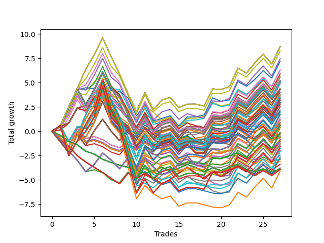

# Long HLT 305 
- Symbol: TSLA
- Date Range: 05/16/2022 - 05/17/2024
- Trading Period: 8:30-12:30
- Number of Trades: 27



| Id. | Name | Win Percent | Profit | Avg Profit / Trade | Avg Time / Trade | Std |      | Name | Win Percent | Profit | Avg Profit / Trade | Avg Time / Trade | Std |
| --- | ---- | ----------- | ------ | ------------------ | ---------------- | --- | ---- | ---- | ----------- | ------ | ------------------ | ---------------- | --- |
| | Sorted By <br> Profit | | | | | | | Sorted By <br> Win Percentage |||||
|0| TP-1.75 180m | 62.96 | 8.69 | 0.32 | 54:40 | 1.37 |     | TP-1.75 180m | 62.96 | 8.69 | 0.32 | 54:40 | 1.37 |
|1| TP-1.75 165m | 62.96 | 8.69 | 0.32 | 54:40 | 1.37 |     | TP-1.75 165m | 62.96 | 8.69 | 0.32 | 54:40 | 1.37 |
|2| TP-1.75 150m | 62.96 | 8.69 | 0.32 | 54:40 | 1.37 |     | TP-1.75 150m | 62.96 | 8.69 | 0.32 | 54:40 | 1.37 |
|3| TP-1.75 135m | 62.96 | 8.69 | 0.32 | 54:40 | 1.37 |     | TP-1.75 135m | 62.96 | 8.69 | 0.32 | 54:40 | 1.37 |
|4| TP-1.75 120m | 62.96 | 8.69 | 0.32 | 54:40 | 1.37 |     | TP-1.75 120m | 62.96 | 8.69 | 0.32 | 54:40 | 1.37 |
|5| TP-1.75 105m | 62.96 | 8.26 | 0.31 | 53:22 | 1.30 |     | TP-1.75 105m | 62.96 | 8.26 | 0.31 | 53:22 | 1.30 |
|6| TP-1.75 75m | 55.56 | 7.47 | 0.28 | 49:33 | 1.29 |     | TP-1.75 45m | 62.96 | 7.21 | 0.27 | 37:28 | 1.14 |
|7| TP-1.75 45m | 62.96 | 7.21 | 0.27 | 37:28 | 1.14 |     | TP-1.5 45m | 62.96 | 6.28 | 0.23 | 34:31 | 1.22 |
|8| TP-1.75 90m | 59.26 | 6.33 | 0.23 | 51:42 | 1.30 |     | TP-1.25 45m | 62.96 | 5.63 | 0.21 | 31:31 | 1.09 |
|9| TP-1.5 45m | 62.96 | 6.28 | 0.23 | 34:31 | 1.22 |     | TP-2 45m | 62.96 | 3.69 | 0.14 | 39:48 | 0.99 |
|10| TP-1.5 75m | 55.56 | 5.91 | 0.22 | 43:46 | 1.25 |     | TP-2.25 45m | 62.96 | 3.44 | 0.13 | 39:55 | 1.01 |
|11| TP-1.25 45m | 62.96 | 5.63 | 0.21 | 31:31 | 1.09 |     | TP-3 45m | 62.96 | 3.39 | 0.13 | 40:40 | 1.02 |
|12| TP-1.5 105m | 59.26 | 5.56 | 0.21 | 46:28 | 1.25 |     | TP-2.5 45m | 62.96 | 3.22 | 0.12 | 39:57 | 1.03 |
|13| TP-1.5 180m | 59.26 | 5.21 | 0.19 | 47:28 | 1.28 |     | TP-2.75 45m | 62.96 | 2.95 | 0.11 | 40:08 | 1.06 |
|14| TP-1.5 165m | 59.26 | 5.21 | 0.19 | 47:28 | 1.28 |     | TP-1.75 90m | 59.26 | 6.33 | 0.23 | 51:42 | 1.30 |
|15| TP-1.5 150m | 59.26 | 5.21 | 0.19 | 47:28 | 1.28 |     | TP-1.5 105m | 59.26 | 5.56 | 0.21 | 46:28 | 1.25 |
|16| TP-1.5 135m | 59.26 | 5.21 | 0.19 | 47:28 | 1.28 |     | TP-1.5 180m | 59.26 | 5.21 | 0.19 | 47:28 | 1.28 |
|17| TP-1.5 120m | 59.26 | 5.21 | 0.19 | 47:28 | 1.28 |     | TP-1.5 165m | 59.26 | 5.21 | 0.19 | 47:28 | 1.28 |
|18| TP-1.25 180m | 59.26 | 5.11 | 0.19 | 41:33 | 1.14 |     | TP-1.5 150m | 59.26 | 5.21 | 0.19 | 47:28 | 1.28 |
|19| TP-1.25 165m | 59.26 | 5.11 | 0.19 | 41:33 | 1.14 |     | TP-1.5 135m | 59.26 | 5.21 | 0.19 | 47:28 | 1.28 |
|20| TP-1.25 150m | 59.26 | 5.11 | 0.19 | 41:33 | 1.14 |     | TP-1.5 120m | 59.26 | 5.21 | 0.19 | 47:28 | 1.28 |
|21| TP-1.25 135m | 59.26 | 5.11 | 0.19 | 41:33 | 1.14 |     | TP-1.25 180m | 59.26 | 5.11 | 0.19 | 41:33 | 1.14 |
|22| TP-1.25 120m | 59.26 | 5.11 | 0.19 | 41:33 | 1.14 |     | TP-1.25 165m | 59.26 | 5.11 | 0.19 | 41:33 | 1.14 |
|23| TP-2 180m | 59.26 | 5.05 | 0.19 | 66:26 | 1.48 |     | TP-1.25 150m | 59.26 | 5.11 | 0.19 | 41:33 | 1.14 |
|24| TP-2 165m | 59.26 | 5.05 | 0.19 | 66:26 | 1.48 |     | TP-1.25 135m | 59.26 | 5.11 | 0.19 | 41:33 | 1.14 |
|25| TP-2 150m | 59.26 | 5.05 | 0.19 | 66:26 | 1.48 |     | TP-1.25 120m | 59.26 | 5.11 | 0.19 | 41:33 | 1.14 |
|26| TP-2 135m | 59.26 | 5.05 | 0.19 | 66:26 | 1.48 |     | TP-2 180m | 59.26 | 5.05 | 0.19 | 66:26 | 1.48 |
|27| TP-2 120m | 59.26 | 5.05 | 0.19 | 66:26 | 1.48 |     | TP-2 165m | 59.26 | 5.05 | 0.19 | 66:26 | 1.48 |
|28| TP-1.25 75m | 55.56 | 4.95 | 0.18 | 39:24 | 1.14 |     | TP-2 150m | 59.26 | 5.05 | 0.19 | 66:26 | 1.48 |
|29| TP-1.25 105m | 59.26 | 4.89 | 0.18 | 41:00 | 1.13 |     | TP-2 135m | 59.26 | 5.05 | 0.19 | 66:26 | 1.48 |
|30| TP-1.75 60m | 55.56 | 4.42 | 0.16 | 44:22 | 1.27 |     | TP-2 120m | 59.26 | 5.05 | 0.19 | 66:26 | 1.48 |
|31| TP-1 180m | 55.56 | 4.32 | 0.16 | 33:26 | 1.03 |     | TP-1.25 105m | 59.26 | 4.89 | 0.18 | 41:00 | 1.13 |
|32| TP-1 165m | 55.56 | 4.32 | 0.16 | 33:26 | 1.03 |     | TP-2 105m | 59.26 | 3.72 | 0.14 | 63:26 | 1.32 |
|33| TP-1 150m | 55.56 | 4.32 | 0.16 | 33:26 | 1.03 |     | TP-1 45m | 59.26 | 3.13 | 0.12 | 25:51 | 1.00 |
|34| TP-1 135m | 55.56 | 4.32 | 0.16 | 33:26 | 1.03 |     | TP-2.25 105m | 59.26 | 2.08 | 0.08 | 65:51 | 1.40 |
|35| TP-1 120m | 55.56 | 4.32 | 0.16 | 33:26 | 1.03 |     | TP-2.25 180m | 59.26 | 1.75 | 0.06 | 69:44 | 1.51 |
|36| TP-1.5 90m | 55.56 | 4.27 | 0.16 | 45:22 | 1.26 |     | TP-2.25 165m | 59.26 | 1.75 | 0.06 | 69:44 | 1.51 |
|37| TP-1 105m | 55.56 | 4.00 | 0.15 | 33:15 | 1.02 |     | TP-2.25 150m | 59.26 | 1.75 | 0.06 | 69:44 | 1.51 |
|38| TP-1 75m | 51.85 | 3.81 | 0.14 | 31:53 | 1.02 |     | TP-2.25 135m | 59.26 | 1.75 | 0.06 | 69:44 | 1.51 |
|39| TP-2 105m | 59.26 | 3.72 | 0.14 | 63:26 | 1.32 |     | TP-2.25 120m | 59.26 | 1.75 | 0.06 | 69:44 | 1.51 |
|40| TP-1.5 60m | 55.56 | 3.72 | 0.14 | 39:33 | 1.24 |     | TP-2.5 105m | 59.26 | 1.12 | 0.04 | 67:53 | 1.41 |
|41| TP-2 45m | 62.96 | 3.69 | 0.14 | 39:48 | 0.99 |     | TP-2.75 105m | 59.26 | 0.57 | 0.02 | 68:51 | 1.51 |
|42| TP-1.25 90m | 55.56 | 3.62 | 0.13 | 40:26 | 1.13 |     | TP-2.5 180m | 59.26 | 0.38 | 0.01 | 72:20 | 1.50 |
|43| TP-2.25 45m | 62.96 | 3.44 | 0.13 | 39:55 | 1.01 |     | TP-2.5 165m | 59.26 | 0.38 | 0.01 | 72:20 | 1.50 |
|44| TP-3 45m | 62.96 | 3.39 | 0.13 | 40:40 | 1.02 |     | TP-2.5 150m | 59.26 | 0.38 | 0.01 | 72:20 | 1.50 |
|45| TP-2.5 45m | 62.96 | 3.22 | 0.12 | 39:57 | 1.03 |     | TP-2.5 135m | 59.26 | 0.38 | 0.01 | 72:20 | 1.50 |
|46| TP-1 45m | 59.26 | 3.13 | 0.12 | 25:51 | 1.00 |     | TP-2.5 120m | 59.26 | 0.38 | 0.01 | 72:20 | 1.50 |
|47| TP-2.75 45m | 62.96 | 2.95 | 0.11 | 40:08 | 1.06 |     | TP-2.75 180m | 59.26 | -0.17 | -0.01 | 73:17 | 1.60 |
|48| TP-1.25 60m | 55.56 | 2.93 | 0.11 | 36:00 | 1.12 |     | TP-2.75 165m | 59.26 | -0.17 | -0.01 | 73:17 | 1.60 |
|49| TP-1.75 30m | 48.15 | 2.88 | 0.11 | 27:24 | 1.02 |     | TP-2.75 150m | 59.26 | -0.17 | -0.01 | 73:17 | 1.60 |
|50| TP-1 90m | 51.85 | 2.73 | 0.10 | 32:42 | 1.02 |     | TP-2.75 135m | 59.26 | -0.17 | -0.01 | 73:17 | 1.60 |
|51| TP-2 75m | 51.85 | 2.52 | 0.09 | 56:17 | 1.31 |     | TP-2.75 120m | 59.26 | -0.17 | -0.01 | 73:17 | 1.60 |
|52| TP-1.5 30m | 48.15 | 2.17 | 0.08 | 26:42 | 1.06 |     | TP-3 105m | 59.26 | -0.87 | -0.03 | 69:40 | 1.62 |
|53| TP-2.25 105m | 59.26 | 2.08 | 0.08 | 65:51 | 1.40 |     | TP-3 180m | 59.26 | -1.61 | -0.06 | 74:06 | 1.70 |
|54| TP-1 60m | 51.85 | 1.91 | 0.07 | 29:11 | 1.01 |     | TP-3 165m | 59.26 | -1.61 | -0.06 | 74:06 | 1.70 |
|55| TP-2.25 180m | 59.26 | 1.75 | 0.06 | 69:44 | 1.51 |     | TP-3 150m | 59.26 | -1.61 | -0.06 | 74:06 | 1.70 |
|56| TP-2.25 165m | 59.26 | 1.75 | 0.06 | 69:44 | 1.51 |     | TP-3 135m | 59.26 | -1.61 | -0.06 | 74:06 | 1.70 |
|57| TP-2.25 150m | 59.26 | 1.75 | 0.06 | 69:44 | 1.51 |     | TP-3 120m | 59.26 | -1.61 | -0.06 | 74:06 | 1.70 |
|58| TP-2.25 135m | 59.26 | 1.75 | 0.06 | 69:44 | 1.51 |     | TP-1.75 75m | 55.56 | 7.47 | 0.28 | 49:33 | 1.29 |
|59| TP-2.25 120m | 59.26 | 1.75 | 0.06 | 69:44 | 1.51 |     | TP-1.5 75m | 55.56 | 5.91 | 0.22 | 43:46 | 1.25 |
|60| TP-1.25 30m | 48.15 | 1.34 | 0.05 | 25:00 | 1.06 |     | TP-1.25 75m | 55.56 | 4.95 | 0.18 | 39:24 | 1.14 |
|61| TP-2.25 75m | 51.85 | 1.21 | 0.04 | 57:35 | 1.40 |     | TP-1.75 60m | 55.56 | 4.42 | 0.16 | 44:22 | 1.27 |
|62| TP-2 30m | 48.15 | 1.16 | 0.04 | 27:42 | 0.95 |     | TP-1 180m | 55.56 | 4.32 | 0.16 | 33:26 | 1.03 |
|63| TP-2.5 105m | 59.26 | 1.12 | 0.04 | 67:53 | 1.41 |     | TP-1 165m | 55.56 | 4.32 | 0.16 | 33:26 | 1.03 |
|64| TP-2.25 30m | 48.15 | 0.91 | 0.03 | 27:48 | 0.97 |     | TP-1 150m | 55.56 | 4.32 | 0.16 | 33:26 | 1.03 |
|65| TP-2 90m | 51.85 | 0.87 | 0.03 | 60:06 | 1.33 |     | TP-1 135m | 55.56 | 4.32 | 0.16 | 33:26 | 1.03 |
|66| TP-2.5 30m | 48.15 | 0.69 | 0.03 | 27:51 | 0.99 |     | TP-1 120m | 55.56 | 4.32 | 0.16 | 33:26 | 1.03 |
|67| TP-3 30m | 48.15 | 0.62 | 0.02 | 28:00 | 0.99 |     | TP-1.5 90m | 55.56 | 4.27 | 0.16 | 45:22 | 1.26 |
|68| TP-2.75 30m | 48.15 | 0.62 | 0.02 | 28:00 | 0.99 |     | TP-1 105m | 55.56 | 4.00 | 0.15 | 33:15 | 1.02 |
|69| TP-2.75 105m | 59.26 | 0.57 | 0.02 | 68:51 | 1.51 |     | TP-1.5 60m | 55.56 | 3.72 | 0.14 | 39:33 | 1.24 |
|70| TP-2.5 180m | 59.26 | 0.38 | 0.01 | 72:20 | 1.50 |     | TP-1.25 90m | 55.56 | 3.62 | 0.13 | 40:26 | 1.13 |
|71| TP-2.5 165m | 59.26 | 0.38 | 0.01 | 72:20 | 1.50 |     | TP-1.25 60m | 55.56 | 2.93 | 0.11 | 36:00 | 1.12 |
|72| TP-2.5 150m | 59.26 | 0.38 | 0.01 | 72:20 | 1.50 |     | TP-1 75m | 51.85 | 3.81 | 0.14 | 31:53 | 1.02 |
|73| TP-2.5 135m | 59.26 | 0.38 | 0.01 | 72:20 | 1.50 |     | TP-1 90m | 51.85 | 2.73 | 0.10 | 32:42 | 1.02 |
|74| TP-2.5 120m | 59.26 | 0.38 | 0.01 | 72:20 | 1.50 |     | TP-2 75m | 51.85 | 2.52 | 0.09 | 56:17 | 1.31 |
|75| TP-1 30m | 44.44 | -0.11 | -0.00 | 22:17 | 1.01 |     | TP-1 60m | 51.85 | 1.91 | 0.07 | 29:11 | 1.01 |
|76| TP-2.75 180m | 59.26 | -0.17 | -0.01 | 73:17 | 1.60 |     | TP-2.25 75m | 51.85 | 1.21 | 0.04 | 57:35 | 1.40 |
|77| TP-2.75 165m | 59.26 | -0.17 | -0.01 | 73:17 | 1.60 |     | TP-2 90m | 51.85 | 0.87 | 0.03 | 60:06 | 1.33 |
|78| TP-2.75 150m | 59.26 | -0.17 | -0.01 | 73:17 | 1.60 |     | TP-2.75 75m | 51.85 | -0.31 | -0.01 | 59:15 | 1.38 |
|79| TP-2.75 135m | 59.26 | -0.17 | -0.01 | 73:17 | 1.60 |     | TP-2.25 90m | 51.85 | -0.70 | -0.03 | 61:57 | 1.41 |
|80| TP-2.75 120m | 59.26 | -0.17 | -0.01 | 73:17 | 1.60 |     | TP-2.5 75m | 51.85 | -1.27 | -0.05 | 58:31 | 1.37 |
|81| TP-1.75 15m | 44.44 | -0.27 | -0.01 | 13:55 | 0.64 |     | TP-3 75m | 51.85 | -1.75 | -0.06 | 60:04 | 1.49 |
|82| TP-1.5 15m | 44.44 | -0.27 | -0.01 | 13:55 | 0.64 |     | TP-2.5 90m | 51.85 | -2.10 | -0.08 | 63:26 | 1.40 |
|83| TP-2.75 75m | 51.85 | -0.31 | -0.01 | 59:15 | 1.38 |     | TP-2.75 90m | 51.85 | -2.65 | -0.10 | 64:24 | 1.50 |
|84| TP-1 15m | 44.44 | -0.49 | -0.02 | 12:53 | 0.70 |     | TP-3 90m | 51.85 | -4.09 | -0.15 | 65:13 | 1.60 |
|85| TP-1.25 15m | 44.44 | -0.55 | -0.02 | 13:35 | 0.66 |     | TP-1.75 30m | 48.15 | 2.88 | 0.11 | 27:24 | 1.02 |
|86| TP-3 15m | 44.44 | -0.66 | -0.02 | 14:00 | 0.60 |     | TP-1.5 30m | 48.15 | 2.17 | 0.08 | 26:42 | 1.06 |
|87| TP-2.75 15m | 44.44 | -0.66 | -0.02 | 14:00 | 0.60 |     | TP-1.25 30m | 48.15 | 1.34 | 0.05 | 25:00 | 1.06 |
|88| TP-2.5 15m | 44.44 | -0.66 | -0.02 | 14:00 | 0.60 |     | TP-2 30m | 48.15 | 1.16 | 0.04 | 27:42 | 0.95 |
|89| TP-2.25 15m | 44.44 | -0.66 | -0.02 | 14:00 | 0.60 |     | TP-2.25 30m | 48.15 | 0.91 | 0.03 | 27:48 | 0.97 |
|90| TP-2 15m | 44.44 | -0.66 | -0.02 | 14:00 | 0.60 |     | TP-2.5 30m | 48.15 | 0.69 | 0.03 | 27:51 | 0.99 |
|91| TP-2.25 90m | 51.85 | -0.70 | -0.03 | 61:57 | 1.41 |     | TP-3 30m | 48.15 | 0.62 | 0.02 | 28:00 | 0.99 |
|92| TP-3 105m | 59.26 | -0.87 | -0.03 | 69:40 | 1.62 |     | TP-2.75 30m | 48.15 | 0.62 | 0.02 | 28:00 | 0.99 |
|93| TP-2 60m | 48.15 | -0.88 | -0.03 | 49:17 | 1.20 |     | TP-2 60m | 48.15 | -0.88 | -0.03 | 49:17 | 1.20 |
|94| TP-0.75 75m | 48.15 | -1.00 | -0.04 | 21:37 | 0.85 |     | TP-0.75 75m | 48.15 | -1.00 | -0.04 | 21:37 | 0.85 |
|95| TP-0.75 180m | 48.15 | -1.02 | -0.04 | 21:40 | 0.85 |     | TP-0.75 180m | 48.15 | -1.02 | -0.04 | 21:40 | 0.85 |
|96| TP-0.75 165m | 48.15 | -1.02 | -0.04 | 21:40 | 0.85 |     | TP-0.75 165m | 48.15 | -1.02 | -0.04 | 21:40 | 0.85 |
|97| TP-0.75 150m | 48.15 | -1.02 | -0.04 | 21:40 | 0.85 |     | TP-0.75 150m | 48.15 | -1.02 | -0.04 | 21:40 | 0.85 |
|98| TP-0.75 135m | 48.15 | -1.02 | -0.04 | 21:40 | 0.85 |     | TP-0.75 135m | 48.15 | -1.02 | -0.04 | 21:40 | 0.85 |
|99| TP-0.75 120m | 48.15 | -1.02 | -0.04 | 21:40 | 0.85 |     | TP-0.75 120m | 48.15 | -1.02 | -0.04 | 21:40 | 0.85 |
|100| TP-0.75 105m | 48.15 | -1.02 | -0.04 | 21:40 | 0.85 |     | TP-0.75 105m | 48.15 | -1.02 | -0.04 | 21:40 | 0.85 |
|101| TP-0.75 90m | 48.15 | -1.02 | -0.04 | 21:40 | 0.85 |     | TP-0.75 90m | 48.15 | -1.02 | -0.04 | 21:40 | 0.85 |
|102| TP-2.25 60m | 48.15 | -1.10 | -0.04 | 50:00 | 1.26 |     | TP-2.25 60m | 48.15 | -1.10 | -0.04 | 50:00 | 1.26 |
|103| TP-2.5 75m | 51.85 | -1.27 | -0.05 | 58:31 | 1.37 |     | TP-0.75 60m | 48.15 | -1.37 | -0.05 | 20:40 | 0.85 |
|104| TP-0.75 60m | 48.15 | -1.37 | -0.05 | 20:40 | 0.85 |     | TP-0.75 45m | 48.15 | -1.46 | -0.05 | 19:33 | 0.85 |
|105| TP-0.75 45m | 48.15 | -1.46 | -0.05 | 19:33 | 0.85 |     | TP-2.75 60m | 48.15 | -1.97 | -0.07 | 50:40 | 1.34 |
|106| TP-3 180m | 59.26 | -1.61 | -0.06 | 74:06 | 1.70 |     | TP-2.5 60m | 48.15 | -1.98 | -0.07 | 50:22 | 1.27 |
|107| TP-3 165m | 59.26 | -1.61 | -0.06 | 74:06 | 1.70 |     | TP-3 60m | 48.15 | -2.82 | -0.10 | 51:24 | 1.41 |
|108| TP-3 150m | 59.26 | -1.61 | -0.06 | 74:06 | 1.70 |     | TP-1 30m | 44.44 | -0.11 | -0.00 | 22:17 | 1.01 |
|109| TP-3 135m | 59.26 | -1.61 | -0.06 | 74:06 | 1.70 |     | TP-1.75 15m | 44.44 | -0.27 | -0.01 | 13:55 | 0.64 |
|110| TP-3 120m | 59.26 | -1.61 | -0.06 | 74:06 | 1.70 |     | TP-1.5 15m | 44.44 | -0.27 | -0.01 | 13:55 | 0.64 |
|111| TP-3 75m | 51.85 | -1.75 | -0.06 | 60:04 | 1.49 |     | TP-1 15m | 44.44 | -0.49 | -0.02 | 12:53 | 0.70 |
|112| TP-2.75 60m | 48.15 | -1.97 | -0.07 | 50:40 | 1.34 |     | TP-1.25 15m | 44.44 | -0.55 | -0.02 | 13:35 | 0.66 |
|113| TP-2.5 60m | 48.15 | -1.98 | -0.07 | 50:22 | 1.27 |     | TP-3 15m | 44.44 | -0.66 | -0.02 | 14:00 | 0.60 |
|114| TP-2.5 90m | 51.85 | -2.10 | -0.08 | 63:26 | 1.40 |     | TP-2.75 15m | 44.44 | -0.66 | -0.02 | 14:00 | 0.60 |
|115| TP-0.75 30m | 44.44 | -2.44 | -0.09 | 18:11 | 0.83 |     | TP-2.5 15m | 44.44 | -0.66 | -0.02 | 14:00 | 0.60 |
|116| TP-2.75 90m | 51.85 | -2.65 | -0.10 | 64:24 | 1.50 |     | TP-2.25 15m | 44.44 | -0.66 | -0.02 | 14:00 | 0.60 |
|117| TP-3 60m | 48.15 | -2.82 | -0.10 | 51:24 | 1.41 |     | TP-2 15m | 44.44 | -0.66 | -0.02 | 14:00 | 0.60 |
|118| TP-0.75 15m | 40.74 | -2.88 | -0.11 | 12:04 | 0.63 |     | TP-0.75 30m | 44.44 | -2.44 | -0.09 | 18:11 | 0.83 |
|119| TP-0.5 15m | 37.04 | -3.10 | -0.11 | 09:22 | 0.56 |     | TP-0.75 15m | 40.74 | -2.88 | -0.11 | 12:04 | 0.63 |
|120| TP-0.5 30m | 40.74 | -3.38 | -0.13 | 10:44 | 0.61 |     | TP-0.5 30m | 40.74 | -3.38 | -0.13 | 10:44 | 0.61 |
|121| TP-0.5 45m | 37.04 | -3.77 | -0.14 | 11:17 | 0.61 |     | TP-0.5 15m | 37.04 | -3.10 | -0.11 | 09:22 | 0.56 |
|122| TP-0.25 180m | 33.33 | -3.90 | -0.14 | 04:35 | 0.35 |     | TP-0.5 45m | 37.04 | -3.77 | -0.14 | 11:17 | 0.61 |
|123| TP-0.25 165m | 33.33 | -3.90 | -0.14 | 04:35 | 0.35 |     | TP-0.5 180m | 37.04 | -3.92 | -0.15 | 11:24 | 0.62 |
|124| TP-0.25 150m | 33.33 | -3.90 | -0.14 | 04:35 | 0.35 |     | TP-0.5 165m | 37.04 | -3.92 | -0.15 | 11:24 | 0.62 |
|125| TP-0.25 135m | 33.33 | -3.90 | -0.14 | 04:35 | 0.35 |     | TP-0.5 150m | 37.04 | -3.92 | -0.15 | 11:24 | 0.62 |
|126| TP-0.25 120m | 33.33 | -3.90 | -0.14 | 04:35 | 0.35 |     | TP-0.5 135m | 37.04 | -3.92 | -0.15 | 11:24 | 0.62 |
|127| TP-0.25 105m | 33.33 | -3.90 | -0.14 | 04:35 | 0.35 |     | TP-0.5 120m | 37.04 | -3.92 | -0.15 | 11:24 | 0.62 |
|128| TP-0.25 90m | 33.33 | -3.90 | -0.14 | 04:35 | 0.35 |     | TP-0.5 105m | 37.04 | -3.92 | -0.15 | 11:24 | 0.62 |
|129| TP-0.25 75m | 33.33 | -3.90 | -0.14 | 04:35 | 0.35 |     | TP-0.5 90m | 37.04 | -3.92 | -0.15 | 11:24 | 0.62 |
|130| TP-0.25 60m | 33.33 | -3.90 | -0.14 | 04:35 | 0.35 |     | TP-0.5 75m | 37.04 | -3.92 | -0.15 | 11:24 | 0.62 |
|131| TP-0.25 45m | 33.33 | -3.90 | -0.14 | 04:35 | 0.35 |     | TP-0.5 60m | 37.04 | -3.92 | -0.15 | 11:24 | 0.62 |
|132| TP-0.25 30m | 33.33 | -3.90 | -0.14 | 04:35 | 0.35 |     | TP-0.25 180m | 33.33 | -3.90 | -0.14 | 04:35 | 0.35 |
|133| TP-0.5 180m | 37.04 | -3.92 | -0.15 | 11:24 | 0.62 |     | TP-0.25 165m | 33.33 | -3.90 | -0.14 | 04:35 | 0.35 |
|134| TP-0.5 165m | 37.04 | -3.92 | -0.15 | 11:24 | 0.62 |     | TP-0.25 150m | 33.33 | -3.90 | -0.14 | 04:35 | 0.35 |
|135| TP-0.5 150m | 37.04 | -3.92 | -0.15 | 11:24 | 0.62 |     | TP-0.25 135m | 33.33 | -3.90 | -0.14 | 04:35 | 0.35 |
|136| TP-0.5 135m | 37.04 | -3.92 | -0.15 | 11:24 | 0.62 |     | TP-0.25 120m | 33.33 | -3.90 | -0.14 | 04:35 | 0.35 |
|137| TP-0.5 120m | 37.04 | -3.92 | -0.15 | 11:24 | 0.62 |     | TP-0.25 105m | 33.33 | -3.90 | -0.14 | 04:35 | 0.35 |
|138| TP-0.5 105m | 37.04 | -3.92 | -0.15 | 11:24 | 0.62 |     | TP-0.25 90m | 33.33 | -3.90 | -0.14 | 04:35 | 0.35 |
|139| TP-0.5 90m | 37.04 | -3.92 | -0.15 | 11:24 | 0.62 |     | TP-0.25 75m | 33.33 | -3.90 | -0.14 | 04:35 | 0.35 |
|140| TP-0.5 75m | 37.04 | -3.92 | -0.15 | 11:24 | 0.62 |     | TP-0.25 60m | 33.33 | -3.90 | -0.14 | 04:35 | 0.35 |
|141| TP-0.5 60m | 37.04 | -3.92 | -0.15 | 11:24 | 0.62 |     | TP-0.25 45m | 33.33 | -3.90 | -0.14 | 04:35 | 0.35 |
|142| TP-0.25 15m | 33.33 | -3.92 | -0.15 | 04:31 | 0.35 |     | TP-0.25 30m | 33.33 | -3.90 | -0.14 | 04:35 | 0.35 |
|143| TP-3 90m | 51.85 | -4.09 | -0.15 | 65:13 | 1.60 |     | TP-0.25 15m | 33.33 | -3.92 | -0.15 | 04:31 | 0.35 |

### Test TP-0.25 15m
* Take Profit of 0.25 Point
* 0.25 Stoploss
* Results:
```
Total Trades: 27
Percent Up: 33.33
Percent Down: 66.67
Total Points Moved Up: -3.92
Potential Profit: -1960.00
Total Points Ups: 2.88 Count Ups: 9
Total Points Downs: -6.80 Count Downs: 18
```

<details><summary>Trades</summary>

<code>In: 2022-06-16 12:05:00		Out: 2022-06-16 12:09:00		Total Position Time: 04:00		Total Move Up: -0.44		Total to Date: -0.44</code> <br />
<code>In: 2022-08-05 09:50:00		Out: 2022-08-05 09:52:00		Total Position Time: 02:00		Total Move Up: -0.63		Total to Date: -1.07</code> <br />
<code>In: 2022-08-05 12:35:00		Out: 2022-08-05 12:37:00		Total Position Time: 02:00		Total Move Up: -0.33		Total to Date: -1.40</code> <br />
<code>In: 2022-09-01 08:40:00		Out: 2022-09-01 08:42:00		Total Position Time: 02:00		Total Move Up: -0.65		Total to Date: -2.05</code> <br />
<code>In: 2022-10-20 11:40:00		Out: 2022-10-20 11:43:00		Total Position Time: 03:00		Total Move Up: -0.30		Total to Date: -2.35</code> <br />
<code>In: 2022-11-04 11:20:00		Out: 2022-11-04 11:22:00		Total Position Time: 02:00		Total Move Up: -0.53		Total to Date: -2.88</code> <br />
<code>In: 2022-11-09 08:50:00		Out: 2022-11-09 08:52:00		Total Position Time: 02:00		Total Move Up: -0.33		Total to Date: -3.21</code> <br />
<code>In: 2022-12-20 09:55:00		Out: 2022-12-20 09:57:00		Total Position Time: 02:00		Total Move Up: -0.28		Total to Date: -3.49</code> <br />
<code>In: 2023-02-03 11:00:00		Out: 2023-02-03 11:03:00		Total Position Time: 03:00		Total Move Up: -0.22		Total to Date: -3.71</code> <br />
<code>In: 2023-03-06 09:00:00		Out: 2023-03-06 09:09:00		Total Position Time: 09:00		Total Move Up: -0.31		Total to Date: -4.02</code> <br />
<code>In: 2023-03-17 08:40:00		Out: 2023-03-17 08:44:00		Total Position Time: 04:00		Total Move Up: -0.32		Total to Date: -4.34</code> <br />
<code>In: 2023-07-11 08:55:00		Out: 2023-07-11 08:59:00		Total Position Time: 04:00		Total Move Up: 0.31		Total to Date: -4.03</code> <br />
<code>In: 2023-08-16 09:40:00		Out: 2023-08-16 09:43:00		Total Position Time: 03:00		Total Move Up: 0.32		Total to Date: -3.71</code> <br />
<code>In: 2023-09-21 12:30:00		Out: 2023-09-21 12:35:00		Total Position Time: 05:00		Total Move Up: -0.38		Total to Date: -4.09</code> <br />
<code>In: 2023-09-22 12:15:00		Out: 2023-09-22 12:18:00		Total Position Time: 03:00		Total Move Up: 0.29		Total to Date: -3.80</code> <br />
<code>In: 2023-09-26 11:30:00		Out: 2023-09-26 11:32:00		Total Position Time: 02:00		Total Move Up: 0.39		Total to Date: -3.41</code> <br />
<code>In: 2023-10-12 11:30:00		Out: 2023-10-12 11:41:00		Total Position Time: 11:00		Total Move Up: -0.32		Total to Date: -3.73</code> <br />
<code>In: 2023-10-13 11:40:00		Out: 2023-10-13 11:45:00		Total Position Time: 05:00		Total Move Up: -0.43		Total to Date: -4.16</code> <br />
<code>In: 2023-10-30 10:30:00		Out: 2023-10-30 10:34:00		Total Position Time: 04:00		Total Move Up: 0.40		Total to Date: -3.76</code> <br />
<code>In: 2024-01-26 11:40:00		Out: 2024-01-26 11:43:00		Total Position Time: 03:00		Total Move Up: -0.27		Total to Date: -4.03</code> <br />
<code>In: 2024-02-12 11:35:00		Out: 2024-02-12 11:40:00		Total Position Time: 05:00		Total Move Up: 0.33		Total to Date: -3.70</code> <br />
<code>In: 2024-02-27 10:45:00		Out: 2024-02-27 10:49:00		Total Position Time: 04:00		Total Move Up: 0.30		Total to Date: -3.40</code> <br />
<code>In: 2024-03-28 12:25:00		Out: 2024-03-28 12:32:00		Total Position Time: 07:00		Total Move Up: -0.52		Total to Date: -3.92</code> <br />
<code>In: 2024-04-10 11:45:00		Out: 2024-04-10 11:52:00		Total Position Time: 07:00		Total Move Up: -0.24		Total to Date: -4.16</code> <br />
<code>In: 2024-04-10 12:15:00		Out: 2024-04-10 12:20:00		Total Position Time: 05:00		Total Move Up: 0.30		Total to Date: -3.86</code> <br />
<code>In: 2024-04-15 11:40:00		Out: 2024-04-15 11:45:00		Total Position Time: 05:00		Total Move Up: -0.30		Total to Date: -4.16</code> <br />
<code>In: 2024-04-22 08:35:00		Out: 2024-04-22 08:49:00		Total Position Time: 14:00		Total Move Up: 0.24		Total to Date: -3.92</code> <br />


</details>

### Test TP-0.5 15m
* Take Profit of 0.5 Point
* 0.5 Stoploss
* Results:
```
Total Trades: 27
Percent Up: 37.04
Percent Down: 62.96
Total Points Moved Up: -3.10
Potential Profit: -1550.00
Total Points Ups: 5.55 Count Ups: 10
Total Points Downs: -8.65 Count Downs: 17
```

<details><summary>Trades</summary>

<code>In: 2022-06-16 12:05:00		Out: 2022-06-16 12:14:00		Total Position Time: 09:00		Total Move Up: -0.92		Total to Date: -0.92</code> <br />
<code>In: 2022-08-05 09:50:00		Out: 2022-08-05 09:52:00		Total Position Time: 02:00		Total Move Up: -0.63		Total to Date: -1.55</code> <br />
<code>In: 2022-08-05 12:35:00		Out: 2022-08-05 12:40:00		Total Position Time: 05:00		Total Move Up: -0.96		Total to Date: -2.51</code> <br />
<code>In: 2022-09-01 08:40:00		Out: 2022-09-01 08:42:00		Total Position Time: 02:00		Total Move Up: -0.65		Total to Date: -3.16</code> <br />
<code>In: 2022-10-20 11:40:00		Out: 2022-10-20 11:45:00		Total Position Time: 05:00		Total Move Up: -0.55		Total to Date: -3.71</code> <br />
<code>In: 2022-11-04 11:20:00		Out: 2022-11-04 11:22:00		Total Position Time: 02:00		Total Move Up: -0.53		Total to Date: -4.24</code> <br />
<code>In: 2022-11-09 08:50:00		Out: 2022-11-09 08:54:00		Total Position Time: 04:00		Total Move Up: -0.61		Total to Date: -4.85</code> <br />
<code>In: 2022-12-20 09:55:00		Out: 2022-12-20 10:07:00		Total Position Time: 12:00		Total Move Up: -0.55		Total to Date: -5.40</code> <br />
<code>In: 2023-02-03 11:00:00		Out: 2023-02-03 11:09:00		Total Position Time: 09:00		Total Move Up: 1.09		Total to Date: -4.31</code> <br />
<code>In: 2023-03-06 09:00:00		Out: 2023-03-06 09:12:00		Total Position Time: 12:00		Total Move Up: -0.55		Total to Date: -4.86</code> <br />
<code>In: 2023-03-17 08:40:00		Out: 2023-03-17 08:49:00		Total Position Time: 09:00		Total Move Up: 0.52		Total to Date: -4.34</code> <br />
<code>In: 2023-07-11 08:55:00		Out: 2023-07-11 09:09:00		Total Position Time: 14:00		Total Move Up: -0.42		Total to Date: -4.76</code> <br />
<code>In: 2023-08-16 09:40:00		Out: 2023-08-16 09:54:00		Total Position Time: 14:00		Total Move Up: -0.20		Total to Date: -4.96</code> <br />
<code>In: 2023-09-21 12:30:00		Out: 2023-09-21 12:37:00		Total Position Time: 07:00		Total Move Up: 0.49		Total to Date: -4.47</code> <br />
<code>In: 2023-09-22 12:15:00		Out: 2023-09-22 12:24:00		Total Position Time: 09:00		Total Move Up: 0.63		Total to Date: -3.84</code> <br />
<code>In: 2023-09-26 11:30:00		Out: 2023-09-26 11:37:00		Total Position Time: 07:00		Total Move Up: 0.61		Total to Date: -3.23</code> <br />
<code>In: 2023-10-12 11:30:00		Out: 2023-10-12 11:44:00		Total Position Time: 14:00		Total Move Up: -0.20		Total to Date: -3.43</code> <br />
<code>In: 2023-10-13 11:40:00		Out: 2023-10-13 11:54:00		Total Position Time: 14:00		Total Move Up: -0.23		Total to Date: -3.66</code> <br />
<code>In: 2023-10-30 10:30:00		Out: 2023-10-30 10:44:00		Total Position Time: 14:00		Total Move Up: 0.31		Total to Date: -3.35</code> <br />
<code>In: 2024-01-26 11:40:00		Out: 2024-01-26 11:54:00		Total Position Time: 14:00		Total Move Up: -0.11		Total to Date: -3.46</code> <br />
<code>In: 2024-02-12 11:35:00		Out: 2024-02-12 11:42:00		Total Position Time: 07:00		Total Move Up: 0.53		Total to Date: -2.93</code> <br />
<code>In: 2024-02-27 10:45:00		Out: 2024-02-27 10:58:00		Total Position Time: 13:00		Total Move Up: 0.59		Total to Date: -2.34</code> <br />
<code>In: 2024-03-28 12:25:00		Out: 2024-03-28 12:32:00		Total Position Time: 07:00		Total Move Up: -0.52		Total to Date: -2.86</code> <br />
<code>In: 2024-04-10 11:45:00		Out: 2024-04-10 11:56:00		Total Position Time: 11:00		Total Move Up: -0.50		Total to Date: -3.36</code> <br />
<code>In: 2024-04-10 12:15:00		Out: 2024-04-10 12:25:00		Total Position Time: 10:00		Total Move Up: 0.54		Total to Date: -2.82</code> <br />
<code>In: 2024-04-15 11:40:00		Out: 2024-04-15 11:53:00		Total Position Time: 13:00		Total Move Up: -0.52		Total to Date: -3.34</code> <br />
<code>In: 2024-04-22 08:35:00		Out: 2024-04-22 08:49:00		Total Position Time: 14:00		Total Move Up: 0.24		Total to Date: -3.10</code> <br />


</details>

### Test TP-0.75 15m
* Take Profit of 0.75 Point
* 0.75 Stoploss
* Results:
```
Total Trades: 27
Percent Up: 40.74
Percent Down: 59.26
Total Points Moved Up: -2.88
Potential Profit: -1440.00
Total Points Ups: 5.90 Count Ups: 11
Total Points Downs: -8.78 Count Downs: 16
```

<details><summary>Trades</summary>

<code>In: 2022-06-16 12:05:00		Out: 2022-06-16 12:14:00		Total Position Time: 09:00		Total Move Up: -0.92		Total to Date: -0.92</code> <br />
<code>In: 2022-08-05 09:50:00		Out: 2022-08-05 09:54:00		Total Position Time: 04:00		Total Move Up: -1.11		Total to Date: -2.03</code> <br />
<code>In: 2022-08-05 12:35:00		Out: 2022-08-05 12:40:00		Total Position Time: 05:00		Total Move Up: -0.96		Total to Date: -2.99</code> <br />
<code>In: 2022-09-01 08:40:00		Out: 2022-09-01 08:44:00		Total Position Time: 04:00		Total Move Up: -1.17		Total to Date: -4.16</code> <br />
<code>In: 2022-10-20 11:40:00		Out: 2022-10-20 11:54:00		Total Position Time: 14:00		Total Move Up: 0.20		Total to Date: -3.96</code> <br />
<code>In: 2022-11-04 11:20:00		Out: 2022-11-04 11:34:00		Total Position Time: 14:00		Total Move Up: -0.31		Total to Date: -4.27</code> <br />
<code>In: 2022-11-09 08:50:00		Out: 2022-11-09 08:58:00		Total Position Time: 08:00		Total Move Up: -0.73		Total to Date: -5.00</code> <br />
<code>In: 2022-12-20 09:55:00		Out: 2022-12-20 10:09:00		Total Position Time: 14:00		Total Move Up: -0.28		Total to Date: -5.28</code> <br />
<code>In: 2023-02-03 11:00:00		Out: 2023-02-03 11:09:00		Total Position Time: 09:00		Total Move Up: 1.09		Total to Date: -4.19</code> <br />
<code>In: 2023-03-06 09:00:00		Out: 2023-03-06 09:14:00		Total Position Time: 14:00		Total Move Up: -0.42		Total to Date: -4.61</code> <br />
<code>In: 2023-03-17 08:40:00		Out: 2023-03-17 08:51:00		Total Position Time: 11:00		Total Move Up: 0.78		Total to Date: -3.83</code> <br />
<code>In: 2023-07-11 08:55:00		Out: 2023-07-11 09:09:00		Total Position Time: 14:00		Total Move Up: -0.42		Total to Date: -4.25</code> <br />
<code>In: 2023-08-16 09:40:00		Out: 2023-08-16 09:54:00		Total Position Time: 14:00		Total Move Up: -0.20		Total to Date: -4.45</code> <br />
<code>In: 2023-09-21 12:30:00		Out: 2023-09-21 12:44:00		Total Position Time: 14:00		Total Move Up: 0.37		Total to Date: -4.08</code> <br />
<code>In: 2023-09-22 12:15:00		Out: 2023-09-22 12:25:00		Total Position Time: 10:00		Total Move Up: 0.75		Total to Date: -3.33</code> <br />
<code>In: 2023-09-26 11:30:00		Out: 2023-09-26 11:44:00		Total Position Time: 14:00		Total Move Up: 0.08		Total to Date: -3.25</code> <br />
<code>In: 2023-10-12 11:30:00		Out: 2023-10-12 11:44:00		Total Position Time: 14:00		Total Move Up: -0.20		Total to Date: -3.45</code> <br />
<code>In: 2023-10-13 11:40:00		Out: 2023-10-13 11:54:00		Total Position Time: 14:00		Total Move Up: -0.23		Total to Date: -3.68</code> <br />
<code>In: 2023-10-30 10:30:00		Out: 2023-10-30 10:44:00		Total Position Time: 14:00		Total Move Up: 0.31		Total to Date: -3.37</code> <br />
<code>In: 2024-01-26 11:40:00		Out: 2024-01-26 11:54:00		Total Position Time: 14:00		Total Move Up: -0.11		Total to Date: -3.48</code> <br />
<code>In: 2024-02-12 11:35:00		Out: 2024-02-12 11:49:00		Total Position Time: 14:00		Total Move Up: 0.29		Total to Date: -3.19</code> <br />
<code>In: 2024-02-27 10:45:00		Out: 2024-02-27 10:59:00		Total Position Time: 14:00		Total Move Up: 1.22		Total to Date: -1.97</code> <br />
<code>In: 2024-03-28 12:25:00		Out: 2024-03-28 12:39:00		Total Position Time: 14:00		Total Move Up: -0.64		Total to Date: -2.61</code> <br />
<code>In: 2024-04-10 11:45:00		Out: 2024-04-10 11:59:00		Total Position Time: 14:00		Total Move Up: -0.60		Total to Date: -3.21</code> <br />
<code>In: 2024-04-10 12:15:00		Out: 2024-04-10 12:29:00		Total Position Time: 14:00		Total Move Up: 0.57		Total to Date: -2.64</code> <br />
<code>In: 2024-04-15 11:40:00		Out: 2024-04-15 11:54:00		Total Position Time: 14:00		Total Move Up: -0.48		Total to Date: -3.12</code> <br />
<code>In: 2024-04-22 08:35:00		Out: 2024-04-22 08:49:00		Total Position Time: 14:00		Total Move Up: 0.24		Total to Date: -2.88</code> <br />


</details>

### Test TP-1 15m
* Take Profit of 1 Point
* 1 Stoploss
* Results:
```
Total Trades: 27
Percent Up: 44.44
Percent Down: 55.56
Total Points Moved Up: -0.49
Potential Profit: -245.00
Total Points Ups: 7.32 Count Ups: 12
Total Points Downs: -7.81 Count Downs: 15
```

<details><summary>Trades</summary>

<code>In: 2022-06-16 12:05:00		Out: 2022-06-16 12:16:00		Total Position Time: 11:00		Total Move Up: -1.09		Total to Date: -1.09</code> <br />
<code>In: 2022-08-05 09:50:00		Out: 2022-08-05 09:54:00		Total Position Time: 04:00		Total Move Up: -1.11		Total to Date: -2.20</code> <br />
<code>In: 2022-08-05 12:35:00		Out: 2022-08-05 12:47:00		Total Position Time: 12:00		Total Move Up: 1.89		Total to Date: -0.31</code> <br />
<code>In: 2022-09-01 08:40:00		Out: 2022-09-01 08:44:00		Total Position Time: 04:00		Total Move Up: -1.17		Total to Date: -1.48</code> <br />
<code>In: 2022-10-20 11:40:00		Out: 2022-10-20 11:54:00		Total Position Time: 14:00		Total Move Up: 0.20		Total to Date: -1.28</code> <br />
<code>In: 2022-11-04 11:20:00		Out: 2022-11-04 11:34:00		Total Position Time: 14:00		Total Move Up: -0.31		Total to Date: -1.59</code> <br />
<code>In: 2022-11-09 08:50:00		Out: 2022-11-09 09:04:00		Total Position Time: 14:00		Total Move Up: -0.55		Total to Date: -2.14</code> <br />
<code>In: 2022-12-20 09:55:00		Out: 2022-12-20 10:09:00		Total Position Time: 14:00		Total Move Up: -0.28		Total to Date: -2.42</code> <br />
<code>In: 2023-02-03 11:00:00		Out: 2023-02-03 11:09:00		Total Position Time: 09:00		Total Move Up: 1.09		Total to Date: -1.33</code> <br />
<code>In: 2023-03-06 09:00:00		Out: 2023-03-06 09:14:00		Total Position Time: 14:00		Total Move Up: -0.42		Total to Date: -1.75</code> <br />
<code>In: 2023-03-17 08:40:00		Out: 2023-03-17 08:54:00		Total Position Time: 14:00		Total Move Up: 0.70		Total to Date: -1.05</code> <br />
<code>In: 2023-07-11 08:55:00		Out: 2023-07-11 09:09:00		Total Position Time: 14:00		Total Move Up: -0.42		Total to Date: -1.47</code> <br />
<code>In: 2023-08-16 09:40:00		Out: 2023-08-16 09:54:00		Total Position Time: 14:00		Total Move Up: -0.20		Total to Date: -1.67</code> <br />
<code>In: 2023-09-21 12:30:00		Out: 2023-09-21 12:44:00		Total Position Time: 14:00		Total Move Up: 0.37		Total to Date: -1.30</code> <br />
<code>In: 2023-09-22 12:15:00		Out: 2023-09-22 12:29:00		Total Position Time: 14:00		Total Move Up: 0.36		Total to Date: -0.94</code> <br />
<code>In: 2023-09-26 11:30:00		Out: 2023-09-26 11:44:00		Total Position Time: 14:00		Total Move Up: 0.08		Total to Date: -0.86</code> <br />
<code>In: 2023-10-12 11:30:00		Out: 2023-10-12 11:44:00		Total Position Time: 14:00		Total Move Up: -0.20		Total to Date: -1.06</code> <br />
<code>In: 2023-10-13 11:40:00		Out: 2023-10-13 11:54:00		Total Position Time: 14:00		Total Move Up: -0.23		Total to Date: -1.29</code> <br />
<code>In: 2023-10-30 10:30:00		Out: 2023-10-30 10:44:00		Total Position Time: 14:00		Total Move Up: 0.31		Total to Date: -0.98</code> <br />
<code>In: 2024-01-26 11:40:00		Out: 2024-01-26 11:54:00		Total Position Time: 14:00		Total Move Up: -0.11		Total to Date: -1.09</code> <br />
<code>In: 2024-02-12 11:35:00		Out: 2024-02-12 11:49:00		Total Position Time: 14:00		Total Move Up: 0.29		Total to Date: -0.80</code> <br />
<code>In: 2024-02-27 10:45:00		Out: 2024-02-27 10:59:00		Total Position Time: 14:00		Total Move Up: 1.22		Total to Date: 0.42</code> <br />
<code>In: 2024-03-28 12:25:00		Out: 2024-03-28 12:39:00		Total Position Time: 14:00		Total Move Up: -0.64		Total to Date: -0.22</code> <br />
<code>In: 2024-04-10 11:45:00		Out: 2024-04-10 11:59:00		Total Position Time: 14:00		Total Move Up: -0.60		Total to Date: -0.82</code> <br />
<code>In: 2024-04-10 12:15:00		Out: 2024-04-10 12:29:00		Total Position Time: 14:00		Total Move Up: 0.57		Total to Date: -0.25</code> <br />
<code>In: 2024-04-15 11:40:00		Out: 2024-04-15 11:54:00		Total Position Time: 14:00		Total Move Up: -0.48		Total to Date: -0.73</code> <br />
<code>In: 2024-04-22 08:35:00		Out: 2024-04-22 08:49:00		Total Position Time: 14:00		Total Move Up: 0.24		Total to Date: -0.49</code> <br />


</details>

### Test TP-1.25 15m
* Take Profit of 1.25 Point
* 1.25 Stoploss
* Results:
```
Total Trades: 27
Percent Up: 44.44
Percent Down: 55.56
Total Points Moved Up: -0.55
Potential Profit: -275.00
Total Points Ups: 6.81 Count Ups: 12
Total Points Downs: -7.36 Count Downs: 15
```

<details><summary>Trades</summary>

<code>In: 2022-06-16 12:05:00		Out: 2022-06-16 12:19:00		Total Position Time: 14:00		Total Move Up: -0.67		Total to Date: -0.67</code> <br />
<code>In: 2022-08-05 09:50:00		Out: 2022-08-05 10:04:00		Total Position Time: 14:00		Total Move Up: -0.87		Total to Date: -1.54</code> <br />
<code>In: 2022-08-05 12:35:00		Out: 2022-08-05 12:47:00		Total Position Time: 12:00		Total Move Up: 1.89		Total to Date: 0.35</code> <br />
<code>In: 2022-09-01 08:40:00		Out: 2022-09-01 08:45:00		Total Position Time: 05:00		Total Move Up: -1.38		Total to Date: -1.03</code> <br />
<code>In: 2022-10-20 11:40:00		Out: 2022-10-20 11:54:00		Total Position Time: 14:00		Total Move Up: 0.20		Total to Date: -0.83</code> <br />
<code>In: 2022-11-04 11:20:00		Out: 2022-11-04 11:34:00		Total Position Time: 14:00		Total Move Up: -0.31		Total to Date: -1.14</code> <br />
<code>In: 2022-11-09 08:50:00		Out: 2022-11-09 09:04:00		Total Position Time: 14:00		Total Move Up: -0.55		Total to Date: -1.69</code> <br />
<code>In: 2022-12-20 09:55:00		Out: 2022-12-20 10:09:00		Total Position Time: 14:00		Total Move Up: -0.28		Total to Date: -1.97</code> <br />
<code>In: 2023-02-03 11:00:00		Out: 2023-02-03 11:14:00		Total Position Time: 14:00		Total Move Up: 0.58		Total to Date: -1.39</code> <br />
<code>In: 2023-03-06 09:00:00		Out: 2023-03-06 09:14:00		Total Position Time: 14:00		Total Move Up: -0.42		Total to Date: -1.81</code> <br />
<code>In: 2023-03-17 08:40:00		Out: 2023-03-17 08:54:00		Total Position Time: 14:00		Total Move Up: 0.70		Total to Date: -1.11</code> <br />
<code>In: 2023-07-11 08:55:00		Out: 2023-07-11 09:09:00		Total Position Time: 14:00		Total Move Up: -0.42		Total to Date: -1.53</code> <br />
<code>In: 2023-08-16 09:40:00		Out: 2023-08-16 09:54:00		Total Position Time: 14:00		Total Move Up: -0.20		Total to Date: -1.73</code> <br />
<code>In: 2023-09-21 12:30:00		Out: 2023-09-21 12:44:00		Total Position Time: 14:00		Total Move Up: 0.37		Total to Date: -1.36</code> <br />
<code>In: 2023-09-22 12:15:00		Out: 2023-09-22 12:29:00		Total Position Time: 14:00		Total Move Up: 0.36		Total to Date: -1.00</code> <br />
<code>In: 2023-09-26 11:30:00		Out: 2023-09-26 11:44:00		Total Position Time: 14:00		Total Move Up: 0.08		Total to Date: -0.92</code> <br />
<code>In: 2023-10-12 11:30:00		Out: 2023-10-12 11:44:00		Total Position Time: 14:00		Total Move Up: -0.20		Total to Date: -1.12</code> <br />
<code>In: 2023-10-13 11:40:00		Out: 2023-10-13 11:54:00		Total Position Time: 14:00		Total Move Up: -0.23		Total to Date: -1.35</code> <br />
<code>In: 2023-10-30 10:30:00		Out: 2023-10-30 10:44:00		Total Position Time: 14:00		Total Move Up: 0.31		Total to Date: -1.04</code> <br />
<code>In: 2024-01-26 11:40:00		Out: 2024-01-26 11:54:00		Total Position Time: 14:00		Total Move Up: -0.11		Total to Date: -1.15</code> <br />
<code>In: 2024-02-12 11:35:00		Out: 2024-02-12 11:49:00		Total Position Time: 14:00		Total Move Up: 0.29		Total to Date: -0.86</code> <br />
<code>In: 2024-02-27 10:45:00		Out: 2024-02-27 10:59:00		Total Position Time: 14:00		Total Move Up: 1.22		Total to Date: 0.36</code> <br />
<code>In: 2024-03-28 12:25:00		Out: 2024-03-28 12:39:00		Total Position Time: 14:00		Total Move Up: -0.64		Total to Date: -0.28</code> <br />
<code>In: 2024-04-10 11:45:00		Out: 2024-04-10 11:59:00		Total Position Time: 14:00		Total Move Up: -0.60		Total to Date: -0.88</code> <br />
<code>In: 2024-04-10 12:15:00		Out: 2024-04-10 12:29:00		Total Position Time: 14:00		Total Move Up: 0.57		Total to Date: -0.31</code> <br />
<code>In: 2024-04-15 11:40:00		Out: 2024-04-15 11:54:00		Total Position Time: 14:00		Total Move Up: -0.48		Total to Date: -0.79</code> <br />
<code>In: 2024-04-22 08:35:00		Out: 2024-04-22 08:49:00		Total Position Time: 14:00		Total Move Up: 0.24		Total to Date: -0.55</code> <br />


</details>

### Test TP-1.5 15m
* Take Profit of 1.5 Point
* 1.5 Stoploss
* Results:
```
Total Trades: 27
Percent Up: 44.44
Percent Down: 55.56
Total Points Moved Up: -0.27
Potential Profit: -135.00
Total Points Ups: 6.81 Count Ups: 12
Total Points Downs: -7.08 Count Downs: 15
```

<details><summary>Trades</summary>

<code>In: 2022-06-16 12:05:00		Out: 2022-06-16 12:19:00		Total Position Time: 14:00		Total Move Up: -0.67		Total to Date: -0.67</code> <br />
<code>In: 2022-08-05 09:50:00		Out: 2022-08-05 10:04:00		Total Position Time: 14:00		Total Move Up: -0.87		Total to Date: -1.54</code> <br />
<code>In: 2022-08-05 12:35:00		Out: 2022-08-05 12:47:00		Total Position Time: 12:00		Total Move Up: 1.89		Total to Date: 0.35</code> <br />
<code>In: 2022-09-01 08:40:00		Out: 2022-09-01 08:54:00		Total Position Time: 14:00		Total Move Up: -1.10		Total to Date: -0.75</code> <br />
<code>In: 2022-10-20 11:40:00		Out: 2022-10-20 11:54:00		Total Position Time: 14:00		Total Move Up: 0.20		Total to Date: -0.55</code> <br />
<code>In: 2022-11-04 11:20:00		Out: 2022-11-04 11:34:00		Total Position Time: 14:00		Total Move Up: -0.31		Total to Date: -0.86</code> <br />
<code>In: 2022-11-09 08:50:00		Out: 2022-11-09 09:04:00		Total Position Time: 14:00		Total Move Up: -0.55		Total to Date: -1.41</code> <br />
<code>In: 2022-12-20 09:55:00		Out: 2022-12-20 10:09:00		Total Position Time: 14:00		Total Move Up: -0.28		Total to Date: -1.69</code> <br />
<code>In: 2023-02-03 11:00:00		Out: 2023-02-03 11:14:00		Total Position Time: 14:00		Total Move Up: 0.58		Total to Date: -1.11</code> <br />
<code>In: 2023-03-06 09:00:00		Out: 2023-03-06 09:14:00		Total Position Time: 14:00		Total Move Up: -0.42		Total to Date: -1.53</code> <br />
<code>In: 2023-03-17 08:40:00		Out: 2023-03-17 08:54:00		Total Position Time: 14:00		Total Move Up: 0.70		Total to Date: -0.83</code> <br />
<code>In: 2023-07-11 08:55:00		Out: 2023-07-11 09:09:00		Total Position Time: 14:00		Total Move Up: -0.42		Total to Date: -1.25</code> <br />
<code>In: 2023-08-16 09:40:00		Out: 2023-08-16 09:54:00		Total Position Time: 14:00		Total Move Up: -0.20		Total to Date: -1.45</code> <br />
<code>In: 2023-09-21 12:30:00		Out: 2023-09-21 12:44:00		Total Position Time: 14:00		Total Move Up: 0.37		Total to Date: -1.08</code> <br />
<code>In: 2023-09-22 12:15:00		Out: 2023-09-22 12:29:00		Total Position Time: 14:00		Total Move Up: 0.36		Total to Date: -0.72</code> <br />
<code>In: 2023-09-26 11:30:00		Out: 2023-09-26 11:44:00		Total Position Time: 14:00		Total Move Up: 0.08		Total to Date: -0.64</code> <br />
<code>In: 2023-10-12 11:30:00		Out: 2023-10-12 11:44:00		Total Position Time: 14:00		Total Move Up: -0.20		Total to Date: -0.84</code> <br />
<code>In: 2023-10-13 11:40:00		Out: 2023-10-13 11:54:00		Total Position Time: 14:00		Total Move Up: -0.23		Total to Date: -1.07</code> <br />
<code>In: 2023-10-30 10:30:00		Out: 2023-10-30 10:44:00		Total Position Time: 14:00		Total Move Up: 0.31		Total to Date: -0.76</code> <br />
<code>In: 2024-01-26 11:40:00		Out: 2024-01-26 11:54:00		Total Position Time: 14:00		Total Move Up: -0.11		Total to Date: -0.87</code> <br />
<code>In: 2024-02-12 11:35:00		Out: 2024-02-12 11:49:00		Total Position Time: 14:00		Total Move Up: 0.29		Total to Date: -0.58</code> <br />
<code>In: 2024-02-27 10:45:00		Out: 2024-02-27 10:59:00		Total Position Time: 14:00		Total Move Up: 1.22		Total to Date: 0.64</code> <br />
<code>In: 2024-03-28 12:25:00		Out: 2024-03-28 12:39:00		Total Position Time: 14:00		Total Move Up: -0.64		Total to Date: 0.00</code> <br />
<code>In: 2024-04-10 11:45:00		Out: 2024-04-10 11:59:00		Total Position Time: 14:00		Total Move Up: -0.60		Total to Date: -0.60</code> <br />
<code>In: 2024-04-10 12:15:00		Out: 2024-04-10 12:29:00		Total Position Time: 14:00		Total Move Up: 0.57		Total to Date: -0.03</code> <br />
<code>In: 2024-04-15 11:40:00		Out: 2024-04-15 11:54:00		Total Position Time: 14:00		Total Move Up: -0.48		Total to Date: -0.51</code> <br />
<code>In: 2024-04-22 08:35:00		Out: 2024-04-22 08:49:00		Total Position Time: 14:00		Total Move Up: 0.24		Total to Date: -0.27</code> <br />


</details>

### Test TP-1.75 15m
* Take Profit of 1.75 Point
* 1.75 Stoploss
* Results:
```
Total Trades: 27
Percent Up: 44.44
Percent Down: 55.56
Total Points Moved Up: -0.27
Potential Profit: -135.00
Total Points Ups: 6.81 Count Ups: 12
Total Points Downs: -7.08 Count Downs: 15
```

<details><summary>Trades</summary>

<code>In: 2022-06-16 12:05:00		Out: 2022-06-16 12:19:00		Total Position Time: 14:00		Total Move Up: -0.67		Total to Date: -0.67</code> <br />
<code>In: 2022-08-05 09:50:00		Out: 2022-08-05 10:04:00		Total Position Time: 14:00		Total Move Up: -0.87		Total to Date: -1.54</code> <br />
<code>In: 2022-08-05 12:35:00		Out: 2022-08-05 12:47:00		Total Position Time: 12:00		Total Move Up: 1.89		Total to Date: 0.35</code> <br />
<code>In: 2022-09-01 08:40:00		Out: 2022-09-01 08:54:00		Total Position Time: 14:00		Total Move Up: -1.10		Total to Date: -0.75</code> <br />
<code>In: 2022-10-20 11:40:00		Out: 2022-10-20 11:54:00		Total Position Time: 14:00		Total Move Up: 0.20		Total to Date: -0.55</code> <br />
<code>In: 2022-11-04 11:20:00		Out: 2022-11-04 11:34:00		Total Position Time: 14:00		Total Move Up: -0.31		Total to Date: -0.86</code> <br />
<code>In: 2022-11-09 08:50:00		Out: 2022-11-09 09:04:00		Total Position Time: 14:00		Total Move Up: -0.55		Total to Date: -1.41</code> <br />
<code>In: 2022-12-20 09:55:00		Out: 2022-12-20 10:09:00		Total Position Time: 14:00		Total Move Up: -0.28		Total to Date: -1.69</code> <br />
<code>In: 2023-02-03 11:00:00		Out: 2023-02-03 11:14:00		Total Position Time: 14:00		Total Move Up: 0.58		Total to Date: -1.11</code> <br />
<code>In: 2023-03-06 09:00:00		Out: 2023-03-06 09:14:00		Total Position Time: 14:00		Total Move Up: -0.42		Total to Date: -1.53</code> <br />
<code>In: 2023-03-17 08:40:00		Out: 2023-03-17 08:54:00		Total Position Time: 14:00		Total Move Up: 0.70		Total to Date: -0.83</code> <br />
<code>In: 2023-07-11 08:55:00		Out: 2023-07-11 09:09:00		Total Position Time: 14:00		Total Move Up: -0.42		Total to Date: -1.25</code> <br />
<code>In: 2023-08-16 09:40:00		Out: 2023-08-16 09:54:00		Total Position Time: 14:00		Total Move Up: -0.20		Total to Date: -1.45</code> <br />
<code>In: 2023-09-21 12:30:00		Out: 2023-09-21 12:44:00		Total Position Time: 14:00		Total Move Up: 0.37		Total to Date: -1.08</code> <br />
<code>In: 2023-09-22 12:15:00		Out: 2023-09-22 12:29:00		Total Position Time: 14:00		Total Move Up: 0.36		Total to Date: -0.72</code> <br />
<code>In: 2023-09-26 11:30:00		Out: 2023-09-26 11:44:00		Total Position Time: 14:00		Total Move Up: 0.08		Total to Date: -0.64</code> <br />
<code>In: 2023-10-12 11:30:00		Out: 2023-10-12 11:44:00		Total Position Time: 14:00		Total Move Up: -0.20		Total to Date: -0.84</code> <br />
<code>In: 2023-10-13 11:40:00		Out: 2023-10-13 11:54:00		Total Position Time: 14:00		Total Move Up: -0.23		Total to Date: -1.07</code> <br />
<code>In: 2023-10-30 10:30:00		Out: 2023-10-30 10:44:00		Total Position Time: 14:00		Total Move Up: 0.31		Total to Date: -0.76</code> <br />
<code>In: 2024-01-26 11:40:00		Out: 2024-01-26 11:54:00		Total Position Time: 14:00		Total Move Up: -0.11		Total to Date: -0.87</code> <br />
<code>In: 2024-02-12 11:35:00		Out: 2024-02-12 11:49:00		Total Position Time: 14:00		Total Move Up: 0.29		Total to Date: -0.58</code> <br />
<code>In: 2024-02-27 10:45:00		Out: 2024-02-27 10:59:00		Total Position Time: 14:00		Total Move Up: 1.22		Total to Date: 0.64</code> <br />
<code>In: 2024-03-28 12:25:00		Out: 2024-03-28 12:39:00		Total Position Time: 14:00		Total Move Up: -0.64		Total to Date: 0.00</code> <br />
<code>In: 2024-04-10 11:45:00		Out: 2024-04-10 11:59:00		Total Position Time: 14:00		Total Move Up: -0.60		Total to Date: -0.60</code> <br />
<code>In: 2024-04-10 12:15:00		Out: 2024-04-10 12:29:00		Total Position Time: 14:00		Total Move Up: 0.57		Total to Date: -0.03</code> <br />
<code>In: 2024-04-15 11:40:00		Out: 2024-04-15 11:54:00		Total Position Time: 14:00		Total Move Up: -0.48		Total to Date: -0.51</code> <br />
<code>In: 2024-04-22 08:35:00		Out: 2024-04-22 08:49:00		Total Position Time: 14:00		Total Move Up: 0.24		Total to Date: -0.27</code> <br />


</details>

### Test TP-2 15m
* Take Profit of 2 Point
* 2 Stoploss
* Results:
```
Total Trades: 27
Percent Up: 44.44
Percent Down: 55.56
Total Points Moved Up: -0.66
Potential Profit: -330.00
Total Points Ups: 6.42 Count Ups: 12
Total Points Downs: -7.08 Count Downs: 15
```

<details><summary>Trades</summary>

<code>In: 2022-06-16 12:05:00		Out: 2022-06-16 12:19:00		Total Position Time: 14:00		Total Move Up: -0.67		Total to Date: -0.67</code> <br />
<code>In: 2022-08-05 09:50:00		Out: 2022-08-05 10:04:00		Total Position Time: 14:00		Total Move Up: -0.87		Total to Date: -1.54</code> <br />
<code>In: 2022-08-05 12:35:00		Out: 2022-08-05 12:49:00		Total Position Time: 14:00		Total Move Up: 1.50		Total to Date: -0.04</code> <br />
<code>In: 2022-09-01 08:40:00		Out: 2022-09-01 08:54:00		Total Position Time: 14:00		Total Move Up: -1.10		Total to Date: -1.14</code> <br />
<code>In: 2022-10-20 11:40:00		Out: 2022-10-20 11:54:00		Total Position Time: 14:00		Total Move Up: 0.20		Total to Date: -0.94</code> <br />
<code>In: 2022-11-04 11:20:00		Out: 2022-11-04 11:34:00		Total Position Time: 14:00		Total Move Up: -0.31		Total to Date: -1.25</code> <br />
<code>In: 2022-11-09 08:50:00		Out: 2022-11-09 09:04:00		Total Position Time: 14:00		Total Move Up: -0.55		Total to Date: -1.80</code> <br />
<code>In: 2022-12-20 09:55:00		Out: 2022-12-20 10:09:00		Total Position Time: 14:00		Total Move Up: -0.28		Total to Date: -2.08</code> <br />
<code>In: 2023-02-03 11:00:00		Out: 2023-02-03 11:14:00		Total Position Time: 14:00		Total Move Up: 0.58		Total to Date: -1.50</code> <br />
<code>In: 2023-03-06 09:00:00		Out: 2023-03-06 09:14:00		Total Position Time: 14:00		Total Move Up: -0.42		Total to Date: -1.92</code> <br />
<code>In: 2023-03-17 08:40:00		Out: 2023-03-17 08:54:00		Total Position Time: 14:00		Total Move Up: 0.70		Total to Date: -1.22</code> <br />
<code>In: 2023-07-11 08:55:00		Out: 2023-07-11 09:09:00		Total Position Time: 14:00		Total Move Up: -0.42		Total to Date: -1.64</code> <br />
<code>In: 2023-08-16 09:40:00		Out: 2023-08-16 09:54:00		Total Position Time: 14:00		Total Move Up: -0.20		Total to Date: -1.84</code> <br />
<code>In: 2023-09-21 12:30:00		Out: 2023-09-21 12:44:00		Total Position Time: 14:00		Total Move Up: 0.37		Total to Date: -1.47</code> <br />
<code>In: 2023-09-22 12:15:00		Out: 2023-09-22 12:29:00		Total Position Time: 14:00		Total Move Up: 0.36		Total to Date: -1.11</code> <br />
<code>In: 2023-09-26 11:30:00		Out: 2023-09-26 11:44:00		Total Position Time: 14:00		Total Move Up: 0.08		Total to Date: -1.03</code> <br />
<code>In: 2023-10-12 11:30:00		Out: 2023-10-12 11:44:00		Total Position Time: 14:00		Total Move Up: -0.20		Total to Date: -1.23</code> <br />
<code>In: 2023-10-13 11:40:00		Out: 2023-10-13 11:54:00		Total Position Time: 14:00		Total Move Up: -0.23		Total to Date: -1.46</code> <br />
<code>In: 2023-10-30 10:30:00		Out: 2023-10-30 10:44:00		Total Position Time: 14:00		Total Move Up: 0.31		Total to Date: -1.15</code> <br />
<code>In: 2024-01-26 11:40:00		Out: 2024-01-26 11:54:00		Total Position Time: 14:00		Total Move Up: -0.11		Total to Date: -1.26</code> <br />
<code>In: 2024-02-12 11:35:00		Out: 2024-02-12 11:49:00		Total Position Time: 14:00		Total Move Up: 0.29		Total to Date: -0.97</code> <br />
<code>In: 2024-02-27 10:45:00		Out: 2024-02-27 10:59:00		Total Position Time: 14:00		Total Move Up: 1.22		Total to Date: 0.25</code> <br />
<code>In: 2024-03-28 12:25:00		Out: 2024-03-28 12:39:00		Total Position Time: 14:00		Total Move Up: -0.64		Total to Date: -0.39</code> <br />
<code>In: 2024-04-10 11:45:00		Out: 2024-04-10 11:59:00		Total Position Time: 14:00		Total Move Up: -0.60		Total to Date: -0.99</code> <br />
<code>In: 2024-04-10 12:15:00		Out: 2024-04-10 12:29:00		Total Position Time: 14:00		Total Move Up: 0.57		Total to Date: -0.42</code> <br />
<code>In: 2024-04-15 11:40:00		Out: 2024-04-15 11:54:00		Total Position Time: 14:00		Total Move Up: -0.48		Total to Date: -0.90</code> <br />
<code>In: 2024-04-22 08:35:00		Out: 2024-04-22 08:49:00		Total Position Time: 14:00		Total Move Up: 0.24		Total to Date: -0.66</code> <br />


</details>

### Test TP-2.25 15m
* Take Profit of 2.25 Point
* 2.25 Stoploss
* Results:
```
Total Trades: 27
Percent Up: 44.44
Percent Down: 55.56
Total Points Moved Up: -0.66
Potential Profit: -330.00
Total Points Ups: 6.42 Count Ups: 12
Total Points Downs: -7.08 Count Downs: 15
```

<details><summary>Trades</summary>

<code>In: 2022-06-16 12:05:00		Out: 2022-06-16 12:19:00		Total Position Time: 14:00		Total Move Up: -0.67		Total to Date: -0.67</code> <br />
<code>In: 2022-08-05 09:50:00		Out: 2022-08-05 10:04:00		Total Position Time: 14:00		Total Move Up: -0.87		Total to Date: -1.54</code> <br />
<code>In: 2022-08-05 12:35:00		Out: 2022-08-05 12:49:00		Total Position Time: 14:00		Total Move Up: 1.50		Total to Date: -0.04</code> <br />
<code>In: 2022-09-01 08:40:00		Out: 2022-09-01 08:54:00		Total Position Time: 14:00		Total Move Up: -1.10		Total to Date: -1.14</code> <br />
<code>In: 2022-10-20 11:40:00		Out: 2022-10-20 11:54:00		Total Position Time: 14:00		Total Move Up: 0.20		Total to Date: -0.94</code> <br />
<code>In: 2022-11-04 11:20:00		Out: 2022-11-04 11:34:00		Total Position Time: 14:00		Total Move Up: -0.31		Total to Date: -1.25</code> <br />
<code>In: 2022-11-09 08:50:00		Out: 2022-11-09 09:04:00		Total Position Time: 14:00		Total Move Up: -0.55		Total to Date: -1.80</code> <br />
<code>In: 2022-12-20 09:55:00		Out: 2022-12-20 10:09:00		Total Position Time: 14:00		Total Move Up: -0.28		Total to Date: -2.08</code> <br />
<code>In: 2023-02-03 11:00:00		Out: 2023-02-03 11:14:00		Total Position Time: 14:00		Total Move Up: 0.58		Total to Date: -1.50</code> <br />
<code>In: 2023-03-06 09:00:00		Out: 2023-03-06 09:14:00		Total Position Time: 14:00		Total Move Up: -0.42		Total to Date: -1.92</code> <br />
<code>In: 2023-03-17 08:40:00		Out: 2023-03-17 08:54:00		Total Position Time: 14:00		Total Move Up: 0.70		Total to Date: -1.22</code> <br />
<code>In: 2023-07-11 08:55:00		Out: 2023-07-11 09:09:00		Total Position Time: 14:00		Total Move Up: -0.42		Total to Date: -1.64</code> <br />
<code>In: 2023-08-16 09:40:00		Out: 2023-08-16 09:54:00		Total Position Time: 14:00		Total Move Up: -0.20		Total to Date: -1.84</code> <br />
<code>In: 2023-09-21 12:30:00		Out: 2023-09-21 12:44:00		Total Position Time: 14:00		Total Move Up: 0.37		Total to Date: -1.47</code> <br />
<code>In: 2023-09-22 12:15:00		Out: 2023-09-22 12:29:00		Total Position Time: 14:00		Total Move Up: 0.36		Total to Date: -1.11</code> <br />
<code>In: 2023-09-26 11:30:00		Out: 2023-09-26 11:44:00		Total Position Time: 14:00		Total Move Up: 0.08		Total to Date: -1.03</code> <br />
<code>In: 2023-10-12 11:30:00		Out: 2023-10-12 11:44:00		Total Position Time: 14:00		Total Move Up: -0.20		Total to Date: -1.23</code> <br />
<code>In: 2023-10-13 11:40:00		Out: 2023-10-13 11:54:00		Total Position Time: 14:00		Total Move Up: -0.23		Total to Date: -1.46</code> <br />
<code>In: 2023-10-30 10:30:00		Out: 2023-10-30 10:44:00		Total Position Time: 14:00		Total Move Up: 0.31		Total to Date: -1.15</code> <br />
<code>In: 2024-01-26 11:40:00		Out: 2024-01-26 11:54:00		Total Position Time: 14:00		Total Move Up: -0.11		Total to Date: -1.26</code> <br />
<code>In: 2024-02-12 11:35:00		Out: 2024-02-12 11:49:00		Total Position Time: 14:00		Total Move Up: 0.29		Total to Date: -0.97</code> <br />
<code>In: 2024-02-27 10:45:00		Out: 2024-02-27 10:59:00		Total Position Time: 14:00		Total Move Up: 1.22		Total to Date: 0.25</code> <br />
<code>In: 2024-03-28 12:25:00		Out: 2024-03-28 12:39:00		Total Position Time: 14:00		Total Move Up: -0.64		Total to Date: -0.39</code> <br />
<code>In: 2024-04-10 11:45:00		Out: 2024-04-10 11:59:00		Total Position Time: 14:00		Total Move Up: -0.60		Total to Date: -0.99</code> <br />
<code>In: 2024-04-10 12:15:00		Out: 2024-04-10 12:29:00		Total Position Time: 14:00		Total Move Up: 0.57		Total to Date: -0.42</code> <br />
<code>In: 2024-04-15 11:40:00		Out: 2024-04-15 11:54:00		Total Position Time: 14:00		Total Move Up: -0.48		Total to Date: -0.90</code> <br />
<code>In: 2024-04-22 08:35:00		Out: 2024-04-22 08:49:00		Total Position Time: 14:00		Total Move Up: 0.24		Total to Date: -0.66</code> <br />


</details>

### Test TP-2.5 15m
* Take Profit of 2.5 Point
* 2.5 Stoploss
* Results:
```
Total Trades: 27
Percent Up: 44.44
Percent Down: 55.56
Total Points Moved Up: -0.66
Potential Profit: -330.00
Total Points Ups: 6.42 Count Ups: 12
Total Points Downs: -7.08 Count Downs: 15
```

<details><summary>Trades</summary>

<code>In: 2022-06-16 12:05:00		Out: 2022-06-16 12:19:00		Total Position Time: 14:00		Total Move Up: -0.67		Total to Date: -0.67</code> <br />
<code>In: 2022-08-05 09:50:00		Out: 2022-08-05 10:04:00		Total Position Time: 14:00		Total Move Up: -0.87		Total to Date: -1.54</code> <br />
<code>In: 2022-08-05 12:35:00		Out: 2022-08-05 12:49:00		Total Position Time: 14:00		Total Move Up: 1.50		Total to Date: -0.04</code> <br />
<code>In: 2022-09-01 08:40:00		Out: 2022-09-01 08:54:00		Total Position Time: 14:00		Total Move Up: -1.10		Total to Date: -1.14</code> <br />
<code>In: 2022-10-20 11:40:00		Out: 2022-10-20 11:54:00		Total Position Time: 14:00		Total Move Up: 0.20		Total to Date: -0.94</code> <br />
<code>In: 2022-11-04 11:20:00		Out: 2022-11-04 11:34:00		Total Position Time: 14:00		Total Move Up: -0.31		Total to Date: -1.25</code> <br />
<code>In: 2022-11-09 08:50:00		Out: 2022-11-09 09:04:00		Total Position Time: 14:00		Total Move Up: -0.55		Total to Date: -1.80</code> <br />
<code>In: 2022-12-20 09:55:00		Out: 2022-12-20 10:09:00		Total Position Time: 14:00		Total Move Up: -0.28		Total to Date: -2.08</code> <br />
<code>In: 2023-02-03 11:00:00		Out: 2023-02-03 11:14:00		Total Position Time: 14:00		Total Move Up: 0.58		Total to Date: -1.50</code> <br />
<code>In: 2023-03-06 09:00:00		Out: 2023-03-06 09:14:00		Total Position Time: 14:00		Total Move Up: -0.42		Total to Date: -1.92</code> <br />
<code>In: 2023-03-17 08:40:00		Out: 2023-03-17 08:54:00		Total Position Time: 14:00		Total Move Up: 0.70		Total to Date: -1.22</code> <br />
<code>In: 2023-07-11 08:55:00		Out: 2023-07-11 09:09:00		Total Position Time: 14:00		Total Move Up: -0.42		Total to Date: -1.64</code> <br />
<code>In: 2023-08-16 09:40:00		Out: 2023-08-16 09:54:00		Total Position Time: 14:00		Total Move Up: -0.20		Total to Date: -1.84</code> <br />
<code>In: 2023-09-21 12:30:00		Out: 2023-09-21 12:44:00		Total Position Time: 14:00		Total Move Up: 0.37		Total to Date: -1.47</code> <br />
<code>In: 2023-09-22 12:15:00		Out: 2023-09-22 12:29:00		Total Position Time: 14:00		Total Move Up: 0.36		Total to Date: -1.11</code> <br />
<code>In: 2023-09-26 11:30:00		Out: 2023-09-26 11:44:00		Total Position Time: 14:00		Total Move Up: 0.08		Total to Date: -1.03</code> <br />
<code>In: 2023-10-12 11:30:00		Out: 2023-10-12 11:44:00		Total Position Time: 14:00		Total Move Up: -0.20		Total to Date: -1.23</code> <br />
<code>In: 2023-10-13 11:40:00		Out: 2023-10-13 11:54:00		Total Position Time: 14:00		Total Move Up: -0.23		Total to Date: -1.46</code> <br />
<code>In: 2023-10-30 10:30:00		Out: 2023-10-30 10:44:00		Total Position Time: 14:00		Total Move Up: 0.31		Total to Date: -1.15</code> <br />
<code>In: 2024-01-26 11:40:00		Out: 2024-01-26 11:54:00		Total Position Time: 14:00		Total Move Up: -0.11		Total to Date: -1.26</code> <br />
<code>In: 2024-02-12 11:35:00		Out: 2024-02-12 11:49:00		Total Position Time: 14:00		Total Move Up: 0.29		Total to Date: -0.97</code> <br />
<code>In: 2024-02-27 10:45:00		Out: 2024-02-27 10:59:00		Total Position Time: 14:00		Total Move Up: 1.22		Total to Date: 0.25</code> <br />
<code>In: 2024-03-28 12:25:00		Out: 2024-03-28 12:39:00		Total Position Time: 14:00		Total Move Up: -0.64		Total to Date: -0.39</code> <br />
<code>In: 2024-04-10 11:45:00		Out: 2024-04-10 11:59:00		Total Position Time: 14:00		Total Move Up: -0.60		Total to Date: -0.99</code> <br />
<code>In: 2024-04-10 12:15:00		Out: 2024-04-10 12:29:00		Total Position Time: 14:00		Total Move Up: 0.57		Total to Date: -0.42</code> <br />
<code>In: 2024-04-15 11:40:00		Out: 2024-04-15 11:54:00		Total Position Time: 14:00		Total Move Up: -0.48		Total to Date: -0.90</code> <br />
<code>In: 2024-04-22 08:35:00		Out: 2024-04-22 08:49:00		Total Position Time: 14:00		Total Move Up: 0.24		Total to Date: -0.66</code> <br />


</details>

### Test TP-2.75 15m
* Take Profit of 2.75 Point
* 2.75 Stoploss
* Results:
```
Total Trades: 27
Percent Up: 44.44
Percent Down: 55.56
Total Points Moved Up: -0.66
Potential Profit: -330.00
Total Points Ups: 6.42 Count Ups: 12
Total Points Downs: -7.08 Count Downs: 15
```

<details><summary>Trades</summary>

<code>In: 2022-06-16 12:05:00		Out: 2022-06-16 12:19:00		Total Position Time: 14:00		Total Move Up: -0.67		Total to Date: -0.67</code> <br />
<code>In: 2022-08-05 09:50:00		Out: 2022-08-05 10:04:00		Total Position Time: 14:00		Total Move Up: -0.87		Total to Date: -1.54</code> <br />
<code>In: 2022-08-05 12:35:00		Out: 2022-08-05 12:49:00		Total Position Time: 14:00		Total Move Up: 1.50		Total to Date: -0.04</code> <br />
<code>In: 2022-09-01 08:40:00		Out: 2022-09-01 08:54:00		Total Position Time: 14:00		Total Move Up: -1.10		Total to Date: -1.14</code> <br />
<code>In: 2022-10-20 11:40:00		Out: 2022-10-20 11:54:00		Total Position Time: 14:00		Total Move Up: 0.20		Total to Date: -0.94</code> <br />
<code>In: 2022-11-04 11:20:00		Out: 2022-11-04 11:34:00		Total Position Time: 14:00		Total Move Up: -0.31		Total to Date: -1.25</code> <br />
<code>In: 2022-11-09 08:50:00		Out: 2022-11-09 09:04:00		Total Position Time: 14:00		Total Move Up: -0.55		Total to Date: -1.80</code> <br />
<code>In: 2022-12-20 09:55:00		Out: 2022-12-20 10:09:00		Total Position Time: 14:00		Total Move Up: -0.28		Total to Date: -2.08</code> <br />
<code>In: 2023-02-03 11:00:00		Out: 2023-02-03 11:14:00		Total Position Time: 14:00		Total Move Up: 0.58		Total to Date: -1.50</code> <br />
<code>In: 2023-03-06 09:00:00		Out: 2023-03-06 09:14:00		Total Position Time: 14:00		Total Move Up: -0.42		Total to Date: -1.92</code> <br />
<code>In: 2023-03-17 08:40:00		Out: 2023-03-17 08:54:00		Total Position Time: 14:00		Total Move Up: 0.70		Total to Date: -1.22</code> <br />
<code>In: 2023-07-11 08:55:00		Out: 2023-07-11 09:09:00		Total Position Time: 14:00		Total Move Up: -0.42		Total to Date: -1.64</code> <br />
<code>In: 2023-08-16 09:40:00		Out: 2023-08-16 09:54:00		Total Position Time: 14:00		Total Move Up: -0.20		Total to Date: -1.84</code> <br />
<code>In: 2023-09-21 12:30:00		Out: 2023-09-21 12:44:00		Total Position Time: 14:00		Total Move Up: 0.37		Total to Date: -1.47</code> <br />
<code>In: 2023-09-22 12:15:00		Out: 2023-09-22 12:29:00		Total Position Time: 14:00		Total Move Up: 0.36		Total to Date: -1.11</code> <br />
<code>In: 2023-09-26 11:30:00		Out: 2023-09-26 11:44:00		Total Position Time: 14:00		Total Move Up: 0.08		Total to Date: -1.03</code> <br />
<code>In: 2023-10-12 11:30:00		Out: 2023-10-12 11:44:00		Total Position Time: 14:00		Total Move Up: -0.20		Total to Date: -1.23</code> <br />
<code>In: 2023-10-13 11:40:00		Out: 2023-10-13 11:54:00		Total Position Time: 14:00		Total Move Up: -0.23		Total to Date: -1.46</code> <br />
<code>In: 2023-10-30 10:30:00		Out: 2023-10-30 10:44:00		Total Position Time: 14:00		Total Move Up: 0.31		Total to Date: -1.15</code> <br />
<code>In: 2024-01-26 11:40:00		Out: 2024-01-26 11:54:00		Total Position Time: 14:00		Total Move Up: -0.11		Total to Date: -1.26</code> <br />
<code>In: 2024-02-12 11:35:00		Out: 2024-02-12 11:49:00		Total Position Time: 14:00		Total Move Up: 0.29		Total to Date: -0.97</code> <br />
<code>In: 2024-02-27 10:45:00		Out: 2024-02-27 10:59:00		Total Position Time: 14:00		Total Move Up: 1.22		Total to Date: 0.25</code> <br />
<code>In: 2024-03-28 12:25:00		Out: 2024-03-28 12:39:00		Total Position Time: 14:00		Total Move Up: -0.64		Total to Date: -0.39</code> <br />
<code>In: 2024-04-10 11:45:00		Out: 2024-04-10 11:59:00		Total Position Time: 14:00		Total Move Up: -0.60		Total to Date: -0.99</code> <br />
<code>In: 2024-04-10 12:15:00		Out: 2024-04-10 12:29:00		Total Position Time: 14:00		Total Move Up: 0.57		Total to Date: -0.42</code> <br />
<code>In: 2024-04-15 11:40:00		Out: 2024-04-15 11:54:00		Total Position Time: 14:00		Total Move Up: -0.48		Total to Date: -0.90</code> <br />
<code>In: 2024-04-22 08:35:00		Out: 2024-04-22 08:49:00		Total Position Time: 14:00		Total Move Up: 0.24		Total to Date: -0.66</code> <br />


</details>

### Test TP-3 15m
* Take Profit of 3 Point
* 3 Stoploss
* Results:
```
Total Trades: 27
Percent Up: 44.44
Percent Down: 55.56
Total Points Moved Up: -0.66
Potential Profit: -330.00
Total Points Ups: 6.42 Count Ups: 12
Total Points Downs: -7.08 Count Downs: 15
```

<details><summary>Trades</summary>

<code>In: 2022-06-16 12:05:00		Out: 2022-06-16 12:19:00		Total Position Time: 14:00		Total Move Up: -0.67		Total to Date: -0.67</code> <br />
<code>In: 2022-08-05 09:50:00		Out: 2022-08-05 10:04:00		Total Position Time: 14:00		Total Move Up: -0.87		Total to Date: -1.54</code> <br />
<code>In: 2022-08-05 12:35:00		Out: 2022-08-05 12:49:00		Total Position Time: 14:00		Total Move Up: 1.50		Total to Date: -0.04</code> <br />
<code>In: 2022-09-01 08:40:00		Out: 2022-09-01 08:54:00		Total Position Time: 14:00		Total Move Up: -1.10		Total to Date: -1.14</code> <br />
<code>In: 2022-10-20 11:40:00		Out: 2022-10-20 11:54:00		Total Position Time: 14:00		Total Move Up: 0.20		Total to Date: -0.94</code> <br />
<code>In: 2022-11-04 11:20:00		Out: 2022-11-04 11:34:00		Total Position Time: 14:00		Total Move Up: -0.31		Total to Date: -1.25</code> <br />
<code>In: 2022-11-09 08:50:00		Out: 2022-11-09 09:04:00		Total Position Time: 14:00		Total Move Up: -0.55		Total to Date: -1.80</code> <br />
<code>In: 2022-12-20 09:55:00		Out: 2022-12-20 10:09:00		Total Position Time: 14:00		Total Move Up: -0.28		Total to Date: -2.08</code> <br />
<code>In: 2023-02-03 11:00:00		Out: 2023-02-03 11:14:00		Total Position Time: 14:00		Total Move Up: 0.58		Total to Date: -1.50</code> <br />
<code>In: 2023-03-06 09:00:00		Out: 2023-03-06 09:14:00		Total Position Time: 14:00		Total Move Up: -0.42		Total to Date: -1.92</code> <br />
<code>In: 2023-03-17 08:40:00		Out: 2023-03-17 08:54:00		Total Position Time: 14:00		Total Move Up: 0.70		Total to Date: -1.22</code> <br />
<code>In: 2023-07-11 08:55:00		Out: 2023-07-11 09:09:00		Total Position Time: 14:00		Total Move Up: -0.42		Total to Date: -1.64</code> <br />
<code>In: 2023-08-16 09:40:00		Out: 2023-08-16 09:54:00		Total Position Time: 14:00		Total Move Up: -0.20		Total to Date: -1.84</code> <br />
<code>In: 2023-09-21 12:30:00		Out: 2023-09-21 12:44:00		Total Position Time: 14:00		Total Move Up: 0.37		Total to Date: -1.47</code> <br />
<code>In: 2023-09-22 12:15:00		Out: 2023-09-22 12:29:00		Total Position Time: 14:00		Total Move Up: 0.36		Total to Date: -1.11</code> <br />
<code>In: 2023-09-26 11:30:00		Out: 2023-09-26 11:44:00		Total Position Time: 14:00		Total Move Up: 0.08		Total to Date: -1.03</code> <br />
<code>In: 2023-10-12 11:30:00		Out: 2023-10-12 11:44:00		Total Position Time: 14:00		Total Move Up: -0.20		Total to Date: -1.23</code> <br />
<code>In: 2023-10-13 11:40:00		Out: 2023-10-13 11:54:00		Total Position Time: 14:00		Total Move Up: -0.23		Total to Date: -1.46</code> <br />
<code>In: 2023-10-30 10:30:00		Out: 2023-10-30 10:44:00		Total Position Time: 14:00		Total Move Up: 0.31		Total to Date: -1.15</code> <br />
<code>In: 2024-01-26 11:40:00		Out: 2024-01-26 11:54:00		Total Position Time: 14:00		Total Move Up: -0.11		Total to Date: -1.26</code> <br />
<code>In: 2024-02-12 11:35:00		Out: 2024-02-12 11:49:00		Total Position Time: 14:00		Total Move Up: 0.29		Total to Date: -0.97</code> <br />
<code>In: 2024-02-27 10:45:00		Out: 2024-02-27 10:59:00		Total Position Time: 14:00		Total Move Up: 1.22		Total to Date: 0.25</code> <br />
<code>In: 2024-03-28 12:25:00		Out: 2024-03-28 12:39:00		Total Position Time: 14:00		Total Move Up: -0.64		Total to Date: -0.39</code> <br />
<code>In: 2024-04-10 11:45:00		Out: 2024-04-10 11:59:00		Total Position Time: 14:00		Total Move Up: -0.60		Total to Date: -0.99</code> <br />
<code>In: 2024-04-10 12:15:00		Out: 2024-04-10 12:29:00		Total Position Time: 14:00		Total Move Up: 0.57		Total to Date: -0.42</code> <br />
<code>In: 2024-04-15 11:40:00		Out: 2024-04-15 11:54:00		Total Position Time: 14:00		Total Move Up: -0.48		Total to Date: -0.90</code> <br />
<code>In: 2024-04-22 08:35:00		Out: 2024-04-22 08:49:00		Total Position Time: 14:00		Total Move Up: 0.24		Total to Date: -0.66</code> <br />


</details>

### Test TP-0.25 30m
* Take Profit of 0.25 Point
* 0.25 Stoploss
* Results:
```
Total Trades: 27
Percent Up: 33.33
Percent Down: 66.67
Total Points Moved Up: -3.90
Potential Profit: -1950.00
Total Points Ups: 2.90 Count Ups: 9
Total Points Downs: -6.80 Count Downs: 18
```

<details><summary>Trades</summary>

<code>In: 2022-06-16 12:05:00		Out: 2022-06-16 12:09:00		Total Position Time: 04:00		Total Move Up: -0.44		Total to Date: -0.44</code> <br />
<code>In: 2022-08-05 09:50:00		Out: 2022-08-05 09:52:00		Total Position Time: 02:00		Total Move Up: -0.63		Total to Date: -1.07</code> <br />
<code>In: 2022-08-05 12:35:00		Out: 2022-08-05 12:37:00		Total Position Time: 02:00		Total Move Up: -0.33		Total to Date: -1.40</code> <br />
<code>In: 2022-09-01 08:40:00		Out: 2022-09-01 08:42:00		Total Position Time: 02:00		Total Move Up: -0.65		Total to Date: -2.05</code> <br />
<code>In: 2022-10-20 11:40:00		Out: 2022-10-20 11:43:00		Total Position Time: 03:00		Total Move Up: -0.30		Total to Date: -2.35</code> <br />
<code>In: 2022-11-04 11:20:00		Out: 2022-11-04 11:22:00		Total Position Time: 02:00		Total Move Up: -0.53		Total to Date: -2.88</code> <br />
<code>In: 2022-11-09 08:50:00		Out: 2022-11-09 08:52:00		Total Position Time: 02:00		Total Move Up: -0.33		Total to Date: -3.21</code> <br />
<code>In: 2022-12-20 09:55:00		Out: 2022-12-20 09:57:00		Total Position Time: 02:00		Total Move Up: -0.28		Total to Date: -3.49</code> <br />
<code>In: 2023-02-03 11:00:00		Out: 2023-02-03 11:03:00		Total Position Time: 03:00		Total Move Up: -0.22		Total to Date: -3.71</code> <br />
<code>In: 2023-03-06 09:00:00		Out: 2023-03-06 09:09:00		Total Position Time: 09:00		Total Move Up: -0.31		Total to Date: -4.02</code> <br />
<code>In: 2023-03-17 08:40:00		Out: 2023-03-17 08:44:00		Total Position Time: 04:00		Total Move Up: -0.32		Total to Date: -4.34</code> <br />
<code>In: 2023-07-11 08:55:00		Out: 2023-07-11 08:59:00		Total Position Time: 04:00		Total Move Up: 0.31		Total to Date: -4.03</code> <br />
<code>In: 2023-08-16 09:40:00		Out: 2023-08-16 09:43:00		Total Position Time: 03:00		Total Move Up: 0.32		Total to Date: -3.71</code> <br />
<code>In: 2023-09-21 12:30:00		Out: 2023-09-21 12:35:00		Total Position Time: 05:00		Total Move Up: -0.38		Total to Date: -4.09</code> <br />
<code>In: 2023-09-22 12:15:00		Out: 2023-09-22 12:18:00		Total Position Time: 03:00		Total Move Up: 0.29		Total to Date: -3.80</code> <br />
<code>In: 2023-09-26 11:30:00		Out: 2023-09-26 11:32:00		Total Position Time: 02:00		Total Move Up: 0.39		Total to Date: -3.41</code> <br />
<code>In: 2023-10-12 11:30:00		Out: 2023-10-12 11:41:00		Total Position Time: 11:00		Total Move Up: -0.32		Total to Date: -3.73</code> <br />
<code>In: 2023-10-13 11:40:00		Out: 2023-10-13 11:45:00		Total Position Time: 05:00		Total Move Up: -0.43		Total to Date: -4.16</code> <br />
<code>In: 2023-10-30 10:30:00		Out: 2023-10-30 10:34:00		Total Position Time: 04:00		Total Move Up: 0.40		Total to Date: -3.76</code> <br />
<code>In: 2024-01-26 11:40:00		Out: 2024-01-26 11:43:00		Total Position Time: 03:00		Total Move Up: -0.27		Total to Date: -4.03</code> <br />
<code>In: 2024-02-12 11:35:00		Out: 2024-02-12 11:40:00		Total Position Time: 05:00		Total Move Up: 0.33		Total to Date: -3.70</code> <br />
<code>In: 2024-02-27 10:45:00		Out: 2024-02-27 10:49:00		Total Position Time: 04:00		Total Move Up: 0.30		Total to Date: -3.40</code> <br />
<code>In: 2024-03-28 12:25:00		Out: 2024-03-28 12:32:00		Total Position Time: 07:00		Total Move Up: -0.52		Total to Date: -3.92</code> <br />
<code>In: 2024-04-10 11:45:00		Out: 2024-04-10 11:52:00		Total Position Time: 07:00		Total Move Up: -0.24		Total to Date: -4.16</code> <br />
<code>In: 2024-04-10 12:15:00		Out: 2024-04-10 12:20:00		Total Position Time: 05:00		Total Move Up: 0.30		Total to Date: -3.86</code> <br />
<code>In: 2024-04-15 11:40:00		Out: 2024-04-15 11:45:00		Total Position Time: 05:00		Total Move Up: -0.30		Total to Date: -4.16</code> <br />
<code>In: 2024-04-22 08:35:00		Out: 2024-04-22 08:51:00		Total Position Time: 16:00		Total Move Up: 0.26		Total to Date: -3.90</code> <br />


</details>

### Test TP-0.5 30m
* Take Profit of 0.5 Point
* 0.5 Stoploss
* Results:
```
Total Trades: 27
Percent Up: 40.74
Percent Down: 59.26
Total Points Moved Up: -3.38
Potential Profit: -1690.00
Total Points Ups: 6.41 Count Ups: 11
Total Points Downs: -9.79 Count Downs: 16
```

<details><summary>Trades</summary>

<code>In: 2022-06-16 12:05:00		Out: 2022-06-16 12:14:00		Total Position Time: 09:00		Total Move Up: -0.92		Total to Date: -0.92</code> <br />
<code>In: 2022-08-05 09:50:00		Out: 2022-08-05 09:52:00		Total Position Time: 02:00		Total Move Up: -0.63		Total to Date: -1.55</code> <br />
<code>In: 2022-08-05 12:35:00		Out: 2022-08-05 12:40:00		Total Position Time: 05:00		Total Move Up: -0.96		Total to Date: -2.51</code> <br />
<code>In: 2022-09-01 08:40:00		Out: 2022-09-01 08:42:00		Total Position Time: 02:00		Total Move Up: -0.65		Total to Date: -3.16</code> <br />
<code>In: 2022-10-20 11:40:00		Out: 2022-10-20 11:45:00		Total Position Time: 05:00		Total Move Up: -0.55		Total to Date: -3.71</code> <br />
<code>In: 2022-11-04 11:20:00		Out: 2022-11-04 11:22:00		Total Position Time: 02:00		Total Move Up: -0.53		Total to Date: -4.24</code> <br />
<code>In: 2022-11-09 08:50:00		Out: 2022-11-09 08:54:00		Total Position Time: 04:00		Total Move Up: -0.61		Total to Date: -4.85</code> <br />
<code>In: 2022-12-20 09:55:00		Out: 2022-12-20 10:07:00		Total Position Time: 12:00		Total Move Up: -0.55		Total to Date: -5.40</code> <br />
<code>In: 2023-02-03 11:00:00		Out: 2023-02-03 11:09:00		Total Position Time: 09:00		Total Move Up: 1.09		Total to Date: -4.31</code> <br />
<code>In: 2023-03-06 09:00:00		Out: 2023-03-06 09:12:00		Total Position Time: 12:00		Total Move Up: -0.55		Total to Date: -4.86</code> <br />
<code>In: 2023-03-17 08:40:00		Out: 2023-03-17 08:49:00		Total Position Time: 09:00		Total Move Up: 0.52		Total to Date: -4.34</code> <br />
<code>In: 2023-07-11 08:55:00		Out: 2023-07-11 09:10:00		Total Position Time: 15:00		Total Move Up: -0.51		Total to Date: -4.85</code> <br />
<code>In: 2023-08-16 09:40:00		Out: 2023-08-16 09:58:00		Total Position Time: 18:00		Total Move Up: -0.58		Total to Date: -5.43</code> <br />
<code>In: 2023-09-21 12:30:00		Out: 2023-09-21 12:37:00		Total Position Time: 07:00		Total Move Up: 0.49		Total to Date: -4.94</code> <br />
<code>In: 2023-09-22 12:15:00		Out: 2023-09-22 12:24:00		Total Position Time: 09:00		Total Move Up: 0.63		Total to Date: -4.31</code> <br />
<code>In: 2023-09-26 11:30:00		Out: 2023-09-26 11:37:00		Total Position Time: 07:00		Total Move Up: 0.61		Total to Date: -3.70</code> <br />
<code>In: 2023-10-12 11:30:00		Out: 2023-10-12 11:53:00		Total Position Time: 23:00		Total Move Up: -0.61		Total to Date: -4.31</code> <br />
<code>In: 2023-10-13 11:40:00		Out: 2023-10-13 11:57:00		Total Position Time: 17:00		Total Move Up: -0.60		Total to Date: -4.91</code> <br />
<code>In: 2023-10-30 10:30:00		Out: 2023-10-30 10:45:00		Total Position Time: 15:00		Total Move Up: 0.74		Total to Date: -4.17</code> <br />
<code>In: 2024-01-26 11:40:00		Out: 2024-01-26 12:09:00		Total Position Time: 29:00		Total Move Up: 0.04		Total to Date: -4.13</code> <br />
<code>In: 2024-02-12 11:35:00		Out: 2024-02-12 11:42:00		Total Position Time: 07:00		Total Move Up: 0.53		Total to Date: -3.60</code> <br />
<code>In: 2024-02-27 10:45:00		Out: 2024-02-27 10:58:00		Total Position Time: 13:00		Total Move Up: 0.59		Total to Date: -3.01</code> <br />
<code>In: 2024-03-28 12:25:00		Out: 2024-03-28 12:32:00		Total Position Time: 07:00		Total Move Up: -0.52		Total to Date: -3.53</code> <br />
<code>In: 2024-04-10 11:45:00		Out: 2024-04-10 11:56:00		Total Position Time: 11:00		Total Move Up: -0.50		Total to Date: -4.03</code> <br />
<code>In: 2024-04-10 12:15:00		Out: 2024-04-10 12:25:00		Total Position Time: 10:00		Total Move Up: 0.54		Total to Date: -3.49</code> <br />
<code>In: 2024-04-15 11:40:00		Out: 2024-04-15 11:53:00		Total Position Time: 13:00		Total Move Up: -0.52		Total to Date: -4.01</code> <br />
<code>In: 2024-04-22 08:35:00		Out: 2024-04-22 08:53:00		Total Position Time: 18:00		Total Move Up: 0.63		Total to Date: -3.38</code> <br />


</details>

### Test TP-0.75 30m
* Take Profit of 0.75 Point
* 0.75 Stoploss
* Results:
```
Total Trades: 27
Percent Up: 44.44
Percent Down: 55.56
Total Points Moved Up: -2.44
Potential Profit: -1220.00
Total Points Ups: 9.17 Count Ups: 12
Total Points Downs: -11.61 Count Downs: 15
```

<details><summary>Trades</summary>

<code>In: 2022-06-16 12:05:00		Out: 2022-06-16 12:14:00		Total Position Time: 09:00		Total Move Up: -0.92		Total to Date: -0.92</code> <br />
<code>In: 2022-08-05 09:50:00		Out: 2022-08-05 09:54:00		Total Position Time: 04:00		Total Move Up: -1.11		Total to Date: -2.03</code> <br />
<code>In: 2022-08-05 12:35:00		Out: 2022-08-05 12:40:00		Total Position Time: 05:00		Total Move Up: -0.96		Total to Date: -2.99</code> <br />
<code>In: 2022-09-01 08:40:00		Out: 2022-09-01 08:44:00		Total Position Time: 04:00		Total Move Up: -1.17		Total to Date: -4.16</code> <br />
<code>In: 2022-10-20 11:40:00		Out: 2022-10-20 11:58:00		Total Position Time: 18:00		Total Move Up: 0.75		Total to Date: -3.41</code> <br />
<code>In: 2022-11-04 11:20:00		Out: 2022-11-04 11:44:00		Total Position Time: 24:00		Total Move Up: 1.18		Total to Date: -2.23</code> <br />
<code>In: 2022-11-09 08:50:00		Out: 2022-11-09 08:58:00		Total Position Time: 08:00		Total Move Up: -0.73		Total to Date: -2.96</code> <br />
<code>In: 2022-12-20 09:55:00		Out: 2022-12-20 10:13:00		Total Position Time: 18:00		Total Move Up: -0.89		Total to Date: -3.85</code> <br />
<code>In: 2023-02-03 11:00:00		Out: 2023-02-03 11:09:00		Total Position Time: 09:00		Total Move Up: 1.09		Total to Date: -2.76</code> <br />
<code>In: 2023-03-06 09:00:00		Out: 2023-03-06 09:21:00		Total Position Time: 21:00		Total Move Up: -0.77		Total to Date: -3.53</code> <br />
<code>In: 2023-03-17 08:40:00		Out: 2023-03-17 08:51:00		Total Position Time: 11:00		Total Move Up: 0.78		Total to Date: -2.75</code> <br />
<code>In: 2023-07-11 08:55:00		Out: 2023-07-11 09:13:00		Total Position Time: 18:00		Total Move Up: -0.94		Total to Date: -3.69</code> <br />
<code>In: 2023-08-16 09:40:00		Out: 2023-08-16 10:09:00		Total Position Time: 29:00		Total Move Up: -0.75		Total to Date: -4.44</code> <br />
<code>In: 2023-09-21 12:30:00		Out: 2023-09-21 12:50:00		Total Position Time: 20:00		Total Move Up: 0.27		Total to Date: -4.17</code> <br />
<code>In: 2023-09-22 12:15:00		Out: 2023-09-22 12:25:00		Total Position Time: 10:00		Total Move Up: 0.75		Total to Date: -3.42</code> <br />
<code>In: 2023-09-26 11:30:00		Out: 2023-09-26 11:51:00		Total Position Time: 21:00		Total Move Up: 0.87		Total to Date: -2.55</code> <br />
<code>In: 2023-10-12 11:30:00		Out: 2023-10-12 11:54:00		Total Position Time: 24:00		Total Move Up: -0.92		Total to Date: -3.47</code> <br />
<code>In: 2023-10-13 11:40:00		Out: 2023-10-13 12:09:00		Total Position Time: 29:00		Total Move Up: -0.02		Total to Date: -3.49</code> <br />
<code>In: 2023-10-30 10:30:00		Out: 2023-10-30 10:50:00		Total Position Time: 20:00		Total Move Up: 0.87		Total to Date: -2.62</code> <br />
<code>In: 2024-01-26 11:40:00		Out: 2024-01-26 12:09:00		Total Position Time: 29:00		Total Move Up: 0.04		Total to Date: -2.58</code> <br />
<code>In: 2024-02-12 11:35:00		Out: 2024-02-12 12:04:00		Total Position Time: 29:00		Total Move Up: -0.22		Total to Date: -2.80</code> <br />
<code>In: 2024-02-27 10:45:00		Out: 2024-02-27 10:59:00		Total Position Time: 14:00		Total Move Up: 1.22		Total to Date: -1.58</code> <br />
<code>In: 2024-03-28 12:25:00		Out: 2024-03-28 12:50:00		Total Position Time: 25:00		Total Move Up: -0.50		Total to Date: -2.08</code> <br />
<code>In: 2024-04-10 11:45:00		Out: 2024-04-10 12:02:00		Total Position Time: 17:00		Total Move Up: -0.85		Total to Date: -2.93</code> <br />
<code>In: 2024-04-10 12:15:00		Out: 2024-04-10 12:44:00		Total Position Time: 29:00		Total Move Up: 0.58		Total to Date: -2.35</code> <br />
<code>In: 2024-04-15 11:40:00		Out: 2024-04-15 12:04:00		Total Position Time: 24:00		Total Move Up: -0.86		Total to Date: -3.21</code> <br />
<code>In: 2024-04-22 08:35:00		Out: 2024-04-22 08:57:00		Total Position Time: 22:00		Total Move Up: 0.77		Total to Date: -2.44</code> <br />


</details>

### Test TP-1 30m
* Take Profit of 1 Point
* 1 Stoploss
* Results:
```
Total Trades: 27
Percent Up: 44.44
Percent Down: 55.56
Total Points Moved Up: -0.11
Potential Profit: -55.00
Total Points Ups: 12.19 Count Ups: 12
Total Points Downs: -12.30 Count Downs: 15
```

<details><summary>Trades</summary>

<code>In: 2022-06-16 12:05:00		Out: 2022-06-16 12:16:00		Total Position Time: 11:00		Total Move Up: -1.09		Total to Date: -1.09</code> <br />
<code>In: 2022-08-05 09:50:00		Out: 2022-08-05 09:54:00		Total Position Time: 04:00		Total Move Up: -1.11		Total to Date: -2.20</code> <br />
<code>In: 2022-08-05 12:35:00		Out: 2022-08-05 12:47:00		Total Position Time: 12:00		Total Move Up: 1.89		Total to Date: -0.31</code> <br />
<code>In: 2022-09-01 08:40:00		Out: 2022-09-01 08:44:00		Total Position Time: 04:00		Total Move Up: -1.17		Total to Date: -1.48</code> <br />
<code>In: 2022-10-20 11:40:00		Out: 2022-10-20 12:07:00		Total Position Time: 27:00		Total Move Up: 1.53		Total to Date: 0.05</code> <br />
<code>In: 2022-11-04 11:20:00		Out: 2022-11-04 11:44:00		Total Position Time: 24:00		Total Move Up: 1.18		Total to Date: 1.23</code> <br />
<code>In: 2022-11-09 08:50:00		Out: 2022-11-09 09:06:00		Total Position Time: 16:00		Total Move Up: -1.21		Total to Date: 0.02</code> <br />
<code>In: 2022-12-20 09:55:00		Out: 2022-12-20 10:20:00		Total Position Time: 25:00		Total Move Up: -0.99		Total to Date: -0.97</code> <br />
<code>In: 2023-02-03 11:00:00		Out: 2023-02-03 11:09:00		Total Position Time: 09:00		Total Move Up: 1.09		Total to Date: 0.12</code> <br />
<code>In: 2023-03-06 09:00:00		Out: 2023-03-06 09:26:00		Total Position Time: 26:00		Total Move Up: -1.00		Total to Date: -0.88</code> <br />
<code>In: 2023-03-17 08:40:00		Out: 2023-03-17 09:08:00		Total Position Time: 28:00		Total Move Up: 1.18		Total to Date: 0.30</code> <br />
<code>In: 2023-07-11 08:55:00		Out: 2023-07-11 09:18:00		Total Position Time: 23:00		Total Move Up: -1.09		Total to Date: -0.79</code> <br />
<code>In: 2023-08-16 09:40:00		Out: 2023-08-16 10:09:00		Total Position Time: 29:00		Total Move Up: -0.75		Total to Date: -1.54</code> <br />
<code>In: 2023-09-21 12:30:00		Out: 2023-09-21 12:50:00		Total Position Time: 20:00		Total Move Up: 0.27		Total to Date: -1.27</code> <br />
<code>In: 2023-09-22 12:15:00		Out: 2023-09-22 12:44:00		Total Position Time: 29:00		Total Move Up: -1.14		Total to Date: -2.41</code> <br />
<code>In: 2023-09-26 11:30:00		Out: 2023-09-26 11:53:00		Total Position Time: 23:00		Total Move Up: 1.05		Total to Date: -1.36</code> <br />
<code>In: 2023-10-12 11:30:00		Out: 2023-10-12 11:59:00		Total Position Time: 29:00		Total Move Up: -0.91		Total to Date: -2.27</code> <br />
<code>In: 2023-10-13 11:40:00		Out: 2023-10-13 12:09:00		Total Position Time: 29:00		Total Move Up: -0.02		Total to Date: -2.29</code> <br />
<code>In: 2023-10-30 10:30:00		Out: 2023-10-30 10:52:00		Total Position Time: 22:00		Total Move Up: 1.10		Total to Date: -1.19</code> <br />
<code>In: 2024-01-26 11:40:00		Out: 2024-01-26 12:09:00		Total Position Time: 29:00		Total Move Up: 0.04		Total to Date: -1.15</code> <br />
<code>In: 2024-02-12 11:35:00		Out: 2024-02-12 12:04:00		Total Position Time: 29:00		Total Move Up: -0.22		Total to Date: -1.37</code> <br />
<code>In: 2024-02-27 10:45:00		Out: 2024-02-27 10:59:00		Total Position Time: 14:00		Total Move Up: 1.22		Total to Date: -0.15</code> <br />
<code>In: 2024-03-28 12:25:00		Out: 2024-03-28 12:50:00		Total Position Time: 25:00		Total Move Up: -0.50		Total to Date: -0.65</code> <br />
<code>In: 2024-04-10 11:45:00		Out: 2024-04-10 12:14:00		Total Position Time: 29:00		Total Move Up: -0.07		Total to Date: -0.72</code> <br />
<code>In: 2024-04-10 12:15:00		Out: 2024-04-10 12:44:00		Total Position Time: 29:00		Total Move Up: 0.58		Total to Date: -0.14</code> <br />
<code>In: 2024-04-15 11:40:00		Out: 2024-04-15 12:09:00		Total Position Time: 29:00		Total Move Up: -1.03		Total to Date: -1.17</code> <br />
<code>In: 2024-04-22 08:35:00		Out: 2024-04-22 09:03:00		Total Position Time: 28:00		Total Move Up: 1.06		Total to Date: -0.11</code> <br />


</details>

### Test TP-1.25 30m
* Take Profit of 1.25 Point
* 1.25 Stoploss
* Results:
```
Total Trades: 27
Percent Up: 48.15
Percent Down: 51.85
Total Points Moved Up: 1.34
Potential Profit: 670.00
Total Points Ups: 13.10 Count Ups: 13
Total Points Downs: -11.76 Count Downs: 14
```

<details><summary>Trades</summary>

<code>In: 2022-06-16 12:05:00		Out: 2022-06-16 12:34:00		Total Position Time: 29:00		Total Move Up: 0.14		Total to Date: 0.14</code> <br />
<code>In: 2022-08-05 09:50:00		Out: 2022-08-05 10:14:00		Total Position Time: 24:00		Total Move Up: 1.25		Total to Date: 1.39</code> <br />
<code>In: 2022-08-05 12:35:00		Out: 2022-08-05 12:47:00		Total Position Time: 12:00		Total Move Up: 1.89		Total to Date: 3.28</code> <br />
<code>In: 2022-09-01 08:40:00		Out: 2022-09-01 08:45:00		Total Position Time: 05:00		Total Move Up: -1.38		Total to Date: 1.90</code> <br />
<code>In: 2022-10-20 11:40:00		Out: 2022-10-20 12:07:00		Total Position Time: 27:00		Total Move Up: 1.53		Total to Date: 3.43</code> <br />
<code>In: 2022-11-04 11:20:00		Out: 2022-11-04 11:45:00		Total Position Time: 25:00		Total Move Up: 1.37		Total to Date: 4.80</code> <br />
<code>In: 2022-11-09 08:50:00		Out: 2022-11-09 09:08:00		Total Position Time: 18:00		Total Move Up: -1.54		Total to Date: 3.26</code> <br />
<code>In: 2022-12-20 09:55:00		Out: 2022-12-20 10:24:00		Total Position Time: 29:00		Total Move Up: -0.80		Total to Date: 2.46</code> <br />
<code>In: 2023-02-03 11:00:00		Out: 2023-02-03 11:22:00		Total Position Time: 22:00		Total Move Up: -1.20		Total to Date: 1.26</code> <br />
<code>In: 2023-03-06 09:00:00		Out: 2023-03-06 09:29:00		Total Position Time: 29:00		Total Move Up: -0.78		Total to Date: 0.48</code> <br />
<code>In: 2023-03-17 08:40:00		Out: 2023-03-17 09:09:00		Total Position Time: 29:00		Total Move Up: 1.30		Total to Date: 1.78</code> <br />
<code>In: 2023-07-11 08:55:00		Out: 2023-07-11 09:19:00		Total Position Time: 24:00		Total Move Up: -1.42		Total to Date: 0.36</code> <br />
<code>In: 2023-08-16 09:40:00		Out: 2023-08-16 10:09:00		Total Position Time: 29:00		Total Move Up: -0.75		Total to Date: -0.39</code> <br />
<code>In: 2023-09-21 12:30:00		Out: 2023-09-21 12:50:00		Total Position Time: 20:00		Total Move Up: 0.27		Total to Date: -0.12</code> <br />
<code>In: 2023-09-22 12:15:00		Out: 2023-09-22 12:44:00		Total Position Time: 29:00		Total Move Up: -1.14		Total to Date: -1.26</code> <br />
<code>In: 2023-09-26 11:30:00		Out: 2023-09-26 11:59:00		Total Position Time: 29:00		Total Move Up: 0.64		Total to Date: -0.62</code> <br />
<code>In: 2023-10-12 11:30:00		Out: 2023-10-12 11:59:00		Total Position Time: 29:00		Total Move Up: -0.91		Total to Date: -1.53</code> <br />
<code>In: 2023-10-13 11:40:00		Out: 2023-10-13 12:09:00		Total Position Time: 29:00		Total Move Up: -0.02		Total to Date: -1.55</code> <br />
<code>In: 2023-10-30 10:30:00		Out: 2023-10-30 10:53:00		Total Position Time: 23:00		Total Move Up: 1.45		Total to Date: -0.10</code> <br />
<code>In: 2024-01-26 11:40:00		Out: 2024-01-26 12:09:00		Total Position Time: 29:00		Total Move Up: 0.04		Total to Date: -0.06</code> <br />
<code>In: 2024-02-12 11:35:00		Out: 2024-02-12 12:04:00		Total Position Time: 29:00		Total Move Up: -0.22		Total to Date: -0.28</code> <br />
<code>In: 2024-02-27 10:45:00		Out: 2024-02-27 11:00:00		Total Position Time: 15:00		Total Move Up: 1.48		Total to Date: 1.20</code> <br />
<code>In: 2024-03-28 12:25:00		Out: 2024-03-28 12:50:00		Total Position Time: 25:00		Total Move Up: -0.50		Total to Date: 0.70</code> <br />
<code>In: 2024-04-10 11:45:00		Out: 2024-04-10 12:14:00		Total Position Time: 29:00		Total Move Up: -0.07		Total to Date: 0.63</code> <br />
<code>In: 2024-04-10 12:15:00		Out: 2024-04-10 12:44:00		Total Position Time: 29:00		Total Move Up: 0.58		Total to Date: 1.21</code> <br />
<code>In: 2024-04-15 11:40:00		Out: 2024-04-15 12:09:00		Total Position Time: 29:00		Total Move Up: -1.03		Total to Date: 0.18</code> <br />
<code>In: 2024-04-22 08:35:00		Out: 2024-04-22 09:04:00		Total Position Time: 29:00		Total Move Up: 1.16		Total to Date: 1.34</code> <br />


</details>

### Test TP-1.5 30m
* Take Profit of 1.5 Point
* 1.5 Stoploss
* Results:
```
Total Trades: 27
Percent Up: 48.15
Percent Down: 51.85
Total Points Moved Up: 2.17
Potential Profit: 1085.00
Total Points Ups: 13.22 Count Ups: 13
Total Points Downs: -11.05 Count Downs: 14
```

<details><summary>Trades</summary>

<code>In: 2022-06-16 12:05:00		Out: 2022-06-16 12:34:00		Total Position Time: 29:00		Total Move Up: 0.14		Total to Date: 0.14</code> <br />
<code>In: 2022-08-05 09:50:00		Out: 2022-08-05 10:16:00		Total Position Time: 26:00		Total Move Up: 1.93		Total to Date: 2.07</code> <br />
<code>In: 2022-08-05 12:35:00		Out: 2022-08-05 12:47:00		Total Position Time: 12:00		Total Move Up: 1.89		Total to Date: 3.96</code> <br />
<code>In: 2022-09-01 08:40:00		Out: 2022-09-01 08:58:00		Total Position Time: 18:00		Total Move Up: -1.64		Total to Date: 2.32</code> <br />
<code>In: 2022-10-20 11:40:00		Out: 2022-10-20 12:07:00		Total Position Time: 27:00		Total Move Up: 1.53		Total to Date: 3.85</code> <br />
<code>In: 2022-11-04 11:20:00		Out: 2022-11-04 11:49:00		Total Position Time: 29:00		Total Move Up: 0.72		Total to Date: 4.57</code> <br />
<code>In: 2022-11-09 08:50:00		Out: 2022-11-09 09:08:00		Total Position Time: 18:00		Total Move Up: -1.54		Total to Date: 3.03</code> <br />
<code>In: 2022-12-20 09:55:00		Out: 2022-12-20 10:24:00		Total Position Time: 29:00		Total Move Up: -0.80		Total to Date: 2.23</code> <br />
<code>In: 2023-02-03 11:00:00		Out: 2023-02-03 11:29:00		Total Position Time: 29:00		Total Move Up: -0.95		Total to Date: 1.28</code> <br />
<code>In: 2023-03-06 09:00:00		Out: 2023-03-06 09:29:00		Total Position Time: 29:00		Total Move Up: -0.78		Total to Date: 0.50</code> <br />
<code>In: 2023-03-17 08:40:00		Out: 2023-03-17 09:09:00		Total Position Time: 29:00		Total Move Up: 1.30		Total to Date: 1.80</code> <br />
<code>In: 2023-07-11 08:55:00		Out: 2023-07-11 09:24:00		Total Position Time: 29:00		Total Move Up: -0.70		Total to Date: 1.10</code> <br />
<code>In: 2023-08-16 09:40:00		Out: 2023-08-16 10:09:00		Total Position Time: 29:00		Total Move Up: -0.75		Total to Date: 0.35</code> <br />
<code>In: 2023-09-21 12:30:00		Out: 2023-09-21 12:50:00		Total Position Time: 20:00		Total Move Up: 0.27		Total to Date: 0.62</code> <br />
<code>In: 2023-09-22 12:15:00		Out: 2023-09-22 12:44:00		Total Position Time: 29:00		Total Move Up: -1.14		Total to Date: -0.52</code> <br />
<code>In: 2023-09-26 11:30:00		Out: 2023-09-26 11:59:00		Total Position Time: 29:00		Total Move Up: 0.64		Total to Date: 0.12</code> <br />
<code>In: 2023-10-12 11:30:00		Out: 2023-10-12 11:59:00		Total Position Time: 29:00		Total Move Up: -0.91		Total to Date: -0.79</code> <br />
<code>In: 2023-10-13 11:40:00		Out: 2023-10-13 12:09:00		Total Position Time: 29:00		Total Move Up: -0.02		Total to Date: -0.81</code> <br />
<code>In: 2023-10-30 10:30:00		Out: 2023-10-30 10:54:00		Total Position Time: 24:00		Total Move Up: 1.55		Total to Date: 0.74</code> <br />
<code>In: 2024-01-26 11:40:00		Out: 2024-01-26 12:09:00		Total Position Time: 29:00		Total Move Up: 0.04		Total to Date: 0.78</code> <br />
<code>In: 2024-02-12 11:35:00		Out: 2024-02-12 12:04:00		Total Position Time: 29:00		Total Move Up: -0.22		Total to Date: 0.56</code> <br />
<code>In: 2024-02-27 10:45:00		Out: 2024-02-27 11:14:00		Total Position Time: 29:00		Total Move Up: 1.47		Total to Date: 2.03</code> <br />
<code>In: 2024-03-28 12:25:00		Out: 2024-03-28 12:50:00		Total Position Time: 25:00		Total Move Up: -0.50		Total to Date: 1.53</code> <br />
<code>In: 2024-04-10 11:45:00		Out: 2024-04-10 12:14:00		Total Position Time: 29:00		Total Move Up: -0.07		Total to Date: 1.46</code> <br />
<code>In: 2024-04-10 12:15:00		Out: 2024-04-10 12:44:00		Total Position Time: 29:00		Total Move Up: 0.58		Total to Date: 2.04</code> <br />
<code>In: 2024-04-15 11:40:00		Out: 2024-04-15 12:09:00		Total Position Time: 29:00		Total Move Up: -1.03		Total to Date: 1.01</code> <br />
<code>In: 2024-04-22 08:35:00		Out: 2024-04-22 09:04:00		Total Position Time: 29:00		Total Move Up: 1.16		Total to Date: 2.17</code> <br />


</details>

### Test TP-1.75 30m
* Take Profit of 1.75 Point
* 1.75 Stoploss
* Results:
```
Total Trades: 27
Percent Up: 48.15
Percent Down: 51.85
Total Points Moved Up: 2.88
Potential Profit: 1440.00
Total Points Ups: 12.93 Count Ups: 13
Total Points Downs: -10.05 Count Downs: 14
```

<details><summary>Trades</summary>

<code>In: 2022-06-16 12:05:00		Out: 2022-06-16 12:34:00		Total Position Time: 29:00		Total Move Up: 0.14		Total to Date: 0.14</code> <br />
<code>In: 2022-08-05 09:50:00		Out: 2022-08-05 10:16:00		Total Position Time: 26:00		Total Move Up: 1.93		Total to Date: 2.07</code> <br />
<code>In: 2022-08-05 12:35:00		Out: 2022-08-05 12:47:00		Total Position Time: 12:00		Total Move Up: 1.89		Total to Date: 3.96</code> <br />
<code>In: 2022-09-01 08:40:00		Out: 2022-09-01 09:09:00		Total Position Time: 29:00		Total Move Up: -0.23		Total to Date: 3.73</code> <br />
<code>In: 2022-10-20 11:40:00		Out: 2022-10-20 12:09:00		Total Position Time: 29:00		Total Move Up: 1.37		Total to Date: 5.10</code> <br />
<code>In: 2022-11-04 11:20:00		Out: 2022-11-04 11:49:00		Total Position Time: 29:00		Total Move Up: 0.72		Total to Date: 5.82</code> <br />
<code>In: 2022-11-09 08:50:00		Out: 2022-11-09 09:09:00		Total Position Time: 19:00		Total Move Up: -1.95		Total to Date: 3.87</code> <br />
<code>In: 2022-12-20 09:55:00		Out: 2022-12-20 10:24:00		Total Position Time: 29:00		Total Move Up: -0.80		Total to Date: 3.07</code> <br />
<code>In: 2023-02-03 11:00:00		Out: 2023-02-03 11:29:00		Total Position Time: 29:00		Total Move Up: -0.95		Total to Date: 2.12</code> <br />
<code>In: 2023-03-06 09:00:00		Out: 2023-03-06 09:29:00		Total Position Time: 29:00		Total Move Up: -0.78		Total to Date: 1.34</code> <br />
<code>In: 2023-03-17 08:40:00		Out: 2023-03-17 09:09:00		Total Position Time: 29:00		Total Move Up: 1.30		Total to Date: 2.64</code> <br />
<code>In: 2023-07-11 08:55:00		Out: 2023-07-11 09:24:00		Total Position Time: 29:00		Total Move Up: -0.70		Total to Date: 1.94</code> <br />
<code>In: 2023-08-16 09:40:00		Out: 2023-08-16 10:09:00		Total Position Time: 29:00		Total Move Up: -0.75		Total to Date: 1.19</code> <br />
<code>In: 2023-09-21 12:30:00		Out: 2023-09-21 12:50:00		Total Position Time: 20:00		Total Move Up: 0.27		Total to Date: 1.46</code> <br />
<code>In: 2023-09-22 12:15:00		Out: 2023-09-22 12:44:00		Total Position Time: 29:00		Total Move Up: -1.14		Total to Date: 0.32</code> <br />
<code>In: 2023-09-26 11:30:00		Out: 2023-09-26 11:59:00		Total Position Time: 29:00		Total Move Up: 0.64		Total to Date: 0.96</code> <br />
<code>In: 2023-10-12 11:30:00		Out: 2023-10-12 11:59:00		Total Position Time: 29:00		Total Move Up: -0.91		Total to Date: 0.05</code> <br />
<code>In: 2023-10-13 11:40:00		Out: 2023-10-13 12:09:00		Total Position Time: 29:00		Total Move Up: -0.02		Total to Date: 0.03</code> <br />
<code>In: 2023-10-30 10:30:00		Out: 2023-10-30 10:59:00		Total Position Time: 29:00		Total Move Up: 1.42		Total to Date: 1.45</code> <br />
<code>In: 2024-01-26 11:40:00		Out: 2024-01-26 12:09:00		Total Position Time: 29:00		Total Move Up: 0.04		Total to Date: 1.49</code> <br />
<code>In: 2024-02-12 11:35:00		Out: 2024-02-12 12:04:00		Total Position Time: 29:00		Total Move Up: -0.22		Total to Date: 1.27</code> <br />
<code>In: 2024-02-27 10:45:00		Out: 2024-02-27 11:14:00		Total Position Time: 29:00		Total Move Up: 1.47		Total to Date: 2.74</code> <br />
<code>In: 2024-03-28 12:25:00		Out: 2024-03-28 12:50:00		Total Position Time: 25:00		Total Move Up: -0.50		Total to Date: 2.24</code> <br />
<code>In: 2024-04-10 11:45:00		Out: 2024-04-10 12:14:00		Total Position Time: 29:00		Total Move Up: -0.07		Total to Date: 2.17</code> <br />
<code>In: 2024-04-10 12:15:00		Out: 2024-04-10 12:44:00		Total Position Time: 29:00		Total Move Up: 0.58		Total to Date: 2.75</code> <br />
<code>In: 2024-04-15 11:40:00		Out: 2024-04-15 12:09:00		Total Position Time: 29:00		Total Move Up: -1.03		Total to Date: 1.72</code> <br />
<code>In: 2024-04-22 08:35:00		Out: 2024-04-22 09:04:00		Total Position Time: 29:00		Total Move Up: 1.16		Total to Date: 2.88</code> <br />


</details>

### Test TP-2 30m
* Take Profit of 2 Point
* 2 Stoploss
* Results:
```
Total Trades: 27
Percent Up: 48.15
Percent Down: 51.85
Total Points Moved Up: 1.16
Potential Profit: 580.00
Total Points Ups: 11.32 Count Ups: 13
Total Points Downs: -10.16 Count Downs: 14
```

<details><summary>Trades</summary>

<code>In: 2022-06-16 12:05:00		Out: 2022-06-16 12:34:00		Total Position Time: 29:00		Total Move Up: 0.14		Total to Date: 0.14</code> <br />
<code>In: 2022-08-05 09:50:00		Out: 2022-08-05 10:19:00		Total Position Time: 29:00		Total Move Up: 0.70		Total to Date: 0.84</code> <br />
<code>In: 2022-08-05 12:35:00		Out: 2022-08-05 12:50:00		Total Position Time: 15:00		Total Move Up: 1.51		Total to Date: 2.35</code> <br />
<code>In: 2022-09-01 08:40:00		Out: 2022-09-01 09:09:00		Total Position Time: 29:00		Total Move Up: -0.23		Total to Date: 2.12</code> <br />
<code>In: 2022-10-20 11:40:00		Out: 2022-10-20 12:09:00		Total Position Time: 29:00		Total Move Up: 1.37		Total to Date: 3.49</code> <br />
<code>In: 2022-11-04 11:20:00		Out: 2022-11-04 11:49:00		Total Position Time: 29:00		Total Move Up: 0.72		Total to Date: 4.21</code> <br />
<code>In: 2022-11-09 08:50:00		Out: 2022-11-09 09:11:00		Total Position Time: 21:00		Total Move Up: -2.06		Total to Date: 2.15</code> <br />
<code>In: 2022-12-20 09:55:00		Out: 2022-12-20 10:24:00		Total Position Time: 29:00		Total Move Up: -0.80		Total to Date: 1.35</code> <br />
<code>In: 2023-02-03 11:00:00		Out: 2023-02-03 11:29:00		Total Position Time: 29:00		Total Move Up: -0.95		Total to Date: 0.40</code> <br />
<code>In: 2023-03-06 09:00:00		Out: 2023-03-06 09:29:00		Total Position Time: 29:00		Total Move Up: -0.78		Total to Date: -0.38</code> <br />
<code>In: 2023-03-17 08:40:00		Out: 2023-03-17 09:09:00		Total Position Time: 29:00		Total Move Up: 1.30		Total to Date: 0.92</code> <br />
<code>In: 2023-07-11 08:55:00		Out: 2023-07-11 09:24:00		Total Position Time: 29:00		Total Move Up: -0.70		Total to Date: 0.22</code> <br />
<code>In: 2023-08-16 09:40:00		Out: 2023-08-16 10:09:00		Total Position Time: 29:00		Total Move Up: -0.75		Total to Date: -0.53</code> <br />
<code>In: 2023-09-21 12:30:00		Out: 2023-09-21 12:50:00		Total Position Time: 20:00		Total Move Up: 0.27		Total to Date: -0.26</code> <br />
<code>In: 2023-09-22 12:15:00		Out: 2023-09-22 12:44:00		Total Position Time: 29:00		Total Move Up: -1.14		Total to Date: -1.40</code> <br />
<code>In: 2023-09-26 11:30:00		Out: 2023-09-26 11:59:00		Total Position Time: 29:00		Total Move Up: 0.64		Total to Date: -0.76</code> <br />
<code>In: 2023-10-12 11:30:00		Out: 2023-10-12 11:59:00		Total Position Time: 29:00		Total Move Up: -0.91		Total to Date: -1.67</code> <br />
<code>In: 2023-10-13 11:40:00		Out: 2023-10-13 12:09:00		Total Position Time: 29:00		Total Move Up: -0.02		Total to Date: -1.69</code> <br />
<code>In: 2023-10-30 10:30:00		Out: 2023-10-30 10:59:00		Total Position Time: 29:00		Total Move Up: 1.42		Total to Date: -0.27</code> <br />
<code>In: 2024-01-26 11:40:00		Out: 2024-01-26 12:09:00		Total Position Time: 29:00		Total Move Up: 0.04		Total to Date: -0.23</code> <br />
<code>In: 2024-02-12 11:35:00		Out: 2024-02-12 12:04:00		Total Position Time: 29:00		Total Move Up: -0.22		Total to Date: -0.45</code> <br />
<code>In: 2024-02-27 10:45:00		Out: 2024-02-27 11:14:00		Total Position Time: 29:00		Total Move Up: 1.47		Total to Date: 1.02</code> <br />
<code>In: 2024-03-28 12:25:00		Out: 2024-03-28 12:50:00		Total Position Time: 25:00		Total Move Up: -0.50		Total to Date: 0.52</code> <br />
<code>In: 2024-04-10 11:45:00		Out: 2024-04-10 12:14:00		Total Position Time: 29:00		Total Move Up: -0.07		Total to Date: 0.45</code> <br />
<code>In: 2024-04-10 12:15:00		Out: 2024-04-10 12:44:00		Total Position Time: 29:00		Total Move Up: 0.58		Total to Date: 1.03</code> <br />
<code>In: 2024-04-15 11:40:00		Out: 2024-04-15 12:09:00		Total Position Time: 29:00		Total Move Up: -1.03		Total to Date: -0.00</code> <br />
<code>In: 2024-04-22 08:35:00		Out: 2024-04-22 09:04:00		Total Position Time: 29:00		Total Move Up: 1.16		Total to Date: 1.16</code> <br />


</details>

### Test TP-2.25 30m
* Take Profit of 2.25 Point
* 2.25 Stoploss
* Results:
```
Total Trades: 27
Percent Up: 48.15
Percent Down: 51.85
Total Points Moved Up: 0.91
Potential Profit: 455.00
Total Points Ups: 11.32 Count Ups: 13
Total Points Downs: -10.41 Count Downs: 14
```

<details><summary>Trades</summary>

<code>In: 2022-06-16 12:05:00		Out: 2022-06-16 12:34:00		Total Position Time: 29:00		Total Move Up: 0.14		Total to Date: 0.14</code> <br />
<code>In: 2022-08-05 09:50:00		Out: 2022-08-05 10:19:00		Total Position Time: 29:00		Total Move Up: 0.70		Total to Date: 0.84</code> <br />
<code>In: 2022-08-05 12:35:00		Out: 2022-08-05 12:50:00		Total Position Time: 15:00		Total Move Up: 1.51		Total to Date: 2.35</code> <br />
<code>In: 2022-09-01 08:40:00		Out: 2022-09-01 09:09:00		Total Position Time: 29:00		Total Move Up: -0.23		Total to Date: 2.12</code> <br />
<code>In: 2022-10-20 11:40:00		Out: 2022-10-20 12:09:00		Total Position Time: 29:00		Total Move Up: 1.37		Total to Date: 3.49</code> <br />
<code>In: 2022-11-04 11:20:00		Out: 2022-11-04 11:49:00		Total Position Time: 29:00		Total Move Up: 0.72		Total to Date: 4.21</code> <br />
<code>In: 2022-11-09 08:50:00		Out: 2022-11-09 09:14:00		Total Position Time: 24:00		Total Move Up: -2.31		Total to Date: 1.90</code> <br />
<code>In: 2022-12-20 09:55:00		Out: 2022-12-20 10:24:00		Total Position Time: 29:00		Total Move Up: -0.80		Total to Date: 1.10</code> <br />
<code>In: 2023-02-03 11:00:00		Out: 2023-02-03 11:29:00		Total Position Time: 29:00		Total Move Up: -0.95		Total to Date: 0.15</code> <br />
<code>In: 2023-03-06 09:00:00		Out: 2023-03-06 09:29:00		Total Position Time: 29:00		Total Move Up: -0.78		Total to Date: -0.63</code> <br />
<code>In: 2023-03-17 08:40:00		Out: 2023-03-17 09:09:00		Total Position Time: 29:00		Total Move Up: 1.30		Total to Date: 0.67</code> <br />
<code>In: 2023-07-11 08:55:00		Out: 2023-07-11 09:24:00		Total Position Time: 29:00		Total Move Up: -0.70		Total to Date: -0.03</code> <br />
<code>In: 2023-08-16 09:40:00		Out: 2023-08-16 10:09:00		Total Position Time: 29:00		Total Move Up: -0.75		Total to Date: -0.78</code> <br />
<code>In: 2023-09-21 12:30:00		Out: 2023-09-21 12:50:00		Total Position Time: 20:00		Total Move Up: 0.27		Total to Date: -0.51</code> <br />
<code>In: 2023-09-22 12:15:00		Out: 2023-09-22 12:44:00		Total Position Time: 29:00		Total Move Up: -1.14		Total to Date: -1.65</code> <br />
<code>In: 2023-09-26 11:30:00		Out: 2023-09-26 11:59:00		Total Position Time: 29:00		Total Move Up: 0.64		Total to Date: -1.01</code> <br />
<code>In: 2023-10-12 11:30:00		Out: 2023-10-12 11:59:00		Total Position Time: 29:00		Total Move Up: -0.91		Total to Date: -1.92</code> <br />
<code>In: 2023-10-13 11:40:00		Out: 2023-10-13 12:09:00		Total Position Time: 29:00		Total Move Up: -0.02		Total to Date: -1.94</code> <br />
<code>In: 2023-10-30 10:30:00		Out: 2023-10-30 10:59:00		Total Position Time: 29:00		Total Move Up: 1.42		Total to Date: -0.52</code> <br />
<code>In: 2024-01-26 11:40:00		Out: 2024-01-26 12:09:00		Total Position Time: 29:00		Total Move Up: 0.04		Total to Date: -0.48</code> <br />
<code>In: 2024-02-12 11:35:00		Out: 2024-02-12 12:04:00		Total Position Time: 29:00		Total Move Up: -0.22		Total to Date: -0.70</code> <br />
<code>In: 2024-02-27 10:45:00		Out: 2024-02-27 11:14:00		Total Position Time: 29:00		Total Move Up: 1.47		Total to Date: 0.77</code> <br />
<code>In: 2024-03-28 12:25:00		Out: 2024-03-28 12:50:00		Total Position Time: 25:00		Total Move Up: -0.50		Total to Date: 0.27</code> <br />
<code>In: 2024-04-10 11:45:00		Out: 2024-04-10 12:14:00		Total Position Time: 29:00		Total Move Up: -0.07		Total to Date: 0.20</code> <br />
<code>In: 2024-04-10 12:15:00		Out: 2024-04-10 12:44:00		Total Position Time: 29:00		Total Move Up: 0.58		Total to Date: 0.78</code> <br />
<code>In: 2024-04-15 11:40:00		Out: 2024-04-15 12:09:00		Total Position Time: 29:00		Total Move Up: -1.03		Total to Date: -0.25</code> <br />
<code>In: 2024-04-22 08:35:00		Out: 2024-04-22 09:04:00		Total Position Time: 29:00		Total Move Up: 1.16		Total to Date: 0.91</code> <br />


</details>

### Test TP-2.5 30m
* Take Profit of 2.5 Point
* 2.5 Stoploss
* Results:
```
Total Trades: 27
Percent Up: 48.15
Percent Down: 51.85
Total Points Moved Up: 0.69
Potential Profit: 345.00
Total Points Ups: 11.32 Count Ups: 13
Total Points Downs: -10.63 Count Downs: 14
```

<details><summary>Trades</summary>

<code>In: 2022-06-16 12:05:00		Out: 2022-06-16 12:34:00		Total Position Time: 29:00		Total Move Up: 0.14		Total to Date: 0.14</code> <br />
<code>In: 2022-08-05 09:50:00		Out: 2022-08-05 10:19:00		Total Position Time: 29:00		Total Move Up: 0.70		Total to Date: 0.84</code> <br />
<code>In: 2022-08-05 12:35:00		Out: 2022-08-05 12:50:00		Total Position Time: 15:00		Total Move Up: 1.51		Total to Date: 2.35</code> <br />
<code>In: 2022-09-01 08:40:00		Out: 2022-09-01 09:09:00		Total Position Time: 29:00		Total Move Up: -0.23		Total to Date: 2.12</code> <br />
<code>In: 2022-10-20 11:40:00		Out: 2022-10-20 12:09:00		Total Position Time: 29:00		Total Move Up: 1.37		Total to Date: 3.49</code> <br />
<code>In: 2022-11-04 11:20:00		Out: 2022-11-04 11:49:00		Total Position Time: 29:00		Total Move Up: 0.72		Total to Date: 4.21</code> <br />
<code>In: 2022-11-09 08:50:00		Out: 2022-11-09 09:15:00		Total Position Time: 25:00		Total Move Up: -2.53		Total to Date: 1.68</code> <br />
<code>In: 2022-12-20 09:55:00		Out: 2022-12-20 10:24:00		Total Position Time: 29:00		Total Move Up: -0.80		Total to Date: 0.88</code> <br />
<code>In: 2023-02-03 11:00:00		Out: 2023-02-03 11:29:00		Total Position Time: 29:00		Total Move Up: -0.95		Total to Date: -0.07</code> <br />
<code>In: 2023-03-06 09:00:00		Out: 2023-03-06 09:29:00		Total Position Time: 29:00		Total Move Up: -0.78		Total to Date: -0.85</code> <br />
<code>In: 2023-03-17 08:40:00		Out: 2023-03-17 09:09:00		Total Position Time: 29:00		Total Move Up: 1.30		Total to Date: 0.45</code> <br />
<code>In: 2023-07-11 08:55:00		Out: 2023-07-11 09:24:00		Total Position Time: 29:00		Total Move Up: -0.70		Total to Date: -0.25</code> <br />
<code>In: 2023-08-16 09:40:00		Out: 2023-08-16 10:09:00		Total Position Time: 29:00		Total Move Up: -0.75		Total to Date: -1.00</code> <br />
<code>In: 2023-09-21 12:30:00		Out: 2023-09-21 12:50:00		Total Position Time: 20:00		Total Move Up: 0.27		Total to Date: -0.73</code> <br />
<code>In: 2023-09-22 12:15:00		Out: 2023-09-22 12:44:00		Total Position Time: 29:00		Total Move Up: -1.14		Total to Date: -1.87</code> <br />
<code>In: 2023-09-26 11:30:00		Out: 2023-09-26 11:59:00		Total Position Time: 29:00		Total Move Up: 0.64		Total to Date: -1.23</code> <br />
<code>In: 2023-10-12 11:30:00		Out: 2023-10-12 11:59:00		Total Position Time: 29:00		Total Move Up: -0.91		Total to Date: -2.14</code> <br />
<code>In: 2023-10-13 11:40:00		Out: 2023-10-13 12:09:00		Total Position Time: 29:00		Total Move Up: -0.02		Total to Date: -2.16</code> <br />
<code>In: 2023-10-30 10:30:00		Out: 2023-10-30 10:59:00		Total Position Time: 29:00		Total Move Up: 1.42		Total to Date: -0.74</code> <br />
<code>In: 2024-01-26 11:40:00		Out: 2024-01-26 12:09:00		Total Position Time: 29:00		Total Move Up: 0.04		Total to Date: -0.70</code> <br />
<code>In: 2024-02-12 11:35:00		Out: 2024-02-12 12:04:00		Total Position Time: 29:00		Total Move Up: -0.22		Total to Date: -0.92</code> <br />
<code>In: 2024-02-27 10:45:00		Out: 2024-02-27 11:14:00		Total Position Time: 29:00		Total Move Up: 1.47		Total to Date: 0.55</code> <br />
<code>In: 2024-03-28 12:25:00		Out: 2024-03-28 12:50:00		Total Position Time: 25:00		Total Move Up: -0.50		Total to Date: 0.05</code> <br />
<code>In: 2024-04-10 11:45:00		Out: 2024-04-10 12:14:00		Total Position Time: 29:00		Total Move Up: -0.07		Total to Date: -0.02</code> <br />
<code>In: 2024-04-10 12:15:00		Out: 2024-04-10 12:44:00		Total Position Time: 29:00		Total Move Up: 0.58		Total to Date: 0.56</code> <br />
<code>In: 2024-04-15 11:40:00		Out: 2024-04-15 12:09:00		Total Position Time: 29:00		Total Move Up: -1.03		Total to Date: -0.47</code> <br />
<code>In: 2024-04-22 08:35:00		Out: 2024-04-22 09:04:00		Total Position Time: 29:00		Total Move Up: 1.16		Total to Date: 0.69</code> <br />


</details>

### Test TP-2.75 30m
* Take Profit of 2.75 Point
* 2.75 Stoploss
* Results:
```
Total Trades: 27
Percent Up: 48.15
Percent Down: 51.85
Total Points Moved Up: 0.62
Potential Profit: 310.00
Total Points Ups: 11.32 Count Ups: 13
Total Points Downs: -10.70 Count Downs: 14
```

<details><summary>Trades</summary>

<code>In: 2022-06-16 12:05:00		Out: 2022-06-16 12:34:00		Total Position Time: 29:00		Total Move Up: 0.14		Total to Date: 0.14</code> <br />
<code>In: 2022-08-05 09:50:00		Out: 2022-08-05 10:19:00		Total Position Time: 29:00		Total Move Up: 0.70		Total to Date: 0.84</code> <br />
<code>In: 2022-08-05 12:35:00		Out: 2022-08-05 12:50:00		Total Position Time: 15:00		Total Move Up: 1.51		Total to Date: 2.35</code> <br />
<code>In: 2022-09-01 08:40:00		Out: 2022-09-01 09:09:00		Total Position Time: 29:00		Total Move Up: -0.23		Total to Date: 2.12</code> <br />
<code>In: 2022-10-20 11:40:00		Out: 2022-10-20 12:09:00		Total Position Time: 29:00		Total Move Up: 1.37		Total to Date: 3.49</code> <br />
<code>In: 2022-11-04 11:20:00		Out: 2022-11-04 11:49:00		Total Position Time: 29:00		Total Move Up: 0.72		Total to Date: 4.21</code> <br />
<code>In: 2022-11-09 08:50:00		Out: 2022-11-09 09:19:00		Total Position Time: 29:00		Total Move Up: -2.60		Total to Date: 1.61</code> <br />
<code>In: 2022-12-20 09:55:00		Out: 2022-12-20 10:24:00		Total Position Time: 29:00		Total Move Up: -0.80		Total to Date: 0.81</code> <br />
<code>In: 2023-02-03 11:00:00		Out: 2023-02-03 11:29:00		Total Position Time: 29:00		Total Move Up: -0.95		Total to Date: -0.14</code> <br />
<code>In: 2023-03-06 09:00:00		Out: 2023-03-06 09:29:00		Total Position Time: 29:00		Total Move Up: -0.78		Total to Date: -0.92</code> <br />
<code>In: 2023-03-17 08:40:00		Out: 2023-03-17 09:09:00		Total Position Time: 29:00		Total Move Up: 1.30		Total to Date: 0.38</code> <br />
<code>In: 2023-07-11 08:55:00		Out: 2023-07-11 09:24:00		Total Position Time: 29:00		Total Move Up: -0.70		Total to Date: -0.32</code> <br />
<code>In: 2023-08-16 09:40:00		Out: 2023-08-16 10:09:00		Total Position Time: 29:00		Total Move Up: -0.75		Total to Date: -1.07</code> <br />
<code>In: 2023-09-21 12:30:00		Out: 2023-09-21 12:50:00		Total Position Time: 20:00		Total Move Up: 0.27		Total to Date: -0.80</code> <br />
<code>In: 2023-09-22 12:15:00		Out: 2023-09-22 12:44:00		Total Position Time: 29:00		Total Move Up: -1.14		Total to Date: -1.94</code> <br />
<code>In: 2023-09-26 11:30:00		Out: 2023-09-26 11:59:00		Total Position Time: 29:00		Total Move Up: 0.64		Total to Date: -1.30</code> <br />
<code>In: 2023-10-12 11:30:00		Out: 2023-10-12 11:59:00		Total Position Time: 29:00		Total Move Up: -0.91		Total to Date: -2.21</code> <br />
<code>In: 2023-10-13 11:40:00		Out: 2023-10-13 12:09:00		Total Position Time: 29:00		Total Move Up: -0.02		Total to Date: -2.23</code> <br />
<code>In: 2023-10-30 10:30:00		Out: 2023-10-30 10:59:00		Total Position Time: 29:00		Total Move Up: 1.42		Total to Date: -0.81</code> <br />
<code>In: 2024-01-26 11:40:00		Out: 2024-01-26 12:09:00		Total Position Time: 29:00		Total Move Up: 0.04		Total to Date: -0.77</code> <br />
<code>In: 2024-02-12 11:35:00		Out: 2024-02-12 12:04:00		Total Position Time: 29:00		Total Move Up: -0.22		Total to Date: -0.99</code> <br />
<code>In: 2024-02-27 10:45:00		Out: 2024-02-27 11:14:00		Total Position Time: 29:00		Total Move Up: 1.47		Total to Date: 0.48</code> <br />
<code>In: 2024-03-28 12:25:00		Out: 2024-03-28 12:50:00		Total Position Time: 25:00		Total Move Up: -0.50		Total to Date: -0.02</code> <br />
<code>In: 2024-04-10 11:45:00		Out: 2024-04-10 12:14:00		Total Position Time: 29:00		Total Move Up: -0.07		Total to Date: -0.09</code> <br />
<code>In: 2024-04-10 12:15:00		Out: 2024-04-10 12:44:00		Total Position Time: 29:00		Total Move Up: 0.58		Total to Date: 0.49</code> <br />
<code>In: 2024-04-15 11:40:00		Out: 2024-04-15 12:09:00		Total Position Time: 29:00		Total Move Up: -1.03		Total to Date: -0.54</code> <br />
<code>In: 2024-04-22 08:35:00		Out: 2024-04-22 09:04:00		Total Position Time: 29:00		Total Move Up: 1.16		Total to Date: 0.62</code> <br />


</details>

### Test TP-3 30m
* Take Profit of 3 Point
* 3 Stoploss
* Results:
```
Total Trades: 27
Percent Up: 48.15
Percent Down: 51.85
Total Points Moved Up: 0.62
Potential Profit: 310.00
Total Points Ups: 11.32 Count Ups: 13
Total Points Downs: -10.70 Count Downs: 14
```

<details><summary>Trades</summary>

<code>In: 2022-06-16 12:05:00		Out: 2022-06-16 12:34:00		Total Position Time: 29:00		Total Move Up: 0.14		Total to Date: 0.14</code> <br />
<code>In: 2022-08-05 09:50:00		Out: 2022-08-05 10:19:00		Total Position Time: 29:00		Total Move Up: 0.70		Total to Date: 0.84</code> <br />
<code>In: 2022-08-05 12:35:00		Out: 2022-08-05 12:50:00		Total Position Time: 15:00		Total Move Up: 1.51		Total to Date: 2.35</code> <br />
<code>In: 2022-09-01 08:40:00		Out: 2022-09-01 09:09:00		Total Position Time: 29:00		Total Move Up: -0.23		Total to Date: 2.12</code> <br />
<code>In: 2022-10-20 11:40:00		Out: 2022-10-20 12:09:00		Total Position Time: 29:00		Total Move Up: 1.37		Total to Date: 3.49</code> <br />
<code>In: 2022-11-04 11:20:00		Out: 2022-11-04 11:49:00		Total Position Time: 29:00		Total Move Up: 0.72		Total to Date: 4.21</code> <br />
<code>In: 2022-11-09 08:50:00		Out: 2022-11-09 09:19:00		Total Position Time: 29:00		Total Move Up: -2.60		Total to Date: 1.61</code> <br />
<code>In: 2022-12-20 09:55:00		Out: 2022-12-20 10:24:00		Total Position Time: 29:00		Total Move Up: -0.80		Total to Date: 0.81</code> <br />
<code>In: 2023-02-03 11:00:00		Out: 2023-02-03 11:29:00		Total Position Time: 29:00		Total Move Up: -0.95		Total to Date: -0.14</code> <br />
<code>In: 2023-03-06 09:00:00		Out: 2023-03-06 09:29:00		Total Position Time: 29:00		Total Move Up: -0.78		Total to Date: -0.92</code> <br />
<code>In: 2023-03-17 08:40:00		Out: 2023-03-17 09:09:00		Total Position Time: 29:00		Total Move Up: 1.30		Total to Date: 0.38</code> <br />
<code>In: 2023-07-11 08:55:00		Out: 2023-07-11 09:24:00		Total Position Time: 29:00		Total Move Up: -0.70		Total to Date: -0.32</code> <br />
<code>In: 2023-08-16 09:40:00		Out: 2023-08-16 10:09:00		Total Position Time: 29:00		Total Move Up: -0.75		Total to Date: -1.07</code> <br />
<code>In: 2023-09-21 12:30:00		Out: 2023-09-21 12:50:00		Total Position Time: 20:00		Total Move Up: 0.27		Total to Date: -0.80</code> <br />
<code>In: 2023-09-22 12:15:00		Out: 2023-09-22 12:44:00		Total Position Time: 29:00		Total Move Up: -1.14		Total to Date: -1.94</code> <br />
<code>In: 2023-09-26 11:30:00		Out: 2023-09-26 11:59:00		Total Position Time: 29:00		Total Move Up: 0.64		Total to Date: -1.30</code> <br />
<code>In: 2023-10-12 11:30:00		Out: 2023-10-12 11:59:00		Total Position Time: 29:00		Total Move Up: -0.91		Total to Date: -2.21</code> <br />
<code>In: 2023-10-13 11:40:00		Out: 2023-10-13 12:09:00		Total Position Time: 29:00		Total Move Up: -0.02		Total to Date: -2.23</code> <br />
<code>In: 2023-10-30 10:30:00		Out: 2023-10-30 10:59:00		Total Position Time: 29:00		Total Move Up: 1.42		Total to Date: -0.81</code> <br />
<code>In: 2024-01-26 11:40:00		Out: 2024-01-26 12:09:00		Total Position Time: 29:00		Total Move Up: 0.04		Total to Date: -0.77</code> <br />
<code>In: 2024-02-12 11:35:00		Out: 2024-02-12 12:04:00		Total Position Time: 29:00		Total Move Up: -0.22		Total to Date: -0.99</code> <br />
<code>In: 2024-02-27 10:45:00		Out: 2024-02-27 11:14:00		Total Position Time: 29:00		Total Move Up: 1.47		Total to Date: 0.48</code> <br />
<code>In: 2024-03-28 12:25:00		Out: 2024-03-28 12:50:00		Total Position Time: 25:00		Total Move Up: -0.50		Total to Date: -0.02</code> <br />
<code>In: 2024-04-10 11:45:00		Out: 2024-04-10 12:14:00		Total Position Time: 29:00		Total Move Up: -0.07		Total to Date: -0.09</code> <br />
<code>In: 2024-04-10 12:15:00		Out: 2024-04-10 12:44:00		Total Position Time: 29:00		Total Move Up: 0.58		Total to Date: 0.49</code> <br />
<code>In: 2024-04-15 11:40:00		Out: 2024-04-15 12:09:00		Total Position Time: 29:00		Total Move Up: -1.03		Total to Date: -0.54</code> <br />
<code>In: 2024-04-22 08:35:00		Out: 2024-04-22 09:04:00		Total Position Time: 29:00		Total Move Up: 1.16		Total to Date: 0.62</code> <br />


</details>

### Test TP-0.25 45m
* Take Profit of 0.25 Point
* 0.25 Stoploss
* Results:
```
Total Trades: 27
Percent Up: 33.33
Percent Down: 66.67
Total Points Moved Up: -3.90
Potential Profit: -1950.00
Total Points Ups: 2.90 Count Ups: 9
Total Points Downs: -6.80 Count Downs: 18
```

<details><summary>Trades</summary>

<code>In: 2022-06-16 12:05:00		Out: 2022-06-16 12:09:00		Total Position Time: 04:00		Total Move Up: -0.44		Total to Date: -0.44</code> <br />
<code>In: 2022-08-05 09:50:00		Out: 2022-08-05 09:52:00		Total Position Time: 02:00		Total Move Up: -0.63		Total to Date: -1.07</code> <br />
<code>In: 2022-08-05 12:35:00		Out: 2022-08-05 12:37:00		Total Position Time: 02:00		Total Move Up: -0.33		Total to Date: -1.40</code> <br />
<code>In: 2022-09-01 08:40:00		Out: 2022-09-01 08:42:00		Total Position Time: 02:00		Total Move Up: -0.65		Total to Date: -2.05</code> <br />
<code>In: 2022-10-20 11:40:00		Out: 2022-10-20 11:43:00		Total Position Time: 03:00		Total Move Up: -0.30		Total to Date: -2.35</code> <br />
<code>In: 2022-11-04 11:20:00		Out: 2022-11-04 11:22:00		Total Position Time: 02:00		Total Move Up: -0.53		Total to Date: -2.88</code> <br />
<code>In: 2022-11-09 08:50:00		Out: 2022-11-09 08:52:00		Total Position Time: 02:00		Total Move Up: -0.33		Total to Date: -3.21</code> <br />
<code>In: 2022-12-20 09:55:00		Out: 2022-12-20 09:57:00		Total Position Time: 02:00		Total Move Up: -0.28		Total to Date: -3.49</code> <br />
<code>In: 2023-02-03 11:00:00		Out: 2023-02-03 11:03:00		Total Position Time: 03:00		Total Move Up: -0.22		Total to Date: -3.71</code> <br />
<code>In: 2023-03-06 09:00:00		Out: 2023-03-06 09:09:00		Total Position Time: 09:00		Total Move Up: -0.31		Total to Date: -4.02</code> <br />
<code>In: 2023-03-17 08:40:00		Out: 2023-03-17 08:44:00		Total Position Time: 04:00		Total Move Up: -0.32		Total to Date: -4.34</code> <br />
<code>In: 2023-07-11 08:55:00		Out: 2023-07-11 08:59:00		Total Position Time: 04:00		Total Move Up: 0.31		Total to Date: -4.03</code> <br />
<code>In: 2023-08-16 09:40:00		Out: 2023-08-16 09:43:00		Total Position Time: 03:00		Total Move Up: 0.32		Total to Date: -3.71</code> <br />
<code>In: 2023-09-21 12:30:00		Out: 2023-09-21 12:35:00		Total Position Time: 05:00		Total Move Up: -0.38		Total to Date: -4.09</code> <br />
<code>In: 2023-09-22 12:15:00		Out: 2023-09-22 12:18:00		Total Position Time: 03:00		Total Move Up: 0.29		Total to Date: -3.80</code> <br />
<code>In: 2023-09-26 11:30:00		Out: 2023-09-26 11:32:00		Total Position Time: 02:00		Total Move Up: 0.39		Total to Date: -3.41</code> <br />
<code>In: 2023-10-12 11:30:00		Out: 2023-10-12 11:41:00		Total Position Time: 11:00		Total Move Up: -0.32		Total to Date: -3.73</code> <br />
<code>In: 2023-10-13 11:40:00		Out: 2023-10-13 11:45:00		Total Position Time: 05:00		Total Move Up: -0.43		Total to Date: -4.16</code> <br />
<code>In: 2023-10-30 10:30:00		Out: 2023-10-30 10:34:00		Total Position Time: 04:00		Total Move Up: 0.40		Total to Date: -3.76</code> <br />
<code>In: 2024-01-26 11:40:00		Out: 2024-01-26 11:43:00		Total Position Time: 03:00		Total Move Up: -0.27		Total to Date: -4.03</code> <br />
<code>In: 2024-02-12 11:35:00		Out: 2024-02-12 11:40:00		Total Position Time: 05:00		Total Move Up: 0.33		Total to Date: -3.70</code> <br />
<code>In: 2024-02-27 10:45:00		Out: 2024-02-27 10:49:00		Total Position Time: 04:00		Total Move Up: 0.30		Total to Date: -3.40</code> <br />
<code>In: 2024-03-28 12:25:00		Out: 2024-03-28 12:32:00		Total Position Time: 07:00		Total Move Up: -0.52		Total to Date: -3.92</code> <br />
<code>In: 2024-04-10 11:45:00		Out: 2024-04-10 11:52:00		Total Position Time: 07:00		Total Move Up: -0.24		Total to Date: -4.16</code> <br />
<code>In: 2024-04-10 12:15:00		Out: 2024-04-10 12:20:00		Total Position Time: 05:00		Total Move Up: 0.30		Total to Date: -3.86</code> <br />
<code>In: 2024-04-15 11:40:00		Out: 2024-04-15 11:45:00		Total Position Time: 05:00		Total Move Up: -0.30		Total to Date: -4.16</code> <br />
<code>In: 2024-04-22 08:35:00		Out: 2024-04-22 08:51:00		Total Position Time: 16:00		Total Move Up: 0.26		Total to Date: -3.90</code> <br />


</details>

### Test TP-0.5 45m
* Take Profit of 0.5 Point
* 0.5 Stoploss
* Results:
```
Total Trades: 27
Percent Up: 37.04
Percent Down: 62.96
Total Points Moved Up: -3.77
Potential Profit: -1885.00
Total Points Ups: 6.37 Count Ups: 10
Total Points Downs: -10.14 Count Downs: 17
```

<details><summary>Trades</summary>

<code>In: 2022-06-16 12:05:00		Out: 2022-06-16 12:14:00		Total Position Time: 09:00		Total Move Up: -0.92		Total to Date: -0.92</code> <br />
<code>In: 2022-08-05 09:50:00		Out: 2022-08-05 09:52:00		Total Position Time: 02:00		Total Move Up: -0.63		Total to Date: -1.55</code> <br />
<code>In: 2022-08-05 12:35:00		Out: 2022-08-05 12:40:00		Total Position Time: 05:00		Total Move Up: -0.96		Total to Date: -2.51</code> <br />
<code>In: 2022-09-01 08:40:00		Out: 2022-09-01 08:42:00		Total Position Time: 02:00		Total Move Up: -0.65		Total to Date: -3.16</code> <br />
<code>In: 2022-10-20 11:40:00		Out: 2022-10-20 11:45:00		Total Position Time: 05:00		Total Move Up: -0.55		Total to Date: -3.71</code> <br />
<code>In: 2022-11-04 11:20:00		Out: 2022-11-04 11:22:00		Total Position Time: 02:00		Total Move Up: -0.53		Total to Date: -4.24</code> <br />
<code>In: 2022-11-09 08:50:00		Out: 2022-11-09 08:54:00		Total Position Time: 04:00		Total Move Up: -0.61		Total to Date: -4.85</code> <br />
<code>In: 2022-12-20 09:55:00		Out: 2022-12-20 10:07:00		Total Position Time: 12:00		Total Move Up: -0.55		Total to Date: -5.40</code> <br />
<code>In: 2023-02-03 11:00:00		Out: 2023-02-03 11:09:00		Total Position Time: 09:00		Total Move Up: 1.09		Total to Date: -4.31</code> <br />
<code>In: 2023-03-06 09:00:00		Out: 2023-03-06 09:12:00		Total Position Time: 12:00		Total Move Up: -0.55		Total to Date: -4.86</code> <br />
<code>In: 2023-03-17 08:40:00		Out: 2023-03-17 08:49:00		Total Position Time: 09:00		Total Move Up: 0.52		Total to Date: -4.34</code> <br />
<code>In: 2023-07-11 08:55:00		Out: 2023-07-11 09:10:00		Total Position Time: 15:00		Total Move Up: -0.51		Total to Date: -4.85</code> <br />
<code>In: 2023-08-16 09:40:00		Out: 2023-08-16 09:58:00		Total Position Time: 18:00		Total Move Up: -0.58		Total to Date: -5.43</code> <br />
<code>In: 2023-09-21 12:30:00		Out: 2023-09-21 12:37:00		Total Position Time: 07:00		Total Move Up: 0.49		Total to Date: -4.94</code> <br />
<code>In: 2023-09-22 12:15:00		Out: 2023-09-22 12:24:00		Total Position Time: 09:00		Total Move Up: 0.63		Total to Date: -4.31</code> <br />
<code>In: 2023-09-26 11:30:00		Out: 2023-09-26 11:37:00		Total Position Time: 07:00		Total Move Up: 0.61		Total to Date: -3.70</code> <br />
<code>In: 2023-10-12 11:30:00		Out: 2023-10-12 11:53:00		Total Position Time: 23:00		Total Move Up: -0.61		Total to Date: -4.31</code> <br />
<code>In: 2023-10-13 11:40:00		Out: 2023-10-13 11:57:00		Total Position Time: 17:00		Total Move Up: -0.60		Total to Date: -4.91</code> <br />
<code>In: 2023-10-30 10:30:00		Out: 2023-10-30 10:45:00		Total Position Time: 15:00		Total Move Up: 0.74		Total to Date: -4.17</code> <br />
<code>In: 2024-01-26 11:40:00		Out: 2024-01-26 12:24:00		Total Position Time: 44:00		Total Move Up: -0.35		Total to Date: -4.52</code> <br />
<code>In: 2024-02-12 11:35:00		Out: 2024-02-12 11:42:00		Total Position Time: 07:00		Total Move Up: 0.53		Total to Date: -3.99</code> <br />
<code>In: 2024-02-27 10:45:00		Out: 2024-02-27 10:58:00		Total Position Time: 13:00		Total Move Up: 0.59		Total to Date: -3.40</code> <br />
<code>In: 2024-03-28 12:25:00		Out: 2024-03-28 12:32:00		Total Position Time: 07:00		Total Move Up: -0.52		Total to Date: -3.92</code> <br />
<code>In: 2024-04-10 11:45:00		Out: 2024-04-10 11:56:00		Total Position Time: 11:00		Total Move Up: -0.50		Total to Date: -4.42</code> <br />
<code>In: 2024-04-10 12:15:00		Out: 2024-04-10 12:25:00		Total Position Time: 10:00		Total Move Up: 0.54		Total to Date: -3.88</code> <br />
<code>In: 2024-04-15 11:40:00		Out: 2024-04-15 11:53:00		Total Position Time: 13:00		Total Move Up: -0.52		Total to Date: -4.40</code> <br />
<code>In: 2024-04-22 08:35:00		Out: 2024-04-22 08:53:00		Total Position Time: 18:00		Total Move Up: 0.63		Total to Date: -3.77</code> <br />


</details>

### Test TP-0.75 45m
* Take Profit of 0.75 Point
* 0.75 Stoploss
* Results:
```
Total Trades: 27
Percent Up: 48.15
Percent Down: 51.85
Total Points Moved Up: -1.46
Potential Profit: -730.00
Total Points Ups: 10.26 Count Ups: 13
Total Points Downs: -11.72 Count Downs: 14
```

<details><summary>Trades</summary>

<code>In: 2022-06-16 12:05:00		Out: 2022-06-16 12:14:00		Total Position Time: 09:00		Total Move Up: -0.92		Total to Date: -0.92</code> <br />
<code>In: 2022-08-05 09:50:00		Out: 2022-08-05 09:54:00		Total Position Time: 04:00		Total Move Up: -1.11		Total to Date: -2.03</code> <br />
<code>In: 2022-08-05 12:35:00		Out: 2022-08-05 12:40:00		Total Position Time: 05:00		Total Move Up: -0.96		Total to Date: -2.99</code> <br />
<code>In: 2022-09-01 08:40:00		Out: 2022-09-01 08:44:00		Total Position Time: 04:00		Total Move Up: -1.17		Total to Date: -4.16</code> <br />
<code>In: 2022-10-20 11:40:00		Out: 2022-10-20 11:58:00		Total Position Time: 18:00		Total Move Up: 0.75		Total to Date: -3.41</code> <br />
<code>In: 2022-11-04 11:20:00		Out: 2022-11-04 11:44:00		Total Position Time: 24:00		Total Move Up: 1.18		Total to Date: -2.23</code> <br />
<code>In: 2022-11-09 08:50:00		Out: 2022-11-09 08:58:00		Total Position Time: 08:00		Total Move Up: -0.73		Total to Date: -2.96</code> <br />
<code>In: 2022-12-20 09:55:00		Out: 2022-12-20 10:13:00		Total Position Time: 18:00		Total Move Up: -0.89		Total to Date: -3.85</code> <br />
<code>In: 2023-02-03 11:00:00		Out: 2023-02-03 11:09:00		Total Position Time: 09:00		Total Move Up: 1.09		Total to Date: -2.76</code> <br />
<code>In: 2023-03-06 09:00:00		Out: 2023-03-06 09:21:00		Total Position Time: 21:00		Total Move Up: -0.77		Total to Date: -3.53</code> <br />
<code>In: 2023-03-17 08:40:00		Out: 2023-03-17 08:51:00		Total Position Time: 11:00		Total Move Up: 0.78		Total to Date: -2.75</code> <br />
<code>In: 2023-07-11 08:55:00		Out: 2023-07-11 09:13:00		Total Position Time: 18:00		Total Move Up: -0.94		Total to Date: -3.69</code> <br />
<code>In: 2023-08-16 09:40:00		Out: 2023-08-16 10:09:00		Total Position Time: 29:00		Total Move Up: -0.75		Total to Date: -4.44</code> <br />
<code>In: 2023-09-21 12:30:00		Out: 2023-09-21 12:50:00		Total Position Time: 20:00		Total Move Up: 0.27		Total to Date: -4.17</code> <br />
<code>In: 2023-09-22 12:15:00		Out: 2023-09-22 12:25:00		Total Position Time: 10:00		Total Move Up: 0.75		Total to Date: -3.42</code> <br />
<code>In: 2023-09-26 11:30:00		Out: 2023-09-26 11:51:00		Total Position Time: 21:00		Total Move Up: 0.87		Total to Date: -2.55</code> <br />
<code>In: 2023-10-12 11:30:00		Out: 2023-10-12 11:54:00		Total Position Time: 24:00		Total Move Up: -0.92		Total to Date: -3.47</code> <br />
<code>In: 2023-10-13 11:40:00		Out: 2023-10-13 12:13:00		Total Position Time: 33:00		Total Move Up: 0.78		Total to Date: -2.69</code> <br />
<code>In: 2023-10-30 10:30:00		Out: 2023-10-30 10:50:00		Total Position Time: 20:00		Total Move Up: 0.87		Total to Date: -1.82</code> <br />
<code>In: 2024-01-26 11:40:00		Out: 2024-01-26 12:24:00		Total Position Time: 44:00		Total Move Up: -0.35		Total to Date: -2.17</code> <br />
<code>In: 2024-02-12 11:35:00		Out: 2024-02-12 12:19:00		Total Position Time: 44:00		Total Move Up: 0.14		Total to Date: -2.03</code> <br />
<code>In: 2024-02-27 10:45:00		Out: 2024-02-27 10:59:00		Total Position Time: 14:00		Total Move Up: 1.22		Total to Date: -0.81</code> <br />
<code>In: 2024-03-28 12:25:00		Out: 2024-03-28 12:50:00		Total Position Time: 25:00		Total Move Up: -0.50		Total to Date: -1.31</code> <br />
<code>In: 2024-04-10 11:45:00		Out: 2024-04-10 12:02:00		Total Position Time: 17:00		Total Move Up: -0.85		Total to Date: -2.16</code> <br />
<code>In: 2024-04-10 12:15:00		Out: 2024-04-10 12:47:00		Total Position Time: 32:00		Total Move Up: 0.79		Total to Date: -1.37</code> <br />
<code>In: 2024-04-15 11:40:00		Out: 2024-04-15 12:04:00		Total Position Time: 24:00		Total Move Up: -0.86		Total to Date: -2.23</code> <br />
<code>In: 2024-04-22 08:35:00		Out: 2024-04-22 08:57:00		Total Position Time: 22:00		Total Move Up: 0.77		Total to Date: -1.46</code> <br />


</details>

### Test TP-1 45m
* Take Profit of 1 Point
* 1 Stoploss
* Results:
```
Total Trades: 27
Percent Up: 59.26
Percent Down: 40.74
Total Points Moved Up: 3.13
Potential Profit: 1565.00
Total Points Ups: 13.81 Count Ups: 16
Total Points Downs: -10.68 Count Downs: 11
```

<details><summary>Trades</summary>

<code>In: 2022-06-16 12:05:00		Out: 2022-06-16 12:16:00		Total Position Time: 11:00		Total Move Up: -1.09		Total to Date: -1.09</code> <br />
<code>In: 2022-08-05 09:50:00		Out: 2022-08-05 09:54:00		Total Position Time: 04:00		Total Move Up: -1.11		Total to Date: -2.20</code> <br />
<code>In: 2022-08-05 12:35:00		Out: 2022-08-05 12:47:00		Total Position Time: 12:00		Total Move Up: 1.89		Total to Date: -0.31</code> <br />
<code>In: 2022-09-01 08:40:00		Out: 2022-09-01 08:44:00		Total Position Time: 04:00		Total Move Up: -1.17		Total to Date: -1.48</code> <br />
<code>In: 2022-10-20 11:40:00		Out: 2022-10-20 12:07:00		Total Position Time: 27:00		Total Move Up: 1.53		Total to Date: 0.05</code> <br />
<code>In: 2022-11-04 11:20:00		Out: 2022-11-04 11:44:00		Total Position Time: 24:00		Total Move Up: 1.18		Total to Date: 1.23</code> <br />
<code>In: 2022-11-09 08:50:00		Out: 2022-11-09 09:06:00		Total Position Time: 16:00		Total Move Up: -1.21		Total to Date: 0.02</code> <br />
<code>In: 2022-12-20 09:55:00		Out: 2022-12-20 10:20:00		Total Position Time: 25:00		Total Move Up: -0.99		Total to Date: -0.97</code> <br />
<code>In: 2023-02-03 11:00:00		Out: 2023-02-03 11:09:00		Total Position Time: 09:00		Total Move Up: 1.09		Total to Date: 0.12</code> <br />
<code>In: 2023-03-06 09:00:00		Out: 2023-03-06 09:26:00		Total Position Time: 26:00		Total Move Up: -1.00		Total to Date: -0.88</code> <br />
<code>In: 2023-03-17 08:40:00		Out: 2023-03-17 09:08:00		Total Position Time: 28:00		Total Move Up: 1.18		Total to Date: 0.30</code> <br />
<code>In: 2023-07-11 08:55:00		Out: 2023-07-11 09:18:00		Total Position Time: 23:00		Total Move Up: -1.09		Total to Date: -0.79</code> <br />
<code>In: 2023-08-16 09:40:00		Out: 2023-08-16 10:24:00		Total Position Time: 44:00		Total Move Up: 0.28		Total to Date: -0.51</code> <br />
<code>In: 2023-09-21 12:30:00		Out: 2023-09-21 12:50:00		Total Position Time: 20:00		Total Move Up: 0.27		Total to Date: -0.24</code> <br />
<code>In: 2023-09-22 12:15:00		Out: 2023-09-22 12:44:00		Total Position Time: 29:00		Total Move Up: -1.14		Total to Date: -1.38</code> <br />
<code>In: 2023-09-26 11:30:00		Out: 2023-09-26 11:53:00		Total Position Time: 23:00		Total Move Up: 1.05		Total to Date: -0.33</code> <br />
<code>In: 2023-10-12 11:30:00		Out: 2023-10-12 12:14:00		Total Position Time: 44:00		Total Move Up: 0.03		Total to Date: -0.30</code> <br />
<code>In: 2023-10-13 11:40:00		Out: 2023-10-13 12:24:00		Total Position Time: 44:00		Total Move Up: 0.18		Total to Date: -0.12</code> <br />
<code>In: 2023-10-30 10:30:00		Out: 2023-10-30 10:52:00		Total Position Time: 22:00		Total Move Up: 1.10		Total to Date: 0.98</code> <br />
<code>In: 2024-01-26 11:40:00		Out: 2024-01-26 12:24:00		Total Position Time: 44:00		Total Move Up: -0.35		Total to Date: 0.63</code> <br />
<code>In: 2024-02-12 11:35:00		Out: 2024-02-12 12:19:00		Total Position Time: 44:00		Total Move Up: 0.14		Total to Date: 0.77</code> <br />
<code>In: 2024-02-27 10:45:00		Out: 2024-02-27 10:59:00		Total Position Time: 14:00		Total Move Up: 1.22		Total to Date: 1.99</code> <br />
<code>In: 2024-03-28 12:25:00		Out: 2024-03-28 12:50:00		Total Position Time: 25:00		Total Move Up: -0.50		Total to Date: 1.49</code> <br />
<code>In: 2024-04-10 11:45:00		Out: 2024-04-10 12:29:00		Total Position Time: 44:00		Total Move Up: 0.70		Total to Date: 2.19</code> <br />
<code>In: 2024-04-10 12:15:00		Out: 2024-04-10 12:50:00		Total Position Time: 35:00		Total Move Up: 0.91		Total to Date: 3.10</code> <br />
<code>In: 2024-04-15 11:40:00		Out: 2024-04-15 12:09:00		Total Position Time: 29:00		Total Move Up: -1.03		Total to Date: 2.07</code> <br />
<code>In: 2024-04-22 08:35:00		Out: 2024-04-22 09:03:00		Total Position Time: 28:00		Total Move Up: 1.06		Total to Date: 3.13</code> <br />


</details>

### Test TP-1.25 45m
* Take Profit of 1.25 Point
* 1.25 Stoploss
* Results:
```
Total Trades: 27
Percent Up: 62.96
Percent Down: 37.04
Total Points Moved Up: 5.63
Potential Profit: 2815.00
Total Points Ups: 15.79 Count Ups: 17
Total Points Downs: -10.16 Count Downs: 10
```

<details><summary>Trades</summary>

<code>In: 2022-06-16 12:05:00		Out: 2022-06-16 12:49:00		Total Position Time: 44:00		Total Move Up: 0.45		Total to Date: 0.45</code> <br />
<code>In: 2022-08-05 09:50:00		Out: 2022-08-05 10:14:00		Total Position Time: 24:00		Total Move Up: 1.25		Total to Date: 1.70</code> <br />
<code>In: 2022-08-05 12:35:00		Out: 2022-08-05 12:47:00		Total Position Time: 12:00		Total Move Up: 1.89		Total to Date: 3.59</code> <br />
<code>In: 2022-09-01 08:40:00		Out: 2022-09-01 08:45:00		Total Position Time: 05:00		Total Move Up: -1.38		Total to Date: 2.21</code> <br />
<code>In: 2022-10-20 11:40:00		Out: 2022-10-20 12:07:00		Total Position Time: 27:00		Total Move Up: 1.53		Total to Date: 3.74</code> <br />
<code>In: 2022-11-04 11:20:00		Out: 2022-11-04 11:45:00		Total Position Time: 25:00		Total Move Up: 1.37		Total to Date: 5.11</code> <br />
<code>In: 2022-11-09 08:50:00		Out: 2022-11-09 09:08:00		Total Position Time: 18:00		Total Move Up: -1.54		Total to Date: 3.57</code> <br />
<code>In: 2022-12-20 09:55:00		Out: 2022-12-20 10:39:00		Total Position Time: 44:00		Total Move Up: -0.08		Total to Date: 3.49</code> <br />
<code>In: 2023-02-03 11:00:00		Out: 2023-02-03 11:22:00		Total Position Time: 22:00		Total Move Up: -1.20		Total to Date: 2.29</code> <br />
<code>In: 2023-03-06 09:00:00		Out: 2023-03-06 09:35:00		Total Position Time: 35:00		Total Move Up: -1.27		Total to Date: 1.02</code> <br />
<code>In: 2023-03-17 08:40:00		Out: 2023-03-17 09:09:00		Total Position Time: 29:00		Total Move Up: 1.30		Total to Date: 2.32</code> <br />
<code>In: 2023-07-11 08:55:00		Out: 2023-07-11 09:19:00		Total Position Time: 24:00		Total Move Up: -1.42		Total to Date: 0.90</code> <br />
<code>In: 2023-08-16 09:40:00		Out: 2023-08-16 10:24:00		Total Position Time: 44:00		Total Move Up: 0.28		Total to Date: 1.18</code> <br />
<code>In: 2023-09-21 12:30:00		Out: 2023-09-21 12:50:00		Total Position Time: 20:00		Total Move Up: 0.27		Total to Date: 1.45</code> <br />
<code>In: 2023-09-22 12:15:00		Out: 2023-09-22 12:50:00		Total Position Time: 35:00		Total Move Up: -1.04		Total to Date: 0.41</code> <br />
<code>In: 2023-09-26 11:30:00		Out: 2023-09-26 12:14:00		Total Position Time: 44:00		Total Move Up: 0.91		Total to Date: 1.32</code> <br />
<code>In: 2023-10-12 11:30:00		Out: 2023-10-12 12:14:00		Total Position Time: 44:00		Total Move Up: 0.03		Total to Date: 1.35</code> <br />
<code>In: 2023-10-13 11:40:00		Out: 2023-10-13 12:24:00		Total Position Time: 44:00		Total Move Up: 0.18		Total to Date: 1.53</code> <br />
<code>In: 2023-10-30 10:30:00		Out: 2023-10-30 10:53:00		Total Position Time: 23:00		Total Move Up: 1.45		Total to Date: 2.98</code> <br />
<code>In: 2024-01-26 11:40:00		Out: 2024-01-26 12:24:00		Total Position Time: 44:00		Total Move Up: -0.35		Total to Date: 2.63</code> <br />
<code>In: 2024-02-12 11:35:00		Out: 2024-02-12 12:19:00		Total Position Time: 44:00		Total Move Up: 0.14		Total to Date: 2.77</code> <br />
<code>In: 2024-02-27 10:45:00		Out: 2024-02-27 11:00:00		Total Position Time: 15:00		Total Move Up: 1.48		Total to Date: 4.25</code> <br />
<code>In: 2024-03-28 12:25:00		Out: 2024-03-28 12:50:00		Total Position Time: 25:00		Total Move Up: -0.50		Total to Date: 3.75</code> <br />
<code>In: 2024-04-10 11:45:00		Out: 2024-04-10 12:29:00		Total Position Time: 44:00		Total Move Up: 0.70		Total to Date: 4.45</code> <br />
<code>In: 2024-04-10 12:15:00		Out: 2024-04-10 12:50:00		Total Position Time: 35:00		Total Move Up: 0.91		Total to Date: 5.36</code> <br />
<code>In: 2024-04-15 11:40:00		Out: 2024-04-15 12:18:00		Total Position Time: 38:00		Total Move Up: -1.38		Total to Date: 3.98</code> <br />
<code>In: 2024-04-22 08:35:00		Out: 2024-04-22 09:18:00		Total Position Time: 43:00		Total Move Up: 1.65		Total to Date: 5.63</code> <br />


</details>

### Test TP-1.5 45m
* Take Profit of 1.5 Point
* 1.5 Stoploss
* Results:
```
Total Trades: 27
Percent Up: 62.96
Percent Down: 37.04
Total Points Moved Up: 6.28
Potential Profit: 3140.00
Total Points Ups: 17.40 Count Ups: 17
Total Points Downs: -11.12 Count Downs: 10
```

<details><summary>Trades</summary>

<code>In: 2022-06-16 12:05:00		Out: 2022-06-16 12:49:00		Total Position Time: 44:00		Total Move Up: 0.45		Total to Date: 0.45</code> <br />
<code>In: 2022-08-05 09:50:00		Out: 2022-08-05 10:16:00		Total Position Time: 26:00		Total Move Up: 1.93		Total to Date: 2.38</code> <br />
<code>In: 2022-08-05 12:35:00		Out: 2022-08-05 12:47:00		Total Position Time: 12:00		Total Move Up: 1.89		Total to Date: 4.27</code> <br />
<code>In: 2022-09-01 08:40:00		Out: 2022-09-01 08:58:00		Total Position Time: 18:00		Total Move Up: -1.64		Total to Date: 2.63</code> <br />
<code>In: 2022-10-20 11:40:00		Out: 2022-10-20 12:07:00		Total Position Time: 27:00		Total Move Up: 1.53		Total to Date: 4.16</code> <br />
<code>In: 2022-11-04 11:20:00		Out: 2022-11-04 11:57:00		Total Position Time: 37:00		Total Move Up: 1.76		Total to Date: 5.92</code> <br />
<code>In: 2022-11-09 08:50:00		Out: 2022-11-09 09:08:00		Total Position Time: 18:00		Total Move Up: -1.54		Total to Date: 4.38</code> <br />
<code>In: 2022-12-20 09:55:00		Out: 2022-12-20 10:39:00		Total Position Time: 44:00		Total Move Up: -0.08		Total to Date: 4.30</code> <br />
<code>In: 2023-02-03 11:00:00		Out: 2023-02-03 11:33:00		Total Position Time: 33:00		Total Move Up: -1.72		Total to Date: 2.58</code> <br />
<code>In: 2023-03-06 09:00:00		Out: 2023-03-06 09:42:00		Total Position Time: 42:00		Total Move Up: -1.71		Total to Date: 0.87</code> <br />
<code>In: 2023-03-17 08:40:00		Out: 2023-03-17 09:13:00		Total Position Time: 33:00		Total Move Up: 1.59		Total to Date: 2.46</code> <br />
<code>In: 2023-07-11 08:55:00		Out: 2023-07-11 09:29:00		Total Position Time: 34:00		Total Move Up: -1.75		Total to Date: 0.71</code> <br />
<code>In: 2023-08-16 09:40:00		Out: 2023-08-16 10:24:00		Total Position Time: 44:00		Total Move Up: 0.28		Total to Date: 0.99</code> <br />
<code>In: 2023-09-21 12:30:00		Out: 2023-09-21 12:50:00		Total Position Time: 20:00		Total Move Up: 0.27		Total to Date: 1.26</code> <br />
<code>In: 2023-09-22 12:15:00		Out: 2023-09-22 12:50:00		Total Position Time: 35:00		Total Move Up: -1.04		Total to Date: 0.22</code> <br />
<code>In: 2023-09-26 11:30:00		Out: 2023-09-26 12:14:00		Total Position Time: 44:00		Total Move Up: 0.91		Total to Date: 1.13</code> <br />
<code>In: 2023-10-12 11:30:00		Out: 2023-10-12 12:14:00		Total Position Time: 44:00		Total Move Up: 0.03		Total to Date: 1.16</code> <br />
<code>In: 2023-10-13 11:40:00		Out: 2023-10-13 12:24:00		Total Position Time: 44:00		Total Move Up: 0.18		Total to Date: 1.34</code> <br />
<code>In: 2023-10-30 10:30:00		Out: 2023-10-30 10:54:00		Total Position Time: 24:00		Total Move Up: 1.55		Total to Date: 2.89</code> <br />
<code>In: 2024-01-26 11:40:00		Out: 2024-01-26 12:24:00		Total Position Time: 44:00		Total Move Up: -0.35		Total to Date: 2.54</code> <br />
<code>In: 2024-02-12 11:35:00		Out: 2024-02-12 12:19:00		Total Position Time: 44:00		Total Move Up: 0.14		Total to Date: 2.68</code> <br />
<code>In: 2024-02-27 10:45:00		Out: 2024-02-27 11:15:00		Total Position Time: 30:00		Total Move Up: 1.63		Total to Date: 4.31</code> <br />
<code>In: 2024-03-28 12:25:00		Out: 2024-03-28 12:50:00		Total Position Time: 25:00		Total Move Up: -0.50		Total to Date: 3.81</code> <br />
<code>In: 2024-04-10 11:45:00		Out: 2024-04-10 12:29:00		Total Position Time: 44:00		Total Move Up: 0.70		Total to Date: 4.51</code> <br />
<code>In: 2024-04-10 12:15:00		Out: 2024-04-10 12:50:00		Total Position Time: 35:00		Total Move Up: 0.91		Total to Date: 5.42</code> <br />
<code>In: 2024-04-15 11:40:00		Out: 2024-04-15 12:24:00		Total Position Time: 44:00		Total Move Up: -0.79		Total to Date: 4.63</code> <br />
<code>In: 2024-04-22 08:35:00		Out: 2024-04-22 09:18:00		Total Position Time: 43:00		Total Move Up: 1.65		Total to Date: 6.28</code> <br />


</details>

### Test TP-1.75 45m
* Take Profit of 1.75 Point
* 1.75 Stoploss
* Results:
```
Total Trades: 27
Percent Up: 62.96
Percent Down: 37.04
Total Points Moved Up: 7.21
Potential Profit: 3605.00
Total Points Ups: 16.30 Count Ups: 17
Total Points Downs: -9.09 Count Downs: 10
```

<details><summary>Trades</summary>

<code>In: 2022-06-16 12:05:00		Out: 2022-06-16 12:49:00		Total Position Time: 44:00		Total Move Up: 0.45		Total to Date: 0.45</code> <br />
<code>In: 2022-08-05 09:50:00		Out: 2022-08-05 10:16:00		Total Position Time: 26:00		Total Move Up: 1.93		Total to Date: 2.38</code> <br />
<code>In: 2022-08-05 12:35:00		Out: 2022-08-05 12:47:00		Total Position Time: 12:00		Total Move Up: 1.89		Total to Date: 4.27</code> <br />
<code>In: 2022-09-01 08:40:00		Out: 2022-09-01 09:24:00		Total Position Time: 44:00		Total Move Up: 0.21		Total to Date: 4.48</code> <br />
<code>In: 2022-10-20 11:40:00		Out: 2022-10-20 12:24:00		Total Position Time: 44:00		Total Move Up: -0.10		Total to Date: 4.38</code> <br />
<code>In: 2022-11-04 11:20:00		Out: 2022-11-04 11:57:00		Total Position Time: 37:00		Total Move Up: 1.76		Total to Date: 6.14</code> <br />
<code>In: 2022-11-09 08:50:00		Out: 2022-11-09 09:09:00		Total Position Time: 19:00		Total Move Up: -1.95		Total to Date: 4.19</code> <br />
<code>In: 2022-12-20 09:55:00		Out: 2022-12-20 10:39:00		Total Position Time: 44:00		Total Move Up: -0.08		Total to Date: 4.11</code> <br />
<code>In: 2023-02-03 11:00:00		Out: 2023-02-03 11:44:00		Total Position Time: 44:00		Total Move Up: -0.67		Total to Date: 3.44</code> <br />
<code>In: 2023-03-06 09:00:00		Out: 2023-03-06 09:43:00		Total Position Time: 43:00		Total Move Up: -1.86		Total to Date: 1.58</code> <br />
<code>In: 2023-03-17 08:40:00		Out: 2023-03-17 09:24:00		Total Position Time: 44:00		Total Move Up: 1.21		Total to Date: 2.79</code> <br />
<code>In: 2023-07-11 08:55:00		Out: 2023-07-11 09:29:00		Total Position Time: 34:00		Total Move Up: -1.75		Total to Date: 1.04</code> <br />
<code>In: 2023-08-16 09:40:00		Out: 2023-08-16 10:24:00		Total Position Time: 44:00		Total Move Up: 0.28		Total to Date: 1.32</code> <br />
<code>In: 2023-09-21 12:30:00		Out: 2023-09-21 12:50:00		Total Position Time: 20:00		Total Move Up: 0.27		Total to Date: 1.59</code> <br />
<code>In: 2023-09-22 12:15:00		Out: 2023-09-22 12:50:00		Total Position Time: 35:00		Total Move Up: -1.04		Total to Date: 0.55</code> <br />
<code>In: 2023-09-26 11:30:00		Out: 2023-09-26 12:14:00		Total Position Time: 44:00		Total Move Up: 0.91		Total to Date: 1.46</code> <br />
<code>In: 2023-10-12 11:30:00		Out: 2023-10-12 12:14:00		Total Position Time: 44:00		Total Move Up: 0.03		Total to Date: 1.49</code> <br />
<code>In: 2023-10-13 11:40:00		Out: 2023-10-13 12:24:00		Total Position Time: 44:00		Total Move Up: 0.18		Total to Date: 1.67</code> <br />
<code>In: 2023-10-30 10:30:00		Out: 2023-10-30 11:05:00		Total Position Time: 35:00		Total Move Up: 1.77		Total to Date: 3.44</code> <br />
<code>In: 2024-01-26 11:40:00		Out: 2024-01-26 12:24:00		Total Position Time: 44:00		Total Move Up: -0.35		Total to Date: 3.09</code> <br />
<code>In: 2024-02-12 11:35:00		Out: 2024-02-12 12:19:00		Total Position Time: 44:00		Total Move Up: 0.14		Total to Date: 3.23</code> <br />
<code>In: 2024-02-27 10:45:00		Out: 2024-02-27 11:16:00		Total Position Time: 31:00		Total Move Up: 1.90		Total to Date: 5.13</code> <br />
<code>In: 2024-03-28 12:25:00		Out: 2024-03-28 12:50:00		Total Position Time: 25:00		Total Move Up: -0.50		Total to Date: 4.63</code> <br />
<code>In: 2024-04-10 11:45:00		Out: 2024-04-10 12:29:00		Total Position Time: 44:00		Total Move Up: 0.70		Total to Date: 5.33</code> <br />
<code>In: 2024-04-10 12:15:00		Out: 2024-04-10 12:50:00		Total Position Time: 35:00		Total Move Up: 0.91		Total to Date: 6.24</code> <br />
<code>In: 2024-04-15 11:40:00		Out: 2024-04-15 12:24:00		Total Position Time: 44:00		Total Move Up: -0.79		Total to Date: 5.45</code> <br />
<code>In: 2024-04-22 08:35:00		Out: 2024-04-22 09:19:00		Total Position Time: 44:00		Total Move Up: 1.76		Total to Date: 7.21</code> <br />


</details>

### Test TP-2 45m
* Take Profit of 2 Point
* 2 Stoploss
* Results:
```
Total Trades: 27
Percent Up: 62.96
Percent Down: 37.04
Total Points Moved Up: 3.69
Potential Profit: 1845.00
Total Points Ups: 12.47 Count Ups: 17
Total Points Downs: -8.78 Count Downs: 10
```

<details><summary>Trades</summary>

<code>In: 2022-06-16 12:05:00		Out: 2022-06-16 12:49:00		Total Position Time: 44:00		Total Move Up: 0.45		Total to Date: 0.45</code> <br />
<code>In: 2022-08-05 09:50:00		Out: 2022-08-05 10:34:00		Total Position Time: 44:00		Total Move Up: 0.45		Total to Date: 0.90</code> <br />
<code>In: 2022-08-05 12:35:00		Out: 2022-08-05 12:50:00		Total Position Time: 15:00		Total Move Up: 1.51		Total to Date: 2.41</code> <br />
<code>In: 2022-09-01 08:40:00		Out: 2022-09-01 09:24:00		Total Position Time: 44:00		Total Move Up: 0.21		Total to Date: 2.62</code> <br />
<code>In: 2022-10-20 11:40:00		Out: 2022-10-20 12:24:00		Total Position Time: 44:00		Total Move Up: -0.10		Total to Date: 2.52</code> <br />
<code>In: 2022-11-04 11:20:00		Out: 2022-11-04 12:04:00		Total Position Time: 44:00		Total Move Up: 1.10		Total to Date: 3.62</code> <br />
<code>In: 2022-11-09 08:50:00		Out: 2022-11-09 09:11:00		Total Position Time: 21:00		Total Move Up: -2.06		Total to Date: 1.56</code> <br />
<code>In: 2022-12-20 09:55:00		Out: 2022-12-20 10:39:00		Total Position Time: 44:00		Total Move Up: -0.08		Total to Date: 1.48</code> <br />
<code>In: 2023-02-03 11:00:00		Out: 2023-02-03 11:44:00		Total Position Time: 44:00		Total Move Up: -0.67		Total to Date: 0.81</code> <br />
<code>In: 2023-03-06 09:00:00		Out: 2023-03-06 09:44:00		Total Position Time: 44:00		Total Move Up: -2.01		Total to Date: -1.20</code> <br />
<code>In: 2023-03-17 08:40:00		Out: 2023-03-17 09:24:00		Total Position Time: 44:00		Total Move Up: 1.21		Total to Date: 0.01</code> <br />
<code>In: 2023-07-11 08:55:00		Out: 2023-07-11 09:39:00		Total Position Time: 44:00		Total Move Up: -1.18		Total to Date: -1.17</code> <br />
<code>In: 2023-08-16 09:40:00		Out: 2023-08-16 10:24:00		Total Position Time: 44:00		Total Move Up: 0.28		Total to Date: -0.89</code> <br />
<code>In: 2023-09-21 12:30:00		Out: 2023-09-21 12:50:00		Total Position Time: 20:00		Total Move Up: 0.27		Total to Date: -0.62</code> <br />
<code>In: 2023-09-22 12:15:00		Out: 2023-09-22 12:50:00		Total Position Time: 35:00		Total Move Up: -1.04		Total to Date: -1.66</code> <br />
<code>In: 2023-09-26 11:30:00		Out: 2023-09-26 12:14:00		Total Position Time: 44:00		Total Move Up: 0.91		Total to Date: -0.75</code> <br />
<code>In: 2023-10-12 11:30:00		Out: 2023-10-12 12:14:00		Total Position Time: 44:00		Total Move Up: 0.03		Total to Date: -0.72</code> <br />
<code>In: 2023-10-13 11:40:00		Out: 2023-10-13 12:24:00		Total Position Time: 44:00		Total Move Up: 0.18		Total to Date: -0.54</code> <br />
<code>In: 2023-10-30 10:30:00		Out: 2023-10-30 11:14:00		Total Position Time: 44:00		Total Move Up: 0.41		Total to Date: -0.13</code> <br />
<code>In: 2024-01-26 11:40:00		Out: 2024-01-26 12:24:00		Total Position Time: 44:00		Total Move Up: -0.35		Total to Date: -0.48</code> <br />
<code>In: 2024-02-12 11:35:00		Out: 2024-02-12 12:19:00		Total Position Time: 44:00		Total Move Up: 0.14		Total to Date: -0.34</code> <br />
<code>In: 2024-02-27 10:45:00		Out: 2024-02-27 11:29:00		Total Position Time: 44:00		Total Move Up: 1.95		Total to Date: 1.61</code> <br />
<code>In: 2024-03-28 12:25:00		Out: 2024-03-28 12:50:00		Total Position Time: 25:00		Total Move Up: -0.50		Total to Date: 1.11</code> <br />
<code>In: 2024-04-10 11:45:00		Out: 2024-04-10 12:29:00		Total Position Time: 44:00		Total Move Up: 0.70		Total to Date: 1.81</code> <br />
<code>In: 2024-04-10 12:15:00		Out: 2024-04-10 12:50:00		Total Position Time: 35:00		Total Move Up: 0.91		Total to Date: 2.72</code> <br />
<code>In: 2024-04-15 11:40:00		Out: 2024-04-15 12:24:00		Total Position Time: 44:00		Total Move Up: -0.79		Total to Date: 1.93</code> <br />
<code>In: 2024-04-22 08:35:00		Out: 2024-04-22 09:19:00		Total Position Time: 44:00		Total Move Up: 1.76		Total to Date: 3.69</code> <br />


</details>

### Test TP-2.25 45m
* Take Profit of 2.25 Point
* 2.25 Stoploss
* Results:
```
Total Trades: 27
Percent Up: 62.96
Percent Down: 37.04
Total Points Moved Up: 3.44
Potential Profit: 1720.00
Total Points Ups: 12.47 Count Ups: 17
Total Points Downs: -9.03 Count Downs: 10
```

<details><summary>Trades</summary>

<code>In: 2022-06-16 12:05:00		Out: 2022-06-16 12:49:00		Total Position Time: 44:00		Total Move Up: 0.45		Total to Date: 0.45</code> <br />
<code>In: 2022-08-05 09:50:00		Out: 2022-08-05 10:34:00		Total Position Time: 44:00		Total Move Up: 0.45		Total to Date: 0.90</code> <br />
<code>In: 2022-08-05 12:35:00		Out: 2022-08-05 12:50:00		Total Position Time: 15:00		Total Move Up: 1.51		Total to Date: 2.41</code> <br />
<code>In: 2022-09-01 08:40:00		Out: 2022-09-01 09:24:00		Total Position Time: 44:00		Total Move Up: 0.21		Total to Date: 2.62</code> <br />
<code>In: 2022-10-20 11:40:00		Out: 2022-10-20 12:24:00		Total Position Time: 44:00		Total Move Up: -0.10		Total to Date: 2.52</code> <br />
<code>In: 2022-11-04 11:20:00		Out: 2022-11-04 12:04:00		Total Position Time: 44:00		Total Move Up: 1.10		Total to Date: 3.62</code> <br />
<code>In: 2022-11-09 08:50:00		Out: 2022-11-09 09:14:00		Total Position Time: 24:00		Total Move Up: -2.31		Total to Date: 1.31</code> <br />
<code>In: 2022-12-20 09:55:00		Out: 2022-12-20 10:39:00		Total Position Time: 44:00		Total Move Up: -0.08		Total to Date: 1.23</code> <br />
<code>In: 2023-02-03 11:00:00		Out: 2023-02-03 11:44:00		Total Position Time: 44:00		Total Move Up: -0.67		Total to Date: 0.56</code> <br />
<code>In: 2023-03-06 09:00:00		Out: 2023-03-06 09:44:00		Total Position Time: 44:00		Total Move Up: -2.01		Total to Date: -1.45</code> <br />
<code>In: 2023-03-17 08:40:00		Out: 2023-03-17 09:24:00		Total Position Time: 44:00		Total Move Up: 1.21		Total to Date: -0.24</code> <br />
<code>In: 2023-07-11 08:55:00		Out: 2023-07-11 09:39:00		Total Position Time: 44:00		Total Move Up: -1.18		Total to Date: -1.42</code> <br />
<code>In: 2023-08-16 09:40:00		Out: 2023-08-16 10:24:00		Total Position Time: 44:00		Total Move Up: 0.28		Total to Date: -1.14</code> <br />
<code>In: 2023-09-21 12:30:00		Out: 2023-09-21 12:50:00		Total Position Time: 20:00		Total Move Up: 0.27		Total to Date: -0.87</code> <br />
<code>In: 2023-09-22 12:15:00		Out: 2023-09-22 12:50:00		Total Position Time: 35:00		Total Move Up: -1.04		Total to Date: -1.91</code> <br />
<code>In: 2023-09-26 11:30:00		Out: 2023-09-26 12:14:00		Total Position Time: 44:00		Total Move Up: 0.91		Total to Date: -1.00</code> <br />
<code>In: 2023-10-12 11:30:00		Out: 2023-10-12 12:14:00		Total Position Time: 44:00		Total Move Up: 0.03		Total to Date: -0.97</code> <br />
<code>In: 2023-10-13 11:40:00		Out: 2023-10-13 12:24:00		Total Position Time: 44:00		Total Move Up: 0.18		Total to Date: -0.79</code> <br />
<code>In: 2023-10-30 10:30:00		Out: 2023-10-30 11:14:00		Total Position Time: 44:00		Total Move Up: 0.41		Total to Date: -0.38</code> <br />
<code>In: 2024-01-26 11:40:00		Out: 2024-01-26 12:24:00		Total Position Time: 44:00		Total Move Up: -0.35		Total to Date: -0.73</code> <br />
<code>In: 2024-02-12 11:35:00		Out: 2024-02-12 12:19:00		Total Position Time: 44:00		Total Move Up: 0.14		Total to Date: -0.59</code> <br />
<code>In: 2024-02-27 10:45:00		Out: 2024-02-27 11:29:00		Total Position Time: 44:00		Total Move Up: 1.95		Total to Date: 1.36</code> <br />
<code>In: 2024-03-28 12:25:00		Out: 2024-03-28 12:50:00		Total Position Time: 25:00		Total Move Up: -0.50		Total to Date: 0.86</code> <br />
<code>In: 2024-04-10 11:45:00		Out: 2024-04-10 12:29:00		Total Position Time: 44:00		Total Move Up: 0.70		Total to Date: 1.56</code> <br />
<code>In: 2024-04-10 12:15:00		Out: 2024-04-10 12:50:00		Total Position Time: 35:00		Total Move Up: 0.91		Total to Date: 2.47</code> <br />
<code>In: 2024-04-15 11:40:00		Out: 2024-04-15 12:24:00		Total Position Time: 44:00		Total Move Up: -0.79		Total to Date: 1.68</code> <br />
<code>In: 2024-04-22 08:35:00		Out: 2024-04-22 09:19:00		Total Position Time: 44:00		Total Move Up: 1.76		Total to Date: 3.44</code> <br />


</details>

### Test TP-2.5 45m
* Take Profit of 2.5 Point
* 2.5 Stoploss
* Results:
```
Total Trades: 27
Percent Up: 62.96
Percent Down: 37.04
Total Points Moved Up: 3.22
Potential Profit: 1610.00
Total Points Ups: 12.47 Count Ups: 17
Total Points Downs: -9.25 Count Downs: 10
```

<details><summary>Trades</summary>

<code>In: 2022-06-16 12:05:00		Out: 2022-06-16 12:49:00		Total Position Time: 44:00		Total Move Up: 0.45		Total to Date: 0.45</code> <br />
<code>In: 2022-08-05 09:50:00		Out: 2022-08-05 10:34:00		Total Position Time: 44:00		Total Move Up: 0.45		Total to Date: 0.90</code> <br />
<code>In: 2022-08-05 12:35:00		Out: 2022-08-05 12:50:00		Total Position Time: 15:00		Total Move Up: 1.51		Total to Date: 2.41</code> <br />
<code>In: 2022-09-01 08:40:00		Out: 2022-09-01 09:24:00		Total Position Time: 44:00		Total Move Up: 0.21		Total to Date: 2.62</code> <br />
<code>In: 2022-10-20 11:40:00		Out: 2022-10-20 12:24:00		Total Position Time: 44:00		Total Move Up: -0.10		Total to Date: 2.52</code> <br />
<code>In: 2022-11-04 11:20:00		Out: 2022-11-04 12:04:00		Total Position Time: 44:00		Total Move Up: 1.10		Total to Date: 3.62</code> <br />
<code>In: 2022-11-09 08:50:00		Out: 2022-11-09 09:15:00		Total Position Time: 25:00		Total Move Up: -2.53		Total to Date: 1.09</code> <br />
<code>In: 2022-12-20 09:55:00		Out: 2022-12-20 10:39:00		Total Position Time: 44:00		Total Move Up: -0.08		Total to Date: 1.01</code> <br />
<code>In: 2023-02-03 11:00:00		Out: 2023-02-03 11:44:00		Total Position Time: 44:00		Total Move Up: -0.67		Total to Date: 0.34</code> <br />
<code>In: 2023-03-06 09:00:00		Out: 2023-03-06 09:44:00		Total Position Time: 44:00		Total Move Up: -2.01		Total to Date: -1.67</code> <br />
<code>In: 2023-03-17 08:40:00		Out: 2023-03-17 09:24:00		Total Position Time: 44:00		Total Move Up: 1.21		Total to Date: -0.46</code> <br />
<code>In: 2023-07-11 08:55:00		Out: 2023-07-11 09:39:00		Total Position Time: 44:00		Total Move Up: -1.18		Total to Date: -1.64</code> <br />
<code>In: 2023-08-16 09:40:00		Out: 2023-08-16 10:24:00		Total Position Time: 44:00		Total Move Up: 0.28		Total to Date: -1.36</code> <br />
<code>In: 2023-09-21 12:30:00		Out: 2023-09-21 12:50:00		Total Position Time: 20:00		Total Move Up: 0.27		Total to Date: -1.09</code> <br />
<code>In: 2023-09-22 12:15:00		Out: 2023-09-22 12:50:00		Total Position Time: 35:00		Total Move Up: -1.04		Total to Date: -2.13</code> <br />
<code>In: 2023-09-26 11:30:00		Out: 2023-09-26 12:14:00		Total Position Time: 44:00		Total Move Up: 0.91		Total to Date: -1.22</code> <br />
<code>In: 2023-10-12 11:30:00		Out: 2023-10-12 12:14:00		Total Position Time: 44:00		Total Move Up: 0.03		Total to Date: -1.19</code> <br />
<code>In: 2023-10-13 11:40:00		Out: 2023-10-13 12:24:00		Total Position Time: 44:00		Total Move Up: 0.18		Total to Date: -1.01</code> <br />
<code>In: 2023-10-30 10:30:00		Out: 2023-10-30 11:14:00		Total Position Time: 44:00		Total Move Up: 0.41		Total to Date: -0.60</code> <br />
<code>In: 2024-01-26 11:40:00		Out: 2024-01-26 12:24:00		Total Position Time: 44:00		Total Move Up: -0.35		Total to Date: -0.95</code> <br />
<code>In: 2024-02-12 11:35:00		Out: 2024-02-12 12:19:00		Total Position Time: 44:00		Total Move Up: 0.14		Total to Date: -0.81</code> <br />
<code>In: 2024-02-27 10:45:00		Out: 2024-02-27 11:29:00		Total Position Time: 44:00		Total Move Up: 1.95		Total to Date: 1.14</code> <br />
<code>In: 2024-03-28 12:25:00		Out: 2024-03-28 12:50:00		Total Position Time: 25:00		Total Move Up: -0.50		Total to Date: 0.64</code> <br />
<code>In: 2024-04-10 11:45:00		Out: 2024-04-10 12:29:00		Total Position Time: 44:00		Total Move Up: 0.70		Total to Date: 1.34</code> <br />
<code>In: 2024-04-10 12:15:00		Out: 2024-04-10 12:50:00		Total Position Time: 35:00		Total Move Up: 0.91		Total to Date: 2.25</code> <br />
<code>In: 2024-04-15 11:40:00		Out: 2024-04-15 12:24:00		Total Position Time: 44:00		Total Move Up: -0.79		Total to Date: 1.46</code> <br />
<code>In: 2024-04-22 08:35:00		Out: 2024-04-22 09:19:00		Total Position Time: 44:00		Total Move Up: 1.76		Total to Date: 3.22</code> <br />


</details>

### Test TP-2.75 45m
* Take Profit of 2.75 Point
* 2.75 Stoploss
* Results:
```
Total Trades: 27
Percent Up: 62.96
Percent Down: 37.04
Total Points Moved Up: 2.95
Potential Profit: 1475.00
Total Points Ups: 12.47 Count Ups: 17
Total Points Downs: -9.52 Count Downs: 10
```

<details><summary>Trades</summary>

<code>In: 2022-06-16 12:05:00		Out: 2022-06-16 12:49:00		Total Position Time: 44:00		Total Move Up: 0.45		Total to Date: 0.45</code> <br />
<code>In: 2022-08-05 09:50:00		Out: 2022-08-05 10:34:00		Total Position Time: 44:00		Total Move Up: 0.45		Total to Date: 0.90</code> <br />
<code>In: 2022-08-05 12:35:00		Out: 2022-08-05 12:50:00		Total Position Time: 15:00		Total Move Up: 1.51		Total to Date: 2.41</code> <br />
<code>In: 2022-09-01 08:40:00		Out: 2022-09-01 09:24:00		Total Position Time: 44:00		Total Move Up: 0.21		Total to Date: 2.62</code> <br />
<code>In: 2022-10-20 11:40:00		Out: 2022-10-20 12:24:00		Total Position Time: 44:00		Total Move Up: -0.10		Total to Date: 2.52</code> <br />
<code>In: 2022-11-04 11:20:00		Out: 2022-11-04 12:04:00		Total Position Time: 44:00		Total Move Up: 1.10		Total to Date: 3.62</code> <br />
<code>In: 2022-11-09 08:50:00		Out: 2022-11-09 09:20:00		Total Position Time: 30:00		Total Move Up: -2.80		Total to Date: 0.82</code> <br />
<code>In: 2022-12-20 09:55:00		Out: 2022-12-20 10:39:00		Total Position Time: 44:00		Total Move Up: -0.08		Total to Date: 0.74</code> <br />
<code>In: 2023-02-03 11:00:00		Out: 2023-02-03 11:44:00		Total Position Time: 44:00		Total Move Up: -0.67		Total to Date: 0.07</code> <br />
<code>In: 2023-03-06 09:00:00		Out: 2023-03-06 09:44:00		Total Position Time: 44:00		Total Move Up: -2.01		Total to Date: -1.94</code> <br />
<code>In: 2023-03-17 08:40:00		Out: 2023-03-17 09:24:00		Total Position Time: 44:00		Total Move Up: 1.21		Total to Date: -0.73</code> <br />
<code>In: 2023-07-11 08:55:00		Out: 2023-07-11 09:39:00		Total Position Time: 44:00		Total Move Up: -1.18		Total to Date: -1.91</code> <br />
<code>In: 2023-08-16 09:40:00		Out: 2023-08-16 10:24:00		Total Position Time: 44:00		Total Move Up: 0.28		Total to Date: -1.63</code> <br />
<code>In: 2023-09-21 12:30:00		Out: 2023-09-21 12:50:00		Total Position Time: 20:00		Total Move Up: 0.27		Total to Date: -1.36</code> <br />
<code>In: 2023-09-22 12:15:00		Out: 2023-09-22 12:50:00		Total Position Time: 35:00		Total Move Up: -1.04		Total to Date: -2.40</code> <br />
<code>In: 2023-09-26 11:30:00		Out: 2023-09-26 12:14:00		Total Position Time: 44:00		Total Move Up: 0.91		Total to Date: -1.49</code> <br />
<code>In: 2023-10-12 11:30:00		Out: 2023-10-12 12:14:00		Total Position Time: 44:00		Total Move Up: 0.03		Total to Date: -1.46</code> <br />
<code>In: 2023-10-13 11:40:00		Out: 2023-10-13 12:24:00		Total Position Time: 44:00		Total Move Up: 0.18		Total to Date: -1.28</code> <br />
<code>In: 2023-10-30 10:30:00		Out: 2023-10-30 11:14:00		Total Position Time: 44:00		Total Move Up: 0.41		Total to Date: -0.87</code> <br />
<code>In: 2024-01-26 11:40:00		Out: 2024-01-26 12:24:00		Total Position Time: 44:00		Total Move Up: -0.35		Total to Date: -1.22</code> <br />
<code>In: 2024-02-12 11:35:00		Out: 2024-02-12 12:19:00		Total Position Time: 44:00		Total Move Up: 0.14		Total to Date: -1.08</code> <br />
<code>In: 2024-02-27 10:45:00		Out: 2024-02-27 11:29:00		Total Position Time: 44:00		Total Move Up: 1.95		Total to Date: 0.87</code> <br />
<code>In: 2024-03-28 12:25:00		Out: 2024-03-28 12:50:00		Total Position Time: 25:00		Total Move Up: -0.50		Total to Date: 0.37</code> <br />
<code>In: 2024-04-10 11:45:00		Out: 2024-04-10 12:29:00		Total Position Time: 44:00		Total Move Up: 0.70		Total to Date: 1.07</code> <br />
<code>In: 2024-04-10 12:15:00		Out: 2024-04-10 12:50:00		Total Position Time: 35:00		Total Move Up: 0.91		Total to Date: 1.98</code> <br />
<code>In: 2024-04-15 11:40:00		Out: 2024-04-15 12:24:00		Total Position Time: 44:00		Total Move Up: -0.79		Total to Date: 1.19</code> <br />
<code>In: 2024-04-22 08:35:00		Out: 2024-04-22 09:19:00		Total Position Time: 44:00		Total Move Up: 1.76		Total to Date: 2.95</code> <br />


</details>

### Test TP-3 45m
* Take Profit of 3 Point
* 3 Stoploss
* Results:
```
Total Trades: 27
Percent Up: 62.96
Percent Down: 37.04
Total Points Moved Up: 3.39
Potential Profit: 1695.00
Total Points Ups: 12.47 Count Ups: 17
Total Points Downs: -9.08 Count Downs: 10
```

<details><summary>Trades</summary>

<code>In: 2022-06-16 12:05:00		Out: 2022-06-16 12:49:00		Total Position Time: 44:00		Total Move Up: 0.45		Total to Date: 0.45</code> <br />
<code>In: 2022-08-05 09:50:00		Out: 2022-08-05 10:34:00		Total Position Time: 44:00		Total Move Up: 0.45		Total to Date: 0.90</code> <br />
<code>In: 2022-08-05 12:35:00		Out: 2022-08-05 12:50:00		Total Position Time: 15:00		Total Move Up: 1.51		Total to Date: 2.41</code> <br />
<code>In: 2022-09-01 08:40:00		Out: 2022-09-01 09:24:00		Total Position Time: 44:00		Total Move Up: 0.21		Total to Date: 2.62</code> <br />
<code>In: 2022-10-20 11:40:00		Out: 2022-10-20 12:24:00		Total Position Time: 44:00		Total Move Up: -0.10		Total to Date: 2.52</code> <br />
<code>In: 2022-11-04 11:20:00		Out: 2022-11-04 12:04:00		Total Position Time: 44:00		Total Move Up: 1.10		Total to Date: 3.62</code> <br />
<code>In: 2022-11-09 08:50:00		Out: 2022-11-09 09:34:00		Total Position Time: 44:00		Total Move Up: -2.36		Total to Date: 1.26</code> <br />
<code>In: 2022-12-20 09:55:00		Out: 2022-12-20 10:39:00		Total Position Time: 44:00		Total Move Up: -0.08		Total to Date: 1.18</code> <br />
<code>In: 2023-02-03 11:00:00		Out: 2023-02-03 11:44:00		Total Position Time: 44:00		Total Move Up: -0.67		Total to Date: 0.51</code> <br />
<code>In: 2023-03-06 09:00:00		Out: 2023-03-06 09:44:00		Total Position Time: 44:00		Total Move Up: -2.01		Total to Date: -1.50</code> <br />
<code>In: 2023-03-17 08:40:00		Out: 2023-03-17 09:24:00		Total Position Time: 44:00		Total Move Up: 1.21		Total to Date: -0.29</code> <br />
<code>In: 2023-07-11 08:55:00		Out: 2023-07-11 09:39:00		Total Position Time: 44:00		Total Move Up: -1.18		Total to Date: -1.47</code> <br />
<code>In: 2023-08-16 09:40:00		Out: 2023-08-16 10:24:00		Total Position Time: 44:00		Total Move Up: 0.28		Total to Date: -1.19</code> <br />
<code>In: 2023-09-21 12:30:00		Out: 2023-09-21 12:50:00		Total Position Time: 20:00		Total Move Up: 0.27		Total to Date: -0.92</code> <br />
<code>In: 2023-09-22 12:15:00		Out: 2023-09-22 12:50:00		Total Position Time: 35:00		Total Move Up: -1.04		Total to Date: -1.96</code> <br />
<code>In: 2023-09-26 11:30:00		Out: 2023-09-26 12:14:00		Total Position Time: 44:00		Total Move Up: 0.91		Total to Date: -1.05</code> <br />
<code>In: 2023-10-12 11:30:00		Out: 2023-10-12 12:14:00		Total Position Time: 44:00		Total Move Up: 0.03		Total to Date: -1.02</code> <br />
<code>In: 2023-10-13 11:40:00		Out: 2023-10-13 12:24:00		Total Position Time: 44:00		Total Move Up: 0.18		Total to Date: -0.84</code> <br />
<code>In: 2023-10-30 10:30:00		Out: 2023-10-30 11:14:00		Total Position Time: 44:00		Total Move Up: 0.41		Total to Date: -0.43</code> <br />
<code>In: 2024-01-26 11:40:00		Out: 2024-01-26 12:24:00		Total Position Time: 44:00		Total Move Up: -0.35		Total to Date: -0.78</code> <br />
<code>In: 2024-02-12 11:35:00		Out: 2024-02-12 12:19:00		Total Position Time: 44:00		Total Move Up: 0.14		Total to Date: -0.64</code> <br />
<code>In: 2024-02-27 10:45:00		Out: 2024-02-27 11:29:00		Total Position Time: 44:00		Total Move Up: 1.95		Total to Date: 1.31</code> <br />
<code>In: 2024-03-28 12:25:00		Out: 2024-03-28 12:50:00		Total Position Time: 25:00		Total Move Up: -0.50		Total to Date: 0.81</code> <br />
<code>In: 2024-04-10 11:45:00		Out: 2024-04-10 12:29:00		Total Position Time: 44:00		Total Move Up: 0.70		Total to Date: 1.51</code> <br />
<code>In: 2024-04-10 12:15:00		Out: 2024-04-10 12:50:00		Total Position Time: 35:00		Total Move Up: 0.91		Total to Date: 2.42</code> <br />
<code>In: 2024-04-15 11:40:00		Out: 2024-04-15 12:24:00		Total Position Time: 44:00		Total Move Up: -0.79		Total to Date: 1.63</code> <br />
<code>In: 2024-04-22 08:35:00		Out: 2024-04-22 09:19:00		Total Position Time: 44:00		Total Move Up: 1.76		Total to Date: 3.39</code> <br />


</details>

### Test TP-0.25 60m
* Take Profit of 0.25 Point
* 0.25 Stoploss
* Results:
```
Total Trades: 27
Percent Up: 33.33
Percent Down: 66.67
Total Points Moved Up: -3.90
Potential Profit: -1950.00
Total Points Ups: 2.90 Count Ups: 9
Total Points Downs: -6.80 Count Downs: 18
```

<details><summary>Trades</summary>

<code>In: 2022-06-16 12:05:00		Out: 2022-06-16 12:09:00		Total Position Time: 04:00		Total Move Up: -0.44		Total to Date: -0.44</code> <br />
<code>In: 2022-08-05 09:50:00		Out: 2022-08-05 09:52:00		Total Position Time: 02:00		Total Move Up: -0.63		Total to Date: -1.07</code> <br />
<code>In: 2022-08-05 12:35:00		Out: 2022-08-05 12:37:00		Total Position Time: 02:00		Total Move Up: -0.33		Total to Date: -1.40</code> <br />
<code>In: 2022-09-01 08:40:00		Out: 2022-09-01 08:42:00		Total Position Time: 02:00		Total Move Up: -0.65		Total to Date: -2.05</code> <br />
<code>In: 2022-10-20 11:40:00		Out: 2022-10-20 11:43:00		Total Position Time: 03:00		Total Move Up: -0.30		Total to Date: -2.35</code> <br />
<code>In: 2022-11-04 11:20:00		Out: 2022-11-04 11:22:00		Total Position Time: 02:00		Total Move Up: -0.53		Total to Date: -2.88</code> <br />
<code>In: 2022-11-09 08:50:00		Out: 2022-11-09 08:52:00		Total Position Time: 02:00		Total Move Up: -0.33		Total to Date: -3.21</code> <br />
<code>In: 2022-12-20 09:55:00		Out: 2022-12-20 09:57:00		Total Position Time: 02:00		Total Move Up: -0.28		Total to Date: -3.49</code> <br />
<code>In: 2023-02-03 11:00:00		Out: 2023-02-03 11:03:00		Total Position Time: 03:00		Total Move Up: -0.22		Total to Date: -3.71</code> <br />
<code>In: 2023-03-06 09:00:00		Out: 2023-03-06 09:09:00		Total Position Time: 09:00		Total Move Up: -0.31		Total to Date: -4.02</code> <br />
<code>In: 2023-03-17 08:40:00		Out: 2023-03-17 08:44:00		Total Position Time: 04:00		Total Move Up: -0.32		Total to Date: -4.34</code> <br />
<code>In: 2023-07-11 08:55:00		Out: 2023-07-11 08:59:00		Total Position Time: 04:00		Total Move Up: 0.31		Total to Date: -4.03</code> <br />
<code>In: 2023-08-16 09:40:00		Out: 2023-08-16 09:43:00		Total Position Time: 03:00		Total Move Up: 0.32		Total to Date: -3.71</code> <br />
<code>In: 2023-09-21 12:30:00		Out: 2023-09-21 12:35:00		Total Position Time: 05:00		Total Move Up: -0.38		Total to Date: -4.09</code> <br />
<code>In: 2023-09-22 12:15:00		Out: 2023-09-22 12:18:00		Total Position Time: 03:00		Total Move Up: 0.29		Total to Date: -3.80</code> <br />
<code>In: 2023-09-26 11:30:00		Out: 2023-09-26 11:32:00		Total Position Time: 02:00		Total Move Up: 0.39		Total to Date: -3.41</code> <br />
<code>In: 2023-10-12 11:30:00		Out: 2023-10-12 11:41:00		Total Position Time: 11:00		Total Move Up: -0.32		Total to Date: -3.73</code> <br />
<code>In: 2023-10-13 11:40:00		Out: 2023-10-13 11:45:00		Total Position Time: 05:00		Total Move Up: -0.43		Total to Date: -4.16</code> <br />
<code>In: 2023-10-30 10:30:00		Out: 2023-10-30 10:34:00		Total Position Time: 04:00		Total Move Up: 0.40		Total to Date: -3.76</code> <br />
<code>In: 2024-01-26 11:40:00		Out: 2024-01-26 11:43:00		Total Position Time: 03:00		Total Move Up: -0.27		Total to Date: -4.03</code> <br />
<code>In: 2024-02-12 11:35:00		Out: 2024-02-12 11:40:00		Total Position Time: 05:00		Total Move Up: 0.33		Total to Date: -3.70</code> <br />
<code>In: 2024-02-27 10:45:00		Out: 2024-02-27 10:49:00		Total Position Time: 04:00		Total Move Up: 0.30		Total to Date: -3.40</code> <br />
<code>In: 2024-03-28 12:25:00		Out: 2024-03-28 12:32:00		Total Position Time: 07:00		Total Move Up: -0.52		Total to Date: -3.92</code> <br />
<code>In: 2024-04-10 11:45:00		Out: 2024-04-10 11:52:00		Total Position Time: 07:00		Total Move Up: -0.24		Total to Date: -4.16</code> <br />
<code>In: 2024-04-10 12:15:00		Out: 2024-04-10 12:20:00		Total Position Time: 05:00		Total Move Up: 0.30		Total to Date: -3.86</code> <br />
<code>In: 2024-04-15 11:40:00		Out: 2024-04-15 11:45:00		Total Position Time: 05:00		Total Move Up: -0.30		Total to Date: -4.16</code> <br />
<code>In: 2024-04-22 08:35:00		Out: 2024-04-22 08:51:00		Total Position Time: 16:00		Total Move Up: 0.26		Total to Date: -3.90</code> <br />


</details>

### Test TP-0.5 60m
* Take Profit of 0.5 Point
* 0.5 Stoploss
* Results:
```
Total Trades: 27
Percent Up: 37.04
Percent Down: 62.96
Total Points Moved Up: -3.92
Potential Profit: -1960.00
Total Points Ups: 6.37 Count Ups: 10
Total Points Downs: -10.29 Count Downs: 17
```

<details><summary>Trades</summary>

<code>In: 2022-06-16 12:05:00		Out: 2022-06-16 12:14:00		Total Position Time: 09:00		Total Move Up: -0.92		Total to Date: -0.92</code> <br />
<code>In: 2022-08-05 09:50:00		Out: 2022-08-05 09:52:00		Total Position Time: 02:00		Total Move Up: -0.63		Total to Date: -1.55</code> <br />
<code>In: 2022-08-05 12:35:00		Out: 2022-08-05 12:40:00		Total Position Time: 05:00		Total Move Up: -0.96		Total to Date: -2.51</code> <br />
<code>In: 2022-09-01 08:40:00		Out: 2022-09-01 08:42:00		Total Position Time: 02:00		Total Move Up: -0.65		Total to Date: -3.16</code> <br />
<code>In: 2022-10-20 11:40:00		Out: 2022-10-20 11:45:00		Total Position Time: 05:00		Total Move Up: -0.55		Total to Date: -3.71</code> <br />
<code>In: 2022-11-04 11:20:00		Out: 2022-11-04 11:22:00		Total Position Time: 02:00		Total Move Up: -0.53		Total to Date: -4.24</code> <br />
<code>In: 2022-11-09 08:50:00		Out: 2022-11-09 08:54:00		Total Position Time: 04:00		Total Move Up: -0.61		Total to Date: -4.85</code> <br />
<code>In: 2022-12-20 09:55:00		Out: 2022-12-20 10:07:00		Total Position Time: 12:00		Total Move Up: -0.55		Total to Date: -5.40</code> <br />
<code>In: 2023-02-03 11:00:00		Out: 2023-02-03 11:09:00		Total Position Time: 09:00		Total Move Up: 1.09		Total to Date: -4.31</code> <br />
<code>In: 2023-03-06 09:00:00		Out: 2023-03-06 09:12:00		Total Position Time: 12:00		Total Move Up: -0.55		Total to Date: -4.86</code> <br />
<code>In: 2023-03-17 08:40:00		Out: 2023-03-17 08:49:00		Total Position Time: 09:00		Total Move Up: 0.52		Total to Date: -4.34</code> <br />
<code>In: 2023-07-11 08:55:00		Out: 2023-07-11 09:10:00		Total Position Time: 15:00		Total Move Up: -0.51		Total to Date: -4.85</code> <br />
<code>In: 2023-08-16 09:40:00		Out: 2023-08-16 09:58:00		Total Position Time: 18:00		Total Move Up: -0.58		Total to Date: -5.43</code> <br />
<code>In: 2023-09-21 12:30:00		Out: 2023-09-21 12:37:00		Total Position Time: 07:00		Total Move Up: 0.49		Total to Date: -4.94</code> <br />
<code>In: 2023-09-22 12:15:00		Out: 2023-09-22 12:24:00		Total Position Time: 09:00		Total Move Up: 0.63		Total to Date: -4.31</code> <br />
<code>In: 2023-09-26 11:30:00		Out: 2023-09-26 11:37:00		Total Position Time: 07:00		Total Move Up: 0.61		Total to Date: -3.70</code> <br />
<code>In: 2023-10-12 11:30:00		Out: 2023-10-12 11:53:00		Total Position Time: 23:00		Total Move Up: -0.61		Total to Date: -4.31</code> <br />
<code>In: 2023-10-13 11:40:00		Out: 2023-10-13 11:57:00		Total Position Time: 17:00		Total Move Up: -0.60		Total to Date: -4.91</code> <br />
<code>In: 2023-10-30 10:30:00		Out: 2023-10-30 10:45:00		Total Position Time: 15:00		Total Move Up: 0.74		Total to Date: -4.17</code> <br />
<code>In: 2024-01-26 11:40:00		Out: 2024-01-26 12:27:00		Total Position Time: 47:00		Total Move Up: -0.50		Total to Date: -4.67</code> <br />
<code>In: 2024-02-12 11:35:00		Out: 2024-02-12 11:42:00		Total Position Time: 07:00		Total Move Up: 0.53		Total to Date: -4.14</code> <br />
<code>In: 2024-02-27 10:45:00		Out: 2024-02-27 10:58:00		Total Position Time: 13:00		Total Move Up: 0.59		Total to Date: -3.55</code> <br />
<code>In: 2024-03-28 12:25:00		Out: 2024-03-28 12:32:00		Total Position Time: 07:00		Total Move Up: -0.52		Total to Date: -4.07</code> <br />
<code>In: 2024-04-10 11:45:00		Out: 2024-04-10 11:56:00		Total Position Time: 11:00		Total Move Up: -0.50		Total to Date: -4.57</code> <br />
<code>In: 2024-04-10 12:15:00		Out: 2024-04-10 12:25:00		Total Position Time: 10:00		Total Move Up: 0.54		Total to Date: -4.03</code> <br />
<code>In: 2024-04-15 11:40:00		Out: 2024-04-15 11:53:00		Total Position Time: 13:00		Total Move Up: -0.52		Total to Date: -4.55</code> <br />
<code>In: 2024-04-22 08:35:00		Out: 2024-04-22 08:53:00		Total Position Time: 18:00		Total Move Up: 0.63		Total to Date: -3.92</code> <br />


</details>

### Test TP-0.75 60m
* Take Profit of 0.75 Point
* 0.75 Stoploss
* Results:
```
Total Trades: 27
Percent Up: 48.15
Percent Down: 51.85
Total Points Moved Up: -1.37
Potential Profit: -685.00
Total Points Ups: 10.25 Count Ups: 13
Total Points Downs: -11.62 Count Downs: 14
```

<details><summary>Trades</summary>

<code>In: 2022-06-16 12:05:00		Out: 2022-06-16 12:14:00		Total Position Time: 09:00		Total Move Up: -0.92		Total to Date: -0.92</code> <br />
<code>In: 2022-08-05 09:50:00		Out: 2022-08-05 09:54:00		Total Position Time: 04:00		Total Move Up: -1.11		Total to Date: -2.03</code> <br />
<code>In: 2022-08-05 12:35:00		Out: 2022-08-05 12:40:00		Total Position Time: 05:00		Total Move Up: -0.96		Total to Date: -2.99</code> <br />
<code>In: 2022-09-01 08:40:00		Out: 2022-09-01 08:44:00		Total Position Time: 04:00		Total Move Up: -1.17		Total to Date: -4.16</code> <br />
<code>In: 2022-10-20 11:40:00		Out: 2022-10-20 11:58:00		Total Position Time: 18:00		Total Move Up: 0.75		Total to Date: -3.41</code> <br />
<code>In: 2022-11-04 11:20:00		Out: 2022-11-04 11:44:00		Total Position Time: 24:00		Total Move Up: 1.18		Total to Date: -2.23</code> <br />
<code>In: 2022-11-09 08:50:00		Out: 2022-11-09 08:58:00		Total Position Time: 08:00		Total Move Up: -0.73		Total to Date: -2.96</code> <br />
<code>In: 2022-12-20 09:55:00		Out: 2022-12-20 10:13:00		Total Position Time: 18:00		Total Move Up: -0.89		Total to Date: -3.85</code> <br />
<code>In: 2023-02-03 11:00:00		Out: 2023-02-03 11:09:00		Total Position Time: 09:00		Total Move Up: 1.09		Total to Date: -2.76</code> <br />
<code>In: 2023-03-06 09:00:00		Out: 2023-03-06 09:21:00		Total Position Time: 21:00		Total Move Up: -0.77		Total to Date: -3.53</code> <br />
<code>In: 2023-03-17 08:40:00		Out: 2023-03-17 08:51:00		Total Position Time: 11:00		Total Move Up: 0.78		Total to Date: -2.75</code> <br />
<code>In: 2023-07-11 08:55:00		Out: 2023-07-11 09:13:00		Total Position Time: 18:00		Total Move Up: -0.94		Total to Date: -3.69</code> <br />
<code>In: 2023-08-16 09:40:00		Out: 2023-08-16 10:09:00		Total Position Time: 29:00		Total Move Up: -0.75		Total to Date: -4.44</code> <br />
<code>In: 2023-09-21 12:30:00		Out: 2023-09-21 12:50:00		Total Position Time: 20:00		Total Move Up: 0.27		Total to Date: -4.17</code> <br />
<code>In: 2023-09-22 12:15:00		Out: 2023-09-22 12:25:00		Total Position Time: 10:00		Total Move Up: 0.75		Total to Date: -3.42</code> <br />
<code>In: 2023-09-26 11:30:00		Out: 2023-09-26 11:51:00		Total Position Time: 21:00		Total Move Up: 0.87		Total to Date: -2.55</code> <br />
<code>In: 2023-10-12 11:30:00		Out: 2023-10-12 11:54:00		Total Position Time: 24:00		Total Move Up: -0.92		Total to Date: -3.47</code> <br />
<code>In: 2023-10-13 11:40:00		Out: 2023-10-13 12:13:00		Total Position Time: 33:00		Total Move Up: 0.78		Total to Date: -2.69</code> <br />
<code>In: 2023-10-30 10:30:00		Out: 2023-10-30 10:50:00		Total Position Time: 20:00		Total Move Up: 0.87		Total to Date: -1.82</code> <br />
<code>In: 2024-01-26 11:40:00		Out: 2024-01-26 12:39:00		Total Position Time: 59:00		Total Move Up: -0.25		Total to Date: -2.07</code> <br />
<code>In: 2024-02-12 11:35:00		Out: 2024-02-12 12:34:00		Total Position Time: 59:00		Total Move Up: 0.13		Total to Date: -1.94</code> <br />
<code>In: 2024-02-27 10:45:00		Out: 2024-02-27 10:59:00		Total Position Time: 14:00		Total Move Up: 1.22		Total to Date: -0.72</code> <br />
<code>In: 2024-03-28 12:25:00		Out: 2024-03-28 12:50:00		Total Position Time: 25:00		Total Move Up: -0.50		Total to Date: -1.22</code> <br />
<code>In: 2024-04-10 11:45:00		Out: 2024-04-10 12:02:00		Total Position Time: 17:00		Total Move Up: -0.85		Total to Date: -2.07</code> <br />
<code>In: 2024-04-10 12:15:00		Out: 2024-04-10 12:47:00		Total Position Time: 32:00		Total Move Up: 0.79		Total to Date: -1.28</code> <br />
<code>In: 2024-04-15 11:40:00		Out: 2024-04-15 12:04:00		Total Position Time: 24:00		Total Move Up: -0.86		Total to Date: -2.14</code> <br />
<code>In: 2024-04-22 08:35:00		Out: 2024-04-22 08:57:00		Total Position Time: 22:00		Total Move Up: 0.77		Total to Date: -1.37</code> <br />


</details>

### Test TP-1 60m
* Take Profit of 1 Point
* 1 Stoploss
* Results:
```
Total Trades: 27
Percent Up: 51.85
Percent Down: 48.15
Total Points Moved Up: 1.91
Potential Profit: 955.00
Total Points Ups: 13.33 Count Ups: 14
Total Points Downs: -11.42 Count Downs: 13
```

<details><summary>Trades</summary>

<code>In: 2022-06-16 12:05:00		Out: 2022-06-16 12:16:00		Total Position Time: 11:00		Total Move Up: -1.09		Total to Date: -1.09</code> <br />
<code>In: 2022-08-05 09:50:00		Out: 2022-08-05 09:54:00		Total Position Time: 04:00		Total Move Up: -1.11		Total to Date: -2.20</code> <br />
<code>In: 2022-08-05 12:35:00		Out: 2022-08-05 12:47:00		Total Position Time: 12:00		Total Move Up: 1.89		Total to Date: -0.31</code> <br />
<code>In: 2022-09-01 08:40:00		Out: 2022-09-01 08:44:00		Total Position Time: 04:00		Total Move Up: -1.17		Total to Date: -1.48</code> <br />
<code>In: 2022-10-20 11:40:00		Out: 2022-10-20 12:07:00		Total Position Time: 27:00		Total Move Up: 1.53		Total to Date: 0.05</code> <br />
<code>In: 2022-11-04 11:20:00		Out: 2022-11-04 11:44:00		Total Position Time: 24:00		Total Move Up: 1.18		Total to Date: 1.23</code> <br />
<code>In: 2022-11-09 08:50:00		Out: 2022-11-09 09:06:00		Total Position Time: 16:00		Total Move Up: -1.21		Total to Date: 0.02</code> <br />
<code>In: 2022-12-20 09:55:00		Out: 2022-12-20 10:20:00		Total Position Time: 25:00		Total Move Up: -0.99		Total to Date: -0.97</code> <br />
<code>In: 2023-02-03 11:00:00		Out: 2023-02-03 11:09:00		Total Position Time: 09:00		Total Move Up: 1.09		Total to Date: 0.12</code> <br />
<code>In: 2023-03-06 09:00:00		Out: 2023-03-06 09:26:00		Total Position Time: 26:00		Total Move Up: -1.00		Total to Date: -0.88</code> <br />
<code>In: 2023-03-17 08:40:00		Out: 2023-03-17 09:08:00		Total Position Time: 28:00		Total Move Up: 1.18		Total to Date: 0.30</code> <br />
<code>In: 2023-07-11 08:55:00		Out: 2023-07-11 09:18:00		Total Position Time: 23:00		Total Move Up: -1.09		Total to Date: -0.79</code> <br />
<code>In: 2023-08-16 09:40:00		Out: 2023-08-16 10:39:00		Total Position Time: 59:00		Total Move Up: 0.01		Total to Date: -0.78</code> <br />
<code>In: 2023-09-21 12:30:00		Out: 2023-09-21 12:50:00		Total Position Time: 20:00		Total Move Up: 0.27		Total to Date: -0.51</code> <br />
<code>In: 2023-09-22 12:15:00		Out: 2023-09-22 12:44:00		Total Position Time: 29:00		Total Move Up: -1.14		Total to Date: -1.65</code> <br />
<code>In: 2023-09-26 11:30:00		Out: 2023-09-26 11:53:00		Total Position Time: 23:00		Total Move Up: 1.05		Total to Date: -0.60</code> <br />
<code>In: 2023-10-12 11:30:00		Out: 2023-10-12 12:29:00		Total Position Time: 59:00		Total Move Up: -0.62		Total to Date: -1.22</code> <br />
<code>In: 2023-10-13 11:40:00		Out: 2023-10-13 12:39:00		Total Position Time: 59:00		Total Move Up: -0.22		Total to Date: -1.44</code> <br />
<code>In: 2023-10-30 10:30:00		Out: 2023-10-30 10:52:00		Total Position Time: 22:00		Total Move Up: 1.10		Total to Date: -0.34</code> <br />
<code>In: 2024-01-26 11:40:00		Out: 2024-01-26 12:39:00		Total Position Time: 59:00		Total Move Up: -0.25		Total to Date: -0.59</code> <br />
<code>In: 2024-02-12 11:35:00		Out: 2024-02-12 12:34:00		Total Position Time: 59:00		Total Move Up: 0.13		Total to Date: -0.46</code> <br />
<code>In: 2024-02-27 10:45:00		Out: 2024-02-27 10:59:00		Total Position Time: 14:00		Total Move Up: 1.22		Total to Date: 0.76</code> <br />
<code>In: 2024-03-28 12:25:00		Out: 2024-03-28 12:50:00		Total Position Time: 25:00		Total Move Up: -0.50		Total to Date: 0.26</code> <br />
<code>In: 2024-04-10 11:45:00		Out: 2024-04-10 12:44:00		Total Position Time: 59:00		Total Move Up: 0.71		Total to Date: 0.97</code> <br />
<code>In: 2024-04-10 12:15:00		Out: 2024-04-10 12:50:00		Total Position Time: 35:00		Total Move Up: 0.91		Total to Date: 1.88</code> <br />
<code>In: 2024-04-15 11:40:00		Out: 2024-04-15 12:09:00		Total Position Time: 29:00		Total Move Up: -1.03		Total to Date: 0.85</code> <br />
<code>In: 2024-04-22 08:35:00		Out: 2024-04-22 09:03:00		Total Position Time: 28:00		Total Move Up: 1.06		Total to Date: 1.91</code> <br />


</details>

### Test TP-1.25 60m
* Take Profit of 1.25 Point
* 1.25 Stoploss
* Results:
```
Total Trades: 27
Percent Up: 55.56
Percent Down: 44.44
Total Points Moved Up: 2.93
Potential Profit: 1465.00
Total Points Ups: 14.81 Count Ups: 15
Total Points Downs: -11.88 Count Downs: 12
```

<details><summary>Trades</summary>

<code>In: 2022-06-16 12:05:00		Out: 2022-06-16 12:50:00		Total Position Time: 45:00		Total Move Up: 0.58		Total to Date: 0.58</code> <br />
<code>In: 2022-08-05 09:50:00		Out: 2022-08-05 10:14:00		Total Position Time: 24:00		Total Move Up: 1.25		Total to Date: 1.83</code> <br />
<code>In: 2022-08-05 12:35:00		Out: 2022-08-05 12:47:00		Total Position Time: 12:00		Total Move Up: 1.89		Total to Date: 3.72</code> <br />
<code>In: 2022-09-01 08:40:00		Out: 2022-09-01 08:45:00		Total Position Time: 05:00		Total Move Up: -1.38		Total to Date: 2.34</code> <br />
<code>In: 2022-10-20 11:40:00		Out: 2022-10-20 12:07:00		Total Position Time: 27:00		Total Move Up: 1.53		Total to Date: 3.87</code> <br />
<code>In: 2022-11-04 11:20:00		Out: 2022-11-04 11:45:00		Total Position Time: 25:00		Total Move Up: 1.37		Total to Date: 5.24</code> <br />
<code>In: 2022-11-09 08:50:00		Out: 2022-11-09 09:08:00		Total Position Time: 18:00		Total Move Up: -1.54		Total to Date: 3.70</code> <br />
<code>In: 2022-12-20 09:55:00		Out: 2022-12-20 10:54:00		Total Position Time: 59:00		Total Move Up: -1.06		Total to Date: 2.64</code> <br />
<code>In: 2023-02-03 11:00:00		Out: 2023-02-03 11:22:00		Total Position Time: 22:00		Total Move Up: -1.20		Total to Date: 1.44</code> <br />
<code>In: 2023-03-06 09:00:00		Out: 2023-03-06 09:35:00		Total Position Time: 35:00		Total Move Up: -1.27		Total to Date: 0.17</code> <br />
<code>In: 2023-03-17 08:40:00		Out: 2023-03-17 09:09:00		Total Position Time: 29:00		Total Move Up: 1.30		Total to Date: 1.47</code> <br />
<code>In: 2023-07-11 08:55:00		Out: 2023-07-11 09:19:00		Total Position Time: 24:00		Total Move Up: -1.42		Total to Date: 0.05</code> <br />
<code>In: 2023-08-16 09:40:00		Out: 2023-08-16 10:39:00		Total Position Time: 59:00		Total Move Up: 0.01		Total to Date: 0.06</code> <br />
<code>In: 2023-09-21 12:30:00		Out: 2023-09-21 12:50:00		Total Position Time: 20:00		Total Move Up: 0.27		Total to Date: 0.33</code> <br />
<code>In: 2023-09-22 12:15:00		Out: 2023-09-22 12:50:00		Total Position Time: 35:00		Total Move Up: -1.04		Total to Date: -0.71</code> <br />
<code>In: 2023-09-26 11:30:00		Out: 2023-09-26 12:29:00		Total Position Time: 59:00		Total Move Up: 0.28		Total to Date: -0.43</code> <br />
<code>In: 2023-10-12 11:30:00		Out: 2023-10-12 12:29:00		Total Position Time: 59:00		Total Move Up: -0.62		Total to Date: -1.05</code> <br />
<code>In: 2023-10-13 11:40:00		Out: 2023-10-13 12:39:00		Total Position Time: 59:00		Total Move Up: -0.22		Total to Date: -1.27</code> <br />
<code>In: 2023-10-30 10:30:00		Out: 2023-10-30 10:53:00		Total Position Time: 23:00		Total Move Up: 1.45		Total to Date: 0.18</code> <br />
<code>In: 2024-01-26 11:40:00		Out: 2024-01-26 12:39:00		Total Position Time: 59:00		Total Move Up: -0.25		Total to Date: -0.07</code> <br />
<code>In: 2024-02-12 11:35:00		Out: 2024-02-12 12:34:00		Total Position Time: 59:00		Total Move Up: 0.13		Total to Date: 0.06</code> <br />
<code>In: 2024-02-27 10:45:00		Out: 2024-02-27 11:00:00		Total Position Time: 15:00		Total Move Up: 1.48		Total to Date: 1.54</code> <br />
<code>In: 2024-03-28 12:25:00		Out: 2024-03-28 12:50:00		Total Position Time: 25:00		Total Move Up: -0.50		Total to Date: 1.04</code> <br />
<code>In: 2024-04-10 11:45:00		Out: 2024-04-10 12:44:00		Total Position Time: 59:00		Total Move Up: 0.71		Total to Date: 1.75</code> <br />
<code>In: 2024-04-10 12:15:00		Out: 2024-04-10 12:50:00		Total Position Time: 35:00		Total Move Up: 0.91		Total to Date: 2.66</code> <br />
<code>In: 2024-04-15 11:40:00		Out: 2024-04-15 12:18:00		Total Position Time: 38:00		Total Move Up: -1.38		Total to Date: 1.28</code> <br />
<code>In: 2024-04-22 08:35:00		Out: 2024-04-22 09:18:00		Total Position Time: 43:00		Total Move Up: 1.65		Total to Date: 2.93</code> <br />


</details>

### Test TP-1.5 60m
* Take Profit of 1.5 Point
* 1.5 Stoploss
* Results:
```
Total Trades: 27
Percent Up: 55.56
Percent Down: 44.44
Total Points Moved Up: 3.72
Potential Profit: 1860.00
Total Points Ups: 16.42 Count Ups: 15
Total Points Downs: -12.70 Count Downs: 12
```

<details><summary>Trades</summary>

<code>In: 2022-06-16 12:05:00		Out: 2022-06-16 12:50:00		Total Position Time: 45:00		Total Move Up: 0.58		Total to Date: 0.58</code> <br />
<code>In: 2022-08-05 09:50:00		Out: 2022-08-05 10:16:00		Total Position Time: 26:00		Total Move Up: 1.93		Total to Date: 2.51</code> <br />
<code>In: 2022-08-05 12:35:00		Out: 2022-08-05 12:47:00		Total Position Time: 12:00		Total Move Up: 1.89		Total to Date: 4.40</code> <br />
<code>In: 2022-09-01 08:40:00		Out: 2022-09-01 08:58:00		Total Position Time: 18:00		Total Move Up: -1.64		Total to Date: 2.76</code> <br />
<code>In: 2022-10-20 11:40:00		Out: 2022-10-20 12:07:00		Total Position Time: 27:00		Total Move Up: 1.53		Total to Date: 4.29</code> <br />
<code>In: 2022-11-04 11:20:00		Out: 2022-11-04 11:57:00		Total Position Time: 37:00		Total Move Up: 1.76		Total to Date: 6.05</code> <br />
<code>In: 2022-11-09 08:50:00		Out: 2022-11-09 09:08:00		Total Position Time: 18:00		Total Move Up: -1.54		Total to Date: 4.51</code> <br />
<code>In: 2022-12-20 09:55:00		Out: 2022-12-20 10:54:00		Total Position Time: 59:00		Total Move Up: -1.06		Total to Date: 3.45</code> <br />
<code>In: 2023-02-03 11:00:00		Out: 2023-02-03 11:33:00		Total Position Time: 33:00		Total Move Up: -1.72		Total to Date: 1.73</code> <br />
<code>In: 2023-03-06 09:00:00		Out: 2023-03-06 09:42:00		Total Position Time: 42:00		Total Move Up: -1.71		Total to Date: 0.02</code> <br />
<code>In: 2023-03-17 08:40:00		Out: 2023-03-17 09:13:00		Total Position Time: 33:00		Total Move Up: 1.59		Total to Date: 1.61</code> <br />
<code>In: 2023-07-11 08:55:00		Out: 2023-07-11 09:29:00		Total Position Time: 34:00		Total Move Up: -1.75		Total to Date: -0.14</code> <br />
<code>In: 2023-08-16 09:40:00		Out: 2023-08-16 10:39:00		Total Position Time: 59:00		Total Move Up: 0.01		Total to Date: -0.13</code> <br />
<code>In: 2023-09-21 12:30:00		Out: 2023-09-21 12:50:00		Total Position Time: 20:00		Total Move Up: 0.27		Total to Date: 0.14</code> <br />
<code>In: 2023-09-22 12:15:00		Out: 2023-09-22 12:50:00		Total Position Time: 35:00		Total Move Up: -1.04		Total to Date: -0.90</code> <br />
<code>In: 2023-09-26 11:30:00		Out: 2023-09-26 12:29:00		Total Position Time: 59:00		Total Move Up: 0.28		Total to Date: -0.62</code> <br />
<code>In: 2023-10-12 11:30:00		Out: 2023-10-12 12:29:00		Total Position Time: 59:00		Total Move Up: -0.62		Total to Date: -1.24</code> <br />
<code>In: 2023-10-13 11:40:00		Out: 2023-10-13 12:39:00		Total Position Time: 59:00		Total Move Up: -0.22		Total to Date: -1.46</code> <br />
<code>In: 2023-10-30 10:30:00		Out: 2023-10-30 10:54:00		Total Position Time: 24:00		Total Move Up: 1.55		Total to Date: 0.09</code> <br />
<code>In: 2024-01-26 11:40:00		Out: 2024-01-26 12:39:00		Total Position Time: 59:00		Total Move Up: -0.25		Total to Date: -0.16</code> <br />
<code>In: 2024-02-12 11:35:00		Out: 2024-02-12 12:34:00		Total Position Time: 59:00		Total Move Up: 0.13		Total to Date: -0.03</code> <br />
<code>In: 2024-02-27 10:45:00		Out: 2024-02-27 11:15:00		Total Position Time: 30:00		Total Move Up: 1.63		Total to Date: 1.60</code> <br />
<code>In: 2024-03-28 12:25:00		Out: 2024-03-28 12:50:00		Total Position Time: 25:00		Total Move Up: -0.50		Total to Date: 1.10</code> <br />
<code>In: 2024-04-10 11:45:00		Out: 2024-04-10 12:44:00		Total Position Time: 59:00		Total Move Up: 0.71		Total to Date: 1.81</code> <br />
<code>In: 2024-04-10 12:15:00		Out: 2024-04-10 12:50:00		Total Position Time: 35:00		Total Move Up: 0.91		Total to Date: 2.72</code> <br />
<code>In: 2024-04-15 11:40:00		Out: 2024-04-15 12:39:00		Total Position Time: 59:00		Total Move Up: -0.65		Total to Date: 2.07</code> <br />
<code>In: 2024-04-22 08:35:00		Out: 2024-04-22 09:18:00		Total Position Time: 43:00		Total Move Up: 1.65		Total to Date: 3.72</code> <br />


</details>

### Test TP-1.75 60m
* Take Profit of 1.75 Point
* 1.75 Stoploss
* Results:
```
Total Trades: 27
Percent Up: 55.56
Percent Down: 44.44
Total Points Moved Up: 4.42
Potential Profit: 2210.00
Total Points Ups: 16.49 Count Ups: 15
Total Points Downs: -12.07 Count Downs: 12
```

<details><summary>Trades</summary>

<code>In: 2022-06-16 12:05:00		Out: 2022-06-16 12:50:00		Total Position Time: 45:00		Total Move Up: 0.58		Total to Date: 0.58</code> <br />
<code>In: 2022-08-05 09:50:00		Out: 2022-08-05 10:16:00		Total Position Time: 26:00		Total Move Up: 1.93		Total to Date: 2.51</code> <br />
<code>In: 2022-08-05 12:35:00		Out: 2022-08-05 12:47:00		Total Position Time: 12:00		Total Move Up: 1.89		Total to Date: 4.40</code> <br />
<code>In: 2022-09-01 08:40:00		Out: 2022-09-01 09:39:00		Total Position Time: 59:00		Total Move Up: -0.16		Total to Date: 4.24</code> <br />
<code>In: 2022-10-20 11:40:00		Out: 2022-10-20 12:39:00		Total Position Time: 59:00		Total Move Up: 0.65		Total to Date: 4.89</code> <br />
<code>In: 2022-11-04 11:20:00		Out: 2022-11-04 11:57:00		Total Position Time: 37:00		Total Move Up: 1.76		Total to Date: 6.65</code> <br />
<code>In: 2022-11-09 08:50:00		Out: 2022-11-09 09:09:00		Total Position Time: 19:00		Total Move Up: -1.95		Total to Date: 4.70</code> <br />
<code>In: 2022-12-20 09:55:00		Out: 2022-12-20 10:54:00		Total Position Time: 59:00		Total Move Up: -1.06		Total to Date: 3.64</code> <br />
<code>In: 2023-02-03 11:00:00		Out: 2023-02-03 11:58:00		Total Position Time: 58:00		Total Move Up: -2.01		Total to Date: 1.63</code> <br />
<code>In: 2023-03-06 09:00:00		Out: 2023-03-06 09:43:00		Total Position Time: 43:00		Total Move Up: -1.86		Total to Date: -0.23</code> <br />
<code>In: 2023-03-17 08:40:00		Out: 2023-03-17 09:30:00		Total Position Time: 50:00		Total Move Up: 1.94		Total to Date: 1.71</code> <br />
<code>In: 2023-07-11 08:55:00		Out: 2023-07-11 09:29:00		Total Position Time: 34:00		Total Move Up: -1.75		Total to Date: -0.04</code> <br />
<code>In: 2023-08-16 09:40:00		Out: 2023-08-16 10:39:00		Total Position Time: 59:00		Total Move Up: 0.01		Total to Date: -0.03</code> <br />
<code>In: 2023-09-21 12:30:00		Out: 2023-09-21 12:50:00		Total Position Time: 20:00		Total Move Up: 0.27		Total to Date: 0.24</code> <br />
<code>In: 2023-09-22 12:15:00		Out: 2023-09-22 12:50:00		Total Position Time: 35:00		Total Move Up: -1.04		Total to Date: -0.80</code> <br />
<code>In: 2023-09-26 11:30:00		Out: 2023-09-26 12:29:00		Total Position Time: 59:00		Total Move Up: 0.28		Total to Date: -0.52</code> <br />
<code>In: 2023-10-12 11:30:00		Out: 2023-10-12 12:29:00		Total Position Time: 59:00		Total Move Up: -0.62		Total to Date: -1.14</code> <br />
<code>In: 2023-10-13 11:40:00		Out: 2023-10-13 12:39:00		Total Position Time: 59:00		Total Move Up: -0.22		Total to Date: -1.36</code> <br />
<code>In: 2023-10-30 10:30:00		Out: 2023-10-30 11:05:00		Total Position Time: 35:00		Total Move Up: 1.77		Total to Date: 0.41</code> <br />
<code>In: 2024-01-26 11:40:00		Out: 2024-01-26 12:39:00		Total Position Time: 59:00		Total Move Up: -0.25		Total to Date: 0.16</code> <br />
<code>In: 2024-02-12 11:35:00		Out: 2024-02-12 12:34:00		Total Position Time: 59:00		Total Move Up: 0.13		Total to Date: 0.29</code> <br />
<code>In: 2024-02-27 10:45:00		Out: 2024-02-27 11:16:00		Total Position Time: 31:00		Total Move Up: 1.90		Total to Date: 2.19</code> <br />
<code>In: 2024-03-28 12:25:00		Out: 2024-03-28 12:50:00		Total Position Time: 25:00		Total Move Up: -0.50		Total to Date: 1.69</code> <br />
<code>In: 2024-04-10 11:45:00		Out: 2024-04-10 12:44:00		Total Position Time: 59:00		Total Move Up: 0.71		Total to Date: 2.40</code> <br />
<code>In: 2024-04-10 12:15:00		Out: 2024-04-10 12:50:00		Total Position Time: 35:00		Total Move Up: 0.91		Total to Date: 3.31</code> <br />
<code>In: 2024-04-15 11:40:00		Out: 2024-04-15 12:39:00		Total Position Time: 59:00		Total Move Up: -0.65		Total to Date: 2.66</code> <br />
<code>In: 2024-04-22 08:35:00		Out: 2024-04-22 09:19:00		Total Position Time: 44:00		Total Move Up: 1.76		Total to Date: 4.42</code> <br />


</details>

### Test TP-2 60m
* Take Profit of 2 Point
* 2 Stoploss
* Results:
```
Total Trades: 27
Percent Up: 48.15
Percent Down: 51.85
Total Points Moved Up: -0.88
Potential Profit: -440.00
Total Points Ups: 12.58 Count Ups: 13
Total Points Downs: -13.46 Count Downs: 14
```

<details><summary>Trades</summary>

<code>In: 2022-06-16 12:05:00		Out: 2022-06-16 12:50:00		Total Position Time: 45:00		Total Move Up: 0.58		Total to Date: 0.58</code> <br />
<code>In: 2022-08-05 09:50:00		Out: 2022-08-05 10:49:00		Total Position Time: 59:00		Total Move Up: -1.66		Total to Date: -1.08</code> <br />
<code>In: 2022-08-05 12:35:00		Out: 2022-08-05 12:50:00		Total Position Time: 15:00		Total Move Up: 1.51		Total to Date: 0.43</code> <br />
<code>In: 2022-09-01 08:40:00		Out: 2022-09-01 09:39:00		Total Position Time: 59:00		Total Move Up: -0.16		Total to Date: 0.27</code> <br />
<code>In: 2022-10-20 11:40:00		Out: 2022-10-20 12:39:00		Total Position Time: 59:00		Total Move Up: 0.65		Total to Date: 0.92</code> <br />
<code>In: 2022-11-04 11:20:00		Out: 2022-11-04 12:10:00		Total Position Time: 50:00		Total Move Up: 2.13		Total to Date: 3.05</code> <br />
<code>In: 2022-11-09 08:50:00		Out: 2022-11-09 09:11:00		Total Position Time: 21:00		Total Move Up: -2.06		Total to Date: 0.99</code> <br />
<code>In: 2022-12-20 09:55:00		Out: 2022-12-20 10:54:00		Total Position Time: 59:00		Total Move Up: -1.06		Total to Date: -0.07</code> <br />
<code>In: 2023-02-03 11:00:00		Out: 2023-02-03 11:59:00		Total Position Time: 59:00		Total Move Up: -1.98		Total to Date: -2.05</code> <br />
<code>In: 2023-03-06 09:00:00		Out: 2023-03-06 09:44:00		Total Position Time: 44:00		Total Move Up: -2.01		Total to Date: -4.06</code> <br />
<code>In: 2023-03-17 08:40:00		Out: 2023-03-17 09:31:00		Total Position Time: 51:00		Total Move Up: 2.25		Total to Date: -1.81</code> <br />
<code>In: 2023-07-11 08:55:00		Out: 2023-07-11 09:54:00		Total Position Time: 59:00		Total Move Up: -0.57		Total to Date: -2.38</code> <br />
<code>In: 2023-08-16 09:40:00		Out: 2023-08-16 10:39:00		Total Position Time: 59:00		Total Move Up: 0.01		Total to Date: -2.37</code> <br />
<code>In: 2023-09-21 12:30:00		Out: 2023-09-21 12:50:00		Total Position Time: 20:00		Total Move Up: 0.27		Total to Date: -2.10</code> <br />
<code>In: 2023-09-22 12:15:00		Out: 2023-09-22 12:50:00		Total Position Time: 35:00		Total Move Up: -1.04		Total to Date: -3.14</code> <br />
<code>In: 2023-09-26 11:30:00		Out: 2023-09-26 12:29:00		Total Position Time: 59:00		Total Move Up: 0.28		Total to Date: -2.86</code> <br />
<code>In: 2023-10-12 11:30:00		Out: 2023-10-12 12:29:00		Total Position Time: 59:00		Total Move Up: -0.62		Total to Date: -3.48</code> <br />
<code>In: 2023-10-13 11:40:00		Out: 2023-10-13 12:39:00		Total Position Time: 59:00		Total Move Up: -0.22		Total to Date: -3.70</code> <br />
<code>In: 2023-10-30 10:30:00		Out: 2023-10-30 11:29:00		Total Position Time: 59:00		Total Move Up: -0.68		Total to Date: -4.38</code> <br />
<code>In: 2024-01-26 11:40:00		Out: 2024-01-26 12:39:00		Total Position Time: 59:00		Total Move Up: -0.25		Total to Date: -4.63</code> <br />
<code>In: 2024-02-12 11:35:00		Out: 2024-02-12 12:34:00		Total Position Time: 59:00		Total Move Up: 0.13		Total to Date: -4.50</code> <br />
<code>In: 2024-02-27 10:45:00		Out: 2024-02-27 11:31:00		Total Position Time: 46:00		Total Move Up: 2.12		Total to Date: -2.38</code> <br />
<code>In: 2024-03-28 12:25:00		Out: 2024-03-28 12:50:00		Total Position Time: 25:00		Total Move Up: -0.50		Total to Date: -2.88</code> <br />
<code>In: 2024-04-10 11:45:00		Out: 2024-04-10 12:44:00		Total Position Time: 59:00		Total Move Up: 0.71		Total to Date: -2.17</code> <br />
<code>In: 2024-04-10 12:15:00		Out: 2024-04-10 12:50:00		Total Position Time: 35:00		Total Move Up: 0.91		Total to Date: -1.26</code> <br />
<code>In: 2024-04-15 11:40:00		Out: 2024-04-15 12:39:00		Total Position Time: 59:00		Total Move Up: -0.65		Total to Date: -1.91</code> <br />
<code>In: 2024-04-22 08:35:00		Out: 2024-04-22 09:34:00		Total Position Time: 59:00		Total Move Up: 1.03		Total to Date: -0.88</code> <br />


</details>

### Test TP-2.25 60m
* Take Profit of 2.25 Point
* 2.25 Stoploss
* Results:
```
Total Trades: 27
Percent Up: 48.15
Percent Down: 51.85
Total Points Moved Up: -1.10
Potential Profit: -550.00
Total Points Ups: 12.90 Count Ups: 13
Total Points Downs: -14.00 Count Downs: 14
```

<details><summary>Trades</summary>

<code>In: 2022-06-16 12:05:00		Out: 2022-06-16 12:50:00		Total Position Time: 45:00		Total Move Up: 0.58		Total to Date: 0.58</code> <br />
<code>In: 2022-08-05 09:50:00		Out: 2022-08-05 10:49:00		Total Position Time: 59:00		Total Move Up: -1.66		Total to Date: -1.08</code> <br />
<code>In: 2022-08-05 12:35:00		Out: 2022-08-05 12:50:00		Total Position Time: 15:00		Total Move Up: 1.51		Total to Date: 0.43</code> <br />
<code>In: 2022-09-01 08:40:00		Out: 2022-09-01 09:39:00		Total Position Time: 59:00		Total Move Up: -0.16		Total to Date: 0.27</code> <br />
<code>In: 2022-10-20 11:40:00		Out: 2022-10-20 12:39:00		Total Position Time: 59:00		Total Move Up: 0.65		Total to Date: 0.92</code> <br />
<code>In: 2022-11-04 11:20:00		Out: 2022-11-04 12:11:00		Total Position Time: 51:00		Total Move Up: 2.64		Total to Date: 3.56</code> <br />
<code>In: 2022-11-09 08:50:00		Out: 2022-11-09 09:14:00		Total Position Time: 24:00		Total Move Up: -2.31		Total to Date: 1.25</code> <br />
<code>In: 2022-12-20 09:55:00		Out: 2022-12-20 10:54:00		Total Position Time: 59:00		Total Move Up: -1.06		Total to Date: 0.19</code> <br />
<code>In: 2023-02-03 11:00:00		Out: 2023-02-03 11:59:00		Total Position Time: 59:00		Total Move Up: -1.98		Total to Date: -1.79</code> <br />
<code>In: 2023-03-06 09:00:00		Out: 2023-03-06 09:46:00		Total Position Time: 46:00		Total Move Up: -2.30		Total to Date: -4.09</code> <br />
<code>In: 2023-03-17 08:40:00		Out: 2023-03-17 09:31:00		Total Position Time: 51:00		Total Move Up: 2.25		Total to Date: -1.84</code> <br />
<code>In: 2023-07-11 08:55:00		Out: 2023-07-11 09:54:00		Total Position Time: 59:00		Total Move Up: -0.57		Total to Date: -2.41</code> <br />
<code>In: 2023-08-16 09:40:00		Out: 2023-08-16 10:39:00		Total Position Time: 59:00		Total Move Up: 0.01		Total to Date: -2.40</code> <br />
<code>In: 2023-09-21 12:30:00		Out: 2023-09-21 12:50:00		Total Position Time: 20:00		Total Move Up: 0.27		Total to Date: -2.13</code> <br />
<code>In: 2023-09-22 12:15:00		Out: 2023-09-22 12:50:00		Total Position Time: 35:00		Total Move Up: -1.04		Total to Date: -3.17</code> <br />
<code>In: 2023-09-26 11:30:00		Out: 2023-09-26 12:29:00		Total Position Time: 59:00		Total Move Up: 0.28		Total to Date: -2.89</code> <br />
<code>In: 2023-10-12 11:30:00		Out: 2023-10-12 12:29:00		Total Position Time: 59:00		Total Move Up: -0.62		Total to Date: -3.51</code> <br />
<code>In: 2023-10-13 11:40:00		Out: 2023-10-13 12:39:00		Total Position Time: 59:00		Total Move Up: -0.22		Total to Date: -3.73</code> <br />
<code>In: 2023-10-30 10:30:00		Out: 2023-10-30 11:29:00		Total Position Time: 59:00		Total Move Up: -0.68		Total to Date: -4.41</code> <br />
<code>In: 2024-01-26 11:40:00		Out: 2024-01-26 12:39:00		Total Position Time: 59:00		Total Move Up: -0.25		Total to Date: -4.66</code> <br />
<code>In: 2024-02-12 11:35:00		Out: 2024-02-12 12:34:00		Total Position Time: 59:00		Total Move Up: 0.13		Total to Date: -4.53</code> <br />
<code>In: 2024-02-27 10:45:00		Out: 2024-02-27 11:44:00		Total Position Time: 59:00		Total Move Up: 1.93		Total to Date: -2.60</code> <br />
<code>In: 2024-03-28 12:25:00		Out: 2024-03-28 12:50:00		Total Position Time: 25:00		Total Move Up: -0.50		Total to Date: -3.10</code> <br />
<code>In: 2024-04-10 11:45:00		Out: 2024-04-10 12:44:00		Total Position Time: 59:00		Total Move Up: 0.71		Total to Date: -2.39</code> <br />
<code>In: 2024-04-10 12:15:00		Out: 2024-04-10 12:50:00		Total Position Time: 35:00		Total Move Up: 0.91		Total to Date: -1.48</code> <br />
<code>In: 2024-04-15 11:40:00		Out: 2024-04-15 12:39:00		Total Position Time: 59:00		Total Move Up: -0.65		Total to Date: -2.13</code> <br />
<code>In: 2024-04-22 08:35:00		Out: 2024-04-22 09:34:00		Total Position Time: 59:00		Total Move Up: 1.03		Total to Date: -1.10</code> <br />


</details>

### Test TP-2.5 60m
* Take Profit of 2.5 Point
* 2.5 Stoploss
* Results:
```
Total Trades: 27
Percent Up: 48.15
Percent Down: 51.85
Total Points Moved Up: -1.98
Potential Profit: -990.00
Total Points Ups: 12.55 Count Ups: 13
Total Points Downs: -14.53 Count Downs: 14
```

<details><summary>Trades</summary>

<code>In: 2022-06-16 12:05:00		Out: 2022-06-16 12:50:00		Total Position Time: 45:00		Total Move Up: 0.58		Total to Date: 0.58</code> <br />
<code>In: 2022-08-05 09:50:00		Out: 2022-08-05 10:49:00		Total Position Time: 59:00		Total Move Up: -1.66		Total to Date: -1.08</code> <br />
<code>In: 2022-08-05 12:35:00		Out: 2022-08-05 12:50:00		Total Position Time: 15:00		Total Move Up: 1.51		Total to Date: 0.43</code> <br />
<code>In: 2022-09-01 08:40:00		Out: 2022-09-01 09:39:00		Total Position Time: 59:00		Total Move Up: -0.16		Total to Date: 0.27</code> <br />
<code>In: 2022-10-20 11:40:00		Out: 2022-10-20 12:39:00		Total Position Time: 59:00		Total Move Up: 0.65		Total to Date: 0.92</code> <br />
<code>In: 2022-11-04 11:20:00		Out: 2022-11-04 12:11:00		Total Position Time: 51:00		Total Move Up: 2.64		Total to Date: 3.56</code> <br />
<code>In: 2022-11-09 08:50:00		Out: 2022-11-09 09:15:00		Total Position Time: 25:00		Total Move Up: -2.53		Total to Date: 1.03</code> <br />
<code>In: 2022-12-20 09:55:00		Out: 2022-12-20 10:54:00		Total Position Time: 59:00		Total Move Up: -1.06		Total to Date: -0.03</code> <br />
<code>In: 2023-02-03 11:00:00		Out: 2023-02-03 11:59:00		Total Position Time: 59:00		Total Move Up: -1.98		Total to Date: -2.01</code> <br />
<code>In: 2023-03-06 09:00:00		Out: 2023-03-06 09:47:00		Total Position Time: 47:00		Total Move Up: -2.61		Total to Date: -4.62</code> <br />
<code>In: 2023-03-17 08:40:00		Out: 2023-03-17 09:39:00		Total Position Time: 59:00		Total Move Up: 1.90		Total to Date: -2.72</code> <br />
<code>In: 2023-07-11 08:55:00		Out: 2023-07-11 09:54:00		Total Position Time: 59:00		Total Move Up: -0.57		Total to Date: -3.29</code> <br />
<code>In: 2023-08-16 09:40:00		Out: 2023-08-16 10:39:00		Total Position Time: 59:00		Total Move Up: 0.01		Total to Date: -3.28</code> <br />
<code>In: 2023-09-21 12:30:00		Out: 2023-09-21 12:50:00		Total Position Time: 20:00		Total Move Up: 0.27		Total to Date: -3.01</code> <br />
<code>In: 2023-09-22 12:15:00		Out: 2023-09-22 12:50:00		Total Position Time: 35:00		Total Move Up: -1.04		Total to Date: -4.05</code> <br />
<code>In: 2023-09-26 11:30:00		Out: 2023-09-26 12:29:00		Total Position Time: 59:00		Total Move Up: 0.28		Total to Date: -3.77</code> <br />
<code>In: 2023-10-12 11:30:00		Out: 2023-10-12 12:29:00		Total Position Time: 59:00		Total Move Up: -0.62		Total to Date: -4.39</code> <br />
<code>In: 2023-10-13 11:40:00		Out: 2023-10-13 12:39:00		Total Position Time: 59:00		Total Move Up: -0.22		Total to Date: -4.61</code> <br />
<code>In: 2023-10-30 10:30:00		Out: 2023-10-30 11:29:00		Total Position Time: 59:00		Total Move Up: -0.68		Total to Date: -5.29</code> <br />
<code>In: 2024-01-26 11:40:00		Out: 2024-01-26 12:39:00		Total Position Time: 59:00		Total Move Up: -0.25		Total to Date: -5.54</code> <br />
<code>In: 2024-02-12 11:35:00		Out: 2024-02-12 12:34:00		Total Position Time: 59:00		Total Move Up: 0.13		Total to Date: -5.41</code> <br />
<code>In: 2024-02-27 10:45:00		Out: 2024-02-27 11:44:00		Total Position Time: 59:00		Total Move Up: 1.93		Total to Date: -3.48</code> <br />
<code>In: 2024-03-28 12:25:00		Out: 2024-03-28 12:50:00		Total Position Time: 25:00		Total Move Up: -0.50		Total to Date: -3.98</code> <br />
<code>In: 2024-04-10 11:45:00		Out: 2024-04-10 12:44:00		Total Position Time: 59:00		Total Move Up: 0.71		Total to Date: -3.27</code> <br />
<code>In: 2024-04-10 12:15:00		Out: 2024-04-10 12:50:00		Total Position Time: 35:00		Total Move Up: 0.91		Total to Date: -2.36</code> <br />
<code>In: 2024-04-15 11:40:00		Out: 2024-04-15 12:39:00		Total Position Time: 59:00		Total Move Up: -0.65		Total to Date: -3.01</code> <br />
<code>In: 2024-04-22 08:35:00		Out: 2024-04-22 09:34:00		Total Position Time: 59:00		Total Move Up: 1.03		Total to Date: -1.98</code> <br />


</details>

### Test TP-2.75 60m
* Take Profit of 2.75 Point
* 2.75 Stoploss
* Results:
```
Total Trades: 27
Percent Up: 48.15
Percent Down: 51.85
Total Points Moved Up: -1.97
Potential Profit: -985.00
Total Points Ups: 12.99 Count Ups: 13
Total Points Downs: -14.96 Count Downs: 14
```

<details><summary>Trades</summary>

<code>In: 2022-06-16 12:05:00		Out: 2022-06-16 12:50:00		Total Position Time: 45:00		Total Move Up: 0.58		Total to Date: 0.58</code> <br />
<code>In: 2022-08-05 09:50:00		Out: 2022-08-05 10:49:00		Total Position Time: 59:00		Total Move Up: -1.66		Total to Date: -1.08</code> <br />
<code>In: 2022-08-05 12:35:00		Out: 2022-08-05 12:50:00		Total Position Time: 15:00		Total Move Up: 1.51		Total to Date: 0.43</code> <br />
<code>In: 2022-09-01 08:40:00		Out: 2022-09-01 09:39:00		Total Position Time: 59:00		Total Move Up: -0.16		Total to Date: 0.27</code> <br />
<code>In: 2022-10-20 11:40:00		Out: 2022-10-20 12:39:00		Total Position Time: 59:00		Total Move Up: 0.65		Total to Date: 0.92</code> <br />
<code>In: 2022-11-04 11:20:00		Out: 2022-11-04 12:13:00		Total Position Time: 53:00		Total Move Up: 3.08		Total to Date: 4.00</code> <br />
<code>In: 2022-11-09 08:50:00		Out: 2022-11-09 09:20:00		Total Position Time: 30:00		Total Move Up: -2.80		Total to Date: 1.20</code> <br />
<code>In: 2022-12-20 09:55:00		Out: 2022-12-20 10:54:00		Total Position Time: 59:00		Total Move Up: -1.06		Total to Date: 0.14</code> <br />
<code>In: 2023-02-03 11:00:00		Out: 2023-02-03 11:59:00		Total Position Time: 59:00		Total Move Up: -1.98		Total to Date: -1.84</code> <br />
<code>In: 2023-03-06 09:00:00		Out: 2023-03-06 09:48:00		Total Position Time: 48:00		Total Move Up: -2.77		Total to Date: -4.61</code> <br />
<code>In: 2023-03-17 08:40:00		Out: 2023-03-17 09:39:00		Total Position Time: 59:00		Total Move Up: 1.90		Total to Date: -2.71</code> <br />
<code>In: 2023-07-11 08:55:00		Out: 2023-07-11 09:54:00		Total Position Time: 59:00		Total Move Up: -0.57		Total to Date: -3.28</code> <br />
<code>In: 2023-08-16 09:40:00		Out: 2023-08-16 10:39:00		Total Position Time: 59:00		Total Move Up: 0.01		Total to Date: -3.27</code> <br />
<code>In: 2023-09-21 12:30:00		Out: 2023-09-21 12:50:00		Total Position Time: 20:00		Total Move Up: 0.27		Total to Date: -3.00</code> <br />
<code>In: 2023-09-22 12:15:00		Out: 2023-09-22 12:50:00		Total Position Time: 35:00		Total Move Up: -1.04		Total to Date: -4.04</code> <br />
<code>In: 2023-09-26 11:30:00		Out: 2023-09-26 12:29:00		Total Position Time: 59:00		Total Move Up: 0.28		Total to Date: -3.76</code> <br />
<code>In: 2023-10-12 11:30:00		Out: 2023-10-12 12:29:00		Total Position Time: 59:00		Total Move Up: -0.62		Total to Date: -4.38</code> <br />
<code>In: 2023-10-13 11:40:00		Out: 2023-10-13 12:39:00		Total Position Time: 59:00		Total Move Up: -0.22		Total to Date: -4.60</code> <br />
<code>In: 2023-10-30 10:30:00		Out: 2023-10-30 11:29:00		Total Position Time: 59:00		Total Move Up: -0.68		Total to Date: -5.28</code> <br />
<code>In: 2024-01-26 11:40:00		Out: 2024-01-26 12:39:00		Total Position Time: 59:00		Total Move Up: -0.25		Total to Date: -5.53</code> <br />
<code>In: 2024-02-12 11:35:00		Out: 2024-02-12 12:34:00		Total Position Time: 59:00		Total Move Up: 0.13		Total to Date: -5.40</code> <br />
<code>In: 2024-02-27 10:45:00		Out: 2024-02-27 11:44:00		Total Position Time: 59:00		Total Move Up: 1.93		Total to Date: -3.47</code> <br />
<code>In: 2024-03-28 12:25:00		Out: 2024-03-28 12:50:00		Total Position Time: 25:00		Total Move Up: -0.50		Total to Date: -3.97</code> <br />
<code>In: 2024-04-10 11:45:00		Out: 2024-04-10 12:44:00		Total Position Time: 59:00		Total Move Up: 0.71		Total to Date: -3.26</code> <br />
<code>In: 2024-04-10 12:15:00		Out: 2024-04-10 12:50:00		Total Position Time: 35:00		Total Move Up: 0.91		Total to Date: -2.35</code> <br />
<code>In: 2024-04-15 11:40:00		Out: 2024-04-15 12:39:00		Total Position Time: 59:00		Total Move Up: -0.65		Total to Date: -3.00</code> <br />
<code>In: 2024-04-22 08:35:00		Out: 2024-04-22 09:34:00		Total Position Time: 59:00		Total Move Up: 1.03		Total to Date: -1.97</code> <br />


</details>

### Test TP-3 60m
* Take Profit of 3 Point
* 3 Stoploss
* Results:
```
Total Trades: 27
Percent Up: 48.15
Percent Down: 51.85
Total Points Moved Up: -2.82
Potential Profit: -1410.00
Total Points Ups: 12.99 Count Ups: 13
Total Points Downs: -15.81 Count Downs: 14
```

<details><summary>Trades</summary>

<code>In: 2022-06-16 12:05:00		Out: 2022-06-16 12:50:00		Total Position Time: 45:00		Total Move Up: 0.58		Total to Date: 0.58</code> <br />
<code>In: 2022-08-05 09:50:00		Out: 2022-08-05 10:49:00		Total Position Time: 59:00		Total Move Up: -1.66		Total to Date: -1.08</code> <br />
<code>In: 2022-08-05 12:35:00		Out: 2022-08-05 12:50:00		Total Position Time: 15:00		Total Move Up: 1.51		Total to Date: 0.43</code> <br />
<code>In: 2022-09-01 08:40:00		Out: 2022-09-01 09:39:00		Total Position Time: 59:00		Total Move Up: -0.16		Total to Date: 0.27</code> <br />
<code>In: 2022-10-20 11:40:00		Out: 2022-10-20 12:39:00		Total Position Time: 59:00		Total Move Up: 0.65		Total to Date: 0.92</code> <br />
<code>In: 2022-11-04 11:20:00		Out: 2022-11-04 12:13:00		Total Position Time: 53:00		Total Move Up: 3.08		Total to Date: 4.00</code> <br />
<code>In: 2022-11-09 08:50:00		Out: 2022-11-09 09:37:00		Total Position Time: 47:00		Total Move Up: -3.10		Total to Date: 0.90</code> <br />
<code>In: 2022-12-20 09:55:00		Out: 2022-12-20 10:54:00		Total Position Time: 59:00		Total Move Up: -1.06		Total to Date: -0.16</code> <br />
<code>In: 2023-02-03 11:00:00		Out: 2023-02-03 11:59:00		Total Position Time: 59:00		Total Move Up: -1.98		Total to Date: -2.14</code> <br />
<code>In: 2023-03-06 09:00:00		Out: 2023-03-06 09:51:00		Total Position Time: 51:00		Total Move Up: -3.32		Total to Date: -5.46</code> <br />
<code>In: 2023-03-17 08:40:00		Out: 2023-03-17 09:39:00		Total Position Time: 59:00		Total Move Up: 1.90		Total to Date: -3.56</code> <br />
<code>In: 2023-07-11 08:55:00		Out: 2023-07-11 09:54:00		Total Position Time: 59:00		Total Move Up: -0.57		Total to Date: -4.13</code> <br />
<code>In: 2023-08-16 09:40:00		Out: 2023-08-16 10:39:00		Total Position Time: 59:00		Total Move Up: 0.01		Total to Date: -4.12</code> <br />
<code>In: 2023-09-21 12:30:00		Out: 2023-09-21 12:50:00		Total Position Time: 20:00		Total Move Up: 0.27		Total to Date: -3.85</code> <br />
<code>In: 2023-09-22 12:15:00		Out: 2023-09-22 12:50:00		Total Position Time: 35:00		Total Move Up: -1.04		Total to Date: -4.89</code> <br />
<code>In: 2023-09-26 11:30:00		Out: 2023-09-26 12:29:00		Total Position Time: 59:00		Total Move Up: 0.28		Total to Date: -4.61</code> <br />
<code>In: 2023-10-12 11:30:00		Out: 2023-10-12 12:29:00		Total Position Time: 59:00		Total Move Up: -0.62		Total to Date: -5.23</code> <br />
<code>In: 2023-10-13 11:40:00		Out: 2023-10-13 12:39:00		Total Position Time: 59:00		Total Move Up: -0.22		Total to Date: -5.45</code> <br />
<code>In: 2023-10-30 10:30:00		Out: 2023-10-30 11:29:00		Total Position Time: 59:00		Total Move Up: -0.68		Total to Date: -6.13</code> <br />
<code>In: 2024-01-26 11:40:00		Out: 2024-01-26 12:39:00		Total Position Time: 59:00		Total Move Up: -0.25		Total to Date: -6.38</code> <br />
<code>In: 2024-02-12 11:35:00		Out: 2024-02-12 12:34:00		Total Position Time: 59:00		Total Move Up: 0.13		Total to Date: -6.25</code> <br />
<code>In: 2024-02-27 10:45:00		Out: 2024-02-27 11:44:00		Total Position Time: 59:00		Total Move Up: 1.93		Total to Date: -4.32</code> <br />
<code>In: 2024-03-28 12:25:00		Out: 2024-03-28 12:50:00		Total Position Time: 25:00		Total Move Up: -0.50		Total to Date: -4.82</code> <br />
<code>In: 2024-04-10 11:45:00		Out: 2024-04-10 12:44:00		Total Position Time: 59:00		Total Move Up: 0.71		Total to Date: -4.11</code> <br />
<code>In: 2024-04-10 12:15:00		Out: 2024-04-10 12:50:00		Total Position Time: 35:00		Total Move Up: 0.91		Total to Date: -3.20</code> <br />
<code>In: 2024-04-15 11:40:00		Out: 2024-04-15 12:39:00		Total Position Time: 59:00		Total Move Up: -0.65		Total to Date: -3.85</code> <br />
<code>In: 2024-04-22 08:35:00		Out: 2024-04-22 09:34:00		Total Position Time: 59:00		Total Move Up: 1.03		Total to Date: -2.82</code> <br />


</details>

### Test TP-0.25 75m
* Take Profit of 0.25 Point
* 0.25 Stoploss
* Results:
```
Total Trades: 27
Percent Up: 33.33
Percent Down: 66.67
Total Points Moved Up: -3.90
Potential Profit: -1950.00
Total Points Ups: 2.90 Count Ups: 9
Total Points Downs: -6.80 Count Downs: 18
```

<details><summary>Trades</summary>

<code>In: 2022-06-16 12:05:00		Out: 2022-06-16 12:09:00		Total Position Time: 04:00		Total Move Up: -0.44		Total to Date: -0.44</code> <br />
<code>In: 2022-08-05 09:50:00		Out: 2022-08-05 09:52:00		Total Position Time: 02:00		Total Move Up: -0.63		Total to Date: -1.07</code> <br />
<code>In: 2022-08-05 12:35:00		Out: 2022-08-05 12:37:00		Total Position Time: 02:00		Total Move Up: -0.33		Total to Date: -1.40</code> <br />
<code>In: 2022-09-01 08:40:00		Out: 2022-09-01 08:42:00		Total Position Time: 02:00		Total Move Up: -0.65		Total to Date: -2.05</code> <br />
<code>In: 2022-10-20 11:40:00		Out: 2022-10-20 11:43:00		Total Position Time: 03:00		Total Move Up: -0.30		Total to Date: -2.35</code> <br />
<code>In: 2022-11-04 11:20:00		Out: 2022-11-04 11:22:00		Total Position Time: 02:00		Total Move Up: -0.53		Total to Date: -2.88</code> <br />
<code>In: 2022-11-09 08:50:00		Out: 2022-11-09 08:52:00		Total Position Time: 02:00		Total Move Up: -0.33		Total to Date: -3.21</code> <br />
<code>In: 2022-12-20 09:55:00		Out: 2022-12-20 09:57:00		Total Position Time: 02:00		Total Move Up: -0.28		Total to Date: -3.49</code> <br />
<code>In: 2023-02-03 11:00:00		Out: 2023-02-03 11:03:00		Total Position Time: 03:00		Total Move Up: -0.22		Total to Date: -3.71</code> <br />
<code>In: 2023-03-06 09:00:00		Out: 2023-03-06 09:09:00		Total Position Time: 09:00		Total Move Up: -0.31		Total to Date: -4.02</code> <br />
<code>In: 2023-03-17 08:40:00		Out: 2023-03-17 08:44:00		Total Position Time: 04:00		Total Move Up: -0.32		Total to Date: -4.34</code> <br />
<code>In: 2023-07-11 08:55:00		Out: 2023-07-11 08:59:00		Total Position Time: 04:00		Total Move Up: 0.31		Total to Date: -4.03</code> <br />
<code>In: 2023-08-16 09:40:00		Out: 2023-08-16 09:43:00		Total Position Time: 03:00		Total Move Up: 0.32		Total to Date: -3.71</code> <br />
<code>In: 2023-09-21 12:30:00		Out: 2023-09-21 12:35:00		Total Position Time: 05:00		Total Move Up: -0.38		Total to Date: -4.09</code> <br />
<code>In: 2023-09-22 12:15:00		Out: 2023-09-22 12:18:00		Total Position Time: 03:00		Total Move Up: 0.29		Total to Date: -3.80</code> <br />
<code>In: 2023-09-26 11:30:00		Out: 2023-09-26 11:32:00		Total Position Time: 02:00		Total Move Up: 0.39		Total to Date: -3.41</code> <br />
<code>In: 2023-10-12 11:30:00		Out: 2023-10-12 11:41:00		Total Position Time: 11:00		Total Move Up: -0.32		Total to Date: -3.73</code> <br />
<code>In: 2023-10-13 11:40:00		Out: 2023-10-13 11:45:00		Total Position Time: 05:00		Total Move Up: -0.43		Total to Date: -4.16</code> <br />
<code>In: 2023-10-30 10:30:00		Out: 2023-10-30 10:34:00		Total Position Time: 04:00		Total Move Up: 0.40		Total to Date: -3.76</code> <br />
<code>In: 2024-01-26 11:40:00		Out: 2024-01-26 11:43:00		Total Position Time: 03:00		Total Move Up: -0.27		Total to Date: -4.03</code> <br />
<code>In: 2024-02-12 11:35:00		Out: 2024-02-12 11:40:00		Total Position Time: 05:00		Total Move Up: 0.33		Total to Date: -3.70</code> <br />
<code>In: 2024-02-27 10:45:00		Out: 2024-02-27 10:49:00		Total Position Time: 04:00		Total Move Up: 0.30		Total to Date: -3.40</code> <br />
<code>In: 2024-03-28 12:25:00		Out: 2024-03-28 12:32:00		Total Position Time: 07:00		Total Move Up: -0.52		Total to Date: -3.92</code> <br />
<code>In: 2024-04-10 11:45:00		Out: 2024-04-10 11:52:00		Total Position Time: 07:00		Total Move Up: -0.24		Total to Date: -4.16</code> <br />
<code>In: 2024-04-10 12:15:00		Out: 2024-04-10 12:20:00		Total Position Time: 05:00		Total Move Up: 0.30		Total to Date: -3.86</code> <br />
<code>In: 2024-04-15 11:40:00		Out: 2024-04-15 11:45:00		Total Position Time: 05:00		Total Move Up: -0.30		Total to Date: -4.16</code> <br />
<code>In: 2024-04-22 08:35:00		Out: 2024-04-22 08:51:00		Total Position Time: 16:00		Total Move Up: 0.26		Total to Date: -3.90</code> <br />


</details>

### Test TP-0.5 75m
* Take Profit of 0.5 Point
* 0.5 Stoploss
* Results:
```
Total Trades: 27
Percent Up: 37.04
Percent Down: 62.96
Total Points Moved Up: -3.92
Potential Profit: -1960.00
Total Points Ups: 6.37 Count Ups: 10
Total Points Downs: -10.29 Count Downs: 17
```

<details><summary>Trades</summary>

<code>In: 2022-06-16 12:05:00		Out: 2022-06-16 12:14:00		Total Position Time: 09:00		Total Move Up: -0.92		Total to Date: -0.92</code> <br />
<code>In: 2022-08-05 09:50:00		Out: 2022-08-05 09:52:00		Total Position Time: 02:00		Total Move Up: -0.63		Total to Date: -1.55</code> <br />
<code>In: 2022-08-05 12:35:00		Out: 2022-08-05 12:40:00		Total Position Time: 05:00		Total Move Up: -0.96		Total to Date: -2.51</code> <br />
<code>In: 2022-09-01 08:40:00		Out: 2022-09-01 08:42:00		Total Position Time: 02:00		Total Move Up: -0.65		Total to Date: -3.16</code> <br />
<code>In: 2022-10-20 11:40:00		Out: 2022-10-20 11:45:00		Total Position Time: 05:00		Total Move Up: -0.55		Total to Date: -3.71</code> <br />
<code>In: 2022-11-04 11:20:00		Out: 2022-11-04 11:22:00		Total Position Time: 02:00		Total Move Up: -0.53		Total to Date: -4.24</code> <br />
<code>In: 2022-11-09 08:50:00		Out: 2022-11-09 08:54:00		Total Position Time: 04:00		Total Move Up: -0.61		Total to Date: -4.85</code> <br />
<code>In: 2022-12-20 09:55:00		Out: 2022-12-20 10:07:00		Total Position Time: 12:00		Total Move Up: -0.55		Total to Date: -5.40</code> <br />
<code>In: 2023-02-03 11:00:00		Out: 2023-02-03 11:09:00		Total Position Time: 09:00		Total Move Up: 1.09		Total to Date: -4.31</code> <br />
<code>In: 2023-03-06 09:00:00		Out: 2023-03-06 09:12:00		Total Position Time: 12:00		Total Move Up: -0.55		Total to Date: -4.86</code> <br />
<code>In: 2023-03-17 08:40:00		Out: 2023-03-17 08:49:00		Total Position Time: 09:00		Total Move Up: 0.52		Total to Date: -4.34</code> <br />
<code>In: 2023-07-11 08:55:00		Out: 2023-07-11 09:10:00		Total Position Time: 15:00		Total Move Up: -0.51		Total to Date: -4.85</code> <br />
<code>In: 2023-08-16 09:40:00		Out: 2023-08-16 09:58:00		Total Position Time: 18:00		Total Move Up: -0.58		Total to Date: -5.43</code> <br />
<code>In: 2023-09-21 12:30:00		Out: 2023-09-21 12:37:00		Total Position Time: 07:00		Total Move Up: 0.49		Total to Date: -4.94</code> <br />
<code>In: 2023-09-22 12:15:00		Out: 2023-09-22 12:24:00		Total Position Time: 09:00		Total Move Up: 0.63		Total to Date: -4.31</code> <br />
<code>In: 2023-09-26 11:30:00		Out: 2023-09-26 11:37:00		Total Position Time: 07:00		Total Move Up: 0.61		Total to Date: -3.70</code> <br />
<code>In: 2023-10-12 11:30:00		Out: 2023-10-12 11:53:00		Total Position Time: 23:00		Total Move Up: -0.61		Total to Date: -4.31</code> <br />
<code>In: 2023-10-13 11:40:00		Out: 2023-10-13 11:57:00		Total Position Time: 17:00		Total Move Up: -0.60		Total to Date: -4.91</code> <br />
<code>In: 2023-10-30 10:30:00		Out: 2023-10-30 10:45:00		Total Position Time: 15:00		Total Move Up: 0.74		Total to Date: -4.17</code> <br />
<code>In: 2024-01-26 11:40:00		Out: 2024-01-26 12:27:00		Total Position Time: 47:00		Total Move Up: -0.50		Total to Date: -4.67</code> <br />
<code>In: 2024-02-12 11:35:00		Out: 2024-02-12 11:42:00		Total Position Time: 07:00		Total Move Up: 0.53		Total to Date: -4.14</code> <br />
<code>In: 2024-02-27 10:45:00		Out: 2024-02-27 10:58:00		Total Position Time: 13:00		Total Move Up: 0.59		Total to Date: -3.55</code> <br />
<code>In: 2024-03-28 12:25:00		Out: 2024-03-28 12:32:00		Total Position Time: 07:00		Total Move Up: -0.52		Total to Date: -4.07</code> <br />
<code>In: 2024-04-10 11:45:00		Out: 2024-04-10 11:56:00		Total Position Time: 11:00		Total Move Up: -0.50		Total to Date: -4.57</code> <br />
<code>In: 2024-04-10 12:15:00		Out: 2024-04-10 12:25:00		Total Position Time: 10:00		Total Move Up: 0.54		Total to Date: -4.03</code> <br />
<code>In: 2024-04-15 11:40:00		Out: 2024-04-15 11:53:00		Total Position Time: 13:00		Total Move Up: -0.52		Total to Date: -4.55</code> <br />
<code>In: 2024-04-22 08:35:00		Out: 2024-04-22 08:53:00		Total Position Time: 18:00		Total Move Up: 0.63		Total to Date: -3.92</code> <br />


</details>

### Test TP-0.75 75m
* Take Profit of 0.75 Point
* 0.75 Stoploss
* Results:
```
Total Trades: 27
Percent Up: 48.15
Percent Down: 51.85
Total Points Moved Up: -1.00
Potential Profit: -500.00
Total Points Ups: 10.44 Count Ups: 13
Total Points Downs: -11.44 Count Downs: 14
```

<details><summary>Trades</summary>

<code>In: 2022-06-16 12:05:00		Out: 2022-06-16 12:14:00		Total Position Time: 09:00		Total Move Up: -0.92		Total to Date: -0.92</code> <br />
<code>In: 2022-08-05 09:50:00		Out: 2022-08-05 09:54:00		Total Position Time: 04:00		Total Move Up: -1.11		Total to Date: -2.03</code> <br />
<code>In: 2022-08-05 12:35:00		Out: 2022-08-05 12:40:00		Total Position Time: 05:00		Total Move Up: -0.96		Total to Date: -2.99</code> <br />
<code>In: 2022-09-01 08:40:00		Out: 2022-09-01 08:44:00		Total Position Time: 04:00		Total Move Up: -1.17		Total to Date: -4.16</code> <br />
<code>In: 2022-10-20 11:40:00		Out: 2022-10-20 11:58:00		Total Position Time: 18:00		Total Move Up: 0.75		Total to Date: -3.41</code> <br />
<code>In: 2022-11-04 11:20:00		Out: 2022-11-04 11:44:00		Total Position Time: 24:00		Total Move Up: 1.18		Total to Date: -2.23</code> <br />
<code>In: 2022-11-09 08:50:00		Out: 2022-11-09 08:58:00		Total Position Time: 08:00		Total Move Up: -0.73		Total to Date: -2.96</code> <br />
<code>In: 2022-12-20 09:55:00		Out: 2022-12-20 10:13:00		Total Position Time: 18:00		Total Move Up: -0.89		Total to Date: -3.85</code> <br />
<code>In: 2023-02-03 11:00:00		Out: 2023-02-03 11:09:00		Total Position Time: 09:00		Total Move Up: 1.09		Total to Date: -2.76</code> <br />
<code>In: 2023-03-06 09:00:00		Out: 2023-03-06 09:21:00		Total Position Time: 21:00		Total Move Up: -0.77		Total to Date: -3.53</code> <br />
<code>In: 2023-03-17 08:40:00		Out: 2023-03-17 08:51:00		Total Position Time: 11:00		Total Move Up: 0.78		Total to Date: -2.75</code> <br />
<code>In: 2023-07-11 08:55:00		Out: 2023-07-11 09:13:00		Total Position Time: 18:00		Total Move Up: -0.94		Total to Date: -3.69</code> <br />
<code>In: 2023-08-16 09:40:00		Out: 2023-08-16 10:09:00		Total Position Time: 29:00		Total Move Up: -0.75		Total to Date: -4.44</code> <br />
<code>In: 2023-09-21 12:30:00		Out: 2023-09-21 12:50:00		Total Position Time: 20:00		Total Move Up: 0.27		Total to Date: -4.17</code> <br />
<code>In: 2023-09-22 12:15:00		Out: 2023-09-22 12:25:00		Total Position Time: 10:00		Total Move Up: 0.75		Total to Date: -3.42</code> <br />
<code>In: 2023-09-26 11:30:00		Out: 2023-09-26 11:51:00		Total Position Time: 21:00		Total Move Up: 0.87		Total to Date: -2.55</code> <br />
<code>In: 2023-10-12 11:30:00		Out: 2023-10-12 11:54:00		Total Position Time: 24:00		Total Move Up: -0.92		Total to Date: -3.47</code> <br />
<code>In: 2023-10-13 11:40:00		Out: 2023-10-13 12:13:00		Total Position Time: 33:00		Total Move Up: 0.78		Total to Date: -2.69</code> <br />
<code>In: 2023-10-30 10:30:00		Out: 2023-10-30 10:50:00		Total Position Time: 20:00		Total Move Up: 0.87		Total to Date: -1.82</code> <br />
<code>In: 2024-01-26 11:40:00		Out: 2024-01-26 12:50:00		Total Position Time: 70:00		Total Move Up: -0.07		Total to Date: -1.89</code> <br />
<code>In: 2024-02-12 11:35:00		Out: 2024-02-12 12:49:00		Total Position Time: 74:00		Total Move Up: 0.32		Total to Date: -1.57</code> <br />
<code>In: 2024-02-27 10:45:00		Out: 2024-02-27 10:59:00		Total Position Time: 14:00		Total Move Up: 1.22		Total to Date: -0.35</code> <br />
<code>In: 2024-03-28 12:25:00		Out: 2024-03-28 12:50:00		Total Position Time: 25:00		Total Move Up: -0.50		Total to Date: -0.85</code> <br />
<code>In: 2024-04-10 11:45:00		Out: 2024-04-10 12:02:00		Total Position Time: 17:00		Total Move Up: -0.85		Total to Date: -1.70</code> <br />
<code>In: 2024-04-10 12:15:00		Out: 2024-04-10 12:47:00		Total Position Time: 32:00		Total Move Up: 0.79		Total to Date: -0.91</code> <br />
<code>In: 2024-04-15 11:40:00		Out: 2024-04-15 12:04:00		Total Position Time: 24:00		Total Move Up: -0.86		Total to Date: -1.77</code> <br />
<code>In: 2024-04-22 08:35:00		Out: 2024-04-22 08:57:00		Total Position Time: 22:00		Total Move Up: 0.77		Total to Date: -1.00</code> <br />


</details>

### Test TP-1 75m
* Take Profit of 1 Point
* 1 Stoploss
* Results:
```
Total Trades: 27
Percent Up: 51.85
Percent Down: 48.15
Total Points Moved Up: 3.81
Potential Profit: 1905.00
Total Points Ups: 14.67 Count Ups: 14
Total Points Downs: -10.86 Count Downs: 13
```

<details><summary>Trades</summary>

<code>In: 2022-06-16 12:05:00		Out: 2022-06-16 12:16:00		Total Position Time: 11:00		Total Move Up: -1.09		Total to Date: -1.09</code> <br />
<code>In: 2022-08-05 09:50:00		Out: 2022-08-05 09:54:00		Total Position Time: 04:00		Total Move Up: -1.11		Total to Date: -2.20</code> <br />
<code>In: 2022-08-05 12:35:00		Out: 2022-08-05 12:47:00		Total Position Time: 12:00		Total Move Up: 1.89		Total to Date: -0.31</code> <br />
<code>In: 2022-09-01 08:40:00		Out: 2022-09-01 08:44:00		Total Position Time: 04:00		Total Move Up: -1.17		Total to Date: -1.48</code> <br />
<code>In: 2022-10-20 11:40:00		Out: 2022-10-20 12:07:00		Total Position Time: 27:00		Total Move Up: 1.53		Total to Date: 0.05</code> <br />
<code>In: 2022-11-04 11:20:00		Out: 2022-11-04 11:44:00		Total Position Time: 24:00		Total Move Up: 1.18		Total to Date: 1.23</code> <br />
<code>In: 2022-11-09 08:50:00		Out: 2022-11-09 09:06:00		Total Position Time: 16:00		Total Move Up: -1.21		Total to Date: 0.02</code> <br />
<code>In: 2022-12-20 09:55:00		Out: 2022-12-20 10:20:00		Total Position Time: 25:00		Total Move Up: -0.99		Total to Date: -0.97</code> <br />
<code>In: 2023-02-03 11:00:00		Out: 2023-02-03 11:09:00		Total Position Time: 09:00		Total Move Up: 1.09		Total to Date: 0.12</code> <br />
<code>In: 2023-03-06 09:00:00		Out: 2023-03-06 09:26:00		Total Position Time: 26:00		Total Move Up: -1.00		Total to Date: -0.88</code> <br />
<code>In: 2023-03-17 08:40:00		Out: 2023-03-17 09:08:00		Total Position Time: 28:00		Total Move Up: 1.18		Total to Date: 0.30</code> <br />
<code>In: 2023-07-11 08:55:00		Out: 2023-07-11 09:18:00		Total Position Time: 23:00		Total Move Up: -1.09		Total to Date: -0.79</code> <br />
<code>In: 2023-08-16 09:40:00		Out: 2023-08-16 10:54:00		Total Position Time: 74:00		Total Move Up: 0.83		Total to Date: 0.04</code> <br />
<code>In: 2023-09-21 12:30:00		Out: 2023-09-21 12:50:00		Total Position Time: 20:00		Total Move Up: 0.27		Total to Date: 0.31</code> <br />
<code>In: 2023-09-22 12:15:00		Out: 2023-09-22 12:44:00		Total Position Time: 29:00		Total Move Up: -1.14		Total to Date: -0.83</code> <br />
<code>In: 2023-09-26 11:30:00		Out: 2023-09-26 11:53:00		Total Position Time: 23:00		Total Move Up: 1.05		Total to Date: 0.22</code> <br />
<code>In: 2023-10-12 11:30:00		Out: 2023-10-12 12:44:00		Total Position Time: 74:00		Total Move Up: -0.26		Total to Date: -0.04</code> <br />
<code>In: 2023-10-13 11:40:00		Out: 2023-10-13 12:50:00		Total Position Time: 70:00		Total Move Up: -0.20		Total to Date: -0.24</code> <br />
<code>In: 2023-10-30 10:30:00		Out: 2023-10-30 10:52:00		Total Position Time: 22:00		Total Move Up: 1.10		Total to Date: 0.86</code> <br />
<code>In: 2024-01-26 11:40:00		Out: 2024-01-26 12:50:00		Total Position Time: 70:00		Total Move Up: -0.07		Total to Date: 0.79</code> <br />
<code>In: 2024-02-12 11:35:00		Out: 2024-02-12 12:49:00		Total Position Time: 74:00		Total Move Up: 0.32		Total to Date: 1.11</code> <br />
<code>In: 2024-02-27 10:45:00		Out: 2024-02-27 10:59:00		Total Position Time: 14:00		Total Move Up: 1.22		Total to Date: 2.33</code> <br />
<code>In: 2024-03-28 12:25:00		Out: 2024-03-28 12:50:00		Total Position Time: 25:00		Total Move Up: -0.50		Total to Date: 1.83</code> <br />
<code>In: 2024-04-10 11:45:00		Out: 2024-04-10 12:50:00		Total Position Time: 65:00		Total Move Up: 1.04		Total to Date: 2.87</code> <br />
<code>In: 2024-04-10 12:15:00		Out: 2024-04-10 12:50:00		Total Position Time: 35:00		Total Move Up: 0.91		Total to Date: 3.78</code> <br />
<code>In: 2024-04-15 11:40:00		Out: 2024-04-15 12:09:00		Total Position Time: 29:00		Total Move Up: -1.03		Total to Date: 2.75</code> <br />
<code>In: 2024-04-22 08:35:00		Out: 2024-04-22 09:03:00		Total Position Time: 28:00		Total Move Up: 1.06		Total to Date: 3.81</code> <br />


</details>

### Test TP-1.25 75m
* Take Profit of 1.25 Point
* 1.25 Stoploss
* Results:
```
Total Trades: 27
Percent Up: 55.56
Percent Down: 44.44
Total Points Moved Up: 4.95
Potential Profit: 2475.00
Total Points Ups: 16.46 Count Ups: 15
Total Points Downs: -11.51 Count Downs: 12
```

<details><summary>Trades</summary>

<code>In: 2022-06-16 12:05:00		Out: 2022-06-16 12:50:00		Total Position Time: 45:00		Total Move Up: 0.58		Total to Date: 0.58</code> <br />
<code>In: 2022-08-05 09:50:00		Out: 2022-08-05 10:14:00		Total Position Time: 24:00		Total Move Up: 1.25		Total to Date: 1.83</code> <br />
<code>In: 2022-08-05 12:35:00		Out: 2022-08-05 12:47:00		Total Position Time: 12:00		Total Move Up: 1.89		Total to Date: 3.72</code> <br />
<code>In: 2022-09-01 08:40:00		Out: 2022-09-01 08:45:00		Total Position Time: 05:00		Total Move Up: -1.38		Total to Date: 2.34</code> <br />
<code>In: 2022-10-20 11:40:00		Out: 2022-10-20 12:07:00		Total Position Time: 27:00		Total Move Up: 1.53		Total to Date: 3.87</code> <br />
<code>In: 2022-11-04 11:20:00		Out: 2022-11-04 11:45:00		Total Position Time: 25:00		Total Move Up: 1.37		Total to Date: 5.24</code> <br />
<code>In: 2022-11-09 08:50:00		Out: 2022-11-09 09:08:00		Total Position Time: 18:00		Total Move Up: -1.54		Total to Date: 3.70</code> <br />
<code>In: 2022-12-20 09:55:00		Out: 2022-12-20 10:58:00		Total Position Time: 63:00		Total Move Up: -1.25		Total to Date: 2.45</code> <br />
<code>In: 2023-02-03 11:00:00		Out: 2023-02-03 11:22:00		Total Position Time: 22:00		Total Move Up: -1.20		Total to Date: 1.25</code> <br />
<code>In: 2023-03-06 09:00:00		Out: 2023-03-06 09:35:00		Total Position Time: 35:00		Total Move Up: -1.27		Total to Date: -0.02</code> <br />
<code>In: 2023-03-17 08:40:00		Out: 2023-03-17 09:09:00		Total Position Time: 29:00		Total Move Up: 1.30		Total to Date: 1.28</code> <br />
<code>In: 2023-07-11 08:55:00		Out: 2023-07-11 09:19:00		Total Position Time: 24:00		Total Move Up: -1.42		Total to Date: -0.14</code> <br />
<code>In: 2023-08-16 09:40:00		Out: 2023-08-16 10:54:00		Total Position Time: 74:00		Total Move Up: 0.83		Total to Date: 0.69</code> <br />
<code>In: 2023-09-21 12:30:00		Out: 2023-09-21 12:50:00		Total Position Time: 20:00		Total Move Up: 0.27		Total to Date: 0.96</code> <br />
<code>In: 2023-09-22 12:15:00		Out: 2023-09-22 12:50:00		Total Position Time: 35:00		Total Move Up: -1.04		Total to Date: -0.08</code> <br />
<code>In: 2023-09-26 11:30:00		Out: 2023-09-26 12:44:00		Total Position Time: 74:00		Total Move Up: 0.59		Total to Date: 0.51</code> <br />
<code>In: 2023-10-12 11:30:00		Out: 2023-10-12 12:44:00		Total Position Time: 74:00		Total Move Up: -0.26		Total to Date: 0.25</code> <br />
<code>In: 2023-10-13 11:40:00		Out: 2023-10-13 12:50:00		Total Position Time: 70:00		Total Move Up: -0.20		Total to Date: 0.05</code> <br />
<code>In: 2023-10-30 10:30:00		Out: 2023-10-30 10:53:00		Total Position Time: 23:00		Total Move Up: 1.45		Total to Date: 1.50</code> <br />
<code>In: 2024-01-26 11:40:00		Out: 2024-01-26 12:50:00		Total Position Time: 70:00		Total Move Up: -0.07		Total to Date: 1.43</code> <br />
<code>In: 2024-02-12 11:35:00		Out: 2024-02-12 12:49:00		Total Position Time: 74:00		Total Move Up: 0.32		Total to Date: 1.75</code> <br />
<code>In: 2024-02-27 10:45:00		Out: 2024-02-27 11:00:00		Total Position Time: 15:00		Total Move Up: 1.48		Total to Date: 3.23</code> <br />
<code>In: 2024-03-28 12:25:00		Out: 2024-03-28 12:50:00		Total Position Time: 25:00		Total Move Up: -0.50		Total to Date: 2.73</code> <br />
<code>In: 2024-04-10 11:45:00		Out: 2024-04-10 12:50:00		Total Position Time: 65:00		Total Move Up: 1.04		Total to Date: 3.77</code> <br />
<code>In: 2024-04-10 12:15:00		Out: 2024-04-10 12:50:00		Total Position Time: 35:00		Total Move Up: 0.91		Total to Date: 4.68</code> <br />
<code>In: 2024-04-15 11:40:00		Out: 2024-04-15 12:18:00		Total Position Time: 38:00		Total Move Up: -1.38		Total to Date: 3.30</code> <br />
<code>In: 2024-04-22 08:35:00		Out: 2024-04-22 09:18:00		Total Position Time: 43:00		Total Move Up: 1.65		Total to Date: 4.95</code> <br />


</details>

### Test TP-1.5 75m
* Take Profit of 1.5 Point
* 1.5 Stoploss
* Results:
```
Total Trades: 27
Percent Up: 55.56
Percent Down: 44.44
Total Points Moved Up: 5.91
Potential Profit: 2955.00
Total Points Ups: 18.07 Count Ups: 15
Total Points Downs: -12.16 Count Downs: 12
```

<details><summary>Trades</summary>

<code>In: 2022-06-16 12:05:00		Out: 2022-06-16 12:50:00		Total Position Time: 45:00		Total Move Up: 0.58		Total to Date: 0.58</code> <br />
<code>In: 2022-08-05 09:50:00		Out: 2022-08-05 10:16:00		Total Position Time: 26:00		Total Move Up: 1.93		Total to Date: 2.51</code> <br />
<code>In: 2022-08-05 12:35:00		Out: 2022-08-05 12:47:00		Total Position Time: 12:00		Total Move Up: 1.89		Total to Date: 4.40</code> <br />
<code>In: 2022-09-01 08:40:00		Out: 2022-09-01 08:58:00		Total Position Time: 18:00		Total Move Up: -1.64		Total to Date: 2.76</code> <br />
<code>In: 2022-10-20 11:40:00		Out: 2022-10-20 12:07:00		Total Position Time: 27:00		Total Move Up: 1.53		Total to Date: 4.29</code> <br />
<code>In: 2022-11-04 11:20:00		Out: 2022-11-04 11:57:00		Total Position Time: 37:00		Total Move Up: 1.76		Total to Date: 6.05</code> <br />
<code>In: 2022-11-09 08:50:00		Out: 2022-11-09 09:08:00		Total Position Time: 18:00		Total Move Up: -1.54		Total to Date: 4.51</code> <br />
<code>In: 2022-12-20 09:55:00		Out: 2022-12-20 11:09:00		Total Position Time: 74:00		Total Move Up: -0.72		Total to Date: 3.79</code> <br />
<code>In: 2023-02-03 11:00:00		Out: 2023-02-03 11:33:00		Total Position Time: 33:00		Total Move Up: -1.72		Total to Date: 2.07</code> <br />
<code>In: 2023-03-06 09:00:00		Out: 2023-03-06 09:42:00		Total Position Time: 42:00		Total Move Up: -1.71		Total to Date: 0.36</code> <br />
<code>In: 2023-03-17 08:40:00		Out: 2023-03-17 09:13:00		Total Position Time: 33:00		Total Move Up: 1.59		Total to Date: 1.95</code> <br />
<code>In: 2023-07-11 08:55:00		Out: 2023-07-11 09:29:00		Total Position Time: 34:00		Total Move Up: -1.75		Total to Date: 0.20</code> <br />
<code>In: 2023-08-16 09:40:00		Out: 2023-08-16 10:54:00		Total Position Time: 74:00		Total Move Up: 0.83		Total to Date: 1.03</code> <br />
<code>In: 2023-09-21 12:30:00		Out: 2023-09-21 12:50:00		Total Position Time: 20:00		Total Move Up: 0.27		Total to Date: 1.30</code> <br />
<code>In: 2023-09-22 12:15:00		Out: 2023-09-22 12:50:00		Total Position Time: 35:00		Total Move Up: -1.04		Total to Date: 0.26</code> <br />
<code>In: 2023-09-26 11:30:00		Out: 2023-09-26 12:44:00		Total Position Time: 74:00		Total Move Up: 0.59		Total to Date: 0.85</code> <br />
<code>In: 2023-10-12 11:30:00		Out: 2023-10-12 12:44:00		Total Position Time: 74:00		Total Move Up: -0.26		Total to Date: 0.59</code> <br />
<code>In: 2023-10-13 11:40:00		Out: 2023-10-13 12:50:00		Total Position Time: 70:00		Total Move Up: -0.20		Total to Date: 0.39</code> <br />
<code>In: 2023-10-30 10:30:00		Out: 2023-10-30 10:54:00		Total Position Time: 24:00		Total Move Up: 1.55		Total to Date: 1.94</code> <br />
<code>In: 2024-01-26 11:40:00		Out: 2024-01-26 12:50:00		Total Position Time: 70:00		Total Move Up: -0.07		Total to Date: 1.87</code> <br />
<code>In: 2024-02-12 11:35:00		Out: 2024-02-12 12:49:00		Total Position Time: 74:00		Total Move Up: 0.32		Total to Date: 2.19</code> <br />
<code>In: 2024-02-27 10:45:00		Out: 2024-02-27 11:15:00		Total Position Time: 30:00		Total Move Up: 1.63		Total to Date: 3.82</code> <br />
<code>In: 2024-03-28 12:25:00		Out: 2024-03-28 12:50:00		Total Position Time: 25:00		Total Move Up: -0.50		Total to Date: 3.32</code> <br />
<code>In: 2024-04-10 11:45:00		Out: 2024-04-10 12:50:00		Total Position Time: 65:00		Total Move Up: 1.04		Total to Date: 4.36</code> <br />
<code>In: 2024-04-10 12:15:00		Out: 2024-04-10 12:50:00		Total Position Time: 35:00		Total Move Up: 0.91		Total to Date: 5.27</code> <br />
<code>In: 2024-04-15 11:40:00		Out: 2024-04-15 12:50:00		Total Position Time: 70:00		Total Move Up: -1.01		Total to Date: 4.26</code> <br />
<code>In: 2024-04-22 08:35:00		Out: 2024-04-22 09:18:00		Total Position Time: 43:00		Total Move Up: 1.65		Total to Date: 5.91</code> <br />


</details>

### Test TP-1.75 75m
* Take Profit of 1.75 Point
* 1.75 Stoploss
* Results:
```
Total Trades: 27
Percent Up: 55.56
Percent Down: 44.44
Total Points Moved Up: 7.47
Potential Profit: 3735.00
Total Points Ups: 18.97 Count Ups: 15
Total Points Downs: -11.50 Count Downs: 12
```

<details><summary>Trades</summary>

<code>In: 2022-06-16 12:05:00		Out: 2022-06-16 12:50:00		Total Position Time: 45:00		Total Move Up: 0.58		Total to Date: 0.58</code> <br />
<code>In: 2022-08-05 09:50:00		Out: 2022-08-05 10:16:00		Total Position Time: 26:00		Total Move Up: 1.93		Total to Date: 2.51</code> <br />
<code>In: 2022-08-05 12:35:00		Out: 2022-08-05 12:47:00		Total Position Time: 12:00		Total Move Up: 1.89		Total to Date: 4.40</code> <br />
<code>In: 2022-09-01 08:40:00		Out: 2022-09-01 09:54:00		Total Position Time: 74:00		Total Move Up: -0.13		Total to Date: 4.27</code> <br />
<code>In: 2022-10-20 11:40:00		Out: 2022-10-20 12:50:00		Total Position Time: 70:00		Total Move Up: 1.48		Total to Date: 5.75</code> <br />
<code>In: 2022-11-04 11:20:00		Out: 2022-11-04 11:57:00		Total Position Time: 37:00		Total Move Up: 1.76		Total to Date: 7.51</code> <br />
<code>In: 2022-11-09 08:50:00		Out: 2022-11-09 09:09:00		Total Position Time: 19:00		Total Move Up: -1.95		Total to Date: 5.56</code> <br />
<code>In: 2022-12-20 09:55:00		Out: 2022-12-20 11:09:00		Total Position Time: 74:00		Total Move Up: -0.72		Total to Date: 4.84</code> <br />
<code>In: 2023-02-03 11:00:00		Out: 2023-02-03 11:58:00		Total Position Time: 58:00		Total Move Up: -2.01		Total to Date: 2.83</code> <br />
<code>In: 2023-03-06 09:00:00		Out: 2023-03-06 09:43:00		Total Position Time: 43:00		Total Move Up: -1.86		Total to Date: 0.97</code> <br />
<code>In: 2023-03-17 08:40:00		Out: 2023-03-17 09:30:00		Total Position Time: 50:00		Total Move Up: 1.94		Total to Date: 2.91</code> <br />
<code>In: 2023-07-11 08:55:00		Out: 2023-07-11 09:29:00		Total Position Time: 34:00		Total Move Up: -1.75		Total to Date: 1.16</code> <br />
<code>In: 2023-08-16 09:40:00		Out: 2023-08-16 10:54:00		Total Position Time: 74:00		Total Move Up: 0.83		Total to Date: 1.99</code> <br />
<code>In: 2023-09-21 12:30:00		Out: 2023-09-21 12:50:00		Total Position Time: 20:00		Total Move Up: 0.27		Total to Date: 2.26</code> <br />
<code>In: 2023-09-22 12:15:00		Out: 2023-09-22 12:50:00		Total Position Time: 35:00		Total Move Up: -1.04		Total to Date: 1.22</code> <br />
<code>In: 2023-09-26 11:30:00		Out: 2023-09-26 12:44:00		Total Position Time: 74:00		Total Move Up: 0.59		Total to Date: 1.81</code> <br />
<code>In: 2023-10-12 11:30:00		Out: 2023-10-12 12:44:00		Total Position Time: 74:00		Total Move Up: -0.26		Total to Date: 1.55</code> <br />
<code>In: 2023-10-13 11:40:00		Out: 2023-10-13 12:50:00		Total Position Time: 70:00		Total Move Up: -0.20		Total to Date: 1.35</code> <br />
<code>In: 2023-10-30 10:30:00		Out: 2023-10-30 11:05:00		Total Position Time: 35:00		Total Move Up: 1.77		Total to Date: 3.12</code> <br />
<code>In: 2024-01-26 11:40:00		Out: 2024-01-26 12:50:00		Total Position Time: 70:00		Total Move Up: -0.07		Total to Date: 3.05</code> <br />
<code>In: 2024-02-12 11:35:00		Out: 2024-02-12 12:49:00		Total Position Time: 74:00		Total Move Up: 0.32		Total to Date: 3.37</code> <br />
<code>In: 2024-02-27 10:45:00		Out: 2024-02-27 11:16:00		Total Position Time: 31:00		Total Move Up: 1.90		Total to Date: 5.27</code> <br />
<code>In: 2024-03-28 12:25:00		Out: 2024-03-28 12:50:00		Total Position Time: 25:00		Total Move Up: -0.50		Total to Date: 4.77</code> <br />
<code>In: 2024-04-10 11:45:00		Out: 2024-04-10 12:50:00		Total Position Time: 65:00		Total Move Up: 1.04		Total to Date: 5.81</code> <br />
<code>In: 2024-04-10 12:15:00		Out: 2024-04-10 12:50:00		Total Position Time: 35:00		Total Move Up: 0.91		Total to Date: 6.72</code> <br />
<code>In: 2024-04-15 11:40:00		Out: 2024-04-15 12:50:00		Total Position Time: 70:00		Total Move Up: -1.01		Total to Date: 5.71</code> <br />
<code>In: 2024-04-22 08:35:00		Out: 2024-04-22 09:19:00		Total Position Time: 44:00		Total Move Up: 1.76		Total to Date: 7.47</code> <br />


</details>

### Test TP-2 75m
* Take Profit of 2 Point
* 2 Stoploss
* Results:
```
Total Trades: 27
Percent Up: 51.85
Percent Down: 48.15
Total Points Moved Up: 2.52
Potential Profit: 1260.00
Total Points Ups: 15.67 Count Ups: 14
Total Points Downs: -13.15 Count Downs: 13
```

<details><summary>Trades</summary>

<code>In: 2022-06-16 12:05:00		Out: 2022-06-16 12:50:00		Total Position Time: 45:00		Total Move Up: 0.58		Total to Date: 0.58</code> <br />
<code>In: 2022-08-05 09:50:00		Out: 2022-08-05 10:52:00		Total Position Time: 62:00		Total Move Up: -2.53		Total to Date: -1.95</code> <br />
<code>In: 2022-08-05 12:35:00		Out: 2022-08-05 12:50:00		Total Position Time: 15:00		Total Move Up: 1.51		Total to Date: -0.44</code> <br />
<code>In: 2022-09-01 08:40:00		Out: 2022-09-01 09:54:00		Total Position Time: 74:00		Total Move Up: -0.13		Total to Date: -0.57</code> <br />
<code>In: 2022-10-20 11:40:00		Out: 2022-10-20 12:50:00		Total Position Time: 70:00		Total Move Up: 1.48		Total to Date: 0.91</code> <br />
<code>In: 2022-11-04 11:20:00		Out: 2022-11-04 12:10:00		Total Position Time: 50:00		Total Move Up: 2.13		Total to Date: 3.04</code> <br />
<code>In: 2022-11-09 08:50:00		Out: 2022-11-09 09:11:00		Total Position Time: 21:00		Total Move Up: -2.06		Total to Date: 0.98</code> <br />
<code>In: 2022-12-20 09:55:00		Out: 2022-12-20 11:09:00		Total Position Time: 74:00		Total Move Up: -0.72		Total to Date: 0.26</code> <br />
<code>In: 2023-02-03 11:00:00		Out: 2023-02-03 12:00:00		Total Position Time: 60:00		Total Move Up: -2.13		Total to Date: -1.87</code> <br />
<code>In: 2023-03-06 09:00:00		Out: 2023-03-06 09:44:00		Total Position Time: 44:00		Total Move Up: -2.01		Total to Date: -3.88</code> <br />
<code>In: 2023-03-17 08:40:00		Out: 2023-03-17 09:31:00		Total Position Time: 51:00		Total Move Up: 2.25		Total to Date: -1.63</code> <br />
<code>In: 2023-07-11 08:55:00		Out: 2023-07-11 10:09:00		Total Position Time: 74:00		Total Move Up: -0.49		Total to Date: -2.12</code> <br />
<code>In: 2023-08-16 09:40:00		Out: 2023-08-16 10:54:00		Total Position Time: 74:00		Total Move Up: 0.83		Total to Date: -1.29</code> <br />
<code>In: 2023-09-21 12:30:00		Out: 2023-09-21 12:50:00		Total Position Time: 20:00		Total Move Up: 0.27		Total to Date: -1.02</code> <br />
<code>In: 2023-09-22 12:15:00		Out: 2023-09-22 12:50:00		Total Position Time: 35:00		Total Move Up: -1.04		Total to Date: -2.06</code> <br />
<code>In: 2023-09-26 11:30:00		Out: 2023-09-26 12:44:00		Total Position Time: 74:00		Total Move Up: 0.59		Total to Date: -1.47</code> <br />
<code>In: 2023-10-12 11:30:00		Out: 2023-10-12 12:44:00		Total Position Time: 74:00		Total Move Up: -0.26		Total to Date: -1.73</code> <br />
<code>In: 2023-10-13 11:40:00		Out: 2023-10-13 12:50:00		Total Position Time: 70:00		Total Move Up: -0.20		Total to Date: -1.93</code> <br />
<code>In: 2023-10-30 10:30:00		Out: 2023-10-30 11:44:00		Total Position Time: 74:00		Total Move Up: 0.14		Total to Date: -1.79</code> <br />
<code>In: 2024-01-26 11:40:00		Out: 2024-01-26 12:50:00		Total Position Time: 70:00		Total Move Up: -0.07		Total to Date: -1.86</code> <br />
<code>In: 2024-02-12 11:35:00		Out: 2024-02-12 12:49:00		Total Position Time: 74:00		Total Move Up: 0.32		Total to Date: -1.54</code> <br />
<code>In: 2024-02-27 10:45:00		Out: 2024-02-27 11:31:00		Total Position Time: 46:00		Total Move Up: 2.12		Total to Date: 0.58</code> <br />
<code>In: 2024-03-28 12:25:00		Out: 2024-03-28 12:50:00		Total Position Time: 25:00		Total Move Up: -0.50		Total to Date: 0.08</code> <br />
<code>In: 2024-04-10 11:45:00		Out: 2024-04-10 12:50:00		Total Position Time: 65:00		Total Move Up: 1.04		Total to Date: 1.12</code> <br />
<code>In: 2024-04-10 12:15:00		Out: 2024-04-10 12:50:00		Total Position Time: 35:00		Total Move Up: 0.91		Total to Date: 2.03</code> <br />
<code>In: 2024-04-15 11:40:00		Out: 2024-04-15 12:50:00		Total Position Time: 70:00		Total Move Up: -1.01		Total to Date: 1.02</code> <br />
<code>In: 2024-04-22 08:35:00		Out: 2024-04-22 09:49:00		Total Position Time: 74:00		Total Move Up: 1.50		Total to Date: 2.52</code> <br />


</details>

### Test TP-2.25 75m
* Take Profit of 2.25 Point
* 2.25 Stoploss
* Results:
```
Total Trades: 27
Percent Up: 51.85
Percent Down: 48.15
Total Points Moved Up: 1.21
Potential Profit: 605.00
Total Points Ups: 15.61 Count Ups: 14
Total Points Downs: -14.40 Count Downs: 13
```

<details><summary>Trades</summary>

<code>In: 2022-06-16 12:05:00		Out: 2022-06-16 12:50:00		Total Position Time: 45:00		Total Move Up: 0.58		Total to Date: 0.58</code> <br />
<code>In: 2022-08-05 09:50:00		Out: 2022-08-05 10:52:00		Total Position Time: 62:00		Total Move Up: -2.53		Total to Date: -1.95</code> <br />
<code>In: 2022-08-05 12:35:00		Out: 2022-08-05 12:50:00		Total Position Time: 15:00		Total Move Up: 1.51		Total to Date: -0.44</code> <br />
<code>In: 2022-09-01 08:40:00		Out: 2022-09-01 09:54:00		Total Position Time: 74:00		Total Move Up: -0.13		Total to Date: -0.57</code> <br />
<code>In: 2022-10-20 11:40:00		Out: 2022-10-20 12:50:00		Total Position Time: 70:00		Total Move Up: 1.48		Total to Date: 0.91</code> <br />
<code>In: 2022-11-04 11:20:00		Out: 2022-11-04 12:11:00		Total Position Time: 51:00		Total Move Up: 2.64		Total to Date: 3.55</code> <br />
<code>In: 2022-11-09 08:50:00		Out: 2022-11-09 09:14:00		Total Position Time: 24:00		Total Move Up: -2.31		Total to Date: 1.24</code> <br />
<code>In: 2022-12-20 09:55:00		Out: 2022-12-20 11:09:00		Total Position Time: 74:00		Total Move Up: -0.72		Total to Date: 0.52</code> <br />
<code>In: 2023-02-03 11:00:00		Out: 2023-02-03 12:01:00		Total Position Time: 61:00		Total Move Up: -2.84		Total to Date: -2.32</code> <br />
<code>In: 2023-03-06 09:00:00		Out: 2023-03-06 09:46:00		Total Position Time: 46:00		Total Move Up: -2.30		Total to Date: -4.62</code> <br />
<code>In: 2023-03-17 08:40:00		Out: 2023-03-17 09:31:00		Total Position Time: 51:00		Total Move Up: 2.25		Total to Date: -2.37</code> <br />
<code>In: 2023-07-11 08:55:00		Out: 2023-07-11 10:09:00		Total Position Time: 74:00		Total Move Up: -0.49		Total to Date: -2.86</code> <br />
<code>In: 2023-08-16 09:40:00		Out: 2023-08-16 10:54:00		Total Position Time: 74:00		Total Move Up: 0.83		Total to Date: -2.03</code> <br />
<code>In: 2023-09-21 12:30:00		Out: 2023-09-21 12:50:00		Total Position Time: 20:00		Total Move Up: 0.27		Total to Date: -1.76</code> <br />
<code>In: 2023-09-22 12:15:00		Out: 2023-09-22 12:50:00		Total Position Time: 35:00		Total Move Up: -1.04		Total to Date: -2.80</code> <br />
<code>In: 2023-09-26 11:30:00		Out: 2023-09-26 12:44:00		Total Position Time: 74:00		Total Move Up: 0.59		Total to Date: -2.21</code> <br />
<code>In: 2023-10-12 11:30:00		Out: 2023-10-12 12:44:00		Total Position Time: 74:00		Total Move Up: -0.26		Total to Date: -2.47</code> <br />
<code>In: 2023-10-13 11:40:00		Out: 2023-10-13 12:50:00		Total Position Time: 70:00		Total Move Up: -0.20		Total to Date: -2.67</code> <br />
<code>In: 2023-10-30 10:30:00		Out: 2023-10-30 11:44:00		Total Position Time: 74:00		Total Move Up: 0.14		Total to Date: -2.53</code> <br />
<code>In: 2024-01-26 11:40:00		Out: 2024-01-26 12:50:00		Total Position Time: 70:00		Total Move Up: -0.07		Total to Date: -2.60</code> <br />
<code>In: 2024-02-12 11:35:00		Out: 2024-02-12 12:49:00		Total Position Time: 74:00		Total Move Up: 0.32		Total to Date: -2.28</code> <br />
<code>In: 2024-02-27 10:45:00		Out: 2024-02-27 11:59:00		Total Position Time: 74:00		Total Move Up: 1.55		Total to Date: -0.73</code> <br />
<code>In: 2024-03-28 12:25:00		Out: 2024-03-28 12:50:00		Total Position Time: 25:00		Total Move Up: -0.50		Total to Date: -1.23</code> <br />
<code>In: 2024-04-10 11:45:00		Out: 2024-04-10 12:50:00		Total Position Time: 65:00		Total Move Up: 1.04		Total to Date: -0.19</code> <br />
<code>In: 2024-04-10 12:15:00		Out: 2024-04-10 12:50:00		Total Position Time: 35:00		Total Move Up: 0.91		Total to Date: 0.72</code> <br />
<code>In: 2024-04-15 11:40:00		Out: 2024-04-15 12:50:00		Total Position Time: 70:00		Total Move Up: -1.01		Total to Date: -0.29</code> <br />
<code>In: 2024-04-22 08:35:00		Out: 2024-04-22 09:49:00		Total Position Time: 74:00		Total Move Up: 1.50		Total to Date: 1.21</code> <br />


</details>

### Test TP-2.5 75m
* Take Profit of 2.5 Point
* 2.5 Stoploss
* Results:
```
Total Trades: 27
Percent Up: 51.85
Percent Down: 48.15
Total Points Moved Up: -1.27
Potential Profit: -635.00
Total Points Ups: 13.66 Count Ups: 14
Total Points Downs: -14.93 Count Downs: 13
```

<details><summary>Trades</summary>

<code>In: 2022-06-16 12:05:00		Out: 2022-06-16 12:50:00		Total Position Time: 45:00		Total Move Up: 0.58		Total to Date: 0.58</code> <br />
<code>In: 2022-08-05 09:50:00		Out: 2022-08-05 10:52:00		Total Position Time: 62:00		Total Move Up: -2.53		Total to Date: -1.95</code> <br />
<code>In: 2022-08-05 12:35:00		Out: 2022-08-05 12:50:00		Total Position Time: 15:00		Total Move Up: 1.51		Total to Date: -0.44</code> <br />
<code>In: 2022-09-01 08:40:00		Out: 2022-09-01 09:54:00		Total Position Time: 74:00		Total Move Up: -0.13		Total to Date: -0.57</code> <br />
<code>In: 2022-10-20 11:40:00		Out: 2022-10-20 12:50:00		Total Position Time: 70:00		Total Move Up: 1.48		Total to Date: 0.91</code> <br />
<code>In: 2022-11-04 11:20:00		Out: 2022-11-04 12:11:00		Total Position Time: 51:00		Total Move Up: 2.64		Total to Date: 3.55</code> <br />
<code>In: 2022-11-09 08:50:00		Out: 2022-11-09 09:15:00		Total Position Time: 25:00		Total Move Up: -2.53		Total to Date: 1.02</code> <br />
<code>In: 2022-12-20 09:55:00		Out: 2022-12-20 11:09:00		Total Position Time: 74:00		Total Move Up: -0.72		Total to Date: 0.30</code> <br />
<code>In: 2023-02-03 11:00:00		Out: 2023-02-03 12:01:00		Total Position Time: 61:00		Total Move Up: -2.84		Total to Date: -2.54</code> <br />
<code>In: 2023-03-06 09:00:00		Out: 2023-03-06 09:47:00		Total Position Time: 47:00		Total Move Up: -2.61		Total to Date: -5.15</code> <br />
<code>In: 2023-03-17 08:40:00		Out: 2023-03-17 09:54:00		Total Position Time: 74:00		Total Move Up: 0.30		Total to Date: -4.85</code> <br />
<code>In: 2023-07-11 08:55:00		Out: 2023-07-11 10:09:00		Total Position Time: 74:00		Total Move Up: -0.49		Total to Date: -5.34</code> <br />
<code>In: 2023-08-16 09:40:00		Out: 2023-08-16 10:54:00		Total Position Time: 74:00		Total Move Up: 0.83		Total to Date: -4.51</code> <br />
<code>In: 2023-09-21 12:30:00		Out: 2023-09-21 12:50:00		Total Position Time: 20:00		Total Move Up: 0.27		Total to Date: -4.24</code> <br />
<code>In: 2023-09-22 12:15:00		Out: 2023-09-22 12:50:00		Total Position Time: 35:00		Total Move Up: -1.04		Total to Date: -5.28</code> <br />
<code>In: 2023-09-26 11:30:00		Out: 2023-09-26 12:44:00		Total Position Time: 74:00		Total Move Up: 0.59		Total to Date: -4.69</code> <br />
<code>In: 2023-10-12 11:30:00		Out: 2023-10-12 12:44:00		Total Position Time: 74:00		Total Move Up: -0.26		Total to Date: -4.95</code> <br />
<code>In: 2023-10-13 11:40:00		Out: 2023-10-13 12:50:00		Total Position Time: 70:00		Total Move Up: -0.20		Total to Date: -5.15</code> <br />
<code>In: 2023-10-30 10:30:00		Out: 2023-10-30 11:44:00		Total Position Time: 74:00		Total Move Up: 0.14		Total to Date: -5.01</code> <br />
<code>In: 2024-01-26 11:40:00		Out: 2024-01-26 12:50:00		Total Position Time: 70:00		Total Move Up: -0.07		Total to Date: -5.08</code> <br />
<code>In: 2024-02-12 11:35:00		Out: 2024-02-12 12:49:00		Total Position Time: 74:00		Total Move Up: 0.32		Total to Date: -4.76</code> <br />
<code>In: 2024-02-27 10:45:00		Out: 2024-02-27 11:59:00		Total Position Time: 74:00		Total Move Up: 1.55		Total to Date: -3.21</code> <br />
<code>In: 2024-03-28 12:25:00		Out: 2024-03-28 12:50:00		Total Position Time: 25:00		Total Move Up: -0.50		Total to Date: -3.71</code> <br />
<code>In: 2024-04-10 11:45:00		Out: 2024-04-10 12:50:00		Total Position Time: 65:00		Total Move Up: 1.04		Total to Date: -2.67</code> <br />
<code>In: 2024-04-10 12:15:00		Out: 2024-04-10 12:50:00		Total Position Time: 35:00		Total Move Up: 0.91		Total to Date: -1.76</code> <br />
<code>In: 2024-04-15 11:40:00		Out: 2024-04-15 12:50:00		Total Position Time: 70:00		Total Move Up: -1.01		Total to Date: -2.77</code> <br />
<code>In: 2024-04-22 08:35:00		Out: 2024-04-22 09:49:00		Total Position Time: 74:00		Total Move Up: 1.50		Total to Date: -1.27</code> <br />


</details>

### Test TP-2.75 75m
* Take Profit of 2.75 Point
* 2.75 Stoploss
* Results:
```
Total Trades: 27
Percent Up: 51.85
Percent Down: 48.15
Total Points Moved Up: -0.31
Potential Profit: -155.00
Total Points Ups: 14.10 Count Ups: 14
Total Points Downs: -14.41 Count Downs: 13
```

<details><summary>Trades</summary>

<code>In: 2022-06-16 12:05:00		Out: 2022-06-16 12:50:00		Total Position Time: 45:00		Total Move Up: 0.58		Total to Date: 0.58</code> <br />
<code>In: 2022-08-05 09:50:00		Out: 2022-08-05 11:04:00		Total Position Time: 74:00		Total Move Up: -1.58		Total to Date: -1.00</code> <br />
<code>In: 2022-08-05 12:35:00		Out: 2022-08-05 12:50:00		Total Position Time: 15:00		Total Move Up: 1.51		Total to Date: 0.51</code> <br />
<code>In: 2022-09-01 08:40:00		Out: 2022-09-01 09:54:00		Total Position Time: 74:00		Total Move Up: -0.13		Total to Date: 0.38</code> <br />
<code>In: 2022-10-20 11:40:00		Out: 2022-10-20 12:50:00		Total Position Time: 70:00		Total Move Up: 1.48		Total to Date: 1.86</code> <br />
<code>In: 2022-11-04 11:20:00		Out: 2022-11-04 12:13:00		Total Position Time: 53:00		Total Move Up: 3.08		Total to Date: 4.94</code> <br />
<code>In: 2022-11-09 08:50:00		Out: 2022-11-09 09:20:00		Total Position Time: 30:00		Total Move Up: -2.80		Total to Date: 2.14</code> <br />
<code>In: 2022-12-20 09:55:00		Out: 2022-12-20 11:09:00		Total Position Time: 74:00		Total Move Up: -0.72		Total to Date: 1.42</code> <br />
<code>In: 2023-02-03 11:00:00		Out: 2023-02-03 12:01:00		Total Position Time: 61:00		Total Move Up: -2.84		Total to Date: -1.42</code> <br />
<code>In: 2023-03-06 09:00:00		Out: 2023-03-06 09:48:00		Total Position Time: 48:00		Total Move Up: -2.77		Total to Date: -4.19</code> <br />
<code>In: 2023-03-17 08:40:00		Out: 2023-03-17 09:54:00		Total Position Time: 74:00		Total Move Up: 0.30		Total to Date: -3.89</code> <br />
<code>In: 2023-07-11 08:55:00		Out: 2023-07-11 10:09:00		Total Position Time: 74:00		Total Move Up: -0.49		Total to Date: -4.38</code> <br />
<code>In: 2023-08-16 09:40:00		Out: 2023-08-16 10:54:00		Total Position Time: 74:00		Total Move Up: 0.83		Total to Date: -3.55</code> <br />
<code>In: 2023-09-21 12:30:00		Out: 2023-09-21 12:50:00		Total Position Time: 20:00		Total Move Up: 0.27		Total to Date: -3.28</code> <br />
<code>In: 2023-09-22 12:15:00		Out: 2023-09-22 12:50:00		Total Position Time: 35:00		Total Move Up: -1.04		Total to Date: -4.32</code> <br />
<code>In: 2023-09-26 11:30:00		Out: 2023-09-26 12:44:00		Total Position Time: 74:00		Total Move Up: 0.59		Total to Date: -3.73</code> <br />
<code>In: 2023-10-12 11:30:00		Out: 2023-10-12 12:44:00		Total Position Time: 74:00		Total Move Up: -0.26		Total to Date: -3.99</code> <br />
<code>In: 2023-10-13 11:40:00		Out: 2023-10-13 12:50:00		Total Position Time: 70:00		Total Move Up: -0.20		Total to Date: -4.19</code> <br />
<code>In: 2023-10-30 10:30:00		Out: 2023-10-30 11:44:00		Total Position Time: 74:00		Total Move Up: 0.14		Total to Date: -4.05</code> <br />
<code>In: 2024-01-26 11:40:00		Out: 2024-01-26 12:50:00		Total Position Time: 70:00		Total Move Up: -0.07		Total to Date: -4.12</code> <br />
<code>In: 2024-02-12 11:35:00		Out: 2024-02-12 12:49:00		Total Position Time: 74:00		Total Move Up: 0.32		Total to Date: -3.80</code> <br />
<code>In: 2024-02-27 10:45:00		Out: 2024-02-27 11:59:00		Total Position Time: 74:00		Total Move Up: 1.55		Total to Date: -2.25</code> <br />
<code>In: 2024-03-28 12:25:00		Out: 2024-03-28 12:50:00		Total Position Time: 25:00		Total Move Up: -0.50		Total to Date: -2.75</code> <br />
<code>In: 2024-04-10 11:45:00		Out: 2024-04-10 12:50:00		Total Position Time: 65:00		Total Move Up: 1.04		Total to Date: -1.71</code> <br />
<code>In: 2024-04-10 12:15:00		Out: 2024-04-10 12:50:00		Total Position Time: 35:00		Total Move Up: 0.91		Total to Date: -0.80</code> <br />
<code>In: 2024-04-15 11:40:00		Out: 2024-04-15 12:50:00		Total Position Time: 70:00		Total Move Up: -1.01		Total to Date: -1.81</code> <br />
<code>In: 2024-04-22 08:35:00		Out: 2024-04-22 09:49:00		Total Position Time: 74:00		Total Move Up: 1.50		Total to Date: -0.31</code> <br />


</details>

### Test TP-3 75m
* Take Profit of 3 Point
* 3 Stoploss
* Results:
```
Total Trades: 27
Percent Up: 51.85
Percent Down: 48.15
Total Points Moved Up: -1.75
Potential Profit: -875.00
Total Points Ups: 14.10 Count Ups: 14
Total Points Downs: -15.85 Count Downs: 13
```

<details><summary>Trades</summary>

<code>In: 2022-06-16 12:05:00		Out: 2022-06-16 12:50:00		Total Position Time: 45:00		Total Move Up: 0.58		Total to Date: 0.58</code> <br />
<code>In: 2022-08-05 09:50:00		Out: 2022-08-05 11:04:00		Total Position Time: 74:00		Total Move Up: -1.58		Total to Date: -1.00</code> <br />
<code>In: 2022-08-05 12:35:00		Out: 2022-08-05 12:50:00		Total Position Time: 15:00		Total Move Up: 1.51		Total to Date: 0.51</code> <br />
<code>In: 2022-09-01 08:40:00		Out: 2022-09-01 09:54:00		Total Position Time: 74:00		Total Move Up: -0.13		Total to Date: 0.38</code> <br />
<code>In: 2022-10-20 11:40:00		Out: 2022-10-20 12:50:00		Total Position Time: 70:00		Total Move Up: 1.48		Total to Date: 1.86</code> <br />
<code>In: 2022-11-04 11:20:00		Out: 2022-11-04 12:13:00		Total Position Time: 53:00		Total Move Up: 3.08		Total to Date: 4.94</code> <br />
<code>In: 2022-11-09 08:50:00		Out: 2022-11-09 09:37:00		Total Position Time: 47:00		Total Move Up: -3.10		Total to Date: 1.84</code> <br />
<code>In: 2022-12-20 09:55:00		Out: 2022-12-20 11:09:00		Total Position Time: 74:00		Total Move Up: -0.72		Total to Date: 1.12</code> <br />
<code>In: 2023-02-03 11:00:00		Out: 2023-02-03 12:03:00		Total Position Time: 63:00		Total Move Up: -3.43		Total to Date: -2.31</code> <br />
<code>In: 2023-03-06 09:00:00		Out: 2023-03-06 09:51:00		Total Position Time: 51:00		Total Move Up: -3.32		Total to Date: -5.63</code> <br />
<code>In: 2023-03-17 08:40:00		Out: 2023-03-17 09:54:00		Total Position Time: 74:00		Total Move Up: 0.30		Total to Date: -5.33</code> <br />
<code>In: 2023-07-11 08:55:00		Out: 2023-07-11 10:09:00		Total Position Time: 74:00		Total Move Up: -0.49		Total to Date: -5.82</code> <br />
<code>In: 2023-08-16 09:40:00		Out: 2023-08-16 10:54:00		Total Position Time: 74:00		Total Move Up: 0.83		Total to Date: -4.99</code> <br />
<code>In: 2023-09-21 12:30:00		Out: 2023-09-21 12:50:00		Total Position Time: 20:00		Total Move Up: 0.27		Total to Date: -4.72</code> <br />
<code>In: 2023-09-22 12:15:00		Out: 2023-09-22 12:50:00		Total Position Time: 35:00		Total Move Up: -1.04		Total to Date: -5.76</code> <br />
<code>In: 2023-09-26 11:30:00		Out: 2023-09-26 12:44:00		Total Position Time: 74:00		Total Move Up: 0.59		Total to Date: -5.17</code> <br />
<code>In: 2023-10-12 11:30:00		Out: 2023-10-12 12:44:00		Total Position Time: 74:00		Total Move Up: -0.26		Total to Date: -5.43</code> <br />
<code>In: 2023-10-13 11:40:00		Out: 2023-10-13 12:50:00		Total Position Time: 70:00		Total Move Up: -0.20		Total to Date: -5.63</code> <br />
<code>In: 2023-10-30 10:30:00		Out: 2023-10-30 11:44:00		Total Position Time: 74:00		Total Move Up: 0.14		Total to Date: -5.49</code> <br />
<code>In: 2024-01-26 11:40:00		Out: 2024-01-26 12:50:00		Total Position Time: 70:00		Total Move Up: -0.07		Total to Date: -5.56</code> <br />
<code>In: 2024-02-12 11:35:00		Out: 2024-02-12 12:49:00		Total Position Time: 74:00		Total Move Up: 0.32		Total to Date: -5.24</code> <br />
<code>In: 2024-02-27 10:45:00		Out: 2024-02-27 11:59:00		Total Position Time: 74:00		Total Move Up: 1.55		Total to Date: -3.69</code> <br />
<code>In: 2024-03-28 12:25:00		Out: 2024-03-28 12:50:00		Total Position Time: 25:00		Total Move Up: -0.50		Total to Date: -4.19</code> <br />
<code>In: 2024-04-10 11:45:00		Out: 2024-04-10 12:50:00		Total Position Time: 65:00		Total Move Up: 1.04		Total to Date: -3.15</code> <br />
<code>In: 2024-04-10 12:15:00		Out: 2024-04-10 12:50:00		Total Position Time: 35:00		Total Move Up: 0.91		Total to Date: -2.24</code> <br />
<code>In: 2024-04-15 11:40:00		Out: 2024-04-15 12:50:00		Total Position Time: 70:00		Total Move Up: -1.01		Total to Date: -3.25</code> <br />
<code>In: 2024-04-22 08:35:00		Out: 2024-04-22 09:49:00		Total Position Time: 74:00		Total Move Up: 1.50		Total to Date: -1.75</code> <br />


</details>

### Test TP-0.25 90m
* Take Profit of 0.25 Point
* 0.25 Stoploss
* Results:
```
Total Trades: 27
Percent Up: 33.33
Percent Down: 66.67
Total Points Moved Up: -3.90
Potential Profit: -1950.00
Total Points Ups: 2.90 Count Ups: 9
Total Points Downs: -6.80 Count Downs: 18
```

<details><summary>Trades</summary>

<code>In: 2022-06-16 12:05:00		Out: 2022-06-16 12:09:00		Total Position Time: 04:00		Total Move Up: -0.44		Total to Date: -0.44</code> <br />
<code>In: 2022-08-05 09:50:00		Out: 2022-08-05 09:52:00		Total Position Time: 02:00		Total Move Up: -0.63		Total to Date: -1.07</code> <br />
<code>In: 2022-08-05 12:35:00		Out: 2022-08-05 12:37:00		Total Position Time: 02:00		Total Move Up: -0.33		Total to Date: -1.40</code> <br />
<code>In: 2022-09-01 08:40:00		Out: 2022-09-01 08:42:00		Total Position Time: 02:00		Total Move Up: -0.65		Total to Date: -2.05</code> <br />
<code>In: 2022-10-20 11:40:00		Out: 2022-10-20 11:43:00		Total Position Time: 03:00		Total Move Up: -0.30		Total to Date: -2.35</code> <br />
<code>In: 2022-11-04 11:20:00		Out: 2022-11-04 11:22:00		Total Position Time: 02:00		Total Move Up: -0.53		Total to Date: -2.88</code> <br />
<code>In: 2022-11-09 08:50:00		Out: 2022-11-09 08:52:00		Total Position Time: 02:00		Total Move Up: -0.33		Total to Date: -3.21</code> <br />
<code>In: 2022-12-20 09:55:00		Out: 2022-12-20 09:57:00		Total Position Time: 02:00		Total Move Up: -0.28		Total to Date: -3.49</code> <br />
<code>In: 2023-02-03 11:00:00		Out: 2023-02-03 11:03:00		Total Position Time: 03:00		Total Move Up: -0.22		Total to Date: -3.71</code> <br />
<code>In: 2023-03-06 09:00:00		Out: 2023-03-06 09:09:00		Total Position Time: 09:00		Total Move Up: -0.31		Total to Date: -4.02</code> <br />
<code>In: 2023-03-17 08:40:00		Out: 2023-03-17 08:44:00		Total Position Time: 04:00		Total Move Up: -0.32		Total to Date: -4.34</code> <br />
<code>In: 2023-07-11 08:55:00		Out: 2023-07-11 08:59:00		Total Position Time: 04:00		Total Move Up: 0.31		Total to Date: -4.03</code> <br />
<code>In: 2023-08-16 09:40:00		Out: 2023-08-16 09:43:00		Total Position Time: 03:00		Total Move Up: 0.32		Total to Date: -3.71</code> <br />
<code>In: 2023-09-21 12:30:00		Out: 2023-09-21 12:35:00		Total Position Time: 05:00		Total Move Up: -0.38		Total to Date: -4.09</code> <br />
<code>In: 2023-09-22 12:15:00		Out: 2023-09-22 12:18:00		Total Position Time: 03:00		Total Move Up: 0.29		Total to Date: -3.80</code> <br />
<code>In: 2023-09-26 11:30:00		Out: 2023-09-26 11:32:00		Total Position Time: 02:00		Total Move Up: 0.39		Total to Date: -3.41</code> <br />
<code>In: 2023-10-12 11:30:00		Out: 2023-10-12 11:41:00		Total Position Time: 11:00		Total Move Up: -0.32		Total to Date: -3.73</code> <br />
<code>In: 2023-10-13 11:40:00		Out: 2023-10-13 11:45:00		Total Position Time: 05:00		Total Move Up: -0.43		Total to Date: -4.16</code> <br />
<code>In: 2023-10-30 10:30:00		Out: 2023-10-30 10:34:00		Total Position Time: 04:00		Total Move Up: 0.40		Total to Date: -3.76</code> <br />
<code>In: 2024-01-26 11:40:00		Out: 2024-01-26 11:43:00		Total Position Time: 03:00		Total Move Up: -0.27		Total to Date: -4.03</code> <br />
<code>In: 2024-02-12 11:35:00		Out: 2024-02-12 11:40:00		Total Position Time: 05:00		Total Move Up: 0.33		Total to Date: -3.70</code> <br />
<code>In: 2024-02-27 10:45:00		Out: 2024-02-27 10:49:00		Total Position Time: 04:00		Total Move Up: 0.30		Total to Date: -3.40</code> <br />
<code>In: 2024-03-28 12:25:00		Out: 2024-03-28 12:32:00		Total Position Time: 07:00		Total Move Up: -0.52		Total to Date: -3.92</code> <br />
<code>In: 2024-04-10 11:45:00		Out: 2024-04-10 11:52:00		Total Position Time: 07:00		Total Move Up: -0.24		Total to Date: -4.16</code> <br />
<code>In: 2024-04-10 12:15:00		Out: 2024-04-10 12:20:00		Total Position Time: 05:00		Total Move Up: 0.30		Total to Date: -3.86</code> <br />
<code>In: 2024-04-15 11:40:00		Out: 2024-04-15 11:45:00		Total Position Time: 05:00		Total Move Up: -0.30		Total to Date: -4.16</code> <br />
<code>In: 2024-04-22 08:35:00		Out: 2024-04-22 08:51:00		Total Position Time: 16:00		Total Move Up: 0.26		Total to Date: -3.90</code> <br />


</details>

### Test TP-0.5 90m
* Take Profit of 0.5 Point
* 0.5 Stoploss
* Results:
```
Total Trades: 27
Percent Up: 37.04
Percent Down: 62.96
Total Points Moved Up: -3.92
Potential Profit: -1960.00
Total Points Ups: 6.37 Count Ups: 10
Total Points Downs: -10.29 Count Downs: 17
```

<details><summary>Trades</summary>

<code>In: 2022-06-16 12:05:00		Out: 2022-06-16 12:14:00		Total Position Time: 09:00		Total Move Up: -0.92		Total to Date: -0.92</code> <br />
<code>In: 2022-08-05 09:50:00		Out: 2022-08-05 09:52:00		Total Position Time: 02:00		Total Move Up: -0.63		Total to Date: -1.55</code> <br />
<code>In: 2022-08-05 12:35:00		Out: 2022-08-05 12:40:00		Total Position Time: 05:00		Total Move Up: -0.96		Total to Date: -2.51</code> <br />
<code>In: 2022-09-01 08:40:00		Out: 2022-09-01 08:42:00		Total Position Time: 02:00		Total Move Up: -0.65		Total to Date: -3.16</code> <br />
<code>In: 2022-10-20 11:40:00		Out: 2022-10-20 11:45:00		Total Position Time: 05:00		Total Move Up: -0.55		Total to Date: -3.71</code> <br />
<code>In: 2022-11-04 11:20:00		Out: 2022-11-04 11:22:00		Total Position Time: 02:00		Total Move Up: -0.53		Total to Date: -4.24</code> <br />
<code>In: 2022-11-09 08:50:00		Out: 2022-11-09 08:54:00		Total Position Time: 04:00		Total Move Up: -0.61		Total to Date: -4.85</code> <br />
<code>In: 2022-12-20 09:55:00		Out: 2022-12-20 10:07:00		Total Position Time: 12:00		Total Move Up: -0.55		Total to Date: -5.40</code> <br />
<code>In: 2023-02-03 11:00:00		Out: 2023-02-03 11:09:00		Total Position Time: 09:00		Total Move Up: 1.09		Total to Date: -4.31</code> <br />
<code>In: 2023-03-06 09:00:00		Out: 2023-03-06 09:12:00		Total Position Time: 12:00		Total Move Up: -0.55		Total to Date: -4.86</code> <br />
<code>In: 2023-03-17 08:40:00		Out: 2023-03-17 08:49:00		Total Position Time: 09:00		Total Move Up: 0.52		Total to Date: -4.34</code> <br />
<code>In: 2023-07-11 08:55:00		Out: 2023-07-11 09:10:00		Total Position Time: 15:00		Total Move Up: -0.51		Total to Date: -4.85</code> <br />
<code>In: 2023-08-16 09:40:00		Out: 2023-08-16 09:58:00		Total Position Time: 18:00		Total Move Up: -0.58		Total to Date: -5.43</code> <br />
<code>In: 2023-09-21 12:30:00		Out: 2023-09-21 12:37:00		Total Position Time: 07:00		Total Move Up: 0.49		Total to Date: -4.94</code> <br />
<code>In: 2023-09-22 12:15:00		Out: 2023-09-22 12:24:00		Total Position Time: 09:00		Total Move Up: 0.63		Total to Date: -4.31</code> <br />
<code>In: 2023-09-26 11:30:00		Out: 2023-09-26 11:37:00		Total Position Time: 07:00		Total Move Up: 0.61		Total to Date: -3.70</code> <br />
<code>In: 2023-10-12 11:30:00		Out: 2023-10-12 11:53:00		Total Position Time: 23:00		Total Move Up: -0.61		Total to Date: -4.31</code> <br />
<code>In: 2023-10-13 11:40:00		Out: 2023-10-13 11:57:00		Total Position Time: 17:00		Total Move Up: -0.60		Total to Date: -4.91</code> <br />
<code>In: 2023-10-30 10:30:00		Out: 2023-10-30 10:45:00		Total Position Time: 15:00		Total Move Up: 0.74		Total to Date: -4.17</code> <br />
<code>In: 2024-01-26 11:40:00		Out: 2024-01-26 12:27:00		Total Position Time: 47:00		Total Move Up: -0.50		Total to Date: -4.67</code> <br />
<code>In: 2024-02-12 11:35:00		Out: 2024-02-12 11:42:00		Total Position Time: 07:00		Total Move Up: 0.53		Total to Date: -4.14</code> <br />
<code>In: 2024-02-27 10:45:00		Out: 2024-02-27 10:58:00		Total Position Time: 13:00		Total Move Up: 0.59		Total to Date: -3.55</code> <br />
<code>In: 2024-03-28 12:25:00		Out: 2024-03-28 12:32:00		Total Position Time: 07:00		Total Move Up: -0.52		Total to Date: -4.07</code> <br />
<code>In: 2024-04-10 11:45:00		Out: 2024-04-10 11:56:00		Total Position Time: 11:00		Total Move Up: -0.50		Total to Date: -4.57</code> <br />
<code>In: 2024-04-10 12:15:00		Out: 2024-04-10 12:25:00		Total Position Time: 10:00		Total Move Up: 0.54		Total to Date: -4.03</code> <br />
<code>In: 2024-04-15 11:40:00		Out: 2024-04-15 11:53:00		Total Position Time: 13:00		Total Move Up: -0.52		Total to Date: -4.55</code> <br />
<code>In: 2024-04-22 08:35:00		Out: 2024-04-22 08:53:00		Total Position Time: 18:00		Total Move Up: 0.63		Total to Date: -3.92</code> <br />


</details>

### Test TP-0.75 90m
* Take Profit of 0.75 Point
* 0.75 Stoploss
* Results:
```
Total Trades: 27
Percent Up: 48.15
Percent Down: 51.85
Total Points Moved Up: -1.02
Potential Profit: -510.00
Total Points Ups: 10.42 Count Ups: 13
Total Points Downs: -11.44 Count Downs: 14
```

<details><summary>Trades</summary>

<code>In: 2022-06-16 12:05:00		Out: 2022-06-16 12:14:00		Total Position Time: 09:00		Total Move Up: -0.92		Total to Date: -0.92</code> <br />
<code>In: 2022-08-05 09:50:00		Out: 2022-08-05 09:54:00		Total Position Time: 04:00		Total Move Up: -1.11		Total to Date: -2.03</code> <br />
<code>In: 2022-08-05 12:35:00		Out: 2022-08-05 12:40:00		Total Position Time: 05:00		Total Move Up: -0.96		Total to Date: -2.99</code> <br />
<code>In: 2022-09-01 08:40:00		Out: 2022-09-01 08:44:00		Total Position Time: 04:00		Total Move Up: -1.17		Total to Date: -4.16</code> <br />
<code>In: 2022-10-20 11:40:00		Out: 2022-10-20 11:58:00		Total Position Time: 18:00		Total Move Up: 0.75		Total to Date: -3.41</code> <br />
<code>In: 2022-11-04 11:20:00		Out: 2022-11-04 11:44:00		Total Position Time: 24:00		Total Move Up: 1.18		Total to Date: -2.23</code> <br />
<code>In: 2022-11-09 08:50:00		Out: 2022-11-09 08:58:00		Total Position Time: 08:00		Total Move Up: -0.73		Total to Date: -2.96</code> <br />
<code>In: 2022-12-20 09:55:00		Out: 2022-12-20 10:13:00		Total Position Time: 18:00		Total Move Up: -0.89		Total to Date: -3.85</code> <br />
<code>In: 2023-02-03 11:00:00		Out: 2023-02-03 11:09:00		Total Position Time: 09:00		Total Move Up: 1.09		Total to Date: -2.76</code> <br />
<code>In: 2023-03-06 09:00:00		Out: 2023-03-06 09:21:00		Total Position Time: 21:00		Total Move Up: -0.77		Total to Date: -3.53</code> <br />
<code>In: 2023-03-17 08:40:00		Out: 2023-03-17 08:51:00		Total Position Time: 11:00		Total Move Up: 0.78		Total to Date: -2.75</code> <br />
<code>In: 2023-07-11 08:55:00		Out: 2023-07-11 09:13:00		Total Position Time: 18:00		Total Move Up: -0.94		Total to Date: -3.69</code> <br />
<code>In: 2023-08-16 09:40:00		Out: 2023-08-16 10:09:00		Total Position Time: 29:00		Total Move Up: -0.75		Total to Date: -4.44</code> <br />
<code>In: 2023-09-21 12:30:00		Out: 2023-09-21 12:50:00		Total Position Time: 20:00		Total Move Up: 0.27		Total to Date: -4.17</code> <br />
<code>In: 2023-09-22 12:15:00		Out: 2023-09-22 12:25:00		Total Position Time: 10:00		Total Move Up: 0.75		Total to Date: -3.42</code> <br />
<code>In: 2023-09-26 11:30:00		Out: 2023-09-26 11:51:00		Total Position Time: 21:00		Total Move Up: 0.87		Total to Date: -2.55</code> <br />
<code>In: 2023-10-12 11:30:00		Out: 2023-10-12 11:54:00		Total Position Time: 24:00		Total Move Up: -0.92		Total to Date: -3.47</code> <br />
<code>In: 2023-10-13 11:40:00		Out: 2023-10-13 12:13:00		Total Position Time: 33:00		Total Move Up: 0.78		Total to Date: -2.69</code> <br />
<code>In: 2023-10-30 10:30:00		Out: 2023-10-30 10:50:00		Total Position Time: 20:00		Total Move Up: 0.87		Total to Date: -1.82</code> <br />
<code>In: 2024-01-26 11:40:00		Out: 2024-01-26 12:50:00		Total Position Time: 70:00		Total Move Up: -0.07		Total to Date: -1.89</code> <br />
<code>In: 2024-02-12 11:35:00		Out: 2024-02-12 12:50:00		Total Position Time: 75:00		Total Move Up: 0.30		Total to Date: -1.59</code> <br />
<code>In: 2024-02-27 10:45:00		Out: 2024-02-27 10:59:00		Total Position Time: 14:00		Total Move Up: 1.22		Total to Date: -0.37</code> <br />
<code>In: 2024-03-28 12:25:00		Out: 2024-03-28 12:50:00		Total Position Time: 25:00		Total Move Up: -0.50		Total to Date: -0.87</code> <br />
<code>In: 2024-04-10 11:45:00		Out: 2024-04-10 12:02:00		Total Position Time: 17:00		Total Move Up: -0.85		Total to Date: -1.72</code> <br />
<code>In: 2024-04-10 12:15:00		Out: 2024-04-10 12:47:00		Total Position Time: 32:00		Total Move Up: 0.79		Total to Date: -0.93</code> <br />
<code>In: 2024-04-15 11:40:00		Out: 2024-04-15 12:04:00		Total Position Time: 24:00		Total Move Up: -0.86		Total to Date: -1.79</code> <br />
<code>In: 2024-04-22 08:35:00		Out: 2024-04-22 08:57:00		Total Position Time: 22:00		Total Move Up: 0.77		Total to Date: -1.02</code> <br />


</details>

### Test TP-1 90m
* Take Profit of 1 Point
* 1 Stoploss
* Results:
```
Total Trades: 27
Percent Up: 51.85
Percent Down: 48.15
Total Points Moved Up: 2.73
Potential Profit: 1365.00
Total Points Ups: 13.83 Count Ups: 14
Total Points Downs: -11.10 Count Downs: 13
```

<details><summary>Trades</summary>

<code>In: 2022-06-16 12:05:00		Out: 2022-06-16 12:16:00		Total Position Time: 11:00		Total Move Up: -1.09		Total to Date: -1.09</code> <br />
<code>In: 2022-08-05 09:50:00		Out: 2022-08-05 09:54:00		Total Position Time: 04:00		Total Move Up: -1.11		Total to Date: -2.20</code> <br />
<code>In: 2022-08-05 12:35:00		Out: 2022-08-05 12:47:00		Total Position Time: 12:00		Total Move Up: 1.89		Total to Date: -0.31</code> <br />
<code>In: 2022-09-01 08:40:00		Out: 2022-09-01 08:44:00		Total Position Time: 04:00		Total Move Up: -1.17		Total to Date: -1.48</code> <br />
<code>In: 2022-10-20 11:40:00		Out: 2022-10-20 12:07:00		Total Position Time: 27:00		Total Move Up: 1.53		Total to Date: 0.05</code> <br />
<code>In: 2022-11-04 11:20:00		Out: 2022-11-04 11:44:00		Total Position Time: 24:00		Total Move Up: 1.18		Total to Date: 1.23</code> <br />
<code>In: 2022-11-09 08:50:00		Out: 2022-11-09 09:06:00		Total Position Time: 16:00		Total Move Up: -1.21		Total to Date: 0.02</code> <br />
<code>In: 2022-12-20 09:55:00		Out: 2022-12-20 10:20:00		Total Position Time: 25:00		Total Move Up: -0.99		Total to Date: -0.97</code> <br />
<code>In: 2023-02-03 11:00:00		Out: 2023-02-03 11:09:00		Total Position Time: 09:00		Total Move Up: 1.09		Total to Date: 0.12</code> <br />
<code>In: 2023-03-06 09:00:00		Out: 2023-03-06 09:26:00		Total Position Time: 26:00		Total Move Up: -1.00		Total to Date: -0.88</code> <br />
<code>In: 2023-03-17 08:40:00		Out: 2023-03-17 09:08:00		Total Position Time: 28:00		Total Move Up: 1.18		Total to Date: 0.30</code> <br />
<code>In: 2023-07-11 08:55:00		Out: 2023-07-11 09:18:00		Total Position Time: 23:00		Total Move Up: -1.09		Total to Date: -0.79</code> <br />
<code>In: 2023-08-16 09:40:00		Out: 2023-08-16 11:09:00		Total Position Time: 89:00		Total Move Up: -0.50		Total to Date: -1.29</code> <br />
<code>In: 2023-09-21 12:30:00		Out: 2023-09-21 12:50:00		Total Position Time: 20:00		Total Move Up: 0.27		Total to Date: -1.02</code> <br />
<code>In: 2023-09-22 12:15:00		Out: 2023-09-22 12:44:00		Total Position Time: 29:00		Total Move Up: -1.14		Total to Date: -2.16</code> <br />
<code>In: 2023-09-26 11:30:00		Out: 2023-09-26 11:53:00		Total Position Time: 23:00		Total Move Up: 1.05		Total to Date: -1.11</code> <br />
<code>In: 2023-10-12 11:30:00		Out: 2023-10-12 12:50:00		Total Position Time: 80:00		Total Move Up: 0.01		Total to Date: -1.10</code> <br />
<code>In: 2023-10-13 11:40:00		Out: 2023-10-13 12:50:00		Total Position Time: 70:00		Total Move Up: -0.20		Total to Date: -1.30</code> <br />
<code>In: 2023-10-30 10:30:00		Out: 2023-10-30 10:52:00		Total Position Time: 22:00		Total Move Up: 1.10		Total to Date: -0.20</code> <br />
<code>In: 2024-01-26 11:40:00		Out: 2024-01-26 12:50:00		Total Position Time: 70:00		Total Move Up: -0.07		Total to Date: -0.27</code> <br />
<code>In: 2024-02-12 11:35:00		Out: 2024-02-12 12:50:00		Total Position Time: 75:00		Total Move Up: 0.30		Total to Date: 0.03</code> <br />
<code>In: 2024-02-27 10:45:00		Out: 2024-02-27 10:59:00		Total Position Time: 14:00		Total Move Up: 1.22		Total to Date: 1.25</code> <br />
<code>In: 2024-03-28 12:25:00		Out: 2024-03-28 12:50:00		Total Position Time: 25:00		Total Move Up: -0.50		Total to Date: 0.75</code> <br />
<code>In: 2024-04-10 11:45:00		Out: 2024-04-10 12:50:00		Total Position Time: 65:00		Total Move Up: 1.04		Total to Date: 1.79</code> <br />
<code>In: 2024-04-10 12:15:00		Out: 2024-04-10 12:50:00		Total Position Time: 35:00		Total Move Up: 0.91		Total to Date: 2.70</code> <br />
<code>In: 2024-04-15 11:40:00		Out: 2024-04-15 12:09:00		Total Position Time: 29:00		Total Move Up: -1.03		Total to Date: 1.67</code> <br />
<code>In: 2024-04-22 08:35:00		Out: 2024-04-22 09:03:00		Total Position Time: 28:00		Total Move Up: 1.06		Total to Date: 2.73</code> <br />


</details>

### Test TP-1.25 90m
* Take Profit of 1.25 Point
* 1.25 Stoploss
* Results:
```
Total Trades: 27
Percent Up: 55.56
Percent Down: 44.44
Total Points Moved Up: 3.62
Potential Profit: 1810.00
Total Points Ups: 15.37 Count Ups: 15
Total Points Downs: -11.75 Count Downs: 12
```

<details><summary>Trades</summary>

<code>In: 2022-06-16 12:05:00		Out: 2022-06-16 12:50:00		Total Position Time: 45:00		Total Move Up: 0.58		Total to Date: 0.58</code> <br />
<code>In: 2022-08-05 09:50:00		Out: 2022-08-05 10:14:00		Total Position Time: 24:00		Total Move Up: 1.25		Total to Date: 1.83</code> <br />
<code>In: 2022-08-05 12:35:00		Out: 2022-08-05 12:47:00		Total Position Time: 12:00		Total Move Up: 1.89		Total to Date: 3.72</code> <br />
<code>In: 2022-09-01 08:40:00		Out: 2022-09-01 08:45:00		Total Position Time: 05:00		Total Move Up: -1.38		Total to Date: 2.34</code> <br />
<code>In: 2022-10-20 11:40:00		Out: 2022-10-20 12:07:00		Total Position Time: 27:00		Total Move Up: 1.53		Total to Date: 3.87</code> <br />
<code>In: 2022-11-04 11:20:00		Out: 2022-11-04 11:45:00		Total Position Time: 25:00		Total Move Up: 1.37		Total to Date: 5.24</code> <br />
<code>In: 2022-11-09 08:50:00		Out: 2022-11-09 09:08:00		Total Position Time: 18:00		Total Move Up: -1.54		Total to Date: 3.70</code> <br />
<code>In: 2022-12-20 09:55:00		Out: 2022-12-20 10:58:00		Total Position Time: 63:00		Total Move Up: -1.25		Total to Date: 2.45</code> <br />
<code>In: 2023-02-03 11:00:00		Out: 2023-02-03 11:22:00		Total Position Time: 22:00		Total Move Up: -1.20		Total to Date: 1.25</code> <br />
<code>In: 2023-03-06 09:00:00		Out: 2023-03-06 09:35:00		Total Position Time: 35:00		Total Move Up: -1.27		Total to Date: -0.02</code> <br />
<code>In: 2023-03-17 08:40:00		Out: 2023-03-17 09:09:00		Total Position Time: 29:00		Total Move Up: 1.30		Total to Date: 1.28</code> <br />
<code>In: 2023-07-11 08:55:00		Out: 2023-07-11 09:19:00		Total Position Time: 24:00		Total Move Up: -1.42		Total to Date: -0.14</code> <br />
<code>In: 2023-08-16 09:40:00		Out: 2023-08-16 11:09:00		Total Position Time: 89:00		Total Move Up: -0.50		Total to Date: -0.64</code> <br />
<code>In: 2023-09-21 12:30:00		Out: 2023-09-21 12:50:00		Total Position Time: 20:00		Total Move Up: 0.27		Total to Date: -0.37</code> <br />
<code>In: 2023-09-22 12:15:00		Out: 2023-09-22 12:50:00		Total Position Time: 35:00		Total Move Up: -1.04		Total to Date: -1.41</code> <br />
<code>In: 2023-09-26 11:30:00		Out: 2023-09-26 12:50:00		Total Position Time: 80:00		Total Move Up: 0.34		Total to Date: -1.07</code> <br />
<code>In: 2023-10-12 11:30:00		Out: 2023-10-12 12:50:00		Total Position Time: 80:00		Total Move Up: 0.01		Total to Date: -1.06</code> <br />
<code>In: 2023-10-13 11:40:00		Out: 2023-10-13 12:50:00		Total Position Time: 70:00		Total Move Up: -0.20		Total to Date: -1.26</code> <br />
<code>In: 2023-10-30 10:30:00		Out: 2023-10-30 10:53:00		Total Position Time: 23:00		Total Move Up: 1.45		Total to Date: 0.19</code> <br />
<code>In: 2024-01-26 11:40:00		Out: 2024-01-26 12:50:00		Total Position Time: 70:00		Total Move Up: -0.07		Total to Date: 0.12</code> <br />
<code>In: 2024-02-12 11:35:00		Out: 2024-02-12 12:50:00		Total Position Time: 75:00		Total Move Up: 0.30		Total to Date: 0.42</code> <br />
<code>In: 2024-02-27 10:45:00		Out: 2024-02-27 11:00:00		Total Position Time: 15:00		Total Move Up: 1.48		Total to Date: 1.90</code> <br />
<code>In: 2024-03-28 12:25:00		Out: 2024-03-28 12:50:00		Total Position Time: 25:00		Total Move Up: -0.50		Total to Date: 1.40</code> <br />
<code>In: 2024-04-10 11:45:00		Out: 2024-04-10 12:50:00		Total Position Time: 65:00		Total Move Up: 1.04		Total to Date: 2.44</code> <br />
<code>In: 2024-04-10 12:15:00		Out: 2024-04-10 12:50:00		Total Position Time: 35:00		Total Move Up: 0.91		Total to Date: 3.35</code> <br />
<code>In: 2024-04-15 11:40:00		Out: 2024-04-15 12:18:00		Total Position Time: 38:00		Total Move Up: -1.38		Total to Date: 1.97</code> <br />
<code>In: 2024-04-22 08:35:00		Out: 2024-04-22 09:18:00		Total Position Time: 43:00		Total Move Up: 1.65		Total to Date: 3.62</code> <br />


</details>

### Test TP-1.5 90m
* Take Profit of 1.5 Point
* 1.5 Stoploss
* Results:
```
Total Trades: 27
Percent Up: 55.56
Percent Down: 44.44
Total Points Moved Up: 4.27
Potential Profit: 2135.00
Total Points Ups: 16.98 Count Ups: 15
Total Points Downs: -12.71 Count Downs: 12
```

<details><summary>Trades</summary>

<code>In: 2022-06-16 12:05:00		Out: 2022-06-16 12:50:00		Total Position Time: 45:00		Total Move Up: 0.58		Total to Date: 0.58</code> <br />
<code>In: 2022-08-05 09:50:00		Out: 2022-08-05 10:16:00		Total Position Time: 26:00		Total Move Up: 1.93		Total to Date: 2.51</code> <br />
<code>In: 2022-08-05 12:35:00		Out: 2022-08-05 12:47:00		Total Position Time: 12:00		Total Move Up: 1.89		Total to Date: 4.40</code> <br />
<code>In: 2022-09-01 08:40:00		Out: 2022-09-01 08:58:00		Total Position Time: 18:00		Total Move Up: -1.64		Total to Date: 2.76</code> <br />
<code>In: 2022-10-20 11:40:00		Out: 2022-10-20 12:07:00		Total Position Time: 27:00		Total Move Up: 1.53		Total to Date: 4.29</code> <br />
<code>In: 2022-11-04 11:20:00		Out: 2022-11-04 11:57:00		Total Position Time: 37:00		Total Move Up: 1.76		Total to Date: 6.05</code> <br />
<code>In: 2022-11-09 08:50:00		Out: 2022-11-09 09:08:00		Total Position Time: 18:00		Total Move Up: -1.54		Total to Date: 4.51</code> <br />
<code>In: 2022-12-20 09:55:00		Out: 2022-12-20 11:24:00		Total Position Time: 89:00		Total Move Up: -1.03		Total to Date: 3.48</code> <br />
<code>In: 2023-02-03 11:00:00		Out: 2023-02-03 11:33:00		Total Position Time: 33:00		Total Move Up: -1.72		Total to Date: 1.76</code> <br />
<code>In: 2023-03-06 09:00:00		Out: 2023-03-06 09:42:00		Total Position Time: 42:00		Total Move Up: -1.71		Total to Date: 0.05</code> <br />
<code>In: 2023-03-17 08:40:00		Out: 2023-03-17 09:13:00		Total Position Time: 33:00		Total Move Up: 1.59		Total to Date: 1.64</code> <br />
<code>In: 2023-07-11 08:55:00		Out: 2023-07-11 09:29:00		Total Position Time: 34:00		Total Move Up: -1.75		Total to Date: -0.11</code> <br />
<code>In: 2023-08-16 09:40:00		Out: 2023-08-16 11:09:00		Total Position Time: 89:00		Total Move Up: -0.50		Total to Date: -0.61</code> <br />
<code>In: 2023-09-21 12:30:00		Out: 2023-09-21 12:50:00		Total Position Time: 20:00		Total Move Up: 0.27		Total to Date: -0.34</code> <br />
<code>In: 2023-09-22 12:15:00		Out: 2023-09-22 12:50:00		Total Position Time: 35:00		Total Move Up: -1.04		Total to Date: -1.38</code> <br />
<code>In: 2023-09-26 11:30:00		Out: 2023-09-26 12:50:00		Total Position Time: 80:00		Total Move Up: 0.34		Total to Date: -1.04</code> <br />
<code>In: 2023-10-12 11:30:00		Out: 2023-10-12 12:50:00		Total Position Time: 80:00		Total Move Up: 0.01		Total to Date: -1.03</code> <br />
<code>In: 2023-10-13 11:40:00		Out: 2023-10-13 12:50:00		Total Position Time: 70:00		Total Move Up: -0.20		Total to Date: -1.23</code> <br />
<code>In: 2023-10-30 10:30:00		Out: 2023-10-30 10:54:00		Total Position Time: 24:00		Total Move Up: 1.55		Total to Date: 0.32</code> <br />
<code>In: 2024-01-26 11:40:00		Out: 2024-01-26 12:50:00		Total Position Time: 70:00		Total Move Up: -0.07		Total to Date: 0.25</code> <br />
<code>In: 2024-02-12 11:35:00		Out: 2024-02-12 12:50:00		Total Position Time: 75:00		Total Move Up: 0.30		Total to Date: 0.55</code> <br />
<code>In: 2024-02-27 10:45:00		Out: 2024-02-27 11:15:00		Total Position Time: 30:00		Total Move Up: 1.63		Total to Date: 2.18</code> <br />
<code>In: 2024-03-28 12:25:00		Out: 2024-03-28 12:50:00		Total Position Time: 25:00		Total Move Up: -0.50		Total to Date: 1.68</code> <br />
<code>In: 2024-04-10 11:45:00		Out: 2024-04-10 12:50:00		Total Position Time: 65:00		Total Move Up: 1.04		Total to Date: 2.72</code> <br />
<code>In: 2024-04-10 12:15:00		Out: 2024-04-10 12:50:00		Total Position Time: 35:00		Total Move Up: 0.91		Total to Date: 3.63</code> <br />
<code>In: 2024-04-15 11:40:00		Out: 2024-04-15 12:50:00		Total Position Time: 70:00		Total Move Up: -1.01		Total to Date: 2.62</code> <br />
<code>In: 2024-04-22 08:35:00		Out: 2024-04-22 09:18:00		Total Position Time: 43:00		Total Move Up: 1.65		Total to Date: 4.27</code> <br />


</details>

### Test TP-1.75 90m
* Take Profit of 1.75 Point
* 1.75 Stoploss
* Results:
```
Total Trades: 27
Percent Up: 59.26
Percent Down: 40.74
Total Points Moved Up: 6.33
Potential Profit: 3165.00
Total Points Ups: 18.25 Count Ups: 16
Total Points Downs: -11.92 Count Downs: 11
```

<details><summary>Trades</summary>

<code>In: 2022-06-16 12:05:00		Out: 2022-06-16 12:50:00		Total Position Time: 45:00		Total Move Up: 0.58		Total to Date: 0.58</code> <br />
<code>In: 2022-08-05 09:50:00		Out: 2022-08-05 10:16:00		Total Position Time: 26:00		Total Move Up: 1.93		Total to Date: 2.51</code> <br />
<code>In: 2022-08-05 12:35:00		Out: 2022-08-05 12:47:00		Total Position Time: 12:00		Total Move Up: 1.89		Total to Date: 4.40</code> <br />
<code>In: 2022-09-01 08:40:00		Out: 2022-09-01 10:09:00		Total Position Time: 89:00		Total Move Up: 0.37		Total to Date: 4.77</code> <br />
<code>In: 2022-10-20 11:40:00		Out: 2022-10-20 12:50:00		Total Position Time: 70:00		Total Move Up: 1.48		Total to Date: 6.25</code> <br />
<code>In: 2022-11-04 11:20:00		Out: 2022-11-04 11:57:00		Total Position Time: 37:00		Total Move Up: 1.76		Total to Date: 8.01</code> <br />
<code>In: 2022-11-09 08:50:00		Out: 2022-11-09 09:09:00		Total Position Time: 19:00		Total Move Up: -1.95		Total to Date: 6.06</code> <br />
<code>In: 2022-12-20 09:55:00		Out: 2022-12-20 11:24:00		Total Position Time: 89:00		Total Move Up: -1.03		Total to Date: 5.03</code> <br />
<code>In: 2023-02-03 11:00:00		Out: 2023-02-03 11:58:00		Total Position Time: 58:00		Total Move Up: -2.01		Total to Date: 3.02</code> <br />
<code>In: 2023-03-06 09:00:00		Out: 2023-03-06 09:43:00		Total Position Time: 43:00		Total Move Up: -1.86		Total to Date: 1.16</code> <br />
<code>In: 2023-03-17 08:40:00		Out: 2023-03-17 09:30:00		Total Position Time: 50:00		Total Move Up: 1.94		Total to Date: 3.10</code> <br />
<code>In: 2023-07-11 08:55:00		Out: 2023-07-11 09:29:00		Total Position Time: 34:00		Total Move Up: -1.75		Total to Date: 1.35</code> <br />
<code>In: 2023-08-16 09:40:00		Out: 2023-08-16 11:09:00		Total Position Time: 89:00		Total Move Up: -0.50		Total to Date: 0.85</code> <br />
<code>In: 2023-09-21 12:30:00		Out: 2023-09-21 12:50:00		Total Position Time: 20:00		Total Move Up: 0.27		Total to Date: 1.12</code> <br />
<code>In: 2023-09-22 12:15:00		Out: 2023-09-22 12:50:00		Total Position Time: 35:00		Total Move Up: -1.04		Total to Date: 0.08</code> <br />
<code>In: 2023-09-26 11:30:00		Out: 2023-09-26 12:50:00		Total Position Time: 80:00		Total Move Up: 0.34		Total to Date: 0.42</code> <br />
<code>In: 2023-10-12 11:30:00		Out: 2023-10-12 12:50:00		Total Position Time: 80:00		Total Move Up: 0.01		Total to Date: 0.43</code> <br />
<code>In: 2023-10-13 11:40:00		Out: 2023-10-13 12:50:00		Total Position Time: 70:00		Total Move Up: -0.20		Total to Date: 0.23</code> <br />
<code>In: 2023-10-30 10:30:00		Out: 2023-10-30 11:05:00		Total Position Time: 35:00		Total Move Up: 1.77		Total to Date: 2.00</code> <br />
<code>In: 2024-01-26 11:40:00		Out: 2024-01-26 12:50:00		Total Position Time: 70:00		Total Move Up: -0.07		Total to Date: 1.93</code> <br />
<code>In: 2024-02-12 11:35:00		Out: 2024-02-12 12:50:00		Total Position Time: 75:00		Total Move Up: 0.30		Total to Date: 2.23</code> <br />
<code>In: 2024-02-27 10:45:00		Out: 2024-02-27 11:16:00		Total Position Time: 31:00		Total Move Up: 1.90		Total to Date: 4.13</code> <br />
<code>In: 2024-03-28 12:25:00		Out: 2024-03-28 12:50:00		Total Position Time: 25:00		Total Move Up: -0.50		Total to Date: 3.63</code> <br />
<code>In: 2024-04-10 11:45:00		Out: 2024-04-10 12:50:00		Total Position Time: 65:00		Total Move Up: 1.04		Total to Date: 4.67</code> <br />
<code>In: 2024-04-10 12:15:00		Out: 2024-04-10 12:50:00		Total Position Time: 35:00		Total Move Up: 0.91		Total to Date: 5.58</code> <br />
<code>In: 2024-04-15 11:40:00		Out: 2024-04-15 12:50:00		Total Position Time: 70:00		Total Move Up: -1.01		Total to Date: 4.57</code> <br />
<code>In: 2024-04-22 08:35:00		Out: 2024-04-22 09:19:00		Total Position Time: 44:00		Total Move Up: 1.76		Total to Date: 6.33</code> <br />


</details>

### Test TP-2 90m
* Take Profit of 2 Point
* 2 Stoploss
* Results:
```
Total Trades: 27
Percent Up: 51.85
Percent Down: 48.15
Total Points Moved Up: 0.87
Potential Profit: 435.00
Total Points Ups: 15.06 Count Ups: 14
Total Points Downs: -14.19 Count Downs: 13
```

<details><summary>Trades</summary>

<code>In: 2022-06-16 12:05:00		Out: 2022-06-16 12:50:00		Total Position Time: 45:00		Total Move Up: 0.58		Total to Date: 0.58</code> <br />
<code>In: 2022-08-05 09:50:00		Out: 2022-08-05 10:52:00		Total Position Time: 62:00		Total Move Up: -2.53		Total to Date: -1.95</code> <br />
<code>In: 2022-08-05 12:35:00		Out: 2022-08-05 12:50:00		Total Position Time: 15:00		Total Move Up: 1.51		Total to Date: -0.44</code> <br />
<code>In: 2022-09-01 08:40:00		Out: 2022-09-01 10:09:00		Total Position Time: 89:00		Total Move Up: 0.37		Total to Date: -0.07</code> <br />
<code>In: 2022-10-20 11:40:00		Out: 2022-10-20 12:50:00		Total Position Time: 70:00		Total Move Up: 1.48		Total to Date: 1.41</code> <br />
<code>In: 2022-11-04 11:20:00		Out: 2022-11-04 12:10:00		Total Position Time: 50:00		Total Move Up: 2.13		Total to Date: 3.54</code> <br />
<code>In: 2022-11-09 08:50:00		Out: 2022-11-09 09:11:00		Total Position Time: 21:00		Total Move Up: -2.06		Total to Date: 1.48</code> <br />
<code>In: 2022-12-20 09:55:00		Out: 2022-12-20 11:24:00		Total Position Time: 89:00		Total Move Up: -1.03		Total to Date: 0.45</code> <br />
<code>In: 2023-02-03 11:00:00		Out: 2023-02-03 12:00:00		Total Position Time: 60:00		Total Move Up: -2.13		Total to Date: -1.68</code> <br />
<code>In: 2023-03-06 09:00:00		Out: 2023-03-06 09:44:00		Total Position Time: 44:00		Total Move Up: -2.01		Total to Date: -3.69</code> <br />
<code>In: 2023-03-17 08:40:00		Out: 2023-03-17 09:31:00		Total Position Time: 51:00		Total Move Up: 2.25		Total to Date: -1.44</code> <br />
<code>In: 2023-07-11 08:55:00		Out: 2023-07-11 10:24:00		Total Position Time: 89:00		Total Move Up: -0.87		Total to Date: -2.31</code> <br />
<code>In: 2023-08-16 09:40:00		Out: 2023-08-16 11:09:00		Total Position Time: 89:00		Total Move Up: -0.50		Total to Date: -2.81</code> <br />
<code>In: 2023-09-21 12:30:00		Out: 2023-09-21 12:50:00		Total Position Time: 20:00		Total Move Up: 0.27		Total to Date: -2.54</code> <br />
<code>In: 2023-09-22 12:15:00		Out: 2023-09-22 12:50:00		Total Position Time: 35:00		Total Move Up: -1.04		Total to Date: -3.58</code> <br />
<code>In: 2023-09-26 11:30:00		Out: 2023-09-26 12:50:00		Total Position Time: 80:00		Total Move Up: 0.34		Total to Date: -3.24</code> <br />
<code>In: 2023-10-12 11:30:00		Out: 2023-10-12 12:50:00		Total Position Time: 80:00		Total Move Up: 0.01		Total to Date: -3.23</code> <br />
<code>In: 2023-10-13 11:40:00		Out: 2023-10-13 12:50:00		Total Position Time: 70:00		Total Move Up: -0.20		Total to Date: -3.43</code> <br />
<code>In: 2023-10-30 10:30:00		Out: 2023-10-30 11:59:00		Total Position Time: 89:00		Total Move Up: -0.24		Total to Date: -3.67</code> <br />
<code>In: 2024-01-26 11:40:00		Out: 2024-01-26 12:50:00		Total Position Time: 70:00		Total Move Up: -0.07		Total to Date: -3.74</code> <br />
<code>In: 2024-02-12 11:35:00		Out: 2024-02-12 12:50:00		Total Position Time: 75:00		Total Move Up: 0.30		Total to Date: -3.44</code> <br />
<code>In: 2024-02-27 10:45:00		Out: 2024-02-27 11:31:00		Total Position Time: 46:00		Total Move Up: 2.12		Total to Date: -1.32</code> <br />
<code>In: 2024-03-28 12:25:00		Out: 2024-03-28 12:50:00		Total Position Time: 25:00		Total Move Up: -0.50		Total to Date: -1.82</code> <br />
<code>In: 2024-04-10 11:45:00		Out: 2024-04-10 12:50:00		Total Position Time: 65:00		Total Move Up: 1.04		Total to Date: -0.78</code> <br />
<code>In: 2024-04-10 12:15:00		Out: 2024-04-10 12:50:00		Total Position Time: 35:00		Total Move Up: 0.91		Total to Date: 0.13</code> <br />
<code>In: 2024-04-15 11:40:00		Out: 2024-04-15 12:50:00		Total Position Time: 70:00		Total Move Up: -1.01		Total to Date: -0.88</code> <br />
<code>In: 2024-04-22 08:35:00		Out: 2024-04-22 10:04:00		Total Position Time: 89:00		Total Move Up: 1.75		Total to Date: 0.87</code> <br />


</details>

### Test TP-2.25 90m
* Take Profit of 2.25 Point
* 2.25 Stoploss
* Results:
```
Total Trades: 27
Percent Up: 51.85
Percent Down: 48.15
Total Points Moved Up: -0.70
Potential Profit: -350.00
Total Points Ups: 14.74 Count Ups: 14
Total Points Downs: -15.44 Count Downs: 13
```

<details><summary>Trades</summary>

<code>In: 2022-06-16 12:05:00		Out: 2022-06-16 12:50:00		Total Position Time: 45:00		Total Move Up: 0.58		Total to Date: 0.58</code> <br />
<code>In: 2022-08-05 09:50:00		Out: 2022-08-05 10:52:00		Total Position Time: 62:00		Total Move Up: -2.53		Total to Date: -1.95</code> <br />
<code>In: 2022-08-05 12:35:00		Out: 2022-08-05 12:50:00		Total Position Time: 15:00		Total Move Up: 1.51		Total to Date: -0.44</code> <br />
<code>In: 2022-09-01 08:40:00		Out: 2022-09-01 10:09:00		Total Position Time: 89:00		Total Move Up: 0.37		Total to Date: -0.07</code> <br />
<code>In: 2022-10-20 11:40:00		Out: 2022-10-20 12:50:00		Total Position Time: 70:00		Total Move Up: 1.48		Total to Date: 1.41</code> <br />
<code>In: 2022-11-04 11:20:00		Out: 2022-11-04 12:11:00		Total Position Time: 51:00		Total Move Up: 2.64		Total to Date: 4.05</code> <br />
<code>In: 2022-11-09 08:50:00		Out: 2022-11-09 09:14:00		Total Position Time: 24:00		Total Move Up: -2.31		Total to Date: 1.74</code> <br />
<code>In: 2022-12-20 09:55:00		Out: 2022-12-20 11:24:00		Total Position Time: 89:00		Total Move Up: -1.03		Total to Date: 0.71</code> <br />
<code>In: 2023-02-03 11:00:00		Out: 2023-02-03 12:01:00		Total Position Time: 61:00		Total Move Up: -2.84		Total to Date: -2.13</code> <br />
<code>In: 2023-03-06 09:00:00		Out: 2023-03-06 09:46:00		Total Position Time: 46:00		Total Move Up: -2.30		Total to Date: -4.43</code> <br />
<code>In: 2023-03-17 08:40:00		Out: 2023-03-17 09:31:00		Total Position Time: 51:00		Total Move Up: 2.25		Total to Date: -2.18</code> <br />
<code>In: 2023-07-11 08:55:00		Out: 2023-07-11 10:24:00		Total Position Time: 89:00		Total Move Up: -0.87		Total to Date: -3.05</code> <br />
<code>In: 2023-08-16 09:40:00		Out: 2023-08-16 11:09:00		Total Position Time: 89:00		Total Move Up: -0.50		Total to Date: -3.55</code> <br />
<code>In: 2023-09-21 12:30:00		Out: 2023-09-21 12:50:00		Total Position Time: 20:00		Total Move Up: 0.27		Total to Date: -3.28</code> <br />
<code>In: 2023-09-22 12:15:00		Out: 2023-09-22 12:50:00		Total Position Time: 35:00		Total Move Up: -1.04		Total to Date: -4.32</code> <br />
<code>In: 2023-09-26 11:30:00		Out: 2023-09-26 12:50:00		Total Position Time: 80:00		Total Move Up: 0.34		Total to Date: -3.98</code> <br />
<code>In: 2023-10-12 11:30:00		Out: 2023-10-12 12:50:00		Total Position Time: 80:00		Total Move Up: 0.01		Total to Date: -3.97</code> <br />
<code>In: 2023-10-13 11:40:00		Out: 2023-10-13 12:50:00		Total Position Time: 70:00		Total Move Up: -0.20		Total to Date: -4.17</code> <br />
<code>In: 2023-10-30 10:30:00		Out: 2023-10-30 11:59:00		Total Position Time: 89:00		Total Move Up: -0.24		Total to Date: -4.41</code> <br />
<code>In: 2024-01-26 11:40:00		Out: 2024-01-26 12:50:00		Total Position Time: 70:00		Total Move Up: -0.07		Total to Date: -4.48</code> <br />
<code>In: 2024-02-12 11:35:00		Out: 2024-02-12 12:50:00		Total Position Time: 75:00		Total Move Up: 0.30		Total to Date: -4.18</code> <br />
<code>In: 2024-02-27 10:45:00		Out: 2024-02-27 12:14:00		Total Position Time: 89:00		Total Move Up: 1.29		Total to Date: -2.89</code> <br />
<code>In: 2024-03-28 12:25:00		Out: 2024-03-28 12:50:00		Total Position Time: 25:00		Total Move Up: -0.50		Total to Date: -3.39</code> <br />
<code>In: 2024-04-10 11:45:00		Out: 2024-04-10 12:50:00		Total Position Time: 65:00		Total Move Up: 1.04		Total to Date: -2.35</code> <br />
<code>In: 2024-04-10 12:15:00		Out: 2024-04-10 12:50:00		Total Position Time: 35:00		Total Move Up: 0.91		Total to Date: -1.44</code> <br />
<code>In: 2024-04-15 11:40:00		Out: 2024-04-15 12:50:00		Total Position Time: 70:00		Total Move Up: -1.01		Total to Date: -2.45</code> <br />
<code>In: 2024-04-22 08:35:00		Out: 2024-04-22 10:04:00		Total Position Time: 89:00		Total Move Up: 1.75		Total to Date: -0.70</code> <br />


</details>

### Test TP-2.5 90m
* Take Profit of 2.5 Point
* 2.5 Stoploss
* Results:
```
Total Trades: 27
Percent Up: 51.85
Percent Down: 48.15
Total Points Moved Up: -2.10
Potential Profit: -1050.00
Total Points Ups: 13.87 Count Ups: 14
Total Points Downs: -15.97 Count Downs: 13
```

<details><summary>Trades</summary>

<code>In: 2022-06-16 12:05:00		Out: 2022-06-16 12:50:00		Total Position Time: 45:00		Total Move Up: 0.58		Total to Date: 0.58</code> <br />
<code>In: 2022-08-05 09:50:00		Out: 2022-08-05 10:52:00		Total Position Time: 62:00		Total Move Up: -2.53		Total to Date: -1.95</code> <br />
<code>In: 2022-08-05 12:35:00		Out: 2022-08-05 12:50:00		Total Position Time: 15:00		Total Move Up: 1.51		Total to Date: -0.44</code> <br />
<code>In: 2022-09-01 08:40:00		Out: 2022-09-01 10:09:00		Total Position Time: 89:00		Total Move Up: 0.37		Total to Date: -0.07</code> <br />
<code>In: 2022-10-20 11:40:00		Out: 2022-10-20 12:50:00		Total Position Time: 70:00		Total Move Up: 1.48		Total to Date: 1.41</code> <br />
<code>In: 2022-11-04 11:20:00		Out: 2022-11-04 12:11:00		Total Position Time: 51:00		Total Move Up: 2.64		Total to Date: 4.05</code> <br />
<code>In: 2022-11-09 08:50:00		Out: 2022-11-09 09:15:00		Total Position Time: 25:00		Total Move Up: -2.53		Total to Date: 1.52</code> <br />
<code>In: 2022-12-20 09:55:00		Out: 2022-12-20 11:24:00		Total Position Time: 89:00		Total Move Up: -1.03		Total to Date: 0.49</code> <br />
<code>In: 2023-02-03 11:00:00		Out: 2023-02-03 12:01:00		Total Position Time: 61:00		Total Move Up: -2.84		Total to Date: -2.35</code> <br />
<code>In: 2023-03-06 09:00:00		Out: 2023-03-06 09:47:00		Total Position Time: 47:00		Total Move Up: -2.61		Total to Date: -4.96</code> <br />
<code>In: 2023-03-17 08:40:00		Out: 2023-03-17 10:09:00		Total Position Time: 89:00		Total Move Up: 1.38		Total to Date: -3.58</code> <br />
<code>In: 2023-07-11 08:55:00		Out: 2023-07-11 10:24:00		Total Position Time: 89:00		Total Move Up: -0.87		Total to Date: -4.45</code> <br />
<code>In: 2023-08-16 09:40:00		Out: 2023-08-16 11:09:00		Total Position Time: 89:00		Total Move Up: -0.50		Total to Date: -4.95</code> <br />
<code>In: 2023-09-21 12:30:00		Out: 2023-09-21 12:50:00		Total Position Time: 20:00		Total Move Up: 0.27		Total to Date: -4.68</code> <br />
<code>In: 2023-09-22 12:15:00		Out: 2023-09-22 12:50:00		Total Position Time: 35:00		Total Move Up: -1.04		Total to Date: -5.72</code> <br />
<code>In: 2023-09-26 11:30:00		Out: 2023-09-26 12:50:00		Total Position Time: 80:00		Total Move Up: 0.34		Total to Date: -5.38</code> <br />
<code>In: 2023-10-12 11:30:00		Out: 2023-10-12 12:50:00		Total Position Time: 80:00		Total Move Up: 0.01		Total to Date: -5.37</code> <br />
<code>In: 2023-10-13 11:40:00		Out: 2023-10-13 12:50:00		Total Position Time: 70:00		Total Move Up: -0.20		Total to Date: -5.57</code> <br />
<code>In: 2023-10-30 10:30:00		Out: 2023-10-30 11:59:00		Total Position Time: 89:00		Total Move Up: -0.24		Total to Date: -5.81</code> <br />
<code>In: 2024-01-26 11:40:00		Out: 2024-01-26 12:50:00		Total Position Time: 70:00		Total Move Up: -0.07		Total to Date: -5.88</code> <br />
<code>In: 2024-02-12 11:35:00		Out: 2024-02-12 12:50:00		Total Position Time: 75:00		Total Move Up: 0.30		Total to Date: -5.58</code> <br />
<code>In: 2024-02-27 10:45:00		Out: 2024-02-27 12:14:00		Total Position Time: 89:00		Total Move Up: 1.29		Total to Date: -4.29</code> <br />
<code>In: 2024-03-28 12:25:00		Out: 2024-03-28 12:50:00		Total Position Time: 25:00		Total Move Up: -0.50		Total to Date: -4.79</code> <br />
<code>In: 2024-04-10 11:45:00		Out: 2024-04-10 12:50:00		Total Position Time: 65:00		Total Move Up: 1.04		Total to Date: -3.75</code> <br />
<code>In: 2024-04-10 12:15:00		Out: 2024-04-10 12:50:00		Total Position Time: 35:00		Total Move Up: 0.91		Total to Date: -2.84</code> <br />
<code>In: 2024-04-15 11:40:00		Out: 2024-04-15 12:50:00		Total Position Time: 70:00		Total Move Up: -1.01		Total to Date: -3.85</code> <br />
<code>In: 2024-04-22 08:35:00		Out: 2024-04-22 10:04:00		Total Position Time: 89:00		Total Move Up: 1.75		Total to Date: -2.10</code> <br />


</details>

### Test TP-2.75 90m
* Take Profit of 2.75 Point
* 2.75 Stoploss
* Results:
```
Total Trades: 27
Percent Up: 51.85
Percent Down: 48.15
Total Points Moved Up: -2.65
Potential Profit: -1325.00
Total Points Ups: 14.31 Count Ups: 14
Total Points Downs: -16.96 Count Downs: 13
```

<details><summary>Trades</summary>

<code>In: 2022-06-16 12:05:00		Out: 2022-06-16 12:50:00		Total Position Time: 45:00		Total Move Up: 0.58		Total to Date: 0.58</code> <br />
<code>In: 2022-08-05 09:50:00		Out: 2022-08-05 11:10:00		Total Position Time: 80:00		Total Move Up: -3.09		Total to Date: -2.51</code> <br />
<code>In: 2022-08-05 12:35:00		Out: 2022-08-05 12:50:00		Total Position Time: 15:00		Total Move Up: 1.51		Total to Date: -1.00</code> <br />
<code>In: 2022-09-01 08:40:00		Out: 2022-09-01 10:09:00		Total Position Time: 89:00		Total Move Up: 0.37		Total to Date: -0.63</code> <br />
<code>In: 2022-10-20 11:40:00		Out: 2022-10-20 12:50:00		Total Position Time: 70:00		Total Move Up: 1.48		Total to Date: 0.85</code> <br />
<code>In: 2022-11-04 11:20:00		Out: 2022-11-04 12:13:00		Total Position Time: 53:00		Total Move Up: 3.08		Total to Date: 3.93</code> <br />
<code>In: 2022-11-09 08:50:00		Out: 2022-11-09 09:20:00		Total Position Time: 30:00		Total Move Up: -2.80		Total to Date: 1.13</code> <br />
<code>In: 2022-12-20 09:55:00		Out: 2022-12-20 11:24:00		Total Position Time: 89:00		Total Move Up: -1.03		Total to Date: 0.10</code> <br />
<code>In: 2023-02-03 11:00:00		Out: 2023-02-03 12:01:00		Total Position Time: 61:00		Total Move Up: -2.84		Total to Date: -2.74</code> <br />
<code>In: 2023-03-06 09:00:00		Out: 2023-03-06 09:48:00		Total Position Time: 48:00		Total Move Up: -2.77		Total to Date: -5.51</code> <br />
<code>In: 2023-03-17 08:40:00		Out: 2023-03-17 10:09:00		Total Position Time: 89:00		Total Move Up: 1.38		Total to Date: -4.13</code> <br />
<code>In: 2023-07-11 08:55:00		Out: 2023-07-11 10:24:00		Total Position Time: 89:00		Total Move Up: -0.87		Total to Date: -5.00</code> <br />
<code>In: 2023-08-16 09:40:00		Out: 2023-08-16 11:09:00		Total Position Time: 89:00		Total Move Up: -0.50		Total to Date: -5.50</code> <br />
<code>In: 2023-09-21 12:30:00		Out: 2023-09-21 12:50:00		Total Position Time: 20:00		Total Move Up: 0.27		Total to Date: -5.23</code> <br />
<code>In: 2023-09-22 12:15:00		Out: 2023-09-22 12:50:00		Total Position Time: 35:00		Total Move Up: -1.04		Total to Date: -6.27</code> <br />
<code>In: 2023-09-26 11:30:00		Out: 2023-09-26 12:50:00		Total Position Time: 80:00		Total Move Up: 0.34		Total to Date: -5.93</code> <br />
<code>In: 2023-10-12 11:30:00		Out: 2023-10-12 12:50:00		Total Position Time: 80:00		Total Move Up: 0.01		Total to Date: -5.92</code> <br />
<code>In: 2023-10-13 11:40:00		Out: 2023-10-13 12:50:00		Total Position Time: 70:00		Total Move Up: -0.20		Total to Date: -6.12</code> <br />
<code>In: 2023-10-30 10:30:00		Out: 2023-10-30 11:59:00		Total Position Time: 89:00		Total Move Up: -0.24		Total to Date: -6.36</code> <br />
<code>In: 2024-01-26 11:40:00		Out: 2024-01-26 12:50:00		Total Position Time: 70:00		Total Move Up: -0.07		Total to Date: -6.43</code> <br />
<code>In: 2024-02-12 11:35:00		Out: 2024-02-12 12:50:00		Total Position Time: 75:00		Total Move Up: 0.30		Total to Date: -6.13</code> <br />
<code>In: 2024-02-27 10:45:00		Out: 2024-02-27 12:14:00		Total Position Time: 89:00		Total Move Up: 1.29		Total to Date: -4.84</code> <br />
<code>In: 2024-03-28 12:25:00		Out: 2024-03-28 12:50:00		Total Position Time: 25:00		Total Move Up: -0.50		Total to Date: -5.34</code> <br />
<code>In: 2024-04-10 11:45:00		Out: 2024-04-10 12:50:00		Total Position Time: 65:00		Total Move Up: 1.04		Total to Date: -4.30</code> <br />
<code>In: 2024-04-10 12:15:00		Out: 2024-04-10 12:50:00		Total Position Time: 35:00		Total Move Up: 0.91		Total to Date: -3.39</code> <br />
<code>In: 2024-04-15 11:40:00		Out: 2024-04-15 12:50:00		Total Position Time: 70:00		Total Move Up: -1.01		Total to Date: -4.40</code> <br />
<code>In: 2024-04-22 08:35:00		Out: 2024-04-22 10:04:00		Total Position Time: 89:00		Total Move Up: 1.75		Total to Date: -2.65</code> <br />


</details>

### Test TP-3 90m
* Take Profit of 3 Point
* 3 Stoploss
* Results:
```
Total Trades: 27
Percent Up: 51.85
Percent Down: 48.15
Total Points Moved Up: -4.09
Potential Profit: -2045.00
Total Points Ups: 14.31 Count Ups: 14
Total Points Downs: -18.40 Count Downs: 13
```

<details><summary>Trades</summary>

<code>In: 2022-06-16 12:05:00		Out: 2022-06-16 12:50:00		Total Position Time: 45:00		Total Move Up: 0.58		Total to Date: 0.58</code> <br />
<code>In: 2022-08-05 09:50:00		Out: 2022-08-05 11:10:00		Total Position Time: 80:00		Total Move Up: -3.09		Total to Date: -2.51</code> <br />
<code>In: 2022-08-05 12:35:00		Out: 2022-08-05 12:50:00		Total Position Time: 15:00		Total Move Up: 1.51		Total to Date: -1.00</code> <br />
<code>In: 2022-09-01 08:40:00		Out: 2022-09-01 10:09:00		Total Position Time: 89:00		Total Move Up: 0.37		Total to Date: -0.63</code> <br />
<code>In: 2022-10-20 11:40:00		Out: 2022-10-20 12:50:00		Total Position Time: 70:00		Total Move Up: 1.48		Total to Date: 0.85</code> <br />
<code>In: 2022-11-04 11:20:00		Out: 2022-11-04 12:13:00		Total Position Time: 53:00		Total Move Up: 3.08		Total to Date: 3.93</code> <br />
<code>In: 2022-11-09 08:50:00		Out: 2022-11-09 09:37:00		Total Position Time: 47:00		Total Move Up: -3.10		Total to Date: 0.83</code> <br />
<code>In: 2022-12-20 09:55:00		Out: 2022-12-20 11:24:00		Total Position Time: 89:00		Total Move Up: -1.03		Total to Date: -0.20</code> <br />
<code>In: 2023-02-03 11:00:00		Out: 2023-02-03 12:03:00		Total Position Time: 63:00		Total Move Up: -3.43		Total to Date: -3.63</code> <br />
<code>In: 2023-03-06 09:00:00		Out: 2023-03-06 09:51:00		Total Position Time: 51:00		Total Move Up: -3.32		Total to Date: -6.95</code> <br />
<code>In: 2023-03-17 08:40:00		Out: 2023-03-17 10:09:00		Total Position Time: 89:00		Total Move Up: 1.38		Total to Date: -5.57</code> <br />
<code>In: 2023-07-11 08:55:00		Out: 2023-07-11 10:24:00		Total Position Time: 89:00		Total Move Up: -0.87		Total to Date: -6.44</code> <br />
<code>In: 2023-08-16 09:40:00		Out: 2023-08-16 11:09:00		Total Position Time: 89:00		Total Move Up: -0.50		Total to Date: -6.94</code> <br />
<code>In: 2023-09-21 12:30:00		Out: 2023-09-21 12:50:00		Total Position Time: 20:00		Total Move Up: 0.27		Total to Date: -6.67</code> <br />
<code>In: 2023-09-22 12:15:00		Out: 2023-09-22 12:50:00		Total Position Time: 35:00		Total Move Up: -1.04		Total to Date: -7.71</code> <br />
<code>In: 2023-09-26 11:30:00		Out: 2023-09-26 12:50:00		Total Position Time: 80:00		Total Move Up: 0.34		Total to Date: -7.37</code> <br />
<code>In: 2023-10-12 11:30:00		Out: 2023-10-12 12:50:00		Total Position Time: 80:00		Total Move Up: 0.01		Total to Date: -7.36</code> <br />
<code>In: 2023-10-13 11:40:00		Out: 2023-10-13 12:50:00		Total Position Time: 70:00		Total Move Up: -0.20		Total to Date: -7.56</code> <br />
<code>In: 2023-10-30 10:30:00		Out: 2023-10-30 11:59:00		Total Position Time: 89:00		Total Move Up: -0.24		Total to Date: -7.80</code> <br />
<code>In: 2024-01-26 11:40:00		Out: 2024-01-26 12:50:00		Total Position Time: 70:00		Total Move Up: -0.07		Total to Date: -7.87</code> <br />
<code>In: 2024-02-12 11:35:00		Out: 2024-02-12 12:50:00		Total Position Time: 75:00		Total Move Up: 0.30		Total to Date: -7.57</code> <br />
<code>In: 2024-02-27 10:45:00		Out: 2024-02-27 12:14:00		Total Position Time: 89:00		Total Move Up: 1.29		Total to Date: -6.28</code> <br />
<code>In: 2024-03-28 12:25:00		Out: 2024-03-28 12:50:00		Total Position Time: 25:00		Total Move Up: -0.50		Total to Date: -6.78</code> <br />
<code>In: 2024-04-10 11:45:00		Out: 2024-04-10 12:50:00		Total Position Time: 65:00		Total Move Up: 1.04		Total to Date: -5.74</code> <br />
<code>In: 2024-04-10 12:15:00		Out: 2024-04-10 12:50:00		Total Position Time: 35:00		Total Move Up: 0.91		Total to Date: -4.83</code> <br />
<code>In: 2024-04-15 11:40:00		Out: 2024-04-15 12:50:00		Total Position Time: 70:00		Total Move Up: -1.01		Total to Date: -5.84</code> <br />
<code>In: 2024-04-22 08:35:00		Out: 2024-04-22 10:04:00		Total Position Time: 89:00		Total Move Up: 1.75		Total to Date: -4.09</code> <br />


</details>

### Test TP-0.25 105m
* Take Profit of 0.25 Point
* 0.25 Stoploss
* Results:
```
Total Trades: 27
Percent Up: 33.33
Percent Down: 66.67
Total Points Moved Up: -3.90
Potential Profit: -1950.00
Total Points Ups: 2.90 Count Ups: 9
Total Points Downs: -6.80 Count Downs: 18
```

<details><summary>Trades</summary>

<code>In: 2022-06-16 12:05:00		Out: 2022-06-16 12:09:00		Total Position Time: 04:00		Total Move Up: -0.44		Total to Date: -0.44</code> <br />
<code>In: 2022-08-05 09:50:00		Out: 2022-08-05 09:52:00		Total Position Time: 02:00		Total Move Up: -0.63		Total to Date: -1.07</code> <br />
<code>In: 2022-08-05 12:35:00		Out: 2022-08-05 12:37:00		Total Position Time: 02:00		Total Move Up: -0.33		Total to Date: -1.40</code> <br />
<code>In: 2022-09-01 08:40:00		Out: 2022-09-01 08:42:00		Total Position Time: 02:00		Total Move Up: -0.65		Total to Date: -2.05</code> <br />
<code>In: 2022-10-20 11:40:00		Out: 2022-10-20 11:43:00		Total Position Time: 03:00		Total Move Up: -0.30		Total to Date: -2.35</code> <br />
<code>In: 2022-11-04 11:20:00		Out: 2022-11-04 11:22:00		Total Position Time: 02:00		Total Move Up: -0.53		Total to Date: -2.88</code> <br />
<code>In: 2022-11-09 08:50:00		Out: 2022-11-09 08:52:00		Total Position Time: 02:00		Total Move Up: -0.33		Total to Date: -3.21</code> <br />
<code>In: 2022-12-20 09:55:00		Out: 2022-12-20 09:57:00		Total Position Time: 02:00		Total Move Up: -0.28		Total to Date: -3.49</code> <br />
<code>In: 2023-02-03 11:00:00		Out: 2023-02-03 11:03:00		Total Position Time: 03:00		Total Move Up: -0.22		Total to Date: -3.71</code> <br />
<code>In: 2023-03-06 09:00:00		Out: 2023-03-06 09:09:00		Total Position Time: 09:00		Total Move Up: -0.31		Total to Date: -4.02</code> <br />
<code>In: 2023-03-17 08:40:00		Out: 2023-03-17 08:44:00		Total Position Time: 04:00		Total Move Up: -0.32		Total to Date: -4.34</code> <br />
<code>In: 2023-07-11 08:55:00		Out: 2023-07-11 08:59:00		Total Position Time: 04:00		Total Move Up: 0.31		Total to Date: -4.03</code> <br />
<code>In: 2023-08-16 09:40:00		Out: 2023-08-16 09:43:00		Total Position Time: 03:00		Total Move Up: 0.32		Total to Date: -3.71</code> <br />
<code>In: 2023-09-21 12:30:00		Out: 2023-09-21 12:35:00		Total Position Time: 05:00		Total Move Up: -0.38		Total to Date: -4.09</code> <br />
<code>In: 2023-09-22 12:15:00		Out: 2023-09-22 12:18:00		Total Position Time: 03:00		Total Move Up: 0.29		Total to Date: -3.80</code> <br />
<code>In: 2023-09-26 11:30:00		Out: 2023-09-26 11:32:00		Total Position Time: 02:00		Total Move Up: 0.39		Total to Date: -3.41</code> <br />
<code>In: 2023-10-12 11:30:00		Out: 2023-10-12 11:41:00		Total Position Time: 11:00		Total Move Up: -0.32		Total to Date: -3.73</code> <br />
<code>In: 2023-10-13 11:40:00		Out: 2023-10-13 11:45:00		Total Position Time: 05:00		Total Move Up: -0.43		Total to Date: -4.16</code> <br />
<code>In: 2023-10-30 10:30:00		Out: 2023-10-30 10:34:00		Total Position Time: 04:00		Total Move Up: 0.40		Total to Date: -3.76</code> <br />
<code>In: 2024-01-26 11:40:00		Out: 2024-01-26 11:43:00		Total Position Time: 03:00		Total Move Up: -0.27		Total to Date: -4.03</code> <br />
<code>In: 2024-02-12 11:35:00		Out: 2024-02-12 11:40:00		Total Position Time: 05:00		Total Move Up: 0.33		Total to Date: -3.70</code> <br />
<code>In: 2024-02-27 10:45:00		Out: 2024-02-27 10:49:00		Total Position Time: 04:00		Total Move Up: 0.30		Total to Date: -3.40</code> <br />
<code>In: 2024-03-28 12:25:00		Out: 2024-03-28 12:32:00		Total Position Time: 07:00		Total Move Up: -0.52		Total to Date: -3.92</code> <br />
<code>In: 2024-04-10 11:45:00		Out: 2024-04-10 11:52:00		Total Position Time: 07:00		Total Move Up: -0.24		Total to Date: -4.16</code> <br />
<code>In: 2024-04-10 12:15:00		Out: 2024-04-10 12:20:00		Total Position Time: 05:00		Total Move Up: 0.30		Total to Date: -3.86</code> <br />
<code>In: 2024-04-15 11:40:00		Out: 2024-04-15 11:45:00		Total Position Time: 05:00		Total Move Up: -0.30		Total to Date: -4.16</code> <br />
<code>In: 2024-04-22 08:35:00		Out: 2024-04-22 08:51:00		Total Position Time: 16:00		Total Move Up: 0.26		Total to Date: -3.90</code> <br />


</details>

### Test TP-0.5 105m
* Take Profit of 0.5 Point
* 0.5 Stoploss
* Results:
```
Total Trades: 27
Percent Up: 37.04
Percent Down: 62.96
Total Points Moved Up: -3.92
Potential Profit: -1960.00
Total Points Ups: 6.37 Count Ups: 10
Total Points Downs: -10.29 Count Downs: 17
```

<details><summary>Trades</summary>

<code>In: 2022-06-16 12:05:00		Out: 2022-06-16 12:14:00		Total Position Time: 09:00		Total Move Up: -0.92		Total to Date: -0.92</code> <br />
<code>In: 2022-08-05 09:50:00		Out: 2022-08-05 09:52:00		Total Position Time: 02:00		Total Move Up: -0.63		Total to Date: -1.55</code> <br />
<code>In: 2022-08-05 12:35:00		Out: 2022-08-05 12:40:00		Total Position Time: 05:00		Total Move Up: -0.96		Total to Date: -2.51</code> <br />
<code>In: 2022-09-01 08:40:00		Out: 2022-09-01 08:42:00		Total Position Time: 02:00		Total Move Up: -0.65		Total to Date: -3.16</code> <br />
<code>In: 2022-10-20 11:40:00		Out: 2022-10-20 11:45:00		Total Position Time: 05:00		Total Move Up: -0.55		Total to Date: -3.71</code> <br />
<code>In: 2022-11-04 11:20:00		Out: 2022-11-04 11:22:00		Total Position Time: 02:00		Total Move Up: -0.53		Total to Date: -4.24</code> <br />
<code>In: 2022-11-09 08:50:00		Out: 2022-11-09 08:54:00		Total Position Time: 04:00		Total Move Up: -0.61		Total to Date: -4.85</code> <br />
<code>In: 2022-12-20 09:55:00		Out: 2022-12-20 10:07:00		Total Position Time: 12:00		Total Move Up: -0.55		Total to Date: -5.40</code> <br />
<code>In: 2023-02-03 11:00:00		Out: 2023-02-03 11:09:00		Total Position Time: 09:00		Total Move Up: 1.09		Total to Date: -4.31</code> <br />
<code>In: 2023-03-06 09:00:00		Out: 2023-03-06 09:12:00		Total Position Time: 12:00		Total Move Up: -0.55		Total to Date: -4.86</code> <br />
<code>In: 2023-03-17 08:40:00		Out: 2023-03-17 08:49:00		Total Position Time: 09:00		Total Move Up: 0.52		Total to Date: -4.34</code> <br />
<code>In: 2023-07-11 08:55:00		Out: 2023-07-11 09:10:00		Total Position Time: 15:00		Total Move Up: -0.51		Total to Date: -4.85</code> <br />
<code>In: 2023-08-16 09:40:00		Out: 2023-08-16 09:58:00		Total Position Time: 18:00		Total Move Up: -0.58		Total to Date: -5.43</code> <br />
<code>In: 2023-09-21 12:30:00		Out: 2023-09-21 12:37:00		Total Position Time: 07:00		Total Move Up: 0.49		Total to Date: -4.94</code> <br />
<code>In: 2023-09-22 12:15:00		Out: 2023-09-22 12:24:00		Total Position Time: 09:00		Total Move Up: 0.63		Total to Date: -4.31</code> <br />
<code>In: 2023-09-26 11:30:00		Out: 2023-09-26 11:37:00		Total Position Time: 07:00		Total Move Up: 0.61		Total to Date: -3.70</code> <br />
<code>In: 2023-10-12 11:30:00		Out: 2023-10-12 11:53:00		Total Position Time: 23:00		Total Move Up: -0.61		Total to Date: -4.31</code> <br />
<code>In: 2023-10-13 11:40:00		Out: 2023-10-13 11:57:00		Total Position Time: 17:00		Total Move Up: -0.60		Total to Date: -4.91</code> <br />
<code>In: 2023-10-30 10:30:00		Out: 2023-10-30 10:45:00		Total Position Time: 15:00		Total Move Up: 0.74		Total to Date: -4.17</code> <br />
<code>In: 2024-01-26 11:40:00		Out: 2024-01-26 12:27:00		Total Position Time: 47:00		Total Move Up: -0.50		Total to Date: -4.67</code> <br />
<code>In: 2024-02-12 11:35:00		Out: 2024-02-12 11:42:00		Total Position Time: 07:00		Total Move Up: 0.53		Total to Date: -4.14</code> <br />
<code>In: 2024-02-27 10:45:00		Out: 2024-02-27 10:58:00		Total Position Time: 13:00		Total Move Up: 0.59		Total to Date: -3.55</code> <br />
<code>In: 2024-03-28 12:25:00		Out: 2024-03-28 12:32:00		Total Position Time: 07:00		Total Move Up: -0.52		Total to Date: -4.07</code> <br />
<code>In: 2024-04-10 11:45:00		Out: 2024-04-10 11:56:00		Total Position Time: 11:00		Total Move Up: -0.50		Total to Date: -4.57</code> <br />
<code>In: 2024-04-10 12:15:00		Out: 2024-04-10 12:25:00		Total Position Time: 10:00		Total Move Up: 0.54		Total to Date: -4.03</code> <br />
<code>In: 2024-04-15 11:40:00		Out: 2024-04-15 11:53:00		Total Position Time: 13:00		Total Move Up: -0.52		Total to Date: -4.55</code> <br />
<code>In: 2024-04-22 08:35:00		Out: 2024-04-22 08:53:00		Total Position Time: 18:00		Total Move Up: 0.63		Total to Date: -3.92</code> <br />


</details>

### Test TP-0.75 105m
* Take Profit of 0.75 Point
* 0.75 Stoploss
* Results:
```
Total Trades: 27
Percent Up: 48.15
Percent Down: 51.85
Total Points Moved Up: -1.02
Potential Profit: -510.00
Total Points Ups: 10.42 Count Ups: 13
Total Points Downs: -11.44 Count Downs: 14
```

<details><summary>Trades</summary>

<code>In: 2022-06-16 12:05:00		Out: 2022-06-16 12:14:00		Total Position Time: 09:00		Total Move Up: -0.92		Total to Date: -0.92</code> <br />
<code>In: 2022-08-05 09:50:00		Out: 2022-08-05 09:54:00		Total Position Time: 04:00		Total Move Up: -1.11		Total to Date: -2.03</code> <br />
<code>In: 2022-08-05 12:35:00		Out: 2022-08-05 12:40:00		Total Position Time: 05:00		Total Move Up: -0.96		Total to Date: -2.99</code> <br />
<code>In: 2022-09-01 08:40:00		Out: 2022-09-01 08:44:00		Total Position Time: 04:00		Total Move Up: -1.17		Total to Date: -4.16</code> <br />
<code>In: 2022-10-20 11:40:00		Out: 2022-10-20 11:58:00		Total Position Time: 18:00		Total Move Up: 0.75		Total to Date: -3.41</code> <br />
<code>In: 2022-11-04 11:20:00		Out: 2022-11-04 11:44:00		Total Position Time: 24:00		Total Move Up: 1.18		Total to Date: -2.23</code> <br />
<code>In: 2022-11-09 08:50:00		Out: 2022-11-09 08:58:00		Total Position Time: 08:00		Total Move Up: -0.73		Total to Date: -2.96</code> <br />
<code>In: 2022-12-20 09:55:00		Out: 2022-12-20 10:13:00		Total Position Time: 18:00		Total Move Up: -0.89		Total to Date: -3.85</code> <br />
<code>In: 2023-02-03 11:00:00		Out: 2023-02-03 11:09:00		Total Position Time: 09:00		Total Move Up: 1.09		Total to Date: -2.76</code> <br />
<code>In: 2023-03-06 09:00:00		Out: 2023-03-06 09:21:00		Total Position Time: 21:00		Total Move Up: -0.77		Total to Date: -3.53</code> <br />
<code>In: 2023-03-17 08:40:00		Out: 2023-03-17 08:51:00		Total Position Time: 11:00		Total Move Up: 0.78		Total to Date: -2.75</code> <br />
<code>In: 2023-07-11 08:55:00		Out: 2023-07-11 09:13:00		Total Position Time: 18:00		Total Move Up: -0.94		Total to Date: -3.69</code> <br />
<code>In: 2023-08-16 09:40:00		Out: 2023-08-16 10:09:00		Total Position Time: 29:00		Total Move Up: -0.75		Total to Date: -4.44</code> <br />
<code>In: 2023-09-21 12:30:00		Out: 2023-09-21 12:50:00		Total Position Time: 20:00		Total Move Up: 0.27		Total to Date: -4.17</code> <br />
<code>In: 2023-09-22 12:15:00		Out: 2023-09-22 12:25:00		Total Position Time: 10:00		Total Move Up: 0.75		Total to Date: -3.42</code> <br />
<code>In: 2023-09-26 11:30:00		Out: 2023-09-26 11:51:00		Total Position Time: 21:00		Total Move Up: 0.87		Total to Date: -2.55</code> <br />
<code>In: 2023-10-12 11:30:00		Out: 2023-10-12 11:54:00		Total Position Time: 24:00		Total Move Up: -0.92		Total to Date: -3.47</code> <br />
<code>In: 2023-10-13 11:40:00		Out: 2023-10-13 12:13:00		Total Position Time: 33:00		Total Move Up: 0.78		Total to Date: -2.69</code> <br />
<code>In: 2023-10-30 10:30:00		Out: 2023-10-30 10:50:00		Total Position Time: 20:00		Total Move Up: 0.87		Total to Date: -1.82</code> <br />
<code>In: 2024-01-26 11:40:00		Out: 2024-01-26 12:50:00		Total Position Time: 70:00		Total Move Up: -0.07		Total to Date: -1.89</code> <br />
<code>In: 2024-02-12 11:35:00		Out: 2024-02-12 12:50:00		Total Position Time: 75:00		Total Move Up: 0.30		Total to Date: -1.59</code> <br />
<code>In: 2024-02-27 10:45:00		Out: 2024-02-27 10:59:00		Total Position Time: 14:00		Total Move Up: 1.22		Total to Date: -0.37</code> <br />
<code>In: 2024-03-28 12:25:00		Out: 2024-03-28 12:50:00		Total Position Time: 25:00		Total Move Up: -0.50		Total to Date: -0.87</code> <br />
<code>In: 2024-04-10 11:45:00		Out: 2024-04-10 12:02:00		Total Position Time: 17:00		Total Move Up: -0.85		Total to Date: -1.72</code> <br />
<code>In: 2024-04-10 12:15:00		Out: 2024-04-10 12:47:00		Total Position Time: 32:00		Total Move Up: 0.79		Total to Date: -0.93</code> <br />
<code>In: 2024-04-15 11:40:00		Out: 2024-04-15 12:04:00		Total Position Time: 24:00		Total Move Up: -0.86		Total to Date: -1.79</code> <br />
<code>In: 2024-04-22 08:35:00		Out: 2024-04-22 08:57:00		Total Position Time: 22:00		Total Move Up: 0.77		Total to Date: -1.02</code> <br />


</details>

### Test TP-1 105m
* Take Profit of 1 Point
* 1 Stoploss
* Results:
```
Total Trades: 27
Percent Up: 55.56
Percent Down: 44.44
Total Points Moved Up: 4.00
Potential Profit: 2000.00
Total Points Ups: 14.60 Count Ups: 15
Total Points Downs: -10.60 Count Downs: 12
```

<details><summary>Trades</summary>

<code>In: 2022-06-16 12:05:00		Out: 2022-06-16 12:16:00		Total Position Time: 11:00		Total Move Up: -1.09		Total to Date: -1.09</code> <br />
<code>In: 2022-08-05 09:50:00		Out: 2022-08-05 09:54:00		Total Position Time: 04:00		Total Move Up: -1.11		Total to Date: -2.20</code> <br />
<code>In: 2022-08-05 12:35:00		Out: 2022-08-05 12:47:00		Total Position Time: 12:00		Total Move Up: 1.89		Total to Date: -0.31</code> <br />
<code>In: 2022-09-01 08:40:00		Out: 2022-09-01 08:44:00		Total Position Time: 04:00		Total Move Up: -1.17		Total to Date: -1.48</code> <br />
<code>In: 2022-10-20 11:40:00		Out: 2022-10-20 12:07:00		Total Position Time: 27:00		Total Move Up: 1.53		Total to Date: 0.05</code> <br />
<code>In: 2022-11-04 11:20:00		Out: 2022-11-04 11:44:00		Total Position Time: 24:00		Total Move Up: 1.18		Total to Date: 1.23</code> <br />
<code>In: 2022-11-09 08:50:00		Out: 2022-11-09 09:06:00		Total Position Time: 16:00		Total Move Up: -1.21		Total to Date: 0.02</code> <br />
<code>In: 2022-12-20 09:55:00		Out: 2022-12-20 10:20:00		Total Position Time: 25:00		Total Move Up: -0.99		Total to Date: -0.97</code> <br />
<code>In: 2023-02-03 11:00:00		Out: 2023-02-03 11:09:00		Total Position Time: 09:00		Total Move Up: 1.09		Total to Date: 0.12</code> <br />
<code>In: 2023-03-06 09:00:00		Out: 2023-03-06 09:26:00		Total Position Time: 26:00		Total Move Up: -1.00		Total to Date: -0.88</code> <br />
<code>In: 2023-03-17 08:40:00		Out: 2023-03-17 09:08:00		Total Position Time: 28:00		Total Move Up: 1.18		Total to Date: 0.30</code> <br />
<code>In: 2023-07-11 08:55:00		Out: 2023-07-11 09:18:00		Total Position Time: 23:00		Total Move Up: -1.09		Total to Date: -0.79</code> <br />
<code>In: 2023-08-16 09:40:00		Out: 2023-08-16 11:24:00		Total Position Time: 104:00		Total Move Up: 0.77		Total to Date: -0.02</code> <br />
<code>In: 2023-09-21 12:30:00		Out: 2023-09-21 12:50:00		Total Position Time: 20:00		Total Move Up: 0.27		Total to Date: 0.25</code> <br />
<code>In: 2023-09-22 12:15:00		Out: 2023-09-22 12:44:00		Total Position Time: 29:00		Total Move Up: -1.14		Total to Date: -0.89</code> <br />
<code>In: 2023-09-26 11:30:00		Out: 2023-09-26 11:53:00		Total Position Time: 23:00		Total Move Up: 1.05		Total to Date: 0.16</code> <br />
<code>In: 2023-10-12 11:30:00		Out: 2023-10-12 12:50:00		Total Position Time: 80:00		Total Move Up: 0.01		Total to Date: 0.17</code> <br />
<code>In: 2023-10-13 11:40:00		Out: 2023-10-13 12:50:00		Total Position Time: 70:00		Total Move Up: -0.20		Total to Date: -0.03</code> <br />
<code>In: 2023-10-30 10:30:00		Out: 2023-10-30 10:52:00		Total Position Time: 22:00		Total Move Up: 1.10		Total to Date: 1.07</code> <br />
<code>In: 2024-01-26 11:40:00		Out: 2024-01-26 12:50:00		Total Position Time: 70:00		Total Move Up: -0.07		Total to Date: 1.00</code> <br />
<code>In: 2024-02-12 11:35:00		Out: 2024-02-12 12:50:00		Total Position Time: 75:00		Total Move Up: 0.30		Total to Date: 1.30</code> <br />
<code>In: 2024-02-27 10:45:00		Out: 2024-02-27 10:59:00		Total Position Time: 14:00		Total Move Up: 1.22		Total to Date: 2.52</code> <br />
<code>In: 2024-03-28 12:25:00		Out: 2024-03-28 12:50:00		Total Position Time: 25:00		Total Move Up: -0.50		Total to Date: 2.02</code> <br />
<code>In: 2024-04-10 11:45:00		Out: 2024-04-10 12:50:00		Total Position Time: 65:00		Total Move Up: 1.04		Total to Date: 3.06</code> <br />
<code>In: 2024-04-10 12:15:00		Out: 2024-04-10 12:50:00		Total Position Time: 35:00		Total Move Up: 0.91		Total to Date: 3.97</code> <br />
<code>In: 2024-04-15 11:40:00		Out: 2024-04-15 12:09:00		Total Position Time: 29:00		Total Move Up: -1.03		Total to Date: 2.94</code> <br />
<code>In: 2024-04-22 08:35:00		Out: 2024-04-22 09:03:00		Total Position Time: 28:00		Total Move Up: 1.06		Total to Date: 4.00</code> <br />


</details>

### Test TP-1.25 105m
* Take Profit of 1.25 Point
* 1.25 Stoploss
* Results:
```
Total Trades: 27
Percent Up: 59.26
Percent Down: 40.74
Total Points Moved Up: 4.89
Potential Profit: 2445.00
Total Points Ups: 16.14 Count Ups: 16
Total Points Downs: -11.25 Count Downs: 11
```

<details><summary>Trades</summary>

<code>In: 2022-06-16 12:05:00		Out: 2022-06-16 12:50:00		Total Position Time: 45:00		Total Move Up: 0.58		Total to Date: 0.58</code> <br />
<code>In: 2022-08-05 09:50:00		Out: 2022-08-05 10:14:00		Total Position Time: 24:00		Total Move Up: 1.25		Total to Date: 1.83</code> <br />
<code>In: 2022-08-05 12:35:00		Out: 2022-08-05 12:47:00		Total Position Time: 12:00		Total Move Up: 1.89		Total to Date: 3.72</code> <br />
<code>In: 2022-09-01 08:40:00		Out: 2022-09-01 08:45:00		Total Position Time: 05:00		Total Move Up: -1.38		Total to Date: 2.34</code> <br />
<code>In: 2022-10-20 11:40:00		Out: 2022-10-20 12:07:00		Total Position Time: 27:00		Total Move Up: 1.53		Total to Date: 3.87</code> <br />
<code>In: 2022-11-04 11:20:00		Out: 2022-11-04 11:45:00		Total Position Time: 25:00		Total Move Up: 1.37		Total to Date: 5.24</code> <br />
<code>In: 2022-11-09 08:50:00		Out: 2022-11-09 09:08:00		Total Position Time: 18:00		Total Move Up: -1.54		Total to Date: 3.70</code> <br />
<code>In: 2022-12-20 09:55:00		Out: 2022-12-20 10:58:00		Total Position Time: 63:00		Total Move Up: -1.25		Total to Date: 2.45</code> <br />
<code>In: 2023-02-03 11:00:00		Out: 2023-02-03 11:22:00		Total Position Time: 22:00		Total Move Up: -1.20		Total to Date: 1.25</code> <br />
<code>In: 2023-03-06 09:00:00		Out: 2023-03-06 09:35:00		Total Position Time: 35:00		Total Move Up: -1.27		Total to Date: -0.02</code> <br />
<code>In: 2023-03-17 08:40:00		Out: 2023-03-17 09:09:00		Total Position Time: 29:00		Total Move Up: 1.30		Total to Date: 1.28</code> <br />
<code>In: 2023-07-11 08:55:00		Out: 2023-07-11 09:19:00		Total Position Time: 24:00		Total Move Up: -1.42		Total to Date: -0.14</code> <br />
<code>In: 2023-08-16 09:40:00		Out: 2023-08-16 11:24:00		Total Position Time: 104:00		Total Move Up: 0.77		Total to Date: 0.63</code> <br />
<code>In: 2023-09-21 12:30:00		Out: 2023-09-21 12:50:00		Total Position Time: 20:00		Total Move Up: 0.27		Total to Date: 0.90</code> <br />
<code>In: 2023-09-22 12:15:00		Out: 2023-09-22 12:50:00		Total Position Time: 35:00		Total Move Up: -1.04		Total to Date: -0.14</code> <br />
<code>In: 2023-09-26 11:30:00		Out: 2023-09-26 12:50:00		Total Position Time: 80:00		Total Move Up: 0.34		Total to Date: 0.20</code> <br />
<code>In: 2023-10-12 11:30:00		Out: 2023-10-12 12:50:00		Total Position Time: 80:00		Total Move Up: 0.01		Total to Date: 0.21</code> <br />
<code>In: 2023-10-13 11:40:00		Out: 2023-10-13 12:50:00		Total Position Time: 70:00		Total Move Up: -0.20		Total to Date: 0.01</code> <br />
<code>In: 2023-10-30 10:30:00		Out: 2023-10-30 10:53:00		Total Position Time: 23:00		Total Move Up: 1.45		Total to Date: 1.46</code> <br />
<code>In: 2024-01-26 11:40:00		Out: 2024-01-26 12:50:00		Total Position Time: 70:00		Total Move Up: -0.07		Total to Date: 1.39</code> <br />
<code>In: 2024-02-12 11:35:00		Out: 2024-02-12 12:50:00		Total Position Time: 75:00		Total Move Up: 0.30		Total to Date: 1.69</code> <br />
<code>In: 2024-02-27 10:45:00		Out: 2024-02-27 11:00:00		Total Position Time: 15:00		Total Move Up: 1.48		Total to Date: 3.17</code> <br />
<code>In: 2024-03-28 12:25:00		Out: 2024-03-28 12:50:00		Total Position Time: 25:00		Total Move Up: -0.50		Total to Date: 2.67</code> <br />
<code>In: 2024-04-10 11:45:00		Out: 2024-04-10 12:50:00		Total Position Time: 65:00		Total Move Up: 1.04		Total to Date: 3.71</code> <br />
<code>In: 2024-04-10 12:15:00		Out: 2024-04-10 12:50:00		Total Position Time: 35:00		Total Move Up: 0.91		Total to Date: 4.62</code> <br />
<code>In: 2024-04-15 11:40:00		Out: 2024-04-15 12:18:00		Total Position Time: 38:00		Total Move Up: -1.38		Total to Date: 3.24</code> <br />
<code>In: 2024-04-22 08:35:00		Out: 2024-04-22 09:18:00		Total Position Time: 43:00		Total Move Up: 1.65		Total to Date: 4.89</code> <br />


</details>

### Test TP-1.5 105m
* Take Profit of 1.5 Point
* 1.5 Stoploss
* Results:
```
Total Trades: 27
Percent Up: 59.26
Percent Down: 40.74
Total Points Moved Up: 5.56
Potential Profit: 2780.00
Total Points Ups: 17.75 Count Ups: 16
Total Points Downs: -12.19 Count Downs: 11
```

<details><summary>Trades</summary>

<code>In: 2022-06-16 12:05:00		Out: 2022-06-16 12:50:00		Total Position Time: 45:00		Total Move Up: 0.58		Total to Date: 0.58</code> <br />
<code>In: 2022-08-05 09:50:00		Out: 2022-08-05 10:16:00		Total Position Time: 26:00		Total Move Up: 1.93		Total to Date: 2.51</code> <br />
<code>In: 2022-08-05 12:35:00		Out: 2022-08-05 12:47:00		Total Position Time: 12:00		Total Move Up: 1.89		Total to Date: 4.40</code> <br />
<code>In: 2022-09-01 08:40:00		Out: 2022-09-01 08:58:00		Total Position Time: 18:00		Total Move Up: -1.64		Total to Date: 2.76</code> <br />
<code>In: 2022-10-20 11:40:00		Out: 2022-10-20 12:07:00		Total Position Time: 27:00		Total Move Up: 1.53		Total to Date: 4.29</code> <br />
<code>In: 2022-11-04 11:20:00		Out: 2022-11-04 11:57:00		Total Position Time: 37:00		Total Move Up: 1.76		Total to Date: 6.05</code> <br />
<code>In: 2022-11-09 08:50:00		Out: 2022-11-09 09:08:00		Total Position Time: 18:00		Total Move Up: -1.54		Total to Date: 4.51</code> <br />
<code>In: 2022-12-20 09:55:00		Out: 2022-12-20 11:39:00		Total Position Time: 104:00		Total Move Up: -1.01		Total to Date: 3.50</code> <br />
<code>In: 2023-02-03 11:00:00		Out: 2023-02-03 11:33:00		Total Position Time: 33:00		Total Move Up: -1.72		Total to Date: 1.78</code> <br />
<code>In: 2023-03-06 09:00:00		Out: 2023-03-06 09:42:00		Total Position Time: 42:00		Total Move Up: -1.71		Total to Date: 0.07</code> <br />
<code>In: 2023-03-17 08:40:00		Out: 2023-03-17 09:13:00		Total Position Time: 33:00		Total Move Up: 1.59		Total to Date: 1.66</code> <br />
<code>In: 2023-07-11 08:55:00		Out: 2023-07-11 09:29:00		Total Position Time: 34:00		Total Move Up: -1.75		Total to Date: -0.09</code> <br />
<code>In: 2023-08-16 09:40:00		Out: 2023-08-16 11:24:00		Total Position Time: 104:00		Total Move Up: 0.77		Total to Date: 0.68</code> <br />
<code>In: 2023-09-21 12:30:00		Out: 2023-09-21 12:50:00		Total Position Time: 20:00		Total Move Up: 0.27		Total to Date: 0.95</code> <br />
<code>In: 2023-09-22 12:15:00		Out: 2023-09-22 12:50:00		Total Position Time: 35:00		Total Move Up: -1.04		Total to Date: -0.09</code> <br />
<code>In: 2023-09-26 11:30:00		Out: 2023-09-26 12:50:00		Total Position Time: 80:00		Total Move Up: 0.34		Total to Date: 0.25</code> <br />
<code>In: 2023-10-12 11:30:00		Out: 2023-10-12 12:50:00		Total Position Time: 80:00		Total Move Up: 0.01		Total to Date: 0.26</code> <br />
<code>In: 2023-10-13 11:40:00		Out: 2023-10-13 12:50:00		Total Position Time: 70:00		Total Move Up: -0.20		Total to Date: 0.06</code> <br />
<code>In: 2023-10-30 10:30:00		Out: 2023-10-30 10:54:00		Total Position Time: 24:00		Total Move Up: 1.55		Total to Date: 1.61</code> <br />
<code>In: 2024-01-26 11:40:00		Out: 2024-01-26 12:50:00		Total Position Time: 70:00		Total Move Up: -0.07		Total to Date: 1.54</code> <br />
<code>In: 2024-02-12 11:35:00		Out: 2024-02-12 12:50:00		Total Position Time: 75:00		Total Move Up: 0.30		Total to Date: 1.84</code> <br />
<code>In: 2024-02-27 10:45:00		Out: 2024-02-27 11:15:00		Total Position Time: 30:00		Total Move Up: 1.63		Total to Date: 3.47</code> <br />
<code>In: 2024-03-28 12:25:00		Out: 2024-03-28 12:50:00		Total Position Time: 25:00		Total Move Up: -0.50		Total to Date: 2.97</code> <br />
<code>In: 2024-04-10 11:45:00		Out: 2024-04-10 12:50:00		Total Position Time: 65:00		Total Move Up: 1.04		Total to Date: 4.01</code> <br />
<code>In: 2024-04-10 12:15:00		Out: 2024-04-10 12:50:00		Total Position Time: 35:00		Total Move Up: 0.91		Total to Date: 4.92</code> <br />
<code>In: 2024-04-15 11:40:00		Out: 2024-04-15 12:50:00		Total Position Time: 70:00		Total Move Up: -1.01		Total to Date: 3.91</code> <br />
<code>In: 2024-04-22 08:35:00		Out: 2024-04-22 09:18:00		Total Position Time: 43:00		Total Move Up: 1.65		Total to Date: 5.56</code> <br />


</details>

### Test TP-1.75 105m
* Take Profit of 1.75 Point
* 1.75 Stoploss
* Results:
```
Total Trades: 27
Percent Up: 62.96
Percent Down: 37.04
Total Points Moved Up: 8.26
Potential Profit: 4130.00
Total Points Ups: 19.66 Count Ups: 17
Total Points Downs: -11.40 Count Downs: 10
```

<details><summary>Trades</summary>

<code>In: 2022-06-16 12:05:00		Out: 2022-06-16 12:50:00		Total Position Time: 45:00		Total Move Up: 0.58		Total to Date: 0.58</code> <br />
<code>In: 2022-08-05 09:50:00		Out: 2022-08-05 10:16:00		Total Position Time: 26:00		Total Move Up: 1.93		Total to Date: 2.51</code> <br />
<code>In: 2022-08-05 12:35:00		Out: 2022-08-05 12:47:00		Total Position Time: 12:00		Total Move Up: 1.89		Total to Date: 4.40</code> <br />
<code>In: 2022-09-01 08:40:00		Out: 2022-09-01 10:24:00		Total Position Time: 104:00		Total Move Up: 1.01		Total to Date: 5.41</code> <br />
<code>In: 2022-10-20 11:40:00		Out: 2022-10-20 12:50:00		Total Position Time: 70:00		Total Move Up: 1.48		Total to Date: 6.89</code> <br />
<code>In: 2022-11-04 11:20:00		Out: 2022-11-04 11:57:00		Total Position Time: 37:00		Total Move Up: 1.76		Total to Date: 8.65</code> <br />
<code>In: 2022-11-09 08:50:00		Out: 2022-11-09 09:09:00		Total Position Time: 19:00		Total Move Up: -1.95		Total to Date: 6.70</code> <br />
<code>In: 2022-12-20 09:55:00		Out: 2022-12-20 11:39:00		Total Position Time: 104:00		Total Move Up: -1.01		Total to Date: 5.69</code> <br />
<code>In: 2023-02-03 11:00:00		Out: 2023-02-03 11:58:00		Total Position Time: 58:00		Total Move Up: -2.01		Total to Date: 3.68</code> <br />
<code>In: 2023-03-06 09:00:00		Out: 2023-03-06 09:43:00		Total Position Time: 43:00		Total Move Up: -1.86		Total to Date: 1.82</code> <br />
<code>In: 2023-03-17 08:40:00		Out: 2023-03-17 09:30:00		Total Position Time: 50:00		Total Move Up: 1.94		Total to Date: 3.76</code> <br />
<code>In: 2023-07-11 08:55:00		Out: 2023-07-11 09:29:00		Total Position Time: 34:00		Total Move Up: -1.75		Total to Date: 2.01</code> <br />
<code>In: 2023-08-16 09:40:00		Out: 2023-08-16 11:24:00		Total Position Time: 104:00		Total Move Up: 0.77		Total to Date: 2.78</code> <br />
<code>In: 2023-09-21 12:30:00		Out: 2023-09-21 12:50:00		Total Position Time: 20:00		Total Move Up: 0.27		Total to Date: 3.05</code> <br />
<code>In: 2023-09-22 12:15:00		Out: 2023-09-22 12:50:00		Total Position Time: 35:00		Total Move Up: -1.04		Total to Date: 2.01</code> <br />
<code>In: 2023-09-26 11:30:00		Out: 2023-09-26 12:50:00		Total Position Time: 80:00		Total Move Up: 0.34		Total to Date: 2.35</code> <br />
<code>In: 2023-10-12 11:30:00		Out: 2023-10-12 12:50:00		Total Position Time: 80:00		Total Move Up: 0.01		Total to Date: 2.36</code> <br />
<code>In: 2023-10-13 11:40:00		Out: 2023-10-13 12:50:00		Total Position Time: 70:00		Total Move Up: -0.20		Total to Date: 2.16</code> <br />
<code>In: 2023-10-30 10:30:00		Out: 2023-10-30 11:05:00		Total Position Time: 35:00		Total Move Up: 1.77		Total to Date: 3.93</code> <br />
<code>In: 2024-01-26 11:40:00		Out: 2024-01-26 12:50:00		Total Position Time: 70:00		Total Move Up: -0.07		Total to Date: 3.86</code> <br />
<code>In: 2024-02-12 11:35:00		Out: 2024-02-12 12:50:00		Total Position Time: 75:00		Total Move Up: 0.30		Total to Date: 4.16</code> <br />
<code>In: 2024-02-27 10:45:00		Out: 2024-02-27 11:16:00		Total Position Time: 31:00		Total Move Up: 1.90		Total to Date: 6.06</code> <br />
<code>In: 2024-03-28 12:25:00		Out: 2024-03-28 12:50:00		Total Position Time: 25:00		Total Move Up: -0.50		Total to Date: 5.56</code> <br />
<code>In: 2024-04-10 11:45:00		Out: 2024-04-10 12:50:00		Total Position Time: 65:00		Total Move Up: 1.04		Total to Date: 6.60</code> <br />
<code>In: 2024-04-10 12:15:00		Out: 2024-04-10 12:50:00		Total Position Time: 35:00		Total Move Up: 0.91		Total to Date: 7.51</code> <br />
<code>In: 2024-04-15 11:40:00		Out: 2024-04-15 12:50:00		Total Position Time: 70:00		Total Move Up: -1.01		Total to Date: 6.50</code> <br />
<code>In: 2024-04-22 08:35:00		Out: 2024-04-22 09:19:00		Total Position Time: 44:00		Total Move Up: 1.76		Total to Date: 8.26</code> <br />


</details>

### Test TP-2 105m
* Take Profit of 2 Point
* 2 Stoploss
* Results:
```
Total Trades: 27
Percent Up: 59.26
Percent Down: 40.74
Total Points Moved Up: 3.72
Potential Profit: 1860.00
Total Points Ups: 16.74 Count Ups: 16
Total Points Downs: -13.02 Count Downs: 11
```

<details><summary>Trades</summary>

<code>In: 2022-06-16 12:05:00		Out: 2022-06-16 12:50:00		Total Position Time: 45:00		Total Move Up: 0.58		Total to Date: 0.58</code> <br />
<code>In: 2022-08-05 09:50:00		Out: 2022-08-05 10:52:00		Total Position Time: 62:00		Total Move Up: -2.53		Total to Date: -1.95</code> <br />
<code>In: 2022-08-05 12:35:00		Out: 2022-08-05 12:50:00		Total Position Time: 15:00		Total Move Up: 1.51		Total to Date: -0.44</code> <br />
<code>In: 2022-09-01 08:40:00		Out: 2022-09-01 10:24:00		Total Position Time: 104:00		Total Move Up: 1.01		Total to Date: 0.57</code> <br />
<code>In: 2022-10-20 11:40:00		Out: 2022-10-20 12:50:00		Total Position Time: 70:00		Total Move Up: 1.48		Total to Date: 2.05</code> <br />
<code>In: 2022-11-04 11:20:00		Out: 2022-11-04 12:10:00		Total Position Time: 50:00		Total Move Up: 2.13		Total to Date: 4.18</code> <br />
<code>In: 2022-11-09 08:50:00		Out: 2022-11-09 09:11:00		Total Position Time: 21:00		Total Move Up: -2.06		Total to Date: 2.12</code> <br />
<code>In: 2022-12-20 09:55:00		Out: 2022-12-20 11:39:00		Total Position Time: 104:00		Total Move Up: -1.01		Total to Date: 1.11</code> <br />
<code>In: 2023-02-03 11:00:00		Out: 2023-02-03 12:00:00		Total Position Time: 60:00		Total Move Up: -2.13		Total to Date: -1.02</code> <br />
<code>In: 2023-03-06 09:00:00		Out: 2023-03-06 09:44:00		Total Position Time: 44:00		Total Move Up: -2.01		Total to Date: -3.03</code> <br />
<code>In: 2023-03-17 08:40:00		Out: 2023-03-17 09:31:00		Total Position Time: 51:00		Total Move Up: 2.25		Total to Date: -0.78</code> <br />
<code>In: 2023-07-11 08:55:00		Out: 2023-07-11 10:39:00		Total Position Time: 104:00		Total Move Up: -0.46		Total to Date: -1.24</code> <br />
<code>In: 2023-08-16 09:40:00		Out: 2023-08-16 11:24:00		Total Position Time: 104:00		Total Move Up: 0.77		Total to Date: -0.47</code> <br />
<code>In: 2023-09-21 12:30:00		Out: 2023-09-21 12:50:00		Total Position Time: 20:00		Total Move Up: 0.27		Total to Date: -0.20</code> <br />
<code>In: 2023-09-22 12:15:00		Out: 2023-09-22 12:50:00		Total Position Time: 35:00		Total Move Up: -1.04		Total to Date: -1.24</code> <br />
<code>In: 2023-09-26 11:30:00		Out: 2023-09-26 12:50:00		Total Position Time: 80:00		Total Move Up: 0.34		Total to Date: -0.90</code> <br />
<code>In: 2023-10-12 11:30:00		Out: 2023-10-12 12:50:00		Total Position Time: 80:00		Total Move Up: 0.01		Total to Date: -0.89</code> <br />
<code>In: 2023-10-13 11:40:00		Out: 2023-10-13 12:50:00		Total Position Time: 70:00		Total Move Up: -0.20		Total to Date: -1.09</code> <br />
<code>In: 2023-10-30 10:30:00		Out: 2023-10-30 12:14:00		Total Position Time: 104:00		Total Move Up: 0.64		Total to Date: -0.45</code> <br />
<code>In: 2024-01-26 11:40:00		Out: 2024-01-26 12:50:00		Total Position Time: 70:00		Total Move Up: -0.07		Total to Date: -0.52</code> <br />
<code>In: 2024-02-12 11:35:00		Out: 2024-02-12 12:50:00		Total Position Time: 75:00		Total Move Up: 0.30		Total to Date: -0.22</code> <br />
<code>In: 2024-02-27 10:45:00		Out: 2024-02-27 11:31:00		Total Position Time: 46:00		Total Move Up: 2.12		Total to Date: 1.90</code> <br />
<code>In: 2024-03-28 12:25:00		Out: 2024-03-28 12:50:00		Total Position Time: 25:00		Total Move Up: -0.50		Total to Date: 1.40</code> <br />
<code>In: 2024-04-10 11:45:00		Out: 2024-04-10 12:50:00		Total Position Time: 65:00		Total Move Up: 1.04		Total to Date: 2.44</code> <br />
<code>In: 2024-04-10 12:15:00		Out: 2024-04-10 12:50:00		Total Position Time: 35:00		Total Move Up: 0.91		Total to Date: 3.35</code> <br />
<code>In: 2024-04-15 11:40:00		Out: 2024-04-15 12:50:00		Total Position Time: 70:00		Total Move Up: -1.01		Total to Date: 2.34</code> <br />
<code>In: 2024-04-22 08:35:00		Out: 2024-04-22 10:19:00		Total Position Time: 104:00		Total Move Up: 1.38		Total to Date: 3.72</code> <br />


</details>

### Test TP-2.25 105m
* Take Profit of 2.25 Point
* 2.25 Stoploss
* Results:
```
Total Trades: 27
Percent Up: 59.26
Percent Down: 40.74
Total Points Moved Up: 2.08
Potential Profit: 1040.00
Total Points Ups: 16.35 Count Ups: 16
Total Points Downs: -14.27 Count Downs: 11
```

<details><summary>Trades</summary>

<code>In: 2022-06-16 12:05:00		Out: 2022-06-16 12:50:00		Total Position Time: 45:00		Total Move Up: 0.58		Total to Date: 0.58</code> <br />
<code>In: 2022-08-05 09:50:00		Out: 2022-08-05 10:52:00		Total Position Time: 62:00		Total Move Up: -2.53		Total to Date: -1.95</code> <br />
<code>In: 2022-08-05 12:35:00		Out: 2022-08-05 12:50:00		Total Position Time: 15:00		Total Move Up: 1.51		Total to Date: -0.44</code> <br />
<code>In: 2022-09-01 08:40:00		Out: 2022-09-01 10:24:00		Total Position Time: 104:00		Total Move Up: 1.01		Total to Date: 0.57</code> <br />
<code>In: 2022-10-20 11:40:00		Out: 2022-10-20 12:50:00		Total Position Time: 70:00		Total Move Up: 1.48		Total to Date: 2.05</code> <br />
<code>In: 2022-11-04 11:20:00		Out: 2022-11-04 12:11:00		Total Position Time: 51:00		Total Move Up: 2.64		Total to Date: 4.69</code> <br />
<code>In: 2022-11-09 08:50:00		Out: 2022-11-09 09:14:00		Total Position Time: 24:00		Total Move Up: -2.31		Total to Date: 2.38</code> <br />
<code>In: 2022-12-20 09:55:00		Out: 2022-12-20 11:39:00		Total Position Time: 104:00		Total Move Up: -1.01		Total to Date: 1.37</code> <br />
<code>In: 2023-02-03 11:00:00		Out: 2023-02-03 12:01:00		Total Position Time: 61:00		Total Move Up: -2.84		Total to Date: -1.47</code> <br />
<code>In: 2023-03-06 09:00:00		Out: 2023-03-06 09:46:00		Total Position Time: 46:00		Total Move Up: -2.30		Total to Date: -3.77</code> <br />
<code>In: 2023-03-17 08:40:00		Out: 2023-03-17 09:31:00		Total Position Time: 51:00		Total Move Up: 2.25		Total to Date: -1.52</code> <br />
<code>In: 2023-07-11 08:55:00		Out: 2023-07-11 10:39:00		Total Position Time: 104:00		Total Move Up: -0.46		Total to Date: -1.98</code> <br />
<code>In: 2023-08-16 09:40:00		Out: 2023-08-16 11:24:00		Total Position Time: 104:00		Total Move Up: 0.77		Total to Date: -1.21</code> <br />
<code>In: 2023-09-21 12:30:00		Out: 2023-09-21 12:50:00		Total Position Time: 20:00		Total Move Up: 0.27		Total to Date: -0.94</code> <br />
<code>In: 2023-09-22 12:15:00		Out: 2023-09-22 12:50:00		Total Position Time: 35:00		Total Move Up: -1.04		Total to Date: -1.98</code> <br />
<code>In: 2023-09-26 11:30:00		Out: 2023-09-26 12:50:00		Total Position Time: 80:00		Total Move Up: 0.34		Total to Date: -1.64</code> <br />
<code>In: 2023-10-12 11:30:00		Out: 2023-10-12 12:50:00		Total Position Time: 80:00		Total Move Up: 0.01		Total to Date: -1.63</code> <br />
<code>In: 2023-10-13 11:40:00		Out: 2023-10-13 12:50:00		Total Position Time: 70:00		Total Move Up: -0.20		Total to Date: -1.83</code> <br />
<code>In: 2023-10-30 10:30:00		Out: 2023-10-30 12:14:00		Total Position Time: 104:00		Total Move Up: 0.64		Total to Date: -1.19</code> <br />
<code>In: 2024-01-26 11:40:00		Out: 2024-01-26 12:50:00		Total Position Time: 70:00		Total Move Up: -0.07		Total to Date: -1.26</code> <br />
<code>In: 2024-02-12 11:35:00		Out: 2024-02-12 12:50:00		Total Position Time: 75:00		Total Move Up: 0.30		Total to Date: -0.96</code> <br />
<code>In: 2024-02-27 10:45:00		Out: 2024-02-27 12:29:00		Total Position Time: 104:00		Total Move Up: 1.22		Total to Date: 0.26</code> <br />
<code>In: 2024-03-28 12:25:00		Out: 2024-03-28 12:50:00		Total Position Time: 25:00		Total Move Up: -0.50		Total to Date: -0.24</code> <br />
<code>In: 2024-04-10 11:45:00		Out: 2024-04-10 12:50:00		Total Position Time: 65:00		Total Move Up: 1.04		Total to Date: 0.80</code> <br />
<code>In: 2024-04-10 12:15:00		Out: 2024-04-10 12:50:00		Total Position Time: 35:00		Total Move Up: 0.91		Total to Date: 1.71</code> <br />
<code>In: 2024-04-15 11:40:00		Out: 2024-04-15 12:50:00		Total Position Time: 70:00		Total Move Up: -1.01		Total to Date: 0.70</code> <br />
<code>In: 2024-04-22 08:35:00		Out: 2024-04-22 10:19:00		Total Position Time: 104:00		Total Move Up: 1.38		Total to Date: 2.08</code> <br />


</details>

### Test TP-2.5 105m
* Take Profit of 2.5 Point
* 2.5 Stoploss
* Results:
```
Total Trades: 27
Percent Up: 59.26
Percent Down: 40.74
Total Points Moved Up: 1.12
Potential Profit: 560.00
Total Points Ups: 15.92 Count Ups: 16
Total Points Downs: -14.80 Count Downs: 11
```

<details><summary>Trades</summary>

<code>In: 2022-06-16 12:05:00		Out: 2022-06-16 12:50:00		Total Position Time: 45:00		Total Move Up: 0.58		Total to Date: 0.58</code> <br />
<code>In: 2022-08-05 09:50:00		Out: 2022-08-05 10:52:00		Total Position Time: 62:00		Total Move Up: -2.53		Total to Date: -1.95</code> <br />
<code>In: 2022-08-05 12:35:00		Out: 2022-08-05 12:50:00		Total Position Time: 15:00		Total Move Up: 1.51		Total to Date: -0.44</code> <br />
<code>In: 2022-09-01 08:40:00		Out: 2022-09-01 10:24:00		Total Position Time: 104:00		Total Move Up: 1.01		Total to Date: 0.57</code> <br />
<code>In: 2022-10-20 11:40:00		Out: 2022-10-20 12:50:00		Total Position Time: 70:00		Total Move Up: 1.48		Total to Date: 2.05</code> <br />
<code>In: 2022-11-04 11:20:00		Out: 2022-11-04 12:11:00		Total Position Time: 51:00		Total Move Up: 2.64		Total to Date: 4.69</code> <br />
<code>In: 2022-11-09 08:50:00		Out: 2022-11-09 09:15:00		Total Position Time: 25:00		Total Move Up: -2.53		Total to Date: 2.16</code> <br />
<code>In: 2022-12-20 09:55:00		Out: 2022-12-20 11:39:00		Total Position Time: 104:00		Total Move Up: -1.01		Total to Date: 1.15</code> <br />
<code>In: 2023-02-03 11:00:00		Out: 2023-02-03 12:01:00		Total Position Time: 61:00		Total Move Up: -2.84		Total to Date: -1.69</code> <br />
<code>In: 2023-03-06 09:00:00		Out: 2023-03-06 09:47:00		Total Position Time: 47:00		Total Move Up: -2.61		Total to Date: -4.30</code> <br />
<code>In: 2023-03-17 08:40:00		Out: 2023-03-17 10:24:00		Total Position Time: 104:00		Total Move Up: 1.82		Total to Date: -2.48</code> <br />
<code>In: 2023-07-11 08:55:00		Out: 2023-07-11 10:39:00		Total Position Time: 104:00		Total Move Up: -0.46		Total to Date: -2.94</code> <br />
<code>In: 2023-08-16 09:40:00		Out: 2023-08-16 11:24:00		Total Position Time: 104:00		Total Move Up: 0.77		Total to Date: -2.17</code> <br />
<code>In: 2023-09-21 12:30:00		Out: 2023-09-21 12:50:00		Total Position Time: 20:00		Total Move Up: 0.27		Total to Date: -1.90</code> <br />
<code>In: 2023-09-22 12:15:00		Out: 2023-09-22 12:50:00		Total Position Time: 35:00		Total Move Up: -1.04		Total to Date: -2.94</code> <br />
<code>In: 2023-09-26 11:30:00		Out: 2023-09-26 12:50:00		Total Position Time: 80:00		Total Move Up: 0.34		Total to Date: -2.60</code> <br />
<code>In: 2023-10-12 11:30:00		Out: 2023-10-12 12:50:00		Total Position Time: 80:00		Total Move Up: 0.01		Total to Date: -2.59</code> <br />
<code>In: 2023-10-13 11:40:00		Out: 2023-10-13 12:50:00		Total Position Time: 70:00		Total Move Up: -0.20		Total to Date: -2.79</code> <br />
<code>In: 2023-10-30 10:30:00		Out: 2023-10-30 12:14:00		Total Position Time: 104:00		Total Move Up: 0.64		Total to Date: -2.15</code> <br />
<code>In: 2024-01-26 11:40:00		Out: 2024-01-26 12:50:00		Total Position Time: 70:00		Total Move Up: -0.07		Total to Date: -2.22</code> <br />
<code>In: 2024-02-12 11:35:00		Out: 2024-02-12 12:50:00		Total Position Time: 75:00		Total Move Up: 0.30		Total to Date: -1.92</code> <br />
<code>In: 2024-02-27 10:45:00		Out: 2024-02-27 12:29:00		Total Position Time: 104:00		Total Move Up: 1.22		Total to Date: -0.70</code> <br />
<code>In: 2024-03-28 12:25:00		Out: 2024-03-28 12:50:00		Total Position Time: 25:00		Total Move Up: -0.50		Total to Date: -1.20</code> <br />
<code>In: 2024-04-10 11:45:00		Out: 2024-04-10 12:50:00		Total Position Time: 65:00		Total Move Up: 1.04		Total to Date: -0.16</code> <br />
<code>In: 2024-04-10 12:15:00		Out: 2024-04-10 12:50:00		Total Position Time: 35:00		Total Move Up: 0.91		Total to Date: 0.75</code> <br />
<code>In: 2024-04-15 11:40:00		Out: 2024-04-15 12:50:00		Total Position Time: 70:00		Total Move Up: -1.01		Total to Date: -0.26</code> <br />
<code>In: 2024-04-22 08:35:00		Out: 2024-04-22 10:19:00		Total Position Time: 104:00		Total Move Up: 1.38		Total to Date: 1.12</code> <br />


</details>

### Test TP-2.75 105m
* Take Profit of 2.75 Point
* 2.75 Stoploss
* Results:
```
Total Trades: 27
Percent Up: 59.26
Percent Down: 40.74
Total Points Moved Up: 0.57
Potential Profit: 285.00
Total Points Ups: 16.36 Count Ups: 16
Total Points Downs: -15.79 Count Downs: 11
```

<details><summary>Trades</summary>

<code>In: 2022-06-16 12:05:00		Out: 2022-06-16 12:50:00		Total Position Time: 45:00		Total Move Up: 0.58		Total to Date: 0.58</code> <br />
<code>In: 2022-08-05 09:50:00		Out: 2022-08-05 11:10:00		Total Position Time: 80:00		Total Move Up: -3.09		Total to Date: -2.51</code> <br />
<code>In: 2022-08-05 12:35:00		Out: 2022-08-05 12:50:00		Total Position Time: 15:00		Total Move Up: 1.51		Total to Date: -1.00</code> <br />
<code>In: 2022-09-01 08:40:00		Out: 2022-09-01 10:24:00		Total Position Time: 104:00		Total Move Up: 1.01		Total to Date: 0.01</code> <br />
<code>In: 2022-10-20 11:40:00		Out: 2022-10-20 12:50:00		Total Position Time: 70:00		Total Move Up: 1.48		Total to Date: 1.49</code> <br />
<code>In: 2022-11-04 11:20:00		Out: 2022-11-04 12:13:00		Total Position Time: 53:00		Total Move Up: 3.08		Total to Date: 4.57</code> <br />
<code>In: 2022-11-09 08:50:00		Out: 2022-11-09 09:20:00		Total Position Time: 30:00		Total Move Up: -2.80		Total to Date: 1.77</code> <br />
<code>In: 2022-12-20 09:55:00		Out: 2022-12-20 11:39:00		Total Position Time: 104:00		Total Move Up: -1.01		Total to Date: 0.76</code> <br />
<code>In: 2023-02-03 11:00:00		Out: 2023-02-03 12:01:00		Total Position Time: 61:00		Total Move Up: -2.84		Total to Date: -2.08</code> <br />
<code>In: 2023-03-06 09:00:00		Out: 2023-03-06 09:48:00		Total Position Time: 48:00		Total Move Up: -2.77		Total to Date: -4.85</code> <br />
<code>In: 2023-03-17 08:40:00		Out: 2023-03-17 10:24:00		Total Position Time: 104:00		Total Move Up: 1.82		Total to Date: -3.03</code> <br />
<code>In: 2023-07-11 08:55:00		Out: 2023-07-11 10:39:00		Total Position Time: 104:00		Total Move Up: -0.46		Total to Date: -3.49</code> <br />
<code>In: 2023-08-16 09:40:00		Out: 2023-08-16 11:24:00		Total Position Time: 104:00		Total Move Up: 0.77		Total to Date: -2.72</code> <br />
<code>In: 2023-09-21 12:30:00		Out: 2023-09-21 12:50:00		Total Position Time: 20:00		Total Move Up: 0.27		Total to Date: -2.45</code> <br />
<code>In: 2023-09-22 12:15:00		Out: 2023-09-22 12:50:00		Total Position Time: 35:00		Total Move Up: -1.04		Total to Date: -3.49</code> <br />
<code>In: 2023-09-26 11:30:00		Out: 2023-09-26 12:50:00		Total Position Time: 80:00		Total Move Up: 0.34		Total to Date: -3.15</code> <br />
<code>In: 2023-10-12 11:30:00		Out: 2023-10-12 12:50:00		Total Position Time: 80:00		Total Move Up: 0.01		Total to Date: -3.14</code> <br />
<code>In: 2023-10-13 11:40:00		Out: 2023-10-13 12:50:00		Total Position Time: 70:00		Total Move Up: -0.20		Total to Date: -3.34</code> <br />
<code>In: 2023-10-30 10:30:00		Out: 2023-10-30 12:14:00		Total Position Time: 104:00		Total Move Up: 0.64		Total to Date: -2.70</code> <br />
<code>In: 2024-01-26 11:40:00		Out: 2024-01-26 12:50:00		Total Position Time: 70:00		Total Move Up: -0.07		Total to Date: -2.77</code> <br />
<code>In: 2024-02-12 11:35:00		Out: 2024-02-12 12:50:00		Total Position Time: 75:00		Total Move Up: 0.30		Total to Date: -2.47</code> <br />
<code>In: 2024-02-27 10:45:00		Out: 2024-02-27 12:29:00		Total Position Time: 104:00		Total Move Up: 1.22		Total to Date: -1.25</code> <br />
<code>In: 2024-03-28 12:25:00		Out: 2024-03-28 12:50:00		Total Position Time: 25:00		Total Move Up: -0.50		Total to Date: -1.75</code> <br />
<code>In: 2024-04-10 11:45:00		Out: 2024-04-10 12:50:00		Total Position Time: 65:00		Total Move Up: 1.04		Total to Date: -0.71</code> <br />
<code>In: 2024-04-10 12:15:00		Out: 2024-04-10 12:50:00		Total Position Time: 35:00		Total Move Up: 0.91		Total to Date: 0.20</code> <br />
<code>In: 2024-04-15 11:40:00		Out: 2024-04-15 12:50:00		Total Position Time: 70:00		Total Move Up: -1.01		Total to Date: -0.81</code> <br />
<code>In: 2024-04-22 08:35:00		Out: 2024-04-22 10:19:00		Total Position Time: 104:00		Total Move Up: 1.38		Total to Date: 0.57</code> <br />


</details>

### Test TP-3 105m
* Take Profit of 3 Point
* 3 Stoploss
* Results:
```
Total Trades: 27
Percent Up: 59.26
Percent Down: 40.74
Total Points Moved Up: -0.87
Potential Profit: -435.00
Total Points Ups: 16.36 Count Ups: 16
Total Points Downs: -17.23 Count Downs: 11
```

<details><summary>Trades</summary>

<code>In: 2022-06-16 12:05:00		Out: 2022-06-16 12:50:00		Total Position Time: 45:00		Total Move Up: 0.58		Total to Date: 0.58</code> <br />
<code>In: 2022-08-05 09:50:00		Out: 2022-08-05 11:10:00		Total Position Time: 80:00		Total Move Up: -3.09		Total to Date: -2.51</code> <br />
<code>In: 2022-08-05 12:35:00		Out: 2022-08-05 12:50:00		Total Position Time: 15:00		Total Move Up: 1.51		Total to Date: -1.00</code> <br />
<code>In: 2022-09-01 08:40:00		Out: 2022-09-01 10:24:00		Total Position Time: 104:00		Total Move Up: 1.01		Total to Date: 0.01</code> <br />
<code>In: 2022-10-20 11:40:00		Out: 2022-10-20 12:50:00		Total Position Time: 70:00		Total Move Up: 1.48		Total to Date: 1.49</code> <br />
<code>In: 2022-11-04 11:20:00		Out: 2022-11-04 12:13:00		Total Position Time: 53:00		Total Move Up: 3.08		Total to Date: 4.57</code> <br />
<code>In: 2022-11-09 08:50:00		Out: 2022-11-09 09:37:00		Total Position Time: 47:00		Total Move Up: -3.10		Total to Date: 1.47</code> <br />
<code>In: 2022-12-20 09:55:00		Out: 2022-12-20 11:39:00		Total Position Time: 104:00		Total Move Up: -1.01		Total to Date: 0.46</code> <br />
<code>In: 2023-02-03 11:00:00		Out: 2023-02-03 12:03:00		Total Position Time: 63:00		Total Move Up: -3.43		Total to Date: -2.97</code> <br />
<code>In: 2023-03-06 09:00:00		Out: 2023-03-06 09:51:00		Total Position Time: 51:00		Total Move Up: -3.32		Total to Date: -6.29</code> <br />
<code>In: 2023-03-17 08:40:00		Out: 2023-03-17 10:24:00		Total Position Time: 104:00		Total Move Up: 1.82		Total to Date: -4.47</code> <br />
<code>In: 2023-07-11 08:55:00		Out: 2023-07-11 10:39:00		Total Position Time: 104:00		Total Move Up: -0.46		Total to Date: -4.93</code> <br />
<code>In: 2023-08-16 09:40:00		Out: 2023-08-16 11:24:00		Total Position Time: 104:00		Total Move Up: 0.77		Total to Date: -4.16</code> <br />
<code>In: 2023-09-21 12:30:00		Out: 2023-09-21 12:50:00		Total Position Time: 20:00		Total Move Up: 0.27		Total to Date: -3.89</code> <br />
<code>In: 2023-09-22 12:15:00		Out: 2023-09-22 12:50:00		Total Position Time: 35:00		Total Move Up: -1.04		Total to Date: -4.93</code> <br />
<code>In: 2023-09-26 11:30:00		Out: 2023-09-26 12:50:00		Total Position Time: 80:00		Total Move Up: 0.34		Total to Date: -4.59</code> <br />
<code>In: 2023-10-12 11:30:00		Out: 2023-10-12 12:50:00		Total Position Time: 80:00		Total Move Up: 0.01		Total to Date: -4.58</code> <br />
<code>In: 2023-10-13 11:40:00		Out: 2023-10-13 12:50:00		Total Position Time: 70:00		Total Move Up: -0.20		Total to Date: -4.78</code> <br />
<code>In: 2023-10-30 10:30:00		Out: 2023-10-30 12:14:00		Total Position Time: 104:00		Total Move Up: 0.64		Total to Date: -4.14</code> <br />
<code>In: 2024-01-26 11:40:00		Out: 2024-01-26 12:50:00		Total Position Time: 70:00		Total Move Up: -0.07		Total to Date: -4.21</code> <br />
<code>In: 2024-02-12 11:35:00		Out: 2024-02-12 12:50:00		Total Position Time: 75:00		Total Move Up: 0.30		Total to Date: -3.91</code> <br />
<code>In: 2024-02-27 10:45:00		Out: 2024-02-27 12:29:00		Total Position Time: 104:00		Total Move Up: 1.22		Total to Date: -2.69</code> <br />
<code>In: 2024-03-28 12:25:00		Out: 2024-03-28 12:50:00		Total Position Time: 25:00		Total Move Up: -0.50		Total to Date: -3.19</code> <br />
<code>In: 2024-04-10 11:45:00		Out: 2024-04-10 12:50:00		Total Position Time: 65:00		Total Move Up: 1.04		Total to Date: -2.15</code> <br />
<code>In: 2024-04-10 12:15:00		Out: 2024-04-10 12:50:00		Total Position Time: 35:00		Total Move Up: 0.91		Total to Date: -1.24</code> <br />
<code>In: 2024-04-15 11:40:00		Out: 2024-04-15 12:50:00		Total Position Time: 70:00		Total Move Up: -1.01		Total to Date: -2.25</code> <br />
<code>In: 2024-04-22 08:35:00		Out: 2024-04-22 10:19:00		Total Position Time: 104:00		Total Move Up: 1.38		Total to Date: -0.87</code> <br />


</details>

### Test TP-0.25 120m
* Take Profit of 0.25 Point
* 0.25 Stoploss
* Results:
```
Total Trades: 27
Percent Up: 33.33
Percent Down: 66.67
Total Points Moved Up: -3.90
Potential Profit: -1950.00
Total Points Ups: 2.90 Count Ups: 9
Total Points Downs: -6.80 Count Downs: 18
```

<details><summary>Trades</summary>

<code>In: 2022-06-16 12:05:00		Out: 2022-06-16 12:09:00		Total Position Time: 04:00		Total Move Up: -0.44		Total to Date: -0.44</code> <br />
<code>In: 2022-08-05 09:50:00		Out: 2022-08-05 09:52:00		Total Position Time: 02:00		Total Move Up: -0.63		Total to Date: -1.07</code> <br />
<code>In: 2022-08-05 12:35:00		Out: 2022-08-05 12:37:00		Total Position Time: 02:00		Total Move Up: -0.33		Total to Date: -1.40</code> <br />
<code>In: 2022-09-01 08:40:00		Out: 2022-09-01 08:42:00		Total Position Time: 02:00		Total Move Up: -0.65		Total to Date: -2.05</code> <br />
<code>In: 2022-10-20 11:40:00		Out: 2022-10-20 11:43:00		Total Position Time: 03:00		Total Move Up: -0.30		Total to Date: -2.35</code> <br />
<code>In: 2022-11-04 11:20:00		Out: 2022-11-04 11:22:00		Total Position Time: 02:00		Total Move Up: -0.53		Total to Date: -2.88</code> <br />
<code>In: 2022-11-09 08:50:00		Out: 2022-11-09 08:52:00		Total Position Time: 02:00		Total Move Up: -0.33		Total to Date: -3.21</code> <br />
<code>In: 2022-12-20 09:55:00		Out: 2022-12-20 09:57:00		Total Position Time: 02:00		Total Move Up: -0.28		Total to Date: -3.49</code> <br />
<code>In: 2023-02-03 11:00:00		Out: 2023-02-03 11:03:00		Total Position Time: 03:00		Total Move Up: -0.22		Total to Date: -3.71</code> <br />
<code>In: 2023-03-06 09:00:00		Out: 2023-03-06 09:09:00		Total Position Time: 09:00		Total Move Up: -0.31		Total to Date: -4.02</code> <br />
<code>In: 2023-03-17 08:40:00		Out: 2023-03-17 08:44:00		Total Position Time: 04:00		Total Move Up: -0.32		Total to Date: -4.34</code> <br />
<code>In: 2023-07-11 08:55:00		Out: 2023-07-11 08:59:00		Total Position Time: 04:00		Total Move Up: 0.31		Total to Date: -4.03</code> <br />
<code>In: 2023-08-16 09:40:00		Out: 2023-08-16 09:43:00		Total Position Time: 03:00		Total Move Up: 0.32		Total to Date: -3.71</code> <br />
<code>In: 2023-09-21 12:30:00		Out: 2023-09-21 12:35:00		Total Position Time: 05:00		Total Move Up: -0.38		Total to Date: -4.09</code> <br />
<code>In: 2023-09-22 12:15:00		Out: 2023-09-22 12:18:00		Total Position Time: 03:00		Total Move Up: 0.29		Total to Date: -3.80</code> <br />
<code>In: 2023-09-26 11:30:00		Out: 2023-09-26 11:32:00		Total Position Time: 02:00		Total Move Up: 0.39		Total to Date: -3.41</code> <br />
<code>In: 2023-10-12 11:30:00		Out: 2023-10-12 11:41:00		Total Position Time: 11:00		Total Move Up: -0.32		Total to Date: -3.73</code> <br />
<code>In: 2023-10-13 11:40:00		Out: 2023-10-13 11:45:00		Total Position Time: 05:00		Total Move Up: -0.43		Total to Date: -4.16</code> <br />
<code>In: 2023-10-30 10:30:00		Out: 2023-10-30 10:34:00		Total Position Time: 04:00		Total Move Up: 0.40		Total to Date: -3.76</code> <br />
<code>In: 2024-01-26 11:40:00		Out: 2024-01-26 11:43:00		Total Position Time: 03:00		Total Move Up: -0.27		Total to Date: -4.03</code> <br />
<code>In: 2024-02-12 11:35:00		Out: 2024-02-12 11:40:00		Total Position Time: 05:00		Total Move Up: 0.33		Total to Date: -3.70</code> <br />
<code>In: 2024-02-27 10:45:00		Out: 2024-02-27 10:49:00		Total Position Time: 04:00		Total Move Up: 0.30		Total to Date: -3.40</code> <br />
<code>In: 2024-03-28 12:25:00		Out: 2024-03-28 12:32:00		Total Position Time: 07:00		Total Move Up: -0.52		Total to Date: -3.92</code> <br />
<code>In: 2024-04-10 11:45:00		Out: 2024-04-10 11:52:00		Total Position Time: 07:00		Total Move Up: -0.24		Total to Date: -4.16</code> <br />
<code>In: 2024-04-10 12:15:00		Out: 2024-04-10 12:20:00		Total Position Time: 05:00		Total Move Up: 0.30		Total to Date: -3.86</code> <br />
<code>In: 2024-04-15 11:40:00		Out: 2024-04-15 11:45:00		Total Position Time: 05:00		Total Move Up: -0.30		Total to Date: -4.16</code> <br />
<code>In: 2024-04-22 08:35:00		Out: 2024-04-22 08:51:00		Total Position Time: 16:00		Total Move Up: 0.26		Total to Date: -3.90</code> <br />


</details>

### Test TP-0.5 120m
* Take Profit of 0.5 Point
* 0.5 Stoploss
* Results:
```
Total Trades: 27
Percent Up: 37.04
Percent Down: 62.96
Total Points Moved Up: -3.92
Potential Profit: -1960.00
Total Points Ups: 6.37 Count Ups: 10
Total Points Downs: -10.29 Count Downs: 17
```

<details><summary>Trades</summary>

<code>In: 2022-06-16 12:05:00		Out: 2022-06-16 12:14:00		Total Position Time: 09:00		Total Move Up: -0.92		Total to Date: -0.92</code> <br />
<code>In: 2022-08-05 09:50:00		Out: 2022-08-05 09:52:00		Total Position Time: 02:00		Total Move Up: -0.63		Total to Date: -1.55</code> <br />
<code>In: 2022-08-05 12:35:00		Out: 2022-08-05 12:40:00		Total Position Time: 05:00		Total Move Up: -0.96		Total to Date: -2.51</code> <br />
<code>In: 2022-09-01 08:40:00		Out: 2022-09-01 08:42:00		Total Position Time: 02:00		Total Move Up: -0.65		Total to Date: -3.16</code> <br />
<code>In: 2022-10-20 11:40:00		Out: 2022-10-20 11:45:00		Total Position Time: 05:00		Total Move Up: -0.55		Total to Date: -3.71</code> <br />
<code>In: 2022-11-04 11:20:00		Out: 2022-11-04 11:22:00		Total Position Time: 02:00		Total Move Up: -0.53		Total to Date: -4.24</code> <br />
<code>In: 2022-11-09 08:50:00		Out: 2022-11-09 08:54:00		Total Position Time: 04:00		Total Move Up: -0.61		Total to Date: -4.85</code> <br />
<code>In: 2022-12-20 09:55:00		Out: 2022-12-20 10:07:00		Total Position Time: 12:00		Total Move Up: -0.55		Total to Date: -5.40</code> <br />
<code>In: 2023-02-03 11:00:00		Out: 2023-02-03 11:09:00		Total Position Time: 09:00		Total Move Up: 1.09		Total to Date: -4.31</code> <br />
<code>In: 2023-03-06 09:00:00		Out: 2023-03-06 09:12:00		Total Position Time: 12:00		Total Move Up: -0.55		Total to Date: -4.86</code> <br />
<code>In: 2023-03-17 08:40:00		Out: 2023-03-17 08:49:00		Total Position Time: 09:00		Total Move Up: 0.52		Total to Date: -4.34</code> <br />
<code>In: 2023-07-11 08:55:00		Out: 2023-07-11 09:10:00		Total Position Time: 15:00		Total Move Up: -0.51		Total to Date: -4.85</code> <br />
<code>In: 2023-08-16 09:40:00		Out: 2023-08-16 09:58:00		Total Position Time: 18:00		Total Move Up: -0.58		Total to Date: -5.43</code> <br />
<code>In: 2023-09-21 12:30:00		Out: 2023-09-21 12:37:00		Total Position Time: 07:00		Total Move Up: 0.49		Total to Date: -4.94</code> <br />
<code>In: 2023-09-22 12:15:00		Out: 2023-09-22 12:24:00		Total Position Time: 09:00		Total Move Up: 0.63		Total to Date: -4.31</code> <br />
<code>In: 2023-09-26 11:30:00		Out: 2023-09-26 11:37:00		Total Position Time: 07:00		Total Move Up: 0.61		Total to Date: -3.70</code> <br />
<code>In: 2023-10-12 11:30:00		Out: 2023-10-12 11:53:00		Total Position Time: 23:00		Total Move Up: -0.61		Total to Date: -4.31</code> <br />
<code>In: 2023-10-13 11:40:00		Out: 2023-10-13 11:57:00		Total Position Time: 17:00		Total Move Up: -0.60		Total to Date: -4.91</code> <br />
<code>In: 2023-10-30 10:30:00		Out: 2023-10-30 10:45:00		Total Position Time: 15:00		Total Move Up: 0.74		Total to Date: -4.17</code> <br />
<code>In: 2024-01-26 11:40:00		Out: 2024-01-26 12:27:00		Total Position Time: 47:00		Total Move Up: -0.50		Total to Date: -4.67</code> <br />
<code>In: 2024-02-12 11:35:00		Out: 2024-02-12 11:42:00		Total Position Time: 07:00		Total Move Up: 0.53		Total to Date: -4.14</code> <br />
<code>In: 2024-02-27 10:45:00		Out: 2024-02-27 10:58:00		Total Position Time: 13:00		Total Move Up: 0.59		Total to Date: -3.55</code> <br />
<code>In: 2024-03-28 12:25:00		Out: 2024-03-28 12:32:00		Total Position Time: 07:00		Total Move Up: -0.52		Total to Date: -4.07</code> <br />
<code>In: 2024-04-10 11:45:00		Out: 2024-04-10 11:56:00		Total Position Time: 11:00		Total Move Up: -0.50		Total to Date: -4.57</code> <br />
<code>In: 2024-04-10 12:15:00		Out: 2024-04-10 12:25:00		Total Position Time: 10:00		Total Move Up: 0.54		Total to Date: -4.03</code> <br />
<code>In: 2024-04-15 11:40:00		Out: 2024-04-15 11:53:00		Total Position Time: 13:00		Total Move Up: -0.52		Total to Date: -4.55</code> <br />
<code>In: 2024-04-22 08:35:00		Out: 2024-04-22 08:53:00		Total Position Time: 18:00		Total Move Up: 0.63		Total to Date: -3.92</code> <br />


</details>

### Test TP-0.75 120m
* Take Profit of 0.75 Point
* 0.75 Stoploss
* Results:
```
Total Trades: 27
Percent Up: 48.15
Percent Down: 51.85
Total Points Moved Up: -1.02
Potential Profit: -510.00
Total Points Ups: 10.42 Count Ups: 13
Total Points Downs: -11.44 Count Downs: 14
```

<details><summary>Trades</summary>

<code>In: 2022-06-16 12:05:00		Out: 2022-06-16 12:14:00		Total Position Time: 09:00		Total Move Up: -0.92		Total to Date: -0.92</code> <br />
<code>In: 2022-08-05 09:50:00		Out: 2022-08-05 09:54:00		Total Position Time: 04:00		Total Move Up: -1.11		Total to Date: -2.03</code> <br />
<code>In: 2022-08-05 12:35:00		Out: 2022-08-05 12:40:00		Total Position Time: 05:00		Total Move Up: -0.96		Total to Date: -2.99</code> <br />
<code>In: 2022-09-01 08:40:00		Out: 2022-09-01 08:44:00		Total Position Time: 04:00		Total Move Up: -1.17		Total to Date: -4.16</code> <br />
<code>In: 2022-10-20 11:40:00		Out: 2022-10-20 11:58:00		Total Position Time: 18:00		Total Move Up: 0.75		Total to Date: -3.41</code> <br />
<code>In: 2022-11-04 11:20:00		Out: 2022-11-04 11:44:00		Total Position Time: 24:00		Total Move Up: 1.18		Total to Date: -2.23</code> <br />
<code>In: 2022-11-09 08:50:00		Out: 2022-11-09 08:58:00		Total Position Time: 08:00		Total Move Up: -0.73		Total to Date: -2.96</code> <br />
<code>In: 2022-12-20 09:55:00		Out: 2022-12-20 10:13:00		Total Position Time: 18:00		Total Move Up: -0.89		Total to Date: -3.85</code> <br />
<code>In: 2023-02-03 11:00:00		Out: 2023-02-03 11:09:00		Total Position Time: 09:00		Total Move Up: 1.09		Total to Date: -2.76</code> <br />
<code>In: 2023-03-06 09:00:00		Out: 2023-03-06 09:21:00		Total Position Time: 21:00		Total Move Up: -0.77		Total to Date: -3.53</code> <br />
<code>In: 2023-03-17 08:40:00		Out: 2023-03-17 08:51:00		Total Position Time: 11:00		Total Move Up: 0.78		Total to Date: -2.75</code> <br />
<code>In: 2023-07-11 08:55:00		Out: 2023-07-11 09:13:00		Total Position Time: 18:00		Total Move Up: -0.94		Total to Date: -3.69</code> <br />
<code>In: 2023-08-16 09:40:00		Out: 2023-08-16 10:09:00		Total Position Time: 29:00		Total Move Up: -0.75		Total to Date: -4.44</code> <br />
<code>In: 2023-09-21 12:30:00		Out: 2023-09-21 12:50:00		Total Position Time: 20:00		Total Move Up: 0.27		Total to Date: -4.17</code> <br />
<code>In: 2023-09-22 12:15:00		Out: 2023-09-22 12:25:00		Total Position Time: 10:00		Total Move Up: 0.75		Total to Date: -3.42</code> <br />
<code>In: 2023-09-26 11:30:00		Out: 2023-09-26 11:51:00		Total Position Time: 21:00		Total Move Up: 0.87		Total to Date: -2.55</code> <br />
<code>In: 2023-10-12 11:30:00		Out: 2023-10-12 11:54:00		Total Position Time: 24:00		Total Move Up: -0.92		Total to Date: -3.47</code> <br />
<code>In: 2023-10-13 11:40:00		Out: 2023-10-13 12:13:00		Total Position Time: 33:00		Total Move Up: 0.78		Total to Date: -2.69</code> <br />
<code>In: 2023-10-30 10:30:00		Out: 2023-10-30 10:50:00		Total Position Time: 20:00		Total Move Up: 0.87		Total to Date: -1.82</code> <br />
<code>In: 2024-01-26 11:40:00		Out: 2024-01-26 12:50:00		Total Position Time: 70:00		Total Move Up: -0.07		Total to Date: -1.89</code> <br />
<code>In: 2024-02-12 11:35:00		Out: 2024-02-12 12:50:00		Total Position Time: 75:00		Total Move Up: 0.30		Total to Date: -1.59</code> <br />
<code>In: 2024-02-27 10:45:00		Out: 2024-02-27 10:59:00		Total Position Time: 14:00		Total Move Up: 1.22		Total to Date: -0.37</code> <br />
<code>In: 2024-03-28 12:25:00		Out: 2024-03-28 12:50:00		Total Position Time: 25:00		Total Move Up: -0.50		Total to Date: -0.87</code> <br />
<code>In: 2024-04-10 11:45:00		Out: 2024-04-10 12:02:00		Total Position Time: 17:00		Total Move Up: -0.85		Total to Date: -1.72</code> <br />
<code>In: 2024-04-10 12:15:00		Out: 2024-04-10 12:47:00		Total Position Time: 32:00		Total Move Up: 0.79		Total to Date: -0.93</code> <br />
<code>In: 2024-04-15 11:40:00		Out: 2024-04-15 12:04:00		Total Position Time: 24:00		Total Move Up: -0.86		Total to Date: -1.79</code> <br />
<code>In: 2024-04-22 08:35:00		Out: 2024-04-22 08:57:00		Total Position Time: 22:00		Total Move Up: 0.77		Total to Date: -1.02</code> <br />


</details>

### Test TP-1 120m
* Take Profit of 1 Point
* 1 Stoploss
* Results:
```
Total Trades: 27
Percent Up: 55.56
Percent Down: 44.44
Total Points Moved Up: 4.32
Potential Profit: 2160.00
Total Points Ups: 14.92 Count Ups: 15
Total Points Downs: -10.60 Count Downs: 12
```

<details><summary>Trades</summary>

<code>In: 2022-06-16 12:05:00		Out: 2022-06-16 12:16:00		Total Position Time: 11:00		Total Move Up: -1.09		Total to Date: -1.09</code> <br />
<code>In: 2022-08-05 09:50:00		Out: 2022-08-05 09:54:00		Total Position Time: 04:00		Total Move Up: -1.11		Total to Date: -2.20</code> <br />
<code>In: 2022-08-05 12:35:00		Out: 2022-08-05 12:47:00		Total Position Time: 12:00		Total Move Up: 1.89		Total to Date: -0.31</code> <br />
<code>In: 2022-09-01 08:40:00		Out: 2022-09-01 08:44:00		Total Position Time: 04:00		Total Move Up: -1.17		Total to Date: -1.48</code> <br />
<code>In: 2022-10-20 11:40:00		Out: 2022-10-20 12:07:00		Total Position Time: 27:00		Total Move Up: 1.53		Total to Date: 0.05</code> <br />
<code>In: 2022-11-04 11:20:00		Out: 2022-11-04 11:44:00		Total Position Time: 24:00		Total Move Up: 1.18		Total to Date: 1.23</code> <br />
<code>In: 2022-11-09 08:50:00		Out: 2022-11-09 09:06:00		Total Position Time: 16:00		Total Move Up: -1.21		Total to Date: 0.02</code> <br />
<code>In: 2022-12-20 09:55:00		Out: 2022-12-20 10:20:00		Total Position Time: 25:00		Total Move Up: -0.99		Total to Date: -0.97</code> <br />
<code>In: 2023-02-03 11:00:00		Out: 2023-02-03 11:09:00		Total Position Time: 09:00		Total Move Up: 1.09		Total to Date: 0.12</code> <br />
<code>In: 2023-03-06 09:00:00		Out: 2023-03-06 09:26:00		Total Position Time: 26:00		Total Move Up: -1.00		Total to Date: -0.88</code> <br />
<code>In: 2023-03-17 08:40:00		Out: 2023-03-17 09:08:00		Total Position Time: 28:00		Total Move Up: 1.18		Total to Date: 0.30</code> <br />
<code>In: 2023-07-11 08:55:00		Out: 2023-07-11 09:18:00		Total Position Time: 23:00		Total Move Up: -1.09		Total to Date: -0.79</code> <br />
<code>In: 2023-08-16 09:40:00		Out: 2023-08-16 11:29:00		Total Position Time: 109:00		Total Move Up: 1.09		Total to Date: 0.30</code> <br />
<code>In: 2023-09-21 12:30:00		Out: 2023-09-21 12:50:00		Total Position Time: 20:00		Total Move Up: 0.27		Total to Date: 0.57</code> <br />
<code>In: 2023-09-22 12:15:00		Out: 2023-09-22 12:44:00		Total Position Time: 29:00		Total Move Up: -1.14		Total to Date: -0.57</code> <br />
<code>In: 2023-09-26 11:30:00		Out: 2023-09-26 11:53:00		Total Position Time: 23:00		Total Move Up: 1.05		Total to Date: 0.48</code> <br />
<code>In: 2023-10-12 11:30:00		Out: 2023-10-12 12:50:00		Total Position Time: 80:00		Total Move Up: 0.01		Total to Date: 0.49</code> <br />
<code>In: 2023-10-13 11:40:00		Out: 2023-10-13 12:50:00		Total Position Time: 70:00		Total Move Up: -0.20		Total to Date: 0.29</code> <br />
<code>In: 2023-10-30 10:30:00		Out: 2023-10-30 10:52:00		Total Position Time: 22:00		Total Move Up: 1.10		Total to Date: 1.39</code> <br />
<code>In: 2024-01-26 11:40:00		Out: 2024-01-26 12:50:00		Total Position Time: 70:00		Total Move Up: -0.07		Total to Date: 1.32</code> <br />
<code>In: 2024-02-12 11:35:00		Out: 2024-02-12 12:50:00		Total Position Time: 75:00		Total Move Up: 0.30		Total to Date: 1.62</code> <br />
<code>In: 2024-02-27 10:45:00		Out: 2024-02-27 10:59:00		Total Position Time: 14:00		Total Move Up: 1.22		Total to Date: 2.84</code> <br />
<code>In: 2024-03-28 12:25:00		Out: 2024-03-28 12:50:00		Total Position Time: 25:00		Total Move Up: -0.50		Total to Date: 2.34</code> <br />
<code>In: 2024-04-10 11:45:00		Out: 2024-04-10 12:50:00		Total Position Time: 65:00		Total Move Up: 1.04		Total to Date: 3.38</code> <br />
<code>In: 2024-04-10 12:15:00		Out: 2024-04-10 12:50:00		Total Position Time: 35:00		Total Move Up: 0.91		Total to Date: 4.29</code> <br />
<code>In: 2024-04-15 11:40:00		Out: 2024-04-15 12:09:00		Total Position Time: 29:00		Total Move Up: -1.03		Total to Date: 3.26</code> <br />
<code>In: 2024-04-22 08:35:00		Out: 2024-04-22 09:03:00		Total Position Time: 28:00		Total Move Up: 1.06		Total to Date: 4.32</code> <br />


</details>

### Test TP-1.25 120m
* Take Profit of 1.25 Point
* 1.25 Stoploss
* Results:
```
Total Trades: 27
Percent Up: 59.26
Percent Down: 40.74
Total Points Moved Up: 5.11
Potential Profit: 2555.00
Total Points Ups: 16.36 Count Ups: 16
Total Points Downs: -11.25 Count Downs: 11
```

<details><summary>Trades</summary>

<code>In: 2022-06-16 12:05:00		Out: 2022-06-16 12:50:00		Total Position Time: 45:00		Total Move Up: 0.58		Total to Date: 0.58</code> <br />
<code>In: 2022-08-05 09:50:00		Out: 2022-08-05 10:14:00		Total Position Time: 24:00		Total Move Up: 1.25		Total to Date: 1.83</code> <br />
<code>In: 2022-08-05 12:35:00		Out: 2022-08-05 12:47:00		Total Position Time: 12:00		Total Move Up: 1.89		Total to Date: 3.72</code> <br />
<code>In: 2022-09-01 08:40:00		Out: 2022-09-01 08:45:00		Total Position Time: 05:00		Total Move Up: -1.38		Total to Date: 2.34</code> <br />
<code>In: 2022-10-20 11:40:00		Out: 2022-10-20 12:07:00		Total Position Time: 27:00		Total Move Up: 1.53		Total to Date: 3.87</code> <br />
<code>In: 2022-11-04 11:20:00		Out: 2022-11-04 11:45:00		Total Position Time: 25:00		Total Move Up: 1.37		Total to Date: 5.24</code> <br />
<code>In: 2022-11-09 08:50:00		Out: 2022-11-09 09:08:00		Total Position Time: 18:00		Total Move Up: -1.54		Total to Date: 3.70</code> <br />
<code>In: 2022-12-20 09:55:00		Out: 2022-12-20 10:58:00		Total Position Time: 63:00		Total Move Up: -1.25		Total to Date: 2.45</code> <br />
<code>In: 2023-02-03 11:00:00		Out: 2023-02-03 11:22:00		Total Position Time: 22:00		Total Move Up: -1.20		Total to Date: 1.25</code> <br />
<code>In: 2023-03-06 09:00:00		Out: 2023-03-06 09:35:00		Total Position Time: 35:00		Total Move Up: -1.27		Total to Date: -0.02</code> <br />
<code>In: 2023-03-17 08:40:00		Out: 2023-03-17 09:09:00		Total Position Time: 29:00		Total Move Up: 1.30		Total to Date: 1.28</code> <br />
<code>In: 2023-07-11 08:55:00		Out: 2023-07-11 09:19:00		Total Position Time: 24:00		Total Move Up: -1.42		Total to Date: -0.14</code> <br />
<code>In: 2023-08-16 09:40:00		Out: 2023-08-16 11:39:00		Total Position Time: 119:00		Total Move Up: 0.99		Total to Date: 0.85</code> <br />
<code>In: 2023-09-21 12:30:00		Out: 2023-09-21 12:50:00		Total Position Time: 20:00		Total Move Up: 0.27		Total to Date: 1.12</code> <br />
<code>In: 2023-09-22 12:15:00		Out: 2023-09-22 12:50:00		Total Position Time: 35:00		Total Move Up: -1.04		Total to Date: 0.08</code> <br />
<code>In: 2023-09-26 11:30:00		Out: 2023-09-26 12:50:00		Total Position Time: 80:00		Total Move Up: 0.34		Total to Date: 0.42</code> <br />
<code>In: 2023-10-12 11:30:00		Out: 2023-10-12 12:50:00		Total Position Time: 80:00		Total Move Up: 0.01		Total to Date: 0.43</code> <br />
<code>In: 2023-10-13 11:40:00		Out: 2023-10-13 12:50:00		Total Position Time: 70:00		Total Move Up: -0.20		Total to Date: 0.23</code> <br />
<code>In: 2023-10-30 10:30:00		Out: 2023-10-30 10:53:00		Total Position Time: 23:00		Total Move Up: 1.45		Total to Date: 1.68</code> <br />
<code>In: 2024-01-26 11:40:00		Out: 2024-01-26 12:50:00		Total Position Time: 70:00		Total Move Up: -0.07		Total to Date: 1.61</code> <br />
<code>In: 2024-02-12 11:35:00		Out: 2024-02-12 12:50:00		Total Position Time: 75:00		Total Move Up: 0.30		Total to Date: 1.91</code> <br />
<code>In: 2024-02-27 10:45:00		Out: 2024-02-27 11:00:00		Total Position Time: 15:00		Total Move Up: 1.48		Total to Date: 3.39</code> <br />
<code>In: 2024-03-28 12:25:00		Out: 2024-03-28 12:50:00		Total Position Time: 25:00		Total Move Up: -0.50		Total to Date: 2.89</code> <br />
<code>In: 2024-04-10 11:45:00		Out: 2024-04-10 12:50:00		Total Position Time: 65:00		Total Move Up: 1.04		Total to Date: 3.93</code> <br />
<code>In: 2024-04-10 12:15:00		Out: 2024-04-10 12:50:00		Total Position Time: 35:00		Total Move Up: 0.91		Total to Date: 4.84</code> <br />
<code>In: 2024-04-15 11:40:00		Out: 2024-04-15 12:18:00		Total Position Time: 38:00		Total Move Up: -1.38		Total to Date: 3.46</code> <br />
<code>In: 2024-04-22 08:35:00		Out: 2024-04-22 09:18:00		Total Position Time: 43:00		Total Move Up: 1.65		Total to Date: 5.11</code> <br />


</details>

### Test TP-1.5 120m
* Take Profit of 1.5 Point
* 1.5 Stoploss
* Results:
```
Total Trades: 27
Percent Up: 59.26
Percent Down: 40.74
Total Points Moved Up: 5.21
Potential Profit: 2605.00
Total Points Ups: 17.97 Count Ups: 16
Total Points Downs: -12.76 Count Downs: 11
```

<details><summary>Trades</summary>

<code>In: 2022-06-16 12:05:00		Out: 2022-06-16 12:50:00		Total Position Time: 45:00		Total Move Up: 0.58		Total to Date: 0.58</code> <br />
<code>In: 2022-08-05 09:50:00		Out: 2022-08-05 10:16:00		Total Position Time: 26:00		Total Move Up: 1.93		Total to Date: 2.51</code> <br />
<code>In: 2022-08-05 12:35:00		Out: 2022-08-05 12:47:00		Total Position Time: 12:00		Total Move Up: 1.89		Total to Date: 4.40</code> <br />
<code>In: 2022-09-01 08:40:00		Out: 2022-09-01 08:58:00		Total Position Time: 18:00		Total Move Up: -1.64		Total to Date: 2.76</code> <br />
<code>In: 2022-10-20 11:40:00		Out: 2022-10-20 12:07:00		Total Position Time: 27:00		Total Move Up: 1.53		Total to Date: 4.29</code> <br />
<code>In: 2022-11-04 11:20:00		Out: 2022-11-04 11:57:00		Total Position Time: 37:00		Total Move Up: 1.76		Total to Date: 6.05</code> <br />
<code>In: 2022-11-09 08:50:00		Out: 2022-11-09 09:08:00		Total Position Time: 18:00		Total Move Up: -1.54		Total to Date: 4.51</code> <br />
<code>In: 2022-12-20 09:55:00		Out: 2022-12-20 11:51:00		Total Position Time: 116:00		Total Move Up: -1.58		Total to Date: 2.93</code> <br />
<code>In: 2023-02-03 11:00:00		Out: 2023-02-03 11:33:00		Total Position Time: 33:00		Total Move Up: -1.72		Total to Date: 1.21</code> <br />
<code>In: 2023-03-06 09:00:00		Out: 2023-03-06 09:42:00		Total Position Time: 42:00		Total Move Up: -1.71		Total to Date: -0.50</code> <br />
<code>In: 2023-03-17 08:40:00		Out: 2023-03-17 09:13:00		Total Position Time: 33:00		Total Move Up: 1.59		Total to Date: 1.09</code> <br />
<code>In: 2023-07-11 08:55:00		Out: 2023-07-11 09:29:00		Total Position Time: 34:00		Total Move Up: -1.75		Total to Date: -0.66</code> <br />
<code>In: 2023-08-16 09:40:00		Out: 2023-08-16 11:39:00		Total Position Time: 119:00		Total Move Up: 0.99		Total to Date: 0.33</code> <br />
<code>In: 2023-09-21 12:30:00		Out: 2023-09-21 12:50:00		Total Position Time: 20:00		Total Move Up: 0.27		Total to Date: 0.60</code> <br />
<code>In: 2023-09-22 12:15:00		Out: 2023-09-22 12:50:00		Total Position Time: 35:00		Total Move Up: -1.04		Total to Date: -0.44</code> <br />
<code>In: 2023-09-26 11:30:00		Out: 2023-09-26 12:50:00		Total Position Time: 80:00		Total Move Up: 0.34		Total to Date: -0.10</code> <br />
<code>In: 2023-10-12 11:30:00		Out: 2023-10-12 12:50:00		Total Position Time: 80:00		Total Move Up: 0.01		Total to Date: -0.09</code> <br />
<code>In: 2023-10-13 11:40:00		Out: 2023-10-13 12:50:00		Total Position Time: 70:00		Total Move Up: -0.20		Total to Date: -0.29</code> <br />
<code>In: 2023-10-30 10:30:00		Out: 2023-10-30 10:54:00		Total Position Time: 24:00		Total Move Up: 1.55		Total to Date: 1.26</code> <br />
<code>In: 2024-01-26 11:40:00		Out: 2024-01-26 12:50:00		Total Position Time: 70:00		Total Move Up: -0.07		Total to Date: 1.19</code> <br />
<code>In: 2024-02-12 11:35:00		Out: 2024-02-12 12:50:00		Total Position Time: 75:00		Total Move Up: 0.30		Total to Date: 1.49</code> <br />
<code>In: 2024-02-27 10:45:00		Out: 2024-02-27 11:15:00		Total Position Time: 30:00		Total Move Up: 1.63		Total to Date: 3.12</code> <br />
<code>In: 2024-03-28 12:25:00		Out: 2024-03-28 12:50:00		Total Position Time: 25:00		Total Move Up: -0.50		Total to Date: 2.62</code> <br />
<code>In: 2024-04-10 11:45:00		Out: 2024-04-10 12:50:00		Total Position Time: 65:00		Total Move Up: 1.04		Total to Date: 3.66</code> <br />
<code>In: 2024-04-10 12:15:00		Out: 2024-04-10 12:50:00		Total Position Time: 35:00		Total Move Up: 0.91		Total to Date: 4.57</code> <br />
<code>In: 2024-04-15 11:40:00		Out: 2024-04-15 12:50:00		Total Position Time: 70:00		Total Move Up: -1.01		Total to Date: 3.56</code> <br />
<code>In: 2024-04-22 08:35:00		Out: 2024-04-22 09:18:00		Total Position Time: 43:00		Total Move Up: 1.65		Total to Date: 5.21</code> <br />


</details>

### Test TP-1.75 120m
* Take Profit of 1.75 Point
* 1.75 Stoploss
* Results:
```
Total Trades: 27
Percent Up: 62.96
Percent Down: 37.04
Total Points Moved Up: 8.69
Potential Profit: 4345.00
Total Points Ups: 20.86 Count Ups: 17
Total Points Downs: -12.17 Count Downs: 10
```

<details><summary>Trades</summary>

<code>In: 2022-06-16 12:05:00		Out: 2022-06-16 12:50:00		Total Position Time: 45:00		Total Move Up: 0.58		Total to Date: 0.58</code> <br />
<code>In: 2022-08-05 09:50:00		Out: 2022-08-05 10:16:00		Total Position Time: 26:00		Total Move Up: 1.93		Total to Date: 2.51</code> <br />
<code>In: 2022-08-05 12:35:00		Out: 2022-08-05 12:47:00		Total Position Time: 12:00		Total Move Up: 1.89		Total to Date: 4.40</code> <br />
<code>In: 2022-09-01 08:40:00		Out: 2022-09-01 10:29:00		Total Position Time: 109:00		Total Move Up: 1.99		Total to Date: 6.39</code> <br />
<code>In: 2022-10-20 11:40:00		Out: 2022-10-20 12:50:00		Total Position Time: 70:00		Total Move Up: 1.48		Total to Date: 7.87</code> <br />
<code>In: 2022-11-04 11:20:00		Out: 2022-11-04 11:57:00		Total Position Time: 37:00		Total Move Up: 1.76		Total to Date: 9.63</code> <br />
<code>In: 2022-11-09 08:50:00		Out: 2022-11-09 09:09:00		Total Position Time: 19:00		Total Move Up: -1.95		Total to Date: 7.68</code> <br />
<code>In: 2022-12-20 09:55:00		Out: 2022-12-20 11:54:00		Total Position Time: 119:00		Total Move Up: -1.78		Total to Date: 5.90</code> <br />
<code>In: 2023-02-03 11:00:00		Out: 2023-02-03 11:58:00		Total Position Time: 58:00		Total Move Up: -2.01		Total to Date: 3.89</code> <br />
<code>In: 2023-03-06 09:00:00		Out: 2023-03-06 09:43:00		Total Position Time: 43:00		Total Move Up: -1.86		Total to Date: 2.03</code> <br />
<code>In: 2023-03-17 08:40:00		Out: 2023-03-17 09:30:00		Total Position Time: 50:00		Total Move Up: 1.94		Total to Date: 3.97</code> <br />
<code>In: 2023-07-11 08:55:00		Out: 2023-07-11 09:29:00		Total Position Time: 34:00		Total Move Up: -1.75		Total to Date: 2.22</code> <br />
<code>In: 2023-08-16 09:40:00		Out: 2023-08-16 11:39:00		Total Position Time: 119:00		Total Move Up: 0.99		Total to Date: 3.21</code> <br />
<code>In: 2023-09-21 12:30:00		Out: 2023-09-21 12:50:00		Total Position Time: 20:00		Total Move Up: 0.27		Total to Date: 3.48</code> <br />
<code>In: 2023-09-22 12:15:00		Out: 2023-09-22 12:50:00		Total Position Time: 35:00		Total Move Up: -1.04		Total to Date: 2.44</code> <br />
<code>In: 2023-09-26 11:30:00		Out: 2023-09-26 12:50:00		Total Position Time: 80:00		Total Move Up: 0.34		Total to Date: 2.78</code> <br />
<code>In: 2023-10-12 11:30:00		Out: 2023-10-12 12:50:00		Total Position Time: 80:00		Total Move Up: 0.01		Total to Date: 2.79</code> <br />
<code>In: 2023-10-13 11:40:00		Out: 2023-10-13 12:50:00		Total Position Time: 70:00		Total Move Up: -0.20		Total to Date: 2.59</code> <br />
<code>In: 2023-10-30 10:30:00		Out: 2023-10-30 11:05:00		Total Position Time: 35:00		Total Move Up: 1.77		Total to Date: 4.36</code> <br />
<code>In: 2024-01-26 11:40:00		Out: 2024-01-26 12:50:00		Total Position Time: 70:00		Total Move Up: -0.07		Total to Date: 4.29</code> <br />
<code>In: 2024-02-12 11:35:00		Out: 2024-02-12 12:50:00		Total Position Time: 75:00		Total Move Up: 0.30		Total to Date: 4.59</code> <br />
<code>In: 2024-02-27 10:45:00		Out: 2024-02-27 11:16:00		Total Position Time: 31:00		Total Move Up: 1.90		Total to Date: 6.49</code> <br />
<code>In: 2024-03-28 12:25:00		Out: 2024-03-28 12:50:00		Total Position Time: 25:00		Total Move Up: -0.50		Total to Date: 5.99</code> <br />
<code>In: 2024-04-10 11:45:00		Out: 2024-04-10 12:50:00		Total Position Time: 65:00		Total Move Up: 1.04		Total to Date: 7.03</code> <br />
<code>In: 2024-04-10 12:15:00		Out: 2024-04-10 12:50:00		Total Position Time: 35:00		Total Move Up: 0.91		Total to Date: 7.94</code> <br />
<code>In: 2024-04-15 11:40:00		Out: 2024-04-15 12:50:00		Total Position Time: 70:00		Total Move Up: -1.01		Total to Date: 6.93</code> <br />
<code>In: 2024-04-22 08:35:00		Out: 2024-04-22 09:19:00		Total Position Time: 44:00		Total Move Up: 1.76		Total to Date: 8.69</code> <br />


</details>

### Test TP-2 120m
* Take Profit of 2 Point
* 2 Stoploss
* Results:
```
Total Trades: 27
Percent Up: 59.26
Percent Down: 40.74
Total Points Moved Up: 5.05
Potential Profit: 2525.00
Total Points Ups: 19.78 Count Ups: 16
Total Points Downs: -14.73 Count Downs: 11
```

<details><summary>Trades</summary>

<code>In: 2022-06-16 12:05:00		Out: 2022-06-16 12:50:00		Total Position Time: 45:00		Total Move Up: 0.58		Total to Date: 0.58</code> <br />
<code>In: 2022-08-05 09:50:00		Out: 2022-08-05 10:52:00		Total Position Time: 62:00		Total Move Up: -2.53		Total to Date: -1.95</code> <br />
<code>In: 2022-08-05 12:35:00		Out: 2022-08-05 12:50:00		Total Position Time: 15:00		Total Move Up: 1.51		Total to Date: -0.44</code> <br />
<code>In: 2022-09-01 08:40:00		Out: 2022-09-01 10:34:00		Total Position Time: 114:00		Total Move Up: 2.18		Total to Date: 1.74</code> <br />
<code>In: 2022-10-20 11:40:00		Out: 2022-10-20 12:50:00		Total Position Time: 70:00		Total Move Up: 1.48		Total to Date: 3.22</code> <br />
<code>In: 2022-11-04 11:20:00		Out: 2022-11-04 12:10:00		Total Position Time: 50:00		Total Move Up: 2.13		Total to Date: 5.35</code> <br />
<code>In: 2022-11-09 08:50:00		Out: 2022-11-09 09:11:00		Total Position Time: 21:00		Total Move Up: -2.06		Total to Date: 3.29</code> <br />
<code>In: 2022-12-20 09:55:00		Out: 2022-12-20 11:54:00		Total Position Time: 119:00		Total Move Up: -1.78		Total to Date: 1.51</code> <br />
<code>In: 2023-02-03 11:00:00		Out: 2023-02-03 12:00:00		Total Position Time: 60:00		Total Move Up: -2.13		Total to Date: -0.62</code> <br />
<code>In: 2023-03-06 09:00:00		Out: 2023-03-06 09:44:00		Total Position Time: 44:00		Total Move Up: -2.01		Total to Date: -2.63</code> <br />
<code>In: 2023-03-17 08:40:00		Out: 2023-03-17 09:31:00		Total Position Time: 51:00		Total Move Up: 2.25		Total to Date: -0.38</code> <br />
<code>In: 2023-07-11 08:55:00		Out: 2023-07-11 10:54:00		Total Position Time: 119:00		Total Move Up: -1.40		Total to Date: -1.78</code> <br />
<code>In: 2023-08-16 09:40:00		Out: 2023-08-16 11:39:00		Total Position Time: 119:00		Total Move Up: 0.99		Total to Date: -0.79</code> <br />
<code>In: 2023-09-21 12:30:00		Out: 2023-09-21 12:50:00		Total Position Time: 20:00		Total Move Up: 0.27		Total to Date: -0.52</code> <br />
<code>In: 2023-09-22 12:15:00		Out: 2023-09-22 12:50:00		Total Position Time: 35:00		Total Move Up: -1.04		Total to Date: -1.56</code> <br />
<code>In: 2023-09-26 11:30:00		Out: 2023-09-26 12:50:00		Total Position Time: 80:00		Total Move Up: 0.34		Total to Date: -1.22</code> <br />
<code>In: 2023-10-12 11:30:00		Out: 2023-10-12 12:50:00		Total Position Time: 80:00		Total Move Up: 0.01		Total to Date: -1.21</code> <br />
<code>In: 2023-10-13 11:40:00		Out: 2023-10-13 12:50:00		Total Position Time: 70:00		Total Move Up: -0.20		Total to Date: -1.41</code> <br />
<code>In: 2023-10-30 10:30:00		Out: 2023-10-30 12:25:00		Total Position Time: 115:00		Total Move Up: 2.06		Total to Date: 0.65</code> <br />
<code>In: 2024-01-26 11:40:00		Out: 2024-01-26 12:50:00		Total Position Time: 70:00		Total Move Up: -0.07		Total to Date: 0.58</code> <br />
<code>In: 2024-02-12 11:35:00		Out: 2024-02-12 12:50:00		Total Position Time: 75:00		Total Move Up: 0.30		Total to Date: 0.88</code> <br />
<code>In: 2024-02-27 10:45:00		Out: 2024-02-27 11:31:00		Total Position Time: 46:00		Total Move Up: 2.12		Total to Date: 3.00</code> <br />
<code>In: 2024-03-28 12:25:00		Out: 2024-03-28 12:50:00		Total Position Time: 25:00		Total Move Up: -0.50		Total to Date: 2.50</code> <br />
<code>In: 2024-04-10 11:45:00		Out: 2024-04-10 12:50:00		Total Position Time: 65:00		Total Move Up: 1.04		Total to Date: 3.54</code> <br />
<code>In: 2024-04-10 12:15:00		Out: 2024-04-10 12:50:00		Total Position Time: 35:00		Total Move Up: 0.91		Total to Date: 4.45</code> <br />
<code>In: 2024-04-15 11:40:00		Out: 2024-04-15 12:50:00		Total Position Time: 70:00		Total Move Up: -1.01		Total to Date: 3.44</code> <br />
<code>In: 2024-04-22 08:35:00		Out: 2024-04-22 10:34:00		Total Position Time: 119:00		Total Move Up: 1.61		Total to Date: 5.05</code> <br />


</details>

### Test TP-2.25 120m
* Take Profit of 2.25 Point
* 2.25 Stoploss
* Results:
```
Total Trades: 27
Percent Up: 59.26
Percent Down: 40.74
Total Points Moved Up: 1.75
Potential Profit: 875.00
Total Points Ups: 17.73 Count Ups: 16
Total Points Downs: -15.98 Count Downs: 11
```

<details><summary>Trades</summary>

<code>In: 2022-06-16 12:05:00		Out: 2022-06-16 12:50:00		Total Position Time: 45:00		Total Move Up: 0.58		Total to Date: 0.58</code> <br />
<code>In: 2022-08-05 09:50:00		Out: 2022-08-05 10:52:00		Total Position Time: 62:00		Total Move Up: -2.53		Total to Date: -1.95</code> <br />
<code>In: 2022-08-05 12:35:00		Out: 2022-08-05 12:50:00		Total Position Time: 15:00		Total Move Up: 1.51		Total to Date: -0.44</code> <br />
<code>In: 2022-09-01 08:40:00		Out: 2022-09-01 10:39:00		Total Position Time: 119:00		Total Move Up: 1.72		Total to Date: 1.28</code> <br />
<code>In: 2022-10-20 11:40:00		Out: 2022-10-20 12:50:00		Total Position Time: 70:00		Total Move Up: 1.48		Total to Date: 2.76</code> <br />
<code>In: 2022-11-04 11:20:00		Out: 2022-11-04 12:11:00		Total Position Time: 51:00		Total Move Up: 2.64		Total to Date: 5.40</code> <br />
<code>In: 2022-11-09 08:50:00		Out: 2022-11-09 09:14:00		Total Position Time: 24:00		Total Move Up: -2.31		Total to Date: 3.09</code> <br />
<code>In: 2022-12-20 09:55:00		Out: 2022-12-20 11:54:00		Total Position Time: 119:00		Total Move Up: -1.78		Total to Date: 1.31</code> <br />
<code>In: 2023-02-03 11:00:00		Out: 2023-02-03 12:01:00		Total Position Time: 61:00		Total Move Up: -2.84		Total to Date: -1.53</code> <br />
<code>In: 2023-03-06 09:00:00		Out: 2023-03-06 09:46:00		Total Position Time: 46:00		Total Move Up: -2.30		Total to Date: -3.83</code> <br />
<code>In: 2023-03-17 08:40:00		Out: 2023-03-17 09:31:00		Total Position Time: 51:00		Total Move Up: 2.25		Total to Date: -1.58</code> <br />
<code>In: 2023-07-11 08:55:00		Out: 2023-07-11 10:54:00		Total Position Time: 119:00		Total Move Up: -1.40		Total to Date: -2.98</code> <br />
<code>In: 2023-08-16 09:40:00		Out: 2023-08-16 11:39:00		Total Position Time: 119:00		Total Move Up: 0.99		Total to Date: -1.99</code> <br />
<code>In: 2023-09-21 12:30:00		Out: 2023-09-21 12:50:00		Total Position Time: 20:00		Total Move Up: 0.27		Total to Date: -1.72</code> <br />
<code>In: 2023-09-22 12:15:00		Out: 2023-09-22 12:50:00		Total Position Time: 35:00		Total Move Up: -1.04		Total to Date: -2.76</code> <br />
<code>In: 2023-09-26 11:30:00		Out: 2023-09-26 12:50:00		Total Position Time: 80:00		Total Move Up: 0.34		Total to Date: -2.42</code> <br />
<code>In: 2023-10-12 11:30:00		Out: 2023-10-12 12:50:00		Total Position Time: 80:00		Total Move Up: 0.01		Total to Date: -2.41</code> <br />
<code>In: 2023-10-13 11:40:00		Out: 2023-10-13 12:50:00		Total Position Time: 70:00		Total Move Up: -0.20		Total to Date: -2.61</code> <br />
<code>In: 2023-10-30 10:30:00		Out: 2023-10-30 12:29:00		Total Position Time: 119:00		Total Move Up: 1.77		Total to Date: -0.84</code> <br />
<code>In: 2024-01-26 11:40:00		Out: 2024-01-26 12:50:00		Total Position Time: 70:00		Total Move Up: -0.07		Total to Date: -0.91</code> <br />
<code>In: 2024-02-12 11:35:00		Out: 2024-02-12 12:50:00		Total Position Time: 75:00		Total Move Up: 0.30		Total to Date: -0.61</code> <br />
<code>In: 2024-02-27 10:45:00		Out: 2024-02-27 12:44:00		Total Position Time: 119:00		Total Move Up: 0.31		Total to Date: -0.30</code> <br />
<code>In: 2024-03-28 12:25:00		Out: 2024-03-28 12:50:00		Total Position Time: 25:00		Total Move Up: -0.50		Total to Date: -0.80</code> <br />
<code>In: 2024-04-10 11:45:00		Out: 2024-04-10 12:50:00		Total Position Time: 65:00		Total Move Up: 1.04		Total to Date: 0.24</code> <br />
<code>In: 2024-04-10 12:15:00		Out: 2024-04-10 12:50:00		Total Position Time: 35:00		Total Move Up: 0.91		Total to Date: 1.15</code> <br />
<code>In: 2024-04-15 11:40:00		Out: 2024-04-15 12:50:00		Total Position Time: 70:00		Total Move Up: -1.01		Total to Date: 0.14</code> <br />
<code>In: 2024-04-22 08:35:00		Out: 2024-04-22 10:34:00		Total Position Time: 119:00		Total Move Up: 1.61		Total to Date: 1.75</code> <br />


</details>

### Test TP-2.5 120m
* Take Profit of 2.5 Point
* 2.5 Stoploss
* Results:
```
Total Trades: 27
Percent Up: 59.26
Percent Down: 40.74
Total Points Moved Up: 0.38
Potential Profit: 190.00
Total Points Ups: 16.89 Count Ups: 16
Total Points Downs: -16.51 Count Downs: 11
```

<details><summary>Trades</summary>

<code>In: 2022-06-16 12:05:00		Out: 2022-06-16 12:50:00		Total Position Time: 45:00		Total Move Up: 0.58		Total to Date: 0.58</code> <br />
<code>In: 2022-08-05 09:50:00		Out: 2022-08-05 10:52:00		Total Position Time: 62:00		Total Move Up: -2.53		Total to Date: -1.95</code> <br />
<code>In: 2022-08-05 12:35:00		Out: 2022-08-05 12:50:00		Total Position Time: 15:00		Total Move Up: 1.51		Total to Date: -0.44</code> <br />
<code>In: 2022-09-01 08:40:00		Out: 2022-09-01 10:39:00		Total Position Time: 119:00		Total Move Up: 1.72		Total to Date: 1.28</code> <br />
<code>In: 2022-10-20 11:40:00		Out: 2022-10-20 12:50:00		Total Position Time: 70:00		Total Move Up: 1.48		Total to Date: 2.76</code> <br />
<code>In: 2022-11-04 11:20:00		Out: 2022-11-04 12:11:00		Total Position Time: 51:00		Total Move Up: 2.64		Total to Date: 5.40</code> <br />
<code>In: 2022-11-09 08:50:00		Out: 2022-11-09 09:15:00		Total Position Time: 25:00		Total Move Up: -2.53		Total to Date: 2.87</code> <br />
<code>In: 2022-12-20 09:55:00		Out: 2022-12-20 11:54:00		Total Position Time: 119:00		Total Move Up: -1.78		Total to Date: 1.09</code> <br />
<code>In: 2023-02-03 11:00:00		Out: 2023-02-03 12:01:00		Total Position Time: 61:00		Total Move Up: -2.84		Total to Date: -1.75</code> <br />
<code>In: 2023-03-06 09:00:00		Out: 2023-03-06 09:47:00		Total Position Time: 47:00		Total Move Up: -2.61		Total to Date: -4.36</code> <br />
<code>In: 2023-03-17 08:40:00		Out: 2023-03-17 10:39:00		Total Position Time: 119:00		Total Move Up: 1.41		Total to Date: -2.95</code> <br />
<code>In: 2023-07-11 08:55:00		Out: 2023-07-11 10:54:00		Total Position Time: 119:00		Total Move Up: -1.40		Total to Date: -4.35</code> <br />
<code>In: 2023-08-16 09:40:00		Out: 2023-08-16 11:39:00		Total Position Time: 119:00		Total Move Up: 0.99		Total to Date: -3.36</code> <br />
<code>In: 2023-09-21 12:30:00		Out: 2023-09-21 12:50:00		Total Position Time: 20:00		Total Move Up: 0.27		Total to Date: -3.09</code> <br />
<code>In: 2023-09-22 12:15:00		Out: 2023-09-22 12:50:00		Total Position Time: 35:00		Total Move Up: -1.04		Total to Date: -4.13</code> <br />
<code>In: 2023-09-26 11:30:00		Out: 2023-09-26 12:50:00		Total Position Time: 80:00		Total Move Up: 0.34		Total to Date: -3.79</code> <br />
<code>In: 2023-10-12 11:30:00		Out: 2023-10-12 12:50:00		Total Position Time: 80:00		Total Move Up: 0.01		Total to Date: -3.78</code> <br />
<code>In: 2023-10-13 11:40:00		Out: 2023-10-13 12:50:00		Total Position Time: 70:00		Total Move Up: -0.20		Total to Date: -3.98</code> <br />
<code>In: 2023-10-30 10:30:00		Out: 2023-10-30 12:29:00		Total Position Time: 119:00		Total Move Up: 1.77		Total to Date: -2.21</code> <br />
<code>In: 2024-01-26 11:40:00		Out: 2024-01-26 12:50:00		Total Position Time: 70:00		Total Move Up: -0.07		Total to Date: -2.28</code> <br />
<code>In: 2024-02-12 11:35:00		Out: 2024-02-12 12:50:00		Total Position Time: 75:00		Total Move Up: 0.30		Total to Date: -1.98</code> <br />
<code>In: 2024-02-27 10:45:00		Out: 2024-02-27 12:44:00		Total Position Time: 119:00		Total Move Up: 0.31		Total to Date: -1.67</code> <br />
<code>In: 2024-03-28 12:25:00		Out: 2024-03-28 12:50:00		Total Position Time: 25:00		Total Move Up: -0.50		Total to Date: -2.17</code> <br />
<code>In: 2024-04-10 11:45:00		Out: 2024-04-10 12:50:00		Total Position Time: 65:00		Total Move Up: 1.04		Total to Date: -1.13</code> <br />
<code>In: 2024-04-10 12:15:00		Out: 2024-04-10 12:50:00		Total Position Time: 35:00		Total Move Up: 0.91		Total to Date: -0.22</code> <br />
<code>In: 2024-04-15 11:40:00		Out: 2024-04-15 12:50:00		Total Position Time: 70:00		Total Move Up: -1.01		Total to Date: -1.23</code> <br />
<code>In: 2024-04-22 08:35:00		Out: 2024-04-22 10:34:00		Total Position Time: 119:00		Total Move Up: 1.61		Total to Date: 0.38</code> <br />


</details>

### Test TP-2.75 120m
* Take Profit of 2.75 Point
* 2.75 Stoploss
* Results:
```
Total Trades: 27
Percent Up: 59.26
Percent Down: 40.74
Total Points Moved Up: -0.17
Potential Profit: -85.00
Total Points Ups: 17.33 Count Ups: 16
Total Points Downs: -17.50 Count Downs: 11
```

<details><summary>Trades</summary>

<code>In: 2022-06-16 12:05:00		Out: 2022-06-16 12:50:00		Total Position Time: 45:00		Total Move Up: 0.58		Total to Date: 0.58</code> <br />
<code>In: 2022-08-05 09:50:00		Out: 2022-08-05 11:10:00		Total Position Time: 80:00		Total Move Up: -3.09		Total to Date: -2.51</code> <br />
<code>In: 2022-08-05 12:35:00		Out: 2022-08-05 12:50:00		Total Position Time: 15:00		Total Move Up: 1.51		Total to Date: -1.00</code> <br />
<code>In: 2022-09-01 08:40:00		Out: 2022-09-01 10:39:00		Total Position Time: 119:00		Total Move Up: 1.72		Total to Date: 0.72</code> <br />
<code>In: 2022-10-20 11:40:00		Out: 2022-10-20 12:50:00		Total Position Time: 70:00		Total Move Up: 1.48		Total to Date: 2.20</code> <br />
<code>In: 2022-11-04 11:20:00		Out: 2022-11-04 12:13:00		Total Position Time: 53:00		Total Move Up: 3.08		Total to Date: 5.28</code> <br />
<code>In: 2022-11-09 08:50:00		Out: 2022-11-09 09:20:00		Total Position Time: 30:00		Total Move Up: -2.80		Total to Date: 2.48</code> <br />
<code>In: 2022-12-20 09:55:00		Out: 2022-12-20 11:54:00		Total Position Time: 119:00		Total Move Up: -1.78		Total to Date: 0.70</code> <br />
<code>In: 2023-02-03 11:00:00		Out: 2023-02-03 12:01:00		Total Position Time: 61:00		Total Move Up: -2.84		Total to Date: -2.14</code> <br />
<code>In: 2023-03-06 09:00:00		Out: 2023-03-06 09:48:00		Total Position Time: 48:00		Total Move Up: -2.77		Total to Date: -4.91</code> <br />
<code>In: 2023-03-17 08:40:00		Out: 2023-03-17 10:39:00		Total Position Time: 119:00		Total Move Up: 1.41		Total to Date: -3.50</code> <br />
<code>In: 2023-07-11 08:55:00		Out: 2023-07-11 10:54:00		Total Position Time: 119:00		Total Move Up: -1.40		Total to Date: -4.90</code> <br />
<code>In: 2023-08-16 09:40:00		Out: 2023-08-16 11:39:00		Total Position Time: 119:00		Total Move Up: 0.99		Total to Date: -3.91</code> <br />
<code>In: 2023-09-21 12:30:00		Out: 2023-09-21 12:50:00		Total Position Time: 20:00		Total Move Up: 0.27		Total to Date: -3.64</code> <br />
<code>In: 2023-09-22 12:15:00		Out: 2023-09-22 12:50:00		Total Position Time: 35:00		Total Move Up: -1.04		Total to Date: -4.68</code> <br />
<code>In: 2023-09-26 11:30:00		Out: 2023-09-26 12:50:00		Total Position Time: 80:00		Total Move Up: 0.34		Total to Date: -4.34</code> <br />
<code>In: 2023-10-12 11:30:00		Out: 2023-10-12 12:50:00		Total Position Time: 80:00		Total Move Up: 0.01		Total to Date: -4.33</code> <br />
<code>In: 2023-10-13 11:40:00		Out: 2023-10-13 12:50:00		Total Position Time: 70:00		Total Move Up: -0.20		Total to Date: -4.53</code> <br />
<code>In: 2023-10-30 10:30:00		Out: 2023-10-30 12:29:00		Total Position Time: 119:00		Total Move Up: 1.77		Total to Date: -2.76</code> <br />
<code>In: 2024-01-26 11:40:00		Out: 2024-01-26 12:50:00		Total Position Time: 70:00		Total Move Up: -0.07		Total to Date: -2.83</code> <br />
<code>In: 2024-02-12 11:35:00		Out: 2024-02-12 12:50:00		Total Position Time: 75:00		Total Move Up: 0.30		Total to Date: -2.53</code> <br />
<code>In: 2024-02-27 10:45:00		Out: 2024-02-27 12:44:00		Total Position Time: 119:00		Total Move Up: 0.31		Total to Date: -2.22</code> <br />
<code>In: 2024-03-28 12:25:00		Out: 2024-03-28 12:50:00		Total Position Time: 25:00		Total Move Up: -0.50		Total to Date: -2.72</code> <br />
<code>In: 2024-04-10 11:45:00		Out: 2024-04-10 12:50:00		Total Position Time: 65:00		Total Move Up: 1.04		Total to Date: -1.68</code> <br />
<code>In: 2024-04-10 12:15:00		Out: 2024-04-10 12:50:00		Total Position Time: 35:00		Total Move Up: 0.91		Total to Date: -0.77</code> <br />
<code>In: 2024-04-15 11:40:00		Out: 2024-04-15 12:50:00		Total Position Time: 70:00		Total Move Up: -1.01		Total to Date: -1.78</code> <br />
<code>In: 2024-04-22 08:35:00		Out: 2024-04-22 10:34:00		Total Position Time: 119:00		Total Move Up: 1.61		Total to Date: -0.17</code> <br />


</details>

### Test TP-3 120m
* Take Profit of 3 Point
* 3 Stoploss
* Results:
```
Total Trades: 27
Percent Up: 59.26
Percent Down: 40.74
Total Points Moved Up: -1.61
Potential Profit: -805.00
Total Points Ups: 17.33 Count Ups: 16
Total Points Downs: -18.94 Count Downs: 11
```

<details><summary>Trades</summary>

<code>In: 2022-06-16 12:05:00		Out: 2022-06-16 12:50:00		Total Position Time: 45:00		Total Move Up: 0.58		Total to Date: 0.58</code> <br />
<code>In: 2022-08-05 09:50:00		Out: 2022-08-05 11:10:00		Total Position Time: 80:00		Total Move Up: -3.09		Total to Date: -2.51</code> <br />
<code>In: 2022-08-05 12:35:00		Out: 2022-08-05 12:50:00		Total Position Time: 15:00		Total Move Up: 1.51		Total to Date: -1.00</code> <br />
<code>In: 2022-09-01 08:40:00		Out: 2022-09-01 10:39:00		Total Position Time: 119:00		Total Move Up: 1.72		Total to Date: 0.72</code> <br />
<code>In: 2022-10-20 11:40:00		Out: 2022-10-20 12:50:00		Total Position Time: 70:00		Total Move Up: 1.48		Total to Date: 2.20</code> <br />
<code>In: 2022-11-04 11:20:00		Out: 2022-11-04 12:13:00		Total Position Time: 53:00		Total Move Up: 3.08		Total to Date: 5.28</code> <br />
<code>In: 2022-11-09 08:50:00		Out: 2022-11-09 09:37:00		Total Position Time: 47:00		Total Move Up: -3.10		Total to Date: 2.18</code> <br />
<code>In: 2022-12-20 09:55:00		Out: 2022-12-20 11:54:00		Total Position Time: 119:00		Total Move Up: -1.78		Total to Date: 0.40</code> <br />
<code>In: 2023-02-03 11:00:00		Out: 2023-02-03 12:03:00		Total Position Time: 63:00		Total Move Up: -3.43		Total to Date: -3.03</code> <br />
<code>In: 2023-03-06 09:00:00		Out: 2023-03-06 09:51:00		Total Position Time: 51:00		Total Move Up: -3.32		Total to Date: -6.35</code> <br />
<code>In: 2023-03-17 08:40:00		Out: 2023-03-17 10:39:00		Total Position Time: 119:00		Total Move Up: 1.41		Total to Date: -4.94</code> <br />
<code>In: 2023-07-11 08:55:00		Out: 2023-07-11 10:54:00		Total Position Time: 119:00		Total Move Up: -1.40		Total to Date: -6.34</code> <br />
<code>In: 2023-08-16 09:40:00		Out: 2023-08-16 11:39:00		Total Position Time: 119:00		Total Move Up: 0.99		Total to Date: -5.35</code> <br />
<code>In: 2023-09-21 12:30:00		Out: 2023-09-21 12:50:00		Total Position Time: 20:00		Total Move Up: 0.27		Total to Date: -5.08</code> <br />
<code>In: 2023-09-22 12:15:00		Out: 2023-09-22 12:50:00		Total Position Time: 35:00		Total Move Up: -1.04		Total to Date: -6.12</code> <br />
<code>In: 2023-09-26 11:30:00		Out: 2023-09-26 12:50:00		Total Position Time: 80:00		Total Move Up: 0.34		Total to Date: -5.78</code> <br />
<code>In: 2023-10-12 11:30:00		Out: 2023-10-12 12:50:00		Total Position Time: 80:00		Total Move Up: 0.01		Total to Date: -5.77</code> <br />
<code>In: 2023-10-13 11:40:00		Out: 2023-10-13 12:50:00		Total Position Time: 70:00		Total Move Up: -0.20		Total to Date: -5.97</code> <br />
<code>In: 2023-10-30 10:30:00		Out: 2023-10-30 12:29:00		Total Position Time: 119:00		Total Move Up: 1.77		Total to Date: -4.20</code> <br />
<code>In: 2024-01-26 11:40:00		Out: 2024-01-26 12:50:00		Total Position Time: 70:00		Total Move Up: -0.07		Total to Date: -4.27</code> <br />
<code>In: 2024-02-12 11:35:00		Out: 2024-02-12 12:50:00		Total Position Time: 75:00		Total Move Up: 0.30		Total to Date: -3.97</code> <br />
<code>In: 2024-02-27 10:45:00		Out: 2024-02-27 12:44:00		Total Position Time: 119:00		Total Move Up: 0.31		Total to Date: -3.66</code> <br />
<code>In: 2024-03-28 12:25:00		Out: 2024-03-28 12:50:00		Total Position Time: 25:00		Total Move Up: -0.50		Total to Date: -4.16</code> <br />
<code>In: 2024-04-10 11:45:00		Out: 2024-04-10 12:50:00		Total Position Time: 65:00		Total Move Up: 1.04		Total to Date: -3.12</code> <br />
<code>In: 2024-04-10 12:15:00		Out: 2024-04-10 12:50:00		Total Position Time: 35:00		Total Move Up: 0.91		Total to Date: -2.21</code> <br />
<code>In: 2024-04-15 11:40:00		Out: 2024-04-15 12:50:00		Total Position Time: 70:00		Total Move Up: -1.01		Total to Date: -3.22</code> <br />
<code>In: 2024-04-22 08:35:00		Out: 2024-04-22 10:34:00		Total Position Time: 119:00		Total Move Up: 1.61		Total to Date: -1.61</code> <br />


</details>

### Test TP-0.25 135m
* Take Profit of 0.25 Point
* 0.25 Stoploss
* Results:
```
Total Trades: 27
Percent Up: 33.33
Percent Down: 66.67
Total Points Moved Up: -3.90
Potential Profit: -1950.00
Total Points Ups: 2.90 Count Ups: 9
Total Points Downs: -6.80 Count Downs: 18
```

<details><summary>Trades</summary>

<code>In: 2022-06-16 12:05:00		Out: 2022-06-16 12:09:00		Total Position Time: 04:00		Total Move Up: -0.44		Total to Date: -0.44</code> <br />
<code>In: 2022-08-05 09:50:00		Out: 2022-08-05 09:52:00		Total Position Time: 02:00		Total Move Up: -0.63		Total to Date: -1.07</code> <br />
<code>In: 2022-08-05 12:35:00		Out: 2022-08-05 12:37:00		Total Position Time: 02:00		Total Move Up: -0.33		Total to Date: -1.40</code> <br />
<code>In: 2022-09-01 08:40:00		Out: 2022-09-01 08:42:00		Total Position Time: 02:00		Total Move Up: -0.65		Total to Date: -2.05</code> <br />
<code>In: 2022-10-20 11:40:00		Out: 2022-10-20 11:43:00		Total Position Time: 03:00		Total Move Up: -0.30		Total to Date: -2.35</code> <br />
<code>In: 2022-11-04 11:20:00		Out: 2022-11-04 11:22:00		Total Position Time: 02:00		Total Move Up: -0.53		Total to Date: -2.88</code> <br />
<code>In: 2022-11-09 08:50:00		Out: 2022-11-09 08:52:00		Total Position Time: 02:00		Total Move Up: -0.33		Total to Date: -3.21</code> <br />
<code>In: 2022-12-20 09:55:00		Out: 2022-12-20 09:57:00		Total Position Time: 02:00		Total Move Up: -0.28		Total to Date: -3.49</code> <br />
<code>In: 2023-02-03 11:00:00		Out: 2023-02-03 11:03:00		Total Position Time: 03:00		Total Move Up: -0.22		Total to Date: -3.71</code> <br />
<code>In: 2023-03-06 09:00:00		Out: 2023-03-06 09:09:00		Total Position Time: 09:00		Total Move Up: -0.31		Total to Date: -4.02</code> <br />
<code>In: 2023-03-17 08:40:00		Out: 2023-03-17 08:44:00		Total Position Time: 04:00		Total Move Up: -0.32		Total to Date: -4.34</code> <br />
<code>In: 2023-07-11 08:55:00		Out: 2023-07-11 08:59:00		Total Position Time: 04:00		Total Move Up: 0.31		Total to Date: -4.03</code> <br />
<code>In: 2023-08-16 09:40:00		Out: 2023-08-16 09:43:00		Total Position Time: 03:00		Total Move Up: 0.32		Total to Date: -3.71</code> <br />
<code>In: 2023-09-21 12:30:00		Out: 2023-09-21 12:35:00		Total Position Time: 05:00		Total Move Up: -0.38		Total to Date: -4.09</code> <br />
<code>In: 2023-09-22 12:15:00		Out: 2023-09-22 12:18:00		Total Position Time: 03:00		Total Move Up: 0.29		Total to Date: -3.80</code> <br />
<code>In: 2023-09-26 11:30:00		Out: 2023-09-26 11:32:00		Total Position Time: 02:00		Total Move Up: 0.39		Total to Date: -3.41</code> <br />
<code>In: 2023-10-12 11:30:00		Out: 2023-10-12 11:41:00		Total Position Time: 11:00		Total Move Up: -0.32		Total to Date: -3.73</code> <br />
<code>In: 2023-10-13 11:40:00		Out: 2023-10-13 11:45:00		Total Position Time: 05:00		Total Move Up: -0.43		Total to Date: -4.16</code> <br />
<code>In: 2023-10-30 10:30:00		Out: 2023-10-30 10:34:00		Total Position Time: 04:00		Total Move Up: 0.40		Total to Date: -3.76</code> <br />
<code>In: 2024-01-26 11:40:00		Out: 2024-01-26 11:43:00		Total Position Time: 03:00		Total Move Up: -0.27		Total to Date: -4.03</code> <br />
<code>In: 2024-02-12 11:35:00		Out: 2024-02-12 11:40:00		Total Position Time: 05:00		Total Move Up: 0.33		Total to Date: -3.70</code> <br />
<code>In: 2024-02-27 10:45:00		Out: 2024-02-27 10:49:00		Total Position Time: 04:00		Total Move Up: 0.30		Total to Date: -3.40</code> <br />
<code>In: 2024-03-28 12:25:00		Out: 2024-03-28 12:32:00		Total Position Time: 07:00		Total Move Up: -0.52		Total to Date: -3.92</code> <br />
<code>In: 2024-04-10 11:45:00		Out: 2024-04-10 11:52:00		Total Position Time: 07:00		Total Move Up: -0.24		Total to Date: -4.16</code> <br />
<code>In: 2024-04-10 12:15:00		Out: 2024-04-10 12:20:00		Total Position Time: 05:00		Total Move Up: 0.30		Total to Date: -3.86</code> <br />
<code>In: 2024-04-15 11:40:00		Out: 2024-04-15 11:45:00		Total Position Time: 05:00		Total Move Up: -0.30		Total to Date: -4.16</code> <br />
<code>In: 2024-04-22 08:35:00		Out: 2024-04-22 08:51:00		Total Position Time: 16:00		Total Move Up: 0.26		Total to Date: -3.90</code> <br />


</details>

### Test TP-0.5 135m
* Take Profit of 0.5 Point
* 0.5 Stoploss
* Results:
```
Total Trades: 27
Percent Up: 37.04
Percent Down: 62.96
Total Points Moved Up: -3.92
Potential Profit: -1960.00
Total Points Ups: 6.37 Count Ups: 10
Total Points Downs: -10.29 Count Downs: 17
```

<details><summary>Trades</summary>

<code>In: 2022-06-16 12:05:00		Out: 2022-06-16 12:14:00		Total Position Time: 09:00		Total Move Up: -0.92		Total to Date: -0.92</code> <br />
<code>In: 2022-08-05 09:50:00		Out: 2022-08-05 09:52:00		Total Position Time: 02:00		Total Move Up: -0.63		Total to Date: -1.55</code> <br />
<code>In: 2022-08-05 12:35:00		Out: 2022-08-05 12:40:00		Total Position Time: 05:00		Total Move Up: -0.96		Total to Date: -2.51</code> <br />
<code>In: 2022-09-01 08:40:00		Out: 2022-09-01 08:42:00		Total Position Time: 02:00		Total Move Up: -0.65		Total to Date: -3.16</code> <br />
<code>In: 2022-10-20 11:40:00		Out: 2022-10-20 11:45:00		Total Position Time: 05:00		Total Move Up: -0.55		Total to Date: -3.71</code> <br />
<code>In: 2022-11-04 11:20:00		Out: 2022-11-04 11:22:00		Total Position Time: 02:00		Total Move Up: -0.53		Total to Date: -4.24</code> <br />
<code>In: 2022-11-09 08:50:00		Out: 2022-11-09 08:54:00		Total Position Time: 04:00		Total Move Up: -0.61		Total to Date: -4.85</code> <br />
<code>In: 2022-12-20 09:55:00		Out: 2022-12-20 10:07:00		Total Position Time: 12:00		Total Move Up: -0.55		Total to Date: -5.40</code> <br />
<code>In: 2023-02-03 11:00:00		Out: 2023-02-03 11:09:00		Total Position Time: 09:00		Total Move Up: 1.09		Total to Date: -4.31</code> <br />
<code>In: 2023-03-06 09:00:00		Out: 2023-03-06 09:12:00		Total Position Time: 12:00		Total Move Up: -0.55		Total to Date: -4.86</code> <br />
<code>In: 2023-03-17 08:40:00		Out: 2023-03-17 08:49:00		Total Position Time: 09:00		Total Move Up: 0.52		Total to Date: -4.34</code> <br />
<code>In: 2023-07-11 08:55:00		Out: 2023-07-11 09:10:00		Total Position Time: 15:00		Total Move Up: -0.51		Total to Date: -4.85</code> <br />
<code>In: 2023-08-16 09:40:00		Out: 2023-08-16 09:58:00		Total Position Time: 18:00		Total Move Up: -0.58		Total to Date: -5.43</code> <br />
<code>In: 2023-09-21 12:30:00		Out: 2023-09-21 12:37:00		Total Position Time: 07:00		Total Move Up: 0.49		Total to Date: -4.94</code> <br />
<code>In: 2023-09-22 12:15:00		Out: 2023-09-22 12:24:00		Total Position Time: 09:00		Total Move Up: 0.63		Total to Date: -4.31</code> <br />
<code>In: 2023-09-26 11:30:00		Out: 2023-09-26 11:37:00		Total Position Time: 07:00		Total Move Up: 0.61		Total to Date: -3.70</code> <br />
<code>In: 2023-10-12 11:30:00		Out: 2023-10-12 11:53:00		Total Position Time: 23:00		Total Move Up: -0.61		Total to Date: -4.31</code> <br />
<code>In: 2023-10-13 11:40:00		Out: 2023-10-13 11:57:00		Total Position Time: 17:00		Total Move Up: -0.60		Total to Date: -4.91</code> <br />
<code>In: 2023-10-30 10:30:00		Out: 2023-10-30 10:45:00		Total Position Time: 15:00		Total Move Up: 0.74		Total to Date: -4.17</code> <br />
<code>In: 2024-01-26 11:40:00		Out: 2024-01-26 12:27:00		Total Position Time: 47:00		Total Move Up: -0.50		Total to Date: -4.67</code> <br />
<code>In: 2024-02-12 11:35:00		Out: 2024-02-12 11:42:00		Total Position Time: 07:00		Total Move Up: 0.53		Total to Date: -4.14</code> <br />
<code>In: 2024-02-27 10:45:00		Out: 2024-02-27 10:58:00		Total Position Time: 13:00		Total Move Up: 0.59		Total to Date: -3.55</code> <br />
<code>In: 2024-03-28 12:25:00		Out: 2024-03-28 12:32:00		Total Position Time: 07:00		Total Move Up: -0.52		Total to Date: -4.07</code> <br />
<code>In: 2024-04-10 11:45:00		Out: 2024-04-10 11:56:00		Total Position Time: 11:00		Total Move Up: -0.50		Total to Date: -4.57</code> <br />
<code>In: 2024-04-10 12:15:00		Out: 2024-04-10 12:25:00		Total Position Time: 10:00		Total Move Up: 0.54		Total to Date: -4.03</code> <br />
<code>In: 2024-04-15 11:40:00		Out: 2024-04-15 11:53:00		Total Position Time: 13:00		Total Move Up: -0.52		Total to Date: -4.55</code> <br />
<code>In: 2024-04-22 08:35:00		Out: 2024-04-22 08:53:00		Total Position Time: 18:00		Total Move Up: 0.63		Total to Date: -3.92</code> <br />


</details>

### Test TP-0.75 135m
* Take Profit of 0.75 Point
* 0.75 Stoploss
* Results:
```
Total Trades: 27
Percent Up: 48.15
Percent Down: 51.85
Total Points Moved Up: -1.02
Potential Profit: -510.00
Total Points Ups: 10.42 Count Ups: 13
Total Points Downs: -11.44 Count Downs: 14
```

<details><summary>Trades</summary>

<code>In: 2022-06-16 12:05:00		Out: 2022-06-16 12:14:00		Total Position Time: 09:00		Total Move Up: -0.92		Total to Date: -0.92</code> <br />
<code>In: 2022-08-05 09:50:00		Out: 2022-08-05 09:54:00		Total Position Time: 04:00		Total Move Up: -1.11		Total to Date: -2.03</code> <br />
<code>In: 2022-08-05 12:35:00		Out: 2022-08-05 12:40:00		Total Position Time: 05:00		Total Move Up: -0.96		Total to Date: -2.99</code> <br />
<code>In: 2022-09-01 08:40:00		Out: 2022-09-01 08:44:00		Total Position Time: 04:00		Total Move Up: -1.17		Total to Date: -4.16</code> <br />
<code>In: 2022-10-20 11:40:00		Out: 2022-10-20 11:58:00		Total Position Time: 18:00		Total Move Up: 0.75		Total to Date: -3.41</code> <br />
<code>In: 2022-11-04 11:20:00		Out: 2022-11-04 11:44:00		Total Position Time: 24:00		Total Move Up: 1.18		Total to Date: -2.23</code> <br />
<code>In: 2022-11-09 08:50:00		Out: 2022-11-09 08:58:00		Total Position Time: 08:00		Total Move Up: -0.73		Total to Date: -2.96</code> <br />
<code>In: 2022-12-20 09:55:00		Out: 2022-12-20 10:13:00		Total Position Time: 18:00		Total Move Up: -0.89		Total to Date: -3.85</code> <br />
<code>In: 2023-02-03 11:00:00		Out: 2023-02-03 11:09:00		Total Position Time: 09:00		Total Move Up: 1.09		Total to Date: -2.76</code> <br />
<code>In: 2023-03-06 09:00:00		Out: 2023-03-06 09:21:00		Total Position Time: 21:00		Total Move Up: -0.77		Total to Date: -3.53</code> <br />
<code>In: 2023-03-17 08:40:00		Out: 2023-03-17 08:51:00		Total Position Time: 11:00		Total Move Up: 0.78		Total to Date: -2.75</code> <br />
<code>In: 2023-07-11 08:55:00		Out: 2023-07-11 09:13:00		Total Position Time: 18:00		Total Move Up: -0.94		Total to Date: -3.69</code> <br />
<code>In: 2023-08-16 09:40:00		Out: 2023-08-16 10:09:00		Total Position Time: 29:00		Total Move Up: -0.75		Total to Date: -4.44</code> <br />
<code>In: 2023-09-21 12:30:00		Out: 2023-09-21 12:50:00		Total Position Time: 20:00		Total Move Up: 0.27		Total to Date: -4.17</code> <br />
<code>In: 2023-09-22 12:15:00		Out: 2023-09-22 12:25:00		Total Position Time: 10:00		Total Move Up: 0.75		Total to Date: -3.42</code> <br />
<code>In: 2023-09-26 11:30:00		Out: 2023-09-26 11:51:00		Total Position Time: 21:00		Total Move Up: 0.87		Total to Date: -2.55</code> <br />
<code>In: 2023-10-12 11:30:00		Out: 2023-10-12 11:54:00		Total Position Time: 24:00		Total Move Up: -0.92		Total to Date: -3.47</code> <br />
<code>In: 2023-10-13 11:40:00		Out: 2023-10-13 12:13:00		Total Position Time: 33:00		Total Move Up: 0.78		Total to Date: -2.69</code> <br />
<code>In: 2023-10-30 10:30:00		Out: 2023-10-30 10:50:00		Total Position Time: 20:00		Total Move Up: 0.87		Total to Date: -1.82</code> <br />
<code>In: 2024-01-26 11:40:00		Out: 2024-01-26 12:50:00		Total Position Time: 70:00		Total Move Up: -0.07		Total to Date: -1.89</code> <br />
<code>In: 2024-02-12 11:35:00		Out: 2024-02-12 12:50:00		Total Position Time: 75:00		Total Move Up: 0.30		Total to Date: -1.59</code> <br />
<code>In: 2024-02-27 10:45:00		Out: 2024-02-27 10:59:00		Total Position Time: 14:00		Total Move Up: 1.22		Total to Date: -0.37</code> <br />
<code>In: 2024-03-28 12:25:00		Out: 2024-03-28 12:50:00		Total Position Time: 25:00		Total Move Up: -0.50		Total to Date: -0.87</code> <br />
<code>In: 2024-04-10 11:45:00		Out: 2024-04-10 12:02:00		Total Position Time: 17:00		Total Move Up: -0.85		Total to Date: -1.72</code> <br />
<code>In: 2024-04-10 12:15:00		Out: 2024-04-10 12:47:00		Total Position Time: 32:00		Total Move Up: 0.79		Total to Date: -0.93</code> <br />
<code>In: 2024-04-15 11:40:00		Out: 2024-04-15 12:04:00		Total Position Time: 24:00		Total Move Up: -0.86		Total to Date: -1.79</code> <br />
<code>In: 2024-04-22 08:35:00		Out: 2024-04-22 08:57:00		Total Position Time: 22:00		Total Move Up: 0.77		Total to Date: -1.02</code> <br />


</details>

### Test TP-1 135m
* Take Profit of 1 Point
* 1 Stoploss
* Results:
```
Total Trades: 27
Percent Up: 55.56
Percent Down: 44.44
Total Points Moved Up: 4.32
Potential Profit: 2160.00
Total Points Ups: 14.92 Count Ups: 15
Total Points Downs: -10.60 Count Downs: 12
```

<details><summary>Trades</summary>

<code>In: 2022-06-16 12:05:00		Out: 2022-06-16 12:16:00		Total Position Time: 11:00		Total Move Up: -1.09		Total to Date: -1.09</code> <br />
<code>In: 2022-08-05 09:50:00		Out: 2022-08-05 09:54:00		Total Position Time: 04:00		Total Move Up: -1.11		Total to Date: -2.20</code> <br />
<code>In: 2022-08-05 12:35:00		Out: 2022-08-05 12:47:00		Total Position Time: 12:00		Total Move Up: 1.89		Total to Date: -0.31</code> <br />
<code>In: 2022-09-01 08:40:00		Out: 2022-09-01 08:44:00		Total Position Time: 04:00		Total Move Up: -1.17		Total to Date: -1.48</code> <br />
<code>In: 2022-10-20 11:40:00		Out: 2022-10-20 12:07:00		Total Position Time: 27:00		Total Move Up: 1.53		Total to Date: 0.05</code> <br />
<code>In: 2022-11-04 11:20:00		Out: 2022-11-04 11:44:00		Total Position Time: 24:00		Total Move Up: 1.18		Total to Date: 1.23</code> <br />
<code>In: 2022-11-09 08:50:00		Out: 2022-11-09 09:06:00		Total Position Time: 16:00		Total Move Up: -1.21		Total to Date: 0.02</code> <br />
<code>In: 2022-12-20 09:55:00		Out: 2022-12-20 10:20:00		Total Position Time: 25:00		Total Move Up: -0.99		Total to Date: -0.97</code> <br />
<code>In: 2023-02-03 11:00:00		Out: 2023-02-03 11:09:00		Total Position Time: 09:00		Total Move Up: 1.09		Total to Date: 0.12</code> <br />
<code>In: 2023-03-06 09:00:00		Out: 2023-03-06 09:26:00		Total Position Time: 26:00		Total Move Up: -1.00		Total to Date: -0.88</code> <br />
<code>In: 2023-03-17 08:40:00		Out: 2023-03-17 09:08:00		Total Position Time: 28:00		Total Move Up: 1.18		Total to Date: 0.30</code> <br />
<code>In: 2023-07-11 08:55:00		Out: 2023-07-11 09:18:00		Total Position Time: 23:00		Total Move Up: -1.09		Total to Date: -0.79</code> <br />
<code>In: 2023-08-16 09:40:00		Out: 2023-08-16 11:29:00		Total Position Time: 109:00		Total Move Up: 1.09		Total to Date: 0.30</code> <br />
<code>In: 2023-09-21 12:30:00		Out: 2023-09-21 12:50:00		Total Position Time: 20:00		Total Move Up: 0.27		Total to Date: 0.57</code> <br />
<code>In: 2023-09-22 12:15:00		Out: 2023-09-22 12:44:00		Total Position Time: 29:00		Total Move Up: -1.14		Total to Date: -0.57</code> <br />
<code>In: 2023-09-26 11:30:00		Out: 2023-09-26 11:53:00		Total Position Time: 23:00		Total Move Up: 1.05		Total to Date: 0.48</code> <br />
<code>In: 2023-10-12 11:30:00		Out: 2023-10-12 12:50:00		Total Position Time: 80:00		Total Move Up: 0.01		Total to Date: 0.49</code> <br />
<code>In: 2023-10-13 11:40:00		Out: 2023-10-13 12:50:00		Total Position Time: 70:00		Total Move Up: -0.20		Total to Date: 0.29</code> <br />
<code>In: 2023-10-30 10:30:00		Out: 2023-10-30 10:52:00		Total Position Time: 22:00		Total Move Up: 1.10		Total to Date: 1.39</code> <br />
<code>In: 2024-01-26 11:40:00		Out: 2024-01-26 12:50:00		Total Position Time: 70:00		Total Move Up: -0.07		Total to Date: 1.32</code> <br />
<code>In: 2024-02-12 11:35:00		Out: 2024-02-12 12:50:00		Total Position Time: 75:00		Total Move Up: 0.30		Total to Date: 1.62</code> <br />
<code>In: 2024-02-27 10:45:00		Out: 2024-02-27 10:59:00		Total Position Time: 14:00		Total Move Up: 1.22		Total to Date: 2.84</code> <br />
<code>In: 2024-03-28 12:25:00		Out: 2024-03-28 12:50:00		Total Position Time: 25:00		Total Move Up: -0.50		Total to Date: 2.34</code> <br />
<code>In: 2024-04-10 11:45:00		Out: 2024-04-10 12:50:00		Total Position Time: 65:00		Total Move Up: 1.04		Total to Date: 3.38</code> <br />
<code>In: 2024-04-10 12:15:00		Out: 2024-04-10 12:50:00		Total Position Time: 35:00		Total Move Up: 0.91		Total to Date: 4.29</code> <br />
<code>In: 2024-04-15 11:40:00		Out: 2024-04-15 12:09:00		Total Position Time: 29:00		Total Move Up: -1.03		Total to Date: 3.26</code> <br />
<code>In: 2024-04-22 08:35:00		Out: 2024-04-22 09:03:00		Total Position Time: 28:00		Total Move Up: 1.06		Total to Date: 4.32</code> <br />


</details>

### Test TP-1.25 135m
* Take Profit of 1.25 Point
* 1.25 Stoploss
* Results:
```
Total Trades: 27
Percent Up: 59.26
Percent Down: 40.74
Total Points Moved Up: 5.11
Potential Profit: 2555.00
Total Points Ups: 16.36 Count Ups: 16
Total Points Downs: -11.25 Count Downs: 11
```

<details><summary>Trades</summary>

<code>In: 2022-06-16 12:05:00		Out: 2022-06-16 12:50:00		Total Position Time: 45:00		Total Move Up: 0.58		Total to Date: 0.58</code> <br />
<code>In: 2022-08-05 09:50:00		Out: 2022-08-05 10:14:00		Total Position Time: 24:00		Total Move Up: 1.25		Total to Date: 1.83</code> <br />
<code>In: 2022-08-05 12:35:00		Out: 2022-08-05 12:47:00		Total Position Time: 12:00		Total Move Up: 1.89		Total to Date: 3.72</code> <br />
<code>In: 2022-09-01 08:40:00		Out: 2022-09-01 08:45:00		Total Position Time: 05:00		Total Move Up: -1.38		Total to Date: 2.34</code> <br />
<code>In: 2022-10-20 11:40:00		Out: 2022-10-20 12:07:00		Total Position Time: 27:00		Total Move Up: 1.53		Total to Date: 3.87</code> <br />
<code>In: 2022-11-04 11:20:00		Out: 2022-11-04 11:45:00		Total Position Time: 25:00		Total Move Up: 1.37		Total to Date: 5.24</code> <br />
<code>In: 2022-11-09 08:50:00		Out: 2022-11-09 09:08:00		Total Position Time: 18:00		Total Move Up: -1.54		Total to Date: 3.70</code> <br />
<code>In: 2022-12-20 09:55:00		Out: 2022-12-20 10:58:00		Total Position Time: 63:00		Total Move Up: -1.25		Total to Date: 2.45</code> <br />
<code>In: 2023-02-03 11:00:00		Out: 2023-02-03 11:22:00		Total Position Time: 22:00		Total Move Up: -1.20		Total to Date: 1.25</code> <br />
<code>In: 2023-03-06 09:00:00		Out: 2023-03-06 09:35:00		Total Position Time: 35:00		Total Move Up: -1.27		Total to Date: -0.02</code> <br />
<code>In: 2023-03-17 08:40:00		Out: 2023-03-17 09:09:00		Total Position Time: 29:00		Total Move Up: 1.30		Total to Date: 1.28</code> <br />
<code>In: 2023-07-11 08:55:00		Out: 2023-07-11 09:19:00		Total Position Time: 24:00		Total Move Up: -1.42		Total to Date: -0.14</code> <br />
<code>In: 2023-08-16 09:40:00		Out: 2023-08-16 11:39:00		Total Position Time: 119:00		Total Move Up: 0.99		Total to Date: 0.85</code> <br />
<code>In: 2023-09-21 12:30:00		Out: 2023-09-21 12:50:00		Total Position Time: 20:00		Total Move Up: 0.27		Total to Date: 1.12</code> <br />
<code>In: 2023-09-22 12:15:00		Out: 2023-09-22 12:50:00		Total Position Time: 35:00		Total Move Up: -1.04		Total to Date: 0.08</code> <br />
<code>In: 2023-09-26 11:30:00		Out: 2023-09-26 12:50:00		Total Position Time: 80:00		Total Move Up: 0.34		Total to Date: 0.42</code> <br />
<code>In: 2023-10-12 11:30:00		Out: 2023-10-12 12:50:00		Total Position Time: 80:00		Total Move Up: 0.01		Total to Date: 0.43</code> <br />
<code>In: 2023-10-13 11:40:00		Out: 2023-10-13 12:50:00		Total Position Time: 70:00		Total Move Up: -0.20		Total to Date: 0.23</code> <br />
<code>In: 2023-10-30 10:30:00		Out: 2023-10-30 10:53:00		Total Position Time: 23:00		Total Move Up: 1.45		Total to Date: 1.68</code> <br />
<code>In: 2024-01-26 11:40:00		Out: 2024-01-26 12:50:00		Total Position Time: 70:00		Total Move Up: -0.07		Total to Date: 1.61</code> <br />
<code>In: 2024-02-12 11:35:00		Out: 2024-02-12 12:50:00		Total Position Time: 75:00		Total Move Up: 0.30		Total to Date: 1.91</code> <br />
<code>In: 2024-02-27 10:45:00		Out: 2024-02-27 11:00:00		Total Position Time: 15:00		Total Move Up: 1.48		Total to Date: 3.39</code> <br />
<code>In: 2024-03-28 12:25:00		Out: 2024-03-28 12:50:00		Total Position Time: 25:00		Total Move Up: -0.50		Total to Date: 2.89</code> <br />
<code>In: 2024-04-10 11:45:00		Out: 2024-04-10 12:50:00		Total Position Time: 65:00		Total Move Up: 1.04		Total to Date: 3.93</code> <br />
<code>In: 2024-04-10 12:15:00		Out: 2024-04-10 12:50:00		Total Position Time: 35:00		Total Move Up: 0.91		Total to Date: 4.84</code> <br />
<code>In: 2024-04-15 11:40:00		Out: 2024-04-15 12:18:00		Total Position Time: 38:00		Total Move Up: -1.38		Total to Date: 3.46</code> <br />
<code>In: 2024-04-22 08:35:00		Out: 2024-04-22 09:18:00		Total Position Time: 43:00		Total Move Up: 1.65		Total to Date: 5.11</code> <br />


</details>

### Test TP-1.5 135m
* Take Profit of 1.5 Point
* 1.5 Stoploss
* Results:
```
Total Trades: 27
Percent Up: 59.26
Percent Down: 40.74
Total Points Moved Up: 5.21
Potential Profit: 2605.00
Total Points Ups: 17.97 Count Ups: 16
Total Points Downs: -12.76 Count Downs: 11
```

<details><summary>Trades</summary>

<code>In: 2022-06-16 12:05:00		Out: 2022-06-16 12:50:00		Total Position Time: 45:00		Total Move Up: 0.58		Total to Date: 0.58</code> <br />
<code>In: 2022-08-05 09:50:00		Out: 2022-08-05 10:16:00		Total Position Time: 26:00		Total Move Up: 1.93		Total to Date: 2.51</code> <br />
<code>In: 2022-08-05 12:35:00		Out: 2022-08-05 12:47:00		Total Position Time: 12:00		Total Move Up: 1.89		Total to Date: 4.40</code> <br />
<code>In: 2022-09-01 08:40:00		Out: 2022-09-01 08:58:00		Total Position Time: 18:00		Total Move Up: -1.64		Total to Date: 2.76</code> <br />
<code>In: 2022-10-20 11:40:00		Out: 2022-10-20 12:07:00		Total Position Time: 27:00		Total Move Up: 1.53		Total to Date: 4.29</code> <br />
<code>In: 2022-11-04 11:20:00		Out: 2022-11-04 11:57:00		Total Position Time: 37:00		Total Move Up: 1.76		Total to Date: 6.05</code> <br />
<code>In: 2022-11-09 08:50:00		Out: 2022-11-09 09:08:00		Total Position Time: 18:00		Total Move Up: -1.54		Total to Date: 4.51</code> <br />
<code>In: 2022-12-20 09:55:00		Out: 2022-12-20 11:51:00		Total Position Time: 116:00		Total Move Up: -1.58		Total to Date: 2.93</code> <br />
<code>In: 2023-02-03 11:00:00		Out: 2023-02-03 11:33:00		Total Position Time: 33:00		Total Move Up: -1.72		Total to Date: 1.21</code> <br />
<code>In: 2023-03-06 09:00:00		Out: 2023-03-06 09:42:00		Total Position Time: 42:00		Total Move Up: -1.71		Total to Date: -0.50</code> <br />
<code>In: 2023-03-17 08:40:00		Out: 2023-03-17 09:13:00		Total Position Time: 33:00		Total Move Up: 1.59		Total to Date: 1.09</code> <br />
<code>In: 2023-07-11 08:55:00		Out: 2023-07-11 09:29:00		Total Position Time: 34:00		Total Move Up: -1.75		Total to Date: -0.66</code> <br />
<code>In: 2023-08-16 09:40:00		Out: 2023-08-16 11:39:00		Total Position Time: 119:00		Total Move Up: 0.99		Total to Date: 0.33</code> <br />
<code>In: 2023-09-21 12:30:00		Out: 2023-09-21 12:50:00		Total Position Time: 20:00		Total Move Up: 0.27		Total to Date: 0.60</code> <br />
<code>In: 2023-09-22 12:15:00		Out: 2023-09-22 12:50:00		Total Position Time: 35:00		Total Move Up: -1.04		Total to Date: -0.44</code> <br />
<code>In: 2023-09-26 11:30:00		Out: 2023-09-26 12:50:00		Total Position Time: 80:00		Total Move Up: 0.34		Total to Date: -0.10</code> <br />
<code>In: 2023-10-12 11:30:00		Out: 2023-10-12 12:50:00		Total Position Time: 80:00		Total Move Up: 0.01		Total to Date: -0.09</code> <br />
<code>In: 2023-10-13 11:40:00		Out: 2023-10-13 12:50:00		Total Position Time: 70:00		Total Move Up: -0.20		Total to Date: -0.29</code> <br />
<code>In: 2023-10-30 10:30:00		Out: 2023-10-30 10:54:00		Total Position Time: 24:00		Total Move Up: 1.55		Total to Date: 1.26</code> <br />
<code>In: 2024-01-26 11:40:00		Out: 2024-01-26 12:50:00		Total Position Time: 70:00		Total Move Up: -0.07		Total to Date: 1.19</code> <br />
<code>In: 2024-02-12 11:35:00		Out: 2024-02-12 12:50:00		Total Position Time: 75:00		Total Move Up: 0.30		Total to Date: 1.49</code> <br />
<code>In: 2024-02-27 10:45:00		Out: 2024-02-27 11:15:00		Total Position Time: 30:00		Total Move Up: 1.63		Total to Date: 3.12</code> <br />
<code>In: 2024-03-28 12:25:00		Out: 2024-03-28 12:50:00		Total Position Time: 25:00		Total Move Up: -0.50		Total to Date: 2.62</code> <br />
<code>In: 2024-04-10 11:45:00		Out: 2024-04-10 12:50:00		Total Position Time: 65:00		Total Move Up: 1.04		Total to Date: 3.66</code> <br />
<code>In: 2024-04-10 12:15:00		Out: 2024-04-10 12:50:00		Total Position Time: 35:00		Total Move Up: 0.91		Total to Date: 4.57</code> <br />
<code>In: 2024-04-15 11:40:00		Out: 2024-04-15 12:50:00		Total Position Time: 70:00		Total Move Up: -1.01		Total to Date: 3.56</code> <br />
<code>In: 2024-04-22 08:35:00		Out: 2024-04-22 09:18:00		Total Position Time: 43:00		Total Move Up: 1.65		Total to Date: 5.21</code> <br />


</details>

### Test TP-1.75 135m
* Take Profit of 1.75 Point
* 1.75 Stoploss
* Results:
```
Total Trades: 27
Percent Up: 62.96
Percent Down: 37.04
Total Points Moved Up: 8.69
Potential Profit: 4345.00
Total Points Ups: 20.86 Count Ups: 17
Total Points Downs: -12.17 Count Downs: 10
```

<details><summary>Trades</summary>

<code>In: 2022-06-16 12:05:00		Out: 2022-06-16 12:50:00		Total Position Time: 45:00		Total Move Up: 0.58		Total to Date: 0.58</code> <br />
<code>In: 2022-08-05 09:50:00		Out: 2022-08-05 10:16:00		Total Position Time: 26:00		Total Move Up: 1.93		Total to Date: 2.51</code> <br />
<code>In: 2022-08-05 12:35:00		Out: 2022-08-05 12:47:00		Total Position Time: 12:00		Total Move Up: 1.89		Total to Date: 4.40</code> <br />
<code>In: 2022-09-01 08:40:00		Out: 2022-09-01 10:29:00		Total Position Time: 109:00		Total Move Up: 1.99		Total to Date: 6.39</code> <br />
<code>In: 2022-10-20 11:40:00		Out: 2022-10-20 12:50:00		Total Position Time: 70:00		Total Move Up: 1.48		Total to Date: 7.87</code> <br />
<code>In: 2022-11-04 11:20:00		Out: 2022-11-04 11:57:00		Total Position Time: 37:00		Total Move Up: 1.76		Total to Date: 9.63</code> <br />
<code>In: 2022-11-09 08:50:00		Out: 2022-11-09 09:09:00		Total Position Time: 19:00		Total Move Up: -1.95		Total to Date: 7.68</code> <br />
<code>In: 2022-12-20 09:55:00		Out: 2022-12-20 11:54:00		Total Position Time: 119:00		Total Move Up: -1.78		Total to Date: 5.90</code> <br />
<code>In: 2023-02-03 11:00:00		Out: 2023-02-03 11:58:00		Total Position Time: 58:00		Total Move Up: -2.01		Total to Date: 3.89</code> <br />
<code>In: 2023-03-06 09:00:00		Out: 2023-03-06 09:43:00		Total Position Time: 43:00		Total Move Up: -1.86		Total to Date: 2.03</code> <br />
<code>In: 2023-03-17 08:40:00		Out: 2023-03-17 09:30:00		Total Position Time: 50:00		Total Move Up: 1.94		Total to Date: 3.97</code> <br />
<code>In: 2023-07-11 08:55:00		Out: 2023-07-11 09:29:00		Total Position Time: 34:00		Total Move Up: -1.75		Total to Date: 2.22</code> <br />
<code>In: 2023-08-16 09:40:00		Out: 2023-08-16 11:39:00		Total Position Time: 119:00		Total Move Up: 0.99		Total to Date: 3.21</code> <br />
<code>In: 2023-09-21 12:30:00		Out: 2023-09-21 12:50:00		Total Position Time: 20:00		Total Move Up: 0.27		Total to Date: 3.48</code> <br />
<code>In: 2023-09-22 12:15:00		Out: 2023-09-22 12:50:00		Total Position Time: 35:00		Total Move Up: -1.04		Total to Date: 2.44</code> <br />
<code>In: 2023-09-26 11:30:00		Out: 2023-09-26 12:50:00		Total Position Time: 80:00		Total Move Up: 0.34		Total to Date: 2.78</code> <br />
<code>In: 2023-10-12 11:30:00		Out: 2023-10-12 12:50:00		Total Position Time: 80:00		Total Move Up: 0.01		Total to Date: 2.79</code> <br />
<code>In: 2023-10-13 11:40:00		Out: 2023-10-13 12:50:00		Total Position Time: 70:00		Total Move Up: -0.20		Total to Date: 2.59</code> <br />
<code>In: 2023-10-30 10:30:00		Out: 2023-10-30 11:05:00		Total Position Time: 35:00		Total Move Up: 1.77		Total to Date: 4.36</code> <br />
<code>In: 2024-01-26 11:40:00		Out: 2024-01-26 12:50:00		Total Position Time: 70:00		Total Move Up: -0.07		Total to Date: 4.29</code> <br />
<code>In: 2024-02-12 11:35:00		Out: 2024-02-12 12:50:00		Total Position Time: 75:00		Total Move Up: 0.30		Total to Date: 4.59</code> <br />
<code>In: 2024-02-27 10:45:00		Out: 2024-02-27 11:16:00		Total Position Time: 31:00		Total Move Up: 1.90		Total to Date: 6.49</code> <br />
<code>In: 2024-03-28 12:25:00		Out: 2024-03-28 12:50:00		Total Position Time: 25:00		Total Move Up: -0.50		Total to Date: 5.99</code> <br />
<code>In: 2024-04-10 11:45:00		Out: 2024-04-10 12:50:00		Total Position Time: 65:00		Total Move Up: 1.04		Total to Date: 7.03</code> <br />
<code>In: 2024-04-10 12:15:00		Out: 2024-04-10 12:50:00		Total Position Time: 35:00		Total Move Up: 0.91		Total to Date: 7.94</code> <br />
<code>In: 2024-04-15 11:40:00		Out: 2024-04-15 12:50:00		Total Position Time: 70:00		Total Move Up: -1.01		Total to Date: 6.93</code> <br />
<code>In: 2024-04-22 08:35:00		Out: 2024-04-22 09:19:00		Total Position Time: 44:00		Total Move Up: 1.76		Total to Date: 8.69</code> <br />


</details>

### Test TP-2 135m
* Take Profit of 2 Point
* 2 Stoploss
* Results:
```
Total Trades: 27
Percent Up: 59.26
Percent Down: 40.74
Total Points Moved Up: 5.05
Potential Profit: 2525.00
Total Points Ups: 19.78 Count Ups: 16
Total Points Downs: -14.73 Count Downs: 11
```

<details><summary>Trades</summary>

<code>In: 2022-06-16 12:05:00		Out: 2022-06-16 12:50:00		Total Position Time: 45:00		Total Move Up: 0.58		Total to Date: 0.58</code> <br />
<code>In: 2022-08-05 09:50:00		Out: 2022-08-05 10:52:00		Total Position Time: 62:00		Total Move Up: -2.53		Total to Date: -1.95</code> <br />
<code>In: 2022-08-05 12:35:00		Out: 2022-08-05 12:50:00		Total Position Time: 15:00		Total Move Up: 1.51		Total to Date: -0.44</code> <br />
<code>In: 2022-09-01 08:40:00		Out: 2022-09-01 10:34:00		Total Position Time: 114:00		Total Move Up: 2.18		Total to Date: 1.74</code> <br />
<code>In: 2022-10-20 11:40:00		Out: 2022-10-20 12:50:00		Total Position Time: 70:00		Total Move Up: 1.48		Total to Date: 3.22</code> <br />
<code>In: 2022-11-04 11:20:00		Out: 2022-11-04 12:10:00		Total Position Time: 50:00		Total Move Up: 2.13		Total to Date: 5.35</code> <br />
<code>In: 2022-11-09 08:50:00		Out: 2022-11-09 09:11:00		Total Position Time: 21:00		Total Move Up: -2.06		Total to Date: 3.29</code> <br />
<code>In: 2022-12-20 09:55:00		Out: 2022-12-20 11:54:00		Total Position Time: 119:00		Total Move Up: -1.78		Total to Date: 1.51</code> <br />
<code>In: 2023-02-03 11:00:00		Out: 2023-02-03 12:00:00		Total Position Time: 60:00		Total Move Up: -2.13		Total to Date: -0.62</code> <br />
<code>In: 2023-03-06 09:00:00		Out: 2023-03-06 09:44:00		Total Position Time: 44:00		Total Move Up: -2.01		Total to Date: -2.63</code> <br />
<code>In: 2023-03-17 08:40:00		Out: 2023-03-17 09:31:00		Total Position Time: 51:00		Total Move Up: 2.25		Total to Date: -0.38</code> <br />
<code>In: 2023-07-11 08:55:00		Out: 2023-07-11 10:54:00		Total Position Time: 119:00		Total Move Up: -1.40		Total to Date: -1.78</code> <br />
<code>In: 2023-08-16 09:40:00		Out: 2023-08-16 11:39:00		Total Position Time: 119:00		Total Move Up: 0.99		Total to Date: -0.79</code> <br />
<code>In: 2023-09-21 12:30:00		Out: 2023-09-21 12:50:00		Total Position Time: 20:00		Total Move Up: 0.27		Total to Date: -0.52</code> <br />
<code>In: 2023-09-22 12:15:00		Out: 2023-09-22 12:50:00		Total Position Time: 35:00		Total Move Up: -1.04		Total to Date: -1.56</code> <br />
<code>In: 2023-09-26 11:30:00		Out: 2023-09-26 12:50:00		Total Position Time: 80:00		Total Move Up: 0.34		Total to Date: -1.22</code> <br />
<code>In: 2023-10-12 11:30:00		Out: 2023-10-12 12:50:00		Total Position Time: 80:00		Total Move Up: 0.01		Total to Date: -1.21</code> <br />
<code>In: 2023-10-13 11:40:00		Out: 2023-10-13 12:50:00		Total Position Time: 70:00		Total Move Up: -0.20		Total to Date: -1.41</code> <br />
<code>In: 2023-10-30 10:30:00		Out: 2023-10-30 12:25:00		Total Position Time: 115:00		Total Move Up: 2.06		Total to Date: 0.65</code> <br />
<code>In: 2024-01-26 11:40:00		Out: 2024-01-26 12:50:00		Total Position Time: 70:00		Total Move Up: -0.07		Total to Date: 0.58</code> <br />
<code>In: 2024-02-12 11:35:00		Out: 2024-02-12 12:50:00		Total Position Time: 75:00		Total Move Up: 0.30		Total to Date: 0.88</code> <br />
<code>In: 2024-02-27 10:45:00		Out: 2024-02-27 11:31:00		Total Position Time: 46:00		Total Move Up: 2.12		Total to Date: 3.00</code> <br />
<code>In: 2024-03-28 12:25:00		Out: 2024-03-28 12:50:00		Total Position Time: 25:00		Total Move Up: -0.50		Total to Date: 2.50</code> <br />
<code>In: 2024-04-10 11:45:00		Out: 2024-04-10 12:50:00		Total Position Time: 65:00		Total Move Up: 1.04		Total to Date: 3.54</code> <br />
<code>In: 2024-04-10 12:15:00		Out: 2024-04-10 12:50:00		Total Position Time: 35:00		Total Move Up: 0.91		Total to Date: 4.45</code> <br />
<code>In: 2024-04-15 11:40:00		Out: 2024-04-15 12:50:00		Total Position Time: 70:00		Total Move Up: -1.01		Total to Date: 3.44</code> <br />
<code>In: 2024-04-22 08:35:00		Out: 2024-04-22 10:34:00		Total Position Time: 119:00		Total Move Up: 1.61		Total to Date: 5.05</code> <br />


</details>

### Test TP-2.25 135m
* Take Profit of 2.25 Point
* 2.25 Stoploss
* Results:
```
Total Trades: 27
Percent Up: 59.26
Percent Down: 40.74
Total Points Moved Up: 1.75
Potential Profit: 875.00
Total Points Ups: 17.73 Count Ups: 16
Total Points Downs: -15.98 Count Downs: 11
```

<details><summary>Trades</summary>

<code>In: 2022-06-16 12:05:00		Out: 2022-06-16 12:50:00		Total Position Time: 45:00		Total Move Up: 0.58		Total to Date: 0.58</code> <br />
<code>In: 2022-08-05 09:50:00		Out: 2022-08-05 10:52:00		Total Position Time: 62:00		Total Move Up: -2.53		Total to Date: -1.95</code> <br />
<code>In: 2022-08-05 12:35:00		Out: 2022-08-05 12:50:00		Total Position Time: 15:00		Total Move Up: 1.51		Total to Date: -0.44</code> <br />
<code>In: 2022-09-01 08:40:00		Out: 2022-09-01 10:39:00		Total Position Time: 119:00		Total Move Up: 1.72		Total to Date: 1.28</code> <br />
<code>In: 2022-10-20 11:40:00		Out: 2022-10-20 12:50:00		Total Position Time: 70:00		Total Move Up: 1.48		Total to Date: 2.76</code> <br />
<code>In: 2022-11-04 11:20:00		Out: 2022-11-04 12:11:00		Total Position Time: 51:00		Total Move Up: 2.64		Total to Date: 5.40</code> <br />
<code>In: 2022-11-09 08:50:00		Out: 2022-11-09 09:14:00		Total Position Time: 24:00		Total Move Up: -2.31		Total to Date: 3.09</code> <br />
<code>In: 2022-12-20 09:55:00		Out: 2022-12-20 11:54:00		Total Position Time: 119:00		Total Move Up: -1.78		Total to Date: 1.31</code> <br />
<code>In: 2023-02-03 11:00:00		Out: 2023-02-03 12:01:00		Total Position Time: 61:00		Total Move Up: -2.84		Total to Date: -1.53</code> <br />
<code>In: 2023-03-06 09:00:00		Out: 2023-03-06 09:46:00		Total Position Time: 46:00		Total Move Up: -2.30		Total to Date: -3.83</code> <br />
<code>In: 2023-03-17 08:40:00		Out: 2023-03-17 09:31:00		Total Position Time: 51:00		Total Move Up: 2.25		Total to Date: -1.58</code> <br />
<code>In: 2023-07-11 08:55:00		Out: 2023-07-11 10:54:00		Total Position Time: 119:00		Total Move Up: -1.40		Total to Date: -2.98</code> <br />
<code>In: 2023-08-16 09:40:00		Out: 2023-08-16 11:39:00		Total Position Time: 119:00		Total Move Up: 0.99		Total to Date: -1.99</code> <br />
<code>In: 2023-09-21 12:30:00		Out: 2023-09-21 12:50:00		Total Position Time: 20:00		Total Move Up: 0.27		Total to Date: -1.72</code> <br />
<code>In: 2023-09-22 12:15:00		Out: 2023-09-22 12:50:00		Total Position Time: 35:00		Total Move Up: -1.04		Total to Date: -2.76</code> <br />
<code>In: 2023-09-26 11:30:00		Out: 2023-09-26 12:50:00		Total Position Time: 80:00		Total Move Up: 0.34		Total to Date: -2.42</code> <br />
<code>In: 2023-10-12 11:30:00		Out: 2023-10-12 12:50:00		Total Position Time: 80:00		Total Move Up: 0.01		Total to Date: -2.41</code> <br />
<code>In: 2023-10-13 11:40:00		Out: 2023-10-13 12:50:00		Total Position Time: 70:00		Total Move Up: -0.20		Total to Date: -2.61</code> <br />
<code>In: 2023-10-30 10:30:00		Out: 2023-10-30 12:29:00		Total Position Time: 119:00		Total Move Up: 1.77		Total to Date: -0.84</code> <br />
<code>In: 2024-01-26 11:40:00		Out: 2024-01-26 12:50:00		Total Position Time: 70:00		Total Move Up: -0.07		Total to Date: -0.91</code> <br />
<code>In: 2024-02-12 11:35:00		Out: 2024-02-12 12:50:00		Total Position Time: 75:00		Total Move Up: 0.30		Total to Date: -0.61</code> <br />
<code>In: 2024-02-27 10:45:00		Out: 2024-02-27 12:44:00		Total Position Time: 119:00		Total Move Up: 0.31		Total to Date: -0.30</code> <br />
<code>In: 2024-03-28 12:25:00		Out: 2024-03-28 12:50:00		Total Position Time: 25:00		Total Move Up: -0.50		Total to Date: -0.80</code> <br />
<code>In: 2024-04-10 11:45:00		Out: 2024-04-10 12:50:00		Total Position Time: 65:00		Total Move Up: 1.04		Total to Date: 0.24</code> <br />
<code>In: 2024-04-10 12:15:00		Out: 2024-04-10 12:50:00		Total Position Time: 35:00		Total Move Up: 0.91		Total to Date: 1.15</code> <br />
<code>In: 2024-04-15 11:40:00		Out: 2024-04-15 12:50:00		Total Position Time: 70:00		Total Move Up: -1.01		Total to Date: 0.14</code> <br />
<code>In: 2024-04-22 08:35:00		Out: 2024-04-22 10:34:00		Total Position Time: 119:00		Total Move Up: 1.61		Total to Date: 1.75</code> <br />


</details>

### Test TP-2.5 135m
* Take Profit of 2.5 Point
* 2.5 Stoploss
* Results:
```
Total Trades: 27
Percent Up: 59.26
Percent Down: 40.74
Total Points Moved Up: 0.38
Potential Profit: 190.00
Total Points Ups: 16.89 Count Ups: 16
Total Points Downs: -16.51 Count Downs: 11
```

<details><summary>Trades</summary>

<code>In: 2022-06-16 12:05:00		Out: 2022-06-16 12:50:00		Total Position Time: 45:00		Total Move Up: 0.58		Total to Date: 0.58</code> <br />
<code>In: 2022-08-05 09:50:00		Out: 2022-08-05 10:52:00		Total Position Time: 62:00		Total Move Up: -2.53		Total to Date: -1.95</code> <br />
<code>In: 2022-08-05 12:35:00		Out: 2022-08-05 12:50:00		Total Position Time: 15:00		Total Move Up: 1.51		Total to Date: -0.44</code> <br />
<code>In: 2022-09-01 08:40:00		Out: 2022-09-01 10:39:00		Total Position Time: 119:00		Total Move Up: 1.72		Total to Date: 1.28</code> <br />
<code>In: 2022-10-20 11:40:00		Out: 2022-10-20 12:50:00		Total Position Time: 70:00		Total Move Up: 1.48		Total to Date: 2.76</code> <br />
<code>In: 2022-11-04 11:20:00		Out: 2022-11-04 12:11:00		Total Position Time: 51:00		Total Move Up: 2.64		Total to Date: 5.40</code> <br />
<code>In: 2022-11-09 08:50:00		Out: 2022-11-09 09:15:00		Total Position Time: 25:00		Total Move Up: -2.53		Total to Date: 2.87</code> <br />
<code>In: 2022-12-20 09:55:00		Out: 2022-12-20 11:54:00		Total Position Time: 119:00		Total Move Up: -1.78		Total to Date: 1.09</code> <br />
<code>In: 2023-02-03 11:00:00		Out: 2023-02-03 12:01:00		Total Position Time: 61:00		Total Move Up: -2.84		Total to Date: -1.75</code> <br />
<code>In: 2023-03-06 09:00:00		Out: 2023-03-06 09:47:00		Total Position Time: 47:00		Total Move Up: -2.61		Total to Date: -4.36</code> <br />
<code>In: 2023-03-17 08:40:00		Out: 2023-03-17 10:39:00		Total Position Time: 119:00		Total Move Up: 1.41		Total to Date: -2.95</code> <br />
<code>In: 2023-07-11 08:55:00		Out: 2023-07-11 10:54:00		Total Position Time: 119:00		Total Move Up: -1.40		Total to Date: -4.35</code> <br />
<code>In: 2023-08-16 09:40:00		Out: 2023-08-16 11:39:00		Total Position Time: 119:00		Total Move Up: 0.99		Total to Date: -3.36</code> <br />
<code>In: 2023-09-21 12:30:00		Out: 2023-09-21 12:50:00		Total Position Time: 20:00		Total Move Up: 0.27		Total to Date: -3.09</code> <br />
<code>In: 2023-09-22 12:15:00		Out: 2023-09-22 12:50:00		Total Position Time: 35:00		Total Move Up: -1.04		Total to Date: -4.13</code> <br />
<code>In: 2023-09-26 11:30:00		Out: 2023-09-26 12:50:00		Total Position Time: 80:00		Total Move Up: 0.34		Total to Date: -3.79</code> <br />
<code>In: 2023-10-12 11:30:00		Out: 2023-10-12 12:50:00		Total Position Time: 80:00		Total Move Up: 0.01		Total to Date: -3.78</code> <br />
<code>In: 2023-10-13 11:40:00		Out: 2023-10-13 12:50:00		Total Position Time: 70:00		Total Move Up: -0.20		Total to Date: -3.98</code> <br />
<code>In: 2023-10-30 10:30:00		Out: 2023-10-30 12:29:00		Total Position Time: 119:00		Total Move Up: 1.77		Total to Date: -2.21</code> <br />
<code>In: 2024-01-26 11:40:00		Out: 2024-01-26 12:50:00		Total Position Time: 70:00		Total Move Up: -0.07		Total to Date: -2.28</code> <br />
<code>In: 2024-02-12 11:35:00		Out: 2024-02-12 12:50:00		Total Position Time: 75:00		Total Move Up: 0.30		Total to Date: -1.98</code> <br />
<code>In: 2024-02-27 10:45:00		Out: 2024-02-27 12:44:00		Total Position Time: 119:00		Total Move Up: 0.31		Total to Date: -1.67</code> <br />
<code>In: 2024-03-28 12:25:00		Out: 2024-03-28 12:50:00		Total Position Time: 25:00		Total Move Up: -0.50		Total to Date: -2.17</code> <br />
<code>In: 2024-04-10 11:45:00		Out: 2024-04-10 12:50:00		Total Position Time: 65:00		Total Move Up: 1.04		Total to Date: -1.13</code> <br />
<code>In: 2024-04-10 12:15:00		Out: 2024-04-10 12:50:00		Total Position Time: 35:00		Total Move Up: 0.91		Total to Date: -0.22</code> <br />
<code>In: 2024-04-15 11:40:00		Out: 2024-04-15 12:50:00		Total Position Time: 70:00		Total Move Up: -1.01		Total to Date: -1.23</code> <br />
<code>In: 2024-04-22 08:35:00		Out: 2024-04-22 10:34:00		Total Position Time: 119:00		Total Move Up: 1.61		Total to Date: 0.38</code> <br />


</details>

### Test TP-2.75 135m
* Take Profit of 2.75 Point
* 2.75 Stoploss
* Results:
```
Total Trades: 27
Percent Up: 59.26
Percent Down: 40.74
Total Points Moved Up: -0.17
Potential Profit: -85.00
Total Points Ups: 17.33 Count Ups: 16
Total Points Downs: -17.50 Count Downs: 11
```

<details><summary>Trades</summary>

<code>In: 2022-06-16 12:05:00		Out: 2022-06-16 12:50:00		Total Position Time: 45:00		Total Move Up: 0.58		Total to Date: 0.58</code> <br />
<code>In: 2022-08-05 09:50:00		Out: 2022-08-05 11:10:00		Total Position Time: 80:00		Total Move Up: -3.09		Total to Date: -2.51</code> <br />
<code>In: 2022-08-05 12:35:00		Out: 2022-08-05 12:50:00		Total Position Time: 15:00		Total Move Up: 1.51		Total to Date: -1.00</code> <br />
<code>In: 2022-09-01 08:40:00		Out: 2022-09-01 10:39:00		Total Position Time: 119:00		Total Move Up: 1.72		Total to Date: 0.72</code> <br />
<code>In: 2022-10-20 11:40:00		Out: 2022-10-20 12:50:00		Total Position Time: 70:00		Total Move Up: 1.48		Total to Date: 2.20</code> <br />
<code>In: 2022-11-04 11:20:00		Out: 2022-11-04 12:13:00		Total Position Time: 53:00		Total Move Up: 3.08		Total to Date: 5.28</code> <br />
<code>In: 2022-11-09 08:50:00		Out: 2022-11-09 09:20:00		Total Position Time: 30:00		Total Move Up: -2.80		Total to Date: 2.48</code> <br />
<code>In: 2022-12-20 09:55:00		Out: 2022-12-20 11:54:00		Total Position Time: 119:00		Total Move Up: -1.78		Total to Date: 0.70</code> <br />
<code>In: 2023-02-03 11:00:00		Out: 2023-02-03 12:01:00		Total Position Time: 61:00		Total Move Up: -2.84		Total to Date: -2.14</code> <br />
<code>In: 2023-03-06 09:00:00		Out: 2023-03-06 09:48:00		Total Position Time: 48:00		Total Move Up: -2.77		Total to Date: -4.91</code> <br />
<code>In: 2023-03-17 08:40:00		Out: 2023-03-17 10:39:00		Total Position Time: 119:00		Total Move Up: 1.41		Total to Date: -3.50</code> <br />
<code>In: 2023-07-11 08:55:00		Out: 2023-07-11 10:54:00		Total Position Time: 119:00		Total Move Up: -1.40		Total to Date: -4.90</code> <br />
<code>In: 2023-08-16 09:40:00		Out: 2023-08-16 11:39:00		Total Position Time: 119:00		Total Move Up: 0.99		Total to Date: -3.91</code> <br />
<code>In: 2023-09-21 12:30:00		Out: 2023-09-21 12:50:00		Total Position Time: 20:00		Total Move Up: 0.27		Total to Date: -3.64</code> <br />
<code>In: 2023-09-22 12:15:00		Out: 2023-09-22 12:50:00		Total Position Time: 35:00		Total Move Up: -1.04		Total to Date: -4.68</code> <br />
<code>In: 2023-09-26 11:30:00		Out: 2023-09-26 12:50:00		Total Position Time: 80:00		Total Move Up: 0.34		Total to Date: -4.34</code> <br />
<code>In: 2023-10-12 11:30:00		Out: 2023-10-12 12:50:00		Total Position Time: 80:00		Total Move Up: 0.01		Total to Date: -4.33</code> <br />
<code>In: 2023-10-13 11:40:00		Out: 2023-10-13 12:50:00		Total Position Time: 70:00		Total Move Up: -0.20		Total to Date: -4.53</code> <br />
<code>In: 2023-10-30 10:30:00		Out: 2023-10-30 12:29:00		Total Position Time: 119:00		Total Move Up: 1.77		Total to Date: -2.76</code> <br />
<code>In: 2024-01-26 11:40:00		Out: 2024-01-26 12:50:00		Total Position Time: 70:00		Total Move Up: -0.07		Total to Date: -2.83</code> <br />
<code>In: 2024-02-12 11:35:00		Out: 2024-02-12 12:50:00		Total Position Time: 75:00		Total Move Up: 0.30		Total to Date: -2.53</code> <br />
<code>In: 2024-02-27 10:45:00		Out: 2024-02-27 12:44:00		Total Position Time: 119:00		Total Move Up: 0.31		Total to Date: -2.22</code> <br />
<code>In: 2024-03-28 12:25:00		Out: 2024-03-28 12:50:00		Total Position Time: 25:00		Total Move Up: -0.50		Total to Date: -2.72</code> <br />
<code>In: 2024-04-10 11:45:00		Out: 2024-04-10 12:50:00		Total Position Time: 65:00		Total Move Up: 1.04		Total to Date: -1.68</code> <br />
<code>In: 2024-04-10 12:15:00		Out: 2024-04-10 12:50:00		Total Position Time: 35:00		Total Move Up: 0.91		Total to Date: -0.77</code> <br />
<code>In: 2024-04-15 11:40:00		Out: 2024-04-15 12:50:00		Total Position Time: 70:00		Total Move Up: -1.01		Total to Date: -1.78</code> <br />
<code>In: 2024-04-22 08:35:00		Out: 2024-04-22 10:34:00		Total Position Time: 119:00		Total Move Up: 1.61		Total to Date: -0.17</code> <br />


</details>

### Test TP-3 135m
* Take Profit of 3 Point
* 3 Stoploss
* Results:
```
Total Trades: 27
Percent Up: 59.26
Percent Down: 40.74
Total Points Moved Up: -1.61
Potential Profit: -805.00
Total Points Ups: 17.33 Count Ups: 16
Total Points Downs: -18.94 Count Downs: 11
```

<details><summary>Trades</summary>

<code>In: 2022-06-16 12:05:00		Out: 2022-06-16 12:50:00		Total Position Time: 45:00		Total Move Up: 0.58		Total to Date: 0.58</code> <br />
<code>In: 2022-08-05 09:50:00		Out: 2022-08-05 11:10:00		Total Position Time: 80:00		Total Move Up: -3.09		Total to Date: -2.51</code> <br />
<code>In: 2022-08-05 12:35:00		Out: 2022-08-05 12:50:00		Total Position Time: 15:00		Total Move Up: 1.51		Total to Date: -1.00</code> <br />
<code>In: 2022-09-01 08:40:00		Out: 2022-09-01 10:39:00		Total Position Time: 119:00		Total Move Up: 1.72		Total to Date: 0.72</code> <br />
<code>In: 2022-10-20 11:40:00		Out: 2022-10-20 12:50:00		Total Position Time: 70:00		Total Move Up: 1.48		Total to Date: 2.20</code> <br />
<code>In: 2022-11-04 11:20:00		Out: 2022-11-04 12:13:00		Total Position Time: 53:00		Total Move Up: 3.08		Total to Date: 5.28</code> <br />
<code>In: 2022-11-09 08:50:00		Out: 2022-11-09 09:37:00		Total Position Time: 47:00		Total Move Up: -3.10		Total to Date: 2.18</code> <br />
<code>In: 2022-12-20 09:55:00		Out: 2022-12-20 11:54:00		Total Position Time: 119:00		Total Move Up: -1.78		Total to Date: 0.40</code> <br />
<code>In: 2023-02-03 11:00:00		Out: 2023-02-03 12:03:00		Total Position Time: 63:00		Total Move Up: -3.43		Total to Date: -3.03</code> <br />
<code>In: 2023-03-06 09:00:00		Out: 2023-03-06 09:51:00		Total Position Time: 51:00		Total Move Up: -3.32		Total to Date: -6.35</code> <br />
<code>In: 2023-03-17 08:40:00		Out: 2023-03-17 10:39:00		Total Position Time: 119:00		Total Move Up: 1.41		Total to Date: -4.94</code> <br />
<code>In: 2023-07-11 08:55:00		Out: 2023-07-11 10:54:00		Total Position Time: 119:00		Total Move Up: -1.40		Total to Date: -6.34</code> <br />
<code>In: 2023-08-16 09:40:00		Out: 2023-08-16 11:39:00		Total Position Time: 119:00		Total Move Up: 0.99		Total to Date: -5.35</code> <br />
<code>In: 2023-09-21 12:30:00		Out: 2023-09-21 12:50:00		Total Position Time: 20:00		Total Move Up: 0.27		Total to Date: -5.08</code> <br />
<code>In: 2023-09-22 12:15:00		Out: 2023-09-22 12:50:00		Total Position Time: 35:00		Total Move Up: -1.04		Total to Date: -6.12</code> <br />
<code>In: 2023-09-26 11:30:00		Out: 2023-09-26 12:50:00		Total Position Time: 80:00		Total Move Up: 0.34		Total to Date: -5.78</code> <br />
<code>In: 2023-10-12 11:30:00		Out: 2023-10-12 12:50:00		Total Position Time: 80:00		Total Move Up: 0.01		Total to Date: -5.77</code> <br />
<code>In: 2023-10-13 11:40:00		Out: 2023-10-13 12:50:00		Total Position Time: 70:00		Total Move Up: -0.20		Total to Date: -5.97</code> <br />
<code>In: 2023-10-30 10:30:00		Out: 2023-10-30 12:29:00		Total Position Time: 119:00		Total Move Up: 1.77		Total to Date: -4.20</code> <br />
<code>In: 2024-01-26 11:40:00		Out: 2024-01-26 12:50:00		Total Position Time: 70:00		Total Move Up: -0.07		Total to Date: -4.27</code> <br />
<code>In: 2024-02-12 11:35:00		Out: 2024-02-12 12:50:00		Total Position Time: 75:00		Total Move Up: 0.30		Total to Date: -3.97</code> <br />
<code>In: 2024-02-27 10:45:00		Out: 2024-02-27 12:44:00		Total Position Time: 119:00		Total Move Up: 0.31		Total to Date: -3.66</code> <br />
<code>In: 2024-03-28 12:25:00		Out: 2024-03-28 12:50:00		Total Position Time: 25:00		Total Move Up: -0.50		Total to Date: -4.16</code> <br />
<code>In: 2024-04-10 11:45:00		Out: 2024-04-10 12:50:00		Total Position Time: 65:00		Total Move Up: 1.04		Total to Date: -3.12</code> <br />
<code>In: 2024-04-10 12:15:00		Out: 2024-04-10 12:50:00		Total Position Time: 35:00		Total Move Up: 0.91		Total to Date: -2.21</code> <br />
<code>In: 2024-04-15 11:40:00		Out: 2024-04-15 12:50:00		Total Position Time: 70:00		Total Move Up: -1.01		Total to Date: -3.22</code> <br />
<code>In: 2024-04-22 08:35:00		Out: 2024-04-22 10:34:00		Total Position Time: 119:00		Total Move Up: 1.61		Total to Date: -1.61</code> <br />


</details>

### Test TP-0.25 150m
* Take Profit of 0.25 Point
* 0.25 Stoploss
* Results:
```
Total Trades: 27
Percent Up: 33.33
Percent Down: 66.67
Total Points Moved Up: -3.90
Potential Profit: -1950.00
Total Points Ups: 2.90 Count Ups: 9
Total Points Downs: -6.80 Count Downs: 18
```

<details><summary>Trades</summary>

<code>In: 2022-06-16 12:05:00		Out: 2022-06-16 12:09:00		Total Position Time: 04:00		Total Move Up: -0.44		Total to Date: -0.44</code> <br />
<code>In: 2022-08-05 09:50:00		Out: 2022-08-05 09:52:00		Total Position Time: 02:00		Total Move Up: -0.63		Total to Date: -1.07</code> <br />
<code>In: 2022-08-05 12:35:00		Out: 2022-08-05 12:37:00		Total Position Time: 02:00		Total Move Up: -0.33		Total to Date: -1.40</code> <br />
<code>In: 2022-09-01 08:40:00		Out: 2022-09-01 08:42:00		Total Position Time: 02:00		Total Move Up: -0.65		Total to Date: -2.05</code> <br />
<code>In: 2022-10-20 11:40:00		Out: 2022-10-20 11:43:00		Total Position Time: 03:00		Total Move Up: -0.30		Total to Date: -2.35</code> <br />
<code>In: 2022-11-04 11:20:00		Out: 2022-11-04 11:22:00		Total Position Time: 02:00		Total Move Up: -0.53		Total to Date: -2.88</code> <br />
<code>In: 2022-11-09 08:50:00		Out: 2022-11-09 08:52:00		Total Position Time: 02:00		Total Move Up: -0.33		Total to Date: -3.21</code> <br />
<code>In: 2022-12-20 09:55:00		Out: 2022-12-20 09:57:00		Total Position Time: 02:00		Total Move Up: -0.28		Total to Date: -3.49</code> <br />
<code>In: 2023-02-03 11:00:00		Out: 2023-02-03 11:03:00		Total Position Time: 03:00		Total Move Up: -0.22		Total to Date: -3.71</code> <br />
<code>In: 2023-03-06 09:00:00		Out: 2023-03-06 09:09:00		Total Position Time: 09:00		Total Move Up: -0.31		Total to Date: -4.02</code> <br />
<code>In: 2023-03-17 08:40:00		Out: 2023-03-17 08:44:00		Total Position Time: 04:00		Total Move Up: -0.32		Total to Date: -4.34</code> <br />
<code>In: 2023-07-11 08:55:00		Out: 2023-07-11 08:59:00		Total Position Time: 04:00		Total Move Up: 0.31		Total to Date: -4.03</code> <br />
<code>In: 2023-08-16 09:40:00		Out: 2023-08-16 09:43:00		Total Position Time: 03:00		Total Move Up: 0.32		Total to Date: -3.71</code> <br />
<code>In: 2023-09-21 12:30:00		Out: 2023-09-21 12:35:00		Total Position Time: 05:00		Total Move Up: -0.38		Total to Date: -4.09</code> <br />
<code>In: 2023-09-22 12:15:00		Out: 2023-09-22 12:18:00		Total Position Time: 03:00		Total Move Up: 0.29		Total to Date: -3.80</code> <br />
<code>In: 2023-09-26 11:30:00		Out: 2023-09-26 11:32:00		Total Position Time: 02:00		Total Move Up: 0.39		Total to Date: -3.41</code> <br />
<code>In: 2023-10-12 11:30:00		Out: 2023-10-12 11:41:00		Total Position Time: 11:00		Total Move Up: -0.32		Total to Date: -3.73</code> <br />
<code>In: 2023-10-13 11:40:00		Out: 2023-10-13 11:45:00		Total Position Time: 05:00		Total Move Up: -0.43		Total to Date: -4.16</code> <br />
<code>In: 2023-10-30 10:30:00		Out: 2023-10-30 10:34:00		Total Position Time: 04:00		Total Move Up: 0.40		Total to Date: -3.76</code> <br />
<code>In: 2024-01-26 11:40:00		Out: 2024-01-26 11:43:00		Total Position Time: 03:00		Total Move Up: -0.27		Total to Date: -4.03</code> <br />
<code>In: 2024-02-12 11:35:00		Out: 2024-02-12 11:40:00		Total Position Time: 05:00		Total Move Up: 0.33		Total to Date: -3.70</code> <br />
<code>In: 2024-02-27 10:45:00		Out: 2024-02-27 10:49:00		Total Position Time: 04:00		Total Move Up: 0.30		Total to Date: -3.40</code> <br />
<code>In: 2024-03-28 12:25:00		Out: 2024-03-28 12:32:00		Total Position Time: 07:00		Total Move Up: -0.52		Total to Date: -3.92</code> <br />
<code>In: 2024-04-10 11:45:00		Out: 2024-04-10 11:52:00		Total Position Time: 07:00		Total Move Up: -0.24		Total to Date: -4.16</code> <br />
<code>In: 2024-04-10 12:15:00		Out: 2024-04-10 12:20:00		Total Position Time: 05:00		Total Move Up: 0.30		Total to Date: -3.86</code> <br />
<code>In: 2024-04-15 11:40:00		Out: 2024-04-15 11:45:00		Total Position Time: 05:00		Total Move Up: -0.30		Total to Date: -4.16</code> <br />
<code>In: 2024-04-22 08:35:00		Out: 2024-04-22 08:51:00		Total Position Time: 16:00		Total Move Up: 0.26		Total to Date: -3.90</code> <br />


</details>

### Test TP-0.5 150m
* Take Profit of 0.5 Point
* 0.5 Stoploss
* Results:
```
Total Trades: 27
Percent Up: 37.04
Percent Down: 62.96
Total Points Moved Up: -3.92
Potential Profit: -1960.00
Total Points Ups: 6.37 Count Ups: 10
Total Points Downs: -10.29 Count Downs: 17
```

<details><summary>Trades</summary>

<code>In: 2022-06-16 12:05:00		Out: 2022-06-16 12:14:00		Total Position Time: 09:00		Total Move Up: -0.92		Total to Date: -0.92</code> <br />
<code>In: 2022-08-05 09:50:00		Out: 2022-08-05 09:52:00		Total Position Time: 02:00		Total Move Up: -0.63		Total to Date: -1.55</code> <br />
<code>In: 2022-08-05 12:35:00		Out: 2022-08-05 12:40:00		Total Position Time: 05:00		Total Move Up: -0.96		Total to Date: -2.51</code> <br />
<code>In: 2022-09-01 08:40:00		Out: 2022-09-01 08:42:00		Total Position Time: 02:00		Total Move Up: -0.65		Total to Date: -3.16</code> <br />
<code>In: 2022-10-20 11:40:00		Out: 2022-10-20 11:45:00		Total Position Time: 05:00		Total Move Up: -0.55		Total to Date: -3.71</code> <br />
<code>In: 2022-11-04 11:20:00		Out: 2022-11-04 11:22:00		Total Position Time: 02:00		Total Move Up: -0.53		Total to Date: -4.24</code> <br />
<code>In: 2022-11-09 08:50:00		Out: 2022-11-09 08:54:00		Total Position Time: 04:00		Total Move Up: -0.61		Total to Date: -4.85</code> <br />
<code>In: 2022-12-20 09:55:00		Out: 2022-12-20 10:07:00		Total Position Time: 12:00		Total Move Up: -0.55		Total to Date: -5.40</code> <br />
<code>In: 2023-02-03 11:00:00		Out: 2023-02-03 11:09:00		Total Position Time: 09:00		Total Move Up: 1.09		Total to Date: -4.31</code> <br />
<code>In: 2023-03-06 09:00:00		Out: 2023-03-06 09:12:00		Total Position Time: 12:00		Total Move Up: -0.55		Total to Date: -4.86</code> <br />
<code>In: 2023-03-17 08:40:00		Out: 2023-03-17 08:49:00		Total Position Time: 09:00		Total Move Up: 0.52		Total to Date: -4.34</code> <br />
<code>In: 2023-07-11 08:55:00		Out: 2023-07-11 09:10:00		Total Position Time: 15:00		Total Move Up: -0.51		Total to Date: -4.85</code> <br />
<code>In: 2023-08-16 09:40:00		Out: 2023-08-16 09:58:00		Total Position Time: 18:00		Total Move Up: -0.58		Total to Date: -5.43</code> <br />
<code>In: 2023-09-21 12:30:00		Out: 2023-09-21 12:37:00		Total Position Time: 07:00		Total Move Up: 0.49		Total to Date: -4.94</code> <br />
<code>In: 2023-09-22 12:15:00		Out: 2023-09-22 12:24:00		Total Position Time: 09:00		Total Move Up: 0.63		Total to Date: -4.31</code> <br />
<code>In: 2023-09-26 11:30:00		Out: 2023-09-26 11:37:00		Total Position Time: 07:00		Total Move Up: 0.61		Total to Date: -3.70</code> <br />
<code>In: 2023-10-12 11:30:00		Out: 2023-10-12 11:53:00		Total Position Time: 23:00		Total Move Up: -0.61		Total to Date: -4.31</code> <br />
<code>In: 2023-10-13 11:40:00		Out: 2023-10-13 11:57:00		Total Position Time: 17:00		Total Move Up: -0.60		Total to Date: -4.91</code> <br />
<code>In: 2023-10-30 10:30:00		Out: 2023-10-30 10:45:00		Total Position Time: 15:00		Total Move Up: 0.74		Total to Date: -4.17</code> <br />
<code>In: 2024-01-26 11:40:00		Out: 2024-01-26 12:27:00		Total Position Time: 47:00		Total Move Up: -0.50		Total to Date: -4.67</code> <br />
<code>In: 2024-02-12 11:35:00		Out: 2024-02-12 11:42:00		Total Position Time: 07:00		Total Move Up: 0.53		Total to Date: -4.14</code> <br />
<code>In: 2024-02-27 10:45:00		Out: 2024-02-27 10:58:00		Total Position Time: 13:00		Total Move Up: 0.59		Total to Date: -3.55</code> <br />
<code>In: 2024-03-28 12:25:00		Out: 2024-03-28 12:32:00		Total Position Time: 07:00		Total Move Up: -0.52		Total to Date: -4.07</code> <br />
<code>In: 2024-04-10 11:45:00		Out: 2024-04-10 11:56:00		Total Position Time: 11:00		Total Move Up: -0.50		Total to Date: -4.57</code> <br />
<code>In: 2024-04-10 12:15:00		Out: 2024-04-10 12:25:00		Total Position Time: 10:00		Total Move Up: 0.54		Total to Date: -4.03</code> <br />
<code>In: 2024-04-15 11:40:00		Out: 2024-04-15 11:53:00		Total Position Time: 13:00		Total Move Up: -0.52		Total to Date: -4.55</code> <br />
<code>In: 2024-04-22 08:35:00		Out: 2024-04-22 08:53:00		Total Position Time: 18:00		Total Move Up: 0.63		Total to Date: -3.92</code> <br />


</details>

### Test TP-0.75 150m
* Take Profit of 0.75 Point
* 0.75 Stoploss
* Results:
```
Total Trades: 27
Percent Up: 48.15
Percent Down: 51.85
Total Points Moved Up: -1.02
Potential Profit: -510.00
Total Points Ups: 10.42 Count Ups: 13
Total Points Downs: -11.44 Count Downs: 14
```

<details><summary>Trades</summary>

<code>In: 2022-06-16 12:05:00		Out: 2022-06-16 12:14:00		Total Position Time: 09:00		Total Move Up: -0.92		Total to Date: -0.92</code> <br />
<code>In: 2022-08-05 09:50:00		Out: 2022-08-05 09:54:00		Total Position Time: 04:00		Total Move Up: -1.11		Total to Date: -2.03</code> <br />
<code>In: 2022-08-05 12:35:00		Out: 2022-08-05 12:40:00		Total Position Time: 05:00		Total Move Up: -0.96		Total to Date: -2.99</code> <br />
<code>In: 2022-09-01 08:40:00		Out: 2022-09-01 08:44:00		Total Position Time: 04:00		Total Move Up: -1.17		Total to Date: -4.16</code> <br />
<code>In: 2022-10-20 11:40:00		Out: 2022-10-20 11:58:00		Total Position Time: 18:00		Total Move Up: 0.75		Total to Date: -3.41</code> <br />
<code>In: 2022-11-04 11:20:00		Out: 2022-11-04 11:44:00		Total Position Time: 24:00		Total Move Up: 1.18		Total to Date: -2.23</code> <br />
<code>In: 2022-11-09 08:50:00		Out: 2022-11-09 08:58:00		Total Position Time: 08:00		Total Move Up: -0.73		Total to Date: -2.96</code> <br />
<code>In: 2022-12-20 09:55:00		Out: 2022-12-20 10:13:00		Total Position Time: 18:00		Total Move Up: -0.89		Total to Date: -3.85</code> <br />
<code>In: 2023-02-03 11:00:00		Out: 2023-02-03 11:09:00		Total Position Time: 09:00		Total Move Up: 1.09		Total to Date: -2.76</code> <br />
<code>In: 2023-03-06 09:00:00		Out: 2023-03-06 09:21:00		Total Position Time: 21:00		Total Move Up: -0.77		Total to Date: -3.53</code> <br />
<code>In: 2023-03-17 08:40:00		Out: 2023-03-17 08:51:00		Total Position Time: 11:00		Total Move Up: 0.78		Total to Date: -2.75</code> <br />
<code>In: 2023-07-11 08:55:00		Out: 2023-07-11 09:13:00		Total Position Time: 18:00		Total Move Up: -0.94		Total to Date: -3.69</code> <br />
<code>In: 2023-08-16 09:40:00		Out: 2023-08-16 10:09:00		Total Position Time: 29:00		Total Move Up: -0.75		Total to Date: -4.44</code> <br />
<code>In: 2023-09-21 12:30:00		Out: 2023-09-21 12:50:00		Total Position Time: 20:00		Total Move Up: 0.27		Total to Date: -4.17</code> <br />
<code>In: 2023-09-22 12:15:00		Out: 2023-09-22 12:25:00		Total Position Time: 10:00		Total Move Up: 0.75		Total to Date: -3.42</code> <br />
<code>In: 2023-09-26 11:30:00		Out: 2023-09-26 11:51:00		Total Position Time: 21:00		Total Move Up: 0.87		Total to Date: -2.55</code> <br />
<code>In: 2023-10-12 11:30:00		Out: 2023-10-12 11:54:00		Total Position Time: 24:00		Total Move Up: -0.92		Total to Date: -3.47</code> <br />
<code>In: 2023-10-13 11:40:00		Out: 2023-10-13 12:13:00		Total Position Time: 33:00		Total Move Up: 0.78		Total to Date: -2.69</code> <br />
<code>In: 2023-10-30 10:30:00		Out: 2023-10-30 10:50:00		Total Position Time: 20:00		Total Move Up: 0.87		Total to Date: -1.82</code> <br />
<code>In: 2024-01-26 11:40:00		Out: 2024-01-26 12:50:00		Total Position Time: 70:00		Total Move Up: -0.07		Total to Date: -1.89</code> <br />
<code>In: 2024-02-12 11:35:00		Out: 2024-02-12 12:50:00		Total Position Time: 75:00		Total Move Up: 0.30		Total to Date: -1.59</code> <br />
<code>In: 2024-02-27 10:45:00		Out: 2024-02-27 10:59:00		Total Position Time: 14:00		Total Move Up: 1.22		Total to Date: -0.37</code> <br />
<code>In: 2024-03-28 12:25:00		Out: 2024-03-28 12:50:00		Total Position Time: 25:00		Total Move Up: -0.50		Total to Date: -0.87</code> <br />
<code>In: 2024-04-10 11:45:00		Out: 2024-04-10 12:02:00		Total Position Time: 17:00		Total Move Up: -0.85		Total to Date: -1.72</code> <br />
<code>In: 2024-04-10 12:15:00		Out: 2024-04-10 12:47:00		Total Position Time: 32:00		Total Move Up: 0.79		Total to Date: -0.93</code> <br />
<code>In: 2024-04-15 11:40:00		Out: 2024-04-15 12:04:00		Total Position Time: 24:00		Total Move Up: -0.86		Total to Date: -1.79</code> <br />
<code>In: 2024-04-22 08:35:00		Out: 2024-04-22 08:57:00		Total Position Time: 22:00		Total Move Up: 0.77		Total to Date: -1.02</code> <br />


</details>

### Test TP-1 150m
* Take Profit of 1 Point
* 1 Stoploss
* Results:
```
Total Trades: 27
Percent Up: 55.56
Percent Down: 44.44
Total Points Moved Up: 4.32
Potential Profit: 2160.00
Total Points Ups: 14.92 Count Ups: 15
Total Points Downs: -10.60 Count Downs: 12
```

<details><summary>Trades</summary>

<code>In: 2022-06-16 12:05:00		Out: 2022-06-16 12:16:00		Total Position Time: 11:00		Total Move Up: -1.09		Total to Date: -1.09</code> <br />
<code>In: 2022-08-05 09:50:00		Out: 2022-08-05 09:54:00		Total Position Time: 04:00		Total Move Up: -1.11		Total to Date: -2.20</code> <br />
<code>In: 2022-08-05 12:35:00		Out: 2022-08-05 12:47:00		Total Position Time: 12:00		Total Move Up: 1.89		Total to Date: -0.31</code> <br />
<code>In: 2022-09-01 08:40:00		Out: 2022-09-01 08:44:00		Total Position Time: 04:00		Total Move Up: -1.17		Total to Date: -1.48</code> <br />
<code>In: 2022-10-20 11:40:00		Out: 2022-10-20 12:07:00		Total Position Time: 27:00		Total Move Up: 1.53		Total to Date: 0.05</code> <br />
<code>In: 2022-11-04 11:20:00		Out: 2022-11-04 11:44:00		Total Position Time: 24:00		Total Move Up: 1.18		Total to Date: 1.23</code> <br />
<code>In: 2022-11-09 08:50:00		Out: 2022-11-09 09:06:00		Total Position Time: 16:00		Total Move Up: -1.21		Total to Date: 0.02</code> <br />
<code>In: 2022-12-20 09:55:00		Out: 2022-12-20 10:20:00		Total Position Time: 25:00		Total Move Up: -0.99		Total to Date: -0.97</code> <br />
<code>In: 2023-02-03 11:00:00		Out: 2023-02-03 11:09:00		Total Position Time: 09:00		Total Move Up: 1.09		Total to Date: 0.12</code> <br />
<code>In: 2023-03-06 09:00:00		Out: 2023-03-06 09:26:00		Total Position Time: 26:00		Total Move Up: -1.00		Total to Date: -0.88</code> <br />
<code>In: 2023-03-17 08:40:00		Out: 2023-03-17 09:08:00		Total Position Time: 28:00		Total Move Up: 1.18		Total to Date: 0.30</code> <br />
<code>In: 2023-07-11 08:55:00		Out: 2023-07-11 09:18:00		Total Position Time: 23:00		Total Move Up: -1.09		Total to Date: -0.79</code> <br />
<code>In: 2023-08-16 09:40:00		Out: 2023-08-16 11:29:00		Total Position Time: 109:00		Total Move Up: 1.09		Total to Date: 0.30</code> <br />
<code>In: 2023-09-21 12:30:00		Out: 2023-09-21 12:50:00		Total Position Time: 20:00		Total Move Up: 0.27		Total to Date: 0.57</code> <br />
<code>In: 2023-09-22 12:15:00		Out: 2023-09-22 12:44:00		Total Position Time: 29:00		Total Move Up: -1.14		Total to Date: -0.57</code> <br />
<code>In: 2023-09-26 11:30:00		Out: 2023-09-26 11:53:00		Total Position Time: 23:00		Total Move Up: 1.05		Total to Date: 0.48</code> <br />
<code>In: 2023-10-12 11:30:00		Out: 2023-10-12 12:50:00		Total Position Time: 80:00		Total Move Up: 0.01		Total to Date: 0.49</code> <br />
<code>In: 2023-10-13 11:40:00		Out: 2023-10-13 12:50:00		Total Position Time: 70:00		Total Move Up: -0.20		Total to Date: 0.29</code> <br />
<code>In: 2023-10-30 10:30:00		Out: 2023-10-30 10:52:00		Total Position Time: 22:00		Total Move Up: 1.10		Total to Date: 1.39</code> <br />
<code>In: 2024-01-26 11:40:00		Out: 2024-01-26 12:50:00		Total Position Time: 70:00		Total Move Up: -0.07		Total to Date: 1.32</code> <br />
<code>In: 2024-02-12 11:35:00		Out: 2024-02-12 12:50:00		Total Position Time: 75:00		Total Move Up: 0.30		Total to Date: 1.62</code> <br />
<code>In: 2024-02-27 10:45:00		Out: 2024-02-27 10:59:00		Total Position Time: 14:00		Total Move Up: 1.22		Total to Date: 2.84</code> <br />
<code>In: 2024-03-28 12:25:00		Out: 2024-03-28 12:50:00		Total Position Time: 25:00		Total Move Up: -0.50		Total to Date: 2.34</code> <br />
<code>In: 2024-04-10 11:45:00		Out: 2024-04-10 12:50:00		Total Position Time: 65:00		Total Move Up: 1.04		Total to Date: 3.38</code> <br />
<code>In: 2024-04-10 12:15:00		Out: 2024-04-10 12:50:00		Total Position Time: 35:00		Total Move Up: 0.91		Total to Date: 4.29</code> <br />
<code>In: 2024-04-15 11:40:00		Out: 2024-04-15 12:09:00		Total Position Time: 29:00		Total Move Up: -1.03		Total to Date: 3.26</code> <br />
<code>In: 2024-04-22 08:35:00		Out: 2024-04-22 09:03:00		Total Position Time: 28:00		Total Move Up: 1.06		Total to Date: 4.32</code> <br />


</details>

### Test TP-1.25 150m
* Take Profit of 1.25 Point
* 1.25 Stoploss
* Results:
```
Total Trades: 27
Percent Up: 59.26
Percent Down: 40.74
Total Points Moved Up: 5.11
Potential Profit: 2555.00
Total Points Ups: 16.36 Count Ups: 16
Total Points Downs: -11.25 Count Downs: 11
```

<details><summary>Trades</summary>

<code>In: 2022-06-16 12:05:00		Out: 2022-06-16 12:50:00		Total Position Time: 45:00		Total Move Up: 0.58		Total to Date: 0.58</code> <br />
<code>In: 2022-08-05 09:50:00		Out: 2022-08-05 10:14:00		Total Position Time: 24:00		Total Move Up: 1.25		Total to Date: 1.83</code> <br />
<code>In: 2022-08-05 12:35:00		Out: 2022-08-05 12:47:00		Total Position Time: 12:00		Total Move Up: 1.89		Total to Date: 3.72</code> <br />
<code>In: 2022-09-01 08:40:00		Out: 2022-09-01 08:45:00		Total Position Time: 05:00		Total Move Up: -1.38		Total to Date: 2.34</code> <br />
<code>In: 2022-10-20 11:40:00		Out: 2022-10-20 12:07:00		Total Position Time: 27:00		Total Move Up: 1.53		Total to Date: 3.87</code> <br />
<code>In: 2022-11-04 11:20:00		Out: 2022-11-04 11:45:00		Total Position Time: 25:00		Total Move Up: 1.37		Total to Date: 5.24</code> <br />
<code>In: 2022-11-09 08:50:00		Out: 2022-11-09 09:08:00		Total Position Time: 18:00		Total Move Up: -1.54		Total to Date: 3.70</code> <br />
<code>In: 2022-12-20 09:55:00		Out: 2022-12-20 10:58:00		Total Position Time: 63:00		Total Move Up: -1.25		Total to Date: 2.45</code> <br />
<code>In: 2023-02-03 11:00:00		Out: 2023-02-03 11:22:00		Total Position Time: 22:00		Total Move Up: -1.20		Total to Date: 1.25</code> <br />
<code>In: 2023-03-06 09:00:00		Out: 2023-03-06 09:35:00		Total Position Time: 35:00		Total Move Up: -1.27		Total to Date: -0.02</code> <br />
<code>In: 2023-03-17 08:40:00		Out: 2023-03-17 09:09:00		Total Position Time: 29:00		Total Move Up: 1.30		Total to Date: 1.28</code> <br />
<code>In: 2023-07-11 08:55:00		Out: 2023-07-11 09:19:00		Total Position Time: 24:00		Total Move Up: -1.42		Total to Date: -0.14</code> <br />
<code>In: 2023-08-16 09:40:00		Out: 2023-08-16 11:39:00		Total Position Time: 119:00		Total Move Up: 0.99		Total to Date: 0.85</code> <br />
<code>In: 2023-09-21 12:30:00		Out: 2023-09-21 12:50:00		Total Position Time: 20:00		Total Move Up: 0.27		Total to Date: 1.12</code> <br />
<code>In: 2023-09-22 12:15:00		Out: 2023-09-22 12:50:00		Total Position Time: 35:00		Total Move Up: -1.04		Total to Date: 0.08</code> <br />
<code>In: 2023-09-26 11:30:00		Out: 2023-09-26 12:50:00		Total Position Time: 80:00		Total Move Up: 0.34		Total to Date: 0.42</code> <br />
<code>In: 2023-10-12 11:30:00		Out: 2023-10-12 12:50:00		Total Position Time: 80:00		Total Move Up: 0.01		Total to Date: 0.43</code> <br />
<code>In: 2023-10-13 11:40:00		Out: 2023-10-13 12:50:00		Total Position Time: 70:00		Total Move Up: -0.20		Total to Date: 0.23</code> <br />
<code>In: 2023-10-30 10:30:00		Out: 2023-10-30 10:53:00		Total Position Time: 23:00		Total Move Up: 1.45		Total to Date: 1.68</code> <br />
<code>In: 2024-01-26 11:40:00		Out: 2024-01-26 12:50:00		Total Position Time: 70:00		Total Move Up: -0.07		Total to Date: 1.61</code> <br />
<code>In: 2024-02-12 11:35:00		Out: 2024-02-12 12:50:00		Total Position Time: 75:00		Total Move Up: 0.30		Total to Date: 1.91</code> <br />
<code>In: 2024-02-27 10:45:00		Out: 2024-02-27 11:00:00		Total Position Time: 15:00		Total Move Up: 1.48		Total to Date: 3.39</code> <br />
<code>In: 2024-03-28 12:25:00		Out: 2024-03-28 12:50:00		Total Position Time: 25:00		Total Move Up: -0.50		Total to Date: 2.89</code> <br />
<code>In: 2024-04-10 11:45:00		Out: 2024-04-10 12:50:00		Total Position Time: 65:00		Total Move Up: 1.04		Total to Date: 3.93</code> <br />
<code>In: 2024-04-10 12:15:00		Out: 2024-04-10 12:50:00		Total Position Time: 35:00		Total Move Up: 0.91		Total to Date: 4.84</code> <br />
<code>In: 2024-04-15 11:40:00		Out: 2024-04-15 12:18:00		Total Position Time: 38:00		Total Move Up: -1.38		Total to Date: 3.46</code> <br />
<code>In: 2024-04-22 08:35:00		Out: 2024-04-22 09:18:00		Total Position Time: 43:00		Total Move Up: 1.65		Total to Date: 5.11</code> <br />


</details>

### Test TP-1.5 150m
* Take Profit of 1.5 Point
* 1.5 Stoploss
* Results:
```
Total Trades: 27
Percent Up: 59.26
Percent Down: 40.74
Total Points Moved Up: 5.21
Potential Profit: 2605.00
Total Points Ups: 17.97 Count Ups: 16
Total Points Downs: -12.76 Count Downs: 11
```

<details><summary>Trades</summary>

<code>In: 2022-06-16 12:05:00		Out: 2022-06-16 12:50:00		Total Position Time: 45:00		Total Move Up: 0.58		Total to Date: 0.58</code> <br />
<code>In: 2022-08-05 09:50:00		Out: 2022-08-05 10:16:00		Total Position Time: 26:00		Total Move Up: 1.93		Total to Date: 2.51</code> <br />
<code>In: 2022-08-05 12:35:00		Out: 2022-08-05 12:47:00		Total Position Time: 12:00		Total Move Up: 1.89		Total to Date: 4.40</code> <br />
<code>In: 2022-09-01 08:40:00		Out: 2022-09-01 08:58:00		Total Position Time: 18:00		Total Move Up: -1.64		Total to Date: 2.76</code> <br />
<code>In: 2022-10-20 11:40:00		Out: 2022-10-20 12:07:00		Total Position Time: 27:00		Total Move Up: 1.53		Total to Date: 4.29</code> <br />
<code>In: 2022-11-04 11:20:00		Out: 2022-11-04 11:57:00		Total Position Time: 37:00		Total Move Up: 1.76		Total to Date: 6.05</code> <br />
<code>In: 2022-11-09 08:50:00		Out: 2022-11-09 09:08:00		Total Position Time: 18:00		Total Move Up: -1.54		Total to Date: 4.51</code> <br />
<code>In: 2022-12-20 09:55:00		Out: 2022-12-20 11:51:00		Total Position Time: 116:00		Total Move Up: -1.58		Total to Date: 2.93</code> <br />
<code>In: 2023-02-03 11:00:00		Out: 2023-02-03 11:33:00		Total Position Time: 33:00		Total Move Up: -1.72		Total to Date: 1.21</code> <br />
<code>In: 2023-03-06 09:00:00		Out: 2023-03-06 09:42:00		Total Position Time: 42:00		Total Move Up: -1.71		Total to Date: -0.50</code> <br />
<code>In: 2023-03-17 08:40:00		Out: 2023-03-17 09:13:00		Total Position Time: 33:00		Total Move Up: 1.59		Total to Date: 1.09</code> <br />
<code>In: 2023-07-11 08:55:00		Out: 2023-07-11 09:29:00		Total Position Time: 34:00		Total Move Up: -1.75		Total to Date: -0.66</code> <br />
<code>In: 2023-08-16 09:40:00		Out: 2023-08-16 11:39:00		Total Position Time: 119:00		Total Move Up: 0.99		Total to Date: 0.33</code> <br />
<code>In: 2023-09-21 12:30:00		Out: 2023-09-21 12:50:00		Total Position Time: 20:00		Total Move Up: 0.27		Total to Date: 0.60</code> <br />
<code>In: 2023-09-22 12:15:00		Out: 2023-09-22 12:50:00		Total Position Time: 35:00		Total Move Up: -1.04		Total to Date: -0.44</code> <br />
<code>In: 2023-09-26 11:30:00		Out: 2023-09-26 12:50:00		Total Position Time: 80:00		Total Move Up: 0.34		Total to Date: -0.10</code> <br />
<code>In: 2023-10-12 11:30:00		Out: 2023-10-12 12:50:00		Total Position Time: 80:00		Total Move Up: 0.01		Total to Date: -0.09</code> <br />
<code>In: 2023-10-13 11:40:00		Out: 2023-10-13 12:50:00		Total Position Time: 70:00		Total Move Up: -0.20		Total to Date: -0.29</code> <br />
<code>In: 2023-10-30 10:30:00		Out: 2023-10-30 10:54:00		Total Position Time: 24:00		Total Move Up: 1.55		Total to Date: 1.26</code> <br />
<code>In: 2024-01-26 11:40:00		Out: 2024-01-26 12:50:00		Total Position Time: 70:00		Total Move Up: -0.07		Total to Date: 1.19</code> <br />
<code>In: 2024-02-12 11:35:00		Out: 2024-02-12 12:50:00		Total Position Time: 75:00		Total Move Up: 0.30		Total to Date: 1.49</code> <br />
<code>In: 2024-02-27 10:45:00		Out: 2024-02-27 11:15:00		Total Position Time: 30:00		Total Move Up: 1.63		Total to Date: 3.12</code> <br />
<code>In: 2024-03-28 12:25:00		Out: 2024-03-28 12:50:00		Total Position Time: 25:00		Total Move Up: -0.50		Total to Date: 2.62</code> <br />
<code>In: 2024-04-10 11:45:00		Out: 2024-04-10 12:50:00		Total Position Time: 65:00		Total Move Up: 1.04		Total to Date: 3.66</code> <br />
<code>In: 2024-04-10 12:15:00		Out: 2024-04-10 12:50:00		Total Position Time: 35:00		Total Move Up: 0.91		Total to Date: 4.57</code> <br />
<code>In: 2024-04-15 11:40:00		Out: 2024-04-15 12:50:00		Total Position Time: 70:00		Total Move Up: -1.01		Total to Date: 3.56</code> <br />
<code>In: 2024-04-22 08:35:00		Out: 2024-04-22 09:18:00		Total Position Time: 43:00		Total Move Up: 1.65		Total to Date: 5.21</code> <br />


</details>

### Test TP-1.75 150m
* Take Profit of 1.75 Point
* 1.75 Stoploss
* Results:
```
Total Trades: 27
Percent Up: 62.96
Percent Down: 37.04
Total Points Moved Up: 8.69
Potential Profit: 4345.00
Total Points Ups: 20.86 Count Ups: 17
Total Points Downs: -12.17 Count Downs: 10
```

<details><summary>Trades</summary>

<code>In: 2022-06-16 12:05:00		Out: 2022-06-16 12:50:00		Total Position Time: 45:00		Total Move Up: 0.58		Total to Date: 0.58</code> <br />
<code>In: 2022-08-05 09:50:00		Out: 2022-08-05 10:16:00		Total Position Time: 26:00		Total Move Up: 1.93		Total to Date: 2.51</code> <br />
<code>In: 2022-08-05 12:35:00		Out: 2022-08-05 12:47:00		Total Position Time: 12:00		Total Move Up: 1.89		Total to Date: 4.40</code> <br />
<code>In: 2022-09-01 08:40:00		Out: 2022-09-01 10:29:00		Total Position Time: 109:00		Total Move Up: 1.99		Total to Date: 6.39</code> <br />
<code>In: 2022-10-20 11:40:00		Out: 2022-10-20 12:50:00		Total Position Time: 70:00		Total Move Up: 1.48		Total to Date: 7.87</code> <br />
<code>In: 2022-11-04 11:20:00		Out: 2022-11-04 11:57:00		Total Position Time: 37:00		Total Move Up: 1.76		Total to Date: 9.63</code> <br />
<code>In: 2022-11-09 08:50:00		Out: 2022-11-09 09:09:00		Total Position Time: 19:00		Total Move Up: -1.95		Total to Date: 7.68</code> <br />
<code>In: 2022-12-20 09:55:00		Out: 2022-12-20 11:54:00		Total Position Time: 119:00		Total Move Up: -1.78		Total to Date: 5.90</code> <br />
<code>In: 2023-02-03 11:00:00		Out: 2023-02-03 11:58:00		Total Position Time: 58:00		Total Move Up: -2.01		Total to Date: 3.89</code> <br />
<code>In: 2023-03-06 09:00:00		Out: 2023-03-06 09:43:00		Total Position Time: 43:00		Total Move Up: -1.86		Total to Date: 2.03</code> <br />
<code>In: 2023-03-17 08:40:00		Out: 2023-03-17 09:30:00		Total Position Time: 50:00		Total Move Up: 1.94		Total to Date: 3.97</code> <br />
<code>In: 2023-07-11 08:55:00		Out: 2023-07-11 09:29:00		Total Position Time: 34:00		Total Move Up: -1.75		Total to Date: 2.22</code> <br />
<code>In: 2023-08-16 09:40:00		Out: 2023-08-16 11:39:00		Total Position Time: 119:00		Total Move Up: 0.99		Total to Date: 3.21</code> <br />
<code>In: 2023-09-21 12:30:00		Out: 2023-09-21 12:50:00		Total Position Time: 20:00		Total Move Up: 0.27		Total to Date: 3.48</code> <br />
<code>In: 2023-09-22 12:15:00		Out: 2023-09-22 12:50:00		Total Position Time: 35:00		Total Move Up: -1.04		Total to Date: 2.44</code> <br />
<code>In: 2023-09-26 11:30:00		Out: 2023-09-26 12:50:00		Total Position Time: 80:00		Total Move Up: 0.34		Total to Date: 2.78</code> <br />
<code>In: 2023-10-12 11:30:00		Out: 2023-10-12 12:50:00		Total Position Time: 80:00		Total Move Up: 0.01		Total to Date: 2.79</code> <br />
<code>In: 2023-10-13 11:40:00		Out: 2023-10-13 12:50:00		Total Position Time: 70:00		Total Move Up: -0.20		Total to Date: 2.59</code> <br />
<code>In: 2023-10-30 10:30:00		Out: 2023-10-30 11:05:00		Total Position Time: 35:00		Total Move Up: 1.77		Total to Date: 4.36</code> <br />
<code>In: 2024-01-26 11:40:00		Out: 2024-01-26 12:50:00		Total Position Time: 70:00		Total Move Up: -0.07		Total to Date: 4.29</code> <br />
<code>In: 2024-02-12 11:35:00		Out: 2024-02-12 12:50:00		Total Position Time: 75:00		Total Move Up: 0.30		Total to Date: 4.59</code> <br />
<code>In: 2024-02-27 10:45:00		Out: 2024-02-27 11:16:00		Total Position Time: 31:00		Total Move Up: 1.90		Total to Date: 6.49</code> <br />
<code>In: 2024-03-28 12:25:00		Out: 2024-03-28 12:50:00		Total Position Time: 25:00		Total Move Up: -0.50		Total to Date: 5.99</code> <br />
<code>In: 2024-04-10 11:45:00		Out: 2024-04-10 12:50:00		Total Position Time: 65:00		Total Move Up: 1.04		Total to Date: 7.03</code> <br />
<code>In: 2024-04-10 12:15:00		Out: 2024-04-10 12:50:00		Total Position Time: 35:00		Total Move Up: 0.91		Total to Date: 7.94</code> <br />
<code>In: 2024-04-15 11:40:00		Out: 2024-04-15 12:50:00		Total Position Time: 70:00		Total Move Up: -1.01		Total to Date: 6.93</code> <br />
<code>In: 2024-04-22 08:35:00		Out: 2024-04-22 09:19:00		Total Position Time: 44:00		Total Move Up: 1.76		Total to Date: 8.69</code> <br />


</details>

### Test TP-2 150m
* Take Profit of 2 Point
* 2 Stoploss
* Results:
```
Total Trades: 27
Percent Up: 59.26
Percent Down: 40.74
Total Points Moved Up: 5.05
Potential Profit: 2525.00
Total Points Ups: 19.78 Count Ups: 16
Total Points Downs: -14.73 Count Downs: 11
```

<details><summary>Trades</summary>

<code>In: 2022-06-16 12:05:00		Out: 2022-06-16 12:50:00		Total Position Time: 45:00		Total Move Up: 0.58		Total to Date: 0.58</code> <br />
<code>In: 2022-08-05 09:50:00		Out: 2022-08-05 10:52:00		Total Position Time: 62:00		Total Move Up: -2.53		Total to Date: -1.95</code> <br />
<code>In: 2022-08-05 12:35:00		Out: 2022-08-05 12:50:00		Total Position Time: 15:00		Total Move Up: 1.51		Total to Date: -0.44</code> <br />
<code>In: 2022-09-01 08:40:00		Out: 2022-09-01 10:34:00		Total Position Time: 114:00		Total Move Up: 2.18		Total to Date: 1.74</code> <br />
<code>In: 2022-10-20 11:40:00		Out: 2022-10-20 12:50:00		Total Position Time: 70:00		Total Move Up: 1.48		Total to Date: 3.22</code> <br />
<code>In: 2022-11-04 11:20:00		Out: 2022-11-04 12:10:00		Total Position Time: 50:00		Total Move Up: 2.13		Total to Date: 5.35</code> <br />
<code>In: 2022-11-09 08:50:00		Out: 2022-11-09 09:11:00		Total Position Time: 21:00		Total Move Up: -2.06		Total to Date: 3.29</code> <br />
<code>In: 2022-12-20 09:55:00		Out: 2022-12-20 11:54:00		Total Position Time: 119:00		Total Move Up: -1.78		Total to Date: 1.51</code> <br />
<code>In: 2023-02-03 11:00:00		Out: 2023-02-03 12:00:00		Total Position Time: 60:00		Total Move Up: -2.13		Total to Date: -0.62</code> <br />
<code>In: 2023-03-06 09:00:00		Out: 2023-03-06 09:44:00		Total Position Time: 44:00		Total Move Up: -2.01		Total to Date: -2.63</code> <br />
<code>In: 2023-03-17 08:40:00		Out: 2023-03-17 09:31:00		Total Position Time: 51:00		Total Move Up: 2.25		Total to Date: -0.38</code> <br />
<code>In: 2023-07-11 08:55:00		Out: 2023-07-11 10:54:00		Total Position Time: 119:00		Total Move Up: -1.40		Total to Date: -1.78</code> <br />
<code>In: 2023-08-16 09:40:00		Out: 2023-08-16 11:39:00		Total Position Time: 119:00		Total Move Up: 0.99		Total to Date: -0.79</code> <br />
<code>In: 2023-09-21 12:30:00		Out: 2023-09-21 12:50:00		Total Position Time: 20:00		Total Move Up: 0.27		Total to Date: -0.52</code> <br />
<code>In: 2023-09-22 12:15:00		Out: 2023-09-22 12:50:00		Total Position Time: 35:00		Total Move Up: -1.04		Total to Date: -1.56</code> <br />
<code>In: 2023-09-26 11:30:00		Out: 2023-09-26 12:50:00		Total Position Time: 80:00		Total Move Up: 0.34		Total to Date: -1.22</code> <br />
<code>In: 2023-10-12 11:30:00		Out: 2023-10-12 12:50:00		Total Position Time: 80:00		Total Move Up: 0.01		Total to Date: -1.21</code> <br />
<code>In: 2023-10-13 11:40:00		Out: 2023-10-13 12:50:00		Total Position Time: 70:00		Total Move Up: -0.20		Total to Date: -1.41</code> <br />
<code>In: 2023-10-30 10:30:00		Out: 2023-10-30 12:25:00		Total Position Time: 115:00		Total Move Up: 2.06		Total to Date: 0.65</code> <br />
<code>In: 2024-01-26 11:40:00		Out: 2024-01-26 12:50:00		Total Position Time: 70:00		Total Move Up: -0.07		Total to Date: 0.58</code> <br />
<code>In: 2024-02-12 11:35:00		Out: 2024-02-12 12:50:00		Total Position Time: 75:00		Total Move Up: 0.30		Total to Date: 0.88</code> <br />
<code>In: 2024-02-27 10:45:00		Out: 2024-02-27 11:31:00		Total Position Time: 46:00		Total Move Up: 2.12		Total to Date: 3.00</code> <br />
<code>In: 2024-03-28 12:25:00		Out: 2024-03-28 12:50:00		Total Position Time: 25:00		Total Move Up: -0.50		Total to Date: 2.50</code> <br />
<code>In: 2024-04-10 11:45:00		Out: 2024-04-10 12:50:00		Total Position Time: 65:00		Total Move Up: 1.04		Total to Date: 3.54</code> <br />
<code>In: 2024-04-10 12:15:00		Out: 2024-04-10 12:50:00		Total Position Time: 35:00		Total Move Up: 0.91		Total to Date: 4.45</code> <br />
<code>In: 2024-04-15 11:40:00		Out: 2024-04-15 12:50:00		Total Position Time: 70:00		Total Move Up: -1.01		Total to Date: 3.44</code> <br />
<code>In: 2024-04-22 08:35:00		Out: 2024-04-22 10:34:00		Total Position Time: 119:00		Total Move Up: 1.61		Total to Date: 5.05</code> <br />


</details>

### Test TP-2.25 150m
* Take Profit of 2.25 Point
* 2.25 Stoploss
* Results:
```
Total Trades: 27
Percent Up: 59.26
Percent Down: 40.74
Total Points Moved Up: 1.75
Potential Profit: 875.00
Total Points Ups: 17.73 Count Ups: 16
Total Points Downs: -15.98 Count Downs: 11
```

<details><summary>Trades</summary>

<code>In: 2022-06-16 12:05:00		Out: 2022-06-16 12:50:00		Total Position Time: 45:00		Total Move Up: 0.58		Total to Date: 0.58</code> <br />
<code>In: 2022-08-05 09:50:00		Out: 2022-08-05 10:52:00		Total Position Time: 62:00		Total Move Up: -2.53		Total to Date: -1.95</code> <br />
<code>In: 2022-08-05 12:35:00		Out: 2022-08-05 12:50:00		Total Position Time: 15:00		Total Move Up: 1.51		Total to Date: -0.44</code> <br />
<code>In: 2022-09-01 08:40:00		Out: 2022-09-01 10:39:00		Total Position Time: 119:00		Total Move Up: 1.72		Total to Date: 1.28</code> <br />
<code>In: 2022-10-20 11:40:00		Out: 2022-10-20 12:50:00		Total Position Time: 70:00		Total Move Up: 1.48		Total to Date: 2.76</code> <br />
<code>In: 2022-11-04 11:20:00		Out: 2022-11-04 12:11:00		Total Position Time: 51:00		Total Move Up: 2.64		Total to Date: 5.40</code> <br />
<code>In: 2022-11-09 08:50:00		Out: 2022-11-09 09:14:00		Total Position Time: 24:00		Total Move Up: -2.31		Total to Date: 3.09</code> <br />
<code>In: 2022-12-20 09:55:00		Out: 2022-12-20 11:54:00		Total Position Time: 119:00		Total Move Up: -1.78		Total to Date: 1.31</code> <br />
<code>In: 2023-02-03 11:00:00		Out: 2023-02-03 12:01:00		Total Position Time: 61:00		Total Move Up: -2.84		Total to Date: -1.53</code> <br />
<code>In: 2023-03-06 09:00:00		Out: 2023-03-06 09:46:00		Total Position Time: 46:00		Total Move Up: -2.30		Total to Date: -3.83</code> <br />
<code>In: 2023-03-17 08:40:00		Out: 2023-03-17 09:31:00		Total Position Time: 51:00		Total Move Up: 2.25		Total to Date: -1.58</code> <br />
<code>In: 2023-07-11 08:55:00		Out: 2023-07-11 10:54:00		Total Position Time: 119:00		Total Move Up: -1.40		Total to Date: -2.98</code> <br />
<code>In: 2023-08-16 09:40:00		Out: 2023-08-16 11:39:00		Total Position Time: 119:00		Total Move Up: 0.99		Total to Date: -1.99</code> <br />
<code>In: 2023-09-21 12:30:00		Out: 2023-09-21 12:50:00		Total Position Time: 20:00		Total Move Up: 0.27		Total to Date: -1.72</code> <br />
<code>In: 2023-09-22 12:15:00		Out: 2023-09-22 12:50:00		Total Position Time: 35:00		Total Move Up: -1.04		Total to Date: -2.76</code> <br />
<code>In: 2023-09-26 11:30:00		Out: 2023-09-26 12:50:00		Total Position Time: 80:00		Total Move Up: 0.34		Total to Date: -2.42</code> <br />
<code>In: 2023-10-12 11:30:00		Out: 2023-10-12 12:50:00		Total Position Time: 80:00		Total Move Up: 0.01		Total to Date: -2.41</code> <br />
<code>In: 2023-10-13 11:40:00		Out: 2023-10-13 12:50:00		Total Position Time: 70:00		Total Move Up: -0.20		Total to Date: -2.61</code> <br />
<code>In: 2023-10-30 10:30:00		Out: 2023-10-30 12:29:00		Total Position Time: 119:00		Total Move Up: 1.77		Total to Date: -0.84</code> <br />
<code>In: 2024-01-26 11:40:00		Out: 2024-01-26 12:50:00		Total Position Time: 70:00		Total Move Up: -0.07		Total to Date: -0.91</code> <br />
<code>In: 2024-02-12 11:35:00		Out: 2024-02-12 12:50:00		Total Position Time: 75:00		Total Move Up: 0.30		Total to Date: -0.61</code> <br />
<code>In: 2024-02-27 10:45:00		Out: 2024-02-27 12:44:00		Total Position Time: 119:00		Total Move Up: 0.31		Total to Date: -0.30</code> <br />
<code>In: 2024-03-28 12:25:00		Out: 2024-03-28 12:50:00		Total Position Time: 25:00		Total Move Up: -0.50		Total to Date: -0.80</code> <br />
<code>In: 2024-04-10 11:45:00		Out: 2024-04-10 12:50:00		Total Position Time: 65:00		Total Move Up: 1.04		Total to Date: 0.24</code> <br />
<code>In: 2024-04-10 12:15:00		Out: 2024-04-10 12:50:00		Total Position Time: 35:00		Total Move Up: 0.91		Total to Date: 1.15</code> <br />
<code>In: 2024-04-15 11:40:00		Out: 2024-04-15 12:50:00		Total Position Time: 70:00		Total Move Up: -1.01		Total to Date: 0.14</code> <br />
<code>In: 2024-04-22 08:35:00		Out: 2024-04-22 10:34:00		Total Position Time: 119:00		Total Move Up: 1.61		Total to Date: 1.75</code> <br />


</details>

### Test TP-2.5 150m
* Take Profit of 2.5 Point
* 2.5 Stoploss
* Results:
```
Total Trades: 27
Percent Up: 59.26
Percent Down: 40.74
Total Points Moved Up: 0.38
Potential Profit: 190.00
Total Points Ups: 16.89 Count Ups: 16
Total Points Downs: -16.51 Count Downs: 11
```

<details><summary>Trades</summary>

<code>In: 2022-06-16 12:05:00		Out: 2022-06-16 12:50:00		Total Position Time: 45:00		Total Move Up: 0.58		Total to Date: 0.58</code> <br />
<code>In: 2022-08-05 09:50:00		Out: 2022-08-05 10:52:00		Total Position Time: 62:00		Total Move Up: -2.53		Total to Date: -1.95</code> <br />
<code>In: 2022-08-05 12:35:00		Out: 2022-08-05 12:50:00		Total Position Time: 15:00		Total Move Up: 1.51		Total to Date: -0.44</code> <br />
<code>In: 2022-09-01 08:40:00		Out: 2022-09-01 10:39:00		Total Position Time: 119:00		Total Move Up: 1.72		Total to Date: 1.28</code> <br />
<code>In: 2022-10-20 11:40:00		Out: 2022-10-20 12:50:00		Total Position Time: 70:00		Total Move Up: 1.48		Total to Date: 2.76</code> <br />
<code>In: 2022-11-04 11:20:00		Out: 2022-11-04 12:11:00		Total Position Time: 51:00		Total Move Up: 2.64		Total to Date: 5.40</code> <br />
<code>In: 2022-11-09 08:50:00		Out: 2022-11-09 09:15:00		Total Position Time: 25:00		Total Move Up: -2.53		Total to Date: 2.87</code> <br />
<code>In: 2022-12-20 09:55:00		Out: 2022-12-20 11:54:00		Total Position Time: 119:00		Total Move Up: -1.78		Total to Date: 1.09</code> <br />
<code>In: 2023-02-03 11:00:00		Out: 2023-02-03 12:01:00		Total Position Time: 61:00		Total Move Up: -2.84		Total to Date: -1.75</code> <br />
<code>In: 2023-03-06 09:00:00		Out: 2023-03-06 09:47:00		Total Position Time: 47:00		Total Move Up: -2.61		Total to Date: -4.36</code> <br />
<code>In: 2023-03-17 08:40:00		Out: 2023-03-17 10:39:00		Total Position Time: 119:00		Total Move Up: 1.41		Total to Date: -2.95</code> <br />
<code>In: 2023-07-11 08:55:00		Out: 2023-07-11 10:54:00		Total Position Time: 119:00		Total Move Up: -1.40		Total to Date: -4.35</code> <br />
<code>In: 2023-08-16 09:40:00		Out: 2023-08-16 11:39:00		Total Position Time: 119:00		Total Move Up: 0.99		Total to Date: -3.36</code> <br />
<code>In: 2023-09-21 12:30:00		Out: 2023-09-21 12:50:00		Total Position Time: 20:00		Total Move Up: 0.27		Total to Date: -3.09</code> <br />
<code>In: 2023-09-22 12:15:00		Out: 2023-09-22 12:50:00		Total Position Time: 35:00		Total Move Up: -1.04		Total to Date: -4.13</code> <br />
<code>In: 2023-09-26 11:30:00		Out: 2023-09-26 12:50:00		Total Position Time: 80:00		Total Move Up: 0.34		Total to Date: -3.79</code> <br />
<code>In: 2023-10-12 11:30:00		Out: 2023-10-12 12:50:00		Total Position Time: 80:00		Total Move Up: 0.01		Total to Date: -3.78</code> <br />
<code>In: 2023-10-13 11:40:00		Out: 2023-10-13 12:50:00		Total Position Time: 70:00		Total Move Up: -0.20		Total to Date: -3.98</code> <br />
<code>In: 2023-10-30 10:30:00		Out: 2023-10-30 12:29:00		Total Position Time: 119:00		Total Move Up: 1.77		Total to Date: -2.21</code> <br />
<code>In: 2024-01-26 11:40:00		Out: 2024-01-26 12:50:00		Total Position Time: 70:00		Total Move Up: -0.07		Total to Date: -2.28</code> <br />
<code>In: 2024-02-12 11:35:00		Out: 2024-02-12 12:50:00		Total Position Time: 75:00		Total Move Up: 0.30		Total to Date: -1.98</code> <br />
<code>In: 2024-02-27 10:45:00		Out: 2024-02-27 12:44:00		Total Position Time: 119:00		Total Move Up: 0.31		Total to Date: -1.67</code> <br />
<code>In: 2024-03-28 12:25:00		Out: 2024-03-28 12:50:00		Total Position Time: 25:00		Total Move Up: -0.50		Total to Date: -2.17</code> <br />
<code>In: 2024-04-10 11:45:00		Out: 2024-04-10 12:50:00		Total Position Time: 65:00		Total Move Up: 1.04		Total to Date: -1.13</code> <br />
<code>In: 2024-04-10 12:15:00		Out: 2024-04-10 12:50:00		Total Position Time: 35:00		Total Move Up: 0.91		Total to Date: -0.22</code> <br />
<code>In: 2024-04-15 11:40:00		Out: 2024-04-15 12:50:00		Total Position Time: 70:00		Total Move Up: -1.01		Total to Date: -1.23</code> <br />
<code>In: 2024-04-22 08:35:00		Out: 2024-04-22 10:34:00		Total Position Time: 119:00		Total Move Up: 1.61		Total to Date: 0.38</code> <br />


</details>

### Test TP-2.75 150m
* Take Profit of 2.75 Point
* 2.75 Stoploss
* Results:
```
Total Trades: 27
Percent Up: 59.26
Percent Down: 40.74
Total Points Moved Up: -0.17
Potential Profit: -85.00
Total Points Ups: 17.33 Count Ups: 16
Total Points Downs: -17.50 Count Downs: 11
```

<details><summary>Trades</summary>

<code>In: 2022-06-16 12:05:00		Out: 2022-06-16 12:50:00		Total Position Time: 45:00		Total Move Up: 0.58		Total to Date: 0.58</code> <br />
<code>In: 2022-08-05 09:50:00		Out: 2022-08-05 11:10:00		Total Position Time: 80:00		Total Move Up: -3.09		Total to Date: -2.51</code> <br />
<code>In: 2022-08-05 12:35:00		Out: 2022-08-05 12:50:00		Total Position Time: 15:00		Total Move Up: 1.51		Total to Date: -1.00</code> <br />
<code>In: 2022-09-01 08:40:00		Out: 2022-09-01 10:39:00		Total Position Time: 119:00		Total Move Up: 1.72		Total to Date: 0.72</code> <br />
<code>In: 2022-10-20 11:40:00		Out: 2022-10-20 12:50:00		Total Position Time: 70:00		Total Move Up: 1.48		Total to Date: 2.20</code> <br />
<code>In: 2022-11-04 11:20:00		Out: 2022-11-04 12:13:00		Total Position Time: 53:00		Total Move Up: 3.08		Total to Date: 5.28</code> <br />
<code>In: 2022-11-09 08:50:00		Out: 2022-11-09 09:20:00		Total Position Time: 30:00		Total Move Up: -2.80		Total to Date: 2.48</code> <br />
<code>In: 2022-12-20 09:55:00		Out: 2022-12-20 11:54:00		Total Position Time: 119:00		Total Move Up: -1.78		Total to Date: 0.70</code> <br />
<code>In: 2023-02-03 11:00:00		Out: 2023-02-03 12:01:00		Total Position Time: 61:00		Total Move Up: -2.84		Total to Date: -2.14</code> <br />
<code>In: 2023-03-06 09:00:00		Out: 2023-03-06 09:48:00		Total Position Time: 48:00		Total Move Up: -2.77		Total to Date: -4.91</code> <br />
<code>In: 2023-03-17 08:40:00		Out: 2023-03-17 10:39:00		Total Position Time: 119:00		Total Move Up: 1.41		Total to Date: -3.50</code> <br />
<code>In: 2023-07-11 08:55:00		Out: 2023-07-11 10:54:00		Total Position Time: 119:00		Total Move Up: -1.40		Total to Date: -4.90</code> <br />
<code>In: 2023-08-16 09:40:00		Out: 2023-08-16 11:39:00		Total Position Time: 119:00		Total Move Up: 0.99		Total to Date: -3.91</code> <br />
<code>In: 2023-09-21 12:30:00		Out: 2023-09-21 12:50:00		Total Position Time: 20:00		Total Move Up: 0.27		Total to Date: -3.64</code> <br />
<code>In: 2023-09-22 12:15:00		Out: 2023-09-22 12:50:00		Total Position Time: 35:00		Total Move Up: -1.04		Total to Date: -4.68</code> <br />
<code>In: 2023-09-26 11:30:00		Out: 2023-09-26 12:50:00		Total Position Time: 80:00		Total Move Up: 0.34		Total to Date: -4.34</code> <br />
<code>In: 2023-10-12 11:30:00		Out: 2023-10-12 12:50:00		Total Position Time: 80:00		Total Move Up: 0.01		Total to Date: -4.33</code> <br />
<code>In: 2023-10-13 11:40:00		Out: 2023-10-13 12:50:00		Total Position Time: 70:00		Total Move Up: -0.20		Total to Date: -4.53</code> <br />
<code>In: 2023-10-30 10:30:00		Out: 2023-10-30 12:29:00		Total Position Time: 119:00		Total Move Up: 1.77		Total to Date: -2.76</code> <br />
<code>In: 2024-01-26 11:40:00		Out: 2024-01-26 12:50:00		Total Position Time: 70:00		Total Move Up: -0.07		Total to Date: -2.83</code> <br />
<code>In: 2024-02-12 11:35:00		Out: 2024-02-12 12:50:00		Total Position Time: 75:00		Total Move Up: 0.30		Total to Date: -2.53</code> <br />
<code>In: 2024-02-27 10:45:00		Out: 2024-02-27 12:44:00		Total Position Time: 119:00		Total Move Up: 0.31		Total to Date: -2.22</code> <br />
<code>In: 2024-03-28 12:25:00		Out: 2024-03-28 12:50:00		Total Position Time: 25:00		Total Move Up: -0.50		Total to Date: -2.72</code> <br />
<code>In: 2024-04-10 11:45:00		Out: 2024-04-10 12:50:00		Total Position Time: 65:00		Total Move Up: 1.04		Total to Date: -1.68</code> <br />
<code>In: 2024-04-10 12:15:00		Out: 2024-04-10 12:50:00		Total Position Time: 35:00		Total Move Up: 0.91		Total to Date: -0.77</code> <br />
<code>In: 2024-04-15 11:40:00		Out: 2024-04-15 12:50:00		Total Position Time: 70:00		Total Move Up: -1.01		Total to Date: -1.78</code> <br />
<code>In: 2024-04-22 08:35:00		Out: 2024-04-22 10:34:00		Total Position Time: 119:00		Total Move Up: 1.61		Total to Date: -0.17</code> <br />


</details>

### Test TP-3 150m
* Take Profit of 3 Point
* 3 Stoploss
* Results:
```
Total Trades: 27
Percent Up: 59.26
Percent Down: 40.74
Total Points Moved Up: -1.61
Potential Profit: -805.00
Total Points Ups: 17.33 Count Ups: 16
Total Points Downs: -18.94 Count Downs: 11
```

<details><summary>Trades</summary>

<code>In: 2022-06-16 12:05:00		Out: 2022-06-16 12:50:00		Total Position Time: 45:00		Total Move Up: 0.58		Total to Date: 0.58</code> <br />
<code>In: 2022-08-05 09:50:00		Out: 2022-08-05 11:10:00		Total Position Time: 80:00		Total Move Up: -3.09		Total to Date: -2.51</code> <br />
<code>In: 2022-08-05 12:35:00		Out: 2022-08-05 12:50:00		Total Position Time: 15:00		Total Move Up: 1.51		Total to Date: -1.00</code> <br />
<code>In: 2022-09-01 08:40:00		Out: 2022-09-01 10:39:00		Total Position Time: 119:00		Total Move Up: 1.72		Total to Date: 0.72</code> <br />
<code>In: 2022-10-20 11:40:00		Out: 2022-10-20 12:50:00		Total Position Time: 70:00		Total Move Up: 1.48		Total to Date: 2.20</code> <br />
<code>In: 2022-11-04 11:20:00		Out: 2022-11-04 12:13:00		Total Position Time: 53:00		Total Move Up: 3.08		Total to Date: 5.28</code> <br />
<code>In: 2022-11-09 08:50:00		Out: 2022-11-09 09:37:00		Total Position Time: 47:00		Total Move Up: -3.10		Total to Date: 2.18</code> <br />
<code>In: 2022-12-20 09:55:00		Out: 2022-12-20 11:54:00		Total Position Time: 119:00		Total Move Up: -1.78		Total to Date: 0.40</code> <br />
<code>In: 2023-02-03 11:00:00		Out: 2023-02-03 12:03:00		Total Position Time: 63:00		Total Move Up: -3.43		Total to Date: -3.03</code> <br />
<code>In: 2023-03-06 09:00:00		Out: 2023-03-06 09:51:00		Total Position Time: 51:00		Total Move Up: -3.32		Total to Date: -6.35</code> <br />
<code>In: 2023-03-17 08:40:00		Out: 2023-03-17 10:39:00		Total Position Time: 119:00		Total Move Up: 1.41		Total to Date: -4.94</code> <br />
<code>In: 2023-07-11 08:55:00		Out: 2023-07-11 10:54:00		Total Position Time: 119:00		Total Move Up: -1.40		Total to Date: -6.34</code> <br />
<code>In: 2023-08-16 09:40:00		Out: 2023-08-16 11:39:00		Total Position Time: 119:00		Total Move Up: 0.99		Total to Date: -5.35</code> <br />
<code>In: 2023-09-21 12:30:00		Out: 2023-09-21 12:50:00		Total Position Time: 20:00		Total Move Up: 0.27		Total to Date: -5.08</code> <br />
<code>In: 2023-09-22 12:15:00		Out: 2023-09-22 12:50:00		Total Position Time: 35:00		Total Move Up: -1.04		Total to Date: -6.12</code> <br />
<code>In: 2023-09-26 11:30:00		Out: 2023-09-26 12:50:00		Total Position Time: 80:00		Total Move Up: 0.34		Total to Date: -5.78</code> <br />
<code>In: 2023-10-12 11:30:00		Out: 2023-10-12 12:50:00		Total Position Time: 80:00		Total Move Up: 0.01		Total to Date: -5.77</code> <br />
<code>In: 2023-10-13 11:40:00		Out: 2023-10-13 12:50:00		Total Position Time: 70:00		Total Move Up: -0.20		Total to Date: -5.97</code> <br />
<code>In: 2023-10-30 10:30:00		Out: 2023-10-30 12:29:00		Total Position Time: 119:00		Total Move Up: 1.77		Total to Date: -4.20</code> <br />
<code>In: 2024-01-26 11:40:00		Out: 2024-01-26 12:50:00		Total Position Time: 70:00		Total Move Up: -0.07		Total to Date: -4.27</code> <br />
<code>In: 2024-02-12 11:35:00		Out: 2024-02-12 12:50:00		Total Position Time: 75:00		Total Move Up: 0.30		Total to Date: -3.97</code> <br />
<code>In: 2024-02-27 10:45:00		Out: 2024-02-27 12:44:00		Total Position Time: 119:00		Total Move Up: 0.31		Total to Date: -3.66</code> <br />
<code>In: 2024-03-28 12:25:00		Out: 2024-03-28 12:50:00		Total Position Time: 25:00		Total Move Up: -0.50		Total to Date: -4.16</code> <br />
<code>In: 2024-04-10 11:45:00		Out: 2024-04-10 12:50:00		Total Position Time: 65:00		Total Move Up: 1.04		Total to Date: -3.12</code> <br />
<code>In: 2024-04-10 12:15:00		Out: 2024-04-10 12:50:00		Total Position Time: 35:00		Total Move Up: 0.91		Total to Date: -2.21</code> <br />
<code>In: 2024-04-15 11:40:00		Out: 2024-04-15 12:50:00		Total Position Time: 70:00		Total Move Up: -1.01		Total to Date: -3.22</code> <br />
<code>In: 2024-04-22 08:35:00		Out: 2024-04-22 10:34:00		Total Position Time: 119:00		Total Move Up: 1.61		Total to Date: -1.61</code> <br />


</details>

### Test TP-0.25 165m
* Take Profit of 0.25 Point
* 0.25 Stoploss
* Results:
```
Total Trades: 27
Percent Up: 33.33
Percent Down: 66.67
Total Points Moved Up: -3.90
Potential Profit: -1950.00
Total Points Ups: 2.90 Count Ups: 9
Total Points Downs: -6.80 Count Downs: 18
```

<details><summary>Trades</summary>

<code>In: 2022-06-16 12:05:00		Out: 2022-06-16 12:09:00		Total Position Time: 04:00		Total Move Up: -0.44		Total to Date: -0.44</code> <br />
<code>In: 2022-08-05 09:50:00		Out: 2022-08-05 09:52:00		Total Position Time: 02:00		Total Move Up: -0.63		Total to Date: -1.07</code> <br />
<code>In: 2022-08-05 12:35:00		Out: 2022-08-05 12:37:00		Total Position Time: 02:00		Total Move Up: -0.33		Total to Date: -1.40</code> <br />
<code>In: 2022-09-01 08:40:00		Out: 2022-09-01 08:42:00		Total Position Time: 02:00		Total Move Up: -0.65		Total to Date: -2.05</code> <br />
<code>In: 2022-10-20 11:40:00		Out: 2022-10-20 11:43:00		Total Position Time: 03:00		Total Move Up: -0.30		Total to Date: -2.35</code> <br />
<code>In: 2022-11-04 11:20:00		Out: 2022-11-04 11:22:00		Total Position Time: 02:00		Total Move Up: -0.53		Total to Date: -2.88</code> <br />
<code>In: 2022-11-09 08:50:00		Out: 2022-11-09 08:52:00		Total Position Time: 02:00		Total Move Up: -0.33		Total to Date: -3.21</code> <br />
<code>In: 2022-12-20 09:55:00		Out: 2022-12-20 09:57:00		Total Position Time: 02:00		Total Move Up: -0.28		Total to Date: -3.49</code> <br />
<code>In: 2023-02-03 11:00:00		Out: 2023-02-03 11:03:00		Total Position Time: 03:00		Total Move Up: -0.22		Total to Date: -3.71</code> <br />
<code>In: 2023-03-06 09:00:00		Out: 2023-03-06 09:09:00		Total Position Time: 09:00		Total Move Up: -0.31		Total to Date: -4.02</code> <br />
<code>In: 2023-03-17 08:40:00		Out: 2023-03-17 08:44:00		Total Position Time: 04:00		Total Move Up: -0.32		Total to Date: -4.34</code> <br />
<code>In: 2023-07-11 08:55:00		Out: 2023-07-11 08:59:00		Total Position Time: 04:00		Total Move Up: 0.31		Total to Date: -4.03</code> <br />
<code>In: 2023-08-16 09:40:00		Out: 2023-08-16 09:43:00		Total Position Time: 03:00		Total Move Up: 0.32		Total to Date: -3.71</code> <br />
<code>In: 2023-09-21 12:30:00		Out: 2023-09-21 12:35:00		Total Position Time: 05:00		Total Move Up: -0.38		Total to Date: -4.09</code> <br />
<code>In: 2023-09-22 12:15:00		Out: 2023-09-22 12:18:00		Total Position Time: 03:00		Total Move Up: 0.29		Total to Date: -3.80</code> <br />
<code>In: 2023-09-26 11:30:00		Out: 2023-09-26 11:32:00		Total Position Time: 02:00		Total Move Up: 0.39		Total to Date: -3.41</code> <br />
<code>In: 2023-10-12 11:30:00		Out: 2023-10-12 11:41:00		Total Position Time: 11:00		Total Move Up: -0.32		Total to Date: -3.73</code> <br />
<code>In: 2023-10-13 11:40:00		Out: 2023-10-13 11:45:00		Total Position Time: 05:00		Total Move Up: -0.43		Total to Date: -4.16</code> <br />
<code>In: 2023-10-30 10:30:00		Out: 2023-10-30 10:34:00		Total Position Time: 04:00		Total Move Up: 0.40		Total to Date: -3.76</code> <br />
<code>In: 2024-01-26 11:40:00		Out: 2024-01-26 11:43:00		Total Position Time: 03:00		Total Move Up: -0.27		Total to Date: -4.03</code> <br />
<code>In: 2024-02-12 11:35:00		Out: 2024-02-12 11:40:00		Total Position Time: 05:00		Total Move Up: 0.33		Total to Date: -3.70</code> <br />
<code>In: 2024-02-27 10:45:00		Out: 2024-02-27 10:49:00		Total Position Time: 04:00		Total Move Up: 0.30		Total to Date: -3.40</code> <br />
<code>In: 2024-03-28 12:25:00		Out: 2024-03-28 12:32:00		Total Position Time: 07:00		Total Move Up: -0.52		Total to Date: -3.92</code> <br />
<code>In: 2024-04-10 11:45:00		Out: 2024-04-10 11:52:00		Total Position Time: 07:00		Total Move Up: -0.24		Total to Date: -4.16</code> <br />
<code>In: 2024-04-10 12:15:00		Out: 2024-04-10 12:20:00		Total Position Time: 05:00		Total Move Up: 0.30		Total to Date: -3.86</code> <br />
<code>In: 2024-04-15 11:40:00		Out: 2024-04-15 11:45:00		Total Position Time: 05:00		Total Move Up: -0.30		Total to Date: -4.16</code> <br />
<code>In: 2024-04-22 08:35:00		Out: 2024-04-22 08:51:00		Total Position Time: 16:00		Total Move Up: 0.26		Total to Date: -3.90</code> <br />


</details>

### Test TP-0.5 165m
* Take Profit of 0.5 Point
* 0.5 Stoploss
* Results:
```
Total Trades: 27
Percent Up: 37.04
Percent Down: 62.96
Total Points Moved Up: -3.92
Potential Profit: -1960.00
Total Points Ups: 6.37 Count Ups: 10
Total Points Downs: -10.29 Count Downs: 17
```

<details><summary>Trades</summary>

<code>In: 2022-06-16 12:05:00		Out: 2022-06-16 12:14:00		Total Position Time: 09:00		Total Move Up: -0.92		Total to Date: -0.92</code> <br />
<code>In: 2022-08-05 09:50:00		Out: 2022-08-05 09:52:00		Total Position Time: 02:00		Total Move Up: -0.63		Total to Date: -1.55</code> <br />
<code>In: 2022-08-05 12:35:00		Out: 2022-08-05 12:40:00		Total Position Time: 05:00		Total Move Up: -0.96		Total to Date: -2.51</code> <br />
<code>In: 2022-09-01 08:40:00		Out: 2022-09-01 08:42:00		Total Position Time: 02:00		Total Move Up: -0.65		Total to Date: -3.16</code> <br />
<code>In: 2022-10-20 11:40:00		Out: 2022-10-20 11:45:00		Total Position Time: 05:00		Total Move Up: -0.55		Total to Date: -3.71</code> <br />
<code>In: 2022-11-04 11:20:00		Out: 2022-11-04 11:22:00		Total Position Time: 02:00		Total Move Up: -0.53		Total to Date: -4.24</code> <br />
<code>In: 2022-11-09 08:50:00		Out: 2022-11-09 08:54:00		Total Position Time: 04:00		Total Move Up: -0.61		Total to Date: -4.85</code> <br />
<code>In: 2022-12-20 09:55:00		Out: 2022-12-20 10:07:00		Total Position Time: 12:00		Total Move Up: -0.55		Total to Date: -5.40</code> <br />
<code>In: 2023-02-03 11:00:00		Out: 2023-02-03 11:09:00		Total Position Time: 09:00		Total Move Up: 1.09		Total to Date: -4.31</code> <br />
<code>In: 2023-03-06 09:00:00		Out: 2023-03-06 09:12:00		Total Position Time: 12:00		Total Move Up: -0.55		Total to Date: -4.86</code> <br />
<code>In: 2023-03-17 08:40:00		Out: 2023-03-17 08:49:00		Total Position Time: 09:00		Total Move Up: 0.52		Total to Date: -4.34</code> <br />
<code>In: 2023-07-11 08:55:00		Out: 2023-07-11 09:10:00		Total Position Time: 15:00		Total Move Up: -0.51		Total to Date: -4.85</code> <br />
<code>In: 2023-08-16 09:40:00		Out: 2023-08-16 09:58:00		Total Position Time: 18:00		Total Move Up: -0.58		Total to Date: -5.43</code> <br />
<code>In: 2023-09-21 12:30:00		Out: 2023-09-21 12:37:00		Total Position Time: 07:00		Total Move Up: 0.49		Total to Date: -4.94</code> <br />
<code>In: 2023-09-22 12:15:00		Out: 2023-09-22 12:24:00		Total Position Time: 09:00		Total Move Up: 0.63		Total to Date: -4.31</code> <br />
<code>In: 2023-09-26 11:30:00		Out: 2023-09-26 11:37:00		Total Position Time: 07:00		Total Move Up: 0.61		Total to Date: -3.70</code> <br />
<code>In: 2023-10-12 11:30:00		Out: 2023-10-12 11:53:00		Total Position Time: 23:00		Total Move Up: -0.61		Total to Date: -4.31</code> <br />
<code>In: 2023-10-13 11:40:00		Out: 2023-10-13 11:57:00		Total Position Time: 17:00		Total Move Up: -0.60		Total to Date: -4.91</code> <br />
<code>In: 2023-10-30 10:30:00		Out: 2023-10-30 10:45:00		Total Position Time: 15:00		Total Move Up: 0.74		Total to Date: -4.17</code> <br />
<code>In: 2024-01-26 11:40:00		Out: 2024-01-26 12:27:00		Total Position Time: 47:00		Total Move Up: -0.50		Total to Date: -4.67</code> <br />
<code>In: 2024-02-12 11:35:00		Out: 2024-02-12 11:42:00		Total Position Time: 07:00		Total Move Up: 0.53		Total to Date: -4.14</code> <br />
<code>In: 2024-02-27 10:45:00		Out: 2024-02-27 10:58:00		Total Position Time: 13:00		Total Move Up: 0.59		Total to Date: -3.55</code> <br />
<code>In: 2024-03-28 12:25:00		Out: 2024-03-28 12:32:00		Total Position Time: 07:00		Total Move Up: -0.52		Total to Date: -4.07</code> <br />
<code>In: 2024-04-10 11:45:00		Out: 2024-04-10 11:56:00		Total Position Time: 11:00		Total Move Up: -0.50		Total to Date: -4.57</code> <br />
<code>In: 2024-04-10 12:15:00		Out: 2024-04-10 12:25:00		Total Position Time: 10:00		Total Move Up: 0.54		Total to Date: -4.03</code> <br />
<code>In: 2024-04-15 11:40:00		Out: 2024-04-15 11:53:00		Total Position Time: 13:00		Total Move Up: -0.52		Total to Date: -4.55</code> <br />
<code>In: 2024-04-22 08:35:00		Out: 2024-04-22 08:53:00		Total Position Time: 18:00		Total Move Up: 0.63		Total to Date: -3.92</code> <br />


</details>

### Test TP-0.75 165m
* Take Profit of 0.75 Point
* 0.75 Stoploss
* Results:
```
Total Trades: 27
Percent Up: 48.15
Percent Down: 51.85
Total Points Moved Up: -1.02
Potential Profit: -510.00
Total Points Ups: 10.42 Count Ups: 13
Total Points Downs: -11.44 Count Downs: 14
```

<details><summary>Trades</summary>

<code>In: 2022-06-16 12:05:00		Out: 2022-06-16 12:14:00		Total Position Time: 09:00		Total Move Up: -0.92		Total to Date: -0.92</code> <br />
<code>In: 2022-08-05 09:50:00		Out: 2022-08-05 09:54:00		Total Position Time: 04:00		Total Move Up: -1.11		Total to Date: -2.03</code> <br />
<code>In: 2022-08-05 12:35:00		Out: 2022-08-05 12:40:00		Total Position Time: 05:00		Total Move Up: -0.96		Total to Date: -2.99</code> <br />
<code>In: 2022-09-01 08:40:00		Out: 2022-09-01 08:44:00		Total Position Time: 04:00		Total Move Up: -1.17		Total to Date: -4.16</code> <br />
<code>In: 2022-10-20 11:40:00		Out: 2022-10-20 11:58:00		Total Position Time: 18:00		Total Move Up: 0.75		Total to Date: -3.41</code> <br />
<code>In: 2022-11-04 11:20:00		Out: 2022-11-04 11:44:00		Total Position Time: 24:00		Total Move Up: 1.18		Total to Date: -2.23</code> <br />
<code>In: 2022-11-09 08:50:00		Out: 2022-11-09 08:58:00		Total Position Time: 08:00		Total Move Up: -0.73		Total to Date: -2.96</code> <br />
<code>In: 2022-12-20 09:55:00		Out: 2022-12-20 10:13:00		Total Position Time: 18:00		Total Move Up: -0.89		Total to Date: -3.85</code> <br />
<code>In: 2023-02-03 11:00:00		Out: 2023-02-03 11:09:00		Total Position Time: 09:00		Total Move Up: 1.09		Total to Date: -2.76</code> <br />
<code>In: 2023-03-06 09:00:00		Out: 2023-03-06 09:21:00		Total Position Time: 21:00		Total Move Up: -0.77		Total to Date: -3.53</code> <br />
<code>In: 2023-03-17 08:40:00		Out: 2023-03-17 08:51:00		Total Position Time: 11:00		Total Move Up: 0.78		Total to Date: -2.75</code> <br />
<code>In: 2023-07-11 08:55:00		Out: 2023-07-11 09:13:00		Total Position Time: 18:00		Total Move Up: -0.94		Total to Date: -3.69</code> <br />
<code>In: 2023-08-16 09:40:00		Out: 2023-08-16 10:09:00		Total Position Time: 29:00		Total Move Up: -0.75		Total to Date: -4.44</code> <br />
<code>In: 2023-09-21 12:30:00		Out: 2023-09-21 12:50:00		Total Position Time: 20:00		Total Move Up: 0.27		Total to Date: -4.17</code> <br />
<code>In: 2023-09-22 12:15:00		Out: 2023-09-22 12:25:00		Total Position Time: 10:00		Total Move Up: 0.75		Total to Date: -3.42</code> <br />
<code>In: 2023-09-26 11:30:00		Out: 2023-09-26 11:51:00		Total Position Time: 21:00		Total Move Up: 0.87		Total to Date: -2.55</code> <br />
<code>In: 2023-10-12 11:30:00		Out: 2023-10-12 11:54:00		Total Position Time: 24:00		Total Move Up: -0.92		Total to Date: -3.47</code> <br />
<code>In: 2023-10-13 11:40:00		Out: 2023-10-13 12:13:00		Total Position Time: 33:00		Total Move Up: 0.78		Total to Date: -2.69</code> <br />
<code>In: 2023-10-30 10:30:00		Out: 2023-10-30 10:50:00		Total Position Time: 20:00		Total Move Up: 0.87		Total to Date: -1.82</code> <br />
<code>In: 2024-01-26 11:40:00		Out: 2024-01-26 12:50:00		Total Position Time: 70:00		Total Move Up: -0.07		Total to Date: -1.89</code> <br />
<code>In: 2024-02-12 11:35:00		Out: 2024-02-12 12:50:00		Total Position Time: 75:00		Total Move Up: 0.30		Total to Date: -1.59</code> <br />
<code>In: 2024-02-27 10:45:00		Out: 2024-02-27 10:59:00		Total Position Time: 14:00		Total Move Up: 1.22		Total to Date: -0.37</code> <br />
<code>In: 2024-03-28 12:25:00		Out: 2024-03-28 12:50:00		Total Position Time: 25:00		Total Move Up: -0.50		Total to Date: -0.87</code> <br />
<code>In: 2024-04-10 11:45:00		Out: 2024-04-10 12:02:00		Total Position Time: 17:00		Total Move Up: -0.85		Total to Date: -1.72</code> <br />
<code>In: 2024-04-10 12:15:00		Out: 2024-04-10 12:47:00		Total Position Time: 32:00		Total Move Up: 0.79		Total to Date: -0.93</code> <br />
<code>In: 2024-04-15 11:40:00		Out: 2024-04-15 12:04:00		Total Position Time: 24:00		Total Move Up: -0.86		Total to Date: -1.79</code> <br />
<code>In: 2024-04-22 08:35:00		Out: 2024-04-22 08:57:00		Total Position Time: 22:00		Total Move Up: 0.77		Total to Date: -1.02</code> <br />


</details>

### Test TP-1 165m
* Take Profit of 1 Point
* 1 Stoploss
* Results:
```
Total Trades: 27
Percent Up: 55.56
Percent Down: 44.44
Total Points Moved Up: 4.32
Potential Profit: 2160.00
Total Points Ups: 14.92 Count Ups: 15
Total Points Downs: -10.60 Count Downs: 12
```

<details><summary>Trades</summary>

<code>In: 2022-06-16 12:05:00		Out: 2022-06-16 12:16:00		Total Position Time: 11:00		Total Move Up: -1.09		Total to Date: -1.09</code> <br />
<code>In: 2022-08-05 09:50:00		Out: 2022-08-05 09:54:00		Total Position Time: 04:00		Total Move Up: -1.11		Total to Date: -2.20</code> <br />
<code>In: 2022-08-05 12:35:00		Out: 2022-08-05 12:47:00		Total Position Time: 12:00		Total Move Up: 1.89		Total to Date: -0.31</code> <br />
<code>In: 2022-09-01 08:40:00		Out: 2022-09-01 08:44:00		Total Position Time: 04:00		Total Move Up: -1.17		Total to Date: -1.48</code> <br />
<code>In: 2022-10-20 11:40:00		Out: 2022-10-20 12:07:00		Total Position Time: 27:00		Total Move Up: 1.53		Total to Date: 0.05</code> <br />
<code>In: 2022-11-04 11:20:00		Out: 2022-11-04 11:44:00		Total Position Time: 24:00		Total Move Up: 1.18		Total to Date: 1.23</code> <br />
<code>In: 2022-11-09 08:50:00		Out: 2022-11-09 09:06:00		Total Position Time: 16:00		Total Move Up: -1.21		Total to Date: 0.02</code> <br />
<code>In: 2022-12-20 09:55:00		Out: 2022-12-20 10:20:00		Total Position Time: 25:00		Total Move Up: -0.99		Total to Date: -0.97</code> <br />
<code>In: 2023-02-03 11:00:00		Out: 2023-02-03 11:09:00		Total Position Time: 09:00		Total Move Up: 1.09		Total to Date: 0.12</code> <br />
<code>In: 2023-03-06 09:00:00		Out: 2023-03-06 09:26:00		Total Position Time: 26:00		Total Move Up: -1.00		Total to Date: -0.88</code> <br />
<code>In: 2023-03-17 08:40:00		Out: 2023-03-17 09:08:00		Total Position Time: 28:00		Total Move Up: 1.18		Total to Date: 0.30</code> <br />
<code>In: 2023-07-11 08:55:00		Out: 2023-07-11 09:18:00		Total Position Time: 23:00		Total Move Up: -1.09		Total to Date: -0.79</code> <br />
<code>In: 2023-08-16 09:40:00		Out: 2023-08-16 11:29:00		Total Position Time: 109:00		Total Move Up: 1.09		Total to Date: 0.30</code> <br />
<code>In: 2023-09-21 12:30:00		Out: 2023-09-21 12:50:00		Total Position Time: 20:00		Total Move Up: 0.27		Total to Date: 0.57</code> <br />
<code>In: 2023-09-22 12:15:00		Out: 2023-09-22 12:44:00		Total Position Time: 29:00		Total Move Up: -1.14		Total to Date: -0.57</code> <br />
<code>In: 2023-09-26 11:30:00		Out: 2023-09-26 11:53:00		Total Position Time: 23:00		Total Move Up: 1.05		Total to Date: 0.48</code> <br />
<code>In: 2023-10-12 11:30:00		Out: 2023-10-12 12:50:00		Total Position Time: 80:00		Total Move Up: 0.01		Total to Date: 0.49</code> <br />
<code>In: 2023-10-13 11:40:00		Out: 2023-10-13 12:50:00		Total Position Time: 70:00		Total Move Up: -0.20		Total to Date: 0.29</code> <br />
<code>In: 2023-10-30 10:30:00		Out: 2023-10-30 10:52:00		Total Position Time: 22:00		Total Move Up: 1.10		Total to Date: 1.39</code> <br />
<code>In: 2024-01-26 11:40:00		Out: 2024-01-26 12:50:00		Total Position Time: 70:00		Total Move Up: -0.07		Total to Date: 1.32</code> <br />
<code>In: 2024-02-12 11:35:00		Out: 2024-02-12 12:50:00		Total Position Time: 75:00		Total Move Up: 0.30		Total to Date: 1.62</code> <br />
<code>In: 2024-02-27 10:45:00		Out: 2024-02-27 10:59:00		Total Position Time: 14:00		Total Move Up: 1.22		Total to Date: 2.84</code> <br />
<code>In: 2024-03-28 12:25:00		Out: 2024-03-28 12:50:00		Total Position Time: 25:00		Total Move Up: -0.50		Total to Date: 2.34</code> <br />
<code>In: 2024-04-10 11:45:00		Out: 2024-04-10 12:50:00		Total Position Time: 65:00		Total Move Up: 1.04		Total to Date: 3.38</code> <br />
<code>In: 2024-04-10 12:15:00		Out: 2024-04-10 12:50:00		Total Position Time: 35:00		Total Move Up: 0.91		Total to Date: 4.29</code> <br />
<code>In: 2024-04-15 11:40:00		Out: 2024-04-15 12:09:00		Total Position Time: 29:00		Total Move Up: -1.03		Total to Date: 3.26</code> <br />
<code>In: 2024-04-22 08:35:00		Out: 2024-04-22 09:03:00		Total Position Time: 28:00		Total Move Up: 1.06		Total to Date: 4.32</code> <br />


</details>

### Test TP-1.25 165m
* Take Profit of 1.25 Point
* 1.25 Stoploss
* Results:
```
Total Trades: 27
Percent Up: 59.26
Percent Down: 40.74
Total Points Moved Up: 5.11
Potential Profit: 2555.00
Total Points Ups: 16.36 Count Ups: 16
Total Points Downs: -11.25 Count Downs: 11
```

<details><summary>Trades</summary>

<code>In: 2022-06-16 12:05:00		Out: 2022-06-16 12:50:00		Total Position Time: 45:00		Total Move Up: 0.58		Total to Date: 0.58</code> <br />
<code>In: 2022-08-05 09:50:00		Out: 2022-08-05 10:14:00		Total Position Time: 24:00		Total Move Up: 1.25		Total to Date: 1.83</code> <br />
<code>In: 2022-08-05 12:35:00		Out: 2022-08-05 12:47:00		Total Position Time: 12:00		Total Move Up: 1.89		Total to Date: 3.72</code> <br />
<code>In: 2022-09-01 08:40:00		Out: 2022-09-01 08:45:00		Total Position Time: 05:00		Total Move Up: -1.38		Total to Date: 2.34</code> <br />
<code>In: 2022-10-20 11:40:00		Out: 2022-10-20 12:07:00		Total Position Time: 27:00		Total Move Up: 1.53		Total to Date: 3.87</code> <br />
<code>In: 2022-11-04 11:20:00		Out: 2022-11-04 11:45:00		Total Position Time: 25:00		Total Move Up: 1.37		Total to Date: 5.24</code> <br />
<code>In: 2022-11-09 08:50:00		Out: 2022-11-09 09:08:00		Total Position Time: 18:00		Total Move Up: -1.54		Total to Date: 3.70</code> <br />
<code>In: 2022-12-20 09:55:00		Out: 2022-12-20 10:58:00		Total Position Time: 63:00		Total Move Up: -1.25		Total to Date: 2.45</code> <br />
<code>In: 2023-02-03 11:00:00		Out: 2023-02-03 11:22:00		Total Position Time: 22:00		Total Move Up: -1.20		Total to Date: 1.25</code> <br />
<code>In: 2023-03-06 09:00:00		Out: 2023-03-06 09:35:00		Total Position Time: 35:00		Total Move Up: -1.27		Total to Date: -0.02</code> <br />
<code>In: 2023-03-17 08:40:00		Out: 2023-03-17 09:09:00		Total Position Time: 29:00		Total Move Up: 1.30		Total to Date: 1.28</code> <br />
<code>In: 2023-07-11 08:55:00		Out: 2023-07-11 09:19:00		Total Position Time: 24:00		Total Move Up: -1.42		Total to Date: -0.14</code> <br />
<code>In: 2023-08-16 09:40:00		Out: 2023-08-16 11:39:00		Total Position Time: 119:00		Total Move Up: 0.99		Total to Date: 0.85</code> <br />
<code>In: 2023-09-21 12:30:00		Out: 2023-09-21 12:50:00		Total Position Time: 20:00		Total Move Up: 0.27		Total to Date: 1.12</code> <br />
<code>In: 2023-09-22 12:15:00		Out: 2023-09-22 12:50:00		Total Position Time: 35:00		Total Move Up: -1.04		Total to Date: 0.08</code> <br />
<code>In: 2023-09-26 11:30:00		Out: 2023-09-26 12:50:00		Total Position Time: 80:00		Total Move Up: 0.34		Total to Date: 0.42</code> <br />
<code>In: 2023-10-12 11:30:00		Out: 2023-10-12 12:50:00		Total Position Time: 80:00		Total Move Up: 0.01		Total to Date: 0.43</code> <br />
<code>In: 2023-10-13 11:40:00		Out: 2023-10-13 12:50:00		Total Position Time: 70:00		Total Move Up: -0.20		Total to Date: 0.23</code> <br />
<code>In: 2023-10-30 10:30:00		Out: 2023-10-30 10:53:00		Total Position Time: 23:00		Total Move Up: 1.45		Total to Date: 1.68</code> <br />
<code>In: 2024-01-26 11:40:00		Out: 2024-01-26 12:50:00		Total Position Time: 70:00		Total Move Up: -0.07		Total to Date: 1.61</code> <br />
<code>In: 2024-02-12 11:35:00		Out: 2024-02-12 12:50:00		Total Position Time: 75:00		Total Move Up: 0.30		Total to Date: 1.91</code> <br />
<code>In: 2024-02-27 10:45:00		Out: 2024-02-27 11:00:00		Total Position Time: 15:00		Total Move Up: 1.48		Total to Date: 3.39</code> <br />
<code>In: 2024-03-28 12:25:00		Out: 2024-03-28 12:50:00		Total Position Time: 25:00		Total Move Up: -0.50		Total to Date: 2.89</code> <br />
<code>In: 2024-04-10 11:45:00		Out: 2024-04-10 12:50:00		Total Position Time: 65:00		Total Move Up: 1.04		Total to Date: 3.93</code> <br />
<code>In: 2024-04-10 12:15:00		Out: 2024-04-10 12:50:00		Total Position Time: 35:00		Total Move Up: 0.91		Total to Date: 4.84</code> <br />
<code>In: 2024-04-15 11:40:00		Out: 2024-04-15 12:18:00		Total Position Time: 38:00		Total Move Up: -1.38		Total to Date: 3.46</code> <br />
<code>In: 2024-04-22 08:35:00		Out: 2024-04-22 09:18:00		Total Position Time: 43:00		Total Move Up: 1.65		Total to Date: 5.11</code> <br />


</details>

### Test TP-1.5 165m
* Take Profit of 1.5 Point
* 1.5 Stoploss
* Results:
```
Total Trades: 27
Percent Up: 59.26
Percent Down: 40.74
Total Points Moved Up: 5.21
Potential Profit: 2605.00
Total Points Ups: 17.97 Count Ups: 16
Total Points Downs: -12.76 Count Downs: 11
```

<details><summary>Trades</summary>

<code>In: 2022-06-16 12:05:00		Out: 2022-06-16 12:50:00		Total Position Time: 45:00		Total Move Up: 0.58		Total to Date: 0.58</code> <br />
<code>In: 2022-08-05 09:50:00		Out: 2022-08-05 10:16:00		Total Position Time: 26:00		Total Move Up: 1.93		Total to Date: 2.51</code> <br />
<code>In: 2022-08-05 12:35:00		Out: 2022-08-05 12:47:00		Total Position Time: 12:00		Total Move Up: 1.89		Total to Date: 4.40</code> <br />
<code>In: 2022-09-01 08:40:00		Out: 2022-09-01 08:58:00		Total Position Time: 18:00		Total Move Up: -1.64		Total to Date: 2.76</code> <br />
<code>In: 2022-10-20 11:40:00		Out: 2022-10-20 12:07:00		Total Position Time: 27:00		Total Move Up: 1.53		Total to Date: 4.29</code> <br />
<code>In: 2022-11-04 11:20:00		Out: 2022-11-04 11:57:00		Total Position Time: 37:00		Total Move Up: 1.76		Total to Date: 6.05</code> <br />
<code>In: 2022-11-09 08:50:00		Out: 2022-11-09 09:08:00		Total Position Time: 18:00		Total Move Up: -1.54		Total to Date: 4.51</code> <br />
<code>In: 2022-12-20 09:55:00		Out: 2022-12-20 11:51:00		Total Position Time: 116:00		Total Move Up: -1.58		Total to Date: 2.93</code> <br />
<code>In: 2023-02-03 11:00:00		Out: 2023-02-03 11:33:00		Total Position Time: 33:00		Total Move Up: -1.72		Total to Date: 1.21</code> <br />
<code>In: 2023-03-06 09:00:00		Out: 2023-03-06 09:42:00		Total Position Time: 42:00		Total Move Up: -1.71		Total to Date: -0.50</code> <br />
<code>In: 2023-03-17 08:40:00		Out: 2023-03-17 09:13:00		Total Position Time: 33:00		Total Move Up: 1.59		Total to Date: 1.09</code> <br />
<code>In: 2023-07-11 08:55:00		Out: 2023-07-11 09:29:00		Total Position Time: 34:00		Total Move Up: -1.75		Total to Date: -0.66</code> <br />
<code>In: 2023-08-16 09:40:00		Out: 2023-08-16 11:39:00		Total Position Time: 119:00		Total Move Up: 0.99		Total to Date: 0.33</code> <br />
<code>In: 2023-09-21 12:30:00		Out: 2023-09-21 12:50:00		Total Position Time: 20:00		Total Move Up: 0.27		Total to Date: 0.60</code> <br />
<code>In: 2023-09-22 12:15:00		Out: 2023-09-22 12:50:00		Total Position Time: 35:00		Total Move Up: -1.04		Total to Date: -0.44</code> <br />
<code>In: 2023-09-26 11:30:00		Out: 2023-09-26 12:50:00		Total Position Time: 80:00		Total Move Up: 0.34		Total to Date: -0.10</code> <br />
<code>In: 2023-10-12 11:30:00		Out: 2023-10-12 12:50:00		Total Position Time: 80:00		Total Move Up: 0.01		Total to Date: -0.09</code> <br />
<code>In: 2023-10-13 11:40:00		Out: 2023-10-13 12:50:00		Total Position Time: 70:00		Total Move Up: -0.20		Total to Date: -0.29</code> <br />
<code>In: 2023-10-30 10:30:00		Out: 2023-10-30 10:54:00		Total Position Time: 24:00		Total Move Up: 1.55		Total to Date: 1.26</code> <br />
<code>In: 2024-01-26 11:40:00		Out: 2024-01-26 12:50:00		Total Position Time: 70:00		Total Move Up: -0.07		Total to Date: 1.19</code> <br />
<code>In: 2024-02-12 11:35:00		Out: 2024-02-12 12:50:00		Total Position Time: 75:00		Total Move Up: 0.30		Total to Date: 1.49</code> <br />
<code>In: 2024-02-27 10:45:00		Out: 2024-02-27 11:15:00		Total Position Time: 30:00		Total Move Up: 1.63		Total to Date: 3.12</code> <br />
<code>In: 2024-03-28 12:25:00		Out: 2024-03-28 12:50:00		Total Position Time: 25:00		Total Move Up: -0.50		Total to Date: 2.62</code> <br />
<code>In: 2024-04-10 11:45:00		Out: 2024-04-10 12:50:00		Total Position Time: 65:00		Total Move Up: 1.04		Total to Date: 3.66</code> <br />
<code>In: 2024-04-10 12:15:00		Out: 2024-04-10 12:50:00		Total Position Time: 35:00		Total Move Up: 0.91		Total to Date: 4.57</code> <br />
<code>In: 2024-04-15 11:40:00		Out: 2024-04-15 12:50:00		Total Position Time: 70:00		Total Move Up: -1.01		Total to Date: 3.56</code> <br />
<code>In: 2024-04-22 08:35:00		Out: 2024-04-22 09:18:00		Total Position Time: 43:00		Total Move Up: 1.65		Total to Date: 5.21</code> <br />


</details>

### Test TP-1.75 165m
* Take Profit of 1.75 Point
* 1.75 Stoploss
* Results:
```
Total Trades: 27
Percent Up: 62.96
Percent Down: 37.04
Total Points Moved Up: 8.69
Potential Profit: 4345.00
Total Points Ups: 20.86 Count Ups: 17
Total Points Downs: -12.17 Count Downs: 10
```

<details><summary>Trades</summary>

<code>In: 2022-06-16 12:05:00		Out: 2022-06-16 12:50:00		Total Position Time: 45:00		Total Move Up: 0.58		Total to Date: 0.58</code> <br />
<code>In: 2022-08-05 09:50:00		Out: 2022-08-05 10:16:00		Total Position Time: 26:00		Total Move Up: 1.93		Total to Date: 2.51</code> <br />
<code>In: 2022-08-05 12:35:00		Out: 2022-08-05 12:47:00		Total Position Time: 12:00		Total Move Up: 1.89		Total to Date: 4.40</code> <br />
<code>In: 2022-09-01 08:40:00		Out: 2022-09-01 10:29:00		Total Position Time: 109:00		Total Move Up: 1.99		Total to Date: 6.39</code> <br />
<code>In: 2022-10-20 11:40:00		Out: 2022-10-20 12:50:00		Total Position Time: 70:00		Total Move Up: 1.48		Total to Date: 7.87</code> <br />
<code>In: 2022-11-04 11:20:00		Out: 2022-11-04 11:57:00		Total Position Time: 37:00		Total Move Up: 1.76		Total to Date: 9.63</code> <br />
<code>In: 2022-11-09 08:50:00		Out: 2022-11-09 09:09:00		Total Position Time: 19:00		Total Move Up: -1.95		Total to Date: 7.68</code> <br />
<code>In: 2022-12-20 09:55:00		Out: 2022-12-20 11:54:00		Total Position Time: 119:00		Total Move Up: -1.78		Total to Date: 5.90</code> <br />
<code>In: 2023-02-03 11:00:00		Out: 2023-02-03 11:58:00		Total Position Time: 58:00		Total Move Up: -2.01		Total to Date: 3.89</code> <br />
<code>In: 2023-03-06 09:00:00		Out: 2023-03-06 09:43:00		Total Position Time: 43:00		Total Move Up: -1.86		Total to Date: 2.03</code> <br />
<code>In: 2023-03-17 08:40:00		Out: 2023-03-17 09:30:00		Total Position Time: 50:00		Total Move Up: 1.94		Total to Date: 3.97</code> <br />
<code>In: 2023-07-11 08:55:00		Out: 2023-07-11 09:29:00		Total Position Time: 34:00		Total Move Up: -1.75		Total to Date: 2.22</code> <br />
<code>In: 2023-08-16 09:40:00		Out: 2023-08-16 11:39:00		Total Position Time: 119:00		Total Move Up: 0.99		Total to Date: 3.21</code> <br />
<code>In: 2023-09-21 12:30:00		Out: 2023-09-21 12:50:00		Total Position Time: 20:00		Total Move Up: 0.27		Total to Date: 3.48</code> <br />
<code>In: 2023-09-22 12:15:00		Out: 2023-09-22 12:50:00		Total Position Time: 35:00		Total Move Up: -1.04		Total to Date: 2.44</code> <br />
<code>In: 2023-09-26 11:30:00		Out: 2023-09-26 12:50:00		Total Position Time: 80:00		Total Move Up: 0.34		Total to Date: 2.78</code> <br />
<code>In: 2023-10-12 11:30:00		Out: 2023-10-12 12:50:00		Total Position Time: 80:00		Total Move Up: 0.01		Total to Date: 2.79</code> <br />
<code>In: 2023-10-13 11:40:00		Out: 2023-10-13 12:50:00		Total Position Time: 70:00		Total Move Up: -0.20		Total to Date: 2.59</code> <br />
<code>In: 2023-10-30 10:30:00		Out: 2023-10-30 11:05:00		Total Position Time: 35:00		Total Move Up: 1.77		Total to Date: 4.36</code> <br />
<code>In: 2024-01-26 11:40:00		Out: 2024-01-26 12:50:00		Total Position Time: 70:00		Total Move Up: -0.07		Total to Date: 4.29</code> <br />
<code>In: 2024-02-12 11:35:00		Out: 2024-02-12 12:50:00		Total Position Time: 75:00		Total Move Up: 0.30		Total to Date: 4.59</code> <br />
<code>In: 2024-02-27 10:45:00		Out: 2024-02-27 11:16:00		Total Position Time: 31:00		Total Move Up: 1.90		Total to Date: 6.49</code> <br />
<code>In: 2024-03-28 12:25:00		Out: 2024-03-28 12:50:00		Total Position Time: 25:00		Total Move Up: -0.50		Total to Date: 5.99</code> <br />
<code>In: 2024-04-10 11:45:00		Out: 2024-04-10 12:50:00		Total Position Time: 65:00		Total Move Up: 1.04		Total to Date: 7.03</code> <br />
<code>In: 2024-04-10 12:15:00		Out: 2024-04-10 12:50:00		Total Position Time: 35:00		Total Move Up: 0.91		Total to Date: 7.94</code> <br />
<code>In: 2024-04-15 11:40:00		Out: 2024-04-15 12:50:00		Total Position Time: 70:00		Total Move Up: -1.01		Total to Date: 6.93</code> <br />
<code>In: 2024-04-22 08:35:00		Out: 2024-04-22 09:19:00		Total Position Time: 44:00		Total Move Up: 1.76		Total to Date: 8.69</code> <br />


</details>

### Test TP-2 165m
* Take Profit of 2 Point
* 2 Stoploss
* Results:
```
Total Trades: 27
Percent Up: 59.26
Percent Down: 40.74
Total Points Moved Up: 5.05
Potential Profit: 2525.00
Total Points Ups: 19.78 Count Ups: 16
Total Points Downs: -14.73 Count Downs: 11
```

<details><summary>Trades</summary>

<code>In: 2022-06-16 12:05:00		Out: 2022-06-16 12:50:00		Total Position Time: 45:00		Total Move Up: 0.58		Total to Date: 0.58</code> <br />
<code>In: 2022-08-05 09:50:00		Out: 2022-08-05 10:52:00		Total Position Time: 62:00		Total Move Up: -2.53		Total to Date: -1.95</code> <br />
<code>In: 2022-08-05 12:35:00		Out: 2022-08-05 12:50:00		Total Position Time: 15:00		Total Move Up: 1.51		Total to Date: -0.44</code> <br />
<code>In: 2022-09-01 08:40:00		Out: 2022-09-01 10:34:00		Total Position Time: 114:00		Total Move Up: 2.18		Total to Date: 1.74</code> <br />
<code>In: 2022-10-20 11:40:00		Out: 2022-10-20 12:50:00		Total Position Time: 70:00		Total Move Up: 1.48		Total to Date: 3.22</code> <br />
<code>In: 2022-11-04 11:20:00		Out: 2022-11-04 12:10:00		Total Position Time: 50:00		Total Move Up: 2.13		Total to Date: 5.35</code> <br />
<code>In: 2022-11-09 08:50:00		Out: 2022-11-09 09:11:00		Total Position Time: 21:00		Total Move Up: -2.06		Total to Date: 3.29</code> <br />
<code>In: 2022-12-20 09:55:00		Out: 2022-12-20 11:54:00		Total Position Time: 119:00		Total Move Up: -1.78		Total to Date: 1.51</code> <br />
<code>In: 2023-02-03 11:00:00		Out: 2023-02-03 12:00:00		Total Position Time: 60:00		Total Move Up: -2.13		Total to Date: -0.62</code> <br />
<code>In: 2023-03-06 09:00:00		Out: 2023-03-06 09:44:00		Total Position Time: 44:00		Total Move Up: -2.01		Total to Date: -2.63</code> <br />
<code>In: 2023-03-17 08:40:00		Out: 2023-03-17 09:31:00		Total Position Time: 51:00		Total Move Up: 2.25		Total to Date: -0.38</code> <br />
<code>In: 2023-07-11 08:55:00		Out: 2023-07-11 10:54:00		Total Position Time: 119:00		Total Move Up: -1.40		Total to Date: -1.78</code> <br />
<code>In: 2023-08-16 09:40:00		Out: 2023-08-16 11:39:00		Total Position Time: 119:00		Total Move Up: 0.99		Total to Date: -0.79</code> <br />
<code>In: 2023-09-21 12:30:00		Out: 2023-09-21 12:50:00		Total Position Time: 20:00		Total Move Up: 0.27		Total to Date: -0.52</code> <br />
<code>In: 2023-09-22 12:15:00		Out: 2023-09-22 12:50:00		Total Position Time: 35:00		Total Move Up: -1.04		Total to Date: -1.56</code> <br />
<code>In: 2023-09-26 11:30:00		Out: 2023-09-26 12:50:00		Total Position Time: 80:00		Total Move Up: 0.34		Total to Date: -1.22</code> <br />
<code>In: 2023-10-12 11:30:00		Out: 2023-10-12 12:50:00		Total Position Time: 80:00		Total Move Up: 0.01		Total to Date: -1.21</code> <br />
<code>In: 2023-10-13 11:40:00		Out: 2023-10-13 12:50:00		Total Position Time: 70:00		Total Move Up: -0.20		Total to Date: -1.41</code> <br />
<code>In: 2023-10-30 10:30:00		Out: 2023-10-30 12:25:00		Total Position Time: 115:00		Total Move Up: 2.06		Total to Date: 0.65</code> <br />
<code>In: 2024-01-26 11:40:00		Out: 2024-01-26 12:50:00		Total Position Time: 70:00		Total Move Up: -0.07		Total to Date: 0.58</code> <br />
<code>In: 2024-02-12 11:35:00		Out: 2024-02-12 12:50:00		Total Position Time: 75:00		Total Move Up: 0.30		Total to Date: 0.88</code> <br />
<code>In: 2024-02-27 10:45:00		Out: 2024-02-27 11:31:00		Total Position Time: 46:00		Total Move Up: 2.12		Total to Date: 3.00</code> <br />
<code>In: 2024-03-28 12:25:00		Out: 2024-03-28 12:50:00		Total Position Time: 25:00		Total Move Up: -0.50		Total to Date: 2.50</code> <br />
<code>In: 2024-04-10 11:45:00		Out: 2024-04-10 12:50:00		Total Position Time: 65:00		Total Move Up: 1.04		Total to Date: 3.54</code> <br />
<code>In: 2024-04-10 12:15:00		Out: 2024-04-10 12:50:00		Total Position Time: 35:00		Total Move Up: 0.91		Total to Date: 4.45</code> <br />
<code>In: 2024-04-15 11:40:00		Out: 2024-04-15 12:50:00		Total Position Time: 70:00		Total Move Up: -1.01		Total to Date: 3.44</code> <br />
<code>In: 2024-04-22 08:35:00		Out: 2024-04-22 10:34:00		Total Position Time: 119:00		Total Move Up: 1.61		Total to Date: 5.05</code> <br />


</details>

### Test TP-2.25 165m
* Take Profit of 2.25 Point
* 2.25 Stoploss
* Results:
```
Total Trades: 27
Percent Up: 59.26
Percent Down: 40.74
Total Points Moved Up: 1.75
Potential Profit: 875.00
Total Points Ups: 17.73 Count Ups: 16
Total Points Downs: -15.98 Count Downs: 11
```

<details><summary>Trades</summary>

<code>In: 2022-06-16 12:05:00		Out: 2022-06-16 12:50:00		Total Position Time: 45:00		Total Move Up: 0.58		Total to Date: 0.58</code> <br />
<code>In: 2022-08-05 09:50:00		Out: 2022-08-05 10:52:00		Total Position Time: 62:00		Total Move Up: -2.53		Total to Date: -1.95</code> <br />
<code>In: 2022-08-05 12:35:00		Out: 2022-08-05 12:50:00		Total Position Time: 15:00		Total Move Up: 1.51		Total to Date: -0.44</code> <br />
<code>In: 2022-09-01 08:40:00		Out: 2022-09-01 10:39:00		Total Position Time: 119:00		Total Move Up: 1.72		Total to Date: 1.28</code> <br />
<code>In: 2022-10-20 11:40:00		Out: 2022-10-20 12:50:00		Total Position Time: 70:00		Total Move Up: 1.48		Total to Date: 2.76</code> <br />
<code>In: 2022-11-04 11:20:00		Out: 2022-11-04 12:11:00		Total Position Time: 51:00		Total Move Up: 2.64		Total to Date: 5.40</code> <br />
<code>In: 2022-11-09 08:50:00		Out: 2022-11-09 09:14:00		Total Position Time: 24:00		Total Move Up: -2.31		Total to Date: 3.09</code> <br />
<code>In: 2022-12-20 09:55:00		Out: 2022-12-20 11:54:00		Total Position Time: 119:00		Total Move Up: -1.78		Total to Date: 1.31</code> <br />
<code>In: 2023-02-03 11:00:00		Out: 2023-02-03 12:01:00		Total Position Time: 61:00		Total Move Up: -2.84		Total to Date: -1.53</code> <br />
<code>In: 2023-03-06 09:00:00		Out: 2023-03-06 09:46:00		Total Position Time: 46:00		Total Move Up: -2.30		Total to Date: -3.83</code> <br />
<code>In: 2023-03-17 08:40:00		Out: 2023-03-17 09:31:00		Total Position Time: 51:00		Total Move Up: 2.25		Total to Date: -1.58</code> <br />
<code>In: 2023-07-11 08:55:00		Out: 2023-07-11 10:54:00		Total Position Time: 119:00		Total Move Up: -1.40		Total to Date: -2.98</code> <br />
<code>In: 2023-08-16 09:40:00		Out: 2023-08-16 11:39:00		Total Position Time: 119:00		Total Move Up: 0.99		Total to Date: -1.99</code> <br />
<code>In: 2023-09-21 12:30:00		Out: 2023-09-21 12:50:00		Total Position Time: 20:00		Total Move Up: 0.27		Total to Date: -1.72</code> <br />
<code>In: 2023-09-22 12:15:00		Out: 2023-09-22 12:50:00		Total Position Time: 35:00		Total Move Up: -1.04		Total to Date: -2.76</code> <br />
<code>In: 2023-09-26 11:30:00		Out: 2023-09-26 12:50:00		Total Position Time: 80:00		Total Move Up: 0.34		Total to Date: -2.42</code> <br />
<code>In: 2023-10-12 11:30:00		Out: 2023-10-12 12:50:00		Total Position Time: 80:00		Total Move Up: 0.01		Total to Date: -2.41</code> <br />
<code>In: 2023-10-13 11:40:00		Out: 2023-10-13 12:50:00		Total Position Time: 70:00		Total Move Up: -0.20		Total to Date: -2.61</code> <br />
<code>In: 2023-10-30 10:30:00		Out: 2023-10-30 12:29:00		Total Position Time: 119:00		Total Move Up: 1.77		Total to Date: -0.84</code> <br />
<code>In: 2024-01-26 11:40:00		Out: 2024-01-26 12:50:00		Total Position Time: 70:00		Total Move Up: -0.07		Total to Date: -0.91</code> <br />
<code>In: 2024-02-12 11:35:00		Out: 2024-02-12 12:50:00		Total Position Time: 75:00		Total Move Up: 0.30		Total to Date: -0.61</code> <br />
<code>In: 2024-02-27 10:45:00		Out: 2024-02-27 12:44:00		Total Position Time: 119:00		Total Move Up: 0.31		Total to Date: -0.30</code> <br />
<code>In: 2024-03-28 12:25:00		Out: 2024-03-28 12:50:00		Total Position Time: 25:00		Total Move Up: -0.50		Total to Date: -0.80</code> <br />
<code>In: 2024-04-10 11:45:00		Out: 2024-04-10 12:50:00		Total Position Time: 65:00		Total Move Up: 1.04		Total to Date: 0.24</code> <br />
<code>In: 2024-04-10 12:15:00		Out: 2024-04-10 12:50:00		Total Position Time: 35:00		Total Move Up: 0.91		Total to Date: 1.15</code> <br />
<code>In: 2024-04-15 11:40:00		Out: 2024-04-15 12:50:00		Total Position Time: 70:00		Total Move Up: -1.01		Total to Date: 0.14</code> <br />
<code>In: 2024-04-22 08:35:00		Out: 2024-04-22 10:34:00		Total Position Time: 119:00		Total Move Up: 1.61		Total to Date: 1.75</code> <br />


</details>

### Test TP-2.5 165m
* Take Profit of 2.5 Point
* 2.5 Stoploss
* Results:
```
Total Trades: 27
Percent Up: 59.26
Percent Down: 40.74
Total Points Moved Up: 0.38
Potential Profit: 190.00
Total Points Ups: 16.89 Count Ups: 16
Total Points Downs: -16.51 Count Downs: 11
```

<details><summary>Trades</summary>

<code>In: 2022-06-16 12:05:00		Out: 2022-06-16 12:50:00		Total Position Time: 45:00		Total Move Up: 0.58		Total to Date: 0.58</code> <br />
<code>In: 2022-08-05 09:50:00		Out: 2022-08-05 10:52:00		Total Position Time: 62:00		Total Move Up: -2.53		Total to Date: -1.95</code> <br />
<code>In: 2022-08-05 12:35:00		Out: 2022-08-05 12:50:00		Total Position Time: 15:00		Total Move Up: 1.51		Total to Date: -0.44</code> <br />
<code>In: 2022-09-01 08:40:00		Out: 2022-09-01 10:39:00		Total Position Time: 119:00		Total Move Up: 1.72		Total to Date: 1.28</code> <br />
<code>In: 2022-10-20 11:40:00		Out: 2022-10-20 12:50:00		Total Position Time: 70:00		Total Move Up: 1.48		Total to Date: 2.76</code> <br />
<code>In: 2022-11-04 11:20:00		Out: 2022-11-04 12:11:00		Total Position Time: 51:00		Total Move Up: 2.64		Total to Date: 5.40</code> <br />
<code>In: 2022-11-09 08:50:00		Out: 2022-11-09 09:15:00		Total Position Time: 25:00		Total Move Up: -2.53		Total to Date: 2.87</code> <br />
<code>In: 2022-12-20 09:55:00		Out: 2022-12-20 11:54:00		Total Position Time: 119:00		Total Move Up: -1.78		Total to Date: 1.09</code> <br />
<code>In: 2023-02-03 11:00:00		Out: 2023-02-03 12:01:00		Total Position Time: 61:00		Total Move Up: -2.84		Total to Date: -1.75</code> <br />
<code>In: 2023-03-06 09:00:00		Out: 2023-03-06 09:47:00		Total Position Time: 47:00		Total Move Up: -2.61		Total to Date: -4.36</code> <br />
<code>In: 2023-03-17 08:40:00		Out: 2023-03-17 10:39:00		Total Position Time: 119:00		Total Move Up: 1.41		Total to Date: -2.95</code> <br />
<code>In: 2023-07-11 08:55:00		Out: 2023-07-11 10:54:00		Total Position Time: 119:00		Total Move Up: -1.40		Total to Date: -4.35</code> <br />
<code>In: 2023-08-16 09:40:00		Out: 2023-08-16 11:39:00		Total Position Time: 119:00		Total Move Up: 0.99		Total to Date: -3.36</code> <br />
<code>In: 2023-09-21 12:30:00		Out: 2023-09-21 12:50:00		Total Position Time: 20:00		Total Move Up: 0.27		Total to Date: -3.09</code> <br />
<code>In: 2023-09-22 12:15:00		Out: 2023-09-22 12:50:00		Total Position Time: 35:00		Total Move Up: -1.04		Total to Date: -4.13</code> <br />
<code>In: 2023-09-26 11:30:00		Out: 2023-09-26 12:50:00		Total Position Time: 80:00		Total Move Up: 0.34		Total to Date: -3.79</code> <br />
<code>In: 2023-10-12 11:30:00		Out: 2023-10-12 12:50:00		Total Position Time: 80:00		Total Move Up: 0.01		Total to Date: -3.78</code> <br />
<code>In: 2023-10-13 11:40:00		Out: 2023-10-13 12:50:00		Total Position Time: 70:00		Total Move Up: -0.20		Total to Date: -3.98</code> <br />
<code>In: 2023-10-30 10:30:00		Out: 2023-10-30 12:29:00		Total Position Time: 119:00		Total Move Up: 1.77		Total to Date: -2.21</code> <br />
<code>In: 2024-01-26 11:40:00		Out: 2024-01-26 12:50:00		Total Position Time: 70:00		Total Move Up: -0.07		Total to Date: -2.28</code> <br />
<code>In: 2024-02-12 11:35:00		Out: 2024-02-12 12:50:00		Total Position Time: 75:00		Total Move Up: 0.30		Total to Date: -1.98</code> <br />
<code>In: 2024-02-27 10:45:00		Out: 2024-02-27 12:44:00		Total Position Time: 119:00		Total Move Up: 0.31		Total to Date: -1.67</code> <br />
<code>In: 2024-03-28 12:25:00		Out: 2024-03-28 12:50:00		Total Position Time: 25:00		Total Move Up: -0.50		Total to Date: -2.17</code> <br />
<code>In: 2024-04-10 11:45:00		Out: 2024-04-10 12:50:00		Total Position Time: 65:00		Total Move Up: 1.04		Total to Date: -1.13</code> <br />
<code>In: 2024-04-10 12:15:00		Out: 2024-04-10 12:50:00		Total Position Time: 35:00		Total Move Up: 0.91		Total to Date: -0.22</code> <br />
<code>In: 2024-04-15 11:40:00		Out: 2024-04-15 12:50:00		Total Position Time: 70:00		Total Move Up: -1.01		Total to Date: -1.23</code> <br />
<code>In: 2024-04-22 08:35:00		Out: 2024-04-22 10:34:00		Total Position Time: 119:00		Total Move Up: 1.61		Total to Date: 0.38</code> <br />


</details>

### Test TP-2.75 165m
* Take Profit of 2.75 Point
* 2.75 Stoploss
* Results:
```
Total Trades: 27
Percent Up: 59.26
Percent Down: 40.74
Total Points Moved Up: -0.17
Potential Profit: -85.00
Total Points Ups: 17.33 Count Ups: 16
Total Points Downs: -17.50 Count Downs: 11
```

<details><summary>Trades</summary>

<code>In: 2022-06-16 12:05:00		Out: 2022-06-16 12:50:00		Total Position Time: 45:00		Total Move Up: 0.58		Total to Date: 0.58</code> <br />
<code>In: 2022-08-05 09:50:00		Out: 2022-08-05 11:10:00		Total Position Time: 80:00		Total Move Up: -3.09		Total to Date: -2.51</code> <br />
<code>In: 2022-08-05 12:35:00		Out: 2022-08-05 12:50:00		Total Position Time: 15:00		Total Move Up: 1.51		Total to Date: -1.00</code> <br />
<code>In: 2022-09-01 08:40:00		Out: 2022-09-01 10:39:00		Total Position Time: 119:00		Total Move Up: 1.72		Total to Date: 0.72</code> <br />
<code>In: 2022-10-20 11:40:00		Out: 2022-10-20 12:50:00		Total Position Time: 70:00		Total Move Up: 1.48		Total to Date: 2.20</code> <br />
<code>In: 2022-11-04 11:20:00		Out: 2022-11-04 12:13:00		Total Position Time: 53:00		Total Move Up: 3.08		Total to Date: 5.28</code> <br />
<code>In: 2022-11-09 08:50:00		Out: 2022-11-09 09:20:00		Total Position Time: 30:00		Total Move Up: -2.80		Total to Date: 2.48</code> <br />
<code>In: 2022-12-20 09:55:00		Out: 2022-12-20 11:54:00		Total Position Time: 119:00		Total Move Up: -1.78		Total to Date: 0.70</code> <br />
<code>In: 2023-02-03 11:00:00		Out: 2023-02-03 12:01:00		Total Position Time: 61:00		Total Move Up: -2.84		Total to Date: -2.14</code> <br />
<code>In: 2023-03-06 09:00:00		Out: 2023-03-06 09:48:00		Total Position Time: 48:00		Total Move Up: -2.77		Total to Date: -4.91</code> <br />
<code>In: 2023-03-17 08:40:00		Out: 2023-03-17 10:39:00		Total Position Time: 119:00		Total Move Up: 1.41		Total to Date: -3.50</code> <br />
<code>In: 2023-07-11 08:55:00		Out: 2023-07-11 10:54:00		Total Position Time: 119:00		Total Move Up: -1.40		Total to Date: -4.90</code> <br />
<code>In: 2023-08-16 09:40:00		Out: 2023-08-16 11:39:00		Total Position Time: 119:00		Total Move Up: 0.99		Total to Date: -3.91</code> <br />
<code>In: 2023-09-21 12:30:00		Out: 2023-09-21 12:50:00		Total Position Time: 20:00		Total Move Up: 0.27		Total to Date: -3.64</code> <br />
<code>In: 2023-09-22 12:15:00		Out: 2023-09-22 12:50:00		Total Position Time: 35:00		Total Move Up: -1.04		Total to Date: -4.68</code> <br />
<code>In: 2023-09-26 11:30:00		Out: 2023-09-26 12:50:00		Total Position Time: 80:00		Total Move Up: 0.34		Total to Date: -4.34</code> <br />
<code>In: 2023-10-12 11:30:00		Out: 2023-10-12 12:50:00		Total Position Time: 80:00		Total Move Up: 0.01		Total to Date: -4.33</code> <br />
<code>In: 2023-10-13 11:40:00		Out: 2023-10-13 12:50:00		Total Position Time: 70:00		Total Move Up: -0.20		Total to Date: -4.53</code> <br />
<code>In: 2023-10-30 10:30:00		Out: 2023-10-30 12:29:00		Total Position Time: 119:00		Total Move Up: 1.77		Total to Date: -2.76</code> <br />
<code>In: 2024-01-26 11:40:00		Out: 2024-01-26 12:50:00		Total Position Time: 70:00		Total Move Up: -0.07		Total to Date: -2.83</code> <br />
<code>In: 2024-02-12 11:35:00		Out: 2024-02-12 12:50:00		Total Position Time: 75:00		Total Move Up: 0.30		Total to Date: -2.53</code> <br />
<code>In: 2024-02-27 10:45:00		Out: 2024-02-27 12:44:00		Total Position Time: 119:00		Total Move Up: 0.31		Total to Date: -2.22</code> <br />
<code>In: 2024-03-28 12:25:00		Out: 2024-03-28 12:50:00		Total Position Time: 25:00		Total Move Up: -0.50		Total to Date: -2.72</code> <br />
<code>In: 2024-04-10 11:45:00		Out: 2024-04-10 12:50:00		Total Position Time: 65:00		Total Move Up: 1.04		Total to Date: -1.68</code> <br />
<code>In: 2024-04-10 12:15:00		Out: 2024-04-10 12:50:00		Total Position Time: 35:00		Total Move Up: 0.91		Total to Date: -0.77</code> <br />
<code>In: 2024-04-15 11:40:00		Out: 2024-04-15 12:50:00		Total Position Time: 70:00		Total Move Up: -1.01		Total to Date: -1.78</code> <br />
<code>In: 2024-04-22 08:35:00		Out: 2024-04-22 10:34:00		Total Position Time: 119:00		Total Move Up: 1.61		Total to Date: -0.17</code> <br />


</details>

### Test TP-3 165m
* Take Profit of 3 Point
* 3 Stoploss
* Results:
```
Total Trades: 27
Percent Up: 59.26
Percent Down: 40.74
Total Points Moved Up: -1.61
Potential Profit: -805.00
Total Points Ups: 17.33 Count Ups: 16
Total Points Downs: -18.94 Count Downs: 11
```

<details><summary>Trades</summary>

<code>In: 2022-06-16 12:05:00		Out: 2022-06-16 12:50:00		Total Position Time: 45:00		Total Move Up: 0.58		Total to Date: 0.58</code> <br />
<code>In: 2022-08-05 09:50:00		Out: 2022-08-05 11:10:00		Total Position Time: 80:00		Total Move Up: -3.09		Total to Date: -2.51</code> <br />
<code>In: 2022-08-05 12:35:00		Out: 2022-08-05 12:50:00		Total Position Time: 15:00		Total Move Up: 1.51		Total to Date: -1.00</code> <br />
<code>In: 2022-09-01 08:40:00		Out: 2022-09-01 10:39:00		Total Position Time: 119:00		Total Move Up: 1.72		Total to Date: 0.72</code> <br />
<code>In: 2022-10-20 11:40:00		Out: 2022-10-20 12:50:00		Total Position Time: 70:00		Total Move Up: 1.48		Total to Date: 2.20</code> <br />
<code>In: 2022-11-04 11:20:00		Out: 2022-11-04 12:13:00		Total Position Time: 53:00		Total Move Up: 3.08		Total to Date: 5.28</code> <br />
<code>In: 2022-11-09 08:50:00		Out: 2022-11-09 09:37:00		Total Position Time: 47:00		Total Move Up: -3.10		Total to Date: 2.18</code> <br />
<code>In: 2022-12-20 09:55:00		Out: 2022-12-20 11:54:00		Total Position Time: 119:00		Total Move Up: -1.78		Total to Date: 0.40</code> <br />
<code>In: 2023-02-03 11:00:00		Out: 2023-02-03 12:03:00		Total Position Time: 63:00		Total Move Up: -3.43		Total to Date: -3.03</code> <br />
<code>In: 2023-03-06 09:00:00		Out: 2023-03-06 09:51:00		Total Position Time: 51:00		Total Move Up: -3.32		Total to Date: -6.35</code> <br />
<code>In: 2023-03-17 08:40:00		Out: 2023-03-17 10:39:00		Total Position Time: 119:00		Total Move Up: 1.41		Total to Date: -4.94</code> <br />
<code>In: 2023-07-11 08:55:00		Out: 2023-07-11 10:54:00		Total Position Time: 119:00		Total Move Up: -1.40		Total to Date: -6.34</code> <br />
<code>In: 2023-08-16 09:40:00		Out: 2023-08-16 11:39:00		Total Position Time: 119:00		Total Move Up: 0.99		Total to Date: -5.35</code> <br />
<code>In: 2023-09-21 12:30:00		Out: 2023-09-21 12:50:00		Total Position Time: 20:00		Total Move Up: 0.27		Total to Date: -5.08</code> <br />
<code>In: 2023-09-22 12:15:00		Out: 2023-09-22 12:50:00		Total Position Time: 35:00		Total Move Up: -1.04		Total to Date: -6.12</code> <br />
<code>In: 2023-09-26 11:30:00		Out: 2023-09-26 12:50:00		Total Position Time: 80:00		Total Move Up: 0.34		Total to Date: -5.78</code> <br />
<code>In: 2023-10-12 11:30:00		Out: 2023-10-12 12:50:00		Total Position Time: 80:00		Total Move Up: 0.01		Total to Date: -5.77</code> <br />
<code>In: 2023-10-13 11:40:00		Out: 2023-10-13 12:50:00		Total Position Time: 70:00		Total Move Up: -0.20		Total to Date: -5.97</code> <br />
<code>In: 2023-10-30 10:30:00		Out: 2023-10-30 12:29:00		Total Position Time: 119:00		Total Move Up: 1.77		Total to Date: -4.20</code> <br />
<code>In: 2024-01-26 11:40:00		Out: 2024-01-26 12:50:00		Total Position Time: 70:00		Total Move Up: -0.07		Total to Date: -4.27</code> <br />
<code>In: 2024-02-12 11:35:00		Out: 2024-02-12 12:50:00		Total Position Time: 75:00		Total Move Up: 0.30		Total to Date: -3.97</code> <br />
<code>In: 2024-02-27 10:45:00		Out: 2024-02-27 12:44:00		Total Position Time: 119:00		Total Move Up: 0.31		Total to Date: -3.66</code> <br />
<code>In: 2024-03-28 12:25:00		Out: 2024-03-28 12:50:00		Total Position Time: 25:00		Total Move Up: -0.50		Total to Date: -4.16</code> <br />
<code>In: 2024-04-10 11:45:00		Out: 2024-04-10 12:50:00		Total Position Time: 65:00		Total Move Up: 1.04		Total to Date: -3.12</code> <br />
<code>In: 2024-04-10 12:15:00		Out: 2024-04-10 12:50:00		Total Position Time: 35:00		Total Move Up: 0.91		Total to Date: -2.21</code> <br />
<code>In: 2024-04-15 11:40:00		Out: 2024-04-15 12:50:00		Total Position Time: 70:00		Total Move Up: -1.01		Total to Date: -3.22</code> <br />
<code>In: 2024-04-22 08:35:00		Out: 2024-04-22 10:34:00		Total Position Time: 119:00		Total Move Up: 1.61		Total to Date: -1.61</code> <br />


</details>

### Test TP-0.25 180m
* Take Profit of 0.25 Point
* 0.25 Stoploss
* Results:
```
Total Trades: 27
Percent Up: 33.33
Percent Down: 66.67
Total Points Moved Up: -3.90
Potential Profit: -1950.00
Total Points Ups: 2.90 Count Ups: 9
Total Points Downs: -6.80 Count Downs: 18
```

<details><summary>Trades</summary>

<code>In: 2022-06-16 12:05:00		Out: 2022-06-16 12:09:00		Total Position Time: 04:00		Total Move Up: -0.44		Total to Date: -0.44</code> <br />
<code>In: 2022-08-05 09:50:00		Out: 2022-08-05 09:52:00		Total Position Time: 02:00		Total Move Up: -0.63		Total to Date: -1.07</code> <br />
<code>In: 2022-08-05 12:35:00		Out: 2022-08-05 12:37:00		Total Position Time: 02:00		Total Move Up: -0.33		Total to Date: -1.40</code> <br />
<code>In: 2022-09-01 08:40:00		Out: 2022-09-01 08:42:00		Total Position Time: 02:00		Total Move Up: -0.65		Total to Date: -2.05</code> <br />
<code>In: 2022-10-20 11:40:00		Out: 2022-10-20 11:43:00		Total Position Time: 03:00		Total Move Up: -0.30		Total to Date: -2.35</code> <br />
<code>In: 2022-11-04 11:20:00		Out: 2022-11-04 11:22:00		Total Position Time: 02:00		Total Move Up: -0.53		Total to Date: -2.88</code> <br />
<code>In: 2022-11-09 08:50:00		Out: 2022-11-09 08:52:00		Total Position Time: 02:00		Total Move Up: -0.33		Total to Date: -3.21</code> <br />
<code>In: 2022-12-20 09:55:00		Out: 2022-12-20 09:57:00		Total Position Time: 02:00		Total Move Up: -0.28		Total to Date: -3.49</code> <br />
<code>In: 2023-02-03 11:00:00		Out: 2023-02-03 11:03:00		Total Position Time: 03:00		Total Move Up: -0.22		Total to Date: -3.71</code> <br />
<code>In: 2023-03-06 09:00:00		Out: 2023-03-06 09:09:00		Total Position Time: 09:00		Total Move Up: -0.31		Total to Date: -4.02</code> <br />
<code>In: 2023-03-17 08:40:00		Out: 2023-03-17 08:44:00		Total Position Time: 04:00		Total Move Up: -0.32		Total to Date: -4.34</code> <br />
<code>In: 2023-07-11 08:55:00		Out: 2023-07-11 08:59:00		Total Position Time: 04:00		Total Move Up: 0.31		Total to Date: -4.03</code> <br />
<code>In: 2023-08-16 09:40:00		Out: 2023-08-16 09:43:00		Total Position Time: 03:00		Total Move Up: 0.32		Total to Date: -3.71</code> <br />
<code>In: 2023-09-21 12:30:00		Out: 2023-09-21 12:35:00		Total Position Time: 05:00		Total Move Up: -0.38		Total to Date: -4.09</code> <br />
<code>In: 2023-09-22 12:15:00		Out: 2023-09-22 12:18:00		Total Position Time: 03:00		Total Move Up: 0.29		Total to Date: -3.80</code> <br />
<code>In: 2023-09-26 11:30:00		Out: 2023-09-26 11:32:00		Total Position Time: 02:00		Total Move Up: 0.39		Total to Date: -3.41</code> <br />
<code>In: 2023-10-12 11:30:00		Out: 2023-10-12 11:41:00		Total Position Time: 11:00		Total Move Up: -0.32		Total to Date: -3.73</code> <br />
<code>In: 2023-10-13 11:40:00		Out: 2023-10-13 11:45:00		Total Position Time: 05:00		Total Move Up: -0.43		Total to Date: -4.16</code> <br />
<code>In: 2023-10-30 10:30:00		Out: 2023-10-30 10:34:00		Total Position Time: 04:00		Total Move Up: 0.40		Total to Date: -3.76</code> <br />
<code>In: 2024-01-26 11:40:00		Out: 2024-01-26 11:43:00		Total Position Time: 03:00		Total Move Up: -0.27		Total to Date: -4.03</code> <br />
<code>In: 2024-02-12 11:35:00		Out: 2024-02-12 11:40:00		Total Position Time: 05:00		Total Move Up: 0.33		Total to Date: -3.70</code> <br />
<code>In: 2024-02-27 10:45:00		Out: 2024-02-27 10:49:00		Total Position Time: 04:00		Total Move Up: 0.30		Total to Date: -3.40</code> <br />
<code>In: 2024-03-28 12:25:00		Out: 2024-03-28 12:32:00		Total Position Time: 07:00		Total Move Up: -0.52		Total to Date: -3.92</code> <br />
<code>In: 2024-04-10 11:45:00		Out: 2024-04-10 11:52:00		Total Position Time: 07:00		Total Move Up: -0.24		Total to Date: -4.16</code> <br />
<code>In: 2024-04-10 12:15:00		Out: 2024-04-10 12:20:00		Total Position Time: 05:00		Total Move Up: 0.30		Total to Date: -3.86</code> <br />
<code>In: 2024-04-15 11:40:00		Out: 2024-04-15 11:45:00		Total Position Time: 05:00		Total Move Up: -0.30		Total to Date: -4.16</code> <br />
<code>In: 2024-04-22 08:35:00		Out: 2024-04-22 08:51:00		Total Position Time: 16:00		Total Move Up: 0.26		Total to Date: -3.90</code> <br />


</details>

### Test TP-0.5 180m
* Take Profit of 0.5 Point
* 0.5 Stoploss
* Results:
```
Total Trades: 27
Percent Up: 37.04
Percent Down: 62.96
Total Points Moved Up: -3.92
Potential Profit: -1960.00
Total Points Ups: 6.37 Count Ups: 10
Total Points Downs: -10.29 Count Downs: 17
```

<details><summary>Trades</summary>

<code>In: 2022-06-16 12:05:00		Out: 2022-06-16 12:14:00		Total Position Time: 09:00		Total Move Up: -0.92		Total to Date: -0.92</code> <br />
<code>In: 2022-08-05 09:50:00		Out: 2022-08-05 09:52:00		Total Position Time: 02:00		Total Move Up: -0.63		Total to Date: -1.55</code> <br />
<code>In: 2022-08-05 12:35:00		Out: 2022-08-05 12:40:00		Total Position Time: 05:00		Total Move Up: -0.96		Total to Date: -2.51</code> <br />
<code>In: 2022-09-01 08:40:00		Out: 2022-09-01 08:42:00		Total Position Time: 02:00		Total Move Up: -0.65		Total to Date: -3.16</code> <br />
<code>In: 2022-10-20 11:40:00		Out: 2022-10-20 11:45:00		Total Position Time: 05:00		Total Move Up: -0.55		Total to Date: -3.71</code> <br />
<code>In: 2022-11-04 11:20:00		Out: 2022-11-04 11:22:00		Total Position Time: 02:00		Total Move Up: -0.53		Total to Date: -4.24</code> <br />
<code>In: 2022-11-09 08:50:00		Out: 2022-11-09 08:54:00		Total Position Time: 04:00		Total Move Up: -0.61		Total to Date: -4.85</code> <br />
<code>In: 2022-12-20 09:55:00		Out: 2022-12-20 10:07:00		Total Position Time: 12:00		Total Move Up: -0.55		Total to Date: -5.40</code> <br />
<code>In: 2023-02-03 11:00:00		Out: 2023-02-03 11:09:00		Total Position Time: 09:00		Total Move Up: 1.09		Total to Date: -4.31</code> <br />
<code>In: 2023-03-06 09:00:00		Out: 2023-03-06 09:12:00		Total Position Time: 12:00		Total Move Up: -0.55		Total to Date: -4.86</code> <br />
<code>In: 2023-03-17 08:40:00		Out: 2023-03-17 08:49:00		Total Position Time: 09:00		Total Move Up: 0.52		Total to Date: -4.34</code> <br />
<code>In: 2023-07-11 08:55:00		Out: 2023-07-11 09:10:00		Total Position Time: 15:00		Total Move Up: -0.51		Total to Date: -4.85</code> <br />
<code>In: 2023-08-16 09:40:00		Out: 2023-08-16 09:58:00		Total Position Time: 18:00		Total Move Up: -0.58		Total to Date: -5.43</code> <br />
<code>In: 2023-09-21 12:30:00		Out: 2023-09-21 12:37:00		Total Position Time: 07:00		Total Move Up: 0.49		Total to Date: -4.94</code> <br />
<code>In: 2023-09-22 12:15:00		Out: 2023-09-22 12:24:00		Total Position Time: 09:00		Total Move Up: 0.63		Total to Date: -4.31</code> <br />
<code>In: 2023-09-26 11:30:00		Out: 2023-09-26 11:37:00		Total Position Time: 07:00		Total Move Up: 0.61		Total to Date: -3.70</code> <br />
<code>In: 2023-10-12 11:30:00		Out: 2023-10-12 11:53:00		Total Position Time: 23:00		Total Move Up: -0.61		Total to Date: -4.31</code> <br />
<code>In: 2023-10-13 11:40:00		Out: 2023-10-13 11:57:00		Total Position Time: 17:00		Total Move Up: -0.60		Total to Date: -4.91</code> <br />
<code>In: 2023-10-30 10:30:00		Out: 2023-10-30 10:45:00		Total Position Time: 15:00		Total Move Up: 0.74		Total to Date: -4.17</code> <br />
<code>In: 2024-01-26 11:40:00		Out: 2024-01-26 12:27:00		Total Position Time: 47:00		Total Move Up: -0.50		Total to Date: -4.67</code> <br />
<code>In: 2024-02-12 11:35:00		Out: 2024-02-12 11:42:00		Total Position Time: 07:00		Total Move Up: 0.53		Total to Date: -4.14</code> <br />
<code>In: 2024-02-27 10:45:00		Out: 2024-02-27 10:58:00		Total Position Time: 13:00		Total Move Up: 0.59		Total to Date: -3.55</code> <br />
<code>In: 2024-03-28 12:25:00		Out: 2024-03-28 12:32:00		Total Position Time: 07:00		Total Move Up: -0.52		Total to Date: -4.07</code> <br />
<code>In: 2024-04-10 11:45:00		Out: 2024-04-10 11:56:00		Total Position Time: 11:00		Total Move Up: -0.50		Total to Date: -4.57</code> <br />
<code>In: 2024-04-10 12:15:00		Out: 2024-04-10 12:25:00		Total Position Time: 10:00		Total Move Up: 0.54		Total to Date: -4.03</code> <br />
<code>In: 2024-04-15 11:40:00		Out: 2024-04-15 11:53:00		Total Position Time: 13:00		Total Move Up: -0.52		Total to Date: -4.55</code> <br />
<code>In: 2024-04-22 08:35:00		Out: 2024-04-22 08:53:00		Total Position Time: 18:00		Total Move Up: 0.63		Total to Date: -3.92</code> <br />


</details>

### Test TP-0.75 180m
* Take Profit of 0.75 Point
* 0.75 Stoploss
* Results:
```
Total Trades: 27
Percent Up: 48.15
Percent Down: 51.85
Total Points Moved Up: -1.02
Potential Profit: -510.00
Total Points Ups: 10.42 Count Ups: 13
Total Points Downs: -11.44 Count Downs: 14
```

<details><summary>Trades</summary>

<code>In: 2022-06-16 12:05:00		Out: 2022-06-16 12:14:00		Total Position Time: 09:00		Total Move Up: -0.92		Total to Date: -0.92</code> <br />
<code>In: 2022-08-05 09:50:00		Out: 2022-08-05 09:54:00		Total Position Time: 04:00		Total Move Up: -1.11		Total to Date: -2.03</code> <br />
<code>In: 2022-08-05 12:35:00		Out: 2022-08-05 12:40:00		Total Position Time: 05:00		Total Move Up: -0.96		Total to Date: -2.99</code> <br />
<code>In: 2022-09-01 08:40:00		Out: 2022-09-01 08:44:00		Total Position Time: 04:00		Total Move Up: -1.17		Total to Date: -4.16</code> <br />
<code>In: 2022-10-20 11:40:00		Out: 2022-10-20 11:58:00		Total Position Time: 18:00		Total Move Up: 0.75		Total to Date: -3.41</code> <br />
<code>In: 2022-11-04 11:20:00		Out: 2022-11-04 11:44:00		Total Position Time: 24:00		Total Move Up: 1.18		Total to Date: -2.23</code> <br />
<code>In: 2022-11-09 08:50:00		Out: 2022-11-09 08:58:00		Total Position Time: 08:00		Total Move Up: -0.73		Total to Date: -2.96</code> <br />
<code>In: 2022-12-20 09:55:00		Out: 2022-12-20 10:13:00		Total Position Time: 18:00		Total Move Up: -0.89		Total to Date: -3.85</code> <br />
<code>In: 2023-02-03 11:00:00		Out: 2023-02-03 11:09:00		Total Position Time: 09:00		Total Move Up: 1.09		Total to Date: -2.76</code> <br />
<code>In: 2023-03-06 09:00:00		Out: 2023-03-06 09:21:00		Total Position Time: 21:00		Total Move Up: -0.77		Total to Date: -3.53</code> <br />
<code>In: 2023-03-17 08:40:00		Out: 2023-03-17 08:51:00		Total Position Time: 11:00		Total Move Up: 0.78		Total to Date: -2.75</code> <br />
<code>In: 2023-07-11 08:55:00		Out: 2023-07-11 09:13:00		Total Position Time: 18:00		Total Move Up: -0.94		Total to Date: -3.69</code> <br />
<code>In: 2023-08-16 09:40:00		Out: 2023-08-16 10:09:00		Total Position Time: 29:00		Total Move Up: -0.75		Total to Date: -4.44</code> <br />
<code>In: 2023-09-21 12:30:00		Out: 2023-09-21 12:50:00		Total Position Time: 20:00		Total Move Up: 0.27		Total to Date: -4.17</code> <br />
<code>In: 2023-09-22 12:15:00		Out: 2023-09-22 12:25:00		Total Position Time: 10:00		Total Move Up: 0.75		Total to Date: -3.42</code> <br />
<code>In: 2023-09-26 11:30:00		Out: 2023-09-26 11:51:00		Total Position Time: 21:00		Total Move Up: 0.87		Total to Date: -2.55</code> <br />
<code>In: 2023-10-12 11:30:00		Out: 2023-10-12 11:54:00		Total Position Time: 24:00		Total Move Up: -0.92		Total to Date: -3.47</code> <br />
<code>In: 2023-10-13 11:40:00		Out: 2023-10-13 12:13:00		Total Position Time: 33:00		Total Move Up: 0.78		Total to Date: -2.69</code> <br />
<code>In: 2023-10-30 10:30:00		Out: 2023-10-30 10:50:00		Total Position Time: 20:00		Total Move Up: 0.87		Total to Date: -1.82</code> <br />
<code>In: 2024-01-26 11:40:00		Out: 2024-01-26 12:50:00		Total Position Time: 70:00		Total Move Up: -0.07		Total to Date: -1.89</code> <br />
<code>In: 2024-02-12 11:35:00		Out: 2024-02-12 12:50:00		Total Position Time: 75:00		Total Move Up: 0.30		Total to Date: -1.59</code> <br />
<code>In: 2024-02-27 10:45:00		Out: 2024-02-27 10:59:00		Total Position Time: 14:00		Total Move Up: 1.22		Total to Date: -0.37</code> <br />
<code>In: 2024-03-28 12:25:00		Out: 2024-03-28 12:50:00		Total Position Time: 25:00		Total Move Up: -0.50		Total to Date: -0.87</code> <br />
<code>In: 2024-04-10 11:45:00		Out: 2024-04-10 12:02:00		Total Position Time: 17:00		Total Move Up: -0.85		Total to Date: -1.72</code> <br />
<code>In: 2024-04-10 12:15:00		Out: 2024-04-10 12:47:00		Total Position Time: 32:00		Total Move Up: 0.79		Total to Date: -0.93</code> <br />
<code>In: 2024-04-15 11:40:00		Out: 2024-04-15 12:04:00		Total Position Time: 24:00		Total Move Up: -0.86		Total to Date: -1.79</code> <br />
<code>In: 2024-04-22 08:35:00		Out: 2024-04-22 08:57:00		Total Position Time: 22:00		Total Move Up: 0.77		Total to Date: -1.02</code> <br />


</details>

### Test TP-1 180m
* Take Profit of 1 Point
* 1 Stoploss
* Results:
```
Total Trades: 27
Percent Up: 55.56
Percent Down: 44.44
Total Points Moved Up: 4.32
Potential Profit: 2160.00
Total Points Ups: 14.92 Count Ups: 15
Total Points Downs: -10.60 Count Downs: 12
```

<details><summary>Trades</summary>

<code>In: 2022-06-16 12:05:00		Out: 2022-06-16 12:16:00		Total Position Time: 11:00		Total Move Up: -1.09		Total to Date: -1.09</code> <br />
<code>In: 2022-08-05 09:50:00		Out: 2022-08-05 09:54:00		Total Position Time: 04:00		Total Move Up: -1.11		Total to Date: -2.20</code> <br />
<code>In: 2022-08-05 12:35:00		Out: 2022-08-05 12:47:00		Total Position Time: 12:00		Total Move Up: 1.89		Total to Date: -0.31</code> <br />
<code>In: 2022-09-01 08:40:00		Out: 2022-09-01 08:44:00		Total Position Time: 04:00		Total Move Up: -1.17		Total to Date: -1.48</code> <br />
<code>In: 2022-10-20 11:40:00		Out: 2022-10-20 12:07:00		Total Position Time: 27:00		Total Move Up: 1.53		Total to Date: 0.05</code> <br />
<code>In: 2022-11-04 11:20:00		Out: 2022-11-04 11:44:00		Total Position Time: 24:00		Total Move Up: 1.18		Total to Date: 1.23</code> <br />
<code>In: 2022-11-09 08:50:00		Out: 2022-11-09 09:06:00		Total Position Time: 16:00		Total Move Up: -1.21		Total to Date: 0.02</code> <br />
<code>In: 2022-12-20 09:55:00		Out: 2022-12-20 10:20:00		Total Position Time: 25:00		Total Move Up: -0.99		Total to Date: -0.97</code> <br />
<code>In: 2023-02-03 11:00:00		Out: 2023-02-03 11:09:00		Total Position Time: 09:00		Total Move Up: 1.09		Total to Date: 0.12</code> <br />
<code>In: 2023-03-06 09:00:00		Out: 2023-03-06 09:26:00		Total Position Time: 26:00		Total Move Up: -1.00		Total to Date: -0.88</code> <br />
<code>In: 2023-03-17 08:40:00		Out: 2023-03-17 09:08:00		Total Position Time: 28:00		Total Move Up: 1.18		Total to Date: 0.30</code> <br />
<code>In: 2023-07-11 08:55:00		Out: 2023-07-11 09:18:00		Total Position Time: 23:00		Total Move Up: -1.09		Total to Date: -0.79</code> <br />
<code>In: 2023-08-16 09:40:00		Out: 2023-08-16 11:29:00		Total Position Time: 109:00		Total Move Up: 1.09		Total to Date: 0.30</code> <br />
<code>In: 2023-09-21 12:30:00		Out: 2023-09-21 12:50:00		Total Position Time: 20:00		Total Move Up: 0.27		Total to Date: 0.57</code> <br />
<code>In: 2023-09-22 12:15:00		Out: 2023-09-22 12:44:00		Total Position Time: 29:00		Total Move Up: -1.14		Total to Date: -0.57</code> <br />
<code>In: 2023-09-26 11:30:00		Out: 2023-09-26 11:53:00		Total Position Time: 23:00		Total Move Up: 1.05		Total to Date: 0.48</code> <br />
<code>In: 2023-10-12 11:30:00		Out: 2023-10-12 12:50:00		Total Position Time: 80:00		Total Move Up: 0.01		Total to Date: 0.49</code> <br />
<code>In: 2023-10-13 11:40:00		Out: 2023-10-13 12:50:00		Total Position Time: 70:00		Total Move Up: -0.20		Total to Date: 0.29</code> <br />
<code>In: 2023-10-30 10:30:00		Out: 2023-10-30 10:52:00		Total Position Time: 22:00		Total Move Up: 1.10		Total to Date: 1.39</code> <br />
<code>In: 2024-01-26 11:40:00		Out: 2024-01-26 12:50:00		Total Position Time: 70:00		Total Move Up: -0.07		Total to Date: 1.32</code> <br />
<code>In: 2024-02-12 11:35:00		Out: 2024-02-12 12:50:00		Total Position Time: 75:00		Total Move Up: 0.30		Total to Date: 1.62</code> <br />
<code>In: 2024-02-27 10:45:00		Out: 2024-02-27 10:59:00		Total Position Time: 14:00		Total Move Up: 1.22		Total to Date: 2.84</code> <br />
<code>In: 2024-03-28 12:25:00		Out: 2024-03-28 12:50:00		Total Position Time: 25:00		Total Move Up: -0.50		Total to Date: 2.34</code> <br />
<code>In: 2024-04-10 11:45:00		Out: 2024-04-10 12:50:00		Total Position Time: 65:00		Total Move Up: 1.04		Total to Date: 3.38</code> <br />
<code>In: 2024-04-10 12:15:00		Out: 2024-04-10 12:50:00		Total Position Time: 35:00		Total Move Up: 0.91		Total to Date: 4.29</code> <br />
<code>In: 2024-04-15 11:40:00		Out: 2024-04-15 12:09:00		Total Position Time: 29:00		Total Move Up: -1.03		Total to Date: 3.26</code> <br />
<code>In: 2024-04-22 08:35:00		Out: 2024-04-22 09:03:00		Total Position Time: 28:00		Total Move Up: 1.06		Total to Date: 4.32</code> <br />


</details>

### Test TP-1.25 180m
* Take Profit of 1.25 Point
* 1.25 Stoploss
* Results:
```
Total Trades: 27
Percent Up: 59.26
Percent Down: 40.74
Total Points Moved Up: 5.11
Potential Profit: 2555.00
Total Points Ups: 16.36 Count Ups: 16
Total Points Downs: -11.25 Count Downs: 11
```

<details><summary>Trades</summary>

<code>In: 2022-06-16 12:05:00		Out: 2022-06-16 12:50:00		Total Position Time: 45:00		Total Move Up: 0.58		Total to Date: 0.58</code> <br />
<code>In: 2022-08-05 09:50:00		Out: 2022-08-05 10:14:00		Total Position Time: 24:00		Total Move Up: 1.25		Total to Date: 1.83</code> <br />
<code>In: 2022-08-05 12:35:00		Out: 2022-08-05 12:47:00		Total Position Time: 12:00		Total Move Up: 1.89		Total to Date: 3.72</code> <br />
<code>In: 2022-09-01 08:40:00		Out: 2022-09-01 08:45:00		Total Position Time: 05:00		Total Move Up: -1.38		Total to Date: 2.34</code> <br />
<code>In: 2022-10-20 11:40:00		Out: 2022-10-20 12:07:00		Total Position Time: 27:00		Total Move Up: 1.53		Total to Date: 3.87</code> <br />
<code>In: 2022-11-04 11:20:00		Out: 2022-11-04 11:45:00		Total Position Time: 25:00		Total Move Up: 1.37		Total to Date: 5.24</code> <br />
<code>In: 2022-11-09 08:50:00		Out: 2022-11-09 09:08:00		Total Position Time: 18:00		Total Move Up: -1.54		Total to Date: 3.70</code> <br />
<code>In: 2022-12-20 09:55:00		Out: 2022-12-20 10:58:00		Total Position Time: 63:00		Total Move Up: -1.25		Total to Date: 2.45</code> <br />
<code>In: 2023-02-03 11:00:00		Out: 2023-02-03 11:22:00		Total Position Time: 22:00		Total Move Up: -1.20		Total to Date: 1.25</code> <br />
<code>In: 2023-03-06 09:00:00		Out: 2023-03-06 09:35:00		Total Position Time: 35:00		Total Move Up: -1.27		Total to Date: -0.02</code> <br />
<code>In: 2023-03-17 08:40:00		Out: 2023-03-17 09:09:00		Total Position Time: 29:00		Total Move Up: 1.30		Total to Date: 1.28</code> <br />
<code>In: 2023-07-11 08:55:00		Out: 2023-07-11 09:19:00		Total Position Time: 24:00		Total Move Up: -1.42		Total to Date: -0.14</code> <br />
<code>In: 2023-08-16 09:40:00		Out: 2023-08-16 11:39:00		Total Position Time: 119:00		Total Move Up: 0.99		Total to Date: 0.85</code> <br />
<code>In: 2023-09-21 12:30:00		Out: 2023-09-21 12:50:00		Total Position Time: 20:00		Total Move Up: 0.27		Total to Date: 1.12</code> <br />
<code>In: 2023-09-22 12:15:00		Out: 2023-09-22 12:50:00		Total Position Time: 35:00		Total Move Up: -1.04		Total to Date: 0.08</code> <br />
<code>In: 2023-09-26 11:30:00		Out: 2023-09-26 12:50:00		Total Position Time: 80:00		Total Move Up: 0.34		Total to Date: 0.42</code> <br />
<code>In: 2023-10-12 11:30:00		Out: 2023-10-12 12:50:00		Total Position Time: 80:00		Total Move Up: 0.01		Total to Date: 0.43</code> <br />
<code>In: 2023-10-13 11:40:00		Out: 2023-10-13 12:50:00		Total Position Time: 70:00		Total Move Up: -0.20		Total to Date: 0.23</code> <br />
<code>In: 2023-10-30 10:30:00		Out: 2023-10-30 10:53:00		Total Position Time: 23:00		Total Move Up: 1.45		Total to Date: 1.68</code> <br />
<code>In: 2024-01-26 11:40:00		Out: 2024-01-26 12:50:00		Total Position Time: 70:00		Total Move Up: -0.07		Total to Date: 1.61</code> <br />
<code>In: 2024-02-12 11:35:00		Out: 2024-02-12 12:50:00		Total Position Time: 75:00		Total Move Up: 0.30		Total to Date: 1.91</code> <br />
<code>In: 2024-02-27 10:45:00		Out: 2024-02-27 11:00:00		Total Position Time: 15:00		Total Move Up: 1.48		Total to Date: 3.39</code> <br />
<code>In: 2024-03-28 12:25:00		Out: 2024-03-28 12:50:00		Total Position Time: 25:00		Total Move Up: -0.50		Total to Date: 2.89</code> <br />
<code>In: 2024-04-10 11:45:00		Out: 2024-04-10 12:50:00		Total Position Time: 65:00		Total Move Up: 1.04		Total to Date: 3.93</code> <br />
<code>In: 2024-04-10 12:15:00		Out: 2024-04-10 12:50:00		Total Position Time: 35:00		Total Move Up: 0.91		Total to Date: 4.84</code> <br />
<code>In: 2024-04-15 11:40:00		Out: 2024-04-15 12:18:00		Total Position Time: 38:00		Total Move Up: -1.38		Total to Date: 3.46</code> <br />
<code>In: 2024-04-22 08:35:00		Out: 2024-04-22 09:18:00		Total Position Time: 43:00		Total Move Up: 1.65		Total to Date: 5.11</code> <br />


</details>

### Test TP-1.5 180m
* Take Profit of 1.5 Point
* 1.5 Stoploss
* Results:
```
Total Trades: 27
Percent Up: 59.26
Percent Down: 40.74
Total Points Moved Up: 5.21
Potential Profit: 2605.00
Total Points Ups: 17.97 Count Ups: 16
Total Points Downs: -12.76 Count Downs: 11
```

<details><summary>Trades</summary>

<code>In: 2022-06-16 12:05:00		Out: 2022-06-16 12:50:00		Total Position Time: 45:00		Total Move Up: 0.58		Total to Date: 0.58</code> <br />
<code>In: 2022-08-05 09:50:00		Out: 2022-08-05 10:16:00		Total Position Time: 26:00		Total Move Up: 1.93		Total to Date: 2.51</code> <br />
<code>In: 2022-08-05 12:35:00		Out: 2022-08-05 12:47:00		Total Position Time: 12:00		Total Move Up: 1.89		Total to Date: 4.40</code> <br />
<code>In: 2022-09-01 08:40:00		Out: 2022-09-01 08:58:00		Total Position Time: 18:00		Total Move Up: -1.64		Total to Date: 2.76</code> <br />
<code>In: 2022-10-20 11:40:00		Out: 2022-10-20 12:07:00		Total Position Time: 27:00		Total Move Up: 1.53		Total to Date: 4.29</code> <br />
<code>In: 2022-11-04 11:20:00		Out: 2022-11-04 11:57:00		Total Position Time: 37:00		Total Move Up: 1.76		Total to Date: 6.05</code> <br />
<code>In: 2022-11-09 08:50:00		Out: 2022-11-09 09:08:00		Total Position Time: 18:00		Total Move Up: -1.54		Total to Date: 4.51</code> <br />
<code>In: 2022-12-20 09:55:00		Out: 2022-12-20 11:51:00		Total Position Time: 116:00		Total Move Up: -1.58		Total to Date: 2.93</code> <br />
<code>In: 2023-02-03 11:00:00		Out: 2023-02-03 11:33:00		Total Position Time: 33:00		Total Move Up: -1.72		Total to Date: 1.21</code> <br />
<code>In: 2023-03-06 09:00:00		Out: 2023-03-06 09:42:00		Total Position Time: 42:00		Total Move Up: -1.71		Total to Date: -0.50</code> <br />
<code>In: 2023-03-17 08:40:00		Out: 2023-03-17 09:13:00		Total Position Time: 33:00		Total Move Up: 1.59		Total to Date: 1.09</code> <br />
<code>In: 2023-07-11 08:55:00		Out: 2023-07-11 09:29:00		Total Position Time: 34:00		Total Move Up: -1.75		Total to Date: -0.66</code> <br />
<code>In: 2023-08-16 09:40:00		Out: 2023-08-16 11:39:00		Total Position Time: 119:00		Total Move Up: 0.99		Total to Date: 0.33</code> <br />
<code>In: 2023-09-21 12:30:00		Out: 2023-09-21 12:50:00		Total Position Time: 20:00		Total Move Up: 0.27		Total to Date: 0.60</code> <br />
<code>In: 2023-09-22 12:15:00		Out: 2023-09-22 12:50:00		Total Position Time: 35:00		Total Move Up: -1.04		Total to Date: -0.44</code> <br />
<code>In: 2023-09-26 11:30:00		Out: 2023-09-26 12:50:00		Total Position Time: 80:00		Total Move Up: 0.34		Total to Date: -0.10</code> <br />
<code>In: 2023-10-12 11:30:00		Out: 2023-10-12 12:50:00		Total Position Time: 80:00		Total Move Up: 0.01		Total to Date: -0.09</code> <br />
<code>In: 2023-10-13 11:40:00		Out: 2023-10-13 12:50:00		Total Position Time: 70:00		Total Move Up: -0.20		Total to Date: -0.29</code> <br />
<code>In: 2023-10-30 10:30:00		Out: 2023-10-30 10:54:00		Total Position Time: 24:00		Total Move Up: 1.55		Total to Date: 1.26</code> <br />
<code>In: 2024-01-26 11:40:00		Out: 2024-01-26 12:50:00		Total Position Time: 70:00		Total Move Up: -0.07		Total to Date: 1.19</code> <br />
<code>In: 2024-02-12 11:35:00		Out: 2024-02-12 12:50:00		Total Position Time: 75:00		Total Move Up: 0.30		Total to Date: 1.49</code> <br />
<code>In: 2024-02-27 10:45:00		Out: 2024-02-27 11:15:00		Total Position Time: 30:00		Total Move Up: 1.63		Total to Date: 3.12</code> <br />
<code>In: 2024-03-28 12:25:00		Out: 2024-03-28 12:50:00		Total Position Time: 25:00		Total Move Up: -0.50		Total to Date: 2.62</code> <br />
<code>In: 2024-04-10 11:45:00		Out: 2024-04-10 12:50:00		Total Position Time: 65:00		Total Move Up: 1.04		Total to Date: 3.66</code> <br />
<code>In: 2024-04-10 12:15:00		Out: 2024-04-10 12:50:00		Total Position Time: 35:00		Total Move Up: 0.91		Total to Date: 4.57</code> <br />
<code>In: 2024-04-15 11:40:00		Out: 2024-04-15 12:50:00		Total Position Time: 70:00		Total Move Up: -1.01		Total to Date: 3.56</code> <br />
<code>In: 2024-04-22 08:35:00		Out: 2024-04-22 09:18:00		Total Position Time: 43:00		Total Move Up: 1.65		Total to Date: 5.21</code> <br />


</details>

### Test TP-1.75 180m
* Take Profit of 1.75 Point
* 1.75 Stoploss
* Results:
```
Total Trades: 27
Percent Up: 62.96
Percent Down: 37.04
Total Points Moved Up: 8.69
Potential Profit: 4345.00
Total Points Ups: 20.86 Count Ups: 17
Total Points Downs: -12.17 Count Downs: 10
```

<details><summary>Trades</summary>

<code>In: 2022-06-16 12:05:00		Out: 2022-06-16 12:50:00		Total Position Time: 45:00		Total Move Up: 0.58		Total to Date: 0.58</code> <br />
<code>In: 2022-08-05 09:50:00		Out: 2022-08-05 10:16:00		Total Position Time: 26:00		Total Move Up: 1.93		Total to Date: 2.51</code> <br />
<code>In: 2022-08-05 12:35:00		Out: 2022-08-05 12:47:00		Total Position Time: 12:00		Total Move Up: 1.89		Total to Date: 4.40</code> <br />
<code>In: 2022-09-01 08:40:00		Out: 2022-09-01 10:29:00		Total Position Time: 109:00		Total Move Up: 1.99		Total to Date: 6.39</code> <br />
<code>In: 2022-10-20 11:40:00		Out: 2022-10-20 12:50:00		Total Position Time: 70:00		Total Move Up: 1.48		Total to Date: 7.87</code> <br />
<code>In: 2022-11-04 11:20:00		Out: 2022-11-04 11:57:00		Total Position Time: 37:00		Total Move Up: 1.76		Total to Date: 9.63</code> <br />
<code>In: 2022-11-09 08:50:00		Out: 2022-11-09 09:09:00		Total Position Time: 19:00		Total Move Up: -1.95		Total to Date: 7.68</code> <br />
<code>In: 2022-12-20 09:55:00		Out: 2022-12-20 11:54:00		Total Position Time: 119:00		Total Move Up: -1.78		Total to Date: 5.90</code> <br />
<code>In: 2023-02-03 11:00:00		Out: 2023-02-03 11:58:00		Total Position Time: 58:00		Total Move Up: -2.01		Total to Date: 3.89</code> <br />
<code>In: 2023-03-06 09:00:00		Out: 2023-03-06 09:43:00		Total Position Time: 43:00		Total Move Up: -1.86		Total to Date: 2.03</code> <br />
<code>In: 2023-03-17 08:40:00		Out: 2023-03-17 09:30:00		Total Position Time: 50:00		Total Move Up: 1.94		Total to Date: 3.97</code> <br />
<code>In: 2023-07-11 08:55:00		Out: 2023-07-11 09:29:00		Total Position Time: 34:00		Total Move Up: -1.75		Total to Date: 2.22</code> <br />
<code>In: 2023-08-16 09:40:00		Out: 2023-08-16 11:39:00		Total Position Time: 119:00		Total Move Up: 0.99		Total to Date: 3.21</code> <br />
<code>In: 2023-09-21 12:30:00		Out: 2023-09-21 12:50:00		Total Position Time: 20:00		Total Move Up: 0.27		Total to Date: 3.48</code> <br />
<code>In: 2023-09-22 12:15:00		Out: 2023-09-22 12:50:00		Total Position Time: 35:00		Total Move Up: -1.04		Total to Date: 2.44</code> <br />
<code>In: 2023-09-26 11:30:00		Out: 2023-09-26 12:50:00		Total Position Time: 80:00		Total Move Up: 0.34		Total to Date: 2.78</code> <br />
<code>In: 2023-10-12 11:30:00		Out: 2023-10-12 12:50:00		Total Position Time: 80:00		Total Move Up: 0.01		Total to Date: 2.79</code> <br />
<code>In: 2023-10-13 11:40:00		Out: 2023-10-13 12:50:00		Total Position Time: 70:00		Total Move Up: -0.20		Total to Date: 2.59</code> <br />
<code>In: 2023-10-30 10:30:00		Out: 2023-10-30 11:05:00		Total Position Time: 35:00		Total Move Up: 1.77		Total to Date: 4.36</code> <br />
<code>In: 2024-01-26 11:40:00		Out: 2024-01-26 12:50:00		Total Position Time: 70:00		Total Move Up: -0.07		Total to Date: 4.29</code> <br />
<code>In: 2024-02-12 11:35:00		Out: 2024-02-12 12:50:00		Total Position Time: 75:00		Total Move Up: 0.30		Total to Date: 4.59</code> <br />
<code>In: 2024-02-27 10:45:00		Out: 2024-02-27 11:16:00		Total Position Time: 31:00		Total Move Up: 1.90		Total to Date: 6.49</code> <br />
<code>In: 2024-03-28 12:25:00		Out: 2024-03-28 12:50:00		Total Position Time: 25:00		Total Move Up: -0.50		Total to Date: 5.99</code> <br />
<code>In: 2024-04-10 11:45:00		Out: 2024-04-10 12:50:00		Total Position Time: 65:00		Total Move Up: 1.04		Total to Date: 7.03</code> <br />
<code>In: 2024-04-10 12:15:00		Out: 2024-04-10 12:50:00		Total Position Time: 35:00		Total Move Up: 0.91		Total to Date: 7.94</code> <br />
<code>In: 2024-04-15 11:40:00		Out: 2024-04-15 12:50:00		Total Position Time: 70:00		Total Move Up: -1.01		Total to Date: 6.93</code> <br />
<code>In: 2024-04-22 08:35:00		Out: 2024-04-22 09:19:00		Total Position Time: 44:00		Total Move Up: 1.76		Total to Date: 8.69</code> <br />


</details>

### Test TP-2 180m
* Take Profit of 2 Point
* 2 Stoploss
* Results:
```
Total Trades: 27
Percent Up: 59.26
Percent Down: 40.74
Total Points Moved Up: 5.05
Potential Profit: 2525.00
Total Points Ups: 19.78 Count Ups: 16
Total Points Downs: -14.73 Count Downs: 11
```

<details><summary>Trades</summary>

<code>In: 2022-06-16 12:05:00		Out: 2022-06-16 12:50:00		Total Position Time: 45:00		Total Move Up: 0.58		Total to Date: 0.58</code> <br />
<code>In: 2022-08-05 09:50:00		Out: 2022-08-05 10:52:00		Total Position Time: 62:00		Total Move Up: -2.53		Total to Date: -1.95</code> <br />
<code>In: 2022-08-05 12:35:00		Out: 2022-08-05 12:50:00		Total Position Time: 15:00		Total Move Up: 1.51		Total to Date: -0.44</code> <br />
<code>In: 2022-09-01 08:40:00		Out: 2022-09-01 10:34:00		Total Position Time: 114:00		Total Move Up: 2.18		Total to Date: 1.74</code> <br />
<code>In: 2022-10-20 11:40:00		Out: 2022-10-20 12:50:00		Total Position Time: 70:00		Total Move Up: 1.48		Total to Date: 3.22</code> <br />
<code>In: 2022-11-04 11:20:00		Out: 2022-11-04 12:10:00		Total Position Time: 50:00		Total Move Up: 2.13		Total to Date: 5.35</code> <br />
<code>In: 2022-11-09 08:50:00		Out: 2022-11-09 09:11:00		Total Position Time: 21:00		Total Move Up: -2.06		Total to Date: 3.29</code> <br />
<code>In: 2022-12-20 09:55:00		Out: 2022-12-20 11:54:00		Total Position Time: 119:00		Total Move Up: -1.78		Total to Date: 1.51</code> <br />
<code>In: 2023-02-03 11:00:00		Out: 2023-02-03 12:00:00		Total Position Time: 60:00		Total Move Up: -2.13		Total to Date: -0.62</code> <br />
<code>In: 2023-03-06 09:00:00		Out: 2023-03-06 09:44:00		Total Position Time: 44:00		Total Move Up: -2.01		Total to Date: -2.63</code> <br />
<code>In: 2023-03-17 08:40:00		Out: 2023-03-17 09:31:00		Total Position Time: 51:00		Total Move Up: 2.25		Total to Date: -0.38</code> <br />
<code>In: 2023-07-11 08:55:00		Out: 2023-07-11 10:54:00		Total Position Time: 119:00		Total Move Up: -1.40		Total to Date: -1.78</code> <br />
<code>In: 2023-08-16 09:40:00		Out: 2023-08-16 11:39:00		Total Position Time: 119:00		Total Move Up: 0.99		Total to Date: -0.79</code> <br />
<code>In: 2023-09-21 12:30:00		Out: 2023-09-21 12:50:00		Total Position Time: 20:00		Total Move Up: 0.27		Total to Date: -0.52</code> <br />
<code>In: 2023-09-22 12:15:00		Out: 2023-09-22 12:50:00		Total Position Time: 35:00		Total Move Up: -1.04		Total to Date: -1.56</code> <br />
<code>In: 2023-09-26 11:30:00		Out: 2023-09-26 12:50:00		Total Position Time: 80:00		Total Move Up: 0.34		Total to Date: -1.22</code> <br />
<code>In: 2023-10-12 11:30:00		Out: 2023-10-12 12:50:00		Total Position Time: 80:00		Total Move Up: 0.01		Total to Date: -1.21</code> <br />
<code>In: 2023-10-13 11:40:00		Out: 2023-10-13 12:50:00		Total Position Time: 70:00		Total Move Up: -0.20		Total to Date: -1.41</code> <br />
<code>In: 2023-10-30 10:30:00		Out: 2023-10-30 12:25:00		Total Position Time: 115:00		Total Move Up: 2.06		Total to Date: 0.65</code> <br />
<code>In: 2024-01-26 11:40:00		Out: 2024-01-26 12:50:00		Total Position Time: 70:00		Total Move Up: -0.07		Total to Date: 0.58</code> <br />
<code>In: 2024-02-12 11:35:00		Out: 2024-02-12 12:50:00		Total Position Time: 75:00		Total Move Up: 0.30		Total to Date: 0.88</code> <br />
<code>In: 2024-02-27 10:45:00		Out: 2024-02-27 11:31:00		Total Position Time: 46:00		Total Move Up: 2.12		Total to Date: 3.00</code> <br />
<code>In: 2024-03-28 12:25:00		Out: 2024-03-28 12:50:00		Total Position Time: 25:00		Total Move Up: -0.50		Total to Date: 2.50</code> <br />
<code>In: 2024-04-10 11:45:00		Out: 2024-04-10 12:50:00		Total Position Time: 65:00		Total Move Up: 1.04		Total to Date: 3.54</code> <br />
<code>In: 2024-04-10 12:15:00		Out: 2024-04-10 12:50:00		Total Position Time: 35:00		Total Move Up: 0.91		Total to Date: 4.45</code> <br />
<code>In: 2024-04-15 11:40:00		Out: 2024-04-15 12:50:00		Total Position Time: 70:00		Total Move Up: -1.01		Total to Date: 3.44</code> <br />
<code>In: 2024-04-22 08:35:00		Out: 2024-04-22 10:34:00		Total Position Time: 119:00		Total Move Up: 1.61		Total to Date: 5.05</code> <br />


</details>

### Test TP-2.25 180m
* Take Profit of 2.25 Point
* 2.25 Stoploss
* Results:
```
Total Trades: 27
Percent Up: 59.26
Percent Down: 40.74
Total Points Moved Up: 1.75
Potential Profit: 875.00
Total Points Ups: 17.73 Count Ups: 16
Total Points Downs: -15.98 Count Downs: 11
```

<details><summary>Trades</summary>

<code>In: 2022-06-16 12:05:00		Out: 2022-06-16 12:50:00		Total Position Time: 45:00		Total Move Up: 0.58		Total to Date: 0.58</code> <br />
<code>In: 2022-08-05 09:50:00		Out: 2022-08-05 10:52:00		Total Position Time: 62:00		Total Move Up: -2.53		Total to Date: -1.95</code> <br />
<code>In: 2022-08-05 12:35:00		Out: 2022-08-05 12:50:00		Total Position Time: 15:00		Total Move Up: 1.51		Total to Date: -0.44</code> <br />
<code>In: 2022-09-01 08:40:00		Out: 2022-09-01 10:39:00		Total Position Time: 119:00		Total Move Up: 1.72		Total to Date: 1.28</code> <br />
<code>In: 2022-10-20 11:40:00		Out: 2022-10-20 12:50:00		Total Position Time: 70:00		Total Move Up: 1.48		Total to Date: 2.76</code> <br />
<code>In: 2022-11-04 11:20:00		Out: 2022-11-04 12:11:00		Total Position Time: 51:00		Total Move Up: 2.64		Total to Date: 5.40</code> <br />
<code>In: 2022-11-09 08:50:00		Out: 2022-11-09 09:14:00		Total Position Time: 24:00		Total Move Up: -2.31		Total to Date: 3.09</code> <br />
<code>In: 2022-12-20 09:55:00		Out: 2022-12-20 11:54:00		Total Position Time: 119:00		Total Move Up: -1.78		Total to Date: 1.31</code> <br />
<code>In: 2023-02-03 11:00:00		Out: 2023-02-03 12:01:00		Total Position Time: 61:00		Total Move Up: -2.84		Total to Date: -1.53</code> <br />
<code>In: 2023-03-06 09:00:00		Out: 2023-03-06 09:46:00		Total Position Time: 46:00		Total Move Up: -2.30		Total to Date: -3.83</code> <br />
<code>In: 2023-03-17 08:40:00		Out: 2023-03-17 09:31:00		Total Position Time: 51:00		Total Move Up: 2.25		Total to Date: -1.58</code> <br />
<code>In: 2023-07-11 08:55:00		Out: 2023-07-11 10:54:00		Total Position Time: 119:00		Total Move Up: -1.40		Total to Date: -2.98</code> <br />
<code>In: 2023-08-16 09:40:00		Out: 2023-08-16 11:39:00		Total Position Time: 119:00		Total Move Up: 0.99		Total to Date: -1.99</code> <br />
<code>In: 2023-09-21 12:30:00		Out: 2023-09-21 12:50:00		Total Position Time: 20:00		Total Move Up: 0.27		Total to Date: -1.72</code> <br />
<code>In: 2023-09-22 12:15:00		Out: 2023-09-22 12:50:00		Total Position Time: 35:00		Total Move Up: -1.04		Total to Date: -2.76</code> <br />
<code>In: 2023-09-26 11:30:00		Out: 2023-09-26 12:50:00		Total Position Time: 80:00		Total Move Up: 0.34		Total to Date: -2.42</code> <br />
<code>In: 2023-10-12 11:30:00		Out: 2023-10-12 12:50:00		Total Position Time: 80:00		Total Move Up: 0.01		Total to Date: -2.41</code> <br />
<code>In: 2023-10-13 11:40:00		Out: 2023-10-13 12:50:00		Total Position Time: 70:00		Total Move Up: -0.20		Total to Date: -2.61</code> <br />
<code>In: 2023-10-30 10:30:00		Out: 2023-10-30 12:29:00		Total Position Time: 119:00		Total Move Up: 1.77		Total to Date: -0.84</code> <br />
<code>In: 2024-01-26 11:40:00		Out: 2024-01-26 12:50:00		Total Position Time: 70:00		Total Move Up: -0.07		Total to Date: -0.91</code> <br />
<code>In: 2024-02-12 11:35:00		Out: 2024-02-12 12:50:00		Total Position Time: 75:00		Total Move Up: 0.30		Total to Date: -0.61</code> <br />
<code>In: 2024-02-27 10:45:00		Out: 2024-02-27 12:44:00		Total Position Time: 119:00		Total Move Up: 0.31		Total to Date: -0.30</code> <br />
<code>In: 2024-03-28 12:25:00		Out: 2024-03-28 12:50:00		Total Position Time: 25:00		Total Move Up: -0.50		Total to Date: -0.80</code> <br />
<code>In: 2024-04-10 11:45:00		Out: 2024-04-10 12:50:00		Total Position Time: 65:00		Total Move Up: 1.04		Total to Date: 0.24</code> <br />
<code>In: 2024-04-10 12:15:00		Out: 2024-04-10 12:50:00		Total Position Time: 35:00		Total Move Up: 0.91		Total to Date: 1.15</code> <br />
<code>In: 2024-04-15 11:40:00		Out: 2024-04-15 12:50:00		Total Position Time: 70:00		Total Move Up: -1.01		Total to Date: 0.14</code> <br />
<code>In: 2024-04-22 08:35:00		Out: 2024-04-22 10:34:00		Total Position Time: 119:00		Total Move Up: 1.61		Total to Date: 1.75</code> <br />


</details>

### Test TP-2.5 180m
* Take Profit of 2.5 Point
* 2.5 Stoploss
* Results:
```
Total Trades: 27
Percent Up: 59.26
Percent Down: 40.74
Total Points Moved Up: 0.38
Potential Profit: 190.00
Total Points Ups: 16.89 Count Ups: 16
Total Points Downs: -16.51 Count Downs: 11
```

<details><summary>Trades</summary>

<code>In: 2022-06-16 12:05:00		Out: 2022-06-16 12:50:00		Total Position Time: 45:00		Total Move Up: 0.58		Total to Date: 0.58</code> <br />
<code>In: 2022-08-05 09:50:00		Out: 2022-08-05 10:52:00		Total Position Time: 62:00		Total Move Up: -2.53		Total to Date: -1.95</code> <br />
<code>In: 2022-08-05 12:35:00		Out: 2022-08-05 12:50:00		Total Position Time: 15:00		Total Move Up: 1.51		Total to Date: -0.44</code> <br />
<code>In: 2022-09-01 08:40:00		Out: 2022-09-01 10:39:00		Total Position Time: 119:00		Total Move Up: 1.72		Total to Date: 1.28</code> <br />
<code>In: 2022-10-20 11:40:00		Out: 2022-10-20 12:50:00		Total Position Time: 70:00		Total Move Up: 1.48		Total to Date: 2.76</code> <br />
<code>In: 2022-11-04 11:20:00		Out: 2022-11-04 12:11:00		Total Position Time: 51:00		Total Move Up: 2.64		Total to Date: 5.40</code> <br />
<code>In: 2022-11-09 08:50:00		Out: 2022-11-09 09:15:00		Total Position Time: 25:00		Total Move Up: -2.53		Total to Date: 2.87</code> <br />
<code>In: 2022-12-20 09:55:00		Out: 2022-12-20 11:54:00		Total Position Time: 119:00		Total Move Up: -1.78		Total to Date: 1.09</code> <br />
<code>In: 2023-02-03 11:00:00		Out: 2023-02-03 12:01:00		Total Position Time: 61:00		Total Move Up: -2.84		Total to Date: -1.75</code> <br />
<code>In: 2023-03-06 09:00:00		Out: 2023-03-06 09:47:00		Total Position Time: 47:00		Total Move Up: -2.61		Total to Date: -4.36</code> <br />
<code>In: 2023-03-17 08:40:00		Out: 2023-03-17 10:39:00		Total Position Time: 119:00		Total Move Up: 1.41		Total to Date: -2.95</code> <br />
<code>In: 2023-07-11 08:55:00		Out: 2023-07-11 10:54:00		Total Position Time: 119:00		Total Move Up: -1.40		Total to Date: -4.35</code> <br />
<code>In: 2023-08-16 09:40:00		Out: 2023-08-16 11:39:00		Total Position Time: 119:00		Total Move Up: 0.99		Total to Date: -3.36</code> <br />
<code>In: 2023-09-21 12:30:00		Out: 2023-09-21 12:50:00		Total Position Time: 20:00		Total Move Up: 0.27		Total to Date: -3.09</code> <br />
<code>In: 2023-09-22 12:15:00		Out: 2023-09-22 12:50:00		Total Position Time: 35:00		Total Move Up: -1.04		Total to Date: -4.13</code> <br />
<code>In: 2023-09-26 11:30:00		Out: 2023-09-26 12:50:00		Total Position Time: 80:00		Total Move Up: 0.34		Total to Date: -3.79</code> <br />
<code>In: 2023-10-12 11:30:00		Out: 2023-10-12 12:50:00		Total Position Time: 80:00		Total Move Up: 0.01		Total to Date: -3.78</code> <br />
<code>In: 2023-10-13 11:40:00		Out: 2023-10-13 12:50:00		Total Position Time: 70:00		Total Move Up: -0.20		Total to Date: -3.98</code> <br />
<code>In: 2023-10-30 10:30:00		Out: 2023-10-30 12:29:00		Total Position Time: 119:00		Total Move Up: 1.77		Total to Date: -2.21</code> <br />
<code>In: 2024-01-26 11:40:00		Out: 2024-01-26 12:50:00		Total Position Time: 70:00		Total Move Up: -0.07		Total to Date: -2.28</code> <br />
<code>In: 2024-02-12 11:35:00		Out: 2024-02-12 12:50:00		Total Position Time: 75:00		Total Move Up: 0.30		Total to Date: -1.98</code> <br />
<code>In: 2024-02-27 10:45:00		Out: 2024-02-27 12:44:00		Total Position Time: 119:00		Total Move Up: 0.31		Total to Date: -1.67</code> <br />
<code>In: 2024-03-28 12:25:00		Out: 2024-03-28 12:50:00		Total Position Time: 25:00		Total Move Up: -0.50		Total to Date: -2.17</code> <br />
<code>In: 2024-04-10 11:45:00		Out: 2024-04-10 12:50:00		Total Position Time: 65:00		Total Move Up: 1.04		Total to Date: -1.13</code> <br />
<code>In: 2024-04-10 12:15:00		Out: 2024-04-10 12:50:00		Total Position Time: 35:00		Total Move Up: 0.91		Total to Date: -0.22</code> <br />
<code>In: 2024-04-15 11:40:00		Out: 2024-04-15 12:50:00		Total Position Time: 70:00		Total Move Up: -1.01		Total to Date: -1.23</code> <br />
<code>In: 2024-04-22 08:35:00		Out: 2024-04-22 10:34:00		Total Position Time: 119:00		Total Move Up: 1.61		Total to Date: 0.38</code> <br />


</details>

### Test TP-2.75 180m
* Take Profit of 2.75 Point
* 2.75 Stoploss
* Results:
```
Total Trades: 27
Percent Up: 59.26
Percent Down: 40.74
Total Points Moved Up: -0.17
Potential Profit: -85.00
Total Points Ups: 17.33 Count Ups: 16
Total Points Downs: -17.50 Count Downs: 11
```

<details><summary>Trades</summary>

<code>In: 2022-06-16 12:05:00		Out: 2022-06-16 12:50:00		Total Position Time: 45:00		Total Move Up: 0.58		Total to Date: 0.58</code> <br />
<code>In: 2022-08-05 09:50:00		Out: 2022-08-05 11:10:00		Total Position Time: 80:00		Total Move Up: -3.09		Total to Date: -2.51</code> <br />
<code>In: 2022-08-05 12:35:00		Out: 2022-08-05 12:50:00		Total Position Time: 15:00		Total Move Up: 1.51		Total to Date: -1.00</code> <br />
<code>In: 2022-09-01 08:40:00		Out: 2022-09-01 10:39:00		Total Position Time: 119:00		Total Move Up: 1.72		Total to Date: 0.72</code> <br />
<code>In: 2022-10-20 11:40:00		Out: 2022-10-20 12:50:00		Total Position Time: 70:00		Total Move Up: 1.48		Total to Date: 2.20</code> <br />
<code>In: 2022-11-04 11:20:00		Out: 2022-11-04 12:13:00		Total Position Time: 53:00		Total Move Up: 3.08		Total to Date: 5.28</code> <br />
<code>In: 2022-11-09 08:50:00		Out: 2022-11-09 09:20:00		Total Position Time: 30:00		Total Move Up: -2.80		Total to Date: 2.48</code> <br />
<code>In: 2022-12-20 09:55:00		Out: 2022-12-20 11:54:00		Total Position Time: 119:00		Total Move Up: -1.78		Total to Date: 0.70</code> <br />
<code>In: 2023-02-03 11:00:00		Out: 2023-02-03 12:01:00		Total Position Time: 61:00		Total Move Up: -2.84		Total to Date: -2.14</code> <br />
<code>In: 2023-03-06 09:00:00		Out: 2023-03-06 09:48:00		Total Position Time: 48:00		Total Move Up: -2.77		Total to Date: -4.91</code> <br />
<code>In: 2023-03-17 08:40:00		Out: 2023-03-17 10:39:00		Total Position Time: 119:00		Total Move Up: 1.41		Total to Date: -3.50</code> <br />
<code>In: 2023-07-11 08:55:00		Out: 2023-07-11 10:54:00		Total Position Time: 119:00		Total Move Up: -1.40		Total to Date: -4.90</code> <br />
<code>In: 2023-08-16 09:40:00		Out: 2023-08-16 11:39:00		Total Position Time: 119:00		Total Move Up: 0.99		Total to Date: -3.91</code> <br />
<code>In: 2023-09-21 12:30:00		Out: 2023-09-21 12:50:00		Total Position Time: 20:00		Total Move Up: 0.27		Total to Date: -3.64</code> <br />
<code>In: 2023-09-22 12:15:00		Out: 2023-09-22 12:50:00		Total Position Time: 35:00		Total Move Up: -1.04		Total to Date: -4.68</code> <br />
<code>In: 2023-09-26 11:30:00		Out: 2023-09-26 12:50:00		Total Position Time: 80:00		Total Move Up: 0.34		Total to Date: -4.34</code> <br />
<code>In: 2023-10-12 11:30:00		Out: 2023-10-12 12:50:00		Total Position Time: 80:00		Total Move Up: 0.01		Total to Date: -4.33</code> <br />
<code>In: 2023-10-13 11:40:00		Out: 2023-10-13 12:50:00		Total Position Time: 70:00		Total Move Up: -0.20		Total to Date: -4.53</code> <br />
<code>In: 2023-10-30 10:30:00		Out: 2023-10-30 12:29:00		Total Position Time: 119:00		Total Move Up: 1.77		Total to Date: -2.76</code> <br />
<code>In: 2024-01-26 11:40:00		Out: 2024-01-26 12:50:00		Total Position Time: 70:00		Total Move Up: -0.07		Total to Date: -2.83</code> <br />
<code>In: 2024-02-12 11:35:00		Out: 2024-02-12 12:50:00		Total Position Time: 75:00		Total Move Up: 0.30		Total to Date: -2.53</code> <br />
<code>In: 2024-02-27 10:45:00		Out: 2024-02-27 12:44:00		Total Position Time: 119:00		Total Move Up: 0.31		Total to Date: -2.22</code> <br />
<code>In: 2024-03-28 12:25:00		Out: 2024-03-28 12:50:00		Total Position Time: 25:00		Total Move Up: -0.50		Total to Date: -2.72</code> <br />
<code>In: 2024-04-10 11:45:00		Out: 2024-04-10 12:50:00		Total Position Time: 65:00		Total Move Up: 1.04		Total to Date: -1.68</code> <br />
<code>In: 2024-04-10 12:15:00		Out: 2024-04-10 12:50:00		Total Position Time: 35:00		Total Move Up: 0.91		Total to Date: -0.77</code> <br />
<code>In: 2024-04-15 11:40:00		Out: 2024-04-15 12:50:00		Total Position Time: 70:00		Total Move Up: -1.01		Total to Date: -1.78</code> <br />
<code>In: 2024-04-22 08:35:00		Out: 2024-04-22 10:34:00		Total Position Time: 119:00		Total Move Up: 1.61		Total to Date: -0.17</code> <br />


</details>

### Test TP-3 180m
* Take Profit of 3 Point
* 3 Stoploss
* Results:
```
Total Trades: 27
Percent Up: 59.26
Percent Down: 40.74
Total Points Moved Up: -1.61
Potential Profit: -805.00
Total Points Ups: 17.33 Count Ups: 16
Total Points Downs: -18.94 Count Downs: 11
```

<details><summary>Trades</summary>

<code>In: 2022-06-16 12:05:00		Out: 2022-06-16 12:50:00		Total Position Time: 45:00		Total Move Up: 0.58		Total to Date: 0.58</code> <br />
<code>In: 2022-08-05 09:50:00		Out: 2022-08-05 11:10:00		Total Position Time: 80:00		Total Move Up: -3.09		Total to Date: -2.51</code> <br />
<code>In: 2022-08-05 12:35:00		Out: 2022-08-05 12:50:00		Total Position Time: 15:00		Total Move Up: 1.51		Total to Date: -1.00</code> <br />
<code>In: 2022-09-01 08:40:00		Out: 2022-09-01 10:39:00		Total Position Time: 119:00		Total Move Up: 1.72		Total to Date: 0.72</code> <br />
<code>In: 2022-10-20 11:40:00		Out: 2022-10-20 12:50:00		Total Position Time: 70:00		Total Move Up: 1.48		Total to Date: 2.20</code> <br />
<code>In: 2022-11-04 11:20:00		Out: 2022-11-04 12:13:00		Total Position Time: 53:00		Total Move Up: 3.08		Total to Date: 5.28</code> <br />
<code>In: 2022-11-09 08:50:00		Out: 2022-11-09 09:37:00		Total Position Time: 47:00		Total Move Up: -3.10		Total to Date: 2.18</code> <br />
<code>In: 2022-12-20 09:55:00		Out: 2022-12-20 11:54:00		Total Position Time: 119:00		Total Move Up: -1.78		Total to Date: 0.40</code> <br />
<code>In: 2023-02-03 11:00:00		Out: 2023-02-03 12:03:00		Total Position Time: 63:00		Total Move Up: -3.43		Total to Date: -3.03</code> <br />
<code>In: 2023-03-06 09:00:00		Out: 2023-03-06 09:51:00		Total Position Time: 51:00		Total Move Up: -3.32		Total to Date: -6.35</code> <br />
<code>In: 2023-03-17 08:40:00		Out: 2023-03-17 10:39:00		Total Position Time: 119:00		Total Move Up: 1.41		Total to Date: -4.94</code> <br />
<code>In: 2023-07-11 08:55:00		Out: 2023-07-11 10:54:00		Total Position Time: 119:00		Total Move Up: -1.40		Total to Date: -6.34</code> <br />
<code>In: 2023-08-16 09:40:00		Out: 2023-08-16 11:39:00		Total Position Time: 119:00		Total Move Up: 0.99		Total to Date: -5.35</code> <br />
<code>In: 2023-09-21 12:30:00		Out: 2023-09-21 12:50:00		Total Position Time: 20:00		Total Move Up: 0.27		Total to Date: -5.08</code> <br />
<code>In: 2023-09-22 12:15:00		Out: 2023-09-22 12:50:00		Total Position Time: 35:00		Total Move Up: -1.04		Total to Date: -6.12</code> <br />
<code>In: 2023-09-26 11:30:00		Out: 2023-09-26 12:50:00		Total Position Time: 80:00		Total Move Up: 0.34		Total to Date: -5.78</code> <br />
<code>In: 2023-10-12 11:30:00		Out: 2023-10-12 12:50:00		Total Position Time: 80:00		Total Move Up: 0.01		Total to Date: -5.77</code> <br />
<code>In: 2023-10-13 11:40:00		Out: 2023-10-13 12:50:00		Total Position Time: 70:00		Total Move Up: -0.20		Total to Date: -5.97</code> <br />
<code>In: 2023-10-30 10:30:00		Out: 2023-10-30 12:29:00		Total Position Time: 119:00		Total Move Up: 1.77		Total to Date: -4.20</code> <br />
<code>In: 2024-01-26 11:40:00		Out: 2024-01-26 12:50:00		Total Position Time: 70:00		Total Move Up: -0.07		Total to Date: -4.27</code> <br />
<code>In: 2024-02-12 11:35:00		Out: 2024-02-12 12:50:00		Total Position Time: 75:00		Total Move Up: 0.30		Total to Date: -3.97</code> <br />
<code>In: 2024-02-27 10:45:00		Out: 2024-02-27 12:44:00		Total Position Time: 119:00		Total Move Up: 0.31		Total to Date: -3.66</code> <br />
<code>In: 2024-03-28 12:25:00		Out: 2024-03-28 12:50:00		Total Position Time: 25:00		Total Move Up: -0.50		Total to Date: -4.16</code> <br />
<code>In: 2024-04-10 11:45:00		Out: 2024-04-10 12:50:00		Total Position Time: 65:00		Total Move Up: 1.04		Total to Date: -3.12</code> <br />
<code>In: 2024-04-10 12:15:00		Out: 2024-04-10 12:50:00		Total Position Time: 35:00		Total Move Up: 0.91		Total to Date: -2.21</code> <br />
<code>In: 2024-04-15 11:40:00		Out: 2024-04-15 12:50:00		Total Position Time: 70:00		Total Move Up: -1.01		Total to Date: -3.22</code> <br />
<code>In: 2024-04-22 08:35:00		Out: 2024-04-22 10:34:00		Total Position Time: 119:00		Total Move Up: 1.61		Total to Date: -1.61</code> <br />


</details>