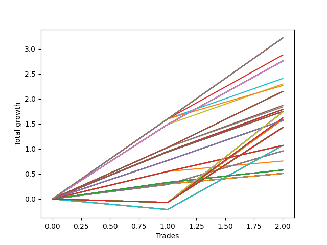

# Long HLT 307 
- Symbol: TSLA
- Date Range: 05/16/2022 - 05/17/2024
- Trading Period: 8:30-12:30
- Number of Trades: 2



| Id. | Name | Win Percent | Profit | Avg Profit / Trade | Avg Time / Trade | Std |      | Name | Win Percent | Profit | Avg Profit / Trade | Avg Time / Trade | Std |
| --- | ---- | ----------- | ------ | ------------------ | ---------------- | --- | ---- | ---- | ----------- | ------ | ------------------ | ---------------- | --- |
| | Sorted By <br> Profit | | | | | | | Sorted By <br> Win Percentage |||||
|0| TP-1.5 180m | 100.00 | 3.22 | 1.61 | 58:00 | 0.01 |     | TP-1.5 180m | 100.00 | 3.22 | 1.61 | 58:00 | 0.01 |
|1| TP-1.5 165m | 100.00 | 3.22 | 1.61 | 58:00 | 0.01 |     | TP-1.5 165m | 100.00 | 3.22 | 1.61 | 58:00 | 0.01 |
|2| TP-1.5 150m | 100.00 | 3.22 | 1.61 | 58:00 | 0.01 |     | TP-1.5 150m | 100.00 | 3.22 | 1.61 | 58:00 | 0.01 |
|3| TP-1.5 135m | 100.00 | 3.22 | 1.61 | 58:00 | 0.01 |     | TP-1.5 135m | 100.00 | 3.22 | 1.61 | 58:00 | 0.01 |
|4| TP-1.5 120m | 100.00 | 3.22 | 1.61 | 58:00 | 0.01 |     | TP-1.5 120m | 100.00 | 3.22 | 1.61 | 58:00 | 0.01 |
|5| TP-1.5 105m | 100.00 | 3.22 | 1.61 | 58:00 | 0.01 |     | TP-1.5 105m | 100.00 | 3.22 | 1.61 | 58:00 | 0.01 |
|6| TP-1.5 90m | 100.00 | 3.22 | 1.61 | 58:00 | 0.01 |     | TP-1.5 90m | 100.00 | 3.22 | 1.61 | 58:00 | 0.01 |
|7| TP-1.5 75m | 100.00 | 2.88 | 1.44 | 56:30 | 0.16 |     | TP-1.5 75m | 100.00 | 2.88 | 1.44 | 56:30 | 0.16 |
|8| TP-1.25 180m | 100.00 | 2.76 | 1.38 | 45:30 | 0.11 |     | TP-1.25 180m | 100.00 | 2.76 | 1.38 | 45:30 | 0.11 |
|9| TP-1.25 165m | 100.00 | 2.76 | 1.38 | 45:30 | 0.11 |     | TP-1.25 165m | 100.00 | 2.76 | 1.38 | 45:30 | 0.11 |
|10| TP-1.25 150m | 100.00 | 2.76 | 1.38 | 45:30 | 0.11 |     | TP-1.25 150m | 100.00 | 2.76 | 1.38 | 45:30 | 0.11 |
|11| TP-1.25 135m | 100.00 | 2.76 | 1.38 | 45:30 | 0.11 |     | TP-1.25 135m | 100.00 | 2.76 | 1.38 | 45:30 | 0.11 |
|12| TP-1.25 120m | 100.00 | 2.76 | 1.38 | 45:30 | 0.11 |     | TP-1.25 120m | 100.00 | 2.76 | 1.38 | 45:30 | 0.11 |
|13| TP-1.25 105m | 100.00 | 2.76 | 1.38 | 45:30 | 0.11 |     | TP-1.25 105m | 100.00 | 2.76 | 1.38 | 45:30 | 0.11 |
|14| TP-1.25 90m | 100.00 | 2.76 | 1.38 | 45:30 | 0.11 |     | TP-1.25 90m | 100.00 | 2.76 | 1.38 | 45:30 | 0.11 |
|15| TP-1.25 75m | 100.00 | 2.76 | 1.38 | 45:30 | 0.11 |     | TP-1.25 75m | 100.00 | 2.76 | 1.38 | 45:30 | 0.11 |
|16| TP-1.25 60m | 100.00 | 2.76 | 1.38 | 45:30 | 0.11 |     | TP-1.25 60m | 100.00 | 2.76 | 1.38 | 45:30 | 0.11 |
|17| TP-1.5 45m | 100.00 | 2.41 | 1.21 | 41:30 | 0.40 |     | TP-1.5 45m | 100.00 | 2.41 | 1.21 | 41:30 | 0.40 |
|18| TP-1.25 45m | 100.00 | 2.30 | 1.15 | 41:00 | 0.34 |     | TP-1.25 45m | 100.00 | 2.30 | 1.15 | 41:00 | 0.34 |
|19| TP-1.5 60m | 100.00 | 2.27 | 1.14 | 49:00 | 0.47 |     | TP-1.5 60m | 100.00 | 2.27 | 1.14 | 49:00 | 0.47 |
|20| TP-1 180m | 100.00 | 2.15 | 1.08 | 34:00 | 0.04 |     | TP-1 180m | 100.00 | 2.15 | 1.08 | 34:00 | 0.04 |
|21| TP-1 165m | 100.00 | 2.15 | 1.08 | 34:00 | 0.04 |     | TP-1 165m | 100.00 | 2.15 | 1.08 | 34:00 | 0.04 |
|22| TP-1 150m | 100.00 | 2.15 | 1.08 | 34:00 | 0.04 |     | TP-1 150m | 100.00 | 2.15 | 1.08 | 34:00 | 0.04 |
|23| TP-1 135m | 100.00 | 2.15 | 1.08 | 34:00 | 0.04 |     | TP-1 135m | 100.00 | 2.15 | 1.08 | 34:00 | 0.04 |
|24| TP-1 120m | 100.00 | 2.15 | 1.08 | 34:00 | 0.04 |     | TP-1 120m | 100.00 | 2.15 | 1.08 | 34:00 | 0.04 |
|25| TP-1 105m | 100.00 | 2.15 | 1.08 | 34:00 | 0.04 |     | TP-1 105m | 100.00 | 2.15 | 1.08 | 34:00 | 0.04 |
|26| TP-1 90m | 100.00 | 2.15 | 1.08 | 34:00 | 0.04 |     | TP-1 90m | 100.00 | 2.15 | 1.08 | 34:00 | 0.04 |
|27| TP-1 75m | 100.00 | 2.15 | 1.08 | 34:00 | 0.04 |     | TP-1 75m | 100.00 | 2.15 | 1.08 | 34:00 | 0.04 |
|28| TP-1 60m | 100.00 | 2.15 | 1.08 | 34:00 | 0.04 |     | TP-1 60m | 100.00 | 2.15 | 1.08 | 34:00 | 0.04 |
|29| TP-1 30m | 100.00 | 1.87 | 0.94 | 25:00 | 0.10 |     | TP-1 30m | 100.00 | 1.87 | 0.94 | 25:00 | 0.10 |
|30| TP-1 45m | 100.00 | 1.84 | 0.92 | 32:30 | 0.11 |     | TP-1 45m | 100.00 | 1.84 | 0.92 | 32:30 | 0.11 |
|31| TP-3 30m | 100.00 | 1.79 | 0.89 | 29:00 | 0.05 |     | TP-3 30m | 100.00 | 1.79 | 0.89 | 29:00 | 0.05 |
|32| TP-2.75 30m | 100.00 | 1.79 | 0.89 | 29:00 | 0.05 |     | TP-2.75 30m | 100.00 | 1.79 | 0.89 | 29:00 | 0.05 |
|33| TP-2.5 30m | 100.00 | 1.79 | 0.89 | 29:00 | 0.05 |     | TP-2.5 30m | 100.00 | 1.79 | 0.89 | 29:00 | 0.05 |
|34| TP-2.25 30m | 100.00 | 1.79 | 0.89 | 29:00 | 0.05 |     | TP-2.25 30m | 100.00 | 1.79 | 0.89 | 29:00 | 0.05 |
|35| TP-2 30m | 100.00 | 1.79 | 0.89 | 29:00 | 0.05 |     | TP-2 30m | 100.00 | 1.79 | 0.89 | 29:00 | 0.05 |
|36| TP-1.75 30m | 100.00 | 1.79 | 0.89 | 29:00 | 0.05 |     | TP-1.75 30m | 100.00 | 1.79 | 0.89 | 29:00 | 0.05 |
|37| TP-1.5 30m | 100.00 | 1.79 | 0.89 | 29:00 | 0.05 |     | TP-1.5 30m | 100.00 | 1.79 | 0.89 | 29:00 | 0.05 |
|38| TP-1.25 30m | 100.00 | 1.79 | 0.89 | 29:00 | 0.05 |     | TP-1.25 30m | 100.00 | 1.79 | 0.89 | 29:00 | 0.05 |
|39| TP-3 45m | 100.00 | 1.75 | 0.88 | 44:00 | 0.06 |     | TP-3 45m | 100.00 | 1.75 | 0.88 | 44:00 | 0.06 |
|40| TP-2.75 45m | 100.00 | 1.75 | 0.88 | 44:00 | 0.06 |     | TP-2.75 45m | 100.00 | 1.75 | 0.88 | 44:00 | 0.06 |
|41| TP-2.5 45m | 100.00 | 1.75 | 0.88 | 44:00 | 0.06 |     | TP-2.5 45m | 100.00 | 1.75 | 0.88 | 44:00 | 0.06 |
|42| TP-2.25 45m | 100.00 | 1.75 | 0.88 | 44:00 | 0.06 |     | TP-2.25 45m | 100.00 | 1.75 | 0.88 | 44:00 | 0.06 |
|43| TP-2 45m | 100.00 | 1.75 | 0.88 | 44:00 | 0.06 |     | TP-2 45m | 100.00 | 1.75 | 0.88 | 44:00 | 0.06 |
|44| TP-1.75 45m | 100.00 | 1.75 | 0.88 | 44:00 | 0.06 |     | TP-1.75 45m | 100.00 | 1.75 | 0.88 | 44:00 | 0.06 |
|45| TP-1.75 180m | 50.00 | 1.74 | 0.87 | 81:30 | 0.94 |     | TP-0.75 180m | 100.00 | 1.57 | 0.79 | 21:00 | 0.01 |
|46| TP-1.75 165m | 50.00 | 1.74 | 0.87 | 81:30 | 0.94 |     | TP-0.75 165m | 100.00 | 1.57 | 0.79 | 21:00 | 0.01 |
|47| TP-1.75 150m | 50.00 | 1.74 | 0.87 | 81:30 | 0.94 |     | TP-0.75 150m | 100.00 | 1.57 | 0.79 | 21:00 | 0.01 |
|48| TP-1.75 135m | 50.00 | 1.74 | 0.87 | 81:30 | 0.94 |     | TP-0.75 135m | 100.00 | 1.57 | 0.79 | 21:00 | 0.01 |
|49| TP-1.75 120m | 50.00 | 1.74 | 0.87 | 81:30 | 0.94 |     | TP-0.75 120m | 100.00 | 1.57 | 0.79 | 21:00 | 0.01 |
|50| TP-1.75 105m | 50.00 | 1.74 | 0.87 | 81:30 | 0.94 |     | TP-0.75 105m | 100.00 | 1.57 | 0.79 | 21:00 | 0.01 |
|51| TP-1.75 90m | 50.00 | 1.74 | 0.87 | 81:30 | 0.94 |     | TP-0.75 90m | 100.00 | 1.57 | 0.79 | 21:00 | 0.01 |
|52| TP-3 105m | 50.00 | 1.62 | 0.81 | 94:30 | 0.88 |     | TP-0.75 75m | 100.00 | 1.57 | 0.79 | 21:00 | 0.01 |
|53| TP-2.75 105m | 50.00 | 1.62 | 0.81 | 94:30 | 0.88 |     | TP-0.75 60m | 100.00 | 1.57 | 0.79 | 21:00 | 0.01 |
|54| TP-2.5 105m | 50.00 | 1.62 | 0.81 | 94:30 | 0.88 |     | TP-0.75 45m | 100.00 | 1.57 | 0.79 | 21:00 | 0.01 |
|55| TP-2.25 105m | 50.00 | 1.62 | 0.81 | 94:30 | 0.88 |     | TP-0.75 30m | 100.00 | 1.57 | 0.79 | 21:00 | 0.01 |
|56| TP-2 105m | 50.00 | 1.62 | 0.81 | 94:30 | 0.88 |     | TP-0.5 180m | 100.00 | 1.07 | 0.54 | 14:00 | 0.02 |
|57| TP-3 90m | 50.00 | 1.59 | 0.80 | 87:00 | 0.86 |     | TP-0.5 165m | 100.00 | 1.07 | 0.54 | 14:00 | 0.02 |
|58| TP-2.75 90m | 50.00 | 1.59 | 0.80 | 87:00 | 0.86 |     | TP-0.5 150m | 100.00 | 1.07 | 0.54 | 14:00 | 0.02 |
|59| TP-2.5 90m | 50.00 | 1.59 | 0.80 | 87:00 | 0.86 |     | TP-0.5 135m | 100.00 | 1.07 | 0.54 | 14:00 | 0.02 |
|60| TP-2.25 90m | 50.00 | 1.59 | 0.80 | 87:00 | 0.86 |     | TP-0.5 120m | 100.00 | 1.07 | 0.54 | 14:00 | 0.02 |
|61| TP-2 90m | 50.00 | 1.59 | 0.80 | 87:00 | 0.86 |     | TP-0.5 105m | 100.00 | 1.07 | 0.54 | 14:00 | 0.02 |
|62| TP-0.75 180m | 100.00 | 1.57 | 0.79 | 21:00 | 0.01 |     | TP-0.5 90m | 100.00 | 1.07 | 0.54 | 14:00 | 0.02 |
|63| TP-0.75 165m | 100.00 | 1.57 | 0.79 | 21:00 | 0.01 |     | TP-0.5 75m | 100.00 | 1.07 | 0.54 | 14:00 | 0.02 |
|64| TP-0.75 150m | 100.00 | 1.57 | 0.79 | 21:00 | 0.01 |     | TP-0.5 60m | 100.00 | 1.07 | 0.54 | 14:00 | 0.02 |
|65| TP-0.75 135m | 100.00 | 1.57 | 0.79 | 21:00 | 0.01 |     | TP-0.5 45m | 100.00 | 1.07 | 0.54 | 14:00 | 0.02 |
|66| TP-0.75 120m | 100.00 | 1.57 | 0.79 | 21:00 | 0.01 |     | TP-0.5 30m | 100.00 | 1.07 | 0.54 | 14:00 | 0.02 |
|67| TP-0.75 105m | 100.00 | 1.57 | 0.79 | 21:00 | 0.01 |     | TP-3 60m | 100.00 | 0.96 | 0.48 | 59:00 | 0.19 |
|68| TP-0.75 90m | 100.00 | 1.57 | 0.79 | 21:00 | 0.01 |     | TP-2.75 60m | 100.00 | 0.96 | 0.48 | 59:00 | 0.19 |
|69| TP-0.75 75m | 100.00 | 1.57 | 0.79 | 21:00 | 0.01 |     | TP-2.5 60m | 100.00 | 0.96 | 0.48 | 59:00 | 0.19 |
|70| TP-0.75 60m | 100.00 | 1.57 | 0.79 | 21:00 | 0.01 |     | TP-2.25 60m | 100.00 | 0.96 | 0.48 | 59:00 | 0.19 |
|71| TP-0.75 45m | 100.00 | 1.57 | 0.79 | 21:00 | 0.01 |     | TP-2 60m | 100.00 | 0.96 | 0.48 | 59:00 | 0.19 |
|72| TP-0.75 30m | 100.00 | 1.57 | 0.79 | 21:00 | 0.01 |     | TP-1.75 60m | 100.00 | 0.96 | 0.48 | 59:00 | 0.19 |
|73| TP-3 180m | 50.00 | 1.43 | 0.72 | 102:00 | 0.78 |     | TP-0.5 15m | 100.00 | 0.76 | 0.38 | 11:00 | 0.17 |
|74| TP-2.75 180m | 50.00 | 1.43 | 0.72 | 102:00 | 0.78 |     | TP-0.25 180m | 100.00 | 0.58 | 0.29 | 07:30 | 0.04 |
|75| TP-2.5 180m | 50.00 | 1.43 | 0.72 | 102:00 | 0.78 |     | TP-0.25 165m | 100.00 | 0.58 | 0.29 | 07:30 | 0.04 |
|76| TP-2.25 180m | 50.00 | 1.43 | 0.72 | 102:00 | 0.78 |     | TP-0.25 150m | 100.00 | 0.58 | 0.29 | 07:30 | 0.04 |
|77| TP-2 180m | 50.00 | 1.43 | 0.72 | 102:00 | 0.78 |     | TP-0.25 135m | 100.00 | 0.58 | 0.29 | 07:30 | 0.04 |
|78| TP-3 165m | 50.00 | 1.43 | 0.72 | 102:00 | 0.78 |     | TP-0.25 120m | 100.00 | 0.58 | 0.29 | 07:30 | 0.04 |
|79| TP-2.75 165m | 50.00 | 1.43 | 0.72 | 102:00 | 0.78 |     | TP-0.25 105m | 100.00 | 0.58 | 0.29 | 07:30 | 0.04 |
|80| TP-2.5 165m | 50.00 | 1.43 | 0.72 | 102:00 | 0.78 |     | TP-0.25 90m | 100.00 | 0.58 | 0.29 | 07:30 | 0.04 |
|81| TP-2.25 165m | 50.00 | 1.43 | 0.72 | 102:00 | 0.78 |     | TP-0.25 75m | 100.00 | 0.58 | 0.29 | 07:30 | 0.04 |
|82| TP-2 165m | 50.00 | 1.43 | 0.72 | 102:00 | 0.78 |     | TP-0.25 60m | 100.00 | 0.58 | 0.29 | 07:30 | 0.04 |
|83| TP-3 150m | 50.00 | 1.43 | 0.72 | 102:00 | 0.78 |     | TP-0.25 45m | 100.00 | 0.58 | 0.29 | 07:30 | 0.04 |
|84| TP-2.75 150m | 50.00 | 1.43 | 0.72 | 102:00 | 0.78 |     | TP-0.25 30m | 100.00 | 0.58 | 0.29 | 07:30 | 0.04 |
|85| TP-2.5 150m | 50.00 | 1.43 | 0.72 | 102:00 | 0.78 |     | TP-0.25 15m | 100.00 | 0.58 | 0.29 | 07:30 | 0.04 |
|86| TP-2.25 150m | 50.00 | 1.43 | 0.72 | 102:00 | 0.78 |     | TP-3 15m | 100.00 | 0.51 | 0.26 | 14:00 | 0.05 |
|87| TP-2 150m | 50.00 | 1.43 | 0.72 | 102:00 | 0.78 |     | TP-2.75 15m | 100.00 | 0.51 | 0.26 | 14:00 | 0.05 |
|88| TP-3 135m | 50.00 | 1.43 | 0.72 | 102:00 | 0.78 |     | TP-2.5 15m | 100.00 | 0.51 | 0.26 | 14:00 | 0.05 |
|89| TP-2.75 135m | 50.00 | 1.43 | 0.72 | 102:00 | 0.78 |     | TP-2.25 15m | 100.00 | 0.51 | 0.26 | 14:00 | 0.05 |
|90| TP-2.5 135m | 50.00 | 1.43 | 0.72 | 102:00 | 0.78 |     | TP-2 15m | 100.00 | 0.51 | 0.26 | 14:00 | 0.05 |
|91| TP-2.25 135m | 50.00 | 1.43 | 0.72 | 102:00 | 0.78 |     | TP-1.75 15m | 100.00 | 0.51 | 0.26 | 14:00 | 0.05 |
|92| TP-2 135m | 50.00 | 1.43 | 0.72 | 102:00 | 0.78 |     | TP-1.5 15m | 100.00 | 0.51 | 0.26 | 14:00 | 0.05 |
|93| TP-3 120m | 50.00 | 1.43 | 0.72 | 102:00 | 0.78 |     | TP-1.25 15m | 100.00 | 0.51 | 0.26 | 14:00 | 0.05 |
|94| TP-2.75 120m | 50.00 | 1.43 | 0.72 | 102:00 | 0.78 |     | TP-1 15m | 100.00 | 0.51 | 0.26 | 14:00 | 0.05 |
|95| TP-2.5 120m | 50.00 | 1.43 | 0.72 | 102:00 | 0.78 |     | TP-0.75 15m | 100.00 | 0.51 | 0.26 | 14:00 | 0.05 |
|96| TP-2.25 120m | 50.00 | 1.43 | 0.72 | 102:00 | 0.78 |     | TP-1.75 180m | 50.00 | 1.74 | 0.87 | 81:30 | 0.94 |
|97| TP-2 120m | 50.00 | 1.43 | 0.72 | 102:00 | 0.78 |     | TP-1.75 165m | 50.00 | 1.74 | 0.87 | 81:30 | 0.94 |
|98| TP-0.5 180m | 100.00 | 1.07 | 0.54 | 14:00 | 0.02 |     | TP-1.75 150m | 50.00 | 1.74 | 0.87 | 81:30 | 0.94 |
|99| TP-0.5 165m | 100.00 | 1.07 | 0.54 | 14:00 | 0.02 |     | TP-1.75 135m | 50.00 | 1.74 | 0.87 | 81:30 | 0.94 |
|100| TP-0.5 150m | 100.00 | 1.07 | 0.54 | 14:00 | 0.02 |     | TP-1.75 120m | 50.00 | 1.74 | 0.87 | 81:30 | 0.94 |
|101| TP-0.5 135m | 100.00 | 1.07 | 0.54 | 14:00 | 0.02 |     | TP-1.75 105m | 50.00 | 1.74 | 0.87 | 81:30 | 0.94 |
|102| TP-0.5 120m | 100.00 | 1.07 | 0.54 | 14:00 | 0.02 |     | TP-1.75 90m | 50.00 | 1.74 | 0.87 | 81:30 | 0.94 |
|103| TP-0.5 105m | 100.00 | 1.07 | 0.54 | 14:00 | 0.02 |     | TP-3 105m | 50.00 | 1.62 | 0.81 | 94:30 | 0.88 |
|104| TP-0.5 90m | 100.00 | 1.07 | 0.54 | 14:00 | 0.02 |     | TP-2.75 105m | 50.00 | 1.62 | 0.81 | 94:30 | 0.88 |
|105| TP-0.5 75m | 100.00 | 1.07 | 0.54 | 14:00 | 0.02 |     | TP-2.5 105m | 50.00 | 1.62 | 0.81 | 94:30 | 0.88 |
|106| TP-0.5 60m | 100.00 | 1.07 | 0.54 | 14:00 | 0.02 |     | TP-2.25 105m | 50.00 | 1.62 | 0.81 | 94:30 | 0.88 |
|107| TP-0.5 45m | 100.00 | 1.07 | 0.54 | 14:00 | 0.02 |     | TP-2 105m | 50.00 | 1.62 | 0.81 | 94:30 | 0.88 |
|108| TP-0.5 30m | 100.00 | 1.07 | 0.54 | 14:00 | 0.02 |     | TP-3 90m | 50.00 | 1.59 | 0.80 | 87:00 | 0.86 |
|109| TP-3 75m | 50.00 | 1.07 | 0.54 | 74:00 | 0.74 |     | TP-2.75 90m | 50.00 | 1.59 | 0.80 | 87:00 | 0.86 |
|110| TP-2.75 75m | 50.00 | 1.07 | 0.54 | 74:00 | 0.74 |     | TP-2.5 90m | 50.00 | 1.59 | 0.80 | 87:00 | 0.86 |
|111| TP-2.5 75m | 50.00 | 1.07 | 0.54 | 74:00 | 0.74 |     | TP-2.25 90m | 50.00 | 1.59 | 0.80 | 87:00 | 0.86 |
|112| TP-2.25 75m | 50.00 | 1.07 | 0.54 | 74:00 | 0.74 |     | TP-2 90m | 50.00 | 1.59 | 0.80 | 87:00 | 0.86 |
|113| TP-2 75m | 50.00 | 1.07 | 0.54 | 74:00 | 0.74 |     | TP-3 180m | 50.00 | 1.43 | 0.72 | 102:00 | 0.78 |
|114| TP-1.75 75m | 50.00 | 1.07 | 0.54 | 74:00 | 0.74 |     | TP-2.75 180m | 50.00 | 1.43 | 0.72 | 102:00 | 0.78 |
|115| TP-3 60m | 100.00 | 0.96 | 0.48 | 59:00 | 0.19 |     | TP-2.5 180m | 50.00 | 1.43 | 0.72 | 102:00 | 0.78 |
|116| TP-2.75 60m | 100.00 | 0.96 | 0.48 | 59:00 | 0.19 |     | TP-2.25 180m | 50.00 | 1.43 | 0.72 | 102:00 | 0.78 |
|117| TP-2.5 60m | 100.00 | 0.96 | 0.48 | 59:00 | 0.19 |     | TP-2 180m | 50.00 | 1.43 | 0.72 | 102:00 | 0.78 |
|118| TP-2.25 60m | 100.00 | 0.96 | 0.48 | 59:00 | 0.19 |     | TP-3 165m | 50.00 | 1.43 | 0.72 | 102:00 | 0.78 |
|119| TP-2 60m | 100.00 | 0.96 | 0.48 | 59:00 | 0.19 |     | TP-2.75 165m | 50.00 | 1.43 | 0.72 | 102:00 | 0.78 |
|120| TP-1.75 60m | 100.00 | 0.96 | 0.48 | 59:00 | 0.19 |     | TP-2.5 165m | 50.00 | 1.43 | 0.72 | 102:00 | 0.78 |
|121| TP-0.5 15m | 100.00 | 0.76 | 0.38 | 11:00 | 0.17 |     | TP-2.25 165m | 50.00 | 1.43 | 0.72 | 102:00 | 0.78 |
|122| TP-0.25 180m | 100.00 | 0.58 | 0.29 | 07:30 | 0.04 |     | TP-2 165m | 50.00 | 1.43 | 0.72 | 102:00 | 0.78 |
|123| TP-0.25 165m | 100.00 | 0.58 | 0.29 | 07:30 | 0.04 |     | TP-3 150m | 50.00 | 1.43 | 0.72 | 102:00 | 0.78 |
|124| TP-0.25 150m | 100.00 | 0.58 | 0.29 | 07:30 | 0.04 |     | TP-2.75 150m | 50.00 | 1.43 | 0.72 | 102:00 | 0.78 |
|125| TP-0.25 135m | 100.00 | 0.58 | 0.29 | 07:30 | 0.04 |     | TP-2.5 150m | 50.00 | 1.43 | 0.72 | 102:00 | 0.78 |
|126| TP-0.25 120m | 100.00 | 0.58 | 0.29 | 07:30 | 0.04 |     | TP-2.25 150m | 50.00 | 1.43 | 0.72 | 102:00 | 0.78 |
|127| TP-0.25 105m | 100.00 | 0.58 | 0.29 | 07:30 | 0.04 |     | TP-2 150m | 50.00 | 1.43 | 0.72 | 102:00 | 0.78 |
|128| TP-0.25 90m | 100.00 | 0.58 | 0.29 | 07:30 | 0.04 |     | TP-3 135m | 50.00 | 1.43 | 0.72 | 102:00 | 0.78 |
|129| TP-0.25 75m | 100.00 | 0.58 | 0.29 | 07:30 | 0.04 |     | TP-2.75 135m | 50.00 | 1.43 | 0.72 | 102:00 | 0.78 |
|130| TP-0.25 60m | 100.00 | 0.58 | 0.29 | 07:30 | 0.04 |     | TP-2.5 135m | 50.00 | 1.43 | 0.72 | 102:00 | 0.78 |
|131| TP-0.25 45m | 100.00 | 0.58 | 0.29 | 07:30 | 0.04 |     | TP-2.25 135m | 50.00 | 1.43 | 0.72 | 102:00 | 0.78 |
|132| TP-0.25 30m | 100.00 | 0.58 | 0.29 | 07:30 | 0.04 |     | TP-2 135m | 50.00 | 1.43 | 0.72 | 102:00 | 0.78 |
|133| TP-0.25 15m | 100.00 | 0.58 | 0.29 | 07:30 | 0.04 |     | TP-3 120m | 50.00 | 1.43 | 0.72 | 102:00 | 0.78 |
|134| TP-3 15m | 100.00 | 0.51 | 0.26 | 14:00 | 0.05 |     | TP-2.75 120m | 50.00 | 1.43 | 0.72 | 102:00 | 0.78 |
|135| TP-2.75 15m | 100.00 | 0.51 | 0.26 | 14:00 | 0.05 |     | TP-2.5 120m | 50.00 | 1.43 | 0.72 | 102:00 | 0.78 |
|136| TP-2.5 15m | 100.00 | 0.51 | 0.26 | 14:00 | 0.05 |     | TP-2.25 120m | 50.00 | 1.43 | 0.72 | 102:00 | 0.78 |
|137| TP-2.25 15m | 100.00 | 0.51 | 0.26 | 14:00 | 0.05 |     | TP-2 120m | 50.00 | 1.43 | 0.72 | 102:00 | 0.78 |
|138| TP-2 15m | 100.00 | 0.51 | 0.26 | 14:00 | 0.05 |     | TP-3 75m | 50.00 | 1.07 | 0.54 | 74:00 | 0.74 |
|139| TP-1.75 15m | 100.00 | 0.51 | 0.26 | 14:00 | 0.05 |     | TP-2.75 75m | 50.00 | 1.07 | 0.54 | 74:00 | 0.74 |
|140| TP-1.5 15m | 100.00 | 0.51 | 0.26 | 14:00 | 0.05 |     | TP-2.5 75m | 50.00 | 1.07 | 0.54 | 74:00 | 0.74 |
|141| TP-1.25 15m | 100.00 | 0.51 | 0.26 | 14:00 | 0.05 |     | TP-2.25 75m | 50.00 | 1.07 | 0.54 | 74:00 | 0.74 |
|142| TP-1 15m | 100.00 | 0.51 | 0.26 | 14:00 | 0.05 |     | TP-2 75m | 50.00 | 1.07 | 0.54 | 74:00 | 0.74 |
|143| TP-0.75 15m | 100.00 | 0.51 | 0.26 | 14:00 | 0.05 |     | TP-1.75 75m | 50.00 | 1.07 | 0.54 | 74:00 | 0.74 |

### Test TP-0.25 15m
* Take Profit of 0.25 Point
* 0.25 Stoploss
* Results:
```
Total Trades: 2
Percent Up: 100.00
Percent Down: 0.00
Total Points Moved Up: 0.58
Potential Profit: 290.00
Total Points Ups: 0.58 Count Ups: 2
Total Points Downs: 0.00 Count Downs: 0
```

<details><summary>Trades</summary>

<code>In: 2022-08-26 11:25:00		Out: 2022-08-26 11:28:00		Total Position Time: 03:00		Total Move Up: 0.33		Total to Date: 0.33</code> <br />
<code>In: 2023-05-10 10:50:00		Out: 2023-05-10 11:02:00		Total Position Time: 12:00		Total Move Up: 0.25		Total to Date: 0.58</code> <br />


</details>

### Test TP-0.5 15m
* Take Profit of 0.5 Point
* 0.5 Stoploss
* Results:
```
Total Trades: 2
Percent Up: 100.00
Percent Down: 0.00
Total Points Moved Up: 0.76
Potential Profit: 380.00
Total Points Ups: 0.76 Count Ups: 2
Total Points Downs: 0.00 Count Downs: 0
```

<details><summary>Trades</summary>

<code>In: 2022-08-26 11:25:00		Out: 2022-08-26 11:33:00		Total Position Time: 08:00		Total Move Up: 0.55		Total to Date: 0.55</code> <br />
<code>In: 2023-05-10 10:50:00		Out: 2023-05-10 11:04:00		Total Position Time: 14:00		Total Move Up: 0.21		Total to Date: 0.76</code> <br />


</details>

### Test TP-0.75 15m
* Take Profit of 0.75 Point
* 0.75 Stoploss
* Results:
```
Total Trades: 2
Percent Up: 100.00
Percent Down: 0.00
Total Points Moved Up: 0.51
Potential Profit: 255.00
Total Points Ups: 0.51 Count Ups: 2
Total Points Downs: 0.00 Count Downs: 0
```

<details><summary>Trades</summary>

<code>In: 2022-08-26 11:25:00		Out: 2022-08-26 11:39:00		Total Position Time: 14:00		Total Move Up: 0.30		Total to Date: 0.30</code> <br />
<code>In: 2023-05-10 10:50:00		Out: 2023-05-10 11:04:00		Total Position Time: 14:00		Total Move Up: 0.21		Total to Date: 0.51</code> <br />


</details>

### Test TP-1 15m
* Take Profit of 1 Point
* 1 Stoploss
* Results:
```
Total Trades: 2
Percent Up: 100.00
Percent Down: 0.00
Total Points Moved Up: 0.51
Potential Profit: 255.00
Total Points Ups: 0.51 Count Ups: 2
Total Points Downs: 0.00 Count Downs: 0
```

<details><summary>Trades</summary>

<code>In: 2022-08-26 11:25:00		Out: 2022-08-26 11:39:00		Total Position Time: 14:00		Total Move Up: 0.30		Total to Date: 0.30</code> <br />
<code>In: 2023-05-10 10:50:00		Out: 2023-05-10 11:04:00		Total Position Time: 14:00		Total Move Up: 0.21		Total to Date: 0.51</code> <br />


</details>

### Test TP-1.25 15m
* Take Profit of 1.25 Point
* 1.25 Stoploss
* Results:
```
Total Trades: 2
Percent Up: 100.00
Percent Down: 0.00
Total Points Moved Up: 0.51
Potential Profit: 255.00
Total Points Ups: 0.51 Count Ups: 2
Total Points Downs: 0.00 Count Downs: 0
```

<details><summary>Trades</summary>

<code>In: 2022-08-26 11:25:00		Out: 2022-08-26 11:39:00		Total Position Time: 14:00		Total Move Up: 0.30		Total to Date: 0.30</code> <br />
<code>In: 2023-05-10 10:50:00		Out: 2023-05-10 11:04:00		Total Position Time: 14:00		Total Move Up: 0.21		Total to Date: 0.51</code> <br />


</details>

### Test TP-1.5 15m
* Take Profit of 1.5 Point
* 1.5 Stoploss
* Results:
```
Total Trades: 2
Percent Up: 100.00
Percent Down: 0.00
Total Points Moved Up: 0.51
Potential Profit: 255.00
Total Points Ups: 0.51 Count Ups: 2
Total Points Downs: 0.00 Count Downs: 0
```

<details><summary>Trades</summary>

<code>In: 2022-08-26 11:25:00		Out: 2022-08-26 11:39:00		Total Position Time: 14:00		Total Move Up: 0.30		Total to Date: 0.30</code> <br />
<code>In: 2023-05-10 10:50:00		Out: 2023-05-10 11:04:00		Total Position Time: 14:00		Total Move Up: 0.21		Total to Date: 0.51</code> <br />


</details>

### Test TP-1.75 15m
* Take Profit of 1.75 Point
* 1.75 Stoploss
* Results:
```
Total Trades: 2
Percent Up: 100.00
Percent Down: 0.00
Total Points Moved Up: 0.51
Potential Profit: 255.00
Total Points Ups: 0.51 Count Ups: 2
Total Points Downs: 0.00 Count Downs: 0
```

<details><summary>Trades</summary>

<code>In: 2022-08-26 11:25:00		Out: 2022-08-26 11:39:00		Total Position Time: 14:00		Total Move Up: 0.30		Total to Date: 0.30</code> <br />
<code>In: 2023-05-10 10:50:00		Out: 2023-05-10 11:04:00		Total Position Time: 14:00		Total Move Up: 0.21		Total to Date: 0.51</code> <br />


</details>

### Test TP-2 15m
* Take Profit of 2 Point
* 2 Stoploss
* Results:
```
Total Trades: 2
Percent Up: 100.00
Percent Down: 0.00
Total Points Moved Up: 0.51
Potential Profit: 255.00
Total Points Ups: 0.51 Count Ups: 2
Total Points Downs: 0.00 Count Downs: 0
```

<details><summary>Trades</summary>

<code>In: 2022-08-26 11:25:00		Out: 2022-08-26 11:39:00		Total Position Time: 14:00		Total Move Up: 0.30		Total to Date: 0.30</code> <br />
<code>In: 2023-05-10 10:50:00		Out: 2023-05-10 11:04:00		Total Position Time: 14:00		Total Move Up: 0.21		Total to Date: 0.51</code> <br />


</details>

### Test TP-2.25 15m
* Take Profit of 2.25 Point
* 2.25 Stoploss
* Results:
```
Total Trades: 2
Percent Up: 100.00
Percent Down: 0.00
Total Points Moved Up: 0.51
Potential Profit: 255.00
Total Points Ups: 0.51 Count Ups: 2
Total Points Downs: 0.00 Count Downs: 0
```

<details><summary>Trades</summary>

<code>In: 2022-08-26 11:25:00		Out: 2022-08-26 11:39:00		Total Position Time: 14:00		Total Move Up: 0.30		Total to Date: 0.30</code> <br />
<code>In: 2023-05-10 10:50:00		Out: 2023-05-10 11:04:00		Total Position Time: 14:00		Total Move Up: 0.21		Total to Date: 0.51</code> <br />


</details>

### Test TP-2.5 15m
* Take Profit of 2.5 Point
* 2.5 Stoploss
* Results:
```
Total Trades: 2
Percent Up: 100.00
Percent Down: 0.00
Total Points Moved Up: 0.51
Potential Profit: 255.00
Total Points Ups: 0.51 Count Ups: 2
Total Points Downs: 0.00 Count Downs: 0
```

<details><summary>Trades</summary>

<code>In: 2022-08-26 11:25:00		Out: 2022-08-26 11:39:00		Total Position Time: 14:00		Total Move Up: 0.30		Total to Date: 0.30</code> <br />
<code>In: 2023-05-10 10:50:00		Out: 2023-05-10 11:04:00		Total Position Time: 14:00		Total Move Up: 0.21		Total to Date: 0.51</code> <br />


</details>

### Test TP-2.75 15m
* Take Profit of 2.75 Point
* 2.75 Stoploss
* Results:
```
Total Trades: 2
Percent Up: 100.00
Percent Down: 0.00
Total Points Moved Up: 0.51
Potential Profit: 255.00
Total Points Ups: 0.51 Count Ups: 2
Total Points Downs: 0.00 Count Downs: 0
```

<details><summary>Trades</summary>

<code>In: 2022-08-26 11:25:00		Out: 2022-08-26 11:39:00		Total Position Time: 14:00		Total Move Up: 0.30		Total to Date: 0.30</code> <br />
<code>In: 2023-05-10 10:50:00		Out: 2023-05-10 11:04:00		Total Position Time: 14:00		Total Move Up: 0.21		Total to Date: 0.51</code> <br />


</details>

### Test TP-3 15m
* Take Profit of 3 Point
* 3 Stoploss
* Results:
```
Total Trades: 2
Percent Up: 100.00
Percent Down: 0.00
Total Points Moved Up: 0.51
Potential Profit: 255.00
Total Points Ups: 0.51 Count Ups: 2
Total Points Downs: 0.00 Count Downs: 0
```

<details><summary>Trades</summary>

<code>In: 2022-08-26 11:25:00		Out: 2022-08-26 11:39:00		Total Position Time: 14:00		Total Move Up: 0.30		Total to Date: 0.30</code> <br />
<code>In: 2023-05-10 10:50:00		Out: 2023-05-10 11:04:00		Total Position Time: 14:00		Total Move Up: 0.21		Total to Date: 0.51</code> <br />


</details>

### Test TP-0.25 30m
* Take Profit of 0.25 Point
* 0.25 Stoploss
* Results:
```
Total Trades: 2
Percent Up: 100.00
Percent Down: 0.00
Total Points Moved Up: 0.58
Potential Profit: 290.00
Total Points Ups: 0.58 Count Ups: 2
Total Points Downs: 0.00 Count Downs: 0
```

<details><summary>Trades</summary>

<code>In: 2022-08-26 11:25:00		Out: 2022-08-26 11:28:00		Total Position Time: 03:00		Total Move Up: 0.33		Total to Date: 0.33</code> <br />
<code>In: 2023-05-10 10:50:00		Out: 2023-05-10 11:02:00		Total Position Time: 12:00		Total Move Up: 0.25		Total to Date: 0.58</code> <br />


</details>

### Test TP-0.5 30m
* Take Profit of 0.5 Point
* 0.5 Stoploss
* Results:
```
Total Trades: 2
Percent Up: 100.00
Percent Down: 0.00
Total Points Moved Up: 1.07
Potential Profit: 535.00
Total Points Ups: 1.07 Count Ups: 2
Total Points Downs: 0.00 Count Downs: 0
```

<details><summary>Trades</summary>

<code>In: 2022-08-26 11:25:00		Out: 2022-08-26 11:33:00		Total Position Time: 08:00		Total Move Up: 0.55		Total to Date: 0.55</code> <br />
<code>In: 2023-05-10 10:50:00		Out: 2023-05-10 11:10:00		Total Position Time: 20:00		Total Move Up: 0.52		Total to Date: 1.07</code> <br />


</details>

### Test TP-0.75 30m
* Take Profit of 0.75 Point
* 0.75 Stoploss
* Results:
```
Total Trades: 2
Percent Up: 100.00
Percent Down: 0.00
Total Points Moved Up: 1.57
Potential Profit: 785.00
Total Points Ups: 1.57 Count Ups: 2
Total Points Downs: 0.00 Count Downs: 0
```

<details><summary>Trades</summary>

<code>In: 2022-08-26 11:25:00		Out: 2022-08-26 11:43:00		Total Position Time: 18:00		Total Move Up: 0.77		Total to Date: 0.77</code> <br />
<code>In: 2023-05-10 10:50:00		Out: 2023-05-10 11:14:00		Total Position Time: 24:00		Total Move Up: 0.80		Total to Date: 1.57</code> <br />


</details>

### Test TP-1 30m
* Take Profit of 1 Point
* 1 Stoploss
* Results:
```
Total Trades: 2
Percent Up: 100.00
Percent Down: 0.00
Total Points Moved Up: 1.87
Potential Profit: 935.00
Total Points Ups: 1.87 Count Ups: 2
Total Points Downs: 0.00 Count Downs: 0
```

<details><summary>Trades</summary>

<code>In: 2022-08-26 11:25:00		Out: 2022-08-26 11:46:00		Total Position Time: 21:00		Total Move Up: 1.03		Total to Date: 1.03</code> <br />
<code>In: 2023-05-10 10:50:00		Out: 2023-05-10 11:19:00		Total Position Time: 29:00		Total Move Up: 0.84		Total to Date: 1.87</code> <br />


</details>

### Test TP-1.25 30m
* Take Profit of 1.25 Point
* 1.25 Stoploss
* Results:
```
Total Trades: 2
Percent Up: 100.00
Percent Down: 0.00
Total Points Moved Up: 1.79
Potential Profit: 895.00
Total Points Ups: 1.79 Count Ups: 2
Total Points Downs: 0.00 Count Downs: 0
```

<details><summary>Trades</summary>

<code>In: 2022-08-26 11:25:00		Out: 2022-08-26 11:54:00		Total Position Time: 29:00		Total Move Up: 0.95		Total to Date: 0.95</code> <br />
<code>In: 2023-05-10 10:50:00		Out: 2023-05-10 11:19:00		Total Position Time: 29:00		Total Move Up: 0.84		Total to Date: 1.79</code> <br />


</details>

### Test TP-1.5 30m
* Take Profit of 1.5 Point
* 1.5 Stoploss
* Results:
```
Total Trades: 2
Percent Up: 100.00
Percent Down: 0.00
Total Points Moved Up: 1.79
Potential Profit: 895.00
Total Points Ups: 1.79 Count Ups: 2
Total Points Downs: 0.00 Count Downs: 0
```

<details><summary>Trades</summary>

<code>In: 2022-08-26 11:25:00		Out: 2022-08-26 11:54:00		Total Position Time: 29:00		Total Move Up: 0.95		Total to Date: 0.95</code> <br />
<code>In: 2023-05-10 10:50:00		Out: 2023-05-10 11:19:00		Total Position Time: 29:00		Total Move Up: 0.84		Total to Date: 1.79</code> <br />


</details>

### Test TP-1.75 30m
* Take Profit of 1.75 Point
* 1.75 Stoploss
* Results:
```
Total Trades: 2
Percent Up: 100.00
Percent Down: 0.00
Total Points Moved Up: 1.79
Potential Profit: 895.00
Total Points Ups: 1.79 Count Ups: 2
Total Points Downs: 0.00 Count Downs: 0
```

<details><summary>Trades</summary>

<code>In: 2022-08-26 11:25:00		Out: 2022-08-26 11:54:00		Total Position Time: 29:00		Total Move Up: 0.95		Total to Date: 0.95</code> <br />
<code>In: 2023-05-10 10:50:00		Out: 2023-05-10 11:19:00		Total Position Time: 29:00		Total Move Up: 0.84		Total to Date: 1.79</code> <br />


</details>

### Test TP-2 30m
* Take Profit of 2 Point
* 2 Stoploss
* Results:
```
Total Trades: 2
Percent Up: 100.00
Percent Down: 0.00
Total Points Moved Up: 1.79
Potential Profit: 895.00
Total Points Ups: 1.79 Count Ups: 2
Total Points Downs: 0.00 Count Downs: 0
```

<details><summary>Trades</summary>

<code>In: 2022-08-26 11:25:00		Out: 2022-08-26 11:54:00		Total Position Time: 29:00		Total Move Up: 0.95		Total to Date: 0.95</code> <br />
<code>In: 2023-05-10 10:50:00		Out: 2023-05-10 11:19:00		Total Position Time: 29:00		Total Move Up: 0.84		Total to Date: 1.79</code> <br />


</details>

### Test TP-2.25 30m
* Take Profit of 2.25 Point
* 2.25 Stoploss
* Results:
```
Total Trades: 2
Percent Up: 100.00
Percent Down: 0.00
Total Points Moved Up: 1.79
Potential Profit: 895.00
Total Points Ups: 1.79 Count Ups: 2
Total Points Downs: 0.00 Count Downs: 0
```

<details><summary>Trades</summary>

<code>In: 2022-08-26 11:25:00		Out: 2022-08-26 11:54:00		Total Position Time: 29:00		Total Move Up: 0.95		Total to Date: 0.95</code> <br />
<code>In: 2023-05-10 10:50:00		Out: 2023-05-10 11:19:00		Total Position Time: 29:00		Total Move Up: 0.84		Total to Date: 1.79</code> <br />


</details>

### Test TP-2.5 30m
* Take Profit of 2.5 Point
* 2.5 Stoploss
* Results:
```
Total Trades: 2
Percent Up: 100.00
Percent Down: 0.00
Total Points Moved Up: 1.79
Potential Profit: 895.00
Total Points Ups: 1.79 Count Ups: 2
Total Points Downs: 0.00 Count Downs: 0
```

<details><summary>Trades</summary>

<code>In: 2022-08-26 11:25:00		Out: 2022-08-26 11:54:00		Total Position Time: 29:00		Total Move Up: 0.95		Total to Date: 0.95</code> <br />
<code>In: 2023-05-10 10:50:00		Out: 2023-05-10 11:19:00		Total Position Time: 29:00		Total Move Up: 0.84		Total to Date: 1.79</code> <br />


</details>

### Test TP-2.75 30m
* Take Profit of 2.75 Point
* 2.75 Stoploss
* Results:
```
Total Trades: 2
Percent Up: 100.00
Percent Down: 0.00
Total Points Moved Up: 1.79
Potential Profit: 895.00
Total Points Ups: 1.79 Count Ups: 2
Total Points Downs: 0.00 Count Downs: 0
```

<details><summary>Trades</summary>

<code>In: 2022-08-26 11:25:00		Out: 2022-08-26 11:54:00		Total Position Time: 29:00		Total Move Up: 0.95		Total to Date: 0.95</code> <br />
<code>In: 2023-05-10 10:50:00		Out: 2023-05-10 11:19:00		Total Position Time: 29:00		Total Move Up: 0.84		Total to Date: 1.79</code> <br />


</details>

### Test TP-3 30m
* Take Profit of 3 Point
* 3 Stoploss
* Results:
```
Total Trades: 2
Percent Up: 100.00
Percent Down: 0.00
Total Points Moved Up: 1.79
Potential Profit: 895.00
Total Points Ups: 1.79 Count Ups: 2
Total Points Downs: 0.00 Count Downs: 0
```

<details><summary>Trades</summary>

<code>In: 2022-08-26 11:25:00		Out: 2022-08-26 11:54:00		Total Position Time: 29:00		Total Move Up: 0.95		Total to Date: 0.95</code> <br />
<code>In: 2023-05-10 10:50:00		Out: 2023-05-10 11:19:00		Total Position Time: 29:00		Total Move Up: 0.84		Total to Date: 1.79</code> <br />


</details>

### Test TP-0.25 45m
* Take Profit of 0.25 Point
* 0.25 Stoploss
* Results:
```
Total Trades: 2
Percent Up: 100.00
Percent Down: 0.00
Total Points Moved Up: 0.58
Potential Profit: 290.00
Total Points Ups: 0.58 Count Ups: 2
Total Points Downs: 0.00 Count Downs: 0
```

<details><summary>Trades</summary>

<code>In: 2022-08-26 11:25:00		Out: 2022-08-26 11:28:00		Total Position Time: 03:00		Total Move Up: 0.33		Total to Date: 0.33</code> <br />
<code>In: 2023-05-10 10:50:00		Out: 2023-05-10 11:02:00		Total Position Time: 12:00		Total Move Up: 0.25		Total to Date: 0.58</code> <br />


</details>

### Test TP-0.5 45m
* Take Profit of 0.5 Point
* 0.5 Stoploss
* Results:
```
Total Trades: 2
Percent Up: 100.00
Percent Down: 0.00
Total Points Moved Up: 1.07
Potential Profit: 535.00
Total Points Ups: 1.07 Count Ups: 2
Total Points Downs: 0.00 Count Downs: 0
```

<details><summary>Trades</summary>

<code>In: 2022-08-26 11:25:00		Out: 2022-08-26 11:33:00		Total Position Time: 08:00		Total Move Up: 0.55		Total to Date: 0.55</code> <br />
<code>In: 2023-05-10 10:50:00		Out: 2023-05-10 11:10:00		Total Position Time: 20:00		Total Move Up: 0.52		Total to Date: 1.07</code> <br />


</details>

### Test TP-0.75 45m
* Take Profit of 0.75 Point
* 0.75 Stoploss
* Results:
```
Total Trades: 2
Percent Up: 100.00
Percent Down: 0.00
Total Points Moved Up: 1.57
Potential Profit: 785.00
Total Points Ups: 1.57 Count Ups: 2
Total Points Downs: 0.00 Count Downs: 0
```

<details><summary>Trades</summary>

<code>In: 2022-08-26 11:25:00		Out: 2022-08-26 11:43:00		Total Position Time: 18:00		Total Move Up: 0.77		Total to Date: 0.77</code> <br />
<code>In: 2023-05-10 10:50:00		Out: 2023-05-10 11:14:00		Total Position Time: 24:00		Total Move Up: 0.80		Total to Date: 1.57</code> <br />


</details>

### Test TP-1 45m
* Take Profit of 1 Point
* 1 Stoploss
* Results:
```
Total Trades: 2
Percent Up: 100.00
Percent Down: 0.00
Total Points Moved Up: 1.84
Potential Profit: 920.00
Total Points Ups: 1.84 Count Ups: 2
Total Points Downs: 0.00 Count Downs: 0
```

<details><summary>Trades</summary>

<code>In: 2022-08-26 11:25:00		Out: 2022-08-26 11:46:00		Total Position Time: 21:00		Total Move Up: 1.03		Total to Date: 1.03</code> <br />
<code>In: 2023-05-10 10:50:00		Out: 2023-05-10 11:34:00		Total Position Time: 44:00		Total Move Up: 0.81		Total to Date: 1.84</code> <br />


</details>

### Test TP-1.25 45m
* Take Profit of 1.25 Point
* 1.25 Stoploss
* Results:
```
Total Trades: 2
Percent Up: 100.00
Percent Down: 0.00
Total Points Moved Up: 2.30
Potential Profit: 1150.00
Total Points Ups: 2.30 Count Ups: 2
Total Points Downs: 0.00 Count Downs: 0
```

<details><summary>Trades</summary>

<code>In: 2022-08-26 11:25:00		Out: 2022-08-26 12:03:00		Total Position Time: 38:00		Total Move Up: 1.49		Total to Date: 1.49</code> <br />
<code>In: 2023-05-10 10:50:00		Out: 2023-05-10 11:34:00		Total Position Time: 44:00		Total Move Up: 0.81		Total to Date: 2.30</code> <br />


</details>

### Test TP-1.5 45m
* Take Profit of 1.5 Point
* 1.5 Stoploss
* Results:
```
Total Trades: 2
Percent Up: 100.00
Percent Down: 0.00
Total Points Moved Up: 2.41
Potential Profit: 1205.00
Total Points Ups: 2.41 Count Ups: 2
Total Points Downs: 0.00 Count Downs: 0
```

<details><summary>Trades</summary>

<code>In: 2022-08-26 11:25:00		Out: 2022-08-26 12:04:00		Total Position Time: 39:00		Total Move Up: 1.60		Total to Date: 1.60</code> <br />
<code>In: 2023-05-10 10:50:00		Out: 2023-05-10 11:34:00		Total Position Time: 44:00		Total Move Up: 0.81		Total to Date: 2.41</code> <br />


</details>

### Test TP-1.75 45m
* Take Profit of 1.75 Point
* 1.75 Stoploss
* Results:
```
Total Trades: 2
Percent Up: 100.00
Percent Down: 0.00
Total Points Moved Up: 1.75
Potential Profit: 875.00
Total Points Ups: 1.75 Count Ups: 2
Total Points Downs: 0.00 Count Downs: 0
```

<details><summary>Trades</summary>

<code>In: 2022-08-26 11:25:00		Out: 2022-08-26 12:09:00		Total Position Time: 44:00		Total Move Up: 0.94		Total to Date: 0.94</code> <br />
<code>In: 2023-05-10 10:50:00		Out: 2023-05-10 11:34:00		Total Position Time: 44:00		Total Move Up: 0.81		Total to Date: 1.75</code> <br />


</details>

### Test TP-2 45m
* Take Profit of 2 Point
* 2 Stoploss
* Results:
```
Total Trades: 2
Percent Up: 100.00
Percent Down: 0.00
Total Points Moved Up: 1.75
Potential Profit: 875.00
Total Points Ups: 1.75 Count Ups: 2
Total Points Downs: 0.00 Count Downs: 0
```

<details><summary>Trades</summary>

<code>In: 2022-08-26 11:25:00		Out: 2022-08-26 12:09:00		Total Position Time: 44:00		Total Move Up: 0.94		Total to Date: 0.94</code> <br />
<code>In: 2023-05-10 10:50:00		Out: 2023-05-10 11:34:00		Total Position Time: 44:00		Total Move Up: 0.81		Total to Date: 1.75</code> <br />


</details>

### Test TP-2.25 45m
* Take Profit of 2.25 Point
* 2.25 Stoploss
* Results:
```
Total Trades: 2
Percent Up: 100.00
Percent Down: 0.00
Total Points Moved Up: 1.75
Potential Profit: 875.00
Total Points Ups: 1.75 Count Ups: 2
Total Points Downs: 0.00 Count Downs: 0
```

<details><summary>Trades</summary>

<code>In: 2022-08-26 11:25:00		Out: 2022-08-26 12:09:00		Total Position Time: 44:00		Total Move Up: 0.94		Total to Date: 0.94</code> <br />
<code>In: 2023-05-10 10:50:00		Out: 2023-05-10 11:34:00		Total Position Time: 44:00		Total Move Up: 0.81		Total to Date: 1.75</code> <br />


</details>

### Test TP-2.5 45m
* Take Profit of 2.5 Point
* 2.5 Stoploss
* Results:
```
Total Trades: 2
Percent Up: 100.00
Percent Down: 0.00
Total Points Moved Up: 1.75
Potential Profit: 875.00
Total Points Ups: 1.75 Count Ups: 2
Total Points Downs: 0.00 Count Downs: 0
```

<details><summary>Trades</summary>

<code>In: 2022-08-26 11:25:00		Out: 2022-08-26 12:09:00		Total Position Time: 44:00		Total Move Up: 0.94		Total to Date: 0.94</code> <br />
<code>In: 2023-05-10 10:50:00		Out: 2023-05-10 11:34:00		Total Position Time: 44:00		Total Move Up: 0.81		Total to Date: 1.75</code> <br />


</details>

### Test TP-2.75 45m
* Take Profit of 2.75 Point
* 2.75 Stoploss
* Results:
```
Total Trades: 2
Percent Up: 100.00
Percent Down: 0.00
Total Points Moved Up: 1.75
Potential Profit: 875.00
Total Points Ups: 1.75 Count Ups: 2
Total Points Downs: 0.00 Count Downs: 0
```

<details><summary>Trades</summary>

<code>In: 2022-08-26 11:25:00		Out: 2022-08-26 12:09:00		Total Position Time: 44:00		Total Move Up: 0.94		Total to Date: 0.94</code> <br />
<code>In: 2023-05-10 10:50:00		Out: 2023-05-10 11:34:00		Total Position Time: 44:00		Total Move Up: 0.81		Total to Date: 1.75</code> <br />


</details>

### Test TP-3 45m
* Take Profit of 3 Point
* 3 Stoploss
* Results:
```
Total Trades: 2
Percent Up: 100.00
Percent Down: 0.00
Total Points Moved Up: 1.75
Potential Profit: 875.00
Total Points Ups: 1.75 Count Ups: 2
Total Points Downs: 0.00 Count Downs: 0
```

<details><summary>Trades</summary>

<code>In: 2022-08-26 11:25:00		Out: 2022-08-26 12:09:00		Total Position Time: 44:00		Total Move Up: 0.94		Total to Date: 0.94</code> <br />
<code>In: 2023-05-10 10:50:00		Out: 2023-05-10 11:34:00		Total Position Time: 44:00		Total Move Up: 0.81		Total to Date: 1.75</code> <br />


</details>

### Test TP-0.25 60m
* Take Profit of 0.25 Point
* 0.25 Stoploss
* Results:
```
Total Trades: 2
Percent Up: 100.00
Percent Down: 0.00
Total Points Moved Up: 0.58
Potential Profit: 290.00
Total Points Ups: 0.58 Count Ups: 2
Total Points Downs: 0.00 Count Downs: 0
```

<details><summary>Trades</summary>

<code>In: 2022-08-26 11:25:00		Out: 2022-08-26 11:28:00		Total Position Time: 03:00		Total Move Up: 0.33		Total to Date: 0.33</code> <br />
<code>In: 2023-05-10 10:50:00		Out: 2023-05-10 11:02:00		Total Position Time: 12:00		Total Move Up: 0.25		Total to Date: 0.58</code> <br />


</details>

### Test TP-0.5 60m
* Take Profit of 0.5 Point
* 0.5 Stoploss
* Results:
```
Total Trades: 2
Percent Up: 100.00
Percent Down: 0.00
Total Points Moved Up: 1.07
Potential Profit: 535.00
Total Points Ups: 1.07 Count Ups: 2
Total Points Downs: 0.00 Count Downs: 0
```

<details><summary>Trades</summary>

<code>In: 2022-08-26 11:25:00		Out: 2022-08-26 11:33:00		Total Position Time: 08:00		Total Move Up: 0.55		Total to Date: 0.55</code> <br />
<code>In: 2023-05-10 10:50:00		Out: 2023-05-10 11:10:00		Total Position Time: 20:00		Total Move Up: 0.52		Total to Date: 1.07</code> <br />


</details>

### Test TP-0.75 60m
* Take Profit of 0.75 Point
* 0.75 Stoploss
* Results:
```
Total Trades: 2
Percent Up: 100.00
Percent Down: 0.00
Total Points Moved Up: 1.57
Potential Profit: 785.00
Total Points Ups: 1.57 Count Ups: 2
Total Points Downs: 0.00 Count Downs: 0
```

<details><summary>Trades</summary>

<code>In: 2022-08-26 11:25:00		Out: 2022-08-26 11:43:00		Total Position Time: 18:00		Total Move Up: 0.77		Total to Date: 0.77</code> <br />
<code>In: 2023-05-10 10:50:00		Out: 2023-05-10 11:14:00		Total Position Time: 24:00		Total Move Up: 0.80		Total to Date: 1.57</code> <br />


</details>

### Test TP-1 60m
* Take Profit of 1 Point
* 1 Stoploss
* Results:
```
Total Trades: 2
Percent Up: 100.00
Percent Down: 0.00
Total Points Moved Up: 2.15
Potential Profit: 1075.00
Total Points Ups: 2.15 Count Ups: 2
Total Points Downs: 0.00 Count Downs: 0
```

<details><summary>Trades</summary>

<code>In: 2022-08-26 11:25:00		Out: 2022-08-26 11:46:00		Total Position Time: 21:00		Total Move Up: 1.03		Total to Date: 1.03</code> <br />
<code>In: 2023-05-10 10:50:00		Out: 2023-05-10 11:37:00		Total Position Time: 47:00		Total Move Up: 1.12		Total to Date: 2.15</code> <br />


</details>

### Test TP-1.25 60m
* Take Profit of 1.25 Point
* 1.25 Stoploss
* Results:
```
Total Trades: 2
Percent Up: 100.00
Percent Down: 0.00
Total Points Moved Up: 2.76
Potential Profit: 1380.00
Total Points Ups: 2.76 Count Ups: 2
Total Points Downs: 0.00 Count Downs: 0
```

<details><summary>Trades</summary>

<code>In: 2022-08-26 11:25:00		Out: 2022-08-26 12:03:00		Total Position Time: 38:00		Total Move Up: 1.49		Total to Date: 1.49</code> <br />
<code>In: 2023-05-10 10:50:00		Out: 2023-05-10 11:43:00		Total Position Time: 53:00		Total Move Up: 1.27		Total to Date: 2.76</code> <br />


</details>

### Test TP-1.5 60m
* Take Profit of 1.5 Point
* 1.5 Stoploss
* Results:
```
Total Trades: 2
Percent Up: 100.00
Percent Down: 0.00
Total Points Moved Up: 2.27
Potential Profit: 1135.00
Total Points Ups: 2.27 Count Ups: 2
Total Points Downs: 0.00 Count Downs: 0
```

<details><summary>Trades</summary>

<code>In: 2022-08-26 11:25:00		Out: 2022-08-26 12:04:00		Total Position Time: 39:00		Total Move Up: 1.60		Total to Date: 1.60</code> <br />
<code>In: 2023-05-10 10:50:00		Out: 2023-05-10 11:49:00		Total Position Time: 59:00		Total Move Up: 0.67		Total to Date: 2.27</code> <br />


</details>

### Test TP-1.75 60m
* Take Profit of 1.75 Point
* 1.75 Stoploss
* Results:
```
Total Trades: 2
Percent Up: 100.00
Percent Down: 0.00
Total Points Moved Up: 0.96
Potential Profit: 480.00
Total Points Ups: 0.96 Count Ups: 2
Total Points Downs: 0.00 Count Downs: 0
```

<details><summary>Trades</summary>

<code>In: 2022-08-26 11:25:00		Out: 2022-08-26 12:24:00		Total Position Time: 59:00		Total Move Up: 0.29		Total to Date: 0.29</code> <br />
<code>In: 2023-05-10 10:50:00		Out: 2023-05-10 11:49:00		Total Position Time: 59:00		Total Move Up: 0.67		Total to Date: 0.96</code> <br />


</details>

### Test TP-2 60m
* Take Profit of 2 Point
* 2 Stoploss
* Results:
```
Total Trades: 2
Percent Up: 100.00
Percent Down: 0.00
Total Points Moved Up: 0.96
Potential Profit: 480.00
Total Points Ups: 0.96 Count Ups: 2
Total Points Downs: 0.00 Count Downs: 0
```

<details><summary>Trades</summary>

<code>In: 2022-08-26 11:25:00		Out: 2022-08-26 12:24:00		Total Position Time: 59:00		Total Move Up: 0.29		Total to Date: 0.29</code> <br />
<code>In: 2023-05-10 10:50:00		Out: 2023-05-10 11:49:00		Total Position Time: 59:00		Total Move Up: 0.67		Total to Date: 0.96</code> <br />


</details>

### Test TP-2.25 60m
* Take Profit of 2.25 Point
* 2.25 Stoploss
* Results:
```
Total Trades: 2
Percent Up: 100.00
Percent Down: 0.00
Total Points Moved Up: 0.96
Potential Profit: 480.00
Total Points Ups: 0.96 Count Ups: 2
Total Points Downs: 0.00 Count Downs: 0
```

<details><summary>Trades</summary>

<code>In: 2022-08-26 11:25:00		Out: 2022-08-26 12:24:00		Total Position Time: 59:00		Total Move Up: 0.29		Total to Date: 0.29</code> <br />
<code>In: 2023-05-10 10:50:00		Out: 2023-05-10 11:49:00		Total Position Time: 59:00		Total Move Up: 0.67		Total to Date: 0.96</code> <br />


</details>

### Test TP-2.5 60m
* Take Profit of 2.5 Point
* 2.5 Stoploss
* Results:
```
Total Trades: 2
Percent Up: 100.00
Percent Down: 0.00
Total Points Moved Up: 0.96
Potential Profit: 480.00
Total Points Ups: 0.96 Count Ups: 2
Total Points Downs: 0.00 Count Downs: 0
```

<details><summary>Trades</summary>

<code>In: 2022-08-26 11:25:00		Out: 2022-08-26 12:24:00		Total Position Time: 59:00		Total Move Up: 0.29		Total to Date: 0.29</code> <br />
<code>In: 2023-05-10 10:50:00		Out: 2023-05-10 11:49:00		Total Position Time: 59:00		Total Move Up: 0.67		Total to Date: 0.96</code> <br />


</details>

### Test TP-2.75 60m
* Take Profit of 2.75 Point
* 2.75 Stoploss
* Results:
```
Total Trades: 2
Percent Up: 100.00
Percent Down: 0.00
Total Points Moved Up: 0.96
Potential Profit: 480.00
Total Points Ups: 0.96 Count Ups: 2
Total Points Downs: 0.00 Count Downs: 0
```

<details><summary>Trades</summary>

<code>In: 2022-08-26 11:25:00		Out: 2022-08-26 12:24:00		Total Position Time: 59:00		Total Move Up: 0.29		Total to Date: 0.29</code> <br />
<code>In: 2023-05-10 10:50:00		Out: 2023-05-10 11:49:00		Total Position Time: 59:00		Total Move Up: 0.67		Total to Date: 0.96</code> <br />


</details>

### Test TP-3 60m
* Take Profit of 3 Point
* 3 Stoploss
* Results:
```
Total Trades: 2
Percent Up: 100.00
Percent Down: 0.00
Total Points Moved Up: 0.96
Potential Profit: 480.00
Total Points Ups: 0.96 Count Ups: 2
Total Points Downs: 0.00 Count Downs: 0
```

<details><summary>Trades</summary>

<code>In: 2022-08-26 11:25:00		Out: 2022-08-26 12:24:00		Total Position Time: 59:00		Total Move Up: 0.29		Total to Date: 0.29</code> <br />
<code>In: 2023-05-10 10:50:00		Out: 2023-05-10 11:49:00		Total Position Time: 59:00		Total Move Up: 0.67		Total to Date: 0.96</code> <br />


</details>

### Test TP-0.25 75m
* Take Profit of 0.25 Point
* 0.25 Stoploss
* Results:
```
Total Trades: 2
Percent Up: 100.00
Percent Down: 0.00
Total Points Moved Up: 0.58
Potential Profit: 290.00
Total Points Ups: 0.58 Count Ups: 2
Total Points Downs: 0.00 Count Downs: 0
```

<details><summary>Trades</summary>

<code>In: 2022-08-26 11:25:00		Out: 2022-08-26 11:28:00		Total Position Time: 03:00		Total Move Up: 0.33		Total to Date: 0.33</code> <br />
<code>In: 2023-05-10 10:50:00		Out: 2023-05-10 11:02:00		Total Position Time: 12:00		Total Move Up: 0.25		Total to Date: 0.58</code> <br />


</details>

### Test TP-0.5 75m
* Take Profit of 0.5 Point
* 0.5 Stoploss
* Results:
```
Total Trades: 2
Percent Up: 100.00
Percent Down: 0.00
Total Points Moved Up: 1.07
Potential Profit: 535.00
Total Points Ups: 1.07 Count Ups: 2
Total Points Downs: 0.00 Count Downs: 0
```

<details><summary>Trades</summary>

<code>In: 2022-08-26 11:25:00		Out: 2022-08-26 11:33:00		Total Position Time: 08:00		Total Move Up: 0.55		Total to Date: 0.55</code> <br />
<code>In: 2023-05-10 10:50:00		Out: 2023-05-10 11:10:00		Total Position Time: 20:00		Total Move Up: 0.52		Total to Date: 1.07</code> <br />


</details>

### Test TP-0.75 75m
* Take Profit of 0.75 Point
* 0.75 Stoploss
* Results:
```
Total Trades: 2
Percent Up: 100.00
Percent Down: 0.00
Total Points Moved Up: 1.57
Potential Profit: 785.00
Total Points Ups: 1.57 Count Ups: 2
Total Points Downs: 0.00 Count Downs: 0
```

<details><summary>Trades</summary>

<code>In: 2022-08-26 11:25:00		Out: 2022-08-26 11:43:00		Total Position Time: 18:00		Total Move Up: 0.77		Total to Date: 0.77</code> <br />
<code>In: 2023-05-10 10:50:00		Out: 2023-05-10 11:14:00		Total Position Time: 24:00		Total Move Up: 0.80		Total to Date: 1.57</code> <br />


</details>

### Test TP-1 75m
* Take Profit of 1 Point
* 1 Stoploss
* Results:
```
Total Trades: 2
Percent Up: 100.00
Percent Down: 0.00
Total Points Moved Up: 2.15
Potential Profit: 1075.00
Total Points Ups: 2.15 Count Ups: 2
Total Points Downs: 0.00 Count Downs: 0
```

<details><summary>Trades</summary>

<code>In: 2022-08-26 11:25:00		Out: 2022-08-26 11:46:00		Total Position Time: 21:00		Total Move Up: 1.03		Total to Date: 1.03</code> <br />
<code>In: 2023-05-10 10:50:00		Out: 2023-05-10 11:37:00		Total Position Time: 47:00		Total Move Up: 1.12		Total to Date: 2.15</code> <br />


</details>

### Test TP-1.25 75m
* Take Profit of 1.25 Point
* 1.25 Stoploss
* Results:
```
Total Trades: 2
Percent Up: 100.00
Percent Down: 0.00
Total Points Moved Up: 2.76
Potential Profit: 1380.00
Total Points Ups: 2.76 Count Ups: 2
Total Points Downs: 0.00 Count Downs: 0
```

<details><summary>Trades</summary>

<code>In: 2022-08-26 11:25:00		Out: 2022-08-26 12:03:00		Total Position Time: 38:00		Total Move Up: 1.49		Total to Date: 1.49</code> <br />
<code>In: 2023-05-10 10:50:00		Out: 2023-05-10 11:43:00		Total Position Time: 53:00		Total Move Up: 1.27		Total to Date: 2.76</code> <br />


</details>

### Test TP-1.5 75m
* Take Profit of 1.5 Point
* 1.5 Stoploss
* Results:
```
Total Trades: 2
Percent Up: 100.00
Percent Down: 0.00
Total Points Moved Up: 2.88
Potential Profit: 1440.00
Total Points Ups: 2.88 Count Ups: 2
Total Points Downs: 0.00 Count Downs: 0
```

<details><summary>Trades</summary>

<code>In: 2022-08-26 11:25:00		Out: 2022-08-26 12:04:00		Total Position Time: 39:00		Total Move Up: 1.60		Total to Date: 1.60</code> <br />
<code>In: 2023-05-10 10:50:00		Out: 2023-05-10 12:04:00		Total Position Time: 74:00		Total Move Up: 1.28		Total to Date: 2.88</code> <br />


</details>

### Test TP-1.75 75m
* Take Profit of 1.75 Point
* 1.75 Stoploss
* Results:
```
Total Trades: 2
Percent Up: 50.00
Percent Down: 50.00
Total Points Moved Up: 1.07
Potential Profit: 535.00
Total Points Ups: 1.28 Count Ups: 1
Total Points Downs: -0.21 Count Downs: 1
```

<details><summary>Trades</summary>

<code>In: 2022-08-26 11:25:00		Out: 2022-08-26 12:39:00		Total Position Time: 74:00		Total Move Up: -0.21		Total to Date: -0.21</code> <br />
<code>In: 2023-05-10 10:50:00		Out: 2023-05-10 12:04:00		Total Position Time: 74:00		Total Move Up: 1.28		Total to Date: 1.07</code> <br />


</details>

### Test TP-2 75m
* Take Profit of 2 Point
* 2 Stoploss
* Results:
```
Total Trades: 2
Percent Up: 50.00
Percent Down: 50.00
Total Points Moved Up: 1.07
Potential Profit: 535.00
Total Points Ups: 1.28 Count Ups: 1
Total Points Downs: -0.21 Count Downs: 1
```

<details><summary>Trades</summary>

<code>In: 2022-08-26 11:25:00		Out: 2022-08-26 12:39:00		Total Position Time: 74:00		Total Move Up: -0.21		Total to Date: -0.21</code> <br />
<code>In: 2023-05-10 10:50:00		Out: 2023-05-10 12:04:00		Total Position Time: 74:00		Total Move Up: 1.28		Total to Date: 1.07</code> <br />


</details>

### Test TP-2.25 75m
* Take Profit of 2.25 Point
* 2.25 Stoploss
* Results:
```
Total Trades: 2
Percent Up: 50.00
Percent Down: 50.00
Total Points Moved Up: 1.07
Potential Profit: 535.00
Total Points Ups: 1.28 Count Ups: 1
Total Points Downs: -0.21 Count Downs: 1
```

<details><summary>Trades</summary>

<code>In: 2022-08-26 11:25:00		Out: 2022-08-26 12:39:00		Total Position Time: 74:00		Total Move Up: -0.21		Total to Date: -0.21</code> <br />
<code>In: 2023-05-10 10:50:00		Out: 2023-05-10 12:04:00		Total Position Time: 74:00		Total Move Up: 1.28		Total to Date: 1.07</code> <br />


</details>

### Test TP-2.5 75m
* Take Profit of 2.5 Point
* 2.5 Stoploss
* Results:
```
Total Trades: 2
Percent Up: 50.00
Percent Down: 50.00
Total Points Moved Up: 1.07
Potential Profit: 535.00
Total Points Ups: 1.28 Count Ups: 1
Total Points Downs: -0.21 Count Downs: 1
```

<details><summary>Trades</summary>

<code>In: 2022-08-26 11:25:00		Out: 2022-08-26 12:39:00		Total Position Time: 74:00		Total Move Up: -0.21		Total to Date: -0.21</code> <br />
<code>In: 2023-05-10 10:50:00		Out: 2023-05-10 12:04:00		Total Position Time: 74:00		Total Move Up: 1.28		Total to Date: 1.07</code> <br />


</details>

### Test TP-2.75 75m
* Take Profit of 2.75 Point
* 2.75 Stoploss
* Results:
```
Total Trades: 2
Percent Up: 50.00
Percent Down: 50.00
Total Points Moved Up: 1.07
Potential Profit: 535.00
Total Points Ups: 1.28 Count Ups: 1
Total Points Downs: -0.21 Count Downs: 1
```

<details><summary>Trades</summary>

<code>In: 2022-08-26 11:25:00		Out: 2022-08-26 12:39:00		Total Position Time: 74:00		Total Move Up: -0.21		Total to Date: -0.21</code> <br />
<code>In: 2023-05-10 10:50:00		Out: 2023-05-10 12:04:00		Total Position Time: 74:00		Total Move Up: 1.28		Total to Date: 1.07</code> <br />


</details>

### Test TP-3 75m
* Take Profit of 3 Point
* 3 Stoploss
* Results:
```
Total Trades: 2
Percent Up: 50.00
Percent Down: 50.00
Total Points Moved Up: 1.07
Potential Profit: 535.00
Total Points Ups: 1.28 Count Ups: 1
Total Points Downs: -0.21 Count Downs: 1
```

<details><summary>Trades</summary>

<code>In: 2022-08-26 11:25:00		Out: 2022-08-26 12:39:00		Total Position Time: 74:00		Total Move Up: -0.21		Total to Date: -0.21</code> <br />
<code>In: 2023-05-10 10:50:00		Out: 2023-05-10 12:04:00		Total Position Time: 74:00		Total Move Up: 1.28		Total to Date: 1.07</code> <br />


</details>

### Test TP-0.25 90m
* Take Profit of 0.25 Point
* 0.25 Stoploss
* Results:
```
Total Trades: 2
Percent Up: 100.00
Percent Down: 0.00
Total Points Moved Up: 0.58
Potential Profit: 290.00
Total Points Ups: 0.58 Count Ups: 2
Total Points Downs: 0.00 Count Downs: 0
```

<details><summary>Trades</summary>

<code>In: 2022-08-26 11:25:00		Out: 2022-08-26 11:28:00		Total Position Time: 03:00		Total Move Up: 0.33		Total to Date: 0.33</code> <br />
<code>In: 2023-05-10 10:50:00		Out: 2023-05-10 11:02:00		Total Position Time: 12:00		Total Move Up: 0.25		Total to Date: 0.58</code> <br />


</details>

### Test TP-0.5 90m
* Take Profit of 0.5 Point
* 0.5 Stoploss
* Results:
```
Total Trades: 2
Percent Up: 100.00
Percent Down: 0.00
Total Points Moved Up: 1.07
Potential Profit: 535.00
Total Points Ups: 1.07 Count Ups: 2
Total Points Downs: 0.00 Count Downs: 0
```

<details><summary>Trades</summary>

<code>In: 2022-08-26 11:25:00		Out: 2022-08-26 11:33:00		Total Position Time: 08:00		Total Move Up: 0.55		Total to Date: 0.55</code> <br />
<code>In: 2023-05-10 10:50:00		Out: 2023-05-10 11:10:00		Total Position Time: 20:00		Total Move Up: 0.52		Total to Date: 1.07</code> <br />


</details>

### Test TP-0.75 90m
* Take Profit of 0.75 Point
* 0.75 Stoploss
* Results:
```
Total Trades: 2
Percent Up: 100.00
Percent Down: 0.00
Total Points Moved Up: 1.57
Potential Profit: 785.00
Total Points Ups: 1.57 Count Ups: 2
Total Points Downs: 0.00 Count Downs: 0
```

<details><summary>Trades</summary>

<code>In: 2022-08-26 11:25:00		Out: 2022-08-26 11:43:00		Total Position Time: 18:00		Total Move Up: 0.77		Total to Date: 0.77</code> <br />
<code>In: 2023-05-10 10:50:00		Out: 2023-05-10 11:14:00		Total Position Time: 24:00		Total Move Up: 0.80		Total to Date: 1.57</code> <br />


</details>

### Test TP-1 90m
* Take Profit of 1 Point
* 1 Stoploss
* Results:
```
Total Trades: 2
Percent Up: 100.00
Percent Down: 0.00
Total Points Moved Up: 2.15
Potential Profit: 1075.00
Total Points Ups: 2.15 Count Ups: 2
Total Points Downs: 0.00 Count Downs: 0
```

<details><summary>Trades</summary>

<code>In: 2022-08-26 11:25:00		Out: 2022-08-26 11:46:00		Total Position Time: 21:00		Total Move Up: 1.03		Total to Date: 1.03</code> <br />
<code>In: 2023-05-10 10:50:00		Out: 2023-05-10 11:37:00		Total Position Time: 47:00		Total Move Up: 1.12		Total to Date: 2.15</code> <br />


</details>

### Test TP-1.25 90m
* Take Profit of 1.25 Point
* 1.25 Stoploss
* Results:
```
Total Trades: 2
Percent Up: 100.00
Percent Down: 0.00
Total Points Moved Up: 2.76
Potential Profit: 1380.00
Total Points Ups: 2.76 Count Ups: 2
Total Points Downs: 0.00 Count Downs: 0
```

<details><summary>Trades</summary>

<code>In: 2022-08-26 11:25:00		Out: 2022-08-26 12:03:00		Total Position Time: 38:00		Total Move Up: 1.49		Total to Date: 1.49</code> <br />
<code>In: 2023-05-10 10:50:00		Out: 2023-05-10 11:43:00		Total Position Time: 53:00		Total Move Up: 1.27		Total to Date: 2.76</code> <br />


</details>

### Test TP-1.5 90m
* Take Profit of 1.5 Point
* 1.5 Stoploss
* Results:
```
Total Trades: 2
Percent Up: 100.00
Percent Down: 0.00
Total Points Moved Up: 3.22
Potential Profit: 1610.00
Total Points Ups: 3.22 Count Ups: 2
Total Points Downs: 0.00 Count Downs: 0
```

<details><summary>Trades</summary>

<code>In: 2022-08-26 11:25:00		Out: 2022-08-26 12:04:00		Total Position Time: 39:00		Total Move Up: 1.60		Total to Date: 1.60</code> <br />
<code>In: 2023-05-10 10:50:00		Out: 2023-05-10 12:07:00		Total Position Time: 77:00		Total Move Up: 1.62		Total to Date: 3.22</code> <br />


</details>

### Test TP-1.75 90m
* Take Profit of 1.75 Point
* 1.75 Stoploss
* Results:
```
Total Trades: 2
Percent Up: 50.00
Percent Down: 50.00
Total Points Moved Up: 1.74
Potential Profit: 870.00
Total Points Ups: 1.81 Count Ups: 1
Total Points Downs: -0.07 Count Downs: 1
```

<details><summary>Trades</summary>

<code>In: 2022-08-26 11:25:00		Out: 2022-08-26 12:50:00		Total Position Time: 85:00		Total Move Up: -0.07		Total to Date: -0.07</code> <br />
<code>In: 2023-05-10 10:50:00		Out: 2023-05-10 12:08:00		Total Position Time: 78:00		Total Move Up: 1.81		Total to Date: 1.74</code> <br />


</details>

### Test TP-2 90m
* Take Profit of 2 Point
* 2 Stoploss
* Results:
```
Total Trades: 2
Percent Up: 50.00
Percent Down: 50.00
Total Points Moved Up: 1.59
Potential Profit: 795.00
Total Points Ups: 1.66 Count Ups: 1
Total Points Downs: -0.07 Count Downs: 1
```

<details><summary>Trades</summary>

<code>In: 2022-08-26 11:25:00		Out: 2022-08-26 12:50:00		Total Position Time: 85:00		Total Move Up: -0.07		Total to Date: -0.07</code> <br />
<code>In: 2023-05-10 10:50:00		Out: 2023-05-10 12:19:00		Total Position Time: 89:00		Total Move Up: 1.66		Total to Date: 1.59</code> <br />


</details>

### Test TP-2.25 90m
* Take Profit of 2.25 Point
* 2.25 Stoploss
* Results:
```
Total Trades: 2
Percent Up: 50.00
Percent Down: 50.00
Total Points Moved Up: 1.59
Potential Profit: 795.00
Total Points Ups: 1.66 Count Ups: 1
Total Points Downs: -0.07 Count Downs: 1
```

<details><summary>Trades</summary>

<code>In: 2022-08-26 11:25:00		Out: 2022-08-26 12:50:00		Total Position Time: 85:00		Total Move Up: -0.07		Total to Date: -0.07</code> <br />
<code>In: 2023-05-10 10:50:00		Out: 2023-05-10 12:19:00		Total Position Time: 89:00		Total Move Up: 1.66		Total to Date: 1.59</code> <br />


</details>

### Test TP-2.5 90m
* Take Profit of 2.5 Point
* 2.5 Stoploss
* Results:
```
Total Trades: 2
Percent Up: 50.00
Percent Down: 50.00
Total Points Moved Up: 1.59
Potential Profit: 795.00
Total Points Ups: 1.66 Count Ups: 1
Total Points Downs: -0.07 Count Downs: 1
```

<details><summary>Trades</summary>

<code>In: 2022-08-26 11:25:00		Out: 2022-08-26 12:50:00		Total Position Time: 85:00		Total Move Up: -0.07		Total to Date: -0.07</code> <br />
<code>In: 2023-05-10 10:50:00		Out: 2023-05-10 12:19:00		Total Position Time: 89:00		Total Move Up: 1.66		Total to Date: 1.59</code> <br />


</details>

### Test TP-2.75 90m
* Take Profit of 2.75 Point
* 2.75 Stoploss
* Results:
```
Total Trades: 2
Percent Up: 50.00
Percent Down: 50.00
Total Points Moved Up: 1.59
Potential Profit: 795.00
Total Points Ups: 1.66 Count Ups: 1
Total Points Downs: -0.07 Count Downs: 1
```

<details><summary>Trades</summary>

<code>In: 2022-08-26 11:25:00		Out: 2022-08-26 12:50:00		Total Position Time: 85:00		Total Move Up: -0.07		Total to Date: -0.07</code> <br />
<code>In: 2023-05-10 10:50:00		Out: 2023-05-10 12:19:00		Total Position Time: 89:00		Total Move Up: 1.66		Total to Date: 1.59</code> <br />


</details>

### Test TP-3 90m
* Take Profit of 3 Point
* 3 Stoploss
* Results:
```
Total Trades: 2
Percent Up: 50.00
Percent Down: 50.00
Total Points Moved Up: 1.59
Potential Profit: 795.00
Total Points Ups: 1.66 Count Ups: 1
Total Points Downs: -0.07 Count Downs: 1
```

<details><summary>Trades</summary>

<code>In: 2022-08-26 11:25:00		Out: 2022-08-26 12:50:00		Total Position Time: 85:00		Total Move Up: -0.07		Total to Date: -0.07</code> <br />
<code>In: 2023-05-10 10:50:00		Out: 2023-05-10 12:19:00		Total Position Time: 89:00		Total Move Up: 1.66		Total to Date: 1.59</code> <br />


</details>

### Test TP-0.25 105m
* Take Profit of 0.25 Point
* 0.25 Stoploss
* Results:
```
Total Trades: 2
Percent Up: 100.00
Percent Down: 0.00
Total Points Moved Up: 0.58
Potential Profit: 290.00
Total Points Ups: 0.58 Count Ups: 2
Total Points Downs: 0.00 Count Downs: 0
```

<details><summary>Trades</summary>

<code>In: 2022-08-26 11:25:00		Out: 2022-08-26 11:28:00		Total Position Time: 03:00		Total Move Up: 0.33		Total to Date: 0.33</code> <br />
<code>In: 2023-05-10 10:50:00		Out: 2023-05-10 11:02:00		Total Position Time: 12:00		Total Move Up: 0.25		Total to Date: 0.58</code> <br />


</details>

### Test TP-0.5 105m
* Take Profit of 0.5 Point
* 0.5 Stoploss
* Results:
```
Total Trades: 2
Percent Up: 100.00
Percent Down: 0.00
Total Points Moved Up: 1.07
Potential Profit: 535.00
Total Points Ups: 1.07 Count Ups: 2
Total Points Downs: 0.00 Count Downs: 0
```

<details><summary>Trades</summary>

<code>In: 2022-08-26 11:25:00		Out: 2022-08-26 11:33:00		Total Position Time: 08:00		Total Move Up: 0.55		Total to Date: 0.55</code> <br />
<code>In: 2023-05-10 10:50:00		Out: 2023-05-10 11:10:00		Total Position Time: 20:00		Total Move Up: 0.52		Total to Date: 1.07</code> <br />


</details>

### Test TP-0.75 105m
* Take Profit of 0.75 Point
* 0.75 Stoploss
* Results:
```
Total Trades: 2
Percent Up: 100.00
Percent Down: 0.00
Total Points Moved Up: 1.57
Potential Profit: 785.00
Total Points Ups: 1.57 Count Ups: 2
Total Points Downs: 0.00 Count Downs: 0
```

<details><summary>Trades</summary>

<code>In: 2022-08-26 11:25:00		Out: 2022-08-26 11:43:00		Total Position Time: 18:00		Total Move Up: 0.77		Total to Date: 0.77</code> <br />
<code>In: 2023-05-10 10:50:00		Out: 2023-05-10 11:14:00		Total Position Time: 24:00		Total Move Up: 0.80		Total to Date: 1.57</code> <br />


</details>

### Test TP-1 105m
* Take Profit of 1 Point
* 1 Stoploss
* Results:
```
Total Trades: 2
Percent Up: 100.00
Percent Down: 0.00
Total Points Moved Up: 2.15
Potential Profit: 1075.00
Total Points Ups: 2.15 Count Ups: 2
Total Points Downs: 0.00 Count Downs: 0
```

<details><summary>Trades</summary>

<code>In: 2022-08-26 11:25:00		Out: 2022-08-26 11:46:00		Total Position Time: 21:00		Total Move Up: 1.03		Total to Date: 1.03</code> <br />
<code>In: 2023-05-10 10:50:00		Out: 2023-05-10 11:37:00		Total Position Time: 47:00		Total Move Up: 1.12		Total to Date: 2.15</code> <br />


</details>

### Test TP-1.25 105m
* Take Profit of 1.25 Point
* 1.25 Stoploss
* Results:
```
Total Trades: 2
Percent Up: 100.00
Percent Down: 0.00
Total Points Moved Up: 2.76
Potential Profit: 1380.00
Total Points Ups: 2.76 Count Ups: 2
Total Points Downs: 0.00 Count Downs: 0
```

<details><summary>Trades</summary>

<code>In: 2022-08-26 11:25:00		Out: 2022-08-26 12:03:00		Total Position Time: 38:00		Total Move Up: 1.49		Total to Date: 1.49</code> <br />
<code>In: 2023-05-10 10:50:00		Out: 2023-05-10 11:43:00		Total Position Time: 53:00		Total Move Up: 1.27		Total to Date: 2.76</code> <br />


</details>

### Test TP-1.5 105m
* Take Profit of 1.5 Point
* 1.5 Stoploss
* Results:
```
Total Trades: 2
Percent Up: 100.00
Percent Down: 0.00
Total Points Moved Up: 3.22
Potential Profit: 1610.00
Total Points Ups: 3.22 Count Ups: 2
Total Points Downs: 0.00 Count Downs: 0
```

<details><summary>Trades</summary>

<code>In: 2022-08-26 11:25:00		Out: 2022-08-26 12:04:00		Total Position Time: 39:00		Total Move Up: 1.60		Total to Date: 1.60</code> <br />
<code>In: 2023-05-10 10:50:00		Out: 2023-05-10 12:07:00		Total Position Time: 77:00		Total Move Up: 1.62		Total to Date: 3.22</code> <br />


</details>

### Test TP-1.75 105m
* Take Profit of 1.75 Point
* 1.75 Stoploss
* Results:
```
Total Trades: 2
Percent Up: 50.00
Percent Down: 50.00
Total Points Moved Up: 1.74
Potential Profit: 870.00
Total Points Ups: 1.81 Count Ups: 1
Total Points Downs: -0.07 Count Downs: 1
```

<details><summary>Trades</summary>

<code>In: 2022-08-26 11:25:00		Out: 2022-08-26 12:50:00		Total Position Time: 85:00		Total Move Up: -0.07		Total to Date: -0.07</code> <br />
<code>In: 2023-05-10 10:50:00		Out: 2023-05-10 12:08:00		Total Position Time: 78:00		Total Move Up: 1.81		Total to Date: 1.74</code> <br />


</details>

### Test TP-2 105m
* Take Profit of 2 Point
* 2 Stoploss
* Results:
```
Total Trades: 2
Percent Up: 50.00
Percent Down: 50.00
Total Points Moved Up: 1.62
Potential Profit: 810.00
Total Points Ups: 1.69 Count Ups: 1
Total Points Downs: -0.07 Count Downs: 1
```

<details><summary>Trades</summary>

<code>In: 2022-08-26 11:25:00		Out: 2022-08-26 12:50:00		Total Position Time: 85:00		Total Move Up: -0.07		Total to Date: -0.07</code> <br />
<code>In: 2023-05-10 10:50:00		Out: 2023-05-10 12:34:00		Total Position Time: 104:00		Total Move Up: 1.69		Total to Date: 1.62</code> <br />


</details>

### Test TP-2.25 105m
* Take Profit of 2.25 Point
* 2.25 Stoploss
* Results:
```
Total Trades: 2
Percent Up: 50.00
Percent Down: 50.00
Total Points Moved Up: 1.62
Potential Profit: 810.00
Total Points Ups: 1.69 Count Ups: 1
Total Points Downs: -0.07 Count Downs: 1
```

<details><summary>Trades</summary>

<code>In: 2022-08-26 11:25:00		Out: 2022-08-26 12:50:00		Total Position Time: 85:00		Total Move Up: -0.07		Total to Date: -0.07</code> <br />
<code>In: 2023-05-10 10:50:00		Out: 2023-05-10 12:34:00		Total Position Time: 104:00		Total Move Up: 1.69		Total to Date: 1.62</code> <br />


</details>

### Test TP-2.5 105m
* Take Profit of 2.5 Point
* 2.5 Stoploss
* Results:
```
Total Trades: 2
Percent Up: 50.00
Percent Down: 50.00
Total Points Moved Up: 1.62
Potential Profit: 810.00
Total Points Ups: 1.69 Count Ups: 1
Total Points Downs: -0.07 Count Downs: 1
```

<details><summary>Trades</summary>

<code>In: 2022-08-26 11:25:00		Out: 2022-08-26 12:50:00		Total Position Time: 85:00		Total Move Up: -0.07		Total to Date: -0.07</code> <br />
<code>In: 2023-05-10 10:50:00		Out: 2023-05-10 12:34:00		Total Position Time: 104:00		Total Move Up: 1.69		Total to Date: 1.62</code> <br />


</details>

### Test TP-2.75 105m
* Take Profit of 2.75 Point
* 2.75 Stoploss
* Results:
```
Total Trades: 2
Percent Up: 50.00
Percent Down: 50.00
Total Points Moved Up: 1.62
Potential Profit: 810.00
Total Points Ups: 1.69 Count Ups: 1
Total Points Downs: -0.07 Count Downs: 1
```

<details><summary>Trades</summary>

<code>In: 2022-08-26 11:25:00		Out: 2022-08-26 12:50:00		Total Position Time: 85:00		Total Move Up: -0.07		Total to Date: -0.07</code> <br />
<code>In: 2023-05-10 10:50:00		Out: 2023-05-10 12:34:00		Total Position Time: 104:00		Total Move Up: 1.69		Total to Date: 1.62</code> <br />


</details>

### Test TP-3 105m
* Take Profit of 3 Point
* 3 Stoploss
* Results:
```
Total Trades: 2
Percent Up: 50.00
Percent Down: 50.00
Total Points Moved Up: 1.62
Potential Profit: 810.00
Total Points Ups: 1.69 Count Ups: 1
Total Points Downs: -0.07 Count Downs: 1
```

<details><summary>Trades</summary>

<code>In: 2022-08-26 11:25:00		Out: 2022-08-26 12:50:00		Total Position Time: 85:00		Total Move Up: -0.07		Total to Date: -0.07</code> <br />
<code>In: 2023-05-10 10:50:00		Out: 2023-05-10 12:34:00		Total Position Time: 104:00		Total Move Up: 1.69		Total to Date: 1.62</code> <br />


</details>

### Test TP-0.25 120m
* Take Profit of 0.25 Point
* 0.25 Stoploss
* Results:
```
Total Trades: 2
Percent Up: 100.00
Percent Down: 0.00
Total Points Moved Up: 0.58
Potential Profit: 290.00
Total Points Ups: 0.58 Count Ups: 2
Total Points Downs: 0.00 Count Downs: 0
```

<details><summary>Trades</summary>

<code>In: 2022-08-26 11:25:00		Out: 2022-08-26 11:28:00		Total Position Time: 03:00		Total Move Up: 0.33		Total to Date: 0.33</code> <br />
<code>In: 2023-05-10 10:50:00		Out: 2023-05-10 11:02:00		Total Position Time: 12:00		Total Move Up: 0.25		Total to Date: 0.58</code> <br />


</details>

### Test TP-0.5 120m
* Take Profit of 0.5 Point
* 0.5 Stoploss
* Results:
```
Total Trades: 2
Percent Up: 100.00
Percent Down: 0.00
Total Points Moved Up: 1.07
Potential Profit: 535.00
Total Points Ups: 1.07 Count Ups: 2
Total Points Downs: 0.00 Count Downs: 0
```

<details><summary>Trades</summary>

<code>In: 2022-08-26 11:25:00		Out: 2022-08-26 11:33:00		Total Position Time: 08:00		Total Move Up: 0.55		Total to Date: 0.55</code> <br />
<code>In: 2023-05-10 10:50:00		Out: 2023-05-10 11:10:00		Total Position Time: 20:00		Total Move Up: 0.52		Total to Date: 1.07</code> <br />


</details>

### Test TP-0.75 120m
* Take Profit of 0.75 Point
* 0.75 Stoploss
* Results:
```
Total Trades: 2
Percent Up: 100.00
Percent Down: 0.00
Total Points Moved Up: 1.57
Potential Profit: 785.00
Total Points Ups: 1.57 Count Ups: 2
Total Points Downs: 0.00 Count Downs: 0
```

<details><summary>Trades</summary>

<code>In: 2022-08-26 11:25:00		Out: 2022-08-26 11:43:00		Total Position Time: 18:00		Total Move Up: 0.77		Total to Date: 0.77</code> <br />
<code>In: 2023-05-10 10:50:00		Out: 2023-05-10 11:14:00		Total Position Time: 24:00		Total Move Up: 0.80		Total to Date: 1.57</code> <br />


</details>

### Test TP-1 120m
* Take Profit of 1 Point
* 1 Stoploss
* Results:
```
Total Trades: 2
Percent Up: 100.00
Percent Down: 0.00
Total Points Moved Up: 2.15
Potential Profit: 1075.00
Total Points Ups: 2.15 Count Ups: 2
Total Points Downs: 0.00 Count Downs: 0
```

<details><summary>Trades</summary>

<code>In: 2022-08-26 11:25:00		Out: 2022-08-26 11:46:00		Total Position Time: 21:00		Total Move Up: 1.03		Total to Date: 1.03</code> <br />
<code>In: 2023-05-10 10:50:00		Out: 2023-05-10 11:37:00		Total Position Time: 47:00		Total Move Up: 1.12		Total to Date: 2.15</code> <br />


</details>

### Test TP-1.25 120m
* Take Profit of 1.25 Point
* 1.25 Stoploss
* Results:
```
Total Trades: 2
Percent Up: 100.00
Percent Down: 0.00
Total Points Moved Up: 2.76
Potential Profit: 1380.00
Total Points Ups: 2.76 Count Ups: 2
Total Points Downs: 0.00 Count Downs: 0
```

<details><summary>Trades</summary>

<code>In: 2022-08-26 11:25:00		Out: 2022-08-26 12:03:00		Total Position Time: 38:00		Total Move Up: 1.49		Total to Date: 1.49</code> <br />
<code>In: 2023-05-10 10:50:00		Out: 2023-05-10 11:43:00		Total Position Time: 53:00		Total Move Up: 1.27		Total to Date: 2.76</code> <br />


</details>

### Test TP-1.5 120m
* Take Profit of 1.5 Point
* 1.5 Stoploss
* Results:
```
Total Trades: 2
Percent Up: 100.00
Percent Down: 0.00
Total Points Moved Up: 3.22
Potential Profit: 1610.00
Total Points Ups: 3.22 Count Ups: 2
Total Points Downs: 0.00 Count Downs: 0
```

<details><summary>Trades</summary>

<code>In: 2022-08-26 11:25:00		Out: 2022-08-26 12:04:00		Total Position Time: 39:00		Total Move Up: 1.60		Total to Date: 1.60</code> <br />
<code>In: 2023-05-10 10:50:00		Out: 2023-05-10 12:07:00		Total Position Time: 77:00		Total Move Up: 1.62		Total to Date: 3.22</code> <br />


</details>

### Test TP-1.75 120m
* Take Profit of 1.75 Point
* 1.75 Stoploss
* Results:
```
Total Trades: 2
Percent Up: 50.00
Percent Down: 50.00
Total Points Moved Up: 1.74
Potential Profit: 870.00
Total Points Ups: 1.81 Count Ups: 1
Total Points Downs: -0.07 Count Downs: 1
```

<details><summary>Trades</summary>

<code>In: 2022-08-26 11:25:00		Out: 2022-08-26 12:50:00		Total Position Time: 85:00		Total Move Up: -0.07		Total to Date: -0.07</code> <br />
<code>In: 2023-05-10 10:50:00		Out: 2023-05-10 12:08:00		Total Position Time: 78:00		Total Move Up: 1.81		Total to Date: 1.74</code> <br />


</details>

### Test TP-2 120m
* Take Profit of 2 Point
* 2 Stoploss
* Results:
```
Total Trades: 2
Percent Up: 50.00
Percent Down: 50.00
Total Points Moved Up: 1.43
Potential Profit: 715.00
Total Points Ups: 1.50 Count Ups: 1
Total Points Downs: -0.07 Count Downs: 1
```

<details><summary>Trades</summary>

<code>In: 2022-08-26 11:25:00		Out: 2022-08-26 12:50:00		Total Position Time: 85:00		Total Move Up: -0.07		Total to Date: -0.07</code> <br />
<code>In: 2023-05-10 10:50:00		Out: 2023-05-10 12:49:00		Total Position Time: 119:00		Total Move Up: 1.50		Total to Date: 1.43</code> <br />


</details>

### Test TP-2.25 120m
* Take Profit of 2.25 Point
* 2.25 Stoploss
* Results:
```
Total Trades: 2
Percent Up: 50.00
Percent Down: 50.00
Total Points Moved Up: 1.43
Potential Profit: 715.00
Total Points Ups: 1.50 Count Ups: 1
Total Points Downs: -0.07 Count Downs: 1
```

<details><summary>Trades</summary>

<code>In: 2022-08-26 11:25:00		Out: 2022-08-26 12:50:00		Total Position Time: 85:00		Total Move Up: -0.07		Total to Date: -0.07</code> <br />
<code>In: 2023-05-10 10:50:00		Out: 2023-05-10 12:49:00		Total Position Time: 119:00		Total Move Up: 1.50		Total to Date: 1.43</code> <br />


</details>

### Test TP-2.5 120m
* Take Profit of 2.5 Point
* 2.5 Stoploss
* Results:
```
Total Trades: 2
Percent Up: 50.00
Percent Down: 50.00
Total Points Moved Up: 1.43
Potential Profit: 715.00
Total Points Ups: 1.50 Count Ups: 1
Total Points Downs: -0.07 Count Downs: 1
```

<details><summary>Trades</summary>

<code>In: 2022-08-26 11:25:00		Out: 2022-08-26 12:50:00		Total Position Time: 85:00		Total Move Up: -0.07		Total to Date: -0.07</code> <br />
<code>In: 2023-05-10 10:50:00		Out: 2023-05-10 12:49:00		Total Position Time: 119:00		Total Move Up: 1.50		Total to Date: 1.43</code> <br />


</details>

### Test TP-2.75 120m
* Take Profit of 2.75 Point
* 2.75 Stoploss
* Results:
```
Total Trades: 2
Percent Up: 50.00
Percent Down: 50.00
Total Points Moved Up: 1.43
Potential Profit: 715.00
Total Points Ups: 1.50 Count Ups: 1
Total Points Downs: -0.07 Count Downs: 1
```

<details><summary>Trades</summary>

<code>In: 2022-08-26 11:25:00		Out: 2022-08-26 12:50:00		Total Position Time: 85:00		Total Move Up: -0.07		Total to Date: -0.07</code> <br />
<code>In: 2023-05-10 10:50:00		Out: 2023-05-10 12:49:00		Total Position Time: 119:00		Total Move Up: 1.50		Total to Date: 1.43</code> <br />


</details>

### Test TP-3 120m
* Take Profit of 3 Point
* 3 Stoploss
* Results:
```
Total Trades: 2
Percent Up: 50.00
Percent Down: 50.00
Total Points Moved Up: 1.43
Potential Profit: 715.00
Total Points Ups: 1.50 Count Ups: 1
Total Points Downs: -0.07 Count Downs: 1
```

<details><summary>Trades</summary>

<code>In: 2022-08-26 11:25:00		Out: 2022-08-26 12:50:00		Total Position Time: 85:00		Total Move Up: -0.07		Total to Date: -0.07</code> <br />
<code>In: 2023-05-10 10:50:00		Out: 2023-05-10 12:49:00		Total Position Time: 119:00		Total Move Up: 1.50		Total to Date: 1.43</code> <br />


</details>

### Test TP-0.25 135m
* Take Profit of 0.25 Point
* 0.25 Stoploss
* Results:
```
Total Trades: 2
Percent Up: 100.00
Percent Down: 0.00
Total Points Moved Up: 0.58
Potential Profit: 290.00
Total Points Ups: 0.58 Count Ups: 2
Total Points Downs: 0.00 Count Downs: 0
```

<details><summary>Trades</summary>

<code>In: 2022-08-26 11:25:00		Out: 2022-08-26 11:28:00		Total Position Time: 03:00		Total Move Up: 0.33		Total to Date: 0.33</code> <br />
<code>In: 2023-05-10 10:50:00		Out: 2023-05-10 11:02:00		Total Position Time: 12:00		Total Move Up: 0.25		Total to Date: 0.58</code> <br />


</details>

### Test TP-0.5 135m
* Take Profit of 0.5 Point
* 0.5 Stoploss
* Results:
```
Total Trades: 2
Percent Up: 100.00
Percent Down: 0.00
Total Points Moved Up: 1.07
Potential Profit: 535.00
Total Points Ups: 1.07 Count Ups: 2
Total Points Downs: 0.00 Count Downs: 0
```

<details><summary>Trades</summary>

<code>In: 2022-08-26 11:25:00		Out: 2022-08-26 11:33:00		Total Position Time: 08:00		Total Move Up: 0.55		Total to Date: 0.55</code> <br />
<code>In: 2023-05-10 10:50:00		Out: 2023-05-10 11:10:00		Total Position Time: 20:00		Total Move Up: 0.52		Total to Date: 1.07</code> <br />


</details>

### Test TP-0.75 135m
* Take Profit of 0.75 Point
* 0.75 Stoploss
* Results:
```
Total Trades: 2
Percent Up: 100.00
Percent Down: 0.00
Total Points Moved Up: 1.57
Potential Profit: 785.00
Total Points Ups: 1.57 Count Ups: 2
Total Points Downs: 0.00 Count Downs: 0
```

<details><summary>Trades</summary>

<code>In: 2022-08-26 11:25:00		Out: 2022-08-26 11:43:00		Total Position Time: 18:00		Total Move Up: 0.77		Total to Date: 0.77</code> <br />
<code>In: 2023-05-10 10:50:00		Out: 2023-05-10 11:14:00		Total Position Time: 24:00		Total Move Up: 0.80		Total to Date: 1.57</code> <br />


</details>

### Test TP-1 135m
* Take Profit of 1 Point
* 1 Stoploss
* Results:
```
Total Trades: 2
Percent Up: 100.00
Percent Down: 0.00
Total Points Moved Up: 2.15
Potential Profit: 1075.00
Total Points Ups: 2.15 Count Ups: 2
Total Points Downs: 0.00 Count Downs: 0
```

<details><summary>Trades</summary>

<code>In: 2022-08-26 11:25:00		Out: 2022-08-26 11:46:00		Total Position Time: 21:00		Total Move Up: 1.03		Total to Date: 1.03</code> <br />
<code>In: 2023-05-10 10:50:00		Out: 2023-05-10 11:37:00		Total Position Time: 47:00		Total Move Up: 1.12		Total to Date: 2.15</code> <br />


</details>

### Test TP-1.25 135m
* Take Profit of 1.25 Point
* 1.25 Stoploss
* Results:
```
Total Trades: 2
Percent Up: 100.00
Percent Down: 0.00
Total Points Moved Up: 2.76
Potential Profit: 1380.00
Total Points Ups: 2.76 Count Ups: 2
Total Points Downs: 0.00 Count Downs: 0
```

<details><summary>Trades</summary>

<code>In: 2022-08-26 11:25:00		Out: 2022-08-26 12:03:00		Total Position Time: 38:00		Total Move Up: 1.49		Total to Date: 1.49</code> <br />
<code>In: 2023-05-10 10:50:00		Out: 2023-05-10 11:43:00		Total Position Time: 53:00		Total Move Up: 1.27		Total to Date: 2.76</code> <br />


</details>

### Test TP-1.5 135m
* Take Profit of 1.5 Point
* 1.5 Stoploss
* Results:
```
Total Trades: 2
Percent Up: 100.00
Percent Down: 0.00
Total Points Moved Up: 3.22
Potential Profit: 1610.00
Total Points Ups: 3.22 Count Ups: 2
Total Points Downs: 0.00 Count Downs: 0
```

<details><summary>Trades</summary>

<code>In: 2022-08-26 11:25:00		Out: 2022-08-26 12:04:00		Total Position Time: 39:00		Total Move Up: 1.60		Total to Date: 1.60</code> <br />
<code>In: 2023-05-10 10:50:00		Out: 2023-05-10 12:07:00		Total Position Time: 77:00		Total Move Up: 1.62		Total to Date: 3.22</code> <br />


</details>

### Test TP-1.75 135m
* Take Profit of 1.75 Point
* 1.75 Stoploss
* Results:
```
Total Trades: 2
Percent Up: 50.00
Percent Down: 50.00
Total Points Moved Up: 1.74
Potential Profit: 870.00
Total Points Ups: 1.81 Count Ups: 1
Total Points Downs: -0.07 Count Downs: 1
```

<details><summary>Trades</summary>

<code>In: 2022-08-26 11:25:00		Out: 2022-08-26 12:50:00		Total Position Time: 85:00		Total Move Up: -0.07		Total to Date: -0.07</code> <br />
<code>In: 2023-05-10 10:50:00		Out: 2023-05-10 12:08:00		Total Position Time: 78:00		Total Move Up: 1.81		Total to Date: 1.74</code> <br />


</details>

### Test TP-2 135m
* Take Profit of 2 Point
* 2 Stoploss
* Results:
```
Total Trades: 2
Percent Up: 50.00
Percent Down: 50.00
Total Points Moved Up: 1.43
Potential Profit: 715.00
Total Points Ups: 1.50 Count Ups: 1
Total Points Downs: -0.07 Count Downs: 1
```

<details><summary>Trades</summary>

<code>In: 2022-08-26 11:25:00		Out: 2022-08-26 12:50:00		Total Position Time: 85:00		Total Move Up: -0.07		Total to Date: -0.07</code> <br />
<code>In: 2023-05-10 10:50:00		Out: 2023-05-10 12:49:00		Total Position Time: 119:00		Total Move Up: 1.50		Total to Date: 1.43</code> <br />


</details>

### Test TP-2.25 135m
* Take Profit of 2.25 Point
* 2.25 Stoploss
* Results:
```
Total Trades: 2
Percent Up: 50.00
Percent Down: 50.00
Total Points Moved Up: 1.43
Potential Profit: 715.00
Total Points Ups: 1.50 Count Ups: 1
Total Points Downs: -0.07 Count Downs: 1
```

<details><summary>Trades</summary>

<code>In: 2022-08-26 11:25:00		Out: 2022-08-26 12:50:00		Total Position Time: 85:00		Total Move Up: -0.07		Total to Date: -0.07</code> <br />
<code>In: 2023-05-10 10:50:00		Out: 2023-05-10 12:49:00		Total Position Time: 119:00		Total Move Up: 1.50		Total to Date: 1.43</code> <br />


</details>

### Test TP-2.5 135m
* Take Profit of 2.5 Point
* 2.5 Stoploss
* Results:
```
Total Trades: 2
Percent Up: 50.00
Percent Down: 50.00
Total Points Moved Up: 1.43
Potential Profit: 715.00
Total Points Ups: 1.50 Count Ups: 1
Total Points Downs: -0.07 Count Downs: 1
```

<details><summary>Trades</summary>

<code>In: 2022-08-26 11:25:00		Out: 2022-08-26 12:50:00		Total Position Time: 85:00		Total Move Up: -0.07		Total to Date: -0.07</code> <br />
<code>In: 2023-05-10 10:50:00		Out: 2023-05-10 12:49:00		Total Position Time: 119:00		Total Move Up: 1.50		Total to Date: 1.43</code> <br />


</details>

### Test TP-2.75 135m
* Take Profit of 2.75 Point
* 2.75 Stoploss
* Results:
```
Total Trades: 2
Percent Up: 50.00
Percent Down: 50.00
Total Points Moved Up: 1.43
Potential Profit: 715.00
Total Points Ups: 1.50 Count Ups: 1
Total Points Downs: -0.07 Count Downs: 1
```

<details><summary>Trades</summary>

<code>In: 2022-08-26 11:25:00		Out: 2022-08-26 12:50:00		Total Position Time: 85:00		Total Move Up: -0.07		Total to Date: -0.07</code> <br />
<code>In: 2023-05-10 10:50:00		Out: 2023-05-10 12:49:00		Total Position Time: 119:00		Total Move Up: 1.50		Total to Date: 1.43</code> <br />


</details>

### Test TP-3 135m
* Take Profit of 3 Point
* 3 Stoploss
* Results:
```
Total Trades: 2
Percent Up: 50.00
Percent Down: 50.00
Total Points Moved Up: 1.43
Potential Profit: 715.00
Total Points Ups: 1.50 Count Ups: 1
Total Points Downs: -0.07 Count Downs: 1
```

<details><summary>Trades</summary>

<code>In: 2022-08-26 11:25:00		Out: 2022-08-26 12:50:00		Total Position Time: 85:00		Total Move Up: -0.07		Total to Date: -0.07</code> <br />
<code>In: 2023-05-10 10:50:00		Out: 2023-05-10 12:49:00		Total Position Time: 119:00		Total Move Up: 1.50		Total to Date: 1.43</code> <br />


</details>

### Test TP-0.25 150m
* Take Profit of 0.25 Point
* 0.25 Stoploss
* Results:
```
Total Trades: 2
Percent Up: 100.00
Percent Down: 0.00
Total Points Moved Up: 0.58
Potential Profit: 290.00
Total Points Ups: 0.58 Count Ups: 2
Total Points Downs: 0.00 Count Downs: 0
```

<details><summary>Trades</summary>

<code>In: 2022-08-26 11:25:00		Out: 2022-08-26 11:28:00		Total Position Time: 03:00		Total Move Up: 0.33		Total to Date: 0.33</code> <br />
<code>In: 2023-05-10 10:50:00		Out: 2023-05-10 11:02:00		Total Position Time: 12:00		Total Move Up: 0.25		Total to Date: 0.58</code> <br />


</details>

### Test TP-0.5 150m
* Take Profit of 0.5 Point
* 0.5 Stoploss
* Results:
```
Total Trades: 2
Percent Up: 100.00
Percent Down: 0.00
Total Points Moved Up: 1.07
Potential Profit: 535.00
Total Points Ups: 1.07 Count Ups: 2
Total Points Downs: 0.00 Count Downs: 0
```

<details><summary>Trades</summary>

<code>In: 2022-08-26 11:25:00		Out: 2022-08-26 11:33:00		Total Position Time: 08:00		Total Move Up: 0.55		Total to Date: 0.55</code> <br />
<code>In: 2023-05-10 10:50:00		Out: 2023-05-10 11:10:00		Total Position Time: 20:00		Total Move Up: 0.52		Total to Date: 1.07</code> <br />


</details>

### Test TP-0.75 150m
* Take Profit of 0.75 Point
* 0.75 Stoploss
* Results:
```
Total Trades: 2
Percent Up: 100.00
Percent Down: 0.00
Total Points Moved Up: 1.57
Potential Profit: 785.00
Total Points Ups: 1.57 Count Ups: 2
Total Points Downs: 0.00 Count Downs: 0
```

<details><summary>Trades</summary>

<code>In: 2022-08-26 11:25:00		Out: 2022-08-26 11:43:00		Total Position Time: 18:00		Total Move Up: 0.77		Total to Date: 0.77</code> <br />
<code>In: 2023-05-10 10:50:00		Out: 2023-05-10 11:14:00		Total Position Time: 24:00		Total Move Up: 0.80		Total to Date: 1.57</code> <br />


</details>

### Test TP-1 150m
* Take Profit of 1 Point
* 1 Stoploss
* Results:
```
Total Trades: 2
Percent Up: 100.00
Percent Down: 0.00
Total Points Moved Up: 2.15
Potential Profit: 1075.00
Total Points Ups: 2.15 Count Ups: 2
Total Points Downs: 0.00 Count Downs: 0
```

<details><summary>Trades</summary>

<code>In: 2022-08-26 11:25:00		Out: 2022-08-26 11:46:00		Total Position Time: 21:00		Total Move Up: 1.03		Total to Date: 1.03</code> <br />
<code>In: 2023-05-10 10:50:00		Out: 2023-05-10 11:37:00		Total Position Time: 47:00		Total Move Up: 1.12		Total to Date: 2.15</code> <br />


</details>

### Test TP-1.25 150m
* Take Profit of 1.25 Point
* 1.25 Stoploss
* Results:
```
Total Trades: 2
Percent Up: 100.00
Percent Down: 0.00
Total Points Moved Up: 2.76
Potential Profit: 1380.00
Total Points Ups: 2.76 Count Ups: 2
Total Points Downs: 0.00 Count Downs: 0
```

<details><summary>Trades</summary>

<code>In: 2022-08-26 11:25:00		Out: 2022-08-26 12:03:00		Total Position Time: 38:00		Total Move Up: 1.49		Total to Date: 1.49</code> <br />
<code>In: 2023-05-10 10:50:00		Out: 2023-05-10 11:43:00		Total Position Time: 53:00		Total Move Up: 1.27		Total to Date: 2.76</code> <br />


</details>

### Test TP-1.5 150m
* Take Profit of 1.5 Point
* 1.5 Stoploss
* Results:
```
Total Trades: 2
Percent Up: 100.00
Percent Down: 0.00
Total Points Moved Up: 3.22
Potential Profit: 1610.00
Total Points Ups: 3.22 Count Ups: 2
Total Points Downs: 0.00 Count Downs: 0
```

<details><summary>Trades</summary>

<code>In: 2022-08-26 11:25:00		Out: 2022-08-26 12:04:00		Total Position Time: 39:00		Total Move Up: 1.60		Total to Date: 1.60</code> <br />
<code>In: 2023-05-10 10:50:00		Out: 2023-05-10 12:07:00		Total Position Time: 77:00		Total Move Up: 1.62		Total to Date: 3.22</code> <br />


</details>

### Test TP-1.75 150m
* Take Profit of 1.75 Point
* 1.75 Stoploss
* Results:
```
Total Trades: 2
Percent Up: 50.00
Percent Down: 50.00
Total Points Moved Up: 1.74
Potential Profit: 870.00
Total Points Ups: 1.81 Count Ups: 1
Total Points Downs: -0.07 Count Downs: 1
```

<details><summary>Trades</summary>

<code>In: 2022-08-26 11:25:00		Out: 2022-08-26 12:50:00		Total Position Time: 85:00		Total Move Up: -0.07		Total to Date: -0.07</code> <br />
<code>In: 2023-05-10 10:50:00		Out: 2023-05-10 12:08:00		Total Position Time: 78:00		Total Move Up: 1.81		Total to Date: 1.74</code> <br />


</details>

### Test TP-2 150m
* Take Profit of 2 Point
* 2 Stoploss
* Results:
```
Total Trades: 2
Percent Up: 50.00
Percent Down: 50.00
Total Points Moved Up: 1.43
Potential Profit: 715.00
Total Points Ups: 1.50 Count Ups: 1
Total Points Downs: -0.07 Count Downs: 1
```

<details><summary>Trades</summary>

<code>In: 2022-08-26 11:25:00		Out: 2022-08-26 12:50:00		Total Position Time: 85:00		Total Move Up: -0.07		Total to Date: -0.07</code> <br />
<code>In: 2023-05-10 10:50:00		Out: 2023-05-10 12:49:00		Total Position Time: 119:00		Total Move Up: 1.50		Total to Date: 1.43</code> <br />


</details>

### Test TP-2.25 150m
* Take Profit of 2.25 Point
* 2.25 Stoploss
* Results:
```
Total Trades: 2
Percent Up: 50.00
Percent Down: 50.00
Total Points Moved Up: 1.43
Potential Profit: 715.00
Total Points Ups: 1.50 Count Ups: 1
Total Points Downs: -0.07 Count Downs: 1
```

<details><summary>Trades</summary>

<code>In: 2022-08-26 11:25:00		Out: 2022-08-26 12:50:00		Total Position Time: 85:00		Total Move Up: -0.07		Total to Date: -0.07</code> <br />
<code>In: 2023-05-10 10:50:00		Out: 2023-05-10 12:49:00		Total Position Time: 119:00		Total Move Up: 1.50		Total to Date: 1.43</code> <br />


</details>

### Test TP-2.5 150m
* Take Profit of 2.5 Point
* 2.5 Stoploss
* Results:
```
Total Trades: 2
Percent Up: 50.00
Percent Down: 50.00
Total Points Moved Up: 1.43
Potential Profit: 715.00
Total Points Ups: 1.50 Count Ups: 1
Total Points Downs: -0.07 Count Downs: 1
```

<details><summary>Trades</summary>

<code>In: 2022-08-26 11:25:00		Out: 2022-08-26 12:50:00		Total Position Time: 85:00		Total Move Up: -0.07		Total to Date: -0.07</code> <br />
<code>In: 2023-05-10 10:50:00		Out: 2023-05-10 12:49:00		Total Position Time: 119:00		Total Move Up: 1.50		Total to Date: 1.43</code> <br />


</details>

### Test TP-2.75 150m
* Take Profit of 2.75 Point
* 2.75 Stoploss
* Results:
```
Total Trades: 2
Percent Up: 50.00
Percent Down: 50.00
Total Points Moved Up: 1.43
Potential Profit: 715.00
Total Points Ups: 1.50 Count Ups: 1
Total Points Downs: -0.07 Count Downs: 1
```

<details><summary>Trades</summary>

<code>In: 2022-08-26 11:25:00		Out: 2022-08-26 12:50:00		Total Position Time: 85:00		Total Move Up: -0.07		Total to Date: -0.07</code> <br />
<code>In: 2023-05-10 10:50:00		Out: 2023-05-10 12:49:00		Total Position Time: 119:00		Total Move Up: 1.50		Total to Date: 1.43</code> <br />


</details>

### Test TP-3 150m
* Take Profit of 3 Point
* 3 Stoploss
* Results:
```
Total Trades: 2
Percent Up: 50.00
Percent Down: 50.00
Total Points Moved Up: 1.43
Potential Profit: 715.00
Total Points Ups: 1.50 Count Ups: 1
Total Points Downs: -0.07 Count Downs: 1
```

<details><summary>Trades</summary>

<code>In: 2022-08-26 11:25:00		Out: 2022-08-26 12:50:00		Total Position Time: 85:00		Total Move Up: -0.07		Total to Date: -0.07</code> <br />
<code>In: 2023-05-10 10:50:00		Out: 2023-05-10 12:49:00		Total Position Time: 119:00		Total Move Up: 1.50		Total to Date: 1.43</code> <br />


</details>

### Test TP-0.25 165m
* Take Profit of 0.25 Point
* 0.25 Stoploss
* Results:
```
Total Trades: 2
Percent Up: 100.00
Percent Down: 0.00
Total Points Moved Up: 0.58
Potential Profit: 290.00
Total Points Ups: 0.58 Count Ups: 2
Total Points Downs: 0.00 Count Downs: 0
```

<details><summary>Trades</summary>

<code>In: 2022-08-26 11:25:00		Out: 2022-08-26 11:28:00		Total Position Time: 03:00		Total Move Up: 0.33		Total to Date: 0.33</code> <br />
<code>In: 2023-05-10 10:50:00		Out: 2023-05-10 11:02:00		Total Position Time: 12:00		Total Move Up: 0.25		Total to Date: 0.58</code> <br />


</details>

### Test TP-0.5 165m
* Take Profit of 0.5 Point
* 0.5 Stoploss
* Results:
```
Total Trades: 2
Percent Up: 100.00
Percent Down: 0.00
Total Points Moved Up: 1.07
Potential Profit: 535.00
Total Points Ups: 1.07 Count Ups: 2
Total Points Downs: 0.00 Count Downs: 0
```

<details><summary>Trades</summary>

<code>In: 2022-08-26 11:25:00		Out: 2022-08-26 11:33:00		Total Position Time: 08:00		Total Move Up: 0.55		Total to Date: 0.55</code> <br />
<code>In: 2023-05-10 10:50:00		Out: 2023-05-10 11:10:00		Total Position Time: 20:00		Total Move Up: 0.52		Total to Date: 1.07</code> <br />


</details>

### Test TP-0.75 165m
* Take Profit of 0.75 Point
* 0.75 Stoploss
* Results:
```
Total Trades: 2
Percent Up: 100.00
Percent Down: 0.00
Total Points Moved Up: 1.57
Potential Profit: 785.00
Total Points Ups: 1.57 Count Ups: 2
Total Points Downs: 0.00 Count Downs: 0
```

<details><summary>Trades</summary>

<code>In: 2022-08-26 11:25:00		Out: 2022-08-26 11:43:00		Total Position Time: 18:00		Total Move Up: 0.77		Total to Date: 0.77</code> <br />
<code>In: 2023-05-10 10:50:00		Out: 2023-05-10 11:14:00		Total Position Time: 24:00		Total Move Up: 0.80		Total to Date: 1.57</code> <br />


</details>

### Test TP-1 165m
* Take Profit of 1 Point
* 1 Stoploss
* Results:
```
Total Trades: 2
Percent Up: 100.00
Percent Down: 0.00
Total Points Moved Up: 2.15
Potential Profit: 1075.00
Total Points Ups: 2.15 Count Ups: 2
Total Points Downs: 0.00 Count Downs: 0
```

<details><summary>Trades</summary>

<code>In: 2022-08-26 11:25:00		Out: 2022-08-26 11:46:00		Total Position Time: 21:00		Total Move Up: 1.03		Total to Date: 1.03</code> <br />
<code>In: 2023-05-10 10:50:00		Out: 2023-05-10 11:37:00		Total Position Time: 47:00		Total Move Up: 1.12		Total to Date: 2.15</code> <br />


</details>

### Test TP-1.25 165m
* Take Profit of 1.25 Point
* 1.25 Stoploss
* Results:
```
Total Trades: 2
Percent Up: 100.00
Percent Down: 0.00
Total Points Moved Up: 2.76
Potential Profit: 1380.00
Total Points Ups: 2.76 Count Ups: 2
Total Points Downs: 0.00 Count Downs: 0
```

<details><summary>Trades</summary>

<code>In: 2022-08-26 11:25:00		Out: 2022-08-26 12:03:00		Total Position Time: 38:00		Total Move Up: 1.49		Total to Date: 1.49</code> <br />
<code>In: 2023-05-10 10:50:00		Out: 2023-05-10 11:43:00		Total Position Time: 53:00		Total Move Up: 1.27		Total to Date: 2.76</code> <br />


</details>

### Test TP-1.5 165m
* Take Profit of 1.5 Point
* 1.5 Stoploss
* Results:
```
Total Trades: 2
Percent Up: 100.00
Percent Down: 0.00
Total Points Moved Up: 3.22
Potential Profit: 1610.00
Total Points Ups: 3.22 Count Ups: 2
Total Points Downs: 0.00 Count Downs: 0
```

<details><summary>Trades</summary>

<code>In: 2022-08-26 11:25:00		Out: 2022-08-26 12:04:00		Total Position Time: 39:00		Total Move Up: 1.60		Total to Date: 1.60</code> <br />
<code>In: 2023-05-10 10:50:00		Out: 2023-05-10 12:07:00		Total Position Time: 77:00		Total Move Up: 1.62		Total to Date: 3.22</code> <br />


</details>

### Test TP-1.75 165m
* Take Profit of 1.75 Point
* 1.75 Stoploss
* Results:
```
Total Trades: 2
Percent Up: 50.00
Percent Down: 50.00
Total Points Moved Up: 1.74
Potential Profit: 870.00
Total Points Ups: 1.81 Count Ups: 1
Total Points Downs: -0.07 Count Downs: 1
```

<details><summary>Trades</summary>

<code>In: 2022-08-26 11:25:00		Out: 2022-08-26 12:50:00		Total Position Time: 85:00		Total Move Up: -0.07		Total to Date: -0.07</code> <br />
<code>In: 2023-05-10 10:50:00		Out: 2023-05-10 12:08:00		Total Position Time: 78:00		Total Move Up: 1.81		Total to Date: 1.74</code> <br />


</details>

### Test TP-2 165m
* Take Profit of 2 Point
* 2 Stoploss
* Results:
```
Total Trades: 2
Percent Up: 50.00
Percent Down: 50.00
Total Points Moved Up: 1.43
Potential Profit: 715.00
Total Points Ups: 1.50 Count Ups: 1
Total Points Downs: -0.07 Count Downs: 1
```

<details><summary>Trades</summary>

<code>In: 2022-08-26 11:25:00		Out: 2022-08-26 12:50:00		Total Position Time: 85:00		Total Move Up: -0.07		Total to Date: -0.07</code> <br />
<code>In: 2023-05-10 10:50:00		Out: 2023-05-10 12:49:00		Total Position Time: 119:00		Total Move Up: 1.50		Total to Date: 1.43</code> <br />


</details>

### Test TP-2.25 165m
* Take Profit of 2.25 Point
* 2.25 Stoploss
* Results:
```
Total Trades: 2
Percent Up: 50.00
Percent Down: 50.00
Total Points Moved Up: 1.43
Potential Profit: 715.00
Total Points Ups: 1.50 Count Ups: 1
Total Points Downs: -0.07 Count Downs: 1
```

<details><summary>Trades</summary>

<code>In: 2022-08-26 11:25:00		Out: 2022-08-26 12:50:00		Total Position Time: 85:00		Total Move Up: -0.07		Total to Date: -0.07</code> <br />
<code>In: 2023-05-10 10:50:00		Out: 2023-05-10 12:49:00		Total Position Time: 119:00		Total Move Up: 1.50		Total to Date: 1.43</code> <br />


</details>

### Test TP-2.5 165m
* Take Profit of 2.5 Point
* 2.5 Stoploss
* Results:
```
Total Trades: 2
Percent Up: 50.00
Percent Down: 50.00
Total Points Moved Up: 1.43
Potential Profit: 715.00
Total Points Ups: 1.50 Count Ups: 1
Total Points Downs: -0.07 Count Downs: 1
```

<details><summary>Trades</summary>

<code>In: 2022-08-26 11:25:00		Out: 2022-08-26 12:50:00		Total Position Time: 85:00		Total Move Up: -0.07		Total to Date: -0.07</code> <br />
<code>In: 2023-05-10 10:50:00		Out: 2023-05-10 12:49:00		Total Position Time: 119:00		Total Move Up: 1.50		Total to Date: 1.43</code> <br />


</details>

### Test TP-2.75 165m
* Take Profit of 2.75 Point
* 2.75 Stoploss
* Results:
```
Total Trades: 2
Percent Up: 50.00
Percent Down: 50.00
Total Points Moved Up: 1.43
Potential Profit: 715.00
Total Points Ups: 1.50 Count Ups: 1
Total Points Downs: -0.07 Count Downs: 1
```

<details><summary>Trades</summary>

<code>In: 2022-08-26 11:25:00		Out: 2022-08-26 12:50:00		Total Position Time: 85:00		Total Move Up: -0.07		Total to Date: -0.07</code> <br />
<code>In: 2023-05-10 10:50:00		Out: 2023-05-10 12:49:00		Total Position Time: 119:00		Total Move Up: 1.50		Total to Date: 1.43</code> <br />


</details>

### Test TP-3 165m
* Take Profit of 3 Point
* 3 Stoploss
* Results:
```
Total Trades: 2
Percent Up: 50.00
Percent Down: 50.00
Total Points Moved Up: 1.43
Potential Profit: 715.00
Total Points Ups: 1.50 Count Ups: 1
Total Points Downs: -0.07 Count Downs: 1
```

<details><summary>Trades</summary>

<code>In: 2022-08-26 11:25:00		Out: 2022-08-26 12:50:00		Total Position Time: 85:00		Total Move Up: -0.07		Total to Date: -0.07</code> <br />
<code>In: 2023-05-10 10:50:00		Out: 2023-05-10 12:49:00		Total Position Time: 119:00		Total Move Up: 1.50		Total to Date: 1.43</code> <br />


</details>

### Test TP-0.25 180m
* Take Profit of 0.25 Point
* 0.25 Stoploss
* Results:
```
Total Trades: 2
Percent Up: 100.00
Percent Down: 0.00
Total Points Moved Up: 0.58
Potential Profit: 290.00
Total Points Ups: 0.58 Count Ups: 2
Total Points Downs: 0.00 Count Downs: 0
```

<details><summary>Trades</summary>

<code>In: 2022-08-26 11:25:00		Out: 2022-08-26 11:28:00		Total Position Time: 03:00		Total Move Up: 0.33		Total to Date: 0.33</code> <br />
<code>In: 2023-05-10 10:50:00		Out: 2023-05-10 11:02:00		Total Position Time: 12:00		Total Move Up: 0.25		Total to Date: 0.58</code> <br />


</details>

### Test TP-0.5 180m
* Take Profit of 0.5 Point
* 0.5 Stoploss
* Results:
```
Total Trades: 2
Percent Up: 100.00
Percent Down: 0.00
Total Points Moved Up: 1.07
Potential Profit: 535.00
Total Points Ups: 1.07 Count Ups: 2
Total Points Downs: 0.00 Count Downs: 0
```

<details><summary>Trades</summary>

<code>In: 2022-08-26 11:25:00		Out: 2022-08-26 11:33:00		Total Position Time: 08:00		Total Move Up: 0.55		Total to Date: 0.55</code> <br />
<code>In: 2023-05-10 10:50:00		Out: 2023-05-10 11:10:00		Total Position Time: 20:00		Total Move Up: 0.52		Total to Date: 1.07</code> <br />


</details>

### Test TP-0.75 180m
* Take Profit of 0.75 Point
* 0.75 Stoploss
* Results:
```
Total Trades: 2
Percent Up: 100.00
Percent Down: 0.00
Total Points Moved Up: 1.57
Potential Profit: 785.00
Total Points Ups: 1.57 Count Ups: 2
Total Points Downs: 0.00 Count Downs: 0
```

<details><summary>Trades</summary>

<code>In: 2022-08-26 11:25:00		Out: 2022-08-26 11:43:00		Total Position Time: 18:00		Total Move Up: 0.77		Total to Date: 0.77</code> <br />
<code>In: 2023-05-10 10:50:00		Out: 2023-05-10 11:14:00		Total Position Time: 24:00		Total Move Up: 0.80		Total to Date: 1.57</code> <br />


</details>

### Test TP-1 180m
* Take Profit of 1 Point
* 1 Stoploss
* Results:
```
Total Trades: 2
Percent Up: 100.00
Percent Down: 0.00
Total Points Moved Up: 2.15
Potential Profit: 1075.00
Total Points Ups: 2.15 Count Ups: 2
Total Points Downs: 0.00 Count Downs: 0
```

<details><summary>Trades</summary>

<code>In: 2022-08-26 11:25:00		Out: 2022-08-26 11:46:00		Total Position Time: 21:00		Total Move Up: 1.03		Total to Date: 1.03</code> <br />
<code>In: 2023-05-10 10:50:00		Out: 2023-05-10 11:37:00		Total Position Time: 47:00		Total Move Up: 1.12		Total to Date: 2.15</code> <br />


</details>

### Test TP-1.25 180m
* Take Profit of 1.25 Point
* 1.25 Stoploss
* Results:
```
Total Trades: 2
Percent Up: 100.00
Percent Down: 0.00
Total Points Moved Up: 2.76
Potential Profit: 1380.00
Total Points Ups: 2.76 Count Ups: 2
Total Points Downs: 0.00 Count Downs: 0
```

<details><summary>Trades</summary>

<code>In: 2022-08-26 11:25:00		Out: 2022-08-26 12:03:00		Total Position Time: 38:00		Total Move Up: 1.49		Total to Date: 1.49</code> <br />
<code>In: 2023-05-10 10:50:00		Out: 2023-05-10 11:43:00		Total Position Time: 53:00		Total Move Up: 1.27		Total to Date: 2.76</code> <br />


</details>

### Test TP-1.5 180m
* Take Profit of 1.5 Point
* 1.5 Stoploss
* Results:
```
Total Trades: 2
Percent Up: 100.00
Percent Down: 0.00
Total Points Moved Up: 3.22
Potential Profit: 1610.00
Total Points Ups: 3.22 Count Ups: 2
Total Points Downs: 0.00 Count Downs: 0
```

<details><summary>Trades</summary>

<code>In: 2022-08-26 11:25:00		Out: 2022-08-26 12:04:00		Total Position Time: 39:00		Total Move Up: 1.60		Total to Date: 1.60</code> <br />
<code>In: 2023-05-10 10:50:00		Out: 2023-05-10 12:07:00		Total Position Time: 77:00		Total Move Up: 1.62		Total to Date: 3.22</code> <br />


</details>

### Test TP-1.75 180m
* Take Profit of 1.75 Point
* 1.75 Stoploss
* Results:
```
Total Trades: 2
Percent Up: 50.00
Percent Down: 50.00
Total Points Moved Up: 1.74
Potential Profit: 870.00
Total Points Ups: 1.81 Count Ups: 1
Total Points Downs: -0.07 Count Downs: 1
```

<details><summary>Trades</summary>

<code>In: 2022-08-26 11:25:00		Out: 2022-08-26 12:50:00		Total Position Time: 85:00		Total Move Up: -0.07		Total to Date: -0.07</code> <br />
<code>In: 2023-05-10 10:50:00		Out: 2023-05-10 12:08:00		Total Position Time: 78:00		Total Move Up: 1.81		Total to Date: 1.74</code> <br />


</details>

### Test TP-2 180m
* Take Profit of 2 Point
* 2 Stoploss
* Results:
```
Total Trades: 2
Percent Up: 50.00
Percent Down: 50.00
Total Points Moved Up: 1.43
Potential Profit: 715.00
Total Points Ups: 1.50 Count Ups: 1
Total Points Downs: -0.07 Count Downs: 1
```

<details><summary>Trades</summary>

<code>In: 2022-08-26 11:25:00		Out: 2022-08-26 12:50:00		Total Position Time: 85:00		Total Move Up: -0.07		Total to Date: -0.07</code> <br />
<code>In: 2023-05-10 10:50:00		Out: 2023-05-10 12:49:00		Total Position Time: 119:00		Total Move Up: 1.50		Total to Date: 1.43</code> <br />


</details>

### Test TP-2.25 180m
* Take Profit of 2.25 Point
* 2.25 Stoploss
* Results:
```
Total Trades: 2
Percent Up: 50.00
Percent Down: 50.00
Total Points Moved Up: 1.43
Potential Profit: 715.00
Total Points Ups: 1.50 Count Ups: 1
Total Points Downs: -0.07 Count Downs: 1
```

<details><summary>Trades</summary>

<code>In: 2022-08-26 11:25:00		Out: 2022-08-26 12:50:00		Total Position Time: 85:00		Total Move Up: -0.07		Total to Date: -0.07</code> <br />
<code>In: 2023-05-10 10:50:00		Out: 2023-05-10 12:49:00		Total Position Time: 119:00		Total Move Up: 1.50		Total to Date: 1.43</code> <br />


</details>

### Test TP-2.5 180m
* Take Profit of 2.5 Point
* 2.5 Stoploss
* Results:
```
Total Trades: 2
Percent Up: 50.00
Percent Down: 50.00
Total Points Moved Up: 1.43
Potential Profit: 715.00
Total Points Ups: 1.50 Count Ups: 1
Total Points Downs: -0.07 Count Downs: 1
```

<details><summary>Trades</summary>

<code>In: 2022-08-26 11:25:00		Out: 2022-08-26 12:50:00		Total Position Time: 85:00		Total Move Up: -0.07		Total to Date: -0.07</code> <br />
<code>In: 2023-05-10 10:50:00		Out: 2023-05-10 12:49:00		Total Position Time: 119:00		Total Move Up: 1.50		Total to Date: 1.43</code> <br />


</details>

### Test TP-2.75 180m
* Take Profit of 2.75 Point
* 2.75 Stoploss
* Results:
```
Total Trades: 2
Percent Up: 50.00
Percent Down: 50.00
Total Points Moved Up: 1.43
Potential Profit: 715.00
Total Points Ups: 1.50 Count Ups: 1
Total Points Downs: -0.07 Count Downs: 1
```

<details><summary>Trades</summary>

<code>In: 2022-08-26 11:25:00		Out: 2022-08-26 12:50:00		Total Position Time: 85:00		Total Move Up: -0.07		Total to Date: -0.07</code> <br />
<code>In: 2023-05-10 10:50:00		Out: 2023-05-10 12:49:00		Total Position Time: 119:00		Total Move Up: 1.50		Total to Date: 1.43</code> <br />


</details>

### Test TP-3 180m
* Take Profit of 3 Point
* 3 Stoploss
* Results:
```
Total Trades: 2
Percent Up: 50.00
Percent Down: 50.00
Total Points Moved Up: 1.43
Potential Profit: 715.00
Total Points Ups: 1.50 Count Ups: 1
Total Points Downs: -0.07 Count Downs: 1
```

<details><summary>Trades</summary>

<code>In: 2022-08-26 11:25:00		Out: 2022-08-26 12:50:00		Total Position Time: 85:00		Total Move Up: -0.07		Total to Date: -0.07</code> <br />
<code>In: 2023-05-10 10:50:00		Out: 2023-05-10 12:49:00		Total Position Time: 119:00		Total Move Up: 1.50		Total to Date: 1.43</code> <br />


</details>