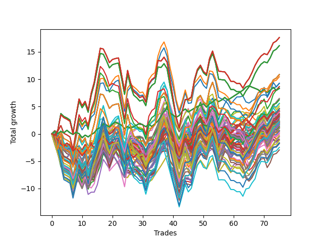

# Long HLT 309 AAPL 
- Symbol: TSLA
- Date Range: 05/16/2022 - 05/17/2024
- Trading Period: 8:30-12:30
- Number of Trades: 75



| Id. | Name | Win Percent | Profit | Avg Profit / Trade | Avg Time / Trade | Std |      | Name | Win Percent | Profit | Avg Profit / Trade | Avg Time / Trade | Std |
| --- | ---- | ----------- | ------ | ------------------ | ---------------- | --- | ---- | ---- | ----------- | ------ | ------------------ | ---------------- | --- |
| | Sorted By <br> Profit | | | | | | | Sorted By <br> Win Percentage |||||
|0| TP-3 180m | 53.33 | 17.62 | 0.23 | 89:58 | 1.76 |     | TP-0.25 180m | 61.33 | 8.31 | 0.11 | 03:50 | 0.43 |
|1| TP-3 165m | 53.33 | 17.62 | 0.23 | 89:58 | 1.76 |     | TP-0.25 165m | 61.33 | 8.31 | 0.11 | 03:50 | 0.43 |
|2| TP-3 150m | 53.33 | 17.62 | 0.23 | 89:58 | 1.76 |     | TP-0.25 150m | 61.33 | 8.31 | 0.11 | 03:50 | 0.43 |
|3| TP-3 135m | 53.33 | 17.62 | 0.23 | 89:58 | 1.76 |     | TP-0.25 135m | 61.33 | 8.31 | 0.11 | 03:50 | 0.43 |
|4| TP-3 120m | 53.33 | 17.62 | 0.23 | 89:58 | 1.76 |     | TP-0.25 120m | 61.33 | 8.31 | 0.11 | 03:50 | 0.43 |
|5| TP-2.75 180m | 53.33 | 16.13 | 0.22 | 87:28 | 1.70 |     | TP-0.25 105m | 61.33 | 8.31 | 0.11 | 03:50 | 0.43 |
|6| TP-2.75 165m | 53.33 | 16.13 | 0.22 | 87:28 | 1.70 |     | TP-0.25 90m | 61.33 | 8.31 | 0.11 | 03:50 | 0.43 |
|7| TP-2.75 150m | 53.33 | 16.13 | 0.22 | 87:28 | 1.70 |     | TP-0.25 75m | 61.33 | 8.31 | 0.11 | 03:50 | 0.43 |
|8| TP-2.75 135m | 53.33 | 16.13 | 0.22 | 87:28 | 1.70 |     | TP-0.25 60m | 61.33 | 8.31 | 0.11 | 03:50 | 0.43 |
|9| TP-2.75 120m | 53.33 | 16.13 | 0.22 | 87:28 | 1.70 |     | TP-0.25 45m | 61.33 | 8.31 | 0.11 | 03:50 | 0.43 |
|10| TP-2.5 180m | 53.33 | 10.85 | 0.14 | 82:04 | 1.76 |     | TP-0.25 30m | 61.33 | 8.31 | 0.11 | 03:50 | 0.43 |
|11| TP-2.5 165m | 53.33 | 10.85 | 0.14 | 82:04 | 1.76 |     | TP-0.25 15m | 61.33 | 8.31 | 0.11 | 03:50 | 0.43 |
|12| TP-2.5 150m | 53.33 | 10.85 | 0.14 | 82:04 | 1.76 |     | TP-1.25 45m | 58.67 | 5.08 | 0.07 | 27:19 | 1.22 |
|13| TP-2.5 135m | 53.33 | 10.85 | 0.14 | 82:04 | 1.76 |     | TP-1.75 45m | 57.33 | 9.25 | 0.12 | 36:07 | 1.26 |
|14| TP-2.5 120m | 53.33 | 10.85 | 0.14 | 82:04 | 1.76 |     | TP-2 45m | 57.33 | 3.61 | 0.05 | 38:40 | 1.23 |
|15| TP-3 90m | 52.00 | 10.45 | 0.14 | 74:28 | 1.60 |     | TP-3 45m | 57.33 | 3.57 | 0.05 | 41:44 | 1.30 |
|16| TP-1.75 45m | 57.33 | 9.25 | 0.12 | 36:07 | 1.26 |     | TP-2.75 45m | 57.33 | 2.26 | 0.03 | 41:19 | 1.31 |
|17| TP-2.75 90m | 52.00 | 9.25 | 0.12 | 72:41 | 1.56 |     | TP-2.5 45m | 57.33 | 1.68 | 0.02 | 40:59 | 1.31 |
|18| TP-1.75 60m | 56.00 | 8.65 | 0.12 | 43:30 | 1.36 |     | TP-2.25 45m | 57.33 | 1.40 | 0.02 | 39:36 | 1.34 |
|19| TP-3 105m | 50.67 | 8.64 | 0.12 | 83:00 | 1.72 |     | TP-1.75 60m | 56.00 | 8.65 | 0.12 | 43:30 | 1.36 |
|20| TP-0.25 180m | 61.33 | 8.31 | 0.11 | 03:50 | 0.43 |     | TP-3 60m | 56.00 | 6.46 | 0.09 | 53:30 | 1.40 |
|21| TP-0.25 165m | 61.33 | 8.31 | 0.11 | 03:50 | 0.43 |     | TP-1.5 45m | 56.00 | 4.61 | 0.06 | 31:12 | 1.28 |
|22| TP-0.25 150m | 61.33 | 8.31 | 0.11 | 03:50 | 0.43 |     | TP-2.75 60m | 56.00 | 4.50 | 0.06 | 52:37 | 1.39 |
|23| TP-0.25 135m | 61.33 | 8.31 | 0.11 | 03:50 | 0.43 |     | TP-2.5 60m | 56.00 | 3.10 | 0.04 | 51:50 | 1.45 |
|24| TP-0.25 120m | 61.33 | 8.31 | 0.11 | 03:50 | 0.43 |     | TP-1 45m | 56.00 | 2.39 | 0.03 | 22:00 | 1.01 |
|25| TP-0.25 105m | 61.33 | 8.31 | 0.11 | 03:50 | 0.43 |     | TP-2 60m | 54.67 | 6.47 | 0.09 | 47:57 | 1.36 |
|26| TP-0.25 90m | 61.33 | 8.31 | 0.11 | 03:50 | 0.43 |     | TP-1.75 30m | 54.67 | 5.50 | 0.07 | 26:22 | 1.10 |
|27| TP-0.25 75m | 61.33 | 8.31 | 0.11 | 03:50 | 0.43 |     | TP-0.5 180m | 54.67 | 4.19 | 0.06 | 08:43 | 0.65 |
|28| TP-0.25 60m | 61.33 | 8.31 | 0.11 | 03:50 | 0.43 |     | TP-0.5 165m | 54.67 | 4.19 | 0.06 | 08:43 | 0.65 |
|29| TP-0.25 45m | 61.33 | 8.31 | 0.11 | 03:50 | 0.43 |     | TP-0.5 150m | 54.67 | 4.19 | 0.06 | 08:43 | 0.65 |
|30| TP-0.25 30m | 61.33 | 8.31 | 0.11 | 03:50 | 0.43 |     | TP-0.5 135m | 54.67 | 4.19 | 0.06 | 08:43 | 0.65 |
|31| TP-0.25 15m | 61.33 | 8.31 | 0.11 | 03:50 | 0.43 |     | TP-0.5 120m | 54.67 | 4.19 | 0.06 | 08:43 | 0.65 |
|32| TP-2 60m | 54.67 | 6.47 | 0.09 | 47:57 | 1.36 |     | TP-0.5 105m | 54.67 | 4.19 | 0.06 | 08:43 | 0.65 |
|33| TP-3 60m | 56.00 | 6.46 | 0.09 | 53:30 | 1.40 |     | TP-0.5 90m | 54.67 | 4.19 | 0.06 | 08:43 | 0.65 |
|34| TP-2.75 105m | 50.67 | 6.22 | 0.08 | 80:42 | 1.66 |     | TP-0.5 75m | 54.67 | 4.19 | 0.06 | 08:43 | 0.65 |
|35| TP-3 75m | 53.33 | 5.60 | 0.07 | 64:35 | 1.55 |     | TP-0.5 60m | 54.67 | 4.19 | 0.06 | 08:43 | 0.65 |
|36| TP-2.75 75m | 53.33 | 5.51 | 0.07 | 63:18 | 1.53 |     | TP-0.5 45m | 54.67 | 4.19 | 0.06 | 08:43 | 0.65 |
|37| TP-1.75 30m | 54.67 | 5.50 | 0.07 | 26:22 | 1.10 |     | TP-0.5 15m | 54.67 | 3.71 | 0.05 | 07:21 | 0.61 |
|38| TP-1.25 45m | 58.67 | 5.08 | 0.07 | 27:19 | 1.22 |     | TP-1.25 60m | 54.67 | 3.33 | 0.04 | 31:01 | 1.23 |
|39| TP-1.75 180m | 53.33 | 4.67 | 0.06 | 59:01 | 1.51 |     | TP-1.25 30m | 54.67 | 3.33 | 0.04 | 21:37 | 1.09 |
|40| TP-1.75 165m | 53.33 | 4.67 | 0.06 | 59:01 | 1.51 |     | TP-0.5 30m | 54.67 | 3.03 | 0.04 | 08:30 | 0.64 |
|41| TP-1.75 150m | 53.33 | 4.67 | 0.06 | 59:01 | 1.51 |     | TP-1 30m | 54.67 | 2.10 | 0.03 | 18:03 | 0.95 |
|42| TP-1.75 135m | 53.33 | 4.67 | 0.06 | 59:01 | 1.51 |     | TP-3 30m | 54.67 | 2.01 | 0.03 | 28:36 | 1.11 |
|43| TP-1.75 120m | 53.33 | 4.67 | 0.06 | 59:01 | 1.51 |     | TP-2.25 60m | 54.67 | 1.96 | 0.03 | 49:28 | 1.46 |
|44| TP-1.5 45m | 56.00 | 4.61 | 0.06 | 31:12 | 1.28 |     | TP-2 30m | 54.67 | 1.58 | 0.02 | 27:25 | 1.09 |
|45| TP-2.25 180m | 53.33 | 4.56 | 0.06 | 74:59 | 1.72 |     | TP-0.75 45m | 54.67 | 1.34 | 0.02 | 16:15 | 0.88 |
|46| TP-2.25 165m | 53.33 | 4.56 | 0.06 | 74:59 | 1.72 |     | TP-2.75 30m | 54.67 | 1.33 | 0.02 | 28:25 | 1.13 |
|47| TP-2.25 150m | 53.33 | 4.56 | 0.06 | 74:59 | 1.72 |     | TP-2.25 30m | 54.67 | 0.47 | 0.01 | 27:58 | 1.18 |
|48| TP-2.25 135m | 53.33 | 4.56 | 0.06 | 74:59 | 1.72 |     | TP-2.5 30m | 54.67 | 0.11 | 0.00 | 28:22 | 1.15 |
|49| TP-2.25 120m | 53.33 | 4.56 | 0.06 | 74:59 | 1.72 |     | TP-3 180m | 53.33 | 17.62 | 0.23 | 89:58 | 1.76 |
|50| TP-2.75 60m | 56.00 | 4.50 | 0.06 | 52:37 | 1.39 |     | TP-3 165m | 53.33 | 17.62 | 0.23 | 89:58 | 1.76 |
|51| TP-0.5 180m | 54.67 | 4.19 | 0.06 | 08:43 | 0.65 |     | TP-3 150m | 53.33 | 17.62 | 0.23 | 89:58 | 1.76 |
|52| TP-0.5 165m | 54.67 | 4.19 | 0.06 | 08:43 | 0.65 |     | TP-3 135m | 53.33 | 17.62 | 0.23 | 89:58 | 1.76 |
|53| TP-0.5 150m | 54.67 | 4.19 | 0.06 | 08:43 | 0.65 |     | TP-3 120m | 53.33 | 17.62 | 0.23 | 89:58 | 1.76 |
|54| TP-0.5 135m | 54.67 | 4.19 | 0.06 | 08:43 | 0.65 |     | TP-2.75 180m | 53.33 | 16.13 | 0.22 | 87:28 | 1.70 |
|55| TP-0.5 120m | 54.67 | 4.19 | 0.06 | 08:43 | 0.65 |     | TP-2.75 165m | 53.33 | 16.13 | 0.22 | 87:28 | 1.70 |
|56| TP-0.5 105m | 54.67 | 4.19 | 0.06 | 08:43 | 0.65 |     | TP-2.75 150m | 53.33 | 16.13 | 0.22 | 87:28 | 1.70 |
|57| TP-0.5 90m | 54.67 | 4.19 | 0.06 | 08:43 | 0.65 |     | TP-2.75 135m | 53.33 | 16.13 | 0.22 | 87:28 | 1.70 |
|58| TP-0.5 75m | 54.67 | 4.19 | 0.06 | 08:43 | 0.65 |     | TP-2.75 120m | 53.33 | 16.13 | 0.22 | 87:28 | 1.70 |
|59| TP-0.5 60m | 54.67 | 4.19 | 0.06 | 08:43 | 0.65 |     | TP-2.5 180m | 53.33 | 10.85 | 0.14 | 82:04 | 1.76 |
|60| TP-0.5 45m | 54.67 | 4.19 | 0.06 | 08:43 | 0.65 |     | TP-2.5 165m | 53.33 | 10.85 | 0.14 | 82:04 | 1.76 |
|61| TP-2.5 90m | 52.00 | 4.04 | 0.05 | 69:32 | 1.66 |     | TP-2.5 150m | 53.33 | 10.85 | 0.14 | 82:04 | 1.76 |
|62| TP-1.25 180m | 52.00 | 4.03 | 0.05 | 38:55 | 1.31 |     | TP-2.5 135m | 53.33 | 10.85 | 0.14 | 82:04 | 1.76 |
|63| TP-1.25 165m | 52.00 | 4.03 | 0.05 | 38:55 | 1.31 |     | TP-2.5 120m | 53.33 | 10.85 | 0.14 | 82:04 | 1.76 |
|64| TP-1.25 150m | 52.00 | 4.03 | 0.05 | 38:55 | 1.31 |     | TP-3 75m | 53.33 | 5.60 | 0.07 | 64:35 | 1.55 |
|65| TP-1.25 135m | 52.00 | 4.03 | 0.05 | 38:55 | 1.31 |     | TP-2.75 75m | 53.33 | 5.51 | 0.07 | 63:18 | 1.53 |
|66| TP-1.25 120m | 52.00 | 4.03 | 0.05 | 38:55 | 1.31 |     | TP-1.75 180m | 53.33 | 4.67 | 0.06 | 59:01 | 1.51 |
|67| TP-0.5 15m | 54.67 | 3.71 | 0.05 | 07:21 | 0.61 |     | TP-1.75 165m | 53.33 | 4.67 | 0.06 | 59:01 | 1.51 |
|68| TP-1 180m | 52.00 | 3.67 | 0.05 | 28:56 | 1.10 |     | TP-1.75 150m | 53.33 | 4.67 | 0.06 | 59:01 | 1.51 |
|69| TP-1 165m | 52.00 | 3.67 | 0.05 | 28:56 | 1.10 |     | TP-1.75 135m | 53.33 | 4.67 | 0.06 | 59:01 | 1.51 |
|70| TP-1 150m | 52.00 | 3.67 | 0.05 | 28:56 | 1.10 |     | TP-1.75 120m | 53.33 | 4.67 | 0.06 | 59:01 | 1.51 |
|71| TP-1 135m | 52.00 | 3.67 | 0.05 | 28:56 | 1.10 |     | TP-2.25 180m | 53.33 | 4.56 | 0.06 | 74:59 | 1.72 |
|72| TP-1 120m | 52.00 | 3.67 | 0.05 | 28:56 | 1.10 |     | TP-2.25 165m | 53.33 | 4.56 | 0.06 | 74:59 | 1.72 |
|73| TP-2 45m | 57.33 | 3.61 | 0.05 | 38:40 | 1.23 |     | TP-2.25 150m | 53.33 | 4.56 | 0.06 | 74:59 | 1.72 |
|74| TP-3 45m | 57.33 | 3.57 | 0.05 | 41:44 | 1.30 |     | TP-2.25 135m | 53.33 | 4.56 | 0.06 | 74:59 | 1.72 |
|75| TP-1 105m | 52.00 | 3.48 | 0.05 | 28:44 | 1.10 |     | TP-2.25 120m | 53.33 | 4.56 | 0.06 | 74:59 | 1.72 |
|76| TP-1 75m | 52.00 | 3.44 | 0.05 | 26:40 | 1.07 |     | TP-1 60m | 53.33 | 3.01 | 0.04 | 24:43 | 1.03 |
|77| TP-1.25 60m | 54.67 | 3.33 | 0.04 | 31:01 | 1.23 |     | TP-1.5 30m | 53.33 | 2.93 | 0.04 | 23:48 | 1.16 |
|78| TP-1.25 30m | 54.67 | 3.33 | 0.04 | 21:37 | 1.09 |     | TP-2 75m | 53.33 | 2.71 | 0.04 | 55:36 | 1.45 |
|79| TP-1 90m | 52.00 | 3.25 | 0.04 | 27:56 | 1.08 |     | TP-2 180m | 53.33 | 2.24 | 0.03 | 70:08 | 1.55 |
|80| TP-2.5 60m | 56.00 | 3.10 | 0.04 | 51:50 | 1.45 |     | TP-2 165m | 53.33 | 2.24 | 0.03 | 70:08 | 1.55 |
|81| TP-1.75 75m | 52.00 | 3.09 | 0.04 | 49:13 | 1.44 |     | TP-2 150m | 53.33 | 2.24 | 0.03 | 70:08 | 1.55 |
|82| TP-0.5 30m | 54.67 | 3.03 | 0.04 | 08:30 | 0.64 |     | TP-2 135m | 53.33 | 2.24 | 0.03 | 70:08 | 1.55 |
|83| TP-1 60m | 53.33 | 3.01 | 0.04 | 24:43 | 1.03 |     | TP-2 120m | 53.33 | 2.24 | 0.03 | 70:08 | 1.55 |
|84| TP-1.5 30m | 53.33 | 2.93 | 0.04 | 23:48 | 1.16 |     | TP-2.5 75m | 53.33 | 2.12 | 0.03 | 61:32 | 1.62 |
|85| TP-2 75m | 53.33 | 2.71 | 0.04 | 55:36 | 1.45 |     | TP-1.5 60m | 53.33 | 1.14 | 0.02 | 36:43 | 1.34 |
|86| TP-1.25 75m | 52.00 | 2.41 | 0.03 | 33:56 | 1.27 |     | TP-0.75 30m | 53.33 | -0.57 | -0.01 | 14:30 | 0.84 |
|87| TP-1 45m | 56.00 | 2.39 | 0.03 | 22:00 | 1.01 |     | TP-3 90m | 52.00 | 10.45 | 0.14 | 74:28 | 1.60 |
|88| TP-1.25 105m | 50.67 | 2.34 | 0.03 | 37:53 | 1.30 |     | TP-2.75 90m | 52.00 | 9.25 | 0.12 | 72:41 | 1.56 |
|89| TP-2.5 105m | 49.33 | 2.29 | 0.03 | 76:18 | 1.73 |     | TP-2.5 90m | 52.00 | 4.04 | 0.05 | 69:32 | 1.66 |
|90| TP-2.75 45m | 57.33 | 2.26 | 0.03 | 41:19 | 1.31 |     | TP-1.25 180m | 52.00 | 4.03 | 0.05 | 38:55 | 1.31 |
|91| TP-2 180m | 53.33 | 2.24 | 0.03 | 70:08 | 1.55 |     | TP-1.25 165m | 52.00 | 4.03 | 0.05 | 38:55 | 1.31 |
|92| TP-2 165m | 53.33 | 2.24 | 0.03 | 70:08 | 1.55 |     | TP-1.25 150m | 52.00 | 4.03 | 0.05 | 38:55 | 1.31 |
|93| TP-2 150m | 53.33 | 2.24 | 0.03 | 70:08 | 1.55 |     | TP-1.25 135m | 52.00 | 4.03 | 0.05 | 38:55 | 1.31 |
|94| TP-2 135m | 53.33 | 2.24 | 0.03 | 70:08 | 1.55 |     | TP-1.25 120m | 52.00 | 4.03 | 0.05 | 38:55 | 1.31 |
|95| TP-2 120m | 53.33 | 2.24 | 0.03 | 70:08 | 1.55 |     | TP-1 180m | 52.00 | 3.67 | 0.05 | 28:56 | 1.10 |
|96| TP-2.5 75m | 53.33 | 2.12 | 0.03 | 61:32 | 1.62 |     | TP-1 165m | 52.00 | 3.67 | 0.05 | 28:56 | 1.10 |
|97| TP-1 30m | 54.67 | 2.10 | 0.03 | 18:03 | 0.95 |     | TP-1 150m | 52.00 | 3.67 | 0.05 | 28:56 | 1.10 |
|98| TP-3 30m | 54.67 | 2.01 | 0.03 | 28:36 | 1.11 |     | TP-1 135m | 52.00 | 3.67 | 0.05 | 28:56 | 1.10 |
|99| TP-2.25 60m | 54.67 | 1.96 | 0.03 | 49:28 | 1.46 |     | TP-1 120m | 52.00 | 3.67 | 0.05 | 28:56 | 1.10 |
|100| TP-0.75 180m | 52.00 | 1.93 | 0.03 | 17:32 | 0.93 |     | TP-1 105m | 52.00 | 3.48 | 0.05 | 28:44 | 1.10 |
|101| TP-0.75 165m | 52.00 | 1.93 | 0.03 | 17:32 | 0.93 |     | TP-1 75m | 52.00 | 3.44 | 0.05 | 26:40 | 1.07 |
|102| TP-0.75 150m | 52.00 | 1.93 | 0.03 | 17:32 | 0.93 |     | TP-1 90m | 52.00 | 3.25 | 0.04 | 27:56 | 1.08 |
|103| TP-0.75 135m | 52.00 | 1.93 | 0.03 | 17:32 | 0.93 |     | TP-1.75 75m | 52.00 | 3.09 | 0.04 | 49:13 | 1.44 |
|104| TP-0.75 120m | 52.00 | 1.93 | 0.03 | 17:32 | 0.93 |     | TP-1.25 75m | 52.00 | 2.41 | 0.03 | 33:56 | 1.27 |
|105| TP-0.75 105m | 52.00 | 1.93 | 0.03 | 17:32 | 0.93 |     | TP-0.75 180m | 52.00 | 1.93 | 0.03 | 17:32 | 0.93 |
|106| TP-0.75 90m | 52.00 | 1.93 | 0.03 | 17:32 | 0.93 |     | TP-0.75 165m | 52.00 | 1.93 | 0.03 | 17:32 | 0.93 |
|107| TP-1.75 105m | 49.33 | 1.90 | 0.03 | 56:44 | 1.49 |     | TP-0.75 150m | 52.00 | 1.93 | 0.03 | 17:32 | 0.93 |
|108| TP-0.75 75m | 52.00 | 1.73 | 0.02 | 17:31 | 0.93 |     | TP-0.75 135m | 52.00 | 1.93 | 0.03 | 17:32 | 0.93 |
|109| TP-2.5 45m | 57.33 | 1.68 | 0.02 | 40:59 | 1.31 |     | TP-0.75 120m | 52.00 | 1.93 | 0.03 | 17:32 | 0.93 |
|110| TP-1.25 90m | 50.67 | 1.60 | 0.02 | 36:10 | 1.28 |     | TP-0.75 105m | 52.00 | 1.93 | 0.03 | 17:32 | 0.93 |
|111| TP-2 30m | 54.67 | 1.58 | 0.02 | 27:25 | 1.09 |     | TP-0.75 90m | 52.00 | 1.93 | 0.03 | 17:32 | 0.93 |
|112| TP-2.25 45m | 57.33 | 1.40 | 0.02 | 39:36 | 1.34 |     | TP-0.75 75m | 52.00 | 1.73 | 0.02 | 17:31 | 0.93 |
|113| TP-0.75 45m | 54.67 | 1.34 | 0.02 | 16:15 | 0.88 |     | TP-1.5 180m | 52.00 | 1.05 | 0.01 | 47:39 | 1.46 |
|114| TP-2.75 30m | 54.67 | 1.33 | 0.02 | 28:25 | 1.13 |     | TP-1.5 165m | 52.00 | 1.05 | 0.01 | 47:39 | 1.46 |
|115| TP-0.75 15m | 50.67 | 1.23 | 0.02 | 10:40 | 0.74 |     | TP-1.5 150m | 52.00 | 1.05 | 0.01 | 47:39 | 1.46 |
|116| TP-1.5 60m | 53.33 | 1.14 | 0.02 | 36:43 | 1.34 |     | TP-1.5 135m | 52.00 | 1.05 | 0.01 | 47:39 | 1.46 |
|117| TP-1.5 180m | 52.00 | 1.05 | 0.01 | 47:39 | 1.46 |     | TP-1.5 120m | 52.00 | 1.05 | 0.01 | 47:39 | 1.46 |
|118| TP-1.5 165m | 52.00 | 1.05 | 0.01 | 47:39 | 1.46 |     | TP-2.25 75m | 52.00 | 0.14 | 0.00 | 58:08 | 1.62 |
|119| TP-1.5 150m | 52.00 | 1.05 | 0.01 | 47:39 | 1.46 |     | TP-0.75 60m | 52.00 | -0.33 | -0.00 | 17:08 | 0.89 |
|120| TP-1.5 135m | 52.00 | 1.05 | 0.01 | 47:39 | 1.46 |     | TP-3 105m | 50.67 | 8.64 | 0.12 | 83:00 | 1.72 |
|121| TP-1.5 120m | 52.00 | 1.05 | 0.01 | 47:39 | 1.46 |     | TP-2.75 105m | 50.67 | 6.22 | 0.08 | 80:42 | 1.66 |
|122| TP-2 15m | 50.67 | 0.67 | 0.01 | 13:57 | 0.91 |     | TP-1.25 105m | 50.67 | 2.34 | 0.03 | 37:53 | 1.30 |
|123| TP-3 15m | 50.67 | 0.55 | 0.01 | 14:00 | 0.92 |     | TP-1.25 90m | 50.67 | 1.60 | 0.02 | 36:10 | 1.28 |
|124| TP-2.75 15m | 50.67 | 0.55 | 0.01 | 14:00 | 0.92 |     | TP-0.75 15m | 50.67 | 1.23 | 0.02 | 10:40 | 0.74 |
|125| TP-2.5 15m | 50.67 | 0.55 | 0.01 | 14:00 | 0.92 |     | TP-2 15m | 50.67 | 0.67 | 0.01 | 13:57 | 0.91 |
|126| TP-2.25 15m | 50.67 | 0.55 | 0.01 | 14:00 | 0.92 |     | TP-3 15m | 50.67 | 0.55 | 0.01 | 14:00 | 0.92 |
|127| TP-2.25 30m | 54.67 | 0.47 | 0.01 | 27:58 | 1.18 |     | TP-2.75 15m | 50.67 | 0.55 | 0.01 | 14:00 | 0.92 |
|128| TP-1.75 90m | 50.67 | 0.27 | 0.00 | 53:28 | 1.47 |     | TP-2.5 15m | 50.67 | 0.55 | 0.01 | 14:00 | 0.92 |
|129| TP-2.25 75m | 52.00 | 0.14 | 0.00 | 58:08 | 1.62 |     | TP-2.25 15m | 50.67 | 0.55 | 0.01 | 14:00 | 0.92 |
|130| TP-2.5 30m | 54.67 | 0.11 | 0.00 | 28:22 | 1.15 |     | TP-1.75 90m | 50.67 | 0.27 | 0.00 | 53:28 | 1.47 |
|131| TP-1.75 15m | 50.67 | -0.12 | -0.00 | 13:52 | 0.92 |     | TP-1.75 15m | 50.67 | -0.12 | -0.00 | 13:52 | 0.92 |
|132| TP-0.75 60m | 52.00 | -0.33 | -0.00 | 17:08 | 0.89 |     | TP-1.5 15m | 50.67 | -0.97 | -0.01 | 13:37 | 0.95 |
|133| TP-1 15m | 49.33 | -0.52 | -0.01 | 11:58 | 0.83 |     | TP-1.25 15m | 50.67 | -1.15 | -0.02 | 13:07 | 0.95 |
|134| TP-0.75 30m | 53.33 | -0.57 | -0.01 | 14:30 | 0.84 |     | TP-2.25 90m | 50.67 | -1.22 | -0.02 | 64:49 | 1.66 |
|135| TP-1.5 15m | 50.67 | -0.97 | -0.01 | 13:37 | 0.95 |     | TP-2 90m | 50.67 | -1.61 | -0.02 | 61:22 | 1.49 |
|136| TP-1.25 15m | 50.67 | -1.15 | -0.02 | 13:07 | 0.95 |     | TP-2.5 105m | 49.33 | 2.29 | 0.03 | 76:18 | 1.73 |
|137| TP-2.25 90m | 50.67 | -1.22 | -0.02 | 64:49 | 1.66 |     | TP-1.75 105m | 49.33 | 1.90 | 0.03 | 56:44 | 1.49 |
|138| TP-2 90m | 50.67 | -1.61 | -0.02 | 61:22 | 1.49 |     | TP-1 15m | 49.33 | -0.52 | -0.01 | 11:58 | 0.83 |
|139| TP-2.25 105m | 49.33 | -1.70 | -0.02 | 70:24 | 1.72 |     | TP-2.25 105m | 49.33 | -1.70 | -0.02 | 70:24 | 1.72 |
|140| TP-1.5 105m | 49.33 | -1.75 | -0.02 | 46:00 | 1.44 |     | TP-1.5 105m | 49.33 | -1.75 | -0.02 | 46:00 | 1.44 |
|141| TP-1.5 75m | 49.33 | -1.79 | -0.02 | 40:37 | 1.40 |     | TP-1.5 75m | 49.33 | -1.79 | -0.02 | 40:37 | 1.40 |
|142| TP-2 105m | 49.33 | -2.47 | -0.03 | 66:16 | 1.53 |     | TP-2 105m | 49.33 | -2.47 | -0.03 | 66:16 | 1.53 |
|143| TP-1.5 90m | 49.33 | -2.94 | -0.04 | 43:37 | 1.41 |     | TP-1.5 90m | 49.33 | -2.94 | -0.04 | 43:37 | 1.41 |

### Test TP-0.25 15m
* Take Profit of 0.25 Point
* 0.25 Stoploss
* Results:
```
Total Trades: 75
Percent Up: 61.33
Percent Down: 38.67
Total Points Moved Up: 8.31
Potential Profit: 4155.00
Total Points Ups: 19.83 Count Ups: 46
Total Points Downs: -11.52 Count Downs: 29
```

<details><summary>Trades</summary>

<code>In: 2022-06-08 09:55:00		Out: 2022-06-08 09:57:00		Total Position Time: 02:00		Total Move Up: 0.43		Total to Date: 0.43</code> <br />
<code>In: 2022-06-23 09:55:00		Out: 2022-06-23 09:58:00		Total Position Time: 03:00		Total Move Up: -0.37		Total to Date: 0.06</code> <br />
<code>In: 2022-06-23 10:15:00		Out: 2022-06-23 10:18:00		Total Position Time: 03:00		Total Move Up: 0.38		Total to Date: 0.44</code> <br />
<code>In: 2022-06-27 09:45:00		Out: 2022-06-27 09:47:00		Total Position Time: 02:00		Total Move Up: -0.23		Total to Date: 0.21</code> <br />
<code>In: 2022-06-30 12:30:00		Out: 2022-06-30 12:33:00		Total Position Time: 03:00		Total Move Up: 0.43		Total to Date: 0.64</code> <br />
<code>In: 2022-07-11 12:15:00		Out: 2022-07-11 12:17:00		Total Position Time: 02:00		Total Move Up: -0.44		Total to Date: 0.20</code> <br />
<code>In: 2022-08-08 12:05:00		Out: 2022-08-08 12:07:00		Total Position Time: 02:00		Total Move Up: -0.30		Total to Date: -0.10</code> <br />
<code>In: 2022-08-09 09:35:00		Out: 2022-08-09 09:38:00		Total Position Time: 03:00		Total Move Up: 0.40		Total to Date: 0.30</code> <br />
<code>In: 2022-08-09 09:40:00		Out: 2022-08-09 09:43:00		Total Position Time: 03:00		Total Move Up: -0.27		Total to Date: 0.03</code> <br />
<code>In: 2022-08-11 12:05:00		Out: 2022-08-11 12:07:00		Total Position Time: 02:00		Total Move Up: -0.74		Total to Date: -0.71</code> <br />
<code>In: 2022-08-22 11:05:00		Out: 2022-08-22 11:07:00		Total Position Time: 02:00		Total Move Up: 0.48		Total to Date: -0.23</code> <br />
<code>In: 2022-08-26 08:35:00		Out: 2022-08-26 08:39:00		Total Position Time: 04:00		Total Move Up: -0.32		Total to Date: -0.55</code> <br />
<code>In: 2022-08-30 10:35:00		Out: 2022-08-30 10:39:00		Total Position Time: 04:00		Total Move Up: 0.42		Total to Date: -0.13</code> <br />
<code>In: 2022-09-13 08:35:00		Out: 2022-09-13 08:39:00		Total Position Time: 04:00		Total Move Up: 0.33		Total to Date: 0.20</code> <br />
<code>In: 2022-09-13 09:00:00		Out: 2022-09-13 09:03:00		Total Position Time: 03:00		Total Move Up: 0.71		Total to Date: 0.91</code> <br />
<code>In: 2022-09-20 11:10:00		Out: 2022-09-20 11:14:00		Total Position Time: 04:00		Total Move Up: 0.23		Total to Date: 1.14</code> <br />
<code>In: 2022-09-22 08:35:00		Out: 2022-09-22 08:39:00		Total Position Time: 04:00		Total Move Up: 0.70		Total to Date: 1.84</code> <br />
<code>In: 2022-09-27 09:30:00		Out: 2022-09-27 09:33:00		Total Position Time: 03:00		Total Move Up: -0.23		Total to Date: 1.61</code> <br />
<code>In: 2022-09-27 09:35:00		Out: 2022-09-27 09:37:00		Total Position Time: 02:00		Total Move Up: -0.35		Total to Date: 1.26</code> <br />
<code>In: 2022-10-07 09:45:00		Out: 2022-10-07 09:52:00		Total Position Time: 07:00		Total Move Up: 0.52		Total to Date: 1.78</code> <br />
<code>In: 2022-10-07 09:50:00		Out: 2022-10-07 09:52:00		Total Position Time: 02:00		Total Move Up: 0.38		Total to Date: 2.16</code> <br />
<code>In: 2022-10-07 09:55:00		Out: 2022-10-07 10:01:00		Total Position Time: 06:00		Total Move Up: -0.29		Total to Date: 1.87</code> <br />
<code>In: 2022-10-11 11:30:00		Out: 2022-10-11 11:34:00		Total Position Time: 04:00		Total Move Up: -0.29		Total to Date: 1.58</code> <br />
<code>In: 2022-10-20 10:05:00		Out: 2022-10-20 10:07:00		Total Position Time: 02:00		Total Move Up: -0.63		Total to Date: 0.95</code> <br />
<code>In: 2022-11-02 09:55:00		Out: 2022-11-02 09:59:00		Total Position Time: 04:00		Total Move Up: 0.39		Total to Date: 1.34</code> <br />
<code>In: 2022-11-09 11:05:00		Out: 2022-11-09 11:07:00		Total Position Time: 02:00		Total Move Up: -0.32		Total to Date: 1.02</code> <br />
<code>In: 2022-11-21 09:40:00		Out: 2022-11-21 09:44:00		Total Position Time: 04:00		Total Move Up: 0.32		Total to Date: 1.34</code> <br />
<code>In: 2022-11-28 11:25:00		Out: 2022-11-28 11:27:00		Total Position Time: 02:00		Total Move Up: 0.27		Total to Date: 1.61</code> <br />
<code>In: 2022-11-28 11:30:00		Out: 2022-11-28 11:34:00		Total Position Time: 04:00		Total Move Up: 0.31		Total to Date: 1.92</code> <br />
<code>In: 2022-11-29 11:05:00		Out: 2022-11-29 11:07:00		Total Position Time: 02:00		Total Move Up: -0.29		Total to Date: 1.63</code> <br />
<code>In: 2022-12-20 08:35:00		Out: 2022-12-20 08:37:00		Total Position Time: 02:00		Total Move Up: -0.31		Total to Date: 1.32</code> <br />
<code>In: 2023-01-03 10:25:00		Out: 2023-01-03 10:27:00		Total Position Time: 02:00		Total Move Up: 0.41		Total to Date: 1.73</code> <br />
<code>In: 2023-01-18 10:30:00		Out: 2023-01-18 10:35:00		Total Position Time: 05:00		Total Move Up: -0.38		Total to Date: 1.35</code> <br />
<code>In: 2023-02-02 12:15:00		Out: 2023-02-02 12:20:00		Total Position Time: 05:00		Total Move Up: 0.48		Total to Date: 1.83</code> <br />
<code>In: 2023-02-10 09:35:00		Out: 2023-02-10 09:37:00		Total Position Time: 02:00		Total Move Up: 0.53		Total to Date: 2.36</code> <br />
<code>In: 2023-03-10 11:00:00		Out: 2023-03-10 11:02:00		Total Position Time: 02:00		Total Move Up: 0.84		Total to Date: 3.20</code> <br />
<code>In: 2023-03-24 08:45:00		Out: 2023-03-24 08:47:00		Total Position Time: 02:00		Total Move Up: 0.92		Total to Date: 4.12</code> <br />
<code>In: 2023-05-23 10:00:00		Out: 2023-05-23 10:08:00		Total Position Time: 08:00		Total Move Up: 0.51		Total to Date: 4.63</code> <br />
<code>In: 2023-06-26 08:35:00		Out: 2023-06-26 08:42:00		Total Position Time: 07:00		Total Move Up: -0.84		Total to Date: 3.79</code> <br />
<code>In: 2023-07-19 09:55:00		Out: 2023-07-19 10:05:00		Total Position Time: 10:00		Total Move Up: -0.36		Total to Date: 3.43</code> <br />
<code>In: 2023-07-27 10:55:00		Out: 2023-07-27 10:58:00		Total Position Time: 03:00		Total Move Up: -0.40		Total to Date: 3.03</code> <br />
<code>In: 2023-07-27 12:15:00		Out: 2023-07-27 12:20:00		Total Position Time: 05:00		Total Move Up: 0.32		Total to Date: 3.35</code> <br />
<code>In: 2023-08-07 08:45:00		Out: 2023-08-07 08:48:00		Total Position Time: 03:00		Total Move Up: 0.80		Total to Date: 4.15</code> <br />
<code>In: 2023-08-08 09:00:00		Out: 2023-08-08 09:04:00		Total Position Time: 04:00		Total Move Up: 0.40		Total to Date: 4.55</code> <br />
<code>In: 2023-08-10 09:15:00		Out: 2023-08-10 09:20:00		Total Position Time: 05:00		Total Move Up: -0.55		Total to Date: 4.00</code> <br />
<code>In: 2023-08-16 09:00:00		Out: 2023-08-16 09:02:00		Total Position Time: 02:00		Total Move Up: 0.34		Total to Date: 4.34</code> <br />
<code>In: 2023-08-22 09:25:00		Out: 2023-08-22 09:28:00		Total Position Time: 03:00		Total Move Up: 0.34		Total to Date: 4.68</code> <br />
<code>In: 2023-08-22 09:30:00		Out: 2023-08-22 09:32:00		Total Position Time: 02:00		Total Move Up: 0.32		Total to Date: 5.00</code> <br />
<code>In: 2023-09-15 11:40:00		Out: 2023-09-15 11:45:00		Total Position Time: 05:00		Total Move Up: 0.23		Total to Date: 5.23</code> <br />
<code>In: 2023-09-22 11:30:00		Out: 2023-09-22 11:37:00		Total Position Time: 07:00		Total Move Up: 0.26		Total to Date: 5.49</code> <br />
<code>In: 2023-09-26 11:00:00		Out: 2023-09-26 11:02:00		Total Position Time: 02:00		Total Move Up: -0.58		Total to Date: 4.91</code> <br />
<code>In: 2023-09-29 11:15:00		Out: 2023-09-29 11:21:00		Total Position Time: 06:00		Total Move Up: 0.57		Total to Date: 5.48</code> <br />
<code>In: 2023-10-11 09:30:00		Out: 2023-10-11 09:32:00		Total Position Time: 02:00		Total Move Up: 0.34		Total to Date: 5.82</code> <br />
<code>In: 2023-11-09 09:45:00		Out: 2023-11-09 09:49:00		Total Position Time: 04:00		Total Move Up: 0.50		Total to Date: 6.32</code> <br />
<code>In: 2023-11-09 09:50:00		Out: 2023-11-09 09:56:00		Total Position Time: 06:00		Total Move Up: -0.42		Total to Date: 5.90</code> <br />
<code>In: 2023-11-29 08:45:00		Out: 2023-11-29 08:48:00		Total Position Time: 03:00		Total Move Up: 0.29		Total to Date: 6.19</code> <br />
<code>In: 2023-12-05 11:15:00		Out: 2023-12-05 11:17:00		Total Position Time: 02:00		Total Move Up: 0.46		Total to Date: 6.65</code> <br />
<code>In: 2023-12-05 11:20:00		Out: 2023-12-05 11:22:00		Total Position Time: 02:00		Total Move Up: -0.46		Total to Date: 6.19</code> <br />
<code>In: 2023-12-20 12:20:00		Out: 2023-12-20 12:23:00		Total Position Time: 03:00		Total Move Up: 0.34		Total to Date: 6.53</code> <br />
<code>In: 2023-12-22 11:40:00		Out: 2023-12-22 11:43:00		Total Position Time: 03:00		Total Move Up: 0.37		Total to Date: 6.90</code> <br />
<code>In: 2023-12-22 11:45:00		Out: 2023-12-22 11:53:00		Total Position Time: 08:00		Total Move Up: 0.36		Total to Date: 7.26</code> <br />
<code>In: 2023-12-28 12:25:00		Out: 2023-12-28 12:32:00		Total Position Time: 07:00		Total Move Up: 0.35		Total to Date: 7.61</code> <br />
<code>In: 2024-01-04 11:55:00		Out: 2024-01-04 12:09:00		Total Position Time: 14:00		Total Move Up: 0.39		Total to Date: 8.00</code> <br />
<code>In: 2024-01-22 10:45:00		Out: 2024-01-22 10:49:00		Total Position Time: 04:00		Total Move Up: 0.56		Total to Date: 8.56</code> <br />
<code>In: 2024-01-25 09:55:00		Out: 2024-01-25 10:03:00		Total Position Time: 08:00		Total Move Up: 0.23		Total to Date: 8.79</code> <br />
<code>In: 2024-02-06 09:10:00		Out: 2024-02-06 09:12:00		Total Position Time: 02:00		Total Move Up: -0.25		Total to Date: 8.54</code> <br />
<code>In: 2024-02-20 09:35:00		Out: 2024-02-20 09:37:00		Total Position Time: 02:00		Total Move Up: -0.22		Total to Date: 8.32</code> <br />
<code>In: 2024-02-27 10:25:00		Out: 2024-02-27 10:30:00		Total Position Time: 05:00		Total Move Up: -0.24		Total to Date: 8.08</code> <br />
<code>In: 2024-03-11 08:55:00		Out: 2024-03-11 09:02:00		Total Position Time: 07:00		Total Move Up: -0.44		Total to Date: 7.64</code> <br />
<code>In: 2024-03-27 11:00:00		Out: 2024-03-27 11:02:00		Total Position Time: 02:00		Total Move Up: 0.40		Total to Date: 8.04</code> <br />
<code>In: 2024-04-26 11:30:00		Out: 2024-04-26 11:32:00		Total Position Time: 02:00		Total Move Up: -0.47		Total to Date: 7.57</code> <br />
<code>In: 2024-04-26 12:05:00		Out: 2024-04-26 12:07:00		Total Position Time: 02:00		Total Move Up: 0.42		Total to Date: 7.99</code> <br />
<code>In: 2024-04-30 09:00:00		Out: 2024-04-30 09:03:00		Total Position Time: 03:00		Total Move Up: 0.50		Total to Date: 8.49</code> <br />
<code>In: 2024-04-30 09:05:00		Out: 2024-04-30 09:09:00		Total Position Time: 04:00		Total Move Up: -0.53		Total to Date: 7.96</code> <br />
<code>In: 2024-04-30 12:35:00		Out: 2024-04-30 12:42:00		Total Position Time: 07:00		Total Move Up: 0.35		Total to Date: 8.31</code> <br />


</details>

### Test TP-0.5 15m
* Take Profit of 0.5 Point
* 0.5 Stoploss
* Results:
```
Total Trades: 75
Percent Up: 54.67
Percent Down: 45.33
Total Points Moved Up: 3.71
Potential Profit: 1855.00
Total Points Ups: 23.85 Count Ups: 41
Total Points Downs: -20.14 Count Downs: 34
```

<details><summary>Trades</summary>

<code>In: 2022-06-08 09:55:00		Out: 2022-06-08 10:05:00		Total Position Time: 10:00		Total Move Up: -0.53		Total to Date: -0.53</code> <br />
<code>In: 2022-06-23 09:55:00		Out: 2022-06-23 09:59:00		Total Position Time: 04:00		Total Move Up: -0.56		Total to Date: -1.09</code> <br />
<code>In: 2022-06-23 10:15:00		Out: 2022-06-23 10:25:00		Total Position Time: 10:00		Total Move Up: -0.75		Total to Date: -1.84</code> <br />
<code>In: 2022-06-27 09:45:00		Out: 2022-06-27 09:59:00		Total Position Time: 14:00		Total Move Up: -0.45		Total to Date: -2.29</code> <br />
<code>In: 2022-06-30 12:30:00		Out: 2022-06-30 12:37:00		Total Position Time: 07:00		Total Move Up: 0.60		Total to Date: -1.69</code> <br />
<code>In: 2022-07-11 12:15:00		Out: 2022-07-11 12:19:00		Total Position Time: 04:00		Total Move Up: -0.47		Total to Date: -2.16</code> <br />
<code>In: 2022-08-08 12:05:00		Out: 2022-08-08 12:08:00		Total Position Time: 03:00		Total Move Up: -0.97		Total to Date: -3.13</code> <br />
<code>In: 2022-08-09 09:35:00		Out: 2022-08-09 09:40:00		Total Position Time: 05:00		Total Move Up: 0.52		Total to Date: -2.61</code> <br />
<code>In: 2022-08-09 09:40:00		Out: 2022-08-09 09:46:00		Total Position Time: 06:00		Total Move Up: -0.63		Total to Date: -3.24</code> <br />
<code>In: 2022-08-11 12:05:00		Out: 2022-08-11 12:07:00		Total Position Time: 02:00		Total Move Up: -0.74		Total to Date: -3.98</code> <br />
<code>In: 2022-08-22 11:05:00		Out: 2022-08-22 11:11:00		Total Position Time: 06:00		Total Move Up: 0.67		Total to Date: -3.31</code> <br />
<code>In: 2022-08-26 08:35:00		Out: 2022-08-26 08:46:00		Total Position Time: 11:00		Total Move Up: 0.78		Total to Date: -2.53</code> <br />
<code>In: 2022-08-30 10:35:00		Out: 2022-08-30 10:48:00		Total Position Time: 13:00		Total Move Up: 0.61		Total to Date: -1.92</code> <br />
<code>In: 2022-09-13 08:35:00		Out: 2022-09-13 08:46:00		Total Position Time: 11:00		Total Move Up: -0.56		Total to Date: -2.48</code> <br />
<code>In: 2022-09-13 09:00:00		Out: 2022-09-13 09:03:00		Total Position Time: 03:00		Total Move Up: 0.71		Total to Date: -1.77</code> <br />
<code>In: 2022-09-20 11:10:00		Out: 2022-09-20 11:21:00		Total Position Time: 11:00		Total Move Up: 0.72		Total to Date: -1.05</code> <br />
<code>In: 2022-09-22 08:35:00		Out: 2022-09-22 08:39:00		Total Position Time: 04:00		Total Move Up: 0.70		Total to Date: -0.35</code> <br />
<code>In: 2022-09-27 09:30:00		Out: 2022-09-27 09:38:00		Total Position Time: 08:00		Total Move Up: -0.76		Total to Date: -1.11</code> <br />
<code>In: 2022-09-27 09:35:00		Out: 2022-09-27 09:38:00		Total Position Time: 03:00		Total Move Up: -0.86		Total to Date: -1.97</code> <br />
<code>In: 2022-10-07 09:45:00		Out: 2022-10-07 09:52:00		Total Position Time: 07:00		Total Move Up: 0.52		Total to Date: -1.45</code> <br />
<code>In: 2022-10-07 09:50:00		Out: 2022-10-07 10:04:00		Total Position Time: 14:00		Total Move Up: -0.45		Total to Date: -1.90</code> <br />
<code>In: 2022-10-07 09:55:00		Out: 2022-10-07 10:04:00		Total Position Time: 09:00		Total Move Up: -0.69		Total to Date: -2.59</code> <br />
<code>In: 2022-10-11 11:30:00		Out: 2022-10-11 11:40:00		Total Position Time: 10:00		Total Move Up: -0.55		Total to Date: -3.14</code> <br />
<code>In: 2022-10-20 10:05:00		Out: 2022-10-20 10:07:00		Total Position Time: 02:00		Total Move Up: -0.63		Total to Date: -3.77</code> <br />
<code>In: 2022-11-02 09:55:00		Out: 2022-11-02 10:09:00		Total Position Time: 14:00		Total Move Up: -0.46		Total to Date: -4.23</code> <br />
<code>In: 2022-11-09 11:05:00		Out: 2022-11-09 11:19:00		Total Position Time: 14:00		Total Move Up: 0.89		Total to Date: -3.34</code> <br />
<code>In: 2022-11-21 09:40:00		Out: 2022-11-21 09:51:00		Total Position Time: 11:00		Total Move Up: -0.52		Total to Date: -3.86</code> <br />
<code>In: 2022-11-28 11:25:00		Out: 2022-11-28 11:36:00		Total Position Time: 11:00		Total Move Up: 0.56		Total to Date: -3.30</code> <br />
<code>In: 2022-11-28 11:30:00		Out: 2022-11-28 11:39:00		Total Position Time: 09:00		Total Move Up: 0.69		Total to Date: -2.61</code> <br />
<code>In: 2022-11-29 11:05:00		Out: 2022-11-29 11:19:00		Total Position Time: 14:00		Total Move Up: -0.22		Total to Date: -2.83</code> <br />
<code>In: 2022-12-20 08:35:00		Out: 2022-12-20 08:39:00		Total Position Time: 04:00		Total Move Up: -0.66		Total to Date: -3.49</code> <br />
<code>In: 2023-01-03 10:25:00		Out: 2023-01-03 10:28:00		Total Position Time: 03:00		Total Move Up: 0.51		Total to Date: -2.98</code> <br />
<code>In: 2023-01-18 10:30:00		Out: 2023-01-18 10:44:00		Total Position Time: 14:00		Total Move Up: 0.22		Total to Date: -2.76</code> <br />
<code>In: 2023-02-02 12:15:00		Out: 2023-02-02 12:21:00		Total Position Time: 06:00		Total Move Up: 0.64		Total to Date: -2.12</code> <br />
<code>In: 2023-02-10 09:35:00		Out: 2023-02-10 09:37:00		Total Position Time: 02:00		Total Move Up: 0.53		Total to Date: -1.59</code> <br />
<code>In: 2023-03-10 11:00:00		Out: 2023-03-10 11:02:00		Total Position Time: 02:00		Total Move Up: 0.84		Total to Date: -0.75</code> <br />
<code>In: 2023-03-24 08:45:00		Out: 2023-03-24 08:47:00		Total Position Time: 02:00		Total Move Up: 0.92		Total to Date: 0.17</code> <br />
<code>In: 2023-05-23 10:00:00		Out: 2023-05-23 10:08:00		Total Position Time: 08:00		Total Move Up: 0.51		Total to Date: 0.68</code> <br />
<code>In: 2023-06-26 08:35:00		Out: 2023-06-26 08:42:00		Total Position Time: 07:00		Total Move Up: -0.84		Total to Date: -0.16</code> <br />
<code>In: 2023-07-19 09:55:00		Out: 2023-07-19 10:06:00		Total Position Time: 11:00		Total Move Up: -0.68		Total to Date: -0.84</code> <br />
<code>In: 2023-07-27 10:55:00		Out: 2023-07-27 11:01:00		Total Position Time: 06:00		Total Move Up: -0.55		Total to Date: -1.39</code> <br />
<code>In: 2023-07-27 12:15:00		Out: 2023-07-27 12:24:00		Total Position Time: 09:00		Total Move Up: -0.56		Total to Date: -1.95</code> <br />
<code>In: 2023-08-07 08:45:00		Out: 2023-08-07 08:48:00		Total Position Time: 03:00		Total Move Up: 0.80		Total to Date: -1.15</code> <br />
<code>In: 2023-08-08 09:00:00		Out: 2023-08-08 09:06:00		Total Position Time: 06:00		Total Move Up: 0.67		Total to Date: -0.48</code> <br />
<code>In: 2023-08-10 09:15:00		Out: 2023-08-10 09:20:00		Total Position Time: 05:00		Total Move Up: -0.55		Total to Date: -1.03</code> <br />
<code>In: 2023-08-16 09:00:00		Out: 2023-08-16 09:04:00		Total Position Time: 04:00		Total Move Up: 0.66		Total to Date: -0.37</code> <br />
<code>In: 2023-08-22 09:25:00		Out: 2023-08-22 09:29:00		Total Position Time: 04:00		Total Move Up: 0.59		Total to Date: 0.22</code> <br />
<code>In: 2023-08-22 09:30:00		Out: 2023-08-22 09:33:00		Total Position Time: 03:00		Total Move Up: 0.51		Total to Date: 0.73</code> <br />
<code>In: 2023-09-15 11:40:00		Out: 2023-09-15 11:48:00		Total Position Time: 08:00		Total Move Up: 0.51		Total to Date: 1.24</code> <br />
<code>In: 2023-09-22 11:30:00		Out: 2023-09-22 11:44:00		Total Position Time: 14:00		Total Move Up: 0.21		Total to Date: 1.45</code> <br />
<code>In: 2023-09-26 11:00:00		Out: 2023-09-26 11:02:00		Total Position Time: 02:00		Total Move Up: -0.58		Total to Date: 0.87</code> <br />
<code>In: 2023-09-29 11:15:00		Out: 2023-09-29 11:21:00		Total Position Time: 06:00		Total Move Up: 0.57		Total to Date: 1.44</code> <br />
<code>In: 2023-10-11 09:30:00		Out: 2023-10-11 09:37:00		Total Position Time: 07:00		Total Move Up: 0.64		Total to Date: 2.08</code> <br />
<code>In: 2023-11-09 09:45:00		Out: 2023-11-09 09:49:00		Total Position Time: 04:00		Total Move Up: 0.50		Total to Date: 2.58</code> <br />
<code>In: 2023-11-09 09:50:00		Out: 2023-11-09 10:02:00		Total Position Time: 12:00		Total Move Up: -1.07		Total to Date: 1.51</code> <br />
<code>In: 2023-11-29 08:45:00		Out: 2023-11-29 08:54:00		Total Position Time: 09:00		Total Move Up: 0.54		Total to Date: 2.05</code> <br />
<code>In: 2023-12-05 11:15:00		Out: 2023-12-05 11:18:00		Total Position Time: 03:00		Total Move Up: 0.56		Total to Date: 2.61</code> <br />
<code>In: 2023-12-05 11:20:00		Out: 2023-12-05 11:26:00		Total Position Time: 06:00		Total Move Up: -0.56		Total to Date: 2.05</code> <br />
<code>In: 2023-12-20 12:20:00		Out: 2023-12-20 12:25:00		Total Position Time: 05:00		Total Move Up: -0.70		Total to Date: 1.35</code> <br />
<code>In: 2023-12-22 11:40:00		Out: 2023-12-22 11:48:00		Total Position Time: 08:00		Total Move Up: 0.50		Total to Date: 1.85</code> <br />
<code>In: 2023-12-22 11:45:00		Out: 2023-12-22 11:54:00		Total Position Time: 09:00		Total Move Up: 0.51		Total to Date: 2.36</code> <br />
<code>In: 2023-12-28 12:25:00		Out: 2023-12-28 12:33:00		Total Position Time: 08:00		Total Move Up: 0.63		Total to Date: 2.99</code> <br />
<code>In: 2024-01-04 11:55:00		Out: 2024-01-04 12:09:00		Total Position Time: 14:00		Total Move Up: 0.39		Total to Date: 3.38</code> <br />
<code>In: 2024-01-22 10:45:00		Out: 2024-01-22 10:49:00		Total Position Time: 04:00		Total Move Up: 0.56		Total to Date: 3.94</code> <br />
<code>In: 2024-01-25 09:55:00		Out: 2024-01-25 10:09:00		Total Position Time: 14:00		Total Move Up: -0.14		Total to Date: 3.80</code> <br />
<code>In: 2024-02-06 09:10:00		Out: 2024-02-06 09:13:00		Total Position Time: 03:00		Total Move Up: -0.59		Total to Date: 3.21</code> <br />
<code>In: 2024-02-20 09:35:00		Out: 2024-02-20 09:38:00		Total Position Time: 03:00		Total Move Up: -0.62		Total to Date: 2.59</code> <br />
<code>In: 2024-02-27 10:25:00		Out: 2024-02-27 10:39:00		Total Position Time: 14:00		Total Move Up: -0.09		Total to Date: 2.50</code> <br />
<code>In: 2024-03-11 08:55:00		Out: 2024-03-11 09:09:00		Total Position Time: 14:00		Total Move Up: 0.12		Total to Date: 2.62</code> <br />
<code>In: 2024-03-27 11:00:00		Out: 2024-03-27 11:06:00		Total Position Time: 06:00		Total Move Up: 0.49		Total to Date: 3.11</code> <br />
<code>In: 2024-04-26 11:30:00		Out: 2024-04-26 11:34:00		Total Position Time: 04:00		Total Move Up: -0.62		Total to Date: 2.49</code> <br />
<code>In: 2024-04-26 12:05:00		Out: 2024-04-26 12:10:00		Total Position Time: 05:00		Total Move Up: 0.86		Total to Date: 3.35</code> <br />
<code>In: 2024-04-30 09:00:00		Out: 2024-04-30 09:03:00		Total Position Time: 03:00		Total Move Up: 0.50		Total to Date: 3.85</code> <br />
<code>In: 2024-04-30 09:05:00		Out: 2024-04-30 09:09:00		Total Position Time: 04:00		Total Move Up: -0.53		Total to Date: 3.32</code> <br />
<code>In: 2024-04-30 12:35:00		Out: 2024-04-30 12:49:00		Total Position Time: 14:00		Total Move Up: 0.39		Total to Date: 3.71</code> <br />


</details>

### Test TP-0.75 15m
* Take Profit of 0.75 Point
* 0.75 Stoploss
* Results:
```
Total Trades: 75
Percent Up: 50.67
Percent Down: 49.33
Total Points Moved Up: 1.23
Potential Profit: 615.00
Total Points Ups: 25.44 Count Ups: 38
Total Points Downs: -24.21 Count Downs: 37
```

<details><summary>Trades</summary>

<code>In: 2022-06-08 09:55:00		Out: 2022-06-08 10:09:00		Total Position Time: 14:00		Total Move Up: 0.12		Total to Date: 0.12</code> <br />
<code>In: 2022-06-23 09:55:00		Out: 2022-06-23 10:01:00		Total Position Time: 06:00		Total Move Up: -1.09		Total to Date: -0.97</code> <br />
<code>In: 2022-06-23 10:15:00		Out: 2022-06-23 10:27:00		Total Position Time: 12:00		Total Move Up: -1.08		Total to Date: -2.05</code> <br />
<code>In: 2022-06-27 09:45:00		Out: 2022-06-27 09:59:00		Total Position Time: 14:00		Total Move Up: -0.45		Total to Date: -2.50</code> <br />
<code>In: 2022-06-30 12:30:00		Out: 2022-06-30 12:44:00		Total Position Time: 14:00		Total Move Up: -0.57		Total to Date: -3.07</code> <br />
<code>In: 2022-07-11 12:15:00		Out: 2022-07-11 12:29:00		Total Position Time: 14:00		Total Move Up: -0.25		Total to Date: -3.32</code> <br />
<code>In: 2022-08-08 12:05:00		Out: 2022-08-08 12:08:00		Total Position Time: 03:00		Total Move Up: -0.97		Total to Date: -4.29</code> <br />
<code>In: 2022-08-09 09:35:00		Out: 2022-08-09 09:49:00		Total Position Time: 14:00		Total Move Up: -0.24		Total to Date: -4.53</code> <br />
<code>In: 2022-08-09 09:40:00		Out: 2022-08-09 09:49:00		Total Position Time: 09:00		Total Move Up: -0.76		Total to Date: -5.29</code> <br />
<code>In: 2022-08-11 12:05:00		Out: 2022-08-11 12:13:00		Total Position Time: 08:00		Total Move Up: -1.20		Total to Date: -6.49</code> <br />
<code>In: 2022-08-22 11:05:00		Out: 2022-08-22 11:14:00		Total Position Time: 09:00		Total Move Up: 0.78		Total to Date: -5.71</code> <br />
<code>In: 2022-08-26 08:35:00		Out: 2022-08-26 08:46:00		Total Position Time: 11:00		Total Move Up: 0.78		Total to Date: -4.93</code> <br />
<code>In: 2022-08-30 10:35:00		Out: 2022-08-30 10:49:00		Total Position Time: 14:00		Total Move Up: 0.96		Total to Date: -3.97</code> <br />
<code>In: 2022-09-13 08:35:00		Out: 2022-09-13 08:49:00		Total Position Time: 14:00		Total Move Up: -0.54		Total to Date: -4.51</code> <br />
<code>In: 2022-09-13 09:00:00		Out: 2022-09-13 09:08:00		Total Position Time: 08:00		Total Move Up: 0.91		Total to Date: -3.60</code> <br />
<code>In: 2022-09-20 11:10:00		Out: 2022-09-20 11:22:00		Total Position Time: 12:00		Total Move Up: 1.38		Total to Date: -2.22</code> <br />
<code>In: 2022-09-22 08:35:00		Out: 2022-09-22 08:41:00		Total Position Time: 06:00		Total Move Up: 0.83		Total to Date: -1.39</code> <br />
<code>In: 2022-09-27 09:30:00		Out: 2022-09-27 09:38:00		Total Position Time: 08:00		Total Move Up: -0.76		Total to Date: -2.15</code> <br />
<code>In: 2022-09-27 09:35:00		Out: 2022-09-27 09:38:00		Total Position Time: 03:00		Total Move Up: -0.86		Total to Date: -3.01</code> <br />
<code>In: 2022-10-07 09:45:00		Out: 2022-10-07 09:59:00		Total Position Time: 14:00		Total Move Up: 0.52		Total to Date: -2.49</code> <br />
<code>In: 2022-10-07 09:50:00		Out: 2022-10-07 10:04:00		Total Position Time: 14:00		Total Move Up: -0.45		Total to Date: -2.94</code> <br />
<code>In: 2022-10-07 09:55:00		Out: 2022-10-07 10:09:00		Total Position Time: 14:00		Total Move Up: -0.99		Total to Date: -3.93</code> <br />
<code>In: 2022-10-11 11:30:00		Out: 2022-10-11 11:44:00		Total Position Time: 14:00		Total Move Up: -0.03		Total to Date: -3.96</code> <br />
<code>In: 2022-10-20 10:05:00		Out: 2022-10-20 10:08:00		Total Position Time: 03:00		Total Move Up: -1.03		Total to Date: -4.99</code> <br />
<code>In: 2022-11-02 09:55:00		Out: 2022-11-02 10:09:00		Total Position Time: 14:00		Total Move Up: -0.46		Total to Date: -5.45</code> <br />
<code>In: 2022-11-09 11:05:00		Out: 2022-11-09 11:19:00		Total Position Time: 14:00		Total Move Up: 0.89		Total to Date: -4.56</code> <br />
<code>In: 2022-11-21 09:40:00		Out: 2022-11-21 09:53:00		Total Position Time: 13:00		Total Move Up: -0.75		Total to Date: -5.31</code> <br />
<code>In: 2022-11-28 11:25:00		Out: 2022-11-28 11:39:00		Total Position Time: 14:00		Total Move Up: 0.83		Total to Date: -4.48</code> <br />
<code>In: 2022-11-28 11:30:00		Out: 2022-11-28 11:44:00		Total Position Time: 14:00		Total Move Up: 0.53		Total to Date: -3.95</code> <br />
<code>In: 2022-11-29 11:05:00		Out: 2022-11-29 11:19:00		Total Position Time: 14:00		Total Move Up: -0.22		Total to Date: -4.17</code> <br />
<code>In: 2022-12-20 08:35:00		Out: 2022-12-20 08:43:00		Total Position Time: 08:00		Total Move Up: -0.86		Total to Date: -5.03</code> <br />
<code>In: 2023-01-03 10:25:00		Out: 2023-01-03 10:36:00		Total Position Time: 11:00		Total Move Up: 0.75		Total to Date: -4.28</code> <br />
<code>In: 2023-01-18 10:30:00		Out: 2023-01-18 10:44:00		Total Position Time: 14:00		Total Move Up: 0.22		Total to Date: -4.06</code> <br />
<code>In: 2023-02-02 12:15:00		Out: 2023-02-02 12:29:00		Total Position Time: 14:00		Total Move Up: -0.25		Total to Date: -4.31</code> <br />
<code>In: 2023-02-10 09:35:00		Out: 2023-02-10 09:38:00		Total Position Time: 03:00		Total Move Up: 0.82		Total to Date: -3.49</code> <br />
<code>In: 2023-03-10 11:00:00		Out: 2023-03-10 11:02:00		Total Position Time: 02:00		Total Move Up: 0.84		Total to Date: -2.65</code> <br />
<code>In: 2023-03-24 08:45:00		Out: 2023-03-24 08:47:00		Total Position Time: 02:00		Total Move Up: 0.92		Total to Date: -1.73</code> <br />
<code>In: 2023-05-23 10:00:00		Out: 2023-05-23 10:13:00		Total Position Time: 13:00		Total Move Up: 0.92		Total to Date: -0.81</code> <br />
<code>In: 2023-06-26 08:35:00		Out: 2023-06-26 08:42:00		Total Position Time: 07:00		Total Move Up: -0.84		Total to Date: -1.65</code> <br />
<code>In: 2023-07-19 09:55:00		Out: 2023-07-19 10:07:00		Total Position Time: 12:00		Total Move Up: -0.94		Total to Date: -2.59</code> <br />
<code>In: 2023-07-27 10:55:00		Out: 2023-07-27 11:07:00		Total Position Time: 12:00		Total Move Up: -0.77		Total to Date: -3.36</code> <br />
<code>In: 2023-07-27 12:15:00		Out: 2023-07-27 12:25:00		Total Position Time: 10:00		Total Move Up: -0.78		Total to Date: -4.14</code> <br />
<code>In: 2023-08-07 08:45:00		Out: 2023-08-07 08:48:00		Total Position Time: 03:00		Total Move Up: 0.80		Total to Date: -3.34</code> <br />
<code>In: 2023-08-08 09:00:00		Out: 2023-08-08 09:07:00		Total Position Time: 07:00		Total Move Up: 0.80		Total to Date: -2.54</code> <br />
<code>In: 2023-08-10 09:15:00		Out: 2023-08-10 09:27:00		Total Position Time: 12:00		Total Move Up: -1.01		Total to Date: -3.55</code> <br />
<code>In: 2023-08-16 09:00:00		Out: 2023-08-16 09:14:00		Total Position Time: 14:00		Total Move Up: -0.17		Total to Date: -3.72</code> <br />
<code>In: 2023-08-22 09:25:00		Out: 2023-08-22 09:31:00		Total Position Time: 06:00		Total Move Up: 1.08		Total to Date: -2.64</code> <br />
<code>In: 2023-08-22 09:30:00		Out: 2023-08-22 09:37:00		Total Position Time: 07:00		Total Move Up: 0.95		Total to Date: -1.69</code> <br />
<code>In: 2023-09-15 11:40:00		Out: 2023-09-15 11:54:00		Total Position Time: 14:00		Total Move Up: 0.23		Total to Date: -1.46</code> <br />
<code>In: 2023-09-22 11:30:00		Out: 2023-09-22 11:44:00		Total Position Time: 14:00		Total Move Up: 0.21		Total to Date: -1.25</code> <br />
<code>In: 2023-09-26 11:00:00		Out: 2023-09-26 11:04:00		Total Position Time: 04:00		Total Move Up: -0.80		Total to Date: -2.05</code> <br />
<code>In: 2023-09-29 11:15:00		Out: 2023-09-29 11:24:00		Total Position Time: 09:00		Total Move Up: 1.07		Total to Date: -0.98</code> <br />
<code>In: 2023-10-11 09:30:00		Out: 2023-10-11 09:44:00		Total Position Time: 14:00		Total Move Up: 0.30		Total to Date: -0.68</code> <br />
<code>In: 2023-11-09 09:45:00		Out: 2023-11-09 09:59:00		Total Position Time: 14:00		Total Move Up: 0.18		Total to Date: -0.50</code> <br />
<code>In: 2023-11-09 09:50:00		Out: 2023-11-09 10:02:00		Total Position Time: 12:00		Total Move Up: -1.07		Total to Date: -1.57</code> <br />
<code>In: 2023-11-29 08:45:00		Out: 2023-11-29 08:58:00		Total Position Time: 13:00		Total Move Up: 0.88		Total to Date: -0.69</code> <br />
<code>In: 2023-12-05 11:15:00		Out: 2023-12-05 11:29:00		Total Position Time: 14:00		Total Move Up: 0.32		Total to Date: -0.37</code> <br />
<code>In: 2023-12-05 11:20:00		Out: 2023-12-05 11:33:00		Total Position Time: 13:00		Total Move Up: -0.95		Total to Date: -1.32</code> <br />
<code>In: 2023-12-20 12:20:00		Out: 2023-12-20 12:27:00		Total Position Time: 07:00		Total Move Up: -0.77		Total to Date: -2.09</code> <br />
<code>In: 2023-12-22 11:40:00		Out: 2023-12-22 11:54:00		Total Position Time: 14:00		Total Move Up: 0.88		Total to Date: -1.21</code> <br />
<code>In: 2023-12-22 11:45:00		Out: 2023-12-22 11:59:00		Total Position Time: 14:00		Total Move Up: 0.52		Total to Date: -0.69</code> <br />
<code>In: 2023-12-28 12:25:00		Out: 2023-12-28 12:39:00		Total Position Time: 14:00		Total Move Up: 0.30		Total to Date: -0.39</code> <br />
<code>In: 2024-01-04 11:55:00		Out: 2024-01-04 12:09:00		Total Position Time: 14:00		Total Move Up: 0.39		Total to Date: -0.00</code> <br />
<code>In: 2024-01-22 10:45:00		Out: 2024-01-22 10:53:00		Total Position Time: 08:00		Total Move Up: 0.76		Total to Date: 0.76</code> <br />
<code>In: 2024-01-25 09:55:00		Out: 2024-01-25 10:09:00		Total Position Time: 14:00		Total Move Up: -0.14		Total to Date: 0.62</code> <br />
<code>In: 2024-02-06 09:10:00		Out: 2024-02-06 09:24:00		Total Position Time: 14:00		Total Move Up: -0.05		Total to Date: 0.57</code> <br />
<code>In: 2024-02-20 09:35:00		Out: 2024-02-20 09:39:00		Total Position Time: 04:00		Total Move Up: -0.81		Total to Date: -0.24</code> <br />
<code>In: 2024-02-27 10:25:00		Out: 2024-02-27 10:39:00		Total Position Time: 14:00		Total Move Up: -0.09		Total to Date: -0.33</code> <br />
<code>In: 2024-03-11 08:55:00		Out: 2024-03-11 09:09:00		Total Position Time: 14:00		Total Move Up: 0.12		Total to Date: -0.21</code> <br />
<code>In: 2024-03-27 11:00:00		Out: 2024-03-27 11:14:00		Total Position Time: 14:00		Total Move Up: 0.49		Total to Date: 0.28</code> <br />
<code>In: 2024-04-26 11:30:00		Out: 2024-04-26 11:35:00		Total Position Time: 05:00		Total Move Up: -0.79		Total to Date: -0.51</code> <br />
<code>In: 2024-04-26 12:05:00		Out: 2024-04-26 12:10:00		Total Position Time: 05:00		Total Move Up: 0.86		Total to Date: 0.35</code> <br />
<code>In: 2024-04-30 09:00:00		Out: 2024-04-30 09:05:00		Total Position Time: 05:00		Total Move Up: 0.91		Total to Date: 1.26</code> <br />
<code>In: 2024-04-30 09:05:00		Out: 2024-04-30 09:19:00		Total Position Time: 14:00		Total Move Up: -0.42		Total to Date: 0.84</code> <br />
<code>In: 2024-04-30 12:35:00		Out: 2024-04-30 12:49:00		Total Position Time: 14:00		Total Move Up: 0.39		Total to Date: 1.23</code> <br />


</details>

### Test TP-1 15m
* Take Profit of 1 Point
* 1 Stoploss
* Results:
```
Total Trades: 75
Percent Up: 49.33
Percent Down: 50.67
Total Points Moved Up: -0.52
Potential Profit: -260.00
Total Points Ups: 26.69 Count Ups: 37
Total Points Downs: -27.21 Count Downs: 38
```

<details><summary>Trades</summary>

<code>In: 2022-06-08 09:55:00		Out: 2022-06-08 10:09:00		Total Position Time: 14:00		Total Move Up: 0.12		Total to Date: 0.12</code> <br />
<code>In: 2022-06-23 09:55:00		Out: 2022-06-23 10:01:00		Total Position Time: 06:00		Total Move Up: -1.09		Total to Date: -0.97</code> <br />
<code>In: 2022-06-23 10:15:00		Out: 2022-06-23 10:28:00		Total Position Time: 13:00		Total Move Up: -1.00		Total to Date: -1.97</code> <br />
<code>In: 2022-06-27 09:45:00		Out: 2022-06-27 09:59:00		Total Position Time: 14:00		Total Move Up: -0.45		Total to Date: -2.42</code> <br />
<code>In: 2022-06-30 12:30:00		Out: 2022-06-30 12:44:00		Total Position Time: 14:00		Total Move Up: -0.57		Total to Date: -2.99</code> <br />
<code>In: 2022-07-11 12:15:00		Out: 2022-07-11 12:29:00		Total Position Time: 14:00		Total Move Up: -0.25		Total to Date: -3.24</code> <br />
<code>In: 2022-08-08 12:05:00		Out: 2022-08-08 12:11:00		Total Position Time: 06:00		Total Move Up: -1.01		Total to Date: -4.25</code> <br />
<code>In: 2022-08-09 09:35:00		Out: 2022-08-09 09:49:00		Total Position Time: 14:00		Total Move Up: -0.24		Total to Date: -4.49</code> <br />
<code>In: 2022-08-09 09:40:00		Out: 2022-08-09 09:53:00		Total Position Time: 13:00		Total Move Up: -1.49		Total to Date: -5.98</code> <br />
<code>In: 2022-08-11 12:05:00		Out: 2022-08-11 12:13:00		Total Position Time: 08:00		Total Move Up: -1.20		Total to Date: -7.18</code> <br />
<code>In: 2022-08-22 11:05:00		Out: 2022-08-22 11:18:00		Total Position Time: 13:00		Total Move Up: 1.12		Total to Date: -6.06</code> <br />
<code>In: 2022-08-26 08:35:00		Out: 2022-08-26 08:49:00		Total Position Time: 14:00		Total Move Up: 0.31		Total to Date: -5.75</code> <br />
<code>In: 2022-08-30 10:35:00		Out: 2022-08-30 10:49:00		Total Position Time: 14:00		Total Move Up: 0.96		Total to Date: -4.79</code> <br />
<code>In: 2022-09-13 08:35:00		Out: 2022-09-13 08:49:00		Total Position Time: 14:00		Total Move Up: -0.54		Total to Date: -5.33</code> <br />
<code>In: 2022-09-13 09:00:00		Out: 2022-09-13 09:09:00		Total Position Time: 09:00		Total Move Up: 0.99		Total to Date: -4.34</code> <br />
<code>In: 2022-09-20 11:10:00		Out: 2022-09-20 11:22:00		Total Position Time: 12:00		Total Move Up: 1.38		Total to Date: -2.96</code> <br />
<code>In: 2022-09-22 08:35:00		Out: 2022-09-22 08:44:00		Total Position Time: 09:00		Total Move Up: 1.03		Total to Date: -1.93</code> <br />
<code>In: 2022-09-27 09:30:00		Out: 2022-09-27 09:44:00		Total Position Time: 14:00		Total Move Up: -0.34		Total to Date: -2.27</code> <br />
<code>In: 2022-09-27 09:35:00		Out: 2022-09-27 09:39:00		Total Position Time: 04:00		Total Move Up: -1.03		Total to Date: -3.30</code> <br />
<code>In: 2022-10-07 09:45:00		Out: 2022-10-07 09:59:00		Total Position Time: 14:00		Total Move Up: 0.52		Total to Date: -2.78</code> <br />
<code>In: 2022-10-07 09:50:00		Out: 2022-10-07 10:04:00		Total Position Time: 14:00		Total Move Up: -0.45		Total to Date: -3.23</code> <br />
<code>In: 2022-10-07 09:55:00		Out: 2022-10-07 10:09:00		Total Position Time: 14:00		Total Move Up: -0.99		Total to Date: -4.22</code> <br />
<code>In: 2022-10-11 11:30:00		Out: 2022-10-11 11:44:00		Total Position Time: 14:00		Total Move Up: -0.03		Total to Date: -4.25</code> <br />
<code>In: 2022-10-20 10:05:00		Out: 2022-10-20 10:08:00		Total Position Time: 03:00		Total Move Up: -1.03		Total to Date: -5.28</code> <br />
<code>In: 2022-11-02 09:55:00		Out: 2022-11-02 10:09:00		Total Position Time: 14:00		Total Move Up: -0.46		Total to Date: -5.74</code> <br />
<code>In: 2022-11-09 11:05:00		Out: 2022-11-09 11:19:00		Total Position Time: 14:00		Total Move Up: 0.89		Total to Date: -4.85</code> <br />
<code>In: 2022-11-21 09:40:00		Out: 2022-11-21 09:54:00		Total Position Time: 14:00		Total Move Up: -0.61		Total to Date: -5.46</code> <br />
<code>In: 2022-11-28 11:25:00		Out: 2022-11-28 11:39:00		Total Position Time: 14:00		Total Move Up: 0.83		Total to Date: -4.63</code> <br />
<code>In: 2022-11-28 11:30:00		Out: 2022-11-28 11:44:00		Total Position Time: 14:00		Total Move Up: 0.53		Total to Date: -4.10</code> <br />
<code>In: 2022-11-29 11:05:00		Out: 2022-11-29 11:19:00		Total Position Time: 14:00		Total Move Up: -0.22		Total to Date: -4.32</code> <br />
<code>In: 2022-12-20 08:35:00		Out: 2022-12-20 08:46:00		Total Position Time: 11:00		Total Move Up: -1.09		Total to Date: -5.41</code> <br />
<code>In: 2023-01-03 10:25:00		Out: 2023-01-03 10:37:00		Total Position Time: 12:00		Total Move Up: 1.05		Total to Date: -4.36</code> <br />
<code>In: 2023-01-18 10:30:00		Out: 2023-01-18 10:44:00		Total Position Time: 14:00		Total Move Up: 0.22		Total to Date: -4.14</code> <br />
<code>In: 2023-02-02 12:15:00		Out: 2023-02-02 12:29:00		Total Position Time: 14:00		Total Move Up: -0.25		Total to Date: -4.39</code> <br />
<code>In: 2023-02-10 09:35:00		Out: 2023-02-10 09:43:00		Total Position Time: 08:00		Total Move Up: 1.30		Total to Date: -3.09</code> <br />
<code>In: 2023-03-10 11:00:00		Out: 2023-03-10 11:04:00		Total Position Time: 04:00		Total Move Up: 1.02		Total to Date: -2.07</code> <br />
<code>In: 2023-03-24 08:45:00		Out: 2023-03-24 08:51:00		Total Position Time: 06:00		Total Move Up: 1.08		Total to Date: -0.99</code> <br />
<code>In: 2023-05-23 10:00:00		Out: 2023-05-23 10:14:00		Total Position Time: 14:00		Total Move Up: 1.02		Total to Date: 0.03</code> <br />
<code>In: 2023-06-26 08:35:00		Out: 2023-06-26 08:43:00		Total Position Time: 08:00		Total Move Up: -1.09		Total to Date: -1.06</code> <br />
<code>In: 2023-07-19 09:55:00		Out: 2023-07-19 10:08:00		Total Position Time: 13:00		Total Move Up: -1.07		Total to Date: -2.13</code> <br />
<code>In: 2023-07-27 10:55:00		Out: 2023-07-27 11:09:00		Total Position Time: 14:00		Total Move Up: -1.26		Total to Date: -3.39</code> <br />
<code>In: 2023-07-27 12:15:00		Out: 2023-07-27 12:27:00		Total Position Time: 12:00		Total Move Up: -1.12		Total to Date: -4.51</code> <br />
<code>In: 2023-08-07 08:45:00		Out: 2023-08-07 08:50:00		Total Position Time: 05:00		Total Move Up: 1.01		Total to Date: -3.50</code> <br />
<code>In: 2023-08-08 09:00:00		Out: 2023-08-08 09:14:00		Total Position Time: 14:00		Total Move Up: 0.57		Total to Date: -2.93</code> <br />
<code>In: 2023-08-10 09:15:00		Out: 2023-08-10 09:27:00		Total Position Time: 12:00		Total Move Up: -1.01		Total to Date: -3.94</code> <br />
<code>In: 2023-08-16 09:00:00		Out: 2023-08-16 09:14:00		Total Position Time: 14:00		Total Move Up: -0.17		Total to Date: -4.11</code> <br />
<code>In: 2023-08-22 09:25:00		Out: 2023-08-22 09:31:00		Total Position Time: 06:00		Total Move Up: 1.08		Total to Date: -3.03</code> <br />
<code>In: 2023-08-22 09:30:00		Out: 2023-08-22 09:38:00		Total Position Time: 08:00		Total Move Up: 1.22		Total to Date: -1.81</code> <br />
<code>In: 2023-09-15 11:40:00		Out: 2023-09-15 11:54:00		Total Position Time: 14:00		Total Move Up: 0.23		Total to Date: -1.58</code> <br />
<code>In: 2023-09-22 11:30:00		Out: 2023-09-22 11:44:00		Total Position Time: 14:00		Total Move Up: 0.21		Total to Date: -1.37</code> <br />
<code>In: 2023-09-26 11:00:00		Out: 2023-09-26 11:08:00		Total Position Time: 08:00		Total Move Up: -1.06		Total to Date: -2.43</code> <br />
<code>In: 2023-09-29 11:15:00		Out: 2023-09-29 11:24:00		Total Position Time: 09:00		Total Move Up: 1.07		Total to Date: -1.36</code> <br />
<code>In: 2023-10-11 09:30:00		Out: 2023-10-11 09:44:00		Total Position Time: 14:00		Total Move Up: 0.30		Total to Date: -1.06</code> <br />
<code>In: 2023-11-09 09:45:00		Out: 2023-11-09 09:59:00		Total Position Time: 14:00		Total Move Up: 0.18		Total to Date: -0.88</code> <br />
<code>In: 2023-11-09 09:50:00		Out: 2023-11-09 10:02:00		Total Position Time: 12:00		Total Move Up: -1.07		Total to Date: -1.95</code> <br />
<code>In: 2023-11-29 08:45:00		Out: 2023-11-29 08:59:00		Total Position Time: 14:00		Total Move Up: 0.97		Total to Date: -0.98</code> <br />
<code>In: 2023-12-05 11:15:00		Out: 2023-12-05 11:29:00		Total Position Time: 14:00		Total Move Up: 0.32		Total to Date: -0.66</code> <br />
<code>In: 2023-12-05 11:20:00		Out: 2023-12-05 11:34:00		Total Position Time: 14:00		Total Move Up: -1.02		Total to Date: -1.68</code> <br />
<code>In: 2023-12-20 12:20:00		Out: 2023-12-20 12:29:00		Total Position Time: 09:00		Total Move Up: -1.53		Total to Date: -3.21</code> <br />
<code>In: 2023-12-22 11:40:00		Out: 2023-12-22 11:54:00		Total Position Time: 14:00		Total Move Up: 0.88		Total to Date: -2.33</code> <br />
<code>In: 2023-12-22 11:45:00		Out: 2023-12-22 11:59:00		Total Position Time: 14:00		Total Move Up: 0.52		Total to Date: -1.81</code> <br />
<code>In: 2023-12-28 12:25:00		Out: 2023-12-28 12:39:00		Total Position Time: 14:00		Total Move Up: 0.30		Total to Date: -1.51</code> <br />
<code>In: 2024-01-04 11:55:00		Out: 2024-01-04 12:09:00		Total Position Time: 14:00		Total Move Up: 0.39		Total to Date: -1.12</code> <br />
<code>In: 2024-01-22 10:45:00		Out: 2024-01-22 10:57:00		Total Position Time: 12:00		Total Move Up: 0.99		Total to Date: -0.13</code> <br />
<code>In: 2024-01-25 09:55:00		Out: 2024-01-25 10:09:00		Total Position Time: 14:00		Total Move Up: -0.14		Total to Date: -0.27</code> <br />
<code>In: 2024-02-06 09:10:00		Out: 2024-02-06 09:24:00		Total Position Time: 14:00		Total Move Up: -0.05		Total to Date: -0.32</code> <br />
<code>In: 2024-02-20 09:35:00		Out: 2024-02-20 09:49:00		Total Position Time: 14:00		Total Move Up: -0.53		Total to Date: -0.85</code> <br />
<code>In: 2024-02-27 10:25:00		Out: 2024-02-27 10:39:00		Total Position Time: 14:00		Total Move Up: -0.09		Total to Date: -0.94</code> <br />
<code>In: 2024-03-11 08:55:00		Out: 2024-03-11 09:09:00		Total Position Time: 14:00		Total Move Up: 0.12		Total to Date: -0.82</code> <br />
<code>In: 2024-03-27 11:00:00		Out: 2024-03-27 11:14:00		Total Position Time: 14:00		Total Move Up: 0.49		Total to Date: -0.33</code> <br />
<code>In: 2024-04-26 11:30:00		Out: 2024-04-26 11:41:00		Total Position Time: 11:00		Total Move Up: -1.17		Total to Date: -1.50</code> <br />
<code>In: 2024-04-26 12:05:00		Out: 2024-04-26 12:19:00		Total Position Time: 14:00		Total Move Up: -0.07		Total to Date: -1.57</code> <br />
<code>In: 2024-04-30 09:00:00		Out: 2024-04-30 09:06:00		Total Position Time: 06:00		Total Move Up: 1.08		Total to Date: -0.49</code> <br />
<code>In: 2024-04-30 09:05:00		Out: 2024-04-30 09:19:00		Total Position Time: 14:00		Total Move Up: -0.42		Total to Date: -0.91</code> <br />
<code>In: 2024-04-30 12:35:00		Out: 2024-04-30 12:49:00		Total Position Time: 14:00		Total Move Up: 0.39		Total to Date: -0.52</code> <br />


</details>

### Test TP-1.25 15m
* Take Profit of 1.25 Point
* 1.25 Stoploss
* Results:
```
Total Trades: 75
Percent Up: 50.67
Percent Down: 49.33
Total Points Moved Up: -1.15
Potential Profit: -575.00
Total Points Ups: 28.74 Count Ups: 38
Total Points Downs: -29.89 Count Downs: 37
```

<details><summary>Trades</summary>

<code>In: 2022-06-08 09:55:00		Out: 2022-06-08 10:09:00		Total Position Time: 14:00		Total Move Up: 0.12		Total to Date: 0.12</code> <br />
<code>In: 2022-06-23 09:55:00		Out: 2022-06-23 10:02:00		Total Position Time: 07:00		Total Move Up: -1.49		Total to Date: -1.37</code> <br />
<code>In: 2022-06-23 10:15:00		Out: 2022-06-23 10:29:00		Total Position Time: 14:00		Total Move Up: -1.23		Total to Date: -2.60</code> <br />
<code>In: 2022-06-27 09:45:00		Out: 2022-06-27 09:59:00		Total Position Time: 14:00		Total Move Up: -0.45		Total to Date: -3.05</code> <br />
<code>In: 2022-06-30 12:30:00		Out: 2022-06-30 12:44:00		Total Position Time: 14:00		Total Move Up: -0.57		Total to Date: -3.62</code> <br />
<code>In: 2022-07-11 12:15:00		Out: 2022-07-11 12:29:00		Total Position Time: 14:00		Total Move Up: -0.25		Total to Date: -3.87</code> <br />
<code>In: 2022-08-08 12:05:00		Out: 2022-08-08 12:19:00		Total Position Time: 14:00		Total Move Up: -1.53		Total to Date: -5.40</code> <br />
<code>In: 2022-08-09 09:35:00		Out: 2022-08-09 09:49:00		Total Position Time: 14:00		Total Move Up: -0.24		Total to Date: -5.64</code> <br />
<code>In: 2022-08-09 09:40:00		Out: 2022-08-09 09:53:00		Total Position Time: 13:00		Total Move Up: -1.49		Total to Date: -7.13</code> <br />
<code>In: 2022-08-11 12:05:00		Out: 2022-08-11 12:14:00		Total Position Time: 09:00		Total Move Up: -1.25		Total to Date: -8.38</code> <br />
<code>In: 2022-08-22 11:05:00		Out: 2022-08-22 11:19:00		Total Position Time: 14:00		Total Move Up: 1.08		Total to Date: -7.30</code> <br />
<code>In: 2022-08-26 08:35:00		Out: 2022-08-26 08:49:00		Total Position Time: 14:00		Total Move Up: 0.31		Total to Date: -6.99</code> <br />
<code>In: 2022-08-30 10:35:00		Out: 2022-08-30 10:49:00		Total Position Time: 14:00		Total Move Up: 0.96		Total to Date: -6.03</code> <br />
<code>In: 2022-09-13 08:35:00		Out: 2022-09-13 08:49:00		Total Position Time: 14:00		Total Move Up: -0.54		Total to Date: -6.57</code> <br />
<code>In: 2022-09-13 09:00:00		Out: 2022-09-13 09:13:00		Total Position Time: 13:00		Total Move Up: 1.32		Total to Date: -5.25</code> <br />
<code>In: 2022-09-20 11:10:00		Out: 2022-09-20 11:22:00		Total Position Time: 12:00		Total Move Up: 1.38		Total to Date: -3.87</code> <br />
<code>In: 2022-09-22 08:35:00		Out: 2022-09-22 08:47:00		Total Position Time: 12:00		Total Move Up: 1.99		Total to Date: -1.88</code> <br />
<code>In: 2022-09-27 09:30:00		Out: 2022-09-27 09:44:00		Total Position Time: 14:00		Total Move Up: -0.34		Total to Date: -2.22</code> <br />
<code>In: 2022-09-27 09:35:00		Out: 2022-09-27 09:49:00		Total Position Time: 14:00		Total Move Up: 0.02		Total to Date: -2.20</code> <br />
<code>In: 2022-10-07 09:45:00		Out: 2022-10-07 09:59:00		Total Position Time: 14:00		Total Move Up: 0.52		Total to Date: -1.68</code> <br />
<code>In: 2022-10-07 09:50:00		Out: 2022-10-07 10:04:00		Total Position Time: 14:00		Total Move Up: -0.45		Total to Date: -2.13</code> <br />
<code>In: 2022-10-07 09:55:00		Out: 2022-10-07 10:09:00		Total Position Time: 14:00		Total Move Up: -0.99		Total to Date: -3.12</code> <br />
<code>In: 2022-10-11 11:30:00		Out: 2022-10-11 11:44:00		Total Position Time: 14:00		Total Move Up: -0.03		Total to Date: -3.15</code> <br />
<code>In: 2022-10-20 10:05:00		Out: 2022-10-20 10:19:00		Total Position Time: 14:00		Total Move Up: -1.02		Total to Date: -4.17</code> <br />
<code>In: 2022-11-02 09:55:00		Out: 2022-11-02 10:09:00		Total Position Time: 14:00		Total Move Up: -0.46		Total to Date: -4.63</code> <br />
<code>In: 2022-11-09 11:05:00		Out: 2022-11-09 11:19:00		Total Position Time: 14:00		Total Move Up: 0.89		Total to Date: -3.74</code> <br />
<code>In: 2022-11-21 09:40:00		Out: 2022-11-21 09:54:00		Total Position Time: 14:00		Total Move Up: -0.61		Total to Date: -4.35</code> <br />
<code>In: 2022-11-28 11:25:00		Out: 2022-11-28 11:39:00		Total Position Time: 14:00		Total Move Up: 0.83		Total to Date: -3.52</code> <br />
<code>In: 2022-11-28 11:30:00		Out: 2022-11-28 11:44:00		Total Position Time: 14:00		Total Move Up: 0.53		Total to Date: -2.99</code> <br />
<code>In: 2022-11-29 11:05:00		Out: 2022-11-29 11:19:00		Total Position Time: 14:00		Total Move Up: -0.22		Total to Date: -3.21</code> <br />
<code>In: 2022-12-20 08:35:00		Out: 2022-12-20 08:47:00		Total Position Time: 12:00		Total Move Up: -1.30		Total to Date: -4.51</code> <br />
<code>In: 2023-01-03 10:25:00		Out: 2023-01-03 10:39:00		Total Position Time: 14:00		Total Move Up: 0.79		Total to Date: -3.72</code> <br />
<code>In: 2023-01-18 10:30:00		Out: 2023-01-18 10:44:00		Total Position Time: 14:00		Total Move Up: 0.22		Total to Date: -3.50</code> <br />
<code>In: 2023-02-02 12:15:00		Out: 2023-02-02 12:29:00		Total Position Time: 14:00		Total Move Up: -0.25		Total to Date: -3.75</code> <br />
<code>In: 2023-02-10 09:35:00		Out: 2023-02-10 09:43:00		Total Position Time: 08:00		Total Move Up: 1.30		Total to Date: -2.45</code> <br />
<code>In: 2023-03-10 11:00:00		Out: 2023-03-10 11:05:00		Total Position Time: 05:00		Total Move Up: 1.40		Total to Date: -1.05</code> <br />
<code>In: 2023-03-24 08:45:00		Out: 2023-03-24 08:54:00		Total Position Time: 09:00		Total Move Up: 1.33		Total to Date: 0.28</code> <br />
<code>In: 2023-05-23 10:00:00		Out: 2023-05-23 10:14:00		Total Position Time: 14:00		Total Move Up: 1.02		Total to Date: 1.30</code> <br />
<code>In: 2023-06-26 08:35:00		Out: 2023-06-26 08:44:00		Total Position Time: 09:00		Total Move Up: -1.76		Total to Date: -0.46</code> <br />
<code>In: 2023-07-19 09:55:00		Out: 2023-07-19 10:09:00		Total Position Time: 14:00		Total Move Up: -1.74		Total to Date: -2.20</code> <br />
<code>In: 2023-07-27 10:55:00		Out: 2023-07-27 11:09:00		Total Position Time: 14:00		Total Move Up: -1.26		Total to Date: -3.46</code> <br />
<code>In: 2023-07-27 12:15:00		Out: 2023-07-27 12:29:00		Total Position Time: 14:00		Total Move Up: -0.68		Total to Date: -4.14</code> <br />
<code>In: 2023-08-07 08:45:00		Out: 2023-08-07 08:59:00		Total Position Time: 14:00		Total Move Up: 0.98		Total to Date: -3.16</code> <br />
<code>In: 2023-08-08 09:00:00		Out: 2023-08-08 09:14:00		Total Position Time: 14:00		Total Move Up: 0.57		Total to Date: -2.59</code> <br />
<code>In: 2023-08-10 09:15:00		Out: 2023-08-10 09:29:00		Total Position Time: 14:00		Total Move Up: -1.05		Total to Date: -3.64</code> <br />
<code>In: 2023-08-16 09:00:00		Out: 2023-08-16 09:14:00		Total Position Time: 14:00		Total Move Up: -0.17		Total to Date: -3.81</code> <br />
<code>In: 2023-08-22 09:25:00		Out: 2023-08-22 09:37:00		Total Position Time: 12:00		Total Move Up: 1.57		Total to Date: -2.24</code> <br />
<code>In: 2023-08-22 09:30:00		Out: 2023-08-22 09:39:00		Total Position Time: 09:00		Total Move Up: 1.26		Total to Date: -0.98</code> <br />
<code>In: 2023-09-15 11:40:00		Out: 2023-09-15 11:54:00		Total Position Time: 14:00		Total Move Up: 0.23		Total to Date: -0.75</code> <br />
<code>In: 2023-09-22 11:30:00		Out: 2023-09-22 11:44:00		Total Position Time: 14:00		Total Move Up: 0.21		Total to Date: -0.54</code> <br />
<code>In: 2023-09-26 11:00:00		Out: 2023-09-26 11:11:00		Total Position Time: 11:00		Total Move Up: -1.26		Total to Date: -1.80</code> <br />
<code>In: 2023-09-29 11:15:00		Out: 2023-09-29 11:26:00		Total Position Time: 11:00		Total Move Up: 1.32		Total to Date: -0.48</code> <br />
<code>In: 2023-10-11 09:30:00		Out: 2023-10-11 09:44:00		Total Position Time: 14:00		Total Move Up: 0.30		Total to Date: -0.18</code> <br />
<code>In: 2023-11-09 09:45:00		Out: 2023-11-09 09:59:00		Total Position Time: 14:00		Total Move Up: 0.18		Total to Date: -0.00</code> <br />
<code>In: 2023-11-09 09:50:00		Out: 2023-11-09 10:03:00		Total Position Time: 13:00		Total Move Up: -2.15		Total to Date: -2.15</code> <br />
<code>In: 2023-11-29 08:45:00		Out: 2023-11-29 08:59:00		Total Position Time: 14:00		Total Move Up: 0.97		Total to Date: -1.18</code> <br />
<code>In: 2023-12-05 11:15:00		Out: 2023-12-05 11:29:00		Total Position Time: 14:00		Total Move Up: 0.32		Total to Date: -0.86</code> <br />
<code>In: 2023-12-05 11:20:00		Out: 2023-12-05 11:34:00		Total Position Time: 14:00		Total Move Up: -1.02		Total to Date: -1.88</code> <br />
<code>In: 2023-12-20 12:20:00		Out: 2023-12-20 12:29:00		Total Position Time: 09:00		Total Move Up: -1.53		Total to Date: -3.41</code> <br />
<code>In: 2023-12-22 11:40:00		Out: 2023-12-22 11:54:00		Total Position Time: 14:00		Total Move Up: 0.88		Total to Date: -2.53</code> <br />
<code>In: 2023-12-22 11:45:00		Out: 2023-12-22 11:59:00		Total Position Time: 14:00		Total Move Up: 0.52		Total to Date: -2.01</code> <br />
<code>In: 2023-12-28 12:25:00		Out: 2023-12-28 12:39:00		Total Position Time: 14:00		Total Move Up: 0.30		Total to Date: -1.71</code> <br />
<code>In: 2024-01-04 11:55:00		Out: 2024-01-04 12:09:00		Total Position Time: 14:00		Total Move Up: 0.39		Total to Date: -1.32</code> <br />
<code>In: 2024-01-22 10:45:00		Out: 2024-01-22 10:59:00		Total Position Time: 14:00		Total Move Up: 0.85		Total to Date: -0.47</code> <br />
<code>In: 2024-01-25 09:55:00		Out: 2024-01-25 10:09:00		Total Position Time: 14:00		Total Move Up: -0.14		Total to Date: -0.61</code> <br />
<code>In: 2024-02-06 09:10:00		Out: 2024-02-06 09:24:00		Total Position Time: 14:00		Total Move Up: -0.05		Total to Date: -0.66</code> <br />
<code>In: 2024-02-20 09:35:00		Out: 2024-02-20 09:49:00		Total Position Time: 14:00		Total Move Up: -0.53		Total to Date: -1.19</code> <br />
<code>In: 2024-02-27 10:25:00		Out: 2024-02-27 10:39:00		Total Position Time: 14:00		Total Move Up: -0.09		Total to Date: -1.28</code> <br />
<code>In: 2024-03-11 08:55:00		Out: 2024-03-11 09:09:00		Total Position Time: 14:00		Total Move Up: 0.12		Total to Date: -1.16</code> <br />
<code>In: 2024-03-27 11:00:00		Out: 2024-03-27 11:14:00		Total Position Time: 14:00		Total Move Up: 0.49		Total to Date: -0.67</code> <br />
<code>In: 2024-04-26 11:30:00		Out: 2024-04-26 11:42:00		Total Position Time: 12:00		Total Move Up: -1.26		Total to Date: -1.93</code> <br />
<code>In: 2024-04-26 12:05:00		Out: 2024-04-26 12:19:00		Total Position Time: 14:00		Total Move Up: -0.07		Total to Date: -2.00</code> <br />
<code>In: 2024-04-30 09:00:00		Out: 2024-04-30 09:14:00		Total Position Time: 14:00		Total Move Up: 0.88		Total to Date: -1.12</code> <br />
<code>In: 2024-04-30 09:05:00		Out: 2024-04-30 09:19:00		Total Position Time: 14:00		Total Move Up: -0.42		Total to Date: -1.54</code> <br />
<code>In: 2024-04-30 12:35:00		Out: 2024-04-30 12:49:00		Total Position Time: 14:00		Total Move Up: 0.39		Total to Date: -1.15</code> <br />


</details>

### Test TP-1.5 15m
* Take Profit of 1.5 Point
* 1.5 Stoploss
* Results:
```
Total Trades: 75
Percent Up: 50.67
Percent Down: 49.33
Total Points Moved Up: -0.97
Potential Profit: -485.00
Total Points Ups: 28.57 Count Ups: 38
Total Points Downs: -29.54 Count Downs: 37
```

<details><summary>Trades</summary>

<code>In: 2022-06-08 09:55:00		Out: 2022-06-08 10:09:00		Total Position Time: 14:00		Total Move Up: 0.12		Total to Date: 0.12</code> <br />
<code>In: 2022-06-23 09:55:00		Out: 2022-06-23 10:02:00		Total Position Time: 07:00		Total Move Up: -1.49		Total to Date: -1.37</code> <br />
<code>In: 2022-06-23 10:15:00		Out: 2022-06-23 10:29:00		Total Position Time: 14:00		Total Move Up: -1.23		Total to Date: -2.60</code> <br />
<code>In: 2022-06-27 09:45:00		Out: 2022-06-27 09:59:00		Total Position Time: 14:00		Total Move Up: -0.45		Total to Date: -3.05</code> <br />
<code>In: 2022-06-30 12:30:00		Out: 2022-06-30 12:44:00		Total Position Time: 14:00		Total Move Up: -0.57		Total to Date: -3.62</code> <br />
<code>In: 2022-07-11 12:15:00		Out: 2022-07-11 12:29:00		Total Position Time: 14:00		Total Move Up: -0.25		Total to Date: -3.87</code> <br />
<code>In: 2022-08-08 12:05:00		Out: 2022-08-08 12:19:00		Total Position Time: 14:00		Total Move Up: -1.53		Total to Date: -5.40</code> <br />
<code>In: 2022-08-09 09:35:00		Out: 2022-08-09 09:49:00		Total Position Time: 14:00		Total Move Up: -0.24		Total to Date: -5.64</code> <br />
<code>In: 2022-08-09 09:40:00		Out: 2022-08-09 09:53:00		Total Position Time: 13:00		Total Move Up: -1.49		Total to Date: -7.13</code> <br />
<code>In: 2022-08-11 12:05:00		Out: 2022-08-11 12:19:00		Total Position Time: 14:00		Total Move Up: -0.24		Total to Date: -7.37</code> <br />
<code>In: 2022-08-22 11:05:00		Out: 2022-08-22 11:19:00		Total Position Time: 14:00		Total Move Up: 1.08		Total to Date: -6.29</code> <br />
<code>In: 2022-08-26 08:35:00		Out: 2022-08-26 08:49:00		Total Position Time: 14:00		Total Move Up: 0.31		Total to Date: -5.98</code> <br />
<code>In: 2022-08-30 10:35:00		Out: 2022-08-30 10:49:00		Total Position Time: 14:00		Total Move Up: 0.96		Total to Date: -5.02</code> <br />
<code>In: 2022-09-13 08:35:00		Out: 2022-09-13 08:49:00		Total Position Time: 14:00		Total Move Up: -0.54		Total to Date: -5.56</code> <br />
<code>In: 2022-09-13 09:00:00		Out: 2022-09-13 09:14:00		Total Position Time: 14:00		Total Move Up: 1.48		Total to Date: -4.08</code> <br />
<code>In: 2022-09-20 11:10:00		Out: 2022-09-20 11:24:00		Total Position Time: 14:00		Total Move Up: 1.40		Total to Date: -2.68</code> <br />
<code>In: 2022-09-22 08:35:00		Out: 2022-09-22 08:47:00		Total Position Time: 12:00		Total Move Up: 1.99		Total to Date: -0.69</code> <br />
<code>In: 2022-09-27 09:30:00		Out: 2022-09-27 09:44:00		Total Position Time: 14:00		Total Move Up: -0.34		Total to Date: -1.03</code> <br />
<code>In: 2022-09-27 09:35:00		Out: 2022-09-27 09:49:00		Total Position Time: 14:00		Total Move Up: 0.02		Total to Date: -1.01</code> <br />
<code>In: 2022-10-07 09:45:00		Out: 2022-10-07 09:59:00		Total Position Time: 14:00		Total Move Up: 0.52		Total to Date: -0.49</code> <br />
<code>In: 2022-10-07 09:50:00		Out: 2022-10-07 10:04:00		Total Position Time: 14:00		Total Move Up: -0.45		Total to Date: -0.94</code> <br />
<code>In: 2022-10-07 09:55:00		Out: 2022-10-07 10:09:00		Total Position Time: 14:00		Total Move Up: -0.99		Total to Date: -1.93</code> <br />
<code>In: 2022-10-11 11:30:00		Out: 2022-10-11 11:44:00		Total Position Time: 14:00		Total Move Up: -0.03		Total to Date: -1.96</code> <br />
<code>In: 2022-10-20 10:05:00		Out: 2022-10-20 10:19:00		Total Position Time: 14:00		Total Move Up: -1.02		Total to Date: -2.98</code> <br />
<code>In: 2022-11-02 09:55:00		Out: 2022-11-02 10:09:00		Total Position Time: 14:00		Total Move Up: -0.46		Total to Date: -3.44</code> <br />
<code>In: 2022-11-09 11:05:00		Out: 2022-11-09 11:19:00		Total Position Time: 14:00		Total Move Up: 0.89		Total to Date: -2.55</code> <br />
<code>In: 2022-11-21 09:40:00		Out: 2022-11-21 09:54:00		Total Position Time: 14:00		Total Move Up: -0.61		Total to Date: -3.16</code> <br />
<code>In: 2022-11-28 11:25:00		Out: 2022-11-28 11:39:00		Total Position Time: 14:00		Total Move Up: 0.83		Total to Date: -2.33</code> <br />
<code>In: 2022-11-28 11:30:00		Out: 2022-11-28 11:44:00		Total Position Time: 14:00		Total Move Up: 0.53		Total to Date: -1.80</code> <br />
<code>In: 2022-11-29 11:05:00		Out: 2022-11-29 11:19:00		Total Position Time: 14:00		Total Move Up: -0.22		Total to Date: -2.02</code> <br />
<code>In: 2022-12-20 08:35:00		Out: 2022-12-20 08:49:00		Total Position Time: 14:00		Total Move Up: -1.26		Total to Date: -3.28</code> <br />
<code>In: 2023-01-03 10:25:00		Out: 2023-01-03 10:39:00		Total Position Time: 14:00		Total Move Up: 0.79		Total to Date: -2.49</code> <br />
<code>In: 2023-01-18 10:30:00		Out: 2023-01-18 10:44:00		Total Position Time: 14:00		Total Move Up: 0.22		Total to Date: -2.27</code> <br />
<code>In: 2023-02-02 12:15:00		Out: 2023-02-02 12:29:00		Total Position Time: 14:00		Total Move Up: -0.25		Total to Date: -2.52</code> <br />
<code>In: 2023-02-10 09:35:00		Out: 2023-02-10 09:49:00		Total Position Time: 14:00		Total Move Up: 0.86		Total to Date: -1.66</code> <br />
<code>In: 2023-03-10 11:00:00		Out: 2023-03-10 11:11:00		Total Position Time: 11:00		Total Move Up: 1.67		Total to Date: 0.01</code> <br />
<code>In: 2023-03-24 08:45:00		Out: 2023-03-24 08:59:00		Total Position Time: 14:00		Total Move Up: 1.32		Total to Date: 1.33</code> <br />
<code>In: 2023-05-23 10:00:00		Out: 2023-05-23 10:14:00		Total Position Time: 14:00		Total Move Up: 1.02		Total to Date: 2.35</code> <br />
<code>In: 2023-06-26 08:35:00		Out: 2023-06-26 08:44:00		Total Position Time: 09:00		Total Move Up: -1.76		Total to Date: 0.59</code> <br />
<code>In: 2023-07-19 09:55:00		Out: 2023-07-19 10:09:00		Total Position Time: 14:00		Total Move Up: -1.74		Total to Date: -1.15</code> <br />
<code>In: 2023-07-27 10:55:00		Out: 2023-07-27 11:09:00		Total Position Time: 14:00		Total Move Up: -1.26		Total to Date: -2.41</code> <br />
<code>In: 2023-07-27 12:15:00		Out: 2023-07-27 12:29:00		Total Position Time: 14:00		Total Move Up: -0.68		Total to Date: -3.09</code> <br />
<code>In: 2023-08-07 08:45:00		Out: 2023-08-07 08:59:00		Total Position Time: 14:00		Total Move Up: 0.98		Total to Date: -2.11</code> <br />
<code>In: 2023-08-08 09:00:00		Out: 2023-08-08 09:14:00		Total Position Time: 14:00		Total Move Up: 0.57		Total to Date: -1.54</code> <br />
<code>In: 2023-08-10 09:15:00		Out: 2023-08-10 09:29:00		Total Position Time: 14:00		Total Move Up: -1.05		Total to Date: -2.59</code> <br />
<code>In: 2023-08-16 09:00:00		Out: 2023-08-16 09:14:00		Total Position Time: 14:00		Total Move Up: -0.17		Total to Date: -2.76</code> <br />
<code>In: 2023-08-22 09:25:00		Out: 2023-08-22 09:37:00		Total Position Time: 12:00		Total Move Up: 1.57		Total to Date: -1.19</code> <br />
<code>In: 2023-08-22 09:30:00		Out: 2023-08-22 09:42:00		Total Position Time: 12:00		Total Move Up: 1.57		Total to Date: 0.38</code> <br />
<code>In: 2023-09-15 11:40:00		Out: 2023-09-15 11:54:00		Total Position Time: 14:00		Total Move Up: 0.23		Total to Date: 0.61</code> <br />
<code>In: 2023-09-22 11:30:00		Out: 2023-09-22 11:44:00		Total Position Time: 14:00		Total Move Up: 0.21		Total to Date: 0.82</code> <br />
<code>In: 2023-09-26 11:00:00		Out: 2023-09-26 11:14:00		Total Position Time: 14:00		Total Move Up: -1.53		Total to Date: -0.71</code> <br />
<code>In: 2023-09-29 11:15:00		Out: 2023-09-29 11:29:00		Total Position Time: 14:00		Total Move Up: 0.84		Total to Date: 0.13</code> <br />
<code>In: 2023-10-11 09:30:00		Out: 2023-10-11 09:44:00		Total Position Time: 14:00		Total Move Up: 0.30		Total to Date: 0.43</code> <br />
<code>In: 2023-11-09 09:45:00		Out: 2023-11-09 09:59:00		Total Position Time: 14:00		Total Move Up: 0.18		Total to Date: 0.61</code> <br />
<code>In: 2023-11-09 09:50:00		Out: 2023-11-09 10:03:00		Total Position Time: 13:00		Total Move Up: -2.15		Total to Date: -1.54</code> <br />
<code>In: 2023-11-29 08:45:00		Out: 2023-11-29 08:59:00		Total Position Time: 14:00		Total Move Up: 0.97		Total to Date: -0.57</code> <br />
<code>In: 2023-12-05 11:15:00		Out: 2023-12-05 11:29:00		Total Position Time: 14:00		Total Move Up: 0.32		Total to Date: -0.25</code> <br />
<code>In: 2023-12-05 11:20:00		Out: 2023-12-05 11:34:00		Total Position Time: 14:00		Total Move Up: -1.02		Total to Date: -1.27</code> <br />
<code>In: 2023-12-20 12:20:00		Out: 2023-12-20 12:29:00		Total Position Time: 09:00		Total Move Up: -1.53		Total to Date: -2.80</code> <br />
<code>In: 2023-12-22 11:40:00		Out: 2023-12-22 11:54:00		Total Position Time: 14:00		Total Move Up: 0.88		Total to Date: -1.92</code> <br />
<code>In: 2023-12-22 11:45:00		Out: 2023-12-22 11:59:00		Total Position Time: 14:00		Total Move Up: 0.52		Total to Date: -1.40</code> <br />
<code>In: 2023-12-28 12:25:00		Out: 2023-12-28 12:39:00		Total Position Time: 14:00		Total Move Up: 0.30		Total to Date: -1.10</code> <br />
<code>In: 2024-01-04 11:55:00		Out: 2024-01-04 12:09:00		Total Position Time: 14:00		Total Move Up: 0.39		Total to Date: -0.71</code> <br />
<code>In: 2024-01-22 10:45:00		Out: 2024-01-22 10:59:00		Total Position Time: 14:00		Total Move Up: 0.85		Total to Date: 0.14</code> <br />
<code>In: 2024-01-25 09:55:00		Out: 2024-01-25 10:09:00		Total Position Time: 14:00		Total Move Up: -0.14		Total to Date: -0.00</code> <br />
<code>In: 2024-02-06 09:10:00		Out: 2024-02-06 09:24:00		Total Position Time: 14:00		Total Move Up: -0.05		Total to Date: -0.05</code> <br />
<code>In: 2024-02-20 09:35:00		Out: 2024-02-20 09:49:00		Total Position Time: 14:00		Total Move Up: -0.53		Total to Date: -0.58</code> <br />
<code>In: 2024-02-27 10:25:00		Out: 2024-02-27 10:39:00		Total Position Time: 14:00		Total Move Up: -0.09		Total to Date: -0.67</code> <br />
<code>In: 2024-03-11 08:55:00		Out: 2024-03-11 09:09:00		Total Position Time: 14:00		Total Move Up: 0.12		Total to Date: -0.55</code> <br />
<code>In: 2024-03-27 11:00:00		Out: 2024-03-27 11:14:00		Total Position Time: 14:00		Total Move Up: 0.49		Total to Date: -0.06</code> <br />
<code>In: 2024-04-26 11:30:00		Out: 2024-04-26 11:44:00		Total Position Time: 14:00		Total Move Up: -1.69		Total to Date: -1.75</code> <br />
<code>In: 2024-04-26 12:05:00		Out: 2024-04-26 12:19:00		Total Position Time: 14:00		Total Move Up: -0.07		Total to Date: -1.82</code> <br />
<code>In: 2024-04-30 09:00:00		Out: 2024-04-30 09:14:00		Total Position Time: 14:00		Total Move Up: 0.88		Total to Date: -0.94</code> <br />
<code>In: 2024-04-30 09:05:00		Out: 2024-04-30 09:19:00		Total Position Time: 14:00		Total Move Up: -0.42		Total to Date: -1.36</code> <br />
<code>In: 2024-04-30 12:35:00		Out: 2024-04-30 12:49:00		Total Position Time: 14:00		Total Move Up: 0.39		Total to Date: -0.97</code> <br />


</details>

### Test TP-1.75 15m
* Take Profit of 1.75 Point
* 1.75 Stoploss
* Results:
```
Total Trades: 75
Percent Up: 50.67
Percent Down: 49.33
Total Points Moved Up: -0.12
Potential Profit: -60.00
Total Points Ups: 28.08 Count Ups: 38
Total Points Downs: -28.20 Count Downs: 37
```

<details><summary>Trades</summary>

<code>In: 2022-06-08 09:55:00		Out: 2022-06-08 10:09:00		Total Position Time: 14:00		Total Move Up: 0.12		Total to Date: 0.12</code> <br />
<code>In: 2022-06-23 09:55:00		Out: 2022-06-23 10:09:00		Total Position Time: 14:00		Total Move Up: -0.32		Total to Date: -0.20</code> <br />
<code>In: 2022-06-23 10:15:00		Out: 2022-06-23 10:29:00		Total Position Time: 14:00		Total Move Up: -1.23		Total to Date: -1.43</code> <br />
<code>In: 2022-06-27 09:45:00		Out: 2022-06-27 09:59:00		Total Position Time: 14:00		Total Move Up: -0.45		Total to Date: -1.88</code> <br />
<code>In: 2022-06-30 12:30:00		Out: 2022-06-30 12:44:00		Total Position Time: 14:00		Total Move Up: -0.57		Total to Date: -2.45</code> <br />
<code>In: 2022-07-11 12:15:00		Out: 2022-07-11 12:29:00		Total Position Time: 14:00		Total Move Up: -0.25		Total to Date: -2.70</code> <br />
<code>In: 2022-08-08 12:05:00		Out: 2022-08-08 12:19:00		Total Position Time: 14:00		Total Move Up: -1.53		Total to Date: -4.23</code> <br />
<code>In: 2022-08-09 09:35:00		Out: 2022-08-09 09:49:00		Total Position Time: 14:00		Total Move Up: -0.24		Total to Date: -4.47</code> <br />
<code>In: 2022-08-09 09:40:00		Out: 2022-08-09 09:54:00		Total Position Time: 14:00		Total Move Up: -1.49		Total to Date: -5.96</code> <br />
<code>In: 2022-08-11 12:05:00		Out: 2022-08-11 12:19:00		Total Position Time: 14:00		Total Move Up: -0.24		Total to Date: -6.20</code> <br />
<code>In: 2022-08-22 11:05:00		Out: 2022-08-22 11:19:00		Total Position Time: 14:00		Total Move Up: 1.08		Total to Date: -5.12</code> <br />
<code>In: 2022-08-26 08:35:00		Out: 2022-08-26 08:49:00		Total Position Time: 14:00		Total Move Up: 0.31		Total to Date: -4.81</code> <br />
<code>In: 2022-08-30 10:35:00		Out: 2022-08-30 10:49:00		Total Position Time: 14:00		Total Move Up: 0.96		Total to Date: -3.85</code> <br />
<code>In: 2022-09-13 08:35:00		Out: 2022-09-13 08:49:00		Total Position Time: 14:00		Total Move Up: -0.54		Total to Date: -4.39</code> <br />
<code>In: 2022-09-13 09:00:00		Out: 2022-09-13 09:14:00		Total Position Time: 14:00		Total Move Up: 1.48		Total to Date: -2.91</code> <br />
<code>In: 2022-09-20 11:10:00		Out: 2022-09-20 11:24:00		Total Position Time: 14:00		Total Move Up: 1.40		Total to Date: -1.51</code> <br />
<code>In: 2022-09-22 08:35:00		Out: 2022-09-22 08:47:00		Total Position Time: 12:00		Total Move Up: 1.99		Total to Date: 0.48</code> <br />
<code>In: 2022-09-27 09:30:00		Out: 2022-09-27 09:44:00		Total Position Time: 14:00		Total Move Up: -0.34		Total to Date: 0.14</code> <br />
<code>In: 2022-09-27 09:35:00		Out: 2022-09-27 09:49:00		Total Position Time: 14:00		Total Move Up: 0.02		Total to Date: 0.16</code> <br />
<code>In: 2022-10-07 09:45:00		Out: 2022-10-07 09:59:00		Total Position Time: 14:00		Total Move Up: 0.52		Total to Date: 0.68</code> <br />
<code>In: 2022-10-07 09:50:00		Out: 2022-10-07 10:04:00		Total Position Time: 14:00		Total Move Up: -0.45		Total to Date: 0.23</code> <br />
<code>In: 2022-10-07 09:55:00		Out: 2022-10-07 10:09:00		Total Position Time: 14:00		Total Move Up: -0.99		Total to Date: -0.76</code> <br />
<code>In: 2022-10-11 11:30:00		Out: 2022-10-11 11:44:00		Total Position Time: 14:00		Total Move Up: -0.03		Total to Date: -0.79</code> <br />
<code>In: 2022-10-20 10:05:00		Out: 2022-10-20 10:19:00		Total Position Time: 14:00		Total Move Up: -1.02		Total to Date: -1.81</code> <br />
<code>In: 2022-11-02 09:55:00		Out: 2022-11-02 10:09:00		Total Position Time: 14:00		Total Move Up: -0.46		Total to Date: -2.27</code> <br />
<code>In: 2022-11-09 11:05:00		Out: 2022-11-09 11:19:00		Total Position Time: 14:00		Total Move Up: 0.89		Total to Date: -1.38</code> <br />
<code>In: 2022-11-21 09:40:00		Out: 2022-11-21 09:54:00		Total Position Time: 14:00		Total Move Up: -0.61		Total to Date: -1.99</code> <br />
<code>In: 2022-11-28 11:25:00		Out: 2022-11-28 11:39:00		Total Position Time: 14:00		Total Move Up: 0.83		Total to Date: -1.16</code> <br />
<code>In: 2022-11-28 11:30:00		Out: 2022-11-28 11:44:00		Total Position Time: 14:00		Total Move Up: 0.53		Total to Date: -0.63</code> <br />
<code>In: 2022-11-29 11:05:00		Out: 2022-11-29 11:19:00		Total Position Time: 14:00		Total Move Up: -0.22		Total to Date: -0.85</code> <br />
<code>In: 2022-12-20 08:35:00		Out: 2022-12-20 08:49:00		Total Position Time: 14:00		Total Move Up: -1.26		Total to Date: -2.11</code> <br />
<code>In: 2023-01-03 10:25:00		Out: 2023-01-03 10:39:00		Total Position Time: 14:00		Total Move Up: 0.79		Total to Date: -1.32</code> <br />
<code>In: 2023-01-18 10:30:00		Out: 2023-01-18 10:44:00		Total Position Time: 14:00		Total Move Up: 0.22		Total to Date: -1.10</code> <br />
<code>In: 2023-02-02 12:15:00		Out: 2023-02-02 12:29:00		Total Position Time: 14:00		Total Move Up: -0.25		Total to Date: -1.35</code> <br />
<code>In: 2023-02-10 09:35:00		Out: 2023-02-10 09:49:00		Total Position Time: 14:00		Total Move Up: 0.86		Total to Date: -0.49</code> <br />
<code>In: 2023-03-10 11:00:00		Out: 2023-03-10 11:14:00		Total Position Time: 14:00		Total Move Up: 1.05		Total to Date: 0.56</code> <br />
<code>In: 2023-03-24 08:45:00		Out: 2023-03-24 08:59:00		Total Position Time: 14:00		Total Move Up: 1.32		Total to Date: 1.88</code> <br />
<code>In: 2023-05-23 10:00:00		Out: 2023-05-23 10:14:00		Total Position Time: 14:00		Total Move Up: 1.02		Total to Date: 2.90</code> <br />
<code>In: 2023-06-26 08:35:00		Out: 2023-06-26 08:44:00		Total Position Time: 09:00		Total Move Up: -1.76		Total to Date: 1.14</code> <br />
<code>In: 2023-07-19 09:55:00		Out: 2023-07-19 10:09:00		Total Position Time: 14:00		Total Move Up: -1.74		Total to Date: -0.60</code> <br />
<code>In: 2023-07-27 10:55:00		Out: 2023-07-27 11:09:00		Total Position Time: 14:00		Total Move Up: -1.26		Total to Date: -1.86</code> <br />
<code>In: 2023-07-27 12:15:00		Out: 2023-07-27 12:29:00		Total Position Time: 14:00		Total Move Up: -0.68		Total to Date: -2.54</code> <br />
<code>In: 2023-08-07 08:45:00		Out: 2023-08-07 08:59:00		Total Position Time: 14:00		Total Move Up: 0.98		Total to Date: -1.56</code> <br />
<code>In: 2023-08-08 09:00:00		Out: 2023-08-08 09:14:00		Total Position Time: 14:00		Total Move Up: 0.57		Total to Date: -0.99</code> <br />
<code>In: 2023-08-10 09:15:00		Out: 2023-08-10 09:29:00		Total Position Time: 14:00		Total Move Up: -1.05		Total to Date: -2.04</code> <br />
<code>In: 2023-08-16 09:00:00		Out: 2023-08-16 09:14:00		Total Position Time: 14:00		Total Move Up: -0.17		Total to Date: -2.21</code> <br />
<code>In: 2023-08-22 09:25:00		Out: 2023-08-22 09:38:00		Total Position Time: 13:00		Total Move Up: 1.84		Total to Date: -0.37</code> <br />
<code>In: 2023-08-22 09:30:00		Out: 2023-08-22 09:44:00		Total Position Time: 14:00		Total Move Up: 1.43		Total to Date: 1.06</code> <br />
<code>In: 2023-09-15 11:40:00		Out: 2023-09-15 11:54:00		Total Position Time: 14:00		Total Move Up: 0.23		Total to Date: 1.29</code> <br />
<code>In: 2023-09-22 11:30:00		Out: 2023-09-22 11:44:00		Total Position Time: 14:00		Total Move Up: 0.21		Total to Date: 1.50</code> <br />
<code>In: 2023-09-26 11:00:00		Out: 2023-09-26 11:14:00		Total Position Time: 14:00		Total Move Up: -1.53		Total to Date: -0.03</code> <br />
<code>In: 2023-09-29 11:15:00		Out: 2023-09-29 11:29:00		Total Position Time: 14:00		Total Move Up: 0.84		Total to Date: 0.81</code> <br />
<code>In: 2023-10-11 09:30:00		Out: 2023-10-11 09:44:00		Total Position Time: 14:00		Total Move Up: 0.30		Total to Date: 1.11</code> <br />
<code>In: 2023-11-09 09:45:00		Out: 2023-11-09 09:59:00		Total Position Time: 14:00		Total Move Up: 0.18		Total to Date: 1.29</code> <br />
<code>In: 2023-11-09 09:50:00		Out: 2023-11-09 10:03:00		Total Position Time: 13:00		Total Move Up: -2.15		Total to Date: -0.86</code> <br />
<code>In: 2023-11-29 08:45:00		Out: 2023-11-29 08:59:00		Total Position Time: 14:00		Total Move Up: 0.97		Total to Date: 0.11</code> <br />
<code>In: 2023-12-05 11:15:00		Out: 2023-12-05 11:29:00		Total Position Time: 14:00		Total Move Up: 0.32		Total to Date: 0.43</code> <br />
<code>In: 2023-12-05 11:20:00		Out: 2023-12-05 11:34:00		Total Position Time: 14:00		Total Move Up: -1.02		Total to Date: -0.59</code> <br />
<code>In: 2023-12-20 12:20:00		Out: 2023-12-20 12:34:00		Total Position Time: 14:00		Total Move Up: -1.36		Total to Date: -1.95</code> <br />
<code>In: 2023-12-22 11:40:00		Out: 2023-12-22 11:54:00		Total Position Time: 14:00		Total Move Up: 0.88		Total to Date: -1.07</code> <br />
<code>In: 2023-12-22 11:45:00		Out: 2023-12-22 11:59:00		Total Position Time: 14:00		Total Move Up: 0.52		Total to Date: -0.55</code> <br />
<code>In: 2023-12-28 12:25:00		Out: 2023-12-28 12:39:00		Total Position Time: 14:00		Total Move Up: 0.30		Total to Date: -0.25</code> <br />
<code>In: 2024-01-04 11:55:00		Out: 2024-01-04 12:09:00		Total Position Time: 14:00		Total Move Up: 0.39		Total to Date: 0.14</code> <br />
<code>In: 2024-01-22 10:45:00		Out: 2024-01-22 10:59:00		Total Position Time: 14:00		Total Move Up: 0.85		Total to Date: 0.99</code> <br />
<code>In: 2024-01-25 09:55:00		Out: 2024-01-25 10:09:00		Total Position Time: 14:00		Total Move Up: -0.14		Total to Date: 0.85</code> <br />
<code>In: 2024-02-06 09:10:00		Out: 2024-02-06 09:24:00		Total Position Time: 14:00		Total Move Up: -0.05		Total to Date: 0.80</code> <br />
<code>In: 2024-02-20 09:35:00		Out: 2024-02-20 09:49:00		Total Position Time: 14:00		Total Move Up: -0.53		Total to Date: 0.27</code> <br />
<code>In: 2024-02-27 10:25:00		Out: 2024-02-27 10:39:00		Total Position Time: 14:00		Total Move Up: -0.09		Total to Date: 0.18</code> <br />
<code>In: 2024-03-11 08:55:00		Out: 2024-03-11 09:09:00		Total Position Time: 14:00		Total Move Up: 0.12		Total to Date: 0.30</code> <br />
<code>In: 2024-03-27 11:00:00		Out: 2024-03-27 11:14:00		Total Position Time: 14:00		Total Move Up: 0.49		Total to Date: 0.79</code> <br />
<code>In: 2024-04-26 11:30:00		Out: 2024-04-26 11:44:00		Total Position Time: 14:00		Total Move Up: -1.69		Total to Date: -0.90</code> <br />
<code>In: 2024-04-26 12:05:00		Out: 2024-04-26 12:19:00		Total Position Time: 14:00		Total Move Up: -0.07		Total to Date: -0.97</code> <br />
<code>In: 2024-04-30 09:00:00		Out: 2024-04-30 09:14:00		Total Position Time: 14:00		Total Move Up: 0.88		Total to Date: -0.09</code> <br />
<code>In: 2024-04-30 09:05:00		Out: 2024-04-30 09:19:00		Total Position Time: 14:00		Total Move Up: -0.42		Total to Date: -0.51</code> <br />
<code>In: 2024-04-30 12:35:00		Out: 2024-04-30 12:49:00		Total Position Time: 14:00		Total Move Up: 0.39		Total to Date: -0.12</code> <br />


</details>

### Test TP-2 15m
* Take Profit of 2 Point
* 2 Stoploss
* Results:
```
Total Trades: 75
Percent Up: 50.67
Percent Down: 49.33
Total Points Moved Up: 0.67
Potential Profit: 335.00
Total Points Ups: 28.12 Count Ups: 38
Total Points Downs: -27.45 Count Downs: 37
```

<details><summary>Trades</summary>

<code>In: 2022-06-08 09:55:00		Out: 2022-06-08 10:09:00		Total Position Time: 14:00		Total Move Up: 0.12		Total to Date: 0.12</code> <br />
<code>In: 2022-06-23 09:55:00		Out: 2022-06-23 10:09:00		Total Position Time: 14:00		Total Move Up: -0.32		Total to Date: -0.20</code> <br />
<code>In: 2022-06-23 10:15:00		Out: 2022-06-23 10:29:00		Total Position Time: 14:00		Total Move Up: -1.23		Total to Date: -1.43</code> <br />
<code>In: 2022-06-27 09:45:00		Out: 2022-06-27 09:59:00		Total Position Time: 14:00		Total Move Up: -0.45		Total to Date: -1.88</code> <br />
<code>In: 2022-06-30 12:30:00		Out: 2022-06-30 12:44:00		Total Position Time: 14:00		Total Move Up: -0.57		Total to Date: -2.45</code> <br />
<code>In: 2022-07-11 12:15:00		Out: 2022-07-11 12:29:00		Total Position Time: 14:00		Total Move Up: -0.25		Total to Date: -2.70</code> <br />
<code>In: 2022-08-08 12:05:00		Out: 2022-08-08 12:19:00		Total Position Time: 14:00		Total Move Up: -1.53		Total to Date: -4.23</code> <br />
<code>In: 2022-08-09 09:35:00		Out: 2022-08-09 09:49:00		Total Position Time: 14:00		Total Move Up: -0.24		Total to Date: -4.47</code> <br />
<code>In: 2022-08-09 09:40:00		Out: 2022-08-09 09:54:00		Total Position Time: 14:00		Total Move Up: -1.49		Total to Date: -5.96</code> <br />
<code>In: 2022-08-11 12:05:00		Out: 2022-08-11 12:19:00		Total Position Time: 14:00		Total Move Up: -0.24		Total to Date: -6.20</code> <br />
<code>In: 2022-08-22 11:05:00		Out: 2022-08-22 11:19:00		Total Position Time: 14:00		Total Move Up: 1.08		Total to Date: -5.12</code> <br />
<code>In: 2022-08-26 08:35:00		Out: 2022-08-26 08:49:00		Total Position Time: 14:00		Total Move Up: 0.31		Total to Date: -4.81</code> <br />
<code>In: 2022-08-30 10:35:00		Out: 2022-08-30 10:49:00		Total Position Time: 14:00		Total Move Up: 0.96		Total to Date: -3.85</code> <br />
<code>In: 2022-09-13 08:35:00		Out: 2022-09-13 08:49:00		Total Position Time: 14:00		Total Move Up: -0.54		Total to Date: -4.39</code> <br />
<code>In: 2022-09-13 09:00:00		Out: 2022-09-13 09:14:00		Total Position Time: 14:00		Total Move Up: 1.48		Total to Date: -2.91</code> <br />
<code>In: 2022-09-20 11:10:00		Out: 2022-09-20 11:24:00		Total Position Time: 14:00		Total Move Up: 1.40		Total to Date: -1.51</code> <br />
<code>In: 2022-09-22 08:35:00		Out: 2022-09-22 08:47:00		Total Position Time: 12:00		Total Move Up: 1.99		Total to Date: 0.48</code> <br />
<code>In: 2022-09-27 09:30:00		Out: 2022-09-27 09:44:00		Total Position Time: 14:00		Total Move Up: -0.34		Total to Date: 0.14</code> <br />
<code>In: 2022-09-27 09:35:00		Out: 2022-09-27 09:49:00		Total Position Time: 14:00		Total Move Up: 0.02		Total to Date: 0.16</code> <br />
<code>In: 2022-10-07 09:45:00		Out: 2022-10-07 09:59:00		Total Position Time: 14:00		Total Move Up: 0.52		Total to Date: 0.68</code> <br />
<code>In: 2022-10-07 09:50:00		Out: 2022-10-07 10:04:00		Total Position Time: 14:00		Total Move Up: -0.45		Total to Date: 0.23</code> <br />
<code>In: 2022-10-07 09:55:00		Out: 2022-10-07 10:09:00		Total Position Time: 14:00		Total Move Up: -0.99		Total to Date: -0.76</code> <br />
<code>In: 2022-10-11 11:30:00		Out: 2022-10-11 11:44:00		Total Position Time: 14:00		Total Move Up: -0.03		Total to Date: -0.79</code> <br />
<code>In: 2022-10-20 10:05:00		Out: 2022-10-20 10:19:00		Total Position Time: 14:00		Total Move Up: -1.02		Total to Date: -1.81</code> <br />
<code>In: 2022-11-02 09:55:00		Out: 2022-11-02 10:09:00		Total Position Time: 14:00		Total Move Up: -0.46		Total to Date: -2.27</code> <br />
<code>In: 2022-11-09 11:05:00		Out: 2022-11-09 11:19:00		Total Position Time: 14:00		Total Move Up: 0.89		Total to Date: -1.38</code> <br />
<code>In: 2022-11-21 09:40:00		Out: 2022-11-21 09:54:00		Total Position Time: 14:00		Total Move Up: -0.61		Total to Date: -1.99</code> <br />
<code>In: 2022-11-28 11:25:00		Out: 2022-11-28 11:39:00		Total Position Time: 14:00		Total Move Up: 0.83		Total to Date: -1.16</code> <br />
<code>In: 2022-11-28 11:30:00		Out: 2022-11-28 11:44:00		Total Position Time: 14:00		Total Move Up: 0.53		Total to Date: -0.63</code> <br />
<code>In: 2022-11-29 11:05:00		Out: 2022-11-29 11:19:00		Total Position Time: 14:00		Total Move Up: -0.22		Total to Date: -0.85</code> <br />
<code>In: 2022-12-20 08:35:00		Out: 2022-12-20 08:49:00		Total Position Time: 14:00		Total Move Up: -1.26		Total to Date: -2.11</code> <br />
<code>In: 2023-01-03 10:25:00		Out: 2023-01-03 10:39:00		Total Position Time: 14:00		Total Move Up: 0.79		Total to Date: -1.32</code> <br />
<code>In: 2023-01-18 10:30:00		Out: 2023-01-18 10:44:00		Total Position Time: 14:00		Total Move Up: 0.22		Total to Date: -1.10</code> <br />
<code>In: 2023-02-02 12:15:00		Out: 2023-02-02 12:29:00		Total Position Time: 14:00		Total Move Up: -0.25		Total to Date: -1.35</code> <br />
<code>In: 2023-02-10 09:35:00		Out: 2023-02-10 09:49:00		Total Position Time: 14:00		Total Move Up: 0.86		Total to Date: -0.49</code> <br />
<code>In: 2023-03-10 11:00:00		Out: 2023-03-10 11:14:00		Total Position Time: 14:00		Total Move Up: 1.05		Total to Date: 0.56</code> <br />
<code>In: 2023-03-24 08:45:00		Out: 2023-03-24 08:59:00		Total Position Time: 14:00		Total Move Up: 1.32		Total to Date: 1.88</code> <br />
<code>In: 2023-05-23 10:00:00		Out: 2023-05-23 10:14:00		Total Position Time: 14:00		Total Move Up: 1.02		Total to Date: 2.90</code> <br />
<code>In: 2023-06-26 08:35:00		Out: 2023-06-26 08:49:00		Total Position Time: 14:00		Total Move Up: -1.01		Total to Date: 1.89</code> <br />
<code>In: 2023-07-19 09:55:00		Out: 2023-07-19 10:09:00		Total Position Time: 14:00		Total Move Up: -1.74		Total to Date: 0.15</code> <br />
<code>In: 2023-07-27 10:55:00		Out: 2023-07-27 11:09:00		Total Position Time: 14:00		Total Move Up: -1.26		Total to Date: -1.11</code> <br />
<code>In: 2023-07-27 12:15:00		Out: 2023-07-27 12:29:00		Total Position Time: 14:00		Total Move Up: -0.68		Total to Date: -1.79</code> <br />
<code>In: 2023-08-07 08:45:00		Out: 2023-08-07 08:59:00		Total Position Time: 14:00		Total Move Up: 0.98		Total to Date: -0.81</code> <br />
<code>In: 2023-08-08 09:00:00		Out: 2023-08-08 09:14:00		Total Position Time: 14:00		Total Move Up: 0.57		Total to Date: -0.24</code> <br />
<code>In: 2023-08-10 09:15:00		Out: 2023-08-10 09:29:00		Total Position Time: 14:00		Total Move Up: -1.05		Total to Date: -1.29</code> <br />
<code>In: 2023-08-16 09:00:00		Out: 2023-08-16 09:14:00		Total Position Time: 14:00		Total Move Up: -0.17		Total to Date: -1.46</code> <br />
<code>In: 2023-08-22 09:25:00		Out: 2023-08-22 09:39:00		Total Position Time: 14:00		Total Move Up: 1.88		Total to Date: 0.42</code> <br />
<code>In: 2023-08-22 09:30:00		Out: 2023-08-22 09:44:00		Total Position Time: 14:00		Total Move Up: 1.43		Total to Date: 1.85</code> <br />
<code>In: 2023-09-15 11:40:00		Out: 2023-09-15 11:54:00		Total Position Time: 14:00		Total Move Up: 0.23		Total to Date: 2.08</code> <br />
<code>In: 2023-09-22 11:30:00		Out: 2023-09-22 11:44:00		Total Position Time: 14:00		Total Move Up: 0.21		Total to Date: 2.29</code> <br />
<code>In: 2023-09-26 11:00:00		Out: 2023-09-26 11:14:00		Total Position Time: 14:00		Total Move Up: -1.53		Total to Date: 0.76</code> <br />
<code>In: 2023-09-29 11:15:00		Out: 2023-09-29 11:29:00		Total Position Time: 14:00		Total Move Up: 0.84		Total to Date: 1.60</code> <br />
<code>In: 2023-10-11 09:30:00		Out: 2023-10-11 09:44:00		Total Position Time: 14:00		Total Move Up: 0.30		Total to Date: 1.90</code> <br />
<code>In: 2023-11-09 09:45:00		Out: 2023-11-09 09:59:00		Total Position Time: 14:00		Total Move Up: 0.18		Total to Date: 2.08</code> <br />
<code>In: 2023-11-09 09:50:00		Out: 2023-11-09 10:03:00		Total Position Time: 13:00		Total Move Up: -2.15		Total to Date: -0.07</code> <br />
<code>In: 2023-11-29 08:45:00		Out: 2023-11-29 08:59:00		Total Position Time: 14:00		Total Move Up: 0.97		Total to Date: 0.90</code> <br />
<code>In: 2023-12-05 11:15:00		Out: 2023-12-05 11:29:00		Total Position Time: 14:00		Total Move Up: 0.32		Total to Date: 1.22</code> <br />
<code>In: 2023-12-05 11:20:00		Out: 2023-12-05 11:34:00		Total Position Time: 14:00		Total Move Up: -1.02		Total to Date: 0.20</code> <br />
<code>In: 2023-12-20 12:20:00		Out: 2023-12-20 12:34:00		Total Position Time: 14:00		Total Move Up: -1.36		Total to Date: -1.16</code> <br />
<code>In: 2023-12-22 11:40:00		Out: 2023-12-22 11:54:00		Total Position Time: 14:00		Total Move Up: 0.88		Total to Date: -0.28</code> <br />
<code>In: 2023-12-22 11:45:00		Out: 2023-12-22 11:59:00		Total Position Time: 14:00		Total Move Up: 0.52		Total to Date: 0.24</code> <br />
<code>In: 2023-12-28 12:25:00		Out: 2023-12-28 12:39:00		Total Position Time: 14:00		Total Move Up: 0.30		Total to Date: 0.54</code> <br />
<code>In: 2024-01-04 11:55:00		Out: 2024-01-04 12:09:00		Total Position Time: 14:00		Total Move Up: 0.39		Total to Date: 0.93</code> <br />
<code>In: 2024-01-22 10:45:00		Out: 2024-01-22 10:59:00		Total Position Time: 14:00		Total Move Up: 0.85		Total to Date: 1.78</code> <br />
<code>In: 2024-01-25 09:55:00		Out: 2024-01-25 10:09:00		Total Position Time: 14:00		Total Move Up: -0.14		Total to Date: 1.64</code> <br />
<code>In: 2024-02-06 09:10:00		Out: 2024-02-06 09:24:00		Total Position Time: 14:00		Total Move Up: -0.05		Total to Date: 1.59</code> <br />
<code>In: 2024-02-20 09:35:00		Out: 2024-02-20 09:49:00		Total Position Time: 14:00		Total Move Up: -0.53		Total to Date: 1.06</code> <br />
<code>In: 2024-02-27 10:25:00		Out: 2024-02-27 10:39:00		Total Position Time: 14:00		Total Move Up: -0.09		Total to Date: 0.97</code> <br />
<code>In: 2024-03-11 08:55:00		Out: 2024-03-11 09:09:00		Total Position Time: 14:00		Total Move Up: 0.12		Total to Date: 1.09</code> <br />
<code>In: 2024-03-27 11:00:00		Out: 2024-03-27 11:14:00		Total Position Time: 14:00		Total Move Up: 0.49		Total to Date: 1.58</code> <br />
<code>In: 2024-04-26 11:30:00		Out: 2024-04-26 11:44:00		Total Position Time: 14:00		Total Move Up: -1.69		Total to Date: -0.11</code> <br />
<code>In: 2024-04-26 12:05:00		Out: 2024-04-26 12:19:00		Total Position Time: 14:00		Total Move Up: -0.07		Total to Date: -0.18</code> <br />
<code>In: 2024-04-30 09:00:00		Out: 2024-04-30 09:14:00		Total Position Time: 14:00		Total Move Up: 0.88		Total to Date: 0.70</code> <br />
<code>In: 2024-04-30 09:05:00		Out: 2024-04-30 09:19:00		Total Position Time: 14:00		Total Move Up: -0.42		Total to Date: 0.28</code> <br />
<code>In: 2024-04-30 12:35:00		Out: 2024-04-30 12:49:00		Total Position Time: 14:00		Total Move Up: 0.39		Total to Date: 0.67</code> <br />


</details>

### Test TP-2.25 15m
* Take Profit of 2.25 Point
* 2.25 Stoploss
* Results:
```
Total Trades: 75
Percent Up: 50.67
Percent Down: 49.33
Total Points Moved Up: 0.55
Potential Profit: 275.00
Total Points Ups: 28.29 Count Ups: 38
Total Points Downs: -27.74 Count Downs: 37
```

<details><summary>Trades</summary>

<code>In: 2022-06-08 09:55:00		Out: 2022-06-08 10:09:00		Total Position Time: 14:00		Total Move Up: 0.12		Total to Date: 0.12</code> <br />
<code>In: 2022-06-23 09:55:00		Out: 2022-06-23 10:09:00		Total Position Time: 14:00		Total Move Up: -0.32		Total to Date: -0.20</code> <br />
<code>In: 2022-06-23 10:15:00		Out: 2022-06-23 10:29:00		Total Position Time: 14:00		Total Move Up: -1.23		Total to Date: -1.43</code> <br />
<code>In: 2022-06-27 09:45:00		Out: 2022-06-27 09:59:00		Total Position Time: 14:00		Total Move Up: -0.45		Total to Date: -1.88</code> <br />
<code>In: 2022-06-30 12:30:00		Out: 2022-06-30 12:44:00		Total Position Time: 14:00		Total Move Up: -0.57		Total to Date: -2.45</code> <br />
<code>In: 2022-07-11 12:15:00		Out: 2022-07-11 12:29:00		Total Position Time: 14:00		Total Move Up: -0.25		Total to Date: -2.70</code> <br />
<code>In: 2022-08-08 12:05:00		Out: 2022-08-08 12:19:00		Total Position Time: 14:00		Total Move Up: -1.53		Total to Date: -4.23</code> <br />
<code>In: 2022-08-09 09:35:00		Out: 2022-08-09 09:49:00		Total Position Time: 14:00		Total Move Up: -0.24		Total to Date: -4.47</code> <br />
<code>In: 2022-08-09 09:40:00		Out: 2022-08-09 09:54:00		Total Position Time: 14:00		Total Move Up: -1.49		Total to Date: -5.96</code> <br />
<code>In: 2022-08-11 12:05:00		Out: 2022-08-11 12:19:00		Total Position Time: 14:00		Total Move Up: -0.24		Total to Date: -6.20</code> <br />
<code>In: 2022-08-22 11:05:00		Out: 2022-08-22 11:19:00		Total Position Time: 14:00		Total Move Up: 1.08		Total to Date: -5.12</code> <br />
<code>In: 2022-08-26 08:35:00		Out: 2022-08-26 08:49:00		Total Position Time: 14:00		Total Move Up: 0.31		Total to Date: -4.81</code> <br />
<code>In: 2022-08-30 10:35:00		Out: 2022-08-30 10:49:00		Total Position Time: 14:00		Total Move Up: 0.96		Total to Date: -3.85</code> <br />
<code>In: 2022-09-13 08:35:00		Out: 2022-09-13 08:49:00		Total Position Time: 14:00		Total Move Up: -0.54		Total to Date: -4.39</code> <br />
<code>In: 2022-09-13 09:00:00		Out: 2022-09-13 09:14:00		Total Position Time: 14:00		Total Move Up: 1.48		Total to Date: -2.91</code> <br />
<code>In: 2022-09-20 11:10:00		Out: 2022-09-20 11:24:00		Total Position Time: 14:00		Total Move Up: 1.40		Total to Date: -1.51</code> <br />
<code>In: 2022-09-22 08:35:00		Out: 2022-09-22 08:49:00		Total Position Time: 14:00		Total Move Up: 2.16		Total to Date: 0.65</code> <br />
<code>In: 2022-09-27 09:30:00		Out: 2022-09-27 09:44:00		Total Position Time: 14:00		Total Move Up: -0.34		Total to Date: 0.31</code> <br />
<code>In: 2022-09-27 09:35:00		Out: 2022-09-27 09:49:00		Total Position Time: 14:00		Total Move Up: 0.02		Total to Date: 0.33</code> <br />
<code>In: 2022-10-07 09:45:00		Out: 2022-10-07 09:59:00		Total Position Time: 14:00		Total Move Up: 0.52		Total to Date: 0.85</code> <br />
<code>In: 2022-10-07 09:50:00		Out: 2022-10-07 10:04:00		Total Position Time: 14:00		Total Move Up: -0.45		Total to Date: 0.40</code> <br />
<code>In: 2022-10-07 09:55:00		Out: 2022-10-07 10:09:00		Total Position Time: 14:00		Total Move Up: -0.99		Total to Date: -0.59</code> <br />
<code>In: 2022-10-11 11:30:00		Out: 2022-10-11 11:44:00		Total Position Time: 14:00		Total Move Up: -0.03		Total to Date: -0.62</code> <br />
<code>In: 2022-10-20 10:05:00		Out: 2022-10-20 10:19:00		Total Position Time: 14:00		Total Move Up: -1.02		Total to Date: -1.64</code> <br />
<code>In: 2022-11-02 09:55:00		Out: 2022-11-02 10:09:00		Total Position Time: 14:00		Total Move Up: -0.46		Total to Date: -2.10</code> <br />
<code>In: 2022-11-09 11:05:00		Out: 2022-11-09 11:19:00		Total Position Time: 14:00		Total Move Up: 0.89		Total to Date: -1.21</code> <br />
<code>In: 2022-11-21 09:40:00		Out: 2022-11-21 09:54:00		Total Position Time: 14:00		Total Move Up: -0.61		Total to Date: -1.82</code> <br />
<code>In: 2022-11-28 11:25:00		Out: 2022-11-28 11:39:00		Total Position Time: 14:00		Total Move Up: 0.83		Total to Date: -0.99</code> <br />
<code>In: 2022-11-28 11:30:00		Out: 2022-11-28 11:44:00		Total Position Time: 14:00		Total Move Up: 0.53		Total to Date: -0.46</code> <br />
<code>In: 2022-11-29 11:05:00		Out: 2022-11-29 11:19:00		Total Position Time: 14:00		Total Move Up: -0.22		Total to Date: -0.68</code> <br />
<code>In: 2022-12-20 08:35:00		Out: 2022-12-20 08:49:00		Total Position Time: 14:00		Total Move Up: -1.26		Total to Date: -1.94</code> <br />
<code>In: 2023-01-03 10:25:00		Out: 2023-01-03 10:39:00		Total Position Time: 14:00		Total Move Up: 0.79		Total to Date: -1.15</code> <br />
<code>In: 2023-01-18 10:30:00		Out: 2023-01-18 10:44:00		Total Position Time: 14:00		Total Move Up: 0.22		Total to Date: -0.93</code> <br />
<code>In: 2023-02-02 12:15:00		Out: 2023-02-02 12:29:00		Total Position Time: 14:00		Total Move Up: -0.25		Total to Date: -1.18</code> <br />
<code>In: 2023-02-10 09:35:00		Out: 2023-02-10 09:49:00		Total Position Time: 14:00		Total Move Up: 0.86		Total to Date: -0.32</code> <br />
<code>In: 2023-03-10 11:00:00		Out: 2023-03-10 11:14:00		Total Position Time: 14:00		Total Move Up: 1.05		Total to Date: 0.73</code> <br />
<code>In: 2023-03-24 08:45:00		Out: 2023-03-24 08:59:00		Total Position Time: 14:00		Total Move Up: 1.32		Total to Date: 2.05</code> <br />
<code>In: 2023-05-23 10:00:00		Out: 2023-05-23 10:14:00		Total Position Time: 14:00		Total Move Up: 1.02		Total to Date: 3.07</code> <br />
<code>In: 2023-06-26 08:35:00		Out: 2023-06-26 08:49:00		Total Position Time: 14:00		Total Move Up: -1.01		Total to Date: 2.06</code> <br />
<code>In: 2023-07-19 09:55:00		Out: 2023-07-19 10:09:00		Total Position Time: 14:00		Total Move Up: -1.74		Total to Date: 0.32</code> <br />
<code>In: 2023-07-27 10:55:00		Out: 2023-07-27 11:09:00		Total Position Time: 14:00		Total Move Up: -1.26		Total to Date: -0.94</code> <br />
<code>In: 2023-07-27 12:15:00		Out: 2023-07-27 12:29:00		Total Position Time: 14:00		Total Move Up: -0.68		Total to Date: -1.62</code> <br />
<code>In: 2023-08-07 08:45:00		Out: 2023-08-07 08:59:00		Total Position Time: 14:00		Total Move Up: 0.98		Total to Date: -0.64</code> <br />
<code>In: 2023-08-08 09:00:00		Out: 2023-08-08 09:14:00		Total Position Time: 14:00		Total Move Up: 0.57		Total to Date: -0.07</code> <br />
<code>In: 2023-08-10 09:15:00		Out: 2023-08-10 09:29:00		Total Position Time: 14:00		Total Move Up: -1.05		Total to Date: -1.12</code> <br />
<code>In: 2023-08-16 09:00:00		Out: 2023-08-16 09:14:00		Total Position Time: 14:00		Total Move Up: -0.17		Total to Date: -1.29</code> <br />
<code>In: 2023-08-22 09:25:00		Out: 2023-08-22 09:39:00		Total Position Time: 14:00		Total Move Up: 1.88		Total to Date: 0.59</code> <br />
<code>In: 2023-08-22 09:30:00		Out: 2023-08-22 09:44:00		Total Position Time: 14:00		Total Move Up: 1.43		Total to Date: 2.02</code> <br />
<code>In: 2023-09-15 11:40:00		Out: 2023-09-15 11:54:00		Total Position Time: 14:00		Total Move Up: 0.23		Total to Date: 2.25</code> <br />
<code>In: 2023-09-22 11:30:00		Out: 2023-09-22 11:44:00		Total Position Time: 14:00		Total Move Up: 0.21		Total to Date: 2.46</code> <br />
<code>In: 2023-09-26 11:00:00		Out: 2023-09-26 11:14:00		Total Position Time: 14:00		Total Move Up: -1.53		Total to Date: 0.93</code> <br />
<code>In: 2023-09-29 11:15:00		Out: 2023-09-29 11:29:00		Total Position Time: 14:00		Total Move Up: 0.84		Total to Date: 1.77</code> <br />
<code>In: 2023-10-11 09:30:00		Out: 2023-10-11 09:44:00		Total Position Time: 14:00		Total Move Up: 0.30		Total to Date: 2.07</code> <br />
<code>In: 2023-11-09 09:45:00		Out: 2023-11-09 09:59:00		Total Position Time: 14:00		Total Move Up: 0.18		Total to Date: 2.25</code> <br />
<code>In: 2023-11-09 09:50:00		Out: 2023-11-09 10:04:00		Total Position Time: 14:00		Total Move Up: -2.44		Total to Date: -0.19</code> <br />
<code>In: 2023-11-29 08:45:00		Out: 2023-11-29 08:59:00		Total Position Time: 14:00		Total Move Up: 0.97		Total to Date: 0.78</code> <br />
<code>In: 2023-12-05 11:15:00		Out: 2023-12-05 11:29:00		Total Position Time: 14:00		Total Move Up: 0.32		Total to Date: 1.10</code> <br />
<code>In: 2023-12-05 11:20:00		Out: 2023-12-05 11:34:00		Total Position Time: 14:00		Total Move Up: -1.02		Total to Date: 0.08</code> <br />
<code>In: 2023-12-20 12:20:00		Out: 2023-12-20 12:34:00		Total Position Time: 14:00		Total Move Up: -1.36		Total to Date: -1.28</code> <br />
<code>In: 2023-12-22 11:40:00		Out: 2023-12-22 11:54:00		Total Position Time: 14:00		Total Move Up: 0.88		Total to Date: -0.40</code> <br />
<code>In: 2023-12-22 11:45:00		Out: 2023-12-22 11:59:00		Total Position Time: 14:00		Total Move Up: 0.52		Total to Date: 0.12</code> <br />
<code>In: 2023-12-28 12:25:00		Out: 2023-12-28 12:39:00		Total Position Time: 14:00		Total Move Up: 0.30		Total to Date: 0.42</code> <br />
<code>In: 2024-01-04 11:55:00		Out: 2024-01-04 12:09:00		Total Position Time: 14:00		Total Move Up: 0.39		Total to Date: 0.81</code> <br />
<code>In: 2024-01-22 10:45:00		Out: 2024-01-22 10:59:00		Total Position Time: 14:00		Total Move Up: 0.85		Total to Date: 1.66</code> <br />
<code>In: 2024-01-25 09:55:00		Out: 2024-01-25 10:09:00		Total Position Time: 14:00		Total Move Up: -0.14		Total to Date: 1.52</code> <br />
<code>In: 2024-02-06 09:10:00		Out: 2024-02-06 09:24:00		Total Position Time: 14:00		Total Move Up: -0.05		Total to Date: 1.47</code> <br />
<code>In: 2024-02-20 09:35:00		Out: 2024-02-20 09:49:00		Total Position Time: 14:00		Total Move Up: -0.53		Total to Date: 0.94</code> <br />
<code>In: 2024-02-27 10:25:00		Out: 2024-02-27 10:39:00		Total Position Time: 14:00		Total Move Up: -0.09		Total to Date: 0.85</code> <br />
<code>In: 2024-03-11 08:55:00		Out: 2024-03-11 09:09:00		Total Position Time: 14:00		Total Move Up: 0.12		Total to Date: 0.97</code> <br />
<code>In: 2024-03-27 11:00:00		Out: 2024-03-27 11:14:00		Total Position Time: 14:00		Total Move Up: 0.49		Total to Date: 1.46</code> <br />
<code>In: 2024-04-26 11:30:00		Out: 2024-04-26 11:44:00		Total Position Time: 14:00		Total Move Up: -1.69		Total to Date: -0.23</code> <br />
<code>In: 2024-04-26 12:05:00		Out: 2024-04-26 12:19:00		Total Position Time: 14:00		Total Move Up: -0.07		Total to Date: -0.30</code> <br />
<code>In: 2024-04-30 09:00:00		Out: 2024-04-30 09:14:00		Total Position Time: 14:00		Total Move Up: 0.88		Total to Date: 0.58</code> <br />
<code>In: 2024-04-30 09:05:00		Out: 2024-04-30 09:19:00		Total Position Time: 14:00		Total Move Up: -0.42		Total to Date: 0.16</code> <br />
<code>In: 2024-04-30 12:35:00		Out: 2024-04-30 12:49:00		Total Position Time: 14:00		Total Move Up: 0.39		Total to Date: 0.55</code> <br />


</details>

### Test TP-2.5 15m
* Take Profit of 2.5 Point
* 2.5 Stoploss
* Results:
```
Total Trades: 75
Percent Up: 50.67
Percent Down: 49.33
Total Points Moved Up: 0.55
Potential Profit: 275.00
Total Points Ups: 28.29 Count Ups: 38
Total Points Downs: -27.74 Count Downs: 37
```

<details><summary>Trades</summary>

<code>In: 2022-06-08 09:55:00		Out: 2022-06-08 10:09:00		Total Position Time: 14:00		Total Move Up: 0.12		Total to Date: 0.12</code> <br />
<code>In: 2022-06-23 09:55:00		Out: 2022-06-23 10:09:00		Total Position Time: 14:00		Total Move Up: -0.32		Total to Date: -0.20</code> <br />
<code>In: 2022-06-23 10:15:00		Out: 2022-06-23 10:29:00		Total Position Time: 14:00		Total Move Up: -1.23		Total to Date: -1.43</code> <br />
<code>In: 2022-06-27 09:45:00		Out: 2022-06-27 09:59:00		Total Position Time: 14:00		Total Move Up: -0.45		Total to Date: -1.88</code> <br />
<code>In: 2022-06-30 12:30:00		Out: 2022-06-30 12:44:00		Total Position Time: 14:00		Total Move Up: -0.57		Total to Date: -2.45</code> <br />
<code>In: 2022-07-11 12:15:00		Out: 2022-07-11 12:29:00		Total Position Time: 14:00		Total Move Up: -0.25		Total to Date: -2.70</code> <br />
<code>In: 2022-08-08 12:05:00		Out: 2022-08-08 12:19:00		Total Position Time: 14:00		Total Move Up: -1.53		Total to Date: -4.23</code> <br />
<code>In: 2022-08-09 09:35:00		Out: 2022-08-09 09:49:00		Total Position Time: 14:00		Total Move Up: -0.24		Total to Date: -4.47</code> <br />
<code>In: 2022-08-09 09:40:00		Out: 2022-08-09 09:54:00		Total Position Time: 14:00		Total Move Up: -1.49		Total to Date: -5.96</code> <br />
<code>In: 2022-08-11 12:05:00		Out: 2022-08-11 12:19:00		Total Position Time: 14:00		Total Move Up: -0.24		Total to Date: -6.20</code> <br />
<code>In: 2022-08-22 11:05:00		Out: 2022-08-22 11:19:00		Total Position Time: 14:00		Total Move Up: 1.08		Total to Date: -5.12</code> <br />
<code>In: 2022-08-26 08:35:00		Out: 2022-08-26 08:49:00		Total Position Time: 14:00		Total Move Up: 0.31		Total to Date: -4.81</code> <br />
<code>In: 2022-08-30 10:35:00		Out: 2022-08-30 10:49:00		Total Position Time: 14:00		Total Move Up: 0.96		Total to Date: -3.85</code> <br />
<code>In: 2022-09-13 08:35:00		Out: 2022-09-13 08:49:00		Total Position Time: 14:00		Total Move Up: -0.54		Total to Date: -4.39</code> <br />
<code>In: 2022-09-13 09:00:00		Out: 2022-09-13 09:14:00		Total Position Time: 14:00		Total Move Up: 1.48		Total to Date: -2.91</code> <br />
<code>In: 2022-09-20 11:10:00		Out: 2022-09-20 11:24:00		Total Position Time: 14:00		Total Move Up: 1.40		Total to Date: -1.51</code> <br />
<code>In: 2022-09-22 08:35:00		Out: 2022-09-22 08:49:00		Total Position Time: 14:00		Total Move Up: 2.16		Total to Date: 0.65</code> <br />
<code>In: 2022-09-27 09:30:00		Out: 2022-09-27 09:44:00		Total Position Time: 14:00		Total Move Up: -0.34		Total to Date: 0.31</code> <br />
<code>In: 2022-09-27 09:35:00		Out: 2022-09-27 09:49:00		Total Position Time: 14:00		Total Move Up: 0.02		Total to Date: 0.33</code> <br />
<code>In: 2022-10-07 09:45:00		Out: 2022-10-07 09:59:00		Total Position Time: 14:00		Total Move Up: 0.52		Total to Date: 0.85</code> <br />
<code>In: 2022-10-07 09:50:00		Out: 2022-10-07 10:04:00		Total Position Time: 14:00		Total Move Up: -0.45		Total to Date: 0.40</code> <br />
<code>In: 2022-10-07 09:55:00		Out: 2022-10-07 10:09:00		Total Position Time: 14:00		Total Move Up: -0.99		Total to Date: -0.59</code> <br />
<code>In: 2022-10-11 11:30:00		Out: 2022-10-11 11:44:00		Total Position Time: 14:00		Total Move Up: -0.03		Total to Date: -0.62</code> <br />
<code>In: 2022-10-20 10:05:00		Out: 2022-10-20 10:19:00		Total Position Time: 14:00		Total Move Up: -1.02		Total to Date: -1.64</code> <br />
<code>In: 2022-11-02 09:55:00		Out: 2022-11-02 10:09:00		Total Position Time: 14:00		Total Move Up: -0.46		Total to Date: -2.10</code> <br />
<code>In: 2022-11-09 11:05:00		Out: 2022-11-09 11:19:00		Total Position Time: 14:00		Total Move Up: 0.89		Total to Date: -1.21</code> <br />
<code>In: 2022-11-21 09:40:00		Out: 2022-11-21 09:54:00		Total Position Time: 14:00		Total Move Up: -0.61		Total to Date: -1.82</code> <br />
<code>In: 2022-11-28 11:25:00		Out: 2022-11-28 11:39:00		Total Position Time: 14:00		Total Move Up: 0.83		Total to Date: -0.99</code> <br />
<code>In: 2022-11-28 11:30:00		Out: 2022-11-28 11:44:00		Total Position Time: 14:00		Total Move Up: 0.53		Total to Date: -0.46</code> <br />
<code>In: 2022-11-29 11:05:00		Out: 2022-11-29 11:19:00		Total Position Time: 14:00		Total Move Up: -0.22		Total to Date: -0.68</code> <br />
<code>In: 2022-12-20 08:35:00		Out: 2022-12-20 08:49:00		Total Position Time: 14:00		Total Move Up: -1.26		Total to Date: -1.94</code> <br />
<code>In: 2023-01-03 10:25:00		Out: 2023-01-03 10:39:00		Total Position Time: 14:00		Total Move Up: 0.79		Total to Date: -1.15</code> <br />
<code>In: 2023-01-18 10:30:00		Out: 2023-01-18 10:44:00		Total Position Time: 14:00		Total Move Up: 0.22		Total to Date: -0.93</code> <br />
<code>In: 2023-02-02 12:15:00		Out: 2023-02-02 12:29:00		Total Position Time: 14:00		Total Move Up: -0.25		Total to Date: -1.18</code> <br />
<code>In: 2023-02-10 09:35:00		Out: 2023-02-10 09:49:00		Total Position Time: 14:00		Total Move Up: 0.86		Total to Date: -0.32</code> <br />
<code>In: 2023-03-10 11:00:00		Out: 2023-03-10 11:14:00		Total Position Time: 14:00		Total Move Up: 1.05		Total to Date: 0.73</code> <br />
<code>In: 2023-03-24 08:45:00		Out: 2023-03-24 08:59:00		Total Position Time: 14:00		Total Move Up: 1.32		Total to Date: 2.05</code> <br />
<code>In: 2023-05-23 10:00:00		Out: 2023-05-23 10:14:00		Total Position Time: 14:00		Total Move Up: 1.02		Total to Date: 3.07</code> <br />
<code>In: 2023-06-26 08:35:00		Out: 2023-06-26 08:49:00		Total Position Time: 14:00		Total Move Up: -1.01		Total to Date: 2.06</code> <br />
<code>In: 2023-07-19 09:55:00		Out: 2023-07-19 10:09:00		Total Position Time: 14:00		Total Move Up: -1.74		Total to Date: 0.32</code> <br />
<code>In: 2023-07-27 10:55:00		Out: 2023-07-27 11:09:00		Total Position Time: 14:00		Total Move Up: -1.26		Total to Date: -0.94</code> <br />
<code>In: 2023-07-27 12:15:00		Out: 2023-07-27 12:29:00		Total Position Time: 14:00		Total Move Up: -0.68		Total to Date: -1.62</code> <br />
<code>In: 2023-08-07 08:45:00		Out: 2023-08-07 08:59:00		Total Position Time: 14:00		Total Move Up: 0.98		Total to Date: -0.64</code> <br />
<code>In: 2023-08-08 09:00:00		Out: 2023-08-08 09:14:00		Total Position Time: 14:00		Total Move Up: 0.57		Total to Date: -0.07</code> <br />
<code>In: 2023-08-10 09:15:00		Out: 2023-08-10 09:29:00		Total Position Time: 14:00		Total Move Up: -1.05		Total to Date: -1.12</code> <br />
<code>In: 2023-08-16 09:00:00		Out: 2023-08-16 09:14:00		Total Position Time: 14:00		Total Move Up: -0.17		Total to Date: -1.29</code> <br />
<code>In: 2023-08-22 09:25:00		Out: 2023-08-22 09:39:00		Total Position Time: 14:00		Total Move Up: 1.88		Total to Date: 0.59</code> <br />
<code>In: 2023-08-22 09:30:00		Out: 2023-08-22 09:44:00		Total Position Time: 14:00		Total Move Up: 1.43		Total to Date: 2.02</code> <br />
<code>In: 2023-09-15 11:40:00		Out: 2023-09-15 11:54:00		Total Position Time: 14:00		Total Move Up: 0.23		Total to Date: 2.25</code> <br />
<code>In: 2023-09-22 11:30:00		Out: 2023-09-22 11:44:00		Total Position Time: 14:00		Total Move Up: 0.21		Total to Date: 2.46</code> <br />
<code>In: 2023-09-26 11:00:00		Out: 2023-09-26 11:14:00		Total Position Time: 14:00		Total Move Up: -1.53		Total to Date: 0.93</code> <br />
<code>In: 2023-09-29 11:15:00		Out: 2023-09-29 11:29:00		Total Position Time: 14:00		Total Move Up: 0.84		Total to Date: 1.77</code> <br />
<code>In: 2023-10-11 09:30:00		Out: 2023-10-11 09:44:00		Total Position Time: 14:00		Total Move Up: 0.30		Total to Date: 2.07</code> <br />
<code>In: 2023-11-09 09:45:00		Out: 2023-11-09 09:59:00		Total Position Time: 14:00		Total Move Up: 0.18		Total to Date: 2.25</code> <br />
<code>In: 2023-11-09 09:50:00		Out: 2023-11-09 10:04:00		Total Position Time: 14:00		Total Move Up: -2.44		Total to Date: -0.19</code> <br />
<code>In: 2023-11-29 08:45:00		Out: 2023-11-29 08:59:00		Total Position Time: 14:00		Total Move Up: 0.97		Total to Date: 0.78</code> <br />
<code>In: 2023-12-05 11:15:00		Out: 2023-12-05 11:29:00		Total Position Time: 14:00		Total Move Up: 0.32		Total to Date: 1.10</code> <br />
<code>In: 2023-12-05 11:20:00		Out: 2023-12-05 11:34:00		Total Position Time: 14:00		Total Move Up: -1.02		Total to Date: 0.08</code> <br />
<code>In: 2023-12-20 12:20:00		Out: 2023-12-20 12:34:00		Total Position Time: 14:00		Total Move Up: -1.36		Total to Date: -1.28</code> <br />
<code>In: 2023-12-22 11:40:00		Out: 2023-12-22 11:54:00		Total Position Time: 14:00		Total Move Up: 0.88		Total to Date: -0.40</code> <br />
<code>In: 2023-12-22 11:45:00		Out: 2023-12-22 11:59:00		Total Position Time: 14:00		Total Move Up: 0.52		Total to Date: 0.12</code> <br />
<code>In: 2023-12-28 12:25:00		Out: 2023-12-28 12:39:00		Total Position Time: 14:00		Total Move Up: 0.30		Total to Date: 0.42</code> <br />
<code>In: 2024-01-04 11:55:00		Out: 2024-01-04 12:09:00		Total Position Time: 14:00		Total Move Up: 0.39		Total to Date: 0.81</code> <br />
<code>In: 2024-01-22 10:45:00		Out: 2024-01-22 10:59:00		Total Position Time: 14:00		Total Move Up: 0.85		Total to Date: 1.66</code> <br />
<code>In: 2024-01-25 09:55:00		Out: 2024-01-25 10:09:00		Total Position Time: 14:00		Total Move Up: -0.14		Total to Date: 1.52</code> <br />
<code>In: 2024-02-06 09:10:00		Out: 2024-02-06 09:24:00		Total Position Time: 14:00		Total Move Up: -0.05		Total to Date: 1.47</code> <br />
<code>In: 2024-02-20 09:35:00		Out: 2024-02-20 09:49:00		Total Position Time: 14:00		Total Move Up: -0.53		Total to Date: 0.94</code> <br />
<code>In: 2024-02-27 10:25:00		Out: 2024-02-27 10:39:00		Total Position Time: 14:00		Total Move Up: -0.09		Total to Date: 0.85</code> <br />
<code>In: 2024-03-11 08:55:00		Out: 2024-03-11 09:09:00		Total Position Time: 14:00		Total Move Up: 0.12		Total to Date: 0.97</code> <br />
<code>In: 2024-03-27 11:00:00		Out: 2024-03-27 11:14:00		Total Position Time: 14:00		Total Move Up: 0.49		Total to Date: 1.46</code> <br />
<code>In: 2024-04-26 11:30:00		Out: 2024-04-26 11:44:00		Total Position Time: 14:00		Total Move Up: -1.69		Total to Date: -0.23</code> <br />
<code>In: 2024-04-26 12:05:00		Out: 2024-04-26 12:19:00		Total Position Time: 14:00		Total Move Up: -0.07		Total to Date: -0.30</code> <br />
<code>In: 2024-04-30 09:00:00		Out: 2024-04-30 09:14:00		Total Position Time: 14:00		Total Move Up: 0.88		Total to Date: 0.58</code> <br />
<code>In: 2024-04-30 09:05:00		Out: 2024-04-30 09:19:00		Total Position Time: 14:00		Total Move Up: -0.42		Total to Date: 0.16</code> <br />
<code>In: 2024-04-30 12:35:00		Out: 2024-04-30 12:49:00		Total Position Time: 14:00		Total Move Up: 0.39		Total to Date: 0.55</code> <br />


</details>

### Test TP-2.75 15m
* Take Profit of 2.75 Point
* 2.75 Stoploss
* Results:
```
Total Trades: 75
Percent Up: 50.67
Percent Down: 49.33
Total Points Moved Up: 0.55
Potential Profit: 275.00
Total Points Ups: 28.29 Count Ups: 38
Total Points Downs: -27.74 Count Downs: 37
```

<details><summary>Trades</summary>

<code>In: 2022-06-08 09:55:00		Out: 2022-06-08 10:09:00		Total Position Time: 14:00		Total Move Up: 0.12		Total to Date: 0.12</code> <br />
<code>In: 2022-06-23 09:55:00		Out: 2022-06-23 10:09:00		Total Position Time: 14:00		Total Move Up: -0.32		Total to Date: -0.20</code> <br />
<code>In: 2022-06-23 10:15:00		Out: 2022-06-23 10:29:00		Total Position Time: 14:00		Total Move Up: -1.23		Total to Date: -1.43</code> <br />
<code>In: 2022-06-27 09:45:00		Out: 2022-06-27 09:59:00		Total Position Time: 14:00		Total Move Up: -0.45		Total to Date: -1.88</code> <br />
<code>In: 2022-06-30 12:30:00		Out: 2022-06-30 12:44:00		Total Position Time: 14:00		Total Move Up: -0.57		Total to Date: -2.45</code> <br />
<code>In: 2022-07-11 12:15:00		Out: 2022-07-11 12:29:00		Total Position Time: 14:00		Total Move Up: -0.25		Total to Date: -2.70</code> <br />
<code>In: 2022-08-08 12:05:00		Out: 2022-08-08 12:19:00		Total Position Time: 14:00		Total Move Up: -1.53		Total to Date: -4.23</code> <br />
<code>In: 2022-08-09 09:35:00		Out: 2022-08-09 09:49:00		Total Position Time: 14:00		Total Move Up: -0.24		Total to Date: -4.47</code> <br />
<code>In: 2022-08-09 09:40:00		Out: 2022-08-09 09:54:00		Total Position Time: 14:00		Total Move Up: -1.49		Total to Date: -5.96</code> <br />
<code>In: 2022-08-11 12:05:00		Out: 2022-08-11 12:19:00		Total Position Time: 14:00		Total Move Up: -0.24		Total to Date: -6.20</code> <br />
<code>In: 2022-08-22 11:05:00		Out: 2022-08-22 11:19:00		Total Position Time: 14:00		Total Move Up: 1.08		Total to Date: -5.12</code> <br />
<code>In: 2022-08-26 08:35:00		Out: 2022-08-26 08:49:00		Total Position Time: 14:00		Total Move Up: 0.31		Total to Date: -4.81</code> <br />
<code>In: 2022-08-30 10:35:00		Out: 2022-08-30 10:49:00		Total Position Time: 14:00		Total Move Up: 0.96		Total to Date: -3.85</code> <br />
<code>In: 2022-09-13 08:35:00		Out: 2022-09-13 08:49:00		Total Position Time: 14:00		Total Move Up: -0.54		Total to Date: -4.39</code> <br />
<code>In: 2022-09-13 09:00:00		Out: 2022-09-13 09:14:00		Total Position Time: 14:00		Total Move Up: 1.48		Total to Date: -2.91</code> <br />
<code>In: 2022-09-20 11:10:00		Out: 2022-09-20 11:24:00		Total Position Time: 14:00		Total Move Up: 1.40		Total to Date: -1.51</code> <br />
<code>In: 2022-09-22 08:35:00		Out: 2022-09-22 08:49:00		Total Position Time: 14:00		Total Move Up: 2.16		Total to Date: 0.65</code> <br />
<code>In: 2022-09-27 09:30:00		Out: 2022-09-27 09:44:00		Total Position Time: 14:00		Total Move Up: -0.34		Total to Date: 0.31</code> <br />
<code>In: 2022-09-27 09:35:00		Out: 2022-09-27 09:49:00		Total Position Time: 14:00		Total Move Up: 0.02		Total to Date: 0.33</code> <br />
<code>In: 2022-10-07 09:45:00		Out: 2022-10-07 09:59:00		Total Position Time: 14:00		Total Move Up: 0.52		Total to Date: 0.85</code> <br />
<code>In: 2022-10-07 09:50:00		Out: 2022-10-07 10:04:00		Total Position Time: 14:00		Total Move Up: -0.45		Total to Date: 0.40</code> <br />
<code>In: 2022-10-07 09:55:00		Out: 2022-10-07 10:09:00		Total Position Time: 14:00		Total Move Up: -0.99		Total to Date: -0.59</code> <br />
<code>In: 2022-10-11 11:30:00		Out: 2022-10-11 11:44:00		Total Position Time: 14:00		Total Move Up: -0.03		Total to Date: -0.62</code> <br />
<code>In: 2022-10-20 10:05:00		Out: 2022-10-20 10:19:00		Total Position Time: 14:00		Total Move Up: -1.02		Total to Date: -1.64</code> <br />
<code>In: 2022-11-02 09:55:00		Out: 2022-11-02 10:09:00		Total Position Time: 14:00		Total Move Up: -0.46		Total to Date: -2.10</code> <br />
<code>In: 2022-11-09 11:05:00		Out: 2022-11-09 11:19:00		Total Position Time: 14:00		Total Move Up: 0.89		Total to Date: -1.21</code> <br />
<code>In: 2022-11-21 09:40:00		Out: 2022-11-21 09:54:00		Total Position Time: 14:00		Total Move Up: -0.61		Total to Date: -1.82</code> <br />
<code>In: 2022-11-28 11:25:00		Out: 2022-11-28 11:39:00		Total Position Time: 14:00		Total Move Up: 0.83		Total to Date: -0.99</code> <br />
<code>In: 2022-11-28 11:30:00		Out: 2022-11-28 11:44:00		Total Position Time: 14:00		Total Move Up: 0.53		Total to Date: -0.46</code> <br />
<code>In: 2022-11-29 11:05:00		Out: 2022-11-29 11:19:00		Total Position Time: 14:00		Total Move Up: -0.22		Total to Date: -0.68</code> <br />
<code>In: 2022-12-20 08:35:00		Out: 2022-12-20 08:49:00		Total Position Time: 14:00		Total Move Up: -1.26		Total to Date: -1.94</code> <br />
<code>In: 2023-01-03 10:25:00		Out: 2023-01-03 10:39:00		Total Position Time: 14:00		Total Move Up: 0.79		Total to Date: -1.15</code> <br />
<code>In: 2023-01-18 10:30:00		Out: 2023-01-18 10:44:00		Total Position Time: 14:00		Total Move Up: 0.22		Total to Date: -0.93</code> <br />
<code>In: 2023-02-02 12:15:00		Out: 2023-02-02 12:29:00		Total Position Time: 14:00		Total Move Up: -0.25		Total to Date: -1.18</code> <br />
<code>In: 2023-02-10 09:35:00		Out: 2023-02-10 09:49:00		Total Position Time: 14:00		Total Move Up: 0.86		Total to Date: -0.32</code> <br />
<code>In: 2023-03-10 11:00:00		Out: 2023-03-10 11:14:00		Total Position Time: 14:00		Total Move Up: 1.05		Total to Date: 0.73</code> <br />
<code>In: 2023-03-24 08:45:00		Out: 2023-03-24 08:59:00		Total Position Time: 14:00		Total Move Up: 1.32		Total to Date: 2.05</code> <br />
<code>In: 2023-05-23 10:00:00		Out: 2023-05-23 10:14:00		Total Position Time: 14:00		Total Move Up: 1.02		Total to Date: 3.07</code> <br />
<code>In: 2023-06-26 08:35:00		Out: 2023-06-26 08:49:00		Total Position Time: 14:00		Total Move Up: -1.01		Total to Date: 2.06</code> <br />
<code>In: 2023-07-19 09:55:00		Out: 2023-07-19 10:09:00		Total Position Time: 14:00		Total Move Up: -1.74		Total to Date: 0.32</code> <br />
<code>In: 2023-07-27 10:55:00		Out: 2023-07-27 11:09:00		Total Position Time: 14:00		Total Move Up: -1.26		Total to Date: -0.94</code> <br />
<code>In: 2023-07-27 12:15:00		Out: 2023-07-27 12:29:00		Total Position Time: 14:00		Total Move Up: -0.68		Total to Date: -1.62</code> <br />
<code>In: 2023-08-07 08:45:00		Out: 2023-08-07 08:59:00		Total Position Time: 14:00		Total Move Up: 0.98		Total to Date: -0.64</code> <br />
<code>In: 2023-08-08 09:00:00		Out: 2023-08-08 09:14:00		Total Position Time: 14:00		Total Move Up: 0.57		Total to Date: -0.07</code> <br />
<code>In: 2023-08-10 09:15:00		Out: 2023-08-10 09:29:00		Total Position Time: 14:00		Total Move Up: -1.05		Total to Date: -1.12</code> <br />
<code>In: 2023-08-16 09:00:00		Out: 2023-08-16 09:14:00		Total Position Time: 14:00		Total Move Up: -0.17		Total to Date: -1.29</code> <br />
<code>In: 2023-08-22 09:25:00		Out: 2023-08-22 09:39:00		Total Position Time: 14:00		Total Move Up: 1.88		Total to Date: 0.59</code> <br />
<code>In: 2023-08-22 09:30:00		Out: 2023-08-22 09:44:00		Total Position Time: 14:00		Total Move Up: 1.43		Total to Date: 2.02</code> <br />
<code>In: 2023-09-15 11:40:00		Out: 2023-09-15 11:54:00		Total Position Time: 14:00		Total Move Up: 0.23		Total to Date: 2.25</code> <br />
<code>In: 2023-09-22 11:30:00		Out: 2023-09-22 11:44:00		Total Position Time: 14:00		Total Move Up: 0.21		Total to Date: 2.46</code> <br />
<code>In: 2023-09-26 11:00:00		Out: 2023-09-26 11:14:00		Total Position Time: 14:00		Total Move Up: -1.53		Total to Date: 0.93</code> <br />
<code>In: 2023-09-29 11:15:00		Out: 2023-09-29 11:29:00		Total Position Time: 14:00		Total Move Up: 0.84		Total to Date: 1.77</code> <br />
<code>In: 2023-10-11 09:30:00		Out: 2023-10-11 09:44:00		Total Position Time: 14:00		Total Move Up: 0.30		Total to Date: 2.07</code> <br />
<code>In: 2023-11-09 09:45:00		Out: 2023-11-09 09:59:00		Total Position Time: 14:00		Total Move Up: 0.18		Total to Date: 2.25</code> <br />
<code>In: 2023-11-09 09:50:00		Out: 2023-11-09 10:04:00		Total Position Time: 14:00		Total Move Up: -2.44		Total to Date: -0.19</code> <br />
<code>In: 2023-11-29 08:45:00		Out: 2023-11-29 08:59:00		Total Position Time: 14:00		Total Move Up: 0.97		Total to Date: 0.78</code> <br />
<code>In: 2023-12-05 11:15:00		Out: 2023-12-05 11:29:00		Total Position Time: 14:00		Total Move Up: 0.32		Total to Date: 1.10</code> <br />
<code>In: 2023-12-05 11:20:00		Out: 2023-12-05 11:34:00		Total Position Time: 14:00		Total Move Up: -1.02		Total to Date: 0.08</code> <br />
<code>In: 2023-12-20 12:20:00		Out: 2023-12-20 12:34:00		Total Position Time: 14:00		Total Move Up: -1.36		Total to Date: -1.28</code> <br />
<code>In: 2023-12-22 11:40:00		Out: 2023-12-22 11:54:00		Total Position Time: 14:00		Total Move Up: 0.88		Total to Date: -0.40</code> <br />
<code>In: 2023-12-22 11:45:00		Out: 2023-12-22 11:59:00		Total Position Time: 14:00		Total Move Up: 0.52		Total to Date: 0.12</code> <br />
<code>In: 2023-12-28 12:25:00		Out: 2023-12-28 12:39:00		Total Position Time: 14:00		Total Move Up: 0.30		Total to Date: 0.42</code> <br />
<code>In: 2024-01-04 11:55:00		Out: 2024-01-04 12:09:00		Total Position Time: 14:00		Total Move Up: 0.39		Total to Date: 0.81</code> <br />
<code>In: 2024-01-22 10:45:00		Out: 2024-01-22 10:59:00		Total Position Time: 14:00		Total Move Up: 0.85		Total to Date: 1.66</code> <br />
<code>In: 2024-01-25 09:55:00		Out: 2024-01-25 10:09:00		Total Position Time: 14:00		Total Move Up: -0.14		Total to Date: 1.52</code> <br />
<code>In: 2024-02-06 09:10:00		Out: 2024-02-06 09:24:00		Total Position Time: 14:00		Total Move Up: -0.05		Total to Date: 1.47</code> <br />
<code>In: 2024-02-20 09:35:00		Out: 2024-02-20 09:49:00		Total Position Time: 14:00		Total Move Up: -0.53		Total to Date: 0.94</code> <br />
<code>In: 2024-02-27 10:25:00		Out: 2024-02-27 10:39:00		Total Position Time: 14:00		Total Move Up: -0.09		Total to Date: 0.85</code> <br />
<code>In: 2024-03-11 08:55:00		Out: 2024-03-11 09:09:00		Total Position Time: 14:00		Total Move Up: 0.12		Total to Date: 0.97</code> <br />
<code>In: 2024-03-27 11:00:00		Out: 2024-03-27 11:14:00		Total Position Time: 14:00		Total Move Up: 0.49		Total to Date: 1.46</code> <br />
<code>In: 2024-04-26 11:30:00		Out: 2024-04-26 11:44:00		Total Position Time: 14:00		Total Move Up: -1.69		Total to Date: -0.23</code> <br />
<code>In: 2024-04-26 12:05:00		Out: 2024-04-26 12:19:00		Total Position Time: 14:00		Total Move Up: -0.07		Total to Date: -0.30</code> <br />
<code>In: 2024-04-30 09:00:00		Out: 2024-04-30 09:14:00		Total Position Time: 14:00		Total Move Up: 0.88		Total to Date: 0.58</code> <br />
<code>In: 2024-04-30 09:05:00		Out: 2024-04-30 09:19:00		Total Position Time: 14:00		Total Move Up: -0.42		Total to Date: 0.16</code> <br />
<code>In: 2024-04-30 12:35:00		Out: 2024-04-30 12:49:00		Total Position Time: 14:00		Total Move Up: 0.39		Total to Date: 0.55</code> <br />


</details>

### Test TP-3 15m
* Take Profit of 3 Point
* 3 Stoploss
* Results:
```
Total Trades: 75
Percent Up: 50.67
Percent Down: 49.33
Total Points Moved Up: 0.55
Potential Profit: 275.00
Total Points Ups: 28.29 Count Ups: 38
Total Points Downs: -27.74 Count Downs: 37
```

<details><summary>Trades</summary>

<code>In: 2022-06-08 09:55:00		Out: 2022-06-08 10:09:00		Total Position Time: 14:00		Total Move Up: 0.12		Total to Date: 0.12</code> <br />
<code>In: 2022-06-23 09:55:00		Out: 2022-06-23 10:09:00		Total Position Time: 14:00		Total Move Up: -0.32		Total to Date: -0.20</code> <br />
<code>In: 2022-06-23 10:15:00		Out: 2022-06-23 10:29:00		Total Position Time: 14:00		Total Move Up: -1.23		Total to Date: -1.43</code> <br />
<code>In: 2022-06-27 09:45:00		Out: 2022-06-27 09:59:00		Total Position Time: 14:00		Total Move Up: -0.45		Total to Date: -1.88</code> <br />
<code>In: 2022-06-30 12:30:00		Out: 2022-06-30 12:44:00		Total Position Time: 14:00		Total Move Up: -0.57		Total to Date: -2.45</code> <br />
<code>In: 2022-07-11 12:15:00		Out: 2022-07-11 12:29:00		Total Position Time: 14:00		Total Move Up: -0.25		Total to Date: -2.70</code> <br />
<code>In: 2022-08-08 12:05:00		Out: 2022-08-08 12:19:00		Total Position Time: 14:00		Total Move Up: -1.53		Total to Date: -4.23</code> <br />
<code>In: 2022-08-09 09:35:00		Out: 2022-08-09 09:49:00		Total Position Time: 14:00		Total Move Up: -0.24		Total to Date: -4.47</code> <br />
<code>In: 2022-08-09 09:40:00		Out: 2022-08-09 09:54:00		Total Position Time: 14:00		Total Move Up: -1.49		Total to Date: -5.96</code> <br />
<code>In: 2022-08-11 12:05:00		Out: 2022-08-11 12:19:00		Total Position Time: 14:00		Total Move Up: -0.24		Total to Date: -6.20</code> <br />
<code>In: 2022-08-22 11:05:00		Out: 2022-08-22 11:19:00		Total Position Time: 14:00		Total Move Up: 1.08		Total to Date: -5.12</code> <br />
<code>In: 2022-08-26 08:35:00		Out: 2022-08-26 08:49:00		Total Position Time: 14:00		Total Move Up: 0.31		Total to Date: -4.81</code> <br />
<code>In: 2022-08-30 10:35:00		Out: 2022-08-30 10:49:00		Total Position Time: 14:00		Total Move Up: 0.96		Total to Date: -3.85</code> <br />
<code>In: 2022-09-13 08:35:00		Out: 2022-09-13 08:49:00		Total Position Time: 14:00		Total Move Up: -0.54		Total to Date: -4.39</code> <br />
<code>In: 2022-09-13 09:00:00		Out: 2022-09-13 09:14:00		Total Position Time: 14:00		Total Move Up: 1.48		Total to Date: -2.91</code> <br />
<code>In: 2022-09-20 11:10:00		Out: 2022-09-20 11:24:00		Total Position Time: 14:00		Total Move Up: 1.40		Total to Date: -1.51</code> <br />
<code>In: 2022-09-22 08:35:00		Out: 2022-09-22 08:49:00		Total Position Time: 14:00		Total Move Up: 2.16		Total to Date: 0.65</code> <br />
<code>In: 2022-09-27 09:30:00		Out: 2022-09-27 09:44:00		Total Position Time: 14:00		Total Move Up: -0.34		Total to Date: 0.31</code> <br />
<code>In: 2022-09-27 09:35:00		Out: 2022-09-27 09:49:00		Total Position Time: 14:00		Total Move Up: 0.02		Total to Date: 0.33</code> <br />
<code>In: 2022-10-07 09:45:00		Out: 2022-10-07 09:59:00		Total Position Time: 14:00		Total Move Up: 0.52		Total to Date: 0.85</code> <br />
<code>In: 2022-10-07 09:50:00		Out: 2022-10-07 10:04:00		Total Position Time: 14:00		Total Move Up: -0.45		Total to Date: 0.40</code> <br />
<code>In: 2022-10-07 09:55:00		Out: 2022-10-07 10:09:00		Total Position Time: 14:00		Total Move Up: -0.99		Total to Date: -0.59</code> <br />
<code>In: 2022-10-11 11:30:00		Out: 2022-10-11 11:44:00		Total Position Time: 14:00		Total Move Up: -0.03		Total to Date: -0.62</code> <br />
<code>In: 2022-10-20 10:05:00		Out: 2022-10-20 10:19:00		Total Position Time: 14:00		Total Move Up: -1.02		Total to Date: -1.64</code> <br />
<code>In: 2022-11-02 09:55:00		Out: 2022-11-02 10:09:00		Total Position Time: 14:00		Total Move Up: -0.46		Total to Date: -2.10</code> <br />
<code>In: 2022-11-09 11:05:00		Out: 2022-11-09 11:19:00		Total Position Time: 14:00		Total Move Up: 0.89		Total to Date: -1.21</code> <br />
<code>In: 2022-11-21 09:40:00		Out: 2022-11-21 09:54:00		Total Position Time: 14:00		Total Move Up: -0.61		Total to Date: -1.82</code> <br />
<code>In: 2022-11-28 11:25:00		Out: 2022-11-28 11:39:00		Total Position Time: 14:00		Total Move Up: 0.83		Total to Date: -0.99</code> <br />
<code>In: 2022-11-28 11:30:00		Out: 2022-11-28 11:44:00		Total Position Time: 14:00		Total Move Up: 0.53		Total to Date: -0.46</code> <br />
<code>In: 2022-11-29 11:05:00		Out: 2022-11-29 11:19:00		Total Position Time: 14:00		Total Move Up: -0.22		Total to Date: -0.68</code> <br />
<code>In: 2022-12-20 08:35:00		Out: 2022-12-20 08:49:00		Total Position Time: 14:00		Total Move Up: -1.26		Total to Date: -1.94</code> <br />
<code>In: 2023-01-03 10:25:00		Out: 2023-01-03 10:39:00		Total Position Time: 14:00		Total Move Up: 0.79		Total to Date: -1.15</code> <br />
<code>In: 2023-01-18 10:30:00		Out: 2023-01-18 10:44:00		Total Position Time: 14:00		Total Move Up: 0.22		Total to Date: -0.93</code> <br />
<code>In: 2023-02-02 12:15:00		Out: 2023-02-02 12:29:00		Total Position Time: 14:00		Total Move Up: -0.25		Total to Date: -1.18</code> <br />
<code>In: 2023-02-10 09:35:00		Out: 2023-02-10 09:49:00		Total Position Time: 14:00		Total Move Up: 0.86		Total to Date: -0.32</code> <br />
<code>In: 2023-03-10 11:00:00		Out: 2023-03-10 11:14:00		Total Position Time: 14:00		Total Move Up: 1.05		Total to Date: 0.73</code> <br />
<code>In: 2023-03-24 08:45:00		Out: 2023-03-24 08:59:00		Total Position Time: 14:00		Total Move Up: 1.32		Total to Date: 2.05</code> <br />
<code>In: 2023-05-23 10:00:00		Out: 2023-05-23 10:14:00		Total Position Time: 14:00		Total Move Up: 1.02		Total to Date: 3.07</code> <br />
<code>In: 2023-06-26 08:35:00		Out: 2023-06-26 08:49:00		Total Position Time: 14:00		Total Move Up: -1.01		Total to Date: 2.06</code> <br />
<code>In: 2023-07-19 09:55:00		Out: 2023-07-19 10:09:00		Total Position Time: 14:00		Total Move Up: -1.74		Total to Date: 0.32</code> <br />
<code>In: 2023-07-27 10:55:00		Out: 2023-07-27 11:09:00		Total Position Time: 14:00		Total Move Up: -1.26		Total to Date: -0.94</code> <br />
<code>In: 2023-07-27 12:15:00		Out: 2023-07-27 12:29:00		Total Position Time: 14:00		Total Move Up: -0.68		Total to Date: -1.62</code> <br />
<code>In: 2023-08-07 08:45:00		Out: 2023-08-07 08:59:00		Total Position Time: 14:00		Total Move Up: 0.98		Total to Date: -0.64</code> <br />
<code>In: 2023-08-08 09:00:00		Out: 2023-08-08 09:14:00		Total Position Time: 14:00		Total Move Up: 0.57		Total to Date: -0.07</code> <br />
<code>In: 2023-08-10 09:15:00		Out: 2023-08-10 09:29:00		Total Position Time: 14:00		Total Move Up: -1.05		Total to Date: -1.12</code> <br />
<code>In: 2023-08-16 09:00:00		Out: 2023-08-16 09:14:00		Total Position Time: 14:00		Total Move Up: -0.17		Total to Date: -1.29</code> <br />
<code>In: 2023-08-22 09:25:00		Out: 2023-08-22 09:39:00		Total Position Time: 14:00		Total Move Up: 1.88		Total to Date: 0.59</code> <br />
<code>In: 2023-08-22 09:30:00		Out: 2023-08-22 09:44:00		Total Position Time: 14:00		Total Move Up: 1.43		Total to Date: 2.02</code> <br />
<code>In: 2023-09-15 11:40:00		Out: 2023-09-15 11:54:00		Total Position Time: 14:00		Total Move Up: 0.23		Total to Date: 2.25</code> <br />
<code>In: 2023-09-22 11:30:00		Out: 2023-09-22 11:44:00		Total Position Time: 14:00		Total Move Up: 0.21		Total to Date: 2.46</code> <br />
<code>In: 2023-09-26 11:00:00		Out: 2023-09-26 11:14:00		Total Position Time: 14:00		Total Move Up: -1.53		Total to Date: 0.93</code> <br />
<code>In: 2023-09-29 11:15:00		Out: 2023-09-29 11:29:00		Total Position Time: 14:00		Total Move Up: 0.84		Total to Date: 1.77</code> <br />
<code>In: 2023-10-11 09:30:00		Out: 2023-10-11 09:44:00		Total Position Time: 14:00		Total Move Up: 0.30		Total to Date: 2.07</code> <br />
<code>In: 2023-11-09 09:45:00		Out: 2023-11-09 09:59:00		Total Position Time: 14:00		Total Move Up: 0.18		Total to Date: 2.25</code> <br />
<code>In: 2023-11-09 09:50:00		Out: 2023-11-09 10:04:00		Total Position Time: 14:00		Total Move Up: -2.44		Total to Date: -0.19</code> <br />
<code>In: 2023-11-29 08:45:00		Out: 2023-11-29 08:59:00		Total Position Time: 14:00		Total Move Up: 0.97		Total to Date: 0.78</code> <br />
<code>In: 2023-12-05 11:15:00		Out: 2023-12-05 11:29:00		Total Position Time: 14:00		Total Move Up: 0.32		Total to Date: 1.10</code> <br />
<code>In: 2023-12-05 11:20:00		Out: 2023-12-05 11:34:00		Total Position Time: 14:00		Total Move Up: -1.02		Total to Date: 0.08</code> <br />
<code>In: 2023-12-20 12:20:00		Out: 2023-12-20 12:34:00		Total Position Time: 14:00		Total Move Up: -1.36		Total to Date: -1.28</code> <br />
<code>In: 2023-12-22 11:40:00		Out: 2023-12-22 11:54:00		Total Position Time: 14:00		Total Move Up: 0.88		Total to Date: -0.40</code> <br />
<code>In: 2023-12-22 11:45:00		Out: 2023-12-22 11:59:00		Total Position Time: 14:00		Total Move Up: 0.52		Total to Date: 0.12</code> <br />
<code>In: 2023-12-28 12:25:00		Out: 2023-12-28 12:39:00		Total Position Time: 14:00		Total Move Up: 0.30		Total to Date: 0.42</code> <br />
<code>In: 2024-01-04 11:55:00		Out: 2024-01-04 12:09:00		Total Position Time: 14:00		Total Move Up: 0.39		Total to Date: 0.81</code> <br />
<code>In: 2024-01-22 10:45:00		Out: 2024-01-22 10:59:00		Total Position Time: 14:00		Total Move Up: 0.85		Total to Date: 1.66</code> <br />
<code>In: 2024-01-25 09:55:00		Out: 2024-01-25 10:09:00		Total Position Time: 14:00		Total Move Up: -0.14		Total to Date: 1.52</code> <br />
<code>In: 2024-02-06 09:10:00		Out: 2024-02-06 09:24:00		Total Position Time: 14:00		Total Move Up: -0.05		Total to Date: 1.47</code> <br />
<code>In: 2024-02-20 09:35:00		Out: 2024-02-20 09:49:00		Total Position Time: 14:00		Total Move Up: -0.53		Total to Date: 0.94</code> <br />
<code>In: 2024-02-27 10:25:00		Out: 2024-02-27 10:39:00		Total Position Time: 14:00		Total Move Up: -0.09		Total to Date: 0.85</code> <br />
<code>In: 2024-03-11 08:55:00		Out: 2024-03-11 09:09:00		Total Position Time: 14:00		Total Move Up: 0.12		Total to Date: 0.97</code> <br />
<code>In: 2024-03-27 11:00:00		Out: 2024-03-27 11:14:00		Total Position Time: 14:00		Total Move Up: 0.49		Total to Date: 1.46</code> <br />
<code>In: 2024-04-26 11:30:00		Out: 2024-04-26 11:44:00		Total Position Time: 14:00		Total Move Up: -1.69		Total to Date: -0.23</code> <br />
<code>In: 2024-04-26 12:05:00		Out: 2024-04-26 12:19:00		Total Position Time: 14:00		Total Move Up: -0.07		Total to Date: -0.30</code> <br />
<code>In: 2024-04-30 09:00:00		Out: 2024-04-30 09:14:00		Total Position Time: 14:00		Total Move Up: 0.88		Total to Date: 0.58</code> <br />
<code>In: 2024-04-30 09:05:00		Out: 2024-04-30 09:19:00		Total Position Time: 14:00		Total Move Up: -0.42		Total to Date: 0.16</code> <br />
<code>In: 2024-04-30 12:35:00		Out: 2024-04-30 12:49:00		Total Position Time: 14:00		Total Move Up: 0.39		Total to Date: 0.55</code> <br />


</details>

### Test TP-0.25 30m
* Take Profit of 0.25 Point
* 0.25 Stoploss
* Results:
```
Total Trades: 75
Percent Up: 61.33
Percent Down: 38.67
Total Points Moved Up: 8.31
Potential Profit: 4155.00
Total Points Ups: 19.83 Count Ups: 46
Total Points Downs: -11.52 Count Downs: 29
```

<details><summary>Trades</summary>

<code>In: 2022-06-08 09:55:00		Out: 2022-06-08 09:57:00		Total Position Time: 02:00		Total Move Up: 0.43		Total to Date: 0.43</code> <br />
<code>In: 2022-06-23 09:55:00		Out: 2022-06-23 09:58:00		Total Position Time: 03:00		Total Move Up: -0.37		Total to Date: 0.06</code> <br />
<code>In: 2022-06-23 10:15:00		Out: 2022-06-23 10:18:00		Total Position Time: 03:00		Total Move Up: 0.38		Total to Date: 0.44</code> <br />
<code>In: 2022-06-27 09:45:00		Out: 2022-06-27 09:47:00		Total Position Time: 02:00		Total Move Up: -0.23		Total to Date: 0.21</code> <br />
<code>In: 2022-06-30 12:30:00		Out: 2022-06-30 12:33:00		Total Position Time: 03:00		Total Move Up: 0.43		Total to Date: 0.64</code> <br />
<code>In: 2022-07-11 12:15:00		Out: 2022-07-11 12:17:00		Total Position Time: 02:00		Total Move Up: -0.44		Total to Date: 0.20</code> <br />
<code>In: 2022-08-08 12:05:00		Out: 2022-08-08 12:07:00		Total Position Time: 02:00		Total Move Up: -0.30		Total to Date: -0.10</code> <br />
<code>In: 2022-08-09 09:35:00		Out: 2022-08-09 09:38:00		Total Position Time: 03:00		Total Move Up: 0.40		Total to Date: 0.30</code> <br />
<code>In: 2022-08-09 09:40:00		Out: 2022-08-09 09:43:00		Total Position Time: 03:00		Total Move Up: -0.27		Total to Date: 0.03</code> <br />
<code>In: 2022-08-11 12:05:00		Out: 2022-08-11 12:07:00		Total Position Time: 02:00		Total Move Up: -0.74		Total to Date: -0.71</code> <br />
<code>In: 2022-08-22 11:05:00		Out: 2022-08-22 11:07:00		Total Position Time: 02:00		Total Move Up: 0.48		Total to Date: -0.23</code> <br />
<code>In: 2022-08-26 08:35:00		Out: 2022-08-26 08:39:00		Total Position Time: 04:00		Total Move Up: -0.32		Total to Date: -0.55</code> <br />
<code>In: 2022-08-30 10:35:00		Out: 2022-08-30 10:39:00		Total Position Time: 04:00		Total Move Up: 0.42		Total to Date: -0.13</code> <br />
<code>In: 2022-09-13 08:35:00		Out: 2022-09-13 08:39:00		Total Position Time: 04:00		Total Move Up: 0.33		Total to Date: 0.20</code> <br />
<code>In: 2022-09-13 09:00:00		Out: 2022-09-13 09:03:00		Total Position Time: 03:00		Total Move Up: 0.71		Total to Date: 0.91</code> <br />
<code>In: 2022-09-20 11:10:00		Out: 2022-09-20 11:14:00		Total Position Time: 04:00		Total Move Up: 0.23		Total to Date: 1.14</code> <br />
<code>In: 2022-09-22 08:35:00		Out: 2022-09-22 08:39:00		Total Position Time: 04:00		Total Move Up: 0.70		Total to Date: 1.84</code> <br />
<code>In: 2022-09-27 09:30:00		Out: 2022-09-27 09:33:00		Total Position Time: 03:00		Total Move Up: -0.23		Total to Date: 1.61</code> <br />
<code>In: 2022-09-27 09:35:00		Out: 2022-09-27 09:37:00		Total Position Time: 02:00		Total Move Up: -0.35		Total to Date: 1.26</code> <br />
<code>In: 2022-10-07 09:45:00		Out: 2022-10-07 09:52:00		Total Position Time: 07:00		Total Move Up: 0.52		Total to Date: 1.78</code> <br />
<code>In: 2022-10-07 09:50:00		Out: 2022-10-07 09:52:00		Total Position Time: 02:00		Total Move Up: 0.38		Total to Date: 2.16</code> <br />
<code>In: 2022-10-07 09:55:00		Out: 2022-10-07 10:01:00		Total Position Time: 06:00		Total Move Up: -0.29		Total to Date: 1.87</code> <br />
<code>In: 2022-10-11 11:30:00		Out: 2022-10-11 11:34:00		Total Position Time: 04:00		Total Move Up: -0.29		Total to Date: 1.58</code> <br />
<code>In: 2022-10-20 10:05:00		Out: 2022-10-20 10:07:00		Total Position Time: 02:00		Total Move Up: -0.63		Total to Date: 0.95</code> <br />
<code>In: 2022-11-02 09:55:00		Out: 2022-11-02 09:59:00		Total Position Time: 04:00		Total Move Up: 0.39		Total to Date: 1.34</code> <br />
<code>In: 2022-11-09 11:05:00		Out: 2022-11-09 11:07:00		Total Position Time: 02:00		Total Move Up: -0.32		Total to Date: 1.02</code> <br />
<code>In: 2022-11-21 09:40:00		Out: 2022-11-21 09:44:00		Total Position Time: 04:00		Total Move Up: 0.32		Total to Date: 1.34</code> <br />
<code>In: 2022-11-28 11:25:00		Out: 2022-11-28 11:27:00		Total Position Time: 02:00		Total Move Up: 0.27		Total to Date: 1.61</code> <br />
<code>In: 2022-11-28 11:30:00		Out: 2022-11-28 11:34:00		Total Position Time: 04:00		Total Move Up: 0.31		Total to Date: 1.92</code> <br />
<code>In: 2022-11-29 11:05:00		Out: 2022-11-29 11:07:00		Total Position Time: 02:00		Total Move Up: -0.29		Total to Date: 1.63</code> <br />
<code>In: 2022-12-20 08:35:00		Out: 2022-12-20 08:37:00		Total Position Time: 02:00		Total Move Up: -0.31		Total to Date: 1.32</code> <br />
<code>In: 2023-01-03 10:25:00		Out: 2023-01-03 10:27:00		Total Position Time: 02:00		Total Move Up: 0.41		Total to Date: 1.73</code> <br />
<code>In: 2023-01-18 10:30:00		Out: 2023-01-18 10:35:00		Total Position Time: 05:00		Total Move Up: -0.38		Total to Date: 1.35</code> <br />
<code>In: 2023-02-02 12:15:00		Out: 2023-02-02 12:20:00		Total Position Time: 05:00		Total Move Up: 0.48		Total to Date: 1.83</code> <br />
<code>In: 2023-02-10 09:35:00		Out: 2023-02-10 09:37:00		Total Position Time: 02:00		Total Move Up: 0.53		Total to Date: 2.36</code> <br />
<code>In: 2023-03-10 11:00:00		Out: 2023-03-10 11:02:00		Total Position Time: 02:00		Total Move Up: 0.84		Total to Date: 3.20</code> <br />
<code>In: 2023-03-24 08:45:00		Out: 2023-03-24 08:47:00		Total Position Time: 02:00		Total Move Up: 0.92		Total to Date: 4.12</code> <br />
<code>In: 2023-05-23 10:00:00		Out: 2023-05-23 10:08:00		Total Position Time: 08:00		Total Move Up: 0.51		Total to Date: 4.63</code> <br />
<code>In: 2023-06-26 08:35:00		Out: 2023-06-26 08:42:00		Total Position Time: 07:00		Total Move Up: -0.84		Total to Date: 3.79</code> <br />
<code>In: 2023-07-19 09:55:00		Out: 2023-07-19 10:05:00		Total Position Time: 10:00		Total Move Up: -0.36		Total to Date: 3.43</code> <br />
<code>In: 2023-07-27 10:55:00		Out: 2023-07-27 10:58:00		Total Position Time: 03:00		Total Move Up: -0.40		Total to Date: 3.03</code> <br />
<code>In: 2023-07-27 12:15:00		Out: 2023-07-27 12:20:00		Total Position Time: 05:00		Total Move Up: 0.32		Total to Date: 3.35</code> <br />
<code>In: 2023-08-07 08:45:00		Out: 2023-08-07 08:48:00		Total Position Time: 03:00		Total Move Up: 0.80		Total to Date: 4.15</code> <br />
<code>In: 2023-08-08 09:00:00		Out: 2023-08-08 09:04:00		Total Position Time: 04:00		Total Move Up: 0.40		Total to Date: 4.55</code> <br />
<code>In: 2023-08-10 09:15:00		Out: 2023-08-10 09:20:00		Total Position Time: 05:00		Total Move Up: -0.55		Total to Date: 4.00</code> <br />
<code>In: 2023-08-16 09:00:00		Out: 2023-08-16 09:02:00		Total Position Time: 02:00		Total Move Up: 0.34		Total to Date: 4.34</code> <br />
<code>In: 2023-08-22 09:25:00		Out: 2023-08-22 09:28:00		Total Position Time: 03:00		Total Move Up: 0.34		Total to Date: 4.68</code> <br />
<code>In: 2023-08-22 09:30:00		Out: 2023-08-22 09:32:00		Total Position Time: 02:00		Total Move Up: 0.32		Total to Date: 5.00</code> <br />
<code>In: 2023-09-15 11:40:00		Out: 2023-09-15 11:45:00		Total Position Time: 05:00		Total Move Up: 0.23		Total to Date: 5.23</code> <br />
<code>In: 2023-09-22 11:30:00		Out: 2023-09-22 11:37:00		Total Position Time: 07:00		Total Move Up: 0.26		Total to Date: 5.49</code> <br />
<code>In: 2023-09-26 11:00:00		Out: 2023-09-26 11:02:00		Total Position Time: 02:00		Total Move Up: -0.58		Total to Date: 4.91</code> <br />
<code>In: 2023-09-29 11:15:00		Out: 2023-09-29 11:21:00		Total Position Time: 06:00		Total Move Up: 0.57		Total to Date: 5.48</code> <br />
<code>In: 2023-10-11 09:30:00		Out: 2023-10-11 09:32:00		Total Position Time: 02:00		Total Move Up: 0.34		Total to Date: 5.82</code> <br />
<code>In: 2023-11-09 09:45:00		Out: 2023-11-09 09:49:00		Total Position Time: 04:00		Total Move Up: 0.50		Total to Date: 6.32</code> <br />
<code>In: 2023-11-09 09:50:00		Out: 2023-11-09 09:56:00		Total Position Time: 06:00		Total Move Up: -0.42		Total to Date: 5.90</code> <br />
<code>In: 2023-11-29 08:45:00		Out: 2023-11-29 08:48:00		Total Position Time: 03:00		Total Move Up: 0.29		Total to Date: 6.19</code> <br />
<code>In: 2023-12-05 11:15:00		Out: 2023-12-05 11:17:00		Total Position Time: 02:00		Total Move Up: 0.46		Total to Date: 6.65</code> <br />
<code>In: 2023-12-05 11:20:00		Out: 2023-12-05 11:22:00		Total Position Time: 02:00		Total Move Up: -0.46		Total to Date: 6.19</code> <br />
<code>In: 2023-12-20 12:20:00		Out: 2023-12-20 12:23:00		Total Position Time: 03:00		Total Move Up: 0.34		Total to Date: 6.53</code> <br />
<code>In: 2023-12-22 11:40:00		Out: 2023-12-22 11:43:00		Total Position Time: 03:00		Total Move Up: 0.37		Total to Date: 6.90</code> <br />
<code>In: 2023-12-22 11:45:00		Out: 2023-12-22 11:53:00		Total Position Time: 08:00		Total Move Up: 0.36		Total to Date: 7.26</code> <br />
<code>In: 2023-12-28 12:25:00		Out: 2023-12-28 12:32:00		Total Position Time: 07:00		Total Move Up: 0.35		Total to Date: 7.61</code> <br />
<code>In: 2024-01-04 11:55:00		Out: 2024-01-04 12:09:00		Total Position Time: 14:00		Total Move Up: 0.39		Total to Date: 8.00</code> <br />
<code>In: 2024-01-22 10:45:00		Out: 2024-01-22 10:49:00		Total Position Time: 04:00		Total Move Up: 0.56		Total to Date: 8.56</code> <br />
<code>In: 2024-01-25 09:55:00		Out: 2024-01-25 10:03:00		Total Position Time: 08:00		Total Move Up: 0.23		Total to Date: 8.79</code> <br />
<code>In: 2024-02-06 09:10:00		Out: 2024-02-06 09:12:00		Total Position Time: 02:00		Total Move Up: -0.25		Total to Date: 8.54</code> <br />
<code>In: 2024-02-20 09:35:00		Out: 2024-02-20 09:37:00		Total Position Time: 02:00		Total Move Up: -0.22		Total to Date: 8.32</code> <br />
<code>In: 2024-02-27 10:25:00		Out: 2024-02-27 10:30:00		Total Position Time: 05:00		Total Move Up: -0.24		Total to Date: 8.08</code> <br />
<code>In: 2024-03-11 08:55:00		Out: 2024-03-11 09:02:00		Total Position Time: 07:00		Total Move Up: -0.44		Total to Date: 7.64</code> <br />
<code>In: 2024-03-27 11:00:00		Out: 2024-03-27 11:02:00		Total Position Time: 02:00		Total Move Up: 0.40		Total to Date: 8.04</code> <br />
<code>In: 2024-04-26 11:30:00		Out: 2024-04-26 11:32:00		Total Position Time: 02:00		Total Move Up: -0.47		Total to Date: 7.57</code> <br />
<code>In: 2024-04-26 12:05:00		Out: 2024-04-26 12:07:00		Total Position Time: 02:00		Total Move Up: 0.42		Total to Date: 7.99</code> <br />
<code>In: 2024-04-30 09:00:00		Out: 2024-04-30 09:03:00		Total Position Time: 03:00		Total Move Up: 0.50		Total to Date: 8.49</code> <br />
<code>In: 2024-04-30 09:05:00		Out: 2024-04-30 09:09:00		Total Position Time: 04:00		Total Move Up: -0.53		Total to Date: 7.96</code> <br />
<code>In: 2024-04-30 12:35:00		Out: 2024-04-30 12:42:00		Total Position Time: 07:00		Total Move Up: 0.35		Total to Date: 8.31</code> <br />


</details>

### Test TP-0.5 30m
* Take Profit of 0.5 Point
* 0.5 Stoploss
* Results:
```
Total Trades: 75
Percent Up: 54.67
Percent Down: 45.33
Total Points Moved Up: 3.03
Potential Profit: 1515.00
Total Points Ups: 24.70 Count Ups: 41
Total Points Downs: -21.67 Count Downs: 34
```

<details><summary>Trades</summary>

<code>In: 2022-06-08 09:55:00		Out: 2022-06-08 10:05:00		Total Position Time: 10:00		Total Move Up: -0.53		Total to Date: -0.53</code> <br />
<code>In: 2022-06-23 09:55:00		Out: 2022-06-23 09:59:00		Total Position Time: 04:00		Total Move Up: -0.56		Total to Date: -1.09</code> <br />
<code>In: 2022-06-23 10:15:00		Out: 2022-06-23 10:25:00		Total Position Time: 10:00		Total Move Up: -0.75		Total to Date: -1.84</code> <br />
<code>In: 2022-06-27 09:45:00		Out: 2022-06-27 09:59:00		Total Position Time: 14:00		Total Move Up: -0.45		Total to Date: -2.29</code> <br />
<code>In: 2022-06-30 12:30:00		Out: 2022-06-30 12:37:00		Total Position Time: 07:00		Total Move Up: 0.60		Total to Date: -1.69</code> <br />
<code>In: 2022-07-11 12:15:00		Out: 2022-07-11 12:19:00		Total Position Time: 04:00		Total Move Up: -0.47		Total to Date: -2.16</code> <br />
<code>In: 2022-08-08 12:05:00		Out: 2022-08-08 12:08:00		Total Position Time: 03:00		Total Move Up: -0.97		Total to Date: -3.13</code> <br />
<code>In: 2022-08-09 09:35:00		Out: 2022-08-09 09:40:00		Total Position Time: 05:00		Total Move Up: 0.52		Total to Date: -2.61</code> <br />
<code>In: 2022-08-09 09:40:00		Out: 2022-08-09 09:46:00		Total Position Time: 06:00		Total Move Up: -0.63		Total to Date: -3.24</code> <br />
<code>In: 2022-08-11 12:05:00		Out: 2022-08-11 12:07:00		Total Position Time: 02:00		Total Move Up: -0.74		Total to Date: -3.98</code> <br />
<code>In: 2022-08-22 11:05:00		Out: 2022-08-22 11:11:00		Total Position Time: 06:00		Total Move Up: 0.67		Total to Date: -3.31</code> <br />
<code>In: 2022-08-26 08:35:00		Out: 2022-08-26 08:46:00		Total Position Time: 11:00		Total Move Up: 0.78		Total to Date: -2.53</code> <br />
<code>In: 2022-08-30 10:35:00		Out: 2022-08-30 10:48:00		Total Position Time: 13:00		Total Move Up: 0.61		Total to Date: -1.92</code> <br />
<code>In: 2022-09-13 08:35:00		Out: 2022-09-13 08:46:00		Total Position Time: 11:00		Total Move Up: -0.56		Total to Date: -2.48</code> <br />
<code>In: 2022-09-13 09:00:00		Out: 2022-09-13 09:03:00		Total Position Time: 03:00		Total Move Up: 0.71		Total to Date: -1.77</code> <br />
<code>In: 2022-09-20 11:10:00		Out: 2022-09-20 11:21:00		Total Position Time: 11:00		Total Move Up: 0.72		Total to Date: -1.05</code> <br />
<code>In: 2022-09-22 08:35:00		Out: 2022-09-22 08:39:00		Total Position Time: 04:00		Total Move Up: 0.70		Total to Date: -0.35</code> <br />
<code>In: 2022-09-27 09:30:00		Out: 2022-09-27 09:38:00		Total Position Time: 08:00		Total Move Up: -0.76		Total to Date: -1.11</code> <br />
<code>In: 2022-09-27 09:35:00		Out: 2022-09-27 09:38:00		Total Position Time: 03:00		Total Move Up: -0.86		Total to Date: -1.97</code> <br />
<code>In: 2022-10-07 09:45:00		Out: 2022-10-07 09:52:00		Total Position Time: 07:00		Total Move Up: 0.52		Total to Date: -1.45</code> <br />
<code>In: 2022-10-07 09:50:00		Out: 2022-10-07 10:09:00		Total Position Time: 19:00		Total Move Up: -0.75		Total to Date: -2.20</code> <br />
<code>In: 2022-10-07 09:55:00		Out: 2022-10-07 10:04:00		Total Position Time: 09:00		Total Move Up: -0.69		Total to Date: -2.89</code> <br />
<code>In: 2022-10-11 11:30:00		Out: 2022-10-11 11:40:00		Total Position Time: 10:00		Total Move Up: -0.55		Total to Date: -3.44</code> <br />
<code>In: 2022-10-20 10:05:00		Out: 2022-10-20 10:07:00		Total Position Time: 02:00		Total Move Up: -0.63		Total to Date: -4.07</code> <br />
<code>In: 2022-11-02 09:55:00		Out: 2022-11-02 10:14:00		Total Position Time: 19:00		Total Move Up: -0.61		Total to Date: -4.68</code> <br />
<code>In: 2022-11-09 11:05:00		Out: 2022-11-09 11:19:00		Total Position Time: 14:00		Total Move Up: 0.89		Total to Date: -3.79</code> <br />
<code>In: 2022-11-21 09:40:00		Out: 2022-11-21 09:51:00		Total Position Time: 11:00		Total Move Up: -0.52		Total to Date: -4.31</code> <br />
<code>In: 2022-11-28 11:25:00		Out: 2022-11-28 11:36:00		Total Position Time: 11:00		Total Move Up: 0.56		Total to Date: -3.75</code> <br />
<code>In: 2022-11-28 11:30:00		Out: 2022-11-28 11:39:00		Total Position Time: 09:00		Total Move Up: 0.69		Total to Date: -3.06</code> <br />
<code>In: 2022-11-29 11:05:00		Out: 2022-11-29 11:34:00		Total Position Time: 29:00		Total Move Up: -0.29		Total to Date: -3.35</code> <br />
<code>In: 2022-12-20 08:35:00		Out: 2022-12-20 08:39:00		Total Position Time: 04:00		Total Move Up: -0.66		Total to Date: -4.01</code> <br />
<code>In: 2023-01-03 10:25:00		Out: 2023-01-03 10:28:00		Total Position Time: 03:00		Total Move Up: 0.51		Total to Date: -3.50</code> <br />
<code>In: 2023-01-18 10:30:00		Out: 2023-01-18 10:47:00		Total Position Time: 17:00		Total Move Up: 0.50		Total to Date: -3.00</code> <br />
<code>In: 2023-02-02 12:15:00		Out: 2023-02-02 12:21:00		Total Position Time: 06:00		Total Move Up: 0.64		Total to Date: -2.36</code> <br />
<code>In: 2023-02-10 09:35:00		Out: 2023-02-10 09:37:00		Total Position Time: 02:00		Total Move Up: 0.53		Total to Date: -1.83</code> <br />
<code>In: 2023-03-10 11:00:00		Out: 2023-03-10 11:02:00		Total Position Time: 02:00		Total Move Up: 0.84		Total to Date: -0.99</code> <br />
<code>In: 2023-03-24 08:45:00		Out: 2023-03-24 08:47:00		Total Position Time: 02:00		Total Move Up: 0.92		Total to Date: -0.07</code> <br />
<code>In: 2023-05-23 10:00:00		Out: 2023-05-23 10:08:00		Total Position Time: 08:00		Total Move Up: 0.51		Total to Date: 0.44</code> <br />
<code>In: 2023-06-26 08:35:00		Out: 2023-06-26 08:42:00		Total Position Time: 07:00		Total Move Up: -0.84		Total to Date: -0.40</code> <br />
<code>In: 2023-07-19 09:55:00		Out: 2023-07-19 10:06:00		Total Position Time: 11:00		Total Move Up: -0.68		Total to Date: -1.08</code> <br />
<code>In: 2023-07-27 10:55:00		Out: 2023-07-27 11:01:00		Total Position Time: 06:00		Total Move Up: -0.55		Total to Date: -1.63</code> <br />
<code>In: 2023-07-27 12:15:00		Out: 2023-07-27 12:24:00		Total Position Time: 09:00		Total Move Up: -0.56		Total to Date: -2.19</code> <br />
<code>In: 2023-08-07 08:45:00		Out: 2023-08-07 08:48:00		Total Position Time: 03:00		Total Move Up: 0.80		Total to Date: -1.39</code> <br />
<code>In: 2023-08-08 09:00:00		Out: 2023-08-08 09:06:00		Total Position Time: 06:00		Total Move Up: 0.67		Total to Date: -0.72</code> <br />
<code>In: 2023-08-10 09:15:00		Out: 2023-08-10 09:20:00		Total Position Time: 05:00		Total Move Up: -0.55		Total to Date: -1.27</code> <br />
<code>In: 2023-08-16 09:00:00		Out: 2023-08-16 09:04:00		Total Position Time: 04:00		Total Move Up: 0.66		Total to Date: -0.61</code> <br />
<code>In: 2023-08-22 09:25:00		Out: 2023-08-22 09:29:00		Total Position Time: 04:00		Total Move Up: 0.59		Total to Date: -0.02</code> <br />
<code>In: 2023-08-22 09:30:00		Out: 2023-08-22 09:33:00		Total Position Time: 03:00		Total Move Up: 0.51		Total to Date: 0.49</code> <br />
<code>In: 2023-09-15 11:40:00		Out: 2023-09-15 11:48:00		Total Position Time: 08:00		Total Move Up: 0.51		Total to Date: 1.00</code> <br />
<code>In: 2023-09-22 11:30:00		Out: 2023-09-22 11:53:00		Total Position Time: 23:00		Total Move Up: -0.60		Total to Date: 0.40</code> <br />
<code>In: 2023-09-26 11:00:00		Out: 2023-09-26 11:02:00		Total Position Time: 02:00		Total Move Up: -0.58		Total to Date: -0.18</code> <br />
<code>In: 2023-09-29 11:15:00		Out: 2023-09-29 11:21:00		Total Position Time: 06:00		Total Move Up: 0.57		Total to Date: 0.39</code> <br />
<code>In: 2023-10-11 09:30:00		Out: 2023-10-11 09:37:00		Total Position Time: 07:00		Total Move Up: 0.64		Total to Date: 1.03</code> <br />
<code>In: 2023-11-09 09:45:00		Out: 2023-11-09 09:49:00		Total Position Time: 04:00		Total Move Up: 0.50		Total to Date: 1.53</code> <br />
<code>In: 2023-11-09 09:50:00		Out: 2023-11-09 10:02:00		Total Position Time: 12:00		Total Move Up: -1.07		Total to Date: 0.46</code> <br />
<code>In: 2023-11-29 08:45:00		Out: 2023-11-29 08:54:00		Total Position Time: 09:00		Total Move Up: 0.54		Total to Date: 1.00</code> <br />
<code>In: 2023-12-05 11:15:00		Out: 2023-12-05 11:18:00		Total Position Time: 03:00		Total Move Up: 0.56		Total to Date: 1.56</code> <br />
<code>In: 2023-12-05 11:20:00		Out: 2023-12-05 11:26:00		Total Position Time: 06:00		Total Move Up: -0.56		Total to Date: 1.00</code> <br />
<code>In: 2023-12-20 12:20:00		Out: 2023-12-20 12:25:00		Total Position Time: 05:00		Total Move Up: -0.70		Total to Date: 0.30</code> <br />
<code>In: 2023-12-22 11:40:00		Out: 2023-12-22 11:48:00		Total Position Time: 08:00		Total Move Up: 0.50		Total to Date: 0.80</code> <br />
<code>In: 2023-12-22 11:45:00		Out: 2023-12-22 11:54:00		Total Position Time: 09:00		Total Move Up: 0.51		Total to Date: 1.31</code> <br />
<code>In: 2023-12-28 12:25:00		Out: 2023-12-28 12:33:00		Total Position Time: 08:00		Total Move Up: 0.63		Total to Date: 1.94</code> <br />
<code>In: 2024-01-04 11:55:00		Out: 2024-01-04 12:24:00		Total Position Time: 29:00		Total Move Up: 0.08		Total to Date: 2.02</code> <br />
<code>In: 2024-01-22 10:45:00		Out: 2024-01-22 10:49:00		Total Position Time: 04:00		Total Move Up: 0.56		Total to Date: 2.58</code> <br />
<code>In: 2024-01-25 09:55:00		Out: 2024-01-25 10:18:00		Total Position Time: 23:00		Total Move Up: -0.64		Total to Date: 1.94</code> <br />
<code>In: 2024-02-06 09:10:00		Out: 2024-02-06 09:13:00		Total Position Time: 03:00		Total Move Up: -0.59		Total to Date: 1.35</code> <br />
<code>In: 2024-02-20 09:35:00		Out: 2024-02-20 09:38:00		Total Position Time: 03:00		Total Move Up: -0.62		Total to Date: 0.73</code> <br />
<code>In: 2024-02-27 10:25:00		Out: 2024-02-27 10:54:00		Total Position Time: 29:00		Total Move Up: 0.18		Total to Date: 0.91</code> <br />
<code>In: 2024-03-11 08:55:00		Out: 2024-03-11 09:18:00		Total Position Time: 23:00		Total Move Up: 0.77		Total to Date: 1.68</code> <br />
<code>In: 2024-03-27 11:00:00		Out: 2024-03-27 11:06:00		Total Position Time: 06:00		Total Move Up: 0.49		Total to Date: 2.17</code> <br />
<code>In: 2024-04-26 11:30:00		Out: 2024-04-26 11:34:00		Total Position Time: 04:00		Total Move Up: -0.62		Total to Date: 1.55</code> <br />
<code>In: 2024-04-26 12:05:00		Out: 2024-04-26 12:10:00		Total Position Time: 05:00		Total Move Up: 0.86		Total to Date: 2.41</code> <br />
<code>In: 2024-04-30 09:00:00		Out: 2024-04-30 09:03:00		Total Position Time: 03:00		Total Move Up: 0.50		Total to Date: 2.91</code> <br />
<code>In: 2024-04-30 09:05:00		Out: 2024-04-30 09:09:00		Total Position Time: 04:00		Total Move Up: -0.53		Total to Date: 2.38</code> <br />
<code>In: 2024-04-30 12:35:00		Out: 2024-04-30 12:50:00		Total Position Time: 15:00		Total Move Up: 0.65		Total to Date: 3.03</code> <br />


</details>

### Test TP-0.75 30m
* Take Profit of 0.75 Point
* 0.75 Stoploss
* Results:
```
Total Trades: 75
Percent Up: 53.33
Percent Down: 46.67
Total Points Moved Up: -0.57
Potential Profit: -285.00
Total Points Ups: 28.98 Count Ups: 40
Total Points Downs: -29.55 Count Downs: 35
```

<details><summary>Trades</summary>

<code>In: 2022-06-08 09:55:00		Out: 2022-06-08 10:24:00		Total Position Time: 29:00		Total Move Up: 0.56		Total to Date: 0.56</code> <br />
<code>In: 2022-06-23 09:55:00		Out: 2022-06-23 10:01:00		Total Position Time: 06:00		Total Move Up: -1.09		Total to Date: -0.53</code> <br />
<code>In: 2022-06-23 10:15:00		Out: 2022-06-23 10:27:00		Total Position Time: 12:00		Total Move Up: -1.08		Total to Date: -1.61</code> <br />
<code>In: 2022-06-27 09:45:00		Out: 2022-06-27 10:03:00		Total Position Time: 18:00		Total Move Up: -0.87		Total to Date: -2.48</code> <br />
<code>In: 2022-06-30 12:30:00		Out: 2022-06-30 12:50:00		Total Position Time: 20:00		Total Move Up: -0.28		Total to Date: -2.76</code> <br />
<code>In: 2022-07-11 12:15:00		Out: 2022-07-11 12:41:00		Total Position Time: 26:00		Total Move Up: 0.80		Total to Date: -1.96</code> <br />
<code>In: 2022-08-08 12:05:00		Out: 2022-08-08 12:08:00		Total Position Time: 03:00		Total Move Up: -0.97		Total to Date: -2.93</code> <br />
<code>In: 2022-08-09 09:35:00		Out: 2022-08-09 09:53:00		Total Position Time: 18:00		Total Move Up: -0.97		Total to Date: -3.90</code> <br />
<code>In: 2022-08-09 09:40:00		Out: 2022-08-09 09:49:00		Total Position Time: 09:00		Total Move Up: -0.76		Total to Date: -4.66</code> <br />
<code>In: 2022-08-11 12:05:00		Out: 2022-08-11 12:13:00		Total Position Time: 08:00		Total Move Up: -1.20		Total to Date: -5.86</code> <br />
<code>In: 2022-08-22 11:05:00		Out: 2022-08-22 11:14:00		Total Position Time: 09:00		Total Move Up: 0.78		Total to Date: -5.08</code> <br />
<code>In: 2022-08-26 08:35:00		Out: 2022-08-26 08:46:00		Total Position Time: 11:00		Total Move Up: 0.78		Total to Date: -4.30</code> <br />
<code>In: 2022-08-30 10:35:00		Out: 2022-08-30 10:49:00		Total Position Time: 14:00		Total Move Up: 0.96		Total to Date: -3.34</code> <br />
<code>In: 2022-09-13 08:35:00		Out: 2022-09-13 08:50:00		Total Position Time: 15:00		Total Move Up: -1.21		Total to Date: -4.55</code> <br />
<code>In: 2022-09-13 09:00:00		Out: 2022-09-13 09:08:00		Total Position Time: 08:00		Total Move Up: 0.91		Total to Date: -3.64</code> <br />
<code>In: 2022-09-20 11:10:00		Out: 2022-09-20 11:22:00		Total Position Time: 12:00		Total Move Up: 1.38		Total to Date: -2.26</code> <br />
<code>In: 2022-09-22 08:35:00		Out: 2022-09-22 08:41:00		Total Position Time: 06:00		Total Move Up: 0.83		Total to Date: -1.43</code> <br />
<code>In: 2022-09-27 09:30:00		Out: 2022-09-27 09:38:00		Total Position Time: 08:00		Total Move Up: -0.76		Total to Date: -2.19</code> <br />
<code>In: 2022-09-27 09:35:00		Out: 2022-09-27 09:38:00		Total Position Time: 03:00		Total Move Up: -0.86		Total to Date: -3.05</code> <br />
<code>In: 2022-10-07 09:45:00		Out: 2022-10-07 10:14:00		Total Position Time: 29:00		Total Move Up: 0.39		Total to Date: -2.66</code> <br />
<code>In: 2022-10-07 09:50:00		Out: 2022-10-07 10:09:00		Total Position Time: 19:00		Total Move Up: -0.75		Total to Date: -3.41</code> <br />
<code>In: 2022-10-07 09:55:00		Out: 2022-10-07 10:09:00		Total Position Time: 14:00		Total Move Up: -0.99		Total to Date: -4.40</code> <br />
<code>In: 2022-10-11 11:30:00		Out: 2022-10-11 11:47:00		Total Position Time: 17:00		Total Move Up: -1.36		Total to Date: -5.76</code> <br />
<code>In: 2022-10-20 10:05:00		Out: 2022-10-20 10:08:00		Total Position Time: 03:00		Total Move Up: -1.03		Total to Date: -6.79</code> <br />
<code>In: 2022-11-02 09:55:00		Out: 2022-11-02 10:24:00		Total Position Time: 29:00		Total Move Up: -0.11		Total to Date: -6.90</code> <br />
<code>In: 2022-11-09 11:05:00		Out: 2022-11-09 11:19:00		Total Position Time: 14:00		Total Move Up: 0.89		Total to Date: -6.01</code> <br />
<code>In: 2022-11-21 09:40:00		Out: 2022-11-21 09:53:00		Total Position Time: 13:00		Total Move Up: -0.75		Total to Date: -6.76</code> <br />
<code>In: 2022-11-28 11:25:00		Out: 2022-11-28 11:39:00		Total Position Time: 14:00		Total Move Up: 0.83		Total to Date: -5.93</code> <br />
<code>In: 2022-11-28 11:30:00		Out: 2022-11-28 11:59:00		Total Position Time: 29:00		Total Move Up: 0.06		Total to Date: -5.87</code> <br />
<code>In: 2022-11-29 11:05:00		Out: 2022-11-29 11:34:00		Total Position Time: 29:00		Total Move Up: -0.29		Total to Date: -6.16</code> <br />
<code>In: 2022-12-20 08:35:00		Out: 2022-12-20 08:43:00		Total Position Time: 08:00		Total Move Up: -0.86		Total to Date: -7.02</code> <br />
<code>In: 2023-01-03 10:25:00		Out: 2023-01-03 10:36:00		Total Position Time: 11:00		Total Move Up: 0.75		Total to Date: -6.27</code> <br />
<code>In: 2023-01-18 10:30:00		Out: 2023-01-18 10:59:00		Total Position Time: 29:00		Total Move Up: 0.09		Total to Date: -6.18</code> <br />
<code>In: 2023-02-02 12:15:00		Out: 2023-02-02 12:36:00		Total Position Time: 21:00		Total Move Up: 0.92		Total to Date: -5.26</code> <br />
<code>In: 2023-02-10 09:35:00		Out: 2023-02-10 09:38:00		Total Position Time: 03:00		Total Move Up: 0.82		Total to Date: -4.44</code> <br />
<code>In: 2023-03-10 11:00:00		Out: 2023-03-10 11:02:00		Total Position Time: 02:00		Total Move Up: 0.84		Total to Date: -3.60</code> <br />
<code>In: 2023-03-24 08:45:00		Out: 2023-03-24 08:47:00		Total Position Time: 02:00		Total Move Up: 0.92		Total to Date: -2.68</code> <br />
<code>In: 2023-05-23 10:00:00		Out: 2023-05-23 10:13:00		Total Position Time: 13:00		Total Move Up: 0.92		Total to Date: -1.76</code> <br />
<code>In: 2023-06-26 08:35:00		Out: 2023-06-26 08:42:00		Total Position Time: 07:00		Total Move Up: -0.84		Total to Date: -2.60</code> <br />
<code>In: 2023-07-19 09:55:00		Out: 2023-07-19 10:07:00		Total Position Time: 12:00		Total Move Up: -0.94		Total to Date: -3.54</code> <br />
<code>In: 2023-07-27 10:55:00		Out: 2023-07-27 11:07:00		Total Position Time: 12:00		Total Move Up: -0.77		Total to Date: -4.31</code> <br />
<code>In: 2023-07-27 12:15:00		Out: 2023-07-27 12:25:00		Total Position Time: 10:00		Total Move Up: -0.78		Total to Date: -5.09</code> <br />
<code>In: 2023-08-07 08:45:00		Out: 2023-08-07 08:48:00		Total Position Time: 03:00		Total Move Up: 0.80		Total to Date: -4.29</code> <br />
<code>In: 2023-08-08 09:00:00		Out: 2023-08-08 09:07:00		Total Position Time: 07:00		Total Move Up: 0.80		Total to Date: -3.49</code> <br />
<code>In: 2023-08-10 09:15:00		Out: 2023-08-10 09:27:00		Total Position Time: 12:00		Total Move Up: -1.01		Total to Date: -4.50</code> <br />
<code>In: 2023-08-16 09:00:00		Out: 2023-08-16 09:18:00		Total Position Time: 18:00		Total Move Up: -0.92		Total to Date: -5.42</code> <br />
<code>In: 2023-08-22 09:25:00		Out: 2023-08-22 09:31:00		Total Position Time: 06:00		Total Move Up: 1.08		Total to Date: -4.34</code> <br />
<code>In: 2023-08-22 09:30:00		Out: 2023-08-22 09:37:00		Total Position Time: 07:00		Total Move Up: 0.95		Total to Date: -3.39</code> <br />
<code>In: 2023-09-15 11:40:00		Out: 2023-09-15 11:59:00		Total Position Time: 19:00		Total Move Up: 0.82		Total to Date: -2.57</code> <br />
<code>In: 2023-09-22 11:30:00		Out: 2023-09-22 11:56:00		Total Position Time: 26:00		Total Move Up: -0.83		Total to Date: -3.40</code> <br />
<code>In: 2023-09-26 11:00:00		Out: 2023-09-26 11:04:00		Total Position Time: 04:00		Total Move Up: -0.80		Total to Date: -4.20</code> <br />
<code>In: 2023-09-29 11:15:00		Out: 2023-09-29 11:24:00		Total Position Time: 09:00		Total Move Up: 1.07		Total to Date: -3.13</code> <br />
<code>In: 2023-10-11 09:30:00		Out: 2023-10-11 09:59:00		Total Position Time: 29:00		Total Move Up: 0.39		Total to Date: -2.74</code> <br />
<code>In: 2023-11-09 09:45:00		Out: 2023-11-09 10:03:00		Total Position Time: 18:00		Total Move Up: -1.56		Total to Date: -4.30</code> <br />
<code>In: 2023-11-09 09:50:00		Out: 2023-11-09 10:02:00		Total Position Time: 12:00		Total Move Up: -1.07		Total to Date: -5.37</code> <br />
<code>In: 2023-11-29 08:45:00		Out: 2023-11-29 08:58:00		Total Position Time: 13:00		Total Move Up: 0.88		Total to Date: -4.49</code> <br />
<code>In: 2023-12-05 11:15:00		Out: 2023-12-05 11:44:00		Total Position Time: 29:00		Total Move Up: -0.28		Total to Date: -4.77</code> <br />
<code>In: 2023-12-05 11:20:00		Out: 2023-12-05 11:33:00		Total Position Time: 13:00		Total Move Up: -0.95		Total to Date: -5.72</code> <br />
<code>In: 2023-12-20 12:20:00		Out: 2023-12-20 12:27:00		Total Position Time: 07:00		Total Move Up: -0.77		Total to Date: -6.49</code> <br />
<code>In: 2023-12-22 11:40:00		Out: 2023-12-22 11:54:00		Total Position Time: 14:00		Total Move Up: 0.88		Total to Date: -5.61</code> <br />
<code>In: 2023-12-22 11:45:00		Out: 2023-12-22 12:14:00		Total Position Time: 29:00		Total Move Up: 0.33		Total to Date: -5.28</code> <br />
<code>In: 2023-12-28 12:25:00		Out: 2023-12-28 12:50:00		Total Position Time: 25:00		Total Move Up: 0.01		Total to Date: -5.27</code> <br />
<code>In: 2024-01-04 11:55:00		Out: 2024-01-04 12:24:00		Total Position Time: 29:00		Total Move Up: 0.08		Total to Date: -5.19</code> <br />
<code>In: 2024-01-22 10:45:00		Out: 2024-01-22 10:53:00		Total Position Time: 08:00		Total Move Up: 0.76		Total to Date: -4.43</code> <br />
<code>In: 2024-01-25 09:55:00		Out: 2024-01-25 10:24:00		Total Position Time: 29:00		Total Move Up: -0.24		Total to Date: -4.67</code> <br />
<code>In: 2024-02-06 09:10:00		Out: 2024-02-06 09:29:00		Total Position Time: 19:00		Total Move Up: 0.73		Total to Date: -3.94</code> <br />
<code>In: 2024-02-20 09:35:00		Out: 2024-02-20 09:39:00		Total Position Time: 04:00		Total Move Up: -0.81		Total to Date: -4.75</code> <br />
<code>In: 2024-02-27 10:25:00		Out: 2024-02-27 10:54:00		Total Position Time: 29:00		Total Move Up: 0.18		Total to Date: -4.57</code> <br />
<code>In: 2024-03-11 08:55:00		Out: 2024-03-11 09:18:00		Total Position Time: 23:00		Total Move Up: 0.77		Total to Date: -3.80</code> <br />
<code>In: 2024-03-27 11:00:00		Out: 2024-03-27 11:18:00		Total Position Time: 18:00		Total Move Up: 0.75		Total to Date: -3.05</code> <br />
<code>In: 2024-04-26 11:30:00		Out: 2024-04-26 11:35:00		Total Position Time: 05:00		Total Move Up: -0.79		Total to Date: -3.84</code> <br />
<code>In: 2024-04-26 12:05:00		Out: 2024-04-26 12:10:00		Total Position Time: 05:00		Total Move Up: 0.86		Total to Date: -2.98</code> <br />
<code>In: 2024-04-30 09:00:00		Out: 2024-04-30 09:05:00		Total Position Time: 05:00		Total Move Up: 0.91		Total to Date: -2.07</code> <br />
<code>In: 2024-04-30 09:05:00		Out: 2024-04-30 09:29:00		Total Position Time: 24:00		Total Move Up: 0.85		Total to Date: -1.22</code> <br />
<code>In: 2024-04-30 12:35:00		Out: 2024-04-30 12:50:00		Total Position Time: 15:00		Total Move Up: 0.65		Total to Date: -0.57</code> <br />


</details>

### Test TP-1 30m
* Take Profit of 1 Point
* 1 Stoploss
* Results:
```
Total Trades: 75
Percent Up: 54.67
Percent Down: 45.33
Total Points Moved Up: 2.10
Potential Profit: 1050.00
Total Points Ups: 32.83 Count Ups: 41
Total Points Downs: -30.73 Count Downs: 34
```

<details><summary>Trades</summary>

<code>In: 2022-06-08 09:55:00		Out: 2022-06-08 10:24:00		Total Position Time: 29:00		Total Move Up: 0.56		Total to Date: 0.56</code> <br />
<code>In: 2022-06-23 09:55:00		Out: 2022-06-23 10:01:00		Total Position Time: 06:00		Total Move Up: -1.09		Total to Date: -0.53</code> <br />
<code>In: 2022-06-23 10:15:00		Out: 2022-06-23 10:28:00		Total Position Time: 13:00		Total Move Up: -1.00		Total to Date: -1.53</code> <br />
<code>In: 2022-06-27 09:45:00		Out: 2022-06-27 10:06:00		Total Position Time: 21:00		Total Move Up: -1.01		Total to Date: -2.54</code> <br />
<code>In: 2022-06-30 12:30:00		Out: 2022-06-30 12:50:00		Total Position Time: 20:00		Total Move Up: -0.28		Total to Date: -2.82</code> <br />
<code>In: 2022-07-11 12:15:00		Out: 2022-07-11 12:44:00		Total Position Time: 29:00		Total Move Up: 0.38		Total to Date: -2.44</code> <br />
<code>In: 2022-08-08 12:05:00		Out: 2022-08-08 12:11:00		Total Position Time: 06:00		Total Move Up: -1.01		Total to Date: -3.45</code> <br />
<code>In: 2022-08-09 09:35:00		Out: 2022-08-09 10:01:00		Total Position Time: 26:00		Total Move Up: 1.18		Total to Date: -2.27</code> <br />
<code>In: 2022-08-09 09:40:00		Out: 2022-08-09 09:53:00		Total Position Time: 13:00		Total Move Up: -1.49		Total to Date: -3.76</code> <br />
<code>In: 2022-08-11 12:05:00		Out: 2022-08-11 12:13:00		Total Position Time: 08:00		Total Move Up: -1.20		Total to Date: -4.96</code> <br />
<code>In: 2022-08-22 11:05:00		Out: 2022-08-22 11:18:00		Total Position Time: 13:00		Total Move Up: 1.12		Total to Date: -3.84</code> <br />
<code>In: 2022-08-26 08:35:00		Out: 2022-08-26 08:55:00		Total Position Time: 20:00		Total Move Up: 1.09		Total to Date: -2.75</code> <br />
<code>In: 2022-08-30 10:35:00		Out: 2022-08-30 10:50:00		Total Position Time: 15:00		Total Move Up: 1.11		Total to Date: -1.64</code> <br />
<code>In: 2022-09-13 08:35:00		Out: 2022-09-13 08:50:00		Total Position Time: 15:00		Total Move Up: -1.21		Total to Date: -2.85</code> <br />
<code>In: 2022-09-13 09:00:00		Out: 2022-09-13 09:09:00		Total Position Time: 09:00		Total Move Up: 0.99		Total to Date: -1.86</code> <br />
<code>In: 2022-09-20 11:10:00		Out: 2022-09-20 11:22:00		Total Position Time: 12:00		Total Move Up: 1.38		Total to Date: -0.48</code> <br />
<code>In: 2022-09-22 08:35:00		Out: 2022-09-22 08:44:00		Total Position Time: 09:00		Total Move Up: 1.03		Total to Date: 0.55</code> <br />
<code>In: 2022-09-27 09:30:00		Out: 2022-09-27 09:59:00		Total Position Time: 29:00		Total Move Up: 0.41		Total to Date: 0.96</code> <br />
<code>In: 2022-09-27 09:35:00		Out: 2022-09-27 09:39:00		Total Position Time: 04:00		Total Move Up: -1.03		Total to Date: -0.07</code> <br />
<code>In: 2022-10-07 09:45:00		Out: 2022-10-07 10:14:00		Total Position Time: 29:00		Total Move Up: 0.39		Total to Date: 0.32</code> <br />
<code>In: 2022-10-07 09:50:00		Out: 2022-10-07 10:19:00		Total Position Time: 29:00		Total Move Up: 0.93		Total to Date: 1.25</code> <br />
<code>In: 2022-10-07 09:55:00		Out: 2022-10-07 10:10:00		Total Position Time: 15:00		Total Move Up: -1.12		Total to Date: 0.13</code> <br />
<code>In: 2022-10-11 11:30:00		Out: 2022-10-11 11:47:00		Total Position Time: 17:00		Total Move Up: -1.36		Total to Date: -1.23</code> <br />
<code>In: 2022-10-20 10:05:00		Out: 2022-10-20 10:08:00		Total Position Time: 03:00		Total Move Up: -1.03		Total to Date: -2.26</code> <br />
<code>In: 2022-11-02 09:55:00		Out: 2022-11-02 10:24:00		Total Position Time: 29:00		Total Move Up: -0.11		Total to Date: -2.37</code> <br />
<code>In: 2022-11-09 11:05:00		Out: 2022-11-09 11:26:00		Total Position Time: 21:00		Total Move Up: 1.47		Total to Date: -0.90</code> <br />
<code>In: 2022-11-21 09:40:00		Out: 2022-11-21 10:09:00		Total Position Time: 29:00		Total Move Up: -0.10		Total to Date: -1.00</code> <br />
<code>In: 2022-11-28 11:25:00		Out: 2022-11-28 11:54:00		Total Position Time: 29:00		Total Move Up: 0.44		Total to Date: -0.56</code> <br />
<code>In: 2022-11-28 11:30:00		Out: 2022-11-28 11:59:00		Total Position Time: 29:00		Total Move Up: 0.06		Total to Date: -0.50</code> <br />
<code>In: 2022-11-29 11:05:00		Out: 2022-11-29 11:34:00		Total Position Time: 29:00		Total Move Up: -0.29		Total to Date: -0.79</code> <br />
<code>In: 2022-12-20 08:35:00		Out: 2022-12-20 08:46:00		Total Position Time: 11:00		Total Move Up: -1.09		Total to Date: -1.88</code> <br />
<code>In: 2023-01-03 10:25:00		Out: 2023-01-03 10:37:00		Total Position Time: 12:00		Total Move Up: 1.05		Total to Date: -0.83</code> <br />
<code>In: 2023-01-18 10:30:00		Out: 2023-01-18 10:59:00		Total Position Time: 29:00		Total Move Up: 0.09		Total to Date: -0.74</code> <br />
<code>In: 2023-02-02 12:15:00		Out: 2023-02-02 12:38:00		Total Position Time: 23:00		Total Move Up: 1.22		Total to Date: 0.48</code> <br />
<code>In: 2023-02-10 09:35:00		Out: 2023-02-10 09:43:00		Total Position Time: 08:00		Total Move Up: 1.30		Total to Date: 1.78</code> <br />
<code>In: 2023-03-10 11:00:00		Out: 2023-03-10 11:04:00		Total Position Time: 04:00		Total Move Up: 1.02		Total to Date: 2.80</code> <br />
<code>In: 2023-03-24 08:45:00		Out: 2023-03-24 08:51:00		Total Position Time: 06:00		Total Move Up: 1.08		Total to Date: 3.88</code> <br />
<code>In: 2023-05-23 10:00:00		Out: 2023-05-23 10:14:00		Total Position Time: 14:00		Total Move Up: 1.02		Total to Date: 4.90</code> <br />
<code>In: 2023-06-26 08:35:00		Out: 2023-06-26 08:43:00		Total Position Time: 08:00		Total Move Up: -1.09		Total to Date: 3.81</code> <br />
<code>In: 2023-07-19 09:55:00		Out: 2023-07-19 10:08:00		Total Position Time: 13:00		Total Move Up: -1.07		Total to Date: 2.74</code> <br />
<code>In: 2023-07-27 10:55:00		Out: 2023-07-27 11:09:00		Total Position Time: 14:00		Total Move Up: -1.26		Total to Date: 1.48</code> <br />
<code>In: 2023-07-27 12:15:00		Out: 2023-07-27 12:27:00		Total Position Time: 12:00		Total Move Up: -1.12		Total to Date: 0.36</code> <br />
<code>In: 2023-08-07 08:45:00		Out: 2023-08-07 08:50:00		Total Position Time: 05:00		Total Move Up: 1.01		Total to Date: 1.37</code> <br />
<code>In: 2023-08-08 09:00:00		Out: 2023-08-08 09:17:00		Total Position Time: 17:00		Total Move Up: 1.01		Total to Date: 2.38</code> <br />
<code>In: 2023-08-10 09:15:00		Out: 2023-08-10 09:27:00		Total Position Time: 12:00		Total Move Up: -1.01		Total to Date: 1.37</code> <br />
<code>In: 2023-08-16 09:00:00		Out: 2023-08-16 09:19:00		Total Position Time: 19:00		Total Move Up: -1.14		Total to Date: 0.23</code> <br />
<code>In: 2023-08-22 09:25:00		Out: 2023-08-22 09:31:00		Total Position Time: 06:00		Total Move Up: 1.08		Total to Date: 1.31</code> <br />
<code>In: 2023-08-22 09:30:00		Out: 2023-08-22 09:38:00		Total Position Time: 08:00		Total Move Up: 1.22		Total to Date: 2.53</code> <br />
<code>In: 2023-09-15 11:40:00		Out: 2023-09-15 12:09:00		Total Position Time: 29:00		Total Move Up: 0.45		Total to Date: 2.98</code> <br />
<code>In: 2023-09-22 11:30:00		Out: 2023-09-22 11:58:00		Total Position Time: 28:00		Total Move Up: -1.07		Total to Date: 1.91</code> <br />
<code>In: 2023-09-26 11:00:00		Out: 2023-09-26 11:08:00		Total Position Time: 08:00		Total Move Up: -1.06		Total to Date: 0.85</code> <br />
<code>In: 2023-09-29 11:15:00		Out: 2023-09-29 11:24:00		Total Position Time: 09:00		Total Move Up: 1.07		Total to Date: 1.92</code> <br />
<code>In: 2023-10-11 09:30:00		Out: 2023-10-11 09:59:00		Total Position Time: 29:00		Total Move Up: 0.39		Total to Date: 2.31</code> <br />
<code>In: 2023-11-09 09:45:00		Out: 2023-11-09 10:03:00		Total Position Time: 18:00		Total Move Up: -1.56		Total to Date: 0.75</code> <br />
<code>In: 2023-11-09 09:50:00		Out: 2023-11-09 10:02:00		Total Position Time: 12:00		Total Move Up: -1.07		Total to Date: -0.32</code> <br />
<code>In: 2023-11-29 08:45:00		Out: 2023-11-29 09:00:00		Total Position Time: 15:00		Total Move Up: 1.01		Total to Date: 0.69</code> <br />
<code>In: 2023-12-05 11:15:00		Out: 2023-12-05 11:44:00		Total Position Time: 29:00		Total Move Up: -0.28		Total to Date: 0.41</code> <br />
<code>In: 2023-12-05 11:20:00		Out: 2023-12-05 11:34:00		Total Position Time: 14:00		Total Move Up: -1.02		Total to Date: -0.61</code> <br />
<code>In: 2023-12-20 12:20:00		Out: 2023-12-20 12:29:00		Total Position Time: 09:00		Total Move Up: -1.53		Total to Date: -2.14</code> <br />
<code>In: 2023-12-22 11:40:00		Out: 2023-12-22 11:58:00		Total Position Time: 18:00		Total Move Up: 1.02		Total to Date: -1.12</code> <br />
<code>In: 2023-12-22 11:45:00		Out: 2023-12-22 12:14:00		Total Position Time: 29:00		Total Move Up: 0.33		Total to Date: -0.79</code> <br />
<code>In: 2023-12-28 12:25:00		Out: 2023-12-28 12:50:00		Total Position Time: 25:00		Total Move Up: 0.01		Total to Date: -0.78</code> <br />
<code>In: 2024-01-04 11:55:00		Out: 2024-01-04 12:24:00		Total Position Time: 29:00		Total Move Up: 0.08		Total to Date: -0.70</code> <br />
<code>In: 2024-01-22 10:45:00		Out: 2024-01-22 10:57:00		Total Position Time: 12:00		Total Move Up: 0.99		Total to Date: 0.29</code> <br />
<code>In: 2024-01-25 09:55:00		Out: 2024-01-25 10:24:00		Total Position Time: 29:00		Total Move Up: -0.24		Total to Date: 0.05</code> <br />
<code>In: 2024-02-06 09:10:00		Out: 2024-02-06 09:39:00		Total Position Time: 29:00		Total Move Up: 0.62		Total to Date: 0.67</code> <br />
<code>In: 2024-02-20 09:35:00		Out: 2024-02-20 10:04:00		Total Position Time: 29:00		Total Move Up: -0.50		Total to Date: 0.17</code> <br />
<code>In: 2024-02-27 10:25:00		Out: 2024-02-27 10:54:00		Total Position Time: 29:00		Total Move Up: 0.18		Total to Date: 0.35</code> <br />
<code>In: 2024-03-11 08:55:00		Out: 2024-03-11 09:24:00		Total Position Time: 29:00		Total Move Up: 0.48		Total to Date: 0.83</code> <br />
<code>In: 2024-03-27 11:00:00		Out: 2024-03-27 11:29:00		Total Position Time: 29:00		Total Move Up: 0.83		Total to Date: 1.66</code> <br />
<code>In: 2024-04-26 11:30:00		Out: 2024-04-26 11:41:00		Total Position Time: 11:00		Total Move Up: -1.17		Total to Date: 0.49</code> <br />
<code>In: 2024-04-26 12:05:00		Out: 2024-04-26 12:34:00		Total Position Time: 29:00		Total Move Up: -0.05		Total to Date: 0.44</code> <br />
<code>In: 2024-04-30 09:00:00		Out: 2024-04-30 09:06:00		Total Position Time: 06:00		Total Move Up: 1.08		Total to Date: 1.52</code> <br />
<code>In: 2024-04-30 09:05:00		Out: 2024-04-30 09:34:00		Total Position Time: 29:00		Total Move Up: -0.07		Total to Date: 1.45</code> <br />
<code>In: 2024-04-30 12:35:00		Out: 2024-04-30 12:50:00		Total Position Time: 15:00		Total Move Up: 0.65		Total to Date: 2.10</code> <br />


</details>

### Test TP-1.25 30m
* Take Profit of 1.25 Point
* 1.25 Stoploss
* Results:
```
Total Trades: 75
Percent Up: 54.67
Percent Down: 45.33
Total Points Moved Up: 3.33
Potential Profit: 1665.00
Total Points Ups: 36.46 Count Ups: 41
Total Points Downs: -33.13 Count Downs: 34
```

<details><summary>Trades</summary>

<code>In: 2022-06-08 09:55:00		Out: 2022-06-08 10:24:00		Total Position Time: 29:00		Total Move Up: 0.56		Total to Date: 0.56</code> <br />
<code>In: 2022-06-23 09:55:00		Out: 2022-06-23 10:02:00		Total Position Time: 07:00		Total Move Up: -1.49		Total to Date: -0.93</code> <br />
<code>In: 2022-06-23 10:15:00		Out: 2022-06-23 10:37:00		Total Position Time: 22:00		Total Move Up: -1.31		Total to Date: -2.24</code> <br />
<code>In: 2022-06-27 09:45:00		Out: 2022-06-27 10:14:00		Total Position Time: 29:00		Total Move Up: -0.32		Total to Date: -2.56</code> <br />
<code>In: 2022-06-30 12:30:00		Out: 2022-06-30 12:50:00		Total Position Time: 20:00		Total Move Up: -0.28		Total to Date: -2.84</code> <br />
<code>In: 2022-07-11 12:15:00		Out: 2022-07-11 12:44:00		Total Position Time: 29:00		Total Move Up: 0.38		Total to Date: -2.46</code> <br />
<code>In: 2022-08-08 12:05:00		Out: 2022-08-08 12:19:00		Total Position Time: 14:00		Total Move Up: -1.53		Total to Date: -3.99</code> <br />
<code>In: 2022-08-09 09:35:00		Out: 2022-08-09 10:02:00		Total Position Time: 27:00		Total Move Up: 1.46		Total to Date: -2.53</code> <br />
<code>In: 2022-08-09 09:40:00		Out: 2022-08-09 09:53:00		Total Position Time: 13:00		Total Move Up: -1.49		Total to Date: -4.02</code> <br />
<code>In: 2022-08-11 12:05:00		Out: 2022-08-11 12:14:00		Total Position Time: 09:00		Total Move Up: -1.25		Total to Date: -5.27</code> <br />
<code>In: 2022-08-22 11:05:00		Out: 2022-08-22 11:22:00		Total Position Time: 17:00		Total Move Up: 1.60		Total to Date: -3.67</code> <br />
<code>In: 2022-08-26 08:35:00		Out: 2022-08-26 09:04:00		Total Position Time: 29:00		Total Move Up: -0.76		Total to Date: -4.43</code> <br />
<code>In: 2022-08-30 10:35:00		Out: 2022-08-30 10:52:00		Total Position Time: 17:00		Total Move Up: 1.27		Total to Date: -3.16</code> <br />
<code>In: 2022-09-13 08:35:00		Out: 2022-09-13 09:04:00		Total Position Time: 29:00		Total Move Up: -0.18		Total to Date: -3.34</code> <br />
<code>In: 2022-09-13 09:00:00		Out: 2022-09-13 09:13:00		Total Position Time: 13:00		Total Move Up: 1.32		Total to Date: -2.02</code> <br />
<code>In: 2022-09-20 11:10:00		Out: 2022-09-20 11:22:00		Total Position Time: 12:00		Total Move Up: 1.38		Total to Date: -0.64</code> <br />
<code>In: 2022-09-22 08:35:00		Out: 2022-09-22 08:47:00		Total Position Time: 12:00		Total Move Up: 1.99		Total to Date: 1.35</code> <br />
<code>In: 2022-09-27 09:30:00		Out: 2022-09-27 09:59:00		Total Position Time: 29:00		Total Move Up: 0.41		Total to Date: 1.76</code> <br />
<code>In: 2022-09-27 09:35:00		Out: 2022-09-27 10:04:00		Total Position Time: 29:00		Total Move Up: -0.97		Total to Date: 0.79</code> <br />
<code>In: 2022-10-07 09:45:00		Out: 2022-10-07 10:14:00		Total Position Time: 29:00		Total Move Up: 0.39		Total to Date: 1.18</code> <br />
<code>In: 2022-10-07 09:50:00		Out: 2022-10-07 10:19:00		Total Position Time: 29:00		Total Move Up: 0.93		Total to Date: 2.11</code> <br />
<code>In: 2022-10-07 09:55:00		Out: 2022-10-07 10:24:00		Total Position Time: 29:00		Total Move Up: 0.04		Total to Date: 2.15</code> <br />
<code>In: 2022-10-11 11:30:00		Out: 2022-10-11 11:47:00		Total Position Time: 17:00		Total Move Up: -1.36		Total to Date: 0.79</code> <br />
<code>In: 2022-10-20 10:05:00		Out: 2022-10-20 10:21:00		Total Position Time: 16:00		Total Move Up: -1.59		Total to Date: -0.80</code> <br />
<code>In: 2022-11-02 09:55:00		Out: 2022-11-02 10:24:00		Total Position Time: 29:00		Total Move Up: -0.11		Total to Date: -0.91</code> <br />
<code>In: 2022-11-09 11:05:00		Out: 2022-11-09 11:26:00		Total Position Time: 21:00		Total Move Up: 1.47		Total to Date: 0.56</code> <br />
<code>In: 2022-11-21 09:40:00		Out: 2022-11-21 10:09:00		Total Position Time: 29:00		Total Move Up: -0.10		Total to Date: 0.46</code> <br />
<code>In: 2022-11-28 11:25:00		Out: 2022-11-28 11:54:00		Total Position Time: 29:00		Total Move Up: 0.44		Total to Date: 0.90</code> <br />
<code>In: 2022-11-28 11:30:00		Out: 2022-11-28 11:59:00		Total Position Time: 29:00		Total Move Up: 0.06		Total to Date: 0.96</code> <br />
<code>In: 2022-11-29 11:05:00		Out: 2022-11-29 11:34:00		Total Position Time: 29:00		Total Move Up: -0.29		Total to Date: 0.67</code> <br />
<code>In: 2022-12-20 08:35:00		Out: 2022-12-20 08:47:00		Total Position Time: 12:00		Total Move Up: -1.30		Total to Date: -0.63</code> <br />
<code>In: 2023-01-03 10:25:00		Out: 2023-01-03 10:54:00		Total Position Time: 29:00		Total Move Up: 1.16		Total to Date: 0.53</code> <br />
<code>In: 2023-01-18 10:30:00		Out: 2023-01-18 10:59:00		Total Position Time: 29:00		Total Move Up: 0.09		Total to Date: 0.62</code> <br />
<code>In: 2023-02-02 12:15:00		Out: 2023-02-02 12:38:00		Total Position Time: 23:00		Total Move Up: 1.22		Total to Date: 1.84</code> <br />
<code>In: 2023-02-10 09:35:00		Out: 2023-02-10 09:43:00		Total Position Time: 08:00		Total Move Up: 1.30		Total to Date: 3.14</code> <br />
<code>In: 2023-03-10 11:00:00		Out: 2023-03-10 11:05:00		Total Position Time: 05:00		Total Move Up: 1.40		Total to Date: 4.54</code> <br />
<code>In: 2023-03-24 08:45:00		Out: 2023-03-24 08:54:00		Total Position Time: 09:00		Total Move Up: 1.33		Total to Date: 5.87</code> <br />
<code>In: 2023-05-23 10:00:00		Out: 2023-05-23 10:18:00		Total Position Time: 18:00		Total Move Up: 1.27		Total to Date: 7.14</code> <br />
<code>In: 2023-06-26 08:35:00		Out: 2023-06-26 08:44:00		Total Position Time: 09:00		Total Move Up: -1.76		Total to Date: 5.38</code> <br />
<code>In: 2023-07-19 09:55:00		Out: 2023-07-19 10:09:00		Total Position Time: 14:00		Total Move Up: -1.74		Total to Date: 3.64</code> <br />
<code>In: 2023-07-27 10:55:00		Out: 2023-07-27 11:09:00		Total Position Time: 14:00		Total Move Up: -1.26		Total to Date: 2.38</code> <br />
<code>In: 2023-07-27 12:15:00		Out: 2023-07-27 12:36:00		Total Position Time: 21:00		Total Move Up: -1.37		Total to Date: 1.01</code> <br />
<code>In: 2023-08-07 08:45:00		Out: 2023-08-07 09:00:00		Total Position Time: 15:00		Total Move Up: 1.30		Total to Date: 2.31</code> <br />
<code>In: 2023-08-08 09:00:00		Out: 2023-08-08 09:20:00		Total Position Time: 20:00		Total Move Up: 1.65		Total to Date: 3.96</code> <br />
<code>In: 2023-08-10 09:15:00		Out: 2023-08-10 09:44:00		Total Position Time: 29:00		Total Move Up: 0.69		Total to Date: 4.65</code> <br />
<code>In: 2023-08-16 09:00:00		Out: 2023-08-16 09:21:00		Total Position Time: 21:00		Total Move Up: -1.57		Total to Date: 3.08</code> <br />
<code>In: 2023-08-22 09:25:00		Out: 2023-08-22 09:37:00		Total Position Time: 12:00		Total Move Up: 1.57		Total to Date: 4.65</code> <br />
<code>In: 2023-08-22 09:30:00		Out: 2023-08-22 09:39:00		Total Position Time: 09:00		Total Move Up: 1.26		Total to Date: 5.91</code> <br />
<code>In: 2023-09-15 11:40:00		Out: 2023-09-15 12:09:00		Total Position Time: 29:00		Total Move Up: 0.45		Total to Date: 6.36</code> <br />
<code>In: 2023-09-22 11:30:00		Out: 2023-09-22 11:59:00		Total Position Time: 29:00		Total Move Up: -1.51		Total to Date: 4.85</code> <br />
<code>In: 2023-09-26 11:00:00		Out: 2023-09-26 11:11:00		Total Position Time: 11:00		Total Move Up: -1.26		Total to Date: 3.59</code> <br />
<code>In: 2023-09-29 11:15:00		Out: 2023-09-29 11:26:00		Total Position Time: 11:00		Total Move Up: 1.32		Total to Date: 4.91</code> <br />
<code>In: 2023-10-11 09:30:00		Out: 2023-10-11 09:59:00		Total Position Time: 29:00		Total Move Up: 0.39		Total to Date: 5.30</code> <br />
<code>In: 2023-11-09 09:45:00		Out: 2023-11-09 10:03:00		Total Position Time: 18:00		Total Move Up: -1.56		Total to Date: 3.74</code> <br />
<code>In: 2023-11-09 09:50:00		Out: 2023-11-09 10:03:00		Total Position Time: 13:00		Total Move Up: -2.15		Total to Date: 1.59</code> <br />
<code>In: 2023-11-29 08:45:00		Out: 2023-11-29 09:09:00		Total Position Time: 24:00		Total Move Up: 1.24		Total to Date: 2.83</code> <br />
<code>In: 2023-12-05 11:15:00		Out: 2023-12-05 11:44:00		Total Position Time: 29:00		Total Move Up: -0.28		Total to Date: 2.55</code> <br />
<code>In: 2023-12-05 11:20:00		Out: 2023-12-05 11:49:00		Total Position Time: 29:00		Total Move Up: -0.29		Total to Date: 2.26</code> <br />
<code>In: 2023-12-20 12:20:00		Out: 2023-12-20 12:29:00		Total Position Time: 09:00		Total Move Up: -1.53		Total to Date: 0.73</code> <br />
<code>In: 2023-12-22 11:40:00		Out: 2023-12-22 12:09:00		Total Position Time: 29:00		Total Move Up: 0.66		Total to Date: 1.39</code> <br />
<code>In: 2023-12-22 11:45:00		Out: 2023-12-22 12:14:00		Total Position Time: 29:00		Total Move Up: 0.33		Total to Date: 1.72</code> <br />
<code>In: 2023-12-28 12:25:00		Out: 2023-12-28 12:50:00		Total Position Time: 25:00		Total Move Up: 0.01		Total to Date: 1.73</code> <br />
<code>In: 2024-01-04 11:55:00		Out: 2024-01-04 12:24:00		Total Position Time: 29:00		Total Move Up: 0.08		Total to Date: 1.81</code> <br />
<code>In: 2024-01-22 10:45:00		Out: 2024-01-22 11:14:00		Total Position Time: 29:00		Total Move Up: -0.40		Total to Date: 1.41</code> <br />
<code>In: 2024-01-25 09:55:00		Out: 2024-01-25 10:24:00		Total Position Time: 29:00		Total Move Up: -0.24		Total to Date: 1.17</code> <br />
<code>In: 2024-02-06 09:10:00		Out: 2024-02-06 09:39:00		Total Position Time: 29:00		Total Move Up: 0.62		Total to Date: 1.79</code> <br />
<code>In: 2024-02-20 09:35:00		Out: 2024-02-20 10:04:00		Total Position Time: 29:00		Total Move Up: -0.50		Total to Date: 1.29</code> <br />
<code>In: 2024-02-27 10:25:00		Out: 2024-02-27 10:54:00		Total Position Time: 29:00		Total Move Up: 0.18		Total to Date: 1.47</code> <br />
<code>In: 2024-03-11 08:55:00		Out: 2024-03-11 09:24:00		Total Position Time: 29:00		Total Move Up: 0.48		Total to Date: 1.95</code> <br />
<code>In: 2024-03-27 11:00:00		Out: 2024-03-27 11:29:00		Total Position Time: 29:00		Total Move Up: 0.83		Total to Date: 2.78</code> <br />
<code>In: 2024-04-26 11:30:00		Out: 2024-04-26 11:42:00		Total Position Time: 12:00		Total Move Up: -1.26		Total to Date: 1.52</code> <br />
<code>In: 2024-04-26 12:05:00		Out: 2024-04-26 12:34:00		Total Position Time: 29:00		Total Move Up: -0.05		Total to Date: 1.47</code> <br />
<code>In: 2024-04-30 09:00:00		Out: 2024-04-30 09:22:00		Total Position Time: 22:00		Total Move Up: 1.28		Total to Date: 2.75</code> <br />
<code>In: 2024-04-30 09:05:00		Out: 2024-04-30 09:34:00		Total Position Time: 29:00		Total Move Up: -0.07		Total to Date: 2.68</code> <br />
<code>In: 2024-04-30 12:35:00		Out: 2024-04-30 12:50:00		Total Position Time: 15:00		Total Move Up: 0.65		Total to Date: 3.33</code> <br />


</details>

### Test TP-1.5 30m
* Take Profit of 1.5 Point
* 1.5 Stoploss
* Results:
```
Total Trades: 75
Percent Up: 53.33
Percent Down: 46.67
Total Points Moved Up: 2.93
Potential Profit: 1465.00
Total Points Ups: 37.14 Count Ups: 40
Total Points Downs: -34.21 Count Downs: 35
```

<details><summary>Trades</summary>

<code>In: 2022-06-08 09:55:00		Out: 2022-06-08 10:24:00		Total Position Time: 29:00		Total Move Up: 0.56		Total to Date: 0.56</code> <br />
<code>In: 2022-06-23 09:55:00		Out: 2022-06-23 10:02:00		Total Position Time: 07:00		Total Move Up: -1.49		Total to Date: -0.93</code> <br />
<code>In: 2022-06-23 10:15:00		Out: 2022-06-23 10:39:00		Total Position Time: 24:00		Total Move Up: -1.67		Total to Date: -2.60</code> <br />
<code>In: 2022-06-27 09:45:00		Out: 2022-06-27 10:14:00		Total Position Time: 29:00		Total Move Up: -0.32		Total to Date: -2.92</code> <br />
<code>In: 2022-06-30 12:30:00		Out: 2022-06-30 12:50:00		Total Position Time: 20:00		Total Move Up: -0.28		Total to Date: -3.20</code> <br />
<code>In: 2022-07-11 12:15:00		Out: 2022-07-11 12:44:00		Total Position Time: 29:00		Total Move Up: 0.38		Total to Date: -2.82</code> <br />
<code>In: 2022-08-08 12:05:00		Out: 2022-08-08 12:19:00		Total Position Time: 14:00		Total Move Up: -1.53		Total to Date: -4.35</code> <br />
<code>In: 2022-08-09 09:35:00		Out: 2022-08-09 10:04:00		Total Position Time: 29:00		Total Move Up: 1.07		Total to Date: -3.28</code> <br />
<code>In: 2022-08-09 09:40:00		Out: 2022-08-09 09:53:00		Total Position Time: 13:00		Total Move Up: -1.49		Total to Date: -4.77</code> <br />
<code>In: 2022-08-11 12:05:00		Out: 2022-08-11 12:34:00		Total Position Time: 29:00		Total Move Up: -0.73		Total to Date: -5.50</code> <br />
<code>In: 2022-08-22 11:05:00		Out: 2022-08-22 11:22:00		Total Position Time: 17:00		Total Move Up: 1.60		Total to Date: -3.90</code> <br />
<code>In: 2022-08-26 08:35:00		Out: 2022-08-26 09:04:00		Total Position Time: 29:00		Total Move Up: -0.76		Total to Date: -4.66</code> <br />
<code>In: 2022-08-30 10:35:00		Out: 2022-08-30 10:53:00		Total Position Time: 18:00		Total Move Up: 1.57		Total to Date: -3.09</code> <br />
<code>In: 2022-09-13 08:35:00		Out: 2022-09-13 09:04:00		Total Position Time: 29:00		Total Move Up: -0.18		Total to Date: -3.27</code> <br />
<code>In: 2022-09-13 09:00:00		Out: 2022-09-13 09:15:00		Total Position Time: 15:00		Total Move Up: 1.58		Total to Date: -1.69</code> <br />
<code>In: 2022-09-20 11:10:00		Out: 2022-09-20 11:39:00		Total Position Time: 29:00		Total Move Up: -0.25		Total to Date: -1.94</code> <br />
<code>In: 2022-09-22 08:35:00		Out: 2022-09-22 08:47:00		Total Position Time: 12:00		Total Move Up: 1.99		Total to Date: 0.05</code> <br />
<code>In: 2022-09-27 09:30:00		Out: 2022-09-27 09:59:00		Total Position Time: 29:00		Total Move Up: 0.41		Total to Date: 0.46</code> <br />
<code>In: 2022-09-27 09:35:00		Out: 2022-09-27 10:04:00		Total Position Time: 29:00		Total Move Up: -0.97		Total to Date: -0.51</code> <br />
<code>In: 2022-10-07 09:45:00		Out: 2022-10-07 10:14:00		Total Position Time: 29:00		Total Move Up: 0.39		Total to Date: -0.12</code> <br />
<code>In: 2022-10-07 09:50:00		Out: 2022-10-07 10:19:00		Total Position Time: 29:00		Total Move Up: 0.93		Total to Date: 0.81</code> <br />
<code>In: 2022-10-07 09:55:00		Out: 2022-10-07 10:24:00		Total Position Time: 29:00		Total Move Up: 0.04		Total to Date: 0.85</code> <br />
<code>In: 2022-10-11 11:30:00		Out: 2022-10-11 11:49:00		Total Position Time: 19:00		Total Move Up: -1.75		Total to Date: -0.90</code> <br />
<code>In: 2022-10-20 10:05:00		Out: 2022-10-20 10:21:00		Total Position Time: 16:00		Total Move Up: -1.59		Total to Date: -2.49</code> <br />
<code>In: 2022-11-02 09:55:00		Out: 2022-11-02 10:24:00		Total Position Time: 29:00		Total Move Up: -0.11		Total to Date: -2.60</code> <br />
<code>In: 2022-11-09 11:05:00		Out: 2022-11-09 11:29:00		Total Position Time: 24:00		Total Move Up: 1.79		Total to Date: -0.81</code> <br />
<code>In: 2022-11-21 09:40:00		Out: 2022-11-21 10:09:00		Total Position Time: 29:00		Total Move Up: -0.10		Total to Date: -0.91</code> <br />
<code>In: 2022-11-28 11:25:00		Out: 2022-11-28 11:54:00		Total Position Time: 29:00		Total Move Up: 0.44		Total to Date: -0.47</code> <br />
<code>In: 2022-11-28 11:30:00		Out: 2022-11-28 11:59:00		Total Position Time: 29:00		Total Move Up: 0.06		Total to Date: -0.41</code> <br />
<code>In: 2022-11-29 11:05:00		Out: 2022-11-29 11:34:00		Total Position Time: 29:00		Total Move Up: -0.29		Total to Date: -0.70</code> <br />
<code>In: 2022-12-20 08:35:00		Out: 2022-12-20 09:04:00		Total Position Time: 29:00		Total Move Up: -1.09		Total to Date: -1.79</code> <br />
<code>In: 2023-01-03 10:25:00		Out: 2023-01-03 10:54:00		Total Position Time: 29:00		Total Move Up: 1.16		Total to Date: -0.63</code> <br />
<code>In: 2023-01-18 10:30:00		Out: 2023-01-18 10:59:00		Total Position Time: 29:00		Total Move Up: 0.09		Total to Date: -0.54</code> <br />
<code>In: 2023-02-02 12:15:00		Out: 2023-02-02 12:44:00		Total Position Time: 29:00		Total Move Up: 0.55		Total to Date: 0.01</code> <br />
<code>In: 2023-02-10 09:35:00		Out: 2023-02-10 10:03:00		Total Position Time: 28:00		Total Move Up: 1.88		Total to Date: 1.89</code> <br />
<code>In: 2023-03-10 11:00:00		Out: 2023-03-10 11:11:00		Total Position Time: 11:00		Total Move Up: 1.67		Total to Date: 3.56</code> <br />
<code>In: 2023-03-24 08:45:00		Out: 2023-03-24 09:02:00		Total Position Time: 17:00		Total Move Up: 1.85		Total to Date: 5.41</code> <br />
<code>In: 2023-05-23 10:00:00		Out: 2023-05-23 10:29:00		Total Position Time: 29:00		Total Move Up: 0.10		Total to Date: 5.51</code> <br />
<code>In: 2023-06-26 08:35:00		Out: 2023-06-26 08:44:00		Total Position Time: 09:00		Total Move Up: -1.76		Total to Date: 3.75</code> <br />
<code>In: 2023-07-19 09:55:00		Out: 2023-07-19 10:09:00		Total Position Time: 14:00		Total Move Up: -1.74		Total to Date: 2.01</code> <br />
<code>In: 2023-07-27 10:55:00		Out: 2023-07-27 11:12:00		Total Position Time: 17:00		Total Move Up: -1.78		Total to Date: 0.23</code> <br />
<code>In: 2023-07-27 12:15:00		Out: 2023-07-27 12:44:00		Total Position Time: 29:00		Total Move Up: -0.96		Total to Date: -0.73</code> <br />
<code>In: 2023-08-07 08:45:00		Out: 2023-08-07 09:02:00		Total Position Time: 17:00		Total Move Up: 1.70		Total to Date: 0.97</code> <br />
<code>In: 2023-08-08 09:00:00		Out: 2023-08-08 09:20:00		Total Position Time: 20:00		Total Move Up: 1.65		Total to Date: 2.62</code> <br />
<code>In: 2023-08-10 09:15:00		Out: 2023-08-10 09:44:00		Total Position Time: 29:00		Total Move Up: 0.69		Total to Date: 3.31</code> <br />
<code>In: 2023-08-16 09:00:00		Out: 2023-08-16 09:21:00		Total Position Time: 21:00		Total Move Up: -1.57		Total to Date: 1.74</code> <br />
<code>In: 2023-08-22 09:25:00		Out: 2023-08-22 09:37:00		Total Position Time: 12:00		Total Move Up: 1.57		Total to Date: 3.31</code> <br />
<code>In: 2023-08-22 09:30:00		Out: 2023-08-22 09:42:00		Total Position Time: 12:00		Total Move Up: 1.57		Total to Date: 4.88</code> <br />
<code>In: 2023-09-15 11:40:00		Out: 2023-09-15 12:09:00		Total Position Time: 29:00		Total Move Up: 0.45		Total to Date: 5.33</code> <br />
<code>In: 2023-09-22 11:30:00		Out: 2023-09-22 11:59:00		Total Position Time: 29:00		Total Move Up: -1.51		Total to Date: 3.82</code> <br />
<code>In: 2023-09-26 11:00:00		Out: 2023-09-26 11:14:00		Total Position Time: 14:00		Total Move Up: -1.53		Total to Date: 2.29</code> <br />
<code>In: 2023-09-29 11:15:00		Out: 2023-09-29 11:44:00		Total Position Time: 29:00		Total Move Up: 2.05		Total to Date: 4.34</code> <br />
<code>In: 2023-10-11 09:30:00		Out: 2023-10-11 09:59:00		Total Position Time: 29:00		Total Move Up: 0.39		Total to Date: 4.73</code> <br />
<code>In: 2023-11-09 09:45:00		Out: 2023-11-09 10:03:00		Total Position Time: 18:00		Total Move Up: -1.56		Total to Date: 3.17</code> <br />
<code>In: 2023-11-09 09:50:00		Out: 2023-11-09 10:03:00		Total Position Time: 13:00		Total Move Up: -2.15		Total to Date: 1.02</code> <br />
<code>In: 2023-11-29 08:45:00		Out: 2023-11-29 09:13:00		Total Position Time: 28:00		Total Move Up: 1.64		Total to Date: 2.66</code> <br />
<code>In: 2023-12-05 11:15:00		Out: 2023-12-05 11:44:00		Total Position Time: 29:00		Total Move Up: -0.28		Total to Date: 2.38</code> <br />
<code>In: 2023-12-05 11:20:00		Out: 2023-12-05 11:49:00		Total Position Time: 29:00		Total Move Up: -0.29		Total to Date: 2.09</code> <br />
<code>In: 2023-12-20 12:20:00		Out: 2023-12-20 12:29:00		Total Position Time: 09:00		Total Move Up: -1.53		Total to Date: 0.56</code> <br />
<code>In: 2023-12-22 11:40:00		Out: 2023-12-22 12:09:00		Total Position Time: 29:00		Total Move Up: 0.66		Total to Date: 1.22</code> <br />
<code>In: 2023-12-22 11:45:00		Out: 2023-12-22 12:14:00		Total Position Time: 29:00		Total Move Up: 0.33		Total to Date: 1.55</code> <br />
<code>In: 2023-12-28 12:25:00		Out: 2023-12-28 12:50:00		Total Position Time: 25:00		Total Move Up: 0.01		Total to Date: 1.56</code> <br />
<code>In: 2024-01-04 11:55:00		Out: 2024-01-04 12:24:00		Total Position Time: 29:00		Total Move Up: 0.08		Total to Date: 1.64</code> <br />
<code>In: 2024-01-22 10:45:00		Out: 2024-01-22 11:14:00		Total Position Time: 29:00		Total Move Up: -0.40		Total to Date: 1.24</code> <br />
<code>In: 2024-01-25 09:55:00		Out: 2024-01-25 10:24:00		Total Position Time: 29:00		Total Move Up: -0.24		Total to Date: 1.00</code> <br />
<code>In: 2024-02-06 09:10:00		Out: 2024-02-06 09:39:00		Total Position Time: 29:00		Total Move Up: 0.62		Total to Date: 1.62</code> <br />
<code>In: 2024-02-20 09:35:00		Out: 2024-02-20 10:04:00		Total Position Time: 29:00		Total Move Up: -0.50		Total to Date: 1.12</code> <br />
<code>In: 2024-02-27 10:25:00		Out: 2024-02-27 10:54:00		Total Position Time: 29:00		Total Move Up: 0.18		Total to Date: 1.30</code> <br />
<code>In: 2024-03-11 08:55:00		Out: 2024-03-11 09:24:00		Total Position Time: 29:00		Total Move Up: 0.48		Total to Date: 1.78</code> <br />
<code>In: 2024-03-27 11:00:00		Out: 2024-03-27 11:29:00		Total Position Time: 29:00		Total Move Up: 0.83		Total to Date: 2.61</code> <br />
<code>In: 2024-04-26 11:30:00		Out: 2024-04-26 11:44:00		Total Position Time: 14:00		Total Move Up: -1.69		Total to Date: 0.92</code> <br />
<code>In: 2024-04-26 12:05:00		Out: 2024-04-26 12:34:00		Total Position Time: 29:00		Total Move Up: -0.05		Total to Date: 0.87</code> <br />
<code>In: 2024-04-30 09:00:00		Out: 2024-04-30 09:26:00		Total Position Time: 26:00		Total Move Up: 1.48		Total to Date: 2.35</code> <br />
<code>In: 2024-04-30 09:05:00		Out: 2024-04-30 09:34:00		Total Position Time: 29:00		Total Move Up: -0.07		Total to Date: 2.28</code> <br />
<code>In: 2024-04-30 12:35:00		Out: 2024-04-30 12:50:00		Total Position Time: 15:00		Total Move Up: 0.65		Total to Date: 2.93</code> <br />


</details>

### Test TP-1.75 30m
* Take Profit of 1.75 Point
* 1.75 Stoploss
* Results:
```
Total Trades: 75
Percent Up: 54.67
Percent Down: 45.33
Total Points Moved Up: 5.50
Potential Profit: 2750.00
Total Points Ups: 35.44 Count Ups: 41
Total Points Downs: -29.94 Count Downs: 34
```

<details><summary>Trades</summary>

<code>In: 2022-06-08 09:55:00		Out: 2022-06-08 10:24:00		Total Position Time: 29:00		Total Move Up: 0.56		Total to Date: 0.56</code> <br />
<code>In: 2022-06-23 09:55:00		Out: 2022-06-23 10:24:00		Total Position Time: 29:00		Total Move Up: -0.45		Total to Date: 0.11</code> <br />
<code>In: 2022-06-23 10:15:00		Out: 2022-06-23 10:40:00		Total Position Time: 25:00		Total Move Up: -1.87		Total to Date: -1.76</code> <br />
<code>In: 2022-06-27 09:45:00		Out: 2022-06-27 10:14:00		Total Position Time: 29:00		Total Move Up: -0.32		Total to Date: -2.08</code> <br />
<code>In: 2022-06-30 12:30:00		Out: 2022-06-30 12:50:00		Total Position Time: 20:00		Total Move Up: -0.28		Total to Date: -2.36</code> <br />
<code>In: 2022-07-11 12:15:00		Out: 2022-07-11 12:44:00		Total Position Time: 29:00		Total Move Up: 0.38		Total to Date: -1.98</code> <br />
<code>In: 2022-08-08 12:05:00		Out: 2022-08-08 12:28:00		Total Position Time: 23:00		Total Move Up: -1.93		Total to Date: -3.91</code> <br />
<code>In: 2022-08-09 09:35:00		Out: 2022-08-09 10:04:00		Total Position Time: 29:00		Total Move Up: 1.07		Total to Date: -2.84</code> <br />
<code>In: 2022-08-09 09:40:00		Out: 2022-08-09 10:09:00		Total Position Time: 29:00		Total Move Up: 0.29		Total to Date: -2.55</code> <br />
<code>In: 2022-08-11 12:05:00		Out: 2022-08-11 12:34:00		Total Position Time: 29:00		Total Move Up: -0.73		Total to Date: -3.28</code> <br />
<code>In: 2022-08-22 11:05:00		Out: 2022-08-22 11:34:00		Total Position Time: 29:00		Total Move Up: 0.99		Total to Date: -2.29</code> <br />
<code>In: 2022-08-26 08:35:00		Out: 2022-08-26 09:04:00		Total Position Time: 29:00		Total Move Up: -0.76		Total to Date: -3.05</code> <br />
<code>In: 2022-08-30 10:35:00		Out: 2022-08-30 10:54:00		Total Position Time: 19:00		Total Move Up: 1.81		Total to Date: -1.24</code> <br />
<code>In: 2022-09-13 08:35:00		Out: 2022-09-13 09:04:00		Total Position Time: 29:00		Total Move Up: -0.18		Total to Date: -1.42</code> <br />
<code>In: 2022-09-13 09:00:00		Out: 2022-09-13 09:29:00		Total Position Time: 29:00		Total Move Up: 0.76		Total to Date: -0.66</code> <br />
<code>In: 2022-09-20 11:10:00		Out: 2022-09-20 11:39:00		Total Position Time: 29:00		Total Move Up: -0.25		Total to Date: -0.91</code> <br />
<code>In: 2022-09-22 08:35:00		Out: 2022-09-22 08:47:00		Total Position Time: 12:00		Total Move Up: 1.99		Total to Date: 1.08</code> <br />
<code>In: 2022-09-27 09:30:00		Out: 2022-09-27 09:59:00		Total Position Time: 29:00		Total Move Up: 0.41		Total to Date: 1.49</code> <br />
<code>In: 2022-09-27 09:35:00		Out: 2022-09-27 10:04:00		Total Position Time: 29:00		Total Move Up: -0.97		Total to Date: 0.52</code> <br />
<code>In: 2022-10-07 09:45:00		Out: 2022-10-07 10:14:00		Total Position Time: 29:00		Total Move Up: 0.39		Total to Date: 0.91</code> <br />
<code>In: 2022-10-07 09:50:00		Out: 2022-10-07 10:19:00		Total Position Time: 29:00		Total Move Up: 0.93		Total to Date: 1.84</code> <br />
<code>In: 2022-10-07 09:55:00		Out: 2022-10-07 10:24:00		Total Position Time: 29:00		Total Move Up: 0.04		Total to Date: 1.88</code> <br />
<code>In: 2022-10-11 11:30:00		Out: 2022-10-11 11:49:00		Total Position Time: 19:00		Total Move Up: -1.75		Total to Date: 0.13</code> <br />
<code>In: 2022-10-20 10:05:00		Out: 2022-10-20 10:34:00		Total Position Time: 29:00		Total Move Up: -0.99		Total to Date: -0.86</code> <br />
<code>In: 2022-11-02 09:55:00		Out: 2022-11-02 10:24:00		Total Position Time: 29:00		Total Move Up: -0.11		Total to Date: -0.97</code> <br />
<code>In: 2022-11-09 11:05:00		Out: 2022-11-09 11:29:00		Total Position Time: 24:00		Total Move Up: 1.79		Total to Date: 0.82</code> <br />
<code>In: 2022-11-21 09:40:00		Out: 2022-11-21 10:09:00		Total Position Time: 29:00		Total Move Up: -0.10		Total to Date: 0.72</code> <br />
<code>In: 2022-11-28 11:25:00		Out: 2022-11-28 11:54:00		Total Position Time: 29:00		Total Move Up: 0.44		Total to Date: 1.16</code> <br />
<code>In: 2022-11-28 11:30:00		Out: 2022-11-28 11:59:00		Total Position Time: 29:00		Total Move Up: 0.06		Total to Date: 1.22</code> <br />
<code>In: 2022-11-29 11:05:00		Out: 2022-11-29 11:34:00		Total Position Time: 29:00		Total Move Up: -0.29		Total to Date: 0.93</code> <br />
<code>In: 2022-12-20 08:35:00		Out: 2022-12-20 09:04:00		Total Position Time: 29:00		Total Move Up: -1.09		Total to Date: -0.16</code> <br />
<code>In: 2023-01-03 10:25:00		Out: 2023-01-03 10:54:00		Total Position Time: 29:00		Total Move Up: 1.16		Total to Date: 1.00</code> <br />
<code>In: 2023-01-18 10:30:00		Out: 2023-01-18 10:59:00		Total Position Time: 29:00		Total Move Up: 0.09		Total to Date: 1.09</code> <br />
<code>In: 2023-02-02 12:15:00		Out: 2023-02-02 12:44:00		Total Position Time: 29:00		Total Move Up: 0.55		Total to Date: 1.64</code> <br />
<code>In: 2023-02-10 09:35:00		Out: 2023-02-10 10:03:00		Total Position Time: 28:00		Total Move Up: 1.88		Total to Date: 3.52</code> <br />
<code>In: 2023-03-10 11:00:00		Out: 2023-03-10 11:29:00		Total Position Time: 29:00		Total Move Up: 0.26		Total to Date: 3.78</code> <br />
<code>In: 2023-03-24 08:45:00		Out: 2023-03-24 09:02:00		Total Position Time: 17:00		Total Move Up: 1.85		Total to Date: 5.63</code> <br />
<code>In: 2023-05-23 10:00:00		Out: 2023-05-23 10:29:00		Total Position Time: 29:00		Total Move Up: 0.10		Total to Date: 5.73</code> <br />
<code>In: 2023-06-26 08:35:00		Out: 2023-06-26 08:44:00		Total Position Time: 09:00		Total Move Up: -1.76		Total to Date: 3.97</code> <br />
<code>In: 2023-07-19 09:55:00		Out: 2023-07-19 10:24:00		Total Position Time: 29:00		Total Move Up: -0.47		Total to Date: 3.50</code> <br />
<code>In: 2023-07-27 10:55:00		Out: 2023-07-27 11:12:00		Total Position Time: 17:00		Total Move Up: -1.78		Total to Date: 1.72</code> <br />
<code>In: 2023-07-27 12:15:00		Out: 2023-07-27 12:44:00		Total Position Time: 29:00		Total Move Up: -0.96		Total to Date: 0.76</code> <br />
<code>In: 2023-08-07 08:45:00		Out: 2023-08-07 09:07:00		Total Position Time: 22:00		Total Move Up: 1.98		Total to Date: 2.74</code> <br />
<code>In: 2023-08-08 09:00:00		Out: 2023-08-08 09:29:00		Total Position Time: 29:00		Total Move Up: 1.02		Total to Date: 3.76</code> <br />
<code>In: 2023-08-10 09:15:00		Out: 2023-08-10 09:44:00		Total Position Time: 29:00		Total Move Up: 0.69		Total to Date: 4.45</code> <br />
<code>In: 2023-08-16 09:00:00		Out: 2023-08-16 09:22:00		Total Position Time: 22:00		Total Move Up: -1.73		Total to Date: 2.72</code> <br />
<code>In: 2023-08-22 09:25:00		Out: 2023-08-22 09:38:00		Total Position Time: 13:00		Total Move Up: 1.84		Total to Date: 4.56</code> <br />
<code>In: 2023-08-22 09:30:00		Out: 2023-08-22 09:52:00		Total Position Time: 22:00		Total Move Up: 2.05		Total to Date: 6.61</code> <br />
<code>In: 2023-09-15 11:40:00		Out: 2023-09-15 12:09:00		Total Position Time: 29:00		Total Move Up: 0.45		Total to Date: 7.06</code> <br />
<code>In: 2023-09-22 11:30:00		Out: 2023-09-22 11:59:00		Total Position Time: 29:00		Total Move Up: -1.51		Total to Date: 5.55</code> <br />
<code>In: 2023-09-26 11:00:00		Out: 2023-09-26 11:29:00		Total Position Time: 29:00		Total Move Up: -0.72		Total to Date: 4.83</code> <br />
<code>In: 2023-09-29 11:15:00		Out: 2023-09-29 11:44:00		Total Position Time: 29:00		Total Move Up: 2.05		Total to Date: 6.88</code> <br />
<code>In: 2023-10-11 09:30:00		Out: 2023-10-11 09:59:00		Total Position Time: 29:00		Total Move Up: 0.39		Total to Date: 7.27</code> <br />
<code>In: 2023-11-09 09:45:00		Out: 2023-11-09 10:04:00		Total Position Time: 19:00		Total Move Up: -1.85		Total to Date: 5.42</code> <br />
<code>In: 2023-11-09 09:50:00		Out: 2023-11-09 10:03:00		Total Position Time: 13:00		Total Move Up: -2.15		Total to Date: 3.27</code> <br />
<code>In: 2023-11-29 08:45:00		Out: 2023-11-29 09:14:00		Total Position Time: 29:00		Total Move Up: 1.57		Total to Date: 4.84</code> <br />
<code>In: 2023-12-05 11:15:00		Out: 2023-12-05 11:44:00		Total Position Time: 29:00		Total Move Up: -0.28		Total to Date: 4.56</code> <br />
<code>In: 2023-12-05 11:20:00		Out: 2023-12-05 11:49:00		Total Position Time: 29:00		Total Move Up: -0.29		Total to Date: 4.27</code> <br />
<code>In: 2023-12-20 12:20:00		Out: 2023-12-20 12:49:00		Total Position Time: 29:00		Total Move Up: -1.30		Total to Date: 2.97</code> <br />
<code>In: 2023-12-22 11:40:00		Out: 2023-12-22 12:09:00		Total Position Time: 29:00		Total Move Up: 0.66		Total to Date: 3.63</code> <br />
<code>In: 2023-12-22 11:45:00		Out: 2023-12-22 12:14:00		Total Position Time: 29:00		Total Move Up: 0.33		Total to Date: 3.96</code> <br />
<code>In: 2023-12-28 12:25:00		Out: 2023-12-28 12:50:00		Total Position Time: 25:00		Total Move Up: 0.01		Total to Date: 3.97</code> <br />
<code>In: 2024-01-04 11:55:00		Out: 2024-01-04 12:24:00		Total Position Time: 29:00		Total Move Up: 0.08		Total to Date: 4.05</code> <br />
<code>In: 2024-01-22 10:45:00		Out: 2024-01-22 11:14:00		Total Position Time: 29:00		Total Move Up: -0.40		Total to Date: 3.65</code> <br />
<code>In: 2024-01-25 09:55:00		Out: 2024-01-25 10:24:00		Total Position Time: 29:00		Total Move Up: -0.24		Total to Date: 3.41</code> <br />
<code>In: 2024-02-06 09:10:00		Out: 2024-02-06 09:39:00		Total Position Time: 29:00		Total Move Up: 0.62		Total to Date: 4.03</code> <br />
<code>In: 2024-02-20 09:35:00		Out: 2024-02-20 10:04:00		Total Position Time: 29:00		Total Move Up: -0.50		Total to Date: 3.53</code> <br />
<code>In: 2024-02-27 10:25:00		Out: 2024-02-27 10:54:00		Total Position Time: 29:00		Total Move Up: 0.18		Total to Date: 3.71</code> <br />
<code>In: 2024-03-11 08:55:00		Out: 2024-03-11 09:24:00		Total Position Time: 29:00		Total Move Up: 0.48		Total to Date: 4.19</code> <br />
<code>In: 2024-03-27 11:00:00		Out: 2024-03-27 11:29:00		Total Position Time: 29:00		Total Move Up: 0.83		Total to Date: 5.02</code> <br />
<code>In: 2024-04-26 11:30:00		Out: 2024-04-26 11:49:00		Total Position Time: 19:00		Total Move Up: -1.81		Total to Date: 3.21</code> <br />
<code>In: 2024-04-26 12:05:00		Out: 2024-04-26 12:34:00		Total Position Time: 29:00		Total Move Up: -0.05		Total to Date: 3.16</code> <br />
<code>In: 2024-04-30 09:00:00		Out: 2024-04-30 09:29:00		Total Position Time: 29:00		Total Move Up: 1.76		Total to Date: 4.92</code> <br />
<code>In: 2024-04-30 09:05:00		Out: 2024-04-30 09:34:00		Total Position Time: 29:00		Total Move Up: -0.07		Total to Date: 4.85</code> <br />
<code>In: 2024-04-30 12:35:00		Out: 2024-04-30 12:50:00		Total Position Time: 15:00		Total Move Up: 0.65		Total to Date: 5.50</code> <br />


</details>

### Test TP-2 30m
* Take Profit of 2 Point
* 2 Stoploss
* Results:
```
Total Trades: 75
Percent Up: 54.67
Percent Down: 45.33
Total Points Moved Up: 1.58
Potential Profit: 790.00
Total Points Ups: 32.59 Count Ups: 41
Total Points Downs: -31.01 Count Downs: 34
```

<details><summary>Trades</summary>

<code>In: 2022-06-08 09:55:00		Out: 2022-06-08 10:24:00		Total Position Time: 29:00		Total Move Up: 0.56		Total to Date: 0.56</code> <br />
<code>In: 2022-06-23 09:55:00		Out: 2022-06-23 10:24:00		Total Position Time: 29:00		Total Move Up: -0.45		Total to Date: 0.11</code> <br />
<code>In: 2022-06-23 10:15:00		Out: 2022-06-23 10:41:00		Total Position Time: 26:00		Total Move Up: -2.10		Total to Date: -1.99</code> <br />
<code>In: 2022-06-27 09:45:00		Out: 2022-06-27 10:14:00		Total Position Time: 29:00		Total Move Up: -0.32		Total to Date: -2.31</code> <br />
<code>In: 2022-06-30 12:30:00		Out: 2022-06-30 12:50:00		Total Position Time: 20:00		Total Move Up: -0.28		Total to Date: -2.59</code> <br />
<code>In: 2022-07-11 12:15:00		Out: 2022-07-11 12:44:00		Total Position Time: 29:00		Total Move Up: 0.38		Total to Date: -2.21</code> <br />
<code>In: 2022-08-08 12:05:00		Out: 2022-08-08 12:31:00		Total Position Time: 26:00		Total Move Up: -2.13		Total to Date: -4.34</code> <br />
<code>In: 2022-08-09 09:35:00		Out: 2022-08-09 10:04:00		Total Position Time: 29:00		Total Move Up: 1.07		Total to Date: -3.27</code> <br />
<code>In: 2022-08-09 09:40:00		Out: 2022-08-09 10:09:00		Total Position Time: 29:00		Total Move Up: 0.29		Total to Date: -2.98</code> <br />
<code>In: 2022-08-11 12:05:00		Out: 2022-08-11 12:34:00		Total Position Time: 29:00		Total Move Up: -0.73		Total to Date: -3.71</code> <br />
<code>In: 2022-08-22 11:05:00		Out: 2022-08-22 11:34:00		Total Position Time: 29:00		Total Move Up: 0.99		Total to Date: -2.72</code> <br />
<code>In: 2022-08-26 08:35:00		Out: 2022-08-26 09:04:00		Total Position Time: 29:00		Total Move Up: -0.76		Total to Date: -3.48</code> <br />
<code>In: 2022-08-30 10:35:00		Out: 2022-08-30 11:04:00		Total Position Time: 29:00		Total Move Up: 1.08		Total to Date: -2.40</code> <br />
<code>In: 2022-09-13 08:35:00		Out: 2022-09-13 09:04:00		Total Position Time: 29:00		Total Move Up: -0.18		Total to Date: -2.58</code> <br />
<code>In: 2022-09-13 09:00:00		Out: 2022-09-13 09:29:00		Total Position Time: 29:00		Total Move Up: 0.76		Total to Date: -1.82</code> <br />
<code>In: 2022-09-20 11:10:00		Out: 2022-09-20 11:39:00		Total Position Time: 29:00		Total Move Up: -0.25		Total to Date: -2.07</code> <br />
<code>In: 2022-09-22 08:35:00		Out: 2022-09-22 08:47:00		Total Position Time: 12:00		Total Move Up: 1.99		Total to Date: -0.08</code> <br />
<code>In: 2022-09-27 09:30:00		Out: 2022-09-27 09:59:00		Total Position Time: 29:00		Total Move Up: 0.41		Total to Date: 0.33</code> <br />
<code>In: 2022-09-27 09:35:00		Out: 2022-09-27 10:04:00		Total Position Time: 29:00		Total Move Up: -0.97		Total to Date: -0.64</code> <br />
<code>In: 2022-10-07 09:45:00		Out: 2022-10-07 10:14:00		Total Position Time: 29:00		Total Move Up: 0.39		Total to Date: -0.25</code> <br />
<code>In: 2022-10-07 09:50:00		Out: 2022-10-07 10:19:00		Total Position Time: 29:00		Total Move Up: 0.93		Total to Date: 0.68</code> <br />
<code>In: 2022-10-07 09:55:00		Out: 2022-10-07 10:24:00		Total Position Time: 29:00		Total Move Up: 0.04		Total to Date: 0.72</code> <br />
<code>In: 2022-10-11 11:30:00		Out: 2022-10-11 11:53:00		Total Position Time: 23:00		Total Move Up: -2.05		Total to Date: -1.33</code> <br />
<code>In: 2022-10-20 10:05:00		Out: 2022-10-20 10:34:00		Total Position Time: 29:00		Total Move Up: -0.99		Total to Date: -2.32</code> <br />
<code>In: 2022-11-02 09:55:00		Out: 2022-11-02 10:24:00		Total Position Time: 29:00		Total Move Up: -0.11		Total to Date: -2.43</code> <br />
<code>In: 2022-11-09 11:05:00		Out: 2022-11-09 11:34:00		Total Position Time: 29:00		Total Move Up: 0.47		Total to Date: -1.96</code> <br />
<code>In: 2022-11-21 09:40:00		Out: 2022-11-21 10:09:00		Total Position Time: 29:00		Total Move Up: -0.10		Total to Date: -2.06</code> <br />
<code>In: 2022-11-28 11:25:00		Out: 2022-11-28 11:54:00		Total Position Time: 29:00		Total Move Up: 0.44		Total to Date: -1.62</code> <br />
<code>In: 2022-11-28 11:30:00		Out: 2022-11-28 11:59:00		Total Position Time: 29:00		Total Move Up: 0.06		Total to Date: -1.56</code> <br />
<code>In: 2022-11-29 11:05:00		Out: 2022-11-29 11:34:00		Total Position Time: 29:00		Total Move Up: -0.29		Total to Date: -1.85</code> <br />
<code>In: 2022-12-20 08:35:00		Out: 2022-12-20 09:04:00		Total Position Time: 29:00		Total Move Up: -1.09		Total to Date: -2.94</code> <br />
<code>In: 2023-01-03 10:25:00		Out: 2023-01-03 10:54:00		Total Position Time: 29:00		Total Move Up: 1.16		Total to Date: -1.78</code> <br />
<code>In: 2023-01-18 10:30:00		Out: 2023-01-18 10:59:00		Total Position Time: 29:00		Total Move Up: 0.09		Total to Date: -1.69</code> <br />
<code>In: 2023-02-02 12:15:00		Out: 2023-02-02 12:44:00		Total Position Time: 29:00		Total Move Up: 0.55		Total to Date: -1.14</code> <br />
<code>In: 2023-02-10 09:35:00		Out: 2023-02-10 10:04:00		Total Position Time: 29:00		Total Move Up: 1.85		Total to Date: 0.71</code> <br />
<code>In: 2023-03-10 11:00:00		Out: 2023-03-10 11:29:00		Total Position Time: 29:00		Total Move Up: 0.26		Total to Date: 0.97</code> <br />
<code>In: 2023-03-24 08:45:00		Out: 2023-03-24 09:14:00		Total Position Time: 29:00		Total Move Up: 0.71		Total to Date: 1.68</code> <br />
<code>In: 2023-05-23 10:00:00		Out: 2023-05-23 10:29:00		Total Position Time: 29:00		Total Move Up: 0.10		Total to Date: 1.78</code> <br />
<code>In: 2023-06-26 08:35:00		Out: 2023-06-26 09:02:00		Total Position Time: 27:00		Total Move Up: -2.07		Total to Date: -0.29</code> <br />
<code>In: 2023-07-19 09:55:00		Out: 2023-07-19 10:24:00		Total Position Time: 29:00		Total Move Up: -0.47		Total to Date: -0.76</code> <br />
<code>In: 2023-07-27 10:55:00		Out: 2023-07-27 11:14:00		Total Position Time: 19:00		Total Move Up: -2.09		Total to Date: -2.85</code> <br />
<code>In: 2023-07-27 12:15:00		Out: 2023-07-27 12:44:00		Total Position Time: 29:00		Total Move Up: -0.96		Total to Date: -3.81</code> <br />
<code>In: 2023-08-07 08:45:00		Out: 2023-08-07 09:08:00		Total Position Time: 23:00		Total Move Up: 2.05		Total to Date: -1.76</code> <br />
<code>In: 2023-08-08 09:00:00		Out: 2023-08-08 09:29:00		Total Position Time: 29:00		Total Move Up: 1.02		Total to Date: -0.74</code> <br />
<code>In: 2023-08-10 09:15:00		Out: 2023-08-10 09:44:00		Total Position Time: 29:00		Total Move Up: 0.69		Total to Date: -0.05</code> <br />
<code>In: 2023-08-16 09:00:00		Out: 2023-08-16 09:29:00		Total Position Time: 29:00		Total Move Up: -1.37		Total to Date: -1.42</code> <br />
<code>In: 2023-08-22 09:25:00		Out: 2023-08-22 09:40:00		Total Position Time: 15:00		Total Move Up: 2.14		Total to Date: 0.72</code> <br />
<code>In: 2023-08-22 09:30:00		Out: 2023-08-22 09:52:00		Total Position Time: 22:00		Total Move Up: 2.05		Total to Date: 2.77</code> <br />
<code>In: 2023-09-15 11:40:00		Out: 2023-09-15 12:09:00		Total Position Time: 29:00		Total Move Up: 0.45		Total to Date: 3.22</code> <br />
<code>In: 2023-09-22 11:30:00		Out: 2023-09-22 11:59:00		Total Position Time: 29:00		Total Move Up: -1.51		Total to Date: 1.71</code> <br />
<code>In: 2023-09-26 11:00:00		Out: 2023-09-26 11:29:00		Total Position Time: 29:00		Total Move Up: -0.72		Total to Date: 0.99</code> <br />
<code>In: 2023-09-29 11:15:00		Out: 2023-09-29 11:44:00		Total Position Time: 29:00		Total Move Up: 2.05		Total to Date: 3.04</code> <br />
<code>In: 2023-10-11 09:30:00		Out: 2023-10-11 09:59:00		Total Position Time: 29:00		Total Move Up: 0.39		Total to Date: 3.43</code> <br />
<code>In: 2023-11-09 09:45:00		Out: 2023-11-09 10:07:00		Total Position Time: 22:00		Total Move Up: -2.32		Total to Date: 1.11</code> <br />
<code>In: 2023-11-09 09:50:00		Out: 2023-11-09 10:03:00		Total Position Time: 13:00		Total Move Up: -2.15		Total to Date: -1.04</code> <br />
<code>In: 2023-11-29 08:45:00		Out: 2023-11-29 09:14:00		Total Position Time: 29:00		Total Move Up: 1.57		Total to Date: 0.53</code> <br />
<code>In: 2023-12-05 11:15:00		Out: 2023-12-05 11:44:00		Total Position Time: 29:00		Total Move Up: -0.28		Total to Date: 0.25</code> <br />
<code>In: 2023-12-05 11:20:00		Out: 2023-12-05 11:49:00		Total Position Time: 29:00		Total Move Up: -0.29		Total to Date: -0.04</code> <br />
<code>In: 2023-12-20 12:20:00		Out: 2023-12-20 12:49:00		Total Position Time: 29:00		Total Move Up: -1.30		Total to Date: -1.34</code> <br />
<code>In: 2023-12-22 11:40:00		Out: 2023-12-22 12:09:00		Total Position Time: 29:00		Total Move Up: 0.66		Total to Date: -0.68</code> <br />
<code>In: 2023-12-22 11:45:00		Out: 2023-12-22 12:14:00		Total Position Time: 29:00		Total Move Up: 0.33		Total to Date: -0.35</code> <br />
<code>In: 2023-12-28 12:25:00		Out: 2023-12-28 12:50:00		Total Position Time: 25:00		Total Move Up: 0.01		Total to Date: -0.34</code> <br />
<code>In: 2024-01-04 11:55:00		Out: 2024-01-04 12:24:00		Total Position Time: 29:00		Total Move Up: 0.08		Total to Date: -0.26</code> <br />
<code>In: 2024-01-22 10:45:00		Out: 2024-01-22 11:14:00		Total Position Time: 29:00		Total Move Up: -0.40		Total to Date: -0.66</code> <br />
<code>In: 2024-01-25 09:55:00		Out: 2024-01-25 10:24:00		Total Position Time: 29:00		Total Move Up: -0.24		Total to Date: -0.90</code> <br />
<code>In: 2024-02-06 09:10:00		Out: 2024-02-06 09:39:00		Total Position Time: 29:00		Total Move Up: 0.62		Total to Date: -0.28</code> <br />
<code>In: 2024-02-20 09:35:00		Out: 2024-02-20 10:04:00		Total Position Time: 29:00		Total Move Up: -0.50		Total to Date: -0.78</code> <br />
<code>In: 2024-02-27 10:25:00		Out: 2024-02-27 10:54:00		Total Position Time: 29:00		Total Move Up: 0.18		Total to Date: -0.60</code> <br />
<code>In: 2024-03-11 08:55:00		Out: 2024-03-11 09:24:00		Total Position Time: 29:00		Total Move Up: 0.48		Total to Date: -0.12</code> <br />
<code>In: 2024-03-27 11:00:00		Out: 2024-03-27 11:29:00		Total Position Time: 29:00		Total Move Up: 0.83		Total to Date: 0.71</code> <br />
<code>In: 2024-04-26 11:30:00		Out: 2024-04-26 11:59:00		Total Position Time: 29:00		Total Move Up: -1.42		Total to Date: -0.71</code> <br />
<code>In: 2024-04-26 12:05:00		Out: 2024-04-26 12:34:00		Total Position Time: 29:00		Total Move Up: -0.05		Total to Date: -0.76</code> <br />
<code>In: 2024-04-30 09:00:00		Out: 2024-04-30 09:29:00		Total Position Time: 29:00		Total Move Up: 1.76		Total to Date: 1.00</code> <br />
<code>In: 2024-04-30 09:05:00		Out: 2024-04-30 09:34:00		Total Position Time: 29:00		Total Move Up: -0.07		Total to Date: 0.93</code> <br />
<code>In: 2024-04-30 12:35:00		Out: 2024-04-30 12:50:00		Total Position Time: 15:00		Total Move Up: 0.65		Total to Date: 1.58</code> <br />


</details>

### Test TP-2.25 30m
* Take Profit of 2.25 Point
* 2.25 Stoploss
* Results:
```
Total Trades: 75
Percent Up: 54.67
Percent Down: 45.33
Total Points Moved Up: 0.47
Potential Profit: 235.00
Total Points Ups: 33.56 Count Ups: 41
Total Points Downs: -33.09 Count Downs: 34
```

<details><summary>Trades</summary>

<code>In: 2022-06-08 09:55:00		Out: 2022-06-08 10:24:00		Total Position Time: 29:00		Total Move Up: 0.56		Total to Date: 0.56</code> <br />
<code>In: 2022-06-23 09:55:00		Out: 2022-06-23 10:24:00		Total Position Time: 29:00		Total Move Up: -0.45		Total to Date: 0.11</code> <br />
<code>In: 2022-06-23 10:15:00		Out: 2022-06-23 10:42:00		Total Position Time: 27:00		Total Move Up: -2.44		Total to Date: -2.33</code> <br />
<code>In: 2022-06-27 09:45:00		Out: 2022-06-27 10:14:00		Total Position Time: 29:00		Total Move Up: -0.32		Total to Date: -2.65</code> <br />
<code>In: 2022-06-30 12:30:00		Out: 2022-06-30 12:50:00		Total Position Time: 20:00		Total Move Up: -0.28		Total to Date: -2.93</code> <br />
<code>In: 2022-07-11 12:15:00		Out: 2022-07-11 12:44:00		Total Position Time: 29:00		Total Move Up: 0.38		Total to Date: -2.55</code> <br />
<code>In: 2022-08-08 12:05:00		Out: 2022-08-08 12:32:00		Total Position Time: 27:00		Total Move Up: -2.70		Total to Date: -5.25</code> <br />
<code>In: 2022-08-09 09:35:00		Out: 2022-08-09 10:04:00		Total Position Time: 29:00		Total Move Up: 1.07		Total to Date: -4.18</code> <br />
<code>In: 2022-08-09 09:40:00		Out: 2022-08-09 10:09:00		Total Position Time: 29:00		Total Move Up: 0.29		Total to Date: -3.89</code> <br />
<code>In: 2022-08-11 12:05:00		Out: 2022-08-11 12:34:00		Total Position Time: 29:00		Total Move Up: -0.73		Total to Date: -4.62</code> <br />
<code>In: 2022-08-22 11:05:00		Out: 2022-08-22 11:34:00		Total Position Time: 29:00		Total Move Up: 0.99		Total to Date: -3.63</code> <br />
<code>In: 2022-08-26 08:35:00		Out: 2022-08-26 09:04:00		Total Position Time: 29:00		Total Move Up: -0.76		Total to Date: -4.39</code> <br />
<code>In: 2022-08-30 10:35:00		Out: 2022-08-30 11:04:00		Total Position Time: 29:00		Total Move Up: 1.08		Total to Date: -3.31</code> <br />
<code>In: 2022-09-13 08:35:00		Out: 2022-09-13 09:04:00		Total Position Time: 29:00		Total Move Up: -0.18		Total to Date: -3.49</code> <br />
<code>In: 2022-09-13 09:00:00		Out: 2022-09-13 09:29:00		Total Position Time: 29:00		Total Move Up: 0.76		Total to Date: -2.73</code> <br />
<code>In: 2022-09-20 11:10:00		Out: 2022-09-20 11:39:00		Total Position Time: 29:00		Total Move Up: -0.25		Total to Date: -2.98</code> <br />
<code>In: 2022-09-22 08:35:00		Out: 2022-09-22 08:51:00		Total Position Time: 16:00		Total Move Up: 2.33		Total to Date: -0.65</code> <br />
<code>In: 2022-09-27 09:30:00		Out: 2022-09-27 09:59:00		Total Position Time: 29:00		Total Move Up: 0.41		Total to Date: -0.24</code> <br />
<code>In: 2022-09-27 09:35:00		Out: 2022-09-27 10:04:00		Total Position Time: 29:00		Total Move Up: -0.97		Total to Date: -1.21</code> <br />
<code>In: 2022-10-07 09:45:00		Out: 2022-10-07 10:14:00		Total Position Time: 29:00		Total Move Up: 0.39		Total to Date: -0.82</code> <br />
<code>In: 2022-10-07 09:50:00		Out: 2022-10-07 10:19:00		Total Position Time: 29:00		Total Move Up: 0.93		Total to Date: 0.11</code> <br />
<code>In: 2022-10-07 09:55:00		Out: 2022-10-07 10:24:00		Total Position Time: 29:00		Total Move Up: 0.04		Total to Date: 0.15</code> <br />
<code>In: 2022-10-11 11:30:00		Out: 2022-10-11 11:55:00		Total Position Time: 25:00		Total Move Up: -2.45		Total to Date: -2.30</code> <br />
<code>In: 2022-10-20 10:05:00		Out: 2022-10-20 10:34:00		Total Position Time: 29:00		Total Move Up: -0.99		Total to Date: -3.29</code> <br />
<code>In: 2022-11-02 09:55:00		Out: 2022-11-02 10:24:00		Total Position Time: 29:00		Total Move Up: -0.11		Total to Date: -3.40</code> <br />
<code>In: 2022-11-09 11:05:00		Out: 2022-11-09 11:34:00		Total Position Time: 29:00		Total Move Up: 0.47		Total to Date: -2.93</code> <br />
<code>In: 2022-11-21 09:40:00		Out: 2022-11-21 10:09:00		Total Position Time: 29:00		Total Move Up: -0.10		Total to Date: -3.03</code> <br />
<code>In: 2022-11-28 11:25:00		Out: 2022-11-28 11:54:00		Total Position Time: 29:00		Total Move Up: 0.44		Total to Date: -2.59</code> <br />
<code>In: 2022-11-28 11:30:00		Out: 2022-11-28 11:59:00		Total Position Time: 29:00		Total Move Up: 0.06		Total to Date: -2.53</code> <br />
<code>In: 2022-11-29 11:05:00		Out: 2022-11-29 11:34:00		Total Position Time: 29:00		Total Move Up: -0.29		Total to Date: -2.82</code> <br />
<code>In: 2022-12-20 08:35:00		Out: 2022-12-20 09:04:00		Total Position Time: 29:00		Total Move Up: -1.09		Total to Date: -3.91</code> <br />
<code>In: 2023-01-03 10:25:00		Out: 2023-01-03 10:54:00		Total Position Time: 29:00		Total Move Up: 1.16		Total to Date: -2.75</code> <br />
<code>In: 2023-01-18 10:30:00		Out: 2023-01-18 10:59:00		Total Position Time: 29:00		Total Move Up: 0.09		Total to Date: -2.66</code> <br />
<code>In: 2023-02-02 12:15:00		Out: 2023-02-02 12:44:00		Total Position Time: 29:00		Total Move Up: 0.55		Total to Date: -2.11</code> <br />
<code>In: 2023-02-10 09:35:00		Out: 2023-02-10 10:04:00		Total Position Time: 29:00		Total Move Up: 1.85		Total to Date: -0.26</code> <br />
<code>In: 2023-03-10 11:00:00		Out: 2023-03-10 11:29:00		Total Position Time: 29:00		Total Move Up: 0.26		Total to Date: -0.00</code> <br />
<code>In: 2023-03-24 08:45:00		Out: 2023-03-24 09:14:00		Total Position Time: 29:00		Total Move Up: 0.71		Total to Date: 0.71</code> <br />
<code>In: 2023-05-23 10:00:00		Out: 2023-05-23 10:29:00		Total Position Time: 29:00		Total Move Up: 0.10		Total to Date: 0.81</code> <br />
<code>In: 2023-06-26 08:35:00		Out: 2023-06-26 09:03:00		Total Position Time: 28:00		Total Move Up: -3.20		Total to Date: -2.39</code> <br />
<code>In: 2023-07-19 09:55:00		Out: 2023-07-19 10:24:00		Total Position Time: 29:00		Total Move Up: -0.47		Total to Date: -2.86</code> <br />
<code>In: 2023-07-27 10:55:00		Out: 2023-07-27 11:24:00		Total Position Time: 29:00		Total Move Up: -1.44		Total to Date: -4.30</code> <br />
<code>In: 2023-07-27 12:15:00		Out: 2023-07-27 12:44:00		Total Position Time: 29:00		Total Move Up: -0.96		Total to Date: -5.26</code> <br />
<code>In: 2023-08-07 08:45:00		Out: 2023-08-07 09:14:00		Total Position Time: 29:00		Total Move Up: 1.73		Total to Date: -3.53</code> <br />
<code>In: 2023-08-08 09:00:00		Out: 2023-08-08 09:29:00		Total Position Time: 29:00		Total Move Up: 1.02		Total to Date: -2.51</code> <br />
<code>In: 2023-08-10 09:15:00		Out: 2023-08-10 09:44:00		Total Position Time: 29:00		Total Move Up: 0.69		Total to Date: -1.82</code> <br />
<code>In: 2023-08-16 09:00:00		Out: 2023-08-16 09:29:00		Total Position Time: 29:00		Total Move Up: -1.37		Total to Date: -3.19</code> <br />
<code>In: 2023-08-22 09:25:00		Out: 2023-08-22 09:52:00		Total Position Time: 27:00		Total Move Up: 2.67		Total to Date: -0.52</code> <br />
<code>In: 2023-08-22 09:30:00		Out: 2023-08-22 09:55:00		Total Position Time: 25:00		Total Move Up: 2.47		Total to Date: 1.95</code> <br />
<code>In: 2023-09-15 11:40:00		Out: 2023-09-15 12:09:00		Total Position Time: 29:00		Total Move Up: 0.45		Total to Date: 2.40</code> <br />
<code>In: 2023-09-22 11:30:00		Out: 2023-09-22 11:59:00		Total Position Time: 29:00		Total Move Up: -1.51		Total to Date: 0.89</code> <br />
<code>In: 2023-09-26 11:00:00		Out: 2023-09-26 11:29:00		Total Position Time: 29:00		Total Move Up: -0.72		Total to Date: 0.17</code> <br />
<code>In: 2023-09-29 11:15:00		Out: 2023-09-29 11:44:00		Total Position Time: 29:00		Total Move Up: 2.05		Total to Date: 2.22</code> <br />
<code>In: 2023-10-11 09:30:00		Out: 2023-10-11 09:59:00		Total Position Time: 29:00		Total Move Up: 0.39		Total to Date: 2.61</code> <br />
<code>In: 2023-11-09 09:45:00		Out: 2023-11-09 10:07:00		Total Position Time: 22:00		Total Move Up: -2.32		Total to Date: 0.29</code> <br />
<code>In: 2023-11-09 09:50:00		Out: 2023-11-09 10:04:00		Total Position Time: 14:00		Total Move Up: -2.44		Total to Date: -2.15</code> <br />
<code>In: 2023-11-29 08:45:00		Out: 2023-11-29 09:14:00		Total Position Time: 29:00		Total Move Up: 1.57		Total to Date: -0.58</code> <br />
<code>In: 2023-12-05 11:15:00		Out: 2023-12-05 11:44:00		Total Position Time: 29:00		Total Move Up: -0.28		Total to Date: -0.86</code> <br />
<code>In: 2023-12-05 11:20:00		Out: 2023-12-05 11:49:00		Total Position Time: 29:00		Total Move Up: -0.29		Total to Date: -1.15</code> <br />
<code>In: 2023-12-20 12:20:00		Out: 2023-12-20 12:49:00		Total Position Time: 29:00		Total Move Up: -1.30		Total to Date: -2.45</code> <br />
<code>In: 2023-12-22 11:40:00		Out: 2023-12-22 12:09:00		Total Position Time: 29:00		Total Move Up: 0.66		Total to Date: -1.79</code> <br />
<code>In: 2023-12-22 11:45:00		Out: 2023-12-22 12:14:00		Total Position Time: 29:00		Total Move Up: 0.33		Total to Date: -1.46</code> <br />
<code>In: 2023-12-28 12:25:00		Out: 2023-12-28 12:50:00		Total Position Time: 25:00		Total Move Up: 0.01		Total to Date: -1.45</code> <br />
<code>In: 2024-01-04 11:55:00		Out: 2024-01-04 12:24:00		Total Position Time: 29:00		Total Move Up: 0.08		Total to Date: -1.37</code> <br />
<code>In: 2024-01-22 10:45:00		Out: 2024-01-22 11:14:00		Total Position Time: 29:00		Total Move Up: -0.40		Total to Date: -1.77</code> <br />
<code>In: 2024-01-25 09:55:00		Out: 2024-01-25 10:24:00		Total Position Time: 29:00		Total Move Up: -0.24		Total to Date: -2.01</code> <br />
<code>In: 2024-02-06 09:10:00		Out: 2024-02-06 09:39:00		Total Position Time: 29:00		Total Move Up: 0.62		Total to Date: -1.39</code> <br />
<code>In: 2024-02-20 09:35:00		Out: 2024-02-20 10:04:00		Total Position Time: 29:00		Total Move Up: -0.50		Total to Date: -1.89</code> <br />
<code>In: 2024-02-27 10:25:00		Out: 2024-02-27 10:54:00		Total Position Time: 29:00		Total Move Up: 0.18		Total to Date: -1.71</code> <br />
<code>In: 2024-03-11 08:55:00		Out: 2024-03-11 09:24:00		Total Position Time: 29:00		Total Move Up: 0.48		Total to Date: -1.23</code> <br />
<code>In: 2024-03-27 11:00:00		Out: 2024-03-27 11:29:00		Total Position Time: 29:00		Total Move Up: 0.83		Total to Date: -0.40</code> <br />
<code>In: 2024-04-26 11:30:00		Out: 2024-04-26 11:59:00		Total Position Time: 29:00		Total Move Up: -1.42		Total to Date: -1.82</code> <br />
<code>In: 2024-04-26 12:05:00		Out: 2024-04-26 12:34:00		Total Position Time: 29:00		Total Move Up: -0.05		Total to Date: -1.87</code> <br />
<code>In: 2024-04-30 09:00:00		Out: 2024-04-30 09:29:00		Total Position Time: 29:00		Total Move Up: 1.76		Total to Date: -0.11</code> <br />
<code>In: 2024-04-30 09:05:00		Out: 2024-04-30 09:34:00		Total Position Time: 29:00		Total Move Up: -0.07		Total to Date: -0.18</code> <br />
<code>In: 2024-04-30 12:35:00		Out: 2024-04-30 12:50:00		Total Position Time: 15:00		Total Move Up: 0.65		Total to Date: 0.47</code> <br />


</details>

### Test TP-2.5 30m
* Take Profit of 2.5 Point
* 2.5 Stoploss
* Results:
```
Total Trades: 75
Percent Up: 54.67
Percent Down: 45.33
Total Points Moved Up: 0.11
Potential Profit: 55.00
Total Points Ups: 32.46 Count Ups: 41
Total Points Downs: -32.35 Count Downs: 34
```

<details><summary>Trades</summary>

<code>In: 2022-06-08 09:55:00		Out: 2022-06-08 10:24:00		Total Position Time: 29:00		Total Move Up: 0.56		Total to Date: 0.56</code> <br />
<code>In: 2022-06-23 09:55:00		Out: 2022-06-23 10:24:00		Total Position Time: 29:00		Total Move Up: -0.45		Total to Date: 0.11</code> <br />
<code>In: 2022-06-23 10:15:00		Out: 2022-06-23 10:44:00		Total Position Time: 29:00		Total Move Up: -1.76		Total to Date: -1.65</code> <br />
<code>In: 2022-06-27 09:45:00		Out: 2022-06-27 10:14:00		Total Position Time: 29:00		Total Move Up: -0.32		Total to Date: -1.97</code> <br />
<code>In: 2022-06-30 12:30:00		Out: 2022-06-30 12:50:00		Total Position Time: 20:00		Total Move Up: -0.28		Total to Date: -2.25</code> <br />
<code>In: 2022-07-11 12:15:00		Out: 2022-07-11 12:44:00		Total Position Time: 29:00		Total Move Up: 0.38		Total to Date: -1.87</code> <br />
<code>In: 2022-08-08 12:05:00		Out: 2022-08-08 12:32:00		Total Position Time: 27:00		Total Move Up: -2.70		Total to Date: -4.57</code> <br />
<code>In: 2022-08-09 09:35:00		Out: 2022-08-09 10:04:00		Total Position Time: 29:00		Total Move Up: 1.07		Total to Date: -3.50</code> <br />
<code>In: 2022-08-09 09:40:00		Out: 2022-08-09 10:09:00		Total Position Time: 29:00		Total Move Up: 0.29		Total to Date: -3.21</code> <br />
<code>In: 2022-08-11 12:05:00		Out: 2022-08-11 12:34:00		Total Position Time: 29:00		Total Move Up: -0.73		Total to Date: -3.94</code> <br />
<code>In: 2022-08-22 11:05:00		Out: 2022-08-22 11:34:00		Total Position Time: 29:00		Total Move Up: 0.99		Total to Date: -2.95</code> <br />
<code>In: 2022-08-26 08:35:00		Out: 2022-08-26 09:04:00		Total Position Time: 29:00		Total Move Up: -0.76		Total to Date: -3.71</code> <br />
<code>In: 2022-08-30 10:35:00		Out: 2022-08-30 11:04:00		Total Position Time: 29:00		Total Move Up: 1.08		Total to Date: -2.63</code> <br />
<code>In: 2022-09-13 08:35:00		Out: 2022-09-13 09:04:00		Total Position Time: 29:00		Total Move Up: -0.18		Total to Date: -2.81</code> <br />
<code>In: 2022-09-13 09:00:00		Out: 2022-09-13 09:29:00		Total Position Time: 29:00		Total Move Up: 0.76		Total to Date: -2.05</code> <br />
<code>In: 2022-09-20 11:10:00		Out: 2022-09-20 11:39:00		Total Position Time: 29:00		Total Move Up: -0.25		Total to Date: -2.30</code> <br />
<code>In: 2022-09-22 08:35:00		Out: 2022-09-22 09:04:00		Total Position Time: 29:00		Total Move Up: 1.77		Total to Date: -0.53</code> <br />
<code>In: 2022-09-27 09:30:00		Out: 2022-09-27 09:59:00		Total Position Time: 29:00		Total Move Up: 0.41		Total to Date: -0.12</code> <br />
<code>In: 2022-09-27 09:35:00		Out: 2022-09-27 10:04:00		Total Position Time: 29:00		Total Move Up: -0.97		Total to Date: -1.09</code> <br />
<code>In: 2022-10-07 09:45:00		Out: 2022-10-07 10:14:00		Total Position Time: 29:00		Total Move Up: 0.39		Total to Date: -0.70</code> <br />
<code>In: 2022-10-07 09:50:00		Out: 2022-10-07 10:19:00		Total Position Time: 29:00		Total Move Up: 0.93		Total to Date: 0.23</code> <br />
<code>In: 2022-10-07 09:55:00		Out: 2022-10-07 10:24:00		Total Position Time: 29:00		Total Move Up: 0.04		Total to Date: 0.27</code> <br />
<code>In: 2022-10-11 11:30:00		Out: 2022-10-11 11:56:00		Total Position Time: 26:00		Total Move Up: -2.77		Total to Date: -2.50</code> <br />
<code>In: 2022-10-20 10:05:00		Out: 2022-10-20 10:34:00		Total Position Time: 29:00		Total Move Up: -0.99		Total to Date: -3.49</code> <br />
<code>In: 2022-11-02 09:55:00		Out: 2022-11-02 10:24:00		Total Position Time: 29:00		Total Move Up: -0.11		Total to Date: -3.60</code> <br />
<code>In: 2022-11-09 11:05:00		Out: 2022-11-09 11:34:00		Total Position Time: 29:00		Total Move Up: 0.47		Total to Date: -3.13</code> <br />
<code>In: 2022-11-21 09:40:00		Out: 2022-11-21 10:09:00		Total Position Time: 29:00		Total Move Up: -0.10		Total to Date: -3.23</code> <br />
<code>In: 2022-11-28 11:25:00		Out: 2022-11-28 11:54:00		Total Position Time: 29:00		Total Move Up: 0.44		Total to Date: -2.79</code> <br />
<code>In: 2022-11-28 11:30:00		Out: 2022-11-28 11:59:00		Total Position Time: 29:00		Total Move Up: 0.06		Total to Date: -2.73</code> <br />
<code>In: 2022-11-29 11:05:00		Out: 2022-11-29 11:34:00		Total Position Time: 29:00		Total Move Up: -0.29		Total to Date: -3.02</code> <br />
<code>In: 2022-12-20 08:35:00		Out: 2022-12-20 09:04:00		Total Position Time: 29:00		Total Move Up: -1.09		Total to Date: -4.11</code> <br />
<code>In: 2023-01-03 10:25:00		Out: 2023-01-03 10:54:00		Total Position Time: 29:00		Total Move Up: 1.16		Total to Date: -2.95</code> <br />
<code>In: 2023-01-18 10:30:00		Out: 2023-01-18 10:59:00		Total Position Time: 29:00		Total Move Up: 0.09		Total to Date: -2.86</code> <br />
<code>In: 2023-02-02 12:15:00		Out: 2023-02-02 12:44:00		Total Position Time: 29:00		Total Move Up: 0.55		Total to Date: -2.31</code> <br />
<code>In: 2023-02-10 09:35:00		Out: 2023-02-10 10:04:00		Total Position Time: 29:00		Total Move Up: 1.85		Total to Date: -0.46</code> <br />
<code>In: 2023-03-10 11:00:00		Out: 2023-03-10 11:29:00		Total Position Time: 29:00		Total Move Up: 0.26		Total to Date: -0.20</code> <br />
<code>In: 2023-03-24 08:45:00		Out: 2023-03-24 09:14:00		Total Position Time: 29:00		Total Move Up: 0.71		Total to Date: 0.51</code> <br />
<code>In: 2023-05-23 10:00:00		Out: 2023-05-23 10:29:00		Total Position Time: 29:00		Total Move Up: 0.10		Total to Date: 0.61</code> <br />
<code>In: 2023-06-26 08:35:00		Out: 2023-06-26 09:03:00		Total Position Time: 28:00		Total Move Up: -3.20		Total to Date: -2.59</code> <br />
<code>In: 2023-07-19 09:55:00		Out: 2023-07-19 10:24:00		Total Position Time: 29:00		Total Move Up: -0.47		Total to Date: -3.06</code> <br />
<code>In: 2023-07-27 10:55:00		Out: 2023-07-27 11:24:00		Total Position Time: 29:00		Total Move Up: -1.44		Total to Date: -4.50</code> <br />
<code>In: 2023-07-27 12:15:00		Out: 2023-07-27 12:44:00		Total Position Time: 29:00		Total Move Up: -0.96		Total to Date: -5.46</code> <br />
<code>In: 2023-08-07 08:45:00		Out: 2023-08-07 09:14:00		Total Position Time: 29:00		Total Move Up: 1.73		Total to Date: -3.73</code> <br />
<code>In: 2023-08-08 09:00:00		Out: 2023-08-08 09:29:00		Total Position Time: 29:00		Total Move Up: 1.02		Total to Date: -2.71</code> <br />
<code>In: 2023-08-10 09:15:00		Out: 2023-08-10 09:44:00		Total Position Time: 29:00		Total Move Up: 0.69		Total to Date: -2.02</code> <br />
<code>In: 2023-08-16 09:00:00		Out: 2023-08-16 09:29:00		Total Position Time: 29:00		Total Move Up: -1.37		Total to Date: -3.39</code> <br />
<code>In: 2023-08-22 09:25:00		Out: 2023-08-22 09:52:00		Total Position Time: 27:00		Total Move Up: 2.67		Total to Date: -0.72</code> <br />
<code>In: 2023-08-22 09:30:00		Out: 2023-08-22 09:59:00		Total Position Time: 29:00		Total Move Up: 1.93		Total to Date: 1.21</code> <br />
<code>In: 2023-09-15 11:40:00		Out: 2023-09-15 12:09:00		Total Position Time: 29:00		Total Move Up: 0.45		Total to Date: 1.66</code> <br />
<code>In: 2023-09-22 11:30:00		Out: 2023-09-22 11:59:00		Total Position Time: 29:00		Total Move Up: -1.51		Total to Date: 0.15</code> <br />
<code>In: 2023-09-26 11:00:00		Out: 2023-09-26 11:29:00		Total Position Time: 29:00		Total Move Up: -0.72		Total to Date: -0.57</code> <br />
<code>In: 2023-09-29 11:15:00		Out: 2023-09-29 11:44:00		Total Position Time: 29:00		Total Move Up: 2.05		Total to Date: 1.48</code> <br />
<code>In: 2023-10-11 09:30:00		Out: 2023-10-11 09:59:00		Total Position Time: 29:00		Total Move Up: 0.39		Total to Date: 1.87</code> <br />
<code>In: 2023-11-09 09:45:00		Out: 2023-11-09 10:14:00		Total Position Time: 29:00		Total Move Up: -1.47		Total to Date: 0.40</code> <br />
<code>In: 2023-11-09 09:50:00		Out: 2023-11-09 10:07:00		Total Position Time: 17:00		Total Move Up: -2.91		Total to Date: -2.51</code> <br />
<code>In: 2023-11-29 08:45:00		Out: 2023-11-29 09:14:00		Total Position Time: 29:00		Total Move Up: 1.57		Total to Date: -0.94</code> <br />
<code>In: 2023-12-05 11:15:00		Out: 2023-12-05 11:44:00		Total Position Time: 29:00		Total Move Up: -0.28		Total to Date: -1.22</code> <br />
<code>In: 2023-12-05 11:20:00		Out: 2023-12-05 11:49:00		Total Position Time: 29:00		Total Move Up: -0.29		Total to Date: -1.51</code> <br />
<code>In: 2023-12-20 12:20:00		Out: 2023-12-20 12:49:00		Total Position Time: 29:00		Total Move Up: -1.30		Total to Date: -2.81</code> <br />
<code>In: 2023-12-22 11:40:00		Out: 2023-12-22 12:09:00		Total Position Time: 29:00		Total Move Up: 0.66		Total to Date: -2.15</code> <br />
<code>In: 2023-12-22 11:45:00		Out: 2023-12-22 12:14:00		Total Position Time: 29:00		Total Move Up: 0.33		Total to Date: -1.82</code> <br />
<code>In: 2023-12-28 12:25:00		Out: 2023-12-28 12:50:00		Total Position Time: 25:00		Total Move Up: 0.01		Total to Date: -1.81</code> <br />
<code>In: 2024-01-04 11:55:00		Out: 2024-01-04 12:24:00		Total Position Time: 29:00		Total Move Up: 0.08		Total to Date: -1.73</code> <br />
<code>In: 2024-01-22 10:45:00		Out: 2024-01-22 11:14:00		Total Position Time: 29:00		Total Move Up: -0.40		Total to Date: -2.13</code> <br />
<code>In: 2024-01-25 09:55:00		Out: 2024-01-25 10:24:00		Total Position Time: 29:00		Total Move Up: -0.24		Total to Date: -2.37</code> <br />
<code>In: 2024-02-06 09:10:00		Out: 2024-02-06 09:39:00		Total Position Time: 29:00		Total Move Up: 0.62		Total to Date: -1.75</code> <br />
<code>In: 2024-02-20 09:35:00		Out: 2024-02-20 10:04:00		Total Position Time: 29:00		Total Move Up: -0.50		Total to Date: -2.25</code> <br />
<code>In: 2024-02-27 10:25:00		Out: 2024-02-27 10:54:00		Total Position Time: 29:00		Total Move Up: 0.18		Total to Date: -2.07</code> <br />
<code>In: 2024-03-11 08:55:00		Out: 2024-03-11 09:24:00		Total Position Time: 29:00		Total Move Up: 0.48		Total to Date: -1.59</code> <br />
<code>In: 2024-03-27 11:00:00		Out: 2024-03-27 11:29:00		Total Position Time: 29:00		Total Move Up: 0.83		Total to Date: -0.76</code> <br />
<code>In: 2024-04-26 11:30:00		Out: 2024-04-26 11:59:00		Total Position Time: 29:00		Total Move Up: -1.42		Total to Date: -2.18</code> <br />
<code>In: 2024-04-26 12:05:00		Out: 2024-04-26 12:34:00		Total Position Time: 29:00		Total Move Up: -0.05		Total to Date: -2.23</code> <br />
<code>In: 2024-04-30 09:00:00		Out: 2024-04-30 09:29:00		Total Position Time: 29:00		Total Move Up: 1.76		Total to Date: -0.47</code> <br />
<code>In: 2024-04-30 09:05:00		Out: 2024-04-30 09:34:00		Total Position Time: 29:00		Total Move Up: -0.07		Total to Date: -0.54</code> <br />
<code>In: 2024-04-30 12:35:00		Out: 2024-04-30 12:50:00		Total Position Time: 15:00		Total Move Up: 0.65		Total to Date: 0.11</code> <br />


</details>

### Test TP-2.75 30m
* Take Profit of 2.75 Point
* 2.75 Stoploss
* Results:
```
Total Trades: 75
Percent Up: 54.67
Percent Down: 45.33
Total Points Moved Up: 1.33
Potential Profit: 665.00
Total Points Ups: 32.67 Count Ups: 41
Total Points Downs: -31.34 Count Downs: 34
```

<details><summary>Trades</summary>

<code>In: 2022-06-08 09:55:00		Out: 2022-06-08 10:24:00		Total Position Time: 29:00		Total Move Up: 0.56		Total to Date: 0.56</code> <br />
<code>In: 2022-06-23 09:55:00		Out: 2022-06-23 10:24:00		Total Position Time: 29:00		Total Move Up: -0.45		Total to Date: 0.11</code> <br />
<code>In: 2022-06-23 10:15:00		Out: 2022-06-23 10:44:00		Total Position Time: 29:00		Total Move Up: -1.76		Total to Date: -1.65</code> <br />
<code>In: 2022-06-27 09:45:00		Out: 2022-06-27 10:14:00		Total Position Time: 29:00		Total Move Up: -0.32		Total to Date: -1.97</code> <br />
<code>In: 2022-06-30 12:30:00		Out: 2022-06-30 12:50:00		Total Position Time: 20:00		Total Move Up: -0.28		Total to Date: -2.25</code> <br />
<code>In: 2022-07-11 12:15:00		Out: 2022-07-11 12:44:00		Total Position Time: 29:00		Total Move Up: 0.38		Total to Date: -1.87</code> <br />
<code>In: 2022-08-08 12:05:00		Out: 2022-08-08 12:34:00		Total Position Time: 29:00		Total Move Up: -1.69		Total to Date: -3.56</code> <br />
<code>In: 2022-08-09 09:35:00		Out: 2022-08-09 10:04:00		Total Position Time: 29:00		Total Move Up: 1.07		Total to Date: -2.49</code> <br />
<code>In: 2022-08-09 09:40:00		Out: 2022-08-09 10:09:00		Total Position Time: 29:00		Total Move Up: 0.29		Total to Date: -2.20</code> <br />
<code>In: 2022-08-11 12:05:00		Out: 2022-08-11 12:34:00		Total Position Time: 29:00		Total Move Up: -0.73		Total to Date: -2.93</code> <br />
<code>In: 2022-08-22 11:05:00		Out: 2022-08-22 11:34:00		Total Position Time: 29:00		Total Move Up: 0.99		Total to Date: -1.94</code> <br />
<code>In: 2022-08-26 08:35:00		Out: 2022-08-26 09:04:00		Total Position Time: 29:00		Total Move Up: -0.76		Total to Date: -2.70</code> <br />
<code>In: 2022-08-30 10:35:00		Out: 2022-08-30 11:04:00		Total Position Time: 29:00		Total Move Up: 1.08		Total to Date: -1.62</code> <br />
<code>In: 2022-09-13 08:35:00		Out: 2022-09-13 09:04:00		Total Position Time: 29:00		Total Move Up: -0.18		Total to Date: -1.80</code> <br />
<code>In: 2022-09-13 09:00:00		Out: 2022-09-13 09:29:00		Total Position Time: 29:00		Total Move Up: 0.76		Total to Date: -1.04</code> <br />
<code>In: 2022-09-20 11:10:00		Out: 2022-09-20 11:39:00		Total Position Time: 29:00		Total Move Up: -0.25		Total to Date: -1.29</code> <br />
<code>In: 2022-09-22 08:35:00		Out: 2022-09-22 09:04:00		Total Position Time: 29:00		Total Move Up: 1.77		Total to Date: 0.48</code> <br />
<code>In: 2022-09-27 09:30:00		Out: 2022-09-27 09:59:00		Total Position Time: 29:00		Total Move Up: 0.41		Total to Date: 0.89</code> <br />
<code>In: 2022-09-27 09:35:00		Out: 2022-09-27 10:04:00		Total Position Time: 29:00		Total Move Up: -0.97		Total to Date: -0.08</code> <br />
<code>In: 2022-10-07 09:45:00		Out: 2022-10-07 10:14:00		Total Position Time: 29:00		Total Move Up: 0.39		Total to Date: 0.31</code> <br />
<code>In: 2022-10-07 09:50:00		Out: 2022-10-07 10:19:00		Total Position Time: 29:00		Total Move Up: 0.93		Total to Date: 1.24</code> <br />
<code>In: 2022-10-07 09:55:00		Out: 2022-10-07 10:24:00		Total Position Time: 29:00		Total Move Up: 0.04		Total to Date: 1.28</code> <br />
<code>In: 2022-10-11 11:30:00		Out: 2022-10-11 11:56:00		Total Position Time: 26:00		Total Move Up: -2.77		Total to Date: -1.49</code> <br />
<code>In: 2022-10-20 10:05:00		Out: 2022-10-20 10:34:00		Total Position Time: 29:00		Total Move Up: -0.99		Total to Date: -2.48</code> <br />
<code>In: 2022-11-02 09:55:00		Out: 2022-11-02 10:24:00		Total Position Time: 29:00		Total Move Up: -0.11		Total to Date: -2.59</code> <br />
<code>In: 2022-11-09 11:05:00		Out: 2022-11-09 11:34:00		Total Position Time: 29:00		Total Move Up: 0.47		Total to Date: -2.12</code> <br />
<code>In: 2022-11-21 09:40:00		Out: 2022-11-21 10:09:00		Total Position Time: 29:00		Total Move Up: -0.10		Total to Date: -2.22</code> <br />
<code>In: 2022-11-28 11:25:00		Out: 2022-11-28 11:54:00		Total Position Time: 29:00		Total Move Up: 0.44		Total to Date: -1.78</code> <br />
<code>In: 2022-11-28 11:30:00		Out: 2022-11-28 11:59:00		Total Position Time: 29:00		Total Move Up: 0.06		Total to Date: -1.72</code> <br />
<code>In: 2022-11-29 11:05:00		Out: 2022-11-29 11:34:00		Total Position Time: 29:00		Total Move Up: -0.29		Total to Date: -2.01</code> <br />
<code>In: 2022-12-20 08:35:00		Out: 2022-12-20 09:04:00		Total Position Time: 29:00		Total Move Up: -1.09		Total to Date: -3.10</code> <br />
<code>In: 2023-01-03 10:25:00		Out: 2023-01-03 10:54:00		Total Position Time: 29:00		Total Move Up: 1.16		Total to Date: -1.94</code> <br />
<code>In: 2023-01-18 10:30:00		Out: 2023-01-18 10:59:00		Total Position Time: 29:00		Total Move Up: 0.09		Total to Date: -1.85</code> <br />
<code>In: 2023-02-02 12:15:00		Out: 2023-02-02 12:44:00		Total Position Time: 29:00		Total Move Up: 0.55		Total to Date: -1.30</code> <br />
<code>In: 2023-02-10 09:35:00		Out: 2023-02-10 10:04:00		Total Position Time: 29:00		Total Move Up: 1.85		Total to Date: 0.55</code> <br />
<code>In: 2023-03-10 11:00:00		Out: 2023-03-10 11:29:00		Total Position Time: 29:00		Total Move Up: 0.26		Total to Date: 0.81</code> <br />
<code>In: 2023-03-24 08:45:00		Out: 2023-03-24 09:14:00		Total Position Time: 29:00		Total Move Up: 0.71		Total to Date: 1.52</code> <br />
<code>In: 2023-05-23 10:00:00		Out: 2023-05-23 10:29:00		Total Position Time: 29:00		Total Move Up: 0.10		Total to Date: 1.62</code> <br />
<code>In: 2023-06-26 08:35:00		Out: 2023-06-26 09:03:00		Total Position Time: 28:00		Total Move Up: -3.20		Total to Date: -1.58</code> <br />
<code>In: 2023-07-19 09:55:00		Out: 2023-07-19 10:24:00		Total Position Time: 29:00		Total Move Up: -0.47		Total to Date: -2.05</code> <br />
<code>In: 2023-07-27 10:55:00		Out: 2023-07-27 11:24:00		Total Position Time: 29:00		Total Move Up: -1.44		Total to Date: -3.49</code> <br />
<code>In: 2023-07-27 12:15:00		Out: 2023-07-27 12:44:00		Total Position Time: 29:00		Total Move Up: -0.96		Total to Date: -4.45</code> <br />
<code>In: 2023-08-07 08:45:00		Out: 2023-08-07 09:14:00		Total Position Time: 29:00		Total Move Up: 1.73		Total to Date: -2.72</code> <br />
<code>In: 2023-08-08 09:00:00		Out: 2023-08-08 09:29:00		Total Position Time: 29:00		Total Move Up: 1.02		Total to Date: -1.70</code> <br />
<code>In: 2023-08-10 09:15:00		Out: 2023-08-10 09:44:00		Total Position Time: 29:00		Total Move Up: 0.69		Total to Date: -1.01</code> <br />
<code>In: 2023-08-16 09:00:00		Out: 2023-08-16 09:29:00		Total Position Time: 29:00		Total Move Up: -1.37		Total to Date: -2.38</code> <br />
<code>In: 2023-08-22 09:25:00		Out: 2023-08-22 09:54:00		Total Position Time: 29:00		Total Move Up: 2.88		Total to Date: 0.50</code> <br />
<code>In: 2023-08-22 09:30:00		Out: 2023-08-22 09:59:00		Total Position Time: 29:00		Total Move Up: 1.93		Total to Date: 2.43</code> <br />
<code>In: 2023-09-15 11:40:00		Out: 2023-09-15 12:09:00		Total Position Time: 29:00		Total Move Up: 0.45		Total to Date: 2.88</code> <br />
<code>In: 2023-09-22 11:30:00		Out: 2023-09-22 11:59:00		Total Position Time: 29:00		Total Move Up: -1.51		Total to Date: 1.37</code> <br />
<code>In: 2023-09-26 11:00:00		Out: 2023-09-26 11:29:00		Total Position Time: 29:00		Total Move Up: -0.72		Total to Date: 0.65</code> <br />
<code>In: 2023-09-29 11:15:00		Out: 2023-09-29 11:44:00		Total Position Time: 29:00		Total Move Up: 2.05		Total to Date: 2.70</code> <br />
<code>In: 2023-10-11 09:30:00		Out: 2023-10-11 09:59:00		Total Position Time: 29:00		Total Move Up: 0.39		Total to Date: 3.09</code> <br />
<code>In: 2023-11-09 09:45:00		Out: 2023-11-09 10:14:00		Total Position Time: 29:00		Total Move Up: -1.47		Total to Date: 1.62</code> <br />
<code>In: 2023-11-09 09:50:00		Out: 2023-11-09 10:07:00		Total Position Time: 17:00		Total Move Up: -2.91		Total to Date: -1.29</code> <br />
<code>In: 2023-11-29 08:45:00		Out: 2023-11-29 09:14:00		Total Position Time: 29:00		Total Move Up: 1.57		Total to Date: 0.28</code> <br />
<code>In: 2023-12-05 11:15:00		Out: 2023-12-05 11:44:00		Total Position Time: 29:00		Total Move Up: -0.28		Total to Date: -0.00</code> <br />
<code>In: 2023-12-05 11:20:00		Out: 2023-12-05 11:49:00		Total Position Time: 29:00		Total Move Up: -0.29		Total to Date: -0.29</code> <br />
<code>In: 2023-12-20 12:20:00		Out: 2023-12-20 12:49:00		Total Position Time: 29:00		Total Move Up: -1.30		Total to Date: -1.59</code> <br />
<code>In: 2023-12-22 11:40:00		Out: 2023-12-22 12:09:00		Total Position Time: 29:00		Total Move Up: 0.66		Total to Date: -0.93</code> <br />
<code>In: 2023-12-22 11:45:00		Out: 2023-12-22 12:14:00		Total Position Time: 29:00		Total Move Up: 0.33		Total to Date: -0.60</code> <br />
<code>In: 2023-12-28 12:25:00		Out: 2023-12-28 12:50:00		Total Position Time: 25:00		Total Move Up: 0.01		Total to Date: -0.59</code> <br />
<code>In: 2024-01-04 11:55:00		Out: 2024-01-04 12:24:00		Total Position Time: 29:00		Total Move Up: 0.08		Total to Date: -0.51</code> <br />
<code>In: 2024-01-22 10:45:00		Out: 2024-01-22 11:14:00		Total Position Time: 29:00		Total Move Up: -0.40		Total to Date: -0.91</code> <br />
<code>In: 2024-01-25 09:55:00		Out: 2024-01-25 10:24:00		Total Position Time: 29:00		Total Move Up: -0.24		Total to Date: -1.15</code> <br />
<code>In: 2024-02-06 09:10:00		Out: 2024-02-06 09:39:00		Total Position Time: 29:00		Total Move Up: 0.62		Total to Date: -0.53</code> <br />
<code>In: 2024-02-20 09:35:00		Out: 2024-02-20 10:04:00		Total Position Time: 29:00		Total Move Up: -0.50		Total to Date: -1.03</code> <br />
<code>In: 2024-02-27 10:25:00		Out: 2024-02-27 10:54:00		Total Position Time: 29:00		Total Move Up: 0.18		Total to Date: -0.85</code> <br />
<code>In: 2024-03-11 08:55:00		Out: 2024-03-11 09:24:00		Total Position Time: 29:00		Total Move Up: 0.48		Total to Date: -0.37</code> <br />
<code>In: 2024-03-27 11:00:00		Out: 2024-03-27 11:29:00		Total Position Time: 29:00		Total Move Up: 0.83		Total to Date: 0.46</code> <br />
<code>In: 2024-04-26 11:30:00		Out: 2024-04-26 11:59:00		Total Position Time: 29:00		Total Move Up: -1.42		Total to Date: -0.96</code> <br />
<code>In: 2024-04-26 12:05:00		Out: 2024-04-26 12:34:00		Total Position Time: 29:00		Total Move Up: -0.05		Total to Date: -1.01</code> <br />
<code>In: 2024-04-30 09:00:00		Out: 2024-04-30 09:29:00		Total Position Time: 29:00		Total Move Up: 1.76		Total to Date: 0.75</code> <br />
<code>In: 2024-04-30 09:05:00		Out: 2024-04-30 09:34:00		Total Position Time: 29:00		Total Move Up: -0.07		Total to Date: 0.68</code> <br />
<code>In: 2024-04-30 12:35:00		Out: 2024-04-30 12:50:00		Total Position Time: 15:00		Total Move Up: 0.65		Total to Date: 1.33</code> <br />


</details>

### Test TP-3 30m
* Take Profit of 3 Point
* 3 Stoploss
* Results:
```
Total Trades: 75
Percent Up: 54.67
Percent Down: 45.33
Total Points Moved Up: 2.01
Potential Profit: 1005.00
Total Points Ups: 32.67 Count Ups: 41
Total Points Downs: -30.66 Count Downs: 34
```

<details><summary>Trades</summary>

<code>In: 2022-06-08 09:55:00		Out: 2022-06-08 10:24:00		Total Position Time: 29:00		Total Move Up: 0.56		Total to Date: 0.56</code> <br />
<code>In: 2022-06-23 09:55:00		Out: 2022-06-23 10:24:00		Total Position Time: 29:00		Total Move Up: -0.45		Total to Date: 0.11</code> <br />
<code>In: 2022-06-23 10:15:00		Out: 2022-06-23 10:44:00		Total Position Time: 29:00		Total Move Up: -1.76		Total to Date: -1.65</code> <br />
<code>In: 2022-06-27 09:45:00		Out: 2022-06-27 10:14:00		Total Position Time: 29:00		Total Move Up: -0.32		Total to Date: -1.97</code> <br />
<code>In: 2022-06-30 12:30:00		Out: 2022-06-30 12:50:00		Total Position Time: 20:00		Total Move Up: -0.28		Total to Date: -2.25</code> <br />
<code>In: 2022-07-11 12:15:00		Out: 2022-07-11 12:44:00		Total Position Time: 29:00		Total Move Up: 0.38		Total to Date: -1.87</code> <br />
<code>In: 2022-08-08 12:05:00		Out: 2022-08-08 12:34:00		Total Position Time: 29:00		Total Move Up: -1.69		Total to Date: -3.56</code> <br />
<code>In: 2022-08-09 09:35:00		Out: 2022-08-09 10:04:00		Total Position Time: 29:00		Total Move Up: 1.07		Total to Date: -2.49</code> <br />
<code>In: 2022-08-09 09:40:00		Out: 2022-08-09 10:09:00		Total Position Time: 29:00		Total Move Up: 0.29		Total to Date: -2.20</code> <br />
<code>In: 2022-08-11 12:05:00		Out: 2022-08-11 12:34:00		Total Position Time: 29:00		Total Move Up: -0.73		Total to Date: -2.93</code> <br />
<code>In: 2022-08-22 11:05:00		Out: 2022-08-22 11:34:00		Total Position Time: 29:00		Total Move Up: 0.99		Total to Date: -1.94</code> <br />
<code>In: 2022-08-26 08:35:00		Out: 2022-08-26 09:04:00		Total Position Time: 29:00		Total Move Up: -0.76		Total to Date: -2.70</code> <br />
<code>In: 2022-08-30 10:35:00		Out: 2022-08-30 11:04:00		Total Position Time: 29:00		Total Move Up: 1.08		Total to Date: -1.62</code> <br />
<code>In: 2022-09-13 08:35:00		Out: 2022-09-13 09:04:00		Total Position Time: 29:00		Total Move Up: -0.18		Total to Date: -1.80</code> <br />
<code>In: 2022-09-13 09:00:00		Out: 2022-09-13 09:29:00		Total Position Time: 29:00		Total Move Up: 0.76		Total to Date: -1.04</code> <br />
<code>In: 2022-09-20 11:10:00		Out: 2022-09-20 11:39:00		Total Position Time: 29:00		Total Move Up: -0.25		Total to Date: -1.29</code> <br />
<code>In: 2022-09-22 08:35:00		Out: 2022-09-22 09:04:00		Total Position Time: 29:00		Total Move Up: 1.77		Total to Date: 0.48</code> <br />
<code>In: 2022-09-27 09:30:00		Out: 2022-09-27 09:59:00		Total Position Time: 29:00		Total Move Up: 0.41		Total to Date: 0.89</code> <br />
<code>In: 2022-09-27 09:35:00		Out: 2022-09-27 10:04:00		Total Position Time: 29:00		Total Move Up: -0.97		Total to Date: -0.08</code> <br />
<code>In: 2022-10-07 09:45:00		Out: 2022-10-07 10:14:00		Total Position Time: 29:00		Total Move Up: 0.39		Total to Date: 0.31</code> <br />
<code>In: 2022-10-07 09:50:00		Out: 2022-10-07 10:19:00		Total Position Time: 29:00		Total Move Up: 0.93		Total to Date: 1.24</code> <br />
<code>In: 2022-10-07 09:55:00		Out: 2022-10-07 10:24:00		Total Position Time: 29:00		Total Move Up: 0.04		Total to Date: 1.28</code> <br />
<code>In: 2022-10-11 11:30:00		Out: 2022-10-11 11:57:00		Total Position Time: 27:00		Total Move Up: -3.05		Total to Date: -1.77</code> <br />
<code>In: 2022-10-20 10:05:00		Out: 2022-10-20 10:34:00		Total Position Time: 29:00		Total Move Up: -0.99		Total to Date: -2.76</code> <br />
<code>In: 2022-11-02 09:55:00		Out: 2022-11-02 10:24:00		Total Position Time: 29:00		Total Move Up: -0.11		Total to Date: -2.87</code> <br />
<code>In: 2022-11-09 11:05:00		Out: 2022-11-09 11:34:00		Total Position Time: 29:00		Total Move Up: 0.47		Total to Date: -2.40</code> <br />
<code>In: 2022-11-21 09:40:00		Out: 2022-11-21 10:09:00		Total Position Time: 29:00		Total Move Up: -0.10		Total to Date: -2.50</code> <br />
<code>In: 2022-11-28 11:25:00		Out: 2022-11-28 11:54:00		Total Position Time: 29:00		Total Move Up: 0.44		Total to Date: -2.06</code> <br />
<code>In: 2022-11-28 11:30:00		Out: 2022-11-28 11:59:00		Total Position Time: 29:00		Total Move Up: 0.06		Total to Date: -2.00</code> <br />
<code>In: 2022-11-29 11:05:00		Out: 2022-11-29 11:34:00		Total Position Time: 29:00		Total Move Up: -0.29		Total to Date: -2.29</code> <br />
<code>In: 2022-12-20 08:35:00		Out: 2022-12-20 09:04:00		Total Position Time: 29:00		Total Move Up: -1.09		Total to Date: -3.38</code> <br />
<code>In: 2023-01-03 10:25:00		Out: 2023-01-03 10:54:00		Total Position Time: 29:00		Total Move Up: 1.16		Total to Date: -2.22</code> <br />
<code>In: 2023-01-18 10:30:00		Out: 2023-01-18 10:59:00		Total Position Time: 29:00		Total Move Up: 0.09		Total to Date: -2.13</code> <br />
<code>In: 2023-02-02 12:15:00		Out: 2023-02-02 12:44:00		Total Position Time: 29:00		Total Move Up: 0.55		Total to Date: -1.58</code> <br />
<code>In: 2023-02-10 09:35:00		Out: 2023-02-10 10:04:00		Total Position Time: 29:00		Total Move Up: 1.85		Total to Date: 0.27</code> <br />
<code>In: 2023-03-10 11:00:00		Out: 2023-03-10 11:29:00		Total Position Time: 29:00		Total Move Up: 0.26		Total to Date: 0.53</code> <br />
<code>In: 2023-03-24 08:45:00		Out: 2023-03-24 09:14:00		Total Position Time: 29:00		Total Move Up: 0.71		Total to Date: 1.24</code> <br />
<code>In: 2023-05-23 10:00:00		Out: 2023-05-23 10:29:00		Total Position Time: 29:00		Total Move Up: 0.10		Total to Date: 1.34</code> <br />
<code>In: 2023-06-26 08:35:00		Out: 2023-06-26 09:03:00		Total Position Time: 28:00		Total Move Up: -3.20		Total to Date: -1.86</code> <br />
<code>In: 2023-07-19 09:55:00		Out: 2023-07-19 10:24:00		Total Position Time: 29:00		Total Move Up: -0.47		Total to Date: -2.33</code> <br />
<code>In: 2023-07-27 10:55:00		Out: 2023-07-27 11:24:00		Total Position Time: 29:00		Total Move Up: -1.44		Total to Date: -3.77</code> <br />
<code>In: 2023-07-27 12:15:00		Out: 2023-07-27 12:44:00		Total Position Time: 29:00		Total Move Up: -0.96		Total to Date: -4.73</code> <br />
<code>In: 2023-08-07 08:45:00		Out: 2023-08-07 09:14:00		Total Position Time: 29:00		Total Move Up: 1.73		Total to Date: -3.00</code> <br />
<code>In: 2023-08-08 09:00:00		Out: 2023-08-08 09:29:00		Total Position Time: 29:00		Total Move Up: 1.02		Total to Date: -1.98</code> <br />
<code>In: 2023-08-10 09:15:00		Out: 2023-08-10 09:44:00		Total Position Time: 29:00		Total Move Up: 0.69		Total to Date: -1.29</code> <br />
<code>In: 2023-08-16 09:00:00		Out: 2023-08-16 09:29:00		Total Position Time: 29:00		Total Move Up: -1.37		Total to Date: -2.66</code> <br />
<code>In: 2023-08-22 09:25:00		Out: 2023-08-22 09:54:00		Total Position Time: 29:00		Total Move Up: 2.88		Total to Date: 0.22</code> <br />
<code>In: 2023-08-22 09:30:00		Out: 2023-08-22 09:59:00		Total Position Time: 29:00		Total Move Up: 1.93		Total to Date: 2.15</code> <br />
<code>In: 2023-09-15 11:40:00		Out: 2023-09-15 12:09:00		Total Position Time: 29:00		Total Move Up: 0.45		Total to Date: 2.60</code> <br />
<code>In: 2023-09-22 11:30:00		Out: 2023-09-22 11:59:00		Total Position Time: 29:00		Total Move Up: -1.51		Total to Date: 1.09</code> <br />
<code>In: 2023-09-26 11:00:00		Out: 2023-09-26 11:29:00		Total Position Time: 29:00		Total Move Up: -0.72		Total to Date: 0.37</code> <br />
<code>In: 2023-09-29 11:15:00		Out: 2023-09-29 11:44:00		Total Position Time: 29:00		Total Move Up: 2.05		Total to Date: 2.42</code> <br />
<code>In: 2023-10-11 09:30:00		Out: 2023-10-11 09:59:00		Total Position Time: 29:00		Total Move Up: 0.39		Total to Date: 2.81</code> <br />
<code>In: 2023-11-09 09:45:00		Out: 2023-11-09 10:14:00		Total Position Time: 29:00		Total Move Up: -1.47		Total to Date: 1.34</code> <br />
<code>In: 2023-11-09 09:50:00		Out: 2023-11-09 10:19:00		Total Position Time: 29:00		Total Move Up: -1.95		Total to Date: -0.61</code> <br />
<code>In: 2023-11-29 08:45:00		Out: 2023-11-29 09:14:00		Total Position Time: 29:00		Total Move Up: 1.57		Total to Date: 0.96</code> <br />
<code>In: 2023-12-05 11:15:00		Out: 2023-12-05 11:44:00		Total Position Time: 29:00		Total Move Up: -0.28		Total to Date: 0.68</code> <br />
<code>In: 2023-12-05 11:20:00		Out: 2023-12-05 11:49:00		Total Position Time: 29:00		Total Move Up: -0.29		Total to Date: 0.39</code> <br />
<code>In: 2023-12-20 12:20:00		Out: 2023-12-20 12:49:00		Total Position Time: 29:00		Total Move Up: -1.30		Total to Date: -0.91</code> <br />
<code>In: 2023-12-22 11:40:00		Out: 2023-12-22 12:09:00		Total Position Time: 29:00		Total Move Up: 0.66		Total to Date: -0.25</code> <br />
<code>In: 2023-12-22 11:45:00		Out: 2023-12-22 12:14:00		Total Position Time: 29:00		Total Move Up: 0.33		Total to Date: 0.08</code> <br />
<code>In: 2023-12-28 12:25:00		Out: 2023-12-28 12:50:00		Total Position Time: 25:00		Total Move Up: 0.01		Total to Date: 0.09</code> <br />
<code>In: 2024-01-04 11:55:00		Out: 2024-01-04 12:24:00		Total Position Time: 29:00		Total Move Up: 0.08		Total to Date: 0.17</code> <br />
<code>In: 2024-01-22 10:45:00		Out: 2024-01-22 11:14:00		Total Position Time: 29:00		Total Move Up: -0.40		Total to Date: -0.23</code> <br />
<code>In: 2024-01-25 09:55:00		Out: 2024-01-25 10:24:00		Total Position Time: 29:00		Total Move Up: -0.24		Total to Date: -0.47</code> <br />
<code>In: 2024-02-06 09:10:00		Out: 2024-02-06 09:39:00		Total Position Time: 29:00		Total Move Up: 0.62		Total to Date: 0.15</code> <br />
<code>In: 2024-02-20 09:35:00		Out: 2024-02-20 10:04:00		Total Position Time: 29:00		Total Move Up: -0.50		Total to Date: -0.35</code> <br />
<code>In: 2024-02-27 10:25:00		Out: 2024-02-27 10:54:00		Total Position Time: 29:00		Total Move Up: 0.18		Total to Date: -0.17</code> <br />
<code>In: 2024-03-11 08:55:00		Out: 2024-03-11 09:24:00		Total Position Time: 29:00		Total Move Up: 0.48		Total to Date: 0.31</code> <br />
<code>In: 2024-03-27 11:00:00		Out: 2024-03-27 11:29:00		Total Position Time: 29:00		Total Move Up: 0.83		Total to Date: 1.14</code> <br />
<code>In: 2024-04-26 11:30:00		Out: 2024-04-26 11:59:00		Total Position Time: 29:00		Total Move Up: -1.42		Total to Date: -0.28</code> <br />
<code>In: 2024-04-26 12:05:00		Out: 2024-04-26 12:34:00		Total Position Time: 29:00		Total Move Up: -0.05		Total to Date: -0.33</code> <br />
<code>In: 2024-04-30 09:00:00		Out: 2024-04-30 09:29:00		Total Position Time: 29:00		Total Move Up: 1.76		Total to Date: 1.43</code> <br />
<code>In: 2024-04-30 09:05:00		Out: 2024-04-30 09:34:00		Total Position Time: 29:00		Total Move Up: -0.07		Total to Date: 1.36</code> <br />
<code>In: 2024-04-30 12:35:00		Out: 2024-04-30 12:50:00		Total Position Time: 15:00		Total Move Up: 0.65		Total to Date: 2.01</code> <br />


</details>

### Test TP-0.25 45m
* Take Profit of 0.25 Point
* 0.25 Stoploss
* Results:
```
Total Trades: 75
Percent Up: 61.33
Percent Down: 38.67
Total Points Moved Up: 8.31
Potential Profit: 4155.00
Total Points Ups: 19.83 Count Ups: 46
Total Points Downs: -11.52 Count Downs: 29
```

<details><summary>Trades</summary>

<code>In: 2022-06-08 09:55:00		Out: 2022-06-08 09:57:00		Total Position Time: 02:00		Total Move Up: 0.43		Total to Date: 0.43</code> <br />
<code>In: 2022-06-23 09:55:00		Out: 2022-06-23 09:58:00		Total Position Time: 03:00		Total Move Up: -0.37		Total to Date: 0.06</code> <br />
<code>In: 2022-06-23 10:15:00		Out: 2022-06-23 10:18:00		Total Position Time: 03:00		Total Move Up: 0.38		Total to Date: 0.44</code> <br />
<code>In: 2022-06-27 09:45:00		Out: 2022-06-27 09:47:00		Total Position Time: 02:00		Total Move Up: -0.23		Total to Date: 0.21</code> <br />
<code>In: 2022-06-30 12:30:00		Out: 2022-06-30 12:33:00		Total Position Time: 03:00		Total Move Up: 0.43		Total to Date: 0.64</code> <br />
<code>In: 2022-07-11 12:15:00		Out: 2022-07-11 12:17:00		Total Position Time: 02:00		Total Move Up: -0.44		Total to Date: 0.20</code> <br />
<code>In: 2022-08-08 12:05:00		Out: 2022-08-08 12:07:00		Total Position Time: 02:00		Total Move Up: -0.30		Total to Date: -0.10</code> <br />
<code>In: 2022-08-09 09:35:00		Out: 2022-08-09 09:38:00		Total Position Time: 03:00		Total Move Up: 0.40		Total to Date: 0.30</code> <br />
<code>In: 2022-08-09 09:40:00		Out: 2022-08-09 09:43:00		Total Position Time: 03:00		Total Move Up: -0.27		Total to Date: 0.03</code> <br />
<code>In: 2022-08-11 12:05:00		Out: 2022-08-11 12:07:00		Total Position Time: 02:00		Total Move Up: -0.74		Total to Date: -0.71</code> <br />
<code>In: 2022-08-22 11:05:00		Out: 2022-08-22 11:07:00		Total Position Time: 02:00		Total Move Up: 0.48		Total to Date: -0.23</code> <br />
<code>In: 2022-08-26 08:35:00		Out: 2022-08-26 08:39:00		Total Position Time: 04:00		Total Move Up: -0.32		Total to Date: -0.55</code> <br />
<code>In: 2022-08-30 10:35:00		Out: 2022-08-30 10:39:00		Total Position Time: 04:00		Total Move Up: 0.42		Total to Date: -0.13</code> <br />
<code>In: 2022-09-13 08:35:00		Out: 2022-09-13 08:39:00		Total Position Time: 04:00		Total Move Up: 0.33		Total to Date: 0.20</code> <br />
<code>In: 2022-09-13 09:00:00		Out: 2022-09-13 09:03:00		Total Position Time: 03:00		Total Move Up: 0.71		Total to Date: 0.91</code> <br />
<code>In: 2022-09-20 11:10:00		Out: 2022-09-20 11:14:00		Total Position Time: 04:00		Total Move Up: 0.23		Total to Date: 1.14</code> <br />
<code>In: 2022-09-22 08:35:00		Out: 2022-09-22 08:39:00		Total Position Time: 04:00		Total Move Up: 0.70		Total to Date: 1.84</code> <br />
<code>In: 2022-09-27 09:30:00		Out: 2022-09-27 09:33:00		Total Position Time: 03:00		Total Move Up: -0.23		Total to Date: 1.61</code> <br />
<code>In: 2022-09-27 09:35:00		Out: 2022-09-27 09:37:00		Total Position Time: 02:00		Total Move Up: -0.35		Total to Date: 1.26</code> <br />
<code>In: 2022-10-07 09:45:00		Out: 2022-10-07 09:52:00		Total Position Time: 07:00		Total Move Up: 0.52		Total to Date: 1.78</code> <br />
<code>In: 2022-10-07 09:50:00		Out: 2022-10-07 09:52:00		Total Position Time: 02:00		Total Move Up: 0.38		Total to Date: 2.16</code> <br />
<code>In: 2022-10-07 09:55:00		Out: 2022-10-07 10:01:00		Total Position Time: 06:00		Total Move Up: -0.29		Total to Date: 1.87</code> <br />
<code>In: 2022-10-11 11:30:00		Out: 2022-10-11 11:34:00		Total Position Time: 04:00		Total Move Up: -0.29		Total to Date: 1.58</code> <br />
<code>In: 2022-10-20 10:05:00		Out: 2022-10-20 10:07:00		Total Position Time: 02:00		Total Move Up: -0.63		Total to Date: 0.95</code> <br />
<code>In: 2022-11-02 09:55:00		Out: 2022-11-02 09:59:00		Total Position Time: 04:00		Total Move Up: 0.39		Total to Date: 1.34</code> <br />
<code>In: 2022-11-09 11:05:00		Out: 2022-11-09 11:07:00		Total Position Time: 02:00		Total Move Up: -0.32		Total to Date: 1.02</code> <br />
<code>In: 2022-11-21 09:40:00		Out: 2022-11-21 09:44:00		Total Position Time: 04:00		Total Move Up: 0.32		Total to Date: 1.34</code> <br />
<code>In: 2022-11-28 11:25:00		Out: 2022-11-28 11:27:00		Total Position Time: 02:00		Total Move Up: 0.27		Total to Date: 1.61</code> <br />
<code>In: 2022-11-28 11:30:00		Out: 2022-11-28 11:34:00		Total Position Time: 04:00		Total Move Up: 0.31		Total to Date: 1.92</code> <br />
<code>In: 2022-11-29 11:05:00		Out: 2022-11-29 11:07:00		Total Position Time: 02:00		Total Move Up: -0.29		Total to Date: 1.63</code> <br />
<code>In: 2022-12-20 08:35:00		Out: 2022-12-20 08:37:00		Total Position Time: 02:00		Total Move Up: -0.31		Total to Date: 1.32</code> <br />
<code>In: 2023-01-03 10:25:00		Out: 2023-01-03 10:27:00		Total Position Time: 02:00		Total Move Up: 0.41		Total to Date: 1.73</code> <br />
<code>In: 2023-01-18 10:30:00		Out: 2023-01-18 10:35:00		Total Position Time: 05:00		Total Move Up: -0.38		Total to Date: 1.35</code> <br />
<code>In: 2023-02-02 12:15:00		Out: 2023-02-02 12:20:00		Total Position Time: 05:00		Total Move Up: 0.48		Total to Date: 1.83</code> <br />
<code>In: 2023-02-10 09:35:00		Out: 2023-02-10 09:37:00		Total Position Time: 02:00		Total Move Up: 0.53		Total to Date: 2.36</code> <br />
<code>In: 2023-03-10 11:00:00		Out: 2023-03-10 11:02:00		Total Position Time: 02:00		Total Move Up: 0.84		Total to Date: 3.20</code> <br />
<code>In: 2023-03-24 08:45:00		Out: 2023-03-24 08:47:00		Total Position Time: 02:00		Total Move Up: 0.92		Total to Date: 4.12</code> <br />
<code>In: 2023-05-23 10:00:00		Out: 2023-05-23 10:08:00		Total Position Time: 08:00		Total Move Up: 0.51		Total to Date: 4.63</code> <br />
<code>In: 2023-06-26 08:35:00		Out: 2023-06-26 08:42:00		Total Position Time: 07:00		Total Move Up: -0.84		Total to Date: 3.79</code> <br />
<code>In: 2023-07-19 09:55:00		Out: 2023-07-19 10:05:00		Total Position Time: 10:00		Total Move Up: -0.36		Total to Date: 3.43</code> <br />
<code>In: 2023-07-27 10:55:00		Out: 2023-07-27 10:58:00		Total Position Time: 03:00		Total Move Up: -0.40		Total to Date: 3.03</code> <br />
<code>In: 2023-07-27 12:15:00		Out: 2023-07-27 12:20:00		Total Position Time: 05:00		Total Move Up: 0.32		Total to Date: 3.35</code> <br />
<code>In: 2023-08-07 08:45:00		Out: 2023-08-07 08:48:00		Total Position Time: 03:00		Total Move Up: 0.80		Total to Date: 4.15</code> <br />
<code>In: 2023-08-08 09:00:00		Out: 2023-08-08 09:04:00		Total Position Time: 04:00		Total Move Up: 0.40		Total to Date: 4.55</code> <br />
<code>In: 2023-08-10 09:15:00		Out: 2023-08-10 09:20:00		Total Position Time: 05:00		Total Move Up: -0.55		Total to Date: 4.00</code> <br />
<code>In: 2023-08-16 09:00:00		Out: 2023-08-16 09:02:00		Total Position Time: 02:00		Total Move Up: 0.34		Total to Date: 4.34</code> <br />
<code>In: 2023-08-22 09:25:00		Out: 2023-08-22 09:28:00		Total Position Time: 03:00		Total Move Up: 0.34		Total to Date: 4.68</code> <br />
<code>In: 2023-08-22 09:30:00		Out: 2023-08-22 09:32:00		Total Position Time: 02:00		Total Move Up: 0.32		Total to Date: 5.00</code> <br />
<code>In: 2023-09-15 11:40:00		Out: 2023-09-15 11:45:00		Total Position Time: 05:00		Total Move Up: 0.23		Total to Date: 5.23</code> <br />
<code>In: 2023-09-22 11:30:00		Out: 2023-09-22 11:37:00		Total Position Time: 07:00		Total Move Up: 0.26		Total to Date: 5.49</code> <br />
<code>In: 2023-09-26 11:00:00		Out: 2023-09-26 11:02:00		Total Position Time: 02:00		Total Move Up: -0.58		Total to Date: 4.91</code> <br />
<code>In: 2023-09-29 11:15:00		Out: 2023-09-29 11:21:00		Total Position Time: 06:00		Total Move Up: 0.57		Total to Date: 5.48</code> <br />
<code>In: 2023-10-11 09:30:00		Out: 2023-10-11 09:32:00		Total Position Time: 02:00		Total Move Up: 0.34		Total to Date: 5.82</code> <br />
<code>In: 2023-11-09 09:45:00		Out: 2023-11-09 09:49:00		Total Position Time: 04:00		Total Move Up: 0.50		Total to Date: 6.32</code> <br />
<code>In: 2023-11-09 09:50:00		Out: 2023-11-09 09:56:00		Total Position Time: 06:00		Total Move Up: -0.42		Total to Date: 5.90</code> <br />
<code>In: 2023-11-29 08:45:00		Out: 2023-11-29 08:48:00		Total Position Time: 03:00		Total Move Up: 0.29		Total to Date: 6.19</code> <br />
<code>In: 2023-12-05 11:15:00		Out: 2023-12-05 11:17:00		Total Position Time: 02:00		Total Move Up: 0.46		Total to Date: 6.65</code> <br />
<code>In: 2023-12-05 11:20:00		Out: 2023-12-05 11:22:00		Total Position Time: 02:00		Total Move Up: -0.46		Total to Date: 6.19</code> <br />
<code>In: 2023-12-20 12:20:00		Out: 2023-12-20 12:23:00		Total Position Time: 03:00		Total Move Up: 0.34		Total to Date: 6.53</code> <br />
<code>In: 2023-12-22 11:40:00		Out: 2023-12-22 11:43:00		Total Position Time: 03:00		Total Move Up: 0.37		Total to Date: 6.90</code> <br />
<code>In: 2023-12-22 11:45:00		Out: 2023-12-22 11:53:00		Total Position Time: 08:00		Total Move Up: 0.36		Total to Date: 7.26</code> <br />
<code>In: 2023-12-28 12:25:00		Out: 2023-12-28 12:32:00		Total Position Time: 07:00		Total Move Up: 0.35		Total to Date: 7.61</code> <br />
<code>In: 2024-01-04 11:55:00		Out: 2024-01-04 12:09:00		Total Position Time: 14:00		Total Move Up: 0.39		Total to Date: 8.00</code> <br />
<code>In: 2024-01-22 10:45:00		Out: 2024-01-22 10:49:00		Total Position Time: 04:00		Total Move Up: 0.56		Total to Date: 8.56</code> <br />
<code>In: 2024-01-25 09:55:00		Out: 2024-01-25 10:03:00		Total Position Time: 08:00		Total Move Up: 0.23		Total to Date: 8.79</code> <br />
<code>In: 2024-02-06 09:10:00		Out: 2024-02-06 09:12:00		Total Position Time: 02:00		Total Move Up: -0.25		Total to Date: 8.54</code> <br />
<code>In: 2024-02-20 09:35:00		Out: 2024-02-20 09:37:00		Total Position Time: 02:00		Total Move Up: -0.22		Total to Date: 8.32</code> <br />
<code>In: 2024-02-27 10:25:00		Out: 2024-02-27 10:30:00		Total Position Time: 05:00		Total Move Up: -0.24		Total to Date: 8.08</code> <br />
<code>In: 2024-03-11 08:55:00		Out: 2024-03-11 09:02:00		Total Position Time: 07:00		Total Move Up: -0.44		Total to Date: 7.64</code> <br />
<code>In: 2024-03-27 11:00:00		Out: 2024-03-27 11:02:00		Total Position Time: 02:00		Total Move Up: 0.40		Total to Date: 8.04</code> <br />
<code>In: 2024-04-26 11:30:00		Out: 2024-04-26 11:32:00		Total Position Time: 02:00		Total Move Up: -0.47		Total to Date: 7.57</code> <br />
<code>In: 2024-04-26 12:05:00		Out: 2024-04-26 12:07:00		Total Position Time: 02:00		Total Move Up: 0.42		Total to Date: 7.99</code> <br />
<code>In: 2024-04-30 09:00:00		Out: 2024-04-30 09:03:00		Total Position Time: 03:00		Total Move Up: 0.50		Total to Date: 8.49</code> <br />
<code>In: 2024-04-30 09:05:00		Out: 2024-04-30 09:09:00		Total Position Time: 04:00		Total Move Up: -0.53		Total to Date: 7.96</code> <br />
<code>In: 2024-04-30 12:35:00		Out: 2024-04-30 12:42:00		Total Position Time: 07:00		Total Move Up: 0.35		Total to Date: 8.31</code> <br />


</details>

### Test TP-0.5 45m
* Take Profit of 0.5 Point
* 0.5 Stoploss
* Results:
```
Total Trades: 75
Percent Up: 54.67
Percent Down: 45.33
Total Points Moved Up: 4.19
Potential Profit: 2095.00
Total Points Ups: 26.07 Count Ups: 41
Total Points Downs: -21.88 Count Downs: 34
```

<details><summary>Trades</summary>

<code>In: 2022-06-08 09:55:00		Out: 2022-06-08 10:05:00		Total Position Time: 10:00		Total Move Up: -0.53		Total to Date: -0.53</code> <br />
<code>In: 2022-06-23 09:55:00		Out: 2022-06-23 09:59:00		Total Position Time: 04:00		Total Move Up: -0.56		Total to Date: -1.09</code> <br />
<code>In: 2022-06-23 10:15:00		Out: 2022-06-23 10:25:00		Total Position Time: 10:00		Total Move Up: -0.75		Total to Date: -1.84</code> <br />
<code>In: 2022-06-27 09:45:00		Out: 2022-06-27 09:59:00		Total Position Time: 14:00		Total Move Up: -0.45		Total to Date: -2.29</code> <br />
<code>In: 2022-06-30 12:30:00		Out: 2022-06-30 12:37:00		Total Position Time: 07:00		Total Move Up: 0.60		Total to Date: -1.69</code> <br />
<code>In: 2022-07-11 12:15:00		Out: 2022-07-11 12:19:00		Total Position Time: 04:00		Total Move Up: -0.47		Total to Date: -2.16</code> <br />
<code>In: 2022-08-08 12:05:00		Out: 2022-08-08 12:08:00		Total Position Time: 03:00		Total Move Up: -0.97		Total to Date: -3.13</code> <br />
<code>In: 2022-08-09 09:35:00		Out: 2022-08-09 09:40:00		Total Position Time: 05:00		Total Move Up: 0.52		Total to Date: -2.61</code> <br />
<code>In: 2022-08-09 09:40:00		Out: 2022-08-09 09:46:00		Total Position Time: 06:00		Total Move Up: -0.63		Total to Date: -3.24</code> <br />
<code>In: 2022-08-11 12:05:00		Out: 2022-08-11 12:07:00		Total Position Time: 02:00		Total Move Up: -0.74		Total to Date: -3.98</code> <br />
<code>In: 2022-08-22 11:05:00		Out: 2022-08-22 11:11:00		Total Position Time: 06:00		Total Move Up: 0.67		Total to Date: -3.31</code> <br />
<code>In: 2022-08-26 08:35:00		Out: 2022-08-26 08:46:00		Total Position Time: 11:00		Total Move Up: 0.78		Total to Date: -2.53</code> <br />
<code>In: 2022-08-30 10:35:00		Out: 2022-08-30 10:48:00		Total Position Time: 13:00		Total Move Up: 0.61		Total to Date: -1.92</code> <br />
<code>In: 2022-09-13 08:35:00		Out: 2022-09-13 08:46:00		Total Position Time: 11:00		Total Move Up: -0.56		Total to Date: -2.48</code> <br />
<code>In: 2022-09-13 09:00:00		Out: 2022-09-13 09:03:00		Total Position Time: 03:00		Total Move Up: 0.71		Total to Date: -1.77</code> <br />
<code>In: 2022-09-20 11:10:00		Out: 2022-09-20 11:21:00		Total Position Time: 11:00		Total Move Up: 0.72		Total to Date: -1.05</code> <br />
<code>In: 2022-09-22 08:35:00		Out: 2022-09-22 08:39:00		Total Position Time: 04:00		Total Move Up: 0.70		Total to Date: -0.35</code> <br />
<code>In: 2022-09-27 09:30:00		Out: 2022-09-27 09:38:00		Total Position Time: 08:00		Total Move Up: -0.76		Total to Date: -1.11</code> <br />
<code>In: 2022-09-27 09:35:00		Out: 2022-09-27 09:38:00		Total Position Time: 03:00		Total Move Up: -0.86		Total to Date: -1.97</code> <br />
<code>In: 2022-10-07 09:45:00		Out: 2022-10-07 09:52:00		Total Position Time: 07:00		Total Move Up: 0.52		Total to Date: -1.45</code> <br />
<code>In: 2022-10-07 09:50:00		Out: 2022-10-07 10:09:00		Total Position Time: 19:00		Total Move Up: -0.75		Total to Date: -2.20</code> <br />
<code>In: 2022-10-07 09:55:00		Out: 2022-10-07 10:04:00		Total Position Time: 09:00		Total Move Up: -0.69		Total to Date: -2.89</code> <br />
<code>In: 2022-10-11 11:30:00		Out: 2022-10-11 11:40:00		Total Position Time: 10:00		Total Move Up: -0.55		Total to Date: -3.44</code> <br />
<code>In: 2022-10-20 10:05:00		Out: 2022-10-20 10:07:00		Total Position Time: 02:00		Total Move Up: -0.63		Total to Date: -4.07</code> <br />
<code>In: 2022-11-02 09:55:00		Out: 2022-11-02 10:14:00		Total Position Time: 19:00		Total Move Up: -0.61		Total to Date: -4.68</code> <br />
<code>In: 2022-11-09 11:05:00		Out: 2022-11-09 11:19:00		Total Position Time: 14:00		Total Move Up: 0.89		Total to Date: -3.79</code> <br />
<code>In: 2022-11-21 09:40:00		Out: 2022-11-21 09:51:00		Total Position Time: 11:00		Total Move Up: -0.52		Total to Date: -4.31</code> <br />
<code>In: 2022-11-28 11:25:00		Out: 2022-11-28 11:36:00		Total Position Time: 11:00		Total Move Up: 0.56		Total to Date: -3.75</code> <br />
<code>In: 2022-11-28 11:30:00		Out: 2022-11-28 11:39:00		Total Position Time: 09:00		Total Move Up: 0.69		Total to Date: -3.06</code> <br />
<code>In: 2022-11-29 11:05:00		Out: 2022-11-29 11:36:00		Total Position Time: 31:00		Total Move Up: -0.50		Total to Date: -3.56</code> <br />
<code>In: 2022-12-20 08:35:00		Out: 2022-12-20 08:39:00		Total Position Time: 04:00		Total Move Up: -0.66		Total to Date: -4.22</code> <br />
<code>In: 2023-01-03 10:25:00		Out: 2023-01-03 10:28:00		Total Position Time: 03:00		Total Move Up: 0.51		Total to Date: -3.71</code> <br />
<code>In: 2023-01-18 10:30:00		Out: 2023-01-18 10:47:00		Total Position Time: 17:00		Total Move Up: 0.50		Total to Date: -3.21</code> <br />
<code>In: 2023-02-02 12:15:00		Out: 2023-02-02 12:21:00		Total Position Time: 06:00		Total Move Up: 0.64		Total to Date: -2.57</code> <br />
<code>In: 2023-02-10 09:35:00		Out: 2023-02-10 09:37:00		Total Position Time: 02:00		Total Move Up: 0.53		Total to Date: -2.04</code> <br />
<code>In: 2023-03-10 11:00:00		Out: 2023-03-10 11:02:00		Total Position Time: 02:00		Total Move Up: 0.84		Total to Date: -1.20</code> <br />
<code>In: 2023-03-24 08:45:00		Out: 2023-03-24 08:47:00		Total Position Time: 02:00		Total Move Up: 0.92		Total to Date: -0.28</code> <br />
<code>In: 2023-05-23 10:00:00		Out: 2023-05-23 10:08:00		Total Position Time: 08:00		Total Move Up: 0.51		Total to Date: 0.23</code> <br />
<code>In: 2023-06-26 08:35:00		Out: 2023-06-26 08:42:00		Total Position Time: 07:00		Total Move Up: -0.84		Total to Date: -0.61</code> <br />
<code>In: 2023-07-19 09:55:00		Out: 2023-07-19 10:06:00		Total Position Time: 11:00		Total Move Up: -0.68		Total to Date: -1.29</code> <br />
<code>In: 2023-07-27 10:55:00		Out: 2023-07-27 11:01:00		Total Position Time: 06:00		Total Move Up: -0.55		Total to Date: -1.84</code> <br />
<code>In: 2023-07-27 12:15:00		Out: 2023-07-27 12:24:00		Total Position Time: 09:00		Total Move Up: -0.56		Total to Date: -2.40</code> <br />
<code>In: 2023-08-07 08:45:00		Out: 2023-08-07 08:48:00		Total Position Time: 03:00		Total Move Up: 0.80		Total to Date: -1.60</code> <br />
<code>In: 2023-08-08 09:00:00		Out: 2023-08-08 09:06:00		Total Position Time: 06:00		Total Move Up: 0.67		Total to Date: -0.93</code> <br />
<code>In: 2023-08-10 09:15:00		Out: 2023-08-10 09:20:00		Total Position Time: 05:00		Total Move Up: -0.55		Total to Date: -1.48</code> <br />
<code>In: 2023-08-16 09:00:00		Out: 2023-08-16 09:04:00		Total Position Time: 04:00		Total Move Up: 0.66		Total to Date: -0.82</code> <br />
<code>In: 2023-08-22 09:25:00		Out: 2023-08-22 09:29:00		Total Position Time: 04:00		Total Move Up: 0.59		Total to Date: -0.23</code> <br />
<code>In: 2023-08-22 09:30:00		Out: 2023-08-22 09:33:00		Total Position Time: 03:00		Total Move Up: 0.51		Total to Date: 0.28</code> <br />
<code>In: 2023-09-15 11:40:00		Out: 2023-09-15 11:48:00		Total Position Time: 08:00		Total Move Up: 0.51		Total to Date: 0.79</code> <br />
<code>In: 2023-09-22 11:30:00		Out: 2023-09-22 11:53:00		Total Position Time: 23:00		Total Move Up: -0.60		Total to Date: 0.19</code> <br />
<code>In: 2023-09-26 11:00:00		Out: 2023-09-26 11:02:00		Total Position Time: 02:00		Total Move Up: -0.58		Total to Date: -0.39</code> <br />
<code>In: 2023-09-29 11:15:00		Out: 2023-09-29 11:21:00		Total Position Time: 06:00		Total Move Up: 0.57		Total to Date: 0.18</code> <br />
<code>In: 2023-10-11 09:30:00		Out: 2023-10-11 09:37:00		Total Position Time: 07:00		Total Move Up: 0.64		Total to Date: 0.82</code> <br />
<code>In: 2023-11-09 09:45:00		Out: 2023-11-09 09:49:00		Total Position Time: 04:00		Total Move Up: 0.50		Total to Date: 1.32</code> <br />
<code>In: 2023-11-09 09:50:00		Out: 2023-11-09 10:02:00		Total Position Time: 12:00		Total Move Up: -1.07		Total to Date: 0.25</code> <br />
<code>In: 2023-11-29 08:45:00		Out: 2023-11-29 08:54:00		Total Position Time: 09:00		Total Move Up: 0.54		Total to Date: 0.79</code> <br />
<code>In: 2023-12-05 11:15:00		Out: 2023-12-05 11:18:00		Total Position Time: 03:00		Total Move Up: 0.56		Total to Date: 1.35</code> <br />
<code>In: 2023-12-05 11:20:00		Out: 2023-12-05 11:26:00		Total Position Time: 06:00		Total Move Up: -0.56		Total to Date: 0.79</code> <br />
<code>In: 2023-12-20 12:20:00		Out: 2023-12-20 12:25:00		Total Position Time: 05:00		Total Move Up: -0.70		Total to Date: 0.09</code> <br />
<code>In: 2023-12-22 11:40:00		Out: 2023-12-22 11:48:00		Total Position Time: 08:00		Total Move Up: 0.50		Total to Date: 0.59</code> <br />
<code>In: 2023-12-22 11:45:00		Out: 2023-12-22 11:54:00		Total Position Time: 09:00		Total Move Up: 0.51		Total to Date: 1.10</code> <br />
<code>In: 2023-12-28 12:25:00		Out: 2023-12-28 12:33:00		Total Position Time: 08:00		Total Move Up: 0.63		Total to Date: 1.73</code> <br />
<code>In: 2024-01-04 11:55:00		Out: 2024-01-04 12:33:00		Total Position Time: 38:00		Total Move Up: 0.53		Total to Date: 2.26</code> <br />
<code>In: 2024-01-22 10:45:00		Out: 2024-01-22 10:49:00		Total Position Time: 04:00		Total Move Up: 0.56		Total to Date: 2.82</code> <br />
<code>In: 2024-01-25 09:55:00		Out: 2024-01-25 10:18:00		Total Position Time: 23:00		Total Move Up: -0.64		Total to Date: 2.18</code> <br />
<code>In: 2024-02-06 09:10:00		Out: 2024-02-06 09:13:00		Total Position Time: 03:00		Total Move Up: -0.59		Total to Date: 1.59</code> <br />
<code>In: 2024-02-20 09:35:00		Out: 2024-02-20 09:38:00		Total Position Time: 03:00		Total Move Up: -0.62		Total to Date: 0.97</code> <br />
<code>In: 2024-02-27 10:25:00		Out: 2024-02-27 10:59:00		Total Position Time: 34:00		Total Move Up: 1.10		Total to Date: 2.07</code> <br />
<code>In: 2024-03-11 08:55:00		Out: 2024-03-11 09:18:00		Total Position Time: 23:00		Total Move Up: 0.77		Total to Date: 2.84</code> <br />
<code>In: 2024-03-27 11:00:00		Out: 2024-03-27 11:06:00		Total Position Time: 06:00		Total Move Up: 0.49		Total to Date: 3.33</code> <br />
<code>In: 2024-04-26 11:30:00		Out: 2024-04-26 11:34:00		Total Position Time: 04:00		Total Move Up: -0.62		Total to Date: 2.71</code> <br />
<code>In: 2024-04-26 12:05:00		Out: 2024-04-26 12:10:00		Total Position Time: 05:00		Total Move Up: 0.86		Total to Date: 3.57</code> <br />
<code>In: 2024-04-30 09:00:00		Out: 2024-04-30 09:03:00		Total Position Time: 03:00		Total Move Up: 0.50		Total to Date: 4.07</code> <br />
<code>In: 2024-04-30 09:05:00		Out: 2024-04-30 09:09:00		Total Position Time: 04:00		Total Move Up: -0.53		Total to Date: 3.54</code> <br />
<code>In: 2024-04-30 12:35:00		Out: 2024-04-30 12:50:00		Total Position Time: 15:00		Total Move Up: 0.65		Total to Date: 4.19</code> <br />


</details>

### Test TP-0.75 45m
* Take Profit of 0.75 Point
* 0.75 Stoploss
* Results:
```
Total Trades: 75
Percent Up: 54.67
Percent Down: 45.33
Total Points Moved Up: 1.34
Potential Profit: 670.00
Total Points Ups: 32.45 Count Ups: 41
Total Points Downs: -31.11 Count Downs: 34
```

<details><summary>Trades</summary>

<code>In: 2022-06-08 09:55:00		Out: 2022-06-08 10:32:00		Total Position Time: 37:00		Total Move Up: -1.03		Total to Date: -1.03</code> <br />
<code>In: 2022-06-23 09:55:00		Out: 2022-06-23 10:01:00		Total Position Time: 06:00		Total Move Up: -1.09		Total to Date: -2.12</code> <br />
<code>In: 2022-06-23 10:15:00		Out: 2022-06-23 10:27:00		Total Position Time: 12:00		Total Move Up: -1.08		Total to Date: -3.20</code> <br />
<code>In: 2022-06-27 09:45:00		Out: 2022-06-27 10:03:00		Total Position Time: 18:00		Total Move Up: -0.87		Total to Date: -4.07</code> <br />
<code>In: 2022-06-30 12:30:00		Out: 2022-06-30 12:50:00		Total Position Time: 20:00		Total Move Up: -0.28		Total to Date: -4.35</code> <br />
<code>In: 2022-07-11 12:15:00		Out: 2022-07-11 12:41:00		Total Position Time: 26:00		Total Move Up: 0.80		Total to Date: -3.55</code> <br />
<code>In: 2022-08-08 12:05:00		Out: 2022-08-08 12:08:00		Total Position Time: 03:00		Total Move Up: -0.97		Total to Date: -4.52</code> <br />
<code>In: 2022-08-09 09:35:00		Out: 2022-08-09 09:53:00		Total Position Time: 18:00		Total Move Up: -0.97		Total to Date: -5.49</code> <br />
<code>In: 2022-08-09 09:40:00		Out: 2022-08-09 09:49:00		Total Position Time: 09:00		Total Move Up: -0.76		Total to Date: -6.25</code> <br />
<code>In: 2022-08-11 12:05:00		Out: 2022-08-11 12:13:00		Total Position Time: 08:00		Total Move Up: -1.20		Total to Date: -7.45</code> <br />
<code>In: 2022-08-22 11:05:00		Out: 2022-08-22 11:14:00		Total Position Time: 09:00		Total Move Up: 0.78		Total to Date: -6.67</code> <br />
<code>In: 2022-08-26 08:35:00		Out: 2022-08-26 08:46:00		Total Position Time: 11:00		Total Move Up: 0.78		Total to Date: -5.89</code> <br />
<code>In: 2022-08-30 10:35:00		Out: 2022-08-30 10:49:00		Total Position Time: 14:00		Total Move Up: 0.96		Total to Date: -4.93</code> <br />
<code>In: 2022-09-13 08:35:00		Out: 2022-09-13 08:50:00		Total Position Time: 15:00		Total Move Up: -1.21		Total to Date: -6.14</code> <br />
<code>In: 2022-09-13 09:00:00		Out: 2022-09-13 09:08:00		Total Position Time: 08:00		Total Move Up: 0.91		Total to Date: -5.23</code> <br />
<code>In: 2022-09-20 11:10:00		Out: 2022-09-20 11:22:00		Total Position Time: 12:00		Total Move Up: 1.38		Total to Date: -3.85</code> <br />
<code>In: 2022-09-22 08:35:00		Out: 2022-09-22 08:41:00		Total Position Time: 06:00		Total Move Up: 0.83		Total to Date: -3.02</code> <br />
<code>In: 2022-09-27 09:30:00		Out: 2022-09-27 09:38:00		Total Position Time: 08:00		Total Move Up: -0.76		Total to Date: -3.78</code> <br />
<code>In: 2022-09-27 09:35:00		Out: 2022-09-27 09:38:00		Total Position Time: 03:00		Total Move Up: -0.86		Total to Date: -4.64</code> <br />
<code>In: 2022-10-07 09:45:00		Out: 2022-10-07 10:17:00		Total Position Time: 32:00		Total Move Up: 0.80		Total to Date: -3.84</code> <br />
<code>In: 2022-10-07 09:50:00		Out: 2022-10-07 10:09:00		Total Position Time: 19:00		Total Move Up: -0.75		Total to Date: -4.59</code> <br />
<code>In: 2022-10-07 09:55:00		Out: 2022-10-07 10:09:00		Total Position Time: 14:00		Total Move Up: -0.99		Total to Date: -5.58</code> <br />
<code>In: 2022-10-11 11:30:00		Out: 2022-10-11 11:47:00		Total Position Time: 17:00		Total Move Up: -1.36		Total to Date: -6.94</code> <br />
<code>In: 2022-10-20 10:05:00		Out: 2022-10-20 10:08:00		Total Position Time: 03:00		Total Move Up: -1.03		Total to Date: -7.97</code> <br />
<code>In: 2022-11-02 09:55:00		Out: 2022-11-02 10:39:00		Total Position Time: 44:00		Total Move Up: 0.07		Total to Date: -7.90</code> <br />
<code>In: 2022-11-09 11:05:00		Out: 2022-11-09 11:19:00		Total Position Time: 14:00		Total Move Up: 0.89		Total to Date: -7.01</code> <br />
<code>In: 2022-11-21 09:40:00		Out: 2022-11-21 09:53:00		Total Position Time: 13:00		Total Move Up: -0.75		Total to Date: -7.76</code> <br />
<code>In: 2022-11-28 11:25:00		Out: 2022-11-28 11:39:00		Total Position Time: 14:00		Total Move Up: 0.83		Total to Date: -6.93</code> <br />
<code>In: 2022-11-28 11:30:00		Out: 2022-11-28 12:14:00		Total Position Time: 44:00		Total Move Up: -0.59		Total to Date: -7.52</code> <br />
<code>In: 2022-11-29 11:05:00		Out: 2022-11-29 11:47:00		Total Position Time: 42:00		Total Move Up: -0.86		Total to Date: -8.38</code> <br />
<code>In: 2022-12-20 08:35:00		Out: 2022-12-20 08:43:00		Total Position Time: 08:00		Total Move Up: -0.86		Total to Date: -9.24</code> <br />
<code>In: 2023-01-03 10:25:00		Out: 2023-01-03 10:36:00		Total Position Time: 11:00		Total Move Up: 0.75		Total to Date: -8.49</code> <br />
<code>In: 2023-01-18 10:30:00		Out: 2023-01-18 11:14:00		Total Position Time: 44:00		Total Move Up: 0.07		Total to Date: -8.42</code> <br />
<code>In: 2023-02-02 12:15:00		Out: 2023-02-02 12:36:00		Total Position Time: 21:00		Total Move Up: 0.92		Total to Date: -7.50</code> <br />
<code>In: 2023-02-10 09:35:00		Out: 2023-02-10 09:38:00		Total Position Time: 03:00		Total Move Up: 0.82		Total to Date: -6.68</code> <br />
<code>In: 2023-03-10 11:00:00		Out: 2023-03-10 11:02:00		Total Position Time: 02:00		Total Move Up: 0.84		Total to Date: -5.84</code> <br />
<code>In: 2023-03-24 08:45:00		Out: 2023-03-24 08:47:00		Total Position Time: 02:00		Total Move Up: 0.92		Total to Date: -4.92</code> <br />
<code>In: 2023-05-23 10:00:00		Out: 2023-05-23 10:13:00		Total Position Time: 13:00		Total Move Up: 0.92		Total to Date: -4.00</code> <br />
<code>In: 2023-06-26 08:35:00		Out: 2023-06-26 08:42:00		Total Position Time: 07:00		Total Move Up: -0.84		Total to Date: -4.84</code> <br />
<code>In: 2023-07-19 09:55:00		Out: 2023-07-19 10:07:00		Total Position Time: 12:00		Total Move Up: -0.94		Total to Date: -5.78</code> <br />
<code>In: 2023-07-27 10:55:00		Out: 2023-07-27 11:07:00		Total Position Time: 12:00		Total Move Up: -0.77		Total to Date: -6.55</code> <br />
<code>In: 2023-07-27 12:15:00		Out: 2023-07-27 12:25:00		Total Position Time: 10:00		Total Move Up: -0.78		Total to Date: -7.33</code> <br />
<code>In: 2023-08-07 08:45:00		Out: 2023-08-07 08:48:00		Total Position Time: 03:00		Total Move Up: 0.80		Total to Date: -6.53</code> <br />
<code>In: 2023-08-08 09:00:00		Out: 2023-08-08 09:07:00		Total Position Time: 07:00		Total Move Up: 0.80		Total to Date: -5.73</code> <br />
<code>In: 2023-08-10 09:15:00		Out: 2023-08-10 09:27:00		Total Position Time: 12:00		Total Move Up: -1.01		Total to Date: -6.74</code> <br />
<code>In: 2023-08-16 09:00:00		Out: 2023-08-16 09:18:00		Total Position Time: 18:00		Total Move Up: -0.92		Total to Date: -7.66</code> <br />
<code>In: 2023-08-22 09:25:00		Out: 2023-08-22 09:31:00		Total Position Time: 06:00		Total Move Up: 1.08		Total to Date: -6.58</code> <br />
<code>In: 2023-08-22 09:30:00		Out: 2023-08-22 09:37:00		Total Position Time: 07:00		Total Move Up: 0.95		Total to Date: -5.63</code> <br />
<code>In: 2023-09-15 11:40:00		Out: 2023-09-15 11:59:00		Total Position Time: 19:00		Total Move Up: 0.82		Total to Date: -4.81</code> <br />
<code>In: 2023-09-22 11:30:00		Out: 2023-09-22 11:56:00		Total Position Time: 26:00		Total Move Up: -0.83		Total to Date: -5.64</code> <br />
<code>In: 2023-09-26 11:00:00		Out: 2023-09-26 11:04:00		Total Position Time: 04:00		Total Move Up: -0.80		Total to Date: -6.44</code> <br />
<code>In: 2023-09-29 11:15:00		Out: 2023-09-29 11:24:00		Total Position Time: 09:00		Total Move Up: 1.07		Total to Date: -5.37</code> <br />
<code>In: 2023-10-11 09:30:00		Out: 2023-10-11 10:10:00		Total Position Time: 40:00		Total Move Up: 0.95		Total to Date: -4.42</code> <br />
<code>In: 2023-11-09 09:45:00		Out: 2023-11-09 10:03:00		Total Position Time: 18:00		Total Move Up: -1.56		Total to Date: -5.98</code> <br />
<code>In: 2023-11-09 09:50:00		Out: 2023-11-09 10:02:00		Total Position Time: 12:00		Total Move Up: -1.07		Total to Date: -7.05</code> <br />
<code>In: 2023-11-29 08:45:00		Out: 2023-11-29 08:58:00		Total Position Time: 13:00		Total Move Up: 0.88		Total to Date: -6.17</code> <br />
<code>In: 2023-12-05 11:15:00		Out: 2023-12-05 11:53:00		Total Position Time: 38:00		Total Move Up: 0.81		Total to Date: -5.36</code> <br />
<code>In: 2023-12-05 11:20:00		Out: 2023-12-05 11:33:00		Total Position Time: 13:00		Total Move Up: -0.95		Total to Date: -6.31</code> <br />
<code>In: 2023-12-20 12:20:00		Out: 2023-12-20 12:27:00		Total Position Time: 07:00		Total Move Up: -0.77		Total to Date: -7.08</code> <br />
<code>In: 2023-12-22 11:40:00		Out: 2023-12-22 11:54:00		Total Position Time: 14:00		Total Move Up: 0.88		Total to Date: -6.20</code> <br />
<code>In: 2023-12-22 11:45:00		Out: 2023-12-22 12:29:00		Total Position Time: 44:00		Total Move Up: 0.62		Total to Date: -5.58</code> <br />
<code>In: 2023-12-28 12:25:00		Out: 2023-12-28 12:50:00		Total Position Time: 25:00		Total Move Up: 0.01		Total to Date: -5.57</code> <br />
<code>In: 2024-01-04 11:55:00		Out: 2024-01-04 12:39:00		Total Position Time: 44:00		Total Move Up: 0.16		Total to Date: -5.41</code> <br />
<code>In: 2024-01-22 10:45:00		Out: 2024-01-22 10:53:00		Total Position Time: 08:00		Total Move Up: 0.76		Total to Date: -4.65</code> <br />
<code>In: 2024-01-25 09:55:00		Out: 2024-01-25 10:31:00		Total Position Time: 36:00		Total Move Up: 0.97		Total to Date: -3.68</code> <br />
<code>In: 2024-02-06 09:10:00		Out: 2024-02-06 09:29:00		Total Position Time: 19:00		Total Move Up: 0.73		Total to Date: -2.95</code> <br />
<code>In: 2024-02-20 09:35:00		Out: 2024-02-20 09:39:00		Total Position Time: 04:00		Total Move Up: -0.81		Total to Date: -3.76</code> <br />
<code>In: 2024-02-27 10:25:00		Out: 2024-02-27 10:59:00		Total Position Time: 34:00		Total Move Up: 1.10		Total to Date: -2.66</code> <br />
<code>In: 2024-03-11 08:55:00		Out: 2024-03-11 09:18:00		Total Position Time: 23:00		Total Move Up: 0.77		Total to Date: -1.89</code> <br />
<code>In: 2024-03-27 11:00:00		Out: 2024-03-27 11:18:00		Total Position Time: 18:00		Total Move Up: 0.75		Total to Date: -1.14</code> <br />
<code>In: 2024-04-26 11:30:00		Out: 2024-04-26 11:35:00		Total Position Time: 05:00		Total Move Up: -0.79		Total to Date: -1.93</code> <br />
<code>In: 2024-04-26 12:05:00		Out: 2024-04-26 12:10:00		Total Position Time: 05:00		Total Move Up: 0.86		Total to Date: -1.07</code> <br />
<code>In: 2024-04-30 09:00:00		Out: 2024-04-30 09:05:00		Total Position Time: 05:00		Total Move Up: 0.91		Total to Date: -0.16</code> <br />
<code>In: 2024-04-30 09:05:00		Out: 2024-04-30 09:29:00		Total Position Time: 24:00		Total Move Up: 0.85		Total to Date: 0.69</code> <br />
<code>In: 2024-04-30 12:35:00		Out: 2024-04-30 12:50:00		Total Position Time: 15:00		Total Move Up: 0.65		Total to Date: 1.34</code> <br />


</details>

### Test TP-1 45m
* Take Profit of 1 Point
* 1 Stoploss
* Results:
```
Total Trades: 75
Percent Up: 56.00
Percent Down: 44.00
Total Points Moved Up: 2.39
Potential Profit: 1195.00
Total Points Ups: 36.39 Count Ups: 42
Total Points Downs: -34.00 Count Downs: 33
```

<details><summary>Trades</summary>

<code>In: 2022-06-08 09:55:00		Out: 2022-06-08 10:32:00		Total Position Time: 37:00		Total Move Up: -1.03		Total to Date: -1.03</code> <br />
<code>In: 2022-06-23 09:55:00		Out: 2022-06-23 10:01:00		Total Position Time: 06:00		Total Move Up: -1.09		Total to Date: -2.12</code> <br />
<code>In: 2022-06-23 10:15:00		Out: 2022-06-23 10:28:00		Total Position Time: 13:00		Total Move Up: -1.00		Total to Date: -3.12</code> <br />
<code>In: 2022-06-27 09:45:00		Out: 2022-06-27 10:06:00		Total Position Time: 21:00		Total Move Up: -1.01		Total to Date: -4.13</code> <br />
<code>In: 2022-06-30 12:30:00		Out: 2022-06-30 12:50:00		Total Position Time: 20:00		Total Move Up: -0.28		Total to Date: -4.41</code> <br />
<code>In: 2022-07-11 12:15:00		Out: 2022-07-11 12:50:00		Total Position Time: 35:00		Total Move Up: -0.37		Total to Date: -4.78</code> <br />
<code>In: 2022-08-08 12:05:00		Out: 2022-08-08 12:11:00		Total Position Time: 06:00		Total Move Up: -1.01		Total to Date: -5.79</code> <br />
<code>In: 2022-08-09 09:35:00		Out: 2022-08-09 10:01:00		Total Position Time: 26:00		Total Move Up: 1.18		Total to Date: -4.61</code> <br />
<code>In: 2022-08-09 09:40:00		Out: 2022-08-09 09:53:00		Total Position Time: 13:00		Total Move Up: -1.49		Total to Date: -6.10</code> <br />
<code>In: 2022-08-11 12:05:00		Out: 2022-08-11 12:13:00		Total Position Time: 08:00		Total Move Up: -1.20		Total to Date: -7.30</code> <br />
<code>In: 2022-08-22 11:05:00		Out: 2022-08-22 11:18:00		Total Position Time: 13:00		Total Move Up: 1.12		Total to Date: -6.18</code> <br />
<code>In: 2022-08-26 08:35:00		Out: 2022-08-26 08:55:00		Total Position Time: 20:00		Total Move Up: 1.09		Total to Date: -5.09</code> <br />
<code>In: 2022-08-30 10:35:00		Out: 2022-08-30 10:50:00		Total Position Time: 15:00		Total Move Up: 1.11		Total to Date: -3.98</code> <br />
<code>In: 2022-09-13 08:35:00		Out: 2022-09-13 08:50:00		Total Position Time: 15:00		Total Move Up: -1.21		Total to Date: -5.19</code> <br />
<code>In: 2022-09-13 09:00:00		Out: 2022-09-13 09:09:00		Total Position Time: 09:00		Total Move Up: 0.99		Total to Date: -4.20</code> <br />
<code>In: 2022-09-20 11:10:00		Out: 2022-09-20 11:22:00		Total Position Time: 12:00		Total Move Up: 1.38		Total to Date: -2.82</code> <br />
<code>In: 2022-09-22 08:35:00		Out: 2022-09-22 08:44:00		Total Position Time: 09:00		Total Move Up: 1.03		Total to Date: -1.79</code> <br />
<code>In: 2022-09-27 09:30:00		Out: 2022-09-27 10:05:00		Total Position Time: 35:00		Total Move Up: -1.19		Total to Date: -2.98</code> <br />
<code>In: 2022-09-27 09:35:00		Out: 2022-09-27 09:39:00		Total Position Time: 04:00		Total Move Up: -1.03		Total to Date: -4.01</code> <br />
<code>In: 2022-10-07 09:45:00		Out: 2022-10-07 10:19:00		Total Position Time: 34:00		Total Move Up: 1.07		Total to Date: -2.94</code> <br />
<code>In: 2022-10-07 09:50:00		Out: 2022-10-07 10:28:00		Total Position Time: 38:00		Total Move Up: 1.05		Total to Date: -1.89</code> <br />
<code>In: 2022-10-07 09:55:00		Out: 2022-10-07 10:10:00		Total Position Time: 15:00		Total Move Up: -1.12		Total to Date: -3.01</code> <br />
<code>In: 2022-10-11 11:30:00		Out: 2022-10-11 11:47:00		Total Position Time: 17:00		Total Move Up: -1.36		Total to Date: -4.37</code> <br />
<code>In: 2022-10-20 10:05:00		Out: 2022-10-20 10:08:00		Total Position Time: 03:00		Total Move Up: -1.03		Total to Date: -5.40</code> <br />
<code>In: 2022-11-02 09:55:00		Out: 2022-11-02 10:39:00		Total Position Time: 44:00		Total Move Up: 0.07		Total to Date: -5.33</code> <br />
<code>In: 2022-11-09 11:05:00		Out: 2022-11-09 11:26:00		Total Position Time: 21:00		Total Move Up: 1.47		Total to Date: -3.86</code> <br />
<code>In: 2022-11-21 09:40:00		Out: 2022-11-21 10:24:00		Total Position Time: 44:00		Total Move Up: 0.10		Total to Date: -3.76</code> <br />
<code>In: 2022-11-28 11:25:00		Out: 2022-11-28 12:09:00		Total Position Time: 44:00		Total Move Up: 0.21		Total to Date: -3.55</code> <br />
<code>In: 2022-11-28 11:30:00		Out: 2022-11-28 12:14:00		Total Position Time: 44:00		Total Move Up: -0.59		Total to Date: -4.14</code> <br />
<code>In: 2022-11-29 11:05:00		Out: 2022-11-29 11:49:00		Total Position Time: 44:00		Total Move Up: -0.70		Total to Date: -4.84</code> <br />
<code>In: 2022-12-20 08:35:00		Out: 2022-12-20 08:46:00		Total Position Time: 11:00		Total Move Up: -1.09		Total to Date: -5.93</code> <br />
<code>In: 2023-01-03 10:25:00		Out: 2023-01-03 10:37:00		Total Position Time: 12:00		Total Move Up: 1.05		Total to Date: -4.88</code> <br />
<code>In: 2023-01-18 10:30:00		Out: 2023-01-18 11:14:00		Total Position Time: 44:00		Total Move Up: 0.07		Total to Date: -4.81</code> <br />
<code>In: 2023-02-02 12:15:00		Out: 2023-02-02 12:38:00		Total Position Time: 23:00		Total Move Up: 1.22		Total to Date: -3.59</code> <br />
<code>In: 2023-02-10 09:35:00		Out: 2023-02-10 09:43:00		Total Position Time: 08:00		Total Move Up: 1.30		Total to Date: -2.29</code> <br />
<code>In: 2023-03-10 11:00:00		Out: 2023-03-10 11:04:00		Total Position Time: 04:00		Total Move Up: 1.02		Total to Date: -1.27</code> <br />
<code>In: 2023-03-24 08:45:00		Out: 2023-03-24 08:51:00		Total Position Time: 06:00		Total Move Up: 1.08		Total to Date: -0.19</code> <br />
<code>In: 2023-05-23 10:00:00		Out: 2023-05-23 10:14:00		Total Position Time: 14:00		Total Move Up: 1.02		Total to Date: 0.83</code> <br />
<code>In: 2023-06-26 08:35:00		Out: 2023-06-26 08:43:00		Total Position Time: 08:00		Total Move Up: -1.09		Total to Date: -0.26</code> <br />
<code>In: 2023-07-19 09:55:00		Out: 2023-07-19 10:08:00		Total Position Time: 13:00		Total Move Up: -1.07		Total to Date: -1.33</code> <br />
<code>In: 2023-07-27 10:55:00		Out: 2023-07-27 11:09:00		Total Position Time: 14:00		Total Move Up: -1.26		Total to Date: -2.59</code> <br />
<code>In: 2023-07-27 12:15:00		Out: 2023-07-27 12:27:00		Total Position Time: 12:00		Total Move Up: -1.12		Total to Date: -3.71</code> <br />
<code>In: 2023-08-07 08:45:00		Out: 2023-08-07 08:50:00		Total Position Time: 05:00		Total Move Up: 1.01		Total to Date: -2.70</code> <br />
<code>In: 2023-08-08 09:00:00		Out: 2023-08-08 09:17:00		Total Position Time: 17:00		Total Move Up: 1.01		Total to Date: -1.69</code> <br />
<code>In: 2023-08-10 09:15:00		Out: 2023-08-10 09:27:00		Total Position Time: 12:00		Total Move Up: -1.01		Total to Date: -2.70</code> <br />
<code>In: 2023-08-16 09:00:00		Out: 2023-08-16 09:19:00		Total Position Time: 19:00		Total Move Up: -1.14		Total to Date: -3.84</code> <br />
<code>In: 2023-08-22 09:25:00		Out: 2023-08-22 09:31:00		Total Position Time: 06:00		Total Move Up: 1.08		Total to Date: -2.76</code> <br />
<code>In: 2023-08-22 09:30:00		Out: 2023-08-22 09:38:00		Total Position Time: 08:00		Total Move Up: 1.22		Total to Date: -1.54</code> <br />
<code>In: 2023-09-15 11:40:00		Out: 2023-09-15 12:16:00		Total Position Time: 36:00		Total Move Up: 1.21		Total to Date: -0.33</code> <br />
<code>In: 2023-09-22 11:30:00		Out: 2023-09-22 11:58:00		Total Position Time: 28:00		Total Move Up: -1.07		Total to Date: -1.40</code> <br />
<code>In: 2023-09-26 11:00:00		Out: 2023-09-26 11:08:00		Total Position Time: 08:00		Total Move Up: -1.06		Total to Date: -2.46</code> <br />
<code>In: 2023-09-29 11:15:00		Out: 2023-09-29 11:24:00		Total Position Time: 09:00		Total Move Up: 1.07		Total to Date: -1.39</code> <br />
<code>In: 2023-10-11 09:30:00		Out: 2023-10-11 10:14:00		Total Position Time: 44:00		Total Move Up: 0.81		Total to Date: -0.58</code> <br />
<code>In: 2023-11-09 09:45:00		Out: 2023-11-09 10:03:00		Total Position Time: 18:00		Total Move Up: -1.56		Total to Date: -2.14</code> <br />
<code>In: 2023-11-09 09:50:00		Out: 2023-11-09 10:02:00		Total Position Time: 12:00		Total Move Up: -1.07		Total to Date: -3.21</code> <br />
<code>In: 2023-11-29 08:45:00		Out: 2023-11-29 09:00:00		Total Position Time: 15:00		Total Move Up: 1.01		Total to Date: -2.20</code> <br />
<code>In: 2023-12-05 11:15:00		Out: 2023-12-05 11:57:00		Total Position Time: 42:00		Total Move Up: 1.02		Total to Date: -1.18</code> <br />
<code>In: 2023-12-05 11:20:00		Out: 2023-12-05 11:34:00		Total Position Time: 14:00		Total Move Up: -1.02		Total to Date: -2.20</code> <br />
<code>In: 2023-12-20 12:20:00		Out: 2023-12-20 12:29:00		Total Position Time: 09:00		Total Move Up: -1.53		Total to Date: -3.73</code> <br />
<code>In: 2023-12-22 11:40:00		Out: 2023-12-22 11:58:00		Total Position Time: 18:00		Total Move Up: 1.02		Total to Date: -2.71</code> <br />
<code>In: 2023-12-22 11:45:00		Out: 2023-12-22 12:29:00		Total Position Time: 44:00		Total Move Up: 0.62		Total to Date: -2.09</code> <br />
<code>In: 2023-12-28 12:25:00		Out: 2023-12-28 12:50:00		Total Position Time: 25:00		Total Move Up: 0.01		Total to Date: -2.08</code> <br />
<code>In: 2024-01-04 11:55:00		Out: 2024-01-04 12:39:00		Total Position Time: 44:00		Total Move Up: 0.16		Total to Date: -1.92</code> <br />
<code>In: 2024-01-22 10:45:00		Out: 2024-01-22 10:57:00		Total Position Time: 12:00		Total Move Up: 0.99		Total to Date: -0.93</code> <br />
<code>In: 2024-01-25 09:55:00		Out: 2024-01-25 10:39:00		Total Position Time: 44:00		Total Move Up: -0.21		Total to Date: -1.14</code> <br />
<code>In: 2024-02-06 09:10:00		Out: 2024-02-06 09:54:00		Total Position Time: 44:00		Total Move Up: 0.38		Total to Date: -0.76</code> <br />
<code>In: 2024-02-20 09:35:00		Out: 2024-02-20 10:19:00		Total Position Time: 44:00		Total Move Up: 0.35		Total to Date: -0.41</code> <br />
<code>In: 2024-02-27 10:25:00		Out: 2024-02-27 10:59:00		Total Position Time: 34:00		Total Move Up: 1.10		Total to Date: 0.69</code> <br />
<code>In: 2024-03-11 08:55:00		Out: 2024-03-11 09:39:00		Total Position Time: 44:00		Total Move Up: 0.16		Total to Date: 0.85</code> <br />
<code>In: 2024-03-27 11:00:00		Out: 2024-03-27 11:44:00		Total Position Time: 44:00		Total Move Up: 0.80		Total to Date: 1.65</code> <br />
<code>In: 2024-04-26 11:30:00		Out: 2024-04-26 11:41:00		Total Position Time: 11:00		Total Move Up: -1.17		Total to Date: 0.48</code> <br />
<code>In: 2024-04-26 12:05:00		Out: 2024-04-26 12:47:00		Total Position Time: 42:00		Total Move Up: 1.00		Total to Date: 1.48</code> <br />
<code>In: 2024-04-30 09:00:00		Out: 2024-04-30 09:06:00		Total Position Time: 06:00		Total Move Up: 1.08		Total to Date: 2.56</code> <br />
<code>In: 2024-04-30 09:05:00		Out: 2024-04-30 09:49:00		Total Position Time: 44:00		Total Move Up: -0.82		Total to Date: 1.74</code> <br />
<code>In: 2024-04-30 12:35:00		Out: 2024-04-30 12:50:00		Total Position Time: 15:00		Total Move Up: 0.65		Total to Date: 2.39</code> <br />


</details>

### Test TP-1.25 45m
* Take Profit of 1.25 Point
* 1.25 Stoploss
* Results:
```
Total Trades: 75
Percent Up: 58.67
Percent Down: 41.33
Total Points Moved Up: 5.08
Potential Profit: 2540.00
Total Points Ups: 44.13 Count Ups: 44
Total Points Downs: -39.05 Count Downs: 31
```

<details><summary>Trades</summary>

<code>In: 2022-06-08 09:55:00		Out: 2022-06-08 10:38:00		Total Position Time: 43:00		Total Move Up: -1.87		Total to Date: -1.87</code> <br />
<code>In: 2022-06-23 09:55:00		Out: 2022-06-23 10:02:00		Total Position Time: 07:00		Total Move Up: -1.49		Total to Date: -3.36</code> <br />
<code>In: 2022-06-23 10:15:00		Out: 2022-06-23 10:37:00		Total Position Time: 22:00		Total Move Up: -1.31		Total to Date: -4.67</code> <br />
<code>In: 2022-06-27 09:45:00		Out: 2022-06-27 10:29:00		Total Position Time: 44:00		Total Move Up: -0.68		Total to Date: -5.35</code> <br />
<code>In: 2022-06-30 12:30:00		Out: 2022-06-30 12:50:00		Total Position Time: 20:00		Total Move Up: -0.28		Total to Date: -5.63</code> <br />
<code>In: 2022-07-11 12:15:00		Out: 2022-07-11 12:50:00		Total Position Time: 35:00		Total Move Up: -0.37		Total to Date: -6.00</code> <br />
<code>In: 2022-08-08 12:05:00		Out: 2022-08-08 12:19:00		Total Position Time: 14:00		Total Move Up: -1.53		Total to Date: -7.53</code> <br />
<code>In: 2022-08-09 09:35:00		Out: 2022-08-09 10:02:00		Total Position Time: 27:00		Total Move Up: 1.46		Total to Date: -6.07</code> <br />
<code>In: 2022-08-09 09:40:00		Out: 2022-08-09 09:53:00		Total Position Time: 13:00		Total Move Up: -1.49		Total to Date: -7.56</code> <br />
<code>In: 2022-08-11 12:05:00		Out: 2022-08-11 12:14:00		Total Position Time: 09:00		Total Move Up: -1.25		Total to Date: -8.81</code> <br />
<code>In: 2022-08-22 11:05:00		Out: 2022-08-22 11:22:00		Total Position Time: 17:00		Total Move Up: 1.60		Total to Date: -7.21</code> <br />
<code>In: 2022-08-26 08:35:00		Out: 2022-08-26 09:19:00		Total Position Time: 44:00		Total Move Up: -1.39		Total to Date: -8.60</code> <br />
<code>In: 2022-08-30 10:35:00		Out: 2022-08-30 10:52:00		Total Position Time: 17:00		Total Move Up: 1.27		Total to Date: -7.33</code> <br />
<code>In: 2022-09-13 08:35:00		Out: 2022-09-13 09:19:00		Total Position Time: 44:00		Total Move Up: 0.30		Total to Date: -7.03</code> <br />
<code>In: 2022-09-13 09:00:00		Out: 2022-09-13 09:13:00		Total Position Time: 13:00		Total Move Up: 1.32		Total to Date: -5.71</code> <br />
<code>In: 2022-09-20 11:10:00		Out: 2022-09-20 11:22:00		Total Position Time: 12:00		Total Move Up: 1.38		Total to Date: -4.33</code> <br />
<code>In: 2022-09-22 08:35:00		Out: 2022-09-22 08:47:00		Total Position Time: 12:00		Total Move Up: 1.99		Total to Date: -2.34</code> <br />
<code>In: 2022-09-27 09:30:00		Out: 2022-09-27 10:11:00		Total Position Time: 41:00		Total Move Up: -1.29		Total to Date: -3.63</code> <br />
<code>In: 2022-09-27 09:35:00		Out: 2022-09-27 10:05:00		Total Position Time: 30:00		Total Move Up: -1.29		Total to Date: -4.92</code> <br />
<code>In: 2022-10-07 09:45:00		Out: 2022-10-07 10:29:00		Total Position Time: 44:00		Total Move Up: 1.39		Total to Date: -3.53</code> <br />
<code>In: 2022-10-07 09:50:00		Out: 2022-10-07 10:29:00		Total Position Time: 39:00		Total Move Up: 1.25		Total to Date: -2.28</code> <br />
<code>In: 2022-10-07 09:55:00		Out: 2022-10-07 10:39:00		Total Position Time: 44:00		Total Move Up: 0.98		Total to Date: -1.30</code> <br />
<code>In: 2022-10-11 11:30:00		Out: 2022-10-11 11:47:00		Total Position Time: 17:00		Total Move Up: -1.36		Total to Date: -2.66</code> <br />
<code>In: 2022-10-20 10:05:00		Out: 2022-10-20 10:21:00		Total Position Time: 16:00		Total Move Up: -1.59		Total to Date: -4.25</code> <br />
<code>In: 2022-11-02 09:55:00		Out: 2022-11-02 10:39:00		Total Position Time: 44:00		Total Move Up: 0.07		Total to Date: -4.18</code> <br />
<code>In: 2022-11-09 11:05:00		Out: 2022-11-09 11:26:00		Total Position Time: 21:00		Total Move Up: 1.47		Total to Date: -2.71</code> <br />
<code>In: 2022-11-21 09:40:00		Out: 2022-11-21 10:24:00		Total Position Time: 44:00		Total Move Up: 0.10		Total to Date: -2.61</code> <br />
<code>In: 2022-11-28 11:25:00		Out: 2022-11-28 12:09:00		Total Position Time: 44:00		Total Move Up: 0.21		Total to Date: -2.40</code> <br />
<code>In: 2022-11-28 11:30:00		Out: 2022-11-28 12:14:00		Total Position Time: 44:00		Total Move Up: -0.59		Total to Date: -2.99</code> <br />
<code>In: 2022-11-29 11:05:00		Out: 2022-11-29 11:49:00		Total Position Time: 44:00		Total Move Up: -0.70		Total to Date: -3.69</code> <br />
<code>In: 2022-12-20 08:35:00		Out: 2022-12-20 08:47:00		Total Position Time: 12:00		Total Move Up: -1.30		Total to Date: -4.99</code> <br />
<code>In: 2023-01-03 10:25:00		Out: 2023-01-03 10:55:00		Total Position Time: 30:00		Total Move Up: 1.34		Total to Date: -3.65</code> <br />
<code>In: 2023-01-18 10:30:00		Out: 2023-01-18 11:14:00		Total Position Time: 44:00		Total Move Up: 0.07		Total to Date: -3.58</code> <br />
<code>In: 2023-02-02 12:15:00		Out: 2023-02-02 12:38:00		Total Position Time: 23:00		Total Move Up: 1.22		Total to Date: -2.36</code> <br />
<code>In: 2023-02-10 09:35:00		Out: 2023-02-10 09:43:00		Total Position Time: 08:00		Total Move Up: 1.30		Total to Date: -1.06</code> <br />
<code>In: 2023-03-10 11:00:00		Out: 2023-03-10 11:05:00		Total Position Time: 05:00		Total Move Up: 1.40		Total to Date: 0.34</code> <br />
<code>In: 2023-03-24 08:45:00		Out: 2023-03-24 08:54:00		Total Position Time: 09:00		Total Move Up: 1.33		Total to Date: 1.67</code> <br />
<code>In: 2023-05-23 10:00:00		Out: 2023-05-23 10:18:00		Total Position Time: 18:00		Total Move Up: 1.27		Total to Date: 2.94</code> <br />
<code>In: 2023-06-26 08:35:00		Out: 2023-06-26 08:44:00		Total Position Time: 09:00		Total Move Up: -1.76		Total to Date: 1.18</code> <br />
<code>In: 2023-07-19 09:55:00		Out: 2023-07-19 10:09:00		Total Position Time: 14:00		Total Move Up: -1.74		Total to Date: -0.56</code> <br />
<code>In: 2023-07-27 10:55:00		Out: 2023-07-27 11:09:00		Total Position Time: 14:00		Total Move Up: -1.26		Total to Date: -1.82</code> <br />
<code>In: 2023-07-27 12:15:00		Out: 2023-07-27 12:36:00		Total Position Time: 21:00		Total Move Up: -1.37		Total to Date: -3.19</code> <br />
<code>In: 2023-08-07 08:45:00		Out: 2023-08-07 09:00:00		Total Position Time: 15:00		Total Move Up: 1.30		Total to Date: -1.89</code> <br />
<code>In: 2023-08-08 09:00:00		Out: 2023-08-08 09:20:00		Total Position Time: 20:00		Total Move Up: 1.65		Total to Date: -0.24</code> <br />
<code>In: 2023-08-10 09:15:00		Out: 2023-08-10 09:48:00		Total Position Time: 33:00		Total Move Up: 1.26		Total to Date: 1.02</code> <br />
<code>In: 2023-08-16 09:00:00		Out: 2023-08-16 09:21:00		Total Position Time: 21:00		Total Move Up: -1.57		Total to Date: -0.55</code> <br />
<code>In: 2023-08-22 09:25:00		Out: 2023-08-22 09:37:00		Total Position Time: 12:00		Total Move Up: 1.57		Total to Date: 1.02</code> <br />
<code>In: 2023-08-22 09:30:00		Out: 2023-08-22 09:39:00		Total Position Time: 09:00		Total Move Up: 1.26		Total to Date: 2.28</code> <br />
<code>In: 2023-09-15 11:40:00		Out: 2023-09-15 12:20:00		Total Position Time: 40:00		Total Move Up: 1.33		Total to Date: 3.61</code> <br />
<code>In: 2023-09-22 11:30:00		Out: 2023-09-22 11:59:00		Total Position Time: 29:00		Total Move Up: -1.51		Total to Date: 2.10</code> <br />
<code>In: 2023-09-26 11:00:00		Out: 2023-09-26 11:11:00		Total Position Time: 11:00		Total Move Up: -1.26		Total to Date: 0.84</code> <br />
<code>In: 2023-09-29 11:15:00		Out: 2023-09-29 11:26:00		Total Position Time: 11:00		Total Move Up: 1.32		Total to Date: 2.16</code> <br />
<code>In: 2023-10-11 09:30:00		Out: 2023-10-11 10:14:00		Total Position Time: 44:00		Total Move Up: 0.81		Total to Date: 2.97</code> <br />
<code>In: 2023-11-09 09:45:00		Out: 2023-11-09 10:03:00		Total Position Time: 18:00		Total Move Up: -1.56		Total to Date: 1.41</code> <br />
<code>In: 2023-11-09 09:50:00		Out: 2023-11-09 10:03:00		Total Position Time: 13:00		Total Move Up: -2.15		Total to Date: -0.74</code> <br />
<code>In: 2023-11-29 08:45:00		Out: 2023-11-29 09:09:00		Total Position Time: 24:00		Total Move Up: 1.24		Total to Date: 0.50</code> <br />
<code>In: 2023-12-05 11:15:00		Out: 2023-12-05 11:58:00		Total Position Time: 43:00		Total Move Up: 1.26		Total to Date: 1.76</code> <br />
<code>In: 2023-12-05 11:20:00		Out: 2023-12-05 12:04:00		Total Position Time: 44:00		Total Move Up: 0.90		Total to Date: 2.66</code> <br />
<code>In: 2023-12-20 12:20:00		Out: 2023-12-20 12:29:00		Total Position Time: 09:00		Total Move Up: -1.53		Total to Date: 1.13</code> <br />
<code>In: 2023-12-22 11:40:00		Out: 2023-12-22 12:24:00		Total Position Time: 44:00		Total Move Up: 0.76		Total to Date: 1.89</code> <br />
<code>In: 2023-12-22 11:45:00		Out: 2023-12-22 12:29:00		Total Position Time: 44:00		Total Move Up: 0.62		Total to Date: 2.51</code> <br />
<code>In: 2023-12-28 12:25:00		Out: 2023-12-28 12:50:00		Total Position Time: 25:00		Total Move Up: 0.01		Total to Date: 2.52</code> <br />
<code>In: 2024-01-04 11:55:00		Out: 2024-01-04 12:39:00		Total Position Time: 44:00		Total Move Up: 0.16		Total to Date: 2.68</code> <br />
<code>In: 2024-01-22 10:45:00		Out: 2024-01-22 11:17:00		Total Position Time: 32:00		Total Move Up: -1.27		Total to Date: 1.41</code> <br />
<code>In: 2024-01-25 09:55:00		Out: 2024-01-25 10:39:00		Total Position Time: 44:00		Total Move Up: -0.21		Total to Date: 1.20</code> <br />
<code>In: 2024-02-06 09:10:00		Out: 2024-02-06 09:54:00		Total Position Time: 44:00		Total Move Up: 0.38		Total to Date: 1.58</code> <br />
<code>In: 2024-02-20 09:35:00		Out: 2024-02-20 10:19:00		Total Position Time: 44:00		Total Move Up: 0.35		Total to Date: 1.93</code> <br />
<code>In: 2024-02-27 10:25:00		Out: 2024-02-27 11:00:00		Total Position Time: 35:00		Total Move Up: 1.36		Total to Date: 3.29</code> <br />
<code>In: 2024-03-11 08:55:00		Out: 2024-03-11 09:39:00		Total Position Time: 44:00		Total Move Up: 0.16		Total to Date: 3.45</code> <br />
<code>In: 2024-03-27 11:00:00		Out: 2024-03-27 11:44:00		Total Position Time: 44:00		Total Move Up: 0.80		Total to Date: 4.25</code> <br />
<code>In: 2024-04-26 11:30:00		Out: 2024-04-26 11:42:00		Total Position Time: 12:00		Total Move Up: -1.26		Total to Date: 2.99</code> <br />
<code>In: 2024-04-26 12:05:00		Out: 2024-04-26 12:49:00		Total Position Time: 44:00		Total Move Up: 0.98		Total to Date: 3.97</code> <br />
<code>In: 2024-04-30 09:00:00		Out: 2024-04-30 09:22:00		Total Position Time: 22:00		Total Move Up: 1.28		Total to Date: 5.25</code> <br />
<code>In: 2024-04-30 09:05:00		Out: 2024-04-30 09:49:00		Total Position Time: 44:00		Total Move Up: -0.82		Total to Date: 4.43</code> <br />
<code>In: 2024-04-30 12:35:00		Out: 2024-04-30 12:50:00		Total Position Time: 15:00		Total Move Up: 0.65		Total to Date: 5.08</code> <br />


</details>

### Test TP-1.5 45m
* Take Profit of 1.5 Point
* 1.5 Stoploss
* Results:
```
Total Trades: 75
Percent Up: 56.00
Percent Down: 44.00
Total Points Moved Up: 4.61
Potential Profit: 2305.00
Total Points Ups: 44.60 Count Ups: 42
Total Points Downs: -39.99 Count Downs: 33
```

<details><summary>Trades</summary>

<code>In: 2022-06-08 09:55:00		Out: 2022-06-08 10:38:00		Total Position Time: 43:00		Total Move Up: -1.87		Total to Date: -1.87</code> <br />
<code>In: 2022-06-23 09:55:00		Out: 2022-06-23 10:02:00		Total Position Time: 07:00		Total Move Up: -1.49		Total to Date: -3.36</code> <br />
<code>In: 2022-06-23 10:15:00		Out: 2022-06-23 10:39:00		Total Position Time: 24:00		Total Move Up: -1.67		Total to Date: -5.03</code> <br />
<code>In: 2022-06-27 09:45:00		Out: 2022-06-27 10:29:00		Total Position Time: 44:00		Total Move Up: -0.68		Total to Date: -5.71</code> <br />
<code>In: 2022-06-30 12:30:00		Out: 2022-06-30 12:50:00		Total Position Time: 20:00		Total Move Up: -0.28		Total to Date: -5.99</code> <br />
<code>In: 2022-07-11 12:15:00		Out: 2022-07-11 12:50:00		Total Position Time: 35:00		Total Move Up: -0.37		Total to Date: -6.36</code> <br />
<code>In: 2022-08-08 12:05:00		Out: 2022-08-08 12:19:00		Total Position Time: 14:00		Total Move Up: -1.53		Total to Date: -7.89</code> <br />
<code>In: 2022-08-09 09:35:00		Out: 2022-08-09 10:19:00		Total Position Time: 44:00		Total Move Up: 1.13		Total to Date: -6.76</code> <br />
<code>In: 2022-08-09 09:40:00		Out: 2022-08-09 09:53:00		Total Position Time: 13:00		Total Move Up: -1.49		Total to Date: -8.25</code> <br />
<code>In: 2022-08-11 12:05:00		Out: 2022-08-11 12:49:00		Total Position Time: 44:00		Total Move Up: -1.28		Total to Date: -9.53</code> <br />
<code>In: 2022-08-22 11:05:00		Out: 2022-08-22 11:22:00		Total Position Time: 17:00		Total Move Up: 1.60		Total to Date: -7.93</code> <br />
<code>In: 2022-08-26 08:35:00		Out: 2022-08-26 09:19:00		Total Position Time: 44:00		Total Move Up: -1.39		Total to Date: -9.32</code> <br />
<code>In: 2022-08-30 10:35:00		Out: 2022-08-30 10:53:00		Total Position Time: 18:00		Total Move Up: 1.57		Total to Date: -7.75</code> <br />
<code>In: 2022-09-13 08:35:00		Out: 2022-09-13 09:19:00		Total Position Time: 44:00		Total Move Up: 0.30		Total to Date: -7.45</code> <br />
<code>In: 2022-09-13 09:00:00		Out: 2022-09-13 09:15:00		Total Position Time: 15:00		Total Move Up: 1.58		Total to Date: -5.87</code> <br />
<code>In: 2022-09-20 11:10:00		Out: 2022-09-20 11:47:00		Total Position Time: 37:00		Total Move Up: 1.77		Total to Date: -4.10</code> <br />
<code>In: 2022-09-22 08:35:00		Out: 2022-09-22 08:47:00		Total Position Time: 12:00		Total Move Up: 1.99		Total to Date: -2.11</code> <br />
<code>In: 2022-09-27 09:30:00		Out: 2022-09-27 10:14:00		Total Position Time: 44:00		Total Move Up: -0.92		Total to Date: -3.03</code> <br />
<code>In: 2022-09-27 09:35:00		Out: 2022-09-27 10:19:00		Total Position Time: 44:00		Total Move Up: -0.44		Total to Date: -3.47</code> <br />
<code>In: 2022-10-07 09:45:00		Out: 2022-10-07 10:29:00		Total Position Time: 44:00		Total Move Up: 1.39		Total to Date: -2.08</code> <br />
<code>In: 2022-10-07 09:50:00		Out: 2022-10-07 10:34:00		Total Position Time: 44:00		Total Move Up: 0.98		Total to Date: -1.10</code> <br />
<code>In: 2022-10-07 09:55:00		Out: 2022-10-07 10:39:00		Total Position Time: 44:00		Total Move Up: 0.98		Total to Date: -0.12</code> <br />
<code>In: 2022-10-11 11:30:00		Out: 2022-10-11 11:49:00		Total Position Time: 19:00		Total Move Up: -1.75		Total to Date: -1.87</code> <br />
<code>In: 2022-10-20 10:05:00		Out: 2022-10-20 10:21:00		Total Position Time: 16:00		Total Move Up: -1.59		Total to Date: -3.46</code> <br />
<code>In: 2022-11-02 09:55:00		Out: 2022-11-02 10:39:00		Total Position Time: 44:00		Total Move Up: 0.07		Total to Date: -3.39</code> <br />
<code>In: 2022-11-09 11:05:00		Out: 2022-11-09 11:29:00		Total Position Time: 24:00		Total Move Up: 1.79		Total to Date: -1.60</code> <br />
<code>In: 2022-11-21 09:40:00		Out: 2022-11-21 10:24:00		Total Position Time: 44:00		Total Move Up: 0.10		Total to Date: -1.50</code> <br />
<code>In: 2022-11-28 11:25:00		Out: 2022-11-28 12:09:00		Total Position Time: 44:00		Total Move Up: 0.21		Total to Date: -1.29</code> <br />
<code>In: 2022-11-28 11:30:00		Out: 2022-11-28 12:14:00		Total Position Time: 44:00		Total Move Up: -0.59		Total to Date: -1.88</code> <br />
<code>In: 2022-11-29 11:05:00		Out: 2022-11-29 11:49:00		Total Position Time: 44:00		Total Move Up: -0.70		Total to Date: -2.58</code> <br />
<code>In: 2022-12-20 08:35:00		Out: 2022-12-20 09:19:00		Total Position Time: 44:00		Total Move Up: -0.66		Total to Date: -3.24</code> <br />
<code>In: 2023-01-03 10:25:00		Out: 2023-01-03 10:56:00		Total Position Time: 31:00		Total Move Up: 1.55		Total to Date: -1.69</code> <br />
<code>In: 2023-01-18 10:30:00		Out: 2023-01-18 11:14:00		Total Position Time: 44:00		Total Move Up: 0.07		Total to Date: -1.62</code> <br />
<code>In: 2023-02-02 12:15:00		Out: 2023-02-02 12:50:00		Total Position Time: 35:00		Total Move Up: 0.42		Total to Date: -1.20</code> <br />
<code>In: 2023-02-10 09:35:00		Out: 2023-02-10 10:03:00		Total Position Time: 28:00		Total Move Up: 1.88		Total to Date: 0.68</code> <br />
<code>In: 2023-03-10 11:00:00		Out: 2023-03-10 11:11:00		Total Position Time: 11:00		Total Move Up: 1.67		Total to Date: 2.35</code> <br />
<code>In: 2023-03-24 08:45:00		Out: 2023-03-24 09:02:00		Total Position Time: 17:00		Total Move Up: 1.85		Total to Date: 4.20</code> <br />
<code>In: 2023-05-23 10:00:00		Out: 2023-05-23 10:44:00		Total Position Time: 44:00		Total Move Up: -0.07		Total to Date: 4.13</code> <br />
<code>In: 2023-06-26 08:35:00		Out: 2023-06-26 08:44:00		Total Position Time: 09:00		Total Move Up: -1.76		Total to Date: 2.37</code> <br />
<code>In: 2023-07-19 09:55:00		Out: 2023-07-19 10:09:00		Total Position Time: 14:00		Total Move Up: -1.74		Total to Date: 0.63</code> <br />
<code>In: 2023-07-27 10:55:00		Out: 2023-07-27 11:12:00		Total Position Time: 17:00		Total Move Up: -1.78		Total to Date: -1.15</code> <br />
<code>In: 2023-07-27 12:15:00		Out: 2023-07-27 12:46:00		Total Position Time: 31:00		Total Move Up: -1.65		Total to Date: -2.80</code> <br />
<code>In: 2023-08-07 08:45:00		Out: 2023-08-07 09:02:00		Total Position Time: 17:00		Total Move Up: 1.70		Total to Date: -1.10</code> <br />
<code>In: 2023-08-08 09:00:00		Out: 2023-08-08 09:20:00		Total Position Time: 20:00		Total Move Up: 1.65		Total to Date: 0.55</code> <br />
<code>In: 2023-08-10 09:15:00		Out: 2023-08-10 09:59:00		Total Position Time: 44:00		Total Move Up: -0.06		Total to Date: 0.49</code> <br />
<code>In: 2023-08-16 09:00:00		Out: 2023-08-16 09:21:00		Total Position Time: 21:00		Total Move Up: -1.57		Total to Date: -1.08</code> <br />
<code>In: 2023-08-22 09:25:00		Out: 2023-08-22 09:37:00		Total Position Time: 12:00		Total Move Up: 1.57		Total to Date: 0.49</code> <br />
<code>In: 2023-08-22 09:30:00		Out: 2023-08-22 09:42:00		Total Position Time: 12:00		Total Move Up: 1.57		Total to Date: 2.06</code> <br />
<code>In: 2023-09-15 11:40:00		Out: 2023-09-15 12:24:00		Total Position Time: 44:00		Total Move Up: 1.11		Total to Date: 3.17</code> <br />
<code>In: 2023-09-22 11:30:00		Out: 2023-09-22 11:59:00		Total Position Time: 29:00		Total Move Up: -1.51		Total to Date: 1.66</code> <br />
<code>In: 2023-09-26 11:00:00		Out: 2023-09-26 11:14:00		Total Position Time: 14:00		Total Move Up: -1.53		Total to Date: 0.13</code> <br />
<code>In: 2023-09-29 11:15:00		Out: 2023-09-29 11:44:00		Total Position Time: 29:00		Total Move Up: 2.05		Total to Date: 2.18</code> <br />
<code>In: 2023-10-11 09:30:00		Out: 2023-10-11 10:14:00		Total Position Time: 44:00		Total Move Up: 0.81		Total to Date: 2.99</code> <br />
<code>In: 2023-11-09 09:45:00		Out: 2023-11-09 10:03:00		Total Position Time: 18:00		Total Move Up: -1.56		Total to Date: 1.43</code> <br />
<code>In: 2023-11-09 09:50:00		Out: 2023-11-09 10:03:00		Total Position Time: 13:00		Total Move Up: -2.15		Total to Date: -0.72</code> <br />
<code>In: 2023-11-29 08:45:00		Out: 2023-11-29 09:13:00		Total Position Time: 28:00		Total Move Up: 1.64		Total to Date: 0.92</code> <br />
<code>In: 2023-12-05 11:15:00		Out: 2023-12-05 11:59:00		Total Position Time: 44:00		Total Move Up: 1.18		Total to Date: 2.10</code> <br />
<code>In: 2023-12-05 11:20:00		Out: 2023-12-05 12:04:00		Total Position Time: 44:00		Total Move Up: 0.90		Total to Date: 3.00</code> <br />
<code>In: 2023-12-20 12:20:00		Out: 2023-12-20 12:29:00		Total Position Time: 09:00		Total Move Up: -1.53		Total to Date: 1.47</code> <br />
<code>In: 2023-12-22 11:40:00		Out: 2023-12-22 12:24:00		Total Position Time: 44:00		Total Move Up: 0.76		Total to Date: 2.23</code> <br />
<code>In: 2023-12-22 11:45:00		Out: 2023-12-22 12:29:00		Total Position Time: 44:00		Total Move Up: 0.62		Total to Date: 2.85</code> <br />
<code>In: 2023-12-28 12:25:00		Out: 2023-12-28 12:50:00		Total Position Time: 25:00		Total Move Up: 0.01		Total to Date: 2.86</code> <br />
<code>In: 2024-01-04 11:55:00		Out: 2024-01-04 12:39:00		Total Position Time: 44:00		Total Move Up: 0.16		Total to Date: 3.02</code> <br />
<code>In: 2024-01-22 10:45:00		Out: 2024-01-22 11:20:00		Total Position Time: 35:00		Total Move Up: -1.66		Total to Date: 1.36</code> <br />
<code>In: 2024-01-25 09:55:00		Out: 2024-01-25 10:39:00		Total Position Time: 44:00		Total Move Up: -0.21		Total to Date: 1.15</code> <br />
<code>In: 2024-02-06 09:10:00		Out: 2024-02-06 09:54:00		Total Position Time: 44:00		Total Move Up: 0.38		Total to Date: 1.53</code> <br />
<code>In: 2024-02-20 09:35:00		Out: 2024-02-20 10:19:00		Total Position Time: 44:00		Total Move Up: 0.35		Total to Date: 1.88</code> <br />
<code>In: 2024-02-27 10:25:00		Out: 2024-02-27 11:09:00		Total Position Time: 44:00		Total Move Up: 1.17		Total to Date: 3.05</code> <br />
<code>In: 2024-03-11 08:55:00		Out: 2024-03-11 09:39:00		Total Position Time: 44:00		Total Move Up: 0.16		Total to Date: 3.21</code> <br />
<code>In: 2024-03-27 11:00:00		Out: 2024-03-27 11:44:00		Total Position Time: 44:00		Total Move Up: 0.80		Total to Date: 4.01</code> <br />
<code>In: 2024-04-26 11:30:00		Out: 2024-04-26 11:44:00		Total Position Time: 14:00		Total Move Up: -1.69		Total to Date: 2.32</code> <br />
<code>In: 2024-04-26 12:05:00		Out: 2024-04-26 12:49:00		Total Position Time: 44:00		Total Move Up: 0.98		Total to Date: 3.30</code> <br />
<code>In: 2024-04-30 09:00:00		Out: 2024-04-30 09:26:00		Total Position Time: 26:00		Total Move Up: 1.48		Total to Date: 4.78</code> <br />
<code>In: 2024-04-30 09:05:00		Out: 2024-04-30 09:49:00		Total Position Time: 44:00		Total Move Up: -0.82		Total to Date: 3.96</code> <br />
<code>In: 2024-04-30 12:35:00		Out: 2024-04-30 12:50:00		Total Position Time: 15:00		Total Move Up: 0.65		Total to Date: 4.61</code> <br />


</details>

### Test TP-1.75 45m
* Take Profit of 1.75 Point
* 1.75 Stoploss
* Results:
```
Total Trades: 75
Percent Up: 57.33
Percent Down: 42.67
Total Points Moved Up: 9.25
Potential Profit: 4625.00
Total Points Ups: 45.19 Count Ups: 43
Total Points Downs: -35.94 Count Downs: 32
```

<details><summary>Trades</summary>

<code>In: 2022-06-08 09:55:00		Out: 2022-06-08 10:38:00		Total Position Time: 43:00		Total Move Up: -1.87		Total to Date: -1.87</code> <br />
<code>In: 2022-06-23 09:55:00		Out: 2022-06-23 10:39:00		Total Position Time: 44:00		Total Move Up: -1.80		Total to Date: -3.67</code> <br />
<code>In: 2022-06-23 10:15:00		Out: 2022-06-23 10:40:00		Total Position Time: 25:00		Total Move Up: -1.87		Total to Date: -5.54</code> <br />
<code>In: 2022-06-27 09:45:00		Out: 2022-06-27 10:29:00		Total Position Time: 44:00		Total Move Up: -0.68		Total to Date: -6.22</code> <br />
<code>In: 2022-06-30 12:30:00		Out: 2022-06-30 12:50:00		Total Position Time: 20:00		Total Move Up: -0.28		Total to Date: -6.50</code> <br />
<code>In: 2022-07-11 12:15:00		Out: 2022-07-11 12:50:00		Total Position Time: 35:00		Total Move Up: -0.37		Total to Date: -6.87</code> <br />
<code>In: 2022-08-08 12:05:00		Out: 2022-08-08 12:28:00		Total Position Time: 23:00		Total Move Up: -1.93		Total to Date: -8.80</code> <br />
<code>In: 2022-08-09 09:35:00		Out: 2022-08-09 10:19:00		Total Position Time: 44:00		Total Move Up: 1.13		Total to Date: -7.67</code> <br />
<code>In: 2022-08-09 09:40:00		Out: 2022-08-09 10:24:00		Total Position Time: 44:00		Total Move Up: 1.06		Total to Date: -6.61</code> <br />
<code>In: 2022-08-11 12:05:00		Out: 2022-08-11 12:49:00		Total Position Time: 44:00		Total Move Up: -1.28		Total to Date: -7.89</code> <br />
<code>In: 2022-08-22 11:05:00		Out: 2022-08-22 11:49:00		Total Position Time: 44:00		Total Move Up: 0.45		Total to Date: -7.44</code> <br />
<code>In: 2022-08-26 08:35:00		Out: 2022-08-26 09:19:00		Total Position Time: 44:00		Total Move Up: -1.39		Total to Date: -8.83</code> <br />
<code>In: 2022-08-30 10:35:00		Out: 2022-08-30 10:54:00		Total Position Time: 19:00		Total Move Up: 1.81		Total to Date: -7.02</code> <br />
<code>In: 2022-09-13 08:35:00		Out: 2022-09-13 09:19:00		Total Position Time: 44:00		Total Move Up: 0.30		Total to Date: -6.72</code> <br />
<code>In: 2022-09-13 09:00:00		Out: 2022-09-13 09:44:00		Total Position Time: 44:00		Total Move Up: 1.40		Total to Date: -5.32</code> <br />
<code>In: 2022-09-20 11:10:00		Out: 2022-09-20 11:47:00		Total Position Time: 37:00		Total Move Up: 1.77		Total to Date: -3.55</code> <br />
<code>In: 2022-09-22 08:35:00		Out: 2022-09-22 08:47:00		Total Position Time: 12:00		Total Move Up: 1.99		Total to Date: -1.56</code> <br />
<code>In: 2022-09-27 09:30:00		Out: 2022-09-27 10:14:00		Total Position Time: 44:00		Total Move Up: -0.92		Total to Date: -2.48</code> <br />
<code>In: 2022-09-27 09:35:00		Out: 2022-09-27 10:19:00		Total Position Time: 44:00		Total Move Up: -0.44		Total to Date: -2.92</code> <br />
<code>In: 2022-10-07 09:45:00		Out: 2022-10-07 10:29:00		Total Position Time: 44:00		Total Move Up: 1.39		Total to Date: -1.53</code> <br />
<code>In: 2022-10-07 09:50:00		Out: 2022-10-07 10:34:00		Total Position Time: 44:00		Total Move Up: 0.98		Total to Date: -0.55</code> <br />
<code>In: 2022-10-07 09:55:00		Out: 2022-10-07 10:39:00		Total Position Time: 44:00		Total Move Up: 0.98		Total to Date: 0.43</code> <br />
<code>In: 2022-10-11 11:30:00		Out: 2022-10-11 11:49:00		Total Position Time: 19:00		Total Move Up: -1.75		Total to Date: -1.32</code> <br />
<code>In: 2022-10-20 10:05:00		Out: 2022-10-20 10:46:00		Total Position Time: 41:00		Total Move Up: -1.85		Total to Date: -3.17</code> <br />
<code>In: 2022-11-02 09:55:00		Out: 2022-11-02 10:39:00		Total Position Time: 44:00		Total Move Up: 0.07		Total to Date: -3.10</code> <br />
<code>In: 2022-11-09 11:05:00		Out: 2022-11-09 11:29:00		Total Position Time: 24:00		Total Move Up: 1.79		Total to Date: -1.31</code> <br />
<code>In: 2022-11-21 09:40:00		Out: 2022-11-21 10:24:00		Total Position Time: 44:00		Total Move Up: 0.10		Total to Date: -1.21</code> <br />
<code>In: 2022-11-28 11:25:00		Out: 2022-11-28 12:09:00		Total Position Time: 44:00		Total Move Up: 0.21		Total to Date: -1.00</code> <br />
<code>In: 2022-11-28 11:30:00		Out: 2022-11-28 12:14:00		Total Position Time: 44:00		Total Move Up: -0.59		Total to Date: -1.59</code> <br />
<code>In: 2022-11-29 11:05:00		Out: 2022-11-29 11:49:00		Total Position Time: 44:00		Total Move Up: -0.70		Total to Date: -2.29</code> <br />
<code>In: 2022-12-20 08:35:00		Out: 2022-12-20 09:19:00		Total Position Time: 44:00		Total Move Up: -0.66		Total to Date: -2.95</code> <br />
<code>In: 2023-01-03 10:25:00		Out: 2023-01-03 11:09:00		Total Position Time: 44:00		Total Move Up: 1.17		Total to Date: -1.78</code> <br />
<code>In: 2023-01-18 10:30:00		Out: 2023-01-18 11:14:00		Total Position Time: 44:00		Total Move Up: 0.07		Total to Date: -1.71</code> <br />
<code>In: 2023-02-02 12:15:00		Out: 2023-02-02 12:50:00		Total Position Time: 35:00		Total Move Up: 0.42		Total to Date: -1.29</code> <br />
<code>In: 2023-02-10 09:35:00		Out: 2023-02-10 10:03:00		Total Position Time: 28:00		Total Move Up: 1.88		Total to Date: 0.59</code> <br />
<code>In: 2023-03-10 11:00:00		Out: 2023-03-10 11:44:00		Total Position Time: 44:00		Total Move Up: 1.13		Total to Date: 1.72</code> <br />
<code>In: 2023-03-24 08:45:00		Out: 2023-03-24 09:02:00		Total Position Time: 17:00		Total Move Up: 1.85		Total to Date: 3.57</code> <br />
<code>In: 2023-05-23 10:00:00		Out: 2023-05-23 10:44:00		Total Position Time: 44:00		Total Move Up: -0.07		Total to Date: 3.50</code> <br />
<code>In: 2023-06-26 08:35:00		Out: 2023-06-26 08:44:00		Total Position Time: 09:00		Total Move Up: -1.76		Total to Date: 1.74</code> <br />
<code>In: 2023-07-19 09:55:00		Out: 2023-07-19 10:39:00		Total Position Time: 44:00		Total Move Up: -0.43		Total to Date: 1.31</code> <br />
<code>In: 2023-07-27 10:55:00		Out: 2023-07-27 11:12:00		Total Position Time: 17:00		Total Move Up: -1.78		Total to Date: -0.47</code> <br />
<code>In: 2023-07-27 12:15:00		Out: 2023-07-27 12:47:00		Total Position Time: 32:00		Total Move Up: -1.85		Total to Date: -2.32</code> <br />
<code>In: 2023-08-07 08:45:00		Out: 2023-08-07 09:07:00		Total Position Time: 22:00		Total Move Up: 1.98		Total to Date: -0.34</code> <br />
<code>In: 2023-08-08 09:00:00		Out: 2023-08-08 09:35:00		Total Position Time: 35:00		Total Move Up: 1.75		Total to Date: 1.41</code> <br />
<code>In: 2023-08-10 09:15:00		Out: 2023-08-10 09:59:00		Total Position Time: 44:00		Total Move Up: -0.06		Total to Date: 1.35</code> <br />
<code>In: 2023-08-16 09:00:00		Out: 2023-08-16 09:22:00		Total Position Time: 22:00		Total Move Up: -1.73		Total to Date: -0.38</code> <br />
<code>In: 2023-08-22 09:25:00		Out: 2023-08-22 09:38:00		Total Position Time: 13:00		Total Move Up: 1.84		Total to Date: 1.46</code> <br />
<code>In: 2023-08-22 09:30:00		Out: 2023-08-22 09:52:00		Total Position Time: 22:00		Total Move Up: 2.05		Total to Date: 3.51</code> <br />
<code>In: 2023-09-15 11:40:00		Out: 2023-09-15 12:24:00		Total Position Time: 44:00		Total Move Up: 1.11		Total to Date: 4.62</code> <br />
<code>In: 2023-09-22 11:30:00		Out: 2023-09-22 12:14:00		Total Position Time: 44:00		Total Move Up: -0.19		Total to Date: 4.43</code> <br />
<code>In: 2023-09-26 11:00:00		Out: 2023-09-26 11:44:00		Total Position Time: 44:00		Total Move Up: -0.76		Total to Date: 3.67</code> <br />
<code>In: 2023-09-29 11:15:00		Out: 2023-09-29 11:44:00		Total Position Time: 29:00		Total Move Up: 2.05		Total to Date: 5.72</code> <br />
<code>In: 2023-10-11 09:30:00		Out: 2023-10-11 10:14:00		Total Position Time: 44:00		Total Move Up: 0.81		Total to Date: 6.53</code> <br />
<code>In: 2023-11-09 09:45:00		Out: 2023-11-09 10:04:00		Total Position Time: 19:00		Total Move Up: -1.85		Total to Date: 4.68</code> <br />
<code>In: 2023-11-09 09:50:00		Out: 2023-11-09 10:03:00		Total Position Time: 13:00		Total Move Up: -2.15		Total to Date: 2.53</code> <br />
<code>In: 2023-11-29 08:45:00		Out: 2023-11-29 09:29:00		Total Position Time: 44:00		Total Move Up: 1.77		Total to Date: 4.30</code> <br />
<code>In: 2023-12-05 11:15:00		Out: 2023-12-05 11:59:00		Total Position Time: 44:00		Total Move Up: 1.18		Total to Date: 5.48</code> <br />
<code>In: 2023-12-05 11:20:00		Out: 2023-12-05 12:04:00		Total Position Time: 44:00		Total Move Up: 0.90		Total to Date: 6.38</code> <br />
<code>In: 2023-12-20 12:20:00		Out: 2023-12-20 12:50:00		Total Position Time: 30:00		Total Move Up: -1.01		Total to Date: 5.37</code> <br />
<code>In: 2023-12-22 11:40:00		Out: 2023-12-22 12:24:00		Total Position Time: 44:00		Total Move Up: 0.76		Total to Date: 6.13</code> <br />
<code>In: 2023-12-22 11:45:00		Out: 2023-12-22 12:29:00		Total Position Time: 44:00		Total Move Up: 0.62		Total to Date: 6.75</code> <br />
<code>In: 2023-12-28 12:25:00		Out: 2023-12-28 12:50:00		Total Position Time: 25:00		Total Move Up: 0.01		Total to Date: 6.76</code> <br />
<code>In: 2024-01-04 11:55:00		Out: 2024-01-04 12:39:00		Total Position Time: 44:00		Total Move Up: 0.16		Total to Date: 6.92</code> <br />
<code>In: 2024-01-22 10:45:00		Out: 2024-01-22 11:29:00		Total Position Time: 44:00		Total Move Up: -1.08		Total to Date: 5.84</code> <br />
<code>In: 2024-01-25 09:55:00		Out: 2024-01-25 10:39:00		Total Position Time: 44:00		Total Move Up: -0.21		Total to Date: 5.63</code> <br />
<code>In: 2024-02-06 09:10:00		Out: 2024-02-06 09:54:00		Total Position Time: 44:00		Total Move Up: 0.38		Total to Date: 6.01</code> <br />
<code>In: 2024-02-20 09:35:00		Out: 2024-02-20 10:19:00		Total Position Time: 44:00		Total Move Up: 0.35		Total to Date: 6.36</code> <br />
<code>In: 2024-02-27 10:25:00		Out: 2024-02-27 11:09:00		Total Position Time: 44:00		Total Move Up: 1.17		Total to Date: 7.53</code> <br />
<code>In: 2024-03-11 08:55:00		Out: 2024-03-11 09:39:00		Total Position Time: 44:00		Total Move Up: 0.16		Total to Date: 7.69</code> <br />
<code>In: 2024-03-27 11:00:00		Out: 2024-03-27 11:44:00		Total Position Time: 44:00		Total Move Up: 0.80		Total to Date: 8.49</code> <br />
<code>In: 2024-04-26 11:30:00		Out: 2024-04-26 11:49:00		Total Position Time: 19:00		Total Move Up: -1.81		Total to Date: 6.68</code> <br />
<code>In: 2024-04-26 12:05:00		Out: 2024-04-26 12:49:00		Total Position Time: 44:00		Total Move Up: 0.98		Total to Date: 7.66</code> <br />
<code>In: 2024-04-30 09:00:00		Out: 2024-04-30 09:29:00		Total Position Time: 29:00		Total Move Up: 1.76		Total to Date: 9.42</code> <br />
<code>In: 2024-04-30 09:05:00		Out: 2024-04-30 09:49:00		Total Position Time: 44:00		Total Move Up: -0.82		Total to Date: 8.60</code> <br />
<code>In: 2024-04-30 12:35:00		Out: 2024-04-30 12:50:00		Total Position Time: 15:00		Total Move Up: 0.65		Total to Date: 9.25</code> <br />


</details>

### Test TP-2 45m
* Take Profit of 2 Point
* 2 Stoploss
* Results:
```
Total Trades: 75
Percent Up: 57.33
Percent Down: 42.67
Total Points Moved Up: 3.61
Potential Profit: 1805.00
Total Points Ups: 39.59 Count Ups: 43
Total Points Downs: -35.98 Count Downs: 32
```

<details><summary>Trades</summary>

<code>In: 2022-06-08 09:55:00		Out: 2022-06-08 10:39:00		Total Position Time: 44:00		Total Move Up: -1.80		Total to Date: -1.80</code> <br />
<code>In: 2022-06-23 09:55:00		Out: 2022-06-23 10:39:00		Total Position Time: 44:00		Total Move Up: -1.80		Total to Date: -3.60</code> <br />
<code>In: 2022-06-23 10:15:00		Out: 2022-06-23 10:41:00		Total Position Time: 26:00		Total Move Up: -2.10		Total to Date: -5.70</code> <br />
<code>In: 2022-06-27 09:45:00		Out: 2022-06-27 10:29:00		Total Position Time: 44:00		Total Move Up: -0.68		Total to Date: -6.38</code> <br />
<code>In: 2022-06-30 12:30:00		Out: 2022-06-30 12:50:00		Total Position Time: 20:00		Total Move Up: -0.28		Total to Date: -6.66</code> <br />
<code>In: 2022-07-11 12:15:00		Out: 2022-07-11 12:50:00		Total Position Time: 35:00		Total Move Up: -0.37		Total to Date: -7.03</code> <br />
<code>In: 2022-08-08 12:05:00		Out: 2022-08-08 12:31:00		Total Position Time: 26:00		Total Move Up: -2.13		Total to Date: -9.16</code> <br />
<code>In: 2022-08-09 09:35:00		Out: 2022-08-09 10:19:00		Total Position Time: 44:00		Total Move Up: 1.13		Total to Date: -8.03</code> <br />
<code>In: 2022-08-09 09:40:00		Out: 2022-08-09 10:24:00		Total Position Time: 44:00		Total Move Up: 1.06		Total to Date: -6.97</code> <br />
<code>In: 2022-08-11 12:05:00		Out: 2022-08-11 12:49:00		Total Position Time: 44:00		Total Move Up: -1.28		Total to Date: -8.25</code> <br />
<code>In: 2022-08-22 11:05:00		Out: 2022-08-22 11:49:00		Total Position Time: 44:00		Total Move Up: 0.45		Total to Date: -7.80</code> <br />
<code>In: 2022-08-26 08:35:00		Out: 2022-08-26 09:19:00		Total Position Time: 44:00		Total Move Up: -1.39		Total to Date: -9.19</code> <br />
<code>In: 2022-08-30 10:35:00		Out: 2022-08-30 11:14:00		Total Position Time: 39:00		Total Move Up: 1.99		Total to Date: -7.20</code> <br />
<code>In: 2022-09-13 08:35:00		Out: 2022-09-13 09:19:00		Total Position Time: 44:00		Total Move Up: 0.30		Total to Date: -6.90</code> <br />
<code>In: 2022-09-13 09:00:00		Out: 2022-09-13 09:44:00		Total Position Time: 44:00		Total Move Up: 1.40		Total to Date: -5.50</code> <br />
<code>In: 2022-09-20 11:10:00		Out: 2022-09-20 11:54:00		Total Position Time: 44:00		Total Move Up: 1.29		Total to Date: -4.21</code> <br />
<code>In: 2022-09-22 08:35:00		Out: 2022-09-22 08:47:00		Total Position Time: 12:00		Total Move Up: 1.99		Total to Date: -2.22</code> <br />
<code>In: 2022-09-27 09:30:00		Out: 2022-09-27 10:14:00		Total Position Time: 44:00		Total Move Up: -0.92		Total to Date: -3.14</code> <br />
<code>In: 2022-09-27 09:35:00		Out: 2022-09-27 10:19:00		Total Position Time: 44:00		Total Move Up: -0.44		Total to Date: -3.58</code> <br />
<code>In: 2022-10-07 09:45:00		Out: 2022-10-07 10:29:00		Total Position Time: 44:00		Total Move Up: 1.39		Total to Date: -2.19</code> <br />
<code>In: 2022-10-07 09:50:00		Out: 2022-10-07 10:34:00		Total Position Time: 44:00		Total Move Up: 0.98		Total to Date: -1.21</code> <br />
<code>In: 2022-10-07 09:55:00		Out: 2022-10-07 10:39:00		Total Position Time: 44:00		Total Move Up: 0.98		Total to Date: -0.23</code> <br />
<code>In: 2022-10-11 11:30:00		Out: 2022-10-11 11:53:00		Total Position Time: 23:00		Total Move Up: -2.05		Total to Date: -2.28</code> <br />
<code>In: 2022-10-20 10:05:00		Out: 2022-10-20 10:47:00		Total Position Time: 42:00		Total Move Up: -2.12		Total to Date: -4.40</code> <br />
<code>In: 2022-11-02 09:55:00		Out: 2022-11-02 10:39:00		Total Position Time: 44:00		Total Move Up: 0.07		Total to Date: -4.33</code> <br />
<code>In: 2022-11-09 11:05:00		Out: 2022-11-09 11:49:00		Total Position Time: 44:00		Total Move Up: 0.00		Total to Date: -4.33</code> <br />
<code>In: 2022-11-21 09:40:00		Out: 2022-11-21 10:24:00		Total Position Time: 44:00		Total Move Up: 0.10		Total to Date: -4.23</code> <br />
<code>In: 2022-11-28 11:25:00		Out: 2022-11-28 12:09:00		Total Position Time: 44:00		Total Move Up: 0.21		Total to Date: -4.02</code> <br />
<code>In: 2022-11-28 11:30:00		Out: 2022-11-28 12:14:00		Total Position Time: 44:00		Total Move Up: -0.59		Total to Date: -4.61</code> <br />
<code>In: 2022-11-29 11:05:00		Out: 2022-11-29 11:49:00		Total Position Time: 44:00		Total Move Up: -0.70		Total to Date: -5.31</code> <br />
<code>In: 2022-12-20 08:35:00		Out: 2022-12-20 09:19:00		Total Position Time: 44:00		Total Move Up: -0.66		Total to Date: -5.97</code> <br />
<code>In: 2023-01-03 10:25:00		Out: 2023-01-03 11:09:00		Total Position Time: 44:00		Total Move Up: 1.17		Total to Date: -4.80</code> <br />
<code>In: 2023-01-18 10:30:00		Out: 2023-01-18 11:14:00		Total Position Time: 44:00		Total Move Up: 0.07		Total to Date: -4.73</code> <br />
<code>In: 2023-02-02 12:15:00		Out: 2023-02-02 12:50:00		Total Position Time: 35:00		Total Move Up: 0.42		Total to Date: -4.31</code> <br />
<code>In: 2023-02-10 09:35:00		Out: 2023-02-10 10:12:00		Total Position Time: 37:00		Total Move Up: 2.25		Total to Date: -2.06</code> <br />
<code>In: 2023-03-10 11:00:00		Out: 2023-03-10 11:44:00		Total Position Time: 44:00		Total Move Up: 1.13		Total to Date: -0.93</code> <br />
<code>In: 2023-03-24 08:45:00		Out: 2023-03-24 09:29:00		Total Position Time: 44:00		Total Move Up: 0.20		Total to Date: -0.73</code> <br />
<code>In: 2023-05-23 10:00:00		Out: 2023-05-23 10:44:00		Total Position Time: 44:00		Total Move Up: -0.07		Total to Date: -0.80</code> <br />
<code>In: 2023-06-26 08:35:00		Out: 2023-06-26 09:02:00		Total Position Time: 27:00		Total Move Up: -2.07		Total to Date: -2.87</code> <br />
<code>In: 2023-07-19 09:55:00		Out: 2023-07-19 10:39:00		Total Position Time: 44:00		Total Move Up: -0.43		Total to Date: -3.30</code> <br />
<code>In: 2023-07-27 10:55:00		Out: 2023-07-27 11:14:00		Total Position Time: 19:00		Total Move Up: -2.09		Total to Date: -5.39</code> <br />
<code>In: 2023-07-27 12:15:00		Out: 2023-07-27 12:48:00		Total Position Time: 33:00		Total Move Up: -2.13		Total to Date: -7.52</code> <br />
<code>In: 2023-08-07 08:45:00		Out: 2023-08-07 09:08:00		Total Position Time: 23:00		Total Move Up: 2.05		Total to Date: -5.47</code> <br />
<code>In: 2023-08-08 09:00:00		Out: 2023-08-08 09:44:00		Total Position Time: 44:00		Total Move Up: 0.43		Total to Date: -5.04</code> <br />
<code>In: 2023-08-10 09:15:00		Out: 2023-08-10 09:59:00		Total Position Time: 44:00		Total Move Up: -0.06		Total to Date: -5.10</code> <br />
<code>In: 2023-08-16 09:00:00		Out: 2023-08-16 09:44:00		Total Position Time: 44:00		Total Move Up: -0.19		Total to Date: -5.29</code> <br />
<code>In: 2023-08-22 09:25:00		Out: 2023-08-22 09:40:00		Total Position Time: 15:00		Total Move Up: 2.14		Total to Date: -3.15</code> <br />
<code>In: 2023-08-22 09:30:00		Out: 2023-08-22 09:52:00		Total Position Time: 22:00		Total Move Up: 2.05		Total to Date: -1.10</code> <br />
<code>In: 2023-09-15 11:40:00		Out: 2023-09-15 12:24:00		Total Position Time: 44:00		Total Move Up: 1.11		Total to Date: 0.01</code> <br />
<code>In: 2023-09-22 11:30:00		Out: 2023-09-22 12:14:00		Total Position Time: 44:00		Total Move Up: -0.19		Total to Date: -0.18</code> <br />
<code>In: 2023-09-26 11:00:00		Out: 2023-09-26 11:44:00		Total Position Time: 44:00		Total Move Up: -0.76		Total to Date: -0.94</code> <br />
<code>In: 2023-09-29 11:15:00		Out: 2023-09-29 11:44:00		Total Position Time: 29:00		Total Move Up: 2.05		Total to Date: 1.11</code> <br />
<code>In: 2023-10-11 09:30:00		Out: 2023-10-11 10:14:00		Total Position Time: 44:00		Total Move Up: 0.81		Total to Date: 1.92</code> <br />
<code>In: 2023-11-09 09:45:00		Out: 2023-11-09 10:07:00		Total Position Time: 22:00		Total Move Up: -2.32		Total to Date: -0.40</code> <br />
<code>In: 2023-11-09 09:50:00		Out: 2023-11-09 10:03:00		Total Position Time: 13:00		Total Move Up: -2.15		Total to Date: -2.55</code> <br />
<code>In: 2023-11-29 08:45:00		Out: 2023-11-29 09:29:00		Total Position Time: 44:00		Total Move Up: 1.77		Total to Date: -0.78</code> <br />
<code>In: 2023-12-05 11:15:00		Out: 2023-12-05 11:59:00		Total Position Time: 44:00		Total Move Up: 1.18		Total to Date: 0.40</code> <br />
<code>In: 2023-12-05 11:20:00		Out: 2023-12-05 12:04:00		Total Position Time: 44:00		Total Move Up: 0.90		Total to Date: 1.30</code> <br />
<code>In: 2023-12-20 12:20:00		Out: 2023-12-20 12:50:00		Total Position Time: 30:00		Total Move Up: -1.01		Total to Date: 0.29</code> <br />
<code>In: 2023-12-22 11:40:00		Out: 2023-12-22 12:24:00		Total Position Time: 44:00		Total Move Up: 0.76		Total to Date: 1.05</code> <br />
<code>In: 2023-12-22 11:45:00		Out: 2023-12-22 12:29:00		Total Position Time: 44:00		Total Move Up: 0.62		Total to Date: 1.67</code> <br />
<code>In: 2023-12-28 12:25:00		Out: 2023-12-28 12:50:00		Total Position Time: 25:00		Total Move Up: 0.01		Total to Date: 1.68</code> <br />
<code>In: 2024-01-04 11:55:00		Out: 2024-01-04 12:39:00		Total Position Time: 44:00		Total Move Up: 0.16		Total to Date: 1.84</code> <br />
<code>In: 2024-01-22 10:45:00		Out: 2024-01-22 11:29:00		Total Position Time: 44:00		Total Move Up: -1.08		Total to Date: 0.76</code> <br />
<code>In: 2024-01-25 09:55:00		Out: 2024-01-25 10:39:00		Total Position Time: 44:00		Total Move Up: -0.21		Total to Date: 0.55</code> <br />
<code>In: 2024-02-06 09:10:00		Out: 2024-02-06 09:54:00		Total Position Time: 44:00		Total Move Up: 0.38		Total to Date: 0.93</code> <br />
<code>In: 2024-02-20 09:35:00		Out: 2024-02-20 10:19:00		Total Position Time: 44:00		Total Move Up: 0.35		Total to Date: 1.28</code> <br />
<code>In: 2024-02-27 10:25:00		Out: 2024-02-27 11:09:00		Total Position Time: 44:00		Total Move Up: 1.17		Total to Date: 2.45</code> <br />
<code>In: 2024-03-11 08:55:00		Out: 2024-03-11 09:39:00		Total Position Time: 44:00		Total Move Up: 0.16		Total to Date: 2.61</code> <br />
<code>In: 2024-03-27 11:00:00		Out: 2024-03-27 11:44:00		Total Position Time: 44:00		Total Move Up: 0.80		Total to Date: 3.41</code> <br />
<code>In: 2024-04-26 11:30:00		Out: 2024-04-26 12:14:00		Total Position Time: 44:00		Total Move Up: -1.09		Total to Date: 2.32</code> <br />
<code>In: 2024-04-26 12:05:00		Out: 2024-04-26 12:49:00		Total Position Time: 44:00		Total Move Up: 0.98		Total to Date: 3.30</code> <br />
<code>In: 2024-04-30 09:00:00		Out: 2024-04-30 09:44:00		Total Position Time: 44:00		Total Move Up: 0.48		Total to Date: 3.78</code> <br />
<code>In: 2024-04-30 09:05:00		Out: 2024-04-30 09:49:00		Total Position Time: 44:00		Total Move Up: -0.82		Total to Date: 2.96</code> <br />
<code>In: 2024-04-30 12:35:00		Out: 2024-04-30 12:50:00		Total Position Time: 15:00		Total Move Up: 0.65		Total to Date: 3.61</code> <br />


</details>

### Test TP-2.25 45m
* Take Profit of 2.25 Point
* 2.25 Stoploss
* Results:
```
Total Trades: 75
Percent Up: 57.33
Percent Down: 42.67
Total Points Moved Up: 1.40
Potential Profit: 700.00
Total Points Ups: 40.54 Count Ups: 43
Total Points Downs: -39.14 Count Downs: 32
```

<details><summary>Trades</summary>

<code>In: 2022-06-08 09:55:00		Out: 2022-06-08 10:39:00		Total Position Time: 44:00		Total Move Up: -1.80		Total to Date: -1.80</code> <br />
<code>In: 2022-06-23 09:55:00		Out: 2022-06-23 10:39:00		Total Position Time: 44:00		Total Move Up: -1.80		Total to Date: -3.60</code> <br />
<code>In: 2022-06-23 10:15:00		Out: 2022-06-23 10:42:00		Total Position Time: 27:00		Total Move Up: -2.44		Total to Date: -6.04</code> <br />
<code>In: 2022-06-27 09:45:00		Out: 2022-06-27 10:29:00		Total Position Time: 44:00		Total Move Up: -0.68		Total to Date: -6.72</code> <br />
<code>In: 2022-06-30 12:30:00		Out: 2022-06-30 12:50:00		Total Position Time: 20:00		Total Move Up: -0.28		Total to Date: -7.00</code> <br />
<code>In: 2022-07-11 12:15:00		Out: 2022-07-11 12:50:00		Total Position Time: 35:00		Total Move Up: -0.37		Total to Date: -7.37</code> <br />
<code>In: 2022-08-08 12:05:00		Out: 2022-08-08 12:32:00		Total Position Time: 27:00		Total Move Up: -2.70		Total to Date: -10.07</code> <br />
<code>In: 2022-08-09 09:35:00		Out: 2022-08-09 10:19:00		Total Position Time: 44:00		Total Move Up: 1.13		Total to Date: -8.94</code> <br />
<code>In: 2022-08-09 09:40:00		Out: 2022-08-09 10:24:00		Total Position Time: 44:00		Total Move Up: 1.06		Total to Date: -7.88</code> <br />
<code>In: 2022-08-11 12:05:00		Out: 2022-08-11 12:49:00		Total Position Time: 44:00		Total Move Up: -1.28		Total to Date: -9.16</code> <br />
<code>In: 2022-08-22 11:05:00		Out: 2022-08-22 11:49:00		Total Position Time: 44:00		Total Move Up: 0.45		Total to Date: -8.71</code> <br />
<code>In: 2022-08-26 08:35:00		Out: 2022-08-26 09:19:00		Total Position Time: 44:00		Total Move Up: -1.39		Total to Date: -10.10</code> <br />
<code>In: 2022-08-30 10:35:00		Out: 2022-08-30 11:19:00		Total Position Time: 44:00		Total Move Up: 1.20		Total to Date: -8.90</code> <br />
<code>In: 2022-09-13 08:35:00		Out: 2022-09-13 09:19:00		Total Position Time: 44:00		Total Move Up: 0.30		Total to Date: -8.60</code> <br />
<code>In: 2022-09-13 09:00:00		Out: 2022-09-13 09:44:00		Total Position Time: 44:00		Total Move Up: 1.40		Total to Date: -7.20</code> <br />
<code>In: 2022-09-20 11:10:00		Out: 2022-09-20 11:54:00		Total Position Time: 44:00		Total Move Up: 1.29		Total to Date: -5.91</code> <br />
<code>In: 2022-09-22 08:35:00		Out: 2022-09-22 08:51:00		Total Position Time: 16:00		Total Move Up: 2.33		Total to Date: -3.58</code> <br />
<code>In: 2022-09-27 09:30:00		Out: 2022-09-27 10:14:00		Total Position Time: 44:00		Total Move Up: -0.92		Total to Date: -4.50</code> <br />
<code>In: 2022-09-27 09:35:00		Out: 2022-09-27 10:19:00		Total Position Time: 44:00		Total Move Up: -0.44		Total to Date: -4.94</code> <br />
<code>In: 2022-10-07 09:45:00		Out: 2022-10-07 10:29:00		Total Position Time: 44:00		Total Move Up: 1.39		Total to Date: -3.55</code> <br />
<code>In: 2022-10-07 09:50:00		Out: 2022-10-07 10:34:00		Total Position Time: 44:00		Total Move Up: 0.98		Total to Date: -2.57</code> <br />
<code>In: 2022-10-07 09:55:00		Out: 2022-10-07 10:39:00		Total Position Time: 44:00		Total Move Up: 0.98		Total to Date: -1.59</code> <br />
<code>In: 2022-10-11 11:30:00		Out: 2022-10-11 11:55:00		Total Position Time: 25:00		Total Move Up: -2.45		Total to Date: -4.04</code> <br />
<code>In: 2022-10-20 10:05:00		Out: 2022-10-20 10:48:00		Total Position Time: 43:00		Total Move Up: -2.30		Total to Date: -6.34</code> <br />
<code>In: 2022-11-02 09:55:00		Out: 2022-11-02 10:39:00		Total Position Time: 44:00		Total Move Up: 0.07		Total to Date: -6.27</code> <br />
<code>In: 2022-11-09 11:05:00		Out: 2022-11-09 11:49:00		Total Position Time: 44:00		Total Move Up: 0.00		Total to Date: -6.27</code> <br />
<code>In: 2022-11-21 09:40:00		Out: 2022-11-21 10:24:00		Total Position Time: 44:00		Total Move Up: 0.10		Total to Date: -6.17</code> <br />
<code>In: 2022-11-28 11:25:00		Out: 2022-11-28 12:09:00		Total Position Time: 44:00		Total Move Up: 0.21		Total to Date: -5.96</code> <br />
<code>In: 2022-11-28 11:30:00		Out: 2022-11-28 12:14:00		Total Position Time: 44:00		Total Move Up: -0.59		Total to Date: -6.55</code> <br />
<code>In: 2022-11-29 11:05:00		Out: 2022-11-29 11:49:00		Total Position Time: 44:00		Total Move Up: -0.70		Total to Date: -7.25</code> <br />
<code>In: 2022-12-20 08:35:00		Out: 2022-12-20 09:19:00		Total Position Time: 44:00		Total Move Up: -0.66		Total to Date: -7.91</code> <br />
<code>In: 2023-01-03 10:25:00		Out: 2023-01-03 11:09:00		Total Position Time: 44:00		Total Move Up: 1.17		Total to Date: -6.74</code> <br />
<code>In: 2023-01-18 10:30:00		Out: 2023-01-18 11:14:00		Total Position Time: 44:00		Total Move Up: 0.07		Total to Date: -6.67</code> <br />
<code>In: 2023-02-02 12:15:00		Out: 2023-02-02 12:50:00		Total Position Time: 35:00		Total Move Up: 0.42		Total to Date: -6.25</code> <br />
<code>In: 2023-02-10 09:35:00		Out: 2023-02-10 10:12:00		Total Position Time: 37:00		Total Move Up: 2.25		Total to Date: -4.00</code> <br />
<code>In: 2023-03-10 11:00:00		Out: 2023-03-10 11:44:00		Total Position Time: 44:00		Total Move Up: 1.13		Total to Date: -2.87</code> <br />
<code>In: 2023-03-24 08:45:00		Out: 2023-03-24 09:29:00		Total Position Time: 44:00		Total Move Up: 0.20		Total to Date: -2.67</code> <br />
<code>In: 2023-05-23 10:00:00		Out: 2023-05-23 10:44:00		Total Position Time: 44:00		Total Move Up: -0.07		Total to Date: -2.74</code> <br />
<code>In: 2023-06-26 08:35:00		Out: 2023-06-26 09:03:00		Total Position Time: 28:00		Total Move Up: -3.20		Total to Date: -5.94</code> <br />
<code>In: 2023-07-19 09:55:00		Out: 2023-07-19 10:39:00		Total Position Time: 44:00		Total Move Up: -0.43		Total to Date: -6.37</code> <br />
<code>In: 2023-07-27 10:55:00		Out: 2023-07-27 11:26:00		Total Position Time: 31:00		Total Move Up: -2.45		Total to Date: -8.82</code> <br />
<code>In: 2023-07-27 12:15:00		Out: 2023-07-27 12:50:00		Total Position Time: 35:00		Total Move Up: -2.02		Total to Date: -10.84</code> <br />
<code>In: 2023-08-07 08:45:00		Out: 2023-08-07 09:23:00		Total Position Time: 38:00		Total Move Up: 2.28		Total to Date: -8.56</code> <br />
<code>In: 2023-08-08 09:00:00		Out: 2023-08-08 09:44:00		Total Position Time: 44:00		Total Move Up: 0.43		Total to Date: -8.13</code> <br />
<code>In: 2023-08-10 09:15:00		Out: 2023-08-10 09:59:00		Total Position Time: 44:00		Total Move Up: -0.06		Total to Date: -8.19</code> <br />
<code>In: 2023-08-16 09:00:00		Out: 2023-08-16 09:44:00		Total Position Time: 44:00		Total Move Up: -0.19		Total to Date: -8.38</code> <br />
<code>In: 2023-08-22 09:25:00		Out: 2023-08-22 09:52:00		Total Position Time: 27:00		Total Move Up: 2.67		Total to Date: -5.71</code> <br />
<code>In: 2023-08-22 09:30:00		Out: 2023-08-22 09:55:00		Total Position Time: 25:00		Total Move Up: 2.47		Total to Date: -3.24</code> <br />
<code>In: 2023-09-15 11:40:00		Out: 2023-09-15 12:24:00		Total Position Time: 44:00		Total Move Up: 1.11		Total to Date: -2.13</code> <br />
<code>In: 2023-09-22 11:30:00		Out: 2023-09-22 12:14:00		Total Position Time: 44:00		Total Move Up: -0.19		Total to Date: -2.32</code> <br />
<code>In: 2023-09-26 11:00:00		Out: 2023-09-26 11:44:00		Total Position Time: 44:00		Total Move Up: -0.76		Total to Date: -3.08</code> <br />
<code>In: 2023-09-29 11:15:00		Out: 2023-09-29 11:55:00		Total Position Time: 40:00		Total Move Up: 2.27		Total to Date: -0.81</code> <br />
<code>In: 2023-10-11 09:30:00		Out: 2023-10-11 10:14:00		Total Position Time: 44:00		Total Move Up: 0.81		Total to Date: -0.00</code> <br />
<code>In: 2023-11-09 09:45:00		Out: 2023-11-09 10:07:00		Total Position Time: 22:00		Total Move Up: -2.32		Total to Date: -2.32</code> <br />
<code>In: 2023-11-09 09:50:00		Out: 2023-11-09 10:04:00		Total Position Time: 14:00		Total Move Up: -2.44		Total to Date: -4.76</code> <br />
<code>In: 2023-11-29 08:45:00		Out: 2023-11-29 09:29:00		Total Position Time: 44:00		Total Move Up: 1.77		Total to Date: -2.99</code> <br />
<code>In: 2023-12-05 11:15:00		Out: 2023-12-05 11:59:00		Total Position Time: 44:00		Total Move Up: 1.18		Total to Date: -1.81</code> <br />
<code>In: 2023-12-05 11:20:00		Out: 2023-12-05 12:04:00		Total Position Time: 44:00		Total Move Up: 0.90		Total to Date: -0.91</code> <br />
<code>In: 2023-12-20 12:20:00		Out: 2023-12-20 12:50:00		Total Position Time: 30:00		Total Move Up: -1.01		Total to Date: -1.92</code> <br />
<code>In: 2023-12-22 11:40:00		Out: 2023-12-22 12:24:00		Total Position Time: 44:00		Total Move Up: 0.76		Total to Date: -1.16</code> <br />
<code>In: 2023-12-22 11:45:00		Out: 2023-12-22 12:29:00		Total Position Time: 44:00		Total Move Up: 0.62		Total to Date: -0.54</code> <br />
<code>In: 2023-12-28 12:25:00		Out: 2023-12-28 12:50:00		Total Position Time: 25:00		Total Move Up: 0.01		Total to Date: -0.53</code> <br />
<code>In: 2024-01-04 11:55:00		Out: 2024-01-04 12:39:00		Total Position Time: 44:00		Total Move Up: 0.16		Total to Date: -0.37</code> <br />
<code>In: 2024-01-22 10:45:00		Out: 2024-01-22 11:29:00		Total Position Time: 44:00		Total Move Up: -1.08		Total to Date: -1.45</code> <br />
<code>In: 2024-01-25 09:55:00		Out: 2024-01-25 10:39:00		Total Position Time: 44:00		Total Move Up: -0.21		Total to Date: -1.66</code> <br />
<code>In: 2024-02-06 09:10:00		Out: 2024-02-06 09:54:00		Total Position Time: 44:00		Total Move Up: 0.38		Total to Date: -1.28</code> <br />
<code>In: 2024-02-20 09:35:00		Out: 2024-02-20 10:19:00		Total Position Time: 44:00		Total Move Up: 0.35		Total to Date: -0.93</code> <br />
<code>In: 2024-02-27 10:25:00		Out: 2024-02-27 11:09:00		Total Position Time: 44:00		Total Move Up: 1.17		Total to Date: 0.24</code> <br />
<code>In: 2024-03-11 08:55:00		Out: 2024-03-11 09:39:00		Total Position Time: 44:00		Total Move Up: 0.16		Total to Date: 0.40</code> <br />
<code>In: 2024-03-27 11:00:00		Out: 2024-03-27 11:44:00		Total Position Time: 44:00		Total Move Up: 0.80		Total to Date: 1.20</code> <br />
<code>In: 2024-04-26 11:30:00		Out: 2024-04-26 12:14:00		Total Position Time: 44:00		Total Move Up: -1.09		Total to Date: 0.11</code> <br />
<code>In: 2024-04-26 12:05:00		Out: 2024-04-26 12:49:00		Total Position Time: 44:00		Total Move Up: 0.98		Total to Date: 1.09</code> <br />
<code>In: 2024-04-30 09:00:00		Out: 2024-04-30 09:44:00		Total Position Time: 44:00		Total Move Up: 0.48		Total to Date: 1.57</code> <br />
<code>In: 2024-04-30 09:05:00		Out: 2024-04-30 09:49:00		Total Position Time: 44:00		Total Move Up: -0.82		Total to Date: 0.75</code> <br />
<code>In: 2024-04-30 12:35:00		Out: 2024-04-30 12:50:00		Total Position Time: 15:00		Total Move Up: 0.65		Total to Date: 1.40</code> <br />


</details>

### Test TP-2.5 45m
* Take Profit of 2.5 Point
* 2.5 Stoploss
* Results:
```
Total Trades: 75
Percent Up: 57.33
Percent Down: 42.67
Total Points Moved Up: 1.68
Potential Profit: 840.00
Total Points Ups: 38.67 Count Ups: 43
Total Points Downs: -36.99 Count Downs: 32
```

<details><summary>Trades</summary>

<code>In: 2022-06-08 09:55:00		Out: 2022-06-08 10:39:00		Total Position Time: 44:00		Total Move Up: -1.80		Total to Date: -1.80</code> <br />
<code>In: 2022-06-23 09:55:00		Out: 2022-06-23 10:39:00		Total Position Time: 44:00		Total Move Up: -1.80		Total to Date: -3.60</code> <br />
<code>In: 2022-06-23 10:15:00		Out: 2022-06-23 10:59:00		Total Position Time: 44:00		Total Move Up: -0.42		Total to Date: -4.02</code> <br />
<code>In: 2022-06-27 09:45:00		Out: 2022-06-27 10:29:00		Total Position Time: 44:00		Total Move Up: -0.68		Total to Date: -4.70</code> <br />
<code>In: 2022-06-30 12:30:00		Out: 2022-06-30 12:50:00		Total Position Time: 20:00		Total Move Up: -0.28		Total to Date: -4.98</code> <br />
<code>In: 2022-07-11 12:15:00		Out: 2022-07-11 12:50:00		Total Position Time: 35:00		Total Move Up: -0.37		Total to Date: -5.35</code> <br />
<code>In: 2022-08-08 12:05:00		Out: 2022-08-08 12:32:00		Total Position Time: 27:00		Total Move Up: -2.70		Total to Date: -8.05</code> <br />
<code>In: 2022-08-09 09:35:00		Out: 2022-08-09 10:19:00		Total Position Time: 44:00		Total Move Up: 1.13		Total to Date: -6.92</code> <br />
<code>In: 2022-08-09 09:40:00		Out: 2022-08-09 10:24:00		Total Position Time: 44:00		Total Move Up: 1.06		Total to Date: -5.86</code> <br />
<code>In: 2022-08-11 12:05:00		Out: 2022-08-11 12:49:00		Total Position Time: 44:00		Total Move Up: -1.28		Total to Date: -7.14</code> <br />
<code>In: 2022-08-22 11:05:00		Out: 2022-08-22 11:49:00		Total Position Time: 44:00		Total Move Up: 0.45		Total to Date: -6.69</code> <br />
<code>In: 2022-08-26 08:35:00		Out: 2022-08-26 09:19:00		Total Position Time: 44:00		Total Move Up: -1.39		Total to Date: -8.08</code> <br />
<code>In: 2022-08-30 10:35:00		Out: 2022-08-30 11:19:00		Total Position Time: 44:00		Total Move Up: 1.20		Total to Date: -6.88</code> <br />
<code>In: 2022-09-13 08:35:00		Out: 2022-09-13 09:19:00		Total Position Time: 44:00		Total Move Up: 0.30		Total to Date: -6.58</code> <br />
<code>In: 2022-09-13 09:00:00		Out: 2022-09-13 09:44:00		Total Position Time: 44:00		Total Move Up: 1.40		Total to Date: -5.18</code> <br />
<code>In: 2022-09-20 11:10:00		Out: 2022-09-20 11:54:00		Total Position Time: 44:00		Total Move Up: 1.29		Total to Date: -3.89</code> <br />
<code>In: 2022-09-22 08:35:00		Out: 2022-09-22 09:19:00		Total Position Time: 44:00		Total Move Up: 0.40		Total to Date: -3.49</code> <br />
<code>In: 2022-09-27 09:30:00		Out: 2022-09-27 10:14:00		Total Position Time: 44:00		Total Move Up: -0.92		Total to Date: -4.41</code> <br />
<code>In: 2022-09-27 09:35:00		Out: 2022-09-27 10:19:00		Total Position Time: 44:00		Total Move Up: -0.44		Total to Date: -4.85</code> <br />
<code>In: 2022-10-07 09:45:00		Out: 2022-10-07 10:29:00		Total Position Time: 44:00		Total Move Up: 1.39		Total to Date: -3.46</code> <br />
<code>In: 2022-10-07 09:50:00		Out: 2022-10-07 10:34:00		Total Position Time: 44:00		Total Move Up: 0.98		Total to Date: -2.48</code> <br />
<code>In: 2022-10-07 09:55:00		Out: 2022-10-07 10:39:00		Total Position Time: 44:00		Total Move Up: 0.98		Total to Date: -1.50</code> <br />
<code>In: 2022-10-11 11:30:00		Out: 2022-10-11 11:56:00		Total Position Time: 26:00		Total Move Up: -2.77		Total to Date: -4.27</code> <br />
<code>In: 2022-10-20 10:05:00		Out: 2022-10-20 10:49:00		Total Position Time: 44:00		Total Move Up: -2.95		Total to Date: -7.22</code> <br />
<code>In: 2022-11-02 09:55:00		Out: 2022-11-02 10:39:00		Total Position Time: 44:00		Total Move Up: 0.07		Total to Date: -7.15</code> <br />
<code>In: 2022-11-09 11:05:00		Out: 2022-11-09 11:49:00		Total Position Time: 44:00		Total Move Up: 0.00		Total to Date: -7.15</code> <br />
<code>In: 2022-11-21 09:40:00		Out: 2022-11-21 10:24:00		Total Position Time: 44:00		Total Move Up: 0.10		Total to Date: -7.05</code> <br />
<code>In: 2022-11-28 11:25:00		Out: 2022-11-28 12:09:00		Total Position Time: 44:00		Total Move Up: 0.21		Total to Date: -6.84</code> <br />
<code>In: 2022-11-28 11:30:00		Out: 2022-11-28 12:14:00		Total Position Time: 44:00		Total Move Up: -0.59		Total to Date: -7.43</code> <br />
<code>In: 2022-11-29 11:05:00		Out: 2022-11-29 11:49:00		Total Position Time: 44:00		Total Move Up: -0.70		Total to Date: -8.13</code> <br />
<code>In: 2022-12-20 08:35:00		Out: 2022-12-20 09:19:00		Total Position Time: 44:00		Total Move Up: -0.66		Total to Date: -8.79</code> <br />
<code>In: 2023-01-03 10:25:00		Out: 2023-01-03 11:09:00		Total Position Time: 44:00		Total Move Up: 1.17		Total to Date: -7.62</code> <br />
<code>In: 2023-01-18 10:30:00		Out: 2023-01-18 11:14:00		Total Position Time: 44:00		Total Move Up: 0.07		Total to Date: -7.55</code> <br />
<code>In: 2023-02-02 12:15:00		Out: 2023-02-02 12:50:00		Total Position Time: 35:00		Total Move Up: 0.42		Total to Date: -7.13</code> <br />
<code>In: 2023-02-10 09:35:00		Out: 2023-02-10 10:19:00		Total Position Time: 44:00		Total Move Up: 2.65		Total to Date: -4.48</code> <br />
<code>In: 2023-03-10 11:00:00		Out: 2023-03-10 11:44:00		Total Position Time: 44:00		Total Move Up: 1.13		Total to Date: -3.35</code> <br />
<code>In: 2023-03-24 08:45:00		Out: 2023-03-24 09:29:00		Total Position Time: 44:00		Total Move Up: 0.20		Total to Date: -3.15</code> <br />
<code>In: 2023-05-23 10:00:00		Out: 2023-05-23 10:44:00		Total Position Time: 44:00		Total Move Up: -0.07		Total to Date: -3.22</code> <br />
<code>In: 2023-06-26 08:35:00		Out: 2023-06-26 09:03:00		Total Position Time: 28:00		Total Move Up: -3.20		Total to Date: -6.42</code> <br />
<code>In: 2023-07-19 09:55:00		Out: 2023-07-19 10:39:00		Total Position Time: 44:00		Total Move Up: -0.43		Total to Date: -6.85</code> <br />
<code>In: 2023-07-27 10:55:00		Out: 2023-07-27 11:27:00		Total Position Time: 32:00		Total Move Up: -2.74		Total to Date: -9.59</code> <br />
<code>In: 2023-07-27 12:15:00		Out: 2023-07-27 12:50:00		Total Position Time: 35:00		Total Move Up: -2.02		Total to Date: -11.61</code> <br />
<code>In: 2023-08-07 08:45:00		Out: 2023-08-07 09:26:00		Total Position Time: 41:00		Total Move Up: 2.52		Total to Date: -9.09</code> <br />
<code>In: 2023-08-08 09:00:00		Out: 2023-08-08 09:44:00		Total Position Time: 44:00		Total Move Up: 0.43		Total to Date: -8.66</code> <br />
<code>In: 2023-08-10 09:15:00		Out: 2023-08-10 09:59:00		Total Position Time: 44:00		Total Move Up: -0.06		Total to Date: -8.72</code> <br />
<code>In: 2023-08-16 09:00:00		Out: 2023-08-16 09:44:00		Total Position Time: 44:00		Total Move Up: -0.19		Total to Date: -8.91</code> <br />
<code>In: 2023-08-22 09:25:00		Out: 2023-08-22 09:52:00		Total Position Time: 27:00		Total Move Up: 2.67		Total to Date: -6.24</code> <br />
<code>In: 2023-08-22 09:30:00		Out: 2023-08-22 10:14:00		Total Position Time: 44:00		Total Move Up: 1.43		Total to Date: -4.81</code> <br />
<code>In: 2023-09-15 11:40:00		Out: 2023-09-15 12:24:00		Total Position Time: 44:00		Total Move Up: 1.11		Total to Date: -3.70</code> <br />
<code>In: 2023-09-22 11:30:00		Out: 2023-09-22 12:14:00		Total Position Time: 44:00		Total Move Up: -0.19		Total to Date: -3.89</code> <br />
<code>In: 2023-09-26 11:00:00		Out: 2023-09-26 11:44:00		Total Position Time: 44:00		Total Move Up: -0.76		Total to Date: -4.65</code> <br />
<code>In: 2023-09-29 11:15:00		Out: 2023-09-29 11:56:00		Total Position Time: 41:00		Total Move Up: 2.73		Total to Date: -1.92</code> <br />
<code>In: 2023-10-11 09:30:00		Out: 2023-10-11 10:14:00		Total Position Time: 44:00		Total Move Up: 0.81		Total to Date: -1.11</code> <br />
<code>In: 2023-11-09 09:45:00		Out: 2023-11-09 10:29:00		Total Position Time: 44:00		Total Move Up: -0.46		Total to Date: -1.57</code> <br />
<code>In: 2023-11-09 09:50:00		Out: 2023-11-09 10:07:00		Total Position Time: 17:00		Total Move Up: -2.91		Total to Date: -4.48</code> <br />
<code>In: 2023-11-29 08:45:00		Out: 2023-11-29 09:29:00		Total Position Time: 44:00		Total Move Up: 1.77		Total to Date: -2.71</code> <br />
<code>In: 2023-12-05 11:15:00		Out: 2023-12-05 11:59:00		Total Position Time: 44:00		Total Move Up: 1.18		Total to Date: -1.53</code> <br />
<code>In: 2023-12-05 11:20:00		Out: 2023-12-05 12:04:00		Total Position Time: 44:00		Total Move Up: 0.90		Total to Date: -0.63</code> <br />
<code>In: 2023-12-20 12:20:00		Out: 2023-12-20 12:50:00		Total Position Time: 30:00		Total Move Up: -1.01		Total to Date: -1.64</code> <br />
<code>In: 2023-12-22 11:40:00		Out: 2023-12-22 12:24:00		Total Position Time: 44:00		Total Move Up: 0.76		Total to Date: -0.88</code> <br />
<code>In: 2023-12-22 11:45:00		Out: 2023-12-22 12:29:00		Total Position Time: 44:00		Total Move Up: 0.62		Total to Date: -0.26</code> <br />
<code>In: 2023-12-28 12:25:00		Out: 2023-12-28 12:50:00		Total Position Time: 25:00		Total Move Up: 0.01		Total to Date: -0.25</code> <br />
<code>In: 2024-01-04 11:55:00		Out: 2024-01-04 12:39:00		Total Position Time: 44:00		Total Move Up: 0.16		Total to Date: -0.09</code> <br />
<code>In: 2024-01-22 10:45:00		Out: 2024-01-22 11:29:00		Total Position Time: 44:00		Total Move Up: -1.08		Total to Date: -1.17</code> <br />
<code>In: 2024-01-25 09:55:00		Out: 2024-01-25 10:39:00		Total Position Time: 44:00		Total Move Up: -0.21		Total to Date: -1.38</code> <br />
<code>In: 2024-02-06 09:10:00		Out: 2024-02-06 09:54:00		Total Position Time: 44:00		Total Move Up: 0.38		Total to Date: -1.00</code> <br />
<code>In: 2024-02-20 09:35:00		Out: 2024-02-20 10:19:00		Total Position Time: 44:00		Total Move Up: 0.35		Total to Date: -0.65</code> <br />
<code>In: 2024-02-27 10:25:00		Out: 2024-02-27 11:09:00		Total Position Time: 44:00		Total Move Up: 1.17		Total to Date: 0.52</code> <br />
<code>In: 2024-03-11 08:55:00		Out: 2024-03-11 09:39:00		Total Position Time: 44:00		Total Move Up: 0.16		Total to Date: 0.68</code> <br />
<code>In: 2024-03-27 11:00:00		Out: 2024-03-27 11:44:00		Total Position Time: 44:00		Total Move Up: 0.80		Total to Date: 1.48</code> <br />
<code>In: 2024-04-26 11:30:00		Out: 2024-04-26 12:14:00		Total Position Time: 44:00		Total Move Up: -1.09		Total to Date: 0.39</code> <br />
<code>In: 2024-04-26 12:05:00		Out: 2024-04-26 12:49:00		Total Position Time: 44:00		Total Move Up: 0.98		Total to Date: 1.37</code> <br />
<code>In: 2024-04-30 09:00:00		Out: 2024-04-30 09:44:00		Total Position Time: 44:00		Total Move Up: 0.48		Total to Date: 1.85</code> <br />
<code>In: 2024-04-30 09:05:00		Out: 2024-04-30 09:49:00		Total Position Time: 44:00		Total Move Up: -0.82		Total to Date: 1.03</code> <br />
<code>In: 2024-04-30 12:35:00		Out: 2024-04-30 12:50:00		Total Position Time: 15:00		Total Move Up: 0.65		Total to Date: 1.68</code> <br />


</details>

### Test TP-2.75 45m
* Take Profit of 2.75 Point
* 2.75 Stoploss
* Results:
```
Total Trades: 75
Percent Up: 57.33
Percent Down: 42.67
Total Points Moved Up: 2.26
Potential Profit: 1130.00
Total Points Ups: 38.92 Count Ups: 43
Total Points Downs: -36.66 Count Downs: 32
```

<details><summary>Trades</summary>

<code>In: 2022-06-08 09:55:00		Out: 2022-06-08 10:39:00		Total Position Time: 44:00		Total Move Up: -1.80		Total to Date: -1.80</code> <br />
<code>In: 2022-06-23 09:55:00		Out: 2022-06-23 10:39:00		Total Position Time: 44:00		Total Move Up: -1.80		Total to Date: -3.60</code> <br />
<code>In: 2022-06-23 10:15:00		Out: 2022-06-23 10:59:00		Total Position Time: 44:00		Total Move Up: -0.42		Total to Date: -4.02</code> <br />
<code>In: 2022-06-27 09:45:00		Out: 2022-06-27 10:29:00		Total Position Time: 44:00		Total Move Up: -0.68		Total to Date: -4.70</code> <br />
<code>In: 2022-06-30 12:30:00		Out: 2022-06-30 12:50:00		Total Position Time: 20:00		Total Move Up: -0.28		Total to Date: -4.98</code> <br />
<code>In: 2022-07-11 12:15:00		Out: 2022-07-11 12:50:00		Total Position Time: 35:00		Total Move Up: -0.37		Total to Date: -5.35</code> <br />
<code>In: 2022-08-08 12:05:00		Out: 2022-08-08 12:49:00		Total Position Time: 44:00		Total Move Up: -2.33		Total to Date: -7.68</code> <br />
<code>In: 2022-08-09 09:35:00		Out: 2022-08-09 10:19:00		Total Position Time: 44:00		Total Move Up: 1.13		Total to Date: -6.55</code> <br />
<code>In: 2022-08-09 09:40:00		Out: 2022-08-09 10:24:00		Total Position Time: 44:00		Total Move Up: 1.06		Total to Date: -5.49</code> <br />
<code>In: 2022-08-11 12:05:00		Out: 2022-08-11 12:49:00		Total Position Time: 44:00		Total Move Up: -1.28		Total to Date: -6.77</code> <br />
<code>In: 2022-08-22 11:05:00		Out: 2022-08-22 11:49:00		Total Position Time: 44:00		Total Move Up: 0.45		Total to Date: -6.32</code> <br />
<code>In: 2022-08-26 08:35:00		Out: 2022-08-26 09:19:00		Total Position Time: 44:00		Total Move Up: -1.39		Total to Date: -7.71</code> <br />
<code>In: 2022-08-30 10:35:00		Out: 2022-08-30 11:19:00		Total Position Time: 44:00		Total Move Up: 1.20		Total to Date: -6.51</code> <br />
<code>In: 2022-09-13 08:35:00		Out: 2022-09-13 09:19:00		Total Position Time: 44:00		Total Move Up: 0.30		Total to Date: -6.21</code> <br />
<code>In: 2022-09-13 09:00:00		Out: 2022-09-13 09:44:00		Total Position Time: 44:00		Total Move Up: 1.40		Total to Date: -4.81</code> <br />
<code>In: 2022-09-20 11:10:00		Out: 2022-09-20 11:54:00		Total Position Time: 44:00		Total Move Up: 1.29		Total to Date: -3.52</code> <br />
<code>In: 2022-09-22 08:35:00		Out: 2022-09-22 09:19:00		Total Position Time: 44:00		Total Move Up: 0.40		Total to Date: -3.12</code> <br />
<code>In: 2022-09-27 09:30:00		Out: 2022-09-27 10:14:00		Total Position Time: 44:00		Total Move Up: -0.92		Total to Date: -4.04</code> <br />
<code>In: 2022-09-27 09:35:00		Out: 2022-09-27 10:19:00		Total Position Time: 44:00		Total Move Up: -0.44		Total to Date: -4.48</code> <br />
<code>In: 2022-10-07 09:45:00		Out: 2022-10-07 10:29:00		Total Position Time: 44:00		Total Move Up: 1.39		Total to Date: -3.09</code> <br />
<code>In: 2022-10-07 09:50:00		Out: 2022-10-07 10:34:00		Total Position Time: 44:00		Total Move Up: 0.98		Total to Date: -2.11</code> <br />
<code>In: 2022-10-07 09:55:00		Out: 2022-10-07 10:39:00		Total Position Time: 44:00		Total Move Up: 0.98		Total to Date: -1.13</code> <br />
<code>In: 2022-10-11 11:30:00		Out: 2022-10-11 11:56:00		Total Position Time: 26:00		Total Move Up: -2.77		Total to Date: -3.90</code> <br />
<code>In: 2022-10-20 10:05:00		Out: 2022-10-20 10:49:00		Total Position Time: 44:00		Total Move Up: -2.95		Total to Date: -6.85</code> <br />
<code>In: 2022-11-02 09:55:00		Out: 2022-11-02 10:39:00		Total Position Time: 44:00		Total Move Up: 0.07		Total to Date: -6.78</code> <br />
<code>In: 2022-11-09 11:05:00		Out: 2022-11-09 11:49:00		Total Position Time: 44:00		Total Move Up: 0.00		Total to Date: -6.78</code> <br />
<code>In: 2022-11-21 09:40:00		Out: 2022-11-21 10:24:00		Total Position Time: 44:00		Total Move Up: 0.10		Total to Date: -6.68</code> <br />
<code>In: 2022-11-28 11:25:00		Out: 2022-11-28 12:09:00		Total Position Time: 44:00		Total Move Up: 0.21		Total to Date: -6.47</code> <br />
<code>In: 2022-11-28 11:30:00		Out: 2022-11-28 12:14:00		Total Position Time: 44:00		Total Move Up: -0.59		Total to Date: -7.06</code> <br />
<code>In: 2022-11-29 11:05:00		Out: 2022-11-29 11:49:00		Total Position Time: 44:00		Total Move Up: -0.70		Total to Date: -7.76</code> <br />
<code>In: 2022-12-20 08:35:00		Out: 2022-12-20 09:19:00		Total Position Time: 44:00		Total Move Up: -0.66		Total to Date: -8.42</code> <br />
<code>In: 2023-01-03 10:25:00		Out: 2023-01-03 11:09:00		Total Position Time: 44:00		Total Move Up: 1.17		Total to Date: -7.25</code> <br />
<code>In: 2023-01-18 10:30:00		Out: 2023-01-18 11:14:00		Total Position Time: 44:00		Total Move Up: 0.07		Total to Date: -7.18</code> <br />
<code>In: 2023-02-02 12:15:00		Out: 2023-02-02 12:50:00		Total Position Time: 35:00		Total Move Up: 0.42		Total to Date: -6.76</code> <br />
<code>In: 2023-02-10 09:35:00		Out: 2023-02-10 10:19:00		Total Position Time: 44:00		Total Move Up: 2.65		Total to Date: -4.11</code> <br />
<code>In: 2023-03-10 11:00:00		Out: 2023-03-10 11:44:00		Total Position Time: 44:00		Total Move Up: 1.13		Total to Date: -2.98</code> <br />
<code>In: 2023-03-24 08:45:00		Out: 2023-03-24 09:29:00		Total Position Time: 44:00		Total Move Up: 0.20		Total to Date: -2.78</code> <br />
<code>In: 2023-05-23 10:00:00		Out: 2023-05-23 10:44:00		Total Position Time: 44:00		Total Move Up: -0.07		Total to Date: -2.85</code> <br />
<code>In: 2023-06-26 08:35:00		Out: 2023-06-26 09:03:00		Total Position Time: 28:00		Total Move Up: -3.20		Total to Date: -6.05</code> <br />
<code>In: 2023-07-19 09:55:00		Out: 2023-07-19 10:39:00		Total Position Time: 44:00		Total Move Up: -0.43		Total to Date: -6.48</code> <br />
<code>In: 2023-07-27 10:55:00		Out: 2023-07-27 11:28:00		Total Position Time: 33:00		Total Move Up: -2.78		Total to Date: -9.26</code> <br />
<code>In: 2023-07-27 12:15:00		Out: 2023-07-27 12:50:00		Total Position Time: 35:00		Total Move Up: -2.02		Total to Date: -11.28</code> <br />
<code>In: 2023-08-07 08:45:00		Out: 2023-08-07 09:29:00		Total Position Time: 44:00		Total Move Up: 2.58		Total to Date: -8.70</code> <br />
<code>In: 2023-08-08 09:00:00		Out: 2023-08-08 09:44:00		Total Position Time: 44:00		Total Move Up: 0.43		Total to Date: -8.27</code> <br />
<code>In: 2023-08-10 09:15:00		Out: 2023-08-10 09:59:00		Total Position Time: 44:00		Total Move Up: -0.06		Total to Date: -8.33</code> <br />
<code>In: 2023-08-16 09:00:00		Out: 2023-08-16 09:44:00		Total Position Time: 44:00		Total Move Up: -0.19		Total to Date: -8.52</code> <br />
<code>In: 2023-08-22 09:25:00		Out: 2023-08-22 09:54:00		Total Position Time: 29:00		Total Move Up: 2.88		Total to Date: -5.64</code> <br />
<code>In: 2023-08-22 09:30:00		Out: 2023-08-22 10:14:00		Total Position Time: 44:00		Total Move Up: 1.43		Total to Date: -4.21</code> <br />
<code>In: 2023-09-15 11:40:00		Out: 2023-09-15 12:24:00		Total Position Time: 44:00		Total Move Up: 1.11		Total to Date: -3.10</code> <br />
<code>In: 2023-09-22 11:30:00		Out: 2023-09-22 12:14:00		Total Position Time: 44:00		Total Move Up: -0.19		Total to Date: -3.29</code> <br />
<code>In: 2023-09-26 11:00:00		Out: 2023-09-26 11:44:00		Total Position Time: 44:00		Total Move Up: -0.76		Total to Date: -4.05</code> <br />
<code>In: 2023-09-29 11:15:00		Out: 2023-09-29 11:58:00		Total Position Time: 43:00		Total Move Up: 2.71		Total to Date: -1.34</code> <br />
<code>In: 2023-10-11 09:30:00		Out: 2023-10-11 10:14:00		Total Position Time: 44:00		Total Move Up: 0.81		Total to Date: -0.53</code> <br />
<code>In: 2023-11-09 09:45:00		Out: 2023-11-09 10:29:00		Total Position Time: 44:00		Total Move Up: -0.46		Total to Date: -0.99</code> <br />
<code>In: 2023-11-09 09:50:00		Out: 2023-11-09 10:07:00		Total Position Time: 17:00		Total Move Up: -2.91		Total to Date: -3.90</code> <br />
<code>In: 2023-11-29 08:45:00		Out: 2023-11-29 09:29:00		Total Position Time: 44:00		Total Move Up: 1.77		Total to Date: -2.13</code> <br />
<code>In: 2023-12-05 11:15:00		Out: 2023-12-05 11:59:00		Total Position Time: 44:00		Total Move Up: 1.18		Total to Date: -0.95</code> <br />
<code>In: 2023-12-05 11:20:00		Out: 2023-12-05 12:04:00		Total Position Time: 44:00		Total Move Up: 0.90		Total to Date: -0.05</code> <br />
<code>In: 2023-12-20 12:20:00		Out: 2023-12-20 12:50:00		Total Position Time: 30:00		Total Move Up: -1.01		Total to Date: -1.06</code> <br />
<code>In: 2023-12-22 11:40:00		Out: 2023-12-22 12:24:00		Total Position Time: 44:00		Total Move Up: 0.76		Total to Date: -0.30</code> <br />
<code>In: 2023-12-22 11:45:00		Out: 2023-12-22 12:29:00		Total Position Time: 44:00		Total Move Up: 0.62		Total to Date: 0.32</code> <br />
<code>In: 2023-12-28 12:25:00		Out: 2023-12-28 12:50:00		Total Position Time: 25:00		Total Move Up: 0.01		Total to Date: 0.33</code> <br />
<code>In: 2024-01-04 11:55:00		Out: 2024-01-04 12:39:00		Total Position Time: 44:00		Total Move Up: 0.16		Total to Date: 0.49</code> <br />
<code>In: 2024-01-22 10:45:00		Out: 2024-01-22 11:29:00		Total Position Time: 44:00		Total Move Up: -1.08		Total to Date: -0.59</code> <br />
<code>In: 2024-01-25 09:55:00		Out: 2024-01-25 10:39:00		Total Position Time: 44:00		Total Move Up: -0.21		Total to Date: -0.80</code> <br />
<code>In: 2024-02-06 09:10:00		Out: 2024-02-06 09:54:00		Total Position Time: 44:00		Total Move Up: 0.38		Total to Date: -0.42</code> <br />
<code>In: 2024-02-20 09:35:00		Out: 2024-02-20 10:19:00		Total Position Time: 44:00		Total Move Up: 0.35		Total to Date: -0.07</code> <br />
<code>In: 2024-02-27 10:25:00		Out: 2024-02-27 11:09:00		Total Position Time: 44:00		Total Move Up: 1.17		Total to Date: 1.10</code> <br />
<code>In: 2024-03-11 08:55:00		Out: 2024-03-11 09:39:00		Total Position Time: 44:00		Total Move Up: 0.16		Total to Date: 1.26</code> <br />
<code>In: 2024-03-27 11:00:00		Out: 2024-03-27 11:44:00		Total Position Time: 44:00		Total Move Up: 0.80		Total to Date: 2.06</code> <br />
<code>In: 2024-04-26 11:30:00		Out: 2024-04-26 12:14:00		Total Position Time: 44:00		Total Move Up: -1.09		Total to Date: 0.97</code> <br />
<code>In: 2024-04-26 12:05:00		Out: 2024-04-26 12:49:00		Total Position Time: 44:00		Total Move Up: 0.98		Total to Date: 1.95</code> <br />
<code>In: 2024-04-30 09:00:00		Out: 2024-04-30 09:44:00		Total Position Time: 44:00		Total Move Up: 0.48		Total to Date: 2.43</code> <br />
<code>In: 2024-04-30 09:05:00		Out: 2024-04-30 09:49:00		Total Position Time: 44:00		Total Move Up: -0.82		Total to Date: 1.61</code> <br />
<code>In: 2024-04-30 12:35:00		Out: 2024-04-30 12:50:00		Total Position Time: 15:00		Total Move Up: 0.65		Total to Date: 2.26</code> <br />


</details>

### Test TP-3 45m
* Take Profit of 3 Point
* 3 Stoploss
* Results:
```
Total Trades: 75
Percent Up: 57.33
Percent Down: 42.67
Total Points Moved Up: 3.57
Potential Profit: 1785.00
Total Points Ups: 39.02 Count Ups: 43
Total Points Downs: -35.45 Count Downs: 32
```

<details><summary>Trades</summary>

<code>In: 2022-06-08 09:55:00		Out: 2022-06-08 10:39:00		Total Position Time: 44:00		Total Move Up: -1.80		Total to Date: -1.80</code> <br />
<code>In: 2022-06-23 09:55:00		Out: 2022-06-23 10:39:00		Total Position Time: 44:00		Total Move Up: -1.80		Total to Date: -3.60</code> <br />
<code>In: 2022-06-23 10:15:00		Out: 2022-06-23 10:59:00		Total Position Time: 44:00		Total Move Up: -0.42		Total to Date: -4.02</code> <br />
<code>In: 2022-06-27 09:45:00		Out: 2022-06-27 10:29:00		Total Position Time: 44:00		Total Move Up: -0.68		Total to Date: -4.70</code> <br />
<code>In: 2022-06-30 12:30:00		Out: 2022-06-30 12:50:00		Total Position Time: 20:00		Total Move Up: -0.28		Total to Date: -4.98</code> <br />
<code>In: 2022-07-11 12:15:00		Out: 2022-07-11 12:50:00		Total Position Time: 35:00		Total Move Up: -0.37		Total to Date: -5.35</code> <br />
<code>In: 2022-08-08 12:05:00		Out: 2022-08-08 12:49:00		Total Position Time: 44:00		Total Move Up: -2.33		Total to Date: -7.68</code> <br />
<code>In: 2022-08-09 09:35:00		Out: 2022-08-09 10:19:00		Total Position Time: 44:00		Total Move Up: 1.13		Total to Date: -6.55</code> <br />
<code>In: 2022-08-09 09:40:00		Out: 2022-08-09 10:24:00		Total Position Time: 44:00		Total Move Up: 1.06		Total to Date: -5.49</code> <br />
<code>In: 2022-08-11 12:05:00		Out: 2022-08-11 12:49:00		Total Position Time: 44:00		Total Move Up: -1.28		Total to Date: -6.77</code> <br />
<code>In: 2022-08-22 11:05:00		Out: 2022-08-22 11:49:00		Total Position Time: 44:00		Total Move Up: 0.45		Total to Date: -6.32</code> <br />
<code>In: 2022-08-26 08:35:00		Out: 2022-08-26 09:19:00		Total Position Time: 44:00		Total Move Up: -1.39		Total to Date: -7.71</code> <br />
<code>In: 2022-08-30 10:35:00		Out: 2022-08-30 11:19:00		Total Position Time: 44:00		Total Move Up: 1.20		Total to Date: -6.51</code> <br />
<code>In: 2022-09-13 08:35:00		Out: 2022-09-13 09:19:00		Total Position Time: 44:00		Total Move Up: 0.30		Total to Date: -6.21</code> <br />
<code>In: 2022-09-13 09:00:00		Out: 2022-09-13 09:44:00		Total Position Time: 44:00		Total Move Up: 1.40		Total to Date: -4.81</code> <br />
<code>In: 2022-09-20 11:10:00		Out: 2022-09-20 11:54:00		Total Position Time: 44:00		Total Move Up: 1.29		Total to Date: -3.52</code> <br />
<code>In: 2022-09-22 08:35:00		Out: 2022-09-22 09:19:00		Total Position Time: 44:00		Total Move Up: 0.40		Total to Date: -3.12</code> <br />
<code>In: 2022-09-27 09:30:00		Out: 2022-09-27 10:14:00		Total Position Time: 44:00		Total Move Up: -0.92		Total to Date: -4.04</code> <br />
<code>In: 2022-09-27 09:35:00		Out: 2022-09-27 10:19:00		Total Position Time: 44:00		Total Move Up: -0.44		Total to Date: -4.48</code> <br />
<code>In: 2022-10-07 09:45:00		Out: 2022-10-07 10:29:00		Total Position Time: 44:00		Total Move Up: 1.39		Total to Date: -3.09</code> <br />
<code>In: 2022-10-07 09:50:00		Out: 2022-10-07 10:34:00		Total Position Time: 44:00		Total Move Up: 0.98		Total to Date: -2.11</code> <br />
<code>In: 2022-10-07 09:55:00		Out: 2022-10-07 10:39:00		Total Position Time: 44:00		Total Move Up: 0.98		Total to Date: -1.13</code> <br />
<code>In: 2022-10-11 11:30:00		Out: 2022-10-11 11:57:00		Total Position Time: 27:00		Total Move Up: -3.05		Total to Date: -4.18</code> <br />
<code>In: 2022-10-20 10:05:00		Out: 2022-10-20 10:49:00		Total Position Time: 44:00		Total Move Up: -2.95		Total to Date: -7.13</code> <br />
<code>In: 2022-11-02 09:55:00		Out: 2022-11-02 10:39:00		Total Position Time: 44:00		Total Move Up: 0.07		Total to Date: -7.06</code> <br />
<code>In: 2022-11-09 11:05:00		Out: 2022-11-09 11:49:00		Total Position Time: 44:00		Total Move Up: 0.00		Total to Date: -7.06</code> <br />
<code>In: 2022-11-21 09:40:00		Out: 2022-11-21 10:24:00		Total Position Time: 44:00		Total Move Up: 0.10		Total to Date: -6.96</code> <br />
<code>In: 2022-11-28 11:25:00		Out: 2022-11-28 12:09:00		Total Position Time: 44:00		Total Move Up: 0.21		Total to Date: -6.75</code> <br />
<code>In: 2022-11-28 11:30:00		Out: 2022-11-28 12:14:00		Total Position Time: 44:00		Total Move Up: -0.59		Total to Date: -7.34</code> <br />
<code>In: 2022-11-29 11:05:00		Out: 2022-11-29 11:49:00		Total Position Time: 44:00		Total Move Up: -0.70		Total to Date: -8.04</code> <br />
<code>In: 2022-12-20 08:35:00		Out: 2022-12-20 09:19:00		Total Position Time: 44:00		Total Move Up: -0.66		Total to Date: -8.70</code> <br />
<code>In: 2023-01-03 10:25:00		Out: 2023-01-03 11:09:00		Total Position Time: 44:00		Total Move Up: 1.17		Total to Date: -7.53</code> <br />
<code>In: 2023-01-18 10:30:00		Out: 2023-01-18 11:14:00		Total Position Time: 44:00		Total Move Up: 0.07		Total to Date: -7.46</code> <br />
<code>In: 2023-02-02 12:15:00		Out: 2023-02-02 12:50:00		Total Position Time: 35:00		Total Move Up: 0.42		Total to Date: -7.04</code> <br />
<code>In: 2023-02-10 09:35:00		Out: 2023-02-10 10:19:00		Total Position Time: 44:00		Total Move Up: 2.65		Total to Date: -4.39</code> <br />
<code>In: 2023-03-10 11:00:00		Out: 2023-03-10 11:44:00		Total Position Time: 44:00		Total Move Up: 1.13		Total to Date: -3.26</code> <br />
<code>In: 2023-03-24 08:45:00		Out: 2023-03-24 09:29:00		Total Position Time: 44:00		Total Move Up: 0.20		Total to Date: -3.06</code> <br />
<code>In: 2023-05-23 10:00:00		Out: 2023-05-23 10:44:00		Total Position Time: 44:00		Total Move Up: -0.07		Total to Date: -3.13</code> <br />
<code>In: 2023-06-26 08:35:00		Out: 2023-06-26 09:03:00		Total Position Time: 28:00		Total Move Up: -3.20		Total to Date: -6.33</code> <br />
<code>In: 2023-07-19 09:55:00		Out: 2023-07-19 10:39:00		Total Position Time: 44:00		Total Move Up: -0.43		Total to Date: -6.76</code> <br />
<code>In: 2023-07-27 10:55:00		Out: 2023-07-27 11:30:00		Total Position Time: 35:00		Total Move Up: -3.37		Total to Date: -10.13</code> <br />
<code>In: 2023-07-27 12:15:00		Out: 2023-07-27 12:50:00		Total Position Time: 35:00		Total Move Up: -2.02		Total to Date: -12.15</code> <br />
<code>In: 2023-08-07 08:45:00		Out: 2023-08-07 09:29:00		Total Position Time: 44:00		Total Move Up: 2.58		Total to Date: -9.57</code> <br />
<code>In: 2023-08-08 09:00:00		Out: 2023-08-08 09:44:00		Total Position Time: 44:00		Total Move Up: 0.43		Total to Date: -9.14</code> <br />
<code>In: 2023-08-10 09:15:00		Out: 2023-08-10 09:59:00		Total Position Time: 44:00		Total Move Up: -0.06		Total to Date: -9.20</code> <br />
<code>In: 2023-08-16 09:00:00		Out: 2023-08-16 09:44:00		Total Position Time: 44:00		Total Move Up: -0.19		Total to Date: -9.39</code> <br />
<code>In: 2023-08-22 09:25:00		Out: 2023-08-22 09:55:00		Total Position Time: 30:00		Total Move Up: 3.09		Total to Date: -6.30</code> <br />
<code>In: 2023-08-22 09:30:00		Out: 2023-08-22 10:14:00		Total Position Time: 44:00		Total Move Up: 1.43		Total to Date: -4.87</code> <br />
<code>In: 2023-09-15 11:40:00		Out: 2023-09-15 12:24:00		Total Position Time: 44:00		Total Move Up: 1.11		Total to Date: -3.76</code> <br />
<code>In: 2023-09-22 11:30:00		Out: 2023-09-22 12:14:00		Total Position Time: 44:00		Total Move Up: -0.19		Total to Date: -3.95</code> <br />
<code>In: 2023-09-26 11:00:00		Out: 2023-09-26 11:44:00		Total Position Time: 44:00		Total Move Up: -0.76		Total to Date: -4.71</code> <br />
<code>In: 2023-09-29 11:15:00		Out: 2023-09-29 11:59:00		Total Position Time: 44:00		Total Move Up: 2.60		Total to Date: -2.11</code> <br />
<code>In: 2023-10-11 09:30:00		Out: 2023-10-11 10:14:00		Total Position Time: 44:00		Total Move Up: 0.81		Total to Date: -1.30</code> <br />
<code>In: 2023-11-09 09:45:00		Out: 2023-11-09 10:29:00		Total Position Time: 44:00		Total Move Up: -0.46		Total to Date: -1.76</code> <br />
<code>In: 2023-11-09 09:50:00		Out: 2023-11-09 10:34:00		Total Position Time: 44:00		Total Move Up: -0.83		Total to Date: -2.59</code> <br />
<code>In: 2023-11-29 08:45:00		Out: 2023-11-29 09:29:00		Total Position Time: 44:00		Total Move Up: 1.77		Total to Date: -0.82</code> <br />
<code>In: 2023-12-05 11:15:00		Out: 2023-12-05 11:59:00		Total Position Time: 44:00		Total Move Up: 1.18		Total to Date: 0.36</code> <br />
<code>In: 2023-12-05 11:20:00		Out: 2023-12-05 12:04:00		Total Position Time: 44:00		Total Move Up: 0.90		Total to Date: 1.26</code> <br />
<code>In: 2023-12-20 12:20:00		Out: 2023-12-20 12:50:00		Total Position Time: 30:00		Total Move Up: -1.01		Total to Date: 0.25</code> <br />
<code>In: 2023-12-22 11:40:00		Out: 2023-12-22 12:24:00		Total Position Time: 44:00		Total Move Up: 0.76		Total to Date: 1.01</code> <br />
<code>In: 2023-12-22 11:45:00		Out: 2023-12-22 12:29:00		Total Position Time: 44:00		Total Move Up: 0.62		Total to Date: 1.63</code> <br />
<code>In: 2023-12-28 12:25:00		Out: 2023-12-28 12:50:00		Total Position Time: 25:00		Total Move Up: 0.01		Total to Date: 1.64</code> <br />
<code>In: 2024-01-04 11:55:00		Out: 2024-01-04 12:39:00		Total Position Time: 44:00		Total Move Up: 0.16		Total to Date: 1.80</code> <br />
<code>In: 2024-01-22 10:45:00		Out: 2024-01-22 11:29:00		Total Position Time: 44:00		Total Move Up: -1.08		Total to Date: 0.72</code> <br />
<code>In: 2024-01-25 09:55:00		Out: 2024-01-25 10:39:00		Total Position Time: 44:00		Total Move Up: -0.21		Total to Date: 0.51</code> <br />
<code>In: 2024-02-06 09:10:00		Out: 2024-02-06 09:54:00		Total Position Time: 44:00		Total Move Up: 0.38		Total to Date: 0.89</code> <br />
<code>In: 2024-02-20 09:35:00		Out: 2024-02-20 10:19:00		Total Position Time: 44:00		Total Move Up: 0.35		Total to Date: 1.24</code> <br />
<code>In: 2024-02-27 10:25:00		Out: 2024-02-27 11:09:00		Total Position Time: 44:00		Total Move Up: 1.17		Total to Date: 2.41</code> <br />
<code>In: 2024-03-11 08:55:00		Out: 2024-03-11 09:39:00		Total Position Time: 44:00		Total Move Up: 0.16		Total to Date: 2.57</code> <br />
<code>In: 2024-03-27 11:00:00		Out: 2024-03-27 11:44:00		Total Position Time: 44:00		Total Move Up: 0.80		Total to Date: 3.37</code> <br />
<code>In: 2024-04-26 11:30:00		Out: 2024-04-26 12:14:00		Total Position Time: 44:00		Total Move Up: -1.09		Total to Date: 2.28</code> <br />
<code>In: 2024-04-26 12:05:00		Out: 2024-04-26 12:49:00		Total Position Time: 44:00		Total Move Up: 0.98		Total to Date: 3.26</code> <br />
<code>In: 2024-04-30 09:00:00		Out: 2024-04-30 09:44:00		Total Position Time: 44:00		Total Move Up: 0.48		Total to Date: 3.74</code> <br />
<code>In: 2024-04-30 09:05:00		Out: 2024-04-30 09:49:00		Total Position Time: 44:00		Total Move Up: -0.82		Total to Date: 2.92</code> <br />
<code>In: 2024-04-30 12:35:00		Out: 2024-04-30 12:50:00		Total Position Time: 15:00		Total Move Up: 0.65		Total to Date: 3.57</code> <br />


</details>

### Test TP-0.25 60m
* Take Profit of 0.25 Point
* 0.25 Stoploss
* Results:
```
Total Trades: 75
Percent Up: 61.33
Percent Down: 38.67
Total Points Moved Up: 8.31
Potential Profit: 4155.00
Total Points Ups: 19.83 Count Ups: 46
Total Points Downs: -11.52 Count Downs: 29
```

<details><summary>Trades</summary>

<code>In: 2022-06-08 09:55:00		Out: 2022-06-08 09:57:00		Total Position Time: 02:00		Total Move Up: 0.43		Total to Date: 0.43</code> <br />
<code>In: 2022-06-23 09:55:00		Out: 2022-06-23 09:58:00		Total Position Time: 03:00		Total Move Up: -0.37		Total to Date: 0.06</code> <br />
<code>In: 2022-06-23 10:15:00		Out: 2022-06-23 10:18:00		Total Position Time: 03:00		Total Move Up: 0.38		Total to Date: 0.44</code> <br />
<code>In: 2022-06-27 09:45:00		Out: 2022-06-27 09:47:00		Total Position Time: 02:00		Total Move Up: -0.23		Total to Date: 0.21</code> <br />
<code>In: 2022-06-30 12:30:00		Out: 2022-06-30 12:33:00		Total Position Time: 03:00		Total Move Up: 0.43		Total to Date: 0.64</code> <br />
<code>In: 2022-07-11 12:15:00		Out: 2022-07-11 12:17:00		Total Position Time: 02:00		Total Move Up: -0.44		Total to Date: 0.20</code> <br />
<code>In: 2022-08-08 12:05:00		Out: 2022-08-08 12:07:00		Total Position Time: 02:00		Total Move Up: -0.30		Total to Date: -0.10</code> <br />
<code>In: 2022-08-09 09:35:00		Out: 2022-08-09 09:38:00		Total Position Time: 03:00		Total Move Up: 0.40		Total to Date: 0.30</code> <br />
<code>In: 2022-08-09 09:40:00		Out: 2022-08-09 09:43:00		Total Position Time: 03:00		Total Move Up: -0.27		Total to Date: 0.03</code> <br />
<code>In: 2022-08-11 12:05:00		Out: 2022-08-11 12:07:00		Total Position Time: 02:00		Total Move Up: -0.74		Total to Date: -0.71</code> <br />
<code>In: 2022-08-22 11:05:00		Out: 2022-08-22 11:07:00		Total Position Time: 02:00		Total Move Up: 0.48		Total to Date: -0.23</code> <br />
<code>In: 2022-08-26 08:35:00		Out: 2022-08-26 08:39:00		Total Position Time: 04:00		Total Move Up: -0.32		Total to Date: -0.55</code> <br />
<code>In: 2022-08-30 10:35:00		Out: 2022-08-30 10:39:00		Total Position Time: 04:00		Total Move Up: 0.42		Total to Date: -0.13</code> <br />
<code>In: 2022-09-13 08:35:00		Out: 2022-09-13 08:39:00		Total Position Time: 04:00		Total Move Up: 0.33		Total to Date: 0.20</code> <br />
<code>In: 2022-09-13 09:00:00		Out: 2022-09-13 09:03:00		Total Position Time: 03:00		Total Move Up: 0.71		Total to Date: 0.91</code> <br />
<code>In: 2022-09-20 11:10:00		Out: 2022-09-20 11:14:00		Total Position Time: 04:00		Total Move Up: 0.23		Total to Date: 1.14</code> <br />
<code>In: 2022-09-22 08:35:00		Out: 2022-09-22 08:39:00		Total Position Time: 04:00		Total Move Up: 0.70		Total to Date: 1.84</code> <br />
<code>In: 2022-09-27 09:30:00		Out: 2022-09-27 09:33:00		Total Position Time: 03:00		Total Move Up: -0.23		Total to Date: 1.61</code> <br />
<code>In: 2022-09-27 09:35:00		Out: 2022-09-27 09:37:00		Total Position Time: 02:00		Total Move Up: -0.35		Total to Date: 1.26</code> <br />
<code>In: 2022-10-07 09:45:00		Out: 2022-10-07 09:52:00		Total Position Time: 07:00		Total Move Up: 0.52		Total to Date: 1.78</code> <br />
<code>In: 2022-10-07 09:50:00		Out: 2022-10-07 09:52:00		Total Position Time: 02:00		Total Move Up: 0.38		Total to Date: 2.16</code> <br />
<code>In: 2022-10-07 09:55:00		Out: 2022-10-07 10:01:00		Total Position Time: 06:00		Total Move Up: -0.29		Total to Date: 1.87</code> <br />
<code>In: 2022-10-11 11:30:00		Out: 2022-10-11 11:34:00		Total Position Time: 04:00		Total Move Up: -0.29		Total to Date: 1.58</code> <br />
<code>In: 2022-10-20 10:05:00		Out: 2022-10-20 10:07:00		Total Position Time: 02:00		Total Move Up: -0.63		Total to Date: 0.95</code> <br />
<code>In: 2022-11-02 09:55:00		Out: 2022-11-02 09:59:00		Total Position Time: 04:00		Total Move Up: 0.39		Total to Date: 1.34</code> <br />
<code>In: 2022-11-09 11:05:00		Out: 2022-11-09 11:07:00		Total Position Time: 02:00		Total Move Up: -0.32		Total to Date: 1.02</code> <br />
<code>In: 2022-11-21 09:40:00		Out: 2022-11-21 09:44:00		Total Position Time: 04:00		Total Move Up: 0.32		Total to Date: 1.34</code> <br />
<code>In: 2022-11-28 11:25:00		Out: 2022-11-28 11:27:00		Total Position Time: 02:00		Total Move Up: 0.27		Total to Date: 1.61</code> <br />
<code>In: 2022-11-28 11:30:00		Out: 2022-11-28 11:34:00		Total Position Time: 04:00		Total Move Up: 0.31		Total to Date: 1.92</code> <br />
<code>In: 2022-11-29 11:05:00		Out: 2022-11-29 11:07:00		Total Position Time: 02:00		Total Move Up: -0.29		Total to Date: 1.63</code> <br />
<code>In: 2022-12-20 08:35:00		Out: 2022-12-20 08:37:00		Total Position Time: 02:00		Total Move Up: -0.31		Total to Date: 1.32</code> <br />
<code>In: 2023-01-03 10:25:00		Out: 2023-01-03 10:27:00		Total Position Time: 02:00		Total Move Up: 0.41		Total to Date: 1.73</code> <br />
<code>In: 2023-01-18 10:30:00		Out: 2023-01-18 10:35:00		Total Position Time: 05:00		Total Move Up: -0.38		Total to Date: 1.35</code> <br />
<code>In: 2023-02-02 12:15:00		Out: 2023-02-02 12:20:00		Total Position Time: 05:00		Total Move Up: 0.48		Total to Date: 1.83</code> <br />
<code>In: 2023-02-10 09:35:00		Out: 2023-02-10 09:37:00		Total Position Time: 02:00		Total Move Up: 0.53		Total to Date: 2.36</code> <br />
<code>In: 2023-03-10 11:00:00		Out: 2023-03-10 11:02:00		Total Position Time: 02:00		Total Move Up: 0.84		Total to Date: 3.20</code> <br />
<code>In: 2023-03-24 08:45:00		Out: 2023-03-24 08:47:00		Total Position Time: 02:00		Total Move Up: 0.92		Total to Date: 4.12</code> <br />
<code>In: 2023-05-23 10:00:00		Out: 2023-05-23 10:08:00		Total Position Time: 08:00		Total Move Up: 0.51		Total to Date: 4.63</code> <br />
<code>In: 2023-06-26 08:35:00		Out: 2023-06-26 08:42:00		Total Position Time: 07:00		Total Move Up: -0.84		Total to Date: 3.79</code> <br />
<code>In: 2023-07-19 09:55:00		Out: 2023-07-19 10:05:00		Total Position Time: 10:00		Total Move Up: -0.36		Total to Date: 3.43</code> <br />
<code>In: 2023-07-27 10:55:00		Out: 2023-07-27 10:58:00		Total Position Time: 03:00		Total Move Up: -0.40		Total to Date: 3.03</code> <br />
<code>In: 2023-07-27 12:15:00		Out: 2023-07-27 12:20:00		Total Position Time: 05:00		Total Move Up: 0.32		Total to Date: 3.35</code> <br />
<code>In: 2023-08-07 08:45:00		Out: 2023-08-07 08:48:00		Total Position Time: 03:00		Total Move Up: 0.80		Total to Date: 4.15</code> <br />
<code>In: 2023-08-08 09:00:00		Out: 2023-08-08 09:04:00		Total Position Time: 04:00		Total Move Up: 0.40		Total to Date: 4.55</code> <br />
<code>In: 2023-08-10 09:15:00		Out: 2023-08-10 09:20:00		Total Position Time: 05:00		Total Move Up: -0.55		Total to Date: 4.00</code> <br />
<code>In: 2023-08-16 09:00:00		Out: 2023-08-16 09:02:00		Total Position Time: 02:00		Total Move Up: 0.34		Total to Date: 4.34</code> <br />
<code>In: 2023-08-22 09:25:00		Out: 2023-08-22 09:28:00		Total Position Time: 03:00		Total Move Up: 0.34		Total to Date: 4.68</code> <br />
<code>In: 2023-08-22 09:30:00		Out: 2023-08-22 09:32:00		Total Position Time: 02:00		Total Move Up: 0.32		Total to Date: 5.00</code> <br />
<code>In: 2023-09-15 11:40:00		Out: 2023-09-15 11:45:00		Total Position Time: 05:00		Total Move Up: 0.23		Total to Date: 5.23</code> <br />
<code>In: 2023-09-22 11:30:00		Out: 2023-09-22 11:37:00		Total Position Time: 07:00		Total Move Up: 0.26		Total to Date: 5.49</code> <br />
<code>In: 2023-09-26 11:00:00		Out: 2023-09-26 11:02:00		Total Position Time: 02:00		Total Move Up: -0.58		Total to Date: 4.91</code> <br />
<code>In: 2023-09-29 11:15:00		Out: 2023-09-29 11:21:00		Total Position Time: 06:00		Total Move Up: 0.57		Total to Date: 5.48</code> <br />
<code>In: 2023-10-11 09:30:00		Out: 2023-10-11 09:32:00		Total Position Time: 02:00		Total Move Up: 0.34		Total to Date: 5.82</code> <br />
<code>In: 2023-11-09 09:45:00		Out: 2023-11-09 09:49:00		Total Position Time: 04:00		Total Move Up: 0.50		Total to Date: 6.32</code> <br />
<code>In: 2023-11-09 09:50:00		Out: 2023-11-09 09:56:00		Total Position Time: 06:00		Total Move Up: -0.42		Total to Date: 5.90</code> <br />
<code>In: 2023-11-29 08:45:00		Out: 2023-11-29 08:48:00		Total Position Time: 03:00		Total Move Up: 0.29		Total to Date: 6.19</code> <br />
<code>In: 2023-12-05 11:15:00		Out: 2023-12-05 11:17:00		Total Position Time: 02:00		Total Move Up: 0.46		Total to Date: 6.65</code> <br />
<code>In: 2023-12-05 11:20:00		Out: 2023-12-05 11:22:00		Total Position Time: 02:00		Total Move Up: -0.46		Total to Date: 6.19</code> <br />
<code>In: 2023-12-20 12:20:00		Out: 2023-12-20 12:23:00		Total Position Time: 03:00		Total Move Up: 0.34		Total to Date: 6.53</code> <br />
<code>In: 2023-12-22 11:40:00		Out: 2023-12-22 11:43:00		Total Position Time: 03:00		Total Move Up: 0.37		Total to Date: 6.90</code> <br />
<code>In: 2023-12-22 11:45:00		Out: 2023-12-22 11:53:00		Total Position Time: 08:00		Total Move Up: 0.36		Total to Date: 7.26</code> <br />
<code>In: 2023-12-28 12:25:00		Out: 2023-12-28 12:32:00		Total Position Time: 07:00		Total Move Up: 0.35		Total to Date: 7.61</code> <br />
<code>In: 2024-01-04 11:55:00		Out: 2024-01-04 12:09:00		Total Position Time: 14:00		Total Move Up: 0.39		Total to Date: 8.00</code> <br />
<code>In: 2024-01-22 10:45:00		Out: 2024-01-22 10:49:00		Total Position Time: 04:00		Total Move Up: 0.56		Total to Date: 8.56</code> <br />
<code>In: 2024-01-25 09:55:00		Out: 2024-01-25 10:03:00		Total Position Time: 08:00		Total Move Up: 0.23		Total to Date: 8.79</code> <br />
<code>In: 2024-02-06 09:10:00		Out: 2024-02-06 09:12:00		Total Position Time: 02:00		Total Move Up: -0.25		Total to Date: 8.54</code> <br />
<code>In: 2024-02-20 09:35:00		Out: 2024-02-20 09:37:00		Total Position Time: 02:00		Total Move Up: -0.22		Total to Date: 8.32</code> <br />
<code>In: 2024-02-27 10:25:00		Out: 2024-02-27 10:30:00		Total Position Time: 05:00		Total Move Up: -0.24		Total to Date: 8.08</code> <br />
<code>In: 2024-03-11 08:55:00		Out: 2024-03-11 09:02:00		Total Position Time: 07:00		Total Move Up: -0.44		Total to Date: 7.64</code> <br />
<code>In: 2024-03-27 11:00:00		Out: 2024-03-27 11:02:00		Total Position Time: 02:00		Total Move Up: 0.40		Total to Date: 8.04</code> <br />
<code>In: 2024-04-26 11:30:00		Out: 2024-04-26 11:32:00		Total Position Time: 02:00		Total Move Up: -0.47		Total to Date: 7.57</code> <br />
<code>In: 2024-04-26 12:05:00		Out: 2024-04-26 12:07:00		Total Position Time: 02:00		Total Move Up: 0.42		Total to Date: 7.99</code> <br />
<code>In: 2024-04-30 09:00:00		Out: 2024-04-30 09:03:00		Total Position Time: 03:00		Total Move Up: 0.50		Total to Date: 8.49</code> <br />
<code>In: 2024-04-30 09:05:00		Out: 2024-04-30 09:09:00		Total Position Time: 04:00		Total Move Up: -0.53		Total to Date: 7.96</code> <br />
<code>In: 2024-04-30 12:35:00		Out: 2024-04-30 12:42:00		Total Position Time: 07:00		Total Move Up: 0.35		Total to Date: 8.31</code> <br />


</details>

### Test TP-0.5 60m
* Take Profit of 0.5 Point
* 0.5 Stoploss
* Results:
```
Total Trades: 75
Percent Up: 54.67
Percent Down: 45.33
Total Points Moved Up: 4.19
Potential Profit: 2095.00
Total Points Ups: 26.07 Count Ups: 41
Total Points Downs: -21.88 Count Downs: 34
```

<details><summary>Trades</summary>

<code>In: 2022-06-08 09:55:00		Out: 2022-06-08 10:05:00		Total Position Time: 10:00		Total Move Up: -0.53		Total to Date: -0.53</code> <br />
<code>In: 2022-06-23 09:55:00		Out: 2022-06-23 09:59:00		Total Position Time: 04:00		Total Move Up: -0.56		Total to Date: -1.09</code> <br />
<code>In: 2022-06-23 10:15:00		Out: 2022-06-23 10:25:00		Total Position Time: 10:00		Total Move Up: -0.75		Total to Date: -1.84</code> <br />
<code>In: 2022-06-27 09:45:00		Out: 2022-06-27 09:59:00		Total Position Time: 14:00		Total Move Up: -0.45		Total to Date: -2.29</code> <br />
<code>In: 2022-06-30 12:30:00		Out: 2022-06-30 12:37:00		Total Position Time: 07:00		Total Move Up: 0.60		Total to Date: -1.69</code> <br />
<code>In: 2022-07-11 12:15:00		Out: 2022-07-11 12:19:00		Total Position Time: 04:00		Total Move Up: -0.47		Total to Date: -2.16</code> <br />
<code>In: 2022-08-08 12:05:00		Out: 2022-08-08 12:08:00		Total Position Time: 03:00		Total Move Up: -0.97		Total to Date: -3.13</code> <br />
<code>In: 2022-08-09 09:35:00		Out: 2022-08-09 09:40:00		Total Position Time: 05:00		Total Move Up: 0.52		Total to Date: -2.61</code> <br />
<code>In: 2022-08-09 09:40:00		Out: 2022-08-09 09:46:00		Total Position Time: 06:00		Total Move Up: -0.63		Total to Date: -3.24</code> <br />
<code>In: 2022-08-11 12:05:00		Out: 2022-08-11 12:07:00		Total Position Time: 02:00		Total Move Up: -0.74		Total to Date: -3.98</code> <br />
<code>In: 2022-08-22 11:05:00		Out: 2022-08-22 11:11:00		Total Position Time: 06:00		Total Move Up: 0.67		Total to Date: -3.31</code> <br />
<code>In: 2022-08-26 08:35:00		Out: 2022-08-26 08:46:00		Total Position Time: 11:00		Total Move Up: 0.78		Total to Date: -2.53</code> <br />
<code>In: 2022-08-30 10:35:00		Out: 2022-08-30 10:48:00		Total Position Time: 13:00		Total Move Up: 0.61		Total to Date: -1.92</code> <br />
<code>In: 2022-09-13 08:35:00		Out: 2022-09-13 08:46:00		Total Position Time: 11:00		Total Move Up: -0.56		Total to Date: -2.48</code> <br />
<code>In: 2022-09-13 09:00:00		Out: 2022-09-13 09:03:00		Total Position Time: 03:00		Total Move Up: 0.71		Total to Date: -1.77</code> <br />
<code>In: 2022-09-20 11:10:00		Out: 2022-09-20 11:21:00		Total Position Time: 11:00		Total Move Up: 0.72		Total to Date: -1.05</code> <br />
<code>In: 2022-09-22 08:35:00		Out: 2022-09-22 08:39:00		Total Position Time: 04:00		Total Move Up: 0.70		Total to Date: -0.35</code> <br />
<code>In: 2022-09-27 09:30:00		Out: 2022-09-27 09:38:00		Total Position Time: 08:00		Total Move Up: -0.76		Total to Date: -1.11</code> <br />
<code>In: 2022-09-27 09:35:00		Out: 2022-09-27 09:38:00		Total Position Time: 03:00		Total Move Up: -0.86		Total to Date: -1.97</code> <br />
<code>In: 2022-10-07 09:45:00		Out: 2022-10-07 09:52:00		Total Position Time: 07:00		Total Move Up: 0.52		Total to Date: -1.45</code> <br />
<code>In: 2022-10-07 09:50:00		Out: 2022-10-07 10:09:00		Total Position Time: 19:00		Total Move Up: -0.75		Total to Date: -2.20</code> <br />
<code>In: 2022-10-07 09:55:00		Out: 2022-10-07 10:04:00		Total Position Time: 09:00		Total Move Up: -0.69		Total to Date: -2.89</code> <br />
<code>In: 2022-10-11 11:30:00		Out: 2022-10-11 11:40:00		Total Position Time: 10:00		Total Move Up: -0.55		Total to Date: -3.44</code> <br />
<code>In: 2022-10-20 10:05:00		Out: 2022-10-20 10:07:00		Total Position Time: 02:00		Total Move Up: -0.63		Total to Date: -4.07</code> <br />
<code>In: 2022-11-02 09:55:00		Out: 2022-11-02 10:14:00		Total Position Time: 19:00		Total Move Up: -0.61		Total to Date: -4.68</code> <br />
<code>In: 2022-11-09 11:05:00		Out: 2022-11-09 11:19:00		Total Position Time: 14:00		Total Move Up: 0.89		Total to Date: -3.79</code> <br />
<code>In: 2022-11-21 09:40:00		Out: 2022-11-21 09:51:00		Total Position Time: 11:00		Total Move Up: -0.52		Total to Date: -4.31</code> <br />
<code>In: 2022-11-28 11:25:00		Out: 2022-11-28 11:36:00		Total Position Time: 11:00		Total Move Up: 0.56		Total to Date: -3.75</code> <br />
<code>In: 2022-11-28 11:30:00		Out: 2022-11-28 11:39:00		Total Position Time: 09:00		Total Move Up: 0.69		Total to Date: -3.06</code> <br />
<code>In: 2022-11-29 11:05:00		Out: 2022-11-29 11:36:00		Total Position Time: 31:00		Total Move Up: -0.50		Total to Date: -3.56</code> <br />
<code>In: 2022-12-20 08:35:00		Out: 2022-12-20 08:39:00		Total Position Time: 04:00		Total Move Up: -0.66		Total to Date: -4.22</code> <br />
<code>In: 2023-01-03 10:25:00		Out: 2023-01-03 10:28:00		Total Position Time: 03:00		Total Move Up: 0.51		Total to Date: -3.71</code> <br />
<code>In: 2023-01-18 10:30:00		Out: 2023-01-18 10:47:00		Total Position Time: 17:00		Total Move Up: 0.50		Total to Date: -3.21</code> <br />
<code>In: 2023-02-02 12:15:00		Out: 2023-02-02 12:21:00		Total Position Time: 06:00		Total Move Up: 0.64		Total to Date: -2.57</code> <br />
<code>In: 2023-02-10 09:35:00		Out: 2023-02-10 09:37:00		Total Position Time: 02:00		Total Move Up: 0.53		Total to Date: -2.04</code> <br />
<code>In: 2023-03-10 11:00:00		Out: 2023-03-10 11:02:00		Total Position Time: 02:00		Total Move Up: 0.84		Total to Date: -1.20</code> <br />
<code>In: 2023-03-24 08:45:00		Out: 2023-03-24 08:47:00		Total Position Time: 02:00		Total Move Up: 0.92		Total to Date: -0.28</code> <br />
<code>In: 2023-05-23 10:00:00		Out: 2023-05-23 10:08:00		Total Position Time: 08:00		Total Move Up: 0.51		Total to Date: 0.23</code> <br />
<code>In: 2023-06-26 08:35:00		Out: 2023-06-26 08:42:00		Total Position Time: 07:00		Total Move Up: -0.84		Total to Date: -0.61</code> <br />
<code>In: 2023-07-19 09:55:00		Out: 2023-07-19 10:06:00		Total Position Time: 11:00		Total Move Up: -0.68		Total to Date: -1.29</code> <br />
<code>In: 2023-07-27 10:55:00		Out: 2023-07-27 11:01:00		Total Position Time: 06:00		Total Move Up: -0.55		Total to Date: -1.84</code> <br />
<code>In: 2023-07-27 12:15:00		Out: 2023-07-27 12:24:00		Total Position Time: 09:00		Total Move Up: -0.56		Total to Date: -2.40</code> <br />
<code>In: 2023-08-07 08:45:00		Out: 2023-08-07 08:48:00		Total Position Time: 03:00		Total Move Up: 0.80		Total to Date: -1.60</code> <br />
<code>In: 2023-08-08 09:00:00		Out: 2023-08-08 09:06:00		Total Position Time: 06:00		Total Move Up: 0.67		Total to Date: -0.93</code> <br />
<code>In: 2023-08-10 09:15:00		Out: 2023-08-10 09:20:00		Total Position Time: 05:00		Total Move Up: -0.55		Total to Date: -1.48</code> <br />
<code>In: 2023-08-16 09:00:00		Out: 2023-08-16 09:04:00		Total Position Time: 04:00		Total Move Up: 0.66		Total to Date: -0.82</code> <br />
<code>In: 2023-08-22 09:25:00		Out: 2023-08-22 09:29:00		Total Position Time: 04:00		Total Move Up: 0.59		Total to Date: -0.23</code> <br />
<code>In: 2023-08-22 09:30:00		Out: 2023-08-22 09:33:00		Total Position Time: 03:00		Total Move Up: 0.51		Total to Date: 0.28</code> <br />
<code>In: 2023-09-15 11:40:00		Out: 2023-09-15 11:48:00		Total Position Time: 08:00		Total Move Up: 0.51		Total to Date: 0.79</code> <br />
<code>In: 2023-09-22 11:30:00		Out: 2023-09-22 11:53:00		Total Position Time: 23:00		Total Move Up: -0.60		Total to Date: 0.19</code> <br />
<code>In: 2023-09-26 11:00:00		Out: 2023-09-26 11:02:00		Total Position Time: 02:00		Total Move Up: -0.58		Total to Date: -0.39</code> <br />
<code>In: 2023-09-29 11:15:00		Out: 2023-09-29 11:21:00		Total Position Time: 06:00		Total Move Up: 0.57		Total to Date: 0.18</code> <br />
<code>In: 2023-10-11 09:30:00		Out: 2023-10-11 09:37:00		Total Position Time: 07:00		Total Move Up: 0.64		Total to Date: 0.82</code> <br />
<code>In: 2023-11-09 09:45:00		Out: 2023-11-09 09:49:00		Total Position Time: 04:00		Total Move Up: 0.50		Total to Date: 1.32</code> <br />
<code>In: 2023-11-09 09:50:00		Out: 2023-11-09 10:02:00		Total Position Time: 12:00		Total Move Up: -1.07		Total to Date: 0.25</code> <br />
<code>In: 2023-11-29 08:45:00		Out: 2023-11-29 08:54:00		Total Position Time: 09:00		Total Move Up: 0.54		Total to Date: 0.79</code> <br />
<code>In: 2023-12-05 11:15:00		Out: 2023-12-05 11:18:00		Total Position Time: 03:00		Total Move Up: 0.56		Total to Date: 1.35</code> <br />
<code>In: 2023-12-05 11:20:00		Out: 2023-12-05 11:26:00		Total Position Time: 06:00		Total Move Up: -0.56		Total to Date: 0.79</code> <br />
<code>In: 2023-12-20 12:20:00		Out: 2023-12-20 12:25:00		Total Position Time: 05:00		Total Move Up: -0.70		Total to Date: 0.09</code> <br />
<code>In: 2023-12-22 11:40:00		Out: 2023-12-22 11:48:00		Total Position Time: 08:00		Total Move Up: 0.50		Total to Date: 0.59</code> <br />
<code>In: 2023-12-22 11:45:00		Out: 2023-12-22 11:54:00		Total Position Time: 09:00		Total Move Up: 0.51		Total to Date: 1.10</code> <br />
<code>In: 2023-12-28 12:25:00		Out: 2023-12-28 12:33:00		Total Position Time: 08:00		Total Move Up: 0.63		Total to Date: 1.73</code> <br />
<code>In: 2024-01-04 11:55:00		Out: 2024-01-04 12:33:00		Total Position Time: 38:00		Total Move Up: 0.53		Total to Date: 2.26</code> <br />
<code>In: 2024-01-22 10:45:00		Out: 2024-01-22 10:49:00		Total Position Time: 04:00		Total Move Up: 0.56		Total to Date: 2.82</code> <br />
<code>In: 2024-01-25 09:55:00		Out: 2024-01-25 10:18:00		Total Position Time: 23:00		Total Move Up: -0.64		Total to Date: 2.18</code> <br />
<code>In: 2024-02-06 09:10:00		Out: 2024-02-06 09:13:00		Total Position Time: 03:00		Total Move Up: -0.59		Total to Date: 1.59</code> <br />
<code>In: 2024-02-20 09:35:00		Out: 2024-02-20 09:38:00		Total Position Time: 03:00		Total Move Up: -0.62		Total to Date: 0.97</code> <br />
<code>In: 2024-02-27 10:25:00		Out: 2024-02-27 10:59:00		Total Position Time: 34:00		Total Move Up: 1.10		Total to Date: 2.07</code> <br />
<code>In: 2024-03-11 08:55:00		Out: 2024-03-11 09:18:00		Total Position Time: 23:00		Total Move Up: 0.77		Total to Date: 2.84</code> <br />
<code>In: 2024-03-27 11:00:00		Out: 2024-03-27 11:06:00		Total Position Time: 06:00		Total Move Up: 0.49		Total to Date: 3.33</code> <br />
<code>In: 2024-04-26 11:30:00		Out: 2024-04-26 11:34:00		Total Position Time: 04:00		Total Move Up: -0.62		Total to Date: 2.71</code> <br />
<code>In: 2024-04-26 12:05:00		Out: 2024-04-26 12:10:00		Total Position Time: 05:00		Total Move Up: 0.86		Total to Date: 3.57</code> <br />
<code>In: 2024-04-30 09:00:00		Out: 2024-04-30 09:03:00		Total Position Time: 03:00		Total Move Up: 0.50		Total to Date: 4.07</code> <br />
<code>In: 2024-04-30 09:05:00		Out: 2024-04-30 09:09:00		Total Position Time: 04:00		Total Move Up: -0.53		Total to Date: 3.54</code> <br />
<code>In: 2024-04-30 12:35:00		Out: 2024-04-30 12:50:00		Total Position Time: 15:00		Total Move Up: 0.65		Total to Date: 4.19</code> <br />


</details>

### Test TP-0.75 60m
* Take Profit of 0.75 Point
* 0.75 Stoploss
* Results:
```
Total Trades: 75
Percent Up: 52.00
Percent Down: 48.00
Total Points Moved Up: -0.33
Potential Profit: -165.00
Total Points Ups: 32.04 Count Ups: 39
Total Points Downs: -32.37 Count Downs: 36
```

<details><summary>Trades</summary>

<code>In: 2022-06-08 09:55:00		Out: 2022-06-08 10:32:00		Total Position Time: 37:00		Total Move Up: -1.03		Total to Date: -1.03</code> <br />
<code>In: 2022-06-23 09:55:00		Out: 2022-06-23 10:01:00		Total Position Time: 06:00		Total Move Up: -1.09		Total to Date: -2.12</code> <br />
<code>In: 2022-06-23 10:15:00		Out: 2022-06-23 10:27:00		Total Position Time: 12:00		Total Move Up: -1.08		Total to Date: -3.20</code> <br />
<code>In: 2022-06-27 09:45:00		Out: 2022-06-27 10:03:00		Total Position Time: 18:00		Total Move Up: -0.87		Total to Date: -4.07</code> <br />
<code>In: 2022-06-30 12:30:00		Out: 2022-06-30 12:50:00		Total Position Time: 20:00		Total Move Up: -0.28		Total to Date: -4.35</code> <br />
<code>In: 2022-07-11 12:15:00		Out: 2022-07-11 12:41:00		Total Position Time: 26:00		Total Move Up: 0.80		Total to Date: -3.55</code> <br />
<code>In: 2022-08-08 12:05:00		Out: 2022-08-08 12:08:00		Total Position Time: 03:00		Total Move Up: -0.97		Total to Date: -4.52</code> <br />
<code>In: 2022-08-09 09:35:00		Out: 2022-08-09 09:53:00		Total Position Time: 18:00		Total Move Up: -0.97		Total to Date: -5.49</code> <br />
<code>In: 2022-08-09 09:40:00		Out: 2022-08-09 09:49:00		Total Position Time: 09:00		Total Move Up: -0.76		Total to Date: -6.25</code> <br />
<code>In: 2022-08-11 12:05:00		Out: 2022-08-11 12:13:00		Total Position Time: 08:00		Total Move Up: -1.20		Total to Date: -7.45</code> <br />
<code>In: 2022-08-22 11:05:00		Out: 2022-08-22 11:14:00		Total Position Time: 09:00		Total Move Up: 0.78		Total to Date: -6.67</code> <br />
<code>In: 2022-08-26 08:35:00		Out: 2022-08-26 08:46:00		Total Position Time: 11:00		Total Move Up: 0.78		Total to Date: -5.89</code> <br />
<code>In: 2022-08-30 10:35:00		Out: 2022-08-30 10:49:00		Total Position Time: 14:00		Total Move Up: 0.96		Total to Date: -4.93</code> <br />
<code>In: 2022-09-13 08:35:00		Out: 2022-09-13 08:50:00		Total Position Time: 15:00		Total Move Up: -1.21		Total to Date: -6.14</code> <br />
<code>In: 2022-09-13 09:00:00		Out: 2022-09-13 09:08:00		Total Position Time: 08:00		Total Move Up: 0.91		Total to Date: -5.23</code> <br />
<code>In: 2022-09-20 11:10:00		Out: 2022-09-20 11:22:00		Total Position Time: 12:00		Total Move Up: 1.38		Total to Date: -3.85</code> <br />
<code>In: 2022-09-22 08:35:00		Out: 2022-09-22 08:41:00		Total Position Time: 06:00		Total Move Up: 0.83		Total to Date: -3.02</code> <br />
<code>In: 2022-09-27 09:30:00		Out: 2022-09-27 09:38:00		Total Position Time: 08:00		Total Move Up: -0.76		Total to Date: -3.78</code> <br />
<code>In: 2022-09-27 09:35:00		Out: 2022-09-27 09:38:00		Total Position Time: 03:00		Total Move Up: -0.86		Total to Date: -4.64</code> <br />
<code>In: 2022-10-07 09:45:00		Out: 2022-10-07 10:17:00		Total Position Time: 32:00		Total Move Up: 0.80		Total to Date: -3.84</code> <br />
<code>In: 2022-10-07 09:50:00		Out: 2022-10-07 10:09:00		Total Position Time: 19:00		Total Move Up: -0.75		Total to Date: -4.59</code> <br />
<code>In: 2022-10-07 09:55:00		Out: 2022-10-07 10:09:00		Total Position Time: 14:00		Total Move Up: -0.99		Total to Date: -5.58</code> <br />
<code>In: 2022-10-11 11:30:00		Out: 2022-10-11 11:47:00		Total Position Time: 17:00		Total Move Up: -1.36		Total to Date: -6.94</code> <br />
<code>In: 2022-10-20 10:05:00		Out: 2022-10-20 10:08:00		Total Position Time: 03:00		Total Move Up: -1.03		Total to Date: -7.97</code> <br />
<code>In: 2022-11-02 09:55:00		Out: 2022-11-02 10:54:00		Total Position Time: 59:00		Total Move Up: -0.03		Total to Date: -8.00</code> <br />
<code>In: 2022-11-09 11:05:00		Out: 2022-11-09 11:19:00		Total Position Time: 14:00		Total Move Up: 0.89		Total to Date: -7.11</code> <br />
<code>In: 2022-11-21 09:40:00		Out: 2022-11-21 09:53:00		Total Position Time: 13:00		Total Move Up: -0.75		Total to Date: -7.86</code> <br />
<code>In: 2022-11-28 11:25:00		Out: 2022-11-28 11:39:00		Total Position Time: 14:00		Total Move Up: 0.83		Total to Date: -7.03</code> <br />
<code>In: 2022-11-28 11:30:00		Out: 2022-11-28 12:26:00		Total Position Time: 56:00		Total Move Up: -0.82		Total to Date: -7.85</code> <br />
<code>In: 2022-11-29 11:05:00		Out: 2022-11-29 11:47:00		Total Position Time: 42:00		Total Move Up: -0.86		Total to Date: -8.71</code> <br />
<code>In: 2022-12-20 08:35:00		Out: 2022-12-20 08:43:00		Total Position Time: 08:00		Total Move Up: -0.86		Total to Date: -9.57</code> <br />
<code>In: 2023-01-03 10:25:00		Out: 2023-01-03 10:36:00		Total Position Time: 11:00		Total Move Up: 0.75		Total to Date: -8.82</code> <br />
<code>In: 2023-01-18 10:30:00		Out: 2023-01-18 11:29:00		Total Position Time: 59:00		Total Move Up: 0.40		Total to Date: -8.42</code> <br />
<code>In: 2023-02-02 12:15:00		Out: 2023-02-02 12:36:00		Total Position Time: 21:00		Total Move Up: 0.92		Total to Date: -7.50</code> <br />
<code>In: 2023-02-10 09:35:00		Out: 2023-02-10 09:38:00		Total Position Time: 03:00		Total Move Up: 0.82		Total to Date: -6.68</code> <br />
<code>In: 2023-03-10 11:00:00		Out: 2023-03-10 11:02:00		Total Position Time: 02:00		Total Move Up: 0.84		Total to Date: -5.84</code> <br />
<code>In: 2023-03-24 08:45:00		Out: 2023-03-24 08:47:00		Total Position Time: 02:00		Total Move Up: 0.92		Total to Date: -4.92</code> <br />
<code>In: 2023-05-23 10:00:00		Out: 2023-05-23 10:13:00		Total Position Time: 13:00		Total Move Up: 0.92		Total to Date: -4.00</code> <br />
<code>In: 2023-06-26 08:35:00		Out: 2023-06-26 08:42:00		Total Position Time: 07:00		Total Move Up: -0.84		Total to Date: -4.84</code> <br />
<code>In: 2023-07-19 09:55:00		Out: 2023-07-19 10:07:00		Total Position Time: 12:00		Total Move Up: -0.94		Total to Date: -5.78</code> <br />
<code>In: 2023-07-27 10:55:00		Out: 2023-07-27 11:07:00		Total Position Time: 12:00		Total Move Up: -0.77		Total to Date: -6.55</code> <br />
<code>In: 2023-07-27 12:15:00		Out: 2023-07-27 12:25:00		Total Position Time: 10:00		Total Move Up: -0.78		Total to Date: -7.33</code> <br />
<code>In: 2023-08-07 08:45:00		Out: 2023-08-07 08:48:00		Total Position Time: 03:00		Total Move Up: 0.80		Total to Date: -6.53</code> <br />
<code>In: 2023-08-08 09:00:00		Out: 2023-08-08 09:07:00		Total Position Time: 07:00		Total Move Up: 0.80		Total to Date: -5.73</code> <br />
<code>In: 2023-08-10 09:15:00		Out: 2023-08-10 09:27:00		Total Position Time: 12:00		Total Move Up: -1.01		Total to Date: -6.74</code> <br />
<code>In: 2023-08-16 09:00:00		Out: 2023-08-16 09:18:00		Total Position Time: 18:00		Total Move Up: -0.92		Total to Date: -7.66</code> <br />
<code>In: 2023-08-22 09:25:00		Out: 2023-08-22 09:31:00		Total Position Time: 06:00		Total Move Up: 1.08		Total to Date: -6.58</code> <br />
<code>In: 2023-08-22 09:30:00		Out: 2023-08-22 09:37:00		Total Position Time: 07:00		Total Move Up: 0.95		Total to Date: -5.63</code> <br />
<code>In: 2023-09-15 11:40:00		Out: 2023-09-15 11:59:00		Total Position Time: 19:00		Total Move Up: 0.82		Total to Date: -4.81</code> <br />
<code>In: 2023-09-22 11:30:00		Out: 2023-09-22 11:56:00		Total Position Time: 26:00		Total Move Up: -0.83		Total to Date: -5.64</code> <br />
<code>In: 2023-09-26 11:00:00		Out: 2023-09-26 11:04:00		Total Position Time: 04:00		Total Move Up: -0.80		Total to Date: -6.44</code> <br />
<code>In: 2023-09-29 11:15:00		Out: 2023-09-29 11:24:00		Total Position Time: 09:00		Total Move Up: 1.07		Total to Date: -5.37</code> <br />
<code>In: 2023-10-11 09:30:00		Out: 2023-10-11 10:10:00		Total Position Time: 40:00		Total Move Up: 0.95		Total to Date: -4.42</code> <br />
<code>In: 2023-11-09 09:45:00		Out: 2023-11-09 10:03:00		Total Position Time: 18:00		Total Move Up: -1.56		Total to Date: -5.98</code> <br />
<code>In: 2023-11-09 09:50:00		Out: 2023-11-09 10:02:00		Total Position Time: 12:00		Total Move Up: -1.07		Total to Date: -7.05</code> <br />
<code>In: 2023-11-29 08:45:00		Out: 2023-11-29 08:58:00		Total Position Time: 13:00		Total Move Up: 0.88		Total to Date: -6.17</code> <br />
<code>In: 2023-12-05 11:15:00		Out: 2023-12-05 11:53:00		Total Position Time: 38:00		Total Move Up: 0.81		Total to Date: -5.36</code> <br />
<code>In: 2023-12-05 11:20:00		Out: 2023-12-05 11:33:00		Total Position Time: 13:00		Total Move Up: -0.95		Total to Date: -6.31</code> <br />
<code>In: 2023-12-20 12:20:00		Out: 2023-12-20 12:27:00		Total Position Time: 07:00		Total Move Up: -0.77		Total to Date: -7.08</code> <br />
<code>In: 2023-12-22 11:40:00		Out: 2023-12-22 11:54:00		Total Position Time: 14:00		Total Move Up: 0.88		Total to Date: -6.20</code> <br />
<code>In: 2023-12-22 11:45:00		Out: 2023-12-22 12:44:00		Total Position Time: 59:00		Total Move Up: 0.11		Total to Date: -6.09</code> <br />
<code>In: 2023-12-28 12:25:00		Out: 2023-12-28 12:50:00		Total Position Time: 25:00		Total Move Up: 0.01		Total to Date: -6.08</code> <br />
<code>In: 2024-01-04 11:55:00		Out: 2024-01-04 12:49:00		Total Position Time: 54:00		Total Move Up: -1.00		Total to Date: -7.08</code> <br />
<code>In: 2024-01-22 10:45:00		Out: 2024-01-22 10:53:00		Total Position Time: 08:00		Total Move Up: 0.76		Total to Date: -6.32</code> <br />
<code>In: 2024-01-25 09:55:00		Out: 2024-01-25 10:31:00		Total Position Time: 36:00		Total Move Up: 0.97		Total to Date: -5.35</code> <br />
<code>In: 2024-02-06 09:10:00		Out: 2024-02-06 09:29:00		Total Position Time: 19:00		Total Move Up: 0.73		Total to Date: -4.62</code> <br />
<code>In: 2024-02-20 09:35:00		Out: 2024-02-20 09:39:00		Total Position Time: 04:00		Total Move Up: -0.81		Total to Date: -5.43</code> <br />
<code>In: 2024-02-27 10:25:00		Out: 2024-02-27 10:59:00		Total Position Time: 34:00		Total Move Up: 1.10		Total to Date: -4.33</code> <br />
<code>In: 2024-03-11 08:55:00		Out: 2024-03-11 09:18:00		Total Position Time: 23:00		Total Move Up: 0.77		Total to Date: -3.56</code> <br />
<code>In: 2024-03-27 11:00:00		Out: 2024-03-27 11:18:00		Total Position Time: 18:00		Total Move Up: 0.75		Total to Date: -2.81</code> <br />
<code>In: 2024-04-26 11:30:00		Out: 2024-04-26 11:35:00		Total Position Time: 05:00		Total Move Up: -0.79		Total to Date: -3.60</code> <br />
<code>In: 2024-04-26 12:05:00		Out: 2024-04-26 12:10:00		Total Position Time: 05:00		Total Move Up: 0.86		Total to Date: -2.74</code> <br />
<code>In: 2024-04-30 09:00:00		Out: 2024-04-30 09:05:00		Total Position Time: 05:00		Total Move Up: 0.91		Total to Date: -1.83</code> <br />
<code>In: 2024-04-30 09:05:00		Out: 2024-04-30 09:29:00		Total Position Time: 24:00		Total Move Up: 0.85		Total to Date: -0.98</code> <br />
<code>In: 2024-04-30 12:35:00		Out: 2024-04-30 12:50:00		Total Position Time: 15:00		Total Move Up: 0.65		Total to Date: -0.33</code> <br />


</details>

### Test TP-1 60m
* Take Profit of 1 Point
* 1 Stoploss
* Results:
```
Total Trades: 75
Percent Up: 53.33
Percent Down: 46.67
Total Points Moved Up: 3.01
Potential Profit: 1505.00
Total Points Ups: 37.96 Count Ups: 40
Total Points Downs: -34.95 Count Downs: 35
```

<details><summary>Trades</summary>

<code>In: 2022-06-08 09:55:00		Out: 2022-06-08 10:32:00		Total Position Time: 37:00		Total Move Up: -1.03		Total to Date: -1.03</code> <br />
<code>In: 2022-06-23 09:55:00		Out: 2022-06-23 10:01:00		Total Position Time: 06:00		Total Move Up: -1.09		Total to Date: -2.12</code> <br />
<code>In: 2022-06-23 10:15:00		Out: 2022-06-23 10:28:00		Total Position Time: 13:00		Total Move Up: -1.00		Total to Date: -3.12</code> <br />
<code>In: 2022-06-27 09:45:00		Out: 2022-06-27 10:06:00		Total Position Time: 21:00		Total Move Up: -1.01		Total to Date: -4.13</code> <br />
<code>In: 2022-06-30 12:30:00		Out: 2022-06-30 12:50:00		Total Position Time: 20:00		Total Move Up: -0.28		Total to Date: -4.41</code> <br />
<code>In: 2022-07-11 12:15:00		Out: 2022-07-11 12:50:00		Total Position Time: 35:00		Total Move Up: -0.37		Total to Date: -4.78</code> <br />
<code>In: 2022-08-08 12:05:00		Out: 2022-08-08 12:11:00		Total Position Time: 06:00		Total Move Up: -1.01		Total to Date: -5.79</code> <br />
<code>In: 2022-08-09 09:35:00		Out: 2022-08-09 10:01:00		Total Position Time: 26:00		Total Move Up: 1.18		Total to Date: -4.61</code> <br />
<code>In: 2022-08-09 09:40:00		Out: 2022-08-09 09:53:00		Total Position Time: 13:00		Total Move Up: -1.49		Total to Date: -6.10</code> <br />
<code>In: 2022-08-11 12:05:00		Out: 2022-08-11 12:13:00		Total Position Time: 08:00		Total Move Up: -1.20		Total to Date: -7.30</code> <br />
<code>In: 2022-08-22 11:05:00		Out: 2022-08-22 11:18:00		Total Position Time: 13:00		Total Move Up: 1.12		Total to Date: -6.18</code> <br />
<code>In: 2022-08-26 08:35:00		Out: 2022-08-26 08:55:00		Total Position Time: 20:00		Total Move Up: 1.09		Total to Date: -5.09</code> <br />
<code>In: 2022-08-30 10:35:00		Out: 2022-08-30 10:50:00		Total Position Time: 15:00		Total Move Up: 1.11		Total to Date: -3.98</code> <br />
<code>In: 2022-09-13 08:35:00		Out: 2022-09-13 08:50:00		Total Position Time: 15:00		Total Move Up: -1.21		Total to Date: -5.19</code> <br />
<code>In: 2022-09-13 09:00:00		Out: 2022-09-13 09:09:00		Total Position Time: 09:00		Total Move Up: 0.99		Total to Date: -4.20</code> <br />
<code>In: 2022-09-20 11:10:00		Out: 2022-09-20 11:22:00		Total Position Time: 12:00		Total Move Up: 1.38		Total to Date: -2.82</code> <br />
<code>In: 2022-09-22 08:35:00		Out: 2022-09-22 08:44:00		Total Position Time: 09:00		Total Move Up: 1.03		Total to Date: -1.79</code> <br />
<code>In: 2022-09-27 09:30:00		Out: 2022-09-27 10:05:00		Total Position Time: 35:00		Total Move Up: -1.19		Total to Date: -2.98</code> <br />
<code>In: 2022-09-27 09:35:00		Out: 2022-09-27 09:39:00		Total Position Time: 04:00		Total Move Up: -1.03		Total to Date: -4.01</code> <br />
<code>In: 2022-10-07 09:45:00		Out: 2022-10-07 10:19:00		Total Position Time: 34:00		Total Move Up: 1.07		Total to Date: -2.94</code> <br />
<code>In: 2022-10-07 09:50:00		Out: 2022-10-07 10:28:00		Total Position Time: 38:00		Total Move Up: 1.05		Total to Date: -1.89</code> <br />
<code>In: 2022-10-07 09:55:00		Out: 2022-10-07 10:10:00		Total Position Time: 15:00		Total Move Up: -1.12		Total to Date: -3.01</code> <br />
<code>In: 2022-10-11 11:30:00		Out: 2022-10-11 11:47:00		Total Position Time: 17:00		Total Move Up: -1.36		Total to Date: -4.37</code> <br />
<code>In: 2022-10-20 10:05:00		Out: 2022-10-20 10:08:00		Total Position Time: 03:00		Total Move Up: -1.03		Total to Date: -5.40</code> <br />
<code>In: 2022-11-02 09:55:00		Out: 2022-11-02 10:54:00		Total Position Time: 59:00		Total Move Up: -0.03		Total to Date: -5.43</code> <br />
<code>In: 2022-11-09 11:05:00		Out: 2022-11-09 11:26:00		Total Position Time: 21:00		Total Move Up: 1.47		Total to Date: -3.96</code> <br />
<code>In: 2022-11-21 09:40:00		Out: 2022-11-21 10:39:00		Total Position Time: 59:00		Total Move Up: 0.62		Total to Date: -3.34</code> <br />
<code>In: 2022-11-28 11:25:00		Out: 2022-11-28 12:24:00		Total Position Time: 59:00		Total Move Up: -0.31		Total to Date: -3.65</code> <br />
<code>In: 2022-11-28 11:30:00		Out: 2022-11-28 12:29:00		Total Position Time: 59:00		Total Move Up: -0.65		Total to Date: -4.30</code> <br />
<code>In: 2022-11-29 11:05:00		Out: 2022-11-29 12:04:00		Total Position Time: 59:00		Total Move Up: -0.99		Total to Date: -5.29</code> <br />
<code>In: 2022-12-20 08:35:00		Out: 2022-12-20 08:46:00		Total Position Time: 11:00		Total Move Up: -1.09		Total to Date: -6.38</code> <br />
<code>In: 2023-01-03 10:25:00		Out: 2023-01-03 10:37:00		Total Position Time: 12:00		Total Move Up: 1.05		Total to Date: -5.33</code> <br />
<code>In: 2023-01-18 10:30:00		Out: 2023-01-18 11:29:00		Total Position Time: 59:00		Total Move Up: 0.40		Total to Date: -4.93</code> <br />
<code>In: 2023-02-02 12:15:00		Out: 2023-02-02 12:38:00		Total Position Time: 23:00		Total Move Up: 1.22		Total to Date: -3.71</code> <br />
<code>In: 2023-02-10 09:35:00		Out: 2023-02-10 09:43:00		Total Position Time: 08:00		Total Move Up: 1.30		Total to Date: -2.41</code> <br />
<code>In: 2023-03-10 11:00:00		Out: 2023-03-10 11:04:00		Total Position Time: 04:00		Total Move Up: 1.02		Total to Date: -1.39</code> <br />
<code>In: 2023-03-24 08:45:00		Out: 2023-03-24 08:51:00		Total Position Time: 06:00		Total Move Up: 1.08		Total to Date: -0.31</code> <br />
<code>In: 2023-05-23 10:00:00		Out: 2023-05-23 10:14:00		Total Position Time: 14:00		Total Move Up: 1.02		Total to Date: 0.71</code> <br />
<code>In: 2023-06-26 08:35:00		Out: 2023-06-26 08:43:00		Total Position Time: 08:00		Total Move Up: -1.09		Total to Date: -0.38</code> <br />
<code>In: 2023-07-19 09:55:00		Out: 2023-07-19 10:08:00		Total Position Time: 13:00		Total Move Up: -1.07		Total to Date: -1.45</code> <br />
<code>In: 2023-07-27 10:55:00		Out: 2023-07-27 11:09:00		Total Position Time: 14:00		Total Move Up: -1.26		Total to Date: -2.71</code> <br />
<code>In: 2023-07-27 12:15:00		Out: 2023-07-27 12:27:00		Total Position Time: 12:00		Total Move Up: -1.12		Total to Date: -3.83</code> <br />
<code>In: 2023-08-07 08:45:00		Out: 2023-08-07 08:50:00		Total Position Time: 05:00		Total Move Up: 1.01		Total to Date: -2.82</code> <br />
<code>In: 2023-08-08 09:00:00		Out: 2023-08-08 09:17:00		Total Position Time: 17:00		Total Move Up: 1.01		Total to Date: -1.81</code> <br />
<code>In: 2023-08-10 09:15:00		Out: 2023-08-10 09:27:00		Total Position Time: 12:00		Total Move Up: -1.01		Total to Date: -2.82</code> <br />
<code>In: 2023-08-16 09:00:00		Out: 2023-08-16 09:19:00		Total Position Time: 19:00		Total Move Up: -1.14		Total to Date: -3.96</code> <br />
<code>In: 2023-08-22 09:25:00		Out: 2023-08-22 09:31:00		Total Position Time: 06:00		Total Move Up: 1.08		Total to Date: -2.88</code> <br />
<code>In: 2023-08-22 09:30:00		Out: 2023-08-22 09:38:00		Total Position Time: 08:00		Total Move Up: 1.22		Total to Date: -1.66</code> <br />
<code>In: 2023-09-15 11:40:00		Out: 2023-09-15 12:16:00		Total Position Time: 36:00		Total Move Up: 1.21		Total to Date: -0.45</code> <br />
<code>In: 2023-09-22 11:30:00		Out: 2023-09-22 11:58:00		Total Position Time: 28:00		Total Move Up: -1.07		Total to Date: -1.52</code> <br />
<code>In: 2023-09-26 11:00:00		Out: 2023-09-26 11:08:00		Total Position Time: 08:00		Total Move Up: -1.06		Total to Date: -2.58</code> <br />
<code>In: 2023-09-29 11:15:00		Out: 2023-09-29 11:24:00		Total Position Time: 09:00		Total Move Up: 1.07		Total to Date: -1.51</code> <br />
<code>In: 2023-10-11 09:30:00		Out: 2023-10-11 10:15:00		Total Position Time: 45:00		Total Move Up: 1.05		Total to Date: -0.46</code> <br />
<code>In: 2023-11-09 09:45:00		Out: 2023-11-09 10:03:00		Total Position Time: 18:00		Total Move Up: -1.56		Total to Date: -2.02</code> <br />
<code>In: 2023-11-09 09:50:00		Out: 2023-11-09 10:02:00		Total Position Time: 12:00		Total Move Up: -1.07		Total to Date: -3.09</code> <br />
<code>In: 2023-11-29 08:45:00		Out: 2023-11-29 09:00:00		Total Position Time: 15:00		Total Move Up: 1.01		Total to Date: -2.08</code> <br />
<code>In: 2023-12-05 11:15:00		Out: 2023-12-05 11:57:00		Total Position Time: 42:00		Total Move Up: 1.02		Total to Date: -1.06</code> <br />
<code>In: 2023-12-05 11:20:00		Out: 2023-12-05 11:34:00		Total Position Time: 14:00		Total Move Up: -1.02		Total to Date: -2.08</code> <br />
<code>In: 2023-12-20 12:20:00		Out: 2023-12-20 12:29:00		Total Position Time: 09:00		Total Move Up: -1.53		Total to Date: -3.61</code> <br />
<code>In: 2023-12-22 11:40:00		Out: 2023-12-22 11:58:00		Total Position Time: 18:00		Total Move Up: 1.02		Total to Date: -2.59</code> <br />
<code>In: 2023-12-22 11:45:00		Out: 2023-12-22 12:44:00		Total Position Time: 59:00		Total Move Up: 0.11		Total to Date: -2.48</code> <br />
<code>In: 2023-12-28 12:25:00		Out: 2023-12-28 12:50:00		Total Position Time: 25:00		Total Move Up: 0.01		Total to Date: -2.47</code> <br />
<code>In: 2024-01-04 11:55:00		Out: 2024-01-04 12:49:00		Total Position Time: 54:00		Total Move Up: -1.00		Total to Date: -3.47</code> <br />
<code>In: 2024-01-22 10:45:00		Out: 2024-01-22 10:57:00		Total Position Time: 12:00		Total Move Up: 0.99		Total to Date: -2.48</code> <br />
<code>In: 2024-01-25 09:55:00		Out: 2024-01-25 10:54:00		Total Position Time: 59:00		Total Move Up: 0.48		Total to Date: -2.00</code> <br />
<code>In: 2024-02-06 09:10:00		Out: 2024-02-06 10:09:00		Total Position Time: 59:00		Total Move Up: 0.58		Total to Date: -1.42</code> <br />
<code>In: 2024-02-20 09:35:00		Out: 2024-02-20 10:34:00		Total Position Time: 59:00		Total Move Up: -0.29		Total to Date: -1.71</code> <br />
<code>In: 2024-02-27 10:25:00		Out: 2024-02-27 10:59:00		Total Position Time: 34:00		Total Move Up: 1.10		Total to Date: -0.61</code> <br />
<code>In: 2024-03-11 08:55:00		Out: 2024-03-11 09:54:00		Total Position Time: 59:00		Total Move Up: 0.30		Total to Date: -0.31</code> <br />
<code>In: 2024-03-27 11:00:00		Out: 2024-03-27 11:56:00		Total Position Time: 56:00		Total Move Up: 0.99		Total to Date: 0.68</code> <br />
<code>In: 2024-04-26 11:30:00		Out: 2024-04-26 11:41:00		Total Position Time: 11:00		Total Move Up: -1.17		Total to Date: -0.49</code> <br />
<code>In: 2024-04-26 12:05:00		Out: 2024-04-26 12:47:00		Total Position Time: 42:00		Total Move Up: 1.00		Total to Date: 0.51</code> <br />
<code>In: 2024-04-30 09:00:00		Out: 2024-04-30 09:06:00		Total Position Time: 06:00		Total Move Up: 1.08		Total to Date: 1.59</code> <br />
<code>In: 2024-04-30 09:05:00		Out: 2024-04-30 10:04:00		Total Position Time: 59:00		Total Move Up: 0.77		Total to Date: 2.36</code> <br />
<code>In: 2024-04-30 12:35:00		Out: 2024-04-30 12:50:00		Total Position Time: 15:00		Total Move Up: 0.65		Total to Date: 3.01</code> <br />


</details>

### Test TP-1.25 60m
* Take Profit of 1.25 Point
* 1.25 Stoploss
* Results:
```
Total Trades: 75
Percent Up: 54.67
Percent Down: 45.33
Total Points Moved Up: 3.33
Potential Profit: 1665.00
Total Points Ups: 43.94 Count Ups: 41
Total Points Downs: -40.61 Count Downs: 34
```

<details><summary>Trades</summary>

<code>In: 2022-06-08 09:55:00		Out: 2022-06-08 10:38:00		Total Position Time: 43:00		Total Move Up: -1.87		Total to Date: -1.87</code> <br />
<code>In: 2022-06-23 09:55:00		Out: 2022-06-23 10:02:00		Total Position Time: 07:00		Total Move Up: -1.49		Total to Date: -3.36</code> <br />
<code>In: 2022-06-23 10:15:00		Out: 2022-06-23 10:37:00		Total Position Time: 22:00		Total Move Up: -1.31		Total to Date: -4.67</code> <br />
<code>In: 2022-06-27 09:45:00		Out: 2022-06-27 10:34:00		Total Position Time: 49:00		Total Move Up: -1.33		Total to Date: -6.00</code> <br />
<code>In: 2022-06-30 12:30:00		Out: 2022-06-30 12:50:00		Total Position Time: 20:00		Total Move Up: -0.28		Total to Date: -6.28</code> <br />
<code>In: 2022-07-11 12:15:00		Out: 2022-07-11 12:50:00		Total Position Time: 35:00		Total Move Up: -0.37		Total to Date: -6.65</code> <br />
<code>In: 2022-08-08 12:05:00		Out: 2022-08-08 12:19:00		Total Position Time: 14:00		Total Move Up: -1.53		Total to Date: -8.18</code> <br />
<code>In: 2022-08-09 09:35:00		Out: 2022-08-09 10:02:00		Total Position Time: 27:00		Total Move Up: 1.46		Total to Date: -6.72</code> <br />
<code>In: 2022-08-09 09:40:00		Out: 2022-08-09 09:53:00		Total Position Time: 13:00		Total Move Up: -1.49		Total to Date: -8.21</code> <br />
<code>In: 2022-08-11 12:05:00		Out: 2022-08-11 12:14:00		Total Position Time: 09:00		Total Move Up: -1.25		Total to Date: -9.46</code> <br />
<code>In: 2022-08-22 11:05:00		Out: 2022-08-22 11:22:00		Total Position Time: 17:00		Total Move Up: 1.60		Total to Date: -7.86</code> <br />
<code>In: 2022-08-26 08:35:00		Out: 2022-08-26 09:19:00		Total Position Time: 44:00		Total Move Up: -1.39		Total to Date: -9.25</code> <br />
<code>In: 2022-08-30 10:35:00		Out: 2022-08-30 10:52:00		Total Position Time: 17:00		Total Move Up: 1.27		Total to Date: -7.98</code> <br />
<code>In: 2022-09-13 08:35:00		Out: 2022-09-13 09:34:00		Total Position Time: 59:00		Total Move Up: 0.01		Total to Date: -7.97</code> <br />
<code>In: 2022-09-13 09:00:00		Out: 2022-09-13 09:13:00		Total Position Time: 13:00		Total Move Up: 1.32		Total to Date: -6.65</code> <br />
<code>In: 2022-09-20 11:10:00		Out: 2022-09-20 11:22:00		Total Position Time: 12:00		Total Move Up: 1.38		Total to Date: -5.27</code> <br />
<code>In: 2022-09-22 08:35:00		Out: 2022-09-22 08:47:00		Total Position Time: 12:00		Total Move Up: 1.99		Total to Date: -3.28</code> <br />
<code>In: 2022-09-27 09:30:00		Out: 2022-09-27 10:11:00		Total Position Time: 41:00		Total Move Up: -1.29		Total to Date: -4.57</code> <br />
<code>In: 2022-09-27 09:35:00		Out: 2022-09-27 10:05:00		Total Position Time: 30:00		Total Move Up: -1.29		Total to Date: -5.86</code> <br />
<code>In: 2022-10-07 09:45:00		Out: 2022-10-07 10:29:00		Total Position Time: 44:00		Total Move Up: 1.39		Total to Date: -4.47</code> <br />
<code>In: 2022-10-07 09:50:00		Out: 2022-10-07 10:29:00		Total Position Time: 39:00		Total Move Up: 1.25		Total to Date: -3.22</code> <br />
<code>In: 2022-10-07 09:55:00		Out: 2022-10-07 10:45:00		Total Position Time: 50:00		Total Move Up: 1.30		Total to Date: -1.92</code> <br />
<code>In: 2022-10-11 11:30:00		Out: 2022-10-11 11:47:00		Total Position Time: 17:00		Total Move Up: -1.36		Total to Date: -3.28</code> <br />
<code>In: 2022-10-20 10:05:00		Out: 2022-10-20 10:21:00		Total Position Time: 16:00		Total Move Up: -1.59		Total to Date: -4.87</code> <br />
<code>In: 2022-11-02 09:55:00		Out: 2022-11-02 10:54:00		Total Position Time: 59:00		Total Move Up: -0.03		Total to Date: -4.90</code> <br />
<code>In: 2022-11-09 11:05:00		Out: 2022-11-09 11:26:00		Total Position Time: 21:00		Total Move Up: 1.47		Total to Date: -3.43</code> <br />
<code>In: 2022-11-21 09:40:00		Out: 2022-11-21 10:39:00		Total Position Time: 59:00		Total Move Up: 0.62		Total to Date: -2.81</code> <br />
<code>In: 2022-11-28 11:25:00		Out: 2022-11-28 12:24:00		Total Position Time: 59:00		Total Move Up: -0.31		Total to Date: -3.12</code> <br />
<code>In: 2022-11-28 11:30:00		Out: 2022-11-28 12:29:00		Total Position Time: 59:00		Total Move Up: -0.65		Total to Date: -3.77</code> <br />
<code>In: 2022-11-29 11:05:00		Out: 2022-11-29 12:04:00		Total Position Time: 59:00		Total Move Up: -0.99		Total to Date: -4.76</code> <br />
<code>In: 2022-12-20 08:35:00		Out: 2022-12-20 08:47:00		Total Position Time: 12:00		Total Move Up: -1.30		Total to Date: -6.06</code> <br />
<code>In: 2023-01-03 10:25:00		Out: 2023-01-03 10:55:00		Total Position Time: 30:00		Total Move Up: 1.34		Total to Date: -4.72</code> <br />
<code>In: 2023-01-18 10:30:00		Out: 2023-01-18 11:29:00		Total Position Time: 59:00		Total Move Up: 0.40		Total to Date: -4.32</code> <br />
<code>In: 2023-02-02 12:15:00		Out: 2023-02-02 12:38:00		Total Position Time: 23:00		Total Move Up: 1.22		Total to Date: -3.10</code> <br />
<code>In: 2023-02-10 09:35:00		Out: 2023-02-10 09:43:00		Total Position Time: 08:00		Total Move Up: 1.30		Total to Date: -1.80</code> <br />
<code>In: 2023-03-10 11:00:00		Out: 2023-03-10 11:05:00		Total Position Time: 05:00		Total Move Up: 1.40		Total to Date: -0.40</code> <br />
<code>In: 2023-03-24 08:45:00		Out: 2023-03-24 08:54:00		Total Position Time: 09:00		Total Move Up: 1.33		Total to Date: 0.93</code> <br />
<code>In: 2023-05-23 10:00:00		Out: 2023-05-23 10:18:00		Total Position Time: 18:00		Total Move Up: 1.27		Total to Date: 2.20</code> <br />
<code>In: 2023-06-26 08:35:00		Out: 2023-06-26 08:44:00		Total Position Time: 09:00		Total Move Up: -1.76		Total to Date: 0.44</code> <br />
<code>In: 2023-07-19 09:55:00		Out: 2023-07-19 10:09:00		Total Position Time: 14:00		Total Move Up: -1.74		Total to Date: -1.30</code> <br />
<code>In: 2023-07-27 10:55:00		Out: 2023-07-27 11:09:00		Total Position Time: 14:00		Total Move Up: -1.26		Total to Date: -2.56</code> <br />
<code>In: 2023-07-27 12:15:00		Out: 2023-07-27 12:36:00		Total Position Time: 21:00		Total Move Up: -1.37		Total to Date: -3.93</code> <br />
<code>In: 2023-08-07 08:45:00		Out: 2023-08-07 09:00:00		Total Position Time: 15:00		Total Move Up: 1.30		Total to Date: -2.63</code> <br />
<code>In: 2023-08-08 09:00:00		Out: 2023-08-08 09:20:00		Total Position Time: 20:00		Total Move Up: 1.65		Total to Date: -0.98</code> <br />
<code>In: 2023-08-10 09:15:00		Out: 2023-08-10 09:48:00		Total Position Time: 33:00		Total Move Up: 1.26		Total to Date: 0.28</code> <br />
<code>In: 2023-08-16 09:00:00		Out: 2023-08-16 09:21:00		Total Position Time: 21:00		Total Move Up: -1.57		Total to Date: -1.29</code> <br />
<code>In: 2023-08-22 09:25:00		Out: 2023-08-22 09:37:00		Total Position Time: 12:00		Total Move Up: 1.57		Total to Date: 0.28</code> <br />
<code>In: 2023-08-22 09:30:00		Out: 2023-08-22 09:39:00		Total Position Time: 09:00		Total Move Up: 1.26		Total to Date: 1.54</code> <br />
<code>In: 2023-09-15 11:40:00		Out: 2023-09-15 12:20:00		Total Position Time: 40:00		Total Move Up: 1.33		Total to Date: 2.87</code> <br />
<code>In: 2023-09-22 11:30:00		Out: 2023-09-22 11:59:00		Total Position Time: 29:00		Total Move Up: -1.51		Total to Date: 1.36</code> <br />
<code>In: 2023-09-26 11:00:00		Out: 2023-09-26 11:11:00		Total Position Time: 11:00		Total Move Up: -1.26		Total to Date: 0.10</code> <br />
<code>In: 2023-09-29 11:15:00		Out: 2023-09-29 11:26:00		Total Position Time: 11:00		Total Move Up: 1.32		Total to Date: 1.42</code> <br />
<code>In: 2023-10-11 09:30:00		Out: 2023-10-11 10:29:00		Total Position Time: 59:00		Total Move Up: -0.12		Total to Date: 1.30</code> <br />
<code>In: 2023-11-09 09:45:00		Out: 2023-11-09 10:03:00		Total Position Time: 18:00		Total Move Up: -1.56		Total to Date: -0.26</code> <br />
<code>In: 2023-11-09 09:50:00		Out: 2023-11-09 10:03:00		Total Position Time: 13:00		Total Move Up: -2.15		Total to Date: -2.41</code> <br />
<code>In: 2023-11-29 08:45:00		Out: 2023-11-29 09:09:00		Total Position Time: 24:00		Total Move Up: 1.24		Total to Date: -1.17</code> <br />
<code>In: 2023-12-05 11:15:00		Out: 2023-12-05 11:58:00		Total Position Time: 43:00		Total Move Up: 1.26		Total to Date: 0.09</code> <br />
<code>In: 2023-12-05 11:20:00		Out: 2023-12-05 12:19:00		Total Position Time: 59:00		Total Move Up: 0.47		Total to Date: 0.56</code> <br />
<code>In: 2023-12-20 12:20:00		Out: 2023-12-20 12:29:00		Total Position Time: 09:00		Total Move Up: -1.53		Total to Date: -0.97</code> <br />
<code>In: 2023-12-22 11:40:00		Out: 2023-12-22 12:39:00		Total Position Time: 59:00		Total Move Up: 0.73		Total to Date: -0.24</code> <br />
<code>In: 2023-12-22 11:45:00		Out: 2023-12-22 12:44:00		Total Position Time: 59:00		Total Move Up: 0.11		Total to Date: -0.13</code> <br />
<code>In: 2023-12-28 12:25:00		Out: 2023-12-28 12:50:00		Total Position Time: 25:00		Total Move Up: 0.01		Total to Date: -0.12</code> <br />
<code>In: 2024-01-04 11:55:00		Out: 2024-01-04 12:50:00		Total Position Time: 55:00		Total Move Up: -0.84		Total to Date: -0.96</code> <br />
<code>In: 2024-01-22 10:45:00		Out: 2024-01-22 11:17:00		Total Position Time: 32:00		Total Move Up: -1.27		Total to Date: -2.23</code> <br />
<code>In: 2024-01-25 09:55:00		Out: 2024-01-25 10:54:00		Total Position Time: 59:00		Total Move Up: 0.48		Total to Date: -1.75</code> <br />
<code>In: 2024-02-06 09:10:00		Out: 2024-02-06 10:09:00		Total Position Time: 59:00		Total Move Up: 0.58		Total to Date: -1.17</code> <br />
<code>In: 2024-02-20 09:35:00		Out: 2024-02-20 10:34:00		Total Position Time: 59:00		Total Move Up: -0.29		Total to Date: -1.46</code> <br />
<code>In: 2024-02-27 10:25:00		Out: 2024-02-27 11:00:00		Total Position Time: 35:00		Total Move Up: 1.36		Total to Date: -0.10</code> <br />
<code>In: 2024-03-11 08:55:00		Out: 2024-03-11 09:54:00		Total Position Time: 59:00		Total Move Up: 0.30		Total to Date: 0.20</code> <br />
<code>In: 2024-03-27 11:00:00		Out: 2024-03-27 11:59:00		Total Position Time: 59:00		Total Move Up: 0.78		Total to Date: 0.98</code> <br />
<code>In: 2024-04-26 11:30:00		Out: 2024-04-26 11:42:00		Total Position Time: 12:00		Total Move Up: -1.26		Total to Date: -0.28</code> <br />
<code>In: 2024-04-26 12:05:00		Out: 2024-04-26 12:50:00		Total Position Time: 45:00		Total Move Up: 0.91		Total to Date: 0.63</code> <br />
<code>In: 2024-04-30 09:00:00		Out: 2024-04-30 09:22:00		Total Position Time: 22:00		Total Move Up: 1.28		Total to Date: 1.91</code> <br />
<code>In: 2024-04-30 09:05:00		Out: 2024-04-30 10:04:00		Total Position Time: 59:00		Total Move Up: 0.77		Total to Date: 2.68</code> <br />
<code>In: 2024-04-30 12:35:00		Out: 2024-04-30 12:50:00		Total Position Time: 15:00		Total Move Up: 0.65		Total to Date: 3.33</code> <br />


</details>

### Test TP-1.5 60m
* Take Profit of 1.5 Point
* 1.5 Stoploss
* Results:
```
Total Trades: 75
Percent Up: 53.33
Percent Down: 46.67
Total Points Moved Up: 1.14
Potential Profit: 570.00
Total Points Ups: 45.54 Count Ups: 40
Total Points Downs: -44.40 Count Downs: 35
```

<details><summary>Trades</summary>

<code>In: 2022-06-08 09:55:00		Out: 2022-06-08 10:38:00		Total Position Time: 43:00		Total Move Up: -1.87		Total to Date: -1.87</code> <br />
<code>In: 2022-06-23 09:55:00		Out: 2022-06-23 10:02:00		Total Position Time: 07:00		Total Move Up: -1.49		Total to Date: -3.36</code> <br />
<code>In: 2022-06-23 10:15:00		Out: 2022-06-23 10:39:00		Total Position Time: 24:00		Total Move Up: -1.67		Total to Date: -5.03</code> <br />
<code>In: 2022-06-27 09:45:00		Out: 2022-06-27 10:36:00		Total Position Time: 51:00		Total Move Up: -1.62		Total to Date: -6.65</code> <br />
<code>In: 2022-06-30 12:30:00		Out: 2022-06-30 12:50:00		Total Position Time: 20:00		Total Move Up: -0.28		Total to Date: -6.93</code> <br />
<code>In: 2022-07-11 12:15:00		Out: 2022-07-11 12:50:00		Total Position Time: 35:00		Total Move Up: -0.37		Total to Date: -7.30</code> <br />
<code>In: 2022-08-08 12:05:00		Out: 2022-08-08 12:19:00		Total Position Time: 14:00		Total Move Up: -1.53		Total to Date: -8.83</code> <br />
<code>In: 2022-08-09 09:35:00		Out: 2022-08-09 10:24:00		Total Position Time: 49:00		Total Move Up: 1.58		Total to Date: -7.25</code> <br />
<code>In: 2022-08-09 09:40:00		Out: 2022-08-09 09:53:00		Total Position Time: 13:00		Total Move Up: -1.49		Total to Date: -8.74</code> <br />
<code>In: 2022-08-11 12:05:00		Out: 2022-08-11 12:50:00		Total Position Time: 45:00		Total Move Up: -1.23		Total to Date: -9.97</code> <br />
<code>In: 2022-08-22 11:05:00		Out: 2022-08-22 11:22:00		Total Position Time: 17:00		Total Move Up: 1.60		Total to Date: -8.37</code> <br />
<code>In: 2022-08-26 08:35:00		Out: 2022-08-26 09:22:00		Total Position Time: 47:00		Total Move Up: -1.51		Total to Date: -9.88</code> <br />
<code>In: 2022-08-30 10:35:00		Out: 2022-08-30 10:53:00		Total Position Time: 18:00		Total Move Up: 1.57		Total to Date: -8.31</code> <br />
<code>In: 2022-09-13 08:35:00		Out: 2022-09-13 09:34:00		Total Position Time: 59:00		Total Move Up: 0.01		Total to Date: -8.30</code> <br />
<code>In: 2022-09-13 09:00:00		Out: 2022-09-13 09:15:00		Total Position Time: 15:00		Total Move Up: 1.58		Total to Date: -6.72</code> <br />
<code>In: 2022-09-20 11:10:00		Out: 2022-09-20 11:47:00		Total Position Time: 37:00		Total Move Up: 1.77		Total to Date: -4.95</code> <br />
<code>In: 2022-09-22 08:35:00		Out: 2022-09-22 08:47:00		Total Position Time: 12:00		Total Move Up: 1.99		Total to Date: -2.96</code> <br />
<code>In: 2022-09-27 09:30:00		Out: 2022-09-27 10:29:00		Total Position Time: 59:00		Total Move Up: -0.86		Total to Date: -3.82</code> <br />
<code>In: 2022-09-27 09:35:00		Out: 2022-09-27 10:34:00		Total Position Time: 59:00		Total Move Up: -0.90		Total to Date: -4.72</code> <br />
<code>In: 2022-10-07 09:45:00		Out: 2022-10-07 10:42:00		Total Position Time: 57:00		Total Move Up: 1.54		Total to Date: -3.18</code> <br />
<code>In: 2022-10-07 09:50:00		Out: 2022-10-07 10:45:00		Total Position Time: 55:00		Total Move Up: 1.54		Total to Date: -1.64</code> <br />
<code>In: 2022-10-07 09:55:00		Out: 2022-10-07 10:54:00		Total Position Time: 59:00		Total Move Up: 0.80		Total to Date: -0.84</code> <br />
<code>In: 2022-10-11 11:30:00		Out: 2022-10-11 11:49:00		Total Position Time: 19:00		Total Move Up: -1.75		Total to Date: -2.59</code> <br />
<code>In: 2022-10-20 10:05:00		Out: 2022-10-20 10:21:00		Total Position Time: 16:00		Total Move Up: -1.59		Total to Date: -4.18</code> <br />
<code>In: 2022-11-02 09:55:00		Out: 2022-11-02 10:54:00		Total Position Time: 59:00		Total Move Up: -0.03		Total to Date: -4.21</code> <br />
<code>In: 2022-11-09 11:05:00		Out: 2022-11-09 11:29:00		Total Position Time: 24:00		Total Move Up: 1.79		Total to Date: -2.42</code> <br />
<code>In: 2022-11-21 09:40:00		Out: 2022-11-21 10:39:00		Total Position Time: 59:00		Total Move Up: 0.62		Total to Date: -1.80</code> <br />
<code>In: 2022-11-28 11:25:00		Out: 2022-11-28 12:24:00		Total Position Time: 59:00		Total Move Up: -0.31		Total to Date: -2.11</code> <br />
<code>In: 2022-11-28 11:30:00		Out: 2022-11-28 12:29:00		Total Position Time: 59:00		Total Move Up: -0.65		Total to Date: -2.76</code> <br />
<code>In: 2022-11-29 11:05:00		Out: 2022-11-29 12:04:00		Total Position Time: 59:00		Total Move Up: -0.99		Total to Date: -3.75</code> <br />
<code>In: 2022-12-20 08:35:00		Out: 2022-12-20 09:34:00		Total Position Time: 59:00		Total Move Up: -1.36		Total to Date: -5.11</code> <br />
<code>In: 2023-01-03 10:25:00		Out: 2023-01-03 10:56:00		Total Position Time: 31:00		Total Move Up: 1.55		Total to Date: -3.56</code> <br />
<code>In: 2023-01-18 10:30:00		Out: 2023-01-18 11:29:00		Total Position Time: 59:00		Total Move Up: 0.40		Total to Date: -3.16</code> <br />
<code>In: 2023-02-02 12:15:00		Out: 2023-02-02 12:50:00		Total Position Time: 35:00		Total Move Up: 0.42		Total to Date: -2.74</code> <br />
<code>In: 2023-02-10 09:35:00		Out: 2023-02-10 10:03:00		Total Position Time: 28:00		Total Move Up: 1.88		Total to Date: -0.86</code> <br />
<code>In: 2023-03-10 11:00:00		Out: 2023-03-10 11:11:00		Total Position Time: 11:00		Total Move Up: 1.67		Total to Date: 0.81</code> <br />
<code>In: 2023-03-24 08:45:00		Out: 2023-03-24 09:02:00		Total Position Time: 17:00		Total Move Up: 1.85		Total to Date: 2.66</code> <br />
<code>In: 2023-05-23 10:00:00		Out: 2023-05-23 10:51:00		Total Position Time: 51:00		Total Move Up: -1.52		Total to Date: 1.14</code> <br />
<code>In: 2023-06-26 08:35:00		Out: 2023-06-26 08:44:00		Total Position Time: 09:00		Total Move Up: -1.76		Total to Date: -0.62</code> <br />
<code>In: 2023-07-19 09:55:00		Out: 2023-07-19 10:09:00		Total Position Time: 14:00		Total Move Up: -1.74		Total to Date: -2.36</code> <br />
<code>In: 2023-07-27 10:55:00		Out: 2023-07-27 11:12:00		Total Position Time: 17:00		Total Move Up: -1.78		Total to Date: -4.14</code> <br />
<code>In: 2023-07-27 12:15:00		Out: 2023-07-27 12:46:00		Total Position Time: 31:00		Total Move Up: -1.65		Total to Date: -5.79</code> <br />
<code>In: 2023-08-07 08:45:00		Out: 2023-08-07 09:02:00		Total Position Time: 17:00		Total Move Up: 1.70		Total to Date: -4.09</code> <br />
<code>In: 2023-08-08 09:00:00		Out: 2023-08-08 09:20:00		Total Position Time: 20:00		Total Move Up: 1.65		Total to Date: -2.44</code> <br />
<code>In: 2023-08-10 09:15:00		Out: 2023-08-10 10:14:00		Total Position Time: 59:00		Total Move Up: 0.04		Total to Date: -2.40</code> <br />
<code>In: 2023-08-16 09:00:00		Out: 2023-08-16 09:21:00		Total Position Time: 21:00		Total Move Up: -1.57		Total to Date: -3.97</code> <br />
<code>In: 2023-08-22 09:25:00		Out: 2023-08-22 09:37:00		Total Position Time: 12:00		Total Move Up: 1.57		Total to Date: -2.40</code> <br />
<code>In: 2023-08-22 09:30:00		Out: 2023-08-22 09:42:00		Total Position Time: 12:00		Total Move Up: 1.57		Total to Date: -0.83</code> <br />
<code>In: 2023-09-15 11:40:00		Out: 2023-09-15 12:39:00		Total Position Time: 59:00		Total Move Up: 0.72		Total to Date: -0.11</code> <br />
<code>In: 2023-09-22 11:30:00		Out: 2023-09-22 11:59:00		Total Position Time: 29:00		Total Move Up: -1.51		Total to Date: -1.62</code> <br />
<code>In: 2023-09-26 11:00:00		Out: 2023-09-26 11:14:00		Total Position Time: 14:00		Total Move Up: -1.53		Total to Date: -3.15</code> <br />
<code>In: 2023-09-29 11:15:00		Out: 2023-09-29 11:44:00		Total Position Time: 29:00		Total Move Up: 2.05		Total to Date: -1.10</code> <br />
<code>In: 2023-10-11 09:30:00		Out: 2023-10-11 10:29:00		Total Position Time: 59:00		Total Move Up: -0.12		Total to Date: -1.22</code> <br />
<code>In: 2023-11-09 09:45:00		Out: 2023-11-09 10:03:00		Total Position Time: 18:00		Total Move Up: -1.56		Total to Date: -2.78</code> <br />
<code>In: 2023-11-09 09:50:00		Out: 2023-11-09 10:03:00		Total Position Time: 13:00		Total Move Up: -2.15		Total to Date: -4.93</code> <br />
<code>In: 2023-11-29 08:45:00		Out: 2023-11-29 09:13:00		Total Position Time: 28:00		Total Move Up: 1.64		Total to Date: -3.29</code> <br />
<code>In: 2023-12-05 11:15:00		Out: 2023-12-05 12:03:00		Total Position Time: 48:00		Total Move Up: 1.66		Total to Date: -1.63</code> <br />
<code>In: 2023-12-05 11:20:00		Out: 2023-12-05 12:19:00		Total Position Time: 59:00		Total Move Up: 0.47		Total to Date: -1.16</code> <br />
<code>In: 2023-12-20 12:20:00		Out: 2023-12-20 12:29:00		Total Position Time: 09:00		Total Move Up: -1.53		Total to Date: -2.69</code> <br />
<code>In: 2023-12-22 11:40:00		Out: 2023-12-22 12:39:00		Total Position Time: 59:00		Total Move Up: 0.73		Total to Date: -1.96</code> <br />
<code>In: 2023-12-22 11:45:00		Out: 2023-12-22 12:44:00		Total Position Time: 59:00		Total Move Up: 0.11		Total to Date: -1.85</code> <br />
<code>In: 2023-12-28 12:25:00		Out: 2023-12-28 12:50:00		Total Position Time: 25:00		Total Move Up: 0.01		Total to Date: -1.84</code> <br />
<code>In: 2024-01-04 11:55:00		Out: 2024-01-04 12:50:00		Total Position Time: 55:00		Total Move Up: -0.84		Total to Date: -2.68</code> <br />
<code>In: 2024-01-22 10:45:00		Out: 2024-01-22 11:20:00		Total Position Time: 35:00		Total Move Up: -1.66		Total to Date: -4.34</code> <br />
<code>In: 2024-01-25 09:55:00		Out: 2024-01-25 10:54:00		Total Position Time: 59:00		Total Move Up: 0.48		Total to Date: -3.86</code> <br />
<code>In: 2024-02-06 09:10:00		Out: 2024-02-06 10:09:00		Total Position Time: 59:00		Total Move Up: 0.58		Total to Date: -3.28</code> <br />
<code>In: 2024-02-20 09:35:00		Out: 2024-02-20 10:34:00		Total Position Time: 59:00		Total Move Up: -0.29		Total to Date: -3.57</code> <br />
<code>In: 2024-02-27 10:25:00		Out: 2024-02-27 11:15:00		Total Position Time: 50:00		Total Move Up: 1.51		Total to Date: -2.06</code> <br />
<code>In: 2024-03-11 08:55:00		Out: 2024-03-11 09:54:00		Total Position Time: 59:00		Total Move Up: 0.30		Total to Date: -1.76</code> <br />
<code>In: 2024-03-27 11:00:00		Out: 2024-03-27 11:59:00		Total Position Time: 59:00		Total Move Up: 0.78		Total to Date: -0.98</code> <br />
<code>In: 2024-04-26 11:30:00		Out: 2024-04-26 11:44:00		Total Position Time: 14:00		Total Move Up: -1.69		Total to Date: -2.67</code> <br />
<code>In: 2024-04-26 12:05:00		Out: 2024-04-26 12:50:00		Total Position Time: 45:00		Total Move Up: 0.91		Total to Date: -1.76</code> <br />
<code>In: 2024-04-30 09:00:00		Out: 2024-04-30 09:26:00		Total Position Time: 26:00		Total Move Up: 1.48		Total to Date: -0.28</code> <br />
<code>In: 2024-04-30 09:05:00		Out: 2024-04-30 10:04:00		Total Position Time: 59:00		Total Move Up: 0.77		Total to Date: 0.49</code> <br />
<code>In: 2024-04-30 12:35:00		Out: 2024-04-30 12:50:00		Total Position Time: 15:00		Total Move Up: 0.65		Total to Date: 1.14</code> <br />


</details>

### Test TP-1.75 60m
* Take Profit of 1.75 Point
* 1.75 Stoploss
* Results:
```
Total Trades: 75
Percent Up: 56.00
Percent Down: 44.00
Total Points Moved Up: 8.65
Potential Profit: 4325.00
Total Points Ups: 48.54 Count Ups: 42
Total Points Downs: -39.89 Count Downs: 33
```

<details><summary>Trades</summary>

<code>In: 2022-06-08 09:55:00		Out: 2022-06-08 10:38:00		Total Position Time: 43:00		Total Move Up: -1.87		Total to Date: -1.87</code> <br />
<code>In: 2022-06-23 09:55:00		Out: 2022-06-23 10:39:00		Total Position Time: 44:00		Total Move Up: -1.80		Total to Date: -3.67</code> <br />
<code>In: 2022-06-23 10:15:00		Out: 2022-06-23 10:40:00		Total Position Time: 25:00		Total Move Up: -1.87		Total to Date: -5.54</code> <br />
<code>In: 2022-06-27 09:45:00		Out: 2022-06-27 10:43:00		Total Position Time: 58:00		Total Move Up: -1.83		Total to Date: -7.37</code> <br />
<code>In: 2022-06-30 12:30:00		Out: 2022-06-30 12:50:00		Total Position Time: 20:00		Total Move Up: -0.28		Total to Date: -7.65</code> <br />
<code>In: 2022-07-11 12:15:00		Out: 2022-07-11 12:50:00		Total Position Time: 35:00		Total Move Up: -0.37		Total to Date: -8.02</code> <br />
<code>In: 2022-08-08 12:05:00		Out: 2022-08-08 12:28:00		Total Position Time: 23:00		Total Move Up: -1.93		Total to Date: -9.95</code> <br />
<code>In: 2022-08-09 09:35:00		Out: 2022-08-09 10:25:00		Total Position Time: 50:00		Total Move Up: 1.75		Total to Date: -8.20</code> <br />
<code>In: 2022-08-09 09:40:00		Out: 2022-08-09 10:39:00		Total Position Time: 59:00		Total Move Up: 0.56		Total to Date: -7.64</code> <br />
<code>In: 2022-08-11 12:05:00		Out: 2022-08-11 12:50:00		Total Position Time: 45:00		Total Move Up: -1.23		Total to Date: -8.87</code> <br />
<code>In: 2022-08-22 11:05:00		Out: 2022-08-22 12:04:00		Total Position Time: 59:00		Total Move Up: 0.87		Total to Date: -8.00</code> <br />
<code>In: 2022-08-26 08:35:00		Out: 2022-08-26 09:23:00		Total Position Time: 48:00		Total Move Up: -2.08		Total to Date: -10.08</code> <br />
<code>In: 2022-08-30 10:35:00		Out: 2022-08-30 10:54:00		Total Position Time: 19:00		Total Move Up: 1.81		Total to Date: -8.27</code> <br />
<code>In: 2022-09-13 08:35:00		Out: 2022-09-13 09:34:00		Total Position Time: 59:00		Total Move Up: 0.01		Total to Date: -8.26</code> <br />
<code>In: 2022-09-13 09:00:00		Out: 2022-09-13 09:50:00		Total Position Time: 50:00		Total Move Up: 1.73		Total to Date: -6.53</code> <br />
<code>In: 2022-09-20 11:10:00		Out: 2022-09-20 11:47:00		Total Position Time: 37:00		Total Move Up: 1.77		Total to Date: -4.76</code> <br />
<code>In: 2022-09-22 08:35:00		Out: 2022-09-22 08:47:00		Total Position Time: 12:00		Total Move Up: 1.99		Total to Date: -2.77</code> <br />
<code>In: 2022-09-27 09:30:00		Out: 2022-09-27 10:29:00		Total Position Time: 59:00		Total Move Up: -0.86		Total to Date: -3.63</code> <br />
<code>In: 2022-09-27 09:35:00		Out: 2022-09-27 10:34:00		Total Position Time: 59:00		Total Move Up: -0.90		Total to Date: -4.53</code> <br />
<code>In: 2022-10-07 09:45:00		Out: 2022-10-07 10:44:00		Total Position Time: 59:00		Total Move Up: 1.65		Total to Date: -2.88</code> <br />
<code>In: 2022-10-07 09:50:00		Out: 2022-10-07 10:49:00		Total Position Time: 59:00		Total Move Up: 1.64		Total to Date: -1.24</code> <br />
<code>In: 2022-10-07 09:55:00		Out: 2022-10-07 10:54:00		Total Position Time: 59:00		Total Move Up: 0.80		Total to Date: -0.44</code> <br />
<code>In: 2022-10-11 11:30:00		Out: 2022-10-11 11:49:00		Total Position Time: 19:00		Total Move Up: -1.75		Total to Date: -2.19</code> <br />
<code>In: 2022-10-20 10:05:00		Out: 2022-10-20 10:46:00		Total Position Time: 41:00		Total Move Up: -1.85		Total to Date: -4.04</code> <br />
<code>In: 2022-11-02 09:55:00		Out: 2022-11-02 10:54:00		Total Position Time: 59:00		Total Move Up: -0.03		Total to Date: -4.07</code> <br />
<code>In: 2022-11-09 11:05:00		Out: 2022-11-09 11:29:00		Total Position Time: 24:00		Total Move Up: 1.79		Total to Date: -2.28</code> <br />
<code>In: 2022-11-21 09:40:00		Out: 2022-11-21 10:39:00		Total Position Time: 59:00		Total Move Up: 0.62		Total to Date: -1.66</code> <br />
<code>In: 2022-11-28 11:25:00		Out: 2022-11-28 12:24:00		Total Position Time: 59:00		Total Move Up: -0.31		Total to Date: -1.97</code> <br />
<code>In: 2022-11-28 11:30:00		Out: 2022-11-28 12:29:00		Total Position Time: 59:00		Total Move Up: -0.65		Total to Date: -2.62</code> <br />
<code>In: 2022-11-29 11:05:00		Out: 2022-11-29 12:04:00		Total Position Time: 59:00		Total Move Up: -0.99		Total to Date: -3.61</code> <br />
<code>In: 2022-12-20 08:35:00		Out: 2022-12-20 09:34:00		Total Position Time: 59:00		Total Move Up: -1.36		Total to Date: -4.97</code> <br />
<code>In: 2023-01-03 10:25:00		Out: 2023-01-03 11:14:00		Total Position Time: 49:00		Total Move Up: 1.86		Total to Date: -3.11</code> <br />
<code>In: 2023-01-18 10:30:00		Out: 2023-01-18 11:29:00		Total Position Time: 59:00		Total Move Up: 0.40		Total to Date: -2.71</code> <br />
<code>In: 2023-02-02 12:15:00		Out: 2023-02-02 12:50:00		Total Position Time: 35:00		Total Move Up: 0.42		Total to Date: -2.29</code> <br />
<code>In: 2023-02-10 09:35:00		Out: 2023-02-10 10:03:00		Total Position Time: 28:00		Total Move Up: 1.88		Total to Date: -0.41</code> <br />
<code>In: 2023-03-10 11:00:00		Out: 2023-03-10 11:48:00		Total Position Time: 48:00		Total Move Up: 2.04		Total to Date: 1.63</code> <br />
<code>In: 2023-03-24 08:45:00		Out: 2023-03-24 09:02:00		Total Position Time: 17:00		Total Move Up: 1.85		Total to Date: 3.48</code> <br />
<code>In: 2023-05-23 10:00:00		Out: 2023-05-23 10:59:00		Total Position Time: 59:00		Total Move Up: -1.11		Total to Date: 2.37</code> <br />
<code>In: 2023-06-26 08:35:00		Out: 2023-06-26 08:44:00		Total Position Time: 09:00		Total Move Up: -1.76		Total to Date: 0.61</code> <br />
<code>In: 2023-07-19 09:55:00		Out: 2023-07-19 10:54:00		Total Position Time: 59:00		Total Move Up: -0.87		Total to Date: -0.26</code> <br />
<code>In: 2023-07-27 10:55:00		Out: 2023-07-27 11:12:00		Total Position Time: 17:00		Total Move Up: -1.78		Total to Date: -2.04</code> <br />
<code>In: 2023-07-27 12:15:00		Out: 2023-07-27 12:47:00		Total Position Time: 32:00		Total Move Up: -1.85		Total to Date: -3.89</code> <br />
<code>In: 2023-08-07 08:45:00		Out: 2023-08-07 09:07:00		Total Position Time: 22:00		Total Move Up: 1.98		Total to Date: -1.91</code> <br />
<code>In: 2023-08-08 09:00:00		Out: 2023-08-08 09:35:00		Total Position Time: 35:00		Total Move Up: 1.75		Total to Date: -0.16</code> <br />
<code>In: 2023-08-10 09:15:00		Out: 2023-08-10 10:14:00		Total Position Time: 59:00		Total Move Up: 0.04		Total to Date: -0.12</code> <br />
<code>In: 2023-08-16 09:00:00		Out: 2023-08-16 09:22:00		Total Position Time: 22:00		Total Move Up: -1.73		Total to Date: -1.85</code> <br />
<code>In: 2023-08-22 09:25:00		Out: 2023-08-22 09:38:00		Total Position Time: 13:00		Total Move Up: 1.84		Total to Date: -0.01</code> <br />
<code>In: 2023-08-22 09:30:00		Out: 2023-08-22 09:52:00		Total Position Time: 22:00		Total Move Up: 2.05		Total to Date: 2.04</code> <br />
<code>In: 2023-09-15 11:40:00		Out: 2023-09-15 12:39:00		Total Position Time: 59:00		Total Move Up: 0.72		Total to Date: 2.76</code> <br />
<code>In: 2023-09-22 11:30:00		Out: 2023-09-22 12:29:00		Total Position Time: 59:00		Total Move Up: 0.27		Total to Date: 3.03</code> <br />
<code>In: 2023-09-26 11:00:00		Out: 2023-09-26 11:59:00		Total Position Time: 59:00		Total Move Up: -0.20		Total to Date: 2.83</code> <br />
<code>In: 2023-09-29 11:15:00		Out: 2023-09-29 11:44:00		Total Position Time: 29:00		Total Move Up: 2.05		Total to Date: 4.88</code> <br />
<code>In: 2023-10-11 09:30:00		Out: 2023-10-11 10:29:00		Total Position Time: 59:00		Total Move Up: -0.12		Total to Date: 4.76</code> <br />
<code>In: 2023-11-09 09:45:00		Out: 2023-11-09 10:04:00		Total Position Time: 19:00		Total Move Up: -1.85		Total to Date: 2.91</code> <br />
<code>In: 2023-11-09 09:50:00		Out: 2023-11-09 10:03:00		Total Position Time: 13:00		Total Move Up: -2.15		Total to Date: 0.76</code> <br />
<code>In: 2023-11-29 08:45:00		Out: 2023-11-29 09:29:00		Total Position Time: 44:00		Total Move Up: 1.77		Total to Date: 2.53</code> <br />
<code>In: 2023-12-05 11:15:00		Out: 2023-12-05 12:14:00		Total Position Time: 59:00		Total Move Up: 1.30		Total to Date: 3.83</code> <br />
<code>In: 2023-12-05 11:20:00		Out: 2023-12-05 12:19:00		Total Position Time: 59:00		Total Move Up: 0.47		Total to Date: 4.30</code> <br />
<code>In: 2023-12-20 12:20:00		Out: 2023-12-20 12:50:00		Total Position Time: 30:00		Total Move Up: -1.01		Total to Date: 3.29</code> <br />
<code>In: 2023-12-22 11:40:00		Out: 2023-12-22 12:39:00		Total Position Time: 59:00		Total Move Up: 0.73		Total to Date: 4.02</code> <br />
<code>In: 2023-12-22 11:45:00		Out: 2023-12-22 12:44:00		Total Position Time: 59:00		Total Move Up: 0.11		Total to Date: 4.13</code> <br />
<code>In: 2023-12-28 12:25:00		Out: 2023-12-28 12:50:00		Total Position Time: 25:00		Total Move Up: 0.01		Total to Date: 4.14</code> <br />
<code>In: 2024-01-04 11:55:00		Out: 2024-01-04 12:50:00		Total Position Time: 55:00		Total Move Up: -0.84		Total to Date: 3.30</code> <br />
<code>In: 2024-01-22 10:45:00		Out: 2024-01-22 11:44:00		Total Position Time: 59:00		Total Move Up: -0.56		Total to Date: 2.74</code> <br />
<code>In: 2024-01-25 09:55:00		Out: 2024-01-25 10:54:00		Total Position Time: 59:00		Total Move Up: 0.48		Total to Date: 3.22</code> <br />
<code>In: 2024-02-06 09:10:00		Out: 2024-02-06 10:09:00		Total Position Time: 59:00		Total Move Up: 0.58		Total to Date: 3.80</code> <br />
<code>In: 2024-02-20 09:35:00		Out: 2024-02-20 10:34:00		Total Position Time: 59:00		Total Move Up: -0.29		Total to Date: 3.51</code> <br />
<code>In: 2024-02-27 10:25:00		Out: 2024-02-27 11:16:00		Total Position Time: 51:00		Total Move Up: 1.78		Total to Date: 5.29</code> <br />
<code>In: 2024-03-11 08:55:00		Out: 2024-03-11 09:54:00		Total Position Time: 59:00		Total Move Up: 0.30		Total to Date: 5.59</code> <br />
<code>In: 2024-03-27 11:00:00		Out: 2024-03-27 11:59:00		Total Position Time: 59:00		Total Move Up: 0.78		Total to Date: 6.37</code> <br />
<code>In: 2024-04-26 11:30:00		Out: 2024-04-26 11:49:00		Total Position Time: 19:00		Total Move Up: -1.81		Total to Date: 4.56</code> <br />
<code>In: 2024-04-26 12:05:00		Out: 2024-04-26 12:50:00		Total Position Time: 45:00		Total Move Up: 0.91		Total to Date: 5.47</code> <br />
<code>In: 2024-04-30 09:00:00		Out: 2024-04-30 09:29:00		Total Position Time: 29:00		Total Move Up: 1.76		Total to Date: 7.23</code> <br />
<code>In: 2024-04-30 09:05:00		Out: 2024-04-30 10:04:00		Total Position Time: 59:00		Total Move Up: 0.77		Total to Date: 8.00</code> <br />
<code>In: 2024-04-30 12:35:00		Out: 2024-04-30 12:50:00		Total Position Time: 15:00		Total Move Up: 0.65		Total to Date: 8.65</code> <br />


</details>

### Test TP-2 60m
* Take Profit of 2 Point
* 2 Stoploss
* Results:
```
Total Trades: 75
Percent Up: 54.67
Percent Down: 45.33
Total Points Moved Up: 6.47
Potential Profit: 3235.00
Total Points Ups: 46.22 Count Ups: 41
Total Points Downs: -39.75 Count Downs: 34
```

<details><summary>Trades</summary>

<code>In: 2022-06-08 09:55:00		Out: 2022-06-08 10:54:00		Total Position Time: 59:00		Total Move Up: -0.55		Total to Date: -0.55</code> <br />
<code>In: 2022-06-23 09:55:00		Out: 2022-06-23 10:40:00		Total Position Time: 45:00		Total Move Up: -2.00		Total to Date: -2.55</code> <br />
<code>In: 2022-06-23 10:15:00		Out: 2022-06-23 10:41:00		Total Position Time: 26:00		Total Move Up: -2.10		Total to Date: -4.65</code> <br />
<code>In: 2022-06-27 09:45:00		Out: 2022-06-27 10:44:00		Total Position Time: 59:00		Total Move Up: -1.79		Total to Date: -6.44</code> <br />
<code>In: 2022-06-30 12:30:00		Out: 2022-06-30 12:50:00		Total Position Time: 20:00		Total Move Up: -0.28		Total to Date: -6.72</code> <br />
<code>In: 2022-07-11 12:15:00		Out: 2022-07-11 12:50:00		Total Position Time: 35:00		Total Move Up: -0.37		Total to Date: -7.09</code> <br />
<code>In: 2022-08-08 12:05:00		Out: 2022-08-08 12:31:00		Total Position Time: 26:00		Total Move Up: -2.13		Total to Date: -9.22</code> <br />
<code>In: 2022-08-09 09:35:00		Out: 2022-08-09 10:30:00		Total Position Time: 55:00		Total Move Up: 2.21		Total to Date: -7.01</code> <br />
<code>In: 2022-08-09 09:40:00		Out: 2022-08-09 10:39:00		Total Position Time: 59:00		Total Move Up: 0.56		Total to Date: -6.45</code> <br />
<code>In: 2022-08-11 12:05:00		Out: 2022-08-11 12:50:00		Total Position Time: 45:00		Total Move Up: -1.23		Total to Date: -7.68</code> <br />
<code>In: 2022-08-22 11:05:00		Out: 2022-08-22 12:04:00		Total Position Time: 59:00		Total Move Up: 0.87		Total to Date: -6.81</code> <br />
<code>In: 2022-08-26 08:35:00		Out: 2022-08-26 09:23:00		Total Position Time: 48:00		Total Move Up: -2.08		Total to Date: -8.89</code> <br />
<code>In: 2022-08-30 10:35:00		Out: 2022-08-30 11:14:00		Total Position Time: 39:00		Total Move Up: 1.99		Total to Date: -6.90</code> <br />
<code>In: 2022-09-13 08:35:00		Out: 2022-09-13 09:34:00		Total Position Time: 59:00		Total Move Up: 0.01		Total to Date: -6.89</code> <br />
<code>In: 2022-09-13 09:00:00		Out: 2022-09-13 09:52:00		Total Position Time: 52:00		Total Move Up: 2.01		Total to Date: -4.88</code> <br />
<code>In: 2022-09-20 11:10:00		Out: 2022-09-20 11:57:00		Total Position Time: 47:00		Total Move Up: 2.05		Total to Date: -2.83</code> <br />
<code>In: 2022-09-22 08:35:00		Out: 2022-09-22 08:47:00		Total Position Time: 12:00		Total Move Up: 1.99		Total to Date: -0.84</code> <br />
<code>In: 2022-09-27 09:30:00		Out: 2022-09-27 10:29:00		Total Position Time: 59:00		Total Move Up: -0.86		Total to Date: -1.70</code> <br />
<code>In: 2022-09-27 09:35:00		Out: 2022-09-27 10:34:00		Total Position Time: 59:00		Total Move Up: -0.90		Total to Date: -2.60</code> <br />
<code>In: 2022-10-07 09:45:00		Out: 2022-10-07 10:44:00		Total Position Time: 59:00		Total Move Up: 1.65		Total to Date: -0.95</code> <br />
<code>In: 2022-10-07 09:50:00		Out: 2022-10-07 10:49:00		Total Position Time: 59:00		Total Move Up: 1.64		Total to Date: 0.69</code> <br />
<code>In: 2022-10-07 09:55:00		Out: 2022-10-07 10:54:00		Total Position Time: 59:00		Total Move Up: 0.80		Total to Date: 1.49</code> <br />
<code>In: 2022-10-11 11:30:00		Out: 2022-10-11 11:53:00		Total Position Time: 23:00		Total Move Up: -2.05		Total to Date: -0.56</code> <br />
<code>In: 2022-10-20 10:05:00		Out: 2022-10-20 10:47:00		Total Position Time: 42:00		Total Move Up: -2.12		Total to Date: -2.68</code> <br />
<code>In: 2022-11-02 09:55:00		Out: 2022-11-02 10:54:00		Total Position Time: 59:00		Total Move Up: -0.03		Total to Date: -2.71</code> <br />
<code>In: 2022-11-09 11:05:00		Out: 2022-11-09 12:04:00		Total Position Time: 59:00		Total Move Up: -0.35		Total to Date: -3.06</code> <br />
<code>In: 2022-11-21 09:40:00		Out: 2022-11-21 10:39:00		Total Position Time: 59:00		Total Move Up: 0.62		Total to Date: -2.44</code> <br />
<code>In: 2022-11-28 11:25:00		Out: 2022-11-28 12:24:00		Total Position Time: 59:00		Total Move Up: -0.31		Total to Date: -2.75</code> <br />
<code>In: 2022-11-28 11:30:00		Out: 2022-11-28 12:29:00		Total Position Time: 59:00		Total Move Up: -0.65		Total to Date: -3.40</code> <br />
<code>In: 2022-11-29 11:05:00		Out: 2022-11-29 12:04:00		Total Position Time: 59:00		Total Move Up: -0.99		Total to Date: -4.39</code> <br />
<code>In: 2022-12-20 08:35:00		Out: 2022-12-20 09:34:00		Total Position Time: 59:00		Total Move Up: -1.36		Total to Date: -5.75</code> <br />
<code>In: 2023-01-03 10:25:00		Out: 2023-01-03 11:17:00		Total Position Time: 52:00		Total Move Up: 2.07		Total to Date: -3.68</code> <br />
<code>In: 2023-01-18 10:30:00		Out: 2023-01-18 11:29:00		Total Position Time: 59:00		Total Move Up: 0.40		Total to Date: -3.28</code> <br />
<code>In: 2023-02-02 12:15:00		Out: 2023-02-02 12:50:00		Total Position Time: 35:00		Total Move Up: 0.42		Total to Date: -2.86</code> <br />
<code>In: 2023-02-10 09:35:00		Out: 2023-02-10 10:12:00		Total Position Time: 37:00		Total Move Up: 2.25		Total to Date: -0.61</code> <br />
<code>In: 2023-03-10 11:00:00		Out: 2023-03-10 11:48:00		Total Position Time: 48:00		Total Move Up: 2.04		Total to Date: 1.43</code> <br />
<code>In: 2023-03-24 08:45:00		Out: 2023-03-24 09:44:00		Total Position Time: 59:00		Total Move Up: 0.99		Total to Date: 2.42</code> <br />
<code>In: 2023-05-23 10:00:00		Out: 2023-05-23 10:59:00		Total Position Time: 59:00		Total Move Up: -1.11		Total to Date: 1.31</code> <br />
<code>In: 2023-06-26 08:35:00		Out: 2023-06-26 09:02:00		Total Position Time: 27:00		Total Move Up: -2.07		Total to Date: -0.76</code> <br />
<code>In: 2023-07-19 09:55:00		Out: 2023-07-19 10:54:00		Total Position Time: 59:00		Total Move Up: -0.87		Total to Date: -1.63</code> <br />
<code>In: 2023-07-27 10:55:00		Out: 2023-07-27 11:14:00		Total Position Time: 19:00		Total Move Up: -2.09		Total to Date: -3.72</code> <br />
<code>In: 2023-07-27 12:15:00		Out: 2023-07-27 12:48:00		Total Position Time: 33:00		Total Move Up: -2.13		Total to Date: -5.85</code> <br />
<code>In: 2023-08-07 08:45:00		Out: 2023-08-07 09:08:00		Total Position Time: 23:00		Total Move Up: 2.05		Total to Date: -3.80</code> <br />
<code>In: 2023-08-08 09:00:00		Out: 2023-08-08 09:59:00		Total Position Time: 59:00		Total Move Up: 1.15		Total to Date: -2.65</code> <br />
<code>In: 2023-08-10 09:15:00		Out: 2023-08-10 10:14:00		Total Position Time: 59:00		Total Move Up: 0.04		Total to Date: -2.61</code> <br />
<code>In: 2023-08-16 09:00:00		Out: 2023-08-16 09:59:00		Total Position Time: 59:00		Total Move Up: -0.86		Total to Date: -3.47</code> <br />
<code>In: 2023-08-22 09:25:00		Out: 2023-08-22 09:40:00		Total Position Time: 15:00		Total Move Up: 2.14		Total to Date: -1.33</code> <br />
<code>In: 2023-08-22 09:30:00		Out: 2023-08-22 09:52:00		Total Position Time: 22:00		Total Move Up: 2.05		Total to Date: 0.72</code> <br />
<code>In: 2023-09-15 11:40:00		Out: 2023-09-15 12:39:00		Total Position Time: 59:00		Total Move Up: 0.72		Total to Date: 1.44</code> <br />
<code>In: 2023-09-22 11:30:00		Out: 2023-09-22 12:29:00		Total Position Time: 59:00		Total Move Up: 0.27		Total to Date: 1.71</code> <br />
<code>In: 2023-09-26 11:00:00		Out: 2023-09-26 11:59:00		Total Position Time: 59:00		Total Move Up: -0.20		Total to Date: 1.51</code> <br />
<code>In: 2023-09-29 11:15:00		Out: 2023-09-29 11:44:00		Total Position Time: 29:00		Total Move Up: 2.05		Total to Date: 3.56</code> <br />
<code>In: 2023-10-11 09:30:00		Out: 2023-10-11 10:29:00		Total Position Time: 59:00		Total Move Up: -0.12		Total to Date: 3.44</code> <br />
<code>In: 2023-11-09 09:45:00		Out: 2023-11-09 10:07:00		Total Position Time: 22:00		Total Move Up: -2.32		Total to Date: 1.12</code> <br />
<code>In: 2023-11-09 09:50:00		Out: 2023-11-09 10:03:00		Total Position Time: 13:00		Total Move Up: -2.15		Total to Date: -1.03</code> <br />
<code>In: 2023-11-29 08:45:00		Out: 2023-11-29 09:44:00		Total Position Time: 59:00		Total Move Up: 0.88		Total to Date: -0.15</code> <br />
<code>In: 2023-12-05 11:15:00		Out: 2023-12-05 12:14:00		Total Position Time: 59:00		Total Move Up: 1.30		Total to Date: 1.15</code> <br />
<code>In: 2023-12-05 11:20:00		Out: 2023-12-05 12:19:00		Total Position Time: 59:00		Total Move Up: 0.47		Total to Date: 1.62</code> <br />
<code>In: 2023-12-20 12:20:00		Out: 2023-12-20 12:50:00		Total Position Time: 30:00		Total Move Up: -1.01		Total to Date: 0.61</code> <br />
<code>In: 2023-12-22 11:40:00		Out: 2023-12-22 12:39:00		Total Position Time: 59:00		Total Move Up: 0.73		Total to Date: 1.34</code> <br />
<code>In: 2023-12-22 11:45:00		Out: 2023-12-22 12:44:00		Total Position Time: 59:00		Total Move Up: 0.11		Total to Date: 1.45</code> <br />
<code>In: 2023-12-28 12:25:00		Out: 2023-12-28 12:50:00		Total Position Time: 25:00		Total Move Up: 0.01		Total to Date: 1.46</code> <br />
<code>In: 2024-01-04 11:55:00		Out: 2024-01-04 12:50:00		Total Position Time: 55:00		Total Move Up: -0.84		Total to Date: 0.62</code> <br />
<code>In: 2024-01-22 10:45:00		Out: 2024-01-22 11:44:00		Total Position Time: 59:00		Total Move Up: -0.56		Total to Date: 0.06</code> <br />
<code>In: 2024-01-25 09:55:00		Out: 2024-01-25 10:54:00		Total Position Time: 59:00		Total Move Up: 0.48		Total to Date: 0.54</code> <br />
<code>In: 2024-02-06 09:10:00		Out: 2024-02-06 10:09:00		Total Position Time: 59:00		Total Move Up: 0.58		Total to Date: 1.12</code> <br />
<code>In: 2024-02-20 09:35:00		Out: 2024-02-20 10:34:00		Total Position Time: 59:00		Total Move Up: -0.29		Total to Date: 0.83</code> <br />
<code>In: 2024-02-27 10:25:00		Out: 2024-02-27 11:24:00		Total Position Time: 59:00		Total Move Up: 1.70		Total to Date: 2.53</code> <br />
<code>In: 2024-03-11 08:55:00		Out: 2024-03-11 09:54:00		Total Position Time: 59:00		Total Move Up: 0.30		Total to Date: 2.83</code> <br />
<code>In: 2024-03-27 11:00:00		Out: 2024-03-27 11:59:00		Total Position Time: 59:00		Total Move Up: 0.78		Total to Date: 3.61</code> <br />
<code>In: 2024-04-26 11:30:00		Out: 2024-04-26 12:29:00		Total Position Time: 59:00		Total Move Up: -0.98		Total to Date: 2.63</code> <br />
<code>In: 2024-04-26 12:05:00		Out: 2024-04-26 12:50:00		Total Position Time: 45:00		Total Move Up: 0.91		Total to Date: 3.54</code> <br />
<code>In: 2024-04-30 09:00:00		Out: 2024-04-30 09:59:00		Total Position Time: 59:00		Total Move Up: 1.51		Total to Date: 5.05</code> <br />
<code>In: 2024-04-30 09:05:00		Out: 2024-04-30 10:04:00		Total Position Time: 59:00		Total Move Up: 0.77		Total to Date: 5.82</code> <br />
<code>In: 2024-04-30 12:35:00		Out: 2024-04-30 12:50:00		Total Position Time: 15:00		Total Move Up: 0.65		Total to Date: 6.47</code> <br />


</details>

### Test TP-2.25 60m
* Take Profit of 2.25 Point
* 2.25 Stoploss
* Results:
```
Total Trades: 75
Percent Up: 54.67
Percent Down: 45.33
Total Points Moved Up: 1.96
Potential Profit: 980.00
Total Points Ups: 45.62 Count Ups: 41
Total Points Downs: -43.66 Count Downs: 34
```

<details><summary>Trades</summary>

<code>In: 2022-06-08 09:55:00		Out: 2022-06-08 10:54:00		Total Position Time: 59:00		Total Move Up: -0.55		Total to Date: -0.55</code> <br />
<code>In: 2022-06-23 09:55:00		Out: 2022-06-23 10:42:00		Total Position Time: 47:00		Total Move Up: -2.57		Total to Date: -3.12</code> <br />
<code>In: 2022-06-23 10:15:00		Out: 2022-06-23 10:42:00		Total Position Time: 27:00		Total Move Up: -2.44		Total to Date: -5.56</code> <br />
<code>In: 2022-06-27 09:45:00		Out: 2022-06-27 10:44:00		Total Position Time: 59:00		Total Move Up: -1.79		Total to Date: -7.35</code> <br />
<code>In: 2022-06-30 12:30:00		Out: 2022-06-30 12:50:00		Total Position Time: 20:00		Total Move Up: -0.28		Total to Date: -7.63</code> <br />
<code>In: 2022-07-11 12:15:00		Out: 2022-07-11 12:50:00		Total Position Time: 35:00		Total Move Up: -0.37		Total to Date: -8.00</code> <br />
<code>In: 2022-08-08 12:05:00		Out: 2022-08-08 12:32:00		Total Position Time: 27:00		Total Move Up: -2.70		Total to Date: -10.70</code> <br />
<code>In: 2022-08-09 09:35:00		Out: 2022-08-09 10:34:00		Total Position Time: 59:00		Total Move Up: 1.69		Total to Date: -9.01</code> <br />
<code>In: 2022-08-09 09:40:00		Out: 2022-08-09 10:39:00		Total Position Time: 59:00		Total Move Up: 0.56		Total to Date: -8.45</code> <br />
<code>In: 2022-08-11 12:05:00		Out: 2022-08-11 12:50:00		Total Position Time: 45:00		Total Move Up: -1.23		Total to Date: -9.68</code> <br />
<code>In: 2022-08-22 11:05:00		Out: 2022-08-22 12:04:00		Total Position Time: 59:00		Total Move Up: 0.87		Total to Date: -8.81</code> <br />
<code>In: 2022-08-26 08:35:00		Out: 2022-08-26 09:28:00		Total Position Time: 53:00		Total Move Up: -2.26		Total to Date: -11.07</code> <br />
<code>In: 2022-08-30 10:35:00		Out: 2022-08-30 11:34:00		Total Position Time: 59:00		Total Move Up: 0.40		Total to Date: -10.67</code> <br />
<code>In: 2022-09-13 08:35:00		Out: 2022-09-13 09:34:00		Total Position Time: 59:00		Total Move Up: 0.01		Total to Date: -10.66</code> <br />
<code>In: 2022-09-13 09:00:00		Out: 2022-09-13 09:59:00		Total Position Time: 59:00		Total Move Up: 1.33		Total to Date: -9.33</code> <br />
<code>In: 2022-09-20 11:10:00		Out: 2022-09-20 11:58:00		Total Position Time: 48:00		Total Move Up: 2.33		Total to Date: -7.00</code> <br />
<code>In: 2022-09-22 08:35:00		Out: 2022-09-22 08:51:00		Total Position Time: 16:00		Total Move Up: 2.33		Total to Date: -4.67</code> <br />
<code>In: 2022-09-27 09:30:00		Out: 2022-09-27 10:29:00		Total Position Time: 59:00		Total Move Up: -0.86		Total to Date: -5.53</code> <br />
<code>In: 2022-09-27 09:35:00		Out: 2022-09-27 10:34:00		Total Position Time: 59:00		Total Move Up: -0.90		Total to Date: -6.43</code> <br />
<code>In: 2022-10-07 09:45:00		Out: 2022-10-07 10:44:00		Total Position Time: 59:00		Total Move Up: 1.65		Total to Date: -4.78</code> <br />
<code>In: 2022-10-07 09:50:00		Out: 2022-10-07 10:49:00		Total Position Time: 59:00		Total Move Up: 1.64		Total to Date: -3.14</code> <br />
<code>In: 2022-10-07 09:55:00		Out: 2022-10-07 10:54:00		Total Position Time: 59:00		Total Move Up: 0.80		Total to Date: -2.34</code> <br />
<code>In: 2022-10-11 11:30:00		Out: 2022-10-11 11:55:00		Total Position Time: 25:00		Total Move Up: -2.45		Total to Date: -4.79</code> <br />
<code>In: 2022-10-20 10:05:00		Out: 2022-10-20 10:48:00		Total Position Time: 43:00		Total Move Up: -2.30		Total to Date: -7.09</code> <br />
<code>In: 2022-11-02 09:55:00		Out: 2022-11-02 10:54:00		Total Position Time: 59:00		Total Move Up: -0.03		Total to Date: -7.12</code> <br />
<code>In: 2022-11-09 11:05:00		Out: 2022-11-09 12:04:00		Total Position Time: 59:00		Total Move Up: -0.35		Total to Date: -7.47</code> <br />
<code>In: 2022-11-21 09:40:00		Out: 2022-11-21 10:39:00		Total Position Time: 59:00		Total Move Up: 0.62		Total to Date: -6.85</code> <br />
<code>In: 2022-11-28 11:25:00		Out: 2022-11-28 12:24:00		Total Position Time: 59:00		Total Move Up: -0.31		Total to Date: -7.16</code> <br />
<code>In: 2022-11-28 11:30:00		Out: 2022-11-28 12:29:00		Total Position Time: 59:00		Total Move Up: -0.65		Total to Date: -7.81</code> <br />
<code>In: 2022-11-29 11:05:00		Out: 2022-11-29 12:04:00		Total Position Time: 59:00		Total Move Up: -0.99		Total to Date: -8.80</code> <br />
<code>In: 2022-12-20 08:35:00		Out: 2022-12-20 09:34:00		Total Position Time: 59:00		Total Move Up: -1.36		Total to Date: -10.16</code> <br />
<code>In: 2023-01-03 10:25:00		Out: 2023-01-03 11:24:00		Total Position Time: 59:00		Total Move Up: 1.97		Total to Date: -8.19</code> <br />
<code>In: 2023-01-18 10:30:00		Out: 2023-01-18 11:29:00		Total Position Time: 59:00		Total Move Up: 0.40		Total to Date: -7.79</code> <br />
<code>In: 2023-02-02 12:15:00		Out: 2023-02-02 12:50:00		Total Position Time: 35:00		Total Move Up: 0.42		Total to Date: -7.37</code> <br />
<code>In: 2023-02-10 09:35:00		Out: 2023-02-10 10:12:00		Total Position Time: 37:00		Total Move Up: 2.25		Total to Date: -5.12</code> <br />
<code>In: 2023-03-10 11:00:00		Out: 2023-03-10 11:50:00		Total Position Time: 50:00		Total Move Up: 2.31		Total to Date: -2.81</code> <br />
<code>In: 2023-03-24 08:45:00		Out: 2023-03-24 09:44:00		Total Position Time: 59:00		Total Move Up: 0.99		Total to Date: -1.82</code> <br />
<code>In: 2023-05-23 10:00:00		Out: 2023-05-23 10:59:00		Total Position Time: 59:00		Total Move Up: -1.11		Total to Date: -2.93</code> <br />
<code>In: 2023-06-26 08:35:00		Out: 2023-06-26 09:03:00		Total Position Time: 28:00		Total Move Up: -3.20		Total to Date: -6.13</code> <br />
<code>In: 2023-07-19 09:55:00		Out: 2023-07-19 10:54:00		Total Position Time: 59:00		Total Move Up: -0.87		Total to Date: -7.00</code> <br />
<code>In: 2023-07-27 10:55:00		Out: 2023-07-27 11:26:00		Total Position Time: 31:00		Total Move Up: -2.45		Total to Date: -9.45</code> <br />
<code>In: 2023-07-27 12:15:00		Out: 2023-07-27 12:50:00		Total Position Time: 35:00		Total Move Up: -2.02		Total to Date: -11.47</code> <br />
<code>In: 2023-08-07 08:45:00		Out: 2023-08-07 09:23:00		Total Position Time: 38:00		Total Move Up: 2.28		Total to Date: -9.19</code> <br />
<code>In: 2023-08-08 09:00:00		Out: 2023-08-08 09:59:00		Total Position Time: 59:00		Total Move Up: 1.15		Total to Date: -8.04</code> <br />
<code>In: 2023-08-10 09:15:00		Out: 2023-08-10 10:14:00		Total Position Time: 59:00		Total Move Up: 0.04		Total to Date: -8.00</code> <br />
<code>In: 2023-08-16 09:00:00		Out: 2023-08-16 09:59:00		Total Position Time: 59:00		Total Move Up: -0.86		Total to Date: -8.86</code> <br />
<code>In: 2023-08-22 09:25:00		Out: 2023-08-22 09:52:00		Total Position Time: 27:00		Total Move Up: 2.67		Total to Date: -6.19</code> <br />
<code>In: 2023-08-22 09:30:00		Out: 2023-08-22 09:55:00		Total Position Time: 25:00		Total Move Up: 2.47		Total to Date: -3.72</code> <br />
<code>In: 2023-09-15 11:40:00		Out: 2023-09-15 12:39:00		Total Position Time: 59:00		Total Move Up: 0.72		Total to Date: -3.00</code> <br />
<code>In: 2023-09-22 11:30:00		Out: 2023-09-22 12:29:00		Total Position Time: 59:00		Total Move Up: 0.27		Total to Date: -2.73</code> <br />
<code>In: 2023-09-26 11:00:00		Out: 2023-09-26 11:59:00		Total Position Time: 59:00		Total Move Up: -0.20		Total to Date: -2.93</code> <br />
<code>In: 2023-09-29 11:15:00		Out: 2023-09-29 11:55:00		Total Position Time: 40:00		Total Move Up: 2.27		Total to Date: -0.66</code> <br />
<code>In: 2023-10-11 09:30:00		Out: 2023-10-11 10:29:00		Total Position Time: 59:00		Total Move Up: -0.12		Total to Date: -0.78</code> <br />
<code>In: 2023-11-09 09:45:00		Out: 2023-11-09 10:07:00		Total Position Time: 22:00		Total Move Up: -2.32		Total to Date: -3.10</code> <br />
<code>In: 2023-11-09 09:50:00		Out: 2023-11-09 10:04:00		Total Position Time: 14:00		Total Move Up: -2.44		Total to Date: -5.54</code> <br />
<code>In: 2023-11-29 08:45:00		Out: 2023-11-29 09:44:00		Total Position Time: 59:00		Total Move Up: 0.88		Total to Date: -4.66</code> <br />
<code>In: 2023-12-05 11:15:00		Out: 2023-12-05 12:14:00		Total Position Time: 59:00		Total Move Up: 1.30		Total to Date: -3.36</code> <br />
<code>In: 2023-12-05 11:20:00		Out: 2023-12-05 12:19:00		Total Position Time: 59:00		Total Move Up: 0.47		Total to Date: -2.89</code> <br />
<code>In: 2023-12-20 12:20:00		Out: 2023-12-20 12:50:00		Total Position Time: 30:00		Total Move Up: -1.01		Total to Date: -3.90</code> <br />
<code>In: 2023-12-22 11:40:00		Out: 2023-12-22 12:39:00		Total Position Time: 59:00		Total Move Up: 0.73		Total to Date: -3.17</code> <br />
<code>In: 2023-12-22 11:45:00		Out: 2023-12-22 12:44:00		Total Position Time: 59:00		Total Move Up: 0.11		Total to Date: -3.06</code> <br />
<code>In: 2023-12-28 12:25:00		Out: 2023-12-28 12:50:00		Total Position Time: 25:00		Total Move Up: 0.01		Total to Date: -3.05</code> <br />
<code>In: 2024-01-04 11:55:00		Out: 2024-01-04 12:50:00		Total Position Time: 55:00		Total Move Up: -0.84		Total to Date: -3.89</code> <br />
<code>In: 2024-01-22 10:45:00		Out: 2024-01-22 11:44:00		Total Position Time: 59:00		Total Move Up: -0.56		Total to Date: -4.45</code> <br />
<code>In: 2024-01-25 09:55:00		Out: 2024-01-25 10:54:00		Total Position Time: 59:00		Total Move Up: 0.48		Total to Date: -3.97</code> <br />
<code>In: 2024-02-06 09:10:00		Out: 2024-02-06 10:09:00		Total Position Time: 59:00		Total Move Up: 0.58		Total to Date: -3.39</code> <br />
<code>In: 2024-02-20 09:35:00		Out: 2024-02-20 10:34:00		Total Position Time: 59:00		Total Move Up: -0.29		Total to Date: -3.68</code> <br />
<code>In: 2024-02-27 10:25:00		Out: 2024-02-27 11:24:00		Total Position Time: 59:00		Total Move Up: 1.70		Total to Date: -1.98</code> <br />
<code>In: 2024-03-11 08:55:00		Out: 2024-03-11 09:54:00		Total Position Time: 59:00		Total Move Up: 0.30		Total to Date: -1.68</code> <br />
<code>In: 2024-03-27 11:00:00		Out: 2024-03-27 11:59:00		Total Position Time: 59:00		Total Move Up: 0.78		Total to Date: -0.90</code> <br />
<code>In: 2024-04-26 11:30:00		Out: 2024-04-26 12:29:00		Total Position Time: 59:00		Total Move Up: -0.98		Total to Date: -1.88</code> <br />
<code>In: 2024-04-26 12:05:00		Out: 2024-04-26 12:50:00		Total Position Time: 45:00		Total Move Up: 0.91		Total to Date: -0.97</code> <br />
<code>In: 2024-04-30 09:00:00		Out: 2024-04-30 09:59:00		Total Position Time: 59:00		Total Move Up: 1.51		Total to Date: 0.54</code> <br />
<code>In: 2024-04-30 09:05:00		Out: 2024-04-30 10:04:00		Total Position Time: 59:00		Total Move Up: 0.77		Total to Date: 1.31</code> <br />
<code>In: 2024-04-30 12:35:00		Out: 2024-04-30 12:50:00		Total Position Time: 15:00		Total Move Up: 0.65		Total to Date: 1.96</code> <br />


</details>

### Test TP-2.5 60m
* Take Profit of 2.5 Point
* 2.5 Stoploss
* Results:
```
Total Trades: 75
Percent Up: 56.00
Percent Down: 44.00
Total Points Moved Up: 3.10
Potential Profit: 1550.00
Total Points Ups: 44.40 Count Ups: 42
Total Points Downs: -41.30 Count Downs: 33
```

<details><summary>Trades</summary>

<code>In: 2022-06-08 09:55:00		Out: 2022-06-08 10:54:00		Total Position Time: 59:00		Total Move Up: -0.55		Total to Date: -0.55</code> <br />
<code>In: 2022-06-23 09:55:00		Out: 2022-06-23 10:42:00		Total Position Time: 47:00		Total Move Up: -2.57		Total to Date: -3.12</code> <br />
<code>In: 2022-06-23 10:15:00		Out: 2022-06-23 11:14:00		Total Position Time: 59:00		Total Move Up: 0.09		Total to Date: -3.03</code> <br />
<code>In: 2022-06-27 09:45:00		Out: 2022-06-27 10:44:00		Total Position Time: 59:00		Total Move Up: -1.79		Total to Date: -4.82</code> <br />
<code>In: 2022-06-30 12:30:00		Out: 2022-06-30 12:50:00		Total Position Time: 20:00		Total Move Up: -0.28		Total to Date: -5.10</code> <br />
<code>In: 2022-07-11 12:15:00		Out: 2022-07-11 12:50:00		Total Position Time: 35:00		Total Move Up: -0.37		Total to Date: -5.47</code> <br />
<code>In: 2022-08-08 12:05:00		Out: 2022-08-08 12:32:00		Total Position Time: 27:00		Total Move Up: -2.70		Total to Date: -8.17</code> <br />
<code>In: 2022-08-09 09:35:00		Out: 2022-08-09 10:34:00		Total Position Time: 59:00		Total Move Up: 1.69		Total to Date: -6.48</code> <br />
<code>In: 2022-08-09 09:40:00		Out: 2022-08-09 10:39:00		Total Position Time: 59:00		Total Move Up: 0.56		Total to Date: -5.92</code> <br />
<code>In: 2022-08-11 12:05:00		Out: 2022-08-11 12:50:00		Total Position Time: 45:00		Total Move Up: -1.23		Total to Date: -7.15</code> <br />
<code>In: 2022-08-22 11:05:00		Out: 2022-08-22 12:04:00		Total Position Time: 59:00		Total Move Up: 0.87		Total to Date: -6.28</code> <br />
<code>In: 2022-08-26 08:35:00		Out: 2022-08-26 09:32:00		Total Position Time: 57:00		Total Move Up: -2.58		Total to Date: -8.86</code> <br />
<code>In: 2022-08-30 10:35:00		Out: 2022-08-30 11:34:00		Total Position Time: 59:00		Total Move Up: 0.40		Total to Date: -8.46</code> <br />
<code>In: 2022-09-13 08:35:00		Out: 2022-09-13 09:34:00		Total Position Time: 59:00		Total Move Up: 0.01		Total to Date: -8.45</code> <br />
<code>In: 2022-09-13 09:00:00		Out: 2022-09-13 09:59:00		Total Position Time: 59:00		Total Move Up: 1.33		Total to Date: -7.12</code> <br />
<code>In: 2022-09-20 11:10:00		Out: 2022-09-20 12:02:00		Total Position Time: 52:00		Total Move Up: 2.83		Total to Date: -4.29</code> <br />
<code>In: 2022-09-22 08:35:00		Out: 2022-09-22 09:34:00		Total Position Time: 59:00		Total Move Up: 1.08		Total to Date: -3.21</code> <br />
<code>In: 2022-09-27 09:30:00		Out: 2022-09-27 10:29:00		Total Position Time: 59:00		Total Move Up: -0.86		Total to Date: -4.07</code> <br />
<code>In: 2022-09-27 09:35:00		Out: 2022-09-27 10:34:00		Total Position Time: 59:00		Total Move Up: -0.90		Total to Date: -4.97</code> <br />
<code>In: 2022-10-07 09:45:00		Out: 2022-10-07 10:44:00		Total Position Time: 59:00		Total Move Up: 1.65		Total to Date: -3.32</code> <br />
<code>In: 2022-10-07 09:50:00		Out: 2022-10-07 10:49:00		Total Position Time: 59:00		Total Move Up: 1.64		Total to Date: -1.68</code> <br />
<code>In: 2022-10-07 09:55:00		Out: 2022-10-07 10:54:00		Total Position Time: 59:00		Total Move Up: 0.80		Total to Date: -0.88</code> <br />
<code>In: 2022-10-11 11:30:00		Out: 2022-10-11 11:56:00		Total Position Time: 26:00		Total Move Up: -2.77		Total to Date: -3.65</code> <br />
<code>In: 2022-10-20 10:05:00		Out: 2022-10-20 10:49:00		Total Position Time: 44:00		Total Move Up: -2.95		Total to Date: -6.60</code> <br />
<code>In: 2022-11-02 09:55:00		Out: 2022-11-02 10:54:00		Total Position Time: 59:00		Total Move Up: -0.03		Total to Date: -6.63</code> <br />
<code>In: 2022-11-09 11:05:00		Out: 2022-11-09 12:04:00		Total Position Time: 59:00		Total Move Up: -0.35		Total to Date: -6.98</code> <br />
<code>In: 2022-11-21 09:40:00		Out: 2022-11-21 10:39:00		Total Position Time: 59:00		Total Move Up: 0.62		Total to Date: -6.36</code> <br />
<code>In: 2022-11-28 11:25:00		Out: 2022-11-28 12:24:00		Total Position Time: 59:00		Total Move Up: -0.31		Total to Date: -6.67</code> <br />
<code>In: 2022-11-28 11:30:00		Out: 2022-11-28 12:29:00		Total Position Time: 59:00		Total Move Up: -0.65		Total to Date: -7.32</code> <br />
<code>In: 2022-11-29 11:05:00		Out: 2022-11-29 12:04:00		Total Position Time: 59:00		Total Move Up: -0.99		Total to Date: -8.31</code> <br />
<code>In: 2022-12-20 08:35:00		Out: 2022-12-20 09:34:00		Total Position Time: 59:00		Total Move Up: -1.36		Total to Date: -9.67</code> <br />
<code>In: 2023-01-03 10:25:00		Out: 2023-01-03 11:24:00		Total Position Time: 59:00		Total Move Up: 1.97		Total to Date: -7.70</code> <br />
<code>In: 2023-01-18 10:30:00		Out: 2023-01-18 11:29:00		Total Position Time: 59:00		Total Move Up: 0.40		Total to Date: -7.30</code> <br />
<code>In: 2023-02-02 12:15:00		Out: 2023-02-02 12:50:00		Total Position Time: 35:00		Total Move Up: 0.42		Total to Date: -6.88</code> <br />
<code>In: 2023-02-10 09:35:00		Out: 2023-02-10 10:19:00		Total Position Time: 44:00		Total Move Up: 2.65		Total to Date: -4.23</code> <br />
<code>In: 2023-03-10 11:00:00		Out: 2023-03-10 11:56:00		Total Position Time: 56:00		Total Move Up: 2.54		Total to Date: -1.69</code> <br />
<code>In: 2023-03-24 08:45:00		Out: 2023-03-24 09:44:00		Total Position Time: 59:00		Total Move Up: 0.99		Total to Date: -0.70</code> <br />
<code>In: 2023-05-23 10:00:00		Out: 2023-05-23 10:59:00		Total Position Time: 59:00		Total Move Up: -1.11		Total to Date: -1.81</code> <br />
<code>In: 2023-06-26 08:35:00		Out: 2023-06-26 09:03:00		Total Position Time: 28:00		Total Move Up: -3.20		Total to Date: -5.01</code> <br />
<code>In: 2023-07-19 09:55:00		Out: 2023-07-19 10:54:00		Total Position Time: 59:00		Total Move Up: -0.87		Total to Date: -5.88</code> <br />
<code>In: 2023-07-27 10:55:00		Out: 2023-07-27 11:27:00		Total Position Time: 32:00		Total Move Up: -2.74		Total to Date: -8.62</code> <br />
<code>In: 2023-07-27 12:15:00		Out: 2023-07-27 12:50:00		Total Position Time: 35:00		Total Move Up: -2.02		Total to Date: -10.64</code> <br />
<code>In: 2023-08-07 08:45:00		Out: 2023-08-07 09:26:00		Total Position Time: 41:00		Total Move Up: 2.52		Total to Date: -8.12</code> <br />
<code>In: 2023-08-08 09:00:00		Out: 2023-08-08 09:59:00		Total Position Time: 59:00		Total Move Up: 1.15		Total to Date: -6.97</code> <br />
<code>In: 2023-08-10 09:15:00		Out: 2023-08-10 10:14:00		Total Position Time: 59:00		Total Move Up: 0.04		Total to Date: -6.93</code> <br />
<code>In: 2023-08-16 09:00:00		Out: 2023-08-16 09:59:00		Total Position Time: 59:00		Total Move Up: -0.86		Total to Date: -7.79</code> <br />
<code>In: 2023-08-22 09:25:00		Out: 2023-08-22 09:52:00		Total Position Time: 27:00		Total Move Up: 2.67		Total to Date: -5.12</code> <br />
<code>In: 2023-08-22 09:30:00		Out: 2023-08-22 10:29:00		Total Position Time: 59:00		Total Move Up: 0.58		Total to Date: -4.54</code> <br />
<code>In: 2023-09-15 11:40:00		Out: 2023-09-15 12:39:00		Total Position Time: 59:00		Total Move Up: 0.72		Total to Date: -3.82</code> <br />
<code>In: 2023-09-22 11:30:00		Out: 2023-09-22 12:29:00		Total Position Time: 59:00		Total Move Up: 0.27		Total to Date: -3.55</code> <br />
<code>In: 2023-09-26 11:00:00		Out: 2023-09-26 11:59:00		Total Position Time: 59:00		Total Move Up: -0.20		Total to Date: -3.75</code> <br />
<code>In: 2023-09-29 11:15:00		Out: 2023-09-29 11:56:00		Total Position Time: 41:00		Total Move Up: 2.73		Total to Date: -1.02</code> <br />
<code>In: 2023-10-11 09:30:00		Out: 2023-10-11 10:29:00		Total Position Time: 59:00		Total Move Up: -0.12		Total to Date: -1.14</code> <br />
<code>In: 2023-11-09 09:45:00		Out: 2023-11-09 10:44:00		Total Position Time: 59:00		Total Move Up: -0.35		Total to Date: -1.49</code> <br />
<code>In: 2023-11-09 09:50:00		Out: 2023-11-09 10:07:00		Total Position Time: 17:00		Total Move Up: -2.91		Total to Date: -4.40</code> <br />
<code>In: 2023-11-29 08:45:00		Out: 2023-11-29 09:44:00		Total Position Time: 59:00		Total Move Up: 0.88		Total to Date: -3.52</code> <br />
<code>In: 2023-12-05 11:15:00		Out: 2023-12-05 12:14:00		Total Position Time: 59:00		Total Move Up: 1.30		Total to Date: -2.22</code> <br />
<code>In: 2023-12-05 11:20:00		Out: 2023-12-05 12:19:00		Total Position Time: 59:00		Total Move Up: 0.47		Total to Date: -1.75</code> <br />
<code>In: 2023-12-20 12:20:00		Out: 2023-12-20 12:50:00		Total Position Time: 30:00		Total Move Up: -1.01		Total to Date: -2.76</code> <br />
<code>In: 2023-12-22 11:40:00		Out: 2023-12-22 12:39:00		Total Position Time: 59:00		Total Move Up: 0.73		Total to Date: -2.03</code> <br />
<code>In: 2023-12-22 11:45:00		Out: 2023-12-22 12:44:00		Total Position Time: 59:00		Total Move Up: 0.11		Total to Date: -1.92</code> <br />
<code>In: 2023-12-28 12:25:00		Out: 2023-12-28 12:50:00		Total Position Time: 25:00		Total Move Up: 0.01		Total to Date: -1.91</code> <br />
<code>In: 2024-01-04 11:55:00		Out: 2024-01-04 12:50:00		Total Position Time: 55:00		Total Move Up: -0.84		Total to Date: -2.75</code> <br />
<code>In: 2024-01-22 10:45:00		Out: 2024-01-22 11:44:00		Total Position Time: 59:00		Total Move Up: -0.56		Total to Date: -3.31</code> <br />
<code>In: 2024-01-25 09:55:00		Out: 2024-01-25 10:54:00		Total Position Time: 59:00		Total Move Up: 0.48		Total to Date: -2.83</code> <br />
<code>In: 2024-02-06 09:10:00		Out: 2024-02-06 10:09:00		Total Position Time: 59:00		Total Move Up: 0.58		Total to Date: -2.25</code> <br />
<code>In: 2024-02-20 09:35:00		Out: 2024-02-20 10:34:00		Total Position Time: 59:00		Total Move Up: -0.29		Total to Date: -2.54</code> <br />
<code>In: 2024-02-27 10:25:00		Out: 2024-02-27 11:24:00		Total Position Time: 59:00		Total Move Up: 1.70		Total to Date: -0.84</code> <br />
<code>In: 2024-03-11 08:55:00		Out: 2024-03-11 09:54:00		Total Position Time: 59:00		Total Move Up: 0.30		Total to Date: -0.54</code> <br />
<code>In: 2024-03-27 11:00:00		Out: 2024-03-27 11:59:00		Total Position Time: 59:00		Total Move Up: 0.78		Total to Date: 0.24</code> <br />
<code>In: 2024-04-26 11:30:00		Out: 2024-04-26 12:29:00		Total Position Time: 59:00		Total Move Up: -0.98		Total to Date: -0.74</code> <br />
<code>In: 2024-04-26 12:05:00		Out: 2024-04-26 12:50:00		Total Position Time: 45:00		Total Move Up: 0.91		Total to Date: 0.17</code> <br />
<code>In: 2024-04-30 09:00:00		Out: 2024-04-30 09:59:00		Total Position Time: 59:00		Total Move Up: 1.51		Total to Date: 1.68</code> <br />
<code>In: 2024-04-30 09:05:00		Out: 2024-04-30 10:04:00		Total Position Time: 59:00		Total Move Up: 0.77		Total to Date: 2.45</code> <br />
<code>In: 2024-04-30 12:35:00		Out: 2024-04-30 12:50:00		Total Position Time: 15:00		Total Move Up: 0.65		Total to Date: 3.10</code> <br />


</details>

### Test TP-2.75 60m
* Take Profit of 2.75 Point
* 2.75 Stoploss
* Results:
```
Total Trades: 75
Percent Up: 56.00
Percent Down: 44.00
Total Points Moved Up: 4.50
Potential Profit: 2250.00
Total Points Ups: 43.43 Count Ups: 42
Total Points Downs: -38.93 Count Downs: 33
```

<details><summary>Trades</summary>

<code>In: 2022-06-08 09:55:00		Out: 2022-06-08 10:54:00		Total Position Time: 59:00		Total Move Up: -0.55		Total to Date: -0.55</code> <br />
<code>In: 2022-06-23 09:55:00		Out: 2022-06-23 10:54:00		Total Position Time: 59:00		Total Move Up: -0.68		Total to Date: -1.23</code> <br />
<code>In: 2022-06-23 10:15:00		Out: 2022-06-23 11:14:00		Total Position Time: 59:00		Total Move Up: 0.09		Total to Date: -1.14</code> <br />
<code>In: 2022-06-27 09:45:00		Out: 2022-06-27 10:44:00		Total Position Time: 59:00		Total Move Up: -1.79		Total to Date: -2.93</code> <br />
<code>In: 2022-06-30 12:30:00		Out: 2022-06-30 12:50:00		Total Position Time: 20:00		Total Move Up: -0.28		Total to Date: -3.21</code> <br />
<code>In: 2022-07-11 12:15:00		Out: 2022-07-11 12:50:00		Total Position Time: 35:00		Total Move Up: -0.37		Total to Date: -3.58</code> <br />
<code>In: 2022-08-08 12:05:00		Out: 2022-08-08 12:50:00		Total Position Time: 45:00		Total Move Up: -2.31		Total to Date: -5.89</code> <br />
<code>In: 2022-08-09 09:35:00		Out: 2022-08-09 10:34:00		Total Position Time: 59:00		Total Move Up: 1.69		Total to Date: -4.20</code> <br />
<code>In: 2022-08-09 09:40:00		Out: 2022-08-09 10:39:00		Total Position Time: 59:00		Total Move Up: 0.56		Total to Date: -3.64</code> <br />
<code>In: 2022-08-11 12:05:00		Out: 2022-08-11 12:50:00		Total Position Time: 45:00		Total Move Up: -1.23		Total to Date: -4.87</code> <br />
<code>In: 2022-08-22 11:05:00		Out: 2022-08-22 12:04:00		Total Position Time: 59:00		Total Move Up: 0.87		Total to Date: -4.00</code> <br />
<code>In: 2022-08-26 08:35:00		Out: 2022-08-26 09:34:00		Total Position Time: 59:00		Total Move Up: -2.45		Total to Date: -6.45</code> <br />
<code>In: 2022-08-30 10:35:00		Out: 2022-08-30 11:34:00		Total Position Time: 59:00		Total Move Up: 0.40		Total to Date: -6.05</code> <br />
<code>In: 2022-09-13 08:35:00		Out: 2022-09-13 09:34:00		Total Position Time: 59:00		Total Move Up: 0.01		Total to Date: -6.04</code> <br />
<code>In: 2022-09-13 09:00:00		Out: 2022-09-13 09:59:00		Total Position Time: 59:00		Total Move Up: 1.33		Total to Date: -4.71</code> <br />
<code>In: 2022-09-20 11:10:00		Out: 2022-09-20 12:02:00		Total Position Time: 52:00		Total Move Up: 2.83		Total to Date: -1.88</code> <br />
<code>In: 2022-09-22 08:35:00		Out: 2022-09-22 09:34:00		Total Position Time: 59:00		Total Move Up: 1.08		Total to Date: -0.80</code> <br />
<code>In: 2022-09-27 09:30:00		Out: 2022-09-27 10:29:00		Total Position Time: 59:00		Total Move Up: -0.86		Total to Date: -1.66</code> <br />
<code>In: 2022-09-27 09:35:00		Out: 2022-09-27 10:34:00		Total Position Time: 59:00		Total Move Up: -0.90		Total to Date: -2.56</code> <br />
<code>In: 2022-10-07 09:45:00		Out: 2022-10-07 10:44:00		Total Position Time: 59:00		Total Move Up: 1.65		Total to Date: -0.91</code> <br />
<code>In: 2022-10-07 09:50:00		Out: 2022-10-07 10:49:00		Total Position Time: 59:00		Total Move Up: 1.64		Total to Date: 0.73</code> <br />
<code>In: 2022-10-07 09:55:00		Out: 2022-10-07 10:54:00		Total Position Time: 59:00		Total Move Up: 0.80		Total to Date: 1.53</code> <br />
<code>In: 2022-10-11 11:30:00		Out: 2022-10-11 11:56:00		Total Position Time: 26:00		Total Move Up: -2.77		Total to Date: -1.24</code> <br />
<code>In: 2022-10-20 10:05:00		Out: 2022-10-20 10:49:00		Total Position Time: 44:00		Total Move Up: -2.95		Total to Date: -4.19</code> <br />
<code>In: 2022-11-02 09:55:00		Out: 2022-11-02 10:54:00		Total Position Time: 59:00		Total Move Up: -0.03		Total to Date: -4.22</code> <br />
<code>In: 2022-11-09 11:05:00		Out: 2022-11-09 12:04:00		Total Position Time: 59:00		Total Move Up: -0.35		Total to Date: -4.57</code> <br />
<code>In: 2022-11-21 09:40:00		Out: 2022-11-21 10:39:00		Total Position Time: 59:00		Total Move Up: 0.62		Total to Date: -3.95</code> <br />
<code>In: 2022-11-28 11:25:00		Out: 2022-11-28 12:24:00		Total Position Time: 59:00		Total Move Up: -0.31		Total to Date: -4.26</code> <br />
<code>In: 2022-11-28 11:30:00		Out: 2022-11-28 12:29:00		Total Position Time: 59:00		Total Move Up: -0.65		Total to Date: -4.91</code> <br />
<code>In: 2022-11-29 11:05:00		Out: 2022-11-29 12:04:00		Total Position Time: 59:00		Total Move Up: -0.99		Total to Date: -5.90</code> <br />
<code>In: 2022-12-20 08:35:00		Out: 2022-12-20 09:34:00		Total Position Time: 59:00		Total Move Up: -1.36		Total to Date: -7.26</code> <br />
<code>In: 2023-01-03 10:25:00		Out: 2023-01-03 11:24:00		Total Position Time: 59:00		Total Move Up: 1.97		Total to Date: -5.29</code> <br />
<code>In: 2023-01-18 10:30:00		Out: 2023-01-18 11:29:00		Total Position Time: 59:00		Total Move Up: 0.40		Total to Date: -4.89</code> <br />
<code>In: 2023-02-02 12:15:00		Out: 2023-02-02 12:50:00		Total Position Time: 35:00		Total Move Up: 0.42		Total to Date: -4.47</code> <br />
<code>In: 2023-02-10 09:35:00		Out: 2023-02-10 10:20:00		Total Position Time: 45:00		Total Move Up: 2.95		Total to Date: -1.52</code> <br />
<code>In: 2023-03-10 11:00:00		Out: 2023-03-10 11:59:00		Total Position Time: 59:00		Total Move Up: 1.90		Total to Date: 0.38</code> <br />
<code>In: 2023-03-24 08:45:00		Out: 2023-03-24 09:44:00		Total Position Time: 59:00		Total Move Up: 0.99		Total to Date: 1.37</code> <br />
<code>In: 2023-05-23 10:00:00		Out: 2023-05-23 10:59:00		Total Position Time: 59:00		Total Move Up: -1.11		Total to Date: 0.26</code> <br />
<code>In: 2023-06-26 08:35:00		Out: 2023-06-26 09:03:00		Total Position Time: 28:00		Total Move Up: -3.20		Total to Date: -2.94</code> <br />
<code>In: 2023-07-19 09:55:00		Out: 2023-07-19 10:54:00		Total Position Time: 59:00		Total Move Up: -0.87		Total to Date: -3.81</code> <br />
<code>In: 2023-07-27 10:55:00		Out: 2023-07-27 11:28:00		Total Position Time: 33:00		Total Move Up: -2.78		Total to Date: -6.59</code> <br />
<code>In: 2023-07-27 12:15:00		Out: 2023-07-27 12:50:00		Total Position Time: 35:00		Total Move Up: -2.02		Total to Date: -8.61</code> <br />
<code>In: 2023-08-07 08:45:00		Out: 2023-08-07 09:44:00		Total Position Time: 59:00		Total Move Up: 1.70		Total to Date: -6.91</code> <br />
<code>In: 2023-08-08 09:00:00		Out: 2023-08-08 09:59:00		Total Position Time: 59:00		Total Move Up: 1.15		Total to Date: -5.76</code> <br />
<code>In: 2023-08-10 09:15:00		Out: 2023-08-10 10:14:00		Total Position Time: 59:00		Total Move Up: 0.04		Total to Date: -5.72</code> <br />
<code>In: 2023-08-16 09:00:00		Out: 2023-08-16 09:59:00		Total Position Time: 59:00		Total Move Up: -0.86		Total to Date: -6.58</code> <br />
<code>In: 2023-08-22 09:25:00		Out: 2023-08-22 09:54:00		Total Position Time: 29:00		Total Move Up: 2.88		Total to Date: -3.70</code> <br />
<code>In: 2023-08-22 09:30:00		Out: 2023-08-22 10:29:00		Total Position Time: 59:00		Total Move Up: 0.58		Total to Date: -3.12</code> <br />
<code>In: 2023-09-15 11:40:00		Out: 2023-09-15 12:39:00		Total Position Time: 59:00		Total Move Up: 0.72		Total to Date: -2.40</code> <br />
<code>In: 2023-09-22 11:30:00		Out: 2023-09-22 12:29:00		Total Position Time: 59:00		Total Move Up: 0.27		Total to Date: -2.13</code> <br />
<code>In: 2023-09-26 11:00:00		Out: 2023-09-26 11:59:00		Total Position Time: 59:00		Total Move Up: -0.20		Total to Date: -2.33</code> <br />
<code>In: 2023-09-29 11:15:00		Out: 2023-09-29 11:58:00		Total Position Time: 43:00		Total Move Up: 2.71		Total to Date: 0.38</code> <br />
<code>In: 2023-10-11 09:30:00		Out: 2023-10-11 10:29:00		Total Position Time: 59:00		Total Move Up: -0.12		Total to Date: 0.26</code> <br />
<code>In: 2023-11-09 09:45:00		Out: 2023-11-09 10:44:00		Total Position Time: 59:00		Total Move Up: -0.35		Total to Date: -0.09</code> <br />
<code>In: 2023-11-09 09:50:00		Out: 2023-11-09 10:07:00		Total Position Time: 17:00		Total Move Up: -2.91		Total to Date: -3.00</code> <br />
<code>In: 2023-11-29 08:45:00		Out: 2023-11-29 09:44:00		Total Position Time: 59:00		Total Move Up: 0.88		Total to Date: -2.12</code> <br />
<code>In: 2023-12-05 11:15:00		Out: 2023-12-05 12:14:00		Total Position Time: 59:00		Total Move Up: 1.30		Total to Date: -0.82</code> <br />
<code>In: 2023-12-05 11:20:00		Out: 2023-12-05 12:19:00		Total Position Time: 59:00		Total Move Up: 0.47		Total to Date: -0.35</code> <br />
<code>In: 2023-12-20 12:20:00		Out: 2023-12-20 12:50:00		Total Position Time: 30:00		Total Move Up: -1.01		Total to Date: -1.36</code> <br />
<code>In: 2023-12-22 11:40:00		Out: 2023-12-22 12:39:00		Total Position Time: 59:00		Total Move Up: 0.73		Total to Date: -0.63</code> <br />
<code>In: 2023-12-22 11:45:00		Out: 2023-12-22 12:44:00		Total Position Time: 59:00		Total Move Up: 0.11		Total to Date: -0.52</code> <br />
<code>In: 2023-12-28 12:25:00		Out: 2023-12-28 12:50:00		Total Position Time: 25:00		Total Move Up: 0.01		Total to Date: -0.51</code> <br />
<code>In: 2024-01-04 11:55:00		Out: 2024-01-04 12:50:00		Total Position Time: 55:00		Total Move Up: -0.84		Total to Date: -1.35</code> <br />
<code>In: 2024-01-22 10:45:00		Out: 2024-01-22 11:44:00		Total Position Time: 59:00		Total Move Up: -0.56		Total to Date: -1.91</code> <br />
<code>In: 2024-01-25 09:55:00		Out: 2024-01-25 10:54:00		Total Position Time: 59:00		Total Move Up: 0.48		Total to Date: -1.43</code> <br />
<code>In: 2024-02-06 09:10:00		Out: 2024-02-06 10:09:00		Total Position Time: 59:00		Total Move Up: 0.58		Total to Date: -0.85</code> <br />
<code>In: 2024-02-20 09:35:00		Out: 2024-02-20 10:34:00		Total Position Time: 59:00		Total Move Up: -0.29		Total to Date: -1.14</code> <br />
<code>In: 2024-02-27 10:25:00		Out: 2024-02-27 11:24:00		Total Position Time: 59:00		Total Move Up: 1.70		Total to Date: 0.56</code> <br />
<code>In: 2024-03-11 08:55:00		Out: 2024-03-11 09:54:00		Total Position Time: 59:00		Total Move Up: 0.30		Total to Date: 0.86</code> <br />
<code>In: 2024-03-27 11:00:00		Out: 2024-03-27 11:59:00		Total Position Time: 59:00		Total Move Up: 0.78		Total to Date: 1.64</code> <br />
<code>In: 2024-04-26 11:30:00		Out: 2024-04-26 12:29:00		Total Position Time: 59:00		Total Move Up: -0.98		Total to Date: 0.66</code> <br />
<code>In: 2024-04-26 12:05:00		Out: 2024-04-26 12:50:00		Total Position Time: 45:00		Total Move Up: 0.91		Total to Date: 1.57</code> <br />
<code>In: 2024-04-30 09:00:00		Out: 2024-04-30 09:59:00		Total Position Time: 59:00		Total Move Up: 1.51		Total to Date: 3.08</code> <br />
<code>In: 2024-04-30 09:05:00		Out: 2024-04-30 10:04:00		Total Position Time: 59:00		Total Move Up: 0.77		Total to Date: 3.85</code> <br />
<code>In: 2024-04-30 12:35:00		Out: 2024-04-30 12:50:00		Total Position Time: 15:00		Total Move Up: 0.65		Total to Date: 4.50</code> <br />


</details>

### Test TP-3 60m
* Take Profit of 3 Point
* 3 Stoploss
* Results:
```
Total Trades: 75
Percent Up: 56.00
Percent Down: 44.00
Total Points Moved Up: 6.46
Potential Profit: 3230.00
Total Points Ups: 44.11 Count Ups: 42
Total Points Downs: -37.65 Count Downs: 33
```

<details><summary>Trades</summary>

<code>In: 2022-06-08 09:55:00		Out: 2022-06-08 10:54:00		Total Position Time: 59:00		Total Move Up: -0.55		Total to Date: -0.55</code> <br />
<code>In: 2022-06-23 09:55:00		Out: 2022-06-23 10:54:00		Total Position Time: 59:00		Total Move Up: -0.68		Total to Date: -1.23</code> <br />
<code>In: 2022-06-23 10:15:00		Out: 2022-06-23 11:14:00		Total Position Time: 59:00		Total Move Up: 0.09		Total to Date: -1.14</code> <br />
<code>In: 2022-06-27 09:45:00		Out: 2022-06-27 10:44:00		Total Position Time: 59:00		Total Move Up: -1.79		Total to Date: -2.93</code> <br />
<code>In: 2022-06-30 12:30:00		Out: 2022-06-30 12:50:00		Total Position Time: 20:00		Total Move Up: -0.28		Total to Date: -3.21</code> <br />
<code>In: 2022-07-11 12:15:00		Out: 2022-07-11 12:50:00		Total Position Time: 35:00		Total Move Up: -0.37		Total to Date: -3.58</code> <br />
<code>In: 2022-08-08 12:05:00		Out: 2022-08-08 12:50:00		Total Position Time: 45:00		Total Move Up: -2.31		Total to Date: -5.89</code> <br />
<code>In: 2022-08-09 09:35:00		Out: 2022-08-09 10:34:00		Total Position Time: 59:00		Total Move Up: 1.69		Total to Date: -4.20</code> <br />
<code>In: 2022-08-09 09:40:00		Out: 2022-08-09 10:39:00		Total Position Time: 59:00		Total Move Up: 0.56		Total to Date: -3.64</code> <br />
<code>In: 2022-08-11 12:05:00		Out: 2022-08-11 12:50:00		Total Position Time: 45:00		Total Move Up: -1.23		Total to Date: -4.87</code> <br />
<code>In: 2022-08-22 11:05:00		Out: 2022-08-22 12:04:00		Total Position Time: 59:00		Total Move Up: 0.87		Total to Date: -4.00</code> <br />
<code>In: 2022-08-26 08:35:00		Out: 2022-08-26 09:34:00		Total Position Time: 59:00		Total Move Up: -2.45		Total to Date: -6.45</code> <br />
<code>In: 2022-08-30 10:35:00		Out: 2022-08-30 11:34:00		Total Position Time: 59:00		Total Move Up: 0.40		Total to Date: -6.05</code> <br />
<code>In: 2022-09-13 08:35:00		Out: 2022-09-13 09:34:00		Total Position Time: 59:00		Total Move Up: 0.01		Total to Date: -6.04</code> <br />
<code>In: 2022-09-13 09:00:00		Out: 2022-09-13 09:59:00		Total Position Time: 59:00		Total Move Up: 1.33		Total to Date: -4.71</code> <br />
<code>In: 2022-09-20 11:10:00		Out: 2022-09-20 12:04:00		Total Position Time: 54:00		Total Move Up: 2.98		Total to Date: -1.73</code> <br />
<code>In: 2022-09-22 08:35:00		Out: 2022-09-22 09:34:00		Total Position Time: 59:00		Total Move Up: 1.08		Total to Date: -0.65</code> <br />
<code>In: 2022-09-27 09:30:00		Out: 2022-09-27 10:29:00		Total Position Time: 59:00		Total Move Up: -0.86		Total to Date: -1.51</code> <br />
<code>In: 2022-09-27 09:35:00		Out: 2022-09-27 10:34:00		Total Position Time: 59:00		Total Move Up: -0.90		Total to Date: -2.41</code> <br />
<code>In: 2022-10-07 09:45:00		Out: 2022-10-07 10:44:00		Total Position Time: 59:00		Total Move Up: 1.65		Total to Date: -0.76</code> <br />
<code>In: 2022-10-07 09:50:00		Out: 2022-10-07 10:49:00		Total Position Time: 59:00		Total Move Up: 1.64		Total to Date: 0.88</code> <br />
<code>In: 2022-10-07 09:55:00		Out: 2022-10-07 10:54:00		Total Position Time: 59:00		Total Move Up: 0.80		Total to Date: 1.68</code> <br />
<code>In: 2022-10-11 11:30:00		Out: 2022-10-11 11:57:00		Total Position Time: 27:00		Total Move Up: -3.05		Total to Date: -1.37</code> <br />
<code>In: 2022-10-20 10:05:00		Out: 2022-10-20 10:50:00		Total Position Time: 45:00		Total Move Up: -2.97		Total to Date: -4.34</code> <br />
<code>In: 2022-11-02 09:55:00		Out: 2022-11-02 10:54:00		Total Position Time: 59:00		Total Move Up: -0.03		Total to Date: -4.37</code> <br />
<code>In: 2022-11-09 11:05:00		Out: 2022-11-09 12:04:00		Total Position Time: 59:00		Total Move Up: -0.35		Total to Date: -4.72</code> <br />
<code>In: 2022-11-21 09:40:00		Out: 2022-11-21 10:39:00		Total Position Time: 59:00		Total Move Up: 0.62		Total to Date: -4.10</code> <br />
<code>In: 2022-11-28 11:25:00		Out: 2022-11-28 12:24:00		Total Position Time: 59:00		Total Move Up: -0.31		Total to Date: -4.41</code> <br />
<code>In: 2022-11-28 11:30:00		Out: 2022-11-28 12:29:00		Total Position Time: 59:00		Total Move Up: -0.65		Total to Date: -5.06</code> <br />
<code>In: 2022-11-29 11:05:00		Out: 2022-11-29 12:04:00		Total Position Time: 59:00		Total Move Up: -0.99		Total to Date: -6.05</code> <br />
<code>In: 2022-12-20 08:35:00		Out: 2022-12-20 09:34:00		Total Position Time: 59:00		Total Move Up: -1.36		Total to Date: -7.41</code> <br />
<code>In: 2023-01-03 10:25:00		Out: 2023-01-03 11:24:00		Total Position Time: 59:00		Total Move Up: 1.97		Total to Date: -5.44</code> <br />
<code>In: 2023-01-18 10:30:00		Out: 2023-01-18 11:29:00		Total Position Time: 59:00		Total Move Up: 0.40		Total to Date: -5.04</code> <br />
<code>In: 2023-02-02 12:15:00		Out: 2023-02-02 12:50:00		Total Position Time: 35:00		Total Move Up: 0.42		Total to Date: -4.62</code> <br />
<code>In: 2023-02-10 09:35:00		Out: 2023-02-10 10:21:00		Total Position Time: 46:00		Total Move Up: 3.06		Total to Date: -1.56</code> <br />
<code>In: 2023-03-10 11:00:00		Out: 2023-03-10 11:59:00		Total Position Time: 59:00		Total Move Up: 1.90		Total to Date: 0.34</code> <br />
<code>In: 2023-03-24 08:45:00		Out: 2023-03-24 09:44:00		Total Position Time: 59:00		Total Move Up: 0.99		Total to Date: 1.33</code> <br />
<code>In: 2023-05-23 10:00:00		Out: 2023-05-23 10:59:00		Total Position Time: 59:00		Total Move Up: -1.11		Total to Date: 0.22</code> <br />
<code>In: 2023-06-26 08:35:00		Out: 2023-06-26 09:03:00		Total Position Time: 28:00		Total Move Up: -3.20		Total to Date: -2.98</code> <br />
<code>In: 2023-07-19 09:55:00		Out: 2023-07-19 10:54:00		Total Position Time: 59:00		Total Move Up: -0.87		Total to Date: -3.85</code> <br />
<code>In: 2023-07-27 10:55:00		Out: 2023-07-27 11:30:00		Total Position Time: 35:00		Total Move Up: -3.37		Total to Date: -7.22</code> <br />
<code>In: 2023-07-27 12:15:00		Out: 2023-07-27 12:50:00		Total Position Time: 35:00		Total Move Up: -2.02		Total to Date: -9.24</code> <br />
<code>In: 2023-08-07 08:45:00		Out: 2023-08-07 09:44:00		Total Position Time: 59:00		Total Move Up: 1.70		Total to Date: -7.54</code> <br />
<code>In: 2023-08-08 09:00:00		Out: 2023-08-08 09:59:00		Total Position Time: 59:00		Total Move Up: 1.15		Total to Date: -6.39</code> <br />
<code>In: 2023-08-10 09:15:00		Out: 2023-08-10 10:14:00		Total Position Time: 59:00		Total Move Up: 0.04		Total to Date: -6.35</code> <br />
<code>In: 2023-08-16 09:00:00		Out: 2023-08-16 09:59:00		Total Position Time: 59:00		Total Move Up: -0.86		Total to Date: -7.21</code> <br />
<code>In: 2023-08-22 09:25:00		Out: 2023-08-22 09:55:00		Total Position Time: 30:00		Total Move Up: 3.09		Total to Date: -4.12</code> <br />
<code>In: 2023-08-22 09:30:00		Out: 2023-08-22 10:29:00		Total Position Time: 59:00		Total Move Up: 0.58		Total to Date: -3.54</code> <br />
<code>In: 2023-09-15 11:40:00		Out: 2023-09-15 12:39:00		Total Position Time: 59:00		Total Move Up: 0.72		Total to Date: -2.82</code> <br />
<code>In: 2023-09-22 11:30:00		Out: 2023-09-22 12:29:00		Total Position Time: 59:00		Total Move Up: 0.27		Total to Date: -2.55</code> <br />
<code>In: 2023-09-26 11:00:00		Out: 2023-09-26 11:59:00		Total Position Time: 59:00		Total Move Up: -0.20		Total to Date: -2.75</code> <br />
<code>In: 2023-09-29 11:15:00		Out: 2023-09-29 12:14:00		Total Position Time: 59:00		Total Move Up: 2.92		Total to Date: 0.17</code> <br />
<code>In: 2023-10-11 09:30:00		Out: 2023-10-11 10:29:00		Total Position Time: 59:00		Total Move Up: -0.12		Total to Date: 0.05</code> <br />
<code>In: 2023-11-09 09:45:00		Out: 2023-11-09 10:44:00		Total Position Time: 59:00		Total Move Up: -0.35		Total to Date: -0.30</code> <br />
<code>In: 2023-11-09 09:50:00		Out: 2023-11-09 10:49:00		Total Position Time: 59:00		Total Move Up: -0.74		Total to Date: -1.04</code> <br />
<code>In: 2023-11-29 08:45:00		Out: 2023-11-29 09:44:00		Total Position Time: 59:00		Total Move Up: 0.88		Total to Date: -0.16</code> <br />
<code>In: 2023-12-05 11:15:00		Out: 2023-12-05 12:14:00		Total Position Time: 59:00		Total Move Up: 1.30		Total to Date: 1.14</code> <br />
<code>In: 2023-12-05 11:20:00		Out: 2023-12-05 12:19:00		Total Position Time: 59:00		Total Move Up: 0.47		Total to Date: 1.61</code> <br />
<code>In: 2023-12-20 12:20:00		Out: 2023-12-20 12:50:00		Total Position Time: 30:00		Total Move Up: -1.01		Total to Date: 0.60</code> <br />
<code>In: 2023-12-22 11:40:00		Out: 2023-12-22 12:39:00		Total Position Time: 59:00		Total Move Up: 0.73		Total to Date: 1.33</code> <br />
<code>In: 2023-12-22 11:45:00		Out: 2023-12-22 12:44:00		Total Position Time: 59:00		Total Move Up: 0.11		Total to Date: 1.44</code> <br />
<code>In: 2023-12-28 12:25:00		Out: 2023-12-28 12:50:00		Total Position Time: 25:00		Total Move Up: 0.01		Total to Date: 1.45</code> <br />
<code>In: 2024-01-04 11:55:00		Out: 2024-01-04 12:50:00		Total Position Time: 55:00		Total Move Up: -0.84		Total to Date: 0.61</code> <br />
<code>In: 2024-01-22 10:45:00		Out: 2024-01-22 11:44:00		Total Position Time: 59:00		Total Move Up: -0.56		Total to Date: 0.05</code> <br />
<code>In: 2024-01-25 09:55:00		Out: 2024-01-25 10:54:00		Total Position Time: 59:00		Total Move Up: 0.48		Total to Date: 0.53</code> <br />
<code>In: 2024-02-06 09:10:00		Out: 2024-02-06 10:09:00		Total Position Time: 59:00		Total Move Up: 0.58		Total to Date: 1.11</code> <br />
<code>In: 2024-02-20 09:35:00		Out: 2024-02-20 10:34:00		Total Position Time: 59:00		Total Move Up: -0.29		Total to Date: 0.82</code> <br />
<code>In: 2024-02-27 10:25:00		Out: 2024-02-27 11:24:00		Total Position Time: 59:00		Total Move Up: 1.70		Total to Date: 2.52</code> <br />
<code>In: 2024-03-11 08:55:00		Out: 2024-03-11 09:54:00		Total Position Time: 59:00		Total Move Up: 0.30		Total to Date: 2.82</code> <br />
<code>In: 2024-03-27 11:00:00		Out: 2024-03-27 11:59:00		Total Position Time: 59:00		Total Move Up: 0.78		Total to Date: 3.60</code> <br />
<code>In: 2024-04-26 11:30:00		Out: 2024-04-26 12:29:00		Total Position Time: 59:00		Total Move Up: -0.98		Total to Date: 2.62</code> <br />
<code>In: 2024-04-26 12:05:00		Out: 2024-04-26 12:50:00		Total Position Time: 45:00		Total Move Up: 0.91		Total to Date: 3.53</code> <br />
<code>In: 2024-04-30 09:00:00		Out: 2024-04-30 09:59:00		Total Position Time: 59:00		Total Move Up: 1.51		Total to Date: 5.04</code> <br />
<code>In: 2024-04-30 09:05:00		Out: 2024-04-30 10:04:00		Total Position Time: 59:00		Total Move Up: 0.77		Total to Date: 5.81</code> <br />
<code>In: 2024-04-30 12:35:00		Out: 2024-04-30 12:50:00		Total Position Time: 15:00		Total Move Up: 0.65		Total to Date: 6.46</code> <br />


</details>

### Test TP-0.25 75m
* Take Profit of 0.25 Point
* 0.25 Stoploss
* Results:
```
Total Trades: 75
Percent Up: 61.33
Percent Down: 38.67
Total Points Moved Up: 8.31
Potential Profit: 4155.00
Total Points Ups: 19.83 Count Ups: 46
Total Points Downs: -11.52 Count Downs: 29
```

<details><summary>Trades</summary>

<code>In: 2022-06-08 09:55:00		Out: 2022-06-08 09:57:00		Total Position Time: 02:00		Total Move Up: 0.43		Total to Date: 0.43</code> <br />
<code>In: 2022-06-23 09:55:00		Out: 2022-06-23 09:58:00		Total Position Time: 03:00		Total Move Up: -0.37		Total to Date: 0.06</code> <br />
<code>In: 2022-06-23 10:15:00		Out: 2022-06-23 10:18:00		Total Position Time: 03:00		Total Move Up: 0.38		Total to Date: 0.44</code> <br />
<code>In: 2022-06-27 09:45:00		Out: 2022-06-27 09:47:00		Total Position Time: 02:00		Total Move Up: -0.23		Total to Date: 0.21</code> <br />
<code>In: 2022-06-30 12:30:00		Out: 2022-06-30 12:33:00		Total Position Time: 03:00		Total Move Up: 0.43		Total to Date: 0.64</code> <br />
<code>In: 2022-07-11 12:15:00		Out: 2022-07-11 12:17:00		Total Position Time: 02:00		Total Move Up: -0.44		Total to Date: 0.20</code> <br />
<code>In: 2022-08-08 12:05:00		Out: 2022-08-08 12:07:00		Total Position Time: 02:00		Total Move Up: -0.30		Total to Date: -0.10</code> <br />
<code>In: 2022-08-09 09:35:00		Out: 2022-08-09 09:38:00		Total Position Time: 03:00		Total Move Up: 0.40		Total to Date: 0.30</code> <br />
<code>In: 2022-08-09 09:40:00		Out: 2022-08-09 09:43:00		Total Position Time: 03:00		Total Move Up: -0.27		Total to Date: 0.03</code> <br />
<code>In: 2022-08-11 12:05:00		Out: 2022-08-11 12:07:00		Total Position Time: 02:00		Total Move Up: -0.74		Total to Date: -0.71</code> <br />
<code>In: 2022-08-22 11:05:00		Out: 2022-08-22 11:07:00		Total Position Time: 02:00		Total Move Up: 0.48		Total to Date: -0.23</code> <br />
<code>In: 2022-08-26 08:35:00		Out: 2022-08-26 08:39:00		Total Position Time: 04:00		Total Move Up: -0.32		Total to Date: -0.55</code> <br />
<code>In: 2022-08-30 10:35:00		Out: 2022-08-30 10:39:00		Total Position Time: 04:00		Total Move Up: 0.42		Total to Date: -0.13</code> <br />
<code>In: 2022-09-13 08:35:00		Out: 2022-09-13 08:39:00		Total Position Time: 04:00		Total Move Up: 0.33		Total to Date: 0.20</code> <br />
<code>In: 2022-09-13 09:00:00		Out: 2022-09-13 09:03:00		Total Position Time: 03:00		Total Move Up: 0.71		Total to Date: 0.91</code> <br />
<code>In: 2022-09-20 11:10:00		Out: 2022-09-20 11:14:00		Total Position Time: 04:00		Total Move Up: 0.23		Total to Date: 1.14</code> <br />
<code>In: 2022-09-22 08:35:00		Out: 2022-09-22 08:39:00		Total Position Time: 04:00		Total Move Up: 0.70		Total to Date: 1.84</code> <br />
<code>In: 2022-09-27 09:30:00		Out: 2022-09-27 09:33:00		Total Position Time: 03:00		Total Move Up: -0.23		Total to Date: 1.61</code> <br />
<code>In: 2022-09-27 09:35:00		Out: 2022-09-27 09:37:00		Total Position Time: 02:00		Total Move Up: -0.35		Total to Date: 1.26</code> <br />
<code>In: 2022-10-07 09:45:00		Out: 2022-10-07 09:52:00		Total Position Time: 07:00		Total Move Up: 0.52		Total to Date: 1.78</code> <br />
<code>In: 2022-10-07 09:50:00		Out: 2022-10-07 09:52:00		Total Position Time: 02:00		Total Move Up: 0.38		Total to Date: 2.16</code> <br />
<code>In: 2022-10-07 09:55:00		Out: 2022-10-07 10:01:00		Total Position Time: 06:00		Total Move Up: -0.29		Total to Date: 1.87</code> <br />
<code>In: 2022-10-11 11:30:00		Out: 2022-10-11 11:34:00		Total Position Time: 04:00		Total Move Up: -0.29		Total to Date: 1.58</code> <br />
<code>In: 2022-10-20 10:05:00		Out: 2022-10-20 10:07:00		Total Position Time: 02:00		Total Move Up: -0.63		Total to Date: 0.95</code> <br />
<code>In: 2022-11-02 09:55:00		Out: 2022-11-02 09:59:00		Total Position Time: 04:00		Total Move Up: 0.39		Total to Date: 1.34</code> <br />
<code>In: 2022-11-09 11:05:00		Out: 2022-11-09 11:07:00		Total Position Time: 02:00		Total Move Up: -0.32		Total to Date: 1.02</code> <br />
<code>In: 2022-11-21 09:40:00		Out: 2022-11-21 09:44:00		Total Position Time: 04:00		Total Move Up: 0.32		Total to Date: 1.34</code> <br />
<code>In: 2022-11-28 11:25:00		Out: 2022-11-28 11:27:00		Total Position Time: 02:00		Total Move Up: 0.27		Total to Date: 1.61</code> <br />
<code>In: 2022-11-28 11:30:00		Out: 2022-11-28 11:34:00		Total Position Time: 04:00		Total Move Up: 0.31		Total to Date: 1.92</code> <br />
<code>In: 2022-11-29 11:05:00		Out: 2022-11-29 11:07:00		Total Position Time: 02:00		Total Move Up: -0.29		Total to Date: 1.63</code> <br />
<code>In: 2022-12-20 08:35:00		Out: 2022-12-20 08:37:00		Total Position Time: 02:00		Total Move Up: -0.31		Total to Date: 1.32</code> <br />
<code>In: 2023-01-03 10:25:00		Out: 2023-01-03 10:27:00		Total Position Time: 02:00		Total Move Up: 0.41		Total to Date: 1.73</code> <br />
<code>In: 2023-01-18 10:30:00		Out: 2023-01-18 10:35:00		Total Position Time: 05:00		Total Move Up: -0.38		Total to Date: 1.35</code> <br />
<code>In: 2023-02-02 12:15:00		Out: 2023-02-02 12:20:00		Total Position Time: 05:00		Total Move Up: 0.48		Total to Date: 1.83</code> <br />
<code>In: 2023-02-10 09:35:00		Out: 2023-02-10 09:37:00		Total Position Time: 02:00		Total Move Up: 0.53		Total to Date: 2.36</code> <br />
<code>In: 2023-03-10 11:00:00		Out: 2023-03-10 11:02:00		Total Position Time: 02:00		Total Move Up: 0.84		Total to Date: 3.20</code> <br />
<code>In: 2023-03-24 08:45:00		Out: 2023-03-24 08:47:00		Total Position Time: 02:00		Total Move Up: 0.92		Total to Date: 4.12</code> <br />
<code>In: 2023-05-23 10:00:00		Out: 2023-05-23 10:08:00		Total Position Time: 08:00		Total Move Up: 0.51		Total to Date: 4.63</code> <br />
<code>In: 2023-06-26 08:35:00		Out: 2023-06-26 08:42:00		Total Position Time: 07:00		Total Move Up: -0.84		Total to Date: 3.79</code> <br />
<code>In: 2023-07-19 09:55:00		Out: 2023-07-19 10:05:00		Total Position Time: 10:00		Total Move Up: -0.36		Total to Date: 3.43</code> <br />
<code>In: 2023-07-27 10:55:00		Out: 2023-07-27 10:58:00		Total Position Time: 03:00		Total Move Up: -0.40		Total to Date: 3.03</code> <br />
<code>In: 2023-07-27 12:15:00		Out: 2023-07-27 12:20:00		Total Position Time: 05:00		Total Move Up: 0.32		Total to Date: 3.35</code> <br />
<code>In: 2023-08-07 08:45:00		Out: 2023-08-07 08:48:00		Total Position Time: 03:00		Total Move Up: 0.80		Total to Date: 4.15</code> <br />
<code>In: 2023-08-08 09:00:00		Out: 2023-08-08 09:04:00		Total Position Time: 04:00		Total Move Up: 0.40		Total to Date: 4.55</code> <br />
<code>In: 2023-08-10 09:15:00		Out: 2023-08-10 09:20:00		Total Position Time: 05:00		Total Move Up: -0.55		Total to Date: 4.00</code> <br />
<code>In: 2023-08-16 09:00:00		Out: 2023-08-16 09:02:00		Total Position Time: 02:00		Total Move Up: 0.34		Total to Date: 4.34</code> <br />
<code>In: 2023-08-22 09:25:00		Out: 2023-08-22 09:28:00		Total Position Time: 03:00		Total Move Up: 0.34		Total to Date: 4.68</code> <br />
<code>In: 2023-08-22 09:30:00		Out: 2023-08-22 09:32:00		Total Position Time: 02:00		Total Move Up: 0.32		Total to Date: 5.00</code> <br />
<code>In: 2023-09-15 11:40:00		Out: 2023-09-15 11:45:00		Total Position Time: 05:00		Total Move Up: 0.23		Total to Date: 5.23</code> <br />
<code>In: 2023-09-22 11:30:00		Out: 2023-09-22 11:37:00		Total Position Time: 07:00		Total Move Up: 0.26		Total to Date: 5.49</code> <br />
<code>In: 2023-09-26 11:00:00		Out: 2023-09-26 11:02:00		Total Position Time: 02:00		Total Move Up: -0.58		Total to Date: 4.91</code> <br />
<code>In: 2023-09-29 11:15:00		Out: 2023-09-29 11:21:00		Total Position Time: 06:00		Total Move Up: 0.57		Total to Date: 5.48</code> <br />
<code>In: 2023-10-11 09:30:00		Out: 2023-10-11 09:32:00		Total Position Time: 02:00		Total Move Up: 0.34		Total to Date: 5.82</code> <br />
<code>In: 2023-11-09 09:45:00		Out: 2023-11-09 09:49:00		Total Position Time: 04:00		Total Move Up: 0.50		Total to Date: 6.32</code> <br />
<code>In: 2023-11-09 09:50:00		Out: 2023-11-09 09:56:00		Total Position Time: 06:00		Total Move Up: -0.42		Total to Date: 5.90</code> <br />
<code>In: 2023-11-29 08:45:00		Out: 2023-11-29 08:48:00		Total Position Time: 03:00		Total Move Up: 0.29		Total to Date: 6.19</code> <br />
<code>In: 2023-12-05 11:15:00		Out: 2023-12-05 11:17:00		Total Position Time: 02:00		Total Move Up: 0.46		Total to Date: 6.65</code> <br />
<code>In: 2023-12-05 11:20:00		Out: 2023-12-05 11:22:00		Total Position Time: 02:00		Total Move Up: -0.46		Total to Date: 6.19</code> <br />
<code>In: 2023-12-20 12:20:00		Out: 2023-12-20 12:23:00		Total Position Time: 03:00		Total Move Up: 0.34		Total to Date: 6.53</code> <br />
<code>In: 2023-12-22 11:40:00		Out: 2023-12-22 11:43:00		Total Position Time: 03:00		Total Move Up: 0.37		Total to Date: 6.90</code> <br />
<code>In: 2023-12-22 11:45:00		Out: 2023-12-22 11:53:00		Total Position Time: 08:00		Total Move Up: 0.36		Total to Date: 7.26</code> <br />
<code>In: 2023-12-28 12:25:00		Out: 2023-12-28 12:32:00		Total Position Time: 07:00		Total Move Up: 0.35		Total to Date: 7.61</code> <br />
<code>In: 2024-01-04 11:55:00		Out: 2024-01-04 12:09:00		Total Position Time: 14:00		Total Move Up: 0.39		Total to Date: 8.00</code> <br />
<code>In: 2024-01-22 10:45:00		Out: 2024-01-22 10:49:00		Total Position Time: 04:00		Total Move Up: 0.56		Total to Date: 8.56</code> <br />
<code>In: 2024-01-25 09:55:00		Out: 2024-01-25 10:03:00		Total Position Time: 08:00		Total Move Up: 0.23		Total to Date: 8.79</code> <br />
<code>In: 2024-02-06 09:10:00		Out: 2024-02-06 09:12:00		Total Position Time: 02:00		Total Move Up: -0.25		Total to Date: 8.54</code> <br />
<code>In: 2024-02-20 09:35:00		Out: 2024-02-20 09:37:00		Total Position Time: 02:00		Total Move Up: -0.22		Total to Date: 8.32</code> <br />
<code>In: 2024-02-27 10:25:00		Out: 2024-02-27 10:30:00		Total Position Time: 05:00		Total Move Up: -0.24		Total to Date: 8.08</code> <br />
<code>In: 2024-03-11 08:55:00		Out: 2024-03-11 09:02:00		Total Position Time: 07:00		Total Move Up: -0.44		Total to Date: 7.64</code> <br />
<code>In: 2024-03-27 11:00:00		Out: 2024-03-27 11:02:00		Total Position Time: 02:00		Total Move Up: 0.40		Total to Date: 8.04</code> <br />
<code>In: 2024-04-26 11:30:00		Out: 2024-04-26 11:32:00		Total Position Time: 02:00		Total Move Up: -0.47		Total to Date: 7.57</code> <br />
<code>In: 2024-04-26 12:05:00		Out: 2024-04-26 12:07:00		Total Position Time: 02:00		Total Move Up: 0.42		Total to Date: 7.99</code> <br />
<code>In: 2024-04-30 09:00:00		Out: 2024-04-30 09:03:00		Total Position Time: 03:00		Total Move Up: 0.50		Total to Date: 8.49</code> <br />
<code>In: 2024-04-30 09:05:00		Out: 2024-04-30 09:09:00		Total Position Time: 04:00		Total Move Up: -0.53		Total to Date: 7.96</code> <br />
<code>In: 2024-04-30 12:35:00		Out: 2024-04-30 12:42:00		Total Position Time: 07:00		Total Move Up: 0.35		Total to Date: 8.31</code> <br />


</details>

### Test TP-0.5 75m
* Take Profit of 0.5 Point
* 0.5 Stoploss
* Results:
```
Total Trades: 75
Percent Up: 54.67
Percent Down: 45.33
Total Points Moved Up: 4.19
Potential Profit: 2095.00
Total Points Ups: 26.07 Count Ups: 41
Total Points Downs: -21.88 Count Downs: 34
```

<details><summary>Trades</summary>

<code>In: 2022-06-08 09:55:00		Out: 2022-06-08 10:05:00		Total Position Time: 10:00		Total Move Up: -0.53		Total to Date: -0.53</code> <br />
<code>In: 2022-06-23 09:55:00		Out: 2022-06-23 09:59:00		Total Position Time: 04:00		Total Move Up: -0.56		Total to Date: -1.09</code> <br />
<code>In: 2022-06-23 10:15:00		Out: 2022-06-23 10:25:00		Total Position Time: 10:00		Total Move Up: -0.75		Total to Date: -1.84</code> <br />
<code>In: 2022-06-27 09:45:00		Out: 2022-06-27 09:59:00		Total Position Time: 14:00		Total Move Up: -0.45		Total to Date: -2.29</code> <br />
<code>In: 2022-06-30 12:30:00		Out: 2022-06-30 12:37:00		Total Position Time: 07:00		Total Move Up: 0.60		Total to Date: -1.69</code> <br />
<code>In: 2022-07-11 12:15:00		Out: 2022-07-11 12:19:00		Total Position Time: 04:00		Total Move Up: -0.47		Total to Date: -2.16</code> <br />
<code>In: 2022-08-08 12:05:00		Out: 2022-08-08 12:08:00		Total Position Time: 03:00		Total Move Up: -0.97		Total to Date: -3.13</code> <br />
<code>In: 2022-08-09 09:35:00		Out: 2022-08-09 09:40:00		Total Position Time: 05:00		Total Move Up: 0.52		Total to Date: -2.61</code> <br />
<code>In: 2022-08-09 09:40:00		Out: 2022-08-09 09:46:00		Total Position Time: 06:00		Total Move Up: -0.63		Total to Date: -3.24</code> <br />
<code>In: 2022-08-11 12:05:00		Out: 2022-08-11 12:07:00		Total Position Time: 02:00		Total Move Up: -0.74		Total to Date: -3.98</code> <br />
<code>In: 2022-08-22 11:05:00		Out: 2022-08-22 11:11:00		Total Position Time: 06:00		Total Move Up: 0.67		Total to Date: -3.31</code> <br />
<code>In: 2022-08-26 08:35:00		Out: 2022-08-26 08:46:00		Total Position Time: 11:00		Total Move Up: 0.78		Total to Date: -2.53</code> <br />
<code>In: 2022-08-30 10:35:00		Out: 2022-08-30 10:48:00		Total Position Time: 13:00		Total Move Up: 0.61		Total to Date: -1.92</code> <br />
<code>In: 2022-09-13 08:35:00		Out: 2022-09-13 08:46:00		Total Position Time: 11:00		Total Move Up: -0.56		Total to Date: -2.48</code> <br />
<code>In: 2022-09-13 09:00:00		Out: 2022-09-13 09:03:00		Total Position Time: 03:00		Total Move Up: 0.71		Total to Date: -1.77</code> <br />
<code>In: 2022-09-20 11:10:00		Out: 2022-09-20 11:21:00		Total Position Time: 11:00		Total Move Up: 0.72		Total to Date: -1.05</code> <br />
<code>In: 2022-09-22 08:35:00		Out: 2022-09-22 08:39:00		Total Position Time: 04:00		Total Move Up: 0.70		Total to Date: -0.35</code> <br />
<code>In: 2022-09-27 09:30:00		Out: 2022-09-27 09:38:00		Total Position Time: 08:00		Total Move Up: -0.76		Total to Date: -1.11</code> <br />
<code>In: 2022-09-27 09:35:00		Out: 2022-09-27 09:38:00		Total Position Time: 03:00		Total Move Up: -0.86		Total to Date: -1.97</code> <br />
<code>In: 2022-10-07 09:45:00		Out: 2022-10-07 09:52:00		Total Position Time: 07:00		Total Move Up: 0.52		Total to Date: -1.45</code> <br />
<code>In: 2022-10-07 09:50:00		Out: 2022-10-07 10:09:00		Total Position Time: 19:00		Total Move Up: -0.75		Total to Date: -2.20</code> <br />
<code>In: 2022-10-07 09:55:00		Out: 2022-10-07 10:04:00		Total Position Time: 09:00		Total Move Up: -0.69		Total to Date: -2.89</code> <br />
<code>In: 2022-10-11 11:30:00		Out: 2022-10-11 11:40:00		Total Position Time: 10:00		Total Move Up: -0.55		Total to Date: -3.44</code> <br />
<code>In: 2022-10-20 10:05:00		Out: 2022-10-20 10:07:00		Total Position Time: 02:00		Total Move Up: -0.63		Total to Date: -4.07</code> <br />
<code>In: 2022-11-02 09:55:00		Out: 2022-11-02 10:14:00		Total Position Time: 19:00		Total Move Up: -0.61		Total to Date: -4.68</code> <br />
<code>In: 2022-11-09 11:05:00		Out: 2022-11-09 11:19:00		Total Position Time: 14:00		Total Move Up: 0.89		Total to Date: -3.79</code> <br />
<code>In: 2022-11-21 09:40:00		Out: 2022-11-21 09:51:00		Total Position Time: 11:00		Total Move Up: -0.52		Total to Date: -4.31</code> <br />
<code>In: 2022-11-28 11:25:00		Out: 2022-11-28 11:36:00		Total Position Time: 11:00		Total Move Up: 0.56		Total to Date: -3.75</code> <br />
<code>In: 2022-11-28 11:30:00		Out: 2022-11-28 11:39:00		Total Position Time: 09:00		Total Move Up: 0.69		Total to Date: -3.06</code> <br />
<code>In: 2022-11-29 11:05:00		Out: 2022-11-29 11:36:00		Total Position Time: 31:00		Total Move Up: -0.50		Total to Date: -3.56</code> <br />
<code>In: 2022-12-20 08:35:00		Out: 2022-12-20 08:39:00		Total Position Time: 04:00		Total Move Up: -0.66		Total to Date: -4.22</code> <br />
<code>In: 2023-01-03 10:25:00		Out: 2023-01-03 10:28:00		Total Position Time: 03:00		Total Move Up: 0.51		Total to Date: -3.71</code> <br />
<code>In: 2023-01-18 10:30:00		Out: 2023-01-18 10:47:00		Total Position Time: 17:00		Total Move Up: 0.50		Total to Date: -3.21</code> <br />
<code>In: 2023-02-02 12:15:00		Out: 2023-02-02 12:21:00		Total Position Time: 06:00		Total Move Up: 0.64		Total to Date: -2.57</code> <br />
<code>In: 2023-02-10 09:35:00		Out: 2023-02-10 09:37:00		Total Position Time: 02:00		Total Move Up: 0.53		Total to Date: -2.04</code> <br />
<code>In: 2023-03-10 11:00:00		Out: 2023-03-10 11:02:00		Total Position Time: 02:00		Total Move Up: 0.84		Total to Date: -1.20</code> <br />
<code>In: 2023-03-24 08:45:00		Out: 2023-03-24 08:47:00		Total Position Time: 02:00		Total Move Up: 0.92		Total to Date: -0.28</code> <br />
<code>In: 2023-05-23 10:00:00		Out: 2023-05-23 10:08:00		Total Position Time: 08:00		Total Move Up: 0.51		Total to Date: 0.23</code> <br />
<code>In: 2023-06-26 08:35:00		Out: 2023-06-26 08:42:00		Total Position Time: 07:00		Total Move Up: -0.84		Total to Date: -0.61</code> <br />
<code>In: 2023-07-19 09:55:00		Out: 2023-07-19 10:06:00		Total Position Time: 11:00		Total Move Up: -0.68		Total to Date: -1.29</code> <br />
<code>In: 2023-07-27 10:55:00		Out: 2023-07-27 11:01:00		Total Position Time: 06:00		Total Move Up: -0.55		Total to Date: -1.84</code> <br />
<code>In: 2023-07-27 12:15:00		Out: 2023-07-27 12:24:00		Total Position Time: 09:00		Total Move Up: -0.56		Total to Date: -2.40</code> <br />
<code>In: 2023-08-07 08:45:00		Out: 2023-08-07 08:48:00		Total Position Time: 03:00		Total Move Up: 0.80		Total to Date: -1.60</code> <br />
<code>In: 2023-08-08 09:00:00		Out: 2023-08-08 09:06:00		Total Position Time: 06:00		Total Move Up: 0.67		Total to Date: -0.93</code> <br />
<code>In: 2023-08-10 09:15:00		Out: 2023-08-10 09:20:00		Total Position Time: 05:00		Total Move Up: -0.55		Total to Date: -1.48</code> <br />
<code>In: 2023-08-16 09:00:00		Out: 2023-08-16 09:04:00		Total Position Time: 04:00		Total Move Up: 0.66		Total to Date: -0.82</code> <br />
<code>In: 2023-08-22 09:25:00		Out: 2023-08-22 09:29:00		Total Position Time: 04:00		Total Move Up: 0.59		Total to Date: -0.23</code> <br />
<code>In: 2023-08-22 09:30:00		Out: 2023-08-22 09:33:00		Total Position Time: 03:00		Total Move Up: 0.51		Total to Date: 0.28</code> <br />
<code>In: 2023-09-15 11:40:00		Out: 2023-09-15 11:48:00		Total Position Time: 08:00		Total Move Up: 0.51		Total to Date: 0.79</code> <br />
<code>In: 2023-09-22 11:30:00		Out: 2023-09-22 11:53:00		Total Position Time: 23:00		Total Move Up: -0.60		Total to Date: 0.19</code> <br />
<code>In: 2023-09-26 11:00:00		Out: 2023-09-26 11:02:00		Total Position Time: 02:00		Total Move Up: -0.58		Total to Date: -0.39</code> <br />
<code>In: 2023-09-29 11:15:00		Out: 2023-09-29 11:21:00		Total Position Time: 06:00		Total Move Up: 0.57		Total to Date: 0.18</code> <br />
<code>In: 2023-10-11 09:30:00		Out: 2023-10-11 09:37:00		Total Position Time: 07:00		Total Move Up: 0.64		Total to Date: 0.82</code> <br />
<code>In: 2023-11-09 09:45:00		Out: 2023-11-09 09:49:00		Total Position Time: 04:00		Total Move Up: 0.50		Total to Date: 1.32</code> <br />
<code>In: 2023-11-09 09:50:00		Out: 2023-11-09 10:02:00		Total Position Time: 12:00		Total Move Up: -1.07		Total to Date: 0.25</code> <br />
<code>In: 2023-11-29 08:45:00		Out: 2023-11-29 08:54:00		Total Position Time: 09:00		Total Move Up: 0.54		Total to Date: 0.79</code> <br />
<code>In: 2023-12-05 11:15:00		Out: 2023-12-05 11:18:00		Total Position Time: 03:00		Total Move Up: 0.56		Total to Date: 1.35</code> <br />
<code>In: 2023-12-05 11:20:00		Out: 2023-12-05 11:26:00		Total Position Time: 06:00		Total Move Up: -0.56		Total to Date: 0.79</code> <br />
<code>In: 2023-12-20 12:20:00		Out: 2023-12-20 12:25:00		Total Position Time: 05:00		Total Move Up: -0.70		Total to Date: 0.09</code> <br />
<code>In: 2023-12-22 11:40:00		Out: 2023-12-22 11:48:00		Total Position Time: 08:00		Total Move Up: 0.50		Total to Date: 0.59</code> <br />
<code>In: 2023-12-22 11:45:00		Out: 2023-12-22 11:54:00		Total Position Time: 09:00		Total Move Up: 0.51		Total to Date: 1.10</code> <br />
<code>In: 2023-12-28 12:25:00		Out: 2023-12-28 12:33:00		Total Position Time: 08:00		Total Move Up: 0.63		Total to Date: 1.73</code> <br />
<code>In: 2024-01-04 11:55:00		Out: 2024-01-04 12:33:00		Total Position Time: 38:00		Total Move Up: 0.53		Total to Date: 2.26</code> <br />
<code>In: 2024-01-22 10:45:00		Out: 2024-01-22 10:49:00		Total Position Time: 04:00		Total Move Up: 0.56		Total to Date: 2.82</code> <br />
<code>In: 2024-01-25 09:55:00		Out: 2024-01-25 10:18:00		Total Position Time: 23:00		Total Move Up: -0.64		Total to Date: 2.18</code> <br />
<code>In: 2024-02-06 09:10:00		Out: 2024-02-06 09:13:00		Total Position Time: 03:00		Total Move Up: -0.59		Total to Date: 1.59</code> <br />
<code>In: 2024-02-20 09:35:00		Out: 2024-02-20 09:38:00		Total Position Time: 03:00		Total Move Up: -0.62		Total to Date: 0.97</code> <br />
<code>In: 2024-02-27 10:25:00		Out: 2024-02-27 10:59:00		Total Position Time: 34:00		Total Move Up: 1.10		Total to Date: 2.07</code> <br />
<code>In: 2024-03-11 08:55:00		Out: 2024-03-11 09:18:00		Total Position Time: 23:00		Total Move Up: 0.77		Total to Date: 2.84</code> <br />
<code>In: 2024-03-27 11:00:00		Out: 2024-03-27 11:06:00		Total Position Time: 06:00		Total Move Up: 0.49		Total to Date: 3.33</code> <br />
<code>In: 2024-04-26 11:30:00		Out: 2024-04-26 11:34:00		Total Position Time: 04:00		Total Move Up: -0.62		Total to Date: 2.71</code> <br />
<code>In: 2024-04-26 12:05:00		Out: 2024-04-26 12:10:00		Total Position Time: 05:00		Total Move Up: 0.86		Total to Date: 3.57</code> <br />
<code>In: 2024-04-30 09:00:00		Out: 2024-04-30 09:03:00		Total Position Time: 03:00		Total Move Up: 0.50		Total to Date: 4.07</code> <br />
<code>In: 2024-04-30 09:05:00		Out: 2024-04-30 09:09:00		Total Position Time: 04:00		Total Move Up: -0.53		Total to Date: 3.54</code> <br />
<code>In: 2024-04-30 12:35:00		Out: 2024-04-30 12:50:00		Total Position Time: 15:00		Total Move Up: 0.65		Total to Date: 4.19</code> <br />


</details>

### Test TP-0.75 75m
* Take Profit of 0.75 Point
* 0.75 Stoploss
* Results:
```
Total Trades: 75
Percent Up: 52.00
Percent Down: 48.00
Total Points Moved Up: 1.73
Potential Profit: 865.00
Total Points Ups: 34.46 Count Ups: 39
Total Points Downs: -32.73 Count Downs: 36
```

<details><summary>Trades</summary>

<code>In: 2022-06-08 09:55:00		Out: 2022-06-08 10:32:00		Total Position Time: 37:00		Total Move Up: -1.03		Total to Date: -1.03</code> <br />
<code>In: 2022-06-23 09:55:00		Out: 2022-06-23 10:01:00		Total Position Time: 06:00		Total Move Up: -1.09		Total to Date: -2.12</code> <br />
<code>In: 2022-06-23 10:15:00		Out: 2022-06-23 10:27:00		Total Position Time: 12:00		Total Move Up: -1.08		Total to Date: -3.20</code> <br />
<code>In: 2022-06-27 09:45:00		Out: 2022-06-27 10:03:00		Total Position Time: 18:00		Total Move Up: -0.87		Total to Date: -4.07</code> <br />
<code>In: 2022-06-30 12:30:00		Out: 2022-06-30 12:50:00		Total Position Time: 20:00		Total Move Up: -0.28		Total to Date: -4.35</code> <br />
<code>In: 2022-07-11 12:15:00		Out: 2022-07-11 12:41:00		Total Position Time: 26:00		Total Move Up: 0.80		Total to Date: -3.55</code> <br />
<code>In: 2022-08-08 12:05:00		Out: 2022-08-08 12:08:00		Total Position Time: 03:00		Total Move Up: -0.97		Total to Date: -4.52</code> <br />
<code>In: 2022-08-09 09:35:00		Out: 2022-08-09 09:53:00		Total Position Time: 18:00		Total Move Up: -0.97		Total to Date: -5.49</code> <br />
<code>In: 2022-08-09 09:40:00		Out: 2022-08-09 09:49:00		Total Position Time: 09:00		Total Move Up: -0.76		Total to Date: -6.25</code> <br />
<code>In: 2022-08-11 12:05:00		Out: 2022-08-11 12:13:00		Total Position Time: 08:00		Total Move Up: -1.20		Total to Date: -7.45</code> <br />
<code>In: 2022-08-22 11:05:00		Out: 2022-08-22 11:14:00		Total Position Time: 09:00		Total Move Up: 0.78		Total to Date: -6.67</code> <br />
<code>In: 2022-08-26 08:35:00		Out: 2022-08-26 08:46:00		Total Position Time: 11:00		Total Move Up: 0.78		Total to Date: -5.89</code> <br />
<code>In: 2022-08-30 10:35:00		Out: 2022-08-30 10:49:00		Total Position Time: 14:00		Total Move Up: 0.96		Total to Date: -4.93</code> <br />
<code>In: 2022-09-13 08:35:00		Out: 2022-09-13 08:50:00		Total Position Time: 15:00		Total Move Up: -1.21		Total to Date: -6.14</code> <br />
<code>In: 2022-09-13 09:00:00		Out: 2022-09-13 09:08:00		Total Position Time: 08:00		Total Move Up: 0.91		Total to Date: -5.23</code> <br />
<code>In: 2022-09-20 11:10:00		Out: 2022-09-20 11:22:00		Total Position Time: 12:00		Total Move Up: 1.38		Total to Date: -3.85</code> <br />
<code>In: 2022-09-22 08:35:00		Out: 2022-09-22 08:41:00		Total Position Time: 06:00		Total Move Up: 0.83		Total to Date: -3.02</code> <br />
<code>In: 2022-09-27 09:30:00		Out: 2022-09-27 09:38:00		Total Position Time: 08:00		Total Move Up: -0.76		Total to Date: -3.78</code> <br />
<code>In: 2022-09-27 09:35:00		Out: 2022-09-27 09:38:00		Total Position Time: 03:00		Total Move Up: -0.86		Total to Date: -4.64</code> <br />
<code>In: 2022-10-07 09:45:00		Out: 2022-10-07 10:17:00		Total Position Time: 32:00		Total Move Up: 0.80		Total to Date: -3.84</code> <br />
<code>In: 2022-10-07 09:50:00		Out: 2022-10-07 10:09:00		Total Position Time: 19:00		Total Move Up: -0.75		Total to Date: -4.59</code> <br />
<code>In: 2022-10-07 09:55:00		Out: 2022-10-07 10:09:00		Total Position Time: 14:00		Total Move Up: -0.99		Total to Date: -5.58</code> <br />
<code>In: 2022-10-11 11:30:00		Out: 2022-10-11 11:47:00		Total Position Time: 17:00		Total Move Up: -1.36		Total to Date: -6.94</code> <br />
<code>In: 2022-10-20 10:05:00		Out: 2022-10-20 10:08:00		Total Position Time: 03:00		Total Move Up: -1.03		Total to Date: -7.97</code> <br />
<code>In: 2022-11-02 09:55:00		Out: 2022-11-02 11:01:00		Total Position Time: 66:00		Total Move Up: 2.23		Total to Date: -5.74</code> <br />
<code>In: 2022-11-09 11:05:00		Out: 2022-11-09 11:19:00		Total Position Time: 14:00		Total Move Up: 0.89		Total to Date: -4.85</code> <br />
<code>In: 2022-11-21 09:40:00		Out: 2022-11-21 09:53:00		Total Position Time: 13:00		Total Move Up: -0.75		Total to Date: -5.60</code> <br />
<code>In: 2022-11-28 11:25:00		Out: 2022-11-28 11:39:00		Total Position Time: 14:00		Total Move Up: 0.83		Total to Date: -4.77</code> <br />
<code>In: 2022-11-28 11:30:00		Out: 2022-11-28 12:26:00		Total Position Time: 56:00		Total Move Up: -0.82		Total to Date: -5.59</code> <br />
<code>In: 2022-11-29 11:05:00		Out: 2022-11-29 11:47:00		Total Position Time: 42:00		Total Move Up: -0.86		Total to Date: -6.45</code> <br />
<code>In: 2022-12-20 08:35:00		Out: 2022-12-20 08:43:00		Total Position Time: 08:00		Total Move Up: -0.86		Total to Date: -7.31</code> <br />
<code>In: 2023-01-03 10:25:00		Out: 2023-01-03 10:36:00		Total Position Time: 11:00		Total Move Up: 0.75		Total to Date: -6.56</code> <br />
<code>In: 2023-01-18 10:30:00		Out: 2023-01-18 11:44:00		Total Position Time: 74:00		Total Move Up: 0.70		Total to Date: -5.86</code> <br />
<code>In: 2023-02-02 12:15:00		Out: 2023-02-02 12:36:00		Total Position Time: 21:00		Total Move Up: 0.92		Total to Date: -4.94</code> <br />
<code>In: 2023-02-10 09:35:00		Out: 2023-02-10 09:38:00		Total Position Time: 03:00		Total Move Up: 0.82		Total to Date: -4.12</code> <br />
<code>In: 2023-03-10 11:00:00		Out: 2023-03-10 11:02:00		Total Position Time: 02:00		Total Move Up: 0.84		Total to Date: -3.28</code> <br />
<code>In: 2023-03-24 08:45:00		Out: 2023-03-24 08:47:00		Total Position Time: 02:00		Total Move Up: 0.92		Total to Date: -2.36</code> <br />
<code>In: 2023-05-23 10:00:00		Out: 2023-05-23 10:13:00		Total Position Time: 13:00		Total Move Up: 0.92		Total to Date: -1.44</code> <br />
<code>In: 2023-06-26 08:35:00		Out: 2023-06-26 08:42:00		Total Position Time: 07:00		Total Move Up: -0.84		Total to Date: -2.28</code> <br />
<code>In: 2023-07-19 09:55:00		Out: 2023-07-19 10:07:00		Total Position Time: 12:00		Total Move Up: -0.94		Total to Date: -3.22</code> <br />
<code>In: 2023-07-27 10:55:00		Out: 2023-07-27 11:07:00		Total Position Time: 12:00		Total Move Up: -0.77		Total to Date: -3.99</code> <br />
<code>In: 2023-07-27 12:15:00		Out: 2023-07-27 12:25:00		Total Position Time: 10:00		Total Move Up: -0.78		Total to Date: -4.77</code> <br />
<code>In: 2023-08-07 08:45:00		Out: 2023-08-07 08:48:00		Total Position Time: 03:00		Total Move Up: 0.80		Total to Date: -3.97</code> <br />
<code>In: 2023-08-08 09:00:00		Out: 2023-08-08 09:07:00		Total Position Time: 07:00		Total Move Up: 0.80		Total to Date: -3.17</code> <br />
<code>In: 2023-08-10 09:15:00		Out: 2023-08-10 09:27:00		Total Position Time: 12:00		Total Move Up: -1.01		Total to Date: -4.18</code> <br />
<code>In: 2023-08-16 09:00:00		Out: 2023-08-16 09:18:00		Total Position Time: 18:00		Total Move Up: -0.92		Total to Date: -5.10</code> <br />
<code>In: 2023-08-22 09:25:00		Out: 2023-08-22 09:31:00		Total Position Time: 06:00		Total Move Up: 1.08		Total to Date: -4.02</code> <br />
<code>In: 2023-08-22 09:30:00		Out: 2023-08-22 09:37:00		Total Position Time: 07:00		Total Move Up: 0.95		Total to Date: -3.07</code> <br />
<code>In: 2023-09-15 11:40:00		Out: 2023-09-15 11:59:00		Total Position Time: 19:00		Total Move Up: 0.82		Total to Date: -2.25</code> <br />
<code>In: 2023-09-22 11:30:00		Out: 2023-09-22 11:56:00		Total Position Time: 26:00		Total Move Up: -0.83		Total to Date: -3.08</code> <br />
<code>In: 2023-09-26 11:00:00		Out: 2023-09-26 11:04:00		Total Position Time: 04:00		Total Move Up: -0.80		Total to Date: -3.88</code> <br />
<code>In: 2023-09-29 11:15:00		Out: 2023-09-29 11:24:00		Total Position Time: 09:00		Total Move Up: 1.07		Total to Date: -2.81</code> <br />
<code>In: 2023-10-11 09:30:00		Out: 2023-10-11 10:10:00		Total Position Time: 40:00		Total Move Up: 0.95		Total to Date: -1.86</code> <br />
<code>In: 2023-11-09 09:45:00		Out: 2023-11-09 10:03:00		Total Position Time: 18:00		Total Move Up: -1.56		Total to Date: -3.42</code> <br />
<code>In: 2023-11-09 09:50:00		Out: 2023-11-09 10:02:00		Total Position Time: 12:00		Total Move Up: -1.07		Total to Date: -4.49</code> <br />
<code>In: 2023-11-29 08:45:00		Out: 2023-11-29 08:58:00		Total Position Time: 13:00		Total Move Up: 0.88		Total to Date: -3.61</code> <br />
<code>In: 2023-12-05 11:15:00		Out: 2023-12-05 11:53:00		Total Position Time: 38:00		Total Move Up: 0.81		Total to Date: -2.80</code> <br />
<code>In: 2023-12-05 11:20:00		Out: 2023-12-05 11:33:00		Total Position Time: 13:00		Total Move Up: -0.95		Total to Date: -3.75</code> <br />
<code>In: 2023-12-20 12:20:00		Out: 2023-12-20 12:27:00		Total Position Time: 07:00		Total Move Up: -0.77		Total to Date: -4.52</code> <br />
<code>In: 2023-12-22 11:40:00		Out: 2023-12-22 11:54:00		Total Position Time: 14:00		Total Move Up: 0.88		Total to Date: -3.64</code> <br />
<code>In: 2023-12-22 11:45:00		Out: 2023-12-22 12:50:00		Total Position Time: 65:00		Total Move Up: -0.39		Total to Date: -4.03</code> <br />
<code>In: 2023-12-28 12:25:00		Out: 2023-12-28 12:50:00		Total Position Time: 25:00		Total Move Up: 0.01		Total to Date: -4.02</code> <br />
<code>In: 2024-01-04 11:55:00		Out: 2024-01-04 12:49:00		Total Position Time: 54:00		Total Move Up: -1.00		Total to Date: -5.02</code> <br />
<code>In: 2024-01-22 10:45:00		Out: 2024-01-22 10:53:00		Total Position Time: 08:00		Total Move Up: 0.76		Total to Date: -4.26</code> <br />
<code>In: 2024-01-25 09:55:00		Out: 2024-01-25 10:31:00		Total Position Time: 36:00		Total Move Up: 0.97		Total to Date: -3.29</code> <br />
<code>In: 2024-02-06 09:10:00		Out: 2024-02-06 09:29:00		Total Position Time: 19:00		Total Move Up: 0.73		Total to Date: -2.56</code> <br />
<code>In: 2024-02-20 09:35:00		Out: 2024-02-20 09:39:00		Total Position Time: 04:00		Total Move Up: -0.81		Total to Date: -3.37</code> <br />
<code>In: 2024-02-27 10:25:00		Out: 2024-02-27 10:59:00		Total Position Time: 34:00		Total Move Up: 1.10		Total to Date: -2.27</code> <br />
<code>In: 2024-03-11 08:55:00		Out: 2024-03-11 09:18:00		Total Position Time: 23:00		Total Move Up: 0.77		Total to Date: -1.50</code> <br />
<code>In: 2024-03-27 11:00:00		Out: 2024-03-27 11:18:00		Total Position Time: 18:00		Total Move Up: 0.75		Total to Date: -0.75</code> <br />
<code>In: 2024-04-26 11:30:00		Out: 2024-04-26 11:35:00		Total Position Time: 05:00		Total Move Up: -0.79		Total to Date: -1.54</code> <br />
<code>In: 2024-04-26 12:05:00		Out: 2024-04-26 12:10:00		Total Position Time: 05:00		Total Move Up: 0.86		Total to Date: -0.68</code> <br />
<code>In: 2024-04-30 09:00:00		Out: 2024-04-30 09:05:00		Total Position Time: 05:00		Total Move Up: 0.91		Total to Date: 0.23</code> <br />
<code>In: 2024-04-30 09:05:00		Out: 2024-04-30 09:29:00		Total Position Time: 24:00		Total Move Up: 0.85		Total to Date: 1.08</code> <br />
<code>In: 2024-04-30 12:35:00		Out: 2024-04-30 12:50:00		Total Position Time: 15:00		Total Move Up: 0.65		Total to Date: 1.73</code> <br />


</details>

### Test TP-1 75m
* Take Profit of 1 Point
* 1 Stoploss
* Results:
```
Total Trades: 75
Percent Up: 52.00
Percent Down: 48.00
Total Points Moved Up: 3.44
Potential Profit: 1720.00
Total Points Ups: 39.43 Count Ups: 39
Total Points Downs: -35.99 Count Downs: 36
```

<details><summary>Trades</summary>

<code>In: 2022-06-08 09:55:00		Out: 2022-06-08 10:32:00		Total Position Time: 37:00		Total Move Up: -1.03		Total to Date: -1.03</code> <br />
<code>In: 2022-06-23 09:55:00		Out: 2022-06-23 10:01:00		Total Position Time: 06:00		Total Move Up: -1.09		Total to Date: -2.12</code> <br />
<code>In: 2022-06-23 10:15:00		Out: 2022-06-23 10:28:00		Total Position Time: 13:00		Total Move Up: -1.00		Total to Date: -3.12</code> <br />
<code>In: 2022-06-27 09:45:00		Out: 2022-06-27 10:06:00		Total Position Time: 21:00		Total Move Up: -1.01		Total to Date: -4.13</code> <br />
<code>In: 2022-06-30 12:30:00		Out: 2022-06-30 12:50:00		Total Position Time: 20:00		Total Move Up: -0.28		Total to Date: -4.41</code> <br />
<code>In: 2022-07-11 12:15:00		Out: 2022-07-11 12:50:00		Total Position Time: 35:00		Total Move Up: -0.37		Total to Date: -4.78</code> <br />
<code>In: 2022-08-08 12:05:00		Out: 2022-08-08 12:11:00		Total Position Time: 06:00		Total Move Up: -1.01		Total to Date: -5.79</code> <br />
<code>In: 2022-08-09 09:35:00		Out: 2022-08-09 10:01:00		Total Position Time: 26:00		Total Move Up: 1.18		Total to Date: -4.61</code> <br />
<code>In: 2022-08-09 09:40:00		Out: 2022-08-09 09:53:00		Total Position Time: 13:00		Total Move Up: -1.49		Total to Date: -6.10</code> <br />
<code>In: 2022-08-11 12:05:00		Out: 2022-08-11 12:13:00		Total Position Time: 08:00		Total Move Up: -1.20		Total to Date: -7.30</code> <br />
<code>In: 2022-08-22 11:05:00		Out: 2022-08-22 11:18:00		Total Position Time: 13:00		Total Move Up: 1.12		Total to Date: -6.18</code> <br />
<code>In: 2022-08-26 08:35:00		Out: 2022-08-26 08:55:00		Total Position Time: 20:00		Total Move Up: 1.09		Total to Date: -5.09</code> <br />
<code>In: 2022-08-30 10:35:00		Out: 2022-08-30 10:50:00		Total Position Time: 15:00		Total Move Up: 1.11		Total to Date: -3.98</code> <br />
<code>In: 2022-09-13 08:35:00		Out: 2022-09-13 08:50:00		Total Position Time: 15:00		Total Move Up: -1.21		Total to Date: -5.19</code> <br />
<code>In: 2022-09-13 09:00:00		Out: 2022-09-13 09:09:00		Total Position Time: 09:00		Total Move Up: 0.99		Total to Date: -4.20</code> <br />
<code>In: 2022-09-20 11:10:00		Out: 2022-09-20 11:22:00		Total Position Time: 12:00		Total Move Up: 1.38		Total to Date: -2.82</code> <br />
<code>In: 2022-09-22 08:35:00		Out: 2022-09-22 08:44:00		Total Position Time: 09:00		Total Move Up: 1.03		Total to Date: -1.79</code> <br />
<code>In: 2022-09-27 09:30:00		Out: 2022-09-27 10:05:00		Total Position Time: 35:00		Total Move Up: -1.19		Total to Date: -2.98</code> <br />
<code>In: 2022-09-27 09:35:00		Out: 2022-09-27 09:39:00		Total Position Time: 04:00		Total Move Up: -1.03		Total to Date: -4.01</code> <br />
<code>In: 2022-10-07 09:45:00		Out: 2022-10-07 10:19:00		Total Position Time: 34:00		Total Move Up: 1.07		Total to Date: -2.94</code> <br />
<code>In: 2022-10-07 09:50:00		Out: 2022-10-07 10:28:00		Total Position Time: 38:00		Total Move Up: 1.05		Total to Date: -1.89</code> <br />
<code>In: 2022-10-07 09:55:00		Out: 2022-10-07 10:10:00		Total Position Time: 15:00		Total Move Up: -1.12		Total to Date: -3.01</code> <br />
<code>In: 2022-10-11 11:30:00		Out: 2022-10-11 11:47:00		Total Position Time: 17:00		Total Move Up: -1.36		Total to Date: -4.37</code> <br />
<code>In: 2022-10-20 10:05:00		Out: 2022-10-20 10:08:00		Total Position Time: 03:00		Total Move Up: -1.03		Total to Date: -5.40</code> <br />
<code>In: 2022-11-02 09:55:00		Out: 2022-11-02 11:01:00		Total Position Time: 66:00		Total Move Up: 2.23		Total to Date: -3.17</code> <br />
<code>In: 2022-11-09 11:05:00		Out: 2022-11-09 11:26:00		Total Position Time: 21:00		Total Move Up: 1.47		Total to Date: -1.70</code> <br />
<code>In: 2022-11-21 09:40:00		Out: 2022-11-21 10:54:00		Total Position Time: 74:00		Total Move Up: -0.08		Total to Date: -1.78</code> <br />
<code>In: 2022-11-28 11:25:00		Out: 2022-11-28 12:39:00		Total Position Time: 74:00		Total Move Up: -0.27		Total to Date: -2.05</code> <br />
<code>In: 2022-11-28 11:30:00		Out: 2022-11-28 12:44:00		Total Position Time: 74:00		Total Move Up: 0.02		Total to Date: -2.03</code> <br />
<code>In: 2022-11-29 11:05:00		Out: 2022-11-29 12:05:00		Total Position Time: 60:00		Total Move Up: -1.42		Total to Date: -3.45</code> <br />
<code>In: 2022-12-20 08:35:00		Out: 2022-12-20 08:46:00		Total Position Time: 11:00		Total Move Up: -1.09		Total to Date: -4.54</code> <br />
<code>In: 2023-01-03 10:25:00		Out: 2023-01-03 10:37:00		Total Position Time: 12:00		Total Move Up: 1.05		Total to Date: -3.49</code> <br />
<code>In: 2023-01-18 10:30:00		Out: 2023-01-18 11:44:00		Total Position Time: 74:00		Total Move Up: 0.70		Total to Date: -2.79</code> <br />
<code>In: 2023-02-02 12:15:00		Out: 2023-02-02 12:38:00		Total Position Time: 23:00		Total Move Up: 1.22		Total to Date: -1.57</code> <br />
<code>In: 2023-02-10 09:35:00		Out: 2023-02-10 09:43:00		Total Position Time: 08:00		Total Move Up: 1.30		Total to Date: -0.27</code> <br />
<code>In: 2023-03-10 11:00:00		Out: 2023-03-10 11:04:00		Total Position Time: 04:00		Total Move Up: 1.02		Total to Date: 0.75</code> <br />
<code>In: 2023-03-24 08:45:00		Out: 2023-03-24 08:51:00		Total Position Time: 06:00		Total Move Up: 1.08		Total to Date: 1.83</code> <br />
<code>In: 2023-05-23 10:00:00		Out: 2023-05-23 10:14:00		Total Position Time: 14:00		Total Move Up: 1.02		Total to Date: 2.85</code> <br />
<code>In: 2023-06-26 08:35:00		Out: 2023-06-26 08:43:00		Total Position Time: 08:00		Total Move Up: -1.09		Total to Date: 1.76</code> <br />
<code>In: 2023-07-19 09:55:00		Out: 2023-07-19 10:08:00		Total Position Time: 13:00		Total Move Up: -1.07		Total to Date: 0.69</code> <br />
<code>In: 2023-07-27 10:55:00		Out: 2023-07-27 11:09:00		Total Position Time: 14:00		Total Move Up: -1.26		Total to Date: -0.57</code> <br />
<code>In: 2023-07-27 12:15:00		Out: 2023-07-27 12:27:00		Total Position Time: 12:00		Total Move Up: -1.12		Total to Date: -1.69</code> <br />
<code>In: 2023-08-07 08:45:00		Out: 2023-08-07 08:50:00		Total Position Time: 05:00		Total Move Up: 1.01		Total to Date: -0.68</code> <br />
<code>In: 2023-08-08 09:00:00		Out: 2023-08-08 09:17:00		Total Position Time: 17:00		Total Move Up: 1.01		Total to Date: 0.33</code> <br />
<code>In: 2023-08-10 09:15:00		Out: 2023-08-10 09:27:00		Total Position Time: 12:00		Total Move Up: -1.01		Total to Date: -0.68</code> <br />
<code>In: 2023-08-16 09:00:00		Out: 2023-08-16 09:19:00		Total Position Time: 19:00		Total Move Up: -1.14		Total to Date: -1.82</code> <br />
<code>In: 2023-08-22 09:25:00		Out: 2023-08-22 09:31:00		Total Position Time: 06:00		Total Move Up: 1.08		Total to Date: -0.74</code> <br />
<code>In: 2023-08-22 09:30:00		Out: 2023-08-22 09:38:00		Total Position Time: 08:00		Total Move Up: 1.22		Total to Date: 0.48</code> <br />
<code>In: 2023-09-15 11:40:00		Out: 2023-09-15 12:16:00		Total Position Time: 36:00		Total Move Up: 1.21		Total to Date: 1.69</code> <br />
<code>In: 2023-09-22 11:30:00		Out: 2023-09-22 11:58:00		Total Position Time: 28:00		Total Move Up: -1.07		Total to Date: 0.62</code> <br />
<code>In: 2023-09-26 11:00:00		Out: 2023-09-26 11:08:00		Total Position Time: 08:00		Total Move Up: -1.06		Total to Date: -0.44</code> <br />
<code>In: 2023-09-29 11:15:00		Out: 2023-09-29 11:24:00		Total Position Time: 09:00		Total Move Up: 1.07		Total to Date: 0.63</code> <br />
<code>In: 2023-10-11 09:30:00		Out: 2023-10-11 10:15:00		Total Position Time: 45:00		Total Move Up: 1.05		Total to Date: 1.68</code> <br />
<code>In: 2023-11-09 09:45:00		Out: 2023-11-09 10:03:00		Total Position Time: 18:00		Total Move Up: -1.56		Total to Date: 0.12</code> <br />
<code>In: 2023-11-09 09:50:00		Out: 2023-11-09 10:02:00		Total Position Time: 12:00		Total Move Up: -1.07		Total to Date: -0.95</code> <br />
<code>In: 2023-11-29 08:45:00		Out: 2023-11-29 09:00:00		Total Position Time: 15:00		Total Move Up: 1.01		Total to Date: 0.06</code> <br />
<code>In: 2023-12-05 11:15:00		Out: 2023-12-05 11:57:00		Total Position Time: 42:00		Total Move Up: 1.02		Total to Date: 1.08</code> <br />
<code>In: 2023-12-05 11:20:00		Out: 2023-12-05 11:34:00		Total Position Time: 14:00		Total Move Up: -1.02		Total to Date: 0.06</code> <br />
<code>In: 2023-12-20 12:20:00		Out: 2023-12-20 12:29:00		Total Position Time: 09:00		Total Move Up: -1.53		Total to Date: -1.47</code> <br />
<code>In: 2023-12-22 11:40:00		Out: 2023-12-22 11:58:00		Total Position Time: 18:00		Total Move Up: 1.02		Total to Date: -0.45</code> <br />
<code>In: 2023-12-22 11:45:00		Out: 2023-12-22 12:50:00		Total Position Time: 65:00		Total Move Up: -0.39		Total to Date: -0.84</code> <br />
<code>In: 2023-12-28 12:25:00		Out: 2023-12-28 12:50:00		Total Position Time: 25:00		Total Move Up: 0.01		Total to Date: -0.83</code> <br />
<code>In: 2024-01-04 11:55:00		Out: 2024-01-04 12:49:00		Total Position Time: 54:00		Total Move Up: -1.00		Total to Date: -1.83</code> <br />
<code>In: 2024-01-22 10:45:00		Out: 2024-01-22 10:57:00		Total Position Time: 12:00		Total Move Up: 0.99		Total to Date: -0.84</code> <br />
<code>In: 2024-01-25 09:55:00		Out: 2024-01-25 11:07:00		Total Position Time: 72:00		Total Move Up: -1.11		Total to Date: -1.95</code> <br />
<code>In: 2024-02-06 09:10:00		Out: 2024-02-06 10:24:00		Total Position Time: 74:00		Total Move Up: 0.48		Total to Date: -1.47</code> <br />
<code>In: 2024-02-20 09:35:00		Out: 2024-02-20 10:49:00		Total Position Time: 74:00		Total Move Up: 0.89		Total to Date: -0.58</code> <br />
<code>In: 2024-02-27 10:25:00		Out: 2024-02-27 10:59:00		Total Position Time: 34:00		Total Move Up: 1.10		Total to Date: 0.52</code> <br />
<code>In: 2024-03-11 08:55:00		Out: 2024-03-11 10:09:00		Total Position Time: 74:00		Total Move Up: 0.41		Total to Date: 0.93</code> <br />
<code>In: 2024-03-27 11:00:00		Out: 2024-03-27 11:56:00		Total Position Time: 56:00		Total Move Up: 0.99		Total to Date: 1.92</code> <br />
<code>In: 2024-04-26 11:30:00		Out: 2024-04-26 11:41:00		Total Position Time: 11:00		Total Move Up: -1.17		Total to Date: 0.75</code> <br />
<code>In: 2024-04-26 12:05:00		Out: 2024-04-26 12:47:00		Total Position Time: 42:00		Total Move Up: 1.00		Total to Date: 1.75</code> <br />
<code>In: 2024-04-30 09:00:00		Out: 2024-04-30 09:06:00		Total Position Time: 06:00		Total Move Up: 1.08		Total to Date: 2.83</code> <br />
<code>In: 2024-04-30 09:05:00		Out: 2024-04-30 10:19:00		Total Position Time: 74:00		Total Move Up: -0.04		Total to Date: 2.79</code> <br />
<code>In: 2024-04-30 12:35:00		Out: 2024-04-30 12:50:00		Total Position Time: 15:00		Total Move Up: 0.65		Total to Date: 3.44</code> <br />


</details>

### Test TP-1.25 75m
* Take Profit of 1.25 Point
* 1.25 Stoploss
* Results:
```
Total Trades: 75
Percent Up: 52.00
Percent Down: 48.00
Total Points Moved Up: 2.41
Potential Profit: 1205.00
Total Points Ups: 44.87 Count Ups: 39
Total Points Downs: -42.46 Count Downs: 36
```

<details><summary>Trades</summary>

<code>In: 2022-06-08 09:55:00		Out: 2022-06-08 10:38:00		Total Position Time: 43:00		Total Move Up: -1.87		Total to Date: -1.87</code> <br />
<code>In: 2022-06-23 09:55:00		Out: 2022-06-23 10:02:00		Total Position Time: 07:00		Total Move Up: -1.49		Total to Date: -3.36</code> <br />
<code>In: 2022-06-23 10:15:00		Out: 2022-06-23 10:37:00		Total Position Time: 22:00		Total Move Up: -1.31		Total to Date: -4.67</code> <br />
<code>In: 2022-06-27 09:45:00		Out: 2022-06-27 10:34:00		Total Position Time: 49:00		Total Move Up: -1.33		Total to Date: -6.00</code> <br />
<code>In: 2022-06-30 12:30:00		Out: 2022-06-30 12:50:00		Total Position Time: 20:00		Total Move Up: -0.28		Total to Date: -6.28</code> <br />
<code>In: 2022-07-11 12:15:00		Out: 2022-07-11 12:50:00		Total Position Time: 35:00		Total Move Up: -0.37		Total to Date: -6.65</code> <br />
<code>In: 2022-08-08 12:05:00		Out: 2022-08-08 12:19:00		Total Position Time: 14:00		Total Move Up: -1.53		Total to Date: -8.18</code> <br />
<code>In: 2022-08-09 09:35:00		Out: 2022-08-09 10:02:00		Total Position Time: 27:00		Total Move Up: 1.46		Total to Date: -6.72</code> <br />
<code>In: 2022-08-09 09:40:00		Out: 2022-08-09 09:53:00		Total Position Time: 13:00		Total Move Up: -1.49		Total to Date: -8.21</code> <br />
<code>In: 2022-08-11 12:05:00		Out: 2022-08-11 12:14:00		Total Position Time: 09:00		Total Move Up: -1.25		Total to Date: -9.46</code> <br />
<code>In: 2022-08-22 11:05:00		Out: 2022-08-22 11:22:00		Total Position Time: 17:00		Total Move Up: 1.60		Total to Date: -7.86</code> <br />
<code>In: 2022-08-26 08:35:00		Out: 2022-08-26 09:19:00		Total Position Time: 44:00		Total Move Up: -1.39		Total to Date: -9.25</code> <br />
<code>In: 2022-08-30 10:35:00		Out: 2022-08-30 10:52:00		Total Position Time: 17:00		Total Move Up: 1.27		Total to Date: -7.98</code> <br />
<code>In: 2022-09-13 08:35:00		Out: 2022-09-13 09:49:00		Total Position Time: 74:00		Total Move Up: 0.79		Total to Date: -7.19</code> <br />
<code>In: 2022-09-13 09:00:00		Out: 2022-09-13 09:13:00		Total Position Time: 13:00		Total Move Up: 1.32		Total to Date: -5.87</code> <br />
<code>In: 2022-09-20 11:10:00		Out: 2022-09-20 11:22:00		Total Position Time: 12:00		Total Move Up: 1.38		Total to Date: -4.49</code> <br />
<code>In: 2022-09-22 08:35:00		Out: 2022-09-22 08:47:00		Total Position Time: 12:00		Total Move Up: 1.99		Total to Date: -2.50</code> <br />
<code>In: 2022-09-27 09:30:00		Out: 2022-09-27 10:11:00		Total Position Time: 41:00		Total Move Up: -1.29		Total to Date: -3.79</code> <br />
<code>In: 2022-09-27 09:35:00		Out: 2022-09-27 10:05:00		Total Position Time: 30:00		Total Move Up: -1.29		Total to Date: -5.08</code> <br />
<code>In: 2022-10-07 09:45:00		Out: 2022-10-07 10:29:00		Total Position Time: 44:00		Total Move Up: 1.39		Total to Date: -3.69</code> <br />
<code>In: 2022-10-07 09:50:00		Out: 2022-10-07 10:29:00		Total Position Time: 39:00		Total Move Up: 1.25		Total to Date: -2.44</code> <br />
<code>In: 2022-10-07 09:55:00		Out: 2022-10-07 10:45:00		Total Position Time: 50:00		Total Move Up: 1.30		Total to Date: -1.14</code> <br />
<code>In: 2022-10-11 11:30:00		Out: 2022-10-11 11:47:00		Total Position Time: 17:00		Total Move Up: -1.36		Total to Date: -2.50</code> <br />
<code>In: 2022-10-20 10:05:00		Out: 2022-10-20 10:21:00		Total Position Time: 16:00		Total Move Up: -1.59		Total to Date: -4.09</code> <br />
<code>In: 2022-11-02 09:55:00		Out: 2022-11-02 11:01:00		Total Position Time: 66:00		Total Move Up: 2.23		Total to Date: -1.86</code> <br />
<code>In: 2022-11-09 11:05:00		Out: 2022-11-09 11:26:00		Total Position Time: 21:00		Total Move Up: 1.47		Total to Date: -0.39</code> <br />
<code>In: 2022-11-21 09:40:00		Out: 2022-11-21 10:54:00		Total Position Time: 74:00		Total Move Up: -0.08		Total to Date: -0.47</code> <br />
<code>In: 2022-11-28 11:25:00		Out: 2022-11-28 12:39:00		Total Position Time: 74:00		Total Move Up: -0.27		Total to Date: -0.74</code> <br />
<code>In: 2022-11-28 11:30:00		Out: 2022-11-28 12:44:00		Total Position Time: 74:00		Total Move Up: 0.02		Total to Date: -0.72</code> <br />
<code>In: 2022-11-29 11:05:00		Out: 2022-11-29 12:05:00		Total Position Time: 60:00		Total Move Up: -1.42		Total to Date: -2.14</code> <br />
<code>In: 2022-12-20 08:35:00		Out: 2022-12-20 08:47:00		Total Position Time: 12:00		Total Move Up: -1.30		Total to Date: -3.44</code> <br />
<code>In: 2023-01-03 10:25:00		Out: 2023-01-03 10:55:00		Total Position Time: 30:00		Total Move Up: 1.34		Total to Date: -2.10</code> <br />
<code>In: 2023-01-18 10:30:00		Out: 2023-01-18 11:44:00		Total Position Time: 74:00		Total Move Up: 0.70		Total to Date: -1.40</code> <br />
<code>In: 2023-02-02 12:15:00		Out: 2023-02-02 12:38:00		Total Position Time: 23:00		Total Move Up: 1.22		Total to Date: -0.18</code> <br />
<code>In: 2023-02-10 09:35:00		Out: 2023-02-10 09:43:00		Total Position Time: 08:00		Total Move Up: 1.30		Total to Date: 1.12</code> <br />
<code>In: 2023-03-10 11:00:00		Out: 2023-03-10 11:05:00		Total Position Time: 05:00		Total Move Up: 1.40		Total to Date: 2.52</code> <br />
<code>In: 2023-03-24 08:45:00		Out: 2023-03-24 08:54:00		Total Position Time: 09:00		Total Move Up: 1.33		Total to Date: 3.85</code> <br />
<code>In: 2023-05-23 10:00:00		Out: 2023-05-23 10:18:00		Total Position Time: 18:00		Total Move Up: 1.27		Total to Date: 5.12</code> <br />
<code>In: 2023-06-26 08:35:00		Out: 2023-06-26 08:44:00		Total Position Time: 09:00		Total Move Up: -1.76		Total to Date: 3.36</code> <br />
<code>In: 2023-07-19 09:55:00		Out: 2023-07-19 10:09:00		Total Position Time: 14:00		Total Move Up: -1.74		Total to Date: 1.62</code> <br />
<code>In: 2023-07-27 10:55:00		Out: 2023-07-27 11:09:00		Total Position Time: 14:00		Total Move Up: -1.26		Total to Date: 0.36</code> <br />
<code>In: 2023-07-27 12:15:00		Out: 2023-07-27 12:36:00		Total Position Time: 21:00		Total Move Up: -1.37		Total to Date: -1.01</code> <br />
<code>In: 2023-08-07 08:45:00		Out: 2023-08-07 09:00:00		Total Position Time: 15:00		Total Move Up: 1.30		Total to Date: 0.29</code> <br />
<code>In: 2023-08-08 09:00:00		Out: 2023-08-08 09:20:00		Total Position Time: 20:00		Total Move Up: 1.65		Total to Date: 1.94</code> <br />
<code>In: 2023-08-10 09:15:00		Out: 2023-08-10 09:48:00		Total Position Time: 33:00		Total Move Up: 1.26		Total to Date: 3.20</code> <br />
<code>In: 2023-08-16 09:00:00		Out: 2023-08-16 09:21:00		Total Position Time: 21:00		Total Move Up: -1.57		Total to Date: 1.63</code> <br />
<code>In: 2023-08-22 09:25:00		Out: 2023-08-22 09:37:00		Total Position Time: 12:00		Total Move Up: 1.57		Total to Date: 3.20</code> <br />
<code>In: 2023-08-22 09:30:00		Out: 2023-08-22 09:39:00		Total Position Time: 09:00		Total Move Up: 1.26		Total to Date: 4.46</code> <br />
<code>In: 2023-09-15 11:40:00		Out: 2023-09-15 12:20:00		Total Position Time: 40:00		Total Move Up: 1.33		Total to Date: 5.79</code> <br />
<code>In: 2023-09-22 11:30:00		Out: 2023-09-22 11:59:00		Total Position Time: 29:00		Total Move Up: -1.51		Total to Date: 4.28</code> <br />
<code>In: 2023-09-26 11:00:00		Out: 2023-09-26 11:11:00		Total Position Time: 11:00		Total Move Up: -1.26		Total to Date: 3.02</code> <br />
<code>In: 2023-09-29 11:15:00		Out: 2023-09-29 11:26:00		Total Position Time: 11:00		Total Move Up: 1.32		Total to Date: 4.34</code> <br />
<code>In: 2023-10-11 09:30:00		Out: 2023-10-11 10:44:00		Total Position Time: 74:00		Total Move Up: -0.76		Total to Date: 3.58</code> <br />
<code>In: 2023-11-09 09:45:00		Out: 2023-11-09 10:03:00		Total Position Time: 18:00		Total Move Up: -1.56		Total to Date: 2.02</code> <br />
<code>In: 2023-11-09 09:50:00		Out: 2023-11-09 10:03:00		Total Position Time: 13:00		Total Move Up: -2.15		Total to Date: -0.13</code> <br />
<code>In: 2023-11-29 08:45:00		Out: 2023-11-29 09:09:00		Total Position Time: 24:00		Total Move Up: 1.24		Total to Date: 1.11</code> <br />
<code>In: 2023-12-05 11:15:00		Out: 2023-12-05 11:58:00		Total Position Time: 43:00		Total Move Up: 1.26		Total to Date: 2.37</code> <br />
<code>In: 2023-12-05 11:20:00		Out: 2023-12-05 12:34:00		Total Position Time: 74:00		Total Move Up: 0.37		Total to Date: 2.74</code> <br />
<code>In: 2023-12-20 12:20:00		Out: 2023-12-20 12:29:00		Total Position Time: 09:00		Total Move Up: -1.53		Total to Date: 1.21</code> <br />
<code>In: 2023-12-22 11:40:00		Out: 2023-12-22 12:50:00		Total Position Time: 70:00		Total Move Up: -0.02		Total to Date: 1.19</code> <br />
<code>In: 2023-12-22 11:45:00		Out: 2023-12-22 12:50:00		Total Position Time: 65:00		Total Move Up: -0.39		Total to Date: 0.80</code> <br />
<code>In: 2023-12-28 12:25:00		Out: 2023-12-28 12:50:00		Total Position Time: 25:00		Total Move Up: 0.01		Total to Date: 0.81</code> <br />
<code>In: 2024-01-04 11:55:00		Out: 2024-01-04 12:50:00		Total Position Time: 55:00		Total Move Up: -0.84		Total to Date: -0.03</code> <br />
<code>In: 2024-01-22 10:45:00		Out: 2024-01-22 11:17:00		Total Position Time: 32:00		Total Move Up: -1.27		Total to Date: -1.30</code> <br />
<code>In: 2024-01-25 09:55:00		Out: 2024-01-25 11:08:00		Total Position Time: 73:00		Total Move Up: -1.26		Total to Date: -2.56</code> <br />
<code>In: 2024-02-06 09:10:00		Out: 2024-02-06 10:24:00		Total Position Time: 74:00		Total Move Up: 0.48		Total to Date: -2.08</code> <br />
<code>In: 2024-02-20 09:35:00		Out: 2024-02-20 10:49:00		Total Position Time: 74:00		Total Move Up: 0.89		Total to Date: -1.19</code> <br />
<code>In: 2024-02-27 10:25:00		Out: 2024-02-27 11:00:00		Total Position Time: 35:00		Total Move Up: 1.36		Total to Date: 0.17</code> <br />
<code>In: 2024-03-11 08:55:00		Out: 2024-03-11 10:09:00		Total Position Time: 74:00		Total Move Up: 0.41		Total to Date: 0.58</code> <br />
<code>In: 2024-03-27 11:00:00		Out: 2024-03-27 12:14:00		Total Position Time: 74:00		Total Move Up: 0.29		Total to Date: 0.87</code> <br />
<code>In: 2024-04-26 11:30:00		Out: 2024-04-26 11:42:00		Total Position Time: 12:00		Total Move Up: -1.26		Total to Date: -0.39</code> <br />
<code>In: 2024-04-26 12:05:00		Out: 2024-04-26 12:50:00		Total Position Time: 45:00		Total Move Up: 0.91		Total to Date: 0.52</code> <br />
<code>In: 2024-04-30 09:00:00		Out: 2024-04-30 09:22:00		Total Position Time: 22:00		Total Move Up: 1.28		Total to Date: 1.80</code> <br />
<code>In: 2024-04-30 09:05:00		Out: 2024-04-30 10:19:00		Total Position Time: 74:00		Total Move Up: -0.04		Total to Date: 1.76</code> <br />
<code>In: 2024-04-30 12:35:00		Out: 2024-04-30 12:50:00		Total Position Time: 15:00		Total Move Up: 0.65		Total to Date: 2.41</code> <br />


</details>

### Test TP-1.5 75m
* Take Profit of 1.5 Point
* 1.5 Stoploss
* Results:
```
Total Trades: 75
Percent Up: 49.33
Percent Down: 50.67
Total Points Moved Up: -1.79
Potential Profit: -895.00
Total Points Ups: 46.26 Count Ups: 37
Total Points Downs: -48.05 Count Downs: 38
```

<details><summary>Trades</summary>

<code>In: 2022-06-08 09:55:00		Out: 2022-06-08 10:38:00		Total Position Time: 43:00		Total Move Up: -1.87		Total to Date: -1.87</code> <br />
<code>In: 2022-06-23 09:55:00		Out: 2022-06-23 10:02:00		Total Position Time: 07:00		Total Move Up: -1.49		Total to Date: -3.36</code> <br />
<code>In: 2022-06-23 10:15:00		Out: 2022-06-23 10:39:00		Total Position Time: 24:00		Total Move Up: -1.67		Total to Date: -5.03</code> <br />
<code>In: 2022-06-27 09:45:00		Out: 2022-06-27 10:36:00		Total Position Time: 51:00		Total Move Up: -1.62		Total to Date: -6.65</code> <br />
<code>In: 2022-06-30 12:30:00		Out: 2022-06-30 12:50:00		Total Position Time: 20:00		Total Move Up: -0.28		Total to Date: -6.93</code> <br />
<code>In: 2022-07-11 12:15:00		Out: 2022-07-11 12:50:00		Total Position Time: 35:00		Total Move Up: -0.37		Total to Date: -7.30</code> <br />
<code>In: 2022-08-08 12:05:00		Out: 2022-08-08 12:19:00		Total Position Time: 14:00		Total Move Up: -1.53		Total to Date: -8.83</code> <br />
<code>In: 2022-08-09 09:35:00		Out: 2022-08-09 10:24:00		Total Position Time: 49:00		Total Move Up: 1.58		Total to Date: -7.25</code> <br />
<code>In: 2022-08-09 09:40:00		Out: 2022-08-09 09:53:00		Total Position Time: 13:00		Total Move Up: -1.49		Total to Date: -8.74</code> <br />
<code>In: 2022-08-11 12:05:00		Out: 2022-08-11 12:50:00		Total Position Time: 45:00		Total Move Up: -1.23		Total to Date: -9.97</code> <br />
<code>In: 2022-08-22 11:05:00		Out: 2022-08-22 11:22:00		Total Position Time: 17:00		Total Move Up: 1.60		Total to Date: -8.37</code> <br />
<code>In: 2022-08-26 08:35:00		Out: 2022-08-26 09:22:00		Total Position Time: 47:00		Total Move Up: -1.51		Total to Date: -9.88</code> <br />
<code>In: 2022-08-30 10:35:00		Out: 2022-08-30 10:53:00		Total Position Time: 18:00		Total Move Up: 1.57		Total to Date: -8.31</code> <br />
<code>In: 2022-09-13 08:35:00		Out: 2022-09-13 09:49:00		Total Position Time: 74:00		Total Move Up: 0.79		Total to Date: -7.52</code> <br />
<code>In: 2022-09-13 09:00:00		Out: 2022-09-13 09:15:00		Total Position Time: 15:00		Total Move Up: 1.58		Total to Date: -5.94</code> <br />
<code>In: 2022-09-20 11:10:00		Out: 2022-09-20 11:47:00		Total Position Time: 37:00		Total Move Up: 1.77		Total to Date: -4.17</code> <br />
<code>In: 2022-09-22 08:35:00		Out: 2022-09-22 08:47:00		Total Position Time: 12:00		Total Move Up: 1.99		Total to Date: -2.18</code> <br />
<code>In: 2022-09-27 09:30:00		Out: 2022-09-27 10:40:00		Total Position Time: 70:00		Total Move Up: -1.85		Total to Date: -4.03</code> <br />
<code>In: 2022-09-27 09:35:00		Out: 2022-09-27 10:40:00		Total Position Time: 65:00		Total Move Up: -1.95		Total to Date: -5.98</code> <br />
<code>In: 2022-10-07 09:45:00		Out: 2022-10-07 10:42:00		Total Position Time: 57:00		Total Move Up: 1.54		Total to Date: -4.44</code> <br />
<code>In: 2022-10-07 09:50:00		Out: 2022-10-07 10:45:00		Total Position Time: 55:00		Total Move Up: 1.54		Total to Date: -2.90</code> <br />
<code>In: 2022-10-07 09:55:00		Out: 2022-10-07 11:09:00		Total Position Time: 74:00		Total Move Up: 0.58		Total to Date: -2.32</code> <br />
<code>In: 2022-10-11 11:30:00		Out: 2022-10-11 11:49:00		Total Position Time: 19:00		Total Move Up: -1.75		Total to Date: -4.07</code> <br />
<code>In: 2022-10-20 10:05:00		Out: 2022-10-20 10:21:00		Total Position Time: 16:00		Total Move Up: -1.59		Total to Date: -5.66</code> <br />
<code>In: 2022-11-02 09:55:00		Out: 2022-11-02 11:01:00		Total Position Time: 66:00		Total Move Up: 2.23		Total to Date: -3.43</code> <br />
<code>In: 2022-11-09 11:05:00		Out: 2022-11-09 11:29:00		Total Position Time: 24:00		Total Move Up: 1.79		Total to Date: -1.64</code> <br />
<code>In: 2022-11-21 09:40:00		Out: 2022-11-21 10:54:00		Total Position Time: 74:00		Total Move Up: -0.08		Total to Date: -1.72</code> <br />
<code>In: 2022-11-28 11:25:00		Out: 2022-11-28 12:39:00		Total Position Time: 74:00		Total Move Up: -0.27		Total to Date: -1.99</code> <br />
<code>In: 2022-11-28 11:30:00		Out: 2022-11-28 12:44:00		Total Position Time: 74:00		Total Move Up: 0.02		Total to Date: -1.97</code> <br />
<code>In: 2022-11-29 11:05:00		Out: 2022-11-29 12:19:00		Total Position Time: 74:00		Total Move Up: -0.52		Total to Date: -2.49</code> <br />
<code>In: 2022-12-20 08:35:00		Out: 2022-12-20 09:35:00		Total Position Time: 60:00		Total Move Up: -1.83		Total to Date: -4.32</code> <br />
<code>In: 2023-01-03 10:25:00		Out: 2023-01-03 10:56:00		Total Position Time: 31:00		Total Move Up: 1.55		Total to Date: -2.77</code> <br />
<code>In: 2023-01-18 10:30:00		Out: 2023-01-18 11:44:00		Total Position Time: 74:00		Total Move Up: 0.70		Total to Date: -2.07</code> <br />
<code>In: 2023-02-02 12:15:00		Out: 2023-02-02 12:50:00		Total Position Time: 35:00		Total Move Up: 0.42		Total to Date: -1.65</code> <br />
<code>In: 2023-02-10 09:35:00		Out: 2023-02-10 10:03:00		Total Position Time: 28:00		Total Move Up: 1.88		Total to Date: 0.23</code> <br />
<code>In: 2023-03-10 11:00:00		Out: 2023-03-10 11:11:00		Total Position Time: 11:00		Total Move Up: 1.67		Total to Date: 1.90</code> <br />
<code>In: 2023-03-24 08:45:00		Out: 2023-03-24 09:02:00		Total Position Time: 17:00		Total Move Up: 1.85		Total to Date: 3.75</code> <br />
<code>In: 2023-05-23 10:00:00		Out: 2023-05-23 10:51:00		Total Position Time: 51:00		Total Move Up: -1.52		Total to Date: 2.23</code> <br />
<code>In: 2023-06-26 08:35:00		Out: 2023-06-26 08:44:00		Total Position Time: 09:00		Total Move Up: -1.76		Total to Date: 0.47</code> <br />
<code>In: 2023-07-19 09:55:00		Out: 2023-07-19 10:09:00		Total Position Time: 14:00		Total Move Up: -1.74		Total to Date: -1.27</code> <br />
<code>In: 2023-07-27 10:55:00		Out: 2023-07-27 11:12:00		Total Position Time: 17:00		Total Move Up: -1.78		Total to Date: -3.05</code> <br />
<code>In: 2023-07-27 12:15:00		Out: 2023-07-27 12:46:00		Total Position Time: 31:00		Total Move Up: -1.65		Total to Date: -4.70</code> <br />
<code>In: 2023-08-07 08:45:00		Out: 2023-08-07 09:02:00		Total Position Time: 17:00		Total Move Up: 1.70		Total to Date: -3.00</code> <br />
<code>In: 2023-08-08 09:00:00		Out: 2023-08-08 09:20:00		Total Position Time: 20:00		Total Move Up: 1.65		Total to Date: -1.35</code> <br />
<code>In: 2023-08-10 09:15:00		Out: 2023-08-10 10:29:00		Total Position Time: 74:00		Total Move Up: -0.16		Total to Date: -1.51</code> <br />
<code>In: 2023-08-16 09:00:00		Out: 2023-08-16 09:21:00		Total Position Time: 21:00		Total Move Up: -1.57		Total to Date: -3.08</code> <br />
<code>In: 2023-08-22 09:25:00		Out: 2023-08-22 09:37:00		Total Position Time: 12:00		Total Move Up: 1.57		Total to Date: -1.51</code> <br />
<code>In: 2023-08-22 09:30:00		Out: 2023-08-22 09:42:00		Total Position Time: 12:00		Total Move Up: 1.57		Total to Date: 0.06</code> <br />
<code>In: 2023-09-15 11:40:00		Out: 2023-09-15 12:50:00		Total Position Time: 70:00		Total Move Up: 0.77		Total to Date: 0.83</code> <br />
<code>In: 2023-09-22 11:30:00		Out: 2023-09-22 11:59:00		Total Position Time: 29:00		Total Move Up: -1.51		Total to Date: -0.68</code> <br />
<code>In: 2023-09-26 11:00:00		Out: 2023-09-26 11:14:00		Total Position Time: 14:00		Total Move Up: -1.53		Total to Date: -2.21</code> <br />
<code>In: 2023-09-29 11:15:00		Out: 2023-09-29 11:44:00		Total Position Time: 29:00		Total Move Up: 2.05		Total to Date: -0.16</code> <br />
<code>In: 2023-10-11 09:30:00		Out: 2023-10-11 10:44:00		Total Position Time: 74:00		Total Move Up: -0.76		Total to Date: -0.92</code> <br />
<code>In: 2023-11-09 09:45:00		Out: 2023-11-09 10:03:00		Total Position Time: 18:00		Total Move Up: -1.56		Total to Date: -2.48</code> <br />
<code>In: 2023-11-09 09:50:00		Out: 2023-11-09 10:03:00		Total Position Time: 13:00		Total Move Up: -2.15		Total to Date: -4.63</code> <br />
<code>In: 2023-11-29 08:45:00		Out: 2023-11-29 09:13:00		Total Position Time: 28:00		Total Move Up: 1.64		Total to Date: -2.99</code> <br />
<code>In: 2023-12-05 11:15:00		Out: 2023-12-05 12:03:00		Total Position Time: 48:00		Total Move Up: 1.66		Total to Date: -1.33</code> <br />
<code>In: 2023-12-05 11:20:00		Out: 2023-12-05 12:34:00		Total Position Time: 74:00		Total Move Up: 0.37		Total to Date: -0.96</code> <br />
<code>In: 2023-12-20 12:20:00		Out: 2023-12-20 12:29:00		Total Position Time: 09:00		Total Move Up: -1.53		Total to Date: -2.49</code> <br />
<code>In: 2023-12-22 11:40:00		Out: 2023-12-22 12:50:00		Total Position Time: 70:00		Total Move Up: -0.02		Total to Date: -2.51</code> <br />
<code>In: 2023-12-22 11:45:00		Out: 2023-12-22 12:50:00		Total Position Time: 65:00		Total Move Up: -0.39		Total to Date: -2.90</code> <br />
<code>In: 2023-12-28 12:25:00		Out: 2023-12-28 12:50:00		Total Position Time: 25:00		Total Move Up: 0.01		Total to Date: -2.89</code> <br />
<code>In: 2024-01-04 11:55:00		Out: 2024-01-04 12:50:00		Total Position Time: 55:00		Total Move Up: -0.84		Total to Date: -3.73</code> <br />
<code>In: 2024-01-22 10:45:00		Out: 2024-01-22 11:20:00		Total Position Time: 35:00		Total Move Up: -1.66		Total to Date: -5.39</code> <br />
<code>In: 2024-01-25 09:55:00		Out: 2024-01-25 11:09:00		Total Position Time: 74:00		Total Move Up: -1.29		Total to Date: -6.68</code> <br />
<code>In: 2024-02-06 09:10:00		Out: 2024-02-06 10:24:00		Total Position Time: 74:00		Total Move Up: 0.48		Total to Date: -6.20</code> <br />
<code>In: 2024-02-20 09:35:00		Out: 2024-02-20 10:49:00		Total Position Time: 74:00		Total Move Up: 0.89		Total to Date: -5.31</code> <br />
<code>In: 2024-02-27 10:25:00		Out: 2024-02-27 11:15:00		Total Position Time: 50:00		Total Move Up: 1.51		Total to Date: -3.80</code> <br />
<code>In: 2024-03-11 08:55:00		Out: 2024-03-11 10:09:00		Total Position Time: 74:00		Total Move Up: 0.41		Total to Date: -3.39</code> <br />
<code>In: 2024-03-27 11:00:00		Out: 2024-03-27 12:14:00		Total Position Time: 74:00		Total Move Up: 0.29		Total to Date: -3.10</code> <br />
<code>In: 2024-04-26 11:30:00		Out: 2024-04-26 11:44:00		Total Position Time: 14:00		Total Move Up: -1.69		Total to Date: -4.79</code> <br />
<code>In: 2024-04-26 12:05:00		Out: 2024-04-26 12:50:00		Total Position Time: 45:00		Total Move Up: 0.91		Total to Date: -3.88</code> <br />
<code>In: 2024-04-30 09:00:00		Out: 2024-04-30 09:26:00		Total Position Time: 26:00		Total Move Up: 1.48		Total to Date: -2.40</code> <br />
<code>In: 2024-04-30 09:05:00		Out: 2024-04-30 10:19:00		Total Position Time: 74:00		Total Move Up: -0.04		Total to Date: -2.44</code> <br />
<code>In: 2024-04-30 12:35:00		Out: 2024-04-30 12:50:00		Total Position Time: 15:00		Total Move Up: 0.65		Total to Date: -1.79</code> <br />


</details>

### Test TP-1.75 75m
* Take Profit of 1.75 Point
* 1.75 Stoploss
* Results:
```
Total Trades: 75
Percent Up: 52.00
Percent Down: 48.00
Total Points Moved Up: 3.09
Potential Profit: 1545.00
Total Points Ups: 48.68 Count Ups: 39
Total Points Downs: -45.59 Count Downs: 36
```

<details><summary>Trades</summary>

<code>In: 2022-06-08 09:55:00		Out: 2022-06-08 10:38:00		Total Position Time: 43:00		Total Move Up: -1.87		Total to Date: -1.87</code> <br />
<code>In: 2022-06-23 09:55:00		Out: 2022-06-23 10:39:00		Total Position Time: 44:00		Total Move Up: -1.80		Total to Date: -3.67</code> <br />
<code>In: 2022-06-23 10:15:00		Out: 2022-06-23 10:40:00		Total Position Time: 25:00		Total Move Up: -1.87		Total to Date: -5.54</code> <br />
<code>In: 2022-06-27 09:45:00		Out: 2022-06-27 10:43:00		Total Position Time: 58:00		Total Move Up: -1.83		Total to Date: -7.37</code> <br />
<code>In: 2022-06-30 12:30:00		Out: 2022-06-30 12:50:00		Total Position Time: 20:00		Total Move Up: -0.28		Total to Date: -7.65</code> <br />
<code>In: 2022-07-11 12:15:00		Out: 2022-07-11 12:50:00		Total Position Time: 35:00		Total Move Up: -0.37		Total to Date: -8.02</code> <br />
<code>In: 2022-08-08 12:05:00		Out: 2022-08-08 12:28:00		Total Position Time: 23:00		Total Move Up: -1.93		Total to Date: -9.95</code> <br />
<code>In: 2022-08-09 09:35:00		Out: 2022-08-09 10:25:00		Total Position Time: 50:00		Total Move Up: 1.75		Total to Date: -8.20</code> <br />
<code>In: 2022-08-09 09:40:00		Out: 2022-08-09 10:54:00		Total Position Time: 74:00		Total Move Up: 1.59		Total to Date: -6.61</code> <br />
<code>In: 2022-08-11 12:05:00		Out: 2022-08-11 12:50:00		Total Position Time: 45:00		Total Move Up: -1.23		Total to Date: -7.84</code> <br />
<code>In: 2022-08-22 11:05:00		Out: 2022-08-22 12:19:00		Total Position Time: 74:00		Total Move Up: 0.89		Total to Date: -6.95</code> <br />
<code>In: 2022-08-26 08:35:00		Out: 2022-08-26 09:23:00		Total Position Time: 48:00		Total Move Up: -2.08		Total to Date: -9.03</code> <br />
<code>In: 2022-08-30 10:35:00		Out: 2022-08-30 10:54:00		Total Position Time: 19:00		Total Move Up: 1.81		Total to Date: -7.22</code> <br />
<code>In: 2022-09-13 08:35:00		Out: 2022-09-13 09:49:00		Total Position Time: 74:00		Total Move Up: 0.79		Total to Date: -6.43</code> <br />
<code>In: 2022-09-13 09:00:00		Out: 2022-09-13 09:50:00		Total Position Time: 50:00		Total Move Up: 1.73		Total to Date: -4.70</code> <br />
<code>In: 2022-09-20 11:10:00		Out: 2022-09-20 11:47:00		Total Position Time: 37:00		Total Move Up: 1.77		Total to Date: -2.93</code> <br />
<code>In: 2022-09-22 08:35:00		Out: 2022-09-22 08:47:00		Total Position Time: 12:00		Total Move Up: 1.99		Total to Date: -0.94</code> <br />
<code>In: 2022-09-27 09:30:00		Out: 2022-09-27 10:40:00		Total Position Time: 70:00		Total Move Up: -1.85		Total to Date: -2.79</code> <br />
<code>In: 2022-09-27 09:35:00		Out: 2022-09-27 10:40:00		Total Position Time: 65:00		Total Move Up: -1.95		Total to Date: -4.74</code> <br />
<code>In: 2022-10-07 09:45:00		Out: 2022-10-07 10:46:00		Total Position Time: 61:00		Total Move Up: 1.76		Total to Date: -2.98</code> <br />
<code>In: 2022-10-07 09:50:00		Out: 2022-10-07 11:04:00		Total Position Time: 74:00		Total Move Up: 0.61		Total to Date: -2.37</code> <br />
<code>In: 2022-10-07 09:55:00		Out: 2022-10-07 11:09:00		Total Position Time: 74:00		Total Move Up: 0.58		Total to Date: -1.79</code> <br />
<code>In: 2022-10-11 11:30:00		Out: 2022-10-11 11:49:00		Total Position Time: 19:00		Total Move Up: -1.75		Total to Date: -3.54</code> <br />
<code>In: 2022-10-20 10:05:00		Out: 2022-10-20 10:46:00		Total Position Time: 41:00		Total Move Up: -1.85		Total to Date: -5.39</code> <br />
<code>In: 2022-11-02 09:55:00		Out: 2022-11-02 11:01:00		Total Position Time: 66:00		Total Move Up: 2.23		Total to Date: -3.16</code> <br />
<code>In: 2022-11-09 11:05:00		Out: 2022-11-09 11:29:00		Total Position Time: 24:00		Total Move Up: 1.79		Total to Date: -1.37</code> <br />
<code>In: 2022-11-21 09:40:00		Out: 2022-11-21 10:54:00		Total Position Time: 74:00		Total Move Up: -0.08		Total to Date: -1.45</code> <br />
<code>In: 2022-11-28 11:25:00		Out: 2022-11-28 12:39:00		Total Position Time: 74:00		Total Move Up: -0.27		Total to Date: -1.72</code> <br />
<code>In: 2022-11-28 11:30:00		Out: 2022-11-28 12:44:00		Total Position Time: 74:00		Total Move Up: 0.02		Total to Date: -1.70</code> <br />
<code>In: 2022-11-29 11:05:00		Out: 2022-11-29 12:19:00		Total Position Time: 74:00		Total Move Up: -0.52		Total to Date: -2.22</code> <br />
<code>In: 2022-12-20 08:35:00		Out: 2022-12-20 09:35:00		Total Position Time: 60:00		Total Move Up: -1.83		Total to Date: -4.05</code> <br />
<code>In: 2023-01-03 10:25:00		Out: 2023-01-03 11:14:00		Total Position Time: 49:00		Total Move Up: 1.86		Total to Date: -2.19</code> <br />
<code>In: 2023-01-18 10:30:00		Out: 2023-01-18 11:44:00		Total Position Time: 74:00		Total Move Up: 0.70		Total to Date: -1.49</code> <br />
<code>In: 2023-02-02 12:15:00		Out: 2023-02-02 12:50:00		Total Position Time: 35:00		Total Move Up: 0.42		Total to Date: -1.07</code> <br />
<code>In: 2023-02-10 09:35:00		Out: 2023-02-10 10:03:00		Total Position Time: 28:00		Total Move Up: 1.88		Total to Date: 0.81</code> <br />
<code>In: 2023-03-10 11:00:00		Out: 2023-03-10 11:48:00		Total Position Time: 48:00		Total Move Up: 2.04		Total to Date: 2.85</code> <br />
<code>In: 2023-03-24 08:45:00		Out: 2023-03-24 09:02:00		Total Position Time: 17:00		Total Move Up: 1.85		Total to Date: 4.70</code> <br />
<code>In: 2023-05-23 10:00:00		Out: 2023-05-23 11:14:00		Total Position Time: 74:00		Total Move Up: -0.80		Total to Date: 3.90</code> <br />
<code>In: 2023-06-26 08:35:00		Out: 2023-06-26 08:44:00		Total Position Time: 09:00		Total Move Up: -1.76		Total to Date: 2.14</code> <br />
<code>In: 2023-07-19 09:55:00		Out: 2023-07-19 11:08:00		Total Position Time: 73:00		Total Move Up: -1.87		Total to Date: 0.27</code> <br />
<code>In: 2023-07-27 10:55:00		Out: 2023-07-27 11:12:00		Total Position Time: 17:00		Total Move Up: -1.78		Total to Date: -1.51</code> <br />
<code>In: 2023-07-27 12:15:00		Out: 2023-07-27 12:47:00		Total Position Time: 32:00		Total Move Up: -1.85		Total to Date: -3.36</code> <br />
<code>In: 2023-08-07 08:45:00		Out: 2023-08-07 09:07:00		Total Position Time: 22:00		Total Move Up: 1.98		Total to Date: -1.38</code> <br />
<code>In: 2023-08-08 09:00:00		Out: 2023-08-08 09:35:00		Total Position Time: 35:00		Total Move Up: 1.75		Total to Date: 0.37</code> <br />
<code>In: 2023-08-10 09:15:00		Out: 2023-08-10 10:29:00		Total Position Time: 74:00		Total Move Up: -0.16		Total to Date: 0.21</code> <br />
<code>In: 2023-08-16 09:00:00		Out: 2023-08-16 09:22:00		Total Position Time: 22:00		Total Move Up: -1.73		Total to Date: -1.52</code> <br />
<code>In: 2023-08-22 09:25:00		Out: 2023-08-22 09:38:00		Total Position Time: 13:00		Total Move Up: 1.84		Total to Date: 0.32</code> <br />
<code>In: 2023-08-22 09:30:00		Out: 2023-08-22 09:52:00		Total Position Time: 22:00		Total Move Up: 2.05		Total to Date: 2.37</code> <br />
<code>In: 2023-09-15 11:40:00		Out: 2023-09-15 12:50:00		Total Position Time: 70:00		Total Move Up: 0.77		Total to Date: 3.14</code> <br />
<code>In: 2023-09-22 11:30:00		Out: 2023-09-22 12:44:00		Total Position Time: 74:00		Total Move Up: -1.23		Total to Date: 1.91</code> <br />
<code>In: 2023-09-26 11:00:00		Out: 2023-09-26 12:14:00		Total Position Time: 74:00		Total Move Up: 0.07		Total to Date: 1.98</code> <br />
<code>In: 2023-09-29 11:15:00		Out: 2023-09-29 11:44:00		Total Position Time: 29:00		Total Move Up: 2.05		Total to Date: 4.03</code> <br />
<code>In: 2023-10-11 09:30:00		Out: 2023-10-11 10:44:00		Total Position Time: 74:00		Total Move Up: -0.76		Total to Date: 3.27</code> <br />
<code>In: 2023-11-09 09:45:00		Out: 2023-11-09 10:04:00		Total Position Time: 19:00		Total Move Up: -1.85		Total to Date: 1.42</code> <br />
<code>In: 2023-11-09 09:50:00		Out: 2023-11-09 10:03:00		Total Position Time: 13:00		Total Move Up: -2.15		Total to Date: -0.73</code> <br />
<code>In: 2023-11-29 08:45:00		Out: 2023-11-29 09:29:00		Total Position Time: 44:00		Total Move Up: 1.77		Total to Date: 1.04</code> <br />
<code>In: 2023-12-05 11:15:00		Out: 2023-12-05 12:29:00		Total Position Time: 74:00		Total Move Up: 0.79		Total to Date: 1.83</code> <br />
<code>In: 2023-12-05 11:20:00		Out: 2023-12-05 12:34:00		Total Position Time: 74:00		Total Move Up: 0.37		Total to Date: 2.20</code> <br />
<code>In: 2023-12-20 12:20:00		Out: 2023-12-20 12:50:00		Total Position Time: 30:00		Total Move Up: -1.01		Total to Date: 1.19</code> <br />
<code>In: 2023-12-22 11:40:00		Out: 2023-12-22 12:50:00		Total Position Time: 70:00		Total Move Up: -0.02		Total to Date: 1.17</code> <br />
<code>In: 2023-12-22 11:45:00		Out: 2023-12-22 12:50:00		Total Position Time: 65:00		Total Move Up: -0.39		Total to Date: 0.78</code> <br />
<code>In: 2023-12-28 12:25:00		Out: 2023-12-28 12:50:00		Total Position Time: 25:00		Total Move Up: 0.01		Total to Date: 0.79</code> <br />
<code>In: 2024-01-04 11:55:00		Out: 2024-01-04 12:50:00		Total Position Time: 55:00		Total Move Up: -0.84		Total to Date: -0.05</code> <br />
<code>In: 2024-01-22 10:45:00		Out: 2024-01-22 11:59:00		Total Position Time: 74:00		Total Move Up: -0.89		Total to Date: -0.94</code> <br />
<code>In: 2024-01-25 09:55:00		Out: 2024-01-25 11:09:00		Total Position Time: 74:00		Total Move Up: -1.29		Total to Date: -2.23</code> <br />
<code>In: 2024-02-06 09:10:00		Out: 2024-02-06 10:24:00		Total Position Time: 74:00		Total Move Up: 0.48		Total to Date: -1.75</code> <br />
<code>In: 2024-02-20 09:35:00		Out: 2024-02-20 10:49:00		Total Position Time: 74:00		Total Move Up: 0.89		Total to Date: -0.86</code> <br />
<code>In: 2024-02-27 10:25:00		Out: 2024-02-27 11:16:00		Total Position Time: 51:00		Total Move Up: 1.78		Total to Date: 0.92</code> <br />
<code>In: 2024-03-11 08:55:00		Out: 2024-03-11 10:09:00		Total Position Time: 74:00		Total Move Up: 0.41		Total to Date: 1.33</code> <br />
<code>In: 2024-03-27 11:00:00		Out: 2024-03-27 12:14:00		Total Position Time: 74:00		Total Move Up: 0.29		Total to Date: 1.62</code> <br />
<code>In: 2024-04-26 11:30:00		Out: 2024-04-26 11:49:00		Total Position Time: 19:00		Total Move Up: -1.81		Total to Date: -0.19</code> <br />
<code>In: 2024-04-26 12:05:00		Out: 2024-04-26 12:50:00		Total Position Time: 45:00		Total Move Up: 0.91		Total to Date: 0.72</code> <br />
<code>In: 2024-04-30 09:00:00		Out: 2024-04-30 09:29:00		Total Position Time: 29:00		Total Move Up: 1.76		Total to Date: 2.48</code> <br />
<code>In: 2024-04-30 09:05:00		Out: 2024-04-30 10:19:00		Total Position Time: 74:00		Total Move Up: -0.04		Total to Date: 2.44</code> <br />
<code>In: 2024-04-30 12:35:00		Out: 2024-04-30 12:50:00		Total Position Time: 15:00		Total Move Up: 0.65		Total to Date: 3.09</code> <br />


</details>

### Test TP-2 75m
* Take Profit of 2 Point
* 2 Stoploss
* Results:
```
Total Trades: 75
Percent Up: 53.33
Percent Down: 46.67
Total Points Moved Up: 2.71
Potential Profit: 1355.00
Total Points Ups: 47.38 Count Ups: 40
Total Points Downs: -44.67 Count Downs: 35
```

<details><summary>Trades</summary>

<code>In: 2022-06-08 09:55:00		Out: 2022-06-08 11:09:00		Total Position Time: 74:00		Total Move Up: 0.26		Total to Date: 0.26</code> <br />
<code>In: 2022-06-23 09:55:00		Out: 2022-06-23 10:40:00		Total Position Time: 45:00		Total Move Up: -2.00		Total to Date: -1.74</code> <br />
<code>In: 2022-06-23 10:15:00		Out: 2022-06-23 10:41:00		Total Position Time: 26:00		Total Move Up: -2.10		Total to Date: -3.84</code> <br />
<code>In: 2022-06-27 09:45:00		Out: 2022-06-27 10:45:00		Total Position Time: 60:00		Total Move Up: -2.11		Total to Date: -5.95</code> <br />
<code>In: 2022-06-30 12:30:00		Out: 2022-06-30 12:50:00		Total Position Time: 20:00		Total Move Up: -0.28		Total to Date: -6.23</code> <br />
<code>In: 2022-07-11 12:15:00		Out: 2022-07-11 12:50:00		Total Position Time: 35:00		Total Move Up: -0.37		Total to Date: -6.60</code> <br />
<code>In: 2022-08-08 12:05:00		Out: 2022-08-08 12:31:00		Total Position Time: 26:00		Total Move Up: -2.13		Total to Date: -8.73</code> <br />
<code>In: 2022-08-09 09:35:00		Out: 2022-08-09 10:30:00		Total Position Time: 55:00		Total Move Up: 2.21		Total to Date: -6.52</code> <br />
<code>In: 2022-08-09 09:40:00		Out: 2022-08-09 10:54:00		Total Position Time: 74:00		Total Move Up: 1.59		Total to Date: -4.93</code> <br />
<code>In: 2022-08-11 12:05:00		Out: 2022-08-11 12:50:00		Total Position Time: 45:00		Total Move Up: -1.23		Total to Date: -6.16</code> <br />
<code>In: 2022-08-22 11:05:00		Out: 2022-08-22 12:19:00		Total Position Time: 74:00		Total Move Up: 0.89		Total to Date: -5.27</code> <br />
<code>In: 2022-08-26 08:35:00		Out: 2022-08-26 09:23:00		Total Position Time: 48:00		Total Move Up: -2.08		Total to Date: -7.35</code> <br />
<code>In: 2022-08-30 10:35:00		Out: 2022-08-30 11:14:00		Total Position Time: 39:00		Total Move Up: 1.99		Total to Date: -5.36</code> <br />
<code>In: 2022-09-13 08:35:00		Out: 2022-09-13 09:49:00		Total Position Time: 74:00		Total Move Up: 0.79		Total to Date: -4.57</code> <br />
<code>In: 2022-09-13 09:00:00		Out: 2022-09-13 09:52:00		Total Position Time: 52:00		Total Move Up: 2.01		Total to Date: -2.56</code> <br />
<code>In: 2022-09-20 11:10:00		Out: 2022-09-20 11:57:00		Total Position Time: 47:00		Total Move Up: 2.05		Total to Date: -0.51</code> <br />
<code>In: 2022-09-22 08:35:00		Out: 2022-09-22 08:47:00		Total Position Time: 12:00		Total Move Up: 1.99		Total to Date: 1.48</code> <br />
<code>In: 2022-09-27 09:30:00		Out: 2022-09-27 10:41:00		Total Position Time: 71:00		Total Move Up: -2.06		Total to Date: -0.58</code> <br />
<code>In: 2022-09-27 09:35:00		Out: 2022-09-27 10:41:00		Total Position Time: 66:00		Total Move Up: -2.16		Total to Date: -2.74</code> <br />
<code>In: 2022-10-07 09:45:00		Out: 2022-10-07 10:59:00		Total Position Time: 74:00		Total Move Up: 0.68		Total to Date: -2.06</code> <br />
<code>In: 2022-10-07 09:50:00		Out: 2022-10-07 11:04:00		Total Position Time: 74:00		Total Move Up: 0.61		Total to Date: -1.45</code> <br />
<code>In: 2022-10-07 09:55:00		Out: 2022-10-07 11:09:00		Total Position Time: 74:00		Total Move Up: 0.58		Total to Date: -0.87</code> <br />
<code>In: 2022-10-11 11:30:00		Out: 2022-10-11 11:53:00		Total Position Time: 23:00		Total Move Up: -2.05		Total to Date: -2.92</code> <br />
<code>In: 2022-10-20 10:05:00		Out: 2022-10-20 10:47:00		Total Position Time: 42:00		Total Move Up: -2.12		Total to Date: -5.04</code> <br />
<code>In: 2022-11-02 09:55:00		Out: 2022-11-02 11:01:00		Total Position Time: 66:00		Total Move Up: 2.23		Total to Date: -2.81</code> <br />
<code>In: 2022-11-09 11:05:00		Out: 2022-11-09 12:19:00		Total Position Time: 74:00		Total Move Up: 0.46		Total to Date: -2.35</code> <br />
<code>In: 2022-11-21 09:40:00		Out: 2022-11-21 10:54:00		Total Position Time: 74:00		Total Move Up: -0.08		Total to Date: -2.43</code> <br />
<code>In: 2022-11-28 11:25:00		Out: 2022-11-28 12:39:00		Total Position Time: 74:00		Total Move Up: -0.27		Total to Date: -2.70</code> <br />
<code>In: 2022-11-28 11:30:00		Out: 2022-11-28 12:44:00		Total Position Time: 74:00		Total Move Up: 0.02		Total to Date: -2.68</code> <br />
<code>In: 2022-11-29 11:05:00		Out: 2022-11-29 12:19:00		Total Position Time: 74:00		Total Move Up: -0.52		Total to Date: -3.20</code> <br />
<code>In: 2022-12-20 08:35:00		Out: 2022-12-20 09:45:00		Total Position Time: 70:00		Total Move Up: -2.02		Total to Date: -5.22</code> <br />
<code>In: 2023-01-03 10:25:00		Out: 2023-01-03 11:17:00		Total Position Time: 52:00		Total Move Up: 2.07		Total to Date: -3.15</code> <br />
<code>In: 2023-01-18 10:30:00		Out: 2023-01-18 11:44:00		Total Position Time: 74:00		Total Move Up: 0.70		Total to Date: -2.45</code> <br />
<code>In: 2023-02-02 12:15:00		Out: 2023-02-02 12:50:00		Total Position Time: 35:00		Total Move Up: 0.42		Total to Date: -2.03</code> <br />
<code>In: 2023-02-10 09:35:00		Out: 2023-02-10 10:12:00		Total Position Time: 37:00		Total Move Up: 2.25		Total to Date: 0.22</code> <br />
<code>In: 2023-03-10 11:00:00		Out: 2023-03-10 11:48:00		Total Position Time: 48:00		Total Move Up: 2.04		Total to Date: 2.26</code> <br />
<code>In: 2023-03-24 08:45:00		Out: 2023-03-24 09:59:00		Total Position Time: 74:00		Total Move Up: 1.13		Total to Date: 3.39</code> <br />
<code>In: 2023-05-23 10:00:00		Out: 2023-05-23 11:14:00		Total Position Time: 74:00		Total Move Up: -0.80		Total to Date: 2.59</code> <br />
<code>In: 2023-06-26 08:35:00		Out: 2023-06-26 09:02:00		Total Position Time: 27:00		Total Move Up: -2.07		Total to Date: 0.52</code> <br />
<code>In: 2023-07-19 09:55:00		Out: 2023-07-19 11:09:00		Total Position Time: 74:00		Total Move Up: -1.78		Total to Date: -1.26</code> <br />
<code>In: 2023-07-27 10:55:00		Out: 2023-07-27 11:14:00		Total Position Time: 19:00		Total Move Up: -2.09		Total to Date: -3.35</code> <br />
<code>In: 2023-07-27 12:15:00		Out: 2023-07-27 12:48:00		Total Position Time: 33:00		Total Move Up: -2.13		Total to Date: -5.48</code> <br />
<code>In: 2023-08-07 08:45:00		Out: 2023-08-07 09:08:00		Total Position Time: 23:00		Total Move Up: 2.05		Total to Date: -3.43</code> <br />
<code>In: 2023-08-08 09:00:00		Out: 2023-08-08 10:04:00		Total Position Time: 64:00		Total Move Up: 2.03		Total to Date: -1.40</code> <br />
<code>In: 2023-08-10 09:15:00		Out: 2023-08-10 10:29:00		Total Position Time: 74:00		Total Move Up: -0.16		Total to Date: -1.56</code> <br />
<code>In: 2023-08-16 09:00:00		Out: 2023-08-16 10:14:00		Total Position Time: 74:00		Total Move Up: -0.64		Total to Date: -2.20</code> <br />
<code>In: 2023-08-22 09:25:00		Out: 2023-08-22 09:40:00		Total Position Time: 15:00		Total Move Up: 2.14		Total to Date: -0.06</code> <br />
<code>In: 2023-08-22 09:30:00		Out: 2023-08-22 09:52:00		Total Position Time: 22:00		Total Move Up: 2.05		Total to Date: 1.99</code> <br />
<code>In: 2023-09-15 11:40:00		Out: 2023-09-15 12:50:00		Total Position Time: 70:00		Total Move Up: 0.77		Total to Date: 2.76</code> <br />
<code>In: 2023-09-22 11:30:00		Out: 2023-09-22 12:44:00		Total Position Time: 74:00		Total Move Up: -1.23		Total to Date: 1.53</code> <br />
<code>In: 2023-09-26 11:00:00		Out: 2023-09-26 12:14:00		Total Position Time: 74:00		Total Move Up: 0.07		Total to Date: 1.60</code> <br />
<code>In: 2023-09-29 11:15:00		Out: 2023-09-29 11:44:00		Total Position Time: 29:00		Total Move Up: 2.05		Total to Date: 3.65</code> <br />
<code>In: 2023-10-11 09:30:00		Out: 2023-10-11 10:44:00		Total Position Time: 74:00		Total Move Up: -0.76		Total to Date: 2.89</code> <br />
<code>In: 2023-11-09 09:45:00		Out: 2023-11-09 10:07:00		Total Position Time: 22:00		Total Move Up: -2.32		Total to Date: 0.57</code> <br />
<code>In: 2023-11-09 09:50:00		Out: 2023-11-09 10:03:00		Total Position Time: 13:00		Total Move Up: -2.15		Total to Date: -1.58</code> <br />
<code>In: 2023-11-29 08:45:00		Out: 2023-11-29 09:59:00		Total Position Time: 74:00		Total Move Up: 1.33		Total to Date: -0.25</code> <br />
<code>In: 2023-12-05 11:15:00		Out: 2023-12-05 12:29:00		Total Position Time: 74:00		Total Move Up: 0.79		Total to Date: 0.54</code> <br />
<code>In: 2023-12-05 11:20:00		Out: 2023-12-05 12:34:00		Total Position Time: 74:00		Total Move Up: 0.37		Total to Date: 0.91</code> <br />
<code>In: 2023-12-20 12:20:00		Out: 2023-12-20 12:50:00		Total Position Time: 30:00		Total Move Up: -1.01		Total to Date: -0.10</code> <br />
<code>In: 2023-12-22 11:40:00		Out: 2023-12-22 12:50:00		Total Position Time: 70:00		Total Move Up: -0.02		Total to Date: -0.12</code> <br />
<code>In: 2023-12-22 11:45:00		Out: 2023-12-22 12:50:00		Total Position Time: 65:00		Total Move Up: -0.39		Total to Date: -0.51</code> <br />
<code>In: 2023-12-28 12:25:00		Out: 2023-12-28 12:50:00		Total Position Time: 25:00		Total Move Up: 0.01		Total to Date: -0.50</code> <br />
<code>In: 2024-01-04 11:55:00		Out: 2024-01-04 12:50:00		Total Position Time: 55:00		Total Move Up: -0.84		Total to Date: -1.34</code> <br />
<code>In: 2024-01-22 10:45:00		Out: 2024-01-22 11:59:00		Total Position Time: 74:00		Total Move Up: -0.89		Total to Date: -2.23</code> <br />
<code>In: 2024-01-25 09:55:00		Out: 2024-01-25 11:09:00		Total Position Time: 74:00		Total Move Up: -1.29		Total to Date: -3.52</code> <br />
<code>In: 2024-02-06 09:10:00		Out: 2024-02-06 10:24:00		Total Position Time: 74:00		Total Move Up: 0.48		Total to Date: -3.04</code> <br />
<code>In: 2024-02-20 09:35:00		Out: 2024-02-20 10:49:00		Total Position Time: 74:00		Total Move Up: 0.89		Total to Date: -2.15</code> <br />
<code>In: 2024-02-27 10:25:00		Out: 2024-02-27 11:31:00		Total Position Time: 66:00		Total Move Up: 2.00		Total to Date: -0.15</code> <br />
<code>In: 2024-03-11 08:55:00		Out: 2024-03-11 10:09:00		Total Position Time: 74:00		Total Move Up: 0.41		Total to Date: 0.26</code> <br />
<code>In: 2024-03-27 11:00:00		Out: 2024-03-27 12:14:00		Total Position Time: 74:00		Total Move Up: 0.29		Total to Date: 0.55</code> <br />
<code>In: 2024-04-26 11:30:00		Out: 2024-04-26 12:44:00		Total Position Time: 74:00		Total Move Up: -0.48		Total to Date: 0.07</code> <br />
<code>In: 2024-04-26 12:05:00		Out: 2024-04-26 12:50:00		Total Position Time: 45:00		Total Move Up: 0.91		Total to Date: 0.98</code> <br />
<code>In: 2024-04-30 09:00:00		Out: 2024-04-30 10:14:00		Total Position Time: 74:00		Total Move Up: 1.12		Total to Date: 2.10</code> <br />
<code>In: 2024-04-30 09:05:00		Out: 2024-04-30 10:19:00		Total Position Time: 74:00		Total Move Up: -0.04		Total to Date: 2.06</code> <br />
<code>In: 2024-04-30 12:35:00		Out: 2024-04-30 12:50:00		Total Position Time: 15:00		Total Move Up: 0.65		Total to Date: 2.71</code> <br />


</details>

### Test TP-2.25 75m
* Take Profit of 2.25 Point
* 2.25 Stoploss
* Results:
```
Total Trades: 75
Percent Up: 52.00
Percent Down: 48.00
Total Points Moved Up: 0.14
Potential Profit: 70.00
Total Points Ups: 49.45 Count Ups: 39
Total Points Downs: -49.31 Count Downs: 36
```

<details><summary>Trades</summary>

<code>In: 2022-06-08 09:55:00		Out: 2022-06-08 11:09:00		Total Position Time: 74:00		Total Move Up: 0.26		Total to Date: 0.26</code> <br />
<code>In: 2022-06-23 09:55:00		Out: 2022-06-23 10:42:00		Total Position Time: 47:00		Total Move Up: -2.57		Total to Date: -2.31</code> <br />
<code>In: 2022-06-23 10:15:00		Out: 2022-06-23 10:42:00		Total Position Time: 27:00		Total Move Up: -2.44		Total to Date: -4.75</code> <br />
<code>In: 2022-06-27 09:45:00		Out: 2022-06-27 10:46:00		Total Position Time: 61:00		Total Move Up: -2.61		Total to Date: -7.36</code> <br />
<code>In: 2022-06-30 12:30:00		Out: 2022-06-30 12:50:00		Total Position Time: 20:00		Total Move Up: -0.28		Total to Date: -7.64</code> <br />
<code>In: 2022-07-11 12:15:00		Out: 2022-07-11 12:50:00		Total Position Time: 35:00		Total Move Up: -0.37		Total to Date: -8.01</code> <br />
<code>In: 2022-08-08 12:05:00		Out: 2022-08-08 12:32:00		Total Position Time: 27:00		Total Move Up: -2.70		Total to Date: -10.71</code> <br />
<code>In: 2022-08-09 09:35:00		Out: 2022-08-09 10:49:00		Total Position Time: 74:00		Total Move Up: 2.22		Total to Date: -8.49</code> <br />
<code>In: 2022-08-09 09:40:00		Out: 2022-08-09 10:54:00		Total Position Time: 74:00		Total Move Up: 1.59		Total to Date: -6.90</code> <br />
<code>In: 2022-08-11 12:05:00		Out: 2022-08-11 12:50:00		Total Position Time: 45:00		Total Move Up: -1.23		Total to Date: -8.13</code> <br />
<code>In: 2022-08-22 11:05:00		Out: 2022-08-22 12:19:00		Total Position Time: 74:00		Total Move Up: 0.89		Total to Date: -7.24</code> <br />
<code>In: 2022-08-26 08:35:00		Out: 2022-08-26 09:28:00		Total Position Time: 53:00		Total Move Up: -2.26		Total to Date: -9.50</code> <br />
<code>In: 2022-08-30 10:35:00		Out: 2022-08-30 11:49:00		Total Position Time: 74:00		Total Move Up: -0.40		Total to Date: -9.90</code> <br />
<code>In: 2022-09-13 08:35:00		Out: 2022-09-13 09:49:00		Total Position Time: 74:00		Total Move Up: 0.79		Total to Date: -9.11</code> <br />
<code>In: 2022-09-13 09:00:00		Out: 2022-09-13 10:13:00		Total Position Time: 73:00		Total Move Up: 2.38		Total to Date: -6.73</code> <br />
<code>In: 2022-09-20 11:10:00		Out: 2022-09-20 11:58:00		Total Position Time: 48:00		Total Move Up: 2.33		Total to Date: -4.40</code> <br />
<code>In: 2022-09-22 08:35:00		Out: 2022-09-22 08:51:00		Total Position Time: 16:00		Total Move Up: 2.33		Total to Date: -2.07</code> <br />
<code>In: 2022-09-27 09:30:00		Out: 2022-09-27 10:42:00		Total Position Time: 72:00		Total Move Up: -2.31		Total to Date: -4.38</code> <br />
<code>In: 2022-09-27 09:35:00		Out: 2022-09-27 10:42:00		Total Position Time: 67:00		Total Move Up: -2.41		Total to Date: -6.79</code> <br />
<code>In: 2022-10-07 09:45:00		Out: 2022-10-07 10:59:00		Total Position Time: 74:00		Total Move Up: 0.68		Total to Date: -6.11</code> <br />
<code>In: 2022-10-07 09:50:00		Out: 2022-10-07 11:04:00		Total Position Time: 74:00		Total Move Up: 0.61		Total to Date: -5.50</code> <br />
<code>In: 2022-10-07 09:55:00		Out: 2022-10-07 11:09:00		Total Position Time: 74:00		Total Move Up: 0.58		Total to Date: -4.92</code> <br />
<code>In: 2022-10-11 11:30:00		Out: 2022-10-11 11:55:00		Total Position Time: 25:00		Total Move Up: -2.45		Total to Date: -7.37</code> <br />
<code>In: 2022-10-20 10:05:00		Out: 2022-10-20 10:48:00		Total Position Time: 43:00		Total Move Up: -2.30		Total to Date: -9.67</code> <br />
<code>In: 2022-11-02 09:55:00		Out: 2022-11-02 11:02:00		Total Position Time: 67:00		Total Move Up: 3.73		Total to Date: -5.94</code> <br />
<code>In: 2022-11-09 11:05:00		Out: 2022-11-09 12:19:00		Total Position Time: 74:00		Total Move Up: 0.46		Total to Date: -5.48</code> <br />
<code>In: 2022-11-21 09:40:00		Out: 2022-11-21 10:54:00		Total Position Time: 74:00		Total Move Up: -0.08		Total to Date: -5.56</code> <br />
<code>In: 2022-11-28 11:25:00		Out: 2022-11-28 12:39:00		Total Position Time: 74:00		Total Move Up: -0.27		Total to Date: -5.83</code> <br />
<code>In: 2022-11-28 11:30:00		Out: 2022-11-28 12:44:00		Total Position Time: 74:00		Total Move Up: 0.02		Total to Date: -5.81</code> <br />
<code>In: 2022-11-29 11:05:00		Out: 2022-11-29 12:19:00		Total Position Time: 74:00		Total Move Up: -0.52		Total to Date: -6.33</code> <br />
<code>In: 2022-12-20 08:35:00		Out: 2022-12-20 09:49:00		Total Position Time: 74:00		Total Move Up: -1.35		Total to Date: -7.68</code> <br />
<code>In: 2023-01-03 10:25:00		Out: 2023-01-03 11:30:00		Total Position Time: 65:00		Total Move Up: 2.34		Total to Date: -5.34</code> <br />
<code>In: 2023-01-18 10:30:00		Out: 2023-01-18 11:44:00		Total Position Time: 74:00		Total Move Up: 0.70		Total to Date: -4.64</code> <br />
<code>In: 2023-02-02 12:15:00		Out: 2023-02-02 12:50:00		Total Position Time: 35:00		Total Move Up: 0.42		Total to Date: -4.22</code> <br />
<code>In: 2023-02-10 09:35:00		Out: 2023-02-10 10:12:00		Total Position Time: 37:00		Total Move Up: 2.25		Total to Date: -1.97</code> <br />
<code>In: 2023-03-10 11:00:00		Out: 2023-03-10 11:50:00		Total Position Time: 50:00		Total Move Up: 2.31		Total to Date: 0.34</code> <br />
<code>In: 2023-03-24 08:45:00		Out: 2023-03-24 09:59:00		Total Position Time: 74:00		Total Move Up: 1.13		Total to Date: 1.47</code> <br />
<code>In: 2023-05-23 10:00:00		Out: 2023-05-23 11:14:00		Total Position Time: 74:00		Total Move Up: -0.80		Total to Date: 0.67</code> <br />
<code>In: 2023-06-26 08:35:00		Out: 2023-06-26 09:03:00		Total Position Time: 28:00		Total Move Up: -3.20		Total to Date: -2.53</code> <br />
<code>In: 2023-07-19 09:55:00		Out: 2023-07-19 11:09:00		Total Position Time: 74:00		Total Move Up: -1.78		Total to Date: -4.31</code> <br />
<code>In: 2023-07-27 10:55:00		Out: 2023-07-27 11:26:00		Total Position Time: 31:00		Total Move Up: -2.45		Total to Date: -6.76</code> <br />
<code>In: 2023-07-27 12:15:00		Out: 2023-07-27 12:50:00		Total Position Time: 35:00		Total Move Up: -2.02		Total to Date: -8.78</code> <br />
<code>In: 2023-08-07 08:45:00		Out: 2023-08-07 09:23:00		Total Position Time: 38:00		Total Move Up: 2.28		Total to Date: -6.50</code> <br />
<code>In: 2023-08-08 09:00:00		Out: 2023-08-08 10:14:00		Total Position Time: 74:00		Total Move Up: 2.06		Total to Date: -4.44</code> <br />
<code>In: 2023-08-10 09:15:00		Out: 2023-08-10 10:29:00		Total Position Time: 74:00		Total Move Up: -0.16		Total to Date: -4.60</code> <br />
<code>In: 2023-08-16 09:00:00		Out: 2023-08-16 10:14:00		Total Position Time: 74:00		Total Move Up: -0.64		Total to Date: -5.24</code> <br />
<code>In: 2023-08-22 09:25:00		Out: 2023-08-22 09:52:00		Total Position Time: 27:00		Total Move Up: 2.67		Total to Date: -2.57</code> <br />
<code>In: 2023-08-22 09:30:00		Out: 2023-08-22 09:55:00		Total Position Time: 25:00		Total Move Up: 2.47		Total to Date: -0.10</code> <br />
<code>In: 2023-09-15 11:40:00		Out: 2023-09-15 12:50:00		Total Position Time: 70:00		Total Move Up: 0.77		Total to Date: 0.67</code> <br />
<code>In: 2023-09-22 11:30:00		Out: 2023-09-22 12:44:00		Total Position Time: 74:00		Total Move Up: -1.23		Total to Date: -0.56</code> <br />
<code>In: 2023-09-26 11:00:00		Out: 2023-09-26 12:14:00		Total Position Time: 74:00		Total Move Up: 0.07		Total to Date: -0.49</code> <br />
<code>In: 2023-09-29 11:15:00		Out: 2023-09-29 11:55:00		Total Position Time: 40:00		Total Move Up: 2.27		Total to Date: 1.78</code> <br />
<code>In: 2023-10-11 09:30:00		Out: 2023-10-11 10:44:00		Total Position Time: 74:00		Total Move Up: -0.76		Total to Date: 1.02</code> <br />
<code>In: 2023-11-09 09:45:00		Out: 2023-11-09 10:07:00		Total Position Time: 22:00		Total Move Up: -2.32		Total to Date: -1.30</code> <br />
<code>In: 2023-11-09 09:50:00		Out: 2023-11-09 10:04:00		Total Position Time: 14:00		Total Move Up: -2.44		Total to Date: -3.74</code> <br />
<code>In: 2023-11-29 08:45:00		Out: 2023-11-29 09:59:00		Total Position Time: 74:00		Total Move Up: 1.33		Total to Date: -2.41</code> <br />
<code>In: 2023-12-05 11:15:00		Out: 2023-12-05 12:29:00		Total Position Time: 74:00		Total Move Up: 0.79		Total to Date: -1.62</code> <br />
<code>In: 2023-12-05 11:20:00		Out: 2023-12-05 12:34:00		Total Position Time: 74:00		Total Move Up: 0.37		Total to Date: -1.25</code> <br />
<code>In: 2023-12-20 12:20:00		Out: 2023-12-20 12:50:00		Total Position Time: 30:00		Total Move Up: -1.01		Total to Date: -2.26</code> <br />
<code>In: 2023-12-22 11:40:00		Out: 2023-12-22 12:50:00		Total Position Time: 70:00		Total Move Up: -0.02		Total to Date: -2.28</code> <br />
<code>In: 2023-12-22 11:45:00		Out: 2023-12-22 12:50:00		Total Position Time: 65:00		Total Move Up: -0.39		Total to Date: -2.67</code> <br />
<code>In: 2023-12-28 12:25:00		Out: 2023-12-28 12:50:00		Total Position Time: 25:00		Total Move Up: 0.01		Total to Date: -2.66</code> <br />
<code>In: 2024-01-04 11:55:00		Out: 2024-01-04 12:50:00		Total Position Time: 55:00		Total Move Up: -0.84		Total to Date: -3.50</code> <br />
<code>In: 2024-01-22 10:45:00		Out: 2024-01-22 11:59:00		Total Position Time: 74:00		Total Move Up: -0.89		Total to Date: -4.39</code> <br />
<code>In: 2024-01-25 09:55:00		Out: 2024-01-25 11:09:00		Total Position Time: 74:00		Total Move Up: -1.29		Total to Date: -5.68</code> <br />
<code>In: 2024-02-06 09:10:00		Out: 2024-02-06 10:24:00		Total Position Time: 74:00		Total Move Up: 0.48		Total to Date: -5.20</code> <br />
<code>In: 2024-02-20 09:35:00		Out: 2024-02-20 10:49:00		Total Position Time: 74:00		Total Move Up: 0.89		Total to Date: -4.31</code> <br />
<code>In: 2024-02-27 10:25:00		Out: 2024-02-27 11:39:00		Total Position Time: 74:00		Total Move Up: 1.59		Total to Date: -2.72</code> <br />
<code>In: 2024-03-11 08:55:00		Out: 2024-03-11 10:09:00		Total Position Time: 74:00		Total Move Up: 0.41		Total to Date: -2.31</code> <br />
<code>In: 2024-03-27 11:00:00		Out: 2024-03-27 12:14:00		Total Position Time: 74:00		Total Move Up: 0.29		Total to Date: -2.02</code> <br />
<code>In: 2024-04-26 11:30:00		Out: 2024-04-26 12:44:00		Total Position Time: 74:00		Total Move Up: -0.48		Total to Date: -2.50</code> <br />
<code>In: 2024-04-26 12:05:00		Out: 2024-04-26 12:50:00		Total Position Time: 45:00		Total Move Up: 0.91		Total to Date: -1.59</code> <br />
<code>In: 2024-04-30 09:00:00		Out: 2024-04-30 10:14:00		Total Position Time: 74:00		Total Move Up: 1.12		Total to Date: -0.47</code> <br />
<code>In: 2024-04-30 09:05:00		Out: 2024-04-30 10:19:00		Total Position Time: 74:00		Total Move Up: -0.04		Total to Date: -0.51</code> <br />
<code>In: 2024-04-30 12:35:00		Out: 2024-04-30 12:50:00		Total Position Time: 15:00		Total Move Up: 0.65		Total to Date: 0.14</code> <br />


</details>

### Test TP-2.5 75m
* Take Profit of 2.5 Point
* 2.5 Stoploss
* Results:
```
Total Trades: 75
Percent Up: 53.33
Percent Down: 46.67
Total Points Moved Up: 2.12
Potential Profit: 1060.00
Total Points Ups: 49.12 Count Ups: 40
Total Points Downs: -47.00 Count Downs: 35
```

<details><summary>Trades</summary>

<code>In: 2022-06-08 09:55:00		Out: 2022-06-08 11:09:00		Total Position Time: 74:00		Total Move Up: 0.26		Total to Date: 0.26</code> <br />
<code>In: 2022-06-23 09:55:00		Out: 2022-06-23 10:42:00		Total Position Time: 47:00		Total Move Up: -2.57		Total to Date: -2.31</code> <br />
<code>In: 2022-06-23 10:15:00		Out: 2022-06-23 11:29:00		Total Position Time: 74:00		Total Move Up: 0.71		Total to Date: -1.60</code> <br />
<code>In: 2022-06-27 09:45:00		Out: 2022-06-27 10:46:00		Total Position Time: 61:00		Total Move Up: -2.61		Total to Date: -4.21</code> <br />
<code>In: 2022-06-30 12:30:00		Out: 2022-06-30 12:50:00		Total Position Time: 20:00		Total Move Up: -0.28		Total to Date: -4.49</code> <br />
<code>In: 2022-07-11 12:15:00		Out: 2022-07-11 12:50:00		Total Position Time: 35:00		Total Move Up: -0.37		Total to Date: -4.86</code> <br />
<code>In: 2022-08-08 12:05:00		Out: 2022-08-08 12:32:00		Total Position Time: 27:00		Total Move Up: -2.70		Total to Date: -7.56</code> <br />
<code>In: 2022-08-09 09:35:00		Out: 2022-08-09 10:49:00		Total Position Time: 74:00		Total Move Up: 2.22		Total to Date: -5.34</code> <br />
<code>In: 2022-08-09 09:40:00		Out: 2022-08-09 10:54:00		Total Position Time: 74:00		Total Move Up: 1.59		Total to Date: -3.75</code> <br />
<code>In: 2022-08-11 12:05:00		Out: 2022-08-11 12:50:00		Total Position Time: 45:00		Total Move Up: -1.23		Total to Date: -4.98</code> <br />
<code>In: 2022-08-22 11:05:00		Out: 2022-08-22 12:19:00		Total Position Time: 74:00		Total Move Up: 0.89		Total to Date: -4.09</code> <br />
<code>In: 2022-08-26 08:35:00		Out: 2022-08-26 09:32:00		Total Position Time: 57:00		Total Move Up: -2.58		Total to Date: -6.67</code> <br />
<code>In: 2022-08-30 10:35:00		Out: 2022-08-30 11:49:00		Total Position Time: 74:00		Total Move Up: -0.40		Total to Date: -7.07</code> <br />
<code>In: 2022-09-13 08:35:00		Out: 2022-09-13 09:49:00		Total Position Time: 74:00		Total Move Up: 0.79		Total to Date: -6.28</code> <br />
<code>In: 2022-09-13 09:00:00		Out: 2022-09-13 10:14:00		Total Position Time: 74:00		Total Move Up: 2.17		Total to Date: -4.11</code> <br />
<code>In: 2022-09-20 11:10:00		Out: 2022-09-20 12:02:00		Total Position Time: 52:00		Total Move Up: 2.83		Total to Date: -1.28</code> <br />
<code>In: 2022-09-22 08:35:00		Out: 2022-09-22 09:49:00		Total Position Time: 74:00		Total Move Up: 1.75		Total to Date: 0.47</code> <br />
<code>In: 2022-09-27 09:30:00		Out: 2022-09-27 10:44:00		Total Position Time: 74:00		Total Move Up: -2.04		Total to Date: -1.57</code> <br />
<code>In: 2022-09-27 09:35:00		Out: 2022-09-27 10:49:00		Total Position Time: 74:00		Total Move Up: -1.94		Total to Date: -3.51</code> <br />
<code>In: 2022-10-07 09:45:00		Out: 2022-10-07 10:59:00		Total Position Time: 74:00		Total Move Up: 0.68		Total to Date: -2.83</code> <br />
<code>In: 2022-10-07 09:50:00		Out: 2022-10-07 11:04:00		Total Position Time: 74:00		Total Move Up: 0.61		Total to Date: -2.22</code> <br />
<code>In: 2022-10-07 09:55:00		Out: 2022-10-07 11:09:00		Total Position Time: 74:00		Total Move Up: 0.58		Total to Date: -1.64</code> <br />
<code>In: 2022-10-11 11:30:00		Out: 2022-10-11 11:56:00		Total Position Time: 26:00		Total Move Up: -2.77		Total to Date: -4.41</code> <br />
<code>In: 2022-10-20 10:05:00		Out: 2022-10-20 10:49:00		Total Position Time: 44:00		Total Move Up: -2.95		Total to Date: -7.36</code> <br />
<code>In: 2022-11-02 09:55:00		Out: 2022-11-02 11:02:00		Total Position Time: 67:00		Total Move Up: 3.73		Total to Date: -3.63</code> <br />
<code>In: 2022-11-09 11:05:00		Out: 2022-11-09 12:19:00		Total Position Time: 74:00		Total Move Up: 0.46		Total to Date: -3.17</code> <br />
<code>In: 2022-11-21 09:40:00		Out: 2022-11-21 10:54:00		Total Position Time: 74:00		Total Move Up: -0.08		Total to Date: -3.25</code> <br />
<code>In: 2022-11-28 11:25:00		Out: 2022-11-28 12:39:00		Total Position Time: 74:00		Total Move Up: -0.27		Total to Date: -3.52</code> <br />
<code>In: 2022-11-28 11:30:00		Out: 2022-11-28 12:44:00		Total Position Time: 74:00		Total Move Up: 0.02		Total to Date: -3.50</code> <br />
<code>In: 2022-11-29 11:05:00		Out: 2022-11-29 12:19:00		Total Position Time: 74:00		Total Move Up: -0.52		Total to Date: -4.02</code> <br />
<code>In: 2022-12-20 08:35:00		Out: 2022-12-20 09:49:00		Total Position Time: 74:00		Total Move Up: -1.35		Total to Date: -5.37</code> <br />
<code>In: 2023-01-03 10:25:00		Out: 2023-01-03 11:38:00		Total Position Time: 73:00		Total Move Up: 2.66		Total to Date: -2.71</code> <br />
<code>In: 2023-01-18 10:30:00		Out: 2023-01-18 11:44:00		Total Position Time: 74:00		Total Move Up: 0.70		Total to Date: -2.01</code> <br />
<code>In: 2023-02-02 12:15:00		Out: 2023-02-02 12:50:00		Total Position Time: 35:00		Total Move Up: 0.42		Total to Date: -1.59</code> <br />
<code>In: 2023-02-10 09:35:00		Out: 2023-02-10 10:19:00		Total Position Time: 44:00		Total Move Up: 2.65		Total to Date: 1.06</code> <br />
<code>In: 2023-03-10 11:00:00		Out: 2023-03-10 11:56:00		Total Position Time: 56:00		Total Move Up: 2.54		Total to Date: 3.60</code> <br />
<code>In: 2023-03-24 08:45:00		Out: 2023-03-24 09:59:00		Total Position Time: 74:00		Total Move Up: 1.13		Total to Date: 4.73</code> <br />
<code>In: 2023-05-23 10:00:00		Out: 2023-05-23 11:14:00		Total Position Time: 74:00		Total Move Up: -0.80		Total to Date: 3.93</code> <br />
<code>In: 2023-06-26 08:35:00		Out: 2023-06-26 09:03:00		Total Position Time: 28:00		Total Move Up: -3.20		Total to Date: 0.73</code> <br />
<code>In: 2023-07-19 09:55:00		Out: 2023-07-19 11:09:00		Total Position Time: 74:00		Total Move Up: -1.78		Total to Date: -1.05</code> <br />
<code>In: 2023-07-27 10:55:00		Out: 2023-07-27 11:27:00		Total Position Time: 32:00		Total Move Up: -2.74		Total to Date: -3.79</code> <br />
<code>In: 2023-07-27 12:15:00		Out: 2023-07-27 12:50:00		Total Position Time: 35:00		Total Move Up: -2.02		Total to Date: -5.81</code> <br />
<code>In: 2023-08-07 08:45:00		Out: 2023-08-07 09:26:00		Total Position Time: 41:00		Total Move Up: 2.52		Total to Date: -3.29</code> <br />
<code>In: 2023-08-08 09:00:00		Out: 2023-08-08 10:14:00		Total Position Time: 74:00		Total Move Up: 2.06		Total to Date: -1.23</code> <br />
<code>In: 2023-08-10 09:15:00		Out: 2023-08-10 10:29:00		Total Position Time: 74:00		Total Move Up: -0.16		Total to Date: -1.39</code> <br />
<code>In: 2023-08-16 09:00:00		Out: 2023-08-16 10:14:00		Total Position Time: 74:00		Total Move Up: -0.64		Total to Date: -2.03</code> <br />
<code>In: 2023-08-22 09:25:00		Out: 2023-08-22 09:52:00		Total Position Time: 27:00		Total Move Up: 2.67		Total to Date: 0.64</code> <br />
<code>In: 2023-08-22 09:30:00		Out: 2023-08-22 10:44:00		Total Position Time: 74:00		Total Move Up: 0.07		Total to Date: 0.71</code> <br />
<code>In: 2023-09-15 11:40:00		Out: 2023-09-15 12:50:00		Total Position Time: 70:00		Total Move Up: 0.77		Total to Date: 1.48</code> <br />
<code>In: 2023-09-22 11:30:00		Out: 2023-09-22 12:44:00		Total Position Time: 74:00		Total Move Up: -1.23		Total to Date: 0.25</code> <br />
<code>In: 2023-09-26 11:00:00		Out: 2023-09-26 12:14:00		Total Position Time: 74:00		Total Move Up: 0.07		Total to Date: 0.32</code> <br />
<code>In: 2023-09-29 11:15:00		Out: 2023-09-29 11:56:00		Total Position Time: 41:00		Total Move Up: 2.73		Total to Date: 3.05</code> <br />
<code>In: 2023-10-11 09:30:00		Out: 2023-10-11 10:44:00		Total Position Time: 74:00		Total Move Up: -0.76		Total to Date: 2.29</code> <br />
<code>In: 2023-11-09 09:45:00		Out: 2023-11-09 10:59:00		Total Position Time: 74:00		Total Move Up: -1.14		Total to Date: 1.15</code> <br />
<code>In: 2023-11-09 09:50:00		Out: 2023-11-09 10:07:00		Total Position Time: 17:00		Total Move Up: -2.91		Total to Date: -1.76</code> <br />
<code>In: 2023-11-29 08:45:00		Out: 2023-11-29 09:59:00		Total Position Time: 74:00		Total Move Up: 1.33		Total to Date: -0.43</code> <br />
<code>In: 2023-12-05 11:15:00		Out: 2023-12-05 12:29:00		Total Position Time: 74:00		Total Move Up: 0.79		Total to Date: 0.36</code> <br />
<code>In: 2023-12-05 11:20:00		Out: 2023-12-05 12:34:00		Total Position Time: 74:00		Total Move Up: 0.37		Total to Date: 0.73</code> <br />
<code>In: 2023-12-20 12:20:00		Out: 2023-12-20 12:50:00		Total Position Time: 30:00		Total Move Up: -1.01		Total to Date: -0.28</code> <br />
<code>In: 2023-12-22 11:40:00		Out: 2023-12-22 12:50:00		Total Position Time: 70:00		Total Move Up: -0.02		Total to Date: -0.30</code> <br />
<code>In: 2023-12-22 11:45:00		Out: 2023-12-22 12:50:00		Total Position Time: 65:00		Total Move Up: -0.39		Total to Date: -0.69</code> <br />
<code>In: 2023-12-28 12:25:00		Out: 2023-12-28 12:50:00		Total Position Time: 25:00		Total Move Up: 0.01		Total to Date: -0.68</code> <br />
<code>In: 2024-01-04 11:55:00		Out: 2024-01-04 12:50:00		Total Position Time: 55:00		Total Move Up: -0.84		Total to Date: -1.52</code> <br />
<code>In: 2024-01-22 10:45:00		Out: 2024-01-22 11:59:00		Total Position Time: 74:00		Total Move Up: -0.89		Total to Date: -2.41</code> <br />
<code>In: 2024-01-25 09:55:00		Out: 2024-01-25 11:09:00		Total Position Time: 74:00		Total Move Up: -1.29		Total to Date: -3.70</code> <br />
<code>In: 2024-02-06 09:10:00		Out: 2024-02-06 10:24:00		Total Position Time: 74:00		Total Move Up: 0.48		Total to Date: -3.22</code> <br />
<code>In: 2024-02-20 09:35:00		Out: 2024-02-20 10:49:00		Total Position Time: 74:00		Total Move Up: 0.89		Total to Date: -2.33</code> <br />
<code>In: 2024-02-27 10:25:00		Out: 2024-02-27 11:39:00		Total Position Time: 74:00		Total Move Up: 1.59		Total to Date: -0.74</code> <br />
<code>In: 2024-03-11 08:55:00		Out: 2024-03-11 10:09:00		Total Position Time: 74:00		Total Move Up: 0.41		Total to Date: -0.33</code> <br />
<code>In: 2024-03-27 11:00:00		Out: 2024-03-27 12:14:00		Total Position Time: 74:00		Total Move Up: 0.29		Total to Date: -0.04</code> <br />
<code>In: 2024-04-26 11:30:00		Out: 2024-04-26 12:44:00		Total Position Time: 74:00		Total Move Up: -0.48		Total to Date: -0.52</code> <br />
<code>In: 2024-04-26 12:05:00		Out: 2024-04-26 12:50:00		Total Position Time: 45:00		Total Move Up: 0.91		Total to Date: 0.39</code> <br />
<code>In: 2024-04-30 09:00:00		Out: 2024-04-30 10:14:00		Total Position Time: 74:00		Total Move Up: 1.12		Total to Date: 1.51</code> <br />
<code>In: 2024-04-30 09:05:00		Out: 2024-04-30 10:19:00		Total Position Time: 74:00		Total Move Up: -0.04		Total to Date: 1.47</code> <br />
<code>In: 2024-04-30 12:35:00		Out: 2024-04-30 12:50:00		Total Position Time: 15:00		Total Move Up: 0.65		Total to Date: 2.12</code> <br />


</details>

### Test TP-2.75 75m
* Take Profit of 2.75 Point
* 2.75 Stoploss
* Results:
```
Total Trades: 75
Percent Up: 53.33
Percent Down: 46.67
Total Points Moved Up: 5.51
Potential Profit: 2755.00
Total Points Ups: 47.98 Count Ups: 40
Total Points Downs: -42.47 Count Downs: 35
```

<details><summary>Trades</summary>

<code>In: 2022-06-08 09:55:00		Out: 2022-06-08 11:09:00		Total Position Time: 74:00		Total Move Up: 0.26		Total to Date: 0.26</code> <br />
<code>In: 2022-06-23 09:55:00		Out: 2022-06-23 11:09:00		Total Position Time: 74:00		Total Move Up: -0.43		Total to Date: -0.17</code> <br />
<code>In: 2022-06-23 10:15:00		Out: 2022-06-23 11:29:00		Total Position Time: 74:00		Total Move Up: 0.71		Total to Date: 0.54</code> <br />
<code>In: 2022-06-27 09:45:00		Out: 2022-06-27 10:59:00		Total Position Time: 74:00		Total Move Up: -2.20		Total to Date: -1.66</code> <br />
<code>In: 2022-06-30 12:30:00		Out: 2022-06-30 12:50:00		Total Position Time: 20:00		Total Move Up: -0.28		Total to Date: -1.94</code> <br />
<code>In: 2022-07-11 12:15:00		Out: 2022-07-11 12:50:00		Total Position Time: 35:00		Total Move Up: -0.37		Total to Date: -2.31</code> <br />
<code>In: 2022-08-08 12:05:00		Out: 2022-08-08 12:50:00		Total Position Time: 45:00		Total Move Up: -2.31		Total to Date: -4.62</code> <br />
<code>In: 2022-08-09 09:35:00		Out: 2022-08-09 10:49:00		Total Position Time: 74:00		Total Move Up: 2.22		Total to Date: -2.40</code> <br />
<code>In: 2022-08-09 09:40:00		Out: 2022-08-09 10:54:00		Total Position Time: 74:00		Total Move Up: 1.59		Total to Date: -0.81</code> <br />
<code>In: 2022-08-11 12:05:00		Out: 2022-08-11 12:50:00		Total Position Time: 45:00		Total Move Up: -1.23		Total to Date: -2.04</code> <br />
<code>In: 2022-08-22 11:05:00		Out: 2022-08-22 12:19:00		Total Position Time: 74:00		Total Move Up: 0.89		Total to Date: -1.15</code> <br />
<code>In: 2022-08-26 08:35:00		Out: 2022-08-26 09:49:00		Total Position Time: 74:00		Total Move Up: -0.95		Total to Date: -2.10</code> <br />
<code>In: 2022-08-30 10:35:00		Out: 2022-08-30 11:49:00		Total Position Time: 74:00		Total Move Up: -0.40		Total to Date: -2.50</code> <br />
<code>In: 2022-09-13 08:35:00		Out: 2022-09-13 09:49:00		Total Position Time: 74:00		Total Move Up: 0.79		Total to Date: -1.71</code> <br />
<code>In: 2022-09-13 09:00:00		Out: 2022-09-13 10:14:00		Total Position Time: 74:00		Total Move Up: 2.17		Total to Date: 0.46</code> <br />
<code>In: 2022-09-20 11:10:00		Out: 2022-09-20 12:02:00		Total Position Time: 52:00		Total Move Up: 2.83		Total to Date: 3.29</code> <br />
<code>In: 2022-09-22 08:35:00		Out: 2022-09-22 09:49:00		Total Position Time: 74:00		Total Move Up: 1.75		Total to Date: 5.04</code> <br />
<code>In: 2022-09-27 09:30:00		Out: 2022-09-27 10:44:00		Total Position Time: 74:00		Total Move Up: -2.04		Total to Date: 3.00</code> <br />
<code>In: 2022-09-27 09:35:00		Out: 2022-09-27 10:49:00		Total Position Time: 74:00		Total Move Up: -1.94		Total to Date: 1.06</code> <br />
<code>In: 2022-10-07 09:45:00		Out: 2022-10-07 10:59:00		Total Position Time: 74:00		Total Move Up: 0.68		Total to Date: 1.74</code> <br />
<code>In: 2022-10-07 09:50:00		Out: 2022-10-07 11:04:00		Total Position Time: 74:00		Total Move Up: 0.61		Total to Date: 2.35</code> <br />
<code>In: 2022-10-07 09:55:00		Out: 2022-10-07 11:09:00		Total Position Time: 74:00		Total Move Up: 0.58		Total to Date: 2.93</code> <br />
<code>In: 2022-10-11 11:30:00		Out: 2022-10-11 11:56:00		Total Position Time: 26:00		Total Move Up: -2.77		Total to Date: 0.16</code> <br />
<code>In: 2022-10-20 10:05:00		Out: 2022-10-20 10:49:00		Total Position Time: 44:00		Total Move Up: -2.95		Total to Date: -2.79</code> <br />
<code>In: 2022-11-02 09:55:00		Out: 2022-11-02 11:02:00		Total Position Time: 67:00		Total Move Up: 3.73		Total to Date: 0.94</code> <br />
<code>In: 2022-11-09 11:05:00		Out: 2022-11-09 12:19:00		Total Position Time: 74:00		Total Move Up: 0.46		Total to Date: 1.40</code> <br />
<code>In: 2022-11-21 09:40:00		Out: 2022-11-21 10:54:00		Total Position Time: 74:00		Total Move Up: -0.08		Total to Date: 1.32</code> <br />
<code>In: 2022-11-28 11:25:00		Out: 2022-11-28 12:39:00		Total Position Time: 74:00		Total Move Up: -0.27		Total to Date: 1.05</code> <br />
<code>In: 2022-11-28 11:30:00		Out: 2022-11-28 12:44:00		Total Position Time: 74:00		Total Move Up: 0.02		Total to Date: 1.07</code> <br />
<code>In: 2022-11-29 11:05:00		Out: 2022-11-29 12:19:00		Total Position Time: 74:00		Total Move Up: -0.52		Total to Date: 0.55</code> <br />
<code>In: 2022-12-20 08:35:00		Out: 2022-12-20 09:49:00		Total Position Time: 74:00		Total Move Up: -1.35		Total to Date: -0.80</code> <br />
<code>In: 2023-01-03 10:25:00		Out: 2023-01-03 11:39:00		Total Position Time: 74:00		Total Move Up: 2.38		Total to Date: 1.58</code> <br />
<code>In: 2023-01-18 10:30:00		Out: 2023-01-18 11:44:00		Total Position Time: 74:00		Total Move Up: 0.70		Total to Date: 2.28</code> <br />
<code>In: 2023-02-02 12:15:00		Out: 2023-02-02 12:50:00		Total Position Time: 35:00		Total Move Up: 0.42		Total to Date: 2.70</code> <br />
<code>In: 2023-02-10 09:35:00		Out: 2023-02-10 10:20:00		Total Position Time: 45:00		Total Move Up: 2.95		Total to Date: 5.65</code> <br />
<code>In: 2023-03-10 11:00:00		Out: 2023-03-10 12:14:00		Total Position Time: 74:00		Total Move Up: 2.06		Total to Date: 7.71</code> <br />
<code>In: 2023-03-24 08:45:00		Out: 2023-03-24 09:59:00		Total Position Time: 74:00		Total Move Up: 1.13		Total to Date: 8.84</code> <br />
<code>In: 2023-05-23 10:00:00		Out: 2023-05-23 11:14:00		Total Position Time: 74:00		Total Move Up: -0.80		Total to Date: 8.04</code> <br />
<code>In: 2023-06-26 08:35:00		Out: 2023-06-26 09:03:00		Total Position Time: 28:00		Total Move Up: -3.20		Total to Date: 4.84</code> <br />
<code>In: 2023-07-19 09:55:00		Out: 2023-07-19 11:09:00		Total Position Time: 74:00		Total Move Up: -1.78		Total to Date: 3.06</code> <br />
<code>In: 2023-07-27 10:55:00		Out: 2023-07-27 11:28:00		Total Position Time: 33:00		Total Move Up: -2.78		Total to Date: 0.28</code> <br />
<code>In: 2023-07-27 12:15:00		Out: 2023-07-27 12:50:00		Total Position Time: 35:00		Total Move Up: -2.02		Total to Date: -1.74</code> <br />
<code>In: 2023-08-07 08:45:00		Out: 2023-08-07 09:59:00		Total Position Time: 74:00		Total Move Up: 1.65		Total to Date: -0.09</code> <br />
<code>In: 2023-08-08 09:00:00		Out: 2023-08-08 10:14:00		Total Position Time: 74:00		Total Move Up: 2.06		Total to Date: 1.97</code> <br />
<code>In: 2023-08-10 09:15:00		Out: 2023-08-10 10:29:00		Total Position Time: 74:00		Total Move Up: -0.16		Total to Date: 1.81</code> <br />
<code>In: 2023-08-16 09:00:00		Out: 2023-08-16 10:14:00		Total Position Time: 74:00		Total Move Up: -0.64		Total to Date: 1.17</code> <br />
<code>In: 2023-08-22 09:25:00		Out: 2023-08-22 09:54:00		Total Position Time: 29:00		Total Move Up: 2.88		Total to Date: 4.05</code> <br />
<code>In: 2023-08-22 09:30:00		Out: 2023-08-22 10:44:00		Total Position Time: 74:00		Total Move Up: 0.07		Total to Date: 4.12</code> <br />
<code>In: 2023-09-15 11:40:00		Out: 2023-09-15 12:50:00		Total Position Time: 70:00		Total Move Up: 0.77		Total to Date: 4.89</code> <br />
<code>In: 2023-09-22 11:30:00		Out: 2023-09-22 12:44:00		Total Position Time: 74:00		Total Move Up: -1.23		Total to Date: 3.66</code> <br />
<code>In: 2023-09-26 11:00:00		Out: 2023-09-26 12:14:00		Total Position Time: 74:00		Total Move Up: 0.07		Total to Date: 3.73</code> <br />
<code>In: 2023-09-29 11:15:00		Out: 2023-09-29 11:58:00		Total Position Time: 43:00		Total Move Up: 2.71		Total to Date: 6.44</code> <br />
<code>In: 2023-10-11 09:30:00		Out: 2023-10-11 10:44:00		Total Position Time: 74:00		Total Move Up: -0.76		Total to Date: 5.68</code> <br />
<code>In: 2023-11-09 09:45:00		Out: 2023-11-09 10:59:00		Total Position Time: 74:00		Total Move Up: -1.14		Total to Date: 4.54</code> <br />
<code>In: 2023-11-09 09:50:00		Out: 2023-11-09 10:07:00		Total Position Time: 17:00		Total Move Up: -2.91		Total to Date: 1.63</code> <br />
<code>In: 2023-11-29 08:45:00		Out: 2023-11-29 09:59:00		Total Position Time: 74:00		Total Move Up: 1.33		Total to Date: 2.96</code> <br />
<code>In: 2023-12-05 11:15:00		Out: 2023-12-05 12:29:00		Total Position Time: 74:00		Total Move Up: 0.79		Total to Date: 3.75</code> <br />
<code>In: 2023-12-05 11:20:00		Out: 2023-12-05 12:34:00		Total Position Time: 74:00		Total Move Up: 0.37		Total to Date: 4.12</code> <br />
<code>In: 2023-12-20 12:20:00		Out: 2023-12-20 12:50:00		Total Position Time: 30:00		Total Move Up: -1.01		Total to Date: 3.11</code> <br />
<code>In: 2023-12-22 11:40:00		Out: 2023-12-22 12:50:00		Total Position Time: 70:00		Total Move Up: -0.02		Total to Date: 3.09</code> <br />
<code>In: 2023-12-22 11:45:00		Out: 2023-12-22 12:50:00		Total Position Time: 65:00		Total Move Up: -0.39		Total to Date: 2.70</code> <br />
<code>In: 2023-12-28 12:25:00		Out: 2023-12-28 12:50:00		Total Position Time: 25:00		Total Move Up: 0.01		Total to Date: 2.71</code> <br />
<code>In: 2024-01-04 11:55:00		Out: 2024-01-04 12:50:00		Total Position Time: 55:00		Total Move Up: -0.84		Total to Date: 1.87</code> <br />
<code>In: 2024-01-22 10:45:00		Out: 2024-01-22 11:59:00		Total Position Time: 74:00		Total Move Up: -0.89		Total to Date: 0.98</code> <br />
<code>In: 2024-01-25 09:55:00		Out: 2024-01-25 11:09:00		Total Position Time: 74:00		Total Move Up: -1.29		Total to Date: -0.31</code> <br />
<code>In: 2024-02-06 09:10:00		Out: 2024-02-06 10:24:00		Total Position Time: 74:00		Total Move Up: 0.48		Total to Date: 0.17</code> <br />
<code>In: 2024-02-20 09:35:00		Out: 2024-02-20 10:49:00		Total Position Time: 74:00		Total Move Up: 0.89		Total to Date: 1.06</code> <br />
<code>In: 2024-02-27 10:25:00		Out: 2024-02-27 11:39:00		Total Position Time: 74:00		Total Move Up: 1.59		Total to Date: 2.65</code> <br />
<code>In: 2024-03-11 08:55:00		Out: 2024-03-11 10:09:00		Total Position Time: 74:00		Total Move Up: 0.41		Total to Date: 3.06</code> <br />
<code>In: 2024-03-27 11:00:00		Out: 2024-03-27 12:14:00		Total Position Time: 74:00		Total Move Up: 0.29		Total to Date: 3.35</code> <br />
<code>In: 2024-04-26 11:30:00		Out: 2024-04-26 12:44:00		Total Position Time: 74:00		Total Move Up: -0.48		Total to Date: 2.87</code> <br />
<code>In: 2024-04-26 12:05:00		Out: 2024-04-26 12:50:00		Total Position Time: 45:00		Total Move Up: 0.91		Total to Date: 3.78</code> <br />
<code>In: 2024-04-30 09:00:00		Out: 2024-04-30 10:14:00		Total Position Time: 74:00		Total Move Up: 1.12		Total to Date: 4.90</code> <br />
<code>In: 2024-04-30 09:05:00		Out: 2024-04-30 10:19:00		Total Position Time: 74:00		Total Move Up: -0.04		Total to Date: 4.86</code> <br />
<code>In: 2024-04-30 12:35:00		Out: 2024-04-30 12:50:00		Total Position Time: 15:00		Total Move Up: 0.65		Total to Date: 5.51</code> <br />


</details>

### Test TP-3 75m
* Take Profit of 3 Point
* 3 Stoploss
* Results:
```
Total Trades: 75
Percent Up: 53.33
Percent Down: 46.67
Total Points Moved Up: 5.60
Potential Profit: 2800.00
Total Points Ups: 48.41 Count Ups: 40
Total Points Downs: -42.81 Count Downs: 35
```

<details><summary>Trades</summary>

<code>In: 2022-06-08 09:55:00		Out: 2022-06-08 11:09:00		Total Position Time: 74:00		Total Move Up: 0.26		Total to Date: 0.26</code> <br />
<code>In: 2022-06-23 09:55:00		Out: 2022-06-23 11:09:00		Total Position Time: 74:00		Total Move Up: -0.43		Total to Date: -0.17</code> <br />
<code>In: 2022-06-23 10:15:00		Out: 2022-06-23 11:29:00		Total Position Time: 74:00		Total Move Up: 0.71		Total to Date: 0.54</code> <br />
<code>In: 2022-06-27 09:45:00		Out: 2022-06-27 10:59:00		Total Position Time: 74:00		Total Move Up: -2.20		Total to Date: -1.66</code> <br />
<code>In: 2022-06-30 12:30:00		Out: 2022-06-30 12:50:00		Total Position Time: 20:00		Total Move Up: -0.28		Total to Date: -1.94</code> <br />
<code>In: 2022-07-11 12:15:00		Out: 2022-07-11 12:50:00		Total Position Time: 35:00		Total Move Up: -0.37		Total to Date: -2.31</code> <br />
<code>In: 2022-08-08 12:05:00		Out: 2022-08-08 12:50:00		Total Position Time: 45:00		Total Move Up: -2.31		Total to Date: -4.62</code> <br />
<code>In: 2022-08-09 09:35:00		Out: 2022-08-09 10:49:00		Total Position Time: 74:00		Total Move Up: 2.22		Total to Date: -2.40</code> <br />
<code>In: 2022-08-09 09:40:00		Out: 2022-08-09 10:54:00		Total Position Time: 74:00		Total Move Up: 1.59		Total to Date: -0.81</code> <br />
<code>In: 2022-08-11 12:05:00		Out: 2022-08-11 12:50:00		Total Position Time: 45:00		Total Move Up: -1.23		Total to Date: -2.04</code> <br />
<code>In: 2022-08-22 11:05:00		Out: 2022-08-22 12:19:00		Total Position Time: 74:00		Total Move Up: 0.89		Total to Date: -1.15</code> <br />
<code>In: 2022-08-26 08:35:00		Out: 2022-08-26 09:49:00		Total Position Time: 74:00		Total Move Up: -0.95		Total to Date: -2.10</code> <br />
<code>In: 2022-08-30 10:35:00		Out: 2022-08-30 11:49:00		Total Position Time: 74:00		Total Move Up: -0.40		Total to Date: -2.50</code> <br />
<code>In: 2022-09-13 08:35:00		Out: 2022-09-13 09:49:00		Total Position Time: 74:00		Total Move Up: 0.79		Total to Date: -1.71</code> <br />
<code>In: 2022-09-13 09:00:00		Out: 2022-09-13 10:14:00		Total Position Time: 74:00		Total Move Up: 2.17		Total to Date: 0.46</code> <br />
<code>In: 2022-09-20 11:10:00		Out: 2022-09-20 12:04:00		Total Position Time: 54:00		Total Move Up: 2.98		Total to Date: 3.44</code> <br />
<code>In: 2022-09-22 08:35:00		Out: 2022-09-22 09:49:00		Total Position Time: 74:00		Total Move Up: 1.75		Total to Date: 5.19</code> <br />
<code>In: 2022-09-27 09:30:00		Out: 2022-09-27 10:44:00		Total Position Time: 74:00		Total Move Up: -2.04		Total to Date: 3.15</code> <br />
<code>In: 2022-09-27 09:35:00		Out: 2022-09-27 10:49:00		Total Position Time: 74:00		Total Move Up: -1.94		Total to Date: 1.21</code> <br />
<code>In: 2022-10-07 09:45:00		Out: 2022-10-07 10:59:00		Total Position Time: 74:00		Total Move Up: 0.68		Total to Date: 1.89</code> <br />
<code>In: 2022-10-07 09:50:00		Out: 2022-10-07 11:04:00		Total Position Time: 74:00		Total Move Up: 0.61		Total to Date: 2.50</code> <br />
<code>In: 2022-10-07 09:55:00		Out: 2022-10-07 11:09:00		Total Position Time: 74:00		Total Move Up: 0.58		Total to Date: 3.08</code> <br />
<code>In: 2022-10-11 11:30:00		Out: 2022-10-11 11:57:00		Total Position Time: 27:00		Total Move Up: -3.05		Total to Date: 0.03</code> <br />
<code>In: 2022-10-20 10:05:00		Out: 2022-10-20 10:50:00		Total Position Time: 45:00		Total Move Up: -2.97		Total to Date: -2.94</code> <br />
<code>In: 2022-11-02 09:55:00		Out: 2022-11-02 11:02:00		Total Position Time: 67:00		Total Move Up: 3.73		Total to Date: 0.79</code> <br />
<code>In: 2022-11-09 11:05:00		Out: 2022-11-09 12:19:00		Total Position Time: 74:00		Total Move Up: 0.46		Total to Date: 1.25</code> <br />
<code>In: 2022-11-21 09:40:00		Out: 2022-11-21 10:54:00		Total Position Time: 74:00		Total Move Up: -0.08		Total to Date: 1.17</code> <br />
<code>In: 2022-11-28 11:25:00		Out: 2022-11-28 12:39:00		Total Position Time: 74:00		Total Move Up: -0.27		Total to Date: 0.90</code> <br />
<code>In: 2022-11-28 11:30:00		Out: 2022-11-28 12:44:00		Total Position Time: 74:00		Total Move Up: 0.02		Total to Date: 0.92</code> <br />
<code>In: 2022-11-29 11:05:00		Out: 2022-11-29 12:19:00		Total Position Time: 74:00		Total Move Up: -0.52		Total to Date: 0.40</code> <br />
<code>In: 2022-12-20 08:35:00		Out: 2022-12-20 09:49:00		Total Position Time: 74:00		Total Move Up: -1.35		Total to Date: -0.95</code> <br />
<code>In: 2023-01-03 10:25:00		Out: 2023-01-03 11:39:00		Total Position Time: 74:00		Total Move Up: 2.38		Total to Date: 1.43</code> <br />
<code>In: 2023-01-18 10:30:00		Out: 2023-01-18 11:44:00		Total Position Time: 74:00		Total Move Up: 0.70		Total to Date: 2.13</code> <br />
<code>In: 2023-02-02 12:15:00		Out: 2023-02-02 12:50:00		Total Position Time: 35:00		Total Move Up: 0.42		Total to Date: 2.55</code> <br />
<code>In: 2023-02-10 09:35:00		Out: 2023-02-10 10:21:00		Total Position Time: 46:00		Total Move Up: 3.06		Total to Date: 5.61</code> <br />
<code>In: 2023-03-10 11:00:00		Out: 2023-03-10 12:14:00		Total Position Time: 74:00		Total Move Up: 2.06		Total to Date: 7.67</code> <br />
<code>In: 2023-03-24 08:45:00		Out: 2023-03-24 09:59:00		Total Position Time: 74:00		Total Move Up: 1.13		Total to Date: 8.80</code> <br />
<code>In: 2023-05-23 10:00:00		Out: 2023-05-23 11:14:00		Total Position Time: 74:00		Total Move Up: -0.80		Total to Date: 8.00</code> <br />
<code>In: 2023-06-26 08:35:00		Out: 2023-06-26 09:03:00		Total Position Time: 28:00		Total Move Up: -3.20		Total to Date: 4.80</code> <br />
<code>In: 2023-07-19 09:55:00		Out: 2023-07-19 11:09:00		Total Position Time: 74:00		Total Move Up: -1.78		Total to Date: 3.02</code> <br />
<code>In: 2023-07-27 10:55:00		Out: 2023-07-27 11:30:00		Total Position Time: 35:00		Total Move Up: -3.37		Total to Date: -0.35</code> <br />
<code>In: 2023-07-27 12:15:00		Out: 2023-07-27 12:50:00		Total Position Time: 35:00		Total Move Up: -2.02		Total to Date: -2.37</code> <br />
<code>In: 2023-08-07 08:45:00		Out: 2023-08-07 09:59:00		Total Position Time: 74:00		Total Move Up: 1.65		Total to Date: -0.72</code> <br />
<code>In: 2023-08-08 09:00:00		Out: 2023-08-08 10:14:00		Total Position Time: 74:00		Total Move Up: 2.06		Total to Date: 1.34</code> <br />
<code>In: 2023-08-10 09:15:00		Out: 2023-08-10 10:29:00		Total Position Time: 74:00		Total Move Up: -0.16		Total to Date: 1.18</code> <br />
<code>In: 2023-08-16 09:00:00		Out: 2023-08-16 10:14:00		Total Position Time: 74:00		Total Move Up: -0.64		Total to Date: 0.54</code> <br />
<code>In: 2023-08-22 09:25:00		Out: 2023-08-22 09:55:00		Total Position Time: 30:00		Total Move Up: 3.09		Total to Date: 3.63</code> <br />
<code>In: 2023-08-22 09:30:00		Out: 2023-08-22 10:44:00		Total Position Time: 74:00		Total Move Up: 0.07		Total to Date: 3.70</code> <br />
<code>In: 2023-09-15 11:40:00		Out: 2023-09-15 12:50:00		Total Position Time: 70:00		Total Move Up: 0.77		Total to Date: 4.47</code> <br />
<code>In: 2023-09-22 11:30:00		Out: 2023-09-22 12:44:00		Total Position Time: 74:00		Total Move Up: -1.23		Total to Date: 3.24</code> <br />
<code>In: 2023-09-26 11:00:00		Out: 2023-09-26 12:14:00		Total Position Time: 74:00		Total Move Up: 0.07		Total to Date: 3.31</code> <br />
<code>In: 2023-09-29 11:15:00		Out: 2023-09-29 12:29:00		Total Position Time: 74:00		Total Move Up: 2.67		Total to Date: 5.98</code> <br />
<code>In: 2023-10-11 09:30:00		Out: 2023-10-11 10:44:00		Total Position Time: 74:00		Total Move Up: -0.76		Total to Date: 5.22</code> <br />
<code>In: 2023-11-09 09:45:00		Out: 2023-11-09 10:59:00		Total Position Time: 74:00		Total Move Up: -1.14		Total to Date: 4.08</code> <br />
<code>In: 2023-11-09 09:50:00		Out: 2023-11-09 11:04:00		Total Position Time: 74:00		Total Move Up: -2.36		Total to Date: 1.72</code> <br />
<code>In: 2023-11-29 08:45:00		Out: 2023-11-29 09:59:00		Total Position Time: 74:00		Total Move Up: 1.33		Total to Date: 3.05</code> <br />
<code>In: 2023-12-05 11:15:00		Out: 2023-12-05 12:29:00		Total Position Time: 74:00		Total Move Up: 0.79		Total to Date: 3.84</code> <br />
<code>In: 2023-12-05 11:20:00		Out: 2023-12-05 12:34:00		Total Position Time: 74:00		Total Move Up: 0.37		Total to Date: 4.21</code> <br />
<code>In: 2023-12-20 12:20:00		Out: 2023-12-20 12:50:00		Total Position Time: 30:00		Total Move Up: -1.01		Total to Date: 3.20</code> <br />
<code>In: 2023-12-22 11:40:00		Out: 2023-12-22 12:50:00		Total Position Time: 70:00		Total Move Up: -0.02		Total to Date: 3.18</code> <br />
<code>In: 2023-12-22 11:45:00		Out: 2023-12-22 12:50:00		Total Position Time: 65:00		Total Move Up: -0.39		Total to Date: 2.79</code> <br />
<code>In: 2023-12-28 12:25:00		Out: 2023-12-28 12:50:00		Total Position Time: 25:00		Total Move Up: 0.01		Total to Date: 2.80</code> <br />
<code>In: 2024-01-04 11:55:00		Out: 2024-01-04 12:50:00		Total Position Time: 55:00		Total Move Up: -0.84		Total to Date: 1.96</code> <br />
<code>In: 2024-01-22 10:45:00		Out: 2024-01-22 11:59:00		Total Position Time: 74:00		Total Move Up: -0.89		Total to Date: 1.07</code> <br />
<code>In: 2024-01-25 09:55:00		Out: 2024-01-25 11:09:00		Total Position Time: 74:00		Total Move Up: -1.29		Total to Date: -0.22</code> <br />
<code>In: 2024-02-06 09:10:00		Out: 2024-02-06 10:24:00		Total Position Time: 74:00		Total Move Up: 0.48		Total to Date: 0.26</code> <br />
<code>In: 2024-02-20 09:35:00		Out: 2024-02-20 10:49:00		Total Position Time: 74:00		Total Move Up: 0.89		Total to Date: 1.15</code> <br />
<code>In: 2024-02-27 10:25:00		Out: 2024-02-27 11:39:00		Total Position Time: 74:00		Total Move Up: 1.59		Total to Date: 2.74</code> <br />
<code>In: 2024-03-11 08:55:00		Out: 2024-03-11 10:09:00		Total Position Time: 74:00		Total Move Up: 0.41		Total to Date: 3.15</code> <br />
<code>In: 2024-03-27 11:00:00		Out: 2024-03-27 12:14:00		Total Position Time: 74:00		Total Move Up: 0.29		Total to Date: 3.44</code> <br />
<code>In: 2024-04-26 11:30:00		Out: 2024-04-26 12:44:00		Total Position Time: 74:00		Total Move Up: -0.48		Total to Date: 2.96</code> <br />
<code>In: 2024-04-26 12:05:00		Out: 2024-04-26 12:50:00		Total Position Time: 45:00		Total Move Up: 0.91		Total to Date: 3.87</code> <br />
<code>In: 2024-04-30 09:00:00		Out: 2024-04-30 10:14:00		Total Position Time: 74:00		Total Move Up: 1.12		Total to Date: 4.99</code> <br />
<code>In: 2024-04-30 09:05:00		Out: 2024-04-30 10:19:00		Total Position Time: 74:00		Total Move Up: -0.04		Total to Date: 4.95</code> <br />
<code>In: 2024-04-30 12:35:00		Out: 2024-04-30 12:50:00		Total Position Time: 15:00		Total Move Up: 0.65		Total to Date: 5.60</code> <br />


</details>

### Test TP-0.25 90m
* Take Profit of 0.25 Point
* 0.25 Stoploss
* Results:
```
Total Trades: 75
Percent Up: 61.33
Percent Down: 38.67
Total Points Moved Up: 8.31
Potential Profit: 4155.00
Total Points Ups: 19.83 Count Ups: 46
Total Points Downs: -11.52 Count Downs: 29
```

<details><summary>Trades</summary>

<code>In: 2022-06-08 09:55:00		Out: 2022-06-08 09:57:00		Total Position Time: 02:00		Total Move Up: 0.43		Total to Date: 0.43</code> <br />
<code>In: 2022-06-23 09:55:00		Out: 2022-06-23 09:58:00		Total Position Time: 03:00		Total Move Up: -0.37		Total to Date: 0.06</code> <br />
<code>In: 2022-06-23 10:15:00		Out: 2022-06-23 10:18:00		Total Position Time: 03:00		Total Move Up: 0.38		Total to Date: 0.44</code> <br />
<code>In: 2022-06-27 09:45:00		Out: 2022-06-27 09:47:00		Total Position Time: 02:00		Total Move Up: -0.23		Total to Date: 0.21</code> <br />
<code>In: 2022-06-30 12:30:00		Out: 2022-06-30 12:33:00		Total Position Time: 03:00		Total Move Up: 0.43		Total to Date: 0.64</code> <br />
<code>In: 2022-07-11 12:15:00		Out: 2022-07-11 12:17:00		Total Position Time: 02:00		Total Move Up: -0.44		Total to Date: 0.20</code> <br />
<code>In: 2022-08-08 12:05:00		Out: 2022-08-08 12:07:00		Total Position Time: 02:00		Total Move Up: -0.30		Total to Date: -0.10</code> <br />
<code>In: 2022-08-09 09:35:00		Out: 2022-08-09 09:38:00		Total Position Time: 03:00		Total Move Up: 0.40		Total to Date: 0.30</code> <br />
<code>In: 2022-08-09 09:40:00		Out: 2022-08-09 09:43:00		Total Position Time: 03:00		Total Move Up: -0.27		Total to Date: 0.03</code> <br />
<code>In: 2022-08-11 12:05:00		Out: 2022-08-11 12:07:00		Total Position Time: 02:00		Total Move Up: -0.74		Total to Date: -0.71</code> <br />
<code>In: 2022-08-22 11:05:00		Out: 2022-08-22 11:07:00		Total Position Time: 02:00		Total Move Up: 0.48		Total to Date: -0.23</code> <br />
<code>In: 2022-08-26 08:35:00		Out: 2022-08-26 08:39:00		Total Position Time: 04:00		Total Move Up: -0.32		Total to Date: -0.55</code> <br />
<code>In: 2022-08-30 10:35:00		Out: 2022-08-30 10:39:00		Total Position Time: 04:00		Total Move Up: 0.42		Total to Date: -0.13</code> <br />
<code>In: 2022-09-13 08:35:00		Out: 2022-09-13 08:39:00		Total Position Time: 04:00		Total Move Up: 0.33		Total to Date: 0.20</code> <br />
<code>In: 2022-09-13 09:00:00		Out: 2022-09-13 09:03:00		Total Position Time: 03:00		Total Move Up: 0.71		Total to Date: 0.91</code> <br />
<code>In: 2022-09-20 11:10:00		Out: 2022-09-20 11:14:00		Total Position Time: 04:00		Total Move Up: 0.23		Total to Date: 1.14</code> <br />
<code>In: 2022-09-22 08:35:00		Out: 2022-09-22 08:39:00		Total Position Time: 04:00		Total Move Up: 0.70		Total to Date: 1.84</code> <br />
<code>In: 2022-09-27 09:30:00		Out: 2022-09-27 09:33:00		Total Position Time: 03:00		Total Move Up: -0.23		Total to Date: 1.61</code> <br />
<code>In: 2022-09-27 09:35:00		Out: 2022-09-27 09:37:00		Total Position Time: 02:00		Total Move Up: -0.35		Total to Date: 1.26</code> <br />
<code>In: 2022-10-07 09:45:00		Out: 2022-10-07 09:52:00		Total Position Time: 07:00		Total Move Up: 0.52		Total to Date: 1.78</code> <br />
<code>In: 2022-10-07 09:50:00		Out: 2022-10-07 09:52:00		Total Position Time: 02:00		Total Move Up: 0.38		Total to Date: 2.16</code> <br />
<code>In: 2022-10-07 09:55:00		Out: 2022-10-07 10:01:00		Total Position Time: 06:00		Total Move Up: -0.29		Total to Date: 1.87</code> <br />
<code>In: 2022-10-11 11:30:00		Out: 2022-10-11 11:34:00		Total Position Time: 04:00		Total Move Up: -0.29		Total to Date: 1.58</code> <br />
<code>In: 2022-10-20 10:05:00		Out: 2022-10-20 10:07:00		Total Position Time: 02:00		Total Move Up: -0.63		Total to Date: 0.95</code> <br />
<code>In: 2022-11-02 09:55:00		Out: 2022-11-02 09:59:00		Total Position Time: 04:00		Total Move Up: 0.39		Total to Date: 1.34</code> <br />
<code>In: 2022-11-09 11:05:00		Out: 2022-11-09 11:07:00		Total Position Time: 02:00		Total Move Up: -0.32		Total to Date: 1.02</code> <br />
<code>In: 2022-11-21 09:40:00		Out: 2022-11-21 09:44:00		Total Position Time: 04:00		Total Move Up: 0.32		Total to Date: 1.34</code> <br />
<code>In: 2022-11-28 11:25:00		Out: 2022-11-28 11:27:00		Total Position Time: 02:00		Total Move Up: 0.27		Total to Date: 1.61</code> <br />
<code>In: 2022-11-28 11:30:00		Out: 2022-11-28 11:34:00		Total Position Time: 04:00		Total Move Up: 0.31		Total to Date: 1.92</code> <br />
<code>In: 2022-11-29 11:05:00		Out: 2022-11-29 11:07:00		Total Position Time: 02:00		Total Move Up: -0.29		Total to Date: 1.63</code> <br />
<code>In: 2022-12-20 08:35:00		Out: 2022-12-20 08:37:00		Total Position Time: 02:00		Total Move Up: -0.31		Total to Date: 1.32</code> <br />
<code>In: 2023-01-03 10:25:00		Out: 2023-01-03 10:27:00		Total Position Time: 02:00		Total Move Up: 0.41		Total to Date: 1.73</code> <br />
<code>In: 2023-01-18 10:30:00		Out: 2023-01-18 10:35:00		Total Position Time: 05:00		Total Move Up: -0.38		Total to Date: 1.35</code> <br />
<code>In: 2023-02-02 12:15:00		Out: 2023-02-02 12:20:00		Total Position Time: 05:00		Total Move Up: 0.48		Total to Date: 1.83</code> <br />
<code>In: 2023-02-10 09:35:00		Out: 2023-02-10 09:37:00		Total Position Time: 02:00		Total Move Up: 0.53		Total to Date: 2.36</code> <br />
<code>In: 2023-03-10 11:00:00		Out: 2023-03-10 11:02:00		Total Position Time: 02:00		Total Move Up: 0.84		Total to Date: 3.20</code> <br />
<code>In: 2023-03-24 08:45:00		Out: 2023-03-24 08:47:00		Total Position Time: 02:00		Total Move Up: 0.92		Total to Date: 4.12</code> <br />
<code>In: 2023-05-23 10:00:00		Out: 2023-05-23 10:08:00		Total Position Time: 08:00		Total Move Up: 0.51		Total to Date: 4.63</code> <br />
<code>In: 2023-06-26 08:35:00		Out: 2023-06-26 08:42:00		Total Position Time: 07:00		Total Move Up: -0.84		Total to Date: 3.79</code> <br />
<code>In: 2023-07-19 09:55:00		Out: 2023-07-19 10:05:00		Total Position Time: 10:00		Total Move Up: -0.36		Total to Date: 3.43</code> <br />
<code>In: 2023-07-27 10:55:00		Out: 2023-07-27 10:58:00		Total Position Time: 03:00		Total Move Up: -0.40		Total to Date: 3.03</code> <br />
<code>In: 2023-07-27 12:15:00		Out: 2023-07-27 12:20:00		Total Position Time: 05:00		Total Move Up: 0.32		Total to Date: 3.35</code> <br />
<code>In: 2023-08-07 08:45:00		Out: 2023-08-07 08:48:00		Total Position Time: 03:00		Total Move Up: 0.80		Total to Date: 4.15</code> <br />
<code>In: 2023-08-08 09:00:00		Out: 2023-08-08 09:04:00		Total Position Time: 04:00		Total Move Up: 0.40		Total to Date: 4.55</code> <br />
<code>In: 2023-08-10 09:15:00		Out: 2023-08-10 09:20:00		Total Position Time: 05:00		Total Move Up: -0.55		Total to Date: 4.00</code> <br />
<code>In: 2023-08-16 09:00:00		Out: 2023-08-16 09:02:00		Total Position Time: 02:00		Total Move Up: 0.34		Total to Date: 4.34</code> <br />
<code>In: 2023-08-22 09:25:00		Out: 2023-08-22 09:28:00		Total Position Time: 03:00		Total Move Up: 0.34		Total to Date: 4.68</code> <br />
<code>In: 2023-08-22 09:30:00		Out: 2023-08-22 09:32:00		Total Position Time: 02:00		Total Move Up: 0.32		Total to Date: 5.00</code> <br />
<code>In: 2023-09-15 11:40:00		Out: 2023-09-15 11:45:00		Total Position Time: 05:00		Total Move Up: 0.23		Total to Date: 5.23</code> <br />
<code>In: 2023-09-22 11:30:00		Out: 2023-09-22 11:37:00		Total Position Time: 07:00		Total Move Up: 0.26		Total to Date: 5.49</code> <br />
<code>In: 2023-09-26 11:00:00		Out: 2023-09-26 11:02:00		Total Position Time: 02:00		Total Move Up: -0.58		Total to Date: 4.91</code> <br />
<code>In: 2023-09-29 11:15:00		Out: 2023-09-29 11:21:00		Total Position Time: 06:00		Total Move Up: 0.57		Total to Date: 5.48</code> <br />
<code>In: 2023-10-11 09:30:00		Out: 2023-10-11 09:32:00		Total Position Time: 02:00		Total Move Up: 0.34		Total to Date: 5.82</code> <br />
<code>In: 2023-11-09 09:45:00		Out: 2023-11-09 09:49:00		Total Position Time: 04:00		Total Move Up: 0.50		Total to Date: 6.32</code> <br />
<code>In: 2023-11-09 09:50:00		Out: 2023-11-09 09:56:00		Total Position Time: 06:00		Total Move Up: -0.42		Total to Date: 5.90</code> <br />
<code>In: 2023-11-29 08:45:00		Out: 2023-11-29 08:48:00		Total Position Time: 03:00		Total Move Up: 0.29		Total to Date: 6.19</code> <br />
<code>In: 2023-12-05 11:15:00		Out: 2023-12-05 11:17:00		Total Position Time: 02:00		Total Move Up: 0.46		Total to Date: 6.65</code> <br />
<code>In: 2023-12-05 11:20:00		Out: 2023-12-05 11:22:00		Total Position Time: 02:00		Total Move Up: -0.46		Total to Date: 6.19</code> <br />
<code>In: 2023-12-20 12:20:00		Out: 2023-12-20 12:23:00		Total Position Time: 03:00		Total Move Up: 0.34		Total to Date: 6.53</code> <br />
<code>In: 2023-12-22 11:40:00		Out: 2023-12-22 11:43:00		Total Position Time: 03:00		Total Move Up: 0.37		Total to Date: 6.90</code> <br />
<code>In: 2023-12-22 11:45:00		Out: 2023-12-22 11:53:00		Total Position Time: 08:00		Total Move Up: 0.36		Total to Date: 7.26</code> <br />
<code>In: 2023-12-28 12:25:00		Out: 2023-12-28 12:32:00		Total Position Time: 07:00		Total Move Up: 0.35		Total to Date: 7.61</code> <br />
<code>In: 2024-01-04 11:55:00		Out: 2024-01-04 12:09:00		Total Position Time: 14:00		Total Move Up: 0.39		Total to Date: 8.00</code> <br />
<code>In: 2024-01-22 10:45:00		Out: 2024-01-22 10:49:00		Total Position Time: 04:00		Total Move Up: 0.56		Total to Date: 8.56</code> <br />
<code>In: 2024-01-25 09:55:00		Out: 2024-01-25 10:03:00		Total Position Time: 08:00		Total Move Up: 0.23		Total to Date: 8.79</code> <br />
<code>In: 2024-02-06 09:10:00		Out: 2024-02-06 09:12:00		Total Position Time: 02:00		Total Move Up: -0.25		Total to Date: 8.54</code> <br />
<code>In: 2024-02-20 09:35:00		Out: 2024-02-20 09:37:00		Total Position Time: 02:00		Total Move Up: -0.22		Total to Date: 8.32</code> <br />
<code>In: 2024-02-27 10:25:00		Out: 2024-02-27 10:30:00		Total Position Time: 05:00		Total Move Up: -0.24		Total to Date: 8.08</code> <br />
<code>In: 2024-03-11 08:55:00		Out: 2024-03-11 09:02:00		Total Position Time: 07:00		Total Move Up: -0.44		Total to Date: 7.64</code> <br />
<code>In: 2024-03-27 11:00:00		Out: 2024-03-27 11:02:00		Total Position Time: 02:00		Total Move Up: 0.40		Total to Date: 8.04</code> <br />
<code>In: 2024-04-26 11:30:00		Out: 2024-04-26 11:32:00		Total Position Time: 02:00		Total Move Up: -0.47		Total to Date: 7.57</code> <br />
<code>In: 2024-04-26 12:05:00		Out: 2024-04-26 12:07:00		Total Position Time: 02:00		Total Move Up: 0.42		Total to Date: 7.99</code> <br />
<code>In: 2024-04-30 09:00:00		Out: 2024-04-30 09:03:00		Total Position Time: 03:00		Total Move Up: 0.50		Total to Date: 8.49</code> <br />
<code>In: 2024-04-30 09:05:00		Out: 2024-04-30 09:09:00		Total Position Time: 04:00		Total Move Up: -0.53		Total to Date: 7.96</code> <br />
<code>In: 2024-04-30 12:35:00		Out: 2024-04-30 12:42:00		Total Position Time: 07:00		Total Move Up: 0.35		Total to Date: 8.31</code> <br />


</details>

### Test TP-0.5 90m
* Take Profit of 0.5 Point
* 0.5 Stoploss
* Results:
```
Total Trades: 75
Percent Up: 54.67
Percent Down: 45.33
Total Points Moved Up: 4.19
Potential Profit: 2095.00
Total Points Ups: 26.07 Count Ups: 41
Total Points Downs: -21.88 Count Downs: 34
```

<details><summary>Trades</summary>

<code>In: 2022-06-08 09:55:00		Out: 2022-06-08 10:05:00		Total Position Time: 10:00		Total Move Up: -0.53		Total to Date: -0.53</code> <br />
<code>In: 2022-06-23 09:55:00		Out: 2022-06-23 09:59:00		Total Position Time: 04:00		Total Move Up: -0.56		Total to Date: -1.09</code> <br />
<code>In: 2022-06-23 10:15:00		Out: 2022-06-23 10:25:00		Total Position Time: 10:00		Total Move Up: -0.75		Total to Date: -1.84</code> <br />
<code>In: 2022-06-27 09:45:00		Out: 2022-06-27 09:59:00		Total Position Time: 14:00		Total Move Up: -0.45		Total to Date: -2.29</code> <br />
<code>In: 2022-06-30 12:30:00		Out: 2022-06-30 12:37:00		Total Position Time: 07:00		Total Move Up: 0.60		Total to Date: -1.69</code> <br />
<code>In: 2022-07-11 12:15:00		Out: 2022-07-11 12:19:00		Total Position Time: 04:00		Total Move Up: -0.47		Total to Date: -2.16</code> <br />
<code>In: 2022-08-08 12:05:00		Out: 2022-08-08 12:08:00		Total Position Time: 03:00		Total Move Up: -0.97		Total to Date: -3.13</code> <br />
<code>In: 2022-08-09 09:35:00		Out: 2022-08-09 09:40:00		Total Position Time: 05:00		Total Move Up: 0.52		Total to Date: -2.61</code> <br />
<code>In: 2022-08-09 09:40:00		Out: 2022-08-09 09:46:00		Total Position Time: 06:00		Total Move Up: -0.63		Total to Date: -3.24</code> <br />
<code>In: 2022-08-11 12:05:00		Out: 2022-08-11 12:07:00		Total Position Time: 02:00		Total Move Up: -0.74		Total to Date: -3.98</code> <br />
<code>In: 2022-08-22 11:05:00		Out: 2022-08-22 11:11:00		Total Position Time: 06:00		Total Move Up: 0.67		Total to Date: -3.31</code> <br />
<code>In: 2022-08-26 08:35:00		Out: 2022-08-26 08:46:00		Total Position Time: 11:00		Total Move Up: 0.78		Total to Date: -2.53</code> <br />
<code>In: 2022-08-30 10:35:00		Out: 2022-08-30 10:48:00		Total Position Time: 13:00		Total Move Up: 0.61		Total to Date: -1.92</code> <br />
<code>In: 2022-09-13 08:35:00		Out: 2022-09-13 08:46:00		Total Position Time: 11:00		Total Move Up: -0.56		Total to Date: -2.48</code> <br />
<code>In: 2022-09-13 09:00:00		Out: 2022-09-13 09:03:00		Total Position Time: 03:00		Total Move Up: 0.71		Total to Date: -1.77</code> <br />
<code>In: 2022-09-20 11:10:00		Out: 2022-09-20 11:21:00		Total Position Time: 11:00		Total Move Up: 0.72		Total to Date: -1.05</code> <br />
<code>In: 2022-09-22 08:35:00		Out: 2022-09-22 08:39:00		Total Position Time: 04:00		Total Move Up: 0.70		Total to Date: -0.35</code> <br />
<code>In: 2022-09-27 09:30:00		Out: 2022-09-27 09:38:00		Total Position Time: 08:00		Total Move Up: -0.76		Total to Date: -1.11</code> <br />
<code>In: 2022-09-27 09:35:00		Out: 2022-09-27 09:38:00		Total Position Time: 03:00		Total Move Up: -0.86		Total to Date: -1.97</code> <br />
<code>In: 2022-10-07 09:45:00		Out: 2022-10-07 09:52:00		Total Position Time: 07:00		Total Move Up: 0.52		Total to Date: -1.45</code> <br />
<code>In: 2022-10-07 09:50:00		Out: 2022-10-07 10:09:00		Total Position Time: 19:00		Total Move Up: -0.75		Total to Date: -2.20</code> <br />
<code>In: 2022-10-07 09:55:00		Out: 2022-10-07 10:04:00		Total Position Time: 09:00		Total Move Up: -0.69		Total to Date: -2.89</code> <br />
<code>In: 2022-10-11 11:30:00		Out: 2022-10-11 11:40:00		Total Position Time: 10:00		Total Move Up: -0.55		Total to Date: -3.44</code> <br />
<code>In: 2022-10-20 10:05:00		Out: 2022-10-20 10:07:00		Total Position Time: 02:00		Total Move Up: -0.63		Total to Date: -4.07</code> <br />
<code>In: 2022-11-02 09:55:00		Out: 2022-11-02 10:14:00		Total Position Time: 19:00		Total Move Up: -0.61		Total to Date: -4.68</code> <br />
<code>In: 2022-11-09 11:05:00		Out: 2022-11-09 11:19:00		Total Position Time: 14:00		Total Move Up: 0.89		Total to Date: -3.79</code> <br />
<code>In: 2022-11-21 09:40:00		Out: 2022-11-21 09:51:00		Total Position Time: 11:00		Total Move Up: -0.52		Total to Date: -4.31</code> <br />
<code>In: 2022-11-28 11:25:00		Out: 2022-11-28 11:36:00		Total Position Time: 11:00		Total Move Up: 0.56		Total to Date: -3.75</code> <br />
<code>In: 2022-11-28 11:30:00		Out: 2022-11-28 11:39:00		Total Position Time: 09:00		Total Move Up: 0.69		Total to Date: -3.06</code> <br />
<code>In: 2022-11-29 11:05:00		Out: 2022-11-29 11:36:00		Total Position Time: 31:00		Total Move Up: -0.50		Total to Date: -3.56</code> <br />
<code>In: 2022-12-20 08:35:00		Out: 2022-12-20 08:39:00		Total Position Time: 04:00		Total Move Up: -0.66		Total to Date: -4.22</code> <br />
<code>In: 2023-01-03 10:25:00		Out: 2023-01-03 10:28:00		Total Position Time: 03:00		Total Move Up: 0.51		Total to Date: -3.71</code> <br />
<code>In: 2023-01-18 10:30:00		Out: 2023-01-18 10:47:00		Total Position Time: 17:00		Total Move Up: 0.50		Total to Date: -3.21</code> <br />
<code>In: 2023-02-02 12:15:00		Out: 2023-02-02 12:21:00		Total Position Time: 06:00		Total Move Up: 0.64		Total to Date: -2.57</code> <br />
<code>In: 2023-02-10 09:35:00		Out: 2023-02-10 09:37:00		Total Position Time: 02:00		Total Move Up: 0.53		Total to Date: -2.04</code> <br />
<code>In: 2023-03-10 11:00:00		Out: 2023-03-10 11:02:00		Total Position Time: 02:00		Total Move Up: 0.84		Total to Date: -1.20</code> <br />
<code>In: 2023-03-24 08:45:00		Out: 2023-03-24 08:47:00		Total Position Time: 02:00		Total Move Up: 0.92		Total to Date: -0.28</code> <br />
<code>In: 2023-05-23 10:00:00		Out: 2023-05-23 10:08:00		Total Position Time: 08:00		Total Move Up: 0.51		Total to Date: 0.23</code> <br />
<code>In: 2023-06-26 08:35:00		Out: 2023-06-26 08:42:00		Total Position Time: 07:00		Total Move Up: -0.84		Total to Date: -0.61</code> <br />
<code>In: 2023-07-19 09:55:00		Out: 2023-07-19 10:06:00		Total Position Time: 11:00		Total Move Up: -0.68		Total to Date: -1.29</code> <br />
<code>In: 2023-07-27 10:55:00		Out: 2023-07-27 11:01:00		Total Position Time: 06:00		Total Move Up: -0.55		Total to Date: -1.84</code> <br />
<code>In: 2023-07-27 12:15:00		Out: 2023-07-27 12:24:00		Total Position Time: 09:00		Total Move Up: -0.56		Total to Date: -2.40</code> <br />
<code>In: 2023-08-07 08:45:00		Out: 2023-08-07 08:48:00		Total Position Time: 03:00		Total Move Up: 0.80		Total to Date: -1.60</code> <br />
<code>In: 2023-08-08 09:00:00		Out: 2023-08-08 09:06:00		Total Position Time: 06:00		Total Move Up: 0.67		Total to Date: -0.93</code> <br />
<code>In: 2023-08-10 09:15:00		Out: 2023-08-10 09:20:00		Total Position Time: 05:00		Total Move Up: -0.55		Total to Date: -1.48</code> <br />
<code>In: 2023-08-16 09:00:00		Out: 2023-08-16 09:04:00		Total Position Time: 04:00		Total Move Up: 0.66		Total to Date: -0.82</code> <br />
<code>In: 2023-08-22 09:25:00		Out: 2023-08-22 09:29:00		Total Position Time: 04:00		Total Move Up: 0.59		Total to Date: -0.23</code> <br />
<code>In: 2023-08-22 09:30:00		Out: 2023-08-22 09:33:00		Total Position Time: 03:00		Total Move Up: 0.51		Total to Date: 0.28</code> <br />
<code>In: 2023-09-15 11:40:00		Out: 2023-09-15 11:48:00		Total Position Time: 08:00		Total Move Up: 0.51		Total to Date: 0.79</code> <br />
<code>In: 2023-09-22 11:30:00		Out: 2023-09-22 11:53:00		Total Position Time: 23:00		Total Move Up: -0.60		Total to Date: 0.19</code> <br />
<code>In: 2023-09-26 11:00:00		Out: 2023-09-26 11:02:00		Total Position Time: 02:00		Total Move Up: -0.58		Total to Date: -0.39</code> <br />
<code>In: 2023-09-29 11:15:00		Out: 2023-09-29 11:21:00		Total Position Time: 06:00		Total Move Up: 0.57		Total to Date: 0.18</code> <br />
<code>In: 2023-10-11 09:30:00		Out: 2023-10-11 09:37:00		Total Position Time: 07:00		Total Move Up: 0.64		Total to Date: 0.82</code> <br />
<code>In: 2023-11-09 09:45:00		Out: 2023-11-09 09:49:00		Total Position Time: 04:00		Total Move Up: 0.50		Total to Date: 1.32</code> <br />
<code>In: 2023-11-09 09:50:00		Out: 2023-11-09 10:02:00		Total Position Time: 12:00		Total Move Up: -1.07		Total to Date: 0.25</code> <br />
<code>In: 2023-11-29 08:45:00		Out: 2023-11-29 08:54:00		Total Position Time: 09:00		Total Move Up: 0.54		Total to Date: 0.79</code> <br />
<code>In: 2023-12-05 11:15:00		Out: 2023-12-05 11:18:00		Total Position Time: 03:00		Total Move Up: 0.56		Total to Date: 1.35</code> <br />
<code>In: 2023-12-05 11:20:00		Out: 2023-12-05 11:26:00		Total Position Time: 06:00		Total Move Up: -0.56		Total to Date: 0.79</code> <br />
<code>In: 2023-12-20 12:20:00		Out: 2023-12-20 12:25:00		Total Position Time: 05:00		Total Move Up: -0.70		Total to Date: 0.09</code> <br />
<code>In: 2023-12-22 11:40:00		Out: 2023-12-22 11:48:00		Total Position Time: 08:00		Total Move Up: 0.50		Total to Date: 0.59</code> <br />
<code>In: 2023-12-22 11:45:00		Out: 2023-12-22 11:54:00		Total Position Time: 09:00		Total Move Up: 0.51		Total to Date: 1.10</code> <br />
<code>In: 2023-12-28 12:25:00		Out: 2023-12-28 12:33:00		Total Position Time: 08:00		Total Move Up: 0.63		Total to Date: 1.73</code> <br />
<code>In: 2024-01-04 11:55:00		Out: 2024-01-04 12:33:00		Total Position Time: 38:00		Total Move Up: 0.53		Total to Date: 2.26</code> <br />
<code>In: 2024-01-22 10:45:00		Out: 2024-01-22 10:49:00		Total Position Time: 04:00		Total Move Up: 0.56		Total to Date: 2.82</code> <br />
<code>In: 2024-01-25 09:55:00		Out: 2024-01-25 10:18:00		Total Position Time: 23:00		Total Move Up: -0.64		Total to Date: 2.18</code> <br />
<code>In: 2024-02-06 09:10:00		Out: 2024-02-06 09:13:00		Total Position Time: 03:00		Total Move Up: -0.59		Total to Date: 1.59</code> <br />
<code>In: 2024-02-20 09:35:00		Out: 2024-02-20 09:38:00		Total Position Time: 03:00		Total Move Up: -0.62		Total to Date: 0.97</code> <br />
<code>In: 2024-02-27 10:25:00		Out: 2024-02-27 10:59:00		Total Position Time: 34:00		Total Move Up: 1.10		Total to Date: 2.07</code> <br />
<code>In: 2024-03-11 08:55:00		Out: 2024-03-11 09:18:00		Total Position Time: 23:00		Total Move Up: 0.77		Total to Date: 2.84</code> <br />
<code>In: 2024-03-27 11:00:00		Out: 2024-03-27 11:06:00		Total Position Time: 06:00		Total Move Up: 0.49		Total to Date: 3.33</code> <br />
<code>In: 2024-04-26 11:30:00		Out: 2024-04-26 11:34:00		Total Position Time: 04:00		Total Move Up: -0.62		Total to Date: 2.71</code> <br />
<code>In: 2024-04-26 12:05:00		Out: 2024-04-26 12:10:00		Total Position Time: 05:00		Total Move Up: 0.86		Total to Date: 3.57</code> <br />
<code>In: 2024-04-30 09:00:00		Out: 2024-04-30 09:03:00		Total Position Time: 03:00		Total Move Up: 0.50		Total to Date: 4.07</code> <br />
<code>In: 2024-04-30 09:05:00		Out: 2024-04-30 09:09:00		Total Position Time: 04:00		Total Move Up: -0.53		Total to Date: 3.54</code> <br />
<code>In: 2024-04-30 12:35:00		Out: 2024-04-30 12:50:00		Total Position Time: 15:00		Total Move Up: 0.65		Total to Date: 4.19</code> <br />


</details>

### Test TP-0.75 90m
* Take Profit of 0.75 Point
* 0.75 Stoploss
* Results:
```
Total Trades: 75
Percent Up: 52.00
Percent Down: 48.00
Total Points Moved Up: 1.93
Potential Profit: 965.00
Total Points Ups: 34.66 Count Ups: 39
Total Points Downs: -32.73 Count Downs: 36
```

<details><summary>Trades</summary>

<code>In: 2022-06-08 09:55:00		Out: 2022-06-08 10:32:00		Total Position Time: 37:00		Total Move Up: -1.03		Total to Date: -1.03</code> <br />
<code>In: 2022-06-23 09:55:00		Out: 2022-06-23 10:01:00		Total Position Time: 06:00		Total Move Up: -1.09		Total to Date: -2.12</code> <br />
<code>In: 2022-06-23 10:15:00		Out: 2022-06-23 10:27:00		Total Position Time: 12:00		Total Move Up: -1.08		Total to Date: -3.20</code> <br />
<code>In: 2022-06-27 09:45:00		Out: 2022-06-27 10:03:00		Total Position Time: 18:00		Total Move Up: -0.87		Total to Date: -4.07</code> <br />
<code>In: 2022-06-30 12:30:00		Out: 2022-06-30 12:50:00		Total Position Time: 20:00		Total Move Up: -0.28		Total to Date: -4.35</code> <br />
<code>In: 2022-07-11 12:15:00		Out: 2022-07-11 12:41:00		Total Position Time: 26:00		Total Move Up: 0.80		Total to Date: -3.55</code> <br />
<code>In: 2022-08-08 12:05:00		Out: 2022-08-08 12:08:00		Total Position Time: 03:00		Total Move Up: -0.97		Total to Date: -4.52</code> <br />
<code>In: 2022-08-09 09:35:00		Out: 2022-08-09 09:53:00		Total Position Time: 18:00		Total Move Up: -0.97		Total to Date: -5.49</code> <br />
<code>In: 2022-08-09 09:40:00		Out: 2022-08-09 09:49:00		Total Position Time: 09:00		Total Move Up: -0.76		Total to Date: -6.25</code> <br />
<code>In: 2022-08-11 12:05:00		Out: 2022-08-11 12:13:00		Total Position Time: 08:00		Total Move Up: -1.20		Total to Date: -7.45</code> <br />
<code>In: 2022-08-22 11:05:00		Out: 2022-08-22 11:14:00		Total Position Time: 09:00		Total Move Up: 0.78		Total to Date: -6.67</code> <br />
<code>In: 2022-08-26 08:35:00		Out: 2022-08-26 08:46:00		Total Position Time: 11:00		Total Move Up: 0.78		Total to Date: -5.89</code> <br />
<code>In: 2022-08-30 10:35:00		Out: 2022-08-30 10:49:00		Total Position Time: 14:00		Total Move Up: 0.96		Total to Date: -4.93</code> <br />
<code>In: 2022-09-13 08:35:00		Out: 2022-09-13 08:50:00		Total Position Time: 15:00		Total Move Up: -1.21		Total to Date: -6.14</code> <br />
<code>In: 2022-09-13 09:00:00		Out: 2022-09-13 09:08:00		Total Position Time: 08:00		Total Move Up: 0.91		Total to Date: -5.23</code> <br />
<code>In: 2022-09-20 11:10:00		Out: 2022-09-20 11:22:00		Total Position Time: 12:00		Total Move Up: 1.38		Total to Date: -3.85</code> <br />
<code>In: 2022-09-22 08:35:00		Out: 2022-09-22 08:41:00		Total Position Time: 06:00		Total Move Up: 0.83		Total to Date: -3.02</code> <br />
<code>In: 2022-09-27 09:30:00		Out: 2022-09-27 09:38:00		Total Position Time: 08:00		Total Move Up: -0.76		Total to Date: -3.78</code> <br />
<code>In: 2022-09-27 09:35:00		Out: 2022-09-27 09:38:00		Total Position Time: 03:00		Total Move Up: -0.86		Total to Date: -4.64</code> <br />
<code>In: 2022-10-07 09:45:00		Out: 2022-10-07 10:17:00		Total Position Time: 32:00		Total Move Up: 0.80		Total to Date: -3.84</code> <br />
<code>In: 2022-10-07 09:50:00		Out: 2022-10-07 10:09:00		Total Position Time: 19:00		Total Move Up: -0.75		Total to Date: -4.59</code> <br />
<code>In: 2022-10-07 09:55:00		Out: 2022-10-07 10:09:00		Total Position Time: 14:00		Total Move Up: -0.99		Total to Date: -5.58</code> <br />
<code>In: 2022-10-11 11:30:00		Out: 2022-10-11 11:47:00		Total Position Time: 17:00		Total Move Up: -1.36		Total to Date: -6.94</code> <br />
<code>In: 2022-10-20 10:05:00		Out: 2022-10-20 10:08:00		Total Position Time: 03:00		Total Move Up: -1.03		Total to Date: -7.97</code> <br />
<code>In: 2022-11-02 09:55:00		Out: 2022-11-02 11:01:00		Total Position Time: 66:00		Total Move Up: 2.23		Total to Date: -5.74</code> <br />
<code>In: 2022-11-09 11:05:00		Out: 2022-11-09 11:19:00		Total Position Time: 14:00		Total Move Up: 0.89		Total to Date: -4.85</code> <br />
<code>In: 2022-11-21 09:40:00		Out: 2022-11-21 09:53:00		Total Position Time: 13:00		Total Move Up: -0.75		Total to Date: -5.60</code> <br />
<code>In: 2022-11-28 11:25:00		Out: 2022-11-28 11:39:00		Total Position Time: 14:00		Total Move Up: 0.83		Total to Date: -4.77</code> <br />
<code>In: 2022-11-28 11:30:00		Out: 2022-11-28 12:26:00		Total Position Time: 56:00		Total Move Up: -0.82		Total to Date: -5.59</code> <br />
<code>In: 2022-11-29 11:05:00		Out: 2022-11-29 11:47:00		Total Position Time: 42:00		Total Move Up: -0.86		Total to Date: -6.45</code> <br />
<code>In: 2022-12-20 08:35:00		Out: 2022-12-20 08:43:00		Total Position Time: 08:00		Total Move Up: -0.86		Total to Date: -7.31</code> <br />
<code>In: 2023-01-03 10:25:00		Out: 2023-01-03 10:36:00		Total Position Time: 11:00		Total Move Up: 0.75		Total to Date: -6.56</code> <br />
<code>In: 2023-01-18 10:30:00		Out: 2023-01-18 11:45:00		Total Position Time: 75:00		Total Move Up: 0.90		Total to Date: -5.66</code> <br />
<code>In: 2023-02-02 12:15:00		Out: 2023-02-02 12:36:00		Total Position Time: 21:00		Total Move Up: 0.92		Total to Date: -4.74</code> <br />
<code>In: 2023-02-10 09:35:00		Out: 2023-02-10 09:38:00		Total Position Time: 03:00		Total Move Up: 0.82		Total to Date: -3.92</code> <br />
<code>In: 2023-03-10 11:00:00		Out: 2023-03-10 11:02:00		Total Position Time: 02:00		Total Move Up: 0.84		Total to Date: -3.08</code> <br />
<code>In: 2023-03-24 08:45:00		Out: 2023-03-24 08:47:00		Total Position Time: 02:00		Total Move Up: 0.92		Total to Date: -2.16</code> <br />
<code>In: 2023-05-23 10:00:00		Out: 2023-05-23 10:13:00		Total Position Time: 13:00		Total Move Up: 0.92		Total to Date: -1.24</code> <br />
<code>In: 2023-06-26 08:35:00		Out: 2023-06-26 08:42:00		Total Position Time: 07:00		Total Move Up: -0.84		Total to Date: -2.08</code> <br />
<code>In: 2023-07-19 09:55:00		Out: 2023-07-19 10:07:00		Total Position Time: 12:00		Total Move Up: -0.94		Total to Date: -3.02</code> <br />
<code>In: 2023-07-27 10:55:00		Out: 2023-07-27 11:07:00		Total Position Time: 12:00		Total Move Up: -0.77		Total to Date: -3.79</code> <br />
<code>In: 2023-07-27 12:15:00		Out: 2023-07-27 12:25:00		Total Position Time: 10:00		Total Move Up: -0.78		Total to Date: -4.57</code> <br />
<code>In: 2023-08-07 08:45:00		Out: 2023-08-07 08:48:00		Total Position Time: 03:00		Total Move Up: 0.80		Total to Date: -3.77</code> <br />
<code>In: 2023-08-08 09:00:00		Out: 2023-08-08 09:07:00		Total Position Time: 07:00		Total Move Up: 0.80		Total to Date: -2.97</code> <br />
<code>In: 2023-08-10 09:15:00		Out: 2023-08-10 09:27:00		Total Position Time: 12:00		Total Move Up: -1.01		Total to Date: -3.98</code> <br />
<code>In: 2023-08-16 09:00:00		Out: 2023-08-16 09:18:00		Total Position Time: 18:00		Total Move Up: -0.92		Total to Date: -4.90</code> <br />
<code>In: 2023-08-22 09:25:00		Out: 2023-08-22 09:31:00		Total Position Time: 06:00		Total Move Up: 1.08		Total to Date: -3.82</code> <br />
<code>In: 2023-08-22 09:30:00		Out: 2023-08-22 09:37:00		Total Position Time: 07:00		Total Move Up: 0.95		Total to Date: -2.87</code> <br />
<code>In: 2023-09-15 11:40:00		Out: 2023-09-15 11:59:00		Total Position Time: 19:00		Total Move Up: 0.82		Total to Date: -2.05</code> <br />
<code>In: 2023-09-22 11:30:00		Out: 2023-09-22 11:56:00		Total Position Time: 26:00		Total Move Up: -0.83		Total to Date: -2.88</code> <br />
<code>In: 2023-09-26 11:00:00		Out: 2023-09-26 11:04:00		Total Position Time: 04:00		Total Move Up: -0.80		Total to Date: -3.68</code> <br />
<code>In: 2023-09-29 11:15:00		Out: 2023-09-29 11:24:00		Total Position Time: 09:00		Total Move Up: 1.07		Total to Date: -2.61</code> <br />
<code>In: 2023-10-11 09:30:00		Out: 2023-10-11 10:10:00		Total Position Time: 40:00		Total Move Up: 0.95		Total to Date: -1.66</code> <br />
<code>In: 2023-11-09 09:45:00		Out: 2023-11-09 10:03:00		Total Position Time: 18:00		Total Move Up: -1.56		Total to Date: -3.22</code> <br />
<code>In: 2023-11-09 09:50:00		Out: 2023-11-09 10:02:00		Total Position Time: 12:00		Total Move Up: -1.07		Total to Date: -4.29</code> <br />
<code>In: 2023-11-29 08:45:00		Out: 2023-11-29 08:58:00		Total Position Time: 13:00		Total Move Up: 0.88		Total to Date: -3.41</code> <br />
<code>In: 2023-12-05 11:15:00		Out: 2023-12-05 11:53:00		Total Position Time: 38:00		Total Move Up: 0.81		Total to Date: -2.60</code> <br />
<code>In: 2023-12-05 11:20:00		Out: 2023-12-05 11:33:00		Total Position Time: 13:00		Total Move Up: -0.95		Total to Date: -3.55</code> <br />
<code>In: 2023-12-20 12:20:00		Out: 2023-12-20 12:27:00		Total Position Time: 07:00		Total Move Up: -0.77		Total to Date: -4.32</code> <br />
<code>In: 2023-12-22 11:40:00		Out: 2023-12-22 11:54:00		Total Position Time: 14:00		Total Move Up: 0.88		Total to Date: -3.44</code> <br />
<code>In: 2023-12-22 11:45:00		Out: 2023-12-22 12:50:00		Total Position Time: 65:00		Total Move Up: -0.39		Total to Date: -3.83</code> <br />
<code>In: 2023-12-28 12:25:00		Out: 2023-12-28 12:50:00		Total Position Time: 25:00		Total Move Up: 0.01		Total to Date: -3.82</code> <br />
<code>In: 2024-01-04 11:55:00		Out: 2024-01-04 12:49:00		Total Position Time: 54:00		Total Move Up: -1.00		Total to Date: -4.82</code> <br />
<code>In: 2024-01-22 10:45:00		Out: 2024-01-22 10:53:00		Total Position Time: 08:00		Total Move Up: 0.76		Total to Date: -4.06</code> <br />
<code>In: 2024-01-25 09:55:00		Out: 2024-01-25 10:31:00		Total Position Time: 36:00		Total Move Up: 0.97		Total to Date: -3.09</code> <br />
<code>In: 2024-02-06 09:10:00		Out: 2024-02-06 09:29:00		Total Position Time: 19:00		Total Move Up: 0.73		Total to Date: -2.36</code> <br />
<code>In: 2024-02-20 09:35:00		Out: 2024-02-20 09:39:00		Total Position Time: 04:00		Total Move Up: -0.81		Total to Date: -3.17</code> <br />
<code>In: 2024-02-27 10:25:00		Out: 2024-02-27 10:59:00		Total Position Time: 34:00		Total Move Up: 1.10		Total to Date: -2.07</code> <br />
<code>In: 2024-03-11 08:55:00		Out: 2024-03-11 09:18:00		Total Position Time: 23:00		Total Move Up: 0.77		Total to Date: -1.30</code> <br />
<code>In: 2024-03-27 11:00:00		Out: 2024-03-27 11:18:00		Total Position Time: 18:00		Total Move Up: 0.75		Total to Date: -0.55</code> <br />
<code>In: 2024-04-26 11:30:00		Out: 2024-04-26 11:35:00		Total Position Time: 05:00		Total Move Up: -0.79		Total to Date: -1.34</code> <br />
<code>In: 2024-04-26 12:05:00		Out: 2024-04-26 12:10:00		Total Position Time: 05:00		Total Move Up: 0.86		Total to Date: -0.48</code> <br />
<code>In: 2024-04-30 09:00:00		Out: 2024-04-30 09:05:00		Total Position Time: 05:00		Total Move Up: 0.91		Total to Date: 0.43</code> <br />
<code>In: 2024-04-30 09:05:00		Out: 2024-04-30 09:29:00		Total Position Time: 24:00		Total Move Up: 0.85		Total to Date: 1.28</code> <br />
<code>In: 2024-04-30 12:35:00		Out: 2024-04-30 12:50:00		Total Position Time: 15:00		Total Move Up: 0.65		Total to Date: 1.93</code> <br />


</details>

### Test TP-1 90m
* Take Profit of 1 Point
* 1 Stoploss
* Results:
```
Total Trades: 75
Percent Up: 52.00
Percent Down: 48.00
Total Points Moved Up: 3.25
Potential Profit: 1625.00
Total Points Ups: 40.42 Count Ups: 39
Total Points Downs: -37.17 Count Downs: 36
```

<details><summary>Trades</summary>

<code>In: 2022-06-08 09:55:00		Out: 2022-06-08 10:32:00		Total Position Time: 37:00		Total Move Up: -1.03		Total to Date: -1.03</code> <br />
<code>In: 2022-06-23 09:55:00		Out: 2022-06-23 10:01:00		Total Position Time: 06:00		Total Move Up: -1.09		Total to Date: -2.12</code> <br />
<code>In: 2022-06-23 10:15:00		Out: 2022-06-23 10:28:00		Total Position Time: 13:00		Total Move Up: -1.00		Total to Date: -3.12</code> <br />
<code>In: 2022-06-27 09:45:00		Out: 2022-06-27 10:06:00		Total Position Time: 21:00		Total Move Up: -1.01		Total to Date: -4.13</code> <br />
<code>In: 2022-06-30 12:30:00		Out: 2022-06-30 12:50:00		Total Position Time: 20:00		Total Move Up: -0.28		Total to Date: -4.41</code> <br />
<code>In: 2022-07-11 12:15:00		Out: 2022-07-11 12:50:00		Total Position Time: 35:00		Total Move Up: -0.37		Total to Date: -4.78</code> <br />
<code>In: 2022-08-08 12:05:00		Out: 2022-08-08 12:11:00		Total Position Time: 06:00		Total Move Up: -1.01		Total to Date: -5.79</code> <br />
<code>In: 2022-08-09 09:35:00		Out: 2022-08-09 10:01:00		Total Position Time: 26:00		Total Move Up: 1.18		Total to Date: -4.61</code> <br />
<code>In: 2022-08-09 09:40:00		Out: 2022-08-09 09:53:00		Total Position Time: 13:00		Total Move Up: -1.49		Total to Date: -6.10</code> <br />
<code>In: 2022-08-11 12:05:00		Out: 2022-08-11 12:13:00		Total Position Time: 08:00		Total Move Up: -1.20		Total to Date: -7.30</code> <br />
<code>In: 2022-08-22 11:05:00		Out: 2022-08-22 11:18:00		Total Position Time: 13:00		Total Move Up: 1.12		Total to Date: -6.18</code> <br />
<code>In: 2022-08-26 08:35:00		Out: 2022-08-26 08:55:00		Total Position Time: 20:00		Total Move Up: 1.09		Total to Date: -5.09</code> <br />
<code>In: 2022-08-30 10:35:00		Out: 2022-08-30 10:50:00		Total Position Time: 15:00		Total Move Up: 1.11		Total to Date: -3.98</code> <br />
<code>In: 2022-09-13 08:35:00		Out: 2022-09-13 08:50:00		Total Position Time: 15:00		Total Move Up: -1.21		Total to Date: -5.19</code> <br />
<code>In: 2022-09-13 09:00:00		Out: 2022-09-13 09:09:00		Total Position Time: 09:00		Total Move Up: 0.99		Total to Date: -4.20</code> <br />
<code>In: 2022-09-20 11:10:00		Out: 2022-09-20 11:22:00		Total Position Time: 12:00		Total Move Up: 1.38		Total to Date: -2.82</code> <br />
<code>In: 2022-09-22 08:35:00		Out: 2022-09-22 08:44:00		Total Position Time: 09:00		Total Move Up: 1.03		Total to Date: -1.79</code> <br />
<code>In: 2022-09-27 09:30:00		Out: 2022-09-27 10:05:00		Total Position Time: 35:00		Total Move Up: -1.19		Total to Date: -2.98</code> <br />
<code>In: 2022-09-27 09:35:00		Out: 2022-09-27 09:39:00		Total Position Time: 04:00		Total Move Up: -1.03		Total to Date: -4.01</code> <br />
<code>In: 2022-10-07 09:45:00		Out: 2022-10-07 10:19:00		Total Position Time: 34:00		Total Move Up: 1.07		Total to Date: -2.94</code> <br />
<code>In: 2022-10-07 09:50:00		Out: 2022-10-07 10:28:00		Total Position Time: 38:00		Total Move Up: 1.05		Total to Date: -1.89</code> <br />
<code>In: 2022-10-07 09:55:00		Out: 2022-10-07 10:10:00		Total Position Time: 15:00		Total Move Up: -1.12		Total to Date: -3.01</code> <br />
<code>In: 2022-10-11 11:30:00		Out: 2022-10-11 11:47:00		Total Position Time: 17:00		Total Move Up: -1.36		Total to Date: -4.37</code> <br />
<code>In: 2022-10-20 10:05:00		Out: 2022-10-20 10:08:00		Total Position Time: 03:00		Total Move Up: -1.03		Total to Date: -5.40</code> <br />
<code>In: 2022-11-02 09:55:00		Out: 2022-11-02 11:01:00		Total Position Time: 66:00		Total Move Up: 2.23		Total to Date: -3.17</code> <br />
<code>In: 2022-11-09 11:05:00		Out: 2022-11-09 11:26:00		Total Position Time: 21:00		Total Move Up: 1.47		Total to Date: -1.70</code> <br />
<code>In: 2022-11-21 09:40:00		Out: 2022-11-21 11:09:00		Total Position Time: 89:00		Total Move Up: -0.49		Total to Date: -2.19</code> <br />
<code>In: 2022-11-28 11:25:00		Out: 2022-11-28 12:50:00		Total Position Time: 85:00		Total Move Up: -0.47		Total to Date: -2.66</code> <br />
<code>In: 2022-11-28 11:30:00		Out: 2022-11-28 12:50:00		Total Position Time: 80:00		Total Move Up: -0.61		Total to Date: -3.27</code> <br />
<code>In: 2022-11-29 11:05:00		Out: 2022-11-29 12:05:00		Total Position Time: 60:00		Total Move Up: -1.42		Total to Date: -4.69</code> <br />
<code>In: 2022-12-20 08:35:00		Out: 2022-12-20 08:46:00		Total Position Time: 11:00		Total Move Up: -1.09		Total to Date: -5.78</code> <br />
<code>In: 2023-01-03 10:25:00		Out: 2023-01-03 10:37:00		Total Position Time: 12:00		Total Move Up: 1.05		Total to Date: -4.73</code> <br />
<code>In: 2023-01-18 10:30:00		Out: 2023-01-18 11:59:00		Total Position Time: 89:00		Total Move Up: 0.84		Total to Date: -3.89</code> <br />
<code>In: 2023-02-02 12:15:00		Out: 2023-02-02 12:38:00		Total Position Time: 23:00		Total Move Up: 1.22		Total to Date: -2.67</code> <br />
<code>In: 2023-02-10 09:35:00		Out: 2023-02-10 09:43:00		Total Position Time: 08:00		Total Move Up: 1.30		Total to Date: -1.37</code> <br />
<code>In: 2023-03-10 11:00:00		Out: 2023-03-10 11:04:00		Total Position Time: 04:00		Total Move Up: 1.02		Total to Date: -0.35</code> <br />
<code>In: 2023-03-24 08:45:00		Out: 2023-03-24 08:51:00		Total Position Time: 06:00		Total Move Up: 1.08		Total to Date: 0.73</code> <br />
<code>In: 2023-05-23 10:00:00		Out: 2023-05-23 10:14:00		Total Position Time: 14:00		Total Move Up: 1.02		Total to Date: 1.75</code> <br />
<code>In: 2023-06-26 08:35:00		Out: 2023-06-26 08:43:00		Total Position Time: 08:00		Total Move Up: -1.09		Total to Date: 0.66</code> <br />
<code>In: 2023-07-19 09:55:00		Out: 2023-07-19 10:08:00		Total Position Time: 13:00		Total Move Up: -1.07		Total to Date: -0.41</code> <br />
<code>In: 2023-07-27 10:55:00		Out: 2023-07-27 11:09:00		Total Position Time: 14:00		Total Move Up: -1.26		Total to Date: -1.67</code> <br />
<code>In: 2023-07-27 12:15:00		Out: 2023-07-27 12:27:00		Total Position Time: 12:00		Total Move Up: -1.12		Total to Date: -2.79</code> <br />
<code>In: 2023-08-07 08:45:00		Out: 2023-08-07 08:50:00		Total Position Time: 05:00		Total Move Up: 1.01		Total to Date: -1.78</code> <br />
<code>In: 2023-08-08 09:00:00		Out: 2023-08-08 09:17:00		Total Position Time: 17:00		Total Move Up: 1.01		Total to Date: -0.77</code> <br />
<code>In: 2023-08-10 09:15:00		Out: 2023-08-10 09:27:00		Total Position Time: 12:00		Total Move Up: -1.01		Total to Date: -1.78</code> <br />
<code>In: 2023-08-16 09:00:00		Out: 2023-08-16 09:19:00		Total Position Time: 19:00		Total Move Up: -1.14		Total to Date: -2.92</code> <br />
<code>In: 2023-08-22 09:25:00		Out: 2023-08-22 09:31:00		Total Position Time: 06:00		Total Move Up: 1.08		Total to Date: -1.84</code> <br />
<code>In: 2023-08-22 09:30:00		Out: 2023-08-22 09:38:00		Total Position Time: 08:00		Total Move Up: 1.22		Total to Date: -0.62</code> <br />
<code>In: 2023-09-15 11:40:00		Out: 2023-09-15 12:16:00		Total Position Time: 36:00		Total Move Up: 1.21		Total to Date: 0.59</code> <br />
<code>In: 2023-09-22 11:30:00		Out: 2023-09-22 11:58:00		Total Position Time: 28:00		Total Move Up: -1.07		Total to Date: -0.48</code> <br />
<code>In: 2023-09-26 11:00:00		Out: 2023-09-26 11:08:00		Total Position Time: 08:00		Total Move Up: -1.06		Total to Date: -1.54</code> <br />
<code>In: 2023-09-29 11:15:00		Out: 2023-09-29 11:24:00		Total Position Time: 09:00		Total Move Up: 1.07		Total to Date: -0.47</code> <br />
<code>In: 2023-10-11 09:30:00		Out: 2023-10-11 10:15:00		Total Position Time: 45:00		Total Move Up: 1.05		Total to Date: 0.58</code> <br />
<code>In: 2023-11-09 09:45:00		Out: 2023-11-09 10:03:00		Total Position Time: 18:00		Total Move Up: -1.56		Total to Date: -0.98</code> <br />
<code>In: 2023-11-09 09:50:00		Out: 2023-11-09 10:02:00		Total Position Time: 12:00		Total Move Up: -1.07		Total to Date: -2.05</code> <br />
<code>In: 2023-11-29 08:45:00		Out: 2023-11-29 09:00:00		Total Position Time: 15:00		Total Move Up: 1.01		Total to Date: -1.04</code> <br />
<code>In: 2023-12-05 11:15:00		Out: 2023-12-05 11:57:00		Total Position Time: 42:00		Total Move Up: 1.02		Total to Date: -0.02</code> <br />
<code>In: 2023-12-05 11:20:00		Out: 2023-12-05 11:34:00		Total Position Time: 14:00		Total Move Up: -1.02		Total to Date: -1.04</code> <br />
<code>In: 2023-12-20 12:20:00		Out: 2023-12-20 12:29:00		Total Position Time: 09:00		Total Move Up: -1.53		Total to Date: -2.57</code> <br />
<code>In: 2023-12-22 11:40:00		Out: 2023-12-22 11:58:00		Total Position Time: 18:00		Total Move Up: 1.02		Total to Date: -1.55</code> <br />
<code>In: 2023-12-22 11:45:00		Out: 2023-12-22 12:50:00		Total Position Time: 65:00		Total Move Up: -0.39		Total to Date: -1.94</code> <br />
<code>In: 2023-12-28 12:25:00		Out: 2023-12-28 12:50:00		Total Position Time: 25:00		Total Move Up: 0.01		Total to Date: -1.93</code> <br />
<code>In: 2024-01-04 11:55:00		Out: 2024-01-04 12:49:00		Total Position Time: 54:00		Total Move Up: -1.00		Total to Date: -2.93</code> <br />
<code>In: 2024-01-22 10:45:00		Out: 2024-01-22 10:57:00		Total Position Time: 12:00		Total Move Up: 0.99		Total to Date: -1.94</code> <br />
<code>In: 2024-01-25 09:55:00		Out: 2024-01-25 11:07:00		Total Position Time: 72:00		Total Move Up: -1.11		Total to Date: -3.05</code> <br />
<code>In: 2024-02-06 09:10:00		Out: 2024-02-06 10:39:00		Total Position Time: 89:00		Total Move Up: 0.64		Total to Date: -2.41</code> <br />
<code>In: 2024-02-20 09:35:00		Out: 2024-02-20 10:52:00		Total Position Time: 77:00		Total Move Up: 1.02		Total to Date: -1.39</code> <br />
<code>In: 2024-02-27 10:25:00		Out: 2024-02-27 10:59:00		Total Position Time: 34:00		Total Move Up: 1.10		Total to Date: -0.29</code> <br />
<code>In: 2024-03-11 08:55:00		Out: 2024-03-11 10:24:00		Total Position Time: 89:00		Total Move Up: 0.80		Total to Date: 0.51</code> <br />
<code>In: 2024-03-27 11:00:00		Out: 2024-03-27 11:56:00		Total Position Time: 56:00		Total Move Up: 0.99		Total to Date: 1.50</code> <br />
<code>In: 2024-04-26 11:30:00		Out: 2024-04-26 11:41:00		Total Position Time: 11:00		Total Move Up: -1.17		Total to Date: 0.33</code> <br />
<code>In: 2024-04-26 12:05:00		Out: 2024-04-26 12:47:00		Total Position Time: 42:00		Total Move Up: 1.00		Total to Date: 1.33</code> <br />
<code>In: 2024-04-30 09:00:00		Out: 2024-04-30 09:06:00		Total Position Time: 06:00		Total Move Up: 1.08		Total to Date: 2.41</code> <br />
<code>In: 2024-04-30 09:05:00		Out: 2024-04-30 10:34:00		Total Position Time: 89:00		Total Move Up: 0.19		Total to Date: 2.60</code> <br />
<code>In: 2024-04-30 12:35:00		Out: 2024-04-30 12:50:00		Total Position Time: 15:00		Total Move Up: 0.65		Total to Date: 3.25</code> <br />


</details>

### Test TP-1.25 90m
* Take Profit of 1.25 Point
* 1.25 Stoploss
* Results:
```
Total Trades: 75
Percent Up: 50.67
Percent Down: 49.33
Total Points Moved Up: 1.60
Potential Profit: 800.00
Total Points Ups: 45.16 Count Ups: 38
Total Points Downs: -43.56 Count Downs: 37
```

<details><summary>Trades</summary>

<code>In: 2022-06-08 09:55:00		Out: 2022-06-08 10:38:00		Total Position Time: 43:00		Total Move Up: -1.87		Total to Date: -1.87</code> <br />
<code>In: 2022-06-23 09:55:00		Out: 2022-06-23 10:02:00		Total Position Time: 07:00		Total Move Up: -1.49		Total to Date: -3.36</code> <br />
<code>In: 2022-06-23 10:15:00		Out: 2022-06-23 10:37:00		Total Position Time: 22:00		Total Move Up: -1.31		Total to Date: -4.67</code> <br />
<code>In: 2022-06-27 09:45:00		Out: 2022-06-27 10:34:00		Total Position Time: 49:00		Total Move Up: -1.33		Total to Date: -6.00</code> <br />
<code>In: 2022-06-30 12:30:00		Out: 2022-06-30 12:50:00		Total Position Time: 20:00		Total Move Up: -0.28		Total to Date: -6.28</code> <br />
<code>In: 2022-07-11 12:15:00		Out: 2022-07-11 12:50:00		Total Position Time: 35:00		Total Move Up: -0.37		Total to Date: -6.65</code> <br />
<code>In: 2022-08-08 12:05:00		Out: 2022-08-08 12:19:00		Total Position Time: 14:00		Total Move Up: -1.53		Total to Date: -8.18</code> <br />
<code>In: 2022-08-09 09:35:00		Out: 2022-08-09 10:02:00		Total Position Time: 27:00		Total Move Up: 1.46		Total to Date: -6.72</code> <br />
<code>In: 2022-08-09 09:40:00		Out: 2022-08-09 09:53:00		Total Position Time: 13:00		Total Move Up: -1.49		Total to Date: -8.21</code> <br />
<code>In: 2022-08-11 12:05:00		Out: 2022-08-11 12:14:00		Total Position Time: 09:00		Total Move Up: -1.25		Total to Date: -9.46</code> <br />
<code>In: 2022-08-22 11:05:00		Out: 2022-08-22 11:22:00		Total Position Time: 17:00		Total Move Up: 1.60		Total to Date: -7.86</code> <br />
<code>In: 2022-08-26 08:35:00		Out: 2022-08-26 09:19:00		Total Position Time: 44:00		Total Move Up: -1.39		Total to Date: -9.25</code> <br />
<code>In: 2022-08-30 10:35:00		Out: 2022-08-30 10:52:00		Total Position Time: 17:00		Total Move Up: 1.27		Total to Date: -7.98</code> <br />
<code>In: 2022-09-13 08:35:00		Out: 2022-09-13 10:04:00		Total Position Time: 89:00		Total Move Up: 0.54		Total to Date: -7.44</code> <br />
<code>In: 2022-09-13 09:00:00		Out: 2022-09-13 09:13:00		Total Position Time: 13:00		Total Move Up: 1.32		Total to Date: -6.12</code> <br />
<code>In: 2022-09-20 11:10:00		Out: 2022-09-20 11:22:00		Total Position Time: 12:00		Total Move Up: 1.38		Total to Date: -4.74</code> <br />
<code>In: 2022-09-22 08:35:00		Out: 2022-09-22 08:47:00		Total Position Time: 12:00		Total Move Up: 1.99		Total to Date: -2.75</code> <br />
<code>In: 2022-09-27 09:30:00		Out: 2022-09-27 10:11:00		Total Position Time: 41:00		Total Move Up: -1.29		Total to Date: -4.04</code> <br />
<code>In: 2022-09-27 09:35:00		Out: 2022-09-27 10:05:00		Total Position Time: 30:00		Total Move Up: -1.29		Total to Date: -5.33</code> <br />
<code>In: 2022-10-07 09:45:00		Out: 2022-10-07 10:29:00		Total Position Time: 44:00		Total Move Up: 1.39		Total to Date: -3.94</code> <br />
<code>In: 2022-10-07 09:50:00		Out: 2022-10-07 10:29:00		Total Position Time: 39:00		Total Move Up: 1.25		Total to Date: -2.69</code> <br />
<code>In: 2022-10-07 09:55:00		Out: 2022-10-07 10:45:00		Total Position Time: 50:00		Total Move Up: 1.30		Total to Date: -1.39</code> <br />
<code>In: 2022-10-11 11:30:00		Out: 2022-10-11 11:47:00		Total Position Time: 17:00		Total Move Up: -1.36		Total to Date: -2.75</code> <br />
<code>In: 2022-10-20 10:05:00		Out: 2022-10-20 10:21:00		Total Position Time: 16:00		Total Move Up: -1.59		Total to Date: -4.34</code> <br />
<code>In: 2022-11-02 09:55:00		Out: 2022-11-02 11:01:00		Total Position Time: 66:00		Total Move Up: 2.23		Total to Date: -2.11</code> <br />
<code>In: 2022-11-09 11:05:00		Out: 2022-11-09 11:26:00		Total Position Time: 21:00		Total Move Up: 1.47		Total to Date: -0.64</code> <br />
<code>In: 2022-11-21 09:40:00		Out: 2022-11-21 11:09:00		Total Position Time: 89:00		Total Move Up: -0.49		Total to Date: -1.13</code> <br />
<code>In: 2022-11-28 11:25:00		Out: 2022-11-28 12:50:00		Total Position Time: 85:00		Total Move Up: -0.47		Total to Date: -1.60</code> <br />
<code>In: 2022-11-28 11:30:00		Out: 2022-11-28 12:50:00		Total Position Time: 80:00		Total Move Up: -0.61		Total to Date: -2.21</code> <br />
<code>In: 2022-11-29 11:05:00		Out: 2022-11-29 12:05:00		Total Position Time: 60:00		Total Move Up: -1.42		Total to Date: -3.63</code> <br />
<code>In: 2022-12-20 08:35:00		Out: 2022-12-20 08:47:00		Total Position Time: 12:00		Total Move Up: -1.30		Total to Date: -4.93</code> <br />
<code>In: 2023-01-03 10:25:00		Out: 2023-01-03 10:55:00		Total Position Time: 30:00		Total Move Up: 1.34		Total to Date: -3.59</code> <br />
<code>In: 2023-01-18 10:30:00		Out: 2023-01-18 11:59:00		Total Position Time: 89:00		Total Move Up: 0.84		Total to Date: -2.75</code> <br />
<code>In: 2023-02-02 12:15:00		Out: 2023-02-02 12:38:00		Total Position Time: 23:00		Total Move Up: 1.22		Total to Date: -1.53</code> <br />
<code>In: 2023-02-10 09:35:00		Out: 2023-02-10 09:43:00		Total Position Time: 08:00		Total Move Up: 1.30		Total to Date: -0.23</code> <br />
<code>In: 2023-03-10 11:00:00		Out: 2023-03-10 11:05:00		Total Position Time: 05:00		Total Move Up: 1.40		Total to Date: 1.17</code> <br />
<code>In: 2023-03-24 08:45:00		Out: 2023-03-24 08:54:00		Total Position Time: 09:00		Total Move Up: 1.33		Total to Date: 2.50</code> <br />
<code>In: 2023-05-23 10:00:00		Out: 2023-05-23 10:18:00		Total Position Time: 18:00		Total Move Up: 1.27		Total to Date: 3.77</code> <br />
<code>In: 2023-06-26 08:35:00		Out: 2023-06-26 08:44:00		Total Position Time: 09:00		Total Move Up: -1.76		Total to Date: 2.01</code> <br />
<code>In: 2023-07-19 09:55:00		Out: 2023-07-19 10:09:00		Total Position Time: 14:00		Total Move Up: -1.74		Total to Date: 0.27</code> <br />
<code>In: 2023-07-27 10:55:00		Out: 2023-07-27 11:09:00		Total Position Time: 14:00		Total Move Up: -1.26		Total to Date: -0.99</code> <br />
<code>In: 2023-07-27 12:15:00		Out: 2023-07-27 12:36:00		Total Position Time: 21:00		Total Move Up: -1.37		Total to Date: -2.36</code> <br />
<code>In: 2023-08-07 08:45:00		Out: 2023-08-07 09:00:00		Total Position Time: 15:00		Total Move Up: 1.30		Total to Date: -1.06</code> <br />
<code>In: 2023-08-08 09:00:00		Out: 2023-08-08 09:20:00		Total Position Time: 20:00		Total Move Up: 1.65		Total to Date: 0.59</code> <br />
<code>In: 2023-08-10 09:15:00		Out: 2023-08-10 09:48:00		Total Position Time: 33:00		Total Move Up: 1.26		Total to Date: 1.85</code> <br />
<code>In: 2023-08-16 09:00:00		Out: 2023-08-16 09:21:00		Total Position Time: 21:00		Total Move Up: -1.57		Total to Date: 0.28</code> <br />
<code>In: 2023-08-22 09:25:00		Out: 2023-08-22 09:37:00		Total Position Time: 12:00		Total Move Up: 1.57		Total to Date: 1.85</code> <br />
<code>In: 2023-08-22 09:30:00		Out: 2023-08-22 09:39:00		Total Position Time: 09:00		Total Move Up: 1.26		Total to Date: 3.11</code> <br />
<code>In: 2023-09-15 11:40:00		Out: 2023-09-15 12:20:00		Total Position Time: 40:00		Total Move Up: 1.33		Total to Date: 4.44</code> <br />
<code>In: 2023-09-22 11:30:00		Out: 2023-09-22 11:59:00		Total Position Time: 29:00		Total Move Up: -1.51		Total to Date: 2.93</code> <br />
<code>In: 2023-09-26 11:00:00		Out: 2023-09-26 11:11:00		Total Position Time: 11:00		Total Move Up: -1.26		Total to Date: 1.67</code> <br />
<code>In: 2023-09-29 11:15:00		Out: 2023-09-29 11:26:00		Total Position Time: 11:00		Total Move Up: 1.32		Total to Date: 2.99</code> <br />
<code>In: 2023-10-11 09:30:00		Out: 2023-10-11 10:59:00		Total Position Time: 89:00		Total Move Up: -0.14		Total to Date: 2.85</code> <br />
<code>In: 2023-11-09 09:45:00		Out: 2023-11-09 10:03:00		Total Position Time: 18:00		Total Move Up: -1.56		Total to Date: 1.29</code> <br />
<code>In: 2023-11-09 09:50:00		Out: 2023-11-09 10:03:00		Total Position Time: 13:00		Total Move Up: -2.15		Total to Date: -0.86</code> <br />
<code>In: 2023-11-29 08:45:00		Out: 2023-11-29 09:09:00		Total Position Time: 24:00		Total Move Up: 1.24		Total to Date: 0.38</code> <br />
<code>In: 2023-12-05 11:15:00		Out: 2023-12-05 11:58:00		Total Position Time: 43:00		Total Move Up: 1.26		Total to Date: 1.64</code> <br />
<code>In: 2023-12-05 11:20:00		Out: 2023-12-05 12:49:00		Total Position Time: 89:00		Total Move Up: -0.54		Total to Date: 1.10</code> <br />
<code>In: 2023-12-20 12:20:00		Out: 2023-12-20 12:29:00		Total Position Time: 09:00		Total Move Up: -1.53		Total to Date: -0.43</code> <br />
<code>In: 2023-12-22 11:40:00		Out: 2023-12-22 12:50:00		Total Position Time: 70:00		Total Move Up: -0.02		Total to Date: -0.45</code> <br />
<code>In: 2023-12-22 11:45:00		Out: 2023-12-22 12:50:00		Total Position Time: 65:00		Total Move Up: -0.39		Total to Date: -0.84</code> <br />
<code>In: 2023-12-28 12:25:00		Out: 2023-12-28 12:50:00		Total Position Time: 25:00		Total Move Up: 0.01		Total to Date: -0.83</code> <br />
<code>In: 2024-01-04 11:55:00		Out: 2024-01-04 12:50:00		Total Position Time: 55:00		Total Move Up: -0.84		Total to Date: -1.67</code> <br />
<code>In: 2024-01-22 10:45:00		Out: 2024-01-22 11:17:00		Total Position Time: 32:00		Total Move Up: -1.27		Total to Date: -2.94</code> <br />
<code>In: 2024-01-25 09:55:00		Out: 2024-01-25 11:08:00		Total Position Time: 73:00		Total Move Up: -1.26		Total to Date: -4.20</code> <br />
<code>In: 2024-02-06 09:10:00		Out: 2024-02-06 10:39:00		Total Position Time: 89:00		Total Move Up: 0.64		Total to Date: -3.56</code> <br />
<code>In: 2024-02-20 09:35:00		Out: 2024-02-20 11:04:00		Total Position Time: 89:00		Total Move Up: 1.11		Total to Date: -2.45</code> <br />
<code>In: 2024-02-27 10:25:00		Out: 2024-02-27 11:00:00		Total Position Time: 35:00		Total Move Up: 1.36		Total to Date: -1.09</code> <br />
<code>In: 2024-03-11 08:55:00		Out: 2024-03-11 10:24:00		Total Position Time: 89:00		Total Move Up: 0.80		Total to Date: -0.29</code> <br />
<code>In: 2024-03-27 11:00:00		Out: 2024-03-27 12:29:00		Total Position Time: 89:00		Total Move Up: 0.12		Total to Date: -0.17</code> <br />
<code>In: 2024-04-26 11:30:00		Out: 2024-04-26 11:42:00		Total Position Time: 12:00		Total Move Up: -1.26		Total to Date: -1.43</code> <br />
<code>In: 2024-04-26 12:05:00		Out: 2024-04-26 12:50:00		Total Position Time: 45:00		Total Move Up: 0.91		Total to Date: -0.52</code> <br />
<code>In: 2024-04-30 09:00:00		Out: 2024-04-30 09:22:00		Total Position Time: 22:00		Total Move Up: 1.28		Total to Date: 0.76</code> <br />
<code>In: 2024-04-30 09:05:00		Out: 2024-04-30 10:34:00		Total Position Time: 89:00		Total Move Up: 0.19		Total to Date: 0.95</code> <br />
<code>In: 2024-04-30 12:35:00		Out: 2024-04-30 12:50:00		Total Position Time: 15:00		Total Move Up: 0.65		Total to Date: 1.60</code> <br />


</details>

### Test TP-1.5 90m
* Take Profit of 1.5 Point
* 1.5 Stoploss
* Results:
```
Total Trades: 75
Percent Up: 49.33
Percent Down: 50.67
Total Points Moved Up: -2.94
Potential Profit: -1470.00
Total Points Ups: 46.37 Count Ups: 37
Total Points Downs: -49.31 Count Downs: 38
```

<details><summary>Trades</summary>

<code>In: 2022-06-08 09:55:00		Out: 2022-06-08 10:38:00		Total Position Time: 43:00		Total Move Up: -1.87		Total to Date: -1.87</code> <br />
<code>In: 2022-06-23 09:55:00		Out: 2022-06-23 10:02:00		Total Position Time: 07:00		Total Move Up: -1.49		Total to Date: -3.36</code> <br />
<code>In: 2022-06-23 10:15:00		Out: 2022-06-23 10:39:00		Total Position Time: 24:00		Total Move Up: -1.67		Total to Date: -5.03</code> <br />
<code>In: 2022-06-27 09:45:00		Out: 2022-06-27 10:36:00		Total Position Time: 51:00		Total Move Up: -1.62		Total to Date: -6.65</code> <br />
<code>In: 2022-06-30 12:30:00		Out: 2022-06-30 12:50:00		Total Position Time: 20:00		Total Move Up: -0.28		Total to Date: -6.93</code> <br />
<code>In: 2022-07-11 12:15:00		Out: 2022-07-11 12:50:00		Total Position Time: 35:00		Total Move Up: -0.37		Total to Date: -7.30</code> <br />
<code>In: 2022-08-08 12:05:00		Out: 2022-08-08 12:19:00		Total Position Time: 14:00		Total Move Up: -1.53		Total to Date: -8.83</code> <br />
<code>In: 2022-08-09 09:35:00		Out: 2022-08-09 10:24:00		Total Position Time: 49:00		Total Move Up: 1.58		Total to Date: -7.25</code> <br />
<code>In: 2022-08-09 09:40:00		Out: 2022-08-09 09:53:00		Total Position Time: 13:00		Total Move Up: -1.49		Total to Date: -8.74</code> <br />
<code>In: 2022-08-11 12:05:00		Out: 2022-08-11 12:50:00		Total Position Time: 45:00		Total Move Up: -1.23		Total to Date: -9.97</code> <br />
<code>In: 2022-08-22 11:05:00		Out: 2022-08-22 11:22:00		Total Position Time: 17:00		Total Move Up: 1.60		Total to Date: -8.37</code> <br />
<code>In: 2022-08-26 08:35:00		Out: 2022-08-26 09:22:00		Total Position Time: 47:00		Total Move Up: -1.51		Total to Date: -9.88</code> <br />
<code>In: 2022-08-30 10:35:00		Out: 2022-08-30 10:53:00		Total Position Time: 18:00		Total Move Up: 1.57		Total to Date: -8.31</code> <br />
<code>In: 2022-09-13 08:35:00		Out: 2022-09-13 10:04:00		Total Position Time: 89:00		Total Move Up: 0.54		Total to Date: -7.77</code> <br />
<code>In: 2022-09-13 09:00:00		Out: 2022-09-13 09:15:00		Total Position Time: 15:00		Total Move Up: 1.58		Total to Date: -6.19</code> <br />
<code>In: 2022-09-20 11:10:00		Out: 2022-09-20 11:47:00		Total Position Time: 37:00		Total Move Up: 1.77		Total to Date: -4.42</code> <br />
<code>In: 2022-09-22 08:35:00		Out: 2022-09-22 08:47:00		Total Position Time: 12:00		Total Move Up: 1.99		Total to Date: -2.43</code> <br />
<code>In: 2022-09-27 09:30:00		Out: 2022-09-27 10:40:00		Total Position Time: 70:00		Total Move Up: -1.85		Total to Date: -4.28</code> <br />
<code>In: 2022-09-27 09:35:00		Out: 2022-09-27 10:40:00		Total Position Time: 65:00		Total Move Up: -1.95		Total to Date: -6.23</code> <br />
<code>In: 2022-10-07 09:45:00		Out: 2022-10-07 10:42:00		Total Position Time: 57:00		Total Move Up: 1.54		Total to Date: -4.69</code> <br />
<code>In: 2022-10-07 09:50:00		Out: 2022-10-07 10:45:00		Total Position Time: 55:00		Total Move Up: 1.54		Total to Date: -3.15</code> <br />
<code>In: 2022-10-07 09:55:00		Out: 2022-10-07 11:24:00		Total Position Time: 89:00		Total Move Up: 0.28		Total to Date: -2.87</code> <br />
<code>In: 2022-10-11 11:30:00		Out: 2022-10-11 11:49:00		Total Position Time: 19:00		Total Move Up: -1.75		Total to Date: -4.62</code> <br />
<code>In: 2022-10-20 10:05:00		Out: 2022-10-20 10:21:00		Total Position Time: 16:00		Total Move Up: -1.59		Total to Date: -6.21</code> <br />
<code>In: 2022-11-02 09:55:00		Out: 2022-11-02 11:01:00		Total Position Time: 66:00		Total Move Up: 2.23		Total to Date: -3.98</code> <br />
<code>In: 2022-11-09 11:05:00		Out: 2022-11-09 11:29:00		Total Position Time: 24:00		Total Move Up: 1.79		Total to Date: -2.19</code> <br />
<code>In: 2022-11-21 09:40:00		Out: 2022-11-21 11:09:00		Total Position Time: 89:00		Total Move Up: -0.49		Total to Date: -2.68</code> <br />
<code>In: 2022-11-28 11:25:00		Out: 2022-11-28 12:50:00		Total Position Time: 85:00		Total Move Up: -0.47		Total to Date: -3.15</code> <br />
<code>In: 2022-11-28 11:30:00		Out: 2022-11-28 12:50:00		Total Position Time: 80:00		Total Move Up: -0.61		Total to Date: -3.76</code> <br />
<code>In: 2022-11-29 11:05:00		Out: 2022-11-29 12:34:00		Total Position Time: 89:00		Total Move Up: 0.12		Total to Date: -3.64</code> <br />
<code>In: 2022-12-20 08:35:00		Out: 2022-12-20 09:35:00		Total Position Time: 60:00		Total Move Up: -1.83		Total to Date: -5.47</code> <br />
<code>In: 2023-01-03 10:25:00		Out: 2023-01-03 10:56:00		Total Position Time: 31:00		Total Move Up: 1.55		Total to Date: -3.92</code> <br />
<code>In: 2023-01-18 10:30:00		Out: 2023-01-18 11:59:00		Total Position Time: 89:00		Total Move Up: 0.84		Total to Date: -3.08</code> <br />
<code>In: 2023-02-02 12:15:00		Out: 2023-02-02 12:50:00		Total Position Time: 35:00		Total Move Up: 0.42		Total to Date: -2.66</code> <br />
<code>In: 2023-02-10 09:35:00		Out: 2023-02-10 10:03:00		Total Position Time: 28:00		Total Move Up: 1.88		Total to Date: -0.78</code> <br />
<code>In: 2023-03-10 11:00:00		Out: 2023-03-10 11:11:00		Total Position Time: 11:00		Total Move Up: 1.67		Total to Date: 0.89</code> <br />
<code>In: 2023-03-24 08:45:00		Out: 2023-03-24 09:02:00		Total Position Time: 17:00		Total Move Up: 1.85		Total to Date: 2.74</code> <br />
<code>In: 2023-05-23 10:00:00		Out: 2023-05-23 10:51:00		Total Position Time: 51:00		Total Move Up: -1.52		Total to Date: 1.22</code> <br />
<code>In: 2023-06-26 08:35:00		Out: 2023-06-26 08:44:00		Total Position Time: 09:00		Total Move Up: -1.76		Total to Date: -0.54</code> <br />
<code>In: 2023-07-19 09:55:00		Out: 2023-07-19 10:09:00		Total Position Time: 14:00		Total Move Up: -1.74		Total to Date: -2.28</code> <br />
<code>In: 2023-07-27 10:55:00		Out: 2023-07-27 11:12:00		Total Position Time: 17:00		Total Move Up: -1.78		Total to Date: -4.06</code> <br />
<code>In: 2023-07-27 12:15:00		Out: 2023-07-27 12:46:00		Total Position Time: 31:00		Total Move Up: -1.65		Total to Date: -5.71</code> <br />
<code>In: 2023-08-07 08:45:00		Out: 2023-08-07 09:02:00		Total Position Time: 17:00		Total Move Up: 1.70		Total to Date: -4.01</code> <br />
<code>In: 2023-08-08 09:00:00		Out: 2023-08-08 09:20:00		Total Position Time: 20:00		Total Move Up: 1.65		Total to Date: -2.36</code> <br />
<code>In: 2023-08-10 09:15:00		Out: 2023-08-10 10:42:00		Total Position Time: 87:00		Total Move Up: -1.60		Total to Date: -3.96</code> <br />
<code>In: 2023-08-16 09:00:00		Out: 2023-08-16 09:21:00		Total Position Time: 21:00		Total Move Up: -1.57		Total to Date: -5.53</code> <br />
<code>In: 2023-08-22 09:25:00		Out: 2023-08-22 09:37:00		Total Position Time: 12:00		Total Move Up: 1.57		Total to Date: -3.96</code> <br />
<code>In: 2023-08-22 09:30:00		Out: 2023-08-22 09:42:00		Total Position Time: 12:00		Total Move Up: 1.57		Total to Date: -2.39</code> <br />
<code>In: 2023-09-15 11:40:00		Out: 2023-09-15 12:50:00		Total Position Time: 70:00		Total Move Up: 0.77		Total to Date: -1.62</code> <br />
<code>In: 2023-09-22 11:30:00		Out: 2023-09-22 11:59:00		Total Position Time: 29:00		Total Move Up: -1.51		Total to Date: -3.13</code> <br />
<code>In: 2023-09-26 11:00:00		Out: 2023-09-26 11:14:00		Total Position Time: 14:00		Total Move Up: -1.53		Total to Date: -4.66</code> <br />
<code>In: 2023-09-29 11:15:00		Out: 2023-09-29 11:44:00		Total Position Time: 29:00		Total Move Up: 2.05		Total to Date: -2.61</code> <br />
<code>In: 2023-10-11 09:30:00		Out: 2023-10-11 10:59:00		Total Position Time: 89:00		Total Move Up: -0.14		Total to Date: -2.75</code> <br />
<code>In: 2023-11-09 09:45:00		Out: 2023-11-09 10:03:00		Total Position Time: 18:00		Total Move Up: -1.56		Total to Date: -4.31</code> <br />
<code>In: 2023-11-09 09:50:00		Out: 2023-11-09 10:03:00		Total Position Time: 13:00		Total Move Up: -2.15		Total to Date: -6.46</code> <br />
<code>In: 2023-11-29 08:45:00		Out: 2023-11-29 09:13:00		Total Position Time: 28:00		Total Move Up: 1.64		Total to Date: -4.82</code> <br />
<code>In: 2023-12-05 11:15:00		Out: 2023-12-05 12:03:00		Total Position Time: 48:00		Total Move Up: 1.66		Total to Date: -3.16</code> <br />
<code>In: 2023-12-05 11:20:00		Out: 2023-12-05 12:49:00		Total Position Time: 89:00		Total Move Up: -0.54		Total to Date: -3.70</code> <br />
<code>In: 2023-12-20 12:20:00		Out: 2023-12-20 12:29:00		Total Position Time: 09:00		Total Move Up: -1.53		Total to Date: -5.23</code> <br />
<code>In: 2023-12-22 11:40:00		Out: 2023-12-22 12:50:00		Total Position Time: 70:00		Total Move Up: -0.02		Total to Date: -5.25</code> <br />
<code>In: 2023-12-22 11:45:00		Out: 2023-12-22 12:50:00		Total Position Time: 65:00		Total Move Up: -0.39		Total to Date: -5.64</code> <br />
<code>In: 2023-12-28 12:25:00		Out: 2023-12-28 12:50:00		Total Position Time: 25:00		Total Move Up: 0.01		Total to Date: -5.63</code> <br />
<code>In: 2024-01-04 11:55:00		Out: 2024-01-04 12:50:00		Total Position Time: 55:00		Total Move Up: -0.84		Total to Date: -6.47</code> <br />
<code>In: 2024-01-22 10:45:00		Out: 2024-01-22 11:20:00		Total Position Time: 35:00		Total Move Up: -1.66		Total to Date: -8.13</code> <br />
<code>In: 2024-01-25 09:55:00		Out: 2024-01-25 11:24:00		Total Position Time: 89:00		Total Move Up: -0.53		Total to Date: -8.66</code> <br />
<code>In: 2024-02-06 09:10:00		Out: 2024-02-06 10:39:00		Total Position Time: 89:00		Total Move Up: 0.64		Total to Date: -8.02</code> <br />
<code>In: 2024-02-20 09:35:00		Out: 2024-02-20 11:04:00		Total Position Time: 89:00		Total Move Up: 1.11		Total to Date: -6.91</code> <br />
<code>In: 2024-02-27 10:25:00		Out: 2024-02-27 11:15:00		Total Position Time: 50:00		Total Move Up: 1.51		Total to Date: -5.40</code> <br />
<code>In: 2024-03-11 08:55:00		Out: 2024-03-11 10:24:00		Total Position Time: 89:00		Total Move Up: 0.80		Total to Date: -4.60</code> <br />
<code>In: 2024-03-27 11:00:00		Out: 2024-03-27 12:29:00		Total Position Time: 89:00		Total Move Up: 0.12		Total to Date: -4.48</code> <br />
<code>In: 2024-04-26 11:30:00		Out: 2024-04-26 11:44:00		Total Position Time: 14:00		Total Move Up: -1.69		Total to Date: -6.17</code> <br />
<code>In: 2024-04-26 12:05:00		Out: 2024-04-26 12:50:00		Total Position Time: 45:00		Total Move Up: 0.91		Total to Date: -5.26</code> <br />
<code>In: 2024-04-30 09:00:00		Out: 2024-04-30 09:26:00		Total Position Time: 26:00		Total Move Up: 1.48		Total to Date: -3.78</code> <br />
<code>In: 2024-04-30 09:05:00		Out: 2024-04-30 10:34:00		Total Position Time: 89:00		Total Move Up: 0.19		Total to Date: -3.59</code> <br />
<code>In: 2024-04-30 12:35:00		Out: 2024-04-30 12:50:00		Total Position Time: 15:00		Total Move Up: 0.65		Total to Date: -2.94</code> <br />


</details>

### Test TP-1.75 90m
* Take Profit of 1.75 Point
* 1.75 Stoploss
* Results:
```
Total Trades: 75
Percent Up: 50.67
Percent Down: 49.33
Total Points Moved Up: 0.27
Potential Profit: 135.00
Total Points Ups: 48.51 Count Ups: 38
Total Points Downs: -48.24 Count Downs: 37
```

<details><summary>Trades</summary>

<code>In: 2022-06-08 09:55:00		Out: 2022-06-08 10:38:00		Total Position Time: 43:00		Total Move Up: -1.87		Total to Date: -1.87</code> <br />
<code>In: 2022-06-23 09:55:00		Out: 2022-06-23 10:39:00		Total Position Time: 44:00		Total Move Up: -1.80		Total to Date: -3.67</code> <br />
<code>In: 2022-06-23 10:15:00		Out: 2022-06-23 10:40:00		Total Position Time: 25:00		Total Move Up: -1.87		Total to Date: -5.54</code> <br />
<code>In: 2022-06-27 09:45:00		Out: 2022-06-27 10:43:00		Total Position Time: 58:00		Total Move Up: -1.83		Total to Date: -7.37</code> <br />
<code>In: 2022-06-30 12:30:00		Out: 2022-06-30 12:50:00		Total Position Time: 20:00		Total Move Up: -0.28		Total to Date: -7.65</code> <br />
<code>In: 2022-07-11 12:15:00		Out: 2022-07-11 12:50:00		Total Position Time: 35:00		Total Move Up: -0.37		Total to Date: -8.02</code> <br />
<code>In: 2022-08-08 12:05:00		Out: 2022-08-08 12:28:00		Total Position Time: 23:00		Total Move Up: -1.93		Total to Date: -9.95</code> <br />
<code>In: 2022-08-09 09:35:00		Out: 2022-08-09 10:25:00		Total Position Time: 50:00		Total Move Up: 1.75		Total to Date: -8.20</code> <br />
<code>In: 2022-08-09 09:40:00		Out: 2022-08-09 10:56:00		Total Position Time: 76:00		Total Move Up: 1.83		Total to Date: -6.37</code> <br />
<code>In: 2022-08-11 12:05:00		Out: 2022-08-11 12:50:00		Total Position Time: 45:00		Total Move Up: -1.23		Total to Date: -7.60</code> <br />
<code>In: 2022-08-22 11:05:00		Out: 2022-08-22 12:34:00		Total Position Time: 89:00		Total Move Up: 0.88		Total to Date: -6.72</code> <br />
<code>In: 2022-08-26 08:35:00		Out: 2022-08-26 09:23:00		Total Position Time: 48:00		Total Move Up: -2.08		Total to Date: -8.80</code> <br />
<code>In: 2022-08-30 10:35:00		Out: 2022-08-30 10:54:00		Total Position Time: 19:00		Total Move Up: 1.81		Total to Date: -6.99</code> <br />
<code>In: 2022-09-13 08:35:00		Out: 2022-09-13 10:04:00		Total Position Time: 89:00		Total Move Up: 0.54		Total to Date: -6.45</code> <br />
<code>In: 2022-09-13 09:00:00		Out: 2022-09-13 09:50:00		Total Position Time: 50:00		Total Move Up: 1.73		Total to Date: -4.72</code> <br />
<code>In: 2022-09-20 11:10:00		Out: 2022-09-20 11:47:00		Total Position Time: 37:00		Total Move Up: 1.77		Total to Date: -2.95</code> <br />
<code>In: 2022-09-22 08:35:00		Out: 2022-09-22 08:47:00		Total Position Time: 12:00		Total Move Up: 1.99		Total to Date: -0.96</code> <br />
<code>In: 2022-09-27 09:30:00		Out: 2022-09-27 10:40:00		Total Position Time: 70:00		Total Move Up: -1.85		Total to Date: -2.81</code> <br />
<code>In: 2022-09-27 09:35:00		Out: 2022-09-27 10:40:00		Total Position Time: 65:00		Total Move Up: -1.95		Total to Date: -4.76</code> <br />
<code>In: 2022-10-07 09:45:00		Out: 2022-10-07 10:46:00		Total Position Time: 61:00		Total Move Up: 1.76		Total to Date: -3.00</code> <br />
<code>In: 2022-10-07 09:50:00		Out: 2022-10-07 11:19:00		Total Position Time: 89:00		Total Move Up: 0.73		Total to Date: -2.27</code> <br />
<code>In: 2022-10-07 09:55:00		Out: 2022-10-07 11:24:00		Total Position Time: 89:00		Total Move Up: 0.28		Total to Date: -1.99</code> <br />
<code>In: 2022-10-11 11:30:00		Out: 2022-10-11 11:49:00		Total Position Time: 19:00		Total Move Up: -1.75		Total to Date: -3.74</code> <br />
<code>In: 2022-10-20 10:05:00		Out: 2022-10-20 10:46:00		Total Position Time: 41:00		Total Move Up: -1.85		Total to Date: -5.59</code> <br />
<code>In: 2022-11-02 09:55:00		Out: 2022-11-02 11:01:00		Total Position Time: 66:00		Total Move Up: 2.23		Total to Date: -3.36</code> <br />
<code>In: 2022-11-09 11:05:00		Out: 2022-11-09 11:29:00		Total Position Time: 24:00		Total Move Up: 1.79		Total to Date: -1.57</code> <br />
<code>In: 2022-11-21 09:40:00		Out: 2022-11-21 11:09:00		Total Position Time: 89:00		Total Move Up: -0.49		Total to Date: -2.06</code> <br />
<code>In: 2022-11-28 11:25:00		Out: 2022-11-28 12:50:00		Total Position Time: 85:00		Total Move Up: -0.47		Total to Date: -2.53</code> <br />
<code>In: 2022-11-28 11:30:00		Out: 2022-11-28 12:50:00		Total Position Time: 80:00		Total Move Up: -0.61		Total to Date: -3.14</code> <br />
<code>In: 2022-11-29 11:05:00		Out: 2022-11-29 12:34:00		Total Position Time: 89:00		Total Move Up: 0.12		Total to Date: -3.02</code> <br />
<code>In: 2022-12-20 08:35:00		Out: 2022-12-20 09:35:00		Total Position Time: 60:00		Total Move Up: -1.83		Total to Date: -4.85</code> <br />
<code>In: 2023-01-03 10:25:00		Out: 2023-01-03 11:14:00		Total Position Time: 49:00		Total Move Up: 1.86		Total to Date: -2.99</code> <br />
<code>In: 2023-01-18 10:30:00		Out: 2023-01-18 11:59:00		Total Position Time: 89:00		Total Move Up: 0.84		Total to Date: -2.15</code> <br />
<code>In: 2023-02-02 12:15:00		Out: 2023-02-02 12:50:00		Total Position Time: 35:00		Total Move Up: 0.42		Total to Date: -1.73</code> <br />
<code>In: 2023-02-10 09:35:00		Out: 2023-02-10 10:03:00		Total Position Time: 28:00		Total Move Up: 1.88		Total to Date: 0.15</code> <br />
<code>In: 2023-03-10 11:00:00		Out: 2023-03-10 11:48:00		Total Position Time: 48:00		Total Move Up: 2.04		Total to Date: 2.19</code> <br />
<code>In: 2023-03-24 08:45:00		Out: 2023-03-24 09:02:00		Total Position Time: 17:00		Total Move Up: 1.85		Total to Date: 4.04</code> <br />
<code>In: 2023-05-23 10:00:00		Out: 2023-05-23 11:24:00		Total Position Time: 84:00		Total Move Up: -2.09		Total to Date: 1.95</code> <br />
<code>In: 2023-06-26 08:35:00		Out: 2023-06-26 08:44:00		Total Position Time: 09:00		Total Move Up: -1.76		Total to Date: 0.19</code> <br />
<code>In: 2023-07-19 09:55:00		Out: 2023-07-19 11:08:00		Total Position Time: 73:00		Total Move Up: -1.87		Total to Date: -1.68</code> <br />
<code>In: 2023-07-27 10:55:00		Out: 2023-07-27 11:12:00		Total Position Time: 17:00		Total Move Up: -1.78		Total to Date: -3.46</code> <br />
<code>In: 2023-07-27 12:15:00		Out: 2023-07-27 12:47:00		Total Position Time: 32:00		Total Move Up: -1.85		Total to Date: -5.31</code> <br />
<code>In: 2023-08-07 08:45:00		Out: 2023-08-07 09:07:00		Total Position Time: 22:00		Total Move Up: 1.98		Total to Date: -3.33</code> <br />
<code>In: 2023-08-08 09:00:00		Out: 2023-08-08 09:35:00		Total Position Time: 35:00		Total Move Up: 1.75		Total to Date: -1.58</code> <br />
<code>In: 2023-08-10 09:15:00		Out: 2023-08-10 10:43:00		Total Position Time: 88:00		Total Move Up: -1.84		Total to Date: -3.42</code> <br />
<code>In: 2023-08-16 09:00:00		Out: 2023-08-16 09:22:00		Total Position Time: 22:00		Total Move Up: -1.73		Total to Date: -5.15</code> <br />
<code>In: 2023-08-22 09:25:00		Out: 2023-08-22 09:38:00		Total Position Time: 13:00		Total Move Up: 1.84		Total to Date: -3.31</code> <br />
<code>In: 2023-08-22 09:30:00		Out: 2023-08-22 09:52:00		Total Position Time: 22:00		Total Move Up: 2.05		Total to Date: -1.26</code> <br />
<code>In: 2023-09-15 11:40:00		Out: 2023-09-15 12:50:00		Total Position Time: 70:00		Total Move Up: 0.77		Total to Date: -0.49</code> <br />
<code>In: 2023-09-22 11:30:00		Out: 2023-09-22 12:50:00		Total Position Time: 80:00		Total Move Up: -1.13		Total to Date: -1.62</code> <br />
<code>In: 2023-09-26 11:00:00		Out: 2023-09-26 12:29:00		Total Position Time: 89:00		Total Move Up: -0.56		Total to Date: -2.18</code> <br />
<code>In: 2023-09-29 11:15:00		Out: 2023-09-29 11:44:00		Total Position Time: 29:00		Total Move Up: 2.05		Total to Date: -0.13</code> <br />
<code>In: 2023-10-11 09:30:00		Out: 2023-10-11 10:59:00		Total Position Time: 89:00		Total Move Up: -0.14		Total to Date: -0.27</code> <br />
<code>In: 2023-11-09 09:45:00		Out: 2023-11-09 10:04:00		Total Position Time: 19:00		Total Move Up: -1.85		Total to Date: -2.12</code> <br />
<code>In: 2023-11-09 09:50:00		Out: 2023-11-09 10:03:00		Total Position Time: 13:00		Total Move Up: -2.15		Total to Date: -4.27</code> <br />
<code>In: 2023-11-29 08:45:00		Out: 2023-11-29 09:29:00		Total Position Time: 44:00		Total Move Up: 1.77		Total to Date: -2.50</code> <br />
<code>In: 2023-12-05 11:15:00		Out: 2023-12-05 12:44:00		Total Position Time: 89:00		Total Move Up: -0.29		Total to Date: -2.79</code> <br />
<code>In: 2023-12-05 11:20:00		Out: 2023-12-05 12:49:00		Total Position Time: 89:00		Total Move Up: -0.54		Total to Date: -3.33</code> <br />
<code>In: 2023-12-20 12:20:00		Out: 2023-12-20 12:50:00		Total Position Time: 30:00		Total Move Up: -1.01		Total to Date: -4.34</code> <br />
<code>In: 2023-12-22 11:40:00		Out: 2023-12-22 12:50:00		Total Position Time: 70:00		Total Move Up: -0.02		Total to Date: -4.36</code> <br />
<code>In: 2023-12-22 11:45:00		Out: 2023-12-22 12:50:00		Total Position Time: 65:00		Total Move Up: -0.39		Total to Date: -4.75</code> <br />
<code>In: 2023-12-28 12:25:00		Out: 2023-12-28 12:50:00		Total Position Time: 25:00		Total Move Up: 0.01		Total to Date: -4.74</code> <br />
<code>In: 2024-01-04 11:55:00		Out: 2024-01-04 12:50:00		Total Position Time: 55:00		Total Move Up: -0.84		Total to Date: -5.58</code> <br />
<code>In: 2024-01-22 10:45:00		Out: 2024-01-22 12:14:00		Total Position Time: 89:00		Total Move Up: 0.23		Total to Date: -5.35</code> <br />
<code>In: 2024-01-25 09:55:00		Out: 2024-01-25 11:24:00		Total Position Time: 89:00		Total Move Up: -0.53		Total to Date: -5.88</code> <br />
<code>In: 2024-02-06 09:10:00		Out: 2024-02-06 10:39:00		Total Position Time: 89:00		Total Move Up: 0.64		Total to Date: -5.24</code> <br />
<code>In: 2024-02-20 09:35:00		Out: 2024-02-20 11:04:00		Total Position Time: 89:00		Total Move Up: 1.11		Total to Date: -4.13</code> <br />
<code>In: 2024-02-27 10:25:00		Out: 2024-02-27 11:16:00		Total Position Time: 51:00		Total Move Up: 1.78		Total to Date: -2.35</code> <br />
<code>In: 2024-03-11 08:55:00		Out: 2024-03-11 10:24:00		Total Position Time: 89:00		Total Move Up: 0.80		Total to Date: -1.55</code> <br />
<code>In: 2024-03-27 11:00:00		Out: 2024-03-27 12:29:00		Total Position Time: 89:00		Total Move Up: 0.12		Total to Date: -1.43</code> <br />
<code>In: 2024-04-26 11:30:00		Out: 2024-04-26 11:49:00		Total Position Time: 19:00		Total Move Up: -1.81		Total to Date: -3.24</code> <br />
<code>In: 2024-04-26 12:05:00		Out: 2024-04-26 12:50:00		Total Position Time: 45:00		Total Move Up: 0.91		Total to Date: -2.33</code> <br />
<code>In: 2024-04-30 09:00:00		Out: 2024-04-30 09:29:00		Total Position Time: 29:00		Total Move Up: 1.76		Total to Date: -0.57</code> <br />
<code>In: 2024-04-30 09:05:00		Out: 2024-04-30 10:34:00		Total Position Time: 89:00		Total Move Up: 0.19		Total to Date: -0.38</code> <br />
<code>In: 2024-04-30 12:35:00		Out: 2024-04-30 12:50:00		Total Position Time: 15:00		Total Move Up: 0.65		Total to Date: 0.27</code> <br />


</details>

### Test TP-2 90m
* Take Profit of 2 Point
* 2 Stoploss
* Results:
```
Total Trades: 75
Percent Up: 50.67
Percent Down: 49.33
Total Points Moved Up: -1.61
Potential Profit: -805.00
Total Points Ups: 45.97 Count Ups: 38
Total Points Downs: -47.58 Count Downs: 37
```

<details><summary>Trades</summary>

<code>In: 2022-06-08 09:55:00		Out: 2022-06-08 11:24:00		Total Position Time: 89:00		Total Move Up: -0.51		Total to Date: -0.51</code> <br />
<code>In: 2022-06-23 09:55:00		Out: 2022-06-23 10:40:00		Total Position Time: 45:00		Total Move Up: -2.00		Total to Date: -2.51</code> <br />
<code>In: 2022-06-23 10:15:00		Out: 2022-06-23 10:41:00		Total Position Time: 26:00		Total Move Up: -2.10		Total to Date: -4.61</code> <br />
<code>In: 2022-06-27 09:45:00		Out: 2022-06-27 10:45:00		Total Position Time: 60:00		Total Move Up: -2.11		Total to Date: -6.72</code> <br />
<code>In: 2022-06-30 12:30:00		Out: 2022-06-30 12:50:00		Total Position Time: 20:00		Total Move Up: -0.28		Total to Date: -7.00</code> <br />
<code>In: 2022-07-11 12:15:00		Out: 2022-07-11 12:50:00		Total Position Time: 35:00		Total Move Up: -0.37		Total to Date: -7.37</code> <br />
<code>In: 2022-08-08 12:05:00		Out: 2022-08-08 12:31:00		Total Position Time: 26:00		Total Move Up: -2.13		Total to Date: -9.50</code> <br />
<code>In: 2022-08-09 09:35:00		Out: 2022-08-09 10:30:00		Total Position Time: 55:00		Total Move Up: 2.21		Total to Date: -7.29</code> <br />
<code>In: 2022-08-09 09:40:00		Out: 2022-08-09 10:57:00		Total Position Time: 77:00		Total Move Up: 2.44		Total to Date: -4.85</code> <br />
<code>In: 2022-08-11 12:05:00		Out: 2022-08-11 12:50:00		Total Position Time: 45:00		Total Move Up: -1.23		Total to Date: -6.08</code> <br />
<code>In: 2022-08-22 11:05:00		Out: 2022-08-22 12:34:00		Total Position Time: 89:00		Total Move Up: 0.88		Total to Date: -5.20</code> <br />
<code>In: 2022-08-26 08:35:00		Out: 2022-08-26 09:23:00		Total Position Time: 48:00		Total Move Up: -2.08		Total to Date: -7.28</code> <br />
<code>In: 2022-08-30 10:35:00		Out: 2022-08-30 11:14:00		Total Position Time: 39:00		Total Move Up: 1.99		Total to Date: -5.29</code> <br />
<code>In: 2022-09-13 08:35:00		Out: 2022-09-13 10:04:00		Total Position Time: 89:00		Total Move Up: 0.54		Total to Date: -4.75</code> <br />
<code>In: 2022-09-13 09:00:00		Out: 2022-09-13 09:52:00		Total Position Time: 52:00		Total Move Up: 2.01		Total to Date: -2.74</code> <br />
<code>In: 2022-09-20 11:10:00		Out: 2022-09-20 11:57:00		Total Position Time: 47:00		Total Move Up: 2.05		Total to Date: -0.69</code> <br />
<code>In: 2022-09-22 08:35:00		Out: 2022-09-22 08:47:00		Total Position Time: 12:00		Total Move Up: 1.99		Total to Date: 1.30</code> <br />
<code>In: 2022-09-27 09:30:00		Out: 2022-09-27 10:41:00		Total Position Time: 71:00		Total Move Up: -2.06		Total to Date: -0.76</code> <br />
<code>In: 2022-09-27 09:35:00		Out: 2022-09-27 10:41:00		Total Position Time: 66:00		Total Move Up: -2.16		Total to Date: -2.92</code> <br />
<code>In: 2022-10-07 09:45:00		Out: 2022-10-07 11:14:00		Total Position Time: 89:00		Total Move Up: 0.94		Total to Date: -1.98</code> <br />
<code>In: 2022-10-07 09:50:00		Out: 2022-10-07 11:19:00		Total Position Time: 89:00		Total Move Up: 0.73		Total to Date: -1.25</code> <br />
<code>In: 2022-10-07 09:55:00		Out: 2022-10-07 11:24:00		Total Position Time: 89:00		Total Move Up: 0.28		Total to Date: -0.97</code> <br />
<code>In: 2022-10-11 11:30:00		Out: 2022-10-11 11:53:00		Total Position Time: 23:00		Total Move Up: -2.05		Total to Date: -3.02</code> <br />
<code>In: 2022-10-20 10:05:00		Out: 2022-10-20 10:47:00		Total Position Time: 42:00		Total Move Up: -2.12		Total to Date: -5.14</code> <br />
<code>In: 2022-11-02 09:55:00		Out: 2022-11-02 11:01:00		Total Position Time: 66:00		Total Move Up: 2.23		Total to Date: -2.91</code> <br />
<code>In: 2022-11-09 11:05:00		Out: 2022-11-09 12:34:00		Total Position Time: 89:00		Total Move Up: 0.70		Total to Date: -2.21</code> <br />
<code>In: 2022-11-21 09:40:00		Out: 2022-11-21 11:09:00		Total Position Time: 89:00		Total Move Up: -0.49		Total to Date: -2.70</code> <br />
<code>In: 2022-11-28 11:25:00		Out: 2022-11-28 12:50:00		Total Position Time: 85:00		Total Move Up: -0.47		Total to Date: -3.17</code> <br />
<code>In: 2022-11-28 11:30:00		Out: 2022-11-28 12:50:00		Total Position Time: 80:00		Total Move Up: -0.61		Total to Date: -3.78</code> <br />
<code>In: 2022-11-29 11:05:00		Out: 2022-11-29 12:34:00		Total Position Time: 89:00		Total Move Up: 0.12		Total to Date: -3.66</code> <br />
<code>In: 2022-12-20 08:35:00		Out: 2022-12-20 09:45:00		Total Position Time: 70:00		Total Move Up: -2.02		Total to Date: -5.68</code> <br />
<code>In: 2023-01-03 10:25:00		Out: 2023-01-03 11:17:00		Total Position Time: 52:00		Total Move Up: 2.07		Total to Date: -3.61</code> <br />
<code>In: 2023-01-18 10:30:00		Out: 2023-01-18 11:59:00		Total Position Time: 89:00		Total Move Up: 0.84		Total to Date: -2.77</code> <br />
<code>In: 2023-02-02 12:15:00		Out: 2023-02-02 12:50:00		Total Position Time: 35:00		Total Move Up: 0.42		Total to Date: -2.35</code> <br />
<code>In: 2023-02-10 09:35:00		Out: 2023-02-10 10:12:00		Total Position Time: 37:00		Total Move Up: 2.25		Total to Date: -0.10</code> <br />
<code>In: 2023-03-10 11:00:00		Out: 2023-03-10 11:48:00		Total Position Time: 48:00		Total Move Up: 2.04		Total to Date: 1.94</code> <br />
<code>In: 2023-03-24 08:45:00		Out: 2023-03-24 10:14:00		Total Position Time: 89:00		Total Move Up: 0.87		Total to Date: 2.81</code> <br />
<code>In: 2023-05-23 10:00:00		Out: 2023-05-23 11:24:00		Total Position Time: 84:00		Total Move Up: -2.09		Total to Date: 0.72</code> <br />
<code>In: 2023-06-26 08:35:00		Out: 2023-06-26 09:02:00		Total Position Time: 27:00		Total Move Up: -2.07		Total to Date: -1.35</code> <br />
<code>In: 2023-07-19 09:55:00		Out: 2023-07-19 11:10:00		Total Position Time: 75:00		Total Move Up: -2.06		Total to Date: -3.41</code> <br />
<code>In: 2023-07-27 10:55:00		Out: 2023-07-27 11:14:00		Total Position Time: 19:00		Total Move Up: -2.09		Total to Date: -5.50</code> <br />
<code>In: 2023-07-27 12:15:00		Out: 2023-07-27 12:48:00		Total Position Time: 33:00		Total Move Up: -2.13		Total to Date: -7.63</code> <br />
<code>In: 2023-08-07 08:45:00		Out: 2023-08-07 09:08:00		Total Position Time: 23:00		Total Move Up: 2.05		Total to Date: -5.58</code> <br />
<code>In: 2023-08-08 09:00:00		Out: 2023-08-08 10:04:00		Total Position Time: 64:00		Total Move Up: 2.03		Total to Date: -3.55</code> <br />
<code>In: 2023-08-10 09:15:00		Out: 2023-08-10 10:44:00		Total Position Time: 89:00		Total Move Up: -1.97		Total to Date: -5.52</code> <br />
<code>In: 2023-08-16 09:00:00		Out: 2023-08-16 10:29:00		Total Position Time: 89:00		Total Move Up: 0.10		Total to Date: -5.42</code> <br />
<code>In: 2023-08-22 09:25:00		Out: 2023-08-22 09:40:00		Total Position Time: 15:00		Total Move Up: 2.14		Total to Date: -3.28</code> <br />
<code>In: 2023-08-22 09:30:00		Out: 2023-08-22 09:52:00		Total Position Time: 22:00		Total Move Up: 2.05		Total to Date: -1.23</code> <br />
<code>In: 2023-09-15 11:40:00		Out: 2023-09-15 12:50:00		Total Position Time: 70:00		Total Move Up: 0.77		Total to Date: -0.46</code> <br />
<code>In: 2023-09-22 11:30:00		Out: 2023-09-22 12:50:00		Total Position Time: 80:00		Total Move Up: -1.13		Total to Date: -1.59</code> <br />
<code>In: 2023-09-26 11:00:00		Out: 2023-09-26 12:29:00		Total Position Time: 89:00		Total Move Up: -0.56		Total to Date: -2.15</code> <br />
<code>In: 2023-09-29 11:15:00		Out: 2023-09-29 11:44:00		Total Position Time: 29:00		Total Move Up: 2.05		Total to Date: -0.10</code> <br />
<code>In: 2023-10-11 09:30:00		Out: 2023-10-11 10:59:00		Total Position Time: 89:00		Total Move Up: -0.14		Total to Date: -0.24</code> <br />
<code>In: 2023-11-09 09:45:00		Out: 2023-11-09 10:07:00		Total Position Time: 22:00		Total Move Up: -2.32		Total to Date: -2.56</code> <br />
<code>In: 2023-11-09 09:50:00		Out: 2023-11-09 10:03:00		Total Position Time: 13:00		Total Move Up: -2.15		Total to Date: -4.71</code> <br />
<code>In: 2023-11-29 08:45:00		Out: 2023-11-29 10:14:00		Total Position Time: 89:00		Total Move Up: -0.28		Total to Date: -4.99</code> <br />
<code>In: 2023-12-05 11:15:00		Out: 2023-12-05 12:44:00		Total Position Time: 89:00		Total Move Up: -0.29		Total to Date: -5.28</code> <br />
<code>In: 2023-12-05 11:20:00		Out: 2023-12-05 12:49:00		Total Position Time: 89:00		Total Move Up: -0.54		Total to Date: -5.82</code> <br />
<code>In: 2023-12-20 12:20:00		Out: 2023-12-20 12:50:00		Total Position Time: 30:00		Total Move Up: -1.01		Total to Date: -6.83</code> <br />
<code>In: 2023-12-22 11:40:00		Out: 2023-12-22 12:50:00		Total Position Time: 70:00		Total Move Up: -0.02		Total to Date: -6.85</code> <br />
<code>In: 2023-12-22 11:45:00		Out: 2023-12-22 12:50:00		Total Position Time: 65:00		Total Move Up: -0.39		Total to Date: -7.24</code> <br />
<code>In: 2023-12-28 12:25:00		Out: 2023-12-28 12:50:00		Total Position Time: 25:00		Total Move Up: 0.01		Total to Date: -7.23</code> <br />
<code>In: 2024-01-04 11:55:00		Out: 2024-01-04 12:50:00		Total Position Time: 55:00		Total Move Up: -0.84		Total to Date: -8.07</code> <br />
<code>In: 2024-01-22 10:45:00		Out: 2024-01-22 12:14:00		Total Position Time: 89:00		Total Move Up: 0.23		Total to Date: -7.84</code> <br />
<code>In: 2024-01-25 09:55:00		Out: 2024-01-25 11:24:00		Total Position Time: 89:00		Total Move Up: -0.53		Total to Date: -8.37</code> <br />
<code>In: 2024-02-06 09:10:00		Out: 2024-02-06 10:39:00		Total Position Time: 89:00		Total Move Up: 0.64		Total to Date: -7.73</code> <br />
<code>In: 2024-02-20 09:35:00		Out: 2024-02-20 11:04:00		Total Position Time: 89:00		Total Move Up: 1.11		Total to Date: -6.62</code> <br />
<code>In: 2024-02-27 10:25:00		Out: 2024-02-27 11:31:00		Total Position Time: 66:00		Total Move Up: 2.00		Total to Date: -4.62</code> <br />
<code>In: 2024-03-11 08:55:00		Out: 2024-03-11 10:24:00		Total Position Time: 89:00		Total Move Up: 0.80		Total to Date: -3.82</code> <br />
<code>In: 2024-03-27 11:00:00		Out: 2024-03-27 12:29:00		Total Position Time: 89:00		Total Move Up: 0.12		Total to Date: -3.70</code> <br />
<code>In: 2024-04-26 11:30:00		Out: 2024-04-26 12:50:00		Total Position Time: 80:00		Total Move Up: -0.18		Total to Date: -3.88</code> <br />
<code>In: 2024-04-26 12:05:00		Out: 2024-04-26 12:50:00		Total Position Time: 45:00		Total Move Up: 0.91		Total to Date: -2.97</code> <br />
<code>In: 2024-04-30 09:00:00		Out: 2024-04-30 10:29:00		Total Position Time: 89:00		Total Move Up: 0.52		Total to Date: -2.45</code> <br />
<code>In: 2024-04-30 09:05:00		Out: 2024-04-30 10:34:00		Total Position Time: 89:00		Total Move Up: 0.19		Total to Date: -2.26</code> <br />
<code>In: 2024-04-30 12:35:00		Out: 2024-04-30 12:50:00		Total Position Time: 15:00		Total Move Up: 0.65		Total to Date: -1.61</code> <br />


</details>

### Test TP-2.25 90m
* Take Profit of 2.25 Point
* 2.25 Stoploss
* Results:
```
Total Trades: 75
Percent Up: 50.67
Percent Down: 49.33
Total Points Moved Up: -1.22
Potential Profit: -610.00
Total Points Ups: 50.00 Count Ups: 38
Total Points Downs: -51.22 Count Downs: 37
```

<details><summary>Trades</summary>

<code>In: 2022-06-08 09:55:00		Out: 2022-06-08 11:24:00		Total Position Time: 89:00		Total Move Up: -0.51		Total to Date: -0.51</code> <br />
<code>In: 2022-06-23 09:55:00		Out: 2022-06-23 10:42:00		Total Position Time: 47:00		Total Move Up: -2.57		Total to Date: -3.08</code> <br />
<code>In: 2022-06-23 10:15:00		Out: 2022-06-23 10:42:00		Total Position Time: 27:00		Total Move Up: -2.44		Total to Date: -5.52</code> <br />
<code>In: 2022-06-27 09:45:00		Out: 2022-06-27 10:46:00		Total Position Time: 61:00		Total Move Up: -2.61		Total to Date: -8.13</code> <br />
<code>In: 2022-06-30 12:30:00		Out: 2022-06-30 12:50:00		Total Position Time: 20:00		Total Move Up: -0.28		Total to Date: -8.41</code> <br />
<code>In: 2022-07-11 12:15:00		Out: 2022-07-11 12:50:00		Total Position Time: 35:00		Total Move Up: -0.37		Total to Date: -8.78</code> <br />
<code>In: 2022-08-08 12:05:00		Out: 2022-08-08 12:32:00		Total Position Time: 27:00		Total Move Up: -2.70		Total to Date: -11.48</code> <br />
<code>In: 2022-08-09 09:35:00		Out: 2022-08-09 10:56:00		Total Position Time: 81:00		Total Move Up: 2.35		Total to Date: -9.13</code> <br />
<code>In: 2022-08-09 09:40:00		Out: 2022-08-09 10:57:00		Total Position Time: 77:00		Total Move Up: 2.44		Total to Date: -6.69</code> <br />
<code>In: 2022-08-11 12:05:00		Out: 2022-08-11 12:50:00		Total Position Time: 45:00		Total Move Up: -1.23		Total to Date: -7.92</code> <br />
<code>In: 2022-08-22 11:05:00		Out: 2022-08-22 12:34:00		Total Position Time: 89:00		Total Move Up: 0.88		Total to Date: -7.04</code> <br />
<code>In: 2022-08-26 08:35:00		Out: 2022-08-26 09:28:00		Total Position Time: 53:00		Total Move Up: -2.26		Total to Date: -9.30</code> <br />
<code>In: 2022-08-30 10:35:00		Out: 2022-08-30 12:04:00		Total Position Time: 89:00		Total Move Up: 1.69		Total to Date: -7.61</code> <br />
<code>In: 2022-09-13 08:35:00		Out: 2022-09-13 10:04:00		Total Position Time: 89:00		Total Move Up: 0.54		Total to Date: -7.07</code> <br />
<code>In: 2022-09-13 09:00:00		Out: 2022-09-13 10:13:00		Total Position Time: 73:00		Total Move Up: 2.38		Total to Date: -4.69</code> <br />
<code>In: 2022-09-20 11:10:00		Out: 2022-09-20 11:58:00		Total Position Time: 48:00		Total Move Up: 2.33		Total to Date: -2.36</code> <br />
<code>In: 2022-09-22 08:35:00		Out: 2022-09-22 08:51:00		Total Position Time: 16:00		Total Move Up: 2.33		Total to Date: -0.03</code> <br />
<code>In: 2022-09-27 09:30:00		Out: 2022-09-27 10:42:00		Total Position Time: 72:00		Total Move Up: -2.31		Total to Date: -2.34</code> <br />
<code>In: 2022-09-27 09:35:00		Out: 2022-09-27 10:42:00		Total Position Time: 67:00		Total Move Up: -2.41		Total to Date: -4.75</code> <br />
<code>In: 2022-10-07 09:45:00		Out: 2022-10-07 11:14:00		Total Position Time: 89:00		Total Move Up: 0.94		Total to Date: -3.81</code> <br />
<code>In: 2022-10-07 09:50:00		Out: 2022-10-07 11:19:00		Total Position Time: 89:00		Total Move Up: 0.73		Total to Date: -3.08</code> <br />
<code>In: 2022-10-07 09:55:00		Out: 2022-10-07 11:24:00		Total Position Time: 89:00		Total Move Up: 0.28		Total to Date: -2.80</code> <br />
<code>In: 2022-10-11 11:30:00		Out: 2022-10-11 11:55:00		Total Position Time: 25:00		Total Move Up: -2.45		Total to Date: -5.25</code> <br />
<code>In: 2022-10-20 10:05:00		Out: 2022-10-20 10:48:00		Total Position Time: 43:00		Total Move Up: -2.30		Total to Date: -7.55</code> <br />
<code>In: 2022-11-02 09:55:00		Out: 2022-11-02 11:02:00		Total Position Time: 67:00		Total Move Up: 3.73		Total to Date: -3.82</code> <br />
<code>In: 2022-11-09 11:05:00		Out: 2022-11-09 12:34:00		Total Position Time: 89:00		Total Move Up: 0.70		Total to Date: -3.12</code> <br />
<code>In: 2022-11-21 09:40:00		Out: 2022-11-21 11:09:00		Total Position Time: 89:00		Total Move Up: -0.49		Total to Date: -3.61</code> <br />
<code>In: 2022-11-28 11:25:00		Out: 2022-11-28 12:50:00		Total Position Time: 85:00		Total Move Up: -0.47		Total to Date: -4.08</code> <br />
<code>In: 2022-11-28 11:30:00		Out: 2022-11-28 12:50:00		Total Position Time: 80:00		Total Move Up: -0.61		Total to Date: -4.69</code> <br />
<code>In: 2022-11-29 11:05:00		Out: 2022-11-29 12:34:00		Total Position Time: 89:00		Total Move Up: 0.12		Total to Date: -4.57</code> <br />
<code>In: 2022-12-20 08:35:00		Out: 2022-12-20 10:04:00		Total Position Time: 89:00		Total Move Up: -1.06		Total to Date: -5.63</code> <br />
<code>In: 2023-01-03 10:25:00		Out: 2023-01-03 11:30:00		Total Position Time: 65:00		Total Move Up: 2.34		Total to Date: -3.29</code> <br />
<code>In: 2023-01-18 10:30:00		Out: 2023-01-18 11:59:00		Total Position Time: 89:00		Total Move Up: 0.84		Total to Date: -2.45</code> <br />
<code>In: 2023-02-02 12:15:00		Out: 2023-02-02 12:50:00		Total Position Time: 35:00		Total Move Up: 0.42		Total to Date: -2.03</code> <br />
<code>In: 2023-02-10 09:35:00		Out: 2023-02-10 10:12:00		Total Position Time: 37:00		Total Move Up: 2.25		Total to Date: 0.22</code> <br />
<code>In: 2023-03-10 11:00:00		Out: 2023-03-10 11:50:00		Total Position Time: 50:00		Total Move Up: 2.31		Total to Date: 2.53</code> <br />
<code>In: 2023-03-24 08:45:00		Out: 2023-03-24 10:14:00		Total Position Time: 89:00		Total Move Up: 0.87		Total to Date: 3.40</code> <br />
<code>In: 2023-05-23 10:00:00		Out: 2023-05-23 11:29:00		Total Position Time: 89:00		Total Move Up: -1.52		Total to Date: 1.88</code> <br />
<code>In: 2023-06-26 08:35:00		Out: 2023-06-26 09:03:00		Total Position Time: 28:00		Total Move Up: -3.20		Total to Date: -1.32</code> <br />
<code>In: 2023-07-19 09:55:00		Out: 2023-07-19 11:21:00		Total Position Time: 86:00		Total Move Up: -2.32		Total to Date: -3.64</code> <br />
<code>In: 2023-07-27 10:55:00		Out: 2023-07-27 11:26:00		Total Position Time: 31:00		Total Move Up: -2.45		Total to Date: -6.09</code> <br />
<code>In: 2023-07-27 12:15:00		Out: 2023-07-27 12:50:00		Total Position Time: 35:00		Total Move Up: -2.02		Total to Date: -8.11</code> <br />
<code>In: 2023-08-07 08:45:00		Out: 2023-08-07 09:23:00		Total Position Time: 38:00		Total Move Up: 2.28		Total to Date: -5.83</code> <br />
<code>In: 2023-08-08 09:00:00		Out: 2023-08-08 10:15:00		Total Position Time: 75:00		Total Move Up: 2.31		Total to Date: -3.52</code> <br />
<code>In: 2023-08-10 09:15:00		Out: 2023-08-10 10:44:00		Total Position Time: 89:00		Total Move Up: -1.97		Total to Date: -5.49</code> <br />
<code>In: 2023-08-16 09:00:00		Out: 2023-08-16 10:29:00		Total Position Time: 89:00		Total Move Up: 0.10		Total to Date: -5.39</code> <br />
<code>In: 2023-08-22 09:25:00		Out: 2023-08-22 09:52:00		Total Position Time: 27:00		Total Move Up: 2.67		Total to Date: -2.72</code> <br />
<code>In: 2023-08-22 09:30:00		Out: 2023-08-22 09:55:00		Total Position Time: 25:00		Total Move Up: 2.47		Total to Date: -0.25</code> <br />
<code>In: 2023-09-15 11:40:00		Out: 2023-09-15 12:50:00		Total Position Time: 70:00		Total Move Up: 0.77		Total to Date: 0.52</code> <br />
<code>In: 2023-09-22 11:30:00		Out: 2023-09-22 12:50:00		Total Position Time: 80:00		Total Move Up: -1.13		Total to Date: -0.61</code> <br />
<code>In: 2023-09-26 11:00:00		Out: 2023-09-26 12:29:00		Total Position Time: 89:00		Total Move Up: -0.56		Total to Date: -1.17</code> <br />
<code>In: 2023-09-29 11:15:00		Out: 2023-09-29 11:55:00		Total Position Time: 40:00		Total Move Up: 2.27		Total to Date: 1.10</code> <br />
<code>In: 2023-10-11 09:30:00		Out: 2023-10-11 10:59:00		Total Position Time: 89:00		Total Move Up: -0.14		Total to Date: 0.96</code> <br />
<code>In: 2023-11-09 09:45:00		Out: 2023-11-09 10:07:00		Total Position Time: 22:00		Total Move Up: -2.32		Total to Date: -1.36</code> <br />
<code>In: 2023-11-09 09:50:00		Out: 2023-11-09 10:04:00		Total Position Time: 14:00		Total Move Up: -2.44		Total to Date: -3.80</code> <br />
<code>In: 2023-11-29 08:45:00		Out: 2023-11-29 10:14:00		Total Position Time: 89:00		Total Move Up: -0.28		Total to Date: -4.08</code> <br />
<code>In: 2023-12-05 11:15:00		Out: 2023-12-05 12:44:00		Total Position Time: 89:00		Total Move Up: -0.29		Total to Date: -4.37</code> <br />
<code>In: 2023-12-05 11:20:00		Out: 2023-12-05 12:49:00		Total Position Time: 89:00		Total Move Up: -0.54		Total to Date: -4.91</code> <br />
<code>In: 2023-12-20 12:20:00		Out: 2023-12-20 12:50:00		Total Position Time: 30:00		Total Move Up: -1.01		Total to Date: -5.92</code> <br />
<code>In: 2023-12-22 11:40:00		Out: 2023-12-22 12:50:00		Total Position Time: 70:00		Total Move Up: -0.02		Total to Date: -5.94</code> <br />
<code>In: 2023-12-22 11:45:00		Out: 2023-12-22 12:50:00		Total Position Time: 65:00		Total Move Up: -0.39		Total to Date: -6.33</code> <br />
<code>In: 2023-12-28 12:25:00		Out: 2023-12-28 12:50:00		Total Position Time: 25:00		Total Move Up: 0.01		Total to Date: -6.32</code> <br />
<code>In: 2024-01-04 11:55:00		Out: 2024-01-04 12:50:00		Total Position Time: 55:00		Total Move Up: -0.84		Total to Date: -7.16</code> <br />
<code>In: 2024-01-22 10:45:00		Out: 2024-01-22 12:14:00		Total Position Time: 89:00		Total Move Up: 0.23		Total to Date: -6.93</code> <br />
<code>In: 2024-01-25 09:55:00		Out: 2024-01-25 11:24:00		Total Position Time: 89:00		Total Move Up: -0.53		Total to Date: -7.46</code> <br />
<code>In: 2024-02-06 09:10:00		Out: 2024-02-06 10:39:00		Total Position Time: 89:00		Total Move Up: 0.64		Total to Date: -6.82</code> <br />
<code>In: 2024-02-20 09:35:00		Out: 2024-02-20 11:04:00		Total Position Time: 89:00		Total Move Up: 1.11		Total to Date: -5.71</code> <br />
<code>In: 2024-02-27 10:25:00		Out: 2024-02-27 11:54:00		Total Position Time: 89:00		Total Move Up: 1.48		Total to Date: -4.23</code> <br />
<code>In: 2024-03-11 08:55:00		Out: 2024-03-11 10:24:00		Total Position Time: 89:00		Total Move Up: 0.80		Total to Date: -3.43</code> <br />
<code>In: 2024-03-27 11:00:00		Out: 2024-03-27 12:29:00		Total Position Time: 89:00		Total Move Up: 0.12		Total to Date: -3.31</code> <br />
<code>In: 2024-04-26 11:30:00		Out: 2024-04-26 12:50:00		Total Position Time: 80:00		Total Move Up: -0.18		Total to Date: -3.49</code> <br />
<code>In: 2024-04-26 12:05:00		Out: 2024-04-26 12:50:00		Total Position Time: 45:00		Total Move Up: 0.91		Total to Date: -2.58</code> <br />
<code>In: 2024-04-30 09:00:00		Out: 2024-04-30 10:29:00		Total Position Time: 89:00		Total Move Up: 0.52		Total to Date: -2.06</code> <br />
<code>In: 2024-04-30 09:05:00		Out: 2024-04-30 10:34:00		Total Position Time: 89:00		Total Move Up: 0.19		Total to Date: -1.87</code> <br />
<code>In: 2024-04-30 12:35:00		Out: 2024-04-30 12:50:00		Total Position Time: 15:00		Total Move Up: 0.65		Total to Date: -1.22</code> <br />


</details>

### Test TP-2.5 90m
* Take Profit of 2.5 Point
* 2.5 Stoploss
* Results:
```
Total Trades: 75
Percent Up: 52.00
Percent Down: 48.00
Total Points Moved Up: 4.04
Potential Profit: 2020.00
Total Points Ups: 50.77 Count Ups: 39
Total Points Downs: -46.73 Count Downs: 36
```

<details><summary>Trades</summary>

<code>In: 2022-06-08 09:55:00		Out: 2022-06-08 11:24:00		Total Position Time: 89:00		Total Move Up: -0.51		Total to Date: -0.51</code> <br />
<code>In: 2022-06-23 09:55:00		Out: 2022-06-23 10:42:00		Total Position Time: 47:00		Total Move Up: -2.57		Total to Date: -3.08</code> <br />
<code>In: 2022-06-23 10:15:00		Out: 2022-06-23 11:44:00		Total Position Time: 89:00		Total Move Up: 1.17		Total to Date: -1.91</code> <br />
<code>In: 2022-06-27 09:45:00		Out: 2022-06-27 10:46:00		Total Position Time: 61:00		Total Move Up: -2.61		Total to Date: -4.52</code> <br />
<code>In: 2022-06-30 12:30:00		Out: 2022-06-30 12:50:00		Total Position Time: 20:00		Total Move Up: -0.28		Total to Date: -4.80</code> <br />
<code>In: 2022-07-11 12:15:00		Out: 2022-07-11 12:50:00		Total Position Time: 35:00		Total Move Up: -0.37		Total to Date: -5.17</code> <br />
<code>In: 2022-08-08 12:05:00		Out: 2022-08-08 12:32:00		Total Position Time: 27:00		Total Move Up: -2.70		Total to Date: -7.87</code> <br />
<code>In: 2022-08-09 09:35:00		Out: 2022-08-09 10:57:00		Total Position Time: 82:00		Total Move Up: 2.96		Total to Date: -4.91</code> <br />
<code>In: 2022-08-09 09:40:00		Out: 2022-08-09 11:00:00		Total Position Time: 80:00		Total Move Up: 2.82		Total to Date: -2.09</code> <br />
<code>In: 2022-08-11 12:05:00		Out: 2022-08-11 12:50:00		Total Position Time: 45:00		Total Move Up: -1.23		Total to Date: -3.32</code> <br />
<code>In: 2022-08-22 11:05:00		Out: 2022-08-22 12:34:00		Total Position Time: 89:00		Total Move Up: 0.88		Total to Date: -2.44</code> <br />
<code>In: 2022-08-26 08:35:00		Out: 2022-08-26 09:32:00		Total Position Time: 57:00		Total Move Up: -2.58		Total to Date: -5.02</code> <br />
<code>In: 2022-08-30 10:35:00		Out: 2022-08-30 12:04:00		Total Position Time: 89:00		Total Move Up: 1.69		Total to Date: -3.33</code> <br />
<code>In: 2022-09-13 08:35:00		Out: 2022-09-13 10:04:00		Total Position Time: 89:00		Total Move Up: 0.54		Total to Date: -2.79</code> <br />
<code>In: 2022-09-13 09:00:00		Out: 2022-09-13 10:16:00		Total Position Time: 76:00		Total Move Up: 2.63		Total to Date: -0.16</code> <br />
<code>In: 2022-09-20 11:10:00		Out: 2022-09-20 12:02:00		Total Position Time: 52:00		Total Move Up: 2.83		Total to Date: 2.67</code> <br />
<code>In: 2022-09-22 08:35:00		Out: 2022-09-22 10:04:00		Total Position Time: 89:00		Total Move Up: 0.10		Total to Date: 2.77</code> <br />
<code>In: 2022-09-27 09:30:00		Out: 2022-09-27 10:59:00		Total Position Time: 89:00		Total Move Up: -1.42		Total to Date: 1.35</code> <br />
<code>In: 2022-09-27 09:35:00		Out: 2022-09-27 11:04:00		Total Position Time: 89:00		Total Move Up: -0.01		Total to Date: 1.34</code> <br />
<code>In: 2022-10-07 09:45:00		Out: 2022-10-07 11:14:00		Total Position Time: 89:00		Total Move Up: 0.94		Total to Date: 2.28</code> <br />
<code>In: 2022-10-07 09:50:00		Out: 2022-10-07 11:19:00		Total Position Time: 89:00		Total Move Up: 0.73		Total to Date: 3.01</code> <br />
<code>In: 2022-10-07 09:55:00		Out: 2022-10-07 11:24:00		Total Position Time: 89:00		Total Move Up: 0.28		Total to Date: 3.29</code> <br />
<code>In: 2022-10-11 11:30:00		Out: 2022-10-11 11:56:00		Total Position Time: 26:00		Total Move Up: -2.77		Total to Date: 0.52</code> <br />
<code>In: 2022-10-20 10:05:00		Out: 2022-10-20 10:49:00		Total Position Time: 44:00		Total Move Up: -2.95		Total to Date: -2.43</code> <br />
<code>In: 2022-11-02 09:55:00		Out: 2022-11-02 11:02:00		Total Position Time: 67:00		Total Move Up: 3.73		Total to Date: 1.30</code> <br />
<code>In: 2022-11-09 11:05:00		Out: 2022-11-09 12:34:00		Total Position Time: 89:00		Total Move Up: 0.70		Total to Date: 2.00</code> <br />
<code>In: 2022-11-21 09:40:00		Out: 2022-11-21 11:09:00		Total Position Time: 89:00		Total Move Up: -0.49		Total to Date: 1.51</code> <br />
<code>In: 2022-11-28 11:25:00		Out: 2022-11-28 12:50:00		Total Position Time: 85:00		Total Move Up: -0.47		Total to Date: 1.04</code> <br />
<code>In: 2022-11-28 11:30:00		Out: 2022-11-28 12:50:00		Total Position Time: 80:00		Total Move Up: -0.61		Total to Date: 0.43</code> <br />
<code>In: 2022-11-29 11:05:00		Out: 2022-11-29 12:34:00		Total Position Time: 89:00		Total Move Up: 0.12		Total to Date: 0.55</code> <br />
<code>In: 2022-12-20 08:35:00		Out: 2022-12-20 10:04:00		Total Position Time: 89:00		Total Move Up: -1.06		Total to Date: -0.51</code> <br />
<code>In: 2023-01-03 10:25:00		Out: 2023-01-03 11:38:00		Total Position Time: 73:00		Total Move Up: 2.66		Total to Date: 2.15</code> <br />
<code>In: 2023-01-18 10:30:00		Out: 2023-01-18 11:59:00		Total Position Time: 89:00		Total Move Up: 0.84		Total to Date: 2.99</code> <br />
<code>In: 2023-02-02 12:15:00		Out: 2023-02-02 12:50:00		Total Position Time: 35:00		Total Move Up: 0.42		Total to Date: 3.41</code> <br />
<code>In: 2023-02-10 09:35:00		Out: 2023-02-10 10:19:00		Total Position Time: 44:00		Total Move Up: 2.65		Total to Date: 6.06</code> <br />
<code>In: 2023-03-10 11:00:00		Out: 2023-03-10 11:56:00		Total Position Time: 56:00		Total Move Up: 2.54		Total to Date: 8.60</code> <br />
<code>In: 2023-03-24 08:45:00		Out: 2023-03-24 10:14:00		Total Position Time: 89:00		Total Move Up: 0.87		Total to Date: 9.47</code> <br />
<code>In: 2023-05-23 10:00:00		Out: 2023-05-23 11:29:00		Total Position Time: 89:00		Total Move Up: -1.52		Total to Date: 7.95</code> <br />
<code>In: 2023-06-26 08:35:00		Out: 2023-06-26 09:03:00		Total Position Time: 28:00		Total Move Up: -3.20		Total to Date: 4.75</code> <br />
<code>In: 2023-07-19 09:55:00		Out: 2023-07-19 11:22:00		Total Position Time: 87:00		Total Move Up: -2.53		Total to Date: 2.22</code> <br />
<code>In: 2023-07-27 10:55:00		Out: 2023-07-27 11:27:00		Total Position Time: 32:00		Total Move Up: -2.74		Total to Date: -0.52</code> <br />
<code>In: 2023-07-27 12:15:00		Out: 2023-07-27 12:50:00		Total Position Time: 35:00		Total Move Up: -2.02		Total to Date: -2.54</code> <br />
<code>In: 2023-08-07 08:45:00		Out: 2023-08-07 09:26:00		Total Position Time: 41:00		Total Move Up: 2.52		Total to Date: -0.02</code> <br />
<code>In: 2023-08-08 09:00:00		Out: 2023-08-08 10:16:00		Total Position Time: 76:00		Total Move Up: 2.54		Total to Date: 2.52</code> <br />
<code>In: 2023-08-10 09:15:00		Out: 2023-08-10 10:44:00		Total Position Time: 89:00		Total Move Up: -1.97		Total to Date: 0.55</code> <br />
<code>In: 2023-08-16 09:00:00		Out: 2023-08-16 10:29:00		Total Position Time: 89:00		Total Move Up: 0.10		Total to Date: 0.65</code> <br />
<code>In: 2023-08-22 09:25:00		Out: 2023-08-22 09:52:00		Total Position Time: 27:00		Total Move Up: 2.67		Total to Date: 3.32</code> <br />
<code>In: 2023-08-22 09:30:00		Out: 2023-08-22 10:59:00		Total Position Time: 89:00		Total Move Up: 0.68		Total to Date: 4.00</code> <br />
<code>In: 2023-09-15 11:40:00		Out: 2023-09-15 12:50:00		Total Position Time: 70:00		Total Move Up: 0.77		Total to Date: 4.77</code> <br />
<code>In: 2023-09-22 11:30:00		Out: 2023-09-22 12:50:00		Total Position Time: 80:00		Total Move Up: -1.13		Total to Date: 3.64</code> <br />
<code>In: 2023-09-26 11:00:00		Out: 2023-09-26 12:29:00		Total Position Time: 89:00		Total Move Up: -0.56		Total to Date: 3.08</code> <br />
<code>In: 2023-09-29 11:15:00		Out: 2023-09-29 11:56:00		Total Position Time: 41:00		Total Move Up: 2.73		Total to Date: 5.81</code> <br />
<code>In: 2023-10-11 09:30:00		Out: 2023-10-11 10:59:00		Total Position Time: 89:00		Total Move Up: -0.14		Total to Date: 5.67</code> <br />
<code>In: 2023-11-09 09:45:00		Out: 2023-11-09 11:14:00		Total Position Time: 89:00		Total Move Up: -1.30		Total to Date: 4.37</code> <br />
<code>In: 2023-11-09 09:50:00		Out: 2023-11-09 10:07:00		Total Position Time: 17:00		Total Move Up: -2.91		Total to Date: 1.46</code> <br />
<code>In: 2023-11-29 08:45:00		Out: 2023-11-29 10:14:00		Total Position Time: 89:00		Total Move Up: -0.28		Total to Date: 1.18</code> <br />
<code>In: 2023-12-05 11:15:00		Out: 2023-12-05 12:44:00		Total Position Time: 89:00		Total Move Up: -0.29		Total to Date: 0.89</code> <br />
<code>In: 2023-12-05 11:20:00		Out: 2023-12-05 12:49:00		Total Position Time: 89:00		Total Move Up: -0.54		Total to Date: 0.35</code> <br />
<code>In: 2023-12-20 12:20:00		Out: 2023-12-20 12:50:00		Total Position Time: 30:00		Total Move Up: -1.01		Total to Date: -0.66</code> <br />
<code>In: 2023-12-22 11:40:00		Out: 2023-12-22 12:50:00		Total Position Time: 70:00		Total Move Up: -0.02		Total to Date: -0.68</code> <br />
<code>In: 2023-12-22 11:45:00		Out: 2023-12-22 12:50:00		Total Position Time: 65:00		Total Move Up: -0.39		Total to Date: -1.07</code> <br />
<code>In: 2023-12-28 12:25:00		Out: 2023-12-28 12:50:00		Total Position Time: 25:00		Total Move Up: 0.01		Total to Date: -1.06</code> <br />
<code>In: 2024-01-04 11:55:00		Out: 2024-01-04 12:50:00		Total Position Time: 55:00		Total Move Up: -0.84		Total to Date: -1.90</code> <br />
<code>In: 2024-01-22 10:45:00		Out: 2024-01-22 12:14:00		Total Position Time: 89:00		Total Move Up: 0.23		Total to Date: -1.67</code> <br />
<code>In: 2024-01-25 09:55:00		Out: 2024-01-25 11:24:00		Total Position Time: 89:00		Total Move Up: -0.53		Total to Date: -2.20</code> <br />
<code>In: 2024-02-06 09:10:00		Out: 2024-02-06 10:39:00		Total Position Time: 89:00		Total Move Up: 0.64		Total to Date: -1.56</code> <br />
<code>In: 2024-02-20 09:35:00		Out: 2024-02-20 11:04:00		Total Position Time: 89:00		Total Move Up: 1.11		Total to Date: -0.45</code> <br />
<code>In: 2024-02-27 10:25:00		Out: 2024-02-27 11:54:00		Total Position Time: 89:00		Total Move Up: 1.48		Total to Date: 1.03</code> <br />
<code>In: 2024-03-11 08:55:00		Out: 2024-03-11 10:24:00		Total Position Time: 89:00		Total Move Up: 0.80		Total to Date: 1.83</code> <br />
<code>In: 2024-03-27 11:00:00		Out: 2024-03-27 12:29:00		Total Position Time: 89:00		Total Move Up: 0.12		Total to Date: 1.95</code> <br />
<code>In: 2024-04-26 11:30:00		Out: 2024-04-26 12:50:00		Total Position Time: 80:00		Total Move Up: -0.18		Total to Date: 1.77</code> <br />
<code>In: 2024-04-26 12:05:00		Out: 2024-04-26 12:50:00		Total Position Time: 45:00		Total Move Up: 0.91		Total to Date: 2.68</code> <br />
<code>In: 2024-04-30 09:00:00		Out: 2024-04-30 10:29:00		Total Position Time: 89:00		Total Move Up: 0.52		Total to Date: 3.20</code> <br />
<code>In: 2024-04-30 09:05:00		Out: 2024-04-30 10:34:00		Total Position Time: 89:00		Total Move Up: 0.19		Total to Date: 3.39</code> <br />
<code>In: 2024-04-30 12:35:00		Out: 2024-04-30 12:50:00		Total Position Time: 15:00		Total Move Up: 0.65		Total to Date: 4.04</code> <br />


</details>

### Test TP-2.75 90m
* Take Profit of 2.75 Point
* 2.75 Stoploss
* Results:
```
Total Trades: 75
Percent Up: 52.00
Percent Down: 48.00
Total Points Moved Up: 9.25
Potential Profit: 4625.00
Total Points Ups: 49.54 Count Ups: 39
Total Points Downs: -40.29 Count Downs: 36
```

<details><summary>Trades</summary>

<code>In: 2022-06-08 09:55:00		Out: 2022-06-08 11:24:00		Total Position Time: 89:00		Total Move Up: -0.51		Total to Date: -0.51</code> <br />
<code>In: 2022-06-23 09:55:00		Out: 2022-06-23 11:24:00		Total Position Time: 89:00		Total Move Up: -0.23		Total to Date: -0.74</code> <br />
<code>In: 2022-06-23 10:15:00		Out: 2022-06-23 11:44:00		Total Position Time: 89:00		Total Move Up: 1.17		Total to Date: 0.43</code> <br />
<code>In: 2022-06-27 09:45:00		Out: 2022-06-27 11:14:00		Total Position Time: 89:00		Total Move Up: -1.29		Total to Date: -0.86</code> <br />
<code>In: 2022-06-30 12:30:00		Out: 2022-06-30 12:50:00		Total Position Time: 20:00		Total Move Up: -0.28		Total to Date: -1.14</code> <br />
<code>In: 2022-07-11 12:15:00		Out: 2022-07-11 12:50:00		Total Position Time: 35:00		Total Move Up: -0.37		Total to Date: -1.51</code> <br />
<code>In: 2022-08-08 12:05:00		Out: 2022-08-08 12:50:00		Total Position Time: 45:00		Total Move Up: -2.31		Total to Date: -3.82</code> <br />
<code>In: 2022-08-09 09:35:00		Out: 2022-08-09 10:57:00		Total Position Time: 82:00		Total Move Up: 2.96		Total to Date: -0.86</code> <br />
<code>In: 2022-08-09 09:40:00		Out: 2022-08-09 11:00:00		Total Position Time: 80:00		Total Move Up: 2.82		Total to Date: 1.96</code> <br />
<code>In: 2022-08-11 12:05:00		Out: 2022-08-11 12:50:00		Total Position Time: 45:00		Total Move Up: -1.23		Total to Date: 0.73</code> <br />
<code>In: 2022-08-22 11:05:00		Out: 2022-08-22 12:34:00		Total Position Time: 89:00		Total Move Up: 0.88		Total to Date: 1.61</code> <br />
<code>In: 2022-08-26 08:35:00		Out: 2022-08-26 10:04:00		Total Position Time: 89:00		Total Move Up: -0.25		Total to Date: 1.36</code> <br />
<code>In: 2022-08-30 10:35:00		Out: 2022-08-30 12:04:00		Total Position Time: 89:00		Total Move Up: 1.69		Total to Date: 3.05</code> <br />
<code>In: 2022-09-13 08:35:00		Out: 2022-09-13 10:04:00		Total Position Time: 89:00		Total Move Up: 0.54		Total to Date: 3.59</code> <br />
<code>In: 2022-09-13 09:00:00		Out: 2022-09-13 10:27:00		Total Position Time: 87:00		Total Move Up: 2.80		Total to Date: 6.39</code> <br />
<code>In: 2022-09-20 11:10:00		Out: 2022-09-20 12:02:00		Total Position Time: 52:00		Total Move Up: 2.83		Total to Date: 9.22</code> <br />
<code>In: 2022-09-22 08:35:00		Out: 2022-09-22 10:04:00		Total Position Time: 89:00		Total Move Up: 0.10		Total to Date: 9.32</code> <br />
<code>In: 2022-09-27 09:30:00		Out: 2022-09-27 10:59:00		Total Position Time: 89:00		Total Move Up: -1.42		Total to Date: 7.90</code> <br />
<code>In: 2022-09-27 09:35:00		Out: 2022-09-27 11:04:00		Total Position Time: 89:00		Total Move Up: -0.01		Total to Date: 7.89</code> <br />
<code>In: 2022-10-07 09:45:00		Out: 2022-10-07 11:14:00		Total Position Time: 89:00		Total Move Up: 0.94		Total to Date: 8.83</code> <br />
<code>In: 2022-10-07 09:50:00		Out: 2022-10-07 11:19:00		Total Position Time: 89:00		Total Move Up: 0.73		Total to Date: 9.56</code> <br />
<code>In: 2022-10-07 09:55:00		Out: 2022-10-07 11:24:00		Total Position Time: 89:00		Total Move Up: 0.28		Total to Date: 9.84</code> <br />
<code>In: 2022-10-11 11:30:00		Out: 2022-10-11 11:56:00		Total Position Time: 26:00		Total Move Up: -2.77		Total to Date: 7.07</code> <br />
<code>In: 2022-10-20 10:05:00		Out: 2022-10-20 10:49:00		Total Position Time: 44:00		Total Move Up: -2.95		Total to Date: 4.12</code> <br />
<code>In: 2022-11-02 09:55:00		Out: 2022-11-02 11:02:00		Total Position Time: 67:00		Total Move Up: 3.73		Total to Date: 7.85</code> <br />
<code>In: 2022-11-09 11:05:00		Out: 2022-11-09 12:34:00		Total Position Time: 89:00		Total Move Up: 0.70		Total to Date: 8.55</code> <br />
<code>In: 2022-11-21 09:40:00		Out: 2022-11-21 11:09:00		Total Position Time: 89:00		Total Move Up: -0.49		Total to Date: 8.06</code> <br />
<code>In: 2022-11-28 11:25:00		Out: 2022-11-28 12:50:00		Total Position Time: 85:00		Total Move Up: -0.47		Total to Date: 7.59</code> <br />
<code>In: 2022-11-28 11:30:00		Out: 2022-11-28 12:50:00		Total Position Time: 80:00		Total Move Up: -0.61		Total to Date: 6.98</code> <br />
<code>In: 2022-11-29 11:05:00		Out: 2022-11-29 12:34:00		Total Position Time: 89:00		Total Move Up: 0.12		Total to Date: 7.10</code> <br />
<code>In: 2022-12-20 08:35:00		Out: 2022-12-20 10:04:00		Total Position Time: 89:00		Total Move Up: -1.06		Total to Date: 6.04</code> <br />
<code>In: 2023-01-03 10:25:00		Out: 2023-01-03 11:42:00		Total Position Time: 77:00		Total Move Up: 2.91		Total to Date: 8.95</code> <br />
<code>In: 2023-01-18 10:30:00		Out: 2023-01-18 11:59:00		Total Position Time: 89:00		Total Move Up: 0.84		Total to Date: 9.79</code> <br />
<code>In: 2023-02-02 12:15:00		Out: 2023-02-02 12:50:00		Total Position Time: 35:00		Total Move Up: 0.42		Total to Date: 10.21</code> <br />
<code>In: 2023-02-10 09:35:00		Out: 2023-02-10 10:20:00		Total Position Time: 45:00		Total Move Up: 2.95		Total to Date: 13.16</code> <br />
<code>In: 2023-03-10 11:00:00		Out: 2023-03-10 12:29:00		Total Position Time: 89:00		Total Move Up: 1.70		Total to Date: 14.86</code> <br />
<code>In: 2023-03-24 08:45:00		Out: 2023-03-24 10:14:00		Total Position Time: 89:00		Total Move Up: 0.87		Total to Date: 15.73</code> <br />
<code>In: 2023-05-23 10:00:00		Out: 2023-05-23 11:29:00		Total Position Time: 89:00		Total Move Up: -1.52		Total to Date: 14.21</code> <br />
<code>In: 2023-06-26 08:35:00		Out: 2023-06-26 09:03:00		Total Position Time: 28:00		Total Move Up: -3.20		Total to Date: 11.01</code> <br />
<code>In: 2023-07-19 09:55:00		Out: 2023-07-19 11:24:00		Total Position Time: 89:00		Total Move Up: -2.43		Total to Date: 8.58</code> <br />
<code>In: 2023-07-27 10:55:00		Out: 2023-07-27 11:28:00		Total Position Time: 33:00		Total Move Up: -2.78		Total to Date: 5.80</code> <br />
<code>In: 2023-07-27 12:15:00		Out: 2023-07-27 12:50:00		Total Position Time: 35:00		Total Move Up: -2.02		Total to Date: 3.78</code> <br />
<code>In: 2023-08-07 08:45:00		Out: 2023-08-07 10:14:00		Total Position Time: 89:00		Total Move Up: 1.72		Total to Date: 5.50</code> <br />
<code>In: 2023-08-08 09:00:00		Out: 2023-08-08 10:29:00		Total Position Time: 89:00		Total Move Up: 2.04		Total to Date: 7.54</code> <br />
<code>In: 2023-08-10 09:15:00		Out: 2023-08-10 10:44:00		Total Position Time: 89:00		Total Move Up: -1.97		Total to Date: 5.57</code> <br />
<code>In: 2023-08-16 09:00:00		Out: 2023-08-16 10:29:00		Total Position Time: 89:00		Total Move Up: 0.10		Total to Date: 5.67</code> <br />
<code>In: 2023-08-22 09:25:00		Out: 2023-08-22 09:54:00		Total Position Time: 29:00		Total Move Up: 2.88		Total to Date: 8.55</code> <br />
<code>In: 2023-08-22 09:30:00		Out: 2023-08-22 10:59:00		Total Position Time: 89:00		Total Move Up: 0.68		Total to Date: 9.23</code> <br />
<code>In: 2023-09-15 11:40:00		Out: 2023-09-15 12:50:00		Total Position Time: 70:00		Total Move Up: 0.77		Total to Date: 10.00</code> <br />
<code>In: 2023-09-22 11:30:00		Out: 2023-09-22 12:50:00		Total Position Time: 80:00		Total Move Up: -1.13		Total to Date: 8.87</code> <br />
<code>In: 2023-09-26 11:00:00		Out: 2023-09-26 12:29:00		Total Position Time: 89:00		Total Move Up: -0.56		Total to Date: 8.31</code> <br />
<code>In: 2023-09-29 11:15:00		Out: 2023-09-29 11:58:00		Total Position Time: 43:00		Total Move Up: 2.71		Total to Date: 11.02</code> <br />
<code>In: 2023-10-11 09:30:00		Out: 2023-10-11 10:59:00		Total Position Time: 89:00		Total Move Up: -0.14		Total to Date: 10.88</code> <br />
<code>In: 2023-11-09 09:45:00		Out: 2023-11-09 11:14:00		Total Position Time: 89:00		Total Move Up: -1.30		Total to Date: 9.58</code> <br />
<code>In: 2023-11-09 09:50:00		Out: 2023-11-09 10:07:00		Total Position Time: 17:00		Total Move Up: -2.91		Total to Date: 6.67</code> <br />
<code>In: 2023-11-29 08:45:00		Out: 2023-11-29 10:14:00		Total Position Time: 89:00		Total Move Up: -0.28		Total to Date: 6.39</code> <br />
<code>In: 2023-12-05 11:15:00		Out: 2023-12-05 12:44:00		Total Position Time: 89:00		Total Move Up: -0.29		Total to Date: 6.10</code> <br />
<code>In: 2023-12-05 11:20:00		Out: 2023-12-05 12:49:00		Total Position Time: 89:00		Total Move Up: -0.54		Total to Date: 5.56</code> <br />
<code>In: 2023-12-20 12:20:00		Out: 2023-12-20 12:50:00		Total Position Time: 30:00		Total Move Up: -1.01		Total to Date: 4.55</code> <br />
<code>In: 2023-12-22 11:40:00		Out: 2023-12-22 12:50:00		Total Position Time: 70:00		Total Move Up: -0.02		Total to Date: 4.53</code> <br />
<code>In: 2023-12-22 11:45:00		Out: 2023-12-22 12:50:00		Total Position Time: 65:00		Total Move Up: -0.39		Total to Date: 4.14</code> <br />
<code>In: 2023-12-28 12:25:00		Out: 2023-12-28 12:50:00		Total Position Time: 25:00		Total Move Up: 0.01		Total to Date: 4.15</code> <br />
<code>In: 2024-01-04 11:55:00		Out: 2024-01-04 12:50:00		Total Position Time: 55:00		Total Move Up: -0.84		Total to Date: 3.31</code> <br />
<code>In: 2024-01-22 10:45:00		Out: 2024-01-22 12:14:00		Total Position Time: 89:00		Total Move Up: 0.23		Total to Date: 3.54</code> <br />
<code>In: 2024-01-25 09:55:00		Out: 2024-01-25 11:24:00		Total Position Time: 89:00		Total Move Up: -0.53		Total to Date: 3.01</code> <br />
<code>In: 2024-02-06 09:10:00		Out: 2024-02-06 10:39:00		Total Position Time: 89:00		Total Move Up: 0.64		Total to Date: 3.65</code> <br />
<code>In: 2024-02-20 09:35:00		Out: 2024-02-20 11:04:00		Total Position Time: 89:00		Total Move Up: 1.11		Total to Date: 4.76</code> <br />
<code>In: 2024-02-27 10:25:00		Out: 2024-02-27 11:54:00		Total Position Time: 89:00		Total Move Up: 1.48		Total to Date: 6.24</code> <br />
<code>In: 2024-03-11 08:55:00		Out: 2024-03-11 10:24:00		Total Position Time: 89:00		Total Move Up: 0.80		Total to Date: 7.04</code> <br />
<code>In: 2024-03-27 11:00:00		Out: 2024-03-27 12:29:00		Total Position Time: 89:00		Total Move Up: 0.12		Total to Date: 7.16</code> <br />
<code>In: 2024-04-26 11:30:00		Out: 2024-04-26 12:50:00		Total Position Time: 80:00		Total Move Up: -0.18		Total to Date: 6.98</code> <br />
<code>In: 2024-04-26 12:05:00		Out: 2024-04-26 12:50:00		Total Position Time: 45:00		Total Move Up: 0.91		Total to Date: 7.89</code> <br />
<code>In: 2024-04-30 09:00:00		Out: 2024-04-30 10:29:00		Total Position Time: 89:00		Total Move Up: 0.52		Total to Date: 8.41</code> <br />
<code>In: 2024-04-30 09:05:00		Out: 2024-04-30 10:34:00		Total Position Time: 89:00		Total Move Up: 0.19		Total to Date: 8.60</code> <br />
<code>In: 2024-04-30 12:35:00		Out: 2024-04-30 12:50:00		Total Position Time: 15:00		Total Move Up: 0.65		Total to Date: 9.25</code> <br />


</details>

### Test TP-3 90m
* Take Profit of 3 Point
* 3 Stoploss
* Results:
```
Total Trades: 75
Percent Up: 52.00
Percent Down: 48.00
Total Points Moved Up: 10.45
Potential Profit: 5225.00
Total Points Ups: 50.93 Count Ups: 39
Total Points Downs: -40.48 Count Downs: 36
```

<details><summary>Trades</summary>

<code>In: 2022-06-08 09:55:00		Out: 2022-06-08 11:24:00		Total Position Time: 89:00		Total Move Up: -0.51		Total to Date: -0.51</code> <br />
<code>In: 2022-06-23 09:55:00		Out: 2022-06-23 11:24:00		Total Position Time: 89:00		Total Move Up: -0.23		Total to Date: -0.74</code> <br />
<code>In: 2022-06-23 10:15:00		Out: 2022-06-23 11:44:00		Total Position Time: 89:00		Total Move Up: 1.17		Total to Date: 0.43</code> <br />
<code>In: 2022-06-27 09:45:00		Out: 2022-06-27 11:14:00		Total Position Time: 89:00		Total Move Up: -1.29		Total to Date: -0.86</code> <br />
<code>In: 2022-06-30 12:30:00		Out: 2022-06-30 12:50:00		Total Position Time: 20:00		Total Move Up: -0.28		Total to Date: -1.14</code> <br />
<code>In: 2022-07-11 12:15:00		Out: 2022-07-11 12:50:00		Total Position Time: 35:00		Total Move Up: -0.37		Total to Date: -1.51</code> <br />
<code>In: 2022-08-08 12:05:00		Out: 2022-08-08 12:50:00		Total Position Time: 45:00		Total Move Up: -2.31		Total to Date: -3.82</code> <br />
<code>In: 2022-08-09 09:35:00		Out: 2022-08-09 11:00:00		Total Position Time: 85:00		Total Move Up: 3.34		Total to Date: -0.48</code> <br />
<code>In: 2022-08-09 09:40:00		Out: 2022-08-09 11:01:00		Total Position Time: 81:00		Total Move Up: 3.04		Total to Date: 2.56</code> <br />
<code>In: 2022-08-11 12:05:00		Out: 2022-08-11 12:50:00		Total Position Time: 45:00		Total Move Up: -1.23		Total to Date: 1.33</code> <br />
<code>In: 2022-08-22 11:05:00		Out: 2022-08-22 12:34:00		Total Position Time: 89:00		Total Move Up: 0.88		Total to Date: 2.21</code> <br />
<code>In: 2022-08-26 08:35:00		Out: 2022-08-26 10:04:00		Total Position Time: 89:00		Total Move Up: -0.25		Total to Date: 1.96</code> <br />
<code>In: 2022-08-30 10:35:00		Out: 2022-08-30 12:04:00		Total Position Time: 89:00		Total Move Up: 1.69		Total to Date: 3.65</code> <br />
<code>In: 2022-09-13 08:35:00		Out: 2022-09-13 10:04:00		Total Position Time: 89:00		Total Move Up: 0.54		Total to Date: 4.19</code> <br />
<code>In: 2022-09-13 09:00:00		Out: 2022-09-13 10:29:00		Total Position Time: 89:00		Total Move Up: 2.90		Total to Date: 7.09</code> <br />
<code>In: 2022-09-20 11:10:00		Out: 2022-09-20 12:04:00		Total Position Time: 54:00		Total Move Up: 2.98		Total to Date: 10.07</code> <br />
<code>In: 2022-09-22 08:35:00		Out: 2022-09-22 10:04:00		Total Position Time: 89:00		Total Move Up: 0.10		Total to Date: 10.17</code> <br />
<code>In: 2022-09-27 09:30:00		Out: 2022-09-27 10:59:00		Total Position Time: 89:00		Total Move Up: -1.42		Total to Date: 8.75</code> <br />
<code>In: 2022-09-27 09:35:00		Out: 2022-09-27 11:04:00		Total Position Time: 89:00		Total Move Up: -0.01		Total to Date: 8.74</code> <br />
<code>In: 2022-10-07 09:45:00		Out: 2022-10-07 11:14:00		Total Position Time: 89:00		Total Move Up: 0.94		Total to Date: 9.68</code> <br />
<code>In: 2022-10-07 09:50:00		Out: 2022-10-07 11:19:00		Total Position Time: 89:00		Total Move Up: 0.73		Total to Date: 10.41</code> <br />
<code>In: 2022-10-07 09:55:00		Out: 2022-10-07 11:24:00		Total Position Time: 89:00		Total Move Up: 0.28		Total to Date: 10.69</code> <br />
<code>In: 2022-10-11 11:30:00		Out: 2022-10-11 11:57:00		Total Position Time: 27:00		Total Move Up: -3.05		Total to Date: 7.64</code> <br />
<code>In: 2022-10-20 10:05:00		Out: 2022-10-20 10:50:00		Total Position Time: 45:00		Total Move Up: -2.97		Total to Date: 4.67</code> <br />
<code>In: 2022-11-02 09:55:00		Out: 2022-11-02 11:02:00		Total Position Time: 67:00		Total Move Up: 3.73		Total to Date: 8.40</code> <br />
<code>In: 2022-11-09 11:05:00		Out: 2022-11-09 12:34:00		Total Position Time: 89:00		Total Move Up: 0.70		Total to Date: 9.10</code> <br />
<code>In: 2022-11-21 09:40:00		Out: 2022-11-21 11:09:00		Total Position Time: 89:00		Total Move Up: -0.49		Total to Date: 8.61</code> <br />
<code>In: 2022-11-28 11:25:00		Out: 2022-11-28 12:50:00		Total Position Time: 85:00		Total Move Up: -0.47		Total to Date: 8.14</code> <br />
<code>In: 2022-11-28 11:30:00		Out: 2022-11-28 12:50:00		Total Position Time: 80:00		Total Move Up: -0.61		Total to Date: 7.53</code> <br />
<code>In: 2022-11-29 11:05:00		Out: 2022-11-29 12:34:00		Total Position Time: 89:00		Total Move Up: 0.12		Total to Date: 7.65</code> <br />
<code>In: 2022-12-20 08:35:00		Out: 2022-12-20 10:04:00		Total Position Time: 89:00		Total Move Up: -1.06		Total to Date: 6.59</code> <br />
<code>In: 2023-01-03 10:25:00		Out: 2023-01-03 11:44:00		Total Position Time: 79:00		Total Move Up: 3.33		Total to Date: 9.92</code> <br />
<code>In: 2023-01-18 10:30:00		Out: 2023-01-18 11:59:00		Total Position Time: 89:00		Total Move Up: 0.84		Total to Date: 10.76</code> <br />
<code>In: 2023-02-02 12:15:00		Out: 2023-02-02 12:50:00		Total Position Time: 35:00		Total Move Up: 0.42		Total to Date: 11.18</code> <br />
<code>In: 2023-02-10 09:35:00		Out: 2023-02-10 10:21:00		Total Position Time: 46:00		Total Move Up: 3.06		Total to Date: 14.24</code> <br />
<code>In: 2023-03-10 11:00:00		Out: 2023-03-10 12:29:00		Total Position Time: 89:00		Total Move Up: 1.70		Total to Date: 15.94</code> <br />
<code>In: 2023-03-24 08:45:00		Out: 2023-03-24 10:14:00		Total Position Time: 89:00		Total Move Up: 0.87		Total to Date: 16.81</code> <br />
<code>In: 2023-05-23 10:00:00		Out: 2023-05-23 11:29:00		Total Position Time: 89:00		Total Move Up: -1.52		Total to Date: 15.29</code> <br />
<code>In: 2023-06-26 08:35:00		Out: 2023-06-26 09:03:00		Total Position Time: 28:00		Total Move Up: -3.20		Total to Date: 12.09</code> <br />
<code>In: 2023-07-19 09:55:00		Out: 2023-07-19 11:24:00		Total Position Time: 89:00		Total Move Up: -2.43		Total to Date: 9.66</code> <br />
<code>In: 2023-07-27 10:55:00		Out: 2023-07-27 11:30:00		Total Position Time: 35:00		Total Move Up: -3.37		Total to Date: 6.29</code> <br />
<code>In: 2023-07-27 12:15:00		Out: 2023-07-27 12:50:00		Total Position Time: 35:00		Total Move Up: -2.02		Total to Date: 4.27</code> <br />
<code>In: 2023-08-07 08:45:00		Out: 2023-08-07 10:14:00		Total Position Time: 89:00		Total Move Up: 1.72		Total to Date: 5.99</code> <br />
<code>In: 2023-08-08 09:00:00		Out: 2023-08-08 10:29:00		Total Position Time: 89:00		Total Move Up: 2.04		Total to Date: 8.03</code> <br />
<code>In: 2023-08-10 09:15:00		Out: 2023-08-10 10:44:00		Total Position Time: 89:00		Total Move Up: -1.97		Total to Date: 6.06</code> <br />
<code>In: 2023-08-16 09:00:00		Out: 2023-08-16 10:29:00		Total Position Time: 89:00		Total Move Up: 0.10		Total to Date: 6.16</code> <br />
<code>In: 2023-08-22 09:25:00		Out: 2023-08-22 09:55:00		Total Position Time: 30:00		Total Move Up: 3.09		Total to Date: 9.25</code> <br />
<code>In: 2023-08-22 09:30:00		Out: 2023-08-22 10:59:00		Total Position Time: 89:00		Total Move Up: 0.68		Total to Date: 9.93</code> <br />
<code>In: 2023-09-15 11:40:00		Out: 2023-09-15 12:50:00		Total Position Time: 70:00		Total Move Up: 0.77		Total to Date: 10.70</code> <br />
<code>In: 2023-09-22 11:30:00		Out: 2023-09-22 12:50:00		Total Position Time: 80:00		Total Move Up: -1.13		Total to Date: 9.57</code> <br />
<code>In: 2023-09-26 11:00:00		Out: 2023-09-26 12:29:00		Total Position Time: 89:00		Total Move Up: -0.56		Total to Date: 9.01</code> <br />
<code>In: 2023-09-29 11:15:00		Out: 2023-09-29 12:44:00		Total Position Time: 89:00		Total Move Up: 2.51		Total to Date: 11.52</code> <br />
<code>In: 2023-10-11 09:30:00		Out: 2023-10-11 10:59:00		Total Position Time: 89:00		Total Move Up: -0.14		Total to Date: 11.38</code> <br />
<code>In: 2023-11-09 09:45:00		Out: 2023-11-09 11:14:00		Total Position Time: 89:00		Total Move Up: -1.30		Total to Date: 10.08</code> <br />
<code>In: 2023-11-09 09:50:00		Out: 2023-11-09 11:19:00		Total Position Time: 89:00		Total Move Up: -2.21		Total to Date: 7.87</code> <br />
<code>In: 2023-11-29 08:45:00		Out: 2023-11-29 10:14:00		Total Position Time: 89:00		Total Move Up: -0.28		Total to Date: 7.59</code> <br />
<code>In: 2023-12-05 11:15:00		Out: 2023-12-05 12:44:00		Total Position Time: 89:00		Total Move Up: -0.29		Total to Date: 7.30</code> <br />
<code>In: 2023-12-05 11:20:00		Out: 2023-12-05 12:49:00		Total Position Time: 89:00		Total Move Up: -0.54		Total to Date: 6.76</code> <br />
<code>In: 2023-12-20 12:20:00		Out: 2023-12-20 12:50:00		Total Position Time: 30:00		Total Move Up: -1.01		Total to Date: 5.75</code> <br />
<code>In: 2023-12-22 11:40:00		Out: 2023-12-22 12:50:00		Total Position Time: 70:00		Total Move Up: -0.02		Total to Date: 5.73</code> <br />
<code>In: 2023-12-22 11:45:00		Out: 2023-12-22 12:50:00		Total Position Time: 65:00		Total Move Up: -0.39		Total to Date: 5.34</code> <br />
<code>In: 2023-12-28 12:25:00		Out: 2023-12-28 12:50:00		Total Position Time: 25:00		Total Move Up: 0.01		Total to Date: 5.35</code> <br />
<code>In: 2024-01-04 11:55:00		Out: 2024-01-04 12:50:00		Total Position Time: 55:00		Total Move Up: -0.84		Total to Date: 4.51</code> <br />
<code>In: 2024-01-22 10:45:00		Out: 2024-01-22 12:14:00		Total Position Time: 89:00		Total Move Up: 0.23		Total to Date: 4.74</code> <br />
<code>In: 2024-01-25 09:55:00		Out: 2024-01-25 11:24:00		Total Position Time: 89:00		Total Move Up: -0.53		Total to Date: 4.21</code> <br />
<code>In: 2024-02-06 09:10:00		Out: 2024-02-06 10:39:00		Total Position Time: 89:00		Total Move Up: 0.64		Total to Date: 4.85</code> <br />
<code>In: 2024-02-20 09:35:00		Out: 2024-02-20 11:04:00		Total Position Time: 89:00		Total Move Up: 1.11		Total to Date: 5.96</code> <br />
<code>In: 2024-02-27 10:25:00		Out: 2024-02-27 11:54:00		Total Position Time: 89:00		Total Move Up: 1.48		Total to Date: 7.44</code> <br />
<code>In: 2024-03-11 08:55:00		Out: 2024-03-11 10:24:00		Total Position Time: 89:00		Total Move Up: 0.80		Total to Date: 8.24</code> <br />
<code>In: 2024-03-27 11:00:00		Out: 2024-03-27 12:29:00		Total Position Time: 89:00		Total Move Up: 0.12		Total to Date: 8.36</code> <br />
<code>In: 2024-04-26 11:30:00		Out: 2024-04-26 12:50:00		Total Position Time: 80:00		Total Move Up: -0.18		Total to Date: 8.18</code> <br />
<code>In: 2024-04-26 12:05:00		Out: 2024-04-26 12:50:00		Total Position Time: 45:00		Total Move Up: 0.91		Total to Date: 9.09</code> <br />
<code>In: 2024-04-30 09:00:00		Out: 2024-04-30 10:29:00		Total Position Time: 89:00		Total Move Up: 0.52		Total to Date: 9.61</code> <br />
<code>In: 2024-04-30 09:05:00		Out: 2024-04-30 10:34:00		Total Position Time: 89:00		Total Move Up: 0.19		Total to Date: 9.80</code> <br />
<code>In: 2024-04-30 12:35:00		Out: 2024-04-30 12:50:00		Total Position Time: 15:00		Total Move Up: 0.65		Total to Date: 10.45</code> <br />


</details>

### Test TP-0.25 105m
* Take Profit of 0.25 Point
* 0.25 Stoploss
* Results:
```
Total Trades: 75
Percent Up: 61.33
Percent Down: 38.67
Total Points Moved Up: 8.31
Potential Profit: 4155.00
Total Points Ups: 19.83 Count Ups: 46
Total Points Downs: -11.52 Count Downs: 29
```

<details><summary>Trades</summary>

<code>In: 2022-06-08 09:55:00		Out: 2022-06-08 09:57:00		Total Position Time: 02:00		Total Move Up: 0.43		Total to Date: 0.43</code> <br />
<code>In: 2022-06-23 09:55:00		Out: 2022-06-23 09:58:00		Total Position Time: 03:00		Total Move Up: -0.37		Total to Date: 0.06</code> <br />
<code>In: 2022-06-23 10:15:00		Out: 2022-06-23 10:18:00		Total Position Time: 03:00		Total Move Up: 0.38		Total to Date: 0.44</code> <br />
<code>In: 2022-06-27 09:45:00		Out: 2022-06-27 09:47:00		Total Position Time: 02:00		Total Move Up: -0.23		Total to Date: 0.21</code> <br />
<code>In: 2022-06-30 12:30:00		Out: 2022-06-30 12:33:00		Total Position Time: 03:00		Total Move Up: 0.43		Total to Date: 0.64</code> <br />
<code>In: 2022-07-11 12:15:00		Out: 2022-07-11 12:17:00		Total Position Time: 02:00		Total Move Up: -0.44		Total to Date: 0.20</code> <br />
<code>In: 2022-08-08 12:05:00		Out: 2022-08-08 12:07:00		Total Position Time: 02:00		Total Move Up: -0.30		Total to Date: -0.10</code> <br />
<code>In: 2022-08-09 09:35:00		Out: 2022-08-09 09:38:00		Total Position Time: 03:00		Total Move Up: 0.40		Total to Date: 0.30</code> <br />
<code>In: 2022-08-09 09:40:00		Out: 2022-08-09 09:43:00		Total Position Time: 03:00		Total Move Up: -0.27		Total to Date: 0.03</code> <br />
<code>In: 2022-08-11 12:05:00		Out: 2022-08-11 12:07:00		Total Position Time: 02:00		Total Move Up: -0.74		Total to Date: -0.71</code> <br />
<code>In: 2022-08-22 11:05:00		Out: 2022-08-22 11:07:00		Total Position Time: 02:00		Total Move Up: 0.48		Total to Date: -0.23</code> <br />
<code>In: 2022-08-26 08:35:00		Out: 2022-08-26 08:39:00		Total Position Time: 04:00		Total Move Up: -0.32		Total to Date: -0.55</code> <br />
<code>In: 2022-08-30 10:35:00		Out: 2022-08-30 10:39:00		Total Position Time: 04:00		Total Move Up: 0.42		Total to Date: -0.13</code> <br />
<code>In: 2022-09-13 08:35:00		Out: 2022-09-13 08:39:00		Total Position Time: 04:00		Total Move Up: 0.33		Total to Date: 0.20</code> <br />
<code>In: 2022-09-13 09:00:00		Out: 2022-09-13 09:03:00		Total Position Time: 03:00		Total Move Up: 0.71		Total to Date: 0.91</code> <br />
<code>In: 2022-09-20 11:10:00		Out: 2022-09-20 11:14:00		Total Position Time: 04:00		Total Move Up: 0.23		Total to Date: 1.14</code> <br />
<code>In: 2022-09-22 08:35:00		Out: 2022-09-22 08:39:00		Total Position Time: 04:00		Total Move Up: 0.70		Total to Date: 1.84</code> <br />
<code>In: 2022-09-27 09:30:00		Out: 2022-09-27 09:33:00		Total Position Time: 03:00		Total Move Up: -0.23		Total to Date: 1.61</code> <br />
<code>In: 2022-09-27 09:35:00		Out: 2022-09-27 09:37:00		Total Position Time: 02:00		Total Move Up: -0.35		Total to Date: 1.26</code> <br />
<code>In: 2022-10-07 09:45:00		Out: 2022-10-07 09:52:00		Total Position Time: 07:00		Total Move Up: 0.52		Total to Date: 1.78</code> <br />
<code>In: 2022-10-07 09:50:00		Out: 2022-10-07 09:52:00		Total Position Time: 02:00		Total Move Up: 0.38		Total to Date: 2.16</code> <br />
<code>In: 2022-10-07 09:55:00		Out: 2022-10-07 10:01:00		Total Position Time: 06:00		Total Move Up: -0.29		Total to Date: 1.87</code> <br />
<code>In: 2022-10-11 11:30:00		Out: 2022-10-11 11:34:00		Total Position Time: 04:00		Total Move Up: -0.29		Total to Date: 1.58</code> <br />
<code>In: 2022-10-20 10:05:00		Out: 2022-10-20 10:07:00		Total Position Time: 02:00		Total Move Up: -0.63		Total to Date: 0.95</code> <br />
<code>In: 2022-11-02 09:55:00		Out: 2022-11-02 09:59:00		Total Position Time: 04:00		Total Move Up: 0.39		Total to Date: 1.34</code> <br />
<code>In: 2022-11-09 11:05:00		Out: 2022-11-09 11:07:00		Total Position Time: 02:00		Total Move Up: -0.32		Total to Date: 1.02</code> <br />
<code>In: 2022-11-21 09:40:00		Out: 2022-11-21 09:44:00		Total Position Time: 04:00		Total Move Up: 0.32		Total to Date: 1.34</code> <br />
<code>In: 2022-11-28 11:25:00		Out: 2022-11-28 11:27:00		Total Position Time: 02:00		Total Move Up: 0.27		Total to Date: 1.61</code> <br />
<code>In: 2022-11-28 11:30:00		Out: 2022-11-28 11:34:00		Total Position Time: 04:00		Total Move Up: 0.31		Total to Date: 1.92</code> <br />
<code>In: 2022-11-29 11:05:00		Out: 2022-11-29 11:07:00		Total Position Time: 02:00		Total Move Up: -0.29		Total to Date: 1.63</code> <br />
<code>In: 2022-12-20 08:35:00		Out: 2022-12-20 08:37:00		Total Position Time: 02:00		Total Move Up: -0.31		Total to Date: 1.32</code> <br />
<code>In: 2023-01-03 10:25:00		Out: 2023-01-03 10:27:00		Total Position Time: 02:00		Total Move Up: 0.41		Total to Date: 1.73</code> <br />
<code>In: 2023-01-18 10:30:00		Out: 2023-01-18 10:35:00		Total Position Time: 05:00		Total Move Up: -0.38		Total to Date: 1.35</code> <br />
<code>In: 2023-02-02 12:15:00		Out: 2023-02-02 12:20:00		Total Position Time: 05:00		Total Move Up: 0.48		Total to Date: 1.83</code> <br />
<code>In: 2023-02-10 09:35:00		Out: 2023-02-10 09:37:00		Total Position Time: 02:00		Total Move Up: 0.53		Total to Date: 2.36</code> <br />
<code>In: 2023-03-10 11:00:00		Out: 2023-03-10 11:02:00		Total Position Time: 02:00		Total Move Up: 0.84		Total to Date: 3.20</code> <br />
<code>In: 2023-03-24 08:45:00		Out: 2023-03-24 08:47:00		Total Position Time: 02:00		Total Move Up: 0.92		Total to Date: 4.12</code> <br />
<code>In: 2023-05-23 10:00:00		Out: 2023-05-23 10:08:00		Total Position Time: 08:00		Total Move Up: 0.51		Total to Date: 4.63</code> <br />
<code>In: 2023-06-26 08:35:00		Out: 2023-06-26 08:42:00		Total Position Time: 07:00		Total Move Up: -0.84		Total to Date: 3.79</code> <br />
<code>In: 2023-07-19 09:55:00		Out: 2023-07-19 10:05:00		Total Position Time: 10:00		Total Move Up: -0.36		Total to Date: 3.43</code> <br />
<code>In: 2023-07-27 10:55:00		Out: 2023-07-27 10:58:00		Total Position Time: 03:00		Total Move Up: -0.40		Total to Date: 3.03</code> <br />
<code>In: 2023-07-27 12:15:00		Out: 2023-07-27 12:20:00		Total Position Time: 05:00		Total Move Up: 0.32		Total to Date: 3.35</code> <br />
<code>In: 2023-08-07 08:45:00		Out: 2023-08-07 08:48:00		Total Position Time: 03:00		Total Move Up: 0.80		Total to Date: 4.15</code> <br />
<code>In: 2023-08-08 09:00:00		Out: 2023-08-08 09:04:00		Total Position Time: 04:00		Total Move Up: 0.40		Total to Date: 4.55</code> <br />
<code>In: 2023-08-10 09:15:00		Out: 2023-08-10 09:20:00		Total Position Time: 05:00		Total Move Up: -0.55		Total to Date: 4.00</code> <br />
<code>In: 2023-08-16 09:00:00		Out: 2023-08-16 09:02:00		Total Position Time: 02:00		Total Move Up: 0.34		Total to Date: 4.34</code> <br />
<code>In: 2023-08-22 09:25:00		Out: 2023-08-22 09:28:00		Total Position Time: 03:00		Total Move Up: 0.34		Total to Date: 4.68</code> <br />
<code>In: 2023-08-22 09:30:00		Out: 2023-08-22 09:32:00		Total Position Time: 02:00		Total Move Up: 0.32		Total to Date: 5.00</code> <br />
<code>In: 2023-09-15 11:40:00		Out: 2023-09-15 11:45:00		Total Position Time: 05:00		Total Move Up: 0.23		Total to Date: 5.23</code> <br />
<code>In: 2023-09-22 11:30:00		Out: 2023-09-22 11:37:00		Total Position Time: 07:00		Total Move Up: 0.26		Total to Date: 5.49</code> <br />
<code>In: 2023-09-26 11:00:00		Out: 2023-09-26 11:02:00		Total Position Time: 02:00		Total Move Up: -0.58		Total to Date: 4.91</code> <br />
<code>In: 2023-09-29 11:15:00		Out: 2023-09-29 11:21:00		Total Position Time: 06:00		Total Move Up: 0.57		Total to Date: 5.48</code> <br />
<code>In: 2023-10-11 09:30:00		Out: 2023-10-11 09:32:00		Total Position Time: 02:00		Total Move Up: 0.34		Total to Date: 5.82</code> <br />
<code>In: 2023-11-09 09:45:00		Out: 2023-11-09 09:49:00		Total Position Time: 04:00		Total Move Up: 0.50		Total to Date: 6.32</code> <br />
<code>In: 2023-11-09 09:50:00		Out: 2023-11-09 09:56:00		Total Position Time: 06:00		Total Move Up: -0.42		Total to Date: 5.90</code> <br />
<code>In: 2023-11-29 08:45:00		Out: 2023-11-29 08:48:00		Total Position Time: 03:00		Total Move Up: 0.29		Total to Date: 6.19</code> <br />
<code>In: 2023-12-05 11:15:00		Out: 2023-12-05 11:17:00		Total Position Time: 02:00		Total Move Up: 0.46		Total to Date: 6.65</code> <br />
<code>In: 2023-12-05 11:20:00		Out: 2023-12-05 11:22:00		Total Position Time: 02:00		Total Move Up: -0.46		Total to Date: 6.19</code> <br />
<code>In: 2023-12-20 12:20:00		Out: 2023-12-20 12:23:00		Total Position Time: 03:00		Total Move Up: 0.34		Total to Date: 6.53</code> <br />
<code>In: 2023-12-22 11:40:00		Out: 2023-12-22 11:43:00		Total Position Time: 03:00		Total Move Up: 0.37		Total to Date: 6.90</code> <br />
<code>In: 2023-12-22 11:45:00		Out: 2023-12-22 11:53:00		Total Position Time: 08:00		Total Move Up: 0.36		Total to Date: 7.26</code> <br />
<code>In: 2023-12-28 12:25:00		Out: 2023-12-28 12:32:00		Total Position Time: 07:00		Total Move Up: 0.35		Total to Date: 7.61</code> <br />
<code>In: 2024-01-04 11:55:00		Out: 2024-01-04 12:09:00		Total Position Time: 14:00		Total Move Up: 0.39		Total to Date: 8.00</code> <br />
<code>In: 2024-01-22 10:45:00		Out: 2024-01-22 10:49:00		Total Position Time: 04:00		Total Move Up: 0.56		Total to Date: 8.56</code> <br />
<code>In: 2024-01-25 09:55:00		Out: 2024-01-25 10:03:00		Total Position Time: 08:00		Total Move Up: 0.23		Total to Date: 8.79</code> <br />
<code>In: 2024-02-06 09:10:00		Out: 2024-02-06 09:12:00		Total Position Time: 02:00		Total Move Up: -0.25		Total to Date: 8.54</code> <br />
<code>In: 2024-02-20 09:35:00		Out: 2024-02-20 09:37:00		Total Position Time: 02:00		Total Move Up: -0.22		Total to Date: 8.32</code> <br />
<code>In: 2024-02-27 10:25:00		Out: 2024-02-27 10:30:00		Total Position Time: 05:00		Total Move Up: -0.24		Total to Date: 8.08</code> <br />
<code>In: 2024-03-11 08:55:00		Out: 2024-03-11 09:02:00		Total Position Time: 07:00		Total Move Up: -0.44		Total to Date: 7.64</code> <br />
<code>In: 2024-03-27 11:00:00		Out: 2024-03-27 11:02:00		Total Position Time: 02:00		Total Move Up: 0.40		Total to Date: 8.04</code> <br />
<code>In: 2024-04-26 11:30:00		Out: 2024-04-26 11:32:00		Total Position Time: 02:00		Total Move Up: -0.47		Total to Date: 7.57</code> <br />
<code>In: 2024-04-26 12:05:00		Out: 2024-04-26 12:07:00		Total Position Time: 02:00		Total Move Up: 0.42		Total to Date: 7.99</code> <br />
<code>In: 2024-04-30 09:00:00		Out: 2024-04-30 09:03:00		Total Position Time: 03:00		Total Move Up: 0.50		Total to Date: 8.49</code> <br />
<code>In: 2024-04-30 09:05:00		Out: 2024-04-30 09:09:00		Total Position Time: 04:00		Total Move Up: -0.53		Total to Date: 7.96</code> <br />
<code>In: 2024-04-30 12:35:00		Out: 2024-04-30 12:42:00		Total Position Time: 07:00		Total Move Up: 0.35		Total to Date: 8.31</code> <br />


</details>

### Test TP-0.5 105m
* Take Profit of 0.5 Point
* 0.5 Stoploss
* Results:
```
Total Trades: 75
Percent Up: 54.67
Percent Down: 45.33
Total Points Moved Up: 4.19
Potential Profit: 2095.00
Total Points Ups: 26.07 Count Ups: 41
Total Points Downs: -21.88 Count Downs: 34
```

<details><summary>Trades</summary>

<code>In: 2022-06-08 09:55:00		Out: 2022-06-08 10:05:00		Total Position Time: 10:00		Total Move Up: -0.53		Total to Date: -0.53</code> <br />
<code>In: 2022-06-23 09:55:00		Out: 2022-06-23 09:59:00		Total Position Time: 04:00		Total Move Up: -0.56		Total to Date: -1.09</code> <br />
<code>In: 2022-06-23 10:15:00		Out: 2022-06-23 10:25:00		Total Position Time: 10:00		Total Move Up: -0.75		Total to Date: -1.84</code> <br />
<code>In: 2022-06-27 09:45:00		Out: 2022-06-27 09:59:00		Total Position Time: 14:00		Total Move Up: -0.45		Total to Date: -2.29</code> <br />
<code>In: 2022-06-30 12:30:00		Out: 2022-06-30 12:37:00		Total Position Time: 07:00		Total Move Up: 0.60		Total to Date: -1.69</code> <br />
<code>In: 2022-07-11 12:15:00		Out: 2022-07-11 12:19:00		Total Position Time: 04:00		Total Move Up: -0.47		Total to Date: -2.16</code> <br />
<code>In: 2022-08-08 12:05:00		Out: 2022-08-08 12:08:00		Total Position Time: 03:00		Total Move Up: -0.97		Total to Date: -3.13</code> <br />
<code>In: 2022-08-09 09:35:00		Out: 2022-08-09 09:40:00		Total Position Time: 05:00		Total Move Up: 0.52		Total to Date: -2.61</code> <br />
<code>In: 2022-08-09 09:40:00		Out: 2022-08-09 09:46:00		Total Position Time: 06:00		Total Move Up: -0.63		Total to Date: -3.24</code> <br />
<code>In: 2022-08-11 12:05:00		Out: 2022-08-11 12:07:00		Total Position Time: 02:00		Total Move Up: -0.74		Total to Date: -3.98</code> <br />
<code>In: 2022-08-22 11:05:00		Out: 2022-08-22 11:11:00		Total Position Time: 06:00		Total Move Up: 0.67		Total to Date: -3.31</code> <br />
<code>In: 2022-08-26 08:35:00		Out: 2022-08-26 08:46:00		Total Position Time: 11:00		Total Move Up: 0.78		Total to Date: -2.53</code> <br />
<code>In: 2022-08-30 10:35:00		Out: 2022-08-30 10:48:00		Total Position Time: 13:00		Total Move Up: 0.61		Total to Date: -1.92</code> <br />
<code>In: 2022-09-13 08:35:00		Out: 2022-09-13 08:46:00		Total Position Time: 11:00		Total Move Up: -0.56		Total to Date: -2.48</code> <br />
<code>In: 2022-09-13 09:00:00		Out: 2022-09-13 09:03:00		Total Position Time: 03:00		Total Move Up: 0.71		Total to Date: -1.77</code> <br />
<code>In: 2022-09-20 11:10:00		Out: 2022-09-20 11:21:00		Total Position Time: 11:00		Total Move Up: 0.72		Total to Date: -1.05</code> <br />
<code>In: 2022-09-22 08:35:00		Out: 2022-09-22 08:39:00		Total Position Time: 04:00		Total Move Up: 0.70		Total to Date: -0.35</code> <br />
<code>In: 2022-09-27 09:30:00		Out: 2022-09-27 09:38:00		Total Position Time: 08:00		Total Move Up: -0.76		Total to Date: -1.11</code> <br />
<code>In: 2022-09-27 09:35:00		Out: 2022-09-27 09:38:00		Total Position Time: 03:00		Total Move Up: -0.86		Total to Date: -1.97</code> <br />
<code>In: 2022-10-07 09:45:00		Out: 2022-10-07 09:52:00		Total Position Time: 07:00		Total Move Up: 0.52		Total to Date: -1.45</code> <br />
<code>In: 2022-10-07 09:50:00		Out: 2022-10-07 10:09:00		Total Position Time: 19:00		Total Move Up: -0.75		Total to Date: -2.20</code> <br />
<code>In: 2022-10-07 09:55:00		Out: 2022-10-07 10:04:00		Total Position Time: 09:00		Total Move Up: -0.69		Total to Date: -2.89</code> <br />
<code>In: 2022-10-11 11:30:00		Out: 2022-10-11 11:40:00		Total Position Time: 10:00		Total Move Up: -0.55		Total to Date: -3.44</code> <br />
<code>In: 2022-10-20 10:05:00		Out: 2022-10-20 10:07:00		Total Position Time: 02:00		Total Move Up: -0.63		Total to Date: -4.07</code> <br />
<code>In: 2022-11-02 09:55:00		Out: 2022-11-02 10:14:00		Total Position Time: 19:00		Total Move Up: -0.61		Total to Date: -4.68</code> <br />
<code>In: 2022-11-09 11:05:00		Out: 2022-11-09 11:19:00		Total Position Time: 14:00		Total Move Up: 0.89		Total to Date: -3.79</code> <br />
<code>In: 2022-11-21 09:40:00		Out: 2022-11-21 09:51:00		Total Position Time: 11:00		Total Move Up: -0.52		Total to Date: -4.31</code> <br />
<code>In: 2022-11-28 11:25:00		Out: 2022-11-28 11:36:00		Total Position Time: 11:00		Total Move Up: 0.56		Total to Date: -3.75</code> <br />
<code>In: 2022-11-28 11:30:00		Out: 2022-11-28 11:39:00		Total Position Time: 09:00		Total Move Up: 0.69		Total to Date: -3.06</code> <br />
<code>In: 2022-11-29 11:05:00		Out: 2022-11-29 11:36:00		Total Position Time: 31:00		Total Move Up: -0.50		Total to Date: -3.56</code> <br />
<code>In: 2022-12-20 08:35:00		Out: 2022-12-20 08:39:00		Total Position Time: 04:00		Total Move Up: -0.66		Total to Date: -4.22</code> <br />
<code>In: 2023-01-03 10:25:00		Out: 2023-01-03 10:28:00		Total Position Time: 03:00		Total Move Up: 0.51		Total to Date: -3.71</code> <br />
<code>In: 2023-01-18 10:30:00		Out: 2023-01-18 10:47:00		Total Position Time: 17:00		Total Move Up: 0.50		Total to Date: -3.21</code> <br />
<code>In: 2023-02-02 12:15:00		Out: 2023-02-02 12:21:00		Total Position Time: 06:00		Total Move Up: 0.64		Total to Date: -2.57</code> <br />
<code>In: 2023-02-10 09:35:00		Out: 2023-02-10 09:37:00		Total Position Time: 02:00		Total Move Up: 0.53		Total to Date: -2.04</code> <br />
<code>In: 2023-03-10 11:00:00		Out: 2023-03-10 11:02:00		Total Position Time: 02:00		Total Move Up: 0.84		Total to Date: -1.20</code> <br />
<code>In: 2023-03-24 08:45:00		Out: 2023-03-24 08:47:00		Total Position Time: 02:00		Total Move Up: 0.92		Total to Date: -0.28</code> <br />
<code>In: 2023-05-23 10:00:00		Out: 2023-05-23 10:08:00		Total Position Time: 08:00		Total Move Up: 0.51		Total to Date: 0.23</code> <br />
<code>In: 2023-06-26 08:35:00		Out: 2023-06-26 08:42:00		Total Position Time: 07:00		Total Move Up: -0.84		Total to Date: -0.61</code> <br />
<code>In: 2023-07-19 09:55:00		Out: 2023-07-19 10:06:00		Total Position Time: 11:00		Total Move Up: -0.68		Total to Date: -1.29</code> <br />
<code>In: 2023-07-27 10:55:00		Out: 2023-07-27 11:01:00		Total Position Time: 06:00		Total Move Up: -0.55		Total to Date: -1.84</code> <br />
<code>In: 2023-07-27 12:15:00		Out: 2023-07-27 12:24:00		Total Position Time: 09:00		Total Move Up: -0.56		Total to Date: -2.40</code> <br />
<code>In: 2023-08-07 08:45:00		Out: 2023-08-07 08:48:00		Total Position Time: 03:00		Total Move Up: 0.80		Total to Date: -1.60</code> <br />
<code>In: 2023-08-08 09:00:00		Out: 2023-08-08 09:06:00		Total Position Time: 06:00		Total Move Up: 0.67		Total to Date: -0.93</code> <br />
<code>In: 2023-08-10 09:15:00		Out: 2023-08-10 09:20:00		Total Position Time: 05:00		Total Move Up: -0.55		Total to Date: -1.48</code> <br />
<code>In: 2023-08-16 09:00:00		Out: 2023-08-16 09:04:00		Total Position Time: 04:00		Total Move Up: 0.66		Total to Date: -0.82</code> <br />
<code>In: 2023-08-22 09:25:00		Out: 2023-08-22 09:29:00		Total Position Time: 04:00		Total Move Up: 0.59		Total to Date: -0.23</code> <br />
<code>In: 2023-08-22 09:30:00		Out: 2023-08-22 09:33:00		Total Position Time: 03:00		Total Move Up: 0.51		Total to Date: 0.28</code> <br />
<code>In: 2023-09-15 11:40:00		Out: 2023-09-15 11:48:00		Total Position Time: 08:00		Total Move Up: 0.51		Total to Date: 0.79</code> <br />
<code>In: 2023-09-22 11:30:00		Out: 2023-09-22 11:53:00		Total Position Time: 23:00		Total Move Up: -0.60		Total to Date: 0.19</code> <br />
<code>In: 2023-09-26 11:00:00		Out: 2023-09-26 11:02:00		Total Position Time: 02:00		Total Move Up: -0.58		Total to Date: -0.39</code> <br />
<code>In: 2023-09-29 11:15:00		Out: 2023-09-29 11:21:00		Total Position Time: 06:00		Total Move Up: 0.57		Total to Date: 0.18</code> <br />
<code>In: 2023-10-11 09:30:00		Out: 2023-10-11 09:37:00		Total Position Time: 07:00		Total Move Up: 0.64		Total to Date: 0.82</code> <br />
<code>In: 2023-11-09 09:45:00		Out: 2023-11-09 09:49:00		Total Position Time: 04:00		Total Move Up: 0.50		Total to Date: 1.32</code> <br />
<code>In: 2023-11-09 09:50:00		Out: 2023-11-09 10:02:00		Total Position Time: 12:00		Total Move Up: -1.07		Total to Date: 0.25</code> <br />
<code>In: 2023-11-29 08:45:00		Out: 2023-11-29 08:54:00		Total Position Time: 09:00		Total Move Up: 0.54		Total to Date: 0.79</code> <br />
<code>In: 2023-12-05 11:15:00		Out: 2023-12-05 11:18:00		Total Position Time: 03:00		Total Move Up: 0.56		Total to Date: 1.35</code> <br />
<code>In: 2023-12-05 11:20:00		Out: 2023-12-05 11:26:00		Total Position Time: 06:00		Total Move Up: -0.56		Total to Date: 0.79</code> <br />
<code>In: 2023-12-20 12:20:00		Out: 2023-12-20 12:25:00		Total Position Time: 05:00		Total Move Up: -0.70		Total to Date: 0.09</code> <br />
<code>In: 2023-12-22 11:40:00		Out: 2023-12-22 11:48:00		Total Position Time: 08:00		Total Move Up: 0.50		Total to Date: 0.59</code> <br />
<code>In: 2023-12-22 11:45:00		Out: 2023-12-22 11:54:00		Total Position Time: 09:00		Total Move Up: 0.51		Total to Date: 1.10</code> <br />
<code>In: 2023-12-28 12:25:00		Out: 2023-12-28 12:33:00		Total Position Time: 08:00		Total Move Up: 0.63		Total to Date: 1.73</code> <br />
<code>In: 2024-01-04 11:55:00		Out: 2024-01-04 12:33:00		Total Position Time: 38:00		Total Move Up: 0.53		Total to Date: 2.26</code> <br />
<code>In: 2024-01-22 10:45:00		Out: 2024-01-22 10:49:00		Total Position Time: 04:00		Total Move Up: 0.56		Total to Date: 2.82</code> <br />
<code>In: 2024-01-25 09:55:00		Out: 2024-01-25 10:18:00		Total Position Time: 23:00		Total Move Up: -0.64		Total to Date: 2.18</code> <br />
<code>In: 2024-02-06 09:10:00		Out: 2024-02-06 09:13:00		Total Position Time: 03:00		Total Move Up: -0.59		Total to Date: 1.59</code> <br />
<code>In: 2024-02-20 09:35:00		Out: 2024-02-20 09:38:00		Total Position Time: 03:00		Total Move Up: -0.62		Total to Date: 0.97</code> <br />
<code>In: 2024-02-27 10:25:00		Out: 2024-02-27 10:59:00		Total Position Time: 34:00		Total Move Up: 1.10		Total to Date: 2.07</code> <br />
<code>In: 2024-03-11 08:55:00		Out: 2024-03-11 09:18:00		Total Position Time: 23:00		Total Move Up: 0.77		Total to Date: 2.84</code> <br />
<code>In: 2024-03-27 11:00:00		Out: 2024-03-27 11:06:00		Total Position Time: 06:00		Total Move Up: 0.49		Total to Date: 3.33</code> <br />
<code>In: 2024-04-26 11:30:00		Out: 2024-04-26 11:34:00		Total Position Time: 04:00		Total Move Up: -0.62		Total to Date: 2.71</code> <br />
<code>In: 2024-04-26 12:05:00		Out: 2024-04-26 12:10:00		Total Position Time: 05:00		Total Move Up: 0.86		Total to Date: 3.57</code> <br />
<code>In: 2024-04-30 09:00:00		Out: 2024-04-30 09:03:00		Total Position Time: 03:00		Total Move Up: 0.50		Total to Date: 4.07</code> <br />
<code>In: 2024-04-30 09:05:00		Out: 2024-04-30 09:09:00		Total Position Time: 04:00		Total Move Up: -0.53		Total to Date: 3.54</code> <br />
<code>In: 2024-04-30 12:35:00		Out: 2024-04-30 12:50:00		Total Position Time: 15:00		Total Move Up: 0.65		Total to Date: 4.19</code> <br />


</details>

### Test TP-0.75 105m
* Take Profit of 0.75 Point
* 0.75 Stoploss
* Results:
```
Total Trades: 75
Percent Up: 52.00
Percent Down: 48.00
Total Points Moved Up: 1.93
Potential Profit: 965.00
Total Points Ups: 34.66 Count Ups: 39
Total Points Downs: -32.73 Count Downs: 36
```

<details><summary>Trades</summary>

<code>In: 2022-06-08 09:55:00		Out: 2022-06-08 10:32:00		Total Position Time: 37:00		Total Move Up: -1.03		Total to Date: -1.03</code> <br />
<code>In: 2022-06-23 09:55:00		Out: 2022-06-23 10:01:00		Total Position Time: 06:00		Total Move Up: -1.09		Total to Date: -2.12</code> <br />
<code>In: 2022-06-23 10:15:00		Out: 2022-06-23 10:27:00		Total Position Time: 12:00		Total Move Up: -1.08		Total to Date: -3.20</code> <br />
<code>In: 2022-06-27 09:45:00		Out: 2022-06-27 10:03:00		Total Position Time: 18:00		Total Move Up: -0.87		Total to Date: -4.07</code> <br />
<code>In: 2022-06-30 12:30:00		Out: 2022-06-30 12:50:00		Total Position Time: 20:00		Total Move Up: -0.28		Total to Date: -4.35</code> <br />
<code>In: 2022-07-11 12:15:00		Out: 2022-07-11 12:41:00		Total Position Time: 26:00		Total Move Up: 0.80		Total to Date: -3.55</code> <br />
<code>In: 2022-08-08 12:05:00		Out: 2022-08-08 12:08:00		Total Position Time: 03:00		Total Move Up: -0.97		Total to Date: -4.52</code> <br />
<code>In: 2022-08-09 09:35:00		Out: 2022-08-09 09:53:00		Total Position Time: 18:00		Total Move Up: -0.97		Total to Date: -5.49</code> <br />
<code>In: 2022-08-09 09:40:00		Out: 2022-08-09 09:49:00		Total Position Time: 09:00		Total Move Up: -0.76		Total to Date: -6.25</code> <br />
<code>In: 2022-08-11 12:05:00		Out: 2022-08-11 12:13:00		Total Position Time: 08:00		Total Move Up: -1.20		Total to Date: -7.45</code> <br />
<code>In: 2022-08-22 11:05:00		Out: 2022-08-22 11:14:00		Total Position Time: 09:00		Total Move Up: 0.78		Total to Date: -6.67</code> <br />
<code>In: 2022-08-26 08:35:00		Out: 2022-08-26 08:46:00		Total Position Time: 11:00		Total Move Up: 0.78		Total to Date: -5.89</code> <br />
<code>In: 2022-08-30 10:35:00		Out: 2022-08-30 10:49:00		Total Position Time: 14:00		Total Move Up: 0.96		Total to Date: -4.93</code> <br />
<code>In: 2022-09-13 08:35:00		Out: 2022-09-13 08:50:00		Total Position Time: 15:00		Total Move Up: -1.21		Total to Date: -6.14</code> <br />
<code>In: 2022-09-13 09:00:00		Out: 2022-09-13 09:08:00		Total Position Time: 08:00		Total Move Up: 0.91		Total to Date: -5.23</code> <br />
<code>In: 2022-09-20 11:10:00		Out: 2022-09-20 11:22:00		Total Position Time: 12:00		Total Move Up: 1.38		Total to Date: -3.85</code> <br />
<code>In: 2022-09-22 08:35:00		Out: 2022-09-22 08:41:00		Total Position Time: 06:00		Total Move Up: 0.83		Total to Date: -3.02</code> <br />
<code>In: 2022-09-27 09:30:00		Out: 2022-09-27 09:38:00		Total Position Time: 08:00		Total Move Up: -0.76		Total to Date: -3.78</code> <br />
<code>In: 2022-09-27 09:35:00		Out: 2022-09-27 09:38:00		Total Position Time: 03:00		Total Move Up: -0.86		Total to Date: -4.64</code> <br />
<code>In: 2022-10-07 09:45:00		Out: 2022-10-07 10:17:00		Total Position Time: 32:00		Total Move Up: 0.80		Total to Date: -3.84</code> <br />
<code>In: 2022-10-07 09:50:00		Out: 2022-10-07 10:09:00		Total Position Time: 19:00		Total Move Up: -0.75		Total to Date: -4.59</code> <br />
<code>In: 2022-10-07 09:55:00		Out: 2022-10-07 10:09:00		Total Position Time: 14:00		Total Move Up: -0.99		Total to Date: -5.58</code> <br />
<code>In: 2022-10-11 11:30:00		Out: 2022-10-11 11:47:00		Total Position Time: 17:00		Total Move Up: -1.36		Total to Date: -6.94</code> <br />
<code>In: 2022-10-20 10:05:00		Out: 2022-10-20 10:08:00		Total Position Time: 03:00		Total Move Up: -1.03		Total to Date: -7.97</code> <br />
<code>In: 2022-11-02 09:55:00		Out: 2022-11-02 11:01:00		Total Position Time: 66:00		Total Move Up: 2.23		Total to Date: -5.74</code> <br />
<code>In: 2022-11-09 11:05:00		Out: 2022-11-09 11:19:00		Total Position Time: 14:00		Total Move Up: 0.89		Total to Date: -4.85</code> <br />
<code>In: 2022-11-21 09:40:00		Out: 2022-11-21 09:53:00		Total Position Time: 13:00		Total Move Up: -0.75		Total to Date: -5.60</code> <br />
<code>In: 2022-11-28 11:25:00		Out: 2022-11-28 11:39:00		Total Position Time: 14:00		Total Move Up: 0.83		Total to Date: -4.77</code> <br />
<code>In: 2022-11-28 11:30:00		Out: 2022-11-28 12:26:00		Total Position Time: 56:00		Total Move Up: -0.82		Total to Date: -5.59</code> <br />
<code>In: 2022-11-29 11:05:00		Out: 2022-11-29 11:47:00		Total Position Time: 42:00		Total Move Up: -0.86		Total to Date: -6.45</code> <br />
<code>In: 2022-12-20 08:35:00		Out: 2022-12-20 08:43:00		Total Position Time: 08:00		Total Move Up: -0.86		Total to Date: -7.31</code> <br />
<code>In: 2023-01-03 10:25:00		Out: 2023-01-03 10:36:00		Total Position Time: 11:00		Total Move Up: 0.75		Total to Date: -6.56</code> <br />
<code>In: 2023-01-18 10:30:00		Out: 2023-01-18 11:45:00		Total Position Time: 75:00		Total Move Up: 0.90		Total to Date: -5.66</code> <br />
<code>In: 2023-02-02 12:15:00		Out: 2023-02-02 12:36:00		Total Position Time: 21:00		Total Move Up: 0.92		Total to Date: -4.74</code> <br />
<code>In: 2023-02-10 09:35:00		Out: 2023-02-10 09:38:00		Total Position Time: 03:00		Total Move Up: 0.82		Total to Date: -3.92</code> <br />
<code>In: 2023-03-10 11:00:00		Out: 2023-03-10 11:02:00		Total Position Time: 02:00		Total Move Up: 0.84		Total to Date: -3.08</code> <br />
<code>In: 2023-03-24 08:45:00		Out: 2023-03-24 08:47:00		Total Position Time: 02:00		Total Move Up: 0.92		Total to Date: -2.16</code> <br />
<code>In: 2023-05-23 10:00:00		Out: 2023-05-23 10:13:00		Total Position Time: 13:00		Total Move Up: 0.92		Total to Date: -1.24</code> <br />
<code>In: 2023-06-26 08:35:00		Out: 2023-06-26 08:42:00		Total Position Time: 07:00		Total Move Up: -0.84		Total to Date: -2.08</code> <br />
<code>In: 2023-07-19 09:55:00		Out: 2023-07-19 10:07:00		Total Position Time: 12:00		Total Move Up: -0.94		Total to Date: -3.02</code> <br />
<code>In: 2023-07-27 10:55:00		Out: 2023-07-27 11:07:00		Total Position Time: 12:00		Total Move Up: -0.77		Total to Date: -3.79</code> <br />
<code>In: 2023-07-27 12:15:00		Out: 2023-07-27 12:25:00		Total Position Time: 10:00		Total Move Up: -0.78		Total to Date: -4.57</code> <br />
<code>In: 2023-08-07 08:45:00		Out: 2023-08-07 08:48:00		Total Position Time: 03:00		Total Move Up: 0.80		Total to Date: -3.77</code> <br />
<code>In: 2023-08-08 09:00:00		Out: 2023-08-08 09:07:00		Total Position Time: 07:00		Total Move Up: 0.80		Total to Date: -2.97</code> <br />
<code>In: 2023-08-10 09:15:00		Out: 2023-08-10 09:27:00		Total Position Time: 12:00		Total Move Up: -1.01		Total to Date: -3.98</code> <br />
<code>In: 2023-08-16 09:00:00		Out: 2023-08-16 09:18:00		Total Position Time: 18:00		Total Move Up: -0.92		Total to Date: -4.90</code> <br />
<code>In: 2023-08-22 09:25:00		Out: 2023-08-22 09:31:00		Total Position Time: 06:00		Total Move Up: 1.08		Total to Date: -3.82</code> <br />
<code>In: 2023-08-22 09:30:00		Out: 2023-08-22 09:37:00		Total Position Time: 07:00		Total Move Up: 0.95		Total to Date: -2.87</code> <br />
<code>In: 2023-09-15 11:40:00		Out: 2023-09-15 11:59:00		Total Position Time: 19:00		Total Move Up: 0.82		Total to Date: -2.05</code> <br />
<code>In: 2023-09-22 11:30:00		Out: 2023-09-22 11:56:00		Total Position Time: 26:00		Total Move Up: -0.83		Total to Date: -2.88</code> <br />
<code>In: 2023-09-26 11:00:00		Out: 2023-09-26 11:04:00		Total Position Time: 04:00		Total Move Up: -0.80		Total to Date: -3.68</code> <br />
<code>In: 2023-09-29 11:15:00		Out: 2023-09-29 11:24:00		Total Position Time: 09:00		Total Move Up: 1.07		Total to Date: -2.61</code> <br />
<code>In: 2023-10-11 09:30:00		Out: 2023-10-11 10:10:00		Total Position Time: 40:00		Total Move Up: 0.95		Total to Date: -1.66</code> <br />
<code>In: 2023-11-09 09:45:00		Out: 2023-11-09 10:03:00		Total Position Time: 18:00		Total Move Up: -1.56		Total to Date: -3.22</code> <br />
<code>In: 2023-11-09 09:50:00		Out: 2023-11-09 10:02:00		Total Position Time: 12:00		Total Move Up: -1.07		Total to Date: -4.29</code> <br />
<code>In: 2023-11-29 08:45:00		Out: 2023-11-29 08:58:00		Total Position Time: 13:00		Total Move Up: 0.88		Total to Date: -3.41</code> <br />
<code>In: 2023-12-05 11:15:00		Out: 2023-12-05 11:53:00		Total Position Time: 38:00		Total Move Up: 0.81		Total to Date: -2.60</code> <br />
<code>In: 2023-12-05 11:20:00		Out: 2023-12-05 11:33:00		Total Position Time: 13:00		Total Move Up: -0.95		Total to Date: -3.55</code> <br />
<code>In: 2023-12-20 12:20:00		Out: 2023-12-20 12:27:00		Total Position Time: 07:00		Total Move Up: -0.77		Total to Date: -4.32</code> <br />
<code>In: 2023-12-22 11:40:00		Out: 2023-12-22 11:54:00		Total Position Time: 14:00		Total Move Up: 0.88		Total to Date: -3.44</code> <br />
<code>In: 2023-12-22 11:45:00		Out: 2023-12-22 12:50:00		Total Position Time: 65:00		Total Move Up: -0.39		Total to Date: -3.83</code> <br />
<code>In: 2023-12-28 12:25:00		Out: 2023-12-28 12:50:00		Total Position Time: 25:00		Total Move Up: 0.01		Total to Date: -3.82</code> <br />
<code>In: 2024-01-04 11:55:00		Out: 2024-01-04 12:49:00		Total Position Time: 54:00		Total Move Up: -1.00		Total to Date: -4.82</code> <br />
<code>In: 2024-01-22 10:45:00		Out: 2024-01-22 10:53:00		Total Position Time: 08:00		Total Move Up: 0.76		Total to Date: -4.06</code> <br />
<code>In: 2024-01-25 09:55:00		Out: 2024-01-25 10:31:00		Total Position Time: 36:00		Total Move Up: 0.97		Total to Date: -3.09</code> <br />
<code>In: 2024-02-06 09:10:00		Out: 2024-02-06 09:29:00		Total Position Time: 19:00		Total Move Up: 0.73		Total to Date: -2.36</code> <br />
<code>In: 2024-02-20 09:35:00		Out: 2024-02-20 09:39:00		Total Position Time: 04:00		Total Move Up: -0.81		Total to Date: -3.17</code> <br />
<code>In: 2024-02-27 10:25:00		Out: 2024-02-27 10:59:00		Total Position Time: 34:00		Total Move Up: 1.10		Total to Date: -2.07</code> <br />
<code>In: 2024-03-11 08:55:00		Out: 2024-03-11 09:18:00		Total Position Time: 23:00		Total Move Up: 0.77		Total to Date: -1.30</code> <br />
<code>In: 2024-03-27 11:00:00		Out: 2024-03-27 11:18:00		Total Position Time: 18:00		Total Move Up: 0.75		Total to Date: -0.55</code> <br />
<code>In: 2024-04-26 11:30:00		Out: 2024-04-26 11:35:00		Total Position Time: 05:00		Total Move Up: -0.79		Total to Date: -1.34</code> <br />
<code>In: 2024-04-26 12:05:00		Out: 2024-04-26 12:10:00		Total Position Time: 05:00		Total Move Up: 0.86		Total to Date: -0.48</code> <br />
<code>In: 2024-04-30 09:00:00		Out: 2024-04-30 09:05:00		Total Position Time: 05:00		Total Move Up: 0.91		Total to Date: 0.43</code> <br />
<code>In: 2024-04-30 09:05:00		Out: 2024-04-30 09:29:00		Total Position Time: 24:00		Total Move Up: 0.85		Total to Date: 1.28</code> <br />
<code>In: 2024-04-30 12:35:00		Out: 2024-04-30 12:50:00		Total Position Time: 15:00		Total Move Up: 0.65		Total to Date: 1.93</code> <br />


</details>

### Test TP-1 105m
* Take Profit of 1 Point
* 1 Stoploss
* Results:
```
Total Trades: 75
Percent Up: 52.00
Percent Down: 48.00
Total Points Moved Up: 3.48
Potential Profit: 1740.00
Total Points Ups: 41.30 Count Ups: 39
Total Points Downs: -37.82 Count Downs: 36
```

<details><summary>Trades</summary>

<code>In: 2022-06-08 09:55:00		Out: 2022-06-08 10:32:00		Total Position Time: 37:00		Total Move Up: -1.03		Total to Date: -1.03</code> <br />
<code>In: 2022-06-23 09:55:00		Out: 2022-06-23 10:01:00		Total Position Time: 06:00		Total Move Up: -1.09		Total to Date: -2.12</code> <br />
<code>In: 2022-06-23 10:15:00		Out: 2022-06-23 10:28:00		Total Position Time: 13:00		Total Move Up: -1.00		Total to Date: -3.12</code> <br />
<code>In: 2022-06-27 09:45:00		Out: 2022-06-27 10:06:00		Total Position Time: 21:00		Total Move Up: -1.01		Total to Date: -4.13</code> <br />
<code>In: 2022-06-30 12:30:00		Out: 2022-06-30 12:50:00		Total Position Time: 20:00		Total Move Up: -0.28		Total to Date: -4.41</code> <br />
<code>In: 2022-07-11 12:15:00		Out: 2022-07-11 12:50:00		Total Position Time: 35:00		Total Move Up: -0.37		Total to Date: -4.78</code> <br />
<code>In: 2022-08-08 12:05:00		Out: 2022-08-08 12:11:00		Total Position Time: 06:00		Total Move Up: -1.01		Total to Date: -5.79</code> <br />
<code>In: 2022-08-09 09:35:00		Out: 2022-08-09 10:01:00		Total Position Time: 26:00		Total Move Up: 1.18		Total to Date: -4.61</code> <br />
<code>In: 2022-08-09 09:40:00		Out: 2022-08-09 09:53:00		Total Position Time: 13:00		Total Move Up: -1.49		Total to Date: -6.10</code> <br />
<code>In: 2022-08-11 12:05:00		Out: 2022-08-11 12:13:00		Total Position Time: 08:00		Total Move Up: -1.20		Total to Date: -7.30</code> <br />
<code>In: 2022-08-22 11:05:00		Out: 2022-08-22 11:18:00		Total Position Time: 13:00		Total Move Up: 1.12		Total to Date: -6.18</code> <br />
<code>In: 2022-08-26 08:35:00		Out: 2022-08-26 08:55:00		Total Position Time: 20:00		Total Move Up: 1.09		Total to Date: -5.09</code> <br />
<code>In: 2022-08-30 10:35:00		Out: 2022-08-30 10:50:00		Total Position Time: 15:00		Total Move Up: 1.11		Total to Date: -3.98</code> <br />
<code>In: 2022-09-13 08:35:00		Out: 2022-09-13 08:50:00		Total Position Time: 15:00		Total Move Up: -1.21		Total to Date: -5.19</code> <br />
<code>In: 2022-09-13 09:00:00		Out: 2022-09-13 09:09:00		Total Position Time: 09:00		Total Move Up: 0.99		Total to Date: -4.20</code> <br />
<code>In: 2022-09-20 11:10:00		Out: 2022-09-20 11:22:00		Total Position Time: 12:00		Total Move Up: 1.38		Total to Date: -2.82</code> <br />
<code>In: 2022-09-22 08:35:00		Out: 2022-09-22 08:44:00		Total Position Time: 09:00		Total Move Up: 1.03		Total to Date: -1.79</code> <br />
<code>In: 2022-09-27 09:30:00		Out: 2022-09-27 10:05:00		Total Position Time: 35:00		Total Move Up: -1.19		Total to Date: -2.98</code> <br />
<code>In: 2022-09-27 09:35:00		Out: 2022-09-27 09:39:00		Total Position Time: 04:00		Total Move Up: -1.03		Total to Date: -4.01</code> <br />
<code>In: 2022-10-07 09:45:00		Out: 2022-10-07 10:19:00		Total Position Time: 34:00		Total Move Up: 1.07		Total to Date: -2.94</code> <br />
<code>In: 2022-10-07 09:50:00		Out: 2022-10-07 10:28:00		Total Position Time: 38:00		Total Move Up: 1.05		Total to Date: -1.89</code> <br />
<code>In: 2022-10-07 09:55:00		Out: 2022-10-07 10:10:00		Total Position Time: 15:00		Total Move Up: -1.12		Total to Date: -3.01</code> <br />
<code>In: 2022-10-11 11:30:00		Out: 2022-10-11 11:47:00		Total Position Time: 17:00		Total Move Up: -1.36		Total to Date: -4.37</code> <br />
<code>In: 2022-10-20 10:05:00		Out: 2022-10-20 10:08:00		Total Position Time: 03:00		Total Move Up: -1.03		Total to Date: -5.40</code> <br />
<code>In: 2022-11-02 09:55:00		Out: 2022-11-02 11:01:00		Total Position Time: 66:00		Total Move Up: 2.23		Total to Date: -3.17</code> <br />
<code>In: 2022-11-09 11:05:00		Out: 2022-11-09 11:26:00		Total Position Time: 21:00		Total Move Up: 1.47		Total to Date: -1.70</code> <br />
<code>In: 2022-11-21 09:40:00		Out: 2022-11-21 11:22:00		Total Position Time: 102:00		Total Move Up: -1.14		Total to Date: -2.84</code> <br />
<code>In: 2022-11-28 11:25:00		Out: 2022-11-28 12:50:00		Total Position Time: 85:00		Total Move Up: -0.47		Total to Date: -3.31</code> <br />
<code>In: 2022-11-28 11:30:00		Out: 2022-11-28 12:50:00		Total Position Time: 80:00		Total Move Up: -0.61		Total to Date: -3.92</code> <br />
<code>In: 2022-11-29 11:05:00		Out: 2022-11-29 12:05:00		Total Position Time: 60:00		Total Move Up: -1.42		Total to Date: -5.34</code> <br />
<code>In: 2022-12-20 08:35:00		Out: 2022-12-20 08:46:00		Total Position Time: 11:00		Total Move Up: -1.09		Total to Date: -6.43</code> <br />
<code>In: 2023-01-03 10:25:00		Out: 2023-01-03 10:37:00		Total Position Time: 12:00		Total Move Up: 1.05		Total to Date: -5.38</code> <br />
<code>In: 2023-01-18 10:30:00		Out: 2023-01-18 12:12:00		Total Position Time: 102:00		Total Move Up: 1.01		Total to Date: -4.37</code> <br />
<code>In: 2023-02-02 12:15:00		Out: 2023-02-02 12:38:00		Total Position Time: 23:00		Total Move Up: 1.22		Total to Date: -3.15</code> <br />
<code>In: 2023-02-10 09:35:00		Out: 2023-02-10 09:43:00		Total Position Time: 08:00		Total Move Up: 1.30		Total to Date: -1.85</code> <br />
<code>In: 2023-03-10 11:00:00		Out: 2023-03-10 11:04:00		Total Position Time: 04:00		Total Move Up: 1.02		Total to Date: -0.83</code> <br />
<code>In: 2023-03-24 08:45:00		Out: 2023-03-24 08:51:00		Total Position Time: 06:00		Total Move Up: 1.08		Total to Date: 0.25</code> <br />
<code>In: 2023-05-23 10:00:00		Out: 2023-05-23 10:14:00		Total Position Time: 14:00		Total Move Up: 1.02		Total to Date: 1.27</code> <br />
<code>In: 2023-06-26 08:35:00		Out: 2023-06-26 08:43:00		Total Position Time: 08:00		Total Move Up: -1.09		Total to Date: 0.18</code> <br />
<code>In: 2023-07-19 09:55:00		Out: 2023-07-19 10:08:00		Total Position Time: 13:00		Total Move Up: -1.07		Total to Date: -0.89</code> <br />
<code>In: 2023-07-27 10:55:00		Out: 2023-07-27 11:09:00		Total Position Time: 14:00		Total Move Up: -1.26		Total to Date: -2.15</code> <br />
<code>In: 2023-07-27 12:15:00		Out: 2023-07-27 12:27:00		Total Position Time: 12:00		Total Move Up: -1.12		Total to Date: -3.27</code> <br />
<code>In: 2023-08-07 08:45:00		Out: 2023-08-07 08:50:00		Total Position Time: 05:00		Total Move Up: 1.01		Total to Date: -2.26</code> <br />
<code>In: 2023-08-08 09:00:00		Out: 2023-08-08 09:17:00		Total Position Time: 17:00		Total Move Up: 1.01		Total to Date: -1.25</code> <br />
<code>In: 2023-08-10 09:15:00		Out: 2023-08-10 09:27:00		Total Position Time: 12:00		Total Move Up: -1.01		Total to Date: -2.26</code> <br />
<code>In: 2023-08-16 09:00:00		Out: 2023-08-16 09:19:00		Total Position Time: 19:00		Total Move Up: -1.14		Total to Date: -3.40</code> <br />
<code>In: 2023-08-22 09:25:00		Out: 2023-08-22 09:31:00		Total Position Time: 06:00		Total Move Up: 1.08		Total to Date: -2.32</code> <br />
<code>In: 2023-08-22 09:30:00		Out: 2023-08-22 09:38:00		Total Position Time: 08:00		Total Move Up: 1.22		Total to Date: -1.10</code> <br />
<code>In: 2023-09-15 11:40:00		Out: 2023-09-15 12:16:00		Total Position Time: 36:00		Total Move Up: 1.21		Total to Date: 0.11</code> <br />
<code>In: 2023-09-22 11:30:00		Out: 2023-09-22 11:58:00		Total Position Time: 28:00		Total Move Up: -1.07		Total to Date: -0.96</code> <br />
<code>In: 2023-09-26 11:00:00		Out: 2023-09-26 11:08:00		Total Position Time: 08:00		Total Move Up: -1.06		Total to Date: -2.02</code> <br />
<code>In: 2023-09-29 11:15:00		Out: 2023-09-29 11:24:00		Total Position Time: 09:00		Total Move Up: 1.07		Total to Date: -0.95</code> <br />
<code>In: 2023-10-11 09:30:00		Out: 2023-10-11 10:15:00		Total Position Time: 45:00		Total Move Up: 1.05		Total to Date: 0.10</code> <br />
<code>In: 2023-11-09 09:45:00		Out: 2023-11-09 10:03:00		Total Position Time: 18:00		Total Move Up: -1.56		Total to Date: -1.46</code> <br />
<code>In: 2023-11-09 09:50:00		Out: 2023-11-09 10:02:00		Total Position Time: 12:00		Total Move Up: -1.07		Total to Date: -2.53</code> <br />
<code>In: 2023-11-29 08:45:00		Out: 2023-11-29 09:00:00		Total Position Time: 15:00		Total Move Up: 1.01		Total to Date: -1.52</code> <br />
<code>In: 2023-12-05 11:15:00		Out: 2023-12-05 11:57:00		Total Position Time: 42:00		Total Move Up: 1.02		Total to Date: -0.50</code> <br />
<code>In: 2023-12-05 11:20:00		Out: 2023-12-05 11:34:00		Total Position Time: 14:00		Total Move Up: -1.02		Total to Date: -1.52</code> <br />
<code>In: 2023-12-20 12:20:00		Out: 2023-12-20 12:29:00		Total Position Time: 09:00		Total Move Up: -1.53		Total to Date: -3.05</code> <br />
<code>In: 2023-12-22 11:40:00		Out: 2023-12-22 11:58:00		Total Position Time: 18:00		Total Move Up: 1.02		Total to Date: -2.03</code> <br />
<code>In: 2023-12-22 11:45:00		Out: 2023-12-22 12:50:00		Total Position Time: 65:00		Total Move Up: -0.39		Total to Date: -2.42</code> <br />
<code>In: 2023-12-28 12:25:00		Out: 2023-12-28 12:50:00		Total Position Time: 25:00		Total Move Up: 0.01		Total to Date: -2.41</code> <br />
<code>In: 2024-01-04 11:55:00		Out: 2024-01-04 12:49:00		Total Position Time: 54:00		Total Move Up: -1.00		Total to Date: -3.41</code> <br />
<code>In: 2024-01-22 10:45:00		Out: 2024-01-22 10:57:00		Total Position Time: 12:00		Total Move Up: 0.99		Total to Date: -2.42</code> <br />
<code>In: 2024-01-25 09:55:00		Out: 2024-01-25 11:07:00		Total Position Time: 72:00		Total Move Up: -1.11		Total to Date: -3.53</code> <br />
<code>In: 2024-02-06 09:10:00		Out: 2024-02-06 10:50:00		Total Position Time: 100:00		Total Move Up: 1.15		Total to Date: -2.38</code> <br />
<code>In: 2024-02-20 09:35:00		Out: 2024-02-20 10:52:00		Total Position Time: 77:00		Total Move Up: 1.02		Total to Date: -1.36</code> <br />
<code>In: 2024-02-27 10:25:00		Out: 2024-02-27 10:59:00		Total Position Time: 34:00		Total Move Up: 1.10		Total to Date: -0.26</code> <br />
<code>In: 2024-03-11 08:55:00		Out: 2024-03-11 10:31:00		Total Position Time: 96:00		Total Move Up: 1.05		Total to Date: 0.79</code> <br />
<code>In: 2024-03-27 11:00:00		Out: 2024-03-27 11:56:00		Total Position Time: 56:00		Total Move Up: 0.99		Total to Date: 1.78</code> <br />
<code>In: 2024-04-26 11:30:00		Out: 2024-04-26 11:41:00		Total Position Time: 11:00		Total Move Up: -1.17		Total to Date: 0.61</code> <br />
<code>In: 2024-04-26 12:05:00		Out: 2024-04-26 12:47:00		Total Position Time: 42:00		Total Move Up: 1.00		Total to Date: 1.61</code> <br />
<code>In: 2024-04-30 09:00:00		Out: 2024-04-30 09:06:00		Total Position Time: 06:00		Total Move Up: 1.08		Total to Date: 2.69</code> <br />
<code>In: 2024-04-30 09:05:00		Out: 2024-04-30 10:49:00		Total Position Time: 104:00		Total Move Up: 0.14		Total to Date: 2.83</code> <br />
<code>In: 2024-04-30 12:35:00		Out: 2024-04-30 12:50:00		Total Position Time: 15:00		Total Move Up: 0.65		Total to Date: 3.48</code> <br />


</details>

### Test TP-1.25 105m
* Take Profit of 1.25 Point
* 1.25 Stoploss
* Results:
```
Total Trades: 75
Percent Up: 50.67
Percent Down: 49.33
Total Points Moved Up: 2.34
Potential Profit: 1170.00
Total Points Ups: 46.91 Count Ups: 38
Total Points Downs: -44.57 Count Downs: 37
```

<details><summary>Trades</summary>

<code>In: 2022-06-08 09:55:00		Out: 2022-06-08 10:38:00		Total Position Time: 43:00		Total Move Up: -1.87		Total to Date: -1.87</code> <br />
<code>In: 2022-06-23 09:55:00		Out: 2022-06-23 10:02:00		Total Position Time: 07:00		Total Move Up: -1.49		Total to Date: -3.36</code> <br />
<code>In: 2022-06-23 10:15:00		Out: 2022-06-23 10:37:00		Total Position Time: 22:00		Total Move Up: -1.31		Total to Date: -4.67</code> <br />
<code>In: 2022-06-27 09:45:00		Out: 2022-06-27 10:34:00		Total Position Time: 49:00		Total Move Up: -1.33		Total to Date: -6.00</code> <br />
<code>In: 2022-06-30 12:30:00		Out: 2022-06-30 12:50:00		Total Position Time: 20:00		Total Move Up: -0.28		Total to Date: -6.28</code> <br />
<code>In: 2022-07-11 12:15:00		Out: 2022-07-11 12:50:00		Total Position Time: 35:00		Total Move Up: -0.37		Total to Date: -6.65</code> <br />
<code>In: 2022-08-08 12:05:00		Out: 2022-08-08 12:19:00		Total Position Time: 14:00		Total Move Up: -1.53		Total to Date: -8.18</code> <br />
<code>In: 2022-08-09 09:35:00		Out: 2022-08-09 10:02:00		Total Position Time: 27:00		Total Move Up: 1.46		Total to Date: -6.72</code> <br />
<code>In: 2022-08-09 09:40:00		Out: 2022-08-09 09:53:00		Total Position Time: 13:00		Total Move Up: -1.49		Total to Date: -8.21</code> <br />
<code>In: 2022-08-11 12:05:00		Out: 2022-08-11 12:14:00		Total Position Time: 09:00		Total Move Up: -1.25		Total to Date: -9.46</code> <br />
<code>In: 2022-08-22 11:05:00		Out: 2022-08-22 11:22:00		Total Position Time: 17:00		Total Move Up: 1.60		Total to Date: -7.86</code> <br />
<code>In: 2022-08-26 08:35:00		Out: 2022-08-26 09:19:00		Total Position Time: 44:00		Total Move Up: -1.39		Total to Date: -9.25</code> <br />
<code>In: 2022-08-30 10:35:00		Out: 2022-08-30 10:52:00		Total Position Time: 17:00		Total Move Up: 1.27		Total to Date: -7.98</code> <br />
<code>In: 2022-09-13 08:35:00		Out: 2022-09-13 10:13:00		Total Position Time: 98:00		Total Move Up: 1.52		Total to Date: -6.46</code> <br />
<code>In: 2022-09-13 09:00:00		Out: 2022-09-13 09:13:00		Total Position Time: 13:00		Total Move Up: 1.32		Total to Date: -5.14</code> <br />
<code>In: 2022-09-20 11:10:00		Out: 2022-09-20 11:22:00		Total Position Time: 12:00		Total Move Up: 1.38		Total to Date: -3.76</code> <br />
<code>In: 2022-09-22 08:35:00		Out: 2022-09-22 08:47:00		Total Position Time: 12:00		Total Move Up: 1.99		Total to Date: -1.77</code> <br />
<code>In: 2022-09-27 09:30:00		Out: 2022-09-27 10:11:00		Total Position Time: 41:00		Total Move Up: -1.29		Total to Date: -3.06</code> <br />
<code>In: 2022-09-27 09:35:00		Out: 2022-09-27 10:05:00		Total Position Time: 30:00		Total Move Up: -1.29		Total to Date: -4.35</code> <br />
<code>In: 2022-10-07 09:45:00		Out: 2022-10-07 10:29:00		Total Position Time: 44:00		Total Move Up: 1.39		Total to Date: -2.96</code> <br />
<code>In: 2022-10-07 09:50:00		Out: 2022-10-07 10:29:00		Total Position Time: 39:00		Total Move Up: 1.25		Total to Date: -1.71</code> <br />
<code>In: 2022-10-07 09:55:00		Out: 2022-10-07 10:45:00		Total Position Time: 50:00		Total Move Up: 1.30		Total to Date: -0.41</code> <br />
<code>In: 2022-10-11 11:30:00		Out: 2022-10-11 11:47:00		Total Position Time: 17:00		Total Move Up: -1.36		Total to Date: -1.77</code> <br />
<code>In: 2022-10-20 10:05:00		Out: 2022-10-20 10:21:00		Total Position Time: 16:00		Total Move Up: -1.59		Total to Date: -3.36</code> <br />
<code>In: 2022-11-02 09:55:00		Out: 2022-11-02 11:01:00		Total Position Time: 66:00		Total Move Up: 2.23		Total to Date: -1.13</code> <br />
<code>In: 2022-11-09 11:05:00		Out: 2022-11-09 11:26:00		Total Position Time: 21:00		Total Move Up: 1.47		Total to Date: 0.34</code> <br />
<code>In: 2022-11-21 09:40:00		Out: 2022-11-21 11:23:00		Total Position Time: 103:00		Total Move Up: -1.38		Total to Date: -1.04</code> <br />
<code>In: 2022-11-28 11:25:00		Out: 2022-11-28 12:50:00		Total Position Time: 85:00		Total Move Up: -0.47		Total to Date: -1.51</code> <br />
<code>In: 2022-11-28 11:30:00		Out: 2022-11-28 12:50:00		Total Position Time: 80:00		Total Move Up: -0.61		Total to Date: -2.12</code> <br />
<code>In: 2022-11-29 11:05:00		Out: 2022-11-29 12:05:00		Total Position Time: 60:00		Total Move Up: -1.42		Total to Date: -3.54</code> <br />
<code>In: 2022-12-20 08:35:00		Out: 2022-12-20 08:47:00		Total Position Time: 12:00		Total Move Up: -1.30		Total to Date: -4.84</code> <br />
<code>In: 2023-01-03 10:25:00		Out: 2023-01-03 10:55:00		Total Position Time: 30:00		Total Move Up: 1.34		Total to Date: -3.50</code> <br />
<code>In: 2023-01-18 10:30:00		Out: 2023-01-18 12:14:00		Total Position Time: 104:00		Total Move Up: 1.05		Total to Date: -2.45</code> <br />
<code>In: 2023-02-02 12:15:00		Out: 2023-02-02 12:38:00		Total Position Time: 23:00		Total Move Up: 1.22		Total to Date: -1.23</code> <br />
<code>In: 2023-02-10 09:35:00		Out: 2023-02-10 09:43:00		Total Position Time: 08:00		Total Move Up: 1.30		Total to Date: 0.07</code> <br />
<code>In: 2023-03-10 11:00:00		Out: 2023-03-10 11:05:00		Total Position Time: 05:00		Total Move Up: 1.40		Total to Date: 1.47</code> <br />
<code>In: 2023-03-24 08:45:00		Out: 2023-03-24 08:54:00		Total Position Time: 09:00		Total Move Up: 1.33		Total to Date: 2.80</code> <br />
<code>In: 2023-05-23 10:00:00		Out: 2023-05-23 10:18:00		Total Position Time: 18:00		Total Move Up: 1.27		Total to Date: 4.07</code> <br />
<code>In: 2023-06-26 08:35:00		Out: 2023-06-26 08:44:00		Total Position Time: 09:00		Total Move Up: -1.76		Total to Date: 2.31</code> <br />
<code>In: 2023-07-19 09:55:00		Out: 2023-07-19 10:09:00		Total Position Time: 14:00		Total Move Up: -1.74		Total to Date: 0.57</code> <br />
<code>In: 2023-07-27 10:55:00		Out: 2023-07-27 11:09:00		Total Position Time: 14:00		Total Move Up: -1.26		Total to Date: -0.69</code> <br />
<code>In: 2023-07-27 12:15:00		Out: 2023-07-27 12:36:00		Total Position Time: 21:00		Total Move Up: -1.37		Total to Date: -2.06</code> <br />
<code>In: 2023-08-07 08:45:00		Out: 2023-08-07 09:00:00		Total Position Time: 15:00		Total Move Up: 1.30		Total to Date: -0.76</code> <br />
<code>In: 2023-08-08 09:00:00		Out: 2023-08-08 09:20:00		Total Position Time: 20:00		Total Move Up: 1.65		Total to Date: 0.89</code> <br />
<code>In: 2023-08-10 09:15:00		Out: 2023-08-10 09:48:00		Total Position Time: 33:00		Total Move Up: 1.26		Total to Date: 2.15</code> <br />
<code>In: 2023-08-16 09:00:00		Out: 2023-08-16 09:21:00		Total Position Time: 21:00		Total Move Up: -1.57		Total to Date: 0.58</code> <br />
<code>In: 2023-08-22 09:25:00		Out: 2023-08-22 09:37:00		Total Position Time: 12:00		Total Move Up: 1.57		Total to Date: 2.15</code> <br />
<code>In: 2023-08-22 09:30:00		Out: 2023-08-22 09:39:00		Total Position Time: 09:00		Total Move Up: 1.26		Total to Date: 3.41</code> <br />
<code>In: 2023-09-15 11:40:00		Out: 2023-09-15 12:20:00		Total Position Time: 40:00		Total Move Up: 1.33		Total to Date: 4.74</code> <br />
<code>In: 2023-09-22 11:30:00		Out: 2023-09-22 11:59:00		Total Position Time: 29:00		Total Move Up: -1.51		Total to Date: 3.23</code> <br />
<code>In: 2023-09-26 11:00:00		Out: 2023-09-26 11:11:00		Total Position Time: 11:00		Total Move Up: -1.26		Total to Date: 1.97</code> <br />
<code>In: 2023-09-29 11:15:00		Out: 2023-09-29 11:26:00		Total Position Time: 11:00		Total Move Up: 1.32		Total to Date: 3.29</code> <br />
<code>In: 2023-10-11 09:30:00		Out: 2023-10-11 11:14:00		Total Position Time: 104:00		Total Move Up: 0.37		Total to Date: 3.66</code> <br />
<code>In: 2023-11-09 09:45:00		Out: 2023-11-09 10:03:00		Total Position Time: 18:00		Total Move Up: -1.56		Total to Date: 2.10</code> <br />
<code>In: 2023-11-09 09:50:00		Out: 2023-11-09 10:03:00		Total Position Time: 13:00		Total Move Up: -2.15		Total to Date: -0.05</code> <br />
<code>In: 2023-11-29 08:45:00		Out: 2023-11-29 09:09:00		Total Position Time: 24:00		Total Move Up: 1.24		Total to Date: 1.19</code> <br />
<code>In: 2023-12-05 11:15:00		Out: 2023-12-05 11:58:00		Total Position Time: 43:00		Total Move Up: 1.26		Total to Date: 2.45</code> <br />
<code>In: 2023-12-05 11:20:00		Out: 2023-12-05 12:50:00		Total Position Time: 90:00		Total Move Up: -0.72		Total to Date: 1.73</code> <br />
<code>In: 2023-12-20 12:20:00		Out: 2023-12-20 12:29:00		Total Position Time: 09:00		Total Move Up: -1.53		Total to Date: 0.20</code> <br />
<code>In: 2023-12-22 11:40:00		Out: 2023-12-22 12:50:00		Total Position Time: 70:00		Total Move Up: -0.02		Total to Date: 0.18</code> <br />
<code>In: 2023-12-22 11:45:00		Out: 2023-12-22 12:50:00		Total Position Time: 65:00		Total Move Up: -0.39		Total to Date: -0.21</code> <br />
<code>In: 2023-12-28 12:25:00		Out: 2023-12-28 12:50:00		Total Position Time: 25:00		Total Move Up: 0.01		Total to Date: -0.20</code> <br />
<code>In: 2024-01-04 11:55:00		Out: 2024-01-04 12:50:00		Total Position Time: 55:00		Total Move Up: -0.84		Total to Date: -1.04</code> <br />
<code>In: 2024-01-22 10:45:00		Out: 2024-01-22 11:17:00		Total Position Time: 32:00		Total Move Up: -1.27		Total to Date: -2.31</code> <br />
<code>In: 2024-01-25 09:55:00		Out: 2024-01-25 11:08:00		Total Position Time: 73:00		Total Move Up: -1.26		Total to Date: -3.57</code> <br />
<code>In: 2024-02-06 09:10:00		Out: 2024-02-06 10:54:00		Total Position Time: 104:00		Total Move Up: 0.95		Total to Date: -2.62</code> <br />
<code>In: 2024-02-20 09:35:00		Out: 2024-02-20 11:19:00		Total Position Time: 104:00		Total Move Up: 0.75		Total to Date: -1.87</code> <br />
<code>In: 2024-02-27 10:25:00		Out: 2024-02-27 11:00:00		Total Position Time: 35:00		Total Move Up: 1.36		Total to Date: -0.51</code> <br />
<code>In: 2024-03-11 08:55:00		Out: 2024-03-11 10:39:00		Total Position Time: 104:00		Total Move Up: 1.21		Total to Date: 0.70</code> <br />
<code>In: 2024-03-27 11:00:00		Out: 2024-03-27 12:44:00		Total Position Time: 104:00		Total Move Up: -0.08		Total to Date: 0.62</code> <br />
<code>In: 2024-04-26 11:30:00		Out: 2024-04-26 11:42:00		Total Position Time: 12:00		Total Move Up: -1.26		Total to Date: -0.64</code> <br />
<code>In: 2024-04-26 12:05:00		Out: 2024-04-26 12:50:00		Total Position Time: 45:00		Total Move Up: 0.91		Total to Date: 0.27</code> <br />
<code>In: 2024-04-30 09:00:00		Out: 2024-04-30 09:22:00		Total Position Time: 22:00		Total Move Up: 1.28		Total to Date: 1.55</code> <br />
<code>In: 2024-04-30 09:05:00		Out: 2024-04-30 10:49:00		Total Position Time: 104:00		Total Move Up: 0.14		Total to Date: 1.69</code> <br />
<code>In: 2024-04-30 12:35:00		Out: 2024-04-30 12:50:00		Total Position Time: 15:00		Total Move Up: 0.65		Total to Date: 2.34</code> <br />


</details>

### Test TP-1.5 105m
* Take Profit of 1.5 Point
* 1.5 Stoploss
* Results:
```
Total Trades: 75
Percent Up: 49.33
Percent Down: 50.67
Total Points Moved Up: -1.75
Potential Profit: -875.00
Total Points Ups: 48.16 Count Ups: 37
Total Points Downs: -49.91 Count Downs: 38
```

<details><summary>Trades</summary>

<code>In: 2022-06-08 09:55:00		Out: 2022-06-08 10:38:00		Total Position Time: 43:00		Total Move Up: -1.87		Total to Date: -1.87</code> <br />
<code>In: 2022-06-23 09:55:00		Out: 2022-06-23 10:02:00		Total Position Time: 07:00		Total Move Up: -1.49		Total to Date: -3.36</code> <br />
<code>In: 2022-06-23 10:15:00		Out: 2022-06-23 10:39:00		Total Position Time: 24:00		Total Move Up: -1.67		Total to Date: -5.03</code> <br />
<code>In: 2022-06-27 09:45:00		Out: 2022-06-27 10:36:00		Total Position Time: 51:00		Total Move Up: -1.62		Total to Date: -6.65</code> <br />
<code>In: 2022-06-30 12:30:00		Out: 2022-06-30 12:50:00		Total Position Time: 20:00		Total Move Up: -0.28		Total to Date: -6.93</code> <br />
<code>In: 2022-07-11 12:15:00		Out: 2022-07-11 12:50:00		Total Position Time: 35:00		Total Move Up: -0.37		Total to Date: -7.30</code> <br />
<code>In: 2022-08-08 12:05:00		Out: 2022-08-08 12:19:00		Total Position Time: 14:00		Total Move Up: -1.53		Total to Date: -8.83</code> <br />
<code>In: 2022-08-09 09:35:00		Out: 2022-08-09 10:24:00		Total Position Time: 49:00		Total Move Up: 1.58		Total to Date: -7.25</code> <br />
<code>In: 2022-08-09 09:40:00		Out: 2022-08-09 09:53:00		Total Position Time: 13:00		Total Move Up: -1.49		Total to Date: -8.74</code> <br />
<code>In: 2022-08-11 12:05:00		Out: 2022-08-11 12:50:00		Total Position Time: 45:00		Total Move Up: -1.23		Total to Date: -9.97</code> <br />
<code>In: 2022-08-22 11:05:00		Out: 2022-08-22 11:22:00		Total Position Time: 17:00		Total Move Up: 1.60		Total to Date: -8.37</code> <br />
<code>In: 2022-08-26 08:35:00		Out: 2022-08-26 09:22:00		Total Position Time: 47:00		Total Move Up: -1.51		Total to Date: -9.88</code> <br />
<code>In: 2022-08-30 10:35:00		Out: 2022-08-30 10:53:00		Total Position Time: 18:00		Total Move Up: 1.57		Total to Date: -8.31</code> <br />
<code>In: 2022-09-13 08:35:00		Out: 2022-09-13 10:16:00		Total Position Time: 101:00		Total Move Up: 1.77		Total to Date: -6.54</code> <br />
<code>In: 2022-09-13 09:00:00		Out: 2022-09-13 09:15:00		Total Position Time: 15:00		Total Move Up: 1.58		Total to Date: -4.96</code> <br />
<code>In: 2022-09-20 11:10:00		Out: 2022-09-20 11:47:00		Total Position Time: 37:00		Total Move Up: 1.77		Total to Date: -3.19</code> <br />
<code>In: 2022-09-22 08:35:00		Out: 2022-09-22 08:47:00		Total Position Time: 12:00		Total Move Up: 1.99		Total to Date: -1.20</code> <br />
<code>In: 2022-09-27 09:30:00		Out: 2022-09-27 10:40:00		Total Position Time: 70:00		Total Move Up: -1.85		Total to Date: -3.05</code> <br />
<code>In: 2022-09-27 09:35:00		Out: 2022-09-27 10:40:00		Total Position Time: 65:00		Total Move Up: -1.95		Total to Date: -5.00</code> <br />
<code>In: 2022-10-07 09:45:00		Out: 2022-10-07 10:42:00		Total Position Time: 57:00		Total Move Up: 1.54		Total to Date: -3.46</code> <br />
<code>In: 2022-10-07 09:50:00		Out: 2022-10-07 10:45:00		Total Position Time: 55:00		Total Move Up: 1.54		Total to Date: -1.92</code> <br />
<code>In: 2022-10-07 09:55:00		Out: 2022-10-07 11:39:00		Total Position Time: 104:00		Total Move Up: -0.16		Total to Date: -2.08</code> <br />
<code>In: 2022-10-11 11:30:00		Out: 2022-10-11 11:49:00		Total Position Time: 19:00		Total Move Up: -1.75		Total to Date: -3.83</code> <br />
<code>In: 2022-10-20 10:05:00		Out: 2022-10-20 10:21:00		Total Position Time: 16:00		Total Move Up: -1.59		Total to Date: -5.42</code> <br />
<code>In: 2022-11-02 09:55:00		Out: 2022-11-02 11:01:00		Total Position Time: 66:00		Total Move Up: 2.23		Total to Date: -3.19</code> <br />
<code>In: 2022-11-09 11:05:00		Out: 2022-11-09 11:29:00		Total Position Time: 24:00		Total Move Up: 1.79		Total to Date: -1.40</code> <br />
<code>In: 2022-11-21 09:40:00		Out: 2022-11-21 11:24:00		Total Position Time: 104:00		Total Move Up: -1.34		Total to Date: -2.74</code> <br />
<code>In: 2022-11-28 11:25:00		Out: 2022-11-28 12:50:00		Total Position Time: 85:00		Total Move Up: -0.47		Total to Date: -3.21</code> <br />
<code>In: 2022-11-28 11:30:00		Out: 2022-11-28 12:50:00		Total Position Time: 80:00		Total Move Up: -0.61		Total to Date: -3.82</code> <br />
<code>In: 2022-11-29 11:05:00		Out: 2022-11-29 12:49:00		Total Position Time: 104:00		Total Move Up: 0.04		Total to Date: -3.78</code> <br />
<code>In: 2022-12-20 08:35:00		Out: 2022-12-20 09:35:00		Total Position Time: 60:00		Total Move Up: -1.83		Total to Date: -5.61</code> <br />
<code>In: 2023-01-03 10:25:00		Out: 2023-01-03 10:56:00		Total Position Time: 31:00		Total Move Up: 1.55		Total to Date: -4.06</code> <br />
<code>In: 2023-01-18 10:30:00		Out: 2023-01-18 12:14:00		Total Position Time: 104:00		Total Move Up: 1.05		Total to Date: -3.01</code> <br />
<code>In: 2023-02-02 12:15:00		Out: 2023-02-02 12:50:00		Total Position Time: 35:00		Total Move Up: 0.42		Total to Date: -2.59</code> <br />
<code>In: 2023-02-10 09:35:00		Out: 2023-02-10 10:03:00		Total Position Time: 28:00		Total Move Up: 1.88		Total to Date: -0.71</code> <br />
<code>In: 2023-03-10 11:00:00		Out: 2023-03-10 11:11:00		Total Position Time: 11:00		Total Move Up: 1.67		Total to Date: 0.96</code> <br />
<code>In: 2023-03-24 08:45:00		Out: 2023-03-24 09:02:00		Total Position Time: 17:00		Total Move Up: 1.85		Total to Date: 2.81</code> <br />
<code>In: 2023-05-23 10:00:00		Out: 2023-05-23 10:51:00		Total Position Time: 51:00		Total Move Up: -1.52		Total to Date: 1.29</code> <br />
<code>In: 2023-06-26 08:35:00		Out: 2023-06-26 08:44:00		Total Position Time: 09:00		Total Move Up: -1.76		Total to Date: -0.47</code> <br />
<code>In: 2023-07-19 09:55:00		Out: 2023-07-19 10:09:00		Total Position Time: 14:00		Total Move Up: -1.74		Total to Date: -2.21</code> <br />
<code>In: 2023-07-27 10:55:00		Out: 2023-07-27 11:12:00		Total Position Time: 17:00		Total Move Up: -1.78		Total to Date: -3.99</code> <br />
<code>In: 2023-07-27 12:15:00		Out: 2023-07-27 12:46:00		Total Position Time: 31:00		Total Move Up: -1.65		Total to Date: -5.64</code> <br />
<code>In: 2023-08-07 08:45:00		Out: 2023-08-07 09:02:00		Total Position Time: 17:00		Total Move Up: 1.70		Total to Date: -3.94</code> <br />
<code>In: 2023-08-08 09:00:00		Out: 2023-08-08 09:20:00		Total Position Time: 20:00		Total Move Up: 1.65		Total to Date: -2.29</code> <br />
<code>In: 2023-08-10 09:15:00		Out: 2023-08-10 10:42:00		Total Position Time: 87:00		Total Move Up: -1.60		Total to Date: -3.89</code> <br />
<code>In: 2023-08-16 09:00:00		Out: 2023-08-16 09:21:00		Total Position Time: 21:00		Total Move Up: -1.57		Total to Date: -5.46</code> <br />
<code>In: 2023-08-22 09:25:00		Out: 2023-08-22 09:37:00		Total Position Time: 12:00		Total Move Up: 1.57		Total to Date: -3.89</code> <br />
<code>In: 2023-08-22 09:30:00		Out: 2023-08-22 09:42:00		Total Position Time: 12:00		Total Move Up: 1.57		Total to Date: -2.32</code> <br />
<code>In: 2023-09-15 11:40:00		Out: 2023-09-15 12:50:00		Total Position Time: 70:00		Total Move Up: 0.77		Total to Date: -1.55</code> <br />
<code>In: 2023-09-22 11:30:00		Out: 2023-09-22 11:59:00		Total Position Time: 29:00		Total Move Up: -1.51		Total to Date: -3.06</code> <br />
<code>In: 2023-09-26 11:00:00		Out: 2023-09-26 11:14:00		Total Position Time: 14:00		Total Move Up: -1.53		Total to Date: -4.59</code> <br />
<code>In: 2023-09-29 11:15:00		Out: 2023-09-29 11:44:00		Total Position Time: 29:00		Total Move Up: 2.05		Total to Date: -2.54</code> <br />
<code>In: 2023-10-11 09:30:00		Out: 2023-10-11 11:14:00		Total Position Time: 104:00		Total Move Up: 0.37		Total to Date: -2.17</code> <br />
<code>In: 2023-11-09 09:45:00		Out: 2023-11-09 10:03:00		Total Position Time: 18:00		Total Move Up: -1.56		Total to Date: -3.73</code> <br />
<code>In: 2023-11-09 09:50:00		Out: 2023-11-09 10:03:00		Total Position Time: 13:00		Total Move Up: -2.15		Total to Date: -5.88</code> <br />
<code>In: 2023-11-29 08:45:00		Out: 2023-11-29 09:13:00		Total Position Time: 28:00		Total Move Up: 1.64		Total to Date: -4.24</code> <br />
<code>In: 2023-12-05 11:15:00		Out: 2023-12-05 12:03:00		Total Position Time: 48:00		Total Move Up: 1.66		Total to Date: -2.58</code> <br />
<code>In: 2023-12-05 11:20:00		Out: 2023-12-05 12:50:00		Total Position Time: 90:00		Total Move Up: -0.72		Total to Date: -3.30</code> <br />
<code>In: 2023-12-20 12:20:00		Out: 2023-12-20 12:29:00		Total Position Time: 09:00		Total Move Up: -1.53		Total to Date: -4.83</code> <br />
<code>In: 2023-12-22 11:40:00		Out: 2023-12-22 12:50:00		Total Position Time: 70:00		Total Move Up: -0.02		Total to Date: -4.85</code> <br />
<code>In: 2023-12-22 11:45:00		Out: 2023-12-22 12:50:00		Total Position Time: 65:00		Total Move Up: -0.39		Total to Date: -5.24</code> <br />
<code>In: 2023-12-28 12:25:00		Out: 2023-12-28 12:50:00		Total Position Time: 25:00		Total Move Up: 0.01		Total to Date: -5.23</code> <br />
<code>In: 2024-01-04 11:55:00		Out: 2024-01-04 12:50:00		Total Position Time: 55:00		Total Move Up: -0.84		Total to Date: -6.07</code> <br />
<code>In: 2024-01-22 10:45:00		Out: 2024-01-22 11:20:00		Total Position Time: 35:00		Total Move Up: -1.66		Total to Date: -7.73</code> <br />
<code>In: 2024-01-25 09:55:00		Out: 2024-01-25 11:39:00		Total Position Time: 104:00		Total Move Up: 0.15		Total to Date: -7.58</code> <br />
<code>In: 2024-02-06 09:10:00		Out: 2024-02-06 10:54:00		Total Position Time: 104:00		Total Move Up: 0.95		Total to Date: -6.63</code> <br />
<code>In: 2024-02-20 09:35:00		Out: 2024-02-20 11:19:00		Total Position Time: 104:00		Total Move Up: 0.75		Total to Date: -5.88</code> <br />
<code>In: 2024-02-27 10:25:00		Out: 2024-02-27 11:15:00		Total Position Time: 50:00		Total Move Up: 1.51		Total to Date: -4.37</code> <br />
<code>In: 2024-03-11 08:55:00		Out: 2024-03-11 10:39:00		Total Position Time: 104:00		Total Move Up: 1.21		Total to Date: -3.16</code> <br />
<code>In: 2024-03-27 11:00:00		Out: 2024-03-27 12:44:00		Total Position Time: 104:00		Total Move Up: -0.08		Total to Date: -3.24</code> <br />
<code>In: 2024-04-26 11:30:00		Out: 2024-04-26 11:44:00		Total Position Time: 14:00		Total Move Up: -1.69		Total to Date: -4.93</code> <br />
<code>In: 2024-04-26 12:05:00		Out: 2024-04-26 12:50:00		Total Position Time: 45:00		Total Move Up: 0.91		Total to Date: -4.02</code> <br />
<code>In: 2024-04-30 09:00:00		Out: 2024-04-30 09:26:00		Total Position Time: 26:00		Total Move Up: 1.48		Total to Date: -2.54</code> <br />
<code>In: 2024-04-30 09:05:00		Out: 2024-04-30 10:49:00		Total Position Time: 104:00		Total Move Up: 0.14		Total to Date: -2.40</code> <br />
<code>In: 2024-04-30 12:35:00		Out: 2024-04-30 12:50:00		Total Position Time: 15:00		Total Move Up: 0.65		Total to Date: -1.75</code> <br />


</details>

### Test TP-1.75 105m
* Take Profit of 1.75 Point
* 1.75 Stoploss
* Results:
```
Total Trades: 75
Percent Up: 49.33
Percent Down: 50.67
Total Points Moved Up: 1.90
Potential Profit: 950.00
Total Points Ups: 50.51 Count Ups: 37
Total Points Downs: -48.61 Count Downs: 38
```

<details><summary>Trades</summary>

<code>In: 2022-06-08 09:55:00		Out: 2022-06-08 10:38:00		Total Position Time: 43:00		Total Move Up: -1.87		Total to Date: -1.87</code> <br />
<code>In: 2022-06-23 09:55:00		Out: 2022-06-23 10:39:00		Total Position Time: 44:00		Total Move Up: -1.80		Total to Date: -3.67</code> <br />
<code>In: 2022-06-23 10:15:00		Out: 2022-06-23 10:40:00		Total Position Time: 25:00		Total Move Up: -1.87		Total to Date: -5.54</code> <br />
<code>In: 2022-06-27 09:45:00		Out: 2022-06-27 10:43:00		Total Position Time: 58:00		Total Move Up: -1.83		Total to Date: -7.37</code> <br />
<code>In: 2022-06-30 12:30:00		Out: 2022-06-30 12:50:00		Total Position Time: 20:00		Total Move Up: -0.28		Total to Date: -7.65</code> <br />
<code>In: 2022-07-11 12:15:00		Out: 2022-07-11 12:50:00		Total Position Time: 35:00		Total Move Up: -0.37		Total to Date: -8.02</code> <br />
<code>In: 2022-08-08 12:05:00		Out: 2022-08-08 12:28:00		Total Position Time: 23:00		Total Move Up: -1.93		Total to Date: -9.95</code> <br />
<code>In: 2022-08-09 09:35:00		Out: 2022-08-09 10:25:00		Total Position Time: 50:00		Total Move Up: 1.75		Total to Date: -8.20</code> <br />
<code>In: 2022-08-09 09:40:00		Out: 2022-08-09 10:56:00		Total Position Time: 76:00		Total Move Up: 1.83		Total to Date: -6.37</code> <br />
<code>In: 2022-08-11 12:05:00		Out: 2022-08-11 12:50:00		Total Position Time: 45:00		Total Move Up: -1.23		Total to Date: -7.60</code> <br />
<code>In: 2022-08-22 11:05:00		Out: 2022-08-22 12:49:00		Total Position Time: 104:00		Total Move Up: 0.72		Total to Date: -6.88</code> <br />
<code>In: 2022-08-26 08:35:00		Out: 2022-08-26 09:23:00		Total Position Time: 48:00		Total Move Up: -2.08		Total to Date: -8.96</code> <br />
<code>In: 2022-08-30 10:35:00		Out: 2022-08-30 10:54:00		Total Position Time: 19:00		Total Move Up: 1.81		Total to Date: -7.15</code> <br />
<code>In: 2022-09-13 08:35:00		Out: 2022-09-13 10:16:00		Total Position Time: 101:00		Total Move Up: 1.77		Total to Date: -5.38</code> <br />
<code>In: 2022-09-13 09:00:00		Out: 2022-09-13 09:50:00		Total Position Time: 50:00		Total Move Up: 1.73		Total to Date: -3.65</code> <br />
<code>In: 2022-09-20 11:10:00		Out: 2022-09-20 11:47:00		Total Position Time: 37:00		Total Move Up: 1.77		Total to Date: -1.88</code> <br />
<code>In: 2022-09-22 08:35:00		Out: 2022-09-22 08:47:00		Total Position Time: 12:00		Total Move Up: 1.99		Total to Date: 0.11</code> <br />
<code>In: 2022-09-27 09:30:00		Out: 2022-09-27 10:40:00		Total Position Time: 70:00		Total Move Up: -1.85		Total to Date: -1.74</code> <br />
<code>In: 2022-09-27 09:35:00		Out: 2022-09-27 10:40:00		Total Position Time: 65:00		Total Move Up: -1.95		Total to Date: -3.69</code> <br />
<code>In: 2022-10-07 09:45:00		Out: 2022-10-07 10:46:00		Total Position Time: 61:00		Total Move Up: 1.76		Total to Date: -1.93</code> <br />
<code>In: 2022-10-07 09:50:00		Out: 2022-10-07 11:34:00		Total Position Time: 104:00		Total Move Up: -0.32		Total to Date: -2.25</code> <br />
<code>In: 2022-10-07 09:55:00		Out: 2022-10-07 11:39:00		Total Position Time: 104:00		Total Move Up: -0.16		Total to Date: -2.41</code> <br />
<code>In: 2022-10-11 11:30:00		Out: 2022-10-11 11:49:00		Total Position Time: 19:00		Total Move Up: -1.75		Total to Date: -4.16</code> <br />
<code>In: 2022-10-20 10:05:00		Out: 2022-10-20 10:46:00		Total Position Time: 41:00		Total Move Up: -1.85		Total to Date: -6.01</code> <br />
<code>In: 2022-11-02 09:55:00		Out: 2022-11-02 11:01:00		Total Position Time: 66:00		Total Move Up: 2.23		Total to Date: -3.78</code> <br />
<code>In: 2022-11-09 11:05:00		Out: 2022-11-09 11:29:00		Total Position Time: 24:00		Total Move Up: 1.79		Total to Date: -1.99</code> <br />
<code>In: 2022-11-21 09:40:00		Out: 2022-11-21 11:24:00		Total Position Time: 104:00		Total Move Up: -1.34		Total to Date: -3.33</code> <br />
<code>In: 2022-11-28 11:25:00		Out: 2022-11-28 12:50:00		Total Position Time: 85:00		Total Move Up: -0.47		Total to Date: -3.80</code> <br />
<code>In: 2022-11-28 11:30:00		Out: 2022-11-28 12:50:00		Total Position Time: 80:00		Total Move Up: -0.61		Total to Date: -4.41</code> <br />
<code>In: 2022-11-29 11:05:00		Out: 2022-11-29 12:49:00		Total Position Time: 104:00		Total Move Up: 0.04		Total to Date: -4.37</code> <br />
<code>In: 2022-12-20 08:35:00		Out: 2022-12-20 09:35:00		Total Position Time: 60:00		Total Move Up: -1.83		Total to Date: -6.20</code> <br />
<code>In: 2023-01-03 10:25:00		Out: 2023-01-03 11:14:00		Total Position Time: 49:00		Total Move Up: 1.86		Total to Date: -4.34</code> <br />
<code>In: 2023-01-18 10:30:00		Out: 2023-01-18 12:14:00		Total Position Time: 104:00		Total Move Up: 1.05		Total to Date: -3.29</code> <br />
<code>In: 2023-02-02 12:15:00		Out: 2023-02-02 12:50:00		Total Position Time: 35:00		Total Move Up: 0.42		Total to Date: -2.87</code> <br />
<code>In: 2023-02-10 09:35:00		Out: 2023-02-10 10:03:00		Total Position Time: 28:00		Total Move Up: 1.88		Total to Date: -0.99</code> <br />
<code>In: 2023-03-10 11:00:00		Out: 2023-03-10 11:48:00		Total Position Time: 48:00		Total Move Up: 2.04		Total to Date: 1.05</code> <br />
<code>In: 2023-03-24 08:45:00		Out: 2023-03-24 09:02:00		Total Position Time: 17:00		Total Move Up: 1.85		Total to Date: 2.90</code> <br />
<code>In: 2023-05-23 10:00:00		Out: 2023-05-23 11:24:00		Total Position Time: 84:00		Total Move Up: -2.09		Total to Date: 0.81</code> <br />
<code>In: 2023-06-26 08:35:00		Out: 2023-06-26 08:44:00		Total Position Time: 09:00		Total Move Up: -1.76		Total to Date: -0.95</code> <br />
<code>In: 2023-07-19 09:55:00		Out: 2023-07-19 11:08:00		Total Position Time: 73:00		Total Move Up: -1.87		Total to Date: -2.82</code> <br />
<code>In: 2023-07-27 10:55:00		Out: 2023-07-27 11:12:00		Total Position Time: 17:00		Total Move Up: -1.78		Total to Date: -4.60</code> <br />
<code>In: 2023-07-27 12:15:00		Out: 2023-07-27 12:47:00		Total Position Time: 32:00		Total Move Up: -1.85		Total to Date: -6.45</code> <br />
<code>In: 2023-08-07 08:45:00		Out: 2023-08-07 09:07:00		Total Position Time: 22:00		Total Move Up: 1.98		Total to Date: -4.47</code> <br />
<code>In: 2023-08-08 09:00:00		Out: 2023-08-08 09:35:00		Total Position Time: 35:00		Total Move Up: 1.75		Total to Date: -2.72</code> <br />
<code>In: 2023-08-10 09:15:00		Out: 2023-08-10 10:43:00		Total Position Time: 88:00		Total Move Up: -1.84		Total to Date: -4.56</code> <br />
<code>In: 2023-08-16 09:00:00		Out: 2023-08-16 09:22:00		Total Position Time: 22:00		Total Move Up: -1.73		Total to Date: -6.29</code> <br />
<code>In: 2023-08-22 09:25:00		Out: 2023-08-22 09:38:00		Total Position Time: 13:00		Total Move Up: 1.84		Total to Date: -4.45</code> <br />
<code>In: 2023-08-22 09:30:00		Out: 2023-08-22 09:52:00		Total Position Time: 22:00		Total Move Up: 2.05		Total to Date: -2.40</code> <br />
<code>In: 2023-09-15 11:40:00		Out: 2023-09-15 12:50:00		Total Position Time: 70:00		Total Move Up: 0.77		Total to Date: -1.63</code> <br />
<code>In: 2023-09-22 11:30:00		Out: 2023-09-22 12:50:00		Total Position Time: 80:00		Total Move Up: -1.13		Total to Date: -2.76</code> <br />
<code>In: 2023-09-26 11:00:00		Out: 2023-09-26 12:44:00		Total Position Time: 104:00		Total Move Up: -0.25		Total to Date: -3.01</code> <br />
<code>In: 2023-09-29 11:15:00		Out: 2023-09-29 11:44:00		Total Position Time: 29:00		Total Move Up: 2.05		Total to Date: -0.96</code> <br />
<code>In: 2023-10-11 09:30:00		Out: 2023-10-11 11:14:00		Total Position Time: 104:00		Total Move Up: 0.37		Total to Date: -0.59</code> <br />
<code>In: 2023-11-09 09:45:00		Out: 2023-11-09 10:04:00		Total Position Time: 19:00		Total Move Up: -1.85		Total to Date: -2.44</code> <br />
<code>In: 2023-11-09 09:50:00		Out: 2023-11-09 10:03:00		Total Position Time: 13:00		Total Move Up: -2.15		Total to Date: -4.59</code> <br />
<code>In: 2023-11-29 08:45:00		Out: 2023-11-29 09:29:00		Total Position Time: 44:00		Total Move Up: 1.77		Total to Date: -2.82</code> <br />
<code>In: 2023-12-05 11:15:00		Out: 2023-12-05 12:50:00		Total Position Time: 95:00		Total Move Up: -0.05		Total to Date: -2.87</code> <br />
<code>In: 2023-12-05 11:20:00		Out: 2023-12-05 12:50:00		Total Position Time: 90:00		Total Move Up: -0.72		Total to Date: -3.59</code> <br />
<code>In: 2023-12-20 12:20:00		Out: 2023-12-20 12:50:00		Total Position Time: 30:00		Total Move Up: -1.01		Total to Date: -4.60</code> <br />
<code>In: 2023-12-22 11:40:00		Out: 2023-12-22 12:50:00		Total Position Time: 70:00		Total Move Up: -0.02		Total to Date: -4.62</code> <br />
<code>In: 2023-12-22 11:45:00		Out: 2023-12-22 12:50:00		Total Position Time: 65:00		Total Move Up: -0.39		Total to Date: -5.01</code> <br />
<code>In: 2023-12-28 12:25:00		Out: 2023-12-28 12:50:00		Total Position Time: 25:00		Total Move Up: 0.01		Total to Date: -5.00</code> <br />
<code>In: 2024-01-04 11:55:00		Out: 2024-01-04 12:50:00		Total Position Time: 55:00		Total Move Up: -0.84		Total to Date: -5.84</code> <br />
<code>In: 2024-01-22 10:45:00		Out: 2024-01-22 12:29:00		Total Position Time: 104:00		Total Move Up: 1.33		Total to Date: -4.51</code> <br />
<code>In: 2024-01-25 09:55:00		Out: 2024-01-25 11:39:00		Total Position Time: 104:00		Total Move Up: 0.15		Total to Date: -4.36</code> <br />
<code>In: 2024-02-06 09:10:00		Out: 2024-02-06 10:54:00		Total Position Time: 104:00		Total Move Up: 0.95		Total to Date: -3.41</code> <br />
<code>In: 2024-02-20 09:35:00		Out: 2024-02-20 11:19:00		Total Position Time: 104:00		Total Move Up: 0.75		Total to Date: -2.66</code> <br />
<code>In: 2024-02-27 10:25:00		Out: 2024-02-27 11:16:00		Total Position Time: 51:00		Total Move Up: 1.78		Total to Date: -0.88</code> <br />
<code>In: 2024-03-11 08:55:00		Out: 2024-03-11 10:39:00		Total Position Time: 104:00		Total Move Up: 1.21		Total to Date: 0.33</code> <br />
<code>In: 2024-03-27 11:00:00		Out: 2024-03-27 12:44:00		Total Position Time: 104:00		Total Move Up: -0.08		Total to Date: 0.25</code> <br />
<code>In: 2024-04-26 11:30:00		Out: 2024-04-26 11:49:00		Total Position Time: 19:00		Total Move Up: -1.81		Total to Date: -1.56</code> <br />
<code>In: 2024-04-26 12:05:00		Out: 2024-04-26 12:50:00		Total Position Time: 45:00		Total Move Up: 0.91		Total to Date: -0.65</code> <br />
<code>In: 2024-04-30 09:00:00		Out: 2024-04-30 09:29:00		Total Position Time: 29:00		Total Move Up: 1.76		Total to Date: 1.11</code> <br />
<code>In: 2024-04-30 09:05:00		Out: 2024-04-30 10:49:00		Total Position Time: 104:00		Total Move Up: 0.14		Total to Date: 1.25</code> <br />
<code>In: 2024-04-30 12:35:00		Out: 2024-04-30 12:50:00		Total Position Time: 15:00		Total Move Up: 0.65		Total to Date: 1.90</code> <br />


</details>

### Test TP-2 105m
* Take Profit of 2 Point
* 2 Stoploss
* Results:
```
Total Trades: 75
Percent Up: 49.33
Percent Down: 50.67
Total Points Moved Up: -2.47
Potential Profit: -1235.00
Total Points Ups: 47.15 Count Ups: 37
Total Points Downs: -49.62 Count Downs: 38
```

<details><summary>Trades</summary>

<code>In: 2022-06-08 09:55:00		Out: 2022-06-08 11:39:00		Total Position Time: 104:00		Total Move Up: -0.77		Total to Date: -0.77</code> <br />
<code>In: 2022-06-23 09:55:00		Out: 2022-06-23 10:40:00		Total Position Time: 45:00		Total Move Up: -2.00		Total to Date: -2.77</code> <br />
<code>In: 2022-06-23 10:15:00		Out: 2022-06-23 10:41:00		Total Position Time: 26:00		Total Move Up: -2.10		Total to Date: -4.87</code> <br />
<code>In: 2022-06-27 09:45:00		Out: 2022-06-27 10:45:00		Total Position Time: 60:00		Total Move Up: -2.11		Total to Date: -6.98</code> <br />
<code>In: 2022-06-30 12:30:00		Out: 2022-06-30 12:50:00		Total Position Time: 20:00		Total Move Up: -0.28		Total to Date: -7.26</code> <br />
<code>In: 2022-07-11 12:15:00		Out: 2022-07-11 12:50:00		Total Position Time: 35:00		Total Move Up: -0.37		Total to Date: -7.63</code> <br />
<code>In: 2022-08-08 12:05:00		Out: 2022-08-08 12:31:00		Total Position Time: 26:00		Total Move Up: -2.13		Total to Date: -9.76</code> <br />
<code>In: 2022-08-09 09:35:00		Out: 2022-08-09 10:30:00		Total Position Time: 55:00		Total Move Up: 2.21		Total to Date: -7.55</code> <br />
<code>In: 2022-08-09 09:40:00		Out: 2022-08-09 10:57:00		Total Position Time: 77:00		Total Move Up: 2.44		Total to Date: -5.11</code> <br />
<code>In: 2022-08-11 12:05:00		Out: 2022-08-11 12:50:00		Total Position Time: 45:00		Total Move Up: -1.23		Total to Date: -6.34</code> <br />
<code>In: 2022-08-22 11:05:00		Out: 2022-08-22 12:49:00		Total Position Time: 104:00		Total Move Up: 0.72		Total to Date: -5.62</code> <br />
<code>In: 2022-08-26 08:35:00		Out: 2022-08-26 09:23:00		Total Position Time: 48:00		Total Move Up: -2.08		Total to Date: -7.70</code> <br />
<code>In: 2022-08-30 10:35:00		Out: 2022-08-30 11:14:00		Total Position Time: 39:00		Total Move Up: 1.99		Total to Date: -5.71</code> <br />
<code>In: 2022-09-13 08:35:00		Out: 2022-09-13 10:19:00		Total Position Time: 104:00		Total Move Up: 1.60		Total to Date: -4.11</code> <br />
<code>In: 2022-09-13 09:00:00		Out: 2022-09-13 09:52:00		Total Position Time: 52:00		Total Move Up: 2.01		Total to Date: -2.10</code> <br />
<code>In: 2022-09-20 11:10:00		Out: 2022-09-20 11:57:00		Total Position Time: 47:00		Total Move Up: 2.05		Total to Date: -0.05</code> <br />
<code>In: 2022-09-22 08:35:00		Out: 2022-09-22 08:47:00		Total Position Time: 12:00		Total Move Up: 1.99		Total to Date: 1.94</code> <br />
<code>In: 2022-09-27 09:30:00		Out: 2022-09-27 10:41:00		Total Position Time: 71:00		Total Move Up: -2.06		Total to Date: -0.12</code> <br />
<code>In: 2022-09-27 09:35:00		Out: 2022-09-27 10:41:00		Total Position Time: 66:00		Total Move Up: -2.16		Total to Date: -2.28</code> <br />
<code>In: 2022-10-07 09:45:00		Out: 2022-10-07 11:29:00		Total Position Time: 104:00		Total Move Up: 0.40		Total to Date: -1.88</code> <br />
<code>In: 2022-10-07 09:50:00		Out: 2022-10-07 11:34:00		Total Position Time: 104:00		Total Move Up: -0.32		Total to Date: -2.20</code> <br />
<code>In: 2022-10-07 09:55:00		Out: 2022-10-07 11:39:00		Total Position Time: 104:00		Total Move Up: -0.16		Total to Date: -2.36</code> <br />
<code>In: 2022-10-11 11:30:00		Out: 2022-10-11 11:53:00		Total Position Time: 23:00		Total Move Up: -2.05		Total to Date: -4.41</code> <br />
<code>In: 2022-10-20 10:05:00		Out: 2022-10-20 10:47:00		Total Position Time: 42:00		Total Move Up: -2.12		Total to Date: -6.53</code> <br />
<code>In: 2022-11-02 09:55:00		Out: 2022-11-02 11:01:00		Total Position Time: 66:00		Total Move Up: 2.23		Total to Date: -4.30</code> <br />
<code>In: 2022-11-09 11:05:00		Out: 2022-11-09 12:49:00		Total Position Time: 104:00		Total Move Up: -2.33		Total to Date: -6.63</code> <br />
<code>In: 2022-11-21 09:40:00		Out: 2022-11-21 11:24:00		Total Position Time: 104:00		Total Move Up: -1.34		Total to Date: -7.97</code> <br />
<code>In: 2022-11-28 11:25:00		Out: 2022-11-28 12:50:00		Total Position Time: 85:00		Total Move Up: -0.47		Total to Date: -8.44</code> <br />
<code>In: 2022-11-28 11:30:00		Out: 2022-11-28 12:50:00		Total Position Time: 80:00		Total Move Up: -0.61		Total to Date: -9.05</code> <br />
<code>In: 2022-11-29 11:05:00		Out: 2022-11-29 12:49:00		Total Position Time: 104:00		Total Move Up: 0.04		Total to Date: -9.01</code> <br />
<code>In: 2022-12-20 08:35:00		Out: 2022-12-20 09:45:00		Total Position Time: 70:00		Total Move Up: -2.02		Total to Date: -11.03</code> <br />
<code>In: 2023-01-03 10:25:00		Out: 2023-01-03 11:17:00		Total Position Time: 52:00		Total Move Up: 2.07		Total to Date: -8.96</code> <br />
<code>In: 2023-01-18 10:30:00		Out: 2023-01-18 12:14:00		Total Position Time: 104:00		Total Move Up: 1.05		Total to Date: -7.91</code> <br />
<code>In: 2023-02-02 12:15:00		Out: 2023-02-02 12:50:00		Total Position Time: 35:00		Total Move Up: 0.42		Total to Date: -7.49</code> <br />
<code>In: 2023-02-10 09:35:00		Out: 2023-02-10 10:12:00		Total Position Time: 37:00		Total Move Up: 2.25		Total to Date: -5.24</code> <br />
<code>In: 2023-03-10 11:00:00		Out: 2023-03-10 11:48:00		Total Position Time: 48:00		Total Move Up: 2.04		Total to Date: -3.20</code> <br />
<code>In: 2023-03-24 08:45:00		Out: 2023-03-24 10:29:00		Total Position Time: 104:00		Total Move Up: 0.28		Total to Date: -2.92</code> <br />
<code>In: 2023-05-23 10:00:00		Out: 2023-05-23 11:24:00		Total Position Time: 84:00		Total Move Up: -2.09		Total to Date: -5.01</code> <br />
<code>In: 2023-06-26 08:35:00		Out: 2023-06-26 09:02:00		Total Position Time: 27:00		Total Move Up: -2.07		Total to Date: -7.08</code> <br />
<code>In: 2023-07-19 09:55:00		Out: 2023-07-19 11:10:00		Total Position Time: 75:00		Total Move Up: -2.06		Total to Date: -9.14</code> <br />
<code>In: 2023-07-27 10:55:00		Out: 2023-07-27 11:14:00		Total Position Time: 19:00		Total Move Up: -2.09		Total to Date: -11.23</code> <br />
<code>In: 2023-07-27 12:15:00		Out: 2023-07-27 12:48:00		Total Position Time: 33:00		Total Move Up: -2.13		Total to Date: -13.36</code> <br />
<code>In: 2023-08-07 08:45:00		Out: 2023-08-07 09:08:00		Total Position Time: 23:00		Total Move Up: 2.05		Total to Date: -11.31</code> <br />
<code>In: 2023-08-08 09:00:00		Out: 2023-08-08 10:04:00		Total Position Time: 64:00		Total Move Up: 2.03		Total to Date: -9.28</code> <br />
<code>In: 2023-08-10 09:15:00		Out: 2023-08-10 10:59:00		Total Position Time: 104:00		Total Move Up: -1.33		Total to Date: -10.61</code> <br />
<code>In: 2023-08-16 09:00:00		Out: 2023-08-16 10:44:00		Total Position Time: 104:00		Total Move Up: 0.66		Total to Date: -9.95</code> <br />
<code>In: 2023-08-22 09:25:00		Out: 2023-08-22 09:40:00		Total Position Time: 15:00		Total Move Up: 2.14		Total to Date: -7.81</code> <br />
<code>In: 2023-08-22 09:30:00		Out: 2023-08-22 09:52:00		Total Position Time: 22:00		Total Move Up: 2.05		Total to Date: -5.76</code> <br />
<code>In: 2023-09-15 11:40:00		Out: 2023-09-15 12:50:00		Total Position Time: 70:00		Total Move Up: 0.77		Total to Date: -4.99</code> <br />
<code>In: 2023-09-22 11:30:00		Out: 2023-09-22 12:50:00		Total Position Time: 80:00		Total Move Up: -1.13		Total to Date: -6.12</code> <br />
<code>In: 2023-09-26 11:00:00		Out: 2023-09-26 12:44:00		Total Position Time: 104:00		Total Move Up: -0.25		Total to Date: -6.37</code> <br />
<code>In: 2023-09-29 11:15:00		Out: 2023-09-29 11:44:00		Total Position Time: 29:00		Total Move Up: 2.05		Total to Date: -4.32</code> <br />
<code>In: 2023-10-11 09:30:00		Out: 2023-10-11 11:14:00		Total Position Time: 104:00		Total Move Up: 0.37		Total to Date: -3.95</code> <br />
<code>In: 2023-11-09 09:45:00		Out: 2023-11-09 10:07:00		Total Position Time: 22:00		Total Move Up: -2.32		Total to Date: -6.27</code> <br />
<code>In: 2023-11-09 09:50:00		Out: 2023-11-09 10:03:00		Total Position Time: 13:00		Total Move Up: -2.15		Total to Date: -8.42</code> <br />
<code>In: 2023-11-29 08:45:00		Out: 2023-11-29 10:29:00		Total Position Time: 104:00		Total Move Up: 0.03		Total to Date: -8.39</code> <br />
<code>In: 2023-12-05 11:15:00		Out: 2023-12-05 12:50:00		Total Position Time: 95:00		Total Move Up: -0.05		Total to Date: -8.44</code> <br />
<code>In: 2023-12-05 11:20:00		Out: 2023-12-05 12:50:00		Total Position Time: 90:00		Total Move Up: -0.72		Total to Date: -9.16</code> <br />
<code>In: 2023-12-20 12:20:00		Out: 2023-12-20 12:50:00		Total Position Time: 30:00		Total Move Up: -1.01		Total to Date: -10.17</code> <br />
<code>In: 2023-12-22 11:40:00		Out: 2023-12-22 12:50:00		Total Position Time: 70:00		Total Move Up: -0.02		Total to Date: -10.19</code> <br />
<code>In: 2023-12-22 11:45:00		Out: 2023-12-22 12:50:00		Total Position Time: 65:00		Total Move Up: -0.39		Total to Date: -10.58</code> <br />
<code>In: 2023-12-28 12:25:00		Out: 2023-12-28 12:50:00		Total Position Time: 25:00		Total Move Up: 0.01		Total to Date: -10.57</code> <br />
<code>In: 2024-01-04 11:55:00		Out: 2024-01-04 12:50:00		Total Position Time: 55:00		Total Move Up: -0.84		Total to Date: -11.41</code> <br />
<code>In: 2024-01-22 10:45:00		Out: 2024-01-22 12:29:00		Total Position Time: 104:00		Total Move Up: 1.33		Total to Date: -10.08</code> <br />
<code>In: 2024-01-25 09:55:00		Out: 2024-01-25 11:39:00		Total Position Time: 104:00		Total Move Up: 0.15		Total to Date: -9.93</code> <br />
<code>In: 2024-02-06 09:10:00		Out: 2024-02-06 10:54:00		Total Position Time: 104:00		Total Move Up: 0.95		Total to Date: -8.98</code> <br />
<code>In: 2024-02-20 09:35:00		Out: 2024-02-20 11:19:00		Total Position Time: 104:00		Total Move Up: 0.75		Total to Date: -8.23</code> <br />
<code>In: 2024-02-27 10:25:00		Out: 2024-02-27 11:31:00		Total Position Time: 66:00		Total Move Up: 2.00		Total to Date: -6.23</code> <br />
<code>In: 2024-03-11 08:55:00		Out: 2024-03-11 10:39:00		Total Position Time: 104:00		Total Move Up: 1.21		Total to Date: -5.02</code> <br />
<code>In: 2024-03-27 11:00:00		Out: 2024-03-27 12:44:00		Total Position Time: 104:00		Total Move Up: -0.08		Total to Date: -5.10</code> <br />
<code>In: 2024-04-26 11:30:00		Out: 2024-04-26 12:50:00		Total Position Time: 80:00		Total Move Up: -0.18		Total to Date: -5.28</code> <br />
<code>In: 2024-04-26 12:05:00		Out: 2024-04-26 12:50:00		Total Position Time: 45:00		Total Move Up: 0.91		Total to Date: -4.37</code> <br />
<code>In: 2024-04-30 09:00:00		Out: 2024-04-30 10:44:00		Total Position Time: 104:00		Total Move Up: 1.11		Total to Date: -3.26</code> <br />
<code>In: 2024-04-30 09:05:00		Out: 2024-04-30 10:49:00		Total Position Time: 104:00		Total Move Up: 0.14		Total to Date: -3.12</code> <br />
<code>In: 2024-04-30 12:35:00		Out: 2024-04-30 12:50:00		Total Position Time: 15:00		Total Move Up: 0.65		Total to Date: -2.47</code> <br />


</details>

### Test TP-2.25 105m
* Take Profit of 2.25 Point
* 2.25 Stoploss
* Results:
```
Total Trades: 75
Percent Up: 49.33
Percent Down: 50.67
Total Points Moved Up: -1.70
Potential Profit: -850.00
Total Points Ups: 52.24 Count Ups: 37
Total Points Downs: -53.94 Count Downs: 38
```

<details><summary>Trades</summary>

<code>In: 2022-06-08 09:55:00		Out: 2022-06-08 11:39:00		Total Position Time: 104:00		Total Move Up: -0.77		Total to Date: -0.77</code> <br />
<code>In: 2022-06-23 09:55:00		Out: 2022-06-23 10:42:00		Total Position Time: 47:00		Total Move Up: -2.57		Total to Date: -3.34</code> <br />
<code>In: 2022-06-23 10:15:00		Out: 2022-06-23 10:42:00		Total Position Time: 27:00		Total Move Up: -2.44		Total to Date: -5.78</code> <br />
<code>In: 2022-06-27 09:45:00		Out: 2022-06-27 10:46:00		Total Position Time: 61:00		Total Move Up: -2.61		Total to Date: -8.39</code> <br />
<code>In: 2022-06-30 12:30:00		Out: 2022-06-30 12:50:00		Total Position Time: 20:00		Total Move Up: -0.28		Total to Date: -8.67</code> <br />
<code>In: 2022-07-11 12:15:00		Out: 2022-07-11 12:50:00		Total Position Time: 35:00		Total Move Up: -0.37		Total to Date: -9.04</code> <br />
<code>In: 2022-08-08 12:05:00		Out: 2022-08-08 12:32:00		Total Position Time: 27:00		Total Move Up: -2.70		Total to Date: -11.74</code> <br />
<code>In: 2022-08-09 09:35:00		Out: 2022-08-09 10:56:00		Total Position Time: 81:00		Total Move Up: 2.35		Total to Date: -9.39</code> <br />
<code>In: 2022-08-09 09:40:00		Out: 2022-08-09 10:57:00		Total Position Time: 77:00		Total Move Up: 2.44		Total to Date: -6.95</code> <br />
<code>In: 2022-08-11 12:05:00		Out: 2022-08-11 12:50:00		Total Position Time: 45:00		Total Move Up: -1.23		Total to Date: -8.18</code> <br />
<code>In: 2022-08-22 11:05:00		Out: 2022-08-22 12:49:00		Total Position Time: 104:00		Total Move Up: 0.72		Total to Date: -7.46</code> <br />
<code>In: 2022-08-26 08:35:00		Out: 2022-08-26 09:28:00		Total Position Time: 53:00		Total Move Up: -2.26		Total to Date: -9.72</code> <br />
<code>In: 2022-08-30 10:35:00		Out: 2022-08-30 12:10:00		Total Position Time: 95:00		Total Move Up: 3.11		Total to Date: -6.61</code> <br />
<code>In: 2022-09-13 08:35:00		Out: 2022-09-13 10:19:00		Total Position Time: 104:00		Total Move Up: 1.60		Total to Date: -5.01</code> <br />
<code>In: 2022-09-13 09:00:00		Out: 2022-09-13 10:13:00		Total Position Time: 73:00		Total Move Up: 2.38		Total to Date: -2.63</code> <br />
<code>In: 2022-09-20 11:10:00		Out: 2022-09-20 11:58:00		Total Position Time: 48:00		Total Move Up: 2.33		Total to Date: -0.30</code> <br />
<code>In: 2022-09-22 08:35:00		Out: 2022-09-22 08:51:00		Total Position Time: 16:00		Total Move Up: 2.33		Total to Date: 2.03</code> <br />
<code>In: 2022-09-27 09:30:00		Out: 2022-09-27 10:42:00		Total Position Time: 72:00		Total Move Up: -2.31		Total to Date: -0.28</code> <br />
<code>In: 2022-09-27 09:35:00		Out: 2022-09-27 10:42:00		Total Position Time: 67:00		Total Move Up: -2.41		Total to Date: -2.69</code> <br />
<code>In: 2022-10-07 09:45:00		Out: 2022-10-07 11:29:00		Total Position Time: 104:00		Total Move Up: 0.40		Total to Date: -2.29</code> <br />
<code>In: 2022-10-07 09:50:00		Out: 2022-10-07 11:34:00		Total Position Time: 104:00		Total Move Up: -0.32		Total to Date: -2.61</code> <br />
<code>In: 2022-10-07 09:55:00		Out: 2022-10-07 11:39:00		Total Position Time: 104:00		Total Move Up: -0.16		Total to Date: -2.77</code> <br />
<code>In: 2022-10-11 11:30:00		Out: 2022-10-11 11:55:00		Total Position Time: 25:00		Total Move Up: -2.45		Total to Date: -5.22</code> <br />
<code>In: 2022-10-20 10:05:00		Out: 2022-10-20 10:48:00		Total Position Time: 43:00		Total Move Up: -2.30		Total to Date: -7.52</code> <br />
<code>In: 2022-11-02 09:55:00		Out: 2022-11-02 11:02:00		Total Position Time: 67:00		Total Move Up: 3.73		Total to Date: -3.79</code> <br />
<code>In: 2022-11-09 11:05:00		Out: 2022-11-09 12:49:00		Total Position Time: 104:00		Total Move Up: -2.33		Total to Date: -6.12</code> <br />
<code>In: 2022-11-21 09:40:00		Out: 2022-11-21 11:24:00		Total Position Time: 104:00		Total Move Up: -1.34		Total to Date: -7.46</code> <br />
<code>In: 2022-11-28 11:25:00		Out: 2022-11-28 12:50:00		Total Position Time: 85:00		Total Move Up: -0.47		Total to Date: -7.93</code> <br />
<code>In: 2022-11-28 11:30:00		Out: 2022-11-28 12:50:00		Total Position Time: 80:00		Total Move Up: -0.61		Total to Date: -8.54</code> <br />
<code>In: 2022-11-29 11:05:00		Out: 2022-11-29 12:49:00		Total Position Time: 104:00		Total Move Up: 0.04		Total to Date: -8.50</code> <br />
<code>In: 2022-12-20 08:35:00		Out: 2022-12-20 10:19:00		Total Position Time: 104:00		Total Move Up: -1.85		Total to Date: -10.35</code> <br />
<code>In: 2023-01-03 10:25:00		Out: 2023-01-03 11:30:00		Total Position Time: 65:00		Total Move Up: 2.34		Total to Date: -8.01</code> <br />
<code>In: 2023-01-18 10:30:00		Out: 2023-01-18 12:14:00		Total Position Time: 104:00		Total Move Up: 1.05		Total to Date: -6.96</code> <br />
<code>In: 2023-02-02 12:15:00		Out: 2023-02-02 12:50:00		Total Position Time: 35:00		Total Move Up: 0.42		Total to Date: -6.54</code> <br />
<code>In: 2023-02-10 09:35:00		Out: 2023-02-10 10:12:00		Total Position Time: 37:00		Total Move Up: 2.25		Total to Date: -4.29</code> <br />
<code>In: 2023-03-10 11:00:00		Out: 2023-03-10 11:50:00		Total Position Time: 50:00		Total Move Up: 2.31		Total to Date: -1.98</code> <br />
<code>In: 2023-03-24 08:45:00		Out: 2023-03-24 10:29:00		Total Position Time: 104:00		Total Move Up: 0.28		Total to Date: -1.70</code> <br />
<code>In: 2023-05-23 10:00:00		Out: 2023-05-23 11:44:00		Total Position Time: 104:00		Total Move Up: -1.41		Total to Date: -3.11</code> <br />
<code>In: 2023-06-26 08:35:00		Out: 2023-06-26 09:03:00		Total Position Time: 28:00		Total Move Up: -3.20		Total to Date: -6.31</code> <br />
<code>In: 2023-07-19 09:55:00		Out: 2023-07-19 11:21:00		Total Position Time: 86:00		Total Move Up: -2.32		Total to Date: -8.63</code> <br />
<code>In: 2023-07-27 10:55:00		Out: 2023-07-27 11:26:00		Total Position Time: 31:00		Total Move Up: -2.45		Total to Date: -11.08</code> <br />
<code>In: 2023-07-27 12:15:00		Out: 2023-07-27 12:50:00		Total Position Time: 35:00		Total Move Up: -2.02		Total to Date: -13.10</code> <br />
<code>In: 2023-08-07 08:45:00		Out: 2023-08-07 09:23:00		Total Position Time: 38:00		Total Move Up: 2.28		Total to Date: -10.82</code> <br />
<code>In: 2023-08-08 09:00:00		Out: 2023-08-08 10:15:00		Total Position Time: 75:00		Total Move Up: 2.31		Total to Date: -8.51</code> <br />
<code>In: 2023-08-10 09:15:00		Out: 2023-08-10 10:59:00		Total Position Time: 104:00		Total Move Up: -1.33		Total to Date: -9.84</code> <br />
<code>In: 2023-08-16 09:00:00		Out: 2023-08-16 10:44:00		Total Position Time: 104:00		Total Move Up: 0.66		Total to Date: -9.18</code> <br />
<code>In: 2023-08-22 09:25:00		Out: 2023-08-22 09:52:00		Total Position Time: 27:00		Total Move Up: 2.67		Total to Date: -6.51</code> <br />
<code>In: 2023-08-22 09:30:00		Out: 2023-08-22 09:55:00		Total Position Time: 25:00		Total Move Up: 2.47		Total to Date: -4.04</code> <br />
<code>In: 2023-09-15 11:40:00		Out: 2023-09-15 12:50:00		Total Position Time: 70:00		Total Move Up: 0.77		Total to Date: -3.27</code> <br />
<code>In: 2023-09-22 11:30:00		Out: 2023-09-22 12:50:00		Total Position Time: 80:00		Total Move Up: -1.13		Total to Date: -4.40</code> <br />
<code>In: 2023-09-26 11:00:00		Out: 2023-09-26 12:44:00		Total Position Time: 104:00		Total Move Up: -0.25		Total to Date: -4.65</code> <br />
<code>In: 2023-09-29 11:15:00		Out: 2023-09-29 11:55:00		Total Position Time: 40:00		Total Move Up: 2.27		Total to Date: -2.38</code> <br />
<code>In: 2023-10-11 09:30:00		Out: 2023-10-11 11:14:00		Total Position Time: 104:00		Total Move Up: 0.37		Total to Date: -2.01</code> <br />
<code>In: 2023-11-09 09:45:00		Out: 2023-11-09 10:07:00		Total Position Time: 22:00		Total Move Up: -2.32		Total to Date: -4.33</code> <br />
<code>In: 2023-11-09 09:50:00		Out: 2023-11-09 10:04:00		Total Position Time: 14:00		Total Move Up: -2.44		Total to Date: -6.77</code> <br />
<code>In: 2023-11-29 08:45:00		Out: 2023-11-29 10:29:00		Total Position Time: 104:00		Total Move Up: 0.03		Total to Date: -6.74</code> <br />
<code>In: 2023-12-05 11:15:00		Out: 2023-12-05 12:50:00		Total Position Time: 95:00		Total Move Up: -0.05		Total to Date: -6.79</code> <br />
<code>In: 2023-12-05 11:20:00		Out: 2023-12-05 12:50:00		Total Position Time: 90:00		Total Move Up: -0.72		Total to Date: -7.51</code> <br />
<code>In: 2023-12-20 12:20:00		Out: 2023-12-20 12:50:00		Total Position Time: 30:00		Total Move Up: -1.01		Total to Date: -8.52</code> <br />
<code>In: 2023-12-22 11:40:00		Out: 2023-12-22 12:50:00		Total Position Time: 70:00		Total Move Up: -0.02		Total to Date: -8.54</code> <br />
<code>In: 2023-12-22 11:45:00		Out: 2023-12-22 12:50:00		Total Position Time: 65:00		Total Move Up: -0.39		Total to Date: -8.93</code> <br />
<code>In: 2023-12-28 12:25:00		Out: 2023-12-28 12:50:00		Total Position Time: 25:00		Total Move Up: 0.01		Total to Date: -8.92</code> <br />
<code>In: 2024-01-04 11:55:00		Out: 2024-01-04 12:50:00		Total Position Time: 55:00		Total Move Up: -0.84		Total to Date: -9.76</code> <br />
<code>In: 2024-01-22 10:45:00		Out: 2024-01-22 12:29:00		Total Position Time: 104:00		Total Move Up: 1.33		Total to Date: -8.43</code> <br />
<code>In: 2024-01-25 09:55:00		Out: 2024-01-25 11:39:00		Total Position Time: 104:00		Total Move Up: 0.15		Total to Date: -8.28</code> <br />
<code>In: 2024-02-06 09:10:00		Out: 2024-02-06 10:54:00		Total Position Time: 104:00		Total Move Up: 0.95		Total to Date: -7.33</code> <br />
<code>In: 2024-02-20 09:35:00		Out: 2024-02-20 11:19:00		Total Position Time: 104:00		Total Move Up: 0.75		Total to Date: -6.58</code> <br />
<code>In: 2024-02-27 10:25:00		Out: 2024-02-27 12:09:00		Total Position Time: 104:00		Total Move Up: 1.12		Total to Date: -5.46</code> <br />
<code>In: 2024-03-11 08:55:00		Out: 2024-03-11 10:39:00		Total Position Time: 104:00		Total Move Up: 1.21		Total to Date: -4.25</code> <br />
<code>In: 2024-03-27 11:00:00		Out: 2024-03-27 12:44:00		Total Position Time: 104:00		Total Move Up: -0.08		Total to Date: -4.33</code> <br />
<code>In: 2024-04-26 11:30:00		Out: 2024-04-26 12:50:00		Total Position Time: 80:00		Total Move Up: -0.18		Total to Date: -4.51</code> <br />
<code>In: 2024-04-26 12:05:00		Out: 2024-04-26 12:50:00		Total Position Time: 45:00		Total Move Up: 0.91		Total to Date: -3.60</code> <br />
<code>In: 2024-04-30 09:00:00		Out: 2024-04-30 10:44:00		Total Position Time: 104:00		Total Move Up: 1.11		Total to Date: -2.49</code> <br />
<code>In: 2024-04-30 09:05:00		Out: 2024-04-30 10:49:00		Total Position Time: 104:00		Total Move Up: 0.14		Total to Date: -2.35</code> <br />
<code>In: 2024-04-30 12:35:00		Out: 2024-04-30 12:50:00		Total Position Time: 15:00		Total Move Up: 0.65		Total to Date: -1.70</code> <br />


</details>

### Test TP-2.5 105m
* Take Profit of 2.5 Point
* 2.5 Stoploss
* Results:
```
Total Trades: 75
Percent Up: 49.33
Percent Down: 50.67
Total Points Moved Up: 2.29
Potential Profit: 1145.00
Total Points Ups: 52.93 Count Ups: 37
Total Points Downs: -50.64 Count Downs: 38
```

<details><summary>Trades</summary>

<code>In: 2022-06-08 09:55:00		Out: 2022-06-08 11:39:00		Total Position Time: 104:00		Total Move Up: -0.77		Total to Date: -0.77</code> <br />
<code>In: 2022-06-23 09:55:00		Out: 2022-06-23 10:42:00		Total Position Time: 47:00		Total Move Up: -2.57		Total to Date: -3.34</code> <br />
<code>In: 2022-06-23 10:15:00		Out: 2022-06-23 11:59:00		Total Position Time: 104:00		Total Move Up: 1.06		Total to Date: -2.28</code> <br />
<code>In: 2022-06-27 09:45:00		Out: 2022-06-27 10:46:00		Total Position Time: 61:00		Total Move Up: -2.61		Total to Date: -4.89</code> <br />
<code>In: 2022-06-30 12:30:00		Out: 2022-06-30 12:50:00		Total Position Time: 20:00		Total Move Up: -0.28		Total to Date: -5.17</code> <br />
<code>In: 2022-07-11 12:15:00		Out: 2022-07-11 12:50:00		Total Position Time: 35:00		Total Move Up: -0.37		Total to Date: -5.54</code> <br />
<code>In: 2022-08-08 12:05:00		Out: 2022-08-08 12:32:00		Total Position Time: 27:00		Total Move Up: -2.70		Total to Date: -8.24</code> <br />
<code>In: 2022-08-09 09:35:00		Out: 2022-08-09 10:57:00		Total Position Time: 82:00		Total Move Up: 2.96		Total to Date: -5.28</code> <br />
<code>In: 2022-08-09 09:40:00		Out: 2022-08-09 11:00:00		Total Position Time: 80:00		Total Move Up: 2.82		Total to Date: -2.46</code> <br />
<code>In: 2022-08-11 12:05:00		Out: 2022-08-11 12:50:00		Total Position Time: 45:00		Total Move Up: -1.23		Total to Date: -3.69</code> <br />
<code>In: 2022-08-22 11:05:00		Out: 2022-08-22 12:49:00		Total Position Time: 104:00		Total Move Up: 0.72		Total to Date: -2.97</code> <br />
<code>In: 2022-08-26 08:35:00		Out: 2022-08-26 09:32:00		Total Position Time: 57:00		Total Move Up: -2.58		Total to Date: -5.55</code> <br />
<code>In: 2022-08-30 10:35:00		Out: 2022-08-30 12:10:00		Total Position Time: 95:00		Total Move Up: 3.11		Total to Date: -2.44</code> <br />
<code>In: 2022-09-13 08:35:00		Out: 2022-09-13 10:19:00		Total Position Time: 104:00		Total Move Up: 1.60		Total to Date: -0.84</code> <br />
<code>In: 2022-09-13 09:00:00		Out: 2022-09-13 10:16:00		Total Position Time: 76:00		Total Move Up: 2.63		Total to Date: 1.79</code> <br />
<code>In: 2022-09-20 11:10:00		Out: 2022-09-20 12:02:00		Total Position Time: 52:00		Total Move Up: 2.83		Total to Date: 4.62</code> <br />
<code>In: 2022-09-22 08:35:00		Out: 2022-09-22 10:19:00		Total Position Time: 104:00		Total Move Up: -0.60		Total to Date: 4.02</code> <br />
<code>In: 2022-09-27 09:30:00		Out: 2022-09-27 11:14:00		Total Position Time: 104:00		Total Move Up: -1.17		Total to Date: 2.85</code> <br />
<code>In: 2022-09-27 09:35:00		Out: 2022-09-27 11:19:00		Total Position Time: 104:00		Total Move Up: -1.74		Total to Date: 1.11</code> <br />
<code>In: 2022-10-07 09:45:00		Out: 2022-10-07 11:29:00		Total Position Time: 104:00		Total Move Up: 0.40		Total to Date: 1.51</code> <br />
<code>In: 2022-10-07 09:50:00		Out: 2022-10-07 11:34:00		Total Position Time: 104:00		Total Move Up: -0.32		Total to Date: 1.19</code> <br />
<code>In: 2022-10-07 09:55:00		Out: 2022-10-07 11:39:00		Total Position Time: 104:00		Total Move Up: -0.16		Total to Date: 1.03</code> <br />
<code>In: 2022-10-11 11:30:00		Out: 2022-10-11 11:56:00		Total Position Time: 26:00		Total Move Up: -2.77		Total to Date: -1.74</code> <br />
<code>In: 2022-10-20 10:05:00		Out: 2022-10-20 10:49:00		Total Position Time: 44:00		Total Move Up: -2.95		Total to Date: -4.69</code> <br />
<code>In: 2022-11-02 09:55:00		Out: 2022-11-02 11:02:00		Total Position Time: 67:00		Total Move Up: 3.73		Total to Date: -0.96</code> <br />
<code>In: 2022-11-09 11:05:00		Out: 2022-11-09 12:49:00		Total Position Time: 104:00		Total Move Up: -2.33		Total to Date: -3.29</code> <br />
<code>In: 2022-11-21 09:40:00		Out: 2022-11-21 11:24:00		Total Position Time: 104:00		Total Move Up: -1.34		Total to Date: -4.63</code> <br />
<code>In: 2022-11-28 11:25:00		Out: 2022-11-28 12:50:00		Total Position Time: 85:00		Total Move Up: -0.47		Total to Date: -5.10</code> <br />
<code>In: 2022-11-28 11:30:00		Out: 2022-11-28 12:50:00		Total Position Time: 80:00		Total Move Up: -0.61		Total to Date: -5.71</code> <br />
<code>In: 2022-11-29 11:05:00		Out: 2022-11-29 12:49:00		Total Position Time: 104:00		Total Move Up: 0.04		Total to Date: -5.67</code> <br />
<code>In: 2022-12-20 08:35:00		Out: 2022-12-20 10:19:00		Total Position Time: 104:00		Total Move Up: -1.85		Total to Date: -7.52</code> <br />
<code>In: 2023-01-03 10:25:00		Out: 2023-01-03 11:38:00		Total Position Time: 73:00		Total Move Up: 2.66		Total to Date: -4.86</code> <br />
<code>In: 2023-01-18 10:30:00		Out: 2023-01-18 12:14:00		Total Position Time: 104:00		Total Move Up: 1.05		Total to Date: -3.81</code> <br />
<code>In: 2023-02-02 12:15:00		Out: 2023-02-02 12:50:00		Total Position Time: 35:00		Total Move Up: 0.42		Total to Date: -3.39</code> <br />
<code>In: 2023-02-10 09:35:00		Out: 2023-02-10 10:19:00		Total Position Time: 44:00		Total Move Up: 2.65		Total to Date: -0.74</code> <br />
<code>In: 2023-03-10 11:00:00		Out: 2023-03-10 11:56:00		Total Position Time: 56:00		Total Move Up: 2.54		Total to Date: 1.80</code> <br />
<code>In: 2023-03-24 08:45:00		Out: 2023-03-24 10:29:00		Total Position Time: 104:00		Total Move Up: 0.28		Total to Date: 2.08</code> <br />
<code>In: 2023-05-23 10:00:00		Out: 2023-05-23 11:44:00		Total Position Time: 104:00		Total Move Up: -1.41		Total to Date: 0.67</code> <br />
<code>In: 2023-06-26 08:35:00		Out: 2023-06-26 09:03:00		Total Position Time: 28:00		Total Move Up: -3.20		Total to Date: -2.53</code> <br />
<code>In: 2023-07-19 09:55:00		Out: 2023-07-19 11:22:00		Total Position Time: 87:00		Total Move Up: -2.53		Total to Date: -5.06</code> <br />
<code>In: 2023-07-27 10:55:00		Out: 2023-07-27 11:27:00		Total Position Time: 32:00		Total Move Up: -2.74		Total to Date: -7.80</code> <br />
<code>In: 2023-07-27 12:15:00		Out: 2023-07-27 12:50:00		Total Position Time: 35:00		Total Move Up: -2.02		Total to Date: -9.82</code> <br />
<code>In: 2023-08-07 08:45:00		Out: 2023-08-07 09:26:00		Total Position Time: 41:00		Total Move Up: 2.52		Total to Date: -7.30</code> <br />
<code>In: 2023-08-08 09:00:00		Out: 2023-08-08 10:16:00		Total Position Time: 76:00		Total Move Up: 2.54		Total to Date: -4.76</code> <br />
<code>In: 2023-08-10 09:15:00		Out: 2023-08-10 10:59:00		Total Position Time: 104:00		Total Move Up: -1.33		Total to Date: -6.09</code> <br />
<code>In: 2023-08-16 09:00:00		Out: 2023-08-16 10:44:00		Total Position Time: 104:00		Total Move Up: 0.66		Total to Date: -5.43</code> <br />
<code>In: 2023-08-22 09:25:00		Out: 2023-08-22 09:52:00		Total Position Time: 27:00		Total Move Up: 2.67		Total to Date: -2.76</code> <br />
<code>In: 2023-08-22 09:30:00		Out: 2023-08-22 11:14:00		Total Position Time: 104:00		Total Move Up: 0.81		Total to Date: -1.95</code> <br />
<code>In: 2023-09-15 11:40:00		Out: 2023-09-15 12:50:00		Total Position Time: 70:00		Total Move Up: 0.77		Total to Date: -1.18</code> <br />
<code>In: 2023-09-22 11:30:00		Out: 2023-09-22 12:50:00		Total Position Time: 80:00		Total Move Up: -1.13		Total to Date: -2.31</code> <br />
<code>In: 2023-09-26 11:00:00		Out: 2023-09-26 12:44:00		Total Position Time: 104:00		Total Move Up: -0.25		Total to Date: -2.56</code> <br />
<code>In: 2023-09-29 11:15:00		Out: 2023-09-29 11:56:00		Total Position Time: 41:00		Total Move Up: 2.73		Total to Date: 0.17</code> <br />
<code>In: 2023-10-11 09:30:00		Out: 2023-10-11 11:14:00		Total Position Time: 104:00		Total Move Up: 0.37		Total to Date: 0.54</code> <br />
<code>In: 2023-11-09 09:45:00		Out: 2023-11-09 11:29:00		Total Position Time: 104:00		Total Move Up: -0.41		Total to Date: 0.13</code> <br />
<code>In: 2023-11-09 09:50:00		Out: 2023-11-09 10:07:00		Total Position Time: 17:00		Total Move Up: -2.91		Total to Date: -2.78</code> <br />
<code>In: 2023-11-29 08:45:00		Out: 2023-11-29 10:29:00		Total Position Time: 104:00		Total Move Up: 0.03		Total to Date: -2.75</code> <br />
<code>In: 2023-12-05 11:15:00		Out: 2023-12-05 12:50:00		Total Position Time: 95:00		Total Move Up: -0.05		Total to Date: -2.80</code> <br />
<code>In: 2023-12-05 11:20:00		Out: 2023-12-05 12:50:00		Total Position Time: 90:00		Total Move Up: -0.72		Total to Date: -3.52</code> <br />
<code>In: 2023-12-20 12:20:00		Out: 2023-12-20 12:50:00		Total Position Time: 30:00		Total Move Up: -1.01		Total to Date: -4.53</code> <br />
<code>In: 2023-12-22 11:40:00		Out: 2023-12-22 12:50:00		Total Position Time: 70:00		Total Move Up: -0.02		Total to Date: -4.55</code> <br />
<code>In: 2023-12-22 11:45:00		Out: 2023-12-22 12:50:00		Total Position Time: 65:00		Total Move Up: -0.39		Total to Date: -4.94</code> <br />
<code>In: 2023-12-28 12:25:00		Out: 2023-12-28 12:50:00		Total Position Time: 25:00		Total Move Up: 0.01		Total to Date: -4.93</code> <br />
<code>In: 2024-01-04 11:55:00		Out: 2024-01-04 12:50:00		Total Position Time: 55:00		Total Move Up: -0.84		Total to Date: -5.77</code> <br />
<code>In: 2024-01-22 10:45:00		Out: 2024-01-22 12:29:00		Total Position Time: 104:00		Total Move Up: 1.33		Total to Date: -4.44</code> <br />
<code>In: 2024-01-25 09:55:00		Out: 2024-01-25 11:39:00		Total Position Time: 104:00		Total Move Up: 0.15		Total to Date: -4.29</code> <br />
<code>In: 2024-02-06 09:10:00		Out: 2024-02-06 10:54:00		Total Position Time: 104:00		Total Move Up: 0.95		Total to Date: -3.34</code> <br />
<code>In: 2024-02-20 09:35:00		Out: 2024-02-20 11:19:00		Total Position Time: 104:00		Total Move Up: 0.75		Total to Date: -2.59</code> <br />
<code>In: 2024-02-27 10:25:00		Out: 2024-02-27 12:09:00		Total Position Time: 104:00		Total Move Up: 1.12		Total to Date: -1.47</code> <br />
<code>In: 2024-03-11 08:55:00		Out: 2024-03-11 10:39:00		Total Position Time: 104:00		Total Move Up: 1.21		Total to Date: -0.26</code> <br />
<code>In: 2024-03-27 11:00:00		Out: 2024-03-27 12:44:00		Total Position Time: 104:00		Total Move Up: -0.08		Total to Date: -0.34</code> <br />
<code>In: 2024-04-26 11:30:00		Out: 2024-04-26 12:50:00		Total Position Time: 80:00		Total Move Up: -0.18		Total to Date: -0.52</code> <br />
<code>In: 2024-04-26 12:05:00		Out: 2024-04-26 12:50:00		Total Position Time: 45:00		Total Move Up: 0.91		Total to Date: 0.39</code> <br />
<code>In: 2024-04-30 09:00:00		Out: 2024-04-30 10:44:00		Total Position Time: 104:00		Total Move Up: 1.11		Total to Date: 1.50</code> <br />
<code>In: 2024-04-30 09:05:00		Out: 2024-04-30 10:49:00		Total Position Time: 104:00		Total Move Up: 0.14		Total to Date: 1.64</code> <br />
<code>In: 2024-04-30 12:35:00		Out: 2024-04-30 12:50:00		Total Position Time: 15:00		Total Move Up: 0.65		Total to Date: 2.29</code> <br />


</details>

### Test TP-2.75 105m
* Take Profit of 2.75 Point
* 2.75 Stoploss
* Results:
```
Total Trades: 75
Percent Up: 50.67
Percent Down: 49.33
Total Points Moved Up: 6.22
Potential Profit: 3110.00
Total Points Ups: 52.13 Count Ups: 38
Total Points Downs: -45.91 Count Downs: 37
```

<details><summary>Trades</summary>

<code>In: 2022-06-08 09:55:00		Out: 2022-06-08 11:39:00		Total Position Time: 104:00		Total Move Up: -0.77		Total to Date: -0.77</code> <br />
<code>In: 2022-06-23 09:55:00		Out: 2022-06-23 11:39:00		Total Position Time: 104:00		Total Move Up: 1.24		Total to Date: 0.47</code> <br />
<code>In: 2022-06-23 10:15:00		Out: 2022-06-23 11:59:00		Total Position Time: 104:00		Total Move Up: 1.06		Total to Date: 1.53</code> <br />
<code>In: 2022-06-27 09:45:00		Out: 2022-06-27 11:29:00		Total Position Time: 104:00		Total Move Up: -1.44		Total to Date: 0.09</code> <br />
<code>In: 2022-06-30 12:30:00		Out: 2022-06-30 12:50:00		Total Position Time: 20:00		Total Move Up: -0.28		Total to Date: -0.19</code> <br />
<code>In: 2022-07-11 12:15:00		Out: 2022-07-11 12:50:00		Total Position Time: 35:00		Total Move Up: -0.37		Total to Date: -0.56</code> <br />
<code>In: 2022-08-08 12:05:00		Out: 2022-08-08 12:50:00		Total Position Time: 45:00		Total Move Up: -2.31		Total to Date: -2.87</code> <br />
<code>In: 2022-08-09 09:35:00		Out: 2022-08-09 10:57:00		Total Position Time: 82:00		Total Move Up: 2.96		Total to Date: 0.09</code> <br />
<code>In: 2022-08-09 09:40:00		Out: 2022-08-09 11:00:00		Total Position Time: 80:00		Total Move Up: 2.82		Total to Date: 2.91</code> <br />
<code>In: 2022-08-11 12:05:00		Out: 2022-08-11 12:50:00		Total Position Time: 45:00		Total Move Up: -1.23		Total to Date: 1.68</code> <br />
<code>In: 2022-08-22 11:05:00		Out: 2022-08-22 12:49:00		Total Position Time: 104:00		Total Move Up: 0.72		Total to Date: 2.40</code> <br />
<code>In: 2022-08-26 08:35:00		Out: 2022-08-26 10:19:00		Total Position Time: 104:00		Total Move Up: -1.59		Total to Date: 0.81</code> <br />
<code>In: 2022-08-30 10:35:00		Out: 2022-08-30 12:10:00		Total Position Time: 95:00		Total Move Up: 3.11		Total to Date: 3.92</code> <br />
<code>In: 2022-09-13 08:35:00		Out: 2022-09-13 10:19:00		Total Position Time: 104:00		Total Move Up: 1.60		Total to Date: 5.52</code> <br />
<code>In: 2022-09-13 09:00:00		Out: 2022-09-13 10:27:00		Total Position Time: 87:00		Total Move Up: 2.80		Total to Date: 8.32</code> <br />
<code>In: 2022-09-20 11:10:00		Out: 2022-09-20 12:02:00		Total Position Time: 52:00		Total Move Up: 2.83		Total to Date: 11.15</code> <br />
<code>In: 2022-09-22 08:35:00		Out: 2022-09-22 10:19:00		Total Position Time: 104:00		Total Move Up: -0.60		Total to Date: 10.55</code> <br />
<code>In: 2022-09-27 09:30:00		Out: 2022-09-27 11:14:00		Total Position Time: 104:00		Total Move Up: -1.17		Total to Date: 9.38</code> <br />
<code>In: 2022-09-27 09:35:00		Out: 2022-09-27 11:19:00		Total Position Time: 104:00		Total Move Up: -1.74		Total to Date: 7.64</code> <br />
<code>In: 2022-10-07 09:45:00		Out: 2022-10-07 11:29:00		Total Position Time: 104:00		Total Move Up: 0.40		Total to Date: 8.04</code> <br />
<code>In: 2022-10-07 09:50:00		Out: 2022-10-07 11:34:00		Total Position Time: 104:00		Total Move Up: -0.32		Total to Date: 7.72</code> <br />
<code>In: 2022-10-07 09:55:00		Out: 2022-10-07 11:39:00		Total Position Time: 104:00		Total Move Up: -0.16		Total to Date: 7.56</code> <br />
<code>In: 2022-10-11 11:30:00		Out: 2022-10-11 11:56:00		Total Position Time: 26:00		Total Move Up: -2.77		Total to Date: 4.79</code> <br />
<code>In: 2022-10-20 10:05:00		Out: 2022-10-20 10:49:00		Total Position Time: 44:00		Total Move Up: -2.95		Total to Date: 1.84</code> <br />
<code>In: 2022-11-02 09:55:00		Out: 2022-11-02 11:02:00		Total Position Time: 67:00		Total Move Up: 3.73		Total to Date: 5.57</code> <br />
<code>In: 2022-11-09 11:05:00		Out: 2022-11-09 12:49:00		Total Position Time: 104:00		Total Move Up: -2.33		Total to Date: 3.24</code> <br />
<code>In: 2022-11-21 09:40:00		Out: 2022-11-21 11:24:00		Total Position Time: 104:00		Total Move Up: -1.34		Total to Date: 1.90</code> <br />
<code>In: 2022-11-28 11:25:00		Out: 2022-11-28 12:50:00		Total Position Time: 85:00		Total Move Up: -0.47		Total to Date: 1.43</code> <br />
<code>In: 2022-11-28 11:30:00		Out: 2022-11-28 12:50:00		Total Position Time: 80:00		Total Move Up: -0.61		Total to Date: 0.82</code> <br />
<code>In: 2022-11-29 11:05:00		Out: 2022-11-29 12:49:00		Total Position Time: 104:00		Total Move Up: 0.04		Total to Date: 0.86</code> <br />
<code>In: 2022-12-20 08:35:00		Out: 2022-12-20 10:19:00		Total Position Time: 104:00		Total Move Up: -1.85		Total to Date: -0.99</code> <br />
<code>In: 2023-01-03 10:25:00		Out: 2023-01-03 11:42:00		Total Position Time: 77:00		Total Move Up: 2.91		Total to Date: 1.92</code> <br />
<code>In: 2023-01-18 10:30:00		Out: 2023-01-18 12:14:00		Total Position Time: 104:00		Total Move Up: 1.05		Total to Date: 2.97</code> <br />
<code>In: 2023-02-02 12:15:00		Out: 2023-02-02 12:50:00		Total Position Time: 35:00		Total Move Up: 0.42		Total to Date: 3.39</code> <br />
<code>In: 2023-02-10 09:35:00		Out: 2023-02-10 10:20:00		Total Position Time: 45:00		Total Move Up: 2.95		Total to Date: 6.34</code> <br />
<code>In: 2023-03-10 11:00:00		Out: 2023-03-10 12:44:00		Total Position Time: 104:00		Total Move Up: 0.22		Total to Date: 6.56</code> <br />
<code>In: 2023-03-24 08:45:00		Out: 2023-03-24 10:29:00		Total Position Time: 104:00		Total Move Up: 0.28		Total to Date: 6.84</code> <br />
<code>In: 2023-05-23 10:00:00		Out: 2023-05-23 11:44:00		Total Position Time: 104:00		Total Move Up: -1.41		Total to Date: 5.43</code> <br />
<code>In: 2023-06-26 08:35:00		Out: 2023-06-26 09:03:00		Total Position Time: 28:00		Total Move Up: -3.20		Total to Date: 2.23</code> <br />
<code>In: 2023-07-19 09:55:00		Out: 2023-07-19 11:27:00		Total Position Time: 92:00		Total Move Up: -2.88		Total to Date: -0.65</code> <br />
<code>In: 2023-07-27 10:55:00		Out: 2023-07-27 11:28:00		Total Position Time: 33:00		Total Move Up: -2.78		Total to Date: -3.43</code> <br />
<code>In: 2023-07-27 12:15:00		Out: 2023-07-27 12:50:00		Total Position Time: 35:00		Total Move Up: -2.02		Total to Date: -5.45</code> <br />
<code>In: 2023-08-07 08:45:00		Out: 2023-08-07 10:29:00		Total Position Time: 104:00		Total Move Up: 2.32		Total to Date: -3.13</code> <br />
<code>In: 2023-08-08 09:00:00		Out: 2023-08-08 10:44:00		Total Position Time: 104:00		Total Move Up: 2.11		Total to Date: -1.02</code> <br />
<code>In: 2023-08-10 09:15:00		Out: 2023-08-10 10:59:00		Total Position Time: 104:00		Total Move Up: -1.33		Total to Date: -2.35</code> <br />
<code>In: 2023-08-16 09:00:00		Out: 2023-08-16 10:44:00		Total Position Time: 104:00		Total Move Up: 0.66		Total to Date: -1.69</code> <br />
<code>In: 2023-08-22 09:25:00		Out: 2023-08-22 09:54:00		Total Position Time: 29:00		Total Move Up: 2.88		Total to Date: 1.19</code> <br />
<code>In: 2023-08-22 09:30:00		Out: 2023-08-22 11:14:00		Total Position Time: 104:00		Total Move Up: 0.81		Total to Date: 2.00</code> <br />
<code>In: 2023-09-15 11:40:00		Out: 2023-09-15 12:50:00		Total Position Time: 70:00		Total Move Up: 0.77		Total to Date: 2.77</code> <br />
<code>In: 2023-09-22 11:30:00		Out: 2023-09-22 12:50:00		Total Position Time: 80:00		Total Move Up: -1.13		Total to Date: 1.64</code> <br />
<code>In: 2023-09-26 11:00:00		Out: 2023-09-26 12:44:00		Total Position Time: 104:00		Total Move Up: -0.25		Total to Date: 1.39</code> <br />
<code>In: 2023-09-29 11:15:00		Out: 2023-09-29 11:58:00		Total Position Time: 43:00		Total Move Up: 2.71		Total to Date: 4.10</code> <br />
<code>In: 2023-10-11 09:30:00		Out: 2023-10-11 11:14:00		Total Position Time: 104:00		Total Move Up: 0.37		Total to Date: 4.47</code> <br />
<code>In: 2023-11-09 09:45:00		Out: 2023-11-09 11:29:00		Total Position Time: 104:00		Total Move Up: -0.41		Total to Date: 4.06</code> <br />
<code>In: 2023-11-09 09:50:00		Out: 2023-11-09 10:07:00		Total Position Time: 17:00		Total Move Up: -2.91		Total to Date: 1.15</code> <br />
<code>In: 2023-11-29 08:45:00		Out: 2023-11-29 10:29:00		Total Position Time: 104:00		Total Move Up: 0.03		Total to Date: 1.18</code> <br />
<code>In: 2023-12-05 11:15:00		Out: 2023-12-05 12:50:00		Total Position Time: 95:00		Total Move Up: -0.05		Total to Date: 1.13</code> <br />
<code>In: 2023-12-05 11:20:00		Out: 2023-12-05 12:50:00		Total Position Time: 90:00		Total Move Up: -0.72		Total to Date: 0.41</code> <br />
<code>In: 2023-12-20 12:20:00		Out: 2023-12-20 12:50:00		Total Position Time: 30:00		Total Move Up: -1.01		Total to Date: -0.60</code> <br />
<code>In: 2023-12-22 11:40:00		Out: 2023-12-22 12:50:00		Total Position Time: 70:00		Total Move Up: -0.02		Total to Date: -0.62</code> <br />
<code>In: 2023-12-22 11:45:00		Out: 2023-12-22 12:50:00		Total Position Time: 65:00		Total Move Up: -0.39		Total to Date: -1.01</code> <br />
<code>In: 2023-12-28 12:25:00		Out: 2023-12-28 12:50:00		Total Position Time: 25:00		Total Move Up: 0.01		Total to Date: -1.00</code> <br />
<code>In: 2024-01-04 11:55:00		Out: 2024-01-04 12:50:00		Total Position Time: 55:00		Total Move Up: -0.84		Total to Date: -1.84</code> <br />
<code>In: 2024-01-22 10:45:00		Out: 2024-01-22 12:29:00		Total Position Time: 104:00		Total Move Up: 1.33		Total to Date: -0.51</code> <br />
<code>In: 2024-01-25 09:55:00		Out: 2024-01-25 11:39:00		Total Position Time: 104:00		Total Move Up: 0.15		Total to Date: -0.36</code> <br />
<code>In: 2024-02-06 09:10:00		Out: 2024-02-06 10:54:00		Total Position Time: 104:00		Total Move Up: 0.95		Total to Date: 0.59</code> <br />
<code>In: 2024-02-20 09:35:00		Out: 2024-02-20 11:19:00		Total Position Time: 104:00		Total Move Up: 0.75		Total to Date: 1.34</code> <br />
<code>In: 2024-02-27 10:25:00		Out: 2024-02-27 12:09:00		Total Position Time: 104:00		Total Move Up: 1.12		Total to Date: 2.46</code> <br />
<code>In: 2024-03-11 08:55:00		Out: 2024-03-11 10:39:00		Total Position Time: 104:00		Total Move Up: 1.21		Total to Date: 3.67</code> <br />
<code>In: 2024-03-27 11:00:00		Out: 2024-03-27 12:44:00		Total Position Time: 104:00		Total Move Up: -0.08		Total to Date: 3.59</code> <br />
<code>In: 2024-04-26 11:30:00		Out: 2024-04-26 12:50:00		Total Position Time: 80:00		Total Move Up: -0.18		Total to Date: 3.41</code> <br />
<code>In: 2024-04-26 12:05:00		Out: 2024-04-26 12:50:00		Total Position Time: 45:00		Total Move Up: 0.91		Total to Date: 4.32</code> <br />
<code>In: 2024-04-30 09:00:00		Out: 2024-04-30 10:44:00		Total Position Time: 104:00		Total Move Up: 1.11		Total to Date: 5.43</code> <br />
<code>In: 2024-04-30 09:05:00		Out: 2024-04-30 10:49:00		Total Position Time: 104:00		Total Move Up: 0.14		Total to Date: 5.57</code> <br />
<code>In: 2024-04-30 12:35:00		Out: 2024-04-30 12:50:00		Total Position Time: 15:00		Total Move Up: 0.65		Total to Date: 6.22</code> <br />


</details>

### Test TP-3 105m
* Take Profit of 3 Point
* 3 Stoploss
* Results:
```
Total Trades: 75
Percent Up: 50.67
Percent Down: 49.33
Total Points Moved Up: 8.64
Potential Profit: 4320.00
Total Points Ups: 54.21 Count Ups: 38
Total Points Downs: -45.57 Count Downs: 37
```

<details><summary>Trades</summary>

<code>In: 2022-06-08 09:55:00		Out: 2022-06-08 11:39:00		Total Position Time: 104:00		Total Move Up: -0.77		Total to Date: -0.77</code> <br />
<code>In: 2022-06-23 09:55:00		Out: 2022-06-23 11:39:00		Total Position Time: 104:00		Total Move Up: 1.24		Total to Date: 0.47</code> <br />
<code>In: 2022-06-23 10:15:00		Out: 2022-06-23 11:59:00		Total Position Time: 104:00		Total Move Up: 1.06		Total to Date: 1.53</code> <br />
<code>In: 2022-06-27 09:45:00		Out: 2022-06-27 11:29:00		Total Position Time: 104:00		Total Move Up: -1.44		Total to Date: 0.09</code> <br />
<code>In: 2022-06-30 12:30:00		Out: 2022-06-30 12:50:00		Total Position Time: 20:00		Total Move Up: -0.28		Total to Date: -0.19</code> <br />
<code>In: 2022-07-11 12:15:00		Out: 2022-07-11 12:50:00		Total Position Time: 35:00		Total Move Up: -0.37		Total to Date: -0.56</code> <br />
<code>In: 2022-08-08 12:05:00		Out: 2022-08-08 12:50:00		Total Position Time: 45:00		Total Move Up: -2.31		Total to Date: -2.87</code> <br />
<code>In: 2022-08-09 09:35:00		Out: 2022-08-09 11:00:00		Total Position Time: 85:00		Total Move Up: 3.34		Total to Date: 0.47</code> <br />
<code>In: 2022-08-09 09:40:00		Out: 2022-08-09 11:01:00		Total Position Time: 81:00		Total Move Up: 3.04		Total to Date: 3.51</code> <br />
<code>In: 2022-08-11 12:05:00		Out: 2022-08-11 12:50:00		Total Position Time: 45:00		Total Move Up: -1.23		Total to Date: 2.28</code> <br />
<code>In: 2022-08-22 11:05:00		Out: 2022-08-22 12:49:00		Total Position Time: 104:00		Total Move Up: 0.72		Total to Date: 3.00</code> <br />
<code>In: 2022-08-26 08:35:00		Out: 2022-08-26 10:19:00		Total Position Time: 104:00		Total Move Up: -1.59		Total to Date: 1.41</code> <br />
<code>In: 2022-08-30 10:35:00		Out: 2022-08-30 12:10:00		Total Position Time: 95:00		Total Move Up: 3.11		Total to Date: 4.52</code> <br />
<code>In: 2022-09-13 08:35:00		Out: 2022-09-13 10:19:00		Total Position Time: 104:00		Total Move Up: 1.60		Total to Date: 6.12</code> <br />
<code>In: 2022-09-13 09:00:00		Out: 2022-09-13 10:35:00		Total Position Time: 95:00		Total Move Up: 3.23		Total to Date: 9.35</code> <br />
<code>In: 2022-09-20 11:10:00		Out: 2022-09-20 12:04:00		Total Position Time: 54:00		Total Move Up: 2.98		Total to Date: 12.33</code> <br />
<code>In: 2022-09-22 08:35:00		Out: 2022-09-22 10:19:00		Total Position Time: 104:00		Total Move Up: -0.60		Total to Date: 11.73</code> <br />
<code>In: 2022-09-27 09:30:00		Out: 2022-09-27 11:14:00		Total Position Time: 104:00		Total Move Up: -1.17		Total to Date: 10.56</code> <br />
<code>In: 2022-09-27 09:35:00		Out: 2022-09-27 11:19:00		Total Position Time: 104:00		Total Move Up: -1.74		Total to Date: 8.82</code> <br />
<code>In: 2022-10-07 09:45:00		Out: 2022-10-07 11:29:00		Total Position Time: 104:00		Total Move Up: 0.40		Total to Date: 9.22</code> <br />
<code>In: 2022-10-07 09:50:00		Out: 2022-10-07 11:34:00		Total Position Time: 104:00		Total Move Up: -0.32		Total to Date: 8.90</code> <br />
<code>In: 2022-10-07 09:55:00		Out: 2022-10-07 11:39:00		Total Position Time: 104:00		Total Move Up: -0.16		Total to Date: 8.74</code> <br />
<code>In: 2022-10-11 11:30:00		Out: 2022-10-11 11:57:00		Total Position Time: 27:00		Total Move Up: -3.05		Total to Date: 5.69</code> <br />
<code>In: 2022-10-20 10:05:00		Out: 2022-10-20 10:50:00		Total Position Time: 45:00		Total Move Up: -2.97		Total to Date: 2.72</code> <br />
<code>In: 2022-11-02 09:55:00		Out: 2022-11-02 11:02:00		Total Position Time: 67:00		Total Move Up: 3.73		Total to Date: 6.45</code> <br />
<code>In: 2022-11-09 11:05:00		Out: 2022-11-09 12:49:00		Total Position Time: 104:00		Total Move Up: -2.33		Total to Date: 4.12</code> <br />
<code>In: 2022-11-21 09:40:00		Out: 2022-11-21 11:24:00		Total Position Time: 104:00		Total Move Up: -1.34		Total to Date: 2.78</code> <br />
<code>In: 2022-11-28 11:25:00		Out: 2022-11-28 12:50:00		Total Position Time: 85:00		Total Move Up: -0.47		Total to Date: 2.31</code> <br />
<code>In: 2022-11-28 11:30:00		Out: 2022-11-28 12:50:00		Total Position Time: 80:00		Total Move Up: -0.61		Total to Date: 1.70</code> <br />
<code>In: 2022-11-29 11:05:00		Out: 2022-11-29 12:49:00		Total Position Time: 104:00		Total Move Up: 0.04		Total to Date: 1.74</code> <br />
<code>In: 2022-12-20 08:35:00		Out: 2022-12-20 10:19:00		Total Position Time: 104:00		Total Move Up: -1.85		Total to Date: -0.11</code> <br />
<code>In: 2023-01-03 10:25:00		Out: 2023-01-03 11:44:00		Total Position Time: 79:00		Total Move Up: 3.33		Total to Date: 3.22</code> <br />
<code>In: 2023-01-18 10:30:00		Out: 2023-01-18 12:14:00		Total Position Time: 104:00		Total Move Up: 1.05		Total to Date: 4.27</code> <br />
<code>In: 2023-02-02 12:15:00		Out: 2023-02-02 12:50:00		Total Position Time: 35:00		Total Move Up: 0.42		Total to Date: 4.69</code> <br />
<code>In: 2023-02-10 09:35:00		Out: 2023-02-10 10:21:00		Total Position Time: 46:00		Total Move Up: 3.06		Total to Date: 7.75</code> <br />
<code>In: 2023-03-10 11:00:00		Out: 2023-03-10 12:44:00		Total Position Time: 104:00		Total Move Up: 0.22		Total to Date: 7.97</code> <br />
<code>In: 2023-03-24 08:45:00		Out: 2023-03-24 10:29:00		Total Position Time: 104:00		Total Move Up: 0.28		Total to Date: 8.25</code> <br />
<code>In: 2023-05-23 10:00:00		Out: 2023-05-23 11:44:00		Total Position Time: 104:00		Total Move Up: -1.41		Total to Date: 6.84</code> <br />
<code>In: 2023-06-26 08:35:00		Out: 2023-06-26 09:03:00		Total Position Time: 28:00		Total Move Up: -3.20		Total to Date: 3.64</code> <br />
<code>In: 2023-07-19 09:55:00		Out: 2023-07-19 11:38:00		Total Position Time: 103:00		Total Move Up: -3.43		Total to Date: 0.21</code> <br />
<code>In: 2023-07-27 10:55:00		Out: 2023-07-27 11:30:00		Total Position Time: 35:00		Total Move Up: -3.37		Total to Date: -3.16</code> <br />
<code>In: 2023-07-27 12:15:00		Out: 2023-07-27 12:50:00		Total Position Time: 35:00		Total Move Up: -2.02		Total to Date: -5.18</code> <br />
<code>In: 2023-08-07 08:45:00		Out: 2023-08-07 10:29:00		Total Position Time: 104:00		Total Move Up: 2.32		Total to Date: -2.86</code> <br />
<code>In: 2023-08-08 09:00:00		Out: 2023-08-08 10:44:00		Total Position Time: 104:00		Total Move Up: 2.11		Total to Date: -0.75</code> <br />
<code>In: 2023-08-10 09:15:00		Out: 2023-08-10 10:59:00		Total Position Time: 104:00		Total Move Up: -1.33		Total to Date: -2.08</code> <br />
<code>In: 2023-08-16 09:00:00		Out: 2023-08-16 10:44:00		Total Position Time: 104:00		Total Move Up: 0.66		Total to Date: -1.42</code> <br />
<code>In: 2023-08-22 09:25:00		Out: 2023-08-22 09:55:00		Total Position Time: 30:00		Total Move Up: 3.09		Total to Date: 1.67</code> <br />
<code>In: 2023-08-22 09:30:00		Out: 2023-08-22 11:14:00		Total Position Time: 104:00		Total Move Up: 0.81		Total to Date: 2.48</code> <br />
<code>In: 2023-09-15 11:40:00		Out: 2023-09-15 12:50:00		Total Position Time: 70:00		Total Move Up: 0.77		Total to Date: 3.25</code> <br />
<code>In: 2023-09-22 11:30:00		Out: 2023-09-22 12:50:00		Total Position Time: 80:00		Total Move Up: -1.13		Total to Date: 2.12</code> <br />
<code>In: 2023-09-26 11:00:00		Out: 2023-09-26 12:44:00		Total Position Time: 104:00		Total Move Up: -0.25		Total to Date: 1.87</code> <br />
<code>In: 2023-09-29 11:15:00		Out: 2023-09-29 12:50:00		Total Position Time: 95:00		Total Move Up: 2.87		Total to Date: 4.74</code> <br />
<code>In: 2023-10-11 09:30:00		Out: 2023-10-11 11:14:00		Total Position Time: 104:00		Total Move Up: 0.37		Total to Date: 5.11</code> <br />
<code>In: 2023-11-09 09:45:00		Out: 2023-11-09 11:29:00		Total Position Time: 104:00		Total Move Up: -0.41		Total to Date: 4.70</code> <br />
<code>In: 2023-11-09 09:50:00		Out: 2023-11-09 11:34:00		Total Position Time: 104:00		Total Move Up: -1.13		Total to Date: 3.57</code> <br />
<code>In: 2023-11-29 08:45:00		Out: 2023-11-29 10:29:00		Total Position Time: 104:00		Total Move Up: 0.03		Total to Date: 3.60</code> <br />
<code>In: 2023-12-05 11:15:00		Out: 2023-12-05 12:50:00		Total Position Time: 95:00		Total Move Up: -0.05		Total to Date: 3.55</code> <br />
<code>In: 2023-12-05 11:20:00		Out: 2023-12-05 12:50:00		Total Position Time: 90:00		Total Move Up: -0.72		Total to Date: 2.83</code> <br />
<code>In: 2023-12-20 12:20:00		Out: 2023-12-20 12:50:00		Total Position Time: 30:00		Total Move Up: -1.01		Total to Date: 1.82</code> <br />
<code>In: 2023-12-22 11:40:00		Out: 2023-12-22 12:50:00		Total Position Time: 70:00		Total Move Up: -0.02		Total to Date: 1.80</code> <br />
<code>In: 2023-12-22 11:45:00		Out: 2023-12-22 12:50:00		Total Position Time: 65:00		Total Move Up: -0.39		Total to Date: 1.41</code> <br />
<code>In: 2023-12-28 12:25:00		Out: 2023-12-28 12:50:00		Total Position Time: 25:00		Total Move Up: 0.01		Total to Date: 1.42</code> <br />
<code>In: 2024-01-04 11:55:00		Out: 2024-01-04 12:50:00		Total Position Time: 55:00		Total Move Up: -0.84		Total to Date: 0.58</code> <br />
<code>In: 2024-01-22 10:45:00		Out: 2024-01-22 12:29:00		Total Position Time: 104:00		Total Move Up: 1.33		Total to Date: 1.91</code> <br />
<code>In: 2024-01-25 09:55:00		Out: 2024-01-25 11:39:00		Total Position Time: 104:00		Total Move Up: 0.15		Total to Date: 2.06</code> <br />
<code>In: 2024-02-06 09:10:00		Out: 2024-02-06 10:54:00		Total Position Time: 104:00		Total Move Up: 0.95		Total to Date: 3.01</code> <br />
<code>In: 2024-02-20 09:35:00		Out: 2024-02-20 11:19:00		Total Position Time: 104:00		Total Move Up: 0.75		Total to Date: 3.76</code> <br />
<code>In: 2024-02-27 10:25:00		Out: 2024-02-27 12:09:00		Total Position Time: 104:00		Total Move Up: 1.12		Total to Date: 4.88</code> <br />
<code>In: 2024-03-11 08:55:00		Out: 2024-03-11 10:39:00		Total Position Time: 104:00		Total Move Up: 1.21		Total to Date: 6.09</code> <br />
<code>In: 2024-03-27 11:00:00		Out: 2024-03-27 12:44:00		Total Position Time: 104:00		Total Move Up: -0.08		Total to Date: 6.01</code> <br />
<code>In: 2024-04-26 11:30:00		Out: 2024-04-26 12:50:00		Total Position Time: 80:00		Total Move Up: -0.18		Total to Date: 5.83</code> <br />
<code>In: 2024-04-26 12:05:00		Out: 2024-04-26 12:50:00		Total Position Time: 45:00		Total Move Up: 0.91		Total to Date: 6.74</code> <br />
<code>In: 2024-04-30 09:00:00		Out: 2024-04-30 10:44:00		Total Position Time: 104:00		Total Move Up: 1.11		Total to Date: 7.85</code> <br />
<code>In: 2024-04-30 09:05:00		Out: 2024-04-30 10:49:00		Total Position Time: 104:00		Total Move Up: 0.14		Total to Date: 7.99</code> <br />
<code>In: 2024-04-30 12:35:00		Out: 2024-04-30 12:50:00		Total Position Time: 15:00		Total Move Up: 0.65		Total to Date: 8.64</code> <br />


</details>

### Test TP-0.25 120m
* Take Profit of 0.25 Point
* 0.25 Stoploss
* Results:
```
Total Trades: 75
Percent Up: 61.33
Percent Down: 38.67
Total Points Moved Up: 8.31
Potential Profit: 4155.00
Total Points Ups: 19.83 Count Ups: 46
Total Points Downs: -11.52 Count Downs: 29
```

<details><summary>Trades</summary>

<code>In: 2022-06-08 09:55:00		Out: 2022-06-08 09:57:00		Total Position Time: 02:00		Total Move Up: 0.43		Total to Date: 0.43</code> <br />
<code>In: 2022-06-23 09:55:00		Out: 2022-06-23 09:58:00		Total Position Time: 03:00		Total Move Up: -0.37		Total to Date: 0.06</code> <br />
<code>In: 2022-06-23 10:15:00		Out: 2022-06-23 10:18:00		Total Position Time: 03:00		Total Move Up: 0.38		Total to Date: 0.44</code> <br />
<code>In: 2022-06-27 09:45:00		Out: 2022-06-27 09:47:00		Total Position Time: 02:00		Total Move Up: -0.23		Total to Date: 0.21</code> <br />
<code>In: 2022-06-30 12:30:00		Out: 2022-06-30 12:33:00		Total Position Time: 03:00		Total Move Up: 0.43		Total to Date: 0.64</code> <br />
<code>In: 2022-07-11 12:15:00		Out: 2022-07-11 12:17:00		Total Position Time: 02:00		Total Move Up: -0.44		Total to Date: 0.20</code> <br />
<code>In: 2022-08-08 12:05:00		Out: 2022-08-08 12:07:00		Total Position Time: 02:00		Total Move Up: -0.30		Total to Date: -0.10</code> <br />
<code>In: 2022-08-09 09:35:00		Out: 2022-08-09 09:38:00		Total Position Time: 03:00		Total Move Up: 0.40		Total to Date: 0.30</code> <br />
<code>In: 2022-08-09 09:40:00		Out: 2022-08-09 09:43:00		Total Position Time: 03:00		Total Move Up: -0.27		Total to Date: 0.03</code> <br />
<code>In: 2022-08-11 12:05:00		Out: 2022-08-11 12:07:00		Total Position Time: 02:00		Total Move Up: -0.74		Total to Date: -0.71</code> <br />
<code>In: 2022-08-22 11:05:00		Out: 2022-08-22 11:07:00		Total Position Time: 02:00		Total Move Up: 0.48		Total to Date: -0.23</code> <br />
<code>In: 2022-08-26 08:35:00		Out: 2022-08-26 08:39:00		Total Position Time: 04:00		Total Move Up: -0.32		Total to Date: -0.55</code> <br />
<code>In: 2022-08-30 10:35:00		Out: 2022-08-30 10:39:00		Total Position Time: 04:00		Total Move Up: 0.42		Total to Date: -0.13</code> <br />
<code>In: 2022-09-13 08:35:00		Out: 2022-09-13 08:39:00		Total Position Time: 04:00		Total Move Up: 0.33		Total to Date: 0.20</code> <br />
<code>In: 2022-09-13 09:00:00		Out: 2022-09-13 09:03:00		Total Position Time: 03:00		Total Move Up: 0.71		Total to Date: 0.91</code> <br />
<code>In: 2022-09-20 11:10:00		Out: 2022-09-20 11:14:00		Total Position Time: 04:00		Total Move Up: 0.23		Total to Date: 1.14</code> <br />
<code>In: 2022-09-22 08:35:00		Out: 2022-09-22 08:39:00		Total Position Time: 04:00		Total Move Up: 0.70		Total to Date: 1.84</code> <br />
<code>In: 2022-09-27 09:30:00		Out: 2022-09-27 09:33:00		Total Position Time: 03:00		Total Move Up: -0.23		Total to Date: 1.61</code> <br />
<code>In: 2022-09-27 09:35:00		Out: 2022-09-27 09:37:00		Total Position Time: 02:00		Total Move Up: -0.35		Total to Date: 1.26</code> <br />
<code>In: 2022-10-07 09:45:00		Out: 2022-10-07 09:52:00		Total Position Time: 07:00		Total Move Up: 0.52		Total to Date: 1.78</code> <br />
<code>In: 2022-10-07 09:50:00		Out: 2022-10-07 09:52:00		Total Position Time: 02:00		Total Move Up: 0.38		Total to Date: 2.16</code> <br />
<code>In: 2022-10-07 09:55:00		Out: 2022-10-07 10:01:00		Total Position Time: 06:00		Total Move Up: -0.29		Total to Date: 1.87</code> <br />
<code>In: 2022-10-11 11:30:00		Out: 2022-10-11 11:34:00		Total Position Time: 04:00		Total Move Up: -0.29		Total to Date: 1.58</code> <br />
<code>In: 2022-10-20 10:05:00		Out: 2022-10-20 10:07:00		Total Position Time: 02:00		Total Move Up: -0.63		Total to Date: 0.95</code> <br />
<code>In: 2022-11-02 09:55:00		Out: 2022-11-02 09:59:00		Total Position Time: 04:00		Total Move Up: 0.39		Total to Date: 1.34</code> <br />
<code>In: 2022-11-09 11:05:00		Out: 2022-11-09 11:07:00		Total Position Time: 02:00		Total Move Up: -0.32		Total to Date: 1.02</code> <br />
<code>In: 2022-11-21 09:40:00		Out: 2022-11-21 09:44:00		Total Position Time: 04:00		Total Move Up: 0.32		Total to Date: 1.34</code> <br />
<code>In: 2022-11-28 11:25:00		Out: 2022-11-28 11:27:00		Total Position Time: 02:00		Total Move Up: 0.27		Total to Date: 1.61</code> <br />
<code>In: 2022-11-28 11:30:00		Out: 2022-11-28 11:34:00		Total Position Time: 04:00		Total Move Up: 0.31		Total to Date: 1.92</code> <br />
<code>In: 2022-11-29 11:05:00		Out: 2022-11-29 11:07:00		Total Position Time: 02:00		Total Move Up: -0.29		Total to Date: 1.63</code> <br />
<code>In: 2022-12-20 08:35:00		Out: 2022-12-20 08:37:00		Total Position Time: 02:00		Total Move Up: -0.31		Total to Date: 1.32</code> <br />
<code>In: 2023-01-03 10:25:00		Out: 2023-01-03 10:27:00		Total Position Time: 02:00		Total Move Up: 0.41		Total to Date: 1.73</code> <br />
<code>In: 2023-01-18 10:30:00		Out: 2023-01-18 10:35:00		Total Position Time: 05:00		Total Move Up: -0.38		Total to Date: 1.35</code> <br />
<code>In: 2023-02-02 12:15:00		Out: 2023-02-02 12:20:00		Total Position Time: 05:00		Total Move Up: 0.48		Total to Date: 1.83</code> <br />
<code>In: 2023-02-10 09:35:00		Out: 2023-02-10 09:37:00		Total Position Time: 02:00		Total Move Up: 0.53		Total to Date: 2.36</code> <br />
<code>In: 2023-03-10 11:00:00		Out: 2023-03-10 11:02:00		Total Position Time: 02:00		Total Move Up: 0.84		Total to Date: 3.20</code> <br />
<code>In: 2023-03-24 08:45:00		Out: 2023-03-24 08:47:00		Total Position Time: 02:00		Total Move Up: 0.92		Total to Date: 4.12</code> <br />
<code>In: 2023-05-23 10:00:00		Out: 2023-05-23 10:08:00		Total Position Time: 08:00		Total Move Up: 0.51		Total to Date: 4.63</code> <br />
<code>In: 2023-06-26 08:35:00		Out: 2023-06-26 08:42:00		Total Position Time: 07:00		Total Move Up: -0.84		Total to Date: 3.79</code> <br />
<code>In: 2023-07-19 09:55:00		Out: 2023-07-19 10:05:00		Total Position Time: 10:00		Total Move Up: -0.36		Total to Date: 3.43</code> <br />
<code>In: 2023-07-27 10:55:00		Out: 2023-07-27 10:58:00		Total Position Time: 03:00		Total Move Up: -0.40		Total to Date: 3.03</code> <br />
<code>In: 2023-07-27 12:15:00		Out: 2023-07-27 12:20:00		Total Position Time: 05:00		Total Move Up: 0.32		Total to Date: 3.35</code> <br />
<code>In: 2023-08-07 08:45:00		Out: 2023-08-07 08:48:00		Total Position Time: 03:00		Total Move Up: 0.80		Total to Date: 4.15</code> <br />
<code>In: 2023-08-08 09:00:00		Out: 2023-08-08 09:04:00		Total Position Time: 04:00		Total Move Up: 0.40		Total to Date: 4.55</code> <br />
<code>In: 2023-08-10 09:15:00		Out: 2023-08-10 09:20:00		Total Position Time: 05:00		Total Move Up: -0.55		Total to Date: 4.00</code> <br />
<code>In: 2023-08-16 09:00:00		Out: 2023-08-16 09:02:00		Total Position Time: 02:00		Total Move Up: 0.34		Total to Date: 4.34</code> <br />
<code>In: 2023-08-22 09:25:00		Out: 2023-08-22 09:28:00		Total Position Time: 03:00		Total Move Up: 0.34		Total to Date: 4.68</code> <br />
<code>In: 2023-08-22 09:30:00		Out: 2023-08-22 09:32:00		Total Position Time: 02:00		Total Move Up: 0.32		Total to Date: 5.00</code> <br />
<code>In: 2023-09-15 11:40:00		Out: 2023-09-15 11:45:00		Total Position Time: 05:00		Total Move Up: 0.23		Total to Date: 5.23</code> <br />
<code>In: 2023-09-22 11:30:00		Out: 2023-09-22 11:37:00		Total Position Time: 07:00		Total Move Up: 0.26		Total to Date: 5.49</code> <br />
<code>In: 2023-09-26 11:00:00		Out: 2023-09-26 11:02:00		Total Position Time: 02:00		Total Move Up: -0.58		Total to Date: 4.91</code> <br />
<code>In: 2023-09-29 11:15:00		Out: 2023-09-29 11:21:00		Total Position Time: 06:00		Total Move Up: 0.57		Total to Date: 5.48</code> <br />
<code>In: 2023-10-11 09:30:00		Out: 2023-10-11 09:32:00		Total Position Time: 02:00		Total Move Up: 0.34		Total to Date: 5.82</code> <br />
<code>In: 2023-11-09 09:45:00		Out: 2023-11-09 09:49:00		Total Position Time: 04:00		Total Move Up: 0.50		Total to Date: 6.32</code> <br />
<code>In: 2023-11-09 09:50:00		Out: 2023-11-09 09:56:00		Total Position Time: 06:00		Total Move Up: -0.42		Total to Date: 5.90</code> <br />
<code>In: 2023-11-29 08:45:00		Out: 2023-11-29 08:48:00		Total Position Time: 03:00		Total Move Up: 0.29		Total to Date: 6.19</code> <br />
<code>In: 2023-12-05 11:15:00		Out: 2023-12-05 11:17:00		Total Position Time: 02:00		Total Move Up: 0.46		Total to Date: 6.65</code> <br />
<code>In: 2023-12-05 11:20:00		Out: 2023-12-05 11:22:00		Total Position Time: 02:00		Total Move Up: -0.46		Total to Date: 6.19</code> <br />
<code>In: 2023-12-20 12:20:00		Out: 2023-12-20 12:23:00		Total Position Time: 03:00		Total Move Up: 0.34		Total to Date: 6.53</code> <br />
<code>In: 2023-12-22 11:40:00		Out: 2023-12-22 11:43:00		Total Position Time: 03:00		Total Move Up: 0.37		Total to Date: 6.90</code> <br />
<code>In: 2023-12-22 11:45:00		Out: 2023-12-22 11:53:00		Total Position Time: 08:00		Total Move Up: 0.36		Total to Date: 7.26</code> <br />
<code>In: 2023-12-28 12:25:00		Out: 2023-12-28 12:32:00		Total Position Time: 07:00		Total Move Up: 0.35		Total to Date: 7.61</code> <br />
<code>In: 2024-01-04 11:55:00		Out: 2024-01-04 12:09:00		Total Position Time: 14:00		Total Move Up: 0.39		Total to Date: 8.00</code> <br />
<code>In: 2024-01-22 10:45:00		Out: 2024-01-22 10:49:00		Total Position Time: 04:00		Total Move Up: 0.56		Total to Date: 8.56</code> <br />
<code>In: 2024-01-25 09:55:00		Out: 2024-01-25 10:03:00		Total Position Time: 08:00		Total Move Up: 0.23		Total to Date: 8.79</code> <br />
<code>In: 2024-02-06 09:10:00		Out: 2024-02-06 09:12:00		Total Position Time: 02:00		Total Move Up: -0.25		Total to Date: 8.54</code> <br />
<code>In: 2024-02-20 09:35:00		Out: 2024-02-20 09:37:00		Total Position Time: 02:00		Total Move Up: -0.22		Total to Date: 8.32</code> <br />
<code>In: 2024-02-27 10:25:00		Out: 2024-02-27 10:30:00		Total Position Time: 05:00		Total Move Up: -0.24		Total to Date: 8.08</code> <br />
<code>In: 2024-03-11 08:55:00		Out: 2024-03-11 09:02:00		Total Position Time: 07:00		Total Move Up: -0.44		Total to Date: 7.64</code> <br />
<code>In: 2024-03-27 11:00:00		Out: 2024-03-27 11:02:00		Total Position Time: 02:00		Total Move Up: 0.40		Total to Date: 8.04</code> <br />
<code>In: 2024-04-26 11:30:00		Out: 2024-04-26 11:32:00		Total Position Time: 02:00		Total Move Up: -0.47		Total to Date: 7.57</code> <br />
<code>In: 2024-04-26 12:05:00		Out: 2024-04-26 12:07:00		Total Position Time: 02:00		Total Move Up: 0.42		Total to Date: 7.99</code> <br />
<code>In: 2024-04-30 09:00:00		Out: 2024-04-30 09:03:00		Total Position Time: 03:00		Total Move Up: 0.50		Total to Date: 8.49</code> <br />
<code>In: 2024-04-30 09:05:00		Out: 2024-04-30 09:09:00		Total Position Time: 04:00		Total Move Up: -0.53		Total to Date: 7.96</code> <br />
<code>In: 2024-04-30 12:35:00		Out: 2024-04-30 12:42:00		Total Position Time: 07:00		Total Move Up: 0.35		Total to Date: 8.31</code> <br />


</details>

### Test TP-0.5 120m
* Take Profit of 0.5 Point
* 0.5 Stoploss
* Results:
```
Total Trades: 75
Percent Up: 54.67
Percent Down: 45.33
Total Points Moved Up: 4.19
Potential Profit: 2095.00
Total Points Ups: 26.07 Count Ups: 41
Total Points Downs: -21.88 Count Downs: 34
```

<details><summary>Trades</summary>

<code>In: 2022-06-08 09:55:00		Out: 2022-06-08 10:05:00		Total Position Time: 10:00		Total Move Up: -0.53		Total to Date: -0.53</code> <br />
<code>In: 2022-06-23 09:55:00		Out: 2022-06-23 09:59:00		Total Position Time: 04:00		Total Move Up: -0.56		Total to Date: -1.09</code> <br />
<code>In: 2022-06-23 10:15:00		Out: 2022-06-23 10:25:00		Total Position Time: 10:00		Total Move Up: -0.75		Total to Date: -1.84</code> <br />
<code>In: 2022-06-27 09:45:00		Out: 2022-06-27 09:59:00		Total Position Time: 14:00		Total Move Up: -0.45		Total to Date: -2.29</code> <br />
<code>In: 2022-06-30 12:30:00		Out: 2022-06-30 12:37:00		Total Position Time: 07:00		Total Move Up: 0.60		Total to Date: -1.69</code> <br />
<code>In: 2022-07-11 12:15:00		Out: 2022-07-11 12:19:00		Total Position Time: 04:00		Total Move Up: -0.47		Total to Date: -2.16</code> <br />
<code>In: 2022-08-08 12:05:00		Out: 2022-08-08 12:08:00		Total Position Time: 03:00		Total Move Up: -0.97		Total to Date: -3.13</code> <br />
<code>In: 2022-08-09 09:35:00		Out: 2022-08-09 09:40:00		Total Position Time: 05:00		Total Move Up: 0.52		Total to Date: -2.61</code> <br />
<code>In: 2022-08-09 09:40:00		Out: 2022-08-09 09:46:00		Total Position Time: 06:00		Total Move Up: -0.63		Total to Date: -3.24</code> <br />
<code>In: 2022-08-11 12:05:00		Out: 2022-08-11 12:07:00		Total Position Time: 02:00		Total Move Up: -0.74		Total to Date: -3.98</code> <br />
<code>In: 2022-08-22 11:05:00		Out: 2022-08-22 11:11:00		Total Position Time: 06:00		Total Move Up: 0.67		Total to Date: -3.31</code> <br />
<code>In: 2022-08-26 08:35:00		Out: 2022-08-26 08:46:00		Total Position Time: 11:00		Total Move Up: 0.78		Total to Date: -2.53</code> <br />
<code>In: 2022-08-30 10:35:00		Out: 2022-08-30 10:48:00		Total Position Time: 13:00		Total Move Up: 0.61		Total to Date: -1.92</code> <br />
<code>In: 2022-09-13 08:35:00		Out: 2022-09-13 08:46:00		Total Position Time: 11:00		Total Move Up: -0.56		Total to Date: -2.48</code> <br />
<code>In: 2022-09-13 09:00:00		Out: 2022-09-13 09:03:00		Total Position Time: 03:00		Total Move Up: 0.71		Total to Date: -1.77</code> <br />
<code>In: 2022-09-20 11:10:00		Out: 2022-09-20 11:21:00		Total Position Time: 11:00		Total Move Up: 0.72		Total to Date: -1.05</code> <br />
<code>In: 2022-09-22 08:35:00		Out: 2022-09-22 08:39:00		Total Position Time: 04:00		Total Move Up: 0.70		Total to Date: -0.35</code> <br />
<code>In: 2022-09-27 09:30:00		Out: 2022-09-27 09:38:00		Total Position Time: 08:00		Total Move Up: -0.76		Total to Date: -1.11</code> <br />
<code>In: 2022-09-27 09:35:00		Out: 2022-09-27 09:38:00		Total Position Time: 03:00		Total Move Up: -0.86		Total to Date: -1.97</code> <br />
<code>In: 2022-10-07 09:45:00		Out: 2022-10-07 09:52:00		Total Position Time: 07:00		Total Move Up: 0.52		Total to Date: -1.45</code> <br />
<code>In: 2022-10-07 09:50:00		Out: 2022-10-07 10:09:00		Total Position Time: 19:00		Total Move Up: -0.75		Total to Date: -2.20</code> <br />
<code>In: 2022-10-07 09:55:00		Out: 2022-10-07 10:04:00		Total Position Time: 09:00		Total Move Up: -0.69		Total to Date: -2.89</code> <br />
<code>In: 2022-10-11 11:30:00		Out: 2022-10-11 11:40:00		Total Position Time: 10:00		Total Move Up: -0.55		Total to Date: -3.44</code> <br />
<code>In: 2022-10-20 10:05:00		Out: 2022-10-20 10:07:00		Total Position Time: 02:00		Total Move Up: -0.63		Total to Date: -4.07</code> <br />
<code>In: 2022-11-02 09:55:00		Out: 2022-11-02 10:14:00		Total Position Time: 19:00		Total Move Up: -0.61		Total to Date: -4.68</code> <br />
<code>In: 2022-11-09 11:05:00		Out: 2022-11-09 11:19:00		Total Position Time: 14:00		Total Move Up: 0.89		Total to Date: -3.79</code> <br />
<code>In: 2022-11-21 09:40:00		Out: 2022-11-21 09:51:00		Total Position Time: 11:00		Total Move Up: -0.52		Total to Date: -4.31</code> <br />
<code>In: 2022-11-28 11:25:00		Out: 2022-11-28 11:36:00		Total Position Time: 11:00		Total Move Up: 0.56		Total to Date: -3.75</code> <br />
<code>In: 2022-11-28 11:30:00		Out: 2022-11-28 11:39:00		Total Position Time: 09:00		Total Move Up: 0.69		Total to Date: -3.06</code> <br />
<code>In: 2022-11-29 11:05:00		Out: 2022-11-29 11:36:00		Total Position Time: 31:00		Total Move Up: -0.50		Total to Date: -3.56</code> <br />
<code>In: 2022-12-20 08:35:00		Out: 2022-12-20 08:39:00		Total Position Time: 04:00		Total Move Up: -0.66		Total to Date: -4.22</code> <br />
<code>In: 2023-01-03 10:25:00		Out: 2023-01-03 10:28:00		Total Position Time: 03:00		Total Move Up: 0.51		Total to Date: -3.71</code> <br />
<code>In: 2023-01-18 10:30:00		Out: 2023-01-18 10:47:00		Total Position Time: 17:00		Total Move Up: 0.50		Total to Date: -3.21</code> <br />
<code>In: 2023-02-02 12:15:00		Out: 2023-02-02 12:21:00		Total Position Time: 06:00		Total Move Up: 0.64		Total to Date: -2.57</code> <br />
<code>In: 2023-02-10 09:35:00		Out: 2023-02-10 09:37:00		Total Position Time: 02:00		Total Move Up: 0.53		Total to Date: -2.04</code> <br />
<code>In: 2023-03-10 11:00:00		Out: 2023-03-10 11:02:00		Total Position Time: 02:00		Total Move Up: 0.84		Total to Date: -1.20</code> <br />
<code>In: 2023-03-24 08:45:00		Out: 2023-03-24 08:47:00		Total Position Time: 02:00		Total Move Up: 0.92		Total to Date: -0.28</code> <br />
<code>In: 2023-05-23 10:00:00		Out: 2023-05-23 10:08:00		Total Position Time: 08:00		Total Move Up: 0.51		Total to Date: 0.23</code> <br />
<code>In: 2023-06-26 08:35:00		Out: 2023-06-26 08:42:00		Total Position Time: 07:00		Total Move Up: -0.84		Total to Date: -0.61</code> <br />
<code>In: 2023-07-19 09:55:00		Out: 2023-07-19 10:06:00		Total Position Time: 11:00		Total Move Up: -0.68		Total to Date: -1.29</code> <br />
<code>In: 2023-07-27 10:55:00		Out: 2023-07-27 11:01:00		Total Position Time: 06:00		Total Move Up: -0.55		Total to Date: -1.84</code> <br />
<code>In: 2023-07-27 12:15:00		Out: 2023-07-27 12:24:00		Total Position Time: 09:00		Total Move Up: -0.56		Total to Date: -2.40</code> <br />
<code>In: 2023-08-07 08:45:00		Out: 2023-08-07 08:48:00		Total Position Time: 03:00		Total Move Up: 0.80		Total to Date: -1.60</code> <br />
<code>In: 2023-08-08 09:00:00		Out: 2023-08-08 09:06:00		Total Position Time: 06:00		Total Move Up: 0.67		Total to Date: -0.93</code> <br />
<code>In: 2023-08-10 09:15:00		Out: 2023-08-10 09:20:00		Total Position Time: 05:00		Total Move Up: -0.55		Total to Date: -1.48</code> <br />
<code>In: 2023-08-16 09:00:00		Out: 2023-08-16 09:04:00		Total Position Time: 04:00		Total Move Up: 0.66		Total to Date: -0.82</code> <br />
<code>In: 2023-08-22 09:25:00		Out: 2023-08-22 09:29:00		Total Position Time: 04:00		Total Move Up: 0.59		Total to Date: -0.23</code> <br />
<code>In: 2023-08-22 09:30:00		Out: 2023-08-22 09:33:00		Total Position Time: 03:00		Total Move Up: 0.51		Total to Date: 0.28</code> <br />
<code>In: 2023-09-15 11:40:00		Out: 2023-09-15 11:48:00		Total Position Time: 08:00		Total Move Up: 0.51		Total to Date: 0.79</code> <br />
<code>In: 2023-09-22 11:30:00		Out: 2023-09-22 11:53:00		Total Position Time: 23:00		Total Move Up: -0.60		Total to Date: 0.19</code> <br />
<code>In: 2023-09-26 11:00:00		Out: 2023-09-26 11:02:00		Total Position Time: 02:00		Total Move Up: -0.58		Total to Date: -0.39</code> <br />
<code>In: 2023-09-29 11:15:00		Out: 2023-09-29 11:21:00		Total Position Time: 06:00		Total Move Up: 0.57		Total to Date: 0.18</code> <br />
<code>In: 2023-10-11 09:30:00		Out: 2023-10-11 09:37:00		Total Position Time: 07:00		Total Move Up: 0.64		Total to Date: 0.82</code> <br />
<code>In: 2023-11-09 09:45:00		Out: 2023-11-09 09:49:00		Total Position Time: 04:00		Total Move Up: 0.50		Total to Date: 1.32</code> <br />
<code>In: 2023-11-09 09:50:00		Out: 2023-11-09 10:02:00		Total Position Time: 12:00		Total Move Up: -1.07		Total to Date: 0.25</code> <br />
<code>In: 2023-11-29 08:45:00		Out: 2023-11-29 08:54:00		Total Position Time: 09:00		Total Move Up: 0.54		Total to Date: 0.79</code> <br />
<code>In: 2023-12-05 11:15:00		Out: 2023-12-05 11:18:00		Total Position Time: 03:00		Total Move Up: 0.56		Total to Date: 1.35</code> <br />
<code>In: 2023-12-05 11:20:00		Out: 2023-12-05 11:26:00		Total Position Time: 06:00		Total Move Up: -0.56		Total to Date: 0.79</code> <br />
<code>In: 2023-12-20 12:20:00		Out: 2023-12-20 12:25:00		Total Position Time: 05:00		Total Move Up: -0.70		Total to Date: 0.09</code> <br />
<code>In: 2023-12-22 11:40:00		Out: 2023-12-22 11:48:00		Total Position Time: 08:00		Total Move Up: 0.50		Total to Date: 0.59</code> <br />
<code>In: 2023-12-22 11:45:00		Out: 2023-12-22 11:54:00		Total Position Time: 09:00		Total Move Up: 0.51		Total to Date: 1.10</code> <br />
<code>In: 2023-12-28 12:25:00		Out: 2023-12-28 12:33:00		Total Position Time: 08:00		Total Move Up: 0.63		Total to Date: 1.73</code> <br />
<code>In: 2024-01-04 11:55:00		Out: 2024-01-04 12:33:00		Total Position Time: 38:00		Total Move Up: 0.53		Total to Date: 2.26</code> <br />
<code>In: 2024-01-22 10:45:00		Out: 2024-01-22 10:49:00		Total Position Time: 04:00		Total Move Up: 0.56		Total to Date: 2.82</code> <br />
<code>In: 2024-01-25 09:55:00		Out: 2024-01-25 10:18:00		Total Position Time: 23:00		Total Move Up: -0.64		Total to Date: 2.18</code> <br />
<code>In: 2024-02-06 09:10:00		Out: 2024-02-06 09:13:00		Total Position Time: 03:00		Total Move Up: -0.59		Total to Date: 1.59</code> <br />
<code>In: 2024-02-20 09:35:00		Out: 2024-02-20 09:38:00		Total Position Time: 03:00		Total Move Up: -0.62		Total to Date: 0.97</code> <br />
<code>In: 2024-02-27 10:25:00		Out: 2024-02-27 10:59:00		Total Position Time: 34:00		Total Move Up: 1.10		Total to Date: 2.07</code> <br />
<code>In: 2024-03-11 08:55:00		Out: 2024-03-11 09:18:00		Total Position Time: 23:00		Total Move Up: 0.77		Total to Date: 2.84</code> <br />
<code>In: 2024-03-27 11:00:00		Out: 2024-03-27 11:06:00		Total Position Time: 06:00		Total Move Up: 0.49		Total to Date: 3.33</code> <br />
<code>In: 2024-04-26 11:30:00		Out: 2024-04-26 11:34:00		Total Position Time: 04:00		Total Move Up: -0.62		Total to Date: 2.71</code> <br />
<code>In: 2024-04-26 12:05:00		Out: 2024-04-26 12:10:00		Total Position Time: 05:00		Total Move Up: 0.86		Total to Date: 3.57</code> <br />
<code>In: 2024-04-30 09:00:00		Out: 2024-04-30 09:03:00		Total Position Time: 03:00		Total Move Up: 0.50		Total to Date: 4.07</code> <br />
<code>In: 2024-04-30 09:05:00		Out: 2024-04-30 09:09:00		Total Position Time: 04:00		Total Move Up: -0.53		Total to Date: 3.54</code> <br />
<code>In: 2024-04-30 12:35:00		Out: 2024-04-30 12:50:00		Total Position Time: 15:00		Total Move Up: 0.65		Total to Date: 4.19</code> <br />


</details>

### Test TP-0.75 120m
* Take Profit of 0.75 Point
* 0.75 Stoploss
* Results:
```
Total Trades: 75
Percent Up: 52.00
Percent Down: 48.00
Total Points Moved Up: 1.93
Potential Profit: 965.00
Total Points Ups: 34.66 Count Ups: 39
Total Points Downs: -32.73 Count Downs: 36
```

<details><summary>Trades</summary>

<code>In: 2022-06-08 09:55:00		Out: 2022-06-08 10:32:00		Total Position Time: 37:00		Total Move Up: -1.03		Total to Date: -1.03</code> <br />
<code>In: 2022-06-23 09:55:00		Out: 2022-06-23 10:01:00		Total Position Time: 06:00		Total Move Up: -1.09		Total to Date: -2.12</code> <br />
<code>In: 2022-06-23 10:15:00		Out: 2022-06-23 10:27:00		Total Position Time: 12:00		Total Move Up: -1.08		Total to Date: -3.20</code> <br />
<code>In: 2022-06-27 09:45:00		Out: 2022-06-27 10:03:00		Total Position Time: 18:00		Total Move Up: -0.87		Total to Date: -4.07</code> <br />
<code>In: 2022-06-30 12:30:00		Out: 2022-06-30 12:50:00		Total Position Time: 20:00		Total Move Up: -0.28		Total to Date: -4.35</code> <br />
<code>In: 2022-07-11 12:15:00		Out: 2022-07-11 12:41:00		Total Position Time: 26:00		Total Move Up: 0.80		Total to Date: -3.55</code> <br />
<code>In: 2022-08-08 12:05:00		Out: 2022-08-08 12:08:00		Total Position Time: 03:00		Total Move Up: -0.97		Total to Date: -4.52</code> <br />
<code>In: 2022-08-09 09:35:00		Out: 2022-08-09 09:53:00		Total Position Time: 18:00		Total Move Up: -0.97		Total to Date: -5.49</code> <br />
<code>In: 2022-08-09 09:40:00		Out: 2022-08-09 09:49:00		Total Position Time: 09:00		Total Move Up: -0.76		Total to Date: -6.25</code> <br />
<code>In: 2022-08-11 12:05:00		Out: 2022-08-11 12:13:00		Total Position Time: 08:00		Total Move Up: -1.20		Total to Date: -7.45</code> <br />
<code>In: 2022-08-22 11:05:00		Out: 2022-08-22 11:14:00		Total Position Time: 09:00		Total Move Up: 0.78		Total to Date: -6.67</code> <br />
<code>In: 2022-08-26 08:35:00		Out: 2022-08-26 08:46:00		Total Position Time: 11:00		Total Move Up: 0.78		Total to Date: -5.89</code> <br />
<code>In: 2022-08-30 10:35:00		Out: 2022-08-30 10:49:00		Total Position Time: 14:00		Total Move Up: 0.96		Total to Date: -4.93</code> <br />
<code>In: 2022-09-13 08:35:00		Out: 2022-09-13 08:50:00		Total Position Time: 15:00		Total Move Up: -1.21		Total to Date: -6.14</code> <br />
<code>In: 2022-09-13 09:00:00		Out: 2022-09-13 09:08:00		Total Position Time: 08:00		Total Move Up: 0.91		Total to Date: -5.23</code> <br />
<code>In: 2022-09-20 11:10:00		Out: 2022-09-20 11:22:00		Total Position Time: 12:00		Total Move Up: 1.38		Total to Date: -3.85</code> <br />
<code>In: 2022-09-22 08:35:00		Out: 2022-09-22 08:41:00		Total Position Time: 06:00		Total Move Up: 0.83		Total to Date: -3.02</code> <br />
<code>In: 2022-09-27 09:30:00		Out: 2022-09-27 09:38:00		Total Position Time: 08:00		Total Move Up: -0.76		Total to Date: -3.78</code> <br />
<code>In: 2022-09-27 09:35:00		Out: 2022-09-27 09:38:00		Total Position Time: 03:00		Total Move Up: -0.86		Total to Date: -4.64</code> <br />
<code>In: 2022-10-07 09:45:00		Out: 2022-10-07 10:17:00		Total Position Time: 32:00		Total Move Up: 0.80		Total to Date: -3.84</code> <br />
<code>In: 2022-10-07 09:50:00		Out: 2022-10-07 10:09:00		Total Position Time: 19:00		Total Move Up: -0.75		Total to Date: -4.59</code> <br />
<code>In: 2022-10-07 09:55:00		Out: 2022-10-07 10:09:00		Total Position Time: 14:00		Total Move Up: -0.99		Total to Date: -5.58</code> <br />
<code>In: 2022-10-11 11:30:00		Out: 2022-10-11 11:47:00		Total Position Time: 17:00		Total Move Up: -1.36		Total to Date: -6.94</code> <br />
<code>In: 2022-10-20 10:05:00		Out: 2022-10-20 10:08:00		Total Position Time: 03:00		Total Move Up: -1.03		Total to Date: -7.97</code> <br />
<code>In: 2022-11-02 09:55:00		Out: 2022-11-02 11:01:00		Total Position Time: 66:00		Total Move Up: 2.23		Total to Date: -5.74</code> <br />
<code>In: 2022-11-09 11:05:00		Out: 2022-11-09 11:19:00		Total Position Time: 14:00		Total Move Up: 0.89		Total to Date: -4.85</code> <br />
<code>In: 2022-11-21 09:40:00		Out: 2022-11-21 09:53:00		Total Position Time: 13:00		Total Move Up: -0.75		Total to Date: -5.60</code> <br />
<code>In: 2022-11-28 11:25:00		Out: 2022-11-28 11:39:00		Total Position Time: 14:00		Total Move Up: 0.83		Total to Date: -4.77</code> <br />
<code>In: 2022-11-28 11:30:00		Out: 2022-11-28 12:26:00		Total Position Time: 56:00		Total Move Up: -0.82		Total to Date: -5.59</code> <br />
<code>In: 2022-11-29 11:05:00		Out: 2022-11-29 11:47:00		Total Position Time: 42:00		Total Move Up: -0.86		Total to Date: -6.45</code> <br />
<code>In: 2022-12-20 08:35:00		Out: 2022-12-20 08:43:00		Total Position Time: 08:00		Total Move Up: -0.86		Total to Date: -7.31</code> <br />
<code>In: 2023-01-03 10:25:00		Out: 2023-01-03 10:36:00		Total Position Time: 11:00		Total Move Up: 0.75		Total to Date: -6.56</code> <br />
<code>In: 2023-01-18 10:30:00		Out: 2023-01-18 11:45:00		Total Position Time: 75:00		Total Move Up: 0.90		Total to Date: -5.66</code> <br />
<code>In: 2023-02-02 12:15:00		Out: 2023-02-02 12:36:00		Total Position Time: 21:00		Total Move Up: 0.92		Total to Date: -4.74</code> <br />
<code>In: 2023-02-10 09:35:00		Out: 2023-02-10 09:38:00		Total Position Time: 03:00		Total Move Up: 0.82		Total to Date: -3.92</code> <br />
<code>In: 2023-03-10 11:00:00		Out: 2023-03-10 11:02:00		Total Position Time: 02:00		Total Move Up: 0.84		Total to Date: -3.08</code> <br />
<code>In: 2023-03-24 08:45:00		Out: 2023-03-24 08:47:00		Total Position Time: 02:00		Total Move Up: 0.92		Total to Date: -2.16</code> <br />
<code>In: 2023-05-23 10:00:00		Out: 2023-05-23 10:13:00		Total Position Time: 13:00		Total Move Up: 0.92		Total to Date: -1.24</code> <br />
<code>In: 2023-06-26 08:35:00		Out: 2023-06-26 08:42:00		Total Position Time: 07:00		Total Move Up: -0.84		Total to Date: -2.08</code> <br />
<code>In: 2023-07-19 09:55:00		Out: 2023-07-19 10:07:00		Total Position Time: 12:00		Total Move Up: -0.94		Total to Date: -3.02</code> <br />
<code>In: 2023-07-27 10:55:00		Out: 2023-07-27 11:07:00		Total Position Time: 12:00		Total Move Up: -0.77		Total to Date: -3.79</code> <br />
<code>In: 2023-07-27 12:15:00		Out: 2023-07-27 12:25:00		Total Position Time: 10:00		Total Move Up: -0.78		Total to Date: -4.57</code> <br />
<code>In: 2023-08-07 08:45:00		Out: 2023-08-07 08:48:00		Total Position Time: 03:00		Total Move Up: 0.80		Total to Date: -3.77</code> <br />
<code>In: 2023-08-08 09:00:00		Out: 2023-08-08 09:07:00		Total Position Time: 07:00		Total Move Up: 0.80		Total to Date: -2.97</code> <br />
<code>In: 2023-08-10 09:15:00		Out: 2023-08-10 09:27:00		Total Position Time: 12:00		Total Move Up: -1.01		Total to Date: -3.98</code> <br />
<code>In: 2023-08-16 09:00:00		Out: 2023-08-16 09:18:00		Total Position Time: 18:00		Total Move Up: -0.92		Total to Date: -4.90</code> <br />
<code>In: 2023-08-22 09:25:00		Out: 2023-08-22 09:31:00		Total Position Time: 06:00		Total Move Up: 1.08		Total to Date: -3.82</code> <br />
<code>In: 2023-08-22 09:30:00		Out: 2023-08-22 09:37:00		Total Position Time: 07:00		Total Move Up: 0.95		Total to Date: -2.87</code> <br />
<code>In: 2023-09-15 11:40:00		Out: 2023-09-15 11:59:00		Total Position Time: 19:00		Total Move Up: 0.82		Total to Date: -2.05</code> <br />
<code>In: 2023-09-22 11:30:00		Out: 2023-09-22 11:56:00		Total Position Time: 26:00		Total Move Up: -0.83		Total to Date: -2.88</code> <br />
<code>In: 2023-09-26 11:00:00		Out: 2023-09-26 11:04:00		Total Position Time: 04:00		Total Move Up: -0.80		Total to Date: -3.68</code> <br />
<code>In: 2023-09-29 11:15:00		Out: 2023-09-29 11:24:00		Total Position Time: 09:00		Total Move Up: 1.07		Total to Date: -2.61</code> <br />
<code>In: 2023-10-11 09:30:00		Out: 2023-10-11 10:10:00		Total Position Time: 40:00		Total Move Up: 0.95		Total to Date: -1.66</code> <br />
<code>In: 2023-11-09 09:45:00		Out: 2023-11-09 10:03:00		Total Position Time: 18:00		Total Move Up: -1.56		Total to Date: -3.22</code> <br />
<code>In: 2023-11-09 09:50:00		Out: 2023-11-09 10:02:00		Total Position Time: 12:00		Total Move Up: -1.07		Total to Date: -4.29</code> <br />
<code>In: 2023-11-29 08:45:00		Out: 2023-11-29 08:58:00		Total Position Time: 13:00		Total Move Up: 0.88		Total to Date: -3.41</code> <br />
<code>In: 2023-12-05 11:15:00		Out: 2023-12-05 11:53:00		Total Position Time: 38:00		Total Move Up: 0.81		Total to Date: -2.60</code> <br />
<code>In: 2023-12-05 11:20:00		Out: 2023-12-05 11:33:00		Total Position Time: 13:00		Total Move Up: -0.95		Total to Date: -3.55</code> <br />
<code>In: 2023-12-20 12:20:00		Out: 2023-12-20 12:27:00		Total Position Time: 07:00		Total Move Up: -0.77		Total to Date: -4.32</code> <br />
<code>In: 2023-12-22 11:40:00		Out: 2023-12-22 11:54:00		Total Position Time: 14:00		Total Move Up: 0.88		Total to Date: -3.44</code> <br />
<code>In: 2023-12-22 11:45:00		Out: 2023-12-22 12:50:00		Total Position Time: 65:00		Total Move Up: -0.39		Total to Date: -3.83</code> <br />
<code>In: 2023-12-28 12:25:00		Out: 2023-12-28 12:50:00		Total Position Time: 25:00		Total Move Up: 0.01		Total to Date: -3.82</code> <br />
<code>In: 2024-01-04 11:55:00		Out: 2024-01-04 12:49:00		Total Position Time: 54:00		Total Move Up: -1.00		Total to Date: -4.82</code> <br />
<code>In: 2024-01-22 10:45:00		Out: 2024-01-22 10:53:00		Total Position Time: 08:00		Total Move Up: 0.76		Total to Date: -4.06</code> <br />
<code>In: 2024-01-25 09:55:00		Out: 2024-01-25 10:31:00		Total Position Time: 36:00		Total Move Up: 0.97		Total to Date: -3.09</code> <br />
<code>In: 2024-02-06 09:10:00		Out: 2024-02-06 09:29:00		Total Position Time: 19:00		Total Move Up: 0.73		Total to Date: -2.36</code> <br />
<code>In: 2024-02-20 09:35:00		Out: 2024-02-20 09:39:00		Total Position Time: 04:00		Total Move Up: -0.81		Total to Date: -3.17</code> <br />
<code>In: 2024-02-27 10:25:00		Out: 2024-02-27 10:59:00		Total Position Time: 34:00		Total Move Up: 1.10		Total to Date: -2.07</code> <br />
<code>In: 2024-03-11 08:55:00		Out: 2024-03-11 09:18:00		Total Position Time: 23:00		Total Move Up: 0.77		Total to Date: -1.30</code> <br />
<code>In: 2024-03-27 11:00:00		Out: 2024-03-27 11:18:00		Total Position Time: 18:00		Total Move Up: 0.75		Total to Date: -0.55</code> <br />
<code>In: 2024-04-26 11:30:00		Out: 2024-04-26 11:35:00		Total Position Time: 05:00		Total Move Up: -0.79		Total to Date: -1.34</code> <br />
<code>In: 2024-04-26 12:05:00		Out: 2024-04-26 12:10:00		Total Position Time: 05:00		Total Move Up: 0.86		Total to Date: -0.48</code> <br />
<code>In: 2024-04-30 09:00:00		Out: 2024-04-30 09:05:00		Total Position Time: 05:00		Total Move Up: 0.91		Total to Date: 0.43</code> <br />
<code>In: 2024-04-30 09:05:00		Out: 2024-04-30 09:29:00		Total Position Time: 24:00		Total Move Up: 0.85		Total to Date: 1.28</code> <br />
<code>In: 2024-04-30 12:35:00		Out: 2024-04-30 12:50:00		Total Position Time: 15:00		Total Move Up: 0.65		Total to Date: 1.93</code> <br />


</details>

### Test TP-1 120m
* Take Profit of 1 Point
* 1 Stoploss
* Results:
```
Total Trades: 75
Percent Up: 52.00
Percent Down: 48.00
Total Points Moved Up: 3.67
Potential Profit: 1835.00
Total Points Ups: 41.49 Count Ups: 39
Total Points Downs: -37.82 Count Downs: 36
```

<details><summary>Trades</summary>

<code>In: 2022-06-08 09:55:00		Out: 2022-06-08 10:32:00		Total Position Time: 37:00		Total Move Up: -1.03		Total to Date: -1.03</code> <br />
<code>In: 2022-06-23 09:55:00		Out: 2022-06-23 10:01:00		Total Position Time: 06:00		Total Move Up: -1.09		Total to Date: -2.12</code> <br />
<code>In: 2022-06-23 10:15:00		Out: 2022-06-23 10:28:00		Total Position Time: 13:00		Total Move Up: -1.00		Total to Date: -3.12</code> <br />
<code>In: 2022-06-27 09:45:00		Out: 2022-06-27 10:06:00		Total Position Time: 21:00		Total Move Up: -1.01		Total to Date: -4.13</code> <br />
<code>In: 2022-06-30 12:30:00		Out: 2022-06-30 12:50:00		Total Position Time: 20:00		Total Move Up: -0.28		Total to Date: -4.41</code> <br />
<code>In: 2022-07-11 12:15:00		Out: 2022-07-11 12:50:00		Total Position Time: 35:00		Total Move Up: -0.37		Total to Date: -4.78</code> <br />
<code>In: 2022-08-08 12:05:00		Out: 2022-08-08 12:11:00		Total Position Time: 06:00		Total Move Up: -1.01		Total to Date: -5.79</code> <br />
<code>In: 2022-08-09 09:35:00		Out: 2022-08-09 10:01:00		Total Position Time: 26:00		Total Move Up: 1.18		Total to Date: -4.61</code> <br />
<code>In: 2022-08-09 09:40:00		Out: 2022-08-09 09:53:00		Total Position Time: 13:00		Total Move Up: -1.49		Total to Date: -6.10</code> <br />
<code>In: 2022-08-11 12:05:00		Out: 2022-08-11 12:13:00		Total Position Time: 08:00		Total Move Up: -1.20		Total to Date: -7.30</code> <br />
<code>In: 2022-08-22 11:05:00		Out: 2022-08-22 11:18:00		Total Position Time: 13:00		Total Move Up: 1.12		Total to Date: -6.18</code> <br />
<code>In: 2022-08-26 08:35:00		Out: 2022-08-26 08:55:00		Total Position Time: 20:00		Total Move Up: 1.09		Total to Date: -5.09</code> <br />
<code>In: 2022-08-30 10:35:00		Out: 2022-08-30 10:50:00		Total Position Time: 15:00		Total Move Up: 1.11		Total to Date: -3.98</code> <br />
<code>In: 2022-09-13 08:35:00		Out: 2022-09-13 08:50:00		Total Position Time: 15:00		Total Move Up: -1.21		Total to Date: -5.19</code> <br />
<code>In: 2022-09-13 09:00:00		Out: 2022-09-13 09:09:00		Total Position Time: 09:00		Total Move Up: 0.99		Total to Date: -4.20</code> <br />
<code>In: 2022-09-20 11:10:00		Out: 2022-09-20 11:22:00		Total Position Time: 12:00		Total Move Up: 1.38		Total to Date: -2.82</code> <br />
<code>In: 2022-09-22 08:35:00		Out: 2022-09-22 08:44:00		Total Position Time: 09:00		Total Move Up: 1.03		Total to Date: -1.79</code> <br />
<code>In: 2022-09-27 09:30:00		Out: 2022-09-27 10:05:00		Total Position Time: 35:00		Total Move Up: -1.19		Total to Date: -2.98</code> <br />
<code>In: 2022-09-27 09:35:00		Out: 2022-09-27 09:39:00		Total Position Time: 04:00		Total Move Up: -1.03		Total to Date: -4.01</code> <br />
<code>In: 2022-10-07 09:45:00		Out: 2022-10-07 10:19:00		Total Position Time: 34:00		Total Move Up: 1.07		Total to Date: -2.94</code> <br />
<code>In: 2022-10-07 09:50:00		Out: 2022-10-07 10:28:00		Total Position Time: 38:00		Total Move Up: 1.05		Total to Date: -1.89</code> <br />
<code>In: 2022-10-07 09:55:00		Out: 2022-10-07 10:10:00		Total Position Time: 15:00		Total Move Up: -1.12		Total to Date: -3.01</code> <br />
<code>In: 2022-10-11 11:30:00		Out: 2022-10-11 11:47:00		Total Position Time: 17:00		Total Move Up: -1.36		Total to Date: -4.37</code> <br />
<code>In: 2022-10-20 10:05:00		Out: 2022-10-20 10:08:00		Total Position Time: 03:00		Total Move Up: -1.03		Total to Date: -5.40</code> <br />
<code>In: 2022-11-02 09:55:00		Out: 2022-11-02 11:01:00		Total Position Time: 66:00		Total Move Up: 2.23		Total to Date: -3.17</code> <br />
<code>In: 2022-11-09 11:05:00		Out: 2022-11-09 11:26:00		Total Position Time: 21:00		Total Move Up: 1.47		Total to Date: -1.70</code> <br />
<code>In: 2022-11-21 09:40:00		Out: 2022-11-21 11:22:00		Total Position Time: 102:00		Total Move Up: -1.14		Total to Date: -2.84</code> <br />
<code>In: 2022-11-28 11:25:00		Out: 2022-11-28 12:50:00		Total Position Time: 85:00		Total Move Up: -0.47		Total to Date: -3.31</code> <br />
<code>In: 2022-11-28 11:30:00		Out: 2022-11-28 12:50:00		Total Position Time: 80:00		Total Move Up: -0.61		Total to Date: -3.92</code> <br />
<code>In: 2022-11-29 11:05:00		Out: 2022-11-29 12:05:00		Total Position Time: 60:00		Total Move Up: -1.42		Total to Date: -5.34</code> <br />
<code>In: 2022-12-20 08:35:00		Out: 2022-12-20 08:46:00		Total Position Time: 11:00		Total Move Up: -1.09		Total to Date: -6.43</code> <br />
<code>In: 2023-01-03 10:25:00		Out: 2023-01-03 10:37:00		Total Position Time: 12:00		Total Move Up: 1.05		Total to Date: -5.38</code> <br />
<code>In: 2023-01-18 10:30:00		Out: 2023-01-18 12:12:00		Total Position Time: 102:00		Total Move Up: 1.01		Total to Date: -4.37</code> <br />
<code>In: 2023-02-02 12:15:00		Out: 2023-02-02 12:38:00		Total Position Time: 23:00		Total Move Up: 1.22		Total to Date: -3.15</code> <br />
<code>In: 2023-02-10 09:35:00		Out: 2023-02-10 09:43:00		Total Position Time: 08:00		Total Move Up: 1.30		Total to Date: -1.85</code> <br />
<code>In: 2023-03-10 11:00:00		Out: 2023-03-10 11:04:00		Total Position Time: 04:00		Total Move Up: 1.02		Total to Date: -0.83</code> <br />
<code>In: 2023-03-24 08:45:00		Out: 2023-03-24 08:51:00		Total Position Time: 06:00		Total Move Up: 1.08		Total to Date: 0.25</code> <br />
<code>In: 2023-05-23 10:00:00		Out: 2023-05-23 10:14:00		Total Position Time: 14:00		Total Move Up: 1.02		Total to Date: 1.27</code> <br />
<code>In: 2023-06-26 08:35:00		Out: 2023-06-26 08:43:00		Total Position Time: 08:00		Total Move Up: -1.09		Total to Date: 0.18</code> <br />
<code>In: 2023-07-19 09:55:00		Out: 2023-07-19 10:08:00		Total Position Time: 13:00		Total Move Up: -1.07		Total to Date: -0.89</code> <br />
<code>In: 2023-07-27 10:55:00		Out: 2023-07-27 11:09:00		Total Position Time: 14:00		Total Move Up: -1.26		Total to Date: -2.15</code> <br />
<code>In: 2023-07-27 12:15:00		Out: 2023-07-27 12:27:00		Total Position Time: 12:00		Total Move Up: -1.12		Total to Date: -3.27</code> <br />
<code>In: 2023-08-07 08:45:00		Out: 2023-08-07 08:50:00		Total Position Time: 05:00		Total Move Up: 1.01		Total to Date: -2.26</code> <br />
<code>In: 2023-08-08 09:00:00		Out: 2023-08-08 09:17:00		Total Position Time: 17:00		Total Move Up: 1.01		Total to Date: -1.25</code> <br />
<code>In: 2023-08-10 09:15:00		Out: 2023-08-10 09:27:00		Total Position Time: 12:00		Total Move Up: -1.01		Total to Date: -2.26</code> <br />
<code>In: 2023-08-16 09:00:00		Out: 2023-08-16 09:19:00		Total Position Time: 19:00		Total Move Up: -1.14		Total to Date: -3.40</code> <br />
<code>In: 2023-08-22 09:25:00		Out: 2023-08-22 09:31:00		Total Position Time: 06:00		Total Move Up: 1.08		Total to Date: -2.32</code> <br />
<code>In: 2023-08-22 09:30:00		Out: 2023-08-22 09:38:00		Total Position Time: 08:00		Total Move Up: 1.22		Total to Date: -1.10</code> <br />
<code>In: 2023-09-15 11:40:00		Out: 2023-09-15 12:16:00		Total Position Time: 36:00		Total Move Up: 1.21		Total to Date: 0.11</code> <br />
<code>In: 2023-09-22 11:30:00		Out: 2023-09-22 11:58:00		Total Position Time: 28:00		Total Move Up: -1.07		Total to Date: -0.96</code> <br />
<code>In: 2023-09-26 11:00:00		Out: 2023-09-26 11:08:00		Total Position Time: 08:00		Total Move Up: -1.06		Total to Date: -2.02</code> <br />
<code>In: 2023-09-29 11:15:00		Out: 2023-09-29 11:24:00		Total Position Time: 09:00		Total Move Up: 1.07		Total to Date: -0.95</code> <br />
<code>In: 2023-10-11 09:30:00		Out: 2023-10-11 10:15:00		Total Position Time: 45:00		Total Move Up: 1.05		Total to Date: 0.10</code> <br />
<code>In: 2023-11-09 09:45:00		Out: 2023-11-09 10:03:00		Total Position Time: 18:00		Total Move Up: -1.56		Total to Date: -1.46</code> <br />
<code>In: 2023-11-09 09:50:00		Out: 2023-11-09 10:02:00		Total Position Time: 12:00		Total Move Up: -1.07		Total to Date: -2.53</code> <br />
<code>In: 2023-11-29 08:45:00		Out: 2023-11-29 09:00:00		Total Position Time: 15:00		Total Move Up: 1.01		Total to Date: -1.52</code> <br />
<code>In: 2023-12-05 11:15:00		Out: 2023-12-05 11:57:00		Total Position Time: 42:00		Total Move Up: 1.02		Total to Date: -0.50</code> <br />
<code>In: 2023-12-05 11:20:00		Out: 2023-12-05 11:34:00		Total Position Time: 14:00		Total Move Up: -1.02		Total to Date: -1.52</code> <br />
<code>In: 2023-12-20 12:20:00		Out: 2023-12-20 12:29:00		Total Position Time: 09:00		Total Move Up: -1.53		Total to Date: -3.05</code> <br />
<code>In: 2023-12-22 11:40:00		Out: 2023-12-22 11:58:00		Total Position Time: 18:00		Total Move Up: 1.02		Total to Date: -2.03</code> <br />
<code>In: 2023-12-22 11:45:00		Out: 2023-12-22 12:50:00		Total Position Time: 65:00		Total Move Up: -0.39		Total to Date: -2.42</code> <br />
<code>In: 2023-12-28 12:25:00		Out: 2023-12-28 12:50:00		Total Position Time: 25:00		Total Move Up: 0.01		Total to Date: -2.41</code> <br />
<code>In: 2024-01-04 11:55:00		Out: 2024-01-04 12:49:00		Total Position Time: 54:00		Total Move Up: -1.00		Total to Date: -3.41</code> <br />
<code>In: 2024-01-22 10:45:00		Out: 2024-01-22 10:57:00		Total Position Time: 12:00		Total Move Up: 0.99		Total to Date: -2.42</code> <br />
<code>In: 2024-01-25 09:55:00		Out: 2024-01-25 11:07:00		Total Position Time: 72:00		Total Move Up: -1.11		Total to Date: -3.53</code> <br />
<code>In: 2024-02-06 09:10:00		Out: 2024-02-06 10:50:00		Total Position Time: 100:00		Total Move Up: 1.15		Total to Date: -2.38</code> <br />
<code>In: 2024-02-20 09:35:00		Out: 2024-02-20 10:52:00		Total Position Time: 77:00		Total Move Up: 1.02		Total to Date: -1.36</code> <br />
<code>In: 2024-02-27 10:25:00		Out: 2024-02-27 10:59:00		Total Position Time: 34:00		Total Move Up: 1.10		Total to Date: -0.26</code> <br />
<code>In: 2024-03-11 08:55:00		Out: 2024-03-11 10:31:00		Total Position Time: 96:00		Total Move Up: 1.05		Total to Date: 0.79</code> <br />
<code>In: 2024-03-27 11:00:00		Out: 2024-03-27 11:56:00		Total Position Time: 56:00		Total Move Up: 0.99		Total to Date: 1.78</code> <br />
<code>In: 2024-04-26 11:30:00		Out: 2024-04-26 11:41:00		Total Position Time: 11:00		Total Move Up: -1.17		Total to Date: 0.61</code> <br />
<code>In: 2024-04-26 12:05:00		Out: 2024-04-26 12:47:00		Total Position Time: 42:00		Total Move Up: 1.00		Total to Date: 1.61</code> <br />
<code>In: 2024-04-30 09:00:00		Out: 2024-04-30 09:06:00		Total Position Time: 06:00		Total Move Up: 1.08		Total to Date: 2.69</code> <br />
<code>In: 2024-04-30 09:05:00		Out: 2024-04-30 11:04:00		Total Position Time: 119:00		Total Move Up: 0.33		Total to Date: 3.02</code> <br />
<code>In: 2024-04-30 12:35:00		Out: 2024-04-30 12:50:00		Total Position Time: 15:00		Total Move Up: 0.65		Total to Date: 3.67</code> <br />


</details>

### Test TP-1.25 120m
* Take Profit of 1.25 Point
* 1.25 Stoploss
* Results:
```
Total Trades: 75
Percent Up: 52.00
Percent Down: 48.00
Total Points Moved Up: 4.03
Potential Profit: 2015.00
Total Points Ups: 48.52 Count Ups: 39
Total Points Downs: -44.49 Count Downs: 36
```

<details><summary>Trades</summary>

<code>In: 2022-06-08 09:55:00		Out: 2022-06-08 10:38:00		Total Position Time: 43:00		Total Move Up: -1.87		Total to Date: -1.87</code> <br />
<code>In: 2022-06-23 09:55:00		Out: 2022-06-23 10:02:00		Total Position Time: 07:00		Total Move Up: -1.49		Total to Date: -3.36</code> <br />
<code>In: 2022-06-23 10:15:00		Out: 2022-06-23 10:37:00		Total Position Time: 22:00		Total Move Up: -1.31		Total to Date: -4.67</code> <br />
<code>In: 2022-06-27 09:45:00		Out: 2022-06-27 10:34:00		Total Position Time: 49:00		Total Move Up: -1.33		Total to Date: -6.00</code> <br />
<code>In: 2022-06-30 12:30:00		Out: 2022-06-30 12:50:00		Total Position Time: 20:00		Total Move Up: -0.28		Total to Date: -6.28</code> <br />
<code>In: 2022-07-11 12:15:00		Out: 2022-07-11 12:50:00		Total Position Time: 35:00		Total Move Up: -0.37		Total to Date: -6.65</code> <br />
<code>In: 2022-08-08 12:05:00		Out: 2022-08-08 12:19:00		Total Position Time: 14:00		Total Move Up: -1.53		Total to Date: -8.18</code> <br />
<code>In: 2022-08-09 09:35:00		Out: 2022-08-09 10:02:00		Total Position Time: 27:00		Total Move Up: 1.46		Total to Date: -6.72</code> <br />
<code>In: 2022-08-09 09:40:00		Out: 2022-08-09 09:53:00		Total Position Time: 13:00		Total Move Up: -1.49		Total to Date: -8.21</code> <br />
<code>In: 2022-08-11 12:05:00		Out: 2022-08-11 12:14:00		Total Position Time: 09:00		Total Move Up: -1.25		Total to Date: -9.46</code> <br />
<code>In: 2022-08-22 11:05:00		Out: 2022-08-22 11:22:00		Total Position Time: 17:00		Total Move Up: 1.60		Total to Date: -7.86</code> <br />
<code>In: 2022-08-26 08:35:00		Out: 2022-08-26 09:19:00		Total Position Time: 44:00		Total Move Up: -1.39		Total to Date: -9.25</code> <br />
<code>In: 2022-08-30 10:35:00		Out: 2022-08-30 10:52:00		Total Position Time: 17:00		Total Move Up: 1.27		Total to Date: -7.98</code> <br />
<code>In: 2022-09-13 08:35:00		Out: 2022-09-13 10:13:00		Total Position Time: 98:00		Total Move Up: 1.52		Total to Date: -6.46</code> <br />
<code>In: 2022-09-13 09:00:00		Out: 2022-09-13 09:13:00		Total Position Time: 13:00		Total Move Up: 1.32		Total to Date: -5.14</code> <br />
<code>In: 2022-09-20 11:10:00		Out: 2022-09-20 11:22:00		Total Position Time: 12:00		Total Move Up: 1.38		Total to Date: -3.76</code> <br />
<code>In: 2022-09-22 08:35:00		Out: 2022-09-22 08:47:00		Total Position Time: 12:00		Total Move Up: 1.99		Total to Date: -1.77</code> <br />
<code>In: 2022-09-27 09:30:00		Out: 2022-09-27 10:11:00		Total Position Time: 41:00		Total Move Up: -1.29		Total to Date: -3.06</code> <br />
<code>In: 2022-09-27 09:35:00		Out: 2022-09-27 10:05:00		Total Position Time: 30:00		Total Move Up: -1.29		Total to Date: -4.35</code> <br />
<code>In: 2022-10-07 09:45:00		Out: 2022-10-07 10:29:00		Total Position Time: 44:00		Total Move Up: 1.39		Total to Date: -2.96</code> <br />
<code>In: 2022-10-07 09:50:00		Out: 2022-10-07 10:29:00		Total Position Time: 39:00		Total Move Up: 1.25		Total to Date: -1.71</code> <br />
<code>In: 2022-10-07 09:55:00		Out: 2022-10-07 10:45:00		Total Position Time: 50:00		Total Move Up: 1.30		Total to Date: -0.41</code> <br />
<code>In: 2022-10-11 11:30:00		Out: 2022-10-11 11:47:00		Total Position Time: 17:00		Total Move Up: -1.36		Total to Date: -1.77</code> <br />
<code>In: 2022-10-20 10:05:00		Out: 2022-10-20 10:21:00		Total Position Time: 16:00		Total Move Up: -1.59		Total to Date: -3.36</code> <br />
<code>In: 2022-11-02 09:55:00		Out: 2022-11-02 11:01:00		Total Position Time: 66:00		Total Move Up: 2.23		Total to Date: -1.13</code> <br />
<code>In: 2022-11-09 11:05:00		Out: 2022-11-09 11:26:00		Total Position Time: 21:00		Total Move Up: 1.47		Total to Date: 0.34</code> <br />
<code>In: 2022-11-21 09:40:00		Out: 2022-11-21 11:23:00		Total Position Time: 103:00		Total Move Up: -1.38		Total to Date: -1.04</code> <br />
<code>In: 2022-11-28 11:25:00		Out: 2022-11-28 12:50:00		Total Position Time: 85:00		Total Move Up: -0.47		Total to Date: -1.51</code> <br />
<code>In: 2022-11-28 11:30:00		Out: 2022-11-28 12:50:00		Total Position Time: 80:00		Total Move Up: -0.61		Total to Date: -2.12</code> <br />
<code>In: 2022-11-29 11:05:00		Out: 2022-11-29 12:05:00		Total Position Time: 60:00		Total Move Up: -1.42		Total to Date: -3.54</code> <br />
<code>In: 2022-12-20 08:35:00		Out: 2022-12-20 08:47:00		Total Position Time: 12:00		Total Move Up: -1.30		Total to Date: -4.84</code> <br />
<code>In: 2023-01-03 10:25:00		Out: 2023-01-03 10:55:00		Total Position Time: 30:00		Total Move Up: 1.34		Total to Date: -3.50</code> <br />
<code>In: 2023-01-18 10:30:00		Out: 2023-01-18 12:29:00		Total Position Time: 119:00		Total Move Up: 0.80		Total to Date: -2.70</code> <br />
<code>In: 2023-02-02 12:15:00		Out: 2023-02-02 12:38:00		Total Position Time: 23:00		Total Move Up: 1.22		Total to Date: -1.48</code> <br />
<code>In: 2023-02-10 09:35:00		Out: 2023-02-10 09:43:00		Total Position Time: 08:00		Total Move Up: 1.30		Total to Date: -0.18</code> <br />
<code>In: 2023-03-10 11:00:00		Out: 2023-03-10 11:05:00		Total Position Time: 05:00		Total Move Up: 1.40		Total to Date: 1.22</code> <br />
<code>In: 2023-03-24 08:45:00		Out: 2023-03-24 08:54:00		Total Position Time: 09:00		Total Move Up: 1.33		Total to Date: 2.55</code> <br />
<code>In: 2023-05-23 10:00:00		Out: 2023-05-23 10:18:00		Total Position Time: 18:00		Total Move Up: 1.27		Total to Date: 3.82</code> <br />
<code>In: 2023-06-26 08:35:00		Out: 2023-06-26 08:44:00		Total Position Time: 09:00		Total Move Up: -1.76		Total to Date: 2.06</code> <br />
<code>In: 2023-07-19 09:55:00		Out: 2023-07-19 10:09:00		Total Position Time: 14:00		Total Move Up: -1.74		Total to Date: 0.32</code> <br />
<code>In: 2023-07-27 10:55:00		Out: 2023-07-27 11:09:00		Total Position Time: 14:00		Total Move Up: -1.26		Total to Date: -0.94</code> <br />
<code>In: 2023-07-27 12:15:00		Out: 2023-07-27 12:36:00		Total Position Time: 21:00		Total Move Up: -1.37		Total to Date: -2.31</code> <br />
<code>In: 2023-08-07 08:45:00		Out: 2023-08-07 09:00:00		Total Position Time: 15:00		Total Move Up: 1.30		Total to Date: -1.01</code> <br />
<code>In: 2023-08-08 09:00:00		Out: 2023-08-08 09:20:00		Total Position Time: 20:00		Total Move Up: 1.65		Total to Date: 0.64</code> <br />
<code>In: 2023-08-10 09:15:00		Out: 2023-08-10 09:48:00		Total Position Time: 33:00		Total Move Up: 1.26		Total to Date: 1.90</code> <br />
<code>In: 2023-08-16 09:00:00		Out: 2023-08-16 09:21:00		Total Position Time: 21:00		Total Move Up: -1.57		Total to Date: 0.33</code> <br />
<code>In: 2023-08-22 09:25:00		Out: 2023-08-22 09:37:00		Total Position Time: 12:00		Total Move Up: 1.57		Total to Date: 1.90</code> <br />
<code>In: 2023-08-22 09:30:00		Out: 2023-08-22 09:39:00		Total Position Time: 09:00		Total Move Up: 1.26		Total to Date: 3.16</code> <br />
<code>In: 2023-09-15 11:40:00		Out: 2023-09-15 12:20:00		Total Position Time: 40:00		Total Move Up: 1.33		Total to Date: 4.49</code> <br />
<code>In: 2023-09-22 11:30:00		Out: 2023-09-22 11:59:00		Total Position Time: 29:00		Total Move Up: -1.51		Total to Date: 2.98</code> <br />
<code>In: 2023-09-26 11:00:00		Out: 2023-09-26 11:11:00		Total Position Time: 11:00		Total Move Up: -1.26		Total to Date: 1.72</code> <br />
<code>In: 2023-09-29 11:15:00		Out: 2023-09-29 11:26:00		Total Position Time: 11:00		Total Move Up: 1.32		Total to Date: 3.04</code> <br />
<code>In: 2023-10-11 09:30:00		Out: 2023-10-11 11:24:00		Total Position Time: 114:00		Total Move Up: 1.36		Total to Date: 4.40</code> <br />
<code>In: 2023-11-09 09:45:00		Out: 2023-11-09 10:03:00		Total Position Time: 18:00		Total Move Up: -1.56		Total to Date: 2.84</code> <br />
<code>In: 2023-11-09 09:50:00		Out: 2023-11-09 10:03:00		Total Position Time: 13:00		Total Move Up: -2.15		Total to Date: 0.69</code> <br />
<code>In: 2023-11-29 08:45:00		Out: 2023-11-29 09:09:00		Total Position Time: 24:00		Total Move Up: 1.24		Total to Date: 1.93</code> <br />
<code>In: 2023-12-05 11:15:00		Out: 2023-12-05 11:58:00		Total Position Time: 43:00		Total Move Up: 1.26		Total to Date: 3.19</code> <br />
<code>In: 2023-12-05 11:20:00		Out: 2023-12-05 12:50:00		Total Position Time: 90:00		Total Move Up: -0.72		Total to Date: 2.47</code> <br />
<code>In: 2023-12-20 12:20:00		Out: 2023-12-20 12:29:00		Total Position Time: 09:00		Total Move Up: -1.53		Total to Date: 0.94</code> <br />
<code>In: 2023-12-22 11:40:00		Out: 2023-12-22 12:50:00		Total Position Time: 70:00		Total Move Up: -0.02		Total to Date: 0.92</code> <br />
<code>In: 2023-12-22 11:45:00		Out: 2023-12-22 12:50:00		Total Position Time: 65:00		Total Move Up: -0.39		Total to Date: 0.53</code> <br />
<code>In: 2023-12-28 12:25:00		Out: 2023-12-28 12:50:00		Total Position Time: 25:00		Total Move Up: 0.01		Total to Date: 0.54</code> <br />
<code>In: 2024-01-04 11:55:00		Out: 2024-01-04 12:50:00		Total Position Time: 55:00		Total Move Up: -0.84		Total to Date: -0.30</code> <br />
<code>In: 2024-01-22 10:45:00		Out: 2024-01-22 11:17:00		Total Position Time: 32:00		Total Move Up: -1.27		Total to Date: -1.57</code> <br />
<code>In: 2024-01-25 09:55:00		Out: 2024-01-25 11:08:00		Total Position Time: 73:00		Total Move Up: -1.26		Total to Date: -2.83</code> <br />
<code>In: 2024-02-06 09:10:00		Out: 2024-02-06 11:09:00		Total Position Time: 119:00		Total Move Up: 1.12		Total to Date: -1.71</code> <br />
<code>In: 2024-02-20 09:35:00		Out: 2024-02-20 11:20:00		Total Position Time: 105:00		Total Move Up: 1.30		Total to Date: -0.41</code> <br />
<code>In: 2024-02-27 10:25:00		Out: 2024-02-27 11:00:00		Total Position Time: 35:00		Total Move Up: 1.36		Total to Date: 0.95</code> <br />
<code>In: 2024-03-11 08:55:00		Out: 2024-03-11 10:54:00		Total Position Time: 119:00		Total Move Up: 0.74		Total to Date: 1.69</code> <br />
<code>In: 2024-03-27 11:00:00		Out: 2024-03-27 12:50:00		Total Position Time: 110:00		Total Move Up: 0.43		Total to Date: 2.12</code> <br />
<code>In: 2024-04-26 11:30:00		Out: 2024-04-26 11:42:00		Total Position Time: 12:00		Total Move Up: -1.26		Total to Date: 0.86</code> <br />
<code>In: 2024-04-26 12:05:00		Out: 2024-04-26 12:50:00		Total Position Time: 45:00		Total Move Up: 0.91		Total to Date: 1.77</code> <br />
<code>In: 2024-04-30 09:00:00		Out: 2024-04-30 09:22:00		Total Position Time: 22:00		Total Move Up: 1.28		Total to Date: 3.05</code> <br />
<code>In: 2024-04-30 09:05:00		Out: 2024-04-30 11:04:00		Total Position Time: 119:00		Total Move Up: 0.33		Total to Date: 3.38</code> <br />
<code>In: 2024-04-30 12:35:00		Out: 2024-04-30 12:50:00		Total Position Time: 15:00		Total Move Up: 0.65		Total to Date: 4.03</code> <br />


</details>

### Test TP-1.5 120m
* Take Profit of 1.5 Point
* 1.5 Stoploss
* Results:
```
Total Trades: 75
Percent Up: 52.00
Percent Down: 48.00
Total Points Moved Up: 1.05
Potential Profit: 525.00
Total Points Ups: 50.94 Count Ups: 39
Total Points Downs: -49.89 Count Downs: 36
```

<details><summary>Trades</summary>

<code>In: 2022-06-08 09:55:00		Out: 2022-06-08 10:38:00		Total Position Time: 43:00		Total Move Up: -1.87		Total to Date: -1.87</code> <br />
<code>In: 2022-06-23 09:55:00		Out: 2022-06-23 10:02:00		Total Position Time: 07:00		Total Move Up: -1.49		Total to Date: -3.36</code> <br />
<code>In: 2022-06-23 10:15:00		Out: 2022-06-23 10:39:00		Total Position Time: 24:00		Total Move Up: -1.67		Total to Date: -5.03</code> <br />
<code>In: 2022-06-27 09:45:00		Out: 2022-06-27 10:36:00		Total Position Time: 51:00		Total Move Up: -1.62		Total to Date: -6.65</code> <br />
<code>In: 2022-06-30 12:30:00		Out: 2022-06-30 12:50:00		Total Position Time: 20:00		Total Move Up: -0.28		Total to Date: -6.93</code> <br />
<code>In: 2022-07-11 12:15:00		Out: 2022-07-11 12:50:00		Total Position Time: 35:00		Total Move Up: -0.37		Total to Date: -7.30</code> <br />
<code>In: 2022-08-08 12:05:00		Out: 2022-08-08 12:19:00		Total Position Time: 14:00		Total Move Up: -1.53		Total to Date: -8.83</code> <br />
<code>In: 2022-08-09 09:35:00		Out: 2022-08-09 10:24:00		Total Position Time: 49:00		Total Move Up: 1.58		Total to Date: -7.25</code> <br />
<code>In: 2022-08-09 09:40:00		Out: 2022-08-09 09:53:00		Total Position Time: 13:00		Total Move Up: -1.49		Total to Date: -8.74</code> <br />
<code>In: 2022-08-11 12:05:00		Out: 2022-08-11 12:50:00		Total Position Time: 45:00		Total Move Up: -1.23		Total to Date: -9.97</code> <br />
<code>In: 2022-08-22 11:05:00		Out: 2022-08-22 11:22:00		Total Position Time: 17:00		Total Move Up: 1.60		Total to Date: -8.37</code> <br />
<code>In: 2022-08-26 08:35:00		Out: 2022-08-26 09:22:00		Total Position Time: 47:00		Total Move Up: -1.51		Total to Date: -9.88</code> <br />
<code>In: 2022-08-30 10:35:00		Out: 2022-08-30 10:53:00		Total Position Time: 18:00		Total Move Up: 1.57		Total to Date: -8.31</code> <br />
<code>In: 2022-09-13 08:35:00		Out: 2022-09-13 10:16:00		Total Position Time: 101:00		Total Move Up: 1.77		Total to Date: -6.54</code> <br />
<code>In: 2022-09-13 09:00:00		Out: 2022-09-13 09:15:00		Total Position Time: 15:00		Total Move Up: 1.58		Total to Date: -4.96</code> <br />
<code>In: 2022-09-20 11:10:00		Out: 2022-09-20 11:47:00		Total Position Time: 37:00		Total Move Up: 1.77		Total to Date: -3.19</code> <br />
<code>In: 2022-09-22 08:35:00		Out: 2022-09-22 08:47:00		Total Position Time: 12:00		Total Move Up: 1.99		Total to Date: -1.20</code> <br />
<code>In: 2022-09-27 09:30:00		Out: 2022-09-27 10:40:00		Total Position Time: 70:00		Total Move Up: -1.85		Total to Date: -3.05</code> <br />
<code>In: 2022-09-27 09:35:00		Out: 2022-09-27 10:40:00		Total Position Time: 65:00		Total Move Up: -1.95		Total to Date: -5.00</code> <br />
<code>In: 2022-10-07 09:45:00		Out: 2022-10-07 10:42:00		Total Position Time: 57:00		Total Move Up: 1.54		Total to Date: -3.46</code> <br />
<code>In: 2022-10-07 09:50:00		Out: 2022-10-07 10:45:00		Total Position Time: 55:00		Total Move Up: 1.54		Total to Date: -1.92</code> <br />
<code>In: 2022-10-07 09:55:00		Out: 2022-10-07 11:54:00		Total Position Time: 119:00		Total Move Up: 0.11		Total to Date: -1.81</code> <br />
<code>In: 2022-10-11 11:30:00		Out: 2022-10-11 11:49:00		Total Position Time: 19:00		Total Move Up: -1.75		Total to Date: -3.56</code> <br />
<code>In: 2022-10-20 10:05:00		Out: 2022-10-20 10:21:00		Total Position Time: 16:00		Total Move Up: -1.59		Total to Date: -5.15</code> <br />
<code>In: 2022-11-02 09:55:00		Out: 2022-11-02 11:01:00		Total Position Time: 66:00		Total Move Up: 2.23		Total to Date: -2.92</code> <br />
<code>In: 2022-11-09 11:05:00		Out: 2022-11-09 11:29:00		Total Position Time: 24:00		Total Move Up: 1.79		Total to Date: -1.13</code> <br />
<code>In: 2022-11-21 09:40:00		Out: 2022-11-21 11:25:00		Total Position Time: 105:00		Total Move Up: -1.56		Total to Date: -2.69</code> <br />
<code>In: 2022-11-28 11:25:00		Out: 2022-11-28 12:50:00		Total Position Time: 85:00		Total Move Up: -0.47		Total to Date: -3.16</code> <br />
<code>In: 2022-11-28 11:30:00		Out: 2022-11-28 12:50:00		Total Position Time: 80:00		Total Move Up: -0.61		Total to Date: -3.77</code> <br />
<code>In: 2022-11-29 11:05:00		Out: 2022-11-29 12:50:00		Total Position Time: 105:00		Total Move Up: 0.22		Total to Date: -3.55</code> <br />
<code>In: 2022-12-20 08:35:00		Out: 2022-12-20 09:35:00		Total Position Time: 60:00		Total Move Up: -1.83		Total to Date: -5.38</code> <br />
<code>In: 2023-01-03 10:25:00		Out: 2023-01-03 10:56:00		Total Position Time: 31:00		Total Move Up: 1.55		Total to Date: -3.83</code> <br />
<code>In: 2023-01-18 10:30:00		Out: 2023-01-18 12:29:00		Total Position Time: 119:00		Total Move Up: 0.80		Total to Date: -3.03</code> <br />
<code>In: 2023-02-02 12:15:00		Out: 2023-02-02 12:50:00		Total Position Time: 35:00		Total Move Up: 0.42		Total to Date: -2.61</code> <br />
<code>In: 2023-02-10 09:35:00		Out: 2023-02-10 10:03:00		Total Position Time: 28:00		Total Move Up: 1.88		Total to Date: -0.73</code> <br />
<code>In: 2023-03-10 11:00:00		Out: 2023-03-10 11:11:00		Total Position Time: 11:00		Total Move Up: 1.67		Total to Date: 0.94</code> <br />
<code>In: 2023-03-24 08:45:00		Out: 2023-03-24 09:02:00		Total Position Time: 17:00		Total Move Up: 1.85		Total to Date: 2.79</code> <br />
<code>In: 2023-05-23 10:00:00		Out: 2023-05-23 10:51:00		Total Position Time: 51:00		Total Move Up: -1.52		Total to Date: 1.27</code> <br />
<code>In: 2023-06-26 08:35:00		Out: 2023-06-26 08:44:00		Total Position Time: 09:00		Total Move Up: -1.76		Total to Date: -0.49</code> <br />
<code>In: 2023-07-19 09:55:00		Out: 2023-07-19 10:09:00		Total Position Time: 14:00		Total Move Up: -1.74		Total to Date: -2.23</code> <br />
<code>In: 2023-07-27 10:55:00		Out: 2023-07-27 11:12:00		Total Position Time: 17:00		Total Move Up: -1.78		Total to Date: -4.01</code> <br />
<code>In: 2023-07-27 12:15:00		Out: 2023-07-27 12:46:00		Total Position Time: 31:00		Total Move Up: -1.65		Total to Date: -5.66</code> <br />
<code>In: 2023-08-07 08:45:00		Out: 2023-08-07 09:02:00		Total Position Time: 17:00		Total Move Up: 1.70		Total to Date: -3.96</code> <br />
<code>In: 2023-08-08 09:00:00		Out: 2023-08-08 09:20:00		Total Position Time: 20:00		Total Move Up: 1.65		Total to Date: -2.31</code> <br />
<code>In: 2023-08-10 09:15:00		Out: 2023-08-10 10:42:00		Total Position Time: 87:00		Total Move Up: -1.60		Total to Date: -3.91</code> <br />
<code>In: 2023-08-16 09:00:00		Out: 2023-08-16 09:21:00		Total Position Time: 21:00		Total Move Up: -1.57		Total to Date: -5.48</code> <br />
<code>In: 2023-08-22 09:25:00		Out: 2023-08-22 09:37:00		Total Position Time: 12:00		Total Move Up: 1.57		Total to Date: -3.91</code> <br />
<code>In: 2023-08-22 09:30:00		Out: 2023-08-22 09:42:00		Total Position Time: 12:00		Total Move Up: 1.57		Total to Date: -2.34</code> <br />
<code>In: 2023-09-15 11:40:00		Out: 2023-09-15 12:50:00		Total Position Time: 70:00		Total Move Up: 0.77		Total to Date: -1.57</code> <br />
<code>In: 2023-09-22 11:30:00		Out: 2023-09-22 11:59:00		Total Position Time: 29:00		Total Move Up: -1.51		Total to Date: -3.08</code> <br />
<code>In: 2023-09-26 11:00:00		Out: 2023-09-26 11:14:00		Total Position Time: 14:00		Total Move Up: -1.53		Total to Date: -4.61</code> <br />
<code>In: 2023-09-29 11:15:00		Out: 2023-09-29 11:44:00		Total Position Time: 29:00		Total Move Up: 2.05		Total to Date: -2.56</code> <br />
<code>In: 2023-10-11 09:30:00		Out: 2023-10-11 11:25:00		Total Position Time: 115:00		Total Move Up: 1.65		Total to Date: -0.91</code> <br />
<code>In: 2023-11-09 09:45:00		Out: 2023-11-09 10:03:00		Total Position Time: 18:00		Total Move Up: -1.56		Total to Date: -2.47</code> <br />
<code>In: 2023-11-09 09:50:00		Out: 2023-11-09 10:03:00		Total Position Time: 13:00		Total Move Up: -2.15		Total to Date: -4.62</code> <br />
<code>In: 2023-11-29 08:45:00		Out: 2023-11-29 09:13:00		Total Position Time: 28:00		Total Move Up: 1.64		Total to Date: -2.98</code> <br />
<code>In: 2023-12-05 11:15:00		Out: 2023-12-05 12:03:00		Total Position Time: 48:00		Total Move Up: 1.66		Total to Date: -1.32</code> <br />
<code>In: 2023-12-05 11:20:00		Out: 2023-12-05 12:50:00		Total Position Time: 90:00		Total Move Up: -0.72		Total to Date: -2.04</code> <br />
<code>In: 2023-12-20 12:20:00		Out: 2023-12-20 12:29:00		Total Position Time: 09:00		Total Move Up: -1.53		Total to Date: -3.57</code> <br />
<code>In: 2023-12-22 11:40:00		Out: 2023-12-22 12:50:00		Total Position Time: 70:00		Total Move Up: -0.02		Total to Date: -3.59</code> <br />
<code>In: 2023-12-22 11:45:00		Out: 2023-12-22 12:50:00		Total Position Time: 65:00		Total Move Up: -0.39		Total to Date: -3.98</code> <br />
<code>In: 2023-12-28 12:25:00		Out: 2023-12-28 12:50:00		Total Position Time: 25:00		Total Move Up: 0.01		Total to Date: -3.97</code> <br />
<code>In: 2024-01-04 11:55:00		Out: 2024-01-04 12:50:00		Total Position Time: 55:00		Total Move Up: -0.84		Total to Date: -4.81</code> <br />
<code>In: 2024-01-22 10:45:00		Out: 2024-01-22 11:20:00		Total Position Time: 35:00		Total Move Up: -1.66		Total to Date: -6.47</code> <br />
<code>In: 2024-01-25 09:55:00		Out: 2024-01-25 11:54:00		Total Position Time: 119:00		Total Move Up: 0.74		Total to Date: -5.73</code> <br />
<code>In: 2024-02-06 09:10:00		Out: 2024-02-06 11:09:00		Total Position Time: 119:00		Total Move Up: 1.12		Total to Date: -4.61</code> <br />
<code>In: 2024-02-20 09:35:00		Out: 2024-02-20 11:34:00		Total Position Time: 119:00		Total Move Up: 1.30		Total to Date: -3.31</code> <br />
<code>In: 2024-02-27 10:25:00		Out: 2024-02-27 11:15:00		Total Position Time: 50:00		Total Move Up: 1.51		Total to Date: -1.80</code> <br />
<code>In: 2024-03-11 08:55:00		Out: 2024-03-11 10:54:00		Total Position Time: 119:00		Total Move Up: 0.74		Total to Date: -1.06</code> <br />
<code>In: 2024-03-27 11:00:00		Out: 2024-03-27 12:50:00		Total Position Time: 110:00		Total Move Up: 0.43		Total to Date: -0.63</code> <br />
<code>In: 2024-04-26 11:30:00		Out: 2024-04-26 11:44:00		Total Position Time: 14:00		Total Move Up: -1.69		Total to Date: -2.32</code> <br />
<code>In: 2024-04-26 12:05:00		Out: 2024-04-26 12:50:00		Total Position Time: 45:00		Total Move Up: 0.91		Total to Date: -1.41</code> <br />
<code>In: 2024-04-30 09:00:00		Out: 2024-04-30 09:26:00		Total Position Time: 26:00		Total Move Up: 1.48		Total to Date: 0.07</code> <br />
<code>In: 2024-04-30 09:05:00		Out: 2024-04-30 11:04:00		Total Position Time: 119:00		Total Move Up: 0.33		Total to Date: 0.40</code> <br />
<code>In: 2024-04-30 12:35:00		Out: 2024-04-30 12:50:00		Total Position Time: 15:00		Total Move Up: 0.65		Total to Date: 1.05</code> <br />


</details>

### Test TP-1.75 120m
* Take Profit of 1.75 Point
* 1.75 Stoploss
* Results:
```
Total Trades: 75
Percent Up: 53.33
Percent Down: 46.67
Total Points Moved Up: 4.67
Potential Profit: 2335.00
Total Points Ups: 53.40 Count Ups: 40
Total Points Downs: -48.73 Count Downs: 35
```

<details><summary>Trades</summary>

<code>In: 2022-06-08 09:55:00		Out: 2022-06-08 10:38:00		Total Position Time: 43:00		Total Move Up: -1.87		Total to Date: -1.87</code> <br />
<code>In: 2022-06-23 09:55:00		Out: 2022-06-23 10:39:00		Total Position Time: 44:00		Total Move Up: -1.80		Total to Date: -3.67</code> <br />
<code>In: 2022-06-23 10:15:00		Out: 2022-06-23 10:40:00		Total Position Time: 25:00		Total Move Up: -1.87		Total to Date: -5.54</code> <br />
<code>In: 2022-06-27 09:45:00		Out: 2022-06-27 10:43:00		Total Position Time: 58:00		Total Move Up: -1.83		Total to Date: -7.37</code> <br />
<code>In: 2022-06-30 12:30:00		Out: 2022-06-30 12:50:00		Total Position Time: 20:00		Total Move Up: -0.28		Total to Date: -7.65</code> <br />
<code>In: 2022-07-11 12:15:00		Out: 2022-07-11 12:50:00		Total Position Time: 35:00		Total Move Up: -0.37		Total to Date: -8.02</code> <br />
<code>In: 2022-08-08 12:05:00		Out: 2022-08-08 12:28:00		Total Position Time: 23:00		Total Move Up: -1.93		Total to Date: -9.95</code> <br />
<code>In: 2022-08-09 09:35:00		Out: 2022-08-09 10:25:00		Total Position Time: 50:00		Total Move Up: 1.75		Total to Date: -8.20</code> <br />
<code>In: 2022-08-09 09:40:00		Out: 2022-08-09 10:56:00		Total Position Time: 76:00		Total Move Up: 1.83		Total to Date: -6.37</code> <br />
<code>In: 2022-08-11 12:05:00		Out: 2022-08-11 12:50:00		Total Position Time: 45:00		Total Move Up: -1.23		Total to Date: -7.60</code> <br />
<code>In: 2022-08-22 11:05:00		Out: 2022-08-22 12:50:00		Total Position Time: 105:00		Total Move Up: 0.80		Total to Date: -6.80</code> <br />
<code>In: 2022-08-26 08:35:00		Out: 2022-08-26 09:23:00		Total Position Time: 48:00		Total Move Up: -2.08		Total to Date: -8.88</code> <br />
<code>In: 2022-08-30 10:35:00		Out: 2022-08-30 10:54:00		Total Position Time: 19:00		Total Move Up: 1.81		Total to Date: -7.07</code> <br />
<code>In: 2022-09-13 08:35:00		Out: 2022-09-13 10:16:00		Total Position Time: 101:00		Total Move Up: 1.77		Total to Date: -5.30</code> <br />
<code>In: 2022-09-13 09:00:00		Out: 2022-09-13 09:50:00		Total Position Time: 50:00		Total Move Up: 1.73		Total to Date: -3.57</code> <br />
<code>In: 2022-09-20 11:10:00		Out: 2022-09-20 11:47:00		Total Position Time: 37:00		Total Move Up: 1.77		Total to Date: -1.80</code> <br />
<code>In: 2022-09-22 08:35:00		Out: 2022-09-22 08:47:00		Total Position Time: 12:00		Total Move Up: 1.99		Total to Date: 0.19</code> <br />
<code>In: 2022-09-27 09:30:00		Out: 2022-09-27 10:40:00		Total Position Time: 70:00		Total Move Up: -1.85		Total to Date: -1.66</code> <br />
<code>In: 2022-09-27 09:35:00		Out: 2022-09-27 10:40:00		Total Position Time: 65:00		Total Move Up: -1.95		Total to Date: -3.61</code> <br />
<code>In: 2022-10-07 09:45:00		Out: 2022-10-07 10:46:00		Total Position Time: 61:00		Total Move Up: 1.76		Total to Date: -1.85</code> <br />
<code>In: 2022-10-07 09:50:00		Out: 2022-10-07 11:49:00		Total Position Time: 119:00		Total Move Up: 0.18		Total to Date: -1.67</code> <br />
<code>In: 2022-10-07 09:55:00		Out: 2022-10-07 11:54:00		Total Position Time: 119:00		Total Move Up: 0.11		Total to Date: -1.56</code> <br />
<code>In: 2022-10-11 11:30:00		Out: 2022-10-11 11:49:00		Total Position Time: 19:00		Total Move Up: -1.75		Total to Date: -3.31</code> <br />
<code>In: 2022-10-20 10:05:00		Out: 2022-10-20 10:46:00		Total Position Time: 41:00		Total Move Up: -1.85		Total to Date: -5.16</code> <br />
<code>In: 2022-11-02 09:55:00		Out: 2022-11-02 11:01:00		Total Position Time: 66:00		Total Move Up: 2.23		Total to Date: -2.93</code> <br />
<code>In: 2022-11-09 11:05:00		Out: 2022-11-09 11:29:00		Total Position Time: 24:00		Total Move Up: 1.79		Total to Date: -1.14</code> <br />
<code>In: 2022-11-21 09:40:00		Out: 2022-11-21 11:35:00		Total Position Time: 115:00		Total Move Up: -1.77		Total to Date: -2.91</code> <br />
<code>In: 2022-11-28 11:25:00		Out: 2022-11-28 12:50:00		Total Position Time: 85:00		Total Move Up: -0.47		Total to Date: -3.38</code> <br />
<code>In: 2022-11-28 11:30:00		Out: 2022-11-28 12:50:00		Total Position Time: 80:00		Total Move Up: -0.61		Total to Date: -3.99</code> <br />
<code>In: 2022-11-29 11:05:00		Out: 2022-11-29 12:50:00		Total Position Time: 105:00		Total Move Up: 0.22		Total to Date: -3.77</code> <br />
<code>In: 2022-12-20 08:35:00		Out: 2022-12-20 09:35:00		Total Position Time: 60:00		Total Move Up: -1.83		Total to Date: -5.60</code> <br />
<code>In: 2023-01-03 10:25:00		Out: 2023-01-03 11:14:00		Total Position Time: 49:00		Total Move Up: 1.86		Total to Date: -3.74</code> <br />
<code>In: 2023-01-18 10:30:00		Out: 2023-01-18 12:29:00		Total Position Time: 119:00		Total Move Up: 0.80		Total to Date: -2.94</code> <br />
<code>In: 2023-02-02 12:15:00		Out: 2023-02-02 12:50:00		Total Position Time: 35:00		Total Move Up: 0.42		Total to Date: -2.52</code> <br />
<code>In: 2023-02-10 09:35:00		Out: 2023-02-10 10:03:00		Total Position Time: 28:00		Total Move Up: 1.88		Total to Date: -0.64</code> <br />
<code>In: 2023-03-10 11:00:00		Out: 2023-03-10 11:48:00		Total Position Time: 48:00		Total Move Up: 2.04		Total to Date: 1.40</code> <br />
<code>In: 2023-03-24 08:45:00		Out: 2023-03-24 09:02:00		Total Position Time: 17:00		Total Move Up: 1.85		Total to Date: 3.25</code> <br />
<code>In: 2023-05-23 10:00:00		Out: 2023-05-23 11:24:00		Total Position Time: 84:00		Total Move Up: -2.09		Total to Date: 1.16</code> <br />
<code>In: 2023-06-26 08:35:00		Out: 2023-06-26 08:44:00		Total Position Time: 09:00		Total Move Up: -1.76		Total to Date: -0.60</code> <br />
<code>In: 2023-07-19 09:55:00		Out: 2023-07-19 11:08:00		Total Position Time: 73:00		Total Move Up: -1.87		Total to Date: -2.47</code> <br />
<code>In: 2023-07-27 10:55:00		Out: 2023-07-27 11:12:00		Total Position Time: 17:00		Total Move Up: -1.78		Total to Date: -4.25</code> <br />
<code>In: 2023-07-27 12:15:00		Out: 2023-07-27 12:47:00		Total Position Time: 32:00		Total Move Up: -1.85		Total to Date: -6.10</code> <br />
<code>In: 2023-08-07 08:45:00		Out: 2023-08-07 09:07:00		Total Position Time: 22:00		Total Move Up: 1.98		Total to Date: -4.12</code> <br />
<code>In: 2023-08-08 09:00:00		Out: 2023-08-08 09:35:00		Total Position Time: 35:00		Total Move Up: 1.75		Total to Date: -2.37</code> <br />
<code>In: 2023-08-10 09:15:00		Out: 2023-08-10 10:43:00		Total Position Time: 88:00		Total Move Up: -1.84		Total to Date: -4.21</code> <br />
<code>In: 2023-08-16 09:00:00		Out: 2023-08-16 09:22:00		Total Position Time: 22:00		Total Move Up: -1.73		Total to Date: -5.94</code> <br />
<code>In: 2023-08-22 09:25:00		Out: 2023-08-22 09:38:00		Total Position Time: 13:00		Total Move Up: 1.84		Total to Date: -4.10</code> <br />
<code>In: 2023-08-22 09:30:00		Out: 2023-08-22 09:52:00		Total Position Time: 22:00		Total Move Up: 2.05		Total to Date: -2.05</code> <br />
<code>In: 2023-09-15 11:40:00		Out: 2023-09-15 12:50:00		Total Position Time: 70:00		Total Move Up: 0.77		Total to Date: -1.28</code> <br />
<code>In: 2023-09-22 11:30:00		Out: 2023-09-22 12:50:00		Total Position Time: 80:00		Total Move Up: -1.13		Total to Date: -2.41</code> <br />
<code>In: 2023-09-26 11:00:00		Out: 2023-09-26 12:50:00		Total Position Time: 110:00		Total Move Up: -0.50		Total to Date: -2.91</code> <br />
<code>In: 2023-09-29 11:15:00		Out: 2023-09-29 11:44:00		Total Position Time: 29:00		Total Move Up: 2.05		Total to Date: -0.86</code> <br />
<code>In: 2023-10-11 09:30:00		Out: 2023-10-11 11:26:00		Total Position Time: 116:00		Total Move Up: 1.85		Total to Date: 0.99</code> <br />
<code>In: 2023-11-09 09:45:00		Out: 2023-11-09 10:04:00		Total Position Time: 19:00		Total Move Up: -1.85		Total to Date: -0.86</code> <br />
<code>In: 2023-11-09 09:50:00		Out: 2023-11-09 10:03:00		Total Position Time: 13:00		Total Move Up: -2.15		Total to Date: -3.01</code> <br />
<code>In: 2023-11-29 08:45:00		Out: 2023-11-29 09:29:00		Total Position Time: 44:00		Total Move Up: 1.77		Total to Date: -1.24</code> <br />
<code>In: 2023-12-05 11:15:00		Out: 2023-12-05 12:50:00		Total Position Time: 95:00		Total Move Up: -0.05		Total to Date: -1.29</code> <br />
<code>In: 2023-12-05 11:20:00		Out: 2023-12-05 12:50:00		Total Position Time: 90:00		Total Move Up: -0.72		Total to Date: -2.01</code> <br />
<code>In: 2023-12-20 12:20:00		Out: 2023-12-20 12:50:00		Total Position Time: 30:00		Total Move Up: -1.01		Total to Date: -3.02</code> <br />
<code>In: 2023-12-22 11:40:00		Out: 2023-12-22 12:50:00		Total Position Time: 70:00		Total Move Up: -0.02		Total to Date: -3.04</code> <br />
<code>In: 2023-12-22 11:45:00		Out: 2023-12-22 12:50:00		Total Position Time: 65:00		Total Move Up: -0.39		Total to Date: -3.43</code> <br />
<code>In: 2023-12-28 12:25:00		Out: 2023-12-28 12:50:00		Total Position Time: 25:00		Total Move Up: 0.01		Total to Date: -3.42</code> <br />
<code>In: 2024-01-04 11:55:00		Out: 2024-01-04 12:50:00		Total Position Time: 55:00		Total Move Up: -0.84		Total to Date: -4.26</code> <br />
<code>In: 2024-01-22 10:45:00		Out: 2024-01-22 12:44:00		Total Position Time: 119:00		Total Move Up: 0.98		Total to Date: -3.28</code> <br />
<code>In: 2024-01-25 09:55:00		Out: 2024-01-25 11:54:00		Total Position Time: 119:00		Total Move Up: 0.74		Total to Date: -2.54</code> <br />
<code>In: 2024-02-06 09:10:00		Out: 2024-02-06 11:09:00		Total Position Time: 119:00		Total Move Up: 1.12		Total to Date: -1.42</code> <br />
<code>In: 2024-02-20 09:35:00		Out: 2024-02-20 11:34:00		Total Position Time: 119:00		Total Move Up: 1.30		Total to Date: -0.12</code> <br />
<code>In: 2024-02-27 10:25:00		Out: 2024-02-27 11:16:00		Total Position Time: 51:00		Total Move Up: 1.78		Total to Date: 1.66</code> <br />
<code>In: 2024-03-11 08:55:00		Out: 2024-03-11 10:54:00		Total Position Time: 119:00		Total Move Up: 0.74		Total to Date: 2.40</code> <br />
<code>In: 2024-03-27 11:00:00		Out: 2024-03-27 12:50:00		Total Position Time: 110:00		Total Move Up: 0.43		Total to Date: 2.83</code> <br />
<code>In: 2024-04-26 11:30:00		Out: 2024-04-26 11:49:00		Total Position Time: 19:00		Total Move Up: -1.81		Total to Date: 1.02</code> <br />
<code>In: 2024-04-26 12:05:00		Out: 2024-04-26 12:50:00		Total Position Time: 45:00		Total Move Up: 0.91		Total to Date: 1.93</code> <br />
<code>In: 2024-04-30 09:00:00		Out: 2024-04-30 09:29:00		Total Position Time: 29:00		Total Move Up: 1.76		Total to Date: 3.69</code> <br />
<code>In: 2024-04-30 09:05:00		Out: 2024-04-30 11:04:00		Total Position Time: 119:00		Total Move Up: 0.33		Total to Date: 4.02</code> <br />
<code>In: 2024-04-30 12:35:00		Out: 2024-04-30 12:50:00		Total Position Time: 15:00		Total Move Up: 0.65		Total to Date: 4.67</code> <br />


</details>

### Test TP-2 120m
* Take Profit of 2 Point
* 2 Stoploss
* Results:
```
Total Trades: 75
Percent Up: 53.33
Percent Down: 46.67
Total Points Moved Up: 2.24
Potential Profit: 1120.00
Total Points Ups: 50.56 Count Ups: 40
Total Points Downs: -48.32 Count Downs: 35
```

<details><summary>Trades</summary>

<code>In: 2022-06-08 09:55:00		Out: 2022-06-08 11:54:00		Total Position Time: 119:00		Total Move Up: -0.25		Total to Date: -0.25</code> <br />
<code>In: 2022-06-23 09:55:00		Out: 2022-06-23 10:40:00		Total Position Time: 45:00		Total Move Up: -2.00		Total to Date: -2.25</code> <br />
<code>In: 2022-06-23 10:15:00		Out: 2022-06-23 10:41:00		Total Position Time: 26:00		Total Move Up: -2.10		Total to Date: -4.35</code> <br />
<code>In: 2022-06-27 09:45:00		Out: 2022-06-27 10:45:00		Total Position Time: 60:00		Total Move Up: -2.11		Total to Date: -6.46</code> <br />
<code>In: 2022-06-30 12:30:00		Out: 2022-06-30 12:50:00		Total Position Time: 20:00		Total Move Up: -0.28		Total to Date: -6.74</code> <br />
<code>In: 2022-07-11 12:15:00		Out: 2022-07-11 12:50:00		Total Position Time: 35:00		Total Move Up: -0.37		Total to Date: -7.11</code> <br />
<code>In: 2022-08-08 12:05:00		Out: 2022-08-08 12:31:00		Total Position Time: 26:00		Total Move Up: -2.13		Total to Date: -9.24</code> <br />
<code>In: 2022-08-09 09:35:00		Out: 2022-08-09 10:30:00		Total Position Time: 55:00		Total Move Up: 2.21		Total to Date: -7.03</code> <br />
<code>In: 2022-08-09 09:40:00		Out: 2022-08-09 10:57:00		Total Position Time: 77:00		Total Move Up: 2.44		Total to Date: -4.59</code> <br />
<code>In: 2022-08-11 12:05:00		Out: 2022-08-11 12:50:00		Total Position Time: 45:00		Total Move Up: -1.23		Total to Date: -5.82</code> <br />
<code>In: 2022-08-22 11:05:00		Out: 2022-08-22 12:50:00		Total Position Time: 105:00		Total Move Up: 0.80		Total to Date: -5.02</code> <br />
<code>In: 2022-08-26 08:35:00		Out: 2022-08-26 09:23:00		Total Position Time: 48:00		Total Move Up: -2.08		Total to Date: -7.10</code> <br />
<code>In: 2022-08-30 10:35:00		Out: 2022-08-30 11:14:00		Total Position Time: 39:00		Total Move Up: 1.99		Total to Date: -5.11</code> <br />
<code>In: 2022-09-13 08:35:00		Out: 2022-09-13 10:28:00		Total Position Time: 113:00		Total Move Up: 2.10		Total to Date: -3.01</code> <br />
<code>In: 2022-09-13 09:00:00		Out: 2022-09-13 09:52:00		Total Position Time: 52:00		Total Move Up: 2.01		Total to Date: -1.00</code> <br />
<code>In: 2022-09-20 11:10:00		Out: 2022-09-20 11:57:00		Total Position Time: 47:00		Total Move Up: 2.05		Total to Date: 1.05</code> <br />
<code>In: 2022-09-22 08:35:00		Out: 2022-09-22 08:47:00		Total Position Time: 12:00		Total Move Up: 1.99		Total to Date: 3.04</code> <br />
<code>In: 2022-09-27 09:30:00		Out: 2022-09-27 10:41:00		Total Position Time: 71:00		Total Move Up: -2.06		Total to Date: 0.98</code> <br />
<code>In: 2022-09-27 09:35:00		Out: 2022-09-27 10:41:00		Total Position Time: 66:00		Total Move Up: -2.16		Total to Date: -1.18</code> <br />
<code>In: 2022-10-07 09:45:00		Out: 2022-10-07 11:44:00		Total Position Time: 119:00		Total Move Up: 0.57		Total to Date: -0.61</code> <br />
<code>In: 2022-10-07 09:50:00		Out: 2022-10-07 11:49:00		Total Position Time: 119:00		Total Move Up: 0.18		Total to Date: -0.43</code> <br />
<code>In: 2022-10-07 09:55:00		Out: 2022-10-07 11:54:00		Total Position Time: 119:00		Total Move Up: 0.11		Total to Date: -0.32</code> <br />
<code>In: 2022-10-11 11:30:00		Out: 2022-10-11 11:53:00		Total Position Time: 23:00		Total Move Up: -2.05		Total to Date: -2.37</code> <br />
<code>In: 2022-10-20 10:05:00		Out: 2022-10-20 10:47:00		Total Position Time: 42:00		Total Move Up: -2.12		Total to Date: -4.49</code> <br />
<code>In: 2022-11-02 09:55:00		Out: 2022-11-02 11:01:00		Total Position Time: 66:00		Total Move Up: 2.23		Total to Date: -2.26</code> <br />
<code>In: 2022-11-09 11:05:00		Out: 2022-11-09 12:49:00		Total Position Time: 104:00		Total Move Up: -2.33		Total to Date: -4.59</code> <br />
<code>In: 2022-11-21 09:40:00		Out: 2022-11-21 11:36:00		Total Position Time: 116:00		Total Move Up: -2.11		Total to Date: -6.70</code> <br />
<code>In: 2022-11-28 11:25:00		Out: 2022-11-28 12:50:00		Total Position Time: 85:00		Total Move Up: -0.47		Total to Date: -7.17</code> <br />
<code>In: 2022-11-28 11:30:00		Out: 2022-11-28 12:50:00		Total Position Time: 80:00		Total Move Up: -0.61		Total to Date: -7.78</code> <br />
<code>In: 2022-11-29 11:05:00		Out: 2022-11-29 12:50:00		Total Position Time: 105:00		Total Move Up: 0.22		Total to Date: -7.56</code> <br />
<code>In: 2022-12-20 08:35:00		Out: 2022-12-20 09:45:00		Total Position Time: 70:00		Total Move Up: -2.02		Total to Date: -9.58</code> <br />
<code>In: 2023-01-03 10:25:00		Out: 2023-01-03 11:17:00		Total Position Time: 52:00		Total Move Up: 2.07		Total to Date: -7.51</code> <br />
<code>In: 2023-01-18 10:30:00		Out: 2023-01-18 12:29:00		Total Position Time: 119:00		Total Move Up: 0.80		Total to Date: -6.71</code> <br />
<code>In: 2023-02-02 12:15:00		Out: 2023-02-02 12:50:00		Total Position Time: 35:00		Total Move Up: 0.42		Total to Date: -6.29</code> <br />
<code>In: 2023-02-10 09:35:00		Out: 2023-02-10 10:12:00		Total Position Time: 37:00		Total Move Up: 2.25		Total to Date: -4.04</code> <br />
<code>In: 2023-03-10 11:00:00		Out: 2023-03-10 11:48:00		Total Position Time: 48:00		Total Move Up: 2.04		Total to Date: -2.00</code> <br />
<code>In: 2023-03-24 08:45:00		Out: 2023-03-24 10:44:00		Total Position Time: 119:00		Total Move Up: 0.71		Total to Date: -1.29</code> <br />
<code>In: 2023-05-23 10:00:00		Out: 2023-05-23 11:24:00		Total Position Time: 84:00		Total Move Up: -2.09		Total to Date: -3.38</code> <br />
<code>In: 2023-06-26 08:35:00		Out: 2023-06-26 09:02:00		Total Position Time: 27:00		Total Move Up: -2.07		Total to Date: -5.45</code> <br />
<code>In: 2023-07-19 09:55:00		Out: 2023-07-19 11:10:00		Total Position Time: 75:00		Total Move Up: -2.06		Total to Date: -7.51</code> <br />
<code>In: 2023-07-27 10:55:00		Out: 2023-07-27 11:14:00		Total Position Time: 19:00		Total Move Up: -2.09		Total to Date: -9.60</code> <br />
<code>In: 2023-07-27 12:15:00		Out: 2023-07-27 12:48:00		Total Position Time: 33:00		Total Move Up: -2.13		Total to Date: -11.73</code> <br />
<code>In: 2023-08-07 08:45:00		Out: 2023-08-07 09:08:00		Total Position Time: 23:00		Total Move Up: 2.05		Total to Date: -9.68</code> <br />
<code>In: 2023-08-08 09:00:00		Out: 2023-08-08 10:04:00		Total Position Time: 64:00		Total Move Up: 2.03		Total to Date: -7.65</code> <br />
<code>In: 2023-08-10 09:15:00		Out: 2023-08-10 11:14:00		Total Position Time: 119:00		Total Move Up: 0.01		Total to Date: -7.64</code> <br />
<code>In: 2023-08-16 09:00:00		Out: 2023-08-16 10:59:00		Total Position Time: 119:00		Total Move Up: 0.47		Total to Date: -7.17</code> <br />
<code>In: 2023-08-22 09:25:00		Out: 2023-08-22 09:40:00		Total Position Time: 15:00		Total Move Up: 2.14		Total to Date: -5.03</code> <br />
<code>In: 2023-08-22 09:30:00		Out: 2023-08-22 09:52:00		Total Position Time: 22:00		Total Move Up: 2.05		Total to Date: -2.98</code> <br />
<code>In: 2023-09-15 11:40:00		Out: 2023-09-15 12:50:00		Total Position Time: 70:00		Total Move Up: 0.77		Total to Date: -2.21</code> <br />
<code>In: 2023-09-22 11:30:00		Out: 2023-09-22 12:50:00		Total Position Time: 80:00		Total Move Up: -1.13		Total to Date: -3.34</code> <br />
<code>In: 2023-09-26 11:00:00		Out: 2023-09-26 12:50:00		Total Position Time: 110:00		Total Move Up: -0.50		Total to Date: -3.84</code> <br />
<code>In: 2023-09-29 11:15:00		Out: 2023-09-29 11:44:00		Total Position Time: 29:00		Total Move Up: 2.05		Total to Date: -1.79</code> <br />
<code>In: 2023-10-11 09:30:00		Out: 2023-10-11 11:29:00		Total Position Time: 119:00		Total Move Up: 1.35		Total to Date: -0.44</code> <br />
<code>In: 2023-11-09 09:45:00		Out: 2023-11-09 10:07:00		Total Position Time: 22:00		Total Move Up: -2.32		Total to Date: -2.76</code> <br />
<code>In: 2023-11-09 09:50:00		Out: 2023-11-09 10:03:00		Total Position Time: 13:00		Total Move Up: -2.15		Total to Date: -4.91</code> <br />
<code>In: 2023-11-29 08:45:00		Out: 2023-11-29 10:44:00		Total Position Time: 119:00		Total Move Up: -0.09		Total to Date: -5.00</code> <br />
<code>In: 2023-12-05 11:15:00		Out: 2023-12-05 12:50:00		Total Position Time: 95:00		Total Move Up: -0.05		Total to Date: -5.05</code> <br />
<code>In: 2023-12-05 11:20:00		Out: 2023-12-05 12:50:00		Total Position Time: 90:00		Total Move Up: -0.72		Total to Date: -5.77</code> <br />
<code>In: 2023-12-20 12:20:00		Out: 2023-12-20 12:50:00		Total Position Time: 30:00		Total Move Up: -1.01		Total to Date: -6.78</code> <br />
<code>In: 2023-12-22 11:40:00		Out: 2023-12-22 12:50:00		Total Position Time: 70:00		Total Move Up: -0.02		Total to Date: -6.80</code> <br />
<code>In: 2023-12-22 11:45:00		Out: 2023-12-22 12:50:00		Total Position Time: 65:00		Total Move Up: -0.39		Total to Date: -7.19</code> <br />
<code>In: 2023-12-28 12:25:00		Out: 2023-12-28 12:50:00		Total Position Time: 25:00		Total Move Up: 0.01		Total to Date: -7.18</code> <br />
<code>In: 2024-01-04 11:55:00		Out: 2024-01-04 12:50:00		Total Position Time: 55:00		Total Move Up: -0.84		Total to Date: -8.02</code> <br />
<code>In: 2024-01-22 10:45:00		Out: 2024-01-22 12:44:00		Total Position Time: 119:00		Total Move Up: 0.98		Total to Date: -7.04</code> <br />
<code>In: 2024-01-25 09:55:00		Out: 2024-01-25 11:54:00		Total Position Time: 119:00		Total Move Up: 0.74		Total to Date: -6.30</code> <br />
<code>In: 2024-02-06 09:10:00		Out: 2024-02-06 11:09:00		Total Position Time: 119:00		Total Move Up: 1.12		Total to Date: -5.18</code> <br />
<code>In: 2024-02-20 09:35:00		Out: 2024-02-20 11:34:00		Total Position Time: 119:00		Total Move Up: 1.30		Total to Date: -3.88</code> <br />
<code>In: 2024-02-27 10:25:00		Out: 2024-02-27 11:31:00		Total Position Time: 66:00		Total Move Up: 2.00		Total to Date: -1.88</code> <br />
<code>In: 2024-03-11 08:55:00		Out: 2024-03-11 10:54:00		Total Position Time: 119:00		Total Move Up: 0.74		Total to Date: -1.14</code> <br />
<code>In: 2024-03-27 11:00:00		Out: 2024-03-27 12:50:00		Total Position Time: 110:00		Total Move Up: 0.43		Total to Date: -0.71</code> <br />
<code>In: 2024-04-26 11:30:00		Out: 2024-04-26 12:50:00		Total Position Time: 80:00		Total Move Up: -0.18		Total to Date: -0.89</code> <br />
<code>In: 2024-04-26 12:05:00		Out: 2024-04-26 12:50:00		Total Position Time: 45:00		Total Move Up: 0.91		Total to Date: 0.02</code> <br />
<code>In: 2024-04-30 09:00:00		Out: 2024-04-30 10:59:00		Total Position Time: 119:00		Total Move Up: 1.24		Total to Date: 1.26</code> <br />
<code>In: 2024-04-30 09:05:00		Out: 2024-04-30 11:04:00		Total Position Time: 119:00		Total Move Up: 0.33		Total to Date: 1.59</code> <br />
<code>In: 2024-04-30 12:35:00		Out: 2024-04-30 12:50:00		Total Position Time: 15:00		Total Move Up: 0.65		Total to Date: 2.24</code> <br />


</details>

### Test TP-2.25 120m
* Take Profit of 2.25 Point
* 2.25 Stoploss
* Results:
```
Total Trades: 75
Percent Up: 53.33
Percent Down: 46.67
Total Points Moved Up: 4.56
Potential Profit: 2280.00
Total Points Ups: 55.43 Count Ups: 40
Total Points Downs: -50.87 Count Downs: 35
```

<details><summary>Trades</summary>

<code>In: 2022-06-08 09:55:00		Out: 2022-06-08 11:54:00		Total Position Time: 119:00		Total Move Up: -0.25		Total to Date: -0.25</code> <br />
<code>In: 2022-06-23 09:55:00		Out: 2022-06-23 10:42:00		Total Position Time: 47:00		Total Move Up: -2.57		Total to Date: -2.82</code> <br />
<code>In: 2022-06-23 10:15:00		Out: 2022-06-23 10:42:00		Total Position Time: 27:00		Total Move Up: -2.44		Total to Date: -5.26</code> <br />
<code>In: 2022-06-27 09:45:00		Out: 2022-06-27 10:46:00		Total Position Time: 61:00		Total Move Up: -2.61		Total to Date: -7.87</code> <br />
<code>In: 2022-06-30 12:30:00		Out: 2022-06-30 12:50:00		Total Position Time: 20:00		Total Move Up: -0.28		Total to Date: -8.15</code> <br />
<code>In: 2022-07-11 12:15:00		Out: 2022-07-11 12:50:00		Total Position Time: 35:00		Total Move Up: -0.37		Total to Date: -8.52</code> <br />
<code>In: 2022-08-08 12:05:00		Out: 2022-08-08 12:32:00		Total Position Time: 27:00		Total Move Up: -2.70		Total to Date: -11.22</code> <br />
<code>In: 2022-08-09 09:35:00		Out: 2022-08-09 10:56:00		Total Position Time: 81:00		Total Move Up: 2.35		Total to Date: -8.87</code> <br />
<code>In: 2022-08-09 09:40:00		Out: 2022-08-09 10:57:00		Total Position Time: 77:00		Total Move Up: 2.44		Total to Date: -6.43</code> <br />
<code>In: 2022-08-11 12:05:00		Out: 2022-08-11 12:50:00		Total Position Time: 45:00		Total Move Up: -1.23		Total to Date: -7.66</code> <br />
<code>In: 2022-08-22 11:05:00		Out: 2022-08-22 12:50:00		Total Position Time: 105:00		Total Move Up: 0.80		Total to Date: -6.86</code> <br />
<code>In: 2022-08-26 08:35:00		Out: 2022-08-26 09:28:00		Total Position Time: 53:00		Total Move Up: -2.26		Total to Date: -9.12</code> <br />
<code>In: 2022-08-30 10:35:00		Out: 2022-08-30 12:10:00		Total Position Time: 95:00		Total Move Up: 3.11		Total to Date: -6.01</code> <br />
<code>In: 2022-09-13 08:35:00		Out: 2022-09-13 10:34:00		Total Position Time: 119:00		Total Move Up: 2.01		Total to Date: -4.00</code> <br />
<code>In: 2022-09-13 09:00:00		Out: 2022-09-13 10:13:00		Total Position Time: 73:00		Total Move Up: 2.38		Total to Date: -1.62</code> <br />
<code>In: 2022-09-20 11:10:00		Out: 2022-09-20 11:58:00		Total Position Time: 48:00		Total Move Up: 2.33		Total to Date: 0.71</code> <br />
<code>In: 2022-09-22 08:35:00		Out: 2022-09-22 08:51:00		Total Position Time: 16:00		Total Move Up: 2.33		Total to Date: 3.04</code> <br />
<code>In: 2022-09-27 09:30:00		Out: 2022-09-27 10:42:00		Total Position Time: 72:00		Total Move Up: -2.31		Total to Date: 0.73</code> <br />
<code>In: 2022-09-27 09:35:00		Out: 2022-09-27 10:42:00		Total Position Time: 67:00		Total Move Up: -2.41		Total to Date: -1.68</code> <br />
<code>In: 2022-10-07 09:45:00		Out: 2022-10-07 11:44:00		Total Position Time: 119:00		Total Move Up: 0.57		Total to Date: -1.11</code> <br />
<code>In: 2022-10-07 09:50:00		Out: 2022-10-07 11:49:00		Total Position Time: 119:00		Total Move Up: 0.18		Total to Date: -0.93</code> <br />
<code>In: 2022-10-07 09:55:00		Out: 2022-10-07 11:54:00		Total Position Time: 119:00		Total Move Up: 0.11		Total to Date: -0.82</code> <br />
<code>In: 2022-10-11 11:30:00		Out: 2022-10-11 11:55:00		Total Position Time: 25:00		Total Move Up: -2.45		Total to Date: -3.27</code> <br />
<code>In: 2022-10-20 10:05:00		Out: 2022-10-20 10:48:00		Total Position Time: 43:00		Total Move Up: -2.30		Total to Date: -5.57</code> <br />
<code>In: 2022-11-02 09:55:00		Out: 2022-11-02 11:02:00		Total Position Time: 67:00		Total Move Up: 3.73		Total to Date: -1.84</code> <br />
<code>In: 2022-11-09 11:05:00		Out: 2022-11-09 12:49:00		Total Position Time: 104:00		Total Move Up: -2.33		Total to Date: -4.17</code> <br />
<code>In: 2022-11-21 09:40:00		Out: 2022-11-21 11:39:00		Total Position Time: 119:00		Total Move Up: -1.62		Total to Date: -5.79</code> <br />
<code>In: 2022-11-28 11:25:00		Out: 2022-11-28 12:50:00		Total Position Time: 85:00		Total Move Up: -0.47		Total to Date: -6.26</code> <br />
<code>In: 2022-11-28 11:30:00		Out: 2022-11-28 12:50:00		Total Position Time: 80:00		Total Move Up: -0.61		Total to Date: -6.87</code> <br />
<code>In: 2022-11-29 11:05:00		Out: 2022-11-29 12:50:00		Total Position Time: 105:00		Total Move Up: 0.22		Total to Date: -6.65</code> <br />
<code>In: 2022-12-20 08:35:00		Out: 2022-12-20 10:34:00		Total Position Time: 119:00		Total Move Up: -1.06		Total to Date: -7.71</code> <br />
<code>In: 2023-01-03 10:25:00		Out: 2023-01-03 11:30:00		Total Position Time: 65:00		Total Move Up: 2.34		Total to Date: -5.37</code> <br />
<code>In: 2023-01-18 10:30:00		Out: 2023-01-18 12:29:00		Total Position Time: 119:00		Total Move Up: 0.80		Total to Date: -4.57</code> <br />
<code>In: 2023-02-02 12:15:00		Out: 2023-02-02 12:50:00		Total Position Time: 35:00		Total Move Up: 0.42		Total to Date: -4.15</code> <br />
<code>In: 2023-02-10 09:35:00		Out: 2023-02-10 10:12:00		Total Position Time: 37:00		Total Move Up: 2.25		Total to Date: -1.90</code> <br />
<code>In: 2023-03-10 11:00:00		Out: 2023-03-10 11:50:00		Total Position Time: 50:00		Total Move Up: 2.31		Total to Date: 0.41</code> <br />
<code>In: 2023-03-24 08:45:00		Out: 2023-03-24 10:44:00		Total Position Time: 119:00		Total Move Up: 0.71		Total to Date: 1.12</code> <br />
<code>In: 2023-05-23 10:00:00		Out: 2023-05-23 11:59:00		Total Position Time: 119:00		Total Move Up: -0.92		Total to Date: 0.20</code> <br />
<code>In: 2023-06-26 08:35:00		Out: 2023-06-26 09:03:00		Total Position Time: 28:00		Total Move Up: -3.20		Total to Date: -3.00</code> <br />
<code>In: 2023-07-19 09:55:00		Out: 2023-07-19 11:21:00		Total Position Time: 86:00		Total Move Up: -2.32		Total to Date: -5.32</code> <br />
<code>In: 2023-07-27 10:55:00		Out: 2023-07-27 11:26:00		Total Position Time: 31:00		Total Move Up: -2.45		Total to Date: -7.77</code> <br />
<code>In: 2023-07-27 12:15:00		Out: 2023-07-27 12:50:00		Total Position Time: 35:00		Total Move Up: -2.02		Total to Date: -9.79</code> <br />
<code>In: 2023-08-07 08:45:00		Out: 2023-08-07 09:23:00		Total Position Time: 38:00		Total Move Up: 2.28		Total to Date: -7.51</code> <br />
<code>In: 2023-08-08 09:00:00		Out: 2023-08-08 10:15:00		Total Position Time: 75:00		Total Move Up: 2.31		Total to Date: -5.20</code> <br />
<code>In: 2023-08-10 09:15:00		Out: 2023-08-10 11:14:00		Total Position Time: 119:00		Total Move Up: 0.01		Total to Date: -5.19</code> <br />
<code>In: 2023-08-16 09:00:00		Out: 2023-08-16 10:59:00		Total Position Time: 119:00		Total Move Up: 0.47		Total to Date: -4.72</code> <br />
<code>In: 2023-08-22 09:25:00		Out: 2023-08-22 09:52:00		Total Position Time: 27:00		Total Move Up: 2.67		Total to Date: -2.05</code> <br />
<code>In: 2023-08-22 09:30:00		Out: 2023-08-22 09:55:00		Total Position Time: 25:00		Total Move Up: 2.47		Total to Date: 0.42</code> <br />
<code>In: 2023-09-15 11:40:00		Out: 2023-09-15 12:50:00		Total Position Time: 70:00		Total Move Up: 0.77		Total to Date: 1.19</code> <br />
<code>In: 2023-09-22 11:30:00		Out: 2023-09-22 12:50:00		Total Position Time: 80:00		Total Move Up: -1.13		Total to Date: 0.06</code> <br />
<code>In: 2023-09-26 11:00:00		Out: 2023-09-26 12:50:00		Total Position Time: 110:00		Total Move Up: -0.50		Total to Date: -0.44</code> <br />
<code>In: 2023-09-29 11:15:00		Out: 2023-09-29 11:55:00		Total Position Time: 40:00		Total Move Up: 2.27		Total to Date: 1.83</code> <br />
<code>In: 2023-10-11 09:30:00		Out: 2023-10-11 11:29:00		Total Position Time: 119:00		Total Move Up: 1.35		Total to Date: 3.18</code> <br />
<code>In: 2023-11-09 09:45:00		Out: 2023-11-09 10:07:00		Total Position Time: 22:00		Total Move Up: -2.32		Total to Date: 0.86</code> <br />
<code>In: 2023-11-09 09:50:00		Out: 2023-11-09 10:04:00		Total Position Time: 14:00		Total Move Up: -2.44		Total to Date: -1.58</code> <br />
<code>In: 2023-11-29 08:45:00		Out: 2023-11-29 10:44:00		Total Position Time: 119:00		Total Move Up: -0.09		Total to Date: -1.67</code> <br />
<code>In: 2023-12-05 11:15:00		Out: 2023-12-05 12:50:00		Total Position Time: 95:00		Total Move Up: -0.05		Total to Date: -1.72</code> <br />
<code>In: 2023-12-05 11:20:00		Out: 2023-12-05 12:50:00		Total Position Time: 90:00		Total Move Up: -0.72		Total to Date: -2.44</code> <br />
<code>In: 2023-12-20 12:20:00		Out: 2023-12-20 12:50:00		Total Position Time: 30:00		Total Move Up: -1.01		Total to Date: -3.45</code> <br />
<code>In: 2023-12-22 11:40:00		Out: 2023-12-22 12:50:00		Total Position Time: 70:00		Total Move Up: -0.02		Total to Date: -3.47</code> <br />
<code>In: 2023-12-22 11:45:00		Out: 2023-12-22 12:50:00		Total Position Time: 65:00		Total Move Up: -0.39		Total to Date: -3.86</code> <br />
<code>In: 2023-12-28 12:25:00		Out: 2023-12-28 12:50:00		Total Position Time: 25:00		Total Move Up: 0.01		Total to Date: -3.85</code> <br />
<code>In: 2024-01-04 11:55:00		Out: 2024-01-04 12:50:00		Total Position Time: 55:00		Total Move Up: -0.84		Total to Date: -4.69</code> <br />
<code>In: 2024-01-22 10:45:00		Out: 2024-01-22 12:44:00		Total Position Time: 119:00		Total Move Up: 0.98		Total to Date: -3.71</code> <br />
<code>In: 2024-01-25 09:55:00		Out: 2024-01-25 11:54:00		Total Position Time: 119:00		Total Move Up: 0.74		Total to Date: -2.97</code> <br />
<code>In: 2024-02-06 09:10:00		Out: 2024-02-06 11:09:00		Total Position Time: 119:00		Total Move Up: 1.12		Total to Date: -1.85</code> <br />
<code>In: 2024-02-20 09:35:00		Out: 2024-02-20 11:34:00		Total Position Time: 119:00		Total Move Up: 1.30		Total to Date: -0.55</code> <br />
<code>In: 2024-02-27 10:25:00		Out: 2024-02-27 12:24:00		Total Position Time: 119:00		Total Move Up: 0.99		Total to Date: 0.44</code> <br />
<code>In: 2024-03-11 08:55:00		Out: 2024-03-11 10:54:00		Total Position Time: 119:00		Total Move Up: 0.74		Total to Date: 1.18</code> <br />
<code>In: 2024-03-27 11:00:00		Out: 2024-03-27 12:50:00		Total Position Time: 110:00		Total Move Up: 0.43		Total to Date: 1.61</code> <br />
<code>In: 2024-04-26 11:30:00		Out: 2024-04-26 12:50:00		Total Position Time: 80:00		Total Move Up: -0.18		Total to Date: 1.43</code> <br />
<code>In: 2024-04-26 12:05:00		Out: 2024-04-26 12:50:00		Total Position Time: 45:00		Total Move Up: 0.91		Total to Date: 2.34</code> <br />
<code>In: 2024-04-30 09:00:00		Out: 2024-04-30 10:59:00		Total Position Time: 119:00		Total Move Up: 1.24		Total to Date: 3.58</code> <br />
<code>In: 2024-04-30 09:05:00		Out: 2024-04-30 11:04:00		Total Position Time: 119:00		Total Move Up: 0.33		Total to Date: 3.91</code> <br />
<code>In: 2024-04-30 12:35:00		Out: 2024-04-30 12:50:00		Total Position Time: 15:00		Total Move Up: 0.65		Total to Date: 4.56</code> <br />


</details>

### Test TP-2.5 120m
* Take Profit of 2.5 Point
* 2.5 Stoploss
* Results:
```
Total Trades: 75
Percent Up: 53.33
Percent Down: 46.67
Total Points Moved Up: 10.85
Potential Profit: 5425.00
Total Points Ups: 58.88 Count Ups: 40
Total Points Downs: -48.03 Count Downs: 35
```

<details><summary>Trades</summary>

<code>In: 2022-06-08 09:55:00		Out: 2022-06-08 11:54:00		Total Position Time: 119:00		Total Move Up: -0.25		Total to Date: -0.25</code> <br />
<code>In: 2022-06-23 09:55:00		Out: 2022-06-23 10:42:00		Total Position Time: 47:00		Total Move Up: -2.57		Total to Date: -2.82</code> <br />
<code>In: 2022-06-23 10:15:00		Out: 2022-06-23 12:11:00		Total Position Time: 116:00		Total Move Up: 2.71		Total to Date: -0.11</code> <br />
<code>In: 2022-06-27 09:45:00		Out: 2022-06-27 10:46:00		Total Position Time: 61:00		Total Move Up: -2.61		Total to Date: -2.72</code> <br />
<code>In: 2022-06-30 12:30:00		Out: 2022-06-30 12:50:00		Total Position Time: 20:00		Total Move Up: -0.28		Total to Date: -3.00</code> <br />
<code>In: 2022-07-11 12:15:00		Out: 2022-07-11 12:50:00		Total Position Time: 35:00		Total Move Up: -0.37		Total to Date: -3.37</code> <br />
<code>In: 2022-08-08 12:05:00		Out: 2022-08-08 12:32:00		Total Position Time: 27:00		Total Move Up: -2.70		Total to Date: -6.07</code> <br />
<code>In: 2022-08-09 09:35:00		Out: 2022-08-09 10:57:00		Total Position Time: 82:00		Total Move Up: 2.96		Total to Date: -3.11</code> <br />
<code>In: 2022-08-09 09:40:00		Out: 2022-08-09 11:00:00		Total Position Time: 80:00		Total Move Up: 2.82		Total to Date: -0.29</code> <br />
<code>In: 2022-08-11 12:05:00		Out: 2022-08-11 12:50:00		Total Position Time: 45:00		Total Move Up: -1.23		Total to Date: -1.52</code> <br />
<code>In: 2022-08-22 11:05:00		Out: 2022-08-22 12:50:00		Total Position Time: 105:00		Total Move Up: 0.80		Total to Date: -0.72</code> <br />
<code>In: 2022-08-26 08:35:00		Out: 2022-08-26 09:32:00		Total Position Time: 57:00		Total Move Up: -2.58		Total to Date: -3.30</code> <br />
<code>In: 2022-08-30 10:35:00		Out: 2022-08-30 12:10:00		Total Position Time: 95:00		Total Move Up: 3.11		Total to Date: -0.19</code> <br />
<code>In: 2022-09-13 08:35:00		Out: 2022-09-13 10:34:00		Total Position Time: 119:00		Total Move Up: 2.01		Total to Date: 1.82</code> <br />
<code>In: 2022-09-13 09:00:00		Out: 2022-09-13 10:16:00		Total Position Time: 76:00		Total Move Up: 2.63		Total to Date: 4.45</code> <br />
<code>In: 2022-09-20 11:10:00		Out: 2022-09-20 12:02:00		Total Position Time: 52:00		Total Move Up: 2.83		Total to Date: 7.28</code> <br />
<code>In: 2022-09-22 08:35:00		Out: 2022-09-22 10:34:00		Total Position Time: 119:00		Total Move Up: -0.15		Total to Date: 7.13</code> <br />
<code>In: 2022-09-27 09:30:00		Out: 2022-09-27 11:29:00		Total Position Time: 119:00		Total Move Up: -1.15		Total to Date: 5.98</code> <br />
<code>In: 2022-09-27 09:35:00		Out: 2022-09-27 11:34:00		Total Position Time: 119:00		Total Move Up: -1.33		Total to Date: 4.65</code> <br />
<code>In: 2022-10-07 09:45:00		Out: 2022-10-07 11:44:00		Total Position Time: 119:00		Total Move Up: 0.57		Total to Date: 5.22</code> <br />
<code>In: 2022-10-07 09:50:00		Out: 2022-10-07 11:49:00		Total Position Time: 119:00		Total Move Up: 0.18		Total to Date: 5.40</code> <br />
<code>In: 2022-10-07 09:55:00		Out: 2022-10-07 11:54:00		Total Position Time: 119:00		Total Move Up: 0.11		Total to Date: 5.51</code> <br />
<code>In: 2022-10-11 11:30:00		Out: 2022-10-11 11:56:00		Total Position Time: 26:00		Total Move Up: -2.77		Total to Date: 2.74</code> <br />
<code>In: 2022-10-20 10:05:00		Out: 2022-10-20 10:49:00		Total Position Time: 44:00		Total Move Up: -2.95		Total to Date: -0.21</code> <br />
<code>In: 2022-11-02 09:55:00		Out: 2022-11-02 11:02:00		Total Position Time: 67:00		Total Move Up: 3.73		Total to Date: 3.52</code> <br />
<code>In: 2022-11-09 11:05:00		Out: 2022-11-09 12:50:00		Total Position Time: 105:00		Total Move Up: -2.25		Total to Date: 1.27</code> <br />
<code>In: 2022-11-21 09:40:00		Out: 2022-11-21 11:39:00		Total Position Time: 119:00		Total Move Up: -1.62		Total to Date: -0.35</code> <br />
<code>In: 2022-11-28 11:25:00		Out: 2022-11-28 12:50:00		Total Position Time: 85:00		Total Move Up: -0.47		Total to Date: -0.82</code> <br />
<code>In: 2022-11-28 11:30:00		Out: 2022-11-28 12:50:00		Total Position Time: 80:00		Total Move Up: -0.61		Total to Date: -1.43</code> <br />
<code>In: 2022-11-29 11:05:00		Out: 2022-11-29 12:50:00		Total Position Time: 105:00		Total Move Up: 0.22		Total to Date: -1.21</code> <br />
<code>In: 2022-12-20 08:35:00		Out: 2022-12-20 10:34:00		Total Position Time: 119:00		Total Move Up: -1.06		Total to Date: -2.27</code> <br />
<code>In: 2023-01-03 10:25:00		Out: 2023-01-03 11:38:00		Total Position Time: 73:00		Total Move Up: 2.66		Total to Date: 0.39</code> <br />
<code>In: 2023-01-18 10:30:00		Out: 2023-01-18 12:29:00		Total Position Time: 119:00		Total Move Up: 0.80		Total to Date: 1.19</code> <br />
<code>In: 2023-02-02 12:15:00		Out: 2023-02-02 12:50:00		Total Position Time: 35:00		Total Move Up: 0.42		Total to Date: 1.61</code> <br />
<code>In: 2023-02-10 09:35:00		Out: 2023-02-10 10:19:00		Total Position Time: 44:00		Total Move Up: 2.65		Total to Date: 4.26</code> <br />
<code>In: 2023-03-10 11:00:00		Out: 2023-03-10 11:56:00		Total Position Time: 56:00		Total Move Up: 2.54		Total to Date: 6.80</code> <br />
<code>In: 2023-03-24 08:45:00		Out: 2023-03-24 10:44:00		Total Position Time: 119:00		Total Move Up: 0.71		Total to Date: 7.51</code> <br />
<code>In: 2023-05-23 10:00:00		Out: 2023-05-23 11:59:00		Total Position Time: 119:00		Total Move Up: -0.92		Total to Date: 6.59</code> <br />
<code>In: 2023-06-26 08:35:00		Out: 2023-06-26 09:03:00		Total Position Time: 28:00		Total Move Up: -3.20		Total to Date: 3.39</code> <br />
<code>In: 2023-07-19 09:55:00		Out: 2023-07-19 11:22:00		Total Position Time: 87:00		Total Move Up: -2.53		Total to Date: 0.86</code> <br />
<code>In: 2023-07-27 10:55:00		Out: 2023-07-27 11:27:00		Total Position Time: 32:00		Total Move Up: -2.74		Total to Date: -1.88</code> <br />
<code>In: 2023-07-27 12:15:00		Out: 2023-07-27 12:50:00		Total Position Time: 35:00		Total Move Up: -2.02		Total to Date: -3.90</code> <br />
<code>In: 2023-08-07 08:45:00		Out: 2023-08-07 09:26:00		Total Position Time: 41:00		Total Move Up: 2.52		Total to Date: -1.38</code> <br />
<code>In: 2023-08-08 09:00:00		Out: 2023-08-08 10:16:00		Total Position Time: 76:00		Total Move Up: 2.54		Total to Date: 1.16</code> <br />
<code>In: 2023-08-10 09:15:00		Out: 2023-08-10 11:14:00		Total Position Time: 119:00		Total Move Up: 0.01		Total to Date: 1.17</code> <br />
<code>In: 2023-08-16 09:00:00		Out: 2023-08-16 10:59:00		Total Position Time: 119:00		Total Move Up: 0.47		Total to Date: 1.64</code> <br />
<code>In: 2023-08-22 09:25:00		Out: 2023-08-22 09:52:00		Total Position Time: 27:00		Total Move Up: 2.67		Total to Date: 4.31</code> <br />
<code>In: 2023-08-22 09:30:00		Out: 2023-08-22 11:29:00		Total Position Time: 119:00		Total Move Up: 1.92		Total to Date: 6.23</code> <br />
<code>In: 2023-09-15 11:40:00		Out: 2023-09-15 12:50:00		Total Position Time: 70:00		Total Move Up: 0.77		Total to Date: 7.00</code> <br />
<code>In: 2023-09-22 11:30:00		Out: 2023-09-22 12:50:00		Total Position Time: 80:00		Total Move Up: -1.13		Total to Date: 5.87</code> <br />
<code>In: 2023-09-26 11:00:00		Out: 2023-09-26 12:50:00		Total Position Time: 110:00		Total Move Up: -0.50		Total to Date: 5.37</code> <br />
<code>In: 2023-09-29 11:15:00		Out: 2023-09-29 11:56:00		Total Position Time: 41:00		Total Move Up: 2.73		Total to Date: 8.10</code> <br />
<code>In: 2023-10-11 09:30:00		Out: 2023-10-11 11:29:00		Total Position Time: 119:00		Total Move Up: 1.35		Total to Date: 9.45</code> <br />
<code>In: 2023-11-09 09:45:00		Out: 2023-11-09 11:44:00		Total Position Time: 119:00		Total Move Up: -1.83		Total to Date: 7.62</code> <br />
<code>In: 2023-11-09 09:50:00		Out: 2023-11-09 10:07:00		Total Position Time: 17:00		Total Move Up: -2.91		Total to Date: 4.71</code> <br />
<code>In: 2023-11-29 08:45:00		Out: 2023-11-29 10:44:00		Total Position Time: 119:00		Total Move Up: -0.09		Total to Date: 4.62</code> <br />
<code>In: 2023-12-05 11:15:00		Out: 2023-12-05 12:50:00		Total Position Time: 95:00		Total Move Up: -0.05		Total to Date: 4.57</code> <br />
<code>In: 2023-12-05 11:20:00		Out: 2023-12-05 12:50:00		Total Position Time: 90:00		Total Move Up: -0.72		Total to Date: 3.85</code> <br />
<code>In: 2023-12-20 12:20:00		Out: 2023-12-20 12:50:00		Total Position Time: 30:00		Total Move Up: -1.01		Total to Date: 2.84</code> <br />
<code>In: 2023-12-22 11:40:00		Out: 2023-12-22 12:50:00		Total Position Time: 70:00		Total Move Up: -0.02		Total to Date: 2.82</code> <br />
<code>In: 2023-12-22 11:45:00		Out: 2023-12-22 12:50:00		Total Position Time: 65:00		Total Move Up: -0.39		Total to Date: 2.43</code> <br />
<code>In: 2023-12-28 12:25:00		Out: 2023-12-28 12:50:00		Total Position Time: 25:00		Total Move Up: 0.01		Total to Date: 2.44</code> <br />
<code>In: 2024-01-04 11:55:00		Out: 2024-01-04 12:50:00		Total Position Time: 55:00		Total Move Up: -0.84		Total to Date: 1.60</code> <br />
<code>In: 2024-01-22 10:45:00		Out: 2024-01-22 12:44:00		Total Position Time: 119:00		Total Move Up: 0.98		Total to Date: 2.58</code> <br />
<code>In: 2024-01-25 09:55:00		Out: 2024-01-25 11:54:00		Total Position Time: 119:00		Total Move Up: 0.74		Total to Date: 3.32</code> <br />
<code>In: 2024-02-06 09:10:00		Out: 2024-02-06 11:09:00		Total Position Time: 119:00		Total Move Up: 1.12		Total to Date: 4.44</code> <br />
<code>In: 2024-02-20 09:35:00		Out: 2024-02-20 11:34:00		Total Position Time: 119:00		Total Move Up: 1.30		Total to Date: 5.74</code> <br />
<code>In: 2024-02-27 10:25:00		Out: 2024-02-27 12:24:00		Total Position Time: 119:00		Total Move Up: 0.99		Total to Date: 6.73</code> <br />
<code>In: 2024-03-11 08:55:00		Out: 2024-03-11 10:54:00		Total Position Time: 119:00		Total Move Up: 0.74		Total to Date: 7.47</code> <br />
<code>In: 2024-03-27 11:00:00		Out: 2024-03-27 12:50:00		Total Position Time: 110:00		Total Move Up: 0.43		Total to Date: 7.90</code> <br />
<code>In: 2024-04-26 11:30:00		Out: 2024-04-26 12:50:00		Total Position Time: 80:00		Total Move Up: -0.18		Total to Date: 7.72</code> <br />
<code>In: 2024-04-26 12:05:00		Out: 2024-04-26 12:50:00		Total Position Time: 45:00		Total Move Up: 0.91		Total to Date: 8.63</code> <br />
<code>In: 2024-04-30 09:00:00		Out: 2024-04-30 10:59:00		Total Position Time: 119:00		Total Move Up: 1.24		Total to Date: 9.87</code> <br />
<code>In: 2024-04-30 09:05:00		Out: 2024-04-30 11:04:00		Total Position Time: 119:00		Total Move Up: 0.33		Total to Date: 10.20</code> <br />
<code>In: 2024-04-30 12:35:00		Out: 2024-04-30 12:50:00		Total Position Time: 15:00		Total Move Up: 0.65		Total to Date: 10.85</code> <br />


</details>

### Test TP-2.75 120m
* Take Profit of 2.75 Point
* 2.75 Stoploss
* Results:
```
Total Trades: 75
Percent Up: 53.33
Percent Down: 46.67
Total Points Moved Up: 16.13
Potential Profit: 8065.00
Total Points Ups: 58.65 Count Ups: 40
Total Points Downs: -42.52 Count Downs: 35
```

<details><summary>Trades</summary>

<code>In: 2022-06-08 09:55:00		Out: 2022-06-08 11:54:00		Total Position Time: 119:00		Total Move Up: -0.25		Total to Date: -0.25</code> <br />
<code>In: 2022-06-23 09:55:00		Out: 2022-06-23 11:54:00		Total Position Time: 119:00		Total Move Up: 0.94		Total to Date: 0.69</code> <br />
<code>In: 2022-06-23 10:15:00		Out: 2022-06-23 12:13:00		Total Position Time: 118:00		Total Move Up: 3.02		Total to Date: 3.71</code> <br />
<code>In: 2022-06-27 09:45:00		Out: 2022-06-27 11:44:00		Total Position Time: 119:00		Total Move Up: -0.52		Total to Date: 3.19</code> <br />
<code>In: 2022-06-30 12:30:00		Out: 2022-06-30 12:50:00		Total Position Time: 20:00		Total Move Up: -0.28		Total to Date: 2.91</code> <br />
<code>In: 2022-07-11 12:15:00		Out: 2022-07-11 12:50:00		Total Position Time: 35:00		Total Move Up: -0.37		Total to Date: 2.54</code> <br />
<code>In: 2022-08-08 12:05:00		Out: 2022-08-08 12:50:00		Total Position Time: 45:00		Total Move Up: -2.31		Total to Date: 0.23</code> <br />
<code>In: 2022-08-09 09:35:00		Out: 2022-08-09 10:57:00		Total Position Time: 82:00		Total Move Up: 2.96		Total to Date: 3.19</code> <br />
<code>In: 2022-08-09 09:40:00		Out: 2022-08-09 11:00:00		Total Position Time: 80:00		Total Move Up: 2.82		Total to Date: 6.01</code> <br />
<code>In: 2022-08-11 12:05:00		Out: 2022-08-11 12:50:00		Total Position Time: 45:00		Total Move Up: -1.23		Total to Date: 4.78</code> <br />
<code>In: 2022-08-22 11:05:00		Out: 2022-08-22 12:50:00		Total Position Time: 105:00		Total Move Up: 0.80		Total to Date: 5.58</code> <br />
<code>In: 2022-08-26 08:35:00		Out: 2022-08-26 10:34:00		Total Position Time: 119:00		Total Move Up: -1.62		Total to Date: 3.96</code> <br />
<code>In: 2022-08-30 10:35:00		Out: 2022-08-30 12:10:00		Total Position Time: 95:00		Total Move Up: 3.11		Total to Date: 7.07</code> <br />
<code>In: 2022-09-13 08:35:00		Out: 2022-09-13 10:34:00		Total Position Time: 119:00		Total Move Up: 2.01		Total to Date: 9.08</code> <br />
<code>In: 2022-09-13 09:00:00		Out: 2022-09-13 10:27:00		Total Position Time: 87:00		Total Move Up: 2.80		Total to Date: 11.88</code> <br />
<code>In: 2022-09-20 11:10:00		Out: 2022-09-20 12:02:00		Total Position Time: 52:00		Total Move Up: 2.83		Total to Date: 14.71</code> <br />
<code>In: 2022-09-22 08:35:00		Out: 2022-09-22 10:34:00		Total Position Time: 119:00		Total Move Up: -0.15		Total to Date: 14.56</code> <br />
<code>In: 2022-09-27 09:30:00		Out: 2022-09-27 11:29:00		Total Position Time: 119:00		Total Move Up: -1.15		Total to Date: 13.41</code> <br />
<code>In: 2022-09-27 09:35:00		Out: 2022-09-27 11:34:00		Total Position Time: 119:00		Total Move Up: -1.33		Total to Date: 12.08</code> <br />
<code>In: 2022-10-07 09:45:00		Out: 2022-10-07 11:44:00		Total Position Time: 119:00		Total Move Up: 0.57		Total to Date: 12.65</code> <br />
<code>In: 2022-10-07 09:50:00		Out: 2022-10-07 11:49:00		Total Position Time: 119:00		Total Move Up: 0.18		Total to Date: 12.83</code> <br />
<code>In: 2022-10-07 09:55:00		Out: 2022-10-07 11:54:00		Total Position Time: 119:00		Total Move Up: 0.11		Total to Date: 12.94</code> <br />
<code>In: 2022-10-11 11:30:00		Out: 2022-10-11 11:56:00		Total Position Time: 26:00		Total Move Up: -2.77		Total to Date: 10.17</code> <br />
<code>In: 2022-10-20 10:05:00		Out: 2022-10-20 10:49:00		Total Position Time: 44:00		Total Move Up: -2.95		Total to Date: 7.22</code> <br />
<code>In: 2022-11-02 09:55:00		Out: 2022-11-02 11:02:00		Total Position Time: 67:00		Total Move Up: 3.73		Total to Date: 10.95</code> <br />
<code>In: 2022-11-09 11:05:00		Out: 2022-11-09 12:50:00		Total Position Time: 105:00		Total Move Up: -2.25		Total to Date: 8.70</code> <br />
<code>In: 2022-11-21 09:40:00		Out: 2022-11-21 11:39:00		Total Position Time: 119:00		Total Move Up: -1.62		Total to Date: 7.08</code> <br />
<code>In: 2022-11-28 11:25:00		Out: 2022-11-28 12:50:00		Total Position Time: 85:00		Total Move Up: -0.47		Total to Date: 6.61</code> <br />
<code>In: 2022-11-28 11:30:00		Out: 2022-11-28 12:50:00		Total Position Time: 80:00		Total Move Up: -0.61		Total to Date: 6.00</code> <br />
<code>In: 2022-11-29 11:05:00		Out: 2022-11-29 12:50:00		Total Position Time: 105:00		Total Move Up: 0.22		Total to Date: 6.22</code> <br />
<code>In: 2022-12-20 08:35:00		Out: 2022-12-20 10:34:00		Total Position Time: 119:00		Total Move Up: -1.06		Total to Date: 5.16</code> <br />
<code>In: 2023-01-03 10:25:00		Out: 2023-01-03 11:42:00		Total Position Time: 77:00		Total Move Up: 2.91		Total to Date: 8.07</code> <br />
<code>In: 2023-01-18 10:30:00		Out: 2023-01-18 12:29:00		Total Position Time: 119:00		Total Move Up: 0.80		Total to Date: 8.87</code> <br />
<code>In: 2023-02-02 12:15:00		Out: 2023-02-02 12:50:00		Total Position Time: 35:00		Total Move Up: 0.42		Total to Date: 9.29</code> <br />
<code>In: 2023-02-10 09:35:00		Out: 2023-02-10 10:20:00		Total Position Time: 45:00		Total Move Up: 2.95		Total to Date: 12.24</code> <br />
<code>In: 2023-03-10 11:00:00		Out: 2023-03-10 12:50:00		Total Position Time: 110:00		Total Move Up: -0.11		Total to Date: 12.13</code> <br />
<code>In: 2023-03-24 08:45:00		Out: 2023-03-24 10:44:00		Total Position Time: 119:00		Total Move Up: 0.71		Total to Date: 12.84</code> <br />
<code>In: 2023-05-23 10:00:00		Out: 2023-05-23 11:59:00		Total Position Time: 119:00		Total Move Up: -0.92		Total to Date: 11.92</code> <br />
<code>In: 2023-06-26 08:35:00		Out: 2023-06-26 09:03:00		Total Position Time: 28:00		Total Move Up: -3.20		Total to Date: 8.72</code> <br />
<code>In: 2023-07-19 09:55:00		Out: 2023-07-19 11:27:00		Total Position Time: 92:00		Total Move Up: -2.88		Total to Date: 5.84</code> <br />
<code>In: 2023-07-27 10:55:00		Out: 2023-07-27 11:28:00		Total Position Time: 33:00		Total Move Up: -2.78		Total to Date: 3.06</code> <br />
<code>In: 2023-07-27 12:15:00		Out: 2023-07-27 12:50:00		Total Position Time: 35:00		Total Move Up: -2.02		Total to Date: 1.04</code> <br />
<code>In: 2023-08-07 08:45:00		Out: 2023-08-07 10:36:00		Total Position Time: 111:00		Total Move Up: 3.11		Total to Date: 4.15</code> <br />
<code>In: 2023-08-08 09:00:00		Out: 2023-08-08 10:59:00		Total Position Time: 119:00		Total Move Up: 2.10		Total to Date: 6.25</code> <br />
<code>In: 2023-08-10 09:15:00		Out: 2023-08-10 11:14:00		Total Position Time: 119:00		Total Move Up: 0.01		Total to Date: 6.26</code> <br />
<code>In: 2023-08-16 09:00:00		Out: 2023-08-16 10:59:00		Total Position Time: 119:00		Total Move Up: 0.47		Total to Date: 6.73</code> <br />
<code>In: 2023-08-22 09:25:00		Out: 2023-08-22 09:54:00		Total Position Time: 29:00		Total Move Up: 2.88		Total to Date: 9.61</code> <br />
<code>In: 2023-08-22 09:30:00		Out: 2023-08-22 11:29:00		Total Position Time: 119:00		Total Move Up: 1.92		Total to Date: 11.53</code> <br />
<code>In: 2023-09-15 11:40:00		Out: 2023-09-15 12:50:00		Total Position Time: 70:00		Total Move Up: 0.77		Total to Date: 12.30</code> <br />
<code>In: 2023-09-22 11:30:00		Out: 2023-09-22 12:50:00		Total Position Time: 80:00		Total Move Up: -1.13		Total to Date: 11.17</code> <br />
<code>In: 2023-09-26 11:00:00		Out: 2023-09-26 12:50:00		Total Position Time: 110:00		Total Move Up: -0.50		Total to Date: 10.67</code> <br />
<code>In: 2023-09-29 11:15:00		Out: 2023-09-29 11:58:00		Total Position Time: 43:00		Total Move Up: 2.71		Total to Date: 13.38</code> <br />
<code>In: 2023-10-11 09:30:00		Out: 2023-10-11 11:29:00		Total Position Time: 119:00		Total Move Up: 1.35		Total to Date: 14.73</code> <br />
<code>In: 2023-11-09 09:45:00		Out: 2023-11-09 11:44:00		Total Position Time: 119:00		Total Move Up: -1.83		Total to Date: 12.90</code> <br />
<code>In: 2023-11-09 09:50:00		Out: 2023-11-09 10:07:00		Total Position Time: 17:00		Total Move Up: -2.91		Total to Date: 9.99</code> <br />
<code>In: 2023-11-29 08:45:00		Out: 2023-11-29 10:44:00		Total Position Time: 119:00		Total Move Up: -0.09		Total to Date: 9.90</code> <br />
<code>In: 2023-12-05 11:15:00		Out: 2023-12-05 12:50:00		Total Position Time: 95:00		Total Move Up: -0.05		Total to Date: 9.85</code> <br />
<code>In: 2023-12-05 11:20:00		Out: 2023-12-05 12:50:00		Total Position Time: 90:00		Total Move Up: -0.72		Total to Date: 9.13</code> <br />
<code>In: 2023-12-20 12:20:00		Out: 2023-12-20 12:50:00		Total Position Time: 30:00		Total Move Up: -1.01		Total to Date: 8.12</code> <br />
<code>In: 2023-12-22 11:40:00		Out: 2023-12-22 12:50:00		Total Position Time: 70:00		Total Move Up: -0.02		Total to Date: 8.10</code> <br />
<code>In: 2023-12-22 11:45:00		Out: 2023-12-22 12:50:00		Total Position Time: 65:00		Total Move Up: -0.39		Total to Date: 7.71</code> <br />
<code>In: 2023-12-28 12:25:00		Out: 2023-12-28 12:50:00		Total Position Time: 25:00		Total Move Up: 0.01		Total to Date: 7.72</code> <br />
<code>In: 2024-01-04 11:55:00		Out: 2024-01-04 12:50:00		Total Position Time: 55:00		Total Move Up: -0.84		Total to Date: 6.88</code> <br />
<code>In: 2024-01-22 10:45:00		Out: 2024-01-22 12:44:00		Total Position Time: 119:00		Total Move Up: 0.98		Total to Date: 7.86</code> <br />
<code>In: 2024-01-25 09:55:00		Out: 2024-01-25 11:54:00		Total Position Time: 119:00		Total Move Up: 0.74		Total to Date: 8.60</code> <br />
<code>In: 2024-02-06 09:10:00		Out: 2024-02-06 11:09:00		Total Position Time: 119:00		Total Move Up: 1.12		Total to Date: 9.72</code> <br />
<code>In: 2024-02-20 09:35:00		Out: 2024-02-20 11:34:00		Total Position Time: 119:00		Total Move Up: 1.30		Total to Date: 11.02</code> <br />
<code>In: 2024-02-27 10:25:00		Out: 2024-02-27 12:24:00		Total Position Time: 119:00		Total Move Up: 0.99		Total to Date: 12.01</code> <br />
<code>In: 2024-03-11 08:55:00		Out: 2024-03-11 10:54:00		Total Position Time: 119:00		Total Move Up: 0.74		Total to Date: 12.75</code> <br />
<code>In: 2024-03-27 11:00:00		Out: 2024-03-27 12:50:00		Total Position Time: 110:00		Total Move Up: 0.43		Total to Date: 13.18</code> <br />
<code>In: 2024-04-26 11:30:00		Out: 2024-04-26 12:50:00		Total Position Time: 80:00		Total Move Up: -0.18		Total to Date: 13.00</code> <br />
<code>In: 2024-04-26 12:05:00		Out: 2024-04-26 12:50:00		Total Position Time: 45:00		Total Move Up: 0.91		Total to Date: 13.91</code> <br />
<code>In: 2024-04-30 09:00:00		Out: 2024-04-30 10:59:00		Total Position Time: 119:00		Total Move Up: 1.24		Total to Date: 15.15</code> <br />
<code>In: 2024-04-30 09:05:00		Out: 2024-04-30 11:04:00		Total Position Time: 119:00		Total Move Up: 0.33		Total to Date: 15.48</code> <br />
<code>In: 2024-04-30 12:35:00		Out: 2024-04-30 12:50:00		Total Position Time: 15:00		Total Move Up: 0.65		Total to Date: 16.13</code> <br />


</details>

### Test TP-3 120m
* Take Profit of 3 Point
* 3 Stoploss
* Results:
```
Total Trades: 75
Percent Up: 53.33
Percent Down: 46.67
Total Points Moved Up: 17.62
Potential Profit: 8810.00
Total Points Ups: 60.50 Count Ups: 40
Total Points Downs: -42.88 Count Downs: 35
```

<details><summary>Trades</summary>

<code>In: 2022-06-08 09:55:00		Out: 2022-06-08 11:54:00		Total Position Time: 119:00		Total Move Up: -0.25		Total to Date: -0.25</code> <br />
<code>In: 2022-06-23 09:55:00		Out: 2022-06-23 11:54:00		Total Position Time: 119:00		Total Move Up: 0.94		Total to Date: 0.69</code> <br />
<code>In: 2022-06-23 10:15:00		Out: 2022-06-23 12:14:00		Total Position Time: 119:00		Total Move Up: 2.79		Total to Date: 3.48</code> <br />
<code>In: 2022-06-27 09:45:00		Out: 2022-06-27 11:44:00		Total Position Time: 119:00		Total Move Up: -0.52		Total to Date: 2.96</code> <br />
<code>In: 2022-06-30 12:30:00		Out: 2022-06-30 12:50:00		Total Position Time: 20:00		Total Move Up: -0.28		Total to Date: 2.68</code> <br />
<code>In: 2022-07-11 12:15:00		Out: 2022-07-11 12:50:00		Total Position Time: 35:00		Total Move Up: -0.37		Total to Date: 2.31</code> <br />
<code>In: 2022-08-08 12:05:00		Out: 2022-08-08 12:50:00		Total Position Time: 45:00		Total Move Up: -2.31		Total to Date: 0.00</code> <br />
<code>In: 2022-08-09 09:35:00		Out: 2022-08-09 11:00:00		Total Position Time: 85:00		Total Move Up: 3.34		Total to Date: 3.34</code> <br />
<code>In: 2022-08-09 09:40:00		Out: 2022-08-09 11:01:00		Total Position Time: 81:00		Total Move Up: 3.04		Total to Date: 6.38</code> <br />
<code>In: 2022-08-11 12:05:00		Out: 2022-08-11 12:50:00		Total Position Time: 45:00		Total Move Up: -1.23		Total to Date: 5.15</code> <br />
<code>In: 2022-08-22 11:05:00		Out: 2022-08-22 12:50:00		Total Position Time: 105:00		Total Move Up: 0.80		Total to Date: 5.95</code> <br />
<code>In: 2022-08-26 08:35:00		Out: 2022-08-26 10:34:00		Total Position Time: 119:00		Total Move Up: -1.62		Total to Date: 4.33</code> <br />
<code>In: 2022-08-30 10:35:00		Out: 2022-08-30 12:10:00		Total Position Time: 95:00		Total Move Up: 3.11		Total to Date: 7.44</code> <br />
<code>In: 2022-09-13 08:35:00		Out: 2022-09-13 10:34:00		Total Position Time: 119:00		Total Move Up: 2.01		Total to Date: 9.45</code> <br />
<code>In: 2022-09-13 09:00:00		Out: 2022-09-13 10:35:00		Total Position Time: 95:00		Total Move Up: 3.23		Total to Date: 12.68</code> <br />
<code>In: 2022-09-20 11:10:00		Out: 2022-09-20 12:04:00		Total Position Time: 54:00		Total Move Up: 2.98		Total to Date: 15.66</code> <br />
<code>In: 2022-09-22 08:35:00		Out: 2022-09-22 10:34:00		Total Position Time: 119:00		Total Move Up: -0.15		Total to Date: 15.51</code> <br />
<code>In: 2022-09-27 09:30:00		Out: 2022-09-27 11:29:00		Total Position Time: 119:00		Total Move Up: -1.15		Total to Date: 14.36</code> <br />
<code>In: 2022-09-27 09:35:00		Out: 2022-09-27 11:34:00		Total Position Time: 119:00		Total Move Up: -1.33		Total to Date: 13.03</code> <br />
<code>In: 2022-10-07 09:45:00		Out: 2022-10-07 11:44:00		Total Position Time: 119:00		Total Move Up: 0.57		Total to Date: 13.60</code> <br />
<code>In: 2022-10-07 09:50:00		Out: 2022-10-07 11:49:00		Total Position Time: 119:00		Total Move Up: 0.18		Total to Date: 13.78</code> <br />
<code>In: 2022-10-07 09:55:00		Out: 2022-10-07 11:54:00		Total Position Time: 119:00		Total Move Up: 0.11		Total to Date: 13.89</code> <br />
<code>In: 2022-10-11 11:30:00		Out: 2022-10-11 11:57:00		Total Position Time: 27:00		Total Move Up: -3.05		Total to Date: 10.84</code> <br />
<code>In: 2022-10-20 10:05:00		Out: 2022-10-20 10:50:00		Total Position Time: 45:00		Total Move Up: -2.97		Total to Date: 7.87</code> <br />
<code>In: 2022-11-02 09:55:00		Out: 2022-11-02 11:02:00		Total Position Time: 67:00		Total Move Up: 3.73		Total to Date: 11.60</code> <br />
<code>In: 2022-11-09 11:05:00		Out: 2022-11-09 12:50:00		Total Position Time: 105:00		Total Move Up: -2.25		Total to Date: 9.35</code> <br />
<code>In: 2022-11-21 09:40:00		Out: 2022-11-21 11:39:00		Total Position Time: 119:00		Total Move Up: -1.62		Total to Date: 7.73</code> <br />
<code>In: 2022-11-28 11:25:00		Out: 2022-11-28 12:50:00		Total Position Time: 85:00		Total Move Up: -0.47		Total to Date: 7.26</code> <br />
<code>In: 2022-11-28 11:30:00		Out: 2022-11-28 12:50:00		Total Position Time: 80:00		Total Move Up: -0.61		Total to Date: 6.65</code> <br />
<code>In: 2022-11-29 11:05:00		Out: 2022-11-29 12:50:00		Total Position Time: 105:00		Total Move Up: 0.22		Total to Date: 6.87</code> <br />
<code>In: 2022-12-20 08:35:00		Out: 2022-12-20 10:34:00		Total Position Time: 119:00		Total Move Up: -1.06		Total to Date: 5.81</code> <br />
<code>In: 2023-01-03 10:25:00		Out: 2023-01-03 11:44:00		Total Position Time: 79:00		Total Move Up: 3.33		Total to Date: 9.14</code> <br />
<code>In: 2023-01-18 10:30:00		Out: 2023-01-18 12:29:00		Total Position Time: 119:00		Total Move Up: 0.80		Total to Date: 9.94</code> <br />
<code>In: 2023-02-02 12:15:00		Out: 2023-02-02 12:50:00		Total Position Time: 35:00		Total Move Up: 0.42		Total to Date: 10.36</code> <br />
<code>In: 2023-02-10 09:35:00		Out: 2023-02-10 10:21:00		Total Position Time: 46:00		Total Move Up: 3.06		Total to Date: 13.42</code> <br />
<code>In: 2023-03-10 11:00:00		Out: 2023-03-10 12:50:00		Total Position Time: 110:00		Total Move Up: -0.11		Total to Date: 13.31</code> <br />
<code>In: 2023-03-24 08:45:00		Out: 2023-03-24 10:44:00		Total Position Time: 119:00		Total Move Up: 0.71		Total to Date: 14.02</code> <br />
<code>In: 2023-05-23 10:00:00		Out: 2023-05-23 11:59:00		Total Position Time: 119:00		Total Move Up: -0.92		Total to Date: 13.10</code> <br />
<code>In: 2023-06-26 08:35:00		Out: 2023-06-26 09:03:00		Total Position Time: 28:00		Total Move Up: -3.20		Total to Date: 9.90</code> <br />
<code>In: 2023-07-19 09:55:00		Out: 2023-07-19 11:38:00		Total Position Time: 103:00		Total Move Up: -3.43		Total to Date: 6.47</code> <br />
<code>In: 2023-07-27 10:55:00		Out: 2023-07-27 11:30:00		Total Position Time: 35:00		Total Move Up: -3.37		Total to Date: 3.10</code> <br />
<code>In: 2023-07-27 12:15:00		Out: 2023-07-27 12:50:00		Total Position Time: 35:00		Total Move Up: -2.02		Total to Date: 1.08</code> <br />
<code>In: 2023-08-07 08:45:00		Out: 2023-08-07 10:36:00		Total Position Time: 111:00		Total Move Up: 3.11		Total to Date: 4.19</code> <br />
<code>In: 2023-08-08 09:00:00		Out: 2023-08-08 10:59:00		Total Position Time: 119:00		Total Move Up: 2.10		Total to Date: 6.29</code> <br />
<code>In: 2023-08-10 09:15:00		Out: 2023-08-10 11:14:00		Total Position Time: 119:00		Total Move Up: 0.01		Total to Date: 6.30</code> <br />
<code>In: 2023-08-16 09:00:00		Out: 2023-08-16 10:59:00		Total Position Time: 119:00		Total Move Up: 0.47		Total to Date: 6.77</code> <br />
<code>In: 2023-08-22 09:25:00		Out: 2023-08-22 09:55:00		Total Position Time: 30:00		Total Move Up: 3.09		Total to Date: 9.86</code> <br />
<code>In: 2023-08-22 09:30:00		Out: 2023-08-22 11:29:00		Total Position Time: 119:00		Total Move Up: 1.92		Total to Date: 11.78</code> <br />
<code>In: 2023-09-15 11:40:00		Out: 2023-09-15 12:50:00		Total Position Time: 70:00		Total Move Up: 0.77		Total to Date: 12.55</code> <br />
<code>In: 2023-09-22 11:30:00		Out: 2023-09-22 12:50:00		Total Position Time: 80:00		Total Move Up: -1.13		Total to Date: 11.42</code> <br />
<code>In: 2023-09-26 11:00:00		Out: 2023-09-26 12:50:00		Total Position Time: 110:00		Total Move Up: -0.50		Total to Date: 10.92</code> <br />
<code>In: 2023-09-29 11:15:00		Out: 2023-09-29 12:50:00		Total Position Time: 95:00		Total Move Up: 2.87		Total to Date: 13.79</code> <br />
<code>In: 2023-10-11 09:30:00		Out: 2023-10-11 11:29:00		Total Position Time: 119:00		Total Move Up: 1.35		Total to Date: 15.14</code> <br />
<code>In: 2023-11-09 09:45:00		Out: 2023-11-09 11:44:00		Total Position Time: 119:00		Total Move Up: -1.83		Total to Date: 13.31</code> <br />
<code>In: 2023-11-09 09:50:00		Out: 2023-11-09 11:49:00		Total Position Time: 119:00		Total Move Up: -1.83		Total to Date: 11.48</code> <br />
<code>In: 2023-11-29 08:45:00		Out: 2023-11-29 10:44:00		Total Position Time: 119:00		Total Move Up: -0.09		Total to Date: 11.39</code> <br />
<code>In: 2023-12-05 11:15:00		Out: 2023-12-05 12:50:00		Total Position Time: 95:00		Total Move Up: -0.05		Total to Date: 11.34</code> <br />
<code>In: 2023-12-05 11:20:00		Out: 2023-12-05 12:50:00		Total Position Time: 90:00		Total Move Up: -0.72		Total to Date: 10.62</code> <br />
<code>In: 2023-12-20 12:20:00		Out: 2023-12-20 12:50:00		Total Position Time: 30:00		Total Move Up: -1.01		Total to Date: 9.61</code> <br />
<code>In: 2023-12-22 11:40:00		Out: 2023-12-22 12:50:00		Total Position Time: 70:00		Total Move Up: -0.02		Total to Date: 9.59</code> <br />
<code>In: 2023-12-22 11:45:00		Out: 2023-12-22 12:50:00		Total Position Time: 65:00		Total Move Up: -0.39		Total to Date: 9.20</code> <br />
<code>In: 2023-12-28 12:25:00		Out: 2023-12-28 12:50:00		Total Position Time: 25:00		Total Move Up: 0.01		Total to Date: 9.21</code> <br />
<code>In: 2024-01-04 11:55:00		Out: 2024-01-04 12:50:00		Total Position Time: 55:00		Total Move Up: -0.84		Total to Date: 8.37</code> <br />
<code>In: 2024-01-22 10:45:00		Out: 2024-01-22 12:44:00		Total Position Time: 119:00		Total Move Up: 0.98		Total to Date: 9.35</code> <br />
<code>In: 2024-01-25 09:55:00		Out: 2024-01-25 11:54:00		Total Position Time: 119:00		Total Move Up: 0.74		Total to Date: 10.09</code> <br />
<code>In: 2024-02-06 09:10:00		Out: 2024-02-06 11:09:00		Total Position Time: 119:00		Total Move Up: 1.12		Total to Date: 11.21</code> <br />
<code>In: 2024-02-20 09:35:00		Out: 2024-02-20 11:34:00		Total Position Time: 119:00		Total Move Up: 1.30		Total to Date: 12.51</code> <br />
<code>In: 2024-02-27 10:25:00		Out: 2024-02-27 12:24:00		Total Position Time: 119:00		Total Move Up: 0.99		Total to Date: 13.50</code> <br />
<code>In: 2024-03-11 08:55:00		Out: 2024-03-11 10:54:00		Total Position Time: 119:00		Total Move Up: 0.74		Total to Date: 14.24</code> <br />
<code>In: 2024-03-27 11:00:00		Out: 2024-03-27 12:50:00		Total Position Time: 110:00		Total Move Up: 0.43		Total to Date: 14.67</code> <br />
<code>In: 2024-04-26 11:30:00		Out: 2024-04-26 12:50:00		Total Position Time: 80:00		Total Move Up: -0.18		Total to Date: 14.49</code> <br />
<code>In: 2024-04-26 12:05:00		Out: 2024-04-26 12:50:00		Total Position Time: 45:00		Total Move Up: 0.91		Total to Date: 15.40</code> <br />
<code>In: 2024-04-30 09:00:00		Out: 2024-04-30 10:59:00		Total Position Time: 119:00		Total Move Up: 1.24		Total to Date: 16.64</code> <br />
<code>In: 2024-04-30 09:05:00		Out: 2024-04-30 11:04:00		Total Position Time: 119:00		Total Move Up: 0.33		Total to Date: 16.97</code> <br />
<code>In: 2024-04-30 12:35:00		Out: 2024-04-30 12:50:00		Total Position Time: 15:00		Total Move Up: 0.65		Total to Date: 17.62</code> <br />


</details>

### Test TP-0.25 135m
* Take Profit of 0.25 Point
* 0.25 Stoploss
* Results:
```
Total Trades: 75
Percent Up: 61.33
Percent Down: 38.67
Total Points Moved Up: 8.31
Potential Profit: 4155.00
Total Points Ups: 19.83 Count Ups: 46
Total Points Downs: -11.52 Count Downs: 29
```

<details><summary>Trades</summary>

<code>In: 2022-06-08 09:55:00		Out: 2022-06-08 09:57:00		Total Position Time: 02:00		Total Move Up: 0.43		Total to Date: 0.43</code> <br />
<code>In: 2022-06-23 09:55:00		Out: 2022-06-23 09:58:00		Total Position Time: 03:00		Total Move Up: -0.37		Total to Date: 0.06</code> <br />
<code>In: 2022-06-23 10:15:00		Out: 2022-06-23 10:18:00		Total Position Time: 03:00		Total Move Up: 0.38		Total to Date: 0.44</code> <br />
<code>In: 2022-06-27 09:45:00		Out: 2022-06-27 09:47:00		Total Position Time: 02:00		Total Move Up: -0.23		Total to Date: 0.21</code> <br />
<code>In: 2022-06-30 12:30:00		Out: 2022-06-30 12:33:00		Total Position Time: 03:00		Total Move Up: 0.43		Total to Date: 0.64</code> <br />
<code>In: 2022-07-11 12:15:00		Out: 2022-07-11 12:17:00		Total Position Time: 02:00		Total Move Up: -0.44		Total to Date: 0.20</code> <br />
<code>In: 2022-08-08 12:05:00		Out: 2022-08-08 12:07:00		Total Position Time: 02:00		Total Move Up: -0.30		Total to Date: -0.10</code> <br />
<code>In: 2022-08-09 09:35:00		Out: 2022-08-09 09:38:00		Total Position Time: 03:00		Total Move Up: 0.40		Total to Date: 0.30</code> <br />
<code>In: 2022-08-09 09:40:00		Out: 2022-08-09 09:43:00		Total Position Time: 03:00		Total Move Up: -0.27		Total to Date: 0.03</code> <br />
<code>In: 2022-08-11 12:05:00		Out: 2022-08-11 12:07:00		Total Position Time: 02:00		Total Move Up: -0.74		Total to Date: -0.71</code> <br />
<code>In: 2022-08-22 11:05:00		Out: 2022-08-22 11:07:00		Total Position Time: 02:00		Total Move Up: 0.48		Total to Date: -0.23</code> <br />
<code>In: 2022-08-26 08:35:00		Out: 2022-08-26 08:39:00		Total Position Time: 04:00		Total Move Up: -0.32		Total to Date: -0.55</code> <br />
<code>In: 2022-08-30 10:35:00		Out: 2022-08-30 10:39:00		Total Position Time: 04:00		Total Move Up: 0.42		Total to Date: -0.13</code> <br />
<code>In: 2022-09-13 08:35:00		Out: 2022-09-13 08:39:00		Total Position Time: 04:00		Total Move Up: 0.33		Total to Date: 0.20</code> <br />
<code>In: 2022-09-13 09:00:00		Out: 2022-09-13 09:03:00		Total Position Time: 03:00		Total Move Up: 0.71		Total to Date: 0.91</code> <br />
<code>In: 2022-09-20 11:10:00		Out: 2022-09-20 11:14:00		Total Position Time: 04:00		Total Move Up: 0.23		Total to Date: 1.14</code> <br />
<code>In: 2022-09-22 08:35:00		Out: 2022-09-22 08:39:00		Total Position Time: 04:00		Total Move Up: 0.70		Total to Date: 1.84</code> <br />
<code>In: 2022-09-27 09:30:00		Out: 2022-09-27 09:33:00		Total Position Time: 03:00		Total Move Up: -0.23		Total to Date: 1.61</code> <br />
<code>In: 2022-09-27 09:35:00		Out: 2022-09-27 09:37:00		Total Position Time: 02:00		Total Move Up: -0.35		Total to Date: 1.26</code> <br />
<code>In: 2022-10-07 09:45:00		Out: 2022-10-07 09:52:00		Total Position Time: 07:00		Total Move Up: 0.52		Total to Date: 1.78</code> <br />
<code>In: 2022-10-07 09:50:00		Out: 2022-10-07 09:52:00		Total Position Time: 02:00		Total Move Up: 0.38		Total to Date: 2.16</code> <br />
<code>In: 2022-10-07 09:55:00		Out: 2022-10-07 10:01:00		Total Position Time: 06:00		Total Move Up: -0.29		Total to Date: 1.87</code> <br />
<code>In: 2022-10-11 11:30:00		Out: 2022-10-11 11:34:00		Total Position Time: 04:00		Total Move Up: -0.29		Total to Date: 1.58</code> <br />
<code>In: 2022-10-20 10:05:00		Out: 2022-10-20 10:07:00		Total Position Time: 02:00		Total Move Up: -0.63		Total to Date: 0.95</code> <br />
<code>In: 2022-11-02 09:55:00		Out: 2022-11-02 09:59:00		Total Position Time: 04:00		Total Move Up: 0.39		Total to Date: 1.34</code> <br />
<code>In: 2022-11-09 11:05:00		Out: 2022-11-09 11:07:00		Total Position Time: 02:00		Total Move Up: -0.32		Total to Date: 1.02</code> <br />
<code>In: 2022-11-21 09:40:00		Out: 2022-11-21 09:44:00		Total Position Time: 04:00		Total Move Up: 0.32		Total to Date: 1.34</code> <br />
<code>In: 2022-11-28 11:25:00		Out: 2022-11-28 11:27:00		Total Position Time: 02:00		Total Move Up: 0.27		Total to Date: 1.61</code> <br />
<code>In: 2022-11-28 11:30:00		Out: 2022-11-28 11:34:00		Total Position Time: 04:00		Total Move Up: 0.31		Total to Date: 1.92</code> <br />
<code>In: 2022-11-29 11:05:00		Out: 2022-11-29 11:07:00		Total Position Time: 02:00		Total Move Up: -0.29		Total to Date: 1.63</code> <br />
<code>In: 2022-12-20 08:35:00		Out: 2022-12-20 08:37:00		Total Position Time: 02:00		Total Move Up: -0.31		Total to Date: 1.32</code> <br />
<code>In: 2023-01-03 10:25:00		Out: 2023-01-03 10:27:00		Total Position Time: 02:00		Total Move Up: 0.41		Total to Date: 1.73</code> <br />
<code>In: 2023-01-18 10:30:00		Out: 2023-01-18 10:35:00		Total Position Time: 05:00		Total Move Up: -0.38		Total to Date: 1.35</code> <br />
<code>In: 2023-02-02 12:15:00		Out: 2023-02-02 12:20:00		Total Position Time: 05:00		Total Move Up: 0.48		Total to Date: 1.83</code> <br />
<code>In: 2023-02-10 09:35:00		Out: 2023-02-10 09:37:00		Total Position Time: 02:00		Total Move Up: 0.53		Total to Date: 2.36</code> <br />
<code>In: 2023-03-10 11:00:00		Out: 2023-03-10 11:02:00		Total Position Time: 02:00		Total Move Up: 0.84		Total to Date: 3.20</code> <br />
<code>In: 2023-03-24 08:45:00		Out: 2023-03-24 08:47:00		Total Position Time: 02:00		Total Move Up: 0.92		Total to Date: 4.12</code> <br />
<code>In: 2023-05-23 10:00:00		Out: 2023-05-23 10:08:00		Total Position Time: 08:00		Total Move Up: 0.51		Total to Date: 4.63</code> <br />
<code>In: 2023-06-26 08:35:00		Out: 2023-06-26 08:42:00		Total Position Time: 07:00		Total Move Up: -0.84		Total to Date: 3.79</code> <br />
<code>In: 2023-07-19 09:55:00		Out: 2023-07-19 10:05:00		Total Position Time: 10:00		Total Move Up: -0.36		Total to Date: 3.43</code> <br />
<code>In: 2023-07-27 10:55:00		Out: 2023-07-27 10:58:00		Total Position Time: 03:00		Total Move Up: -0.40		Total to Date: 3.03</code> <br />
<code>In: 2023-07-27 12:15:00		Out: 2023-07-27 12:20:00		Total Position Time: 05:00		Total Move Up: 0.32		Total to Date: 3.35</code> <br />
<code>In: 2023-08-07 08:45:00		Out: 2023-08-07 08:48:00		Total Position Time: 03:00		Total Move Up: 0.80		Total to Date: 4.15</code> <br />
<code>In: 2023-08-08 09:00:00		Out: 2023-08-08 09:04:00		Total Position Time: 04:00		Total Move Up: 0.40		Total to Date: 4.55</code> <br />
<code>In: 2023-08-10 09:15:00		Out: 2023-08-10 09:20:00		Total Position Time: 05:00		Total Move Up: -0.55		Total to Date: 4.00</code> <br />
<code>In: 2023-08-16 09:00:00		Out: 2023-08-16 09:02:00		Total Position Time: 02:00		Total Move Up: 0.34		Total to Date: 4.34</code> <br />
<code>In: 2023-08-22 09:25:00		Out: 2023-08-22 09:28:00		Total Position Time: 03:00		Total Move Up: 0.34		Total to Date: 4.68</code> <br />
<code>In: 2023-08-22 09:30:00		Out: 2023-08-22 09:32:00		Total Position Time: 02:00		Total Move Up: 0.32		Total to Date: 5.00</code> <br />
<code>In: 2023-09-15 11:40:00		Out: 2023-09-15 11:45:00		Total Position Time: 05:00		Total Move Up: 0.23		Total to Date: 5.23</code> <br />
<code>In: 2023-09-22 11:30:00		Out: 2023-09-22 11:37:00		Total Position Time: 07:00		Total Move Up: 0.26		Total to Date: 5.49</code> <br />
<code>In: 2023-09-26 11:00:00		Out: 2023-09-26 11:02:00		Total Position Time: 02:00		Total Move Up: -0.58		Total to Date: 4.91</code> <br />
<code>In: 2023-09-29 11:15:00		Out: 2023-09-29 11:21:00		Total Position Time: 06:00		Total Move Up: 0.57		Total to Date: 5.48</code> <br />
<code>In: 2023-10-11 09:30:00		Out: 2023-10-11 09:32:00		Total Position Time: 02:00		Total Move Up: 0.34		Total to Date: 5.82</code> <br />
<code>In: 2023-11-09 09:45:00		Out: 2023-11-09 09:49:00		Total Position Time: 04:00		Total Move Up: 0.50		Total to Date: 6.32</code> <br />
<code>In: 2023-11-09 09:50:00		Out: 2023-11-09 09:56:00		Total Position Time: 06:00		Total Move Up: -0.42		Total to Date: 5.90</code> <br />
<code>In: 2023-11-29 08:45:00		Out: 2023-11-29 08:48:00		Total Position Time: 03:00		Total Move Up: 0.29		Total to Date: 6.19</code> <br />
<code>In: 2023-12-05 11:15:00		Out: 2023-12-05 11:17:00		Total Position Time: 02:00		Total Move Up: 0.46		Total to Date: 6.65</code> <br />
<code>In: 2023-12-05 11:20:00		Out: 2023-12-05 11:22:00		Total Position Time: 02:00		Total Move Up: -0.46		Total to Date: 6.19</code> <br />
<code>In: 2023-12-20 12:20:00		Out: 2023-12-20 12:23:00		Total Position Time: 03:00		Total Move Up: 0.34		Total to Date: 6.53</code> <br />
<code>In: 2023-12-22 11:40:00		Out: 2023-12-22 11:43:00		Total Position Time: 03:00		Total Move Up: 0.37		Total to Date: 6.90</code> <br />
<code>In: 2023-12-22 11:45:00		Out: 2023-12-22 11:53:00		Total Position Time: 08:00		Total Move Up: 0.36		Total to Date: 7.26</code> <br />
<code>In: 2023-12-28 12:25:00		Out: 2023-12-28 12:32:00		Total Position Time: 07:00		Total Move Up: 0.35		Total to Date: 7.61</code> <br />
<code>In: 2024-01-04 11:55:00		Out: 2024-01-04 12:09:00		Total Position Time: 14:00		Total Move Up: 0.39		Total to Date: 8.00</code> <br />
<code>In: 2024-01-22 10:45:00		Out: 2024-01-22 10:49:00		Total Position Time: 04:00		Total Move Up: 0.56		Total to Date: 8.56</code> <br />
<code>In: 2024-01-25 09:55:00		Out: 2024-01-25 10:03:00		Total Position Time: 08:00		Total Move Up: 0.23		Total to Date: 8.79</code> <br />
<code>In: 2024-02-06 09:10:00		Out: 2024-02-06 09:12:00		Total Position Time: 02:00		Total Move Up: -0.25		Total to Date: 8.54</code> <br />
<code>In: 2024-02-20 09:35:00		Out: 2024-02-20 09:37:00		Total Position Time: 02:00		Total Move Up: -0.22		Total to Date: 8.32</code> <br />
<code>In: 2024-02-27 10:25:00		Out: 2024-02-27 10:30:00		Total Position Time: 05:00		Total Move Up: -0.24		Total to Date: 8.08</code> <br />
<code>In: 2024-03-11 08:55:00		Out: 2024-03-11 09:02:00		Total Position Time: 07:00		Total Move Up: -0.44		Total to Date: 7.64</code> <br />
<code>In: 2024-03-27 11:00:00		Out: 2024-03-27 11:02:00		Total Position Time: 02:00		Total Move Up: 0.40		Total to Date: 8.04</code> <br />
<code>In: 2024-04-26 11:30:00		Out: 2024-04-26 11:32:00		Total Position Time: 02:00		Total Move Up: -0.47		Total to Date: 7.57</code> <br />
<code>In: 2024-04-26 12:05:00		Out: 2024-04-26 12:07:00		Total Position Time: 02:00		Total Move Up: 0.42		Total to Date: 7.99</code> <br />
<code>In: 2024-04-30 09:00:00		Out: 2024-04-30 09:03:00		Total Position Time: 03:00		Total Move Up: 0.50		Total to Date: 8.49</code> <br />
<code>In: 2024-04-30 09:05:00		Out: 2024-04-30 09:09:00		Total Position Time: 04:00		Total Move Up: -0.53		Total to Date: 7.96</code> <br />
<code>In: 2024-04-30 12:35:00		Out: 2024-04-30 12:42:00		Total Position Time: 07:00		Total Move Up: 0.35		Total to Date: 8.31</code> <br />


</details>

### Test TP-0.5 135m
* Take Profit of 0.5 Point
* 0.5 Stoploss
* Results:
```
Total Trades: 75
Percent Up: 54.67
Percent Down: 45.33
Total Points Moved Up: 4.19
Potential Profit: 2095.00
Total Points Ups: 26.07 Count Ups: 41
Total Points Downs: -21.88 Count Downs: 34
```

<details><summary>Trades</summary>

<code>In: 2022-06-08 09:55:00		Out: 2022-06-08 10:05:00		Total Position Time: 10:00		Total Move Up: -0.53		Total to Date: -0.53</code> <br />
<code>In: 2022-06-23 09:55:00		Out: 2022-06-23 09:59:00		Total Position Time: 04:00		Total Move Up: -0.56		Total to Date: -1.09</code> <br />
<code>In: 2022-06-23 10:15:00		Out: 2022-06-23 10:25:00		Total Position Time: 10:00		Total Move Up: -0.75		Total to Date: -1.84</code> <br />
<code>In: 2022-06-27 09:45:00		Out: 2022-06-27 09:59:00		Total Position Time: 14:00		Total Move Up: -0.45		Total to Date: -2.29</code> <br />
<code>In: 2022-06-30 12:30:00		Out: 2022-06-30 12:37:00		Total Position Time: 07:00		Total Move Up: 0.60		Total to Date: -1.69</code> <br />
<code>In: 2022-07-11 12:15:00		Out: 2022-07-11 12:19:00		Total Position Time: 04:00		Total Move Up: -0.47		Total to Date: -2.16</code> <br />
<code>In: 2022-08-08 12:05:00		Out: 2022-08-08 12:08:00		Total Position Time: 03:00		Total Move Up: -0.97		Total to Date: -3.13</code> <br />
<code>In: 2022-08-09 09:35:00		Out: 2022-08-09 09:40:00		Total Position Time: 05:00		Total Move Up: 0.52		Total to Date: -2.61</code> <br />
<code>In: 2022-08-09 09:40:00		Out: 2022-08-09 09:46:00		Total Position Time: 06:00		Total Move Up: -0.63		Total to Date: -3.24</code> <br />
<code>In: 2022-08-11 12:05:00		Out: 2022-08-11 12:07:00		Total Position Time: 02:00		Total Move Up: -0.74		Total to Date: -3.98</code> <br />
<code>In: 2022-08-22 11:05:00		Out: 2022-08-22 11:11:00		Total Position Time: 06:00		Total Move Up: 0.67		Total to Date: -3.31</code> <br />
<code>In: 2022-08-26 08:35:00		Out: 2022-08-26 08:46:00		Total Position Time: 11:00		Total Move Up: 0.78		Total to Date: -2.53</code> <br />
<code>In: 2022-08-30 10:35:00		Out: 2022-08-30 10:48:00		Total Position Time: 13:00		Total Move Up: 0.61		Total to Date: -1.92</code> <br />
<code>In: 2022-09-13 08:35:00		Out: 2022-09-13 08:46:00		Total Position Time: 11:00		Total Move Up: -0.56		Total to Date: -2.48</code> <br />
<code>In: 2022-09-13 09:00:00		Out: 2022-09-13 09:03:00		Total Position Time: 03:00		Total Move Up: 0.71		Total to Date: -1.77</code> <br />
<code>In: 2022-09-20 11:10:00		Out: 2022-09-20 11:21:00		Total Position Time: 11:00		Total Move Up: 0.72		Total to Date: -1.05</code> <br />
<code>In: 2022-09-22 08:35:00		Out: 2022-09-22 08:39:00		Total Position Time: 04:00		Total Move Up: 0.70		Total to Date: -0.35</code> <br />
<code>In: 2022-09-27 09:30:00		Out: 2022-09-27 09:38:00		Total Position Time: 08:00		Total Move Up: -0.76		Total to Date: -1.11</code> <br />
<code>In: 2022-09-27 09:35:00		Out: 2022-09-27 09:38:00		Total Position Time: 03:00		Total Move Up: -0.86		Total to Date: -1.97</code> <br />
<code>In: 2022-10-07 09:45:00		Out: 2022-10-07 09:52:00		Total Position Time: 07:00		Total Move Up: 0.52		Total to Date: -1.45</code> <br />
<code>In: 2022-10-07 09:50:00		Out: 2022-10-07 10:09:00		Total Position Time: 19:00		Total Move Up: -0.75		Total to Date: -2.20</code> <br />
<code>In: 2022-10-07 09:55:00		Out: 2022-10-07 10:04:00		Total Position Time: 09:00		Total Move Up: -0.69		Total to Date: -2.89</code> <br />
<code>In: 2022-10-11 11:30:00		Out: 2022-10-11 11:40:00		Total Position Time: 10:00		Total Move Up: -0.55		Total to Date: -3.44</code> <br />
<code>In: 2022-10-20 10:05:00		Out: 2022-10-20 10:07:00		Total Position Time: 02:00		Total Move Up: -0.63		Total to Date: -4.07</code> <br />
<code>In: 2022-11-02 09:55:00		Out: 2022-11-02 10:14:00		Total Position Time: 19:00		Total Move Up: -0.61		Total to Date: -4.68</code> <br />
<code>In: 2022-11-09 11:05:00		Out: 2022-11-09 11:19:00		Total Position Time: 14:00		Total Move Up: 0.89		Total to Date: -3.79</code> <br />
<code>In: 2022-11-21 09:40:00		Out: 2022-11-21 09:51:00		Total Position Time: 11:00		Total Move Up: -0.52		Total to Date: -4.31</code> <br />
<code>In: 2022-11-28 11:25:00		Out: 2022-11-28 11:36:00		Total Position Time: 11:00		Total Move Up: 0.56		Total to Date: -3.75</code> <br />
<code>In: 2022-11-28 11:30:00		Out: 2022-11-28 11:39:00		Total Position Time: 09:00		Total Move Up: 0.69		Total to Date: -3.06</code> <br />
<code>In: 2022-11-29 11:05:00		Out: 2022-11-29 11:36:00		Total Position Time: 31:00		Total Move Up: -0.50		Total to Date: -3.56</code> <br />
<code>In: 2022-12-20 08:35:00		Out: 2022-12-20 08:39:00		Total Position Time: 04:00		Total Move Up: -0.66		Total to Date: -4.22</code> <br />
<code>In: 2023-01-03 10:25:00		Out: 2023-01-03 10:28:00		Total Position Time: 03:00		Total Move Up: 0.51		Total to Date: -3.71</code> <br />
<code>In: 2023-01-18 10:30:00		Out: 2023-01-18 10:47:00		Total Position Time: 17:00		Total Move Up: 0.50		Total to Date: -3.21</code> <br />
<code>In: 2023-02-02 12:15:00		Out: 2023-02-02 12:21:00		Total Position Time: 06:00		Total Move Up: 0.64		Total to Date: -2.57</code> <br />
<code>In: 2023-02-10 09:35:00		Out: 2023-02-10 09:37:00		Total Position Time: 02:00		Total Move Up: 0.53		Total to Date: -2.04</code> <br />
<code>In: 2023-03-10 11:00:00		Out: 2023-03-10 11:02:00		Total Position Time: 02:00		Total Move Up: 0.84		Total to Date: -1.20</code> <br />
<code>In: 2023-03-24 08:45:00		Out: 2023-03-24 08:47:00		Total Position Time: 02:00		Total Move Up: 0.92		Total to Date: -0.28</code> <br />
<code>In: 2023-05-23 10:00:00		Out: 2023-05-23 10:08:00		Total Position Time: 08:00		Total Move Up: 0.51		Total to Date: 0.23</code> <br />
<code>In: 2023-06-26 08:35:00		Out: 2023-06-26 08:42:00		Total Position Time: 07:00		Total Move Up: -0.84		Total to Date: -0.61</code> <br />
<code>In: 2023-07-19 09:55:00		Out: 2023-07-19 10:06:00		Total Position Time: 11:00		Total Move Up: -0.68		Total to Date: -1.29</code> <br />
<code>In: 2023-07-27 10:55:00		Out: 2023-07-27 11:01:00		Total Position Time: 06:00		Total Move Up: -0.55		Total to Date: -1.84</code> <br />
<code>In: 2023-07-27 12:15:00		Out: 2023-07-27 12:24:00		Total Position Time: 09:00		Total Move Up: -0.56		Total to Date: -2.40</code> <br />
<code>In: 2023-08-07 08:45:00		Out: 2023-08-07 08:48:00		Total Position Time: 03:00		Total Move Up: 0.80		Total to Date: -1.60</code> <br />
<code>In: 2023-08-08 09:00:00		Out: 2023-08-08 09:06:00		Total Position Time: 06:00		Total Move Up: 0.67		Total to Date: -0.93</code> <br />
<code>In: 2023-08-10 09:15:00		Out: 2023-08-10 09:20:00		Total Position Time: 05:00		Total Move Up: -0.55		Total to Date: -1.48</code> <br />
<code>In: 2023-08-16 09:00:00		Out: 2023-08-16 09:04:00		Total Position Time: 04:00		Total Move Up: 0.66		Total to Date: -0.82</code> <br />
<code>In: 2023-08-22 09:25:00		Out: 2023-08-22 09:29:00		Total Position Time: 04:00		Total Move Up: 0.59		Total to Date: -0.23</code> <br />
<code>In: 2023-08-22 09:30:00		Out: 2023-08-22 09:33:00		Total Position Time: 03:00		Total Move Up: 0.51		Total to Date: 0.28</code> <br />
<code>In: 2023-09-15 11:40:00		Out: 2023-09-15 11:48:00		Total Position Time: 08:00		Total Move Up: 0.51		Total to Date: 0.79</code> <br />
<code>In: 2023-09-22 11:30:00		Out: 2023-09-22 11:53:00		Total Position Time: 23:00		Total Move Up: -0.60		Total to Date: 0.19</code> <br />
<code>In: 2023-09-26 11:00:00		Out: 2023-09-26 11:02:00		Total Position Time: 02:00		Total Move Up: -0.58		Total to Date: -0.39</code> <br />
<code>In: 2023-09-29 11:15:00		Out: 2023-09-29 11:21:00		Total Position Time: 06:00		Total Move Up: 0.57		Total to Date: 0.18</code> <br />
<code>In: 2023-10-11 09:30:00		Out: 2023-10-11 09:37:00		Total Position Time: 07:00		Total Move Up: 0.64		Total to Date: 0.82</code> <br />
<code>In: 2023-11-09 09:45:00		Out: 2023-11-09 09:49:00		Total Position Time: 04:00		Total Move Up: 0.50		Total to Date: 1.32</code> <br />
<code>In: 2023-11-09 09:50:00		Out: 2023-11-09 10:02:00		Total Position Time: 12:00		Total Move Up: -1.07		Total to Date: 0.25</code> <br />
<code>In: 2023-11-29 08:45:00		Out: 2023-11-29 08:54:00		Total Position Time: 09:00		Total Move Up: 0.54		Total to Date: 0.79</code> <br />
<code>In: 2023-12-05 11:15:00		Out: 2023-12-05 11:18:00		Total Position Time: 03:00		Total Move Up: 0.56		Total to Date: 1.35</code> <br />
<code>In: 2023-12-05 11:20:00		Out: 2023-12-05 11:26:00		Total Position Time: 06:00		Total Move Up: -0.56		Total to Date: 0.79</code> <br />
<code>In: 2023-12-20 12:20:00		Out: 2023-12-20 12:25:00		Total Position Time: 05:00		Total Move Up: -0.70		Total to Date: 0.09</code> <br />
<code>In: 2023-12-22 11:40:00		Out: 2023-12-22 11:48:00		Total Position Time: 08:00		Total Move Up: 0.50		Total to Date: 0.59</code> <br />
<code>In: 2023-12-22 11:45:00		Out: 2023-12-22 11:54:00		Total Position Time: 09:00		Total Move Up: 0.51		Total to Date: 1.10</code> <br />
<code>In: 2023-12-28 12:25:00		Out: 2023-12-28 12:33:00		Total Position Time: 08:00		Total Move Up: 0.63		Total to Date: 1.73</code> <br />
<code>In: 2024-01-04 11:55:00		Out: 2024-01-04 12:33:00		Total Position Time: 38:00		Total Move Up: 0.53		Total to Date: 2.26</code> <br />
<code>In: 2024-01-22 10:45:00		Out: 2024-01-22 10:49:00		Total Position Time: 04:00		Total Move Up: 0.56		Total to Date: 2.82</code> <br />
<code>In: 2024-01-25 09:55:00		Out: 2024-01-25 10:18:00		Total Position Time: 23:00		Total Move Up: -0.64		Total to Date: 2.18</code> <br />
<code>In: 2024-02-06 09:10:00		Out: 2024-02-06 09:13:00		Total Position Time: 03:00		Total Move Up: -0.59		Total to Date: 1.59</code> <br />
<code>In: 2024-02-20 09:35:00		Out: 2024-02-20 09:38:00		Total Position Time: 03:00		Total Move Up: -0.62		Total to Date: 0.97</code> <br />
<code>In: 2024-02-27 10:25:00		Out: 2024-02-27 10:59:00		Total Position Time: 34:00		Total Move Up: 1.10		Total to Date: 2.07</code> <br />
<code>In: 2024-03-11 08:55:00		Out: 2024-03-11 09:18:00		Total Position Time: 23:00		Total Move Up: 0.77		Total to Date: 2.84</code> <br />
<code>In: 2024-03-27 11:00:00		Out: 2024-03-27 11:06:00		Total Position Time: 06:00		Total Move Up: 0.49		Total to Date: 3.33</code> <br />
<code>In: 2024-04-26 11:30:00		Out: 2024-04-26 11:34:00		Total Position Time: 04:00		Total Move Up: -0.62		Total to Date: 2.71</code> <br />
<code>In: 2024-04-26 12:05:00		Out: 2024-04-26 12:10:00		Total Position Time: 05:00		Total Move Up: 0.86		Total to Date: 3.57</code> <br />
<code>In: 2024-04-30 09:00:00		Out: 2024-04-30 09:03:00		Total Position Time: 03:00		Total Move Up: 0.50		Total to Date: 4.07</code> <br />
<code>In: 2024-04-30 09:05:00		Out: 2024-04-30 09:09:00		Total Position Time: 04:00		Total Move Up: -0.53		Total to Date: 3.54</code> <br />
<code>In: 2024-04-30 12:35:00		Out: 2024-04-30 12:50:00		Total Position Time: 15:00		Total Move Up: 0.65		Total to Date: 4.19</code> <br />


</details>

### Test TP-0.75 135m
* Take Profit of 0.75 Point
* 0.75 Stoploss
* Results:
```
Total Trades: 75
Percent Up: 52.00
Percent Down: 48.00
Total Points Moved Up: 1.93
Potential Profit: 965.00
Total Points Ups: 34.66 Count Ups: 39
Total Points Downs: -32.73 Count Downs: 36
```

<details><summary>Trades</summary>

<code>In: 2022-06-08 09:55:00		Out: 2022-06-08 10:32:00		Total Position Time: 37:00		Total Move Up: -1.03		Total to Date: -1.03</code> <br />
<code>In: 2022-06-23 09:55:00		Out: 2022-06-23 10:01:00		Total Position Time: 06:00		Total Move Up: -1.09		Total to Date: -2.12</code> <br />
<code>In: 2022-06-23 10:15:00		Out: 2022-06-23 10:27:00		Total Position Time: 12:00		Total Move Up: -1.08		Total to Date: -3.20</code> <br />
<code>In: 2022-06-27 09:45:00		Out: 2022-06-27 10:03:00		Total Position Time: 18:00		Total Move Up: -0.87		Total to Date: -4.07</code> <br />
<code>In: 2022-06-30 12:30:00		Out: 2022-06-30 12:50:00		Total Position Time: 20:00		Total Move Up: -0.28		Total to Date: -4.35</code> <br />
<code>In: 2022-07-11 12:15:00		Out: 2022-07-11 12:41:00		Total Position Time: 26:00		Total Move Up: 0.80		Total to Date: -3.55</code> <br />
<code>In: 2022-08-08 12:05:00		Out: 2022-08-08 12:08:00		Total Position Time: 03:00		Total Move Up: -0.97		Total to Date: -4.52</code> <br />
<code>In: 2022-08-09 09:35:00		Out: 2022-08-09 09:53:00		Total Position Time: 18:00		Total Move Up: -0.97		Total to Date: -5.49</code> <br />
<code>In: 2022-08-09 09:40:00		Out: 2022-08-09 09:49:00		Total Position Time: 09:00		Total Move Up: -0.76		Total to Date: -6.25</code> <br />
<code>In: 2022-08-11 12:05:00		Out: 2022-08-11 12:13:00		Total Position Time: 08:00		Total Move Up: -1.20		Total to Date: -7.45</code> <br />
<code>In: 2022-08-22 11:05:00		Out: 2022-08-22 11:14:00		Total Position Time: 09:00		Total Move Up: 0.78		Total to Date: -6.67</code> <br />
<code>In: 2022-08-26 08:35:00		Out: 2022-08-26 08:46:00		Total Position Time: 11:00		Total Move Up: 0.78		Total to Date: -5.89</code> <br />
<code>In: 2022-08-30 10:35:00		Out: 2022-08-30 10:49:00		Total Position Time: 14:00		Total Move Up: 0.96		Total to Date: -4.93</code> <br />
<code>In: 2022-09-13 08:35:00		Out: 2022-09-13 08:50:00		Total Position Time: 15:00		Total Move Up: -1.21		Total to Date: -6.14</code> <br />
<code>In: 2022-09-13 09:00:00		Out: 2022-09-13 09:08:00		Total Position Time: 08:00		Total Move Up: 0.91		Total to Date: -5.23</code> <br />
<code>In: 2022-09-20 11:10:00		Out: 2022-09-20 11:22:00		Total Position Time: 12:00		Total Move Up: 1.38		Total to Date: -3.85</code> <br />
<code>In: 2022-09-22 08:35:00		Out: 2022-09-22 08:41:00		Total Position Time: 06:00		Total Move Up: 0.83		Total to Date: -3.02</code> <br />
<code>In: 2022-09-27 09:30:00		Out: 2022-09-27 09:38:00		Total Position Time: 08:00		Total Move Up: -0.76		Total to Date: -3.78</code> <br />
<code>In: 2022-09-27 09:35:00		Out: 2022-09-27 09:38:00		Total Position Time: 03:00		Total Move Up: -0.86		Total to Date: -4.64</code> <br />
<code>In: 2022-10-07 09:45:00		Out: 2022-10-07 10:17:00		Total Position Time: 32:00		Total Move Up: 0.80		Total to Date: -3.84</code> <br />
<code>In: 2022-10-07 09:50:00		Out: 2022-10-07 10:09:00		Total Position Time: 19:00		Total Move Up: -0.75		Total to Date: -4.59</code> <br />
<code>In: 2022-10-07 09:55:00		Out: 2022-10-07 10:09:00		Total Position Time: 14:00		Total Move Up: -0.99		Total to Date: -5.58</code> <br />
<code>In: 2022-10-11 11:30:00		Out: 2022-10-11 11:47:00		Total Position Time: 17:00		Total Move Up: -1.36		Total to Date: -6.94</code> <br />
<code>In: 2022-10-20 10:05:00		Out: 2022-10-20 10:08:00		Total Position Time: 03:00		Total Move Up: -1.03		Total to Date: -7.97</code> <br />
<code>In: 2022-11-02 09:55:00		Out: 2022-11-02 11:01:00		Total Position Time: 66:00		Total Move Up: 2.23		Total to Date: -5.74</code> <br />
<code>In: 2022-11-09 11:05:00		Out: 2022-11-09 11:19:00		Total Position Time: 14:00		Total Move Up: 0.89		Total to Date: -4.85</code> <br />
<code>In: 2022-11-21 09:40:00		Out: 2022-11-21 09:53:00		Total Position Time: 13:00		Total Move Up: -0.75		Total to Date: -5.60</code> <br />
<code>In: 2022-11-28 11:25:00		Out: 2022-11-28 11:39:00		Total Position Time: 14:00		Total Move Up: 0.83		Total to Date: -4.77</code> <br />
<code>In: 2022-11-28 11:30:00		Out: 2022-11-28 12:26:00		Total Position Time: 56:00		Total Move Up: -0.82		Total to Date: -5.59</code> <br />
<code>In: 2022-11-29 11:05:00		Out: 2022-11-29 11:47:00		Total Position Time: 42:00		Total Move Up: -0.86		Total to Date: -6.45</code> <br />
<code>In: 2022-12-20 08:35:00		Out: 2022-12-20 08:43:00		Total Position Time: 08:00		Total Move Up: -0.86		Total to Date: -7.31</code> <br />
<code>In: 2023-01-03 10:25:00		Out: 2023-01-03 10:36:00		Total Position Time: 11:00		Total Move Up: 0.75		Total to Date: -6.56</code> <br />
<code>In: 2023-01-18 10:30:00		Out: 2023-01-18 11:45:00		Total Position Time: 75:00		Total Move Up: 0.90		Total to Date: -5.66</code> <br />
<code>In: 2023-02-02 12:15:00		Out: 2023-02-02 12:36:00		Total Position Time: 21:00		Total Move Up: 0.92		Total to Date: -4.74</code> <br />
<code>In: 2023-02-10 09:35:00		Out: 2023-02-10 09:38:00		Total Position Time: 03:00		Total Move Up: 0.82		Total to Date: -3.92</code> <br />
<code>In: 2023-03-10 11:00:00		Out: 2023-03-10 11:02:00		Total Position Time: 02:00		Total Move Up: 0.84		Total to Date: -3.08</code> <br />
<code>In: 2023-03-24 08:45:00		Out: 2023-03-24 08:47:00		Total Position Time: 02:00		Total Move Up: 0.92		Total to Date: -2.16</code> <br />
<code>In: 2023-05-23 10:00:00		Out: 2023-05-23 10:13:00		Total Position Time: 13:00		Total Move Up: 0.92		Total to Date: -1.24</code> <br />
<code>In: 2023-06-26 08:35:00		Out: 2023-06-26 08:42:00		Total Position Time: 07:00		Total Move Up: -0.84		Total to Date: -2.08</code> <br />
<code>In: 2023-07-19 09:55:00		Out: 2023-07-19 10:07:00		Total Position Time: 12:00		Total Move Up: -0.94		Total to Date: -3.02</code> <br />
<code>In: 2023-07-27 10:55:00		Out: 2023-07-27 11:07:00		Total Position Time: 12:00		Total Move Up: -0.77		Total to Date: -3.79</code> <br />
<code>In: 2023-07-27 12:15:00		Out: 2023-07-27 12:25:00		Total Position Time: 10:00		Total Move Up: -0.78		Total to Date: -4.57</code> <br />
<code>In: 2023-08-07 08:45:00		Out: 2023-08-07 08:48:00		Total Position Time: 03:00		Total Move Up: 0.80		Total to Date: -3.77</code> <br />
<code>In: 2023-08-08 09:00:00		Out: 2023-08-08 09:07:00		Total Position Time: 07:00		Total Move Up: 0.80		Total to Date: -2.97</code> <br />
<code>In: 2023-08-10 09:15:00		Out: 2023-08-10 09:27:00		Total Position Time: 12:00		Total Move Up: -1.01		Total to Date: -3.98</code> <br />
<code>In: 2023-08-16 09:00:00		Out: 2023-08-16 09:18:00		Total Position Time: 18:00		Total Move Up: -0.92		Total to Date: -4.90</code> <br />
<code>In: 2023-08-22 09:25:00		Out: 2023-08-22 09:31:00		Total Position Time: 06:00		Total Move Up: 1.08		Total to Date: -3.82</code> <br />
<code>In: 2023-08-22 09:30:00		Out: 2023-08-22 09:37:00		Total Position Time: 07:00		Total Move Up: 0.95		Total to Date: -2.87</code> <br />
<code>In: 2023-09-15 11:40:00		Out: 2023-09-15 11:59:00		Total Position Time: 19:00		Total Move Up: 0.82		Total to Date: -2.05</code> <br />
<code>In: 2023-09-22 11:30:00		Out: 2023-09-22 11:56:00		Total Position Time: 26:00		Total Move Up: -0.83		Total to Date: -2.88</code> <br />
<code>In: 2023-09-26 11:00:00		Out: 2023-09-26 11:04:00		Total Position Time: 04:00		Total Move Up: -0.80		Total to Date: -3.68</code> <br />
<code>In: 2023-09-29 11:15:00		Out: 2023-09-29 11:24:00		Total Position Time: 09:00		Total Move Up: 1.07		Total to Date: -2.61</code> <br />
<code>In: 2023-10-11 09:30:00		Out: 2023-10-11 10:10:00		Total Position Time: 40:00		Total Move Up: 0.95		Total to Date: -1.66</code> <br />
<code>In: 2023-11-09 09:45:00		Out: 2023-11-09 10:03:00		Total Position Time: 18:00		Total Move Up: -1.56		Total to Date: -3.22</code> <br />
<code>In: 2023-11-09 09:50:00		Out: 2023-11-09 10:02:00		Total Position Time: 12:00		Total Move Up: -1.07		Total to Date: -4.29</code> <br />
<code>In: 2023-11-29 08:45:00		Out: 2023-11-29 08:58:00		Total Position Time: 13:00		Total Move Up: 0.88		Total to Date: -3.41</code> <br />
<code>In: 2023-12-05 11:15:00		Out: 2023-12-05 11:53:00		Total Position Time: 38:00		Total Move Up: 0.81		Total to Date: -2.60</code> <br />
<code>In: 2023-12-05 11:20:00		Out: 2023-12-05 11:33:00		Total Position Time: 13:00		Total Move Up: -0.95		Total to Date: -3.55</code> <br />
<code>In: 2023-12-20 12:20:00		Out: 2023-12-20 12:27:00		Total Position Time: 07:00		Total Move Up: -0.77		Total to Date: -4.32</code> <br />
<code>In: 2023-12-22 11:40:00		Out: 2023-12-22 11:54:00		Total Position Time: 14:00		Total Move Up: 0.88		Total to Date: -3.44</code> <br />
<code>In: 2023-12-22 11:45:00		Out: 2023-12-22 12:50:00		Total Position Time: 65:00		Total Move Up: -0.39		Total to Date: -3.83</code> <br />
<code>In: 2023-12-28 12:25:00		Out: 2023-12-28 12:50:00		Total Position Time: 25:00		Total Move Up: 0.01		Total to Date: -3.82</code> <br />
<code>In: 2024-01-04 11:55:00		Out: 2024-01-04 12:49:00		Total Position Time: 54:00		Total Move Up: -1.00		Total to Date: -4.82</code> <br />
<code>In: 2024-01-22 10:45:00		Out: 2024-01-22 10:53:00		Total Position Time: 08:00		Total Move Up: 0.76		Total to Date: -4.06</code> <br />
<code>In: 2024-01-25 09:55:00		Out: 2024-01-25 10:31:00		Total Position Time: 36:00		Total Move Up: 0.97		Total to Date: -3.09</code> <br />
<code>In: 2024-02-06 09:10:00		Out: 2024-02-06 09:29:00		Total Position Time: 19:00		Total Move Up: 0.73		Total to Date: -2.36</code> <br />
<code>In: 2024-02-20 09:35:00		Out: 2024-02-20 09:39:00		Total Position Time: 04:00		Total Move Up: -0.81		Total to Date: -3.17</code> <br />
<code>In: 2024-02-27 10:25:00		Out: 2024-02-27 10:59:00		Total Position Time: 34:00		Total Move Up: 1.10		Total to Date: -2.07</code> <br />
<code>In: 2024-03-11 08:55:00		Out: 2024-03-11 09:18:00		Total Position Time: 23:00		Total Move Up: 0.77		Total to Date: -1.30</code> <br />
<code>In: 2024-03-27 11:00:00		Out: 2024-03-27 11:18:00		Total Position Time: 18:00		Total Move Up: 0.75		Total to Date: -0.55</code> <br />
<code>In: 2024-04-26 11:30:00		Out: 2024-04-26 11:35:00		Total Position Time: 05:00		Total Move Up: -0.79		Total to Date: -1.34</code> <br />
<code>In: 2024-04-26 12:05:00		Out: 2024-04-26 12:10:00		Total Position Time: 05:00		Total Move Up: 0.86		Total to Date: -0.48</code> <br />
<code>In: 2024-04-30 09:00:00		Out: 2024-04-30 09:05:00		Total Position Time: 05:00		Total Move Up: 0.91		Total to Date: 0.43</code> <br />
<code>In: 2024-04-30 09:05:00		Out: 2024-04-30 09:29:00		Total Position Time: 24:00		Total Move Up: 0.85		Total to Date: 1.28</code> <br />
<code>In: 2024-04-30 12:35:00		Out: 2024-04-30 12:50:00		Total Position Time: 15:00		Total Move Up: 0.65		Total to Date: 1.93</code> <br />


</details>

### Test TP-1 135m
* Take Profit of 1 Point
* 1 Stoploss
* Results:
```
Total Trades: 75
Percent Up: 52.00
Percent Down: 48.00
Total Points Moved Up: 3.67
Potential Profit: 1835.00
Total Points Ups: 41.49 Count Ups: 39
Total Points Downs: -37.82 Count Downs: 36
```

<details><summary>Trades</summary>

<code>In: 2022-06-08 09:55:00		Out: 2022-06-08 10:32:00		Total Position Time: 37:00		Total Move Up: -1.03		Total to Date: -1.03</code> <br />
<code>In: 2022-06-23 09:55:00		Out: 2022-06-23 10:01:00		Total Position Time: 06:00		Total Move Up: -1.09		Total to Date: -2.12</code> <br />
<code>In: 2022-06-23 10:15:00		Out: 2022-06-23 10:28:00		Total Position Time: 13:00		Total Move Up: -1.00		Total to Date: -3.12</code> <br />
<code>In: 2022-06-27 09:45:00		Out: 2022-06-27 10:06:00		Total Position Time: 21:00		Total Move Up: -1.01		Total to Date: -4.13</code> <br />
<code>In: 2022-06-30 12:30:00		Out: 2022-06-30 12:50:00		Total Position Time: 20:00		Total Move Up: -0.28		Total to Date: -4.41</code> <br />
<code>In: 2022-07-11 12:15:00		Out: 2022-07-11 12:50:00		Total Position Time: 35:00		Total Move Up: -0.37		Total to Date: -4.78</code> <br />
<code>In: 2022-08-08 12:05:00		Out: 2022-08-08 12:11:00		Total Position Time: 06:00		Total Move Up: -1.01		Total to Date: -5.79</code> <br />
<code>In: 2022-08-09 09:35:00		Out: 2022-08-09 10:01:00		Total Position Time: 26:00		Total Move Up: 1.18		Total to Date: -4.61</code> <br />
<code>In: 2022-08-09 09:40:00		Out: 2022-08-09 09:53:00		Total Position Time: 13:00		Total Move Up: -1.49		Total to Date: -6.10</code> <br />
<code>In: 2022-08-11 12:05:00		Out: 2022-08-11 12:13:00		Total Position Time: 08:00		Total Move Up: -1.20		Total to Date: -7.30</code> <br />
<code>In: 2022-08-22 11:05:00		Out: 2022-08-22 11:18:00		Total Position Time: 13:00		Total Move Up: 1.12		Total to Date: -6.18</code> <br />
<code>In: 2022-08-26 08:35:00		Out: 2022-08-26 08:55:00		Total Position Time: 20:00		Total Move Up: 1.09		Total to Date: -5.09</code> <br />
<code>In: 2022-08-30 10:35:00		Out: 2022-08-30 10:50:00		Total Position Time: 15:00		Total Move Up: 1.11		Total to Date: -3.98</code> <br />
<code>In: 2022-09-13 08:35:00		Out: 2022-09-13 08:50:00		Total Position Time: 15:00		Total Move Up: -1.21		Total to Date: -5.19</code> <br />
<code>In: 2022-09-13 09:00:00		Out: 2022-09-13 09:09:00		Total Position Time: 09:00		Total Move Up: 0.99		Total to Date: -4.20</code> <br />
<code>In: 2022-09-20 11:10:00		Out: 2022-09-20 11:22:00		Total Position Time: 12:00		Total Move Up: 1.38		Total to Date: -2.82</code> <br />
<code>In: 2022-09-22 08:35:00		Out: 2022-09-22 08:44:00		Total Position Time: 09:00		Total Move Up: 1.03		Total to Date: -1.79</code> <br />
<code>In: 2022-09-27 09:30:00		Out: 2022-09-27 10:05:00		Total Position Time: 35:00		Total Move Up: -1.19		Total to Date: -2.98</code> <br />
<code>In: 2022-09-27 09:35:00		Out: 2022-09-27 09:39:00		Total Position Time: 04:00		Total Move Up: -1.03		Total to Date: -4.01</code> <br />
<code>In: 2022-10-07 09:45:00		Out: 2022-10-07 10:19:00		Total Position Time: 34:00		Total Move Up: 1.07		Total to Date: -2.94</code> <br />
<code>In: 2022-10-07 09:50:00		Out: 2022-10-07 10:28:00		Total Position Time: 38:00		Total Move Up: 1.05		Total to Date: -1.89</code> <br />
<code>In: 2022-10-07 09:55:00		Out: 2022-10-07 10:10:00		Total Position Time: 15:00		Total Move Up: -1.12		Total to Date: -3.01</code> <br />
<code>In: 2022-10-11 11:30:00		Out: 2022-10-11 11:47:00		Total Position Time: 17:00		Total Move Up: -1.36		Total to Date: -4.37</code> <br />
<code>In: 2022-10-20 10:05:00		Out: 2022-10-20 10:08:00		Total Position Time: 03:00		Total Move Up: -1.03		Total to Date: -5.40</code> <br />
<code>In: 2022-11-02 09:55:00		Out: 2022-11-02 11:01:00		Total Position Time: 66:00		Total Move Up: 2.23		Total to Date: -3.17</code> <br />
<code>In: 2022-11-09 11:05:00		Out: 2022-11-09 11:26:00		Total Position Time: 21:00		Total Move Up: 1.47		Total to Date: -1.70</code> <br />
<code>In: 2022-11-21 09:40:00		Out: 2022-11-21 11:22:00		Total Position Time: 102:00		Total Move Up: -1.14		Total to Date: -2.84</code> <br />
<code>In: 2022-11-28 11:25:00		Out: 2022-11-28 12:50:00		Total Position Time: 85:00		Total Move Up: -0.47		Total to Date: -3.31</code> <br />
<code>In: 2022-11-28 11:30:00		Out: 2022-11-28 12:50:00		Total Position Time: 80:00		Total Move Up: -0.61		Total to Date: -3.92</code> <br />
<code>In: 2022-11-29 11:05:00		Out: 2022-11-29 12:05:00		Total Position Time: 60:00		Total Move Up: -1.42		Total to Date: -5.34</code> <br />
<code>In: 2022-12-20 08:35:00		Out: 2022-12-20 08:46:00		Total Position Time: 11:00		Total Move Up: -1.09		Total to Date: -6.43</code> <br />
<code>In: 2023-01-03 10:25:00		Out: 2023-01-03 10:37:00		Total Position Time: 12:00		Total Move Up: 1.05		Total to Date: -5.38</code> <br />
<code>In: 2023-01-18 10:30:00		Out: 2023-01-18 12:12:00		Total Position Time: 102:00		Total Move Up: 1.01		Total to Date: -4.37</code> <br />
<code>In: 2023-02-02 12:15:00		Out: 2023-02-02 12:38:00		Total Position Time: 23:00		Total Move Up: 1.22		Total to Date: -3.15</code> <br />
<code>In: 2023-02-10 09:35:00		Out: 2023-02-10 09:43:00		Total Position Time: 08:00		Total Move Up: 1.30		Total to Date: -1.85</code> <br />
<code>In: 2023-03-10 11:00:00		Out: 2023-03-10 11:04:00		Total Position Time: 04:00		Total Move Up: 1.02		Total to Date: -0.83</code> <br />
<code>In: 2023-03-24 08:45:00		Out: 2023-03-24 08:51:00		Total Position Time: 06:00		Total Move Up: 1.08		Total to Date: 0.25</code> <br />
<code>In: 2023-05-23 10:00:00		Out: 2023-05-23 10:14:00		Total Position Time: 14:00		Total Move Up: 1.02		Total to Date: 1.27</code> <br />
<code>In: 2023-06-26 08:35:00		Out: 2023-06-26 08:43:00		Total Position Time: 08:00		Total Move Up: -1.09		Total to Date: 0.18</code> <br />
<code>In: 2023-07-19 09:55:00		Out: 2023-07-19 10:08:00		Total Position Time: 13:00		Total Move Up: -1.07		Total to Date: -0.89</code> <br />
<code>In: 2023-07-27 10:55:00		Out: 2023-07-27 11:09:00		Total Position Time: 14:00		Total Move Up: -1.26		Total to Date: -2.15</code> <br />
<code>In: 2023-07-27 12:15:00		Out: 2023-07-27 12:27:00		Total Position Time: 12:00		Total Move Up: -1.12		Total to Date: -3.27</code> <br />
<code>In: 2023-08-07 08:45:00		Out: 2023-08-07 08:50:00		Total Position Time: 05:00		Total Move Up: 1.01		Total to Date: -2.26</code> <br />
<code>In: 2023-08-08 09:00:00		Out: 2023-08-08 09:17:00		Total Position Time: 17:00		Total Move Up: 1.01		Total to Date: -1.25</code> <br />
<code>In: 2023-08-10 09:15:00		Out: 2023-08-10 09:27:00		Total Position Time: 12:00		Total Move Up: -1.01		Total to Date: -2.26</code> <br />
<code>In: 2023-08-16 09:00:00		Out: 2023-08-16 09:19:00		Total Position Time: 19:00		Total Move Up: -1.14		Total to Date: -3.40</code> <br />
<code>In: 2023-08-22 09:25:00		Out: 2023-08-22 09:31:00		Total Position Time: 06:00		Total Move Up: 1.08		Total to Date: -2.32</code> <br />
<code>In: 2023-08-22 09:30:00		Out: 2023-08-22 09:38:00		Total Position Time: 08:00		Total Move Up: 1.22		Total to Date: -1.10</code> <br />
<code>In: 2023-09-15 11:40:00		Out: 2023-09-15 12:16:00		Total Position Time: 36:00		Total Move Up: 1.21		Total to Date: 0.11</code> <br />
<code>In: 2023-09-22 11:30:00		Out: 2023-09-22 11:58:00		Total Position Time: 28:00		Total Move Up: -1.07		Total to Date: -0.96</code> <br />
<code>In: 2023-09-26 11:00:00		Out: 2023-09-26 11:08:00		Total Position Time: 08:00		Total Move Up: -1.06		Total to Date: -2.02</code> <br />
<code>In: 2023-09-29 11:15:00		Out: 2023-09-29 11:24:00		Total Position Time: 09:00		Total Move Up: 1.07		Total to Date: -0.95</code> <br />
<code>In: 2023-10-11 09:30:00		Out: 2023-10-11 10:15:00		Total Position Time: 45:00		Total Move Up: 1.05		Total to Date: 0.10</code> <br />
<code>In: 2023-11-09 09:45:00		Out: 2023-11-09 10:03:00		Total Position Time: 18:00		Total Move Up: -1.56		Total to Date: -1.46</code> <br />
<code>In: 2023-11-09 09:50:00		Out: 2023-11-09 10:02:00		Total Position Time: 12:00		Total Move Up: -1.07		Total to Date: -2.53</code> <br />
<code>In: 2023-11-29 08:45:00		Out: 2023-11-29 09:00:00		Total Position Time: 15:00		Total Move Up: 1.01		Total to Date: -1.52</code> <br />
<code>In: 2023-12-05 11:15:00		Out: 2023-12-05 11:57:00		Total Position Time: 42:00		Total Move Up: 1.02		Total to Date: -0.50</code> <br />
<code>In: 2023-12-05 11:20:00		Out: 2023-12-05 11:34:00		Total Position Time: 14:00		Total Move Up: -1.02		Total to Date: -1.52</code> <br />
<code>In: 2023-12-20 12:20:00		Out: 2023-12-20 12:29:00		Total Position Time: 09:00		Total Move Up: -1.53		Total to Date: -3.05</code> <br />
<code>In: 2023-12-22 11:40:00		Out: 2023-12-22 11:58:00		Total Position Time: 18:00		Total Move Up: 1.02		Total to Date: -2.03</code> <br />
<code>In: 2023-12-22 11:45:00		Out: 2023-12-22 12:50:00		Total Position Time: 65:00		Total Move Up: -0.39		Total to Date: -2.42</code> <br />
<code>In: 2023-12-28 12:25:00		Out: 2023-12-28 12:50:00		Total Position Time: 25:00		Total Move Up: 0.01		Total to Date: -2.41</code> <br />
<code>In: 2024-01-04 11:55:00		Out: 2024-01-04 12:49:00		Total Position Time: 54:00		Total Move Up: -1.00		Total to Date: -3.41</code> <br />
<code>In: 2024-01-22 10:45:00		Out: 2024-01-22 10:57:00		Total Position Time: 12:00		Total Move Up: 0.99		Total to Date: -2.42</code> <br />
<code>In: 2024-01-25 09:55:00		Out: 2024-01-25 11:07:00		Total Position Time: 72:00		Total Move Up: -1.11		Total to Date: -3.53</code> <br />
<code>In: 2024-02-06 09:10:00		Out: 2024-02-06 10:50:00		Total Position Time: 100:00		Total Move Up: 1.15		Total to Date: -2.38</code> <br />
<code>In: 2024-02-20 09:35:00		Out: 2024-02-20 10:52:00		Total Position Time: 77:00		Total Move Up: 1.02		Total to Date: -1.36</code> <br />
<code>In: 2024-02-27 10:25:00		Out: 2024-02-27 10:59:00		Total Position Time: 34:00		Total Move Up: 1.10		Total to Date: -0.26</code> <br />
<code>In: 2024-03-11 08:55:00		Out: 2024-03-11 10:31:00		Total Position Time: 96:00		Total Move Up: 1.05		Total to Date: 0.79</code> <br />
<code>In: 2024-03-27 11:00:00		Out: 2024-03-27 11:56:00		Total Position Time: 56:00		Total Move Up: 0.99		Total to Date: 1.78</code> <br />
<code>In: 2024-04-26 11:30:00		Out: 2024-04-26 11:41:00		Total Position Time: 11:00		Total Move Up: -1.17		Total to Date: 0.61</code> <br />
<code>In: 2024-04-26 12:05:00		Out: 2024-04-26 12:47:00		Total Position Time: 42:00		Total Move Up: 1.00		Total to Date: 1.61</code> <br />
<code>In: 2024-04-30 09:00:00		Out: 2024-04-30 09:06:00		Total Position Time: 06:00		Total Move Up: 1.08		Total to Date: 2.69</code> <br />
<code>In: 2024-04-30 09:05:00		Out: 2024-04-30 11:04:00		Total Position Time: 119:00		Total Move Up: 0.33		Total to Date: 3.02</code> <br />
<code>In: 2024-04-30 12:35:00		Out: 2024-04-30 12:50:00		Total Position Time: 15:00		Total Move Up: 0.65		Total to Date: 3.67</code> <br />


</details>

### Test TP-1.25 135m
* Take Profit of 1.25 Point
* 1.25 Stoploss
* Results:
```
Total Trades: 75
Percent Up: 52.00
Percent Down: 48.00
Total Points Moved Up: 4.03
Potential Profit: 2015.00
Total Points Ups: 48.52 Count Ups: 39
Total Points Downs: -44.49 Count Downs: 36
```

<details><summary>Trades</summary>

<code>In: 2022-06-08 09:55:00		Out: 2022-06-08 10:38:00		Total Position Time: 43:00		Total Move Up: -1.87		Total to Date: -1.87</code> <br />
<code>In: 2022-06-23 09:55:00		Out: 2022-06-23 10:02:00		Total Position Time: 07:00		Total Move Up: -1.49		Total to Date: -3.36</code> <br />
<code>In: 2022-06-23 10:15:00		Out: 2022-06-23 10:37:00		Total Position Time: 22:00		Total Move Up: -1.31		Total to Date: -4.67</code> <br />
<code>In: 2022-06-27 09:45:00		Out: 2022-06-27 10:34:00		Total Position Time: 49:00		Total Move Up: -1.33		Total to Date: -6.00</code> <br />
<code>In: 2022-06-30 12:30:00		Out: 2022-06-30 12:50:00		Total Position Time: 20:00		Total Move Up: -0.28		Total to Date: -6.28</code> <br />
<code>In: 2022-07-11 12:15:00		Out: 2022-07-11 12:50:00		Total Position Time: 35:00		Total Move Up: -0.37		Total to Date: -6.65</code> <br />
<code>In: 2022-08-08 12:05:00		Out: 2022-08-08 12:19:00		Total Position Time: 14:00		Total Move Up: -1.53		Total to Date: -8.18</code> <br />
<code>In: 2022-08-09 09:35:00		Out: 2022-08-09 10:02:00		Total Position Time: 27:00		Total Move Up: 1.46		Total to Date: -6.72</code> <br />
<code>In: 2022-08-09 09:40:00		Out: 2022-08-09 09:53:00		Total Position Time: 13:00		Total Move Up: -1.49		Total to Date: -8.21</code> <br />
<code>In: 2022-08-11 12:05:00		Out: 2022-08-11 12:14:00		Total Position Time: 09:00		Total Move Up: -1.25		Total to Date: -9.46</code> <br />
<code>In: 2022-08-22 11:05:00		Out: 2022-08-22 11:22:00		Total Position Time: 17:00		Total Move Up: 1.60		Total to Date: -7.86</code> <br />
<code>In: 2022-08-26 08:35:00		Out: 2022-08-26 09:19:00		Total Position Time: 44:00		Total Move Up: -1.39		Total to Date: -9.25</code> <br />
<code>In: 2022-08-30 10:35:00		Out: 2022-08-30 10:52:00		Total Position Time: 17:00		Total Move Up: 1.27		Total to Date: -7.98</code> <br />
<code>In: 2022-09-13 08:35:00		Out: 2022-09-13 10:13:00		Total Position Time: 98:00		Total Move Up: 1.52		Total to Date: -6.46</code> <br />
<code>In: 2022-09-13 09:00:00		Out: 2022-09-13 09:13:00		Total Position Time: 13:00		Total Move Up: 1.32		Total to Date: -5.14</code> <br />
<code>In: 2022-09-20 11:10:00		Out: 2022-09-20 11:22:00		Total Position Time: 12:00		Total Move Up: 1.38		Total to Date: -3.76</code> <br />
<code>In: 2022-09-22 08:35:00		Out: 2022-09-22 08:47:00		Total Position Time: 12:00		Total Move Up: 1.99		Total to Date: -1.77</code> <br />
<code>In: 2022-09-27 09:30:00		Out: 2022-09-27 10:11:00		Total Position Time: 41:00		Total Move Up: -1.29		Total to Date: -3.06</code> <br />
<code>In: 2022-09-27 09:35:00		Out: 2022-09-27 10:05:00		Total Position Time: 30:00		Total Move Up: -1.29		Total to Date: -4.35</code> <br />
<code>In: 2022-10-07 09:45:00		Out: 2022-10-07 10:29:00		Total Position Time: 44:00		Total Move Up: 1.39		Total to Date: -2.96</code> <br />
<code>In: 2022-10-07 09:50:00		Out: 2022-10-07 10:29:00		Total Position Time: 39:00		Total Move Up: 1.25		Total to Date: -1.71</code> <br />
<code>In: 2022-10-07 09:55:00		Out: 2022-10-07 10:45:00		Total Position Time: 50:00		Total Move Up: 1.30		Total to Date: -0.41</code> <br />
<code>In: 2022-10-11 11:30:00		Out: 2022-10-11 11:47:00		Total Position Time: 17:00		Total Move Up: -1.36		Total to Date: -1.77</code> <br />
<code>In: 2022-10-20 10:05:00		Out: 2022-10-20 10:21:00		Total Position Time: 16:00		Total Move Up: -1.59		Total to Date: -3.36</code> <br />
<code>In: 2022-11-02 09:55:00		Out: 2022-11-02 11:01:00		Total Position Time: 66:00		Total Move Up: 2.23		Total to Date: -1.13</code> <br />
<code>In: 2022-11-09 11:05:00		Out: 2022-11-09 11:26:00		Total Position Time: 21:00		Total Move Up: 1.47		Total to Date: 0.34</code> <br />
<code>In: 2022-11-21 09:40:00		Out: 2022-11-21 11:23:00		Total Position Time: 103:00		Total Move Up: -1.38		Total to Date: -1.04</code> <br />
<code>In: 2022-11-28 11:25:00		Out: 2022-11-28 12:50:00		Total Position Time: 85:00		Total Move Up: -0.47		Total to Date: -1.51</code> <br />
<code>In: 2022-11-28 11:30:00		Out: 2022-11-28 12:50:00		Total Position Time: 80:00		Total Move Up: -0.61		Total to Date: -2.12</code> <br />
<code>In: 2022-11-29 11:05:00		Out: 2022-11-29 12:05:00		Total Position Time: 60:00		Total Move Up: -1.42		Total to Date: -3.54</code> <br />
<code>In: 2022-12-20 08:35:00		Out: 2022-12-20 08:47:00		Total Position Time: 12:00		Total Move Up: -1.30		Total to Date: -4.84</code> <br />
<code>In: 2023-01-03 10:25:00		Out: 2023-01-03 10:55:00		Total Position Time: 30:00		Total Move Up: 1.34		Total to Date: -3.50</code> <br />
<code>In: 2023-01-18 10:30:00		Out: 2023-01-18 12:29:00		Total Position Time: 119:00		Total Move Up: 0.80		Total to Date: -2.70</code> <br />
<code>In: 2023-02-02 12:15:00		Out: 2023-02-02 12:38:00		Total Position Time: 23:00		Total Move Up: 1.22		Total to Date: -1.48</code> <br />
<code>In: 2023-02-10 09:35:00		Out: 2023-02-10 09:43:00		Total Position Time: 08:00		Total Move Up: 1.30		Total to Date: -0.18</code> <br />
<code>In: 2023-03-10 11:00:00		Out: 2023-03-10 11:05:00		Total Position Time: 05:00		Total Move Up: 1.40		Total to Date: 1.22</code> <br />
<code>In: 2023-03-24 08:45:00		Out: 2023-03-24 08:54:00		Total Position Time: 09:00		Total Move Up: 1.33		Total to Date: 2.55</code> <br />
<code>In: 2023-05-23 10:00:00		Out: 2023-05-23 10:18:00		Total Position Time: 18:00		Total Move Up: 1.27		Total to Date: 3.82</code> <br />
<code>In: 2023-06-26 08:35:00		Out: 2023-06-26 08:44:00		Total Position Time: 09:00		Total Move Up: -1.76		Total to Date: 2.06</code> <br />
<code>In: 2023-07-19 09:55:00		Out: 2023-07-19 10:09:00		Total Position Time: 14:00		Total Move Up: -1.74		Total to Date: 0.32</code> <br />
<code>In: 2023-07-27 10:55:00		Out: 2023-07-27 11:09:00		Total Position Time: 14:00		Total Move Up: -1.26		Total to Date: -0.94</code> <br />
<code>In: 2023-07-27 12:15:00		Out: 2023-07-27 12:36:00		Total Position Time: 21:00		Total Move Up: -1.37		Total to Date: -2.31</code> <br />
<code>In: 2023-08-07 08:45:00		Out: 2023-08-07 09:00:00		Total Position Time: 15:00		Total Move Up: 1.30		Total to Date: -1.01</code> <br />
<code>In: 2023-08-08 09:00:00		Out: 2023-08-08 09:20:00		Total Position Time: 20:00		Total Move Up: 1.65		Total to Date: 0.64</code> <br />
<code>In: 2023-08-10 09:15:00		Out: 2023-08-10 09:48:00		Total Position Time: 33:00		Total Move Up: 1.26		Total to Date: 1.90</code> <br />
<code>In: 2023-08-16 09:00:00		Out: 2023-08-16 09:21:00		Total Position Time: 21:00		Total Move Up: -1.57		Total to Date: 0.33</code> <br />
<code>In: 2023-08-22 09:25:00		Out: 2023-08-22 09:37:00		Total Position Time: 12:00		Total Move Up: 1.57		Total to Date: 1.90</code> <br />
<code>In: 2023-08-22 09:30:00		Out: 2023-08-22 09:39:00		Total Position Time: 09:00		Total Move Up: 1.26		Total to Date: 3.16</code> <br />
<code>In: 2023-09-15 11:40:00		Out: 2023-09-15 12:20:00		Total Position Time: 40:00		Total Move Up: 1.33		Total to Date: 4.49</code> <br />
<code>In: 2023-09-22 11:30:00		Out: 2023-09-22 11:59:00		Total Position Time: 29:00		Total Move Up: -1.51		Total to Date: 2.98</code> <br />
<code>In: 2023-09-26 11:00:00		Out: 2023-09-26 11:11:00		Total Position Time: 11:00		Total Move Up: -1.26		Total to Date: 1.72</code> <br />
<code>In: 2023-09-29 11:15:00		Out: 2023-09-29 11:26:00		Total Position Time: 11:00		Total Move Up: 1.32		Total to Date: 3.04</code> <br />
<code>In: 2023-10-11 09:30:00		Out: 2023-10-11 11:24:00		Total Position Time: 114:00		Total Move Up: 1.36		Total to Date: 4.40</code> <br />
<code>In: 2023-11-09 09:45:00		Out: 2023-11-09 10:03:00		Total Position Time: 18:00		Total Move Up: -1.56		Total to Date: 2.84</code> <br />
<code>In: 2023-11-09 09:50:00		Out: 2023-11-09 10:03:00		Total Position Time: 13:00		Total Move Up: -2.15		Total to Date: 0.69</code> <br />
<code>In: 2023-11-29 08:45:00		Out: 2023-11-29 09:09:00		Total Position Time: 24:00		Total Move Up: 1.24		Total to Date: 1.93</code> <br />
<code>In: 2023-12-05 11:15:00		Out: 2023-12-05 11:58:00		Total Position Time: 43:00		Total Move Up: 1.26		Total to Date: 3.19</code> <br />
<code>In: 2023-12-05 11:20:00		Out: 2023-12-05 12:50:00		Total Position Time: 90:00		Total Move Up: -0.72		Total to Date: 2.47</code> <br />
<code>In: 2023-12-20 12:20:00		Out: 2023-12-20 12:29:00		Total Position Time: 09:00		Total Move Up: -1.53		Total to Date: 0.94</code> <br />
<code>In: 2023-12-22 11:40:00		Out: 2023-12-22 12:50:00		Total Position Time: 70:00		Total Move Up: -0.02		Total to Date: 0.92</code> <br />
<code>In: 2023-12-22 11:45:00		Out: 2023-12-22 12:50:00		Total Position Time: 65:00		Total Move Up: -0.39		Total to Date: 0.53</code> <br />
<code>In: 2023-12-28 12:25:00		Out: 2023-12-28 12:50:00		Total Position Time: 25:00		Total Move Up: 0.01		Total to Date: 0.54</code> <br />
<code>In: 2024-01-04 11:55:00		Out: 2024-01-04 12:50:00		Total Position Time: 55:00		Total Move Up: -0.84		Total to Date: -0.30</code> <br />
<code>In: 2024-01-22 10:45:00		Out: 2024-01-22 11:17:00		Total Position Time: 32:00		Total Move Up: -1.27		Total to Date: -1.57</code> <br />
<code>In: 2024-01-25 09:55:00		Out: 2024-01-25 11:08:00		Total Position Time: 73:00		Total Move Up: -1.26		Total to Date: -2.83</code> <br />
<code>In: 2024-02-06 09:10:00		Out: 2024-02-06 11:09:00		Total Position Time: 119:00		Total Move Up: 1.12		Total to Date: -1.71</code> <br />
<code>In: 2024-02-20 09:35:00		Out: 2024-02-20 11:20:00		Total Position Time: 105:00		Total Move Up: 1.30		Total to Date: -0.41</code> <br />
<code>In: 2024-02-27 10:25:00		Out: 2024-02-27 11:00:00		Total Position Time: 35:00		Total Move Up: 1.36		Total to Date: 0.95</code> <br />
<code>In: 2024-03-11 08:55:00		Out: 2024-03-11 10:54:00		Total Position Time: 119:00		Total Move Up: 0.74		Total to Date: 1.69</code> <br />
<code>In: 2024-03-27 11:00:00		Out: 2024-03-27 12:50:00		Total Position Time: 110:00		Total Move Up: 0.43		Total to Date: 2.12</code> <br />
<code>In: 2024-04-26 11:30:00		Out: 2024-04-26 11:42:00		Total Position Time: 12:00		Total Move Up: -1.26		Total to Date: 0.86</code> <br />
<code>In: 2024-04-26 12:05:00		Out: 2024-04-26 12:50:00		Total Position Time: 45:00		Total Move Up: 0.91		Total to Date: 1.77</code> <br />
<code>In: 2024-04-30 09:00:00		Out: 2024-04-30 09:22:00		Total Position Time: 22:00		Total Move Up: 1.28		Total to Date: 3.05</code> <br />
<code>In: 2024-04-30 09:05:00		Out: 2024-04-30 11:04:00		Total Position Time: 119:00		Total Move Up: 0.33		Total to Date: 3.38</code> <br />
<code>In: 2024-04-30 12:35:00		Out: 2024-04-30 12:50:00		Total Position Time: 15:00		Total Move Up: 0.65		Total to Date: 4.03</code> <br />


</details>

### Test TP-1.5 135m
* Take Profit of 1.5 Point
* 1.5 Stoploss
* Results:
```
Total Trades: 75
Percent Up: 52.00
Percent Down: 48.00
Total Points Moved Up: 1.05
Potential Profit: 525.00
Total Points Ups: 50.94 Count Ups: 39
Total Points Downs: -49.89 Count Downs: 36
```

<details><summary>Trades</summary>

<code>In: 2022-06-08 09:55:00		Out: 2022-06-08 10:38:00		Total Position Time: 43:00		Total Move Up: -1.87		Total to Date: -1.87</code> <br />
<code>In: 2022-06-23 09:55:00		Out: 2022-06-23 10:02:00		Total Position Time: 07:00		Total Move Up: -1.49		Total to Date: -3.36</code> <br />
<code>In: 2022-06-23 10:15:00		Out: 2022-06-23 10:39:00		Total Position Time: 24:00		Total Move Up: -1.67		Total to Date: -5.03</code> <br />
<code>In: 2022-06-27 09:45:00		Out: 2022-06-27 10:36:00		Total Position Time: 51:00		Total Move Up: -1.62		Total to Date: -6.65</code> <br />
<code>In: 2022-06-30 12:30:00		Out: 2022-06-30 12:50:00		Total Position Time: 20:00		Total Move Up: -0.28		Total to Date: -6.93</code> <br />
<code>In: 2022-07-11 12:15:00		Out: 2022-07-11 12:50:00		Total Position Time: 35:00		Total Move Up: -0.37		Total to Date: -7.30</code> <br />
<code>In: 2022-08-08 12:05:00		Out: 2022-08-08 12:19:00		Total Position Time: 14:00		Total Move Up: -1.53		Total to Date: -8.83</code> <br />
<code>In: 2022-08-09 09:35:00		Out: 2022-08-09 10:24:00		Total Position Time: 49:00		Total Move Up: 1.58		Total to Date: -7.25</code> <br />
<code>In: 2022-08-09 09:40:00		Out: 2022-08-09 09:53:00		Total Position Time: 13:00		Total Move Up: -1.49		Total to Date: -8.74</code> <br />
<code>In: 2022-08-11 12:05:00		Out: 2022-08-11 12:50:00		Total Position Time: 45:00		Total Move Up: -1.23		Total to Date: -9.97</code> <br />
<code>In: 2022-08-22 11:05:00		Out: 2022-08-22 11:22:00		Total Position Time: 17:00		Total Move Up: 1.60		Total to Date: -8.37</code> <br />
<code>In: 2022-08-26 08:35:00		Out: 2022-08-26 09:22:00		Total Position Time: 47:00		Total Move Up: -1.51		Total to Date: -9.88</code> <br />
<code>In: 2022-08-30 10:35:00		Out: 2022-08-30 10:53:00		Total Position Time: 18:00		Total Move Up: 1.57		Total to Date: -8.31</code> <br />
<code>In: 2022-09-13 08:35:00		Out: 2022-09-13 10:16:00		Total Position Time: 101:00		Total Move Up: 1.77		Total to Date: -6.54</code> <br />
<code>In: 2022-09-13 09:00:00		Out: 2022-09-13 09:15:00		Total Position Time: 15:00		Total Move Up: 1.58		Total to Date: -4.96</code> <br />
<code>In: 2022-09-20 11:10:00		Out: 2022-09-20 11:47:00		Total Position Time: 37:00		Total Move Up: 1.77		Total to Date: -3.19</code> <br />
<code>In: 2022-09-22 08:35:00		Out: 2022-09-22 08:47:00		Total Position Time: 12:00		Total Move Up: 1.99		Total to Date: -1.20</code> <br />
<code>In: 2022-09-27 09:30:00		Out: 2022-09-27 10:40:00		Total Position Time: 70:00		Total Move Up: -1.85		Total to Date: -3.05</code> <br />
<code>In: 2022-09-27 09:35:00		Out: 2022-09-27 10:40:00		Total Position Time: 65:00		Total Move Up: -1.95		Total to Date: -5.00</code> <br />
<code>In: 2022-10-07 09:45:00		Out: 2022-10-07 10:42:00		Total Position Time: 57:00		Total Move Up: 1.54		Total to Date: -3.46</code> <br />
<code>In: 2022-10-07 09:50:00		Out: 2022-10-07 10:45:00		Total Position Time: 55:00		Total Move Up: 1.54		Total to Date: -1.92</code> <br />
<code>In: 2022-10-07 09:55:00		Out: 2022-10-07 11:54:00		Total Position Time: 119:00		Total Move Up: 0.11		Total to Date: -1.81</code> <br />
<code>In: 2022-10-11 11:30:00		Out: 2022-10-11 11:49:00		Total Position Time: 19:00		Total Move Up: -1.75		Total to Date: -3.56</code> <br />
<code>In: 2022-10-20 10:05:00		Out: 2022-10-20 10:21:00		Total Position Time: 16:00		Total Move Up: -1.59		Total to Date: -5.15</code> <br />
<code>In: 2022-11-02 09:55:00		Out: 2022-11-02 11:01:00		Total Position Time: 66:00		Total Move Up: 2.23		Total to Date: -2.92</code> <br />
<code>In: 2022-11-09 11:05:00		Out: 2022-11-09 11:29:00		Total Position Time: 24:00		Total Move Up: 1.79		Total to Date: -1.13</code> <br />
<code>In: 2022-11-21 09:40:00		Out: 2022-11-21 11:25:00		Total Position Time: 105:00		Total Move Up: -1.56		Total to Date: -2.69</code> <br />
<code>In: 2022-11-28 11:25:00		Out: 2022-11-28 12:50:00		Total Position Time: 85:00		Total Move Up: -0.47		Total to Date: -3.16</code> <br />
<code>In: 2022-11-28 11:30:00		Out: 2022-11-28 12:50:00		Total Position Time: 80:00		Total Move Up: -0.61		Total to Date: -3.77</code> <br />
<code>In: 2022-11-29 11:05:00		Out: 2022-11-29 12:50:00		Total Position Time: 105:00		Total Move Up: 0.22		Total to Date: -3.55</code> <br />
<code>In: 2022-12-20 08:35:00		Out: 2022-12-20 09:35:00		Total Position Time: 60:00		Total Move Up: -1.83		Total to Date: -5.38</code> <br />
<code>In: 2023-01-03 10:25:00		Out: 2023-01-03 10:56:00		Total Position Time: 31:00		Total Move Up: 1.55		Total to Date: -3.83</code> <br />
<code>In: 2023-01-18 10:30:00		Out: 2023-01-18 12:29:00		Total Position Time: 119:00		Total Move Up: 0.80		Total to Date: -3.03</code> <br />
<code>In: 2023-02-02 12:15:00		Out: 2023-02-02 12:50:00		Total Position Time: 35:00		Total Move Up: 0.42		Total to Date: -2.61</code> <br />
<code>In: 2023-02-10 09:35:00		Out: 2023-02-10 10:03:00		Total Position Time: 28:00		Total Move Up: 1.88		Total to Date: -0.73</code> <br />
<code>In: 2023-03-10 11:00:00		Out: 2023-03-10 11:11:00		Total Position Time: 11:00		Total Move Up: 1.67		Total to Date: 0.94</code> <br />
<code>In: 2023-03-24 08:45:00		Out: 2023-03-24 09:02:00		Total Position Time: 17:00		Total Move Up: 1.85		Total to Date: 2.79</code> <br />
<code>In: 2023-05-23 10:00:00		Out: 2023-05-23 10:51:00		Total Position Time: 51:00		Total Move Up: -1.52		Total to Date: 1.27</code> <br />
<code>In: 2023-06-26 08:35:00		Out: 2023-06-26 08:44:00		Total Position Time: 09:00		Total Move Up: -1.76		Total to Date: -0.49</code> <br />
<code>In: 2023-07-19 09:55:00		Out: 2023-07-19 10:09:00		Total Position Time: 14:00		Total Move Up: -1.74		Total to Date: -2.23</code> <br />
<code>In: 2023-07-27 10:55:00		Out: 2023-07-27 11:12:00		Total Position Time: 17:00		Total Move Up: -1.78		Total to Date: -4.01</code> <br />
<code>In: 2023-07-27 12:15:00		Out: 2023-07-27 12:46:00		Total Position Time: 31:00		Total Move Up: -1.65		Total to Date: -5.66</code> <br />
<code>In: 2023-08-07 08:45:00		Out: 2023-08-07 09:02:00		Total Position Time: 17:00		Total Move Up: 1.70		Total to Date: -3.96</code> <br />
<code>In: 2023-08-08 09:00:00		Out: 2023-08-08 09:20:00		Total Position Time: 20:00		Total Move Up: 1.65		Total to Date: -2.31</code> <br />
<code>In: 2023-08-10 09:15:00		Out: 2023-08-10 10:42:00		Total Position Time: 87:00		Total Move Up: -1.60		Total to Date: -3.91</code> <br />
<code>In: 2023-08-16 09:00:00		Out: 2023-08-16 09:21:00		Total Position Time: 21:00		Total Move Up: -1.57		Total to Date: -5.48</code> <br />
<code>In: 2023-08-22 09:25:00		Out: 2023-08-22 09:37:00		Total Position Time: 12:00		Total Move Up: 1.57		Total to Date: -3.91</code> <br />
<code>In: 2023-08-22 09:30:00		Out: 2023-08-22 09:42:00		Total Position Time: 12:00		Total Move Up: 1.57		Total to Date: -2.34</code> <br />
<code>In: 2023-09-15 11:40:00		Out: 2023-09-15 12:50:00		Total Position Time: 70:00		Total Move Up: 0.77		Total to Date: -1.57</code> <br />
<code>In: 2023-09-22 11:30:00		Out: 2023-09-22 11:59:00		Total Position Time: 29:00		Total Move Up: -1.51		Total to Date: -3.08</code> <br />
<code>In: 2023-09-26 11:00:00		Out: 2023-09-26 11:14:00		Total Position Time: 14:00		Total Move Up: -1.53		Total to Date: -4.61</code> <br />
<code>In: 2023-09-29 11:15:00		Out: 2023-09-29 11:44:00		Total Position Time: 29:00		Total Move Up: 2.05		Total to Date: -2.56</code> <br />
<code>In: 2023-10-11 09:30:00		Out: 2023-10-11 11:25:00		Total Position Time: 115:00		Total Move Up: 1.65		Total to Date: -0.91</code> <br />
<code>In: 2023-11-09 09:45:00		Out: 2023-11-09 10:03:00		Total Position Time: 18:00		Total Move Up: -1.56		Total to Date: -2.47</code> <br />
<code>In: 2023-11-09 09:50:00		Out: 2023-11-09 10:03:00		Total Position Time: 13:00		Total Move Up: -2.15		Total to Date: -4.62</code> <br />
<code>In: 2023-11-29 08:45:00		Out: 2023-11-29 09:13:00		Total Position Time: 28:00		Total Move Up: 1.64		Total to Date: -2.98</code> <br />
<code>In: 2023-12-05 11:15:00		Out: 2023-12-05 12:03:00		Total Position Time: 48:00		Total Move Up: 1.66		Total to Date: -1.32</code> <br />
<code>In: 2023-12-05 11:20:00		Out: 2023-12-05 12:50:00		Total Position Time: 90:00		Total Move Up: -0.72		Total to Date: -2.04</code> <br />
<code>In: 2023-12-20 12:20:00		Out: 2023-12-20 12:29:00		Total Position Time: 09:00		Total Move Up: -1.53		Total to Date: -3.57</code> <br />
<code>In: 2023-12-22 11:40:00		Out: 2023-12-22 12:50:00		Total Position Time: 70:00		Total Move Up: -0.02		Total to Date: -3.59</code> <br />
<code>In: 2023-12-22 11:45:00		Out: 2023-12-22 12:50:00		Total Position Time: 65:00		Total Move Up: -0.39		Total to Date: -3.98</code> <br />
<code>In: 2023-12-28 12:25:00		Out: 2023-12-28 12:50:00		Total Position Time: 25:00		Total Move Up: 0.01		Total to Date: -3.97</code> <br />
<code>In: 2024-01-04 11:55:00		Out: 2024-01-04 12:50:00		Total Position Time: 55:00		Total Move Up: -0.84		Total to Date: -4.81</code> <br />
<code>In: 2024-01-22 10:45:00		Out: 2024-01-22 11:20:00		Total Position Time: 35:00		Total Move Up: -1.66		Total to Date: -6.47</code> <br />
<code>In: 2024-01-25 09:55:00		Out: 2024-01-25 11:54:00		Total Position Time: 119:00		Total Move Up: 0.74		Total to Date: -5.73</code> <br />
<code>In: 2024-02-06 09:10:00		Out: 2024-02-06 11:09:00		Total Position Time: 119:00		Total Move Up: 1.12		Total to Date: -4.61</code> <br />
<code>In: 2024-02-20 09:35:00		Out: 2024-02-20 11:34:00		Total Position Time: 119:00		Total Move Up: 1.30		Total to Date: -3.31</code> <br />
<code>In: 2024-02-27 10:25:00		Out: 2024-02-27 11:15:00		Total Position Time: 50:00		Total Move Up: 1.51		Total to Date: -1.80</code> <br />
<code>In: 2024-03-11 08:55:00		Out: 2024-03-11 10:54:00		Total Position Time: 119:00		Total Move Up: 0.74		Total to Date: -1.06</code> <br />
<code>In: 2024-03-27 11:00:00		Out: 2024-03-27 12:50:00		Total Position Time: 110:00		Total Move Up: 0.43		Total to Date: -0.63</code> <br />
<code>In: 2024-04-26 11:30:00		Out: 2024-04-26 11:44:00		Total Position Time: 14:00		Total Move Up: -1.69		Total to Date: -2.32</code> <br />
<code>In: 2024-04-26 12:05:00		Out: 2024-04-26 12:50:00		Total Position Time: 45:00		Total Move Up: 0.91		Total to Date: -1.41</code> <br />
<code>In: 2024-04-30 09:00:00		Out: 2024-04-30 09:26:00		Total Position Time: 26:00		Total Move Up: 1.48		Total to Date: 0.07</code> <br />
<code>In: 2024-04-30 09:05:00		Out: 2024-04-30 11:04:00		Total Position Time: 119:00		Total Move Up: 0.33		Total to Date: 0.40</code> <br />
<code>In: 2024-04-30 12:35:00		Out: 2024-04-30 12:50:00		Total Position Time: 15:00		Total Move Up: 0.65		Total to Date: 1.05</code> <br />


</details>

### Test TP-1.75 135m
* Take Profit of 1.75 Point
* 1.75 Stoploss
* Results:
```
Total Trades: 75
Percent Up: 53.33
Percent Down: 46.67
Total Points Moved Up: 4.67
Potential Profit: 2335.00
Total Points Ups: 53.40 Count Ups: 40
Total Points Downs: -48.73 Count Downs: 35
```

<details><summary>Trades</summary>

<code>In: 2022-06-08 09:55:00		Out: 2022-06-08 10:38:00		Total Position Time: 43:00		Total Move Up: -1.87		Total to Date: -1.87</code> <br />
<code>In: 2022-06-23 09:55:00		Out: 2022-06-23 10:39:00		Total Position Time: 44:00		Total Move Up: -1.80		Total to Date: -3.67</code> <br />
<code>In: 2022-06-23 10:15:00		Out: 2022-06-23 10:40:00		Total Position Time: 25:00		Total Move Up: -1.87		Total to Date: -5.54</code> <br />
<code>In: 2022-06-27 09:45:00		Out: 2022-06-27 10:43:00		Total Position Time: 58:00		Total Move Up: -1.83		Total to Date: -7.37</code> <br />
<code>In: 2022-06-30 12:30:00		Out: 2022-06-30 12:50:00		Total Position Time: 20:00		Total Move Up: -0.28		Total to Date: -7.65</code> <br />
<code>In: 2022-07-11 12:15:00		Out: 2022-07-11 12:50:00		Total Position Time: 35:00		Total Move Up: -0.37		Total to Date: -8.02</code> <br />
<code>In: 2022-08-08 12:05:00		Out: 2022-08-08 12:28:00		Total Position Time: 23:00		Total Move Up: -1.93		Total to Date: -9.95</code> <br />
<code>In: 2022-08-09 09:35:00		Out: 2022-08-09 10:25:00		Total Position Time: 50:00		Total Move Up: 1.75		Total to Date: -8.20</code> <br />
<code>In: 2022-08-09 09:40:00		Out: 2022-08-09 10:56:00		Total Position Time: 76:00		Total Move Up: 1.83		Total to Date: -6.37</code> <br />
<code>In: 2022-08-11 12:05:00		Out: 2022-08-11 12:50:00		Total Position Time: 45:00		Total Move Up: -1.23		Total to Date: -7.60</code> <br />
<code>In: 2022-08-22 11:05:00		Out: 2022-08-22 12:50:00		Total Position Time: 105:00		Total Move Up: 0.80		Total to Date: -6.80</code> <br />
<code>In: 2022-08-26 08:35:00		Out: 2022-08-26 09:23:00		Total Position Time: 48:00		Total Move Up: -2.08		Total to Date: -8.88</code> <br />
<code>In: 2022-08-30 10:35:00		Out: 2022-08-30 10:54:00		Total Position Time: 19:00		Total Move Up: 1.81		Total to Date: -7.07</code> <br />
<code>In: 2022-09-13 08:35:00		Out: 2022-09-13 10:16:00		Total Position Time: 101:00		Total Move Up: 1.77		Total to Date: -5.30</code> <br />
<code>In: 2022-09-13 09:00:00		Out: 2022-09-13 09:50:00		Total Position Time: 50:00		Total Move Up: 1.73		Total to Date: -3.57</code> <br />
<code>In: 2022-09-20 11:10:00		Out: 2022-09-20 11:47:00		Total Position Time: 37:00		Total Move Up: 1.77		Total to Date: -1.80</code> <br />
<code>In: 2022-09-22 08:35:00		Out: 2022-09-22 08:47:00		Total Position Time: 12:00		Total Move Up: 1.99		Total to Date: 0.19</code> <br />
<code>In: 2022-09-27 09:30:00		Out: 2022-09-27 10:40:00		Total Position Time: 70:00		Total Move Up: -1.85		Total to Date: -1.66</code> <br />
<code>In: 2022-09-27 09:35:00		Out: 2022-09-27 10:40:00		Total Position Time: 65:00		Total Move Up: -1.95		Total to Date: -3.61</code> <br />
<code>In: 2022-10-07 09:45:00		Out: 2022-10-07 10:46:00		Total Position Time: 61:00		Total Move Up: 1.76		Total to Date: -1.85</code> <br />
<code>In: 2022-10-07 09:50:00		Out: 2022-10-07 11:49:00		Total Position Time: 119:00		Total Move Up: 0.18		Total to Date: -1.67</code> <br />
<code>In: 2022-10-07 09:55:00		Out: 2022-10-07 11:54:00		Total Position Time: 119:00		Total Move Up: 0.11		Total to Date: -1.56</code> <br />
<code>In: 2022-10-11 11:30:00		Out: 2022-10-11 11:49:00		Total Position Time: 19:00		Total Move Up: -1.75		Total to Date: -3.31</code> <br />
<code>In: 2022-10-20 10:05:00		Out: 2022-10-20 10:46:00		Total Position Time: 41:00		Total Move Up: -1.85		Total to Date: -5.16</code> <br />
<code>In: 2022-11-02 09:55:00		Out: 2022-11-02 11:01:00		Total Position Time: 66:00		Total Move Up: 2.23		Total to Date: -2.93</code> <br />
<code>In: 2022-11-09 11:05:00		Out: 2022-11-09 11:29:00		Total Position Time: 24:00		Total Move Up: 1.79		Total to Date: -1.14</code> <br />
<code>In: 2022-11-21 09:40:00		Out: 2022-11-21 11:35:00		Total Position Time: 115:00		Total Move Up: -1.77		Total to Date: -2.91</code> <br />
<code>In: 2022-11-28 11:25:00		Out: 2022-11-28 12:50:00		Total Position Time: 85:00		Total Move Up: -0.47		Total to Date: -3.38</code> <br />
<code>In: 2022-11-28 11:30:00		Out: 2022-11-28 12:50:00		Total Position Time: 80:00		Total Move Up: -0.61		Total to Date: -3.99</code> <br />
<code>In: 2022-11-29 11:05:00		Out: 2022-11-29 12:50:00		Total Position Time: 105:00		Total Move Up: 0.22		Total to Date: -3.77</code> <br />
<code>In: 2022-12-20 08:35:00		Out: 2022-12-20 09:35:00		Total Position Time: 60:00		Total Move Up: -1.83		Total to Date: -5.60</code> <br />
<code>In: 2023-01-03 10:25:00		Out: 2023-01-03 11:14:00		Total Position Time: 49:00		Total Move Up: 1.86		Total to Date: -3.74</code> <br />
<code>In: 2023-01-18 10:30:00		Out: 2023-01-18 12:29:00		Total Position Time: 119:00		Total Move Up: 0.80		Total to Date: -2.94</code> <br />
<code>In: 2023-02-02 12:15:00		Out: 2023-02-02 12:50:00		Total Position Time: 35:00		Total Move Up: 0.42		Total to Date: -2.52</code> <br />
<code>In: 2023-02-10 09:35:00		Out: 2023-02-10 10:03:00		Total Position Time: 28:00		Total Move Up: 1.88		Total to Date: -0.64</code> <br />
<code>In: 2023-03-10 11:00:00		Out: 2023-03-10 11:48:00		Total Position Time: 48:00		Total Move Up: 2.04		Total to Date: 1.40</code> <br />
<code>In: 2023-03-24 08:45:00		Out: 2023-03-24 09:02:00		Total Position Time: 17:00		Total Move Up: 1.85		Total to Date: 3.25</code> <br />
<code>In: 2023-05-23 10:00:00		Out: 2023-05-23 11:24:00		Total Position Time: 84:00		Total Move Up: -2.09		Total to Date: 1.16</code> <br />
<code>In: 2023-06-26 08:35:00		Out: 2023-06-26 08:44:00		Total Position Time: 09:00		Total Move Up: -1.76		Total to Date: -0.60</code> <br />
<code>In: 2023-07-19 09:55:00		Out: 2023-07-19 11:08:00		Total Position Time: 73:00		Total Move Up: -1.87		Total to Date: -2.47</code> <br />
<code>In: 2023-07-27 10:55:00		Out: 2023-07-27 11:12:00		Total Position Time: 17:00		Total Move Up: -1.78		Total to Date: -4.25</code> <br />
<code>In: 2023-07-27 12:15:00		Out: 2023-07-27 12:47:00		Total Position Time: 32:00		Total Move Up: -1.85		Total to Date: -6.10</code> <br />
<code>In: 2023-08-07 08:45:00		Out: 2023-08-07 09:07:00		Total Position Time: 22:00		Total Move Up: 1.98		Total to Date: -4.12</code> <br />
<code>In: 2023-08-08 09:00:00		Out: 2023-08-08 09:35:00		Total Position Time: 35:00		Total Move Up: 1.75		Total to Date: -2.37</code> <br />
<code>In: 2023-08-10 09:15:00		Out: 2023-08-10 10:43:00		Total Position Time: 88:00		Total Move Up: -1.84		Total to Date: -4.21</code> <br />
<code>In: 2023-08-16 09:00:00		Out: 2023-08-16 09:22:00		Total Position Time: 22:00		Total Move Up: -1.73		Total to Date: -5.94</code> <br />
<code>In: 2023-08-22 09:25:00		Out: 2023-08-22 09:38:00		Total Position Time: 13:00		Total Move Up: 1.84		Total to Date: -4.10</code> <br />
<code>In: 2023-08-22 09:30:00		Out: 2023-08-22 09:52:00		Total Position Time: 22:00		Total Move Up: 2.05		Total to Date: -2.05</code> <br />
<code>In: 2023-09-15 11:40:00		Out: 2023-09-15 12:50:00		Total Position Time: 70:00		Total Move Up: 0.77		Total to Date: -1.28</code> <br />
<code>In: 2023-09-22 11:30:00		Out: 2023-09-22 12:50:00		Total Position Time: 80:00		Total Move Up: -1.13		Total to Date: -2.41</code> <br />
<code>In: 2023-09-26 11:00:00		Out: 2023-09-26 12:50:00		Total Position Time: 110:00		Total Move Up: -0.50		Total to Date: -2.91</code> <br />
<code>In: 2023-09-29 11:15:00		Out: 2023-09-29 11:44:00		Total Position Time: 29:00		Total Move Up: 2.05		Total to Date: -0.86</code> <br />
<code>In: 2023-10-11 09:30:00		Out: 2023-10-11 11:26:00		Total Position Time: 116:00		Total Move Up: 1.85		Total to Date: 0.99</code> <br />
<code>In: 2023-11-09 09:45:00		Out: 2023-11-09 10:04:00		Total Position Time: 19:00		Total Move Up: -1.85		Total to Date: -0.86</code> <br />
<code>In: 2023-11-09 09:50:00		Out: 2023-11-09 10:03:00		Total Position Time: 13:00		Total Move Up: -2.15		Total to Date: -3.01</code> <br />
<code>In: 2023-11-29 08:45:00		Out: 2023-11-29 09:29:00		Total Position Time: 44:00		Total Move Up: 1.77		Total to Date: -1.24</code> <br />
<code>In: 2023-12-05 11:15:00		Out: 2023-12-05 12:50:00		Total Position Time: 95:00		Total Move Up: -0.05		Total to Date: -1.29</code> <br />
<code>In: 2023-12-05 11:20:00		Out: 2023-12-05 12:50:00		Total Position Time: 90:00		Total Move Up: -0.72		Total to Date: -2.01</code> <br />
<code>In: 2023-12-20 12:20:00		Out: 2023-12-20 12:50:00		Total Position Time: 30:00		Total Move Up: -1.01		Total to Date: -3.02</code> <br />
<code>In: 2023-12-22 11:40:00		Out: 2023-12-22 12:50:00		Total Position Time: 70:00		Total Move Up: -0.02		Total to Date: -3.04</code> <br />
<code>In: 2023-12-22 11:45:00		Out: 2023-12-22 12:50:00		Total Position Time: 65:00		Total Move Up: -0.39		Total to Date: -3.43</code> <br />
<code>In: 2023-12-28 12:25:00		Out: 2023-12-28 12:50:00		Total Position Time: 25:00		Total Move Up: 0.01		Total to Date: -3.42</code> <br />
<code>In: 2024-01-04 11:55:00		Out: 2024-01-04 12:50:00		Total Position Time: 55:00		Total Move Up: -0.84		Total to Date: -4.26</code> <br />
<code>In: 2024-01-22 10:45:00		Out: 2024-01-22 12:44:00		Total Position Time: 119:00		Total Move Up: 0.98		Total to Date: -3.28</code> <br />
<code>In: 2024-01-25 09:55:00		Out: 2024-01-25 11:54:00		Total Position Time: 119:00		Total Move Up: 0.74		Total to Date: -2.54</code> <br />
<code>In: 2024-02-06 09:10:00		Out: 2024-02-06 11:09:00		Total Position Time: 119:00		Total Move Up: 1.12		Total to Date: -1.42</code> <br />
<code>In: 2024-02-20 09:35:00		Out: 2024-02-20 11:34:00		Total Position Time: 119:00		Total Move Up: 1.30		Total to Date: -0.12</code> <br />
<code>In: 2024-02-27 10:25:00		Out: 2024-02-27 11:16:00		Total Position Time: 51:00		Total Move Up: 1.78		Total to Date: 1.66</code> <br />
<code>In: 2024-03-11 08:55:00		Out: 2024-03-11 10:54:00		Total Position Time: 119:00		Total Move Up: 0.74		Total to Date: 2.40</code> <br />
<code>In: 2024-03-27 11:00:00		Out: 2024-03-27 12:50:00		Total Position Time: 110:00		Total Move Up: 0.43		Total to Date: 2.83</code> <br />
<code>In: 2024-04-26 11:30:00		Out: 2024-04-26 11:49:00		Total Position Time: 19:00		Total Move Up: -1.81		Total to Date: 1.02</code> <br />
<code>In: 2024-04-26 12:05:00		Out: 2024-04-26 12:50:00		Total Position Time: 45:00		Total Move Up: 0.91		Total to Date: 1.93</code> <br />
<code>In: 2024-04-30 09:00:00		Out: 2024-04-30 09:29:00		Total Position Time: 29:00		Total Move Up: 1.76		Total to Date: 3.69</code> <br />
<code>In: 2024-04-30 09:05:00		Out: 2024-04-30 11:04:00		Total Position Time: 119:00		Total Move Up: 0.33		Total to Date: 4.02</code> <br />
<code>In: 2024-04-30 12:35:00		Out: 2024-04-30 12:50:00		Total Position Time: 15:00		Total Move Up: 0.65		Total to Date: 4.67</code> <br />


</details>

### Test TP-2 135m
* Take Profit of 2 Point
* 2 Stoploss
* Results:
```
Total Trades: 75
Percent Up: 53.33
Percent Down: 46.67
Total Points Moved Up: 2.24
Potential Profit: 1120.00
Total Points Ups: 50.56 Count Ups: 40
Total Points Downs: -48.32 Count Downs: 35
```

<details><summary>Trades</summary>

<code>In: 2022-06-08 09:55:00		Out: 2022-06-08 11:54:00		Total Position Time: 119:00		Total Move Up: -0.25		Total to Date: -0.25</code> <br />
<code>In: 2022-06-23 09:55:00		Out: 2022-06-23 10:40:00		Total Position Time: 45:00		Total Move Up: -2.00		Total to Date: -2.25</code> <br />
<code>In: 2022-06-23 10:15:00		Out: 2022-06-23 10:41:00		Total Position Time: 26:00		Total Move Up: -2.10		Total to Date: -4.35</code> <br />
<code>In: 2022-06-27 09:45:00		Out: 2022-06-27 10:45:00		Total Position Time: 60:00		Total Move Up: -2.11		Total to Date: -6.46</code> <br />
<code>In: 2022-06-30 12:30:00		Out: 2022-06-30 12:50:00		Total Position Time: 20:00		Total Move Up: -0.28		Total to Date: -6.74</code> <br />
<code>In: 2022-07-11 12:15:00		Out: 2022-07-11 12:50:00		Total Position Time: 35:00		Total Move Up: -0.37		Total to Date: -7.11</code> <br />
<code>In: 2022-08-08 12:05:00		Out: 2022-08-08 12:31:00		Total Position Time: 26:00		Total Move Up: -2.13		Total to Date: -9.24</code> <br />
<code>In: 2022-08-09 09:35:00		Out: 2022-08-09 10:30:00		Total Position Time: 55:00		Total Move Up: 2.21		Total to Date: -7.03</code> <br />
<code>In: 2022-08-09 09:40:00		Out: 2022-08-09 10:57:00		Total Position Time: 77:00		Total Move Up: 2.44		Total to Date: -4.59</code> <br />
<code>In: 2022-08-11 12:05:00		Out: 2022-08-11 12:50:00		Total Position Time: 45:00		Total Move Up: -1.23		Total to Date: -5.82</code> <br />
<code>In: 2022-08-22 11:05:00		Out: 2022-08-22 12:50:00		Total Position Time: 105:00		Total Move Up: 0.80		Total to Date: -5.02</code> <br />
<code>In: 2022-08-26 08:35:00		Out: 2022-08-26 09:23:00		Total Position Time: 48:00		Total Move Up: -2.08		Total to Date: -7.10</code> <br />
<code>In: 2022-08-30 10:35:00		Out: 2022-08-30 11:14:00		Total Position Time: 39:00		Total Move Up: 1.99		Total to Date: -5.11</code> <br />
<code>In: 2022-09-13 08:35:00		Out: 2022-09-13 10:28:00		Total Position Time: 113:00		Total Move Up: 2.10		Total to Date: -3.01</code> <br />
<code>In: 2022-09-13 09:00:00		Out: 2022-09-13 09:52:00		Total Position Time: 52:00		Total Move Up: 2.01		Total to Date: -1.00</code> <br />
<code>In: 2022-09-20 11:10:00		Out: 2022-09-20 11:57:00		Total Position Time: 47:00		Total Move Up: 2.05		Total to Date: 1.05</code> <br />
<code>In: 2022-09-22 08:35:00		Out: 2022-09-22 08:47:00		Total Position Time: 12:00		Total Move Up: 1.99		Total to Date: 3.04</code> <br />
<code>In: 2022-09-27 09:30:00		Out: 2022-09-27 10:41:00		Total Position Time: 71:00		Total Move Up: -2.06		Total to Date: 0.98</code> <br />
<code>In: 2022-09-27 09:35:00		Out: 2022-09-27 10:41:00		Total Position Time: 66:00		Total Move Up: -2.16		Total to Date: -1.18</code> <br />
<code>In: 2022-10-07 09:45:00		Out: 2022-10-07 11:44:00		Total Position Time: 119:00		Total Move Up: 0.57		Total to Date: -0.61</code> <br />
<code>In: 2022-10-07 09:50:00		Out: 2022-10-07 11:49:00		Total Position Time: 119:00		Total Move Up: 0.18		Total to Date: -0.43</code> <br />
<code>In: 2022-10-07 09:55:00		Out: 2022-10-07 11:54:00		Total Position Time: 119:00		Total Move Up: 0.11		Total to Date: -0.32</code> <br />
<code>In: 2022-10-11 11:30:00		Out: 2022-10-11 11:53:00		Total Position Time: 23:00		Total Move Up: -2.05		Total to Date: -2.37</code> <br />
<code>In: 2022-10-20 10:05:00		Out: 2022-10-20 10:47:00		Total Position Time: 42:00		Total Move Up: -2.12		Total to Date: -4.49</code> <br />
<code>In: 2022-11-02 09:55:00		Out: 2022-11-02 11:01:00		Total Position Time: 66:00		Total Move Up: 2.23		Total to Date: -2.26</code> <br />
<code>In: 2022-11-09 11:05:00		Out: 2022-11-09 12:49:00		Total Position Time: 104:00		Total Move Up: -2.33		Total to Date: -4.59</code> <br />
<code>In: 2022-11-21 09:40:00		Out: 2022-11-21 11:36:00		Total Position Time: 116:00		Total Move Up: -2.11		Total to Date: -6.70</code> <br />
<code>In: 2022-11-28 11:25:00		Out: 2022-11-28 12:50:00		Total Position Time: 85:00		Total Move Up: -0.47		Total to Date: -7.17</code> <br />
<code>In: 2022-11-28 11:30:00		Out: 2022-11-28 12:50:00		Total Position Time: 80:00		Total Move Up: -0.61		Total to Date: -7.78</code> <br />
<code>In: 2022-11-29 11:05:00		Out: 2022-11-29 12:50:00		Total Position Time: 105:00		Total Move Up: 0.22		Total to Date: -7.56</code> <br />
<code>In: 2022-12-20 08:35:00		Out: 2022-12-20 09:45:00		Total Position Time: 70:00		Total Move Up: -2.02		Total to Date: -9.58</code> <br />
<code>In: 2023-01-03 10:25:00		Out: 2023-01-03 11:17:00		Total Position Time: 52:00		Total Move Up: 2.07		Total to Date: -7.51</code> <br />
<code>In: 2023-01-18 10:30:00		Out: 2023-01-18 12:29:00		Total Position Time: 119:00		Total Move Up: 0.80		Total to Date: -6.71</code> <br />
<code>In: 2023-02-02 12:15:00		Out: 2023-02-02 12:50:00		Total Position Time: 35:00		Total Move Up: 0.42		Total to Date: -6.29</code> <br />
<code>In: 2023-02-10 09:35:00		Out: 2023-02-10 10:12:00		Total Position Time: 37:00		Total Move Up: 2.25		Total to Date: -4.04</code> <br />
<code>In: 2023-03-10 11:00:00		Out: 2023-03-10 11:48:00		Total Position Time: 48:00		Total Move Up: 2.04		Total to Date: -2.00</code> <br />
<code>In: 2023-03-24 08:45:00		Out: 2023-03-24 10:44:00		Total Position Time: 119:00		Total Move Up: 0.71		Total to Date: -1.29</code> <br />
<code>In: 2023-05-23 10:00:00		Out: 2023-05-23 11:24:00		Total Position Time: 84:00		Total Move Up: -2.09		Total to Date: -3.38</code> <br />
<code>In: 2023-06-26 08:35:00		Out: 2023-06-26 09:02:00		Total Position Time: 27:00		Total Move Up: -2.07		Total to Date: -5.45</code> <br />
<code>In: 2023-07-19 09:55:00		Out: 2023-07-19 11:10:00		Total Position Time: 75:00		Total Move Up: -2.06		Total to Date: -7.51</code> <br />
<code>In: 2023-07-27 10:55:00		Out: 2023-07-27 11:14:00		Total Position Time: 19:00		Total Move Up: -2.09		Total to Date: -9.60</code> <br />
<code>In: 2023-07-27 12:15:00		Out: 2023-07-27 12:48:00		Total Position Time: 33:00		Total Move Up: -2.13		Total to Date: -11.73</code> <br />
<code>In: 2023-08-07 08:45:00		Out: 2023-08-07 09:08:00		Total Position Time: 23:00		Total Move Up: 2.05		Total to Date: -9.68</code> <br />
<code>In: 2023-08-08 09:00:00		Out: 2023-08-08 10:04:00		Total Position Time: 64:00		Total Move Up: 2.03		Total to Date: -7.65</code> <br />
<code>In: 2023-08-10 09:15:00		Out: 2023-08-10 11:14:00		Total Position Time: 119:00		Total Move Up: 0.01		Total to Date: -7.64</code> <br />
<code>In: 2023-08-16 09:00:00		Out: 2023-08-16 10:59:00		Total Position Time: 119:00		Total Move Up: 0.47		Total to Date: -7.17</code> <br />
<code>In: 2023-08-22 09:25:00		Out: 2023-08-22 09:40:00		Total Position Time: 15:00		Total Move Up: 2.14		Total to Date: -5.03</code> <br />
<code>In: 2023-08-22 09:30:00		Out: 2023-08-22 09:52:00		Total Position Time: 22:00		Total Move Up: 2.05		Total to Date: -2.98</code> <br />
<code>In: 2023-09-15 11:40:00		Out: 2023-09-15 12:50:00		Total Position Time: 70:00		Total Move Up: 0.77		Total to Date: -2.21</code> <br />
<code>In: 2023-09-22 11:30:00		Out: 2023-09-22 12:50:00		Total Position Time: 80:00		Total Move Up: -1.13		Total to Date: -3.34</code> <br />
<code>In: 2023-09-26 11:00:00		Out: 2023-09-26 12:50:00		Total Position Time: 110:00		Total Move Up: -0.50		Total to Date: -3.84</code> <br />
<code>In: 2023-09-29 11:15:00		Out: 2023-09-29 11:44:00		Total Position Time: 29:00		Total Move Up: 2.05		Total to Date: -1.79</code> <br />
<code>In: 2023-10-11 09:30:00		Out: 2023-10-11 11:29:00		Total Position Time: 119:00		Total Move Up: 1.35		Total to Date: -0.44</code> <br />
<code>In: 2023-11-09 09:45:00		Out: 2023-11-09 10:07:00		Total Position Time: 22:00		Total Move Up: -2.32		Total to Date: -2.76</code> <br />
<code>In: 2023-11-09 09:50:00		Out: 2023-11-09 10:03:00		Total Position Time: 13:00		Total Move Up: -2.15		Total to Date: -4.91</code> <br />
<code>In: 2023-11-29 08:45:00		Out: 2023-11-29 10:44:00		Total Position Time: 119:00		Total Move Up: -0.09		Total to Date: -5.00</code> <br />
<code>In: 2023-12-05 11:15:00		Out: 2023-12-05 12:50:00		Total Position Time: 95:00		Total Move Up: -0.05		Total to Date: -5.05</code> <br />
<code>In: 2023-12-05 11:20:00		Out: 2023-12-05 12:50:00		Total Position Time: 90:00		Total Move Up: -0.72		Total to Date: -5.77</code> <br />
<code>In: 2023-12-20 12:20:00		Out: 2023-12-20 12:50:00		Total Position Time: 30:00		Total Move Up: -1.01		Total to Date: -6.78</code> <br />
<code>In: 2023-12-22 11:40:00		Out: 2023-12-22 12:50:00		Total Position Time: 70:00		Total Move Up: -0.02		Total to Date: -6.80</code> <br />
<code>In: 2023-12-22 11:45:00		Out: 2023-12-22 12:50:00		Total Position Time: 65:00		Total Move Up: -0.39		Total to Date: -7.19</code> <br />
<code>In: 2023-12-28 12:25:00		Out: 2023-12-28 12:50:00		Total Position Time: 25:00		Total Move Up: 0.01		Total to Date: -7.18</code> <br />
<code>In: 2024-01-04 11:55:00		Out: 2024-01-04 12:50:00		Total Position Time: 55:00		Total Move Up: -0.84		Total to Date: -8.02</code> <br />
<code>In: 2024-01-22 10:45:00		Out: 2024-01-22 12:44:00		Total Position Time: 119:00		Total Move Up: 0.98		Total to Date: -7.04</code> <br />
<code>In: 2024-01-25 09:55:00		Out: 2024-01-25 11:54:00		Total Position Time: 119:00		Total Move Up: 0.74		Total to Date: -6.30</code> <br />
<code>In: 2024-02-06 09:10:00		Out: 2024-02-06 11:09:00		Total Position Time: 119:00		Total Move Up: 1.12		Total to Date: -5.18</code> <br />
<code>In: 2024-02-20 09:35:00		Out: 2024-02-20 11:34:00		Total Position Time: 119:00		Total Move Up: 1.30		Total to Date: -3.88</code> <br />
<code>In: 2024-02-27 10:25:00		Out: 2024-02-27 11:31:00		Total Position Time: 66:00		Total Move Up: 2.00		Total to Date: -1.88</code> <br />
<code>In: 2024-03-11 08:55:00		Out: 2024-03-11 10:54:00		Total Position Time: 119:00		Total Move Up: 0.74		Total to Date: -1.14</code> <br />
<code>In: 2024-03-27 11:00:00		Out: 2024-03-27 12:50:00		Total Position Time: 110:00		Total Move Up: 0.43		Total to Date: -0.71</code> <br />
<code>In: 2024-04-26 11:30:00		Out: 2024-04-26 12:50:00		Total Position Time: 80:00		Total Move Up: -0.18		Total to Date: -0.89</code> <br />
<code>In: 2024-04-26 12:05:00		Out: 2024-04-26 12:50:00		Total Position Time: 45:00		Total Move Up: 0.91		Total to Date: 0.02</code> <br />
<code>In: 2024-04-30 09:00:00		Out: 2024-04-30 10:59:00		Total Position Time: 119:00		Total Move Up: 1.24		Total to Date: 1.26</code> <br />
<code>In: 2024-04-30 09:05:00		Out: 2024-04-30 11:04:00		Total Position Time: 119:00		Total Move Up: 0.33		Total to Date: 1.59</code> <br />
<code>In: 2024-04-30 12:35:00		Out: 2024-04-30 12:50:00		Total Position Time: 15:00		Total Move Up: 0.65		Total to Date: 2.24</code> <br />


</details>

### Test TP-2.25 135m
* Take Profit of 2.25 Point
* 2.25 Stoploss
* Results:
```
Total Trades: 75
Percent Up: 53.33
Percent Down: 46.67
Total Points Moved Up: 4.56
Potential Profit: 2280.00
Total Points Ups: 55.43 Count Ups: 40
Total Points Downs: -50.87 Count Downs: 35
```

<details><summary>Trades</summary>

<code>In: 2022-06-08 09:55:00		Out: 2022-06-08 11:54:00		Total Position Time: 119:00		Total Move Up: -0.25		Total to Date: -0.25</code> <br />
<code>In: 2022-06-23 09:55:00		Out: 2022-06-23 10:42:00		Total Position Time: 47:00		Total Move Up: -2.57		Total to Date: -2.82</code> <br />
<code>In: 2022-06-23 10:15:00		Out: 2022-06-23 10:42:00		Total Position Time: 27:00		Total Move Up: -2.44		Total to Date: -5.26</code> <br />
<code>In: 2022-06-27 09:45:00		Out: 2022-06-27 10:46:00		Total Position Time: 61:00		Total Move Up: -2.61		Total to Date: -7.87</code> <br />
<code>In: 2022-06-30 12:30:00		Out: 2022-06-30 12:50:00		Total Position Time: 20:00		Total Move Up: -0.28		Total to Date: -8.15</code> <br />
<code>In: 2022-07-11 12:15:00		Out: 2022-07-11 12:50:00		Total Position Time: 35:00		Total Move Up: -0.37		Total to Date: -8.52</code> <br />
<code>In: 2022-08-08 12:05:00		Out: 2022-08-08 12:32:00		Total Position Time: 27:00		Total Move Up: -2.70		Total to Date: -11.22</code> <br />
<code>In: 2022-08-09 09:35:00		Out: 2022-08-09 10:56:00		Total Position Time: 81:00		Total Move Up: 2.35		Total to Date: -8.87</code> <br />
<code>In: 2022-08-09 09:40:00		Out: 2022-08-09 10:57:00		Total Position Time: 77:00		Total Move Up: 2.44		Total to Date: -6.43</code> <br />
<code>In: 2022-08-11 12:05:00		Out: 2022-08-11 12:50:00		Total Position Time: 45:00		Total Move Up: -1.23		Total to Date: -7.66</code> <br />
<code>In: 2022-08-22 11:05:00		Out: 2022-08-22 12:50:00		Total Position Time: 105:00		Total Move Up: 0.80		Total to Date: -6.86</code> <br />
<code>In: 2022-08-26 08:35:00		Out: 2022-08-26 09:28:00		Total Position Time: 53:00		Total Move Up: -2.26		Total to Date: -9.12</code> <br />
<code>In: 2022-08-30 10:35:00		Out: 2022-08-30 12:10:00		Total Position Time: 95:00		Total Move Up: 3.11		Total to Date: -6.01</code> <br />
<code>In: 2022-09-13 08:35:00		Out: 2022-09-13 10:34:00		Total Position Time: 119:00		Total Move Up: 2.01		Total to Date: -4.00</code> <br />
<code>In: 2022-09-13 09:00:00		Out: 2022-09-13 10:13:00		Total Position Time: 73:00		Total Move Up: 2.38		Total to Date: -1.62</code> <br />
<code>In: 2022-09-20 11:10:00		Out: 2022-09-20 11:58:00		Total Position Time: 48:00		Total Move Up: 2.33		Total to Date: 0.71</code> <br />
<code>In: 2022-09-22 08:35:00		Out: 2022-09-22 08:51:00		Total Position Time: 16:00		Total Move Up: 2.33		Total to Date: 3.04</code> <br />
<code>In: 2022-09-27 09:30:00		Out: 2022-09-27 10:42:00		Total Position Time: 72:00		Total Move Up: -2.31		Total to Date: 0.73</code> <br />
<code>In: 2022-09-27 09:35:00		Out: 2022-09-27 10:42:00		Total Position Time: 67:00		Total Move Up: -2.41		Total to Date: -1.68</code> <br />
<code>In: 2022-10-07 09:45:00		Out: 2022-10-07 11:44:00		Total Position Time: 119:00		Total Move Up: 0.57		Total to Date: -1.11</code> <br />
<code>In: 2022-10-07 09:50:00		Out: 2022-10-07 11:49:00		Total Position Time: 119:00		Total Move Up: 0.18		Total to Date: -0.93</code> <br />
<code>In: 2022-10-07 09:55:00		Out: 2022-10-07 11:54:00		Total Position Time: 119:00		Total Move Up: 0.11		Total to Date: -0.82</code> <br />
<code>In: 2022-10-11 11:30:00		Out: 2022-10-11 11:55:00		Total Position Time: 25:00		Total Move Up: -2.45		Total to Date: -3.27</code> <br />
<code>In: 2022-10-20 10:05:00		Out: 2022-10-20 10:48:00		Total Position Time: 43:00		Total Move Up: -2.30		Total to Date: -5.57</code> <br />
<code>In: 2022-11-02 09:55:00		Out: 2022-11-02 11:02:00		Total Position Time: 67:00		Total Move Up: 3.73		Total to Date: -1.84</code> <br />
<code>In: 2022-11-09 11:05:00		Out: 2022-11-09 12:49:00		Total Position Time: 104:00		Total Move Up: -2.33		Total to Date: -4.17</code> <br />
<code>In: 2022-11-21 09:40:00		Out: 2022-11-21 11:39:00		Total Position Time: 119:00		Total Move Up: -1.62		Total to Date: -5.79</code> <br />
<code>In: 2022-11-28 11:25:00		Out: 2022-11-28 12:50:00		Total Position Time: 85:00		Total Move Up: -0.47		Total to Date: -6.26</code> <br />
<code>In: 2022-11-28 11:30:00		Out: 2022-11-28 12:50:00		Total Position Time: 80:00		Total Move Up: -0.61		Total to Date: -6.87</code> <br />
<code>In: 2022-11-29 11:05:00		Out: 2022-11-29 12:50:00		Total Position Time: 105:00		Total Move Up: 0.22		Total to Date: -6.65</code> <br />
<code>In: 2022-12-20 08:35:00		Out: 2022-12-20 10:34:00		Total Position Time: 119:00		Total Move Up: -1.06		Total to Date: -7.71</code> <br />
<code>In: 2023-01-03 10:25:00		Out: 2023-01-03 11:30:00		Total Position Time: 65:00		Total Move Up: 2.34		Total to Date: -5.37</code> <br />
<code>In: 2023-01-18 10:30:00		Out: 2023-01-18 12:29:00		Total Position Time: 119:00		Total Move Up: 0.80		Total to Date: -4.57</code> <br />
<code>In: 2023-02-02 12:15:00		Out: 2023-02-02 12:50:00		Total Position Time: 35:00		Total Move Up: 0.42		Total to Date: -4.15</code> <br />
<code>In: 2023-02-10 09:35:00		Out: 2023-02-10 10:12:00		Total Position Time: 37:00		Total Move Up: 2.25		Total to Date: -1.90</code> <br />
<code>In: 2023-03-10 11:00:00		Out: 2023-03-10 11:50:00		Total Position Time: 50:00		Total Move Up: 2.31		Total to Date: 0.41</code> <br />
<code>In: 2023-03-24 08:45:00		Out: 2023-03-24 10:44:00		Total Position Time: 119:00		Total Move Up: 0.71		Total to Date: 1.12</code> <br />
<code>In: 2023-05-23 10:00:00		Out: 2023-05-23 11:59:00		Total Position Time: 119:00		Total Move Up: -0.92		Total to Date: 0.20</code> <br />
<code>In: 2023-06-26 08:35:00		Out: 2023-06-26 09:03:00		Total Position Time: 28:00		Total Move Up: -3.20		Total to Date: -3.00</code> <br />
<code>In: 2023-07-19 09:55:00		Out: 2023-07-19 11:21:00		Total Position Time: 86:00		Total Move Up: -2.32		Total to Date: -5.32</code> <br />
<code>In: 2023-07-27 10:55:00		Out: 2023-07-27 11:26:00		Total Position Time: 31:00		Total Move Up: -2.45		Total to Date: -7.77</code> <br />
<code>In: 2023-07-27 12:15:00		Out: 2023-07-27 12:50:00		Total Position Time: 35:00		Total Move Up: -2.02		Total to Date: -9.79</code> <br />
<code>In: 2023-08-07 08:45:00		Out: 2023-08-07 09:23:00		Total Position Time: 38:00		Total Move Up: 2.28		Total to Date: -7.51</code> <br />
<code>In: 2023-08-08 09:00:00		Out: 2023-08-08 10:15:00		Total Position Time: 75:00		Total Move Up: 2.31		Total to Date: -5.20</code> <br />
<code>In: 2023-08-10 09:15:00		Out: 2023-08-10 11:14:00		Total Position Time: 119:00		Total Move Up: 0.01		Total to Date: -5.19</code> <br />
<code>In: 2023-08-16 09:00:00		Out: 2023-08-16 10:59:00		Total Position Time: 119:00		Total Move Up: 0.47		Total to Date: -4.72</code> <br />
<code>In: 2023-08-22 09:25:00		Out: 2023-08-22 09:52:00		Total Position Time: 27:00		Total Move Up: 2.67		Total to Date: -2.05</code> <br />
<code>In: 2023-08-22 09:30:00		Out: 2023-08-22 09:55:00		Total Position Time: 25:00		Total Move Up: 2.47		Total to Date: 0.42</code> <br />
<code>In: 2023-09-15 11:40:00		Out: 2023-09-15 12:50:00		Total Position Time: 70:00		Total Move Up: 0.77		Total to Date: 1.19</code> <br />
<code>In: 2023-09-22 11:30:00		Out: 2023-09-22 12:50:00		Total Position Time: 80:00		Total Move Up: -1.13		Total to Date: 0.06</code> <br />
<code>In: 2023-09-26 11:00:00		Out: 2023-09-26 12:50:00		Total Position Time: 110:00		Total Move Up: -0.50		Total to Date: -0.44</code> <br />
<code>In: 2023-09-29 11:15:00		Out: 2023-09-29 11:55:00		Total Position Time: 40:00		Total Move Up: 2.27		Total to Date: 1.83</code> <br />
<code>In: 2023-10-11 09:30:00		Out: 2023-10-11 11:29:00		Total Position Time: 119:00		Total Move Up: 1.35		Total to Date: 3.18</code> <br />
<code>In: 2023-11-09 09:45:00		Out: 2023-11-09 10:07:00		Total Position Time: 22:00		Total Move Up: -2.32		Total to Date: 0.86</code> <br />
<code>In: 2023-11-09 09:50:00		Out: 2023-11-09 10:04:00		Total Position Time: 14:00		Total Move Up: -2.44		Total to Date: -1.58</code> <br />
<code>In: 2023-11-29 08:45:00		Out: 2023-11-29 10:44:00		Total Position Time: 119:00		Total Move Up: -0.09		Total to Date: -1.67</code> <br />
<code>In: 2023-12-05 11:15:00		Out: 2023-12-05 12:50:00		Total Position Time: 95:00		Total Move Up: -0.05		Total to Date: -1.72</code> <br />
<code>In: 2023-12-05 11:20:00		Out: 2023-12-05 12:50:00		Total Position Time: 90:00		Total Move Up: -0.72		Total to Date: -2.44</code> <br />
<code>In: 2023-12-20 12:20:00		Out: 2023-12-20 12:50:00		Total Position Time: 30:00		Total Move Up: -1.01		Total to Date: -3.45</code> <br />
<code>In: 2023-12-22 11:40:00		Out: 2023-12-22 12:50:00		Total Position Time: 70:00		Total Move Up: -0.02		Total to Date: -3.47</code> <br />
<code>In: 2023-12-22 11:45:00		Out: 2023-12-22 12:50:00		Total Position Time: 65:00		Total Move Up: -0.39		Total to Date: -3.86</code> <br />
<code>In: 2023-12-28 12:25:00		Out: 2023-12-28 12:50:00		Total Position Time: 25:00		Total Move Up: 0.01		Total to Date: -3.85</code> <br />
<code>In: 2024-01-04 11:55:00		Out: 2024-01-04 12:50:00		Total Position Time: 55:00		Total Move Up: -0.84		Total to Date: -4.69</code> <br />
<code>In: 2024-01-22 10:45:00		Out: 2024-01-22 12:44:00		Total Position Time: 119:00		Total Move Up: 0.98		Total to Date: -3.71</code> <br />
<code>In: 2024-01-25 09:55:00		Out: 2024-01-25 11:54:00		Total Position Time: 119:00		Total Move Up: 0.74		Total to Date: -2.97</code> <br />
<code>In: 2024-02-06 09:10:00		Out: 2024-02-06 11:09:00		Total Position Time: 119:00		Total Move Up: 1.12		Total to Date: -1.85</code> <br />
<code>In: 2024-02-20 09:35:00		Out: 2024-02-20 11:34:00		Total Position Time: 119:00		Total Move Up: 1.30		Total to Date: -0.55</code> <br />
<code>In: 2024-02-27 10:25:00		Out: 2024-02-27 12:24:00		Total Position Time: 119:00		Total Move Up: 0.99		Total to Date: 0.44</code> <br />
<code>In: 2024-03-11 08:55:00		Out: 2024-03-11 10:54:00		Total Position Time: 119:00		Total Move Up: 0.74		Total to Date: 1.18</code> <br />
<code>In: 2024-03-27 11:00:00		Out: 2024-03-27 12:50:00		Total Position Time: 110:00		Total Move Up: 0.43		Total to Date: 1.61</code> <br />
<code>In: 2024-04-26 11:30:00		Out: 2024-04-26 12:50:00		Total Position Time: 80:00		Total Move Up: -0.18		Total to Date: 1.43</code> <br />
<code>In: 2024-04-26 12:05:00		Out: 2024-04-26 12:50:00		Total Position Time: 45:00		Total Move Up: 0.91		Total to Date: 2.34</code> <br />
<code>In: 2024-04-30 09:00:00		Out: 2024-04-30 10:59:00		Total Position Time: 119:00		Total Move Up: 1.24		Total to Date: 3.58</code> <br />
<code>In: 2024-04-30 09:05:00		Out: 2024-04-30 11:04:00		Total Position Time: 119:00		Total Move Up: 0.33		Total to Date: 3.91</code> <br />
<code>In: 2024-04-30 12:35:00		Out: 2024-04-30 12:50:00		Total Position Time: 15:00		Total Move Up: 0.65		Total to Date: 4.56</code> <br />


</details>

### Test TP-2.5 135m
* Take Profit of 2.5 Point
* 2.5 Stoploss
* Results:
```
Total Trades: 75
Percent Up: 53.33
Percent Down: 46.67
Total Points Moved Up: 10.85
Potential Profit: 5425.00
Total Points Ups: 58.88 Count Ups: 40
Total Points Downs: -48.03 Count Downs: 35
```

<details><summary>Trades</summary>

<code>In: 2022-06-08 09:55:00		Out: 2022-06-08 11:54:00		Total Position Time: 119:00		Total Move Up: -0.25		Total to Date: -0.25</code> <br />
<code>In: 2022-06-23 09:55:00		Out: 2022-06-23 10:42:00		Total Position Time: 47:00		Total Move Up: -2.57		Total to Date: -2.82</code> <br />
<code>In: 2022-06-23 10:15:00		Out: 2022-06-23 12:11:00		Total Position Time: 116:00		Total Move Up: 2.71		Total to Date: -0.11</code> <br />
<code>In: 2022-06-27 09:45:00		Out: 2022-06-27 10:46:00		Total Position Time: 61:00		Total Move Up: -2.61		Total to Date: -2.72</code> <br />
<code>In: 2022-06-30 12:30:00		Out: 2022-06-30 12:50:00		Total Position Time: 20:00		Total Move Up: -0.28		Total to Date: -3.00</code> <br />
<code>In: 2022-07-11 12:15:00		Out: 2022-07-11 12:50:00		Total Position Time: 35:00		Total Move Up: -0.37		Total to Date: -3.37</code> <br />
<code>In: 2022-08-08 12:05:00		Out: 2022-08-08 12:32:00		Total Position Time: 27:00		Total Move Up: -2.70		Total to Date: -6.07</code> <br />
<code>In: 2022-08-09 09:35:00		Out: 2022-08-09 10:57:00		Total Position Time: 82:00		Total Move Up: 2.96		Total to Date: -3.11</code> <br />
<code>In: 2022-08-09 09:40:00		Out: 2022-08-09 11:00:00		Total Position Time: 80:00		Total Move Up: 2.82		Total to Date: -0.29</code> <br />
<code>In: 2022-08-11 12:05:00		Out: 2022-08-11 12:50:00		Total Position Time: 45:00		Total Move Up: -1.23		Total to Date: -1.52</code> <br />
<code>In: 2022-08-22 11:05:00		Out: 2022-08-22 12:50:00		Total Position Time: 105:00		Total Move Up: 0.80		Total to Date: -0.72</code> <br />
<code>In: 2022-08-26 08:35:00		Out: 2022-08-26 09:32:00		Total Position Time: 57:00		Total Move Up: -2.58		Total to Date: -3.30</code> <br />
<code>In: 2022-08-30 10:35:00		Out: 2022-08-30 12:10:00		Total Position Time: 95:00		Total Move Up: 3.11		Total to Date: -0.19</code> <br />
<code>In: 2022-09-13 08:35:00		Out: 2022-09-13 10:34:00		Total Position Time: 119:00		Total Move Up: 2.01		Total to Date: 1.82</code> <br />
<code>In: 2022-09-13 09:00:00		Out: 2022-09-13 10:16:00		Total Position Time: 76:00		Total Move Up: 2.63		Total to Date: 4.45</code> <br />
<code>In: 2022-09-20 11:10:00		Out: 2022-09-20 12:02:00		Total Position Time: 52:00		Total Move Up: 2.83		Total to Date: 7.28</code> <br />
<code>In: 2022-09-22 08:35:00		Out: 2022-09-22 10:34:00		Total Position Time: 119:00		Total Move Up: -0.15		Total to Date: 7.13</code> <br />
<code>In: 2022-09-27 09:30:00		Out: 2022-09-27 11:29:00		Total Position Time: 119:00		Total Move Up: -1.15		Total to Date: 5.98</code> <br />
<code>In: 2022-09-27 09:35:00		Out: 2022-09-27 11:34:00		Total Position Time: 119:00		Total Move Up: -1.33		Total to Date: 4.65</code> <br />
<code>In: 2022-10-07 09:45:00		Out: 2022-10-07 11:44:00		Total Position Time: 119:00		Total Move Up: 0.57		Total to Date: 5.22</code> <br />
<code>In: 2022-10-07 09:50:00		Out: 2022-10-07 11:49:00		Total Position Time: 119:00		Total Move Up: 0.18		Total to Date: 5.40</code> <br />
<code>In: 2022-10-07 09:55:00		Out: 2022-10-07 11:54:00		Total Position Time: 119:00		Total Move Up: 0.11		Total to Date: 5.51</code> <br />
<code>In: 2022-10-11 11:30:00		Out: 2022-10-11 11:56:00		Total Position Time: 26:00		Total Move Up: -2.77		Total to Date: 2.74</code> <br />
<code>In: 2022-10-20 10:05:00		Out: 2022-10-20 10:49:00		Total Position Time: 44:00		Total Move Up: -2.95		Total to Date: -0.21</code> <br />
<code>In: 2022-11-02 09:55:00		Out: 2022-11-02 11:02:00		Total Position Time: 67:00		Total Move Up: 3.73		Total to Date: 3.52</code> <br />
<code>In: 2022-11-09 11:05:00		Out: 2022-11-09 12:50:00		Total Position Time: 105:00		Total Move Up: -2.25		Total to Date: 1.27</code> <br />
<code>In: 2022-11-21 09:40:00		Out: 2022-11-21 11:39:00		Total Position Time: 119:00		Total Move Up: -1.62		Total to Date: -0.35</code> <br />
<code>In: 2022-11-28 11:25:00		Out: 2022-11-28 12:50:00		Total Position Time: 85:00		Total Move Up: -0.47		Total to Date: -0.82</code> <br />
<code>In: 2022-11-28 11:30:00		Out: 2022-11-28 12:50:00		Total Position Time: 80:00		Total Move Up: -0.61		Total to Date: -1.43</code> <br />
<code>In: 2022-11-29 11:05:00		Out: 2022-11-29 12:50:00		Total Position Time: 105:00		Total Move Up: 0.22		Total to Date: -1.21</code> <br />
<code>In: 2022-12-20 08:35:00		Out: 2022-12-20 10:34:00		Total Position Time: 119:00		Total Move Up: -1.06		Total to Date: -2.27</code> <br />
<code>In: 2023-01-03 10:25:00		Out: 2023-01-03 11:38:00		Total Position Time: 73:00		Total Move Up: 2.66		Total to Date: 0.39</code> <br />
<code>In: 2023-01-18 10:30:00		Out: 2023-01-18 12:29:00		Total Position Time: 119:00		Total Move Up: 0.80		Total to Date: 1.19</code> <br />
<code>In: 2023-02-02 12:15:00		Out: 2023-02-02 12:50:00		Total Position Time: 35:00		Total Move Up: 0.42		Total to Date: 1.61</code> <br />
<code>In: 2023-02-10 09:35:00		Out: 2023-02-10 10:19:00		Total Position Time: 44:00		Total Move Up: 2.65		Total to Date: 4.26</code> <br />
<code>In: 2023-03-10 11:00:00		Out: 2023-03-10 11:56:00		Total Position Time: 56:00		Total Move Up: 2.54		Total to Date: 6.80</code> <br />
<code>In: 2023-03-24 08:45:00		Out: 2023-03-24 10:44:00		Total Position Time: 119:00		Total Move Up: 0.71		Total to Date: 7.51</code> <br />
<code>In: 2023-05-23 10:00:00		Out: 2023-05-23 11:59:00		Total Position Time: 119:00		Total Move Up: -0.92		Total to Date: 6.59</code> <br />
<code>In: 2023-06-26 08:35:00		Out: 2023-06-26 09:03:00		Total Position Time: 28:00		Total Move Up: -3.20		Total to Date: 3.39</code> <br />
<code>In: 2023-07-19 09:55:00		Out: 2023-07-19 11:22:00		Total Position Time: 87:00		Total Move Up: -2.53		Total to Date: 0.86</code> <br />
<code>In: 2023-07-27 10:55:00		Out: 2023-07-27 11:27:00		Total Position Time: 32:00		Total Move Up: -2.74		Total to Date: -1.88</code> <br />
<code>In: 2023-07-27 12:15:00		Out: 2023-07-27 12:50:00		Total Position Time: 35:00		Total Move Up: -2.02		Total to Date: -3.90</code> <br />
<code>In: 2023-08-07 08:45:00		Out: 2023-08-07 09:26:00		Total Position Time: 41:00		Total Move Up: 2.52		Total to Date: -1.38</code> <br />
<code>In: 2023-08-08 09:00:00		Out: 2023-08-08 10:16:00		Total Position Time: 76:00		Total Move Up: 2.54		Total to Date: 1.16</code> <br />
<code>In: 2023-08-10 09:15:00		Out: 2023-08-10 11:14:00		Total Position Time: 119:00		Total Move Up: 0.01		Total to Date: 1.17</code> <br />
<code>In: 2023-08-16 09:00:00		Out: 2023-08-16 10:59:00		Total Position Time: 119:00		Total Move Up: 0.47		Total to Date: 1.64</code> <br />
<code>In: 2023-08-22 09:25:00		Out: 2023-08-22 09:52:00		Total Position Time: 27:00		Total Move Up: 2.67		Total to Date: 4.31</code> <br />
<code>In: 2023-08-22 09:30:00		Out: 2023-08-22 11:29:00		Total Position Time: 119:00		Total Move Up: 1.92		Total to Date: 6.23</code> <br />
<code>In: 2023-09-15 11:40:00		Out: 2023-09-15 12:50:00		Total Position Time: 70:00		Total Move Up: 0.77		Total to Date: 7.00</code> <br />
<code>In: 2023-09-22 11:30:00		Out: 2023-09-22 12:50:00		Total Position Time: 80:00		Total Move Up: -1.13		Total to Date: 5.87</code> <br />
<code>In: 2023-09-26 11:00:00		Out: 2023-09-26 12:50:00		Total Position Time: 110:00		Total Move Up: -0.50		Total to Date: 5.37</code> <br />
<code>In: 2023-09-29 11:15:00		Out: 2023-09-29 11:56:00		Total Position Time: 41:00		Total Move Up: 2.73		Total to Date: 8.10</code> <br />
<code>In: 2023-10-11 09:30:00		Out: 2023-10-11 11:29:00		Total Position Time: 119:00		Total Move Up: 1.35		Total to Date: 9.45</code> <br />
<code>In: 2023-11-09 09:45:00		Out: 2023-11-09 11:44:00		Total Position Time: 119:00		Total Move Up: -1.83		Total to Date: 7.62</code> <br />
<code>In: 2023-11-09 09:50:00		Out: 2023-11-09 10:07:00		Total Position Time: 17:00		Total Move Up: -2.91		Total to Date: 4.71</code> <br />
<code>In: 2023-11-29 08:45:00		Out: 2023-11-29 10:44:00		Total Position Time: 119:00		Total Move Up: -0.09		Total to Date: 4.62</code> <br />
<code>In: 2023-12-05 11:15:00		Out: 2023-12-05 12:50:00		Total Position Time: 95:00		Total Move Up: -0.05		Total to Date: 4.57</code> <br />
<code>In: 2023-12-05 11:20:00		Out: 2023-12-05 12:50:00		Total Position Time: 90:00		Total Move Up: -0.72		Total to Date: 3.85</code> <br />
<code>In: 2023-12-20 12:20:00		Out: 2023-12-20 12:50:00		Total Position Time: 30:00		Total Move Up: -1.01		Total to Date: 2.84</code> <br />
<code>In: 2023-12-22 11:40:00		Out: 2023-12-22 12:50:00		Total Position Time: 70:00		Total Move Up: -0.02		Total to Date: 2.82</code> <br />
<code>In: 2023-12-22 11:45:00		Out: 2023-12-22 12:50:00		Total Position Time: 65:00		Total Move Up: -0.39		Total to Date: 2.43</code> <br />
<code>In: 2023-12-28 12:25:00		Out: 2023-12-28 12:50:00		Total Position Time: 25:00		Total Move Up: 0.01		Total to Date: 2.44</code> <br />
<code>In: 2024-01-04 11:55:00		Out: 2024-01-04 12:50:00		Total Position Time: 55:00		Total Move Up: -0.84		Total to Date: 1.60</code> <br />
<code>In: 2024-01-22 10:45:00		Out: 2024-01-22 12:44:00		Total Position Time: 119:00		Total Move Up: 0.98		Total to Date: 2.58</code> <br />
<code>In: 2024-01-25 09:55:00		Out: 2024-01-25 11:54:00		Total Position Time: 119:00		Total Move Up: 0.74		Total to Date: 3.32</code> <br />
<code>In: 2024-02-06 09:10:00		Out: 2024-02-06 11:09:00		Total Position Time: 119:00		Total Move Up: 1.12		Total to Date: 4.44</code> <br />
<code>In: 2024-02-20 09:35:00		Out: 2024-02-20 11:34:00		Total Position Time: 119:00		Total Move Up: 1.30		Total to Date: 5.74</code> <br />
<code>In: 2024-02-27 10:25:00		Out: 2024-02-27 12:24:00		Total Position Time: 119:00		Total Move Up: 0.99		Total to Date: 6.73</code> <br />
<code>In: 2024-03-11 08:55:00		Out: 2024-03-11 10:54:00		Total Position Time: 119:00		Total Move Up: 0.74		Total to Date: 7.47</code> <br />
<code>In: 2024-03-27 11:00:00		Out: 2024-03-27 12:50:00		Total Position Time: 110:00		Total Move Up: 0.43		Total to Date: 7.90</code> <br />
<code>In: 2024-04-26 11:30:00		Out: 2024-04-26 12:50:00		Total Position Time: 80:00		Total Move Up: -0.18		Total to Date: 7.72</code> <br />
<code>In: 2024-04-26 12:05:00		Out: 2024-04-26 12:50:00		Total Position Time: 45:00		Total Move Up: 0.91		Total to Date: 8.63</code> <br />
<code>In: 2024-04-30 09:00:00		Out: 2024-04-30 10:59:00		Total Position Time: 119:00		Total Move Up: 1.24		Total to Date: 9.87</code> <br />
<code>In: 2024-04-30 09:05:00		Out: 2024-04-30 11:04:00		Total Position Time: 119:00		Total Move Up: 0.33		Total to Date: 10.20</code> <br />
<code>In: 2024-04-30 12:35:00		Out: 2024-04-30 12:50:00		Total Position Time: 15:00		Total Move Up: 0.65		Total to Date: 10.85</code> <br />


</details>

### Test TP-2.75 135m
* Take Profit of 2.75 Point
* 2.75 Stoploss
* Results:
```
Total Trades: 75
Percent Up: 53.33
Percent Down: 46.67
Total Points Moved Up: 16.13
Potential Profit: 8065.00
Total Points Ups: 58.65 Count Ups: 40
Total Points Downs: -42.52 Count Downs: 35
```

<details><summary>Trades</summary>

<code>In: 2022-06-08 09:55:00		Out: 2022-06-08 11:54:00		Total Position Time: 119:00		Total Move Up: -0.25		Total to Date: -0.25</code> <br />
<code>In: 2022-06-23 09:55:00		Out: 2022-06-23 11:54:00		Total Position Time: 119:00		Total Move Up: 0.94		Total to Date: 0.69</code> <br />
<code>In: 2022-06-23 10:15:00		Out: 2022-06-23 12:13:00		Total Position Time: 118:00		Total Move Up: 3.02		Total to Date: 3.71</code> <br />
<code>In: 2022-06-27 09:45:00		Out: 2022-06-27 11:44:00		Total Position Time: 119:00		Total Move Up: -0.52		Total to Date: 3.19</code> <br />
<code>In: 2022-06-30 12:30:00		Out: 2022-06-30 12:50:00		Total Position Time: 20:00		Total Move Up: -0.28		Total to Date: 2.91</code> <br />
<code>In: 2022-07-11 12:15:00		Out: 2022-07-11 12:50:00		Total Position Time: 35:00		Total Move Up: -0.37		Total to Date: 2.54</code> <br />
<code>In: 2022-08-08 12:05:00		Out: 2022-08-08 12:50:00		Total Position Time: 45:00		Total Move Up: -2.31		Total to Date: 0.23</code> <br />
<code>In: 2022-08-09 09:35:00		Out: 2022-08-09 10:57:00		Total Position Time: 82:00		Total Move Up: 2.96		Total to Date: 3.19</code> <br />
<code>In: 2022-08-09 09:40:00		Out: 2022-08-09 11:00:00		Total Position Time: 80:00		Total Move Up: 2.82		Total to Date: 6.01</code> <br />
<code>In: 2022-08-11 12:05:00		Out: 2022-08-11 12:50:00		Total Position Time: 45:00		Total Move Up: -1.23		Total to Date: 4.78</code> <br />
<code>In: 2022-08-22 11:05:00		Out: 2022-08-22 12:50:00		Total Position Time: 105:00		Total Move Up: 0.80		Total to Date: 5.58</code> <br />
<code>In: 2022-08-26 08:35:00		Out: 2022-08-26 10:34:00		Total Position Time: 119:00		Total Move Up: -1.62		Total to Date: 3.96</code> <br />
<code>In: 2022-08-30 10:35:00		Out: 2022-08-30 12:10:00		Total Position Time: 95:00		Total Move Up: 3.11		Total to Date: 7.07</code> <br />
<code>In: 2022-09-13 08:35:00		Out: 2022-09-13 10:34:00		Total Position Time: 119:00		Total Move Up: 2.01		Total to Date: 9.08</code> <br />
<code>In: 2022-09-13 09:00:00		Out: 2022-09-13 10:27:00		Total Position Time: 87:00		Total Move Up: 2.80		Total to Date: 11.88</code> <br />
<code>In: 2022-09-20 11:10:00		Out: 2022-09-20 12:02:00		Total Position Time: 52:00		Total Move Up: 2.83		Total to Date: 14.71</code> <br />
<code>In: 2022-09-22 08:35:00		Out: 2022-09-22 10:34:00		Total Position Time: 119:00		Total Move Up: -0.15		Total to Date: 14.56</code> <br />
<code>In: 2022-09-27 09:30:00		Out: 2022-09-27 11:29:00		Total Position Time: 119:00		Total Move Up: -1.15		Total to Date: 13.41</code> <br />
<code>In: 2022-09-27 09:35:00		Out: 2022-09-27 11:34:00		Total Position Time: 119:00		Total Move Up: -1.33		Total to Date: 12.08</code> <br />
<code>In: 2022-10-07 09:45:00		Out: 2022-10-07 11:44:00		Total Position Time: 119:00		Total Move Up: 0.57		Total to Date: 12.65</code> <br />
<code>In: 2022-10-07 09:50:00		Out: 2022-10-07 11:49:00		Total Position Time: 119:00		Total Move Up: 0.18		Total to Date: 12.83</code> <br />
<code>In: 2022-10-07 09:55:00		Out: 2022-10-07 11:54:00		Total Position Time: 119:00		Total Move Up: 0.11		Total to Date: 12.94</code> <br />
<code>In: 2022-10-11 11:30:00		Out: 2022-10-11 11:56:00		Total Position Time: 26:00		Total Move Up: -2.77		Total to Date: 10.17</code> <br />
<code>In: 2022-10-20 10:05:00		Out: 2022-10-20 10:49:00		Total Position Time: 44:00		Total Move Up: -2.95		Total to Date: 7.22</code> <br />
<code>In: 2022-11-02 09:55:00		Out: 2022-11-02 11:02:00		Total Position Time: 67:00		Total Move Up: 3.73		Total to Date: 10.95</code> <br />
<code>In: 2022-11-09 11:05:00		Out: 2022-11-09 12:50:00		Total Position Time: 105:00		Total Move Up: -2.25		Total to Date: 8.70</code> <br />
<code>In: 2022-11-21 09:40:00		Out: 2022-11-21 11:39:00		Total Position Time: 119:00		Total Move Up: -1.62		Total to Date: 7.08</code> <br />
<code>In: 2022-11-28 11:25:00		Out: 2022-11-28 12:50:00		Total Position Time: 85:00		Total Move Up: -0.47		Total to Date: 6.61</code> <br />
<code>In: 2022-11-28 11:30:00		Out: 2022-11-28 12:50:00		Total Position Time: 80:00		Total Move Up: -0.61		Total to Date: 6.00</code> <br />
<code>In: 2022-11-29 11:05:00		Out: 2022-11-29 12:50:00		Total Position Time: 105:00		Total Move Up: 0.22		Total to Date: 6.22</code> <br />
<code>In: 2022-12-20 08:35:00		Out: 2022-12-20 10:34:00		Total Position Time: 119:00		Total Move Up: -1.06		Total to Date: 5.16</code> <br />
<code>In: 2023-01-03 10:25:00		Out: 2023-01-03 11:42:00		Total Position Time: 77:00		Total Move Up: 2.91		Total to Date: 8.07</code> <br />
<code>In: 2023-01-18 10:30:00		Out: 2023-01-18 12:29:00		Total Position Time: 119:00		Total Move Up: 0.80		Total to Date: 8.87</code> <br />
<code>In: 2023-02-02 12:15:00		Out: 2023-02-02 12:50:00		Total Position Time: 35:00		Total Move Up: 0.42		Total to Date: 9.29</code> <br />
<code>In: 2023-02-10 09:35:00		Out: 2023-02-10 10:20:00		Total Position Time: 45:00		Total Move Up: 2.95		Total to Date: 12.24</code> <br />
<code>In: 2023-03-10 11:00:00		Out: 2023-03-10 12:50:00		Total Position Time: 110:00		Total Move Up: -0.11		Total to Date: 12.13</code> <br />
<code>In: 2023-03-24 08:45:00		Out: 2023-03-24 10:44:00		Total Position Time: 119:00		Total Move Up: 0.71		Total to Date: 12.84</code> <br />
<code>In: 2023-05-23 10:00:00		Out: 2023-05-23 11:59:00		Total Position Time: 119:00		Total Move Up: -0.92		Total to Date: 11.92</code> <br />
<code>In: 2023-06-26 08:35:00		Out: 2023-06-26 09:03:00		Total Position Time: 28:00		Total Move Up: -3.20		Total to Date: 8.72</code> <br />
<code>In: 2023-07-19 09:55:00		Out: 2023-07-19 11:27:00		Total Position Time: 92:00		Total Move Up: -2.88		Total to Date: 5.84</code> <br />
<code>In: 2023-07-27 10:55:00		Out: 2023-07-27 11:28:00		Total Position Time: 33:00		Total Move Up: -2.78		Total to Date: 3.06</code> <br />
<code>In: 2023-07-27 12:15:00		Out: 2023-07-27 12:50:00		Total Position Time: 35:00		Total Move Up: -2.02		Total to Date: 1.04</code> <br />
<code>In: 2023-08-07 08:45:00		Out: 2023-08-07 10:36:00		Total Position Time: 111:00		Total Move Up: 3.11		Total to Date: 4.15</code> <br />
<code>In: 2023-08-08 09:00:00		Out: 2023-08-08 10:59:00		Total Position Time: 119:00		Total Move Up: 2.10		Total to Date: 6.25</code> <br />
<code>In: 2023-08-10 09:15:00		Out: 2023-08-10 11:14:00		Total Position Time: 119:00		Total Move Up: 0.01		Total to Date: 6.26</code> <br />
<code>In: 2023-08-16 09:00:00		Out: 2023-08-16 10:59:00		Total Position Time: 119:00		Total Move Up: 0.47		Total to Date: 6.73</code> <br />
<code>In: 2023-08-22 09:25:00		Out: 2023-08-22 09:54:00		Total Position Time: 29:00		Total Move Up: 2.88		Total to Date: 9.61</code> <br />
<code>In: 2023-08-22 09:30:00		Out: 2023-08-22 11:29:00		Total Position Time: 119:00		Total Move Up: 1.92		Total to Date: 11.53</code> <br />
<code>In: 2023-09-15 11:40:00		Out: 2023-09-15 12:50:00		Total Position Time: 70:00		Total Move Up: 0.77		Total to Date: 12.30</code> <br />
<code>In: 2023-09-22 11:30:00		Out: 2023-09-22 12:50:00		Total Position Time: 80:00		Total Move Up: -1.13		Total to Date: 11.17</code> <br />
<code>In: 2023-09-26 11:00:00		Out: 2023-09-26 12:50:00		Total Position Time: 110:00		Total Move Up: -0.50		Total to Date: 10.67</code> <br />
<code>In: 2023-09-29 11:15:00		Out: 2023-09-29 11:58:00		Total Position Time: 43:00		Total Move Up: 2.71		Total to Date: 13.38</code> <br />
<code>In: 2023-10-11 09:30:00		Out: 2023-10-11 11:29:00		Total Position Time: 119:00		Total Move Up: 1.35		Total to Date: 14.73</code> <br />
<code>In: 2023-11-09 09:45:00		Out: 2023-11-09 11:44:00		Total Position Time: 119:00		Total Move Up: -1.83		Total to Date: 12.90</code> <br />
<code>In: 2023-11-09 09:50:00		Out: 2023-11-09 10:07:00		Total Position Time: 17:00		Total Move Up: -2.91		Total to Date: 9.99</code> <br />
<code>In: 2023-11-29 08:45:00		Out: 2023-11-29 10:44:00		Total Position Time: 119:00		Total Move Up: -0.09		Total to Date: 9.90</code> <br />
<code>In: 2023-12-05 11:15:00		Out: 2023-12-05 12:50:00		Total Position Time: 95:00		Total Move Up: -0.05		Total to Date: 9.85</code> <br />
<code>In: 2023-12-05 11:20:00		Out: 2023-12-05 12:50:00		Total Position Time: 90:00		Total Move Up: -0.72		Total to Date: 9.13</code> <br />
<code>In: 2023-12-20 12:20:00		Out: 2023-12-20 12:50:00		Total Position Time: 30:00		Total Move Up: -1.01		Total to Date: 8.12</code> <br />
<code>In: 2023-12-22 11:40:00		Out: 2023-12-22 12:50:00		Total Position Time: 70:00		Total Move Up: -0.02		Total to Date: 8.10</code> <br />
<code>In: 2023-12-22 11:45:00		Out: 2023-12-22 12:50:00		Total Position Time: 65:00		Total Move Up: -0.39		Total to Date: 7.71</code> <br />
<code>In: 2023-12-28 12:25:00		Out: 2023-12-28 12:50:00		Total Position Time: 25:00		Total Move Up: 0.01		Total to Date: 7.72</code> <br />
<code>In: 2024-01-04 11:55:00		Out: 2024-01-04 12:50:00		Total Position Time: 55:00		Total Move Up: -0.84		Total to Date: 6.88</code> <br />
<code>In: 2024-01-22 10:45:00		Out: 2024-01-22 12:44:00		Total Position Time: 119:00		Total Move Up: 0.98		Total to Date: 7.86</code> <br />
<code>In: 2024-01-25 09:55:00		Out: 2024-01-25 11:54:00		Total Position Time: 119:00		Total Move Up: 0.74		Total to Date: 8.60</code> <br />
<code>In: 2024-02-06 09:10:00		Out: 2024-02-06 11:09:00		Total Position Time: 119:00		Total Move Up: 1.12		Total to Date: 9.72</code> <br />
<code>In: 2024-02-20 09:35:00		Out: 2024-02-20 11:34:00		Total Position Time: 119:00		Total Move Up: 1.30		Total to Date: 11.02</code> <br />
<code>In: 2024-02-27 10:25:00		Out: 2024-02-27 12:24:00		Total Position Time: 119:00		Total Move Up: 0.99		Total to Date: 12.01</code> <br />
<code>In: 2024-03-11 08:55:00		Out: 2024-03-11 10:54:00		Total Position Time: 119:00		Total Move Up: 0.74		Total to Date: 12.75</code> <br />
<code>In: 2024-03-27 11:00:00		Out: 2024-03-27 12:50:00		Total Position Time: 110:00		Total Move Up: 0.43		Total to Date: 13.18</code> <br />
<code>In: 2024-04-26 11:30:00		Out: 2024-04-26 12:50:00		Total Position Time: 80:00		Total Move Up: -0.18		Total to Date: 13.00</code> <br />
<code>In: 2024-04-26 12:05:00		Out: 2024-04-26 12:50:00		Total Position Time: 45:00		Total Move Up: 0.91		Total to Date: 13.91</code> <br />
<code>In: 2024-04-30 09:00:00		Out: 2024-04-30 10:59:00		Total Position Time: 119:00		Total Move Up: 1.24		Total to Date: 15.15</code> <br />
<code>In: 2024-04-30 09:05:00		Out: 2024-04-30 11:04:00		Total Position Time: 119:00		Total Move Up: 0.33		Total to Date: 15.48</code> <br />
<code>In: 2024-04-30 12:35:00		Out: 2024-04-30 12:50:00		Total Position Time: 15:00		Total Move Up: 0.65		Total to Date: 16.13</code> <br />


</details>

### Test TP-3 135m
* Take Profit of 3 Point
* 3 Stoploss
* Results:
```
Total Trades: 75
Percent Up: 53.33
Percent Down: 46.67
Total Points Moved Up: 17.62
Potential Profit: 8810.00
Total Points Ups: 60.50 Count Ups: 40
Total Points Downs: -42.88 Count Downs: 35
```

<details><summary>Trades</summary>

<code>In: 2022-06-08 09:55:00		Out: 2022-06-08 11:54:00		Total Position Time: 119:00		Total Move Up: -0.25		Total to Date: -0.25</code> <br />
<code>In: 2022-06-23 09:55:00		Out: 2022-06-23 11:54:00		Total Position Time: 119:00		Total Move Up: 0.94		Total to Date: 0.69</code> <br />
<code>In: 2022-06-23 10:15:00		Out: 2022-06-23 12:14:00		Total Position Time: 119:00		Total Move Up: 2.79		Total to Date: 3.48</code> <br />
<code>In: 2022-06-27 09:45:00		Out: 2022-06-27 11:44:00		Total Position Time: 119:00		Total Move Up: -0.52		Total to Date: 2.96</code> <br />
<code>In: 2022-06-30 12:30:00		Out: 2022-06-30 12:50:00		Total Position Time: 20:00		Total Move Up: -0.28		Total to Date: 2.68</code> <br />
<code>In: 2022-07-11 12:15:00		Out: 2022-07-11 12:50:00		Total Position Time: 35:00		Total Move Up: -0.37		Total to Date: 2.31</code> <br />
<code>In: 2022-08-08 12:05:00		Out: 2022-08-08 12:50:00		Total Position Time: 45:00		Total Move Up: -2.31		Total to Date: 0.00</code> <br />
<code>In: 2022-08-09 09:35:00		Out: 2022-08-09 11:00:00		Total Position Time: 85:00		Total Move Up: 3.34		Total to Date: 3.34</code> <br />
<code>In: 2022-08-09 09:40:00		Out: 2022-08-09 11:01:00		Total Position Time: 81:00		Total Move Up: 3.04		Total to Date: 6.38</code> <br />
<code>In: 2022-08-11 12:05:00		Out: 2022-08-11 12:50:00		Total Position Time: 45:00		Total Move Up: -1.23		Total to Date: 5.15</code> <br />
<code>In: 2022-08-22 11:05:00		Out: 2022-08-22 12:50:00		Total Position Time: 105:00		Total Move Up: 0.80		Total to Date: 5.95</code> <br />
<code>In: 2022-08-26 08:35:00		Out: 2022-08-26 10:34:00		Total Position Time: 119:00		Total Move Up: -1.62		Total to Date: 4.33</code> <br />
<code>In: 2022-08-30 10:35:00		Out: 2022-08-30 12:10:00		Total Position Time: 95:00		Total Move Up: 3.11		Total to Date: 7.44</code> <br />
<code>In: 2022-09-13 08:35:00		Out: 2022-09-13 10:34:00		Total Position Time: 119:00		Total Move Up: 2.01		Total to Date: 9.45</code> <br />
<code>In: 2022-09-13 09:00:00		Out: 2022-09-13 10:35:00		Total Position Time: 95:00		Total Move Up: 3.23		Total to Date: 12.68</code> <br />
<code>In: 2022-09-20 11:10:00		Out: 2022-09-20 12:04:00		Total Position Time: 54:00		Total Move Up: 2.98		Total to Date: 15.66</code> <br />
<code>In: 2022-09-22 08:35:00		Out: 2022-09-22 10:34:00		Total Position Time: 119:00		Total Move Up: -0.15		Total to Date: 15.51</code> <br />
<code>In: 2022-09-27 09:30:00		Out: 2022-09-27 11:29:00		Total Position Time: 119:00		Total Move Up: -1.15		Total to Date: 14.36</code> <br />
<code>In: 2022-09-27 09:35:00		Out: 2022-09-27 11:34:00		Total Position Time: 119:00		Total Move Up: -1.33		Total to Date: 13.03</code> <br />
<code>In: 2022-10-07 09:45:00		Out: 2022-10-07 11:44:00		Total Position Time: 119:00		Total Move Up: 0.57		Total to Date: 13.60</code> <br />
<code>In: 2022-10-07 09:50:00		Out: 2022-10-07 11:49:00		Total Position Time: 119:00		Total Move Up: 0.18		Total to Date: 13.78</code> <br />
<code>In: 2022-10-07 09:55:00		Out: 2022-10-07 11:54:00		Total Position Time: 119:00		Total Move Up: 0.11		Total to Date: 13.89</code> <br />
<code>In: 2022-10-11 11:30:00		Out: 2022-10-11 11:57:00		Total Position Time: 27:00		Total Move Up: -3.05		Total to Date: 10.84</code> <br />
<code>In: 2022-10-20 10:05:00		Out: 2022-10-20 10:50:00		Total Position Time: 45:00		Total Move Up: -2.97		Total to Date: 7.87</code> <br />
<code>In: 2022-11-02 09:55:00		Out: 2022-11-02 11:02:00		Total Position Time: 67:00		Total Move Up: 3.73		Total to Date: 11.60</code> <br />
<code>In: 2022-11-09 11:05:00		Out: 2022-11-09 12:50:00		Total Position Time: 105:00		Total Move Up: -2.25		Total to Date: 9.35</code> <br />
<code>In: 2022-11-21 09:40:00		Out: 2022-11-21 11:39:00		Total Position Time: 119:00		Total Move Up: -1.62		Total to Date: 7.73</code> <br />
<code>In: 2022-11-28 11:25:00		Out: 2022-11-28 12:50:00		Total Position Time: 85:00		Total Move Up: -0.47		Total to Date: 7.26</code> <br />
<code>In: 2022-11-28 11:30:00		Out: 2022-11-28 12:50:00		Total Position Time: 80:00		Total Move Up: -0.61		Total to Date: 6.65</code> <br />
<code>In: 2022-11-29 11:05:00		Out: 2022-11-29 12:50:00		Total Position Time: 105:00		Total Move Up: 0.22		Total to Date: 6.87</code> <br />
<code>In: 2022-12-20 08:35:00		Out: 2022-12-20 10:34:00		Total Position Time: 119:00		Total Move Up: -1.06		Total to Date: 5.81</code> <br />
<code>In: 2023-01-03 10:25:00		Out: 2023-01-03 11:44:00		Total Position Time: 79:00		Total Move Up: 3.33		Total to Date: 9.14</code> <br />
<code>In: 2023-01-18 10:30:00		Out: 2023-01-18 12:29:00		Total Position Time: 119:00		Total Move Up: 0.80		Total to Date: 9.94</code> <br />
<code>In: 2023-02-02 12:15:00		Out: 2023-02-02 12:50:00		Total Position Time: 35:00		Total Move Up: 0.42		Total to Date: 10.36</code> <br />
<code>In: 2023-02-10 09:35:00		Out: 2023-02-10 10:21:00		Total Position Time: 46:00		Total Move Up: 3.06		Total to Date: 13.42</code> <br />
<code>In: 2023-03-10 11:00:00		Out: 2023-03-10 12:50:00		Total Position Time: 110:00		Total Move Up: -0.11		Total to Date: 13.31</code> <br />
<code>In: 2023-03-24 08:45:00		Out: 2023-03-24 10:44:00		Total Position Time: 119:00		Total Move Up: 0.71		Total to Date: 14.02</code> <br />
<code>In: 2023-05-23 10:00:00		Out: 2023-05-23 11:59:00		Total Position Time: 119:00		Total Move Up: -0.92		Total to Date: 13.10</code> <br />
<code>In: 2023-06-26 08:35:00		Out: 2023-06-26 09:03:00		Total Position Time: 28:00		Total Move Up: -3.20		Total to Date: 9.90</code> <br />
<code>In: 2023-07-19 09:55:00		Out: 2023-07-19 11:38:00		Total Position Time: 103:00		Total Move Up: -3.43		Total to Date: 6.47</code> <br />
<code>In: 2023-07-27 10:55:00		Out: 2023-07-27 11:30:00		Total Position Time: 35:00		Total Move Up: -3.37		Total to Date: 3.10</code> <br />
<code>In: 2023-07-27 12:15:00		Out: 2023-07-27 12:50:00		Total Position Time: 35:00		Total Move Up: -2.02		Total to Date: 1.08</code> <br />
<code>In: 2023-08-07 08:45:00		Out: 2023-08-07 10:36:00		Total Position Time: 111:00		Total Move Up: 3.11		Total to Date: 4.19</code> <br />
<code>In: 2023-08-08 09:00:00		Out: 2023-08-08 10:59:00		Total Position Time: 119:00		Total Move Up: 2.10		Total to Date: 6.29</code> <br />
<code>In: 2023-08-10 09:15:00		Out: 2023-08-10 11:14:00		Total Position Time: 119:00		Total Move Up: 0.01		Total to Date: 6.30</code> <br />
<code>In: 2023-08-16 09:00:00		Out: 2023-08-16 10:59:00		Total Position Time: 119:00		Total Move Up: 0.47		Total to Date: 6.77</code> <br />
<code>In: 2023-08-22 09:25:00		Out: 2023-08-22 09:55:00		Total Position Time: 30:00		Total Move Up: 3.09		Total to Date: 9.86</code> <br />
<code>In: 2023-08-22 09:30:00		Out: 2023-08-22 11:29:00		Total Position Time: 119:00		Total Move Up: 1.92		Total to Date: 11.78</code> <br />
<code>In: 2023-09-15 11:40:00		Out: 2023-09-15 12:50:00		Total Position Time: 70:00		Total Move Up: 0.77		Total to Date: 12.55</code> <br />
<code>In: 2023-09-22 11:30:00		Out: 2023-09-22 12:50:00		Total Position Time: 80:00		Total Move Up: -1.13		Total to Date: 11.42</code> <br />
<code>In: 2023-09-26 11:00:00		Out: 2023-09-26 12:50:00		Total Position Time: 110:00		Total Move Up: -0.50		Total to Date: 10.92</code> <br />
<code>In: 2023-09-29 11:15:00		Out: 2023-09-29 12:50:00		Total Position Time: 95:00		Total Move Up: 2.87		Total to Date: 13.79</code> <br />
<code>In: 2023-10-11 09:30:00		Out: 2023-10-11 11:29:00		Total Position Time: 119:00		Total Move Up: 1.35		Total to Date: 15.14</code> <br />
<code>In: 2023-11-09 09:45:00		Out: 2023-11-09 11:44:00		Total Position Time: 119:00		Total Move Up: -1.83		Total to Date: 13.31</code> <br />
<code>In: 2023-11-09 09:50:00		Out: 2023-11-09 11:49:00		Total Position Time: 119:00		Total Move Up: -1.83		Total to Date: 11.48</code> <br />
<code>In: 2023-11-29 08:45:00		Out: 2023-11-29 10:44:00		Total Position Time: 119:00		Total Move Up: -0.09		Total to Date: 11.39</code> <br />
<code>In: 2023-12-05 11:15:00		Out: 2023-12-05 12:50:00		Total Position Time: 95:00		Total Move Up: -0.05		Total to Date: 11.34</code> <br />
<code>In: 2023-12-05 11:20:00		Out: 2023-12-05 12:50:00		Total Position Time: 90:00		Total Move Up: -0.72		Total to Date: 10.62</code> <br />
<code>In: 2023-12-20 12:20:00		Out: 2023-12-20 12:50:00		Total Position Time: 30:00		Total Move Up: -1.01		Total to Date: 9.61</code> <br />
<code>In: 2023-12-22 11:40:00		Out: 2023-12-22 12:50:00		Total Position Time: 70:00		Total Move Up: -0.02		Total to Date: 9.59</code> <br />
<code>In: 2023-12-22 11:45:00		Out: 2023-12-22 12:50:00		Total Position Time: 65:00		Total Move Up: -0.39		Total to Date: 9.20</code> <br />
<code>In: 2023-12-28 12:25:00		Out: 2023-12-28 12:50:00		Total Position Time: 25:00		Total Move Up: 0.01		Total to Date: 9.21</code> <br />
<code>In: 2024-01-04 11:55:00		Out: 2024-01-04 12:50:00		Total Position Time: 55:00		Total Move Up: -0.84		Total to Date: 8.37</code> <br />
<code>In: 2024-01-22 10:45:00		Out: 2024-01-22 12:44:00		Total Position Time: 119:00		Total Move Up: 0.98		Total to Date: 9.35</code> <br />
<code>In: 2024-01-25 09:55:00		Out: 2024-01-25 11:54:00		Total Position Time: 119:00		Total Move Up: 0.74		Total to Date: 10.09</code> <br />
<code>In: 2024-02-06 09:10:00		Out: 2024-02-06 11:09:00		Total Position Time: 119:00		Total Move Up: 1.12		Total to Date: 11.21</code> <br />
<code>In: 2024-02-20 09:35:00		Out: 2024-02-20 11:34:00		Total Position Time: 119:00		Total Move Up: 1.30		Total to Date: 12.51</code> <br />
<code>In: 2024-02-27 10:25:00		Out: 2024-02-27 12:24:00		Total Position Time: 119:00		Total Move Up: 0.99		Total to Date: 13.50</code> <br />
<code>In: 2024-03-11 08:55:00		Out: 2024-03-11 10:54:00		Total Position Time: 119:00		Total Move Up: 0.74		Total to Date: 14.24</code> <br />
<code>In: 2024-03-27 11:00:00		Out: 2024-03-27 12:50:00		Total Position Time: 110:00		Total Move Up: 0.43		Total to Date: 14.67</code> <br />
<code>In: 2024-04-26 11:30:00		Out: 2024-04-26 12:50:00		Total Position Time: 80:00		Total Move Up: -0.18		Total to Date: 14.49</code> <br />
<code>In: 2024-04-26 12:05:00		Out: 2024-04-26 12:50:00		Total Position Time: 45:00		Total Move Up: 0.91		Total to Date: 15.40</code> <br />
<code>In: 2024-04-30 09:00:00		Out: 2024-04-30 10:59:00		Total Position Time: 119:00		Total Move Up: 1.24		Total to Date: 16.64</code> <br />
<code>In: 2024-04-30 09:05:00		Out: 2024-04-30 11:04:00		Total Position Time: 119:00		Total Move Up: 0.33		Total to Date: 16.97</code> <br />
<code>In: 2024-04-30 12:35:00		Out: 2024-04-30 12:50:00		Total Position Time: 15:00		Total Move Up: 0.65		Total to Date: 17.62</code> <br />


</details>

### Test TP-0.25 150m
* Take Profit of 0.25 Point
* 0.25 Stoploss
* Results:
```
Total Trades: 75
Percent Up: 61.33
Percent Down: 38.67
Total Points Moved Up: 8.31
Potential Profit: 4155.00
Total Points Ups: 19.83 Count Ups: 46
Total Points Downs: -11.52 Count Downs: 29
```

<details><summary>Trades</summary>

<code>In: 2022-06-08 09:55:00		Out: 2022-06-08 09:57:00		Total Position Time: 02:00		Total Move Up: 0.43		Total to Date: 0.43</code> <br />
<code>In: 2022-06-23 09:55:00		Out: 2022-06-23 09:58:00		Total Position Time: 03:00		Total Move Up: -0.37		Total to Date: 0.06</code> <br />
<code>In: 2022-06-23 10:15:00		Out: 2022-06-23 10:18:00		Total Position Time: 03:00		Total Move Up: 0.38		Total to Date: 0.44</code> <br />
<code>In: 2022-06-27 09:45:00		Out: 2022-06-27 09:47:00		Total Position Time: 02:00		Total Move Up: -0.23		Total to Date: 0.21</code> <br />
<code>In: 2022-06-30 12:30:00		Out: 2022-06-30 12:33:00		Total Position Time: 03:00		Total Move Up: 0.43		Total to Date: 0.64</code> <br />
<code>In: 2022-07-11 12:15:00		Out: 2022-07-11 12:17:00		Total Position Time: 02:00		Total Move Up: -0.44		Total to Date: 0.20</code> <br />
<code>In: 2022-08-08 12:05:00		Out: 2022-08-08 12:07:00		Total Position Time: 02:00		Total Move Up: -0.30		Total to Date: -0.10</code> <br />
<code>In: 2022-08-09 09:35:00		Out: 2022-08-09 09:38:00		Total Position Time: 03:00		Total Move Up: 0.40		Total to Date: 0.30</code> <br />
<code>In: 2022-08-09 09:40:00		Out: 2022-08-09 09:43:00		Total Position Time: 03:00		Total Move Up: -0.27		Total to Date: 0.03</code> <br />
<code>In: 2022-08-11 12:05:00		Out: 2022-08-11 12:07:00		Total Position Time: 02:00		Total Move Up: -0.74		Total to Date: -0.71</code> <br />
<code>In: 2022-08-22 11:05:00		Out: 2022-08-22 11:07:00		Total Position Time: 02:00		Total Move Up: 0.48		Total to Date: -0.23</code> <br />
<code>In: 2022-08-26 08:35:00		Out: 2022-08-26 08:39:00		Total Position Time: 04:00		Total Move Up: -0.32		Total to Date: -0.55</code> <br />
<code>In: 2022-08-30 10:35:00		Out: 2022-08-30 10:39:00		Total Position Time: 04:00		Total Move Up: 0.42		Total to Date: -0.13</code> <br />
<code>In: 2022-09-13 08:35:00		Out: 2022-09-13 08:39:00		Total Position Time: 04:00		Total Move Up: 0.33		Total to Date: 0.20</code> <br />
<code>In: 2022-09-13 09:00:00		Out: 2022-09-13 09:03:00		Total Position Time: 03:00		Total Move Up: 0.71		Total to Date: 0.91</code> <br />
<code>In: 2022-09-20 11:10:00		Out: 2022-09-20 11:14:00		Total Position Time: 04:00		Total Move Up: 0.23		Total to Date: 1.14</code> <br />
<code>In: 2022-09-22 08:35:00		Out: 2022-09-22 08:39:00		Total Position Time: 04:00		Total Move Up: 0.70		Total to Date: 1.84</code> <br />
<code>In: 2022-09-27 09:30:00		Out: 2022-09-27 09:33:00		Total Position Time: 03:00		Total Move Up: -0.23		Total to Date: 1.61</code> <br />
<code>In: 2022-09-27 09:35:00		Out: 2022-09-27 09:37:00		Total Position Time: 02:00		Total Move Up: -0.35		Total to Date: 1.26</code> <br />
<code>In: 2022-10-07 09:45:00		Out: 2022-10-07 09:52:00		Total Position Time: 07:00		Total Move Up: 0.52		Total to Date: 1.78</code> <br />
<code>In: 2022-10-07 09:50:00		Out: 2022-10-07 09:52:00		Total Position Time: 02:00		Total Move Up: 0.38		Total to Date: 2.16</code> <br />
<code>In: 2022-10-07 09:55:00		Out: 2022-10-07 10:01:00		Total Position Time: 06:00		Total Move Up: -0.29		Total to Date: 1.87</code> <br />
<code>In: 2022-10-11 11:30:00		Out: 2022-10-11 11:34:00		Total Position Time: 04:00		Total Move Up: -0.29		Total to Date: 1.58</code> <br />
<code>In: 2022-10-20 10:05:00		Out: 2022-10-20 10:07:00		Total Position Time: 02:00		Total Move Up: -0.63		Total to Date: 0.95</code> <br />
<code>In: 2022-11-02 09:55:00		Out: 2022-11-02 09:59:00		Total Position Time: 04:00		Total Move Up: 0.39		Total to Date: 1.34</code> <br />
<code>In: 2022-11-09 11:05:00		Out: 2022-11-09 11:07:00		Total Position Time: 02:00		Total Move Up: -0.32		Total to Date: 1.02</code> <br />
<code>In: 2022-11-21 09:40:00		Out: 2022-11-21 09:44:00		Total Position Time: 04:00		Total Move Up: 0.32		Total to Date: 1.34</code> <br />
<code>In: 2022-11-28 11:25:00		Out: 2022-11-28 11:27:00		Total Position Time: 02:00		Total Move Up: 0.27		Total to Date: 1.61</code> <br />
<code>In: 2022-11-28 11:30:00		Out: 2022-11-28 11:34:00		Total Position Time: 04:00		Total Move Up: 0.31		Total to Date: 1.92</code> <br />
<code>In: 2022-11-29 11:05:00		Out: 2022-11-29 11:07:00		Total Position Time: 02:00		Total Move Up: -0.29		Total to Date: 1.63</code> <br />
<code>In: 2022-12-20 08:35:00		Out: 2022-12-20 08:37:00		Total Position Time: 02:00		Total Move Up: -0.31		Total to Date: 1.32</code> <br />
<code>In: 2023-01-03 10:25:00		Out: 2023-01-03 10:27:00		Total Position Time: 02:00		Total Move Up: 0.41		Total to Date: 1.73</code> <br />
<code>In: 2023-01-18 10:30:00		Out: 2023-01-18 10:35:00		Total Position Time: 05:00		Total Move Up: -0.38		Total to Date: 1.35</code> <br />
<code>In: 2023-02-02 12:15:00		Out: 2023-02-02 12:20:00		Total Position Time: 05:00		Total Move Up: 0.48		Total to Date: 1.83</code> <br />
<code>In: 2023-02-10 09:35:00		Out: 2023-02-10 09:37:00		Total Position Time: 02:00		Total Move Up: 0.53		Total to Date: 2.36</code> <br />
<code>In: 2023-03-10 11:00:00		Out: 2023-03-10 11:02:00		Total Position Time: 02:00		Total Move Up: 0.84		Total to Date: 3.20</code> <br />
<code>In: 2023-03-24 08:45:00		Out: 2023-03-24 08:47:00		Total Position Time: 02:00		Total Move Up: 0.92		Total to Date: 4.12</code> <br />
<code>In: 2023-05-23 10:00:00		Out: 2023-05-23 10:08:00		Total Position Time: 08:00		Total Move Up: 0.51		Total to Date: 4.63</code> <br />
<code>In: 2023-06-26 08:35:00		Out: 2023-06-26 08:42:00		Total Position Time: 07:00		Total Move Up: -0.84		Total to Date: 3.79</code> <br />
<code>In: 2023-07-19 09:55:00		Out: 2023-07-19 10:05:00		Total Position Time: 10:00		Total Move Up: -0.36		Total to Date: 3.43</code> <br />
<code>In: 2023-07-27 10:55:00		Out: 2023-07-27 10:58:00		Total Position Time: 03:00		Total Move Up: -0.40		Total to Date: 3.03</code> <br />
<code>In: 2023-07-27 12:15:00		Out: 2023-07-27 12:20:00		Total Position Time: 05:00		Total Move Up: 0.32		Total to Date: 3.35</code> <br />
<code>In: 2023-08-07 08:45:00		Out: 2023-08-07 08:48:00		Total Position Time: 03:00		Total Move Up: 0.80		Total to Date: 4.15</code> <br />
<code>In: 2023-08-08 09:00:00		Out: 2023-08-08 09:04:00		Total Position Time: 04:00		Total Move Up: 0.40		Total to Date: 4.55</code> <br />
<code>In: 2023-08-10 09:15:00		Out: 2023-08-10 09:20:00		Total Position Time: 05:00		Total Move Up: -0.55		Total to Date: 4.00</code> <br />
<code>In: 2023-08-16 09:00:00		Out: 2023-08-16 09:02:00		Total Position Time: 02:00		Total Move Up: 0.34		Total to Date: 4.34</code> <br />
<code>In: 2023-08-22 09:25:00		Out: 2023-08-22 09:28:00		Total Position Time: 03:00		Total Move Up: 0.34		Total to Date: 4.68</code> <br />
<code>In: 2023-08-22 09:30:00		Out: 2023-08-22 09:32:00		Total Position Time: 02:00		Total Move Up: 0.32		Total to Date: 5.00</code> <br />
<code>In: 2023-09-15 11:40:00		Out: 2023-09-15 11:45:00		Total Position Time: 05:00		Total Move Up: 0.23		Total to Date: 5.23</code> <br />
<code>In: 2023-09-22 11:30:00		Out: 2023-09-22 11:37:00		Total Position Time: 07:00		Total Move Up: 0.26		Total to Date: 5.49</code> <br />
<code>In: 2023-09-26 11:00:00		Out: 2023-09-26 11:02:00		Total Position Time: 02:00		Total Move Up: -0.58		Total to Date: 4.91</code> <br />
<code>In: 2023-09-29 11:15:00		Out: 2023-09-29 11:21:00		Total Position Time: 06:00		Total Move Up: 0.57		Total to Date: 5.48</code> <br />
<code>In: 2023-10-11 09:30:00		Out: 2023-10-11 09:32:00		Total Position Time: 02:00		Total Move Up: 0.34		Total to Date: 5.82</code> <br />
<code>In: 2023-11-09 09:45:00		Out: 2023-11-09 09:49:00		Total Position Time: 04:00		Total Move Up: 0.50		Total to Date: 6.32</code> <br />
<code>In: 2023-11-09 09:50:00		Out: 2023-11-09 09:56:00		Total Position Time: 06:00		Total Move Up: -0.42		Total to Date: 5.90</code> <br />
<code>In: 2023-11-29 08:45:00		Out: 2023-11-29 08:48:00		Total Position Time: 03:00		Total Move Up: 0.29		Total to Date: 6.19</code> <br />
<code>In: 2023-12-05 11:15:00		Out: 2023-12-05 11:17:00		Total Position Time: 02:00		Total Move Up: 0.46		Total to Date: 6.65</code> <br />
<code>In: 2023-12-05 11:20:00		Out: 2023-12-05 11:22:00		Total Position Time: 02:00		Total Move Up: -0.46		Total to Date: 6.19</code> <br />
<code>In: 2023-12-20 12:20:00		Out: 2023-12-20 12:23:00		Total Position Time: 03:00		Total Move Up: 0.34		Total to Date: 6.53</code> <br />
<code>In: 2023-12-22 11:40:00		Out: 2023-12-22 11:43:00		Total Position Time: 03:00		Total Move Up: 0.37		Total to Date: 6.90</code> <br />
<code>In: 2023-12-22 11:45:00		Out: 2023-12-22 11:53:00		Total Position Time: 08:00		Total Move Up: 0.36		Total to Date: 7.26</code> <br />
<code>In: 2023-12-28 12:25:00		Out: 2023-12-28 12:32:00		Total Position Time: 07:00		Total Move Up: 0.35		Total to Date: 7.61</code> <br />
<code>In: 2024-01-04 11:55:00		Out: 2024-01-04 12:09:00		Total Position Time: 14:00		Total Move Up: 0.39		Total to Date: 8.00</code> <br />
<code>In: 2024-01-22 10:45:00		Out: 2024-01-22 10:49:00		Total Position Time: 04:00		Total Move Up: 0.56		Total to Date: 8.56</code> <br />
<code>In: 2024-01-25 09:55:00		Out: 2024-01-25 10:03:00		Total Position Time: 08:00		Total Move Up: 0.23		Total to Date: 8.79</code> <br />
<code>In: 2024-02-06 09:10:00		Out: 2024-02-06 09:12:00		Total Position Time: 02:00		Total Move Up: -0.25		Total to Date: 8.54</code> <br />
<code>In: 2024-02-20 09:35:00		Out: 2024-02-20 09:37:00		Total Position Time: 02:00		Total Move Up: -0.22		Total to Date: 8.32</code> <br />
<code>In: 2024-02-27 10:25:00		Out: 2024-02-27 10:30:00		Total Position Time: 05:00		Total Move Up: -0.24		Total to Date: 8.08</code> <br />
<code>In: 2024-03-11 08:55:00		Out: 2024-03-11 09:02:00		Total Position Time: 07:00		Total Move Up: -0.44		Total to Date: 7.64</code> <br />
<code>In: 2024-03-27 11:00:00		Out: 2024-03-27 11:02:00		Total Position Time: 02:00		Total Move Up: 0.40		Total to Date: 8.04</code> <br />
<code>In: 2024-04-26 11:30:00		Out: 2024-04-26 11:32:00		Total Position Time: 02:00		Total Move Up: -0.47		Total to Date: 7.57</code> <br />
<code>In: 2024-04-26 12:05:00		Out: 2024-04-26 12:07:00		Total Position Time: 02:00		Total Move Up: 0.42		Total to Date: 7.99</code> <br />
<code>In: 2024-04-30 09:00:00		Out: 2024-04-30 09:03:00		Total Position Time: 03:00		Total Move Up: 0.50		Total to Date: 8.49</code> <br />
<code>In: 2024-04-30 09:05:00		Out: 2024-04-30 09:09:00		Total Position Time: 04:00		Total Move Up: -0.53		Total to Date: 7.96</code> <br />
<code>In: 2024-04-30 12:35:00		Out: 2024-04-30 12:42:00		Total Position Time: 07:00		Total Move Up: 0.35		Total to Date: 8.31</code> <br />


</details>

### Test TP-0.5 150m
* Take Profit of 0.5 Point
* 0.5 Stoploss
* Results:
```
Total Trades: 75
Percent Up: 54.67
Percent Down: 45.33
Total Points Moved Up: 4.19
Potential Profit: 2095.00
Total Points Ups: 26.07 Count Ups: 41
Total Points Downs: -21.88 Count Downs: 34
```

<details><summary>Trades</summary>

<code>In: 2022-06-08 09:55:00		Out: 2022-06-08 10:05:00		Total Position Time: 10:00		Total Move Up: -0.53		Total to Date: -0.53</code> <br />
<code>In: 2022-06-23 09:55:00		Out: 2022-06-23 09:59:00		Total Position Time: 04:00		Total Move Up: -0.56		Total to Date: -1.09</code> <br />
<code>In: 2022-06-23 10:15:00		Out: 2022-06-23 10:25:00		Total Position Time: 10:00		Total Move Up: -0.75		Total to Date: -1.84</code> <br />
<code>In: 2022-06-27 09:45:00		Out: 2022-06-27 09:59:00		Total Position Time: 14:00		Total Move Up: -0.45		Total to Date: -2.29</code> <br />
<code>In: 2022-06-30 12:30:00		Out: 2022-06-30 12:37:00		Total Position Time: 07:00		Total Move Up: 0.60		Total to Date: -1.69</code> <br />
<code>In: 2022-07-11 12:15:00		Out: 2022-07-11 12:19:00		Total Position Time: 04:00		Total Move Up: -0.47		Total to Date: -2.16</code> <br />
<code>In: 2022-08-08 12:05:00		Out: 2022-08-08 12:08:00		Total Position Time: 03:00		Total Move Up: -0.97		Total to Date: -3.13</code> <br />
<code>In: 2022-08-09 09:35:00		Out: 2022-08-09 09:40:00		Total Position Time: 05:00		Total Move Up: 0.52		Total to Date: -2.61</code> <br />
<code>In: 2022-08-09 09:40:00		Out: 2022-08-09 09:46:00		Total Position Time: 06:00		Total Move Up: -0.63		Total to Date: -3.24</code> <br />
<code>In: 2022-08-11 12:05:00		Out: 2022-08-11 12:07:00		Total Position Time: 02:00		Total Move Up: -0.74		Total to Date: -3.98</code> <br />
<code>In: 2022-08-22 11:05:00		Out: 2022-08-22 11:11:00		Total Position Time: 06:00		Total Move Up: 0.67		Total to Date: -3.31</code> <br />
<code>In: 2022-08-26 08:35:00		Out: 2022-08-26 08:46:00		Total Position Time: 11:00		Total Move Up: 0.78		Total to Date: -2.53</code> <br />
<code>In: 2022-08-30 10:35:00		Out: 2022-08-30 10:48:00		Total Position Time: 13:00		Total Move Up: 0.61		Total to Date: -1.92</code> <br />
<code>In: 2022-09-13 08:35:00		Out: 2022-09-13 08:46:00		Total Position Time: 11:00		Total Move Up: -0.56		Total to Date: -2.48</code> <br />
<code>In: 2022-09-13 09:00:00		Out: 2022-09-13 09:03:00		Total Position Time: 03:00		Total Move Up: 0.71		Total to Date: -1.77</code> <br />
<code>In: 2022-09-20 11:10:00		Out: 2022-09-20 11:21:00		Total Position Time: 11:00		Total Move Up: 0.72		Total to Date: -1.05</code> <br />
<code>In: 2022-09-22 08:35:00		Out: 2022-09-22 08:39:00		Total Position Time: 04:00		Total Move Up: 0.70		Total to Date: -0.35</code> <br />
<code>In: 2022-09-27 09:30:00		Out: 2022-09-27 09:38:00		Total Position Time: 08:00		Total Move Up: -0.76		Total to Date: -1.11</code> <br />
<code>In: 2022-09-27 09:35:00		Out: 2022-09-27 09:38:00		Total Position Time: 03:00		Total Move Up: -0.86		Total to Date: -1.97</code> <br />
<code>In: 2022-10-07 09:45:00		Out: 2022-10-07 09:52:00		Total Position Time: 07:00		Total Move Up: 0.52		Total to Date: -1.45</code> <br />
<code>In: 2022-10-07 09:50:00		Out: 2022-10-07 10:09:00		Total Position Time: 19:00		Total Move Up: -0.75		Total to Date: -2.20</code> <br />
<code>In: 2022-10-07 09:55:00		Out: 2022-10-07 10:04:00		Total Position Time: 09:00		Total Move Up: -0.69		Total to Date: -2.89</code> <br />
<code>In: 2022-10-11 11:30:00		Out: 2022-10-11 11:40:00		Total Position Time: 10:00		Total Move Up: -0.55		Total to Date: -3.44</code> <br />
<code>In: 2022-10-20 10:05:00		Out: 2022-10-20 10:07:00		Total Position Time: 02:00		Total Move Up: -0.63		Total to Date: -4.07</code> <br />
<code>In: 2022-11-02 09:55:00		Out: 2022-11-02 10:14:00		Total Position Time: 19:00		Total Move Up: -0.61		Total to Date: -4.68</code> <br />
<code>In: 2022-11-09 11:05:00		Out: 2022-11-09 11:19:00		Total Position Time: 14:00		Total Move Up: 0.89		Total to Date: -3.79</code> <br />
<code>In: 2022-11-21 09:40:00		Out: 2022-11-21 09:51:00		Total Position Time: 11:00		Total Move Up: -0.52		Total to Date: -4.31</code> <br />
<code>In: 2022-11-28 11:25:00		Out: 2022-11-28 11:36:00		Total Position Time: 11:00		Total Move Up: 0.56		Total to Date: -3.75</code> <br />
<code>In: 2022-11-28 11:30:00		Out: 2022-11-28 11:39:00		Total Position Time: 09:00		Total Move Up: 0.69		Total to Date: -3.06</code> <br />
<code>In: 2022-11-29 11:05:00		Out: 2022-11-29 11:36:00		Total Position Time: 31:00		Total Move Up: -0.50		Total to Date: -3.56</code> <br />
<code>In: 2022-12-20 08:35:00		Out: 2022-12-20 08:39:00		Total Position Time: 04:00		Total Move Up: -0.66		Total to Date: -4.22</code> <br />
<code>In: 2023-01-03 10:25:00		Out: 2023-01-03 10:28:00		Total Position Time: 03:00		Total Move Up: 0.51		Total to Date: -3.71</code> <br />
<code>In: 2023-01-18 10:30:00		Out: 2023-01-18 10:47:00		Total Position Time: 17:00		Total Move Up: 0.50		Total to Date: -3.21</code> <br />
<code>In: 2023-02-02 12:15:00		Out: 2023-02-02 12:21:00		Total Position Time: 06:00		Total Move Up: 0.64		Total to Date: -2.57</code> <br />
<code>In: 2023-02-10 09:35:00		Out: 2023-02-10 09:37:00		Total Position Time: 02:00		Total Move Up: 0.53		Total to Date: -2.04</code> <br />
<code>In: 2023-03-10 11:00:00		Out: 2023-03-10 11:02:00		Total Position Time: 02:00		Total Move Up: 0.84		Total to Date: -1.20</code> <br />
<code>In: 2023-03-24 08:45:00		Out: 2023-03-24 08:47:00		Total Position Time: 02:00		Total Move Up: 0.92		Total to Date: -0.28</code> <br />
<code>In: 2023-05-23 10:00:00		Out: 2023-05-23 10:08:00		Total Position Time: 08:00		Total Move Up: 0.51		Total to Date: 0.23</code> <br />
<code>In: 2023-06-26 08:35:00		Out: 2023-06-26 08:42:00		Total Position Time: 07:00		Total Move Up: -0.84		Total to Date: -0.61</code> <br />
<code>In: 2023-07-19 09:55:00		Out: 2023-07-19 10:06:00		Total Position Time: 11:00		Total Move Up: -0.68		Total to Date: -1.29</code> <br />
<code>In: 2023-07-27 10:55:00		Out: 2023-07-27 11:01:00		Total Position Time: 06:00		Total Move Up: -0.55		Total to Date: -1.84</code> <br />
<code>In: 2023-07-27 12:15:00		Out: 2023-07-27 12:24:00		Total Position Time: 09:00		Total Move Up: -0.56		Total to Date: -2.40</code> <br />
<code>In: 2023-08-07 08:45:00		Out: 2023-08-07 08:48:00		Total Position Time: 03:00		Total Move Up: 0.80		Total to Date: -1.60</code> <br />
<code>In: 2023-08-08 09:00:00		Out: 2023-08-08 09:06:00		Total Position Time: 06:00		Total Move Up: 0.67		Total to Date: -0.93</code> <br />
<code>In: 2023-08-10 09:15:00		Out: 2023-08-10 09:20:00		Total Position Time: 05:00		Total Move Up: -0.55		Total to Date: -1.48</code> <br />
<code>In: 2023-08-16 09:00:00		Out: 2023-08-16 09:04:00		Total Position Time: 04:00		Total Move Up: 0.66		Total to Date: -0.82</code> <br />
<code>In: 2023-08-22 09:25:00		Out: 2023-08-22 09:29:00		Total Position Time: 04:00		Total Move Up: 0.59		Total to Date: -0.23</code> <br />
<code>In: 2023-08-22 09:30:00		Out: 2023-08-22 09:33:00		Total Position Time: 03:00		Total Move Up: 0.51		Total to Date: 0.28</code> <br />
<code>In: 2023-09-15 11:40:00		Out: 2023-09-15 11:48:00		Total Position Time: 08:00		Total Move Up: 0.51		Total to Date: 0.79</code> <br />
<code>In: 2023-09-22 11:30:00		Out: 2023-09-22 11:53:00		Total Position Time: 23:00		Total Move Up: -0.60		Total to Date: 0.19</code> <br />
<code>In: 2023-09-26 11:00:00		Out: 2023-09-26 11:02:00		Total Position Time: 02:00		Total Move Up: -0.58		Total to Date: -0.39</code> <br />
<code>In: 2023-09-29 11:15:00		Out: 2023-09-29 11:21:00		Total Position Time: 06:00		Total Move Up: 0.57		Total to Date: 0.18</code> <br />
<code>In: 2023-10-11 09:30:00		Out: 2023-10-11 09:37:00		Total Position Time: 07:00		Total Move Up: 0.64		Total to Date: 0.82</code> <br />
<code>In: 2023-11-09 09:45:00		Out: 2023-11-09 09:49:00		Total Position Time: 04:00		Total Move Up: 0.50		Total to Date: 1.32</code> <br />
<code>In: 2023-11-09 09:50:00		Out: 2023-11-09 10:02:00		Total Position Time: 12:00		Total Move Up: -1.07		Total to Date: 0.25</code> <br />
<code>In: 2023-11-29 08:45:00		Out: 2023-11-29 08:54:00		Total Position Time: 09:00		Total Move Up: 0.54		Total to Date: 0.79</code> <br />
<code>In: 2023-12-05 11:15:00		Out: 2023-12-05 11:18:00		Total Position Time: 03:00		Total Move Up: 0.56		Total to Date: 1.35</code> <br />
<code>In: 2023-12-05 11:20:00		Out: 2023-12-05 11:26:00		Total Position Time: 06:00		Total Move Up: -0.56		Total to Date: 0.79</code> <br />
<code>In: 2023-12-20 12:20:00		Out: 2023-12-20 12:25:00		Total Position Time: 05:00		Total Move Up: -0.70		Total to Date: 0.09</code> <br />
<code>In: 2023-12-22 11:40:00		Out: 2023-12-22 11:48:00		Total Position Time: 08:00		Total Move Up: 0.50		Total to Date: 0.59</code> <br />
<code>In: 2023-12-22 11:45:00		Out: 2023-12-22 11:54:00		Total Position Time: 09:00		Total Move Up: 0.51		Total to Date: 1.10</code> <br />
<code>In: 2023-12-28 12:25:00		Out: 2023-12-28 12:33:00		Total Position Time: 08:00		Total Move Up: 0.63		Total to Date: 1.73</code> <br />
<code>In: 2024-01-04 11:55:00		Out: 2024-01-04 12:33:00		Total Position Time: 38:00		Total Move Up: 0.53		Total to Date: 2.26</code> <br />
<code>In: 2024-01-22 10:45:00		Out: 2024-01-22 10:49:00		Total Position Time: 04:00		Total Move Up: 0.56		Total to Date: 2.82</code> <br />
<code>In: 2024-01-25 09:55:00		Out: 2024-01-25 10:18:00		Total Position Time: 23:00		Total Move Up: -0.64		Total to Date: 2.18</code> <br />
<code>In: 2024-02-06 09:10:00		Out: 2024-02-06 09:13:00		Total Position Time: 03:00		Total Move Up: -0.59		Total to Date: 1.59</code> <br />
<code>In: 2024-02-20 09:35:00		Out: 2024-02-20 09:38:00		Total Position Time: 03:00		Total Move Up: -0.62		Total to Date: 0.97</code> <br />
<code>In: 2024-02-27 10:25:00		Out: 2024-02-27 10:59:00		Total Position Time: 34:00		Total Move Up: 1.10		Total to Date: 2.07</code> <br />
<code>In: 2024-03-11 08:55:00		Out: 2024-03-11 09:18:00		Total Position Time: 23:00		Total Move Up: 0.77		Total to Date: 2.84</code> <br />
<code>In: 2024-03-27 11:00:00		Out: 2024-03-27 11:06:00		Total Position Time: 06:00		Total Move Up: 0.49		Total to Date: 3.33</code> <br />
<code>In: 2024-04-26 11:30:00		Out: 2024-04-26 11:34:00		Total Position Time: 04:00		Total Move Up: -0.62		Total to Date: 2.71</code> <br />
<code>In: 2024-04-26 12:05:00		Out: 2024-04-26 12:10:00		Total Position Time: 05:00		Total Move Up: 0.86		Total to Date: 3.57</code> <br />
<code>In: 2024-04-30 09:00:00		Out: 2024-04-30 09:03:00		Total Position Time: 03:00		Total Move Up: 0.50		Total to Date: 4.07</code> <br />
<code>In: 2024-04-30 09:05:00		Out: 2024-04-30 09:09:00		Total Position Time: 04:00		Total Move Up: -0.53		Total to Date: 3.54</code> <br />
<code>In: 2024-04-30 12:35:00		Out: 2024-04-30 12:50:00		Total Position Time: 15:00		Total Move Up: 0.65		Total to Date: 4.19</code> <br />


</details>

### Test TP-0.75 150m
* Take Profit of 0.75 Point
* 0.75 Stoploss
* Results:
```
Total Trades: 75
Percent Up: 52.00
Percent Down: 48.00
Total Points Moved Up: 1.93
Potential Profit: 965.00
Total Points Ups: 34.66 Count Ups: 39
Total Points Downs: -32.73 Count Downs: 36
```

<details><summary>Trades</summary>

<code>In: 2022-06-08 09:55:00		Out: 2022-06-08 10:32:00		Total Position Time: 37:00		Total Move Up: -1.03		Total to Date: -1.03</code> <br />
<code>In: 2022-06-23 09:55:00		Out: 2022-06-23 10:01:00		Total Position Time: 06:00		Total Move Up: -1.09		Total to Date: -2.12</code> <br />
<code>In: 2022-06-23 10:15:00		Out: 2022-06-23 10:27:00		Total Position Time: 12:00		Total Move Up: -1.08		Total to Date: -3.20</code> <br />
<code>In: 2022-06-27 09:45:00		Out: 2022-06-27 10:03:00		Total Position Time: 18:00		Total Move Up: -0.87		Total to Date: -4.07</code> <br />
<code>In: 2022-06-30 12:30:00		Out: 2022-06-30 12:50:00		Total Position Time: 20:00		Total Move Up: -0.28		Total to Date: -4.35</code> <br />
<code>In: 2022-07-11 12:15:00		Out: 2022-07-11 12:41:00		Total Position Time: 26:00		Total Move Up: 0.80		Total to Date: -3.55</code> <br />
<code>In: 2022-08-08 12:05:00		Out: 2022-08-08 12:08:00		Total Position Time: 03:00		Total Move Up: -0.97		Total to Date: -4.52</code> <br />
<code>In: 2022-08-09 09:35:00		Out: 2022-08-09 09:53:00		Total Position Time: 18:00		Total Move Up: -0.97		Total to Date: -5.49</code> <br />
<code>In: 2022-08-09 09:40:00		Out: 2022-08-09 09:49:00		Total Position Time: 09:00		Total Move Up: -0.76		Total to Date: -6.25</code> <br />
<code>In: 2022-08-11 12:05:00		Out: 2022-08-11 12:13:00		Total Position Time: 08:00		Total Move Up: -1.20		Total to Date: -7.45</code> <br />
<code>In: 2022-08-22 11:05:00		Out: 2022-08-22 11:14:00		Total Position Time: 09:00		Total Move Up: 0.78		Total to Date: -6.67</code> <br />
<code>In: 2022-08-26 08:35:00		Out: 2022-08-26 08:46:00		Total Position Time: 11:00		Total Move Up: 0.78		Total to Date: -5.89</code> <br />
<code>In: 2022-08-30 10:35:00		Out: 2022-08-30 10:49:00		Total Position Time: 14:00		Total Move Up: 0.96		Total to Date: -4.93</code> <br />
<code>In: 2022-09-13 08:35:00		Out: 2022-09-13 08:50:00		Total Position Time: 15:00		Total Move Up: -1.21		Total to Date: -6.14</code> <br />
<code>In: 2022-09-13 09:00:00		Out: 2022-09-13 09:08:00		Total Position Time: 08:00		Total Move Up: 0.91		Total to Date: -5.23</code> <br />
<code>In: 2022-09-20 11:10:00		Out: 2022-09-20 11:22:00		Total Position Time: 12:00		Total Move Up: 1.38		Total to Date: -3.85</code> <br />
<code>In: 2022-09-22 08:35:00		Out: 2022-09-22 08:41:00		Total Position Time: 06:00		Total Move Up: 0.83		Total to Date: -3.02</code> <br />
<code>In: 2022-09-27 09:30:00		Out: 2022-09-27 09:38:00		Total Position Time: 08:00		Total Move Up: -0.76		Total to Date: -3.78</code> <br />
<code>In: 2022-09-27 09:35:00		Out: 2022-09-27 09:38:00		Total Position Time: 03:00		Total Move Up: -0.86		Total to Date: -4.64</code> <br />
<code>In: 2022-10-07 09:45:00		Out: 2022-10-07 10:17:00		Total Position Time: 32:00		Total Move Up: 0.80		Total to Date: -3.84</code> <br />
<code>In: 2022-10-07 09:50:00		Out: 2022-10-07 10:09:00		Total Position Time: 19:00		Total Move Up: -0.75		Total to Date: -4.59</code> <br />
<code>In: 2022-10-07 09:55:00		Out: 2022-10-07 10:09:00		Total Position Time: 14:00		Total Move Up: -0.99		Total to Date: -5.58</code> <br />
<code>In: 2022-10-11 11:30:00		Out: 2022-10-11 11:47:00		Total Position Time: 17:00		Total Move Up: -1.36		Total to Date: -6.94</code> <br />
<code>In: 2022-10-20 10:05:00		Out: 2022-10-20 10:08:00		Total Position Time: 03:00		Total Move Up: -1.03		Total to Date: -7.97</code> <br />
<code>In: 2022-11-02 09:55:00		Out: 2022-11-02 11:01:00		Total Position Time: 66:00		Total Move Up: 2.23		Total to Date: -5.74</code> <br />
<code>In: 2022-11-09 11:05:00		Out: 2022-11-09 11:19:00		Total Position Time: 14:00		Total Move Up: 0.89		Total to Date: -4.85</code> <br />
<code>In: 2022-11-21 09:40:00		Out: 2022-11-21 09:53:00		Total Position Time: 13:00		Total Move Up: -0.75		Total to Date: -5.60</code> <br />
<code>In: 2022-11-28 11:25:00		Out: 2022-11-28 11:39:00		Total Position Time: 14:00		Total Move Up: 0.83		Total to Date: -4.77</code> <br />
<code>In: 2022-11-28 11:30:00		Out: 2022-11-28 12:26:00		Total Position Time: 56:00		Total Move Up: -0.82		Total to Date: -5.59</code> <br />
<code>In: 2022-11-29 11:05:00		Out: 2022-11-29 11:47:00		Total Position Time: 42:00		Total Move Up: -0.86		Total to Date: -6.45</code> <br />
<code>In: 2022-12-20 08:35:00		Out: 2022-12-20 08:43:00		Total Position Time: 08:00		Total Move Up: -0.86		Total to Date: -7.31</code> <br />
<code>In: 2023-01-03 10:25:00		Out: 2023-01-03 10:36:00		Total Position Time: 11:00		Total Move Up: 0.75		Total to Date: -6.56</code> <br />
<code>In: 2023-01-18 10:30:00		Out: 2023-01-18 11:45:00		Total Position Time: 75:00		Total Move Up: 0.90		Total to Date: -5.66</code> <br />
<code>In: 2023-02-02 12:15:00		Out: 2023-02-02 12:36:00		Total Position Time: 21:00		Total Move Up: 0.92		Total to Date: -4.74</code> <br />
<code>In: 2023-02-10 09:35:00		Out: 2023-02-10 09:38:00		Total Position Time: 03:00		Total Move Up: 0.82		Total to Date: -3.92</code> <br />
<code>In: 2023-03-10 11:00:00		Out: 2023-03-10 11:02:00		Total Position Time: 02:00		Total Move Up: 0.84		Total to Date: -3.08</code> <br />
<code>In: 2023-03-24 08:45:00		Out: 2023-03-24 08:47:00		Total Position Time: 02:00		Total Move Up: 0.92		Total to Date: -2.16</code> <br />
<code>In: 2023-05-23 10:00:00		Out: 2023-05-23 10:13:00		Total Position Time: 13:00		Total Move Up: 0.92		Total to Date: -1.24</code> <br />
<code>In: 2023-06-26 08:35:00		Out: 2023-06-26 08:42:00		Total Position Time: 07:00		Total Move Up: -0.84		Total to Date: -2.08</code> <br />
<code>In: 2023-07-19 09:55:00		Out: 2023-07-19 10:07:00		Total Position Time: 12:00		Total Move Up: -0.94		Total to Date: -3.02</code> <br />
<code>In: 2023-07-27 10:55:00		Out: 2023-07-27 11:07:00		Total Position Time: 12:00		Total Move Up: -0.77		Total to Date: -3.79</code> <br />
<code>In: 2023-07-27 12:15:00		Out: 2023-07-27 12:25:00		Total Position Time: 10:00		Total Move Up: -0.78		Total to Date: -4.57</code> <br />
<code>In: 2023-08-07 08:45:00		Out: 2023-08-07 08:48:00		Total Position Time: 03:00		Total Move Up: 0.80		Total to Date: -3.77</code> <br />
<code>In: 2023-08-08 09:00:00		Out: 2023-08-08 09:07:00		Total Position Time: 07:00		Total Move Up: 0.80		Total to Date: -2.97</code> <br />
<code>In: 2023-08-10 09:15:00		Out: 2023-08-10 09:27:00		Total Position Time: 12:00		Total Move Up: -1.01		Total to Date: -3.98</code> <br />
<code>In: 2023-08-16 09:00:00		Out: 2023-08-16 09:18:00		Total Position Time: 18:00		Total Move Up: -0.92		Total to Date: -4.90</code> <br />
<code>In: 2023-08-22 09:25:00		Out: 2023-08-22 09:31:00		Total Position Time: 06:00		Total Move Up: 1.08		Total to Date: -3.82</code> <br />
<code>In: 2023-08-22 09:30:00		Out: 2023-08-22 09:37:00		Total Position Time: 07:00		Total Move Up: 0.95		Total to Date: -2.87</code> <br />
<code>In: 2023-09-15 11:40:00		Out: 2023-09-15 11:59:00		Total Position Time: 19:00		Total Move Up: 0.82		Total to Date: -2.05</code> <br />
<code>In: 2023-09-22 11:30:00		Out: 2023-09-22 11:56:00		Total Position Time: 26:00		Total Move Up: -0.83		Total to Date: -2.88</code> <br />
<code>In: 2023-09-26 11:00:00		Out: 2023-09-26 11:04:00		Total Position Time: 04:00		Total Move Up: -0.80		Total to Date: -3.68</code> <br />
<code>In: 2023-09-29 11:15:00		Out: 2023-09-29 11:24:00		Total Position Time: 09:00		Total Move Up: 1.07		Total to Date: -2.61</code> <br />
<code>In: 2023-10-11 09:30:00		Out: 2023-10-11 10:10:00		Total Position Time: 40:00		Total Move Up: 0.95		Total to Date: -1.66</code> <br />
<code>In: 2023-11-09 09:45:00		Out: 2023-11-09 10:03:00		Total Position Time: 18:00		Total Move Up: -1.56		Total to Date: -3.22</code> <br />
<code>In: 2023-11-09 09:50:00		Out: 2023-11-09 10:02:00		Total Position Time: 12:00		Total Move Up: -1.07		Total to Date: -4.29</code> <br />
<code>In: 2023-11-29 08:45:00		Out: 2023-11-29 08:58:00		Total Position Time: 13:00		Total Move Up: 0.88		Total to Date: -3.41</code> <br />
<code>In: 2023-12-05 11:15:00		Out: 2023-12-05 11:53:00		Total Position Time: 38:00		Total Move Up: 0.81		Total to Date: -2.60</code> <br />
<code>In: 2023-12-05 11:20:00		Out: 2023-12-05 11:33:00		Total Position Time: 13:00		Total Move Up: -0.95		Total to Date: -3.55</code> <br />
<code>In: 2023-12-20 12:20:00		Out: 2023-12-20 12:27:00		Total Position Time: 07:00		Total Move Up: -0.77		Total to Date: -4.32</code> <br />
<code>In: 2023-12-22 11:40:00		Out: 2023-12-22 11:54:00		Total Position Time: 14:00		Total Move Up: 0.88		Total to Date: -3.44</code> <br />
<code>In: 2023-12-22 11:45:00		Out: 2023-12-22 12:50:00		Total Position Time: 65:00		Total Move Up: -0.39		Total to Date: -3.83</code> <br />
<code>In: 2023-12-28 12:25:00		Out: 2023-12-28 12:50:00		Total Position Time: 25:00		Total Move Up: 0.01		Total to Date: -3.82</code> <br />
<code>In: 2024-01-04 11:55:00		Out: 2024-01-04 12:49:00		Total Position Time: 54:00		Total Move Up: -1.00		Total to Date: -4.82</code> <br />
<code>In: 2024-01-22 10:45:00		Out: 2024-01-22 10:53:00		Total Position Time: 08:00		Total Move Up: 0.76		Total to Date: -4.06</code> <br />
<code>In: 2024-01-25 09:55:00		Out: 2024-01-25 10:31:00		Total Position Time: 36:00		Total Move Up: 0.97		Total to Date: -3.09</code> <br />
<code>In: 2024-02-06 09:10:00		Out: 2024-02-06 09:29:00		Total Position Time: 19:00		Total Move Up: 0.73		Total to Date: -2.36</code> <br />
<code>In: 2024-02-20 09:35:00		Out: 2024-02-20 09:39:00		Total Position Time: 04:00		Total Move Up: -0.81		Total to Date: -3.17</code> <br />
<code>In: 2024-02-27 10:25:00		Out: 2024-02-27 10:59:00		Total Position Time: 34:00		Total Move Up: 1.10		Total to Date: -2.07</code> <br />
<code>In: 2024-03-11 08:55:00		Out: 2024-03-11 09:18:00		Total Position Time: 23:00		Total Move Up: 0.77		Total to Date: -1.30</code> <br />
<code>In: 2024-03-27 11:00:00		Out: 2024-03-27 11:18:00		Total Position Time: 18:00		Total Move Up: 0.75		Total to Date: -0.55</code> <br />
<code>In: 2024-04-26 11:30:00		Out: 2024-04-26 11:35:00		Total Position Time: 05:00		Total Move Up: -0.79		Total to Date: -1.34</code> <br />
<code>In: 2024-04-26 12:05:00		Out: 2024-04-26 12:10:00		Total Position Time: 05:00		Total Move Up: 0.86		Total to Date: -0.48</code> <br />
<code>In: 2024-04-30 09:00:00		Out: 2024-04-30 09:05:00		Total Position Time: 05:00		Total Move Up: 0.91		Total to Date: 0.43</code> <br />
<code>In: 2024-04-30 09:05:00		Out: 2024-04-30 09:29:00		Total Position Time: 24:00		Total Move Up: 0.85		Total to Date: 1.28</code> <br />
<code>In: 2024-04-30 12:35:00		Out: 2024-04-30 12:50:00		Total Position Time: 15:00		Total Move Up: 0.65		Total to Date: 1.93</code> <br />


</details>

### Test TP-1 150m
* Take Profit of 1 Point
* 1 Stoploss
* Results:
```
Total Trades: 75
Percent Up: 52.00
Percent Down: 48.00
Total Points Moved Up: 3.67
Potential Profit: 1835.00
Total Points Ups: 41.49 Count Ups: 39
Total Points Downs: -37.82 Count Downs: 36
```

<details><summary>Trades</summary>

<code>In: 2022-06-08 09:55:00		Out: 2022-06-08 10:32:00		Total Position Time: 37:00		Total Move Up: -1.03		Total to Date: -1.03</code> <br />
<code>In: 2022-06-23 09:55:00		Out: 2022-06-23 10:01:00		Total Position Time: 06:00		Total Move Up: -1.09		Total to Date: -2.12</code> <br />
<code>In: 2022-06-23 10:15:00		Out: 2022-06-23 10:28:00		Total Position Time: 13:00		Total Move Up: -1.00		Total to Date: -3.12</code> <br />
<code>In: 2022-06-27 09:45:00		Out: 2022-06-27 10:06:00		Total Position Time: 21:00		Total Move Up: -1.01		Total to Date: -4.13</code> <br />
<code>In: 2022-06-30 12:30:00		Out: 2022-06-30 12:50:00		Total Position Time: 20:00		Total Move Up: -0.28		Total to Date: -4.41</code> <br />
<code>In: 2022-07-11 12:15:00		Out: 2022-07-11 12:50:00		Total Position Time: 35:00		Total Move Up: -0.37		Total to Date: -4.78</code> <br />
<code>In: 2022-08-08 12:05:00		Out: 2022-08-08 12:11:00		Total Position Time: 06:00		Total Move Up: -1.01		Total to Date: -5.79</code> <br />
<code>In: 2022-08-09 09:35:00		Out: 2022-08-09 10:01:00		Total Position Time: 26:00		Total Move Up: 1.18		Total to Date: -4.61</code> <br />
<code>In: 2022-08-09 09:40:00		Out: 2022-08-09 09:53:00		Total Position Time: 13:00		Total Move Up: -1.49		Total to Date: -6.10</code> <br />
<code>In: 2022-08-11 12:05:00		Out: 2022-08-11 12:13:00		Total Position Time: 08:00		Total Move Up: -1.20		Total to Date: -7.30</code> <br />
<code>In: 2022-08-22 11:05:00		Out: 2022-08-22 11:18:00		Total Position Time: 13:00		Total Move Up: 1.12		Total to Date: -6.18</code> <br />
<code>In: 2022-08-26 08:35:00		Out: 2022-08-26 08:55:00		Total Position Time: 20:00		Total Move Up: 1.09		Total to Date: -5.09</code> <br />
<code>In: 2022-08-30 10:35:00		Out: 2022-08-30 10:50:00		Total Position Time: 15:00		Total Move Up: 1.11		Total to Date: -3.98</code> <br />
<code>In: 2022-09-13 08:35:00		Out: 2022-09-13 08:50:00		Total Position Time: 15:00		Total Move Up: -1.21		Total to Date: -5.19</code> <br />
<code>In: 2022-09-13 09:00:00		Out: 2022-09-13 09:09:00		Total Position Time: 09:00		Total Move Up: 0.99		Total to Date: -4.20</code> <br />
<code>In: 2022-09-20 11:10:00		Out: 2022-09-20 11:22:00		Total Position Time: 12:00		Total Move Up: 1.38		Total to Date: -2.82</code> <br />
<code>In: 2022-09-22 08:35:00		Out: 2022-09-22 08:44:00		Total Position Time: 09:00		Total Move Up: 1.03		Total to Date: -1.79</code> <br />
<code>In: 2022-09-27 09:30:00		Out: 2022-09-27 10:05:00		Total Position Time: 35:00		Total Move Up: -1.19		Total to Date: -2.98</code> <br />
<code>In: 2022-09-27 09:35:00		Out: 2022-09-27 09:39:00		Total Position Time: 04:00		Total Move Up: -1.03		Total to Date: -4.01</code> <br />
<code>In: 2022-10-07 09:45:00		Out: 2022-10-07 10:19:00		Total Position Time: 34:00		Total Move Up: 1.07		Total to Date: -2.94</code> <br />
<code>In: 2022-10-07 09:50:00		Out: 2022-10-07 10:28:00		Total Position Time: 38:00		Total Move Up: 1.05		Total to Date: -1.89</code> <br />
<code>In: 2022-10-07 09:55:00		Out: 2022-10-07 10:10:00		Total Position Time: 15:00		Total Move Up: -1.12		Total to Date: -3.01</code> <br />
<code>In: 2022-10-11 11:30:00		Out: 2022-10-11 11:47:00		Total Position Time: 17:00		Total Move Up: -1.36		Total to Date: -4.37</code> <br />
<code>In: 2022-10-20 10:05:00		Out: 2022-10-20 10:08:00		Total Position Time: 03:00		Total Move Up: -1.03		Total to Date: -5.40</code> <br />
<code>In: 2022-11-02 09:55:00		Out: 2022-11-02 11:01:00		Total Position Time: 66:00		Total Move Up: 2.23		Total to Date: -3.17</code> <br />
<code>In: 2022-11-09 11:05:00		Out: 2022-11-09 11:26:00		Total Position Time: 21:00		Total Move Up: 1.47		Total to Date: -1.70</code> <br />
<code>In: 2022-11-21 09:40:00		Out: 2022-11-21 11:22:00		Total Position Time: 102:00		Total Move Up: -1.14		Total to Date: -2.84</code> <br />
<code>In: 2022-11-28 11:25:00		Out: 2022-11-28 12:50:00		Total Position Time: 85:00		Total Move Up: -0.47		Total to Date: -3.31</code> <br />
<code>In: 2022-11-28 11:30:00		Out: 2022-11-28 12:50:00		Total Position Time: 80:00		Total Move Up: -0.61		Total to Date: -3.92</code> <br />
<code>In: 2022-11-29 11:05:00		Out: 2022-11-29 12:05:00		Total Position Time: 60:00		Total Move Up: -1.42		Total to Date: -5.34</code> <br />
<code>In: 2022-12-20 08:35:00		Out: 2022-12-20 08:46:00		Total Position Time: 11:00		Total Move Up: -1.09		Total to Date: -6.43</code> <br />
<code>In: 2023-01-03 10:25:00		Out: 2023-01-03 10:37:00		Total Position Time: 12:00		Total Move Up: 1.05		Total to Date: -5.38</code> <br />
<code>In: 2023-01-18 10:30:00		Out: 2023-01-18 12:12:00		Total Position Time: 102:00		Total Move Up: 1.01		Total to Date: -4.37</code> <br />
<code>In: 2023-02-02 12:15:00		Out: 2023-02-02 12:38:00		Total Position Time: 23:00		Total Move Up: 1.22		Total to Date: -3.15</code> <br />
<code>In: 2023-02-10 09:35:00		Out: 2023-02-10 09:43:00		Total Position Time: 08:00		Total Move Up: 1.30		Total to Date: -1.85</code> <br />
<code>In: 2023-03-10 11:00:00		Out: 2023-03-10 11:04:00		Total Position Time: 04:00		Total Move Up: 1.02		Total to Date: -0.83</code> <br />
<code>In: 2023-03-24 08:45:00		Out: 2023-03-24 08:51:00		Total Position Time: 06:00		Total Move Up: 1.08		Total to Date: 0.25</code> <br />
<code>In: 2023-05-23 10:00:00		Out: 2023-05-23 10:14:00		Total Position Time: 14:00		Total Move Up: 1.02		Total to Date: 1.27</code> <br />
<code>In: 2023-06-26 08:35:00		Out: 2023-06-26 08:43:00		Total Position Time: 08:00		Total Move Up: -1.09		Total to Date: 0.18</code> <br />
<code>In: 2023-07-19 09:55:00		Out: 2023-07-19 10:08:00		Total Position Time: 13:00		Total Move Up: -1.07		Total to Date: -0.89</code> <br />
<code>In: 2023-07-27 10:55:00		Out: 2023-07-27 11:09:00		Total Position Time: 14:00		Total Move Up: -1.26		Total to Date: -2.15</code> <br />
<code>In: 2023-07-27 12:15:00		Out: 2023-07-27 12:27:00		Total Position Time: 12:00		Total Move Up: -1.12		Total to Date: -3.27</code> <br />
<code>In: 2023-08-07 08:45:00		Out: 2023-08-07 08:50:00		Total Position Time: 05:00		Total Move Up: 1.01		Total to Date: -2.26</code> <br />
<code>In: 2023-08-08 09:00:00		Out: 2023-08-08 09:17:00		Total Position Time: 17:00		Total Move Up: 1.01		Total to Date: -1.25</code> <br />
<code>In: 2023-08-10 09:15:00		Out: 2023-08-10 09:27:00		Total Position Time: 12:00		Total Move Up: -1.01		Total to Date: -2.26</code> <br />
<code>In: 2023-08-16 09:00:00		Out: 2023-08-16 09:19:00		Total Position Time: 19:00		Total Move Up: -1.14		Total to Date: -3.40</code> <br />
<code>In: 2023-08-22 09:25:00		Out: 2023-08-22 09:31:00		Total Position Time: 06:00		Total Move Up: 1.08		Total to Date: -2.32</code> <br />
<code>In: 2023-08-22 09:30:00		Out: 2023-08-22 09:38:00		Total Position Time: 08:00		Total Move Up: 1.22		Total to Date: -1.10</code> <br />
<code>In: 2023-09-15 11:40:00		Out: 2023-09-15 12:16:00		Total Position Time: 36:00		Total Move Up: 1.21		Total to Date: 0.11</code> <br />
<code>In: 2023-09-22 11:30:00		Out: 2023-09-22 11:58:00		Total Position Time: 28:00		Total Move Up: -1.07		Total to Date: -0.96</code> <br />
<code>In: 2023-09-26 11:00:00		Out: 2023-09-26 11:08:00		Total Position Time: 08:00		Total Move Up: -1.06		Total to Date: -2.02</code> <br />
<code>In: 2023-09-29 11:15:00		Out: 2023-09-29 11:24:00		Total Position Time: 09:00		Total Move Up: 1.07		Total to Date: -0.95</code> <br />
<code>In: 2023-10-11 09:30:00		Out: 2023-10-11 10:15:00		Total Position Time: 45:00		Total Move Up: 1.05		Total to Date: 0.10</code> <br />
<code>In: 2023-11-09 09:45:00		Out: 2023-11-09 10:03:00		Total Position Time: 18:00		Total Move Up: -1.56		Total to Date: -1.46</code> <br />
<code>In: 2023-11-09 09:50:00		Out: 2023-11-09 10:02:00		Total Position Time: 12:00		Total Move Up: -1.07		Total to Date: -2.53</code> <br />
<code>In: 2023-11-29 08:45:00		Out: 2023-11-29 09:00:00		Total Position Time: 15:00		Total Move Up: 1.01		Total to Date: -1.52</code> <br />
<code>In: 2023-12-05 11:15:00		Out: 2023-12-05 11:57:00		Total Position Time: 42:00		Total Move Up: 1.02		Total to Date: -0.50</code> <br />
<code>In: 2023-12-05 11:20:00		Out: 2023-12-05 11:34:00		Total Position Time: 14:00		Total Move Up: -1.02		Total to Date: -1.52</code> <br />
<code>In: 2023-12-20 12:20:00		Out: 2023-12-20 12:29:00		Total Position Time: 09:00		Total Move Up: -1.53		Total to Date: -3.05</code> <br />
<code>In: 2023-12-22 11:40:00		Out: 2023-12-22 11:58:00		Total Position Time: 18:00		Total Move Up: 1.02		Total to Date: -2.03</code> <br />
<code>In: 2023-12-22 11:45:00		Out: 2023-12-22 12:50:00		Total Position Time: 65:00		Total Move Up: -0.39		Total to Date: -2.42</code> <br />
<code>In: 2023-12-28 12:25:00		Out: 2023-12-28 12:50:00		Total Position Time: 25:00		Total Move Up: 0.01		Total to Date: -2.41</code> <br />
<code>In: 2024-01-04 11:55:00		Out: 2024-01-04 12:49:00		Total Position Time: 54:00		Total Move Up: -1.00		Total to Date: -3.41</code> <br />
<code>In: 2024-01-22 10:45:00		Out: 2024-01-22 10:57:00		Total Position Time: 12:00		Total Move Up: 0.99		Total to Date: -2.42</code> <br />
<code>In: 2024-01-25 09:55:00		Out: 2024-01-25 11:07:00		Total Position Time: 72:00		Total Move Up: -1.11		Total to Date: -3.53</code> <br />
<code>In: 2024-02-06 09:10:00		Out: 2024-02-06 10:50:00		Total Position Time: 100:00		Total Move Up: 1.15		Total to Date: -2.38</code> <br />
<code>In: 2024-02-20 09:35:00		Out: 2024-02-20 10:52:00		Total Position Time: 77:00		Total Move Up: 1.02		Total to Date: -1.36</code> <br />
<code>In: 2024-02-27 10:25:00		Out: 2024-02-27 10:59:00		Total Position Time: 34:00		Total Move Up: 1.10		Total to Date: -0.26</code> <br />
<code>In: 2024-03-11 08:55:00		Out: 2024-03-11 10:31:00		Total Position Time: 96:00		Total Move Up: 1.05		Total to Date: 0.79</code> <br />
<code>In: 2024-03-27 11:00:00		Out: 2024-03-27 11:56:00		Total Position Time: 56:00		Total Move Up: 0.99		Total to Date: 1.78</code> <br />
<code>In: 2024-04-26 11:30:00		Out: 2024-04-26 11:41:00		Total Position Time: 11:00		Total Move Up: -1.17		Total to Date: 0.61</code> <br />
<code>In: 2024-04-26 12:05:00		Out: 2024-04-26 12:47:00		Total Position Time: 42:00		Total Move Up: 1.00		Total to Date: 1.61</code> <br />
<code>In: 2024-04-30 09:00:00		Out: 2024-04-30 09:06:00		Total Position Time: 06:00		Total Move Up: 1.08		Total to Date: 2.69</code> <br />
<code>In: 2024-04-30 09:05:00		Out: 2024-04-30 11:04:00		Total Position Time: 119:00		Total Move Up: 0.33		Total to Date: 3.02</code> <br />
<code>In: 2024-04-30 12:35:00		Out: 2024-04-30 12:50:00		Total Position Time: 15:00		Total Move Up: 0.65		Total to Date: 3.67</code> <br />


</details>

### Test TP-1.25 150m
* Take Profit of 1.25 Point
* 1.25 Stoploss
* Results:
```
Total Trades: 75
Percent Up: 52.00
Percent Down: 48.00
Total Points Moved Up: 4.03
Potential Profit: 2015.00
Total Points Ups: 48.52 Count Ups: 39
Total Points Downs: -44.49 Count Downs: 36
```

<details><summary>Trades</summary>

<code>In: 2022-06-08 09:55:00		Out: 2022-06-08 10:38:00		Total Position Time: 43:00		Total Move Up: -1.87		Total to Date: -1.87</code> <br />
<code>In: 2022-06-23 09:55:00		Out: 2022-06-23 10:02:00		Total Position Time: 07:00		Total Move Up: -1.49		Total to Date: -3.36</code> <br />
<code>In: 2022-06-23 10:15:00		Out: 2022-06-23 10:37:00		Total Position Time: 22:00		Total Move Up: -1.31		Total to Date: -4.67</code> <br />
<code>In: 2022-06-27 09:45:00		Out: 2022-06-27 10:34:00		Total Position Time: 49:00		Total Move Up: -1.33		Total to Date: -6.00</code> <br />
<code>In: 2022-06-30 12:30:00		Out: 2022-06-30 12:50:00		Total Position Time: 20:00		Total Move Up: -0.28		Total to Date: -6.28</code> <br />
<code>In: 2022-07-11 12:15:00		Out: 2022-07-11 12:50:00		Total Position Time: 35:00		Total Move Up: -0.37		Total to Date: -6.65</code> <br />
<code>In: 2022-08-08 12:05:00		Out: 2022-08-08 12:19:00		Total Position Time: 14:00		Total Move Up: -1.53		Total to Date: -8.18</code> <br />
<code>In: 2022-08-09 09:35:00		Out: 2022-08-09 10:02:00		Total Position Time: 27:00		Total Move Up: 1.46		Total to Date: -6.72</code> <br />
<code>In: 2022-08-09 09:40:00		Out: 2022-08-09 09:53:00		Total Position Time: 13:00		Total Move Up: -1.49		Total to Date: -8.21</code> <br />
<code>In: 2022-08-11 12:05:00		Out: 2022-08-11 12:14:00		Total Position Time: 09:00		Total Move Up: -1.25		Total to Date: -9.46</code> <br />
<code>In: 2022-08-22 11:05:00		Out: 2022-08-22 11:22:00		Total Position Time: 17:00		Total Move Up: 1.60		Total to Date: -7.86</code> <br />
<code>In: 2022-08-26 08:35:00		Out: 2022-08-26 09:19:00		Total Position Time: 44:00		Total Move Up: -1.39		Total to Date: -9.25</code> <br />
<code>In: 2022-08-30 10:35:00		Out: 2022-08-30 10:52:00		Total Position Time: 17:00		Total Move Up: 1.27		Total to Date: -7.98</code> <br />
<code>In: 2022-09-13 08:35:00		Out: 2022-09-13 10:13:00		Total Position Time: 98:00		Total Move Up: 1.52		Total to Date: -6.46</code> <br />
<code>In: 2022-09-13 09:00:00		Out: 2022-09-13 09:13:00		Total Position Time: 13:00		Total Move Up: 1.32		Total to Date: -5.14</code> <br />
<code>In: 2022-09-20 11:10:00		Out: 2022-09-20 11:22:00		Total Position Time: 12:00		Total Move Up: 1.38		Total to Date: -3.76</code> <br />
<code>In: 2022-09-22 08:35:00		Out: 2022-09-22 08:47:00		Total Position Time: 12:00		Total Move Up: 1.99		Total to Date: -1.77</code> <br />
<code>In: 2022-09-27 09:30:00		Out: 2022-09-27 10:11:00		Total Position Time: 41:00		Total Move Up: -1.29		Total to Date: -3.06</code> <br />
<code>In: 2022-09-27 09:35:00		Out: 2022-09-27 10:05:00		Total Position Time: 30:00		Total Move Up: -1.29		Total to Date: -4.35</code> <br />
<code>In: 2022-10-07 09:45:00		Out: 2022-10-07 10:29:00		Total Position Time: 44:00		Total Move Up: 1.39		Total to Date: -2.96</code> <br />
<code>In: 2022-10-07 09:50:00		Out: 2022-10-07 10:29:00		Total Position Time: 39:00		Total Move Up: 1.25		Total to Date: -1.71</code> <br />
<code>In: 2022-10-07 09:55:00		Out: 2022-10-07 10:45:00		Total Position Time: 50:00		Total Move Up: 1.30		Total to Date: -0.41</code> <br />
<code>In: 2022-10-11 11:30:00		Out: 2022-10-11 11:47:00		Total Position Time: 17:00		Total Move Up: -1.36		Total to Date: -1.77</code> <br />
<code>In: 2022-10-20 10:05:00		Out: 2022-10-20 10:21:00		Total Position Time: 16:00		Total Move Up: -1.59		Total to Date: -3.36</code> <br />
<code>In: 2022-11-02 09:55:00		Out: 2022-11-02 11:01:00		Total Position Time: 66:00		Total Move Up: 2.23		Total to Date: -1.13</code> <br />
<code>In: 2022-11-09 11:05:00		Out: 2022-11-09 11:26:00		Total Position Time: 21:00		Total Move Up: 1.47		Total to Date: 0.34</code> <br />
<code>In: 2022-11-21 09:40:00		Out: 2022-11-21 11:23:00		Total Position Time: 103:00		Total Move Up: -1.38		Total to Date: -1.04</code> <br />
<code>In: 2022-11-28 11:25:00		Out: 2022-11-28 12:50:00		Total Position Time: 85:00		Total Move Up: -0.47		Total to Date: -1.51</code> <br />
<code>In: 2022-11-28 11:30:00		Out: 2022-11-28 12:50:00		Total Position Time: 80:00		Total Move Up: -0.61		Total to Date: -2.12</code> <br />
<code>In: 2022-11-29 11:05:00		Out: 2022-11-29 12:05:00		Total Position Time: 60:00		Total Move Up: -1.42		Total to Date: -3.54</code> <br />
<code>In: 2022-12-20 08:35:00		Out: 2022-12-20 08:47:00		Total Position Time: 12:00		Total Move Up: -1.30		Total to Date: -4.84</code> <br />
<code>In: 2023-01-03 10:25:00		Out: 2023-01-03 10:55:00		Total Position Time: 30:00		Total Move Up: 1.34		Total to Date: -3.50</code> <br />
<code>In: 2023-01-18 10:30:00		Out: 2023-01-18 12:29:00		Total Position Time: 119:00		Total Move Up: 0.80		Total to Date: -2.70</code> <br />
<code>In: 2023-02-02 12:15:00		Out: 2023-02-02 12:38:00		Total Position Time: 23:00		Total Move Up: 1.22		Total to Date: -1.48</code> <br />
<code>In: 2023-02-10 09:35:00		Out: 2023-02-10 09:43:00		Total Position Time: 08:00		Total Move Up: 1.30		Total to Date: -0.18</code> <br />
<code>In: 2023-03-10 11:00:00		Out: 2023-03-10 11:05:00		Total Position Time: 05:00		Total Move Up: 1.40		Total to Date: 1.22</code> <br />
<code>In: 2023-03-24 08:45:00		Out: 2023-03-24 08:54:00		Total Position Time: 09:00		Total Move Up: 1.33		Total to Date: 2.55</code> <br />
<code>In: 2023-05-23 10:00:00		Out: 2023-05-23 10:18:00		Total Position Time: 18:00		Total Move Up: 1.27		Total to Date: 3.82</code> <br />
<code>In: 2023-06-26 08:35:00		Out: 2023-06-26 08:44:00		Total Position Time: 09:00		Total Move Up: -1.76		Total to Date: 2.06</code> <br />
<code>In: 2023-07-19 09:55:00		Out: 2023-07-19 10:09:00		Total Position Time: 14:00		Total Move Up: -1.74		Total to Date: 0.32</code> <br />
<code>In: 2023-07-27 10:55:00		Out: 2023-07-27 11:09:00		Total Position Time: 14:00		Total Move Up: -1.26		Total to Date: -0.94</code> <br />
<code>In: 2023-07-27 12:15:00		Out: 2023-07-27 12:36:00		Total Position Time: 21:00		Total Move Up: -1.37		Total to Date: -2.31</code> <br />
<code>In: 2023-08-07 08:45:00		Out: 2023-08-07 09:00:00		Total Position Time: 15:00		Total Move Up: 1.30		Total to Date: -1.01</code> <br />
<code>In: 2023-08-08 09:00:00		Out: 2023-08-08 09:20:00		Total Position Time: 20:00		Total Move Up: 1.65		Total to Date: 0.64</code> <br />
<code>In: 2023-08-10 09:15:00		Out: 2023-08-10 09:48:00		Total Position Time: 33:00		Total Move Up: 1.26		Total to Date: 1.90</code> <br />
<code>In: 2023-08-16 09:00:00		Out: 2023-08-16 09:21:00		Total Position Time: 21:00		Total Move Up: -1.57		Total to Date: 0.33</code> <br />
<code>In: 2023-08-22 09:25:00		Out: 2023-08-22 09:37:00		Total Position Time: 12:00		Total Move Up: 1.57		Total to Date: 1.90</code> <br />
<code>In: 2023-08-22 09:30:00		Out: 2023-08-22 09:39:00		Total Position Time: 09:00		Total Move Up: 1.26		Total to Date: 3.16</code> <br />
<code>In: 2023-09-15 11:40:00		Out: 2023-09-15 12:20:00		Total Position Time: 40:00		Total Move Up: 1.33		Total to Date: 4.49</code> <br />
<code>In: 2023-09-22 11:30:00		Out: 2023-09-22 11:59:00		Total Position Time: 29:00		Total Move Up: -1.51		Total to Date: 2.98</code> <br />
<code>In: 2023-09-26 11:00:00		Out: 2023-09-26 11:11:00		Total Position Time: 11:00		Total Move Up: -1.26		Total to Date: 1.72</code> <br />
<code>In: 2023-09-29 11:15:00		Out: 2023-09-29 11:26:00		Total Position Time: 11:00		Total Move Up: 1.32		Total to Date: 3.04</code> <br />
<code>In: 2023-10-11 09:30:00		Out: 2023-10-11 11:24:00		Total Position Time: 114:00		Total Move Up: 1.36		Total to Date: 4.40</code> <br />
<code>In: 2023-11-09 09:45:00		Out: 2023-11-09 10:03:00		Total Position Time: 18:00		Total Move Up: -1.56		Total to Date: 2.84</code> <br />
<code>In: 2023-11-09 09:50:00		Out: 2023-11-09 10:03:00		Total Position Time: 13:00		Total Move Up: -2.15		Total to Date: 0.69</code> <br />
<code>In: 2023-11-29 08:45:00		Out: 2023-11-29 09:09:00		Total Position Time: 24:00		Total Move Up: 1.24		Total to Date: 1.93</code> <br />
<code>In: 2023-12-05 11:15:00		Out: 2023-12-05 11:58:00		Total Position Time: 43:00		Total Move Up: 1.26		Total to Date: 3.19</code> <br />
<code>In: 2023-12-05 11:20:00		Out: 2023-12-05 12:50:00		Total Position Time: 90:00		Total Move Up: -0.72		Total to Date: 2.47</code> <br />
<code>In: 2023-12-20 12:20:00		Out: 2023-12-20 12:29:00		Total Position Time: 09:00		Total Move Up: -1.53		Total to Date: 0.94</code> <br />
<code>In: 2023-12-22 11:40:00		Out: 2023-12-22 12:50:00		Total Position Time: 70:00		Total Move Up: -0.02		Total to Date: 0.92</code> <br />
<code>In: 2023-12-22 11:45:00		Out: 2023-12-22 12:50:00		Total Position Time: 65:00		Total Move Up: -0.39		Total to Date: 0.53</code> <br />
<code>In: 2023-12-28 12:25:00		Out: 2023-12-28 12:50:00		Total Position Time: 25:00		Total Move Up: 0.01		Total to Date: 0.54</code> <br />
<code>In: 2024-01-04 11:55:00		Out: 2024-01-04 12:50:00		Total Position Time: 55:00		Total Move Up: -0.84		Total to Date: -0.30</code> <br />
<code>In: 2024-01-22 10:45:00		Out: 2024-01-22 11:17:00		Total Position Time: 32:00		Total Move Up: -1.27		Total to Date: -1.57</code> <br />
<code>In: 2024-01-25 09:55:00		Out: 2024-01-25 11:08:00		Total Position Time: 73:00		Total Move Up: -1.26		Total to Date: -2.83</code> <br />
<code>In: 2024-02-06 09:10:00		Out: 2024-02-06 11:09:00		Total Position Time: 119:00		Total Move Up: 1.12		Total to Date: -1.71</code> <br />
<code>In: 2024-02-20 09:35:00		Out: 2024-02-20 11:20:00		Total Position Time: 105:00		Total Move Up: 1.30		Total to Date: -0.41</code> <br />
<code>In: 2024-02-27 10:25:00		Out: 2024-02-27 11:00:00		Total Position Time: 35:00		Total Move Up: 1.36		Total to Date: 0.95</code> <br />
<code>In: 2024-03-11 08:55:00		Out: 2024-03-11 10:54:00		Total Position Time: 119:00		Total Move Up: 0.74		Total to Date: 1.69</code> <br />
<code>In: 2024-03-27 11:00:00		Out: 2024-03-27 12:50:00		Total Position Time: 110:00		Total Move Up: 0.43		Total to Date: 2.12</code> <br />
<code>In: 2024-04-26 11:30:00		Out: 2024-04-26 11:42:00		Total Position Time: 12:00		Total Move Up: -1.26		Total to Date: 0.86</code> <br />
<code>In: 2024-04-26 12:05:00		Out: 2024-04-26 12:50:00		Total Position Time: 45:00		Total Move Up: 0.91		Total to Date: 1.77</code> <br />
<code>In: 2024-04-30 09:00:00		Out: 2024-04-30 09:22:00		Total Position Time: 22:00		Total Move Up: 1.28		Total to Date: 3.05</code> <br />
<code>In: 2024-04-30 09:05:00		Out: 2024-04-30 11:04:00		Total Position Time: 119:00		Total Move Up: 0.33		Total to Date: 3.38</code> <br />
<code>In: 2024-04-30 12:35:00		Out: 2024-04-30 12:50:00		Total Position Time: 15:00		Total Move Up: 0.65		Total to Date: 4.03</code> <br />


</details>

### Test TP-1.5 150m
* Take Profit of 1.5 Point
* 1.5 Stoploss
* Results:
```
Total Trades: 75
Percent Up: 52.00
Percent Down: 48.00
Total Points Moved Up: 1.05
Potential Profit: 525.00
Total Points Ups: 50.94 Count Ups: 39
Total Points Downs: -49.89 Count Downs: 36
```

<details><summary>Trades</summary>

<code>In: 2022-06-08 09:55:00		Out: 2022-06-08 10:38:00		Total Position Time: 43:00		Total Move Up: -1.87		Total to Date: -1.87</code> <br />
<code>In: 2022-06-23 09:55:00		Out: 2022-06-23 10:02:00		Total Position Time: 07:00		Total Move Up: -1.49		Total to Date: -3.36</code> <br />
<code>In: 2022-06-23 10:15:00		Out: 2022-06-23 10:39:00		Total Position Time: 24:00		Total Move Up: -1.67		Total to Date: -5.03</code> <br />
<code>In: 2022-06-27 09:45:00		Out: 2022-06-27 10:36:00		Total Position Time: 51:00		Total Move Up: -1.62		Total to Date: -6.65</code> <br />
<code>In: 2022-06-30 12:30:00		Out: 2022-06-30 12:50:00		Total Position Time: 20:00		Total Move Up: -0.28		Total to Date: -6.93</code> <br />
<code>In: 2022-07-11 12:15:00		Out: 2022-07-11 12:50:00		Total Position Time: 35:00		Total Move Up: -0.37		Total to Date: -7.30</code> <br />
<code>In: 2022-08-08 12:05:00		Out: 2022-08-08 12:19:00		Total Position Time: 14:00		Total Move Up: -1.53		Total to Date: -8.83</code> <br />
<code>In: 2022-08-09 09:35:00		Out: 2022-08-09 10:24:00		Total Position Time: 49:00		Total Move Up: 1.58		Total to Date: -7.25</code> <br />
<code>In: 2022-08-09 09:40:00		Out: 2022-08-09 09:53:00		Total Position Time: 13:00		Total Move Up: -1.49		Total to Date: -8.74</code> <br />
<code>In: 2022-08-11 12:05:00		Out: 2022-08-11 12:50:00		Total Position Time: 45:00		Total Move Up: -1.23		Total to Date: -9.97</code> <br />
<code>In: 2022-08-22 11:05:00		Out: 2022-08-22 11:22:00		Total Position Time: 17:00		Total Move Up: 1.60		Total to Date: -8.37</code> <br />
<code>In: 2022-08-26 08:35:00		Out: 2022-08-26 09:22:00		Total Position Time: 47:00		Total Move Up: -1.51		Total to Date: -9.88</code> <br />
<code>In: 2022-08-30 10:35:00		Out: 2022-08-30 10:53:00		Total Position Time: 18:00		Total Move Up: 1.57		Total to Date: -8.31</code> <br />
<code>In: 2022-09-13 08:35:00		Out: 2022-09-13 10:16:00		Total Position Time: 101:00		Total Move Up: 1.77		Total to Date: -6.54</code> <br />
<code>In: 2022-09-13 09:00:00		Out: 2022-09-13 09:15:00		Total Position Time: 15:00		Total Move Up: 1.58		Total to Date: -4.96</code> <br />
<code>In: 2022-09-20 11:10:00		Out: 2022-09-20 11:47:00		Total Position Time: 37:00		Total Move Up: 1.77		Total to Date: -3.19</code> <br />
<code>In: 2022-09-22 08:35:00		Out: 2022-09-22 08:47:00		Total Position Time: 12:00		Total Move Up: 1.99		Total to Date: -1.20</code> <br />
<code>In: 2022-09-27 09:30:00		Out: 2022-09-27 10:40:00		Total Position Time: 70:00		Total Move Up: -1.85		Total to Date: -3.05</code> <br />
<code>In: 2022-09-27 09:35:00		Out: 2022-09-27 10:40:00		Total Position Time: 65:00		Total Move Up: -1.95		Total to Date: -5.00</code> <br />
<code>In: 2022-10-07 09:45:00		Out: 2022-10-07 10:42:00		Total Position Time: 57:00		Total Move Up: 1.54		Total to Date: -3.46</code> <br />
<code>In: 2022-10-07 09:50:00		Out: 2022-10-07 10:45:00		Total Position Time: 55:00		Total Move Up: 1.54		Total to Date: -1.92</code> <br />
<code>In: 2022-10-07 09:55:00		Out: 2022-10-07 11:54:00		Total Position Time: 119:00		Total Move Up: 0.11		Total to Date: -1.81</code> <br />
<code>In: 2022-10-11 11:30:00		Out: 2022-10-11 11:49:00		Total Position Time: 19:00		Total Move Up: -1.75		Total to Date: -3.56</code> <br />
<code>In: 2022-10-20 10:05:00		Out: 2022-10-20 10:21:00		Total Position Time: 16:00		Total Move Up: -1.59		Total to Date: -5.15</code> <br />
<code>In: 2022-11-02 09:55:00		Out: 2022-11-02 11:01:00		Total Position Time: 66:00		Total Move Up: 2.23		Total to Date: -2.92</code> <br />
<code>In: 2022-11-09 11:05:00		Out: 2022-11-09 11:29:00		Total Position Time: 24:00		Total Move Up: 1.79		Total to Date: -1.13</code> <br />
<code>In: 2022-11-21 09:40:00		Out: 2022-11-21 11:25:00		Total Position Time: 105:00		Total Move Up: -1.56		Total to Date: -2.69</code> <br />
<code>In: 2022-11-28 11:25:00		Out: 2022-11-28 12:50:00		Total Position Time: 85:00		Total Move Up: -0.47		Total to Date: -3.16</code> <br />
<code>In: 2022-11-28 11:30:00		Out: 2022-11-28 12:50:00		Total Position Time: 80:00		Total Move Up: -0.61		Total to Date: -3.77</code> <br />
<code>In: 2022-11-29 11:05:00		Out: 2022-11-29 12:50:00		Total Position Time: 105:00		Total Move Up: 0.22		Total to Date: -3.55</code> <br />
<code>In: 2022-12-20 08:35:00		Out: 2022-12-20 09:35:00		Total Position Time: 60:00		Total Move Up: -1.83		Total to Date: -5.38</code> <br />
<code>In: 2023-01-03 10:25:00		Out: 2023-01-03 10:56:00		Total Position Time: 31:00		Total Move Up: 1.55		Total to Date: -3.83</code> <br />
<code>In: 2023-01-18 10:30:00		Out: 2023-01-18 12:29:00		Total Position Time: 119:00		Total Move Up: 0.80		Total to Date: -3.03</code> <br />
<code>In: 2023-02-02 12:15:00		Out: 2023-02-02 12:50:00		Total Position Time: 35:00		Total Move Up: 0.42		Total to Date: -2.61</code> <br />
<code>In: 2023-02-10 09:35:00		Out: 2023-02-10 10:03:00		Total Position Time: 28:00		Total Move Up: 1.88		Total to Date: -0.73</code> <br />
<code>In: 2023-03-10 11:00:00		Out: 2023-03-10 11:11:00		Total Position Time: 11:00		Total Move Up: 1.67		Total to Date: 0.94</code> <br />
<code>In: 2023-03-24 08:45:00		Out: 2023-03-24 09:02:00		Total Position Time: 17:00		Total Move Up: 1.85		Total to Date: 2.79</code> <br />
<code>In: 2023-05-23 10:00:00		Out: 2023-05-23 10:51:00		Total Position Time: 51:00		Total Move Up: -1.52		Total to Date: 1.27</code> <br />
<code>In: 2023-06-26 08:35:00		Out: 2023-06-26 08:44:00		Total Position Time: 09:00		Total Move Up: -1.76		Total to Date: -0.49</code> <br />
<code>In: 2023-07-19 09:55:00		Out: 2023-07-19 10:09:00		Total Position Time: 14:00		Total Move Up: -1.74		Total to Date: -2.23</code> <br />
<code>In: 2023-07-27 10:55:00		Out: 2023-07-27 11:12:00		Total Position Time: 17:00		Total Move Up: -1.78		Total to Date: -4.01</code> <br />
<code>In: 2023-07-27 12:15:00		Out: 2023-07-27 12:46:00		Total Position Time: 31:00		Total Move Up: -1.65		Total to Date: -5.66</code> <br />
<code>In: 2023-08-07 08:45:00		Out: 2023-08-07 09:02:00		Total Position Time: 17:00		Total Move Up: 1.70		Total to Date: -3.96</code> <br />
<code>In: 2023-08-08 09:00:00		Out: 2023-08-08 09:20:00		Total Position Time: 20:00		Total Move Up: 1.65		Total to Date: -2.31</code> <br />
<code>In: 2023-08-10 09:15:00		Out: 2023-08-10 10:42:00		Total Position Time: 87:00		Total Move Up: -1.60		Total to Date: -3.91</code> <br />
<code>In: 2023-08-16 09:00:00		Out: 2023-08-16 09:21:00		Total Position Time: 21:00		Total Move Up: -1.57		Total to Date: -5.48</code> <br />
<code>In: 2023-08-22 09:25:00		Out: 2023-08-22 09:37:00		Total Position Time: 12:00		Total Move Up: 1.57		Total to Date: -3.91</code> <br />
<code>In: 2023-08-22 09:30:00		Out: 2023-08-22 09:42:00		Total Position Time: 12:00		Total Move Up: 1.57		Total to Date: -2.34</code> <br />
<code>In: 2023-09-15 11:40:00		Out: 2023-09-15 12:50:00		Total Position Time: 70:00		Total Move Up: 0.77		Total to Date: -1.57</code> <br />
<code>In: 2023-09-22 11:30:00		Out: 2023-09-22 11:59:00		Total Position Time: 29:00		Total Move Up: -1.51		Total to Date: -3.08</code> <br />
<code>In: 2023-09-26 11:00:00		Out: 2023-09-26 11:14:00		Total Position Time: 14:00		Total Move Up: -1.53		Total to Date: -4.61</code> <br />
<code>In: 2023-09-29 11:15:00		Out: 2023-09-29 11:44:00		Total Position Time: 29:00		Total Move Up: 2.05		Total to Date: -2.56</code> <br />
<code>In: 2023-10-11 09:30:00		Out: 2023-10-11 11:25:00		Total Position Time: 115:00		Total Move Up: 1.65		Total to Date: -0.91</code> <br />
<code>In: 2023-11-09 09:45:00		Out: 2023-11-09 10:03:00		Total Position Time: 18:00		Total Move Up: -1.56		Total to Date: -2.47</code> <br />
<code>In: 2023-11-09 09:50:00		Out: 2023-11-09 10:03:00		Total Position Time: 13:00		Total Move Up: -2.15		Total to Date: -4.62</code> <br />
<code>In: 2023-11-29 08:45:00		Out: 2023-11-29 09:13:00		Total Position Time: 28:00		Total Move Up: 1.64		Total to Date: -2.98</code> <br />
<code>In: 2023-12-05 11:15:00		Out: 2023-12-05 12:03:00		Total Position Time: 48:00		Total Move Up: 1.66		Total to Date: -1.32</code> <br />
<code>In: 2023-12-05 11:20:00		Out: 2023-12-05 12:50:00		Total Position Time: 90:00		Total Move Up: -0.72		Total to Date: -2.04</code> <br />
<code>In: 2023-12-20 12:20:00		Out: 2023-12-20 12:29:00		Total Position Time: 09:00		Total Move Up: -1.53		Total to Date: -3.57</code> <br />
<code>In: 2023-12-22 11:40:00		Out: 2023-12-22 12:50:00		Total Position Time: 70:00		Total Move Up: -0.02		Total to Date: -3.59</code> <br />
<code>In: 2023-12-22 11:45:00		Out: 2023-12-22 12:50:00		Total Position Time: 65:00		Total Move Up: -0.39		Total to Date: -3.98</code> <br />
<code>In: 2023-12-28 12:25:00		Out: 2023-12-28 12:50:00		Total Position Time: 25:00		Total Move Up: 0.01		Total to Date: -3.97</code> <br />
<code>In: 2024-01-04 11:55:00		Out: 2024-01-04 12:50:00		Total Position Time: 55:00		Total Move Up: -0.84		Total to Date: -4.81</code> <br />
<code>In: 2024-01-22 10:45:00		Out: 2024-01-22 11:20:00		Total Position Time: 35:00		Total Move Up: -1.66		Total to Date: -6.47</code> <br />
<code>In: 2024-01-25 09:55:00		Out: 2024-01-25 11:54:00		Total Position Time: 119:00		Total Move Up: 0.74		Total to Date: -5.73</code> <br />
<code>In: 2024-02-06 09:10:00		Out: 2024-02-06 11:09:00		Total Position Time: 119:00		Total Move Up: 1.12		Total to Date: -4.61</code> <br />
<code>In: 2024-02-20 09:35:00		Out: 2024-02-20 11:34:00		Total Position Time: 119:00		Total Move Up: 1.30		Total to Date: -3.31</code> <br />
<code>In: 2024-02-27 10:25:00		Out: 2024-02-27 11:15:00		Total Position Time: 50:00		Total Move Up: 1.51		Total to Date: -1.80</code> <br />
<code>In: 2024-03-11 08:55:00		Out: 2024-03-11 10:54:00		Total Position Time: 119:00		Total Move Up: 0.74		Total to Date: -1.06</code> <br />
<code>In: 2024-03-27 11:00:00		Out: 2024-03-27 12:50:00		Total Position Time: 110:00		Total Move Up: 0.43		Total to Date: -0.63</code> <br />
<code>In: 2024-04-26 11:30:00		Out: 2024-04-26 11:44:00		Total Position Time: 14:00		Total Move Up: -1.69		Total to Date: -2.32</code> <br />
<code>In: 2024-04-26 12:05:00		Out: 2024-04-26 12:50:00		Total Position Time: 45:00		Total Move Up: 0.91		Total to Date: -1.41</code> <br />
<code>In: 2024-04-30 09:00:00		Out: 2024-04-30 09:26:00		Total Position Time: 26:00		Total Move Up: 1.48		Total to Date: 0.07</code> <br />
<code>In: 2024-04-30 09:05:00		Out: 2024-04-30 11:04:00		Total Position Time: 119:00		Total Move Up: 0.33		Total to Date: 0.40</code> <br />
<code>In: 2024-04-30 12:35:00		Out: 2024-04-30 12:50:00		Total Position Time: 15:00		Total Move Up: 0.65		Total to Date: 1.05</code> <br />


</details>

### Test TP-1.75 150m
* Take Profit of 1.75 Point
* 1.75 Stoploss
* Results:
```
Total Trades: 75
Percent Up: 53.33
Percent Down: 46.67
Total Points Moved Up: 4.67
Potential Profit: 2335.00
Total Points Ups: 53.40 Count Ups: 40
Total Points Downs: -48.73 Count Downs: 35
```

<details><summary>Trades</summary>

<code>In: 2022-06-08 09:55:00		Out: 2022-06-08 10:38:00		Total Position Time: 43:00		Total Move Up: -1.87		Total to Date: -1.87</code> <br />
<code>In: 2022-06-23 09:55:00		Out: 2022-06-23 10:39:00		Total Position Time: 44:00		Total Move Up: -1.80		Total to Date: -3.67</code> <br />
<code>In: 2022-06-23 10:15:00		Out: 2022-06-23 10:40:00		Total Position Time: 25:00		Total Move Up: -1.87		Total to Date: -5.54</code> <br />
<code>In: 2022-06-27 09:45:00		Out: 2022-06-27 10:43:00		Total Position Time: 58:00		Total Move Up: -1.83		Total to Date: -7.37</code> <br />
<code>In: 2022-06-30 12:30:00		Out: 2022-06-30 12:50:00		Total Position Time: 20:00		Total Move Up: -0.28		Total to Date: -7.65</code> <br />
<code>In: 2022-07-11 12:15:00		Out: 2022-07-11 12:50:00		Total Position Time: 35:00		Total Move Up: -0.37		Total to Date: -8.02</code> <br />
<code>In: 2022-08-08 12:05:00		Out: 2022-08-08 12:28:00		Total Position Time: 23:00		Total Move Up: -1.93		Total to Date: -9.95</code> <br />
<code>In: 2022-08-09 09:35:00		Out: 2022-08-09 10:25:00		Total Position Time: 50:00		Total Move Up: 1.75		Total to Date: -8.20</code> <br />
<code>In: 2022-08-09 09:40:00		Out: 2022-08-09 10:56:00		Total Position Time: 76:00		Total Move Up: 1.83		Total to Date: -6.37</code> <br />
<code>In: 2022-08-11 12:05:00		Out: 2022-08-11 12:50:00		Total Position Time: 45:00		Total Move Up: -1.23		Total to Date: -7.60</code> <br />
<code>In: 2022-08-22 11:05:00		Out: 2022-08-22 12:50:00		Total Position Time: 105:00		Total Move Up: 0.80		Total to Date: -6.80</code> <br />
<code>In: 2022-08-26 08:35:00		Out: 2022-08-26 09:23:00		Total Position Time: 48:00		Total Move Up: -2.08		Total to Date: -8.88</code> <br />
<code>In: 2022-08-30 10:35:00		Out: 2022-08-30 10:54:00		Total Position Time: 19:00		Total Move Up: 1.81		Total to Date: -7.07</code> <br />
<code>In: 2022-09-13 08:35:00		Out: 2022-09-13 10:16:00		Total Position Time: 101:00		Total Move Up: 1.77		Total to Date: -5.30</code> <br />
<code>In: 2022-09-13 09:00:00		Out: 2022-09-13 09:50:00		Total Position Time: 50:00		Total Move Up: 1.73		Total to Date: -3.57</code> <br />
<code>In: 2022-09-20 11:10:00		Out: 2022-09-20 11:47:00		Total Position Time: 37:00		Total Move Up: 1.77		Total to Date: -1.80</code> <br />
<code>In: 2022-09-22 08:35:00		Out: 2022-09-22 08:47:00		Total Position Time: 12:00		Total Move Up: 1.99		Total to Date: 0.19</code> <br />
<code>In: 2022-09-27 09:30:00		Out: 2022-09-27 10:40:00		Total Position Time: 70:00		Total Move Up: -1.85		Total to Date: -1.66</code> <br />
<code>In: 2022-09-27 09:35:00		Out: 2022-09-27 10:40:00		Total Position Time: 65:00		Total Move Up: -1.95		Total to Date: -3.61</code> <br />
<code>In: 2022-10-07 09:45:00		Out: 2022-10-07 10:46:00		Total Position Time: 61:00		Total Move Up: 1.76		Total to Date: -1.85</code> <br />
<code>In: 2022-10-07 09:50:00		Out: 2022-10-07 11:49:00		Total Position Time: 119:00		Total Move Up: 0.18		Total to Date: -1.67</code> <br />
<code>In: 2022-10-07 09:55:00		Out: 2022-10-07 11:54:00		Total Position Time: 119:00		Total Move Up: 0.11		Total to Date: -1.56</code> <br />
<code>In: 2022-10-11 11:30:00		Out: 2022-10-11 11:49:00		Total Position Time: 19:00		Total Move Up: -1.75		Total to Date: -3.31</code> <br />
<code>In: 2022-10-20 10:05:00		Out: 2022-10-20 10:46:00		Total Position Time: 41:00		Total Move Up: -1.85		Total to Date: -5.16</code> <br />
<code>In: 2022-11-02 09:55:00		Out: 2022-11-02 11:01:00		Total Position Time: 66:00		Total Move Up: 2.23		Total to Date: -2.93</code> <br />
<code>In: 2022-11-09 11:05:00		Out: 2022-11-09 11:29:00		Total Position Time: 24:00		Total Move Up: 1.79		Total to Date: -1.14</code> <br />
<code>In: 2022-11-21 09:40:00		Out: 2022-11-21 11:35:00		Total Position Time: 115:00		Total Move Up: -1.77		Total to Date: -2.91</code> <br />
<code>In: 2022-11-28 11:25:00		Out: 2022-11-28 12:50:00		Total Position Time: 85:00		Total Move Up: -0.47		Total to Date: -3.38</code> <br />
<code>In: 2022-11-28 11:30:00		Out: 2022-11-28 12:50:00		Total Position Time: 80:00		Total Move Up: -0.61		Total to Date: -3.99</code> <br />
<code>In: 2022-11-29 11:05:00		Out: 2022-11-29 12:50:00		Total Position Time: 105:00		Total Move Up: 0.22		Total to Date: -3.77</code> <br />
<code>In: 2022-12-20 08:35:00		Out: 2022-12-20 09:35:00		Total Position Time: 60:00		Total Move Up: -1.83		Total to Date: -5.60</code> <br />
<code>In: 2023-01-03 10:25:00		Out: 2023-01-03 11:14:00		Total Position Time: 49:00		Total Move Up: 1.86		Total to Date: -3.74</code> <br />
<code>In: 2023-01-18 10:30:00		Out: 2023-01-18 12:29:00		Total Position Time: 119:00		Total Move Up: 0.80		Total to Date: -2.94</code> <br />
<code>In: 2023-02-02 12:15:00		Out: 2023-02-02 12:50:00		Total Position Time: 35:00		Total Move Up: 0.42		Total to Date: -2.52</code> <br />
<code>In: 2023-02-10 09:35:00		Out: 2023-02-10 10:03:00		Total Position Time: 28:00		Total Move Up: 1.88		Total to Date: -0.64</code> <br />
<code>In: 2023-03-10 11:00:00		Out: 2023-03-10 11:48:00		Total Position Time: 48:00		Total Move Up: 2.04		Total to Date: 1.40</code> <br />
<code>In: 2023-03-24 08:45:00		Out: 2023-03-24 09:02:00		Total Position Time: 17:00		Total Move Up: 1.85		Total to Date: 3.25</code> <br />
<code>In: 2023-05-23 10:00:00		Out: 2023-05-23 11:24:00		Total Position Time: 84:00		Total Move Up: -2.09		Total to Date: 1.16</code> <br />
<code>In: 2023-06-26 08:35:00		Out: 2023-06-26 08:44:00		Total Position Time: 09:00		Total Move Up: -1.76		Total to Date: -0.60</code> <br />
<code>In: 2023-07-19 09:55:00		Out: 2023-07-19 11:08:00		Total Position Time: 73:00		Total Move Up: -1.87		Total to Date: -2.47</code> <br />
<code>In: 2023-07-27 10:55:00		Out: 2023-07-27 11:12:00		Total Position Time: 17:00		Total Move Up: -1.78		Total to Date: -4.25</code> <br />
<code>In: 2023-07-27 12:15:00		Out: 2023-07-27 12:47:00		Total Position Time: 32:00		Total Move Up: -1.85		Total to Date: -6.10</code> <br />
<code>In: 2023-08-07 08:45:00		Out: 2023-08-07 09:07:00		Total Position Time: 22:00		Total Move Up: 1.98		Total to Date: -4.12</code> <br />
<code>In: 2023-08-08 09:00:00		Out: 2023-08-08 09:35:00		Total Position Time: 35:00		Total Move Up: 1.75		Total to Date: -2.37</code> <br />
<code>In: 2023-08-10 09:15:00		Out: 2023-08-10 10:43:00		Total Position Time: 88:00		Total Move Up: -1.84		Total to Date: -4.21</code> <br />
<code>In: 2023-08-16 09:00:00		Out: 2023-08-16 09:22:00		Total Position Time: 22:00		Total Move Up: -1.73		Total to Date: -5.94</code> <br />
<code>In: 2023-08-22 09:25:00		Out: 2023-08-22 09:38:00		Total Position Time: 13:00		Total Move Up: 1.84		Total to Date: -4.10</code> <br />
<code>In: 2023-08-22 09:30:00		Out: 2023-08-22 09:52:00		Total Position Time: 22:00		Total Move Up: 2.05		Total to Date: -2.05</code> <br />
<code>In: 2023-09-15 11:40:00		Out: 2023-09-15 12:50:00		Total Position Time: 70:00		Total Move Up: 0.77		Total to Date: -1.28</code> <br />
<code>In: 2023-09-22 11:30:00		Out: 2023-09-22 12:50:00		Total Position Time: 80:00		Total Move Up: -1.13		Total to Date: -2.41</code> <br />
<code>In: 2023-09-26 11:00:00		Out: 2023-09-26 12:50:00		Total Position Time: 110:00		Total Move Up: -0.50		Total to Date: -2.91</code> <br />
<code>In: 2023-09-29 11:15:00		Out: 2023-09-29 11:44:00		Total Position Time: 29:00		Total Move Up: 2.05		Total to Date: -0.86</code> <br />
<code>In: 2023-10-11 09:30:00		Out: 2023-10-11 11:26:00		Total Position Time: 116:00		Total Move Up: 1.85		Total to Date: 0.99</code> <br />
<code>In: 2023-11-09 09:45:00		Out: 2023-11-09 10:04:00		Total Position Time: 19:00		Total Move Up: -1.85		Total to Date: -0.86</code> <br />
<code>In: 2023-11-09 09:50:00		Out: 2023-11-09 10:03:00		Total Position Time: 13:00		Total Move Up: -2.15		Total to Date: -3.01</code> <br />
<code>In: 2023-11-29 08:45:00		Out: 2023-11-29 09:29:00		Total Position Time: 44:00		Total Move Up: 1.77		Total to Date: -1.24</code> <br />
<code>In: 2023-12-05 11:15:00		Out: 2023-12-05 12:50:00		Total Position Time: 95:00		Total Move Up: -0.05		Total to Date: -1.29</code> <br />
<code>In: 2023-12-05 11:20:00		Out: 2023-12-05 12:50:00		Total Position Time: 90:00		Total Move Up: -0.72		Total to Date: -2.01</code> <br />
<code>In: 2023-12-20 12:20:00		Out: 2023-12-20 12:50:00		Total Position Time: 30:00		Total Move Up: -1.01		Total to Date: -3.02</code> <br />
<code>In: 2023-12-22 11:40:00		Out: 2023-12-22 12:50:00		Total Position Time: 70:00		Total Move Up: -0.02		Total to Date: -3.04</code> <br />
<code>In: 2023-12-22 11:45:00		Out: 2023-12-22 12:50:00		Total Position Time: 65:00		Total Move Up: -0.39		Total to Date: -3.43</code> <br />
<code>In: 2023-12-28 12:25:00		Out: 2023-12-28 12:50:00		Total Position Time: 25:00		Total Move Up: 0.01		Total to Date: -3.42</code> <br />
<code>In: 2024-01-04 11:55:00		Out: 2024-01-04 12:50:00		Total Position Time: 55:00		Total Move Up: -0.84		Total to Date: -4.26</code> <br />
<code>In: 2024-01-22 10:45:00		Out: 2024-01-22 12:44:00		Total Position Time: 119:00		Total Move Up: 0.98		Total to Date: -3.28</code> <br />
<code>In: 2024-01-25 09:55:00		Out: 2024-01-25 11:54:00		Total Position Time: 119:00		Total Move Up: 0.74		Total to Date: -2.54</code> <br />
<code>In: 2024-02-06 09:10:00		Out: 2024-02-06 11:09:00		Total Position Time: 119:00		Total Move Up: 1.12		Total to Date: -1.42</code> <br />
<code>In: 2024-02-20 09:35:00		Out: 2024-02-20 11:34:00		Total Position Time: 119:00		Total Move Up: 1.30		Total to Date: -0.12</code> <br />
<code>In: 2024-02-27 10:25:00		Out: 2024-02-27 11:16:00		Total Position Time: 51:00		Total Move Up: 1.78		Total to Date: 1.66</code> <br />
<code>In: 2024-03-11 08:55:00		Out: 2024-03-11 10:54:00		Total Position Time: 119:00		Total Move Up: 0.74		Total to Date: 2.40</code> <br />
<code>In: 2024-03-27 11:00:00		Out: 2024-03-27 12:50:00		Total Position Time: 110:00		Total Move Up: 0.43		Total to Date: 2.83</code> <br />
<code>In: 2024-04-26 11:30:00		Out: 2024-04-26 11:49:00		Total Position Time: 19:00		Total Move Up: -1.81		Total to Date: 1.02</code> <br />
<code>In: 2024-04-26 12:05:00		Out: 2024-04-26 12:50:00		Total Position Time: 45:00		Total Move Up: 0.91		Total to Date: 1.93</code> <br />
<code>In: 2024-04-30 09:00:00		Out: 2024-04-30 09:29:00		Total Position Time: 29:00		Total Move Up: 1.76		Total to Date: 3.69</code> <br />
<code>In: 2024-04-30 09:05:00		Out: 2024-04-30 11:04:00		Total Position Time: 119:00		Total Move Up: 0.33		Total to Date: 4.02</code> <br />
<code>In: 2024-04-30 12:35:00		Out: 2024-04-30 12:50:00		Total Position Time: 15:00		Total Move Up: 0.65		Total to Date: 4.67</code> <br />


</details>

### Test TP-2 150m
* Take Profit of 2 Point
* 2 Stoploss
* Results:
```
Total Trades: 75
Percent Up: 53.33
Percent Down: 46.67
Total Points Moved Up: 2.24
Potential Profit: 1120.00
Total Points Ups: 50.56 Count Ups: 40
Total Points Downs: -48.32 Count Downs: 35
```

<details><summary>Trades</summary>

<code>In: 2022-06-08 09:55:00		Out: 2022-06-08 11:54:00		Total Position Time: 119:00		Total Move Up: -0.25		Total to Date: -0.25</code> <br />
<code>In: 2022-06-23 09:55:00		Out: 2022-06-23 10:40:00		Total Position Time: 45:00		Total Move Up: -2.00		Total to Date: -2.25</code> <br />
<code>In: 2022-06-23 10:15:00		Out: 2022-06-23 10:41:00		Total Position Time: 26:00		Total Move Up: -2.10		Total to Date: -4.35</code> <br />
<code>In: 2022-06-27 09:45:00		Out: 2022-06-27 10:45:00		Total Position Time: 60:00		Total Move Up: -2.11		Total to Date: -6.46</code> <br />
<code>In: 2022-06-30 12:30:00		Out: 2022-06-30 12:50:00		Total Position Time: 20:00		Total Move Up: -0.28		Total to Date: -6.74</code> <br />
<code>In: 2022-07-11 12:15:00		Out: 2022-07-11 12:50:00		Total Position Time: 35:00		Total Move Up: -0.37		Total to Date: -7.11</code> <br />
<code>In: 2022-08-08 12:05:00		Out: 2022-08-08 12:31:00		Total Position Time: 26:00		Total Move Up: -2.13		Total to Date: -9.24</code> <br />
<code>In: 2022-08-09 09:35:00		Out: 2022-08-09 10:30:00		Total Position Time: 55:00		Total Move Up: 2.21		Total to Date: -7.03</code> <br />
<code>In: 2022-08-09 09:40:00		Out: 2022-08-09 10:57:00		Total Position Time: 77:00		Total Move Up: 2.44		Total to Date: -4.59</code> <br />
<code>In: 2022-08-11 12:05:00		Out: 2022-08-11 12:50:00		Total Position Time: 45:00		Total Move Up: -1.23		Total to Date: -5.82</code> <br />
<code>In: 2022-08-22 11:05:00		Out: 2022-08-22 12:50:00		Total Position Time: 105:00		Total Move Up: 0.80		Total to Date: -5.02</code> <br />
<code>In: 2022-08-26 08:35:00		Out: 2022-08-26 09:23:00		Total Position Time: 48:00		Total Move Up: -2.08		Total to Date: -7.10</code> <br />
<code>In: 2022-08-30 10:35:00		Out: 2022-08-30 11:14:00		Total Position Time: 39:00		Total Move Up: 1.99		Total to Date: -5.11</code> <br />
<code>In: 2022-09-13 08:35:00		Out: 2022-09-13 10:28:00		Total Position Time: 113:00		Total Move Up: 2.10		Total to Date: -3.01</code> <br />
<code>In: 2022-09-13 09:00:00		Out: 2022-09-13 09:52:00		Total Position Time: 52:00		Total Move Up: 2.01		Total to Date: -1.00</code> <br />
<code>In: 2022-09-20 11:10:00		Out: 2022-09-20 11:57:00		Total Position Time: 47:00		Total Move Up: 2.05		Total to Date: 1.05</code> <br />
<code>In: 2022-09-22 08:35:00		Out: 2022-09-22 08:47:00		Total Position Time: 12:00		Total Move Up: 1.99		Total to Date: 3.04</code> <br />
<code>In: 2022-09-27 09:30:00		Out: 2022-09-27 10:41:00		Total Position Time: 71:00		Total Move Up: -2.06		Total to Date: 0.98</code> <br />
<code>In: 2022-09-27 09:35:00		Out: 2022-09-27 10:41:00		Total Position Time: 66:00		Total Move Up: -2.16		Total to Date: -1.18</code> <br />
<code>In: 2022-10-07 09:45:00		Out: 2022-10-07 11:44:00		Total Position Time: 119:00		Total Move Up: 0.57		Total to Date: -0.61</code> <br />
<code>In: 2022-10-07 09:50:00		Out: 2022-10-07 11:49:00		Total Position Time: 119:00		Total Move Up: 0.18		Total to Date: -0.43</code> <br />
<code>In: 2022-10-07 09:55:00		Out: 2022-10-07 11:54:00		Total Position Time: 119:00		Total Move Up: 0.11		Total to Date: -0.32</code> <br />
<code>In: 2022-10-11 11:30:00		Out: 2022-10-11 11:53:00		Total Position Time: 23:00		Total Move Up: -2.05		Total to Date: -2.37</code> <br />
<code>In: 2022-10-20 10:05:00		Out: 2022-10-20 10:47:00		Total Position Time: 42:00		Total Move Up: -2.12		Total to Date: -4.49</code> <br />
<code>In: 2022-11-02 09:55:00		Out: 2022-11-02 11:01:00		Total Position Time: 66:00		Total Move Up: 2.23		Total to Date: -2.26</code> <br />
<code>In: 2022-11-09 11:05:00		Out: 2022-11-09 12:49:00		Total Position Time: 104:00		Total Move Up: -2.33		Total to Date: -4.59</code> <br />
<code>In: 2022-11-21 09:40:00		Out: 2022-11-21 11:36:00		Total Position Time: 116:00		Total Move Up: -2.11		Total to Date: -6.70</code> <br />
<code>In: 2022-11-28 11:25:00		Out: 2022-11-28 12:50:00		Total Position Time: 85:00		Total Move Up: -0.47		Total to Date: -7.17</code> <br />
<code>In: 2022-11-28 11:30:00		Out: 2022-11-28 12:50:00		Total Position Time: 80:00		Total Move Up: -0.61		Total to Date: -7.78</code> <br />
<code>In: 2022-11-29 11:05:00		Out: 2022-11-29 12:50:00		Total Position Time: 105:00		Total Move Up: 0.22		Total to Date: -7.56</code> <br />
<code>In: 2022-12-20 08:35:00		Out: 2022-12-20 09:45:00		Total Position Time: 70:00		Total Move Up: -2.02		Total to Date: -9.58</code> <br />
<code>In: 2023-01-03 10:25:00		Out: 2023-01-03 11:17:00		Total Position Time: 52:00		Total Move Up: 2.07		Total to Date: -7.51</code> <br />
<code>In: 2023-01-18 10:30:00		Out: 2023-01-18 12:29:00		Total Position Time: 119:00		Total Move Up: 0.80		Total to Date: -6.71</code> <br />
<code>In: 2023-02-02 12:15:00		Out: 2023-02-02 12:50:00		Total Position Time: 35:00		Total Move Up: 0.42		Total to Date: -6.29</code> <br />
<code>In: 2023-02-10 09:35:00		Out: 2023-02-10 10:12:00		Total Position Time: 37:00		Total Move Up: 2.25		Total to Date: -4.04</code> <br />
<code>In: 2023-03-10 11:00:00		Out: 2023-03-10 11:48:00		Total Position Time: 48:00		Total Move Up: 2.04		Total to Date: -2.00</code> <br />
<code>In: 2023-03-24 08:45:00		Out: 2023-03-24 10:44:00		Total Position Time: 119:00		Total Move Up: 0.71		Total to Date: -1.29</code> <br />
<code>In: 2023-05-23 10:00:00		Out: 2023-05-23 11:24:00		Total Position Time: 84:00		Total Move Up: -2.09		Total to Date: -3.38</code> <br />
<code>In: 2023-06-26 08:35:00		Out: 2023-06-26 09:02:00		Total Position Time: 27:00		Total Move Up: -2.07		Total to Date: -5.45</code> <br />
<code>In: 2023-07-19 09:55:00		Out: 2023-07-19 11:10:00		Total Position Time: 75:00		Total Move Up: -2.06		Total to Date: -7.51</code> <br />
<code>In: 2023-07-27 10:55:00		Out: 2023-07-27 11:14:00		Total Position Time: 19:00		Total Move Up: -2.09		Total to Date: -9.60</code> <br />
<code>In: 2023-07-27 12:15:00		Out: 2023-07-27 12:48:00		Total Position Time: 33:00		Total Move Up: -2.13		Total to Date: -11.73</code> <br />
<code>In: 2023-08-07 08:45:00		Out: 2023-08-07 09:08:00		Total Position Time: 23:00		Total Move Up: 2.05		Total to Date: -9.68</code> <br />
<code>In: 2023-08-08 09:00:00		Out: 2023-08-08 10:04:00		Total Position Time: 64:00		Total Move Up: 2.03		Total to Date: -7.65</code> <br />
<code>In: 2023-08-10 09:15:00		Out: 2023-08-10 11:14:00		Total Position Time: 119:00		Total Move Up: 0.01		Total to Date: -7.64</code> <br />
<code>In: 2023-08-16 09:00:00		Out: 2023-08-16 10:59:00		Total Position Time: 119:00		Total Move Up: 0.47		Total to Date: -7.17</code> <br />
<code>In: 2023-08-22 09:25:00		Out: 2023-08-22 09:40:00		Total Position Time: 15:00		Total Move Up: 2.14		Total to Date: -5.03</code> <br />
<code>In: 2023-08-22 09:30:00		Out: 2023-08-22 09:52:00		Total Position Time: 22:00		Total Move Up: 2.05		Total to Date: -2.98</code> <br />
<code>In: 2023-09-15 11:40:00		Out: 2023-09-15 12:50:00		Total Position Time: 70:00		Total Move Up: 0.77		Total to Date: -2.21</code> <br />
<code>In: 2023-09-22 11:30:00		Out: 2023-09-22 12:50:00		Total Position Time: 80:00		Total Move Up: -1.13		Total to Date: -3.34</code> <br />
<code>In: 2023-09-26 11:00:00		Out: 2023-09-26 12:50:00		Total Position Time: 110:00		Total Move Up: -0.50		Total to Date: -3.84</code> <br />
<code>In: 2023-09-29 11:15:00		Out: 2023-09-29 11:44:00		Total Position Time: 29:00		Total Move Up: 2.05		Total to Date: -1.79</code> <br />
<code>In: 2023-10-11 09:30:00		Out: 2023-10-11 11:29:00		Total Position Time: 119:00		Total Move Up: 1.35		Total to Date: -0.44</code> <br />
<code>In: 2023-11-09 09:45:00		Out: 2023-11-09 10:07:00		Total Position Time: 22:00		Total Move Up: -2.32		Total to Date: -2.76</code> <br />
<code>In: 2023-11-09 09:50:00		Out: 2023-11-09 10:03:00		Total Position Time: 13:00		Total Move Up: -2.15		Total to Date: -4.91</code> <br />
<code>In: 2023-11-29 08:45:00		Out: 2023-11-29 10:44:00		Total Position Time: 119:00		Total Move Up: -0.09		Total to Date: -5.00</code> <br />
<code>In: 2023-12-05 11:15:00		Out: 2023-12-05 12:50:00		Total Position Time: 95:00		Total Move Up: -0.05		Total to Date: -5.05</code> <br />
<code>In: 2023-12-05 11:20:00		Out: 2023-12-05 12:50:00		Total Position Time: 90:00		Total Move Up: -0.72		Total to Date: -5.77</code> <br />
<code>In: 2023-12-20 12:20:00		Out: 2023-12-20 12:50:00		Total Position Time: 30:00		Total Move Up: -1.01		Total to Date: -6.78</code> <br />
<code>In: 2023-12-22 11:40:00		Out: 2023-12-22 12:50:00		Total Position Time: 70:00		Total Move Up: -0.02		Total to Date: -6.80</code> <br />
<code>In: 2023-12-22 11:45:00		Out: 2023-12-22 12:50:00		Total Position Time: 65:00		Total Move Up: -0.39		Total to Date: -7.19</code> <br />
<code>In: 2023-12-28 12:25:00		Out: 2023-12-28 12:50:00		Total Position Time: 25:00		Total Move Up: 0.01		Total to Date: -7.18</code> <br />
<code>In: 2024-01-04 11:55:00		Out: 2024-01-04 12:50:00		Total Position Time: 55:00		Total Move Up: -0.84		Total to Date: -8.02</code> <br />
<code>In: 2024-01-22 10:45:00		Out: 2024-01-22 12:44:00		Total Position Time: 119:00		Total Move Up: 0.98		Total to Date: -7.04</code> <br />
<code>In: 2024-01-25 09:55:00		Out: 2024-01-25 11:54:00		Total Position Time: 119:00		Total Move Up: 0.74		Total to Date: -6.30</code> <br />
<code>In: 2024-02-06 09:10:00		Out: 2024-02-06 11:09:00		Total Position Time: 119:00		Total Move Up: 1.12		Total to Date: -5.18</code> <br />
<code>In: 2024-02-20 09:35:00		Out: 2024-02-20 11:34:00		Total Position Time: 119:00		Total Move Up: 1.30		Total to Date: -3.88</code> <br />
<code>In: 2024-02-27 10:25:00		Out: 2024-02-27 11:31:00		Total Position Time: 66:00		Total Move Up: 2.00		Total to Date: -1.88</code> <br />
<code>In: 2024-03-11 08:55:00		Out: 2024-03-11 10:54:00		Total Position Time: 119:00		Total Move Up: 0.74		Total to Date: -1.14</code> <br />
<code>In: 2024-03-27 11:00:00		Out: 2024-03-27 12:50:00		Total Position Time: 110:00		Total Move Up: 0.43		Total to Date: -0.71</code> <br />
<code>In: 2024-04-26 11:30:00		Out: 2024-04-26 12:50:00		Total Position Time: 80:00		Total Move Up: -0.18		Total to Date: -0.89</code> <br />
<code>In: 2024-04-26 12:05:00		Out: 2024-04-26 12:50:00		Total Position Time: 45:00		Total Move Up: 0.91		Total to Date: 0.02</code> <br />
<code>In: 2024-04-30 09:00:00		Out: 2024-04-30 10:59:00		Total Position Time: 119:00		Total Move Up: 1.24		Total to Date: 1.26</code> <br />
<code>In: 2024-04-30 09:05:00		Out: 2024-04-30 11:04:00		Total Position Time: 119:00		Total Move Up: 0.33		Total to Date: 1.59</code> <br />
<code>In: 2024-04-30 12:35:00		Out: 2024-04-30 12:50:00		Total Position Time: 15:00		Total Move Up: 0.65		Total to Date: 2.24</code> <br />


</details>

### Test TP-2.25 150m
* Take Profit of 2.25 Point
* 2.25 Stoploss
* Results:
```
Total Trades: 75
Percent Up: 53.33
Percent Down: 46.67
Total Points Moved Up: 4.56
Potential Profit: 2280.00
Total Points Ups: 55.43 Count Ups: 40
Total Points Downs: -50.87 Count Downs: 35
```

<details><summary>Trades</summary>

<code>In: 2022-06-08 09:55:00		Out: 2022-06-08 11:54:00		Total Position Time: 119:00		Total Move Up: -0.25		Total to Date: -0.25</code> <br />
<code>In: 2022-06-23 09:55:00		Out: 2022-06-23 10:42:00		Total Position Time: 47:00		Total Move Up: -2.57		Total to Date: -2.82</code> <br />
<code>In: 2022-06-23 10:15:00		Out: 2022-06-23 10:42:00		Total Position Time: 27:00		Total Move Up: -2.44		Total to Date: -5.26</code> <br />
<code>In: 2022-06-27 09:45:00		Out: 2022-06-27 10:46:00		Total Position Time: 61:00		Total Move Up: -2.61		Total to Date: -7.87</code> <br />
<code>In: 2022-06-30 12:30:00		Out: 2022-06-30 12:50:00		Total Position Time: 20:00		Total Move Up: -0.28		Total to Date: -8.15</code> <br />
<code>In: 2022-07-11 12:15:00		Out: 2022-07-11 12:50:00		Total Position Time: 35:00		Total Move Up: -0.37		Total to Date: -8.52</code> <br />
<code>In: 2022-08-08 12:05:00		Out: 2022-08-08 12:32:00		Total Position Time: 27:00		Total Move Up: -2.70		Total to Date: -11.22</code> <br />
<code>In: 2022-08-09 09:35:00		Out: 2022-08-09 10:56:00		Total Position Time: 81:00		Total Move Up: 2.35		Total to Date: -8.87</code> <br />
<code>In: 2022-08-09 09:40:00		Out: 2022-08-09 10:57:00		Total Position Time: 77:00		Total Move Up: 2.44		Total to Date: -6.43</code> <br />
<code>In: 2022-08-11 12:05:00		Out: 2022-08-11 12:50:00		Total Position Time: 45:00		Total Move Up: -1.23		Total to Date: -7.66</code> <br />
<code>In: 2022-08-22 11:05:00		Out: 2022-08-22 12:50:00		Total Position Time: 105:00		Total Move Up: 0.80		Total to Date: -6.86</code> <br />
<code>In: 2022-08-26 08:35:00		Out: 2022-08-26 09:28:00		Total Position Time: 53:00		Total Move Up: -2.26		Total to Date: -9.12</code> <br />
<code>In: 2022-08-30 10:35:00		Out: 2022-08-30 12:10:00		Total Position Time: 95:00		Total Move Up: 3.11		Total to Date: -6.01</code> <br />
<code>In: 2022-09-13 08:35:00		Out: 2022-09-13 10:34:00		Total Position Time: 119:00		Total Move Up: 2.01		Total to Date: -4.00</code> <br />
<code>In: 2022-09-13 09:00:00		Out: 2022-09-13 10:13:00		Total Position Time: 73:00		Total Move Up: 2.38		Total to Date: -1.62</code> <br />
<code>In: 2022-09-20 11:10:00		Out: 2022-09-20 11:58:00		Total Position Time: 48:00		Total Move Up: 2.33		Total to Date: 0.71</code> <br />
<code>In: 2022-09-22 08:35:00		Out: 2022-09-22 08:51:00		Total Position Time: 16:00		Total Move Up: 2.33		Total to Date: 3.04</code> <br />
<code>In: 2022-09-27 09:30:00		Out: 2022-09-27 10:42:00		Total Position Time: 72:00		Total Move Up: -2.31		Total to Date: 0.73</code> <br />
<code>In: 2022-09-27 09:35:00		Out: 2022-09-27 10:42:00		Total Position Time: 67:00		Total Move Up: -2.41		Total to Date: -1.68</code> <br />
<code>In: 2022-10-07 09:45:00		Out: 2022-10-07 11:44:00		Total Position Time: 119:00		Total Move Up: 0.57		Total to Date: -1.11</code> <br />
<code>In: 2022-10-07 09:50:00		Out: 2022-10-07 11:49:00		Total Position Time: 119:00		Total Move Up: 0.18		Total to Date: -0.93</code> <br />
<code>In: 2022-10-07 09:55:00		Out: 2022-10-07 11:54:00		Total Position Time: 119:00		Total Move Up: 0.11		Total to Date: -0.82</code> <br />
<code>In: 2022-10-11 11:30:00		Out: 2022-10-11 11:55:00		Total Position Time: 25:00		Total Move Up: -2.45		Total to Date: -3.27</code> <br />
<code>In: 2022-10-20 10:05:00		Out: 2022-10-20 10:48:00		Total Position Time: 43:00		Total Move Up: -2.30		Total to Date: -5.57</code> <br />
<code>In: 2022-11-02 09:55:00		Out: 2022-11-02 11:02:00		Total Position Time: 67:00		Total Move Up: 3.73		Total to Date: -1.84</code> <br />
<code>In: 2022-11-09 11:05:00		Out: 2022-11-09 12:49:00		Total Position Time: 104:00		Total Move Up: -2.33		Total to Date: -4.17</code> <br />
<code>In: 2022-11-21 09:40:00		Out: 2022-11-21 11:39:00		Total Position Time: 119:00		Total Move Up: -1.62		Total to Date: -5.79</code> <br />
<code>In: 2022-11-28 11:25:00		Out: 2022-11-28 12:50:00		Total Position Time: 85:00		Total Move Up: -0.47		Total to Date: -6.26</code> <br />
<code>In: 2022-11-28 11:30:00		Out: 2022-11-28 12:50:00		Total Position Time: 80:00		Total Move Up: -0.61		Total to Date: -6.87</code> <br />
<code>In: 2022-11-29 11:05:00		Out: 2022-11-29 12:50:00		Total Position Time: 105:00		Total Move Up: 0.22		Total to Date: -6.65</code> <br />
<code>In: 2022-12-20 08:35:00		Out: 2022-12-20 10:34:00		Total Position Time: 119:00		Total Move Up: -1.06		Total to Date: -7.71</code> <br />
<code>In: 2023-01-03 10:25:00		Out: 2023-01-03 11:30:00		Total Position Time: 65:00		Total Move Up: 2.34		Total to Date: -5.37</code> <br />
<code>In: 2023-01-18 10:30:00		Out: 2023-01-18 12:29:00		Total Position Time: 119:00		Total Move Up: 0.80		Total to Date: -4.57</code> <br />
<code>In: 2023-02-02 12:15:00		Out: 2023-02-02 12:50:00		Total Position Time: 35:00		Total Move Up: 0.42		Total to Date: -4.15</code> <br />
<code>In: 2023-02-10 09:35:00		Out: 2023-02-10 10:12:00		Total Position Time: 37:00		Total Move Up: 2.25		Total to Date: -1.90</code> <br />
<code>In: 2023-03-10 11:00:00		Out: 2023-03-10 11:50:00		Total Position Time: 50:00		Total Move Up: 2.31		Total to Date: 0.41</code> <br />
<code>In: 2023-03-24 08:45:00		Out: 2023-03-24 10:44:00		Total Position Time: 119:00		Total Move Up: 0.71		Total to Date: 1.12</code> <br />
<code>In: 2023-05-23 10:00:00		Out: 2023-05-23 11:59:00		Total Position Time: 119:00		Total Move Up: -0.92		Total to Date: 0.20</code> <br />
<code>In: 2023-06-26 08:35:00		Out: 2023-06-26 09:03:00		Total Position Time: 28:00		Total Move Up: -3.20		Total to Date: -3.00</code> <br />
<code>In: 2023-07-19 09:55:00		Out: 2023-07-19 11:21:00		Total Position Time: 86:00		Total Move Up: -2.32		Total to Date: -5.32</code> <br />
<code>In: 2023-07-27 10:55:00		Out: 2023-07-27 11:26:00		Total Position Time: 31:00		Total Move Up: -2.45		Total to Date: -7.77</code> <br />
<code>In: 2023-07-27 12:15:00		Out: 2023-07-27 12:50:00		Total Position Time: 35:00		Total Move Up: -2.02		Total to Date: -9.79</code> <br />
<code>In: 2023-08-07 08:45:00		Out: 2023-08-07 09:23:00		Total Position Time: 38:00		Total Move Up: 2.28		Total to Date: -7.51</code> <br />
<code>In: 2023-08-08 09:00:00		Out: 2023-08-08 10:15:00		Total Position Time: 75:00		Total Move Up: 2.31		Total to Date: -5.20</code> <br />
<code>In: 2023-08-10 09:15:00		Out: 2023-08-10 11:14:00		Total Position Time: 119:00		Total Move Up: 0.01		Total to Date: -5.19</code> <br />
<code>In: 2023-08-16 09:00:00		Out: 2023-08-16 10:59:00		Total Position Time: 119:00		Total Move Up: 0.47		Total to Date: -4.72</code> <br />
<code>In: 2023-08-22 09:25:00		Out: 2023-08-22 09:52:00		Total Position Time: 27:00		Total Move Up: 2.67		Total to Date: -2.05</code> <br />
<code>In: 2023-08-22 09:30:00		Out: 2023-08-22 09:55:00		Total Position Time: 25:00		Total Move Up: 2.47		Total to Date: 0.42</code> <br />
<code>In: 2023-09-15 11:40:00		Out: 2023-09-15 12:50:00		Total Position Time: 70:00		Total Move Up: 0.77		Total to Date: 1.19</code> <br />
<code>In: 2023-09-22 11:30:00		Out: 2023-09-22 12:50:00		Total Position Time: 80:00		Total Move Up: -1.13		Total to Date: 0.06</code> <br />
<code>In: 2023-09-26 11:00:00		Out: 2023-09-26 12:50:00		Total Position Time: 110:00		Total Move Up: -0.50		Total to Date: -0.44</code> <br />
<code>In: 2023-09-29 11:15:00		Out: 2023-09-29 11:55:00		Total Position Time: 40:00		Total Move Up: 2.27		Total to Date: 1.83</code> <br />
<code>In: 2023-10-11 09:30:00		Out: 2023-10-11 11:29:00		Total Position Time: 119:00		Total Move Up: 1.35		Total to Date: 3.18</code> <br />
<code>In: 2023-11-09 09:45:00		Out: 2023-11-09 10:07:00		Total Position Time: 22:00		Total Move Up: -2.32		Total to Date: 0.86</code> <br />
<code>In: 2023-11-09 09:50:00		Out: 2023-11-09 10:04:00		Total Position Time: 14:00		Total Move Up: -2.44		Total to Date: -1.58</code> <br />
<code>In: 2023-11-29 08:45:00		Out: 2023-11-29 10:44:00		Total Position Time: 119:00		Total Move Up: -0.09		Total to Date: -1.67</code> <br />
<code>In: 2023-12-05 11:15:00		Out: 2023-12-05 12:50:00		Total Position Time: 95:00		Total Move Up: -0.05		Total to Date: -1.72</code> <br />
<code>In: 2023-12-05 11:20:00		Out: 2023-12-05 12:50:00		Total Position Time: 90:00		Total Move Up: -0.72		Total to Date: -2.44</code> <br />
<code>In: 2023-12-20 12:20:00		Out: 2023-12-20 12:50:00		Total Position Time: 30:00		Total Move Up: -1.01		Total to Date: -3.45</code> <br />
<code>In: 2023-12-22 11:40:00		Out: 2023-12-22 12:50:00		Total Position Time: 70:00		Total Move Up: -0.02		Total to Date: -3.47</code> <br />
<code>In: 2023-12-22 11:45:00		Out: 2023-12-22 12:50:00		Total Position Time: 65:00		Total Move Up: -0.39		Total to Date: -3.86</code> <br />
<code>In: 2023-12-28 12:25:00		Out: 2023-12-28 12:50:00		Total Position Time: 25:00		Total Move Up: 0.01		Total to Date: -3.85</code> <br />
<code>In: 2024-01-04 11:55:00		Out: 2024-01-04 12:50:00		Total Position Time: 55:00		Total Move Up: -0.84		Total to Date: -4.69</code> <br />
<code>In: 2024-01-22 10:45:00		Out: 2024-01-22 12:44:00		Total Position Time: 119:00		Total Move Up: 0.98		Total to Date: -3.71</code> <br />
<code>In: 2024-01-25 09:55:00		Out: 2024-01-25 11:54:00		Total Position Time: 119:00		Total Move Up: 0.74		Total to Date: -2.97</code> <br />
<code>In: 2024-02-06 09:10:00		Out: 2024-02-06 11:09:00		Total Position Time: 119:00		Total Move Up: 1.12		Total to Date: -1.85</code> <br />
<code>In: 2024-02-20 09:35:00		Out: 2024-02-20 11:34:00		Total Position Time: 119:00		Total Move Up: 1.30		Total to Date: -0.55</code> <br />
<code>In: 2024-02-27 10:25:00		Out: 2024-02-27 12:24:00		Total Position Time: 119:00		Total Move Up: 0.99		Total to Date: 0.44</code> <br />
<code>In: 2024-03-11 08:55:00		Out: 2024-03-11 10:54:00		Total Position Time: 119:00		Total Move Up: 0.74		Total to Date: 1.18</code> <br />
<code>In: 2024-03-27 11:00:00		Out: 2024-03-27 12:50:00		Total Position Time: 110:00		Total Move Up: 0.43		Total to Date: 1.61</code> <br />
<code>In: 2024-04-26 11:30:00		Out: 2024-04-26 12:50:00		Total Position Time: 80:00		Total Move Up: -0.18		Total to Date: 1.43</code> <br />
<code>In: 2024-04-26 12:05:00		Out: 2024-04-26 12:50:00		Total Position Time: 45:00		Total Move Up: 0.91		Total to Date: 2.34</code> <br />
<code>In: 2024-04-30 09:00:00		Out: 2024-04-30 10:59:00		Total Position Time: 119:00		Total Move Up: 1.24		Total to Date: 3.58</code> <br />
<code>In: 2024-04-30 09:05:00		Out: 2024-04-30 11:04:00		Total Position Time: 119:00		Total Move Up: 0.33		Total to Date: 3.91</code> <br />
<code>In: 2024-04-30 12:35:00		Out: 2024-04-30 12:50:00		Total Position Time: 15:00		Total Move Up: 0.65		Total to Date: 4.56</code> <br />


</details>

### Test TP-2.5 150m
* Take Profit of 2.5 Point
* 2.5 Stoploss
* Results:
```
Total Trades: 75
Percent Up: 53.33
Percent Down: 46.67
Total Points Moved Up: 10.85
Potential Profit: 5425.00
Total Points Ups: 58.88 Count Ups: 40
Total Points Downs: -48.03 Count Downs: 35
```

<details><summary>Trades</summary>

<code>In: 2022-06-08 09:55:00		Out: 2022-06-08 11:54:00		Total Position Time: 119:00		Total Move Up: -0.25		Total to Date: -0.25</code> <br />
<code>In: 2022-06-23 09:55:00		Out: 2022-06-23 10:42:00		Total Position Time: 47:00		Total Move Up: -2.57		Total to Date: -2.82</code> <br />
<code>In: 2022-06-23 10:15:00		Out: 2022-06-23 12:11:00		Total Position Time: 116:00		Total Move Up: 2.71		Total to Date: -0.11</code> <br />
<code>In: 2022-06-27 09:45:00		Out: 2022-06-27 10:46:00		Total Position Time: 61:00		Total Move Up: -2.61		Total to Date: -2.72</code> <br />
<code>In: 2022-06-30 12:30:00		Out: 2022-06-30 12:50:00		Total Position Time: 20:00		Total Move Up: -0.28		Total to Date: -3.00</code> <br />
<code>In: 2022-07-11 12:15:00		Out: 2022-07-11 12:50:00		Total Position Time: 35:00		Total Move Up: -0.37		Total to Date: -3.37</code> <br />
<code>In: 2022-08-08 12:05:00		Out: 2022-08-08 12:32:00		Total Position Time: 27:00		Total Move Up: -2.70		Total to Date: -6.07</code> <br />
<code>In: 2022-08-09 09:35:00		Out: 2022-08-09 10:57:00		Total Position Time: 82:00		Total Move Up: 2.96		Total to Date: -3.11</code> <br />
<code>In: 2022-08-09 09:40:00		Out: 2022-08-09 11:00:00		Total Position Time: 80:00		Total Move Up: 2.82		Total to Date: -0.29</code> <br />
<code>In: 2022-08-11 12:05:00		Out: 2022-08-11 12:50:00		Total Position Time: 45:00		Total Move Up: -1.23		Total to Date: -1.52</code> <br />
<code>In: 2022-08-22 11:05:00		Out: 2022-08-22 12:50:00		Total Position Time: 105:00		Total Move Up: 0.80		Total to Date: -0.72</code> <br />
<code>In: 2022-08-26 08:35:00		Out: 2022-08-26 09:32:00		Total Position Time: 57:00		Total Move Up: -2.58		Total to Date: -3.30</code> <br />
<code>In: 2022-08-30 10:35:00		Out: 2022-08-30 12:10:00		Total Position Time: 95:00		Total Move Up: 3.11		Total to Date: -0.19</code> <br />
<code>In: 2022-09-13 08:35:00		Out: 2022-09-13 10:34:00		Total Position Time: 119:00		Total Move Up: 2.01		Total to Date: 1.82</code> <br />
<code>In: 2022-09-13 09:00:00		Out: 2022-09-13 10:16:00		Total Position Time: 76:00		Total Move Up: 2.63		Total to Date: 4.45</code> <br />
<code>In: 2022-09-20 11:10:00		Out: 2022-09-20 12:02:00		Total Position Time: 52:00		Total Move Up: 2.83		Total to Date: 7.28</code> <br />
<code>In: 2022-09-22 08:35:00		Out: 2022-09-22 10:34:00		Total Position Time: 119:00		Total Move Up: -0.15		Total to Date: 7.13</code> <br />
<code>In: 2022-09-27 09:30:00		Out: 2022-09-27 11:29:00		Total Position Time: 119:00		Total Move Up: -1.15		Total to Date: 5.98</code> <br />
<code>In: 2022-09-27 09:35:00		Out: 2022-09-27 11:34:00		Total Position Time: 119:00		Total Move Up: -1.33		Total to Date: 4.65</code> <br />
<code>In: 2022-10-07 09:45:00		Out: 2022-10-07 11:44:00		Total Position Time: 119:00		Total Move Up: 0.57		Total to Date: 5.22</code> <br />
<code>In: 2022-10-07 09:50:00		Out: 2022-10-07 11:49:00		Total Position Time: 119:00		Total Move Up: 0.18		Total to Date: 5.40</code> <br />
<code>In: 2022-10-07 09:55:00		Out: 2022-10-07 11:54:00		Total Position Time: 119:00		Total Move Up: 0.11		Total to Date: 5.51</code> <br />
<code>In: 2022-10-11 11:30:00		Out: 2022-10-11 11:56:00		Total Position Time: 26:00		Total Move Up: -2.77		Total to Date: 2.74</code> <br />
<code>In: 2022-10-20 10:05:00		Out: 2022-10-20 10:49:00		Total Position Time: 44:00		Total Move Up: -2.95		Total to Date: -0.21</code> <br />
<code>In: 2022-11-02 09:55:00		Out: 2022-11-02 11:02:00		Total Position Time: 67:00		Total Move Up: 3.73		Total to Date: 3.52</code> <br />
<code>In: 2022-11-09 11:05:00		Out: 2022-11-09 12:50:00		Total Position Time: 105:00		Total Move Up: -2.25		Total to Date: 1.27</code> <br />
<code>In: 2022-11-21 09:40:00		Out: 2022-11-21 11:39:00		Total Position Time: 119:00		Total Move Up: -1.62		Total to Date: -0.35</code> <br />
<code>In: 2022-11-28 11:25:00		Out: 2022-11-28 12:50:00		Total Position Time: 85:00		Total Move Up: -0.47		Total to Date: -0.82</code> <br />
<code>In: 2022-11-28 11:30:00		Out: 2022-11-28 12:50:00		Total Position Time: 80:00		Total Move Up: -0.61		Total to Date: -1.43</code> <br />
<code>In: 2022-11-29 11:05:00		Out: 2022-11-29 12:50:00		Total Position Time: 105:00		Total Move Up: 0.22		Total to Date: -1.21</code> <br />
<code>In: 2022-12-20 08:35:00		Out: 2022-12-20 10:34:00		Total Position Time: 119:00		Total Move Up: -1.06		Total to Date: -2.27</code> <br />
<code>In: 2023-01-03 10:25:00		Out: 2023-01-03 11:38:00		Total Position Time: 73:00		Total Move Up: 2.66		Total to Date: 0.39</code> <br />
<code>In: 2023-01-18 10:30:00		Out: 2023-01-18 12:29:00		Total Position Time: 119:00		Total Move Up: 0.80		Total to Date: 1.19</code> <br />
<code>In: 2023-02-02 12:15:00		Out: 2023-02-02 12:50:00		Total Position Time: 35:00		Total Move Up: 0.42		Total to Date: 1.61</code> <br />
<code>In: 2023-02-10 09:35:00		Out: 2023-02-10 10:19:00		Total Position Time: 44:00		Total Move Up: 2.65		Total to Date: 4.26</code> <br />
<code>In: 2023-03-10 11:00:00		Out: 2023-03-10 11:56:00		Total Position Time: 56:00		Total Move Up: 2.54		Total to Date: 6.80</code> <br />
<code>In: 2023-03-24 08:45:00		Out: 2023-03-24 10:44:00		Total Position Time: 119:00		Total Move Up: 0.71		Total to Date: 7.51</code> <br />
<code>In: 2023-05-23 10:00:00		Out: 2023-05-23 11:59:00		Total Position Time: 119:00		Total Move Up: -0.92		Total to Date: 6.59</code> <br />
<code>In: 2023-06-26 08:35:00		Out: 2023-06-26 09:03:00		Total Position Time: 28:00		Total Move Up: -3.20		Total to Date: 3.39</code> <br />
<code>In: 2023-07-19 09:55:00		Out: 2023-07-19 11:22:00		Total Position Time: 87:00		Total Move Up: -2.53		Total to Date: 0.86</code> <br />
<code>In: 2023-07-27 10:55:00		Out: 2023-07-27 11:27:00		Total Position Time: 32:00		Total Move Up: -2.74		Total to Date: -1.88</code> <br />
<code>In: 2023-07-27 12:15:00		Out: 2023-07-27 12:50:00		Total Position Time: 35:00		Total Move Up: -2.02		Total to Date: -3.90</code> <br />
<code>In: 2023-08-07 08:45:00		Out: 2023-08-07 09:26:00		Total Position Time: 41:00		Total Move Up: 2.52		Total to Date: -1.38</code> <br />
<code>In: 2023-08-08 09:00:00		Out: 2023-08-08 10:16:00		Total Position Time: 76:00		Total Move Up: 2.54		Total to Date: 1.16</code> <br />
<code>In: 2023-08-10 09:15:00		Out: 2023-08-10 11:14:00		Total Position Time: 119:00		Total Move Up: 0.01		Total to Date: 1.17</code> <br />
<code>In: 2023-08-16 09:00:00		Out: 2023-08-16 10:59:00		Total Position Time: 119:00		Total Move Up: 0.47		Total to Date: 1.64</code> <br />
<code>In: 2023-08-22 09:25:00		Out: 2023-08-22 09:52:00		Total Position Time: 27:00		Total Move Up: 2.67		Total to Date: 4.31</code> <br />
<code>In: 2023-08-22 09:30:00		Out: 2023-08-22 11:29:00		Total Position Time: 119:00		Total Move Up: 1.92		Total to Date: 6.23</code> <br />
<code>In: 2023-09-15 11:40:00		Out: 2023-09-15 12:50:00		Total Position Time: 70:00		Total Move Up: 0.77		Total to Date: 7.00</code> <br />
<code>In: 2023-09-22 11:30:00		Out: 2023-09-22 12:50:00		Total Position Time: 80:00		Total Move Up: -1.13		Total to Date: 5.87</code> <br />
<code>In: 2023-09-26 11:00:00		Out: 2023-09-26 12:50:00		Total Position Time: 110:00		Total Move Up: -0.50		Total to Date: 5.37</code> <br />
<code>In: 2023-09-29 11:15:00		Out: 2023-09-29 11:56:00		Total Position Time: 41:00		Total Move Up: 2.73		Total to Date: 8.10</code> <br />
<code>In: 2023-10-11 09:30:00		Out: 2023-10-11 11:29:00		Total Position Time: 119:00		Total Move Up: 1.35		Total to Date: 9.45</code> <br />
<code>In: 2023-11-09 09:45:00		Out: 2023-11-09 11:44:00		Total Position Time: 119:00		Total Move Up: -1.83		Total to Date: 7.62</code> <br />
<code>In: 2023-11-09 09:50:00		Out: 2023-11-09 10:07:00		Total Position Time: 17:00		Total Move Up: -2.91		Total to Date: 4.71</code> <br />
<code>In: 2023-11-29 08:45:00		Out: 2023-11-29 10:44:00		Total Position Time: 119:00		Total Move Up: -0.09		Total to Date: 4.62</code> <br />
<code>In: 2023-12-05 11:15:00		Out: 2023-12-05 12:50:00		Total Position Time: 95:00		Total Move Up: -0.05		Total to Date: 4.57</code> <br />
<code>In: 2023-12-05 11:20:00		Out: 2023-12-05 12:50:00		Total Position Time: 90:00		Total Move Up: -0.72		Total to Date: 3.85</code> <br />
<code>In: 2023-12-20 12:20:00		Out: 2023-12-20 12:50:00		Total Position Time: 30:00		Total Move Up: -1.01		Total to Date: 2.84</code> <br />
<code>In: 2023-12-22 11:40:00		Out: 2023-12-22 12:50:00		Total Position Time: 70:00		Total Move Up: -0.02		Total to Date: 2.82</code> <br />
<code>In: 2023-12-22 11:45:00		Out: 2023-12-22 12:50:00		Total Position Time: 65:00		Total Move Up: -0.39		Total to Date: 2.43</code> <br />
<code>In: 2023-12-28 12:25:00		Out: 2023-12-28 12:50:00		Total Position Time: 25:00		Total Move Up: 0.01		Total to Date: 2.44</code> <br />
<code>In: 2024-01-04 11:55:00		Out: 2024-01-04 12:50:00		Total Position Time: 55:00		Total Move Up: -0.84		Total to Date: 1.60</code> <br />
<code>In: 2024-01-22 10:45:00		Out: 2024-01-22 12:44:00		Total Position Time: 119:00		Total Move Up: 0.98		Total to Date: 2.58</code> <br />
<code>In: 2024-01-25 09:55:00		Out: 2024-01-25 11:54:00		Total Position Time: 119:00		Total Move Up: 0.74		Total to Date: 3.32</code> <br />
<code>In: 2024-02-06 09:10:00		Out: 2024-02-06 11:09:00		Total Position Time: 119:00		Total Move Up: 1.12		Total to Date: 4.44</code> <br />
<code>In: 2024-02-20 09:35:00		Out: 2024-02-20 11:34:00		Total Position Time: 119:00		Total Move Up: 1.30		Total to Date: 5.74</code> <br />
<code>In: 2024-02-27 10:25:00		Out: 2024-02-27 12:24:00		Total Position Time: 119:00		Total Move Up: 0.99		Total to Date: 6.73</code> <br />
<code>In: 2024-03-11 08:55:00		Out: 2024-03-11 10:54:00		Total Position Time: 119:00		Total Move Up: 0.74		Total to Date: 7.47</code> <br />
<code>In: 2024-03-27 11:00:00		Out: 2024-03-27 12:50:00		Total Position Time: 110:00		Total Move Up: 0.43		Total to Date: 7.90</code> <br />
<code>In: 2024-04-26 11:30:00		Out: 2024-04-26 12:50:00		Total Position Time: 80:00		Total Move Up: -0.18		Total to Date: 7.72</code> <br />
<code>In: 2024-04-26 12:05:00		Out: 2024-04-26 12:50:00		Total Position Time: 45:00		Total Move Up: 0.91		Total to Date: 8.63</code> <br />
<code>In: 2024-04-30 09:00:00		Out: 2024-04-30 10:59:00		Total Position Time: 119:00		Total Move Up: 1.24		Total to Date: 9.87</code> <br />
<code>In: 2024-04-30 09:05:00		Out: 2024-04-30 11:04:00		Total Position Time: 119:00		Total Move Up: 0.33		Total to Date: 10.20</code> <br />
<code>In: 2024-04-30 12:35:00		Out: 2024-04-30 12:50:00		Total Position Time: 15:00		Total Move Up: 0.65		Total to Date: 10.85</code> <br />


</details>

### Test TP-2.75 150m
* Take Profit of 2.75 Point
* 2.75 Stoploss
* Results:
```
Total Trades: 75
Percent Up: 53.33
Percent Down: 46.67
Total Points Moved Up: 16.13
Potential Profit: 8065.00
Total Points Ups: 58.65 Count Ups: 40
Total Points Downs: -42.52 Count Downs: 35
```

<details><summary>Trades</summary>

<code>In: 2022-06-08 09:55:00		Out: 2022-06-08 11:54:00		Total Position Time: 119:00		Total Move Up: -0.25		Total to Date: -0.25</code> <br />
<code>In: 2022-06-23 09:55:00		Out: 2022-06-23 11:54:00		Total Position Time: 119:00		Total Move Up: 0.94		Total to Date: 0.69</code> <br />
<code>In: 2022-06-23 10:15:00		Out: 2022-06-23 12:13:00		Total Position Time: 118:00		Total Move Up: 3.02		Total to Date: 3.71</code> <br />
<code>In: 2022-06-27 09:45:00		Out: 2022-06-27 11:44:00		Total Position Time: 119:00		Total Move Up: -0.52		Total to Date: 3.19</code> <br />
<code>In: 2022-06-30 12:30:00		Out: 2022-06-30 12:50:00		Total Position Time: 20:00		Total Move Up: -0.28		Total to Date: 2.91</code> <br />
<code>In: 2022-07-11 12:15:00		Out: 2022-07-11 12:50:00		Total Position Time: 35:00		Total Move Up: -0.37		Total to Date: 2.54</code> <br />
<code>In: 2022-08-08 12:05:00		Out: 2022-08-08 12:50:00		Total Position Time: 45:00		Total Move Up: -2.31		Total to Date: 0.23</code> <br />
<code>In: 2022-08-09 09:35:00		Out: 2022-08-09 10:57:00		Total Position Time: 82:00		Total Move Up: 2.96		Total to Date: 3.19</code> <br />
<code>In: 2022-08-09 09:40:00		Out: 2022-08-09 11:00:00		Total Position Time: 80:00		Total Move Up: 2.82		Total to Date: 6.01</code> <br />
<code>In: 2022-08-11 12:05:00		Out: 2022-08-11 12:50:00		Total Position Time: 45:00		Total Move Up: -1.23		Total to Date: 4.78</code> <br />
<code>In: 2022-08-22 11:05:00		Out: 2022-08-22 12:50:00		Total Position Time: 105:00		Total Move Up: 0.80		Total to Date: 5.58</code> <br />
<code>In: 2022-08-26 08:35:00		Out: 2022-08-26 10:34:00		Total Position Time: 119:00		Total Move Up: -1.62		Total to Date: 3.96</code> <br />
<code>In: 2022-08-30 10:35:00		Out: 2022-08-30 12:10:00		Total Position Time: 95:00		Total Move Up: 3.11		Total to Date: 7.07</code> <br />
<code>In: 2022-09-13 08:35:00		Out: 2022-09-13 10:34:00		Total Position Time: 119:00		Total Move Up: 2.01		Total to Date: 9.08</code> <br />
<code>In: 2022-09-13 09:00:00		Out: 2022-09-13 10:27:00		Total Position Time: 87:00		Total Move Up: 2.80		Total to Date: 11.88</code> <br />
<code>In: 2022-09-20 11:10:00		Out: 2022-09-20 12:02:00		Total Position Time: 52:00		Total Move Up: 2.83		Total to Date: 14.71</code> <br />
<code>In: 2022-09-22 08:35:00		Out: 2022-09-22 10:34:00		Total Position Time: 119:00		Total Move Up: -0.15		Total to Date: 14.56</code> <br />
<code>In: 2022-09-27 09:30:00		Out: 2022-09-27 11:29:00		Total Position Time: 119:00		Total Move Up: -1.15		Total to Date: 13.41</code> <br />
<code>In: 2022-09-27 09:35:00		Out: 2022-09-27 11:34:00		Total Position Time: 119:00		Total Move Up: -1.33		Total to Date: 12.08</code> <br />
<code>In: 2022-10-07 09:45:00		Out: 2022-10-07 11:44:00		Total Position Time: 119:00		Total Move Up: 0.57		Total to Date: 12.65</code> <br />
<code>In: 2022-10-07 09:50:00		Out: 2022-10-07 11:49:00		Total Position Time: 119:00		Total Move Up: 0.18		Total to Date: 12.83</code> <br />
<code>In: 2022-10-07 09:55:00		Out: 2022-10-07 11:54:00		Total Position Time: 119:00		Total Move Up: 0.11		Total to Date: 12.94</code> <br />
<code>In: 2022-10-11 11:30:00		Out: 2022-10-11 11:56:00		Total Position Time: 26:00		Total Move Up: -2.77		Total to Date: 10.17</code> <br />
<code>In: 2022-10-20 10:05:00		Out: 2022-10-20 10:49:00		Total Position Time: 44:00		Total Move Up: -2.95		Total to Date: 7.22</code> <br />
<code>In: 2022-11-02 09:55:00		Out: 2022-11-02 11:02:00		Total Position Time: 67:00		Total Move Up: 3.73		Total to Date: 10.95</code> <br />
<code>In: 2022-11-09 11:05:00		Out: 2022-11-09 12:50:00		Total Position Time: 105:00		Total Move Up: -2.25		Total to Date: 8.70</code> <br />
<code>In: 2022-11-21 09:40:00		Out: 2022-11-21 11:39:00		Total Position Time: 119:00		Total Move Up: -1.62		Total to Date: 7.08</code> <br />
<code>In: 2022-11-28 11:25:00		Out: 2022-11-28 12:50:00		Total Position Time: 85:00		Total Move Up: -0.47		Total to Date: 6.61</code> <br />
<code>In: 2022-11-28 11:30:00		Out: 2022-11-28 12:50:00		Total Position Time: 80:00		Total Move Up: -0.61		Total to Date: 6.00</code> <br />
<code>In: 2022-11-29 11:05:00		Out: 2022-11-29 12:50:00		Total Position Time: 105:00		Total Move Up: 0.22		Total to Date: 6.22</code> <br />
<code>In: 2022-12-20 08:35:00		Out: 2022-12-20 10:34:00		Total Position Time: 119:00		Total Move Up: -1.06		Total to Date: 5.16</code> <br />
<code>In: 2023-01-03 10:25:00		Out: 2023-01-03 11:42:00		Total Position Time: 77:00		Total Move Up: 2.91		Total to Date: 8.07</code> <br />
<code>In: 2023-01-18 10:30:00		Out: 2023-01-18 12:29:00		Total Position Time: 119:00		Total Move Up: 0.80		Total to Date: 8.87</code> <br />
<code>In: 2023-02-02 12:15:00		Out: 2023-02-02 12:50:00		Total Position Time: 35:00		Total Move Up: 0.42		Total to Date: 9.29</code> <br />
<code>In: 2023-02-10 09:35:00		Out: 2023-02-10 10:20:00		Total Position Time: 45:00		Total Move Up: 2.95		Total to Date: 12.24</code> <br />
<code>In: 2023-03-10 11:00:00		Out: 2023-03-10 12:50:00		Total Position Time: 110:00		Total Move Up: -0.11		Total to Date: 12.13</code> <br />
<code>In: 2023-03-24 08:45:00		Out: 2023-03-24 10:44:00		Total Position Time: 119:00		Total Move Up: 0.71		Total to Date: 12.84</code> <br />
<code>In: 2023-05-23 10:00:00		Out: 2023-05-23 11:59:00		Total Position Time: 119:00		Total Move Up: -0.92		Total to Date: 11.92</code> <br />
<code>In: 2023-06-26 08:35:00		Out: 2023-06-26 09:03:00		Total Position Time: 28:00		Total Move Up: -3.20		Total to Date: 8.72</code> <br />
<code>In: 2023-07-19 09:55:00		Out: 2023-07-19 11:27:00		Total Position Time: 92:00		Total Move Up: -2.88		Total to Date: 5.84</code> <br />
<code>In: 2023-07-27 10:55:00		Out: 2023-07-27 11:28:00		Total Position Time: 33:00		Total Move Up: -2.78		Total to Date: 3.06</code> <br />
<code>In: 2023-07-27 12:15:00		Out: 2023-07-27 12:50:00		Total Position Time: 35:00		Total Move Up: -2.02		Total to Date: 1.04</code> <br />
<code>In: 2023-08-07 08:45:00		Out: 2023-08-07 10:36:00		Total Position Time: 111:00		Total Move Up: 3.11		Total to Date: 4.15</code> <br />
<code>In: 2023-08-08 09:00:00		Out: 2023-08-08 10:59:00		Total Position Time: 119:00		Total Move Up: 2.10		Total to Date: 6.25</code> <br />
<code>In: 2023-08-10 09:15:00		Out: 2023-08-10 11:14:00		Total Position Time: 119:00		Total Move Up: 0.01		Total to Date: 6.26</code> <br />
<code>In: 2023-08-16 09:00:00		Out: 2023-08-16 10:59:00		Total Position Time: 119:00		Total Move Up: 0.47		Total to Date: 6.73</code> <br />
<code>In: 2023-08-22 09:25:00		Out: 2023-08-22 09:54:00		Total Position Time: 29:00		Total Move Up: 2.88		Total to Date: 9.61</code> <br />
<code>In: 2023-08-22 09:30:00		Out: 2023-08-22 11:29:00		Total Position Time: 119:00		Total Move Up: 1.92		Total to Date: 11.53</code> <br />
<code>In: 2023-09-15 11:40:00		Out: 2023-09-15 12:50:00		Total Position Time: 70:00		Total Move Up: 0.77		Total to Date: 12.30</code> <br />
<code>In: 2023-09-22 11:30:00		Out: 2023-09-22 12:50:00		Total Position Time: 80:00		Total Move Up: -1.13		Total to Date: 11.17</code> <br />
<code>In: 2023-09-26 11:00:00		Out: 2023-09-26 12:50:00		Total Position Time: 110:00		Total Move Up: -0.50		Total to Date: 10.67</code> <br />
<code>In: 2023-09-29 11:15:00		Out: 2023-09-29 11:58:00		Total Position Time: 43:00		Total Move Up: 2.71		Total to Date: 13.38</code> <br />
<code>In: 2023-10-11 09:30:00		Out: 2023-10-11 11:29:00		Total Position Time: 119:00		Total Move Up: 1.35		Total to Date: 14.73</code> <br />
<code>In: 2023-11-09 09:45:00		Out: 2023-11-09 11:44:00		Total Position Time: 119:00		Total Move Up: -1.83		Total to Date: 12.90</code> <br />
<code>In: 2023-11-09 09:50:00		Out: 2023-11-09 10:07:00		Total Position Time: 17:00		Total Move Up: -2.91		Total to Date: 9.99</code> <br />
<code>In: 2023-11-29 08:45:00		Out: 2023-11-29 10:44:00		Total Position Time: 119:00		Total Move Up: -0.09		Total to Date: 9.90</code> <br />
<code>In: 2023-12-05 11:15:00		Out: 2023-12-05 12:50:00		Total Position Time: 95:00		Total Move Up: -0.05		Total to Date: 9.85</code> <br />
<code>In: 2023-12-05 11:20:00		Out: 2023-12-05 12:50:00		Total Position Time: 90:00		Total Move Up: -0.72		Total to Date: 9.13</code> <br />
<code>In: 2023-12-20 12:20:00		Out: 2023-12-20 12:50:00		Total Position Time: 30:00		Total Move Up: -1.01		Total to Date: 8.12</code> <br />
<code>In: 2023-12-22 11:40:00		Out: 2023-12-22 12:50:00		Total Position Time: 70:00		Total Move Up: -0.02		Total to Date: 8.10</code> <br />
<code>In: 2023-12-22 11:45:00		Out: 2023-12-22 12:50:00		Total Position Time: 65:00		Total Move Up: -0.39		Total to Date: 7.71</code> <br />
<code>In: 2023-12-28 12:25:00		Out: 2023-12-28 12:50:00		Total Position Time: 25:00		Total Move Up: 0.01		Total to Date: 7.72</code> <br />
<code>In: 2024-01-04 11:55:00		Out: 2024-01-04 12:50:00		Total Position Time: 55:00		Total Move Up: -0.84		Total to Date: 6.88</code> <br />
<code>In: 2024-01-22 10:45:00		Out: 2024-01-22 12:44:00		Total Position Time: 119:00		Total Move Up: 0.98		Total to Date: 7.86</code> <br />
<code>In: 2024-01-25 09:55:00		Out: 2024-01-25 11:54:00		Total Position Time: 119:00		Total Move Up: 0.74		Total to Date: 8.60</code> <br />
<code>In: 2024-02-06 09:10:00		Out: 2024-02-06 11:09:00		Total Position Time: 119:00		Total Move Up: 1.12		Total to Date: 9.72</code> <br />
<code>In: 2024-02-20 09:35:00		Out: 2024-02-20 11:34:00		Total Position Time: 119:00		Total Move Up: 1.30		Total to Date: 11.02</code> <br />
<code>In: 2024-02-27 10:25:00		Out: 2024-02-27 12:24:00		Total Position Time: 119:00		Total Move Up: 0.99		Total to Date: 12.01</code> <br />
<code>In: 2024-03-11 08:55:00		Out: 2024-03-11 10:54:00		Total Position Time: 119:00		Total Move Up: 0.74		Total to Date: 12.75</code> <br />
<code>In: 2024-03-27 11:00:00		Out: 2024-03-27 12:50:00		Total Position Time: 110:00		Total Move Up: 0.43		Total to Date: 13.18</code> <br />
<code>In: 2024-04-26 11:30:00		Out: 2024-04-26 12:50:00		Total Position Time: 80:00		Total Move Up: -0.18		Total to Date: 13.00</code> <br />
<code>In: 2024-04-26 12:05:00		Out: 2024-04-26 12:50:00		Total Position Time: 45:00		Total Move Up: 0.91		Total to Date: 13.91</code> <br />
<code>In: 2024-04-30 09:00:00		Out: 2024-04-30 10:59:00		Total Position Time: 119:00		Total Move Up: 1.24		Total to Date: 15.15</code> <br />
<code>In: 2024-04-30 09:05:00		Out: 2024-04-30 11:04:00		Total Position Time: 119:00		Total Move Up: 0.33		Total to Date: 15.48</code> <br />
<code>In: 2024-04-30 12:35:00		Out: 2024-04-30 12:50:00		Total Position Time: 15:00		Total Move Up: 0.65		Total to Date: 16.13</code> <br />


</details>

### Test TP-3 150m
* Take Profit of 3 Point
* 3 Stoploss
* Results:
```
Total Trades: 75
Percent Up: 53.33
Percent Down: 46.67
Total Points Moved Up: 17.62
Potential Profit: 8810.00
Total Points Ups: 60.50 Count Ups: 40
Total Points Downs: -42.88 Count Downs: 35
```

<details><summary>Trades</summary>

<code>In: 2022-06-08 09:55:00		Out: 2022-06-08 11:54:00		Total Position Time: 119:00		Total Move Up: -0.25		Total to Date: -0.25</code> <br />
<code>In: 2022-06-23 09:55:00		Out: 2022-06-23 11:54:00		Total Position Time: 119:00		Total Move Up: 0.94		Total to Date: 0.69</code> <br />
<code>In: 2022-06-23 10:15:00		Out: 2022-06-23 12:14:00		Total Position Time: 119:00		Total Move Up: 2.79		Total to Date: 3.48</code> <br />
<code>In: 2022-06-27 09:45:00		Out: 2022-06-27 11:44:00		Total Position Time: 119:00		Total Move Up: -0.52		Total to Date: 2.96</code> <br />
<code>In: 2022-06-30 12:30:00		Out: 2022-06-30 12:50:00		Total Position Time: 20:00		Total Move Up: -0.28		Total to Date: 2.68</code> <br />
<code>In: 2022-07-11 12:15:00		Out: 2022-07-11 12:50:00		Total Position Time: 35:00		Total Move Up: -0.37		Total to Date: 2.31</code> <br />
<code>In: 2022-08-08 12:05:00		Out: 2022-08-08 12:50:00		Total Position Time: 45:00		Total Move Up: -2.31		Total to Date: 0.00</code> <br />
<code>In: 2022-08-09 09:35:00		Out: 2022-08-09 11:00:00		Total Position Time: 85:00		Total Move Up: 3.34		Total to Date: 3.34</code> <br />
<code>In: 2022-08-09 09:40:00		Out: 2022-08-09 11:01:00		Total Position Time: 81:00		Total Move Up: 3.04		Total to Date: 6.38</code> <br />
<code>In: 2022-08-11 12:05:00		Out: 2022-08-11 12:50:00		Total Position Time: 45:00		Total Move Up: -1.23		Total to Date: 5.15</code> <br />
<code>In: 2022-08-22 11:05:00		Out: 2022-08-22 12:50:00		Total Position Time: 105:00		Total Move Up: 0.80		Total to Date: 5.95</code> <br />
<code>In: 2022-08-26 08:35:00		Out: 2022-08-26 10:34:00		Total Position Time: 119:00		Total Move Up: -1.62		Total to Date: 4.33</code> <br />
<code>In: 2022-08-30 10:35:00		Out: 2022-08-30 12:10:00		Total Position Time: 95:00		Total Move Up: 3.11		Total to Date: 7.44</code> <br />
<code>In: 2022-09-13 08:35:00		Out: 2022-09-13 10:34:00		Total Position Time: 119:00		Total Move Up: 2.01		Total to Date: 9.45</code> <br />
<code>In: 2022-09-13 09:00:00		Out: 2022-09-13 10:35:00		Total Position Time: 95:00		Total Move Up: 3.23		Total to Date: 12.68</code> <br />
<code>In: 2022-09-20 11:10:00		Out: 2022-09-20 12:04:00		Total Position Time: 54:00		Total Move Up: 2.98		Total to Date: 15.66</code> <br />
<code>In: 2022-09-22 08:35:00		Out: 2022-09-22 10:34:00		Total Position Time: 119:00		Total Move Up: -0.15		Total to Date: 15.51</code> <br />
<code>In: 2022-09-27 09:30:00		Out: 2022-09-27 11:29:00		Total Position Time: 119:00		Total Move Up: -1.15		Total to Date: 14.36</code> <br />
<code>In: 2022-09-27 09:35:00		Out: 2022-09-27 11:34:00		Total Position Time: 119:00		Total Move Up: -1.33		Total to Date: 13.03</code> <br />
<code>In: 2022-10-07 09:45:00		Out: 2022-10-07 11:44:00		Total Position Time: 119:00		Total Move Up: 0.57		Total to Date: 13.60</code> <br />
<code>In: 2022-10-07 09:50:00		Out: 2022-10-07 11:49:00		Total Position Time: 119:00		Total Move Up: 0.18		Total to Date: 13.78</code> <br />
<code>In: 2022-10-07 09:55:00		Out: 2022-10-07 11:54:00		Total Position Time: 119:00		Total Move Up: 0.11		Total to Date: 13.89</code> <br />
<code>In: 2022-10-11 11:30:00		Out: 2022-10-11 11:57:00		Total Position Time: 27:00		Total Move Up: -3.05		Total to Date: 10.84</code> <br />
<code>In: 2022-10-20 10:05:00		Out: 2022-10-20 10:50:00		Total Position Time: 45:00		Total Move Up: -2.97		Total to Date: 7.87</code> <br />
<code>In: 2022-11-02 09:55:00		Out: 2022-11-02 11:02:00		Total Position Time: 67:00		Total Move Up: 3.73		Total to Date: 11.60</code> <br />
<code>In: 2022-11-09 11:05:00		Out: 2022-11-09 12:50:00		Total Position Time: 105:00		Total Move Up: -2.25		Total to Date: 9.35</code> <br />
<code>In: 2022-11-21 09:40:00		Out: 2022-11-21 11:39:00		Total Position Time: 119:00		Total Move Up: -1.62		Total to Date: 7.73</code> <br />
<code>In: 2022-11-28 11:25:00		Out: 2022-11-28 12:50:00		Total Position Time: 85:00		Total Move Up: -0.47		Total to Date: 7.26</code> <br />
<code>In: 2022-11-28 11:30:00		Out: 2022-11-28 12:50:00		Total Position Time: 80:00		Total Move Up: -0.61		Total to Date: 6.65</code> <br />
<code>In: 2022-11-29 11:05:00		Out: 2022-11-29 12:50:00		Total Position Time: 105:00		Total Move Up: 0.22		Total to Date: 6.87</code> <br />
<code>In: 2022-12-20 08:35:00		Out: 2022-12-20 10:34:00		Total Position Time: 119:00		Total Move Up: -1.06		Total to Date: 5.81</code> <br />
<code>In: 2023-01-03 10:25:00		Out: 2023-01-03 11:44:00		Total Position Time: 79:00		Total Move Up: 3.33		Total to Date: 9.14</code> <br />
<code>In: 2023-01-18 10:30:00		Out: 2023-01-18 12:29:00		Total Position Time: 119:00		Total Move Up: 0.80		Total to Date: 9.94</code> <br />
<code>In: 2023-02-02 12:15:00		Out: 2023-02-02 12:50:00		Total Position Time: 35:00		Total Move Up: 0.42		Total to Date: 10.36</code> <br />
<code>In: 2023-02-10 09:35:00		Out: 2023-02-10 10:21:00		Total Position Time: 46:00		Total Move Up: 3.06		Total to Date: 13.42</code> <br />
<code>In: 2023-03-10 11:00:00		Out: 2023-03-10 12:50:00		Total Position Time: 110:00		Total Move Up: -0.11		Total to Date: 13.31</code> <br />
<code>In: 2023-03-24 08:45:00		Out: 2023-03-24 10:44:00		Total Position Time: 119:00		Total Move Up: 0.71		Total to Date: 14.02</code> <br />
<code>In: 2023-05-23 10:00:00		Out: 2023-05-23 11:59:00		Total Position Time: 119:00		Total Move Up: -0.92		Total to Date: 13.10</code> <br />
<code>In: 2023-06-26 08:35:00		Out: 2023-06-26 09:03:00		Total Position Time: 28:00		Total Move Up: -3.20		Total to Date: 9.90</code> <br />
<code>In: 2023-07-19 09:55:00		Out: 2023-07-19 11:38:00		Total Position Time: 103:00		Total Move Up: -3.43		Total to Date: 6.47</code> <br />
<code>In: 2023-07-27 10:55:00		Out: 2023-07-27 11:30:00		Total Position Time: 35:00		Total Move Up: -3.37		Total to Date: 3.10</code> <br />
<code>In: 2023-07-27 12:15:00		Out: 2023-07-27 12:50:00		Total Position Time: 35:00		Total Move Up: -2.02		Total to Date: 1.08</code> <br />
<code>In: 2023-08-07 08:45:00		Out: 2023-08-07 10:36:00		Total Position Time: 111:00		Total Move Up: 3.11		Total to Date: 4.19</code> <br />
<code>In: 2023-08-08 09:00:00		Out: 2023-08-08 10:59:00		Total Position Time: 119:00		Total Move Up: 2.10		Total to Date: 6.29</code> <br />
<code>In: 2023-08-10 09:15:00		Out: 2023-08-10 11:14:00		Total Position Time: 119:00		Total Move Up: 0.01		Total to Date: 6.30</code> <br />
<code>In: 2023-08-16 09:00:00		Out: 2023-08-16 10:59:00		Total Position Time: 119:00		Total Move Up: 0.47		Total to Date: 6.77</code> <br />
<code>In: 2023-08-22 09:25:00		Out: 2023-08-22 09:55:00		Total Position Time: 30:00		Total Move Up: 3.09		Total to Date: 9.86</code> <br />
<code>In: 2023-08-22 09:30:00		Out: 2023-08-22 11:29:00		Total Position Time: 119:00		Total Move Up: 1.92		Total to Date: 11.78</code> <br />
<code>In: 2023-09-15 11:40:00		Out: 2023-09-15 12:50:00		Total Position Time: 70:00		Total Move Up: 0.77		Total to Date: 12.55</code> <br />
<code>In: 2023-09-22 11:30:00		Out: 2023-09-22 12:50:00		Total Position Time: 80:00		Total Move Up: -1.13		Total to Date: 11.42</code> <br />
<code>In: 2023-09-26 11:00:00		Out: 2023-09-26 12:50:00		Total Position Time: 110:00		Total Move Up: -0.50		Total to Date: 10.92</code> <br />
<code>In: 2023-09-29 11:15:00		Out: 2023-09-29 12:50:00		Total Position Time: 95:00		Total Move Up: 2.87		Total to Date: 13.79</code> <br />
<code>In: 2023-10-11 09:30:00		Out: 2023-10-11 11:29:00		Total Position Time: 119:00		Total Move Up: 1.35		Total to Date: 15.14</code> <br />
<code>In: 2023-11-09 09:45:00		Out: 2023-11-09 11:44:00		Total Position Time: 119:00		Total Move Up: -1.83		Total to Date: 13.31</code> <br />
<code>In: 2023-11-09 09:50:00		Out: 2023-11-09 11:49:00		Total Position Time: 119:00		Total Move Up: -1.83		Total to Date: 11.48</code> <br />
<code>In: 2023-11-29 08:45:00		Out: 2023-11-29 10:44:00		Total Position Time: 119:00		Total Move Up: -0.09		Total to Date: 11.39</code> <br />
<code>In: 2023-12-05 11:15:00		Out: 2023-12-05 12:50:00		Total Position Time: 95:00		Total Move Up: -0.05		Total to Date: 11.34</code> <br />
<code>In: 2023-12-05 11:20:00		Out: 2023-12-05 12:50:00		Total Position Time: 90:00		Total Move Up: -0.72		Total to Date: 10.62</code> <br />
<code>In: 2023-12-20 12:20:00		Out: 2023-12-20 12:50:00		Total Position Time: 30:00		Total Move Up: -1.01		Total to Date: 9.61</code> <br />
<code>In: 2023-12-22 11:40:00		Out: 2023-12-22 12:50:00		Total Position Time: 70:00		Total Move Up: -0.02		Total to Date: 9.59</code> <br />
<code>In: 2023-12-22 11:45:00		Out: 2023-12-22 12:50:00		Total Position Time: 65:00		Total Move Up: -0.39		Total to Date: 9.20</code> <br />
<code>In: 2023-12-28 12:25:00		Out: 2023-12-28 12:50:00		Total Position Time: 25:00		Total Move Up: 0.01		Total to Date: 9.21</code> <br />
<code>In: 2024-01-04 11:55:00		Out: 2024-01-04 12:50:00		Total Position Time: 55:00		Total Move Up: -0.84		Total to Date: 8.37</code> <br />
<code>In: 2024-01-22 10:45:00		Out: 2024-01-22 12:44:00		Total Position Time: 119:00		Total Move Up: 0.98		Total to Date: 9.35</code> <br />
<code>In: 2024-01-25 09:55:00		Out: 2024-01-25 11:54:00		Total Position Time: 119:00		Total Move Up: 0.74		Total to Date: 10.09</code> <br />
<code>In: 2024-02-06 09:10:00		Out: 2024-02-06 11:09:00		Total Position Time: 119:00		Total Move Up: 1.12		Total to Date: 11.21</code> <br />
<code>In: 2024-02-20 09:35:00		Out: 2024-02-20 11:34:00		Total Position Time: 119:00		Total Move Up: 1.30		Total to Date: 12.51</code> <br />
<code>In: 2024-02-27 10:25:00		Out: 2024-02-27 12:24:00		Total Position Time: 119:00		Total Move Up: 0.99		Total to Date: 13.50</code> <br />
<code>In: 2024-03-11 08:55:00		Out: 2024-03-11 10:54:00		Total Position Time: 119:00		Total Move Up: 0.74		Total to Date: 14.24</code> <br />
<code>In: 2024-03-27 11:00:00		Out: 2024-03-27 12:50:00		Total Position Time: 110:00		Total Move Up: 0.43		Total to Date: 14.67</code> <br />
<code>In: 2024-04-26 11:30:00		Out: 2024-04-26 12:50:00		Total Position Time: 80:00		Total Move Up: -0.18		Total to Date: 14.49</code> <br />
<code>In: 2024-04-26 12:05:00		Out: 2024-04-26 12:50:00		Total Position Time: 45:00		Total Move Up: 0.91		Total to Date: 15.40</code> <br />
<code>In: 2024-04-30 09:00:00		Out: 2024-04-30 10:59:00		Total Position Time: 119:00		Total Move Up: 1.24		Total to Date: 16.64</code> <br />
<code>In: 2024-04-30 09:05:00		Out: 2024-04-30 11:04:00		Total Position Time: 119:00		Total Move Up: 0.33		Total to Date: 16.97</code> <br />
<code>In: 2024-04-30 12:35:00		Out: 2024-04-30 12:50:00		Total Position Time: 15:00		Total Move Up: 0.65		Total to Date: 17.62</code> <br />


</details>

### Test TP-0.25 165m
* Take Profit of 0.25 Point
* 0.25 Stoploss
* Results:
```
Total Trades: 75
Percent Up: 61.33
Percent Down: 38.67
Total Points Moved Up: 8.31
Potential Profit: 4155.00
Total Points Ups: 19.83 Count Ups: 46
Total Points Downs: -11.52 Count Downs: 29
```

<details><summary>Trades</summary>

<code>In: 2022-06-08 09:55:00		Out: 2022-06-08 09:57:00		Total Position Time: 02:00		Total Move Up: 0.43		Total to Date: 0.43</code> <br />
<code>In: 2022-06-23 09:55:00		Out: 2022-06-23 09:58:00		Total Position Time: 03:00		Total Move Up: -0.37		Total to Date: 0.06</code> <br />
<code>In: 2022-06-23 10:15:00		Out: 2022-06-23 10:18:00		Total Position Time: 03:00		Total Move Up: 0.38		Total to Date: 0.44</code> <br />
<code>In: 2022-06-27 09:45:00		Out: 2022-06-27 09:47:00		Total Position Time: 02:00		Total Move Up: -0.23		Total to Date: 0.21</code> <br />
<code>In: 2022-06-30 12:30:00		Out: 2022-06-30 12:33:00		Total Position Time: 03:00		Total Move Up: 0.43		Total to Date: 0.64</code> <br />
<code>In: 2022-07-11 12:15:00		Out: 2022-07-11 12:17:00		Total Position Time: 02:00		Total Move Up: -0.44		Total to Date: 0.20</code> <br />
<code>In: 2022-08-08 12:05:00		Out: 2022-08-08 12:07:00		Total Position Time: 02:00		Total Move Up: -0.30		Total to Date: -0.10</code> <br />
<code>In: 2022-08-09 09:35:00		Out: 2022-08-09 09:38:00		Total Position Time: 03:00		Total Move Up: 0.40		Total to Date: 0.30</code> <br />
<code>In: 2022-08-09 09:40:00		Out: 2022-08-09 09:43:00		Total Position Time: 03:00		Total Move Up: -0.27		Total to Date: 0.03</code> <br />
<code>In: 2022-08-11 12:05:00		Out: 2022-08-11 12:07:00		Total Position Time: 02:00		Total Move Up: -0.74		Total to Date: -0.71</code> <br />
<code>In: 2022-08-22 11:05:00		Out: 2022-08-22 11:07:00		Total Position Time: 02:00		Total Move Up: 0.48		Total to Date: -0.23</code> <br />
<code>In: 2022-08-26 08:35:00		Out: 2022-08-26 08:39:00		Total Position Time: 04:00		Total Move Up: -0.32		Total to Date: -0.55</code> <br />
<code>In: 2022-08-30 10:35:00		Out: 2022-08-30 10:39:00		Total Position Time: 04:00		Total Move Up: 0.42		Total to Date: -0.13</code> <br />
<code>In: 2022-09-13 08:35:00		Out: 2022-09-13 08:39:00		Total Position Time: 04:00		Total Move Up: 0.33		Total to Date: 0.20</code> <br />
<code>In: 2022-09-13 09:00:00		Out: 2022-09-13 09:03:00		Total Position Time: 03:00		Total Move Up: 0.71		Total to Date: 0.91</code> <br />
<code>In: 2022-09-20 11:10:00		Out: 2022-09-20 11:14:00		Total Position Time: 04:00		Total Move Up: 0.23		Total to Date: 1.14</code> <br />
<code>In: 2022-09-22 08:35:00		Out: 2022-09-22 08:39:00		Total Position Time: 04:00		Total Move Up: 0.70		Total to Date: 1.84</code> <br />
<code>In: 2022-09-27 09:30:00		Out: 2022-09-27 09:33:00		Total Position Time: 03:00		Total Move Up: -0.23		Total to Date: 1.61</code> <br />
<code>In: 2022-09-27 09:35:00		Out: 2022-09-27 09:37:00		Total Position Time: 02:00		Total Move Up: -0.35		Total to Date: 1.26</code> <br />
<code>In: 2022-10-07 09:45:00		Out: 2022-10-07 09:52:00		Total Position Time: 07:00		Total Move Up: 0.52		Total to Date: 1.78</code> <br />
<code>In: 2022-10-07 09:50:00		Out: 2022-10-07 09:52:00		Total Position Time: 02:00		Total Move Up: 0.38		Total to Date: 2.16</code> <br />
<code>In: 2022-10-07 09:55:00		Out: 2022-10-07 10:01:00		Total Position Time: 06:00		Total Move Up: -0.29		Total to Date: 1.87</code> <br />
<code>In: 2022-10-11 11:30:00		Out: 2022-10-11 11:34:00		Total Position Time: 04:00		Total Move Up: -0.29		Total to Date: 1.58</code> <br />
<code>In: 2022-10-20 10:05:00		Out: 2022-10-20 10:07:00		Total Position Time: 02:00		Total Move Up: -0.63		Total to Date: 0.95</code> <br />
<code>In: 2022-11-02 09:55:00		Out: 2022-11-02 09:59:00		Total Position Time: 04:00		Total Move Up: 0.39		Total to Date: 1.34</code> <br />
<code>In: 2022-11-09 11:05:00		Out: 2022-11-09 11:07:00		Total Position Time: 02:00		Total Move Up: -0.32		Total to Date: 1.02</code> <br />
<code>In: 2022-11-21 09:40:00		Out: 2022-11-21 09:44:00		Total Position Time: 04:00		Total Move Up: 0.32		Total to Date: 1.34</code> <br />
<code>In: 2022-11-28 11:25:00		Out: 2022-11-28 11:27:00		Total Position Time: 02:00		Total Move Up: 0.27		Total to Date: 1.61</code> <br />
<code>In: 2022-11-28 11:30:00		Out: 2022-11-28 11:34:00		Total Position Time: 04:00		Total Move Up: 0.31		Total to Date: 1.92</code> <br />
<code>In: 2022-11-29 11:05:00		Out: 2022-11-29 11:07:00		Total Position Time: 02:00		Total Move Up: -0.29		Total to Date: 1.63</code> <br />
<code>In: 2022-12-20 08:35:00		Out: 2022-12-20 08:37:00		Total Position Time: 02:00		Total Move Up: -0.31		Total to Date: 1.32</code> <br />
<code>In: 2023-01-03 10:25:00		Out: 2023-01-03 10:27:00		Total Position Time: 02:00		Total Move Up: 0.41		Total to Date: 1.73</code> <br />
<code>In: 2023-01-18 10:30:00		Out: 2023-01-18 10:35:00		Total Position Time: 05:00		Total Move Up: -0.38		Total to Date: 1.35</code> <br />
<code>In: 2023-02-02 12:15:00		Out: 2023-02-02 12:20:00		Total Position Time: 05:00		Total Move Up: 0.48		Total to Date: 1.83</code> <br />
<code>In: 2023-02-10 09:35:00		Out: 2023-02-10 09:37:00		Total Position Time: 02:00		Total Move Up: 0.53		Total to Date: 2.36</code> <br />
<code>In: 2023-03-10 11:00:00		Out: 2023-03-10 11:02:00		Total Position Time: 02:00		Total Move Up: 0.84		Total to Date: 3.20</code> <br />
<code>In: 2023-03-24 08:45:00		Out: 2023-03-24 08:47:00		Total Position Time: 02:00		Total Move Up: 0.92		Total to Date: 4.12</code> <br />
<code>In: 2023-05-23 10:00:00		Out: 2023-05-23 10:08:00		Total Position Time: 08:00		Total Move Up: 0.51		Total to Date: 4.63</code> <br />
<code>In: 2023-06-26 08:35:00		Out: 2023-06-26 08:42:00		Total Position Time: 07:00		Total Move Up: -0.84		Total to Date: 3.79</code> <br />
<code>In: 2023-07-19 09:55:00		Out: 2023-07-19 10:05:00		Total Position Time: 10:00		Total Move Up: -0.36		Total to Date: 3.43</code> <br />
<code>In: 2023-07-27 10:55:00		Out: 2023-07-27 10:58:00		Total Position Time: 03:00		Total Move Up: -0.40		Total to Date: 3.03</code> <br />
<code>In: 2023-07-27 12:15:00		Out: 2023-07-27 12:20:00		Total Position Time: 05:00		Total Move Up: 0.32		Total to Date: 3.35</code> <br />
<code>In: 2023-08-07 08:45:00		Out: 2023-08-07 08:48:00		Total Position Time: 03:00		Total Move Up: 0.80		Total to Date: 4.15</code> <br />
<code>In: 2023-08-08 09:00:00		Out: 2023-08-08 09:04:00		Total Position Time: 04:00		Total Move Up: 0.40		Total to Date: 4.55</code> <br />
<code>In: 2023-08-10 09:15:00		Out: 2023-08-10 09:20:00		Total Position Time: 05:00		Total Move Up: -0.55		Total to Date: 4.00</code> <br />
<code>In: 2023-08-16 09:00:00		Out: 2023-08-16 09:02:00		Total Position Time: 02:00		Total Move Up: 0.34		Total to Date: 4.34</code> <br />
<code>In: 2023-08-22 09:25:00		Out: 2023-08-22 09:28:00		Total Position Time: 03:00		Total Move Up: 0.34		Total to Date: 4.68</code> <br />
<code>In: 2023-08-22 09:30:00		Out: 2023-08-22 09:32:00		Total Position Time: 02:00		Total Move Up: 0.32		Total to Date: 5.00</code> <br />
<code>In: 2023-09-15 11:40:00		Out: 2023-09-15 11:45:00		Total Position Time: 05:00		Total Move Up: 0.23		Total to Date: 5.23</code> <br />
<code>In: 2023-09-22 11:30:00		Out: 2023-09-22 11:37:00		Total Position Time: 07:00		Total Move Up: 0.26		Total to Date: 5.49</code> <br />
<code>In: 2023-09-26 11:00:00		Out: 2023-09-26 11:02:00		Total Position Time: 02:00		Total Move Up: -0.58		Total to Date: 4.91</code> <br />
<code>In: 2023-09-29 11:15:00		Out: 2023-09-29 11:21:00		Total Position Time: 06:00		Total Move Up: 0.57		Total to Date: 5.48</code> <br />
<code>In: 2023-10-11 09:30:00		Out: 2023-10-11 09:32:00		Total Position Time: 02:00		Total Move Up: 0.34		Total to Date: 5.82</code> <br />
<code>In: 2023-11-09 09:45:00		Out: 2023-11-09 09:49:00		Total Position Time: 04:00		Total Move Up: 0.50		Total to Date: 6.32</code> <br />
<code>In: 2023-11-09 09:50:00		Out: 2023-11-09 09:56:00		Total Position Time: 06:00		Total Move Up: -0.42		Total to Date: 5.90</code> <br />
<code>In: 2023-11-29 08:45:00		Out: 2023-11-29 08:48:00		Total Position Time: 03:00		Total Move Up: 0.29		Total to Date: 6.19</code> <br />
<code>In: 2023-12-05 11:15:00		Out: 2023-12-05 11:17:00		Total Position Time: 02:00		Total Move Up: 0.46		Total to Date: 6.65</code> <br />
<code>In: 2023-12-05 11:20:00		Out: 2023-12-05 11:22:00		Total Position Time: 02:00		Total Move Up: -0.46		Total to Date: 6.19</code> <br />
<code>In: 2023-12-20 12:20:00		Out: 2023-12-20 12:23:00		Total Position Time: 03:00		Total Move Up: 0.34		Total to Date: 6.53</code> <br />
<code>In: 2023-12-22 11:40:00		Out: 2023-12-22 11:43:00		Total Position Time: 03:00		Total Move Up: 0.37		Total to Date: 6.90</code> <br />
<code>In: 2023-12-22 11:45:00		Out: 2023-12-22 11:53:00		Total Position Time: 08:00		Total Move Up: 0.36		Total to Date: 7.26</code> <br />
<code>In: 2023-12-28 12:25:00		Out: 2023-12-28 12:32:00		Total Position Time: 07:00		Total Move Up: 0.35		Total to Date: 7.61</code> <br />
<code>In: 2024-01-04 11:55:00		Out: 2024-01-04 12:09:00		Total Position Time: 14:00		Total Move Up: 0.39		Total to Date: 8.00</code> <br />
<code>In: 2024-01-22 10:45:00		Out: 2024-01-22 10:49:00		Total Position Time: 04:00		Total Move Up: 0.56		Total to Date: 8.56</code> <br />
<code>In: 2024-01-25 09:55:00		Out: 2024-01-25 10:03:00		Total Position Time: 08:00		Total Move Up: 0.23		Total to Date: 8.79</code> <br />
<code>In: 2024-02-06 09:10:00		Out: 2024-02-06 09:12:00		Total Position Time: 02:00		Total Move Up: -0.25		Total to Date: 8.54</code> <br />
<code>In: 2024-02-20 09:35:00		Out: 2024-02-20 09:37:00		Total Position Time: 02:00		Total Move Up: -0.22		Total to Date: 8.32</code> <br />
<code>In: 2024-02-27 10:25:00		Out: 2024-02-27 10:30:00		Total Position Time: 05:00		Total Move Up: -0.24		Total to Date: 8.08</code> <br />
<code>In: 2024-03-11 08:55:00		Out: 2024-03-11 09:02:00		Total Position Time: 07:00		Total Move Up: -0.44		Total to Date: 7.64</code> <br />
<code>In: 2024-03-27 11:00:00		Out: 2024-03-27 11:02:00		Total Position Time: 02:00		Total Move Up: 0.40		Total to Date: 8.04</code> <br />
<code>In: 2024-04-26 11:30:00		Out: 2024-04-26 11:32:00		Total Position Time: 02:00		Total Move Up: -0.47		Total to Date: 7.57</code> <br />
<code>In: 2024-04-26 12:05:00		Out: 2024-04-26 12:07:00		Total Position Time: 02:00		Total Move Up: 0.42		Total to Date: 7.99</code> <br />
<code>In: 2024-04-30 09:00:00		Out: 2024-04-30 09:03:00		Total Position Time: 03:00		Total Move Up: 0.50		Total to Date: 8.49</code> <br />
<code>In: 2024-04-30 09:05:00		Out: 2024-04-30 09:09:00		Total Position Time: 04:00		Total Move Up: -0.53		Total to Date: 7.96</code> <br />
<code>In: 2024-04-30 12:35:00		Out: 2024-04-30 12:42:00		Total Position Time: 07:00		Total Move Up: 0.35		Total to Date: 8.31</code> <br />


</details>

### Test TP-0.5 165m
* Take Profit of 0.5 Point
* 0.5 Stoploss
* Results:
```
Total Trades: 75
Percent Up: 54.67
Percent Down: 45.33
Total Points Moved Up: 4.19
Potential Profit: 2095.00
Total Points Ups: 26.07 Count Ups: 41
Total Points Downs: -21.88 Count Downs: 34
```

<details><summary>Trades</summary>

<code>In: 2022-06-08 09:55:00		Out: 2022-06-08 10:05:00		Total Position Time: 10:00		Total Move Up: -0.53		Total to Date: -0.53</code> <br />
<code>In: 2022-06-23 09:55:00		Out: 2022-06-23 09:59:00		Total Position Time: 04:00		Total Move Up: -0.56		Total to Date: -1.09</code> <br />
<code>In: 2022-06-23 10:15:00		Out: 2022-06-23 10:25:00		Total Position Time: 10:00		Total Move Up: -0.75		Total to Date: -1.84</code> <br />
<code>In: 2022-06-27 09:45:00		Out: 2022-06-27 09:59:00		Total Position Time: 14:00		Total Move Up: -0.45		Total to Date: -2.29</code> <br />
<code>In: 2022-06-30 12:30:00		Out: 2022-06-30 12:37:00		Total Position Time: 07:00		Total Move Up: 0.60		Total to Date: -1.69</code> <br />
<code>In: 2022-07-11 12:15:00		Out: 2022-07-11 12:19:00		Total Position Time: 04:00		Total Move Up: -0.47		Total to Date: -2.16</code> <br />
<code>In: 2022-08-08 12:05:00		Out: 2022-08-08 12:08:00		Total Position Time: 03:00		Total Move Up: -0.97		Total to Date: -3.13</code> <br />
<code>In: 2022-08-09 09:35:00		Out: 2022-08-09 09:40:00		Total Position Time: 05:00		Total Move Up: 0.52		Total to Date: -2.61</code> <br />
<code>In: 2022-08-09 09:40:00		Out: 2022-08-09 09:46:00		Total Position Time: 06:00		Total Move Up: -0.63		Total to Date: -3.24</code> <br />
<code>In: 2022-08-11 12:05:00		Out: 2022-08-11 12:07:00		Total Position Time: 02:00		Total Move Up: -0.74		Total to Date: -3.98</code> <br />
<code>In: 2022-08-22 11:05:00		Out: 2022-08-22 11:11:00		Total Position Time: 06:00		Total Move Up: 0.67		Total to Date: -3.31</code> <br />
<code>In: 2022-08-26 08:35:00		Out: 2022-08-26 08:46:00		Total Position Time: 11:00		Total Move Up: 0.78		Total to Date: -2.53</code> <br />
<code>In: 2022-08-30 10:35:00		Out: 2022-08-30 10:48:00		Total Position Time: 13:00		Total Move Up: 0.61		Total to Date: -1.92</code> <br />
<code>In: 2022-09-13 08:35:00		Out: 2022-09-13 08:46:00		Total Position Time: 11:00		Total Move Up: -0.56		Total to Date: -2.48</code> <br />
<code>In: 2022-09-13 09:00:00		Out: 2022-09-13 09:03:00		Total Position Time: 03:00		Total Move Up: 0.71		Total to Date: -1.77</code> <br />
<code>In: 2022-09-20 11:10:00		Out: 2022-09-20 11:21:00		Total Position Time: 11:00		Total Move Up: 0.72		Total to Date: -1.05</code> <br />
<code>In: 2022-09-22 08:35:00		Out: 2022-09-22 08:39:00		Total Position Time: 04:00		Total Move Up: 0.70		Total to Date: -0.35</code> <br />
<code>In: 2022-09-27 09:30:00		Out: 2022-09-27 09:38:00		Total Position Time: 08:00		Total Move Up: -0.76		Total to Date: -1.11</code> <br />
<code>In: 2022-09-27 09:35:00		Out: 2022-09-27 09:38:00		Total Position Time: 03:00		Total Move Up: -0.86		Total to Date: -1.97</code> <br />
<code>In: 2022-10-07 09:45:00		Out: 2022-10-07 09:52:00		Total Position Time: 07:00		Total Move Up: 0.52		Total to Date: -1.45</code> <br />
<code>In: 2022-10-07 09:50:00		Out: 2022-10-07 10:09:00		Total Position Time: 19:00		Total Move Up: -0.75		Total to Date: -2.20</code> <br />
<code>In: 2022-10-07 09:55:00		Out: 2022-10-07 10:04:00		Total Position Time: 09:00		Total Move Up: -0.69		Total to Date: -2.89</code> <br />
<code>In: 2022-10-11 11:30:00		Out: 2022-10-11 11:40:00		Total Position Time: 10:00		Total Move Up: -0.55		Total to Date: -3.44</code> <br />
<code>In: 2022-10-20 10:05:00		Out: 2022-10-20 10:07:00		Total Position Time: 02:00		Total Move Up: -0.63		Total to Date: -4.07</code> <br />
<code>In: 2022-11-02 09:55:00		Out: 2022-11-02 10:14:00		Total Position Time: 19:00		Total Move Up: -0.61		Total to Date: -4.68</code> <br />
<code>In: 2022-11-09 11:05:00		Out: 2022-11-09 11:19:00		Total Position Time: 14:00		Total Move Up: 0.89		Total to Date: -3.79</code> <br />
<code>In: 2022-11-21 09:40:00		Out: 2022-11-21 09:51:00		Total Position Time: 11:00		Total Move Up: -0.52		Total to Date: -4.31</code> <br />
<code>In: 2022-11-28 11:25:00		Out: 2022-11-28 11:36:00		Total Position Time: 11:00		Total Move Up: 0.56		Total to Date: -3.75</code> <br />
<code>In: 2022-11-28 11:30:00		Out: 2022-11-28 11:39:00		Total Position Time: 09:00		Total Move Up: 0.69		Total to Date: -3.06</code> <br />
<code>In: 2022-11-29 11:05:00		Out: 2022-11-29 11:36:00		Total Position Time: 31:00		Total Move Up: -0.50		Total to Date: -3.56</code> <br />
<code>In: 2022-12-20 08:35:00		Out: 2022-12-20 08:39:00		Total Position Time: 04:00		Total Move Up: -0.66		Total to Date: -4.22</code> <br />
<code>In: 2023-01-03 10:25:00		Out: 2023-01-03 10:28:00		Total Position Time: 03:00		Total Move Up: 0.51		Total to Date: -3.71</code> <br />
<code>In: 2023-01-18 10:30:00		Out: 2023-01-18 10:47:00		Total Position Time: 17:00		Total Move Up: 0.50		Total to Date: -3.21</code> <br />
<code>In: 2023-02-02 12:15:00		Out: 2023-02-02 12:21:00		Total Position Time: 06:00		Total Move Up: 0.64		Total to Date: -2.57</code> <br />
<code>In: 2023-02-10 09:35:00		Out: 2023-02-10 09:37:00		Total Position Time: 02:00		Total Move Up: 0.53		Total to Date: -2.04</code> <br />
<code>In: 2023-03-10 11:00:00		Out: 2023-03-10 11:02:00		Total Position Time: 02:00		Total Move Up: 0.84		Total to Date: -1.20</code> <br />
<code>In: 2023-03-24 08:45:00		Out: 2023-03-24 08:47:00		Total Position Time: 02:00		Total Move Up: 0.92		Total to Date: -0.28</code> <br />
<code>In: 2023-05-23 10:00:00		Out: 2023-05-23 10:08:00		Total Position Time: 08:00		Total Move Up: 0.51		Total to Date: 0.23</code> <br />
<code>In: 2023-06-26 08:35:00		Out: 2023-06-26 08:42:00		Total Position Time: 07:00		Total Move Up: -0.84		Total to Date: -0.61</code> <br />
<code>In: 2023-07-19 09:55:00		Out: 2023-07-19 10:06:00		Total Position Time: 11:00		Total Move Up: -0.68		Total to Date: -1.29</code> <br />
<code>In: 2023-07-27 10:55:00		Out: 2023-07-27 11:01:00		Total Position Time: 06:00		Total Move Up: -0.55		Total to Date: -1.84</code> <br />
<code>In: 2023-07-27 12:15:00		Out: 2023-07-27 12:24:00		Total Position Time: 09:00		Total Move Up: -0.56		Total to Date: -2.40</code> <br />
<code>In: 2023-08-07 08:45:00		Out: 2023-08-07 08:48:00		Total Position Time: 03:00		Total Move Up: 0.80		Total to Date: -1.60</code> <br />
<code>In: 2023-08-08 09:00:00		Out: 2023-08-08 09:06:00		Total Position Time: 06:00		Total Move Up: 0.67		Total to Date: -0.93</code> <br />
<code>In: 2023-08-10 09:15:00		Out: 2023-08-10 09:20:00		Total Position Time: 05:00		Total Move Up: -0.55		Total to Date: -1.48</code> <br />
<code>In: 2023-08-16 09:00:00		Out: 2023-08-16 09:04:00		Total Position Time: 04:00		Total Move Up: 0.66		Total to Date: -0.82</code> <br />
<code>In: 2023-08-22 09:25:00		Out: 2023-08-22 09:29:00		Total Position Time: 04:00		Total Move Up: 0.59		Total to Date: -0.23</code> <br />
<code>In: 2023-08-22 09:30:00		Out: 2023-08-22 09:33:00		Total Position Time: 03:00		Total Move Up: 0.51		Total to Date: 0.28</code> <br />
<code>In: 2023-09-15 11:40:00		Out: 2023-09-15 11:48:00		Total Position Time: 08:00		Total Move Up: 0.51		Total to Date: 0.79</code> <br />
<code>In: 2023-09-22 11:30:00		Out: 2023-09-22 11:53:00		Total Position Time: 23:00		Total Move Up: -0.60		Total to Date: 0.19</code> <br />
<code>In: 2023-09-26 11:00:00		Out: 2023-09-26 11:02:00		Total Position Time: 02:00		Total Move Up: -0.58		Total to Date: -0.39</code> <br />
<code>In: 2023-09-29 11:15:00		Out: 2023-09-29 11:21:00		Total Position Time: 06:00		Total Move Up: 0.57		Total to Date: 0.18</code> <br />
<code>In: 2023-10-11 09:30:00		Out: 2023-10-11 09:37:00		Total Position Time: 07:00		Total Move Up: 0.64		Total to Date: 0.82</code> <br />
<code>In: 2023-11-09 09:45:00		Out: 2023-11-09 09:49:00		Total Position Time: 04:00		Total Move Up: 0.50		Total to Date: 1.32</code> <br />
<code>In: 2023-11-09 09:50:00		Out: 2023-11-09 10:02:00		Total Position Time: 12:00		Total Move Up: -1.07		Total to Date: 0.25</code> <br />
<code>In: 2023-11-29 08:45:00		Out: 2023-11-29 08:54:00		Total Position Time: 09:00		Total Move Up: 0.54		Total to Date: 0.79</code> <br />
<code>In: 2023-12-05 11:15:00		Out: 2023-12-05 11:18:00		Total Position Time: 03:00		Total Move Up: 0.56		Total to Date: 1.35</code> <br />
<code>In: 2023-12-05 11:20:00		Out: 2023-12-05 11:26:00		Total Position Time: 06:00		Total Move Up: -0.56		Total to Date: 0.79</code> <br />
<code>In: 2023-12-20 12:20:00		Out: 2023-12-20 12:25:00		Total Position Time: 05:00		Total Move Up: -0.70		Total to Date: 0.09</code> <br />
<code>In: 2023-12-22 11:40:00		Out: 2023-12-22 11:48:00		Total Position Time: 08:00		Total Move Up: 0.50		Total to Date: 0.59</code> <br />
<code>In: 2023-12-22 11:45:00		Out: 2023-12-22 11:54:00		Total Position Time: 09:00		Total Move Up: 0.51		Total to Date: 1.10</code> <br />
<code>In: 2023-12-28 12:25:00		Out: 2023-12-28 12:33:00		Total Position Time: 08:00		Total Move Up: 0.63		Total to Date: 1.73</code> <br />
<code>In: 2024-01-04 11:55:00		Out: 2024-01-04 12:33:00		Total Position Time: 38:00		Total Move Up: 0.53		Total to Date: 2.26</code> <br />
<code>In: 2024-01-22 10:45:00		Out: 2024-01-22 10:49:00		Total Position Time: 04:00		Total Move Up: 0.56		Total to Date: 2.82</code> <br />
<code>In: 2024-01-25 09:55:00		Out: 2024-01-25 10:18:00		Total Position Time: 23:00		Total Move Up: -0.64		Total to Date: 2.18</code> <br />
<code>In: 2024-02-06 09:10:00		Out: 2024-02-06 09:13:00		Total Position Time: 03:00		Total Move Up: -0.59		Total to Date: 1.59</code> <br />
<code>In: 2024-02-20 09:35:00		Out: 2024-02-20 09:38:00		Total Position Time: 03:00		Total Move Up: -0.62		Total to Date: 0.97</code> <br />
<code>In: 2024-02-27 10:25:00		Out: 2024-02-27 10:59:00		Total Position Time: 34:00		Total Move Up: 1.10		Total to Date: 2.07</code> <br />
<code>In: 2024-03-11 08:55:00		Out: 2024-03-11 09:18:00		Total Position Time: 23:00		Total Move Up: 0.77		Total to Date: 2.84</code> <br />
<code>In: 2024-03-27 11:00:00		Out: 2024-03-27 11:06:00		Total Position Time: 06:00		Total Move Up: 0.49		Total to Date: 3.33</code> <br />
<code>In: 2024-04-26 11:30:00		Out: 2024-04-26 11:34:00		Total Position Time: 04:00		Total Move Up: -0.62		Total to Date: 2.71</code> <br />
<code>In: 2024-04-26 12:05:00		Out: 2024-04-26 12:10:00		Total Position Time: 05:00		Total Move Up: 0.86		Total to Date: 3.57</code> <br />
<code>In: 2024-04-30 09:00:00		Out: 2024-04-30 09:03:00		Total Position Time: 03:00		Total Move Up: 0.50		Total to Date: 4.07</code> <br />
<code>In: 2024-04-30 09:05:00		Out: 2024-04-30 09:09:00		Total Position Time: 04:00		Total Move Up: -0.53		Total to Date: 3.54</code> <br />
<code>In: 2024-04-30 12:35:00		Out: 2024-04-30 12:50:00		Total Position Time: 15:00		Total Move Up: 0.65		Total to Date: 4.19</code> <br />


</details>

### Test TP-0.75 165m
* Take Profit of 0.75 Point
* 0.75 Stoploss
* Results:
```
Total Trades: 75
Percent Up: 52.00
Percent Down: 48.00
Total Points Moved Up: 1.93
Potential Profit: 965.00
Total Points Ups: 34.66 Count Ups: 39
Total Points Downs: -32.73 Count Downs: 36
```

<details><summary>Trades</summary>

<code>In: 2022-06-08 09:55:00		Out: 2022-06-08 10:32:00		Total Position Time: 37:00		Total Move Up: -1.03		Total to Date: -1.03</code> <br />
<code>In: 2022-06-23 09:55:00		Out: 2022-06-23 10:01:00		Total Position Time: 06:00		Total Move Up: -1.09		Total to Date: -2.12</code> <br />
<code>In: 2022-06-23 10:15:00		Out: 2022-06-23 10:27:00		Total Position Time: 12:00		Total Move Up: -1.08		Total to Date: -3.20</code> <br />
<code>In: 2022-06-27 09:45:00		Out: 2022-06-27 10:03:00		Total Position Time: 18:00		Total Move Up: -0.87		Total to Date: -4.07</code> <br />
<code>In: 2022-06-30 12:30:00		Out: 2022-06-30 12:50:00		Total Position Time: 20:00		Total Move Up: -0.28		Total to Date: -4.35</code> <br />
<code>In: 2022-07-11 12:15:00		Out: 2022-07-11 12:41:00		Total Position Time: 26:00		Total Move Up: 0.80		Total to Date: -3.55</code> <br />
<code>In: 2022-08-08 12:05:00		Out: 2022-08-08 12:08:00		Total Position Time: 03:00		Total Move Up: -0.97		Total to Date: -4.52</code> <br />
<code>In: 2022-08-09 09:35:00		Out: 2022-08-09 09:53:00		Total Position Time: 18:00		Total Move Up: -0.97		Total to Date: -5.49</code> <br />
<code>In: 2022-08-09 09:40:00		Out: 2022-08-09 09:49:00		Total Position Time: 09:00		Total Move Up: -0.76		Total to Date: -6.25</code> <br />
<code>In: 2022-08-11 12:05:00		Out: 2022-08-11 12:13:00		Total Position Time: 08:00		Total Move Up: -1.20		Total to Date: -7.45</code> <br />
<code>In: 2022-08-22 11:05:00		Out: 2022-08-22 11:14:00		Total Position Time: 09:00		Total Move Up: 0.78		Total to Date: -6.67</code> <br />
<code>In: 2022-08-26 08:35:00		Out: 2022-08-26 08:46:00		Total Position Time: 11:00		Total Move Up: 0.78		Total to Date: -5.89</code> <br />
<code>In: 2022-08-30 10:35:00		Out: 2022-08-30 10:49:00		Total Position Time: 14:00		Total Move Up: 0.96		Total to Date: -4.93</code> <br />
<code>In: 2022-09-13 08:35:00		Out: 2022-09-13 08:50:00		Total Position Time: 15:00		Total Move Up: -1.21		Total to Date: -6.14</code> <br />
<code>In: 2022-09-13 09:00:00		Out: 2022-09-13 09:08:00		Total Position Time: 08:00		Total Move Up: 0.91		Total to Date: -5.23</code> <br />
<code>In: 2022-09-20 11:10:00		Out: 2022-09-20 11:22:00		Total Position Time: 12:00		Total Move Up: 1.38		Total to Date: -3.85</code> <br />
<code>In: 2022-09-22 08:35:00		Out: 2022-09-22 08:41:00		Total Position Time: 06:00		Total Move Up: 0.83		Total to Date: -3.02</code> <br />
<code>In: 2022-09-27 09:30:00		Out: 2022-09-27 09:38:00		Total Position Time: 08:00		Total Move Up: -0.76		Total to Date: -3.78</code> <br />
<code>In: 2022-09-27 09:35:00		Out: 2022-09-27 09:38:00		Total Position Time: 03:00		Total Move Up: -0.86		Total to Date: -4.64</code> <br />
<code>In: 2022-10-07 09:45:00		Out: 2022-10-07 10:17:00		Total Position Time: 32:00		Total Move Up: 0.80		Total to Date: -3.84</code> <br />
<code>In: 2022-10-07 09:50:00		Out: 2022-10-07 10:09:00		Total Position Time: 19:00		Total Move Up: -0.75		Total to Date: -4.59</code> <br />
<code>In: 2022-10-07 09:55:00		Out: 2022-10-07 10:09:00		Total Position Time: 14:00		Total Move Up: -0.99		Total to Date: -5.58</code> <br />
<code>In: 2022-10-11 11:30:00		Out: 2022-10-11 11:47:00		Total Position Time: 17:00		Total Move Up: -1.36		Total to Date: -6.94</code> <br />
<code>In: 2022-10-20 10:05:00		Out: 2022-10-20 10:08:00		Total Position Time: 03:00		Total Move Up: -1.03		Total to Date: -7.97</code> <br />
<code>In: 2022-11-02 09:55:00		Out: 2022-11-02 11:01:00		Total Position Time: 66:00		Total Move Up: 2.23		Total to Date: -5.74</code> <br />
<code>In: 2022-11-09 11:05:00		Out: 2022-11-09 11:19:00		Total Position Time: 14:00		Total Move Up: 0.89		Total to Date: -4.85</code> <br />
<code>In: 2022-11-21 09:40:00		Out: 2022-11-21 09:53:00		Total Position Time: 13:00		Total Move Up: -0.75		Total to Date: -5.60</code> <br />
<code>In: 2022-11-28 11:25:00		Out: 2022-11-28 11:39:00		Total Position Time: 14:00		Total Move Up: 0.83		Total to Date: -4.77</code> <br />
<code>In: 2022-11-28 11:30:00		Out: 2022-11-28 12:26:00		Total Position Time: 56:00		Total Move Up: -0.82		Total to Date: -5.59</code> <br />
<code>In: 2022-11-29 11:05:00		Out: 2022-11-29 11:47:00		Total Position Time: 42:00		Total Move Up: -0.86		Total to Date: -6.45</code> <br />
<code>In: 2022-12-20 08:35:00		Out: 2022-12-20 08:43:00		Total Position Time: 08:00		Total Move Up: -0.86		Total to Date: -7.31</code> <br />
<code>In: 2023-01-03 10:25:00		Out: 2023-01-03 10:36:00		Total Position Time: 11:00		Total Move Up: 0.75		Total to Date: -6.56</code> <br />
<code>In: 2023-01-18 10:30:00		Out: 2023-01-18 11:45:00		Total Position Time: 75:00		Total Move Up: 0.90		Total to Date: -5.66</code> <br />
<code>In: 2023-02-02 12:15:00		Out: 2023-02-02 12:36:00		Total Position Time: 21:00		Total Move Up: 0.92		Total to Date: -4.74</code> <br />
<code>In: 2023-02-10 09:35:00		Out: 2023-02-10 09:38:00		Total Position Time: 03:00		Total Move Up: 0.82		Total to Date: -3.92</code> <br />
<code>In: 2023-03-10 11:00:00		Out: 2023-03-10 11:02:00		Total Position Time: 02:00		Total Move Up: 0.84		Total to Date: -3.08</code> <br />
<code>In: 2023-03-24 08:45:00		Out: 2023-03-24 08:47:00		Total Position Time: 02:00		Total Move Up: 0.92		Total to Date: -2.16</code> <br />
<code>In: 2023-05-23 10:00:00		Out: 2023-05-23 10:13:00		Total Position Time: 13:00		Total Move Up: 0.92		Total to Date: -1.24</code> <br />
<code>In: 2023-06-26 08:35:00		Out: 2023-06-26 08:42:00		Total Position Time: 07:00		Total Move Up: -0.84		Total to Date: -2.08</code> <br />
<code>In: 2023-07-19 09:55:00		Out: 2023-07-19 10:07:00		Total Position Time: 12:00		Total Move Up: -0.94		Total to Date: -3.02</code> <br />
<code>In: 2023-07-27 10:55:00		Out: 2023-07-27 11:07:00		Total Position Time: 12:00		Total Move Up: -0.77		Total to Date: -3.79</code> <br />
<code>In: 2023-07-27 12:15:00		Out: 2023-07-27 12:25:00		Total Position Time: 10:00		Total Move Up: -0.78		Total to Date: -4.57</code> <br />
<code>In: 2023-08-07 08:45:00		Out: 2023-08-07 08:48:00		Total Position Time: 03:00		Total Move Up: 0.80		Total to Date: -3.77</code> <br />
<code>In: 2023-08-08 09:00:00		Out: 2023-08-08 09:07:00		Total Position Time: 07:00		Total Move Up: 0.80		Total to Date: -2.97</code> <br />
<code>In: 2023-08-10 09:15:00		Out: 2023-08-10 09:27:00		Total Position Time: 12:00		Total Move Up: -1.01		Total to Date: -3.98</code> <br />
<code>In: 2023-08-16 09:00:00		Out: 2023-08-16 09:18:00		Total Position Time: 18:00		Total Move Up: -0.92		Total to Date: -4.90</code> <br />
<code>In: 2023-08-22 09:25:00		Out: 2023-08-22 09:31:00		Total Position Time: 06:00		Total Move Up: 1.08		Total to Date: -3.82</code> <br />
<code>In: 2023-08-22 09:30:00		Out: 2023-08-22 09:37:00		Total Position Time: 07:00		Total Move Up: 0.95		Total to Date: -2.87</code> <br />
<code>In: 2023-09-15 11:40:00		Out: 2023-09-15 11:59:00		Total Position Time: 19:00		Total Move Up: 0.82		Total to Date: -2.05</code> <br />
<code>In: 2023-09-22 11:30:00		Out: 2023-09-22 11:56:00		Total Position Time: 26:00		Total Move Up: -0.83		Total to Date: -2.88</code> <br />
<code>In: 2023-09-26 11:00:00		Out: 2023-09-26 11:04:00		Total Position Time: 04:00		Total Move Up: -0.80		Total to Date: -3.68</code> <br />
<code>In: 2023-09-29 11:15:00		Out: 2023-09-29 11:24:00		Total Position Time: 09:00		Total Move Up: 1.07		Total to Date: -2.61</code> <br />
<code>In: 2023-10-11 09:30:00		Out: 2023-10-11 10:10:00		Total Position Time: 40:00		Total Move Up: 0.95		Total to Date: -1.66</code> <br />
<code>In: 2023-11-09 09:45:00		Out: 2023-11-09 10:03:00		Total Position Time: 18:00		Total Move Up: -1.56		Total to Date: -3.22</code> <br />
<code>In: 2023-11-09 09:50:00		Out: 2023-11-09 10:02:00		Total Position Time: 12:00		Total Move Up: -1.07		Total to Date: -4.29</code> <br />
<code>In: 2023-11-29 08:45:00		Out: 2023-11-29 08:58:00		Total Position Time: 13:00		Total Move Up: 0.88		Total to Date: -3.41</code> <br />
<code>In: 2023-12-05 11:15:00		Out: 2023-12-05 11:53:00		Total Position Time: 38:00		Total Move Up: 0.81		Total to Date: -2.60</code> <br />
<code>In: 2023-12-05 11:20:00		Out: 2023-12-05 11:33:00		Total Position Time: 13:00		Total Move Up: -0.95		Total to Date: -3.55</code> <br />
<code>In: 2023-12-20 12:20:00		Out: 2023-12-20 12:27:00		Total Position Time: 07:00		Total Move Up: -0.77		Total to Date: -4.32</code> <br />
<code>In: 2023-12-22 11:40:00		Out: 2023-12-22 11:54:00		Total Position Time: 14:00		Total Move Up: 0.88		Total to Date: -3.44</code> <br />
<code>In: 2023-12-22 11:45:00		Out: 2023-12-22 12:50:00		Total Position Time: 65:00		Total Move Up: -0.39		Total to Date: -3.83</code> <br />
<code>In: 2023-12-28 12:25:00		Out: 2023-12-28 12:50:00		Total Position Time: 25:00		Total Move Up: 0.01		Total to Date: -3.82</code> <br />
<code>In: 2024-01-04 11:55:00		Out: 2024-01-04 12:49:00		Total Position Time: 54:00		Total Move Up: -1.00		Total to Date: -4.82</code> <br />
<code>In: 2024-01-22 10:45:00		Out: 2024-01-22 10:53:00		Total Position Time: 08:00		Total Move Up: 0.76		Total to Date: -4.06</code> <br />
<code>In: 2024-01-25 09:55:00		Out: 2024-01-25 10:31:00		Total Position Time: 36:00		Total Move Up: 0.97		Total to Date: -3.09</code> <br />
<code>In: 2024-02-06 09:10:00		Out: 2024-02-06 09:29:00		Total Position Time: 19:00		Total Move Up: 0.73		Total to Date: -2.36</code> <br />
<code>In: 2024-02-20 09:35:00		Out: 2024-02-20 09:39:00		Total Position Time: 04:00		Total Move Up: -0.81		Total to Date: -3.17</code> <br />
<code>In: 2024-02-27 10:25:00		Out: 2024-02-27 10:59:00		Total Position Time: 34:00		Total Move Up: 1.10		Total to Date: -2.07</code> <br />
<code>In: 2024-03-11 08:55:00		Out: 2024-03-11 09:18:00		Total Position Time: 23:00		Total Move Up: 0.77		Total to Date: -1.30</code> <br />
<code>In: 2024-03-27 11:00:00		Out: 2024-03-27 11:18:00		Total Position Time: 18:00		Total Move Up: 0.75		Total to Date: -0.55</code> <br />
<code>In: 2024-04-26 11:30:00		Out: 2024-04-26 11:35:00		Total Position Time: 05:00		Total Move Up: -0.79		Total to Date: -1.34</code> <br />
<code>In: 2024-04-26 12:05:00		Out: 2024-04-26 12:10:00		Total Position Time: 05:00		Total Move Up: 0.86		Total to Date: -0.48</code> <br />
<code>In: 2024-04-30 09:00:00		Out: 2024-04-30 09:05:00		Total Position Time: 05:00		Total Move Up: 0.91		Total to Date: 0.43</code> <br />
<code>In: 2024-04-30 09:05:00		Out: 2024-04-30 09:29:00		Total Position Time: 24:00		Total Move Up: 0.85		Total to Date: 1.28</code> <br />
<code>In: 2024-04-30 12:35:00		Out: 2024-04-30 12:50:00		Total Position Time: 15:00		Total Move Up: 0.65		Total to Date: 1.93</code> <br />


</details>

### Test TP-1 165m
* Take Profit of 1 Point
* 1 Stoploss
* Results:
```
Total Trades: 75
Percent Up: 52.00
Percent Down: 48.00
Total Points Moved Up: 3.67
Potential Profit: 1835.00
Total Points Ups: 41.49 Count Ups: 39
Total Points Downs: -37.82 Count Downs: 36
```

<details><summary>Trades</summary>

<code>In: 2022-06-08 09:55:00		Out: 2022-06-08 10:32:00		Total Position Time: 37:00		Total Move Up: -1.03		Total to Date: -1.03</code> <br />
<code>In: 2022-06-23 09:55:00		Out: 2022-06-23 10:01:00		Total Position Time: 06:00		Total Move Up: -1.09		Total to Date: -2.12</code> <br />
<code>In: 2022-06-23 10:15:00		Out: 2022-06-23 10:28:00		Total Position Time: 13:00		Total Move Up: -1.00		Total to Date: -3.12</code> <br />
<code>In: 2022-06-27 09:45:00		Out: 2022-06-27 10:06:00		Total Position Time: 21:00		Total Move Up: -1.01		Total to Date: -4.13</code> <br />
<code>In: 2022-06-30 12:30:00		Out: 2022-06-30 12:50:00		Total Position Time: 20:00		Total Move Up: -0.28		Total to Date: -4.41</code> <br />
<code>In: 2022-07-11 12:15:00		Out: 2022-07-11 12:50:00		Total Position Time: 35:00		Total Move Up: -0.37		Total to Date: -4.78</code> <br />
<code>In: 2022-08-08 12:05:00		Out: 2022-08-08 12:11:00		Total Position Time: 06:00		Total Move Up: -1.01		Total to Date: -5.79</code> <br />
<code>In: 2022-08-09 09:35:00		Out: 2022-08-09 10:01:00		Total Position Time: 26:00		Total Move Up: 1.18		Total to Date: -4.61</code> <br />
<code>In: 2022-08-09 09:40:00		Out: 2022-08-09 09:53:00		Total Position Time: 13:00		Total Move Up: -1.49		Total to Date: -6.10</code> <br />
<code>In: 2022-08-11 12:05:00		Out: 2022-08-11 12:13:00		Total Position Time: 08:00		Total Move Up: -1.20		Total to Date: -7.30</code> <br />
<code>In: 2022-08-22 11:05:00		Out: 2022-08-22 11:18:00		Total Position Time: 13:00		Total Move Up: 1.12		Total to Date: -6.18</code> <br />
<code>In: 2022-08-26 08:35:00		Out: 2022-08-26 08:55:00		Total Position Time: 20:00		Total Move Up: 1.09		Total to Date: -5.09</code> <br />
<code>In: 2022-08-30 10:35:00		Out: 2022-08-30 10:50:00		Total Position Time: 15:00		Total Move Up: 1.11		Total to Date: -3.98</code> <br />
<code>In: 2022-09-13 08:35:00		Out: 2022-09-13 08:50:00		Total Position Time: 15:00		Total Move Up: -1.21		Total to Date: -5.19</code> <br />
<code>In: 2022-09-13 09:00:00		Out: 2022-09-13 09:09:00		Total Position Time: 09:00		Total Move Up: 0.99		Total to Date: -4.20</code> <br />
<code>In: 2022-09-20 11:10:00		Out: 2022-09-20 11:22:00		Total Position Time: 12:00		Total Move Up: 1.38		Total to Date: -2.82</code> <br />
<code>In: 2022-09-22 08:35:00		Out: 2022-09-22 08:44:00		Total Position Time: 09:00		Total Move Up: 1.03		Total to Date: -1.79</code> <br />
<code>In: 2022-09-27 09:30:00		Out: 2022-09-27 10:05:00		Total Position Time: 35:00		Total Move Up: -1.19		Total to Date: -2.98</code> <br />
<code>In: 2022-09-27 09:35:00		Out: 2022-09-27 09:39:00		Total Position Time: 04:00		Total Move Up: -1.03		Total to Date: -4.01</code> <br />
<code>In: 2022-10-07 09:45:00		Out: 2022-10-07 10:19:00		Total Position Time: 34:00		Total Move Up: 1.07		Total to Date: -2.94</code> <br />
<code>In: 2022-10-07 09:50:00		Out: 2022-10-07 10:28:00		Total Position Time: 38:00		Total Move Up: 1.05		Total to Date: -1.89</code> <br />
<code>In: 2022-10-07 09:55:00		Out: 2022-10-07 10:10:00		Total Position Time: 15:00		Total Move Up: -1.12		Total to Date: -3.01</code> <br />
<code>In: 2022-10-11 11:30:00		Out: 2022-10-11 11:47:00		Total Position Time: 17:00		Total Move Up: -1.36		Total to Date: -4.37</code> <br />
<code>In: 2022-10-20 10:05:00		Out: 2022-10-20 10:08:00		Total Position Time: 03:00		Total Move Up: -1.03		Total to Date: -5.40</code> <br />
<code>In: 2022-11-02 09:55:00		Out: 2022-11-02 11:01:00		Total Position Time: 66:00		Total Move Up: 2.23		Total to Date: -3.17</code> <br />
<code>In: 2022-11-09 11:05:00		Out: 2022-11-09 11:26:00		Total Position Time: 21:00		Total Move Up: 1.47		Total to Date: -1.70</code> <br />
<code>In: 2022-11-21 09:40:00		Out: 2022-11-21 11:22:00		Total Position Time: 102:00		Total Move Up: -1.14		Total to Date: -2.84</code> <br />
<code>In: 2022-11-28 11:25:00		Out: 2022-11-28 12:50:00		Total Position Time: 85:00		Total Move Up: -0.47		Total to Date: -3.31</code> <br />
<code>In: 2022-11-28 11:30:00		Out: 2022-11-28 12:50:00		Total Position Time: 80:00		Total Move Up: -0.61		Total to Date: -3.92</code> <br />
<code>In: 2022-11-29 11:05:00		Out: 2022-11-29 12:05:00		Total Position Time: 60:00		Total Move Up: -1.42		Total to Date: -5.34</code> <br />
<code>In: 2022-12-20 08:35:00		Out: 2022-12-20 08:46:00		Total Position Time: 11:00		Total Move Up: -1.09		Total to Date: -6.43</code> <br />
<code>In: 2023-01-03 10:25:00		Out: 2023-01-03 10:37:00		Total Position Time: 12:00		Total Move Up: 1.05		Total to Date: -5.38</code> <br />
<code>In: 2023-01-18 10:30:00		Out: 2023-01-18 12:12:00		Total Position Time: 102:00		Total Move Up: 1.01		Total to Date: -4.37</code> <br />
<code>In: 2023-02-02 12:15:00		Out: 2023-02-02 12:38:00		Total Position Time: 23:00		Total Move Up: 1.22		Total to Date: -3.15</code> <br />
<code>In: 2023-02-10 09:35:00		Out: 2023-02-10 09:43:00		Total Position Time: 08:00		Total Move Up: 1.30		Total to Date: -1.85</code> <br />
<code>In: 2023-03-10 11:00:00		Out: 2023-03-10 11:04:00		Total Position Time: 04:00		Total Move Up: 1.02		Total to Date: -0.83</code> <br />
<code>In: 2023-03-24 08:45:00		Out: 2023-03-24 08:51:00		Total Position Time: 06:00		Total Move Up: 1.08		Total to Date: 0.25</code> <br />
<code>In: 2023-05-23 10:00:00		Out: 2023-05-23 10:14:00		Total Position Time: 14:00		Total Move Up: 1.02		Total to Date: 1.27</code> <br />
<code>In: 2023-06-26 08:35:00		Out: 2023-06-26 08:43:00		Total Position Time: 08:00		Total Move Up: -1.09		Total to Date: 0.18</code> <br />
<code>In: 2023-07-19 09:55:00		Out: 2023-07-19 10:08:00		Total Position Time: 13:00		Total Move Up: -1.07		Total to Date: -0.89</code> <br />
<code>In: 2023-07-27 10:55:00		Out: 2023-07-27 11:09:00		Total Position Time: 14:00		Total Move Up: -1.26		Total to Date: -2.15</code> <br />
<code>In: 2023-07-27 12:15:00		Out: 2023-07-27 12:27:00		Total Position Time: 12:00		Total Move Up: -1.12		Total to Date: -3.27</code> <br />
<code>In: 2023-08-07 08:45:00		Out: 2023-08-07 08:50:00		Total Position Time: 05:00		Total Move Up: 1.01		Total to Date: -2.26</code> <br />
<code>In: 2023-08-08 09:00:00		Out: 2023-08-08 09:17:00		Total Position Time: 17:00		Total Move Up: 1.01		Total to Date: -1.25</code> <br />
<code>In: 2023-08-10 09:15:00		Out: 2023-08-10 09:27:00		Total Position Time: 12:00		Total Move Up: -1.01		Total to Date: -2.26</code> <br />
<code>In: 2023-08-16 09:00:00		Out: 2023-08-16 09:19:00		Total Position Time: 19:00		Total Move Up: -1.14		Total to Date: -3.40</code> <br />
<code>In: 2023-08-22 09:25:00		Out: 2023-08-22 09:31:00		Total Position Time: 06:00		Total Move Up: 1.08		Total to Date: -2.32</code> <br />
<code>In: 2023-08-22 09:30:00		Out: 2023-08-22 09:38:00		Total Position Time: 08:00		Total Move Up: 1.22		Total to Date: -1.10</code> <br />
<code>In: 2023-09-15 11:40:00		Out: 2023-09-15 12:16:00		Total Position Time: 36:00		Total Move Up: 1.21		Total to Date: 0.11</code> <br />
<code>In: 2023-09-22 11:30:00		Out: 2023-09-22 11:58:00		Total Position Time: 28:00		Total Move Up: -1.07		Total to Date: -0.96</code> <br />
<code>In: 2023-09-26 11:00:00		Out: 2023-09-26 11:08:00		Total Position Time: 08:00		Total Move Up: -1.06		Total to Date: -2.02</code> <br />
<code>In: 2023-09-29 11:15:00		Out: 2023-09-29 11:24:00		Total Position Time: 09:00		Total Move Up: 1.07		Total to Date: -0.95</code> <br />
<code>In: 2023-10-11 09:30:00		Out: 2023-10-11 10:15:00		Total Position Time: 45:00		Total Move Up: 1.05		Total to Date: 0.10</code> <br />
<code>In: 2023-11-09 09:45:00		Out: 2023-11-09 10:03:00		Total Position Time: 18:00		Total Move Up: -1.56		Total to Date: -1.46</code> <br />
<code>In: 2023-11-09 09:50:00		Out: 2023-11-09 10:02:00		Total Position Time: 12:00		Total Move Up: -1.07		Total to Date: -2.53</code> <br />
<code>In: 2023-11-29 08:45:00		Out: 2023-11-29 09:00:00		Total Position Time: 15:00		Total Move Up: 1.01		Total to Date: -1.52</code> <br />
<code>In: 2023-12-05 11:15:00		Out: 2023-12-05 11:57:00		Total Position Time: 42:00		Total Move Up: 1.02		Total to Date: -0.50</code> <br />
<code>In: 2023-12-05 11:20:00		Out: 2023-12-05 11:34:00		Total Position Time: 14:00		Total Move Up: -1.02		Total to Date: -1.52</code> <br />
<code>In: 2023-12-20 12:20:00		Out: 2023-12-20 12:29:00		Total Position Time: 09:00		Total Move Up: -1.53		Total to Date: -3.05</code> <br />
<code>In: 2023-12-22 11:40:00		Out: 2023-12-22 11:58:00		Total Position Time: 18:00		Total Move Up: 1.02		Total to Date: -2.03</code> <br />
<code>In: 2023-12-22 11:45:00		Out: 2023-12-22 12:50:00		Total Position Time: 65:00		Total Move Up: -0.39		Total to Date: -2.42</code> <br />
<code>In: 2023-12-28 12:25:00		Out: 2023-12-28 12:50:00		Total Position Time: 25:00		Total Move Up: 0.01		Total to Date: -2.41</code> <br />
<code>In: 2024-01-04 11:55:00		Out: 2024-01-04 12:49:00		Total Position Time: 54:00		Total Move Up: -1.00		Total to Date: -3.41</code> <br />
<code>In: 2024-01-22 10:45:00		Out: 2024-01-22 10:57:00		Total Position Time: 12:00		Total Move Up: 0.99		Total to Date: -2.42</code> <br />
<code>In: 2024-01-25 09:55:00		Out: 2024-01-25 11:07:00		Total Position Time: 72:00		Total Move Up: -1.11		Total to Date: -3.53</code> <br />
<code>In: 2024-02-06 09:10:00		Out: 2024-02-06 10:50:00		Total Position Time: 100:00		Total Move Up: 1.15		Total to Date: -2.38</code> <br />
<code>In: 2024-02-20 09:35:00		Out: 2024-02-20 10:52:00		Total Position Time: 77:00		Total Move Up: 1.02		Total to Date: -1.36</code> <br />
<code>In: 2024-02-27 10:25:00		Out: 2024-02-27 10:59:00		Total Position Time: 34:00		Total Move Up: 1.10		Total to Date: -0.26</code> <br />
<code>In: 2024-03-11 08:55:00		Out: 2024-03-11 10:31:00		Total Position Time: 96:00		Total Move Up: 1.05		Total to Date: 0.79</code> <br />
<code>In: 2024-03-27 11:00:00		Out: 2024-03-27 11:56:00		Total Position Time: 56:00		Total Move Up: 0.99		Total to Date: 1.78</code> <br />
<code>In: 2024-04-26 11:30:00		Out: 2024-04-26 11:41:00		Total Position Time: 11:00		Total Move Up: -1.17		Total to Date: 0.61</code> <br />
<code>In: 2024-04-26 12:05:00		Out: 2024-04-26 12:47:00		Total Position Time: 42:00		Total Move Up: 1.00		Total to Date: 1.61</code> <br />
<code>In: 2024-04-30 09:00:00		Out: 2024-04-30 09:06:00		Total Position Time: 06:00		Total Move Up: 1.08		Total to Date: 2.69</code> <br />
<code>In: 2024-04-30 09:05:00		Out: 2024-04-30 11:04:00		Total Position Time: 119:00		Total Move Up: 0.33		Total to Date: 3.02</code> <br />
<code>In: 2024-04-30 12:35:00		Out: 2024-04-30 12:50:00		Total Position Time: 15:00		Total Move Up: 0.65		Total to Date: 3.67</code> <br />


</details>

### Test TP-1.25 165m
* Take Profit of 1.25 Point
* 1.25 Stoploss
* Results:
```
Total Trades: 75
Percent Up: 52.00
Percent Down: 48.00
Total Points Moved Up: 4.03
Potential Profit: 2015.00
Total Points Ups: 48.52 Count Ups: 39
Total Points Downs: -44.49 Count Downs: 36
```

<details><summary>Trades</summary>

<code>In: 2022-06-08 09:55:00		Out: 2022-06-08 10:38:00		Total Position Time: 43:00		Total Move Up: -1.87		Total to Date: -1.87</code> <br />
<code>In: 2022-06-23 09:55:00		Out: 2022-06-23 10:02:00		Total Position Time: 07:00		Total Move Up: -1.49		Total to Date: -3.36</code> <br />
<code>In: 2022-06-23 10:15:00		Out: 2022-06-23 10:37:00		Total Position Time: 22:00		Total Move Up: -1.31		Total to Date: -4.67</code> <br />
<code>In: 2022-06-27 09:45:00		Out: 2022-06-27 10:34:00		Total Position Time: 49:00		Total Move Up: -1.33		Total to Date: -6.00</code> <br />
<code>In: 2022-06-30 12:30:00		Out: 2022-06-30 12:50:00		Total Position Time: 20:00		Total Move Up: -0.28		Total to Date: -6.28</code> <br />
<code>In: 2022-07-11 12:15:00		Out: 2022-07-11 12:50:00		Total Position Time: 35:00		Total Move Up: -0.37		Total to Date: -6.65</code> <br />
<code>In: 2022-08-08 12:05:00		Out: 2022-08-08 12:19:00		Total Position Time: 14:00		Total Move Up: -1.53		Total to Date: -8.18</code> <br />
<code>In: 2022-08-09 09:35:00		Out: 2022-08-09 10:02:00		Total Position Time: 27:00		Total Move Up: 1.46		Total to Date: -6.72</code> <br />
<code>In: 2022-08-09 09:40:00		Out: 2022-08-09 09:53:00		Total Position Time: 13:00		Total Move Up: -1.49		Total to Date: -8.21</code> <br />
<code>In: 2022-08-11 12:05:00		Out: 2022-08-11 12:14:00		Total Position Time: 09:00		Total Move Up: -1.25		Total to Date: -9.46</code> <br />
<code>In: 2022-08-22 11:05:00		Out: 2022-08-22 11:22:00		Total Position Time: 17:00		Total Move Up: 1.60		Total to Date: -7.86</code> <br />
<code>In: 2022-08-26 08:35:00		Out: 2022-08-26 09:19:00		Total Position Time: 44:00		Total Move Up: -1.39		Total to Date: -9.25</code> <br />
<code>In: 2022-08-30 10:35:00		Out: 2022-08-30 10:52:00		Total Position Time: 17:00		Total Move Up: 1.27		Total to Date: -7.98</code> <br />
<code>In: 2022-09-13 08:35:00		Out: 2022-09-13 10:13:00		Total Position Time: 98:00		Total Move Up: 1.52		Total to Date: -6.46</code> <br />
<code>In: 2022-09-13 09:00:00		Out: 2022-09-13 09:13:00		Total Position Time: 13:00		Total Move Up: 1.32		Total to Date: -5.14</code> <br />
<code>In: 2022-09-20 11:10:00		Out: 2022-09-20 11:22:00		Total Position Time: 12:00		Total Move Up: 1.38		Total to Date: -3.76</code> <br />
<code>In: 2022-09-22 08:35:00		Out: 2022-09-22 08:47:00		Total Position Time: 12:00		Total Move Up: 1.99		Total to Date: -1.77</code> <br />
<code>In: 2022-09-27 09:30:00		Out: 2022-09-27 10:11:00		Total Position Time: 41:00		Total Move Up: -1.29		Total to Date: -3.06</code> <br />
<code>In: 2022-09-27 09:35:00		Out: 2022-09-27 10:05:00		Total Position Time: 30:00		Total Move Up: -1.29		Total to Date: -4.35</code> <br />
<code>In: 2022-10-07 09:45:00		Out: 2022-10-07 10:29:00		Total Position Time: 44:00		Total Move Up: 1.39		Total to Date: -2.96</code> <br />
<code>In: 2022-10-07 09:50:00		Out: 2022-10-07 10:29:00		Total Position Time: 39:00		Total Move Up: 1.25		Total to Date: -1.71</code> <br />
<code>In: 2022-10-07 09:55:00		Out: 2022-10-07 10:45:00		Total Position Time: 50:00		Total Move Up: 1.30		Total to Date: -0.41</code> <br />
<code>In: 2022-10-11 11:30:00		Out: 2022-10-11 11:47:00		Total Position Time: 17:00		Total Move Up: -1.36		Total to Date: -1.77</code> <br />
<code>In: 2022-10-20 10:05:00		Out: 2022-10-20 10:21:00		Total Position Time: 16:00		Total Move Up: -1.59		Total to Date: -3.36</code> <br />
<code>In: 2022-11-02 09:55:00		Out: 2022-11-02 11:01:00		Total Position Time: 66:00		Total Move Up: 2.23		Total to Date: -1.13</code> <br />
<code>In: 2022-11-09 11:05:00		Out: 2022-11-09 11:26:00		Total Position Time: 21:00		Total Move Up: 1.47		Total to Date: 0.34</code> <br />
<code>In: 2022-11-21 09:40:00		Out: 2022-11-21 11:23:00		Total Position Time: 103:00		Total Move Up: -1.38		Total to Date: -1.04</code> <br />
<code>In: 2022-11-28 11:25:00		Out: 2022-11-28 12:50:00		Total Position Time: 85:00		Total Move Up: -0.47		Total to Date: -1.51</code> <br />
<code>In: 2022-11-28 11:30:00		Out: 2022-11-28 12:50:00		Total Position Time: 80:00		Total Move Up: -0.61		Total to Date: -2.12</code> <br />
<code>In: 2022-11-29 11:05:00		Out: 2022-11-29 12:05:00		Total Position Time: 60:00		Total Move Up: -1.42		Total to Date: -3.54</code> <br />
<code>In: 2022-12-20 08:35:00		Out: 2022-12-20 08:47:00		Total Position Time: 12:00		Total Move Up: -1.30		Total to Date: -4.84</code> <br />
<code>In: 2023-01-03 10:25:00		Out: 2023-01-03 10:55:00		Total Position Time: 30:00		Total Move Up: 1.34		Total to Date: -3.50</code> <br />
<code>In: 2023-01-18 10:30:00		Out: 2023-01-18 12:29:00		Total Position Time: 119:00		Total Move Up: 0.80		Total to Date: -2.70</code> <br />
<code>In: 2023-02-02 12:15:00		Out: 2023-02-02 12:38:00		Total Position Time: 23:00		Total Move Up: 1.22		Total to Date: -1.48</code> <br />
<code>In: 2023-02-10 09:35:00		Out: 2023-02-10 09:43:00		Total Position Time: 08:00		Total Move Up: 1.30		Total to Date: -0.18</code> <br />
<code>In: 2023-03-10 11:00:00		Out: 2023-03-10 11:05:00		Total Position Time: 05:00		Total Move Up: 1.40		Total to Date: 1.22</code> <br />
<code>In: 2023-03-24 08:45:00		Out: 2023-03-24 08:54:00		Total Position Time: 09:00		Total Move Up: 1.33		Total to Date: 2.55</code> <br />
<code>In: 2023-05-23 10:00:00		Out: 2023-05-23 10:18:00		Total Position Time: 18:00		Total Move Up: 1.27		Total to Date: 3.82</code> <br />
<code>In: 2023-06-26 08:35:00		Out: 2023-06-26 08:44:00		Total Position Time: 09:00		Total Move Up: -1.76		Total to Date: 2.06</code> <br />
<code>In: 2023-07-19 09:55:00		Out: 2023-07-19 10:09:00		Total Position Time: 14:00		Total Move Up: -1.74		Total to Date: 0.32</code> <br />
<code>In: 2023-07-27 10:55:00		Out: 2023-07-27 11:09:00		Total Position Time: 14:00		Total Move Up: -1.26		Total to Date: -0.94</code> <br />
<code>In: 2023-07-27 12:15:00		Out: 2023-07-27 12:36:00		Total Position Time: 21:00		Total Move Up: -1.37		Total to Date: -2.31</code> <br />
<code>In: 2023-08-07 08:45:00		Out: 2023-08-07 09:00:00		Total Position Time: 15:00		Total Move Up: 1.30		Total to Date: -1.01</code> <br />
<code>In: 2023-08-08 09:00:00		Out: 2023-08-08 09:20:00		Total Position Time: 20:00		Total Move Up: 1.65		Total to Date: 0.64</code> <br />
<code>In: 2023-08-10 09:15:00		Out: 2023-08-10 09:48:00		Total Position Time: 33:00		Total Move Up: 1.26		Total to Date: 1.90</code> <br />
<code>In: 2023-08-16 09:00:00		Out: 2023-08-16 09:21:00		Total Position Time: 21:00		Total Move Up: -1.57		Total to Date: 0.33</code> <br />
<code>In: 2023-08-22 09:25:00		Out: 2023-08-22 09:37:00		Total Position Time: 12:00		Total Move Up: 1.57		Total to Date: 1.90</code> <br />
<code>In: 2023-08-22 09:30:00		Out: 2023-08-22 09:39:00		Total Position Time: 09:00		Total Move Up: 1.26		Total to Date: 3.16</code> <br />
<code>In: 2023-09-15 11:40:00		Out: 2023-09-15 12:20:00		Total Position Time: 40:00		Total Move Up: 1.33		Total to Date: 4.49</code> <br />
<code>In: 2023-09-22 11:30:00		Out: 2023-09-22 11:59:00		Total Position Time: 29:00		Total Move Up: -1.51		Total to Date: 2.98</code> <br />
<code>In: 2023-09-26 11:00:00		Out: 2023-09-26 11:11:00		Total Position Time: 11:00		Total Move Up: -1.26		Total to Date: 1.72</code> <br />
<code>In: 2023-09-29 11:15:00		Out: 2023-09-29 11:26:00		Total Position Time: 11:00		Total Move Up: 1.32		Total to Date: 3.04</code> <br />
<code>In: 2023-10-11 09:30:00		Out: 2023-10-11 11:24:00		Total Position Time: 114:00		Total Move Up: 1.36		Total to Date: 4.40</code> <br />
<code>In: 2023-11-09 09:45:00		Out: 2023-11-09 10:03:00		Total Position Time: 18:00		Total Move Up: -1.56		Total to Date: 2.84</code> <br />
<code>In: 2023-11-09 09:50:00		Out: 2023-11-09 10:03:00		Total Position Time: 13:00		Total Move Up: -2.15		Total to Date: 0.69</code> <br />
<code>In: 2023-11-29 08:45:00		Out: 2023-11-29 09:09:00		Total Position Time: 24:00		Total Move Up: 1.24		Total to Date: 1.93</code> <br />
<code>In: 2023-12-05 11:15:00		Out: 2023-12-05 11:58:00		Total Position Time: 43:00		Total Move Up: 1.26		Total to Date: 3.19</code> <br />
<code>In: 2023-12-05 11:20:00		Out: 2023-12-05 12:50:00		Total Position Time: 90:00		Total Move Up: -0.72		Total to Date: 2.47</code> <br />
<code>In: 2023-12-20 12:20:00		Out: 2023-12-20 12:29:00		Total Position Time: 09:00		Total Move Up: -1.53		Total to Date: 0.94</code> <br />
<code>In: 2023-12-22 11:40:00		Out: 2023-12-22 12:50:00		Total Position Time: 70:00		Total Move Up: -0.02		Total to Date: 0.92</code> <br />
<code>In: 2023-12-22 11:45:00		Out: 2023-12-22 12:50:00		Total Position Time: 65:00		Total Move Up: -0.39		Total to Date: 0.53</code> <br />
<code>In: 2023-12-28 12:25:00		Out: 2023-12-28 12:50:00		Total Position Time: 25:00		Total Move Up: 0.01		Total to Date: 0.54</code> <br />
<code>In: 2024-01-04 11:55:00		Out: 2024-01-04 12:50:00		Total Position Time: 55:00		Total Move Up: -0.84		Total to Date: -0.30</code> <br />
<code>In: 2024-01-22 10:45:00		Out: 2024-01-22 11:17:00		Total Position Time: 32:00		Total Move Up: -1.27		Total to Date: -1.57</code> <br />
<code>In: 2024-01-25 09:55:00		Out: 2024-01-25 11:08:00		Total Position Time: 73:00		Total Move Up: -1.26		Total to Date: -2.83</code> <br />
<code>In: 2024-02-06 09:10:00		Out: 2024-02-06 11:09:00		Total Position Time: 119:00		Total Move Up: 1.12		Total to Date: -1.71</code> <br />
<code>In: 2024-02-20 09:35:00		Out: 2024-02-20 11:20:00		Total Position Time: 105:00		Total Move Up: 1.30		Total to Date: -0.41</code> <br />
<code>In: 2024-02-27 10:25:00		Out: 2024-02-27 11:00:00		Total Position Time: 35:00		Total Move Up: 1.36		Total to Date: 0.95</code> <br />
<code>In: 2024-03-11 08:55:00		Out: 2024-03-11 10:54:00		Total Position Time: 119:00		Total Move Up: 0.74		Total to Date: 1.69</code> <br />
<code>In: 2024-03-27 11:00:00		Out: 2024-03-27 12:50:00		Total Position Time: 110:00		Total Move Up: 0.43		Total to Date: 2.12</code> <br />
<code>In: 2024-04-26 11:30:00		Out: 2024-04-26 11:42:00		Total Position Time: 12:00		Total Move Up: -1.26		Total to Date: 0.86</code> <br />
<code>In: 2024-04-26 12:05:00		Out: 2024-04-26 12:50:00		Total Position Time: 45:00		Total Move Up: 0.91		Total to Date: 1.77</code> <br />
<code>In: 2024-04-30 09:00:00		Out: 2024-04-30 09:22:00		Total Position Time: 22:00		Total Move Up: 1.28		Total to Date: 3.05</code> <br />
<code>In: 2024-04-30 09:05:00		Out: 2024-04-30 11:04:00		Total Position Time: 119:00		Total Move Up: 0.33		Total to Date: 3.38</code> <br />
<code>In: 2024-04-30 12:35:00		Out: 2024-04-30 12:50:00		Total Position Time: 15:00		Total Move Up: 0.65		Total to Date: 4.03</code> <br />


</details>

### Test TP-1.5 165m
* Take Profit of 1.5 Point
* 1.5 Stoploss
* Results:
```
Total Trades: 75
Percent Up: 52.00
Percent Down: 48.00
Total Points Moved Up: 1.05
Potential Profit: 525.00
Total Points Ups: 50.94 Count Ups: 39
Total Points Downs: -49.89 Count Downs: 36
```

<details><summary>Trades</summary>

<code>In: 2022-06-08 09:55:00		Out: 2022-06-08 10:38:00		Total Position Time: 43:00		Total Move Up: -1.87		Total to Date: -1.87</code> <br />
<code>In: 2022-06-23 09:55:00		Out: 2022-06-23 10:02:00		Total Position Time: 07:00		Total Move Up: -1.49		Total to Date: -3.36</code> <br />
<code>In: 2022-06-23 10:15:00		Out: 2022-06-23 10:39:00		Total Position Time: 24:00		Total Move Up: -1.67		Total to Date: -5.03</code> <br />
<code>In: 2022-06-27 09:45:00		Out: 2022-06-27 10:36:00		Total Position Time: 51:00		Total Move Up: -1.62		Total to Date: -6.65</code> <br />
<code>In: 2022-06-30 12:30:00		Out: 2022-06-30 12:50:00		Total Position Time: 20:00		Total Move Up: -0.28		Total to Date: -6.93</code> <br />
<code>In: 2022-07-11 12:15:00		Out: 2022-07-11 12:50:00		Total Position Time: 35:00		Total Move Up: -0.37		Total to Date: -7.30</code> <br />
<code>In: 2022-08-08 12:05:00		Out: 2022-08-08 12:19:00		Total Position Time: 14:00		Total Move Up: -1.53		Total to Date: -8.83</code> <br />
<code>In: 2022-08-09 09:35:00		Out: 2022-08-09 10:24:00		Total Position Time: 49:00		Total Move Up: 1.58		Total to Date: -7.25</code> <br />
<code>In: 2022-08-09 09:40:00		Out: 2022-08-09 09:53:00		Total Position Time: 13:00		Total Move Up: -1.49		Total to Date: -8.74</code> <br />
<code>In: 2022-08-11 12:05:00		Out: 2022-08-11 12:50:00		Total Position Time: 45:00		Total Move Up: -1.23		Total to Date: -9.97</code> <br />
<code>In: 2022-08-22 11:05:00		Out: 2022-08-22 11:22:00		Total Position Time: 17:00		Total Move Up: 1.60		Total to Date: -8.37</code> <br />
<code>In: 2022-08-26 08:35:00		Out: 2022-08-26 09:22:00		Total Position Time: 47:00		Total Move Up: -1.51		Total to Date: -9.88</code> <br />
<code>In: 2022-08-30 10:35:00		Out: 2022-08-30 10:53:00		Total Position Time: 18:00		Total Move Up: 1.57		Total to Date: -8.31</code> <br />
<code>In: 2022-09-13 08:35:00		Out: 2022-09-13 10:16:00		Total Position Time: 101:00		Total Move Up: 1.77		Total to Date: -6.54</code> <br />
<code>In: 2022-09-13 09:00:00		Out: 2022-09-13 09:15:00		Total Position Time: 15:00		Total Move Up: 1.58		Total to Date: -4.96</code> <br />
<code>In: 2022-09-20 11:10:00		Out: 2022-09-20 11:47:00		Total Position Time: 37:00		Total Move Up: 1.77		Total to Date: -3.19</code> <br />
<code>In: 2022-09-22 08:35:00		Out: 2022-09-22 08:47:00		Total Position Time: 12:00		Total Move Up: 1.99		Total to Date: -1.20</code> <br />
<code>In: 2022-09-27 09:30:00		Out: 2022-09-27 10:40:00		Total Position Time: 70:00		Total Move Up: -1.85		Total to Date: -3.05</code> <br />
<code>In: 2022-09-27 09:35:00		Out: 2022-09-27 10:40:00		Total Position Time: 65:00		Total Move Up: -1.95		Total to Date: -5.00</code> <br />
<code>In: 2022-10-07 09:45:00		Out: 2022-10-07 10:42:00		Total Position Time: 57:00		Total Move Up: 1.54		Total to Date: -3.46</code> <br />
<code>In: 2022-10-07 09:50:00		Out: 2022-10-07 10:45:00		Total Position Time: 55:00		Total Move Up: 1.54		Total to Date: -1.92</code> <br />
<code>In: 2022-10-07 09:55:00		Out: 2022-10-07 11:54:00		Total Position Time: 119:00		Total Move Up: 0.11		Total to Date: -1.81</code> <br />
<code>In: 2022-10-11 11:30:00		Out: 2022-10-11 11:49:00		Total Position Time: 19:00		Total Move Up: -1.75		Total to Date: -3.56</code> <br />
<code>In: 2022-10-20 10:05:00		Out: 2022-10-20 10:21:00		Total Position Time: 16:00		Total Move Up: -1.59		Total to Date: -5.15</code> <br />
<code>In: 2022-11-02 09:55:00		Out: 2022-11-02 11:01:00		Total Position Time: 66:00		Total Move Up: 2.23		Total to Date: -2.92</code> <br />
<code>In: 2022-11-09 11:05:00		Out: 2022-11-09 11:29:00		Total Position Time: 24:00		Total Move Up: 1.79		Total to Date: -1.13</code> <br />
<code>In: 2022-11-21 09:40:00		Out: 2022-11-21 11:25:00		Total Position Time: 105:00		Total Move Up: -1.56		Total to Date: -2.69</code> <br />
<code>In: 2022-11-28 11:25:00		Out: 2022-11-28 12:50:00		Total Position Time: 85:00		Total Move Up: -0.47		Total to Date: -3.16</code> <br />
<code>In: 2022-11-28 11:30:00		Out: 2022-11-28 12:50:00		Total Position Time: 80:00		Total Move Up: -0.61		Total to Date: -3.77</code> <br />
<code>In: 2022-11-29 11:05:00		Out: 2022-11-29 12:50:00		Total Position Time: 105:00		Total Move Up: 0.22		Total to Date: -3.55</code> <br />
<code>In: 2022-12-20 08:35:00		Out: 2022-12-20 09:35:00		Total Position Time: 60:00		Total Move Up: -1.83		Total to Date: -5.38</code> <br />
<code>In: 2023-01-03 10:25:00		Out: 2023-01-03 10:56:00		Total Position Time: 31:00		Total Move Up: 1.55		Total to Date: -3.83</code> <br />
<code>In: 2023-01-18 10:30:00		Out: 2023-01-18 12:29:00		Total Position Time: 119:00		Total Move Up: 0.80		Total to Date: -3.03</code> <br />
<code>In: 2023-02-02 12:15:00		Out: 2023-02-02 12:50:00		Total Position Time: 35:00		Total Move Up: 0.42		Total to Date: -2.61</code> <br />
<code>In: 2023-02-10 09:35:00		Out: 2023-02-10 10:03:00		Total Position Time: 28:00		Total Move Up: 1.88		Total to Date: -0.73</code> <br />
<code>In: 2023-03-10 11:00:00		Out: 2023-03-10 11:11:00		Total Position Time: 11:00		Total Move Up: 1.67		Total to Date: 0.94</code> <br />
<code>In: 2023-03-24 08:45:00		Out: 2023-03-24 09:02:00		Total Position Time: 17:00		Total Move Up: 1.85		Total to Date: 2.79</code> <br />
<code>In: 2023-05-23 10:00:00		Out: 2023-05-23 10:51:00		Total Position Time: 51:00		Total Move Up: -1.52		Total to Date: 1.27</code> <br />
<code>In: 2023-06-26 08:35:00		Out: 2023-06-26 08:44:00		Total Position Time: 09:00		Total Move Up: -1.76		Total to Date: -0.49</code> <br />
<code>In: 2023-07-19 09:55:00		Out: 2023-07-19 10:09:00		Total Position Time: 14:00		Total Move Up: -1.74		Total to Date: -2.23</code> <br />
<code>In: 2023-07-27 10:55:00		Out: 2023-07-27 11:12:00		Total Position Time: 17:00		Total Move Up: -1.78		Total to Date: -4.01</code> <br />
<code>In: 2023-07-27 12:15:00		Out: 2023-07-27 12:46:00		Total Position Time: 31:00		Total Move Up: -1.65		Total to Date: -5.66</code> <br />
<code>In: 2023-08-07 08:45:00		Out: 2023-08-07 09:02:00		Total Position Time: 17:00		Total Move Up: 1.70		Total to Date: -3.96</code> <br />
<code>In: 2023-08-08 09:00:00		Out: 2023-08-08 09:20:00		Total Position Time: 20:00		Total Move Up: 1.65		Total to Date: -2.31</code> <br />
<code>In: 2023-08-10 09:15:00		Out: 2023-08-10 10:42:00		Total Position Time: 87:00		Total Move Up: -1.60		Total to Date: -3.91</code> <br />
<code>In: 2023-08-16 09:00:00		Out: 2023-08-16 09:21:00		Total Position Time: 21:00		Total Move Up: -1.57		Total to Date: -5.48</code> <br />
<code>In: 2023-08-22 09:25:00		Out: 2023-08-22 09:37:00		Total Position Time: 12:00		Total Move Up: 1.57		Total to Date: -3.91</code> <br />
<code>In: 2023-08-22 09:30:00		Out: 2023-08-22 09:42:00		Total Position Time: 12:00		Total Move Up: 1.57		Total to Date: -2.34</code> <br />
<code>In: 2023-09-15 11:40:00		Out: 2023-09-15 12:50:00		Total Position Time: 70:00		Total Move Up: 0.77		Total to Date: -1.57</code> <br />
<code>In: 2023-09-22 11:30:00		Out: 2023-09-22 11:59:00		Total Position Time: 29:00		Total Move Up: -1.51		Total to Date: -3.08</code> <br />
<code>In: 2023-09-26 11:00:00		Out: 2023-09-26 11:14:00		Total Position Time: 14:00		Total Move Up: -1.53		Total to Date: -4.61</code> <br />
<code>In: 2023-09-29 11:15:00		Out: 2023-09-29 11:44:00		Total Position Time: 29:00		Total Move Up: 2.05		Total to Date: -2.56</code> <br />
<code>In: 2023-10-11 09:30:00		Out: 2023-10-11 11:25:00		Total Position Time: 115:00		Total Move Up: 1.65		Total to Date: -0.91</code> <br />
<code>In: 2023-11-09 09:45:00		Out: 2023-11-09 10:03:00		Total Position Time: 18:00		Total Move Up: -1.56		Total to Date: -2.47</code> <br />
<code>In: 2023-11-09 09:50:00		Out: 2023-11-09 10:03:00		Total Position Time: 13:00		Total Move Up: -2.15		Total to Date: -4.62</code> <br />
<code>In: 2023-11-29 08:45:00		Out: 2023-11-29 09:13:00		Total Position Time: 28:00		Total Move Up: 1.64		Total to Date: -2.98</code> <br />
<code>In: 2023-12-05 11:15:00		Out: 2023-12-05 12:03:00		Total Position Time: 48:00		Total Move Up: 1.66		Total to Date: -1.32</code> <br />
<code>In: 2023-12-05 11:20:00		Out: 2023-12-05 12:50:00		Total Position Time: 90:00		Total Move Up: -0.72		Total to Date: -2.04</code> <br />
<code>In: 2023-12-20 12:20:00		Out: 2023-12-20 12:29:00		Total Position Time: 09:00		Total Move Up: -1.53		Total to Date: -3.57</code> <br />
<code>In: 2023-12-22 11:40:00		Out: 2023-12-22 12:50:00		Total Position Time: 70:00		Total Move Up: -0.02		Total to Date: -3.59</code> <br />
<code>In: 2023-12-22 11:45:00		Out: 2023-12-22 12:50:00		Total Position Time: 65:00		Total Move Up: -0.39		Total to Date: -3.98</code> <br />
<code>In: 2023-12-28 12:25:00		Out: 2023-12-28 12:50:00		Total Position Time: 25:00		Total Move Up: 0.01		Total to Date: -3.97</code> <br />
<code>In: 2024-01-04 11:55:00		Out: 2024-01-04 12:50:00		Total Position Time: 55:00		Total Move Up: -0.84		Total to Date: -4.81</code> <br />
<code>In: 2024-01-22 10:45:00		Out: 2024-01-22 11:20:00		Total Position Time: 35:00		Total Move Up: -1.66		Total to Date: -6.47</code> <br />
<code>In: 2024-01-25 09:55:00		Out: 2024-01-25 11:54:00		Total Position Time: 119:00		Total Move Up: 0.74		Total to Date: -5.73</code> <br />
<code>In: 2024-02-06 09:10:00		Out: 2024-02-06 11:09:00		Total Position Time: 119:00		Total Move Up: 1.12		Total to Date: -4.61</code> <br />
<code>In: 2024-02-20 09:35:00		Out: 2024-02-20 11:34:00		Total Position Time: 119:00		Total Move Up: 1.30		Total to Date: -3.31</code> <br />
<code>In: 2024-02-27 10:25:00		Out: 2024-02-27 11:15:00		Total Position Time: 50:00		Total Move Up: 1.51		Total to Date: -1.80</code> <br />
<code>In: 2024-03-11 08:55:00		Out: 2024-03-11 10:54:00		Total Position Time: 119:00		Total Move Up: 0.74		Total to Date: -1.06</code> <br />
<code>In: 2024-03-27 11:00:00		Out: 2024-03-27 12:50:00		Total Position Time: 110:00		Total Move Up: 0.43		Total to Date: -0.63</code> <br />
<code>In: 2024-04-26 11:30:00		Out: 2024-04-26 11:44:00		Total Position Time: 14:00		Total Move Up: -1.69		Total to Date: -2.32</code> <br />
<code>In: 2024-04-26 12:05:00		Out: 2024-04-26 12:50:00		Total Position Time: 45:00		Total Move Up: 0.91		Total to Date: -1.41</code> <br />
<code>In: 2024-04-30 09:00:00		Out: 2024-04-30 09:26:00		Total Position Time: 26:00		Total Move Up: 1.48		Total to Date: 0.07</code> <br />
<code>In: 2024-04-30 09:05:00		Out: 2024-04-30 11:04:00		Total Position Time: 119:00		Total Move Up: 0.33		Total to Date: 0.40</code> <br />
<code>In: 2024-04-30 12:35:00		Out: 2024-04-30 12:50:00		Total Position Time: 15:00		Total Move Up: 0.65		Total to Date: 1.05</code> <br />


</details>

### Test TP-1.75 165m
* Take Profit of 1.75 Point
* 1.75 Stoploss
* Results:
```
Total Trades: 75
Percent Up: 53.33
Percent Down: 46.67
Total Points Moved Up: 4.67
Potential Profit: 2335.00
Total Points Ups: 53.40 Count Ups: 40
Total Points Downs: -48.73 Count Downs: 35
```

<details><summary>Trades</summary>

<code>In: 2022-06-08 09:55:00		Out: 2022-06-08 10:38:00		Total Position Time: 43:00		Total Move Up: -1.87		Total to Date: -1.87</code> <br />
<code>In: 2022-06-23 09:55:00		Out: 2022-06-23 10:39:00		Total Position Time: 44:00		Total Move Up: -1.80		Total to Date: -3.67</code> <br />
<code>In: 2022-06-23 10:15:00		Out: 2022-06-23 10:40:00		Total Position Time: 25:00		Total Move Up: -1.87		Total to Date: -5.54</code> <br />
<code>In: 2022-06-27 09:45:00		Out: 2022-06-27 10:43:00		Total Position Time: 58:00		Total Move Up: -1.83		Total to Date: -7.37</code> <br />
<code>In: 2022-06-30 12:30:00		Out: 2022-06-30 12:50:00		Total Position Time: 20:00		Total Move Up: -0.28		Total to Date: -7.65</code> <br />
<code>In: 2022-07-11 12:15:00		Out: 2022-07-11 12:50:00		Total Position Time: 35:00		Total Move Up: -0.37		Total to Date: -8.02</code> <br />
<code>In: 2022-08-08 12:05:00		Out: 2022-08-08 12:28:00		Total Position Time: 23:00		Total Move Up: -1.93		Total to Date: -9.95</code> <br />
<code>In: 2022-08-09 09:35:00		Out: 2022-08-09 10:25:00		Total Position Time: 50:00		Total Move Up: 1.75		Total to Date: -8.20</code> <br />
<code>In: 2022-08-09 09:40:00		Out: 2022-08-09 10:56:00		Total Position Time: 76:00		Total Move Up: 1.83		Total to Date: -6.37</code> <br />
<code>In: 2022-08-11 12:05:00		Out: 2022-08-11 12:50:00		Total Position Time: 45:00		Total Move Up: -1.23		Total to Date: -7.60</code> <br />
<code>In: 2022-08-22 11:05:00		Out: 2022-08-22 12:50:00		Total Position Time: 105:00		Total Move Up: 0.80		Total to Date: -6.80</code> <br />
<code>In: 2022-08-26 08:35:00		Out: 2022-08-26 09:23:00		Total Position Time: 48:00		Total Move Up: -2.08		Total to Date: -8.88</code> <br />
<code>In: 2022-08-30 10:35:00		Out: 2022-08-30 10:54:00		Total Position Time: 19:00		Total Move Up: 1.81		Total to Date: -7.07</code> <br />
<code>In: 2022-09-13 08:35:00		Out: 2022-09-13 10:16:00		Total Position Time: 101:00		Total Move Up: 1.77		Total to Date: -5.30</code> <br />
<code>In: 2022-09-13 09:00:00		Out: 2022-09-13 09:50:00		Total Position Time: 50:00		Total Move Up: 1.73		Total to Date: -3.57</code> <br />
<code>In: 2022-09-20 11:10:00		Out: 2022-09-20 11:47:00		Total Position Time: 37:00		Total Move Up: 1.77		Total to Date: -1.80</code> <br />
<code>In: 2022-09-22 08:35:00		Out: 2022-09-22 08:47:00		Total Position Time: 12:00		Total Move Up: 1.99		Total to Date: 0.19</code> <br />
<code>In: 2022-09-27 09:30:00		Out: 2022-09-27 10:40:00		Total Position Time: 70:00		Total Move Up: -1.85		Total to Date: -1.66</code> <br />
<code>In: 2022-09-27 09:35:00		Out: 2022-09-27 10:40:00		Total Position Time: 65:00		Total Move Up: -1.95		Total to Date: -3.61</code> <br />
<code>In: 2022-10-07 09:45:00		Out: 2022-10-07 10:46:00		Total Position Time: 61:00		Total Move Up: 1.76		Total to Date: -1.85</code> <br />
<code>In: 2022-10-07 09:50:00		Out: 2022-10-07 11:49:00		Total Position Time: 119:00		Total Move Up: 0.18		Total to Date: -1.67</code> <br />
<code>In: 2022-10-07 09:55:00		Out: 2022-10-07 11:54:00		Total Position Time: 119:00		Total Move Up: 0.11		Total to Date: -1.56</code> <br />
<code>In: 2022-10-11 11:30:00		Out: 2022-10-11 11:49:00		Total Position Time: 19:00		Total Move Up: -1.75		Total to Date: -3.31</code> <br />
<code>In: 2022-10-20 10:05:00		Out: 2022-10-20 10:46:00		Total Position Time: 41:00		Total Move Up: -1.85		Total to Date: -5.16</code> <br />
<code>In: 2022-11-02 09:55:00		Out: 2022-11-02 11:01:00		Total Position Time: 66:00		Total Move Up: 2.23		Total to Date: -2.93</code> <br />
<code>In: 2022-11-09 11:05:00		Out: 2022-11-09 11:29:00		Total Position Time: 24:00		Total Move Up: 1.79		Total to Date: -1.14</code> <br />
<code>In: 2022-11-21 09:40:00		Out: 2022-11-21 11:35:00		Total Position Time: 115:00		Total Move Up: -1.77		Total to Date: -2.91</code> <br />
<code>In: 2022-11-28 11:25:00		Out: 2022-11-28 12:50:00		Total Position Time: 85:00		Total Move Up: -0.47		Total to Date: -3.38</code> <br />
<code>In: 2022-11-28 11:30:00		Out: 2022-11-28 12:50:00		Total Position Time: 80:00		Total Move Up: -0.61		Total to Date: -3.99</code> <br />
<code>In: 2022-11-29 11:05:00		Out: 2022-11-29 12:50:00		Total Position Time: 105:00		Total Move Up: 0.22		Total to Date: -3.77</code> <br />
<code>In: 2022-12-20 08:35:00		Out: 2022-12-20 09:35:00		Total Position Time: 60:00		Total Move Up: -1.83		Total to Date: -5.60</code> <br />
<code>In: 2023-01-03 10:25:00		Out: 2023-01-03 11:14:00		Total Position Time: 49:00		Total Move Up: 1.86		Total to Date: -3.74</code> <br />
<code>In: 2023-01-18 10:30:00		Out: 2023-01-18 12:29:00		Total Position Time: 119:00		Total Move Up: 0.80		Total to Date: -2.94</code> <br />
<code>In: 2023-02-02 12:15:00		Out: 2023-02-02 12:50:00		Total Position Time: 35:00		Total Move Up: 0.42		Total to Date: -2.52</code> <br />
<code>In: 2023-02-10 09:35:00		Out: 2023-02-10 10:03:00		Total Position Time: 28:00		Total Move Up: 1.88		Total to Date: -0.64</code> <br />
<code>In: 2023-03-10 11:00:00		Out: 2023-03-10 11:48:00		Total Position Time: 48:00		Total Move Up: 2.04		Total to Date: 1.40</code> <br />
<code>In: 2023-03-24 08:45:00		Out: 2023-03-24 09:02:00		Total Position Time: 17:00		Total Move Up: 1.85		Total to Date: 3.25</code> <br />
<code>In: 2023-05-23 10:00:00		Out: 2023-05-23 11:24:00		Total Position Time: 84:00		Total Move Up: -2.09		Total to Date: 1.16</code> <br />
<code>In: 2023-06-26 08:35:00		Out: 2023-06-26 08:44:00		Total Position Time: 09:00		Total Move Up: -1.76		Total to Date: -0.60</code> <br />
<code>In: 2023-07-19 09:55:00		Out: 2023-07-19 11:08:00		Total Position Time: 73:00		Total Move Up: -1.87		Total to Date: -2.47</code> <br />
<code>In: 2023-07-27 10:55:00		Out: 2023-07-27 11:12:00		Total Position Time: 17:00		Total Move Up: -1.78		Total to Date: -4.25</code> <br />
<code>In: 2023-07-27 12:15:00		Out: 2023-07-27 12:47:00		Total Position Time: 32:00		Total Move Up: -1.85		Total to Date: -6.10</code> <br />
<code>In: 2023-08-07 08:45:00		Out: 2023-08-07 09:07:00		Total Position Time: 22:00		Total Move Up: 1.98		Total to Date: -4.12</code> <br />
<code>In: 2023-08-08 09:00:00		Out: 2023-08-08 09:35:00		Total Position Time: 35:00		Total Move Up: 1.75		Total to Date: -2.37</code> <br />
<code>In: 2023-08-10 09:15:00		Out: 2023-08-10 10:43:00		Total Position Time: 88:00		Total Move Up: -1.84		Total to Date: -4.21</code> <br />
<code>In: 2023-08-16 09:00:00		Out: 2023-08-16 09:22:00		Total Position Time: 22:00		Total Move Up: -1.73		Total to Date: -5.94</code> <br />
<code>In: 2023-08-22 09:25:00		Out: 2023-08-22 09:38:00		Total Position Time: 13:00		Total Move Up: 1.84		Total to Date: -4.10</code> <br />
<code>In: 2023-08-22 09:30:00		Out: 2023-08-22 09:52:00		Total Position Time: 22:00		Total Move Up: 2.05		Total to Date: -2.05</code> <br />
<code>In: 2023-09-15 11:40:00		Out: 2023-09-15 12:50:00		Total Position Time: 70:00		Total Move Up: 0.77		Total to Date: -1.28</code> <br />
<code>In: 2023-09-22 11:30:00		Out: 2023-09-22 12:50:00		Total Position Time: 80:00		Total Move Up: -1.13		Total to Date: -2.41</code> <br />
<code>In: 2023-09-26 11:00:00		Out: 2023-09-26 12:50:00		Total Position Time: 110:00		Total Move Up: -0.50		Total to Date: -2.91</code> <br />
<code>In: 2023-09-29 11:15:00		Out: 2023-09-29 11:44:00		Total Position Time: 29:00		Total Move Up: 2.05		Total to Date: -0.86</code> <br />
<code>In: 2023-10-11 09:30:00		Out: 2023-10-11 11:26:00		Total Position Time: 116:00		Total Move Up: 1.85		Total to Date: 0.99</code> <br />
<code>In: 2023-11-09 09:45:00		Out: 2023-11-09 10:04:00		Total Position Time: 19:00		Total Move Up: -1.85		Total to Date: -0.86</code> <br />
<code>In: 2023-11-09 09:50:00		Out: 2023-11-09 10:03:00		Total Position Time: 13:00		Total Move Up: -2.15		Total to Date: -3.01</code> <br />
<code>In: 2023-11-29 08:45:00		Out: 2023-11-29 09:29:00		Total Position Time: 44:00		Total Move Up: 1.77		Total to Date: -1.24</code> <br />
<code>In: 2023-12-05 11:15:00		Out: 2023-12-05 12:50:00		Total Position Time: 95:00		Total Move Up: -0.05		Total to Date: -1.29</code> <br />
<code>In: 2023-12-05 11:20:00		Out: 2023-12-05 12:50:00		Total Position Time: 90:00		Total Move Up: -0.72		Total to Date: -2.01</code> <br />
<code>In: 2023-12-20 12:20:00		Out: 2023-12-20 12:50:00		Total Position Time: 30:00		Total Move Up: -1.01		Total to Date: -3.02</code> <br />
<code>In: 2023-12-22 11:40:00		Out: 2023-12-22 12:50:00		Total Position Time: 70:00		Total Move Up: -0.02		Total to Date: -3.04</code> <br />
<code>In: 2023-12-22 11:45:00		Out: 2023-12-22 12:50:00		Total Position Time: 65:00		Total Move Up: -0.39		Total to Date: -3.43</code> <br />
<code>In: 2023-12-28 12:25:00		Out: 2023-12-28 12:50:00		Total Position Time: 25:00		Total Move Up: 0.01		Total to Date: -3.42</code> <br />
<code>In: 2024-01-04 11:55:00		Out: 2024-01-04 12:50:00		Total Position Time: 55:00		Total Move Up: -0.84		Total to Date: -4.26</code> <br />
<code>In: 2024-01-22 10:45:00		Out: 2024-01-22 12:44:00		Total Position Time: 119:00		Total Move Up: 0.98		Total to Date: -3.28</code> <br />
<code>In: 2024-01-25 09:55:00		Out: 2024-01-25 11:54:00		Total Position Time: 119:00		Total Move Up: 0.74		Total to Date: -2.54</code> <br />
<code>In: 2024-02-06 09:10:00		Out: 2024-02-06 11:09:00		Total Position Time: 119:00		Total Move Up: 1.12		Total to Date: -1.42</code> <br />
<code>In: 2024-02-20 09:35:00		Out: 2024-02-20 11:34:00		Total Position Time: 119:00		Total Move Up: 1.30		Total to Date: -0.12</code> <br />
<code>In: 2024-02-27 10:25:00		Out: 2024-02-27 11:16:00		Total Position Time: 51:00		Total Move Up: 1.78		Total to Date: 1.66</code> <br />
<code>In: 2024-03-11 08:55:00		Out: 2024-03-11 10:54:00		Total Position Time: 119:00		Total Move Up: 0.74		Total to Date: 2.40</code> <br />
<code>In: 2024-03-27 11:00:00		Out: 2024-03-27 12:50:00		Total Position Time: 110:00		Total Move Up: 0.43		Total to Date: 2.83</code> <br />
<code>In: 2024-04-26 11:30:00		Out: 2024-04-26 11:49:00		Total Position Time: 19:00		Total Move Up: -1.81		Total to Date: 1.02</code> <br />
<code>In: 2024-04-26 12:05:00		Out: 2024-04-26 12:50:00		Total Position Time: 45:00		Total Move Up: 0.91		Total to Date: 1.93</code> <br />
<code>In: 2024-04-30 09:00:00		Out: 2024-04-30 09:29:00		Total Position Time: 29:00		Total Move Up: 1.76		Total to Date: 3.69</code> <br />
<code>In: 2024-04-30 09:05:00		Out: 2024-04-30 11:04:00		Total Position Time: 119:00		Total Move Up: 0.33		Total to Date: 4.02</code> <br />
<code>In: 2024-04-30 12:35:00		Out: 2024-04-30 12:50:00		Total Position Time: 15:00		Total Move Up: 0.65		Total to Date: 4.67</code> <br />


</details>

### Test TP-2 165m
* Take Profit of 2 Point
* 2 Stoploss
* Results:
```
Total Trades: 75
Percent Up: 53.33
Percent Down: 46.67
Total Points Moved Up: 2.24
Potential Profit: 1120.00
Total Points Ups: 50.56 Count Ups: 40
Total Points Downs: -48.32 Count Downs: 35
```

<details><summary>Trades</summary>

<code>In: 2022-06-08 09:55:00		Out: 2022-06-08 11:54:00		Total Position Time: 119:00		Total Move Up: -0.25		Total to Date: -0.25</code> <br />
<code>In: 2022-06-23 09:55:00		Out: 2022-06-23 10:40:00		Total Position Time: 45:00		Total Move Up: -2.00		Total to Date: -2.25</code> <br />
<code>In: 2022-06-23 10:15:00		Out: 2022-06-23 10:41:00		Total Position Time: 26:00		Total Move Up: -2.10		Total to Date: -4.35</code> <br />
<code>In: 2022-06-27 09:45:00		Out: 2022-06-27 10:45:00		Total Position Time: 60:00		Total Move Up: -2.11		Total to Date: -6.46</code> <br />
<code>In: 2022-06-30 12:30:00		Out: 2022-06-30 12:50:00		Total Position Time: 20:00		Total Move Up: -0.28		Total to Date: -6.74</code> <br />
<code>In: 2022-07-11 12:15:00		Out: 2022-07-11 12:50:00		Total Position Time: 35:00		Total Move Up: -0.37		Total to Date: -7.11</code> <br />
<code>In: 2022-08-08 12:05:00		Out: 2022-08-08 12:31:00		Total Position Time: 26:00		Total Move Up: -2.13		Total to Date: -9.24</code> <br />
<code>In: 2022-08-09 09:35:00		Out: 2022-08-09 10:30:00		Total Position Time: 55:00		Total Move Up: 2.21		Total to Date: -7.03</code> <br />
<code>In: 2022-08-09 09:40:00		Out: 2022-08-09 10:57:00		Total Position Time: 77:00		Total Move Up: 2.44		Total to Date: -4.59</code> <br />
<code>In: 2022-08-11 12:05:00		Out: 2022-08-11 12:50:00		Total Position Time: 45:00		Total Move Up: -1.23		Total to Date: -5.82</code> <br />
<code>In: 2022-08-22 11:05:00		Out: 2022-08-22 12:50:00		Total Position Time: 105:00		Total Move Up: 0.80		Total to Date: -5.02</code> <br />
<code>In: 2022-08-26 08:35:00		Out: 2022-08-26 09:23:00		Total Position Time: 48:00		Total Move Up: -2.08		Total to Date: -7.10</code> <br />
<code>In: 2022-08-30 10:35:00		Out: 2022-08-30 11:14:00		Total Position Time: 39:00		Total Move Up: 1.99		Total to Date: -5.11</code> <br />
<code>In: 2022-09-13 08:35:00		Out: 2022-09-13 10:28:00		Total Position Time: 113:00		Total Move Up: 2.10		Total to Date: -3.01</code> <br />
<code>In: 2022-09-13 09:00:00		Out: 2022-09-13 09:52:00		Total Position Time: 52:00		Total Move Up: 2.01		Total to Date: -1.00</code> <br />
<code>In: 2022-09-20 11:10:00		Out: 2022-09-20 11:57:00		Total Position Time: 47:00		Total Move Up: 2.05		Total to Date: 1.05</code> <br />
<code>In: 2022-09-22 08:35:00		Out: 2022-09-22 08:47:00		Total Position Time: 12:00		Total Move Up: 1.99		Total to Date: 3.04</code> <br />
<code>In: 2022-09-27 09:30:00		Out: 2022-09-27 10:41:00		Total Position Time: 71:00		Total Move Up: -2.06		Total to Date: 0.98</code> <br />
<code>In: 2022-09-27 09:35:00		Out: 2022-09-27 10:41:00		Total Position Time: 66:00		Total Move Up: -2.16		Total to Date: -1.18</code> <br />
<code>In: 2022-10-07 09:45:00		Out: 2022-10-07 11:44:00		Total Position Time: 119:00		Total Move Up: 0.57		Total to Date: -0.61</code> <br />
<code>In: 2022-10-07 09:50:00		Out: 2022-10-07 11:49:00		Total Position Time: 119:00		Total Move Up: 0.18		Total to Date: -0.43</code> <br />
<code>In: 2022-10-07 09:55:00		Out: 2022-10-07 11:54:00		Total Position Time: 119:00		Total Move Up: 0.11		Total to Date: -0.32</code> <br />
<code>In: 2022-10-11 11:30:00		Out: 2022-10-11 11:53:00		Total Position Time: 23:00		Total Move Up: -2.05		Total to Date: -2.37</code> <br />
<code>In: 2022-10-20 10:05:00		Out: 2022-10-20 10:47:00		Total Position Time: 42:00		Total Move Up: -2.12		Total to Date: -4.49</code> <br />
<code>In: 2022-11-02 09:55:00		Out: 2022-11-02 11:01:00		Total Position Time: 66:00		Total Move Up: 2.23		Total to Date: -2.26</code> <br />
<code>In: 2022-11-09 11:05:00		Out: 2022-11-09 12:49:00		Total Position Time: 104:00		Total Move Up: -2.33		Total to Date: -4.59</code> <br />
<code>In: 2022-11-21 09:40:00		Out: 2022-11-21 11:36:00		Total Position Time: 116:00		Total Move Up: -2.11		Total to Date: -6.70</code> <br />
<code>In: 2022-11-28 11:25:00		Out: 2022-11-28 12:50:00		Total Position Time: 85:00		Total Move Up: -0.47		Total to Date: -7.17</code> <br />
<code>In: 2022-11-28 11:30:00		Out: 2022-11-28 12:50:00		Total Position Time: 80:00		Total Move Up: -0.61		Total to Date: -7.78</code> <br />
<code>In: 2022-11-29 11:05:00		Out: 2022-11-29 12:50:00		Total Position Time: 105:00		Total Move Up: 0.22		Total to Date: -7.56</code> <br />
<code>In: 2022-12-20 08:35:00		Out: 2022-12-20 09:45:00		Total Position Time: 70:00		Total Move Up: -2.02		Total to Date: -9.58</code> <br />
<code>In: 2023-01-03 10:25:00		Out: 2023-01-03 11:17:00		Total Position Time: 52:00		Total Move Up: 2.07		Total to Date: -7.51</code> <br />
<code>In: 2023-01-18 10:30:00		Out: 2023-01-18 12:29:00		Total Position Time: 119:00		Total Move Up: 0.80		Total to Date: -6.71</code> <br />
<code>In: 2023-02-02 12:15:00		Out: 2023-02-02 12:50:00		Total Position Time: 35:00		Total Move Up: 0.42		Total to Date: -6.29</code> <br />
<code>In: 2023-02-10 09:35:00		Out: 2023-02-10 10:12:00		Total Position Time: 37:00		Total Move Up: 2.25		Total to Date: -4.04</code> <br />
<code>In: 2023-03-10 11:00:00		Out: 2023-03-10 11:48:00		Total Position Time: 48:00		Total Move Up: 2.04		Total to Date: -2.00</code> <br />
<code>In: 2023-03-24 08:45:00		Out: 2023-03-24 10:44:00		Total Position Time: 119:00		Total Move Up: 0.71		Total to Date: -1.29</code> <br />
<code>In: 2023-05-23 10:00:00		Out: 2023-05-23 11:24:00		Total Position Time: 84:00		Total Move Up: -2.09		Total to Date: -3.38</code> <br />
<code>In: 2023-06-26 08:35:00		Out: 2023-06-26 09:02:00		Total Position Time: 27:00		Total Move Up: -2.07		Total to Date: -5.45</code> <br />
<code>In: 2023-07-19 09:55:00		Out: 2023-07-19 11:10:00		Total Position Time: 75:00		Total Move Up: -2.06		Total to Date: -7.51</code> <br />
<code>In: 2023-07-27 10:55:00		Out: 2023-07-27 11:14:00		Total Position Time: 19:00		Total Move Up: -2.09		Total to Date: -9.60</code> <br />
<code>In: 2023-07-27 12:15:00		Out: 2023-07-27 12:48:00		Total Position Time: 33:00		Total Move Up: -2.13		Total to Date: -11.73</code> <br />
<code>In: 2023-08-07 08:45:00		Out: 2023-08-07 09:08:00		Total Position Time: 23:00		Total Move Up: 2.05		Total to Date: -9.68</code> <br />
<code>In: 2023-08-08 09:00:00		Out: 2023-08-08 10:04:00		Total Position Time: 64:00		Total Move Up: 2.03		Total to Date: -7.65</code> <br />
<code>In: 2023-08-10 09:15:00		Out: 2023-08-10 11:14:00		Total Position Time: 119:00		Total Move Up: 0.01		Total to Date: -7.64</code> <br />
<code>In: 2023-08-16 09:00:00		Out: 2023-08-16 10:59:00		Total Position Time: 119:00		Total Move Up: 0.47		Total to Date: -7.17</code> <br />
<code>In: 2023-08-22 09:25:00		Out: 2023-08-22 09:40:00		Total Position Time: 15:00		Total Move Up: 2.14		Total to Date: -5.03</code> <br />
<code>In: 2023-08-22 09:30:00		Out: 2023-08-22 09:52:00		Total Position Time: 22:00		Total Move Up: 2.05		Total to Date: -2.98</code> <br />
<code>In: 2023-09-15 11:40:00		Out: 2023-09-15 12:50:00		Total Position Time: 70:00		Total Move Up: 0.77		Total to Date: -2.21</code> <br />
<code>In: 2023-09-22 11:30:00		Out: 2023-09-22 12:50:00		Total Position Time: 80:00		Total Move Up: -1.13		Total to Date: -3.34</code> <br />
<code>In: 2023-09-26 11:00:00		Out: 2023-09-26 12:50:00		Total Position Time: 110:00		Total Move Up: -0.50		Total to Date: -3.84</code> <br />
<code>In: 2023-09-29 11:15:00		Out: 2023-09-29 11:44:00		Total Position Time: 29:00		Total Move Up: 2.05		Total to Date: -1.79</code> <br />
<code>In: 2023-10-11 09:30:00		Out: 2023-10-11 11:29:00		Total Position Time: 119:00		Total Move Up: 1.35		Total to Date: -0.44</code> <br />
<code>In: 2023-11-09 09:45:00		Out: 2023-11-09 10:07:00		Total Position Time: 22:00		Total Move Up: -2.32		Total to Date: -2.76</code> <br />
<code>In: 2023-11-09 09:50:00		Out: 2023-11-09 10:03:00		Total Position Time: 13:00		Total Move Up: -2.15		Total to Date: -4.91</code> <br />
<code>In: 2023-11-29 08:45:00		Out: 2023-11-29 10:44:00		Total Position Time: 119:00		Total Move Up: -0.09		Total to Date: -5.00</code> <br />
<code>In: 2023-12-05 11:15:00		Out: 2023-12-05 12:50:00		Total Position Time: 95:00		Total Move Up: -0.05		Total to Date: -5.05</code> <br />
<code>In: 2023-12-05 11:20:00		Out: 2023-12-05 12:50:00		Total Position Time: 90:00		Total Move Up: -0.72		Total to Date: -5.77</code> <br />
<code>In: 2023-12-20 12:20:00		Out: 2023-12-20 12:50:00		Total Position Time: 30:00		Total Move Up: -1.01		Total to Date: -6.78</code> <br />
<code>In: 2023-12-22 11:40:00		Out: 2023-12-22 12:50:00		Total Position Time: 70:00		Total Move Up: -0.02		Total to Date: -6.80</code> <br />
<code>In: 2023-12-22 11:45:00		Out: 2023-12-22 12:50:00		Total Position Time: 65:00		Total Move Up: -0.39		Total to Date: -7.19</code> <br />
<code>In: 2023-12-28 12:25:00		Out: 2023-12-28 12:50:00		Total Position Time: 25:00		Total Move Up: 0.01		Total to Date: -7.18</code> <br />
<code>In: 2024-01-04 11:55:00		Out: 2024-01-04 12:50:00		Total Position Time: 55:00		Total Move Up: -0.84		Total to Date: -8.02</code> <br />
<code>In: 2024-01-22 10:45:00		Out: 2024-01-22 12:44:00		Total Position Time: 119:00		Total Move Up: 0.98		Total to Date: -7.04</code> <br />
<code>In: 2024-01-25 09:55:00		Out: 2024-01-25 11:54:00		Total Position Time: 119:00		Total Move Up: 0.74		Total to Date: -6.30</code> <br />
<code>In: 2024-02-06 09:10:00		Out: 2024-02-06 11:09:00		Total Position Time: 119:00		Total Move Up: 1.12		Total to Date: -5.18</code> <br />
<code>In: 2024-02-20 09:35:00		Out: 2024-02-20 11:34:00		Total Position Time: 119:00		Total Move Up: 1.30		Total to Date: -3.88</code> <br />
<code>In: 2024-02-27 10:25:00		Out: 2024-02-27 11:31:00		Total Position Time: 66:00		Total Move Up: 2.00		Total to Date: -1.88</code> <br />
<code>In: 2024-03-11 08:55:00		Out: 2024-03-11 10:54:00		Total Position Time: 119:00		Total Move Up: 0.74		Total to Date: -1.14</code> <br />
<code>In: 2024-03-27 11:00:00		Out: 2024-03-27 12:50:00		Total Position Time: 110:00		Total Move Up: 0.43		Total to Date: -0.71</code> <br />
<code>In: 2024-04-26 11:30:00		Out: 2024-04-26 12:50:00		Total Position Time: 80:00		Total Move Up: -0.18		Total to Date: -0.89</code> <br />
<code>In: 2024-04-26 12:05:00		Out: 2024-04-26 12:50:00		Total Position Time: 45:00		Total Move Up: 0.91		Total to Date: 0.02</code> <br />
<code>In: 2024-04-30 09:00:00		Out: 2024-04-30 10:59:00		Total Position Time: 119:00		Total Move Up: 1.24		Total to Date: 1.26</code> <br />
<code>In: 2024-04-30 09:05:00		Out: 2024-04-30 11:04:00		Total Position Time: 119:00		Total Move Up: 0.33		Total to Date: 1.59</code> <br />
<code>In: 2024-04-30 12:35:00		Out: 2024-04-30 12:50:00		Total Position Time: 15:00		Total Move Up: 0.65		Total to Date: 2.24</code> <br />


</details>

### Test TP-2.25 165m
* Take Profit of 2.25 Point
* 2.25 Stoploss
* Results:
```
Total Trades: 75
Percent Up: 53.33
Percent Down: 46.67
Total Points Moved Up: 4.56
Potential Profit: 2280.00
Total Points Ups: 55.43 Count Ups: 40
Total Points Downs: -50.87 Count Downs: 35
```

<details><summary>Trades</summary>

<code>In: 2022-06-08 09:55:00		Out: 2022-06-08 11:54:00		Total Position Time: 119:00		Total Move Up: -0.25		Total to Date: -0.25</code> <br />
<code>In: 2022-06-23 09:55:00		Out: 2022-06-23 10:42:00		Total Position Time: 47:00		Total Move Up: -2.57		Total to Date: -2.82</code> <br />
<code>In: 2022-06-23 10:15:00		Out: 2022-06-23 10:42:00		Total Position Time: 27:00		Total Move Up: -2.44		Total to Date: -5.26</code> <br />
<code>In: 2022-06-27 09:45:00		Out: 2022-06-27 10:46:00		Total Position Time: 61:00		Total Move Up: -2.61		Total to Date: -7.87</code> <br />
<code>In: 2022-06-30 12:30:00		Out: 2022-06-30 12:50:00		Total Position Time: 20:00		Total Move Up: -0.28		Total to Date: -8.15</code> <br />
<code>In: 2022-07-11 12:15:00		Out: 2022-07-11 12:50:00		Total Position Time: 35:00		Total Move Up: -0.37		Total to Date: -8.52</code> <br />
<code>In: 2022-08-08 12:05:00		Out: 2022-08-08 12:32:00		Total Position Time: 27:00		Total Move Up: -2.70		Total to Date: -11.22</code> <br />
<code>In: 2022-08-09 09:35:00		Out: 2022-08-09 10:56:00		Total Position Time: 81:00		Total Move Up: 2.35		Total to Date: -8.87</code> <br />
<code>In: 2022-08-09 09:40:00		Out: 2022-08-09 10:57:00		Total Position Time: 77:00		Total Move Up: 2.44		Total to Date: -6.43</code> <br />
<code>In: 2022-08-11 12:05:00		Out: 2022-08-11 12:50:00		Total Position Time: 45:00		Total Move Up: -1.23		Total to Date: -7.66</code> <br />
<code>In: 2022-08-22 11:05:00		Out: 2022-08-22 12:50:00		Total Position Time: 105:00		Total Move Up: 0.80		Total to Date: -6.86</code> <br />
<code>In: 2022-08-26 08:35:00		Out: 2022-08-26 09:28:00		Total Position Time: 53:00		Total Move Up: -2.26		Total to Date: -9.12</code> <br />
<code>In: 2022-08-30 10:35:00		Out: 2022-08-30 12:10:00		Total Position Time: 95:00		Total Move Up: 3.11		Total to Date: -6.01</code> <br />
<code>In: 2022-09-13 08:35:00		Out: 2022-09-13 10:34:00		Total Position Time: 119:00		Total Move Up: 2.01		Total to Date: -4.00</code> <br />
<code>In: 2022-09-13 09:00:00		Out: 2022-09-13 10:13:00		Total Position Time: 73:00		Total Move Up: 2.38		Total to Date: -1.62</code> <br />
<code>In: 2022-09-20 11:10:00		Out: 2022-09-20 11:58:00		Total Position Time: 48:00		Total Move Up: 2.33		Total to Date: 0.71</code> <br />
<code>In: 2022-09-22 08:35:00		Out: 2022-09-22 08:51:00		Total Position Time: 16:00		Total Move Up: 2.33		Total to Date: 3.04</code> <br />
<code>In: 2022-09-27 09:30:00		Out: 2022-09-27 10:42:00		Total Position Time: 72:00		Total Move Up: -2.31		Total to Date: 0.73</code> <br />
<code>In: 2022-09-27 09:35:00		Out: 2022-09-27 10:42:00		Total Position Time: 67:00		Total Move Up: -2.41		Total to Date: -1.68</code> <br />
<code>In: 2022-10-07 09:45:00		Out: 2022-10-07 11:44:00		Total Position Time: 119:00		Total Move Up: 0.57		Total to Date: -1.11</code> <br />
<code>In: 2022-10-07 09:50:00		Out: 2022-10-07 11:49:00		Total Position Time: 119:00		Total Move Up: 0.18		Total to Date: -0.93</code> <br />
<code>In: 2022-10-07 09:55:00		Out: 2022-10-07 11:54:00		Total Position Time: 119:00		Total Move Up: 0.11		Total to Date: -0.82</code> <br />
<code>In: 2022-10-11 11:30:00		Out: 2022-10-11 11:55:00		Total Position Time: 25:00		Total Move Up: -2.45		Total to Date: -3.27</code> <br />
<code>In: 2022-10-20 10:05:00		Out: 2022-10-20 10:48:00		Total Position Time: 43:00		Total Move Up: -2.30		Total to Date: -5.57</code> <br />
<code>In: 2022-11-02 09:55:00		Out: 2022-11-02 11:02:00		Total Position Time: 67:00		Total Move Up: 3.73		Total to Date: -1.84</code> <br />
<code>In: 2022-11-09 11:05:00		Out: 2022-11-09 12:49:00		Total Position Time: 104:00		Total Move Up: -2.33		Total to Date: -4.17</code> <br />
<code>In: 2022-11-21 09:40:00		Out: 2022-11-21 11:39:00		Total Position Time: 119:00		Total Move Up: -1.62		Total to Date: -5.79</code> <br />
<code>In: 2022-11-28 11:25:00		Out: 2022-11-28 12:50:00		Total Position Time: 85:00		Total Move Up: -0.47		Total to Date: -6.26</code> <br />
<code>In: 2022-11-28 11:30:00		Out: 2022-11-28 12:50:00		Total Position Time: 80:00		Total Move Up: -0.61		Total to Date: -6.87</code> <br />
<code>In: 2022-11-29 11:05:00		Out: 2022-11-29 12:50:00		Total Position Time: 105:00		Total Move Up: 0.22		Total to Date: -6.65</code> <br />
<code>In: 2022-12-20 08:35:00		Out: 2022-12-20 10:34:00		Total Position Time: 119:00		Total Move Up: -1.06		Total to Date: -7.71</code> <br />
<code>In: 2023-01-03 10:25:00		Out: 2023-01-03 11:30:00		Total Position Time: 65:00		Total Move Up: 2.34		Total to Date: -5.37</code> <br />
<code>In: 2023-01-18 10:30:00		Out: 2023-01-18 12:29:00		Total Position Time: 119:00		Total Move Up: 0.80		Total to Date: -4.57</code> <br />
<code>In: 2023-02-02 12:15:00		Out: 2023-02-02 12:50:00		Total Position Time: 35:00		Total Move Up: 0.42		Total to Date: -4.15</code> <br />
<code>In: 2023-02-10 09:35:00		Out: 2023-02-10 10:12:00		Total Position Time: 37:00		Total Move Up: 2.25		Total to Date: -1.90</code> <br />
<code>In: 2023-03-10 11:00:00		Out: 2023-03-10 11:50:00		Total Position Time: 50:00		Total Move Up: 2.31		Total to Date: 0.41</code> <br />
<code>In: 2023-03-24 08:45:00		Out: 2023-03-24 10:44:00		Total Position Time: 119:00		Total Move Up: 0.71		Total to Date: 1.12</code> <br />
<code>In: 2023-05-23 10:00:00		Out: 2023-05-23 11:59:00		Total Position Time: 119:00		Total Move Up: -0.92		Total to Date: 0.20</code> <br />
<code>In: 2023-06-26 08:35:00		Out: 2023-06-26 09:03:00		Total Position Time: 28:00		Total Move Up: -3.20		Total to Date: -3.00</code> <br />
<code>In: 2023-07-19 09:55:00		Out: 2023-07-19 11:21:00		Total Position Time: 86:00		Total Move Up: -2.32		Total to Date: -5.32</code> <br />
<code>In: 2023-07-27 10:55:00		Out: 2023-07-27 11:26:00		Total Position Time: 31:00		Total Move Up: -2.45		Total to Date: -7.77</code> <br />
<code>In: 2023-07-27 12:15:00		Out: 2023-07-27 12:50:00		Total Position Time: 35:00		Total Move Up: -2.02		Total to Date: -9.79</code> <br />
<code>In: 2023-08-07 08:45:00		Out: 2023-08-07 09:23:00		Total Position Time: 38:00		Total Move Up: 2.28		Total to Date: -7.51</code> <br />
<code>In: 2023-08-08 09:00:00		Out: 2023-08-08 10:15:00		Total Position Time: 75:00		Total Move Up: 2.31		Total to Date: -5.20</code> <br />
<code>In: 2023-08-10 09:15:00		Out: 2023-08-10 11:14:00		Total Position Time: 119:00		Total Move Up: 0.01		Total to Date: -5.19</code> <br />
<code>In: 2023-08-16 09:00:00		Out: 2023-08-16 10:59:00		Total Position Time: 119:00		Total Move Up: 0.47		Total to Date: -4.72</code> <br />
<code>In: 2023-08-22 09:25:00		Out: 2023-08-22 09:52:00		Total Position Time: 27:00		Total Move Up: 2.67		Total to Date: -2.05</code> <br />
<code>In: 2023-08-22 09:30:00		Out: 2023-08-22 09:55:00		Total Position Time: 25:00		Total Move Up: 2.47		Total to Date: 0.42</code> <br />
<code>In: 2023-09-15 11:40:00		Out: 2023-09-15 12:50:00		Total Position Time: 70:00		Total Move Up: 0.77		Total to Date: 1.19</code> <br />
<code>In: 2023-09-22 11:30:00		Out: 2023-09-22 12:50:00		Total Position Time: 80:00		Total Move Up: -1.13		Total to Date: 0.06</code> <br />
<code>In: 2023-09-26 11:00:00		Out: 2023-09-26 12:50:00		Total Position Time: 110:00		Total Move Up: -0.50		Total to Date: -0.44</code> <br />
<code>In: 2023-09-29 11:15:00		Out: 2023-09-29 11:55:00		Total Position Time: 40:00		Total Move Up: 2.27		Total to Date: 1.83</code> <br />
<code>In: 2023-10-11 09:30:00		Out: 2023-10-11 11:29:00		Total Position Time: 119:00		Total Move Up: 1.35		Total to Date: 3.18</code> <br />
<code>In: 2023-11-09 09:45:00		Out: 2023-11-09 10:07:00		Total Position Time: 22:00		Total Move Up: -2.32		Total to Date: 0.86</code> <br />
<code>In: 2023-11-09 09:50:00		Out: 2023-11-09 10:04:00		Total Position Time: 14:00		Total Move Up: -2.44		Total to Date: -1.58</code> <br />
<code>In: 2023-11-29 08:45:00		Out: 2023-11-29 10:44:00		Total Position Time: 119:00		Total Move Up: -0.09		Total to Date: -1.67</code> <br />
<code>In: 2023-12-05 11:15:00		Out: 2023-12-05 12:50:00		Total Position Time: 95:00		Total Move Up: -0.05		Total to Date: -1.72</code> <br />
<code>In: 2023-12-05 11:20:00		Out: 2023-12-05 12:50:00		Total Position Time: 90:00		Total Move Up: -0.72		Total to Date: -2.44</code> <br />
<code>In: 2023-12-20 12:20:00		Out: 2023-12-20 12:50:00		Total Position Time: 30:00		Total Move Up: -1.01		Total to Date: -3.45</code> <br />
<code>In: 2023-12-22 11:40:00		Out: 2023-12-22 12:50:00		Total Position Time: 70:00		Total Move Up: -0.02		Total to Date: -3.47</code> <br />
<code>In: 2023-12-22 11:45:00		Out: 2023-12-22 12:50:00		Total Position Time: 65:00		Total Move Up: -0.39		Total to Date: -3.86</code> <br />
<code>In: 2023-12-28 12:25:00		Out: 2023-12-28 12:50:00		Total Position Time: 25:00		Total Move Up: 0.01		Total to Date: -3.85</code> <br />
<code>In: 2024-01-04 11:55:00		Out: 2024-01-04 12:50:00		Total Position Time: 55:00		Total Move Up: -0.84		Total to Date: -4.69</code> <br />
<code>In: 2024-01-22 10:45:00		Out: 2024-01-22 12:44:00		Total Position Time: 119:00		Total Move Up: 0.98		Total to Date: -3.71</code> <br />
<code>In: 2024-01-25 09:55:00		Out: 2024-01-25 11:54:00		Total Position Time: 119:00		Total Move Up: 0.74		Total to Date: -2.97</code> <br />
<code>In: 2024-02-06 09:10:00		Out: 2024-02-06 11:09:00		Total Position Time: 119:00		Total Move Up: 1.12		Total to Date: -1.85</code> <br />
<code>In: 2024-02-20 09:35:00		Out: 2024-02-20 11:34:00		Total Position Time: 119:00		Total Move Up: 1.30		Total to Date: -0.55</code> <br />
<code>In: 2024-02-27 10:25:00		Out: 2024-02-27 12:24:00		Total Position Time: 119:00		Total Move Up: 0.99		Total to Date: 0.44</code> <br />
<code>In: 2024-03-11 08:55:00		Out: 2024-03-11 10:54:00		Total Position Time: 119:00		Total Move Up: 0.74		Total to Date: 1.18</code> <br />
<code>In: 2024-03-27 11:00:00		Out: 2024-03-27 12:50:00		Total Position Time: 110:00		Total Move Up: 0.43		Total to Date: 1.61</code> <br />
<code>In: 2024-04-26 11:30:00		Out: 2024-04-26 12:50:00		Total Position Time: 80:00		Total Move Up: -0.18		Total to Date: 1.43</code> <br />
<code>In: 2024-04-26 12:05:00		Out: 2024-04-26 12:50:00		Total Position Time: 45:00		Total Move Up: 0.91		Total to Date: 2.34</code> <br />
<code>In: 2024-04-30 09:00:00		Out: 2024-04-30 10:59:00		Total Position Time: 119:00		Total Move Up: 1.24		Total to Date: 3.58</code> <br />
<code>In: 2024-04-30 09:05:00		Out: 2024-04-30 11:04:00		Total Position Time: 119:00		Total Move Up: 0.33		Total to Date: 3.91</code> <br />
<code>In: 2024-04-30 12:35:00		Out: 2024-04-30 12:50:00		Total Position Time: 15:00		Total Move Up: 0.65		Total to Date: 4.56</code> <br />


</details>

### Test TP-2.5 165m
* Take Profit of 2.5 Point
* 2.5 Stoploss
* Results:
```
Total Trades: 75
Percent Up: 53.33
Percent Down: 46.67
Total Points Moved Up: 10.85
Potential Profit: 5425.00
Total Points Ups: 58.88 Count Ups: 40
Total Points Downs: -48.03 Count Downs: 35
```

<details><summary>Trades</summary>

<code>In: 2022-06-08 09:55:00		Out: 2022-06-08 11:54:00		Total Position Time: 119:00		Total Move Up: -0.25		Total to Date: -0.25</code> <br />
<code>In: 2022-06-23 09:55:00		Out: 2022-06-23 10:42:00		Total Position Time: 47:00		Total Move Up: -2.57		Total to Date: -2.82</code> <br />
<code>In: 2022-06-23 10:15:00		Out: 2022-06-23 12:11:00		Total Position Time: 116:00		Total Move Up: 2.71		Total to Date: -0.11</code> <br />
<code>In: 2022-06-27 09:45:00		Out: 2022-06-27 10:46:00		Total Position Time: 61:00		Total Move Up: -2.61		Total to Date: -2.72</code> <br />
<code>In: 2022-06-30 12:30:00		Out: 2022-06-30 12:50:00		Total Position Time: 20:00		Total Move Up: -0.28		Total to Date: -3.00</code> <br />
<code>In: 2022-07-11 12:15:00		Out: 2022-07-11 12:50:00		Total Position Time: 35:00		Total Move Up: -0.37		Total to Date: -3.37</code> <br />
<code>In: 2022-08-08 12:05:00		Out: 2022-08-08 12:32:00		Total Position Time: 27:00		Total Move Up: -2.70		Total to Date: -6.07</code> <br />
<code>In: 2022-08-09 09:35:00		Out: 2022-08-09 10:57:00		Total Position Time: 82:00		Total Move Up: 2.96		Total to Date: -3.11</code> <br />
<code>In: 2022-08-09 09:40:00		Out: 2022-08-09 11:00:00		Total Position Time: 80:00		Total Move Up: 2.82		Total to Date: -0.29</code> <br />
<code>In: 2022-08-11 12:05:00		Out: 2022-08-11 12:50:00		Total Position Time: 45:00		Total Move Up: -1.23		Total to Date: -1.52</code> <br />
<code>In: 2022-08-22 11:05:00		Out: 2022-08-22 12:50:00		Total Position Time: 105:00		Total Move Up: 0.80		Total to Date: -0.72</code> <br />
<code>In: 2022-08-26 08:35:00		Out: 2022-08-26 09:32:00		Total Position Time: 57:00		Total Move Up: -2.58		Total to Date: -3.30</code> <br />
<code>In: 2022-08-30 10:35:00		Out: 2022-08-30 12:10:00		Total Position Time: 95:00		Total Move Up: 3.11		Total to Date: -0.19</code> <br />
<code>In: 2022-09-13 08:35:00		Out: 2022-09-13 10:34:00		Total Position Time: 119:00		Total Move Up: 2.01		Total to Date: 1.82</code> <br />
<code>In: 2022-09-13 09:00:00		Out: 2022-09-13 10:16:00		Total Position Time: 76:00		Total Move Up: 2.63		Total to Date: 4.45</code> <br />
<code>In: 2022-09-20 11:10:00		Out: 2022-09-20 12:02:00		Total Position Time: 52:00		Total Move Up: 2.83		Total to Date: 7.28</code> <br />
<code>In: 2022-09-22 08:35:00		Out: 2022-09-22 10:34:00		Total Position Time: 119:00		Total Move Up: -0.15		Total to Date: 7.13</code> <br />
<code>In: 2022-09-27 09:30:00		Out: 2022-09-27 11:29:00		Total Position Time: 119:00		Total Move Up: -1.15		Total to Date: 5.98</code> <br />
<code>In: 2022-09-27 09:35:00		Out: 2022-09-27 11:34:00		Total Position Time: 119:00		Total Move Up: -1.33		Total to Date: 4.65</code> <br />
<code>In: 2022-10-07 09:45:00		Out: 2022-10-07 11:44:00		Total Position Time: 119:00		Total Move Up: 0.57		Total to Date: 5.22</code> <br />
<code>In: 2022-10-07 09:50:00		Out: 2022-10-07 11:49:00		Total Position Time: 119:00		Total Move Up: 0.18		Total to Date: 5.40</code> <br />
<code>In: 2022-10-07 09:55:00		Out: 2022-10-07 11:54:00		Total Position Time: 119:00		Total Move Up: 0.11		Total to Date: 5.51</code> <br />
<code>In: 2022-10-11 11:30:00		Out: 2022-10-11 11:56:00		Total Position Time: 26:00		Total Move Up: -2.77		Total to Date: 2.74</code> <br />
<code>In: 2022-10-20 10:05:00		Out: 2022-10-20 10:49:00		Total Position Time: 44:00		Total Move Up: -2.95		Total to Date: -0.21</code> <br />
<code>In: 2022-11-02 09:55:00		Out: 2022-11-02 11:02:00		Total Position Time: 67:00		Total Move Up: 3.73		Total to Date: 3.52</code> <br />
<code>In: 2022-11-09 11:05:00		Out: 2022-11-09 12:50:00		Total Position Time: 105:00		Total Move Up: -2.25		Total to Date: 1.27</code> <br />
<code>In: 2022-11-21 09:40:00		Out: 2022-11-21 11:39:00		Total Position Time: 119:00		Total Move Up: -1.62		Total to Date: -0.35</code> <br />
<code>In: 2022-11-28 11:25:00		Out: 2022-11-28 12:50:00		Total Position Time: 85:00		Total Move Up: -0.47		Total to Date: -0.82</code> <br />
<code>In: 2022-11-28 11:30:00		Out: 2022-11-28 12:50:00		Total Position Time: 80:00		Total Move Up: -0.61		Total to Date: -1.43</code> <br />
<code>In: 2022-11-29 11:05:00		Out: 2022-11-29 12:50:00		Total Position Time: 105:00		Total Move Up: 0.22		Total to Date: -1.21</code> <br />
<code>In: 2022-12-20 08:35:00		Out: 2022-12-20 10:34:00		Total Position Time: 119:00		Total Move Up: -1.06		Total to Date: -2.27</code> <br />
<code>In: 2023-01-03 10:25:00		Out: 2023-01-03 11:38:00		Total Position Time: 73:00		Total Move Up: 2.66		Total to Date: 0.39</code> <br />
<code>In: 2023-01-18 10:30:00		Out: 2023-01-18 12:29:00		Total Position Time: 119:00		Total Move Up: 0.80		Total to Date: 1.19</code> <br />
<code>In: 2023-02-02 12:15:00		Out: 2023-02-02 12:50:00		Total Position Time: 35:00		Total Move Up: 0.42		Total to Date: 1.61</code> <br />
<code>In: 2023-02-10 09:35:00		Out: 2023-02-10 10:19:00		Total Position Time: 44:00		Total Move Up: 2.65		Total to Date: 4.26</code> <br />
<code>In: 2023-03-10 11:00:00		Out: 2023-03-10 11:56:00		Total Position Time: 56:00		Total Move Up: 2.54		Total to Date: 6.80</code> <br />
<code>In: 2023-03-24 08:45:00		Out: 2023-03-24 10:44:00		Total Position Time: 119:00		Total Move Up: 0.71		Total to Date: 7.51</code> <br />
<code>In: 2023-05-23 10:00:00		Out: 2023-05-23 11:59:00		Total Position Time: 119:00		Total Move Up: -0.92		Total to Date: 6.59</code> <br />
<code>In: 2023-06-26 08:35:00		Out: 2023-06-26 09:03:00		Total Position Time: 28:00		Total Move Up: -3.20		Total to Date: 3.39</code> <br />
<code>In: 2023-07-19 09:55:00		Out: 2023-07-19 11:22:00		Total Position Time: 87:00		Total Move Up: -2.53		Total to Date: 0.86</code> <br />
<code>In: 2023-07-27 10:55:00		Out: 2023-07-27 11:27:00		Total Position Time: 32:00		Total Move Up: -2.74		Total to Date: -1.88</code> <br />
<code>In: 2023-07-27 12:15:00		Out: 2023-07-27 12:50:00		Total Position Time: 35:00		Total Move Up: -2.02		Total to Date: -3.90</code> <br />
<code>In: 2023-08-07 08:45:00		Out: 2023-08-07 09:26:00		Total Position Time: 41:00		Total Move Up: 2.52		Total to Date: -1.38</code> <br />
<code>In: 2023-08-08 09:00:00		Out: 2023-08-08 10:16:00		Total Position Time: 76:00		Total Move Up: 2.54		Total to Date: 1.16</code> <br />
<code>In: 2023-08-10 09:15:00		Out: 2023-08-10 11:14:00		Total Position Time: 119:00		Total Move Up: 0.01		Total to Date: 1.17</code> <br />
<code>In: 2023-08-16 09:00:00		Out: 2023-08-16 10:59:00		Total Position Time: 119:00		Total Move Up: 0.47		Total to Date: 1.64</code> <br />
<code>In: 2023-08-22 09:25:00		Out: 2023-08-22 09:52:00		Total Position Time: 27:00		Total Move Up: 2.67		Total to Date: 4.31</code> <br />
<code>In: 2023-08-22 09:30:00		Out: 2023-08-22 11:29:00		Total Position Time: 119:00		Total Move Up: 1.92		Total to Date: 6.23</code> <br />
<code>In: 2023-09-15 11:40:00		Out: 2023-09-15 12:50:00		Total Position Time: 70:00		Total Move Up: 0.77		Total to Date: 7.00</code> <br />
<code>In: 2023-09-22 11:30:00		Out: 2023-09-22 12:50:00		Total Position Time: 80:00		Total Move Up: -1.13		Total to Date: 5.87</code> <br />
<code>In: 2023-09-26 11:00:00		Out: 2023-09-26 12:50:00		Total Position Time: 110:00		Total Move Up: -0.50		Total to Date: 5.37</code> <br />
<code>In: 2023-09-29 11:15:00		Out: 2023-09-29 11:56:00		Total Position Time: 41:00		Total Move Up: 2.73		Total to Date: 8.10</code> <br />
<code>In: 2023-10-11 09:30:00		Out: 2023-10-11 11:29:00		Total Position Time: 119:00		Total Move Up: 1.35		Total to Date: 9.45</code> <br />
<code>In: 2023-11-09 09:45:00		Out: 2023-11-09 11:44:00		Total Position Time: 119:00		Total Move Up: -1.83		Total to Date: 7.62</code> <br />
<code>In: 2023-11-09 09:50:00		Out: 2023-11-09 10:07:00		Total Position Time: 17:00		Total Move Up: -2.91		Total to Date: 4.71</code> <br />
<code>In: 2023-11-29 08:45:00		Out: 2023-11-29 10:44:00		Total Position Time: 119:00		Total Move Up: -0.09		Total to Date: 4.62</code> <br />
<code>In: 2023-12-05 11:15:00		Out: 2023-12-05 12:50:00		Total Position Time: 95:00		Total Move Up: -0.05		Total to Date: 4.57</code> <br />
<code>In: 2023-12-05 11:20:00		Out: 2023-12-05 12:50:00		Total Position Time: 90:00		Total Move Up: -0.72		Total to Date: 3.85</code> <br />
<code>In: 2023-12-20 12:20:00		Out: 2023-12-20 12:50:00		Total Position Time: 30:00		Total Move Up: -1.01		Total to Date: 2.84</code> <br />
<code>In: 2023-12-22 11:40:00		Out: 2023-12-22 12:50:00		Total Position Time: 70:00		Total Move Up: -0.02		Total to Date: 2.82</code> <br />
<code>In: 2023-12-22 11:45:00		Out: 2023-12-22 12:50:00		Total Position Time: 65:00		Total Move Up: -0.39		Total to Date: 2.43</code> <br />
<code>In: 2023-12-28 12:25:00		Out: 2023-12-28 12:50:00		Total Position Time: 25:00		Total Move Up: 0.01		Total to Date: 2.44</code> <br />
<code>In: 2024-01-04 11:55:00		Out: 2024-01-04 12:50:00		Total Position Time: 55:00		Total Move Up: -0.84		Total to Date: 1.60</code> <br />
<code>In: 2024-01-22 10:45:00		Out: 2024-01-22 12:44:00		Total Position Time: 119:00		Total Move Up: 0.98		Total to Date: 2.58</code> <br />
<code>In: 2024-01-25 09:55:00		Out: 2024-01-25 11:54:00		Total Position Time: 119:00		Total Move Up: 0.74		Total to Date: 3.32</code> <br />
<code>In: 2024-02-06 09:10:00		Out: 2024-02-06 11:09:00		Total Position Time: 119:00		Total Move Up: 1.12		Total to Date: 4.44</code> <br />
<code>In: 2024-02-20 09:35:00		Out: 2024-02-20 11:34:00		Total Position Time: 119:00		Total Move Up: 1.30		Total to Date: 5.74</code> <br />
<code>In: 2024-02-27 10:25:00		Out: 2024-02-27 12:24:00		Total Position Time: 119:00		Total Move Up: 0.99		Total to Date: 6.73</code> <br />
<code>In: 2024-03-11 08:55:00		Out: 2024-03-11 10:54:00		Total Position Time: 119:00		Total Move Up: 0.74		Total to Date: 7.47</code> <br />
<code>In: 2024-03-27 11:00:00		Out: 2024-03-27 12:50:00		Total Position Time: 110:00		Total Move Up: 0.43		Total to Date: 7.90</code> <br />
<code>In: 2024-04-26 11:30:00		Out: 2024-04-26 12:50:00		Total Position Time: 80:00		Total Move Up: -0.18		Total to Date: 7.72</code> <br />
<code>In: 2024-04-26 12:05:00		Out: 2024-04-26 12:50:00		Total Position Time: 45:00		Total Move Up: 0.91		Total to Date: 8.63</code> <br />
<code>In: 2024-04-30 09:00:00		Out: 2024-04-30 10:59:00		Total Position Time: 119:00		Total Move Up: 1.24		Total to Date: 9.87</code> <br />
<code>In: 2024-04-30 09:05:00		Out: 2024-04-30 11:04:00		Total Position Time: 119:00		Total Move Up: 0.33		Total to Date: 10.20</code> <br />
<code>In: 2024-04-30 12:35:00		Out: 2024-04-30 12:50:00		Total Position Time: 15:00		Total Move Up: 0.65		Total to Date: 10.85</code> <br />


</details>

### Test TP-2.75 165m
* Take Profit of 2.75 Point
* 2.75 Stoploss
* Results:
```
Total Trades: 75
Percent Up: 53.33
Percent Down: 46.67
Total Points Moved Up: 16.13
Potential Profit: 8065.00
Total Points Ups: 58.65 Count Ups: 40
Total Points Downs: -42.52 Count Downs: 35
```

<details><summary>Trades</summary>

<code>In: 2022-06-08 09:55:00		Out: 2022-06-08 11:54:00		Total Position Time: 119:00		Total Move Up: -0.25		Total to Date: -0.25</code> <br />
<code>In: 2022-06-23 09:55:00		Out: 2022-06-23 11:54:00		Total Position Time: 119:00		Total Move Up: 0.94		Total to Date: 0.69</code> <br />
<code>In: 2022-06-23 10:15:00		Out: 2022-06-23 12:13:00		Total Position Time: 118:00		Total Move Up: 3.02		Total to Date: 3.71</code> <br />
<code>In: 2022-06-27 09:45:00		Out: 2022-06-27 11:44:00		Total Position Time: 119:00		Total Move Up: -0.52		Total to Date: 3.19</code> <br />
<code>In: 2022-06-30 12:30:00		Out: 2022-06-30 12:50:00		Total Position Time: 20:00		Total Move Up: -0.28		Total to Date: 2.91</code> <br />
<code>In: 2022-07-11 12:15:00		Out: 2022-07-11 12:50:00		Total Position Time: 35:00		Total Move Up: -0.37		Total to Date: 2.54</code> <br />
<code>In: 2022-08-08 12:05:00		Out: 2022-08-08 12:50:00		Total Position Time: 45:00		Total Move Up: -2.31		Total to Date: 0.23</code> <br />
<code>In: 2022-08-09 09:35:00		Out: 2022-08-09 10:57:00		Total Position Time: 82:00		Total Move Up: 2.96		Total to Date: 3.19</code> <br />
<code>In: 2022-08-09 09:40:00		Out: 2022-08-09 11:00:00		Total Position Time: 80:00		Total Move Up: 2.82		Total to Date: 6.01</code> <br />
<code>In: 2022-08-11 12:05:00		Out: 2022-08-11 12:50:00		Total Position Time: 45:00		Total Move Up: -1.23		Total to Date: 4.78</code> <br />
<code>In: 2022-08-22 11:05:00		Out: 2022-08-22 12:50:00		Total Position Time: 105:00		Total Move Up: 0.80		Total to Date: 5.58</code> <br />
<code>In: 2022-08-26 08:35:00		Out: 2022-08-26 10:34:00		Total Position Time: 119:00		Total Move Up: -1.62		Total to Date: 3.96</code> <br />
<code>In: 2022-08-30 10:35:00		Out: 2022-08-30 12:10:00		Total Position Time: 95:00		Total Move Up: 3.11		Total to Date: 7.07</code> <br />
<code>In: 2022-09-13 08:35:00		Out: 2022-09-13 10:34:00		Total Position Time: 119:00		Total Move Up: 2.01		Total to Date: 9.08</code> <br />
<code>In: 2022-09-13 09:00:00		Out: 2022-09-13 10:27:00		Total Position Time: 87:00		Total Move Up: 2.80		Total to Date: 11.88</code> <br />
<code>In: 2022-09-20 11:10:00		Out: 2022-09-20 12:02:00		Total Position Time: 52:00		Total Move Up: 2.83		Total to Date: 14.71</code> <br />
<code>In: 2022-09-22 08:35:00		Out: 2022-09-22 10:34:00		Total Position Time: 119:00		Total Move Up: -0.15		Total to Date: 14.56</code> <br />
<code>In: 2022-09-27 09:30:00		Out: 2022-09-27 11:29:00		Total Position Time: 119:00		Total Move Up: -1.15		Total to Date: 13.41</code> <br />
<code>In: 2022-09-27 09:35:00		Out: 2022-09-27 11:34:00		Total Position Time: 119:00		Total Move Up: -1.33		Total to Date: 12.08</code> <br />
<code>In: 2022-10-07 09:45:00		Out: 2022-10-07 11:44:00		Total Position Time: 119:00		Total Move Up: 0.57		Total to Date: 12.65</code> <br />
<code>In: 2022-10-07 09:50:00		Out: 2022-10-07 11:49:00		Total Position Time: 119:00		Total Move Up: 0.18		Total to Date: 12.83</code> <br />
<code>In: 2022-10-07 09:55:00		Out: 2022-10-07 11:54:00		Total Position Time: 119:00		Total Move Up: 0.11		Total to Date: 12.94</code> <br />
<code>In: 2022-10-11 11:30:00		Out: 2022-10-11 11:56:00		Total Position Time: 26:00		Total Move Up: -2.77		Total to Date: 10.17</code> <br />
<code>In: 2022-10-20 10:05:00		Out: 2022-10-20 10:49:00		Total Position Time: 44:00		Total Move Up: -2.95		Total to Date: 7.22</code> <br />
<code>In: 2022-11-02 09:55:00		Out: 2022-11-02 11:02:00		Total Position Time: 67:00		Total Move Up: 3.73		Total to Date: 10.95</code> <br />
<code>In: 2022-11-09 11:05:00		Out: 2022-11-09 12:50:00		Total Position Time: 105:00		Total Move Up: -2.25		Total to Date: 8.70</code> <br />
<code>In: 2022-11-21 09:40:00		Out: 2022-11-21 11:39:00		Total Position Time: 119:00		Total Move Up: -1.62		Total to Date: 7.08</code> <br />
<code>In: 2022-11-28 11:25:00		Out: 2022-11-28 12:50:00		Total Position Time: 85:00		Total Move Up: -0.47		Total to Date: 6.61</code> <br />
<code>In: 2022-11-28 11:30:00		Out: 2022-11-28 12:50:00		Total Position Time: 80:00		Total Move Up: -0.61		Total to Date: 6.00</code> <br />
<code>In: 2022-11-29 11:05:00		Out: 2022-11-29 12:50:00		Total Position Time: 105:00		Total Move Up: 0.22		Total to Date: 6.22</code> <br />
<code>In: 2022-12-20 08:35:00		Out: 2022-12-20 10:34:00		Total Position Time: 119:00		Total Move Up: -1.06		Total to Date: 5.16</code> <br />
<code>In: 2023-01-03 10:25:00		Out: 2023-01-03 11:42:00		Total Position Time: 77:00		Total Move Up: 2.91		Total to Date: 8.07</code> <br />
<code>In: 2023-01-18 10:30:00		Out: 2023-01-18 12:29:00		Total Position Time: 119:00		Total Move Up: 0.80		Total to Date: 8.87</code> <br />
<code>In: 2023-02-02 12:15:00		Out: 2023-02-02 12:50:00		Total Position Time: 35:00		Total Move Up: 0.42		Total to Date: 9.29</code> <br />
<code>In: 2023-02-10 09:35:00		Out: 2023-02-10 10:20:00		Total Position Time: 45:00		Total Move Up: 2.95		Total to Date: 12.24</code> <br />
<code>In: 2023-03-10 11:00:00		Out: 2023-03-10 12:50:00		Total Position Time: 110:00		Total Move Up: -0.11		Total to Date: 12.13</code> <br />
<code>In: 2023-03-24 08:45:00		Out: 2023-03-24 10:44:00		Total Position Time: 119:00		Total Move Up: 0.71		Total to Date: 12.84</code> <br />
<code>In: 2023-05-23 10:00:00		Out: 2023-05-23 11:59:00		Total Position Time: 119:00		Total Move Up: -0.92		Total to Date: 11.92</code> <br />
<code>In: 2023-06-26 08:35:00		Out: 2023-06-26 09:03:00		Total Position Time: 28:00		Total Move Up: -3.20		Total to Date: 8.72</code> <br />
<code>In: 2023-07-19 09:55:00		Out: 2023-07-19 11:27:00		Total Position Time: 92:00		Total Move Up: -2.88		Total to Date: 5.84</code> <br />
<code>In: 2023-07-27 10:55:00		Out: 2023-07-27 11:28:00		Total Position Time: 33:00		Total Move Up: -2.78		Total to Date: 3.06</code> <br />
<code>In: 2023-07-27 12:15:00		Out: 2023-07-27 12:50:00		Total Position Time: 35:00		Total Move Up: -2.02		Total to Date: 1.04</code> <br />
<code>In: 2023-08-07 08:45:00		Out: 2023-08-07 10:36:00		Total Position Time: 111:00		Total Move Up: 3.11		Total to Date: 4.15</code> <br />
<code>In: 2023-08-08 09:00:00		Out: 2023-08-08 10:59:00		Total Position Time: 119:00		Total Move Up: 2.10		Total to Date: 6.25</code> <br />
<code>In: 2023-08-10 09:15:00		Out: 2023-08-10 11:14:00		Total Position Time: 119:00		Total Move Up: 0.01		Total to Date: 6.26</code> <br />
<code>In: 2023-08-16 09:00:00		Out: 2023-08-16 10:59:00		Total Position Time: 119:00		Total Move Up: 0.47		Total to Date: 6.73</code> <br />
<code>In: 2023-08-22 09:25:00		Out: 2023-08-22 09:54:00		Total Position Time: 29:00		Total Move Up: 2.88		Total to Date: 9.61</code> <br />
<code>In: 2023-08-22 09:30:00		Out: 2023-08-22 11:29:00		Total Position Time: 119:00		Total Move Up: 1.92		Total to Date: 11.53</code> <br />
<code>In: 2023-09-15 11:40:00		Out: 2023-09-15 12:50:00		Total Position Time: 70:00		Total Move Up: 0.77		Total to Date: 12.30</code> <br />
<code>In: 2023-09-22 11:30:00		Out: 2023-09-22 12:50:00		Total Position Time: 80:00		Total Move Up: -1.13		Total to Date: 11.17</code> <br />
<code>In: 2023-09-26 11:00:00		Out: 2023-09-26 12:50:00		Total Position Time: 110:00		Total Move Up: -0.50		Total to Date: 10.67</code> <br />
<code>In: 2023-09-29 11:15:00		Out: 2023-09-29 11:58:00		Total Position Time: 43:00		Total Move Up: 2.71		Total to Date: 13.38</code> <br />
<code>In: 2023-10-11 09:30:00		Out: 2023-10-11 11:29:00		Total Position Time: 119:00		Total Move Up: 1.35		Total to Date: 14.73</code> <br />
<code>In: 2023-11-09 09:45:00		Out: 2023-11-09 11:44:00		Total Position Time: 119:00		Total Move Up: -1.83		Total to Date: 12.90</code> <br />
<code>In: 2023-11-09 09:50:00		Out: 2023-11-09 10:07:00		Total Position Time: 17:00		Total Move Up: -2.91		Total to Date: 9.99</code> <br />
<code>In: 2023-11-29 08:45:00		Out: 2023-11-29 10:44:00		Total Position Time: 119:00		Total Move Up: -0.09		Total to Date: 9.90</code> <br />
<code>In: 2023-12-05 11:15:00		Out: 2023-12-05 12:50:00		Total Position Time: 95:00		Total Move Up: -0.05		Total to Date: 9.85</code> <br />
<code>In: 2023-12-05 11:20:00		Out: 2023-12-05 12:50:00		Total Position Time: 90:00		Total Move Up: -0.72		Total to Date: 9.13</code> <br />
<code>In: 2023-12-20 12:20:00		Out: 2023-12-20 12:50:00		Total Position Time: 30:00		Total Move Up: -1.01		Total to Date: 8.12</code> <br />
<code>In: 2023-12-22 11:40:00		Out: 2023-12-22 12:50:00		Total Position Time: 70:00		Total Move Up: -0.02		Total to Date: 8.10</code> <br />
<code>In: 2023-12-22 11:45:00		Out: 2023-12-22 12:50:00		Total Position Time: 65:00		Total Move Up: -0.39		Total to Date: 7.71</code> <br />
<code>In: 2023-12-28 12:25:00		Out: 2023-12-28 12:50:00		Total Position Time: 25:00		Total Move Up: 0.01		Total to Date: 7.72</code> <br />
<code>In: 2024-01-04 11:55:00		Out: 2024-01-04 12:50:00		Total Position Time: 55:00		Total Move Up: -0.84		Total to Date: 6.88</code> <br />
<code>In: 2024-01-22 10:45:00		Out: 2024-01-22 12:44:00		Total Position Time: 119:00		Total Move Up: 0.98		Total to Date: 7.86</code> <br />
<code>In: 2024-01-25 09:55:00		Out: 2024-01-25 11:54:00		Total Position Time: 119:00		Total Move Up: 0.74		Total to Date: 8.60</code> <br />
<code>In: 2024-02-06 09:10:00		Out: 2024-02-06 11:09:00		Total Position Time: 119:00		Total Move Up: 1.12		Total to Date: 9.72</code> <br />
<code>In: 2024-02-20 09:35:00		Out: 2024-02-20 11:34:00		Total Position Time: 119:00		Total Move Up: 1.30		Total to Date: 11.02</code> <br />
<code>In: 2024-02-27 10:25:00		Out: 2024-02-27 12:24:00		Total Position Time: 119:00		Total Move Up: 0.99		Total to Date: 12.01</code> <br />
<code>In: 2024-03-11 08:55:00		Out: 2024-03-11 10:54:00		Total Position Time: 119:00		Total Move Up: 0.74		Total to Date: 12.75</code> <br />
<code>In: 2024-03-27 11:00:00		Out: 2024-03-27 12:50:00		Total Position Time: 110:00		Total Move Up: 0.43		Total to Date: 13.18</code> <br />
<code>In: 2024-04-26 11:30:00		Out: 2024-04-26 12:50:00		Total Position Time: 80:00		Total Move Up: -0.18		Total to Date: 13.00</code> <br />
<code>In: 2024-04-26 12:05:00		Out: 2024-04-26 12:50:00		Total Position Time: 45:00		Total Move Up: 0.91		Total to Date: 13.91</code> <br />
<code>In: 2024-04-30 09:00:00		Out: 2024-04-30 10:59:00		Total Position Time: 119:00		Total Move Up: 1.24		Total to Date: 15.15</code> <br />
<code>In: 2024-04-30 09:05:00		Out: 2024-04-30 11:04:00		Total Position Time: 119:00		Total Move Up: 0.33		Total to Date: 15.48</code> <br />
<code>In: 2024-04-30 12:35:00		Out: 2024-04-30 12:50:00		Total Position Time: 15:00		Total Move Up: 0.65		Total to Date: 16.13</code> <br />


</details>

### Test TP-3 165m
* Take Profit of 3 Point
* 3 Stoploss
* Results:
```
Total Trades: 75
Percent Up: 53.33
Percent Down: 46.67
Total Points Moved Up: 17.62
Potential Profit: 8810.00
Total Points Ups: 60.50 Count Ups: 40
Total Points Downs: -42.88 Count Downs: 35
```

<details><summary>Trades</summary>

<code>In: 2022-06-08 09:55:00		Out: 2022-06-08 11:54:00		Total Position Time: 119:00		Total Move Up: -0.25		Total to Date: -0.25</code> <br />
<code>In: 2022-06-23 09:55:00		Out: 2022-06-23 11:54:00		Total Position Time: 119:00		Total Move Up: 0.94		Total to Date: 0.69</code> <br />
<code>In: 2022-06-23 10:15:00		Out: 2022-06-23 12:14:00		Total Position Time: 119:00		Total Move Up: 2.79		Total to Date: 3.48</code> <br />
<code>In: 2022-06-27 09:45:00		Out: 2022-06-27 11:44:00		Total Position Time: 119:00		Total Move Up: -0.52		Total to Date: 2.96</code> <br />
<code>In: 2022-06-30 12:30:00		Out: 2022-06-30 12:50:00		Total Position Time: 20:00		Total Move Up: -0.28		Total to Date: 2.68</code> <br />
<code>In: 2022-07-11 12:15:00		Out: 2022-07-11 12:50:00		Total Position Time: 35:00		Total Move Up: -0.37		Total to Date: 2.31</code> <br />
<code>In: 2022-08-08 12:05:00		Out: 2022-08-08 12:50:00		Total Position Time: 45:00		Total Move Up: -2.31		Total to Date: 0.00</code> <br />
<code>In: 2022-08-09 09:35:00		Out: 2022-08-09 11:00:00		Total Position Time: 85:00		Total Move Up: 3.34		Total to Date: 3.34</code> <br />
<code>In: 2022-08-09 09:40:00		Out: 2022-08-09 11:01:00		Total Position Time: 81:00		Total Move Up: 3.04		Total to Date: 6.38</code> <br />
<code>In: 2022-08-11 12:05:00		Out: 2022-08-11 12:50:00		Total Position Time: 45:00		Total Move Up: -1.23		Total to Date: 5.15</code> <br />
<code>In: 2022-08-22 11:05:00		Out: 2022-08-22 12:50:00		Total Position Time: 105:00		Total Move Up: 0.80		Total to Date: 5.95</code> <br />
<code>In: 2022-08-26 08:35:00		Out: 2022-08-26 10:34:00		Total Position Time: 119:00		Total Move Up: -1.62		Total to Date: 4.33</code> <br />
<code>In: 2022-08-30 10:35:00		Out: 2022-08-30 12:10:00		Total Position Time: 95:00		Total Move Up: 3.11		Total to Date: 7.44</code> <br />
<code>In: 2022-09-13 08:35:00		Out: 2022-09-13 10:34:00		Total Position Time: 119:00		Total Move Up: 2.01		Total to Date: 9.45</code> <br />
<code>In: 2022-09-13 09:00:00		Out: 2022-09-13 10:35:00		Total Position Time: 95:00		Total Move Up: 3.23		Total to Date: 12.68</code> <br />
<code>In: 2022-09-20 11:10:00		Out: 2022-09-20 12:04:00		Total Position Time: 54:00		Total Move Up: 2.98		Total to Date: 15.66</code> <br />
<code>In: 2022-09-22 08:35:00		Out: 2022-09-22 10:34:00		Total Position Time: 119:00		Total Move Up: -0.15		Total to Date: 15.51</code> <br />
<code>In: 2022-09-27 09:30:00		Out: 2022-09-27 11:29:00		Total Position Time: 119:00		Total Move Up: -1.15		Total to Date: 14.36</code> <br />
<code>In: 2022-09-27 09:35:00		Out: 2022-09-27 11:34:00		Total Position Time: 119:00		Total Move Up: -1.33		Total to Date: 13.03</code> <br />
<code>In: 2022-10-07 09:45:00		Out: 2022-10-07 11:44:00		Total Position Time: 119:00		Total Move Up: 0.57		Total to Date: 13.60</code> <br />
<code>In: 2022-10-07 09:50:00		Out: 2022-10-07 11:49:00		Total Position Time: 119:00		Total Move Up: 0.18		Total to Date: 13.78</code> <br />
<code>In: 2022-10-07 09:55:00		Out: 2022-10-07 11:54:00		Total Position Time: 119:00		Total Move Up: 0.11		Total to Date: 13.89</code> <br />
<code>In: 2022-10-11 11:30:00		Out: 2022-10-11 11:57:00		Total Position Time: 27:00		Total Move Up: -3.05		Total to Date: 10.84</code> <br />
<code>In: 2022-10-20 10:05:00		Out: 2022-10-20 10:50:00		Total Position Time: 45:00		Total Move Up: -2.97		Total to Date: 7.87</code> <br />
<code>In: 2022-11-02 09:55:00		Out: 2022-11-02 11:02:00		Total Position Time: 67:00		Total Move Up: 3.73		Total to Date: 11.60</code> <br />
<code>In: 2022-11-09 11:05:00		Out: 2022-11-09 12:50:00		Total Position Time: 105:00		Total Move Up: -2.25		Total to Date: 9.35</code> <br />
<code>In: 2022-11-21 09:40:00		Out: 2022-11-21 11:39:00		Total Position Time: 119:00		Total Move Up: -1.62		Total to Date: 7.73</code> <br />
<code>In: 2022-11-28 11:25:00		Out: 2022-11-28 12:50:00		Total Position Time: 85:00		Total Move Up: -0.47		Total to Date: 7.26</code> <br />
<code>In: 2022-11-28 11:30:00		Out: 2022-11-28 12:50:00		Total Position Time: 80:00		Total Move Up: -0.61		Total to Date: 6.65</code> <br />
<code>In: 2022-11-29 11:05:00		Out: 2022-11-29 12:50:00		Total Position Time: 105:00		Total Move Up: 0.22		Total to Date: 6.87</code> <br />
<code>In: 2022-12-20 08:35:00		Out: 2022-12-20 10:34:00		Total Position Time: 119:00		Total Move Up: -1.06		Total to Date: 5.81</code> <br />
<code>In: 2023-01-03 10:25:00		Out: 2023-01-03 11:44:00		Total Position Time: 79:00		Total Move Up: 3.33		Total to Date: 9.14</code> <br />
<code>In: 2023-01-18 10:30:00		Out: 2023-01-18 12:29:00		Total Position Time: 119:00		Total Move Up: 0.80		Total to Date: 9.94</code> <br />
<code>In: 2023-02-02 12:15:00		Out: 2023-02-02 12:50:00		Total Position Time: 35:00		Total Move Up: 0.42		Total to Date: 10.36</code> <br />
<code>In: 2023-02-10 09:35:00		Out: 2023-02-10 10:21:00		Total Position Time: 46:00		Total Move Up: 3.06		Total to Date: 13.42</code> <br />
<code>In: 2023-03-10 11:00:00		Out: 2023-03-10 12:50:00		Total Position Time: 110:00		Total Move Up: -0.11		Total to Date: 13.31</code> <br />
<code>In: 2023-03-24 08:45:00		Out: 2023-03-24 10:44:00		Total Position Time: 119:00		Total Move Up: 0.71		Total to Date: 14.02</code> <br />
<code>In: 2023-05-23 10:00:00		Out: 2023-05-23 11:59:00		Total Position Time: 119:00		Total Move Up: -0.92		Total to Date: 13.10</code> <br />
<code>In: 2023-06-26 08:35:00		Out: 2023-06-26 09:03:00		Total Position Time: 28:00		Total Move Up: -3.20		Total to Date: 9.90</code> <br />
<code>In: 2023-07-19 09:55:00		Out: 2023-07-19 11:38:00		Total Position Time: 103:00		Total Move Up: -3.43		Total to Date: 6.47</code> <br />
<code>In: 2023-07-27 10:55:00		Out: 2023-07-27 11:30:00		Total Position Time: 35:00		Total Move Up: -3.37		Total to Date: 3.10</code> <br />
<code>In: 2023-07-27 12:15:00		Out: 2023-07-27 12:50:00		Total Position Time: 35:00		Total Move Up: -2.02		Total to Date: 1.08</code> <br />
<code>In: 2023-08-07 08:45:00		Out: 2023-08-07 10:36:00		Total Position Time: 111:00		Total Move Up: 3.11		Total to Date: 4.19</code> <br />
<code>In: 2023-08-08 09:00:00		Out: 2023-08-08 10:59:00		Total Position Time: 119:00		Total Move Up: 2.10		Total to Date: 6.29</code> <br />
<code>In: 2023-08-10 09:15:00		Out: 2023-08-10 11:14:00		Total Position Time: 119:00		Total Move Up: 0.01		Total to Date: 6.30</code> <br />
<code>In: 2023-08-16 09:00:00		Out: 2023-08-16 10:59:00		Total Position Time: 119:00		Total Move Up: 0.47		Total to Date: 6.77</code> <br />
<code>In: 2023-08-22 09:25:00		Out: 2023-08-22 09:55:00		Total Position Time: 30:00		Total Move Up: 3.09		Total to Date: 9.86</code> <br />
<code>In: 2023-08-22 09:30:00		Out: 2023-08-22 11:29:00		Total Position Time: 119:00		Total Move Up: 1.92		Total to Date: 11.78</code> <br />
<code>In: 2023-09-15 11:40:00		Out: 2023-09-15 12:50:00		Total Position Time: 70:00		Total Move Up: 0.77		Total to Date: 12.55</code> <br />
<code>In: 2023-09-22 11:30:00		Out: 2023-09-22 12:50:00		Total Position Time: 80:00		Total Move Up: -1.13		Total to Date: 11.42</code> <br />
<code>In: 2023-09-26 11:00:00		Out: 2023-09-26 12:50:00		Total Position Time: 110:00		Total Move Up: -0.50		Total to Date: 10.92</code> <br />
<code>In: 2023-09-29 11:15:00		Out: 2023-09-29 12:50:00		Total Position Time: 95:00		Total Move Up: 2.87		Total to Date: 13.79</code> <br />
<code>In: 2023-10-11 09:30:00		Out: 2023-10-11 11:29:00		Total Position Time: 119:00		Total Move Up: 1.35		Total to Date: 15.14</code> <br />
<code>In: 2023-11-09 09:45:00		Out: 2023-11-09 11:44:00		Total Position Time: 119:00		Total Move Up: -1.83		Total to Date: 13.31</code> <br />
<code>In: 2023-11-09 09:50:00		Out: 2023-11-09 11:49:00		Total Position Time: 119:00		Total Move Up: -1.83		Total to Date: 11.48</code> <br />
<code>In: 2023-11-29 08:45:00		Out: 2023-11-29 10:44:00		Total Position Time: 119:00		Total Move Up: -0.09		Total to Date: 11.39</code> <br />
<code>In: 2023-12-05 11:15:00		Out: 2023-12-05 12:50:00		Total Position Time: 95:00		Total Move Up: -0.05		Total to Date: 11.34</code> <br />
<code>In: 2023-12-05 11:20:00		Out: 2023-12-05 12:50:00		Total Position Time: 90:00		Total Move Up: -0.72		Total to Date: 10.62</code> <br />
<code>In: 2023-12-20 12:20:00		Out: 2023-12-20 12:50:00		Total Position Time: 30:00		Total Move Up: -1.01		Total to Date: 9.61</code> <br />
<code>In: 2023-12-22 11:40:00		Out: 2023-12-22 12:50:00		Total Position Time: 70:00		Total Move Up: -0.02		Total to Date: 9.59</code> <br />
<code>In: 2023-12-22 11:45:00		Out: 2023-12-22 12:50:00		Total Position Time: 65:00		Total Move Up: -0.39		Total to Date: 9.20</code> <br />
<code>In: 2023-12-28 12:25:00		Out: 2023-12-28 12:50:00		Total Position Time: 25:00		Total Move Up: 0.01		Total to Date: 9.21</code> <br />
<code>In: 2024-01-04 11:55:00		Out: 2024-01-04 12:50:00		Total Position Time: 55:00		Total Move Up: -0.84		Total to Date: 8.37</code> <br />
<code>In: 2024-01-22 10:45:00		Out: 2024-01-22 12:44:00		Total Position Time: 119:00		Total Move Up: 0.98		Total to Date: 9.35</code> <br />
<code>In: 2024-01-25 09:55:00		Out: 2024-01-25 11:54:00		Total Position Time: 119:00		Total Move Up: 0.74		Total to Date: 10.09</code> <br />
<code>In: 2024-02-06 09:10:00		Out: 2024-02-06 11:09:00		Total Position Time: 119:00		Total Move Up: 1.12		Total to Date: 11.21</code> <br />
<code>In: 2024-02-20 09:35:00		Out: 2024-02-20 11:34:00		Total Position Time: 119:00		Total Move Up: 1.30		Total to Date: 12.51</code> <br />
<code>In: 2024-02-27 10:25:00		Out: 2024-02-27 12:24:00		Total Position Time: 119:00		Total Move Up: 0.99		Total to Date: 13.50</code> <br />
<code>In: 2024-03-11 08:55:00		Out: 2024-03-11 10:54:00		Total Position Time: 119:00		Total Move Up: 0.74		Total to Date: 14.24</code> <br />
<code>In: 2024-03-27 11:00:00		Out: 2024-03-27 12:50:00		Total Position Time: 110:00		Total Move Up: 0.43		Total to Date: 14.67</code> <br />
<code>In: 2024-04-26 11:30:00		Out: 2024-04-26 12:50:00		Total Position Time: 80:00		Total Move Up: -0.18		Total to Date: 14.49</code> <br />
<code>In: 2024-04-26 12:05:00		Out: 2024-04-26 12:50:00		Total Position Time: 45:00		Total Move Up: 0.91		Total to Date: 15.40</code> <br />
<code>In: 2024-04-30 09:00:00		Out: 2024-04-30 10:59:00		Total Position Time: 119:00		Total Move Up: 1.24		Total to Date: 16.64</code> <br />
<code>In: 2024-04-30 09:05:00		Out: 2024-04-30 11:04:00		Total Position Time: 119:00		Total Move Up: 0.33		Total to Date: 16.97</code> <br />
<code>In: 2024-04-30 12:35:00		Out: 2024-04-30 12:50:00		Total Position Time: 15:00		Total Move Up: 0.65		Total to Date: 17.62</code> <br />


</details>

### Test TP-0.25 180m
* Take Profit of 0.25 Point
* 0.25 Stoploss
* Results:
```
Total Trades: 75
Percent Up: 61.33
Percent Down: 38.67
Total Points Moved Up: 8.31
Potential Profit: 4155.00
Total Points Ups: 19.83 Count Ups: 46
Total Points Downs: -11.52 Count Downs: 29
```

<details><summary>Trades</summary>

<code>In: 2022-06-08 09:55:00		Out: 2022-06-08 09:57:00		Total Position Time: 02:00		Total Move Up: 0.43		Total to Date: 0.43</code> <br />
<code>In: 2022-06-23 09:55:00		Out: 2022-06-23 09:58:00		Total Position Time: 03:00		Total Move Up: -0.37		Total to Date: 0.06</code> <br />
<code>In: 2022-06-23 10:15:00		Out: 2022-06-23 10:18:00		Total Position Time: 03:00		Total Move Up: 0.38		Total to Date: 0.44</code> <br />
<code>In: 2022-06-27 09:45:00		Out: 2022-06-27 09:47:00		Total Position Time: 02:00		Total Move Up: -0.23		Total to Date: 0.21</code> <br />
<code>In: 2022-06-30 12:30:00		Out: 2022-06-30 12:33:00		Total Position Time: 03:00		Total Move Up: 0.43		Total to Date: 0.64</code> <br />
<code>In: 2022-07-11 12:15:00		Out: 2022-07-11 12:17:00		Total Position Time: 02:00		Total Move Up: -0.44		Total to Date: 0.20</code> <br />
<code>In: 2022-08-08 12:05:00		Out: 2022-08-08 12:07:00		Total Position Time: 02:00		Total Move Up: -0.30		Total to Date: -0.10</code> <br />
<code>In: 2022-08-09 09:35:00		Out: 2022-08-09 09:38:00		Total Position Time: 03:00		Total Move Up: 0.40		Total to Date: 0.30</code> <br />
<code>In: 2022-08-09 09:40:00		Out: 2022-08-09 09:43:00		Total Position Time: 03:00		Total Move Up: -0.27		Total to Date: 0.03</code> <br />
<code>In: 2022-08-11 12:05:00		Out: 2022-08-11 12:07:00		Total Position Time: 02:00		Total Move Up: -0.74		Total to Date: -0.71</code> <br />
<code>In: 2022-08-22 11:05:00		Out: 2022-08-22 11:07:00		Total Position Time: 02:00		Total Move Up: 0.48		Total to Date: -0.23</code> <br />
<code>In: 2022-08-26 08:35:00		Out: 2022-08-26 08:39:00		Total Position Time: 04:00		Total Move Up: -0.32		Total to Date: -0.55</code> <br />
<code>In: 2022-08-30 10:35:00		Out: 2022-08-30 10:39:00		Total Position Time: 04:00		Total Move Up: 0.42		Total to Date: -0.13</code> <br />
<code>In: 2022-09-13 08:35:00		Out: 2022-09-13 08:39:00		Total Position Time: 04:00		Total Move Up: 0.33		Total to Date: 0.20</code> <br />
<code>In: 2022-09-13 09:00:00		Out: 2022-09-13 09:03:00		Total Position Time: 03:00		Total Move Up: 0.71		Total to Date: 0.91</code> <br />
<code>In: 2022-09-20 11:10:00		Out: 2022-09-20 11:14:00		Total Position Time: 04:00		Total Move Up: 0.23		Total to Date: 1.14</code> <br />
<code>In: 2022-09-22 08:35:00		Out: 2022-09-22 08:39:00		Total Position Time: 04:00		Total Move Up: 0.70		Total to Date: 1.84</code> <br />
<code>In: 2022-09-27 09:30:00		Out: 2022-09-27 09:33:00		Total Position Time: 03:00		Total Move Up: -0.23		Total to Date: 1.61</code> <br />
<code>In: 2022-09-27 09:35:00		Out: 2022-09-27 09:37:00		Total Position Time: 02:00		Total Move Up: -0.35		Total to Date: 1.26</code> <br />
<code>In: 2022-10-07 09:45:00		Out: 2022-10-07 09:52:00		Total Position Time: 07:00		Total Move Up: 0.52		Total to Date: 1.78</code> <br />
<code>In: 2022-10-07 09:50:00		Out: 2022-10-07 09:52:00		Total Position Time: 02:00		Total Move Up: 0.38		Total to Date: 2.16</code> <br />
<code>In: 2022-10-07 09:55:00		Out: 2022-10-07 10:01:00		Total Position Time: 06:00		Total Move Up: -0.29		Total to Date: 1.87</code> <br />
<code>In: 2022-10-11 11:30:00		Out: 2022-10-11 11:34:00		Total Position Time: 04:00		Total Move Up: -0.29		Total to Date: 1.58</code> <br />
<code>In: 2022-10-20 10:05:00		Out: 2022-10-20 10:07:00		Total Position Time: 02:00		Total Move Up: -0.63		Total to Date: 0.95</code> <br />
<code>In: 2022-11-02 09:55:00		Out: 2022-11-02 09:59:00		Total Position Time: 04:00		Total Move Up: 0.39		Total to Date: 1.34</code> <br />
<code>In: 2022-11-09 11:05:00		Out: 2022-11-09 11:07:00		Total Position Time: 02:00		Total Move Up: -0.32		Total to Date: 1.02</code> <br />
<code>In: 2022-11-21 09:40:00		Out: 2022-11-21 09:44:00		Total Position Time: 04:00		Total Move Up: 0.32		Total to Date: 1.34</code> <br />
<code>In: 2022-11-28 11:25:00		Out: 2022-11-28 11:27:00		Total Position Time: 02:00		Total Move Up: 0.27		Total to Date: 1.61</code> <br />
<code>In: 2022-11-28 11:30:00		Out: 2022-11-28 11:34:00		Total Position Time: 04:00		Total Move Up: 0.31		Total to Date: 1.92</code> <br />
<code>In: 2022-11-29 11:05:00		Out: 2022-11-29 11:07:00		Total Position Time: 02:00		Total Move Up: -0.29		Total to Date: 1.63</code> <br />
<code>In: 2022-12-20 08:35:00		Out: 2022-12-20 08:37:00		Total Position Time: 02:00		Total Move Up: -0.31		Total to Date: 1.32</code> <br />
<code>In: 2023-01-03 10:25:00		Out: 2023-01-03 10:27:00		Total Position Time: 02:00		Total Move Up: 0.41		Total to Date: 1.73</code> <br />
<code>In: 2023-01-18 10:30:00		Out: 2023-01-18 10:35:00		Total Position Time: 05:00		Total Move Up: -0.38		Total to Date: 1.35</code> <br />
<code>In: 2023-02-02 12:15:00		Out: 2023-02-02 12:20:00		Total Position Time: 05:00		Total Move Up: 0.48		Total to Date: 1.83</code> <br />
<code>In: 2023-02-10 09:35:00		Out: 2023-02-10 09:37:00		Total Position Time: 02:00		Total Move Up: 0.53		Total to Date: 2.36</code> <br />
<code>In: 2023-03-10 11:00:00		Out: 2023-03-10 11:02:00		Total Position Time: 02:00		Total Move Up: 0.84		Total to Date: 3.20</code> <br />
<code>In: 2023-03-24 08:45:00		Out: 2023-03-24 08:47:00		Total Position Time: 02:00		Total Move Up: 0.92		Total to Date: 4.12</code> <br />
<code>In: 2023-05-23 10:00:00		Out: 2023-05-23 10:08:00		Total Position Time: 08:00		Total Move Up: 0.51		Total to Date: 4.63</code> <br />
<code>In: 2023-06-26 08:35:00		Out: 2023-06-26 08:42:00		Total Position Time: 07:00		Total Move Up: -0.84		Total to Date: 3.79</code> <br />
<code>In: 2023-07-19 09:55:00		Out: 2023-07-19 10:05:00		Total Position Time: 10:00		Total Move Up: -0.36		Total to Date: 3.43</code> <br />
<code>In: 2023-07-27 10:55:00		Out: 2023-07-27 10:58:00		Total Position Time: 03:00		Total Move Up: -0.40		Total to Date: 3.03</code> <br />
<code>In: 2023-07-27 12:15:00		Out: 2023-07-27 12:20:00		Total Position Time: 05:00		Total Move Up: 0.32		Total to Date: 3.35</code> <br />
<code>In: 2023-08-07 08:45:00		Out: 2023-08-07 08:48:00		Total Position Time: 03:00		Total Move Up: 0.80		Total to Date: 4.15</code> <br />
<code>In: 2023-08-08 09:00:00		Out: 2023-08-08 09:04:00		Total Position Time: 04:00		Total Move Up: 0.40		Total to Date: 4.55</code> <br />
<code>In: 2023-08-10 09:15:00		Out: 2023-08-10 09:20:00		Total Position Time: 05:00		Total Move Up: -0.55		Total to Date: 4.00</code> <br />
<code>In: 2023-08-16 09:00:00		Out: 2023-08-16 09:02:00		Total Position Time: 02:00		Total Move Up: 0.34		Total to Date: 4.34</code> <br />
<code>In: 2023-08-22 09:25:00		Out: 2023-08-22 09:28:00		Total Position Time: 03:00		Total Move Up: 0.34		Total to Date: 4.68</code> <br />
<code>In: 2023-08-22 09:30:00		Out: 2023-08-22 09:32:00		Total Position Time: 02:00		Total Move Up: 0.32		Total to Date: 5.00</code> <br />
<code>In: 2023-09-15 11:40:00		Out: 2023-09-15 11:45:00		Total Position Time: 05:00		Total Move Up: 0.23		Total to Date: 5.23</code> <br />
<code>In: 2023-09-22 11:30:00		Out: 2023-09-22 11:37:00		Total Position Time: 07:00		Total Move Up: 0.26		Total to Date: 5.49</code> <br />
<code>In: 2023-09-26 11:00:00		Out: 2023-09-26 11:02:00		Total Position Time: 02:00		Total Move Up: -0.58		Total to Date: 4.91</code> <br />
<code>In: 2023-09-29 11:15:00		Out: 2023-09-29 11:21:00		Total Position Time: 06:00		Total Move Up: 0.57		Total to Date: 5.48</code> <br />
<code>In: 2023-10-11 09:30:00		Out: 2023-10-11 09:32:00		Total Position Time: 02:00		Total Move Up: 0.34		Total to Date: 5.82</code> <br />
<code>In: 2023-11-09 09:45:00		Out: 2023-11-09 09:49:00		Total Position Time: 04:00		Total Move Up: 0.50		Total to Date: 6.32</code> <br />
<code>In: 2023-11-09 09:50:00		Out: 2023-11-09 09:56:00		Total Position Time: 06:00		Total Move Up: -0.42		Total to Date: 5.90</code> <br />
<code>In: 2023-11-29 08:45:00		Out: 2023-11-29 08:48:00		Total Position Time: 03:00		Total Move Up: 0.29		Total to Date: 6.19</code> <br />
<code>In: 2023-12-05 11:15:00		Out: 2023-12-05 11:17:00		Total Position Time: 02:00		Total Move Up: 0.46		Total to Date: 6.65</code> <br />
<code>In: 2023-12-05 11:20:00		Out: 2023-12-05 11:22:00		Total Position Time: 02:00		Total Move Up: -0.46		Total to Date: 6.19</code> <br />
<code>In: 2023-12-20 12:20:00		Out: 2023-12-20 12:23:00		Total Position Time: 03:00		Total Move Up: 0.34		Total to Date: 6.53</code> <br />
<code>In: 2023-12-22 11:40:00		Out: 2023-12-22 11:43:00		Total Position Time: 03:00		Total Move Up: 0.37		Total to Date: 6.90</code> <br />
<code>In: 2023-12-22 11:45:00		Out: 2023-12-22 11:53:00		Total Position Time: 08:00		Total Move Up: 0.36		Total to Date: 7.26</code> <br />
<code>In: 2023-12-28 12:25:00		Out: 2023-12-28 12:32:00		Total Position Time: 07:00		Total Move Up: 0.35		Total to Date: 7.61</code> <br />
<code>In: 2024-01-04 11:55:00		Out: 2024-01-04 12:09:00		Total Position Time: 14:00		Total Move Up: 0.39		Total to Date: 8.00</code> <br />
<code>In: 2024-01-22 10:45:00		Out: 2024-01-22 10:49:00		Total Position Time: 04:00		Total Move Up: 0.56		Total to Date: 8.56</code> <br />
<code>In: 2024-01-25 09:55:00		Out: 2024-01-25 10:03:00		Total Position Time: 08:00		Total Move Up: 0.23		Total to Date: 8.79</code> <br />
<code>In: 2024-02-06 09:10:00		Out: 2024-02-06 09:12:00		Total Position Time: 02:00		Total Move Up: -0.25		Total to Date: 8.54</code> <br />
<code>In: 2024-02-20 09:35:00		Out: 2024-02-20 09:37:00		Total Position Time: 02:00		Total Move Up: -0.22		Total to Date: 8.32</code> <br />
<code>In: 2024-02-27 10:25:00		Out: 2024-02-27 10:30:00		Total Position Time: 05:00		Total Move Up: -0.24		Total to Date: 8.08</code> <br />
<code>In: 2024-03-11 08:55:00		Out: 2024-03-11 09:02:00		Total Position Time: 07:00		Total Move Up: -0.44		Total to Date: 7.64</code> <br />
<code>In: 2024-03-27 11:00:00		Out: 2024-03-27 11:02:00		Total Position Time: 02:00		Total Move Up: 0.40		Total to Date: 8.04</code> <br />
<code>In: 2024-04-26 11:30:00		Out: 2024-04-26 11:32:00		Total Position Time: 02:00		Total Move Up: -0.47		Total to Date: 7.57</code> <br />
<code>In: 2024-04-26 12:05:00		Out: 2024-04-26 12:07:00		Total Position Time: 02:00		Total Move Up: 0.42		Total to Date: 7.99</code> <br />
<code>In: 2024-04-30 09:00:00		Out: 2024-04-30 09:03:00		Total Position Time: 03:00		Total Move Up: 0.50		Total to Date: 8.49</code> <br />
<code>In: 2024-04-30 09:05:00		Out: 2024-04-30 09:09:00		Total Position Time: 04:00		Total Move Up: -0.53		Total to Date: 7.96</code> <br />
<code>In: 2024-04-30 12:35:00		Out: 2024-04-30 12:42:00		Total Position Time: 07:00		Total Move Up: 0.35		Total to Date: 8.31</code> <br />


</details>

### Test TP-0.5 180m
* Take Profit of 0.5 Point
* 0.5 Stoploss
* Results:
```
Total Trades: 75
Percent Up: 54.67
Percent Down: 45.33
Total Points Moved Up: 4.19
Potential Profit: 2095.00
Total Points Ups: 26.07 Count Ups: 41
Total Points Downs: -21.88 Count Downs: 34
```

<details><summary>Trades</summary>

<code>In: 2022-06-08 09:55:00		Out: 2022-06-08 10:05:00		Total Position Time: 10:00		Total Move Up: -0.53		Total to Date: -0.53</code> <br />
<code>In: 2022-06-23 09:55:00		Out: 2022-06-23 09:59:00		Total Position Time: 04:00		Total Move Up: -0.56		Total to Date: -1.09</code> <br />
<code>In: 2022-06-23 10:15:00		Out: 2022-06-23 10:25:00		Total Position Time: 10:00		Total Move Up: -0.75		Total to Date: -1.84</code> <br />
<code>In: 2022-06-27 09:45:00		Out: 2022-06-27 09:59:00		Total Position Time: 14:00		Total Move Up: -0.45		Total to Date: -2.29</code> <br />
<code>In: 2022-06-30 12:30:00		Out: 2022-06-30 12:37:00		Total Position Time: 07:00		Total Move Up: 0.60		Total to Date: -1.69</code> <br />
<code>In: 2022-07-11 12:15:00		Out: 2022-07-11 12:19:00		Total Position Time: 04:00		Total Move Up: -0.47		Total to Date: -2.16</code> <br />
<code>In: 2022-08-08 12:05:00		Out: 2022-08-08 12:08:00		Total Position Time: 03:00		Total Move Up: -0.97		Total to Date: -3.13</code> <br />
<code>In: 2022-08-09 09:35:00		Out: 2022-08-09 09:40:00		Total Position Time: 05:00		Total Move Up: 0.52		Total to Date: -2.61</code> <br />
<code>In: 2022-08-09 09:40:00		Out: 2022-08-09 09:46:00		Total Position Time: 06:00		Total Move Up: -0.63		Total to Date: -3.24</code> <br />
<code>In: 2022-08-11 12:05:00		Out: 2022-08-11 12:07:00		Total Position Time: 02:00		Total Move Up: -0.74		Total to Date: -3.98</code> <br />
<code>In: 2022-08-22 11:05:00		Out: 2022-08-22 11:11:00		Total Position Time: 06:00		Total Move Up: 0.67		Total to Date: -3.31</code> <br />
<code>In: 2022-08-26 08:35:00		Out: 2022-08-26 08:46:00		Total Position Time: 11:00		Total Move Up: 0.78		Total to Date: -2.53</code> <br />
<code>In: 2022-08-30 10:35:00		Out: 2022-08-30 10:48:00		Total Position Time: 13:00		Total Move Up: 0.61		Total to Date: -1.92</code> <br />
<code>In: 2022-09-13 08:35:00		Out: 2022-09-13 08:46:00		Total Position Time: 11:00		Total Move Up: -0.56		Total to Date: -2.48</code> <br />
<code>In: 2022-09-13 09:00:00		Out: 2022-09-13 09:03:00		Total Position Time: 03:00		Total Move Up: 0.71		Total to Date: -1.77</code> <br />
<code>In: 2022-09-20 11:10:00		Out: 2022-09-20 11:21:00		Total Position Time: 11:00		Total Move Up: 0.72		Total to Date: -1.05</code> <br />
<code>In: 2022-09-22 08:35:00		Out: 2022-09-22 08:39:00		Total Position Time: 04:00		Total Move Up: 0.70		Total to Date: -0.35</code> <br />
<code>In: 2022-09-27 09:30:00		Out: 2022-09-27 09:38:00		Total Position Time: 08:00		Total Move Up: -0.76		Total to Date: -1.11</code> <br />
<code>In: 2022-09-27 09:35:00		Out: 2022-09-27 09:38:00		Total Position Time: 03:00		Total Move Up: -0.86		Total to Date: -1.97</code> <br />
<code>In: 2022-10-07 09:45:00		Out: 2022-10-07 09:52:00		Total Position Time: 07:00		Total Move Up: 0.52		Total to Date: -1.45</code> <br />
<code>In: 2022-10-07 09:50:00		Out: 2022-10-07 10:09:00		Total Position Time: 19:00		Total Move Up: -0.75		Total to Date: -2.20</code> <br />
<code>In: 2022-10-07 09:55:00		Out: 2022-10-07 10:04:00		Total Position Time: 09:00		Total Move Up: -0.69		Total to Date: -2.89</code> <br />
<code>In: 2022-10-11 11:30:00		Out: 2022-10-11 11:40:00		Total Position Time: 10:00		Total Move Up: -0.55		Total to Date: -3.44</code> <br />
<code>In: 2022-10-20 10:05:00		Out: 2022-10-20 10:07:00		Total Position Time: 02:00		Total Move Up: -0.63		Total to Date: -4.07</code> <br />
<code>In: 2022-11-02 09:55:00		Out: 2022-11-02 10:14:00		Total Position Time: 19:00		Total Move Up: -0.61		Total to Date: -4.68</code> <br />
<code>In: 2022-11-09 11:05:00		Out: 2022-11-09 11:19:00		Total Position Time: 14:00		Total Move Up: 0.89		Total to Date: -3.79</code> <br />
<code>In: 2022-11-21 09:40:00		Out: 2022-11-21 09:51:00		Total Position Time: 11:00		Total Move Up: -0.52		Total to Date: -4.31</code> <br />
<code>In: 2022-11-28 11:25:00		Out: 2022-11-28 11:36:00		Total Position Time: 11:00		Total Move Up: 0.56		Total to Date: -3.75</code> <br />
<code>In: 2022-11-28 11:30:00		Out: 2022-11-28 11:39:00		Total Position Time: 09:00		Total Move Up: 0.69		Total to Date: -3.06</code> <br />
<code>In: 2022-11-29 11:05:00		Out: 2022-11-29 11:36:00		Total Position Time: 31:00		Total Move Up: -0.50		Total to Date: -3.56</code> <br />
<code>In: 2022-12-20 08:35:00		Out: 2022-12-20 08:39:00		Total Position Time: 04:00		Total Move Up: -0.66		Total to Date: -4.22</code> <br />
<code>In: 2023-01-03 10:25:00		Out: 2023-01-03 10:28:00		Total Position Time: 03:00		Total Move Up: 0.51		Total to Date: -3.71</code> <br />
<code>In: 2023-01-18 10:30:00		Out: 2023-01-18 10:47:00		Total Position Time: 17:00		Total Move Up: 0.50		Total to Date: -3.21</code> <br />
<code>In: 2023-02-02 12:15:00		Out: 2023-02-02 12:21:00		Total Position Time: 06:00		Total Move Up: 0.64		Total to Date: -2.57</code> <br />
<code>In: 2023-02-10 09:35:00		Out: 2023-02-10 09:37:00		Total Position Time: 02:00		Total Move Up: 0.53		Total to Date: -2.04</code> <br />
<code>In: 2023-03-10 11:00:00		Out: 2023-03-10 11:02:00		Total Position Time: 02:00		Total Move Up: 0.84		Total to Date: -1.20</code> <br />
<code>In: 2023-03-24 08:45:00		Out: 2023-03-24 08:47:00		Total Position Time: 02:00		Total Move Up: 0.92		Total to Date: -0.28</code> <br />
<code>In: 2023-05-23 10:00:00		Out: 2023-05-23 10:08:00		Total Position Time: 08:00		Total Move Up: 0.51		Total to Date: 0.23</code> <br />
<code>In: 2023-06-26 08:35:00		Out: 2023-06-26 08:42:00		Total Position Time: 07:00		Total Move Up: -0.84		Total to Date: -0.61</code> <br />
<code>In: 2023-07-19 09:55:00		Out: 2023-07-19 10:06:00		Total Position Time: 11:00		Total Move Up: -0.68		Total to Date: -1.29</code> <br />
<code>In: 2023-07-27 10:55:00		Out: 2023-07-27 11:01:00		Total Position Time: 06:00		Total Move Up: -0.55		Total to Date: -1.84</code> <br />
<code>In: 2023-07-27 12:15:00		Out: 2023-07-27 12:24:00		Total Position Time: 09:00		Total Move Up: -0.56		Total to Date: -2.40</code> <br />
<code>In: 2023-08-07 08:45:00		Out: 2023-08-07 08:48:00		Total Position Time: 03:00		Total Move Up: 0.80		Total to Date: -1.60</code> <br />
<code>In: 2023-08-08 09:00:00		Out: 2023-08-08 09:06:00		Total Position Time: 06:00		Total Move Up: 0.67		Total to Date: -0.93</code> <br />
<code>In: 2023-08-10 09:15:00		Out: 2023-08-10 09:20:00		Total Position Time: 05:00		Total Move Up: -0.55		Total to Date: -1.48</code> <br />
<code>In: 2023-08-16 09:00:00		Out: 2023-08-16 09:04:00		Total Position Time: 04:00		Total Move Up: 0.66		Total to Date: -0.82</code> <br />
<code>In: 2023-08-22 09:25:00		Out: 2023-08-22 09:29:00		Total Position Time: 04:00		Total Move Up: 0.59		Total to Date: -0.23</code> <br />
<code>In: 2023-08-22 09:30:00		Out: 2023-08-22 09:33:00		Total Position Time: 03:00		Total Move Up: 0.51		Total to Date: 0.28</code> <br />
<code>In: 2023-09-15 11:40:00		Out: 2023-09-15 11:48:00		Total Position Time: 08:00		Total Move Up: 0.51		Total to Date: 0.79</code> <br />
<code>In: 2023-09-22 11:30:00		Out: 2023-09-22 11:53:00		Total Position Time: 23:00		Total Move Up: -0.60		Total to Date: 0.19</code> <br />
<code>In: 2023-09-26 11:00:00		Out: 2023-09-26 11:02:00		Total Position Time: 02:00		Total Move Up: -0.58		Total to Date: -0.39</code> <br />
<code>In: 2023-09-29 11:15:00		Out: 2023-09-29 11:21:00		Total Position Time: 06:00		Total Move Up: 0.57		Total to Date: 0.18</code> <br />
<code>In: 2023-10-11 09:30:00		Out: 2023-10-11 09:37:00		Total Position Time: 07:00		Total Move Up: 0.64		Total to Date: 0.82</code> <br />
<code>In: 2023-11-09 09:45:00		Out: 2023-11-09 09:49:00		Total Position Time: 04:00		Total Move Up: 0.50		Total to Date: 1.32</code> <br />
<code>In: 2023-11-09 09:50:00		Out: 2023-11-09 10:02:00		Total Position Time: 12:00		Total Move Up: -1.07		Total to Date: 0.25</code> <br />
<code>In: 2023-11-29 08:45:00		Out: 2023-11-29 08:54:00		Total Position Time: 09:00		Total Move Up: 0.54		Total to Date: 0.79</code> <br />
<code>In: 2023-12-05 11:15:00		Out: 2023-12-05 11:18:00		Total Position Time: 03:00		Total Move Up: 0.56		Total to Date: 1.35</code> <br />
<code>In: 2023-12-05 11:20:00		Out: 2023-12-05 11:26:00		Total Position Time: 06:00		Total Move Up: -0.56		Total to Date: 0.79</code> <br />
<code>In: 2023-12-20 12:20:00		Out: 2023-12-20 12:25:00		Total Position Time: 05:00		Total Move Up: -0.70		Total to Date: 0.09</code> <br />
<code>In: 2023-12-22 11:40:00		Out: 2023-12-22 11:48:00		Total Position Time: 08:00		Total Move Up: 0.50		Total to Date: 0.59</code> <br />
<code>In: 2023-12-22 11:45:00		Out: 2023-12-22 11:54:00		Total Position Time: 09:00		Total Move Up: 0.51		Total to Date: 1.10</code> <br />
<code>In: 2023-12-28 12:25:00		Out: 2023-12-28 12:33:00		Total Position Time: 08:00		Total Move Up: 0.63		Total to Date: 1.73</code> <br />
<code>In: 2024-01-04 11:55:00		Out: 2024-01-04 12:33:00		Total Position Time: 38:00		Total Move Up: 0.53		Total to Date: 2.26</code> <br />
<code>In: 2024-01-22 10:45:00		Out: 2024-01-22 10:49:00		Total Position Time: 04:00		Total Move Up: 0.56		Total to Date: 2.82</code> <br />
<code>In: 2024-01-25 09:55:00		Out: 2024-01-25 10:18:00		Total Position Time: 23:00		Total Move Up: -0.64		Total to Date: 2.18</code> <br />
<code>In: 2024-02-06 09:10:00		Out: 2024-02-06 09:13:00		Total Position Time: 03:00		Total Move Up: -0.59		Total to Date: 1.59</code> <br />
<code>In: 2024-02-20 09:35:00		Out: 2024-02-20 09:38:00		Total Position Time: 03:00		Total Move Up: -0.62		Total to Date: 0.97</code> <br />
<code>In: 2024-02-27 10:25:00		Out: 2024-02-27 10:59:00		Total Position Time: 34:00		Total Move Up: 1.10		Total to Date: 2.07</code> <br />
<code>In: 2024-03-11 08:55:00		Out: 2024-03-11 09:18:00		Total Position Time: 23:00		Total Move Up: 0.77		Total to Date: 2.84</code> <br />
<code>In: 2024-03-27 11:00:00		Out: 2024-03-27 11:06:00		Total Position Time: 06:00		Total Move Up: 0.49		Total to Date: 3.33</code> <br />
<code>In: 2024-04-26 11:30:00		Out: 2024-04-26 11:34:00		Total Position Time: 04:00		Total Move Up: -0.62		Total to Date: 2.71</code> <br />
<code>In: 2024-04-26 12:05:00		Out: 2024-04-26 12:10:00		Total Position Time: 05:00		Total Move Up: 0.86		Total to Date: 3.57</code> <br />
<code>In: 2024-04-30 09:00:00		Out: 2024-04-30 09:03:00		Total Position Time: 03:00		Total Move Up: 0.50		Total to Date: 4.07</code> <br />
<code>In: 2024-04-30 09:05:00		Out: 2024-04-30 09:09:00		Total Position Time: 04:00		Total Move Up: -0.53		Total to Date: 3.54</code> <br />
<code>In: 2024-04-30 12:35:00		Out: 2024-04-30 12:50:00		Total Position Time: 15:00		Total Move Up: 0.65		Total to Date: 4.19</code> <br />


</details>

### Test TP-0.75 180m
* Take Profit of 0.75 Point
* 0.75 Stoploss
* Results:
```
Total Trades: 75
Percent Up: 52.00
Percent Down: 48.00
Total Points Moved Up: 1.93
Potential Profit: 965.00
Total Points Ups: 34.66 Count Ups: 39
Total Points Downs: -32.73 Count Downs: 36
```

<details><summary>Trades</summary>

<code>In: 2022-06-08 09:55:00		Out: 2022-06-08 10:32:00		Total Position Time: 37:00		Total Move Up: -1.03		Total to Date: -1.03</code> <br />
<code>In: 2022-06-23 09:55:00		Out: 2022-06-23 10:01:00		Total Position Time: 06:00		Total Move Up: -1.09		Total to Date: -2.12</code> <br />
<code>In: 2022-06-23 10:15:00		Out: 2022-06-23 10:27:00		Total Position Time: 12:00		Total Move Up: -1.08		Total to Date: -3.20</code> <br />
<code>In: 2022-06-27 09:45:00		Out: 2022-06-27 10:03:00		Total Position Time: 18:00		Total Move Up: -0.87		Total to Date: -4.07</code> <br />
<code>In: 2022-06-30 12:30:00		Out: 2022-06-30 12:50:00		Total Position Time: 20:00		Total Move Up: -0.28		Total to Date: -4.35</code> <br />
<code>In: 2022-07-11 12:15:00		Out: 2022-07-11 12:41:00		Total Position Time: 26:00		Total Move Up: 0.80		Total to Date: -3.55</code> <br />
<code>In: 2022-08-08 12:05:00		Out: 2022-08-08 12:08:00		Total Position Time: 03:00		Total Move Up: -0.97		Total to Date: -4.52</code> <br />
<code>In: 2022-08-09 09:35:00		Out: 2022-08-09 09:53:00		Total Position Time: 18:00		Total Move Up: -0.97		Total to Date: -5.49</code> <br />
<code>In: 2022-08-09 09:40:00		Out: 2022-08-09 09:49:00		Total Position Time: 09:00		Total Move Up: -0.76		Total to Date: -6.25</code> <br />
<code>In: 2022-08-11 12:05:00		Out: 2022-08-11 12:13:00		Total Position Time: 08:00		Total Move Up: -1.20		Total to Date: -7.45</code> <br />
<code>In: 2022-08-22 11:05:00		Out: 2022-08-22 11:14:00		Total Position Time: 09:00		Total Move Up: 0.78		Total to Date: -6.67</code> <br />
<code>In: 2022-08-26 08:35:00		Out: 2022-08-26 08:46:00		Total Position Time: 11:00		Total Move Up: 0.78		Total to Date: -5.89</code> <br />
<code>In: 2022-08-30 10:35:00		Out: 2022-08-30 10:49:00		Total Position Time: 14:00		Total Move Up: 0.96		Total to Date: -4.93</code> <br />
<code>In: 2022-09-13 08:35:00		Out: 2022-09-13 08:50:00		Total Position Time: 15:00		Total Move Up: -1.21		Total to Date: -6.14</code> <br />
<code>In: 2022-09-13 09:00:00		Out: 2022-09-13 09:08:00		Total Position Time: 08:00		Total Move Up: 0.91		Total to Date: -5.23</code> <br />
<code>In: 2022-09-20 11:10:00		Out: 2022-09-20 11:22:00		Total Position Time: 12:00		Total Move Up: 1.38		Total to Date: -3.85</code> <br />
<code>In: 2022-09-22 08:35:00		Out: 2022-09-22 08:41:00		Total Position Time: 06:00		Total Move Up: 0.83		Total to Date: -3.02</code> <br />
<code>In: 2022-09-27 09:30:00		Out: 2022-09-27 09:38:00		Total Position Time: 08:00		Total Move Up: -0.76		Total to Date: -3.78</code> <br />
<code>In: 2022-09-27 09:35:00		Out: 2022-09-27 09:38:00		Total Position Time: 03:00		Total Move Up: -0.86		Total to Date: -4.64</code> <br />
<code>In: 2022-10-07 09:45:00		Out: 2022-10-07 10:17:00		Total Position Time: 32:00		Total Move Up: 0.80		Total to Date: -3.84</code> <br />
<code>In: 2022-10-07 09:50:00		Out: 2022-10-07 10:09:00		Total Position Time: 19:00		Total Move Up: -0.75		Total to Date: -4.59</code> <br />
<code>In: 2022-10-07 09:55:00		Out: 2022-10-07 10:09:00		Total Position Time: 14:00		Total Move Up: -0.99		Total to Date: -5.58</code> <br />
<code>In: 2022-10-11 11:30:00		Out: 2022-10-11 11:47:00		Total Position Time: 17:00		Total Move Up: -1.36		Total to Date: -6.94</code> <br />
<code>In: 2022-10-20 10:05:00		Out: 2022-10-20 10:08:00		Total Position Time: 03:00		Total Move Up: -1.03		Total to Date: -7.97</code> <br />
<code>In: 2022-11-02 09:55:00		Out: 2022-11-02 11:01:00		Total Position Time: 66:00		Total Move Up: 2.23		Total to Date: -5.74</code> <br />
<code>In: 2022-11-09 11:05:00		Out: 2022-11-09 11:19:00		Total Position Time: 14:00		Total Move Up: 0.89		Total to Date: -4.85</code> <br />
<code>In: 2022-11-21 09:40:00		Out: 2022-11-21 09:53:00		Total Position Time: 13:00		Total Move Up: -0.75		Total to Date: -5.60</code> <br />
<code>In: 2022-11-28 11:25:00		Out: 2022-11-28 11:39:00		Total Position Time: 14:00		Total Move Up: 0.83		Total to Date: -4.77</code> <br />
<code>In: 2022-11-28 11:30:00		Out: 2022-11-28 12:26:00		Total Position Time: 56:00		Total Move Up: -0.82		Total to Date: -5.59</code> <br />
<code>In: 2022-11-29 11:05:00		Out: 2022-11-29 11:47:00		Total Position Time: 42:00		Total Move Up: -0.86		Total to Date: -6.45</code> <br />
<code>In: 2022-12-20 08:35:00		Out: 2022-12-20 08:43:00		Total Position Time: 08:00		Total Move Up: -0.86		Total to Date: -7.31</code> <br />
<code>In: 2023-01-03 10:25:00		Out: 2023-01-03 10:36:00		Total Position Time: 11:00		Total Move Up: 0.75		Total to Date: -6.56</code> <br />
<code>In: 2023-01-18 10:30:00		Out: 2023-01-18 11:45:00		Total Position Time: 75:00		Total Move Up: 0.90		Total to Date: -5.66</code> <br />
<code>In: 2023-02-02 12:15:00		Out: 2023-02-02 12:36:00		Total Position Time: 21:00		Total Move Up: 0.92		Total to Date: -4.74</code> <br />
<code>In: 2023-02-10 09:35:00		Out: 2023-02-10 09:38:00		Total Position Time: 03:00		Total Move Up: 0.82		Total to Date: -3.92</code> <br />
<code>In: 2023-03-10 11:00:00		Out: 2023-03-10 11:02:00		Total Position Time: 02:00		Total Move Up: 0.84		Total to Date: -3.08</code> <br />
<code>In: 2023-03-24 08:45:00		Out: 2023-03-24 08:47:00		Total Position Time: 02:00		Total Move Up: 0.92		Total to Date: -2.16</code> <br />
<code>In: 2023-05-23 10:00:00		Out: 2023-05-23 10:13:00		Total Position Time: 13:00		Total Move Up: 0.92		Total to Date: -1.24</code> <br />
<code>In: 2023-06-26 08:35:00		Out: 2023-06-26 08:42:00		Total Position Time: 07:00		Total Move Up: -0.84		Total to Date: -2.08</code> <br />
<code>In: 2023-07-19 09:55:00		Out: 2023-07-19 10:07:00		Total Position Time: 12:00		Total Move Up: -0.94		Total to Date: -3.02</code> <br />
<code>In: 2023-07-27 10:55:00		Out: 2023-07-27 11:07:00		Total Position Time: 12:00		Total Move Up: -0.77		Total to Date: -3.79</code> <br />
<code>In: 2023-07-27 12:15:00		Out: 2023-07-27 12:25:00		Total Position Time: 10:00		Total Move Up: -0.78		Total to Date: -4.57</code> <br />
<code>In: 2023-08-07 08:45:00		Out: 2023-08-07 08:48:00		Total Position Time: 03:00		Total Move Up: 0.80		Total to Date: -3.77</code> <br />
<code>In: 2023-08-08 09:00:00		Out: 2023-08-08 09:07:00		Total Position Time: 07:00		Total Move Up: 0.80		Total to Date: -2.97</code> <br />
<code>In: 2023-08-10 09:15:00		Out: 2023-08-10 09:27:00		Total Position Time: 12:00		Total Move Up: -1.01		Total to Date: -3.98</code> <br />
<code>In: 2023-08-16 09:00:00		Out: 2023-08-16 09:18:00		Total Position Time: 18:00		Total Move Up: -0.92		Total to Date: -4.90</code> <br />
<code>In: 2023-08-22 09:25:00		Out: 2023-08-22 09:31:00		Total Position Time: 06:00		Total Move Up: 1.08		Total to Date: -3.82</code> <br />
<code>In: 2023-08-22 09:30:00		Out: 2023-08-22 09:37:00		Total Position Time: 07:00		Total Move Up: 0.95		Total to Date: -2.87</code> <br />
<code>In: 2023-09-15 11:40:00		Out: 2023-09-15 11:59:00		Total Position Time: 19:00		Total Move Up: 0.82		Total to Date: -2.05</code> <br />
<code>In: 2023-09-22 11:30:00		Out: 2023-09-22 11:56:00		Total Position Time: 26:00		Total Move Up: -0.83		Total to Date: -2.88</code> <br />
<code>In: 2023-09-26 11:00:00		Out: 2023-09-26 11:04:00		Total Position Time: 04:00		Total Move Up: -0.80		Total to Date: -3.68</code> <br />
<code>In: 2023-09-29 11:15:00		Out: 2023-09-29 11:24:00		Total Position Time: 09:00		Total Move Up: 1.07		Total to Date: -2.61</code> <br />
<code>In: 2023-10-11 09:30:00		Out: 2023-10-11 10:10:00		Total Position Time: 40:00		Total Move Up: 0.95		Total to Date: -1.66</code> <br />
<code>In: 2023-11-09 09:45:00		Out: 2023-11-09 10:03:00		Total Position Time: 18:00		Total Move Up: -1.56		Total to Date: -3.22</code> <br />
<code>In: 2023-11-09 09:50:00		Out: 2023-11-09 10:02:00		Total Position Time: 12:00		Total Move Up: -1.07		Total to Date: -4.29</code> <br />
<code>In: 2023-11-29 08:45:00		Out: 2023-11-29 08:58:00		Total Position Time: 13:00		Total Move Up: 0.88		Total to Date: -3.41</code> <br />
<code>In: 2023-12-05 11:15:00		Out: 2023-12-05 11:53:00		Total Position Time: 38:00		Total Move Up: 0.81		Total to Date: -2.60</code> <br />
<code>In: 2023-12-05 11:20:00		Out: 2023-12-05 11:33:00		Total Position Time: 13:00		Total Move Up: -0.95		Total to Date: -3.55</code> <br />
<code>In: 2023-12-20 12:20:00		Out: 2023-12-20 12:27:00		Total Position Time: 07:00		Total Move Up: -0.77		Total to Date: -4.32</code> <br />
<code>In: 2023-12-22 11:40:00		Out: 2023-12-22 11:54:00		Total Position Time: 14:00		Total Move Up: 0.88		Total to Date: -3.44</code> <br />
<code>In: 2023-12-22 11:45:00		Out: 2023-12-22 12:50:00		Total Position Time: 65:00		Total Move Up: -0.39		Total to Date: -3.83</code> <br />
<code>In: 2023-12-28 12:25:00		Out: 2023-12-28 12:50:00		Total Position Time: 25:00		Total Move Up: 0.01		Total to Date: -3.82</code> <br />
<code>In: 2024-01-04 11:55:00		Out: 2024-01-04 12:49:00		Total Position Time: 54:00		Total Move Up: -1.00		Total to Date: -4.82</code> <br />
<code>In: 2024-01-22 10:45:00		Out: 2024-01-22 10:53:00		Total Position Time: 08:00		Total Move Up: 0.76		Total to Date: -4.06</code> <br />
<code>In: 2024-01-25 09:55:00		Out: 2024-01-25 10:31:00		Total Position Time: 36:00		Total Move Up: 0.97		Total to Date: -3.09</code> <br />
<code>In: 2024-02-06 09:10:00		Out: 2024-02-06 09:29:00		Total Position Time: 19:00		Total Move Up: 0.73		Total to Date: -2.36</code> <br />
<code>In: 2024-02-20 09:35:00		Out: 2024-02-20 09:39:00		Total Position Time: 04:00		Total Move Up: -0.81		Total to Date: -3.17</code> <br />
<code>In: 2024-02-27 10:25:00		Out: 2024-02-27 10:59:00		Total Position Time: 34:00		Total Move Up: 1.10		Total to Date: -2.07</code> <br />
<code>In: 2024-03-11 08:55:00		Out: 2024-03-11 09:18:00		Total Position Time: 23:00		Total Move Up: 0.77		Total to Date: -1.30</code> <br />
<code>In: 2024-03-27 11:00:00		Out: 2024-03-27 11:18:00		Total Position Time: 18:00		Total Move Up: 0.75		Total to Date: -0.55</code> <br />
<code>In: 2024-04-26 11:30:00		Out: 2024-04-26 11:35:00		Total Position Time: 05:00		Total Move Up: -0.79		Total to Date: -1.34</code> <br />
<code>In: 2024-04-26 12:05:00		Out: 2024-04-26 12:10:00		Total Position Time: 05:00		Total Move Up: 0.86		Total to Date: -0.48</code> <br />
<code>In: 2024-04-30 09:00:00		Out: 2024-04-30 09:05:00		Total Position Time: 05:00		Total Move Up: 0.91		Total to Date: 0.43</code> <br />
<code>In: 2024-04-30 09:05:00		Out: 2024-04-30 09:29:00		Total Position Time: 24:00		Total Move Up: 0.85		Total to Date: 1.28</code> <br />
<code>In: 2024-04-30 12:35:00		Out: 2024-04-30 12:50:00		Total Position Time: 15:00		Total Move Up: 0.65		Total to Date: 1.93</code> <br />


</details>

### Test TP-1 180m
* Take Profit of 1 Point
* 1 Stoploss
* Results:
```
Total Trades: 75
Percent Up: 52.00
Percent Down: 48.00
Total Points Moved Up: 3.67
Potential Profit: 1835.00
Total Points Ups: 41.49 Count Ups: 39
Total Points Downs: -37.82 Count Downs: 36
```

<details><summary>Trades</summary>

<code>In: 2022-06-08 09:55:00		Out: 2022-06-08 10:32:00		Total Position Time: 37:00		Total Move Up: -1.03		Total to Date: -1.03</code> <br />
<code>In: 2022-06-23 09:55:00		Out: 2022-06-23 10:01:00		Total Position Time: 06:00		Total Move Up: -1.09		Total to Date: -2.12</code> <br />
<code>In: 2022-06-23 10:15:00		Out: 2022-06-23 10:28:00		Total Position Time: 13:00		Total Move Up: -1.00		Total to Date: -3.12</code> <br />
<code>In: 2022-06-27 09:45:00		Out: 2022-06-27 10:06:00		Total Position Time: 21:00		Total Move Up: -1.01		Total to Date: -4.13</code> <br />
<code>In: 2022-06-30 12:30:00		Out: 2022-06-30 12:50:00		Total Position Time: 20:00		Total Move Up: -0.28		Total to Date: -4.41</code> <br />
<code>In: 2022-07-11 12:15:00		Out: 2022-07-11 12:50:00		Total Position Time: 35:00		Total Move Up: -0.37		Total to Date: -4.78</code> <br />
<code>In: 2022-08-08 12:05:00		Out: 2022-08-08 12:11:00		Total Position Time: 06:00		Total Move Up: -1.01		Total to Date: -5.79</code> <br />
<code>In: 2022-08-09 09:35:00		Out: 2022-08-09 10:01:00		Total Position Time: 26:00		Total Move Up: 1.18		Total to Date: -4.61</code> <br />
<code>In: 2022-08-09 09:40:00		Out: 2022-08-09 09:53:00		Total Position Time: 13:00		Total Move Up: -1.49		Total to Date: -6.10</code> <br />
<code>In: 2022-08-11 12:05:00		Out: 2022-08-11 12:13:00		Total Position Time: 08:00		Total Move Up: -1.20		Total to Date: -7.30</code> <br />
<code>In: 2022-08-22 11:05:00		Out: 2022-08-22 11:18:00		Total Position Time: 13:00		Total Move Up: 1.12		Total to Date: -6.18</code> <br />
<code>In: 2022-08-26 08:35:00		Out: 2022-08-26 08:55:00		Total Position Time: 20:00		Total Move Up: 1.09		Total to Date: -5.09</code> <br />
<code>In: 2022-08-30 10:35:00		Out: 2022-08-30 10:50:00		Total Position Time: 15:00		Total Move Up: 1.11		Total to Date: -3.98</code> <br />
<code>In: 2022-09-13 08:35:00		Out: 2022-09-13 08:50:00		Total Position Time: 15:00		Total Move Up: -1.21		Total to Date: -5.19</code> <br />
<code>In: 2022-09-13 09:00:00		Out: 2022-09-13 09:09:00		Total Position Time: 09:00		Total Move Up: 0.99		Total to Date: -4.20</code> <br />
<code>In: 2022-09-20 11:10:00		Out: 2022-09-20 11:22:00		Total Position Time: 12:00		Total Move Up: 1.38		Total to Date: -2.82</code> <br />
<code>In: 2022-09-22 08:35:00		Out: 2022-09-22 08:44:00		Total Position Time: 09:00		Total Move Up: 1.03		Total to Date: -1.79</code> <br />
<code>In: 2022-09-27 09:30:00		Out: 2022-09-27 10:05:00		Total Position Time: 35:00		Total Move Up: -1.19		Total to Date: -2.98</code> <br />
<code>In: 2022-09-27 09:35:00		Out: 2022-09-27 09:39:00		Total Position Time: 04:00		Total Move Up: -1.03		Total to Date: -4.01</code> <br />
<code>In: 2022-10-07 09:45:00		Out: 2022-10-07 10:19:00		Total Position Time: 34:00		Total Move Up: 1.07		Total to Date: -2.94</code> <br />
<code>In: 2022-10-07 09:50:00		Out: 2022-10-07 10:28:00		Total Position Time: 38:00		Total Move Up: 1.05		Total to Date: -1.89</code> <br />
<code>In: 2022-10-07 09:55:00		Out: 2022-10-07 10:10:00		Total Position Time: 15:00		Total Move Up: -1.12		Total to Date: -3.01</code> <br />
<code>In: 2022-10-11 11:30:00		Out: 2022-10-11 11:47:00		Total Position Time: 17:00		Total Move Up: -1.36		Total to Date: -4.37</code> <br />
<code>In: 2022-10-20 10:05:00		Out: 2022-10-20 10:08:00		Total Position Time: 03:00		Total Move Up: -1.03		Total to Date: -5.40</code> <br />
<code>In: 2022-11-02 09:55:00		Out: 2022-11-02 11:01:00		Total Position Time: 66:00		Total Move Up: 2.23		Total to Date: -3.17</code> <br />
<code>In: 2022-11-09 11:05:00		Out: 2022-11-09 11:26:00		Total Position Time: 21:00		Total Move Up: 1.47		Total to Date: -1.70</code> <br />
<code>In: 2022-11-21 09:40:00		Out: 2022-11-21 11:22:00		Total Position Time: 102:00		Total Move Up: -1.14		Total to Date: -2.84</code> <br />
<code>In: 2022-11-28 11:25:00		Out: 2022-11-28 12:50:00		Total Position Time: 85:00		Total Move Up: -0.47		Total to Date: -3.31</code> <br />
<code>In: 2022-11-28 11:30:00		Out: 2022-11-28 12:50:00		Total Position Time: 80:00		Total Move Up: -0.61		Total to Date: -3.92</code> <br />
<code>In: 2022-11-29 11:05:00		Out: 2022-11-29 12:05:00		Total Position Time: 60:00		Total Move Up: -1.42		Total to Date: -5.34</code> <br />
<code>In: 2022-12-20 08:35:00		Out: 2022-12-20 08:46:00		Total Position Time: 11:00		Total Move Up: -1.09		Total to Date: -6.43</code> <br />
<code>In: 2023-01-03 10:25:00		Out: 2023-01-03 10:37:00		Total Position Time: 12:00		Total Move Up: 1.05		Total to Date: -5.38</code> <br />
<code>In: 2023-01-18 10:30:00		Out: 2023-01-18 12:12:00		Total Position Time: 102:00		Total Move Up: 1.01		Total to Date: -4.37</code> <br />
<code>In: 2023-02-02 12:15:00		Out: 2023-02-02 12:38:00		Total Position Time: 23:00		Total Move Up: 1.22		Total to Date: -3.15</code> <br />
<code>In: 2023-02-10 09:35:00		Out: 2023-02-10 09:43:00		Total Position Time: 08:00		Total Move Up: 1.30		Total to Date: -1.85</code> <br />
<code>In: 2023-03-10 11:00:00		Out: 2023-03-10 11:04:00		Total Position Time: 04:00		Total Move Up: 1.02		Total to Date: -0.83</code> <br />
<code>In: 2023-03-24 08:45:00		Out: 2023-03-24 08:51:00		Total Position Time: 06:00		Total Move Up: 1.08		Total to Date: 0.25</code> <br />
<code>In: 2023-05-23 10:00:00		Out: 2023-05-23 10:14:00		Total Position Time: 14:00		Total Move Up: 1.02		Total to Date: 1.27</code> <br />
<code>In: 2023-06-26 08:35:00		Out: 2023-06-26 08:43:00		Total Position Time: 08:00		Total Move Up: -1.09		Total to Date: 0.18</code> <br />
<code>In: 2023-07-19 09:55:00		Out: 2023-07-19 10:08:00		Total Position Time: 13:00		Total Move Up: -1.07		Total to Date: -0.89</code> <br />
<code>In: 2023-07-27 10:55:00		Out: 2023-07-27 11:09:00		Total Position Time: 14:00		Total Move Up: -1.26		Total to Date: -2.15</code> <br />
<code>In: 2023-07-27 12:15:00		Out: 2023-07-27 12:27:00		Total Position Time: 12:00		Total Move Up: -1.12		Total to Date: -3.27</code> <br />
<code>In: 2023-08-07 08:45:00		Out: 2023-08-07 08:50:00		Total Position Time: 05:00		Total Move Up: 1.01		Total to Date: -2.26</code> <br />
<code>In: 2023-08-08 09:00:00		Out: 2023-08-08 09:17:00		Total Position Time: 17:00		Total Move Up: 1.01		Total to Date: -1.25</code> <br />
<code>In: 2023-08-10 09:15:00		Out: 2023-08-10 09:27:00		Total Position Time: 12:00		Total Move Up: -1.01		Total to Date: -2.26</code> <br />
<code>In: 2023-08-16 09:00:00		Out: 2023-08-16 09:19:00		Total Position Time: 19:00		Total Move Up: -1.14		Total to Date: -3.40</code> <br />
<code>In: 2023-08-22 09:25:00		Out: 2023-08-22 09:31:00		Total Position Time: 06:00		Total Move Up: 1.08		Total to Date: -2.32</code> <br />
<code>In: 2023-08-22 09:30:00		Out: 2023-08-22 09:38:00		Total Position Time: 08:00		Total Move Up: 1.22		Total to Date: -1.10</code> <br />
<code>In: 2023-09-15 11:40:00		Out: 2023-09-15 12:16:00		Total Position Time: 36:00		Total Move Up: 1.21		Total to Date: 0.11</code> <br />
<code>In: 2023-09-22 11:30:00		Out: 2023-09-22 11:58:00		Total Position Time: 28:00		Total Move Up: -1.07		Total to Date: -0.96</code> <br />
<code>In: 2023-09-26 11:00:00		Out: 2023-09-26 11:08:00		Total Position Time: 08:00		Total Move Up: -1.06		Total to Date: -2.02</code> <br />
<code>In: 2023-09-29 11:15:00		Out: 2023-09-29 11:24:00		Total Position Time: 09:00		Total Move Up: 1.07		Total to Date: -0.95</code> <br />
<code>In: 2023-10-11 09:30:00		Out: 2023-10-11 10:15:00		Total Position Time: 45:00		Total Move Up: 1.05		Total to Date: 0.10</code> <br />
<code>In: 2023-11-09 09:45:00		Out: 2023-11-09 10:03:00		Total Position Time: 18:00		Total Move Up: -1.56		Total to Date: -1.46</code> <br />
<code>In: 2023-11-09 09:50:00		Out: 2023-11-09 10:02:00		Total Position Time: 12:00		Total Move Up: -1.07		Total to Date: -2.53</code> <br />
<code>In: 2023-11-29 08:45:00		Out: 2023-11-29 09:00:00		Total Position Time: 15:00		Total Move Up: 1.01		Total to Date: -1.52</code> <br />
<code>In: 2023-12-05 11:15:00		Out: 2023-12-05 11:57:00		Total Position Time: 42:00		Total Move Up: 1.02		Total to Date: -0.50</code> <br />
<code>In: 2023-12-05 11:20:00		Out: 2023-12-05 11:34:00		Total Position Time: 14:00		Total Move Up: -1.02		Total to Date: -1.52</code> <br />
<code>In: 2023-12-20 12:20:00		Out: 2023-12-20 12:29:00		Total Position Time: 09:00		Total Move Up: -1.53		Total to Date: -3.05</code> <br />
<code>In: 2023-12-22 11:40:00		Out: 2023-12-22 11:58:00		Total Position Time: 18:00		Total Move Up: 1.02		Total to Date: -2.03</code> <br />
<code>In: 2023-12-22 11:45:00		Out: 2023-12-22 12:50:00		Total Position Time: 65:00		Total Move Up: -0.39		Total to Date: -2.42</code> <br />
<code>In: 2023-12-28 12:25:00		Out: 2023-12-28 12:50:00		Total Position Time: 25:00		Total Move Up: 0.01		Total to Date: -2.41</code> <br />
<code>In: 2024-01-04 11:55:00		Out: 2024-01-04 12:49:00		Total Position Time: 54:00		Total Move Up: -1.00		Total to Date: -3.41</code> <br />
<code>In: 2024-01-22 10:45:00		Out: 2024-01-22 10:57:00		Total Position Time: 12:00		Total Move Up: 0.99		Total to Date: -2.42</code> <br />
<code>In: 2024-01-25 09:55:00		Out: 2024-01-25 11:07:00		Total Position Time: 72:00		Total Move Up: -1.11		Total to Date: -3.53</code> <br />
<code>In: 2024-02-06 09:10:00		Out: 2024-02-06 10:50:00		Total Position Time: 100:00		Total Move Up: 1.15		Total to Date: -2.38</code> <br />
<code>In: 2024-02-20 09:35:00		Out: 2024-02-20 10:52:00		Total Position Time: 77:00		Total Move Up: 1.02		Total to Date: -1.36</code> <br />
<code>In: 2024-02-27 10:25:00		Out: 2024-02-27 10:59:00		Total Position Time: 34:00		Total Move Up: 1.10		Total to Date: -0.26</code> <br />
<code>In: 2024-03-11 08:55:00		Out: 2024-03-11 10:31:00		Total Position Time: 96:00		Total Move Up: 1.05		Total to Date: 0.79</code> <br />
<code>In: 2024-03-27 11:00:00		Out: 2024-03-27 11:56:00		Total Position Time: 56:00		Total Move Up: 0.99		Total to Date: 1.78</code> <br />
<code>In: 2024-04-26 11:30:00		Out: 2024-04-26 11:41:00		Total Position Time: 11:00		Total Move Up: -1.17		Total to Date: 0.61</code> <br />
<code>In: 2024-04-26 12:05:00		Out: 2024-04-26 12:47:00		Total Position Time: 42:00		Total Move Up: 1.00		Total to Date: 1.61</code> <br />
<code>In: 2024-04-30 09:00:00		Out: 2024-04-30 09:06:00		Total Position Time: 06:00		Total Move Up: 1.08		Total to Date: 2.69</code> <br />
<code>In: 2024-04-30 09:05:00		Out: 2024-04-30 11:04:00		Total Position Time: 119:00		Total Move Up: 0.33		Total to Date: 3.02</code> <br />
<code>In: 2024-04-30 12:35:00		Out: 2024-04-30 12:50:00		Total Position Time: 15:00		Total Move Up: 0.65		Total to Date: 3.67</code> <br />


</details>

### Test TP-1.25 180m
* Take Profit of 1.25 Point
* 1.25 Stoploss
* Results:
```
Total Trades: 75
Percent Up: 52.00
Percent Down: 48.00
Total Points Moved Up: 4.03
Potential Profit: 2015.00
Total Points Ups: 48.52 Count Ups: 39
Total Points Downs: -44.49 Count Downs: 36
```

<details><summary>Trades</summary>

<code>In: 2022-06-08 09:55:00		Out: 2022-06-08 10:38:00		Total Position Time: 43:00		Total Move Up: -1.87		Total to Date: -1.87</code> <br />
<code>In: 2022-06-23 09:55:00		Out: 2022-06-23 10:02:00		Total Position Time: 07:00		Total Move Up: -1.49		Total to Date: -3.36</code> <br />
<code>In: 2022-06-23 10:15:00		Out: 2022-06-23 10:37:00		Total Position Time: 22:00		Total Move Up: -1.31		Total to Date: -4.67</code> <br />
<code>In: 2022-06-27 09:45:00		Out: 2022-06-27 10:34:00		Total Position Time: 49:00		Total Move Up: -1.33		Total to Date: -6.00</code> <br />
<code>In: 2022-06-30 12:30:00		Out: 2022-06-30 12:50:00		Total Position Time: 20:00		Total Move Up: -0.28		Total to Date: -6.28</code> <br />
<code>In: 2022-07-11 12:15:00		Out: 2022-07-11 12:50:00		Total Position Time: 35:00		Total Move Up: -0.37		Total to Date: -6.65</code> <br />
<code>In: 2022-08-08 12:05:00		Out: 2022-08-08 12:19:00		Total Position Time: 14:00		Total Move Up: -1.53		Total to Date: -8.18</code> <br />
<code>In: 2022-08-09 09:35:00		Out: 2022-08-09 10:02:00		Total Position Time: 27:00		Total Move Up: 1.46		Total to Date: -6.72</code> <br />
<code>In: 2022-08-09 09:40:00		Out: 2022-08-09 09:53:00		Total Position Time: 13:00		Total Move Up: -1.49		Total to Date: -8.21</code> <br />
<code>In: 2022-08-11 12:05:00		Out: 2022-08-11 12:14:00		Total Position Time: 09:00		Total Move Up: -1.25		Total to Date: -9.46</code> <br />
<code>In: 2022-08-22 11:05:00		Out: 2022-08-22 11:22:00		Total Position Time: 17:00		Total Move Up: 1.60		Total to Date: -7.86</code> <br />
<code>In: 2022-08-26 08:35:00		Out: 2022-08-26 09:19:00		Total Position Time: 44:00		Total Move Up: -1.39		Total to Date: -9.25</code> <br />
<code>In: 2022-08-30 10:35:00		Out: 2022-08-30 10:52:00		Total Position Time: 17:00		Total Move Up: 1.27		Total to Date: -7.98</code> <br />
<code>In: 2022-09-13 08:35:00		Out: 2022-09-13 10:13:00		Total Position Time: 98:00		Total Move Up: 1.52		Total to Date: -6.46</code> <br />
<code>In: 2022-09-13 09:00:00		Out: 2022-09-13 09:13:00		Total Position Time: 13:00		Total Move Up: 1.32		Total to Date: -5.14</code> <br />
<code>In: 2022-09-20 11:10:00		Out: 2022-09-20 11:22:00		Total Position Time: 12:00		Total Move Up: 1.38		Total to Date: -3.76</code> <br />
<code>In: 2022-09-22 08:35:00		Out: 2022-09-22 08:47:00		Total Position Time: 12:00		Total Move Up: 1.99		Total to Date: -1.77</code> <br />
<code>In: 2022-09-27 09:30:00		Out: 2022-09-27 10:11:00		Total Position Time: 41:00		Total Move Up: -1.29		Total to Date: -3.06</code> <br />
<code>In: 2022-09-27 09:35:00		Out: 2022-09-27 10:05:00		Total Position Time: 30:00		Total Move Up: -1.29		Total to Date: -4.35</code> <br />
<code>In: 2022-10-07 09:45:00		Out: 2022-10-07 10:29:00		Total Position Time: 44:00		Total Move Up: 1.39		Total to Date: -2.96</code> <br />
<code>In: 2022-10-07 09:50:00		Out: 2022-10-07 10:29:00		Total Position Time: 39:00		Total Move Up: 1.25		Total to Date: -1.71</code> <br />
<code>In: 2022-10-07 09:55:00		Out: 2022-10-07 10:45:00		Total Position Time: 50:00		Total Move Up: 1.30		Total to Date: -0.41</code> <br />
<code>In: 2022-10-11 11:30:00		Out: 2022-10-11 11:47:00		Total Position Time: 17:00		Total Move Up: -1.36		Total to Date: -1.77</code> <br />
<code>In: 2022-10-20 10:05:00		Out: 2022-10-20 10:21:00		Total Position Time: 16:00		Total Move Up: -1.59		Total to Date: -3.36</code> <br />
<code>In: 2022-11-02 09:55:00		Out: 2022-11-02 11:01:00		Total Position Time: 66:00		Total Move Up: 2.23		Total to Date: -1.13</code> <br />
<code>In: 2022-11-09 11:05:00		Out: 2022-11-09 11:26:00		Total Position Time: 21:00		Total Move Up: 1.47		Total to Date: 0.34</code> <br />
<code>In: 2022-11-21 09:40:00		Out: 2022-11-21 11:23:00		Total Position Time: 103:00		Total Move Up: -1.38		Total to Date: -1.04</code> <br />
<code>In: 2022-11-28 11:25:00		Out: 2022-11-28 12:50:00		Total Position Time: 85:00		Total Move Up: -0.47		Total to Date: -1.51</code> <br />
<code>In: 2022-11-28 11:30:00		Out: 2022-11-28 12:50:00		Total Position Time: 80:00		Total Move Up: -0.61		Total to Date: -2.12</code> <br />
<code>In: 2022-11-29 11:05:00		Out: 2022-11-29 12:05:00		Total Position Time: 60:00		Total Move Up: -1.42		Total to Date: -3.54</code> <br />
<code>In: 2022-12-20 08:35:00		Out: 2022-12-20 08:47:00		Total Position Time: 12:00		Total Move Up: -1.30		Total to Date: -4.84</code> <br />
<code>In: 2023-01-03 10:25:00		Out: 2023-01-03 10:55:00		Total Position Time: 30:00		Total Move Up: 1.34		Total to Date: -3.50</code> <br />
<code>In: 2023-01-18 10:30:00		Out: 2023-01-18 12:29:00		Total Position Time: 119:00		Total Move Up: 0.80		Total to Date: -2.70</code> <br />
<code>In: 2023-02-02 12:15:00		Out: 2023-02-02 12:38:00		Total Position Time: 23:00		Total Move Up: 1.22		Total to Date: -1.48</code> <br />
<code>In: 2023-02-10 09:35:00		Out: 2023-02-10 09:43:00		Total Position Time: 08:00		Total Move Up: 1.30		Total to Date: -0.18</code> <br />
<code>In: 2023-03-10 11:00:00		Out: 2023-03-10 11:05:00		Total Position Time: 05:00		Total Move Up: 1.40		Total to Date: 1.22</code> <br />
<code>In: 2023-03-24 08:45:00		Out: 2023-03-24 08:54:00		Total Position Time: 09:00		Total Move Up: 1.33		Total to Date: 2.55</code> <br />
<code>In: 2023-05-23 10:00:00		Out: 2023-05-23 10:18:00		Total Position Time: 18:00		Total Move Up: 1.27		Total to Date: 3.82</code> <br />
<code>In: 2023-06-26 08:35:00		Out: 2023-06-26 08:44:00		Total Position Time: 09:00		Total Move Up: -1.76		Total to Date: 2.06</code> <br />
<code>In: 2023-07-19 09:55:00		Out: 2023-07-19 10:09:00		Total Position Time: 14:00		Total Move Up: -1.74		Total to Date: 0.32</code> <br />
<code>In: 2023-07-27 10:55:00		Out: 2023-07-27 11:09:00		Total Position Time: 14:00		Total Move Up: -1.26		Total to Date: -0.94</code> <br />
<code>In: 2023-07-27 12:15:00		Out: 2023-07-27 12:36:00		Total Position Time: 21:00		Total Move Up: -1.37		Total to Date: -2.31</code> <br />
<code>In: 2023-08-07 08:45:00		Out: 2023-08-07 09:00:00		Total Position Time: 15:00		Total Move Up: 1.30		Total to Date: -1.01</code> <br />
<code>In: 2023-08-08 09:00:00		Out: 2023-08-08 09:20:00		Total Position Time: 20:00		Total Move Up: 1.65		Total to Date: 0.64</code> <br />
<code>In: 2023-08-10 09:15:00		Out: 2023-08-10 09:48:00		Total Position Time: 33:00		Total Move Up: 1.26		Total to Date: 1.90</code> <br />
<code>In: 2023-08-16 09:00:00		Out: 2023-08-16 09:21:00		Total Position Time: 21:00		Total Move Up: -1.57		Total to Date: 0.33</code> <br />
<code>In: 2023-08-22 09:25:00		Out: 2023-08-22 09:37:00		Total Position Time: 12:00		Total Move Up: 1.57		Total to Date: 1.90</code> <br />
<code>In: 2023-08-22 09:30:00		Out: 2023-08-22 09:39:00		Total Position Time: 09:00		Total Move Up: 1.26		Total to Date: 3.16</code> <br />
<code>In: 2023-09-15 11:40:00		Out: 2023-09-15 12:20:00		Total Position Time: 40:00		Total Move Up: 1.33		Total to Date: 4.49</code> <br />
<code>In: 2023-09-22 11:30:00		Out: 2023-09-22 11:59:00		Total Position Time: 29:00		Total Move Up: -1.51		Total to Date: 2.98</code> <br />
<code>In: 2023-09-26 11:00:00		Out: 2023-09-26 11:11:00		Total Position Time: 11:00		Total Move Up: -1.26		Total to Date: 1.72</code> <br />
<code>In: 2023-09-29 11:15:00		Out: 2023-09-29 11:26:00		Total Position Time: 11:00		Total Move Up: 1.32		Total to Date: 3.04</code> <br />
<code>In: 2023-10-11 09:30:00		Out: 2023-10-11 11:24:00		Total Position Time: 114:00		Total Move Up: 1.36		Total to Date: 4.40</code> <br />
<code>In: 2023-11-09 09:45:00		Out: 2023-11-09 10:03:00		Total Position Time: 18:00		Total Move Up: -1.56		Total to Date: 2.84</code> <br />
<code>In: 2023-11-09 09:50:00		Out: 2023-11-09 10:03:00		Total Position Time: 13:00		Total Move Up: -2.15		Total to Date: 0.69</code> <br />
<code>In: 2023-11-29 08:45:00		Out: 2023-11-29 09:09:00		Total Position Time: 24:00		Total Move Up: 1.24		Total to Date: 1.93</code> <br />
<code>In: 2023-12-05 11:15:00		Out: 2023-12-05 11:58:00		Total Position Time: 43:00		Total Move Up: 1.26		Total to Date: 3.19</code> <br />
<code>In: 2023-12-05 11:20:00		Out: 2023-12-05 12:50:00		Total Position Time: 90:00		Total Move Up: -0.72		Total to Date: 2.47</code> <br />
<code>In: 2023-12-20 12:20:00		Out: 2023-12-20 12:29:00		Total Position Time: 09:00		Total Move Up: -1.53		Total to Date: 0.94</code> <br />
<code>In: 2023-12-22 11:40:00		Out: 2023-12-22 12:50:00		Total Position Time: 70:00		Total Move Up: -0.02		Total to Date: 0.92</code> <br />
<code>In: 2023-12-22 11:45:00		Out: 2023-12-22 12:50:00		Total Position Time: 65:00		Total Move Up: -0.39		Total to Date: 0.53</code> <br />
<code>In: 2023-12-28 12:25:00		Out: 2023-12-28 12:50:00		Total Position Time: 25:00		Total Move Up: 0.01		Total to Date: 0.54</code> <br />
<code>In: 2024-01-04 11:55:00		Out: 2024-01-04 12:50:00		Total Position Time: 55:00		Total Move Up: -0.84		Total to Date: -0.30</code> <br />
<code>In: 2024-01-22 10:45:00		Out: 2024-01-22 11:17:00		Total Position Time: 32:00		Total Move Up: -1.27		Total to Date: -1.57</code> <br />
<code>In: 2024-01-25 09:55:00		Out: 2024-01-25 11:08:00		Total Position Time: 73:00		Total Move Up: -1.26		Total to Date: -2.83</code> <br />
<code>In: 2024-02-06 09:10:00		Out: 2024-02-06 11:09:00		Total Position Time: 119:00		Total Move Up: 1.12		Total to Date: -1.71</code> <br />
<code>In: 2024-02-20 09:35:00		Out: 2024-02-20 11:20:00		Total Position Time: 105:00		Total Move Up: 1.30		Total to Date: -0.41</code> <br />
<code>In: 2024-02-27 10:25:00		Out: 2024-02-27 11:00:00		Total Position Time: 35:00		Total Move Up: 1.36		Total to Date: 0.95</code> <br />
<code>In: 2024-03-11 08:55:00		Out: 2024-03-11 10:54:00		Total Position Time: 119:00		Total Move Up: 0.74		Total to Date: 1.69</code> <br />
<code>In: 2024-03-27 11:00:00		Out: 2024-03-27 12:50:00		Total Position Time: 110:00		Total Move Up: 0.43		Total to Date: 2.12</code> <br />
<code>In: 2024-04-26 11:30:00		Out: 2024-04-26 11:42:00		Total Position Time: 12:00		Total Move Up: -1.26		Total to Date: 0.86</code> <br />
<code>In: 2024-04-26 12:05:00		Out: 2024-04-26 12:50:00		Total Position Time: 45:00		Total Move Up: 0.91		Total to Date: 1.77</code> <br />
<code>In: 2024-04-30 09:00:00		Out: 2024-04-30 09:22:00		Total Position Time: 22:00		Total Move Up: 1.28		Total to Date: 3.05</code> <br />
<code>In: 2024-04-30 09:05:00		Out: 2024-04-30 11:04:00		Total Position Time: 119:00		Total Move Up: 0.33		Total to Date: 3.38</code> <br />
<code>In: 2024-04-30 12:35:00		Out: 2024-04-30 12:50:00		Total Position Time: 15:00		Total Move Up: 0.65		Total to Date: 4.03</code> <br />


</details>

### Test TP-1.5 180m
* Take Profit of 1.5 Point
* 1.5 Stoploss
* Results:
```
Total Trades: 75
Percent Up: 52.00
Percent Down: 48.00
Total Points Moved Up: 1.05
Potential Profit: 525.00
Total Points Ups: 50.94 Count Ups: 39
Total Points Downs: -49.89 Count Downs: 36
```

<details><summary>Trades</summary>

<code>In: 2022-06-08 09:55:00		Out: 2022-06-08 10:38:00		Total Position Time: 43:00		Total Move Up: -1.87		Total to Date: -1.87</code> <br />
<code>In: 2022-06-23 09:55:00		Out: 2022-06-23 10:02:00		Total Position Time: 07:00		Total Move Up: -1.49		Total to Date: -3.36</code> <br />
<code>In: 2022-06-23 10:15:00		Out: 2022-06-23 10:39:00		Total Position Time: 24:00		Total Move Up: -1.67		Total to Date: -5.03</code> <br />
<code>In: 2022-06-27 09:45:00		Out: 2022-06-27 10:36:00		Total Position Time: 51:00		Total Move Up: -1.62		Total to Date: -6.65</code> <br />
<code>In: 2022-06-30 12:30:00		Out: 2022-06-30 12:50:00		Total Position Time: 20:00		Total Move Up: -0.28		Total to Date: -6.93</code> <br />
<code>In: 2022-07-11 12:15:00		Out: 2022-07-11 12:50:00		Total Position Time: 35:00		Total Move Up: -0.37		Total to Date: -7.30</code> <br />
<code>In: 2022-08-08 12:05:00		Out: 2022-08-08 12:19:00		Total Position Time: 14:00		Total Move Up: -1.53		Total to Date: -8.83</code> <br />
<code>In: 2022-08-09 09:35:00		Out: 2022-08-09 10:24:00		Total Position Time: 49:00		Total Move Up: 1.58		Total to Date: -7.25</code> <br />
<code>In: 2022-08-09 09:40:00		Out: 2022-08-09 09:53:00		Total Position Time: 13:00		Total Move Up: -1.49		Total to Date: -8.74</code> <br />
<code>In: 2022-08-11 12:05:00		Out: 2022-08-11 12:50:00		Total Position Time: 45:00		Total Move Up: -1.23		Total to Date: -9.97</code> <br />
<code>In: 2022-08-22 11:05:00		Out: 2022-08-22 11:22:00		Total Position Time: 17:00		Total Move Up: 1.60		Total to Date: -8.37</code> <br />
<code>In: 2022-08-26 08:35:00		Out: 2022-08-26 09:22:00		Total Position Time: 47:00		Total Move Up: -1.51		Total to Date: -9.88</code> <br />
<code>In: 2022-08-30 10:35:00		Out: 2022-08-30 10:53:00		Total Position Time: 18:00		Total Move Up: 1.57		Total to Date: -8.31</code> <br />
<code>In: 2022-09-13 08:35:00		Out: 2022-09-13 10:16:00		Total Position Time: 101:00		Total Move Up: 1.77		Total to Date: -6.54</code> <br />
<code>In: 2022-09-13 09:00:00		Out: 2022-09-13 09:15:00		Total Position Time: 15:00		Total Move Up: 1.58		Total to Date: -4.96</code> <br />
<code>In: 2022-09-20 11:10:00		Out: 2022-09-20 11:47:00		Total Position Time: 37:00		Total Move Up: 1.77		Total to Date: -3.19</code> <br />
<code>In: 2022-09-22 08:35:00		Out: 2022-09-22 08:47:00		Total Position Time: 12:00		Total Move Up: 1.99		Total to Date: -1.20</code> <br />
<code>In: 2022-09-27 09:30:00		Out: 2022-09-27 10:40:00		Total Position Time: 70:00		Total Move Up: -1.85		Total to Date: -3.05</code> <br />
<code>In: 2022-09-27 09:35:00		Out: 2022-09-27 10:40:00		Total Position Time: 65:00		Total Move Up: -1.95		Total to Date: -5.00</code> <br />
<code>In: 2022-10-07 09:45:00		Out: 2022-10-07 10:42:00		Total Position Time: 57:00		Total Move Up: 1.54		Total to Date: -3.46</code> <br />
<code>In: 2022-10-07 09:50:00		Out: 2022-10-07 10:45:00		Total Position Time: 55:00		Total Move Up: 1.54		Total to Date: -1.92</code> <br />
<code>In: 2022-10-07 09:55:00		Out: 2022-10-07 11:54:00		Total Position Time: 119:00		Total Move Up: 0.11		Total to Date: -1.81</code> <br />
<code>In: 2022-10-11 11:30:00		Out: 2022-10-11 11:49:00		Total Position Time: 19:00		Total Move Up: -1.75		Total to Date: -3.56</code> <br />
<code>In: 2022-10-20 10:05:00		Out: 2022-10-20 10:21:00		Total Position Time: 16:00		Total Move Up: -1.59		Total to Date: -5.15</code> <br />
<code>In: 2022-11-02 09:55:00		Out: 2022-11-02 11:01:00		Total Position Time: 66:00		Total Move Up: 2.23		Total to Date: -2.92</code> <br />
<code>In: 2022-11-09 11:05:00		Out: 2022-11-09 11:29:00		Total Position Time: 24:00		Total Move Up: 1.79		Total to Date: -1.13</code> <br />
<code>In: 2022-11-21 09:40:00		Out: 2022-11-21 11:25:00		Total Position Time: 105:00		Total Move Up: -1.56		Total to Date: -2.69</code> <br />
<code>In: 2022-11-28 11:25:00		Out: 2022-11-28 12:50:00		Total Position Time: 85:00		Total Move Up: -0.47		Total to Date: -3.16</code> <br />
<code>In: 2022-11-28 11:30:00		Out: 2022-11-28 12:50:00		Total Position Time: 80:00		Total Move Up: -0.61		Total to Date: -3.77</code> <br />
<code>In: 2022-11-29 11:05:00		Out: 2022-11-29 12:50:00		Total Position Time: 105:00		Total Move Up: 0.22		Total to Date: -3.55</code> <br />
<code>In: 2022-12-20 08:35:00		Out: 2022-12-20 09:35:00		Total Position Time: 60:00		Total Move Up: -1.83		Total to Date: -5.38</code> <br />
<code>In: 2023-01-03 10:25:00		Out: 2023-01-03 10:56:00		Total Position Time: 31:00		Total Move Up: 1.55		Total to Date: -3.83</code> <br />
<code>In: 2023-01-18 10:30:00		Out: 2023-01-18 12:29:00		Total Position Time: 119:00		Total Move Up: 0.80		Total to Date: -3.03</code> <br />
<code>In: 2023-02-02 12:15:00		Out: 2023-02-02 12:50:00		Total Position Time: 35:00		Total Move Up: 0.42		Total to Date: -2.61</code> <br />
<code>In: 2023-02-10 09:35:00		Out: 2023-02-10 10:03:00		Total Position Time: 28:00		Total Move Up: 1.88		Total to Date: -0.73</code> <br />
<code>In: 2023-03-10 11:00:00		Out: 2023-03-10 11:11:00		Total Position Time: 11:00		Total Move Up: 1.67		Total to Date: 0.94</code> <br />
<code>In: 2023-03-24 08:45:00		Out: 2023-03-24 09:02:00		Total Position Time: 17:00		Total Move Up: 1.85		Total to Date: 2.79</code> <br />
<code>In: 2023-05-23 10:00:00		Out: 2023-05-23 10:51:00		Total Position Time: 51:00		Total Move Up: -1.52		Total to Date: 1.27</code> <br />
<code>In: 2023-06-26 08:35:00		Out: 2023-06-26 08:44:00		Total Position Time: 09:00		Total Move Up: -1.76		Total to Date: -0.49</code> <br />
<code>In: 2023-07-19 09:55:00		Out: 2023-07-19 10:09:00		Total Position Time: 14:00		Total Move Up: -1.74		Total to Date: -2.23</code> <br />
<code>In: 2023-07-27 10:55:00		Out: 2023-07-27 11:12:00		Total Position Time: 17:00		Total Move Up: -1.78		Total to Date: -4.01</code> <br />
<code>In: 2023-07-27 12:15:00		Out: 2023-07-27 12:46:00		Total Position Time: 31:00		Total Move Up: -1.65		Total to Date: -5.66</code> <br />
<code>In: 2023-08-07 08:45:00		Out: 2023-08-07 09:02:00		Total Position Time: 17:00		Total Move Up: 1.70		Total to Date: -3.96</code> <br />
<code>In: 2023-08-08 09:00:00		Out: 2023-08-08 09:20:00		Total Position Time: 20:00		Total Move Up: 1.65		Total to Date: -2.31</code> <br />
<code>In: 2023-08-10 09:15:00		Out: 2023-08-10 10:42:00		Total Position Time: 87:00		Total Move Up: -1.60		Total to Date: -3.91</code> <br />
<code>In: 2023-08-16 09:00:00		Out: 2023-08-16 09:21:00		Total Position Time: 21:00		Total Move Up: -1.57		Total to Date: -5.48</code> <br />
<code>In: 2023-08-22 09:25:00		Out: 2023-08-22 09:37:00		Total Position Time: 12:00		Total Move Up: 1.57		Total to Date: -3.91</code> <br />
<code>In: 2023-08-22 09:30:00		Out: 2023-08-22 09:42:00		Total Position Time: 12:00		Total Move Up: 1.57		Total to Date: -2.34</code> <br />
<code>In: 2023-09-15 11:40:00		Out: 2023-09-15 12:50:00		Total Position Time: 70:00		Total Move Up: 0.77		Total to Date: -1.57</code> <br />
<code>In: 2023-09-22 11:30:00		Out: 2023-09-22 11:59:00		Total Position Time: 29:00		Total Move Up: -1.51		Total to Date: -3.08</code> <br />
<code>In: 2023-09-26 11:00:00		Out: 2023-09-26 11:14:00		Total Position Time: 14:00		Total Move Up: -1.53		Total to Date: -4.61</code> <br />
<code>In: 2023-09-29 11:15:00		Out: 2023-09-29 11:44:00		Total Position Time: 29:00		Total Move Up: 2.05		Total to Date: -2.56</code> <br />
<code>In: 2023-10-11 09:30:00		Out: 2023-10-11 11:25:00		Total Position Time: 115:00		Total Move Up: 1.65		Total to Date: -0.91</code> <br />
<code>In: 2023-11-09 09:45:00		Out: 2023-11-09 10:03:00		Total Position Time: 18:00		Total Move Up: -1.56		Total to Date: -2.47</code> <br />
<code>In: 2023-11-09 09:50:00		Out: 2023-11-09 10:03:00		Total Position Time: 13:00		Total Move Up: -2.15		Total to Date: -4.62</code> <br />
<code>In: 2023-11-29 08:45:00		Out: 2023-11-29 09:13:00		Total Position Time: 28:00		Total Move Up: 1.64		Total to Date: -2.98</code> <br />
<code>In: 2023-12-05 11:15:00		Out: 2023-12-05 12:03:00		Total Position Time: 48:00		Total Move Up: 1.66		Total to Date: -1.32</code> <br />
<code>In: 2023-12-05 11:20:00		Out: 2023-12-05 12:50:00		Total Position Time: 90:00		Total Move Up: -0.72		Total to Date: -2.04</code> <br />
<code>In: 2023-12-20 12:20:00		Out: 2023-12-20 12:29:00		Total Position Time: 09:00		Total Move Up: -1.53		Total to Date: -3.57</code> <br />
<code>In: 2023-12-22 11:40:00		Out: 2023-12-22 12:50:00		Total Position Time: 70:00		Total Move Up: -0.02		Total to Date: -3.59</code> <br />
<code>In: 2023-12-22 11:45:00		Out: 2023-12-22 12:50:00		Total Position Time: 65:00		Total Move Up: -0.39		Total to Date: -3.98</code> <br />
<code>In: 2023-12-28 12:25:00		Out: 2023-12-28 12:50:00		Total Position Time: 25:00		Total Move Up: 0.01		Total to Date: -3.97</code> <br />
<code>In: 2024-01-04 11:55:00		Out: 2024-01-04 12:50:00		Total Position Time: 55:00		Total Move Up: -0.84		Total to Date: -4.81</code> <br />
<code>In: 2024-01-22 10:45:00		Out: 2024-01-22 11:20:00		Total Position Time: 35:00		Total Move Up: -1.66		Total to Date: -6.47</code> <br />
<code>In: 2024-01-25 09:55:00		Out: 2024-01-25 11:54:00		Total Position Time: 119:00		Total Move Up: 0.74		Total to Date: -5.73</code> <br />
<code>In: 2024-02-06 09:10:00		Out: 2024-02-06 11:09:00		Total Position Time: 119:00		Total Move Up: 1.12		Total to Date: -4.61</code> <br />
<code>In: 2024-02-20 09:35:00		Out: 2024-02-20 11:34:00		Total Position Time: 119:00		Total Move Up: 1.30		Total to Date: -3.31</code> <br />
<code>In: 2024-02-27 10:25:00		Out: 2024-02-27 11:15:00		Total Position Time: 50:00		Total Move Up: 1.51		Total to Date: -1.80</code> <br />
<code>In: 2024-03-11 08:55:00		Out: 2024-03-11 10:54:00		Total Position Time: 119:00		Total Move Up: 0.74		Total to Date: -1.06</code> <br />
<code>In: 2024-03-27 11:00:00		Out: 2024-03-27 12:50:00		Total Position Time: 110:00		Total Move Up: 0.43		Total to Date: -0.63</code> <br />
<code>In: 2024-04-26 11:30:00		Out: 2024-04-26 11:44:00		Total Position Time: 14:00		Total Move Up: -1.69		Total to Date: -2.32</code> <br />
<code>In: 2024-04-26 12:05:00		Out: 2024-04-26 12:50:00		Total Position Time: 45:00		Total Move Up: 0.91		Total to Date: -1.41</code> <br />
<code>In: 2024-04-30 09:00:00		Out: 2024-04-30 09:26:00		Total Position Time: 26:00		Total Move Up: 1.48		Total to Date: 0.07</code> <br />
<code>In: 2024-04-30 09:05:00		Out: 2024-04-30 11:04:00		Total Position Time: 119:00		Total Move Up: 0.33		Total to Date: 0.40</code> <br />
<code>In: 2024-04-30 12:35:00		Out: 2024-04-30 12:50:00		Total Position Time: 15:00		Total Move Up: 0.65		Total to Date: 1.05</code> <br />


</details>

### Test TP-1.75 180m
* Take Profit of 1.75 Point
* 1.75 Stoploss
* Results:
```
Total Trades: 75
Percent Up: 53.33
Percent Down: 46.67
Total Points Moved Up: 4.67
Potential Profit: 2335.00
Total Points Ups: 53.40 Count Ups: 40
Total Points Downs: -48.73 Count Downs: 35
```

<details><summary>Trades</summary>

<code>In: 2022-06-08 09:55:00		Out: 2022-06-08 10:38:00		Total Position Time: 43:00		Total Move Up: -1.87		Total to Date: -1.87</code> <br />
<code>In: 2022-06-23 09:55:00		Out: 2022-06-23 10:39:00		Total Position Time: 44:00		Total Move Up: -1.80		Total to Date: -3.67</code> <br />
<code>In: 2022-06-23 10:15:00		Out: 2022-06-23 10:40:00		Total Position Time: 25:00		Total Move Up: -1.87		Total to Date: -5.54</code> <br />
<code>In: 2022-06-27 09:45:00		Out: 2022-06-27 10:43:00		Total Position Time: 58:00		Total Move Up: -1.83		Total to Date: -7.37</code> <br />
<code>In: 2022-06-30 12:30:00		Out: 2022-06-30 12:50:00		Total Position Time: 20:00		Total Move Up: -0.28		Total to Date: -7.65</code> <br />
<code>In: 2022-07-11 12:15:00		Out: 2022-07-11 12:50:00		Total Position Time: 35:00		Total Move Up: -0.37		Total to Date: -8.02</code> <br />
<code>In: 2022-08-08 12:05:00		Out: 2022-08-08 12:28:00		Total Position Time: 23:00		Total Move Up: -1.93		Total to Date: -9.95</code> <br />
<code>In: 2022-08-09 09:35:00		Out: 2022-08-09 10:25:00		Total Position Time: 50:00		Total Move Up: 1.75		Total to Date: -8.20</code> <br />
<code>In: 2022-08-09 09:40:00		Out: 2022-08-09 10:56:00		Total Position Time: 76:00		Total Move Up: 1.83		Total to Date: -6.37</code> <br />
<code>In: 2022-08-11 12:05:00		Out: 2022-08-11 12:50:00		Total Position Time: 45:00		Total Move Up: -1.23		Total to Date: -7.60</code> <br />
<code>In: 2022-08-22 11:05:00		Out: 2022-08-22 12:50:00		Total Position Time: 105:00		Total Move Up: 0.80		Total to Date: -6.80</code> <br />
<code>In: 2022-08-26 08:35:00		Out: 2022-08-26 09:23:00		Total Position Time: 48:00		Total Move Up: -2.08		Total to Date: -8.88</code> <br />
<code>In: 2022-08-30 10:35:00		Out: 2022-08-30 10:54:00		Total Position Time: 19:00		Total Move Up: 1.81		Total to Date: -7.07</code> <br />
<code>In: 2022-09-13 08:35:00		Out: 2022-09-13 10:16:00		Total Position Time: 101:00		Total Move Up: 1.77		Total to Date: -5.30</code> <br />
<code>In: 2022-09-13 09:00:00		Out: 2022-09-13 09:50:00		Total Position Time: 50:00		Total Move Up: 1.73		Total to Date: -3.57</code> <br />
<code>In: 2022-09-20 11:10:00		Out: 2022-09-20 11:47:00		Total Position Time: 37:00		Total Move Up: 1.77		Total to Date: -1.80</code> <br />
<code>In: 2022-09-22 08:35:00		Out: 2022-09-22 08:47:00		Total Position Time: 12:00		Total Move Up: 1.99		Total to Date: 0.19</code> <br />
<code>In: 2022-09-27 09:30:00		Out: 2022-09-27 10:40:00		Total Position Time: 70:00		Total Move Up: -1.85		Total to Date: -1.66</code> <br />
<code>In: 2022-09-27 09:35:00		Out: 2022-09-27 10:40:00		Total Position Time: 65:00		Total Move Up: -1.95		Total to Date: -3.61</code> <br />
<code>In: 2022-10-07 09:45:00		Out: 2022-10-07 10:46:00		Total Position Time: 61:00		Total Move Up: 1.76		Total to Date: -1.85</code> <br />
<code>In: 2022-10-07 09:50:00		Out: 2022-10-07 11:49:00		Total Position Time: 119:00		Total Move Up: 0.18		Total to Date: -1.67</code> <br />
<code>In: 2022-10-07 09:55:00		Out: 2022-10-07 11:54:00		Total Position Time: 119:00		Total Move Up: 0.11		Total to Date: -1.56</code> <br />
<code>In: 2022-10-11 11:30:00		Out: 2022-10-11 11:49:00		Total Position Time: 19:00		Total Move Up: -1.75		Total to Date: -3.31</code> <br />
<code>In: 2022-10-20 10:05:00		Out: 2022-10-20 10:46:00		Total Position Time: 41:00		Total Move Up: -1.85		Total to Date: -5.16</code> <br />
<code>In: 2022-11-02 09:55:00		Out: 2022-11-02 11:01:00		Total Position Time: 66:00		Total Move Up: 2.23		Total to Date: -2.93</code> <br />
<code>In: 2022-11-09 11:05:00		Out: 2022-11-09 11:29:00		Total Position Time: 24:00		Total Move Up: 1.79		Total to Date: -1.14</code> <br />
<code>In: 2022-11-21 09:40:00		Out: 2022-11-21 11:35:00		Total Position Time: 115:00		Total Move Up: -1.77		Total to Date: -2.91</code> <br />
<code>In: 2022-11-28 11:25:00		Out: 2022-11-28 12:50:00		Total Position Time: 85:00		Total Move Up: -0.47		Total to Date: -3.38</code> <br />
<code>In: 2022-11-28 11:30:00		Out: 2022-11-28 12:50:00		Total Position Time: 80:00		Total Move Up: -0.61		Total to Date: -3.99</code> <br />
<code>In: 2022-11-29 11:05:00		Out: 2022-11-29 12:50:00		Total Position Time: 105:00		Total Move Up: 0.22		Total to Date: -3.77</code> <br />
<code>In: 2022-12-20 08:35:00		Out: 2022-12-20 09:35:00		Total Position Time: 60:00		Total Move Up: -1.83		Total to Date: -5.60</code> <br />
<code>In: 2023-01-03 10:25:00		Out: 2023-01-03 11:14:00		Total Position Time: 49:00		Total Move Up: 1.86		Total to Date: -3.74</code> <br />
<code>In: 2023-01-18 10:30:00		Out: 2023-01-18 12:29:00		Total Position Time: 119:00		Total Move Up: 0.80		Total to Date: -2.94</code> <br />
<code>In: 2023-02-02 12:15:00		Out: 2023-02-02 12:50:00		Total Position Time: 35:00		Total Move Up: 0.42		Total to Date: -2.52</code> <br />
<code>In: 2023-02-10 09:35:00		Out: 2023-02-10 10:03:00		Total Position Time: 28:00		Total Move Up: 1.88		Total to Date: -0.64</code> <br />
<code>In: 2023-03-10 11:00:00		Out: 2023-03-10 11:48:00		Total Position Time: 48:00		Total Move Up: 2.04		Total to Date: 1.40</code> <br />
<code>In: 2023-03-24 08:45:00		Out: 2023-03-24 09:02:00		Total Position Time: 17:00		Total Move Up: 1.85		Total to Date: 3.25</code> <br />
<code>In: 2023-05-23 10:00:00		Out: 2023-05-23 11:24:00		Total Position Time: 84:00		Total Move Up: -2.09		Total to Date: 1.16</code> <br />
<code>In: 2023-06-26 08:35:00		Out: 2023-06-26 08:44:00		Total Position Time: 09:00		Total Move Up: -1.76		Total to Date: -0.60</code> <br />
<code>In: 2023-07-19 09:55:00		Out: 2023-07-19 11:08:00		Total Position Time: 73:00		Total Move Up: -1.87		Total to Date: -2.47</code> <br />
<code>In: 2023-07-27 10:55:00		Out: 2023-07-27 11:12:00		Total Position Time: 17:00		Total Move Up: -1.78		Total to Date: -4.25</code> <br />
<code>In: 2023-07-27 12:15:00		Out: 2023-07-27 12:47:00		Total Position Time: 32:00		Total Move Up: -1.85		Total to Date: -6.10</code> <br />
<code>In: 2023-08-07 08:45:00		Out: 2023-08-07 09:07:00		Total Position Time: 22:00		Total Move Up: 1.98		Total to Date: -4.12</code> <br />
<code>In: 2023-08-08 09:00:00		Out: 2023-08-08 09:35:00		Total Position Time: 35:00		Total Move Up: 1.75		Total to Date: -2.37</code> <br />
<code>In: 2023-08-10 09:15:00		Out: 2023-08-10 10:43:00		Total Position Time: 88:00		Total Move Up: -1.84		Total to Date: -4.21</code> <br />
<code>In: 2023-08-16 09:00:00		Out: 2023-08-16 09:22:00		Total Position Time: 22:00		Total Move Up: -1.73		Total to Date: -5.94</code> <br />
<code>In: 2023-08-22 09:25:00		Out: 2023-08-22 09:38:00		Total Position Time: 13:00		Total Move Up: 1.84		Total to Date: -4.10</code> <br />
<code>In: 2023-08-22 09:30:00		Out: 2023-08-22 09:52:00		Total Position Time: 22:00		Total Move Up: 2.05		Total to Date: -2.05</code> <br />
<code>In: 2023-09-15 11:40:00		Out: 2023-09-15 12:50:00		Total Position Time: 70:00		Total Move Up: 0.77		Total to Date: -1.28</code> <br />
<code>In: 2023-09-22 11:30:00		Out: 2023-09-22 12:50:00		Total Position Time: 80:00		Total Move Up: -1.13		Total to Date: -2.41</code> <br />
<code>In: 2023-09-26 11:00:00		Out: 2023-09-26 12:50:00		Total Position Time: 110:00		Total Move Up: -0.50		Total to Date: -2.91</code> <br />
<code>In: 2023-09-29 11:15:00		Out: 2023-09-29 11:44:00		Total Position Time: 29:00		Total Move Up: 2.05		Total to Date: -0.86</code> <br />
<code>In: 2023-10-11 09:30:00		Out: 2023-10-11 11:26:00		Total Position Time: 116:00		Total Move Up: 1.85		Total to Date: 0.99</code> <br />
<code>In: 2023-11-09 09:45:00		Out: 2023-11-09 10:04:00		Total Position Time: 19:00		Total Move Up: -1.85		Total to Date: -0.86</code> <br />
<code>In: 2023-11-09 09:50:00		Out: 2023-11-09 10:03:00		Total Position Time: 13:00		Total Move Up: -2.15		Total to Date: -3.01</code> <br />
<code>In: 2023-11-29 08:45:00		Out: 2023-11-29 09:29:00		Total Position Time: 44:00		Total Move Up: 1.77		Total to Date: -1.24</code> <br />
<code>In: 2023-12-05 11:15:00		Out: 2023-12-05 12:50:00		Total Position Time: 95:00		Total Move Up: -0.05		Total to Date: -1.29</code> <br />
<code>In: 2023-12-05 11:20:00		Out: 2023-12-05 12:50:00		Total Position Time: 90:00		Total Move Up: -0.72		Total to Date: -2.01</code> <br />
<code>In: 2023-12-20 12:20:00		Out: 2023-12-20 12:50:00		Total Position Time: 30:00		Total Move Up: -1.01		Total to Date: -3.02</code> <br />
<code>In: 2023-12-22 11:40:00		Out: 2023-12-22 12:50:00		Total Position Time: 70:00		Total Move Up: -0.02		Total to Date: -3.04</code> <br />
<code>In: 2023-12-22 11:45:00		Out: 2023-12-22 12:50:00		Total Position Time: 65:00		Total Move Up: -0.39		Total to Date: -3.43</code> <br />
<code>In: 2023-12-28 12:25:00		Out: 2023-12-28 12:50:00		Total Position Time: 25:00		Total Move Up: 0.01		Total to Date: -3.42</code> <br />
<code>In: 2024-01-04 11:55:00		Out: 2024-01-04 12:50:00		Total Position Time: 55:00		Total Move Up: -0.84		Total to Date: -4.26</code> <br />
<code>In: 2024-01-22 10:45:00		Out: 2024-01-22 12:44:00		Total Position Time: 119:00		Total Move Up: 0.98		Total to Date: -3.28</code> <br />
<code>In: 2024-01-25 09:55:00		Out: 2024-01-25 11:54:00		Total Position Time: 119:00		Total Move Up: 0.74		Total to Date: -2.54</code> <br />
<code>In: 2024-02-06 09:10:00		Out: 2024-02-06 11:09:00		Total Position Time: 119:00		Total Move Up: 1.12		Total to Date: -1.42</code> <br />
<code>In: 2024-02-20 09:35:00		Out: 2024-02-20 11:34:00		Total Position Time: 119:00		Total Move Up: 1.30		Total to Date: -0.12</code> <br />
<code>In: 2024-02-27 10:25:00		Out: 2024-02-27 11:16:00		Total Position Time: 51:00		Total Move Up: 1.78		Total to Date: 1.66</code> <br />
<code>In: 2024-03-11 08:55:00		Out: 2024-03-11 10:54:00		Total Position Time: 119:00		Total Move Up: 0.74		Total to Date: 2.40</code> <br />
<code>In: 2024-03-27 11:00:00		Out: 2024-03-27 12:50:00		Total Position Time: 110:00		Total Move Up: 0.43		Total to Date: 2.83</code> <br />
<code>In: 2024-04-26 11:30:00		Out: 2024-04-26 11:49:00		Total Position Time: 19:00		Total Move Up: -1.81		Total to Date: 1.02</code> <br />
<code>In: 2024-04-26 12:05:00		Out: 2024-04-26 12:50:00		Total Position Time: 45:00		Total Move Up: 0.91		Total to Date: 1.93</code> <br />
<code>In: 2024-04-30 09:00:00		Out: 2024-04-30 09:29:00		Total Position Time: 29:00		Total Move Up: 1.76		Total to Date: 3.69</code> <br />
<code>In: 2024-04-30 09:05:00		Out: 2024-04-30 11:04:00		Total Position Time: 119:00		Total Move Up: 0.33		Total to Date: 4.02</code> <br />
<code>In: 2024-04-30 12:35:00		Out: 2024-04-30 12:50:00		Total Position Time: 15:00		Total Move Up: 0.65		Total to Date: 4.67</code> <br />


</details>

### Test TP-2 180m
* Take Profit of 2 Point
* 2 Stoploss
* Results:
```
Total Trades: 75
Percent Up: 53.33
Percent Down: 46.67
Total Points Moved Up: 2.24
Potential Profit: 1120.00
Total Points Ups: 50.56 Count Ups: 40
Total Points Downs: -48.32 Count Downs: 35
```

<details><summary>Trades</summary>

<code>In: 2022-06-08 09:55:00		Out: 2022-06-08 11:54:00		Total Position Time: 119:00		Total Move Up: -0.25		Total to Date: -0.25</code> <br />
<code>In: 2022-06-23 09:55:00		Out: 2022-06-23 10:40:00		Total Position Time: 45:00		Total Move Up: -2.00		Total to Date: -2.25</code> <br />
<code>In: 2022-06-23 10:15:00		Out: 2022-06-23 10:41:00		Total Position Time: 26:00		Total Move Up: -2.10		Total to Date: -4.35</code> <br />
<code>In: 2022-06-27 09:45:00		Out: 2022-06-27 10:45:00		Total Position Time: 60:00		Total Move Up: -2.11		Total to Date: -6.46</code> <br />
<code>In: 2022-06-30 12:30:00		Out: 2022-06-30 12:50:00		Total Position Time: 20:00		Total Move Up: -0.28		Total to Date: -6.74</code> <br />
<code>In: 2022-07-11 12:15:00		Out: 2022-07-11 12:50:00		Total Position Time: 35:00		Total Move Up: -0.37		Total to Date: -7.11</code> <br />
<code>In: 2022-08-08 12:05:00		Out: 2022-08-08 12:31:00		Total Position Time: 26:00		Total Move Up: -2.13		Total to Date: -9.24</code> <br />
<code>In: 2022-08-09 09:35:00		Out: 2022-08-09 10:30:00		Total Position Time: 55:00		Total Move Up: 2.21		Total to Date: -7.03</code> <br />
<code>In: 2022-08-09 09:40:00		Out: 2022-08-09 10:57:00		Total Position Time: 77:00		Total Move Up: 2.44		Total to Date: -4.59</code> <br />
<code>In: 2022-08-11 12:05:00		Out: 2022-08-11 12:50:00		Total Position Time: 45:00		Total Move Up: -1.23		Total to Date: -5.82</code> <br />
<code>In: 2022-08-22 11:05:00		Out: 2022-08-22 12:50:00		Total Position Time: 105:00		Total Move Up: 0.80		Total to Date: -5.02</code> <br />
<code>In: 2022-08-26 08:35:00		Out: 2022-08-26 09:23:00		Total Position Time: 48:00		Total Move Up: -2.08		Total to Date: -7.10</code> <br />
<code>In: 2022-08-30 10:35:00		Out: 2022-08-30 11:14:00		Total Position Time: 39:00		Total Move Up: 1.99		Total to Date: -5.11</code> <br />
<code>In: 2022-09-13 08:35:00		Out: 2022-09-13 10:28:00		Total Position Time: 113:00		Total Move Up: 2.10		Total to Date: -3.01</code> <br />
<code>In: 2022-09-13 09:00:00		Out: 2022-09-13 09:52:00		Total Position Time: 52:00		Total Move Up: 2.01		Total to Date: -1.00</code> <br />
<code>In: 2022-09-20 11:10:00		Out: 2022-09-20 11:57:00		Total Position Time: 47:00		Total Move Up: 2.05		Total to Date: 1.05</code> <br />
<code>In: 2022-09-22 08:35:00		Out: 2022-09-22 08:47:00		Total Position Time: 12:00		Total Move Up: 1.99		Total to Date: 3.04</code> <br />
<code>In: 2022-09-27 09:30:00		Out: 2022-09-27 10:41:00		Total Position Time: 71:00		Total Move Up: -2.06		Total to Date: 0.98</code> <br />
<code>In: 2022-09-27 09:35:00		Out: 2022-09-27 10:41:00		Total Position Time: 66:00		Total Move Up: -2.16		Total to Date: -1.18</code> <br />
<code>In: 2022-10-07 09:45:00		Out: 2022-10-07 11:44:00		Total Position Time: 119:00		Total Move Up: 0.57		Total to Date: -0.61</code> <br />
<code>In: 2022-10-07 09:50:00		Out: 2022-10-07 11:49:00		Total Position Time: 119:00		Total Move Up: 0.18		Total to Date: -0.43</code> <br />
<code>In: 2022-10-07 09:55:00		Out: 2022-10-07 11:54:00		Total Position Time: 119:00		Total Move Up: 0.11		Total to Date: -0.32</code> <br />
<code>In: 2022-10-11 11:30:00		Out: 2022-10-11 11:53:00		Total Position Time: 23:00		Total Move Up: -2.05		Total to Date: -2.37</code> <br />
<code>In: 2022-10-20 10:05:00		Out: 2022-10-20 10:47:00		Total Position Time: 42:00		Total Move Up: -2.12		Total to Date: -4.49</code> <br />
<code>In: 2022-11-02 09:55:00		Out: 2022-11-02 11:01:00		Total Position Time: 66:00		Total Move Up: 2.23		Total to Date: -2.26</code> <br />
<code>In: 2022-11-09 11:05:00		Out: 2022-11-09 12:49:00		Total Position Time: 104:00		Total Move Up: -2.33		Total to Date: -4.59</code> <br />
<code>In: 2022-11-21 09:40:00		Out: 2022-11-21 11:36:00		Total Position Time: 116:00		Total Move Up: -2.11		Total to Date: -6.70</code> <br />
<code>In: 2022-11-28 11:25:00		Out: 2022-11-28 12:50:00		Total Position Time: 85:00		Total Move Up: -0.47		Total to Date: -7.17</code> <br />
<code>In: 2022-11-28 11:30:00		Out: 2022-11-28 12:50:00		Total Position Time: 80:00		Total Move Up: -0.61		Total to Date: -7.78</code> <br />
<code>In: 2022-11-29 11:05:00		Out: 2022-11-29 12:50:00		Total Position Time: 105:00		Total Move Up: 0.22		Total to Date: -7.56</code> <br />
<code>In: 2022-12-20 08:35:00		Out: 2022-12-20 09:45:00		Total Position Time: 70:00		Total Move Up: -2.02		Total to Date: -9.58</code> <br />
<code>In: 2023-01-03 10:25:00		Out: 2023-01-03 11:17:00		Total Position Time: 52:00		Total Move Up: 2.07		Total to Date: -7.51</code> <br />
<code>In: 2023-01-18 10:30:00		Out: 2023-01-18 12:29:00		Total Position Time: 119:00		Total Move Up: 0.80		Total to Date: -6.71</code> <br />
<code>In: 2023-02-02 12:15:00		Out: 2023-02-02 12:50:00		Total Position Time: 35:00		Total Move Up: 0.42		Total to Date: -6.29</code> <br />
<code>In: 2023-02-10 09:35:00		Out: 2023-02-10 10:12:00		Total Position Time: 37:00		Total Move Up: 2.25		Total to Date: -4.04</code> <br />
<code>In: 2023-03-10 11:00:00		Out: 2023-03-10 11:48:00		Total Position Time: 48:00		Total Move Up: 2.04		Total to Date: -2.00</code> <br />
<code>In: 2023-03-24 08:45:00		Out: 2023-03-24 10:44:00		Total Position Time: 119:00		Total Move Up: 0.71		Total to Date: -1.29</code> <br />
<code>In: 2023-05-23 10:00:00		Out: 2023-05-23 11:24:00		Total Position Time: 84:00		Total Move Up: -2.09		Total to Date: -3.38</code> <br />
<code>In: 2023-06-26 08:35:00		Out: 2023-06-26 09:02:00		Total Position Time: 27:00		Total Move Up: -2.07		Total to Date: -5.45</code> <br />
<code>In: 2023-07-19 09:55:00		Out: 2023-07-19 11:10:00		Total Position Time: 75:00		Total Move Up: -2.06		Total to Date: -7.51</code> <br />
<code>In: 2023-07-27 10:55:00		Out: 2023-07-27 11:14:00		Total Position Time: 19:00		Total Move Up: -2.09		Total to Date: -9.60</code> <br />
<code>In: 2023-07-27 12:15:00		Out: 2023-07-27 12:48:00		Total Position Time: 33:00		Total Move Up: -2.13		Total to Date: -11.73</code> <br />
<code>In: 2023-08-07 08:45:00		Out: 2023-08-07 09:08:00		Total Position Time: 23:00		Total Move Up: 2.05		Total to Date: -9.68</code> <br />
<code>In: 2023-08-08 09:00:00		Out: 2023-08-08 10:04:00		Total Position Time: 64:00		Total Move Up: 2.03		Total to Date: -7.65</code> <br />
<code>In: 2023-08-10 09:15:00		Out: 2023-08-10 11:14:00		Total Position Time: 119:00		Total Move Up: 0.01		Total to Date: -7.64</code> <br />
<code>In: 2023-08-16 09:00:00		Out: 2023-08-16 10:59:00		Total Position Time: 119:00		Total Move Up: 0.47		Total to Date: -7.17</code> <br />
<code>In: 2023-08-22 09:25:00		Out: 2023-08-22 09:40:00		Total Position Time: 15:00		Total Move Up: 2.14		Total to Date: -5.03</code> <br />
<code>In: 2023-08-22 09:30:00		Out: 2023-08-22 09:52:00		Total Position Time: 22:00		Total Move Up: 2.05		Total to Date: -2.98</code> <br />
<code>In: 2023-09-15 11:40:00		Out: 2023-09-15 12:50:00		Total Position Time: 70:00		Total Move Up: 0.77		Total to Date: -2.21</code> <br />
<code>In: 2023-09-22 11:30:00		Out: 2023-09-22 12:50:00		Total Position Time: 80:00		Total Move Up: -1.13		Total to Date: -3.34</code> <br />
<code>In: 2023-09-26 11:00:00		Out: 2023-09-26 12:50:00		Total Position Time: 110:00		Total Move Up: -0.50		Total to Date: -3.84</code> <br />
<code>In: 2023-09-29 11:15:00		Out: 2023-09-29 11:44:00		Total Position Time: 29:00		Total Move Up: 2.05		Total to Date: -1.79</code> <br />
<code>In: 2023-10-11 09:30:00		Out: 2023-10-11 11:29:00		Total Position Time: 119:00		Total Move Up: 1.35		Total to Date: -0.44</code> <br />
<code>In: 2023-11-09 09:45:00		Out: 2023-11-09 10:07:00		Total Position Time: 22:00		Total Move Up: -2.32		Total to Date: -2.76</code> <br />
<code>In: 2023-11-09 09:50:00		Out: 2023-11-09 10:03:00		Total Position Time: 13:00		Total Move Up: -2.15		Total to Date: -4.91</code> <br />
<code>In: 2023-11-29 08:45:00		Out: 2023-11-29 10:44:00		Total Position Time: 119:00		Total Move Up: -0.09		Total to Date: -5.00</code> <br />
<code>In: 2023-12-05 11:15:00		Out: 2023-12-05 12:50:00		Total Position Time: 95:00		Total Move Up: -0.05		Total to Date: -5.05</code> <br />
<code>In: 2023-12-05 11:20:00		Out: 2023-12-05 12:50:00		Total Position Time: 90:00		Total Move Up: -0.72		Total to Date: -5.77</code> <br />
<code>In: 2023-12-20 12:20:00		Out: 2023-12-20 12:50:00		Total Position Time: 30:00		Total Move Up: -1.01		Total to Date: -6.78</code> <br />
<code>In: 2023-12-22 11:40:00		Out: 2023-12-22 12:50:00		Total Position Time: 70:00		Total Move Up: -0.02		Total to Date: -6.80</code> <br />
<code>In: 2023-12-22 11:45:00		Out: 2023-12-22 12:50:00		Total Position Time: 65:00		Total Move Up: -0.39		Total to Date: -7.19</code> <br />
<code>In: 2023-12-28 12:25:00		Out: 2023-12-28 12:50:00		Total Position Time: 25:00		Total Move Up: 0.01		Total to Date: -7.18</code> <br />
<code>In: 2024-01-04 11:55:00		Out: 2024-01-04 12:50:00		Total Position Time: 55:00		Total Move Up: -0.84		Total to Date: -8.02</code> <br />
<code>In: 2024-01-22 10:45:00		Out: 2024-01-22 12:44:00		Total Position Time: 119:00		Total Move Up: 0.98		Total to Date: -7.04</code> <br />
<code>In: 2024-01-25 09:55:00		Out: 2024-01-25 11:54:00		Total Position Time: 119:00		Total Move Up: 0.74		Total to Date: -6.30</code> <br />
<code>In: 2024-02-06 09:10:00		Out: 2024-02-06 11:09:00		Total Position Time: 119:00		Total Move Up: 1.12		Total to Date: -5.18</code> <br />
<code>In: 2024-02-20 09:35:00		Out: 2024-02-20 11:34:00		Total Position Time: 119:00		Total Move Up: 1.30		Total to Date: -3.88</code> <br />
<code>In: 2024-02-27 10:25:00		Out: 2024-02-27 11:31:00		Total Position Time: 66:00		Total Move Up: 2.00		Total to Date: -1.88</code> <br />
<code>In: 2024-03-11 08:55:00		Out: 2024-03-11 10:54:00		Total Position Time: 119:00		Total Move Up: 0.74		Total to Date: -1.14</code> <br />
<code>In: 2024-03-27 11:00:00		Out: 2024-03-27 12:50:00		Total Position Time: 110:00		Total Move Up: 0.43		Total to Date: -0.71</code> <br />
<code>In: 2024-04-26 11:30:00		Out: 2024-04-26 12:50:00		Total Position Time: 80:00		Total Move Up: -0.18		Total to Date: -0.89</code> <br />
<code>In: 2024-04-26 12:05:00		Out: 2024-04-26 12:50:00		Total Position Time: 45:00		Total Move Up: 0.91		Total to Date: 0.02</code> <br />
<code>In: 2024-04-30 09:00:00		Out: 2024-04-30 10:59:00		Total Position Time: 119:00		Total Move Up: 1.24		Total to Date: 1.26</code> <br />
<code>In: 2024-04-30 09:05:00		Out: 2024-04-30 11:04:00		Total Position Time: 119:00		Total Move Up: 0.33		Total to Date: 1.59</code> <br />
<code>In: 2024-04-30 12:35:00		Out: 2024-04-30 12:50:00		Total Position Time: 15:00		Total Move Up: 0.65		Total to Date: 2.24</code> <br />


</details>

### Test TP-2.25 180m
* Take Profit of 2.25 Point
* 2.25 Stoploss
* Results:
```
Total Trades: 75
Percent Up: 53.33
Percent Down: 46.67
Total Points Moved Up: 4.56
Potential Profit: 2280.00
Total Points Ups: 55.43 Count Ups: 40
Total Points Downs: -50.87 Count Downs: 35
```

<details><summary>Trades</summary>

<code>In: 2022-06-08 09:55:00		Out: 2022-06-08 11:54:00		Total Position Time: 119:00		Total Move Up: -0.25		Total to Date: -0.25</code> <br />
<code>In: 2022-06-23 09:55:00		Out: 2022-06-23 10:42:00		Total Position Time: 47:00		Total Move Up: -2.57		Total to Date: -2.82</code> <br />
<code>In: 2022-06-23 10:15:00		Out: 2022-06-23 10:42:00		Total Position Time: 27:00		Total Move Up: -2.44		Total to Date: -5.26</code> <br />
<code>In: 2022-06-27 09:45:00		Out: 2022-06-27 10:46:00		Total Position Time: 61:00		Total Move Up: -2.61		Total to Date: -7.87</code> <br />
<code>In: 2022-06-30 12:30:00		Out: 2022-06-30 12:50:00		Total Position Time: 20:00		Total Move Up: -0.28		Total to Date: -8.15</code> <br />
<code>In: 2022-07-11 12:15:00		Out: 2022-07-11 12:50:00		Total Position Time: 35:00		Total Move Up: -0.37		Total to Date: -8.52</code> <br />
<code>In: 2022-08-08 12:05:00		Out: 2022-08-08 12:32:00		Total Position Time: 27:00		Total Move Up: -2.70		Total to Date: -11.22</code> <br />
<code>In: 2022-08-09 09:35:00		Out: 2022-08-09 10:56:00		Total Position Time: 81:00		Total Move Up: 2.35		Total to Date: -8.87</code> <br />
<code>In: 2022-08-09 09:40:00		Out: 2022-08-09 10:57:00		Total Position Time: 77:00		Total Move Up: 2.44		Total to Date: -6.43</code> <br />
<code>In: 2022-08-11 12:05:00		Out: 2022-08-11 12:50:00		Total Position Time: 45:00		Total Move Up: -1.23		Total to Date: -7.66</code> <br />
<code>In: 2022-08-22 11:05:00		Out: 2022-08-22 12:50:00		Total Position Time: 105:00		Total Move Up: 0.80		Total to Date: -6.86</code> <br />
<code>In: 2022-08-26 08:35:00		Out: 2022-08-26 09:28:00		Total Position Time: 53:00		Total Move Up: -2.26		Total to Date: -9.12</code> <br />
<code>In: 2022-08-30 10:35:00		Out: 2022-08-30 12:10:00		Total Position Time: 95:00		Total Move Up: 3.11		Total to Date: -6.01</code> <br />
<code>In: 2022-09-13 08:35:00		Out: 2022-09-13 10:34:00		Total Position Time: 119:00		Total Move Up: 2.01		Total to Date: -4.00</code> <br />
<code>In: 2022-09-13 09:00:00		Out: 2022-09-13 10:13:00		Total Position Time: 73:00		Total Move Up: 2.38		Total to Date: -1.62</code> <br />
<code>In: 2022-09-20 11:10:00		Out: 2022-09-20 11:58:00		Total Position Time: 48:00		Total Move Up: 2.33		Total to Date: 0.71</code> <br />
<code>In: 2022-09-22 08:35:00		Out: 2022-09-22 08:51:00		Total Position Time: 16:00		Total Move Up: 2.33		Total to Date: 3.04</code> <br />
<code>In: 2022-09-27 09:30:00		Out: 2022-09-27 10:42:00		Total Position Time: 72:00		Total Move Up: -2.31		Total to Date: 0.73</code> <br />
<code>In: 2022-09-27 09:35:00		Out: 2022-09-27 10:42:00		Total Position Time: 67:00		Total Move Up: -2.41		Total to Date: -1.68</code> <br />
<code>In: 2022-10-07 09:45:00		Out: 2022-10-07 11:44:00		Total Position Time: 119:00		Total Move Up: 0.57		Total to Date: -1.11</code> <br />
<code>In: 2022-10-07 09:50:00		Out: 2022-10-07 11:49:00		Total Position Time: 119:00		Total Move Up: 0.18		Total to Date: -0.93</code> <br />
<code>In: 2022-10-07 09:55:00		Out: 2022-10-07 11:54:00		Total Position Time: 119:00		Total Move Up: 0.11		Total to Date: -0.82</code> <br />
<code>In: 2022-10-11 11:30:00		Out: 2022-10-11 11:55:00		Total Position Time: 25:00		Total Move Up: -2.45		Total to Date: -3.27</code> <br />
<code>In: 2022-10-20 10:05:00		Out: 2022-10-20 10:48:00		Total Position Time: 43:00		Total Move Up: -2.30		Total to Date: -5.57</code> <br />
<code>In: 2022-11-02 09:55:00		Out: 2022-11-02 11:02:00		Total Position Time: 67:00		Total Move Up: 3.73		Total to Date: -1.84</code> <br />
<code>In: 2022-11-09 11:05:00		Out: 2022-11-09 12:49:00		Total Position Time: 104:00		Total Move Up: -2.33		Total to Date: -4.17</code> <br />
<code>In: 2022-11-21 09:40:00		Out: 2022-11-21 11:39:00		Total Position Time: 119:00		Total Move Up: -1.62		Total to Date: -5.79</code> <br />
<code>In: 2022-11-28 11:25:00		Out: 2022-11-28 12:50:00		Total Position Time: 85:00		Total Move Up: -0.47		Total to Date: -6.26</code> <br />
<code>In: 2022-11-28 11:30:00		Out: 2022-11-28 12:50:00		Total Position Time: 80:00		Total Move Up: -0.61		Total to Date: -6.87</code> <br />
<code>In: 2022-11-29 11:05:00		Out: 2022-11-29 12:50:00		Total Position Time: 105:00		Total Move Up: 0.22		Total to Date: -6.65</code> <br />
<code>In: 2022-12-20 08:35:00		Out: 2022-12-20 10:34:00		Total Position Time: 119:00		Total Move Up: -1.06		Total to Date: -7.71</code> <br />
<code>In: 2023-01-03 10:25:00		Out: 2023-01-03 11:30:00		Total Position Time: 65:00		Total Move Up: 2.34		Total to Date: -5.37</code> <br />
<code>In: 2023-01-18 10:30:00		Out: 2023-01-18 12:29:00		Total Position Time: 119:00		Total Move Up: 0.80		Total to Date: -4.57</code> <br />
<code>In: 2023-02-02 12:15:00		Out: 2023-02-02 12:50:00		Total Position Time: 35:00		Total Move Up: 0.42		Total to Date: -4.15</code> <br />
<code>In: 2023-02-10 09:35:00		Out: 2023-02-10 10:12:00		Total Position Time: 37:00		Total Move Up: 2.25		Total to Date: -1.90</code> <br />
<code>In: 2023-03-10 11:00:00		Out: 2023-03-10 11:50:00		Total Position Time: 50:00		Total Move Up: 2.31		Total to Date: 0.41</code> <br />
<code>In: 2023-03-24 08:45:00		Out: 2023-03-24 10:44:00		Total Position Time: 119:00		Total Move Up: 0.71		Total to Date: 1.12</code> <br />
<code>In: 2023-05-23 10:00:00		Out: 2023-05-23 11:59:00		Total Position Time: 119:00		Total Move Up: -0.92		Total to Date: 0.20</code> <br />
<code>In: 2023-06-26 08:35:00		Out: 2023-06-26 09:03:00		Total Position Time: 28:00		Total Move Up: -3.20		Total to Date: -3.00</code> <br />
<code>In: 2023-07-19 09:55:00		Out: 2023-07-19 11:21:00		Total Position Time: 86:00		Total Move Up: -2.32		Total to Date: -5.32</code> <br />
<code>In: 2023-07-27 10:55:00		Out: 2023-07-27 11:26:00		Total Position Time: 31:00		Total Move Up: -2.45		Total to Date: -7.77</code> <br />
<code>In: 2023-07-27 12:15:00		Out: 2023-07-27 12:50:00		Total Position Time: 35:00		Total Move Up: -2.02		Total to Date: -9.79</code> <br />
<code>In: 2023-08-07 08:45:00		Out: 2023-08-07 09:23:00		Total Position Time: 38:00		Total Move Up: 2.28		Total to Date: -7.51</code> <br />
<code>In: 2023-08-08 09:00:00		Out: 2023-08-08 10:15:00		Total Position Time: 75:00		Total Move Up: 2.31		Total to Date: -5.20</code> <br />
<code>In: 2023-08-10 09:15:00		Out: 2023-08-10 11:14:00		Total Position Time: 119:00		Total Move Up: 0.01		Total to Date: -5.19</code> <br />
<code>In: 2023-08-16 09:00:00		Out: 2023-08-16 10:59:00		Total Position Time: 119:00		Total Move Up: 0.47		Total to Date: -4.72</code> <br />
<code>In: 2023-08-22 09:25:00		Out: 2023-08-22 09:52:00		Total Position Time: 27:00		Total Move Up: 2.67		Total to Date: -2.05</code> <br />
<code>In: 2023-08-22 09:30:00		Out: 2023-08-22 09:55:00		Total Position Time: 25:00		Total Move Up: 2.47		Total to Date: 0.42</code> <br />
<code>In: 2023-09-15 11:40:00		Out: 2023-09-15 12:50:00		Total Position Time: 70:00		Total Move Up: 0.77		Total to Date: 1.19</code> <br />
<code>In: 2023-09-22 11:30:00		Out: 2023-09-22 12:50:00		Total Position Time: 80:00		Total Move Up: -1.13		Total to Date: 0.06</code> <br />
<code>In: 2023-09-26 11:00:00		Out: 2023-09-26 12:50:00		Total Position Time: 110:00		Total Move Up: -0.50		Total to Date: -0.44</code> <br />
<code>In: 2023-09-29 11:15:00		Out: 2023-09-29 11:55:00		Total Position Time: 40:00		Total Move Up: 2.27		Total to Date: 1.83</code> <br />
<code>In: 2023-10-11 09:30:00		Out: 2023-10-11 11:29:00		Total Position Time: 119:00		Total Move Up: 1.35		Total to Date: 3.18</code> <br />
<code>In: 2023-11-09 09:45:00		Out: 2023-11-09 10:07:00		Total Position Time: 22:00		Total Move Up: -2.32		Total to Date: 0.86</code> <br />
<code>In: 2023-11-09 09:50:00		Out: 2023-11-09 10:04:00		Total Position Time: 14:00		Total Move Up: -2.44		Total to Date: -1.58</code> <br />
<code>In: 2023-11-29 08:45:00		Out: 2023-11-29 10:44:00		Total Position Time: 119:00		Total Move Up: -0.09		Total to Date: -1.67</code> <br />
<code>In: 2023-12-05 11:15:00		Out: 2023-12-05 12:50:00		Total Position Time: 95:00		Total Move Up: -0.05		Total to Date: -1.72</code> <br />
<code>In: 2023-12-05 11:20:00		Out: 2023-12-05 12:50:00		Total Position Time: 90:00		Total Move Up: -0.72		Total to Date: -2.44</code> <br />
<code>In: 2023-12-20 12:20:00		Out: 2023-12-20 12:50:00		Total Position Time: 30:00		Total Move Up: -1.01		Total to Date: -3.45</code> <br />
<code>In: 2023-12-22 11:40:00		Out: 2023-12-22 12:50:00		Total Position Time: 70:00		Total Move Up: -0.02		Total to Date: -3.47</code> <br />
<code>In: 2023-12-22 11:45:00		Out: 2023-12-22 12:50:00		Total Position Time: 65:00		Total Move Up: -0.39		Total to Date: -3.86</code> <br />
<code>In: 2023-12-28 12:25:00		Out: 2023-12-28 12:50:00		Total Position Time: 25:00		Total Move Up: 0.01		Total to Date: -3.85</code> <br />
<code>In: 2024-01-04 11:55:00		Out: 2024-01-04 12:50:00		Total Position Time: 55:00		Total Move Up: -0.84		Total to Date: -4.69</code> <br />
<code>In: 2024-01-22 10:45:00		Out: 2024-01-22 12:44:00		Total Position Time: 119:00		Total Move Up: 0.98		Total to Date: -3.71</code> <br />
<code>In: 2024-01-25 09:55:00		Out: 2024-01-25 11:54:00		Total Position Time: 119:00		Total Move Up: 0.74		Total to Date: -2.97</code> <br />
<code>In: 2024-02-06 09:10:00		Out: 2024-02-06 11:09:00		Total Position Time: 119:00		Total Move Up: 1.12		Total to Date: -1.85</code> <br />
<code>In: 2024-02-20 09:35:00		Out: 2024-02-20 11:34:00		Total Position Time: 119:00		Total Move Up: 1.30		Total to Date: -0.55</code> <br />
<code>In: 2024-02-27 10:25:00		Out: 2024-02-27 12:24:00		Total Position Time: 119:00		Total Move Up: 0.99		Total to Date: 0.44</code> <br />
<code>In: 2024-03-11 08:55:00		Out: 2024-03-11 10:54:00		Total Position Time: 119:00		Total Move Up: 0.74		Total to Date: 1.18</code> <br />
<code>In: 2024-03-27 11:00:00		Out: 2024-03-27 12:50:00		Total Position Time: 110:00		Total Move Up: 0.43		Total to Date: 1.61</code> <br />
<code>In: 2024-04-26 11:30:00		Out: 2024-04-26 12:50:00		Total Position Time: 80:00		Total Move Up: -0.18		Total to Date: 1.43</code> <br />
<code>In: 2024-04-26 12:05:00		Out: 2024-04-26 12:50:00		Total Position Time: 45:00		Total Move Up: 0.91		Total to Date: 2.34</code> <br />
<code>In: 2024-04-30 09:00:00		Out: 2024-04-30 10:59:00		Total Position Time: 119:00		Total Move Up: 1.24		Total to Date: 3.58</code> <br />
<code>In: 2024-04-30 09:05:00		Out: 2024-04-30 11:04:00		Total Position Time: 119:00		Total Move Up: 0.33		Total to Date: 3.91</code> <br />
<code>In: 2024-04-30 12:35:00		Out: 2024-04-30 12:50:00		Total Position Time: 15:00		Total Move Up: 0.65		Total to Date: 4.56</code> <br />


</details>

### Test TP-2.5 180m
* Take Profit of 2.5 Point
* 2.5 Stoploss
* Results:
```
Total Trades: 75
Percent Up: 53.33
Percent Down: 46.67
Total Points Moved Up: 10.85
Potential Profit: 5425.00
Total Points Ups: 58.88 Count Ups: 40
Total Points Downs: -48.03 Count Downs: 35
```

<details><summary>Trades</summary>

<code>In: 2022-06-08 09:55:00		Out: 2022-06-08 11:54:00		Total Position Time: 119:00		Total Move Up: -0.25		Total to Date: -0.25</code> <br />
<code>In: 2022-06-23 09:55:00		Out: 2022-06-23 10:42:00		Total Position Time: 47:00		Total Move Up: -2.57		Total to Date: -2.82</code> <br />
<code>In: 2022-06-23 10:15:00		Out: 2022-06-23 12:11:00		Total Position Time: 116:00		Total Move Up: 2.71		Total to Date: -0.11</code> <br />
<code>In: 2022-06-27 09:45:00		Out: 2022-06-27 10:46:00		Total Position Time: 61:00		Total Move Up: -2.61		Total to Date: -2.72</code> <br />
<code>In: 2022-06-30 12:30:00		Out: 2022-06-30 12:50:00		Total Position Time: 20:00		Total Move Up: -0.28		Total to Date: -3.00</code> <br />
<code>In: 2022-07-11 12:15:00		Out: 2022-07-11 12:50:00		Total Position Time: 35:00		Total Move Up: -0.37		Total to Date: -3.37</code> <br />
<code>In: 2022-08-08 12:05:00		Out: 2022-08-08 12:32:00		Total Position Time: 27:00		Total Move Up: -2.70		Total to Date: -6.07</code> <br />
<code>In: 2022-08-09 09:35:00		Out: 2022-08-09 10:57:00		Total Position Time: 82:00		Total Move Up: 2.96		Total to Date: -3.11</code> <br />
<code>In: 2022-08-09 09:40:00		Out: 2022-08-09 11:00:00		Total Position Time: 80:00		Total Move Up: 2.82		Total to Date: -0.29</code> <br />
<code>In: 2022-08-11 12:05:00		Out: 2022-08-11 12:50:00		Total Position Time: 45:00		Total Move Up: -1.23		Total to Date: -1.52</code> <br />
<code>In: 2022-08-22 11:05:00		Out: 2022-08-22 12:50:00		Total Position Time: 105:00		Total Move Up: 0.80		Total to Date: -0.72</code> <br />
<code>In: 2022-08-26 08:35:00		Out: 2022-08-26 09:32:00		Total Position Time: 57:00		Total Move Up: -2.58		Total to Date: -3.30</code> <br />
<code>In: 2022-08-30 10:35:00		Out: 2022-08-30 12:10:00		Total Position Time: 95:00		Total Move Up: 3.11		Total to Date: -0.19</code> <br />
<code>In: 2022-09-13 08:35:00		Out: 2022-09-13 10:34:00		Total Position Time: 119:00		Total Move Up: 2.01		Total to Date: 1.82</code> <br />
<code>In: 2022-09-13 09:00:00		Out: 2022-09-13 10:16:00		Total Position Time: 76:00		Total Move Up: 2.63		Total to Date: 4.45</code> <br />
<code>In: 2022-09-20 11:10:00		Out: 2022-09-20 12:02:00		Total Position Time: 52:00		Total Move Up: 2.83		Total to Date: 7.28</code> <br />
<code>In: 2022-09-22 08:35:00		Out: 2022-09-22 10:34:00		Total Position Time: 119:00		Total Move Up: -0.15		Total to Date: 7.13</code> <br />
<code>In: 2022-09-27 09:30:00		Out: 2022-09-27 11:29:00		Total Position Time: 119:00		Total Move Up: -1.15		Total to Date: 5.98</code> <br />
<code>In: 2022-09-27 09:35:00		Out: 2022-09-27 11:34:00		Total Position Time: 119:00		Total Move Up: -1.33		Total to Date: 4.65</code> <br />
<code>In: 2022-10-07 09:45:00		Out: 2022-10-07 11:44:00		Total Position Time: 119:00		Total Move Up: 0.57		Total to Date: 5.22</code> <br />
<code>In: 2022-10-07 09:50:00		Out: 2022-10-07 11:49:00		Total Position Time: 119:00		Total Move Up: 0.18		Total to Date: 5.40</code> <br />
<code>In: 2022-10-07 09:55:00		Out: 2022-10-07 11:54:00		Total Position Time: 119:00		Total Move Up: 0.11		Total to Date: 5.51</code> <br />
<code>In: 2022-10-11 11:30:00		Out: 2022-10-11 11:56:00		Total Position Time: 26:00		Total Move Up: -2.77		Total to Date: 2.74</code> <br />
<code>In: 2022-10-20 10:05:00		Out: 2022-10-20 10:49:00		Total Position Time: 44:00		Total Move Up: -2.95		Total to Date: -0.21</code> <br />
<code>In: 2022-11-02 09:55:00		Out: 2022-11-02 11:02:00		Total Position Time: 67:00		Total Move Up: 3.73		Total to Date: 3.52</code> <br />
<code>In: 2022-11-09 11:05:00		Out: 2022-11-09 12:50:00		Total Position Time: 105:00		Total Move Up: -2.25		Total to Date: 1.27</code> <br />
<code>In: 2022-11-21 09:40:00		Out: 2022-11-21 11:39:00		Total Position Time: 119:00		Total Move Up: -1.62		Total to Date: -0.35</code> <br />
<code>In: 2022-11-28 11:25:00		Out: 2022-11-28 12:50:00		Total Position Time: 85:00		Total Move Up: -0.47		Total to Date: -0.82</code> <br />
<code>In: 2022-11-28 11:30:00		Out: 2022-11-28 12:50:00		Total Position Time: 80:00		Total Move Up: -0.61		Total to Date: -1.43</code> <br />
<code>In: 2022-11-29 11:05:00		Out: 2022-11-29 12:50:00		Total Position Time: 105:00		Total Move Up: 0.22		Total to Date: -1.21</code> <br />
<code>In: 2022-12-20 08:35:00		Out: 2022-12-20 10:34:00		Total Position Time: 119:00		Total Move Up: -1.06		Total to Date: -2.27</code> <br />
<code>In: 2023-01-03 10:25:00		Out: 2023-01-03 11:38:00		Total Position Time: 73:00		Total Move Up: 2.66		Total to Date: 0.39</code> <br />
<code>In: 2023-01-18 10:30:00		Out: 2023-01-18 12:29:00		Total Position Time: 119:00		Total Move Up: 0.80		Total to Date: 1.19</code> <br />
<code>In: 2023-02-02 12:15:00		Out: 2023-02-02 12:50:00		Total Position Time: 35:00		Total Move Up: 0.42		Total to Date: 1.61</code> <br />
<code>In: 2023-02-10 09:35:00		Out: 2023-02-10 10:19:00		Total Position Time: 44:00		Total Move Up: 2.65		Total to Date: 4.26</code> <br />
<code>In: 2023-03-10 11:00:00		Out: 2023-03-10 11:56:00		Total Position Time: 56:00		Total Move Up: 2.54		Total to Date: 6.80</code> <br />
<code>In: 2023-03-24 08:45:00		Out: 2023-03-24 10:44:00		Total Position Time: 119:00		Total Move Up: 0.71		Total to Date: 7.51</code> <br />
<code>In: 2023-05-23 10:00:00		Out: 2023-05-23 11:59:00		Total Position Time: 119:00		Total Move Up: -0.92		Total to Date: 6.59</code> <br />
<code>In: 2023-06-26 08:35:00		Out: 2023-06-26 09:03:00		Total Position Time: 28:00		Total Move Up: -3.20		Total to Date: 3.39</code> <br />
<code>In: 2023-07-19 09:55:00		Out: 2023-07-19 11:22:00		Total Position Time: 87:00		Total Move Up: -2.53		Total to Date: 0.86</code> <br />
<code>In: 2023-07-27 10:55:00		Out: 2023-07-27 11:27:00		Total Position Time: 32:00		Total Move Up: -2.74		Total to Date: -1.88</code> <br />
<code>In: 2023-07-27 12:15:00		Out: 2023-07-27 12:50:00		Total Position Time: 35:00		Total Move Up: -2.02		Total to Date: -3.90</code> <br />
<code>In: 2023-08-07 08:45:00		Out: 2023-08-07 09:26:00		Total Position Time: 41:00		Total Move Up: 2.52		Total to Date: -1.38</code> <br />
<code>In: 2023-08-08 09:00:00		Out: 2023-08-08 10:16:00		Total Position Time: 76:00		Total Move Up: 2.54		Total to Date: 1.16</code> <br />
<code>In: 2023-08-10 09:15:00		Out: 2023-08-10 11:14:00		Total Position Time: 119:00		Total Move Up: 0.01		Total to Date: 1.17</code> <br />
<code>In: 2023-08-16 09:00:00		Out: 2023-08-16 10:59:00		Total Position Time: 119:00		Total Move Up: 0.47		Total to Date: 1.64</code> <br />
<code>In: 2023-08-22 09:25:00		Out: 2023-08-22 09:52:00		Total Position Time: 27:00		Total Move Up: 2.67		Total to Date: 4.31</code> <br />
<code>In: 2023-08-22 09:30:00		Out: 2023-08-22 11:29:00		Total Position Time: 119:00		Total Move Up: 1.92		Total to Date: 6.23</code> <br />
<code>In: 2023-09-15 11:40:00		Out: 2023-09-15 12:50:00		Total Position Time: 70:00		Total Move Up: 0.77		Total to Date: 7.00</code> <br />
<code>In: 2023-09-22 11:30:00		Out: 2023-09-22 12:50:00		Total Position Time: 80:00		Total Move Up: -1.13		Total to Date: 5.87</code> <br />
<code>In: 2023-09-26 11:00:00		Out: 2023-09-26 12:50:00		Total Position Time: 110:00		Total Move Up: -0.50		Total to Date: 5.37</code> <br />
<code>In: 2023-09-29 11:15:00		Out: 2023-09-29 11:56:00		Total Position Time: 41:00		Total Move Up: 2.73		Total to Date: 8.10</code> <br />
<code>In: 2023-10-11 09:30:00		Out: 2023-10-11 11:29:00		Total Position Time: 119:00		Total Move Up: 1.35		Total to Date: 9.45</code> <br />
<code>In: 2023-11-09 09:45:00		Out: 2023-11-09 11:44:00		Total Position Time: 119:00		Total Move Up: -1.83		Total to Date: 7.62</code> <br />
<code>In: 2023-11-09 09:50:00		Out: 2023-11-09 10:07:00		Total Position Time: 17:00		Total Move Up: -2.91		Total to Date: 4.71</code> <br />
<code>In: 2023-11-29 08:45:00		Out: 2023-11-29 10:44:00		Total Position Time: 119:00		Total Move Up: -0.09		Total to Date: 4.62</code> <br />
<code>In: 2023-12-05 11:15:00		Out: 2023-12-05 12:50:00		Total Position Time: 95:00		Total Move Up: -0.05		Total to Date: 4.57</code> <br />
<code>In: 2023-12-05 11:20:00		Out: 2023-12-05 12:50:00		Total Position Time: 90:00		Total Move Up: -0.72		Total to Date: 3.85</code> <br />
<code>In: 2023-12-20 12:20:00		Out: 2023-12-20 12:50:00		Total Position Time: 30:00		Total Move Up: -1.01		Total to Date: 2.84</code> <br />
<code>In: 2023-12-22 11:40:00		Out: 2023-12-22 12:50:00		Total Position Time: 70:00		Total Move Up: -0.02		Total to Date: 2.82</code> <br />
<code>In: 2023-12-22 11:45:00		Out: 2023-12-22 12:50:00		Total Position Time: 65:00		Total Move Up: -0.39		Total to Date: 2.43</code> <br />
<code>In: 2023-12-28 12:25:00		Out: 2023-12-28 12:50:00		Total Position Time: 25:00		Total Move Up: 0.01		Total to Date: 2.44</code> <br />
<code>In: 2024-01-04 11:55:00		Out: 2024-01-04 12:50:00		Total Position Time: 55:00		Total Move Up: -0.84		Total to Date: 1.60</code> <br />
<code>In: 2024-01-22 10:45:00		Out: 2024-01-22 12:44:00		Total Position Time: 119:00		Total Move Up: 0.98		Total to Date: 2.58</code> <br />
<code>In: 2024-01-25 09:55:00		Out: 2024-01-25 11:54:00		Total Position Time: 119:00		Total Move Up: 0.74		Total to Date: 3.32</code> <br />
<code>In: 2024-02-06 09:10:00		Out: 2024-02-06 11:09:00		Total Position Time: 119:00		Total Move Up: 1.12		Total to Date: 4.44</code> <br />
<code>In: 2024-02-20 09:35:00		Out: 2024-02-20 11:34:00		Total Position Time: 119:00		Total Move Up: 1.30		Total to Date: 5.74</code> <br />
<code>In: 2024-02-27 10:25:00		Out: 2024-02-27 12:24:00		Total Position Time: 119:00		Total Move Up: 0.99		Total to Date: 6.73</code> <br />
<code>In: 2024-03-11 08:55:00		Out: 2024-03-11 10:54:00		Total Position Time: 119:00		Total Move Up: 0.74		Total to Date: 7.47</code> <br />
<code>In: 2024-03-27 11:00:00		Out: 2024-03-27 12:50:00		Total Position Time: 110:00		Total Move Up: 0.43		Total to Date: 7.90</code> <br />
<code>In: 2024-04-26 11:30:00		Out: 2024-04-26 12:50:00		Total Position Time: 80:00		Total Move Up: -0.18		Total to Date: 7.72</code> <br />
<code>In: 2024-04-26 12:05:00		Out: 2024-04-26 12:50:00		Total Position Time: 45:00		Total Move Up: 0.91		Total to Date: 8.63</code> <br />
<code>In: 2024-04-30 09:00:00		Out: 2024-04-30 10:59:00		Total Position Time: 119:00		Total Move Up: 1.24		Total to Date: 9.87</code> <br />
<code>In: 2024-04-30 09:05:00		Out: 2024-04-30 11:04:00		Total Position Time: 119:00		Total Move Up: 0.33		Total to Date: 10.20</code> <br />
<code>In: 2024-04-30 12:35:00		Out: 2024-04-30 12:50:00		Total Position Time: 15:00		Total Move Up: 0.65		Total to Date: 10.85</code> <br />


</details>

### Test TP-2.75 180m
* Take Profit of 2.75 Point
* 2.75 Stoploss
* Results:
```
Total Trades: 75
Percent Up: 53.33
Percent Down: 46.67
Total Points Moved Up: 16.13
Potential Profit: 8065.00
Total Points Ups: 58.65 Count Ups: 40
Total Points Downs: -42.52 Count Downs: 35
```

<details><summary>Trades</summary>

<code>In: 2022-06-08 09:55:00		Out: 2022-06-08 11:54:00		Total Position Time: 119:00		Total Move Up: -0.25		Total to Date: -0.25</code> <br />
<code>In: 2022-06-23 09:55:00		Out: 2022-06-23 11:54:00		Total Position Time: 119:00		Total Move Up: 0.94		Total to Date: 0.69</code> <br />
<code>In: 2022-06-23 10:15:00		Out: 2022-06-23 12:13:00		Total Position Time: 118:00		Total Move Up: 3.02		Total to Date: 3.71</code> <br />
<code>In: 2022-06-27 09:45:00		Out: 2022-06-27 11:44:00		Total Position Time: 119:00		Total Move Up: -0.52		Total to Date: 3.19</code> <br />
<code>In: 2022-06-30 12:30:00		Out: 2022-06-30 12:50:00		Total Position Time: 20:00		Total Move Up: -0.28		Total to Date: 2.91</code> <br />
<code>In: 2022-07-11 12:15:00		Out: 2022-07-11 12:50:00		Total Position Time: 35:00		Total Move Up: -0.37		Total to Date: 2.54</code> <br />
<code>In: 2022-08-08 12:05:00		Out: 2022-08-08 12:50:00		Total Position Time: 45:00		Total Move Up: -2.31		Total to Date: 0.23</code> <br />
<code>In: 2022-08-09 09:35:00		Out: 2022-08-09 10:57:00		Total Position Time: 82:00		Total Move Up: 2.96		Total to Date: 3.19</code> <br />
<code>In: 2022-08-09 09:40:00		Out: 2022-08-09 11:00:00		Total Position Time: 80:00		Total Move Up: 2.82		Total to Date: 6.01</code> <br />
<code>In: 2022-08-11 12:05:00		Out: 2022-08-11 12:50:00		Total Position Time: 45:00		Total Move Up: -1.23		Total to Date: 4.78</code> <br />
<code>In: 2022-08-22 11:05:00		Out: 2022-08-22 12:50:00		Total Position Time: 105:00		Total Move Up: 0.80		Total to Date: 5.58</code> <br />
<code>In: 2022-08-26 08:35:00		Out: 2022-08-26 10:34:00		Total Position Time: 119:00		Total Move Up: -1.62		Total to Date: 3.96</code> <br />
<code>In: 2022-08-30 10:35:00		Out: 2022-08-30 12:10:00		Total Position Time: 95:00		Total Move Up: 3.11		Total to Date: 7.07</code> <br />
<code>In: 2022-09-13 08:35:00		Out: 2022-09-13 10:34:00		Total Position Time: 119:00		Total Move Up: 2.01		Total to Date: 9.08</code> <br />
<code>In: 2022-09-13 09:00:00		Out: 2022-09-13 10:27:00		Total Position Time: 87:00		Total Move Up: 2.80		Total to Date: 11.88</code> <br />
<code>In: 2022-09-20 11:10:00		Out: 2022-09-20 12:02:00		Total Position Time: 52:00		Total Move Up: 2.83		Total to Date: 14.71</code> <br />
<code>In: 2022-09-22 08:35:00		Out: 2022-09-22 10:34:00		Total Position Time: 119:00		Total Move Up: -0.15		Total to Date: 14.56</code> <br />
<code>In: 2022-09-27 09:30:00		Out: 2022-09-27 11:29:00		Total Position Time: 119:00		Total Move Up: -1.15		Total to Date: 13.41</code> <br />
<code>In: 2022-09-27 09:35:00		Out: 2022-09-27 11:34:00		Total Position Time: 119:00		Total Move Up: -1.33		Total to Date: 12.08</code> <br />
<code>In: 2022-10-07 09:45:00		Out: 2022-10-07 11:44:00		Total Position Time: 119:00		Total Move Up: 0.57		Total to Date: 12.65</code> <br />
<code>In: 2022-10-07 09:50:00		Out: 2022-10-07 11:49:00		Total Position Time: 119:00		Total Move Up: 0.18		Total to Date: 12.83</code> <br />
<code>In: 2022-10-07 09:55:00		Out: 2022-10-07 11:54:00		Total Position Time: 119:00		Total Move Up: 0.11		Total to Date: 12.94</code> <br />
<code>In: 2022-10-11 11:30:00		Out: 2022-10-11 11:56:00		Total Position Time: 26:00		Total Move Up: -2.77		Total to Date: 10.17</code> <br />
<code>In: 2022-10-20 10:05:00		Out: 2022-10-20 10:49:00		Total Position Time: 44:00		Total Move Up: -2.95		Total to Date: 7.22</code> <br />
<code>In: 2022-11-02 09:55:00		Out: 2022-11-02 11:02:00		Total Position Time: 67:00		Total Move Up: 3.73		Total to Date: 10.95</code> <br />
<code>In: 2022-11-09 11:05:00		Out: 2022-11-09 12:50:00		Total Position Time: 105:00		Total Move Up: -2.25		Total to Date: 8.70</code> <br />
<code>In: 2022-11-21 09:40:00		Out: 2022-11-21 11:39:00		Total Position Time: 119:00		Total Move Up: -1.62		Total to Date: 7.08</code> <br />
<code>In: 2022-11-28 11:25:00		Out: 2022-11-28 12:50:00		Total Position Time: 85:00		Total Move Up: -0.47		Total to Date: 6.61</code> <br />
<code>In: 2022-11-28 11:30:00		Out: 2022-11-28 12:50:00		Total Position Time: 80:00		Total Move Up: -0.61		Total to Date: 6.00</code> <br />
<code>In: 2022-11-29 11:05:00		Out: 2022-11-29 12:50:00		Total Position Time: 105:00		Total Move Up: 0.22		Total to Date: 6.22</code> <br />
<code>In: 2022-12-20 08:35:00		Out: 2022-12-20 10:34:00		Total Position Time: 119:00		Total Move Up: -1.06		Total to Date: 5.16</code> <br />
<code>In: 2023-01-03 10:25:00		Out: 2023-01-03 11:42:00		Total Position Time: 77:00		Total Move Up: 2.91		Total to Date: 8.07</code> <br />
<code>In: 2023-01-18 10:30:00		Out: 2023-01-18 12:29:00		Total Position Time: 119:00		Total Move Up: 0.80		Total to Date: 8.87</code> <br />
<code>In: 2023-02-02 12:15:00		Out: 2023-02-02 12:50:00		Total Position Time: 35:00		Total Move Up: 0.42		Total to Date: 9.29</code> <br />
<code>In: 2023-02-10 09:35:00		Out: 2023-02-10 10:20:00		Total Position Time: 45:00		Total Move Up: 2.95		Total to Date: 12.24</code> <br />
<code>In: 2023-03-10 11:00:00		Out: 2023-03-10 12:50:00		Total Position Time: 110:00		Total Move Up: -0.11		Total to Date: 12.13</code> <br />
<code>In: 2023-03-24 08:45:00		Out: 2023-03-24 10:44:00		Total Position Time: 119:00		Total Move Up: 0.71		Total to Date: 12.84</code> <br />
<code>In: 2023-05-23 10:00:00		Out: 2023-05-23 11:59:00		Total Position Time: 119:00		Total Move Up: -0.92		Total to Date: 11.92</code> <br />
<code>In: 2023-06-26 08:35:00		Out: 2023-06-26 09:03:00		Total Position Time: 28:00		Total Move Up: -3.20		Total to Date: 8.72</code> <br />
<code>In: 2023-07-19 09:55:00		Out: 2023-07-19 11:27:00		Total Position Time: 92:00		Total Move Up: -2.88		Total to Date: 5.84</code> <br />
<code>In: 2023-07-27 10:55:00		Out: 2023-07-27 11:28:00		Total Position Time: 33:00		Total Move Up: -2.78		Total to Date: 3.06</code> <br />
<code>In: 2023-07-27 12:15:00		Out: 2023-07-27 12:50:00		Total Position Time: 35:00		Total Move Up: -2.02		Total to Date: 1.04</code> <br />
<code>In: 2023-08-07 08:45:00		Out: 2023-08-07 10:36:00		Total Position Time: 111:00		Total Move Up: 3.11		Total to Date: 4.15</code> <br />
<code>In: 2023-08-08 09:00:00		Out: 2023-08-08 10:59:00		Total Position Time: 119:00		Total Move Up: 2.10		Total to Date: 6.25</code> <br />
<code>In: 2023-08-10 09:15:00		Out: 2023-08-10 11:14:00		Total Position Time: 119:00		Total Move Up: 0.01		Total to Date: 6.26</code> <br />
<code>In: 2023-08-16 09:00:00		Out: 2023-08-16 10:59:00		Total Position Time: 119:00		Total Move Up: 0.47		Total to Date: 6.73</code> <br />
<code>In: 2023-08-22 09:25:00		Out: 2023-08-22 09:54:00		Total Position Time: 29:00		Total Move Up: 2.88		Total to Date: 9.61</code> <br />
<code>In: 2023-08-22 09:30:00		Out: 2023-08-22 11:29:00		Total Position Time: 119:00		Total Move Up: 1.92		Total to Date: 11.53</code> <br />
<code>In: 2023-09-15 11:40:00		Out: 2023-09-15 12:50:00		Total Position Time: 70:00		Total Move Up: 0.77		Total to Date: 12.30</code> <br />
<code>In: 2023-09-22 11:30:00		Out: 2023-09-22 12:50:00		Total Position Time: 80:00		Total Move Up: -1.13		Total to Date: 11.17</code> <br />
<code>In: 2023-09-26 11:00:00		Out: 2023-09-26 12:50:00		Total Position Time: 110:00		Total Move Up: -0.50		Total to Date: 10.67</code> <br />
<code>In: 2023-09-29 11:15:00		Out: 2023-09-29 11:58:00		Total Position Time: 43:00		Total Move Up: 2.71		Total to Date: 13.38</code> <br />
<code>In: 2023-10-11 09:30:00		Out: 2023-10-11 11:29:00		Total Position Time: 119:00		Total Move Up: 1.35		Total to Date: 14.73</code> <br />
<code>In: 2023-11-09 09:45:00		Out: 2023-11-09 11:44:00		Total Position Time: 119:00		Total Move Up: -1.83		Total to Date: 12.90</code> <br />
<code>In: 2023-11-09 09:50:00		Out: 2023-11-09 10:07:00		Total Position Time: 17:00		Total Move Up: -2.91		Total to Date: 9.99</code> <br />
<code>In: 2023-11-29 08:45:00		Out: 2023-11-29 10:44:00		Total Position Time: 119:00		Total Move Up: -0.09		Total to Date: 9.90</code> <br />
<code>In: 2023-12-05 11:15:00		Out: 2023-12-05 12:50:00		Total Position Time: 95:00		Total Move Up: -0.05		Total to Date: 9.85</code> <br />
<code>In: 2023-12-05 11:20:00		Out: 2023-12-05 12:50:00		Total Position Time: 90:00		Total Move Up: -0.72		Total to Date: 9.13</code> <br />
<code>In: 2023-12-20 12:20:00		Out: 2023-12-20 12:50:00		Total Position Time: 30:00		Total Move Up: -1.01		Total to Date: 8.12</code> <br />
<code>In: 2023-12-22 11:40:00		Out: 2023-12-22 12:50:00		Total Position Time: 70:00		Total Move Up: -0.02		Total to Date: 8.10</code> <br />
<code>In: 2023-12-22 11:45:00		Out: 2023-12-22 12:50:00		Total Position Time: 65:00		Total Move Up: -0.39		Total to Date: 7.71</code> <br />
<code>In: 2023-12-28 12:25:00		Out: 2023-12-28 12:50:00		Total Position Time: 25:00		Total Move Up: 0.01		Total to Date: 7.72</code> <br />
<code>In: 2024-01-04 11:55:00		Out: 2024-01-04 12:50:00		Total Position Time: 55:00		Total Move Up: -0.84		Total to Date: 6.88</code> <br />
<code>In: 2024-01-22 10:45:00		Out: 2024-01-22 12:44:00		Total Position Time: 119:00		Total Move Up: 0.98		Total to Date: 7.86</code> <br />
<code>In: 2024-01-25 09:55:00		Out: 2024-01-25 11:54:00		Total Position Time: 119:00		Total Move Up: 0.74		Total to Date: 8.60</code> <br />
<code>In: 2024-02-06 09:10:00		Out: 2024-02-06 11:09:00		Total Position Time: 119:00		Total Move Up: 1.12		Total to Date: 9.72</code> <br />
<code>In: 2024-02-20 09:35:00		Out: 2024-02-20 11:34:00		Total Position Time: 119:00		Total Move Up: 1.30		Total to Date: 11.02</code> <br />
<code>In: 2024-02-27 10:25:00		Out: 2024-02-27 12:24:00		Total Position Time: 119:00		Total Move Up: 0.99		Total to Date: 12.01</code> <br />
<code>In: 2024-03-11 08:55:00		Out: 2024-03-11 10:54:00		Total Position Time: 119:00		Total Move Up: 0.74		Total to Date: 12.75</code> <br />
<code>In: 2024-03-27 11:00:00		Out: 2024-03-27 12:50:00		Total Position Time: 110:00		Total Move Up: 0.43		Total to Date: 13.18</code> <br />
<code>In: 2024-04-26 11:30:00		Out: 2024-04-26 12:50:00		Total Position Time: 80:00		Total Move Up: -0.18		Total to Date: 13.00</code> <br />
<code>In: 2024-04-26 12:05:00		Out: 2024-04-26 12:50:00		Total Position Time: 45:00		Total Move Up: 0.91		Total to Date: 13.91</code> <br />
<code>In: 2024-04-30 09:00:00		Out: 2024-04-30 10:59:00		Total Position Time: 119:00		Total Move Up: 1.24		Total to Date: 15.15</code> <br />
<code>In: 2024-04-30 09:05:00		Out: 2024-04-30 11:04:00		Total Position Time: 119:00		Total Move Up: 0.33		Total to Date: 15.48</code> <br />
<code>In: 2024-04-30 12:35:00		Out: 2024-04-30 12:50:00		Total Position Time: 15:00		Total Move Up: 0.65		Total to Date: 16.13</code> <br />


</details>

### Test TP-3 180m
* Take Profit of 3 Point
* 3 Stoploss
* Results:
```
Total Trades: 75
Percent Up: 53.33
Percent Down: 46.67
Total Points Moved Up: 17.62
Potential Profit: 8810.00
Total Points Ups: 60.50 Count Ups: 40
Total Points Downs: -42.88 Count Downs: 35
```

<details><summary>Trades</summary>

<code>In: 2022-06-08 09:55:00		Out: 2022-06-08 11:54:00		Total Position Time: 119:00		Total Move Up: -0.25		Total to Date: -0.25</code> <br />
<code>In: 2022-06-23 09:55:00		Out: 2022-06-23 11:54:00		Total Position Time: 119:00		Total Move Up: 0.94		Total to Date: 0.69</code> <br />
<code>In: 2022-06-23 10:15:00		Out: 2022-06-23 12:14:00		Total Position Time: 119:00		Total Move Up: 2.79		Total to Date: 3.48</code> <br />
<code>In: 2022-06-27 09:45:00		Out: 2022-06-27 11:44:00		Total Position Time: 119:00		Total Move Up: -0.52		Total to Date: 2.96</code> <br />
<code>In: 2022-06-30 12:30:00		Out: 2022-06-30 12:50:00		Total Position Time: 20:00		Total Move Up: -0.28		Total to Date: 2.68</code> <br />
<code>In: 2022-07-11 12:15:00		Out: 2022-07-11 12:50:00		Total Position Time: 35:00		Total Move Up: -0.37		Total to Date: 2.31</code> <br />
<code>In: 2022-08-08 12:05:00		Out: 2022-08-08 12:50:00		Total Position Time: 45:00		Total Move Up: -2.31		Total to Date: 0.00</code> <br />
<code>In: 2022-08-09 09:35:00		Out: 2022-08-09 11:00:00		Total Position Time: 85:00		Total Move Up: 3.34		Total to Date: 3.34</code> <br />
<code>In: 2022-08-09 09:40:00		Out: 2022-08-09 11:01:00		Total Position Time: 81:00		Total Move Up: 3.04		Total to Date: 6.38</code> <br />
<code>In: 2022-08-11 12:05:00		Out: 2022-08-11 12:50:00		Total Position Time: 45:00		Total Move Up: -1.23		Total to Date: 5.15</code> <br />
<code>In: 2022-08-22 11:05:00		Out: 2022-08-22 12:50:00		Total Position Time: 105:00		Total Move Up: 0.80		Total to Date: 5.95</code> <br />
<code>In: 2022-08-26 08:35:00		Out: 2022-08-26 10:34:00		Total Position Time: 119:00		Total Move Up: -1.62		Total to Date: 4.33</code> <br />
<code>In: 2022-08-30 10:35:00		Out: 2022-08-30 12:10:00		Total Position Time: 95:00		Total Move Up: 3.11		Total to Date: 7.44</code> <br />
<code>In: 2022-09-13 08:35:00		Out: 2022-09-13 10:34:00		Total Position Time: 119:00		Total Move Up: 2.01		Total to Date: 9.45</code> <br />
<code>In: 2022-09-13 09:00:00		Out: 2022-09-13 10:35:00		Total Position Time: 95:00		Total Move Up: 3.23		Total to Date: 12.68</code> <br />
<code>In: 2022-09-20 11:10:00		Out: 2022-09-20 12:04:00		Total Position Time: 54:00		Total Move Up: 2.98		Total to Date: 15.66</code> <br />
<code>In: 2022-09-22 08:35:00		Out: 2022-09-22 10:34:00		Total Position Time: 119:00		Total Move Up: -0.15		Total to Date: 15.51</code> <br />
<code>In: 2022-09-27 09:30:00		Out: 2022-09-27 11:29:00		Total Position Time: 119:00		Total Move Up: -1.15		Total to Date: 14.36</code> <br />
<code>In: 2022-09-27 09:35:00		Out: 2022-09-27 11:34:00		Total Position Time: 119:00		Total Move Up: -1.33		Total to Date: 13.03</code> <br />
<code>In: 2022-10-07 09:45:00		Out: 2022-10-07 11:44:00		Total Position Time: 119:00		Total Move Up: 0.57		Total to Date: 13.60</code> <br />
<code>In: 2022-10-07 09:50:00		Out: 2022-10-07 11:49:00		Total Position Time: 119:00		Total Move Up: 0.18		Total to Date: 13.78</code> <br />
<code>In: 2022-10-07 09:55:00		Out: 2022-10-07 11:54:00		Total Position Time: 119:00		Total Move Up: 0.11		Total to Date: 13.89</code> <br />
<code>In: 2022-10-11 11:30:00		Out: 2022-10-11 11:57:00		Total Position Time: 27:00		Total Move Up: -3.05		Total to Date: 10.84</code> <br />
<code>In: 2022-10-20 10:05:00		Out: 2022-10-20 10:50:00		Total Position Time: 45:00		Total Move Up: -2.97		Total to Date: 7.87</code> <br />
<code>In: 2022-11-02 09:55:00		Out: 2022-11-02 11:02:00		Total Position Time: 67:00		Total Move Up: 3.73		Total to Date: 11.60</code> <br />
<code>In: 2022-11-09 11:05:00		Out: 2022-11-09 12:50:00		Total Position Time: 105:00		Total Move Up: -2.25		Total to Date: 9.35</code> <br />
<code>In: 2022-11-21 09:40:00		Out: 2022-11-21 11:39:00		Total Position Time: 119:00		Total Move Up: -1.62		Total to Date: 7.73</code> <br />
<code>In: 2022-11-28 11:25:00		Out: 2022-11-28 12:50:00		Total Position Time: 85:00		Total Move Up: -0.47		Total to Date: 7.26</code> <br />
<code>In: 2022-11-28 11:30:00		Out: 2022-11-28 12:50:00		Total Position Time: 80:00		Total Move Up: -0.61		Total to Date: 6.65</code> <br />
<code>In: 2022-11-29 11:05:00		Out: 2022-11-29 12:50:00		Total Position Time: 105:00		Total Move Up: 0.22		Total to Date: 6.87</code> <br />
<code>In: 2022-12-20 08:35:00		Out: 2022-12-20 10:34:00		Total Position Time: 119:00		Total Move Up: -1.06		Total to Date: 5.81</code> <br />
<code>In: 2023-01-03 10:25:00		Out: 2023-01-03 11:44:00		Total Position Time: 79:00		Total Move Up: 3.33		Total to Date: 9.14</code> <br />
<code>In: 2023-01-18 10:30:00		Out: 2023-01-18 12:29:00		Total Position Time: 119:00		Total Move Up: 0.80		Total to Date: 9.94</code> <br />
<code>In: 2023-02-02 12:15:00		Out: 2023-02-02 12:50:00		Total Position Time: 35:00		Total Move Up: 0.42		Total to Date: 10.36</code> <br />
<code>In: 2023-02-10 09:35:00		Out: 2023-02-10 10:21:00		Total Position Time: 46:00		Total Move Up: 3.06		Total to Date: 13.42</code> <br />
<code>In: 2023-03-10 11:00:00		Out: 2023-03-10 12:50:00		Total Position Time: 110:00		Total Move Up: -0.11		Total to Date: 13.31</code> <br />
<code>In: 2023-03-24 08:45:00		Out: 2023-03-24 10:44:00		Total Position Time: 119:00		Total Move Up: 0.71		Total to Date: 14.02</code> <br />
<code>In: 2023-05-23 10:00:00		Out: 2023-05-23 11:59:00		Total Position Time: 119:00		Total Move Up: -0.92		Total to Date: 13.10</code> <br />
<code>In: 2023-06-26 08:35:00		Out: 2023-06-26 09:03:00		Total Position Time: 28:00		Total Move Up: -3.20		Total to Date: 9.90</code> <br />
<code>In: 2023-07-19 09:55:00		Out: 2023-07-19 11:38:00		Total Position Time: 103:00		Total Move Up: -3.43		Total to Date: 6.47</code> <br />
<code>In: 2023-07-27 10:55:00		Out: 2023-07-27 11:30:00		Total Position Time: 35:00		Total Move Up: -3.37		Total to Date: 3.10</code> <br />
<code>In: 2023-07-27 12:15:00		Out: 2023-07-27 12:50:00		Total Position Time: 35:00		Total Move Up: -2.02		Total to Date: 1.08</code> <br />
<code>In: 2023-08-07 08:45:00		Out: 2023-08-07 10:36:00		Total Position Time: 111:00		Total Move Up: 3.11		Total to Date: 4.19</code> <br />
<code>In: 2023-08-08 09:00:00		Out: 2023-08-08 10:59:00		Total Position Time: 119:00		Total Move Up: 2.10		Total to Date: 6.29</code> <br />
<code>In: 2023-08-10 09:15:00		Out: 2023-08-10 11:14:00		Total Position Time: 119:00		Total Move Up: 0.01		Total to Date: 6.30</code> <br />
<code>In: 2023-08-16 09:00:00		Out: 2023-08-16 10:59:00		Total Position Time: 119:00		Total Move Up: 0.47		Total to Date: 6.77</code> <br />
<code>In: 2023-08-22 09:25:00		Out: 2023-08-22 09:55:00		Total Position Time: 30:00		Total Move Up: 3.09		Total to Date: 9.86</code> <br />
<code>In: 2023-08-22 09:30:00		Out: 2023-08-22 11:29:00		Total Position Time: 119:00		Total Move Up: 1.92		Total to Date: 11.78</code> <br />
<code>In: 2023-09-15 11:40:00		Out: 2023-09-15 12:50:00		Total Position Time: 70:00		Total Move Up: 0.77		Total to Date: 12.55</code> <br />
<code>In: 2023-09-22 11:30:00		Out: 2023-09-22 12:50:00		Total Position Time: 80:00		Total Move Up: -1.13		Total to Date: 11.42</code> <br />
<code>In: 2023-09-26 11:00:00		Out: 2023-09-26 12:50:00		Total Position Time: 110:00		Total Move Up: -0.50		Total to Date: 10.92</code> <br />
<code>In: 2023-09-29 11:15:00		Out: 2023-09-29 12:50:00		Total Position Time: 95:00		Total Move Up: 2.87		Total to Date: 13.79</code> <br />
<code>In: 2023-10-11 09:30:00		Out: 2023-10-11 11:29:00		Total Position Time: 119:00		Total Move Up: 1.35		Total to Date: 15.14</code> <br />
<code>In: 2023-11-09 09:45:00		Out: 2023-11-09 11:44:00		Total Position Time: 119:00		Total Move Up: -1.83		Total to Date: 13.31</code> <br />
<code>In: 2023-11-09 09:50:00		Out: 2023-11-09 11:49:00		Total Position Time: 119:00		Total Move Up: -1.83		Total to Date: 11.48</code> <br />
<code>In: 2023-11-29 08:45:00		Out: 2023-11-29 10:44:00		Total Position Time: 119:00		Total Move Up: -0.09		Total to Date: 11.39</code> <br />
<code>In: 2023-12-05 11:15:00		Out: 2023-12-05 12:50:00		Total Position Time: 95:00		Total Move Up: -0.05		Total to Date: 11.34</code> <br />
<code>In: 2023-12-05 11:20:00		Out: 2023-12-05 12:50:00		Total Position Time: 90:00		Total Move Up: -0.72		Total to Date: 10.62</code> <br />
<code>In: 2023-12-20 12:20:00		Out: 2023-12-20 12:50:00		Total Position Time: 30:00		Total Move Up: -1.01		Total to Date: 9.61</code> <br />
<code>In: 2023-12-22 11:40:00		Out: 2023-12-22 12:50:00		Total Position Time: 70:00		Total Move Up: -0.02		Total to Date: 9.59</code> <br />
<code>In: 2023-12-22 11:45:00		Out: 2023-12-22 12:50:00		Total Position Time: 65:00		Total Move Up: -0.39		Total to Date: 9.20</code> <br />
<code>In: 2023-12-28 12:25:00		Out: 2023-12-28 12:50:00		Total Position Time: 25:00		Total Move Up: 0.01		Total to Date: 9.21</code> <br />
<code>In: 2024-01-04 11:55:00		Out: 2024-01-04 12:50:00		Total Position Time: 55:00		Total Move Up: -0.84		Total to Date: 8.37</code> <br />
<code>In: 2024-01-22 10:45:00		Out: 2024-01-22 12:44:00		Total Position Time: 119:00		Total Move Up: 0.98		Total to Date: 9.35</code> <br />
<code>In: 2024-01-25 09:55:00		Out: 2024-01-25 11:54:00		Total Position Time: 119:00		Total Move Up: 0.74		Total to Date: 10.09</code> <br />
<code>In: 2024-02-06 09:10:00		Out: 2024-02-06 11:09:00		Total Position Time: 119:00		Total Move Up: 1.12		Total to Date: 11.21</code> <br />
<code>In: 2024-02-20 09:35:00		Out: 2024-02-20 11:34:00		Total Position Time: 119:00		Total Move Up: 1.30		Total to Date: 12.51</code> <br />
<code>In: 2024-02-27 10:25:00		Out: 2024-02-27 12:24:00		Total Position Time: 119:00		Total Move Up: 0.99		Total to Date: 13.50</code> <br />
<code>In: 2024-03-11 08:55:00		Out: 2024-03-11 10:54:00		Total Position Time: 119:00		Total Move Up: 0.74		Total to Date: 14.24</code> <br />
<code>In: 2024-03-27 11:00:00		Out: 2024-03-27 12:50:00		Total Position Time: 110:00		Total Move Up: 0.43		Total to Date: 14.67</code> <br />
<code>In: 2024-04-26 11:30:00		Out: 2024-04-26 12:50:00		Total Position Time: 80:00		Total Move Up: -0.18		Total to Date: 14.49</code> <br />
<code>In: 2024-04-26 12:05:00		Out: 2024-04-26 12:50:00		Total Position Time: 45:00		Total Move Up: 0.91		Total to Date: 15.40</code> <br />
<code>In: 2024-04-30 09:00:00		Out: 2024-04-30 10:59:00		Total Position Time: 119:00		Total Move Up: 1.24		Total to Date: 16.64</code> <br />
<code>In: 2024-04-30 09:05:00		Out: 2024-04-30 11:04:00		Total Position Time: 119:00		Total Move Up: 0.33		Total to Date: 16.97</code> <br />
<code>In: 2024-04-30 12:35:00		Out: 2024-04-30 12:50:00		Total Position Time: 15:00		Total Move Up: 0.65		Total to Date: 17.62</code> <br />


</details>