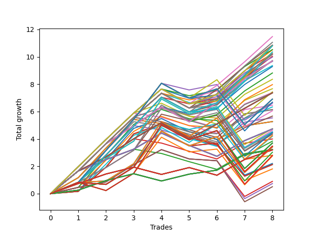

# Long HLT 309 
- Symbol: TSLA
- Date Range: 05/16/2022 - 05/17/2024
- Trading Period: 8:30-12:30
- Number of Trades: 8



| Id. | Name | Win Percent | Profit | Avg Profit / Trade | Avg Time / Trade | Std |      | Name | Win Percent | Profit | Avg Profit / Trade | Avg Time / Trade | Std |
| --- | ---- | ----------- | ------ | ------------------ | ---------------- | --- | ---- | ---- | ----------- | ------ | ------------------ | ---------------- | --- |
| | Sorted By <br> Profit | | | | | | | Sorted By <br> Win Percentage |||||
|0| TP-1.75 90m | 87.50 | 11.48 | 1.44 | 39:15 | 0.97 |     | TP-1.75 90m | 87.50 | 11.48 | 1.44 | 39:15 | 0.97 |
|1| TP-2 90m | 87.50 | 11.06 | 1.38 | 47:00 | 1.02 |     | TP-2 90m | 87.50 | 11.06 | 1.38 | 47:00 | 1.02 |
|2| TP-1.5 90m | 87.50 | 10.86 | 1.36 | 33:45 | 0.94 |     | TP-1.5 90m | 87.50 | 10.86 | 1.36 | 33:45 | 0.94 |
|3| TP-2 180m | 87.50 | 10.81 | 1.35 | 51:15 | 1.08 |     | TP-2 180m | 87.50 | 10.81 | 1.35 | 51:15 | 1.08 |
|4| TP-1.75 180m | 87.50 | 10.81 | 1.35 | 43:00 | 1.00 |     | TP-1.75 180m | 87.50 | 10.81 | 1.35 | 43:00 | 1.00 |
|5| TP-2 165m | 87.50 | 10.81 | 1.35 | 51:15 | 1.08 |     | TP-2 165m | 87.50 | 10.81 | 1.35 | 51:15 | 1.08 |
|6| TP-1.75 165m | 87.50 | 10.81 | 1.35 | 43:00 | 1.00 |     | TP-1.75 165m | 87.50 | 10.81 | 1.35 | 43:00 | 1.00 |
|7| TP-2 150m | 87.50 | 10.81 | 1.35 | 51:15 | 1.08 |     | TP-2 150m | 87.50 | 10.81 | 1.35 | 51:15 | 1.08 |
|8| TP-1.75 150m | 87.50 | 10.81 | 1.35 | 43:00 | 1.00 |     | TP-1.75 150m | 87.50 | 10.81 | 1.35 | 43:00 | 1.00 |
|9| TP-2 135m | 87.50 | 10.81 | 1.35 | 51:15 | 1.08 |     | TP-2 135m | 87.50 | 10.81 | 1.35 | 51:15 | 1.08 |
|10| TP-1.75 135m | 87.50 | 10.81 | 1.35 | 43:00 | 1.00 |     | TP-1.75 135m | 87.50 | 10.81 | 1.35 | 43:00 | 1.00 |
|11| TP-2 120m | 87.50 | 10.81 | 1.35 | 51:15 | 1.08 |     | TP-2 120m | 87.50 | 10.81 | 1.35 | 51:15 | 1.08 |
|12| TP-1.75 120m | 87.50 | 10.81 | 1.35 | 43:00 | 1.00 |     | TP-1.75 120m | 87.50 | 10.81 | 1.35 | 43:00 | 1.00 |
|13| TP-1.75 60m | 87.50 | 10.53 | 1.32 | 30:30 | 0.85 |     | TP-1.75 60m | 87.50 | 10.53 | 1.32 | 30:30 | 0.85 |
|14| TP-1.5 60m | 87.50 | 10.51 | 1.31 | 28:37 | 0.83 |     | TP-1.5 60m | 87.50 | 10.51 | 1.31 | 28:37 | 0.83 |
|15| TP-2 105m | 87.50 | 10.35 | 1.29 | 49:22 | 1.12 |     | TP-2 105m | 87.50 | 10.35 | 1.29 | 49:22 | 1.12 |
|16| TP-1.75 105m | 87.50 | 10.35 | 1.29 | 41:07 | 1.05 |     | TP-1.75 105m | 87.50 | 10.35 | 1.29 | 41:07 | 1.05 |
|17| TP-2 60m | 87.50 | 10.23 | 1.28 | 38:07 | 0.91 |     | TP-2 60m | 87.50 | 10.23 | 1.28 | 38:07 | 0.91 |
|18| TP-1.5 180m | 87.50 | 10.19 | 1.27 | 37:30 | 0.97 |     | TP-1.5 180m | 87.50 | 10.19 | 1.27 | 37:30 | 0.97 |
|19| TP-1.5 165m | 87.50 | 10.19 | 1.27 | 37:30 | 0.97 |     | TP-1.5 165m | 87.50 | 10.19 | 1.27 | 37:30 | 0.97 |
|20| TP-1.5 150m | 87.50 | 10.19 | 1.27 | 37:30 | 0.97 |     | TP-1.5 150m | 87.50 | 10.19 | 1.27 | 37:30 | 0.97 |
|21| TP-1.5 135m | 87.50 | 10.19 | 1.27 | 37:30 | 0.97 |     | TP-1.5 135m | 87.50 | 10.19 | 1.27 | 37:30 | 0.97 |
|22| TP-1.5 120m | 87.50 | 10.19 | 1.27 | 37:30 | 0.97 |     | TP-1.5 120m | 87.50 | 10.19 | 1.27 | 37:30 | 0.97 |
|23| TP-1.5 75m | 87.50 | 10.04 | 1.26 | 31:52 | 0.98 |     | TP-1.5 75m | 87.50 | 10.04 | 1.26 | 31:52 | 0.98 |
|24| TP-1.75 75m | 87.50 | 9.98 | 1.25 | 35:37 | 1.00 |     | TP-1.75 75m | 87.50 | 9.98 | 1.25 | 35:37 | 1.00 |
|25| TP-1.5 105m | 87.50 | 9.73 | 1.22 | 35:37 | 1.02 |     | TP-1.5 105m | 87.50 | 9.73 | 1.22 | 35:37 | 1.02 |
|26| TP-1.25 180m | 87.50 | 9.70 | 1.21 | 31:07 | 0.90 |     | TP-1.25 180m | 87.50 | 9.70 | 1.21 | 31:07 | 0.90 |
|27| TP-1.25 165m | 87.50 | 9.70 | 1.21 | 31:07 | 0.90 |     | TP-1.25 165m | 87.50 | 9.70 | 1.21 | 31:07 | 0.90 |
|28| TP-1.25 150m | 87.50 | 9.70 | 1.21 | 31:07 | 0.90 |     | TP-1.25 150m | 87.50 | 9.70 | 1.21 | 31:07 | 0.90 |
|29| TP-1.25 135m | 87.50 | 9.70 | 1.21 | 31:07 | 0.90 |     | TP-1.25 135m | 87.50 | 9.70 | 1.21 | 31:07 | 0.90 |
|30| TP-1.25 120m | 87.50 | 9.70 | 1.21 | 31:07 | 0.90 |     | TP-1.25 120m | 87.50 | 9.70 | 1.21 | 31:07 | 0.90 |
|31| TP-1.25 105m | 87.50 | 9.70 | 1.21 | 31:07 | 0.90 |     | TP-1.25 105m | 87.50 | 9.70 | 1.21 | 31:07 | 0.90 |
|32| TP-1.25 90m | 87.50 | 9.70 | 1.21 | 31:07 | 0.90 |     | TP-1.25 90m | 87.50 | 9.70 | 1.21 | 31:07 | 0.90 |
|33| TP-2 75m | 87.50 | 9.68 | 1.21 | 43:15 | 1.05 |     | TP-2 75m | 87.50 | 9.68 | 1.21 | 43:15 | 1.05 |
|34| TP-1.75 45m | 75.00 | 9.67 | 1.21 | 24:52 | 0.98 |     | TP-1.25 60m | 87.50 | 9.29 | 1.16 | 26:45 | 0.76 |
|35| TP-1.5 45m | 75.00 | 9.36 | 1.17 | 24:37 | 0.95 |     | TP-1.25 75m | 87.50 | 8.82 | 1.10 | 30:00 | 0.92 |
|36| TP-1.25 60m | 87.50 | 9.29 | 1.16 | 26:45 | 0.76 |     | TP-1 60m | 87.50 | 7.38 | 0.92 | 24:30 | 0.63 |
|37| TP-1.25 75m | 87.50 | 8.82 | 1.10 | 30:00 | 0.92 |     | TP-1 180m | 87.50 | 7.37 | 0.92 | 25:52 | 0.82 |
|38| TP-1.25 45m | 75.00 | 8.36 | 1.05 | 22:52 | 0.89 |     | TP-1 165m | 87.50 | 7.37 | 0.92 | 25:52 | 0.82 |
|39| TP-2 45m | 75.00 | 7.97 | 1.00 | 31:37 | 0.98 |     | TP-1 150m | 87.50 | 7.37 | 0.92 | 25:52 | 0.82 |
|40| TP-1.75 30m | 75.00 | 7.67 | 0.96 | 18:15 | 1.10 |     | TP-1 135m | 87.50 | 7.37 | 0.92 | 25:52 | 0.82 |
|41| TP-2.25 90m | 75.00 | 7.44 | 0.93 | 51:37 | 1.73 |     | TP-1 120m | 87.50 | 7.37 | 0.92 | 25:52 | 0.82 |
|42| TP-1.25 30m | 75.00 | 7.40 | 0.93 | 17:15 | 1.03 |     | TP-1 105m | 87.50 | 7.37 | 0.92 | 25:52 | 0.82 |
|43| TP-1 60m | 87.50 | 7.38 | 0.92 | 24:30 | 0.63 |     | TP-1 90m | 87.50 | 7.37 | 0.92 | 25:52 | 0.82 |
|44| TP-1 180m | 87.50 | 7.37 | 0.92 | 25:52 | 0.82 |     | TP-1 75m | 87.50 | 7.37 | 0.92 | 25:52 | 0.82 |
|45| TP-1 165m | 87.50 | 7.37 | 0.92 | 25:52 | 0.82 |     | TP-0.25 180m | 87.50 | 3.21 | 0.40 | 04:07 | 0.44 |
|46| TP-1 150m | 87.50 | 7.37 | 0.92 | 25:52 | 0.82 |     | TP-0.25 165m | 87.50 | 3.21 | 0.40 | 04:07 | 0.44 |
|47| TP-1 135m | 87.50 | 7.37 | 0.92 | 25:52 | 0.82 |     | TP-0.25 150m | 87.50 | 3.21 | 0.40 | 04:07 | 0.44 |
|48| TP-1 120m | 87.50 | 7.37 | 0.92 | 25:52 | 0.82 |     | TP-0.25 135m | 87.50 | 3.21 | 0.40 | 04:07 | 0.44 |
|49| TP-1 105m | 87.50 | 7.37 | 0.92 | 25:52 | 0.82 |     | TP-0.25 120m | 87.50 | 3.21 | 0.40 | 04:07 | 0.44 |
|50| TP-1 90m | 87.50 | 7.37 | 0.92 | 25:52 | 0.82 |     | TP-0.25 105m | 87.50 | 3.21 | 0.40 | 04:07 | 0.44 |
|51| TP-1 75m | 87.50 | 7.37 | 0.92 | 25:52 | 0.82 |     | TP-0.25 90m | 87.50 | 3.21 | 0.40 | 04:07 | 0.44 |
|52| TP-1.5 30m | 75.00 | 7.36 | 0.92 | 18:00 | 1.07 |     | TP-0.25 75m | 87.50 | 3.21 | 0.40 | 04:07 | 0.44 |
|53| TP-2.25 180m | 75.00 | 6.91 | 0.86 | 59:07 | 1.74 |     | TP-0.25 60m | 87.50 | 3.21 | 0.40 | 04:07 | 0.44 |
|54| TP-2.25 165m | 75.00 | 6.91 | 0.86 | 59:07 | 1.74 |     | TP-0.25 45m | 87.50 | 3.21 | 0.40 | 04:07 | 0.44 |
|55| TP-2.25 150m | 75.00 | 6.91 | 0.86 | 59:07 | 1.74 |     | TP-0.25 30m | 87.50 | 3.21 | 0.40 | 04:07 | 0.44 |
|56| TP-2.25 135m | 75.00 | 6.91 | 0.86 | 59:07 | 1.74 |     | TP-0.25 15m | 87.50 | 3.21 | 0.40 | 04:07 | 0.44 |
|57| TP-2.25 120m | 75.00 | 6.91 | 0.86 | 59:07 | 1.74 |     | TP-1.75 45m | 75.00 | 9.67 | 1.21 | 24:52 | 0.98 |
|58| TP-2.25 105m | 75.00 | 6.69 | 0.84 | 55:22 | 1.77 |     | TP-1.5 45m | 75.00 | 9.36 | 1.17 | 24:37 | 0.95 |
|59| TP-1 45m | 75.00 | 6.66 | 0.83 | 20:45 | 0.75 |     | TP-1.25 45m | 75.00 | 8.36 | 1.05 | 22:52 | 0.89 |
|60| TP-2.25 60m | 75.00 | 6.61 | 0.83 | 42:45 | 1.64 |     | TP-2 45m | 75.00 | 7.97 | 1.00 | 31:37 | 0.98 |
|61| TP-1.75 15m | 62.50 | 6.46 | 0.81 | 10:45 | 1.13 |     | TP-1.75 30m | 75.00 | 7.67 | 0.96 | 18:15 | 1.10 |
|62| TP-2 30m | 75.00 | 6.34 | 0.79 | 22:15 | 1.12 |     | TP-2.25 90m | 75.00 | 7.44 | 0.93 | 51:37 | 1.73 |
|63| TP-1.5 15m | 62.50 | 6.15 | 0.77 | 10:30 | 1.09 |     | TP-1.25 30m | 75.00 | 7.40 | 0.93 | 17:15 | 1.03 |
|64| TP-2 15m | 62.50 | 6.13 | 0.77 | 12:52 | 1.12 |     | TP-1.5 30m | 75.00 | 7.36 | 0.92 | 18:00 | 1.07 |
|65| TP-2.25 75m | 75.00 | 6.06 | 0.76 | 47:52 | 1.70 |     | TP-2.25 180m | 75.00 | 6.91 | 0.86 | 59:07 | 1.74 |
|66| TP-1 30m | 75.00 | 5.67 | 0.71 | 16:30 | 0.88 |     | TP-2.25 165m | 75.00 | 6.91 | 0.86 | 59:07 | 1.74 |
|67| TP-1.25 15m | 62.50 | 5.54 | 0.69 | 10:15 | 1.03 |     | TP-2.25 150m | 75.00 | 6.91 | 0.86 | 59:07 | 1.74 |
|68| TP-3 15m | 62.50 | 5.27 | 0.66 | 14:00 | 1.05 |     | TP-2.25 135m | 75.00 | 6.91 | 0.86 | 59:07 | 1.74 |
|69| TP-2.75 15m | 62.50 | 5.27 | 0.66 | 14:00 | 1.05 |     | TP-2.25 120m | 75.00 | 6.91 | 0.86 | 59:07 | 1.74 |
|70| TP-2.5 15m | 62.50 | 5.27 | 0.66 | 14:00 | 1.05 |     | TP-2.25 105m | 75.00 | 6.69 | 0.84 | 55:22 | 1.77 |
|71| TP-2.25 15m | 62.50 | 5.27 | 0.66 | 14:00 | 1.05 |     | TP-1 45m | 75.00 | 6.66 | 0.83 | 20:45 | 0.75 |
|72| TP-2.75 75m | 75.00 | 4.75 | 0.59 | 57:45 | 1.68 |     | TP-2.25 60m | 75.00 | 6.61 | 0.83 | 42:45 | 1.64 |
|73| TP-0.75 180m | 75.00 | 4.73 | 0.59 | 13:45 | 0.87 |     | TP-2 30m | 75.00 | 6.34 | 0.79 | 22:15 | 1.12 |
|74| TP-0.75 165m | 75.00 | 4.73 | 0.59 | 13:45 | 0.87 |     | TP-2.25 75m | 75.00 | 6.06 | 0.76 | 47:52 | 1.70 |
|75| TP-0.75 150m | 75.00 | 4.73 | 0.59 | 13:45 | 0.87 |     | TP-1 30m | 75.00 | 5.67 | 0.71 | 16:30 | 0.88 |
|76| TP-0.75 135m | 75.00 | 4.73 | 0.59 | 13:45 | 0.87 |     | TP-2.75 75m | 75.00 | 4.75 | 0.59 | 57:45 | 1.68 |
|77| TP-0.75 120m | 75.00 | 4.73 | 0.59 | 13:45 | 0.87 |     | TP-0.75 180m | 75.00 | 4.73 | 0.59 | 13:45 | 0.87 |
|78| TP-0.75 105m | 75.00 | 4.73 | 0.59 | 13:45 | 0.87 |     | TP-0.75 165m | 75.00 | 4.73 | 0.59 | 13:45 | 0.87 |
|79| TP-0.75 90m | 75.00 | 4.73 | 0.59 | 13:45 | 0.87 |     | TP-0.75 150m | 75.00 | 4.73 | 0.59 | 13:45 | 0.87 |
|80| TP-0.75 75m | 75.00 | 4.73 | 0.59 | 13:45 | 0.87 |     | TP-0.75 135m | 75.00 | 4.73 | 0.59 | 13:45 | 0.87 |
|81| TP-0.75 60m | 75.00 | 4.73 | 0.59 | 13:45 | 0.87 |     | TP-0.75 120m | 75.00 | 4.73 | 0.59 | 13:45 | 0.87 |
|82| TP-0.75 45m | 75.00 | 4.73 | 0.59 | 13:45 | 0.87 |     | TP-0.75 105m | 75.00 | 4.73 | 0.59 | 13:45 | 0.87 |
|83| TP-0.75 30m | 75.00 | 4.73 | 0.59 | 13:45 | 0.87 |     | TP-0.75 90m | 75.00 | 4.73 | 0.59 | 13:45 | 0.87 |
|84| TP-2.75 60m | 75.00 | 4.63 | 0.58 | 50:45 | 1.58 |     | TP-0.75 75m | 75.00 | 4.73 | 0.59 | 13:45 | 0.87 |
|85| TP-3 75m | 75.00 | 4.52 | 0.57 | 58:45 | 1.73 |     | TP-0.75 60m | 75.00 | 4.73 | 0.59 | 13:45 | 0.87 |
|86| TP-2.75 90m | 75.00 | 4.48 | 0.56 | 63:22 | 1.69 |     | TP-0.75 45m | 75.00 | 4.73 | 0.59 | 13:45 | 0.87 |
|87| TP-2.5 75m | 75.00 | 4.47 | 0.56 | 56:45 | 1.56 |     | TP-0.75 30m | 75.00 | 4.73 | 0.59 | 13:45 | 0.87 |
|88| TP-3 60m | 75.00 | 4.40 | 0.55 | 51:45 | 1.64 |     | TP-2.75 60m | 75.00 | 4.63 | 0.58 | 50:45 | 1.58 |
|89| TP-2.5 60m | 75.00 | 4.35 | 0.54 | 49:45 | 1.45 |     | TP-3 75m | 75.00 | 4.52 | 0.57 | 58:45 | 1.73 |
|90| TP-3 90m | 75.00 | 4.25 | 0.53 | 64:22 | 1.75 |     | TP-2.75 90m | 75.00 | 4.48 | 0.56 | 63:22 | 1.69 |
|91| TP-2.5 90m | 75.00 | 4.20 | 0.52 | 62:22 | 1.57 |     | TP-2.5 75m | 75.00 | 4.47 | 0.56 | 56:45 | 1.56 |
|92| TP-1 15m | 62.50 | 4.00 | 0.50 | 09:37 | 0.85 |     | TP-3 60m | 75.00 | 4.40 | 0.55 | 51:45 | 1.64 |
|93| TP-2.25 45m | 62.50 | 3.84 | 0.48 | 36:07 | 1.53 |     | TP-2.5 60m | 75.00 | 4.35 | 0.54 | 49:45 | 1.45 |
|94| TP-2.75 180m | 62.50 | 3.70 | 0.46 | 74:37 | 1.69 |     | TP-3 90m | 75.00 | 4.25 | 0.53 | 64:22 | 1.75 |
|95| TP-2.75 165m | 62.50 | 3.70 | 0.46 | 74:37 | 1.69 |     | TP-2.5 90m | 75.00 | 4.20 | 0.52 | 62:22 | 1.57 |
|96| TP-2.75 150m | 62.50 | 3.70 | 0.46 | 74:37 | 1.69 |     | TP-0.5 180m | 75.00 | 3.20 | 0.40 | 07:15 | 0.58 |
|97| TP-2.75 135m | 62.50 | 3.70 | 0.46 | 74:37 | 1.69 |     | TP-0.5 165m | 75.00 | 3.20 | 0.40 | 07:15 | 0.58 |
|98| TP-2.75 120m | 62.50 | 3.70 | 0.46 | 74:37 | 1.69 |     | TP-0.5 150m | 75.00 | 3.20 | 0.40 | 07:15 | 0.58 |
|99| TP-3 180m | 62.50 | 3.47 | 0.43 | 75:37 | 1.74 |     | TP-0.5 135m | 75.00 | 3.20 | 0.40 | 07:15 | 0.58 |
|100| TP-3 165m | 62.50 | 3.47 | 0.43 | 75:37 | 1.74 |     | TP-0.5 120m | 75.00 | 3.20 | 0.40 | 07:15 | 0.58 |
|101| TP-3 150m | 62.50 | 3.47 | 0.43 | 75:37 | 1.74 |     | TP-0.5 105m | 75.00 | 3.20 | 0.40 | 07:15 | 0.58 |
|102| TP-3 135m | 62.50 | 3.47 | 0.43 | 75:37 | 1.74 |     | TP-0.5 90m | 75.00 | 3.20 | 0.40 | 07:15 | 0.58 |
|103| TP-3 120m | 62.50 | 3.47 | 0.43 | 75:37 | 1.74 |     | TP-0.5 75m | 75.00 | 3.20 | 0.40 | 07:15 | 0.58 |
|104| TP-2.5 180m | 62.50 | 3.42 | 0.43 | 73:37 | 1.57 |     | TP-0.5 60m | 75.00 | 3.20 | 0.40 | 07:15 | 0.58 |
|105| TP-2.5 165m | 62.50 | 3.42 | 0.43 | 73:37 | 1.57 |     | TP-0.5 45m | 75.00 | 3.20 | 0.40 | 07:15 | 0.58 |
|106| TP-2.5 150m | 62.50 | 3.42 | 0.43 | 73:37 | 1.57 |     | TP-0.5 30m | 75.00 | 3.20 | 0.40 | 07:15 | 0.58 |
|107| TP-2.5 135m | 62.50 | 3.42 | 0.43 | 73:37 | 1.57 |     | TP-0.5 15m | 75.00 | 2.81 | 0.35 | 05:45 | 0.57 |
|108| TP-2.5 120m | 62.50 | 3.42 | 0.43 | 73:37 | 1.57 |     | TP-1.75 15m | 62.50 | 6.46 | 0.81 | 10:45 | 1.13 |
|109| TP-0.75 15m | 62.50 | 3.24 | 0.40 | 09:07 | 0.78 |     | TP-1.5 15m | 62.50 | 6.15 | 0.77 | 10:30 | 1.09 |
|110| TP-0.25 180m | 87.50 | 3.21 | 0.40 | 04:07 | 0.44 |     | TP-2 15m | 62.50 | 6.13 | 0.77 | 12:52 | 1.12 |
|111| TP-0.25 165m | 87.50 | 3.21 | 0.40 | 04:07 | 0.44 |     | TP-1.25 15m | 62.50 | 5.54 | 0.69 | 10:15 | 1.03 |
|112| TP-0.25 150m | 87.50 | 3.21 | 0.40 | 04:07 | 0.44 |     | TP-3 15m | 62.50 | 5.27 | 0.66 | 14:00 | 1.05 |
|113| TP-0.25 135m | 87.50 | 3.21 | 0.40 | 04:07 | 0.44 |     | TP-2.75 15m | 62.50 | 5.27 | 0.66 | 14:00 | 1.05 |
|114| TP-0.25 120m | 87.50 | 3.21 | 0.40 | 04:07 | 0.44 |     | TP-2.5 15m | 62.50 | 5.27 | 0.66 | 14:00 | 1.05 |
|115| TP-0.25 105m | 87.50 | 3.21 | 0.40 | 04:07 | 0.44 |     | TP-2.25 15m | 62.50 | 5.27 | 0.66 | 14:00 | 1.05 |
|116| TP-0.25 90m | 87.50 | 3.21 | 0.40 | 04:07 | 0.44 |     | TP-1 15m | 62.50 | 4.00 | 0.50 | 09:37 | 0.85 |
|117| TP-0.25 75m | 87.50 | 3.21 | 0.40 | 04:07 | 0.44 |     | TP-2.25 45m | 62.50 | 3.84 | 0.48 | 36:07 | 1.53 |
|118| TP-0.25 60m | 87.50 | 3.21 | 0.40 | 04:07 | 0.44 |     | TP-2.75 180m | 62.50 | 3.70 | 0.46 | 74:37 | 1.69 |
|119| TP-0.25 45m | 87.50 | 3.21 | 0.40 | 04:07 | 0.44 |     | TP-2.75 165m | 62.50 | 3.70 | 0.46 | 74:37 | 1.69 |
|120| TP-0.25 30m | 87.50 | 3.21 | 0.40 | 04:07 | 0.44 |     | TP-2.75 150m | 62.50 | 3.70 | 0.46 | 74:37 | 1.69 |
|121| TP-0.25 15m | 87.50 | 3.21 | 0.40 | 04:07 | 0.44 |     | TP-2.75 135m | 62.50 | 3.70 | 0.46 | 74:37 | 1.69 |
|122| TP-0.5 180m | 75.00 | 3.20 | 0.40 | 07:15 | 0.58 |     | TP-2.75 120m | 62.50 | 3.70 | 0.46 | 74:37 | 1.69 |
|123| TP-0.5 165m | 75.00 | 3.20 | 0.40 | 07:15 | 0.58 |     | TP-3 180m | 62.50 | 3.47 | 0.43 | 75:37 | 1.74 |
|124| TP-0.5 150m | 75.00 | 3.20 | 0.40 | 07:15 | 0.58 |     | TP-3 165m | 62.50 | 3.47 | 0.43 | 75:37 | 1.74 |
|125| TP-0.5 135m | 75.00 | 3.20 | 0.40 | 07:15 | 0.58 |     | TP-3 150m | 62.50 | 3.47 | 0.43 | 75:37 | 1.74 |
|126| TP-0.5 120m | 75.00 | 3.20 | 0.40 | 07:15 | 0.58 |     | TP-3 135m | 62.50 | 3.47 | 0.43 | 75:37 | 1.74 |
|127| TP-0.5 105m | 75.00 | 3.20 | 0.40 | 07:15 | 0.58 |     | TP-3 120m | 62.50 | 3.47 | 0.43 | 75:37 | 1.74 |
|128| TP-0.5 90m | 75.00 | 3.20 | 0.40 | 07:15 | 0.58 |     | TP-2.5 180m | 62.50 | 3.42 | 0.43 | 73:37 | 1.57 |
|129| TP-0.5 75m | 75.00 | 3.20 | 0.40 | 07:15 | 0.58 |     | TP-2.5 165m | 62.50 | 3.42 | 0.43 | 73:37 | 1.57 |
|130| TP-0.5 60m | 75.00 | 3.20 | 0.40 | 07:15 | 0.58 |     | TP-2.5 150m | 62.50 | 3.42 | 0.43 | 73:37 | 1.57 |
|131| TP-0.5 45m | 75.00 | 3.20 | 0.40 | 07:15 | 0.58 |     | TP-2.5 135m | 62.50 | 3.42 | 0.43 | 73:37 | 1.57 |
|132| TP-0.5 30m | 75.00 | 3.20 | 0.40 | 07:15 | 0.58 |     | TP-2.5 120m | 62.50 | 3.42 | 0.43 | 73:37 | 1.57 |
|133| TP-2.75 105m | 62.50 | 3.03 | 0.38 | 69:00 | 1.74 |     | TP-0.75 15m | 62.50 | 3.24 | 0.40 | 09:07 | 0.78 |
|134| TP-0.5 15m | 75.00 | 2.81 | 0.35 | 05:45 | 0.57 |     | TP-2.75 105m | 62.50 | 3.03 | 0.38 | 69:00 | 1.74 |
|135| TP-3 105m | 62.50 | 2.80 | 0.35 | 70:00 | 1.79 |     | TP-3 105m | 62.50 | 2.80 | 0.35 | 70:00 | 1.79 |
|136| TP-2.5 105m | 62.50 | 2.75 | 0.34 | 68:00 | 1.62 |     | TP-2.5 105m | 62.50 | 2.75 | 0.34 | 68:00 | 1.62 |
|137| TP-2.25 30m | 62.50 | 2.21 | 0.28 | 26:45 | 1.55 |     | TP-2.25 30m | 62.50 | 2.21 | 0.28 | 26:45 | 1.55 |
|138| TP-3 30m | 62.50 | 2.13 | 0.27 | 29:00 | 1.42 |     | TP-3 30m | 62.50 | 2.13 | 0.27 | 29:00 | 1.42 |
|139| TP-2.75 30m | 62.50 | 2.13 | 0.27 | 29:00 | 1.42 |     | TP-2.75 30m | 62.50 | 2.13 | 0.27 | 29:00 | 1.42 |
|140| TP-2.5 30m | 62.50 | 1.81 | 0.23 | 28:37 | 1.50 |     | TP-2.5 30m | 62.50 | 1.81 | 0.23 | 28:37 | 1.50 |
|141| TP-2.5 45m | 62.50 | 0.90 | 0.11 | 41:15 | 1.20 |     | TP-2.5 45m | 62.50 | 0.90 | 0.11 | 41:15 | 1.20 |
|142| TP-2.75 45m | 62.50 | 0.74 | 0.09 | 42:00 | 1.25 |     | TP-2.75 45m | 62.50 | 0.74 | 0.09 | 42:00 | 1.25 |
|143| TP-3 45m | 62.50 | 0.51 | 0.06 | 43:00 | 1.31 |     | TP-3 45m | 62.50 | 0.51 | 0.06 | 43:00 | 1.31 |

### Test TP-0.25 15m
* Take Profit of 0.25 Point
* 0.25 Stoploss
* Results:
```
Total Trades: 8
Percent Up: 87.50
Percent Down: 12.50
Total Points Moved Up: 3.21
Potential Profit: 1605.00
Total Points Ups: 3.74 Count Ups: 7
Total Points Downs: -0.53 Count Downs: 1
```

<details><summary>Trades</summary>

<code>In: 2022-08-30 12:05:00		Out: 2022-08-30 12:07:00		Total Position Time: 02:00		Total Move Up: 0.26		Total to Date: 0.26</code> <br />
<code>In: 2022-09-22 08:35:00		Out: 2022-09-22 08:39:00		Total Position Time: 04:00		Total Move Up: 0.70		Total to Date: 0.96</code> <br />
<code>In: 2022-09-29 12:10:00		Out: 2022-09-29 12:12:00		Total Position Time: 02:00		Total Move Up: 0.50		Total to Date: 1.46</code> <br />
<code>In: 2022-11-04 11:20:00		Out: 2022-11-04 11:22:00		Total Position Time: 02:00		Total Move Up: -0.53		Total to Date: 0.93</code> <br />
<code>In: 2022-12-19 11:40:00		Out: 2022-12-19 11:44:00		Total Position Time: 04:00		Total Move Up: 0.50		Total to Date: 1.43</code> <br />
<code>In: 2023-08-11 10:30:00		Out: 2023-08-11 10:36:00		Total Position Time: 06:00		Total Move Up: 0.29		Total to Date: 1.72</code> <br />
<code>In: 2024-01-31 11:40:00		Out: 2024-01-31 11:42:00		Total Position Time: 02:00		Total Move Up: 1.15		Total to Date: 2.87</code> <br />
<code>In: 2024-03-15 10:10:00		Out: 2024-03-15 10:21:00		Total Position Time: 11:00		Total Move Up: 0.34		Total to Date: 3.21</code> <br />


</details>

### Test TP-0.5 15m
* Take Profit of 0.5 Point
* 0.5 Stoploss
* Results:
```
Total Trades: 8
Percent Up: 75.00
Percent Down: 25.00
Total Points Moved Up: 2.81
Potential Profit: 1405.00
Total Points Ups: 3.90 Count Ups: 6
Total Points Downs: -1.09 Count Downs: 2
```

<details><summary>Trades</summary>

<code>In: 2022-08-30 12:05:00		Out: 2022-08-30 12:09:00		Total Position Time: 04:00		Total Move Up: 0.74		Total to Date: 0.74</code> <br />
<code>In: 2022-09-22 08:35:00		Out: 2022-09-22 08:39:00		Total Position Time: 04:00		Total Move Up: 0.70		Total to Date: 1.44</code> <br />
<code>In: 2022-09-29 12:10:00		Out: 2022-09-29 12:12:00		Total Position Time: 02:00		Total Move Up: 0.50		Total to Date: 1.94</code> <br />
<code>In: 2022-11-04 11:20:00		Out: 2022-11-04 11:22:00		Total Position Time: 02:00		Total Move Up: -0.53		Total to Date: 1.41</code> <br />
<code>In: 2022-12-19 11:40:00		Out: 2022-12-19 11:44:00		Total Position Time: 04:00		Total Move Up: 0.50		Total to Date: 1.91</code> <br />
<code>In: 2023-08-11 10:30:00		Out: 2023-08-11 10:44:00		Total Position Time: 14:00		Total Move Up: -0.56		Total to Date: 1.35</code> <br />
<code>In: 2024-01-31 11:40:00		Out: 2024-01-31 11:42:00		Total Position Time: 02:00		Total Move Up: 1.15		Total to Date: 2.50</code> <br />
<code>In: 2024-03-15 10:10:00		Out: 2024-03-15 10:24:00		Total Position Time: 14:00		Total Move Up: 0.31		Total to Date: 2.81</code> <br />


</details>

### Test TP-0.75 15m
* Take Profit of 0.75 Point
* 0.75 Stoploss
* Results:
```
Total Trades: 8
Percent Up: 62.50
Percent Down: 37.50
Total Points Moved Up: 3.24
Potential Profit: 1620.00
Total Points Ups: 4.71 Count Ups: 5
Total Points Downs: -1.47 Count Downs: 3
```

<details><summary>Trades</summary>

<code>In: 2022-08-30 12:05:00		Out: 2022-08-30 12:10:00		Total Position Time: 05:00		Total Move Up: 1.66		Total to Date: 1.66</code> <br />
<code>In: 2022-09-22 08:35:00		Out: 2022-09-22 08:41:00		Total Position Time: 06:00		Total Move Up: 0.83		Total to Date: 2.49</code> <br />
<code>In: 2022-09-29 12:10:00		Out: 2022-09-29 12:14:00		Total Position Time: 04:00		Total Move Up: 0.76		Total to Date: 3.25</code> <br />
<code>In: 2022-11-04 11:20:00		Out: 2022-11-04 11:34:00		Total Position Time: 14:00		Total Move Up: -0.31		Total to Date: 2.94</code> <br />
<code>In: 2022-12-19 11:40:00		Out: 2022-12-19 11:54:00		Total Position Time: 14:00		Total Move Up: -0.60		Total to Date: 2.34</code> <br />
<code>In: 2023-08-11 10:30:00		Out: 2023-08-11 10:44:00		Total Position Time: 14:00		Total Move Up: -0.56		Total to Date: 1.78</code> <br />
<code>In: 2024-01-31 11:40:00		Out: 2024-01-31 11:42:00		Total Position Time: 02:00		Total Move Up: 1.15		Total to Date: 2.93</code> <br />
<code>In: 2024-03-15 10:10:00		Out: 2024-03-15 10:24:00		Total Position Time: 14:00		Total Move Up: 0.31		Total to Date: 3.24</code> <br />


</details>

### Test TP-1 15m
* Take Profit of 1 Point
* 1 Stoploss
* Results:
```
Total Trades: 8
Percent Up: 62.50
Percent Down: 37.50
Total Points Moved Up: 4.00
Potential Profit: 2000.00
Total Points Ups: 5.47 Count Ups: 5
Total Points Downs: -1.47 Count Downs: 3
```

<details><summary>Trades</summary>

<code>In: 2022-08-30 12:05:00		Out: 2022-08-30 12:10:00		Total Position Time: 05:00		Total Move Up: 1.66		Total to Date: 1.66</code> <br />
<code>In: 2022-09-22 08:35:00		Out: 2022-09-22 08:44:00		Total Position Time: 09:00		Total Move Up: 1.03		Total to Date: 2.69</code> <br />
<code>In: 2022-09-29 12:10:00		Out: 2022-09-29 12:15:00		Total Position Time: 05:00		Total Move Up: 1.32		Total to Date: 4.01</code> <br />
<code>In: 2022-11-04 11:20:00		Out: 2022-11-04 11:34:00		Total Position Time: 14:00		Total Move Up: -0.31		Total to Date: 3.70</code> <br />
<code>In: 2022-12-19 11:40:00		Out: 2022-12-19 11:54:00		Total Position Time: 14:00		Total Move Up: -0.60		Total to Date: 3.10</code> <br />
<code>In: 2023-08-11 10:30:00		Out: 2023-08-11 10:44:00		Total Position Time: 14:00		Total Move Up: -0.56		Total to Date: 2.54</code> <br />
<code>In: 2024-01-31 11:40:00		Out: 2024-01-31 11:42:00		Total Position Time: 02:00		Total Move Up: 1.15		Total to Date: 3.69</code> <br />
<code>In: 2024-03-15 10:10:00		Out: 2024-03-15 10:24:00		Total Position Time: 14:00		Total Move Up: 0.31		Total to Date: 4.00</code> <br />


</details>

### Test TP-1.25 15m
* Take Profit of 1.25 Point
* 1.25 Stoploss
* Results:
```
Total Trades: 8
Percent Up: 62.50
Percent Down: 37.50
Total Points Moved Up: 5.54
Potential Profit: 2770.00
Total Points Ups: 7.01 Count Ups: 5
Total Points Downs: -1.47 Count Downs: 3
```

<details><summary>Trades</summary>

<code>In: 2022-08-30 12:05:00		Out: 2022-08-30 12:10:00		Total Position Time: 05:00		Total Move Up: 1.66		Total to Date: 1.66</code> <br />
<code>In: 2022-09-22 08:35:00		Out: 2022-09-22 08:47:00		Total Position Time: 12:00		Total Move Up: 1.99		Total to Date: 3.65</code> <br />
<code>In: 2022-09-29 12:10:00		Out: 2022-09-29 12:15:00		Total Position Time: 05:00		Total Move Up: 1.32		Total to Date: 4.97</code> <br />
<code>In: 2022-11-04 11:20:00		Out: 2022-11-04 11:34:00		Total Position Time: 14:00		Total Move Up: -0.31		Total to Date: 4.66</code> <br />
<code>In: 2022-12-19 11:40:00		Out: 2022-12-19 11:54:00		Total Position Time: 14:00		Total Move Up: -0.60		Total to Date: 4.06</code> <br />
<code>In: 2023-08-11 10:30:00		Out: 2023-08-11 10:44:00		Total Position Time: 14:00		Total Move Up: -0.56		Total to Date: 3.50</code> <br />
<code>In: 2024-01-31 11:40:00		Out: 2024-01-31 11:44:00		Total Position Time: 04:00		Total Move Up: 1.73		Total to Date: 5.23</code> <br />
<code>In: 2024-03-15 10:10:00		Out: 2024-03-15 10:24:00		Total Position Time: 14:00		Total Move Up: 0.31		Total to Date: 5.54</code> <br />


</details>

### Test TP-1.5 15m
* Take Profit of 1.5 Point
* 1.5 Stoploss
* Results:
```
Total Trades: 8
Percent Up: 62.50
Percent Down: 37.50
Total Points Moved Up: 6.15
Potential Profit: 3075.00
Total Points Ups: 7.62 Count Ups: 5
Total Points Downs: -1.47 Count Downs: 3
```

<details><summary>Trades</summary>

<code>In: 2022-08-30 12:05:00		Out: 2022-08-30 12:10:00		Total Position Time: 05:00		Total Move Up: 1.66		Total to Date: 1.66</code> <br />
<code>In: 2022-09-22 08:35:00		Out: 2022-09-22 08:47:00		Total Position Time: 12:00		Total Move Up: 1.99		Total to Date: 3.65</code> <br />
<code>In: 2022-09-29 12:10:00		Out: 2022-09-29 12:17:00		Total Position Time: 07:00		Total Move Up: 1.93		Total to Date: 5.58</code> <br />
<code>In: 2022-11-04 11:20:00		Out: 2022-11-04 11:34:00		Total Position Time: 14:00		Total Move Up: -0.31		Total to Date: 5.27</code> <br />
<code>In: 2022-12-19 11:40:00		Out: 2022-12-19 11:54:00		Total Position Time: 14:00		Total Move Up: -0.60		Total to Date: 4.67</code> <br />
<code>In: 2023-08-11 10:30:00		Out: 2023-08-11 10:44:00		Total Position Time: 14:00		Total Move Up: -0.56		Total to Date: 4.11</code> <br />
<code>In: 2024-01-31 11:40:00		Out: 2024-01-31 11:44:00		Total Position Time: 04:00		Total Move Up: 1.73		Total to Date: 5.84</code> <br />
<code>In: 2024-03-15 10:10:00		Out: 2024-03-15 10:24:00		Total Position Time: 14:00		Total Move Up: 0.31		Total to Date: 6.15</code> <br />


</details>

### Test TP-1.75 15m
* Take Profit of 1.75 Point
* 1.75 Stoploss
* Results:
```
Total Trades: 8
Percent Up: 62.50
Percent Down: 37.50
Total Points Moved Up: 6.46
Potential Profit: 3230.00
Total Points Ups: 7.93 Count Ups: 5
Total Points Downs: -1.47 Count Downs: 3
```

<details><summary>Trades</summary>

<code>In: 2022-08-30 12:05:00		Out: 2022-08-30 12:12:00		Total Position Time: 07:00		Total Move Up: 1.97		Total to Date: 1.97</code> <br />
<code>In: 2022-09-22 08:35:00		Out: 2022-09-22 08:47:00		Total Position Time: 12:00		Total Move Up: 1.99		Total to Date: 3.96</code> <br />
<code>In: 2022-09-29 12:10:00		Out: 2022-09-29 12:17:00		Total Position Time: 07:00		Total Move Up: 1.93		Total to Date: 5.89</code> <br />
<code>In: 2022-11-04 11:20:00		Out: 2022-11-04 11:34:00		Total Position Time: 14:00		Total Move Up: -0.31		Total to Date: 5.58</code> <br />
<code>In: 2022-12-19 11:40:00		Out: 2022-12-19 11:54:00		Total Position Time: 14:00		Total Move Up: -0.60		Total to Date: 4.98</code> <br />
<code>In: 2023-08-11 10:30:00		Out: 2023-08-11 10:44:00		Total Position Time: 14:00		Total Move Up: -0.56		Total to Date: 4.42</code> <br />
<code>In: 2024-01-31 11:40:00		Out: 2024-01-31 11:44:00		Total Position Time: 04:00		Total Move Up: 1.73		Total to Date: 6.15</code> <br />
<code>In: 2024-03-15 10:10:00		Out: 2024-03-15 10:24:00		Total Position Time: 14:00		Total Move Up: 0.31		Total to Date: 6.46</code> <br />


</details>

### Test TP-2 15m
* Take Profit of 2 Point
* 2 Stoploss
* Results:
```
Total Trades: 8
Percent Up: 62.50
Percent Down: 37.50
Total Points Moved Up: 6.13
Potential Profit: 3065.00
Total Points Ups: 7.60 Count Ups: 5
Total Points Downs: -1.47 Count Downs: 3
```

<details><summary>Trades</summary>

<code>In: 2022-08-30 12:05:00		Out: 2022-08-30 12:19:00		Total Position Time: 14:00		Total Move Up: 1.17		Total to Date: 1.17</code> <br />
<code>In: 2022-09-22 08:35:00		Out: 2022-09-22 08:47:00		Total Position Time: 12:00		Total Move Up: 1.99		Total to Date: 3.16</code> <br />
<code>In: 2022-09-29 12:10:00		Out: 2022-09-29 12:24:00		Total Position Time: 14:00		Total Move Up: 2.10		Total to Date: 5.26</code> <br />
<code>In: 2022-11-04 11:20:00		Out: 2022-11-04 11:34:00		Total Position Time: 14:00		Total Move Up: -0.31		Total to Date: 4.95</code> <br />
<code>In: 2022-12-19 11:40:00		Out: 2022-12-19 11:54:00		Total Position Time: 14:00		Total Move Up: -0.60		Total to Date: 4.35</code> <br />
<code>In: 2023-08-11 10:30:00		Out: 2023-08-11 10:44:00		Total Position Time: 14:00		Total Move Up: -0.56		Total to Date: 3.79</code> <br />
<code>In: 2024-01-31 11:40:00		Out: 2024-01-31 11:47:00		Total Position Time: 07:00		Total Move Up: 2.03		Total to Date: 5.82</code> <br />
<code>In: 2024-03-15 10:10:00		Out: 2024-03-15 10:24:00		Total Position Time: 14:00		Total Move Up: 0.31		Total to Date: 6.13</code> <br />


</details>

### Test TP-2.25 15m
* Take Profit of 2.25 Point
* 2.25 Stoploss
* Results:
```
Total Trades: 8
Percent Up: 62.50
Percent Down: 37.50
Total Points Moved Up: 5.27
Potential Profit: 2635.00
Total Points Ups: 6.74 Count Ups: 5
Total Points Downs: -1.47 Count Downs: 3
```

<details><summary>Trades</summary>

<code>In: 2022-08-30 12:05:00		Out: 2022-08-30 12:19:00		Total Position Time: 14:00		Total Move Up: 1.17		Total to Date: 1.17</code> <br />
<code>In: 2022-09-22 08:35:00		Out: 2022-09-22 08:49:00		Total Position Time: 14:00		Total Move Up: 2.16		Total to Date: 3.33</code> <br />
<code>In: 2022-09-29 12:10:00		Out: 2022-09-29 12:24:00		Total Position Time: 14:00		Total Move Up: 2.10		Total to Date: 5.43</code> <br />
<code>In: 2022-11-04 11:20:00		Out: 2022-11-04 11:34:00		Total Position Time: 14:00		Total Move Up: -0.31		Total to Date: 5.12</code> <br />
<code>In: 2022-12-19 11:40:00		Out: 2022-12-19 11:54:00		Total Position Time: 14:00		Total Move Up: -0.60		Total to Date: 4.52</code> <br />
<code>In: 2023-08-11 10:30:00		Out: 2023-08-11 10:44:00		Total Position Time: 14:00		Total Move Up: -0.56		Total to Date: 3.96</code> <br />
<code>In: 2024-01-31 11:40:00		Out: 2024-01-31 11:54:00		Total Position Time: 14:00		Total Move Up: 1.00		Total to Date: 4.96</code> <br />
<code>In: 2024-03-15 10:10:00		Out: 2024-03-15 10:24:00		Total Position Time: 14:00		Total Move Up: 0.31		Total to Date: 5.27</code> <br />


</details>

### Test TP-2.5 15m
* Take Profit of 2.5 Point
* 2.5 Stoploss
* Results:
```
Total Trades: 8
Percent Up: 62.50
Percent Down: 37.50
Total Points Moved Up: 5.27
Potential Profit: 2635.00
Total Points Ups: 6.74 Count Ups: 5
Total Points Downs: -1.47 Count Downs: 3
```

<details><summary>Trades</summary>

<code>In: 2022-08-30 12:05:00		Out: 2022-08-30 12:19:00		Total Position Time: 14:00		Total Move Up: 1.17		Total to Date: 1.17</code> <br />
<code>In: 2022-09-22 08:35:00		Out: 2022-09-22 08:49:00		Total Position Time: 14:00		Total Move Up: 2.16		Total to Date: 3.33</code> <br />
<code>In: 2022-09-29 12:10:00		Out: 2022-09-29 12:24:00		Total Position Time: 14:00		Total Move Up: 2.10		Total to Date: 5.43</code> <br />
<code>In: 2022-11-04 11:20:00		Out: 2022-11-04 11:34:00		Total Position Time: 14:00		Total Move Up: -0.31		Total to Date: 5.12</code> <br />
<code>In: 2022-12-19 11:40:00		Out: 2022-12-19 11:54:00		Total Position Time: 14:00		Total Move Up: -0.60		Total to Date: 4.52</code> <br />
<code>In: 2023-08-11 10:30:00		Out: 2023-08-11 10:44:00		Total Position Time: 14:00		Total Move Up: -0.56		Total to Date: 3.96</code> <br />
<code>In: 2024-01-31 11:40:00		Out: 2024-01-31 11:54:00		Total Position Time: 14:00		Total Move Up: 1.00		Total to Date: 4.96</code> <br />
<code>In: 2024-03-15 10:10:00		Out: 2024-03-15 10:24:00		Total Position Time: 14:00		Total Move Up: 0.31		Total to Date: 5.27</code> <br />


</details>

### Test TP-2.75 15m
* Take Profit of 2.75 Point
* 2.75 Stoploss
* Results:
```
Total Trades: 8
Percent Up: 62.50
Percent Down: 37.50
Total Points Moved Up: 5.27
Potential Profit: 2635.00
Total Points Ups: 6.74 Count Ups: 5
Total Points Downs: -1.47 Count Downs: 3
```

<details><summary>Trades</summary>

<code>In: 2022-08-30 12:05:00		Out: 2022-08-30 12:19:00		Total Position Time: 14:00		Total Move Up: 1.17		Total to Date: 1.17</code> <br />
<code>In: 2022-09-22 08:35:00		Out: 2022-09-22 08:49:00		Total Position Time: 14:00		Total Move Up: 2.16		Total to Date: 3.33</code> <br />
<code>In: 2022-09-29 12:10:00		Out: 2022-09-29 12:24:00		Total Position Time: 14:00		Total Move Up: 2.10		Total to Date: 5.43</code> <br />
<code>In: 2022-11-04 11:20:00		Out: 2022-11-04 11:34:00		Total Position Time: 14:00		Total Move Up: -0.31		Total to Date: 5.12</code> <br />
<code>In: 2022-12-19 11:40:00		Out: 2022-12-19 11:54:00		Total Position Time: 14:00		Total Move Up: -0.60		Total to Date: 4.52</code> <br />
<code>In: 2023-08-11 10:30:00		Out: 2023-08-11 10:44:00		Total Position Time: 14:00		Total Move Up: -0.56		Total to Date: 3.96</code> <br />
<code>In: 2024-01-31 11:40:00		Out: 2024-01-31 11:54:00		Total Position Time: 14:00		Total Move Up: 1.00		Total to Date: 4.96</code> <br />
<code>In: 2024-03-15 10:10:00		Out: 2024-03-15 10:24:00		Total Position Time: 14:00		Total Move Up: 0.31		Total to Date: 5.27</code> <br />


</details>

### Test TP-3 15m
* Take Profit of 3 Point
* 3 Stoploss
* Results:
```
Total Trades: 8
Percent Up: 62.50
Percent Down: 37.50
Total Points Moved Up: 5.27
Potential Profit: 2635.00
Total Points Ups: 6.74 Count Ups: 5
Total Points Downs: -1.47 Count Downs: 3
```

<details><summary>Trades</summary>

<code>In: 2022-08-30 12:05:00		Out: 2022-08-30 12:19:00		Total Position Time: 14:00		Total Move Up: 1.17		Total to Date: 1.17</code> <br />
<code>In: 2022-09-22 08:35:00		Out: 2022-09-22 08:49:00		Total Position Time: 14:00		Total Move Up: 2.16		Total to Date: 3.33</code> <br />
<code>In: 2022-09-29 12:10:00		Out: 2022-09-29 12:24:00		Total Position Time: 14:00		Total Move Up: 2.10		Total to Date: 5.43</code> <br />
<code>In: 2022-11-04 11:20:00		Out: 2022-11-04 11:34:00		Total Position Time: 14:00		Total Move Up: -0.31		Total to Date: 5.12</code> <br />
<code>In: 2022-12-19 11:40:00		Out: 2022-12-19 11:54:00		Total Position Time: 14:00		Total Move Up: -0.60		Total to Date: 4.52</code> <br />
<code>In: 2023-08-11 10:30:00		Out: 2023-08-11 10:44:00		Total Position Time: 14:00		Total Move Up: -0.56		Total to Date: 3.96</code> <br />
<code>In: 2024-01-31 11:40:00		Out: 2024-01-31 11:54:00		Total Position Time: 14:00		Total Move Up: 1.00		Total to Date: 4.96</code> <br />
<code>In: 2024-03-15 10:10:00		Out: 2024-03-15 10:24:00		Total Position Time: 14:00		Total Move Up: 0.31		Total to Date: 5.27</code> <br />


</details>

### Test TP-0.25 30m
* Take Profit of 0.25 Point
* 0.25 Stoploss
* Results:
```
Total Trades: 8
Percent Up: 87.50
Percent Down: 12.50
Total Points Moved Up: 3.21
Potential Profit: 1605.00
Total Points Ups: 3.74 Count Ups: 7
Total Points Downs: -0.53 Count Downs: 1
```

<details><summary>Trades</summary>

<code>In: 2022-08-30 12:05:00		Out: 2022-08-30 12:07:00		Total Position Time: 02:00		Total Move Up: 0.26		Total to Date: 0.26</code> <br />
<code>In: 2022-09-22 08:35:00		Out: 2022-09-22 08:39:00		Total Position Time: 04:00		Total Move Up: 0.70		Total to Date: 0.96</code> <br />
<code>In: 2022-09-29 12:10:00		Out: 2022-09-29 12:12:00		Total Position Time: 02:00		Total Move Up: 0.50		Total to Date: 1.46</code> <br />
<code>In: 2022-11-04 11:20:00		Out: 2022-11-04 11:22:00		Total Position Time: 02:00		Total Move Up: -0.53		Total to Date: 0.93</code> <br />
<code>In: 2022-12-19 11:40:00		Out: 2022-12-19 11:44:00		Total Position Time: 04:00		Total Move Up: 0.50		Total to Date: 1.43</code> <br />
<code>In: 2023-08-11 10:30:00		Out: 2023-08-11 10:36:00		Total Position Time: 06:00		Total Move Up: 0.29		Total to Date: 1.72</code> <br />
<code>In: 2024-01-31 11:40:00		Out: 2024-01-31 11:42:00		Total Position Time: 02:00		Total Move Up: 1.15		Total to Date: 2.87</code> <br />
<code>In: 2024-03-15 10:10:00		Out: 2024-03-15 10:21:00		Total Position Time: 11:00		Total Move Up: 0.34		Total to Date: 3.21</code> <br />


</details>

### Test TP-0.5 30m
* Take Profit of 0.5 Point
* 0.5 Stoploss
* Results:
```
Total Trades: 8
Percent Up: 75.00
Percent Down: 25.00
Total Points Moved Up: 3.20
Potential Profit: 1600.00
Total Points Ups: 4.29 Count Ups: 6
Total Points Downs: -1.09 Count Downs: 2
```

<details><summary>Trades</summary>

<code>In: 2022-08-30 12:05:00		Out: 2022-08-30 12:09:00		Total Position Time: 04:00		Total Move Up: 0.74		Total to Date: 0.74</code> <br />
<code>In: 2022-09-22 08:35:00		Out: 2022-09-22 08:39:00		Total Position Time: 04:00		Total Move Up: 0.70		Total to Date: 1.44</code> <br />
<code>In: 2022-09-29 12:10:00		Out: 2022-09-29 12:12:00		Total Position Time: 02:00		Total Move Up: 0.50		Total to Date: 1.94</code> <br />
<code>In: 2022-11-04 11:20:00		Out: 2022-11-04 11:22:00		Total Position Time: 02:00		Total Move Up: -0.53		Total to Date: 1.41</code> <br />
<code>In: 2022-12-19 11:40:00		Out: 2022-12-19 11:44:00		Total Position Time: 04:00		Total Move Up: 0.50		Total to Date: 1.91</code> <br />
<code>In: 2023-08-11 10:30:00		Out: 2023-08-11 10:44:00		Total Position Time: 14:00		Total Move Up: -0.56		Total to Date: 1.35</code> <br />
<code>In: 2024-01-31 11:40:00		Out: 2024-01-31 11:42:00		Total Position Time: 02:00		Total Move Up: 1.15		Total to Date: 2.50</code> <br />
<code>In: 2024-03-15 10:10:00		Out: 2024-03-15 10:36:00		Total Position Time: 26:00		Total Move Up: 0.70		Total to Date: 3.20</code> <br />


</details>

### Test TP-0.75 30m
* Take Profit of 0.75 Point
* 0.75 Stoploss
* Results:
```
Total Trades: 8
Percent Up: 75.00
Percent Down: 25.00
Total Points Moved Up: 4.73
Potential Profit: 2365.00
Total Points Ups: 6.43 Count Ups: 6
Total Points Downs: -1.70 Count Downs: 2
```

<details><summary>Trades</summary>

<code>In: 2022-08-30 12:05:00		Out: 2022-08-30 12:10:00		Total Position Time: 05:00		Total Move Up: 1.66		Total to Date: 1.66</code> <br />
<code>In: 2022-09-22 08:35:00		Out: 2022-09-22 08:41:00		Total Position Time: 06:00		Total Move Up: 0.83		Total to Date: 2.49</code> <br />
<code>In: 2022-09-29 12:10:00		Out: 2022-09-29 12:14:00		Total Position Time: 04:00		Total Move Up: 0.76		Total to Date: 3.25</code> <br />
<code>In: 2022-11-04 11:20:00		Out: 2022-11-04 11:44:00		Total Position Time: 24:00		Total Move Up: 1.18		Total to Date: 4.43</code> <br />
<code>In: 2022-12-19 11:40:00		Out: 2022-12-19 12:01:00		Total Position Time: 21:00		Total Move Up: -0.90		Total to Date: 3.53</code> <br />
<code>In: 2023-08-11 10:30:00		Out: 2023-08-11 10:51:00		Total Position Time: 21:00		Total Move Up: -0.80		Total to Date: 2.73</code> <br />
<code>In: 2024-01-31 11:40:00		Out: 2024-01-31 11:42:00		Total Position Time: 02:00		Total Move Up: 1.15		Total to Date: 3.88</code> <br />
<code>In: 2024-03-15 10:10:00		Out: 2024-03-15 10:37:00		Total Position Time: 27:00		Total Move Up: 0.85		Total to Date: 4.73</code> <br />


</details>

### Test TP-1 30m
* Take Profit of 1 Point
* 1 Stoploss
* Results:
```
Total Trades: 8
Percent Up: 75.00
Percent Down: 25.00
Total Points Moved Up: 5.67
Potential Profit: 2835.00
Total Points Ups: 7.19 Count Ups: 6
Total Points Downs: -1.52 Count Downs: 2
```

<details><summary>Trades</summary>

<code>In: 2022-08-30 12:05:00		Out: 2022-08-30 12:10:00		Total Position Time: 05:00		Total Move Up: 1.66		Total to Date: 1.66</code> <br />
<code>In: 2022-09-22 08:35:00		Out: 2022-09-22 08:44:00		Total Position Time: 09:00		Total Move Up: 1.03		Total to Date: 2.69</code> <br />
<code>In: 2022-09-29 12:10:00		Out: 2022-09-29 12:15:00		Total Position Time: 05:00		Total Move Up: 1.32		Total to Date: 4.01</code> <br />
<code>In: 2022-11-04 11:20:00		Out: 2022-11-04 11:44:00		Total Position Time: 24:00		Total Move Up: 1.18		Total to Date: 5.19</code> <br />
<code>In: 2022-12-19 11:40:00		Out: 2022-12-19 12:09:00		Total Position Time: 29:00		Total Move Up: -0.95		Total to Date: 4.24</code> <br />
<code>In: 2023-08-11 10:30:00		Out: 2023-08-11 10:59:00		Total Position Time: 29:00		Total Move Up: -0.57		Total to Date: 3.67</code> <br />
<code>In: 2024-01-31 11:40:00		Out: 2024-01-31 11:42:00		Total Position Time: 02:00		Total Move Up: 1.15		Total to Date: 4.82</code> <br />
<code>In: 2024-03-15 10:10:00		Out: 2024-03-15 10:39:00		Total Position Time: 29:00		Total Move Up: 0.85		Total to Date: 5.67</code> <br />


</details>

### Test TP-1.25 30m
* Take Profit of 1.25 Point
* 1.25 Stoploss
* Results:
```
Total Trades: 8
Percent Up: 75.00
Percent Down: 25.00
Total Points Moved Up: 7.40
Potential Profit: 3700.00
Total Points Ups: 8.92 Count Ups: 6
Total Points Downs: -1.52 Count Downs: 2
```

<details><summary>Trades</summary>

<code>In: 2022-08-30 12:05:00		Out: 2022-08-30 12:10:00		Total Position Time: 05:00		Total Move Up: 1.66		Total to Date: 1.66</code> <br />
<code>In: 2022-09-22 08:35:00		Out: 2022-09-22 08:47:00		Total Position Time: 12:00		Total Move Up: 1.99		Total to Date: 3.65</code> <br />
<code>In: 2022-09-29 12:10:00		Out: 2022-09-29 12:15:00		Total Position Time: 05:00		Total Move Up: 1.32		Total to Date: 4.97</code> <br />
<code>In: 2022-11-04 11:20:00		Out: 2022-11-04 11:45:00		Total Position Time: 25:00		Total Move Up: 1.37		Total to Date: 6.34</code> <br />
<code>In: 2022-12-19 11:40:00		Out: 2022-12-19 12:09:00		Total Position Time: 29:00		Total Move Up: -0.95		Total to Date: 5.39</code> <br />
<code>In: 2023-08-11 10:30:00		Out: 2023-08-11 10:59:00		Total Position Time: 29:00		Total Move Up: -0.57		Total to Date: 4.82</code> <br />
<code>In: 2024-01-31 11:40:00		Out: 2024-01-31 11:44:00		Total Position Time: 04:00		Total Move Up: 1.73		Total to Date: 6.55</code> <br />
<code>In: 2024-03-15 10:10:00		Out: 2024-03-15 10:39:00		Total Position Time: 29:00		Total Move Up: 0.85		Total to Date: 7.40</code> <br />


</details>

### Test TP-1.5 30m
* Take Profit of 1.5 Point
* 1.5 Stoploss
* Results:
```
Total Trades: 8
Percent Up: 75.00
Percent Down: 25.00
Total Points Moved Up: 7.36
Potential Profit: 3680.00
Total Points Ups: 8.88 Count Ups: 6
Total Points Downs: -1.52 Count Downs: 2
```

<details><summary>Trades</summary>

<code>In: 2022-08-30 12:05:00		Out: 2022-08-30 12:10:00		Total Position Time: 05:00		Total Move Up: 1.66		Total to Date: 1.66</code> <br />
<code>In: 2022-09-22 08:35:00		Out: 2022-09-22 08:47:00		Total Position Time: 12:00		Total Move Up: 1.99		Total to Date: 3.65</code> <br />
<code>In: 2022-09-29 12:10:00		Out: 2022-09-29 12:17:00		Total Position Time: 07:00		Total Move Up: 1.93		Total to Date: 5.58</code> <br />
<code>In: 2022-11-04 11:20:00		Out: 2022-11-04 11:49:00		Total Position Time: 29:00		Total Move Up: 0.72		Total to Date: 6.30</code> <br />
<code>In: 2022-12-19 11:40:00		Out: 2022-12-19 12:09:00		Total Position Time: 29:00		Total Move Up: -0.95		Total to Date: 5.35</code> <br />
<code>In: 2023-08-11 10:30:00		Out: 2023-08-11 10:59:00		Total Position Time: 29:00		Total Move Up: -0.57		Total to Date: 4.78</code> <br />
<code>In: 2024-01-31 11:40:00		Out: 2024-01-31 11:44:00		Total Position Time: 04:00		Total Move Up: 1.73		Total to Date: 6.51</code> <br />
<code>In: 2024-03-15 10:10:00		Out: 2024-03-15 10:39:00		Total Position Time: 29:00		Total Move Up: 0.85		Total to Date: 7.36</code> <br />


</details>

### Test TP-1.75 30m
* Take Profit of 1.75 Point
* 1.75 Stoploss
* Results:
```
Total Trades: 8
Percent Up: 75.00
Percent Down: 25.00
Total Points Moved Up: 7.67
Potential Profit: 3835.00
Total Points Ups: 9.19 Count Ups: 6
Total Points Downs: -1.52 Count Downs: 2
```

<details><summary>Trades</summary>

<code>In: 2022-08-30 12:05:00		Out: 2022-08-30 12:12:00		Total Position Time: 07:00		Total Move Up: 1.97		Total to Date: 1.97</code> <br />
<code>In: 2022-09-22 08:35:00		Out: 2022-09-22 08:47:00		Total Position Time: 12:00		Total Move Up: 1.99		Total to Date: 3.96</code> <br />
<code>In: 2022-09-29 12:10:00		Out: 2022-09-29 12:17:00		Total Position Time: 07:00		Total Move Up: 1.93		Total to Date: 5.89</code> <br />
<code>In: 2022-11-04 11:20:00		Out: 2022-11-04 11:49:00		Total Position Time: 29:00		Total Move Up: 0.72		Total to Date: 6.61</code> <br />
<code>In: 2022-12-19 11:40:00		Out: 2022-12-19 12:09:00		Total Position Time: 29:00		Total Move Up: -0.95		Total to Date: 5.66</code> <br />
<code>In: 2023-08-11 10:30:00		Out: 2023-08-11 10:59:00		Total Position Time: 29:00		Total Move Up: -0.57		Total to Date: 5.09</code> <br />
<code>In: 2024-01-31 11:40:00		Out: 2024-01-31 11:44:00		Total Position Time: 04:00		Total Move Up: 1.73		Total to Date: 6.82</code> <br />
<code>In: 2024-03-15 10:10:00		Out: 2024-03-15 10:39:00		Total Position Time: 29:00		Total Move Up: 0.85		Total to Date: 7.67</code> <br />


</details>

### Test TP-2 30m
* Take Profit of 2 Point
* 2 Stoploss
* Results:
```
Total Trades: 8
Percent Up: 75.00
Percent Down: 25.00
Total Points Moved Up: 6.34
Potential Profit: 3170.00
Total Points Ups: 7.86 Count Ups: 6
Total Points Downs: -1.52 Count Downs: 2
```

<details><summary>Trades</summary>

<code>In: 2022-08-30 12:05:00		Out: 2022-08-30 12:34:00		Total Position Time: 29:00		Total Move Up: 0.17		Total to Date: 0.17</code> <br />
<code>In: 2022-09-22 08:35:00		Out: 2022-09-22 08:47:00		Total Position Time: 12:00		Total Move Up: 1.99		Total to Date: 2.16</code> <br />
<code>In: 2022-09-29 12:10:00		Out: 2022-09-29 12:24:00		Total Position Time: 14:00		Total Move Up: 2.10		Total to Date: 4.26</code> <br />
<code>In: 2022-11-04 11:20:00		Out: 2022-11-04 11:49:00		Total Position Time: 29:00		Total Move Up: 0.72		Total to Date: 4.98</code> <br />
<code>In: 2022-12-19 11:40:00		Out: 2022-12-19 12:09:00		Total Position Time: 29:00		Total Move Up: -0.95		Total to Date: 4.03</code> <br />
<code>In: 2023-08-11 10:30:00		Out: 2023-08-11 10:59:00		Total Position Time: 29:00		Total Move Up: -0.57		Total to Date: 3.46</code> <br />
<code>In: 2024-01-31 11:40:00		Out: 2024-01-31 11:47:00		Total Position Time: 07:00		Total Move Up: 2.03		Total to Date: 5.49</code> <br />
<code>In: 2024-03-15 10:10:00		Out: 2024-03-15 10:39:00		Total Position Time: 29:00		Total Move Up: 0.85		Total to Date: 6.34</code> <br />


</details>

### Test TP-2.25 30m
* Take Profit of 2.25 Point
* 2.25 Stoploss
* Results:
```
Total Trades: 8
Percent Up: 62.50
Percent Down: 37.50
Total Points Moved Up: 2.21
Potential Profit: 1105.00
Total Points Ups: 6.34 Count Ups: 5
Total Points Downs: -4.13 Count Downs: 3
```

<details><summary>Trades</summary>

<code>In: 2022-08-30 12:05:00		Out: 2022-08-30 12:34:00		Total Position Time: 29:00		Total Move Up: 0.17		Total to Date: 0.17</code> <br />
<code>In: 2022-09-22 08:35:00		Out: 2022-09-22 08:51:00		Total Position Time: 16:00		Total Move Up: 2.33		Total to Date: 2.50</code> <br />
<code>In: 2022-09-29 12:10:00		Out: 2022-09-29 12:37:00		Total Position Time: 27:00		Total Move Up: 2.27		Total to Date: 4.77</code> <br />
<code>In: 2022-11-04 11:20:00		Out: 2022-11-04 11:49:00		Total Position Time: 29:00		Total Move Up: 0.72		Total to Date: 5.49</code> <br />
<code>In: 2022-12-19 11:40:00		Out: 2022-12-19 12:09:00		Total Position Time: 29:00		Total Move Up: -0.95		Total to Date: 4.54</code> <br />
<code>In: 2023-08-11 10:30:00		Out: 2023-08-11 10:59:00		Total Position Time: 29:00		Total Move Up: -0.57		Total to Date: 3.97</code> <br />
<code>In: 2024-01-31 11:40:00		Out: 2024-01-31 12:06:00		Total Position Time: 26:00		Total Move Up: -2.61		Total to Date: 1.36</code> <br />
<code>In: 2024-03-15 10:10:00		Out: 2024-03-15 10:39:00		Total Position Time: 29:00		Total Move Up: 0.85		Total to Date: 2.21</code> <br />


</details>

### Test TP-2.5 30m
* Take Profit of 2.5 Point
* 2.5 Stoploss
* Results:
```
Total Trades: 8
Percent Up: 62.50
Percent Down: 37.50
Total Points Moved Up: 1.81
Potential Profit: 905.00
Total Points Ups: 5.94 Count Ups: 5
Total Points Downs: -4.13 Count Downs: 3
```

<details><summary>Trades</summary>

<code>In: 2022-08-30 12:05:00		Out: 2022-08-30 12:34:00		Total Position Time: 29:00		Total Move Up: 0.17		Total to Date: 0.17</code> <br />
<code>In: 2022-09-22 08:35:00		Out: 2022-09-22 09:04:00		Total Position Time: 29:00		Total Move Up: 1.77		Total to Date: 1.94</code> <br />
<code>In: 2022-09-29 12:10:00		Out: 2022-09-29 12:39:00		Total Position Time: 29:00		Total Move Up: 2.43		Total to Date: 4.37</code> <br />
<code>In: 2022-11-04 11:20:00		Out: 2022-11-04 11:49:00		Total Position Time: 29:00		Total Move Up: 0.72		Total to Date: 5.09</code> <br />
<code>In: 2022-12-19 11:40:00		Out: 2022-12-19 12:09:00		Total Position Time: 29:00		Total Move Up: -0.95		Total to Date: 4.14</code> <br />
<code>In: 2023-08-11 10:30:00		Out: 2023-08-11 10:59:00		Total Position Time: 29:00		Total Move Up: -0.57		Total to Date: 3.57</code> <br />
<code>In: 2024-01-31 11:40:00		Out: 2024-01-31 12:06:00		Total Position Time: 26:00		Total Move Up: -2.61		Total to Date: 0.96</code> <br />
<code>In: 2024-03-15 10:10:00		Out: 2024-03-15 10:39:00		Total Position Time: 29:00		Total Move Up: 0.85		Total to Date: 1.81</code> <br />


</details>

### Test TP-2.75 30m
* Take Profit of 2.75 Point
* 2.75 Stoploss
* Results:
```
Total Trades: 8
Percent Up: 62.50
Percent Down: 37.50
Total Points Moved Up: 2.13
Potential Profit: 1065.00
Total Points Ups: 5.94 Count Ups: 5
Total Points Downs: -3.81 Count Downs: 3
```

<details><summary>Trades</summary>

<code>In: 2022-08-30 12:05:00		Out: 2022-08-30 12:34:00		Total Position Time: 29:00		Total Move Up: 0.17		Total to Date: 0.17</code> <br />
<code>In: 2022-09-22 08:35:00		Out: 2022-09-22 09:04:00		Total Position Time: 29:00		Total Move Up: 1.77		Total to Date: 1.94</code> <br />
<code>In: 2022-09-29 12:10:00		Out: 2022-09-29 12:39:00		Total Position Time: 29:00		Total Move Up: 2.43		Total to Date: 4.37</code> <br />
<code>In: 2022-11-04 11:20:00		Out: 2022-11-04 11:49:00		Total Position Time: 29:00		Total Move Up: 0.72		Total to Date: 5.09</code> <br />
<code>In: 2022-12-19 11:40:00		Out: 2022-12-19 12:09:00		Total Position Time: 29:00		Total Move Up: -0.95		Total to Date: 4.14</code> <br />
<code>In: 2023-08-11 10:30:00		Out: 2023-08-11 10:59:00		Total Position Time: 29:00		Total Move Up: -0.57		Total to Date: 3.57</code> <br />
<code>In: 2024-01-31 11:40:00		Out: 2024-01-31 12:09:00		Total Position Time: 29:00		Total Move Up: -2.29		Total to Date: 1.28</code> <br />
<code>In: 2024-03-15 10:10:00		Out: 2024-03-15 10:39:00		Total Position Time: 29:00		Total Move Up: 0.85		Total to Date: 2.13</code> <br />


</details>

### Test TP-3 30m
* Take Profit of 3 Point
* 3 Stoploss
* Results:
```
Total Trades: 8
Percent Up: 62.50
Percent Down: 37.50
Total Points Moved Up: 2.13
Potential Profit: 1065.00
Total Points Ups: 5.94 Count Ups: 5
Total Points Downs: -3.81 Count Downs: 3
```

<details><summary>Trades</summary>

<code>In: 2022-08-30 12:05:00		Out: 2022-08-30 12:34:00		Total Position Time: 29:00		Total Move Up: 0.17		Total to Date: 0.17</code> <br />
<code>In: 2022-09-22 08:35:00		Out: 2022-09-22 09:04:00		Total Position Time: 29:00		Total Move Up: 1.77		Total to Date: 1.94</code> <br />
<code>In: 2022-09-29 12:10:00		Out: 2022-09-29 12:39:00		Total Position Time: 29:00		Total Move Up: 2.43		Total to Date: 4.37</code> <br />
<code>In: 2022-11-04 11:20:00		Out: 2022-11-04 11:49:00		Total Position Time: 29:00		Total Move Up: 0.72		Total to Date: 5.09</code> <br />
<code>In: 2022-12-19 11:40:00		Out: 2022-12-19 12:09:00		Total Position Time: 29:00		Total Move Up: -0.95		Total to Date: 4.14</code> <br />
<code>In: 2023-08-11 10:30:00		Out: 2023-08-11 10:59:00		Total Position Time: 29:00		Total Move Up: -0.57		Total to Date: 3.57</code> <br />
<code>In: 2024-01-31 11:40:00		Out: 2024-01-31 12:09:00		Total Position Time: 29:00		Total Move Up: -2.29		Total to Date: 1.28</code> <br />
<code>In: 2024-03-15 10:10:00		Out: 2024-03-15 10:39:00		Total Position Time: 29:00		Total Move Up: 0.85		Total to Date: 2.13</code> <br />


</details>

### Test TP-0.25 45m
* Take Profit of 0.25 Point
* 0.25 Stoploss
* Results:
```
Total Trades: 8
Percent Up: 87.50
Percent Down: 12.50
Total Points Moved Up: 3.21
Potential Profit: 1605.00
Total Points Ups: 3.74 Count Ups: 7
Total Points Downs: -0.53 Count Downs: 1
```

<details><summary>Trades</summary>

<code>In: 2022-08-30 12:05:00		Out: 2022-08-30 12:07:00		Total Position Time: 02:00		Total Move Up: 0.26		Total to Date: 0.26</code> <br />
<code>In: 2022-09-22 08:35:00		Out: 2022-09-22 08:39:00		Total Position Time: 04:00		Total Move Up: 0.70		Total to Date: 0.96</code> <br />
<code>In: 2022-09-29 12:10:00		Out: 2022-09-29 12:12:00		Total Position Time: 02:00		Total Move Up: 0.50		Total to Date: 1.46</code> <br />
<code>In: 2022-11-04 11:20:00		Out: 2022-11-04 11:22:00		Total Position Time: 02:00		Total Move Up: -0.53		Total to Date: 0.93</code> <br />
<code>In: 2022-12-19 11:40:00		Out: 2022-12-19 11:44:00		Total Position Time: 04:00		Total Move Up: 0.50		Total to Date: 1.43</code> <br />
<code>In: 2023-08-11 10:30:00		Out: 2023-08-11 10:36:00		Total Position Time: 06:00		Total Move Up: 0.29		Total to Date: 1.72</code> <br />
<code>In: 2024-01-31 11:40:00		Out: 2024-01-31 11:42:00		Total Position Time: 02:00		Total Move Up: 1.15		Total to Date: 2.87</code> <br />
<code>In: 2024-03-15 10:10:00		Out: 2024-03-15 10:21:00		Total Position Time: 11:00		Total Move Up: 0.34		Total to Date: 3.21</code> <br />


</details>

### Test TP-0.5 45m
* Take Profit of 0.5 Point
* 0.5 Stoploss
* Results:
```
Total Trades: 8
Percent Up: 75.00
Percent Down: 25.00
Total Points Moved Up: 3.20
Potential Profit: 1600.00
Total Points Ups: 4.29 Count Ups: 6
Total Points Downs: -1.09 Count Downs: 2
```

<details><summary>Trades</summary>

<code>In: 2022-08-30 12:05:00		Out: 2022-08-30 12:09:00		Total Position Time: 04:00		Total Move Up: 0.74		Total to Date: 0.74</code> <br />
<code>In: 2022-09-22 08:35:00		Out: 2022-09-22 08:39:00		Total Position Time: 04:00		Total Move Up: 0.70		Total to Date: 1.44</code> <br />
<code>In: 2022-09-29 12:10:00		Out: 2022-09-29 12:12:00		Total Position Time: 02:00		Total Move Up: 0.50		Total to Date: 1.94</code> <br />
<code>In: 2022-11-04 11:20:00		Out: 2022-11-04 11:22:00		Total Position Time: 02:00		Total Move Up: -0.53		Total to Date: 1.41</code> <br />
<code>In: 2022-12-19 11:40:00		Out: 2022-12-19 11:44:00		Total Position Time: 04:00		Total Move Up: 0.50		Total to Date: 1.91</code> <br />
<code>In: 2023-08-11 10:30:00		Out: 2023-08-11 10:44:00		Total Position Time: 14:00		Total Move Up: -0.56		Total to Date: 1.35</code> <br />
<code>In: 2024-01-31 11:40:00		Out: 2024-01-31 11:42:00		Total Position Time: 02:00		Total Move Up: 1.15		Total to Date: 2.50</code> <br />
<code>In: 2024-03-15 10:10:00		Out: 2024-03-15 10:36:00		Total Position Time: 26:00		Total Move Up: 0.70		Total to Date: 3.20</code> <br />


</details>

### Test TP-0.75 45m
* Take Profit of 0.75 Point
* 0.75 Stoploss
* Results:
```
Total Trades: 8
Percent Up: 75.00
Percent Down: 25.00
Total Points Moved Up: 4.73
Potential Profit: 2365.00
Total Points Ups: 6.43 Count Ups: 6
Total Points Downs: -1.70 Count Downs: 2
```

<details><summary>Trades</summary>

<code>In: 2022-08-30 12:05:00		Out: 2022-08-30 12:10:00		Total Position Time: 05:00		Total Move Up: 1.66		Total to Date: 1.66</code> <br />
<code>In: 2022-09-22 08:35:00		Out: 2022-09-22 08:41:00		Total Position Time: 06:00		Total Move Up: 0.83		Total to Date: 2.49</code> <br />
<code>In: 2022-09-29 12:10:00		Out: 2022-09-29 12:14:00		Total Position Time: 04:00		Total Move Up: 0.76		Total to Date: 3.25</code> <br />
<code>In: 2022-11-04 11:20:00		Out: 2022-11-04 11:44:00		Total Position Time: 24:00		Total Move Up: 1.18		Total to Date: 4.43</code> <br />
<code>In: 2022-12-19 11:40:00		Out: 2022-12-19 12:01:00		Total Position Time: 21:00		Total Move Up: -0.90		Total to Date: 3.53</code> <br />
<code>In: 2023-08-11 10:30:00		Out: 2023-08-11 10:51:00		Total Position Time: 21:00		Total Move Up: -0.80		Total to Date: 2.73</code> <br />
<code>In: 2024-01-31 11:40:00		Out: 2024-01-31 11:42:00		Total Position Time: 02:00		Total Move Up: 1.15		Total to Date: 3.88</code> <br />
<code>In: 2024-03-15 10:10:00		Out: 2024-03-15 10:37:00		Total Position Time: 27:00		Total Move Up: 0.85		Total to Date: 4.73</code> <br />


</details>

### Test TP-1 45m
* Take Profit of 1 Point
* 1 Stoploss
* Results:
```
Total Trades: 8
Percent Up: 75.00
Percent Down: 25.00
Total Points Moved Up: 6.66
Potential Profit: 3330.00
Total Points Ups: 7.47 Count Ups: 6
Total Points Downs: -0.81 Count Downs: 2
```

<details><summary>Trades</summary>

<code>In: 2022-08-30 12:05:00		Out: 2022-08-30 12:10:00		Total Position Time: 05:00		Total Move Up: 1.66		Total to Date: 1.66</code> <br />
<code>In: 2022-09-22 08:35:00		Out: 2022-09-22 08:44:00		Total Position Time: 09:00		Total Move Up: 1.03		Total to Date: 2.69</code> <br />
<code>In: 2022-09-29 12:10:00		Out: 2022-09-29 12:15:00		Total Position Time: 05:00		Total Move Up: 1.32		Total to Date: 4.01</code> <br />
<code>In: 2022-11-04 11:20:00		Out: 2022-11-04 11:44:00		Total Position Time: 24:00		Total Move Up: 1.18		Total to Date: 5.19</code> <br />
<code>In: 2022-12-19 11:40:00		Out: 2022-12-19 12:24:00		Total Position Time: 44:00		Total Move Up: -0.68		Total to Date: 4.51</code> <br />
<code>In: 2023-08-11 10:30:00		Out: 2023-08-11 11:14:00		Total Position Time: 44:00		Total Move Up: -0.13		Total to Date: 4.38</code> <br />
<code>In: 2024-01-31 11:40:00		Out: 2024-01-31 11:42:00		Total Position Time: 02:00		Total Move Up: 1.15		Total to Date: 5.53</code> <br />
<code>In: 2024-03-15 10:10:00		Out: 2024-03-15 10:43:00		Total Position Time: 33:00		Total Move Up: 1.13		Total to Date: 6.66</code> <br />


</details>

### Test TP-1.25 45m
* Take Profit of 1.25 Point
* 1.25 Stoploss
* Results:
```
Total Trades: 8
Percent Up: 75.00
Percent Down: 25.00
Total Points Moved Up: 8.36
Potential Profit: 4180.00
Total Points Ups: 9.17 Count Ups: 6
Total Points Downs: -0.81 Count Downs: 2
```

<details><summary>Trades</summary>

<code>In: 2022-08-30 12:05:00		Out: 2022-08-30 12:10:00		Total Position Time: 05:00		Total Move Up: 1.66		Total to Date: 1.66</code> <br />
<code>In: 2022-09-22 08:35:00		Out: 2022-09-22 08:47:00		Total Position Time: 12:00		Total Move Up: 1.99		Total to Date: 3.65</code> <br />
<code>In: 2022-09-29 12:10:00		Out: 2022-09-29 12:15:00		Total Position Time: 05:00		Total Move Up: 1.32		Total to Date: 4.97</code> <br />
<code>In: 2022-11-04 11:20:00		Out: 2022-11-04 11:45:00		Total Position Time: 25:00		Total Move Up: 1.37		Total to Date: 6.34</code> <br />
<code>In: 2022-12-19 11:40:00		Out: 2022-12-19 12:24:00		Total Position Time: 44:00		Total Move Up: -0.68		Total to Date: 5.66</code> <br />
<code>In: 2023-08-11 10:30:00		Out: 2023-08-11 11:14:00		Total Position Time: 44:00		Total Move Up: -0.13		Total to Date: 5.53</code> <br />
<code>In: 2024-01-31 11:40:00		Out: 2024-01-31 11:44:00		Total Position Time: 04:00		Total Move Up: 1.73		Total to Date: 7.26</code> <br />
<code>In: 2024-03-15 10:10:00		Out: 2024-03-15 10:54:00		Total Position Time: 44:00		Total Move Up: 1.10		Total to Date: 8.36</code> <br />


</details>

### Test TP-1.5 45m
* Take Profit of 1.5 Point
* 1.5 Stoploss
* Results:
```
Total Trades: 8
Percent Up: 75.00
Percent Down: 25.00
Total Points Moved Up: 9.36
Potential Profit: 4680.00
Total Points Ups: 10.17 Count Ups: 6
Total Points Downs: -0.81 Count Downs: 2
```

<details><summary>Trades</summary>

<code>In: 2022-08-30 12:05:00		Out: 2022-08-30 12:10:00		Total Position Time: 05:00		Total Move Up: 1.66		Total to Date: 1.66</code> <br />
<code>In: 2022-09-22 08:35:00		Out: 2022-09-22 08:47:00		Total Position Time: 12:00		Total Move Up: 1.99		Total to Date: 3.65</code> <br />
<code>In: 2022-09-29 12:10:00		Out: 2022-09-29 12:17:00		Total Position Time: 07:00		Total Move Up: 1.93		Total to Date: 5.58</code> <br />
<code>In: 2022-11-04 11:20:00		Out: 2022-11-04 11:57:00		Total Position Time: 37:00		Total Move Up: 1.76		Total to Date: 7.34</code> <br />
<code>In: 2022-12-19 11:40:00		Out: 2022-12-19 12:24:00		Total Position Time: 44:00		Total Move Up: -0.68		Total to Date: 6.66</code> <br />
<code>In: 2023-08-11 10:30:00		Out: 2023-08-11 11:14:00		Total Position Time: 44:00		Total Move Up: -0.13		Total to Date: 6.53</code> <br />
<code>In: 2024-01-31 11:40:00		Out: 2024-01-31 11:44:00		Total Position Time: 04:00		Total Move Up: 1.73		Total to Date: 8.26</code> <br />
<code>In: 2024-03-15 10:10:00		Out: 2024-03-15 10:54:00		Total Position Time: 44:00		Total Move Up: 1.10		Total to Date: 9.36</code> <br />


</details>

### Test TP-1.75 45m
* Take Profit of 1.75 Point
* 1.75 Stoploss
* Results:
```
Total Trades: 8
Percent Up: 75.00
Percent Down: 25.00
Total Points Moved Up: 9.67
Potential Profit: 4835.00
Total Points Ups: 10.48 Count Ups: 6
Total Points Downs: -0.81 Count Downs: 2
```

<details><summary>Trades</summary>

<code>In: 2022-08-30 12:05:00		Out: 2022-08-30 12:12:00		Total Position Time: 07:00		Total Move Up: 1.97		Total to Date: 1.97</code> <br />
<code>In: 2022-09-22 08:35:00		Out: 2022-09-22 08:47:00		Total Position Time: 12:00		Total Move Up: 1.99		Total to Date: 3.96</code> <br />
<code>In: 2022-09-29 12:10:00		Out: 2022-09-29 12:17:00		Total Position Time: 07:00		Total Move Up: 1.93		Total to Date: 5.89</code> <br />
<code>In: 2022-11-04 11:20:00		Out: 2022-11-04 11:57:00		Total Position Time: 37:00		Total Move Up: 1.76		Total to Date: 7.65</code> <br />
<code>In: 2022-12-19 11:40:00		Out: 2022-12-19 12:24:00		Total Position Time: 44:00		Total Move Up: -0.68		Total to Date: 6.97</code> <br />
<code>In: 2023-08-11 10:30:00		Out: 2023-08-11 11:14:00		Total Position Time: 44:00		Total Move Up: -0.13		Total to Date: 6.84</code> <br />
<code>In: 2024-01-31 11:40:00		Out: 2024-01-31 11:44:00		Total Position Time: 04:00		Total Move Up: 1.73		Total to Date: 8.57</code> <br />
<code>In: 2024-03-15 10:10:00		Out: 2024-03-15 10:54:00		Total Position Time: 44:00		Total Move Up: 1.10		Total to Date: 9.67</code> <br />


</details>

### Test TP-2 45m
* Take Profit of 2 Point
* 2 Stoploss
* Results:
```
Total Trades: 8
Percent Up: 75.00
Percent Down: 25.00
Total Points Moved Up: 7.97
Potential Profit: 3985.00
Total Points Ups: 8.78 Count Ups: 6
Total Points Downs: -0.81 Count Downs: 2
```

<details><summary>Trades</summary>

<code>In: 2022-08-30 12:05:00		Out: 2022-08-30 12:49:00		Total Position Time: 44:00		Total Move Up: 0.46		Total to Date: 0.46</code> <br />
<code>In: 2022-09-22 08:35:00		Out: 2022-09-22 08:47:00		Total Position Time: 12:00		Total Move Up: 1.99		Total to Date: 2.45</code> <br />
<code>In: 2022-09-29 12:10:00		Out: 2022-09-29 12:24:00		Total Position Time: 14:00		Total Move Up: 2.10		Total to Date: 4.55</code> <br />
<code>In: 2022-11-04 11:20:00		Out: 2022-11-04 12:04:00		Total Position Time: 44:00		Total Move Up: 1.10		Total to Date: 5.65</code> <br />
<code>In: 2022-12-19 11:40:00		Out: 2022-12-19 12:24:00		Total Position Time: 44:00		Total Move Up: -0.68		Total to Date: 4.97</code> <br />
<code>In: 2023-08-11 10:30:00		Out: 2023-08-11 11:14:00		Total Position Time: 44:00		Total Move Up: -0.13		Total to Date: 4.84</code> <br />
<code>In: 2024-01-31 11:40:00		Out: 2024-01-31 11:47:00		Total Position Time: 07:00		Total Move Up: 2.03		Total to Date: 6.87</code> <br />
<code>In: 2024-03-15 10:10:00		Out: 2024-03-15 10:54:00		Total Position Time: 44:00		Total Move Up: 1.10		Total to Date: 7.97</code> <br />


</details>

### Test TP-2.25 45m
* Take Profit of 2.25 Point
* 2.25 Stoploss
* Results:
```
Total Trades: 8
Percent Up: 62.50
Percent Down: 37.50
Total Points Moved Up: 3.84
Potential Profit: 1920.00
Total Points Ups: 7.26 Count Ups: 5
Total Points Downs: -3.42 Count Downs: 3
```

<details><summary>Trades</summary>

<code>In: 2022-08-30 12:05:00		Out: 2022-08-30 12:49:00		Total Position Time: 44:00		Total Move Up: 0.46		Total to Date: 0.46</code> <br />
<code>In: 2022-09-22 08:35:00		Out: 2022-09-22 08:51:00		Total Position Time: 16:00		Total Move Up: 2.33		Total to Date: 2.79</code> <br />
<code>In: 2022-09-29 12:10:00		Out: 2022-09-29 12:37:00		Total Position Time: 27:00		Total Move Up: 2.27		Total to Date: 5.06</code> <br />
<code>In: 2022-11-04 11:20:00		Out: 2022-11-04 12:04:00		Total Position Time: 44:00		Total Move Up: 1.10		Total to Date: 6.16</code> <br />
<code>In: 2022-12-19 11:40:00		Out: 2022-12-19 12:24:00		Total Position Time: 44:00		Total Move Up: -0.68		Total to Date: 5.48</code> <br />
<code>In: 2023-08-11 10:30:00		Out: 2023-08-11 11:14:00		Total Position Time: 44:00		Total Move Up: -0.13		Total to Date: 5.35</code> <br />
<code>In: 2024-01-31 11:40:00		Out: 2024-01-31 12:06:00		Total Position Time: 26:00		Total Move Up: -2.61		Total to Date: 2.74</code> <br />
<code>In: 2024-03-15 10:10:00		Out: 2024-03-15 10:54:00		Total Position Time: 44:00		Total Move Up: 1.10		Total to Date: 3.84</code> <br />


</details>

### Test TP-2.5 45m
* Take Profit of 2.5 Point
* 2.5 Stoploss
* Results:
```
Total Trades: 8
Percent Up: 62.50
Percent Down: 37.50
Total Points Moved Up: 0.90
Potential Profit: 450.00
Total Points Ups: 4.32 Count Ups: 5
Total Points Downs: -3.42 Count Downs: 3
```

<details><summary>Trades</summary>

<code>In: 2022-08-30 12:05:00		Out: 2022-08-30 12:49:00		Total Position Time: 44:00		Total Move Up: 0.46		Total to Date: 0.46</code> <br />
<code>In: 2022-09-22 08:35:00		Out: 2022-09-22 09:19:00		Total Position Time: 44:00		Total Move Up: 0.40		Total to Date: 0.86</code> <br />
<code>In: 2022-09-29 12:10:00		Out: 2022-09-29 12:50:00		Total Position Time: 40:00		Total Move Up: 1.26		Total to Date: 2.12</code> <br />
<code>In: 2022-11-04 11:20:00		Out: 2022-11-04 12:04:00		Total Position Time: 44:00		Total Move Up: 1.10		Total to Date: 3.22</code> <br />
<code>In: 2022-12-19 11:40:00		Out: 2022-12-19 12:24:00		Total Position Time: 44:00		Total Move Up: -0.68		Total to Date: 2.54</code> <br />
<code>In: 2023-08-11 10:30:00		Out: 2023-08-11 11:14:00		Total Position Time: 44:00		Total Move Up: -0.13		Total to Date: 2.41</code> <br />
<code>In: 2024-01-31 11:40:00		Out: 2024-01-31 12:06:00		Total Position Time: 26:00		Total Move Up: -2.61		Total to Date: -0.20</code> <br />
<code>In: 2024-03-15 10:10:00		Out: 2024-03-15 10:54:00		Total Position Time: 44:00		Total Move Up: 1.10		Total to Date: 0.90</code> <br />


</details>

### Test TP-2.75 45m
* Take Profit of 2.75 Point
* 2.75 Stoploss
* Results:
```
Total Trades: 8
Percent Up: 62.50
Percent Down: 37.50
Total Points Moved Up: 0.74
Potential Profit: 370.00
Total Points Ups: 4.32 Count Ups: 5
Total Points Downs: -3.58 Count Downs: 3
```

<details><summary>Trades</summary>

<code>In: 2022-08-30 12:05:00		Out: 2022-08-30 12:49:00		Total Position Time: 44:00		Total Move Up: 0.46		Total to Date: 0.46</code> <br />
<code>In: 2022-09-22 08:35:00		Out: 2022-09-22 09:19:00		Total Position Time: 44:00		Total Move Up: 0.40		Total to Date: 0.86</code> <br />
<code>In: 2022-09-29 12:10:00		Out: 2022-09-29 12:50:00		Total Position Time: 40:00		Total Move Up: 1.26		Total to Date: 2.12</code> <br />
<code>In: 2022-11-04 11:20:00		Out: 2022-11-04 12:04:00		Total Position Time: 44:00		Total Move Up: 1.10		Total to Date: 3.22</code> <br />
<code>In: 2022-12-19 11:40:00		Out: 2022-12-19 12:24:00		Total Position Time: 44:00		Total Move Up: -0.68		Total to Date: 2.54</code> <br />
<code>In: 2023-08-11 10:30:00		Out: 2023-08-11 11:14:00		Total Position Time: 44:00		Total Move Up: -0.13		Total to Date: 2.41</code> <br />
<code>In: 2024-01-31 11:40:00		Out: 2024-01-31 12:12:00		Total Position Time: 32:00		Total Move Up: -2.77		Total to Date: -0.36</code> <br />
<code>In: 2024-03-15 10:10:00		Out: 2024-03-15 10:54:00		Total Position Time: 44:00		Total Move Up: 1.10		Total to Date: 0.74</code> <br />


</details>

### Test TP-3 45m
* Take Profit of 3 Point
* 3 Stoploss
* Results:
```
Total Trades: 8
Percent Up: 62.50
Percent Down: 37.50
Total Points Moved Up: 0.51
Potential Profit: 255.00
Total Points Ups: 4.32 Count Ups: 5
Total Points Downs: -3.81 Count Downs: 3
```

<details><summary>Trades</summary>

<code>In: 2022-08-30 12:05:00		Out: 2022-08-30 12:49:00		Total Position Time: 44:00		Total Move Up: 0.46		Total to Date: 0.46</code> <br />
<code>In: 2022-09-22 08:35:00		Out: 2022-09-22 09:19:00		Total Position Time: 44:00		Total Move Up: 0.40		Total to Date: 0.86</code> <br />
<code>In: 2022-09-29 12:10:00		Out: 2022-09-29 12:50:00		Total Position Time: 40:00		Total Move Up: 1.26		Total to Date: 2.12</code> <br />
<code>In: 2022-11-04 11:20:00		Out: 2022-11-04 12:04:00		Total Position Time: 44:00		Total Move Up: 1.10		Total to Date: 3.22</code> <br />
<code>In: 2022-12-19 11:40:00		Out: 2022-12-19 12:24:00		Total Position Time: 44:00		Total Move Up: -0.68		Total to Date: 2.54</code> <br />
<code>In: 2023-08-11 10:30:00		Out: 2023-08-11 11:14:00		Total Position Time: 44:00		Total Move Up: -0.13		Total to Date: 2.41</code> <br />
<code>In: 2024-01-31 11:40:00		Out: 2024-01-31 12:20:00		Total Position Time: 40:00		Total Move Up: -3.00		Total to Date: -0.59</code> <br />
<code>In: 2024-03-15 10:10:00		Out: 2024-03-15 10:54:00		Total Position Time: 44:00		Total Move Up: 1.10		Total to Date: 0.51</code> <br />


</details>

### Test TP-0.25 60m
* Take Profit of 0.25 Point
* 0.25 Stoploss
* Results:
```
Total Trades: 8
Percent Up: 87.50
Percent Down: 12.50
Total Points Moved Up: 3.21
Potential Profit: 1605.00
Total Points Ups: 3.74 Count Ups: 7
Total Points Downs: -0.53 Count Downs: 1
```

<details><summary>Trades</summary>

<code>In: 2022-08-30 12:05:00		Out: 2022-08-30 12:07:00		Total Position Time: 02:00		Total Move Up: 0.26		Total to Date: 0.26</code> <br />
<code>In: 2022-09-22 08:35:00		Out: 2022-09-22 08:39:00		Total Position Time: 04:00		Total Move Up: 0.70		Total to Date: 0.96</code> <br />
<code>In: 2022-09-29 12:10:00		Out: 2022-09-29 12:12:00		Total Position Time: 02:00		Total Move Up: 0.50		Total to Date: 1.46</code> <br />
<code>In: 2022-11-04 11:20:00		Out: 2022-11-04 11:22:00		Total Position Time: 02:00		Total Move Up: -0.53		Total to Date: 0.93</code> <br />
<code>In: 2022-12-19 11:40:00		Out: 2022-12-19 11:44:00		Total Position Time: 04:00		Total Move Up: 0.50		Total to Date: 1.43</code> <br />
<code>In: 2023-08-11 10:30:00		Out: 2023-08-11 10:36:00		Total Position Time: 06:00		Total Move Up: 0.29		Total to Date: 1.72</code> <br />
<code>In: 2024-01-31 11:40:00		Out: 2024-01-31 11:42:00		Total Position Time: 02:00		Total Move Up: 1.15		Total to Date: 2.87</code> <br />
<code>In: 2024-03-15 10:10:00		Out: 2024-03-15 10:21:00		Total Position Time: 11:00		Total Move Up: 0.34		Total to Date: 3.21</code> <br />


</details>

### Test TP-0.5 60m
* Take Profit of 0.5 Point
* 0.5 Stoploss
* Results:
```
Total Trades: 8
Percent Up: 75.00
Percent Down: 25.00
Total Points Moved Up: 3.20
Potential Profit: 1600.00
Total Points Ups: 4.29 Count Ups: 6
Total Points Downs: -1.09 Count Downs: 2
```

<details><summary>Trades</summary>

<code>In: 2022-08-30 12:05:00		Out: 2022-08-30 12:09:00		Total Position Time: 04:00		Total Move Up: 0.74		Total to Date: 0.74</code> <br />
<code>In: 2022-09-22 08:35:00		Out: 2022-09-22 08:39:00		Total Position Time: 04:00		Total Move Up: 0.70		Total to Date: 1.44</code> <br />
<code>In: 2022-09-29 12:10:00		Out: 2022-09-29 12:12:00		Total Position Time: 02:00		Total Move Up: 0.50		Total to Date: 1.94</code> <br />
<code>In: 2022-11-04 11:20:00		Out: 2022-11-04 11:22:00		Total Position Time: 02:00		Total Move Up: -0.53		Total to Date: 1.41</code> <br />
<code>In: 2022-12-19 11:40:00		Out: 2022-12-19 11:44:00		Total Position Time: 04:00		Total Move Up: 0.50		Total to Date: 1.91</code> <br />
<code>In: 2023-08-11 10:30:00		Out: 2023-08-11 10:44:00		Total Position Time: 14:00		Total Move Up: -0.56		Total to Date: 1.35</code> <br />
<code>In: 2024-01-31 11:40:00		Out: 2024-01-31 11:42:00		Total Position Time: 02:00		Total Move Up: 1.15		Total to Date: 2.50</code> <br />
<code>In: 2024-03-15 10:10:00		Out: 2024-03-15 10:36:00		Total Position Time: 26:00		Total Move Up: 0.70		Total to Date: 3.20</code> <br />


</details>

### Test TP-0.75 60m
* Take Profit of 0.75 Point
* 0.75 Stoploss
* Results:
```
Total Trades: 8
Percent Up: 75.00
Percent Down: 25.00
Total Points Moved Up: 4.73
Potential Profit: 2365.00
Total Points Ups: 6.43 Count Ups: 6
Total Points Downs: -1.70 Count Downs: 2
```

<details><summary>Trades</summary>

<code>In: 2022-08-30 12:05:00		Out: 2022-08-30 12:10:00		Total Position Time: 05:00		Total Move Up: 1.66		Total to Date: 1.66</code> <br />
<code>In: 2022-09-22 08:35:00		Out: 2022-09-22 08:41:00		Total Position Time: 06:00		Total Move Up: 0.83		Total to Date: 2.49</code> <br />
<code>In: 2022-09-29 12:10:00		Out: 2022-09-29 12:14:00		Total Position Time: 04:00		Total Move Up: 0.76		Total to Date: 3.25</code> <br />
<code>In: 2022-11-04 11:20:00		Out: 2022-11-04 11:44:00		Total Position Time: 24:00		Total Move Up: 1.18		Total to Date: 4.43</code> <br />
<code>In: 2022-12-19 11:40:00		Out: 2022-12-19 12:01:00		Total Position Time: 21:00		Total Move Up: -0.90		Total to Date: 3.53</code> <br />
<code>In: 2023-08-11 10:30:00		Out: 2023-08-11 10:51:00		Total Position Time: 21:00		Total Move Up: -0.80		Total to Date: 2.73</code> <br />
<code>In: 2024-01-31 11:40:00		Out: 2024-01-31 11:42:00		Total Position Time: 02:00		Total Move Up: 1.15		Total to Date: 3.88</code> <br />
<code>In: 2024-03-15 10:10:00		Out: 2024-03-15 10:37:00		Total Position Time: 27:00		Total Move Up: 0.85		Total to Date: 4.73</code> <br />


</details>

### Test TP-1 60m
* Take Profit of 1 Point
* 1 Stoploss
* Results:
```
Total Trades: 8
Percent Up: 87.50
Percent Down: 12.50
Total Points Moved Up: 7.38
Potential Profit: 3690.00
Total Points Ups: 7.87 Count Ups: 7
Total Points Downs: -0.49 Count Downs: 1
```

<details><summary>Trades</summary>

<code>In: 2022-08-30 12:05:00		Out: 2022-08-30 12:10:00		Total Position Time: 05:00		Total Move Up: 1.66		Total to Date: 1.66</code> <br />
<code>In: 2022-09-22 08:35:00		Out: 2022-09-22 08:44:00		Total Position Time: 09:00		Total Move Up: 1.03		Total to Date: 2.69</code> <br />
<code>In: 2022-09-29 12:10:00		Out: 2022-09-29 12:15:00		Total Position Time: 05:00		Total Move Up: 1.32		Total to Date: 4.01</code> <br />
<code>In: 2022-11-04 11:20:00		Out: 2022-11-04 11:44:00		Total Position Time: 24:00		Total Move Up: 1.18		Total to Date: 5.19</code> <br />
<code>In: 2022-12-19 11:40:00		Out: 2022-12-19 12:39:00		Total Position Time: 59:00		Total Move Up: -0.49		Total to Date: 4.70</code> <br />
<code>In: 2023-08-11 10:30:00		Out: 2023-08-11 11:29:00		Total Position Time: 59:00		Total Move Up: 0.40		Total to Date: 5.10</code> <br />
<code>In: 2024-01-31 11:40:00		Out: 2024-01-31 11:42:00		Total Position Time: 02:00		Total Move Up: 1.15		Total to Date: 6.25</code> <br />
<code>In: 2024-03-15 10:10:00		Out: 2024-03-15 10:43:00		Total Position Time: 33:00		Total Move Up: 1.13		Total to Date: 7.38</code> <br />


</details>

### Test TP-1.25 60m
* Take Profit of 1.25 Point
* 1.25 Stoploss
* Results:
```
Total Trades: 8
Percent Up: 87.50
Percent Down: 12.50
Total Points Moved Up: 9.29
Potential Profit: 4645.00
Total Points Ups: 9.78 Count Ups: 7
Total Points Downs: -0.49 Count Downs: 1
```

<details><summary>Trades</summary>

<code>In: 2022-08-30 12:05:00		Out: 2022-08-30 12:10:00		Total Position Time: 05:00		Total Move Up: 1.66		Total to Date: 1.66</code> <br />
<code>In: 2022-09-22 08:35:00		Out: 2022-09-22 08:47:00		Total Position Time: 12:00		Total Move Up: 1.99		Total to Date: 3.65</code> <br />
<code>In: 2022-09-29 12:10:00		Out: 2022-09-29 12:15:00		Total Position Time: 05:00		Total Move Up: 1.32		Total to Date: 4.97</code> <br />
<code>In: 2022-11-04 11:20:00		Out: 2022-11-04 11:45:00		Total Position Time: 25:00		Total Move Up: 1.37		Total to Date: 6.34</code> <br />
<code>In: 2022-12-19 11:40:00		Out: 2022-12-19 12:39:00		Total Position Time: 59:00		Total Move Up: -0.49		Total to Date: 5.85</code> <br />
<code>In: 2023-08-11 10:30:00		Out: 2023-08-11 11:29:00		Total Position Time: 59:00		Total Move Up: 0.40		Total to Date: 6.25</code> <br />
<code>In: 2024-01-31 11:40:00		Out: 2024-01-31 11:44:00		Total Position Time: 04:00		Total Move Up: 1.73		Total to Date: 7.98</code> <br />
<code>In: 2024-03-15 10:10:00		Out: 2024-03-15 10:55:00		Total Position Time: 45:00		Total Move Up: 1.31		Total to Date: 9.29</code> <br />


</details>

### Test TP-1.5 60m
* Take Profit of 1.5 Point
* 1.5 Stoploss
* Results:
```
Total Trades: 8
Percent Up: 87.50
Percent Down: 12.50
Total Points Moved Up: 10.51
Potential Profit: 5255.00
Total Points Ups: 11.00 Count Ups: 7
Total Points Downs: -0.49 Count Downs: 1
```

<details><summary>Trades</summary>

<code>In: 2022-08-30 12:05:00		Out: 2022-08-30 12:10:00		Total Position Time: 05:00		Total Move Up: 1.66		Total to Date: 1.66</code> <br />
<code>In: 2022-09-22 08:35:00		Out: 2022-09-22 08:47:00		Total Position Time: 12:00		Total Move Up: 1.99		Total to Date: 3.65</code> <br />
<code>In: 2022-09-29 12:10:00		Out: 2022-09-29 12:17:00		Total Position Time: 07:00		Total Move Up: 1.93		Total to Date: 5.58</code> <br />
<code>In: 2022-11-04 11:20:00		Out: 2022-11-04 11:57:00		Total Position Time: 37:00		Total Move Up: 1.76		Total to Date: 7.34</code> <br />
<code>In: 2022-12-19 11:40:00		Out: 2022-12-19 12:39:00		Total Position Time: 59:00		Total Move Up: -0.49		Total to Date: 6.85</code> <br />
<code>In: 2023-08-11 10:30:00		Out: 2023-08-11 11:29:00		Total Position Time: 59:00		Total Move Up: 0.40		Total to Date: 7.25</code> <br />
<code>In: 2024-01-31 11:40:00		Out: 2024-01-31 11:44:00		Total Position Time: 04:00		Total Move Up: 1.73		Total to Date: 8.98</code> <br />
<code>In: 2024-03-15 10:10:00		Out: 2024-03-15 10:56:00		Total Position Time: 46:00		Total Move Up: 1.53		Total to Date: 10.51</code> <br />


</details>

### Test TP-1.75 60m
* Take Profit of 1.75 Point
* 1.75 Stoploss
* Results:
```
Total Trades: 8
Percent Up: 87.50
Percent Down: 12.50
Total Points Moved Up: 10.53
Potential Profit: 5265.00
Total Points Ups: 11.02 Count Ups: 7
Total Points Downs: -0.49 Count Downs: 1
```

<details><summary>Trades</summary>

<code>In: 2022-08-30 12:05:00		Out: 2022-08-30 12:12:00		Total Position Time: 07:00		Total Move Up: 1.97		Total to Date: 1.97</code> <br />
<code>In: 2022-09-22 08:35:00		Out: 2022-09-22 08:47:00		Total Position Time: 12:00		Total Move Up: 1.99		Total to Date: 3.96</code> <br />
<code>In: 2022-09-29 12:10:00		Out: 2022-09-29 12:17:00		Total Position Time: 07:00		Total Move Up: 1.93		Total to Date: 5.89</code> <br />
<code>In: 2022-11-04 11:20:00		Out: 2022-11-04 11:57:00		Total Position Time: 37:00		Total Move Up: 1.76		Total to Date: 7.65</code> <br />
<code>In: 2022-12-19 11:40:00		Out: 2022-12-19 12:39:00		Total Position Time: 59:00		Total Move Up: -0.49		Total to Date: 7.16</code> <br />
<code>In: 2023-08-11 10:30:00		Out: 2023-08-11 11:29:00		Total Position Time: 59:00		Total Move Up: 0.40		Total to Date: 7.56</code> <br />
<code>In: 2024-01-31 11:40:00		Out: 2024-01-31 11:44:00		Total Position Time: 04:00		Total Move Up: 1.73		Total to Date: 9.29</code> <br />
<code>In: 2024-03-15 10:10:00		Out: 2024-03-15 11:09:00		Total Position Time: 59:00		Total Move Up: 1.24		Total to Date: 10.53</code> <br />


</details>

### Test TP-2 60m
* Take Profit of 2 Point
* 2 Stoploss
* Results:
```
Total Trades: 8
Percent Up: 87.50
Percent Down: 12.50
Total Points Moved Up: 10.23
Potential Profit: 5115.00
Total Points Ups: 10.72 Count Ups: 7
Total Points Downs: -0.49 Count Downs: 1
```

<details><summary>Trades</summary>

<code>In: 2022-08-30 12:05:00		Out: 2022-08-30 12:50:00		Total Position Time: 45:00		Total Move Up: 0.83		Total to Date: 0.83</code> <br />
<code>In: 2022-09-22 08:35:00		Out: 2022-09-22 08:47:00		Total Position Time: 12:00		Total Move Up: 1.99		Total to Date: 2.82</code> <br />
<code>In: 2022-09-29 12:10:00		Out: 2022-09-29 12:24:00		Total Position Time: 14:00		Total Move Up: 2.10		Total to Date: 4.92</code> <br />
<code>In: 2022-11-04 11:20:00		Out: 2022-11-04 12:10:00		Total Position Time: 50:00		Total Move Up: 2.13		Total to Date: 7.05</code> <br />
<code>In: 2022-12-19 11:40:00		Out: 2022-12-19 12:39:00		Total Position Time: 59:00		Total Move Up: -0.49		Total to Date: 6.56</code> <br />
<code>In: 2023-08-11 10:30:00		Out: 2023-08-11 11:29:00		Total Position Time: 59:00		Total Move Up: 0.40		Total to Date: 6.96</code> <br />
<code>In: 2024-01-31 11:40:00		Out: 2024-01-31 11:47:00		Total Position Time: 07:00		Total Move Up: 2.03		Total to Date: 8.99</code> <br />
<code>In: 2024-03-15 10:10:00		Out: 2024-03-15 11:09:00		Total Position Time: 59:00		Total Move Up: 1.24		Total to Date: 10.23</code> <br />


</details>

### Test TP-2.25 60m
* Take Profit of 2.25 Point
* 2.25 Stoploss
* Results:
```
Total Trades: 8
Percent Up: 75.00
Percent Down: 25.00
Total Points Moved Up: 6.61
Potential Profit: 3305.00
Total Points Ups: 9.71 Count Ups: 6
Total Points Downs: -3.10 Count Downs: 2
```

<details><summary>Trades</summary>

<code>In: 2022-08-30 12:05:00		Out: 2022-08-30 12:50:00		Total Position Time: 45:00		Total Move Up: 0.83		Total to Date: 0.83</code> <br />
<code>In: 2022-09-22 08:35:00		Out: 2022-09-22 08:51:00		Total Position Time: 16:00		Total Move Up: 2.33		Total to Date: 3.16</code> <br />
<code>In: 2022-09-29 12:10:00		Out: 2022-09-29 12:37:00		Total Position Time: 27:00		Total Move Up: 2.27		Total to Date: 5.43</code> <br />
<code>In: 2022-11-04 11:20:00		Out: 2022-11-04 12:11:00		Total Position Time: 51:00		Total Move Up: 2.64		Total to Date: 8.07</code> <br />
<code>In: 2022-12-19 11:40:00		Out: 2022-12-19 12:39:00		Total Position Time: 59:00		Total Move Up: -0.49		Total to Date: 7.58</code> <br />
<code>In: 2023-08-11 10:30:00		Out: 2023-08-11 11:29:00		Total Position Time: 59:00		Total Move Up: 0.40		Total to Date: 7.98</code> <br />
<code>In: 2024-01-31 11:40:00		Out: 2024-01-31 12:06:00		Total Position Time: 26:00		Total Move Up: -2.61		Total to Date: 5.37</code> <br />
<code>In: 2024-03-15 10:10:00		Out: 2024-03-15 11:09:00		Total Position Time: 59:00		Total Move Up: 1.24		Total to Date: 6.61</code> <br />


</details>

### Test TP-2.5 60m
* Take Profit of 2.5 Point
* 2.5 Stoploss
* Results:
```
Total Trades: 8
Percent Up: 75.00
Percent Down: 25.00
Total Points Moved Up: 4.35
Potential Profit: 2175.00
Total Points Ups: 7.45 Count Ups: 6
Total Points Downs: -3.10 Count Downs: 2
```

<details><summary>Trades</summary>

<code>In: 2022-08-30 12:05:00		Out: 2022-08-30 12:50:00		Total Position Time: 45:00		Total Move Up: 0.83		Total to Date: 0.83</code> <br />
<code>In: 2022-09-22 08:35:00		Out: 2022-09-22 09:34:00		Total Position Time: 59:00		Total Move Up: 1.08		Total to Date: 1.91</code> <br />
<code>In: 2022-09-29 12:10:00		Out: 2022-09-29 12:50:00		Total Position Time: 40:00		Total Move Up: 1.26		Total to Date: 3.17</code> <br />
<code>In: 2022-11-04 11:20:00		Out: 2022-11-04 12:11:00		Total Position Time: 51:00		Total Move Up: 2.64		Total to Date: 5.81</code> <br />
<code>In: 2022-12-19 11:40:00		Out: 2022-12-19 12:39:00		Total Position Time: 59:00		Total Move Up: -0.49		Total to Date: 5.32</code> <br />
<code>In: 2023-08-11 10:30:00		Out: 2023-08-11 11:29:00		Total Position Time: 59:00		Total Move Up: 0.40		Total to Date: 5.72</code> <br />
<code>In: 2024-01-31 11:40:00		Out: 2024-01-31 12:06:00		Total Position Time: 26:00		Total Move Up: -2.61		Total to Date: 3.11</code> <br />
<code>In: 2024-03-15 10:10:00		Out: 2024-03-15 11:09:00		Total Position Time: 59:00		Total Move Up: 1.24		Total to Date: 4.35</code> <br />


</details>

### Test TP-2.75 60m
* Take Profit of 2.75 Point
* 2.75 Stoploss
* Results:
```
Total Trades: 8
Percent Up: 75.00
Percent Down: 25.00
Total Points Moved Up: 4.63
Potential Profit: 2315.00
Total Points Ups: 7.89 Count Ups: 6
Total Points Downs: -3.26 Count Downs: 2
```

<details><summary>Trades</summary>

<code>In: 2022-08-30 12:05:00		Out: 2022-08-30 12:50:00		Total Position Time: 45:00		Total Move Up: 0.83		Total to Date: 0.83</code> <br />
<code>In: 2022-09-22 08:35:00		Out: 2022-09-22 09:34:00		Total Position Time: 59:00		Total Move Up: 1.08		Total to Date: 1.91</code> <br />
<code>In: 2022-09-29 12:10:00		Out: 2022-09-29 12:50:00		Total Position Time: 40:00		Total Move Up: 1.26		Total to Date: 3.17</code> <br />
<code>In: 2022-11-04 11:20:00		Out: 2022-11-04 12:13:00		Total Position Time: 53:00		Total Move Up: 3.08		Total to Date: 6.25</code> <br />
<code>In: 2022-12-19 11:40:00		Out: 2022-12-19 12:39:00		Total Position Time: 59:00		Total Move Up: -0.49		Total to Date: 5.76</code> <br />
<code>In: 2023-08-11 10:30:00		Out: 2023-08-11 11:29:00		Total Position Time: 59:00		Total Move Up: 0.40		Total to Date: 6.16</code> <br />
<code>In: 2024-01-31 11:40:00		Out: 2024-01-31 12:12:00		Total Position Time: 32:00		Total Move Up: -2.77		Total to Date: 3.39</code> <br />
<code>In: 2024-03-15 10:10:00		Out: 2024-03-15 11:09:00		Total Position Time: 59:00		Total Move Up: 1.24		Total to Date: 4.63</code> <br />


</details>

### Test TP-3 60m
* Take Profit of 3 Point
* 3 Stoploss
* Results:
```
Total Trades: 8
Percent Up: 75.00
Percent Down: 25.00
Total Points Moved Up: 4.40
Potential Profit: 2200.00
Total Points Ups: 7.89 Count Ups: 6
Total Points Downs: -3.49 Count Downs: 2
```

<details><summary>Trades</summary>

<code>In: 2022-08-30 12:05:00		Out: 2022-08-30 12:50:00		Total Position Time: 45:00		Total Move Up: 0.83		Total to Date: 0.83</code> <br />
<code>In: 2022-09-22 08:35:00		Out: 2022-09-22 09:34:00		Total Position Time: 59:00		Total Move Up: 1.08		Total to Date: 1.91</code> <br />
<code>In: 2022-09-29 12:10:00		Out: 2022-09-29 12:50:00		Total Position Time: 40:00		Total Move Up: 1.26		Total to Date: 3.17</code> <br />
<code>In: 2022-11-04 11:20:00		Out: 2022-11-04 12:13:00		Total Position Time: 53:00		Total Move Up: 3.08		Total to Date: 6.25</code> <br />
<code>In: 2022-12-19 11:40:00		Out: 2022-12-19 12:39:00		Total Position Time: 59:00		Total Move Up: -0.49		Total to Date: 5.76</code> <br />
<code>In: 2023-08-11 10:30:00		Out: 2023-08-11 11:29:00		Total Position Time: 59:00		Total Move Up: 0.40		Total to Date: 6.16</code> <br />
<code>In: 2024-01-31 11:40:00		Out: 2024-01-31 12:20:00		Total Position Time: 40:00		Total Move Up: -3.00		Total to Date: 3.16</code> <br />
<code>In: 2024-03-15 10:10:00		Out: 2024-03-15 11:09:00		Total Position Time: 59:00		Total Move Up: 1.24		Total to Date: 4.40</code> <br />


</details>

### Test TP-0.25 75m
* Take Profit of 0.25 Point
* 0.25 Stoploss
* Results:
```
Total Trades: 8
Percent Up: 87.50
Percent Down: 12.50
Total Points Moved Up: 3.21
Potential Profit: 1605.00
Total Points Ups: 3.74 Count Ups: 7
Total Points Downs: -0.53 Count Downs: 1
```

<details><summary>Trades</summary>

<code>In: 2022-08-30 12:05:00		Out: 2022-08-30 12:07:00		Total Position Time: 02:00		Total Move Up: 0.26		Total to Date: 0.26</code> <br />
<code>In: 2022-09-22 08:35:00		Out: 2022-09-22 08:39:00		Total Position Time: 04:00		Total Move Up: 0.70		Total to Date: 0.96</code> <br />
<code>In: 2022-09-29 12:10:00		Out: 2022-09-29 12:12:00		Total Position Time: 02:00		Total Move Up: 0.50		Total to Date: 1.46</code> <br />
<code>In: 2022-11-04 11:20:00		Out: 2022-11-04 11:22:00		Total Position Time: 02:00		Total Move Up: -0.53		Total to Date: 0.93</code> <br />
<code>In: 2022-12-19 11:40:00		Out: 2022-12-19 11:44:00		Total Position Time: 04:00		Total Move Up: 0.50		Total to Date: 1.43</code> <br />
<code>In: 2023-08-11 10:30:00		Out: 2023-08-11 10:36:00		Total Position Time: 06:00		Total Move Up: 0.29		Total to Date: 1.72</code> <br />
<code>In: 2024-01-31 11:40:00		Out: 2024-01-31 11:42:00		Total Position Time: 02:00		Total Move Up: 1.15		Total to Date: 2.87</code> <br />
<code>In: 2024-03-15 10:10:00		Out: 2024-03-15 10:21:00		Total Position Time: 11:00		Total Move Up: 0.34		Total to Date: 3.21</code> <br />


</details>

### Test TP-0.5 75m
* Take Profit of 0.5 Point
* 0.5 Stoploss
* Results:
```
Total Trades: 8
Percent Up: 75.00
Percent Down: 25.00
Total Points Moved Up: 3.20
Potential Profit: 1600.00
Total Points Ups: 4.29 Count Ups: 6
Total Points Downs: -1.09 Count Downs: 2
```

<details><summary>Trades</summary>

<code>In: 2022-08-30 12:05:00		Out: 2022-08-30 12:09:00		Total Position Time: 04:00		Total Move Up: 0.74		Total to Date: 0.74</code> <br />
<code>In: 2022-09-22 08:35:00		Out: 2022-09-22 08:39:00		Total Position Time: 04:00		Total Move Up: 0.70		Total to Date: 1.44</code> <br />
<code>In: 2022-09-29 12:10:00		Out: 2022-09-29 12:12:00		Total Position Time: 02:00		Total Move Up: 0.50		Total to Date: 1.94</code> <br />
<code>In: 2022-11-04 11:20:00		Out: 2022-11-04 11:22:00		Total Position Time: 02:00		Total Move Up: -0.53		Total to Date: 1.41</code> <br />
<code>In: 2022-12-19 11:40:00		Out: 2022-12-19 11:44:00		Total Position Time: 04:00		Total Move Up: 0.50		Total to Date: 1.91</code> <br />
<code>In: 2023-08-11 10:30:00		Out: 2023-08-11 10:44:00		Total Position Time: 14:00		Total Move Up: -0.56		Total to Date: 1.35</code> <br />
<code>In: 2024-01-31 11:40:00		Out: 2024-01-31 11:42:00		Total Position Time: 02:00		Total Move Up: 1.15		Total to Date: 2.50</code> <br />
<code>In: 2024-03-15 10:10:00		Out: 2024-03-15 10:36:00		Total Position Time: 26:00		Total Move Up: 0.70		Total to Date: 3.20</code> <br />


</details>

### Test TP-0.75 75m
* Take Profit of 0.75 Point
* 0.75 Stoploss
* Results:
```
Total Trades: 8
Percent Up: 75.00
Percent Down: 25.00
Total Points Moved Up: 4.73
Potential Profit: 2365.00
Total Points Ups: 6.43 Count Ups: 6
Total Points Downs: -1.70 Count Downs: 2
```

<details><summary>Trades</summary>

<code>In: 2022-08-30 12:05:00		Out: 2022-08-30 12:10:00		Total Position Time: 05:00		Total Move Up: 1.66		Total to Date: 1.66</code> <br />
<code>In: 2022-09-22 08:35:00		Out: 2022-09-22 08:41:00		Total Position Time: 06:00		Total Move Up: 0.83		Total to Date: 2.49</code> <br />
<code>In: 2022-09-29 12:10:00		Out: 2022-09-29 12:14:00		Total Position Time: 04:00		Total Move Up: 0.76		Total to Date: 3.25</code> <br />
<code>In: 2022-11-04 11:20:00		Out: 2022-11-04 11:44:00		Total Position Time: 24:00		Total Move Up: 1.18		Total to Date: 4.43</code> <br />
<code>In: 2022-12-19 11:40:00		Out: 2022-12-19 12:01:00		Total Position Time: 21:00		Total Move Up: -0.90		Total to Date: 3.53</code> <br />
<code>In: 2023-08-11 10:30:00		Out: 2023-08-11 10:51:00		Total Position Time: 21:00		Total Move Up: -0.80		Total to Date: 2.73</code> <br />
<code>In: 2024-01-31 11:40:00		Out: 2024-01-31 11:42:00		Total Position Time: 02:00		Total Move Up: 1.15		Total to Date: 3.88</code> <br />
<code>In: 2024-03-15 10:10:00		Out: 2024-03-15 10:37:00		Total Position Time: 27:00		Total Move Up: 0.85		Total to Date: 4.73</code> <br />


</details>

### Test TP-1 75m
* Take Profit of 1 Point
* 1 Stoploss
* Results:
```
Total Trades: 8
Percent Up: 87.50
Percent Down: 12.50
Total Points Moved Up: 7.37
Potential Profit: 3685.00
Total Points Ups: 8.55 Count Ups: 7
Total Points Downs: -1.18 Count Downs: 1
```

<details><summary>Trades</summary>

<code>In: 2022-08-30 12:05:00		Out: 2022-08-30 12:10:00		Total Position Time: 05:00		Total Move Up: 1.66		Total to Date: 1.66</code> <br />
<code>In: 2022-09-22 08:35:00		Out: 2022-09-22 08:44:00		Total Position Time: 09:00		Total Move Up: 1.03		Total to Date: 2.69</code> <br />
<code>In: 2022-09-29 12:10:00		Out: 2022-09-29 12:15:00		Total Position Time: 05:00		Total Move Up: 1.32		Total to Date: 4.01</code> <br />
<code>In: 2022-11-04 11:20:00		Out: 2022-11-04 11:44:00		Total Position Time: 24:00		Total Move Up: 1.18		Total to Date: 5.19</code> <br />
<code>In: 2022-12-19 11:40:00		Out: 2022-12-19 12:40:00		Total Position Time: 60:00		Total Move Up: -1.18		Total to Date: 4.01</code> <br />
<code>In: 2023-08-11 10:30:00		Out: 2023-08-11 11:39:00		Total Position Time: 69:00		Total Move Up: 1.08		Total to Date: 5.09</code> <br />
<code>In: 2024-01-31 11:40:00		Out: 2024-01-31 11:42:00		Total Position Time: 02:00		Total Move Up: 1.15		Total to Date: 6.24</code> <br />
<code>In: 2024-03-15 10:10:00		Out: 2024-03-15 10:43:00		Total Position Time: 33:00		Total Move Up: 1.13		Total to Date: 7.37</code> <br />


</details>

### Test TP-1.25 75m
* Take Profit of 1.25 Point
* 1.25 Stoploss
* Results:
```
Total Trades: 8
Percent Up: 87.50
Percent Down: 12.50
Total Points Moved Up: 8.82
Potential Profit: 4410.00
Total Points Ups: 9.90 Count Ups: 7
Total Points Downs: -1.08 Count Downs: 1
```

<details><summary>Trades</summary>

<code>In: 2022-08-30 12:05:00		Out: 2022-08-30 12:10:00		Total Position Time: 05:00		Total Move Up: 1.66		Total to Date: 1.66</code> <br />
<code>In: 2022-09-22 08:35:00		Out: 2022-09-22 08:47:00		Total Position Time: 12:00		Total Move Up: 1.99		Total to Date: 3.65</code> <br />
<code>In: 2022-09-29 12:10:00		Out: 2022-09-29 12:15:00		Total Position Time: 05:00		Total Move Up: 1.32		Total to Date: 4.97</code> <br />
<code>In: 2022-11-04 11:20:00		Out: 2022-11-04 11:45:00		Total Position Time: 25:00		Total Move Up: 1.37		Total to Date: 6.34</code> <br />
<code>In: 2022-12-19 11:40:00		Out: 2022-12-19 12:50:00		Total Position Time: 70:00		Total Move Up: -1.08		Total to Date: 5.26</code> <br />
<code>In: 2023-08-11 10:30:00		Out: 2023-08-11 11:44:00		Total Position Time: 74:00		Total Move Up: 0.52		Total to Date: 5.78</code> <br />
<code>In: 2024-01-31 11:40:00		Out: 2024-01-31 11:44:00		Total Position Time: 04:00		Total Move Up: 1.73		Total to Date: 7.51</code> <br />
<code>In: 2024-03-15 10:10:00		Out: 2024-03-15 10:55:00		Total Position Time: 45:00		Total Move Up: 1.31		Total to Date: 8.82</code> <br />


</details>

### Test TP-1.5 75m
* Take Profit of 1.5 Point
* 1.5 Stoploss
* Results:
```
Total Trades: 8
Percent Up: 87.50
Percent Down: 12.50
Total Points Moved Up: 10.04
Potential Profit: 5020.00
Total Points Ups: 11.12 Count Ups: 7
Total Points Downs: -1.08 Count Downs: 1
```

<details><summary>Trades</summary>

<code>In: 2022-08-30 12:05:00		Out: 2022-08-30 12:10:00		Total Position Time: 05:00		Total Move Up: 1.66		Total to Date: 1.66</code> <br />
<code>In: 2022-09-22 08:35:00		Out: 2022-09-22 08:47:00		Total Position Time: 12:00		Total Move Up: 1.99		Total to Date: 3.65</code> <br />
<code>In: 2022-09-29 12:10:00		Out: 2022-09-29 12:17:00		Total Position Time: 07:00		Total Move Up: 1.93		Total to Date: 5.58</code> <br />
<code>In: 2022-11-04 11:20:00		Out: 2022-11-04 11:57:00		Total Position Time: 37:00		Total Move Up: 1.76		Total to Date: 7.34</code> <br />
<code>In: 2022-12-19 11:40:00		Out: 2022-12-19 12:50:00		Total Position Time: 70:00		Total Move Up: -1.08		Total to Date: 6.26</code> <br />
<code>In: 2023-08-11 10:30:00		Out: 2023-08-11 11:44:00		Total Position Time: 74:00		Total Move Up: 0.52		Total to Date: 6.78</code> <br />
<code>In: 2024-01-31 11:40:00		Out: 2024-01-31 11:44:00		Total Position Time: 04:00		Total Move Up: 1.73		Total to Date: 8.51</code> <br />
<code>In: 2024-03-15 10:10:00		Out: 2024-03-15 10:56:00		Total Position Time: 46:00		Total Move Up: 1.53		Total to Date: 10.04</code> <br />


</details>

### Test TP-1.75 75m
* Take Profit of 1.75 Point
* 1.75 Stoploss
* Results:
```
Total Trades: 8
Percent Up: 87.50
Percent Down: 12.50
Total Points Moved Up: 9.98
Potential Profit: 4990.00
Total Points Ups: 11.06 Count Ups: 7
Total Points Downs: -1.08 Count Downs: 1
```

<details><summary>Trades</summary>

<code>In: 2022-08-30 12:05:00		Out: 2022-08-30 12:12:00		Total Position Time: 07:00		Total Move Up: 1.97		Total to Date: 1.97</code> <br />
<code>In: 2022-09-22 08:35:00		Out: 2022-09-22 08:47:00		Total Position Time: 12:00		Total Move Up: 1.99		Total to Date: 3.96</code> <br />
<code>In: 2022-09-29 12:10:00		Out: 2022-09-29 12:17:00		Total Position Time: 07:00		Total Move Up: 1.93		Total to Date: 5.89</code> <br />
<code>In: 2022-11-04 11:20:00		Out: 2022-11-04 11:57:00		Total Position Time: 37:00		Total Move Up: 1.76		Total to Date: 7.65</code> <br />
<code>In: 2022-12-19 11:40:00		Out: 2022-12-19 12:50:00		Total Position Time: 70:00		Total Move Up: -1.08		Total to Date: 6.57</code> <br />
<code>In: 2023-08-11 10:30:00		Out: 2023-08-11 11:44:00		Total Position Time: 74:00		Total Move Up: 0.52		Total to Date: 7.09</code> <br />
<code>In: 2024-01-31 11:40:00		Out: 2024-01-31 11:44:00		Total Position Time: 04:00		Total Move Up: 1.73		Total to Date: 8.82</code> <br />
<code>In: 2024-03-15 10:10:00		Out: 2024-03-15 11:24:00		Total Position Time: 74:00		Total Move Up: 1.16		Total to Date: 9.98</code> <br />


</details>

### Test TP-2 75m
* Take Profit of 2 Point
* 2 Stoploss
* Results:
```
Total Trades: 8
Percent Up: 87.50
Percent Down: 12.50
Total Points Moved Up: 9.68
Potential Profit: 4840.00
Total Points Ups: 10.76 Count Ups: 7
Total Points Downs: -1.08 Count Downs: 1
```

<details><summary>Trades</summary>

<code>In: 2022-08-30 12:05:00		Out: 2022-08-30 12:50:00		Total Position Time: 45:00		Total Move Up: 0.83		Total to Date: 0.83</code> <br />
<code>In: 2022-09-22 08:35:00		Out: 2022-09-22 08:47:00		Total Position Time: 12:00		Total Move Up: 1.99		Total to Date: 2.82</code> <br />
<code>In: 2022-09-29 12:10:00		Out: 2022-09-29 12:24:00		Total Position Time: 14:00		Total Move Up: 2.10		Total to Date: 4.92</code> <br />
<code>In: 2022-11-04 11:20:00		Out: 2022-11-04 12:10:00		Total Position Time: 50:00		Total Move Up: 2.13		Total to Date: 7.05</code> <br />
<code>In: 2022-12-19 11:40:00		Out: 2022-12-19 12:50:00		Total Position Time: 70:00		Total Move Up: -1.08		Total to Date: 5.97</code> <br />
<code>In: 2023-08-11 10:30:00		Out: 2023-08-11 11:44:00		Total Position Time: 74:00		Total Move Up: 0.52		Total to Date: 6.49</code> <br />
<code>In: 2024-01-31 11:40:00		Out: 2024-01-31 11:47:00		Total Position Time: 07:00		Total Move Up: 2.03		Total to Date: 8.52</code> <br />
<code>In: 2024-03-15 10:10:00		Out: 2024-03-15 11:24:00		Total Position Time: 74:00		Total Move Up: 1.16		Total to Date: 9.68</code> <br />


</details>

### Test TP-2.25 75m
* Take Profit of 2.25 Point
* 2.25 Stoploss
* Results:
```
Total Trades: 8
Percent Up: 75.00
Percent Down: 25.00
Total Points Moved Up: 6.06
Potential Profit: 3030.00
Total Points Ups: 9.75 Count Ups: 6
Total Points Downs: -3.69 Count Downs: 2
```

<details><summary>Trades</summary>

<code>In: 2022-08-30 12:05:00		Out: 2022-08-30 12:50:00		Total Position Time: 45:00		Total Move Up: 0.83		Total to Date: 0.83</code> <br />
<code>In: 2022-09-22 08:35:00		Out: 2022-09-22 08:51:00		Total Position Time: 16:00		Total Move Up: 2.33		Total to Date: 3.16</code> <br />
<code>In: 2022-09-29 12:10:00		Out: 2022-09-29 12:37:00		Total Position Time: 27:00		Total Move Up: 2.27		Total to Date: 5.43</code> <br />
<code>In: 2022-11-04 11:20:00		Out: 2022-11-04 12:11:00		Total Position Time: 51:00		Total Move Up: 2.64		Total to Date: 8.07</code> <br />
<code>In: 2022-12-19 11:40:00		Out: 2022-12-19 12:50:00		Total Position Time: 70:00		Total Move Up: -1.08		Total to Date: 6.99</code> <br />
<code>In: 2023-08-11 10:30:00		Out: 2023-08-11 11:44:00		Total Position Time: 74:00		Total Move Up: 0.52		Total to Date: 7.51</code> <br />
<code>In: 2024-01-31 11:40:00		Out: 2024-01-31 12:06:00		Total Position Time: 26:00		Total Move Up: -2.61		Total to Date: 4.90</code> <br />
<code>In: 2024-03-15 10:10:00		Out: 2024-03-15 11:24:00		Total Position Time: 74:00		Total Move Up: 1.16		Total to Date: 6.06</code> <br />


</details>

### Test TP-2.5 75m
* Take Profit of 2.5 Point
* 2.5 Stoploss
* Results:
```
Total Trades: 8
Percent Up: 75.00
Percent Down: 25.00
Total Points Moved Up: 4.47
Potential Profit: 2235.00
Total Points Ups: 8.16 Count Ups: 6
Total Points Downs: -3.69 Count Downs: 2
```

<details><summary>Trades</summary>

<code>In: 2022-08-30 12:05:00		Out: 2022-08-30 12:50:00		Total Position Time: 45:00		Total Move Up: 0.83		Total to Date: 0.83</code> <br />
<code>In: 2022-09-22 08:35:00		Out: 2022-09-22 09:49:00		Total Position Time: 74:00		Total Move Up: 1.75		Total to Date: 2.58</code> <br />
<code>In: 2022-09-29 12:10:00		Out: 2022-09-29 12:50:00		Total Position Time: 40:00		Total Move Up: 1.26		Total to Date: 3.84</code> <br />
<code>In: 2022-11-04 11:20:00		Out: 2022-11-04 12:11:00		Total Position Time: 51:00		Total Move Up: 2.64		Total to Date: 6.48</code> <br />
<code>In: 2022-12-19 11:40:00		Out: 2022-12-19 12:50:00		Total Position Time: 70:00		Total Move Up: -1.08		Total to Date: 5.40</code> <br />
<code>In: 2023-08-11 10:30:00		Out: 2023-08-11 11:44:00		Total Position Time: 74:00		Total Move Up: 0.52		Total to Date: 5.92</code> <br />
<code>In: 2024-01-31 11:40:00		Out: 2024-01-31 12:06:00		Total Position Time: 26:00		Total Move Up: -2.61		Total to Date: 3.31</code> <br />
<code>In: 2024-03-15 10:10:00		Out: 2024-03-15 11:24:00		Total Position Time: 74:00		Total Move Up: 1.16		Total to Date: 4.47</code> <br />


</details>

### Test TP-2.75 75m
* Take Profit of 2.75 Point
* 2.75 Stoploss
* Results:
```
Total Trades: 8
Percent Up: 75.00
Percent Down: 25.00
Total Points Moved Up: 4.75
Potential Profit: 2375.00
Total Points Ups: 8.60 Count Ups: 6
Total Points Downs: -3.85 Count Downs: 2
```

<details><summary>Trades</summary>

<code>In: 2022-08-30 12:05:00		Out: 2022-08-30 12:50:00		Total Position Time: 45:00		Total Move Up: 0.83		Total to Date: 0.83</code> <br />
<code>In: 2022-09-22 08:35:00		Out: 2022-09-22 09:49:00		Total Position Time: 74:00		Total Move Up: 1.75		Total to Date: 2.58</code> <br />
<code>In: 2022-09-29 12:10:00		Out: 2022-09-29 12:50:00		Total Position Time: 40:00		Total Move Up: 1.26		Total to Date: 3.84</code> <br />
<code>In: 2022-11-04 11:20:00		Out: 2022-11-04 12:13:00		Total Position Time: 53:00		Total Move Up: 3.08		Total to Date: 6.92</code> <br />
<code>In: 2022-12-19 11:40:00		Out: 2022-12-19 12:50:00		Total Position Time: 70:00		Total Move Up: -1.08		Total to Date: 5.84</code> <br />
<code>In: 2023-08-11 10:30:00		Out: 2023-08-11 11:44:00		Total Position Time: 74:00		Total Move Up: 0.52		Total to Date: 6.36</code> <br />
<code>In: 2024-01-31 11:40:00		Out: 2024-01-31 12:12:00		Total Position Time: 32:00		Total Move Up: -2.77		Total to Date: 3.59</code> <br />
<code>In: 2024-03-15 10:10:00		Out: 2024-03-15 11:24:00		Total Position Time: 74:00		Total Move Up: 1.16		Total to Date: 4.75</code> <br />


</details>

### Test TP-3 75m
* Take Profit of 3 Point
* 3 Stoploss
* Results:
```
Total Trades: 8
Percent Up: 75.00
Percent Down: 25.00
Total Points Moved Up: 4.52
Potential Profit: 2260.00
Total Points Ups: 8.60 Count Ups: 6
Total Points Downs: -4.08 Count Downs: 2
```

<details><summary>Trades</summary>

<code>In: 2022-08-30 12:05:00		Out: 2022-08-30 12:50:00		Total Position Time: 45:00		Total Move Up: 0.83		Total to Date: 0.83</code> <br />
<code>In: 2022-09-22 08:35:00		Out: 2022-09-22 09:49:00		Total Position Time: 74:00		Total Move Up: 1.75		Total to Date: 2.58</code> <br />
<code>In: 2022-09-29 12:10:00		Out: 2022-09-29 12:50:00		Total Position Time: 40:00		Total Move Up: 1.26		Total to Date: 3.84</code> <br />
<code>In: 2022-11-04 11:20:00		Out: 2022-11-04 12:13:00		Total Position Time: 53:00		Total Move Up: 3.08		Total to Date: 6.92</code> <br />
<code>In: 2022-12-19 11:40:00		Out: 2022-12-19 12:50:00		Total Position Time: 70:00		Total Move Up: -1.08		Total to Date: 5.84</code> <br />
<code>In: 2023-08-11 10:30:00		Out: 2023-08-11 11:44:00		Total Position Time: 74:00		Total Move Up: 0.52		Total to Date: 6.36</code> <br />
<code>In: 2024-01-31 11:40:00		Out: 2024-01-31 12:20:00		Total Position Time: 40:00		Total Move Up: -3.00		Total to Date: 3.36</code> <br />
<code>In: 2024-03-15 10:10:00		Out: 2024-03-15 11:24:00		Total Position Time: 74:00		Total Move Up: 1.16		Total to Date: 4.52</code> <br />


</details>

### Test TP-0.25 90m
* Take Profit of 0.25 Point
* 0.25 Stoploss
* Results:
```
Total Trades: 8
Percent Up: 87.50
Percent Down: 12.50
Total Points Moved Up: 3.21
Potential Profit: 1605.00
Total Points Ups: 3.74 Count Ups: 7
Total Points Downs: -0.53 Count Downs: 1
```

<details><summary>Trades</summary>

<code>In: 2022-08-30 12:05:00		Out: 2022-08-30 12:07:00		Total Position Time: 02:00		Total Move Up: 0.26		Total to Date: 0.26</code> <br />
<code>In: 2022-09-22 08:35:00		Out: 2022-09-22 08:39:00		Total Position Time: 04:00		Total Move Up: 0.70		Total to Date: 0.96</code> <br />
<code>In: 2022-09-29 12:10:00		Out: 2022-09-29 12:12:00		Total Position Time: 02:00		Total Move Up: 0.50		Total to Date: 1.46</code> <br />
<code>In: 2022-11-04 11:20:00		Out: 2022-11-04 11:22:00		Total Position Time: 02:00		Total Move Up: -0.53		Total to Date: 0.93</code> <br />
<code>In: 2022-12-19 11:40:00		Out: 2022-12-19 11:44:00		Total Position Time: 04:00		Total Move Up: 0.50		Total to Date: 1.43</code> <br />
<code>In: 2023-08-11 10:30:00		Out: 2023-08-11 10:36:00		Total Position Time: 06:00		Total Move Up: 0.29		Total to Date: 1.72</code> <br />
<code>In: 2024-01-31 11:40:00		Out: 2024-01-31 11:42:00		Total Position Time: 02:00		Total Move Up: 1.15		Total to Date: 2.87</code> <br />
<code>In: 2024-03-15 10:10:00		Out: 2024-03-15 10:21:00		Total Position Time: 11:00		Total Move Up: 0.34		Total to Date: 3.21</code> <br />


</details>

### Test TP-0.5 90m
* Take Profit of 0.5 Point
* 0.5 Stoploss
* Results:
```
Total Trades: 8
Percent Up: 75.00
Percent Down: 25.00
Total Points Moved Up: 3.20
Potential Profit: 1600.00
Total Points Ups: 4.29 Count Ups: 6
Total Points Downs: -1.09 Count Downs: 2
```

<details><summary>Trades</summary>

<code>In: 2022-08-30 12:05:00		Out: 2022-08-30 12:09:00		Total Position Time: 04:00		Total Move Up: 0.74		Total to Date: 0.74</code> <br />
<code>In: 2022-09-22 08:35:00		Out: 2022-09-22 08:39:00		Total Position Time: 04:00		Total Move Up: 0.70		Total to Date: 1.44</code> <br />
<code>In: 2022-09-29 12:10:00		Out: 2022-09-29 12:12:00		Total Position Time: 02:00		Total Move Up: 0.50		Total to Date: 1.94</code> <br />
<code>In: 2022-11-04 11:20:00		Out: 2022-11-04 11:22:00		Total Position Time: 02:00		Total Move Up: -0.53		Total to Date: 1.41</code> <br />
<code>In: 2022-12-19 11:40:00		Out: 2022-12-19 11:44:00		Total Position Time: 04:00		Total Move Up: 0.50		Total to Date: 1.91</code> <br />
<code>In: 2023-08-11 10:30:00		Out: 2023-08-11 10:44:00		Total Position Time: 14:00		Total Move Up: -0.56		Total to Date: 1.35</code> <br />
<code>In: 2024-01-31 11:40:00		Out: 2024-01-31 11:42:00		Total Position Time: 02:00		Total Move Up: 1.15		Total to Date: 2.50</code> <br />
<code>In: 2024-03-15 10:10:00		Out: 2024-03-15 10:36:00		Total Position Time: 26:00		Total Move Up: 0.70		Total to Date: 3.20</code> <br />


</details>

### Test TP-0.75 90m
* Take Profit of 0.75 Point
* 0.75 Stoploss
* Results:
```
Total Trades: 8
Percent Up: 75.00
Percent Down: 25.00
Total Points Moved Up: 4.73
Potential Profit: 2365.00
Total Points Ups: 6.43 Count Ups: 6
Total Points Downs: -1.70 Count Downs: 2
```

<details><summary>Trades</summary>

<code>In: 2022-08-30 12:05:00		Out: 2022-08-30 12:10:00		Total Position Time: 05:00		Total Move Up: 1.66		Total to Date: 1.66</code> <br />
<code>In: 2022-09-22 08:35:00		Out: 2022-09-22 08:41:00		Total Position Time: 06:00		Total Move Up: 0.83		Total to Date: 2.49</code> <br />
<code>In: 2022-09-29 12:10:00		Out: 2022-09-29 12:14:00		Total Position Time: 04:00		Total Move Up: 0.76		Total to Date: 3.25</code> <br />
<code>In: 2022-11-04 11:20:00		Out: 2022-11-04 11:44:00		Total Position Time: 24:00		Total Move Up: 1.18		Total to Date: 4.43</code> <br />
<code>In: 2022-12-19 11:40:00		Out: 2022-12-19 12:01:00		Total Position Time: 21:00		Total Move Up: -0.90		Total to Date: 3.53</code> <br />
<code>In: 2023-08-11 10:30:00		Out: 2023-08-11 10:51:00		Total Position Time: 21:00		Total Move Up: -0.80		Total to Date: 2.73</code> <br />
<code>In: 2024-01-31 11:40:00		Out: 2024-01-31 11:42:00		Total Position Time: 02:00		Total Move Up: 1.15		Total to Date: 3.88</code> <br />
<code>In: 2024-03-15 10:10:00		Out: 2024-03-15 10:37:00		Total Position Time: 27:00		Total Move Up: 0.85		Total to Date: 4.73</code> <br />


</details>

### Test TP-1 90m
* Take Profit of 1 Point
* 1 Stoploss
* Results:
```
Total Trades: 8
Percent Up: 87.50
Percent Down: 12.50
Total Points Moved Up: 7.37
Potential Profit: 3685.00
Total Points Ups: 8.55 Count Ups: 7
Total Points Downs: -1.18 Count Downs: 1
```

<details><summary>Trades</summary>

<code>In: 2022-08-30 12:05:00		Out: 2022-08-30 12:10:00		Total Position Time: 05:00		Total Move Up: 1.66		Total to Date: 1.66</code> <br />
<code>In: 2022-09-22 08:35:00		Out: 2022-09-22 08:44:00		Total Position Time: 09:00		Total Move Up: 1.03		Total to Date: 2.69</code> <br />
<code>In: 2022-09-29 12:10:00		Out: 2022-09-29 12:15:00		Total Position Time: 05:00		Total Move Up: 1.32		Total to Date: 4.01</code> <br />
<code>In: 2022-11-04 11:20:00		Out: 2022-11-04 11:44:00		Total Position Time: 24:00		Total Move Up: 1.18		Total to Date: 5.19</code> <br />
<code>In: 2022-12-19 11:40:00		Out: 2022-12-19 12:40:00		Total Position Time: 60:00		Total Move Up: -1.18		Total to Date: 4.01</code> <br />
<code>In: 2023-08-11 10:30:00		Out: 2023-08-11 11:39:00		Total Position Time: 69:00		Total Move Up: 1.08		Total to Date: 5.09</code> <br />
<code>In: 2024-01-31 11:40:00		Out: 2024-01-31 11:42:00		Total Position Time: 02:00		Total Move Up: 1.15		Total to Date: 6.24</code> <br />
<code>In: 2024-03-15 10:10:00		Out: 2024-03-15 10:43:00		Total Position Time: 33:00		Total Move Up: 1.13		Total to Date: 7.37</code> <br />


</details>

### Test TP-1.25 90m
* Take Profit of 1.25 Point
* 1.25 Stoploss
* Results:
```
Total Trades: 8
Percent Up: 87.50
Percent Down: 12.50
Total Points Moved Up: 9.70
Potential Profit: 4850.00
Total Points Ups: 10.78 Count Ups: 7
Total Points Downs: -1.08 Count Downs: 1
```

<details><summary>Trades</summary>

<code>In: 2022-08-30 12:05:00		Out: 2022-08-30 12:10:00		Total Position Time: 05:00		Total Move Up: 1.66		Total to Date: 1.66</code> <br />
<code>In: 2022-09-22 08:35:00		Out: 2022-09-22 08:47:00		Total Position Time: 12:00		Total Move Up: 1.99		Total to Date: 3.65</code> <br />
<code>In: 2022-09-29 12:10:00		Out: 2022-09-29 12:15:00		Total Position Time: 05:00		Total Move Up: 1.32		Total to Date: 4.97</code> <br />
<code>In: 2022-11-04 11:20:00		Out: 2022-11-04 11:45:00		Total Position Time: 25:00		Total Move Up: 1.37		Total to Date: 6.34</code> <br />
<code>In: 2022-12-19 11:40:00		Out: 2022-12-19 12:50:00		Total Position Time: 70:00		Total Move Up: -1.08		Total to Date: 5.26</code> <br />
<code>In: 2023-08-11 10:30:00		Out: 2023-08-11 11:53:00		Total Position Time: 83:00		Total Move Up: 1.40		Total to Date: 6.66</code> <br />
<code>In: 2024-01-31 11:40:00		Out: 2024-01-31 11:44:00		Total Position Time: 04:00		Total Move Up: 1.73		Total to Date: 8.39</code> <br />
<code>In: 2024-03-15 10:10:00		Out: 2024-03-15 10:55:00		Total Position Time: 45:00		Total Move Up: 1.31		Total to Date: 9.70</code> <br />


</details>

### Test TP-1.5 90m
* Take Profit of 1.5 Point
* 1.5 Stoploss
* Results:
```
Total Trades: 8
Percent Up: 87.50
Percent Down: 12.50
Total Points Moved Up: 10.86
Potential Profit: 5430.00
Total Points Ups: 11.94 Count Ups: 7
Total Points Downs: -1.08 Count Downs: 1
```

<details><summary>Trades</summary>

<code>In: 2022-08-30 12:05:00		Out: 2022-08-30 12:10:00		Total Position Time: 05:00		Total Move Up: 1.66		Total to Date: 1.66</code> <br />
<code>In: 2022-09-22 08:35:00		Out: 2022-09-22 08:47:00		Total Position Time: 12:00		Total Move Up: 1.99		Total to Date: 3.65</code> <br />
<code>In: 2022-09-29 12:10:00		Out: 2022-09-29 12:17:00		Total Position Time: 07:00		Total Move Up: 1.93		Total to Date: 5.58</code> <br />
<code>In: 2022-11-04 11:20:00		Out: 2022-11-04 11:57:00		Total Position Time: 37:00		Total Move Up: 1.76		Total to Date: 7.34</code> <br />
<code>In: 2022-12-19 11:40:00		Out: 2022-12-19 12:50:00		Total Position Time: 70:00		Total Move Up: -1.08		Total to Date: 6.26</code> <br />
<code>In: 2023-08-11 10:30:00		Out: 2023-08-11 11:59:00		Total Position Time: 89:00		Total Move Up: 1.34		Total to Date: 7.60</code> <br />
<code>In: 2024-01-31 11:40:00		Out: 2024-01-31 11:44:00		Total Position Time: 04:00		Total Move Up: 1.73		Total to Date: 9.33</code> <br />
<code>In: 2024-03-15 10:10:00		Out: 2024-03-15 10:56:00		Total Position Time: 46:00		Total Move Up: 1.53		Total to Date: 10.86</code> <br />


</details>

### Test TP-1.75 90m
* Take Profit of 1.75 Point
* 1.75 Stoploss
* Results:
```
Total Trades: 8
Percent Up: 87.50
Percent Down: 12.50
Total Points Moved Up: 11.48
Potential Profit: 5740.00
Total Points Ups: 12.56 Count Ups: 7
Total Points Downs: -1.08 Count Downs: 1
```

<details><summary>Trades</summary>

<code>In: 2022-08-30 12:05:00		Out: 2022-08-30 12:12:00		Total Position Time: 07:00		Total Move Up: 1.97		Total to Date: 1.97</code> <br />
<code>In: 2022-09-22 08:35:00		Out: 2022-09-22 08:47:00		Total Position Time: 12:00		Total Move Up: 1.99		Total to Date: 3.96</code> <br />
<code>In: 2022-09-29 12:10:00		Out: 2022-09-29 12:17:00		Total Position Time: 07:00		Total Move Up: 1.93		Total to Date: 5.89</code> <br />
<code>In: 2022-11-04 11:20:00		Out: 2022-11-04 11:57:00		Total Position Time: 37:00		Total Move Up: 1.76		Total to Date: 7.65</code> <br />
<code>In: 2022-12-19 11:40:00		Out: 2022-12-19 12:50:00		Total Position Time: 70:00		Total Move Up: -1.08		Total to Date: 6.57</code> <br />
<code>In: 2023-08-11 10:30:00		Out: 2023-08-11 11:59:00		Total Position Time: 89:00		Total Move Up: 1.34		Total to Date: 7.91</code> <br />
<code>In: 2024-01-31 11:40:00		Out: 2024-01-31 11:44:00		Total Position Time: 04:00		Total Move Up: 1.73		Total to Date: 9.64</code> <br />
<code>In: 2024-03-15 10:10:00		Out: 2024-03-15 11:38:00		Total Position Time: 88:00		Total Move Up: 1.84		Total to Date: 11.48</code> <br />


</details>

### Test TP-2 90m
* Take Profit of 2 Point
* 2 Stoploss
* Results:
```
Total Trades: 8
Percent Up: 87.50
Percent Down: 12.50
Total Points Moved Up: 11.06
Potential Profit: 5530.00
Total Points Ups: 12.14 Count Ups: 7
Total Points Downs: -1.08 Count Downs: 1
```

<details><summary>Trades</summary>

<code>In: 2022-08-30 12:05:00		Out: 2022-08-30 12:50:00		Total Position Time: 45:00		Total Move Up: 0.83		Total to Date: 0.83</code> <br />
<code>In: 2022-09-22 08:35:00		Out: 2022-09-22 08:47:00		Total Position Time: 12:00		Total Move Up: 1.99		Total to Date: 2.82</code> <br />
<code>In: 2022-09-29 12:10:00		Out: 2022-09-29 12:24:00		Total Position Time: 14:00		Total Move Up: 2.10		Total to Date: 4.92</code> <br />
<code>In: 2022-11-04 11:20:00		Out: 2022-11-04 12:10:00		Total Position Time: 50:00		Total Move Up: 2.13		Total to Date: 7.05</code> <br />
<code>In: 2022-12-19 11:40:00		Out: 2022-12-19 12:50:00		Total Position Time: 70:00		Total Move Up: -1.08		Total to Date: 5.97</code> <br />
<code>In: 2023-08-11 10:30:00		Out: 2023-08-11 11:59:00		Total Position Time: 89:00		Total Move Up: 1.34		Total to Date: 7.31</code> <br />
<code>In: 2024-01-31 11:40:00		Out: 2024-01-31 11:47:00		Total Position Time: 07:00		Total Move Up: 2.03		Total to Date: 9.34</code> <br />
<code>In: 2024-03-15 10:10:00		Out: 2024-03-15 11:39:00		Total Position Time: 89:00		Total Move Up: 1.72		Total to Date: 11.06</code> <br />


</details>

### Test TP-2.25 90m
* Take Profit of 2.25 Point
* 2.25 Stoploss
* Results:
```
Total Trades: 8
Percent Up: 75.00
Percent Down: 25.00
Total Points Moved Up: 7.44
Potential Profit: 3720.00
Total Points Ups: 11.13 Count Ups: 6
Total Points Downs: -3.69 Count Downs: 2
```

<details><summary>Trades</summary>

<code>In: 2022-08-30 12:05:00		Out: 2022-08-30 12:50:00		Total Position Time: 45:00		Total Move Up: 0.83		Total to Date: 0.83</code> <br />
<code>In: 2022-09-22 08:35:00		Out: 2022-09-22 08:51:00		Total Position Time: 16:00		Total Move Up: 2.33		Total to Date: 3.16</code> <br />
<code>In: 2022-09-29 12:10:00		Out: 2022-09-29 12:37:00		Total Position Time: 27:00		Total Move Up: 2.27		Total to Date: 5.43</code> <br />
<code>In: 2022-11-04 11:20:00		Out: 2022-11-04 12:11:00		Total Position Time: 51:00		Total Move Up: 2.64		Total to Date: 8.07</code> <br />
<code>In: 2022-12-19 11:40:00		Out: 2022-12-19 12:50:00		Total Position Time: 70:00		Total Move Up: -1.08		Total to Date: 6.99</code> <br />
<code>In: 2023-08-11 10:30:00		Out: 2023-08-11 11:59:00		Total Position Time: 89:00		Total Move Up: 1.34		Total to Date: 8.33</code> <br />
<code>In: 2024-01-31 11:40:00		Out: 2024-01-31 12:06:00		Total Position Time: 26:00		Total Move Up: -2.61		Total to Date: 5.72</code> <br />
<code>In: 2024-03-15 10:10:00		Out: 2024-03-15 11:39:00		Total Position Time: 89:00		Total Move Up: 1.72		Total to Date: 7.44</code> <br />


</details>

### Test TP-2.5 90m
* Take Profit of 2.5 Point
* 2.5 Stoploss
* Results:
```
Total Trades: 8
Percent Up: 75.00
Percent Down: 25.00
Total Points Moved Up: 4.20
Potential Profit: 2100.00
Total Points Ups: 7.89 Count Ups: 6
Total Points Downs: -3.69 Count Downs: 2
```

<details><summary>Trades</summary>

<code>In: 2022-08-30 12:05:00		Out: 2022-08-30 12:50:00		Total Position Time: 45:00		Total Move Up: 0.83		Total to Date: 0.83</code> <br />
<code>In: 2022-09-22 08:35:00		Out: 2022-09-22 10:04:00		Total Position Time: 89:00		Total Move Up: 0.10		Total to Date: 0.93</code> <br />
<code>In: 2022-09-29 12:10:00		Out: 2022-09-29 12:50:00		Total Position Time: 40:00		Total Move Up: 1.26		Total to Date: 2.19</code> <br />
<code>In: 2022-11-04 11:20:00		Out: 2022-11-04 12:11:00		Total Position Time: 51:00		Total Move Up: 2.64		Total to Date: 4.83</code> <br />
<code>In: 2022-12-19 11:40:00		Out: 2022-12-19 12:50:00		Total Position Time: 70:00		Total Move Up: -1.08		Total to Date: 3.75</code> <br />
<code>In: 2023-08-11 10:30:00		Out: 2023-08-11 11:59:00		Total Position Time: 89:00		Total Move Up: 1.34		Total to Date: 5.09</code> <br />
<code>In: 2024-01-31 11:40:00		Out: 2024-01-31 12:06:00		Total Position Time: 26:00		Total Move Up: -2.61		Total to Date: 2.48</code> <br />
<code>In: 2024-03-15 10:10:00		Out: 2024-03-15 11:39:00		Total Position Time: 89:00		Total Move Up: 1.72		Total to Date: 4.20</code> <br />


</details>

### Test TP-2.75 90m
* Take Profit of 2.75 Point
* 2.75 Stoploss
* Results:
```
Total Trades: 8
Percent Up: 75.00
Percent Down: 25.00
Total Points Moved Up: 4.48
Potential Profit: 2240.00
Total Points Ups: 8.33 Count Ups: 6
Total Points Downs: -3.85 Count Downs: 2
```

<details><summary>Trades</summary>

<code>In: 2022-08-30 12:05:00		Out: 2022-08-30 12:50:00		Total Position Time: 45:00		Total Move Up: 0.83		Total to Date: 0.83</code> <br />
<code>In: 2022-09-22 08:35:00		Out: 2022-09-22 10:04:00		Total Position Time: 89:00		Total Move Up: 0.10		Total to Date: 0.93</code> <br />
<code>In: 2022-09-29 12:10:00		Out: 2022-09-29 12:50:00		Total Position Time: 40:00		Total Move Up: 1.26		Total to Date: 2.19</code> <br />
<code>In: 2022-11-04 11:20:00		Out: 2022-11-04 12:13:00		Total Position Time: 53:00		Total Move Up: 3.08		Total to Date: 5.27</code> <br />
<code>In: 2022-12-19 11:40:00		Out: 2022-12-19 12:50:00		Total Position Time: 70:00		Total Move Up: -1.08		Total to Date: 4.19</code> <br />
<code>In: 2023-08-11 10:30:00		Out: 2023-08-11 11:59:00		Total Position Time: 89:00		Total Move Up: 1.34		Total to Date: 5.53</code> <br />
<code>In: 2024-01-31 11:40:00		Out: 2024-01-31 12:12:00		Total Position Time: 32:00		Total Move Up: -2.77		Total to Date: 2.76</code> <br />
<code>In: 2024-03-15 10:10:00		Out: 2024-03-15 11:39:00		Total Position Time: 89:00		Total Move Up: 1.72		Total to Date: 4.48</code> <br />


</details>

### Test TP-3 90m
* Take Profit of 3 Point
* 3 Stoploss
* Results:
```
Total Trades: 8
Percent Up: 75.00
Percent Down: 25.00
Total Points Moved Up: 4.25
Potential Profit: 2125.00
Total Points Ups: 8.33 Count Ups: 6
Total Points Downs: -4.08 Count Downs: 2
```

<details><summary>Trades</summary>

<code>In: 2022-08-30 12:05:00		Out: 2022-08-30 12:50:00		Total Position Time: 45:00		Total Move Up: 0.83		Total to Date: 0.83</code> <br />
<code>In: 2022-09-22 08:35:00		Out: 2022-09-22 10:04:00		Total Position Time: 89:00		Total Move Up: 0.10		Total to Date: 0.93</code> <br />
<code>In: 2022-09-29 12:10:00		Out: 2022-09-29 12:50:00		Total Position Time: 40:00		Total Move Up: 1.26		Total to Date: 2.19</code> <br />
<code>In: 2022-11-04 11:20:00		Out: 2022-11-04 12:13:00		Total Position Time: 53:00		Total Move Up: 3.08		Total to Date: 5.27</code> <br />
<code>In: 2022-12-19 11:40:00		Out: 2022-12-19 12:50:00		Total Position Time: 70:00		Total Move Up: -1.08		Total to Date: 4.19</code> <br />
<code>In: 2023-08-11 10:30:00		Out: 2023-08-11 11:59:00		Total Position Time: 89:00		Total Move Up: 1.34		Total to Date: 5.53</code> <br />
<code>In: 2024-01-31 11:40:00		Out: 2024-01-31 12:20:00		Total Position Time: 40:00		Total Move Up: -3.00		Total to Date: 2.53</code> <br />
<code>In: 2024-03-15 10:10:00		Out: 2024-03-15 11:39:00		Total Position Time: 89:00		Total Move Up: 1.72		Total to Date: 4.25</code> <br />


</details>

### Test TP-0.25 105m
* Take Profit of 0.25 Point
* 0.25 Stoploss
* Results:
```
Total Trades: 8
Percent Up: 87.50
Percent Down: 12.50
Total Points Moved Up: 3.21
Potential Profit: 1605.00
Total Points Ups: 3.74 Count Ups: 7
Total Points Downs: -0.53 Count Downs: 1
```

<details><summary>Trades</summary>

<code>In: 2022-08-30 12:05:00		Out: 2022-08-30 12:07:00		Total Position Time: 02:00		Total Move Up: 0.26		Total to Date: 0.26</code> <br />
<code>In: 2022-09-22 08:35:00		Out: 2022-09-22 08:39:00		Total Position Time: 04:00		Total Move Up: 0.70		Total to Date: 0.96</code> <br />
<code>In: 2022-09-29 12:10:00		Out: 2022-09-29 12:12:00		Total Position Time: 02:00		Total Move Up: 0.50		Total to Date: 1.46</code> <br />
<code>In: 2022-11-04 11:20:00		Out: 2022-11-04 11:22:00		Total Position Time: 02:00		Total Move Up: -0.53		Total to Date: 0.93</code> <br />
<code>In: 2022-12-19 11:40:00		Out: 2022-12-19 11:44:00		Total Position Time: 04:00		Total Move Up: 0.50		Total to Date: 1.43</code> <br />
<code>In: 2023-08-11 10:30:00		Out: 2023-08-11 10:36:00		Total Position Time: 06:00		Total Move Up: 0.29		Total to Date: 1.72</code> <br />
<code>In: 2024-01-31 11:40:00		Out: 2024-01-31 11:42:00		Total Position Time: 02:00		Total Move Up: 1.15		Total to Date: 2.87</code> <br />
<code>In: 2024-03-15 10:10:00		Out: 2024-03-15 10:21:00		Total Position Time: 11:00		Total Move Up: 0.34		Total to Date: 3.21</code> <br />


</details>

### Test TP-0.5 105m
* Take Profit of 0.5 Point
* 0.5 Stoploss
* Results:
```
Total Trades: 8
Percent Up: 75.00
Percent Down: 25.00
Total Points Moved Up: 3.20
Potential Profit: 1600.00
Total Points Ups: 4.29 Count Ups: 6
Total Points Downs: -1.09 Count Downs: 2
```

<details><summary>Trades</summary>

<code>In: 2022-08-30 12:05:00		Out: 2022-08-30 12:09:00		Total Position Time: 04:00		Total Move Up: 0.74		Total to Date: 0.74</code> <br />
<code>In: 2022-09-22 08:35:00		Out: 2022-09-22 08:39:00		Total Position Time: 04:00		Total Move Up: 0.70		Total to Date: 1.44</code> <br />
<code>In: 2022-09-29 12:10:00		Out: 2022-09-29 12:12:00		Total Position Time: 02:00		Total Move Up: 0.50		Total to Date: 1.94</code> <br />
<code>In: 2022-11-04 11:20:00		Out: 2022-11-04 11:22:00		Total Position Time: 02:00		Total Move Up: -0.53		Total to Date: 1.41</code> <br />
<code>In: 2022-12-19 11:40:00		Out: 2022-12-19 11:44:00		Total Position Time: 04:00		Total Move Up: 0.50		Total to Date: 1.91</code> <br />
<code>In: 2023-08-11 10:30:00		Out: 2023-08-11 10:44:00		Total Position Time: 14:00		Total Move Up: -0.56		Total to Date: 1.35</code> <br />
<code>In: 2024-01-31 11:40:00		Out: 2024-01-31 11:42:00		Total Position Time: 02:00		Total Move Up: 1.15		Total to Date: 2.50</code> <br />
<code>In: 2024-03-15 10:10:00		Out: 2024-03-15 10:36:00		Total Position Time: 26:00		Total Move Up: 0.70		Total to Date: 3.20</code> <br />


</details>

### Test TP-0.75 105m
* Take Profit of 0.75 Point
* 0.75 Stoploss
* Results:
```
Total Trades: 8
Percent Up: 75.00
Percent Down: 25.00
Total Points Moved Up: 4.73
Potential Profit: 2365.00
Total Points Ups: 6.43 Count Ups: 6
Total Points Downs: -1.70 Count Downs: 2
```

<details><summary>Trades</summary>

<code>In: 2022-08-30 12:05:00		Out: 2022-08-30 12:10:00		Total Position Time: 05:00		Total Move Up: 1.66		Total to Date: 1.66</code> <br />
<code>In: 2022-09-22 08:35:00		Out: 2022-09-22 08:41:00		Total Position Time: 06:00		Total Move Up: 0.83		Total to Date: 2.49</code> <br />
<code>In: 2022-09-29 12:10:00		Out: 2022-09-29 12:14:00		Total Position Time: 04:00		Total Move Up: 0.76		Total to Date: 3.25</code> <br />
<code>In: 2022-11-04 11:20:00		Out: 2022-11-04 11:44:00		Total Position Time: 24:00		Total Move Up: 1.18		Total to Date: 4.43</code> <br />
<code>In: 2022-12-19 11:40:00		Out: 2022-12-19 12:01:00		Total Position Time: 21:00		Total Move Up: -0.90		Total to Date: 3.53</code> <br />
<code>In: 2023-08-11 10:30:00		Out: 2023-08-11 10:51:00		Total Position Time: 21:00		Total Move Up: -0.80		Total to Date: 2.73</code> <br />
<code>In: 2024-01-31 11:40:00		Out: 2024-01-31 11:42:00		Total Position Time: 02:00		Total Move Up: 1.15		Total to Date: 3.88</code> <br />
<code>In: 2024-03-15 10:10:00		Out: 2024-03-15 10:37:00		Total Position Time: 27:00		Total Move Up: 0.85		Total to Date: 4.73</code> <br />


</details>

### Test TP-1 105m
* Take Profit of 1 Point
* 1 Stoploss
* Results:
```
Total Trades: 8
Percent Up: 87.50
Percent Down: 12.50
Total Points Moved Up: 7.37
Potential Profit: 3685.00
Total Points Ups: 8.55 Count Ups: 7
Total Points Downs: -1.18 Count Downs: 1
```

<details><summary>Trades</summary>

<code>In: 2022-08-30 12:05:00		Out: 2022-08-30 12:10:00		Total Position Time: 05:00		Total Move Up: 1.66		Total to Date: 1.66</code> <br />
<code>In: 2022-09-22 08:35:00		Out: 2022-09-22 08:44:00		Total Position Time: 09:00		Total Move Up: 1.03		Total to Date: 2.69</code> <br />
<code>In: 2022-09-29 12:10:00		Out: 2022-09-29 12:15:00		Total Position Time: 05:00		Total Move Up: 1.32		Total to Date: 4.01</code> <br />
<code>In: 2022-11-04 11:20:00		Out: 2022-11-04 11:44:00		Total Position Time: 24:00		Total Move Up: 1.18		Total to Date: 5.19</code> <br />
<code>In: 2022-12-19 11:40:00		Out: 2022-12-19 12:40:00		Total Position Time: 60:00		Total Move Up: -1.18		Total to Date: 4.01</code> <br />
<code>In: 2023-08-11 10:30:00		Out: 2023-08-11 11:39:00		Total Position Time: 69:00		Total Move Up: 1.08		Total to Date: 5.09</code> <br />
<code>In: 2024-01-31 11:40:00		Out: 2024-01-31 11:42:00		Total Position Time: 02:00		Total Move Up: 1.15		Total to Date: 6.24</code> <br />
<code>In: 2024-03-15 10:10:00		Out: 2024-03-15 10:43:00		Total Position Time: 33:00		Total Move Up: 1.13		Total to Date: 7.37</code> <br />


</details>

### Test TP-1.25 105m
* Take Profit of 1.25 Point
* 1.25 Stoploss
* Results:
```
Total Trades: 8
Percent Up: 87.50
Percent Down: 12.50
Total Points Moved Up: 9.70
Potential Profit: 4850.00
Total Points Ups: 10.78 Count Ups: 7
Total Points Downs: -1.08 Count Downs: 1
```

<details><summary>Trades</summary>

<code>In: 2022-08-30 12:05:00		Out: 2022-08-30 12:10:00		Total Position Time: 05:00		Total Move Up: 1.66		Total to Date: 1.66</code> <br />
<code>In: 2022-09-22 08:35:00		Out: 2022-09-22 08:47:00		Total Position Time: 12:00		Total Move Up: 1.99		Total to Date: 3.65</code> <br />
<code>In: 2022-09-29 12:10:00		Out: 2022-09-29 12:15:00		Total Position Time: 05:00		Total Move Up: 1.32		Total to Date: 4.97</code> <br />
<code>In: 2022-11-04 11:20:00		Out: 2022-11-04 11:45:00		Total Position Time: 25:00		Total Move Up: 1.37		Total to Date: 6.34</code> <br />
<code>In: 2022-12-19 11:40:00		Out: 2022-12-19 12:50:00		Total Position Time: 70:00		Total Move Up: -1.08		Total to Date: 5.26</code> <br />
<code>In: 2023-08-11 10:30:00		Out: 2023-08-11 11:53:00		Total Position Time: 83:00		Total Move Up: 1.40		Total to Date: 6.66</code> <br />
<code>In: 2024-01-31 11:40:00		Out: 2024-01-31 11:44:00		Total Position Time: 04:00		Total Move Up: 1.73		Total to Date: 8.39</code> <br />
<code>In: 2024-03-15 10:10:00		Out: 2024-03-15 10:55:00		Total Position Time: 45:00		Total Move Up: 1.31		Total to Date: 9.70</code> <br />


</details>

### Test TP-1.5 105m
* Take Profit of 1.5 Point
* 1.5 Stoploss
* Results:
```
Total Trades: 8
Percent Up: 87.50
Percent Down: 12.50
Total Points Moved Up: 9.73
Potential Profit: 4865.00
Total Points Ups: 10.81 Count Ups: 7
Total Points Downs: -1.08 Count Downs: 1
```

<details><summary>Trades</summary>

<code>In: 2022-08-30 12:05:00		Out: 2022-08-30 12:10:00		Total Position Time: 05:00		Total Move Up: 1.66		Total to Date: 1.66</code> <br />
<code>In: 2022-09-22 08:35:00		Out: 2022-09-22 08:47:00		Total Position Time: 12:00		Total Move Up: 1.99		Total to Date: 3.65</code> <br />
<code>In: 2022-09-29 12:10:00		Out: 2022-09-29 12:17:00		Total Position Time: 07:00		Total Move Up: 1.93		Total to Date: 5.58</code> <br />
<code>In: 2022-11-04 11:20:00		Out: 2022-11-04 11:57:00		Total Position Time: 37:00		Total Move Up: 1.76		Total to Date: 7.34</code> <br />
<code>In: 2022-12-19 11:40:00		Out: 2022-12-19 12:50:00		Total Position Time: 70:00		Total Move Up: -1.08		Total to Date: 6.26</code> <br />
<code>In: 2023-08-11 10:30:00		Out: 2023-08-11 12:14:00		Total Position Time: 104:00		Total Move Up: 0.21		Total to Date: 6.47</code> <br />
<code>In: 2024-01-31 11:40:00		Out: 2024-01-31 11:44:00		Total Position Time: 04:00		Total Move Up: 1.73		Total to Date: 8.20</code> <br />
<code>In: 2024-03-15 10:10:00		Out: 2024-03-15 10:56:00		Total Position Time: 46:00		Total Move Up: 1.53		Total to Date: 9.73</code> <br />


</details>

### Test TP-1.75 105m
* Take Profit of 1.75 Point
* 1.75 Stoploss
* Results:
```
Total Trades: 8
Percent Up: 87.50
Percent Down: 12.50
Total Points Moved Up: 10.35
Potential Profit: 5175.00
Total Points Ups: 11.43 Count Ups: 7
Total Points Downs: -1.08 Count Downs: 1
```

<details><summary>Trades</summary>

<code>In: 2022-08-30 12:05:00		Out: 2022-08-30 12:12:00		Total Position Time: 07:00		Total Move Up: 1.97		Total to Date: 1.97</code> <br />
<code>In: 2022-09-22 08:35:00		Out: 2022-09-22 08:47:00		Total Position Time: 12:00		Total Move Up: 1.99		Total to Date: 3.96</code> <br />
<code>In: 2022-09-29 12:10:00		Out: 2022-09-29 12:17:00		Total Position Time: 07:00		Total Move Up: 1.93		Total to Date: 5.89</code> <br />
<code>In: 2022-11-04 11:20:00		Out: 2022-11-04 11:57:00		Total Position Time: 37:00		Total Move Up: 1.76		Total to Date: 7.65</code> <br />
<code>In: 2022-12-19 11:40:00		Out: 2022-12-19 12:50:00		Total Position Time: 70:00		Total Move Up: -1.08		Total to Date: 6.57</code> <br />
<code>In: 2023-08-11 10:30:00		Out: 2023-08-11 12:14:00		Total Position Time: 104:00		Total Move Up: 0.21		Total to Date: 6.78</code> <br />
<code>In: 2024-01-31 11:40:00		Out: 2024-01-31 11:44:00		Total Position Time: 04:00		Total Move Up: 1.73		Total to Date: 8.51</code> <br />
<code>In: 2024-03-15 10:10:00		Out: 2024-03-15 11:38:00		Total Position Time: 88:00		Total Move Up: 1.84		Total to Date: 10.35</code> <br />


</details>

### Test TP-2 105m
* Take Profit of 2 Point
* 2 Stoploss
* Results:
```
Total Trades: 8
Percent Up: 87.50
Percent Down: 12.50
Total Points Moved Up: 10.35
Potential Profit: 5175.00
Total Points Ups: 11.43 Count Ups: 7
Total Points Downs: -1.08 Count Downs: 1
```

<details><summary>Trades</summary>

<code>In: 2022-08-30 12:05:00		Out: 2022-08-30 12:50:00		Total Position Time: 45:00		Total Move Up: 0.83		Total to Date: 0.83</code> <br />
<code>In: 2022-09-22 08:35:00		Out: 2022-09-22 08:47:00		Total Position Time: 12:00		Total Move Up: 1.99		Total to Date: 2.82</code> <br />
<code>In: 2022-09-29 12:10:00		Out: 2022-09-29 12:24:00		Total Position Time: 14:00		Total Move Up: 2.10		Total to Date: 4.92</code> <br />
<code>In: 2022-11-04 11:20:00		Out: 2022-11-04 12:10:00		Total Position Time: 50:00		Total Move Up: 2.13		Total to Date: 7.05</code> <br />
<code>In: 2022-12-19 11:40:00		Out: 2022-12-19 12:50:00		Total Position Time: 70:00		Total Move Up: -1.08		Total to Date: 5.97</code> <br />
<code>In: 2023-08-11 10:30:00		Out: 2023-08-11 12:14:00		Total Position Time: 104:00		Total Move Up: 0.21		Total to Date: 6.18</code> <br />
<code>In: 2024-01-31 11:40:00		Out: 2024-01-31 11:47:00		Total Position Time: 07:00		Total Move Up: 2.03		Total to Date: 8.21</code> <br />
<code>In: 2024-03-15 10:10:00		Out: 2024-03-15 11:43:00		Total Position Time: 93:00		Total Move Up: 2.14		Total to Date: 10.35</code> <br />


</details>

### Test TP-2.25 105m
* Take Profit of 2.25 Point
* 2.25 Stoploss
* Results:
```
Total Trades: 8
Percent Up: 75.00
Percent Down: 25.00
Total Points Moved Up: 6.69
Potential Profit: 3345.00
Total Points Ups: 10.38 Count Ups: 6
Total Points Downs: -3.69 Count Downs: 2
```

<details><summary>Trades</summary>

<code>In: 2022-08-30 12:05:00		Out: 2022-08-30 12:50:00		Total Position Time: 45:00		Total Move Up: 0.83		Total to Date: 0.83</code> <br />
<code>In: 2022-09-22 08:35:00		Out: 2022-09-22 08:51:00		Total Position Time: 16:00		Total Move Up: 2.33		Total to Date: 3.16</code> <br />
<code>In: 2022-09-29 12:10:00		Out: 2022-09-29 12:37:00		Total Position Time: 27:00		Total Move Up: 2.27		Total to Date: 5.43</code> <br />
<code>In: 2022-11-04 11:20:00		Out: 2022-11-04 12:11:00		Total Position Time: 51:00		Total Move Up: 2.64		Total to Date: 8.07</code> <br />
<code>In: 2022-12-19 11:40:00		Out: 2022-12-19 12:50:00		Total Position Time: 70:00		Total Move Up: -1.08		Total to Date: 6.99</code> <br />
<code>In: 2023-08-11 10:30:00		Out: 2023-08-11 12:14:00		Total Position Time: 104:00		Total Move Up: 0.21		Total to Date: 7.20</code> <br />
<code>In: 2024-01-31 11:40:00		Out: 2024-01-31 12:06:00		Total Position Time: 26:00		Total Move Up: -2.61		Total to Date: 4.59</code> <br />
<code>In: 2024-03-15 10:10:00		Out: 2024-03-15 11:54:00		Total Position Time: 104:00		Total Move Up: 2.10		Total to Date: 6.69</code> <br />


</details>

### Test TP-2.5 105m
* Take Profit of 2.5 Point
* 2.5 Stoploss
* Results:
```
Total Trades: 8
Percent Up: 62.50
Percent Down: 37.50
Total Points Moved Up: 2.75
Potential Profit: 1375.00
Total Points Ups: 7.04 Count Ups: 5
Total Points Downs: -4.29 Count Downs: 3
```

<details><summary>Trades</summary>

<code>In: 2022-08-30 12:05:00		Out: 2022-08-30 12:50:00		Total Position Time: 45:00		Total Move Up: 0.83		Total to Date: 0.83</code> <br />
<code>In: 2022-09-22 08:35:00		Out: 2022-09-22 10:19:00		Total Position Time: 104:00		Total Move Up: -0.60		Total to Date: 0.23</code> <br />
<code>In: 2022-09-29 12:10:00		Out: 2022-09-29 12:50:00		Total Position Time: 40:00		Total Move Up: 1.26		Total to Date: 1.49</code> <br />
<code>In: 2022-11-04 11:20:00		Out: 2022-11-04 12:11:00		Total Position Time: 51:00		Total Move Up: 2.64		Total to Date: 4.13</code> <br />
<code>In: 2022-12-19 11:40:00		Out: 2022-12-19 12:50:00		Total Position Time: 70:00		Total Move Up: -1.08		Total to Date: 3.05</code> <br />
<code>In: 2023-08-11 10:30:00		Out: 2023-08-11 12:14:00		Total Position Time: 104:00		Total Move Up: 0.21		Total to Date: 3.26</code> <br />
<code>In: 2024-01-31 11:40:00		Out: 2024-01-31 12:06:00		Total Position Time: 26:00		Total Move Up: -2.61		Total to Date: 0.65</code> <br />
<code>In: 2024-03-15 10:10:00		Out: 2024-03-15 11:54:00		Total Position Time: 104:00		Total Move Up: 2.10		Total to Date: 2.75</code> <br />


</details>

### Test TP-2.75 105m
* Take Profit of 2.75 Point
* 2.75 Stoploss
* Results:
```
Total Trades: 8
Percent Up: 62.50
Percent Down: 37.50
Total Points Moved Up: 3.03
Potential Profit: 1515.00
Total Points Ups: 7.48 Count Ups: 5
Total Points Downs: -4.45 Count Downs: 3
```

<details><summary>Trades</summary>

<code>In: 2022-08-30 12:05:00		Out: 2022-08-30 12:50:00		Total Position Time: 45:00		Total Move Up: 0.83		Total to Date: 0.83</code> <br />
<code>In: 2022-09-22 08:35:00		Out: 2022-09-22 10:19:00		Total Position Time: 104:00		Total Move Up: -0.60		Total to Date: 0.23</code> <br />
<code>In: 2022-09-29 12:10:00		Out: 2022-09-29 12:50:00		Total Position Time: 40:00		Total Move Up: 1.26		Total to Date: 1.49</code> <br />
<code>In: 2022-11-04 11:20:00		Out: 2022-11-04 12:13:00		Total Position Time: 53:00		Total Move Up: 3.08		Total to Date: 4.57</code> <br />
<code>In: 2022-12-19 11:40:00		Out: 2022-12-19 12:50:00		Total Position Time: 70:00		Total Move Up: -1.08		Total to Date: 3.49</code> <br />
<code>In: 2023-08-11 10:30:00		Out: 2023-08-11 12:14:00		Total Position Time: 104:00		Total Move Up: 0.21		Total to Date: 3.70</code> <br />
<code>In: 2024-01-31 11:40:00		Out: 2024-01-31 12:12:00		Total Position Time: 32:00		Total Move Up: -2.77		Total to Date: 0.93</code> <br />
<code>In: 2024-03-15 10:10:00		Out: 2024-03-15 11:54:00		Total Position Time: 104:00		Total Move Up: 2.10		Total to Date: 3.03</code> <br />


</details>

### Test TP-3 105m
* Take Profit of 3 Point
* 3 Stoploss
* Results:
```
Total Trades: 8
Percent Up: 62.50
Percent Down: 37.50
Total Points Moved Up: 2.80
Potential Profit: 1400.00
Total Points Ups: 7.48 Count Ups: 5
Total Points Downs: -4.68 Count Downs: 3
```

<details><summary>Trades</summary>

<code>In: 2022-08-30 12:05:00		Out: 2022-08-30 12:50:00		Total Position Time: 45:00		Total Move Up: 0.83		Total to Date: 0.83</code> <br />
<code>In: 2022-09-22 08:35:00		Out: 2022-09-22 10:19:00		Total Position Time: 104:00		Total Move Up: -0.60		Total to Date: 0.23</code> <br />
<code>In: 2022-09-29 12:10:00		Out: 2022-09-29 12:50:00		Total Position Time: 40:00		Total Move Up: 1.26		Total to Date: 1.49</code> <br />
<code>In: 2022-11-04 11:20:00		Out: 2022-11-04 12:13:00		Total Position Time: 53:00		Total Move Up: 3.08		Total to Date: 4.57</code> <br />
<code>In: 2022-12-19 11:40:00		Out: 2022-12-19 12:50:00		Total Position Time: 70:00		Total Move Up: -1.08		Total to Date: 3.49</code> <br />
<code>In: 2023-08-11 10:30:00		Out: 2023-08-11 12:14:00		Total Position Time: 104:00		Total Move Up: 0.21		Total to Date: 3.70</code> <br />
<code>In: 2024-01-31 11:40:00		Out: 2024-01-31 12:20:00		Total Position Time: 40:00		Total Move Up: -3.00		Total to Date: 0.70</code> <br />
<code>In: 2024-03-15 10:10:00		Out: 2024-03-15 11:54:00		Total Position Time: 104:00		Total Move Up: 2.10		Total to Date: 2.80</code> <br />


</details>

### Test TP-0.25 120m
* Take Profit of 0.25 Point
* 0.25 Stoploss
* Results:
```
Total Trades: 8
Percent Up: 87.50
Percent Down: 12.50
Total Points Moved Up: 3.21
Potential Profit: 1605.00
Total Points Ups: 3.74 Count Ups: 7
Total Points Downs: -0.53 Count Downs: 1
```

<details><summary>Trades</summary>

<code>In: 2022-08-30 12:05:00		Out: 2022-08-30 12:07:00		Total Position Time: 02:00		Total Move Up: 0.26		Total to Date: 0.26</code> <br />
<code>In: 2022-09-22 08:35:00		Out: 2022-09-22 08:39:00		Total Position Time: 04:00		Total Move Up: 0.70		Total to Date: 0.96</code> <br />
<code>In: 2022-09-29 12:10:00		Out: 2022-09-29 12:12:00		Total Position Time: 02:00		Total Move Up: 0.50		Total to Date: 1.46</code> <br />
<code>In: 2022-11-04 11:20:00		Out: 2022-11-04 11:22:00		Total Position Time: 02:00		Total Move Up: -0.53		Total to Date: 0.93</code> <br />
<code>In: 2022-12-19 11:40:00		Out: 2022-12-19 11:44:00		Total Position Time: 04:00		Total Move Up: 0.50		Total to Date: 1.43</code> <br />
<code>In: 2023-08-11 10:30:00		Out: 2023-08-11 10:36:00		Total Position Time: 06:00		Total Move Up: 0.29		Total to Date: 1.72</code> <br />
<code>In: 2024-01-31 11:40:00		Out: 2024-01-31 11:42:00		Total Position Time: 02:00		Total Move Up: 1.15		Total to Date: 2.87</code> <br />
<code>In: 2024-03-15 10:10:00		Out: 2024-03-15 10:21:00		Total Position Time: 11:00		Total Move Up: 0.34		Total to Date: 3.21</code> <br />


</details>

### Test TP-0.5 120m
* Take Profit of 0.5 Point
* 0.5 Stoploss
* Results:
```
Total Trades: 8
Percent Up: 75.00
Percent Down: 25.00
Total Points Moved Up: 3.20
Potential Profit: 1600.00
Total Points Ups: 4.29 Count Ups: 6
Total Points Downs: -1.09 Count Downs: 2
```

<details><summary>Trades</summary>

<code>In: 2022-08-30 12:05:00		Out: 2022-08-30 12:09:00		Total Position Time: 04:00		Total Move Up: 0.74		Total to Date: 0.74</code> <br />
<code>In: 2022-09-22 08:35:00		Out: 2022-09-22 08:39:00		Total Position Time: 04:00		Total Move Up: 0.70		Total to Date: 1.44</code> <br />
<code>In: 2022-09-29 12:10:00		Out: 2022-09-29 12:12:00		Total Position Time: 02:00		Total Move Up: 0.50		Total to Date: 1.94</code> <br />
<code>In: 2022-11-04 11:20:00		Out: 2022-11-04 11:22:00		Total Position Time: 02:00		Total Move Up: -0.53		Total to Date: 1.41</code> <br />
<code>In: 2022-12-19 11:40:00		Out: 2022-12-19 11:44:00		Total Position Time: 04:00		Total Move Up: 0.50		Total to Date: 1.91</code> <br />
<code>In: 2023-08-11 10:30:00		Out: 2023-08-11 10:44:00		Total Position Time: 14:00		Total Move Up: -0.56		Total to Date: 1.35</code> <br />
<code>In: 2024-01-31 11:40:00		Out: 2024-01-31 11:42:00		Total Position Time: 02:00		Total Move Up: 1.15		Total to Date: 2.50</code> <br />
<code>In: 2024-03-15 10:10:00		Out: 2024-03-15 10:36:00		Total Position Time: 26:00		Total Move Up: 0.70		Total to Date: 3.20</code> <br />


</details>

### Test TP-0.75 120m
* Take Profit of 0.75 Point
* 0.75 Stoploss
* Results:
```
Total Trades: 8
Percent Up: 75.00
Percent Down: 25.00
Total Points Moved Up: 4.73
Potential Profit: 2365.00
Total Points Ups: 6.43 Count Ups: 6
Total Points Downs: -1.70 Count Downs: 2
```

<details><summary>Trades</summary>

<code>In: 2022-08-30 12:05:00		Out: 2022-08-30 12:10:00		Total Position Time: 05:00		Total Move Up: 1.66		Total to Date: 1.66</code> <br />
<code>In: 2022-09-22 08:35:00		Out: 2022-09-22 08:41:00		Total Position Time: 06:00		Total Move Up: 0.83		Total to Date: 2.49</code> <br />
<code>In: 2022-09-29 12:10:00		Out: 2022-09-29 12:14:00		Total Position Time: 04:00		Total Move Up: 0.76		Total to Date: 3.25</code> <br />
<code>In: 2022-11-04 11:20:00		Out: 2022-11-04 11:44:00		Total Position Time: 24:00		Total Move Up: 1.18		Total to Date: 4.43</code> <br />
<code>In: 2022-12-19 11:40:00		Out: 2022-12-19 12:01:00		Total Position Time: 21:00		Total Move Up: -0.90		Total to Date: 3.53</code> <br />
<code>In: 2023-08-11 10:30:00		Out: 2023-08-11 10:51:00		Total Position Time: 21:00		Total Move Up: -0.80		Total to Date: 2.73</code> <br />
<code>In: 2024-01-31 11:40:00		Out: 2024-01-31 11:42:00		Total Position Time: 02:00		Total Move Up: 1.15		Total to Date: 3.88</code> <br />
<code>In: 2024-03-15 10:10:00		Out: 2024-03-15 10:37:00		Total Position Time: 27:00		Total Move Up: 0.85		Total to Date: 4.73</code> <br />


</details>

### Test TP-1 120m
* Take Profit of 1 Point
* 1 Stoploss
* Results:
```
Total Trades: 8
Percent Up: 87.50
Percent Down: 12.50
Total Points Moved Up: 7.37
Potential Profit: 3685.00
Total Points Ups: 8.55 Count Ups: 7
Total Points Downs: -1.18 Count Downs: 1
```

<details><summary>Trades</summary>

<code>In: 2022-08-30 12:05:00		Out: 2022-08-30 12:10:00		Total Position Time: 05:00		Total Move Up: 1.66		Total to Date: 1.66</code> <br />
<code>In: 2022-09-22 08:35:00		Out: 2022-09-22 08:44:00		Total Position Time: 09:00		Total Move Up: 1.03		Total to Date: 2.69</code> <br />
<code>In: 2022-09-29 12:10:00		Out: 2022-09-29 12:15:00		Total Position Time: 05:00		Total Move Up: 1.32		Total to Date: 4.01</code> <br />
<code>In: 2022-11-04 11:20:00		Out: 2022-11-04 11:44:00		Total Position Time: 24:00		Total Move Up: 1.18		Total to Date: 5.19</code> <br />
<code>In: 2022-12-19 11:40:00		Out: 2022-12-19 12:40:00		Total Position Time: 60:00		Total Move Up: -1.18		Total to Date: 4.01</code> <br />
<code>In: 2023-08-11 10:30:00		Out: 2023-08-11 11:39:00		Total Position Time: 69:00		Total Move Up: 1.08		Total to Date: 5.09</code> <br />
<code>In: 2024-01-31 11:40:00		Out: 2024-01-31 11:42:00		Total Position Time: 02:00		Total Move Up: 1.15		Total to Date: 6.24</code> <br />
<code>In: 2024-03-15 10:10:00		Out: 2024-03-15 10:43:00		Total Position Time: 33:00		Total Move Up: 1.13		Total to Date: 7.37</code> <br />


</details>

### Test TP-1.25 120m
* Take Profit of 1.25 Point
* 1.25 Stoploss
* Results:
```
Total Trades: 8
Percent Up: 87.50
Percent Down: 12.50
Total Points Moved Up: 9.70
Potential Profit: 4850.00
Total Points Ups: 10.78 Count Ups: 7
Total Points Downs: -1.08 Count Downs: 1
```

<details><summary>Trades</summary>

<code>In: 2022-08-30 12:05:00		Out: 2022-08-30 12:10:00		Total Position Time: 05:00		Total Move Up: 1.66		Total to Date: 1.66</code> <br />
<code>In: 2022-09-22 08:35:00		Out: 2022-09-22 08:47:00		Total Position Time: 12:00		Total Move Up: 1.99		Total to Date: 3.65</code> <br />
<code>In: 2022-09-29 12:10:00		Out: 2022-09-29 12:15:00		Total Position Time: 05:00		Total Move Up: 1.32		Total to Date: 4.97</code> <br />
<code>In: 2022-11-04 11:20:00		Out: 2022-11-04 11:45:00		Total Position Time: 25:00		Total Move Up: 1.37		Total to Date: 6.34</code> <br />
<code>In: 2022-12-19 11:40:00		Out: 2022-12-19 12:50:00		Total Position Time: 70:00		Total Move Up: -1.08		Total to Date: 5.26</code> <br />
<code>In: 2023-08-11 10:30:00		Out: 2023-08-11 11:53:00		Total Position Time: 83:00		Total Move Up: 1.40		Total to Date: 6.66</code> <br />
<code>In: 2024-01-31 11:40:00		Out: 2024-01-31 11:44:00		Total Position Time: 04:00		Total Move Up: 1.73		Total to Date: 8.39</code> <br />
<code>In: 2024-03-15 10:10:00		Out: 2024-03-15 10:55:00		Total Position Time: 45:00		Total Move Up: 1.31		Total to Date: 9.70</code> <br />


</details>

### Test TP-1.5 120m
* Take Profit of 1.5 Point
* 1.5 Stoploss
* Results:
```
Total Trades: 8
Percent Up: 87.50
Percent Down: 12.50
Total Points Moved Up: 10.19
Potential Profit: 5095.00
Total Points Ups: 11.27 Count Ups: 7
Total Points Downs: -1.08 Count Downs: 1
```

<details><summary>Trades</summary>

<code>In: 2022-08-30 12:05:00		Out: 2022-08-30 12:10:00		Total Position Time: 05:00		Total Move Up: 1.66		Total to Date: 1.66</code> <br />
<code>In: 2022-09-22 08:35:00		Out: 2022-09-22 08:47:00		Total Position Time: 12:00		Total Move Up: 1.99		Total to Date: 3.65</code> <br />
<code>In: 2022-09-29 12:10:00		Out: 2022-09-29 12:17:00		Total Position Time: 07:00		Total Move Up: 1.93		Total to Date: 5.58</code> <br />
<code>In: 2022-11-04 11:20:00		Out: 2022-11-04 11:57:00		Total Position Time: 37:00		Total Move Up: 1.76		Total to Date: 7.34</code> <br />
<code>In: 2022-12-19 11:40:00		Out: 2022-12-19 12:50:00		Total Position Time: 70:00		Total Move Up: -1.08		Total to Date: 6.26</code> <br />
<code>In: 2023-08-11 10:30:00		Out: 2023-08-11 12:29:00		Total Position Time: 119:00		Total Move Up: 0.67		Total to Date: 6.93</code> <br />
<code>In: 2024-01-31 11:40:00		Out: 2024-01-31 11:44:00		Total Position Time: 04:00		Total Move Up: 1.73		Total to Date: 8.66</code> <br />
<code>In: 2024-03-15 10:10:00		Out: 2024-03-15 10:56:00		Total Position Time: 46:00		Total Move Up: 1.53		Total to Date: 10.19</code> <br />


</details>

### Test TP-1.75 120m
* Take Profit of 1.75 Point
* 1.75 Stoploss
* Results:
```
Total Trades: 8
Percent Up: 87.50
Percent Down: 12.50
Total Points Moved Up: 10.81
Potential Profit: 5405.00
Total Points Ups: 11.89 Count Ups: 7
Total Points Downs: -1.08 Count Downs: 1
```

<details><summary>Trades</summary>

<code>In: 2022-08-30 12:05:00		Out: 2022-08-30 12:12:00		Total Position Time: 07:00		Total Move Up: 1.97		Total to Date: 1.97</code> <br />
<code>In: 2022-09-22 08:35:00		Out: 2022-09-22 08:47:00		Total Position Time: 12:00		Total Move Up: 1.99		Total to Date: 3.96</code> <br />
<code>In: 2022-09-29 12:10:00		Out: 2022-09-29 12:17:00		Total Position Time: 07:00		Total Move Up: 1.93		Total to Date: 5.89</code> <br />
<code>In: 2022-11-04 11:20:00		Out: 2022-11-04 11:57:00		Total Position Time: 37:00		Total Move Up: 1.76		Total to Date: 7.65</code> <br />
<code>In: 2022-12-19 11:40:00		Out: 2022-12-19 12:50:00		Total Position Time: 70:00		Total Move Up: -1.08		Total to Date: 6.57</code> <br />
<code>In: 2023-08-11 10:30:00		Out: 2023-08-11 12:29:00		Total Position Time: 119:00		Total Move Up: 0.67		Total to Date: 7.24</code> <br />
<code>In: 2024-01-31 11:40:00		Out: 2024-01-31 11:44:00		Total Position Time: 04:00		Total Move Up: 1.73		Total to Date: 8.97</code> <br />
<code>In: 2024-03-15 10:10:00		Out: 2024-03-15 11:38:00		Total Position Time: 88:00		Total Move Up: 1.84		Total to Date: 10.81</code> <br />


</details>

### Test TP-2 120m
* Take Profit of 2 Point
* 2 Stoploss
* Results:
```
Total Trades: 8
Percent Up: 87.50
Percent Down: 12.50
Total Points Moved Up: 10.81
Potential Profit: 5405.00
Total Points Ups: 11.89 Count Ups: 7
Total Points Downs: -1.08 Count Downs: 1
```

<details><summary>Trades</summary>

<code>In: 2022-08-30 12:05:00		Out: 2022-08-30 12:50:00		Total Position Time: 45:00		Total Move Up: 0.83		Total to Date: 0.83</code> <br />
<code>In: 2022-09-22 08:35:00		Out: 2022-09-22 08:47:00		Total Position Time: 12:00		Total Move Up: 1.99		Total to Date: 2.82</code> <br />
<code>In: 2022-09-29 12:10:00		Out: 2022-09-29 12:24:00		Total Position Time: 14:00		Total Move Up: 2.10		Total to Date: 4.92</code> <br />
<code>In: 2022-11-04 11:20:00		Out: 2022-11-04 12:10:00		Total Position Time: 50:00		Total Move Up: 2.13		Total to Date: 7.05</code> <br />
<code>In: 2022-12-19 11:40:00		Out: 2022-12-19 12:50:00		Total Position Time: 70:00		Total Move Up: -1.08		Total to Date: 5.97</code> <br />
<code>In: 2023-08-11 10:30:00		Out: 2023-08-11 12:29:00		Total Position Time: 119:00		Total Move Up: 0.67		Total to Date: 6.64</code> <br />
<code>In: 2024-01-31 11:40:00		Out: 2024-01-31 11:47:00		Total Position Time: 07:00		Total Move Up: 2.03		Total to Date: 8.67</code> <br />
<code>In: 2024-03-15 10:10:00		Out: 2024-03-15 11:43:00		Total Position Time: 93:00		Total Move Up: 2.14		Total to Date: 10.81</code> <br />


</details>

### Test TP-2.25 120m
* Take Profit of 2.25 Point
* 2.25 Stoploss
* Results:
```
Total Trades: 8
Percent Up: 75.00
Percent Down: 25.00
Total Points Moved Up: 6.91
Potential Profit: 3455.00
Total Points Ups: 10.60 Count Ups: 6
Total Points Downs: -3.69 Count Downs: 2
```

<details><summary>Trades</summary>

<code>In: 2022-08-30 12:05:00		Out: 2022-08-30 12:50:00		Total Position Time: 45:00		Total Move Up: 0.83		Total to Date: 0.83</code> <br />
<code>In: 2022-09-22 08:35:00		Out: 2022-09-22 08:51:00		Total Position Time: 16:00		Total Move Up: 2.33		Total to Date: 3.16</code> <br />
<code>In: 2022-09-29 12:10:00		Out: 2022-09-29 12:37:00		Total Position Time: 27:00		Total Move Up: 2.27		Total to Date: 5.43</code> <br />
<code>In: 2022-11-04 11:20:00		Out: 2022-11-04 12:11:00		Total Position Time: 51:00		Total Move Up: 2.64		Total to Date: 8.07</code> <br />
<code>In: 2022-12-19 11:40:00		Out: 2022-12-19 12:50:00		Total Position Time: 70:00		Total Move Up: -1.08		Total to Date: 6.99</code> <br />
<code>In: 2023-08-11 10:30:00		Out: 2023-08-11 12:29:00		Total Position Time: 119:00		Total Move Up: 0.67		Total to Date: 7.66</code> <br />
<code>In: 2024-01-31 11:40:00		Out: 2024-01-31 12:06:00		Total Position Time: 26:00		Total Move Up: -2.61		Total to Date: 5.05</code> <br />
<code>In: 2024-03-15 10:10:00		Out: 2024-03-15 12:09:00		Total Position Time: 119:00		Total Move Up: 1.86		Total to Date: 6.91</code> <br />


</details>

### Test TP-2.5 120m
* Take Profit of 2.5 Point
* 2.5 Stoploss
* Results:
```
Total Trades: 8
Percent Up: 62.50
Percent Down: 37.50
Total Points Moved Up: 3.42
Potential Profit: 1710.00
Total Points Ups: 7.26 Count Ups: 5
Total Points Downs: -3.84 Count Downs: 3
```

<details><summary>Trades</summary>

<code>In: 2022-08-30 12:05:00		Out: 2022-08-30 12:50:00		Total Position Time: 45:00		Total Move Up: 0.83		Total to Date: 0.83</code> <br />
<code>In: 2022-09-22 08:35:00		Out: 2022-09-22 10:34:00		Total Position Time: 119:00		Total Move Up: -0.15		Total to Date: 0.68</code> <br />
<code>In: 2022-09-29 12:10:00		Out: 2022-09-29 12:50:00		Total Position Time: 40:00		Total Move Up: 1.26		Total to Date: 1.94</code> <br />
<code>In: 2022-11-04 11:20:00		Out: 2022-11-04 12:11:00		Total Position Time: 51:00		Total Move Up: 2.64		Total to Date: 4.58</code> <br />
<code>In: 2022-12-19 11:40:00		Out: 2022-12-19 12:50:00		Total Position Time: 70:00		Total Move Up: -1.08		Total to Date: 3.50</code> <br />
<code>In: 2023-08-11 10:30:00		Out: 2023-08-11 12:29:00		Total Position Time: 119:00		Total Move Up: 0.67		Total to Date: 4.17</code> <br />
<code>In: 2024-01-31 11:40:00		Out: 2024-01-31 12:06:00		Total Position Time: 26:00		Total Move Up: -2.61		Total to Date: 1.56</code> <br />
<code>In: 2024-03-15 10:10:00		Out: 2024-03-15 12:09:00		Total Position Time: 119:00		Total Move Up: 1.86		Total to Date: 3.42</code> <br />


</details>

### Test TP-2.75 120m
* Take Profit of 2.75 Point
* 2.75 Stoploss
* Results:
```
Total Trades: 8
Percent Up: 62.50
Percent Down: 37.50
Total Points Moved Up: 3.70
Potential Profit: 1850.00
Total Points Ups: 7.70 Count Ups: 5
Total Points Downs: -4.00 Count Downs: 3
```

<details><summary>Trades</summary>

<code>In: 2022-08-30 12:05:00		Out: 2022-08-30 12:50:00		Total Position Time: 45:00		Total Move Up: 0.83		Total to Date: 0.83</code> <br />
<code>In: 2022-09-22 08:35:00		Out: 2022-09-22 10:34:00		Total Position Time: 119:00		Total Move Up: -0.15		Total to Date: 0.68</code> <br />
<code>In: 2022-09-29 12:10:00		Out: 2022-09-29 12:50:00		Total Position Time: 40:00		Total Move Up: 1.26		Total to Date: 1.94</code> <br />
<code>In: 2022-11-04 11:20:00		Out: 2022-11-04 12:13:00		Total Position Time: 53:00		Total Move Up: 3.08		Total to Date: 5.02</code> <br />
<code>In: 2022-12-19 11:40:00		Out: 2022-12-19 12:50:00		Total Position Time: 70:00		Total Move Up: -1.08		Total to Date: 3.94</code> <br />
<code>In: 2023-08-11 10:30:00		Out: 2023-08-11 12:29:00		Total Position Time: 119:00		Total Move Up: 0.67		Total to Date: 4.61</code> <br />
<code>In: 2024-01-31 11:40:00		Out: 2024-01-31 12:12:00		Total Position Time: 32:00		Total Move Up: -2.77		Total to Date: 1.84</code> <br />
<code>In: 2024-03-15 10:10:00		Out: 2024-03-15 12:09:00		Total Position Time: 119:00		Total Move Up: 1.86		Total to Date: 3.70</code> <br />


</details>

### Test TP-3 120m
* Take Profit of 3 Point
* 3 Stoploss
* Results:
```
Total Trades: 8
Percent Up: 62.50
Percent Down: 37.50
Total Points Moved Up: 3.47
Potential Profit: 1735.00
Total Points Ups: 7.70 Count Ups: 5
Total Points Downs: -4.23 Count Downs: 3
```

<details><summary>Trades</summary>

<code>In: 2022-08-30 12:05:00		Out: 2022-08-30 12:50:00		Total Position Time: 45:00		Total Move Up: 0.83		Total to Date: 0.83</code> <br />
<code>In: 2022-09-22 08:35:00		Out: 2022-09-22 10:34:00		Total Position Time: 119:00		Total Move Up: -0.15		Total to Date: 0.68</code> <br />
<code>In: 2022-09-29 12:10:00		Out: 2022-09-29 12:50:00		Total Position Time: 40:00		Total Move Up: 1.26		Total to Date: 1.94</code> <br />
<code>In: 2022-11-04 11:20:00		Out: 2022-11-04 12:13:00		Total Position Time: 53:00		Total Move Up: 3.08		Total to Date: 5.02</code> <br />
<code>In: 2022-12-19 11:40:00		Out: 2022-12-19 12:50:00		Total Position Time: 70:00		Total Move Up: -1.08		Total to Date: 3.94</code> <br />
<code>In: 2023-08-11 10:30:00		Out: 2023-08-11 12:29:00		Total Position Time: 119:00		Total Move Up: 0.67		Total to Date: 4.61</code> <br />
<code>In: 2024-01-31 11:40:00		Out: 2024-01-31 12:20:00		Total Position Time: 40:00		Total Move Up: -3.00		Total to Date: 1.61</code> <br />
<code>In: 2024-03-15 10:10:00		Out: 2024-03-15 12:09:00		Total Position Time: 119:00		Total Move Up: 1.86		Total to Date: 3.47</code> <br />


</details>

### Test TP-0.25 135m
* Take Profit of 0.25 Point
* 0.25 Stoploss
* Results:
```
Total Trades: 8
Percent Up: 87.50
Percent Down: 12.50
Total Points Moved Up: 3.21
Potential Profit: 1605.00
Total Points Ups: 3.74 Count Ups: 7
Total Points Downs: -0.53 Count Downs: 1
```

<details><summary>Trades</summary>

<code>In: 2022-08-30 12:05:00		Out: 2022-08-30 12:07:00		Total Position Time: 02:00		Total Move Up: 0.26		Total to Date: 0.26</code> <br />
<code>In: 2022-09-22 08:35:00		Out: 2022-09-22 08:39:00		Total Position Time: 04:00		Total Move Up: 0.70		Total to Date: 0.96</code> <br />
<code>In: 2022-09-29 12:10:00		Out: 2022-09-29 12:12:00		Total Position Time: 02:00		Total Move Up: 0.50		Total to Date: 1.46</code> <br />
<code>In: 2022-11-04 11:20:00		Out: 2022-11-04 11:22:00		Total Position Time: 02:00		Total Move Up: -0.53		Total to Date: 0.93</code> <br />
<code>In: 2022-12-19 11:40:00		Out: 2022-12-19 11:44:00		Total Position Time: 04:00		Total Move Up: 0.50		Total to Date: 1.43</code> <br />
<code>In: 2023-08-11 10:30:00		Out: 2023-08-11 10:36:00		Total Position Time: 06:00		Total Move Up: 0.29		Total to Date: 1.72</code> <br />
<code>In: 2024-01-31 11:40:00		Out: 2024-01-31 11:42:00		Total Position Time: 02:00		Total Move Up: 1.15		Total to Date: 2.87</code> <br />
<code>In: 2024-03-15 10:10:00		Out: 2024-03-15 10:21:00		Total Position Time: 11:00		Total Move Up: 0.34		Total to Date: 3.21</code> <br />


</details>

### Test TP-0.5 135m
* Take Profit of 0.5 Point
* 0.5 Stoploss
* Results:
```
Total Trades: 8
Percent Up: 75.00
Percent Down: 25.00
Total Points Moved Up: 3.20
Potential Profit: 1600.00
Total Points Ups: 4.29 Count Ups: 6
Total Points Downs: -1.09 Count Downs: 2
```

<details><summary>Trades</summary>

<code>In: 2022-08-30 12:05:00		Out: 2022-08-30 12:09:00		Total Position Time: 04:00		Total Move Up: 0.74		Total to Date: 0.74</code> <br />
<code>In: 2022-09-22 08:35:00		Out: 2022-09-22 08:39:00		Total Position Time: 04:00		Total Move Up: 0.70		Total to Date: 1.44</code> <br />
<code>In: 2022-09-29 12:10:00		Out: 2022-09-29 12:12:00		Total Position Time: 02:00		Total Move Up: 0.50		Total to Date: 1.94</code> <br />
<code>In: 2022-11-04 11:20:00		Out: 2022-11-04 11:22:00		Total Position Time: 02:00		Total Move Up: -0.53		Total to Date: 1.41</code> <br />
<code>In: 2022-12-19 11:40:00		Out: 2022-12-19 11:44:00		Total Position Time: 04:00		Total Move Up: 0.50		Total to Date: 1.91</code> <br />
<code>In: 2023-08-11 10:30:00		Out: 2023-08-11 10:44:00		Total Position Time: 14:00		Total Move Up: -0.56		Total to Date: 1.35</code> <br />
<code>In: 2024-01-31 11:40:00		Out: 2024-01-31 11:42:00		Total Position Time: 02:00		Total Move Up: 1.15		Total to Date: 2.50</code> <br />
<code>In: 2024-03-15 10:10:00		Out: 2024-03-15 10:36:00		Total Position Time: 26:00		Total Move Up: 0.70		Total to Date: 3.20</code> <br />


</details>

### Test TP-0.75 135m
* Take Profit of 0.75 Point
* 0.75 Stoploss
* Results:
```
Total Trades: 8
Percent Up: 75.00
Percent Down: 25.00
Total Points Moved Up: 4.73
Potential Profit: 2365.00
Total Points Ups: 6.43 Count Ups: 6
Total Points Downs: -1.70 Count Downs: 2
```

<details><summary>Trades</summary>

<code>In: 2022-08-30 12:05:00		Out: 2022-08-30 12:10:00		Total Position Time: 05:00		Total Move Up: 1.66		Total to Date: 1.66</code> <br />
<code>In: 2022-09-22 08:35:00		Out: 2022-09-22 08:41:00		Total Position Time: 06:00		Total Move Up: 0.83		Total to Date: 2.49</code> <br />
<code>In: 2022-09-29 12:10:00		Out: 2022-09-29 12:14:00		Total Position Time: 04:00		Total Move Up: 0.76		Total to Date: 3.25</code> <br />
<code>In: 2022-11-04 11:20:00		Out: 2022-11-04 11:44:00		Total Position Time: 24:00		Total Move Up: 1.18		Total to Date: 4.43</code> <br />
<code>In: 2022-12-19 11:40:00		Out: 2022-12-19 12:01:00		Total Position Time: 21:00		Total Move Up: -0.90		Total to Date: 3.53</code> <br />
<code>In: 2023-08-11 10:30:00		Out: 2023-08-11 10:51:00		Total Position Time: 21:00		Total Move Up: -0.80		Total to Date: 2.73</code> <br />
<code>In: 2024-01-31 11:40:00		Out: 2024-01-31 11:42:00		Total Position Time: 02:00		Total Move Up: 1.15		Total to Date: 3.88</code> <br />
<code>In: 2024-03-15 10:10:00		Out: 2024-03-15 10:37:00		Total Position Time: 27:00		Total Move Up: 0.85		Total to Date: 4.73</code> <br />


</details>

### Test TP-1 135m
* Take Profit of 1 Point
* 1 Stoploss
* Results:
```
Total Trades: 8
Percent Up: 87.50
Percent Down: 12.50
Total Points Moved Up: 7.37
Potential Profit: 3685.00
Total Points Ups: 8.55 Count Ups: 7
Total Points Downs: -1.18 Count Downs: 1
```

<details><summary>Trades</summary>

<code>In: 2022-08-30 12:05:00		Out: 2022-08-30 12:10:00		Total Position Time: 05:00		Total Move Up: 1.66		Total to Date: 1.66</code> <br />
<code>In: 2022-09-22 08:35:00		Out: 2022-09-22 08:44:00		Total Position Time: 09:00		Total Move Up: 1.03		Total to Date: 2.69</code> <br />
<code>In: 2022-09-29 12:10:00		Out: 2022-09-29 12:15:00		Total Position Time: 05:00		Total Move Up: 1.32		Total to Date: 4.01</code> <br />
<code>In: 2022-11-04 11:20:00		Out: 2022-11-04 11:44:00		Total Position Time: 24:00		Total Move Up: 1.18		Total to Date: 5.19</code> <br />
<code>In: 2022-12-19 11:40:00		Out: 2022-12-19 12:40:00		Total Position Time: 60:00		Total Move Up: -1.18		Total to Date: 4.01</code> <br />
<code>In: 2023-08-11 10:30:00		Out: 2023-08-11 11:39:00		Total Position Time: 69:00		Total Move Up: 1.08		Total to Date: 5.09</code> <br />
<code>In: 2024-01-31 11:40:00		Out: 2024-01-31 11:42:00		Total Position Time: 02:00		Total Move Up: 1.15		Total to Date: 6.24</code> <br />
<code>In: 2024-03-15 10:10:00		Out: 2024-03-15 10:43:00		Total Position Time: 33:00		Total Move Up: 1.13		Total to Date: 7.37</code> <br />


</details>

### Test TP-1.25 135m
* Take Profit of 1.25 Point
* 1.25 Stoploss
* Results:
```
Total Trades: 8
Percent Up: 87.50
Percent Down: 12.50
Total Points Moved Up: 9.70
Potential Profit: 4850.00
Total Points Ups: 10.78 Count Ups: 7
Total Points Downs: -1.08 Count Downs: 1
```

<details><summary>Trades</summary>

<code>In: 2022-08-30 12:05:00		Out: 2022-08-30 12:10:00		Total Position Time: 05:00		Total Move Up: 1.66		Total to Date: 1.66</code> <br />
<code>In: 2022-09-22 08:35:00		Out: 2022-09-22 08:47:00		Total Position Time: 12:00		Total Move Up: 1.99		Total to Date: 3.65</code> <br />
<code>In: 2022-09-29 12:10:00		Out: 2022-09-29 12:15:00		Total Position Time: 05:00		Total Move Up: 1.32		Total to Date: 4.97</code> <br />
<code>In: 2022-11-04 11:20:00		Out: 2022-11-04 11:45:00		Total Position Time: 25:00		Total Move Up: 1.37		Total to Date: 6.34</code> <br />
<code>In: 2022-12-19 11:40:00		Out: 2022-12-19 12:50:00		Total Position Time: 70:00		Total Move Up: -1.08		Total to Date: 5.26</code> <br />
<code>In: 2023-08-11 10:30:00		Out: 2023-08-11 11:53:00		Total Position Time: 83:00		Total Move Up: 1.40		Total to Date: 6.66</code> <br />
<code>In: 2024-01-31 11:40:00		Out: 2024-01-31 11:44:00		Total Position Time: 04:00		Total Move Up: 1.73		Total to Date: 8.39</code> <br />
<code>In: 2024-03-15 10:10:00		Out: 2024-03-15 10:55:00		Total Position Time: 45:00		Total Move Up: 1.31		Total to Date: 9.70</code> <br />


</details>

### Test TP-1.5 135m
* Take Profit of 1.5 Point
* 1.5 Stoploss
* Results:
```
Total Trades: 8
Percent Up: 87.50
Percent Down: 12.50
Total Points Moved Up: 10.19
Potential Profit: 5095.00
Total Points Ups: 11.27 Count Ups: 7
Total Points Downs: -1.08 Count Downs: 1
```

<details><summary>Trades</summary>

<code>In: 2022-08-30 12:05:00		Out: 2022-08-30 12:10:00		Total Position Time: 05:00		Total Move Up: 1.66		Total to Date: 1.66</code> <br />
<code>In: 2022-09-22 08:35:00		Out: 2022-09-22 08:47:00		Total Position Time: 12:00		Total Move Up: 1.99		Total to Date: 3.65</code> <br />
<code>In: 2022-09-29 12:10:00		Out: 2022-09-29 12:17:00		Total Position Time: 07:00		Total Move Up: 1.93		Total to Date: 5.58</code> <br />
<code>In: 2022-11-04 11:20:00		Out: 2022-11-04 11:57:00		Total Position Time: 37:00		Total Move Up: 1.76		Total to Date: 7.34</code> <br />
<code>In: 2022-12-19 11:40:00		Out: 2022-12-19 12:50:00		Total Position Time: 70:00		Total Move Up: -1.08		Total to Date: 6.26</code> <br />
<code>In: 2023-08-11 10:30:00		Out: 2023-08-11 12:29:00		Total Position Time: 119:00		Total Move Up: 0.67		Total to Date: 6.93</code> <br />
<code>In: 2024-01-31 11:40:00		Out: 2024-01-31 11:44:00		Total Position Time: 04:00		Total Move Up: 1.73		Total to Date: 8.66</code> <br />
<code>In: 2024-03-15 10:10:00		Out: 2024-03-15 10:56:00		Total Position Time: 46:00		Total Move Up: 1.53		Total to Date: 10.19</code> <br />


</details>

### Test TP-1.75 135m
* Take Profit of 1.75 Point
* 1.75 Stoploss
* Results:
```
Total Trades: 8
Percent Up: 87.50
Percent Down: 12.50
Total Points Moved Up: 10.81
Potential Profit: 5405.00
Total Points Ups: 11.89 Count Ups: 7
Total Points Downs: -1.08 Count Downs: 1
```

<details><summary>Trades</summary>

<code>In: 2022-08-30 12:05:00		Out: 2022-08-30 12:12:00		Total Position Time: 07:00		Total Move Up: 1.97		Total to Date: 1.97</code> <br />
<code>In: 2022-09-22 08:35:00		Out: 2022-09-22 08:47:00		Total Position Time: 12:00		Total Move Up: 1.99		Total to Date: 3.96</code> <br />
<code>In: 2022-09-29 12:10:00		Out: 2022-09-29 12:17:00		Total Position Time: 07:00		Total Move Up: 1.93		Total to Date: 5.89</code> <br />
<code>In: 2022-11-04 11:20:00		Out: 2022-11-04 11:57:00		Total Position Time: 37:00		Total Move Up: 1.76		Total to Date: 7.65</code> <br />
<code>In: 2022-12-19 11:40:00		Out: 2022-12-19 12:50:00		Total Position Time: 70:00		Total Move Up: -1.08		Total to Date: 6.57</code> <br />
<code>In: 2023-08-11 10:30:00		Out: 2023-08-11 12:29:00		Total Position Time: 119:00		Total Move Up: 0.67		Total to Date: 7.24</code> <br />
<code>In: 2024-01-31 11:40:00		Out: 2024-01-31 11:44:00		Total Position Time: 04:00		Total Move Up: 1.73		Total to Date: 8.97</code> <br />
<code>In: 2024-03-15 10:10:00		Out: 2024-03-15 11:38:00		Total Position Time: 88:00		Total Move Up: 1.84		Total to Date: 10.81</code> <br />


</details>

### Test TP-2 135m
* Take Profit of 2 Point
* 2 Stoploss
* Results:
```
Total Trades: 8
Percent Up: 87.50
Percent Down: 12.50
Total Points Moved Up: 10.81
Potential Profit: 5405.00
Total Points Ups: 11.89 Count Ups: 7
Total Points Downs: -1.08 Count Downs: 1
```

<details><summary>Trades</summary>

<code>In: 2022-08-30 12:05:00		Out: 2022-08-30 12:50:00		Total Position Time: 45:00		Total Move Up: 0.83		Total to Date: 0.83</code> <br />
<code>In: 2022-09-22 08:35:00		Out: 2022-09-22 08:47:00		Total Position Time: 12:00		Total Move Up: 1.99		Total to Date: 2.82</code> <br />
<code>In: 2022-09-29 12:10:00		Out: 2022-09-29 12:24:00		Total Position Time: 14:00		Total Move Up: 2.10		Total to Date: 4.92</code> <br />
<code>In: 2022-11-04 11:20:00		Out: 2022-11-04 12:10:00		Total Position Time: 50:00		Total Move Up: 2.13		Total to Date: 7.05</code> <br />
<code>In: 2022-12-19 11:40:00		Out: 2022-12-19 12:50:00		Total Position Time: 70:00		Total Move Up: -1.08		Total to Date: 5.97</code> <br />
<code>In: 2023-08-11 10:30:00		Out: 2023-08-11 12:29:00		Total Position Time: 119:00		Total Move Up: 0.67		Total to Date: 6.64</code> <br />
<code>In: 2024-01-31 11:40:00		Out: 2024-01-31 11:47:00		Total Position Time: 07:00		Total Move Up: 2.03		Total to Date: 8.67</code> <br />
<code>In: 2024-03-15 10:10:00		Out: 2024-03-15 11:43:00		Total Position Time: 93:00		Total Move Up: 2.14		Total to Date: 10.81</code> <br />


</details>

### Test TP-2.25 135m
* Take Profit of 2.25 Point
* 2.25 Stoploss
* Results:
```
Total Trades: 8
Percent Up: 75.00
Percent Down: 25.00
Total Points Moved Up: 6.91
Potential Profit: 3455.00
Total Points Ups: 10.60 Count Ups: 6
Total Points Downs: -3.69 Count Downs: 2
```

<details><summary>Trades</summary>

<code>In: 2022-08-30 12:05:00		Out: 2022-08-30 12:50:00		Total Position Time: 45:00		Total Move Up: 0.83		Total to Date: 0.83</code> <br />
<code>In: 2022-09-22 08:35:00		Out: 2022-09-22 08:51:00		Total Position Time: 16:00		Total Move Up: 2.33		Total to Date: 3.16</code> <br />
<code>In: 2022-09-29 12:10:00		Out: 2022-09-29 12:37:00		Total Position Time: 27:00		Total Move Up: 2.27		Total to Date: 5.43</code> <br />
<code>In: 2022-11-04 11:20:00		Out: 2022-11-04 12:11:00		Total Position Time: 51:00		Total Move Up: 2.64		Total to Date: 8.07</code> <br />
<code>In: 2022-12-19 11:40:00		Out: 2022-12-19 12:50:00		Total Position Time: 70:00		Total Move Up: -1.08		Total to Date: 6.99</code> <br />
<code>In: 2023-08-11 10:30:00		Out: 2023-08-11 12:29:00		Total Position Time: 119:00		Total Move Up: 0.67		Total to Date: 7.66</code> <br />
<code>In: 2024-01-31 11:40:00		Out: 2024-01-31 12:06:00		Total Position Time: 26:00		Total Move Up: -2.61		Total to Date: 5.05</code> <br />
<code>In: 2024-03-15 10:10:00		Out: 2024-03-15 12:09:00		Total Position Time: 119:00		Total Move Up: 1.86		Total to Date: 6.91</code> <br />


</details>

### Test TP-2.5 135m
* Take Profit of 2.5 Point
* 2.5 Stoploss
* Results:
```
Total Trades: 8
Percent Up: 62.50
Percent Down: 37.50
Total Points Moved Up: 3.42
Potential Profit: 1710.00
Total Points Ups: 7.26 Count Ups: 5
Total Points Downs: -3.84 Count Downs: 3
```

<details><summary>Trades</summary>

<code>In: 2022-08-30 12:05:00		Out: 2022-08-30 12:50:00		Total Position Time: 45:00		Total Move Up: 0.83		Total to Date: 0.83</code> <br />
<code>In: 2022-09-22 08:35:00		Out: 2022-09-22 10:34:00		Total Position Time: 119:00		Total Move Up: -0.15		Total to Date: 0.68</code> <br />
<code>In: 2022-09-29 12:10:00		Out: 2022-09-29 12:50:00		Total Position Time: 40:00		Total Move Up: 1.26		Total to Date: 1.94</code> <br />
<code>In: 2022-11-04 11:20:00		Out: 2022-11-04 12:11:00		Total Position Time: 51:00		Total Move Up: 2.64		Total to Date: 4.58</code> <br />
<code>In: 2022-12-19 11:40:00		Out: 2022-12-19 12:50:00		Total Position Time: 70:00		Total Move Up: -1.08		Total to Date: 3.50</code> <br />
<code>In: 2023-08-11 10:30:00		Out: 2023-08-11 12:29:00		Total Position Time: 119:00		Total Move Up: 0.67		Total to Date: 4.17</code> <br />
<code>In: 2024-01-31 11:40:00		Out: 2024-01-31 12:06:00		Total Position Time: 26:00		Total Move Up: -2.61		Total to Date: 1.56</code> <br />
<code>In: 2024-03-15 10:10:00		Out: 2024-03-15 12:09:00		Total Position Time: 119:00		Total Move Up: 1.86		Total to Date: 3.42</code> <br />


</details>

### Test TP-2.75 135m
* Take Profit of 2.75 Point
* 2.75 Stoploss
* Results:
```
Total Trades: 8
Percent Up: 62.50
Percent Down: 37.50
Total Points Moved Up: 3.70
Potential Profit: 1850.00
Total Points Ups: 7.70 Count Ups: 5
Total Points Downs: -4.00 Count Downs: 3
```

<details><summary>Trades</summary>

<code>In: 2022-08-30 12:05:00		Out: 2022-08-30 12:50:00		Total Position Time: 45:00		Total Move Up: 0.83		Total to Date: 0.83</code> <br />
<code>In: 2022-09-22 08:35:00		Out: 2022-09-22 10:34:00		Total Position Time: 119:00		Total Move Up: -0.15		Total to Date: 0.68</code> <br />
<code>In: 2022-09-29 12:10:00		Out: 2022-09-29 12:50:00		Total Position Time: 40:00		Total Move Up: 1.26		Total to Date: 1.94</code> <br />
<code>In: 2022-11-04 11:20:00		Out: 2022-11-04 12:13:00		Total Position Time: 53:00		Total Move Up: 3.08		Total to Date: 5.02</code> <br />
<code>In: 2022-12-19 11:40:00		Out: 2022-12-19 12:50:00		Total Position Time: 70:00		Total Move Up: -1.08		Total to Date: 3.94</code> <br />
<code>In: 2023-08-11 10:30:00		Out: 2023-08-11 12:29:00		Total Position Time: 119:00		Total Move Up: 0.67		Total to Date: 4.61</code> <br />
<code>In: 2024-01-31 11:40:00		Out: 2024-01-31 12:12:00		Total Position Time: 32:00		Total Move Up: -2.77		Total to Date: 1.84</code> <br />
<code>In: 2024-03-15 10:10:00		Out: 2024-03-15 12:09:00		Total Position Time: 119:00		Total Move Up: 1.86		Total to Date: 3.70</code> <br />


</details>

### Test TP-3 135m
* Take Profit of 3 Point
* 3 Stoploss
* Results:
```
Total Trades: 8
Percent Up: 62.50
Percent Down: 37.50
Total Points Moved Up: 3.47
Potential Profit: 1735.00
Total Points Ups: 7.70 Count Ups: 5
Total Points Downs: -4.23 Count Downs: 3
```

<details><summary>Trades</summary>

<code>In: 2022-08-30 12:05:00		Out: 2022-08-30 12:50:00		Total Position Time: 45:00		Total Move Up: 0.83		Total to Date: 0.83</code> <br />
<code>In: 2022-09-22 08:35:00		Out: 2022-09-22 10:34:00		Total Position Time: 119:00		Total Move Up: -0.15		Total to Date: 0.68</code> <br />
<code>In: 2022-09-29 12:10:00		Out: 2022-09-29 12:50:00		Total Position Time: 40:00		Total Move Up: 1.26		Total to Date: 1.94</code> <br />
<code>In: 2022-11-04 11:20:00		Out: 2022-11-04 12:13:00		Total Position Time: 53:00		Total Move Up: 3.08		Total to Date: 5.02</code> <br />
<code>In: 2022-12-19 11:40:00		Out: 2022-12-19 12:50:00		Total Position Time: 70:00		Total Move Up: -1.08		Total to Date: 3.94</code> <br />
<code>In: 2023-08-11 10:30:00		Out: 2023-08-11 12:29:00		Total Position Time: 119:00		Total Move Up: 0.67		Total to Date: 4.61</code> <br />
<code>In: 2024-01-31 11:40:00		Out: 2024-01-31 12:20:00		Total Position Time: 40:00		Total Move Up: -3.00		Total to Date: 1.61</code> <br />
<code>In: 2024-03-15 10:10:00		Out: 2024-03-15 12:09:00		Total Position Time: 119:00		Total Move Up: 1.86		Total to Date: 3.47</code> <br />


</details>

### Test TP-0.25 150m
* Take Profit of 0.25 Point
* 0.25 Stoploss
* Results:
```
Total Trades: 8
Percent Up: 87.50
Percent Down: 12.50
Total Points Moved Up: 3.21
Potential Profit: 1605.00
Total Points Ups: 3.74 Count Ups: 7
Total Points Downs: -0.53 Count Downs: 1
```

<details><summary>Trades</summary>

<code>In: 2022-08-30 12:05:00		Out: 2022-08-30 12:07:00		Total Position Time: 02:00		Total Move Up: 0.26		Total to Date: 0.26</code> <br />
<code>In: 2022-09-22 08:35:00		Out: 2022-09-22 08:39:00		Total Position Time: 04:00		Total Move Up: 0.70		Total to Date: 0.96</code> <br />
<code>In: 2022-09-29 12:10:00		Out: 2022-09-29 12:12:00		Total Position Time: 02:00		Total Move Up: 0.50		Total to Date: 1.46</code> <br />
<code>In: 2022-11-04 11:20:00		Out: 2022-11-04 11:22:00		Total Position Time: 02:00		Total Move Up: -0.53		Total to Date: 0.93</code> <br />
<code>In: 2022-12-19 11:40:00		Out: 2022-12-19 11:44:00		Total Position Time: 04:00		Total Move Up: 0.50		Total to Date: 1.43</code> <br />
<code>In: 2023-08-11 10:30:00		Out: 2023-08-11 10:36:00		Total Position Time: 06:00		Total Move Up: 0.29		Total to Date: 1.72</code> <br />
<code>In: 2024-01-31 11:40:00		Out: 2024-01-31 11:42:00		Total Position Time: 02:00		Total Move Up: 1.15		Total to Date: 2.87</code> <br />
<code>In: 2024-03-15 10:10:00		Out: 2024-03-15 10:21:00		Total Position Time: 11:00		Total Move Up: 0.34		Total to Date: 3.21</code> <br />


</details>

### Test TP-0.5 150m
* Take Profit of 0.5 Point
* 0.5 Stoploss
* Results:
```
Total Trades: 8
Percent Up: 75.00
Percent Down: 25.00
Total Points Moved Up: 3.20
Potential Profit: 1600.00
Total Points Ups: 4.29 Count Ups: 6
Total Points Downs: -1.09 Count Downs: 2
```

<details><summary>Trades</summary>

<code>In: 2022-08-30 12:05:00		Out: 2022-08-30 12:09:00		Total Position Time: 04:00		Total Move Up: 0.74		Total to Date: 0.74</code> <br />
<code>In: 2022-09-22 08:35:00		Out: 2022-09-22 08:39:00		Total Position Time: 04:00		Total Move Up: 0.70		Total to Date: 1.44</code> <br />
<code>In: 2022-09-29 12:10:00		Out: 2022-09-29 12:12:00		Total Position Time: 02:00		Total Move Up: 0.50		Total to Date: 1.94</code> <br />
<code>In: 2022-11-04 11:20:00		Out: 2022-11-04 11:22:00		Total Position Time: 02:00		Total Move Up: -0.53		Total to Date: 1.41</code> <br />
<code>In: 2022-12-19 11:40:00		Out: 2022-12-19 11:44:00		Total Position Time: 04:00		Total Move Up: 0.50		Total to Date: 1.91</code> <br />
<code>In: 2023-08-11 10:30:00		Out: 2023-08-11 10:44:00		Total Position Time: 14:00		Total Move Up: -0.56		Total to Date: 1.35</code> <br />
<code>In: 2024-01-31 11:40:00		Out: 2024-01-31 11:42:00		Total Position Time: 02:00		Total Move Up: 1.15		Total to Date: 2.50</code> <br />
<code>In: 2024-03-15 10:10:00		Out: 2024-03-15 10:36:00		Total Position Time: 26:00		Total Move Up: 0.70		Total to Date: 3.20</code> <br />


</details>

### Test TP-0.75 150m
* Take Profit of 0.75 Point
* 0.75 Stoploss
* Results:
```
Total Trades: 8
Percent Up: 75.00
Percent Down: 25.00
Total Points Moved Up: 4.73
Potential Profit: 2365.00
Total Points Ups: 6.43 Count Ups: 6
Total Points Downs: -1.70 Count Downs: 2
```

<details><summary>Trades</summary>

<code>In: 2022-08-30 12:05:00		Out: 2022-08-30 12:10:00		Total Position Time: 05:00		Total Move Up: 1.66		Total to Date: 1.66</code> <br />
<code>In: 2022-09-22 08:35:00		Out: 2022-09-22 08:41:00		Total Position Time: 06:00		Total Move Up: 0.83		Total to Date: 2.49</code> <br />
<code>In: 2022-09-29 12:10:00		Out: 2022-09-29 12:14:00		Total Position Time: 04:00		Total Move Up: 0.76		Total to Date: 3.25</code> <br />
<code>In: 2022-11-04 11:20:00		Out: 2022-11-04 11:44:00		Total Position Time: 24:00		Total Move Up: 1.18		Total to Date: 4.43</code> <br />
<code>In: 2022-12-19 11:40:00		Out: 2022-12-19 12:01:00		Total Position Time: 21:00		Total Move Up: -0.90		Total to Date: 3.53</code> <br />
<code>In: 2023-08-11 10:30:00		Out: 2023-08-11 10:51:00		Total Position Time: 21:00		Total Move Up: -0.80		Total to Date: 2.73</code> <br />
<code>In: 2024-01-31 11:40:00		Out: 2024-01-31 11:42:00		Total Position Time: 02:00		Total Move Up: 1.15		Total to Date: 3.88</code> <br />
<code>In: 2024-03-15 10:10:00		Out: 2024-03-15 10:37:00		Total Position Time: 27:00		Total Move Up: 0.85		Total to Date: 4.73</code> <br />


</details>

### Test TP-1 150m
* Take Profit of 1 Point
* 1 Stoploss
* Results:
```
Total Trades: 8
Percent Up: 87.50
Percent Down: 12.50
Total Points Moved Up: 7.37
Potential Profit: 3685.00
Total Points Ups: 8.55 Count Ups: 7
Total Points Downs: -1.18 Count Downs: 1
```

<details><summary>Trades</summary>

<code>In: 2022-08-30 12:05:00		Out: 2022-08-30 12:10:00		Total Position Time: 05:00		Total Move Up: 1.66		Total to Date: 1.66</code> <br />
<code>In: 2022-09-22 08:35:00		Out: 2022-09-22 08:44:00		Total Position Time: 09:00		Total Move Up: 1.03		Total to Date: 2.69</code> <br />
<code>In: 2022-09-29 12:10:00		Out: 2022-09-29 12:15:00		Total Position Time: 05:00		Total Move Up: 1.32		Total to Date: 4.01</code> <br />
<code>In: 2022-11-04 11:20:00		Out: 2022-11-04 11:44:00		Total Position Time: 24:00		Total Move Up: 1.18		Total to Date: 5.19</code> <br />
<code>In: 2022-12-19 11:40:00		Out: 2022-12-19 12:40:00		Total Position Time: 60:00		Total Move Up: -1.18		Total to Date: 4.01</code> <br />
<code>In: 2023-08-11 10:30:00		Out: 2023-08-11 11:39:00		Total Position Time: 69:00		Total Move Up: 1.08		Total to Date: 5.09</code> <br />
<code>In: 2024-01-31 11:40:00		Out: 2024-01-31 11:42:00		Total Position Time: 02:00		Total Move Up: 1.15		Total to Date: 6.24</code> <br />
<code>In: 2024-03-15 10:10:00		Out: 2024-03-15 10:43:00		Total Position Time: 33:00		Total Move Up: 1.13		Total to Date: 7.37</code> <br />


</details>

### Test TP-1.25 150m
* Take Profit of 1.25 Point
* 1.25 Stoploss
* Results:
```
Total Trades: 8
Percent Up: 87.50
Percent Down: 12.50
Total Points Moved Up: 9.70
Potential Profit: 4850.00
Total Points Ups: 10.78 Count Ups: 7
Total Points Downs: -1.08 Count Downs: 1
```

<details><summary>Trades</summary>

<code>In: 2022-08-30 12:05:00		Out: 2022-08-30 12:10:00		Total Position Time: 05:00		Total Move Up: 1.66		Total to Date: 1.66</code> <br />
<code>In: 2022-09-22 08:35:00		Out: 2022-09-22 08:47:00		Total Position Time: 12:00		Total Move Up: 1.99		Total to Date: 3.65</code> <br />
<code>In: 2022-09-29 12:10:00		Out: 2022-09-29 12:15:00		Total Position Time: 05:00		Total Move Up: 1.32		Total to Date: 4.97</code> <br />
<code>In: 2022-11-04 11:20:00		Out: 2022-11-04 11:45:00		Total Position Time: 25:00		Total Move Up: 1.37		Total to Date: 6.34</code> <br />
<code>In: 2022-12-19 11:40:00		Out: 2022-12-19 12:50:00		Total Position Time: 70:00		Total Move Up: -1.08		Total to Date: 5.26</code> <br />
<code>In: 2023-08-11 10:30:00		Out: 2023-08-11 11:53:00		Total Position Time: 83:00		Total Move Up: 1.40		Total to Date: 6.66</code> <br />
<code>In: 2024-01-31 11:40:00		Out: 2024-01-31 11:44:00		Total Position Time: 04:00		Total Move Up: 1.73		Total to Date: 8.39</code> <br />
<code>In: 2024-03-15 10:10:00		Out: 2024-03-15 10:55:00		Total Position Time: 45:00		Total Move Up: 1.31		Total to Date: 9.70</code> <br />


</details>

### Test TP-1.5 150m
* Take Profit of 1.5 Point
* 1.5 Stoploss
* Results:
```
Total Trades: 8
Percent Up: 87.50
Percent Down: 12.50
Total Points Moved Up: 10.19
Potential Profit: 5095.00
Total Points Ups: 11.27 Count Ups: 7
Total Points Downs: -1.08 Count Downs: 1
```

<details><summary>Trades</summary>

<code>In: 2022-08-30 12:05:00		Out: 2022-08-30 12:10:00		Total Position Time: 05:00		Total Move Up: 1.66		Total to Date: 1.66</code> <br />
<code>In: 2022-09-22 08:35:00		Out: 2022-09-22 08:47:00		Total Position Time: 12:00		Total Move Up: 1.99		Total to Date: 3.65</code> <br />
<code>In: 2022-09-29 12:10:00		Out: 2022-09-29 12:17:00		Total Position Time: 07:00		Total Move Up: 1.93		Total to Date: 5.58</code> <br />
<code>In: 2022-11-04 11:20:00		Out: 2022-11-04 11:57:00		Total Position Time: 37:00		Total Move Up: 1.76		Total to Date: 7.34</code> <br />
<code>In: 2022-12-19 11:40:00		Out: 2022-12-19 12:50:00		Total Position Time: 70:00		Total Move Up: -1.08		Total to Date: 6.26</code> <br />
<code>In: 2023-08-11 10:30:00		Out: 2023-08-11 12:29:00		Total Position Time: 119:00		Total Move Up: 0.67		Total to Date: 6.93</code> <br />
<code>In: 2024-01-31 11:40:00		Out: 2024-01-31 11:44:00		Total Position Time: 04:00		Total Move Up: 1.73		Total to Date: 8.66</code> <br />
<code>In: 2024-03-15 10:10:00		Out: 2024-03-15 10:56:00		Total Position Time: 46:00		Total Move Up: 1.53		Total to Date: 10.19</code> <br />


</details>

### Test TP-1.75 150m
* Take Profit of 1.75 Point
* 1.75 Stoploss
* Results:
```
Total Trades: 8
Percent Up: 87.50
Percent Down: 12.50
Total Points Moved Up: 10.81
Potential Profit: 5405.00
Total Points Ups: 11.89 Count Ups: 7
Total Points Downs: -1.08 Count Downs: 1
```

<details><summary>Trades</summary>

<code>In: 2022-08-30 12:05:00		Out: 2022-08-30 12:12:00		Total Position Time: 07:00		Total Move Up: 1.97		Total to Date: 1.97</code> <br />
<code>In: 2022-09-22 08:35:00		Out: 2022-09-22 08:47:00		Total Position Time: 12:00		Total Move Up: 1.99		Total to Date: 3.96</code> <br />
<code>In: 2022-09-29 12:10:00		Out: 2022-09-29 12:17:00		Total Position Time: 07:00		Total Move Up: 1.93		Total to Date: 5.89</code> <br />
<code>In: 2022-11-04 11:20:00		Out: 2022-11-04 11:57:00		Total Position Time: 37:00		Total Move Up: 1.76		Total to Date: 7.65</code> <br />
<code>In: 2022-12-19 11:40:00		Out: 2022-12-19 12:50:00		Total Position Time: 70:00		Total Move Up: -1.08		Total to Date: 6.57</code> <br />
<code>In: 2023-08-11 10:30:00		Out: 2023-08-11 12:29:00		Total Position Time: 119:00		Total Move Up: 0.67		Total to Date: 7.24</code> <br />
<code>In: 2024-01-31 11:40:00		Out: 2024-01-31 11:44:00		Total Position Time: 04:00		Total Move Up: 1.73		Total to Date: 8.97</code> <br />
<code>In: 2024-03-15 10:10:00		Out: 2024-03-15 11:38:00		Total Position Time: 88:00		Total Move Up: 1.84		Total to Date: 10.81</code> <br />


</details>

### Test TP-2 150m
* Take Profit of 2 Point
* 2 Stoploss
* Results:
```
Total Trades: 8
Percent Up: 87.50
Percent Down: 12.50
Total Points Moved Up: 10.81
Potential Profit: 5405.00
Total Points Ups: 11.89 Count Ups: 7
Total Points Downs: -1.08 Count Downs: 1
```

<details><summary>Trades</summary>

<code>In: 2022-08-30 12:05:00		Out: 2022-08-30 12:50:00		Total Position Time: 45:00		Total Move Up: 0.83		Total to Date: 0.83</code> <br />
<code>In: 2022-09-22 08:35:00		Out: 2022-09-22 08:47:00		Total Position Time: 12:00		Total Move Up: 1.99		Total to Date: 2.82</code> <br />
<code>In: 2022-09-29 12:10:00		Out: 2022-09-29 12:24:00		Total Position Time: 14:00		Total Move Up: 2.10		Total to Date: 4.92</code> <br />
<code>In: 2022-11-04 11:20:00		Out: 2022-11-04 12:10:00		Total Position Time: 50:00		Total Move Up: 2.13		Total to Date: 7.05</code> <br />
<code>In: 2022-12-19 11:40:00		Out: 2022-12-19 12:50:00		Total Position Time: 70:00		Total Move Up: -1.08		Total to Date: 5.97</code> <br />
<code>In: 2023-08-11 10:30:00		Out: 2023-08-11 12:29:00		Total Position Time: 119:00		Total Move Up: 0.67		Total to Date: 6.64</code> <br />
<code>In: 2024-01-31 11:40:00		Out: 2024-01-31 11:47:00		Total Position Time: 07:00		Total Move Up: 2.03		Total to Date: 8.67</code> <br />
<code>In: 2024-03-15 10:10:00		Out: 2024-03-15 11:43:00		Total Position Time: 93:00		Total Move Up: 2.14		Total to Date: 10.81</code> <br />


</details>

### Test TP-2.25 150m
* Take Profit of 2.25 Point
* 2.25 Stoploss
* Results:
```
Total Trades: 8
Percent Up: 75.00
Percent Down: 25.00
Total Points Moved Up: 6.91
Potential Profit: 3455.00
Total Points Ups: 10.60 Count Ups: 6
Total Points Downs: -3.69 Count Downs: 2
```

<details><summary>Trades</summary>

<code>In: 2022-08-30 12:05:00		Out: 2022-08-30 12:50:00		Total Position Time: 45:00		Total Move Up: 0.83		Total to Date: 0.83</code> <br />
<code>In: 2022-09-22 08:35:00		Out: 2022-09-22 08:51:00		Total Position Time: 16:00		Total Move Up: 2.33		Total to Date: 3.16</code> <br />
<code>In: 2022-09-29 12:10:00		Out: 2022-09-29 12:37:00		Total Position Time: 27:00		Total Move Up: 2.27		Total to Date: 5.43</code> <br />
<code>In: 2022-11-04 11:20:00		Out: 2022-11-04 12:11:00		Total Position Time: 51:00		Total Move Up: 2.64		Total to Date: 8.07</code> <br />
<code>In: 2022-12-19 11:40:00		Out: 2022-12-19 12:50:00		Total Position Time: 70:00		Total Move Up: -1.08		Total to Date: 6.99</code> <br />
<code>In: 2023-08-11 10:30:00		Out: 2023-08-11 12:29:00		Total Position Time: 119:00		Total Move Up: 0.67		Total to Date: 7.66</code> <br />
<code>In: 2024-01-31 11:40:00		Out: 2024-01-31 12:06:00		Total Position Time: 26:00		Total Move Up: -2.61		Total to Date: 5.05</code> <br />
<code>In: 2024-03-15 10:10:00		Out: 2024-03-15 12:09:00		Total Position Time: 119:00		Total Move Up: 1.86		Total to Date: 6.91</code> <br />


</details>

### Test TP-2.5 150m
* Take Profit of 2.5 Point
* 2.5 Stoploss
* Results:
```
Total Trades: 8
Percent Up: 62.50
Percent Down: 37.50
Total Points Moved Up: 3.42
Potential Profit: 1710.00
Total Points Ups: 7.26 Count Ups: 5
Total Points Downs: -3.84 Count Downs: 3
```

<details><summary>Trades</summary>

<code>In: 2022-08-30 12:05:00		Out: 2022-08-30 12:50:00		Total Position Time: 45:00		Total Move Up: 0.83		Total to Date: 0.83</code> <br />
<code>In: 2022-09-22 08:35:00		Out: 2022-09-22 10:34:00		Total Position Time: 119:00		Total Move Up: -0.15		Total to Date: 0.68</code> <br />
<code>In: 2022-09-29 12:10:00		Out: 2022-09-29 12:50:00		Total Position Time: 40:00		Total Move Up: 1.26		Total to Date: 1.94</code> <br />
<code>In: 2022-11-04 11:20:00		Out: 2022-11-04 12:11:00		Total Position Time: 51:00		Total Move Up: 2.64		Total to Date: 4.58</code> <br />
<code>In: 2022-12-19 11:40:00		Out: 2022-12-19 12:50:00		Total Position Time: 70:00		Total Move Up: -1.08		Total to Date: 3.50</code> <br />
<code>In: 2023-08-11 10:30:00		Out: 2023-08-11 12:29:00		Total Position Time: 119:00		Total Move Up: 0.67		Total to Date: 4.17</code> <br />
<code>In: 2024-01-31 11:40:00		Out: 2024-01-31 12:06:00		Total Position Time: 26:00		Total Move Up: -2.61		Total to Date: 1.56</code> <br />
<code>In: 2024-03-15 10:10:00		Out: 2024-03-15 12:09:00		Total Position Time: 119:00		Total Move Up: 1.86		Total to Date: 3.42</code> <br />


</details>

### Test TP-2.75 150m
* Take Profit of 2.75 Point
* 2.75 Stoploss
* Results:
```
Total Trades: 8
Percent Up: 62.50
Percent Down: 37.50
Total Points Moved Up: 3.70
Potential Profit: 1850.00
Total Points Ups: 7.70 Count Ups: 5
Total Points Downs: -4.00 Count Downs: 3
```

<details><summary>Trades</summary>

<code>In: 2022-08-30 12:05:00		Out: 2022-08-30 12:50:00		Total Position Time: 45:00		Total Move Up: 0.83		Total to Date: 0.83</code> <br />
<code>In: 2022-09-22 08:35:00		Out: 2022-09-22 10:34:00		Total Position Time: 119:00		Total Move Up: -0.15		Total to Date: 0.68</code> <br />
<code>In: 2022-09-29 12:10:00		Out: 2022-09-29 12:50:00		Total Position Time: 40:00		Total Move Up: 1.26		Total to Date: 1.94</code> <br />
<code>In: 2022-11-04 11:20:00		Out: 2022-11-04 12:13:00		Total Position Time: 53:00		Total Move Up: 3.08		Total to Date: 5.02</code> <br />
<code>In: 2022-12-19 11:40:00		Out: 2022-12-19 12:50:00		Total Position Time: 70:00		Total Move Up: -1.08		Total to Date: 3.94</code> <br />
<code>In: 2023-08-11 10:30:00		Out: 2023-08-11 12:29:00		Total Position Time: 119:00		Total Move Up: 0.67		Total to Date: 4.61</code> <br />
<code>In: 2024-01-31 11:40:00		Out: 2024-01-31 12:12:00		Total Position Time: 32:00		Total Move Up: -2.77		Total to Date: 1.84</code> <br />
<code>In: 2024-03-15 10:10:00		Out: 2024-03-15 12:09:00		Total Position Time: 119:00		Total Move Up: 1.86		Total to Date: 3.70</code> <br />


</details>

### Test TP-3 150m
* Take Profit of 3 Point
* 3 Stoploss
* Results:
```
Total Trades: 8
Percent Up: 62.50
Percent Down: 37.50
Total Points Moved Up: 3.47
Potential Profit: 1735.00
Total Points Ups: 7.70 Count Ups: 5
Total Points Downs: -4.23 Count Downs: 3
```

<details><summary>Trades</summary>

<code>In: 2022-08-30 12:05:00		Out: 2022-08-30 12:50:00		Total Position Time: 45:00		Total Move Up: 0.83		Total to Date: 0.83</code> <br />
<code>In: 2022-09-22 08:35:00		Out: 2022-09-22 10:34:00		Total Position Time: 119:00		Total Move Up: -0.15		Total to Date: 0.68</code> <br />
<code>In: 2022-09-29 12:10:00		Out: 2022-09-29 12:50:00		Total Position Time: 40:00		Total Move Up: 1.26		Total to Date: 1.94</code> <br />
<code>In: 2022-11-04 11:20:00		Out: 2022-11-04 12:13:00		Total Position Time: 53:00		Total Move Up: 3.08		Total to Date: 5.02</code> <br />
<code>In: 2022-12-19 11:40:00		Out: 2022-12-19 12:50:00		Total Position Time: 70:00		Total Move Up: -1.08		Total to Date: 3.94</code> <br />
<code>In: 2023-08-11 10:30:00		Out: 2023-08-11 12:29:00		Total Position Time: 119:00		Total Move Up: 0.67		Total to Date: 4.61</code> <br />
<code>In: 2024-01-31 11:40:00		Out: 2024-01-31 12:20:00		Total Position Time: 40:00		Total Move Up: -3.00		Total to Date: 1.61</code> <br />
<code>In: 2024-03-15 10:10:00		Out: 2024-03-15 12:09:00		Total Position Time: 119:00		Total Move Up: 1.86		Total to Date: 3.47</code> <br />


</details>

### Test TP-0.25 165m
* Take Profit of 0.25 Point
* 0.25 Stoploss
* Results:
```
Total Trades: 8
Percent Up: 87.50
Percent Down: 12.50
Total Points Moved Up: 3.21
Potential Profit: 1605.00
Total Points Ups: 3.74 Count Ups: 7
Total Points Downs: -0.53 Count Downs: 1
```

<details><summary>Trades</summary>

<code>In: 2022-08-30 12:05:00		Out: 2022-08-30 12:07:00		Total Position Time: 02:00		Total Move Up: 0.26		Total to Date: 0.26</code> <br />
<code>In: 2022-09-22 08:35:00		Out: 2022-09-22 08:39:00		Total Position Time: 04:00		Total Move Up: 0.70		Total to Date: 0.96</code> <br />
<code>In: 2022-09-29 12:10:00		Out: 2022-09-29 12:12:00		Total Position Time: 02:00		Total Move Up: 0.50		Total to Date: 1.46</code> <br />
<code>In: 2022-11-04 11:20:00		Out: 2022-11-04 11:22:00		Total Position Time: 02:00		Total Move Up: -0.53		Total to Date: 0.93</code> <br />
<code>In: 2022-12-19 11:40:00		Out: 2022-12-19 11:44:00		Total Position Time: 04:00		Total Move Up: 0.50		Total to Date: 1.43</code> <br />
<code>In: 2023-08-11 10:30:00		Out: 2023-08-11 10:36:00		Total Position Time: 06:00		Total Move Up: 0.29		Total to Date: 1.72</code> <br />
<code>In: 2024-01-31 11:40:00		Out: 2024-01-31 11:42:00		Total Position Time: 02:00		Total Move Up: 1.15		Total to Date: 2.87</code> <br />
<code>In: 2024-03-15 10:10:00		Out: 2024-03-15 10:21:00		Total Position Time: 11:00		Total Move Up: 0.34		Total to Date: 3.21</code> <br />


</details>

### Test TP-0.5 165m
* Take Profit of 0.5 Point
* 0.5 Stoploss
* Results:
```
Total Trades: 8
Percent Up: 75.00
Percent Down: 25.00
Total Points Moved Up: 3.20
Potential Profit: 1600.00
Total Points Ups: 4.29 Count Ups: 6
Total Points Downs: -1.09 Count Downs: 2
```

<details><summary>Trades</summary>

<code>In: 2022-08-30 12:05:00		Out: 2022-08-30 12:09:00		Total Position Time: 04:00		Total Move Up: 0.74		Total to Date: 0.74</code> <br />
<code>In: 2022-09-22 08:35:00		Out: 2022-09-22 08:39:00		Total Position Time: 04:00		Total Move Up: 0.70		Total to Date: 1.44</code> <br />
<code>In: 2022-09-29 12:10:00		Out: 2022-09-29 12:12:00		Total Position Time: 02:00		Total Move Up: 0.50		Total to Date: 1.94</code> <br />
<code>In: 2022-11-04 11:20:00		Out: 2022-11-04 11:22:00		Total Position Time: 02:00		Total Move Up: -0.53		Total to Date: 1.41</code> <br />
<code>In: 2022-12-19 11:40:00		Out: 2022-12-19 11:44:00		Total Position Time: 04:00		Total Move Up: 0.50		Total to Date: 1.91</code> <br />
<code>In: 2023-08-11 10:30:00		Out: 2023-08-11 10:44:00		Total Position Time: 14:00		Total Move Up: -0.56		Total to Date: 1.35</code> <br />
<code>In: 2024-01-31 11:40:00		Out: 2024-01-31 11:42:00		Total Position Time: 02:00		Total Move Up: 1.15		Total to Date: 2.50</code> <br />
<code>In: 2024-03-15 10:10:00		Out: 2024-03-15 10:36:00		Total Position Time: 26:00		Total Move Up: 0.70		Total to Date: 3.20</code> <br />


</details>

### Test TP-0.75 165m
* Take Profit of 0.75 Point
* 0.75 Stoploss
* Results:
```
Total Trades: 8
Percent Up: 75.00
Percent Down: 25.00
Total Points Moved Up: 4.73
Potential Profit: 2365.00
Total Points Ups: 6.43 Count Ups: 6
Total Points Downs: -1.70 Count Downs: 2
```

<details><summary>Trades</summary>

<code>In: 2022-08-30 12:05:00		Out: 2022-08-30 12:10:00		Total Position Time: 05:00		Total Move Up: 1.66		Total to Date: 1.66</code> <br />
<code>In: 2022-09-22 08:35:00		Out: 2022-09-22 08:41:00		Total Position Time: 06:00		Total Move Up: 0.83		Total to Date: 2.49</code> <br />
<code>In: 2022-09-29 12:10:00		Out: 2022-09-29 12:14:00		Total Position Time: 04:00		Total Move Up: 0.76		Total to Date: 3.25</code> <br />
<code>In: 2022-11-04 11:20:00		Out: 2022-11-04 11:44:00		Total Position Time: 24:00		Total Move Up: 1.18		Total to Date: 4.43</code> <br />
<code>In: 2022-12-19 11:40:00		Out: 2022-12-19 12:01:00		Total Position Time: 21:00		Total Move Up: -0.90		Total to Date: 3.53</code> <br />
<code>In: 2023-08-11 10:30:00		Out: 2023-08-11 10:51:00		Total Position Time: 21:00		Total Move Up: -0.80		Total to Date: 2.73</code> <br />
<code>In: 2024-01-31 11:40:00		Out: 2024-01-31 11:42:00		Total Position Time: 02:00		Total Move Up: 1.15		Total to Date: 3.88</code> <br />
<code>In: 2024-03-15 10:10:00		Out: 2024-03-15 10:37:00		Total Position Time: 27:00		Total Move Up: 0.85		Total to Date: 4.73</code> <br />


</details>

### Test TP-1 165m
* Take Profit of 1 Point
* 1 Stoploss
* Results:
```
Total Trades: 8
Percent Up: 87.50
Percent Down: 12.50
Total Points Moved Up: 7.37
Potential Profit: 3685.00
Total Points Ups: 8.55 Count Ups: 7
Total Points Downs: -1.18 Count Downs: 1
```

<details><summary>Trades</summary>

<code>In: 2022-08-30 12:05:00		Out: 2022-08-30 12:10:00		Total Position Time: 05:00		Total Move Up: 1.66		Total to Date: 1.66</code> <br />
<code>In: 2022-09-22 08:35:00		Out: 2022-09-22 08:44:00		Total Position Time: 09:00		Total Move Up: 1.03		Total to Date: 2.69</code> <br />
<code>In: 2022-09-29 12:10:00		Out: 2022-09-29 12:15:00		Total Position Time: 05:00		Total Move Up: 1.32		Total to Date: 4.01</code> <br />
<code>In: 2022-11-04 11:20:00		Out: 2022-11-04 11:44:00		Total Position Time: 24:00		Total Move Up: 1.18		Total to Date: 5.19</code> <br />
<code>In: 2022-12-19 11:40:00		Out: 2022-12-19 12:40:00		Total Position Time: 60:00		Total Move Up: -1.18		Total to Date: 4.01</code> <br />
<code>In: 2023-08-11 10:30:00		Out: 2023-08-11 11:39:00		Total Position Time: 69:00		Total Move Up: 1.08		Total to Date: 5.09</code> <br />
<code>In: 2024-01-31 11:40:00		Out: 2024-01-31 11:42:00		Total Position Time: 02:00		Total Move Up: 1.15		Total to Date: 6.24</code> <br />
<code>In: 2024-03-15 10:10:00		Out: 2024-03-15 10:43:00		Total Position Time: 33:00		Total Move Up: 1.13		Total to Date: 7.37</code> <br />


</details>

### Test TP-1.25 165m
* Take Profit of 1.25 Point
* 1.25 Stoploss
* Results:
```
Total Trades: 8
Percent Up: 87.50
Percent Down: 12.50
Total Points Moved Up: 9.70
Potential Profit: 4850.00
Total Points Ups: 10.78 Count Ups: 7
Total Points Downs: -1.08 Count Downs: 1
```

<details><summary>Trades</summary>

<code>In: 2022-08-30 12:05:00		Out: 2022-08-30 12:10:00		Total Position Time: 05:00		Total Move Up: 1.66		Total to Date: 1.66</code> <br />
<code>In: 2022-09-22 08:35:00		Out: 2022-09-22 08:47:00		Total Position Time: 12:00		Total Move Up: 1.99		Total to Date: 3.65</code> <br />
<code>In: 2022-09-29 12:10:00		Out: 2022-09-29 12:15:00		Total Position Time: 05:00		Total Move Up: 1.32		Total to Date: 4.97</code> <br />
<code>In: 2022-11-04 11:20:00		Out: 2022-11-04 11:45:00		Total Position Time: 25:00		Total Move Up: 1.37		Total to Date: 6.34</code> <br />
<code>In: 2022-12-19 11:40:00		Out: 2022-12-19 12:50:00		Total Position Time: 70:00		Total Move Up: -1.08		Total to Date: 5.26</code> <br />
<code>In: 2023-08-11 10:30:00		Out: 2023-08-11 11:53:00		Total Position Time: 83:00		Total Move Up: 1.40		Total to Date: 6.66</code> <br />
<code>In: 2024-01-31 11:40:00		Out: 2024-01-31 11:44:00		Total Position Time: 04:00		Total Move Up: 1.73		Total to Date: 8.39</code> <br />
<code>In: 2024-03-15 10:10:00		Out: 2024-03-15 10:55:00		Total Position Time: 45:00		Total Move Up: 1.31		Total to Date: 9.70</code> <br />


</details>

### Test TP-1.5 165m
* Take Profit of 1.5 Point
* 1.5 Stoploss
* Results:
```
Total Trades: 8
Percent Up: 87.50
Percent Down: 12.50
Total Points Moved Up: 10.19
Potential Profit: 5095.00
Total Points Ups: 11.27 Count Ups: 7
Total Points Downs: -1.08 Count Downs: 1
```

<details><summary>Trades</summary>

<code>In: 2022-08-30 12:05:00		Out: 2022-08-30 12:10:00		Total Position Time: 05:00		Total Move Up: 1.66		Total to Date: 1.66</code> <br />
<code>In: 2022-09-22 08:35:00		Out: 2022-09-22 08:47:00		Total Position Time: 12:00		Total Move Up: 1.99		Total to Date: 3.65</code> <br />
<code>In: 2022-09-29 12:10:00		Out: 2022-09-29 12:17:00		Total Position Time: 07:00		Total Move Up: 1.93		Total to Date: 5.58</code> <br />
<code>In: 2022-11-04 11:20:00		Out: 2022-11-04 11:57:00		Total Position Time: 37:00		Total Move Up: 1.76		Total to Date: 7.34</code> <br />
<code>In: 2022-12-19 11:40:00		Out: 2022-12-19 12:50:00		Total Position Time: 70:00		Total Move Up: -1.08		Total to Date: 6.26</code> <br />
<code>In: 2023-08-11 10:30:00		Out: 2023-08-11 12:29:00		Total Position Time: 119:00		Total Move Up: 0.67		Total to Date: 6.93</code> <br />
<code>In: 2024-01-31 11:40:00		Out: 2024-01-31 11:44:00		Total Position Time: 04:00		Total Move Up: 1.73		Total to Date: 8.66</code> <br />
<code>In: 2024-03-15 10:10:00		Out: 2024-03-15 10:56:00		Total Position Time: 46:00		Total Move Up: 1.53		Total to Date: 10.19</code> <br />


</details>

### Test TP-1.75 165m
* Take Profit of 1.75 Point
* 1.75 Stoploss
* Results:
```
Total Trades: 8
Percent Up: 87.50
Percent Down: 12.50
Total Points Moved Up: 10.81
Potential Profit: 5405.00
Total Points Ups: 11.89 Count Ups: 7
Total Points Downs: -1.08 Count Downs: 1
```

<details><summary>Trades</summary>

<code>In: 2022-08-30 12:05:00		Out: 2022-08-30 12:12:00		Total Position Time: 07:00		Total Move Up: 1.97		Total to Date: 1.97</code> <br />
<code>In: 2022-09-22 08:35:00		Out: 2022-09-22 08:47:00		Total Position Time: 12:00		Total Move Up: 1.99		Total to Date: 3.96</code> <br />
<code>In: 2022-09-29 12:10:00		Out: 2022-09-29 12:17:00		Total Position Time: 07:00		Total Move Up: 1.93		Total to Date: 5.89</code> <br />
<code>In: 2022-11-04 11:20:00		Out: 2022-11-04 11:57:00		Total Position Time: 37:00		Total Move Up: 1.76		Total to Date: 7.65</code> <br />
<code>In: 2022-12-19 11:40:00		Out: 2022-12-19 12:50:00		Total Position Time: 70:00		Total Move Up: -1.08		Total to Date: 6.57</code> <br />
<code>In: 2023-08-11 10:30:00		Out: 2023-08-11 12:29:00		Total Position Time: 119:00		Total Move Up: 0.67		Total to Date: 7.24</code> <br />
<code>In: 2024-01-31 11:40:00		Out: 2024-01-31 11:44:00		Total Position Time: 04:00		Total Move Up: 1.73		Total to Date: 8.97</code> <br />
<code>In: 2024-03-15 10:10:00		Out: 2024-03-15 11:38:00		Total Position Time: 88:00		Total Move Up: 1.84		Total to Date: 10.81</code> <br />


</details>

### Test TP-2 165m
* Take Profit of 2 Point
* 2 Stoploss
* Results:
```
Total Trades: 8
Percent Up: 87.50
Percent Down: 12.50
Total Points Moved Up: 10.81
Potential Profit: 5405.00
Total Points Ups: 11.89 Count Ups: 7
Total Points Downs: -1.08 Count Downs: 1
```

<details><summary>Trades</summary>

<code>In: 2022-08-30 12:05:00		Out: 2022-08-30 12:50:00		Total Position Time: 45:00		Total Move Up: 0.83		Total to Date: 0.83</code> <br />
<code>In: 2022-09-22 08:35:00		Out: 2022-09-22 08:47:00		Total Position Time: 12:00		Total Move Up: 1.99		Total to Date: 2.82</code> <br />
<code>In: 2022-09-29 12:10:00		Out: 2022-09-29 12:24:00		Total Position Time: 14:00		Total Move Up: 2.10		Total to Date: 4.92</code> <br />
<code>In: 2022-11-04 11:20:00		Out: 2022-11-04 12:10:00		Total Position Time: 50:00		Total Move Up: 2.13		Total to Date: 7.05</code> <br />
<code>In: 2022-12-19 11:40:00		Out: 2022-12-19 12:50:00		Total Position Time: 70:00		Total Move Up: -1.08		Total to Date: 5.97</code> <br />
<code>In: 2023-08-11 10:30:00		Out: 2023-08-11 12:29:00		Total Position Time: 119:00		Total Move Up: 0.67		Total to Date: 6.64</code> <br />
<code>In: 2024-01-31 11:40:00		Out: 2024-01-31 11:47:00		Total Position Time: 07:00		Total Move Up: 2.03		Total to Date: 8.67</code> <br />
<code>In: 2024-03-15 10:10:00		Out: 2024-03-15 11:43:00		Total Position Time: 93:00		Total Move Up: 2.14		Total to Date: 10.81</code> <br />


</details>

### Test TP-2.25 165m
* Take Profit of 2.25 Point
* 2.25 Stoploss
* Results:
```
Total Trades: 8
Percent Up: 75.00
Percent Down: 25.00
Total Points Moved Up: 6.91
Potential Profit: 3455.00
Total Points Ups: 10.60 Count Ups: 6
Total Points Downs: -3.69 Count Downs: 2
```

<details><summary>Trades</summary>

<code>In: 2022-08-30 12:05:00		Out: 2022-08-30 12:50:00		Total Position Time: 45:00		Total Move Up: 0.83		Total to Date: 0.83</code> <br />
<code>In: 2022-09-22 08:35:00		Out: 2022-09-22 08:51:00		Total Position Time: 16:00		Total Move Up: 2.33		Total to Date: 3.16</code> <br />
<code>In: 2022-09-29 12:10:00		Out: 2022-09-29 12:37:00		Total Position Time: 27:00		Total Move Up: 2.27		Total to Date: 5.43</code> <br />
<code>In: 2022-11-04 11:20:00		Out: 2022-11-04 12:11:00		Total Position Time: 51:00		Total Move Up: 2.64		Total to Date: 8.07</code> <br />
<code>In: 2022-12-19 11:40:00		Out: 2022-12-19 12:50:00		Total Position Time: 70:00		Total Move Up: -1.08		Total to Date: 6.99</code> <br />
<code>In: 2023-08-11 10:30:00		Out: 2023-08-11 12:29:00		Total Position Time: 119:00		Total Move Up: 0.67		Total to Date: 7.66</code> <br />
<code>In: 2024-01-31 11:40:00		Out: 2024-01-31 12:06:00		Total Position Time: 26:00		Total Move Up: -2.61		Total to Date: 5.05</code> <br />
<code>In: 2024-03-15 10:10:00		Out: 2024-03-15 12:09:00		Total Position Time: 119:00		Total Move Up: 1.86		Total to Date: 6.91</code> <br />


</details>

### Test TP-2.5 165m
* Take Profit of 2.5 Point
* 2.5 Stoploss
* Results:
```
Total Trades: 8
Percent Up: 62.50
Percent Down: 37.50
Total Points Moved Up: 3.42
Potential Profit: 1710.00
Total Points Ups: 7.26 Count Ups: 5
Total Points Downs: -3.84 Count Downs: 3
```

<details><summary>Trades</summary>

<code>In: 2022-08-30 12:05:00		Out: 2022-08-30 12:50:00		Total Position Time: 45:00		Total Move Up: 0.83		Total to Date: 0.83</code> <br />
<code>In: 2022-09-22 08:35:00		Out: 2022-09-22 10:34:00		Total Position Time: 119:00		Total Move Up: -0.15		Total to Date: 0.68</code> <br />
<code>In: 2022-09-29 12:10:00		Out: 2022-09-29 12:50:00		Total Position Time: 40:00		Total Move Up: 1.26		Total to Date: 1.94</code> <br />
<code>In: 2022-11-04 11:20:00		Out: 2022-11-04 12:11:00		Total Position Time: 51:00		Total Move Up: 2.64		Total to Date: 4.58</code> <br />
<code>In: 2022-12-19 11:40:00		Out: 2022-12-19 12:50:00		Total Position Time: 70:00		Total Move Up: -1.08		Total to Date: 3.50</code> <br />
<code>In: 2023-08-11 10:30:00		Out: 2023-08-11 12:29:00		Total Position Time: 119:00		Total Move Up: 0.67		Total to Date: 4.17</code> <br />
<code>In: 2024-01-31 11:40:00		Out: 2024-01-31 12:06:00		Total Position Time: 26:00		Total Move Up: -2.61		Total to Date: 1.56</code> <br />
<code>In: 2024-03-15 10:10:00		Out: 2024-03-15 12:09:00		Total Position Time: 119:00		Total Move Up: 1.86		Total to Date: 3.42</code> <br />


</details>

### Test TP-2.75 165m
* Take Profit of 2.75 Point
* 2.75 Stoploss
* Results:
```
Total Trades: 8
Percent Up: 62.50
Percent Down: 37.50
Total Points Moved Up: 3.70
Potential Profit: 1850.00
Total Points Ups: 7.70 Count Ups: 5
Total Points Downs: -4.00 Count Downs: 3
```

<details><summary>Trades</summary>

<code>In: 2022-08-30 12:05:00		Out: 2022-08-30 12:50:00		Total Position Time: 45:00		Total Move Up: 0.83		Total to Date: 0.83</code> <br />
<code>In: 2022-09-22 08:35:00		Out: 2022-09-22 10:34:00		Total Position Time: 119:00		Total Move Up: -0.15		Total to Date: 0.68</code> <br />
<code>In: 2022-09-29 12:10:00		Out: 2022-09-29 12:50:00		Total Position Time: 40:00		Total Move Up: 1.26		Total to Date: 1.94</code> <br />
<code>In: 2022-11-04 11:20:00		Out: 2022-11-04 12:13:00		Total Position Time: 53:00		Total Move Up: 3.08		Total to Date: 5.02</code> <br />
<code>In: 2022-12-19 11:40:00		Out: 2022-12-19 12:50:00		Total Position Time: 70:00		Total Move Up: -1.08		Total to Date: 3.94</code> <br />
<code>In: 2023-08-11 10:30:00		Out: 2023-08-11 12:29:00		Total Position Time: 119:00		Total Move Up: 0.67		Total to Date: 4.61</code> <br />
<code>In: 2024-01-31 11:40:00		Out: 2024-01-31 12:12:00		Total Position Time: 32:00		Total Move Up: -2.77		Total to Date: 1.84</code> <br />
<code>In: 2024-03-15 10:10:00		Out: 2024-03-15 12:09:00		Total Position Time: 119:00		Total Move Up: 1.86		Total to Date: 3.70</code> <br />


</details>

### Test TP-3 165m
* Take Profit of 3 Point
* 3 Stoploss
* Results:
```
Total Trades: 8
Percent Up: 62.50
Percent Down: 37.50
Total Points Moved Up: 3.47
Potential Profit: 1735.00
Total Points Ups: 7.70 Count Ups: 5
Total Points Downs: -4.23 Count Downs: 3
```

<details><summary>Trades</summary>

<code>In: 2022-08-30 12:05:00		Out: 2022-08-30 12:50:00		Total Position Time: 45:00		Total Move Up: 0.83		Total to Date: 0.83</code> <br />
<code>In: 2022-09-22 08:35:00		Out: 2022-09-22 10:34:00		Total Position Time: 119:00		Total Move Up: -0.15		Total to Date: 0.68</code> <br />
<code>In: 2022-09-29 12:10:00		Out: 2022-09-29 12:50:00		Total Position Time: 40:00		Total Move Up: 1.26		Total to Date: 1.94</code> <br />
<code>In: 2022-11-04 11:20:00		Out: 2022-11-04 12:13:00		Total Position Time: 53:00		Total Move Up: 3.08		Total to Date: 5.02</code> <br />
<code>In: 2022-12-19 11:40:00		Out: 2022-12-19 12:50:00		Total Position Time: 70:00		Total Move Up: -1.08		Total to Date: 3.94</code> <br />
<code>In: 2023-08-11 10:30:00		Out: 2023-08-11 12:29:00		Total Position Time: 119:00		Total Move Up: 0.67		Total to Date: 4.61</code> <br />
<code>In: 2024-01-31 11:40:00		Out: 2024-01-31 12:20:00		Total Position Time: 40:00		Total Move Up: -3.00		Total to Date: 1.61</code> <br />
<code>In: 2024-03-15 10:10:00		Out: 2024-03-15 12:09:00		Total Position Time: 119:00		Total Move Up: 1.86		Total to Date: 3.47</code> <br />


</details>

### Test TP-0.25 180m
* Take Profit of 0.25 Point
* 0.25 Stoploss
* Results:
```
Total Trades: 8
Percent Up: 87.50
Percent Down: 12.50
Total Points Moved Up: 3.21
Potential Profit: 1605.00
Total Points Ups: 3.74 Count Ups: 7
Total Points Downs: -0.53 Count Downs: 1
```

<details><summary>Trades</summary>

<code>In: 2022-08-30 12:05:00		Out: 2022-08-30 12:07:00		Total Position Time: 02:00		Total Move Up: 0.26		Total to Date: 0.26</code> <br />
<code>In: 2022-09-22 08:35:00		Out: 2022-09-22 08:39:00		Total Position Time: 04:00		Total Move Up: 0.70		Total to Date: 0.96</code> <br />
<code>In: 2022-09-29 12:10:00		Out: 2022-09-29 12:12:00		Total Position Time: 02:00		Total Move Up: 0.50		Total to Date: 1.46</code> <br />
<code>In: 2022-11-04 11:20:00		Out: 2022-11-04 11:22:00		Total Position Time: 02:00		Total Move Up: -0.53		Total to Date: 0.93</code> <br />
<code>In: 2022-12-19 11:40:00		Out: 2022-12-19 11:44:00		Total Position Time: 04:00		Total Move Up: 0.50		Total to Date: 1.43</code> <br />
<code>In: 2023-08-11 10:30:00		Out: 2023-08-11 10:36:00		Total Position Time: 06:00		Total Move Up: 0.29		Total to Date: 1.72</code> <br />
<code>In: 2024-01-31 11:40:00		Out: 2024-01-31 11:42:00		Total Position Time: 02:00		Total Move Up: 1.15		Total to Date: 2.87</code> <br />
<code>In: 2024-03-15 10:10:00		Out: 2024-03-15 10:21:00		Total Position Time: 11:00		Total Move Up: 0.34		Total to Date: 3.21</code> <br />


</details>

### Test TP-0.5 180m
* Take Profit of 0.5 Point
* 0.5 Stoploss
* Results:
```
Total Trades: 8
Percent Up: 75.00
Percent Down: 25.00
Total Points Moved Up: 3.20
Potential Profit: 1600.00
Total Points Ups: 4.29 Count Ups: 6
Total Points Downs: -1.09 Count Downs: 2
```

<details><summary>Trades</summary>

<code>In: 2022-08-30 12:05:00		Out: 2022-08-30 12:09:00		Total Position Time: 04:00		Total Move Up: 0.74		Total to Date: 0.74</code> <br />
<code>In: 2022-09-22 08:35:00		Out: 2022-09-22 08:39:00		Total Position Time: 04:00		Total Move Up: 0.70		Total to Date: 1.44</code> <br />
<code>In: 2022-09-29 12:10:00		Out: 2022-09-29 12:12:00		Total Position Time: 02:00		Total Move Up: 0.50		Total to Date: 1.94</code> <br />
<code>In: 2022-11-04 11:20:00		Out: 2022-11-04 11:22:00		Total Position Time: 02:00		Total Move Up: -0.53		Total to Date: 1.41</code> <br />
<code>In: 2022-12-19 11:40:00		Out: 2022-12-19 11:44:00		Total Position Time: 04:00		Total Move Up: 0.50		Total to Date: 1.91</code> <br />
<code>In: 2023-08-11 10:30:00		Out: 2023-08-11 10:44:00		Total Position Time: 14:00		Total Move Up: -0.56		Total to Date: 1.35</code> <br />
<code>In: 2024-01-31 11:40:00		Out: 2024-01-31 11:42:00		Total Position Time: 02:00		Total Move Up: 1.15		Total to Date: 2.50</code> <br />
<code>In: 2024-03-15 10:10:00		Out: 2024-03-15 10:36:00		Total Position Time: 26:00		Total Move Up: 0.70		Total to Date: 3.20</code> <br />


</details>

### Test TP-0.75 180m
* Take Profit of 0.75 Point
* 0.75 Stoploss
* Results:
```
Total Trades: 8
Percent Up: 75.00
Percent Down: 25.00
Total Points Moved Up: 4.73
Potential Profit: 2365.00
Total Points Ups: 6.43 Count Ups: 6
Total Points Downs: -1.70 Count Downs: 2
```

<details><summary>Trades</summary>

<code>In: 2022-08-30 12:05:00		Out: 2022-08-30 12:10:00		Total Position Time: 05:00		Total Move Up: 1.66		Total to Date: 1.66</code> <br />
<code>In: 2022-09-22 08:35:00		Out: 2022-09-22 08:41:00		Total Position Time: 06:00		Total Move Up: 0.83		Total to Date: 2.49</code> <br />
<code>In: 2022-09-29 12:10:00		Out: 2022-09-29 12:14:00		Total Position Time: 04:00		Total Move Up: 0.76		Total to Date: 3.25</code> <br />
<code>In: 2022-11-04 11:20:00		Out: 2022-11-04 11:44:00		Total Position Time: 24:00		Total Move Up: 1.18		Total to Date: 4.43</code> <br />
<code>In: 2022-12-19 11:40:00		Out: 2022-12-19 12:01:00		Total Position Time: 21:00		Total Move Up: -0.90		Total to Date: 3.53</code> <br />
<code>In: 2023-08-11 10:30:00		Out: 2023-08-11 10:51:00		Total Position Time: 21:00		Total Move Up: -0.80		Total to Date: 2.73</code> <br />
<code>In: 2024-01-31 11:40:00		Out: 2024-01-31 11:42:00		Total Position Time: 02:00		Total Move Up: 1.15		Total to Date: 3.88</code> <br />
<code>In: 2024-03-15 10:10:00		Out: 2024-03-15 10:37:00		Total Position Time: 27:00		Total Move Up: 0.85		Total to Date: 4.73</code> <br />


</details>

### Test TP-1 180m
* Take Profit of 1 Point
* 1 Stoploss
* Results:
```
Total Trades: 8
Percent Up: 87.50
Percent Down: 12.50
Total Points Moved Up: 7.37
Potential Profit: 3685.00
Total Points Ups: 8.55 Count Ups: 7
Total Points Downs: -1.18 Count Downs: 1
```

<details><summary>Trades</summary>

<code>In: 2022-08-30 12:05:00		Out: 2022-08-30 12:10:00		Total Position Time: 05:00		Total Move Up: 1.66		Total to Date: 1.66</code> <br />
<code>In: 2022-09-22 08:35:00		Out: 2022-09-22 08:44:00		Total Position Time: 09:00		Total Move Up: 1.03		Total to Date: 2.69</code> <br />
<code>In: 2022-09-29 12:10:00		Out: 2022-09-29 12:15:00		Total Position Time: 05:00		Total Move Up: 1.32		Total to Date: 4.01</code> <br />
<code>In: 2022-11-04 11:20:00		Out: 2022-11-04 11:44:00		Total Position Time: 24:00		Total Move Up: 1.18		Total to Date: 5.19</code> <br />
<code>In: 2022-12-19 11:40:00		Out: 2022-12-19 12:40:00		Total Position Time: 60:00		Total Move Up: -1.18		Total to Date: 4.01</code> <br />
<code>In: 2023-08-11 10:30:00		Out: 2023-08-11 11:39:00		Total Position Time: 69:00		Total Move Up: 1.08		Total to Date: 5.09</code> <br />
<code>In: 2024-01-31 11:40:00		Out: 2024-01-31 11:42:00		Total Position Time: 02:00		Total Move Up: 1.15		Total to Date: 6.24</code> <br />
<code>In: 2024-03-15 10:10:00		Out: 2024-03-15 10:43:00		Total Position Time: 33:00		Total Move Up: 1.13		Total to Date: 7.37</code> <br />


</details>

### Test TP-1.25 180m
* Take Profit of 1.25 Point
* 1.25 Stoploss
* Results:
```
Total Trades: 8
Percent Up: 87.50
Percent Down: 12.50
Total Points Moved Up: 9.70
Potential Profit: 4850.00
Total Points Ups: 10.78 Count Ups: 7
Total Points Downs: -1.08 Count Downs: 1
```

<details><summary>Trades</summary>

<code>In: 2022-08-30 12:05:00		Out: 2022-08-30 12:10:00		Total Position Time: 05:00		Total Move Up: 1.66		Total to Date: 1.66</code> <br />
<code>In: 2022-09-22 08:35:00		Out: 2022-09-22 08:47:00		Total Position Time: 12:00		Total Move Up: 1.99		Total to Date: 3.65</code> <br />
<code>In: 2022-09-29 12:10:00		Out: 2022-09-29 12:15:00		Total Position Time: 05:00		Total Move Up: 1.32		Total to Date: 4.97</code> <br />
<code>In: 2022-11-04 11:20:00		Out: 2022-11-04 11:45:00		Total Position Time: 25:00		Total Move Up: 1.37		Total to Date: 6.34</code> <br />
<code>In: 2022-12-19 11:40:00		Out: 2022-12-19 12:50:00		Total Position Time: 70:00		Total Move Up: -1.08		Total to Date: 5.26</code> <br />
<code>In: 2023-08-11 10:30:00		Out: 2023-08-11 11:53:00		Total Position Time: 83:00		Total Move Up: 1.40		Total to Date: 6.66</code> <br />
<code>In: 2024-01-31 11:40:00		Out: 2024-01-31 11:44:00		Total Position Time: 04:00		Total Move Up: 1.73		Total to Date: 8.39</code> <br />
<code>In: 2024-03-15 10:10:00		Out: 2024-03-15 10:55:00		Total Position Time: 45:00		Total Move Up: 1.31		Total to Date: 9.70</code> <br />


</details>

### Test TP-1.5 180m
* Take Profit of 1.5 Point
* 1.5 Stoploss
* Results:
```
Total Trades: 8
Percent Up: 87.50
Percent Down: 12.50
Total Points Moved Up: 10.19
Potential Profit: 5095.00
Total Points Ups: 11.27 Count Ups: 7
Total Points Downs: -1.08 Count Downs: 1
```

<details><summary>Trades</summary>

<code>In: 2022-08-30 12:05:00		Out: 2022-08-30 12:10:00		Total Position Time: 05:00		Total Move Up: 1.66		Total to Date: 1.66</code> <br />
<code>In: 2022-09-22 08:35:00		Out: 2022-09-22 08:47:00		Total Position Time: 12:00		Total Move Up: 1.99		Total to Date: 3.65</code> <br />
<code>In: 2022-09-29 12:10:00		Out: 2022-09-29 12:17:00		Total Position Time: 07:00		Total Move Up: 1.93		Total to Date: 5.58</code> <br />
<code>In: 2022-11-04 11:20:00		Out: 2022-11-04 11:57:00		Total Position Time: 37:00		Total Move Up: 1.76		Total to Date: 7.34</code> <br />
<code>In: 2022-12-19 11:40:00		Out: 2022-12-19 12:50:00		Total Position Time: 70:00		Total Move Up: -1.08		Total to Date: 6.26</code> <br />
<code>In: 2023-08-11 10:30:00		Out: 2023-08-11 12:29:00		Total Position Time: 119:00		Total Move Up: 0.67		Total to Date: 6.93</code> <br />
<code>In: 2024-01-31 11:40:00		Out: 2024-01-31 11:44:00		Total Position Time: 04:00		Total Move Up: 1.73		Total to Date: 8.66</code> <br />
<code>In: 2024-03-15 10:10:00		Out: 2024-03-15 10:56:00		Total Position Time: 46:00		Total Move Up: 1.53		Total to Date: 10.19</code> <br />


</details>

### Test TP-1.75 180m
* Take Profit of 1.75 Point
* 1.75 Stoploss
* Results:
```
Total Trades: 8
Percent Up: 87.50
Percent Down: 12.50
Total Points Moved Up: 10.81
Potential Profit: 5405.00
Total Points Ups: 11.89 Count Ups: 7
Total Points Downs: -1.08 Count Downs: 1
```

<details><summary>Trades</summary>

<code>In: 2022-08-30 12:05:00		Out: 2022-08-30 12:12:00		Total Position Time: 07:00		Total Move Up: 1.97		Total to Date: 1.97</code> <br />
<code>In: 2022-09-22 08:35:00		Out: 2022-09-22 08:47:00		Total Position Time: 12:00		Total Move Up: 1.99		Total to Date: 3.96</code> <br />
<code>In: 2022-09-29 12:10:00		Out: 2022-09-29 12:17:00		Total Position Time: 07:00		Total Move Up: 1.93		Total to Date: 5.89</code> <br />
<code>In: 2022-11-04 11:20:00		Out: 2022-11-04 11:57:00		Total Position Time: 37:00		Total Move Up: 1.76		Total to Date: 7.65</code> <br />
<code>In: 2022-12-19 11:40:00		Out: 2022-12-19 12:50:00		Total Position Time: 70:00		Total Move Up: -1.08		Total to Date: 6.57</code> <br />
<code>In: 2023-08-11 10:30:00		Out: 2023-08-11 12:29:00		Total Position Time: 119:00		Total Move Up: 0.67		Total to Date: 7.24</code> <br />
<code>In: 2024-01-31 11:40:00		Out: 2024-01-31 11:44:00		Total Position Time: 04:00		Total Move Up: 1.73		Total to Date: 8.97</code> <br />
<code>In: 2024-03-15 10:10:00		Out: 2024-03-15 11:38:00		Total Position Time: 88:00		Total Move Up: 1.84		Total to Date: 10.81</code> <br />


</details>

### Test TP-2 180m
* Take Profit of 2 Point
* 2 Stoploss
* Results:
```
Total Trades: 8
Percent Up: 87.50
Percent Down: 12.50
Total Points Moved Up: 10.81
Potential Profit: 5405.00
Total Points Ups: 11.89 Count Ups: 7
Total Points Downs: -1.08 Count Downs: 1
```

<details><summary>Trades</summary>

<code>In: 2022-08-30 12:05:00		Out: 2022-08-30 12:50:00		Total Position Time: 45:00		Total Move Up: 0.83		Total to Date: 0.83</code> <br />
<code>In: 2022-09-22 08:35:00		Out: 2022-09-22 08:47:00		Total Position Time: 12:00		Total Move Up: 1.99		Total to Date: 2.82</code> <br />
<code>In: 2022-09-29 12:10:00		Out: 2022-09-29 12:24:00		Total Position Time: 14:00		Total Move Up: 2.10		Total to Date: 4.92</code> <br />
<code>In: 2022-11-04 11:20:00		Out: 2022-11-04 12:10:00		Total Position Time: 50:00		Total Move Up: 2.13		Total to Date: 7.05</code> <br />
<code>In: 2022-12-19 11:40:00		Out: 2022-12-19 12:50:00		Total Position Time: 70:00		Total Move Up: -1.08		Total to Date: 5.97</code> <br />
<code>In: 2023-08-11 10:30:00		Out: 2023-08-11 12:29:00		Total Position Time: 119:00		Total Move Up: 0.67		Total to Date: 6.64</code> <br />
<code>In: 2024-01-31 11:40:00		Out: 2024-01-31 11:47:00		Total Position Time: 07:00		Total Move Up: 2.03		Total to Date: 8.67</code> <br />
<code>In: 2024-03-15 10:10:00		Out: 2024-03-15 11:43:00		Total Position Time: 93:00		Total Move Up: 2.14		Total to Date: 10.81</code> <br />


</details>

### Test TP-2.25 180m
* Take Profit of 2.25 Point
* 2.25 Stoploss
* Results:
```
Total Trades: 8
Percent Up: 75.00
Percent Down: 25.00
Total Points Moved Up: 6.91
Potential Profit: 3455.00
Total Points Ups: 10.60 Count Ups: 6
Total Points Downs: -3.69 Count Downs: 2
```

<details><summary>Trades</summary>

<code>In: 2022-08-30 12:05:00		Out: 2022-08-30 12:50:00		Total Position Time: 45:00		Total Move Up: 0.83		Total to Date: 0.83</code> <br />
<code>In: 2022-09-22 08:35:00		Out: 2022-09-22 08:51:00		Total Position Time: 16:00		Total Move Up: 2.33		Total to Date: 3.16</code> <br />
<code>In: 2022-09-29 12:10:00		Out: 2022-09-29 12:37:00		Total Position Time: 27:00		Total Move Up: 2.27		Total to Date: 5.43</code> <br />
<code>In: 2022-11-04 11:20:00		Out: 2022-11-04 12:11:00		Total Position Time: 51:00		Total Move Up: 2.64		Total to Date: 8.07</code> <br />
<code>In: 2022-12-19 11:40:00		Out: 2022-12-19 12:50:00		Total Position Time: 70:00		Total Move Up: -1.08		Total to Date: 6.99</code> <br />
<code>In: 2023-08-11 10:30:00		Out: 2023-08-11 12:29:00		Total Position Time: 119:00		Total Move Up: 0.67		Total to Date: 7.66</code> <br />
<code>In: 2024-01-31 11:40:00		Out: 2024-01-31 12:06:00		Total Position Time: 26:00		Total Move Up: -2.61		Total to Date: 5.05</code> <br />
<code>In: 2024-03-15 10:10:00		Out: 2024-03-15 12:09:00		Total Position Time: 119:00		Total Move Up: 1.86		Total to Date: 6.91</code> <br />


</details>

### Test TP-2.5 180m
* Take Profit of 2.5 Point
* 2.5 Stoploss
* Results:
```
Total Trades: 8
Percent Up: 62.50
Percent Down: 37.50
Total Points Moved Up: 3.42
Potential Profit: 1710.00
Total Points Ups: 7.26 Count Ups: 5
Total Points Downs: -3.84 Count Downs: 3
```

<details><summary>Trades</summary>

<code>In: 2022-08-30 12:05:00		Out: 2022-08-30 12:50:00		Total Position Time: 45:00		Total Move Up: 0.83		Total to Date: 0.83</code> <br />
<code>In: 2022-09-22 08:35:00		Out: 2022-09-22 10:34:00		Total Position Time: 119:00		Total Move Up: -0.15		Total to Date: 0.68</code> <br />
<code>In: 2022-09-29 12:10:00		Out: 2022-09-29 12:50:00		Total Position Time: 40:00		Total Move Up: 1.26		Total to Date: 1.94</code> <br />
<code>In: 2022-11-04 11:20:00		Out: 2022-11-04 12:11:00		Total Position Time: 51:00		Total Move Up: 2.64		Total to Date: 4.58</code> <br />
<code>In: 2022-12-19 11:40:00		Out: 2022-12-19 12:50:00		Total Position Time: 70:00		Total Move Up: -1.08		Total to Date: 3.50</code> <br />
<code>In: 2023-08-11 10:30:00		Out: 2023-08-11 12:29:00		Total Position Time: 119:00		Total Move Up: 0.67		Total to Date: 4.17</code> <br />
<code>In: 2024-01-31 11:40:00		Out: 2024-01-31 12:06:00		Total Position Time: 26:00		Total Move Up: -2.61		Total to Date: 1.56</code> <br />
<code>In: 2024-03-15 10:10:00		Out: 2024-03-15 12:09:00		Total Position Time: 119:00		Total Move Up: 1.86		Total to Date: 3.42</code> <br />


</details>

### Test TP-2.75 180m
* Take Profit of 2.75 Point
* 2.75 Stoploss
* Results:
```
Total Trades: 8
Percent Up: 62.50
Percent Down: 37.50
Total Points Moved Up: 3.70
Potential Profit: 1850.00
Total Points Ups: 7.70 Count Ups: 5
Total Points Downs: -4.00 Count Downs: 3
```

<details><summary>Trades</summary>

<code>In: 2022-08-30 12:05:00		Out: 2022-08-30 12:50:00		Total Position Time: 45:00		Total Move Up: 0.83		Total to Date: 0.83</code> <br />
<code>In: 2022-09-22 08:35:00		Out: 2022-09-22 10:34:00		Total Position Time: 119:00		Total Move Up: -0.15		Total to Date: 0.68</code> <br />
<code>In: 2022-09-29 12:10:00		Out: 2022-09-29 12:50:00		Total Position Time: 40:00		Total Move Up: 1.26		Total to Date: 1.94</code> <br />
<code>In: 2022-11-04 11:20:00		Out: 2022-11-04 12:13:00		Total Position Time: 53:00		Total Move Up: 3.08		Total to Date: 5.02</code> <br />
<code>In: 2022-12-19 11:40:00		Out: 2022-12-19 12:50:00		Total Position Time: 70:00		Total Move Up: -1.08		Total to Date: 3.94</code> <br />
<code>In: 2023-08-11 10:30:00		Out: 2023-08-11 12:29:00		Total Position Time: 119:00		Total Move Up: 0.67		Total to Date: 4.61</code> <br />
<code>In: 2024-01-31 11:40:00		Out: 2024-01-31 12:12:00		Total Position Time: 32:00		Total Move Up: -2.77		Total to Date: 1.84</code> <br />
<code>In: 2024-03-15 10:10:00		Out: 2024-03-15 12:09:00		Total Position Time: 119:00		Total Move Up: 1.86		Total to Date: 3.70</code> <br />


</details>

### Test TP-3 180m
* Take Profit of 3 Point
* 3 Stoploss
* Results:
```
Total Trades: 8
Percent Up: 62.50
Percent Down: 37.50
Total Points Moved Up: 3.47
Potential Profit: 1735.00
Total Points Ups: 7.70 Count Ups: 5
Total Points Downs: -4.23 Count Downs: 3
```

<details><summary>Trades</summary>

<code>In: 2022-08-30 12:05:00		Out: 2022-08-30 12:50:00		Total Position Time: 45:00		Total Move Up: 0.83		Total to Date: 0.83</code> <br />
<code>In: 2022-09-22 08:35:00		Out: 2022-09-22 10:34:00		Total Position Time: 119:00		Total Move Up: -0.15		Total to Date: 0.68</code> <br />
<code>In: 2022-09-29 12:10:00		Out: 2022-09-29 12:50:00		Total Position Time: 40:00		Total Move Up: 1.26		Total to Date: 1.94</code> <br />
<code>In: 2022-11-04 11:20:00		Out: 2022-11-04 12:13:00		Total Position Time: 53:00		Total Move Up: 3.08		Total to Date: 5.02</code> <br />
<code>In: 2022-12-19 11:40:00		Out: 2022-12-19 12:50:00		Total Position Time: 70:00		Total Move Up: -1.08		Total to Date: 3.94</code> <br />
<code>In: 2023-08-11 10:30:00		Out: 2023-08-11 12:29:00		Total Position Time: 119:00		Total Move Up: 0.67		Total to Date: 4.61</code> <br />
<code>In: 2024-01-31 11:40:00		Out: 2024-01-31 12:20:00		Total Position Time: 40:00		Total Move Up: -3.00		Total to Date: 1.61</code> <br />
<code>In: 2024-03-15 10:10:00		Out: 2024-03-15 12:09:00		Total Position Time: 119:00		Total Move Up: 1.86		Total to Date: 3.47</code> <br />


</details>