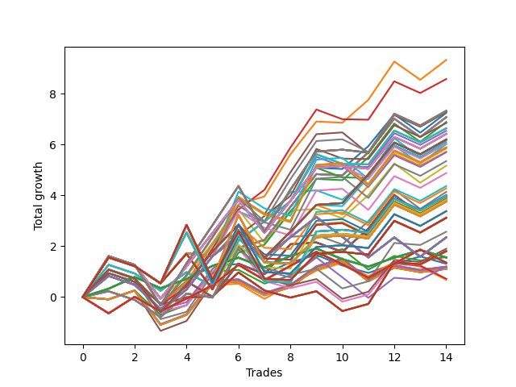

# Long HLT 315 
- Symbol: TSLA
- Date Range: 05/16/2022 - 05/17/2024
- Trading Period: 8:30-12:30
- Number of Trades: 14



| Id. | Name | Win Percent | Profit | Avg Profit / Trade | Avg Time / Trade | Std |      | Name | Win Percent | Profit | Avg Profit / Trade | Avg Time / Trade | Std |
| --- | ---- | ----------- | ------ | ------------------ | ---------------- | --- | ---- | ---- | ----------- | ------ | ------------------ | ---------------- | --- |
| | Sorted By <br> Profit | | | | | | | Sorted By <br> Win Percentage |||||
|0| TP-1.5 60m | 71.43 | 9.33 | 0.67 | 44:12 | 0.97 |     | TP-1.5 60m | 71.43 | 9.33 | 0.67 | 44:12 | 0.97 |
|1| TP-1.5 75m | 64.29 | 8.58 | 0.61 | 50:21 | 0.99 |     | TP-1 180m | 71.43 | 6.20 | 0.44 | 39:42 | 0.91 |
|2| TP-1.5 105m | 64.29 | 7.34 | 0.52 | 57:17 | 1.08 |     | TP-1 165m | 71.43 | 6.20 | 0.44 | 39:42 | 0.91 |
|3| TP-1.5 180m | 64.29 | 7.32 | 0.52 | 58:47 | 1.19 |     | TP-1 150m | 71.43 | 6.20 | 0.44 | 39:42 | 0.91 |
|4| TP-1.5 165m | 64.29 | 7.32 | 0.52 | 58:47 | 1.19 |     | TP-1 135m | 71.43 | 6.20 | 0.44 | 39:42 | 0.91 |
|5| TP-1.5 150m | 64.29 | 7.32 | 0.52 | 58:47 | 1.19 |     | TP-1 120m | 71.43 | 6.20 | 0.44 | 39:42 | 0.91 |
|6| TP-1.5 135m | 64.29 | 7.32 | 0.52 | 58:47 | 1.19 |     | TP-1 105m | 71.43 | 6.20 | 0.44 | 39:42 | 0.91 |
|7| TP-1.5 120m | 64.29 | 7.32 | 0.52 | 58:47 | 1.19 |     | TP-1 90m | 71.43 | 6.20 | 0.44 | 39:42 | 0.91 |
|8| TP-1.5 90m | 64.29 | 7.28 | 0.52 | 54:04 | 1.08 |     | TP-1.5 75m | 64.29 | 8.58 | 0.61 | 50:21 | 0.99 |
|9| TP-1.25 60m | 64.29 | 7.25 | 0.52 | 38:30 | 1.01 |     | TP-1.5 105m | 64.29 | 7.34 | 0.52 | 57:17 | 1.08 |
|10| TP-3 60m | 64.29 | 7.08 | 0.51 | 54:34 | 0.80 |     | TP-1.5 180m | 64.29 | 7.32 | 0.52 | 58:47 | 1.19 |
|11| TP-2.75 60m | 64.29 | 7.08 | 0.51 | 54:34 | 0.80 |     | TP-1.5 165m | 64.29 | 7.32 | 0.52 | 58:47 | 1.19 |
|12| TP-2.5 60m | 64.29 | 7.08 | 0.51 | 54:34 | 0.80 |     | TP-1.5 150m | 64.29 | 7.32 | 0.52 | 58:47 | 1.19 |
|13| TP-2.25 60m | 64.29 | 7.08 | 0.51 | 54:34 | 0.80 |     | TP-1.5 135m | 64.29 | 7.32 | 0.52 | 58:47 | 1.19 |
|14| TP-2 60m | 64.29 | 7.08 | 0.51 | 54:34 | 0.80 |     | TP-1.5 120m | 64.29 | 7.32 | 0.52 | 58:47 | 1.19 |
|15| TP-1.75 60m | 64.29 | 6.89 | 0.49 | 54:04 | 0.78 |     | TP-1.5 90m | 64.29 | 7.28 | 0.52 | 54:04 | 1.08 |
|16| TP-2 75m | 57.14 | 6.85 | 0.49 | 64:42 | 0.87 |     | TP-1.25 60m | 64.29 | 7.25 | 0.52 | 38:30 | 1.01 |
|17| TP-3 75m | 57.14 | 6.64 | 0.47 | 65:42 | 0.85 |     | TP-3 60m | 64.29 | 7.08 | 0.51 | 54:34 | 0.80 |
|18| TP-2.75 75m | 57.14 | 6.64 | 0.47 | 65:42 | 0.85 |     | TP-2.75 60m | 64.29 | 7.08 | 0.51 | 54:34 | 0.80 |
|19| TP-2.5 75m | 57.14 | 6.64 | 0.47 | 65:42 | 0.85 |     | TP-2.5 60m | 64.29 | 7.08 | 0.51 | 54:34 | 0.80 |
|20| TP-2.25 75m | 57.14 | 6.64 | 0.47 | 65:42 | 0.85 |     | TP-2.25 60m | 64.29 | 7.08 | 0.51 | 54:34 | 0.80 |
|21| TP-1.75 75m | 57.14 | 6.54 | 0.47 | 63:38 | 0.84 |     | TP-2 60m | 64.29 | 7.08 | 0.51 | 54:34 | 0.80 |
|22| TP-1.25 180m | 64.29 | 6.42 | 0.46 | 45:51 | 0.99 |     | TP-1.75 60m | 64.29 | 6.89 | 0.49 | 54:04 | 0.78 |
|23| TP-1.25 165m | 64.29 | 6.42 | 0.46 | 45:51 | 0.99 |     | TP-1.25 180m | 64.29 | 6.42 | 0.46 | 45:51 | 0.99 |
|24| TP-1.25 150m | 64.29 | 6.42 | 0.46 | 45:51 | 0.99 |     | TP-1.25 165m | 64.29 | 6.42 | 0.46 | 45:51 | 0.99 |
|25| TP-1.25 135m | 64.29 | 6.42 | 0.46 | 45:51 | 0.99 |     | TP-1.25 150m | 64.29 | 6.42 | 0.46 | 45:51 | 0.99 |
|26| TP-1.25 120m | 64.29 | 6.42 | 0.46 | 45:51 | 0.99 |     | TP-1.25 135m | 64.29 | 6.42 | 0.46 | 45:51 | 0.99 |
|27| TP-1 180m | 71.43 | 6.20 | 0.44 | 39:42 | 0.91 |     | TP-1.25 120m | 64.29 | 6.42 | 0.46 | 45:51 | 0.99 |
|28| TP-1 165m | 71.43 | 6.20 | 0.44 | 39:42 | 0.91 |     | TP-1.5 45m | 64.29 | 6.16 | 0.44 | 35:55 | 0.97 |
|29| TP-1 150m | 71.43 | 6.20 | 0.44 | 39:42 | 0.91 |     | TP-1.25 105m | 64.29 | 6.03 | 0.43 | 44:47 | 1.01 |
|30| TP-1 135m | 71.43 | 6.20 | 0.44 | 39:42 | 0.91 |     | TP-1 60m | 64.29 | 6.02 | 0.43 | 36:38 | 0.94 |
|31| TP-1 120m | 71.43 | 6.20 | 0.44 | 39:42 | 0.91 |     | TP-1 75m | 64.29 | 5.72 | 0.41 | 39:12 | 0.93 |
|32| TP-1 105m | 71.43 | 6.20 | 0.44 | 39:42 | 0.91 |     | TP-1.25 90m | 64.29 | 5.70 | 0.41 | 43:42 | 1.03 |
|33| TP-1 90m | 71.43 | 6.20 | 0.44 | 39:42 | 0.91 |     | TP-1.25 45m | 64.29 | 5.17 | 0.37 | 33:21 | 0.99 |
|34| TP-1.5 45m | 64.29 | 6.16 | 0.44 | 35:55 | 0.97 |     | TP-1 45m | 64.29 | 4.14 | 0.30 | 31:42 | 0.91 |
|35| TP-2.5 90m | 50.00 | 6.10 | 0.44 | 73:21 | 1.09 |     | TP-0.75 15m | 64.29 | 1.57 | 0.11 | 13:08 | 0.58 |
|36| TP-1.25 105m | 64.29 | 6.03 | 0.43 | 44:47 | 1.01 |     | TP-0.25 180m | 64.29 | 1.56 | 0.11 | 05:30 | 0.36 |
|37| TP-1.25 75m | 57.14 | 6.03 | 0.43 | 42:08 | 1.00 |     | TP-0.25 165m | 64.29 | 1.56 | 0.11 | 05:30 | 0.36 |
|38| TP-1 60m | 64.29 | 6.02 | 0.43 | 36:38 | 0.94 |     | TP-0.25 150m | 64.29 | 1.56 | 0.11 | 05:30 | 0.36 |
|39| TP-3 90m | 50.00 | 5.89 | 0.42 | 73:47 | 1.06 |     | TP-0.25 135m | 64.29 | 1.56 | 0.11 | 05:30 | 0.36 |
|40| TP-2.75 90m | 50.00 | 5.89 | 0.42 | 73:47 | 1.06 |     | TP-0.25 120m | 64.29 | 1.56 | 0.11 | 05:30 | 0.36 |
|41| TP-2.25 90m | 50.00 | 5.84 | 0.42 | 73:08 | 1.06 |     | TP-0.25 105m | 64.29 | 1.56 | 0.11 | 05:30 | 0.36 |
|42| TP-1 75m | 64.29 | 5.72 | 0.41 | 39:12 | 0.93 |     | TP-0.25 90m | 64.29 | 1.56 | 0.11 | 05:30 | 0.36 |
|43| TP-1.25 90m | 64.29 | 5.70 | 0.41 | 43:42 | 1.03 |     | TP-0.25 75m | 64.29 | 1.56 | 0.11 | 05:30 | 0.36 |
|44| TP-2 90m | 50.00 | 5.35 | 0.38 | 71:21 | 1.00 |     | TP-0.25 60m | 64.29 | 1.56 | 0.11 | 05:30 | 0.36 |
|45| TP-1.25 45m | 64.29 | 5.17 | 0.37 | 33:21 | 0.99 |     | TP-0.25 45m | 64.29 | 1.56 | 0.11 | 05:30 | 0.36 |
|46| TP-1.75 90m | 50.00 | 4.88 | 0.35 | 69:34 | 0.94 |     | TP-0.25 30m | 64.29 | 1.56 | 0.11 | 05:30 | 0.36 |
|47| TP-2 105m | 50.00 | 4.37 | 0.31 | 76:04 | 1.08 |     | TP-0.25 15m | 64.29 | 1.31 | 0.09 | 05:12 | 0.36 |
|48| TP-2.5 105m | 50.00 | 4.28 | 0.31 | 79:08 | 1.09 |     | TP-1.25 15m | 64.29 | 1.20 | 0.09 | 13:12 | 0.64 |
|49| TP-1 45m | 64.29 | 4.14 | 0.30 | 31:42 | 0.91 |     | TP-1 15m | 64.29 | 1.20 | 0.09 | 13:12 | 0.64 |
|50| TP-2.25 105m | 50.00 | 4.02 | 0.29 | 78:55 | 1.06 |     | TP-1.5 15m | 64.29 | 1.13 | 0.08 | 13:30 | 0.71 |
|51| TP-2 180m | 50.00 | 3.99 | 0.29 | 79:30 | 1.31 |     | TP-3 15m | 64.29 | 1.11 | 0.08 | 14:00 | 0.63 |
|52| TP-2 165m | 50.00 | 3.99 | 0.29 | 79:30 | 1.31 |     | TP-2.75 15m | 64.29 | 1.11 | 0.08 | 14:00 | 0.63 |
|53| TP-2 150m | 50.00 | 3.99 | 0.29 | 79:30 | 1.31 |     | TP-2.5 15m | 64.29 | 1.11 | 0.08 | 14:00 | 0.63 |
|54| TP-2 135m | 50.00 | 3.99 | 0.29 | 79:30 | 1.31 |     | TP-2.25 15m | 64.29 | 1.11 | 0.08 | 14:00 | 0.63 |
|55| TP-2 120m | 50.00 | 3.99 | 0.29 | 79:30 | 1.31 |     | TP-2 15m | 64.29 | 1.11 | 0.08 | 14:00 | 0.63 |
|56| TP-3 45m | 57.14 | 3.93 | 0.28 | 42:21 | 0.79 |     | TP-1.75 15m | 64.29 | 1.11 | 0.08 | 14:00 | 0.63 |
|57| TP-2.75 45m | 57.14 | 3.93 | 0.28 | 42:21 | 0.79 |     | TP-2 75m | 57.14 | 6.85 | 0.49 | 64:42 | 0.87 |
|58| TP-2.5 45m | 57.14 | 3.93 | 0.28 | 42:21 | 0.79 |     | TP-3 75m | 57.14 | 6.64 | 0.47 | 65:42 | 0.85 |
|59| TP-2.25 45m | 57.14 | 3.93 | 0.28 | 42:21 | 0.79 |     | TP-2.75 75m | 57.14 | 6.64 | 0.47 | 65:42 | 0.85 |
|60| TP-2 45m | 57.14 | 3.93 | 0.28 | 42:21 | 0.79 |     | TP-2.5 75m | 57.14 | 6.64 | 0.47 | 65:42 | 0.85 |
|61| TP-1.75 45m | 57.14 | 3.93 | 0.28 | 42:21 | 0.79 |     | TP-2.25 75m | 57.14 | 6.64 | 0.47 | 65:42 | 0.85 |
|62| TP-1.75 105m | 50.00 | 3.90 | 0.28 | 74:17 | 1.03 |     | TP-1.75 75m | 57.14 | 6.54 | 0.47 | 63:38 | 0.84 |
|63| TP-3 105m | 50.00 | 3.86 | 0.28 | 80:38 | 1.04 |     | TP-1.25 75m | 57.14 | 6.03 | 0.43 | 42:08 | 1.00 |
|64| TP-2.75 105m | 50.00 | 3.86 | 0.28 | 80:38 | 1.04 |     | TP-3 45m | 57.14 | 3.93 | 0.28 | 42:21 | 0.79 |
|65| TP-1.75 180m | 50.00 | 3.83 | 0.27 | 76:42 | 1.23 |     | TP-2.75 45m | 57.14 | 3.93 | 0.28 | 42:21 | 0.79 |
|66| TP-1.75 165m | 50.00 | 3.83 | 0.27 | 76:42 | 1.23 |     | TP-2.5 45m | 57.14 | 3.93 | 0.28 | 42:21 | 0.79 |
|67| TP-1.75 150m | 50.00 | 3.83 | 0.27 | 76:42 | 1.23 |     | TP-2.25 45m | 57.14 | 3.93 | 0.28 | 42:21 | 0.79 |
|68| TP-1.75 135m | 50.00 | 3.83 | 0.27 | 76:42 | 1.23 |     | TP-2 45m | 57.14 | 3.93 | 0.28 | 42:21 | 0.79 |
|69| TP-1.75 120m | 50.00 | 3.83 | 0.27 | 76:42 | 1.23 |     | TP-1.75 45m | 57.14 | 3.93 | 0.28 | 42:21 | 0.79 |
|70| TP-2.5 180m | 50.00 | 3.76 | 0.27 | 84:30 | 1.34 |     | TP-1.5 30m | 57.14 | 2.57 | 0.18 | 26:00 | 0.86 |
|71| TP-2.5 165m | 50.00 | 3.76 | 0.27 | 84:30 | 1.34 |     | TP-0.75 180m | 57.14 | 2.35 | 0.17 | 23:30 | 0.82 |
|72| TP-2.5 150m | 50.00 | 3.76 | 0.27 | 84:30 | 1.34 |     | TP-0.75 165m | 57.14 | 2.35 | 0.17 | 23:30 | 0.82 |
|73| TP-2.5 135m | 50.00 | 3.76 | 0.27 | 84:30 | 1.34 |     | TP-0.75 150m | 57.14 | 2.35 | 0.17 | 23:30 | 0.82 |
|74| TP-2.5 120m | 50.00 | 3.76 | 0.27 | 84:30 | 1.34 |     | TP-0.75 135m | 57.14 | 2.35 | 0.17 | 23:30 | 0.82 |
|75| TP-2.25 180m | 50.00 | 3.38 | 0.24 | 84:08 | 1.33 |     | TP-0.75 120m | 57.14 | 2.35 | 0.17 | 23:30 | 0.82 |
|76| TP-2.25 165m | 50.00 | 3.38 | 0.24 | 84:08 | 1.33 |     | TP-0.75 105m | 57.14 | 2.35 | 0.17 | 23:30 | 0.82 |
|77| TP-2.25 150m | 50.00 | 3.38 | 0.24 | 84:08 | 1.33 |     | TP-0.75 90m | 57.14 | 2.35 | 0.17 | 23:30 | 0.82 |
|78| TP-2.25 135m | 50.00 | 3.38 | 0.24 | 84:08 | 1.33 |     | TP-0.75 75m | 57.14 | 2.35 | 0.17 | 23:30 | 0.82 |
|79| TP-2.25 120m | 50.00 | 3.38 | 0.24 | 84:08 | 1.33 |     | TP-0.75 60m | 57.14 | 2.35 | 0.17 | 23:30 | 0.82 |
|80| TP-3 180m | 50.00 | 3.12 | 0.22 | 87:04 | 1.27 |     | TP-0.75 45m | 57.14 | 2.35 | 0.17 | 23:30 | 0.82 |
|81| TP-2.75 180m | 50.00 | 3.12 | 0.22 | 87:04 | 1.27 |     | TP-1 30m | 57.14 | 1.90 | 0.14 | 24:17 | 0.85 |
|82| TP-3 165m | 50.00 | 3.12 | 0.22 | 87:04 | 1.27 |     | TP-3 30m | 57.14 | 1.81 | 0.13 | 29:00 | 0.73 |
|83| TP-2.75 165m | 50.00 | 3.12 | 0.22 | 87:04 | 1.27 |     | TP-2.75 30m | 57.14 | 1.81 | 0.13 | 29:00 | 0.73 |
|84| TP-3 150m | 50.00 | 3.12 | 0.22 | 87:04 | 1.27 |     | TP-2.5 30m | 57.14 | 1.81 | 0.13 | 29:00 | 0.73 |
|85| TP-2.75 150m | 50.00 | 3.12 | 0.22 | 87:04 | 1.27 |     | TP-2.25 30m | 57.14 | 1.81 | 0.13 | 29:00 | 0.73 |
|86| TP-3 135m | 50.00 | 3.12 | 0.22 | 87:04 | 1.27 |     | TP-2 30m | 57.14 | 1.81 | 0.13 | 29:00 | 0.73 |
|87| TP-2.75 135m | 50.00 | 3.12 | 0.22 | 87:04 | 1.27 |     | TP-1.75 30m | 57.14 | 1.81 | 0.13 | 29:00 | 0.73 |
|88| TP-3 120m | 50.00 | 3.12 | 0.22 | 87:04 | 1.27 |     | TP-1.25 30m | 57.14 | 1.79 | 0.13 | 24:34 | 0.84 |
|89| TP-2.75 120m | 50.00 | 3.12 | 0.22 | 87:04 | 1.27 |     | TP-0.5 180m | 57.14 | 1.35 | 0.10 | 11:55 | 0.57 |
|90| TP-1.5 30m | 57.14 | 2.57 | 0.18 | 26:00 | 0.86 |     | TP-0.5 165m | 57.14 | 1.35 | 0.10 | 11:55 | 0.57 |
|91| TP-0.75 180m | 57.14 | 2.35 | 0.17 | 23:30 | 0.82 |     | TP-0.5 150m | 57.14 | 1.35 | 0.10 | 11:55 | 0.57 |
|92| TP-0.75 165m | 57.14 | 2.35 | 0.17 | 23:30 | 0.82 |     | TP-0.5 135m | 57.14 | 1.35 | 0.10 | 11:55 | 0.57 |
|93| TP-0.75 150m | 57.14 | 2.35 | 0.17 | 23:30 | 0.82 |     | TP-0.5 120m | 57.14 | 1.35 | 0.10 | 11:55 | 0.57 |
|94| TP-0.75 135m | 57.14 | 2.35 | 0.17 | 23:30 | 0.82 |     | TP-0.5 105m | 57.14 | 1.35 | 0.10 | 11:55 | 0.57 |
|95| TP-0.75 120m | 57.14 | 2.35 | 0.17 | 23:30 | 0.82 |     | TP-0.5 90m | 57.14 | 1.35 | 0.10 | 11:55 | 0.57 |
|96| TP-0.75 105m | 57.14 | 2.35 | 0.17 | 23:30 | 0.82 |     | TP-0.5 75m | 57.14 | 1.35 | 0.10 | 11:55 | 0.57 |
|97| TP-0.75 90m | 57.14 | 2.35 | 0.17 | 23:30 | 0.82 |     | TP-0.5 60m | 57.14 | 1.35 | 0.10 | 11:55 | 0.57 |
|98| TP-0.75 75m | 57.14 | 2.35 | 0.17 | 23:30 | 0.82 |     | TP-0.5 45m | 57.14 | 1.35 | 0.10 | 11:55 | 0.57 |
|99| TP-0.75 60m | 57.14 | 2.35 | 0.17 | 23:30 | 0.82 |     | TP-0.5 15m | 57.14 | 0.68 | 0.05 | 09:17 | 0.51 |
|100| TP-0.75 45m | 57.14 | 2.35 | 0.17 | 23:30 | 0.82 |     | TP-2.5 90m | 50.00 | 6.10 | 0.44 | 73:21 | 1.09 |
|101| TP-1 30m | 57.14 | 1.90 | 0.14 | 24:17 | 0.85 |     | TP-3 90m | 50.00 | 5.89 | 0.42 | 73:47 | 1.06 |
|102| TP-3 30m | 57.14 | 1.81 | 0.13 | 29:00 | 0.73 |     | TP-2.75 90m | 50.00 | 5.89 | 0.42 | 73:47 | 1.06 |
|103| TP-2.75 30m | 57.14 | 1.81 | 0.13 | 29:00 | 0.73 |     | TP-2.25 90m | 50.00 | 5.84 | 0.42 | 73:08 | 1.06 |
|104| TP-2.5 30m | 57.14 | 1.81 | 0.13 | 29:00 | 0.73 |     | TP-2 90m | 50.00 | 5.35 | 0.38 | 71:21 | 1.00 |
|105| TP-2.25 30m | 57.14 | 1.81 | 0.13 | 29:00 | 0.73 |     | TP-1.75 90m | 50.00 | 4.88 | 0.35 | 69:34 | 0.94 |
|106| TP-2 30m | 57.14 | 1.81 | 0.13 | 29:00 | 0.73 |     | TP-2 105m | 50.00 | 4.37 | 0.31 | 76:04 | 1.08 |
|107| TP-1.75 30m | 57.14 | 1.81 | 0.13 | 29:00 | 0.73 |     | TP-2.5 105m | 50.00 | 4.28 | 0.31 | 79:08 | 1.09 |
|108| TP-1.25 30m | 57.14 | 1.79 | 0.13 | 24:34 | 0.84 |     | TP-2.25 105m | 50.00 | 4.02 | 0.29 | 78:55 | 1.06 |
|109| TP-0.75 15m | 64.29 | 1.57 | 0.11 | 13:08 | 0.58 |     | TP-2 180m | 50.00 | 3.99 | 0.29 | 79:30 | 1.31 |
|110| TP-0.25 180m | 64.29 | 1.56 | 0.11 | 05:30 | 0.36 |     | TP-2 165m | 50.00 | 3.99 | 0.29 | 79:30 | 1.31 |
|111| TP-0.25 165m | 64.29 | 1.56 | 0.11 | 05:30 | 0.36 |     | TP-2 150m | 50.00 | 3.99 | 0.29 | 79:30 | 1.31 |
|112| TP-0.25 150m | 64.29 | 1.56 | 0.11 | 05:30 | 0.36 |     | TP-2 135m | 50.00 | 3.99 | 0.29 | 79:30 | 1.31 |
|113| TP-0.25 135m | 64.29 | 1.56 | 0.11 | 05:30 | 0.36 |     | TP-2 120m | 50.00 | 3.99 | 0.29 | 79:30 | 1.31 |
|114| TP-0.25 120m | 64.29 | 1.56 | 0.11 | 05:30 | 0.36 |     | TP-1.75 105m | 50.00 | 3.90 | 0.28 | 74:17 | 1.03 |
|115| TP-0.25 105m | 64.29 | 1.56 | 0.11 | 05:30 | 0.36 |     | TP-3 105m | 50.00 | 3.86 | 0.28 | 80:38 | 1.04 |
|116| TP-0.25 90m | 64.29 | 1.56 | 0.11 | 05:30 | 0.36 |     | TP-2.75 105m | 50.00 | 3.86 | 0.28 | 80:38 | 1.04 |
|117| TP-0.25 75m | 64.29 | 1.56 | 0.11 | 05:30 | 0.36 |     | TP-1.75 180m | 50.00 | 3.83 | 0.27 | 76:42 | 1.23 |
|118| TP-0.25 60m | 64.29 | 1.56 | 0.11 | 05:30 | 0.36 |     | TP-1.75 165m | 50.00 | 3.83 | 0.27 | 76:42 | 1.23 |
|119| TP-0.25 45m | 64.29 | 1.56 | 0.11 | 05:30 | 0.36 |     | TP-1.75 150m | 50.00 | 3.83 | 0.27 | 76:42 | 1.23 |
|120| TP-0.25 30m | 64.29 | 1.56 | 0.11 | 05:30 | 0.36 |     | TP-1.75 135m | 50.00 | 3.83 | 0.27 | 76:42 | 1.23 |
|121| TP-0.5 180m | 57.14 | 1.35 | 0.10 | 11:55 | 0.57 |     | TP-1.75 120m | 50.00 | 3.83 | 0.27 | 76:42 | 1.23 |
|122| TP-0.5 165m | 57.14 | 1.35 | 0.10 | 11:55 | 0.57 |     | TP-2.5 180m | 50.00 | 3.76 | 0.27 | 84:30 | 1.34 |
|123| TP-0.5 150m | 57.14 | 1.35 | 0.10 | 11:55 | 0.57 |     | TP-2.5 165m | 50.00 | 3.76 | 0.27 | 84:30 | 1.34 |
|124| TP-0.5 135m | 57.14 | 1.35 | 0.10 | 11:55 | 0.57 |     | TP-2.5 150m | 50.00 | 3.76 | 0.27 | 84:30 | 1.34 |
|125| TP-0.5 120m | 57.14 | 1.35 | 0.10 | 11:55 | 0.57 |     | TP-2.5 135m | 50.00 | 3.76 | 0.27 | 84:30 | 1.34 |
|126| TP-0.5 105m | 57.14 | 1.35 | 0.10 | 11:55 | 0.57 |     | TP-2.5 120m | 50.00 | 3.76 | 0.27 | 84:30 | 1.34 |
|127| TP-0.5 90m | 57.14 | 1.35 | 0.10 | 11:55 | 0.57 |     | TP-2.25 180m | 50.00 | 3.38 | 0.24 | 84:08 | 1.33 |
|128| TP-0.5 75m | 57.14 | 1.35 | 0.10 | 11:55 | 0.57 |     | TP-2.25 165m | 50.00 | 3.38 | 0.24 | 84:08 | 1.33 |
|129| TP-0.5 60m | 57.14 | 1.35 | 0.10 | 11:55 | 0.57 |     | TP-2.25 150m | 50.00 | 3.38 | 0.24 | 84:08 | 1.33 |
|130| TP-0.5 45m | 57.14 | 1.35 | 0.10 | 11:55 | 0.57 |     | TP-2.25 135m | 50.00 | 3.38 | 0.24 | 84:08 | 1.33 |
|131| TP-0.25 15m | 64.29 | 1.31 | 0.09 | 05:12 | 0.36 |     | TP-2.25 120m | 50.00 | 3.38 | 0.24 | 84:08 | 1.33 |
|132| TP-1.25 15m | 64.29 | 1.20 | 0.09 | 13:12 | 0.64 |     | TP-3 180m | 50.00 | 3.12 | 0.22 | 87:04 | 1.27 |
|133| TP-1 15m | 64.29 | 1.20 | 0.09 | 13:12 | 0.64 |     | TP-2.75 180m | 50.00 | 3.12 | 0.22 | 87:04 | 1.27 |
|134| TP-0.75 30m | 50.00 | 1.20 | 0.09 | 21:00 | 0.74 |     | TP-3 165m | 50.00 | 3.12 | 0.22 | 87:04 | 1.27 |
|135| TP-1.5 15m | 64.29 | 1.13 | 0.08 | 13:30 | 0.71 |     | TP-2.75 165m | 50.00 | 3.12 | 0.22 | 87:04 | 1.27 |
|136| TP-3 15m | 64.29 | 1.11 | 0.08 | 14:00 | 0.63 |     | TP-3 150m | 50.00 | 3.12 | 0.22 | 87:04 | 1.27 |
|137| TP-2.75 15m | 64.29 | 1.11 | 0.08 | 14:00 | 0.63 |     | TP-2.75 150m | 50.00 | 3.12 | 0.22 | 87:04 | 1.27 |
|138| TP-2.5 15m | 64.29 | 1.11 | 0.08 | 14:00 | 0.63 |     | TP-3 135m | 50.00 | 3.12 | 0.22 | 87:04 | 1.27 |
|139| TP-2.25 15m | 64.29 | 1.11 | 0.08 | 14:00 | 0.63 |     | TP-2.75 135m | 50.00 | 3.12 | 0.22 | 87:04 | 1.27 |
|140| TP-2 15m | 64.29 | 1.11 | 0.08 | 14:00 | 0.63 |     | TP-3 120m | 50.00 | 3.12 | 0.22 | 87:04 | 1.27 |
|141| TP-1.75 15m | 64.29 | 1.11 | 0.08 | 14:00 | 0.63 |     | TP-2.75 120m | 50.00 | 3.12 | 0.22 | 87:04 | 1.27 |
|142| TP-0.5 30m | 50.00 | 0.72 | 0.05 | 11:25 | 0.56 |     | TP-0.75 30m | 50.00 | 1.20 | 0.09 | 21:00 | 0.74 |
|143| TP-0.5 15m | 57.14 | 0.68 | 0.05 | 09:17 | 0.51 |     | TP-0.5 30m | 50.00 | 0.72 | 0.05 | 11:25 | 0.56 |

### Test TP-0.25 15m
* Take Profit of 0.25 Point
* 0.25 Stoploss
* Results:
```
Total Trades: 14
Percent Up: 64.29
Percent Down: 35.71
Total Points Moved Up: 1.31
Potential Profit: 655.00
Total Points Ups: 3.14 Count Ups: 9
Total Points Downs: -1.83 Count Downs: 5
```

<details><summary>Trades</summary>

<code>In: 2022-10-20 11:35:00		Out: 2022-10-20 11:37:00		Total Position Time: 02:00		Total Move Up: 0.33		Total to Date: 0.33</code> <br />
<code>In: 2022-10-27 12:20:00		Out: 2022-10-27 12:22:00		Total Position Time: 02:00		Total Move Up: 0.46		Total to Date: 0.79</code> <br />
<code>In: 2022-11-16 12:00:00		Out: 2022-11-16 12:04:00		Total Position Time: 04:00		Total Move Up: -0.44		Total to Date: 0.35</code> <br />
<code>In: 2023-04-14 09:30:00		Out: 2023-04-14 09:38:00		Total Position Time: 08:00		Total Move Up: 0.36		Total to Date: 0.71</code> <br />
<code>In: 2023-10-18 10:05:00		Out: 2023-10-18 10:12:00		Total Position Time: 07:00		Total Move Up: 0.52		Total to Date: 1.23</code> <br />
<code>In: 2023-11-08 09:45:00		Out: 2023-11-08 09:59:00		Total Position Time: 14:00		Total Move Up: 0.07		Total to Date: 1.30</code> <br />
<code>In: 2023-11-30 08:45:00		Out: 2023-11-30 08:47:00		Total Position Time: 02:00		Total Move Up: -0.39		Total to Date: 0.91</code> <br />
<code>In: 2023-12-05 11:15:00		Out: 2023-12-05 11:17:00		Total Position Time: 02:00		Total Move Up: 0.46		Total to Date: 1.37</code> <br />
<code>In: 2024-01-05 09:40:00		Out: 2024-01-05 09:42:00		Total Position Time: 02:00		Total Move Up: 0.29		Total to Date: 1.66</code> <br />
<code>In: 2024-02-12 11:30:00		Out: 2024-02-12 11:37:00		Total Position Time: 07:00		Total Move Up: -0.42		Total to Date: 1.24</code> <br />
<code>In: 2024-02-21 10:20:00		Out: 2024-02-21 10:28:00		Total Position Time: 08:00		Total Move Up: -0.29		Total to Date: 0.95</code> <br />
<code>In: 2024-02-21 12:15:00		Out: 2024-02-21 12:19:00		Total Position Time: 04:00		Total Move Up: 0.35		Total to Date: 1.30</code> <br />
<code>In: 2024-03-13 11:45:00		Out: 2024-03-13 11:53:00		Total Position Time: 08:00		Total Move Up: 0.30		Total to Date: 1.60</code> <br />
<code>In: 2024-03-21 11:35:00		Out: 2024-03-21 11:38:00		Total Position Time: 03:00		Total Move Up: -0.29		Total to Date: 1.31</code> <br />


</details>

### Test TP-0.5 15m
* Take Profit of 0.5 Point
* 0.5 Stoploss
* Results:
```
Total Trades: 14
Percent Up: 57.14
Percent Down: 42.86
Total Points Moved Up: 0.68
Potential Profit: 340.00
Total Points Ups: 3.72 Count Ups: 8
Total Points Downs: -3.04 Count Downs: 6
```

<details><summary>Trades</summary>

<code>In: 2022-10-20 11:35:00		Out: 2022-10-20 11:46:00		Total Position Time: 11:00		Total Move Up: -0.64		Total to Date: -0.64</code> <br />
<code>In: 2022-10-27 12:20:00		Out: 2022-10-27 12:23:00		Total Position Time: 03:00		Total Move Up: 0.65		Total to Date: 0.01</code> <br />
<code>In: 2022-11-16 12:00:00		Out: 2022-11-16 12:05:00		Total Position Time: 05:00		Total Move Up: -0.57		Total to Date: -0.56</code> <br />
<code>In: 2023-04-14 09:30:00		Out: 2023-04-14 09:43:00		Total Position Time: 13:00		Total Move Up: 0.50		Total to Date: -0.06</code> <br />
<code>In: 2023-10-18 10:05:00		Out: 2023-10-18 10:12:00		Total Position Time: 07:00		Total Move Up: 0.52		Total to Date: 0.46</code> <br />
<code>In: 2023-11-08 09:45:00		Out: 2023-11-08 09:59:00		Total Position Time: 14:00		Total Move Up: 0.07		Total to Date: 0.53</code> <br />
<code>In: 2023-11-30 08:45:00		Out: 2023-11-30 08:57:00		Total Position Time: 12:00		Total Move Up: -0.60		Total to Date: -0.07</code> <br />
<code>In: 2023-12-05 11:15:00		Out: 2023-12-05 11:18:00		Total Position Time: 03:00		Total Move Up: 0.56		Total to Date: 0.49</code> <br />
<code>In: 2024-01-05 09:40:00		Out: 2024-01-05 09:47:00		Total Position Time: 07:00		Total Move Up: 0.55		Total to Date: 1.04</code> <br />
<code>In: 2024-02-12 11:30:00		Out: 2024-02-12 11:44:00		Total Position Time: 14:00		Total Move Up: 0.31		Total to Date: 1.35</code> <br />
<code>In: 2024-02-21 10:20:00		Out: 2024-02-21 10:30:00		Total Position Time: 10:00		Total Move Up: -0.53		Total to Date: 0.82</code> <br />
<code>In: 2024-02-21 12:15:00		Out: 2024-02-21 12:28:00		Total Position Time: 13:00		Total Move Up: 0.56		Total to Date: 1.38</code> <br />
<code>In: 2024-03-13 11:45:00		Out: 2024-03-13 11:59:00		Total Position Time: 14:00		Total Move Up: -0.18		Total to Date: 1.20</code> <br />
<code>In: 2024-03-21 11:35:00		Out: 2024-03-21 11:39:00		Total Position Time: 04:00		Total Move Up: -0.52		Total to Date: 0.68</code> <br />


</details>

### Test TP-0.75 15m
* Take Profit of 0.75 Point
* 0.75 Stoploss
* Results:
```
Total Trades: 14
Percent Up: 64.29
Percent Down: 35.71
Total Points Moved Up: 1.57
Potential Profit: 785.00
Total Points Ups: 4.15 Count Ups: 9
Total Points Downs: -2.58 Count Downs: 5
```

<details><summary>Trades</summary>

<code>In: 2022-10-20 11:35:00		Out: 2022-10-20 11:49:00		Total Position Time: 14:00		Total Move Up: -0.09		Total to Date: -0.09</code> <br />
<code>In: 2022-10-27 12:20:00		Out: 2022-10-27 12:34:00		Total Position Time: 14:00		Total Move Up: 0.35		Total to Date: 0.26</code> <br />
<code>In: 2022-11-16 12:00:00		Out: 2022-11-16 12:07:00		Total Position Time: 07:00		Total Move Up: -0.96		Total to Date: -0.70</code> <br />
<code>In: 2023-04-14 09:30:00		Out: 2023-04-14 09:44:00		Total Position Time: 14:00		Total Move Up: 0.39		Total to Date: -0.31</code> <br />
<code>In: 2023-10-18 10:05:00		Out: 2023-10-18 10:14:00		Total Position Time: 09:00		Total Move Up: 1.31		Total to Date: 1.00</code> <br />
<code>In: 2023-11-08 09:45:00		Out: 2023-11-08 09:59:00		Total Position Time: 14:00		Total Move Up: 0.07		Total to Date: 1.07</code> <br />
<code>In: 2023-11-30 08:45:00		Out: 2023-11-30 08:59:00		Total Position Time: 14:00		Total Move Up: -0.54		Total to Date: 0.53</code> <br />
<code>In: 2023-12-05 11:15:00		Out: 2023-12-05 11:29:00		Total Position Time: 14:00		Total Move Up: 0.32		Total to Date: 0.85</code> <br />
<code>In: 2024-01-05 09:40:00		Out: 2024-01-05 09:54:00		Total Position Time: 14:00		Total Move Up: 0.73		Total to Date: 1.58</code> <br />
<code>In: 2024-02-12 11:30:00		Out: 2024-02-12 11:44:00		Total Position Time: 14:00		Total Move Up: 0.31		Total to Date: 1.89</code> <br />
<code>In: 2024-02-21 10:20:00		Out: 2024-02-21 10:34:00		Total Position Time: 14:00		Total Move Up: -0.81		Total to Date: 1.08</code> <br />
<code>In: 2024-02-21 12:15:00		Out: 2024-02-21 12:29:00		Total Position Time: 14:00		Total Move Up: 0.54		Total to Date: 1.62</code> <br />
<code>In: 2024-03-13 11:45:00		Out: 2024-03-13 11:59:00		Total Position Time: 14:00		Total Move Up: -0.18		Total to Date: 1.44</code> <br />
<code>In: 2024-03-21 11:35:00		Out: 2024-03-21 11:49:00		Total Position Time: 14:00		Total Move Up: 0.13		Total to Date: 1.57</code> <br />


</details>

### Test TP-1 15m
* Take Profit of 1 Point
* 1 Stoploss
* Results:
```
Total Trades: 14
Percent Up: 64.29
Percent Down: 35.71
Total Points Moved Up: 1.20
Potential Profit: 600.00
Total Points Ups: 4.15 Count Ups: 9
Total Points Downs: -2.95 Count Downs: 5
```

<details><summary>Trades</summary>

<code>In: 2022-10-20 11:35:00		Out: 2022-10-20 11:49:00		Total Position Time: 14:00		Total Move Up: -0.09		Total to Date: -0.09</code> <br />
<code>In: 2022-10-27 12:20:00		Out: 2022-10-27 12:34:00		Total Position Time: 14:00		Total Move Up: 0.35		Total to Date: 0.26</code> <br />
<code>In: 2022-11-16 12:00:00		Out: 2022-11-16 12:08:00		Total Position Time: 08:00		Total Move Up: -1.33		Total to Date: -1.07</code> <br />
<code>In: 2023-04-14 09:30:00		Out: 2023-04-14 09:44:00		Total Position Time: 14:00		Total Move Up: 0.39		Total to Date: -0.68</code> <br />
<code>In: 2023-10-18 10:05:00		Out: 2023-10-18 10:14:00		Total Position Time: 09:00		Total Move Up: 1.31		Total to Date: 0.63</code> <br />
<code>In: 2023-11-08 09:45:00		Out: 2023-11-08 09:59:00		Total Position Time: 14:00		Total Move Up: 0.07		Total to Date: 0.70</code> <br />
<code>In: 2023-11-30 08:45:00		Out: 2023-11-30 08:59:00		Total Position Time: 14:00		Total Move Up: -0.54		Total to Date: 0.16</code> <br />
<code>In: 2023-12-05 11:15:00		Out: 2023-12-05 11:29:00		Total Position Time: 14:00		Total Move Up: 0.32		Total to Date: 0.48</code> <br />
<code>In: 2024-01-05 09:40:00		Out: 2024-01-05 09:54:00		Total Position Time: 14:00		Total Move Up: 0.73		Total to Date: 1.21</code> <br />
<code>In: 2024-02-12 11:30:00		Out: 2024-02-12 11:44:00		Total Position Time: 14:00		Total Move Up: 0.31		Total to Date: 1.52</code> <br />
<code>In: 2024-02-21 10:20:00		Out: 2024-02-21 10:34:00		Total Position Time: 14:00		Total Move Up: -0.81		Total to Date: 0.71</code> <br />
<code>In: 2024-02-21 12:15:00		Out: 2024-02-21 12:29:00		Total Position Time: 14:00		Total Move Up: 0.54		Total to Date: 1.25</code> <br />
<code>In: 2024-03-13 11:45:00		Out: 2024-03-13 11:59:00		Total Position Time: 14:00		Total Move Up: -0.18		Total to Date: 1.07</code> <br />
<code>In: 2024-03-21 11:35:00		Out: 2024-03-21 11:49:00		Total Position Time: 14:00		Total Move Up: 0.13		Total to Date: 1.20</code> <br />


</details>

### Test TP-1.25 15m
* Take Profit of 1.25 Point
* 1.25 Stoploss
* Results:
```
Total Trades: 14
Percent Up: 64.29
Percent Down: 35.71
Total Points Moved Up: 1.20
Potential Profit: 600.00
Total Points Ups: 4.15 Count Ups: 9
Total Points Downs: -2.95 Count Downs: 5
```

<details><summary>Trades</summary>

<code>In: 2022-10-20 11:35:00		Out: 2022-10-20 11:49:00		Total Position Time: 14:00		Total Move Up: -0.09		Total to Date: -0.09</code> <br />
<code>In: 2022-10-27 12:20:00		Out: 2022-10-27 12:34:00		Total Position Time: 14:00		Total Move Up: 0.35		Total to Date: 0.26</code> <br />
<code>In: 2022-11-16 12:00:00		Out: 2022-11-16 12:08:00		Total Position Time: 08:00		Total Move Up: -1.33		Total to Date: -1.07</code> <br />
<code>In: 2023-04-14 09:30:00		Out: 2023-04-14 09:44:00		Total Position Time: 14:00		Total Move Up: 0.39		Total to Date: -0.68</code> <br />
<code>In: 2023-10-18 10:05:00		Out: 2023-10-18 10:14:00		Total Position Time: 09:00		Total Move Up: 1.31		Total to Date: 0.63</code> <br />
<code>In: 2023-11-08 09:45:00		Out: 2023-11-08 09:59:00		Total Position Time: 14:00		Total Move Up: 0.07		Total to Date: 0.70</code> <br />
<code>In: 2023-11-30 08:45:00		Out: 2023-11-30 08:59:00		Total Position Time: 14:00		Total Move Up: -0.54		Total to Date: 0.16</code> <br />
<code>In: 2023-12-05 11:15:00		Out: 2023-12-05 11:29:00		Total Position Time: 14:00		Total Move Up: 0.32		Total to Date: 0.48</code> <br />
<code>In: 2024-01-05 09:40:00		Out: 2024-01-05 09:54:00		Total Position Time: 14:00		Total Move Up: 0.73		Total to Date: 1.21</code> <br />
<code>In: 2024-02-12 11:30:00		Out: 2024-02-12 11:44:00		Total Position Time: 14:00		Total Move Up: 0.31		Total to Date: 1.52</code> <br />
<code>In: 2024-02-21 10:20:00		Out: 2024-02-21 10:34:00		Total Position Time: 14:00		Total Move Up: -0.81		Total to Date: 0.71</code> <br />
<code>In: 2024-02-21 12:15:00		Out: 2024-02-21 12:29:00		Total Position Time: 14:00		Total Move Up: 0.54		Total to Date: 1.25</code> <br />
<code>In: 2024-03-13 11:45:00		Out: 2024-03-13 11:59:00		Total Position Time: 14:00		Total Move Up: -0.18		Total to Date: 1.07</code> <br />
<code>In: 2024-03-21 11:35:00		Out: 2024-03-21 11:49:00		Total Position Time: 14:00		Total Move Up: 0.13		Total to Date: 1.20</code> <br />


</details>

### Test TP-1.5 15m
* Take Profit of 1.5 Point
* 1.5 Stoploss
* Results:
```
Total Trades: 14
Percent Up: 64.29
Percent Down: 35.71
Total Points Moved Up: 1.13
Potential Profit: 565.00
Total Points Ups: 4.34 Count Ups: 9
Total Points Downs: -3.21 Count Downs: 5
```

<details><summary>Trades</summary>

<code>In: 2022-10-20 11:35:00		Out: 2022-10-20 11:49:00		Total Position Time: 14:00		Total Move Up: -0.09		Total to Date: -0.09</code> <br />
<code>In: 2022-10-27 12:20:00		Out: 2022-10-27 12:34:00		Total Position Time: 14:00		Total Move Up: 0.35		Total to Date: 0.26</code> <br />
<code>In: 2022-11-16 12:00:00		Out: 2022-11-16 12:09:00		Total Position Time: 09:00		Total Move Up: -1.59		Total to Date: -1.33</code> <br />
<code>In: 2023-04-14 09:30:00		Out: 2023-04-14 09:44:00		Total Position Time: 14:00		Total Move Up: 0.39		Total to Date: -0.94</code> <br />
<code>In: 2023-10-18 10:05:00		Out: 2023-10-18 10:17:00		Total Position Time: 12:00		Total Move Up: 1.50		Total to Date: 0.56</code> <br />
<code>In: 2023-11-08 09:45:00		Out: 2023-11-08 09:59:00		Total Position Time: 14:00		Total Move Up: 0.07		Total to Date: 0.63</code> <br />
<code>In: 2023-11-30 08:45:00		Out: 2023-11-30 08:59:00		Total Position Time: 14:00		Total Move Up: -0.54		Total to Date: 0.09</code> <br />
<code>In: 2023-12-05 11:15:00		Out: 2023-12-05 11:29:00		Total Position Time: 14:00		Total Move Up: 0.32		Total to Date: 0.41</code> <br />
<code>In: 2024-01-05 09:40:00		Out: 2024-01-05 09:54:00		Total Position Time: 14:00		Total Move Up: 0.73		Total to Date: 1.14</code> <br />
<code>In: 2024-02-12 11:30:00		Out: 2024-02-12 11:44:00		Total Position Time: 14:00		Total Move Up: 0.31		Total to Date: 1.45</code> <br />
<code>In: 2024-02-21 10:20:00		Out: 2024-02-21 10:34:00		Total Position Time: 14:00		Total Move Up: -0.81		Total to Date: 0.64</code> <br />
<code>In: 2024-02-21 12:15:00		Out: 2024-02-21 12:29:00		Total Position Time: 14:00		Total Move Up: 0.54		Total to Date: 1.18</code> <br />
<code>In: 2024-03-13 11:45:00		Out: 2024-03-13 11:59:00		Total Position Time: 14:00		Total Move Up: -0.18		Total to Date: 1.00</code> <br />
<code>In: 2024-03-21 11:35:00		Out: 2024-03-21 11:49:00		Total Position Time: 14:00		Total Move Up: 0.13		Total to Date: 1.13</code> <br />


</details>

### Test TP-1.75 15m
* Take Profit of 1.75 Point
* 1.75 Stoploss
* Results:
```
Total Trades: 14
Percent Up: 64.29
Percent Down: 35.71
Total Points Moved Up: 1.11
Potential Profit: 555.00
Total Points Ups: 4.08 Count Ups: 9
Total Points Downs: -2.97 Count Downs: 5
```

<details><summary>Trades</summary>

<code>In: 2022-10-20 11:35:00		Out: 2022-10-20 11:49:00		Total Position Time: 14:00		Total Move Up: -0.09		Total to Date: -0.09</code> <br />
<code>In: 2022-10-27 12:20:00		Out: 2022-10-27 12:34:00		Total Position Time: 14:00		Total Move Up: 0.35		Total to Date: 0.26</code> <br />
<code>In: 2022-11-16 12:00:00		Out: 2022-11-16 12:14:00		Total Position Time: 14:00		Total Move Up: -1.35		Total to Date: -1.09</code> <br />
<code>In: 2023-04-14 09:30:00		Out: 2023-04-14 09:44:00		Total Position Time: 14:00		Total Move Up: 0.39		Total to Date: -0.70</code> <br />
<code>In: 2023-10-18 10:05:00		Out: 2023-10-18 10:19:00		Total Position Time: 14:00		Total Move Up: 1.24		Total to Date: 0.54</code> <br />
<code>In: 2023-11-08 09:45:00		Out: 2023-11-08 09:59:00		Total Position Time: 14:00		Total Move Up: 0.07		Total to Date: 0.61</code> <br />
<code>In: 2023-11-30 08:45:00		Out: 2023-11-30 08:59:00		Total Position Time: 14:00		Total Move Up: -0.54		Total to Date: 0.07</code> <br />
<code>In: 2023-12-05 11:15:00		Out: 2023-12-05 11:29:00		Total Position Time: 14:00		Total Move Up: 0.32		Total to Date: 0.39</code> <br />
<code>In: 2024-01-05 09:40:00		Out: 2024-01-05 09:54:00		Total Position Time: 14:00		Total Move Up: 0.73		Total to Date: 1.12</code> <br />
<code>In: 2024-02-12 11:30:00		Out: 2024-02-12 11:44:00		Total Position Time: 14:00		Total Move Up: 0.31		Total to Date: 1.43</code> <br />
<code>In: 2024-02-21 10:20:00		Out: 2024-02-21 10:34:00		Total Position Time: 14:00		Total Move Up: -0.81		Total to Date: 0.62</code> <br />
<code>In: 2024-02-21 12:15:00		Out: 2024-02-21 12:29:00		Total Position Time: 14:00		Total Move Up: 0.54		Total to Date: 1.16</code> <br />
<code>In: 2024-03-13 11:45:00		Out: 2024-03-13 11:59:00		Total Position Time: 14:00		Total Move Up: -0.18		Total to Date: 0.98</code> <br />
<code>In: 2024-03-21 11:35:00		Out: 2024-03-21 11:49:00		Total Position Time: 14:00		Total Move Up: 0.13		Total to Date: 1.11</code> <br />


</details>

### Test TP-2 15m
* Take Profit of 2 Point
* 2 Stoploss
* Results:
```
Total Trades: 14
Percent Up: 64.29
Percent Down: 35.71
Total Points Moved Up: 1.11
Potential Profit: 555.00
Total Points Ups: 4.08 Count Ups: 9
Total Points Downs: -2.97 Count Downs: 5
```

<details><summary>Trades</summary>

<code>In: 2022-10-20 11:35:00		Out: 2022-10-20 11:49:00		Total Position Time: 14:00		Total Move Up: -0.09		Total to Date: -0.09</code> <br />
<code>In: 2022-10-27 12:20:00		Out: 2022-10-27 12:34:00		Total Position Time: 14:00		Total Move Up: 0.35		Total to Date: 0.26</code> <br />
<code>In: 2022-11-16 12:00:00		Out: 2022-11-16 12:14:00		Total Position Time: 14:00		Total Move Up: -1.35		Total to Date: -1.09</code> <br />
<code>In: 2023-04-14 09:30:00		Out: 2023-04-14 09:44:00		Total Position Time: 14:00		Total Move Up: 0.39		Total to Date: -0.70</code> <br />
<code>In: 2023-10-18 10:05:00		Out: 2023-10-18 10:19:00		Total Position Time: 14:00		Total Move Up: 1.24		Total to Date: 0.54</code> <br />
<code>In: 2023-11-08 09:45:00		Out: 2023-11-08 09:59:00		Total Position Time: 14:00		Total Move Up: 0.07		Total to Date: 0.61</code> <br />
<code>In: 2023-11-30 08:45:00		Out: 2023-11-30 08:59:00		Total Position Time: 14:00		Total Move Up: -0.54		Total to Date: 0.07</code> <br />
<code>In: 2023-12-05 11:15:00		Out: 2023-12-05 11:29:00		Total Position Time: 14:00		Total Move Up: 0.32		Total to Date: 0.39</code> <br />
<code>In: 2024-01-05 09:40:00		Out: 2024-01-05 09:54:00		Total Position Time: 14:00		Total Move Up: 0.73		Total to Date: 1.12</code> <br />
<code>In: 2024-02-12 11:30:00		Out: 2024-02-12 11:44:00		Total Position Time: 14:00		Total Move Up: 0.31		Total to Date: 1.43</code> <br />
<code>In: 2024-02-21 10:20:00		Out: 2024-02-21 10:34:00		Total Position Time: 14:00		Total Move Up: -0.81		Total to Date: 0.62</code> <br />
<code>In: 2024-02-21 12:15:00		Out: 2024-02-21 12:29:00		Total Position Time: 14:00		Total Move Up: 0.54		Total to Date: 1.16</code> <br />
<code>In: 2024-03-13 11:45:00		Out: 2024-03-13 11:59:00		Total Position Time: 14:00		Total Move Up: -0.18		Total to Date: 0.98</code> <br />
<code>In: 2024-03-21 11:35:00		Out: 2024-03-21 11:49:00		Total Position Time: 14:00		Total Move Up: 0.13		Total to Date: 1.11</code> <br />


</details>

### Test TP-2.25 15m
* Take Profit of 2.25 Point
* 2.25 Stoploss
* Results:
```
Total Trades: 14
Percent Up: 64.29
Percent Down: 35.71
Total Points Moved Up: 1.11
Potential Profit: 555.00
Total Points Ups: 4.08 Count Ups: 9
Total Points Downs: -2.97 Count Downs: 5
```

<details><summary>Trades</summary>

<code>In: 2022-10-20 11:35:00		Out: 2022-10-20 11:49:00		Total Position Time: 14:00		Total Move Up: -0.09		Total to Date: -0.09</code> <br />
<code>In: 2022-10-27 12:20:00		Out: 2022-10-27 12:34:00		Total Position Time: 14:00		Total Move Up: 0.35		Total to Date: 0.26</code> <br />
<code>In: 2022-11-16 12:00:00		Out: 2022-11-16 12:14:00		Total Position Time: 14:00		Total Move Up: -1.35		Total to Date: -1.09</code> <br />
<code>In: 2023-04-14 09:30:00		Out: 2023-04-14 09:44:00		Total Position Time: 14:00		Total Move Up: 0.39		Total to Date: -0.70</code> <br />
<code>In: 2023-10-18 10:05:00		Out: 2023-10-18 10:19:00		Total Position Time: 14:00		Total Move Up: 1.24		Total to Date: 0.54</code> <br />
<code>In: 2023-11-08 09:45:00		Out: 2023-11-08 09:59:00		Total Position Time: 14:00		Total Move Up: 0.07		Total to Date: 0.61</code> <br />
<code>In: 2023-11-30 08:45:00		Out: 2023-11-30 08:59:00		Total Position Time: 14:00		Total Move Up: -0.54		Total to Date: 0.07</code> <br />
<code>In: 2023-12-05 11:15:00		Out: 2023-12-05 11:29:00		Total Position Time: 14:00		Total Move Up: 0.32		Total to Date: 0.39</code> <br />
<code>In: 2024-01-05 09:40:00		Out: 2024-01-05 09:54:00		Total Position Time: 14:00		Total Move Up: 0.73		Total to Date: 1.12</code> <br />
<code>In: 2024-02-12 11:30:00		Out: 2024-02-12 11:44:00		Total Position Time: 14:00		Total Move Up: 0.31		Total to Date: 1.43</code> <br />
<code>In: 2024-02-21 10:20:00		Out: 2024-02-21 10:34:00		Total Position Time: 14:00		Total Move Up: -0.81		Total to Date: 0.62</code> <br />
<code>In: 2024-02-21 12:15:00		Out: 2024-02-21 12:29:00		Total Position Time: 14:00		Total Move Up: 0.54		Total to Date: 1.16</code> <br />
<code>In: 2024-03-13 11:45:00		Out: 2024-03-13 11:59:00		Total Position Time: 14:00		Total Move Up: -0.18		Total to Date: 0.98</code> <br />
<code>In: 2024-03-21 11:35:00		Out: 2024-03-21 11:49:00		Total Position Time: 14:00		Total Move Up: 0.13		Total to Date: 1.11</code> <br />


</details>

### Test TP-2.5 15m
* Take Profit of 2.5 Point
* 2.5 Stoploss
* Results:
```
Total Trades: 14
Percent Up: 64.29
Percent Down: 35.71
Total Points Moved Up: 1.11
Potential Profit: 555.00
Total Points Ups: 4.08 Count Ups: 9
Total Points Downs: -2.97 Count Downs: 5
```

<details><summary>Trades</summary>

<code>In: 2022-10-20 11:35:00		Out: 2022-10-20 11:49:00		Total Position Time: 14:00		Total Move Up: -0.09		Total to Date: -0.09</code> <br />
<code>In: 2022-10-27 12:20:00		Out: 2022-10-27 12:34:00		Total Position Time: 14:00		Total Move Up: 0.35		Total to Date: 0.26</code> <br />
<code>In: 2022-11-16 12:00:00		Out: 2022-11-16 12:14:00		Total Position Time: 14:00		Total Move Up: -1.35		Total to Date: -1.09</code> <br />
<code>In: 2023-04-14 09:30:00		Out: 2023-04-14 09:44:00		Total Position Time: 14:00		Total Move Up: 0.39		Total to Date: -0.70</code> <br />
<code>In: 2023-10-18 10:05:00		Out: 2023-10-18 10:19:00		Total Position Time: 14:00		Total Move Up: 1.24		Total to Date: 0.54</code> <br />
<code>In: 2023-11-08 09:45:00		Out: 2023-11-08 09:59:00		Total Position Time: 14:00		Total Move Up: 0.07		Total to Date: 0.61</code> <br />
<code>In: 2023-11-30 08:45:00		Out: 2023-11-30 08:59:00		Total Position Time: 14:00		Total Move Up: -0.54		Total to Date: 0.07</code> <br />
<code>In: 2023-12-05 11:15:00		Out: 2023-12-05 11:29:00		Total Position Time: 14:00		Total Move Up: 0.32		Total to Date: 0.39</code> <br />
<code>In: 2024-01-05 09:40:00		Out: 2024-01-05 09:54:00		Total Position Time: 14:00		Total Move Up: 0.73		Total to Date: 1.12</code> <br />
<code>In: 2024-02-12 11:30:00		Out: 2024-02-12 11:44:00		Total Position Time: 14:00		Total Move Up: 0.31		Total to Date: 1.43</code> <br />
<code>In: 2024-02-21 10:20:00		Out: 2024-02-21 10:34:00		Total Position Time: 14:00		Total Move Up: -0.81		Total to Date: 0.62</code> <br />
<code>In: 2024-02-21 12:15:00		Out: 2024-02-21 12:29:00		Total Position Time: 14:00		Total Move Up: 0.54		Total to Date: 1.16</code> <br />
<code>In: 2024-03-13 11:45:00		Out: 2024-03-13 11:59:00		Total Position Time: 14:00		Total Move Up: -0.18		Total to Date: 0.98</code> <br />
<code>In: 2024-03-21 11:35:00		Out: 2024-03-21 11:49:00		Total Position Time: 14:00		Total Move Up: 0.13		Total to Date: 1.11</code> <br />


</details>

### Test TP-2.75 15m
* Take Profit of 2.75 Point
* 2.75 Stoploss
* Results:
```
Total Trades: 14
Percent Up: 64.29
Percent Down: 35.71
Total Points Moved Up: 1.11
Potential Profit: 555.00
Total Points Ups: 4.08 Count Ups: 9
Total Points Downs: -2.97 Count Downs: 5
```

<details><summary>Trades</summary>

<code>In: 2022-10-20 11:35:00		Out: 2022-10-20 11:49:00		Total Position Time: 14:00		Total Move Up: -0.09		Total to Date: -0.09</code> <br />
<code>In: 2022-10-27 12:20:00		Out: 2022-10-27 12:34:00		Total Position Time: 14:00		Total Move Up: 0.35		Total to Date: 0.26</code> <br />
<code>In: 2022-11-16 12:00:00		Out: 2022-11-16 12:14:00		Total Position Time: 14:00		Total Move Up: -1.35		Total to Date: -1.09</code> <br />
<code>In: 2023-04-14 09:30:00		Out: 2023-04-14 09:44:00		Total Position Time: 14:00		Total Move Up: 0.39		Total to Date: -0.70</code> <br />
<code>In: 2023-10-18 10:05:00		Out: 2023-10-18 10:19:00		Total Position Time: 14:00		Total Move Up: 1.24		Total to Date: 0.54</code> <br />
<code>In: 2023-11-08 09:45:00		Out: 2023-11-08 09:59:00		Total Position Time: 14:00		Total Move Up: 0.07		Total to Date: 0.61</code> <br />
<code>In: 2023-11-30 08:45:00		Out: 2023-11-30 08:59:00		Total Position Time: 14:00		Total Move Up: -0.54		Total to Date: 0.07</code> <br />
<code>In: 2023-12-05 11:15:00		Out: 2023-12-05 11:29:00		Total Position Time: 14:00		Total Move Up: 0.32		Total to Date: 0.39</code> <br />
<code>In: 2024-01-05 09:40:00		Out: 2024-01-05 09:54:00		Total Position Time: 14:00		Total Move Up: 0.73		Total to Date: 1.12</code> <br />
<code>In: 2024-02-12 11:30:00		Out: 2024-02-12 11:44:00		Total Position Time: 14:00		Total Move Up: 0.31		Total to Date: 1.43</code> <br />
<code>In: 2024-02-21 10:20:00		Out: 2024-02-21 10:34:00		Total Position Time: 14:00		Total Move Up: -0.81		Total to Date: 0.62</code> <br />
<code>In: 2024-02-21 12:15:00		Out: 2024-02-21 12:29:00		Total Position Time: 14:00		Total Move Up: 0.54		Total to Date: 1.16</code> <br />
<code>In: 2024-03-13 11:45:00		Out: 2024-03-13 11:59:00		Total Position Time: 14:00		Total Move Up: -0.18		Total to Date: 0.98</code> <br />
<code>In: 2024-03-21 11:35:00		Out: 2024-03-21 11:49:00		Total Position Time: 14:00		Total Move Up: 0.13		Total to Date: 1.11</code> <br />


</details>

### Test TP-3 15m
* Take Profit of 3 Point
* 3 Stoploss
* Results:
```
Total Trades: 14
Percent Up: 64.29
Percent Down: 35.71
Total Points Moved Up: 1.11
Potential Profit: 555.00
Total Points Ups: 4.08 Count Ups: 9
Total Points Downs: -2.97 Count Downs: 5
```

<details><summary>Trades</summary>

<code>In: 2022-10-20 11:35:00		Out: 2022-10-20 11:49:00		Total Position Time: 14:00		Total Move Up: -0.09		Total to Date: -0.09</code> <br />
<code>In: 2022-10-27 12:20:00		Out: 2022-10-27 12:34:00		Total Position Time: 14:00		Total Move Up: 0.35		Total to Date: 0.26</code> <br />
<code>In: 2022-11-16 12:00:00		Out: 2022-11-16 12:14:00		Total Position Time: 14:00		Total Move Up: -1.35		Total to Date: -1.09</code> <br />
<code>In: 2023-04-14 09:30:00		Out: 2023-04-14 09:44:00		Total Position Time: 14:00		Total Move Up: 0.39		Total to Date: -0.70</code> <br />
<code>In: 2023-10-18 10:05:00		Out: 2023-10-18 10:19:00		Total Position Time: 14:00		Total Move Up: 1.24		Total to Date: 0.54</code> <br />
<code>In: 2023-11-08 09:45:00		Out: 2023-11-08 09:59:00		Total Position Time: 14:00		Total Move Up: 0.07		Total to Date: 0.61</code> <br />
<code>In: 2023-11-30 08:45:00		Out: 2023-11-30 08:59:00		Total Position Time: 14:00		Total Move Up: -0.54		Total to Date: 0.07</code> <br />
<code>In: 2023-12-05 11:15:00		Out: 2023-12-05 11:29:00		Total Position Time: 14:00		Total Move Up: 0.32		Total to Date: 0.39</code> <br />
<code>In: 2024-01-05 09:40:00		Out: 2024-01-05 09:54:00		Total Position Time: 14:00		Total Move Up: 0.73		Total to Date: 1.12</code> <br />
<code>In: 2024-02-12 11:30:00		Out: 2024-02-12 11:44:00		Total Position Time: 14:00		Total Move Up: 0.31		Total to Date: 1.43</code> <br />
<code>In: 2024-02-21 10:20:00		Out: 2024-02-21 10:34:00		Total Position Time: 14:00		Total Move Up: -0.81		Total to Date: 0.62</code> <br />
<code>In: 2024-02-21 12:15:00		Out: 2024-02-21 12:29:00		Total Position Time: 14:00		Total Move Up: 0.54		Total to Date: 1.16</code> <br />
<code>In: 2024-03-13 11:45:00		Out: 2024-03-13 11:59:00		Total Position Time: 14:00		Total Move Up: -0.18		Total to Date: 0.98</code> <br />
<code>In: 2024-03-21 11:35:00		Out: 2024-03-21 11:49:00		Total Position Time: 14:00		Total Move Up: 0.13		Total to Date: 1.11</code> <br />


</details>

### Test TP-0.25 30m
* Take Profit of 0.25 Point
* 0.25 Stoploss
* Results:
```
Total Trades: 14
Percent Up: 64.29
Percent Down: 35.71
Total Points Moved Up: 1.56
Potential Profit: 780.00
Total Points Ups: 3.39 Count Ups: 9
Total Points Downs: -1.83 Count Downs: 5
```

<details><summary>Trades</summary>

<code>In: 2022-10-20 11:35:00		Out: 2022-10-20 11:37:00		Total Position Time: 02:00		Total Move Up: 0.33		Total to Date: 0.33</code> <br />
<code>In: 2022-10-27 12:20:00		Out: 2022-10-27 12:22:00		Total Position Time: 02:00		Total Move Up: 0.46		Total to Date: 0.79</code> <br />
<code>In: 2022-11-16 12:00:00		Out: 2022-11-16 12:04:00		Total Position Time: 04:00		Total Move Up: -0.44		Total to Date: 0.35</code> <br />
<code>In: 2023-04-14 09:30:00		Out: 2023-04-14 09:38:00		Total Position Time: 08:00		Total Move Up: 0.36		Total to Date: 0.71</code> <br />
<code>In: 2023-10-18 10:05:00		Out: 2023-10-18 10:12:00		Total Position Time: 07:00		Total Move Up: 0.52		Total to Date: 1.23</code> <br />
<code>In: 2023-11-08 09:45:00		Out: 2023-11-08 10:03:00		Total Position Time: 18:00		Total Move Up: 0.32		Total to Date: 1.55</code> <br />
<code>In: 2023-11-30 08:45:00		Out: 2023-11-30 08:47:00		Total Position Time: 02:00		Total Move Up: -0.39		Total to Date: 1.16</code> <br />
<code>In: 2023-12-05 11:15:00		Out: 2023-12-05 11:17:00		Total Position Time: 02:00		Total Move Up: 0.46		Total to Date: 1.62</code> <br />
<code>In: 2024-01-05 09:40:00		Out: 2024-01-05 09:42:00		Total Position Time: 02:00		Total Move Up: 0.29		Total to Date: 1.91</code> <br />
<code>In: 2024-02-12 11:30:00		Out: 2024-02-12 11:37:00		Total Position Time: 07:00		Total Move Up: -0.42		Total to Date: 1.49</code> <br />
<code>In: 2024-02-21 10:20:00		Out: 2024-02-21 10:28:00		Total Position Time: 08:00		Total Move Up: -0.29		Total to Date: 1.20</code> <br />
<code>In: 2024-02-21 12:15:00		Out: 2024-02-21 12:19:00		Total Position Time: 04:00		Total Move Up: 0.35		Total to Date: 1.55</code> <br />
<code>In: 2024-03-13 11:45:00		Out: 2024-03-13 11:53:00		Total Position Time: 08:00		Total Move Up: 0.30		Total to Date: 1.85</code> <br />
<code>In: 2024-03-21 11:35:00		Out: 2024-03-21 11:38:00		Total Position Time: 03:00		Total Move Up: -0.29		Total to Date: 1.56</code> <br />


</details>

### Test TP-0.5 30m
* Take Profit of 0.5 Point
* 0.5 Stoploss
* Results:
```
Total Trades: 14
Percent Up: 50.00
Percent Down: 50.00
Total Points Moved Up: 0.72
Potential Profit: 360.00
Total Points Ups: 4.15 Count Ups: 7
Total Points Downs: -3.43 Count Downs: 7
```

<details><summary>Trades</summary>

<code>In: 2022-10-20 11:35:00		Out: 2022-10-20 11:46:00		Total Position Time: 11:00		Total Move Up: -0.64		Total to Date: -0.64</code> <br />
<code>In: 2022-10-27 12:20:00		Out: 2022-10-27 12:23:00		Total Position Time: 03:00		Total Move Up: 0.65		Total to Date: 0.01</code> <br />
<code>In: 2022-11-16 12:00:00		Out: 2022-11-16 12:05:00		Total Position Time: 05:00		Total Move Up: -0.57		Total to Date: -0.56</code> <br />
<code>In: 2023-04-14 09:30:00		Out: 2023-04-14 09:43:00		Total Position Time: 13:00		Total Move Up: 0.50		Total to Date: -0.06</code> <br />
<code>In: 2023-10-18 10:05:00		Out: 2023-10-18 10:12:00		Total Position Time: 07:00		Total Move Up: 0.52		Total to Date: 0.46</code> <br />
<code>In: 2023-11-08 09:45:00		Out: 2023-11-08 10:04:00		Total Position Time: 19:00		Total Move Up: 0.81		Total to Date: 1.27</code> <br />
<code>In: 2023-11-30 08:45:00		Out: 2023-11-30 08:57:00		Total Position Time: 12:00		Total Move Up: -0.60		Total to Date: 0.67</code> <br />
<code>In: 2023-12-05 11:15:00		Out: 2023-12-05 11:18:00		Total Position Time: 03:00		Total Move Up: 0.56		Total to Date: 1.23</code> <br />
<code>In: 2024-01-05 09:40:00		Out: 2024-01-05 09:47:00		Total Position Time: 07:00		Total Move Up: 0.55		Total to Date: 1.78</code> <br />
<code>In: 2024-02-12 11:30:00		Out: 2024-02-12 11:54:00		Total Position Time: 24:00		Total Move Up: -0.49		Total to Date: 1.29</code> <br />
<code>In: 2024-02-21 10:20:00		Out: 2024-02-21 10:30:00		Total Position Time: 10:00		Total Move Up: -0.53		Total to Date: 0.76</code> <br />
<code>In: 2024-02-21 12:15:00		Out: 2024-02-21 12:28:00		Total Position Time: 13:00		Total Move Up: 0.56		Total to Date: 1.32</code> <br />
<code>In: 2024-03-13 11:45:00		Out: 2024-03-13 12:14:00		Total Position Time: 29:00		Total Move Up: -0.08		Total to Date: 1.24</code> <br />
<code>In: 2024-03-21 11:35:00		Out: 2024-03-21 11:39:00		Total Position Time: 04:00		Total Move Up: -0.52		Total to Date: 0.72</code> <br />


</details>

### Test TP-0.75 30m
* Take Profit of 0.75 Point
* 0.75 Stoploss
* Results:
```
Total Trades: 14
Percent Up: 50.00
Percent Down: 50.00
Total Points Moved Up: 1.20
Potential Profit: 600.00
Total Points Ups: 5.34 Count Ups: 7
Total Points Downs: -4.14 Count Downs: 7
```

<details><summary>Trades</summary>

<code>In: 2022-10-20 11:35:00		Out: 2022-10-20 11:58:00		Total Position Time: 23:00		Total Move Up: 0.83		Total to Date: 0.83</code> <br />
<code>In: 2022-10-27 12:20:00		Out: 2022-10-27 12:49:00		Total Position Time: 29:00		Total Move Up: -0.36		Total to Date: 0.47</code> <br />
<code>In: 2022-11-16 12:00:00		Out: 2022-11-16 12:07:00		Total Position Time: 07:00		Total Move Up: -0.96		Total to Date: -0.49</code> <br />
<code>In: 2023-04-14 09:30:00		Out: 2023-04-14 09:59:00		Total Position Time: 29:00		Total Move Up: 0.29		Total to Date: -0.20</code> <br />
<code>In: 2023-10-18 10:05:00		Out: 2023-10-18 10:14:00		Total Position Time: 09:00		Total Move Up: 1.31		Total to Date: 1.11</code> <br />
<code>In: 2023-11-08 09:45:00		Out: 2023-11-08 10:04:00		Total Position Time: 19:00		Total Move Up: 0.81		Total to Date: 1.92</code> <br />
<code>In: 2023-11-30 08:45:00		Out: 2023-11-30 09:00:00		Total Position Time: 15:00		Total Move Up: -0.87		Total to Date: 1.05</code> <br />
<code>In: 2023-12-05 11:15:00		Out: 2023-12-05 11:44:00		Total Position Time: 29:00		Total Move Up: -0.28		Total to Date: 0.77</code> <br />
<code>In: 2024-01-05 09:40:00		Out: 2024-01-05 09:56:00		Total Position Time: 16:00		Total Move Up: 0.79		Total to Date: 1.56</code> <br />
<code>In: 2024-02-12 11:30:00		Out: 2024-02-12 11:59:00		Total Position Time: 29:00		Total Move Up: -0.78		Total to Date: 0.78</code> <br />
<code>In: 2024-02-21 10:20:00		Out: 2024-02-21 10:34:00		Total Position Time: 14:00		Total Move Up: -0.81		Total to Date: -0.03</code> <br />
<code>In: 2024-02-21 12:15:00		Out: 2024-02-21 12:32:00		Total Position Time: 17:00		Total Move Up: 0.79		Total to Date: 0.76</code> <br />
<code>In: 2024-03-13 11:45:00		Out: 2024-03-13 12:14:00		Total Position Time: 29:00		Total Move Up: -0.08		Total to Date: 0.68</code> <br />
<code>In: 2024-03-21 11:35:00		Out: 2024-03-21 12:04:00		Total Position Time: 29:00		Total Move Up: 0.52		Total to Date: 1.20</code> <br />


</details>

### Test TP-1 30m
* Take Profit of 1 Point
* 1 Stoploss
* Results:
```
Total Trades: 14
Percent Up: 57.14
Percent Down: 42.86
Total Points Moved Up: 1.90
Potential Profit: 950.00
Total Points Ups: 6.03 Count Ups: 8
Total Points Downs: -4.13 Count Downs: 6
```

<details><summary>Trades</summary>

<code>In: 2022-10-20 11:35:00		Out: 2022-10-20 12:04:00		Total Position Time: 29:00		Total Move Up: 1.08		Total to Date: 1.08</code> <br />
<code>In: 2022-10-27 12:20:00		Out: 2022-10-27 12:49:00		Total Position Time: 29:00		Total Move Up: -0.36		Total to Date: 0.72</code> <br />
<code>In: 2022-11-16 12:00:00		Out: 2022-11-16 12:08:00		Total Position Time: 08:00		Total Move Up: -1.33		Total to Date: -0.61</code> <br />
<code>In: 2023-04-14 09:30:00		Out: 2023-04-14 09:59:00		Total Position Time: 29:00		Total Move Up: 0.29		Total to Date: -0.32</code> <br />
<code>In: 2023-10-18 10:05:00		Out: 2023-10-18 10:14:00		Total Position Time: 09:00		Total Move Up: 1.31		Total to Date: 0.99</code> <br />
<code>In: 2023-11-08 09:45:00		Out: 2023-11-08 10:10:00		Total Position Time: 25:00		Total Move Up: 1.05		Total to Date: 2.04</code> <br />
<code>In: 2023-11-30 08:45:00		Out: 2023-11-30 09:01:00		Total Position Time: 16:00		Total Move Up: -1.30		Total to Date: 0.74</code> <br />
<code>In: 2023-12-05 11:15:00		Out: 2023-12-05 11:44:00		Total Position Time: 29:00		Total Move Up: -0.28		Total to Date: 0.46</code> <br />
<code>In: 2024-01-05 09:40:00		Out: 2024-01-05 10:09:00		Total Position Time: 29:00		Total Move Up: 0.25		Total to Date: 0.71</code> <br />
<code>In: 2024-02-12 11:30:00		Out: 2024-02-12 11:59:00		Total Position Time: 29:00		Total Move Up: -0.78		Total to Date: -0.07</code> <br />
<code>In: 2024-02-21 10:20:00		Out: 2024-02-21 10:49:00		Total Position Time: 29:00		Total Move Up: 0.28		Total to Date: 0.21</code> <br />
<code>In: 2024-02-21 12:15:00		Out: 2024-02-21 12:36:00		Total Position Time: 21:00		Total Move Up: 1.25		Total to Date: 1.46</code> <br />
<code>In: 2024-03-13 11:45:00		Out: 2024-03-13 12:14:00		Total Position Time: 29:00		Total Move Up: -0.08		Total to Date: 1.38</code> <br />
<code>In: 2024-03-21 11:35:00		Out: 2024-03-21 12:04:00		Total Position Time: 29:00		Total Move Up: 0.52		Total to Date: 1.90</code> <br />


</details>

### Test TP-1.25 30m
* Take Profit of 1.25 Point
* 1.25 Stoploss
* Results:
```
Total Trades: 14
Percent Up: 57.14
Percent Down: 42.86
Total Points Moved Up: 1.79
Potential Profit: 895.00
Total Points Ups: 5.92 Count Ups: 8
Total Points Downs: -4.13 Count Downs: 6
```

<details><summary>Trades</summary>

<code>In: 2022-10-20 11:35:00		Out: 2022-10-20 12:04:00		Total Position Time: 29:00		Total Move Up: 1.08		Total to Date: 1.08</code> <br />
<code>In: 2022-10-27 12:20:00		Out: 2022-10-27 12:49:00		Total Position Time: 29:00		Total Move Up: -0.36		Total to Date: 0.72</code> <br />
<code>In: 2022-11-16 12:00:00		Out: 2022-11-16 12:08:00		Total Position Time: 08:00		Total Move Up: -1.33		Total to Date: -0.61</code> <br />
<code>In: 2023-04-14 09:30:00		Out: 2023-04-14 09:59:00		Total Position Time: 29:00		Total Move Up: 0.29		Total to Date: -0.32</code> <br />
<code>In: 2023-10-18 10:05:00		Out: 2023-10-18 10:14:00		Total Position Time: 09:00		Total Move Up: 1.31		Total to Date: 0.99</code> <br />
<code>In: 2023-11-08 09:45:00		Out: 2023-11-08 10:14:00		Total Position Time: 29:00		Total Move Up: 0.94		Total to Date: 1.93</code> <br />
<code>In: 2023-11-30 08:45:00		Out: 2023-11-30 09:01:00		Total Position Time: 16:00		Total Move Up: -1.30		Total to Date: 0.63</code> <br />
<code>In: 2023-12-05 11:15:00		Out: 2023-12-05 11:44:00		Total Position Time: 29:00		Total Move Up: -0.28		Total to Date: 0.35</code> <br />
<code>In: 2024-01-05 09:40:00		Out: 2024-01-05 10:09:00		Total Position Time: 29:00		Total Move Up: 0.25		Total to Date: 0.60</code> <br />
<code>In: 2024-02-12 11:30:00		Out: 2024-02-12 11:59:00		Total Position Time: 29:00		Total Move Up: -0.78		Total to Date: -0.18</code> <br />
<code>In: 2024-02-21 10:20:00		Out: 2024-02-21 10:49:00		Total Position Time: 29:00		Total Move Up: 0.28		Total to Date: 0.10</code> <br />
<code>In: 2024-02-21 12:15:00		Out: 2024-02-21 12:36:00		Total Position Time: 21:00		Total Move Up: 1.25		Total to Date: 1.35</code> <br />
<code>In: 2024-03-13 11:45:00		Out: 2024-03-13 12:14:00		Total Position Time: 29:00		Total Move Up: -0.08		Total to Date: 1.27</code> <br />
<code>In: 2024-03-21 11:35:00		Out: 2024-03-21 12:04:00		Total Position Time: 29:00		Total Move Up: 0.52		Total to Date: 1.79</code> <br />


</details>

### Test TP-1.5 30m
* Take Profit of 1.5 Point
* 1.5 Stoploss
* Results:
```
Total Trades: 14
Percent Up: 57.14
Percent Down: 42.86
Total Points Moved Up: 2.57
Potential Profit: 1285.00
Total Points Ups: 6.37 Count Ups: 8
Total Points Downs: -3.80 Count Downs: 6
```

<details><summary>Trades</summary>

<code>In: 2022-10-20 11:35:00		Out: 2022-10-20 12:04:00		Total Position Time: 29:00		Total Move Up: 1.08		Total to Date: 1.08</code> <br />
<code>In: 2022-10-27 12:20:00		Out: 2022-10-27 12:49:00		Total Position Time: 29:00		Total Move Up: -0.36		Total to Date: 0.72</code> <br />
<code>In: 2022-11-16 12:00:00		Out: 2022-11-16 12:09:00		Total Position Time: 09:00		Total Move Up: -1.59		Total to Date: -0.87</code> <br />
<code>In: 2023-04-14 09:30:00		Out: 2023-04-14 09:59:00		Total Position Time: 29:00		Total Move Up: 0.29		Total to Date: -0.58</code> <br />
<code>In: 2023-10-18 10:05:00		Out: 2023-10-18 10:17:00		Total Position Time: 12:00		Total Move Up: 1.50		Total to Date: 0.92</code> <br />
<code>In: 2023-11-08 09:45:00		Out: 2023-11-08 10:14:00		Total Position Time: 29:00		Total Move Up: 0.94		Total to Date: 1.86</code> <br />
<code>In: 2023-11-30 08:45:00		Out: 2023-11-30 09:14:00		Total Position Time: 29:00		Total Move Up: -0.71		Total to Date: 1.15</code> <br />
<code>In: 2023-12-05 11:15:00		Out: 2023-12-05 11:44:00		Total Position Time: 29:00		Total Move Up: -0.28		Total to Date: 0.87</code> <br />
<code>In: 2024-01-05 09:40:00		Out: 2024-01-05 10:09:00		Total Position Time: 29:00		Total Move Up: 0.25		Total to Date: 1.12</code> <br />
<code>In: 2024-02-12 11:30:00		Out: 2024-02-12 11:59:00		Total Position Time: 29:00		Total Move Up: -0.78		Total to Date: 0.34</code> <br />
<code>In: 2024-02-21 10:20:00		Out: 2024-02-21 10:49:00		Total Position Time: 29:00		Total Move Up: 0.28		Total to Date: 0.62</code> <br />
<code>In: 2024-02-21 12:15:00		Out: 2024-02-21 12:39:00		Total Position Time: 24:00		Total Move Up: 1.51		Total to Date: 2.13</code> <br />
<code>In: 2024-03-13 11:45:00		Out: 2024-03-13 12:14:00		Total Position Time: 29:00		Total Move Up: -0.08		Total to Date: 2.05</code> <br />
<code>In: 2024-03-21 11:35:00		Out: 2024-03-21 12:04:00		Total Position Time: 29:00		Total Move Up: 0.52		Total to Date: 2.57</code> <br />


</details>

### Test TP-1.75 30m
* Take Profit of 1.75 Point
* 1.75 Stoploss
* Results:
```
Total Trades: 14
Percent Up: 57.14
Percent Down: 42.86
Total Points Moved Up: 1.81
Potential Profit: 905.00
Total Points Ups: 5.04 Count Ups: 8
Total Points Downs: -3.23 Count Downs: 6
```

<details><summary>Trades</summary>

<code>In: 2022-10-20 11:35:00		Out: 2022-10-20 12:04:00		Total Position Time: 29:00		Total Move Up: 1.08		Total to Date: 1.08</code> <br />
<code>In: 2022-10-27 12:20:00		Out: 2022-10-27 12:49:00		Total Position Time: 29:00		Total Move Up: -0.36		Total to Date: 0.72</code> <br />
<code>In: 2022-11-16 12:00:00		Out: 2022-11-16 12:29:00		Total Position Time: 29:00		Total Move Up: -1.02		Total to Date: -0.30</code> <br />
<code>In: 2023-04-14 09:30:00		Out: 2023-04-14 09:59:00		Total Position Time: 29:00		Total Move Up: 0.29		Total to Date: -0.01</code> <br />
<code>In: 2023-10-18 10:05:00		Out: 2023-10-18 10:34:00		Total Position Time: 29:00		Total Move Up: 0.04		Total to Date: 0.03</code> <br />
<code>In: 2023-11-08 09:45:00		Out: 2023-11-08 10:14:00		Total Position Time: 29:00		Total Move Up: 0.94		Total to Date: 0.97</code> <br />
<code>In: 2023-11-30 08:45:00		Out: 2023-11-30 09:14:00		Total Position Time: 29:00		Total Move Up: -0.71		Total to Date: 0.26</code> <br />
<code>In: 2023-12-05 11:15:00		Out: 2023-12-05 11:44:00		Total Position Time: 29:00		Total Move Up: -0.28		Total to Date: -0.02</code> <br />
<code>In: 2024-01-05 09:40:00		Out: 2024-01-05 10:09:00		Total Position Time: 29:00		Total Move Up: 0.25		Total to Date: 0.23</code> <br />
<code>In: 2024-02-12 11:30:00		Out: 2024-02-12 11:59:00		Total Position Time: 29:00		Total Move Up: -0.78		Total to Date: -0.55</code> <br />
<code>In: 2024-02-21 10:20:00		Out: 2024-02-21 10:49:00		Total Position Time: 29:00		Total Move Up: 0.28		Total to Date: -0.27</code> <br />
<code>In: 2024-02-21 12:15:00		Out: 2024-02-21 12:44:00		Total Position Time: 29:00		Total Move Up: 1.64		Total to Date: 1.37</code> <br />
<code>In: 2024-03-13 11:45:00		Out: 2024-03-13 12:14:00		Total Position Time: 29:00		Total Move Up: -0.08		Total to Date: 1.29</code> <br />
<code>In: 2024-03-21 11:35:00		Out: 2024-03-21 12:04:00		Total Position Time: 29:00		Total Move Up: 0.52		Total to Date: 1.81</code> <br />


</details>

### Test TP-2 30m
* Take Profit of 2 Point
* 2 Stoploss
* Results:
```
Total Trades: 14
Percent Up: 57.14
Percent Down: 42.86
Total Points Moved Up: 1.81
Potential Profit: 905.00
Total Points Ups: 5.04 Count Ups: 8
Total Points Downs: -3.23 Count Downs: 6
```

<details><summary>Trades</summary>

<code>In: 2022-10-20 11:35:00		Out: 2022-10-20 12:04:00		Total Position Time: 29:00		Total Move Up: 1.08		Total to Date: 1.08</code> <br />
<code>In: 2022-10-27 12:20:00		Out: 2022-10-27 12:49:00		Total Position Time: 29:00		Total Move Up: -0.36		Total to Date: 0.72</code> <br />
<code>In: 2022-11-16 12:00:00		Out: 2022-11-16 12:29:00		Total Position Time: 29:00		Total Move Up: -1.02		Total to Date: -0.30</code> <br />
<code>In: 2023-04-14 09:30:00		Out: 2023-04-14 09:59:00		Total Position Time: 29:00		Total Move Up: 0.29		Total to Date: -0.01</code> <br />
<code>In: 2023-10-18 10:05:00		Out: 2023-10-18 10:34:00		Total Position Time: 29:00		Total Move Up: 0.04		Total to Date: 0.03</code> <br />
<code>In: 2023-11-08 09:45:00		Out: 2023-11-08 10:14:00		Total Position Time: 29:00		Total Move Up: 0.94		Total to Date: 0.97</code> <br />
<code>In: 2023-11-30 08:45:00		Out: 2023-11-30 09:14:00		Total Position Time: 29:00		Total Move Up: -0.71		Total to Date: 0.26</code> <br />
<code>In: 2023-12-05 11:15:00		Out: 2023-12-05 11:44:00		Total Position Time: 29:00		Total Move Up: -0.28		Total to Date: -0.02</code> <br />
<code>In: 2024-01-05 09:40:00		Out: 2024-01-05 10:09:00		Total Position Time: 29:00		Total Move Up: 0.25		Total to Date: 0.23</code> <br />
<code>In: 2024-02-12 11:30:00		Out: 2024-02-12 11:59:00		Total Position Time: 29:00		Total Move Up: -0.78		Total to Date: -0.55</code> <br />
<code>In: 2024-02-21 10:20:00		Out: 2024-02-21 10:49:00		Total Position Time: 29:00		Total Move Up: 0.28		Total to Date: -0.27</code> <br />
<code>In: 2024-02-21 12:15:00		Out: 2024-02-21 12:44:00		Total Position Time: 29:00		Total Move Up: 1.64		Total to Date: 1.37</code> <br />
<code>In: 2024-03-13 11:45:00		Out: 2024-03-13 12:14:00		Total Position Time: 29:00		Total Move Up: -0.08		Total to Date: 1.29</code> <br />
<code>In: 2024-03-21 11:35:00		Out: 2024-03-21 12:04:00		Total Position Time: 29:00		Total Move Up: 0.52		Total to Date: 1.81</code> <br />


</details>

### Test TP-2.25 30m
* Take Profit of 2.25 Point
* 2.25 Stoploss
* Results:
```
Total Trades: 14
Percent Up: 57.14
Percent Down: 42.86
Total Points Moved Up: 1.81
Potential Profit: 905.00
Total Points Ups: 5.04 Count Ups: 8
Total Points Downs: -3.23 Count Downs: 6
```

<details><summary>Trades</summary>

<code>In: 2022-10-20 11:35:00		Out: 2022-10-20 12:04:00		Total Position Time: 29:00		Total Move Up: 1.08		Total to Date: 1.08</code> <br />
<code>In: 2022-10-27 12:20:00		Out: 2022-10-27 12:49:00		Total Position Time: 29:00		Total Move Up: -0.36		Total to Date: 0.72</code> <br />
<code>In: 2022-11-16 12:00:00		Out: 2022-11-16 12:29:00		Total Position Time: 29:00		Total Move Up: -1.02		Total to Date: -0.30</code> <br />
<code>In: 2023-04-14 09:30:00		Out: 2023-04-14 09:59:00		Total Position Time: 29:00		Total Move Up: 0.29		Total to Date: -0.01</code> <br />
<code>In: 2023-10-18 10:05:00		Out: 2023-10-18 10:34:00		Total Position Time: 29:00		Total Move Up: 0.04		Total to Date: 0.03</code> <br />
<code>In: 2023-11-08 09:45:00		Out: 2023-11-08 10:14:00		Total Position Time: 29:00		Total Move Up: 0.94		Total to Date: 0.97</code> <br />
<code>In: 2023-11-30 08:45:00		Out: 2023-11-30 09:14:00		Total Position Time: 29:00		Total Move Up: -0.71		Total to Date: 0.26</code> <br />
<code>In: 2023-12-05 11:15:00		Out: 2023-12-05 11:44:00		Total Position Time: 29:00		Total Move Up: -0.28		Total to Date: -0.02</code> <br />
<code>In: 2024-01-05 09:40:00		Out: 2024-01-05 10:09:00		Total Position Time: 29:00		Total Move Up: 0.25		Total to Date: 0.23</code> <br />
<code>In: 2024-02-12 11:30:00		Out: 2024-02-12 11:59:00		Total Position Time: 29:00		Total Move Up: -0.78		Total to Date: -0.55</code> <br />
<code>In: 2024-02-21 10:20:00		Out: 2024-02-21 10:49:00		Total Position Time: 29:00		Total Move Up: 0.28		Total to Date: -0.27</code> <br />
<code>In: 2024-02-21 12:15:00		Out: 2024-02-21 12:44:00		Total Position Time: 29:00		Total Move Up: 1.64		Total to Date: 1.37</code> <br />
<code>In: 2024-03-13 11:45:00		Out: 2024-03-13 12:14:00		Total Position Time: 29:00		Total Move Up: -0.08		Total to Date: 1.29</code> <br />
<code>In: 2024-03-21 11:35:00		Out: 2024-03-21 12:04:00		Total Position Time: 29:00		Total Move Up: 0.52		Total to Date: 1.81</code> <br />


</details>

### Test TP-2.5 30m
* Take Profit of 2.5 Point
* 2.5 Stoploss
* Results:
```
Total Trades: 14
Percent Up: 57.14
Percent Down: 42.86
Total Points Moved Up: 1.81
Potential Profit: 905.00
Total Points Ups: 5.04 Count Ups: 8
Total Points Downs: -3.23 Count Downs: 6
```

<details><summary>Trades</summary>

<code>In: 2022-10-20 11:35:00		Out: 2022-10-20 12:04:00		Total Position Time: 29:00		Total Move Up: 1.08		Total to Date: 1.08</code> <br />
<code>In: 2022-10-27 12:20:00		Out: 2022-10-27 12:49:00		Total Position Time: 29:00		Total Move Up: -0.36		Total to Date: 0.72</code> <br />
<code>In: 2022-11-16 12:00:00		Out: 2022-11-16 12:29:00		Total Position Time: 29:00		Total Move Up: -1.02		Total to Date: -0.30</code> <br />
<code>In: 2023-04-14 09:30:00		Out: 2023-04-14 09:59:00		Total Position Time: 29:00		Total Move Up: 0.29		Total to Date: -0.01</code> <br />
<code>In: 2023-10-18 10:05:00		Out: 2023-10-18 10:34:00		Total Position Time: 29:00		Total Move Up: 0.04		Total to Date: 0.03</code> <br />
<code>In: 2023-11-08 09:45:00		Out: 2023-11-08 10:14:00		Total Position Time: 29:00		Total Move Up: 0.94		Total to Date: 0.97</code> <br />
<code>In: 2023-11-30 08:45:00		Out: 2023-11-30 09:14:00		Total Position Time: 29:00		Total Move Up: -0.71		Total to Date: 0.26</code> <br />
<code>In: 2023-12-05 11:15:00		Out: 2023-12-05 11:44:00		Total Position Time: 29:00		Total Move Up: -0.28		Total to Date: -0.02</code> <br />
<code>In: 2024-01-05 09:40:00		Out: 2024-01-05 10:09:00		Total Position Time: 29:00		Total Move Up: 0.25		Total to Date: 0.23</code> <br />
<code>In: 2024-02-12 11:30:00		Out: 2024-02-12 11:59:00		Total Position Time: 29:00		Total Move Up: -0.78		Total to Date: -0.55</code> <br />
<code>In: 2024-02-21 10:20:00		Out: 2024-02-21 10:49:00		Total Position Time: 29:00		Total Move Up: 0.28		Total to Date: -0.27</code> <br />
<code>In: 2024-02-21 12:15:00		Out: 2024-02-21 12:44:00		Total Position Time: 29:00		Total Move Up: 1.64		Total to Date: 1.37</code> <br />
<code>In: 2024-03-13 11:45:00		Out: 2024-03-13 12:14:00		Total Position Time: 29:00		Total Move Up: -0.08		Total to Date: 1.29</code> <br />
<code>In: 2024-03-21 11:35:00		Out: 2024-03-21 12:04:00		Total Position Time: 29:00		Total Move Up: 0.52		Total to Date: 1.81</code> <br />


</details>

### Test TP-2.75 30m
* Take Profit of 2.75 Point
* 2.75 Stoploss
* Results:
```
Total Trades: 14
Percent Up: 57.14
Percent Down: 42.86
Total Points Moved Up: 1.81
Potential Profit: 905.00
Total Points Ups: 5.04 Count Ups: 8
Total Points Downs: -3.23 Count Downs: 6
```

<details><summary>Trades</summary>

<code>In: 2022-10-20 11:35:00		Out: 2022-10-20 12:04:00		Total Position Time: 29:00		Total Move Up: 1.08		Total to Date: 1.08</code> <br />
<code>In: 2022-10-27 12:20:00		Out: 2022-10-27 12:49:00		Total Position Time: 29:00		Total Move Up: -0.36		Total to Date: 0.72</code> <br />
<code>In: 2022-11-16 12:00:00		Out: 2022-11-16 12:29:00		Total Position Time: 29:00		Total Move Up: -1.02		Total to Date: -0.30</code> <br />
<code>In: 2023-04-14 09:30:00		Out: 2023-04-14 09:59:00		Total Position Time: 29:00		Total Move Up: 0.29		Total to Date: -0.01</code> <br />
<code>In: 2023-10-18 10:05:00		Out: 2023-10-18 10:34:00		Total Position Time: 29:00		Total Move Up: 0.04		Total to Date: 0.03</code> <br />
<code>In: 2023-11-08 09:45:00		Out: 2023-11-08 10:14:00		Total Position Time: 29:00		Total Move Up: 0.94		Total to Date: 0.97</code> <br />
<code>In: 2023-11-30 08:45:00		Out: 2023-11-30 09:14:00		Total Position Time: 29:00		Total Move Up: -0.71		Total to Date: 0.26</code> <br />
<code>In: 2023-12-05 11:15:00		Out: 2023-12-05 11:44:00		Total Position Time: 29:00		Total Move Up: -0.28		Total to Date: -0.02</code> <br />
<code>In: 2024-01-05 09:40:00		Out: 2024-01-05 10:09:00		Total Position Time: 29:00		Total Move Up: 0.25		Total to Date: 0.23</code> <br />
<code>In: 2024-02-12 11:30:00		Out: 2024-02-12 11:59:00		Total Position Time: 29:00		Total Move Up: -0.78		Total to Date: -0.55</code> <br />
<code>In: 2024-02-21 10:20:00		Out: 2024-02-21 10:49:00		Total Position Time: 29:00		Total Move Up: 0.28		Total to Date: -0.27</code> <br />
<code>In: 2024-02-21 12:15:00		Out: 2024-02-21 12:44:00		Total Position Time: 29:00		Total Move Up: 1.64		Total to Date: 1.37</code> <br />
<code>In: 2024-03-13 11:45:00		Out: 2024-03-13 12:14:00		Total Position Time: 29:00		Total Move Up: -0.08		Total to Date: 1.29</code> <br />
<code>In: 2024-03-21 11:35:00		Out: 2024-03-21 12:04:00		Total Position Time: 29:00		Total Move Up: 0.52		Total to Date: 1.81</code> <br />


</details>

### Test TP-3 30m
* Take Profit of 3 Point
* 3 Stoploss
* Results:
```
Total Trades: 14
Percent Up: 57.14
Percent Down: 42.86
Total Points Moved Up: 1.81
Potential Profit: 905.00
Total Points Ups: 5.04 Count Ups: 8
Total Points Downs: -3.23 Count Downs: 6
```

<details><summary>Trades</summary>

<code>In: 2022-10-20 11:35:00		Out: 2022-10-20 12:04:00		Total Position Time: 29:00		Total Move Up: 1.08		Total to Date: 1.08</code> <br />
<code>In: 2022-10-27 12:20:00		Out: 2022-10-27 12:49:00		Total Position Time: 29:00		Total Move Up: -0.36		Total to Date: 0.72</code> <br />
<code>In: 2022-11-16 12:00:00		Out: 2022-11-16 12:29:00		Total Position Time: 29:00		Total Move Up: -1.02		Total to Date: -0.30</code> <br />
<code>In: 2023-04-14 09:30:00		Out: 2023-04-14 09:59:00		Total Position Time: 29:00		Total Move Up: 0.29		Total to Date: -0.01</code> <br />
<code>In: 2023-10-18 10:05:00		Out: 2023-10-18 10:34:00		Total Position Time: 29:00		Total Move Up: 0.04		Total to Date: 0.03</code> <br />
<code>In: 2023-11-08 09:45:00		Out: 2023-11-08 10:14:00		Total Position Time: 29:00		Total Move Up: 0.94		Total to Date: 0.97</code> <br />
<code>In: 2023-11-30 08:45:00		Out: 2023-11-30 09:14:00		Total Position Time: 29:00		Total Move Up: -0.71		Total to Date: 0.26</code> <br />
<code>In: 2023-12-05 11:15:00		Out: 2023-12-05 11:44:00		Total Position Time: 29:00		Total Move Up: -0.28		Total to Date: -0.02</code> <br />
<code>In: 2024-01-05 09:40:00		Out: 2024-01-05 10:09:00		Total Position Time: 29:00		Total Move Up: 0.25		Total to Date: 0.23</code> <br />
<code>In: 2024-02-12 11:30:00		Out: 2024-02-12 11:59:00		Total Position Time: 29:00		Total Move Up: -0.78		Total to Date: -0.55</code> <br />
<code>In: 2024-02-21 10:20:00		Out: 2024-02-21 10:49:00		Total Position Time: 29:00		Total Move Up: 0.28		Total to Date: -0.27</code> <br />
<code>In: 2024-02-21 12:15:00		Out: 2024-02-21 12:44:00		Total Position Time: 29:00		Total Move Up: 1.64		Total to Date: 1.37</code> <br />
<code>In: 2024-03-13 11:45:00		Out: 2024-03-13 12:14:00		Total Position Time: 29:00		Total Move Up: -0.08		Total to Date: 1.29</code> <br />
<code>In: 2024-03-21 11:35:00		Out: 2024-03-21 12:04:00		Total Position Time: 29:00		Total Move Up: 0.52		Total to Date: 1.81</code> <br />


</details>

### Test TP-0.25 45m
* Take Profit of 0.25 Point
* 0.25 Stoploss
* Results:
```
Total Trades: 14
Percent Up: 64.29
Percent Down: 35.71
Total Points Moved Up: 1.56
Potential Profit: 780.00
Total Points Ups: 3.39 Count Ups: 9
Total Points Downs: -1.83 Count Downs: 5
```

<details><summary>Trades</summary>

<code>In: 2022-10-20 11:35:00		Out: 2022-10-20 11:37:00		Total Position Time: 02:00		Total Move Up: 0.33		Total to Date: 0.33</code> <br />
<code>In: 2022-10-27 12:20:00		Out: 2022-10-27 12:22:00		Total Position Time: 02:00		Total Move Up: 0.46		Total to Date: 0.79</code> <br />
<code>In: 2022-11-16 12:00:00		Out: 2022-11-16 12:04:00		Total Position Time: 04:00		Total Move Up: -0.44		Total to Date: 0.35</code> <br />
<code>In: 2023-04-14 09:30:00		Out: 2023-04-14 09:38:00		Total Position Time: 08:00		Total Move Up: 0.36		Total to Date: 0.71</code> <br />
<code>In: 2023-10-18 10:05:00		Out: 2023-10-18 10:12:00		Total Position Time: 07:00		Total Move Up: 0.52		Total to Date: 1.23</code> <br />
<code>In: 2023-11-08 09:45:00		Out: 2023-11-08 10:03:00		Total Position Time: 18:00		Total Move Up: 0.32		Total to Date: 1.55</code> <br />
<code>In: 2023-11-30 08:45:00		Out: 2023-11-30 08:47:00		Total Position Time: 02:00		Total Move Up: -0.39		Total to Date: 1.16</code> <br />
<code>In: 2023-12-05 11:15:00		Out: 2023-12-05 11:17:00		Total Position Time: 02:00		Total Move Up: 0.46		Total to Date: 1.62</code> <br />
<code>In: 2024-01-05 09:40:00		Out: 2024-01-05 09:42:00		Total Position Time: 02:00		Total Move Up: 0.29		Total to Date: 1.91</code> <br />
<code>In: 2024-02-12 11:30:00		Out: 2024-02-12 11:37:00		Total Position Time: 07:00		Total Move Up: -0.42		Total to Date: 1.49</code> <br />
<code>In: 2024-02-21 10:20:00		Out: 2024-02-21 10:28:00		Total Position Time: 08:00		Total Move Up: -0.29		Total to Date: 1.20</code> <br />
<code>In: 2024-02-21 12:15:00		Out: 2024-02-21 12:19:00		Total Position Time: 04:00		Total Move Up: 0.35		Total to Date: 1.55</code> <br />
<code>In: 2024-03-13 11:45:00		Out: 2024-03-13 11:53:00		Total Position Time: 08:00		Total Move Up: 0.30		Total to Date: 1.85</code> <br />
<code>In: 2024-03-21 11:35:00		Out: 2024-03-21 11:38:00		Total Position Time: 03:00		Total Move Up: -0.29		Total to Date: 1.56</code> <br />


</details>

### Test TP-0.5 45m
* Take Profit of 0.5 Point
* 0.5 Stoploss
* Results:
```
Total Trades: 14
Percent Up: 57.14
Percent Down: 42.86
Total Points Moved Up: 1.35
Potential Profit: 675.00
Total Points Ups: 4.70 Count Ups: 8
Total Points Downs: -3.35 Count Downs: 6
```

<details><summary>Trades</summary>

<code>In: 2022-10-20 11:35:00		Out: 2022-10-20 11:46:00		Total Position Time: 11:00		Total Move Up: -0.64		Total to Date: -0.64</code> <br />
<code>In: 2022-10-27 12:20:00		Out: 2022-10-27 12:23:00		Total Position Time: 03:00		Total Move Up: 0.65		Total to Date: 0.01</code> <br />
<code>In: 2022-11-16 12:00:00		Out: 2022-11-16 12:05:00		Total Position Time: 05:00		Total Move Up: -0.57		Total to Date: -0.56</code> <br />
<code>In: 2023-04-14 09:30:00		Out: 2023-04-14 09:43:00		Total Position Time: 13:00		Total Move Up: 0.50		Total to Date: -0.06</code> <br />
<code>In: 2023-10-18 10:05:00		Out: 2023-10-18 10:12:00		Total Position Time: 07:00		Total Move Up: 0.52		Total to Date: 0.46</code> <br />
<code>In: 2023-11-08 09:45:00		Out: 2023-11-08 10:04:00		Total Position Time: 19:00		Total Move Up: 0.81		Total to Date: 1.27</code> <br />
<code>In: 2023-11-30 08:45:00		Out: 2023-11-30 08:57:00		Total Position Time: 12:00		Total Move Up: -0.60		Total to Date: 0.67</code> <br />
<code>In: 2023-12-05 11:15:00		Out: 2023-12-05 11:18:00		Total Position Time: 03:00		Total Move Up: 0.56		Total to Date: 1.23</code> <br />
<code>In: 2024-01-05 09:40:00		Out: 2024-01-05 09:47:00		Total Position Time: 07:00		Total Move Up: 0.55		Total to Date: 1.78</code> <br />
<code>In: 2024-02-12 11:30:00		Out: 2024-02-12 11:54:00		Total Position Time: 24:00		Total Move Up: -0.49		Total to Date: 1.29</code> <br />
<code>In: 2024-02-21 10:20:00		Out: 2024-02-21 10:30:00		Total Position Time: 10:00		Total Move Up: -0.53		Total to Date: 0.76</code> <br />
<code>In: 2024-02-21 12:15:00		Out: 2024-02-21 12:28:00		Total Position Time: 13:00		Total Move Up: 0.56		Total to Date: 1.32</code> <br />
<code>In: 2024-03-13 11:45:00		Out: 2024-03-13 12:21:00		Total Position Time: 36:00		Total Move Up: 0.55		Total to Date: 1.87</code> <br />
<code>In: 2024-03-21 11:35:00		Out: 2024-03-21 11:39:00		Total Position Time: 04:00		Total Move Up: -0.52		Total to Date: 1.35</code> <br />


</details>

### Test TP-0.75 45m
* Take Profit of 0.75 Point
* 0.75 Stoploss
* Results:
```
Total Trades: 14
Percent Up: 57.14
Percent Down: 42.86
Total Points Moved Up: 2.35
Potential Profit: 1175.00
Total Points Ups: 6.87 Count Ups: 8
Total Points Downs: -4.52 Count Downs: 6
```

<details><summary>Trades</summary>

<code>In: 2022-10-20 11:35:00		Out: 2022-10-20 11:58:00		Total Position Time: 23:00		Total Move Up: 0.83		Total to Date: 0.83</code> <br />
<code>In: 2022-10-27 12:20:00		Out: 2022-10-27 12:50:00		Total Position Time: 30:00		Total Move Up: -0.34		Total to Date: 0.49</code> <br />
<code>In: 2022-11-16 12:00:00		Out: 2022-11-16 12:07:00		Total Position Time: 07:00		Total Move Up: -0.96		Total to Date: -0.47</code> <br />
<code>In: 2023-04-14 09:30:00		Out: 2023-04-14 10:06:00		Total Position Time: 36:00		Total Move Up: 0.77		Total to Date: 0.30</code> <br />
<code>In: 2023-10-18 10:05:00		Out: 2023-10-18 10:14:00		Total Position Time: 09:00		Total Move Up: 1.31		Total to Date: 1.61</code> <br />
<code>In: 2023-11-08 09:45:00		Out: 2023-11-08 10:04:00		Total Position Time: 19:00		Total Move Up: 0.81		Total to Date: 2.42</code> <br />
<code>In: 2023-11-30 08:45:00		Out: 2023-11-30 09:00:00		Total Position Time: 15:00		Total Move Up: -0.87		Total to Date: 1.55</code> <br />
<code>In: 2023-12-05 11:15:00		Out: 2023-12-05 11:53:00		Total Position Time: 38:00		Total Move Up: 0.81		Total to Date: 2.36</code> <br />
<code>In: 2024-01-05 09:40:00		Out: 2024-01-05 09:56:00		Total Position Time: 16:00		Total Move Up: 0.79		Total to Date: 3.15</code> <br />
<code>In: 2024-02-12 11:30:00		Out: 2024-02-12 11:59:00		Total Position Time: 29:00		Total Move Up: -0.78		Total to Date: 2.37</code> <br />
<code>In: 2024-02-21 10:20:00		Out: 2024-02-21 10:34:00		Total Position Time: 14:00		Total Move Up: -0.81		Total to Date: 1.56</code> <br />
<code>In: 2024-02-21 12:15:00		Out: 2024-02-21 12:32:00		Total Position Time: 17:00		Total Move Up: 0.79		Total to Date: 2.35</code> <br />
<code>In: 2024-03-13 11:45:00		Out: 2024-03-13 12:29:00		Total Position Time: 44:00		Total Move Up: -0.76		Total to Date: 1.59</code> <br />
<code>In: 2024-03-21 11:35:00		Out: 2024-03-21 12:07:00		Total Position Time: 32:00		Total Move Up: 0.76		Total to Date: 2.35</code> <br />


</details>

### Test TP-1 45m
* Take Profit of 1 Point
* 1 Stoploss
* Results:
```
Total Trades: 14
Percent Up: 64.29
Percent Down: 35.71
Total Points Moved Up: 4.14
Potential Profit: 2070.00
Total Points Ups: 8.24 Count Ups: 9
Total Points Downs: -4.10 Count Downs: 5
```

<details><summary>Trades</summary>

<code>In: 2022-10-20 11:35:00		Out: 2022-10-20 12:04:00		Total Position Time: 29:00		Total Move Up: 1.08		Total to Date: 1.08</code> <br />
<code>In: 2022-10-27 12:20:00		Out: 2022-10-27 12:50:00		Total Position Time: 30:00		Total Move Up: -0.34		Total to Date: 0.74</code> <br />
<code>In: 2022-11-16 12:00:00		Out: 2022-11-16 12:08:00		Total Position Time: 08:00		Total Move Up: -1.33		Total to Date: -0.59</code> <br />
<code>In: 2023-04-14 09:30:00		Out: 2023-04-14 10:14:00		Total Position Time: 44:00		Total Move Up: 0.88		Total to Date: 0.29</code> <br />
<code>In: 2023-10-18 10:05:00		Out: 2023-10-18 10:14:00		Total Position Time: 09:00		Total Move Up: 1.31		Total to Date: 1.60</code> <br />
<code>In: 2023-11-08 09:45:00		Out: 2023-11-08 10:10:00		Total Position Time: 25:00		Total Move Up: 1.05		Total to Date: 2.65</code> <br />
<code>In: 2023-11-30 08:45:00		Out: 2023-11-30 09:01:00		Total Position Time: 16:00		Total Move Up: -1.30		Total to Date: 1.35</code> <br />
<code>In: 2023-12-05 11:15:00		Out: 2023-12-05 11:57:00		Total Position Time: 42:00		Total Move Up: 1.02		Total to Date: 2.37</code> <br />
<code>In: 2024-01-05 09:40:00		Out: 2024-01-05 10:24:00		Total Position Time: 44:00		Total Move Up: 0.07		Total to Date: 2.44</code> <br />
<code>In: 2024-02-12 11:30:00		Out: 2024-02-12 12:14:00		Total Position Time: 44:00		Total Move Up: -0.37		Total to Date: 2.07</code> <br />
<code>In: 2024-02-21 10:20:00		Out: 2024-02-21 11:04:00		Total Position Time: 44:00		Total Move Up: 0.91		Total to Date: 2.98</code> <br />
<code>In: 2024-02-21 12:15:00		Out: 2024-02-21 12:36:00		Total Position Time: 21:00		Total Move Up: 1.25		Total to Date: 4.23</code> <br />
<code>In: 2024-03-13 11:45:00		Out: 2024-03-13 12:29:00		Total Position Time: 44:00		Total Move Up: -0.76		Total to Date: 3.47</code> <br />
<code>In: 2024-03-21 11:35:00		Out: 2024-03-21 12:19:00		Total Position Time: 44:00		Total Move Up: 0.67		Total to Date: 4.14</code> <br />


</details>

### Test TP-1.25 45m
* Take Profit of 1.25 Point
* 1.25 Stoploss
* Results:
```
Total Trades: 14
Percent Up: 64.29
Percent Down: 35.71
Total Points Moved Up: 5.17
Potential Profit: 2585.00
Total Points Ups: 9.27 Count Ups: 9
Total Points Downs: -4.10 Count Downs: 5
```

<details><summary>Trades</summary>

<code>In: 2022-10-20 11:35:00		Out: 2022-10-20 12:07:00		Total Position Time: 32:00		Total Move Up: 1.61		Total to Date: 1.61</code> <br />
<code>In: 2022-10-27 12:20:00		Out: 2022-10-27 12:50:00		Total Position Time: 30:00		Total Move Up: -0.34		Total to Date: 1.27</code> <br />
<code>In: 2022-11-16 12:00:00		Out: 2022-11-16 12:08:00		Total Position Time: 08:00		Total Move Up: -1.33		Total to Date: -0.06</code> <br />
<code>In: 2023-04-14 09:30:00		Out: 2023-04-14 10:14:00		Total Position Time: 44:00		Total Move Up: 0.88		Total to Date: 0.82</code> <br />
<code>In: 2023-10-18 10:05:00		Out: 2023-10-18 10:14:00		Total Position Time: 09:00		Total Move Up: 1.31		Total to Date: 2.13</code> <br />
<code>In: 2023-11-08 09:45:00		Out: 2023-11-08 10:29:00		Total Position Time: 44:00		Total Move Up: 1.31		Total to Date: 3.44</code> <br />
<code>In: 2023-11-30 08:45:00		Out: 2023-11-30 09:01:00		Total Position Time: 16:00		Total Move Up: -1.30		Total to Date: 2.14</code> <br />
<code>In: 2023-12-05 11:15:00		Out: 2023-12-05 11:58:00		Total Position Time: 43:00		Total Move Up: 1.26		Total to Date: 3.40</code> <br />
<code>In: 2024-01-05 09:40:00		Out: 2024-01-05 10:24:00		Total Position Time: 44:00		Total Move Up: 0.07		Total to Date: 3.47</code> <br />
<code>In: 2024-02-12 11:30:00		Out: 2024-02-12 12:14:00		Total Position Time: 44:00		Total Move Up: -0.37		Total to Date: 3.10</code> <br />
<code>In: 2024-02-21 10:20:00		Out: 2024-02-21 11:04:00		Total Position Time: 44:00		Total Move Up: 0.91		Total to Date: 4.01</code> <br />
<code>In: 2024-02-21 12:15:00		Out: 2024-02-21 12:36:00		Total Position Time: 21:00		Total Move Up: 1.25		Total to Date: 5.26</code> <br />
<code>In: 2024-03-13 11:45:00		Out: 2024-03-13 12:29:00		Total Position Time: 44:00		Total Move Up: -0.76		Total to Date: 4.50</code> <br />
<code>In: 2024-03-21 11:35:00		Out: 2024-03-21 12:19:00		Total Position Time: 44:00		Total Move Up: 0.67		Total to Date: 5.17</code> <br />


</details>

### Test TP-1.5 45m
* Take Profit of 1.5 Point
* 1.5 Stoploss
* Results:
```
Total Trades: 14
Percent Up: 64.29
Percent Down: 35.71
Total Points Moved Up: 6.16
Potential Profit: 3080.00
Total Points Ups: 9.64 Count Ups: 9
Total Points Downs: -3.48 Count Downs: 5
```

<details><summary>Trades</summary>

<code>In: 2022-10-20 11:35:00		Out: 2022-10-20 12:07:00		Total Position Time: 32:00		Total Move Up: 1.61		Total to Date: 1.61</code> <br />
<code>In: 2022-10-27 12:20:00		Out: 2022-10-27 12:50:00		Total Position Time: 30:00		Total Move Up: -0.34		Total to Date: 1.27</code> <br />
<code>In: 2022-11-16 12:00:00		Out: 2022-11-16 12:09:00		Total Position Time: 09:00		Total Move Up: -1.59		Total to Date: -0.32</code> <br />
<code>In: 2023-04-14 09:30:00		Out: 2023-04-14 10:14:00		Total Position Time: 44:00		Total Move Up: 0.88		Total to Date: 0.56</code> <br />
<code>In: 2023-10-18 10:05:00		Out: 2023-10-18 10:17:00		Total Position Time: 12:00		Total Move Up: 1.50		Total to Date: 2.06</code> <br />
<code>In: 2023-11-08 09:45:00		Out: 2023-11-08 10:29:00		Total Position Time: 44:00		Total Move Up: 1.31		Total to Date: 3.37</code> <br />
<code>In: 2023-11-30 08:45:00		Out: 2023-11-30 09:29:00		Total Position Time: 44:00		Total Move Up: -0.42		Total to Date: 2.95</code> <br />
<code>In: 2023-12-05 11:15:00		Out: 2023-12-05 11:59:00		Total Position Time: 44:00		Total Move Up: 1.18		Total to Date: 4.13</code> <br />
<code>In: 2024-01-05 09:40:00		Out: 2024-01-05 10:24:00		Total Position Time: 44:00		Total Move Up: 0.07		Total to Date: 4.20</code> <br />
<code>In: 2024-02-12 11:30:00		Out: 2024-02-12 12:14:00		Total Position Time: 44:00		Total Move Up: -0.37		Total to Date: 3.83</code> <br />
<code>In: 2024-02-21 10:20:00		Out: 2024-02-21 11:04:00		Total Position Time: 44:00		Total Move Up: 0.91		Total to Date: 4.74</code> <br />
<code>In: 2024-02-21 12:15:00		Out: 2024-02-21 12:39:00		Total Position Time: 24:00		Total Move Up: 1.51		Total to Date: 6.25</code> <br />
<code>In: 2024-03-13 11:45:00		Out: 2024-03-13 12:29:00		Total Position Time: 44:00		Total Move Up: -0.76		Total to Date: 5.49</code> <br />
<code>In: 2024-03-21 11:35:00		Out: 2024-03-21 12:19:00		Total Position Time: 44:00		Total Move Up: 0.67		Total to Date: 6.16</code> <br />


</details>

### Test TP-1.75 45m
* Take Profit of 1.75 Point
* 1.75 Stoploss
* Results:
```
Total Trades: 14
Percent Up: 57.14
Percent Down: 42.86
Total Points Moved Up: 3.93
Potential Profit: 1965.00
Total Points Ups: 7.29 Count Ups: 8
Total Points Downs: -3.36 Count Downs: 6
```

<details><summary>Trades</summary>

<code>In: 2022-10-20 11:35:00		Out: 2022-10-20 12:19:00		Total Position Time: 44:00		Total Move Up: 0.94		Total to Date: 0.94</code> <br />
<code>In: 2022-10-27 12:20:00		Out: 2022-10-27 12:50:00		Total Position Time: 30:00		Total Move Up: -0.34		Total to Date: 0.60</code> <br />
<code>In: 2022-11-16 12:00:00		Out: 2022-11-16 12:44:00		Total Position Time: 44:00		Total Move Up: -0.86		Total to Date: -0.26</code> <br />
<code>In: 2023-04-14 09:30:00		Out: 2023-04-14 10:14:00		Total Position Time: 44:00		Total Move Up: 0.88		Total to Date: 0.62</code> <br />
<code>In: 2023-10-18 10:05:00		Out: 2023-10-18 10:49:00		Total Position Time: 44:00		Total Move Up: -0.61		Total to Date: 0.01</code> <br />
<code>In: 2023-11-08 09:45:00		Out: 2023-11-08 10:29:00		Total Position Time: 44:00		Total Move Up: 1.31		Total to Date: 1.32</code> <br />
<code>In: 2023-11-30 08:45:00		Out: 2023-11-30 09:29:00		Total Position Time: 44:00		Total Move Up: -0.42		Total to Date: 0.90</code> <br />
<code>In: 2023-12-05 11:15:00		Out: 2023-12-05 11:59:00		Total Position Time: 44:00		Total Move Up: 1.18		Total to Date: 2.08</code> <br />
<code>In: 2024-01-05 09:40:00		Out: 2024-01-05 10:24:00		Total Position Time: 44:00		Total Move Up: 0.07		Total to Date: 2.15</code> <br />
<code>In: 2024-02-12 11:30:00		Out: 2024-02-12 12:14:00		Total Position Time: 44:00		Total Move Up: -0.37		Total to Date: 1.78</code> <br />
<code>In: 2024-02-21 10:20:00		Out: 2024-02-21 11:04:00		Total Position Time: 44:00		Total Move Up: 0.91		Total to Date: 2.69</code> <br />
<code>In: 2024-02-21 12:15:00		Out: 2024-02-21 12:50:00		Total Position Time: 35:00		Total Move Up: 1.33		Total to Date: 4.02</code> <br />
<code>In: 2024-03-13 11:45:00		Out: 2024-03-13 12:29:00		Total Position Time: 44:00		Total Move Up: -0.76		Total to Date: 3.26</code> <br />
<code>In: 2024-03-21 11:35:00		Out: 2024-03-21 12:19:00		Total Position Time: 44:00		Total Move Up: 0.67		Total to Date: 3.93</code> <br />


</details>

### Test TP-2 45m
* Take Profit of 2 Point
* 2 Stoploss
* Results:
```
Total Trades: 14
Percent Up: 57.14
Percent Down: 42.86
Total Points Moved Up: 3.93
Potential Profit: 1965.00
Total Points Ups: 7.29 Count Ups: 8
Total Points Downs: -3.36 Count Downs: 6
```

<details><summary>Trades</summary>

<code>In: 2022-10-20 11:35:00		Out: 2022-10-20 12:19:00		Total Position Time: 44:00		Total Move Up: 0.94		Total to Date: 0.94</code> <br />
<code>In: 2022-10-27 12:20:00		Out: 2022-10-27 12:50:00		Total Position Time: 30:00		Total Move Up: -0.34		Total to Date: 0.60</code> <br />
<code>In: 2022-11-16 12:00:00		Out: 2022-11-16 12:44:00		Total Position Time: 44:00		Total Move Up: -0.86		Total to Date: -0.26</code> <br />
<code>In: 2023-04-14 09:30:00		Out: 2023-04-14 10:14:00		Total Position Time: 44:00		Total Move Up: 0.88		Total to Date: 0.62</code> <br />
<code>In: 2023-10-18 10:05:00		Out: 2023-10-18 10:49:00		Total Position Time: 44:00		Total Move Up: -0.61		Total to Date: 0.01</code> <br />
<code>In: 2023-11-08 09:45:00		Out: 2023-11-08 10:29:00		Total Position Time: 44:00		Total Move Up: 1.31		Total to Date: 1.32</code> <br />
<code>In: 2023-11-30 08:45:00		Out: 2023-11-30 09:29:00		Total Position Time: 44:00		Total Move Up: -0.42		Total to Date: 0.90</code> <br />
<code>In: 2023-12-05 11:15:00		Out: 2023-12-05 11:59:00		Total Position Time: 44:00		Total Move Up: 1.18		Total to Date: 2.08</code> <br />
<code>In: 2024-01-05 09:40:00		Out: 2024-01-05 10:24:00		Total Position Time: 44:00		Total Move Up: 0.07		Total to Date: 2.15</code> <br />
<code>In: 2024-02-12 11:30:00		Out: 2024-02-12 12:14:00		Total Position Time: 44:00		Total Move Up: -0.37		Total to Date: 1.78</code> <br />
<code>In: 2024-02-21 10:20:00		Out: 2024-02-21 11:04:00		Total Position Time: 44:00		Total Move Up: 0.91		Total to Date: 2.69</code> <br />
<code>In: 2024-02-21 12:15:00		Out: 2024-02-21 12:50:00		Total Position Time: 35:00		Total Move Up: 1.33		Total to Date: 4.02</code> <br />
<code>In: 2024-03-13 11:45:00		Out: 2024-03-13 12:29:00		Total Position Time: 44:00		Total Move Up: -0.76		Total to Date: 3.26</code> <br />
<code>In: 2024-03-21 11:35:00		Out: 2024-03-21 12:19:00		Total Position Time: 44:00		Total Move Up: 0.67		Total to Date: 3.93</code> <br />


</details>

### Test TP-2.25 45m
* Take Profit of 2.25 Point
* 2.25 Stoploss
* Results:
```
Total Trades: 14
Percent Up: 57.14
Percent Down: 42.86
Total Points Moved Up: 3.93
Potential Profit: 1965.00
Total Points Ups: 7.29 Count Ups: 8
Total Points Downs: -3.36 Count Downs: 6
```

<details><summary>Trades</summary>

<code>In: 2022-10-20 11:35:00		Out: 2022-10-20 12:19:00		Total Position Time: 44:00		Total Move Up: 0.94		Total to Date: 0.94</code> <br />
<code>In: 2022-10-27 12:20:00		Out: 2022-10-27 12:50:00		Total Position Time: 30:00		Total Move Up: -0.34		Total to Date: 0.60</code> <br />
<code>In: 2022-11-16 12:00:00		Out: 2022-11-16 12:44:00		Total Position Time: 44:00		Total Move Up: -0.86		Total to Date: -0.26</code> <br />
<code>In: 2023-04-14 09:30:00		Out: 2023-04-14 10:14:00		Total Position Time: 44:00		Total Move Up: 0.88		Total to Date: 0.62</code> <br />
<code>In: 2023-10-18 10:05:00		Out: 2023-10-18 10:49:00		Total Position Time: 44:00		Total Move Up: -0.61		Total to Date: 0.01</code> <br />
<code>In: 2023-11-08 09:45:00		Out: 2023-11-08 10:29:00		Total Position Time: 44:00		Total Move Up: 1.31		Total to Date: 1.32</code> <br />
<code>In: 2023-11-30 08:45:00		Out: 2023-11-30 09:29:00		Total Position Time: 44:00		Total Move Up: -0.42		Total to Date: 0.90</code> <br />
<code>In: 2023-12-05 11:15:00		Out: 2023-12-05 11:59:00		Total Position Time: 44:00		Total Move Up: 1.18		Total to Date: 2.08</code> <br />
<code>In: 2024-01-05 09:40:00		Out: 2024-01-05 10:24:00		Total Position Time: 44:00		Total Move Up: 0.07		Total to Date: 2.15</code> <br />
<code>In: 2024-02-12 11:30:00		Out: 2024-02-12 12:14:00		Total Position Time: 44:00		Total Move Up: -0.37		Total to Date: 1.78</code> <br />
<code>In: 2024-02-21 10:20:00		Out: 2024-02-21 11:04:00		Total Position Time: 44:00		Total Move Up: 0.91		Total to Date: 2.69</code> <br />
<code>In: 2024-02-21 12:15:00		Out: 2024-02-21 12:50:00		Total Position Time: 35:00		Total Move Up: 1.33		Total to Date: 4.02</code> <br />
<code>In: 2024-03-13 11:45:00		Out: 2024-03-13 12:29:00		Total Position Time: 44:00		Total Move Up: -0.76		Total to Date: 3.26</code> <br />
<code>In: 2024-03-21 11:35:00		Out: 2024-03-21 12:19:00		Total Position Time: 44:00		Total Move Up: 0.67		Total to Date: 3.93</code> <br />


</details>

### Test TP-2.5 45m
* Take Profit of 2.5 Point
* 2.5 Stoploss
* Results:
```
Total Trades: 14
Percent Up: 57.14
Percent Down: 42.86
Total Points Moved Up: 3.93
Potential Profit: 1965.00
Total Points Ups: 7.29 Count Ups: 8
Total Points Downs: -3.36 Count Downs: 6
```

<details><summary>Trades</summary>

<code>In: 2022-10-20 11:35:00		Out: 2022-10-20 12:19:00		Total Position Time: 44:00		Total Move Up: 0.94		Total to Date: 0.94</code> <br />
<code>In: 2022-10-27 12:20:00		Out: 2022-10-27 12:50:00		Total Position Time: 30:00		Total Move Up: -0.34		Total to Date: 0.60</code> <br />
<code>In: 2022-11-16 12:00:00		Out: 2022-11-16 12:44:00		Total Position Time: 44:00		Total Move Up: -0.86		Total to Date: -0.26</code> <br />
<code>In: 2023-04-14 09:30:00		Out: 2023-04-14 10:14:00		Total Position Time: 44:00		Total Move Up: 0.88		Total to Date: 0.62</code> <br />
<code>In: 2023-10-18 10:05:00		Out: 2023-10-18 10:49:00		Total Position Time: 44:00		Total Move Up: -0.61		Total to Date: 0.01</code> <br />
<code>In: 2023-11-08 09:45:00		Out: 2023-11-08 10:29:00		Total Position Time: 44:00		Total Move Up: 1.31		Total to Date: 1.32</code> <br />
<code>In: 2023-11-30 08:45:00		Out: 2023-11-30 09:29:00		Total Position Time: 44:00		Total Move Up: -0.42		Total to Date: 0.90</code> <br />
<code>In: 2023-12-05 11:15:00		Out: 2023-12-05 11:59:00		Total Position Time: 44:00		Total Move Up: 1.18		Total to Date: 2.08</code> <br />
<code>In: 2024-01-05 09:40:00		Out: 2024-01-05 10:24:00		Total Position Time: 44:00		Total Move Up: 0.07		Total to Date: 2.15</code> <br />
<code>In: 2024-02-12 11:30:00		Out: 2024-02-12 12:14:00		Total Position Time: 44:00		Total Move Up: -0.37		Total to Date: 1.78</code> <br />
<code>In: 2024-02-21 10:20:00		Out: 2024-02-21 11:04:00		Total Position Time: 44:00		Total Move Up: 0.91		Total to Date: 2.69</code> <br />
<code>In: 2024-02-21 12:15:00		Out: 2024-02-21 12:50:00		Total Position Time: 35:00		Total Move Up: 1.33		Total to Date: 4.02</code> <br />
<code>In: 2024-03-13 11:45:00		Out: 2024-03-13 12:29:00		Total Position Time: 44:00		Total Move Up: -0.76		Total to Date: 3.26</code> <br />
<code>In: 2024-03-21 11:35:00		Out: 2024-03-21 12:19:00		Total Position Time: 44:00		Total Move Up: 0.67		Total to Date: 3.93</code> <br />


</details>

### Test TP-2.75 45m
* Take Profit of 2.75 Point
* 2.75 Stoploss
* Results:
```
Total Trades: 14
Percent Up: 57.14
Percent Down: 42.86
Total Points Moved Up: 3.93
Potential Profit: 1965.00
Total Points Ups: 7.29 Count Ups: 8
Total Points Downs: -3.36 Count Downs: 6
```

<details><summary>Trades</summary>

<code>In: 2022-10-20 11:35:00		Out: 2022-10-20 12:19:00		Total Position Time: 44:00		Total Move Up: 0.94		Total to Date: 0.94</code> <br />
<code>In: 2022-10-27 12:20:00		Out: 2022-10-27 12:50:00		Total Position Time: 30:00		Total Move Up: -0.34		Total to Date: 0.60</code> <br />
<code>In: 2022-11-16 12:00:00		Out: 2022-11-16 12:44:00		Total Position Time: 44:00		Total Move Up: -0.86		Total to Date: -0.26</code> <br />
<code>In: 2023-04-14 09:30:00		Out: 2023-04-14 10:14:00		Total Position Time: 44:00		Total Move Up: 0.88		Total to Date: 0.62</code> <br />
<code>In: 2023-10-18 10:05:00		Out: 2023-10-18 10:49:00		Total Position Time: 44:00		Total Move Up: -0.61		Total to Date: 0.01</code> <br />
<code>In: 2023-11-08 09:45:00		Out: 2023-11-08 10:29:00		Total Position Time: 44:00		Total Move Up: 1.31		Total to Date: 1.32</code> <br />
<code>In: 2023-11-30 08:45:00		Out: 2023-11-30 09:29:00		Total Position Time: 44:00		Total Move Up: -0.42		Total to Date: 0.90</code> <br />
<code>In: 2023-12-05 11:15:00		Out: 2023-12-05 11:59:00		Total Position Time: 44:00		Total Move Up: 1.18		Total to Date: 2.08</code> <br />
<code>In: 2024-01-05 09:40:00		Out: 2024-01-05 10:24:00		Total Position Time: 44:00		Total Move Up: 0.07		Total to Date: 2.15</code> <br />
<code>In: 2024-02-12 11:30:00		Out: 2024-02-12 12:14:00		Total Position Time: 44:00		Total Move Up: -0.37		Total to Date: 1.78</code> <br />
<code>In: 2024-02-21 10:20:00		Out: 2024-02-21 11:04:00		Total Position Time: 44:00		Total Move Up: 0.91		Total to Date: 2.69</code> <br />
<code>In: 2024-02-21 12:15:00		Out: 2024-02-21 12:50:00		Total Position Time: 35:00		Total Move Up: 1.33		Total to Date: 4.02</code> <br />
<code>In: 2024-03-13 11:45:00		Out: 2024-03-13 12:29:00		Total Position Time: 44:00		Total Move Up: -0.76		Total to Date: 3.26</code> <br />
<code>In: 2024-03-21 11:35:00		Out: 2024-03-21 12:19:00		Total Position Time: 44:00		Total Move Up: 0.67		Total to Date: 3.93</code> <br />


</details>

### Test TP-3 45m
* Take Profit of 3 Point
* 3 Stoploss
* Results:
```
Total Trades: 14
Percent Up: 57.14
Percent Down: 42.86
Total Points Moved Up: 3.93
Potential Profit: 1965.00
Total Points Ups: 7.29 Count Ups: 8
Total Points Downs: -3.36 Count Downs: 6
```

<details><summary>Trades</summary>

<code>In: 2022-10-20 11:35:00		Out: 2022-10-20 12:19:00		Total Position Time: 44:00		Total Move Up: 0.94		Total to Date: 0.94</code> <br />
<code>In: 2022-10-27 12:20:00		Out: 2022-10-27 12:50:00		Total Position Time: 30:00		Total Move Up: -0.34		Total to Date: 0.60</code> <br />
<code>In: 2022-11-16 12:00:00		Out: 2022-11-16 12:44:00		Total Position Time: 44:00		Total Move Up: -0.86		Total to Date: -0.26</code> <br />
<code>In: 2023-04-14 09:30:00		Out: 2023-04-14 10:14:00		Total Position Time: 44:00		Total Move Up: 0.88		Total to Date: 0.62</code> <br />
<code>In: 2023-10-18 10:05:00		Out: 2023-10-18 10:49:00		Total Position Time: 44:00		Total Move Up: -0.61		Total to Date: 0.01</code> <br />
<code>In: 2023-11-08 09:45:00		Out: 2023-11-08 10:29:00		Total Position Time: 44:00		Total Move Up: 1.31		Total to Date: 1.32</code> <br />
<code>In: 2023-11-30 08:45:00		Out: 2023-11-30 09:29:00		Total Position Time: 44:00		Total Move Up: -0.42		Total to Date: 0.90</code> <br />
<code>In: 2023-12-05 11:15:00		Out: 2023-12-05 11:59:00		Total Position Time: 44:00		Total Move Up: 1.18		Total to Date: 2.08</code> <br />
<code>In: 2024-01-05 09:40:00		Out: 2024-01-05 10:24:00		Total Position Time: 44:00		Total Move Up: 0.07		Total to Date: 2.15</code> <br />
<code>In: 2024-02-12 11:30:00		Out: 2024-02-12 12:14:00		Total Position Time: 44:00		Total Move Up: -0.37		Total to Date: 1.78</code> <br />
<code>In: 2024-02-21 10:20:00		Out: 2024-02-21 11:04:00		Total Position Time: 44:00		Total Move Up: 0.91		Total to Date: 2.69</code> <br />
<code>In: 2024-02-21 12:15:00		Out: 2024-02-21 12:50:00		Total Position Time: 35:00		Total Move Up: 1.33		Total to Date: 4.02</code> <br />
<code>In: 2024-03-13 11:45:00		Out: 2024-03-13 12:29:00		Total Position Time: 44:00		Total Move Up: -0.76		Total to Date: 3.26</code> <br />
<code>In: 2024-03-21 11:35:00		Out: 2024-03-21 12:19:00		Total Position Time: 44:00		Total Move Up: 0.67		Total to Date: 3.93</code> <br />


</details>

### Test TP-0.25 60m
* Take Profit of 0.25 Point
* 0.25 Stoploss
* Results:
```
Total Trades: 14
Percent Up: 64.29
Percent Down: 35.71
Total Points Moved Up: 1.56
Potential Profit: 780.00
Total Points Ups: 3.39 Count Ups: 9
Total Points Downs: -1.83 Count Downs: 5
```

<details><summary>Trades</summary>

<code>In: 2022-10-20 11:35:00		Out: 2022-10-20 11:37:00		Total Position Time: 02:00		Total Move Up: 0.33		Total to Date: 0.33</code> <br />
<code>In: 2022-10-27 12:20:00		Out: 2022-10-27 12:22:00		Total Position Time: 02:00		Total Move Up: 0.46		Total to Date: 0.79</code> <br />
<code>In: 2022-11-16 12:00:00		Out: 2022-11-16 12:04:00		Total Position Time: 04:00		Total Move Up: -0.44		Total to Date: 0.35</code> <br />
<code>In: 2023-04-14 09:30:00		Out: 2023-04-14 09:38:00		Total Position Time: 08:00		Total Move Up: 0.36		Total to Date: 0.71</code> <br />
<code>In: 2023-10-18 10:05:00		Out: 2023-10-18 10:12:00		Total Position Time: 07:00		Total Move Up: 0.52		Total to Date: 1.23</code> <br />
<code>In: 2023-11-08 09:45:00		Out: 2023-11-08 10:03:00		Total Position Time: 18:00		Total Move Up: 0.32		Total to Date: 1.55</code> <br />
<code>In: 2023-11-30 08:45:00		Out: 2023-11-30 08:47:00		Total Position Time: 02:00		Total Move Up: -0.39		Total to Date: 1.16</code> <br />
<code>In: 2023-12-05 11:15:00		Out: 2023-12-05 11:17:00		Total Position Time: 02:00		Total Move Up: 0.46		Total to Date: 1.62</code> <br />
<code>In: 2024-01-05 09:40:00		Out: 2024-01-05 09:42:00		Total Position Time: 02:00		Total Move Up: 0.29		Total to Date: 1.91</code> <br />
<code>In: 2024-02-12 11:30:00		Out: 2024-02-12 11:37:00		Total Position Time: 07:00		Total Move Up: -0.42		Total to Date: 1.49</code> <br />
<code>In: 2024-02-21 10:20:00		Out: 2024-02-21 10:28:00		Total Position Time: 08:00		Total Move Up: -0.29		Total to Date: 1.20</code> <br />
<code>In: 2024-02-21 12:15:00		Out: 2024-02-21 12:19:00		Total Position Time: 04:00		Total Move Up: 0.35		Total to Date: 1.55</code> <br />
<code>In: 2024-03-13 11:45:00		Out: 2024-03-13 11:53:00		Total Position Time: 08:00		Total Move Up: 0.30		Total to Date: 1.85</code> <br />
<code>In: 2024-03-21 11:35:00		Out: 2024-03-21 11:38:00		Total Position Time: 03:00		Total Move Up: -0.29		Total to Date: 1.56</code> <br />


</details>

### Test TP-0.5 60m
* Take Profit of 0.5 Point
* 0.5 Stoploss
* Results:
```
Total Trades: 14
Percent Up: 57.14
Percent Down: 42.86
Total Points Moved Up: 1.35
Potential Profit: 675.00
Total Points Ups: 4.70 Count Ups: 8
Total Points Downs: -3.35 Count Downs: 6
```

<details><summary>Trades</summary>

<code>In: 2022-10-20 11:35:00		Out: 2022-10-20 11:46:00		Total Position Time: 11:00		Total Move Up: -0.64		Total to Date: -0.64</code> <br />
<code>In: 2022-10-27 12:20:00		Out: 2022-10-27 12:23:00		Total Position Time: 03:00		Total Move Up: 0.65		Total to Date: 0.01</code> <br />
<code>In: 2022-11-16 12:00:00		Out: 2022-11-16 12:05:00		Total Position Time: 05:00		Total Move Up: -0.57		Total to Date: -0.56</code> <br />
<code>In: 2023-04-14 09:30:00		Out: 2023-04-14 09:43:00		Total Position Time: 13:00		Total Move Up: 0.50		Total to Date: -0.06</code> <br />
<code>In: 2023-10-18 10:05:00		Out: 2023-10-18 10:12:00		Total Position Time: 07:00		Total Move Up: 0.52		Total to Date: 0.46</code> <br />
<code>In: 2023-11-08 09:45:00		Out: 2023-11-08 10:04:00		Total Position Time: 19:00		Total Move Up: 0.81		Total to Date: 1.27</code> <br />
<code>In: 2023-11-30 08:45:00		Out: 2023-11-30 08:57:00		Total Position Time: 12:00		Total Move Up: -0.60		Total to Date: 0.67</code> <br />
<code>In: 2023-12-05 11:15:00		Out: 2023-12-05 11:18:00		Total Position Time: 03:00		Total Move Up: 0.56		Total to Date: 1.23</code> <br />
<code>In: 2024-01-05 09:40:00		Out: 2024-01-05 09:47:00		Total Position Time: 07:00		Total Move Up: 0.55		Total to Date: 1.78</code> <br />
<code>In: 2024-02-12 11:30:00		Out: 2024-02-12 11:54:00		Total Position Time: 24:00		Total Move Up: -0.49		Total to Date: 1.29</code> <br />
<code>In: 2024-02-21 10:20:00		Out: 2024-02-21 10:30:00		Total Position Time: 10:00		Total Move Up: -0.53		Total to Date: 0.76</code> <br />
<code>In: 2024-02-21 12:15:00		Out: 2024-02-21 12:28:00		Total Position Time: 13:00		Total Move Up: 0.56		Total to Date: 1.32</code> <br />
<code>In: 2024-03-13 11:45:00		Out: 2024-03-13 12:21:00		Total Position Time: 36:00		Total Move Up: 0.55		Total to Date: 1.87</code> <br />
<code>In: 2024-03-21 11:35:00		Out: 2024-03-21 11:39:00		Total Position Time: 04:00		Total Move Up: -0.52		Total to Date: 1.35</code> <br />


</details>

### Test TP-0.75 60m
* Take Profit of 0.75 Point
* 0.75 Stoploss
* Results:
```
Total Trades: 14
Percent Up: 57.14
Percent Down: 42.86
Total Points Moved Up: 2.35
Potential Profit: 1175.00
Total Points Ups: 6.87 Count Ups: 8
Total Points Downs: -4.52 Count Downs: 6
```

<details><summary>Trades</summary>

<code>In: 2022-10-20 11:35:00		Out: 2022-10-20 11:58:00		Total Position Time: 23:00		Total Move Up: 0.83		Total to Date: 0.83</code> <br />
<code>In: 2022-10-27 12:20:00		Out: 2022-10-27 12:50:00		Total Position Time: 30:00		Total Move Up: -0.34		Total to Date: 0.49</code> <br />
<code>In: 2022-11-16 12:00:00		Out: 2022-11-16 12:07:00		Total Position Time: 07:00		Total Move Up: -0.96		Total to Date: -0.47</code> <br />
<code>In: 2023-04-14 09:30:00		Out: 2023-04-14 10:06:00		Total Position Time: 36:00		Total Move Up: 0.77		Total to Date: 0.30</code> <br />
<code>In: 2023-10-18 10:05:00		Out: 2023-10-18 10:14:00		Total Position Time: 09:00		Total Move Up: 1.31		Total to Date: 1.61</code> <br />
<code>In: 2023-11-08 09:45:00		Out: 2023-11-08 10:04:00		Total Position Time: 19:00		Total Move Up: 0.81		Total to Date: 2.42</code> <br />
<code>In: 2023-11-30 08:45:00		Out: 2023-11-30 09:00:00		Total Position Time: 15:00		Total Move Up: -0.87		Total to Date: 1.55</code> <br />
<code>In: 2023-12-05 11:15:00		Out: 2023-12-05 11:53:00		Total Position Time: 38:00		Total Move Up: 0.81		Total to Date: 2.36</code> <br />
<code>In: 2024-01-05 09:40:00		Out: 2024-01-05 09:56:00		Total Position Time: 16:00		Total Move Up: 0.79		Total to Date: 3.15</code> <br />
<code>In: 2024-02-12 11:30:00		Out: 2024-02-12 11:59:00		Total Position Time: 29:00		Total Move Up: -0.78		Total to Date: 2.37</code> <br />
<code>In: 2024-02-21 10:20:00		Out: 2024-02-21 10:34:00		Total Position Time: 14:00		Total Move Up: -0.81		Total to Date: 1.56</code> <br />
<code>In: 2024-02-21 12:15:00		Out: 2024-02-21 12:32:00		Total Position Time: 17:00		Total Move Up: 0.79		Total to Date: 2.35</code> <br />
<code>In: 2024-03-13 11:45:00		Out: 2024-03-13 12:29:00		Total Position Time: 44:00		Total Move Up: -0.76		Total to Date: 1.59</code> <br />
<code>In: 2024-03-21 11:35:00		Out: 2024-03-21 12:07:00		Total Position Time: 32:00		Total Move Up: 0.76		Total to Date: 2.35</code> <br />


</details>

### Test TP-1 60m
* Take Profit of 1 Point
* 1 Stoploss
* Results:
```
Total Trades: 14
Percent Up: 64.29
Percent Down: 35.71
Total Points Moved Up: 6.02
Potential Profit: 3010.00
Total Points Ups: 9.76 Count Ups: 9
Total Points Downs: -3.74 Count Downs: 5
```

<details><summary>Trades</summary>

<code>In: 2022-10-20 11:35:00		Out: 2022-10-20 12:04:00		Total Position Time: 29:00		Total Move Up: 1.08		Total to Date: 1.08</code> <br />
<code>In: 2022-10-27 12:20:00		Out: 2022-10-27 12:50:00		Total Position Time: 30:00		Total Move Up: -0.34		Total to Date: 0.74</code> <br />
<code>In: 2022-11-16 12:00:00		Out: 2022-11-16 12:08:00		Total Position Time: 08:00		Total Move Up: -1.33		Total to Date: -0.59</code> <br />
<code>In: 2023-04-14 09:30:00		Out: 2023-04-14 10:17:00		Total Position Time: 47:00		Total Move Up: 1.08		Total to Date: 0.49</code> <br />
<code>In: 2023-10-18 10:05:00		Out: 2023-10-18 10:14:00		Total Position Time: 09:00		Total Move Up: 1.31		Total to Date: 1.80</code> <br />
<code>In: 2023-11-08 09:45:00		Out: 2023-11-08 10:10:00		Total Position Time: 25:00		Total Move Up: 1.05		Total to Date: 2.85</code> <br />
<code>In: 2023-11-30 08:45:00		Out: 2023-11-30 09:01:00		Total Position Time: 16:00		Total Move Up: -1.30		Total to Date: 1.55</code> <br />
<code>In: 2023-12-05 11:15:00		Out: 2023-12-05 11:57:00		Total Position Time: 42:00		Total Move Up: 1.02		Total to Date: 2.57</code> <br />
<code>In: 2024-01-05 09:40:00		Out: 2024-01-05 10:31:00		Total Position Time: 51:00		Total Move Up: 1.06		Total to Date: 3.63</code> <br />
<code>In: 2024-02-12 11:30:00		Out: 2024-02-12 12:29:00		Total Position Time: 59:00		Total Move Up: -0.05		Total to Date: 3.58</code> <br />
<code>In: 2024-02-21 10:20:00		Out: 2024-02-21 11:18:00		Total Position Time: 58:00		Total Move Up: 1.13		Total to Date: 4.71</code> <br />
<code>In: 2024-02-21 12:15:00		Out: 2024-02-21 12:36:00		Total Position Time: 21:00		Total Move Up: 1.25		Total to Date: 5.96</code> <br />
<code>In: 2024-03-13 11:45:00		Out: 2024-03-13 12:44:00		Total Position Time: 59:00		Total Move Up: -0.72		Total to Date: 5.24</code> <br />
<code>In: 2024-03-21 11:35:00		Out: 2024-03-21 12:34:00		Total Position Time: 59:00		Total Move Up: 0.78		Total to Date: 6.02</code> <br />


</details>

### Test TP-1.25 60m
* Take Profit of 1.25 Point
* 1.25 Stoploss
* Results:
```
Total Trades: 14
Percent Up: 64.29
Percent Down: 35.71
Total Points Moved Up: 7.25
Potential Profit: 3625.00
Total Points Ups: 10.99 Count Ups: 9
Total Points Downs: -3.74 Count Downs: 5
```

<details><summary>Trades</summary>

<code>In: 2022-10-20 11:35:00		Out: 2022-10-20 12:07:00		Total Position Time: 32:00		Total Move Up: 1.61		Total to Date: 1.61</code> <br />
<code>In: 2022-10-27 12:20:00		Out: 2022-10-27 12:50:00		Total Position Time: 30:00		Total Move Up: -0.34		Total to Date: 1.27</code> <br />
<code>In: 2022-11-16 12:00:00		Out: 2022-11-16 12:08:00		Total Position Time: 08:00		Total Move Up: -1.33		Total to Date: -0.06</code> <br />
<code>In: 2023-04-14 09:30:00		Out: 2023-04-14 10:18:00		Total Position Time: 48:00		Total Move Up: 1.27		Total to Date: 1.21</code> <br />
<code>In: 2023-10-18 10:05:00		Out: 2023-10-18 10:14:00		Total Position Time: 09:00		Total Move Up: 1.31		Total to Date: 2.52</code> <br />
<code>In: 2023-11-08 09:45:00		Out: 2023-11-08 10:29:00		Total Position Time: 44:00		Total Move Up: 1.31		Total to Date: 3.83</code> <br />
<code>In: 2023-11-30 08:45:00		Out: 2023-11-30 09:01:00		Total Position Time: 16:00		Total Move Up: -1.30		Total to Date: 2.53</code> <br />
<code>In: 2023-12-05 11:15:00		Out: 2023-12-05 11:58:00		Total Position Time: 43:00		Total Move Up: 1.26		Total to Date: 3.79</code> <br />
<code>In: 2024-01-05 09:40:00		Out: 2024-01-05 10:32:00		Total Position Time: 52:00		Total Move Up: 1.30		Total to Date: 5.09</code> <br />
<code>In: 2024-02-12 11:30:00		Out: 2024-02-12 12:29:00		Total Position Time: 59:00		Total Move Up: -0.05		Total to Date: 5.04</code> <br />
<code>In: 2024-02-21 10:20:00		Out: 2024-02-21 11:19:00		Total Position Time: 59:00		Total Move Up: 0.90		Total to Date: 5.94</code> <br />
<code>In: 2024-02-21 12:15:00		Out: 2024-02-21 12:36:00		Total Position Time: 21:00		Total Move Up: 1.25		Total to Date: 7.19</code> <br />
<code>In: 2024-03-13 11:45:00		Out: 2024-03-13 12:44:00		Total Position Time: 59:00		Total Move Up: -0.72		Total to Date: 6.47</code> <br />
<code>In: 2024-03-21 11:35:00		Out: 2024-03-21 12:34:00		Total Position Time: 59:00		Total Move Up: 0.78		Total to Date: 7.25</code> <br />


</details>

### Test TP-1.5 60m
* Take Profit of 1.5 Point
* 1.5 Stoploss
* Results:
```
Total Trades: 14
Percent Up: 71.43
Percent Down: 28.57
Total Points Moved Up: 9.33
Potential Profit: 4665.00
Total Points Ups: 12.03 Count Ups: 10
Total Points Downs: -2.70 Count Downs: 4
```

<details><summary>Trades</summary>

<code>In: 2022-10-20 11:35:00		Out: 2022-10-20 12:07:00		Total Position Time: 32:00		Total Move Up: 1.61		Total to Date: 1.61</code> <br />
<code>In: 2022-10-27 12:20:00		Out: 2022-10-27 12:50:00		Total Position Time: 30:00		Total Move Up: -0.34		Total to Date: 1.27</code> <br />
<code>In: 2022-11-16 12:00:00		Out: 2022-11-16 12:09:00		Total Position Time: 09:00		Total Move Up: -1.59		Total to Date: -0.32</code> <br />
<code>In: 2023-04-14 09:30:00		Out: 2023-04-14 10:29:00		Total Position Time: 59:00		Total Move Up: 0.93		Total to Date: 0.61</code> <br />
<code>In: 2023-10-18 10:05:00		Out: 2023-10-18 10:17:00		Total Position Time: 12:00		Total Move Up: 1.50		Total to Date: 2.11</code> <br />
<code>In: 2023-11-08 09:45:00		Out: 2023-11-08 10:36:00		Total Position Time: 51:00		Total Move Up: 1.54		Total to Date: 3.65</code> <br />
<code>In: 2023-11-30 08:45:00		Out: 2023-11-30 09:44:00		Total Position Time: 59:00		Total Move Up: 0.31		Total to Date: 3.96</code> <br />
<code>In: 2023-12-05 11:15:00		Out: 2023-12-05 12:03:00		Total Position Time: 48:00		Total Move Up: 1.66		Total to Date: 5.62</code> <br />
<code>In: 2024-01-05 09:40:00		Out: 2024-01-05 10:39:00		Total Position Time: 59:00		Total Move Up: 1.29		Total to Date: 6.91</code> <br />
<code>In: 2024-02-12 11:30:00		Out: 2024-02-12 12:29:00		Total Position Time: 59:00		Total Move Up: -0.05		Total to Date: 6.86</code> <br />
<code>In: 2024-02-21 10:20:00		Out: 2024-02-21 11:19:00		Total Position Time: 59:00		Total Move Up: 0.90		Total to Date: 7.76</code> <br />
<code>In: 2024-02-21 12:15:00		Out: 2024-02-21 12:39:00		Total Position Time: 24:00		Total Move Up: 1.51		Total to Date: 9.27</code> <br />
<code>In: 2024-03-13 11:45:00		Out: 2024-03-13 12:44:00		Total Position Time: 59:00		Total Move Up: -0.72		Total to Date: 8.55</code> <br />
<code>In: 2024-03-21 11:35:00		Out: 2024-03-21 12:34:00		Total Position Time: 59:00		Total Move Up: 0.78		Total to Date: 9.33</code> <br />


</details>

### Test TP-1.75 60m
* Take Profit of 1.75 Point
* 1.75 Stoploss
* Results:
```
Total Trades: 14
Percent Up: 64.29
Percent Down: 35.71
Total Points Moved Up: 6.89
Potential Profit: 3445.00
Total Points Ups: 8.84 Count Ups: 9
Total Points Downs: -1.95 Count Downs: 5
```

<details><summary>Trades</summary>

<code>In: 2022-10-20 11:35:00		Out: 2022-10-20 12:34:00		Total Position Time: 59:00		Total Move Up: 0.23		Total to Date: 0.23</code> <br />
<code>In: 2022-10-27 12:20:00		Out: 2022-10-27 12:50:00		Total Position Time: 30:00		Total Move Up: -0.34		Total to Date: -0.11</code> <br />
<code>In: 2022-11-16 12:00:00		Out: 2022-11-16 12:50:00		Total Position Time: 50:00		Total Move Up: -0.68		Total to Date: -0.79</code> <br />
<code>In: 2023-04-14 09:30:00		Out: 2023-04-14 10:29:00		Total Position Time: 59:00		Total Move Up: 0.93		Total to Date: 0.14</code> <br />
<code>In: 2023-10-18 10:05:00		Out: 2023-10-18 11:04:00		Total Position Time: 59:00		Total Move Up: -0.16		Total to Date: -0.02</code> <br />
<code>In: 2023-11-08 09:45:00		Out: 2023-11-08 10:37:00		Total Position Time: 52:00		Total Move Up: 1.77		Total to Date: 1.75</code> <br />
<code>In: 2023-11-30 08:45:00		Out: 2023-11-30 09:44:00		Total Position Time: 59:00		Total Move Up: 0.31		Total to Date: 2.06</code> <br />
<code>In: 2023-12-05 11:15:00		Out: 2023-12-05 12:14:00		Total Position Time: 59:00		Total Move Up: 1.30		Total to Date: 3.36</code> <br />
<code>In: 2024-01-05 09:40:00		Out: 2024-01-05 10:39:00		Total Position Time: 59:00		Total Move Up: 1.29		Total to Date: 4.65</code> <br />
<code>In: 2024-02-12 11:30:00		Out: 2024-02-12 12:29:00		Total Position Time: 59:00		Total Move Up: -0.05		Total to Date: 4.60</code> <br />
<code>In: 2024-02-21 10:20:00		Out: 2024-02-21 11:19:00		Total Position Time: 59:00		Total Move Up: 0.90		Total to Date: 5.50</code> <br />
<code>In: 2024-02-21 12:15:00		Out: 2024-02-21 12:50:00		Total Position Time: 35:00		Total Move Up: 1.33		Total to Date: 6.83</code> <br />
<code>In: 2024-03-13 11:45:00		Out: 2024-03-13 12:44:00		Total Position Time: 59:00		Total Move Up: -0.72		Total to Date: 6.11</code> <br />
<code>In: 2024-03-21 11:35:00		Out: 2024-03-21 12:34:00		Total Position Time: 59:00		Total Move Up: 0.78		Total to Date: 6.89</code> <br />


</details>

### Test TP-2 60m
* Take Profit of 2 Point
* 2 Stoploss
* Results:
```
Total Trades: 14
Percent Up: 64.29
Percent Down: 35.71
Total Points Moved Up: 7.08
Potential Profit: 3540.00
Total Points Ups: 9.03 Count Ups: 9
Total Points Downs: -1.95 Count Downs: 5
```

<details><summary>Trades</summary>

<code>In: 2022-10-20 11:35:00		Out: 2022-10-20 12:34:00		Total Position Time: 59:00		Total Move Up: 0.23		Total to Date: 0.23</code> <br />
<code>In: 2022-10-27 12:20:00		Out: 2022-10-27 12:50:00		Total Position Time: 30:00		Total Move Up: -0.34		Total to Date: -0.11</code> <br />
<code>In: 2022-11-16 12:00:00		Out: 2022-11-16 12:50:00		Total Position Time: 50:00		Total Move Up: -0.68		Total to Date: -0.79</code> <br />
<code>In: 2023-04-14 09:30:00		Out: 2023-04-14 10:29:00		Total Position Time: 59:00		Total Move Up: 0.93		Total to Date: 0.14</code> <br />
<code>In: 2023-10-18 10:05:00		Out: 2023-10-18 11:04:00		Total Position Time: 59:00		Total Move Up: -0.16		Total to Date: -0.02</code> <br />
<code>In: 2023-11-08 09:45:00		Out: 2023-11-08 10:44:00		Total Position Time: 59:00		Total Move Up: 1.96		Total to Date: 1.94</code> <br />
<code>In: 2023-11-30 08:45:00		Out: 2023-11-30 09:44:00		Total Position Time: 59:00		Total Move Up: 0.31		Total to Date: 2.25</code> <br />
<code>In: 2023-12-05 11:15:00		Out: 2023-12-05 12:14:00		Total Position Time: 59:00		Total Move Up: 1.30		Total to Date: 3.55</code> <br />
<code>In: 2024-01-05 09:40:00		Out: 2024-01-05 10:39:00		Total Position Time: 59:00		Total Move Up: 1.29		Total to Date: 4.84</code> <br />
<code>In: 2024-02-12 11:30:00		Out: 2024-02-12 12:29:00		Total Position Time: 59:00		Total Move Up: -0.05		Total to Date: 4.79</code> <br />
<code>In: 2024-02-21 10:20:00		Out: 2024-02-21 11:19:00		Total Position Time: 59:00		Total Move Up: 0.90		Total to Date: 5.69</code> <br />
<code>In: 2024-02-21 12:15:00		Out: 2024-02-21 12:50:00		Total Position Time: 35:00		Total Move Up: 1.33		Total to Date: 7.02</code> <br />
<code>In: 2024-03-13 11:45:00		Out: 2024-03-13 12:44:00		Total Position Time: 59:00		Total Move Up: -0.72		Total to Date: 6.30</code> <br />
<code>In: 2024-03-21 11:35:00		Out: 2024-03-21 12:34:00		Total Position Time: 59:00		Total Move Up: 0.78		Total to Date: 7.08</code> <br />


</details>

### Test TP-2.25 60m
* Take Profit of 2.25 Point
* 2.25 Stoploss
* Results:
```
Total Trades: 14
Percent Up: 64.29
Percent Down: 35.71
Total Points Moved Up: 7.08
Potential Profit: 3540.00
Total Points Ups: 9.03 Count Ups: 9
Total Points Downs: -1.95 Count Downs: 5
```

<details><summary>Trades</summary>

<code>In: 2022-10-20 11:35:00		Out: 2022-10-20 12:34:00		Total Position Time: 59:00		Total Move Up: 0.23		Total to Date: 0.23</code> <br />
<code>In: 2022-10-27 12:20:00		Out: 2022-10-27 12:50:00		Total Position Time: 30:00		Total Move Up: -0.34		Total to Date: -0.11</code> <br />
<code>In: 2022-11-16 12:00:00		Out: 2022-11-16 12:50:00		Total Position Time: 50:00		Total Move Up: -0.68		Total to Date: -0.79</code> <br />
<code>In: 2023-04-14 09:30:00		Out: 2023-04-14 10:29:00		Total Position Time: 59:00		Total Move Up: 0.93		Total to Date: 0.14</code> <br />
<code>In: 2023-10-18 10:05:00		Out: 2023-10-18 11:04:00		Total Position Time: 59:00		Total Move Up: -0.16		Total to Date: -0.02</code> <br />
<code>In: 2023-11-08 09:45:00		Out: 2023-11-08 10:44:00		Total Position Time: 59:00		Total Move Up: 1.96		Total to Date: 1.94</code> <br />
<code>In: 2023-11-30 08:45:00		Out: 2023-11-30 09:44:00		Total Position Time: 59:00		Total Move Up: 0.31		Total to Date: 2.25</code> <br />
<code>In: 2023-12-05 11:15:00		Out: 2023-12-05 12:14:00		Total Position Time: 59:00		Total Move Up: 1.30		Total to Date: 3.55</code> <br />
<code>In: 2024-01-05 09:40:00		Out: 2024-01-05 10:39:00		Total Position Time: 59:00		Total Move Up: 1.29		Total to Date: 4.84</code> <br />
<code>In: 2024-02-12 11:30:00		Out: 2024-02-12 12:29:00		Total Position Time: 59:00		Total Move Up: -0.05		Total to Date: 4.79</code> <br />
<code>In: 2024-02-21 10:20:00		Out: 2024-02-21 11:19:00		Total Position Time: 59:00		Total Move Up: 0.90		Total to Date: 5.69</code> <br />
<code>In: 2024-02-21 12:15:00		Out: 2024-02-21 12:50:00		Total Position Time: 35:00		Total Move Up: 1.33		Total to Date: 7.02</code> <br />
<code>In: 2024-03-13 11:45:00		Out: 2024-03-13 12:44:00		Total Position Time: 59:00		Total Move Up: -0.72		Total to Date: 6.30</code> <br />
<code>In: 2024-03-21 11:35:00		Out: 2024-03-21 12:34:00		Total Position Time: 59:00		Total Move Up: 0.78		Total to Date: 7.08</code> <br />


</details>

### Test TP-2.5 60m
* Take Profit of 2.5 Point
* 2.5 Stoploss
* Results:
```
Total Trades: 14
Percent Up: 64.29
Percent Down: 35.71
Total Points Moved Up: 7.08
Potential Profit: 3540.00
Total Points Ups: 9.03 Count Ups: 9
Total Points Downs: -1.95 Count Downs: 5
```

<details><summary>Trades</summary>

<code>In: 2022-10-20 11:35:00		Out: 2022-10-20 12:34:00		Total Position Time: 59:00		Total Move Up: 0.23		Total to Date: 0.23</code> <br />
<code>In: 2022-10-27 12:20:00		Out: 2022-10-27 12:50:00		Total Position Time: 30:00		Total Move Up: -0.34		Total to Date: -0.11</code> <br />
<code>In: 2022-11-16 12:00:00		Out: 2022-11-16 12:50:00		Total Position Time: 50:00		Total Move Up: -0.68		Total to Date: -0.79</code> <br />
<code>In: 2023-04-14 09:30:00		Out: 2023-04-14 10:29:00		Total Position Time: 59:00		Total Move Up: 0.93		Total to Date: 0.14</code> <br />
<code>In: 2023-10-18 10:05:00		Out: 2023-10-18 11:04:00		Total Position Time: 59:00		Total Move Up: -0.16		Total to Date: -0.02</code> <br />
<code>In: 2023-11-08 09:45:00		Out: 2023-11-08 10:44:00		Total Position Time: 59:00		Total Move Up: 1.96		Total to Date: 1.94</code> <br />
<code>In: 2023-11-30 08:45:00		Out: 2023-11-30 09:44:00		Total Position Time: 59:00		Total Move Up: 0.31		Total to Date: 2.25</code> <br />
<code>In: 2023-12-05 11:15:00		Out: 2023-12-05 12:14:00		Total Position Time: 59:00		Total Move Up: 1.30		Total to Date: 3.55</code> <br />
<code>In: 2024-01-05 09:40:00		Out: 2024-01-05 10:39:00		Total Position Time: 59:00		Total Move Up: 1.29		Total to Date: 4.84</code> <br />
<code>In: 2024-02-12 11:30:00		Out: 2024-02-12 12:29:00		Total Position Time: 59:00		Total Move Up: -0.05		Total to Date: 4.79</code> <br />
<code>In: 2024-02-21 10:20:00		Out: 2024-02-21 11:19:00		Total Position Time: 59:00		Total Move Up: 0.90		Total to Date: 5.69</code> <br />
<code>In: 2024-02-21 12:15:00		Out: 2024-02-21 12:50:00		Total Position Time: 35:00		Total Move Up: 1.33		Total to Date: 7.02</code> <br />
<code>In: 2024-03-13 11:45:00		Out: 2024-03-13 12:44:00		Total Position Time: 59:00		Total Move Up: -0.72		Total to Date: 6.30</code> <br />
<code>In: 2024-03-21 11:35:00		Out: 2024-03-21 12:34:00		Total Position Time: 59:00		Total Move Up: 0.78		Total to Date: 7.08</code> <br />


</details>

### Test TP-2.75 60m
* Take Profit of 2.75 Point
* 2.75 Stoploss
* Results:
```
Total Trades: 14
Percent Up: 64.29
Percent Down: 35.71
Total Points Moved Up: 7.08
Potential Profit: 3540.00
Total Points Ups: 9.03 Count Ups: 9
Total Points Downs: -1.95 Count Downs: 5
```

<details><summary>Trades</summary>

<code>In: 2022-10-20 11:35:00		Out: 2022-10-20 12:34:00		Total Position Time: 59:00		Total Move Up: 0.23		Total to Date: 0.23</code> <br />
<code>In: 2022-10-27 12:20:00		Out: 2022-10-27 12:50:00		Total Position Time: 30:00		Total Move Up: -0.34		Total to Date: -0.11</code> <br />
<code>In: 2022-11-16 12:00:00		Out: 2022-11-16 12:50:00		Total Position Time: 50:00		Total Move Up: -0.68		Total to Date: -0.79</code> <br />
<code>In: 2023-04-14 09:30:00		Out: 2023-04-14 10:29:00		Total Position Time: 59:00		Total Move Up: 0.93		Total to Date: 0.14</code> <br />
<code>In: 2023-10-18 10:05:00		Out: 2023-10-18 11:04:00		Total Position Time: 59:00		Total Move Up: -0.16		Total to Date: -0.02</code> <br />
<code>In: 2023-11-08 09:45:00		Out: 2023-11-08 10:44:00		Total Position Time: 59:00		Total Move Up: 1.96		Total to Date: 1.94</code> <br />
<code>In: 2023-11-30 08:45:00		Out: 2023-11-30 09:44:00		Total Position Time: 59:00		Total Move Up: 0.31		Total to Date: 2.25</code> <br />
<code>In: 2023-12-05 11:15:00		Out: 2023-12-05 12:14:00		Total Position Time: 59:00		Total Move Up: 1.30		Total to Date: 3.55</code> <br />
<code>In: 2024-01-05 09:40:00		Out: 2024-01-05 10:39:00		Total Position Time: 59:00		Total Move Up: 1.29		Total to Date: 4.84</code> <br />
<code>In: 2024-02-12 11:30:00		Out: 2024-02-12 12:29:00		Total Position Time: 59:00		Total Move Up: -0.05		Total to Date: 4.79</code> <br />
<code>In: 2024-02-21 10:20:00		Out: 2024-02-21 11:19:00		Total Position Time: 59:00		Total Move Up: 0.90		Total to Date: 5.69</code> <br />
<code>In: 2024-02-21 12:15:00		Out: 2024-02-21 12:50:00		Total Position Time: 35:00		Total Move Up: 1.33		Total to Date: 7.02</code> <br />
<code>In: 2024-03-13 11:45:00		Out: 2024-03-13 12:44:00		Total Position Time: 59:00		Total Move Up: -0.72		Total to Date: 6.30</code> <br />
<code>In: 2024-03-21 11:35:00		Out: 2024-03-21 12:34:00		Total Position Time: 59:00		Total Move Up: 0.78		Total to Date: 7.08</code> <br />


</details>

### Test TP-3 60m
* Take Profit of 3 Point
* 3 Stoploss
* Results:
```
Total Trades: 14
Percent Up: 64.29
Percent Down: 35.71
Total Points Moved Up: 7.08
Potential Profit: 3540.00
Total Points Ups: 9.03 Count Ups: 9
Total Points Downs: -1.95 Count Downs: 5
```

<details><summary>Trades</summary>

<code>In: 2022-10-20 11:35:00		Out: 2022-10-20 12:34:00		Total Position Time: 59:00		Total Move Up: 0.23		Total to Date: 0.23</code> <br />
<code>In: 2022-10-27 12:20:00		Out: 2022-10-27 12:50:00		Total Position Time: 30:00		Total Move Up: -0.34		Total to Date: -0.11</code> <br />
<code>In: 2022-11-16 12:00:00		Out: 2022-11-16 12:50:00		Total Position Time: 50:00		Total Move Up: -0.68		Total to Date: -0.79</code> <br />
<code>In: 2023-04-14 09:30:00		Out: 2023-04-14 10:29:00		Total Position Time: 59:00		Total Move Up: 0.93		Total to Date: 0.14</code> <br />
<code>In: 2023-10-18 10:05:00		Out: 2023-10-18 11:04:00		Total Position Time: 59:00		Total Move Up: -0.16		Total to Date: -0.02</code> <br />
<code>In: 2023-11-08 09:45:00		Out: 2023-11-08 10:44:00		Total Position Time: 59:00		Total Move Up: 1.96		Total to Date: 1.94</code> <br />
<code>In: 2023-11-30 08:45:00		Out: 2023-11-30 09:44:00		Total Position Time: 59:00		Total Move Up: 0.31		Total to Date: 2.25</code> <br />
<code>In: 2023-12-05 11:15:00		Out: 2023-12-05 12:14:00		Total Position Time: 59:00		Total Move Up: 1.30		Total to Date: 3.55</code> <br />
<code>In: 2024-01-05 09:40:00		Out: 2024-01-05 10:39:00		Total Position Time: 59:00		Total Move Up: 1.29		Total to Date: 4.84</code> <br />
<code>In: 2024-02-12 11:30:00		Out: 2024-02-12 12:29:00		Total Position Time: 59:00		Total Move Up: -0.05		Total to Date: 4.79</code> <br />
<code>In: 2024-02-21 10:20:00		Out: 2024-02-21 11:19:00		Total Position Time: 59:00		Total Move Up: 0.90		Total to Date: 5.69</code> <br />
<code>In: 2024-02-21 12:15:00		Out: 2024-02-21 12:50:00		Total Position Time: 35:00		Total Move Up: 1.33		Total to Date: 7.02</code> <br />
<code>In: 2024-03-13 11:45:00		Out: 2024-03-13 12:44:00		Total Position Time: 59:00		Total Move Up: -0.72		Total to Date: 6.30</code> <br />
<code>In: 2024-03-21 11:35:00		Out: 2024-03-21 12:34:00		Total Position Time: 59:00		Total Move Up: 0.78		Total to Date: 7.08</code> <br />


</details>

### Test TP-0.25 75m
* Take Profit of 0.25 Point
* 0.25 Stoploss
* Results:
```
Total Trades: 14
Percent Up: 64.29
Percent Down: 35.71
Total Points Moved Up: 1.56
Potential Profit: 780.00
Total Points Ups: 3.39 Count Ups: 9
Total Points Downs: -1.83 Count Downs: 5
```

<details><summary>Trades</summary>

<code>In: 2022-10-20 11:35:00		Out: 2022-10-20 11:37:00		Total Position Time: 02:00		Total Move Up: 0.33		Total to Date: 0.33</code> <br />
<code>In: 2022-10-27 12:20:00		Out: 2022-10-27 12:22:00		Total Position Time: 02:00		Total Move Up: 0.46		Total to Date: 0.79</code> <br />
<code>In: 2022-11-16 12:00:00		Out: 2022-11-16 12:04:00		Total Position Time: 04:00		Total Move Up: -0.44		Total to Date: 0.35</code> <br />
<code>In: 2023-04-14 09:30:00		Out: 2023-04-14 09:38:00		Total Position Time: 08:00		Total Move Up: 0.36		Total to Date: 0.71</code> <br />
<code>In: 2023-10-18 10:05:00		Out: 2023-10-18 10:12:00		Total Position Time: 07:00		Total Move Up: 0.52		Total to Date: 1.23</code> <br />
<code>In: 2023-11-08 09:45:00		Out: 2023-11-08 10:03:00		Total Position Time: 18:00		Total Move Up: 0.32		Total to Date: 1.55</code> <br />
<code>In: 2023-11-30 08:45:00		Out: 2023-11-30 08:47:00		Total Position Time: 02:00		Total Move Up: -0.39		Total to Date: 1.16</code> <br />
<code>In: 2023-12-05 11:15:00		Out: 2023-12-05 11:17:00		Total Position Time: 02:00		Total Move Up: 0.46		Total to Date: 1.62</code> <br />
<code>In: 2024-01-05 09:40:00		Out: 2024-01-05 09:42:00		Total Position Time: 02:00		Total Move Up: 0.29		Total to Date: 1.91</code> <br />
<code>In: 2024-02-12 11:30:00		Out: 2024-02-12 11:37:00		Total Position Time: 07:00		Total Move Up: -0.42		Total to Date: 1.49</code> <br />
<code>In: 2024-02-21 10:20:00		Out: 2024-02-21 10:28:00		Total Position Time: 08:00		Total Move Up: -0.29		Total to Date: 1.20</code> <br />
<code>In: 2024-02-21 12:15:00		Out: 2024-02-21 12:19:00		Total Position Time: 04:00		Total Move Up: 0.35		Total to Date: 1.55</code> <br />
<code>In: 2024-03-13 11:45:00		Out: 2024-03-13 11:53:00		Total Position Time: 08:00		Total Move Up: 0.30		Total to Date: 1.85</code> <br />
<code>In: 2024-03-21 11:35:00		Out: 2024-03-21 11:38:00		Total Position Time: 03:00		Total Move Up: -0.29		Total to Date: 1.56</code> <br />


</details>

### Test TP-0.5 75m
* Take Profit of 0.5 Point
* 0.5 Stoploss
* Results:
```
Total Trades: 14
Percent Up: 57.14
Percent Down: 42.86
Total Points Moved Up: 1.35
Potential Profit: 675.00
Total Points Ups: 4.70 Count Ups: 8
Total Points Downs: -3.35 Count Downs: 6
```

<details><summary>Trades</summary>

<code>In: 2022-10-20 11:35:00		Out: 2022-10-20 11:46:00		Total Position Time: 11:00		Total Move Up: -0.64		Total to Date: -0.64</code> <br />
<code>In: 2022-10-27 12:20:00		Out: 2022-10-27 12:23:00		Total Position Time: 03:00		Total Move Up: 0.65		Total to Date: 0.01</code> <br />
<code>In: 2022-11-16 12:00:00		Out: 2022-11-16 12:05:00		Total Position Time: 05:00		Total Move Up: -0.57		Total to Date: -0.56</code> <br />
<code>In: 2023-04-14 09:30:00		Out: 2023-04-14 09:43:00		Total Position Time: 13:00		Total Move Up: 0.50		Total to Date: -0.06</code> <br />
<code>In: 2023-10-18 10:05:00		Out: 2023-10-18 10:12:00		Total Position Time: 07:00		Total Move Up: 0.52		Total to Date: 0.46</code> <br />
<code>In: 2023-11-08 09:45:00		Out: 2023-11-08 10:04:00		Total Position Time: 19:00		Total Move Up: 0.81		Total to Date: 1.27</code> <br />
<code>In: 2023-11-30 08:45:00		Out: 2023-11-30 08:57:00		Total Position Time: 12:00		Total Move Up: -0.60		Total to Date: 0.67</code> <br />
<code>In: 2023-12-05 11:15:00		Out: 2023-12-05 11:18:00		Total Position Time: 03:00		Total Move Up: 0.56		Total to Date: 1.23</code> <br />
<code>In: 2024-01-05 09:40:00		Out: 2024-01-05 09:47:00		Total Position Time: 07:00		Total Move Up: 0.55		Total to Date: 1.78</code> <br />
<code>In: 2024-02-12 11:30:00		Out: 2024-02-12 11:54:00		Total Position Time: 24:00		Total Move Up: -0.49		Total to Date: 1.29</code> <br />
<code>In: 2024-02-21 10:20:00		Out: 2024-02-21 10:30:00		Total Position Time: 10:00		Total Move Up: -0.53		Total to Date: 0.76</code> <br />
<code>In: 2024-02-21 12:15:00		Out: 2024-02-21 12:28:00		Total Position Time: 13:00		Total Move Up: 0.56		Total to Date: 1.32</code> <br />
<code>In: 2024-03-13 11:45:00		Out: 2024-03-13 12:21:00		Total Position Time: 36:00		Total Move Up: 0.55		Total to Date: 1.87</code> <br />
<code>In: 2024-03-21 11:35:00		Out: 2024-03-21 11:39:00		Total Position Time: 04:00		Total Move Up: -0.52		Total to Date: 1.35</code> <br />


</details>

### Test TP-0.75 75m
* Take Profit of 0.75 Point
* 0.75 Stoploss
* Results:
```
Total Trades: 14
Percent Up: 57.14
Percent Down: 42.86
Total Points Moved Up: 2.35
Potential Profit: 1175.00
Total Points Ups: 6.87 Count Ups: 8
Total Points Downs: -4.52 Count Downs: 6
```

<details><summary>Trades</summary>

<code>In: 2022-10-20 11:35:00		Out: 2022-10-20 11:58:00		Total Position Time: 23:00		Total Move Up: 0.83		Total to Date: 0.83</code> <br />
<code>In: 2022-10-27 12:20:00		Out: 2022-10-27 12:50:00		Total Position Time: 30:00		Total Move Up: -0.34		Total to Date: 0.49</code> <br />
<code>In: 2022-11-16 12:00:00		Out: 2022-11-16 12:07:00		Total Position Time: 07:00		Total Move Up: -0.96		Total to Date: -0.47</code> <br />
<code>In: 2023-04-14 09:30:00		Out: 2023-04-14 10:06:00		Total Position Time: 36:00		Total Move Up: 0.77		Total to Date: 0.30</code> <br />
<code>In: 2023-10-18 10:05:00		Out: 2023-10-18 10:14:00		Total Position Time: 09:00		Total Move Up: 1.31		Total to Date: 1.61</code> <br />
<code>In: 2023-11-08 09:45:00		Out: 2023-11-08 10:04:00		Total Position Time: 19:00		Total Move Up: 0.81		Total to Date: 2.42</code> <br />
<code>In: 2023-11-30 08:45:00		Out: 2023-11-30 09:00:00		Total Position Time: 15:00		Total Move Up: -0.87		Total to Date: 1.55</code> <br />
<code>In: 2023-12-05 11:15:00		Out: 2023-12-05 11:53:00		Total Position Time: 38:00		Total Move Up: 0.81		Total to Date: 2.36</code> <br />
<code>In: 2024-01-05 09:40:00		Out: 2024-01-05 09:56:00		Total Position Time: 16:00		Total Move Up: 0.79		Total to Date: 3.15</code> <br />
<code>In: 2024-02-12 11:30:00		Out: 2024-02-12 11:59:00		Total Position Time: 29:00		Total Move Up: -0.78		Total to Date: 2.37</code> <br />
<code>In: 2024-02-21 10:20:00		Out: 2024-02-21 10:34:00		Total Position Time: 14:00		Total Move Up: -0.81		Total to Date: 1.56</code> <br />
<code>In: 2024-02-21 12:15:00		Out: 2024-02-21 12:32:00		Total Position Time: 17:00		Total Move Up: 0.79		Total to Date: 2.35</code> <br />
<code>In: 2024-03-13 11:45:00		Out: 2024-03-13 12:29:00		Total Position Time: 44:00		Total Move Up: -0.76		Total to Date: 1.59</code> <br />
<code>In: 2024-03-21 11:35:00		Out: 2024-03-21 12:07:00		Total Position Time: 32:00		Total Move Up: 0.76		Total to Date: 2.35</code> <br />


</details>

### Test TP-1 75m
* Take Profit of 1 Point
* 1 Stoploss
* Results:
```
Total Trades: 14
Percent Up: 64.29
Percent Down: 35.71
Total Points Moved Up: 5.72
Potential Profit: 2860.00
Total Points Ups: 9.53 Count Ups: 9
Total Points Downs: -3.81 Count Downs: 5
```

<details><summary>Trades</summary>

<code>In: 2022-10-20 11:35:00		Out: 2022-10-20 12:04:00		Total Position Time: 29:00		Total Move Up: 1.08		Total to Date: 1.08</code> <br />
<code>In: 2022-10-27 12:20:00		Out: 2022-10-27 12:50:00		Total Position Time: 30:00		Total Move Up: -0.34		Total to Date: 0.74</code> <br />
<code>In: 2022-11-16 12:00:00		Out: 2022-11-16 12:08:00		Total Position Time: 08:00		Total Move Up: -1.33		Total to Date: -0.59</code> <br />
<code>In: 2023-04-14 09:30:00		Out: 2023-04-14 10:17:00		Total Position Time: 47:00		Total Move Up: 1.08		Total to Date: 0.49</code> <br />
<code>In: 2023-10-18 10:05:00		Out: 2023-10-18 10:14:00		Total Position Time: 09:00		Total Move Up: 1.31		Total to Date: 1.80</code> <br />
<code>In: 2023-11-08 09:45:00		Out: 2023-11-08 10:10:00		Total Position Time: 25:00		Total Move Up: 1.05		Total to Date: 2.85</code> <br />
<code>In: 2023-11-30 08:45:00		Out: 2023-11-30 09:01:00		Total Position Time: 16:00		Total Move Up: -1.30		Total to Date: 1.55</code> <br />
<code>In: 2023-12-05 11:15:00		Out: 2023-12-05 11:57:00		Total Position Time: 42:00		Total Move Up: 1.02		Total to Date: 2.57</code> <br />
<code>In: 2024-01-05 09:40:00		Out: 2024-01-05 10:31:00		Total Position Time: 51:00		Total Move Up: 1.06		Total to Date: 3.63</code> <br />
<code>In: 2024-02-12 11:30:00		Out: 2024-02-12 12:44:00		Total Position Time: 74:00		Total Move Up: -0.38		Total to Date: 3.25</code> <br />
<code>In: 2024-02-21 10:20:00		Out: 2024-02-21 11:18:00		Total Position Time: 58:00		Total Move Up: 1.13		Total to Date: 4.38</code> <br />
<code>In: 2024-02-21 12:15:00		Out: 2024-02-21 12:36:00		Total Position Time: 21:00		Total Move Up: 1.25		Total to Date: 5.63</code> <br />
<code>In: 2024-03-13 11:45:00		Out: 2024-03-13 12:50:00		Total Position Time: 65:00		Total Move Up: -0.46		Total to Date: 5.17</code> <br />
<code>In: 2024-03-21 11:35:00		Out: 2024-03-21 12:49:00		Total Position Time: 74:00		Total Move Up: 0.55		Total to Date: 5.72</code> <br />


</details>

### Test TP-1.25 75m
* Take Profit of 1.25 Point
* 1.25 Stoploss
* Results:
```
Total Trades: 14
Percent Up: 57.14
Percent Down: 42.86
Total Points Moved Up: 6.03
Potential Profit: 3015.00
Total Points Ups: 9.86 Count Ups: 8
Total Points Downs: -3.83 Count Downs: 6
```

<details><summary>Trades</summary>

<code>In: 2022-10-20 11:35:00		Out: 2022-10-20 12:07:00		Total Position Time: 32:00		Total Move Up: 1.61		Total to Date: 1.61</code> <br />
<code>In: 2022-10-27 12:20:00		Out: 2022-10-27 12:50:00		Total Position Time: 30:00		Total Move Up: -0.34		Total to Date: 1.27</code> <br />
<code>In: 2022-11-16 12:00:00		Out: 2022-11-16 12:08:00		Total Position Time: 08:00		Total Move Up: -1.33		Total to Date: -0.06</code> <br />
<code>In: 2023-04-14 09:30:00		Out: 2023-04-14 10:18:00		Total Position Time: 48:00		Total Move Up: 1.27		Total to Date: 1.21</code> <br />
<code>In: 2023-10-18 10:05:00		Out: 2023-10-18 10:14:00		Total Position Time: 09:00		Total Move Up: 1.31		Total to Date: 2.52</code> <br />
<code>In: 2023-11-08 09:45:00		Out: 2023-11-08 10:29:00		Total Position Time: 44:00		Total Move Up: 1.31		Total to Date: 3.83</code> <br />
<code>In: 2023-11-30 08:45:00		Out: 2023-11-30 09:01:00		Total Position Time: 16:00		Total Move Up: -1.30		Total to Date: 2.53</code> <br />
<code>In: 2023-12-05 11:15:00		Out: 2023-12-05 11:58:00		Total Position Time: 43:00		Total Move Up: 1.26		Total to Date: 3.79</code> <br />
<code>In: 2024-01-05 09:40:00		Out: 2024-01-05 10:32:00		Total Position Time: 52:00		Total Move Up: 1.30		Total to Date: 5.09</code> <br />
<code>In: 2024-02-12 11:30:00		Out: 2024-02-12 12:44:00		Total Position Time: 74:00		Total Move Up: -0.38		Total to Date: 4.71</code> <br />
<code>In: 2024-02-21 10:20:00		Out: 2024-02-21 11:34:00		Total Position Time: 74:00		Total Move Up: -0.02		Total to Date: 4.69</code> <br />
<code>In: 2024-02-21 12:15:00		Out: 2024-02-21 12:36:00		Total Position Time: 21:00		Total Move Up: 1.25		Total to Date: 5.94</code> <br />
<code>In: 2024-03-13 11:45:00		Out: 2024-03-13 12:50:00		Total Position Time: 65:00		Total Move Up: -0.46		Total to Date: 5.48</code> <br />
<code>In: 2024-03-21 11:35:00		Out: 2024-03-21 12:49:00		Total Position Time: 74:00		Total Move Up: 0.55		Total to Date: 6.03</code> <br />


</details>

### Test TP-1.5 75m
* Take Profit of 1.5 Point
* 1.5 Stoploss
* Results:
```
Total Trades: 14
Percent Up: 64.29
Percent Down: 35.71
Total Points Moved Up: 8.58
Potential Profit: 4290.00
Total Points Ups: 11.37 Count Ups: 9
Total Points Downs: -2.79 Count Downs: 5
```

<details><summary>Trades</summary>

<code>In: 2022-10-20 11:35:00		Out: 2022-10-20 12:07:00		Total Position Time: 32:00		Total Move Up: 1.61		Total to Date: 1.61</code> <br />
<code>In: 2022-10-27 12:20:00		Out: 2022-10-27 12:50:00		Total Position Time: 30:00		Total Move Up: -0.34		Total to Date: 1.27</code> <br />
<code>In: 2022-11-16 12:00:00		Out: 2022-11-16 12:09:00		Total Position Time: 09:00		Total Move Up: -1.59		Total to Date: -0.32</code> <br />
<code>In: 2023-04-14 09:30:00		Out: 2023-04-14 10:44:00		Total Position Time: 74:00		Total Move Up: 0.73		Total to Date: 0.41</code> <br />
<code>In: 2023-10-18 10:05:00		Out: 2023-10-18 10:17:00		Total Position Time: 12:00		Total Move Up: 1.50		Total to Date: 1.91</code> <br />
<code>In: 2023-11-08 09:45:00		Out: 2023-11-08 10:36:00		Total Position Time: 51:00		Total Move Up: 1.54		Total to Date: 3.45</code> <br />
<code>In: 2023-11-30 08:45:00		Out: 2023-11-30 09:59:00		Total Position Time: 74:00		Total Move Up: 0.77		Total to Date: 4.22</code> <br />
<code>In: 2023-12-05 11:15:00		Out: 2023-12-05 12:03:00		Total Position Time: 48:00		Total Move Up: 1.66		Total to Date: 5.88</code> <br />
<code>In: 2024-01-05 09:40:00		Out: 2024-01-05 10:44:00		Total Position Time: 64:00		Total Move Up: 1.50		Total to Date: 7.38</code> <br />
<code>In: 2024-02-12 11:30:00		Out: 2024-02-12 12:44:00		Total Position Time: 74:00		Total Move Up: -0.38		Total to Date: 7.00</code> <br />
<code>In: 2024-02-21 10:20:00		Out: 2024-02-21 11:34:00		Total Position Time: 74:00		Total Move Up: -0.02		Total to Date: 6.98</code> <br />
<code>In: 2024-02-21 12:15:00		Out: 2024-02-21 12:39:00		Total Position Time: 24:00		Total Move Up: 1.51		Total to Date: 8.49</code> <br />
<code>In: 2024-03-13 11:45:00		Out: 2024-03-13 12:50:00		Total Position Time: 65:00		Total Move Up: -0.46		Total to Date: 8.03</code> <br />
<code>In: 2024-03-21 11:35:00		Out: 2024-03-21 12:49:00		Total Position Time: 74:00		Total Move Up: 0.55		Total to Date: 8.58</code> <br />


</details>

### Test TP-1.75 75m
* Take Profit of 1.75 Point
* 1.75 Stoploss
* Results:
```
Total Trades: 14
Percent Up: 57.14
Percent Down: 42.86
Total Points Moved Up: 6.54
Potential Profit: 3270.00
Total Points Ups: 8.97 Count Ups: 8
Total Points Downs: -2.43 Count Downs: 6
```

<details><summary>Trades</summary>

<code>In: 2022-10-20 11:35:00		Out: 2022-10-20 12:49:00		Total Position Time: 74:00		Total Move Up: 1.27		Total to Date: 1.27</code> <br />
<code>In: 2022-10-27 12:20:00		Out: 2022-10-27 12:50:00		Total Position Time: 30:00		Total Move Up: -0.34		Total to Date: 0.93</code> <br />
<code>In: 2022-11-16 12:00:00		Out: 2022-11-16 12:50:00		Total Position Time: 50:00		Total Move Up: -0.68		Total to Date: 0.25</code> <br />
<code>In: 2023-04-14 09:30:00		Out: 2023-04-14 10:44:00		Total Position Time: 74:00		Total Move Up: 0.73		Total to Date: 0.98</code> <br />
<code>In: 2023-10-18 10:05:00		Out: 2023-10-18 11:19:00		Total Position Time: 74:00		Total Move Up: -0.55		Total to Date: 0.43</code> <br />
<code>In: 2023-11-08 09:45:00		Out: 2023-11-08 10:37:00		Total Position Time: 52:00		Total Move Up: 1.77		Total to Date: 2.20</code> <br />
<code>In: 2023-11-30 08:45:00		Out: 2023-11-30 09:59:00		Total Position Time: 74:00		Total Move Up: 0.77		Total to Date: 2.97</code> <br />
<code>In: 2023-12-05 11:15:00		Out: 2023-12-05 12:29:00		Total Position Time: 74:00		Total Move Up: 0.79		Total to Date: 3.76</code> <br />
<code>In: 2024-01-05 09:40:00		Out: 2024-01-05 10:47:00		Total Position Time: 67:00		Total Move Up: 1.76		Total to Date: 5.52</code> <br />
<code>In: 2024-02-12 11:30:00		Out: 2024-02-12 12:44:00		Total Position Time: 74:00		Total Move Up: -0.38		Total to Date: 5.14</code> <br />
<code>In: 2024-02-21 10:20:00		Out: 2024-02-21 11:34:00		Total Position Time: 74:00		Total Move Up: -0.02		Total to Date: 5.12</code> <br />
<code>In: 2024-02-21 12:15:00		Out: 2024-02-21 12:50:00		Total Position Time: 35:00		Total Move Up: 1.33		Total to Date: 6.45</code> <br />
<code>In: 2024-03-13 11:45:00		Out: 2024-03-13 12:50:00		Total Position Time: 65:00		Total Move Up: -0.46		Total to Date: 5.99</code> <br />
<code>In: 2024-03-21 11:35:00		Out: 2024-03-21 12:49:00		Total Position Time: 74:00		Total Move Up: 0.55		Total to Date: 6.54</code> <br />


</details>

### Test TP-2 75m
* Take Profit of 2 Point
* 2 Stoploss
* Results:
```
Total Trades: 14
Percent Up: 57.14
Percent Down: 42.86
Total Points Moved Up: 6.85
Potential Profit: 3425.00
Total Points Ups: 9.28 Count Ups: 8
Total Points Downs: -2.43 Count Downs: 6
```

<details><summary>Trades</summary>

<code>In: 2022-10-20 11:35:00		Out: 2022-10-20 12:49:00		Total Position Time: 74:00		Total Move Up: 1.27		Total to Date: 1.27</code> <br />
<code>In: 2022-10-27 12:20:00		Out: 2022-10-27 12:50:00		Total Position Time: 30:00		Total Move Up: -0.34		Total to Date: 0.93</code> <br />
<code>In: 2022-11-16 12:00:00		Out: 2022-11-16 12:50:00		Total Position Time: 50:00		Total Move Up: -0.68		Total to Date: 0.25</code> <br />
<code>In: 2023-04-14 09:30:00		Out: 2023-04-14 10:44:00		Total Position Time: 74:00		Total Move Up: 0.73		Total to Date: 0.98</code> <br />
<code>In: 2023-10-18 10:05:00		Out: 2023-10-18 11:19:00		Total Position Time: 74:00		Total Move Up: -0.55		Total to Date: 0.43</code> <br />
<code>In: 2023-11-08 09:45:00		Out: 2023-11-08 10:45:00		Total Position Time: 60:00		Total Move Up: 1.99		Total to Date: 2.42</code> <br />
<code>In: 2023-11-30 08:45:00		Out: 2023-11-30 09:59:00		Total Position Time: 74:00		Total Move Up: 0.77		Total to Date: 3.19</code> <br />
<code>In: 2023-12-05 11:15:00		Out: 2023-12-05 12:29:00		Total Position Time: 74:00		Total Move Up: 0.79		Total to Date: 3.98</code> <br />
<code>In: 2024-01-05 09:40:00		Out: 2024-01-05 10:54:00		Total Position Time: 74:00		Total Move Up: 1.85		Total to Date: 5.83</code> <br />
<code>In: 2024-02-12 11:30:00		Out: 2024-02-12 12:44:00		Total Position Time: 74:00		Total Move Up: -0.38		Total to Date: 5.45</code> <br />
<code>In: 2024-02-21 10:20:00		Out: 2024-02-21 11:34:00		Total Position Time: 74:00		Total Move Up: -0.02		Total to Date: 5.43</code> <br />
<code>In: 2024-02-21 12:15:00		Out: 2024-02-21 12:50:00		Total Position Time: 35:00		Total Move Up: 1.33		Total to Date: 6.76</code> <br />
<code>In: 2024-03-13 11:45:00		Out: 2024-03-13 12:50:00		Total Position Time: 65:00		Total Move Up: -0.46		Total to Date: 6.30</code> <br />
<code>In: 2024-03-21 11:35:00		Out: 2024-03-21 12:49:00		Total Position Time: 74:00		Total Move Up: 0.55		Total to Date: 6.85</code> <br />


</details>

### Test TP-2.25 75m
* Take Profit of 2.25 Point
* 2.25 Stoploss
* Results:
```
Total Trades: 14
Percent Up: 57.14
Percent Down: 42.86
Total Points Moved Up: 6.64
Potential Profit: 3320.00
Total Points Ups: 9.07 Count Ups: 8
Total Points Downs: -2.43 Count Downs: 6
```

<details><summary>Trades</summary>

<code>In: 2022-10-20 11:35:00		Out: 2022-10-20 12:49:00		Total Position Time: 74:00		Total Move Up: 1.27		Total to Date: 1.27</code> <br />
<code>In: 2022-10-27 12:20:00		Out: 2022-10-27 12:50:00		Total Position Time: 30:00		Total Move Up: -0.34		Total to Date: 0.93</code> <br />
<code>In: 2022-11-16 12:00:00		Out: 2022-11-16 12:50:00		Total Position Time: 50:00		Total Move Up: -0.68		Total to Date: 0.25</code> <br />
<code>In: 2023-04-14 09:30:00		Out: 2023-04-14 10:44:00		Total Position Time: 74:00		Total Move Up: 0.73		Total to Date: 0.98</code> <br />
<code>In: 2023-10-18 10:05:00		Out: 2023-10-18 11:19:00		Total Position Time: 74:00		Total Move Up: -0.55		Total to Date: 0.43</code> <br />
<code>In: 2023-11-08 09:45:00		Out: 2023-11-08 10:59:00		Total Position Time: 74:00		Total Move Up: 1.78		Total to Date: 2.21</code> <br />
<code>In: 2023-11-30 08:45:00		Out: 2023-11-30 09:59:00		Total Position Time: 74:00		Total Move Up: 0.77		Total to Date: 2.98</code> <br />
<code>In: 2023-12-05 11:15:00		Out: 2023-12-05 12:29:00		Total Position Time: 74:00		Total Move Up: 0.79		Total to Date: 3.77</code> <br />
<code>In: 2024-01-05 09:40:00		Out: 2024-01-05 10:54:00		Total Position Time: 74:00		Total Move Up: 1.85		Total to Date: 5.62</code> <br />
<code>In: 2024-02-12 11:30:00		Out: 2024-02-12 12:44:00		Total Position Time: 74:00		Total Move Up: -0.38		Total to Date: 5.24</code> <br />
<code>In: 2024-02-21 10:20:00		Out: 2024-02-21 11:34:00		Total Position Time: 74:00		Total Move Up: -0.02		Total to Date: 5.22</code> <br />
<code>In: 2024-02-21 12:15:00		Out: 2024-02-21 12:50:00		Total Position Time: 35:00		Total Move Up: 1.33		Total to Date: 6.55</code> <br />
<code>In: 2024-03-13 11:45:00		Out: 2024-03-13 12:50:00		Total Position Time: 65:00		Total Move Up: -0.46		Total to Date: 6.09</code> <br />
<code>In: 2024-03-21 11:35:00		Out: 2024-03-21 12:49:00		Total Position Time: 74:00		Total Move Up: 0.55		Total to Date: 6.64</code> <br />


</details>

### Test TP-2.5 75m
* Take Profit of 2.5 Point
* 2.5 Stoploss
* Results:
```
Total Trades: 14
Percent Up: 57.14
Percent Down: 42.86
Total Points Moved Up: 6.64
Potential Profit: 3320.00
Total Points Ups: 9.07 Count Ups: 8
Total Points Downs: -2.43 Count Downs: 6
```

<details><summary>Trades</summary>

<code>In: 2022-10-20 11:35:00		Out: 2022-10-20 12:49:00		Total Position Time: 74:00		Total Move Up: 1.27		Total to Date: 1.27</code> <br />
<code>In: 2022-10-27 12:20:00		Out: 2022-10-27 12:50:00		Total Position Time: 30:00		Total Move Up: -0.34		Total to Date: 0.93</code> <br />
<code>In: 2022-11-16 12:00:00		Out: 2022-11-16 12:50:00		Total Position Time: 50:00		Total Move Up: -0.68		Total to Date: 0.25</code> <br />
<code>In: 2023-04-14 09:30:00		Out: 2023-04-14 10:44:00		Total Position Time: 74:00		Total Move Up: 0.73		Total to Date: 0.98</code> <br />
<code>In: 2023-10-18 10:05:00		Out: 2023-10-18 11:19:00		Total Position Time: 74:00		Total Move Up: -0.55		Total to Date: 0.43</code> <br />
<code>In: 2023-11-08 09:45:00		Out: 2023-11-08 10:59:00		Total Position Time: 74:00		Total Move Up: 1.78		Total to Date: 2.21</code> <br />
<code>In: 2023-11-30 08:45:00		Out: 2023-11-30 09:59:00		Total Position Time: 74:00		Total Move Up: 0.77		Total to Date: 2.98</code> <br />
<code>In: 2023-12-05 11:15:00		Out: 2023-12-05 12:29:00		Total Position Time: 74:00		Total Move Up: 0.79		Total to Date: 3.77</code> <br />
<code>In: 2024-01-05 09:40:00		Out: 2024-01-05 10:54:00		Total Position Time: 74:00		Total Move Up: 1.85		Total to Date: 5.62</code> <br />
<code>In: 2024-02-12 11:30:00		Out: 2024-02-12 12:44:00		Total Position Time: 74:00		Total Move Up: -0.38		Total to Date: 5.24</code> <br />
<code>In: 2024-02-21 10:20:00		Out: 2024-02-21 11:34:00		Total Position Time: 74:00		Total Move Up: -0.02		Total to Date: 5.22</code> <br />
<code>In: 2024-02-21 12:15:00		Out: 2024-02-21 12:50:00		Total Position Time: 35:00		Total Move Up: 1.33		Total to Date: 6.55</code> <br />
<code>In: 2024-03-13 11:45:00		Out: 2024-03-13 12:50:00		Total Position Time: 65:00		Total Move Up: -0.46		Total to Date: 6.09</code> <br />
<code>In: 2024-03-21 11:35:00		Out: 2024-03-21 12:49:00		Total Position Time: 74:00		Total Move Up: 0.55		Total to Date: 6.64</code> <br />


</details>

### Test TP-2.75 75m
* Take Profit of 2.75 Point
* 2.75 Stoploss
* Results:
```
Total Trades: 14
Percent Up: 57.14
Percent Down: 42.86
Total Points Moved Up: 6.64
Potential Profit: 3320.00
Total Points Ups: 9.07 Count Ups: 8
Total Points Downs: -2.43 Count Downs: 6
```

<details><summary>Trades</summary>

<code>In: 2022-10-20 11:35:00		Out: 2022-10-20 12:49:00		Total Position Time: 74:00		Total Move Up: 1.27		Total to Date: 1.27</code> <br />
<code>In: 2022-10-27 12:20:00		Out: 2022-10-27 12:50:00		Total Position Time: 30:00		Total Move Up: -0.34		Total to Date: 0.93</code> <br />
<code>In: 2022-11-16 12:00:00		Out: 2022-11-16 12:50:00		Total Position Time: 50:00		Total Move Up: -0.68		Total to Date: 0.25</code> <br />
<code>In: 2023-04-14 09:30:00		Out: 2023-04-14 10:44:00		Total Position Time: 74:00		Total Move Up: 0.73		Total to Date: 0.98</code> <br />
<code>In: 2023-10-18 10:05:00		Out: 2023-10-18 11:19:00		Total Position Time: 74:00		Total Move Up: -0.55		Total to Date: 0.43</code> <br />
<code>In: 2023-11-08 09:45:00		Out: 2023-11-08 10:59:00		Total Position Time: 74:00		Total Move Up: 1.78		Total to Date: 2.21</code> <br />
<code>In: 2023-11-30 08:45:00		Out: 2023-11-30 09:59:00		Total Position Time: 74:00		Total Move Up: 0.77		Total to Date: 2.98</code> <br />
<code>In: 2023-12-05 11:15:00		Out: 2023-12-05 12:29:00		Total Position Time: 74:00		Total Move Up: 0.79		Total to Date: 3.77</code> <br />
<code>In: 2024-01-05 09:40:00		Out: 2024-01-05 10:54:00		Total Position Time: 74:00		Total Move Up: 1.85		Total to Date: 5.62</code> <br />
<code>In: 2024-02-12 11:30:00		Out: 2024-02-12 12:44:00		Total Position Time: 74:00		Total Move Up: -0.38		Total to Date: 5.24</code> <br />
<code>In: 2024-02-21 10:20:00		Out: 2024-02-21 11:34:00		Total Position Time: 74:00		Total Move Up: -0.02		Total to Date: 5.22</code> <br />
<code>In: 2024-02-21 12:15:00		Out: 2024-02-21 12:50:00		Total Position Time: 35:00		Total Move Up: 1.33		Total to Date: 6.55</code> <br />
<code>In: 2024-03-13 11:45:00		Out: 2024-03-13 12:50:00		Total Position Time: 65:00		Total Move Up: -0.46		Total to Date: 6.09</code> <br />
<code>In: 2024-03-21 11:35:00		Out: 2024-03-21 12:49:00		Total Position Time: 74:00		Total Move Up: 0.55		Total to Date: 6.64</code> <br />


</details>

### Test TP-3 75m
* Take Profit of 3 Point
* 3 Stoploss
* Results:
```
Total Trades: 14
Percent Up: 57.14
Percent Down: 42.86
Total Points Moved Up: 6.64
Potential Profit: 3320.00
Total Points Ups: 9.07 Count Ups: 8
Total Points Downs: -2.43 Count Downs: 6
```

<details><summary>Trades</summary>

<code>In: 2022-10-20 11:35:00		Out: 2022-10-20 12:49:00		Total Position Time: 74:00		Total Move Up: 1.27		Total to Date: 1.27</code> <br />
<code>In: 2022-10-27 12:20:00		Out: 2022-10-27 12:50:00		Total Position Time: 30:00		Total Move Up: -0.34		Total to Date: 0.93</code> <br />
<code>In: 2022-11-16 12:00:00		Out: 2022-11-16 12:50:00		Total Position Time: 50:00		Total Move Up: -0.68		Total to Date: 0.25</code> <br />
<code>In: 2023-04-14 09:30:00		Out: 2023-04-14 10:44:00		Total Position Time: 74:00		Total Move Up: 0.73		Total to Date: 0.98</code> <br />
<code>In: 2023-10-18 10:05:00		Out: 2023-10-18 11:19:00		Total Position Time: 74:00		Total Move Up: -0.55		Total to Date: 0.43</code> <br />
<code>In: 2023-11-08 09:45:00		Out: 2023-11-08 10:59:00		Total Position Time: 74:00		Total Move Up: 1.78		Total to Date: 2.21</code> <br />
<code>In: 2023-11-30 08:45:00		Out: 2023-11-30 09:59:00		Total Position Time: 74:00		Total Move Up: 0.77		Total to Date: 2.98</code> <br />
<code>In: 2023-12-05 11:15:00		Out: 2023-12-05 12:29:00		Total Position Time: 74:00		Total Move Up: 0.79		Total to Date: 3.77</code> <br />
<code>In: 2024-01-05 09:40:00		Out: 2024-01-05 10:54:00		Total Position Time: 74:00		Total Move Up: 1.85		Total to Date: 5.62</code> <br />
<code>In: 2024-02-12 11:30:00		Out: 2024-02-12 12:44:00		Total Position Time: 74:00		Total Move Up: -0.38		Total to Date: 5.24</code> <br />
<code>In: 2024-02-21 10:20:00		Out: 2024-02-21 11:34:00		Total Position Time: 74:00		Total Move Up: -0.02		Total to Date: 5.22</code> <br />
<code>In: 2024-02-21 12:15:00		Out: 2024-02-21 12:50:00		Total Position Time: 35:00		Total Move Up: 1.33		Total to Date: 6.55</code> <br />
<code>In: 2024-03-13 11:45:00		Out: 2024-03-13 12:50:00		Total Position Time: 65:00		Total Move Up: -0.46		Total to Date: 6.09</code> <br />
<code>In: 2024-03-21 11:35:00		Out: 2024-03-21 12:49:00		Total Position Time: 74:00		Total Move Up: 0.55		Total to Date: 6.64</code> <br />


</details>

### Test TP-0.25 90m
* Take Profit of 0.25 Point
* 0.25 Stoploss
* Results:
```
Total Trades: 14
Percent Up: 64.29
Percent Down: 35.71
Total Points Moved Up: 1.56
Potential Profit: 780.00
Total Points Ups: 3.39 Count Ups: 9
Total Points Downs: -1.83 Count Downs: 5
```

<details><summary>Trades</summary>

<code>In: 2022-10-20 11:35:00		Out: 2022-10-20 11:37:00		Total Position Time: 02:00		Total Move Up: 0.33		Total to Date: 0.33</code> <br />
<code>In: 2022-10-27 12:20:00		Out: 2022-10-27 12:22:00		Total Position Time: 02:00		Total Move Up: 0.46		Total to Date: 0.79</code> <br />
<code>In: 2022-11-16 12:00:00		Out: 2022-11-16 12:04:00		Total Position Time: 04:00		Total Move Up: -0.44		Total to Date: 0.35</code> <br />
<code>In: 2023-04-14 09:30:00		Out: 2023-04-14 09:38:00		Total Position Time: 08:00		Total Move Up: 0.36		Total to Date: 0.71</code> <br />
<code>In: 2023-10-18 10:05:00		Out: 2023-10-18 10:12:00		Total Position Time: 07:00		Total Move Up: 0.52		Total to Date: 1.23</code> <br />
<code>In: 2023-11-08 09:45:00		Out: 2023-11-08 10:03:00		Total Position Time: 18:00		Total Move Up: 0.32		Total to Date: 1.55</code> <br />
<code>In: 2023-11-30 08:45:00		Out: 2023-11-30 08:47:00		Total Position Time: 02:00		Total Move Up: -0.39		Total to Date: 1.16</code> <br />
<code>In: 2023-12-05 11:15:00		Out: 2023-12-05 11:17:00		Total Position Time: 02:00		Total Move Up: 0.46		Total to Date: 1.62</code> <br />
<code>In: 2024-01-05 09:40:00		Out: 2024-01-05 09:42:00		Total Position Time: 02:00		Total Move Up: 0.29		Total to Date: 1.91</code> <br />
<code>In: 2024-02-12 11:30:00		Out: 2024-02-12 11:37:00		Total Position Time: 07:00		Total Move Up: -0.42		Total to Date: 1.49</code> <br />
<code>In: 2024-02-21 10:20:00		Out: 2024-02-21 10:28:00		Total Position Time: 08:00		Total Move Up: -0.29		Total to Date: 1.20</code> <br />
<code>In: 2024-02-21 12:15:00		Out: 2024-02-21 12:19:00		Total Position Time: 04:00		Total Move Up: 0.35		Total to Date: 1.55</code> <br />
<code>In: 2024-03-13 11:45:00		Out: 2024-03-13 11:53:00		Total Position Time: 08:00		Total Move Up: 0.30		Total to Date: 1.85</code> <br />
<code>In: 2024-03-21 11:35:00		Out: 2024-03-21 11:38:00		Total Position Time: 03:00		Total Move Up: -0.29		Total to Date: 1.56</code> <br />


</details>

### Test TP-0.5 90m
* Take Profit of 0.5 Point
* 0.5 Stoploss
* Results:
```
Total Trades: 14
Percent Up: 57.14
Percent Down: 42.86
Total Points Moved Up: 1.35
Potential Profit: 675.00
Total Points Ups: 4.70 Count Ups: 8
Total Points Downs: -3.35 Count Downs: 6
```

<details><summary>Trades</summary>

<code>In: 2022-10-20 11:35:00		Out: 2022-10-20 11:46:00		Total Position Time: 11:00		Total Move Up: -0.64		Total to Date: -0.64</code> <br />
<code>In: 2022-10-27 12:20:00		Out: 2022-10-27 12:23:00		Total Position Time: 03:00		Total Move Up: 0.65		Total to Date: 0.01</code> <br />
<code>In: 2022-11-16 12:00:00		Out: 2022-11-16 12:05:00		Total Position Time: 05:00		Total Move Up: -0.57		Total to Date: -0.56</code> <br />
<code>In: 2023-04-14 09:30:00		Out: 2023-04-14 09:43:00		Total Position Time: 13:00		Total Move Up: 0.50		Total to Date: -0.06</code> <br />
<code>In: 2023-10-18 10:05:00		Out: 2023-10-18 10:12:00		Total Position Time: 07:00		Total Move Up: 0.52		Total to Date: 0.46</code> <br />
<code>In: 2023-11-08 09:45:00		Out: 2023-11-08 10:04:00		Total Position Time: 19:00		Total Move Up: 0.81		Total to Date: 1.27</code> <br />
<code>In: 2023-11-30 08:45:00		Out: 2023-11-30 08:57:00		Total Position Time: 12:00		Total Move Up: -0.60		Total to Date: 0.67</code> <br />
<code>In: 2023-12-05 11:15:00		Out: 2023-12-05 11:18:00		Total Position Time: 03:00		Total Move Up: 0.56		Total to Date: 1.23</code> <br />
<code>In: 2024-01-05 09:40:00		Out: 2024-01-05 09:47:00		Total Position Time: 07:00		Total Move Up: 0.55		Total to Date: 1.78</code> <br />
<code>In: 2024-02-12 11:30:00		Out: 2024-02-12 11:54:00		Total Position Time: 24:00		Total Move Up: -0.49		Total to Date: 1.29</code> <br />
<code>In: 2024-02-21 10:20:00		Out: 2024-02-21 10:30:00		Total Position Time: 10:00		Total Move Up: -0.53		Total to Date: 0.76</code> <br />
<code>In: 2024-02-21 12:15:00		Out: 2024-02-21 12:28:00		Total Position Time: 13:00		Total Move Up: 0.56		Total to Date: 1.32</code> <br />
<code>In: 2024-03-13 11:45:00		Out: 2024-03-13 12:21:00		Total Position Time: 36:00		Total Move Up: 0.55		Total to Date: 1.87</code> <br />
<code>In: 2024-03-21 11:35:00		Out: 2024-03-21 11:39:00		Total Position Time: 04:00		Total Move Up: -0.52		Total to Date: 1.35</code> <br />


</details>

### Test TP-0.75 90m
* Take Profit of 0.75 Point
* 0.75 Stoploss
* Results:
```
Total Trades: 14
Percent Up: 57.14
Percent Down: 42.86
Total Points Moved Up: 2.35
Potential Profit: 1175.00
Total Points Ups: 6.87 Count Ups: 8
Total Points Downs: -4.52 Count Downs: 6
```

<details><summary>Trades</summary>

<code>In: 2022-10-20 11:35:00		Out: 2022-10-20 11:58:00		Total Position Time: 23:00		Total Move Up: 0.83		Total to Date: 0.83</code> <br />
<code>In: 2022-10-27 12:20:00		Out: 2022-10-27 12:50:00		Total Position Time: 30:00		Total Move Up: -0.34		Total to Date: 0.49</code> <br />
<code>In: 2022-11-16 12:00:00		Out: 2022-11-16 12:07:00		Total Position Time: 07:00		Total Move Up: -0.96		Total to Date: -0.47</code> <br />
<code>In: 2023-04-14 09:30:00		Out: 2023-04-14 10:06:00		Total Position Time: 36:00		Total Move Up: 0.77		Total to Date: 0.30</code> <br />
<code>In: 2023-10-18 10:05:00		Out: 2023-10-18 10:14:00		Total Position Time: 09:00		Total Move Up: 1.31		Total to Date: 1.61</code> <br />
<code>In: 2023-11-08 09:45:00		Out: 2023-11-08 10:04:00		Total Position Time: 19:00		Total Move Up: 0.81		Total to Date: 2.42</code> <br />
<code>In: 2023-11-30 08:45:00		Out: 2023-11-30 09:00:00		Total Position Time: 15:00		Total Move Up: -0.87		Total to Date: 1.55</code> <br />
<code>In: 2023-12-05 11:15:00		Out: 2023-12-05 11:53:00		Total Position Time: 38:00		Total Move Up: 0.81		Total to Date: 2.36</code> <br />
<code>In: 2024-01-05 09:40:00		Out: 2024-01-05 09:56:00		Total Position Time: 16:00		Total Move Up: 0.79		Total to Date: 3.15</code> <br />
<code>In: 2024-02-12 11:30:00		Out: 2024-02-12 11:59:00		Total Position Time: 29:00		Total Move Up: -0.78		Total to Date: 2.37</code> <br />
<code>In: 2024-02-21 10:20:00		Out: 2024-02-21 10:34:00		Total Position Time: 14:00		Total Move Up: -0.81		Total to Date: 1.56</code> <br />
<code>In: 2024-02-21 12:15:00		Out: 2024-02-21 12:32:00		Total Position Time: 17:00		Total Move Up: 0.79		Total to Date: 2.35</code> <br />
<code>In: 2024-03-13 11:45:00		Out: 2024-03-13 12:29:00		Total Position Time: 44:00		Total Move Up: -0.76		Total to Date: 1.59</code> <br />
<code>In: 2024-03-21 11:35:00		Out: 2024-03-21 12:07:00		Total Position Time: 32:00		Total Move Up: 0.76		Total to Date: 2.35</code> <br />


</details>

### Test TP-1 90m
* Take Profit of 1 Point
* 1 Stoploss
* Results:
```
Total Trades: 14
Percent Up: 71.43
Percent Down: 28.57
Total Points Moved Up: 6.20
Potential Profit: 3100.00
Total Points Ups: 9.63 Count Ups: 10
Total Points Downs: -3.43 Count Downs: 4
```

<details><summary>Trades</summary>

<code>In: 2022-10-20 11:35:00		Out: 2022-10-20 12:04:00		Total Position Time: 29:00		Total Move Up: 1.08		Total to Date: 1.08</code> <br />
<code>In: 2022-10-27 12:20:00		Out: 2022-10-27 12:50:00		Total Position Time: 30:00		Total Move Up: -0.34		Total to Date: 0.74</code> <br />
<code>In: 2022-11-16 12:00:00		Out: 2022-11-16 12:08:00		Total Position Time: 08:00		Total Move Up: -1.33		Total to Date: -0.59</code> <br />
<code>In: 2023-04-14 09:30:00		Out: 2023-04-14 10:17:00		Total Position Time: 47:00		Total Move Up: 1.08		Total to Date: 0.49</code> <br />
<code>In: 2023-10-18 10:05:00		Out: 2023-10-18 10:14:00		Total Position Time: 09:00		Total Move Up: 1.31		Total to Date: 1.80</code> <br />
<code>In: 2023-11-08 09:45:00		Out: 2023-11-08 10:10:00		Total Position Time: 25:00		Total Move Up: 1.05		Total to Date: 2.85</code> <br />
<code>In: 2023-11-30 08:45:00		Out: 2023-11-30 09:01:00		Total Position Time: 16:00		Total Move Up: -1.30		Total to Date: 1.55</code> <br />
<code>In: 2023-12-05 11:15:00		Out: 2023-12-05 11:57:00		Total Position Time: 42:00		Total Move Up: 1.02		Total to Date: 2.57</code> <br />
<code>In: 2024-01-05 09:40:00		Out: 2024-01-05 10:31:00		Total Position Time: 51:00		Total Move Up: 1.06		Total to Date: 3.63</code> <br />
<code>In: 2024-02-12 11:30:00		Out: 2024-02-12 12:50:00		Total Position Time: 80:00		Total Move Up: 0.07		Total to Date: 3.70</code> <br />
<code>In: 2024-02-21 10:20:00		Out: 2024-02-21 11:18:00		Total Position Time: 58:00		Total Move Up: 1.13		Total to Date: 4.83</code> <br />
<code>In: 2024-02-21 12:15:00		Out: 2024-02-21 12:36:00		Total Position Time: 21:00		Total Move Up: 1.25		Total to Date: 6.08</code> <br />
<code>In: 2024-03-13 11:45:00		Out: 2024-03-13 12:50:00		Total Position Time: 65:00		Total Move Up: -0.46		Total to Date: 5.62</code> <br />
<code>In: 2024-03-21 11:35:00		Out: 2024-03-21 12:50:00		Total Position Time: 75:00		Total Move Up: 0.58		Total to Date: 6.20</code> <br />


</details>

### Test TP-1.25 90m
* Take Profit of 1.25 Point
* 1.25 Stoploss
* Results:
```
Total Trades: 14
Percent Up: 64.29
Percent Down: 35.71
Total Points Moved Up: 5.70
Potential Profit: 2850.00
Total Points Ups: 9.96 Count Ups: 9
Total Points Downs: -4.26 Count Downs: 5
```

<details><summary>Trades</summary>

<code>In: 2022-10-20 11:35:00		Out: 2022-10-20 12:07:00		Total Position Time: 32:00		Total Move Up: 1.61		Total to Date: 1.61</code> <br />
<code>In: 2022-10-27 12:20:00		Out: 2022-10-27 12:50:00		Total Position Time: 30:00		Total Move Up: -0.34		Total to Date: 1.27</code> <br />
<code>In: 2022-11-16 12:00:00		Out: 2022-11-16 12:08:00		Total Position Time: 08:00		Total Move Up: -1.33		Total to Date: -0.06</code> <br />
<code>In: 2023-04-14 09:30:00		Out: 2023-04-14 10:18:00		Total Position Time: 48:00		Total Move Up: 1.27		Total to Date: 1.21</code> <br />
<code>In: 2023-10-18 10:05:00		Out: 2023-10-18 10:14:00		Total Position Time: 09:00		Total Move Up: 1.31		Total to Date: 2.52</code> <br />
<code>In: 2023-11-08 09:45:00		Out: 2023-11-08 10:29:00		Total Position Time: 44:00		Total Move Up: 1.31		Total to Date: 3.83</code> <br />
<code>In: 2023-11-30 08:45:00		Out: 2023-11-30 09:01:00		Total Position Time: 16:00		Total Move Up: -1.30		Total to Date: 2.53</code> <br />
<code>In: 2023-12-05 11:15:00		Out: 2023-12-05 11:58:00		Total Position Time: 43:00		Total Move Up: 1.26		Total to Date: 3.79</code> <br />
<code>In: 2024-01-05 09:40:00		Out: 2024-01-05 10:32:00		Total Position Time: 52:00		Total Move Up: 1.30		Total to Date: 5.09</code> <br />
<code>In: 2024-02-12 11:30:00		Out: 2024-02-12 12:50:00		Total Position Time: 80:00		Total Move Up: 0.07		Total to Date: 5.16</code> <br />
<code>In: 2024-02-21 10:20:00		Out: 2024-02-21 11:49:00		Total Position Time: 89:00		Total Move Up: -0.83		Total to Date: 4.33</code> <br />
<code>In: 2024-02-21 12:15:00		Out: 2024-02-21 12:36:00		Total Position Time: 21:00		Total Move Up: 1.25		Total to Date: 5.58</code> <br />
<code>In: 2024-03-13 11:45:00		Out: 2024-03-13 12:50:00		Total Position Time: 65:00		Total Move Up: -0.46		Total to Date: 5.12</code> <br />
<code>In: 2024-03-21 11:35:00		Out: 2024-03-21 12:50:00		Total Position Time: 75:00		Total Move Up: 0.58		Total to Date: 5.70</code> <br />


</details>

### Test TP-1.5 90m
* Take Profit of 1.5 Point
* 1.5 Stoploss
* Results:
```
Total Trades: 14
Percent Up: 64.29
Percent Down: 35.71
Total Points Moved Up: 7.28
Potential Profit: 3640.00
Total Points Ups: 11.16 Count Ups: 9
Total Points Downs: -3.88 Count Downs: 5
```

<details><summary>Trades</summary>

<code>In: 2022-10-20 11:35:00		Out: 2022-10-20 12:07:00		Total Position Time: 32:00		Total Move Up: 1.61		Total to Date: 1.61</code> <br />
<code>In: 2022-10-27 12:20:00		Out: 2022-10-27 12:50:00		Total Position Time: 30:00		Total Move Up: -0.34		Total to Date: 1.27</code> <br />
<code>In: 2022-11-16 12:00:00		Out: 2022-11-16 12:09:00		Total Position Time: 09:00		Total Move Up: -1.59		Total to Date: -0.32</code> <br />
<code>In: 2023-04-14 09:30:00		Out: 2023-04-14 10:59:00		Total Position Time: 89:00		Total Move Up: 1.19		Total to Date: 0.87</code> <br />
<code>In: 2023-10-18 10:05:00		Out: 2023-10-18 10:17:00		Total Position Time: 12:00		Total Move Up: 1.50		Total to Date: 2.37</code> <br />
<code>In: 2023-11-08 09:45:00		Out: 2023-11-08 10:36:00		Total Position Time: 51:00		Total Move Up: 1.54		Total to Date: 3.91</code> <br />
<code>In: 2023-11-30 08:45:00		Out: 2023-11-30 10:14:00		Total Position Time: 89:00		Total Move Up: -0.66		Total to Date: 3.25</code> <br />
<code>In: 2023-12-05 11:15:00		Out: 2023-12-05 12:03:00		Total Position Time: 48:00		Total Move Up: 1.66		Total to Date: 4.91</code> <br />
<code>In: 2024-01-05 09:40:00		Out: 2024-01-05 10:44:00		Total Position Time: 64:00		Total Move Up: 1.50		Total to Date: 6.41</code> <br />
<code>In: 2024-02-12 11:30:00		Out: 2024-02-12 12:50:00		Total Position Time: 80:00		Total Move Up: 0.07		Total to Date: 6.48</code> <br />
<code>In: 2024-02-21 10:20:00		Out: 2024-02-21 11:49:00		Total Position Time: 89:00		Total Move Up: -0.83		Total to Date: 5.65</code> <br />
<code>In: 2024-02-21 12:15:00		Out: 2024-02-21 12:39:00		Total Position Time: 24:00		Total Move Up: 1.51		Total to Date: 7.16</code> <br />
<code>In: 2024-03-13 11:45:00		Out: 2024-03-13 12:50:00		Total Position Time: 65:00		Total Move Up: -0.46		Total to Date: 6.70</code> <br />
<code>In: 2024-03-21 11:35:00		Out: 2024-03-21 12:50:00		Total Position Time: 75:00		Total Move Up: 0.58		Total to Date: 7.28</code> <br />


</details>

### Test TP-1.75 90m
* Take Profit of 1.75 Point
* 1.75 Stoploss
* Results:
```
Total Trades: 14
Percent Up: 50.00
Percent Down: 50.00
Total Points Moved Up: 4.88
Potential Profit: 2440.00
Total Points Ups: 8.26 Count Ups: 7
Total Points Downs: -3.38 Count Downs: 7
```

<details><summary>Trades</summary>

<code>In: 2022-10-20 11:35:00		Out: 2022-10-20 12:50:00		Total Position Time: 75:00		Total Move Up: 1.56		Total to Date: 1.56</code> <br />
<code>In: 2022-10-27 12:20:00		Out: 2022-10-27 12:50:00		Total Position Time: 30:00		Total Move Up: -0.34		Total to Date: 1.22</code> <br />
<code>In: 2022-11-16 12:00:00		Out: 2022-11-16 12:50:00		Total Position Time: 50:00		Total Move Up: -0.68		Total to Date: 0.54</code> <br />
<code>In: 2023-04-14 09:30:00		Out: 2023-04-14 10:59:00		Total Position Time: 89:00		Total Move Up: 1.19		Total to Date: 1.73</code> <br />
<code>In: 2023-10-18 10:05:00		Out: 2023-10-18 11:34:00		Total Position Time: 89:00		Total Move Up: -0.12		Total to Date: 1.61</code> <br />
<code>In: 2023-11-08 09:45:00		Out: 2023-11-08 10:37:00		Total Position Time: 52:00		Total Move Up: 1.77		Total to Date: 3.38</code> <br />
<code>In: 2023-11-30 08:45:00		Out: 2023-11-30 10:14:00		Total Position Time: 89:00		Total Move Up: -0.66		Total to Date: 2.72</code> <br />
<code>In: 2023-12-05 11:15:00		Out: 2023-12-05 12:44:00		Total Position Time: 89:00		Total Move Up: -0.29		Total to Date: 2.43</code> <br />
<code>In: 2024-01-05 09:40:00		Out: 2024-01-05 10:47:00		Total Position Time: 67:00		Total Move Up: 1.76		Total to Date: 4.19</code> <br />
<code>In: 2024-02-12 11:30:00		Out: 2024-02-12 12:50:00		Total Position Time: 80:00		Total Move Up: 0.07		Total to Date: 4.26</code> <br />
<code>In: 2024-02-21 10:20:00		Out: 2024-02-21 11:49:00		Total Position Time: 89:00		Total Move Up: -0.83		Total to Date: 3.43</code> <br />
<code>In: 2024-02-21 12:15:00		Out: 2024-02-21 12:50:00		Total Position Time: 35:00		Total Move Up: 1.33		Total to Date: 4.76</code> <br />
<code>In: 2024-03-13 11:45:00		Out: 2024-03-13 12:50:00		Total Position Time: 65:00		Total Move Up: -0.46		Total to Date: 4.30</code> <br />
<code>In: 2024-03-21 11:35:00		Out: 2024-03-21 12:50:00		Total Position Time: 75:00		Total Move Up: 0.58		Total to Date: 4.88</code> <br />


</details>

### Test TP-2 90m
* Take Profit of 2 Point
* 2 Stoploss
* Results:
```
Total Trades: 14
Percent Up: 50.00
Percent Down: 50.00
Total Points Moved Up: 5.35
Potential Profit: 2675.00
Total Points Ups: 8.73 Count Ups: 7
Total Points Downs: -3.38 Count Downs: 7
```

<details><summary>Trades</summary>

<code>In: 2022-10-20 11:35:00		Out: 2022-10-20 12:50:00		Total Position Time: 75:00		Total Move Up: 1.56		Total to Date: 1.56</code> <br />
<code>In: 2022-10-27 12:20:00		Out: 2022-10-27 12:50:00		Total Position Time: 30:00		Total Move Up: -0.34		Total to Date: 1.22</code> <br />
<code>In: 2022-11-16 12:00:00		Out: 2022-11-16 12:50:00		Total Position Time: 50:00		Total Move Up: -0.68		Total to Date: 0.54</code> <br />
<code>In: 2023-04-14 09:30:00		Out: 2023-04-14 10:59:00		Total Position Time: 89:00		Total Move Up: 1.19		Total to Date: 1.73</code> <br />
<code>In: 2023-10-18 10:05:00		Out: 2023-10-18 11:34:00		Total Position Time: 89:00		Total Move Up: -0.12		Total to Date: 1.61</code> <br />
<code>In: 2023-11-08 09:45:00		Out: 2023-11-08 10:45:00		Total Position Time: 60:00		Total Move Up: 1.99		Total to Date: 3.60</code> <br />
<code>In: 2023-11-30 08:45:00		Out: 2023-11-30 10:14:00		Total Position Time: 89:00		Total Move Up: -0.66		Total to Date: 2.94</code> <br />
<code>In: 2023-12-05 11:15:00		Out: 2023-12-05 12:44:00		Total Position Time: 89:00		Total Move Up: -0.29		Total to Date: 2.65</code> <br />
<code>In: 2024-01-05 09:40:00		Out: 2024-01-05 11:04:00		Total Position Time: 84:00		Total Move Up: 2.01		Total to Date: 4.66</code> <br />
<code>In: 2024-02-12 11:30:00		Out: 2024-02-12 12:50:00		Total Position Time: 80:00		Total Move Up: 0.07		Total to Date: 4.73</code> <br />
<code>In: 2024-02-21 10:20:00		Out: 2024-02-21 11:49:00		Total Position Time: 89:00		Total Move Up: -0.83		Total to Date: 3.90</code> <br />
<code>In: 2024-02-21 12:15:00		Out: 2024-02-21 12:50:00		Total Position Time: 35:00		Total Move Up: 1.33		Total to Date: 5.23</code> <br />
<code>In: 2024-03-13 11:45:00		Out: 2024-03-13 12:50:00		Total Position Time: 65:00		Total Move Up: -0.46		Total to Date: 4.77</code> <br />
<code>In: 2024-03-21 11:35:00		Out: 2024-03-21 12:50:00		Total Position Time: 75:00		Total Move Up: 0.58		Total to Date: 5.35</code> <br />


</details>

### Test TP-2.25 90m
* Take Profit of 2.25 Point
* 2.25 Stoploss
* Results:
```
Total Trades: 14
Percent Up: 50.00
Percent Down: 50.00
Total Points Moved Up: 5.84
Potential Profit: 2920.00
Total Points Ups: 9.22 Count Ups: 7
Total Points Downs: -3.38 Count Downs: 7
```

<details><summary>Trades</summary>

<code>In: 2022-10-20 11:35:00		Out: 2022-10-20 12:50:00		Total Position Time: 75:00		Total Move Up: 1.56		Total to Date: 1.56</code> <br />
<code>In: 2022-10-27 12:20:00		Out: 2022-10-27 12:50:00		Total Position Time: 30:00		Total Move Up: -0.34		Total to Date: 1.22</code> <br />
<code>In: 2022-11-16 12:00:00		Out: 2022-11-16 12:50:00		Total Position Time: 50:00		Total Move Up: -0.68		Total to Date: 0.54</code> <br />
<code>In: 2023-04-14 09:30:00		Out: 2023-04-14 10:59:00		Total Position Time: 89:00		Total Move Up: 1.19		Total to Date: 1.73</code> <br />
<code>In: 2023-10-18 10:05:00		Out: 2023-10-18 11:34:00		Total Position Time: 89:00		Total Move Up: -0.12		Total to Date: 1.61</code> <br />
<code>In: 2023-11-08 09:45:00		Out: 2023-11-08 11:05:00		Total Position Time: 80:00		Total Move Up: 2.28		Total to Date: 3.89</code> <br />
<code>In: 2023-11-30 08:45:00		Out: 2023-11-30 10:14:00		Total Position Time: 89:00		Total Move Up: -0.66		Total to Date: 3.23</code> <br />
<code>In: 2023-12-05 11:15:00		Out: 2023-12-05 12:44:00		Total Position Time: 89:00		Total Move Up: -0.29		Total to Date: 2.94</code> <br />
<code>In: 2024-01-05 09:40:00		Out: 2024-01-05 11:09:00		Total Position Time: 89:00		Total Move Up: 2.21		Total to Date: 5.15</code> <br />
<code>In: 2024-02-12 11:30:00		Out: 2024-02-12 12:50:00		Total Position Time: 80:00		Total Move Up: 0.07		Total to Date: 5.22</code> <br />
<code>In: 2024-02-21 10:20:00		Out: 2024-02-21 11:49:00		Total Position Time: 89:00		Total Move Up: -0.83		Total to Date: 4.39</code> <br />
<code>In: 2024-02-21 12:15:00		Out: 2024-02-21 12:50:00		Total Position Time: 35:00		Total Move Up: 1.33		Total to Date: 5.72</code> <br />
<code>In: 2024-03-13 11:45:00		Out: 2024-03-13 12:50:00		Total Position Time: 65:00		Total Move Up: -0.46		Total to Date: 5.26</code> <br />
<code>In: 2024-03-21 11:35:00		Out: 2024-03-21 12:50:00		Total Position Time: 75:00		Total Move Up: 0.58		Total to Date: 5.84</code> <br />


</details>

### Test TP-2.5 90m
* Take Profit of 2.5 Point
* 2.5 Stoploss
* Results:
```
Total Trades: 14
Percent Up: 50.00
Percent Down: 50.00
Total Points Moved Up: 6.10
Potential Profit: 3050.00
Total Points Ups: 9.48 Count Ups: 7
Total Points Downs: -3.38 Count Downs: 7
```

<details><summary>Trades</summary>

<code>In: 2022-10-20 11:35:00		Out: 2022-10-20 12:50:00		Total Position Time: 75:00		Total Move Up: 1.56		Total to Date: 1.56</code> <br />
<code>In: 2022-10-27 12:20:00		Out: 2022-10-27 12:50:00		Total Position Time: 30:00		Total Move Up: -0.34		Total to Date: 1.22</code> <br />
<code>In: 2022-11-16 12:00:00		Out: 2022-11-16 12:50:00		Total Position Time: 50:00		Total Move Up: -0.68		Total to Date: 0.54</code> <br />
<code>In: 2023-04-14 09:30:00		Out: 2023-04-14 10:59:00		Total Position Time: 89:00		Total Move Up: 1.19		Total to Date: 1.73</code> <br />
<code>In: 2023-10-18 10:05:00		Out: 2023-10-18 11:34:00		Total Position Time: 89:00		Total Move Up: -0.12		Total to Date: 1.61</code> <br />
<code>In: 2023-11-08 09:45:00		Out: 2023-11-08 11:08:00		Total Position Time: 83:00		Total Move Up: 2.54		Total to Date: 4.15</code> <br />
<code>In: 2023-11-30 08:45:00		Out: 2023-11-30 10:14:00		Total Position Time: 89:00		Total Move Up: -0.66		Total to Date: 3.49</code> <br />
<code>In: 2023-12-05 11:15:00		Out: 2023-12-05 12:44:00		Total Position Time: 89:00		Total Move Up: -0.29		Total to Date: 3.20</code> <br />
<code>In: 2024-01-05 09:40:00		Out: 2024-01-05 11:09:00		Total Position Time: 89:00		Total Move Up: 2.21		Total to Date: 5.41</code> <br />
<code>In: 2024-02-12 11:30:00		Out: 2024-02-12 12:50:00		Total Position Time: 80:00		Total Move Up: 0.07		Total to Date: 5.48</code> <br />
<code>In: 2024-02-21 10:20:00		Out: 2024-02-21 11:49:00		Total Position Time: 89:00		Total Move Up: -0.83		Total to Date: 4.65</code> <br />
<code>In: 2024-02-21 12:15:00		Out: 2024-02-21 12:50:00		Total Position Time: 35:00		Total Move Up: 1.33		Total to Date: 5.98</code> <br />
<code>In: 2024-03-13 11:45:00		Out: 2024-03-13 12:50:00		Total Position Time: 65:00		Total Move Up: -0.46		Total to Date: 5.52</code> <br />
<code>In: 2024-03-21 11:35:00		Out: 2024-03-21 12:50:00		Total Position Time: 75:00		Total Move Up: 0.58		Total to Date: 6.10</code> <br />


</details>

### Test TP-2.75 90m
* Take Profit of 2.75 Point
* 2.75 Stoploss
* Results:
```
Total Trades: 14
Percent Up: 50.00
Percent Down: 50.00
Total Points Moved Up: 5.89
Potential Profit: 2945.00
Total Points Ups: 9.27 Count Ups: 7
Total Points Downs: -3.38 Count Downs: 7
```

<details><summary>Trades</summary>

<code>In: 2022-10-20 11:35:00		Out: 2022-10-20 12:50:00		Total Position Time: 75:00		Total Move Up: 1.56		Total to Date: 1.56</code> <br />
<code>In: 2022-10-27 12:20:00		Out: 2022-10-27 12:50:00		Total Position Time: 30:00		Total Move Up: -0.34		Total to Date: 1.22</code> <br />
<code>In: 2022-11-16 12:00:00		Out: 2022-11-16 12:50:00		Total Position Time: 50:00		Total Move Up: -0.68		Total to Date: 0.54</code> <br />
<code>In: 2023-04-14 09:30:00		Out: 2023-04-14 10:59:00		Total Position Time: 89:00		Total Move Up: 1.19		Total to Date: 1.73</code> <br />
<code>In: 2023-10-18 10:05:00		Out: 2023-10-18 11:34:00		Total Position Time: 89:00		Total Move Up: -0.12		Total to Date: 1.61</code> <br />
<code>In: 2023-11-08 09:45:00		Out: 2023-11-08 11:14:00		Total Position Time: 89:00		Total Move Up: 2.33		Total to Date: 3.94</code> <br />
<code>In: 2023-11-30 08:45:00		Out: 2023-11-30 10:14:00		Total Position Time: 89:00		Total Move Up: -0.66		Total to Date: 3.28</code> <br />
<code>In: 2023-12-05 11:15:00		Out: 2023-12-05 12:44:00		Total Position Time: 89:00		Total Move Up: -0.29		Total to Date: 2.99</code> <br />
<code>In: 2024-01-05 09:40:00		Out: 2024-01-05 11:09:00		Total Position Time: 89:00		Total Move Up: 2.21		Total to Date: 5.20</code> <br />
<code>In: 2024-02-12 11:30:00		Out: 2024-02-12 12:50:00		Total Position Time: 80:00		Total Move Up: 0.07		Total to Date: 5.27</code> <br />
<code>In: 2024-02-21 10:20:00		Out: 2024-02-21 11:49:00		Total Position Time: 89:00		Total Move Up: -0.83		Total to Date: 4.44</code> <br />
<code>In: 2024-02-21 12:15:00		Out: 2024-02-21 12:50:00		Total Position Time: 35:00		Total Move Up: 1.33		Total to Date: 5.77</code> <br />
<code>In: 2024-03-13 11:45:00		Out: 2024-03-13 12:50:00		Total Position Time: 65:00		Total Move Up: -0.46		Total to Date: 5.31</code> <br />
<code>In: 2024-03-21 11:35:00		Out: 2024-03-21 12:50:00		Total Position Time: 75:00		Total Move Up: 0.58		Total to Date: 5.89</code> <br />


</details>

### Test TP-3 90m
* Take Profit of 3 Point
* 3 Stoploss
* Results:
```
Total Trades: 14
Percent Up: 50.00
Percent Down: 50.00
Total Points Moved Up: 5.89
Potential Profit: 2945.00
Total Points Ups: 9.27 Count Ups: 7
Total Points Downs: -3.38 Count Downs: 7
```

<details><summary>Trades</summary>

<code>In: 2022-10-20 11:35:00		Out: 2022-10-20 12:50:00		Total Position Time: 75:00		Total Move Up: 1.56		Total to Date: 1.56</code> <br />
<code>In: 2022-10-27 12:20:00		Out: 2022-10-27 12:50:00		Total Position Time: 30:00		Total Move Up: -0.34		Total to Date: 1.22</code> <br />
<code>In: 2022-11-16 12:00:00		Out: 2022-11-16 12:50:00		Total Position Time: 50:00		Total Move Up: -0.68		Total to Date: 0.54</code> <br />
<code>In: 2023-04-14 09:30:00		Out: 2023-04-14 10:59:00		Total Position Time: 89:00		Total Move Up: 1.19		Total to Date: 1.73</code> <br />
<code>In: 2023-10-18 10:05:00		Out: 2023-10-18 11:34:00		Total Position Time: 89:00		Total Move Up: -0.12		Total to Date: 1.61</code> <br />
<code>In: 2023-11-08 09:45:00		Out: 2023-11-08 11:14:00		Total Position Time: 89:00		Total Move Up: 2.33		Total to Date: 3.94</code> <br />
<code>In: 2023-11-30 08:45:00		Out: 2023-11-30 10:14:00		Total Position Time: 89:00		Total Move Up: -0.66		Total to Date: 3.28</code> <br />
<code>In: 2023-12-05 11:15:00		Out: 2023-12-05 12:44:00		Total Position Time: 89:00		Total Move Up: -0.29		Total to Date: 2.99</code> <br />
<code>In: 2024-01-05 09:40:00		Out: 2024-01-05 11:09:00		Total Position Time: 89:00		Total Move Up: 2.21		Total to Date: 5.20</code> <br />
<code>In: 2024-02-12 11:30:00		Out: 2024-02-12 12:50:00		Total Position Time: 80:00		Total Move Up: 0.07		Total to Date: 5.27</code> <br />
<code>In: 2024-02-21 10:20:00		Out: 2024-02-21 11:49:00		Total Position Time: 89:00		Total Move Up: -0.83		Total to Date: 4.44</code> <br />
<code>In: 2024-02-21 12:15:00		Out: 2024-02-21 12:50:00		Total Position Time: 35:00		Total Move Up: 1.33		Total to Date: 5.77</code> <br />
<code>In: 2024-03-13 11:45:00		Out: 2024-03-13 12:50:00		Total Position Time: 65:00		Total Move Up: -0.46		Total to Date: 5.31</code> <br />
<code>In: 2024-03-21 11:35:00		Out: 2024-03-21 12:50:00		Total Position Time: 75:00		Total Move Up: 0.58		Total to Date: 5.89</code> <br />


</details>

### Test TP-0.25 105m
* Take Profit of 0.25 Point
* 0.25 Stoploss
* Results:
```
Total Trades: 14
Percent Up: 64.29
Percent Down: 35.71
Total Points Moved Up: 1.56
Potential Profit: 780.00
Total Points Ups: 3.39 Count Ups: 9
Total Points Downs: -1.83 Count Downs: 5
```

<details><summary>Trades</summary>

<code>In: 2022-10-20 11:35:00		Out: 2022-10-20 11:37:00		Total Position Time: 02:00		Total Move Up: 0.33		Total to Date: 0.33</code> <br />
<code>In: 2022-10-27 12:20:00		Out: 2022-10-27 12:22:00		Total Position Time: 02:00		Total Move Up: 0.46		Total to Date: 0.79</code> <br />
<code>In: 2022-11-16 12:00:00		Out: 2022-11-16 12:04:00		Total Position Time: 04:00		Total Move Up: -0.44		Total to Date: 0.35</code> <br />
<code>In: 2023-04-14 09:30:00		Out: 2023-04-14 09:38:00		Total Position Time: 08:00		Total Move Up: 0.36		Total to Date: 0.71</code> <br />
<code>In: 2023-10-18 10:05:00		Out: 2023-10-18 10:12:00		Total Position Time: 07:00		Total Move Up: 0.52		Total to Date: 1.23</code> <br />
<code>In: 2023-11-08 09:45:00		Out: 2023-11-08 10:03:00		Total Position Time: 18:00		Total Move Up: 0.32		Total to Date: 1.55</code> <br />
<code>In: 2023-11-30 08:45:00		Out: 2023-11-30 08:47:00		Total Position Time: 02:00		Total Move Up: -0.39		Total to Date: 1.16</code> <br />
<code>In: 2023-12-05 11:15:00		Out: 2023-12-05 11:17:00		Total Position Time: 02:00		Total Move Up: 0.46		Total to Date: 1.62</code> <br />
<code>In: 2024-01-05 09:40:00		Out: 2024-01-05 09:42:00		Total Position Time: 02:00		Total Move Up: 0.29		Total to Date: 1.91</code> <br />
<code>In: 2024-02-12 11:30:00		Out: 2024-02-12 11:37:00		Total Position Time: 07:00		Total Move Up: -0.42		Total to Date: 1.49</code> <br />
<code>In: 2024-02-21 10:20:00		Out: 2024-02-21 10:28:00		Total Position Time: 08:00		Total Move Up: -0.29		Total to Date: 1.20</code> <br />
<code>In: 2024-02-21 12:15:00		Out: 2024-02-21 12:19:00		Total Position Time: 04:00		Total Move Up: 0.35		Total to Date: 1.55</code> <br />
<code>In: 2024-03-13 11:45:00		Out: 2024-03-13 11:53:00		Total Position Time: 08:00		Total Move Up: 0.30		Total to Date: 1.85</code> <br />
<code>In: 2024-03-21 11:35:00		Out: 2024-03-21 11:38:00		Total Position Time: 03:00		Total Move Up: -0.29		Total to Date: 1.56</code> <br />


</details>

### Test TP-0.5 105m
* Take Profit of 0.5 Point
* 0.5 Stoploss
* Results:
```
Total Trades: 14
Percent Up: 57.14
Percent Down: 42.86
Total Points Moved Up: 1.35
Potential Profit: 675.00
Total Points Ups: 4.70 Count Ups: 8
Total Points Downs: -3.35 Count Downs: 6
```

<details><summary>Trades</summary>

<code>In: 2022-10-20 11:35:00		Out: 2022-10-20 11:46:00		Total Position Time: 11:00		Total Move Up: -0.64		Total to Date: -0.64</code> <br />
<code>In: 2022-10-27 12:20:00		Out: 2022-10-27 12:23:00		Total Position Time: 03:00		Total Move Up: 0.65		Total to Date: 0.01</code> <br />
<code>In: 2022-11-16 12:00:00		Out: 2022-11-16 12:05:00		Total Position Time: 05:00		Total Move Up: -0.57		Total to Date: -0.56</code> <br />
<code>In: 2023-04-14 09:30:00		Out: 2023-04-14 09:43:00		Total Position Time: 13:00		Total Move Up: 0.50		Total to Date: -0.06</code> <br />
<code>In: 2023-10-18 10:05:00		Out: 2023-10-18 10:12:00		Total Position Time: 07:00		Total Move Up: 0.52		Total to Date: 0.46</code> <br />
<code>In: 2023-11-08 09:45:00		Out: 2023-11-08 10:04:00		Total Position Time: 19:00		Total Move Up: 0.81		Total to Date: 1.27</code> <br />
<code>In: 2023-11-30 08:45:00		Out: 2023-11-30 08:57:00		Total Position Time: 12:00		Total Move Up: -0.60		Total to Date: 0.67</code> <br />
<code>In: 2023-12-05 11:15:00		Out: 2023-12-05 11:18:00		Total Position Time: 03:00		Total Move Up: 0.56		Total to Date: 1.23</code> <br />
<code>In: 2024-01-05 09:40:00		Out: 2024-01-05 09:47:00		Total Position Time: 07:00		Total Move Up: 0.55		Total to Date: 1.78</code> <br />
<code>In: 2024-02-12 11:30:00		Out: 2024-02-12 11:54:00		Total Position Time: 24:00		Total Move Up: -0.49		Total to Date: 1.29</code> <br />
<code>In: 2024-02-21 10:20:00		Out: 2024-02-21 10:30:00		Total Position Time: 10:00		Total Move Up: -0.53		Total to Date: 0.76</code> <br />
<code>In: 2024-02-21 12:15:00		Out: 2024-02-21 12:28:00		Total Position Time: 13:00		Total Move Up: 0.56		Total to Date: 1.32</code> <br />
<code>In: 2024-03-13 11:45:00		Out: 2024-03-13 12:21:00		Total Position Time: 36:00		Total Move Up: 0.55		Total to Date: 1.87</code> <br />
<code>In: 2024-03-21 11:35:00		Out: 2024-03-21 11:39:00		Total Position Time: 04:00		Total Move Up: -0.52		Total to Date: 1.35</code> <br />


</details>

### Test TP-0.75 105m
* Take Profit of 0.75 Point
* 0.75 Stoploss
* Results:
```
Total Trades: 14
Percent Up: 57.14
Percent Down: 42.86
Total Points Moved Up: 2.35
Potential Profit: 1175.00
Total Points Ups: 6.87 Count Ups: 8
Total Points Downs: -4.52 Count Downs: 6
```

<details><summary>Trades</summary>

<code>In: 2022-10-20 11:35:00		Out: 2022-10-20 11:58:00		Total Position Time: 23:00		Total Move Up: 0.83		Total to Date: 0.83</code> <br />
<code>In: 2022-10-27 12:20:00		Out: 2022-10-27 12:50:00		Total Position Time: 30:00		Total Move Up: -0.34		Total to Date: 0.49</code> <br />
<code>In: 2022-11-16 12:00:00		Out: 2022-11-16 12:07:00		Total Position Time: 07:00		Total Move Up: -0.96		Total to Date: -0.47</code> <br />
<code>In: 2023-04-14 09:30:00		Out: 2023-04-14 10:06:00		Total Position Time: 36:00		Total Move Up: 0.77		Total to Date: 0.30</code> <br />
<code>In: 2023-10-18 10:05:00		Out: 2023-10-18 10:14:00		Total Position Time: 09:00		Total Move Up: 1.31		Total to Date: 1.61</code> <br />
<code>In: 2023-11-08 09:45:00		Out: 2023-11-08 10:04:00		Total Position Time: 19:00		Total Move Up: 0.81		Total to Date: 2.42</code> <br />
<code>In: 2023-11-30 08:45:00		Out: 2023-11-30 09:00:00		Total Position Time: 15:00		Total Move Up: -0.87		Total to Date: 1.55</code> <br />
<code>In: 2023-12-05 11:15:00		Out: 2023-12-05 11:53:00		Total Position Time: 38:00		Total Move Up: 0.81		Total to Date: 2.36</code> <br />
<code>In: 2024-01-05 09:40:00		Out: 2024-01-05 09:56:00		Total Position Time: 16:00		Total Move Up: 0.79		Total to Date: 3.15</code> <br />
<code>In: 2024-02-12 11:30:00		Out: 2024-02-12 11:59:00		Total Position Time: 29:00		Total Move Up: -0.78		Total to Date: 2.37</code> <br />
<code>In: 2024-02-21 10:20:00		Out: 2024-02-21 10:34:00		Total Position Time: 14:00		Total Move Up: -0.81		Total to Date: 1.56</code> <br />
<code>In: 2024-02-21 12:15:00		Out: 2024-02-21 12:32:00		Total Position Time: 17:00		Total Move Up: 0.79		Total to Date: 2.35</code> <br />
<code>In: 2024-03-13 11:45:00		Out: 2024-03-13 12:29:00		Total Position Time: 44:00		Total Move Up: -0.76		Total to Date: 1.59</code> <br />
<code>In: 2024-03-21 11:35:00		Out: 2024-03-21 12:07:00		Total Position Time: 32:00		Total Move Up: 0.76		Total to Date: 2.35</code> <br />


</details>

### Test TP-1 105m
* Take Profit of 1 Point
* 1 Stoploss
* Results:
```
Total Trades: 14
Percent Up: 71.43
Percent Down: 28.57
Total Points Moved Up: 6.20
Potential Profit: 3100.00
Total Points Ups: 9.63 Count Ups: 10
Total Points Downs: -3.43 Count Downs: 4
```

<details><summary>Trades</summary>

<code>In: 2022-10-20 11:35:00		Out: 2022-10-20 12:04:00		Total Position Time: 29:00		Total Move Up: 1.08		Total to Date: 1.08</code> <br />
<code>In: 2022-10-27 12:20:00		Out: 2022-10-27 12:50:00		Total Position Time: 30:00		Total Move Up: -0.34		Total to Date: 0.74</code> <br />
<code>In: 2022-11-16 12:00:00		Out: 2022-11-16 12:08:00		Total Position Time: 08:00		Total Move Up: -1.33		Total to Date: -0.59</code> <br />
<code>In: 2023-04-14 09:30:00		Out: 2023-04-14 10:17:00		Total Position Time: 47:00		Total Move Up: 1.08		Total to Date: 0.49</code> <br />
<code>In: 2023-10-18 10:05:00		Out: 2023-10-18 10:14:00		Total Position Time: 09:00		Total Move Up: 1.31		Total to Date: 1.80</code> <br />
<code>In: 2023-11-08 09:45:00		Out: 2023-11-08 10:10:00		Total Position Time: 25:00		Total Move Up: 1.05		Total to Date: 2.85</code> <br />
<code>In: 2023-11-30 08:45:00		Out: 2023-11-30 09:01:00		Total Position Time: 16:00		Total Move Up: -1.30		Total to Date: 1.55</code> <br />
<code>In: 2023-12-05 11:15:00		Out: 2023-12-05 11:57:00		Total Position Time: 42:00		Total Move Up: 1.02		Total to Date: 2.57</code> <br />
<code>In: 2024-01-05 09:40:00		Out: 2024-01-05 10:31:00		Total Position Time: 51:00		Total Move Up: 1.06		Total to Date: 3.63</code> <br />
<code>In: 2024-02-12 11:30:00		Out: 2024-02-12 12:50:00		Total Position Time: 80:00		Total Move Up: 0.07		Total to Date: 3.70</code> <br />
<code>In: 2024-02-21 10:20:00		Out: 2024-02-21 11:18:00		Total Position Time: 58:00		Total Move Up: 1.13		Total to Date: 4.83</code> <br />
<code>In: 2024-02-21 12:15:00		Out: 2024-02-21 12:36:00		Total Position Time: 21:00		Total Move Up: 1.25		Total to Date: 6.08</code> <br />
<code>In: 2024-03-13 11:45:00		Out: 2024-03-13 12:50:00		Total Position Time: 65:00		Total Move Up: -0.46		Total to Date: 5.62</code> <br />
<code>In: 2024-03-21 11:35:00		Out: 2024-03-21 12:50:00		Total Position Time: 75:00		Total Move Up: 0.58		Total to Date: 6.20</code> <br />


</details>

### Test TP-1.25 105m
* Take Profit of 1.25 Point
* 1.25 Stoploss
* Results:
```
Total Trades: 14
Percent Up: 64.29
Percent Down: 35.71
Total Points Moved Up: 6.03
Potential Profit: 3015.00
Total Points Ups: 9.96 Count Ups: 9
Total Points Downs: -3.93 Count Downs: 5
```

<details><summary>Trades</summary>

<code>In: 2022-10-20 11:35:00		Out: 2022-10-20 12:07:00		Total Position Time: 32:00		Total Move Up: 1.61		Total to Date: 1.61</code> <br />
<code>In: 2022-10-27 12:20:00		Out: 2022-10-27 12:50:00		Total Position Time: 30:00		Total Move Up: -0.34		Total to Date: 1.27</code> <br />
<code>In: 2022-11-16 12:00:00		Out: 2022-11-16 12:08:00		Total Position Time: 08:00		Total Move Up: -1.33		Total to Date: -0.06</code> <br />
<code>In: 2023-04-14 09:30:00		Out: 2023-04-14 10:18:00		Total Position Time: 48:00		Total Move Up: 1.27		Total to Date: 1.21</code> <br />
<code>In: 2023-10-18 10:05:00		Out: 2023-10-18 10:14:00		Total Position Time: 09:00		Total Move Up: 1.31		Total to Date: 2.52</code> <br />
<code>In: 2023-11-08 09:45:00		Out: 2023-11-08 10:29:00		Total Position Time: 44:00		Total Move Up: 1.31		Total to Date: 3.83</code> <br />
<code>In: 2023-11-30 08:45:00		Out: 2023-11-30 09:01:00		Total Position Time: 16:00		Total Move Up: -1.30		Total to Date: 2.53</code> <br />
<code>In: 2023-12-05 11:15:00		Out: 2023-12-05 11:58:00		Total Position Time: 43:00		Total Move Up: 1.26		Total to Date: 3.79</code> <br />
<code>In: 2024-01-05 09:40:00		Out: 2024-01-05 10:32:00		Total Position Time: 52:00		Total Move Up: 1.30		Total to Date: 5.09</code> <br />
<code>In: 2024-02-12 11:30:00		Out: 2024-02-12 12:50:00		Total Position Time: 80:00		Total Move Up: 0.07		Total to Date: 5.16</code> <br />
<code>In: 2024-02-21 10:20:00		Out: 2024-02-21 12:04:00		Total Position Time: 104:00		Total Move Up: -0.50		Total to Date: 4.66</code> <br />
<code>In: 2024-02-21 12:15:00		Out: 2024-02-21 12:36:00		Total Position Time: 21:00		Total Move Up: 1.25		Total to Date: 5.91</code> <br />
<code>In: 2024-03-13 11:45:00		Out: 2024-03-13 12:50:00		Total Position Time: 65:00		Total Move Up: -0.46		Total to Date: 5.45</code> <br />
<code>In: 2024-03-21 11:35:00		Out: 2024-03-21 12:50:00		Total Position Time: 75:00		Total Move Up: 0.58		Total to Date: 6.03</code> <br />


</details>

### Test TP-1.5 105m
* Take Profit of 1.5 Point
* 1.5 Stoploss
* Results:
```
Total Trades: 14
Percent Up: 64.29
Percent Down: 35.71
Total Points Moved Up: 7.34
Potential Profit: 3670.00
Total Points Ups: 11.13 Count Ups: 9
Total Points Downs: -3.79 Count Downs: 5
```

<details><summary>Trades</summary>

<code>In: 2022-10-20 11:35:00		Out: 2022-10-20 12:07:00		Total Position Time: 32:00		Total Move Up: 1.61		Total to Date: 1.61</code> <br />
<code>In: 2022-10-27 12:20:00		Out: 2022-10-27 12:50:00		Total Position Time: 30:00		Total Move Up: -0.34		Total to Date: 1.27</code> <br />
<code>In: 2022-11-16 12:00:00		Out: 2022-11-16 12:09:00		Total Position Time: 09:00		Total Move Up: -1.59		Total to Date: -0.32</code> <br />
<code>In: 2023-04-14 09:30:00		Out: 2023-04-14 11:14:00		Total Position Time: 104:00		Total Move Up: 1.16		Total to Date: 0.84</code> <br />
<code>In: 2023-10-18 10:05:00		Out: 2023-10-18 10:17:00		Total Position Time: 12:00		Total Move Up: 1.50		Total to Date: 2.34</code> <br />
<code>In: 2023-11-08 09:45:00		Out: 2023-11-08 10:36:00		Total Position Time: 51:00		Total Move Up: 1.54		Total to Date: 3.88</code> <br />
<code>In: 2023-11-30 08:45:00		Out: 2023-11-30 10:29:00		Total Position Time: 104:00		Total Move Up: -0.90		Total to Date: 2.98</code> <br />
<code>In: 2023-12-05 11:15:00		Out: 2023-12-05 12:03:00		Total Position Time: 48:00		Total Move Up: 1.66		Total to Date: 4.64</code> <br />
<code>In: 2024-01-05 09:40:00		Out: 2024-01-05 10:44:00		Total Position Time: 64:00		Total Move Up: 1.50		Total to Date: 6.14</code> <br />
<code>In: 2024-02-12 11:30:00		Out: 2024-02-12 12:50:00		Total Position Time: 80:00		Total Move Up: 0.07		Total to Date: 6.21</code> <br />
<code>In: 2024-02-21 10:20:00		Out: 2024-02-21 12:04:00		Total Position Time: 104:00		Total Move Up: -0.50		Total to Date: 5.71</code> <br />
<code>In: 2024-02-21 12:15:00		Out: 2024-02-21 12:39:00		Total Position Time: 24:00		Total Move Up: 1.51		Total to Date: 7.22</code> <br />
<code>In: 2024-03-13 11:45:00		Out: 2024-03-13 12:50:00		Total Position Time: 65:00		Total Move Up: -0.46		Total to Date: 6.76</code> <br />
<code>In: 2024-03-21 11:35:00		Out: 2024-03-21 12:50:00		Total Position Time: 75:00		Total Move Up: 0.58		Total to Date: 7.34</code> <br />


</details>

### Test TP-1.75 105m
* Take Profit of 1.75 Point
* 1.75 Stoploss
* Results:
```
Total Trades: 14
Percent Up: 50.00
Percent Down: 50.00
Total Points Moved Up: 3.90
Potential Profit: 1950.00
Total Points Ups: 8.23 Count Ups: 7
Total Points Downs: -4.33 Count Downs: 7
```

<details><summary>Trades</summary>

<code>In: 2022-10-20 11:35:00		Out: 2022-10-20 12:50:00		Total Position Time: 75:00		Total Move Up: 1.56		Total to Date: 1.56</code> <br />
<code>In: 2022-10-27 12:20:00		Out: 2022-10-27 12:50:00		Total Position Time: 30:00		Total Move Up: -0.34		Total to Date: 1.22</code> <br />
<code>In: 2022-11-16 12:00:00		Out: 2022-11-16 12:50:00		Total Position Time: 50:00		Total Move Up: -0.68		Total to Date: 0.54</code> <br />
<code>In: 2023-04-14 09:30:00		Out: 2023-04-14 11:14:00		Total Position Time: 104:00		Total Move Up: 1.16		Total to Date: 1.70</code> <br />
<code>In: 2023-10-18 10:05:00		Out: 2023-10-18 11:49:00		Total Position Time: 104:00		Total Move Up: -1.40		Total to Date: 0.30</code> <br />
<code>In: 2023-11-08 09:45:00		Out: 2023-11-08 10:37:00		Total Position Time: 52:00		Total Move Up: 1.77		Total to Date: 2.07</code> <br />
<code>In: 2023-11-30 08:45:00		Out: 2023-11-30 10:29:00		Total Position Time: 104:00		Total Move Up: -0.90		Total to Date: 1.17</code> <br />
<code>In: 2023-12-05 11:15:00		Out: 2023-12-05 12:50:00		Total Position Time: 95:00		Total Move Up: -0.05		Total to Date: 1.12</code> <br />
<code>In: 2024-01-05 09:40:00		Out: 2024-01-05 10:47:00		Total Position Time: 67:00		Total Move Up: 1.76		Total to Date: 2.88</code> <br />
<code>In: 2024-02-12 11:30:00		Out: 2024-02-12 12:50:00		Total Position Time: 80:00		Total Move Up: 0.07		Total to Date: 2.95</code> <br />
<code>In: 2024-02-21 10:20:00		Out: 2024-02-21 12:04:00		Total Position Time: 104:00		Total Move Up: -0.50		Total to Date: 2.45</code> <br />
<code>In: 2024-02-21 12:15:00		Out: 2024-02-21 12:50:00		Total Position Time: 35:00		Total Move Up: 1.33		Total to Date: 3.78</code> <br />
<code>In: 2024-03-13 11:45:00		Out: 2024-03-13 12:50:00		Total Position Time: 65:00		Total Move Up: -0.46		Total to Date: 3.32</code> <br />
<code>In: 2024-03-21 11:35:00		Out: 2024-03-21 12:50:00		Total Position Time: 75:00		Total Move Up: 0.58		Total to Date: 3.90</code> <br />


</details>

### Test TP-2 105m
* Take Profit of 2 Point
* 2 Stoploss
* Results:
```
Total Trades: 14
Percent Up: 50.00
Percent Down: 50.00
Total Points Moved Up: 4.37
Potential Profit: 2185.00
Total Points Ups: 8.70 Count Ups: 7
Total Points Downs: -4.33 Count Downs: 7
```

<details><summary>Trades</summary>

<code>In: 2022-10-20 11:35:00		Out: 2022-10-20 12:50:00		Total Position Time: 75:00		Total Move Up: 1.56		Total to Date: 1.56</code> <br />
<code>In: 2022-10-27 12:20:00		Out: 2022-10-27 12:50:00		Total Position Time: 30:00		Total Move Up: -0.34		Total to Date: 1.22</code> <br />
<code>In: 2022-11-16 12:00:00		Out: 2022-11-16 12:50:00		Total Position Time: 50:00		Total Move Up: -0.68		Total to Date: 0.54</code> <br />
<code>In: 2023-04-14 09:30:00		Out: 2023-04-14 11:14:00		Total Position Time: 104:00		Total Move Up: 1.16		Total to Date: 1.70</code> <br />
<code>In: 2023-10-18 10:05:00		Out: 2023-10-18 11:49:00		Total Position Time: 104:00		Total Move Up: -1.40		Total to Date: 0.30</code> <br />
<code>In: 2023-11-08 09:45:00		Out: 2023-11-08 10:45:00		Total Position Time: 60:00		Total Move Up: 1.99		Total to Date: 2.29</code> <br />
<code>In: 2023-11-30 08:45:00		Out: 2023-11-30 10:29:00		Total Position Time: 104:00		Total Move Up: -0.90		Total to Date: 1.39</code> <br />
<code>In: 2023-12-05 11:15:00		Out: 2023-12-05 12:50:00		Total Position Time: 95:00		Total Move Up: -0.05		Total to Date: 1.34</code> <br />
<code>In: 2024-01-05 09:40:00		Out: 2024-01-05 11:04:00		Total Position Time: 84:00		Total Move Up: 2.01		Total to Date: 3.35</code> <br />
<code>In: 2024-02-12 11:30:00		Out: 2024-02-12 12:50:00		Total Position Time: 80:00		Total Move Up: 0.07		Total to Date: 3.42</code> <br />
<code>In: 2024-02-21 10:20:00		Out: 2024-02-21 12:04:00		Total Position Time: 104:00		Total Move Up: -0.50		Total to Date: 2.92</code> <br />
<code>In: 2024-02-21 12:15:00		Out: 2024-02-21 12:50:00		Total Position Time: 35:00		Total Move Up: 1.33		Total to Date: 4.25</code> <br />
<code>In: 2024-03-13 11:45:00		Out: 2024-03-13 12:50:00		Total Position Time: 65:00		Total Move Up: -0.46		Total to Date: 3.79</code> <br />
<code>In: 2024-03-21 11:35:00		Out: 2024-03-21 12:50:00		Total Position Time: 75:00		Total Move Up: 0.58		Total to Date: 4.37</code> <br />


</details>

### Test TP-2.25 105m
* Take Profit of 2.25 Point
* 2.25 Stoploss
* Results:
```
Total Trades: 14
Percent Up: 50.00
Percent Down: 50.00
Total Points Moved Up: 4.02
Potential Profit: 2010.00
Total Points Ups: 8.35 Count Ups: 7
Total Points Downs: -4.33 Count Downs: 7
```

<details><summary>Trades</summary>

<code>In: 2022-10-20 11:35:00		Out: 2022-10-20 12:50:00		Total Position Time: 75:00		Total Move Up: 1.56		Total to Date: 1.56</code> <br />
<code>In: 2022-10-27 12:20:00		Out: 2022-10-27 12:50:00		Total Position Time: 30:00		Total Move Up: -0.34		Total to Date: 1.22</code> <br />
<code>In: 2022-11-16 12:00:00		Out: 2022-11-16 12:50:00		Total Position Time: 50:00		Total Move Up: -0.68		Total to Date: 0.54</code> <br />
<code>In: 2023-04-14 09:30:00		Out: 2023-04-14 11:14:00		Total Position Time: 104:00		Total Move Up: 1.16		Total to Date: 1.70</code> <br />
<code>In: 2023-10-18 10:05:00		Out: 2023-10-18 11:49:00		Total Position Time: 104:00		Total Move Up: -1.40		Total to Date: 0.30</code> <br />
<code>In: 2023-11-08 09:45:00		Out: 2023-11-08 11:05:00		Total Position Time: 80:00		Total Move Up: 2.28		Total to Date: 2.58</code> <br />
<code>In: 2023-11-30 08:45:00		Out: 2023-11-30 10:29:00		Total Position Time: 104:00		Total Move Up: -0.90		Total to Date: 1.68</code> <br />
<code>In: 2023-12-05 11:15:00		Out: 2023-12-05 12:50:00		Total Position Time: 95:00		Total Move Up: -0.05		Total to Date: 1.63</code> <br />
<code>In: 2024-01-05 09:40:00		Out: 2024-01-05 11:24:00		Total Position Time: 104:00		Total Move Up: 1.37		Total to Date: 3.00</code> <br />
<code>In: 2024-02-12 11:30:00		Out: 2024-02-12 12:50:00		Total Position Time: 80:00		Total Move Up: 0.07		Total to Date: 3.07</code> <br />
<code>In: 2024-02-21 10:20:00		Out: 2024-02-21 12:04:00		Total Position Time: 104:00		Total Move Up: -0.50		Total to Date: 2.57</code> <br />
<code>In: 2024-02-21 12:15:00		Out: 2024-02-21 12:50:00		Total Position Time: 35:00		Total Move Up: 1.33		Total to Date: 3.90</code> <br />
<code>In: 2024-03-13 11:45:00		Out: 2024-03-13 12:50:00		Total Position Time: 65:00		Total Move Up: -0.46		Total to Date: 3.44</code> <br />
<code>In: 2024-03-21 11:35:00		Out: 2024-03-21 12:50:00		Total Position Time: 75:00		Total Move Up: 0.58		Total to Date: 4.02</code> <br />


</details>

### Test TP-2.5 105m
* Take Profit of 2.5 Point
* 2.5 Stoploss
* Results:
```
Total Trades: 14
Percent Up: 50.00
Percent Down: 50.00
Total Points Moved Up: 4.28
Potential Profit: 2140.00
Total Points Ups: 8.61 Count Ups: 7
Total Points Downs: -4.33 Count Downs: 7
```

<details><summary>Trades</summary>

<code>In: 2022-10-20 11:35:00		Out: 2022-10-20 12:50:00		Total Position Time: 75:00		Total Move Up: 1.56		Total to Date: 1.56</code> <br />
<code>In: 2022-10-27 12:20:00		Out: 2022-10-27 12:50:00		Total Position Time: 30:00		Total Move Up: -0.34		Total to Date: 1.22</code> <br />
<code>In: 2022-11-16 12:00:00		Out: 2022-11-16 12:50:00		Total Position Time: 50:00		Total Move Up: -0.68		Total to Date: 0.54</code> <br />
<code>In: 2023-04-14 09:30:00		Out: 2023-04-14 11:14:00		Total Position Time: 104:00		Total Move Up: 1.16		Total to Date: 1.70</code> <br />
<code>In: 2023-10-18 10:05:00		Out: 2023-10-18 11:49:00		Total Position Time: 104:00		Total Move Up: -1.40		Total to Date: 0.30</code> <br />
<code>In: 2023-11-08 09:45:00		Out: 2023-11-08 11:08:00		Total Position Time: 83:00		Total Move Up: 2.54		Total to Date: 2.84</code> <br />
<code>In: 2023-11-30 08:45:00		Out: 2023-11-30 10:29:00		Total Position Time: 104:00		Total Move Up: -0.90		Total to Date: 1.94</code> <br />
<code>In: 2023-12-05 11:15:00		Out: 2023-12-05 12:50:00		Total Position Time: 95:00		Total Move Up: -0.05		Total to Date: 1.89</code> <br />
<code>In: 2024-01-05 09:40:00		Out: 2024-01-05 11:24:00		Total Position Time: 104:00		Total Move Up: 1.37		Total to Date: 3.26</code> <br />
<code>In: 2024-02-12 11:30:00		Out: 2024-02-12 12:50:00		Total Position Time: 80:00		Total Move Up: 0.07		Total to Date: 3.33</code> <br />
<code>In: 2024-02-21 10:20:00		Out: 2024-02-21 12:04:00		Total Position Time: 104:00		Total Move Up: -0.50		Total to Date: 2.83</code> <br />
<code>In: 2024-02-21 12:15:00		Out: 2024-02-21 12:50:00		Total Position Time: 35:00		Total Move Up: 1.33		Total to Date: 4.16</code> <br />
<code>In: 2024-03-13 11:45:00		Out: 2024-03-13 12:50:00		Total Position Time: 65:00		Total Move Up: -0.46		Total to Date: 3.70</code> <br />
<code>In: 2024-03-21 11:35:00		Out: 2024-03-21 12:50:00		Total Position Time: 75:00		Total Move Up: 0.58		Total to Date: 4.28</code> <br />


</details>

### Test TP-2.75 105m
* Take Profit of 2.75 Point
* 2.75 Stoploss
* Results:
```
Total Trades: 14
Percent Up: 50.00
Percent Down: 50.00
Total Points Moved Up: 3.86
Potential Profit: 1930.00
Total Points Ups: 8.19 Count Ups: 7
Total Points Downs: -4.33 Count Downs: 7
```

<details><summary>Trades</summary>

<code>In: 2022-10-20 11:35:00		Out: 2022-10-20 12:50:00		Total Position Time: 75:00		Total Move Up: 1.56		Total to Date: 1.56</code> <br />
<code>In: 2022-10-27 12:20:00		Out: 2022-10-27 12:50:00		Total Position Time: 30:00		Total Move Up: -0.34		Total to Date: 1.22</code> <br />
<code>In: 2022-11-16 12:00:00		Out: 2022-11-16 12:50:00		Total Position Time: 50:00		Total Move Up: -0.68		Total to Date: 0.54</code> <br />
<code>In: 2023-04-14 09:30:00		Out: 2023-04-14 11:14:00		Total Position Time: 104:00		Total Move Up: 1.16		Total to Date: 1.70</code> <br />
<code>In: 2023-10-18 10:05:00		Out: 2023-10-18 11:49:00		Total Position Time: 104:00		Total Move Up: -1.40		Total to Date: 0.30</code> <br />
<code>In: 2023-11-08 09:45:00		Out: 2023-11-08 11:29:00		Total Position Time: 104:00		Total Move Up: 2.12		Total to Date: 2.42</code> <br />
<code>In: 2023-11-30 08:45:00		Out: 2023-11-30 10:29:00		Total Position Time: 104:00		Total Move Up: -0.90		Total to Date: 1.52</code> <br />
<code>In: 2023-12-05 11:15:00		Out: 2023-12-05 12:50:00		Total Position Time: 95:00		Total Move Up: -0.05		Total to Date: 1.47</code> <br />
<code>In: 2024-01-05 09:40:00		Out: 2024-01-05 11:24:00		Total Position Time: 104:00		Total Move Up: 1.37		Total to Date: 2.84</code> <br />
<code>In: 2024-02-12 11:30:00		Out: 2024-02-12 12:50:00		Total Position Time: 80:00		Total Move Up: 0.07		Total to Date: 2.91</code> <br />
<code>In: 2024-02-21 10:20:00		Out: 2024-02-21 12:04:00		Total Position Time: 104:00		Total Move Up: -0.50		Total to Date: 2.41</code> <br />
<code>In: 2024-02-21 12:15:00		Out: 2024-02-21 12:50:00		Total Position Time: 35:00		Total Move Up: 1.33		Total to Date: 3.74</code> <br />
<code>In: 2024-03-13 11:45:00		Out: 2024-03-13 12:50:00		Total Position Time: 65:00		Total Move Up: -0.46		Total to Date: 3.28</code> <br />
<code>In: 2024-03-21 11:35:00		Out: 2024-03-21 12:50:00		Total Position Time: 75:00		Total Move Up: 0.58		Total to Date: 3.86</code> <br />


</details>

### Test TP-3 105m
* Take Profit of 3 Point
* 3 Stoploss
* Results:
```
Total Trades: 14
Percent Up: 50.00
Percent Down: 50.00
Total Points Moved Up: 3.86
Potential Profit: 1930.00
Total Points Ups: 8.19 Count Ups: 7
Total Points Downs: -4.33 Count Downs: 7
```

<details><summary>Trades</summary>

<code>In: 2022-10-20 11:35:00		Out: 2022-10-20 12:50:00		Total Position Time: 75:00		Total Move Up: 1.56		Total to Date: 1.56</code> <br />
<code>In: 2022-10-27 12:20:00		Out: 2022-10-27 12:50:00		Total Position Time: 30:00		Total Move Up: -0.34		Total to Date: 1.22</code> <br />
<code>In: 2022-11-16 12:00:00		Out: 2022-11-16 12:50:00		Total Position Time: 50:00		Total Move Up: -0.68		Total to Date: 0.54</code> <br />
<code>In: 2023-04-14 09:30:00		Out: 2023-04-14 11:14:00		Total Position Time: 104:00		Total Move Up: 1.16		Total to Date: 1.70</code> <br />
<code>In: 2023-10-18 10:05:00		Out: 2023-10-18 11:49:00		Total Position Time: 104:00		Total Move Up: -1.40		Total to Date: 0.30</code> <br />
<code>In: 2023-11-08 09:45:00		Out: 2023-11-08 11:29:00		Total Position Time: 104:00		Total Move Up: 2.12		Total to Date: 2.42</code> <br />
<code>In: 2023-11-30 08:45:00		Out: 2023-11-30 10:29:00		Total Position Time: 104:00		Total Move Up: -0.90		Total to Date: 1.52</code> <br />
<code>In: 2023-12-05 11:15:00		Out: 2023-12-05 12:50:00		Total Position Time: 95:00		Total Move Up: -0.05		Total to Date: 1.47</code> <br />
<code>In: 2024-01-05 09:40:00		Out: 2024-01-05 11:24:00		Total Position Time: 104:00		Total Move Up: 1.37		Total to Date: 2.84</code> <br />
<code>In: 2024-02-12 11:30:00		Out: 2024-02-12 12:50:00		Total Position Time: 80:00		Total Move Up: 0.07		Total to Date: 2.91</code> <br />
<code>In: 2024-02-21 10:20:00		Out: 2024-02-21 12:04:00		Total Position Time: 104:00		Total Move Up: -0.50		Total to Date: 2.41</code> <br />
<code>In: 2024-02-21 12:15:00		Out: 2024-02-21 12:50:00		Total Position Time: 35:00		Total Move Up: 1.33		Total to Date: 3.74</code> <br />
<code>In: 2024-03-13 11:45:00		Out: 2024-03-13 12:50:00		Total Position Time: 65:00		Total Move Up: -0.46		Total to Date: 3.28</code> <br />
<code>In: 2024-03-21 11:35:00		Out: 2024-03-21 12:50:00		Total Position Time: 75:00		Total Move Up: 0.58		Total to Date: 3.86</code> <br />


</details>

### Test TP-0.25 120m
* Take Profit of 0.25 Point
* 0.25 Stoploss
* Results:
```
Total Trades: 14
Percent Up: 64.29
Percent Down: 35.71
Total Points Moved Up: 1.56
Potential Profit: 780.00
Total Points Ups: 3.39 Count Ups: 9
Total Points Downs: -1.83 Count Downs: 5
```

<details><summary>Trades</summary>

<code>In: 2022-10-20 11:35:00		Out: 2022-10-20 11:37:00		Total Position Time: 02:00		Total Move Up: 0.33		Total to Date: 0.33</code> <br />
<code>In: 2022-10-27 12:20:00		Out: 2022-10-27 12:22:00		Total Position Time: 02:00		Total Move Up: 0.46		Total to Date: 0.79</code> <br />
<code>In: 2022-11-16 12:00:00		Out: 2022-11-16 12:04:00		Total Position Time: 04:00		Total Move Up: -0.44		Total to Date: 0.35</code> <br />
<code>In: 2023-04-14 09:30:00		Out: 2023-04-14 09:38:00		Total Position Time: 08:00		Total Move Up: 0.36		Total to Date: 0.71</code> <br />
<code>In: 2023-10-18 10:05:00		Out: 2023-10-18 10:12:00		Total Position Time: 07:00		Total Move Up: 0.52		Total to Date: 1.23</code> <br />
<code>In: 2023-11-08 09:45:00		Out: 2023-11-08 10:03:00		Total Position Time: 18:00		Total Move Up: 0.32		Total to Date: 1.55</code> <br />
<code>In: 2023-11-30 08:45:00		Out: 2023-11-30 08:47:00		Total Position Time: 02:00		Total Move Up: -0.39		Total to Date: 1.16</code> <br />
<code>In: 2023-12-05 11:15:00		Out: 2023-12-05 11:17:00		Total Position Time: 02:00		Total Move Up: 0.46		Total to Date: 1.62</code> <br />
<code>In: 2024-01-05 09:40:00		Out: 2024-01-05 09:42:00		Total Position Time: 02:00		Total Move Up: 0.29		Total to Date: 1.91</code> <br />
<code>In: 2024-02-12 11:30:00		Out: 2024-02-12 11:37:00		Total Position Time: 07:00		Total Move Up: -0.42		Total to Date: 1.49</code> <br />
<code>In: 2024-02-21 10:20:00		Out: 2024-02-21 10:28:00		Total Position Time: 08:00		Total Move Up: -0.29		Total to Date: 1.20</code> <br />
<code>In: 2024-02-21 12:15:00		Out: 2024-02-21 12:19:00		Total Position Time: 04:00		Total Move Up: 0.35		Total to Date: 1.55</code> <br />
<code>In: 2024-03-13 11:45:00		Out: 2024-03-13 11:53:00		Total Position Time: 08:00		Total Move Up: 0.30		Total to Date: 1.85</code> <br />
<code>In: 2024-03-21 11:35:00		Out: 2024-03-21 11:38:00		Total Position Time: 03:00		Total Move Up: -0.29		Total to Date: 1.56</code> <br />


</details>

### Test TP-0.5 120m
* Take Profit of 0.5 Point
* 0.5 Stoploss
* Results:
```
Total Trades: 14
Percent Up: 57.14
Percent Down: 42.86
Total Points Moved Up: 1.35
Potential Profit: 675.00
Total Points Ups: 4.70 Count Ups: 8
Total Points Downs: -3.35 Count Downs: 6
```

<details><summary>Trades</summary>

<code>In: 2022-10-20 11:35:00		Out: 2022-10-20 11:46:00		Total Position Time: 11:00		Total Move Up: -0.64		Total to Date: -0.64</code> <br />
<code>In: 2022-10-27 12:20:00		Out: 2022-10-27 12:23:00		Total Position Time: 03:00		Total Move Up: 0.65		Total to Date: 0.01</code> <br />
<code>In: 2022-11-16 12:00:00		Out: 2022-11-16 12:05:00		Total Position Time: 05:00		Total Move Up: -0.57		Total to Date: -0.56</code> <br />
<code>In: 2023-04-14 09:30:00		Out: 2023-04-14 09:43:00		Total Position Time: 13:00		Total Move Up: 0.50		Total to Date: -0.06</code> <br />
<code>In: 2023-10-18 10:05:00		Out: 2023-10-18 10:12:00		Total Position Time: 07:00		Total Move Up: 0.52		Total to Date: 0.46</code> <br />
<code>In: 2023-11-08 09:45:00		Out: 2023-11-08 10:04:00		Total Position Time: 19:00		Total Move Up: 0.81		Total to Date: 1.27</code> <br />
<code>In: 2023-11-30 08:45:00		Out: 2023-11-30 08:57:00		Total Position Time: 12:00		Total Move Up: -0.60		Total to Date: 0.67</code> <br />
<code>In: 2023-12-05 11:15:00		Out: 2023-12-05 11:18:00		Total Position Time: 03:00		Total Move Up: 0.56		Total to Date: 1.23</code> <br />
<code>In: 2024-01-05 09:40:00		Out: 2024-01-05 09:47:00		Total Position Time: 07:00		Total Move Up: 0.55		Total to Date: 1.78</code> <br />
<code>In: 2024-02-12 11:30:00		Out: 2024-02-12 11:54:00		Total Position Time: 24:00		Total Move Up: -0.49		Total to Date: 1.29</code> <br />
<code>In: 2024-02-21 10:20:00		Out: 2024-02-21 10:30:00		Total Position Time: 10:00		Total Move Up: -0.53		Total to Date: 0.76</code> <br />
<code>In: 2024-02-21 12:15:00		Out: 2024-02-21 12:28:00		Total Position Time: 13:00		Total Move Up: 0.56		Total to Date: 1.32</code> <br />
<code>In: 2024-03-13 11:45:00		Out: 2024-03-13 12:21:00		Total Position Time: 36:00		Total Move Up: 0.55		Total to Date: 1.87</code> <br />
<code>In: 2024-03-21 11:35:00		Out: 2024-03-21 11:39:00		Total Position Time: 04:00		Total Move Up: -0.52		Total to Date: 1.35</code> <br />


</details>

### Test TP-0.75 120m
* Take Profit of 0.75 Point
* 0.75 Stoploss
* Results:
```
Total Trades: 14
Percent Up: 57.14
Percent Down: 42.86
Total Points Moved Up: 2.35
Potential Profit: 1175.00
Total Points Ups: 6.87 Count Ups: 8
Total Points Downs: -4.52 Count Downs: 6
```

<details><summary>Trades</summary>

<code>In: 2022-10-20 11:35:00		Out: 2022-10-20 11:58:00		Total Position Time: 23:00		Total Move Up: 0.83		Total to Date: 0.83</code> <br />
<code>In: 2022-10-27 12:20:00		Out: 2022-10-27 12:50:00		Total Position Time: 30:00		Total Move Up: -0.34		Total to Date: 0.49</code> <br />
<code>In: 2022-11-16 12:00:00		Out: 2022-11-16 12:07:00		Total Position Time: 07:00		Total Move Up: -0.96		Total to Date: -0.47</code> <br />
<code>In: 2023-04-14 09:30:00		Out: 2023-04-14 10:06:00		Total Position Time: 36:00		Total Move Up: 0.77		Total to Date: 0.30</code> <br />
<code>In: 2023-10-18 10:05:00		Out: 2023-10-18 10:14:00		Total Position Time: 09:00		Total Move Up: 1.31		Total to Date: 1.61</code> <br />
<code>In: 2023-11-08 09:45:00		Out: 2023-11-08 10:04:00		Total Position Time: 19:00		Total Move Up: 0.81		Total to Date: 2.42</code> <br />
<code>In: 2023-11-30 08:45:00		Out: 2023-11-30 09:00:00		Total Position Time: 15:00		Total Move Up: -0.87		Total to Date: 1.55</code> <br />
<code>In: 2023-12-05 11:15:00		Out: 2023-12-05 11:53:00		Total Position Time: 38:00		Total Move Up: 0.81		Total to Date: 2.36</code> <br />
<code>In: 2024-01-05 09:40:00		Out: 2024-01-05 09:56:00		Total Position Time: 16:00		Total Move Up: 0.79		Total to Date: 3.15</code> <br />
<code>In: 2024-02-12 11:30:00		Out: 2024-02-12 11:59:00		Total Position Time: 29:00		Total Move Up: -0.78		Total to Date: 2.37</code> <br />
<code>In: 2024-02-21 10:20:00		Out: 2024-02-21 10:34:00		Total Position Time: 14:00		Total Move Up: -0.81		Total to Date: 1.56</code> <br />
<code>In: 2024-02-21 12:15:00		Out: 2024-02-21 12:32:00		Total Position Time: 17:00		Total Move Up: 0.79		Total to Date: 2.35</code> <br />
<code>In: 2024-03-13 11:45:00		Out: 2024-03-13 12:29:00		Total Position Time: 44:00		Total Move Up: -0.76		Total to Date: 1.59</code> <br />
<code>In: 2024-03-21 11:35:00		Out: 2024-03-21 12:07:00		Total Position Time: 32:00		Total Move Up: 0.76		Total to Date: 2.35</code> <br />


</details>

### Test TP-1 120m
* Take Profit of 1 Point
* 1 Stoploss
* Results:
```
Total Trades: 14
Percent Up: 71.43
Percent Down: 28.57
Total Points Moved Up: 6.20
Potential Profit: 3100.00
Total Points Ups: 9.63 Count Ups: 10
Total Points Downs: -3.43 Count Downs: 4
```

<details><summary>Trades</summary>

<code>In: 2022-10-20 11:35:00		Out: 2022-10-20 12:04:00		Total Position Time: 29:00		Total Move Up: 1.08		Total to Date: 1.08</code> <br />
<code>In: 2022-10-27 12:20:00		Out: 2022-10-27 12:50:00		Total Position Time: 30:00		Total Move Up: -0.34		Total to Date: 0.74</code> <br />
<code>In: 2022-11-16 12:00:00		Out: 2022-11-16 12:08:00		Total Position Time: 08:00		Total Move Up: -1.33		Total to Date: -0.59</code> <br />
<code>In: 2023-04-14 09:30:00		Out: 2023-04-14 10:17:00		Total Position Time: 47:00		Total Move Up: 1.08		Total to Date: 0.49</code> <br />
<code>In: 2023-10-18 10:05:00		Out: 2023-10-18 10:14:00		Total Position Time: 09:00		Total Move Up: 1.31		Total to Date: 1.80</code> <br />
<code>In: 2023-11-08 09:45:00		Out: 2023-11-08 10:10:00		Total Position Time: 25:00		Total Move Up: 1.05		Total to Date: 2.85</code> <br />
<code>In: 2023-11-30 08:45:00		Out: 2023-11-30 09:01:00		Total Position Time: 16:00		Total Move Up: -1.30		Total to Date: 1.55</code> <br />
<code>In: 2023-12-05 11:15:00		Out: 2023-12-05 11:57:00		Total Position Time: 42:00		Total Move Up: 1.02		Total to Date: 2.57</code> <br />
<code>In: 2024-01-05 09:40:00		Out: 2024-01-05 10:31:00		Total Position Time: 51:00		Total Move Up: 1.06		Total to Date: 3.63</code> <br />
<code>In: 2024-02-12 11:30:00		Out: 2024-02-12 12:50:00		Total Position Time: 80:00		Total Move Up: 0.07		Total to Date: 3.70</code> <br />
<code>In: 2024-02-21 10:20:00		Out: 2024-02-21 11:18:00		Total Position Time: 58:00		Total Move Up: 1.13		Total to Date: 4.83</code> <br />
<code>In: 2024-02-21 12:15:00		Out: 2024-02-21 12:36:00		Total Position Time: 21:00		Total Move Up: 1.25		Total to Date: 6.08</code> <br />
<code>In: 2024-03-13 11:45:00		Out: 2024-03-13 12:50:00		Total Position Time: 65:00		Total Move Up: -0.46		Total to Date: 5.62</code> <br />
<code>In: 2024-03-21 11:35:00		Out: 2024-03-21 12:50:00		Total Position Time: 75:00		Total Move Up: 0.58		Total to Date: 6.20</code> <br />


</details>

### Test TP-1.25 120m
* Take Profit of 1.25 Point
* 1.25 Stoploss
* Results:
```
Total Trades: 14
Percent Up: 64.29
Percent Down: 35.71
Total Points Moved Up: 6.42
Potential Profit: 3210.00
Total Points Ups: 9.96 Count Ups: 9
Total Points Downs: -3.54 Count Downs: 5
```

<details><summary>Trades</summary>

<code>In: 2022-10-20 11:35:00		Out: 2022-10-20 12:07:00		Total Position Time: 32:00		Total Move Up: 1.61		Total to Date: 1.61</code> <br />
<code>In: 2022-10-27 12:20:00		Out: 2022-10-27 12:50:00		Total Position Time: 30:00		Total Move Up: -0.34		Total to Date: 1.27</code> <br />
<code>In: 2022-11-16 12:00:00		Out: 2022-11-16 12:08:00		Total Position Time: 08:00		Total Move Up: -1.33		Total to Date: -0.06</code> <br />
<code>In: 2023-04-14 09:30:00		Out: 2023-04-14 10:18:00		Total Position Time: 48:00		Total Move Up: 1.27		Total to Date: 1.21</code> <br />
<code>In: 2023-10-18 10:05:00		Out: 2023-10-18 10:14:00		Total Position Time: 09:00		Total Move Up: 1.31		Total to Date: 2.52</code> <br />
<code>In: 2023-11-08 09:45:00		Out: 2023-11-08 10:29:00		Total Position Time: 44:00		Total Move Up: 1.31		Total to Date: 3.83</code> <br />
<code>In: 2023-11-30 08:45:00		Out: 2023-11-30 09:01:00		Total Position Time: 16:00		Total Move Up: -1.30		Total to Date: 2.53</code> <br />
<code>In: 2023-12-05 11:15:00		Out: 2023-12-05 11:58:00		Total Position Time: 43:00		Total Move Up: 1.26		Total to Date: 3.79</code> <br />
<code>In: 2024-01-05 09:40:00		Out: 2024-01-05 10:32:00		Total Position Time: 52:00		Total Move Up: 1.30		Total to Date: 5.09</code> <br />
<code>In: 2024-02-12 11:30:00		Out: 2024-02-12 12:50:00		Total Position Time: 80:00		Total Move Up: 0.07		Total to Date: 5.16</code> <br />
<code>In: 2024-02-21 10:20:00		Out: 2024-02-21 12:19:00		Total Position Time: 119:00		Total Move Up: -0.11		Total to Date: 5.05</code> <br />
<code>In: 2024-02-21 12:15:00		Out: 2024-02-21 12:36:00		Total Position Time: 21:00		Total Move Up: 1.25		Total to Date: 6.30</code> <br />
<code>In: 2024-03-13 11:45:00		Out: 2024-03-13 12:50:00		Total Position Time: 65:00		Total Move Up: -0.46		Total to Date: 5.84</code> <br />
<code>In: 2024-03-21 11:35:00		Out: 2024-03-21 12:50:00		Total Position Time: 75:00		Total Move Up: 0.58		Total to Date: 6.42</code> <br />


</details>

### Test TP-1.5 120m
* Take Profit of 1.5 Point
* 1.5 Stoploss
* Results:
```
Total Trades: 14
Percent Up: 64.29
Percent Down: 35.71
Total Points Moved Up: 7.32
Potential Profit: 3660.00
Total Points Ups: 11.62 Count Ups: 9
Total Points Downs: -4.30 Count Downs: 5
```

<details><summary>Trades</summary>

<code>In: 2022-10-20 11:35:00		Out: 2022-10-20 12:07:00		Total Position Time: 32:00		Total Move Up: 1.61		Total to Date: 1.61</code> <br />
<code>In: 2022-10-27 12:20:00		Out: 2022-10-27 12:50:00		Total Position Time: 30:00		Total Move Up: -0.34		Total to Date: 1.27</code> <br />
<code>In: 2022-11-16 12:00:00		Out: 2022-11-16 12:09:00		Total Position Time: 09:00		Total Move Up: -1.59		Total to Date: -0.32</code> <br />
<code>In: 2023-04-14 09:30:00		Out: 2023-04-14 11:17:00		Total Position Time: 107:00		Total Move Up: 1.65		Total to Date: 1.33</code> <br />
<code>In: 2023-10-18 10:05:00		Out: 2023-10-18 10:17:00		Total Position Time: 12:00		Total Move Up: 1.50		Total to Date: 2.83</code> <br />
<code>In: 2023-11-08 09:45:00		Out: 2023-11-08 10:36:00		Total Position Time: 51:00		Total Move Up: 1.54		Total to Date: 4.37</code> <br />
<code>In: 2023-11-30 08:45:00		Out: 2023-11-30 10:32:00		Total Position Time: 107:00		Total Move Up: -1.80		Total to Date: 2.57</code> <br />
<code>In: 2023-12-05 11:15:00		Out: 2023-12-05 12:03:00		Total Position Time: 48:00		Total Move Up: 1.66		Total to Date: 4.23</code> <br />
<code>In: 2024-01-05 09:40:00		Out: 2024-01-05 10:44:00		Total Position Time: 64:00		Total Move Up: 1.50		Total to Date: 5.73</code> <br />
<code>In: 2024-02-12 11:30:00		Out: 2024-02-12 12:50:00		Total Position Time: 80:00		Total Move Up: 0.07		Total to Date: 5.80</code> <br />
<code>In: 2024-02-21 10:20:00		Out: 2024-02-21 12:19:00		Total Position Time: 119:00		Total Move Up: -0.11		Total to Date: 5.69</code> <br />
<code>In: 2024-02-21 12:15:00		Out: 2024-02-21 12:39:00		Total Position Time: 24:00		Total Move Up: 1.51		Total to Date: 7.20</code> <br />
<code>In: 2024-03-13 11:45:00		Out: 2024-03-13 12:50:00		Total Position Time: 65:00		Total Move Up: -0.46		Total to Date: 6.74</code> <br />
<code>In: 2024-03-21 11:35:00		Out: 2024-03-21 12:50:00		Total Position Time: 75:00		Total Move Up: 0.58		Total to Date: 7.32</code> <br />


</details>

### Test TP-1.75 120m
* Take Profit of 1.75 Point
* 1.75 Stoploss
* Results:
```
Total Trades: 14
Percent Up: 50.00
Percent Down: 50.00
Total Points Moved Up: 3.83
Potential Profit: 1915.00
Total Points Ups: 9.07 Count Ups: 7
Total Points Downs: -5.24 Count Downs: 7
```

<details><summary>Trades</summary>

<code>In: 2022-10-20 11:35:00		Out: 2022-10-20 12:50:00		Total Position Time: 75:00		Total Move Up: 1.56		Total to Date: 1.56</code> <br />
<code>In: 2022-10-27 12:20:00		Out: 2022-10-27 12:50:00		Total Position Time: 30:00		Total Move Up: -0.34		Total to Date: 1.22</code> <br />
<code>In: 2022-11-16 12:00:00		Out: 2022-11-16 12:50:00		Total Position Time: 50:00		Total Move Up: -0.68		Total to Date: 0.54</code> <br />
<code>In: 2023-04-14 09:30:00		Out: 2023-04-14 11:23:00		Total Position Time: 113:00		Total Move Up: 2.00		Total to Date: 2.54</code> <br />
<code>In: 2023-10-18 10:05:00		Out: 2023-10-18 11:56:00		Total Position Time: 111:00		Total Move Up: -1.80		Total to Date: 0.74</code> <br />
<code>In: 2023-11-08 09:45:00		Out: 2023-11-08 10:37:00		Total Position Time: 52:00		Total Move Up: 1.77		Total to Date: 2.51</code> <br />
<code>In: 2023-11-30 08:45:00		Out: 2023-11-30 10:32:00		Total Position Time: 107:00		Total Move Up: -1.80		Total to Date: 0.71</code> <br />
<code>In: 2023-12-05 11:15:00		Out: 2023-12-05 12:50:00		Total Position Time: 95:00		Total Move Up: -0.05		Total to Date: 0.66</code> <br />
<code>In: 2024-01-05 09:40:00		Out: 2024-01-05 10:47:00		Total Position Time: 67:00		Total Move Up: 1.76		Total to Date: 2.42</code> <br />
<code>In: 2024-02-12 11:30:00		Out: 2024-02-12 12:50:00		Total Position Time: 80:00		Total Move Up: 0.07		Total to Date: 2.49</code> <br />
<code>In: 2024-02-21 10:20:00		Out: 2024-02-21 12:19:00		Total Position Time: 119:00		Total Move Up: -0.11		Total to Date: 2.38</code> <br />
<code>In: 2024-02-21 12:15:00		Out: 2024-02-21 12:50:00		Total Position Time: 35:00		Total Move Up: 1.33		Total to Date: 3.71</code> <br />
<code>In: 2024-03-13 11:45:00		Out: 2024-03-13 12:50:00		Total Position Time: 65:00		Total Move Up: -0.46		Total to Date: 3.25</code> <br />
<code>In: 2024-03-21 11:35:00		Out: 2024-03-21 12:50:00		Total Position Time: 75:00		Total Move Up: 0.58		Total to Date: 3.83</code> <br />


</details>

### Test TP-2 120m
* Take Profit of 2 Point
* 2 Stoploss
* Results:
```
Total Trades: 14
Percent Up: 50.00
Percent Down: 50.00
Total Points Moved Up: 3.99
Potential Profit: 1995.00
Total Points Ups: 9.54 Count Ups: 7
Total Points Downs: -5.55 Count Downs: 7
```

<details><summary>Trades</summary>

<code>In: 2022-10-20 11:35:00		Out: 2022-10-20 12:50:00		Total Position Time: 75:00		Total Move Up: 1.56		Total to Date: 1.56</code> <br />
<code>In: 2022-10-27 12:20:00		Out: 2022-10-27 12:50:00		Total Position Time: 30:00		Total Move Up: -0.34		Total to Date: 1.22</code> <br />
<code>In: 2022-11-16 12:00:00		Out: 2022-11-16 12:50:00		Total Position Time: 50:00		Total Move Up: -0.68		Total to Date: 0.54</code> <br />
<code>In: 2023-04-14 09:30:00		Out: 2023-04-14 11:23:00		Total Position Time: 113:00		Total Move Up: 2.00		Total to Date: 2.54</code> <br />
<code>In: 2023-10-18 10:05:00		Out: 2023-10-18 11:58:00		Total Position Time: 113:00		Total Move Up: -2.04		Total to Date: 0.50</code> <br />
<code>In: 2023-11-08 09:45:00		Out: 2023-11-08 10:45:00		Total Position Time: 60:00		Total Move Up: 1.99		Total to Date: 2.49</code> <br />
<code>In: 2023-11-30 08:45:00		Out: 2023-11-30 10:44:00		Total Position Time: 119:00		Total Move Up: -1.87		Total to Date: 0.62</code> <br />
<code>In: 2023-12-05 11:15:00		Out: 2023-12-05 12:50:00		Total Position Time: 95:00		Total Move Up: -0.05		Total to Date: 0.57</code> <br />
<code>In: 2024-01-05 09:40:00		Out: 2024-01-05 11:04:00		Total Position Time: 84:00		Total Move Up: 2.01		Total to Date: 2.58</code> <br />
<code>In: 2024-02-12 11:30:00		Out: 2024-02-12 12:50:00		Total Position Time: 80:00		Total Move Up: 0.07		Total to Date: 2.65</code> <br />
<code>In: 2024-02-21 10:20:00		Out: 2024-02-21 12:19:00		Total Position Time: 119:00		Total Move Up: -0.11		Total to Date: 2.54</code> <br />
<code>In: 2024-02-21 12:15:00		Out: 2024-02-21 12:50:00		Total Position Time: 35:00		Total Move Up: 1.33		Total to Date: 3.87</code> <br />
<code>In: 2024-03-13 11:45:00		Out: 2024-03-13 12:50:00		Total Position Time: 65:00		Total Move Up: -0.46		Total to Date: 3.41</code> <br />
<code>In: 2024-03-21 11:35:00		Out: 2024-03-21 12:50:00		Total Position Time: 75:00		Total Move Up: 0.58		Total to Date: 3.99</code> <br />


</details>

### Test TP-2.25 120m
* Take Profit of 2.25 Point
* 2.25 Stoploss
* Results:
```
Total Trades: 14
Percent Up: 50.00
Percent Down: 50.00
Total Points Moved Up: 3.38
Potential Profit: 1690.00
Total Points Ups: 9.16 Count Ups: 7
Total Points Downs: -5.78 Count Downs: 7
```

<details><summary>Trades</summary>

<code>In: 2022-10-20 11:35:00		Out: 2022-10-20 12:50:00		Total Position Time: 75:00		Total Move Up: 1.56		Total to Date: 1.56</code> <br />
<code>In: 2022-10-27 12:20:00		Out: 2022-10-27 12:50:00		Total Position Time: 30:00		Total Move Up: -0.34		Total to Date: 1.22</code> <br />
<code>In: 2022-11-16 12:00:00		Out: 2022-11-16 12:50:00		Total Position Time: 50:00		Total Move Up: -0.68		Total to Date: 0.54</code> <br />
<code>In: 2023-04-14 09:30:00		Out: 2023-04-14 11:29:00		Total Position Time: 119:00		Total Move Up: 2.30		Total to Date: 2.84</code> <br />
<code>In: 2023-10-18 10:05:00		Out: 2023-10-18 12:02:00		Total Position Time: 117:00		Total Move Up: -2.27		Total to Date: 0.57</code> <br />
<code>In: 2023-11-08 09:45:00		Out: 2023-11-08 11:05:00		Total Position Time: 80:00		Total Move Up: 2.28		Total to Date: 2.85</code> <br />
<code>In: 2023-11-30 08:45:00		Out: 2023-11-30 10:44:00		Total Position Time: 119:00		Total Move Up: -1.87		Total to Date: 0.98</code> <br />
<code>In: 2023-12-05 11:15:00		Out: 2023-12-05 12:50:00		Total Position Time: 95:00		Total Move Up: -0.05		Total to Date: 0.93</code> <br />
<code>In: 2024-01-05 09:40:00		Out: 2024-01-05 11:39:00		Total Position Time: 119:00		Total Move Up: 1.04		Total to Date: 1.97</code> <br />
<code>In: 2024-02-12 11:30:00		Out: 2024-02-12 12:50:00		Total Position Time: 80:00		Total Move Up: 0.07		Total to Date: 2.04</code> <br />
<code>In: 2024-02-21 10:20:00		Out: 2024-02-21 12:19:00		Total Position Time: 119:00		Total Move Up: -0.11		Total to Date: 1.93</code> <br />
<code>In: 2024-02-21 12:15:00		Out: 2024-02-21 12:50:00		Total Position Time: 35:00		Total Move Up: 1.33		Total to Date: 3.26</code> <br />
<code>In: 2024-03-13 11:45:00		Out: 2024-03-13 12:50:00		Total Position Time: 65:00		Total Move Up: -0.46		Total to Date: 2.80</code> <br />
<code>In: 2024-03-21 11:35:00		Out: 2024-03-21 12:50:00		Total Position Time: 75:00		Total Move Up: 0.58		Total to Date: 3.38</code> <br />


</details>

### Test TP-2.5 120m
* Take Profit of 2.5 Point
* 2.5 Stoploss
* Results:
```
Total Trades: 14
Percent Up: 50.00
Percent Down: 50.00
Total Points Moved Up: 3.76
Potential Profit: 1880.00
Total Points Ups: 9.42 Count Ups: 7
Total Points Downs: -5.66 Count Downs: 7
```

<details><summary>Trades</summary>

<code>In: 2022-10-20 11:35:00		Out: 2022-10-20 12:50:00		Total Position Time: 75:00		Total Move Up: 1.56		Total to Date: 1.56</code> <br />
<code>In: 2022-10-27 12:20:00		Out: 2022-10-27 12:50:00		Total Position Time: 30:00		Total Move Up: -0.34		Total to Date: 1.22</code> <br />
<code>In: 2022-11-16 12:00:00		Out: 2022-11-16 12:50:00		Total Position Time: 50:00		Total Move Up: -0.68		Total to Date: 0.54</code> <br />
<code>In: 2023-04-14 09:30:00		Out: 2023-04-14 11:29:00		Total Position Time: 119:00		Total Move Up: 2.30		Total to Date: 2.84</code> <br />
<code>In: 2023-10-18 10:05:00		Out: 2023-10-18 12:04:00		Total Position Time: 119:00		Total Move Up: -2.15		Total to Date: 0.69</code> <br />
<code>In: 2023-11-08 09:45:00		Out: 2023-11-08 11:08:00		Total Position Time: 83:00		Total Move Up: 2.54		Total to Date: 3.23</code> <br />
<code>In: 2023-11-30 08:45:00		Out: 2023-11-30 10:44:00		Total Position Time: 119:00		Total Move Up: -1.87		Total to Date: 1.36</code> <br />
<code>In: 2023-12-05 11:15:00		Out: 2023-12-05 12:50:00		Total Position Time: 95:00		Total Move Up: -0.05		Total to Date: 1.31</code> <br />
<code>In: 2024-01-05 09:40:00		Out: 2024-01-05 11:39:00		Total Position Time: 119:00		Total Move Up: 1.04		Total to Date: 2.35</code> <br />
<code>In: 2024-02-12 11:30:00		Out: 2024-02-12 12:50:00		Total Position Time: 80:00		Total Move Up: 0.07		Total to Date: 2.42</code> <br />
<code>In: 2024-02-21 10:20:00		Out: 2024-02-21 12:19:00		Total Position Time: 119:00		Total Move Up: -0.11		Total to Date: 2.31</code> <br />
<code>In: 2024-02-21 12:15:00		Out: 2024-02-21 12:50:00		Total Position Time: 35:00		Total Move Up: 1.33		Total to Date: 3.64</code> <br />
<code>In: 2024-03-13 11:45:00		Out: 2024-03-13 12:50:00		Total Position Time: 65:00		Total Move Up: -0.46		Total to Date: 3.18</code> <br />
<code>In: 2024-03-21 11:35:00		Out: 2024-03-21 12:50:00		Total Position Time: 75:00		Total Move Up: 0.58		Total to Date: 3.76</code> <br />


</details>

### Test TP-2.75 120m
* Take Profit of 2.75 Point
* 2.75 Stoploss
* Results:
```
Total Trades: 14
Percent Up: 50.00
Percent Down: 50.00
Total Points Moved Up: 3.12
Potential Profit: 1560.00
Total Points Ups: 8.78 Count Ups: 7
Total Points Downs: -5.66 Count Downs: 7
```

<details><summary>Trades</summary>

<code>In: 2022-10-20 11:35:00		Out: 2022-10-20 12:50:00		Total Position Time: 75:00		Total Move Up: 1.56		Total to Date: 1.56</code> <br />
<code>In: 2022-10-27 12:20:00		Out: 2022-10-27 12:50:00		Total Position Time: 30:00		Total Move Up: -0.34		Total to Date: 1.22</code> <br />
<code>In: 2022-11-16 12:00:00		Out: 2022-11-16 12:50:00		Total Position Time: 50:00		Total Move Up: -0.68		Total to Date: 0.54</code> <br />
<code>In: 2023-04-14 09:30:00		Out: 2023-04-14 11:29:00		Total Position Time: 119:00		Total Move Up: 2.30		Total to Date: 2.84</code> <br />
<code>In: 2023-10-18 10:05:00		Out: 2023-10-18 12:04:00		Total Position Time: 119:00		Total Move Up: -2.15		Total to Date: 0.69</code> <br />
<code>In: 2023-11-08 09:45:00		Out: 2023-11-08 11:44:00		Total Position Time: 119:00		Total Move Up: 1.90		Total to Date: 2.59</code> <br />
<code>In: 2023-11-30 08:45:00		Out: 2023-11-30 10:44:00		Total Position Time: 119:00		Total Move Up: -1.87		Total to Date: 0.72</code> <br />
<code>In: 2023-12-05 11:15:00		Out: 2023-12-05 12:50:00		Total Position Time: 95:00		Total Move Up: -0.05		Total to Date: 0.67</code> <br />
<code>In: 2024-01-05 09:40:00		Out: 2024-01-05 11:39:00		Total Position Time: 119:00		Total Move Up: 1.04		Total to Date: 1.71</code> <br />
<code>In: 2024-02-12 11:30:00		Out: 2024-02-12 12:50:00		Total Position Time: 80:00		Total Move Up: 0.07		Total to Date: 1.78</code> <br />
<code>In: 2024-02-21 10:20:00		Out: 2024-02-21 12:19:00		Total Position Time: 119:00		Total Move Up: -0.11		Total to Date: 1.67</code> <br />
<code>In: 2024-02-21 12:15:00		Out: 2024-02-21 12:50:00		Total Position Time: 35:00		Total Move Up: 1.33		Total to Date: 3.00</code> <br />
<code>In: 2024-03-13 11:45:00		Out: 2024-03-13 12:50:00		Total Position Time: 65:00		Total Move Up: -0.46		Total to Date: 2.54</code> <br />
<code>In: 2024-03-21 11:35:00		Out: 2024-03-21 12:50:00		Total Position Time: 75:00		Total Move Up: 0.58		Total to Date: 3.12</code> <br />


</details>

### Test TP-3 120m
* Take Profit of 3 Point
* 3 Stoploss
* Results:
```
Total Trades: 14
Percent Up: 50.00
Percent Down: 50.00
Total Points Moved Up: 3.12
Potential Profit: 1560.00
Total Points Ups: 8.78 Count Ups: 7
Total Points Downs: -5.66 Count Downs: 7
```

<details><summary>Trades</summary>

<code>In: 2022-10-20 11:35:00		Out: 2022-10-20 12:50:00		Total Position Time: 75:00		Total Move Up: 1.56		Total to Date: 1.56</code> <br />
<code>In: 2022-10-27 12:20:00		Out: 2022-10-27 12:50:00		Total Position Time: 30:00		Total Move Up: -0.34		Total to Date: 1.22</code> <br />
<code>In: 2022-11-16 12:00:00		Out: 2022-11-16 12:50:00		Total Position Time: 50:00		Total Move Up: -0.68		Total to Date: 0.54</code> <br />
<code>In: 2023-04-14 09:30:00		Out: 2023-04-14 11:29:00		Total Position Time: 119:00		Total Move Up: 2.30		Total to Date: 2.84</code> <br />
<code>In: 2023-10-18 10:05:00		Out: 2023-10-18 12:04:00		Total Position Time: 119:00		Total Move Up: -2.15		Total to Date: 0.69</code> <br />
<code>In: 2023-11-08 09:45:00		Out: 2023-11-08 11:44:00		Total Position Time: 119:00		Total Move Up: 1.90		Total to Date: 2.59</code> <br />
<code>In: 2023-11-30 08:45:00		Out: 2023-11-30 10:44:00		Total Position Time: 119:00		Total Move Up: -1.87		Total to Date: 0.72</code> <br />
<code>In: 2023-12-05 11:15:00		Out: 2023-12-05 12:50:00		Total Position Time: 95:00		Total Move Up: -0.05		Total to Date: 0.67</code> <br />
<code>In: 2024-01-05 09:40:00		Out: 2024-01-05 11:39:00		Total Position Time: 119:00		Total Move Up: 1.04		Total to Date: 1.71</code> <br />
<code>In: 2024-02-12 11:30:00		Out: 2024-02-12 12:50:00		Total Position Time: 80:00		Total Move Up: 0.07		Total to Date: 1.78</code> <br />
<code>In: 2024-02-21 10:20:00		Out: 2024-02-21 12:19:00		Total Position Time: 119:00		Total Move Up: -0.11		Total to Date: 1.67</code> <br />
<code>In: 2024-02-21 12:15:00		Out: 2024-02-21 12:50:00		Total Position Time: 35:00		Total Move Up: 1.33		Total to Date: 3.00</code> <br />
<code>In: 2024-03-13 11:45:00		Out: 2024-03-13 12:50:00		Total Position Time: 65:00		Total Move Up: -0.46		Total to Date: 2.54</code> <br />
<code>In: 2024-03-21 11:35:00		Out: 2024-03-21 12:50:00		Total Position Time: 75:00		Total Move Up: 0.58		Total to Date: 3.12</code> <br />


</details>

### Test TP-0.25 135m
* Take Profit of 0.25 Point
* 0.25 Stoploss
* Results:
```
Total Trades: 14
Percent Up: 64.29
Percent Down: 35.71
Total Points Moved Up: 1.56
Potential Profit: 780.00
Total Points Ups: 3.39 Count Ups: 9
Total Points Downs: -1.83 Count Downs: 5
```

<details><summary>Trades</summary>

<code>In: 2022-10-20 11:35:00		Out: 2022-10-20 11:37:00		Total Position Time: 02:00		Total Move Up: 0.33		Total to Date: 0.33</code> <br />
<code>In: 2022-10-27 12:20:00		Out: 2022-10-27 12:22:00		Total Position Time: 02:00		Total Move Up: 0.46		Total to Date: 0.79</code> <br />
<code>In: 2022-11-16 12:00:00		Out: 2022-11-16 12:04:00		Total Position Time: 04:00		Total Move Up: -0.44		Total to Date: 0.35</code> <br />
<code>In: 2023-04-14 09:30:00		Out: 2023-04-14 09:38:00		Total Position Time: 08:00		Total Move Up: 0.36		Total to Date: 0.71</code> <br />
<code>In: 2023-10-18 10:05:00		Out: 2023-10-18 10:12:00		Total Position Time: 07:00		Total Move Up: 0.52		Total to Date: 1.23</code> <br />
<code>In: 2023-11-08 09:45:00		Out: 2023-11-08 10:03:00		Total Position Time: 18:00		Total Move Up: 0.32		Total to Date: 1.55</code> <br />
<code>In: 2023-11-30 08:45:00		Out: 2023-11-30 08:47:00		Total Position Time: 02:00		Total Move Up: -0.39		Total to Date: 1.16</code> <br />
<code>In: 2023-12-05 11:15:00		Out: 2023-12-05 11:17:00		Total Position Time: 02:00		Total Move Up: 0.46		Total to Date: 1.62</code> <br />
<code>In: 2024-01-05 09:40:00		Out: 2024-01-05 09:42:00		Total Position Time: 02:00		Total Move Up: 0.29		Total to Date: 1.91</code> <br />
<code>In: 2024-02-12 11:30:00		Out: 2024-02-12 11:37:00		Total Position Time: 07:00		Total Move Up: -0.42		Total to Date: 1.49</code> <br />
<code>In: 2024-02-21 10:20:00		Out: 2024-02-21 10:28:00		Total Position Time: 08:00		Total Move Up: -0.29		Total to Date: 1.20</code> <br />
<code>In: 2024-02-21 12:15:00		Out: 2024-02-21 12:19:00		Total Position Time: 04:00		Total Move Up: 0.35		Total to Date: 1.55</code> <br />
<code>In: 2024-03-13 11:45:00		Out: 2024-03-13 11:53:00		Total Position Time: 08:00		Total Move Up: 0.30		Total to Date: 1.85</code> <br />
<code>In: 2024-03-21 11:35:00		Out: 2024-03-21 11:38:00		Total Position Time: 03:00		Total Move Up: -0.29		Total to Date: 1.56</code> <br />


</details>

### Test TP-0.5 135m
* Take Profit of 0.5 Point
* 0.5 Stoploss
* Results:
```
Total Trades: 14
Percent Up: 57.14
Percent Down: 42.86
Total Points Moved Up: 1.35
Potential Profit: 675.00
Total Points Ups: 4.70 Count Ups: 8
Total Points Downs: -3.35 Count Downs: 6
```

<details><summary>Trades</summary>

<code>In: 2022-10-20 11:35:00		Out: 2022-10-20 11:46:00		Total Position Time: 11:00		Total Move Up: -0.64		Total to Date: -0.64</code> <br />
<code>In: 2022-10-27 12:20:00		Out: 2022-10-27 12:23:00		Total Position Time: 03:00		Total Move Up: 0.65		Total to Date: 0.01</code> <br />
<code>In: 2022-11-16 12:00:00		Out: 2022-11-16 12:05:00		Total Position Time: 05:00		Total Move Up: -0.57		Total to Date: -0.56</code> <br />
<code>In: 2023-04-14 09:30:00		Out: 2023-04-14 09:43:00		Total Position Time: 13:00		Total Move Up: 0.50		Total to Date: -0.06</code> <br />
<code>In: 2023-10-18 10:05:00		Out: 2023-10-18 10:12:00		Total Position Time: 07:00		Total Move Up: 0.52		Total to Date: 0.46</code> <br />
<code>In: 2023-11-08 09:45:00		Out: 2023-11-08 10:04:00		Total Position Time: 19:00		Total Move Up: 0.81		Total to Date: 1.27</code> <br />
<code>In: 2023-11-30 08:45:00		Out: 2023-11-30 08:57:00		Total Position Time: 12:00		Total Move Up: -0.60		Total to Date: 0.67</code> <br />
<code>In: 2023-12-05 11:15:00		Out: 2023-12-05 11:18:00		Total Position Time: 03:00		Total Move Up: 0.56		Total to Date: 1.23</code> <br />
<code>In: 2024-01-05 09:40:00		Out: 2024-01-05 09:47:00		Total Position Time: 07:00		Total Move Up: 0.55		Total to Date: 1.78</code> <br />
<code>In: 2024-02-12 11:30:00		Out: 2024-02-12 11:54:00		Total Position Time: 24:00		Total Move Up: -0.49		Total to Date: 1.29</code> <br />
<code>In: 2024-02-21 10:20:00		Out: 2024-02-21 10:30:00		Total Position Time: 10:00		Total Move Up: -0.53		Total to Date: 0.76</code> <br />
<code>In: 2024-02-21 12:15:00		Out: 2024-02-21 12:28:00		Total Position Time: 13:00		Total Move Up: 0.56		Total to Date: 1.32</code> <br />
<code>In: 2024-03-13 11:45:00		Out: 2024-03-13 12:21:00		Total Position Time: 36:00		Total Move Up: 0.55		Total to Date: 1.87</code> <br />
<code>In: 2024-03-21 11:35:00		Out: 2024-03-21 11:39:00		Total Position Time: 04:00		Total Move Up: -0.52		Total to Date: 1.35</code> <br />


</details>

### Test TP-0.75 135m
* Take Profit of 0.75 Point
* 0.75 Stoploss
* Results:
```
Total Trades: 14
Percent Up: 57.14
Percent Down: 42.86
Total Points Moved Up: 2.35
Potential Profit: 1175.00
Total Points Ups: 6.87 Count Ups: 8
Total Points Downs: -4.52 Count Downs: 6
```

<details><summary>Trades</summary>

<code>In: 2022-10-20 11:35:00		Out: 2022-10-20 11:58:00		Total Position Time: 23:00		Total Move Up: 0.83		Total to Date: 0.83</code> <br />
<code>In: 2022-10-27 12:20:00		Out: 2022-10-27 12:50:00		Total Position Time: 30:00		Total Move Up: -0.34		Total to Date: 0.49</code> <br />
<code>In: 2022-11-16 12:00:00		Out: 2022-11-16 12:07:00		Total Position Time: 07:00		Total Move Up: -0.96		Total to Date: -0.47</code> <br />
<code>In: 2023-04-14 09:30:00		Out: 2023-04-14 10:06:00		Total Position Time: 36:00		Total Move Up: 0.77		Total to Date: 0.30</code> <br />
<code>In: 2023-10-18 10:05:00		Out: 2023-10-18 10:14:00		Total Position Time: 09:00		Total Move Up: 1.31		Total to Date: 1.61</code> <br />
<code>In: 2023-11-08 09:45:00		Out: 2023-11-08 10:04:00		Total Position Time: 19:00		Total Move Up: 0.81		Total to Date: 2.42</code> <br />
<code>In: 2023-11-30 08:45:00		Out: 2023-11-30 09:00:00		Total Position Time: 15:00		Total Move Up: -0.87		Total to Date: 1.55</code> <br />
<code>In: 2023-12-05 11:15:00		Out: 2023-12-05 11:53:00		Total Position Time: 38:00		Total Move Up: 0.81		Total to Date: 2.36</code> <br />
<code>In: 2024-01-05 09:40:00		Out: 2024-01-05 09:56:00		Total Position Time: 16:00		Total Move Up: 0.79		Total to Date: 3.15</code> <br />
<code>In: 2024-02-12 11:30:00		Out: 2024-02-12 11:59:00		Total Position Time: 29:00		Total Move Up: -0.78		Total to Date: 2.37</code> <br />
<code>In: 2024-02-21 10:20:00		Out: 2024-02-21 10:34:00		Total Position Time: 14:00		Total Move Up: -0.81		Total to Date: 1.56</code> <br />
<code>In: 2024-02-21 12:15:00		Out: 2024-02-21 12:32:00		Total Position Time: 17:00		Total Move Up: 0.79		Total to Date: 2.35</code> <br />
<code>In: 2024-03-13 11:45:00		Out: 2024-03-13 12:29:00		Total Position Time: 44:00		Total Move Up: -0.76		Total to Date: 1.59</code> <br />
<code>In: 2024-03-21 11:35:00		Out: 2024-03-21 12:07:00		Total Position Time: 32:00		Total Move Up: 0.76		Total to Date: 2.35</code> <br />


</details>

### Test TP-1 135m
* Take Profit of 1 Point
* 1 Stoploss
* Results:
```
Total Trades: 14
Percent Up: 71.43
Percent Down: 28.57
Total Points Moved Up: 6.20
Potential Profit: 3100.00
Total Points Ups: 9.63 Count Ups: 10
Total Points Downs: -3.43 Count Downs: 4
```

<details><summary>Trades</summary>

<code>In: 2022-10-20 11:35:00		Out: 2022-10-20 12:04:00		Total Position Time: 29:00		Total Move Up: 1.08		Total to Date: 1.08</code> <br />
<code>In: 2022-10-27 12:20:00		Out: 2022-10-27 12:50:00		Total Position Time: 30:00		Total Move Up: -0.34		Total to Date: 0.74</code> <br />
<code>In: 2022-11-16 12:00:00		Out: 2022-11-16 12:08:00		Total Position Time: 08:00		Total Move Up: -1.33		Total to Date: -0.59</code> <br />
<code>In: 2023-04-14 09:30:00		Out: 2023-04-14 10:17:00		Total Position Time: 47:00		Total Move Up: 1.08		Total to Date: 0.49</code> <br />
<code>In: 2023-10-18 10:05:00		Out: 2023-10-18 10:14:00		Total Position Time: 09:00		Total Move Up: 1.31		Total to Date: 1.80</code> <br />
<code>In: 2023-11-08 09:45:00		Out: 2023-11-08 10:10:00		Total Position Time: 25:00		Total Move Up: 1.05		Total to Date: 2.85</code> <br />
<code>In: 2023-11-30 08:45:00		Out: 2023-11-30 09:01:00		Total Position Time: 16:00		Total Move Up: -1.30		Total to Date: 1.55</code> <br />
<code>In: 2023-12-05 11:15:00		Out: 2023-12-05 11:57:00		Total Position Time: 42:00		Total Move Up: 1.02		Total to Date: 2.57</code> <br />
<code>In: 2024-01-05 09:40:00		Out: 2024-01-05 10:31:00		Total Position Time: 51:00		Total Move Up: 1.06		Total to Date: 3.63</code> <br />
<code>In: 2024-02-12 11:30:00		Out: 2024-02-12 12:50:00		Total Position Time: 80:00		Total Move Up: 0.07		Total to Date: 3.70</code> <br />
<code>In: 2024-02-21 10:20:00		Out: 2024-02-21 11:18:00		Total Position Time: 58:00		Total Move Up: 1.13		Total to Date: 4.83</code> <br />
<code>In: 2024-02-21 12:15:00		Out: 2024-02-21 12:36:00		Total Position Time: 21:00		Total Move Up: 1.25		Total to Date: 6.08</code> <br />
<code>In: 2024-03-13 11:45:00		Out: 2024-03-13 12:50:00		Total Position Time: 65:00		Total Move Up: -0.46		Total to Date: 5.62</code> <br />
<code>In: 2024-03-21 11:35:00		Out: 2024-03-21 12:50:00		Total Position Time: 75:00		Total Move Up: 0.58		Total to Date: 6.20</code> <br />


</details>

### Test TP-1.25 135m
* Take Profit of 1.25 Point
* 1.25 Stoploss
* Results:
```
Total Trades: 14
Percent Up: 64.29
Percent Down: 35.71
Total Points Moved Up: 6.42
Potential Profit: 3210.00
Total Points Ups: 9.96 Count Ups: 9
Total Points Downs: -3.54 Count Downs: 5
```

<details><summary>Trades</summary>

<code>In: 2022-10-20 11:35:00		Out: 2022-10-20 12:07:00		Total Position Time: 32:00		Total Move Up: 1.61		Total to Date: 1.61</code> <br />
<code>In: 2022-10-27 12:20:00		Out: 2022-10-27 12:50:00		Total Position Time: 30:00		Total Move Up: -0.34		Total to Date: 1.27</code> <br />
<code>In: 2022-11-16 12:00:00		Out: 2022-11-16 12:08:00		Total Position Time: 08:00		Total Move Up: -1.33		Total to Date: -0.06</code> <br />
<code>In: 2023-04-14 09:30:00		Out: 2023-04-14 10:18:00		Total Position Time: 48:00		Total Move Up: 1.27		Total to Date: 1.21</code> <br />
<code>In: 2023-10-18 10:05:00		Out: 2023-10-18 10:14:00		Total Position Time: 09:00		Total Move Up: 1.31		Total to Date: 2.52</code> <br />
<code>In: 2023-11-08 09:45:00		Out: 2023-11-08 10:29:00		Total Position Time: 44:00		Total Move Up: 1.31		Total to Date: 3.83</code> <br />
<code>In: 2023-11-30 08:45:00		Out: 2023-11-30 09:01:00		Total Position Time: 16:00		Total Move Up: -1.30		Total to Date: 2.53</code> <br />
<code>In: 2023-12-05 11:15:00		Out: 2023-12-05 11:58:00		Total Position Time: 43:00		Total Move Up: 1.26		Total to Date: 3.79</code> <br />
<code>In: 2024-01-05 09:40:00		Out: 2024-01-05 10:32:00		Total Position Time: 52:00		Total Move Up: 1.30		Total to Date: 5.09</code> <br />
<code>In: 2024-02-12 11:30:00		Out: 2024-02-12 12:50:00		Total Position Time: 80:00		Total Move Up: 0.07		Total to Date: 5.16</code> <br />
<code>In: 2024-02-21 10:20:00		Out: 2024-02-21 12:19:00		Total Position Time: 119:00		Total Move Up: -0.11		Total to Date: 5.05</code> <br />
<code>In: 2024-02-21 12:15:00		Out: 2024-02-21 12:36:00		Total Position Time: 21:00		Total Move Up: 1.25		Total to Date: 6.30</code> <br />
<code>In: 2024-03-13 11:45:00		Out: 2024-03-13 12:50:00		Total Position Time: 65:00		Total Move Up: -0.46		Total to Date: 5.84</code> <br />
<code>In: 2024-03-21 11:35:00		Out: 2024-03-21 12:50:00		Total Position Time: 75:00		Total Move Up: 0.58		Total to Date: 6.42</code> <br />


</details>

### Test TP-1.5 135m
* Take Profit of 1.5 Point
* 1.5 Stoploss
* Results:
```
Total Trades: 14
Percent Up: 64.29
Percent Down: 35.71
Total Points Moved Up: 7.32
Potential Profit: 3660.00
Total Points Ups: 11.62 Count Ups: 9
Total Points Downs: -4.30 Count Downs: 5
```

<details><summary>Trades</summary>

<code>In: 2022-10-20 11:35:00		Out: 2022-10-20 12:07:00		Total Position Time: 32:00		Total Move Up: 1.61		Total to Date: 1.61</code> <br />
<code>In: 2022-10-27 12:20:00		Out: 2022-10-27 12:50:00		Total Position Time: 30:00		Total Move Up: -0.34		Total to Date: 1.27</code> <br />
<code>In: 2022-11-16 12:00:00		Out: 2022-11-16 12:09:00		Total Position Time: 09:00		Total Move Up: -1.59		Total to Date: -0.32</code> <br />
<code>In: 2023-04-14 09:30:00		Out: 2023-04-14 11:17:00		Total Position Time: 107:00		Total Move Up: 1.65		Total to Date: 1.33</code> <br />
<code>In: 2023-10-18 10:05:00		Out: 2023-10-18 10:17:00		Total Position Time: 12:00		Total Move Up: 1.50		Total to Date: 2.83</code> <br />
<code>In: 2023-11-08 09:45:00		Out: 2023-11-08 10:36:00		Total Position Time: 51:00		Total Move Up: 1.54		Total to Date: 4.37</code> <br />
<code>In: 2023-11-30 08:45:00		Out: 2023-11-30 10:32:00		Total Position Time: 107:00		Total Move Up: -1.80		Total to Date: 2.57</code> <br />
<code>In: 2023-12-05 11:15:00		Out: 2023-12-05 12:03:00		Total Position Time: 48:00		Total Move Up: 1.66		Total to Date: 4.23</code> <br />
<code>In: 2024-01-05 09:40:00		Out: 2024-01-05 10:44:00		Total Position Time: 64:00		Total Move Up: 1.50		Total to Date: 5.73</code> <br />
<code>In: 2024-02-12 11:30:00		Out: 2024-02-12 12:50:00		Total Position Time: 80:00		Total Move Up: 0.07		Total to Date: 5.80</code> <br />
<code>In: 2024-02-21 10:20:00		Out: 2024-02-21 12:19:00		Total Position Time: 119:00		Total Move Up: -0.11		Total to Date: 5.69</code> <br />
<code>In: 2024-02-21 12:15:00		Out: 2024-02-21 12:39:00		Total Position Time: 24:00		Total Move Up: 1.51		Total to Date: 7.20</code> <br />
<code>In: 2024-03-13 11:45:00		Out: 2024-03-13 12:50:00		Total Position Time: 65:00		Total Move Up: -0.46		Total to Date: 6.74</code> <br />
<code>In: 2024-03-21 11:35:00		Out: 2024-03-21 12:50:00		Total Position Time: 75:00		Total Move Up: 0.58		Total to Date: 7.32</code> <br />


</details>

### Test TP-1.75 135m
* Take Profit of 1.75 Point
* 1.75 Stoploss
* Results:
```
Total Trades: 14
Percent Up: 50.00
Percent Down: 50.00
Total Points Moved Up: 3.83
Potential Profit: 1915.00
Total Points Ups: 9.07 Count Ups: 7
Total Points Downs: -5.24 Count Downs: 7
```

<details><summary>Trades</summary>

<code>In: 2022-10-20 11:35:00		Out: 2022-10-20 12:50:00		Total Position Time: 75:00		Total Move Up: 1.56		Total to Date: 1.56</code> <br />
<code>In: 2022-10-27 12:20:00		Out: 2022-10-27 12:50:00		Total Position Time: 30:00		Total Move Up: -0.34		Total to Date: 1.22</code> <br />
<code>In: 2022-11-16 12:00:00		Out: 2022-11-16 12:50:00		Total Position Time: 50:00		Total Move Up: -0.68		Total to Date: 0.54</code> <br />
<code>In: 2023-04-14 09:30:00		Out: 2023-04-14 11:23:00		Total Position Time: 113:00		Total Move Up: 2.00		Total to Date: 2.54</code> <br />
<code>In: 2023-10-18 10:05:00		Out: 2023-10-18 11:56:00		Total Position Time: 111:00		Total Move Up: -1.80		Total to Date: 0.74</code> <br />
<code>In: 2023-11-08 09:45:00		Out: 2023-11-08 10:37:00		Total Position Time: 52:00		Total Move Up: 1.77		Total to Date: 2.51</code> <br />
<code>In: 2023-11-30 08:45:00		Out: 2023-11-30 10:32:00		Total Position Time: 107:00		Total Move Up: -1.80		Total to Date: 0.71</code> <br />
<code>In: 2023-12-05 11:15:00		Out: 2023-12-05 12:50:00		Total Position Time: 95:00		Total Move Up: -0.05		Total to Date: 0.66</code> <br />
<code>In: 2024-01-05 09:40:00		Out: 2024-01-05 10:47:00		Total Position Time: 67:00		Total Move Up: 1.76		Total to Date: 2.42</code> <br />
<code>In: 2024-02-12 11:30:00		Out: 2024-02-12 12:50:00		Total Position Time: 80:00		Total Move Up: 0.07		Total to Date: 2.49</code> <br />
<code>In: 2024-02-21 10:20:00		Out: 2024-02-21 12:19:00		Total Position Time: 119:00		Total Move Up: -0.11		Total to Date: 2.38</code> <br />
<code>In: 2024-02-21 12:15:00		Out: 2024-02-21 12:50:00		Total Position Time: 35:00		Total Move Up: 1.33		Total to Date: 3.71</code> <br />
<code>In: 2024-03-13 11:45:00		Out: 2024-03-13 12:50:00		Total Position Time: 65:00		Total Move Up: -0.46		Total to Date: 3.25</code> <br />
<code>In: 2024-03-21 11:35:00		Out: 2024-03-21 12:50:00		Total Position Time: 75:00		Total Move Up: 0.58		Total to Date: 3.83</code> <br />


</details>

### Test TP-2 135m
* Take Profit of 2 Point
* 2 Stoploss
* Results:
```
Total Trades: 14
Percent Up: 50.00
Percent Down: 50.00
Total Points Moved Up: 3.99
Potential Profit: 1995.00
Total Points Ups: 9.54 Count Ups: 7
Total Points Downs: -5.55 Count Downs: 7
```

<details><summary>Trades</summary>

<code>In: 2022-10-20 11:35:00		Out: 2022-10-20 12:50:00		Total Position Time: 75:00		Total Move Up: 1.56		Total to Date: 1.56</code> <br />
<code>In: 2022-10-27 12:20:00		Out: 2022-10-27 12:50:00		Total Position Time: 30:00		Total Move Up: -0.34		Total to Date: 1.22</code> <br />
<code>In: 2022-11-16 12:00:00		Out: 2022-11-16 12:50:00		Total Position Time: 50:00		Total Move Up: -0.68		Total to Date: 0.54</code> <br />
<code>In: 2023-04-14 09:30:00		Out: 2023-04-14 11:23:00		Total Position Time: 113:00		Total Move Up: 2.00		Total to Date: 2.54</code> <br />
<code>In: 2023-10-18 10:05:00		Out: 2023-10-18 11:58:00		Total Position Time: 113:00		Total Move Up: -2.04		Total to Date: 0.50</code> <br />
<code>In: 2023-11-08 09:45:00		Out: 2023-11-08 10:45:00		Total Position Time: 60:00		Total Move Up: 1.99		Total to Date: 2.49</code> <br />
<code>In: 2023-11-30 08:45:00		Out: 2023-11-30 10:44:00		Total Position Time: 119:00		Total Move Up: -1.87		Total to Date: 0.62</code> <br />
<code>In: 2023-12-05 11:15:00		Out: 2023-12-05 12:50:00		Total Position Time: 95:00		Total Move Up: -0.05		Total to Date: 0.57</code> <br />
<code>In: 2024-01-05 09:40:00		Out: 2024-01-05 11:04:00		Total Position Time: 84:00		Total Move Up: 2.01		Total to Date: 2.58</code> <br />
<code>In: 2024-02-12 11:30:00		Out: 2024-02-12 12:50:00		Total Position Time: 80:00		Total Move Up: 0.07		Total to Date: 2.65</code> <br />
<code>In: 2024-02-21 10:20:00		Out: 2024-02-21 12:19:00		Total Position Time: 119:00		Total Move Up: -0.11		Total to Date: 2.54</code> <br />
<code>In: 2024-02-21 12:15:00		Out: 2024-02-21 12:50:00		Total Position Time: 35:00		Total Move Up: 1.33		Total to Date: 3.87</code> <br />
<code>In: 2024-03-13 11:45:00		Out: 2024-03-13 12:50:00		Total Position Time: 65:00		Total Move Up: -0.46		Total to Date: 3.41</code> <br />
<code>In: 2024-03-21 11:35:00		Out: 2024-03-21 12:50:00		Total Position Time: 75:00		Total Move Up: 0.58		Total to Date: 3.99</code> <br />


</details>

### Test TP-2.25 135m
* Take Profit of 2.25 Point
* 2.25 Stoploss
* Results:
```
Total Trades: 14
Percent Up: 50.00
Percent Down: 50.00
Total Points Moved Up: 3.38
Potential Profit: 1690.00
Total Points Ups: 9.16 Count Ups: 7
Total Points Downs: -5.78 Count Downs: 7
```

<details><summary>Trades</summary>

<code>In: 2022-10-20 11:35:00		Out: 2022-10-20 12:50:00		Total Position Time: 75:00		Total Move Up: 1.56		Total to Date: 1.56</code> <br />
<code>In: 2022-10-27 12:20:00		Out: 2022-10-27 12:50:00		Total Position Time: 30:00		Total Move Up: -0.34		Total to Date: 1.22</code> <br />
<code>In: 2022-11-16 12:00:00		Out: 2022-11-16 12:50:00		Total Position Time: 50:00		Total Move Up: -0.68		Total to Date: 0.54</code> <br />
<code>In: 2023-04-14 09:30:00		Out: 2023-04-14 11:29:00		Total Position Time: 119:00		Total Move Up: 2.30		Total to Date: 2.84</code> <br />
<code>In: 2023-10-18 10:05:00		Out: 2023-10-18 12:02:00		Total Position Time: 117:00		Total Move Up: -2.27		Total to Date: 0.57</code> <br />
<code>In: 2023-11-08 09:45:00		Out: 2023-11-08 11:05:00		Total Position Time: 80:00		Total Move Up: 2.28		Total to Date: 2.85</code> <br />
<code>In: 2023-11-30 08:45:00		Out: 2023-11-30 10:44:00		Total Position Time: 119:00		Total Move Up: -1.87		Total to Date: 0.98</code> <br />
<code>In: 2023-12-05 11:15:00		Out: 2023-12-05 12:50:00		Total Position Time: 95:00		Total Move Up: -0.05		Total to Date: 0.93</code> <br />
<code>In: 2024-01-05 09:40:00		Out: 2024-01-05 11:39:00		Total Position Time: 119:00		Total Move Up: 1.04		Total to Date: 1.97</code> <br />
<code>In: 2024-02-12 11:30:00		Out: 2024-02-12 12:50:00		Total Position Time: 80:00		Total Move Up: 0.07		Total to Date: 2.04</code> <br />
<code>In: 2024-02-21 10:20:00		Out: 2024-02-21 12:19:00		Total Position Time: 119:00		Total Move Up: -0.11		Total to Date: 1.93</code> <br />
<code>In: 2024-02-21 12:15:00		Out: 2024-02-21 12:50:00		Total Position Time: 35:00		Total Move Up: 1.33		Total to Date: 3.26</code> <br />
<code>In: 2024-03-13 11:45:00		Out: 2024-03-13 12:50:00		Total Position Time: 65:00		Total Move Up: -0.46		Total to Date: 2.80</code> <br />
<code>In: 2024-03-21 11:35:00		Out: 2024-03-21 12:50:00		Total Position Time: 75:00		Total Move Up: 0.58		Total to Date: 3.38</code> <br />


</details>

### Test TP-2.5 135m
* Take Profit of 2.5 Point
* 2.5 Stoploss
* Results:
```
Total Trades: 14
Percent Up: 50.00
Percent Down: 50.00
Total Points Moved Up: 3.76
Potential Profit: 1880.00
Total Points Ups: 9.42 Count Ups: 7
Total Points Downs: -5.66 Count Downs: 7
```

<details><summary>Trades</summary>

<code>In: 2022-10-20 11:35:00		Out: 2022-10-20 12:50:00		Total Position Time: 75:00		Total Move Up: 1.56		Total to Date: 1.56</code> <br />
<code>In: 2022-10-27 12:20:00		Out: 2022-10-27 12:50:00		Total Position Time: 30:00		Total Move Up: -0.34		Total to Date: 1.22</code> <br />
<code>In: 2022-11-16 12:00:00		Out: 2022-11-16 12:50:00		Total Position Time: 50:00		Total Move Up: -0.68		Total to Date: 0.54</code> <br />
<code>In: 2023-04-14 09:30:00		Out: 2023-04-14 11:29:00		Total Position Time: 119:00		Total Move Up: 2.30		Total to Date: 2.84</code> <br />
<code>In: 2023-10-18 10:05:00		Out: 2023-10-18 12:04:00		Total Position Time: 119:00		Total Move Up: -2.15		Total to Date: 0.69</code> <br />
<code>In: 2023-11-08 09:45:00		Out: 2023-11-08 11:08:00		Total Position Time: 83:00		Total Move Up: 2.54		Total to Date: 3.23</code> <br />
<code>In: 2023-11-30 08:45:00		Out: 2023-11-30 10:44:00		Total Position Time: 119:00		Total Move Up: -1.87		Total to Date: 1.36</code> <br />
<code>In: 2023-12-05 11:15:00		Out: 2023-12-05 12:50:00		Total Position Time: 95:00		Total Move Up: -0.05		Total to Date: 1.31</code> <br />
<code>In: 2024-01-05 09:40:00		Out: 2024-01-05 11:39:00		Total Position Time: 119:00		Total Move Up: 1.04		Total to Date: 2.35</code> <br />
<code>In: 2024-02-12 11:30:00		Out: 2024-02-12 12:50:00		Total Position Time: 80:00		Total Move Up: 0.07		Total to Date: 2.42</code> <br />
<code>In: 2024-02-21 10:20:00		Out: 2024-02-21 12:19:00		Total Position Time: 119:00		Total Move Up: -0.11		Total to Date: 2.31</code> <br />
<code>In: 2024-02-21 12:15:00		Out: 2024-02-21 12:50:00		Total Position Time: 35:00		Total Move Up: 1.33		Total to Date: 3.64</code> <br />
<code>In: 2024-03-13 11:45:00		Out: 2024-03-13 12:50:00		Total Position Time: 65:00		Total Move Up: -0.46		Total to Date: 3.18</code> <br />
<code>In: 2024-03-21 11:35:00		Out: 2024-03-21 12:50:00		Total Position Time: 75:00		Total Move Up: 0.58		Total to Date: 3.76</code> <br />


</details>

### Test TP-2.75 135m
* Take Profit of 2.75 Point
* 2.75 Stoploss
* Results:
```
Total Trades: 14
Percent Up: 50.00
Percent Down: 50.00
Total Points Moved Up: 3.12
Potential Profit: 1560.00
Total Points Ups: 8.78 Count Ups: 7
Total Points Downs: -5.66 Count Downs: 7
```

<details><summary>Trades</summary>

<code>In: 2022-10-20 11:35:00		Out: 2022-10-20 12:50:00		Total Position Time: 75:00		Total Move Up: 1.56		Total to Date: 1.56</code> <br />
<code>In: 2022-10-27 12:20:00		Out: 2022-10-27 12:50:00		Total Position Time: 30:00		Total Move Up: -0.34		Total to Date: 1.22</code> <br />
<code>In: 2022-11-16 12:00:00		Out: 2022-11-16 12:50:00		Total Position Time: 50:00		Total Move Up: -0.68		Total to Date: 0.54</code> <br />
<code>In: 2023-04-14 09:30:00		Out: 2023-04-14 11:29:00		Total Position Time: 119:00		Total Move Up: 2.30		Total to Date: 2.84</code> <br />
<code>In: 2023-10-18 10:05:00		Out: 2023-10-18 12:04:00		Total Position Time: 119:00		Total Move Up: -2.15		Total to Date: 0.69</code> <br />
<code>In: 2023-11-08 09:45:00		Out: 2023-11-08 11:44:00		Total Position Time: 119:00		Total Move Up: 1.90		Total to Date: 2.59</code> <br />
<code>In: 2023-11-30 08:45:00		Out: 2023-11-30 10:44:00		Total Position Time: 119:00		Total Move Up: -1.87		Total to Date: 0.72</code> <br />
<code>In: 2023-12-05 11:15:00		Out: 2023-12-05 12:50:00		Total Position Time: 95:00		Total Move Up: -0.05		Total to Date: 0.67</code> <br />
<code>In: 2024-01-05 09:40:00		Out: 2024-01-05 11:39:00		Total Position Time: 119:00		Total Move Up: 1.04		Total to Date: 1.71</code> <br />
<code>In: 2024-02-12 11:30:00		Out: 2024-02-12 12:50:00		Total Position Time: 80:00		Total Move Up: 0.07		Total to Date: 1.78</code> <br />
<code>In: 2024-02-21 10:20:00		Out: 2024-02-21 12:19:00		Total Position Time: 119:00		Total Move Up: -0.11		Total to Date: 1.67</code> <br />
<code>In: 2024-02-21 12:15:00		Out: 2024-02-21 12:50:00		Total Position Time: 35:00		Total Move Up: 1.33		Total to Date: 3.00</code> <br />
<code>In: 2024-03-13 11:45:00		Out: 2024-03-13 12:50:00		Total Position Time: 65:00		Total Move Up: -0.46		Total to Date: 2.54</code> <br />
<code>In: 2024-03-21 11:35:00		Out: 2024-03-21 12:50:00		Total Position Time: 75:00		Total Move Up: 0.58		Total to Date: 3.12</code> <br />


</details>

### Test TP-3 135m
* Take Profit of 3 Point
* 3 Stoploss
* Results:
```
Total Trades: 14
Percent Up: 50.00
Percent Down: 50.00
Total Points Moved Up: 3.12
Potential Profit: 1560.00
Total Points Ups: 8.78 Count Ups: 7
Total Points Downs: -5.66 Count Downs: 7
```

<details><summary>Trades</summary>

<code>In: 2022-10-20 11:35:00		Out: 2022-10-20 12:50:00		Total Position Time: 75:00		Total Move Up: 1.56		Total to Date: 1.56</code> <br />
<code>In: 2022-10-27 12:20:00		Out: 2022-10-27 12:50:00		Total Position Time: 30:00		Total Move Up: -0.34		Total to Date: 1.22</code> <br />
<code>In: 2022-11-16 12:00:00		Out: 2022-11-16 12:50:00		Total Position Time: 50:00		Total Move Up: -0.68		Total to Date: 0.54</code> <br />
<code>In: 2023-04-14 09:30:00		Out: 2023-04-14 11:29:00		Total Position Time: 119:00		Total Move Up: 2.30		Total to Date: 2.84</code> <br />
<code>In: 2023-10-18 10:05:00		Out: 2023-10-18 12:04:00		Total Position Time: 119:00		Total Move Up: -2.15		Total to Date: 0.69</code> <br />
<code>In: 2023-11-08 09:45:00		Out: 2023-11-08 11:44:00		Total Position Time: 119:00		Total Move Up: 1.90		Total to Date: 2.59</code> <br />
<code>In: 2023-11-30 08:45:00		Out: 2023-11-30 10:44:00		Total Position Time: 119:00		Total Move Up: -1.87		Total to Date: 0.72</code> <br />
<code>In: 2023-12-05 11:15:00		Out: 2023-12-05 12:50:00		Total Position Time: 95:00		Total Move Up: -0.05		Total to Date: 0.67</code> <br />
<code>In: 2024-01-05 09:40:00		Out: 2024-01-05 11:39:00		Total Position Time: 119:00		Total Move Up: 1.04		Total to Date: 1.71</code> <br />
<code>In: 2024-02-12 11:30:00		Out: 2024-02-12 12:50:00		Total Position Time: 80:00		Total Move Up: 0.07		Total to Date: 1.78</code> <br />
<code>In: 2024-02-21 10:20:00		Out: 2024-02-21 12:19:00		Total Position Time: 119:00		Total Move Up: -0.11		Total to Date: 1.67</code> <br />
<code>In: 2024-02-21 12:15:00		Out: 2024-02-21 12:50:00		Total Position Time: 35:00		Total Move Up: 1.33		Total to Date: 3.00</code> <br />
<code>In: 2024-03-13 11:45:00		Out: 2024-03-13 12:50:00		Total Position Time: 65:00		Total Move Up: -0.46		Total to Date: 2.54</code> <br />
<code>In: 2024-03-21 11:35:00		Out: 2024-03-21 12:50:00		Total Position Time: 75:00		Total Move Up: 0.58		Total to Date: 3.12</code> <br />


</details>

### Test TP-0.25 150m
* Take Profit of 0.25 Point
* 0.25 Stoploss
* Results:
```
Total Trades: 14
Percent Up: 64.29
Percent Down: 35.71
Total Points Moved Up: 1.56
Potential Profit: 780.00
Total Points Ups: 3.39 Count Ups: 9
Total Points Downs: -1.83 Count Downs: 5
```

<details><summary>Trades</summary>

<code>In: 2022-10-20 11:35:00		Out: 2022-10-20 11:37:00		Total Position Time: 02:00		Total Move Up: 0.33		Total to Date: 0.33</code> <br />
<code>In: 2022-10-27 12:20:00		Out: 2022-10-27 12:22:00		Total Position Time: 02:00		Total Move Up: 0.46		Total to Date: 0.79</code> <br />
<code>In: 2022-11-16 12:00:00		Out: 2022-11-16 12:04:00		Total Position Time: 04:00		Total Move Up: -0.44		Total to Date: 0.35</code> <br />
<code>In: 2023-04-14 09:30:00		Out: 2023-04-14 09:38:00		Total Position Time: 08:00		Total Move Up: 0.36		Total to Date: 0.71</code> <br />
<code>In: 2023-10-18 10:05:00		Out: 2023-10-18 10:12:00		Total Position Time: 07:00		Total Move Up: 0.52		Total to Date: 1.23</code> <br />
<code>In: 2023-11-08 09:45:00		Out: 2023-11-08 10:03:00		Total Position Time: 18:00		Total Move Up: 0.32		Total to Date: 1.55</code> <br />
<code>In: 2023-11-30 08:45:00		Out: 2023-11-30 08:47:00		Total Position Time: 02:00		Total Move Up: -0.39		Total to Date: 1.16</code> <br />
<code>In: 2023-12-05 11:15:00		Out: 2023-12-05 11:17:00		Total Position Time: 02:00		Total Move Up: 0.46		Total to Date: 1.62</code> <br />
<code>In: 2024-01-05 09:40:00		Out: 2024-01-05 09:42:00		Total Position Time: 02:00		Total Move Up: 0.29		Total to Date: 1.91</code> <br />
<code>In: 2024-02-12 11:30:00		Out: 2024-02-12 11:37:00		Total Position Time: 07:00		Total Move Up: -0.42		Total to Date: 1.49</code> <br />
<code>In: 2024-02-21 10:20:00		Out: 2024-02-21 10:28:00		Total Position Time: 08:00		Total Move Up: -0.29		Total to Date: 1.20</code> <br />
<code>In: 2024-02-21 12:15:00		Out: 2024-02-21 12:19:00		Total Position Time: 04:00		Total Move Up: 0.35		Total to Date: 1.55</code> <br />
<code>In: 2024-03-13 11:45:00		Out: 2024-03-13 11:53:00		Total Position Time: 08:00		Total Move Up: 0.30		Total to Date: 1.85</code> <br />
<code>In: 2024-03-21 11:35:00		Out: 2024-03-21 11:38:00		Total Position Time: 03:00		Total Move Up: -0.29		Total to Date: 1.56</code> <br />


</details>

### Test TP-0.5 150m
* Take Profit of 0.5 Point
* 0.5 Stoploss
* Results:
```
Total Trades: 14
Percent Up: 57.14
Percent Down: 42.86
Total Points Moved Up: 1.35
Potential Profit: 675.00
Total Points Ups: 4.70 Count Ups: 8
Total Points Downs: -3.35 Count Downs: 6
```

<details><summary>Trades</summary>

<code>In: 2022-10-20 11:35:00		Out: 2022-10-20 11:46:00		Total Position Time: 11:00		Total Move Up: -0.64		Total to Date: -0.64</code> <br />
<code>In: 2022-10-27 12:20:00		Out: 2022-10-27 12:23:00		Total Position Time: 03:00		Total Move Up: 0.65		Total to Date: 0.01</code> <br />
<code>In: 2022-11-16 12:00:00		Out: 2022-11-16 12:05:00		Total Position Time: 05:00		Total Move Up: -0.57		Total to Date: -0.56</code> <br />
<code>In: 2023-04-14 09:30:00		Out: 2023-04-14 09:43:00		Total Position Time: 13:00		Total Move Up: 0.50		Total to Date: -0.06</code> <br />
<code>In: 2023-10-18 10:05:00		Out: 2023-10-18 10:12:00		Total Position Time: 07:00		Total Move Up: 0.52		Total to Date: 0.46</code> <br />
<code>In: 2023-11-08 09:45:00		Out: 2023-11-08 10:04:00		Total Position Time: 19:00		Total Move Up: 0.81		Total to Date: 1.27</code> <br />
<code>In: 2023-11-30 08:45:00		Out: 2023-11-30 08:57:00		Total Position Time: 12:00		Total Move Up: -0.60		Total to Date: 0.67</code> <br />
<code>In: 2023-12-05 11:15:00		Out: 2023-12-05 11:18:00		Total Position Time: 03:00		Total Move Up: 0.56		Total to Date: 1.23</code> <br />
<code>In: 2024-01-05 09:40:00		Out: 2024-01-05 09:47:00		Total Position Time: 07:00		Total Move Up: 0.55		Total to Date: 1.78</code> <br />
<code>In: 2024-02-12 11:30:00		Out: 2024-02-12 11:54:00		Total Position Time: 24:00		Total Move Up: -0.49		Total to Date: 1.29</code> <br />
<code>In: 2024-02-21 10:20:00		Out: 2024-02-21 10:30:00		Total Position Time: 10:00		Total Move Up: -0.53		Total to Date: 0.76</code> <br />
<code>In: 2024-02-21 12:15:00		Out: 2024-02-21 12:28:00		Total Position Time: 13:00		Total Move Up: 0.56		Total to Date: 1.32</code> <br />
<code>In: 2024-03-13 11:45:00		Out: 2024-03-13 12:21:00		Total Position Time: 36:00		Total Move Up: 0.55		Total to Date: 1.87</code> <br />
<code>In: 2024-03-21 11:35:00		Out: 2024-03-21 11:39:00		Total Position Time: 04:00		Total Move Up: -0.52		Total to Date: 1.35</code> <br />


</details>

### Test TP-0.75 150m
* Take Profit of 0.75 Point
* 0.75 Stoploss
* Results:
```
Total Trades: 14
Percent Up: 57.14
Percent Down: 42.86
Total Points Moved Up: 2.35
Potential Profit: 1175.00
Total Points Ups: 6.87 Count Ups: 8
Total Points Downs: -4.52 Count Downs: 6
```

<details><summary>Trades</summary>

<code>In: 2022-10-20 11:35:00		Out: 2022-10-20 11:58:00		Total Position Time: 23:00		Total Move Up: 0.83		Total to Date: 0.83</code> <br />
<code>In: 2022-10-27 12:20:00		Out: 2022-10-27 12:50:00		Total Position Time: 30:00		Total Move Up: -0.34		Total to Date: 0.49</code> <br />
<code>In: 2022-11-16 12:00:00		Out: 2022-11-16 12:07:00		Total Position Time: 07:00		Total Move Up: -0.96		Total to Date: -0.47</code> <br />
<code>In: 2023-04-14 09:30:00		Out: 2023-04-14 10:06:00		Total Position Time: 36:00		Total Move Up: 0.77		Total to Date: 0.30</code> <br />
<code>In: 2023-10-18 10:05:00		Out: 2023-10-18 10:14:00		Total Position Time: 09:00		Total Move Up: 1.31		Total to Date: 1.61</code> <br />
<code>In: 2023-11-08 09:45:00		Out: 2023-11-08 10:04:00		Total Position Time: 19:00		Total Move Up: 0.81		Total to Date: 2.42</code> <br />
<code>In: 2023-11-30 08:45:00		Out: 2023-11-30 09:00:00		Total Position Time: 15:00		Total Move Up: -0.87		Total to Date: 1.55</code> <br />
<code>In: 2023-12-05 11:15:00		Out: 2023-12-05 11:53:00		Total Position Time: 38:00		Total Move Up: 0.81		Total to Date: 2.36</code> <br />
<code>In: 2024-01-05 09:40:00		Out: 2024-01-05 09:56:00		Total Position Time: 16:00		Total Move Up: 0.79		Total to Date: 3.15</code> <br />
<code>In: 2024-02-12 11:30:00		Out: 2024-02-12 11:59:00		Total Position Time: 29:00		Total Move Up: -0.78		Total to Date: 2.37</code> <br />
<code>In: 2024-02-21 10:20:00		Out: 2024-02-21 10:34:00		Total Position Time: 14:00		Total Move Up: -0.81		Total to Date: 1.56</code> <br />
<code>In: 2024-02-21 12:15:00		Out: 2024-02-21 12:32:00		Total Position Time: 17:00		Total Move Up: 0.79		Total to Date: 2.35</code> <br />
<code>In: 2024-03-13 11:45:00		Out: 2024-03-13 12:29:00		Total Position Time: 44:00		Total Move Up: -0.76		Total to Date: 1.59</code> <br />
<code>In: 2024-03-21 11:35:00		Out: 2024-03-21 12:07:00		Total Position Time: 32:00		Total Move Up: 0.76		Total to Date: 2.35</code> <br />


</details>

### Test TP-1 150m
* Take Profit of 1 Point
* 1 Stoploss
* Results:
```
Total Trades: 14
Percent Up: 71.43
Percent Down: 28.57
Total Points Moved Up: 6.20
Potential Profit: 3100.00
Total Points Ups: 9.63 Count Ups: 10
Total Points Downs: -3.43 Count Downs: 4
```

<details><summary>Trades</summary>

<code>In: 2022-10-20 11:35:00		Out: 2022-10-20 12:04:00		Total Position Time: 29:00		Total Move Up: 1.08		Total to Date: 1.08</code> <br />
<code>In: 2022-10-27 12:20:00		Out: 2022-10-27 12:50:00		Total Position Time: 30:00		Total Move Up: -0.34		Total to Date: 0.74</code> <br />
<code>In: 2022-11-16 12:00:00		Out: 2022-11-16 12:08:00		Total Position Time: 08:00		Total Move Up: -1.33		Total to Date: -0.59</code> <br />
<code>In: 2023-04-14 09:30:00		Out: 2023-04-14 10:17:00		Total Position Time: 47:00		Total Move Up: 1.08		Total to Date: 0.49</code> <br />
<code>In: 2023-10-18 10:05:00		Out: 2023-10-18 10:14:00		Total Position Time: 09:00		Total Move Up: 1.31		Total to Date: 1.80</code> <br />
<code>In: 2023-11-08 09:45:00		Out: 2023-11-08 10:10:00		Total Position Time: 25:00		Total Move Up: 1.05		Total to Date: 2.85</code> <br />
<code>In: 2023-11-30 08:45:00		Out: 2023-11-30 09:01:00		Total Position Time: 16:00		Total Move Up: -1.30		Total to Date: 1.55</code> <br />
<code>In: 2023-12-05 11:15:00		Out: 2023-12-05 11:57:00		Total Position Time: 42:00		Total Move Up: 1.02		Total to Date: 2.57</code> <br />
<code>In: 2024-01-05 09:40:00		Out: 2024-01-05 10:31:00		Total Position Time: 51:00		Total Move Up: 1.06		Total to Date: 3.63</code> <br />
<code>In: 2024-02-12 11:30:00		Out: 2024-02-12 12:50:00		Total Position Time: 80:00		Total Move Up: 0.07		Total to Date: 3.70</code> <br />
<code>In: 2024-02-21 10:20:00		Out: 2024-02-21 11:18:00		Total Position Time: 58:00		Total Move Up: 1.13		Total to Date: 4.83</code> <br />
<code>In: 2024-02-21 12:15:00		Out: 2024-02-21 12:36:00		Total Position Time: 21:00		Total Move Up: 1.25		Total to Date: 6.08</code> <br />
<code>In: 2024-03-13 11:45:00		Out: 2024-03-13 12:50:00		Total Position Time: 65:00		Total Move Up: -0.46		Total to Date: 5.62</code> <br />
<code>In: 2024-03-21 11:35:00		Out: 2024-03-21 12:50:00		Total Position Time: 75:00		Total Move Up: 0.58		Total to Date: 6.20</code> <br />


</details>

### Test TP-1.25 150m
* Take Profit of 1.25 Point
* 1.25 Stoploss
* Results:
```
Total Trades: 14
Percent Up: 64.29
Percent Down: 35.71
Total Points Moved Up: 6.42
Potential Profit: 3210.00
Total Points Ups: 9.96 Count Ups: 9
Total Points Downs: -3.54 Count Downs: 5
```

<details><summary>Trades</summary>

<code>In: 2022-10-20 11:35:00		Out: 2022-10-20 12:07:00		Total Position Time: 32:00		Total Move Up: 1.61		Total to Date: 1.61</code> <br />
<code>In: 2022-10-27 12:20:00		Out: 2022-10-27 12:50:00		Total Position Time: 30:00		Total Move Up: -0.34		Total to Date: 1.27</code> <br />
<code>In: 2022-11-16 12:00:00		Out: 2022-11-16 12:08:00		Total Position Time: 08:00		Total Move Up: -1.33		Total to Date: -0.06</code> <br />
<code>In: 2023-04-14 09:30:00		Out: 2023-04-14 10:18:00		Total Position Time: 48:00		Total Move Up: 1.27		Total to Date: 1.21</code> <br />
<code>In: 2023-10-18 10:05:00		Out: 2023-10-18 10:14:00		Total Position Time: 09:00		Total Move Up: 1.31		Total to Date: 2.52</code> <br />
<code>In: 2023-11-08 09:45:00		Out: 2023-11-08 10:29:00		Total Position Time: 44:00		Total Move Up: 1.31		Total to Date: 3.83</code> <br />
<code>In: 2023-11-30 08:45:00		Out: 2023-11-30 09:01:00		Total Position Time: 16:00		Total Move Up: -1.30		Total to Date: 2.53</code> <br />
<code>In: 2023-12-05 11:15:00		Out: 2023-12-05 11:58:00		Total Position Time: 43:00		Total Move Up: 1.26		Total to Date: 3.79</code> <br />
<code>In: 2024-01-05 09:40:00		Out: 2024-01-05 10:32:00		Total Position Time: 52:00		Total Move Up: 1.30		Total to Date: 5.09</code> <br />
<code>In: 2024-02-12 11:30:00		Out: 2024-02-12 12:50:00		Total Position Time: 80:00		Total Move Up: 0.07		Total to Date: 5.16</code> <br />
<code>In: 2024-02-21 10:20:00		Out: 2024-02-21 12:19:00		Total Position Time: 119:00		Total Move Up: -0.11		Total to Date: 5.05</code> <br />
<code>In: 2024-02-21 12:15:00		Out: 2024-02-21 12:36:00		Total Position Time: 21:00		Total Move Up: 1.25		Total to Date: 6.30</code> <br />
<code>In: 2024-03-13 11:45:00		Out: 2024-03-13 12:50:00		Total Position Time: 65:00		Total Move Up: -0.46		Total to Date: 5.84</code> <br />
<code>In: 2024-03-21 11:35:00		Out: 2024-03-21 12:50:00		Total Position Time: 75:00		Total Move Up: 0.58		Total to Date: 6.42</code> <br />


</details>

### Test TP-1.5 150m
* Take Profit of 1.5 Point
* 1.5 Stoploss
* Results:
```
Total Trades: 14
Percent Up: 64.29
Percent Down: 35.71
Total Points Moved Up: 7.32
Potential Profit: 3660.00
Total Points Ups: 11.62 Count Ups: 9
Total Points Downs: -4.30 Count Downs: 5
```

<details><summary>Trades</summary>

<code>In: 2022-10-20 11:35:00		Out: 2022-10-20 12:07:00		Total Position Time: 32:00		Total Move Up: 1.61		Total to Date: 1.61</code> <br />
<code>In: 2022-10-27 12:20:00		Out: 2022-10-27 12:50:00		Total Position Time: 30:00		Total Move Up: -0.34		Total to Date: 1.27</code> <br />
<code>In: 2022-11-16 12:00:00		Out: 2022-11-16 12:09:00		Total Position Time: 09:00		Total Move Up: -1.59		Total to Date: -0.32</code> <br />
<code>In: 2023-04-14 09:30:00		Out: 2023-04-14 11:17:00		Total Position Time: 107:00		Total Move Up: 1.65		Total to Date: 1.33</code> <br />
<code>In: 2023-10-18 10:05:00		Out: 2023-10-18 10:17:00		Total Position Time: 12:00		Total Move Up: 1.50		Total to Date: 2.83</code> <br />
<code>In: 2023-11-08 09:45:00		Out: 2023-11-08 10:36:00		Total Position Time: 51:00		Total Move Up: 1.54		Total to Date: 4.37</code> <br />
<code>In: 2023-11-30 08:45:00		Out: 2023-11-30 10:32:00		Total Position Time: 107:00		Total Move Up: -1.80		Total to Date: 2.57</code> <br />
<code>In: 2023-12-05 11:15:00		Out: 2023-12-05 12:03:00		Total Position Time: 48:00		Total Move Up: 1.66		Total to Date: 4.23</code> <br />
<code>In: 2024-01-05 09:40:00		Out: 2024-01-05 10:44:00		Total Position Time: 64:00		Total Move Up: 1.50		Total to Date: 5.73</code> <br />
<code>In: 2024-02-12 11:30:00		Out: 2024-02-12 12:50:00		Total Position Time: 80:00		Total Move Up: 0.07		Total to Date: 5.80</code> <br />
<code>In: 2024-02-21 10:20:00		Out: 2024-02-21 12:19:00		Total Position Time: 119:00		Total Move Up: -0.11		Total to Date: 5.69</code> <br />
<code>In: 2024-02-21 12:15:00		Out: 2024-02-21 12:39:00		Total Position Time: 24:00		Total Move Up: 1.51		Total to Date: 7.20</code> <br />
<code>In: 2024-03-13 11:45:00		Out: 2024-03-13 12:50:00		Total Position Time: 65:00		Total Move Up: -0.46		Total to Date: 6.74</code> <br />
<code>In: 2024-03-21 11:35:00		Out: 2024-03-21 12:50:00		Total Position Time: 75:00		Total Move Up: 0.58		Total to Date: 7.32</code> <br />


</details>

### Test TP-1.75 150m
* Take Profit of 1.75 Point
* 1.75 Stoploss
* Results:
```
Total Trades: 14
Percent Up: 50.00
Percent Down: 50.00
Total Points Moved Up: 3.83
Potential Profit: 1915.00
Total Points Ups: 9.07 Count Ups: 7
Total Points Downs: -5.24 Count Downs: 7
```

<details><summary>Trades</summary>

<code>In: 2022-10-20 11:35:00		Out: 2022-10-20 12:50:00		Total Position Time: 75:00		Total Move Up: 1.56		Total to Date: 1.56</code> <br />
<code>In: 2022-10-27 12:20:00		Out: 2022-10-27 12:50:00		Total Position Time: 30:00		Total Move Up: -0.34		Total to Date: 1.22</code> <br />
<code>In: 2022-11-16 12:00:00		Out: 2022-11-16 12:50:00		Total Position Time: 50:00		Total Move Up: -0.68		Total to Date: 0.54</code> <br />
<code>In: 2023-04-14 09:30:00		Out: 2023-04-14 11:23:00		Total Position Time: 113:00		Total Move Up: 2.00		Total to Date: 2.54</code> <br />
<code>In: 2023-10-18 10:05:00		Out: 2023-10-18 11:56:00		Total Position Time: 111:00		Total Move Up: -1.80		Total to Date: 0.74</code> <br />
<code>In: 2023-11-08 09:45:00		Out: 2023-11-08 10:37:00		Total Position Time: 52:00		Total Move Up: 1.77		Total to Date: 2.51</code> <br />
<code>In: 2023-11-30 08:45:00		Out: 2023-11-30 10:32:00		Total Position Time: 107:00		Total Move Up: -1.80		Total to Date: 0.71</code> <br />
<code>In: 2023-12-05 11:15:00		Out: 2023-12-05 12:50:00		Total Position Time: 95:00		Total Move Up: -0.05		Total to Date: 0.66</code> <br />
<code>In: 2024-01-05 09:40:00		Out: 2024-01-05 10:47:00		Total Position Time: 67:00		Total Move Up: 1.76		Total to Date: 2.42</code> <br />
<code>In: 2024-02-12 11:30:00		Out: 2024-02-12 12:50:00		Total Position Time: 80:00		Total Move Up: 0.07		Total to Date: 2.49</code> <br />
<code>In: 2024-02-21 10:20:00		Out: 2024-02-21 12:19:00		Total Position Time: 119:00		Total Move Up: -0.11		Total to Date: 2.38</code> <br />
<code>In: 2024-02-21 12:15:00		Out: 2024-02-21 12:50:00		Total Position Time: 35:00		Total Move Up: 1.33		Total to Date: 3.71</code> <br />
<code>In: 2024-03-13 11:45:00		Out: 2024-03-13 12:50:00		Total Position Time: 65:00		Total Move Up: -0.46		Total to Date: 3.25</code> <br />
<code>In: 2024-03-21 11:35:00		Out: 2024-03-21 12:50:00		Total Position Time: 75:00		Total Move Up: 0.58		Total to Date: 3.83</code> <br />


</details>

### Test TP-2 150m
* Take Profit of 2 Point
* 2 Stoploss
* Results:
```
Total Trades: 14
Percent Up: 50.00
Percent Down: 50.00
Total Points Moved Up: 3.99
Potential Profit: 1995.00
Total Points Ups: 9.54 Count Ups: 7
Total Points Downs: -5.55 Count Downs: 7
```

<details><summary>Trades</summary>

<code>In: 2022-10-20 11:35:00		Out: 2022-10-20 12:50:00		Total Position Time: 75:00		Total Move Up: 1.56		Total to Date: 1.56</code> <br />
<code>In: 2022-10-27 12:20:00		Out: 2022-10-27 12:50:00		Total Position Time: 30:00		Total Move Up: -0.34		Total to Date: 1.22</code> <br />
<code>In: 2022-11-16 12:00:00		Out: 2022-11-16 12:50:00		Total Position Time: 50:00		Total Move Up: -0.68		Total to Date: 0.54</code> <br />
<code>In: 2023-04-14 09:30:00		Out: 2023-04-14 11:23:00		Total Position Time: 113:00		Total Move Up: 2.00		Total to Date: 2.54</code> <br />
<code>In: 2023-10-18 10:05:00		Out: 2023-10-18 11:58:00		Total Position Time: 113:00		Total Move Up: -2.04		Total to Date: 0.50</code> <br />
<code>In: 2023-11-08 09:45:00		Out: 2023-11-08 10:45:00		Total Position Time: 60:00		Total Move Up: 1.99		Total to Date: 2.49</code> <br />
<code>In: 2023-11-30 08:45:00		Out: 2023-11-30 10:44:00		Total Position Time: 119:00		Total Move Up: -1.87		Total to Date: 0.62</code> <br />
<code>In: 2023-12-05 11:15:00		Out: 2023-12-05 12:50:00		Total Position Time: 95:00		Total Move Up: -0.05		Total to Date: 0.57</code> <br />
<code>In: 2024-01-05 09:40:00		Out: 2024-01-05 11:04:00		Total Position Time: 84:00		Total Move Up: 2.01		Total to Date: 2.58</code> <br />
<code>In: 2024-02-12 11:30:00		Out: 2024-02-12 12:50:00		Total Position Time: 80:00		Total Move Up: 0.07		Total to Date: 2.65</code> <br />
<code>In: 2024-02-21 10:20:00		Out: 2024-02-21 12:19:00		Total Position Time: 119:00		Total Move Up: -0.11		Total to Date: 2.54</code> <br />
<code>In: 2024-02-21 12:15:00		Out: 2024-02-21 12:50:00		Total Position Time: 35:00		Total Move Up: 1.33		Total to Date: 3.87</code> <br />
<code>In: 2024-03-13 11:45:00		Out: 2024-03-13 12:50:00		Total Position Time: 65:00		Total Move Up: -0.46		Total to Date: 3.41</code> <br />
<code>In: 2024-03-21 11:35:00		Out: 2024-03-21 12:50:00		Total Position Time: 75:00		Total Move Up: 0.58		Total to Date: 3.99</code> <br />


</details>

### Test TP-2.25 150m
* Take Profit of 2.25 Point
* 2.25 Stoploss
* Results:
```
Total Trades: 14
Percent Up: 50.00
Percent Down: 50.00
Total Points Moved Up: 3.38
Potential Profit: 1690.00
Total Points Ups: 9.16 Count Ups: 7
Total Points Downs: -5.78 Count Downs: 7
```

<details><summary>Trades</summary>

<code>In: 2022-10-20 11:35:00		Out: 2022-10-20 12:50:00		Total Position Time: 75:00		Total Move Up: 1.56		Total to Date: 1.56</code> <br />
<code>In: 2022-10-27 12:20:00		Out: 2022-10-27 12:50:00		Total Position Time: 30:00		Total Move Up: -0.34		Total to Date: 1.22</code> <br />
<code>In: 2022-11-16 12:00:00		Out: 2022-11-16 12:50:00		Total Position Time: 50:00		Total Move Up: -0.68		Total to Date: 0.54</code> <br />
<code>In: 2023-04-14 09:30:00		Out: 2023-04-14 11:29:00		Total Position Time: 119:00		Total Move Up: 2.30		Total to Date: 2.84</code> <br />
<code>In: 2023-10-18 10:05:00		Out: 2023-10-18 12:02:00		Total Position Time: 117:00		Total Move Up: -2.27		Total to Date: 0.57</code> <br />
<code>In: 2023-11-08 09:45:00		Out: 2023-11-08 11:05:00		Total Position Time: 80:00		Total Move Up: 2.28		Total to Date: 2.85</code> <br />
<code>In: 2023-11-30 08:45:00		Out: 2023-11-30 10:44:00		Total Position Time: 119:00		Total Move Up: -1.87		Total to Date: 0.98</code> <br />
<code>In: 2023-12-05 11:15:00		Out: 2023-12-05 12:50:00		Total Position Time: 95:00		Total Move Up: -0.05		Total to Date: 0.93</code> <br />
<code>In: 2024-01-05 09:40:00		Out: 2024-01-05 11:39:00		Total Position Time: 119:00		Total Move Up: 1.04		Total to Date: 1.97</code> <br />
<code>In: 2024-02-12 11:30:00		Out: 2024-02-12 12:50:00		Total Position Time: 80:00		Total Move Up: 0.07		Total to Date: 2.04</code> <br />
<code>In: 2024-02-21 10:20:00		Out: 2024-02-21 12:19:00		Total Position Time: 119:00		Total Move Up: -0.11		Total to Date: 1.93</code> <br />
<code>In: 2024-02-21 12:15:00		Out: 2024-02-21 12:50:00		Total Position Time: 35:00		Total Move Up: 1.33		Total to Date: 3.26</code> <br />
<code>In: 2024-03-13 11:45:00		Out: 2024-03-13 12:50:00		Total Position Time: 65:00		Total Move Up: -0.46		Total to Date: 2.80</code> <br />
<code>In: 2024-03-21 11:35:00		Out: 2024-03-21 12:50:00		Total Position Time: 75:00		Total Move Up: 0.58		Total to Date: 3.38</code> <br />


</details>

### Test TP-2.5 150m
* Take Profit of 2.5 Point
* 2.5 Stoploss
* Results:
```
Total Trades: 14
Percent Up: 50.00
Percent Down: 50.00
Total Points Moved Up: 3.76
Potential Profit: 1880.00
Total Points Ups: 9.42 Count Ups: 7
Total Points Downs: -5.66 Count Downs: 7
```

<details><summary>Trades</summary>

<code>In: 2022-10-20 11:35:00		Out: 2022-10-20 12:50:00		Total Position Time: 75:00		Total Move Up: 1.56		Total to Date: 1.56</code> <br />
<code>In: 2022-10-27 12:20:00		Out: 2022-10-27 12:50:00		Total Position Time: 30:00		Total Move Up: -0.34		Total to Date: 1.22</code> <br />
<code>In: 2022-11-16 12:00:00		Out: 2022-11-16 12:50:00		Total Position Time: 50:00		Total Move Up: -0.68		Total to Date: 0.54</code> <br />
<code>In: 2023-04-14 09:30:00		Out: 2023-04-14 11:29:00		Total Position Time: 119:00		Total Move Up: 2.30		Total to Date: 2.84</code> <br />
<code>In: 2023-10-18 10:05:00		Out: 2023-10-18 12:04:00		Total Position Time: 119:00		Total Move Up: -2.15		Total to Date: 0.69</code> <br />
<code>In: 2023-11-08 09:45:00		Out: 2023-11-08 11:08:00		Total Position Time: 83:00		Total Move Up: 2.54		Total to Date: 3.23</code> <br />
<code>In: 2023-11-30 08:45:00		Out: 2023-11-30 10:44:00		Total Position Time: 119:00		Total Move Up: -1.87		Total to Date: 1.36</code> <br />
<code>In: 2023-12-05 11:15:00		Out: 2023-12-05 12:50:00		Total Position Time: 95:00		Total Move Up: -0.05		Total to Date: 1.31</code> <br />
<code>In: 2024-01-05 09:40:00		Out: 2024-01-05 11:39:00		Total Position Time: 119:00		Total Move Up: 1.04		Total to Date: 2.35</code> <br />
<code>In: 2024-02-12 11:30:00		Out: 2024-02-12 12:50:00		Total Position Time: 80:00		Total Move Up: 0.07		Total to Date: 2.42</code> <br />
<code>In: 2024-02-21 10:20:00		Out: 2024-02-21 12:19:00		Total Position Time: 119:00		Total Move Up: -0.11		Total to Date: 2.31</code> <br />
<code>In: 2024-02-21 12:15:00		Out: 2024-02-21 12:50:00		Total Position Time: 35:00		Total Move Up: 1.33		Total to Date: 3.64</code> <br />
<code>In: 2024-03-13 11:45:00		Out: 2024-03-13 12:50:00		Total Position Time: 65:00		Total Move Up: -0.46		Total to Date: 3.18</code> <br />
<code>In: 2024-03-21 11:35:00		Out: 2024-03-21 12:50:00		Total Position Time: 75:00		Total Move Up: 0.58		Total to Date: 3.76</code> <br />


</details>

### Test TP-2.75 150m
* Take Profit of 2.75 Point
* 2.75 Stoploss
* Results:
```
Total Trades: 14
Percent Up: 50.00
Percent Down: 50.00
Total Points Moved Up: 3.12
Potential Profit: 1560.00
Total Points Ups: 8.78 Count Ups: 7
Total Points Downs: -5.66 Count Downs: 7
```

<details><summary>Trades</summary>

<code>In: 2022-10-20 11:35:00		Out: 2022-10-20 12:50:00		Total Position Time: 75:00		Total Move Up: 1.56		Total to Date: 1.56</code> <br />
<code>In: 2022-10-27 12:20:00		Out: 2022-10-27 12:50:00		Total Position Time: 30:00		Total Move Up: -0.34		Total to Date: 1.22</code> <br />
<code>In: 2022-11-16 12:00:00		Out: 2022-11-16 12:50:00		Total Position Time: 50:00		Total Move Up: -0.68		Total to Date: 0.54</code> <br />
<code>In: 2023-04-14 09:30:00		Out: 2023-04-14 11:29:00		Total Position Time: 119:00		Total Move Up: 2.30		Total to Date: 2.84</code> <br />
<code>In: 2023-10-18 10:05:00		Out: 2023-10-18 12:04:00		Total Position Time: 119:00		Total Move Up: -2.15		Total to Date: 0.69</code> <br />
<code>In: 2023-11-08 09:45:00		Out: 2023-11-08 11:44:00		Total Position Time: 119:00		Total Move Up: 1.90		Total to Date: 2.59</code> <br />
<code>In: 2023-11-30 08:45:00		Out: 2023-11-30 10:44:00		Total Position Time: 119:00		Total Move Up: -1.87		Total to Date: 0.72</code> <br />
<code>In: 2023-12-05 11:15:00		Out: 2023-12-05 12:50:00		Total Position Time: 95:00		Total Move Up: -0.05		Total to Date: 0.67</code> <br />
<code>In: 2024-01-05 09:40:00		Out: 2024-01-05 11:39:00		Total Position Time: 119:00		Total Move Up: 1.04		Total to Date: 1.71</code> <br />
<code>In: 2024-02-12 11:30:00		Out: 2024-02-12 12:50:00		Total Position Time: 80:00		Total Move Up: 0.07		Total to Date: 1.78</code> <br />
<code>In: 2024-02-21 10:20:00		Out: 2024-02-21 12:19:00		Total Position Time: 119:00		Total Move Up: -0.11		Total to Date: 1.67</code> <br />
<code>In: 2024-02-21 12:15:00		Out: 2024-02-21 12:50:00		Total Position Time: 35:00		Total Move Up: 1.33		Total to Date: 3.00</code> <br />
<code>In: 2024-03-13 11:45:00		Out: 2024-03-13 12:50:00		Total Position Time: 65:00		Total Move Up: -0.46		Total to Date: 2.54</code> <br />
<code>In: 2024-03-21 11:35:00		Out: 2024-03-21 12:50:00		Total Position Time: 75:00		Total Move Up: 0.58		Total to Date: 3.12</code> <br />


</details>

### Test TP-3 150m
* Take Profit of 3 Point
* 3 Stoploss
* Results:
```
Total Trades: 14
Percent Up: 50.00
Percent Down: 50.00
Total Points Moved Up: 3.12
Potential Profit: 1560.00
Total Points Ups: 8.78 Count Ups: 7
Total Points Downs: -5.66 Count Downs: 7
```

<details><summary>Trades</summary>

<code>In: 2022-10-20 11:35:00		Out: 2022-10-20 12:50:00		Total Position Time: 75:00		Total Move Up: 1.56		Total to Date: 1.56</code> <br />
<code>In: 2022-10-27 12:20:00		Out: 2022-10-27 12:50:00		Total Position Time: 30:00		Total Move Up: -0.34		Total to Date: 1.22</code> <br />
<code>In: 2022-11-16 12:00:00		Out: 2022-11-16 12:50:00		Total Position Time: 50:00		Total Move Up: -0.68		Total to Date: 0.54</code> <br />
<code>In: 2023-04-14 09:30:00		Out: 2023-04-14 11:29:00		Total Position Time: 119:00		Total Move Up: 2.30		Total to Date: 2.84</code> <br />
<code>In: 2023-10-18 10:05:00		Out: 2023-10-18 12:04:00		Total Position Time: 119:00		Total Move Up: -2.15		Total to Date: 0.69</code> <br />
<code>In: 2023-11-08 09:45:00		Out: 2023-11-08 11:44:00		Total Position Time: 119:00		Total Move Up: 1.90		Total to Date: 2.59</code> <br />
<code>In: 2023-11-30 08:45:00		Out: 2023-11-30 10:44:00		Total Position Time: 119:00		Total Move Up: -1.87		Total to Date: 0.72</code> <br />
<code>In: 2023-12-05 11:15:00		Out: 2023-12-05 12:50:00		Total Position Time: 95:00		Total Move Up: -0.05		Total to Date: 0.67</code> <br />
<code>In: 2024-01-05 09:40:00		Out: 2024-01-05 11:39:00		Total Position Time: 119:00		Total Move Up: 1.04		Total to Date: 1.71</code> <br />
<code>In: 2024-02-12 11:30:00		Out: 2024-02-12 12:50:00		Total Position Time: 80:00		Total Move Up: 0.07		Total to Date: 1.78</code> <br />
<code>In: 2024-02-21 10:20:00		Out: 2024-02-21 12:19:00		Total Position Time: 119:00		Total Move Up: -0.11		Total to Date: 1.67</code> <br />
<code>In: 2024-02-21 12:15:00		Out: 2024-02-21 12:50:00		Total Position Time: 35:00		Total Move Up: 1.33		Total to Date: 3.00</code> <br />
<code>In: 2024-03-13 11:45:00		Out: 2024-03-13 12:50:00		Total Position Time: 65:00		Total Move Up: -0.46		Total to Date: 2.54</code> <br />
<code>In: 2024-03-21 11:35:00		Out: 2024-03-21 12:50:00		Total Position Time: 75:00		Total Move Up: 0.58		Total to Date: 3.12</code> <br />


</details>

### Test TP-0.25 165m
* Take Profit of 0.25 Point
* 0.25 Stoploss
* Results:
```
Total Trades: 14
Percent Up: 64.29
Percent Down: 35.71
Total Points Moved Up: 1.56
Potential Profit: 780.00
Total Points Ups: 3.39 Count Ups: 9
Total Points Downs: -1.83 Count Downs: 5
```

<details><summary>Trades</summary>

<code>In: 2022-10-20 11:35:00		Out: 2022-10-20 11:37:00		Total Position Time: 02:00		Total Move Up: 0.33		Total to Date: 0.33</code> <br />
<code>In: 2022-10-27 12:20:00		Out: 2022-10-27 12:22:00		Total Position Time: 02:00		Total Move Up: 0.46		Total to Date: 0.79</code> <br />
<code>In: 2022-11-16 12:00:00		Out: 2022-11-16 12:04:00		Total Position Time: 04:00		Total Move Up: -0.44		Total to Date: 0.35</code> <br />
<code>In: 2023-04-14 09:30:00		Out: 2023-04-14 09:38:00		Total Position Time: 08:00		Total Move Up: 0.36		Total to Date: 0.71</code> <br />
<code>In: 2023-10-18 10:05:00		Out: 2023-10-18 10:12:00		Total Position Time: 07:00		Total Move Up: 0.52		Total to Date: 1.23</code> <br />
<code>In: 2023-11-08 09:45:00		Out: 2023-11-08 10:03:00		Total Position Time: 18:00		Total Move Up: 0.32		Total to Date: 1.55</code> <br />
<code>In: 2023-11-30 08:45:00		Out: 2023-11-30 08:47:00		Total Position Time: 02:00		Total Move Up: -0.39		Total to Date: 1.16</code> <br />
<code>In: 2023-12-05 11:15:00		Out: 2023-12-05 11:17:00		Total Position Time: 02:00		Total Move Up: 0.46		Total to Date: 1.62</code> <br />
<code>In: 2024-01-05 09:40:00		Out: 2024-01-05 09:42:00		Total Position Time: 02:00		Total Move Up: 0.29		Total to Date: 1.91</code> <br />
<code>In: 2024-02-12 11:30:00		Out: 2024-02-12 11:37:00		Total Position Time: 07:00		Total Move Up: -0.42		Total to Date: 1.49</code> <br />
<code>In: 2024-02-21 10:20:00		Out: 2024-02-21 10:28:00		Total Position Time: 08:00		Total Move Up: -0.29		Total to Date: 1.20</code> <br />
<code>In: 2024-02-21 12:15:00		Out: 2024-02-21 12:19:00		Total Position Time: 04:00		Total Move Up: 0.35		Total to Date: 1.55</code> <br />
<code>In: 2024-03-13 11:45:00		Out: 2024-03-13 11:53:00		Total Position Time: 08:00		Total Move Up: 0.30		Total to Date: 1.85</code> <br />
<code>In: 2024-03-21 11:35:00		Out: 2024-03-21 11:38:00		Total Position Time: 03:00		Total Move Up: -0.29		Total to Date: 1.56</code> <br />


</details>

### Test TP-0.5 165m
* Take Profit of 0.5 Point
* 0.5 Stoploss
* Results:
```
Total Trades: 14
Percent Up: 57.14
Percent Down: 42.86
Total Points Moved Up: 1.35
Potential Profit: 675.00
Total Points Ups: 4.70 Count Ups: 8
Total Points Downs: -3.35 Count Downs: 6
```

<details><summary>Trades</summary>

<code>In: 2022-10-20 11:35:00		Out: 2022-10-20 11:46:00		Total Position Time: 11:00		Total Move Up: -0.64		Total to Date: -0.64</code> <br />
<code>In: 2022-10-27 12:20:00		Out: 2022-10-27 12:23:00		Total Position Time: 03:00		Total Move Up: 0.65		Total to Date: 0.01</code> <br />
<code>In: 2022-11-16 12:00:00		Out: 2022-11-16 12:05:00		Total Position Time: 05:00		Total Move Up: -0.57		Total to Date: -0.56</code> <br />
<code>In: 2023-04-14 09:30:00		Out: 2023-04-14 09:43:00		Total Position Time: 13:00		Total Move Up: 0.50		Total to Date: -0.06</code> <br />
<code>In: 2023-10-18 10:05:00		Out: 2023-10-18 10:12:00		Total Position Time: 07:00		Total Move Up: 0.52		Total to Date: 0.46</code> <br />
<code>In: 2023-11-08 09:45:00		Out: 2023-11-08 10:04:00		Total Position Time: 19:00		Total Move Up: 0.81		Total to Date: 1.27</code> <br />
<code>In: 2023-11-30 08:45:00		Out: 2023-11-30 08:57:00		Total Position Time: 12:00		Total Move Up: -0.60		Total to Date: 0.67</code> <br />
<code>In: 2023-12-05 11:15:00		Out: 2023-12-05 11:18:00		Total Position Time: 03:00		Total Move Up: 0.56		Total to Date: 1.23</code> <br />
<code>In: 2024-01-05 09:40:00		Out: 2024-01-05 09:47:00		Total Position Time: 07:00		Total Move Up: 0.55		Total to Date: 1.78</code> <br />
<code>In: 2024-02-12 11:30:00		Out: 2024-02-12 11:54:00		Total Position Time: 24:00		Total Move Up: -0.49		Total to Date: 1.29</code> <br />
<code>In: 2024-02-21 10:20:00		Out: 2024-02-21 10:30:00		Total Position Time: 10:00		Total Move Up: -0.53		Total to Date: 0.76</code> <br />
<code>In: 2024-02-21 12:15:00		Out: 2024-02-21 12:28:00		Total Position Time: 13:00		Total Move Up: 0.56		Total to Date: 1.32</code> <br />
<code>In: 2024-03-13 11:45:00		Out: 2024-03-13 12:21:00		Total Position Time: 36:00		Total Move Up: 0.55		Total to Date: 1.87</code> <br />
<code>In: 2024-03-21 11:35:00		Out: 2024-03-21 11:39:00		Total Position Time: 04:00		Total Move Up: -0.52		Total to Date: 1.35</code> <br />


</details>

### Test TP-0.75 165m
* Take Profit of 0.75 Point
* 0.75 Stoploss
* Results:
```
Total Trades: 14
Percent Up: 57.14
Percent Down: 42.86
Total Points Moved Up: 2.35
Potential Profit: 1175.00
Total Points Ups: 6.87 Count Ups: 8
Total Points Downs: -4.52 Count Downs: 6
```

<details><summary>Trades</summary>

<code>In: 2022-10-20 11:35:00		Out: 2022-10-20 11:58:00		Total Position Time: 23:00		Total Move Up: 0.83		Total to Date: 0.83</code> <br />
<code>In: 2022-10-27 12:20:00		Out: 2022-10-27 12:50:00		Total Position Time: 30:00		Total Move Up: -0.34		Total to Date: 0.49</code> <br />
<code>In: 2022-11-16 12:00:00		Out: 2022-11-16 12:07:00		Total Position Time: 07:00		Total Move Up: -0.96		Total to Date: -0.47</code> <br />
<code>In: 2023-04-14 09:30:00		Out: 2023-04-14 10:06:00		Total Position Time: 36:00		Total Move Up: 0.77		Total to Date: 0.30</code> <br />
<code>In: 2023-10-18 10:05:00		Out: 2023-10-18 10:14:00		Total Position Time: 09:00		Total Move Up: 1.31		Total to Date: 1.61</code> <br />
<code>In: 2023-11-08 09:45:00		Out: 2023-11-08 10:04:00		Total Position Time: 19:00		Total Move Up: 0.81		Total to Date: 2.42</code> <br />
<code>In: 2023-11-30 08:45:00		Out: 2023-11-30 09:00:00		Total Position Time: 15:00		Total Move Up: -0.87		Total to Date: 1.55</code> <br />
<code>In: 2023-12-05 11:15:00		Out: 2023-12-05 11:53:00		Total Position Time: 38:00		Total Move Up: 0.81		Total to Date: 2.36</code> <br />
<code>In: 2024-01-05 09:40:00		Out: 2024-01-05 09:56:00		Total Position Time: 16:00		Total Move Up: 0.79		Total to Date: 3.15</code> <br />
<code>In: 2024-02-12 11:30:00		Out: 2024-02-12 11:59:00		Total Position Time: 29:00		Total Move Up: -0.78		Total to Date: 2.37</code> <br />
<code>In: 2024-02-21 10:20:00		Out: 2024-02-21 10:34:00		Total Position Time: 14:00		Total Move Up: -0.81		Total to Date: 1.56</code> <br />
<code>In: 2024-02-21 12:15:00		Out: 2024-02-21 12:32:00		Total Position Time: 17:00		Total Move Up: 0.79		Total to Date: 2.35</code> <br />
<code>In: 2024-03-13 11:45:00		Out: 2024-03-13 12:29:00		Total Position Time: 44:00		Total Move Up: -0.76		Total to Date: 1.59</code> <br />
<code>In: 2024-03-21 11:35:00		Out: 2024-03-21 12:07:00		Total Position Time: 32:00		Total Move Up: 0.76		Total to Date: 2.35</code> <br />


</details>

### Test TP-1 165m
* Take Profit of 1 Point
* 1 Stoploss
* Results:
```
Total Trades: 14
Percent Up: 71.43
Percent Down: 28.57
Total Points Moved Up: 6.20
Potential Profit: 3100.00
Total Points Ups: 9.63 Count Ups: 10
Total Points Downs: -3.43 Count Downs: 4
```

<details><summary>Trades</summary>

<code>In: 2022-10-20 11:35:00		Out: 2022-10-20 12:04:00		Total Position Time: 29:00		Total Move Up: 1.08		Total to Date: 1.08</code> <br />
<code>In: 2022-10-27 12:20:00		Out: 2022-10-27 12:50:00		Total Position Time: 30:00		Total Move Up: -0.34		Total to Date: 0.74</code> <br />
<code>In: 2022-11-16 12:00:00		Out: 2022-11-16 12:08:00		Total Position Time: 08:00		Total Move Up: -1.33		Total to Date: -0.59</code> <br />
<code>In: 2023-04-14 09:30:00		Out: 2023-04-14 10:17:00		Total Position Time: 47:00		Total Move Up: 1.08		Total to Date: 0.49</code> <br />
<code>In: 2023-10-18 10:05:00		Out: 2023-10-18 10:14:00		Total Position Time: 09:00		Total Move Up: 1.31		Total to Date: 1.80</code> <br />
<code>In: 2023-11-08 09:45:00		Out: 2023-11-08 10:10:00		Total Position Time: 25:00		Total Move Up: 1.05		Total to Date: 2.85</code> <br />
<code>In: 2023-11-30 08:45:00		Out: 2023-11-30 09:01:00		Total Position Time: 16:00		Total Move Up: -1.30		Total to Date: 1.55</code> <br />
<code>In: 2023-12-05 11:15:00		Out: 2023-12-05 11:57:00		Total Position Time: 42:00		Total Move Up: 1.02		Total to Date: 2.57</code> <br />
<code>In: 2024-01-05 09:40:00		Out: 2024-01-05 10:31:00		Total Position Time: 51:00		Total Move Up: 1.06		Total to Date: 3.63</code> <br />
<code>In: 2024-02-12 11:30:00		Out: 2024-02-12 12:50:00		Total Position Time: 80:00		Total Move Up: 0.07		Total to Date: 3.70</code> <br />
<code>In: 2024-02-21 10:20:00		Out: 2024-02-21 11:18:00		Total Position Time: 58:00		Total Move Up: 1.13		Total to Date: 4.83</code> <br />
<code>In: 2024-02-21 12:15:00		Out: 2024-02-21 12:36:00		Total Position Time: 21:00		Total Move Up: 1.25		Total to Date: 6.08</code> <br />
<code>In: 2024-03-13 11:45:00		Out: 2024-03-13 12:50:00		Total Position Time: 65:00		Total Move Up: -0.46		Total to Date: 5.62</code> <br />
<code>In: 2024-03-21 11:35:00		Out: 2024-03-21 12:50:00		Total Position Time: 75:00		Total Move Up: 0.58		Total to Date: 6.20</code> <br />


</details>

### Test TP-1.25 165m
* Take Profit of 1.25 Point
* 1.25 Stoploss
* Results:
```
Total Trades: 14
Percent Up: 64.29
Percent Down: 35.71
Total Points Moved Up: 6.42
Potential Profit: 3210.00
Total Points Ups: 9.96 Count Ups: 9
Total Points Downs: -3.54 Count Downs: 5
```

<details><summary>Trades</summary>

<code>In: 2022-10-20 11:35:00		Out: 2022-10-20 12:07:00		Total Position Time: 32:00		Total Move Up: 1.61		Total to Date: 1.61</code> <br />
<code>In: 2022-10-27 12:20:00		Out: 2022-10-27 12:50:00		Total Position Time: 30:00		Total Move Up: -0.34		Total to Date: 1.27</code> <br />
<code>In: 2022-11-16 12:00:00		Out: 2022-11-16 12:08:00		Total Position Time: 08:00		Total Move Up: -1.33		Total to Date: -0.06</code> <br />
<code>In: 2023-04-14 09:30:00		Out: 2023-04-14 10:18:00		Total Position Time: 48:00		Total Move Up: 1.27		Total to Date: 1.21</code> <br />
<code>In: 2023-10-18 10:05:00		Out: 2023-10-18 10:14:00		Total Position Time: 09:00		Total Move Up: 1.31		Total to Date: 2.52</code> <br />
<code>In: 2023-11-08 09:45:00		Out: 2023-11-08 10:29:00		Total Position Time: 44:00		Total Move Up: 1.31		Total to Date: 3.83</code> <br />
<code>In: 2023-11-30 08:45:00		Out: 2023-11-30 09:01:00		Total Position Time: 16:00		Total Move Up: -1.30		Total to Date: 2.53</code> <br />
<code>In: 2023-12-05 11:15:00		Out: 2023-12-05 11:58:00		Total Position Time: 43:00		Total Move Up: 1.26		Total to Date: 3.79</code> <br />
<code>In: 2024-01-05 09:40:00		Out: 2024-01-05 10:32:00		Total Position Time: 52:00		Total Move Up: 1.30		Total to Date: 5.09</code> <br />
<code>In: 2024-02-12 11:30:00		Out: 2024-02-12 12:50:00		Total Position Time: 80:00		Total Move Up: 0.07		Total to Date: 5.16</code> <br />
<code>In: 2024-02-21 10:20:00		Out: 2024-02-21 12:19:00		Total Position Time: 119:00		Total Move Up: -0.11		Total to Date: 5.05</code> <br />
<code>In: 2024-02-21 12:15:00		Out: 2024-02-21 12:36:00		Total Position Time: 21:00		Total Move Up: 1.25		Total to Date: 6.30</code> <br />
<code>In: 2024-03-13 11:45:00		Out: 2024-03-13 12:50:00		Total Position Time: 65:00		Total Move Up: -0.46		Total to Date: 5.84</code> <br />
<code>In: 2024-03-21 11:35:00		Out: 2024-03-21 12:50:00		Total Position Time: 75:00		Total Move Up: 0.58		Total to Date: 6.42</code> <br />


</details>

### Test TP-1.5 165m
* Take Profit of 1.5 Point
* 1.5 Stoploss
* Results:
```
Total Trades: 14
Percent Up: 64.29
Percent Down: 35.71
Total Points Moved Up: 7.32
Potential Profit: 3660.00
Total Points Ups: 11.62 Count Ups: 9
Total Points Downs: -4.30 Count Downs: 5
```

<details><summary>Trades</summary>

<code>In: 2022-10-20 11:35:00		Out: 2022-10-20 12:07:00		Total Position Time: 32:00		Total Move Up: 1.61		Total to Date: 1.61</code> <br />
<code>In: 2022-10-27 12:20:00		Out: 2022-10-27 12:50:00		Total Position Time: 30:00		Total Move Up: -0.34		Total to Date: 1.27</code> <br />
<code>In: 2022-11-16 12:00:00		Out: 2022-11-16 12:09:00		Total Position Time: 09:00		Total Move Up: -1.59		Total to Date: -0.32</code> <br />
<code>In: 2023-04-14 09:30:00		Out: 2023-04-14 11:17:00		Total Position Time: 107:00		Total Move Up: 1.65		Total to Date: 1.33</code> <br />
<code>In: 2023-10-18 10:05:00		Out: 2023-10-18 10:17:00		Total Position Time: 12:00		Total Move Up: 1.50		Total to Date: 2.83</code> <br />
<code>In: 2023-11-08 09:45:00		Out: 2023-11-08 10:36:00		Total Position Time: 51:00		Total Move Up: 1.54		Total to Date: 4.37</code> <br />
<code>In: 2023-11-30 08:45:00		Out: 2023-11-30 10:32:00		Total Position Time: 107:00		Total Move Up: -1.80		Total to Date: 2.57</code> <br />
<code>In: 2023-12-05 11:15:00		Out: 2023-12-05 12:03:00		Total Position Time: 48:00		Total Move Up: 1.66		Total to Date: 4.23</code> <br />
<code>In: 2024-01-05 09:40:00		Out: 2024-01-05 10:44:00		Total Position Time: 64:00		Total Move Up: 1.50		Total to Date: 5.73</code> <br />
<code>In: 2024-02-12 11:30:00		Out: 2024-02-12 12:50:00		Total Position Time: 80:00		Total Move Up: 0.07		Total to Date: 5.80</code> <br />
<code>In: 2024-02-21 10:20:00		Out: 2024-02-21 12:19:00		Total Position Time: 119:00		Total Move Up: -0.11		Total to Date: 5.69</code> <br />
<code>In: 2024-02-21 12:15:00		Out: 2024-02-21 12:39:00		Total Position Time: 24:00		Total Move Up: 1.51		Total to Date: 7.20</code> <br />
<code>In: 2024-03-13 11:45:00		Out: 2024-03-13 12:50:00		Total Position Time: 65:00		Total Move Up: -0.46		Total to Date: 6.74</code> <br />
<code>In: 2024-03-21 11:35:00		Out: 2024-03-21 12:50:00		Total Position Time: 75:00		Total Move Up: 0.58		Total to Date: 7.32</code> <br />


</details>

### Test TP-1.75 165m
* Take Profit of 1.75 Point
* 1.75 Stoploss
* Results:
```
Total Trades: 14
Percent Up: 50.00
Percent Down: 50.00
Total Points Moved Up: 3.83
Potential Profit: 1915.00
Total Points Ups: 9.07 Count Ups: 7
Total Points Downs: -5.24 Count Downs: 7
```

<details><summary>Trades</summary>

<code>In: 2022-10-20 11:35:00		Out: 2022-10-20 12:50:00		Total Position Time: 75:00		Total Move Up: 1.56		Total to Date: 1.56</code> <br />
<code>In: 2022-10-27 12:20:00		Out: 2022-10-27 12:50:00		Total Position Time: 30:00		Total Move Up: -0.34		Total to Date: 1.22</code> <br />
<code>In: 2022-11-16 12:00:00		Out: 2022-11-16 12:50:00		Total Position Time: 50:00		Total Move Up: -0.68		Total to Date: 0.54</code> <br />
<code>In: 2023-04-14 09:30:00		Out: 2023-04-14 11:23:00		Total Position Time: 113:00		Total Move Up: 2.00		Total to Date: 2.54</code> <br />
<code>In: 2023-10-18 10:05:00		Out: 2023-10-18 11:56:00		Total Position Time: 111:00		Total Move Up: -1.80		Total to Date: 0.74</code> <br />
<code>In: 2023-11-08 09:45:00		Out: 2023-11-08 10:37:00		Total Position Time: 52:00		Total Move Up: 1.77		Total to Date: 2.51</code> <br />
<code>In: 2023-11-30 08:45:00		Out: 2023-11-30 10:32:00		Total Position Time: 107:00		Total Move Up: -1.80		Total to Date: 0.71</code> <br />
<code>In: 2023-12-05 11:15:00		Out: 2023-12-05 12:50:00		Total Position Time: 95:00		Total Move Up: -0.05		Total to Date: 0.66</code> <br />
<code>In: 2024-01-05 09:40:00		Out: 2024-01-05 10:47:00		Total Position Time: 67:00		Total Move Up: 1.76		Total to Date: 2.42</code> <br />
<code>In: 2024-02-12 11:30:00		Out: 2024-02-12 12:50:00		Total Position Time: 80:00		Total Move Up: 0.07		Total to Date: 2.49</code> <br />
<code>In: 2024-02-21 10:20:00		Out: 2024-02-21 12:19:00		Total Position Time: 119:00		Total Move Up: -0.11		Total to Date: 2.38</code> <br />
<code>In: 2024-02-21 12:15:00		Out: 2024-02-21 12:50:00		Total Position Time: 35:00		Total Move Up: 1.33		Total to Date: 3.71</code> <br />
<code>In: 2024-03-13 11:45:00		Out: 2024-03-13 12:50:00		Total Position Time: 65:00		Total Move Up: -0.46		Total to Date: 3.25</code> <br />
<code>In: 2024-03-21 11:35:00		Out: 2024-03-21 12:50:00		Total Position Time: 75:00		Total Move Up: 0.58		Total to Date: 3.83</code> <br />


</details>

### Test TP-2 165m
* Take Profit of 2 Point
* 2 Stoploss
* Results:
```
Total Trades: 14
Percent Up: 50.00
Percent Down: 50.00
Total Points Moved Up: 3.99
Potential Profit: 1995.00
Total Points Ups: 9.54 Count Ups: 7
Total Points Downs: -5.55 Count Downs: 7
```

<details><summary>Trades</summary>

<code>In: 2022-10-20 11:35:00		Out: 2022-10-20 12:50:00		Total Position Time: 75:00		Total Move Up: 1.56		Total to Date: 1.56</code> <br />
<code>In: 2022-10-27 12:20:00		Out: 2022-10-27 12:50:00		Total Position Time: 30:00		Total Move Up: -0.34		Total to Date: 1.22</code> <br />
<code>In: 2022-11-16 12:00:00		Out: 2022-11-16 12:50:00		Total Position Time: 50:00		Total Move Up: -0.68		Total to Date: 0.54</code> <br />
<code>In: 2023-04-14 09:30:00		Out: 2023-04-14 11:23:00		Total Position Time: 113:00		Total Move Up: 2.00		Total to Date: 2.54</code> <br />
<code>In: 2023-10-18 10:05:00		Out: 2023-10-18 11:58:00		Total Position Time: 113:00		Total Move Up: -2.04		Total to Date: 0.50</code> <br />
<code>In: 2023-11-08 09:45:00		Out: 2023-11-08 10:45:00		Total Position Time: 60:00		Total Move Up: 1.99		Total to Date: 2.49</code> <br />
<code>In: 2023-11-30 08:45:00		Out: 2023-11-30 10:44:00		Total Position Time: 119:00		Total Move Up: -1.87		Total to Date: 0.62</code> <br />
<code>In: 2023-12-05 11:15:00		Out: 2023-12-05 12:50:00		Total Position Time: 95:00		Total Move Up: -0.05		Total to Date: 0.57</code> <br />
<code>In: 2024-01-05 09:40:00		Out: 2024-01-05 11:04:00		Total Position Time: 84:00		Total Move Up: 2.01		Total to Date: 2.58</code> <br />
<code>In: 2024-02-12 11:30:00		Out: 2024-02-12 12:50:00		Total Position Time: 80:00		Total Move Up: 0.07		Total to Date: 2.65</code> <br />
<code>In: 2024-02-21 10:20:00		Out: 2024-02-21 12:19:00		Total Position Time: 119:00		Total Move Up: -0.11		Total to Date: 2.54</code> <br />
<code>In: 2024-02-21 12:15:00		Out: 2024-02-21 12:50:00		Total Position Time: 35:00		Total Move Up: 1.33		Total to Date: 3.87</code> <br />
<code>In: 2024-03-13 11:45:00		Out: 2024-03-13 12:50:00		Total Position Time: 65:00		Total Move Up: -0.46		Total to Date: 3.41</code> <br />
<code>In: 2024-03-21 11:35:00		Out: 2024-03-21 12:50:00		Total Position Time: 75:00		Total Move Up: 0.58		Total to Date: 3.99</code> <br />


</details>

### Test TP-2.25 165m
* Take Profit of 2.25 Point
* 2.25 Stoploss
* Results:
```
Total Trades: 14
Percent Up: 50.00
Percent Down: 50.00
Total Points Moved Up: 3.38
Potential Profit: 1690.00
Total Points Ups: 9.16 Count Ups: 7
Total Points Downs: -5.78 Count Downs: 7
```

<details><summary>Trades</summary>

<code>In: 2022-10-20 11:35:00		Out: 2022-10-20 12:50:00		Total Position Time: 75:00		Total Move Up: 1.56		Total to Date: 1.56</code> <br />
<code>In: 2022-10-27 12:20:00		Out: 2022-10-27 12:50:00		Total Position Time: 30:00		Total Move Up: -0.34		Total to Date: 1.22</code> <br />
<code>In: 2022-11-16 12:00:00		Out: 2022-11-16 12:50:00		Total Position Time: 50:00		Total Move Up: -0.68		Total to Date: 0.54</code> <br />
<code>In: 2023-04-14 09:30:00		Out: 2023-04-14 11:29:00		Total Position Time: 119:00		Total Move Up: 2.30		Total to Date: 2.84</code> <br />
<code>In: 2023-10-18 10:05:00		Out: 2023-10-18 12:02:00		Total Position Time: 117:00		Total Move Up: -2.27		Total to Date: 0.57</code> <br />
<code>In: 2023-11-08 09:45:00		Out: 2023-11-08 11:05:00		Total Position Time: 80:00		Total Move Up: 2.28		Total to Date: 2.85</code> <br />
<code>In: 2023-11-30 08:45:00		Out: 2023-11-30 10:44:00		Total Position Time: 119:00		Total Move Up: -1.87		Total to Date: 0.98</code> <br />
<code>In: 2023-12-05 11:15:00		Out: 2023-12-05 12:50:00		Total Position Time: 95:00		Total Move Up: -0.05		Total to Date: 0.93</code> <br />
<code>In: 2024-01-05 09:40:00		Out: 2024-01-05 11:39:00		Total Position Time: 119:00		Total Move Up: 1.04		Total to Date: 1.97</code> <br />
<code>In: 2024-02-12 11:30:00		Out: 2024-02-12 12:50:00		Total Position Time: 80:00		Total Move Up: 0.07		Total to Date: 2.04</code> <br />
<code>In: 2024-02-21 10:20:00		Out: 2024-02-21 12:19:00		Total Position Time: 119:00		Total Move Up: -0.11		Total to Date: 1.93</code> <br />
<code>In: 2024-02-21 12:15:00		Out: 2024-02-21 12:50:00		Total Position Time: 35:00		Total Move Up: 1.33		Total to Date: 3.26</code> <br />
<code>In: 2024-03-13 11:45:00		Out: 2024-03-13 12:50:00		Total Position Time: 65:00		Total Move Up: -0.46		Total to Date: 2.80</code> <br />
<code>In: 2024-03-21 11:35:00		Out: 2024-03-21 12:50:00		Total Position Time: 75:00		Total Move Up: 0.58		Total to Date: 3.38</code> <br />


</details>

### Test TP-2.5 165m
* Take Profit of 2.5 Point
* 2.5 Stoploss
* Results:
```
Total Trades: 14
Percent Up: 50.00
Percent Down: 50.00
Total Points Moved Up: 3.76
Potential Profit: 1880.00
Total Points Ups: 9.42 Count Ups: 7
Total Points Downs: -5.66 Count Downs: 7
```

<details><summary>Trades</summary>

<code>In: 2022-10-20 11:35:00		Out: 2022-10-20 12:50:00		Total Position Time: 75:00		Total Move Up: 1.56		Total to Date: 1.56</code> <br />
<code>In: 2022-10-27 12:20:00		Out: 2022-10-27 12:50:00		Total Position Time: 30:00		Total Move Up: -0.34		Total to Date: 1.22</code> <br />
<code>In: 2022-11-16 12:00:00		Out: 2022-11-16 12:50:00		Total Position Time: 50:00		Total Move Up: -0.68		Total to Date: 0.54</code> <br />
<code>In: 2023-04-14 09:30:00		Out: 2023-04-14 11:29:00		Total Position Time: 119:00		Total Move Up: 2.30		Total to Date: 2.84</code> <br />
<code>In: 2023-10-18 10:05:00		Out: 2023-10-18 12:04:00		Total Position Time: 119:00		Total Move Up: -2.15		Total to Date: 0.69</code> <br />
<code>In: 2023-11-08 09:45:00		Out: 2023-11-08 11:08:00		Total Position Time: 83:00		Total Move Up: 2.54		Total to Date: 3.23</code> <br />
<code>In: 2023-11-30 08:45:00		Out: 2023-11-30 10:44:00		Total Position Time: 119:00		Total Move Up: -1.87		Total to Date: 1.36</code> <br />
<code>In: 2023-12-05 11:15:00		Out: 2023-12-05 12:50:00		Total Position Time: 95:00		Total Move Up: -0.05		Total to Date: 1.31</code> <br />
<code>In: 2024-01-05 09:40:00		Out: 2024-01-05 11:39:00		Total Position Time: 119:00		Total Move Up: 1.04		Total to Date: 2.35</code> <br />
<code>In: 2024-02-12 11:30:00		Out: 2024-02-12 12:50:00		Total Position Time: 80:00		Total Move Up: 0.07		Total to Date: 2.42</code> <br />
<code>In: 2024-02-21 10:20:00		Out: 2024-02-21 12:19:00		Total Position Time: 119:00		Total Move Up: -0.11		Total to Date: 2.31</code> <br />
<code>In: 2024-02-21 12:15:00		Out: 2024-02-21 12:50:00		Total Position Time: 35:00		Total Move Up: 1.33		Total to Date: 3.64</code> <br />
<code>In: 2024-03-13 11:45:00		Out: 2024-03-13 12:50:00		Total Position Time: 65:00		Total Move Up: -0.46		Total to Date: 3.18</code> <br />
<code>In: 2024-03-21 11:35:00		Out: 2024-03-21 12:50:00		Total Position Time: 75:00		Total Move Up: 0.58		Total to Date: 3.76</code> <br />


</details>

### Test TP-2.75 165m
* Take Profit of 2.75 Point
* 2.75 Stoploss
* Results:
```
Total Trades: 14
Percent Up: 50.00
Percent Down: 50.00
Total Points Moved Up: 3.12
Potential Profit: 1560.00
Total Points Ups: 8.78 Count Ups: 7
Total Points Downs: -5.66 Count Downs: 7
```

<details><summary>Trades</summary>

<code>In: 2022-10-20 11:35:00		Out: 2022-10-20 12:50:00		Total Position Time: 75:00		Total Move Up: 1.56		Total to Date: 1.56</code> <br />
<code>In: 2022-10-27 12:20:00		Out: 2022-10-27 12:50:00		Total Position Time: 30:00		Total Move Up: -0.34		Total to Date: 1.22</code> <br />
<code>In: 2022-11-16 12:00:00		Out: 2022-11-16 12:50:00		Total Position Time: 50:00		Total Move Up: -0.68		Total to Date: 0.54</code> <br />
<code>In: 2023-04-14 09:30:00		Out: 2023-04-14 11:29:00		Total Position Time: 119:00		Total Move Up: 2.30		Total to Date: 2.84</code> <br />
<code>In: 2023-10-18 10:05:00		Out: 2023-10-18 12:04:00		Total Position Time: 119:00		Total Move Up: -2.15		Total to Date: 0.69</code> <br />
<code>In: 2023-11-08 09:45:00		Out: 2023-11-08 11:44:00		Total Position Time: 119:00		Total Move Up: 1.90		Total to Date: 2.59</code> <br />
<code>In: 2023-11-30 08:45:00		Out: 2023-11-30 10:44:00		Total Position Time: 119:00		Total Move Up: -1.87		Total to Date: 0.72</code> <br />
<code>In: 2023-12-05 11:15:00		Out: 2023-12-05 12:50:00		Total Position Time: 95:00		Total Move Up: -0.05		Total to Date: 0.67</code> <br />
<code>In: 2024-01-05 09:40:00		Out: 2024-01-05 11:39:00		Total Position Time: 119:00		Total Move Up: 1.04		Total to Date: 1.71</code> <br />
<code>In: 2024-02-12 11:30:00		Out: 2024-02-12 12:50:00		Total Position Time: 80:00		Total Move Up: 0.07		Total to Date: 1.78</code> <br />
<code>In: 2024-02-21 10:20:00		Out: 2024-02-21 12:19:00		Total Position Time: 119:00		Total Move Up: -0.11		Total to Date: 1.67</code> <br />
<code>In: 2024-02-21 12:15:00		Out: 2024-02-21 12:50:00		Total Position Time: 35:00		Total Move Up: 1.33		Total to Date: 3.00</code> <br />
<code>In: 2024-03-13 11:45:00		Out: 2024-03-13 12:50:00		Total Position Time: 65:00		Total Move Up: -0.46		Total to Date: 2.54</code> <br />
<code>In: 2024-03-21 11:35:00		Out: 2024-03-21 12:50:00		Total Position Time: 75:00		Total Move Up: 0.58		Total to Date: 3.12</code> <br />


</details>

### Test TP-3 165m
* Take Profit of 3 Point
* 3 Stoploss
* Results:
```
Total Trades: 14
Percent Up: 50.00
Percent Down: 50.00
Total Points Moved Up: 3.12
Potential Profit: 1560.00
Total Points Ups: 8.78 Count Ups: 7
Total Points Downs: -5.66 Count Downs: 7
```

<details><summary>Trades</summary>

<code>In: 2022-10-20 11:35:00		Out: 2022-10-20 12:50:00		Total Position Time: 75:00		Total Move Up: 1.56		Total to Date: 1.56</code> <br />
<code>In: 2022-10-27 12:20:00		Out: 2022-10-27 12:50:00		Total Position Time: 30:00		Total Move Up: -0.34		Total to Date: 1.22</code> <br />
<code>In: 2022-11-16 12:00:00		Out: 2022-11-16 12:50:00		Total Position Time: 50:00		Total Move Up: -0.68		Total to Date: 0.54</code> <br />
<code>In: 2023-04-14 09:30:00		Out: 2023-04-14 11:29:00		Total Position Time: 119:00		Total Move Up: 2.30		Total to Date: 2.84</code> <br />
<code>In: 2023-10-18 10:05:00		Out: 2023-10-18 12:04:00		Total Position Time: 119:00		Total Move Up: -2.15		Total to Date: 0.69</code> <br />
<code>In: 2023-11-08 09:45:00		Out: 2023-11-08 11:44:00		Total Position Time: 119:00		Total Move Up: 1.90		Total to Date: 2.59</code> <br />
<code>In: 2023-11-30 08:45:00		Out: 2023-11-30 10:44:00		Total Position Time: 119:00		Total Move Up: -1.87		Total to Date: 0.72</code> <br />
<code>In: 2023-12-05 11:15:00		Out: 2023-12-05 12:50:00		Total Position Time: 95:00		Total Move Up: -0.05		Total to Date: 0.67</code> <br />
<code>In: 2024-01-05 09:40:00		Out: 2024-01-05 11:39:00		Total Position Time: 119:00		Total Move Up: 1.04		Total to Date: 1.71</code> <br />
<code>In: 2024-02-12 11:30:00		Out: 2024-02-12 12:50:00		Total Position Time: 80:00		Total Move Up: 0.07		Total to Date: 1.78</code> <br />
<code>In: 2024-02-21 10:20:00		Out: 2024-02-21 12:19:00		Total Position Time: 119:00		Total Move Up: -0.11		Total to Date: 1.67</code> <br />
<code>In: 2024-02-21 12:15:00		Out: 2024-02-21 12:50:00		Total Position Time: 35:00		Total Move Up: 1.33		Total to Date: 3.00</code> <br />
<code>In: 2024-03-13 11:45:00		Out: 2024-03-13 12:50:00		Total Position Time: 65:00		Total Move Up: -0.46		Total to Date: 2.54</code> <br />
<code>In: 2024-03-21 11:35:00		Out: 2024-03-21 12:50:00		Total Position Time: 75:00		Total Move Up: 0.58		Total to Date: 3.12</code> <br />


</details>

### Test TP-0.25 180m
* Take Profit of 0.25 Point
* 0.25 Stoploss
* Results:
```
Total Trades: 14
Percent Up: 64.29
Percent Down: 35.71
Total Points Moved Up: 1.56
Potential Profit: 780.00
Total Points Ups: 3.39 Count Ups: 9
Total Points Downs: -1.83 Count Downs: 5
```

<details><summary>Trades</summary>

<code>In: 2022-10-20 11:35:00		Out: 2022-10-20 11:37:00		Total Position Time: 02:00		Total Move Up: 0.33		Total to Date: 0.33</code> <br />
<code>In: 2022-10-27 12:20:00		Out: 2022-10-27 12:22:00		Total Position Time: 02:00		Total Move Up: 0.46		Total to Date: 0.79</code> <br />
<code>In: 2022-11-16 12:00:00		Out: 2022-11-16 12:04:00		Total Position Time: 04:00		Total Move Up: -0.44		Total to Date: 0.35</code> <br />
<code>In: 2023-04-14 09:30:00		Out: 2023-04-14 09:38:00		Total Position Time: 08:00		Total Move Up: 0.36		Total to Date: 0.71</code> <br />
<code>In: 2023-10-18 10:05:00		Out: 2023-10-18 10:12:00		Total Position Time: 07:00		Total Move Up: 0.52		Total to Date: 1.23</code> <br />
<code>In: 2023-11-08 09:45:00		Out: 2023-11-08 10:03:00		Total Position Time: 18:00		Total Move Up: 0.32		Total to Date: 1.55</code> <br />
<code>In: 2023-11-30 08:45:00		Out: 2023-11-30 08:47:00		Total Position Time: 02:00		Total Move Up: -0.39		Total to Date: 1.16</code> <br />
<code>In: 2023-12-05 11:15:00		Out: 2023-12-05 11:17:00		Total Position Time: 02:00		Total Move Up: 0.46		Total to Date: 1.62</code> <br />
<code>In: 2024-01-05 09:40:00		Out: 2024-01-05 09:42:00		Total Position Time: 02:00		Total Move Up: 0.29		Total to Date: 1.91</code> <br />
<code>In: 2024-02-12 11:30:00		Out: 2024-02-12 11:37:00		Total Position Time: 07:00		Total Move Up: -0.42		Total to Date: 1.49</code> <br />
<code>In: 2024-02-21 10:20:00		Out: 2024-02-21 10:28:00		Total Position Time: 08:00		Total Move Up: -0.29		Total to Date: 1.20</code> <br />
<code>In: 2024-02-21 12:15:00		Out: 2024-02-21 12:19:00		Total Position Time: 04:00		Total Move Up: 0.35		Total to Date: 1.55</code> <br />
<code>In: 2024-03-13 11:45:00		Out: 2024-03-13 11:53:00		Total Position Time: 08:00		Total Move Up: 0.30		Total to Date: 1.85</code> <br />
<code>In: 2024-03-21 11:35:00		Out: 2024-03-21 11:38:00		Total Position Time: 03:00		Total Move Up: -0.29		Total to Date: 1.56</code> <br />


</details>

### Test TP-0.5 180m
* Take Profit of 0.5 Point
* 0.5 Stoploss
* Results:
```
Total Trades: 14
Percent Up: 57.14
Percent Down: 42.86
Total Points Moved Up: 1.35
Potential Profit: 675.00
Total Points Ups: 4.70 Count Ups: 8
Total Points Downs: -3.35 Count Downs: 6
```

<details><summary>Trades</summary>

<code>In: 2022-10-20 11:35:00		Out: 2022-10-20 11:46:00		Total Position Time: 11:00		Total Move Up: -0.64		Total to Date: -0.64</code> <br />
<code>In: 2022-10-27 12:20:00		Out: 2022-10-27 12:23:00		Total Position Time: 03:00		Total Move Up: 0.65		Total to Date: 0.01</code> <br />
<code>In: 2022-11-16 12:00:00		Out: 2022-11-16 12:05:00		Total Position Time: 05:00		Total Move Up: -0.57		Total to Date: -0.56</code> <br />
<code>In: 2023-04-14 09:30:00		Out: 2023-04-14 09:43:00		Total Position Time: 13:00		Total Move Up: 0.50		Total to Date: -0.06</code> <br />
<code>In: 2023-10-18 10:05:00		Out: 2023-10-18 10:12:00		Total Position Time: 07:00		Total Move Up: 0.52		Total to Date: 0.46</code> <br />
<code>In: 2023-11-08 09:45:00		Out: 2023-11-08 10:04:00		Total Position Time: 19:00		Total Move Up: 0.81		Total to Date: 1.27</code> <br />
<code>In: 2023-11-30 08:45:00		Out: 2023-11-30 08:57:00		Total Position Time: 12:00		Total Move Up: -0.60		Total to Date: 0.67</code> <br />
<code>In: 2023-12-05 11:15:00		Out: 2023-12-05 11:18:00		Total Position Time: 03:00		Total Move Up: 0.56		Total to Date: 1.23</code> <br />
<code>In: 2024-01-05 09:40:00		Out: 2024-01-05 09:47:00		Total Position Time: 07:00		Total Move Up: 0.55		Total to Date: 1.78</code> <br />
<code>In: 2024-02-12 11:30:00		Out: 2024-02-12 11:54:00		Total Position Time: 24:00		Total Move Up: -0.49		Total to Date: 1.29</code> <br />
<code>In: 2024-02-21 10:20:00		Out: 2024-02-21 10:30:00		Total Position Time: 10:00		Total Move Up: -0.53		Total to Date: 0.76</code> <br />
<code>In: 2024-02-21 12:15:00		Out: 2024-02-21 12:28:00		Total Position Time: 13:00		Total Move Up: 0.56		Total to Date: 1.32</code> <br />
<code>In: 2024-03-13 11:45:00		Out: 2024-03-13 12:21:00		Total Position Time: 36:00		Total Move Up: 0.55		Total to Date: 1.87</code> <br />
<code>In: 2024-03-21 11:35:00		Out: 2024-03-21 11:39:00		Total Position Time: 04:00		Total Move Up: -0.52		Total to Date: 1.35</code> <br />


</details>

### Test TP-0.75 180m
* Take Profit of 0.75 Point
* 0.75 Stoploss
* Results:
```
Total Trades: 14
Percent Up: 57.14
Percent Down: 42.86
Total Points Moved Up: 2.35
Potential Profit: 1175.00
Total Points Ups: 6.87 Count Ups: 8
Total Points Downs: -4.52 Count Downs: 6
```

<details><summary>Trades</summary>

<code>In: 2022-10-20 11:35:00		Out: 2022-10-20 11:58:00		Total Position Time: 23:00		Total Move Up: 0.83		Total to Date: 0.83</code> <br />
<code>In: 2022-10-27 12:20:00		Out: 2022-10-27 12:50:00		Total Position Time: 30:00		Total Move Up: -0.34		Total to Date: 0.49</code> <br />
<code>In: 2022-11-16 12:00:00		Out: 2022-11-16 12:07:00		Total Position Time: 07:00		Total Move Up: -0.96		Total to Date: -0.47</code> <br />
<code>In: 2023-04-14 09:30:00		Out: 2023-04-14 10:06:00		Total Position Time: 36:00		Total Move Up: 0.77		Total to Date: 0.30</code> <br />
<code>In: 2023-10-18 10:05:00		Out: 2023-10-18 10:14:00		Total Position Time: 09:00		Total Move Up: 1.31		Total to Date: 1.61</code> <br />
<code>In: 2023-11-08 09:45:00		Out: 2023-11-08 10:04:00		Total Position Time: 19:00		Total Move Up: 0.81		Total to Date: 2.42</code> <br />
<code>In: 2023-11-30 08:45:00		Out: 2023-11-30 09:00:00		Total Position Time: 15:00		Total Move Up: -0.87		Total to Date: 1.55</code> <br />
<code>In: 2023-12-05 11:15:00		Out: 2023-12-05 11:53:00		Total Position Time: 38:00		Total Move Up: 0.81		Total to Date: 2.36</code> <br />
<code>In: 2024-01-05 09:40:00		Out: 2024-01-05 09:56:00		Total Position Time: 16:00		Total Move Up: 0.79		Total to Date: 3.15</code> <br />
<code>In: 2024-02-12 11:30:00		Out: 2024-02-12 11:59:00		Total Position Time: 29:00		Total Move Up: -0.78		Total to Date: 2.37</code> <br />
<code>In: 2024-02-21 10:20:00		Out: 2024-02-21 10:34:00		Total Position Time: 14:00		Total Move Up: -0.81		Total to Date: 1.56</code> <br />
<code>In: 2024-02-21 12:15:00		Out: 2024-02-21 12:32:00		Total Position Time: 17:00		Total Move Up: 0.79		Total to Date: 2.35</code> <br />
<code>In: 2024-03-13 11:45:00		Out: 2024-03-13 12:29:00		Total Position Time: 44:00		Total Move Up: -0.76		Total to Date: 1.59</code> <br />
<code>In: 2024-03-21 11:35:00		Out: 2024-03-21 12:07:00		Total Position Time: 32:00		Total Move Up: 0.76		Total to Date: 2.35</code> <br />


</details>

### Test TP-1 180m
* Take Profit of 1 Point
* 1 Stoploss
* Results:
```
Total Trades: 14
Percent Up: 71.43
Percent Down: 28.57
Total Points Moved Up: 6.20
Potential Profit: 3100.00
Total Points Ups: 9.63 Count Ups: 10
Total Points Downs: -3.43 Count Downs: 4
```

<details><summary>Trades</summary>

<code>In: 2022-10-20 11:35:00		Out: 2022-10-20 12:04:00		Total Position Time: 29:00		Total Move Up: 1.08		Total to Date: 1.08</code> <br />
<code>In: 2022-10-27 12:20:00		Out: 2022-10-27 12:50:00		Total Position Time: 30:00		Total Move Up: -0.34		Total to Date: 0.74</code> <br />
<code>In: 2022-11-16 12:00:00		Out: 2022-11-16 12:08:00		Total Position Time: 08:00		Total Move Up: -1.33		Total to Date: -0.59</code> <br />
<code>In: 2023-04-14 09:30:00		Out: 2023-04-14 10:17:00		Total Position Time: 47:00		Total Move Up: 1.08		Total to Date: 0.49</code> <br />
<code>In: 2023-10-18 10:05:00		Out: 2023-10-18 10:14:00		Total Position Time: 09:00		Total Move Up: 1.31		Total to Date: 1.80</code> <br />
<code>In: 2023-11-08 09:45:00		Out: 2023-11-08 10:10:00		Total Position Time: 25:00		Total Move Up: 1.05		Total to Date: 2.85</code> <br />
<code>In: 2023-11-30 08:45:00		Out: 2023-11-30 09:01:00		Total Position Time: 16:00		Total Move Up: -1.30		Total to Date: 1.55</code> <br />
<code>In: 2023-12-05 11:15:00		Out: 2023-12-05 11:57:00		Total Position Time: 42:00		Total Move Up: 1.02		Total to Date: 2.57</code> <br />
<code>In: 2024-01-05 09:40:00		Out: 2024-01-05 10:31:00		Total Position Time: 51:00		Total Move Up: 1.06		Total to Date: 3.63</code> <br />
<code>In: 2024-02-12 11:30:00		Out: 2024-02-12 12:50:00		Total Position Time: 80:00		Total Move Up: 0.07		Total to Date: 3.70</code> <br />
<code>In: 2024-02-21 10:20:00		Out: 2024-02-21 11:18:00		Total Position Time: 58:00		Total Move Up: 1.13		Total to Date: 4.83</code> <br />
<code>In: 2024-02-21 12:15:00		Out: 2024-02-21 12:36:00		Total Position Time: 21:00		Total Move Up: 1.25		Total to Date: 6.08</code> <br />
<code>In: 2024-03-13 11:45:00		Out: 2024-03-13 12:50:00		Total Position Time: 65:00		Total Move Up: -0.46		Total to Date: 5.62</code> <br />
<code>In: 2024-03-21 11:35:00		Out: 2024-03-21 12:50:00		Total Position Time: 75:00		Total Move Up: 0.58		Total to Date: 6.20</code> <br />


</details>

### Test TP-1.25 180m
* Take Profit of 1.25 Point
* 1.25 Stoploss
* Results:
```
Total Trades: 14
Percent Up: 64.29
Percent Down: 35.71
Total Points Moved Up: 6.42
Potential Profit: 3210.00
Total Points Ups: 9.96 Count Ups: 9
Total Points Downs: -3.54 Count Downs: 5
```

<details><summary>Trades</summary>

<code>In: 2022-10-20 11:35:00		Out: 2022-10-20 12:07:00		Total Position Time: 32:00		Total Move Up: 1.61		Total to Date: 1.61</code> <br />
<code>In: 2022-10-27 12:20:00		Out: 2022-10-27 12:50:00		Total Position Time: 30:00		Total Move Up: -0.34		Total to Date: 1.27</code> <br />
<code>In: 2022-11-16 12:00:00		Out: 2022-11-16 12:08:00		Total Position Time: 08:00		Total Move Up: -1.33		Total to Date: -0.06</code> <br />
<code>In: 2023-04-14 09:30:00		Out: 2023-04-14 10:18:00		Total Position Time: 48:00		Total Move Up: 1.27		Total to Date: 1.21</code> <br />
<code>In: 2023-10-18 10:05:00		Out: 2023-10-18 10:14:00		Total Position Time: 09:00		Total Move Up: 1.31		Total to Date: 2.52</code> <br />
<code>In: 2023-11-08 09:45:00		Out: 2023-11-08 10:29:00		Total Position Time: 44:00		Total Move Up: 1.31		Total to Date: 3.83</code> <br />
<code>In: 2023-11-30 08:45:00		Out: 2023-11-30 09:01:00		Total Position Time: 16:00		Total Move Up: -1.30		Total to Date: 2.53</code> <br />
<code>In: 2023-12-05 11:15:00		Out: 2023-12-05 11:58:00		Total Position Time: 43:00		Total Move Up: 1.26		Total to Date: 3.79</code> <br />
<code>In: 2024-01-05 09:40:00		Out: 2024-01-05 10:32:00		Total Position Time: 52:00		Total Move Up: 1.30		Total to Date: 5.09</code> <br />
<code>In: 2024-02-12 11:30:00		Out: 2024-02-12 12:50:00		Total Position Time: 80:00		Total Move Up: 0.07		Total to Date: 5.16</code> <br />
<code>In: 2024-02-21 10:20:00		Out: 2024-02-21 12:19:00		Total Position Time: 119:00		Total Move Up: -0.11		Total to Date: 5.05</code> <br />
<code>In: 2024-02-21 12:15:00		Out: 2024-02-21 12:36:00		Total Position Time: 21:00		Total Move Up: 1.25		Total to Date: 6.30</code> <br />
<code>In: 2024-03-13 11:45:00		Out: 2024-03-13 12:50:00		Total Position Time: 65:00		Total Move Up: -0.46		Total to Date: 5.84</code> <br />
<code>In: 2024-03-21 11:35:00		Out: 2024-03-21 12:50:00		Total Position Time: 75:00		Total Move Up: 0.58		Total to Date: 6.42</code> <br />


</details>

### Test TP-1.5 180m
* Take Profit of 1.5 Point
* 1.5 Stoploss
* Results:
```
Total Trades: 14
Percent Up: 64.29
Percent Down: 35.71
Total Points Moved Up: 7.32
Potential Profit: 3660.00
Total Points Ups: 11.62 Count Ups: 9
Total Points Downs: -4.30 Count Downs: 5
```

<details><summary>Trades</summary>

<code>In: 2022-10-20 11:35:00		Out: 2022-10-20 12:07:00		Total Position Time: 32:00		Total Move Up: 1.61		Total to Date: 1.61</code> <br />
<code>In: 2022-10-27 12:20:00		Out: 2022-10-27 12:50:00		Total Position Time: 30:00		Total Move Up: -0.34		Total to Date: 1.27</code> <br />
<code>In: 2022-11-16 12:00:00		Out: 2022-11-16 12:09:00		Total Position Time: 09:00		Total Move Up: -1.59		Total to Date: -0.32</code> <br />
<code>In: 2023-04-14 09:30:00		Out: 2023-04-14 11:17:00		Total Position Time: 107:00		Total Move Up: 1.65		Total to Date: 1.33</code> <br />
<code>In: 2023-10-18 10:05:00		Out: 2023-10-18 10:17:00		Total Position Time: 12:00		Total Move Up: 1.50		Total to Date: 2.83</code> <br />
<code>In: 2023-11-08 09:45:00		Out: 2023-11-08 10:36:00		Total Position Time: 51:00		Total Move Up: 1.54		Total to Date: 4.37</code> <br />
<code>In: 2023-11-30 08:45:00		Out: 2023-11-30 10:32:00		Total Position Time: 107:00		Total Move Up: -1.80		Total to Date: 2.57</code> <br />
<code>In: 2023-12-05 11:15:00		Out: 2023-12-05 12:03:00		Total Position Time: 48:00		Total Move Up: 1.66		Total to Date: 4.23</code> <br />
<code>In: 2024-01-05 09:40:00		Out: 2024-01-05 10:44:00		Total Position Time: 64:00		Total Move Up: 1.50		Total to Date: 5.73</code> <br />
<code>In: 2024-02-12 11:30:00		Out: 2024-02-12 12:50:00		Total Position Time: 80:00		Total Move Up: 0.07		Total to Date: 5.80</code> <br />
<code>In: 2024-02-21 10:20:00		Out: 2024-02-21 12:19:00		Total Position Time: 119:00		Total Move Up: -0.11		Total to Date: 5.69</code> <br />
<code>In: 2024-02-21 12:15:00		Out: 2024-02-21 12:39:00		Total Position Time: 24:00		Total Move Up: 1.51		Total to Date: 7.20</code> <br />
<code>In: 2024-03-13 11:45:00		Out: 2024-03-13 12:50:00		Total Position Time: 65:00		Total Move Up: -0.46		Total to Date: 6.74</code> <br />
<code>In: 2024-03-21 11:35:00		Out: 2024-03-21 12:50:00		Total Position Time: 75:00		Total Move Up: 0.58		Total to Date: 7.32</code> <br />


</details>

### Test TP-1.75 180m
* Take Profit of 1.75 Point
* 1.75 Stoploss
* Results:
```
Total Trades: 14
Percent Up: 50.00
Percent Down: 50.00
Total Points Moved Up: 3.83
Potential Profit: 1915.00
Total Points Ups: 9.07 Count Ups: 7
Total Points Downs: -5.24 Count Downs: 7
```

<details><summary>Trades</summary>

<code>In: 2022-10-20 11:35:00		Out: 2022-10-20 12:50:00		Total Position Time: 75:00		Total Move Up: 1.56		Total to Date: 1.56</code> <br />
<code>In: 2022-10-27 12:20:00		Out: 2022-10-27 12:50:00		Total Position Time: 30:00		Total Move Up: -0.34		Total to Date: 1.22</code> <br />
<code>In: 2022-11-16 12:00:00		Out: 2022-11-16 12:50:00		Total Position Time: 50:00		Total Move Up: -0.68		Total to Date: 0.54</code> <br />
<code>In: 2023-04-14 09:30:00		Out: 2023-04-14 11:23:00		Total Position Time: 113:00		Total Move Up: 2.00		Total to Date: 2.54</code> <br />
<code>In: 2023-10-18 10:05:00		Out: 2023-10-18 11:56:00		Total Position Time: 111:00		Total Move Up: -1.80		Total to Date: 0.74</code> <br />
<code>In: 2023-11-08 09:45:00		Out: 2023-11-08 10:37:00		Total Position Time: 52:00		Total Move Up: 1.77		Total to Date: 2.51</code> <br />
<code>In: 2023-11-30 08:45:00		Out: 2023-11-30 10:32:00		Total Position Time: 107:00		Total Move Up: -1.80		Total to Date: 0.71</code> <br />
<code>In: 2023-12-05 11:15:00		Out: 2023-12-05 12:50:00		Total Position Time: 95:00		Total Move Up: -0.05		Total to Date: 0.66</code> <br />
<code>In: 2024-01-05 09:40:00		Out: 2024-01-05 10:47:00		Total Position Time: 67:00		Total Move Up: 1.76		Total to Date: 2.42</code> <br />
<code>In: 2024-02-12 11:30:00		Out: 2024-02-12 12:50:00		Total Position Time: 80:00		Total Move Up: 0.07		Total to Date: 2.49</code> <br />
<code>In: 2024-02-21 10:20:00		Out: 2024-02-21 12:19:00		Total Position Time: 119:00		Total Move Up: -0.11		Total to Date: 2.38</code> <br />
<code>In: 2024-02-21 12:15:00		Out: 2024-02-21 12:50:00		Total Position Time: 35:00		Total Move Up: 1.33		Total to Date: 3.71</code> <br />
<code>In: 2024-03-13 11:45:00		Out: 2024-03-13 12:50:00		Total Position Time: 65:00		Total Move Up: -0.46		Total to Date: 3.25</code> <br />
<code>In: 2024-03-21 11:35:00		Out: 2024-03-21 12:50:00		Total Position Time: 75:00		Total Move Up: 0.58		Total to Date: 3.83</code> <br />


</details>

### Test TP-2 180m
* Take Profit of 2 Point
* 2 Stoploss
* Results:
```
Total Trades: 14
Percent Up: 50.00
Percent Down: 50.00
Total Points Moved Up: 3.99
Potential Profit: 1995.00
Total Points Ups: 9.54 Count Ups: 7
Total Points Downs: -5.55 Count Downs: 7
```

<details><summary>Trades</summary>

<code>In: 2022-10-20 11:35:00		Out: 2022-10-20 12:50:00		Total Position Time: 75:00		Total Move Up: 1.56		Total to Date: 1.56</code> <br />
<code>In: 2022-10-27 12:20:00		Out: 2022-10-27 12:50:00		Total Position Time: 30:00		Total Move Up: -0.34		Total to Date: 1.22</code> <br />
<code>In: 2022-11-16 12:00:00		Out: 2022-11-16 12:50:00		Total Position Time: 50:00		Total Move Up: -0.68		Total to Date: 0.54</code> <br />
<code>In: 2023-04-14 09:30:00		Out: 2023-04-14 11:23:00		Total Position Time: 113:00		Total Move Up: 2.00		Total to Date: 2.54</code> <br />
<code>In: 2023-10-18 10:05:00		Out: 2023-10-18 11:58:00		Total Position Time: 113:00		Total Move Up: -2.04		Total to Date: 0.50</code> <br />
<code>In: 2023-11-08 09:45:00		Out: 2023-11-08 10:45:00		Total Position Time: 60:00		Total Move Up: 1.99		Total to Date: 2.49</code> <br />
<code>In: 2023-11-30 08:45:00		Out: 2023-11-30 10:44:00		Total Position Time: 119:00		Total Move Up: -1.87		Total to Date: 0.62</code> <br />
<code>In: 2023-12-05 11:15:00		Out: 2023-12-05 12:50:00		Total Position Time: 95:00		Total Move Up: -0.05		Total to Date: 0.57</code> <br />
<code>In: 2024-01-05 09:40:00		Out: 2024-01-05 11:04:00		Total Position Time: 84:00		Total Move Up: 2.01		Total to Date: 2.58</code> <br />
<code>In: 2024-02-12 11:30:00		Out: 2024-02-12 12:50:00		Total Position Time: 80:00		Total Move Up: 0.07		Total to Date: 2.65</code> <br />
<code>In: 2024-02-21 10:20:00		Out: 2024-02-21 12:19:00		Total Position Time: 119:00		Total Move Up: -0.11		Total to Date: 2.54</code> <br />
<code>In: 2024-02-21 12:15:00		Out: 2024-02-21 12:50:00		Total Position Time: 35:00		Total Move Up: 1.33		Total to Date: 3.87</code> <br />
<code>In: 2024-03-13 11:45:00		Out: 2024-03-13 12:50:00		Total Position Time: 65:00		Total Move Up: -0.46		Total to Date: 3.41</code> <br />
<code>In: 2024-03-21 11:35:00		Out: 2024-03-21 12:50:00		Total Position Time: 75:00		Total Move Up: 0.58		Total to Date: 3.99</code> <br />


</details>

### Test TP-2.25 180m
* Take Profit of 2.25 Point
* 2.25 Stoploss
* Results:
```
Total Trades: 14
Percent Up: 50.00
Percent Down: 50.00
Total Points Moved Up: 3.38
Potential Profit: 1690.00
Total Points Ups: 9.16 Count Ups: 7
Total Points Downs: -5.78 Count Downs: 7
```

<details><summary>Trades</summary>

<code>In: 2022-10-20 11:35:00		Out: 2022-10-20 12:50:00		Total Position Time: 75:00		Total Move Up: 1.56		Total to Date: 1.56</code> <br />
<code>In: 2022-10-27 12:20:00		Out: 2022-10-27 12:50:00		Total Position Time: 30:00		Total Move Up: -0.34		Total to Date: 1.22</code> <br />
<code>In: 2022-11-16 12:00:00		Out: 2022-11-16 12:50:00		Total Position Time: 50:00		Total Move Up: -0.68		Total to Date: 0.54</code> <br />
<code>In: 2023-04-14 09:30:00		Out: 2023-04-14 11:29:00		Total Position Time: 119:00		Total Move Up: 2.30		Total to Date: 2.84</code> <br />
<code>In: 2023-10-18 10:05:00		Out: 2023-10-18 12:02:00		Total Position Time: 117:00		Total Move Up: -2.27		Total to Date: 0.57</code> <br />
<code>In: 2023-11-08 09:45:00		Out: 2023-11-08 11:05:00		Total Position Time: 80:00		Total Move Up: 2.28		Total to Date: 2.85</code> <br />
<code>In: 2023-11-30 08:45:00		Out: 2023-11-30 10:44:00		Total Position Time: 119:00		Total Move Up: -1.87		Total to Date: 0.98</code> <br />
<code>In: 2023-12-05 11:15:00		Out: 2023-12-05 12:50:00		Total Position Time: 95:00		Total Move Up: -0.05		Total to Date: 0.93</code> <br />
<code>In: 2024-01-05 09:40:00		Out: 2024-01-05 11:39:00		Total Position Time: 119:00		Total Move Up: 1.04		Total to Date: 1.97</code> <br />
<code>In: 2024-02-12 11:30:00		Out: 2024-02-12 12:50:00		Total Position Time: 80:00		Total Move Up: 0.07		Total to Date: 2.04</code> <br />
<code>In: 2024-02-21 10:20:00		Out: 2024-02-21 12:19:00		Total Position Time: 119:00		Total Move Up: -0.11		Total to Date: 1.93</code> <br />
<code>In: 2024-02-21 12:15:00		Out: 2024-02-21 12:50:00		Total Position Time: 35:00		Total Move Up: 1.33		Total to Date: 3.26</code> <br />
<code>In: 2024-03-13 11:45:00		Out: 2024-03-13 12:50:00		Total Position Time: 65:00		Total Move Up: -0.46		Total to Date: 2.80</code> <br />
<code>In: 2024-03-21 11:35:00		Out: 2024-03-21 12:50:00		Total Position Time: 75:00		Total Move Up: 0.58		Total to Date: 3.38</code> <br />


</details>

### Test TP-2.5 180m
* Take Profit of 2.5 Point
* 2.5 Stoploss
* Results:
```
Total Trades: 14
Percent Up: 50.00
Percent Down: 50.00
Total Points Moved Up: 3.76
Potential Profit: 1880.00
Total Points Ups: 9.42 Count Ups: 7
Total Points Downs: -5.66 Count Downs: 7
```

<details><summary>Trades</summary>

<code>In: 2022-10-20 11:35:00		Out: 2022-10-20 12:50:00		Total Position Time: 75:00		Total Move Up: 1.56		Total to Date: 1.56</code> <br />
<code>In: 2022-10-27 12:20:00		Out: 2022-10-27 12:50:00		Total Position Time: 30:00		Total Move Up: -0.34		Total to Date: 1.22</code> <br />
<code>In: 2022-11-16 12:00:00		Out: 2022-11-16 12:50:00		Total Position Time: 50:00		Total Move Up: -0.68		Total to Date: 0.54</code> <br />
<code>In: 2023-04-14 09:30:00		Out: 2023-04-14 11:29:00		Total Position Time: 119:00		Total Move Up: 2.30		Total to Date: 2.84</code> <br />
<code>In: 2023-10-18 10:05:00		Out: 2023-10-18 12:04:00		Total Position Time: 119:00		Total Move Up: -2.15		Total to Date: 0.69</code> <br />
<code>In: 2023-11-08 09:45:00		Out: 2023-11-08 11:08:00		Total Position Time: 83:00		Total Move Up: 2.54		Total to Date: 3.23</code> <br />
<code>In: 2023-11-30 08:45:00		Out: 2023-11-30 10:44:00		Total Position Time: 119:00		Total Move Up: -1.87		Total to Date: 1.36</code> <br />
<code>In: 2023-12-05 11:15:00		Out: 2023-12-05 12:50:00		Total Position Time: 95:00		Total Move Up: -0.05		Total to Date: 1.31</code> <br />
<code>In: 2024-01-05 09:40:00		Out: 2024-01-05 11:39:00		Total Position Time: 119:00		Total Move Up: 1.04		Total to Date: 2.35</code> <br />
<code>In: 2024-02-12 11:30:00		Out: 2024-02-12 12:50:00		Total Position Time: 80:00		Total Move Up: 0.07		Total to Date: 2.42</code> <br />
<code>In: 2024-02-21 10:20:00		Out: 2024-02-21 12:19:00		Total Position Time: 119:00		Total Move Up: -0.11		Total to Date: 2.31</code> <br />
<code>In: 2024-02-21 12:15:00		Out: 2024-02-21 12:50:00		Total Position Time: 35:00		Total Move Up: 1.33		Total to Date: 3.64</code> <br />
<code>In: 2024-03-13 11:45:00		Out: 2024-03-13 12:50:00		Total Position Time: 65:00		Total Move Up: -0.46		Total to Date: 3.18</code> <br />
<code>In: 2024-03-21 11:35:00		Out: 2024-03-21 12:50:00		Total Position Time: 75:00		Total Move Up: 0.58		Total to Date: 3.76</code> <br />


</details>

### Test TP-2.75 180m
* Take Profit of 2.75 Point
* 2.75 Stoploss
* Results:
```
Total Trades: 14
Percent Up: 50.00
Percent Down: 50.00
Total Points Moved Up: 3.12
Potential Profit: 1560.00
Total Points Ups: 8.78 Count Ups: 7
Total Points Downs: -5.66 Count Downs: 7
```

<details><summary>Trades</summary>

<code>In: 2022-10-20 11:35:00		Out: 2022-10-20 12:50:00		Total Position Time: 75:00		Total Move Up: 1.56		Total to Date: 1.56</code> <br />
<code>In: 2022-10-27 12:20:00		Out: 2022-10-27 12:50:00		Total Position Time: 30:00		Total Move Up: -0.34		Total to Date: 1.22</code> <br />
<code>In: 2022-11-16 12:00:00		Out: 2022-11-16 12:50:00		Total Position Time: 50:00		Total Move Up: -0.68		Total to Date: 0.54</code> <br />
<code>In: 2023-04-14 09:30:00		Out: 2023-04-14 11:29:00		Total Position Time: 119:00		Total Move Up: 2.30		Total to Date: 2.84</code> <br />
<code>In: 2023-10-18 10:05:00		Out: 2023-10-18 12:04:00		Total Position Time: 119:00		Total Move Up: -2.15		Total to Date: 0.69</code> <br />
<code>In: 2023-11-08 09:45:00		Out: 2023-11-08 11:44:00		Total Position Time: 119:00		Total Move Up: 1.90		Total to Date: 2.59</code> <br />
<code>In: 2023-11-30 08:45:00		Out: 2023-11-30 10:44:00		Total Position Time: 119:00		Total Move Up: -1.87		Total to Date: 0.72</code> <br />
<code>In: 2023-12-05 11:15:00		Out: 2023-12-05 12:50:00		Total Position Time: 95:00		Total Move Up: -0.05		Total to Date: 0.67</code> <br />
<code>In: 2024-01-05 09:40:00		Out: 2024-01-05 11:39:00		Total Position Time: 119:00		Total Move Up: 1.04		Total to Date: 1.71</code> <br />
<code>In: 2024-02-12 11:30:00		Out: 2024-02-12 12:50:00		Total Position Time: 80:00		Total Move Up: 0.07		Total to Date: 1.78</code> <br />
<code>In: 2024-02-21 10:20:00		Out: 2024-02-21 12:19:00		Total Position Time: 119:00		Total Move Up: -0.11		Total to Date: 1.67</code> <br />
<code>In: 2024-02-21 12:15:00		Out: 2024-02-21 12:50:00		Total Position Time: 35:00		Total Move Up: 1.33		Total to Date: 3.00</code> <br />
<code>In: 2024-03-13 11:45:00		Out: 2024-03-13 12:50:00		Total Position Time: 65:00		Total Move Up: -0.46		Total to Date: 2.54</code> <br />
<code>In: 2024-03-21 11:35:00		Out: 2024-03-21 12:50:00		Total Position Time: 75:00		Total Move Up: 0.58		Total to Date: 3.12</code> <br />


</details>

### Test TP-3 180m
* Take Profit of 3 Point
* 3 Stoploss
* Results:
```
Total Trades: 14
Percent Up: 50.00
Percent Down: 50.00
Total Points Moved Up: 3.12
Potential Profit: 1560.00
Total Points Ups: 8.78 Count Ups: 7
Total Points Downs: -5.66 Count Downs: 7
```

<details><summary>Trades</summary>

<code>In: 2022-10-20 11:35:00		Out: 2022-10-20 12:50:00		Total Position Time: 75:00		Total Move Up: 1.56		Total to Date: 1.56</code> <br />
<code>In: 2022-10-27 12:20:00		Out: 2022-10-27 12:50:00		Total Position Time: 30:00		Total Move Up: -0.34		Total to Date: 1.22</code> <br />
<code>In: 2022-11-16 12:00:00		Out: 2022-11-16 12:50:00		Total Position Time: 50:00		Total Move Up: -0.68		Total to Date: 0.54</code> <br />
<code>In: 2023-04-14 09:30:00		Out: 2023-04-14 11:29:00		Total Position Time: 119:00		Total Move Up: 2.30		Total to Date: 2.84</code> <br />
<code>In: 2023-10-18 10:05:00		Out: 2023-10-18 12:04:00		Total Position Time: 119:00		Total Move Up: -2.15		Total to Date: 0.69</code> <br />
<code>In: 2023-11-08 09:45:00		Out: 2023-11-08 11:44:00		Total Position Time: 119:00		Total Move Up: 1.90		Total to Date: 2.59</code> <br />
<code>In: 2023-11-30 08:45:00		Out: 2023-11-30 10:44:00		Total Position Time: 119:00		Total Move Up: -1.87		Total to Date: 0.72</code> <br />
<code>In: 2023-12-05 11:15:00		Out: 2023-12-05 12:50:00		Total Position Time: 95:00		Total Move Up: -0.05		Total to Date: 0.67</code> <br />
<code>In: 2024-01-05 09:40:00		Out: 2024-01-05 11:39:00		Total Position Time: 119:00		Total Move Up: 1.04		Total to Date: 1.71</code> <br />
<code>In: 2024-02-12 11:30:00		Out: 2024-02-12 12:50:00		Total Position Time: 80:00		Total Move Up: 0.07		Total to Date: 1.78</code> <br />
<code>In: 2024-02-21 10:20:00		Out: 2024-02-21 12:19:00		Total Position Time: 119:00		Total Move Up: -0.11		Total to Date: 1.67</code> <br />
<code>In: 2024-02-21 12:15:00		Out: 2024-02-21 12:50:00		Total Position Time: 35:00		Total Move Up: 1.33		Total to Date: 3.00</code> <br />
<code>In: 2024-03-13 11:45:00		Out: 2024-03-13 12:50:00		Total Position Time: 65:00		Total Move Up: -0.46		Total to Date: 2.54</code> <br />
<code>In: 2024-03-21 11:35:00		Out: 2024-03-21 12:50:00		Total Position Time: 75:00		Total Move Up: 0.58		Total to Date: 3.12</code> <br />


</details>