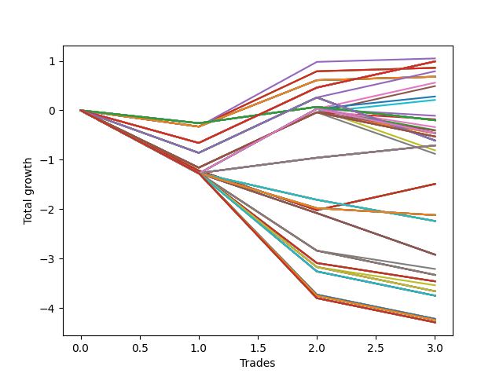

# Long HLT 333 
- Symbol: TSLA
- Date Range: 05/16/2022 - 05/17/2024
- Trading Period: 8:30-12:30
- Number of Trades: 3



| Id. | Name | Win Percent | Profit | Avg Profit / Trade | Avg Time / Trade | Std |      | Name | Win Percent | Profit | Avg Profit / Trade | Avg Time / Trade | Std |
| --- | ---- | ----------- | ------ | ------------------ | ---------------- | --- | ---- | ---- | ----------- | ------ | ------------------ | ---------------- | --- |
| | Sorted By <br> Profit | | | | | | | Sorted By <br> Win Percentage |||||
|0| TP-1.25 15m | 66.67 | 1.05 | 0.35 | 11:40 | 0.70 |     | TP-1.25 15m | 66.67 | 1.05 | 0.35 | 11:40 | 0.70 |
|1| TP-0.5 180m | 66.67 | 0.99 | 0.33 | 18:40 | 0.74 |     | TP-0.5 180m | 66.67 | 0.99 | 0.33 | 18:40 | 0.74 |
|2| TP-0.5 165m | 66.67 | 0.99 | 0.33 | 18:40 | 0.74 |     | TP-0.5 165m | 66.67 | 0.99 | 0.33 | 18:40 | 0.74 |
|3| TP-0.5 150m | 66.67 | 0.99 | 0.33 | 18:40 | 0.74 |     | TP-0.5 150m | 66.67 | 0.99 | 0.33 | 18:40 | 0.74 |
|4| TP-0.5 135m | 66.67 | 0.99 | 0.33 | 18:40 | 0.74 |     | TP-0.5 135m | 66.67 | 0.99 | 0.33 | 18:40 | 0.74 |
|5| TP-0.5 120m | 66.67 | 0.99 | 0.33 | 18:40 | 0.74 |     | TP-0.5 120m | 66.67 | 0.99 | 0.33 | 18:40 | 0.74 |
|6| TP-0.5 105m | 66.67 | 0.99 | 0.33 | 18:40 | 0.74 |     | TP-0.5 105m | 66.67 | 0.99 | 0.33 | 18:40 | 0.74 |
|7| TP-0.5 90m | 66.67 | 0.99 | 0.33 | 18:40 | 0.74 |     | TP-0.5 90m | 66.67 | 0.99 | 0.33 | 18:40 | 0.74 |
|8| TP-0.5 75m | 66.67 | 0.99 | 0.33 | 18:40 | 0.74 |     | TP-0.5 75m | 66.67 | 0.99 | 0.33 | 18:40 | 0.74 |
|9| TP-0.5 60m | 66.67 | 0.99 | 0.33 | 18:40 | 0.74 |     | TP-0.5 60m | 66.67 | 0.99 | 0.33 | 18:40 | 0.74 |
|10| TP-0.5 45m | 66.67 | 0.99 | 0.33 | 18:40 | 0.74 |     | TP-0.5 45m | 66.67 | 0.99 | 0.33 | 18:40 | 0.74 |
|11| TP-0.5 30m | 66.67 | 0.99 | 0.33 | 18:40 | 0.74 |     | TP-0.5 30m | 66.67 | 0.99 | 0.33 | 18:40 | 0.74 |
|12| TP-1 15m | 66.67 | 0.86 | 0.29 | 10:40 | 0.61 |     | TP-1 15m | 66.67 | 0.86 | 0.29 | 10:40 | 0.61 |
|13| TP-0.75 15m | 66.67 | 0.86 | 0.29 | 10:40 | 0.61 |     | TP-0.75 15m | 66.67 | 0.86 | 0.29 | 10:40 | 0.61 |
|14| TP-0.5 15m | 66.67 | 0.86 | 0.29 | 10:40 | 0.61 |     | TP-0.5 15m | 66.67 | 0.86 | 0.29 | 10:40 | 0.61 |
|15| TP-0.75 30m | 66.67 | 0.79 | 0.26 | 19:00 | 0.83 |     | TP-0.75 30m | 66.67 | 0.79 | 0.26 | 19:00 | 0.83 |
|16| TP-3 15m | 66.67 | 0.68 | 0.23 | 14:00 | 0.53 |     | TP-3 15m | 66.67 | 0.68 | 0.23 | 14:00 | 0.53 |
|17| TP-2.75 15m | 66.67 | 0.68 | 0.23 | 14:00 | 0.53 |     | TP-2.75 15m | 66.67 | 0.68 | 0.23 | 14:00 | 0.53 |
|18| TP-2.5 15m | 66.67 | 0.68 | 0.23 | 14:00 | 0.53 |     | TP-2.5 15m | 66.67 | 0.68 | 0.23 | 14:00 | 0.53 |
|19| TP-2.25 15m | 66.67 | 0.68 | 0.23 | 14:00 | 0.53 |     | TP-2.25 15m | 66.67 | 0.68 | 0.23 | 14:00 | 0.53 |
|20| TP-2 15m | 66.67 | 0.68 | 0.23 | 14:00 | 0.53 |     | TP-2 15m | 66.67 | 0.68 | 0.23 | 14:00 | 0.53 |
|21| TP-1.75 15m | 66.67 | 0.68 | 0.23 | 14:00 | 0.53 |     | TP-1.75 15m | 66.67 | 0.68 | 0.23 | 14:00 | 0.53 |
|22| TP-1.5 15m | 66.67 | 0.68 | 0.23 | 14:00 | 0.53 |     | TP-1.5 15m | 66.67 | 0.68 | 0.23 | 14:00 | 0.53 |
|23| TP-1.25 30m | 66.67 | 0.56 | 0.19 | 21:20 | 1.08 |     | TP-1.25 30m | 66.67 | 0.56 | 0.19 | 21:20 | 1.08 |
|24| TP-1 30m | 66.67 | 0.49 | 0.16 | 20:00 | 0.97 |     | TP-1 30m | 66.67 | 0.49 | 0.16 | 20:00 | 0.97 |
|25| TP-1.25 60m | 66.67 | 0.28 | 0.09 | 31:20 | 1.06 |     | TP-1.25 60m | 66.67 | 0.28 | 0.09 | 31:20 | 1.06 |
|26| TP-1 60m | 66.67 | 0.21 | 0.07 | 30:00 | 0.94 |     | TP-1 60m | 66.67 | 0.21 | 0.07 | 30:00 | 0.94 |
|27| TP-1.25 90m | 33.33 | -0.11 | -0.04 | 41:20 | 1.06 |     | TP-3 60m | 66.67 | -0.71 | -0.24 | 49:20 | 0.73 |
|28| TP-1 90m | 33.33 | -0.18 | -0.06 | 40:00 | 0.93 |     | TP-2.75 60m | 66.67 | -0.71 | -0.24 | 49:20 | 0.73 |
|29| TP-0.25 180m | 33.33 | -0.20 | -0.07 | 05:40 | 0.28 |     | TP-2.5 60m | 66.67 | -0.71 | -0.24 | 49:20 | 0.73 |
|30| TP-0.25 165m | 33.33 | -0.20 | -0.07 | 05:40 | 0.28 |     | TP-2.25 60m | 66.67 | -0.71 | -0.24 | 49:20 | 0.73 |
|31| TP-0.25 150m | 33.33 | -0.20 | -0.07 | 05:40 | 0.28 |     | TP-2 60m | 66.67 | -0.71 | -0.24 | 49:20 | 0.73 |
|32| TP-0.25 135m | 33.33 | -0.20 | -0.07 | 05:40 | 0.28 |     | TP-1.75 60m | 66.67 | -0.71 | -0.24 | 49:20 | 0.73 |
|33| TP-0.25 120m | 33.33 | -0.20 | -0.07 | 05:40 | 0.28 |     | TP-1.5 60m | 66.67 | -0.71 | -0.24 | 49:20 | 0.73 |
|34| TP-0.25 105m | 33.33 | -0.20 | -0.07 | 05:40 | 0.28 |     | TP-1.25 90m | 33.33 | -0.11 | -0.04 | 41:20 | 1.06 |
|35| TP-0.25 90m | 33.33 | -0.20 | -0.07 | 05:40 | 0.28 |     | TP-1 90m | 33.33 | -0.18 | -0.06 | 40:00 | 0.93 |
|36| TP-0.25 75m | 33.33 | -0.20 | -0.07 | 05:40 | 0.28 |     | TP-0.25 180m | 33.33 | -0.20 | -0.07 | 05:40 | 0.28 |
|37| TP-0.25 60m | 33.33 | -0.20 | -0.07 | 05:40 | 0.28 |     | TP-0.25 165m | 33.33 | -0.20 | -0.07 | 05:40 | 0.28 |
|38| TP-0.25 45m | 33.33 | -0.20 | -0.07 | 05:40 | 0.28 |     | TP-0.25 150m | 33.33 | -0.20 | -0.07 | 05:40 | 0.28 |
|39| TP-0.25 30m | 33.33 | -0.20 | -0.07 | 05:40 | 0.28 |     | TP-0.25 135m | 33.33 | -0.20 | -0.07 | 05:40 | 0.28 |
|40| TP-0.25 15m | 33.33 | -0.20 | -0.07 | 05:40 | 0.28 |     | TP-0.25 120m | 33.33 | -0.20 | -0.07 | 05:40 | 0.28 |
|41| TP-1.25 105m | 33.33 | -0.34 | -0.11 | 46:20 | 1.07 |     | TP-0.25 105m | 33.33 | -0.20 | -0.07 | 05:40 | 0.28 |
|42| TP-1.25 75m | 33.33 | -0.40 | -0.13 | 36:20 | 1.08 |     | TP-0.25 90m | 33.33 | -0.20 | -0.07 | 05:40 | 0.28 |
|43| TP-1 105m | 33.33 | -0.41 | -0.14 | 45:00 | 0.95 |     | TP-0.25 75m | 33.33 | -0.20 | -0.07 | 05:40 | 0.28 |
|44| TP-1.25 180m | 33.33 | -0.46 | -0.15 | 51:20 | 1.08 |     | TP-0.25 60m | 33.33 | -0.20 | -0.07 | 05:40 | 0.28 |
|45| TP-1.25 165m | 33.33 | -0.46 | -0.15 | 51:20 | 1.08 |     | TP-0.25 45m | 33.33 | -0.20 | -0.07 | 05:40 | 0.28 |
|46| TP-1.25 150m | 33.33 | -0.46 | -0.15 | 51:20 | 1.08 |     | TP-0.25 30m | 33.33 | -0.20 | -0.07 | 05:40 | 0.28 |
|47| TP-1.25 135m | 33.33 | -0.46 | -0.15 | 51:20 | 1.08 |     | TP-0.25 15m | 33.33 | -0.20 | -0.07 | 05:40 | 0.28 |
|48| TP-1.25 120m | 33.33 | -0.46 | -0.15 | 51:20 | 1.08 |     | TP-1.25 105m | 33.33 | -0.34 | -0.11 | 46:20 | 1.07 |
|49| TP-1 75m | 33.33 | -0.47 | -0.16 | 35:00 | 0.95 |     | TP-1.25 75m | 33.33 | -0.40 | -0.13 | 36:20 | 1.08 |
|50| TP-1 180m | 33.33 | -0.53 | -0.18 | 50:00 | 0.96 |     | TP-1 105m | 33.33 | -0.41 | -0.14 | 45:00 | 0.95 |
|51| TP-1 165m | 33.33 | -0.53 | -0.18 | 50:00 | 0.96 |     | TP-1.25 180m | 33.33 | -0.46 | -0.15 | 51:20 | 1.08 |
|52| TP-1 150m | 33.33 | -0.53 | -0.18 | 50:00 | 0.96 |     | TP-1.25 165m | 33.33 | -0.46 | -0.15 | 51:20 | 1.08 |
|53| TP-1 135m | 33.33 | -0.53 | -0.18 | 50:00 | 0.96 |     | TP-1.25 150m | 33.33 | -0.46 | -0.15 | 51:20 | 1.08 |
|54| TP-1 120m | 33.33 | -0.53 | -0.18 | 50:00 | 0.96 |     | TP-1.25 135m | 33.33 | -0.46 | -0.15 | 51:20 | 1.08 |
|55| TP-0.75 180m | 33.33 | -0.61 | -0.20 | 23:40 | 0.94 |     | TP-1.25 120m | 33.33 | -0.46 | -0.15 | 51:20 | 1.08 |
|56| TP-0.75 165m | 33.33 | -0.61 | -0.20 | 23:40 | 0.94 |     | TP-1 75m | 33.33 | -0.47 | -0.16 | 35:00 | 0.95 |
|57| TP-0.75 150m | 33.33 | -0.61 | -0.20 | 23:40 | 0.94 |     | TP-1 180m | 33.33 | -0.53 | -0.18 | 50:00 | 0.96 |
|58| TP-0.75 135m | 33.33 | -0.61 | -0.20 | 23:40 | 0.94 |     | TP-1 165m | 33.33 | -0.53 | -0.18 | 50:00 | 0.96 |
|59| TP-0.75 120m | 33.33 | -0.61 | -0.20 | 23:40 | 0.94 |     | TP-1 150m | 33.33 | -0.53 | -0.18 | 50:00 | 0.96 |
|60| TP-0.75 105m | 33.33 | -0.61 | -0.20 | 23:40 | 0.94 |     | TP-1 135m | 33.33 | -0.53 | -0.18 | 50:00 | 0.96 |
|61| TP-0.75 90m | 33.33 | -0.61 | -0.20 | 23:40 | 0.94 |     | TP-1 120m | 33.33 | -0.53 | -0.18 | 50:00 | 0.96 |
|62| TP-0.75 75m | 33.33 | -0.61 | -0.20 | 23:40 | 0.94 |     | TP-0.75 180m | 33.33 | -0.61 | -0.20 | 23:40 | 0.94 |
|63| TP-0.75 60m | 33.33 | -0.61 | -0.20 | 23:40 | 0.94 |     | TP-0.75 165m | 33.33 | -0.61 | -0.20 | 23:40 | 0.94 |
|64| TP-0.75 45m | 33.33 | -0.61 | -0.20 | 23:40 | 0.94 |     | TP-0.75 150m | 33.33 | -0.61 | -0.20 | 23:40 | 0.94 |
|65| TP-3 60m | 66.67 | -0.71 | -0.24 | 49:20 | 0.73 |     | TP-0.75 135m | 33.33 | -0.61 | -0.20 | 23:40 | 0.94 |
|66| TP-2.75 60m | 66.67 | -0.71 | -0.24 | 49:20 | 0.73 |     | TP-0.75 120m | 33.33 | -0.61 | -0.20 | 23:40 | 0.94 |
|67| TP-2.5 60m | 66.67 | -0.71 | -0.24 | 49:20 | 0.73 |     | TP-0.75 105m | 33.33 | -0.61 | -0.20 | 23:40 | 0.94 |
|68| TP-2.25 60m | 66.67 | -0.71 | -0.24 | 49:20 | 0.73 |     | TP-0.75 90m | 33.33 | -0.61 | -0.20 | 23:40 | 0.94 |
|69| TP-2 60m | 66.67 | -0.71 | -0.24 | 49:20 | 0.73 |     | TP-0.75 75m | 33.33 | -0.61 | -0.20 | 23:40 | 0.94 |
|70| TP-1.75 60m | 66.67 | -0.71 | -0.24 | 49:20 | 0.73 |     | TP-0.75 60m | 33.33 | -0.61 | -0.20 | 23:40 | 0.94 |
|71| TP-1.5 60m | 66.67 | -0.71 | -0.24 | 49:20 | 0.73 |     | TP-0.75 45m | 33.33 | -0.61 | -0.20 | 23:40 | 0.94 |
|72| TP-1.25 45m | 33.33 | -0.81 | -0.27 | 26:20 | 1.13 |     | TP-1.25 45m | 33.33 | -0.81 | -0.27 | 26:20 | 1.13 |
|73| TP-1 45m | 33.33 | -0.88 | -0.29 | 25:00 | 1.01 |     | TP-1 45m | 33.33 | -0.88 | -0.29 | 25:00 | 1.01 |
|74| TP-3 30m | 33.33 | -1.49 | -0.50 | 29:00 | 0.75 |     | TP-3 30m | 33.33 | -1.49 | -0.50 | 29:00 | 0.75 |
|75| TP-2.75 30m | 33.33 | -1.49 | -0.50 | 29:00 | 0.75 |     | TP-2.75 30m | 33.33 | -1.49 | -0.50 | 29:00 | 0.75 |
|76| TP-2.5 30m | 33.33 | -1.49 | -0.50 | 29:00 | 0.75 |     | TP-2.5 30m | 33.33 | -1.49 | -0.50 | 29:00 | 0.75 |
|77| TP-2.25 30m | 33.33 | -1.49 | -0.50 | 29:00 | 0.75 |     | TP-2.25 30m | 33.33 | -1.49 | -0.50 | 29:00 | 0.75 |
|78| TP-2 30m | 33.33 | -1.49 | -0.50 | 29:00 | 0.75 |     | TP-2 30m | 33.33 | -1.49 | -0.50 | 29:00 | 0.75 |
|79| TP-1.75 30m | 33.33 | -1.49 | -0.50 | 29:00 | 0.75 |     | TP-1.75 30m | 33.33 | -1.49 | -0.50 | 29:00 | 0.75 |
|80| TP-1.5 30m | 33.33 | -1.49 | -0.50 | 29:00 | 0.75 |     | TP-1.5 30m | 33.33 | -1.49 | -0.50 | 29:00 | 0.75 |
|81| TP-3 90m | 0.00 | -2.12 | -0.71 | 69:20 | 0.46 |     | TP-3 90m | 0.00 | -2.12 | -0.71 | 69:20 | 0.46 |
|82| TP-2.75 90m | 0.00 | -2.12 | -0.71 | 69:20 | 0.46 |     | TP-2.75 90m | 0.00 | -2.12 | -0.71 | 69:20 | 0.46 |
|83| TP-2.5 90m | 0.00 | -2.12 | -0.71 | 69:20 | 0.46 |     | TP-2.5 90m | 0.00 | -2.12 | -0.71 | 69:20 | 0.46 |
|84| TP-2.25 90m | 0.00 | -2.12 | -0.71 | 69:20 | 0.46 |     | TP-2.25 90m | 0.00 | -2.12 | -0.71 | 69:20 | 0.46 |
|85| TP-2 90m | 0.00 | -2.12 | -0.71 | 69:20 | 0.46 |     | TP-2 90m | 0.00 | -2.12 | -0.71 | 69:20 | 0.46 |
|86| TP-1.75 90m | 0.00 | -2.12 | -0.71 | 69:20 | 0.46 |     | TP-1.75 90m | 0.00 | -2.12 | -0.71 | 69:20 | 0.46 |
|87| TP-1.5 90m | 0.00 | -2.12 | -0.71 | 69:20 | 0.46 |     | TP-1.5 90m | 0.00 | -2.12 | -0.71 | 69:20 | 0.46 |
|88| TP-3 75m | 0.00 | -2.24 | -0.75 | 59:20 | 0.37 |     | TP-3 75m | 0.00 | -2.24 | -0.75 | 59:20 | 0.37 |
|89| TP-2.75 75m | 0.00 | -2.24 | -0.75 | 59:20 | 0.37 |     | TP-2.75 75m | 0.00 | -2.24 | -0.75 | 59:20 | 0.37 |
|90| TP-2.5 75m | 0.00 | -2.24 | -0.75 | 59:20 | 0.37 |     | TP-2.5 75m | 0.00 | -2.24 | -0.75 | 59:20 | 0.37 |
|91| TP-2.25 75m | 0.00 | -2.24 | -0.75 | 59:20 | 0.37 |     | TP-2.25 75m | 0.00 | -2.24 | -0.75 | 59:20 | 0.37 |
|92| TP-2 75m | 0.00 | -2.24 | -0.75 | 59:20 | 0.37 |     | TP-2 75m | 0.00 | -2.24 | -0.75 | 59:20 | 0.37 |
|93| TP-1.75 75m | 0.00 | -2.24 | -0.75 | 59:20 | 0.37 |     | TP-1.75 75m | 0.00 | -2.24 | -0.75 | 59:20 | 0.37 |
|94| TP-1.5 75m | 0.00 | -2.24 | -0.75 | 59:20 | 0.37 |     | TP-1.5 75m | 0.00 | -2.24 | -0.75 | 59:20 | 0.37 |
|95| TP-3 45m | 0.00 | -2.92 | -0.97 | 39:20 | 0.21 |     | TP-3 45m | 0.00 | -2.92 | -0.97 | 39:20 | 0.21 |
|96| TP-2.75 45m | 0.00 | -2.92 | -0.97 | 39:20 | 0.21 |     | TP-2.75 45m | 0.00 | -2.92 | -0.97 | 39:20 | 0.21 |
|97| TP-2.5 45m | 0.00 | -2.92 | -0.97 | 39:20 | 0.21 |     | TP-2.5 45m | 0.00 | -2.92 | -0.97 | 39:20 | 0.21 |
|98| TP-2.25 45m | 0.00 | -2.92 | -0.97 | 39:20 | 0.21 |     | TP-2.25 45m | 0.00 | -2.92 | -0.97 | 39:20 | 0.21 |
|99| TP-2 45m | 0.00 | -2.92 | -0.97 | 39:20 | 0.21 |     | TP-2 45m | 0.00 | -2.92 | -0.97 | 39:20 | 0.21 |
|100| TP-1.75 45m | 0.00 | -2.92 | -0.97 | 39:20 | 0.21 |     | TP-1.75 45m | 0.00 | -2.92 | -0.97 | 39:20 | 0.21 |
|101| TP-1.5 45m | 0.00 | -2.92 | -0.97 | 39:20 | 0.21 |     | TP-1.5 45m | 0.00 | -2.92 | -0.97 | 39:20 | 0.21 |
|102| TP-1.5 105m | 0.00 | -3.21 | -1.07 | 77:00 | 0.51 |     | TP-1.5 105m | 0.00 | -3.21 | -1.07 | 77:00 | 0.51 |
|103| TP-1.5 180m | 0.00 | -3.33 | -1.11 | 82:00 | 0.46 |     | TP-1.5 180m | 0.00 | -3.33 | -1.11 | 82:00 | 0.46 |
|104| TP-1.5 165m | 0.00 | -3.33 | -1.11 | 82:00 | 0.46 |     | TP-1.5 165m | 0.00 | -3.33 | -1.11 | 82:00 | 0.46 |
|105| TP-1.5 150m | 0.00 | -3.33 | -1.11 | 82:00 | 0.46 |     | TP-1.5 150m | 0.00 | -3.33 | -1.11 | 82:00 | 0.46 |
|106| TP-1.5 135m | 0.00 | -3.33 | -1.11 | 82:00 | 0.46 |     | TP-1.5 135m | 0.00 | -3.33 | -1.11 | 82:00 | 0.46 |
|107| TP-1.5 120m | 0.00 | -3.33 | -1.11 | 82:00 | 0.46 |     | TP-1.5 120m | 0.00 | -3.33 | -1.11 | 82:00 | 0.46 |
|108| TP-3 105m | 0.00 | -3.46 | -1.15 | 79:20 | 0.60 |     | TP-3 105m | 0.00 | -3.46 | -1.15 | 79:20 | 0.60 |
|109| TP-2.75 105m | 0.00 | -3.46 | -1.15 | 79:20 | 0.60 |     | TP-2.75 105m | 0.00 | -3.46 | -1.15 | 79:20 | 0.60 |
|110| TP-2.5 105m | 0.00 | -3.46 | -1.15 | 79:20 | 0.60 |     | TP-2.5 105m | 0.00 | -3.46 | -1.15 | 79:20 | 0.60 |
|111| TP-2.25 105m | 0.00 | -3.46 | -1.15 | 79:20 | 0.60 |     | TP-2.25 105m | 0.00 | -3.46 | -1.15 | 79:20 | 0.60 |
|112| TP-2 105m | 0.00 | -3.46 | -1.15 | 79:20 | 0.60 |     | TP-2 105m | 0.00 | -3.46 | -1.15 | 79:20 | 0.60 |
|113| TP-1.75 105m | 0.00 | -3.54 | -1.18 | 78:40 | 0.63 |     | TP-1.75 105m | 0.00 | -3.54 | -1.18 | 78:40 | 0.63 |
|114| TP-1.75 180m | 0.00 | -3.66 | -1.22 | 83:40 | 0.58 |     | TP-1.75 180m | 0.00 | -3.66 | -1.22 | 83:40 | 0.58 |
|115| TP-1.75 165m | 0.00 | -3.66 | -1.22 | 83:40 | 0.58 |     | TP-1.75 165m | 0.00 | -3.66 | -1.22 | 83:40 | 0.58 |
|116| TP-1.75 150m | 0.00 | -3.66 | -1.22 | 83:40 | 0.58 |     | TP-1.75 150m | 0.00 | -3.66 | -1.22 | 83:40 | 0.58 |
|117| TP-1.75 135m | 0.00 | -3.66 | -1.22 | 83:40 | 0.58 |     | TP-1.75 135m | 0.00 | -3.66 | -1.22 | 83:40 | 0.58 |
|118| TP-1.75 120m | 0.00 | -3.66 | -1.22 | 83:40 | 0.58 |     | TP-1.75 120m | 0.00 | -3.66 | -1.22 | 83:40 | 0.58 |
|119| TP-2 180m | 0.00 | -3.75 | -1.25 | 85:00 | 0.61 |     | TP-2 180m | 0.00 | -3.75 | -1.25 | 85:00 | 0.61 |
|120| TP-2 165m | 0.00 | -3.75 | -1.25 | 85:00 | 0.61 |     | TP-2 165m | 0.00 | -3.75 | -1.25 | 85:00 | 0.61 |
|121| TP-2 150m | 0.00 | -3.75 | -1.25 | 85:00 | 0.61 |     | TP-2 150m | 0.00 | -3.75 | -1.25 | 85:00 | 0.61 |
|122| TP-2 135m | 0.00 | -3.75 | -1.25 | 85:00 | 0.61 |     | TP-2 135m | 0.00 | -3.75 | -1.25 | 85:00 | 0.61 |
|123| TP-2 120m | 0.00 | -3.75 | -1.25 | 85:00 | 0.61 |     | TP-2 120m | 0.00 | -3.75 | -1.25 | 85:00 | 0.61 |
|124| TP-2.25 180m | 0.00 | -4.22 | -1.41 | 87:00 | 0.81 |     | TP-2.25 180m | 0.00 | -4.22 | -1.41 | 87:00 | 0.81 |
|125| TP-2.25 165m | 0.00 | -4.22 | -1.41 | 87:00 | 0.81 |     | TP-2.25 165m | 0.00 | -4.22 | -1.41 | 87:00 | 0.81 |
|126| TP-2.25 150m | 0.00 | -4.22 | -1.41 | 87:00 | 0.81 |     | TP-2.25 150m | 0.00 | -4.22 | -1.41 | 87:00 | 0.81 |
|127| TP-2.25 135m | 0.00 | -4.22 | -1.41 | 87:00 | 0.81 |     | TP-2.25 135m | 0.00 | -4.22 | -1.41 | 87:00 | 0.81 |
|128| TP-2.25 120m | 0.00 | -4.22 | -1.41 | 87:00 | 0.81 |     | TP-2.25 120m | 0.00 | -4.22 | -1.41 | 87:00 | 0.81 |
|129| TP-2.5 180m | 0.00 | -4.24 | -1.41 | 88:40 | 0.82 |     | TP-2.5 180m | 0.00 | -4.24 | -1.41 | 88:40 | 0.82 |
|130| TP-2.5 165m | 0.00 | -4.24 | -1.41 | 88:40 | 0.82 |     | TP-2.5 165m | 0.00 | -4.24 | -1.41 | 88:40 | 0.82 |
|131| TP-2.5 150m | 0.00 | -4.24 | -1.41 | 88:40 | 0.82 |     | TP-2.5 150m | 0.00 | -4.24 | -1.41 | 88:40 | 0.82 |
|132| TP-2.5 135m | 0.00 | -4.24 | -1.41 | 88:40 | 0.82 |     | TP-2.5 135m | 0.00 | -4.24 | -1.41 | 88:40 | 0.82 |
|133| TP-2.5 120m | 0.00 | -4.24 | -1.41 | 88:40 | 0.82 |     | TP-2.5 120m | 0.00 | -4.24 | -1.41 | 88:40 | 0.82 |
|134| TP-3 180m | 0.00 | -4.29 | -1.43 | 89:20 | 0.84 |     | TP-3 180m | 0.00 | -4.29 | -1.43 | 89:20 | 0.84 |
|135| TP-2.75 180m | 0.00 | -4.29 | -1.43 | 89:20 | 0.84 |     | TP-2.75 180m | 0.00 | -4.29 | -1.43 | 89:20 | 0.84 |
|136| TP-3 165m | 0.00 | -4.29 | -1.43 | 89:20 | 0.84 |     | TP-3 165m | 0.00 | -4.29 | -1.43 | 89:20 | 0.84 |
|137| TP-2.75 165m | 0.00 | -4.29 | -1.43 | 89:20 | 0.84 |     | TP-2.75 165m | 0.00 | -4.29 | -1.43 | 89:20 | 0.84 |
|138| TP-3 150m | 0.00 | -4.29 | -1.43 | 89:20 | 0.84 |     | TP-3 150m | 0.00 | -4.29 | -1.43 | 89:20 | 0.84 |
|139| TP-2.75 150m | 0.00 | -4.29 | -1.43 | 89:20 | 0.84 |     | TP-2.75 150m | 0.00 | -4.29 | -1.43 | 89:20 | 0.84 |
|140| TP-3 135m | 0.00 | -4.29 | -1.43 | 89:20 | 0.84 |     | TP-3 135m | 0.00 | -4.29 | -1.43 | 89:20 | 0.84 |
|141| TP-2.75 135m | 0.00 | -4.29 | -1.43 | 89:20 | 0.84 |     | TP-2.75 135m | 0.00 | -4.29 | -1.43 | 89:20 | 0.84 |
|142| TP-3 120m | 0.00 | -4.29 | -1.43 | 89:20 | 0.84 |     | TP-3 120m | 0.00 | -4.29 | -1.43 | 89:20 | 0.84 |
|143| TP-2.75 120m | 0.00 | -4.29 | -1.43 | 89:20 | 0.84 |     | TP-2.75 120m | 0.00 | -4.29 | -1.43 | 89:20 | 0.84 |

### Test TP-0.25 15m
* Take Profit of 0.25 Point
* 0.25 Stoploss
* Results:
```
Total Trades: 3
Percent Up: 33.33
Percent Down: 66.67
Total Points Moved Up: -0.20
Potential Profit: -100.00
Total Points Ups: 0.33 Count Ups: 1
Total Points Downs: -0.53 Count Downs: 2
```

<details><summary>Trades</summary>

<code>In: 2023-04-26 12:20:00		Out: 2023-04-26 12:33:00		Total Position Time: 13:00		Total Move Up: -0.26		Total to Date: -0.26</code> <br />
<code>In: 2023-10-18 10:10:00		Out: 2023-10-18 10:12:00		Total Position Time: 02:00		Total Move Up: 0.33		Total to Date: 0.07</code> <br />
<code>In: 2024-04-10 09:30:00		Out: 2024-04-10 09:32:00		Total Position Time: 02:00		Total Move Up: -0.27		Total to Date: -0.20</code> <br />


</details>

### Test TP-0.5 15m
* Take Profit of 0.5 Point
* 0.5 Stoploss
* Results:
```
Total Trades: 3
Percent Up: 66.67
Percent Down: 33.33
Total Points Moved Up: 0.86
Potential Profit: 430.00
Total Points Ups: 1.19 Count Ups: 2
Total Points Downs: -0.33 Count Downs: 1
```

<details><summary>Trades</summary>

<code>In: 2023-04-26 12:20:00		Out: 2023-04-26 12:34:00		Total Position Time: 14:00		Total Move Up: -0.33		Total to Date: -0.33</code> <br />
<code>In: 2023-10-18 10:10:00		Out: 2023-10-18 10:14:00		Total Position Time: 04:00		Total Move Up: 1.12		Total to Date: 0.79</code> <br />
<code>In: 2024-04-10 09:30:00		Out: 2024-04-10 09:44:00		Total Position Time: 14:00		Total Move Up: 0.07		Total to Date: 0.86</code> <br />


</details>

### Test TP-0.75 15m
* Take Profit of 0.75 Point
* 0.75 Stoploss
* Results:
```
Total Trades: 3
Percent Up: 66.67
Percent Down: 33.33
Total Points Moved Up: 0.86
Potential Profit: 430.00
Total Points Ups: 1.19 Count Ups: 2
Total Points Downs: -0.33 Count Downs: 1
```

<details><summary>Trades</summary>

<code>In: 2023-04-26 12:20:00		Out: 2023-04-26 12:34:00		Total Position Time: 14:00		Total Move Up: -0.33		Total to Date: -0.33</code> <br />
<code>In: 2023-10-18 10:10:00		Out: 2023-10-18 10:14:00		Total Position Time: 04:00		Total Move Up: 1.12		Total to Date: 0.79</code> <br />
<code>In: 2024-04-10 09:30:00		Out: 2024-04-10 09:44:00		Total Position Time: 14:00		Total Move Up: 0.07		Total to Date: 0.86</code> <br />


</details>

### Test TP-1 15m
* Take Profit of 1 Point
* 1 Stoploss
* Results:
```
Total Trades: 3
Percent Up: 66.67
Percent Down: 33.33
Total Points Moved Up: 0.86
Potential Profit: 430.00
Total Points Ups: 1.19 Count Ups: 2
Total Points Downs: -0.33 Count Downs: 1
```

<details><summary>Trades</summary>

<code>In: 2023-04-26 12:20:00		Out: 2023-04-26 12:34:00		Total Position Time: 14:00		Total Move Up: -0.33		Total to Date: -0.33</code> <br />
<code>In: 2023-10-18 10:10:00		Out: 2023-10-18 10:14:00		Total Position Time: 04:00		Total Move Up: 1.12		Total to Date: 0.79</code> <br />
<code>In: 2024-04-10 09:30:00		Out: 2024-04-10 09:44:00		Total Position Time: 14:00		Total Move Up: 0.07		Total to Date: 0.86</code> <br />


</details>

### Test TP-1.25 15m
* Take Profit of 1.25 Point
* 1.25 Stoploss
* Results:
```
Total Trades: 3
Percent Up: 66.67
Percent Down: 33.33
Total Points Moved Up: 1.05
Potential Profit: 525.00
Total Points Ups: 1.38 Count Ups: 2
Total Points Downs: -0.33 Count Downs: 1
```

<details><summary>Trades</summary>

<code>In: 2023-04-26 12:20:00		Out: 2023-04-26 12:34:00		Total Position Time: 14:00		Total Move Up: -0.33		Total to Date: -0.33</code> <br />
<code>In: 2023-10-18 10:10:00		Out: 2023-10-18 10:17:00		Total Position Time: 07:00		Total Move Up: 1.31		Total to Date: 0.98</code> <br />
<code>In: 2024-04-10 09:30:00		Out: 2024-04-10 09:44:00		Total Position Time: 14:00		Total Move Up: 0.07		Total to Date: 1.05</code> <br />


</details>

### Test TP-1.5 15m
* Take Profit of 1.5 Point
* 1.5 Stoploss
* Results:
```
Total Trades: 3
Percent Up: 66.67
Percent Down: 33.33
Total Points Moved Up: 0.68
Potential Profit: 340.00
Total Points Ups: 1.01 Count Ups: 2
Total Points Downs: -0.33 Count Downs: 1
```

<details><summary>Trades</summary>

<code>In: 2023-04-26 12:20:00		Out: 2023-04-26 12:34:00		Total Position Time: 14:00		Total Move Up: -0.33		Total to Date: -0.33</code> <br />
<code>In: 2023-10-18 10:10:00		Out: 2023-10-18 10:24:00		Total Position Time: 14:00		Total Move Up: 0.94		Total to Date: 0.61</code> <br />
<code>In: 2024-04-10 09:30:00		Out: 2024-04-10 09:44:00		Total Position Time: 14:00		Total Move Up: 0.07		Total to Date: 0.68</code> <br />


</details>

### Test TP-1.75 15m
* Take Profit of 1.75 Point
* 1.75 Stoploss
* Results:
```
Total Trades: 3
Percent Up: 66.67
Percent Down: 33.33
Total Points Moved Up: 0.68
Potential Profit: 340.00
Total Points Ups: 1.01 Count Ups: 2
Total Points Downs: -0.33 Count Downs: 1
```

<details><summary>Trades</summary>

<code>In: 2023-04-26 12:20:00		Out: 2023-04-26 12:34:00		Total Position Time: 14:00		Total Move Up: -0.33		Total to Date: -0.33</code> <br />
<code>In: 2023-10-18 10:10:00		Out: 2023-10-18 10:24:00		Total Position Time: 14:00		Total Move Up: 0.94		Total to Date: 0.61</code> <br />
<code>In: 2024-04-10 09:30:00		Out: 2024-04-10 09:44:00		Total Position Time: 14:00		Total Move Up: 0.07		Total to Date: 0.68</code> <br />


</details>

### Test TP-2 15m
* Take Profit of 2 Point
* 2 Stoploss
* Results:
```
Total Trades: 3
Percent Up: 66.67
Percent Down: 33.33
Total Points Moved Up: 0.68
Potential Profit: 340.00
Total Points Ups: 1.01 Count Ups: 2
Total Points Downs: -0.33 Count Downs: 1
```

<details><summary>Trades</summary>

<code>In: 2023-04-26 12:20:00		Out: 2023-04-26 12:34:00		Total Position Time: 14:00		Total Move Up: -0.33		Total to Date: -0.33</code> <br />
<code>In: 2023-10-18 10:10:00		Out: 2023-10-18 10:24:00		Total Position Time: 14:00		Total Move Up: 0.94		Total to Date: 0.61</code> <br />
<code>In: 2024-04-10 09:30:00		Out: 2024-04-10 09:44:00		Total Position Time: 14:00		Total Move Up: 0.07		Total to Date: 0.68</code> <br />


</details>

### Test TP-2.25 15m
* Take Profit of 2.25 Point
* 2.25 Stoploss
* Results:
```
Total Trades: 3
Percent Up: 66.67
Percent Down: 33.33
Total Points Moved Up: 0.68
Potential Profit: 340.00
Total Points Ups: 1.01 Count Ups: 2
Total Points Downs: -0.33 Count Downs: 1
```

<details><summary>Trades</summary>

<code>In: 2023-04-26 12:20:00		Out: 2023-04-26 12:34:00		Total Position Time: 14:00		Total Move Up: -0.33		Total to Date: -0.33</code> <br />
<code>In: 2023-10-18 10:10:00		Out: 2023-10-18 10:24:00		Total Position Time: 14:00		Total Move Up: 0.94		Total to Date: 0.61</code> <br />
<code>In: 2024-04-10 09:30:00		Out: 2024-04-10 09:44:00		Total Position Time: 14:00		Total Move Up: 0.07		Total to Date: 0.68</code> <br />


</details>

### Test TP-2.5 15m
* Take Profit of 2.5 Point
* 2.5 Stoploss
* Results:
```
Total Trades: 3
Percent Up: 66.67
Percent Down: 33.33
Total Points Moved Up: 0.68
Potential Profit: 340.00
Total Points Ups: 1.01 Count Ups: 2
Total Points Downs: -0.33 Count Downs: 1
```

<details><summary>Trades</summary>

<code>In: 2023-04-26 12:20:00		Out: 2023-04-26 12:34:00		Total Position Time: 14:00		Total Move Up: -0.33		Total to Date: -0.33</code> <br />
<code>In: 2023-10-18 10:10:00		Out: 2023-10-18 10:24:00		Total Position Time: 14:00		Total Move Up: 0.94		Total to Date: 0.61</code> <br />
<code>In: 2024-04-10 09:30:00		Out: 2024-04-10 09:44:00		Total Position Time: 14:00		Total Move Up: 0.07		Total to Date: 0.68</code> <br />


</details>

### Test TP-2.75 15m
* Take Profit of 2.75 Point
* 2.75 Stoploss
* Results:
```
Total Trades: 3
Percent Up: 66.67
Percent Down: 33.33
Total Points Moved Up: 0.68
Potential Profit: 340.00
Total Points Ups: 1.01 Count Ups: 2
Total Points Downs: -0.33 Count Downs: 1
```

<details><summary>Trades</summary>

<code>In: 2023-04-26 12:20:00		Out: 2023-04-26 12:34:00		Total Position Time: 14:00		Total Move Up: -0.33		Total to Date: -0.33</code> <br />
<code>In: 2023-10-18 10:10:00		Out: 2023-10-18 10:24:00		Total Position Time: 14:00		Total Move Up: 0.94		Total to Date: 0.61</code> <br />
<code>In: 2024-04-10 09:30:00		Out: 2024-04-10 09:44:00		Total Position Time: 14:00		Total Move Up: 0.07		Total to Date: 0.68</code> <br />


</details>

### Test TP-3 15m
* Take Profit of 3 Point
* 3 Stoploss
* Results:
```
Total Trades: 3
Percent Up: 66.67
Percent Down: 33.33
Total Points Moved Up: 0.68
Potential Profit: 340.00
Total Points Ups: 1.01 Count Ups: 2
Total Points Downs: -0.33 Count Downs: 1
```

<details><summary>Trades</summary>

<code>In: 2023-04-26 12:20:00		Out: 2023-04-26 12:34:00		Total Position Time: 14:00		Total Move Up: -0.33		Total to Date: -0.33</code> <br />
<code>In: 2023-10-18 10:10:00		Out: 2023-10-18 10:24:00		Total Position Time: 14:00		Total Move Up: 0.94		Total to Date: 0.61</code> <br />
<code>In: 2024-04-10 09:30:00		Out: 2024-04-10 09:44:00		Total Position Time: 14:00		Total Move Up: 0.07		Total to Date: 0.68</code> <br />


</details>

### Test TP-0.25 30m
* Take Profit of 0.25 Point
* 0.25 Stoploss
* Results:
```
Total Trades: 3
Percent Up: 33.33
Percent Down: 66.67
Total Points Moved Up: -0.20
Potential Profit: -100.00
Total Points Ups: 0.33 Count Ups: 1
Total Points Downs: -0.53 Count Downs: 2
```

<details><summary>Trades</summary>

<code>In: 2023-04-26 12:20:00		Out: 2023-04-26 12:33:00		Total Position Time: 13:00		Total Move Up: -0.26		Total to Date: -0.26</code> <br />
<code>In: 2023-10-18 10:10:00		Out: 2023-10-18 10:12:00		Total Position Time: 02:00		Total Move Up: 0.33		Total to Date: 0.07</code> <br />
<code>In: 2024-04-10 09:30:00		Out: 2024-04-10 09:32:00		Total Position Time: 02:00		Total Move Up: -0.27		Total to Date: -0.20</code> <br />


</details>

### Test TP-0.5 30m
* Take Profit of 0.5 Point
* 0.5 Stoploss
* Results:
```
Total Trades: 3
Percent Up: 66.67
Percent Down: 33.33
Total Points Moved Up: 0.99
Potential Profit: 495.00
Total Points Ups: 1.65 Count Ups: 2
Total Points Downs: -0.66 Count Downs: 1
```

<details><summary>Trades</summary>

<code>In: 2023-04-26 12:20:00		Out: 2023-04-26 12:43:00		Total Position Time: 23:00		Total Move Up: -0.66		Total to Date: -0.66</code> <br />
<code>In: 2023-10-18 10:10:00		Out: 2023-10-18 10:14:00		Total Position Time: 04:00		Total Move Up: 1.12		Total to Date: 0.46</code> <br />
<code>In: 2024-04-10 09:30:00		Out: 2024-04-10 09:59:00		Total Position Time: 29:00		Total Move Up: 0.53		Total to Date: 0.99</code> <br />


</details>

### Test TP-0.75 30m
* Take Profit of 0.75 Point
* 0.75 Stoploss
* Results:
```
Total Trades: 3
Percent Up: 66.67
Percent Down: 33.33
Total Points Moved Up: 0.79
Potential Profit: 395.00
Total Points Ups: 1.65 Count Ups: 2
Total Points Downs: -0.86 Count Downs: 1
```

<details><summary>Trades</summary>

<code>In: 2023-04-26 12:20:00		Out: 2023-04-26 12:44:00		Total Position Time: 24:00		Total Move Up: -0.86		Total to Date: -0.86</code> <br />
<code>In: 2023-10-18 10:10:00		Out: 2023-10-18 10:14:00		Total Position Time: 04:00		Total Move Up: 1.12		Total to Date: 0.26</code> <br />
<code>In: 2024-04-10 09:30:00		Out: 2024-04-10 09:59:00		Total Position Time: 29:00		Total Move Up: 0.53		Total to Date: 0.79</code> <br />


</details>

### Test TP-1 30m
* Take Profit of 1 Point
* 1 Stoploss
* Results:
```
Total Trades: 3
Percent Up: 66.67
Percent Down: 33.33
Total Points Moved Up: 0.49
Potential Profit: 245.00
Total Points Ups: 1.65 Count Ups: 2
Total Points Downs: -1.16 Count Downs: 1
```

<details><summary>Trades</summary>

<code>In: 2023-04-26 12:20:00		Out: 2023-04-26 12:47:00		Total Position Time: 27:00		Total Move Up: -1.16		Total to Date: -1.16</code> <br />
<code>In: 2023-10-18 10:10:00		Out: 2023-10-18 10:14:00		Total Position Time: 04:00		Total Move Up: 1.12		Total to Date: -0.04</code> <br />
<code>In: 2024-04-10 09:30:00		Out: 2024-04-10 09:59:00		Total Position Time: 29:00		Total Move Up: 0.53		Total to Date: 0.49</code> <br />


</details>

### Test TP-1.25 30m
* Take Profit of 1.25 Point
* 1.25 Stoploss
* Results:
```
Total Trades: 3
Percent Up: 66.67
Percent Down: 33.33
Total Points Moved Up: 0.56
Potential Profit: 280.00
Total Points Ups: 1.84 Count Ups: 2
Total Points Downs: -1.28 Count Downs: 1
```

<details><summary>Trades</summary>

<code>In: 2023-04-26 12:20:00		Out: 2023-04-26 12:48:00		Total Position Time: 28:00		Total Move Up: -1.28		Total to Date: -1.28</code> <br />
<code>In: 2023-10-18 10:10:00		Out: 2023-10-18 10:17:00		Total Position Time: 07:00		Total Move Up: 1.31		Total to Date: 0.03</code> <br />
<code>In: 2024-04-10 09:30:00		Out: 2024-04-10 09:59:00		Total Position Time: 29:00		Total Move Up: 0.53		Total to Date: 0.56</code> <br />


</details>

### Test TP-1.5 30m
* Take Profit of 1.5 Point
* 1.5 Stoploss
* Results:
```
Total Trades: 3
Percent Up: 33.33
Percent Down: 66.67
Total Points Moved Up: -1.49
Potential Profit: -745.00
Total Points Ups: 0.53 Count Ups: 1
Total Points Downs: -2.02 Count Downs: 2
```

<details><summary>Trades</summary>

<code>In: 2023-04-26 12:20:00		Out: 2023-04-26 12:49:00		Total Position Time: 29:00		Total Move Up: -1.22		Total to Date: -1.22</code> <br />
<code>In: 2023-10-18 10:10:00		Out: 2023-10-18 10:39:00		Total Position Time: 29:00		Total Move Up: -0.80		Total to Date: -2.02</code> <br />
<code>In: 2024-04-10 09:30:00		Out: 2024-04-10 09:59:00		Total Position Time: 29:00		Total Move Up: 0.53		Total to Date: -1.49</code> <br />


</details>

### Test TP-1.75 30m
* Take Profit of 1.75 Point
* 1.75 Stoploss
* Results:
```
Total Trades: 3
Percent Up: 33.33
Percent Down: 66.67
Total Points Moved Up: -1.49
Potential Profit: -745.00
Total Points Ups: 0.53 Count Ups: 1
Total Points Downs: -2.02 Count Downs: 2
```

<details><summary>Trades</summary>

<code>In: 2023-04-26 12:20:00		Out: 2023-04-26 12:49:00		Total Position Time: 29:00		Total Move Up: -1.22		Total to Date: -1.22</code> <br />
<code>In: 2023-10-18 10:10:00		Out: 2023-10-18 10:39:00		Total Position Time: 29:00		Total Move Up: -0.80		Total to Date: -2.02</code> <br />
<code>In: 2024-04-10 09:30:00		Out: 2024-04-10 09:59:00		Total Position Time: 29:00		Total Move Up: 0.53		Total to Date: -1.49</code> <br />


</details>

### Test TP-2 30m
* Take Profit of 2 Point
* 2 Stoploss
* Results:
```
Total Trades: 3
Percent Up: 33.33
Percent Down: 66.67
Total Points Moved Up: -1.49
Potential Profit: -745.00
Total Points Ups: 0.53 Count Ups: 1
Total Points Downs: -2.02 Count Downs: 2
```

<details><summary>Trades</summary>

<code>In: 2023-04-26 12:20:00		Out: 2023-04-26 12:49:00		Total Position Time: 29:00		Total Move Up: -1.22		Total to Date: -1.22</code> <br />
<code>In: 2023-10-18 10:10:00		Out: 2023-10-18 10:39:00		Total Position Time: 29:00		Total Move Up: -0.80		Total to Date: -2.02</code> <br />
<code>In: 2024-04-10 09:30:00		Out: 2024-04-10 09:59:00		Total Position Time: 29:00		Total Move Up: 0.53		Total to Date: -1.49</code> <br />


</details>

### Test TP-2.25 30m
* Take Profit of 2.25 Point
* 2.25 Stoploss
* Results:
```
Total Trades: 3
Percent Up: 33.33
Percent Down: 66.67
Total Points Moved Up: -1.49
Potential Profit: -745.00
Total Points Ups: 0.53 Count Ups: 1
Total Points Downs: -2.02 Count Downs: 2
```

<details><summary>Trades</summary>

<code>In: 2023-04-26 12:20:00		Out: 2023-04-26 12:49:00		Total Position Time: 29:00		Total Move Up: -1.22		Total to Date: -1.22</code> <br />
<code>In: 2023-10-18 10:10:00		Out: 2023-10-18 10:39:00		Total Position Time: 29:00		Total Move Up: -0.80		Total to Date: -2.02</code> <br />
<code>In: 2024-04-10 09:30:00		Out: 2024-04-10 09:59:00		Total Position Time: 29:00		Total Move Up: 0.53		Total to Date: -1.49</code> <br />


</details>

### Test TP-2.5 30m
* Take Profit of 2.5 Point
* 2.5 Stoploss
* Results:
```
Total Trades: 3
Percent Up: 33.33
Percent Down: 66.67
Total Points Moved Up: -1.49
Potential Profit: -745.00
Total Points Ups: 0.53 Count Ups: 1
Total Points Downs: -2.02 Count Downs: 2
```

<details><summary>Trades</summary>

<code>In: 2023-04-26 12:20:00		Out: 2023-04-26 12:49:00		Total Position Time: 29:00		Total Move Up: -1.22		Total to Date: -1.22</code> <br />
<code>In: 2023-10-18 10:10:00		Out: 2023-10-18 10:39:00		Total Position Time: 29:00		Total Move Up: -0.80		Total to Date: -2.02</code> <br />
<code>In: 2024-04-10 09:30:00		Out: 2024-04-10 09:59:00		Total Position Time: 29:00		Total Move Up: 0.53		Total to Date: -1.49</code> <br />


</details>

### Test TP-2.75 30m
* Take Profit of 2.75 Point
* 2.75 Stoploss
* Results:
```
Total Trades: 3
Percent Up: 33.33
Percent Down: 66.67
Total Points Moved Up: -1.49
Potential Profit: -745.00
Total Points Ups: 0.53 Count Ups: 1
Total Points Downs: -2.02 Count Downs: 2
```

<details><summary>Trades</summary>

<code>In: 2023-04-26 12:20:00		Out: 2023-04-26 12:49:00		Total Position Time: 29:00		Total Move Up: -1.22		Total to Date: -1.22</code> <br />
<code>In: 2023-10-18 10:10:00		Out: 2023-10-18 10:39:00		Total Position Time: 29:00		Total Move Up: -0.80		Total to Date: -2.02</code> <br />
<code>In: 2024-04-10 09:30:00		Out: 2024-04-10 09:59:00		Total Position Time: 29:00		Total Move Up: 0.53		Total to Date: -1.49</code> <br />


</details>

### Test TP-3 30m
* Take Profit of 3 Point
* 3 Stoploss
* Results:
```
Total Trades: 3
Percent Up: 33.33
Percent Down: 66.67
Total Points Moved Up: -1.49
Potential Profit: -745.00
Total Points Ups: 0.53 Count Ups: 1
Total Points Downs: -2.02 Count Downs: 2
```

<details><summary>Trades</summary>

<code>In: 2023-04-26 12:20:00		Out: 2023-04-26 12:49:00		Total Position Time: 29:00		Total Move Up: -1.22		Total to Date: -1.22</code> <br />
<code>In: 2023-10-18 10:10:00		Out: 2023-10-18 10:39:00		Total Position Time: 29:00		Total Move Up: -0.80		Total to Date: -2.02</code> <br />
<code>In: 2024-04-10 09:30:00		Out: 2024-04-10 09:59:00		Total Position Time: 29:00		Total Move Up: 0.53		Total to Date: -1.49</code> <br />


</details>

### Test TP-0.25 45m
* Take Profit of 0.25 Point
* 0.25 Stoploss
* Results:
```
Total Trades: 3
Percent Up: 33.33
Percent Down: 66.67
Total Points Moved Up: -0.20
Potential Profit: -100.00
Total Points Ups: 0.33 Count Ups: 1
Total Points Downs: -0.53 Count Downs: 2
```

<details><summary>Trades</summary>

<code>In: 2023-04-26 12:20:00		Out: 2023-04-26 12:33:00		Total Position Time: 13:00		Total Move Up: -0.26		Total to Date: -0.26</code> <br />
<code>In: 2023-10-18 10:10:00		Out: 2023-10-18 10:12:00		Total Position Time: 02:00		Total Move Up: 0.33		Total to Date: 0.07</code> <br />
<code>In: 2024-04-10 09:30:00		Out: 2024-04-10 09:32:00		Total Position Time: 02:00		Total Move Up: -0.27		Total to Date: -0.20</code> <br />


</details>

### Test TP-0.5 45m
* Take Profit of 0.5 Point
* 0.5 Stoploss
* Results:
```
Total Trades: 3
Percent Up: 66.67
Percent Down: 33.33
Total Points Moved Up: 0.99
Potential Profit: 495.00
Total Points Ups: 1.65 Count Ups: 2
Total Points Downs: -0.66 Count Downs: 1
```

<details><summary>Trades</summary>

<code>In: 2023-04-26 12:20:00		Out: 2023-04-26 12:43:00		Total Position Time: 23:00		Total Move Up: -0.66		Total to Date: -0.66</code> <br />
<code>In: 2023-10-18 10:10:00		Out: 2023-10-18 10:14:00		Total Position Time: 04:00		Total Move Up: 1.12		Total to Date: 0.46</code> <br />
<code>In: 2024-04-10 09:30:00		Out: 2024-04-10 09:59:00		Total Position Time: 29:00		Total Move Up: 0.53		Total to Date: 0.99</code> <br />


</details>

### Test TP-0.75 45m
* Take Profit of 0.75 Point
* 0.75 Stoploss
* Results:
```
Total Trades: 3
Percent Up: 33.33
Percent Down: 66.67
Total Points Moved Up: -0.61
Potential Profit: -305.00
Total Points Ups: 1.12 Count Ups: 1
Total Points Downs: -1.73 Count Downs: 2
```

<details><summary>Trades</summary>

<code>In: 2023-04-26 12:20:00		Out: 2023-04-26 12:44:00		Total Position Time: 24:00		Total Move Up: -0.86		Total to Date: -0.86</code> <br />
<code>In: 2023-10-18 10:10:00		Out: 2023-10-18 10:14:00		Total Position Time: 04:00		Total Move Up: 1.12		Total to Date: 0.26</code> <br />
<code>In: 2024-04-10 09:30:00		Out: 2024-04-10 10:13:00		Total Position Time: 43:00		Total Move Up: -0.87		Total to Date: -0.61</code> <br />


</details>

### Test TP-1 45m
* Take Profit of 1 Point
* 1 Stoploss
* Results:
```
Total Trades: 3
Percent Up: 33.33
Percent Down: 66.67
Total Points Moved Up: -0.88
Potential Profit: -440.00
Total Points Ups: 1.12 Count Ups: 1
Total Points Downs: -2.00 Count Downs: 2
```

<details><summary>Trades</summary>

<code>In: 2023-04-26 12:20:00		Out: 2023-04-26 12:47:00		Total Position Time: 27:00		Total Move Up: -1.16		Total to Date: -1.16</code> <br />
<code>In: 2023-10-18 10:10:00		Out: 2023-10-18 10:14:00		Total Position Time: 04:00		Total Move Up: 1.12		Total to Date: -0.04</code> <br />
<code>In: 2024-04-10 09:30:00		Out: 2024-04-10 10:14:00		Total Position Time: 44:00		Total Move Up: -0.84		Total to Date: -0.88</code> <br />


</details>

### Test TP-1.25 45m
* Take Profit of 1.25 Point
* 1.25 Stoploss
* Results:
```
Total Trades: 3
Percent Up: 33.33
Percent Down: 66.67
Total Points Moved Up: -0.81
Potential Profit: -405.00
Total Points Ups: 1.31 Count Ups: 1
Total Points Downs: -2.12 Count Downs: 2
```

<details><summary>Trades</summary>

<code>In: 2023-04-26 12:20:00		Out: 2023-04-26 12:48:00		Total Position Time: 28:00		Total Move Up: -1.28		Total to Date: -1.28</code> <br />
<code>In: 2023-10-18 10:10:00		Out: 2023-10-18 10:17:00		Total Position Time: 07:00		Total Move Up: 1.31		Total to Date: 0.03</code> <br />
<code>In: 2024-04-10 09:30:00		Out: 2024-04-10 10:14:00		Total Position Time: 44:00		Total Move Up: -0.84		Total to Date: -0.81</code> <br />


</details>

### Test TP-1.5 45m
* Take Profit of 1.5 Point
* 1.5 Stoploss
* Results:
```
Total Trades: 3
Percent Up: 0.00
Percent Down: 100.00
Total Points Moved Up: -2.92
Potential Profit: -1460.00
Total Points Ups: 0.00 Count Ups: 0
Total Points Downs: -2.92 Count Downs: 3
```

<details><summary>Trades</summary>

<code>In: 2023-04-26 12:20:00		Out: 2023-04-26 12:50:00		Total Position Time: 30:00		Total Move Up: -1.27		Total to Date: -1.27</code> <br />
<code>In: 2023-10-18 10:10:00		Out: 2023-10-18 10:54:00		Total Position Time: 44:00		Total Move Up: -0.81		Total to Date: -2.08</code> <br />
<code>In: 2024-04-10 09:30:00		Out: 2024-04-10 10:14:00		Total Position Time: 44:00		Total Move Up: -0.84		Total to Date: -2.92</code> <br />


</details>

### Test TP-1.75 45m
* Take Profit of 1.75 Point
* 1.75 Stoploss
* Results:
```
Total Trades: 3
Percent Up: 0.00
Percent Down: 100.00
Total Points Moved Up: -2.92
Potential Profit: -1460.00
Total Points Ups: 0.00 Count Ups: 0
Total Points Downs: -2.92 Count Downs: 3
```

<details><summary>Trades</summary>

<code>In: 2023-04-26 12:20:00		Out: 2023-04-26 12:50:00		Total Position Time: 30:00		Total Move Up: -1.27		Total to Date: -1.27</code> <br />
<code>In: 2023-10-18 10:10:00		Out: 2023-10-18 10:54:00		Total Position Time: 44:00		Total Move Up: -0.81		Total to Date: -2.08</code> <br />
<code>In: 2024-04-10 09:30:00		Out: 2024-04-10 10:14:00		Total Position Time: 44:00		Total Move Up: -0.84		Total to Date: -2.92</code> <br />


</details>

### Test TP-2 45m
* Take Profit of 2 Point
* 2 Stoploss
* Results:
```
Total Trades: 3
Percent Up: 0.00
Percent Down: 100.00
Total Points Moved Up: -2.92
Potential Profit: -1460.00
Total Points Ups: 0.00 Count Ups: 0
Total Points Downs: -2.92 Count Downs: 3
```

<details><summary>Trades</summary>

<code>In: 2023-04-26 12:20:00		Out: 2023-04-26 12:50:00		Total Position Time: 30:00		Total Move Up: -1.27		Total to Date: -1.27</code> <br />
<code>In: 2023-10-18 10:10:00		Out: 2023-10-18 10:54:00		Total Position Time: 44:00		Total Move Up: -0.81		Total to Date: -2.08</code> <br />
<code>In: 2024-04-10 09:30:00		Out: 2024-04-10 10:14:00		Total Position Time: 44:00		Total Move Up: -0.84		Total to Date: -2.92</code> <br />


</details>

### Test TP-2.25 45m
* Take Profit of 2.25 Point
* 2.25 Stoploss
* Results:
```
Total Trades: 3
Percent Up: 0.00
Percent Down: 100.00
Total Points Moved Up: -2.92
Potential Profit: -1460.00
Total Points Ups: 0.00 Count Ups: 0
Total Points Downs: -2.92 Count Downs: 3
```

<details><summary>Trades</summary>

<code>In: 2023-04-26 12:20:00		Out: 2023-04-26 12:50:00		Total Position Time: 30:00		Total Move Up: -1.27		Total to Date: -1.27</code> <br />
<code>In: 2023-10-18 10:10:00		Out: 2023-10-18 10:54:00		Total Position Time: 44:00		Total Move Up: -0.81		Total to Date: -2.08</code> <br />
<code>In: 2024-04-10 09:30:00		Out: 2024-04-10 10:14:00		Total Position Time: 44:00		Total Move Up: -0.84		Total to Date: -2.92</code> <br />


</details>

### Test TP-2.5 45m
* Take Profit of 2.5 Point
* 2.5 Stoploss
* Results:
```
Total Trades: 3
Percent Up: 0.00
Percent Down: 100.00
Total Points Moved Up: -2.92
Potential Profit: -1460.00
Total Points Ups: 0.00 Count Ups: 0
Total Points Downs: -2.92 Count Downs: 3
```

<details><summary>Trades</summary>

<code>In: 2023-04-26 12:20:00		Out: 2023-04-26 12:50:00		Total Position Time: 30:00		Total Move Up: -1.27		Total to Date: -1.27</code> <br />
<code>In: 2023-10-18 10:10:00		Out: 2023-10-18 10:54:00		Total Position Time: 44:00		Total Move Up: -0.81		Total to Date: -2.08</code> <br />
<code>In: 2024-04-10 09:30:00		Out: 2024-04-10 10:14:00		Total Position Time: 44:00		Total Move Up: -0.84		Total to Date: -2.92</code> <br />


</details>

### Test TP-2.75 45m
* Take Profit of 2.75 Point
* 2.75 Stoploss
* Results:
```
Total Trades: 3
Percent Up: 0.00
Percent Down: 100.00
Total Points Moved Up: -2.92
Potential Profit: -1460.00
Total Points Ups: 0.00 Count Ups: 0
Total Points Downs: -2.92 Count Downs: 3
```

<details><summary>Trades</summary>

<code>In: 2023-04-26 12:20:00		Out: 2023-04-26 12:50:00		Total Position Time: 30:00		Total Move Up: -1.27		Total to Date: -1.27</code> <br />
<code>In: 2023-10-18 10:10:00		Out: 2023-10-18 10:54:00		Total Position Time: 44:00		Total Move Up: -0.81		Total to Date: -2.08</code> <br />
<code>In: 2024-04-10 09:30:00		Out: 2024-04-10 10:14:00		Total Position Time: 44:00		Total Move Up: -0.84		Total to Date: -2.92</code> <br />


</details>

### Test TP-3 45m
* Take Profit of 3 Point
* 3 Stoploss
* Results:
```
Total Trades: 3
Percent Up: 0.00
Percent Down: 100.00
Total Points Moved Up: -2.92
Potential Profit: -1460.00
Total Points Ups: 0.00 Count Ups: 0
Total Points Downs: -2.92 Count Downs: 3
```

<details><summary>Trades</summary>

<code>In: 2023-04-26 12:20:00		Out: 2023-04-26 12:50:00		Total Position Time: 30:00		Total Move Up: -1.27		Total to Date: -1.27</code> <br />
<code>In: 2023-10-18 10:10:00		Out: 2023-10-18 10:54:00		Total Position Time: 44:00		Total Move Up: -0.81		Total to Date: -2.08</code> <br />
<code>In: 2024-04-10 09:30:00		Out: 2024-04-10 10:14:00		Total Position Time: 44:00		Total Move Up: -0.84		Total to Date: -2.92</code> <br />


</details>

### Test TP-0.25 60m
* Take Profit of 0.25 Point
* 0.25 Stoploss
* Results:
```
Total Trades: 3
Percent Up: 33.33
Percent Down: 66.67
Total Points Moved Up: -0.20
Potential Profit: -100.00
Total Points Ups: 0.33 Count Ups: 1
Total Points Downs: -0.53 Count Downs: 2
```

<details><summary>Trades</summary>

<code>In: 2023-04-26 12:20:00		Out: 2023-04-26 12:33:00		Total Position Time: 13:00		Total Move Up: -0.26		Total to Date: -0.26</code> <br />
<code>In: 2023-10-18 10:10:00		Out: 2023-10-18 10:12:00		Total Position Time: 02:00		Total Move Up: 0.33		Total to Date: 0.07</code> <br />
<code>In: 2024-04-10 09:30:00		Out: 2024-04-10 09:32:00		Total Position Time: 02:00		Total Move Up: -0.27		Total to Date: -0.20</code> <br />


</details>

### Test TP-0.5 60m
* Take Profit of 0.5 Point
* 0.5 Stoploss
* Results:
```
Total Trades: 3
Percent Up: 66.67
Percent Down: 33.33
Total Points Moved Up: 0.99
Potential Profit: 495.00
Total Points Ups: 1.65 Count Ups: 2
Total Points Downs: -0.66 Count Downs: 1
```

<details><summary>Trades</summary>

<code>In: 2023-04-26 12:20:00		Out: 2023-04-26 12:43:00		Total Position Time: 23:00		Total Move Up: -0.66		Total to Date: -0.66</code> <br />
<code>In: 2023-10-18 10:10:00		Out: 2023-10-18 10:14:00		Total Position Time: 04:00		Total Move Up: 1.12		Total to Date: 0.46</code> <br />
<code>In: 2024-04-10 09:30:00		Out: 2024-04-10 09:59:00		Total Position Time: 29:00		Total Move Up: 0.53		Total to Date: 0.99</code> <br />


</details>

### Test TP-0.75 60m
* Take Profit of 0.75 Point
* 0.75 Stoploss
* Results:
```
Total Trades: 3
Percent Up: 33.33
Percent Down: 66.67
Total Points Moved Up: -0.61
Potential Profit: -305.00
Total Points Ups: 1.12 Count Ups: 1
Total Points Downs: -1.73 Count Downs: 2
```

<details><summary>Trades</summary>

<code>In: 2023-04-26 12:20:00		Out: 2023-04-26 12:44:00		Total Position Time: 24:00		Total Move Up: -0.86		Total to Date: -0.86</code> <br />
<code>In: 2023-10-18 10:10:00		Out: 2023-10-18 10:14:00		Total Position Time: 04:00		Total Move Up: 1.12		Total to Date: 0.26</code> <br />
<code>In: 2024-04-10 09:30:00		Out: 2024-04-10 10:13:00		Total Position Time: 43:00		Total Move Up: -0.87		Total to Date: -0.61</code> <br />


</details>

### Test TP-1 60m
* Take Profit of 1 Point
* 1 Stoploss
* Results:
```
Total Trades: 3
Percent Up: 66.67
Percent Down: 33.33
Total Points Moved Up: 0.21
Potential Profit: 105.00
Total Points Ups: 1.37 Count Ups: 2
Total Points Downs: -1.16 Count Downs: 1
```

<details><summary>Trades</summary>

<code>In: 2023-04-26 12:20:00		Out: 2023-04-26 12:47:00		Total Position Time: 27:00		Total Move Up: -1.16		Total to Date: -1.16</code> <br />
<code>In: 2023-10-18 10:10:00		Out: 2023-10-18 10:14:00		Total Position Time: 04:00		Total Move Up: 1.12		Total to Date: -0.04</code> <br />
<code>In: 2024-04-10 09:30:00		Out: 2024-04-10 10:29:00		Total Position Time: 59:00		Total Move Up: 0.25		Total to Date: 0.21</code> <br />


</details>

### Test TP-1.25 60m
* Take Profit of 1.25 Point
* 1.25 Stoploss
* Results:
```
Total Trades: 3
Percent Up: 66.67
Percent Down: 33.33
Total Points Moved Up: 0.28
Potential Profit: 140.00
Total Points Ups: 1.56 Count Ups: 2
Total Points Downs: -1.28 Count Downs: 1
```

<details><summary>Trades</summary>

<code>In: 2023-04-26 12:20:00		Out: 2023-04-26 12:48:00		Total Position Time: 28:00		Total Move Up: -1.28		Total to Date: -1.28</code> <br />
<code>In: 2023-10-18 10:10:00		Out: 2023-10-18 10:17:00		Total Position Time: 07:00		Total Move Up: 1.31		Total to Date: 0.03</code> <br />
<code>In: 2024-04-10 09:30:00		Out: 2024-04-10 10:29:00		Total Position Time: 59:00		Total Move Up: 0.25		Total to Date: 0.28</code> <br />


</details>

### Test TP-1.5 60m
* Take Profit of 1.5 Point
* 1.5 Stoploss
* Results:
```
Total Trades: 3
Percent Up: 66.67
Percent Down: 33.33
Total Points Moved Up: -0.71
Potential Profit: -355.00
Total Points Ups: 0.56 Count Ups: 2
Total Points Downs: -1.27 Count Downs: 1
```

<details><summary>Trades</summary>

<code>In: 2023-04-26 12:20:00		Out: 2023-04-26 12:50:00		Total Position Time: 30:00		Total Move Up: -1.27		Total to Date: -1.27</code> <br />
<code>In: 2023-10-18 10:10:00		Out: 2023-10-18 11:09:00		Total Position Time: 59:00		Total Move Up: 0.31		Total to Date: -0.96</code> <br />
<code>In: 2024-04-10 09:30:00		Out: 2024-04-10 10:29:00		Total Position Time: 59:00		Total Move Up: 0.25		Total to Date: -0.71</code> <br />


</details>

### Test TP-1.75 60m
* Take Profit of 1.75 Point
* 1.75 Stoploss
* Results:
```
Total Trades: 3
Percent Up: 66.67
Percent Down: 33.33
Total Points Moved Up: -0.71
Potential Profit: -355.00
Total Points Ups: 0.56 Count Ups: 2
Total Points Downs: -1.27 Count Downs: 1
```

<details><summary>Trades</summary>

<code>In: 2023-04-26 12:20:00		Out: 2023-04-26 12:50:00		Total Position Time: 30:00		Total Move Up: -1.27		Total to Date: -1.27</code> <br />
<code>In: 2023-10-18 10:10:00		Out: 2023-10-18 11:09:00		Total Position Time: 59:00		Total Move Up: 0.31		Total to Date: -0.96</code> <br />
<code>In: 2024-04-10 09:30:00		Out: 2024-04-10 10:29:00		Total Position Time: 59:00		Total Move Up: 0.25		Total to Date: -0.71</code> <br />


</details>

### Test TP-2 60m
* Take Profit of 2 Point
* 2 Stoploss
* Results:
```
Total Trades: 3
Percent Up: 66.67
Percent Down: 33.33
Total Points Moved Up: -0.71
Potential Profit: -355.00
Total Points Ups: 0.56 Count Ups: 2
Total Points Downs: -1.27 Count Downs: 1
```

<details><summary>Trades</summary>

<code>In: 2023-04-26 12:20:00		Out: 2023-04-26 12:50:00		Total Position Time: 30:00		Total Move Up: -1.27		Total to Date: -1.27</code> <br />
<code>In: 2023-10-18 10:10:00		Out: 2023-10-18 11:09:00		Total Position Time: 59:00		Total Move Up: 0.31		Total to Date: -0.96</code> <br />
<code>In: 2024-04-10 09:30:00		Out: 2024-04-10 10:29:00		Total Position Time: 59:00		Total Move Up: 0.25		Total to Date: -0.71</code> <br />


</details>

### Test TP-2.25 60m
* Take Profit of 2.25 Point
* 2.25 Stoploss
* Results:
```
Total Trades: 3
Percent Up: 66.67
Percent Down: 33.33
Total Points Moved Up: -0.71
Potential Profit: -355.00
Total Points Ups: 0.56 Count Ups: 2
Total Points Downs: -1.27 Count Downs: 1
```

<details><summary>Trades</summary>

<code>In: 2023-04-26 12:20:00		Out: 2023-04-26 12:50:00		Total Position Time: 30:00		Total Move Up: -1.27		Total to Date: -1.27</code> <br />
<code>In: 2023-10-18 10:10:00		Out: 2023-10-18 11:09:00		Total Position Time: 59:00		Total Move Up: 0.31		Total to Date: -0.96</code> <br />
<code>In: 2024-04-10 09:30:00		Out: 2024-04-10 10:29:00		Total Position Time: 59:00		Total Move Up: 0.25		Total to Date: -0.71</code> <br />


</details>

### Test TP-2.5 60m
* Take Profit of 2.5 Point
* 2.5 Stoploss
* Results:
```
Total Trades: 3
Percent Up: 66.67
Percent Down: 33.33
Total Points Moved Up: -0.71
Potential Profit: -355.00
Total Points Ups: 0.56 Count Ups: 2
Total Points Downs: -1.27 Count Downs: 1
```

<details><summary>Trades</summary>

<code>In: 2023-04-26 12:20:00		Out: 2023-04-26 12:50:00		Total Position Time: 30:00		Total Move Up: -1.27		Total to Date: -1.27</code> <br />
<code>In: 2023-10-18 10:10:00		Out: 2023-10-18 11:09:00		Total Position Time: 59:00		Total Move Up: 0.31		Total to Date: -0.96</code> <br />
<code>In: 2024-04-10 09:30:00		Out: 2024-04-10 10:29:00		Total Position Time: 59:00		Total Move Up: 0.25		Total to Date: -0.71</code> <br />


</details>

### Test TP-2.75 60m
* Take Profit of 2.75 Point
* 2.75 Stoploss
* Results:
```
Total Trades: 3
Percent Up: 66.67
Percent Down: 33.33
Total Points Moved Up: -0.71
Potential Profit: -355.00
Total Points Ups: 0.56 Count Ups: 2
Total Points Downs: -1.27 Count Downs: 1
```

<details><summary>Trades</summary>

<code>In: 2023-04-26 12:20:00		Out: 2023-04-26 12:50:00		Total Position Time: 30:00		Total Move Up: -1.27		Total to Date: -1.27</code> <br />
<code>In: 2023-10-18 10:10:00		Out: 2023-10-18 11:09:00		Total Position Time: 59:00		Total Move Up: 0.31		Total to Date: -0.96</code> <br />
<code>In: 2024-04-10 09:30:00		Out: 2024-04-10 10:29:00		Total Position Time: 59:00		Total Move Up: 0.25		Total to Date: -0.71</code> <br />


</details>

### Test TP-3 60m
* Take Profit of 3 Point
* 3 Stoploss
* Results:
```
Total Trades: 3
Percent Up: 66.67
Percent Down: 33.33
Total Points Moved Up: -0.71
Potential Profit: -355.00
Total Points Ups: 0.56 Count Ups: 2
Total Points Downs: -1.27 Count Downs: 1
```

<details><summary>Trades</summary>

<code>In: 2023-04-26 12:20:00		Out: 2023-04-26 12:50:00		Total Position Time: 30:00		Total Move Up: -1.27		Total to Date: -1.27</code> <br />
<code>In: 2023-10-18 10:10:00		Out: 2023-10-18 11:09:00		Total Position Time: 59:00		Total Move Up: 0.31		Total to Date: -0.96</code> <br />
<code>In: 2024-04-10 09:30:00		Out: 2024-04-10 10:29:00		Total Position Time: 59:00		Total Move Up: 0.25		Total to Date: -0.71</code> <br />


</details>

### Test TP-0.25 75m
* Take Profit of 0.25 Point
* 0.25 Stoploss
* Results:
```
Total Trades: 3
Percent Up: 33.33
Percent Down: 66.67
Total Points Moved Up: -0.20
Potential Profit: -100.00
Total Points Ups: 0.33 Count Ups: 1
Total Points Downs: -0.53 Count Downs: 2
```

<details><summary>Trades</summary>

<code>In: 2023-04-26 12:20:00		Out: 2023-04-26 12:33:00		Total Position Time: 13:00		Total Move Up: -0.26		Total to Date: -0.26</code> <br />
<code>In: 2023-10-18 10:10:00		Out: 2023-10-18 10:12:00		Total Position Time: 02:00		Total Move Up: 0.33		Total to Date: 0.07</code> <br />
<code>In: 2024-04-10 09:30:00		Out: 2024-04-10 09:32:00		Total Position Time: 02:00		Total Move Up: -0.27		Total to Date: -0.20</code> <br />


</details>

### Test TP-0.5 75m
* Take Profit of 0.5 Point
* 0.5 Stoploss
* Results:
```
Total Trades: 3
Percent Up: 66.67
Percent Down: 33.33
Total Points Moved Up: 0.99
Potential Profit: 495.00
Total Points Ups: 1.65 Count Ups: 2
Total Points Downs: -0.66 Count Downs: 1
```

<details><summary>Trades</summary>

<code>In: 2023-04-26 12:20:00		Out: 2023-04-26 12:43:00		Total Position Time: 23:00		Total Move Up: -0.66		Total to Date: -0.66</code> <br />
<code>In: 2023-10-18 10:10:00		Out: 2023-10-18 10:14:00		Total Position Time: 04:00		Total Move Up: 1.12		Total to Date: 0.46</code> <br />
<code>In: 2024-04-10 09:30:00		Out: 2024-04-10 09:59:00		Total Position Time: 29:00		Total Move Up: 0.53		Total to Date: 0.99</code> <br />


</details>

### Test TP-0.75 75m
* Take Profit of 0.75 Point
* 0.75 Stoploss
* Results:
```
Total Trades: 3
Percent Up: 33.33
Percent Down: 66.67
Total Points Moved Up: -0.61
Potential Profit: -305.00
Total Points Ups: 1.12 Count Ups: 1
Total Points Downs: -1.73 Count Downs: 2
```

<details><summary>Trades</summary>

<code>In: 2023-04-26 12:20:00		Out: 2023-04-26 12:44:00		Total Position Time: 24:00		Total Move Up: -0.86		Total to Date: -0.86</code> <br />
<code>In: 2023-10-18 10:10:00		Out: 2023-10-18 10:14:00		Total Position Time: 04:00		Total Move Up: 1.12		Total to Date: 0.26</code> <br />
<code>In: 2024-04-10 09:30:00		Out: 2024-04-10 10:13:00		Total Position Time: 43:00		Total Move Up: -0.87		Total to Date: -0.61</code> <br />


</details>

### Test TP-1 75m
* Take Profit of 1 Point
* 1 Stoploss
* Results:
```
Total Trades: 3
Percent Up: 33.33
Percent Down: 66.67
Total Points Moved Up: -0.47
Potential Profit: -235.00
Total Points Ups: 1.12 Count Ups: 1
Total Points Downs: -1.59 Count Downs: 2
```

<details><summary>Trades</summary>

<code>In: 2023-04-26 12:20:00		Out: 2023-04-26 12:47:00		Total Position Time: 27:00		Total Move Up: -1.16		Total to Date: -1.16</code> <br />
<code>In: 2023-10-18 10:10:00		Out: 2023-10-18 10:14:00		Total Position Time: 04:00		Total Move Up: 1.12		Total to Date: -0.04</code> <br />
<code>In: 2024-04-10 09:30:00		Out: 2024-04-10 10:44:00		Total Position Time: 74:00		Total Move Up: -0.43		Total to Date: -0.47</code> <br />


</details>

### Test TP-1.25 75m
* Take Profit of 1.25 Point
* 1.25 Stoploss
* Results:
```
Total Trades: 3
Percent Up: 33.33
Percent Down: 66.67
Total Points Moved Up: -0.40
Potential Profit: -200.00
Total Points Ups: 1.31 Count Ups: 1
Total Points Downs: -1.71 Count Downs: 2
```

<details><summary>Trades</summary>

<code>In: 2023-04-26 12:20:00		Out: 2023-04-26 12:48:00		Total Position Time: 28:00		Total Move Up: -1.28		Total to Date: -1.28</code> <br />
<code>In: 2023-10-18 10:10:00		Out: 2023-10-18 10:17:00		Total Position Time: 07:00		Total Move Up: 1.31		Total to Date: 0.03</code> <br />
<code>In: 2024-04-10 09:30:00		Out: 2024-04-10 10:44:00		Total Position Time: 74:00		Total Move Up: -0.43		Total to Date: -0.40</code> <br />


</details>

### Test TP-1.5 75m
* Take Profit of 1.5 Point
* 1.5 Stoploss
* Results:
```
Total Trades: 3
Percent Up: 0.00
Percent Down: 100.00
Total Points Moved Up: -2.24
Potential Profit: -1120.00
Total Points Ups: 0.00 Count Ups: 0
Total Points Downs: -2.24 Count Downs: 3
```

<details><summary>Trades</summary>

<code>In: 2023-04-26 12:20:00		Out: 2023-04-26 12:50:00		Total Position Time: 30:00		Total Move Up: -1.27		Total to Date: -1.27</code> <br />
<code>In: 2023-10-18 10:10:00		Out: 2023-10-18 11:24:00		Total Position Time: 74:00		Total Move Up: -0.54		Total to Date: -1.81</code> <br />
<code>In: 2024-04-10 09:30:00		Out: 2024-04-10 10:44:00		Total Position Time: 74:00		Total Move Up: -0.43		Total to Date: -2.24</code> <br />


</details>

### Test TP-1.75 75m
* Take Profit of 1.75 Point
* 1.75 Stoploss
* Results:
```
Total Trades: 3
Percent Up: 0.00
Percent Down: 100.00
Total Points Moved Up: -2.24
Potential Profit: -1120.00
Total Points Ups: 0.00 Count Ups: 0
Total Points Downs: -2.24 Count Downs: 3
```

<details><summary>Trades</summary>

<code>In: 2023-04-26 12:20:00		Out: 2023-04-26 12:50:00		Total Position Time: 30:00		Total Move Up: -1.27		Total to Date: -1.27</code> <br />
<code>In: 2023-10-18 10:10:00		Out: 2023-10-18 11:24:00		Total Position Time: 74:00		Total Move Up: -0.54		Total to Date: -1.81</code> <br />
<code>In: 2024-04-10 09:30:00		Out: 2024-04-10 10:44:00		Total Position Time: 74:00		Total Move Up: -0.43		Total to Date: -2.24</code> <br />


</details>

### Test TP-2 75m
* Take Profit of 2 Point
* 2 Stoploss
* Results:
```
Total Trades: 3
Percent Up: 0.00
Percent Down: 100.00
Total Points Moved Up: -2.24
Potential Profit: -1120.00
Total Points Ups: 0.00 Count Ups: 0
Total Points Downs: -2.24 Count Downs: 3
```

<details><summary>Trades</summary>

<code>In: 2023-04-26 12:20:00		Out: 2023-04-26 12:50:00		Total Position Time: 30:00		Total Move Up: -1.27		Total to Date: -1.27</code> <br />
<code>In: 2023-10-18 10:10:00		Out: 2023-10-18 11:24:00		Total Position Time: 74:00		Total Move Up: -0.54		Total to Date: -1.81</code> <br />
<code>In: 2024-04-10 09:30:00		Out: 2024-04-10 10:44:00		Total Position Time: 74:00		Total Move Up: -0.43		Total to Date: -2.24</code> <br />


</details>

### Test TP-2.25 75m
* Take Profit of 2.25 Point
* 2.25 Stoploss
* Results:
```
Total Trades: 3
Percent Up: 0.00
Percent Down: 100.00
Total Points Moved Up: -2.24
Potential Profit: -1120.00
Total Points Ups: 0.00 Count Ups: 0
Total Points Downs: -2.24 Count Downs: 3
```

<details><summary>Trades</summary>

<code>In: 2023-04-26 12:20:00		Out: 2023-04-26 12:50:00		Total Position Time: 30:00		Total Move Up: -1.27		Total to Date: -1.27</code> <br />
<code>In: 2023-10-18 10:10:00		Out: 2023-10-18 11:24:00		Total Position Time: 74:00		Total Move Up: -0.54		Total to Date: -1.81</code> <br />
<code>In: 2024-04-10 09:30:00		Out: 2024-04-10 10:44:00		Total Position Time: 74:00		Total Move Up: -0.43		Total to Date: -2.24</code> <br />


</details>

### Test TP-2.5 75m
* Take Profit of 2.5 Point
* 2.5 Stoploss
* Results:
```
Total Trades: 3
Percent Up: 0.00
Percent Down: 100.00
Total Points Moved Up: -2.24
Potential Profit: -1120.00
Total Points Ups: 0.00 Count Ups: 0
Total Points Downs: -2.24 Count Downs: 3
```

<details><summary>Trades</summary>

<code>In: 2023-04-26 12:20:00		Out: 2023-04-26 12:50:00		Total Position Time: 30:00		Total Move Up: -1.27		Total to Date: -1.27</code> <br />
<code>In: 2023-10-18 10:10:00		Out: 2023-10-18 11:24:00		Total Position Time: 74:00		Total Move Up: -0.54		Total to Date: -1.81</code> <br />
<code>In: 2024-04-10 09:30:00		Out: 2024-04-10 10:44:00		Total Position Time: 74:00		Total Move Up: -0.43		Total to Date: -2.24</code> <br />


</details>

### Test TP-2.75 75m
* Take Profit of 2.75 Point
* 2.75 Stoploss
* Results:
```
Total Trades: 3
Percent Up: 0.00
Percent Down: 100.00
Total Points Moved Up: -2.24
Potential Profit: -1120.00
Total Points Ups: 0.00 Count Ups: 0
Total Points Downs: -2.24 Count Downs: 3
```

<details><summary>Trades</summary>

<code>In: 2023-04-26 12:20:00		Out: 2023-04-26 12:50:00		Total Position Time: 30:00		Total Move Up: -1.27		Total to Date: -1.27</code> <br />
<code>In: 2023-10-18 10:10:00		Out: 2023-10-18 11:24:00		Total Position Time: 74:00		Total Move Up: -0.54		Total to Date: -1.81</code> <br />
<code>In: 2024-04-10 09:30:00		Out: 2024-04-10 10:44:00		Total Position Time: 74:00		Total Move Up: -0.43		Total to Date: -2.24</code> <br />


</details>

### Test TP-3 75m
* Take Profit of 3 Point
* 3 Stoploss
* Results:
```
Total Trades: 3
Percent Up: 0.00
Percent Down: 100.00
Total Points Moved Up: -2.24
Potential Profit: -1120.00
Total Points Ups: 0.00 Count Ups: 0
Total Points Downs: -2.24 Count Downs: 3
```

<details><summary>Trades</summary>

<code>In: 2023-04-26 12:20:00		Out: 2023-04-26 12:50:00		Total Position Time: 30:00		Total Move Up: -1.27		Total to Date: -1.27</code> <br />
<code>In: 2023-10-18 10:10:00		Out: 2023-10-18 11:24:00		Total Position Time: 74:00		Total Move Up: -0.54		Total to Date: -1.81</code> <br />
<code>In: 2024-04-10 09:30:00		Out: 2024-04-10 10:44:00		Total Position Time: 74:00		Total Move Up: -0.43		Total to Date: -2.24</code> <br />


</details>

### Test TP-0.25 90m
* Take Profit of 0.25 Point
* 0.25 Stoploss
* Results:
```
Total Trades: 3
Percent Up: 33.33
Percent Down: 66.67
Total Points Moved Up: -0.20
Potential Profit: -100.00
Total Points Ups: 0.33 Count Ups: 1
Total Points Downs: -0.53 Count Downs: 2
```

<details><summary>Trades</summary>

<code>In: 2023-04-26 12:20:00		Out: 2023-04-26 12:33:00		Total Position Time: 13:00		Total Move Up: -0.26		Total to Date: -0.26</code> <br />
<code>In: 2023-10-18 10:10:00		Out: 2023-10-18 10:12:00		Total Position Time: 02:00		Total Move Up: 0.33		Total to Date: 0.07</code> <br />
<code>In: 2024-04-10 09:30:00		Out: 2024-04-10 09:32:00		Total Position Time: 02:00		Total Move Up: -0.27		Total to Date: -0.20</code> <br />


</details>

### Test TP-0.5 90m
* Take Profit of 0.5 Point
* 0.5 Stoploss
* Results:
```
Total Trades: 3
Percent Up: 66.67
Percent Down: 33.33
Total Points Moved Up: 0.99
Potential Profit: 495.00
Total Points Ups: 1.65 Count Ups: 2
Total Points Downs: -0.66 Count Downs: 1
```

<details><summary>Trades</summary>

<code>In: 2023-04-26 12:20:00		Out: 2023-04-26 12:43:00		Total Position Time: 23:00		Total Move Up: -0.66		Total to Date: -0.66</code> <br />
<code>In: 2023-10-18 10:10:00		Out: 2023-10-18 10:14:00		Total Position Time: 04:00		Total Move Up: 1.12		Total to Date: 0.46</code> <br />
<code>In: 2024-04-10 09:30:00		Out: 2024-04-10 09:59:00		Total Position Time: 29:00		Total Move Up: 0.53		Total to Date: 0.99</code> <br />


</details>

### Test TP-0.75 90m
* Take Profit of 0.75 Point
* 0.75 Stoploss
* Results:
```
Total Trades: 3
Percent Up: 33.33
Percent Down: 66.67
Total Points Moved Up: -0.61
Potential Profit: -305.00
Total Points Ups: 1.12 Count Ups: 1
Total Points Downs: -1.73 Count Downs: 2
```

<details><summary>Trades</summary>

<code>In: 2023-04-26 12:20:00		Out: 2023-04-26 12:44:00		Total Position Time: 24:00		Total Move Up: -0.86		Total to Date: -0.86</code> <br />
<code>In: 2023-10-18 10:10:00		Out: 2023-10-18 10:14:00		Total Position Time: 04:00		Total Move Up: 1.12		Total to Date: 0.26</code> <br />
<code>In: 2024-04-10 09:30:00		Out: 2024-04-10 10:13:00		Total Position Time: 43:00		Total Move Up: -0.87		Total to Date: -0.61</code> <br />


</details>

### Test TP-1 90m
* Take Profit of 1 Point
* 1 Stoploss
* Results:
```
Total Trades: 3
Percent Up: 33.33
Percent Down: 66.67
Total Points Moved Up: -0.18
Potential Profit: -90.00
Total Points Ups: 1.12 Count Ups: 1
Total Points Downs: -1.30 Count Downs: 2
```

<details><summary>Trades</summary>

<code>In: 2023-04-26 12:20:00		Out: 2023-04-26 12:47:00		Total Position Time: 27:00		Total Move Up: -1.16		Total to Date: -1.16</code> <br />
<code>In: 2023-10-18 10:10:00		Out: 2023-10-18 10:14:00		Total Position Time: 04:00		Total Move Up: 1.12		Total to Date: -0.04</code> <br />
<code>In: 2024-04-10 09:30:00		Out: 2024-04-10 10:59:00		Total Position Time: 89:00		Total Move Up: -0.14		Total to Date: -0.18</code> <br />


</details>

### Test TP-1.25 90m
* Take Profit of 1.25 Point
* 1.25 Stoploss
* Results:
```
Total Trades: 3
Percent Up: 33.33
Percent Down: 66.67
Total Points Moved Up: -0.11
Potential Profit: -55.00
Total Points Ups: 1.31 Count Ups: 1
Total Points Downs: -1.42 Count Downs: 2
```

<details><summary>Trades</summary>

<code>In: 2023-04-26 12:20:00		Out: 2023-04-26 12:48:00		Total Position Time: 28:00		Total Move Up: -1.28		Total to Date: -1.28</code> <br />
<code>In: 2023-10-18 10:10:00		Out: 2023-10-18 10:17:00		Total Position Time: 07:00		Total Move Up: 1.31		Total to Date: 0.03</code> <br />
<code>In: 2024-04-10 09:30:00		Out: 2024-04-10 10:59:00		Total Position Time: 89:00		Total Move Up: -0.14		Total to Date: -0.11</code> <br />


</details>

### Test TP-1.5 90m
* Take Profit of 1.5 Point
* 1.5 Stoploss
* Results:
```
Total Trades: 3
Percent Up: 0.00
Percent Down: 100.00
Total Points Moved Up: -2.12
Potential Profit: -1060.00
Total Points Ups: 0.00 Count Ups: 0
Total Points Downs: -2.12 Count Downs: 3
```

<details><summary>Trades</summary>

<code>In: 2023-04-26 12:20:00		Out: 2023-04-26 12:50:00		Total Position Time: 30:00		Total Move Up: -1.27		Total to Date: -1.27</code> <br />
<code>In: 2023-10-18 10:10:00		Out: 2023-10-18 11:39:00		Total Position Time: 89:00		Total Move Up: -0.71		Total to Date: -1.98</code> <br />
<code>In: 2024-04-10 09:30:00		Out: 2024-04-10 10:59:00		Total Position Time: 89:00		Total Move Up: -0.14		Total to Date: -2.12</code> <br />


</details>

### Test TP-1.75 90m
* Take Profit of 1.75 Point
* 1.75 Stoploss
* Results:
```
Total Trades: 3
Percent Up: 0.00
Percent Down: 100.00
Total Points Moved Up: -2.12
Potential Profit: -1060.00
Total Points Ups: 0.00 Count Ups: 0
Total Points Downs: -2.12 Count Downs: 3
```

<details><summary>Trades</summary>

<code>In: 2023-04-26 12:20:00		Out: 2023-04-26 12:50:00		Total Position Time: 30:00		Total Move Up: -1.27		Total to Date: -1.27</code> <br />
<code>In: 2023-10-18 10:10:00		Out: 2023-10-18 11:39:00		Total Position Time: 89:00		Total Move Up: -0.71		Total to Date: -1.98</code> <br />
<code>In: 2024-04-10 09:30:00		Out: 2024-04-10 10:59:00		Total Position Time: 89:00		Total Move Up: -0.14		Total to Date: -2.12</code> <br />


</details>

### Test TP-2 90m
* Take Profit of 2 Point
* 2 Stoploss
* Results:
```
Total Trades: 3
Percent Up: 0.00
Percent Down: 100.00
Total Points Moved Up: -2.12
Potential Profit: -1060.00
Total Points Ups: 0.00 Count Ups: 0
Total Points Downs: -2.12 Count Downs: 3
```

<details><summary>Trades</summary>

<code>In: 2023-04-26 12:20:00		Out: 2023-04-26 12:50:00		Total Position Time: 30:00		Total Move Up: -1.27		Total to Date: -1.27</code> <br />
<code>In: 2023-10-18 10:10:00		Out: 2023-10-18 11:39:00		Total Position Time: 89:00		Total Move Up: -0.71		Total to Date: -1.98</code> <br />
<code>In: 2024-04-10 09:30:00		Out: 2024-04-10 10:59:00		Total Position Time: 89:00		Total Move Up: -0.14		Total to Date: -2.12</code> <br />


</details>

### Test TP-2.25 90m
* Take Profit of 2.25 Point
* 2.25 Stoploss
* Results:
```
Total Trades: 3
Percent Up: 0.00
Percent Down: 100.00
Total Points Moved Up: -2.12
Potential Profit: -1060.00
Total Points Ups: 0.00 Count Ups: 0
Total Points Downs: -2.12 Count Downs: 3
```

<details><summary>Trades</summary>

<code>In: 2023-04-26 12:20:00		Out: 2023-04-26 12:50:00		Total Position Time: 30:00		Total Move Up: -1.27		Total to Date: -1.27</code> <br />
<code>In: 2023-10-18 10:10:00		Out: 2023-10-18 11:39:00		Total Position Time: 89:00		Total Move Up: -0.71		Total to Date: -1.98</code> <br />
<code>In: 2024-04-10 09:30:00		Out: 2024-04-10 10:59:00		Total Position Time: 89:00		Total Move Up: -0.14		Total to Date: -2.12</code> <br />


</details>

### Test TP-2.5 90m
* Take Profit of 2.5 Point
* 2.5 Stoploss
* Results:
```
Total Trades: 3
Percent Up: 0.00
Percent Down: 100.00
Total Points Moved Up: -2.12
Potential Profit: -1060.00
Total Points Ups: 0.00 Count Ups: 0
Total Points Downs: -2.12 Count Downs: 3
```

<details><summary>Trades</summary>

<code>In: 2023-04-26 12:20:00		Out: 2023-04-26 12:50:00		Total Position Time: 30:00		Total Move Up: -1.27		Total to Date: -1.27</code> <br />
<code>In: 2023-10-18 10:10:00		Out: 2023-10-18 11:39:00		Total Position Time: 89:00		Total Move Up: -0.71		Total to Date: -1.98</code> <br />
<code>In: 2024-04-10 09:30:00		Out: 2024-04-10 10:59:00		Total Position Time: 89:00		Total Move Up: -0.14		Total to Date: -2.12</code> <br />


</details>

### Test TP-2.75 90m
* Take Profit of 2.75 Point
* 2.75 Stoploss
* Results:
```
Total Trades: 3
Percent Up: 0.00
Percent Down: 100.00
Total Points Moved Up: -2.12
Potential Profit: -1060.00
Total Points Ups: 0.00 Count Ups: 0
Total Points Downs: -2.12 Count Downs: 3
```

<details><summary>Trades</summary>

<code>In: 2023-04-26 12:20:00		Out: 2023-04-26 12:50:00		Total Position Time: 30:00		Total Move Up: -1.27		Total to Date: -1.27</code> <br />
<code>In: 2023-10-18 10:10:00		Out: 2023-10-18 11:39:00		Total Position Time: 89:00		Total Move Up: -0.71		Total to Date: -1.98</code> <br />
<code>In: 2024-04-10 09:30:00		Out: 2024-04-10 10:59:00		Total Position Time: 89:00		Total Move Up: -0.14		Total to Date: -2.12</code> <br />


</details>

### Test TP-3 90m
* Take Profit of 3 Point
* 3 Stoploss
* Results:
```
Total Trades: 3
Percent Up: 0.00
Percent Down: 100.00
Total Points Moved Up: -2.12
Potential Profit: -1060.00
Total Points Ups: 0.00 Count Ups: 0
Total Points Downs: -2.12 Count Downs: 3
```

<details><summary>Trades</summary>

<code>In: 2023-04-26 12:20:00		Out: 2023-04-26 12:50:00		Total Position Time: 30:00		Total Move Up: -1.27		Total to Date: -1.27</code> <br />
<code>In: 2023-10-18 10:10:00		Out: 2023-10-18 11:39:00		Total Position Time: 89:00		Total Move Up: -0.71		Total to Date: -1.98</code> <br />
<code>In: 2024-04-10 09:30:00		Out: 2024-04-10 10:59:00		Total Position Time: 89:00		Total Move Up: -0.14		Total to Date: -2.12</code> <br />


</details>

### Test TP-0.25 105m
* Take Profit of 0.25 Point
* 0.25 Stoploss
* Results:
```
Total Trades: 3
Percent Up: 33.33
Percent Down: 66.67
Total Points Moved Up: -0.20
Potential Profit: -100.00
Total Points Ups: 0.33 Count Ups: 1
Total Points Downs: -0.53 Count Downs: 2
```

<details><summary>Trades</summary>

<code>In: 2023-04-26 12:20:00		Out: 2023-04-26 12:33:00		Total Position Time: 13:00		Total Move Up: -0.26		Total to Date: -0.26</code> <br />
<code>In: 2023-10-18 10:10:00		Out: 2023-10-18 10:12:00		Total Position Time: 02:00		Total Move Up: 0.33		Total to Date: 0.07</code> <br />
<code>In: 2024-04-10 09:30:00		Out: 2024-04-10 09:32:00		Total Position Time: 02:00		Total Move Up: -0.27		Total to Date: -0.20</code> <br />


</details>

### Test TP-0.5 105m
* Take Profit of 0.5 Point
* 0.5 Stoploss
* Results:
```
Total Trades: 3
Percent Up: 66.67
Percent Down: 33.33
Total Points Moved Up: 0.99
Potential Profit: 495.00
Total Points Ups: 1.65 Count Ups: 2
Total Points Downs: -0.66 Count Downs: 1
```

<details><summary>Trades</summary>

<code>In: 2023-04-26 12:20:00		Out: 2023-04-26 12:43:00		Total Position Time: 23:00		Total Move Up: -0.66		Total to Date: -0.66</code> <br />
<code>In: 2023-10-18 10:10:00		Out: 2023-10-18 10:14:00		Total Position Time: 04:00		Total Move Up: 1.12		Total to Date: 0.46</code> <br />
<code>In: 2024-04-10 09:30:00		Out: 2024-04-10 09:59:00		Total Position Time: 29:00		Total Move Up: 0.53		Total to Date: 0.99</code> <br />


</details>

### Test TP-0.75 105m
* Take Profit of 0.75 Point
* 0.75 Stoploss
* Results:
```
Total Trades: 3
Percent Up: 33.33
Percent Down: 66.67
Total Points Moved Up: -0.61
Potential Profit: -305.00
Total Points Ups: 1.12 Count Ups: 1
Total Points Downs: -1.73 Count Downs: 2
```

<details><summary>Trades</summary>

<code>In: 2023-04-26 12:20:00		Out: 2023-04-26 12:44:00		Total Position Time: 24:00		Total Move Up: -0.86		Total to Date: -0.86</code> <br />
<code>In: 2023-10-18 10:10:00		Out: 2023-10-18 10:14:00		Total Position Time: 04:00		Total Move Up: 1.12		Total to Date: 0.26</code> <br />
<code>In: 2024-04-10 09:30:00		Out: 2024-04-10 10:13:00		Total Position Time: 43:00		Total Move Up: -0.87		Total to Date: -0.61</code> <br />


</details>

### Test TP-1 105m
* Take Profit of 1 Point
* 1 Stoploss
* Results:
```
Total Trades: 3
Percent Up: 33.33
Percent Down: 66.67
Total Points Moved Up: -0.41
Potential Profit: -205.00
Total Points Ups: 1.12 Count Ups: 1
Total Points Downs: -1.53 Count Downs: 2
```

<details><summary>Trades</summary>

<code>In: 2023-04-26 12:20:00		Out: 2023-04-26 12:47:00		Total Position Time: 27:00		Total Move Up: -1.16		Total to Date: -1.16</code> <br />
<code>In: 2023-10-18 10:10:00		Out: 2023-10-18 10:14:00		Total Position Time: 04:00		Total Move Up: 1.12		Total to Date: -0.04</code> <br />
<code>In: 2024-04-10 09:30:00		Out: 2024-04-10 11:14:00		Total Position Time: 104:00		Total Move Up: -0.37		Total to Date: -0.41</code> <br />


</details>

### Test TP-1.25 105m
* Take Profit of 1.25 Point
* 1.25 Stoploss
* Results:
```
Total Trades: 3
Percent Up: 33.33
Percent Down: 66.67
Total Points Moved Up: -0.34
Potential Profit: -170.00
Total Points Ups: 1.31 Count Ups: 1
Total Points Downs: -1.65 Count Downs: 2
```

<details><summary>Trades</summary>

<code>In: 2023-04-26 12:20:00		Out: 2023-04-26 12:48:00		Total Position Time: 28:00		Total Move Up: -1.28		Total to Date: -1.28</code> <br />
<code>In: 2023-10-18 10:10:00		Out: 2023-10-18 10:17:00		Total Position Time: 07:00		Total Move Up: 1.31		Total to Date: 0.03</code> <br />
<code>In: 2024-04-10 09:30:00		Out: 2024-04-10 11:14:00		Total Position Time: 104:00		Total Move Up: -0.37		Total to Date: -0.34</code> <br />


</details>

### Test TP-1.5 105m
* Take Profit of 1.5 Point
* 1.5 Stoploss
* Results:
```
Total Trades: 3
Percent Up: 0.00
Percent Down: 100.00
Total Points Moved Up: -3.21
Potential Profit: -1605.00
Total Points Ups: 0.00 Count Ups: 0
Total Points Downs: -3.21 Count Downs: 3
```

<details><summary>Trades</summary>

<code>In: 2023-04-26 12:20:00		Out: 2023-04-26 12:50:00		Total Position Time: 30:00		Total Move Up: -1.27		Total to Date: -1.27</code> <br />
<code>In: 2023-10-18 10:10:00		Out: 2023-10-18 11:47:00		Total Position Time: 97:00		Total Move Up: -1.57		Total to Date: -2.84</code> <br />
<code>In: 2024-04-10 09:30:00		Out: 2024-04-10 11:14:00		Total Position Time: 104:00		Total Move Up: -0.37		Total to Date: -3.21</code> <br />


</details>

### Test TP-1.75 105m
* Take Profit of 1.75 Point
* 1.75 Stoploss
* Results:
```
Total Trades: 3
Percent Up: 0.00
Percent Down: 100.00
Total Points Moved Up: -3.54
Potential Profit: -1770.00
Total Points Ups: 0.00 Count Ups: 0
Total Points Downs: -3.54 Count Downs: 3
```

<details><summary>Trades</summary>

<code>In: 2023-04-26 12:20:00		Out: 2023-04-26 12:50:00		Total Position Time: 30:00		Total Move Up: -1.27		Total to Date: -1.27</code> <br />
<code>In: 2023-10-18 10:10:00		Out: 2023-10-18 11:52:00		Total Position Time: 102:00		Total Move Up: -1.90		Total to Date: -3.17</code> <br />
<code>In: 2024-04-10 09:30:00		Out: 2024-04-10 11:14:00		Total Position Time: 104:00		Total Move Up: -0.37		Total to Date: -3.54</code> <br />


</details>

### Test TP-2 105m
* Take Profit of 2 Point
* 2 Stoploss
* Results:
```
Total Trades: 3
Percent Up: 0.00
Percent Down: 100.00
Total Points Moved Up: -3.46
Potential Profit: -1730.00
Total Points Ups: 0.00 Count Ups: 0
Total Points Downs: -3.46 Count Downs: 3
```

<details><summary>Trades</summary>

<code>In: 2023-04-26 12:20:00		Out: 2023-04-26 12:50:00		Total Position Time: 30:00		Total Move Up: -1.27		Total to Date: -1.27</code> <br />
<code>In: 2023-10-18 10:10:00		Out: 2023-10-18 11:54:00		Total Position Time: 104:00		Total Move Up: -1.82		Total to Date: -3.09</code> <br />
<code>In: 2024-04-10 09:30:00		Out: 2024-04-10 11:14:00		Total Position Time: 104:00		Total Move Up: -0.37		Total to Date: -3.46</code> <br />


</details>

### Test TP-2.25 105m
* Take Profit of 2.25 Point
* 2.25 Stoploss
* Results:
```
Total Trades: 3
Percent Up: 0.00
Percent Down: 100.00
Total Points Moved Up: -3.46
Potential Profit: -1730.00
Total Points Ups: 0.00 Count Ups: 0
Total Points Downs: -3.46 Count Downs: 3
```

<details><summary>Trades</summary>

<code>In: 2023-04-26 12:20:00		Out: 2023-04-26 12:50:00		Total Position Time: 30:00		Total Move Up: -1.27		Total to Date: -1.27</code> <br />
<code>In: 2023-10-18 10:10:00		Out: 2023-10-18 11:54:00		Total Position Time: 104:00		Total Move Up: -1.82		Total to Date: -3.09</code> <br />
<code>In: 2024-04-10 09:30:00		Out: 2024-04-10 11:14:00		Total Position Time: 104:00		Total Move Up: -0.37		Total to Date: -3.46</code> <br />


</details>

### Test TP-2.5 105m
* Take Profit of 2.5 Point
* 2.5 Stoploss
* Results:
```
Total Trades: 3
Percent Up: 0.00
Percent Down: 100.00
Total Points Moved Up: -3.46
Potential Profit: -1730.00
Total Points Ups: 0.00 Count Ups: 0
Total Points Downs: -3.46 Count Downs: 3
```

<details><summary>Trades</summary>

<code>In: 2023-04-26 12:20:00		Out: 2023-04-26 12:50:00		Total Position Time: 30:00		Total Move Up: -1.27		Total to Date: -1.27</code> <br />
<code>In: 2023-10-18 10:10:00		Out: 2023-10-18 11:54:00		Total Position Time: 104:00		Total Move Up: -1.82		Total to Date: -3.09</code> <br />
<code>In: 2024-04-10 09:30:00		Out: 2024-04-10 11:14:00		Total Position Time: 104:00		Total Move Up: -0.37		Total to Date: -3.46</code> <br />


</details>

### Test TP-2.75 105m
* Take Profit of 2.75 Point
* 2.75 Stoploss
* Results:
```
Total Trades: 3
Percent Up: 0.00
Percent Down: 100.00
Total Points Moved Up: -3.46
Potential Profit: -1730.00
Total Points Ups: 0.00 Count Ups: 0
Total Points Downs: -3.46 Count Downs: 3
```

<details><summary>Trades</summary>

<code>In: 2023-04-26 12:20:00		Out: 2023-04-26 12:50:00		Total Position Time: 30:00		Total Move Up: -1.27		Total to Date: -1.27</code> <br />
<code>In: 2023-10-18 10:10:00		Out: 2023-10-18 11:54:00		Total Position Time: 104:00		Total Move Up: -1.82		Total to Date: -3.09</code> <br />
<code>In: 2024-04-10 09:30:00		Out: 2024-04-10 11:14:00		Total Position Time: 104:00		Total Move Up: -0.37		Total to Date: -3.46</code> <br />


</details>

### Test TP-3 105m
* Take Profit of 3 Point
* 3 Stoploss
* Results:
```
Total Trades: 3
Percent Up: 0.00
Percent Down: 100.00
Total Points Moved Up: -3.46
Potential Profit: -1730.00
Total Points Ups: 0.00 Count Ups: 0
Total Points Downs: -3.46 Count Downs: 3
```

<details><summary>Trades</summary>

<code>In: 2023-04-26 12:20:00		Out: 2023-04-26 12:50:00		Total Position Time: 30:00		Total Move Up: -1.27		Total to Date: -1.27</code> <br />
<code>In: 2023-10-18 10:10:00		Out: 2023-10-18 11:54:00		Total Position Time: 104:00		Total Move Up: -1.82		Total to Date: -3.09</code> <br />
<code>In: 2024-04-10 09:30:00		Out: 2024-04-10 11:14:00		Total Position Time: 104:00		Total Move Up: -0.37		Total to Date: -3.46</code> <br />


</details>

### Test TP-0.25 120m
* Take Profit of 0.25 Point
* 0.25 Stoploss
* Results:
```
Total Trades: 3
Percent Up: 33.33
Percent Down: 66.67
Total Points Moved Up: -0.20
Potential Profit: -100.00
Total Points Ups: 0.33 Count Ups: 1
Total Points Downs: -0.53 Count Downs: 2
```

<details><summary>Trades</summary>

<code>In: 2023-04-26 12:20:00		Out: 2023-04-26 12:33:00		Total Position Time: 13:00		Total Move Up: -0.26		Total to Date: -0.26</code> <br />
<code>In: 2023-10-18 10:10:00		Out: 2023-10-18 10:12:00		Total Position Time: 02:00		Total Move Up: 0.33		Total to Date: 0.07</code> <br />
<code>In: 2024-04-10 09:30:00		Out: 2024-04-10 09:32:00		Total Position Time: 02:00		Total Move Up: -0.27		Total to Date: -0.20</code> <br />


</details>

### Test TP-0.5 120m
* Take Profit of 0.5 Point
* 0.5 Stoploss
* Results:
```
Total Trades: 3
Percent Up: 66.67
Percent Down: 33.33
Total Points Moved Up: 0.99
Potential Profit: 495.00
Total Points Ups: 1.65 Count Ups: 2
Total Points Downs: -0.66 Count Downs: 1
```

<details><summary>Trades</summary>

<code>In: 2023-04-26 12:20:00		Out: 2023-04-26 12:43:00		Total Position Time: 23:00		Total Move Up: -0.66		Total to Date: -0.66</code> <br />
<code>In: 2023-10-18 10:10:00		Out: 2023-10-18 10:14:00		Total Position Time: 04:00		Total Move Up: 1.12		Total to Date: 0.46</code> <br />
<code>In: 2024-04-10 09:30:00		Out: 2024-04-10 09:59:00		Total Position Time: 29:00		Total Move Up: 0.53		Total to Date: 0.99</code> <br />


</details>

### Test TP-0.75 120m
* Take Profit of 0.75 Point
* 0.75 Stoploss
* Results:
```
Total Trades: 3
Percent Up: 33.33
Percent Down: 66.67
Total Points Moved Up: -0.61
Potential Profit: -305.00
Total Points Ups: 1.12 Count Ups: 1
Total Points Downs: -1.73 Count Downs: 2
```

<details><summary>Trades</summary>

<code>In: 2023-04-26 12:20:00		Out: 2023-04-26 12:44:00		Total Position Time: 24:00		Total Move Up: -0.86		Total to Date: -0.86</code> <br />
<code>In: 2023-10-18 10:10:00		Out: 2023-10-18 10:14:00		Total Position Time: 04:00		Total Move Up: 1.12		Total to Date: 0.26</code> <br />
<code>In: 2024-04-10 09:30:00		Out: 2024-04-10 10:13:00		Total Position Time: 43:00		Total Move Up: -0.87		Total to Date: -0.61</code> <br />


</details>

### Test TP-1 120m
* Take Profit of 1 Point
* 1 Stoploss
* Results:
```
Total Trades: 3
Percent Up: 33.33
Percent Down: 66.67
Total Points Moved Up: -0.53
Potential Profit: -265.00
Total Points Ups: 1.12 Count Ups: 1
Total Points Downs: -1.65 Count Downs: 2
```

<details><summary>Trades</summary>

<code>In: 2023-04-26 12:20:00		Out: 2023-04-26 12:47:00		Total Position Time: 27:00		Total Move Up: -1.16		Total to Date: -1.16</code> <br />
<code>In: 2023-10-18 10:10:00		Out: 2023-10-18 10:14:00		Total Position Time: 04:00		Total Move Up: 1.12		Total to Date: -0.04</code> <br />
<code>In: 2024-04-10 09:30:00		Out: 2024-04-10 11:29:00		Total Position Time: 119:00		Total Move Up: -0.49		Total to Date: -0.53</code> <br />


</details>

### Test TP-1.25 120m
* Take Profit of 1.25 Point
* 1.25 Stoploss
* Results:
```
Total Trades: 3
Percent Up: 33.33
Percent Down: 66.67
Total Points Moved Up: -0.46
Potential Profit: -230.00
Total Points Ups: 1.31 Count Ups: 1
Total Points Downs: -1.77 Count Downs: 2
```

<details><summary>Trades</summary>

<code>In: 2023-04-26 12:20:00		Out: 2023-04-26 12:48:00		Total Position Time: 28:00		Total Move Up: -1.28		Total to Date: -1.28</code> <br />
<code>In: 2023-10-18 10:10:00		Out: 2023-10-18 10:17:00		Total Position Time: 07:00		Total Move Up: 1.31		Total to Date: 0.03</code> <br />
<code>In: 2024-04-10 09:30:00		Out: 2024-04-10 11:29:00		Total Position Time: 119:00		Total Move Up: -0.49		Total to Date: -0.46</code> <br />


</details>

### Test TP-1.5 120m
* Take Profit of 1.5 Point
* 1.5 Stoploss
* Results:
```
Total Trades: 3
Percent Up: 0.00
Percent Down: 100.00
Total Points Moved Up: -3.33
Potential Profit: -1665.00
Total Points Ups: 0.00 Count Ups: 0
Total Points Downs: -3.33 Count Downs: 3
```

<details><summary>Trades</summary>

<code>In: 2023-04-26 12:20:00		Out: 2023-04-26 12:50:00		Total Position Time: 30:00		Total Move Up: -1.27		Total to Date: -1.27</code> <br />
<code>In: 2023-10-18 10:10:00		Out: 2023-10-18 11:47:00		Total Position Time: 97:00		Total Move Up: -1.57		Total to Date: -2.84</code> <br />
<code>In: 2024-04-10 09:30:00		Out: 2024-04-10 11:29:00		Total Position Time: 119:00		Total Move Up: -0.49		Total to Date: -3.33</code> <br />


</details>

### Test TP-1.75 120m
* Take Profit of 1.75 Point
* 1.75 Stoploss
* Results:
```
Total Trades: 3
Percent Up: 0.00
Percent Down: 100.00
Total Points Moved Up: -3.66
Potential Profit: -1830.00
Total Points Ups: 0.00 Count Ups: 0
Total Points Downs: -3.66 Count Downs: 3
```

<details><summary>Trades</summary>

<code>In: 2023-04-26 12:20:00		Out: 2023-04-26 12:50:00		Total Position Time: 30:00		Total Move Up: -1.27		Total to Date: -1.27</code> <br />
<code>In: 2023-10-18 10:10:00		Out: 2023-10-18 11:52:00		Total Position Time: 102:00		Total Move Up: -1.90		Total to Date: -3.17</code> <br />
<code>In: 2024-04-10 09:30:00		Out: 2024-04-10 11:29:00		Total Position Time: 119:00		Total Move Up: -0.49		Total to Date: -3.66</code> <br />


</details>

### Test TP-2 120m
* Take Profit of 2 Point
* 2 Stoploss
* Results:
```
Total Trades: 3
Percent Up: 0.00
Percent Down: 100.00
Total Points Moved Up: -3.75
Potential Profit: -1875.00
Total Points Ups: 0.00 Count Ups: 0
Total Points Downs: -3.75 Count Downs: 3
```

<details><summary>Trades</summary>

<code>In: 2023-04-26 12:20:00		Out: 2023-04-26 12:50:00		Total Position Time: 30:00		Total Move Up: -1.27		Total to Date: -1.27</code> <br />
<code>In: 2023-10-18 10:10:00		Out: 2023-10-18 11:56:00		Total Position Time: 106:00		Total Move Up: -1.99		Total to Date: -3.26</code> <br />
<code>In: 2024-04-10 09:30:00		Out: 2024-04-10 11:29:00		Total Position Time: 119:00		Total Move Up: -0.49		Total to Date: -3.75</code> <br />


</details>

### Test TP-2.25 120m
* Take Profit of 2.25 Point
* 2.25 Stoploss
* Results:
```
Total Trades: 3
Percent Up: 0.00
Percent Down: 100.00
Total Points Moved Up: -4.22
Potential Profit: -2110.00
Total Points Ups: 0.00 Count Ups: 0
Total Points Downs: -4.22 Count Downs: 3
```

<details><summary>Trades</summary>

<code>In: 2023-04-26 12:20:00		Out: 2023-04-26 12:50:00		Total Position Time: 30:00		Total Move Up: -1.27		Total to Date: -1.27</code> <br />
<code>In: 2023-10-18 10:10:00		Out: 2023-10-18 12:02:00		Total Position Time: 112:00		Total Move Up: -2.46		Total to Date: -3.73</code> <br />
<code>In: 2024-04-10 09:30:00		Out: 2024-04-10 11:29:00		Total Position Time: 119:00		Total Move Up: -0.49		Total to Date: -4.22</code> <br />


</details>

### Test TP-2.5 120m
* Take Profit of 2.5 Point
* 2.5 Stoploss
* Results:
```
Total Trades: 3
Percent Up: 0.00
Percent Down: 100.00
Total Points Moved Up: -4.24
Potential Profit: -2120.00
Total Points Ups: 0.00 Count Ups: 0
Total Points Downs: -4.24 Count Downs: 3
```

<details><summary>Trades</summary>

<code>In: 2023-04-26 12:20:00		Out: 2023-04-26 12:50:00		Total Position Time: 30:00		Total Move Up: -1.27		Total to Date: -1.27</code> <br />
<code>In: 2023-10-18 10:10:00		Out: 2023-10-18 12:07:00		Total Position Time: 117:00		Total Move Up: -2.48		Total to Date: -3.75</code> <br />
<code>In: 2024-04-10 09:30:00		Out: 2024-04-10 11:29:00		Total Position Time: 119:00		Total Move Up: -0.49		Total to Date: -4.24</code> <br />


</details>

### Test TP-2.75 120m
* Take Profit of 2.75 Point
* 2.75 Stoploss
* Results:
```
Total Trades: 3
Percent Up: 0.00
Percent Down: 100.00
Total Points Moved Up: -4.29
Potential Profit: -2145.00
Total Points Ups: 0.00 Count Ups: 0
Total Points Downs: -4.29 Count Downs: 3
```

<details><summary>Trades</summary>

<code>In: 2023-04-26 12:20:00		Out: 2023-04-26 12:50:00		Total Position Time: 30:00		Total Move Up: -1.27		Total to Date: -1.27</code> <br />
<code>In: 2023-10-18 10:10:00		Out: 2023-10-18 12:09:00		Total Position Time: 119:00		Total Move Up: -2.53		Total to Date: -3.80</code> <br />
<code>In: 2024-04-10 09:30:00		Out: 2024-04-10 11:29:00		Total Position Time: 119:00		Total Move Up: -0.49		Total to Date: -4.29</code> <br />


</details>

### Test TP-3 120m
* Take Profit of 3 Point
* 3 Stoploss
* Results:
```
Total Trades: 3
Percent Up: 0.00
Percent Down: 100.00
Total Points Moved Up: -4.29
Potential Profit: -2145.00
Total Points Ups: 0.00 Count Ups: 0
Total Points Downs: -4.29 Count Downs: 3
```

<details><summary>Trades</summary>

<code>In: 2023-04-26 12:20:00		Out: 2023-04-26 12:50:00		Total Position Time: 30:00		Total Move Up: -1.27		Total to Date: -1.27</code> <br />
<code>In: 2023-10-18 10:10:00		Out: 2023-10-18 12:09:00		Total Position Time: 119:00		Total Move Up: -2.53		Total to Date: -3.80</code> <br />
<code>In: 2024-04-10 09:30:00		Out: 2024-04-10 11:29:00		Total Position Time: 119:00		Total Move Up: -0.49		Total to Date: -4.29</code> <br />


</details>

### Test TP-0.25 135m
* Take Profit of 0.25 Point
* 0.25 Stoploss
* Results:
```
Total Trades: 3
Percent Up: 33.33
Percent Down: 66.67
Total Points Moved Up: -0.20
Potential Profit: -100.00
Total Points Ups: 0.33 Count Ups: 1
Total Points Downs: -0.53 Count Downs: 2
```

<details><summary>Trades</summary>

<code>In: 2023-04-26 12:20:00		Out: 2023-04-26 12:33:00		Total Position Time: 13:00		Total Move Up: -0.26		Total to Date: -0.26</code> <br />
<code>In: 2023-10-18 10:10:00		Out: 2023-10-18 10:12:00		Total Position Time: 02:00		Total Move Up: 0.33		Total to Date: 0.07</code> <br />
<code>In: 2024-04-10 09:30:00		Out: 2024-04-10 09:32:00		Total Position Time: 02:00		Total Move Up: -0.27		Total to Date: -0.20</code> <br />


</details>

### Test TP-0.5 135m
* Take Profit of 0.5 Point
* 0.5 Stoploss
* Results:
```
Total Trades: 3
Percent Up: 66.67
Percent Down: 33.33
Total Points Moved Up: 0.99
Potential Profit: 495.00
Total Points Ups: 1.65 Count Ups: 2
Total Points Downs: -0.66 Count Downs: 1
```

<details><summary>Trades</summary>

<code>In: 2023-04-26 12:20:00		Out: 2023-04-26 12:43:00		Total Position Time: 23:00		Total Move Up: -0.66		Total to Date: -0.66</code> <br />
<code>In: 2023-10-18 10:10:00		Out: 2023-10-18 10:14:00		Total Position Time: 04:00		Total Move Up: 1.12		Total to Date: 0.46</code> <br />
<code>In: 2024-04-10 09:30:00		Out: 2024-04-10 09:59:00		Total Position Time: 29:00		Total Move Up: 0.53		Total to Date: 0.99</code> <br />


</details>

### Test TP-0.75 135m
* Take Profit of 0.75 Point
* 0.75 Stoploss
* Results:
```
Total Trades: 3
Percent Up: 33.33
Percent Down: 66.67
Total Points Moved Up: -0.61
Potential Profit: -305.00
Total Points Ups: 1.12 Count Ups: 1
Total Points Downs: -1.73 Count Downs: 2
```

<details><summary>Trades</summary>

<code>In: 2023-04-26 12:20:00		Out: 2023-04-26 12:44:00		Total Position Time: 24:00		Total Move Up: -0.86		Total to Date: -0.86</code> <br />
<code>In: 2023-10-18 10:10:00		Out: 2023-10-18 10:14:00		Total Position Time: 04:00		Total Move Up: 1.12		Total to Date: 0.26</code> <br />
<code>In: 2024-04-10 09:30:00		Out: 2024-04-10 10:13:00		Total Position Time: 43:00		Total Move Up: -0.87		Total to Date: -0.61</code> <br />


</details>

### Test TP-1 135m
* Take Profit of 1 Point
* 1 Stoploss
* Results:
```
Total Trades: 3
Percent Up: 33.33
Percent Down: 66.67
Total Points Moved Up: -0.53
Potential Profit: -265.00
Total Points Ups: 1.12 Count Ups: 1
Total Points Downs: -1.65 Count Downs: 2
```

<details><summary>Trades</summary>

<code>In: 2023-04-26 12:20:00		Out: 2023-04-26 12:47:00		Total Position Time: 27:00		Total Move Up: -1.16		Total to Date: -1.16</code> <br />
<code>In: 2023-10-18 10:10:00		Out: 2023-10-18 10:14:00		Total Position Time: 04:00		Total Move Up: 1.12		Total to Date: -0.04</code> <br />
<code>In: 2024-04-10 09:30:00		Out: 2024-04-10 11:29:00		Total Position Time: 119:00		Total Move Up: -0.49		Total to Date: -0.53</code> <br />


</details>

### Test TP-1.25 135m
* Take Profit of 1.25 Point
* 1.25 Stoploss
* Results:
```
Total Trades: 3
Percent Up: 33.33
Percent Down: 66.67
Total Points Moved Up: -0.46
Potential Profit: -230.00
Total Points Ups: 1.31 Count Ups: 1
Total Points Downs: -1.77 Count Downs: 2
```

<details><summary>Trades</summary>

<code>In: 2023-04-26 12:20:00		Out: 2023-04-26 12:48:00		Total Position Time: 28:00		Total Move Up: -1.28		Total to Date: -1.28</code> <br />
<code>In: 2023-10-18 10:10:00		Out: 2023-10-18 10:17:00		Total Position Time: 07:00		Total Move Up: 1.31		Total to Date: 0.03</code> <br />
<code>In: 2024-04-10 09:30:00		Out: 2024-04-10 11:29:00		Total Position Time: 119:00		Total Move Up: -0.49		Total to Date: -0.46</code> <br />


</details>

### Test TP-1.5 135m
* Take Profit of 1.5 Point
* 1.5 Stoploss
* Results:
```
Total Trades: 3
Percent Up: 0.00
Percent Down: 100.00
Total Points Moved Up: -3.33
Potential Profit: -1665.00
Total Points Ups: 0.00 Count Ups: 0
Total Points Downs: -3.33 Count Downs: 3
```

<details><summary>Trades</summary>

<code>In: 2023-04-26 12:20:00		Out: 2023-04-26 12:50:00		Total Position Time: 30:00		Total Move Up: -1.27		Total to Date: -1.27</code> <br />
<code>In: 2023-10-18 10:10:00		Out: 2023-10-18 11:47:00		Total Position Time: 97:00		Total Move Up: -1.57		Total to Date: -2.84</code> <br />
<code>In: 2024-04-10 09:30:00		Out: 2024-04-10 11:29:00		Total Position Time: 119:00		Total Move Up: -0.49		Total to Date: -3.33</code> <br />


</details>

### Test TP-1.75 135m
* Take Profit of 1.75 Point
* 1.75 Stoploss
* Results:
```
Total Trades: 3
Percent Up: 0.00
Percent Down: 100.00
Total Points Moved Up: -3.66
Potential Profit: -1830.00
Total Points Ups: 0.00 Count Ups: 0
Total Points Downs: -3.66 Count Downs: 3
```

<details><summary>Trades</summary>

<code>In: 2023-04-26 12:20:00		Out: 2023-04-26 12:50:00		Total Position Time: 30:00		Total Move Up: -1.27		Total to Date: -1.27</code> <br />
<code>In: 2023-10-18 10:10:00		Out: 2023-10-18 11:52:00		Total Position Time: 102:00		Total Move Up: -1.90		Total to Date: -3.17</code> <br />
<code>In: 2024-04-10 09:30:00		Out: 2024-04-10 11:29:00		Total Position Time: 119:00		Total Move Up: -0.49		Total to Date: -3.66</code> <br />


</details>

### Test TP-2 135m
* Take Profit of 2 Point
* 2 Stoploss
* Results:
```
Total Trades: 3
Percent Up: 0.00
Percent Down: 100.00
Total Points Moved Up: -3.75
Potential Profit: -1875.00
Total Points Ups: 0.00 Count Ups: 0
Total Points Downs: -3.75 Count Downs: 3
```

<details><summary>Trades</summary>

<code>In: 2023-04-26 12:20:00		Out: 2023-04-26 12:50:00		Total Position Time: 30:00		Total Move Up: -1.27		Total to Date: -1.27</code> <br />
<code>In: 2023-10-18 10:10:00		Out: 2023-10-18 11:56:00		Total Position Time: 106:00		Total Move Up: -1.99		Total to Date: -3.26</code> <br />
<code>In: 2024-04-10 09:30:00		Out: 2024-04-10 11:29:00		Total Position Time: 119:00		Total Move Up: -0.49		Total to Date: -3.75</code> <br />


</details>

### Test TP-2.25 135m
* Take Profit of 2.25 Point
* 2.25 Stoploss
* Results:
```
Total Trades: 3
Percent Up: 0.00
Percent Down: 100.00
Total Points Moved Up: -4.22
Potential Profit: -2110.00
Total Points Ups: 0.00 Count Ups: 0
Total Points Downs: -4.22 Count Downs: 3
```

<details><summary>Trades</summary>

<code>In: 2023-04-26 12:20:00		Out: 2023-04-26 12:50:00		Total Position Time: 30:00		Total Move Up: -1.27		Total to Date: -1.27</code> <br />
<code>In: 2023-10-18 10:10:00		Out: 2023-10-18 12:02:00		Total Position Time: 112:00		Total Move Up: -2.46		Total to Date: -3.73</code> <br />
<code>In: 2024-04-10 09:30:00		Out: 2024-04-10 11:29:00		Total Position Time: 119:00		Total Move Up: -0.49		Total to Date: -4.22</code> <br />


</details>

### Test TP-2.5 135m
* Take Profit of 2.5 Point
* 2.5 Stoploss
* Results:
```
Total Trades: 3
Percent Up: 0.00
Percent Down: 100.00
Total Points Moved Up: -4.24
Potential Profit: -2120.00
Total Points Ups: 0.00 Count Ups: 0
Total Points Downs: -4.24 Count Downs: 3
```

<details><summary>Trades</summary>

<code>In: 2023-04-26 12:20:00		Out: 2023-04-26 12:50:00		Total Position Time: 30:00		Total Move Up: -1.27		Total to Date: -1.27</code> <br />
<code>In: 2023-10-18 10:10:00		Out: 2023-10-18 12:07:00		Total Position Time: 117:00		Total Move Up: -2.48		Total to Date: -3.75</code> <br />
<code>In: 2024-04-10 09:30:00		Out: 2024-04-10 11:29:00		Total Position Time: 119:00		Total Move Up: -0.49		Total to Date: -4.24</code> <br />


</details>

### Test TP-2.75 135m
* Take Profit of 2.75 Point
* 2.75 Stoploss
* Results:
```
Total Trades: 3
Percent Up: 0.00
Percent Down: 100.00
Total Points Moved Up: -4.29
Potential Profit: -2145.00
Total Points Ups: 0.00 Count Ups: 0
Total Points Downs: -4.29 Count Downs: 3
```

<details><summary>Trades</summary>

<code>In: 2023-04-26 12:20:00		Out: 2023-04-26 12:50:00		Total Position Time: 30:00		Total Move Up: -1.27		Total to Date: -1.27</code> <br />
<code>In: 2023-10-18 10:10:00		Out: 2023-10-18 12:09:00		Total Position Time: 119:00		Total Move Up: -2.53		Total to Date: -3.80</code> <br />
<code>In: 2024-04-10 09:30:00		Out: 2024-04-10 11:29:00		Total Position Time: 119:00		Total Move Up: -0.49		Total to Date: -4.29</code> <br />


</details>

### Test TP-3 135m
* Take Profit of 3 Point
* 3 Stoploss
* Results:
```
Total Trades: 3
Percent Up: 0.00
Percent Down: 100.00
Total Points Moved Up: -4.29
Potential Profit: -2145.00
Total Points Ups: 0.00 Count Ups: 0
Total Points Downs: -4.29 Count Downs: 3
```

<details><summary>Trades</summary>

<code>In: 2023-04-26 12:20:00		Out: 2023-04-26 12:50:00		Total Position Time: 30:00		Total Move Up: -1.27		Total to Date: -1.27</code> <br />
<code>In: 2023-10-18 10:10:00		Out: 2023-10-18 12:09:00		Total Position Time: 119:00		Total Move Up: -2.53		Total to Date: -3.80</code> <br />
<code>In: 2024-04-10 09:30:00		Out: 2024-04-10 11:29:00		Total Position Time: 119:00		Total Move Up: -0.49		Total to Date: -4.29</code> <br />


</details>

### Test TP-0.25 150m
* Take Profit of 0.25 Point
* 0.25 Stoploss
* Results:
```
Total Trades: 3
Percent Up: 33.33
Percent Down: 66.67
Total Points Moved Up: -0.20
Potential Profit: -100.00
Total Points Ups: 0.33 Count Ups: 1
Total Points Downs: -0.53 Count Downs: 2
```

<details><summary>Trades</summary>

<code>In: 2023-04-26 12:20:00		Out: 2023-04-26 12:33:00		Total Position Time: 13:00		Total Move Up: -0.26		Total to Date: -0.26</code> <br />
<code>In: 2023-10-18 10:10:00		Out: 2023-10-18 10:12:00		Total Position Time: 02:00		Total Move Up: 0.33		Total to Date: 0.07</code> <br />
<code>In: 2024-04-10 09:30:00		Out: 2024-04-10 09:32:00		Total Position Time: 02:00		Total Move Up: -0.27		Total to Date: -0.20</code> <br />


</details>

### Test TP-0.5 150m
* Take Profit of 0.5 Point
* 0.5 Stoploss
* Results:
```
Total Trades: 3
Percent Up: 66.67
Percent Down: 33.33
Total Points Moved Up: 0.99
Potential Profit: 495.00
Total Points Ups: 1.65 Count Ups: 2
Total Points Downs: -0.66 Count Downs: 1
```

<details><summary>Trades</summary>

<code>In: 2023-04-26 12:20:00		Out: 2023-04-26 12:43:00		Total Position Time: 23:00		Total Move Up: -0.66		Total to Date: -0.66</code> <br />
<code>In: 2023-10-18 10:10:00		Out: 2023-10-18 10:14:00		Total Position Time: 04:00		Total Move Up: 1.12		Total to Date: 0.46</code> <br />
<code>In: 2024-04-10 09:30:00		Out: 2024-04-10 09:59:00		Total Position Time: 29:00		Total Move Up: 0.53		Total to Date: 0.99</code> <br />


</details>

### Test TP-0.75 150m
* Take Profit of 0.75 Point
* 0.75 Stoploss
* Results:
```
Total Trades: 3
Percent Up: 33.33
Percent Down: 66.67
Total Points Moved Up: -0.61
Potential Profit: -305.00
Total Points Ups: 1.12 Count Ups: 1
Total Points Downs: -1.73 Count Downs: 2
```

<details><summary>Trades</summary>

<code>In: 2023-04-26 12:20:00		Out: 2023-04-26 12:44:00		Total Position Time: 24:00		Total Move Up: -0.86		Total to Date: -0.86</code> <br />
<code>In: 2023-10-18 10:10:00		Out: 2023-10-18 10:14:00		Total Position Time: 04:00		Total Move Up: 1.12		Total to Date: 0.26</code> <br />
<code>In: 2024-04-10 09:30:00		Out: 2024-04-10 10:13:00		Total Position Time: 43:00		Total Move Up: -0.87		Total to Date: -0.61</code> <br />


</details>

### Test TP-1 150m
* Take Profit of 1 Point
* 1 Stoploss
* Results:
```
Total Trades: 3
Percent Up: 33.33
Percent Down: 66.67
Total Points Moved Up: -0.53
Potential Profit: -265.00
Total Points Ups: 1.12 Count Ups: 1
Total Points Downs: -1.65 Count Downs: 2
```

<details><summary>Trades</summary>

<code>In: 2023-04-26 12:20:00		Out: 2023-04-26 12:47:00		Total Position Time: 27:00		Total Move Up: -1.16		Total to Date: -1.16</code> <br />
<code>In: 2023-10-18 10:10:00		Out: 2023-10-18 10:14:00		Total Position Time: 04:00		Total Move Up: 1.12		Total to Date: -0.04</code> <br />
<code>In: 2024-04-10 09:30:00		Out: 2024-04-10 11:29:00		Total Position Time: 119:00		Total Move Up: -0.49		Total to Date: -0.53</code> <br />


</details>

### Test TP-1.25 150m
* Take Profit of 1.25 Point
* 1.25 Stoploss
* Results:
```
Total Trades: 3
Percent Up: 33.33
Percent Down: 66.67
Total Points Moved Up: -0.46
Potential Profit: -230.00
Total Points Ups: 1.31 Count Ups: 1
Total Points Downs: -1.77 Count Downs: 2
```

<details><summary>Trades</summary>

<code>In: 2023-04-26 12:20:00		Out: 2023-04-26 12:48:00		Total Position Time: 28:00		Total Move Up: -1.28		Total to Date: -1.28</code> <br />
<code>In: 2023-10-18 10:10:00		Out: 2023-10-18 10:17:00		Total Position Time: 07:00		Total Move Up: 1.31		Total to Date: 0.03</code> <br />
<code>In: 2024-04-10 09:30:00		Out: 2024-04-10 11:29:00		Total Position Time: 119:00		Total Move Up: -0.49		Total to Date: -0.46</code> <br />


</details>

### Test TP-1.5 150m
* Take Profit of 1.5 Point
* 1.5 Stoploss
* Results:
```
Total Trades: 3
Percent Up: 0.00
Percent Down: 100.00
Total Points Moved Up: -3.33
Potential Profit: -1665.00
Total Points Ups: 0.00 Count Ups: 0
Total Points Downs: -3.33 Count Downs: 3
```

<details><summary>Trades</summary>

<code>In: 2023-04-26 12:20:00		Out: 2023-04-26 12:50:00		Total Position Time: 30:00		Total Move Up: -1.27		Total to Date: -1.27</code> <br />
<code>In: 2023-10-18 10:10:00		Out: 2023-10-18 11:47:00		Total Position Time: 97:00		Total Move Up: -1.57		Total to Date: -2.84</code> <br />
<code>In: 2024-04-10 09:30:00		Out: 2024-04-10 11:29:00		Total Position Time: 119:00		Total Move Up: -0.49		Total to Date: -3.33</code> <br />


</details>

### Test TP-1.75 150m
* Take Profit of 1.75 Point
* 1.75 Stoploss
* Results:
```
Total Trades: 3
Percent Up: 0.00
Percent Down: 100.00
Total Points Moved Up: -3.66
Potential Profit: -1830.00
Total Points Ups: 0.00 Count Ups: 0
Total Points Downs: -3.66 Count Downs: 3
```

<details><summary>Trades</summary>

<code>In: 2023-04-26 12:20:00		Out: 2023-04-26 12:50:00		Total Position Time: 30:00		Total Move Up: -1.27		Total to Date: -1.27</code> <br />
<code>In: 2023-10-18 10:10:00		Out: 2023-10-18 11:52:00		Total Position Time: 102:00		Total Move Up: -1.90		Total to Date: -3.17</code> <br />
<code>In: 2024-04-10 09:30:00		Out: 2024-04-10 11:29:00		Total Position Time: 119:00		Total Move Up: -0.49		Total to Date: -3.66</code> <br />


</details>

### Test TP-2 150m
* Take Profit of 2 Point
* 2 Stoploss
* Results:
```
Total Trades: 3
Percent Up: 0.00
Percent Down: 100.00
Total Points Moved Up: -3.75
Potential Profit: -1875.00
Total Points Ups: 0.00 Count Ups: 0
Total Points Downs: -3.75 Count Downs: 3
```

<details><summary>Trades</summary>

<code>In: 2023-04-26 12:20:00		Out: 2023-04-26 12:50:00		Total Position Time: 30:00		Total Move Up: -1.27		Total to Date: -1.27</code> <br />
<code>In: 2023-10-18 10:10:00		Out: 2023-10-18 11:56:00		Total Position Time: 106:00		Total Move Up: -1.99		Total to Date: -3.26</code> <br />
<code>In: 2024-04-10 09:30:00		Out: 2024-04-10 11:29:00		Total Position Time: 119:00		Total Move Up: -0.49		Total to Date: -3.75</code> <br />


</details>

### Test TP-2.25 150m
* Take Profit of 2.25 Point
* 2.25 Stoploss
* Results:
```
Total Trades: 3
Percent Up: 0.00
Percent Down: 100.00
Total Points Moved Up: -4.22
Potential Profit: -2110.00
Total Points Ups: 0.00 Count Ups: 0
Total Points Downs: -4.22 Count Downs: 3
```

<details><summary>Trades</summary>

<code>In: 2023-04-26 12:20:00		Out: 2023-04-26 12:50:00		Total Position Time: 30:00		Total Move Up: -1.27		Total to Date: -1.27</code> <br />
<code>In: 2023-10-18 10:10:00		Out: 2023-10-18 12:02:00		Total Position Time: 112:00		Total Move Up: -2.46		Total to Date: -3.73</code> <br />
<code>In: 2024-04-10 09:30:00		Out: 2024-04-10 11:29:00		Total Position Time: 119:00		Total Move Up: -0.49		Total to Date: -4.22</code> <br />


</details>

### Test TP-2.5 150m
* Take Profit of 2.5 Point
* 2.5 Stoploss
* Results:
```
Total Trades: 3
Percent Up: 0.00
Percent Down: 100.00
Total Points Moved Up: -4.24
Potential Profit: -2120.00
Total Points Ups: 0.00 Count Ups: 0
Total Points Downs: -4.24 Count Downs: 3
```

<details><summary>Trades</summary>

<code>In: 2023-04-26 12:20:00		Out: 2023-04-26 12:50:00		Total Position Time: 30:00		Total Move Up: -1.27		Total to Date: -1.27</code> <br />
<code>In: 2023-10-18 10:10:00		Out: 2023-10-18 12:07:00		Total Position Time: 117:00		Total Move Up: -2.48		Total to Date: -3.75</code> <br />
<code>In: 2024-04-10 09:30:00		Out: 2024-04-10 11:29:00		Total Position Time: 119:00		Total Move Up: -0.49		Total to Date: -4.24</code> <br />


</details>

### Test TP-2.75 150m
* Take Profit of 2.75 Point
* 2.75 Stoploss
* Results:
```
Total Trades: 3
Percent Up: 0.00
Percent Down: 100.00
Total Points Moved Up: -4.29
Potential Profit: -2145.00
Total Points Ups: 0.00 Count Ups: 0
Total Points Downs: -4.29 Count Downs: 3
```

<details><summary>Trades</summary>

<code>In: 2023-04-26 12:20:00		Out: 2023-04-26 12:50:00		Total Position Time: 30:00		Total Move Up: -1.27		Total to Date: -1.27</code> <br />
<code>In: 2023-10-18 10:10:00		Out: 2023-10-18 12:09:00		Total Position Time: 119:00		Total Move Up: -2.53		Total to Date: -3.80</code> <br />
<code>In: 2024-04-10 09:30:00		Out: 2024-04-10 11:29:00		Total Position Time: 119:00		Total Move Up: -0.49		Total to Date: -4.29</code> <br />


</details>

### Test TP-3 150m
* Take Profit of 3 Point
* 3 Stoploss
* Results:
```
Total Trades: 3
Percent Up: 0.00
Percent Down: 100.00
Total Points Moved Up: -4.29
Potential Profit: -2145.00
Total Points Ups: 0.00 Count Ups: 0
Total Points Downs: -4.29 Count Downs: 3
```

<details><summary>Trades</summary>

<code>In: 2023-04-26 12:20:00		Out: 2023-04-26 12:50:00		Total Position Time: 30:00		Total Move Up: -1.27		Total to Date: -1.27</code> <br />
<code>In: 2023-10-18 10:10:00		Out: 2023-10-18 12:09:00		Total Position Time: 119:00		Total Move Up: -2.53		Total to Date: -3.80</code> <br />
<code>In: 2024-04-10 09:30:00		Out: 2024-04-10 11:29:00		Total Position Time: 119:00		Total Move Up: -0.49		Total to Date: -4.29</code> <br />


</details>

### Test TP-0.25 165m
* Take Profit of 0.25 Point
* 0.25 Stoploss
* Results:
```
Total Trades: 3
Percent Up: 33.33
Percent Down: 66.67
Total Points Moved Up: -0.20
Potential Profit: -100.00
Total Points Ups: 0.33 Count Ups: 1
Total Points Downs: -0.53 Count Downs: 2
```

<details><summary>Trades</summary>

<code>In: 2023-04-26 12:20:00		Out: 2023-04-26 12:33:00		Total Position Time: 13:00		Total Move Up: -0.26		Total to Date: -0.26</code> <br />
<code>In: 2023-10-18 10:10:00		Out: 2023-10-18 10:12:00		Total Position Time: 02:00		Total Move Up: 0.33		Total to Date: 0.07</code> <br />
<code>In: 2024-04-10 09:30:00		Out: 2024-04-10 09:32:00		Total Position Time: 02:00		Total Move Up: -0.27		Total to Date: -0.20</code> <br />


</details>

### Test TP-0.5 165m
* Take Profit of 0.5 Point
* 0.5 Stoploss
* Results:
```
Total Trades: 3
Percent Up: 66.67
Percent Down: 33.33
Total Points Moved Up: 0.99
Potential Profit: 495.00
Total Points Ups: 1.65 Count Ups: 2
Total Points Downs: -0.66 Count Downs: 1
```

<details><summary>Trades</summary>

<code>In: 2023-04-26 12:20:00		Out: 2023-04-26 12:43:00		Total Position Time: 23:00		Total Move Up: -0.66		Total to Date: -0.66</code> <br />
<code>In: 2023-10-18 10:10:00		Out: 2023-10-18 10:14:00		Total Position Time: 04:00		Total Move Up: 1.12		Total to Date: 0.46</code> <br />
<code>In: 2024-04-10 09:30:00		Out: 2024-04-10 09:59:00		Total Position Time: 29:00		Total Move Up: 0.53		Total to Date: 0.99</code> <br />


</details>

### Test TP-0.75 165m
* Take Profit of 0.75 Point
* 0.75 Stoploss
* Results:
```
Total Trades: 3
Percent Up: 33.33
Percent Down: 66.67
Total Points Moved Up: -0.61
Potential Profit: -305.00
Total Points Ups: 1.12 Count Ups: 1
Total Points Downs: -1.73 Count Downs: 2
```

<details><summary>Trades</summary>

<code>In: 2023-04-26 12:20:00		Out: 2023-04-26 12:44:00		Total Position Time: 24:00		Total Move Up: -0.86		Total to Date: -0.86</code> <br />
<code>In: 2023-10-18 10:10:00		Out: 2023-10-18 10:14:00		Total Position Time: 04:00		Total Move Up: 1.12		Total to Date: 0.26</code> <br />
<code>In: 2024-04-10 09:30:00		Out: 2024-04-10 10:13:00		Total Position Time: 43:00		Total Move Up: -0.87		Total to Date: -0.61</code> <br />


</details>

### Test TP-1 165m
* Take Profit of 1 Point
* 1 Stoploss
* Results:
```
Total Trades: 3
Percent Up: 33.33
Percent Down: 66.67
Total Points Moved Up: -0.53
Potential Profit: -265.00
Total Points Ups: 1.12 Count Ups: 1
Total Points Downs: -1.65 Count Downs: 2
```

<details><summary>Trades</summary>

<code>In: 2023-04-26 12:20:00		Out: 2023-04-26 12:47:00		Total Position Time: 27:00		Total Move Up: -1.16		Total to Date: -1.16</code> <br />
<code>In: 2023-10-18 10:10:00		Out: 2023-10-18 10:14:00		Total Position Time: 04:00		Total Move Up: 1.12		Total to Date: -0.04</code> <br />
<code>In: 2024-04-10 09:30:00		Out: 2024-04-10 11:29:00		Total Position Time: 119:00		Total Move Up: -0.49		Total to Date: -0.53</code> <br />


</details>

### Test TP-1.25 165m
* Take Profit of 1.25 Point
* 1.25 Stoploss
* Results:
```
Total Trades: 3
Percent Up: 33.33
Percent Down: 66.67
Total Points Moved Up: -0.46
Potential Profit: -230.00
Total Points Ups: 1.31 Count Ups: 1
Total Points Downs: -1.77 Count Downs: 2
```

<details><summary>Trades</summary>

<code>In: 2023-04-26 12:20:00		Out: 2023-04-26 12:48:00		Total Position Time: 28:00		Total Move Up: -1.28		Total to Date: -1.28</code> <br />
<code>In: 2023-10-18 10:10:00		Out: 2023-10-18 10:17:00		Total Position Time: 07:00		Total Move Up: 1.31		Total to Date: 0.03</code> <br />
<code>In: 2024-04-10 09:30:00		Out: 2024-04-10 11:29:00		Total Position Time: 119:00		Total Move Up: -0.49		Total to Date: -0.46</code> <br />


</details>

### Test TP-1.5 165m
* Take Profit of 1.5 Point
* 1.5 Stoploss
* Results:
```
Total Trades: 3
Percent Up: 0.00
Percent Down: 100.00
Total Points Moved Up: -3.33
Potential Profit: -1665.00
Total Points Ups: 0.00 Count Ups: 0
Total Points Downs: -3.33 Count Downs: 3
```

<details><summary>Trades</summary>

<code>In: 2023-04-26 12:20:00		Out: 2023-04-26 12:50:00		Total Position Time: 30:00		Total Move Up: -1.27		Total to Date: -1.27</code> <br />
<code>In: 2023-10-18 10:10:00		Out: 2023-10-18 11:47:00		Total Position Time: 97:00		Total Move Up: -1.57		Total to Date: -2.84</code> <br />
<code>In: 2024-04-10 09:30:00		Out: 2024-04-10 11:29:00		Total Position Time: 119:00		Total Move Up: -0.49		Total to Date: -3.33</code> <br />


</details>

### Test TP-1.75 165m
* Take Profit of 1.75 Point
* 1.75 Stoploss
* Results:
```
Total Trades: 3
Percent Up: 0.00
Percent Down: 100.00
Total Points Moved Up: -3.66
Potential Profit: -1830.00
Total Points Ups: 0.00 Count Ups: 0
Total Points Downs: -3.66 Count Downs: 3
```

<details><summary>Trades</summary>

<code>In: 2023-04-26 12:20:00		Out: 2023-04-26 12:50:00		Total Position Time: 30:00		Total Move Up: -1.27		Total to Date: -1.27</code> <br />
<code>In: 2023-10-18 10:10:00		Out: 2023-10-18 11:52:00		Total Position Time: 102:00		Total Move Up: -1.90		Total to Date: -3.17</code> <br />
<code>In: 2024-04-10 09:30:00		Out: 2024-04-10 11:29:00		Total Position Time: 119:00		Total Move Up: -0.49		Total to Date: -3.66</code> <br />


</details>

### Test TP-2 165m
* Take Profit of 2 Point
* 2 Stoploss
* Results:
```
Total Trades: 3
Percent Up: 0.00
Percent Down: 100.00
Total Points Moved Up: -3.75
Potential Profit: -1875.00
Total Points Ups: 0.00 Count Ups: 0
Total Points Downs: -3.75 Count Downs: 3
```

<details><summary>Trades</summary>

<code>In: 2023-04-26 12:20:00		Out: 2023-04-26 12:50:00		Total Position Time: 30:00		Total Move Up: -1.27		Total to Date: -1.27</code> <br />
<code>In: 2023-10-18 10:10:00		Out: 2023-10-18 11:56:00		Total Position Time: 106:00		Total Move Up: -1.99		Total to Date: -3.26</code> <br />
<code>In: 2024-04-10 09:30:00		Out: 2024-04-10 11:29:00		Total Position Time: 119:00		Total Move Up: -0.49		Total to Date: -3.75</code> <br />


</details>

### Test TP-2.25 165m
* Take Profit of 2.25 Point
* 2.25 Stoploss
* Results:
```
Total Trades: 3
Percent Up: 0.00
Percent Down: 100.00
Total Points Moved Up: -4.22
Potential Profit: -2110.00
Total Points Ups: 0.00 Count Ups: 0
Total Points Downs: -4.22 Count Downs: 3
```

<details><summary>Trades</summary>

<code>In: 2023-04-26 12:20:00		Out: 2023-04-26 12:50:00		Total Position Time: 30:00		Total Move Up: -1.27		Total to Date: -1.27</code> <br />
<code>In: 2023-10-18 10:10:00		Out: 2023-10-18 12:02:00		Total Position Time: 112:00		Total Move Up: -2.46		Total to Date: -3.73</code> <br />
<code>In: 2024-04-10 09:30:00		Out: 2024-04-10 11:29:00		Total Position Time: 119:00		Total Move Up: -0.49		Total to Date: -4.22</code> <br />


</details>

### Test TP-2.5 165m
* Take Profit of 2.5 Point
* 2.5 Stoploss
* Results:
```
Total Trades: 3
Percent Up: 0.00
Percent Down: 100.00
Total Points Moved Up: -4.24
Potential Profit: -2120.00
Total Points Ups: 0.00 Count Ups: 0
Total Points Downs: -4.24 Count Downs: 3
```

<details><summary>Trades</summary>

<code>In: 2023-04-26 12:20:00		Out: 2023-04-26 12:50:00		Total Position Time: 30:00		Total Move Up: -1.27		Total to Date: -1.27</code> <br />
<code>In: 2023-10-18 10:10:00		Out: 2023-10-18 12:07:00		Total Position Time: 117:00		Total Move Up: -2.48		Total to Date: -3.75</code> <br />
<code>In: 2024-04-10 09:30:00		Out: 2024-04-10 11:29:00		Total Position Time: 119:00		Total Move Up: -0.49		Total to Date: -4.24</code> <br />


</details>

### Test TP-2.75 165m
* Take Profit of 2.75 Point
* 2.75 Stoploss
* Results:
```
Total Trades: 3
Percent Up: 0.00
Percent Down: 100.00
Total Points Moved Up: -4.29
Potential Profit: -2145.00
Total Points Ups: 0.00 Count Ups: 0
Total Points Downs: -4.29 Count Downs: 3
```

<details><summary>Trades</summary>

<code>In: 2023-04-26 12:20:00		Out: 2023-04-26 12:50:00		Total Position Time: 30:00		Total Move Up: -1.27		Total to Date: -1.27</code> <br />
<code>In: 2023-10-18 10:10:00		Out: 2023-10-18 12:09:00		Total Position Time: 119:00		Total Move Up: -2.53		Total to Date: -3.80</code> <br />
<code>In: 2024-04-10 09:30:00		Out: 2024-04-10 11:29:00		Total Position Time: 119:00		Total Move Up: -0.49		Total to Date: -4.29</code> <br />


</details>

### Test TP-3 165m
* Take Profit of 3 Point
* 3 Stoploss
* Results:
```
Total Trades: 3
Percent Up: 0.00
Percent Down: 100.00
Total Points Moved Up: -4.29
Potential Profit: -2145.00
Total Points Ups: 0.00 Count Ups: 0
Total Points Downs: -4.29 Count Downs: 3
```

<details><summary>Trades</summary>

<code>In: 2023-04-26 12:20:00		Out: 2023-04-26 12:50:00		Total Position Time: 30:00		Total Move Up: -1.27		Total to Date: -1.27</code> <br />
<code>In: 2023-10-18 10:10:00		Out: 2023-10-18 12:09:00		Total Position Time: 119:00		Total Move Up: -2.53		Total to Date: -3.80</code> <br />
<code>In: 2024-04-10 09:30:00		Out: 2024-04-10 11:29:00		Total Position Time: 119:00		Total Move Up: -0.49		Total to Date: -4.29</code> <br />


</details>

### Test TP-0.25 180m
* Take Profit of 0.25 Point
* 0.25 Stoploss
* Results:
```
Total Trades: 3
Percent Up: 33.33
Percent Down: 66.67
Total Points Moved Up: -0.20
Potential Profit: -100.00
Total Points Ups: 0.33 Count Ups: 1
Total Points Downs: -0.53 Count Downs: 2
```

<details><summary>Trades</summary>

<code>In: 2023-04-26 12:20:00		Out: 2023-04-26 12:33:00		Total Position Time: 13:00		Total Move Up: -0.26		Total to Date: -0.26</code> <br />
<code>In: 2023-10-18 10:10:00		Out: 2023-10-18 10:12:00		Total Position Time: 02:00		Total Move Up: 0.33		Total to Date: 0.07</code> <br />
<code>In: 2024-04-10 09:30:00		Out: 2024-04-10 09:32:00		Total Position Time: 02:00		Total Move Up: -0.27		Total to Date: -0.20</code> <br />


</details>

### Test TP-0.5 180m
* Take Profit of 0.5 Point
* 0.5 Stoploss
* Results:
```
Total Trades: 3
Percent Up: 66.67
Percent Down: 33.33
Total Points Moved Up: 0.99
Potential Profit: 495.00
Total Points Ups: 1.65 Count Ups: 2
Total Points Downs: -0.66 Count Downs: 1
```

<details><summary>Trades</summary>

<code>In: 2023-04-26 12:20:00		Out: 2023-04-26 12:43:00		Total Position Time: 23:00		Total Move Up: -0.66		Total to Date: -0.66</code> <br />
<code>In: 2023-10-18 10:10:00		Out: 2023-10-18 10:14:00		Total Position Time: 04:00		Total Move Up: 1.12		Total to Date: 0.46</code> <br />
<code>In: 2024-04-10 09:30:00		Out: 2024-04-10 09:59:00		Total Position Time: 29:00		Total Move Up: 0.53		Total to Date: 0.99</code> <br />


</details>

### Test TP-0.75 180m
* Take Profit of 0.75 Point
* 0.75 Stoploss
* Results:
```
Total Trades: 3
Percent Up: 33.33
Percent Down: 66.67
Total Points Moved Up: -0.61
Potential Profit: -305.00
Total Points Ups: 1.12 Count Ups: 1
Total Points Downs: -1.73 Count Downs: 2
```

<details><summary>Trades</summary>

<code>In: 2023-04-26 12:20:00		Out: 2023-04-26 12:44:00		Total Position Time: 24:00		Total Move Up: -0.86		Total to Date: -0.86</code> <br />
<code>In: 2023-10-18 10:10:00		Out: 2023-10-18 10:14:00		Total Position Time: 04:00		Total Move Up: 1.12		Total to Date: 0.26</code> <br />
<code>In: 2024-04-10 09:30:00		Out: 2024-04-10 10:13:00		Total Position Time: 43:00		Total Move Up: -0.87		Total to Date: -0.61</code> <br />


</details>

### Test TP-1 180m
* Take Profit of 1 Point
* 1 Stoploss
* Results:
```
Total Trades: 3
Percent Up: 33.33
Percent Down: 66.67
Total Points Moved Up: -0.53
Potential Profit: -265.00
Total Points Ups: 1.12 Count Ups: 1
Total Points Downs: -1.65 Count Downs: 2
```

<details><summary>Trades</summary>

<code>In: 2023-04-26 12:20:00		Out: 2023-04-26 12:47:00		Total Position Time: 27:00		Total Move Up: -1.16		Total to Date: -1.16</code> <br />
<code>In: 2023-10-18 10:10:00		Out: 2023-10-18 10:14:00		Total Position Time: 04:00		Total Move Up: 1.12		Total to Date: -0.04</code> <br />
<code>In: 2024-04-10 09:30:00		Out: 2024-04-10 11:29:00		Total Position Time: 119:00		Total Move Up: -0.49		Total to Date: -0.53</code> <br />


</details>

### Test TP-1.25 180m
* Take Profit of 1.25 Point
* 1.25 Stoploss
* Results:
```
Total Trades: 3
Percent Up: 33.33
Percent Down: 66.67
Total Points Moved Up: -0.46
Potential Profit: -230.00
Total Points Ups: 1.31 Count Ups: 1
Total Points Downs: -1.77 Count Downs: 2
```

<details><summary>Trades</summary>

<code>In: 2023-04-26 12:20:00		Out: 2023-04-26 12:48:00		Total Position Time: 28:00		Total Move Up: -1.28		Total to Date: -1.28</code> <br />
<code>In: 2023-10-18 10:10:00		Out: 2023-10-18 10:17:00		Total Position Time: 07:00		Total Move Up: 1.31		Total to Date: 0.03</code> <br />
<code>In: 2024-04-10 09:30:00		Out: 2024-04-10 11:29:00		Total Position Time: 119:00		Total Move Up: -0.49		Total to Date: -0.46</code> <br />


</details>

### Test TP-1.5 180m
* Take Profit of 1.5 Point
* 1.5 Stoploss
* Results:
```
Total Trades: 3
Percent Up: 0.00
Percent Down: 100.00
Total Points Moved Up: -3.33
Potential Profit: -1665.00
Total Points Ups: 0.00 Count Ups: 0
Total Points Downs: -3.33 Count Downs: 3
```

<details><summary>Trades</summary>

<code>In: 2023-04-26 12:20:00		Out: 2023-04-26 12:50:00		Total Position Time: 30:00		Total Move Up: -1.27		Total to Date: -1.27</code> <br />
<code>In: 2023-10-18 10:10:00		Out: 2023-10-18 11:47:00		Total Position Time: 97:00		Total Move Up: -1.57		Total to Date: -2.84</code> <br />
<code>In: 2024-04-10 09:30:00		Out: 2024-04-10 11:29:00		Total Position Time: 119:00		Total Move Up: -0.49		Total to Date: -3.33</code> <br />


</details>

### Test TP-1.75 180m
* Take Profit of 1.75 Point
* 1.75 Stoploss
* Results:
```
Total Trades: 3
Percent Up: 0.00
Percent Down: 100.00
Total Points Moved Up: -3.66
Potential Profit: -1830.00
Total Points Ups: 0.00 Count Ups: 0
Total Points Downs: -3.66 Count Downs: 3
```

<details><summary>Trades</summary>

<code>In: 2023-04-26 12:20:00		Out: 2023-04-26 12:50:00		Total Position Time: 30:00		Total Move Up: -1.27		Total to Date: -1.27</code> <br />
<code>In: 2023-10-18 10:10:00		Out: 2023-10-18 11:52:00		Total Position Time: 102:00		Total Move Up: -1.90		Total to Date: -3.17</code> <br />
<code>In: 2024-04-10 09:30:00		Out: 2024-04-10 11:29:00		Total Position Time: 119:00		Total Move Up: -0.49		Total to Date: -3.66</code> <br />


</details>

### Test TP-2 180m
* Take Profit of 2 Point
* 2 Stoploss
* Results:
```
Total Trades: 3
Percent Up: 0.00
Percent Down: 100.00
Total Points Moved Up: -3.75
Potential Profit: -1875.00
Total Points Ups: 0.00 Count Ups: 0
Total Points Downs: -3.75 Count Downs: 3
```

<details><summary>Trades</summary>

<code>In: 2023-04-26 12:20:00		Out: 2023-04-26 12:50:00		Total Position Time: 30:00		Total Move Up: -1.27		Total to Date: -1.27</code> <br />
<code>In: 2023-10-18 10:10:00		Out: 2023-10-18 11:56:00		Total Position Time: 106:00		Total Move Up: -1.99		Total to Date: -3.26</code> <br />
<code>In: 2024-04-10 09:30:00		Out: 2024-04-10 11:29:00		Total Position Time: 119:00		Total Move Up: -0.49		Total to Date: -3.75</code> <br />


</details>

### Test TP-2.25 180m
* Take Profit of 2.25 Point
* 2.25 Stoploss
* Results:
```
Total Trades: 3
Percent Up: 0.00
Percent Down: 100.00
Total Points Moved Up: -4.22
Potential Profit: -2110.00
Total Points Ups: 0.00 Count Ups: 0
Total Points Downs: -4.22 Count Downs: 3
```

<details><summary>Trades</summary>

<code>In: 2023-04-26 12:20:00		Out: 2023-04-26 12:50:00		Total Position Time: 30:00		Total Move Up: -1.27		Total to Date: -1.27</code> <br />
<code>In: 2023-10-18 10:10:00		Out: 2023-10-18 12:02:00		Total Position Time: 112:00		Total Move Up: -2.46		Total to Date: -3.73</code> <br />
<code>In: 2024-04-10 09:30:00		Out: 2024-04-10 11:29:00		Total Position Time: 119:00		Total Move Up: -0.49		Total to Date: -4.22</code> <br />


</details>

### Test TP-2.5 180m
* Take Profit of 2.5 Point
* 2.5 Stoploss
* Results:
```
Total Trades: 3
Percent Up: 0.00
Percent Down: 100.00
Total Points Moved Up: -4.24
Potential Profit: -2120.00
Total Points Ups: 0.00 Count Ups: 0
Total Points Downs: -4.24 Count Downs: 3
```

<details><summary>Trades</summary>

<code>In: 2023-04-26 12:20:00		Out: 2023-04-26 12:50:00		Total Position Time: 30:00		Total Move Up: -1.27		Total to Date: -1.27</code> <br />
<code>In: 2023-10-18 10:10:00		Out: 2023-10-18 12:07:00		Total Position Time: 117:00		Total Move Up: -2.48		Total to Date: -3.75</code> <br />
<code>In: 2024-04-10 09:30:00		Out: 2024-04-10 11:29:00		Total Position Time: 119:00		Total Move Up: -0.49		Total to Date: -4.24</code> <br />


</details>

### Test TP-2.75 180m
* Take Profit of 2.75 Point
* 2.75 Stoploss
* Results:
```
Total Trades: 3
Percent Up: 0.00
Percent Down: 100.00
Total Points Moved Up: -4.29
Potential Profit: -2145.00
Total Points Ups: 0.00 Count Ups: 0
Total Points Downs: -4.29 Count Downs: 3
```

<details><summary>Trades</summary>

<code>In: 2023-04-26 12:20:00		Out: 2023-04-26 12:50:00		Total Position Time: 30:00		Total Move Up: -1.27		Total to Date: -1.27</code> <br />
<code>In: 2023-10-18 10:10:00		Out: 2023-10-18 12:09:00		Total Position Time: 119:00		Total Move Up: -2.53		Total to Date: -3.80</code> <br />
<code>In: 2024-04-10 09:30:00		Out: 2024-04-10 11:29:00		Total Position Time: 119:00		Total Move Up: -0.49		Total to Date: -4.29</code> <br />


</details>

### Test TP-3 180m
* Take Profit of 3 Point
* 3 Stoploss
* Results:
```
Total Trades: 3
Percent Up: 0.00
Percent Down: 100.00
Total Points Moved Up: -4.29
Potential Profit: -2145.00
Total Points Ups: 0.00 Count Ups: 0
Total Points Downs: -4.29 Count Downs: 3
```

<details><summary>Trades</summary>

<code>In: 2023-04-26 12:20:00		Out: 2023-04-26 12:50:00		Total Position Time: 30:00		Total Move Up: -1.27		Total to Date: -1.27</code> <br />
<code>In: 2023-10-18 10:10:00		Out: 2023-10-18 12:09:00		Total Position Time: 119:00		Total Move Up: -2.53		Total to Date: -3.80</code> <br />
<code>In: 2024-04-10 09:30:00		Out: 2024-04-10 11:29:00		Total Position Time: 119:00		Total Move Up: -0.49		Total to Date: -4.29</code> <br />


</details>