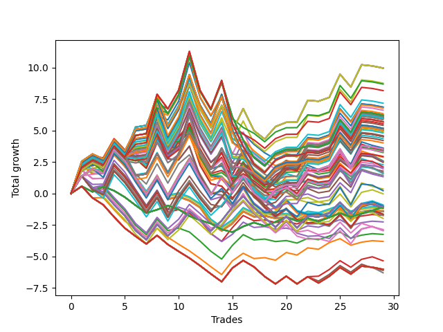

# Long HLT 341 
- Symbol: TSLA
- Date Range: 05/16/2022 - 05/17/2024
- Trading Period: 8:30-12:30
- Number of Trades: 29



| Id. | Name | Win Percent | Profit | Avg Profit / Trade | Avg Time / Trade | Std |      | Name | Win Percent | Profit | Avg Profit / Trade | Avg Time / Trade | Std |
| --- | ---- | ----------- | ------ | ------------------ | ---------------- | --- | ---- | ---- | ----------- | ------ | ------------------ | ---------------- | --- |
| | Sorted By <br> Profit | | | | | | | Sorted By <br> Win Percentage |||||
|0| TP-1.75 180m | 58.62 | 9.96 | 0.34 | 53:41 | 1.35 |     | TP-1.75 180m | 58.62 | 9.96 | 0.34 | 53:41 | 1.35 |
|1| TP-1.75 165m | 58.62 | 9.96 | 0.34 | 53:41 | 1.35 |     | TP-1.75 165m | 58.62 | 9.96 | 0.34 | 53:41 | 1.35 |
|2| TP-1.75 150m | 58.62 | 9.96 | 0.34 | 53:41 | 1.35 |     | TP-1.75 150m | 58.62 | 9.96 | 0.34 | 53:41 | 1.35 |
|3| TP-1.75 135m | 58.62 | 9.96 | 0.34 | 53:41 | 1.35 |     | TP-1.75 135m | 58.62 | 9.96 | 0.34 | 53:41 | 1.35 |
|4| TP-1.75 120m | 58.62 | 9.96 | 0.34 | 53:41 | 1.35 |     | TP-1.75 120m | 58.62 | 9.96 | 0.34 | 53:41 | 1.35 |
|5| TP-1.75 105m | 58.62 | 8.76 | 0.30 | 53:00 | 1.32 |     | TP-1.75 105m | 58.62 | 8.76 | 0.30 | 53:00 | 1.32 |
|6| TP-2.75 105m | 55.17 | 8.69 | 0.30 | 67:10 | 1.42 |     | TP-2.75 105m | 55.17 | 8.69 | 0.30 | 67:10 | 1.42 |
|7| TP-3 105m | 55.17 | 8.17 | 0.28 | 68:16 | 1.52 |     | TP-3 105m | 55.17 | 8.17 | 0.28 | 68:16 | 1.52 |
|8| TP-2 105m | 55.17 | 7.17 | 0.25 | 62:20 | 1.30 |     | TP-2 105m | 55.17 | 7.17 | 0.25 | 62:20 | 1.30 |
|9| TP-2.75 90m | 51.72 | 6.86 | 0.24 | 62:31 | 1.40 |     | TP-2.25 105m | 55.17 | 6.85 | 0.24 | 63:18 | 1.43 |
|10| TP-2.25 105m | 55.17 | 6.85 | 0.24 | 63:18 | 1.43 |     | TP-2.5 105m | 55.17 | 6.78 | 0.23 | 63:35 | 1.48 |
|11| TP-2.5 105m | 55.17 | 6.78 | 0.23 | 63:35 | 1.48 |     | TP-1.75 90m | 55.17 | 6.61 | 0.23 | 51:31 | 1.31 |
|12| TP-1.75 90m | 55.17 | 6.61 | 0.23 | 51:31 | 1.31 |     | TP-2.75 180m | 55.17 | 6.21 | 0.21 | 71:49 | 1.52 |
|13| TP-3 90m | 51.72 | 6.34 | 0.22 | 63:37 | 1.49 |     | TP-2.75 165m | 55.17 | 6.21 | 0.21 | 71:49 | 1.52 |
|14| TP-2.75 180m | 55.17 | 6.21 | 0.21 | 71:49 | 1.52 |     | TP-2.75 150m | 55.17 | 6.21 | 0.21 | 71:49 | 1.52 |
|15| TP-2.75 165m | 55.17 | 6.21 | 0.21 | 71:49 | 1.52 |     | TP-2.75 135m | 55.17 | 6.21 | 0.21 | 71:49 | 1.52 |
|16| TP-2.75 150m | 55.17 | 6.21 | 0.21 | 71:49 | 1.52 |     | TP-2.75 120m | 55.17 | 6.21 | 0.21 | 71:49 | 1.52 |
|17| TP-2.75 135m | 55.17 | 6.21 | 0.21 | 71:49 | 1.52 |     | TP-1.5 180m | 55.17 | 6.07 | 0.21 | 44:55 | 1.26 |
|18| TP-2.75 120m | 55.17 | 6.21 | 0.21 | 71:49 | 1.52 |     | TP-1.5 165m | 55.17 | 6.07 | 0.21 | 44:55 | 1.26 |
|19| TP-1.75 75m | 51.72 | 6.21 | 0.21 | 48:49 | 1.27 |     | TP-1.5 150m | 55.17 | 6.07 | 0.21 | 44:55 | 1.26 |
|20| TP-1.5 180m | 55.17 | 6.07 | 0.21 | 44:55 | 1.26 |     | TP-1.5 135m | 55.17 | 6.07 | 0.21 | 44:55 | 1.26 |
|21| TP-1.5 165m | 55.17 | 6.07 | 0.21 | 44:55 | 1.26 |     | TP-1.5 120m | 55.17 | 6.07 | 0.21 | 44:55 | 1.26 |
|22| TP-1.5 150m | 55.17 | 6.07 | 0.21 | 44:55 | 1.26 |     | TP-2 180m | 55.17 | 5.98 | 0.21 | 65:16 | 1.41 |
|23| TP-1.5 135m | 55.17 | 6.07 | 0.21 | 44:55 | 1.26 |     | TP-2 165m | 55.17 | 5.98 | 0.21 | 65:16 | 1.41 |
|24| TP-1.5 120m | 55.17 | 6.07 | 0.21 | 44:55 | 1.26 |     | TP-2 150m | 55.17 | 5.98 | 0.21 | 65:16 | 1.41 |
|25| TP-2 180m | 55.17 | 5.98 | 0.21 | 65:16 | 1.41 |     | TP-2 135m | 55.17 | 5.98 | 0.21 | 65:16 | 1.41 |
|26| TP-2 165m | 55.17 | 5.98 | 0.21 | 65:16 | 1.41 |     | TP-2 120m | 55.17 | 5.98 | 0.21 | 65:16 | 1.41 |
|27| TP-2 150m | 55.17 | 5.98 | 0.21 | 65:16 | 1.41 |     | TP-1.5 105m | 55.17 | 5.85 | 0.20 | 44:24 | 1.26 |
|28| TP-2 135m | 55.17 | 5.98 | 0.21 | 65:16 | 1.41 |     | TP-3 180m | 55.17 | 5.69 | 0.20 | 72:55 | 1.61 |
|29| TP-2 120m | 55.17 | 5.98 | 0.21 | 65:16 | 1.41 |     | TP-3 165m | 55.17 | 5.69 | 0.20 | 72:55 | 1.61 |
|30| TP-2.75 75m | 48.28 | 5.94 | 0.20 | 57:24 | 1.39 |     | TP-3 150m | 55.17 | 5.69 | 0.20 | 72:55 | 1.61 |
|31| TP-1.5 105m | 55.17 | 5.85 | 0.20 | 44:24 | 1.26 |     | TP-3 135m | 55.17 | 5.69 | 0.20 | 72:55 | 1.61 |
|32| TP-3 180m | 55.17 | 5.69 | 0.20 | 72:55 | 1.61 |     | TP-3 120m | 55.17 | 5.69 | 0.20 | 72:55 | 1.61 |
|33| TP-3 165m | 55.17 | 5.69 | 0.20 | 72:55 | 1.61 |     | TP-2.25 180m | 55.17 | 5.17 | 0.18 | 66:57 | 1.52 |
|34| TP-3 150m | 55.17 | 5.69 | 0.20 | 72:55 | 1.61 |     | TP-2.25 165m | 55.17 | 5.17 | 0.18 | 66:57 | 1.52 |
|35| TP-3 135m | 55.17 | 5.69 | 0.20 | 72:55 | 1.61 |     | TP-2.25 150m | 55.17 | 5.17 | 0.18 | 66:57 | 1.52 |
|36| TP-3 120m | 55.17 | 5.69 | 0.20 | 72:55 | 1.61 |     | TP-2.25 135m | 55.17 | 5.17 | 0.18 | 66:57 | 1.52 |
|37| TP-1.5 75m | 51.72 | 5.53 | 0.19 | 42:28 | 1.25 |     | TP-2.25 120m | 55.17 | 5.17 | 0.18 | 66:57 | 1.52 |
|38| TP-2 75m | 48.28 | 5.41 | 0.19 | 54:00 | 1.23 |     | TP-2.5 180m | 55.17 | 5.01 | 0.17 | 67:43 | 1.56 |
|39| TP-2.25 180m | 55.17 | 5.17 | 0.18 | 66:57 | 1.52 |     | TP-2.5 165m | 55.17 | 5.01 | 0.17 | 67:43 | 1.56 |
|40| TP-2.25 165m | 55.17 | 5.17 | 0.18 | 66:57 | 1.52 |     | TP-2.5 150m | 55.17 | 5.01 | 0.17 | 67:43 | 1.56 |
|41| TP-2.25 150m | 55.17 | 5.17 | 0.18 | 66:57 | 1.52 |     | TP-2.5 135m | 55.17 | 5.01 | 0.17 | 67:43 | 1.56 |
|42| TP-2.25 135m | 55.17 | 5.17 | 0.18 | 66:57 | 1.52 |     | TP-2.5 120m | 55.17 | 5.01 | 0.17 | 67:43 | 1.56 |
|43| TP-2.25 120m | 55.17 | 5.17 | 0.18 | 66:57 | 1.52 |     | TP-1.75 45m | 55.17 | 3.61 | 0.12 | 35:51 | 1.14 |
|44| TP-2 90m | 51.72 | 5.16 | 0.18 | 58:35 | 1.27 |     | TP-2.5 45m | 55.17 | 3.42 | 0.12 | 38:12 | 1.17 |
|45| TP-2.25 75m | 48.28 | 5.13 | 0.18 | 54:35 | 1.37 |     | TP-2.25 45m | 55.17 | 3.25 | 0.11 | 38:06 | 1.13 |
|46| TP-2.5 75m | 48.28 | 5.06 | 0.17 | 54:51 | 1.42 |     | TP-2 45m | 55.17 | 2.88 | 0.10 | 37:39 | 1.09 |
|47| TP-2.5 180m | 55.17 | 5.01 | 0.17 | 67:43 | 1.56 |     | TP-1.5 45m | 55.17 | 2.28 | 0.08 | 33:06 | 1.18 |
|48| TP-2.5 165m | 55.17 | 5.01 | 0.17 | 67:43 | 1.56 |     | TP-3 45m | 55.17 | 1.77 | 0.06 | 39:33 | 1.05 |
|49| TP-2.5 150m | 55.17 | 5.01 | 0.17 | 67:43 | 1.56 |     | TP-2.75 45m | 55.17 | 1.33 | 0.05 | 39:04 | 1.08 |
|50| TP-2.5 135m | 55.17 | 5.01 | 0.17 | 67:43 | 1.56 |     | TP-2.75 90m | 51.72 | 6.86 | 0.24 | 62:31 | 1.40 |
|51| TP-2.5 120m | 55.17 | 5.01 | 0.17 | 67:43 | 1.56 |     | TP-3 90m | 51.72 | 6.34 | 0.22 | 63:37 | 1.49 |
|52| TP-2.25 90m | 51.72 | 4.88 | 0.17 | 59:10 | 1.40 |     | TP-1.75 75m | 51.72 | 6.21 | 0.21 | 48:49 | 1.27 |
|53| TP-2.5 90m | 51.72 | 4.81 | 0.17 | 59:26 | 1.45 |     | TP-1.5 75m | 51.72 | 5.53 | 0.19 | 42:28 | 1.25 |
|54| TP-1.5 90m | 51.72 | 4.58 | 0.16 | 43:53 | 1.26 |     | TP-2 90m | 51.72 | 5.16 | 0.18 | 58:35 | 1.27 |
|55| TP-1 180m | 51.72 | 4.53 | 0.16 | 33:55 | 1.06 |     | TP-2.25 90m | 51.72 | 4.88 | 0.17 | 59:10 | 1.40 |
|56| TP-1 165m | 51.72 | 4.53 | 0.16 | 33:55 | 1.06 |     | TP-2.5 90m | 51.72 | 4.81 | 0.17 | 59:26 | 1.45 |
|57| TP-1 150m | 51.72 | 4.53 | 0.16 | 33:55 | 1.06 |     | TP-1.5 90m | 51.72 | 4.58 | 0.16 | 43:53 | 1.26 |
|58| TP-1 135m | 51.72 | 4.53 | 0.16 | 33:55 | 1.06 |     | TP-1 180m | 51.72 | 4.53 | 0.16 | 33:55 | 1.06 |
|59| TP-1 120m | 51.72 | 4.53 | 0.16 | 33:55 | 1.06 |     | TP-1 165m | 51.72 | 4.53 | 0.16 | 33:55 | 1.06 |
|60| TP-3 75m | 48.28 | 4.36 | 0.15 | 58:16 | 1.43 |     | TP-1 150m | 51.72 | 4.53 | 0.16 | 33:55 | 1.06 |
|61| TP-1 105m | 51.72 | 4.21 | 0.15 | 33:45 | 1.05 |     | TP-1 135m | 51.72 | 4.53 | 0.16 | 33:55 | 1.06 |
|62| TP-1 75m | 48.28 | 4.02 | 0.14 | 32:28 | 1.06 |     | TP-1 120m | 51.72 | 4.53 | 0.16 | 33:55 | 1.06 |
|63| TP-1.75 45m | 55.17 | 3.61 | 0.12 | 35:51 | 1.14 |     | TP-1 105m | 51.72 | 4.21 | 0.15 | 33:45 | 1.05 |
|64| TP-1.25 180m | 51.72 | 3.53 | 0.12 | 39:51 | 1.16 |     | TP-1.25 180m | 51.72 | 3.53 | 0.12 | 39:51 | 1.16 |
|65| TP-1.25 165m | 51.72 | 3.53 | 0.12 | 39:51 | 1.16 |     | TP-1.25 165m | 51.72 | 3.53 | 0.12 | 39:51 | 1.16 |
|66| TP-1.25 150m | 51.72 | 3.53 | 0.12 | 39:51 | 1.16 |     | TP-1.25 150m | 51.72 | 3.53 | 0.12 | 39:51 | 1.16 |
|67| TP-1.25 135m | 51.72 | 3.53 | 0.12 | 39:51 | 1.16 |     | TP-1.25 135m | 51.72 | 3.53 | 0.12 | 39:51 | 1.16 |
|68| TP-1.25 120m | 51.72 | 3.53 | 0.12 | 39:51 | 1.16 |     | TP-1.25 120m | 51.72 | 3.53 | 0.12 | 39:51 | 1.16 |
|69| TP-2.5 45m | 55.17 | 3.42 | 0.12 | 38:12 | 1.17 |     | TP-1.25 105m | 51.72 | 3.31 | 0.11 | 39:20 | 1.16 |
|70| TP-1.25 75m | 48.28 | 3.37 | 0.12 | 37:51 | 1.17 |     | TP-1.75 60m | 51.72 | 2.59 | 0.09 | 43:18 | 1.23 |
|71| TP-1.25 105m | 51.72 | 3.31 | 0.11 | 39:20 | 1.16 |     | TP-2.25 60m | 51.72 | 2.54 | 0.09 | 47:26 | 1.26 |
|72| TP-2.25 45m | 55.17 | 3.25 | 0.11 | 38:06 | 1.13 |     | TP-1.5 60m | 51.72 | 2.51 | 0.09 | 38:35 | 1.22 |
|73| TP-1 90m | 48.28 | 2.94 | 0.10 | 33:14 | 1.05 |     | TP-2.5 60m | 51.72 | 2.47 | 0.09 | 47:43 | 1.32 |
|74| TP-2 45m | 55.17 | 2.88 | 0.10 | 37:39 | 1.09 |     | TP-2 60m | 51.72 | 2.11 | 0.07 | 46:53 | 1.16 |
|75| TP-1.75 60m | 51.72 | 2.59 | 0.09 | 43:18 | 1.23 |     | TP-2.75 60m | 51.72 | 1.94 | 0.07 | 49:26 | 1.23 |
|76| TP-2.25 60m | 51.72 | 2.54 | 0.09 | 47:26 | 1.26 |     | TP-3 60m | 51.72 | 1.64 | 0.06 | 50:02 | 1.25 |
|77| TP-1.5 60m | 51.72 | 2.51 | 0.09 | 38:35 | 1.22 |     | TP-1 45m | 51.72 | 1.44 | 0.05 | 25:49 | 1.01 |
|78| TP-2.5 60m | 51.72 | 2.47 | 0.09 | 47:43 | 1.32 |     | TP-1.25 45m | 51.72 | 0.35 | 0.01 | 29:49 | 1.11 |
|79| TP-1.5 45m | 55.17 | 2.28 | 0.08 | 33:06 | 1.18 |     | TP-2.75 75m | 48.28 | 5.94 | 0.20 | 57:24 | 1.39 |
|80| TP-2 60m | 51.72 | 2.11 | 0.07 | 46:53 | 1.16 |     | TP-2 75m | 48.28 | 5.41 | 0.19 | 54:00 | 1.23 |
|81| TP-1.25 90m | 48.28 | 2.04 | 0.07 | 38:49 | 1.16 |     | TP-2.25 75m | 48.28 | 5.13 | 0.18 | 54:35 | 1.37 |
|82| TP-2.75 60m | 51.72 | 1.94 | 0.07 | 49:26 | 1.23 |     | TP-2.5 75m | 48.28 | 5.06 | 0.17 | 54:51 | 1.42 |
|83| TP-3 45m | 55.17 | 1.77 | 0.06 | 39:33 | 1.05 |     | TP-3 75m | 48.28 | 4.36 | 0.15 | 58:16 | 1.43 |
|84| TP-3 60m | 51.72 | 1.64 | 0.06 | 50:02 | 1.25 |     | TP-1 75m | 48.28 | 4.02 | 0.14 | 32:28 | 1.06 |
|85| TP-1 60m | 48.28 | 1.58 | 0.05 | 30:02 | 1.05 |     | TP-1.25 75m | 48.28 | 3.37 | 0.12 | 37:51 | 1.17 |
|86| TP-1 45m | 51.72 | 1.44 | 0.05 | 25:49 | 1.01 |     | TP-1 90m | 48.28 | 2.94 | 0.10 | 33:14 | 1.05 |
|87| TP-2.75 45m | 55.17 | 1.33 | 0.05 | 39:04 | 1.08 |     | TP-1.25 90m | 48.28 | 2.04 | 0.07 | 38:49 | 1.16 |
|88| TP-1.25 45m | 51.72 | 0.35 | 0.01 | 29:49 | 1.11 |     | TP-1 60m | 48.28 | 1.58 | 0.05 | 30:02 | 1.05 |
|89| TP-1.25 60m | 48.28 | 0.22 | 0.01 | 34:45 | 1.14 |     | TP-1.25 60m | 48.28 | 0.22 | 0.01 | 34:45 | 1.14 |
|90| TP-1.75 30m | 44.83 | -0.03 | -0.00 | 26:02 | 1.07 |     | TP-0.25 180m | 48.28 | -1.07 | -0.04 | 04:49 | 0.38 |
|91| TP-2 30m | 44.83 | -0.91 | -0.03 | 26:31 | 1.05 |     | TP-0.25 165m | 48.28 | -1.07 | -0.04 | 04:49 | 0.38 |
|92| TP-2.25 30m | 44.83 | -0.99 | -0.03 | 26:41 | 1.08 |     | TP-0.25 150m | 48.28 | -1.07 | -0.04 | 04:49 | 0.38 |
|93| TP-0.75 75m | 41.38 | -1.04 | -0.04 | 26:04 | 0.86 |     | TP-0.25 135m | 48.28 | -1.07 | -0.04 | 04:49 | 0.38 |
|94| TP-0.75 180m | 41.38 | -1.06 | -0.04 | 26:06 | 0.86 |     | TP-0.25 120m | 48.28 | -1.07 | -0.04 | 04:49 | 0.38 |
|95| TP-0.75 165m | 41.38 | -1.06 | -0.04 | 26:06 | 0.86 |     | TP-0.25 105m | 48.28 | -1.07 | -0.04 | 04:49 | 0.38 |
|96| TP-0.75 150m | 41.38 | -1.06 | -0.04 | 26:06 | 0.86 |     | TP-0.25 90m | 48.28 | -1.07 | -0.04 | 04:49 | 0.38 |
|97| TP-0.75 135m | 41.38 | -1.06 | -0.04 | 26:06 | 0.86 |     | TP-0.25 75m | 48.28 | -1.07 | -0.04 | 04:49 | 0.38 |
|98| TP-0.75 120m | 41.38 | -1.06 | -0.04 | 26:06 | 0.86 |     | TP-0.25 60m | 48.28 | -1.07 | -0.04 | 04:49 | 0.38 |
|99| TP-0.75 105m | 41.38 | -1.06 | -0.04 | 26:06 | 0.86 |     | TP-0.25 45m | 48.28 | -1.07 | -0.04 | 04:49 | 0.38 |
|100| TP-0.75 90m | 41.38 | -1.06 | -0.04 | 26:06 | 0.86 |     | TP-0.25 30m | 48.28 | -1.07 | -0.04 | 04:49 | 0.38 |
|101| TP-0.25 180m | 48.28 | -1.07 | -0.04 | 04:49 | 0.38 |     | TP-2.5 15m | 48.28 | -1.10 | -0.04 | 13:51 | 0.85 |
|102| TP-0.25 165m | 48.28 | -1.07 | -0.04 | 04:49 | 0.38 |     | TP-2.25 15m | 48.28 | -1.21 | -0.04 | 13:49 | 0.84 |
|103| TP-0.25 150m | 48.28 | -1.07 | -0.04 | 04:49 | 0.38 |     | TP-2 15m | 48.28 | -1.38 | -0.05 | 13:47 | 0.82 |
|104| TP-0.25 135m | 48.28 | -1.07 | -0.04 | 04:49 | 0.38 |     | TP-1.75 15m | 48.28 | -1.41 | -0.05 | 13:41 | 0.81 |
|105| TP-0.25 120m | 48.28 | -1.07 | -0.04 | 04:49 | 0.38 |     | TP-1.5 15m | 48.28 | -1.41 | -0.05 | 13:41 | 0.81 |
|106| TP-0.25 105m | 48.28 | -1.07 | -0.04 | 04:49 | 0.38 |     | TP-3 15m | 48.28 | -1.42 | -0.05 | 14:00 | 0.82 |
|107| TP-0.25 90m | 48.28 | -1.07 | -0.04 | 04:49 | 0.38 |     | TP-2.75 15m | 48.28 | -1.42 | -0.05 | 14:00 | 0.82 |
|108| TP-0.25 75m | 48.28 | -1.07 | -0.04 | 04:49 | 0.38 |     | TP-1 15m | 48.28 | -1.73 | -0.06 | 12:45 | 0.81 |
|109| TP-0.25 60m | 48.28 | -1.07 | -0.04 | 04:49 | 0.38 |     | TP-1.25 15m | 48.28 | -2.26 | -0.08 | 13:12 | 0.80 |
|110| TP-0.25 45m | 48.28 | -1.07 | -0.04 | 04:49 | 0.38 |     | TP-1.75 30m | 44.83 | -0.03 | -0.00 | 26:02 | 1.07 |
|111| TP-0.25 30m | 48.28 | -1.07 | -0.04 | 04:49 | 0.38 |     | TP-2 30m | 44.83 | -0.91 | -0.03 | 26:31 | 1.05 |
|112| TP-2.5 15m | 48.28 | -1.10 | -0.04 | 13:51 | 0.85 |     | TP-2.25 30m | 44.83 | -0.99 | -0.03 | 26:41 | 1.08 |
|113| TP-2.5 30m | 44.83 | -1.10 | -0.04 | 26:45 | 1.11 |     | TP-2.5 30m | 44.83 | -1.10 | -0.04 | 26:45 | 1.11 |
|114| TP-1 30m | 44.83 | -1.17 | -0.04 | 21:00 | 1.03 |     | TP-1 30m | 44.83 | -1.17 | -0.04 | 21:00 | 1.03 |
|115| TP-2.25 15m | 48.28 | -1.21 | -0.04 | 13:49 | 0.84 |     | TP-0.25 15m | 44.83 | -1.44 | -0.05 | 04:37 | 0.37 |
|116| TP-2 15m | 48.28 | -1.38 | -0.05 | 13:47 | 0.82 |     | TP-3 30m | 44.83 | -1.65 | -0.06 | 27:14 | 1.08 |
|117| TP-1.75 15m | 48.28 | -1.41 | -0.05 | 13:41 | 0.81 |     | TP-2.75 30m | 44.83 | -1.65 | -0.06 | 27:14 | 1.08 |
|118| TP-1.5 15m | 48.28 | -1.41 | -0.05 | 13:41 | 0.81 |     | TP-1.5 30m | 44.83 | -1.75 | -0.06 | 24:53 | 1.07 |
|119| TP-3 15m | 48.28 | -1.42 | -0.05 | 14:00 | 0.82 |     | TP-1.25 30m | 44.83 | -2.95 | -0.10 | 22:47 | 1.08 |
|120| TP-2.75 15m | 48.28 | -1.42 | -0.05 | 14:00 | 0.82 |     | TP-0.75 15m | 44.83 | -3.25 | -0.11 | 11:39 | 0.67 |
|121| TP-0.25 15m | 44.83 | -1.44 | -0.05 | 04:37 | 0.37 |     | TP-0.75 75m | 41.38 | -1.04 | -0.04 | 26:04 | 0.86 |
|122| TP-3 30m | 44.83 | -1.65 | -0.06 | 27:14 | 1.08 |     | TP-0.75 180m | 41.38 | -1.06 | -0.04 | 26:06 | 0.86 |
|123| TP-2.75 30m | 44.83 | -1.65 | -0.06 | 27:14 | 1.08 |     | TP-0.75 165m | 41.38 | -1.06 | -0.04 | 26:06 | 0.86 |
|124| TP-1 15m | 48.28 | -1.73 | -0.06 | 12:45 | 0.81 |     | TP-0.75 150m | 41.38 | -1.06 | -0.04 | 26:06 | 0.86 |
|125| TP-1.5 30m | 44.83 | -1.75 | -0.06 | 24:53 | 1.07 |     | TP-0.75 135m | 41.38 | -1.06 | -0.04 | 26:06 | 0.86 |
|126| TP-0.75 60m | 41.38 | -1.98 | -0.07 | 24:55 | 0.86 |     | TP-0.75 120m | 41.38 | -1.06 | -0.04 | 26:06 | 0.86 |
|127| TP-1.25 15m | 48.28 | -2.26 | -0.08 | 13:12 | 0.80 |     | TP-0.75 105m | 41.38 | -1.06 | -0.04 | 26:06 | 0.86 |
|128| TP-0.75 45m | 41.38 | -2.86 | -0.10 | 22:02 | 0.82 |     | TP-0.75 90m | 41.38 | -1.06 | -0.04 | 26:06 | 0.86 |
|129| TP-0.75 30m | 41.38 | -2.94 | -0.10 | 18:24 | 0.82 |     | TP-0.75 60m | 41.38 | -1.98 | -0.07 | 24:55 | 0.86 |
|130| TP-1.25 30m | 44.83 | -2.95 | -0.10 | 22:47 | 1.08 |     | TP-0.75 45m | 41.38 | -2.86 | -0.10 | 22:02 | 0.82 |
|131| TP-0.75 15m | 44.83 | -3.25 | -0.11 | 11:39 | 0.67 |     | TP-0.75 30m | 41.38 | -2.94 | -0.10 | 18:24 | 0.82 |
|132| TP-0.5 15m | 41.38 | -3.81 | -0.13 | 09:26 | 0.56 |     | TP-0.5 15m | 41.38 | -3.81 | -0.13 | 09:26 | 0.56 |
|133| TP-0.5 30m | 37.93 | -5.35 | -0.18 | 12:35 | 0.62 |     | TP-0.5 30m | 37.93 | -5.35 | -0.18 | 12:35 | 0.62 |
|134| TP-0.5 180m | 31.03 | -6.03 | -0.21 | 15:10 | 0.62 |     | TP-0.5 180m | 31.03 | -6.03 | -0.21 | 15:10 | 0.62 |
|135| TP-0.5 165m | 31.03 | -6.03 | -0.21 | 15:10 | 0.62 |     | TP-0.5 165m | 31.03 | -6.03 | -0.21 | 15:10 | 0.62 |
|136| TP-0.5 150m | 31.03 | -6.03 | -0.21 | 15:10 | 0.62 |     | TP-0.5 150m | 31.03 | -6.03 | -0.21 | 15:10 | 0.62 |
|137| TP-0.5 135m | 31.03 | -6.03 | -0.21 | 15:10 | 0.62 |     | TP-0.5 135m | 31.03 | -6.03 | -0.21 | 15:10 | 0.62 |
|138| TP-0.5 120m | 31.03 | -6.03 | -0.21 | 15:10 | 0.62 |     | TP-0.5 120m | 31.03 | -6.03 | -0.21 | 15:10 | 0.62 |
|139| TP-0.5 105m | 31.03 | -6.03 | -0.21 | 15:10 | 0.62 |     | TP-0.5 105m | 31.03 | -6.03 | -0.21 | 15:10 | 0.62 |
|140| TP-0.5 90m | 31.03 | -6.03 | -0.21 | 15:10 | 0.62 |     | TP-0.5 90m | 31.03 | -6.03 | -0.21 | 15:10 | 0.62 |
|141| TP-0.5 75m | 31.03 | -6.03 | -0.21 | 15:10 | 0.62 |     | TP-0.5 75m | 31.03 | -6.03 | -0.21 | 15:10 | 0.62 |
|142| TP-0.5 45m | 31.03 | -6.11 | -0.21 | 14:08 | 0.61 |     | TP-0.5 45m | 31.03 | -6.11 | -0.21 | 14:08 | 0.61 |
|143| TP-0.5 60m | 31.03 | -6.30 | -0.22 | 14:57 | 0.62 |     | TP-0.5 60m | 31.03 | -6.30 | -0.22 | 14:57 | 0.62 |

### Test TP-0.25 15m
* Take Profit of 0.25 Point
* 0.25 Stoploss
* Results:
```
Total Trades: 29
Percent Up: 44.83
Percent Down: 55.17
Total Points Moved Up: -1.44
Potential Profit: -720.00
Total Points Ups: 4.43 Count Ups: 13
Total Points Downs: -5.87 Count Downs: 16
```

<details><summary>Trades</summary>

<code>In: 2022-05-24 12:30:00		Out: 2022-05-24 12:34:00		Total Position Time: 04:00		Total Move Up: 0.57		Total to Date: 0.57</code> <br />
<code>In: 2022-06-16 12:05:00		Out: 2022-06-16 12:09:00		Total Position Time: 04:00		Total Move Up: -0.44		Total to Date: 0.13</code> <br />
<code>In: 2022-07-26 11:50:00		Out: 2022-07-26 11:52:00		Total Position Time: 02:00		Total Move Up: 0.42		Total to Date: 0.55</code> <br />
<code>In: 2022-08-05 12:35:00		Out: 2022-08-05 12:37:00		Total Position Time: 02:00		Total Move Up: -0.33		Total to Date: 0.22</code> <br />
<code>In: 2022-08-11 12:35:00		Out: 2022-08-11 12:37:00		Total Position Time: 02:00		Total Move Up: -0.51		Total to Date: -0.29</code> <br />
<code>In: 2022-09-01 08:40:00		Out: 2022-09-01 08:42:00		Total Position Time: 02:00		Total Move Up: -0.65		Total to Date: -0.94</code> <br />
<code>In: 2022-09-23 12:10:00		Out: 2022-09-23 12:14:00		Total Position Time: 04:00		Total Move Up: -0.61		Total to Date: -1.55</code> <br />
<code>In: 2022-10-05 08:45:00		Out: 2022-10-05 08:48:00		Total Position Time: 03:00		Total Move Up: 0.26		Total to Date: -1.29</code> <br />
<code>In: 2022-10-20 10:35:00		Out: 2022-10-20 10:37:00		Total Position Time: 02:00		Total Move Up: 0.33		Total to Date: -0.96</code> <br />
<code>In: 2022-10-20 11:40:00		Out: 2022-10-20 11:43:00		Total Position Time: 03:00		Total Move Up: -0.30		Total to Date: -1.26</code> <br />
<code>In: 2022-11-04 11:20:00		Out: 2022-11-04 11:22:00		Total Position Time: 02:00		Total Move Up: -0.53		Total to Date: -1.79</code> <br />
<code>In: 2022-11-09 08:50:00		Out: 2022-11-09 08:52:00		Total Position Time: 02:00		Total Move Up: -0.33		Total to Date: -2.12</code> <br />
<code>In: 2022-12-20 12:35:00		Out: 2022-12-20 12:38:00		Total Position Time: 03:00		Total Move Up: -0.27		Total to Date: -2.39</code> <br />
<code>In: 2023-01-19 08:55:00		Out: 2023-01-19 08:58:00		Total Position Time: 03:00		Total Move Up: -0.46		Total to Date: -2.85</code> <br />
<code>In: 2023-02-03 11:00:00		Out: 2023-02-03 11:03:00		Total Position Time: 03:00		Total Move Up: -0.22		Total to Date: -3.07</code> <br />
<code>In: 2023-04-03 08:55:00		Out: 2023-04-03 08:57:00		Total Position Time: 02:00		Total Move Up: 0.45		Total to Date: -2.62</code> <br />
<code>In: 2023-07-11 08:55:00		Out: 2023-07-11 08:59:00		Total Position Time: 04:00		Total Move Up: 0.31		Total to Date: -2.31</code> <br />
<code>In: 2023-08-04 12:20:00		Out: 2023-08-04 12:23:00		Total Position Time: 03:00		Total Move Up: -0.27		Total to Date: -2.58</code> <br />
<code>In: 2023-08-16 09:40:00		Out: 2023-08-16 09:43:00		Total Position Time: 03:00		Total Move Up: 0.32		Total to Date: -2.26</code> <br />
<code>In: 2023-09-26 11:30:00		Out: 2023-09-26 11:32:00		Total Position Time: 02:00		Total Move Up: 0.39		Total to Date: -1.87</code> <br />
<code>In: 2023-10-12 11:30:00		Out: 2023-10-12 11:41:00		Total Position Time: 11:00		Total Move Up: -0.32		Total to Date: -2.19</code> <br />
<code>In: 2024-01-05 09:45:00		Out: 2024-01-05 09:53:00		Total Position Time: 08:00		Total Move Up: 0.23		Total to Date: -1.96</code> <br />
<code>In: 2024-01-26 11:40:00		Out: 2024-01-26 11:43:00		Total Position Time: 03:00		Total Move Up: -0.27		Total to Date: -2.23</code> <br />
<code>In: 2024-02-12 11:35:00		Out: 2024-02-12 11:40:00		Total Position Time: 05:00		Total Move Up: 0.33		Total to Date: -1.90</code> <br />
<code>In: 2024-03-15 10:10:00		Out: 2024-03-15 10:21:00		Total Position Time: 11:00		Total Move Up: 0.34		Total to Date: -1.56</code> <br />
<code>In: 2024-04-15 11:40:00		Out: 2024-04-15 11:45:00		Total Position Time: 05:00		Total Move Up: -0.30		Total to Date: -1.86</code> <br />
<code>In: 2024-04-22 08:35:00		Out: 2024-04-22 08:49:00		Total Position Time: 14:00		Total Move Up: 0.24		Total to Date: -1.62</code> <br />
<code>In: 2024-05-07 12:00:00		Out: 2024-05-07 12:08:00		Total Position Time: 08:00		Total Move Up: 0.24		Total to Date: -1.38</code> <br />
<code>In: 2024-05-09 11:45:00		Out: 2024-05-09 11:59:00		Total Position Time: 14:00		Total Move Up: -0.06		Total to Date: -1.44</code> <br />


</details>

### Test TP-0.5 15m
* Take Profit of 0.5 Point
* 0.5 Stoploss
* Results:
```
Total Trades: 29
Percent Up: 41.38
Percent Down: 58.62
Total Points Moved Up: -3.81
Potential Profit: -1905.00
Total Points Ups: 5.41 Count Ups: 12
Total Points Downs: -9.22 Count Downs: 17
```

<details><summary>Trades</summary>

<code>In: 2022-05-24 12:30:00		Out: 2022-05-24 12:34:00		Total Position Time: 04:00		Total Move Up: 0.57		Total to Date: 0.57</code> <br />
<code>In: 2022-06-16 12:05:00		Out: 2022-06-16 12:14:00		Total Position Time: 09:00		Total Move Up: -0.92		Total to Date: -0.35</code> <br />
<code>In: 2022-07-26 11:50:00		Out: 2022-07-26 12:04:00		Total Position Time: 14:00		Total Move Up: 0.02		Total to Date: -0.33</code> <br />
<code>In: 2022-08-05 12:35:00		Out: 2022-08-05 12:40:00		Total Position Time: 05:00		Total Move Up: -0.96		Total to Date: -1.29</code> <br />
<code>In: 2022-08-11 12:35:00		Out: 2022-08-11 12:38:00		Total Position Time: 03:00		Total Move Up: -0.89		Total to Date: -2.18</code> <br />
<code>In: 2022-09-01 08:40:00		Out: 2022-09-01 08:42:00		Total Position Time: 02:00		Total Move Up: -0.65		Total to Date: -2.83</code> <br />
<code>In: 2022-09-23 12:10:00		Out: 2022-09-23 12:14:00		Total Position Time: 04:00		Total Move Up: -0.61		Total to Date: -3.44</code> <br />
<code>In: 2022-10-05 08:45:00		Out: 2022-10-05 08:58:00		Total Position Time: 13:00		Total Move Up: 0.68		Total to Date: -2.76</code> <br />
<code>In: 2022-10-20 10:35:00		Out: 2022-10-20 10:47:00		Total Position Time: 12:00		Total Move Up: -0.72		Total to Date: -3.48</code> <br />
<code>In: 2022-10-20 11:40:00		Out: 2022-10-20 11:45:00		Total Position Time: 05:00		Total Move Up: -0.55		Total to Date: -4.03</code> <br />
<code>In: 2022-11-04 11:20:00		Out: 2022-11-04 11:22:00		Total Position Time: 02:00		Total Move Up: -0.53		Total to Date: -4.56</code> <br />
<code>In: 2022-11-09 08:50:00		Out: 2022-11-09 08:54:00		Total Position Time: 04:00		Total Move Up: -0.61		Total to Date: -5.17</code> <br />
<code>In: 2022-12-20 12:35:00		Out: 2022-12-20 12:41:00		Total Position Time: 06:00		Total Move Up: -0.65		Total to Date: -5.82</code> <br />
<code>In: 2023-01-19 08:55:00		Out: 2023-01-19 09:09:00		Total Position Time: 14:00		Total Move Up: -0.62		Total to Date: -6.44</code> <br />
<code>In: 2023-02-03 11:00:00		Out: 2023-02-03 11:09:00		Total Position Time: 09:00		Total Move Up: 1.09		Total to Date: -5.35</code> <br />
<code>In: 2023-04-03 08:55:00		Out: 2023-04-03 08:58:00		Total Position Time: 03:00		Total Move Up: 0.60		Total to Date: -4.75</code> <br />
<code>In: 2023-07-11 08:55:00		Out: 2023-07-11 09:09:00		Total Position Time: 14:00		Total Move Up: -0.42		Total to Date: -5.17</code> <br />
<code>In: 2023-08-04 12:20:00		Out: 2023-08-04 12:34:00		Total Position Time: 14:00		Total Move Up: 0.07		Total to Date: -5.10</code> <br />
<code>In: 2023-08-16 09:40:00		Out: 2023-08-16 09:54:00		Total Position Time: 14:00		Total Move Up: -0.20		Total to Date: -5.30</code> <br />
<code>In: 2023-09-26 11:30:00		Out: 2023-09-26 11:37:00		Total Position Time: 07:00		Total Move Up: 0.61		Total to Date: -4.69</code> <br />
<code>In: 2023-10-12 11:30:00		Out: 2023-10-12 11:44:00		Total Position Time: 14:00		Total Move Up: -0.20		Total to Date: -4.89</code> <br />
<code>In: 2024-01-05 09:45:00		Out: 2024-01-05 09:57:00		Total Position Time: 12:00		Total Move Up: 0.57		Total to Date: -4.32</code> <br />
<code>In: 2024-01-26 11:40:00		Out: 2024-01-26 11:54:00		Total Position Time: 14:00		Total Move Up: -0.11		Total to Date: -4.43</code> <br />
<code>In: 2024-02-12 11:35:00		Out: 2024-02-12 11:42:00		Total Position Time: 07:00		Total Move Up: 0.53		Total to Date: -3.90</code> <br />
<code>In: 2024-03-15 10:10:00		Out: 2024-03-15 10:24:00		Total Position Time: 14:00		Total Move Up: 0.31		Total to Date: -3.59</code> <br />
<code>In: 2024-04-15 11:40:00		Out: 2024-04-15 11:53:00		Total Position Time: 13:00		Total Move Up: -0.52		Total to Date: -4.11</code> <br />
<code>In: 2024-04-22 08:35:00		Out: 2024-04-22 08:49:00		Total Position Time: 14:00		Total Move Up: 0.24		Total to Date: -3.87</code> <br />
<code>In: 2024-05-07 12:00:00		Out: 2024-05-07 12:14:00		Total Position Time: 14:00		Total Move Up: 0.12		Total to Date: -3.75</code> <br />
<code>In: 2024-05-09 11:45:00		Out: 2024-05-09 11:59:00		Total Position Time: 14:00		Total Move Up: -0.06		Total to Date: -3.81</code> <br />


</details>

### Test TP-0.75 15m
* Take Profit of 0.75 Point
* 0.75 Stoploss
* Results:
```
Total Trades: 29
Percent Up: 44.83
Percent Down: 55.17
Total Points Moved Up: -3.25
Potential Profit: -1625.00
Total Points Ups: 6.26 Count Ups: 13
Total Points Downs: -9.51 Count Downs: 16
```

<details><summary>Trades</summary>

<code>In: 2022-05-24 12:30:00		Out: 2022-05-24 12:36:00		Total Position Time: 06:00		Total Move Up: 1.39		Total to Date: 1.39</code> <br />
<code>In: 2022-06-16 12:05:00		Out: 2022-06-16 12:14:00		Total Position Time: 09:00		Total Move Up: -0.92		Total to Date: 0.47</code> <br />
<code>In: 2022-07-26 11:50:00		Out: 2022-07-26 12:04:00		Total Position Time: 14:00		Total Move Up: 0.02		Total to Date: 0.49</code> <br />
<code>In: 2022-08-05 12:35:00		Out: 2022-08-05 12:40:00		Total Position Time: 05:00		Total Move Up: -0.96		Total to Date: -0.47</code> <br />
<code>In: 2022-08-11 12:35:00		Out: 2022-08-11 12:38:00		Total Position Time: 03:00		Total Move Up: -0.89		Total to Date: -1.36</code> <br />
<code>In: 2022-09-01 08:40:00		Out: 2022-09-01 08:44:00		Total Position Time: 04:00		Total Move Up: -1.17		Total to Date: -2.53</code> <br />
<code>In: 2022-09-23 12:10:00		Out: 2022-09-23 12:21:00		Total Position Time: 11:00		Total Move Up: -0.74		Total to Date: -3.27</code> <br />
<code>In: 2022-10-05 08:45:00		Out: 2022-10-05 08:59:00		Total Position Time: 14:00		Total Move Up: 1.22		Total to Date: -2.05</code> <br />
<code>In: 2022-10-20 10:35:00		Out: 2022-10-20 10:48:00		Total Position Time: 13:00		Total Move Up: -0.90		Total to Date: -2.95</code> <br />
<code>In: 2022-10-20 11:40:00		Out: 2022-10-20 11:54:00		Total Position Time: 14:00		Total Move Up: 0.20		Total to Date: -2.75</code> <br />
<code>In: 2022-11-04 11:20:00		Out: 2022-11-04 11:34:00		Total Position Time: 14:00		Total Move Up: -0.31		Total to Date: -3.06</code> <br />
<code>In: 2022-11-09 08:50:00		Out: 2022-11-09 08:58:00		Total Position Time: 08:00		Total Move Up: -0.73		Total to Date: -3.79</code> <br />
<code>In: 2022-12-20 12:35:00		Out: 2022-12-20 12:44:00		Total Position Time: 09:00		Total Move Up: -0.80		Total to Date: -4.59</code> <br />
<code>In: 2023-01-19 08:55:00		Out: 2023-01-19 09:09:00		Total Position Time: 14:00		Total Move Up: -0.62		Total to Date: -5.21</code> <br />
<code>In: 2023-02-03 11:00:00		Out: 2023-02-03 11:09:00		Total Position Time: 09:00		Total Move Up: 1.09		Total to Date: -4.12</code> <br />
<code>In: 2023-04-03 08:55:00		Out: 2023-04-03 09:04:00		Total Position Time: 09:00		Total Move Up: 0.85		Total to Date: -3.27</code> <br />
<code>In: 2023-07-11 08:55:00		Out: 2023-07-11 09:09:00		Total Position Time: 14:00		Total Move Up: -0.42		Total to Date: -3.69</code> <br />
<code>In: 2023-08-04 12:20:00		Out: 2023-08-04 12:34:00		Total Position Time: 14:00		Total Move Up: 0.07		Total to Date: -3.62</code> <br />
<code>In: 2023-08-16 09:40:00		Out: 2023-08-16 09:54:00		Total Position Time: 14:00		Total Move Up: -0.20		Total to Date: -3.82</code> <br />
<code>In: 2023-09-26 11:30:00		Out: 2023-09-26 11:44:00		Total Position Time: 14:00		Total Move Up: 0.08		Total to Date: -3.74</code> <br />
<code>In: 2023-10-12 11:30:00		Out: 2023-10-12 11:44:00		Total Position Time: 14:00		Total Move Up: -0.20		Total to Date: -3.94</code> <br />
<code>In: 2024-01-05 09:45:00		Out: 2024-01-05 09:59:00		Total Position Time: 14:00		Total Move Up: 0.38		Total to Date: -3.56</code> <br />
<code>In: 2024-01-26 11:40:00		Out: 2024-01-26 11:54:00		Total Position Time: 14:00		Total Move Up: -0.11		Total to Date: -3.67</code> <br />
<code>In: 2024-02-12 11:35:00		Out: 2024-02-12 11:49:00		Total Position Time: 14:00		Total Move Up: 0.29		Total to Date: -3.38</code> <br />
<code>In: 2024-03-15 10:10:00		Out: 2024-03-15 10:24:00		Total Position Time: 14:00		Total Move Up: 0.31		Total to Date: -3.07</code> <br />
<code>In: 2024-04-15 11:40:00		Out: 2024-04-15 11:54:00		Total Position Time: 14:00		Total Move Up: -0.48		Total to Date: -3.55</code> <br />
<code>In: 2024-04-22 08:35:00		Out: 2024-04-22 08:49:00		Total Position Time: 14:00		Total Move Up: 0.24		Total to Date: -3.31</code> <br />
<code>In: 2024-05-07 12:00:00		Out: 2024-05-07 12:14:00		Total Position Time: 14:00		Total Move Up: 0.12		Total to Date: -3.19</code> <br />
<code>In: 2024-05-09 11:45:00		Out: 2024-05-09 11:59:00		Total Position Time: 14:00		Total Move Up: -0.06		Total to Date: -3.25</code> <br />


</details>

### Test TP-1 15m
* Take Profit of 1 Point
* 1 Stoploss
* Results:
```
Total Trades: 29
Percent Up: 48.28
Percent Down: 51.72
Total Points Moved Up: -1.73
Potential Profit: -865.00
Total Points Ups: 8.26 Count Ups: 14
Total Points Downs: -9.99 Count Downs: 15
```

<details><summary>Trades</summary>

<code>In: 2022-05-24 12:30:00		Out: 2022-05-24 12:36:00		Total Position Time: 06:00		Total Move Up: 1.39		Total to Date: 1.39</code> <br />
<code>In: 2022-06-16 12:05:00		Out: 2022-06-16 12:16:00		Total Position Time: 11:00		Total Move Up: -1.09		Total to Date: 0.30</code> <br />
<code>In: 2022-07-26 11:50:00		Out: 2022-07-26 12:04:00		Total Position Time: 14:00		Total Move Up: 0.02		Total to Date: 0.32</code> <br />
<code>In: 2022-08-05 12:35:00		Out: 2022-08-05 12:47:00		Total Position Time: 12:00		Total Move Up: 1.89		Total to Date: 2.21</code> <br />
<code>In: 2022-08-11 12:35:00		Out: 2022-08-11 12:46:00		Total Position Time: 11:00		Total Move Up: -0.92		Total to Date: 1.29</code> <br />
<code>In: 2022-09-01 08:40:00		Out: 2022-09-01 08:44:00		Total Position Time: 04:00		Total Move Up: -1.17		Total to Date: 0.12</code> <br />
<code>In: 2022-09-23 12:10:00		Out: 2022-09-23 12:22:00		Total Position Time: 12:00		Total Move Up: -1.27		Total to Date: -1.15</code> <br />
<code>In: 2022-10-05 08:45:00		Out: 2022-10-05 08:59:00		Total Position Time: 14:00		Total Move Up: 1.22		Total to Date: 0.07</code> <br />
<code>In: 2022-10-20 10:35:00		Out: 2022-10-20 10:49:00		Total Position Time: 14:00		Total Move Up: -1.55		Total to Date: -1.48</code> <br />
<code>In: 2022-10-20 11:40:00		Out: 2022-10-20 11:54:00		Total Position Time: 14:00		Total Move Up: 0.20		Total to Date: -1.28</code> <br />
<code>In: 2022-11-04 11:20:00		Out: 2022-11-04 11:34:00		Total Position Time: 14:00		Total Move Up: -0.31		Total to Date: -1.59</code> <br />
<code>In: 2022-11-09 08:50:00		Out: 2022-11-09 09:04:00		Total Position Time: 14:00		Total Move Up: -0.55		Total to Date: -2.14</code> <br />
<code>In: 2022-12-20 12:35:00		Out: 2022-12-20 12:46:00		Total Position Time: 11:00		Total Move Up: -1.04		Total to Date: -3.18</code> <br />
<code>In: 2023-01-19 08:55:00		Out: 2023-01-19 09:09:00		Total Position Time: 14:00		Total Move Up: -0.62		Total to Date: -3.80</code> <br />
<code>In: 2023-02-03 11:00:00		Out: 2023-02-03 11:09:00		Total Position Time: 09:00		Total Move Up: 1.09		Total to Date: -2.71</code> <br />
<code>In: 2023-04-03 08:55:00		Out: 2023-04-03 09:09:00		Total Position Time: 14:00		Total Move Up: 0.96		Total to Date: -1.75</code> <br />
<code>In: 2023-07-11 08:55:00		Out: 2023-07-11 09:09:00		Total Position Time: 14:00		Total Move Up: -0.42		Total to Date: -2.17</code> <br />
<code>In: 2023-08-04 12:20:00		Out: 2023-08-04 12:34:00		Total Position Time: 14:00		Total Move Up: 0.07		Total to Date: -2.10</code> <br />
<code>In: 2023-08-16 09:40:00		Out: 2023-08-16 09:54:00		Total Position Time: 14:00		Total Move Up: -0.20		Total to Date: -2.30</code> <br />
<code>In: 2023-09-26 11:30:00		Out: 2023-09-26 11:44:00		Total Position Time: 14:00		Total Move Up: 0.08		Total to Date: -2.22</code> <br />
<code>In: 2023-10-12 11:30:00		Out: 2023-10-12 11:44:00		Total Position Time: 14:00		Total Move Up: -0.20		Total to Date: -2.42</code> <br />
<code>In: 2024-01-05 09:45:00		Out: 2024-01-05 09:59:00		Total Position Time: 14:00		Total Move Up: 0.38		Total to Date: -2.04</code> <br />
<code>In: 2024-01-26 11:40:00		Out: 2024-01-26 11:54:00		Total Position Time: 14:00		Total Move Up: -0.11		Total to Date: -2.15</code> <br />
<code>In: 2024-02-12 11:35:00		Out: 2024-02-12 11:49:00		Total Position Time: 14:00		Total Move Up: 0.29		Total to Date: -1.86</code> <br />
<code>In: 2024-03-15 10:10:00		Out: 2024-03-15 10:24:00		Total Position Time: 14:00		Total Move Up: 0.31		Total to Date: -1.55</code> <br />
<code>In: 2024-04-15 11:40:00		Out: 2024-04-15 11:54:00		Total Position Time: 14:00		Total Move Up: -0.48		Total to Date: -2.03</code> <br />
<code>In: 2024-04-22 08:35:00		Out: 2024-04-22 08:49:00		Total Position Time: 14:00		Total Move Up: 0.24		Total to Date: -1.79</code> <br />
<code>In: 2024-05-07 12:00:00		Out: 2024-05-07 12:14:00		Total Position Time: 14:00		Total Move Up: 0.12		Total to Date: -1.67</code> <br />
<code>In: 2024-05-09 11:45:00		Out: 2024-05-09 11:59:00		Total Position Time: 14:00		Total Move Up: -0.06		Total to Date: -1.73</code> <br />


</details>

### Test TP-1.25 15m
* Take Profit of 1.25 Point
* 1.25 Stoploss
* Results:
```
Total Trades: 29
Percent Up: 48.28
Percent Down: 51.72
Total Points Moved Up: -2.26
Potential Profit: -1130.00
Total Points Ups: 7.75 Count Ups: 14
Total Points Downs: -10.01 Count Downs: 15
```

<details><summary>Trades</summary>

<code>In: 2022-05-24 12:30:00		Out: 2022-05-24 12:36:00		Total Position Time: 06:00		Total Move Up: 1.39		Total to Date: 1.39</code> <br />
<code>In: 2022-06-16 12:05:00		Out: 2022-06-16 12:19:00		Total Position Time: 14:00		Total Move Up: -0.67		Total to Date: 0.72</code> <br />
<code>In: 2022-07-26 11:50:00		Out: 2022-07-26 12:04:00		Total Position Time: 14:00		Total Move Up: 0.02		Total to Date: 0.74</code> <br />
<code>In: 2022-08-05 12:35:00		Out: 2022-08-05 12:47:00		Total Position Time: 12:00		Total Move Up: 1.89		Total to Date: 2.63</code> <br />
<code>In: 2022-08-11 12:35:00		Out: 2022-08-11 12:49:00		Total Position Time: 14:00		Total Move Up: -0.93		Total to Date: 1.70</code> <br />
<code>In: 2022-09-01 08:40:00		Out: 2022-09-01 08:45:00		Total Position Time: 05:00		Total Move Up: -1.38		Total to Date: 0.32</code> <br />
<code>In: 2022-09-23 12:10:00		Out: 2022-09-23 12:22:00		Total Position Time: 12:00		Total Move Up: -1.27		Total to Date: -0.95</code> <br />
<code>In: 2022-10-05 08:45:00		Out: 2022-10-05 08:59:00		Total Position Time: 14:00		Total Move Up: 1.22		Total to Date: 0.27</code> <br />
<code>In: 2022-10-20 10:35:00		Out: 2022-10-20 10:49:00		Total Position Time: 14:00		Total Move Up: -1.55		Total to Date: -1.28</code> <br />
<code>In: 2022-10-20 11:40:00		Out: 2022-10-20 11:54:00		Total Position Time: 14:00		Total Move Up: 0.20		Total to Date: -1.08</code> <br />
<code>In: 2022-11-04 11:20:00		Out: 2022-11-04 11:34:00		Total Position Time: 14:00		Total Move Up: -0.31		Total to Date: -1.39</code> <br />
<code>In: 2022-11-09 08:50:00		Out: 2022-11-09 09:04:00		Total Position Time: 14:00		Total Move Up: -0.55		Total to Date: -1.94</code> <br />
<code>In: 2022-12-20 12:35:00		Out: 2022-12-20 12:47:00		Total Position Time: 12:00		Total Move Up: -1.26		Total to Date: -3.20</code> <br />
<code>In: 2023-01-19 08:55:00		Out: 2023-01-19 09:09:00		Total Position Time: 14:00		Total Move Up: -0.62		Total to Date: -3.82</code> <br />
<code>In: 2023-02-03 11:00:00		Out: 2023-02-03 11:14:00		Total Position Time: 14:00		Total Move Up: 0.58		Total to Date: -3.24</code> <br />
<code>In: 2023-04-03 08:55:00		Out: 2023-04-03 09:09:00		Total Position Time: 14:00		Total Move Up: 0.96		Total to Date: -2.28</code> <br />
<code>In: 2023-07-11 08:55:00		Out: 2023-07-11 09:09:00		Total Position Time: 14:00		Total Move Up: -0.42		Total to Date: -2.70</code> <br />
<code>In: 2023-08-04 12:20:00		Out: 2023-08-04 12:34:00		Total Position Time: 14:00		Total Move Up: 0.07		Total to Date: -2.63</code> <br />
<code>In: 2023-08-16 09:40:00		Out: 2023-08-16 09:54:00		Total Position Time: 14:00		Total Move Up: -0.20		Total to Date: -2.83</code> <br />
<code>In: 2023-09-26 11:30:00		Out: 2023-09-26 11:44:00		Total Position Time: 14:00		Total Move Up: 0.08		Total to Date: -2.75</code> <br />
<code>In: 2023-10-12 11:30:00		Out: 2023-10-12 11:44:00		Total Position Time: 14:00		Total Move Up: -0.20		Total to Date: -2.95</code> <br />
<code>In: 2024-01-05 09:45:00		Out: 2024-01-05 09:59:00		Total Position Time: 14:00		Total Move Up: 0.38		Total to Date: -2.57</code> <br />
<code>In: 2024-01-26 11:40:00		Out: 2024-01-26 11:54:00		Total Position Time: 14:00		Total Move Up: -0.11		Total to Date: -2.68</code> <br />
<code>In: 2024-02-12 11:35:00		Out: 2024-02-12 11:49:00		Total Position Time: 14:00		Total Move Up: 0.29		Total to Date: -2.39</code> <br />
<code>In: 2024-03-15 10:10:00		Out: 2024-03-15 10:24:00		Total Position Time: 14:00		Total Move Up: 0.31		Total to Date: -2.08</code> <br />
<code>In: 2024-04-15 11:40:00		Out: 2024-04-15 11:54:00		Total Position Time: 14:00		Total Move Up: -0.48		Total to Date: -2.56</code> <br />
<code>In: 2024-04-22 08:35:00		Out: 2024-04-22 08:49:00		Total Position Time: 14:00		Total Move Up: 0.24		Total to Date: -2.32</code> <br />
<code>In: 2024-05-07 12:00:00		Out: 2024-05-07 12:14:00		Total Position Time: 14:00		Total Move Up: 0.12		Total to Date: -2.20</code> <br />
<code>In: 2024-05-09 11:45:00		Out: 2024-05-09 11:59:00		Total Position Time: 14:00		Total Move Up: -0.06		Total to Date: -2.26</code> <br />


</details>

### Test TP-1.5 15m
* Take Profit of 1.5 Point
* 1.5 Stoploss
* Results:
```
Total Trades: 29
Percent Up: 48.28
Percent Down: 51.72
Total Points Moved Up: -1.41
Potential Profit: -705.00
Total Points Ups: 8.21 Count Ups: 14
Total Points Downs: -9.62 Count Downs: 15
```

<details><summary>Trades</summary>

<code>In: 2022-05-24 12:30:00		Out: 2022-05-24 12:37:00		Total Position Time: 07:00		Total Move Up: 1.85		Total to Date: 1.85</code> <br />
<code>In: 2022-06-16 12:05:00		Out: 2022-06-16 12:19:00		Total Position Time: 14:00		Total Move Up: -0.67		Total to Date: 1.18</code> <br />
<code>In: 2022-07-26 11:50:00		Out: 2022-07-26 12:04:00		Total Position Time: 14:00		Total Move Up: 0.02		Total to Date: 1.20</code> <br />
<code>In: 2022-08-05 12:35:00		Out: 2022-08-05 12:47:00		Total Position Time: 12:00		Total Move Up: 1.89		Total to Date: 3.09</code> <br />
<code>In: 2022-08-11 12:35:00		Out: 2022-08-11 12:49:00		Total Position Time: 14:00		Total Move Up: -0.93		Total to Date: 2.16</code> <br />
<code>In: 2022-09-01 08:40:00		Out: 2022-09-01 08:54:00		Total Position Time: 14:00		Total Move Up: -1.10		Total to Date: 1.06</code> <br />
<code>In: 2022-09-23 12:10:00		Out: 2022-09-23 12:24:00		Total Position Time: 14:00		Total Move Up: -1.19		Total to Date: -0.13</code> <br />
<code>In: 2022-10-05 08:45:00		Out: 2022-10-05 08:59:00		Total Position Time: 14:00		Total Move Up: 1.22		Total to Date: 1.09</code> <br />
<code>In: 2022-10-20 10:35:00		Out: 2022-10-20 10:49:00		Total Position Time: 14:00		Total Move Up: -1.55		Total to Date: -0.46</code> <br />
<code>In: 2022-10-20 11:40:00		Out: 2022-10-20 11:54:00		Total Position Time: 14:00		Total Move Up: 0.20		Total to Date: -0.26</code> <br />
<code>In: 2022-11-04 11:20:00		Out: 2022-11-04 11:34:00		Total Position Time: 14:00		Total Move Up: -0.31		Total to Date: -0.57</code> <br />
<code>In: 2022-11-09 08:50:00		Out: 2022-11-09 09:04:00		Total Position Time: 14:00		Total Move Up: -0.55		Total to Date: -1.12</code> <br />
<code>In: 2022-12-20 12:35:00		Out: 2022-12-20 12:49:00		Total Position Time: 14:00		Total Move Up: -1.23		Total to Date: -2.35</code> <br />
<code>In: 2023-01-19 08:55:00		Out: 2023-01-19 09:09:00		Total Position Time: 14:00		Total Move Up: -0.62		Total to Date: -2.97</code> <br />
<code>In: 2023-02-03 11:00:00		Out: 2023-02-03 11:14:00		Total Position Time: 14:00		Total Move Up: 0.58		Total to Date: -2.39</code> <br />
<code>In: 2023-04-03 08:55:00		Out: 2023-04-03 09:09:00		Total Position Time: 14:00		Total Move Up: 0.96		Total to Date: -1.43</code> <br />
<code>In: 2023-07-11 08:55:00		Out: 2023-07-11 09:09:00		Total Position Time: 14:00		Total Move Up: -0.42		Total to Date: -1.85</code> <br />
<code>In: 2023-08-04 12:20:00		Out: 2023-08-04 12:34:00		Total Position Time: 14:00		Total Move Up: 0.07		Total to Date: -1.78</code> <br />
<code>In: 2023-08-16 09:40:00		Out: 2023-08-16 09:54:00		Total Position Time: 14:00		Total Move Up: -0.20		Total to Date: -1.98</code> <br />
<code>In: 2023-09-26 11:30:00		Out: 2023-09-26 11:44:00		Total Position Time: 14:00		Total Move Up: 0.08		Total to Date: -1.90</code> <br />
<code>In: 2023-10-12 11:30:00		Out: 2023-10-12 11:44:00		Total Position Time: 14:00		Total Move Up: -0.20		Total to Date: -2.10</code> <br />
<code>In: 2024-01-05 09:45:00		Out: 2024-01-05 09:59:00		Total Position Time: 14:00		Total Move Up: 0.38		Total to Date: -1.72</code> <br />
<code>In: 2024-01-26 11:40:00		Out: 2024-01-26 11:54:00		Total Position Time: 14:00		Total Move Up: -0.11		Total to Date: -1.83</code> <br />
<code>In: 2024-02-12 11:35:00		Out: 2024-02-12 11:49:00		Total Position Time: 14:00		Total Move Up: 0.29		Total to Date: -1.54</code> <br />
<code>In: 2024-03-15 10:10:00		Out: 2024-03-15 10:24:00		Total Position Time: 14:00		Total Move Up: 0.31		Total to Date: -1.23</code> <br />
<code>In: 2024-04-15 11:40:00		Out: 2024-04-15 11:54:00		Total Position Time: 14:00		Total Move Up: -0.48		Total to Date: -1.71</code> <br />
<code>In: 2024-04-22 08:35:00		Out: 2024-04-22 08:49:00		Total Position Time: 14:00		Total Move Up: 0.24		Total to Date: -1.47</code> <br />
<code>In: 2024-05-07 12:00:00		Out: 2024-05-07 12:14:00		Total Position Time: 14:00		Total Move Up: 0.12		Total to Date: -1.35</code> <br />
<code>In: 2024-05-09 11:45:00		Out: 2024-05-09 11:59:00		Total Position Time: 14:00		Total Move Up: -0.06		Total to Date: -1.41</code> <br />


</details>

### Test TP-1.75 15m
* Take Profit of 1.75 Point
* 1.75 Stoploss
* Results:
```
Total Trades: 29
Percent Up: 48.28
Percent Down: 51.72
Total Points Moved Up: -1.41
Potential Profit: -705.00
Total Points Ups: 8.21 Count Ups: 14
Total Points Downs: -9.62 Count Downs: 15
```

<details><summary>Trades</summary>

<code>In: 2022-05-24 12:30:00		Out: 2022-05-24 12:37:00		Total Position Time: 07:00		Total Move Up: 1.85		Total to Date: 1.85</code> <br />
<code>In: 2022-06-16 12:05:00		Out: 2022-06-16 12:19:00		Total Position Time: 14:00		Total Move Up: -0.67		Total to Date: 1.18</code> <br />
<code>In: 2022-07-26 11:50:00		Out: 2022-07-26 12:04:00		Total Position Time: 14:00		Total Move Up: 0.02		Total to Date: 1.20</code> <br />
<code>In: 2022-08-05 12:35:00		Out: 2022-08-05 12:47:00		Total Position Time: 12:00		Total Move Up: 1.89		Total to Date: 3.09</code> <br />
<code>In: 2022-08-11 12:35:00		Out: 2022-08-11 12:49:00		Total Position Time: 14:00		Total Move Up: -0.93		Total to Date: 2.16</code> <br />
<code>In: 2022-09-01 08:40:00		Out: 2022-09-01 08:54:00		Total Position Time: 14:00		Total Move Up: -1.10		Total to Date: 1.06</code> <br />
<code>In: 2022-09-23 12:10:00		Out: 2022-09-23 12:24:00		Total Position Time: 14:00		Total Move Up: -1.19		Total to Date: -0.13</code> <br />
<code>In: 2022-10-05 08:45:00		Out: 2022-10-05 08:59:00		Total Position Time: 14:00		Total Move Up: 1.22		Total to Date: 1.09</code> <br />
<code>In: 2022-10-20 10:35:00		Out: 2022-10-20 10:49:00		Total Position Time: 14:00		Total Move Up: -1.55		Total to Date: -0.46</code> <br />
<code>In: 2022-10-20 11:40:00		Out: 2022-10-20 11:54:00		Total Position Time: 14:00		Total Move Up: 0.20		Total to Date: -0.26</code> <br />
<code>In: 2022-11-04 11:20:00		Out: 2022-11-04 11:34:00		Total Position Time: 14:00		Total Move Up: -0.31		Total to Date: -0.57</code> <br />
<code>In: 2022-11-09 08:50:00		Out: 2022-11-09 09:04:00		Total Position Time: 14:00		Total Move Up: -0.55		Total to Date: -1.12</code> <br />
<code>In: 2022-12-20 12:35:00		Out: 2022-12-20 12:49:00		Total Position Time: 14:00		Total Move Up: -1.23		Total to Date: -2.35</code> <br />
<code>In: 2023-01-19 08:55:00		Out: 2023-01-19 09:09:00		Total Position Time: 14:00		Total Move Up: -0.62		Total to Date: -2.97</code> <br />
<code>In: 2023-02-03 11:00:00		Out: 2023-02-03 11:14:00		Total Position Time: 14:00		Total Move Up: 0.58		Total to Date: -2.39</code> <br />
<code>In: 2023-04-03 08:55:00		Out: 2023-04-03 09:09:00		Total Position Time: 14:00		Total Move Up: 0.96		Total to Date: -1.43</code> <br />
<code>In: 2023-07-11 08:55:00		Out: 2023-07-11 09:09:00		Total Position Time: 14:00		Total Move Up: -0.42		Total to Date: -1.85</code> <br />
<code>In: 2023-08-04 12:20:00		Out: 2023-08-04 12:34:00		Total Position Time: 14:00		Total Move Up: 0.07		Total to Date: -1.78</code> <br />
<code>In: 2023-08-16 09:40:00		Out: 2023-08-16 09:54:00		Total Position Time: 14:00		Total Move Up: -0.20		Total to Date: -1.98</code> <br />
<code>In: 2023-09-26 11:30:00		Out: 2023-09-26 11:44:00		Total Position Time: 14:00		Total Move Up: 0.08		Total to Date: -1.90</code> <br />
<code>In: 2023-10-12 11:30:00		Out: 2023-10-12 11:44:00		Total Position Time: 14:00		Total Move Up: -0.20		Total to Date: -2.10</code> <br />
<code>In: 2024-01-05 09:45:00		Out: 2024-01-05 09:59:00		Total Position Time: 14:00		Total Move Up: 0.38		Total to Date: -1.72</code> <br />
<code>In: 2024-01-26 11:40:00		Out: 2024-01-26 11:54:00		Total Position Time: 14:00		Total Move Up: -0.11		Total to Date: -1.83</code> <br />
<code>In: 2024-02-12 11:35:00		Out: 2024-02-12 11:49:00		Total Position Time: 14:00		Total Move Up: 0.29		Total to Date: -1.54</code> <br />
<code>In: 2024-03-15 10:10:00		Out: 2024-03-15 10:24:00		Total Position Time: 14:00		Total Move Up: 0.31		Total to Date: -1.23</code> <br />
<code>In: 2024-04-15 11:40:00		Out: 2024-04-15 11:54:00		Total Position Time: 14:00		Total Move Up: -0.48		Total to Date: -1.71</code> <br />
<code>In: 2024-04-22 08:35:00		Out: 2024-04-22 08:49:00		Total Position Time: 14:00		Total Move Up: 0.24		Total to Date: -1.47</code> <br />
<code>In: 2024-05-07 12:00:00		Out: 2024-05-07 12:14:00		Total Position Time: 14:00		Total Move Up: 0.12		Total to Date: -1.35</code> <br />
<code>In: 2024-05-09 11:45:00		Out: 2024-05-09 11:59:00		Total Position Time: 14:00		Total Move Up: -0.06		Total to Date: -1.41</code> <br />


</details>

### Test TP-2 15m
* Take Profit of 2 Point
* 2 Stoploss
* Results:
```
Total Trades: 29
Percent Up: 48.28
Percent Down: 51.72
Total Points Moved Up: -1.38
Potential Profit: -690.00
Total Points Ups: 8.24 Count Ups: 14
Total Points Downs: -9.62 Count Downs: 15
```

<details><summary>Trades</summary>

<code>In: 2022-05-24 12:30:00		Out: 2022-05-24 12:38:00		Total Position Time: 08:00		Total Move Up: 2.27		Total to Date: 2.27</code> <br />
<code>In: 2022-06-16 12:05:00		Out: 2022-06-16 12:19:00		Total Position Time: 14:00		Total Move Up: -0.67		Total to Date: 1.60</code> <br />
<code>In: 2022-07-26 11:50:00		Out: 2022-07-26 12:04:00		Total Position Time: 14:00		Total Move Up: 0.02		Total to Date: 1.62</code> <br />
<code>In: 2022-08-05 12:35:00		Out: 2022-08-05 12:49:00		Total Position Time: 14:00		Total Move Up: 1.50		Total to Date: 3.12</code> <br />
<code>In: 2022-08-11 12:35:00		Out: 2022-08-11 12:49:00		Total Position Time: 14:00		Total Move Up: -0.93		Total to Date: 2.19</code> <br />
<code>In: 2022-09-01 08:40:00		Out: 2022-09-01 08:54:00		Total Position Time: 14:00		Total Move Up: -1.10		Total to Date: 1.09</code> <br />
<code>In: 2022-09-23 12:10:00		Out: 2022-09-23 12:24:00		Total Position Time: 14:00		Total Move Up: -1.19		Total to Date: -0.10</code> <br />
<code>In: 2022-10-05 08:45:00		Out: 2022-10-05 08:59:00		Total Position Time: 14:00		Total Move Up: 1.22		Total to Date: 1.12</code> <br />
<code>In: 2022-10-20 10:35:00		Out: 2022-10-20 10:49:00		Total Position Time: 14:00		Total Move Up: -1.55		Total to Date: -0.43</code> <br />
<code>In: 2022-10-20 11:40:00		Out: 2022-10-20 11:54:00		Total Position Time: 14:00		Total Move Up: 0.20		Total to Date: -0.23</code> <br />
<code>In: 2022-11-04 11:20:00		Out: 2022-11-04 11:34:00		Total Position Time: 14:00		Total Move Up: -0.31		Total to Date: -0.54</code> <br />
<code>In: 2022-11-09 08:50:00		Out: 2022-11-09 09:04:00		Total Position Time: 14:00		Total Move Up: -0.55		Total to Date: -1.09</code> <br />
<code>In: 2022-12-20 12:35:00		Out: 2022-12-20 12:49:00		Total Position Time: 14:00		Total Move Up: -1.23		Total to Date: -2.32</code> <br />
<code>In: 2023-01-19 08:55:00		Out: 2023-01-19 09:09:00		Total Position Time: 14:00		Total Move Up: -0.62		Total to Date: -2.94</code> <br />
<code>In: 2023-02-03 11:00:00		Out: 2023-02-03 11:14:00		Total Position Time: 14:00		Total Move Up: 0.58		Total to Date: -2.36</code> <br />
<code>In: 2023-04-03 08:55:00		Out: 2023-04-03 09:09:00		Total Position Time: 14:00		Total Move Up: 0.96		Total to Date: -1.40</code> <br />
<code>In: 2023-07-11 08:55:00		Out: 2023-07-11 09:09:00		Total Position Time: 14:00		Total Move Up: -0.42		Total to Date: -1.82</code> <br />
<code>In: 2023-08-04 12:20:00		Out: 2023-08-04 12:34:00		Total Position Time: 14:00		Total Move Up: 0.07		Total to Date: -1.75</code> <br />
<code>In: 2023-08-16 09:40:00		Out: 2023-08-16 09:54:00		Total Position Time: 14:00		Total Move Up: -0.20		Total to Date: -1.95</code> <br />
<code>In: 2023-09-26 11:30:00		Out: 2023-09-26 11:44:00		Total Position Time: 14:00		Total Move Up: 0.08		Total to Date: -1.87</code> <br />
<code>In: 2023-10-12 11:30:00		Out: 2023-10-12 11:44:00		Total Position Time: 14:00		Total Move Up: -0.20		Total to Date: -2.07</code> <br />
<code>In: 2024-01-05 09:45:00		Out: 2024-01-05 09:59:00		Total Position Time: 14:00		Total Move Up: 0.38		Total to Date: -1.69</code> <br />
<code>In: 2024-01-26 11:40:00		Out: 2024-01-26 11:54:00		Total Position Time: 14:00		Total Move Up: -0.11		Total to Date: -1.80</code> <br />
<code>In: 2024-02-12 11:35:00		Out: 2024-02-12 11:49:00		Total Position Time: 14:00		Total Move Up: 0.29		Total to Date: -1.51</code> <br />
<code>In: 2024-03-15 10:10:00		Out: 2024-03-15 10:24:00		Total Position Time: 14:00		Total Move Up: 0.31		Total to Date: -1.20</code> <br />
<code>In: 2024-04-15 11:40:00		Out: 2024-04-15 11:54:00		Total Position Time: 14:00		Total Move Up: -0.48		Total to Date: -1.68</code> <br />
<code>In: 2024-04-22 08:35:00		Out: 2024-04-22 08:49:00		Total Position Time: 14:00		Total Move Up: 0.24		Total to Date: -1.44</code> <br />
<code>In: 2024-05-07 12:00:00		Out: 2024-05-07 12:14:00		Total Position Time: 14:00		Total Move Up: 0.12		Total to Date: -1.32</code> <br />
<code>In: 2024-05-09 11:45:00		Out: 2024-05-09 11:59:00		Total Position Time: 14:00		Total Move Up: -0.06		Total to Date: -1.38</code> <br />


</details>

### Test TP-2.25 15m
* Take Profit of 2.25 Point
* 2.25 Stoploss
* Results:
```
Total Trades: 29
Percent Up: 48.28
Percent Down: 51.72
Total Points Moved Up: -1.21
Potential Profit: -605.00
Total Points Ups: 8.41 Count Ups: 14
Total Points Downs: -9.62 Count Downs: 15
```

<details><summary>Trades</summary>

<code>In: 2022-05-24 12:30:00		Out: 2022-05-24 12:39:00		Total Position Time: 09:00		Total Move Up: 2.44		Total to Date: 2.44</code> <br />
<code>In: 2022-06-16 12:05:00		Out: 2022-06-16 12:19:00		Total Position Time: 14:00		Total Move Up: -0.67		Total to Date: 1.77</code> <br />
<code>In: 2022-07-26 11:50:00		Out: 2022-07-26 12:04:00		Total Position Time: 14:00		Total Move Up: 0.02		Total to Date: 1.79</code> <br />
<code>In: 2022-08-05 12:35:00		Out: 2022-08-05 12:49:00		Total Position Time: 14:00		Total Move Up: 1.50		Total to Date: 3.29</code> <br />
<code>In: 2022-08-11 12:35:00		Out: 2022-08-11 12:49:00		Total Position Time: 14:00		Total Move Up: -0.93		Total to Date: 2.36</code> <br />
<code>In: 2022-09-01 08:40:00		Out: 2022-09-01 08:54:00		Total Position Time: 14:00		Total Move Up: -1.10		Total to Date: 1.26</code> <br />
<code>In: 2022-09-23 12:10:00		Out: 2022-09-23 12:24:00		Total Position Time: 14:00		Total Move Up: -1.19		Total to Date: 0.07</code> <br />
<code>In: 2022-10-05 08:45:00		Out: 2022-10-05 08:59:00		Total Position Time: 14:00		Total Move Up: 1.22		Total to Date: 1.29</code> <br />
<code>In: 2022-10-20 10:35:00		Out: 2022-10-20 10:49:00		Total Position Time: 14:00		Total Move Up: -1.55		Total to Date: -0.26</code> <br />
<code>In: 2022-10-20 11:40:00		Out: 2022-10-20 11:54:00		Total Position Time: 14:00		Total Move Up: 0.20		Total to Date: -0.06</code> <br />
<code>In: 2022-11-04 11:20:00		Out: 2022-11-04 11:34:00		Total Position Time: 14:00		Total Move Up: -0.31		Total to Date: -0.37</code> <br />
<code>In: 2022-11-09 08:50:00		Out: 2022-11-09 09:04:00		Total Position Time: 14:00		Total Move Up: -0.55		Total to Date: -0.92</code> <br />
<code>In: 2022-12-20 12:35:00		Out: 2022-12-20 12:49:00		Total Position Time: 14:00		Total Move Up: -1.23		Total to Date: -2.15</code> <br />
<code>In: 2023-01-19 08:55:00		Out: 2023-01-19 09:09:00		Total Position Time: 14:00		Total Move Up: -0.62		Total to Date: -2.77</code> <br />
<code>In: 2023-02-03 11:00:00		Out: 2023-02-03 11:14:00		Total Position Time: 14:00		Total Move Up: 0.58		Total to Date: -2.19</code> <br />
<code>In: 2023-04-03 08:55:00		Out: 2023-04-03 09:09:00		Total Position Time: 14:00		Total Move Up: 0.96		Total to Date: -1.23</code> <br />
<code>In: 2023-07-11 08:55:00		Out: 2023-07-11 09:09:00		Total Position Time: 14:00		Total Move Up: -0.42		Total to Date: -1.65</code> <br />
<code>In: 2023-08-04 12:20:00		Out: 2023-08-04 12:34:00		Total Position Time: 14:00		Total Move Up: 0.07		Total to Date: -1.58</code> <br />
<code>In: 2023-08-16 09:40:00		Out: 2023-08-16 09:54:00		Total Position Time: 14:00		Total Move Up: -0.20		Total to Date: -1.78</code> <br />
<code>In: 2023-09-26 11:30:00		Out: 2023-09-26 11:44:00		Total Position Time: 14:00		Total Move Up: 0.08		Total to Date: -1.70</code> <br />
<code>In: 2023-10-12 11:30:00		Out: 2023-10-12 11:44:00		Total Position Time: 14:00		Total Move Up: -0.20		Total to Date: -1.90</code> <br />
<code>In: 2024-01-05 09:45:00		Out: 2024-01-05 09:59:00		Total Position Time: 14:00		Total Move Up: 0.38		Total to Date: -1.52</code> <br />
<code>In: 2024-01-26 11:40:00		Out: 2024-01-26 11:54:00		Total Position Time: 14:00		Total Move Up: -0.11		Total to Date: -1.63</code> <br />
<code>In: 2024-02-12 11:35:00		Out: 2024-02-12 11:49:00		Total Position Time: 14:00		Total Move Up: 0.29		Total to Date: -1.34</code> <br />
<code>In: 2024-03-15 10:10:00		Out: 2024-03-15 10:24:00		Total Position Time: 14:00		Total Move Up: 0.31		Total to Date: -1.03</code> <br />
<code>In: 2024-04-15 11:40:00		Out: 2024-04-15 11:54:00		Total Position Time: 14:00		Total Move Up: -0.48		Total to Date: -1.51</code> <br />
<code>In: 2024-04-22 08:35:00		Out: 2024-04-22 08:49:00		Total Position Time: 14:00		Total Move Up: 0.24		Total to Date: -1.27</code> <br />
<code>In: 2024-05-07 12:00:00		Out: 2024-05-07 12:14:00		Total Position Time: 14:00		Total Move Up: 0.12		Total to Date: -1.15</code> <br />
<code>In: 2024-05-09 11:45:00		Out: 2024-05-09 11:59:00		Total Position Time: 14:00		Total Move Up: -0.06		Total to Date: -1.21</code> <br />


</details>

### Test TP-2.5 15m
* Take Profit of 2.5 Point
* 2.5 Stoploss
* Results:
```
Total Trades: 29
Percent Up: 48.28
Percent Down: 51.72
Total Points Moved Up: -1.10
Potential Profit: -550.00
Total Points Ups: 8.52 Count Ups: 14
Total Points Downs: -9.62 Count Downs: 15
```

<details><summary>Trades</summary>

<code>In: 2022-05-24 12:30:00		Out: 2022-05-24 12:40:00		Total Position Time: 10:00		Total Move Up: 2.55		Total to Date: 2.55</code> <br />
<code>In: 2022-06-16 12:05:00		Out: 2022-06-16 12:19:00		Total Position Time: 14:00		Total Move Up: -0.67		Total to Date: 1.88</code> <br />
<code>In: 2022-07-26 11:50:00		Out: 2022-07-26 12:04:00		Total Position Time: 14:00		Total Move Up: 0.02		Total to Date: 1.90</code> <br />
<code>In: 2022-08-05 12:35:00		Out: 2022-08-05 12:49:00		Total Position Time: 14:00		Total Move Up: 1.50		Total to Date: 3.40</code> <br />
<code>In: 2022-08-11 12:35:00		Out: 2022-08-11 12:49:00		Total Position Time: 14:00		Total Move Up: -0.93		Total to Date: 2.47</code> <br />
<code>In: 2022-09-01 08:40:00		Out: 2022-09-01 08:54:00		Total Position Time: 14:00		Total Move Up: -1.10		Total to Date: 1.37</code> <br />
<code>In: 2022-09-23 12:10:00		Out: 2022-09-23 12:24:00		Total Position Time: 14:00		Total Move Up: -1.19		Total to Date: 0.18</code> <br />
<code>In: 2022-10-05 08:45:00		Out: 2022-10-05 08:59:00		Total Position Time: 14:00		Total Move Up: 1.22		Total to Date: 1.40</code> <br />
<code>In: 2022-10-20 10:35:00		Out: 2022-10-20 10:49:00		Total Position Time: 14:00		Total Move Up: -1.55		Total to Date: -0.15</code> <br />
<code>In: 2022-10-20 11:40:00		Out: 2022-10-20 11:54:00		Total Position Time: 14:00		Total Move Up: 0.20		Total to Date: 0.05</code> <br />
<code>In: 2022-11-04 11:20:00		Out: 2022-11-04 11:34:00		Total Position Time: 14:00		Total Move Up: -0.31		Total to Date: -0.26</code> <br />
<code>In: 2022-11-09 08:50:00		Out: 2022-11-09 09:04:00		Total Position Time: 14:00		Total Move Up: -0.55		Total to Date: -0.81</code> <br />
<code>In: 2022-12-20 12:35:00		Out: 2022-12-20 12:49:00		Total Position Time: 14:00		Total Move Up: -1.23		Total to Date: -2.04</code> <br />
<code>In: 2023-01-19 08:55:00		Out: 2023-01-19 09:09:00		Total Position Time: 14:00		Total Move Up: -0.62		Total to Date: -2.66</code> <br />
<code>In: 2023-02-03 11:00:00		Out: 2023-02-03 11:14:00		Total Position Time: 14:00		Total Move Up: 0.58		Total to Date: -2.08</code> <br />
<code>In: 2023-04-03 08:55:00		Out: 2023-04-03 09:09:00		Total Position Time: 14:00		Total Move Up: 0.96		Total to Date: -1.12</code> <br />
<code>In: 2023-07-11 08:55:00		Out: 2023-07-11 09:09:00		Total Position Time: 14:00		Total Move Up: -0.42		Total to Date: -1.54</code> <br />
<code>In: 2023-08-04 12:20:00		Out: 2023-08-04 12:34:00		Total Position Time: 14:00		Total Move Up: 0.07		Total to Date: -1.47</code> <br />
<code>In: 2023-08-16 09:40:00		Out: 2023-08-16 09:54:00		Total Position Time: 14:00		Total Move Up: -0.20		Total to Date: -1.67</code> <br />
<code>In: 2023-09-26 11:30:00		Out: 2023-09-26 11:44:00		Total Position Time: 14:00		Total Move Up: 0.08		Total to Date: -1.59</code> <br />
<code>In: 2023-10-12 11:30:00		Out: 2023-10-12 11:44:00		Total Position Time: 14:00		Total Move Up: -0.20		Total to Date: -1.79</code> <br />
<code>In: 2024-01-05 09:45:00		Out: 2024-01-05 09:59:00		Total Position Time: 14:00		Total Move Up: 0.38		Total to Date: -1.41</code> <br />
<code>In: 2024-01-26 11:40:00		Out: 2024-01-26 11:54:00		Total Position Time: 14:00		Total Move Up: -0.11		Total to Date: -1.52</code> <br />
<code>In: 2024-02-12 11:35:00		Out: 2024-02-12 11:49:00		Total Position Time: 14:00		Total Move Up: 0.29		Total to Date: -1.23</code> <br />
<code>In: 2024-03-15 10:10:00		Out: 2024-03-15 10:24:00		Total Position Time: 14:00		Total Move Up: 0.31		Total to Date: -0.92</code> <br />
<code>In: 2024-04-15 11:40:00		Out: 2024-04-15 11:54:00		Total Position Time: 14:00		Total Move Up: -0.48		Total to Date: -1.40</code> <br />
<code>In: 2024-04-22 08:35:00		Out: 2024-04-22 08:49:00		Total Position Time: 14:00		Total Move Up: 0.24		Total to Date: -1.16</code> <br />
<code>In: 2024-05-07 12:00:00		Out: 2024-05-07 12:14:00		Total Position Time: 14:00		Total Move Up: 0.12		Total to Date: -1.04</code> <br />
<code>In: 2024-05-09 11:45:00		Out: 2024-05-09 11:59:00		Total Position Time: 14:00		Total Move Up: -0.06		Total to Date: -1.10</code> <br />


</details>

### Test TP-2.75 15m
* Take Profit of 2.75 Point
* 2.75 Stoploss
* Results:
```
Total Trades: 29
Percent Up: 48.28
Percent Down: 51.72
Total Points Moved Up: -1.42
Potential Profit: -710.00
Total Points Ups: 8.20 Count Ups: 14
Total Points Downs: -9.62 Count Downs: 15
```

<details><summary>Trades</summary>

<code>In: 2022-05-24 12:30:00		Out: 2022-05-24 12:44:00		Total Position Time: 14:00		Total Move Up: 2.23		Total to Date: 2.23</code> <br />
<code>In: 2022-06-16 12:05:00		Out: 2022-06-16 12:19:00		Total Position Time: 14:00		Total Move Up: -0.67		Total to Date: 1.56</code> <br />
<code>In: 2022-07-26 11:50:00		Out: 2022-07-26 12:04:00		Total Position Time: 14:00		Total Move Up: 0.02		Total to Date: 1.58</code> <br />
<code>In: 2022-08-05 12:35:00		Out: 2022-08-05 12:49:00		Total Position Time: 14:00		Total Move Up: 1.50		Total to Date: 3.08</code> <br />
<code>In: 2022-08-11 12:35:00		Out: 2022-08-11 12:49:00		Total Position Time: 14:00		Total Move Up: -0.93		Total to Date: 2.15</code> <br />
<code>In: 2022-09-01 08:40:00		Out: 2022-09-01 08:54:00		Total Position Time: 14:00		Total Move Up: -1.10		Total to Date: 1.05</code> <br />
<code>In: 2022-09-23 12:10:00		Out: 2022-09-23 12:24:00		Total Position Time: 14:00		Total Move Up: -1.19		Total to Date: -0.14</code> <br />
<code>In: 2022-10-05 08:45:00		Out: 2022-10-05 08:59:00		Total Position Time: 14:00		Total Move Up: 1.22		Total to Date: 1.08</code> <br />
<code>In: 2022-10-20 10:35:00		Out: 2022-10-20 10:49:00		Total Position Time: 14:00		Total Move Up: -1.55		Total to Date: -0.47</code> <br />
<code>In: 2022-10-20 11:40:00		Out: 2022-10-20 11:54:00		Total Position Time: 14:00		Total Move Up: 0.20		Total to Date: -0.27</code> <br />
<code>In: 2022-11-04 11:20:00		Out: 2022-11-04 11:34:00		Total Position Time: 14:00		Total Move Up: -0.31		Total to Date: -0.58</code> <br />
<code>In: 2022-11-09 08:50:00		Out: 2022-11-09 09:04:00		Total Position Time: 14:00		Total Move Up: -0.55		Total to Date: -1.13</code> <br />
<code>In: 2022-12-20 12:35:00		Out: 2022-12-20 12:49:00		Total Position Time: 14:00		Total Move Up: -1.23		Total to Date: -2.36</code> <br />
<code>In: 2023-01-19 08:55:00		Out: 2023-01-19 09:09:00		Total Position Time: 14:00		Total Move Up: -0.62		Total to Date: -2.98</code> <br />
<code>In: 2023-02-03 11:00:00		Out: 2023-02-03 11:14:00		Total Position Time: 14:00		Total Move Up: 0.58		Total to Date: -2.40</code> <br />
<code>In: 2023-04-03 08:55:00		Out: 2023-04-03 09:09:00		Total Position Time: 14:00		Total Move Up: 0.96		Total to Date: -1.44</code> <br />
<code>In: 2023-07-11 08:55:00		Out: 2023-07-11 09:09:00		Total Position Time: 14:00		Total Move Up: -0.42		Total to Date: -1.86</code> <br />
<code>In: 2023-08-04 12:20:00		Out: 2023-08-04 12:34:00		Total Position Time: 14:00		Total Move Up: 0.07		Total to Date: -1.79</code> <br />
<code>In: 2023-08-16 09:40:00		Out: 2023-08-16 09:54:00		Total Position Time: 14:00		Total Move Up: -0.20		Total to Date: -1.99</code> <br />
<code>In: 2023-09-26 11:30:00		Out: 2023-09-26 11:44:00		Total Position Time: 14:00		Total Move Up: 0.08		Total to Date: -1.91</code> <br />
<code>In: 2023-10-12 11:30:00		Out: 2023-10-12 11:44:00		Total Position Time: 14:00		Total Move Up: -0.20		Total to Date: -2.11</code> <br />
<code>In: 2024-01-05 09:45:00		Out: 2024-01-05 09:59:00		Total Position Time: 14:00		Total Move Up: 0.38		Total to Date: -1.73</code> <br />
<code>In: 2024-01-26 11:40:00		Out: 2024-01-26 11:54:00		Total Position Time: 14:00		Total Move Up: -0.11		Total to Date: -1.84</code> <br />
<code>In: 2024-02-12 11:35:00		Out: 2024-02-12 11:49:00		Total Position Time: 14:00		Total Move Up: 0.29		Total to Date: -1.55</code> <br />
<code>In: 2024-03-15 10:10:00		Out: 2024-03-15 10:24:00		Total Position Time: 14:00		Total Move Up: 0.31		Total to Date: -1.24</code> <br />
<code>In: 2024-04-15 11:40:00		Out: 2024-04-15 11:54:00		Total Position Time: 14:00		Total Move Up: -0.48		Total to Date: -1.72</code> <br />
<code>In: 2024-04-22 08:35:00		Out: 2024-04-22 08:49:00		Total Position Time: 14:00		Total Move Up: 0.24		Total to Date: -1.48</code> <br />
<code>In: 2024-05-07 12:00:00		Out: 2024-05-07 12:14:00		Total Position Time: 14:00		Total Move Up: 0.12		Total to Date: -1.36</code> <br />
<code>In: 2024-05-09 11:45:00		Out: 2024-05-09 11:59:00		Total Position Time: 14:00		Total Move Up: -0.06		Total to Date: -1.42</code> <br />


</details>

### Test TP-3 15m
* Take Profit of 3 Point
* 3 Stoploss
* Results:
```
Total Trades: 29
Percent Up: 48.28
Percent Down: 51.72
Total Points Moved Up: -1.42
Potential Profit: -710.00
Total Points Ups: 8.20 Count Ups: 14
Total Points Downs: -9.62 Count Downs: 15
```

<details><summary>Trades</summary>

<code>In: 2022-05-24 12:30:00		Out: 2022-05-24 12:44:00		Total Position Time: 14:00		Total Move Up: 2.23		Total to Date: 2.23</code> <br />
<code>In: 2022-06-16 12:05:00		Out: 2022-06-16 12:19:00		Total Position Time: 14:00		Total Move Up: -0.67		Total to Date: 1.56</code> <br />
<code>In: 2022-07-26 11:50:00		Out: 2022-07-26 12:04:00		Total Position Time: 14:00		Total Move Up: 0.02		Total to Date: 1.58</code> <br />
<code>In: 2022-08-05 12:35:00		Out: 2022-08-05 12:49:00		Total Position Time: 14:00		Total Move Up: 1.50		Total to Date: 3.08</code> <br />
<code>In: 2022-08-11 12:35:00		Out: 2022-08-11 12:49:00		Total Position Time: 14:00		Total Move Up: -0.93		Total to Date: 2.15</code> <br />
<code>In: 2022-09-01 08:40:00		Out: 2022-09-01 08:54:00		Total Position Time: 14:00		Total Move Up: -1.10		Total to Date: 1.05</code> <br />
<code>In: 2022-09-23 12:10:00		Out: 2022-09-23 12:24:00		Total Position Time: 14:00		Total Move Up: -1.19		Total to Date: -0.14</code> <br />
<code>In: 2022-10-05 08:45:00		Out: 2022-10-05 08:59:00		Total Position Time: 14:00		Total Move Up: 1.22		Total to Date: 1.08</code> <br />
<code>In: 2022-10-20 10:35:00		Out: 2022-10-20 10:49:00		Total Position Time: 14:00		Total Move Up: -1.55		Total to Date: -0.47</code> <br />
<code>In: 2022-10-20 11:40:00		Out: 2022-10-20 11:54:00		Total Position Time: 14:00		Total Move Up: 0.20		Total to Date: -0.27</code> <br />
<code>In: 2022-11-04 11:20:00		Out: 2022-11-04 11:34:00		Total Position Time: 14:00		Total Move Up: -0.31		Total to Date: -0.58</code> <br />
<code>In: 2022-11-09 08:50:00		Out: 2022-11-09 09:04:00		Total Position Time: 14:00		Total Move Up: -0.55		Total to Date: -1.13</code> <br />
<code>In: 2022-12-20 12:35:00		Out: 2022-12-20 12:49:00		Total Position Time: 14:00		Total Move Up: -1.23		Total to Date: -2.36</code> <br />
<code>In: 2023-01-19 08:55:00		Out: 2023-01-19 09:09:00		Total Position Time: 14:00		Total Move Up: -0.62		Total to Date: -2.98</code> <br />
<code>In: 2023-02-03 11:00:00		Out: 2023-02-03 11:14:00		Total Position Time: 14:00		Total Move Up: 0.58		Total to Date: -2.40</code> <br />
<code>In: 2023-04-03 08:55:00		Out: 2023-04-03 09:09:00		Total Position Time: 14:00		Total Move Up: 0.96		Total to Date: -1.44</code> <br />
<code>In: 2023-07-11 08:55:00		Out: 2023-07-11 09:09:00		Total Position Time: 14:00		Total Move Up: -0.42		Total to Date: -1.86</code> <br />
<code>In: 2023-08-04 12:20:00		Out: 2023-08-04 12:34:00		Total Position Time: 14:00		Total Move Up: 0.07		Total to Date: -1.79</code> <br />
<code>In: 2023-08-16 09:40:00		Out: 2023-08-16 09:54:00		Total Position Time: 14:00		Total Move Up: -0.20		Total to Date: -1.99</code> <br />
<code>In: 2023-09-26 11:30:00		Out: 2023-09-26 11:44:00		Total Position Time: 14:00		Total Move Up: 0.08		Total to Date: -1.91</code> <br />
<code>In: 2023-10-12 11:30:00		Out: 2023-10-12 11:44:00		Total Position Time: 14:00		Total Move Up: -0.20		Total to Date: -2.11</code> <br />
<code>In: 2024-01-05 09:45:00		Out: 2024-01-05 09:59:00		Total Position Time: 14:00		Total Move Up: 0.38		Total to Date: -1.73</code> <br />
<code>In: 2024-01-26 11:40:00		Out: 2024-01-26 11:54:00		Total Position Time: 14:00		Total Move Up: -0.11		Total to Date: -1.84</code> <br />
<code>In: 2024-02-12 11:35:00		Out: 2024-02-12 11:49:00		Total Position Time: 14:00		Total Move Up: 0.29		Total to Date: -1.55</code> <br />
<code>In: 2024-03-15 10:10:00		Out: 2024-03-15 10:24:00		Total Position Time: 14:00		Total Move Up: 0.31		Total to Date: -1.24</code> <br />
<code>In: 2024-04-15 11:40:00		Out: 2024-04-15 11:54:00		Total Position Time: 14:00		Total Move Up: -0.48		Total to Date: -1.72</code> <br />
<code>In: 2024-04-22 08:35:00		Out: 2024-04-22 08:49:00		Total Position Time: 14:00		Total Move Up: 0.24		Total to Date: -1.48</code> <br />
<code>In: 2024-05-07 12:00:00		Out: 2024-05-07 12:14:00		Total Position Time: 14:00		Total Move Up: 0.12		Total to Date: -1.36</code> <br />
<code>In: 2024-05-09 11:45:00		Out: 2024-05-09 11:59:00		Total Position Time: 14:00		Total Move Up: -0.06		Total to Date: -1.42</code> <br />


</details>

### Test TP-0.25 30m
* Take Profit of 0.25 Point
* 0.25 Stoploss
* Results:
```
Total Trades: 29
Percent Up: 48.28
Percent Down: 51.72
Total Points Moved Up: -1.07
Potential Profit: -535.00
Total Points Ups: 4.74 Count Ups: 14
Total Points Downs: -5.81 Count Downs: 15
```

<details><summary>Trades</summary>

<code>In: 2022-05-24 12:30:00		Out: 2022-05-24 12:34:00		Total Position Time: 04:00		Total Move Up: 0.57		Total to Date: 0.57</code> <br />
<code>In: 2022-06-16 12:05:00		Out: 2022-06-16 12:09:00		Total Position Time: 04:00		Total Move Up: -0.44		Total to Date: 0.13</code> <br />
<code>In: 2022-07-26 11:50:00		Out: 2022-07-26 11:52:00		Total Position Time: 02:00		Total Move Up: 0.42		Total to Date: 0.55</code> <br />
<code>In: 2022-08-05 12:35:00		Out: 2022-08-05 12:37:00		Total Position Time: 02:00		Total Move Up: -0.33		Total to Date: 0.22</code> <br />
<code>In: 2022-08-11 12:35:00		Out: 2022-08-11 12:37:00		Total Position Time: 02:00		Total Move Up: -0.51		Total to Date: -0.29</code> <br />
<code>In: 2022-09-01 08:40:00		Out: 2022-09-01 08:42:00		Total Position Time: 02:00		Total Move Up: -0.65		Total to Date: -0.94</code> <br />
<code>In: 2022-09-23 12:10:00		Out: 2022-09-23 12:14:00		Total Position Time: 04:00		Total Move Up: -0.61		Total to Date: -1.55</code> <br />
<code>In: 2022-10-05 08:45:00		Out: 2022-10-05 08:48:00		Total Position Time: 03:00		Total Move Up: 0.26		Total to Date: -1.29</code> <br />
<code>In: 2022-10-20 10:35:00		Out: 2022-10-20 10:37:00		Total Position Time: 02:00		Total Move Up: 0.33		Total to Date: -0.96</code> <br />
<code>In: 2022-10-20 11:40:00		Out: 2022-10-20 11:43:00		Total Position Time: 03:00		Total Move Up: -0.30		Total to Date: -1.26</code> <br />
<code>In: 2022-11-04 11:20:00		Out: 2022-11-04 11:22:00		Total Position Time: 02:00		Total Move Up: -0.53		Total to Date: -1.79</code> <br />
<code>In: 2022-11-09 08:50:00		Out: 2022-11-09 08:52:00		Total Position Time: 02:00		Total Move Up: -0.33		Total to Date: -2.12</code> <br />
<code>In: 2022-12-20 12:35:00		Out: 2022-12-20 12:38:00		Total Position Time: 03:00		Total Move Up: -0.27		Total to Date: -2.39</code> <br />
<code>In: 2023-01-19 08:55:00		Out: 2023-01-19 08:58:00		Total Position Time: 03:00		Total Move Up: -0.46		Total to Date: -2.85</code> <br />
<code>In: 2023-02-03 11:00:00		Out: 2023-02-03 11:03:00		Total Position Time: 03:00		Total Move Up: -0.22		Total to Date: -3.07</code> <br />
<code>In: 2023-04-03 08:55:00		Out: 2023-04-03 08:57:00		Total Position Time: 02:00		Total Move Up: 0.45		Total to Date: -2.62</code> <br />
<code>In: 2023-07-11 08:55:00		Out: 2023-07-11 08:59:00		Total Position Time: 04:00		Total Move Up: 0.31		Total to Date: -2.31</code> <br />
<code>In: 2023-08-04 12:20:00		Out: 2023-08-04 12:23:00		Total Position Time: 03:00		Total Move Up: -0.27		Total to Date: -2.58</code> <br />
<code>In: 2023-08-16 09:40:00		Out: 2023-08-16 09:43:00		Total Position Time: 03:00		Total Move Up: 0.32		Total to Date: -2.26</code> <br />
<code>In: 2023-09-26 11:30:00		Out: 2023-09-26 11:32:00		Total Position Time: 02:00		Total Move Up: 0.39		Total to Date: -1.87</code> <br />
<code>In: 2023-10-12 11:30:00		Out: 2023-10-12 11:41:00		Total Position Time: 11:00		Total Move Up: -0.32		Total to Date: -2.19</code> <br />
<code>In: 2024-01-05 09:45:00		Out: 2024-01-05 09:53:00		Total Position Time: 08:00		Total Move Up: 0.23		Total to Date: -1.96</code> <br />
<code>In: 2024-01-26 11:40:00		Out: 2024-01-26 11:43:00		Total Position Time: 03:00		Total Move Up: -0.27		Total to Date: -2.23</code> <br />
<code>In: 2024-02-12 11:35:00		Out: 2024-02-12 11:40:00		Total Position Time: 05:00		Total Move Up: 0.33		Total to Date: -1.90</code> <br />
<code>In: 2024-03-15 10:10:00		Out: 2024-03-15 10:21:00		Total Position Time: 11:00		Total Move Up: 0.34		Total to Date: -1.56</code> <br />
<code>In: 2024-04-15 11:40:00		Out: 2024-04-15 11:45:00		Total Position Time: 05:00		Total Move Up: -0.30		Total to Date: -1.86</code> <br />
<code>In: 2024-04-22 08:35:00		Out: 2024-04-22 08:51:00		Total Position Time: 16:00		Total Move Up: 0.26		Total to Date: -1.60</code> <br />
<code>In: 2024-05-07 12:00:00		Out: 2024-05-07 12:08:00		Total Position Time: 08:00		Total Move Up: 0.24		Total to Date: -1.36</code> <br />
<code>In: 2024-05-09 11:45:00		Out: 2024-05-09 12:03:00		Total Position Time: 18:00		Total Move Up: 0.29		Total to Date: -1.07</code> <br />


</details>

### Test TP-0.5 30m
* Take Profit of 0.5 Point
* 0.5 Stoploss
* Results:
```
Total Trades: 29
Percent Up: 37.93
Percent Down: 62.07
Total Points Moved Up: -5.35
Potential Profit: -2675.00
Total Points Ups: 6.22 Count Ups: 11
Total Points Downs: -11.57 Count Downs: 18
```

<details><summary>Trades</summary>

<code>In: 2022-05-24 12:30:00		Out: 2022-05-24 12:34:00		Total Position Time: 04:00		Total Move Up: 0.57		Total to Date: 0.57</code> <br />
<code>In: 2022-06-16 12:05:00		Out: 2022-06-16 12:14:00		Total Position Time: 09:00		Total Move Up: -0.92		Total to Date: -0.35</code> <br />
<code>In: 2022-07-26 11:50:00		Out: 2022-07-26 12:10:00		Total Position Time: 20:00		Total Move Up: -0.55		Total to Date: -0.90</code> <br />
<code>In: 2022-08-05 12:35:00		Out: 2022-08-05 12:40:00		Total Position Time: 05:00		Total Move Up: -0.96		Total to Date: -1.86</code> <br />
<code>In: 2022-08-11 12:35:00		Out: 2022-08-11 12:38:00		Total Position Time: 03:00		Total Move Up: -0.89		Total to Date: -2.75</code> <br />
<code>In: 2022-09-01 08:40:00		Out: 2022-09-01 08:42:00		Total Position Time: 02:00		Total Move Up: -0.65		Total to Date: -3.40</code> <br />
<code>In: 2022-09-23 12:10:00		Out: 2022-09-23 12:14:00		Total Position Time: 04:00		Total Move Up: -0.61		Total to Date: -4.01</code> <br />
<code>In: 2022-10-05 08:45:00		Out: 2022-10-05 08:58:00		Total Position Time: 13:00		Total Move Up: 0.68		Total to Date: -3.33</code> <br />
<code>In: 2022-10-20 10:35:00		Out: 2022-10-20 10:47:00		Total Position Time: 12:00		Total Move Up: -0.72		Total to Date: -4.05</code> <br />
<code>In: 2022-10-20 11:40:00		Out: 2022-10-20 11:45:00		Total Position Time: 05:00		Total Move Up: -0.55		Total to Date: -4.60</code> <br />
<code>In: 2022-11-04 11:20:00		Out: 2022-11-04 11:22:00		Total Position Time: 02:00		Total Move Up: -0.53		Total to Date: -5.13</code> <br />
<code>In: 2022-11-09 08:50:00		Out: 2022-11-09 08:54:00		Total Position Time: 04:00		Total Move Up: -0.61		Total to Date: -5.74</code> <br />
<code>In: 2022-12-20 12:35:00		Out: 2022-12-20 12:41:00		Total Position Time: 06:00		Total Move Up: -0.65		Total to Date: -6.39</code> <br />
<code>In: 2023-01-19 08:55:00		Out: 2023-01-19 09:09:00		Total Position Time: 14:00		Total Move Up: -0.62		Total to Date: -7.01</code> <br />
<code>In: 2023-02-03 11:00:00		Out: 2023-02-03 11:09:00		Total Position Time: 09:00		Total Move Up: 1.09		Total to Date: -5.92</code> <br />
<code>In: 2023-04-03 08:55:00		Out: 2023-04-03 08:58:00		Total Position Time: 03:00		Total Move Up: 0.60		Total to Date: -5.32</code> <br />
<code>In: 2023-07-11 08:55:00		Out: 2023-07-11 09:10:00		Total Position Time: 15:00		Total Move Up: -0.51		Total to Date: -5.83</code> <br />
<code>In: 2023-08-04 12:20:00		Out: 2023-08-04 12:44:00		Total Position Time: 24:00		Total Move Up: -0.77		Total to Date: -6.60</code> <br />
<code>In: 2023-08-16 09:40:00		Out: 2023-08-16 09:58:00		Total Position Time: 18:00		Total Move Up: -0.58		Total to Date: -7.18</code> <br />
<code>In: 2023-09-26 11:30:00		Out: 2023-09-26 11:37:00		Total Position Time: 07:00		Total Move Up: 0.61		Total to Date: -6.57</code> <br />
<code>In: 2023-10-12 11:30:00		Out: 2023-10-12 11:53:00		Total Position Time: 23:00		Total Move Up: -0.61		Total to Date: -7.18</code> <br />
<code>In: 2024-01-05 09:45:00		Out: 2024-01-05 09:57:00		Total Position Time: 12:00		Total Move Up: 0.57		Total to Date: -6.61</code> <br />
<code>In: 2024-01-26 11:40:00		Out: 2024-01-26 12:09:00		Total Position Time: 29:00		Total Move Up: 0.04		Total to Date: -6.57</code> <br />
<code>In: 2024-02-12 11:35:00		Out: 2024-02-12 11:42:00		Total Position Time: 07:00		Total Move Up: 0.53		Total to Date: -6.04</code> <br />
<code>In: 2024-03-15 10:10:00		Out: 2024-03-15 10:36:00		Total Position Time: 26:00		Total Move Up: 0.70		Total to Date: -5.34</code> <br />
<code>In: 2024-04-15 11:40:00		Out: 2024-04-15 11:53:00		Total Position Time: 13:00		Total Move Up: -0.52		Total to Date: -5.86</code> <br />
<code>In: 2024-04-22 08:35:00		Out: 2024-04-22 08:53:00		Total Position Time: 18:00		Total Move Up: 0.63		Total to Date: -5.23</code> <br />
<code>In: 2024-05-07 12:00:00		Out: 2024-05-07 12:29:00		Total Position Time: 29:00		Total Move Up: 0.20		Total to Date: -5.03</code> <br />
<code>In: 2024-05-09 11:45:00		Out: 2024-05-09 12:14:00		Total Position Time: 29:00		Total Move Up: -0.32		Total to Date: -5.35</code> <br />


</details>

### Test TP-0.75 30m
* Take Profit of 0.75 Point
* 0.75 Stoploss
* Results:
```
Total Trades: 29
Percent Up: 41.38
Percent Down: 58.62
Total Points Moved Up: -2.94
Potential Profit: -1470.00
Total Points Ups: 9.38 Count Ups: 12
Total Points Downs: -12.32 Count Downs: 17
```

<details><summary>Trades</summary>

<code>In: 2022-05-24 12:30:00		Out: 2022-05-24 12:36:00		Total Position Time: 06:00		Total Move Up: 1.39		Total to Date: 1.39</code> <br />
<code>In: 2022-06-16 12:05:00		Out: 2022-06-16 12:14:00		Total Position Time: 09:00		Total Move Up: -0.92		Total to Date: 0.47</code> <br />
<code>In: 2022-07-26 11:50:00		Out: 2022-07-26 12:19:00		Total Position Time: 29:00		Total Move Up: 0.17		Total to Date: 0.64</code> <br />
<code>In: 2022-08-05 12:35:00		Out: 2022-08-05 12:40:00		Total Position Time: 05:00		Total Move Up: -0.96		Total to Date: -0.32</code> <br />
<code>In: 2022-08-11 12:35:00		Out: 2022-08-11 12:38:00		Total Position Time: 03:00		Total Move Up: -0.89		Total to Date: -1.21</code> <br />
<code>In: 2022-09-01 08:40:00		Out: 2022-09-01 08:44:00		Total Position Time: 04:00		Total Move Up: -1.17		Total to Date: -2.38</code> <br />
<code>In: 2022-09-23 12:10:00		Out: 2022-09-23 12:21:00		Total Position Time: 11:00		Total Move Up: -0.74		Total to Date: -3.12</code> <br />
<code>In: 2022-10-05 08:45:00		Out: 2022-10-05 08:59:00		Total Position Time: 14:00		Total Move Up: 1.22		Total to Date: -1.90</code> <br />
<code>In: 2022-10-20 10:35:00		Out: 2022-10-20 10:48:00		Total Position Time: 13:00		Total Move Up: -0.90		Total to Date: -2.80</code> <br />
<code>In: 2022-10-20 11:40:00		Out: 2022-10-20 11:58:00		Total Position Time: 18:00		Total Move Up: 0.75		Total to Date: -2.05</code> <br />
<code>In: 2022-11-04 11:20:00		Out: 2022-11-04 11:44:00		Total Position Time: 24:00		Total Move Up: 1.18		Total to Date: -0.87</code> <br />
<code>In: 2022-11-09 08:50:00		Out: 2022-11-09 08:58:00		Total Position Time: 08:00		Total Move Up: -0.73		Total to Date: -1.60</code> <br />
<code>In: 2022-12-20 12:35:00		Out: 2022-12-20 12:44:00		Total Position Time: 09:00		Total Move Up: -0.80		Total to Date: -2.40</code> <br />
<code>In: 2023-01-19 08:55:00		Out: 2023-01-19 09:24:00		Total Position Time: 29:00		Total Move Up: -0.19		Total to Date: -2.59</code> <br />
<code>In: 2023-02-03 11:00:00		Out: 2023-02-03 11:09:00		Total Position Time: 09:00		Total Move Up: 1.09		Total to Date: -1.50</code> <br />
<code>In: 2023-04-03 08:55:00		Out: 2023-04-03 09:04:00		Total Position Time: 09:00		Total Move Up: 0.85		Total to Date: -0.65</code> <br />
<code>In: 2023-07-11 08:55:00		Out: 2023-07-11 09:13:00		Total Position Time: 18:00		Total Move Up: -0.94		Total to Date: -1.59</code> <br />
<code>In: 2023-08-04 12:20:00		Out: 2023-08-04 12:44:00		Total Position Time: 24:00		Total Move Up: -0.77		Total to Date: -2.36</code> <br />
<code>In: 2023-08-16 09:40:00		Out: 2023-08-16 10:09:00		Total Position Time: 29:00		Total Move Up: -0.75		Total to Date: -3.11</code> <br />
<code>In: 2023-09-26 11:30:00		Out: 2023-09-26 11:51:00		Total Position Time: 21:00		Total Move Up: 0.87		Total to Date: -2.24</code> <br />
<code>In: 2023-10-12 11:30:00		Out: 2023-10-12 11:54:00		Total Position Time: 24:00		Total Move Up: -0.92		Total to Date: -3.16</code> <br />
<code>In: 2024-01-05 09:45:00		Out: 2024-01-05 10:14:00		Total Position Time: 29:00		Total Move Up: -0.24		Total to Date: -3.40</code> <br />
<code>In: 2024-01-26 11:40:00		Out: 2024-01-26 12:09:00		Total Position Time: 29:00		Total Move Up: 0.04		Total to Date: -3.36</code> <br />
<code>In: 2024-02-12 11:35:00		Out: 2024-02-12 12:04:00		Total Position Time: 29:00		Total Move Up: -0.22		Total to Date: -3.58</code> <br />
<code>In: 2024-03-15 10:10:00		Out: 2024-03-15 10:37:00		Total Position Time: 27:00		Total Move Up: 0.85		Total to Date: -2.73</code> <br />
<code>In: 2024-04-15 11:40:00		Out: 2024-04-15 12:04:00		Total Position Time: 24:00		Total Move Up: -0.86		Total to Date: -3.59</code> <br />
<code>In: 2024-04-22 08:35:00		Out: 2024-04-22 08:57:00		Total Position Time: 22:00		Total Move Up: 0.77		Total to Date: -2.82</code> <br />
<code>In: 2024-05-07 12:00:00		Out: 2024-05-07 12:29:00		Total Position Time: 29:00		Total Move Up: 0.20		Total to Date: -2.62</code> <br />
<code>In: 2024-05-09 11:45:00		Out: 2024-05-09 12:14:00		Total Position Time: 29:00		Total Move Up: -0.32		Total to Date: -2.94</code> <br />


</details>

### Test TP-1 30m
* Take Profit of 1 Point
* 1 Stoploss
* Results:
```
Total Trades: 29
Percent Up: 44.83
Percent Down: 55.17
Total Points Moved Up: -1.17
Potential Profit: -585.00
Total Points Ups: 12.78 Count Ups: 13
Total Points Downs: -13.95 Count Downs: 16
```

<details><summary>Trades</summary>

<code>In: 2022-05-24 12:30:00		Out: 2022-05-24 12:36:00		Total Position Time: 06:00		Total Move Up: 1.39		Total to Date: 1.39</code> <br />
<code>In: 2022-06-16 12:05:00		Out: 2022-06-16 12:16:00		Total Position Time: 11:00		Total Move Up: -1.09		Total to Date: 0.30</code> <br />
<code>In: 2022-07-26 11:50:00		Out: 2022-07-26 12:19:00		Total Position Time: 29:00		Total Move Up: 0.17		Total to Date: 0.47</code> <br />
<code>In: 2022-08-05 12:35:00		Out: 2022-08-05 12:47:00		Total Position Time: 12:00		Total Move Up: 1.89		Total to Date: 2.36</code> <br />
<code>In: 2022-08-11 12:35:00		Out: 2022-08-11 12:46:00		Total Position Time: 11:00		Total Move Up: -0.92		Total to Date: 1.44</code> <br />
<code>In: 2022-09-01 08:40:00		Out: 2022-09-01 08:44:00		Total Position Time: 04:00		Total Move Up: -1.17		Total to Date: 0.27</code> <br />
<code>In: 2022-09-23 12:10:00		Out: 2022-09-23 12:22:00		Total Position Time: 12:00		Total Move Up: -1.27		Total to Date: -1.00</code> <br />
<code>In: 2022-10-05 08:45:00		Out: 2022-10-05 08:59:00		Total Position Time: 14:00		Total Move Up: 1.22		Total to Date: 0.22</code> <br />
<code>In: 2022-10-20 10:35:00		Out: 2022-10-20 10:49:00		Total Position Time: 14:00		Total Move Up: -1.55		Total to Date: -1.33</code> <br />
<code>In: 2022-10-20 11:40:00		Out: 2022-10-20 12:07:00		Total Position Time: 27:00		Total Move Up: 1.53		Total to Date: 0.20</code> <br />
<code>In: 2022-11-04 11:20:00		Out: 2022-11-04 11:44:00		Total Position Time: 24:00		Total Move Up: 1.18		Total to Date: 1.38</code> <br />
<code>In: 2022-11-09 08:50:00		Out: 2022-11-09 09:06:00		Total Position Time: 16:00		Total Move Up: -1.21		Total to Date: 0.17</code> <br />
<code>In: 2022-12-20 12:35:00		Out: 2022-12-20 12:46:00		Total Position Time: 11:00		Total Move Up: -1.04		Total to Date: -0.87</code> <br />
<code>In: 2023-01-19 08:55:00		Out: 2023-01-19 09:24:00		Total Position Time: 29:00		Total Move Up: -0.19		Total to Date: -1.06</code> <br />
<code>In: 2023-02-03 11:00:00		Out: 2023-02-03 11:09:00		Total Position Time: 09:00		Total Move Up: 1.09		Total to Date: 0.03</code> <br />
<code>In: 2023-04-03 08:55:00		Out: 2023-04-03 09:11:00		Total Position Time: 16:00		Total Move Up: 1.11		Total to Date: 1.14</code> <br />
<code>In: 2023-07-11 08:55:00		Out: 2023-07-11 09:18:00		Total Position Time: 23:00		Total Move Up: -1.09		Total to Date: 0.05</code> <br />
<code>In: 2023-08-04 12:20:00		Out: 2023-08-04 12:49:00		Total Position Time: 29:00		Total Move Up: -0.95		Total to Date: -0.90</code> <br />
<code>In: 2023-08-16 09:40:00		Out: 2023-08-16 10:09:00		Total Position Time: 29:00		Total Move Up: -0.75		Total to Date: -1.65</code> <br />
<code>In: 2023-09-26 11:30:00		Out: 2023-09-26 11:53:00		Total Position Time: 23:00		Total Move Up: 1.05		Total to Date: -0.60</code> <br />
<code>In: 2023-10-12 11:30:00		Out: 2023-10-12 11:59:00		Total Position Time: 29:00		Total Move Up: -0.91		Total to Date: -1.51</code> <br />
<code>In: 2024-01-05 09:45:00		Out: 2024-01-05 10:14:00		Total Position Time: 29:00		Total Move Up: -0.24		Total to Date: -1.75</code> <br />
<code>In: 2024-01-26 11:40:00		Out: 2024-01-26 12:09:00		Total Position Time: 29:00		Total Move Up: 0.04		Total to Date: -1.71</code> <br />
<code>In: 2024-02-12 11:35:00		Out: 2024-02-12 12:04:00		Total Position Time: 29:00		Total Move Up: -0.22		Total to Date: -1.93</code> <br />
<code>In: 2024-03-15 10:10:00		Out: 2024-03-15 10:39:00		Total Position Time: 29:00		Total Move Up: 0.85		Total to Date: -1.08</code> <br />
<code>In: 2024-04-15 11:40:00		Out: 2024-04-15 12:09:00		Total Position Time: 29:00		Total Move Up: -1.03		Total to Date: -2.11</code> <br />
<code>In: 2024-04-22 08:35:00		Out: 2024-04-22 09:03:00		Total Position Time: 28:00		Total Move Up: 1.06		Total to Date: -1.05</code> <br />
<code>In: 2024-05-07 12:00:00		Out: 2024-05-07 12:29:00		Total Position Time: 29:00		Total Move Up: 0.20		Total to Date: -0.85</code> <br />
<code>In: 2024-05-09 11:45:00		Out: 2024-05-09 12:14:00		Total Position Time: 29:00		Total Move Up: -0.32		Total to Date: -1.17</code> <br />


</details>

### Test TP-1.25 30m
* Take Profit of 1.25 Point
* 1.25 Stoploss
* Results:
```
Total Trades: 29
Percent Up: 44.83
Percent Down: 55.17
Total Points Moved Up: -2.95
Potential Profit: -1475.00
Total Points Ups: 12.16 Count Ups: 13
Total Points Downs: -15.11 Count Downs: 16
```

<details><summary>Trades</summary>

<code>In: 2022-05-24 12:30:00		Out: 2022-05-24 12:36:00		Total Position Time: 06:00		Total Move Up: 1.39		Total to Date: 1.39</code> <br />
<code>In: 2022-06-16 12:05:00		Out: 2022-06-16 12:34:00		Total Position Time: 29:00		Total Move Up: 0.14		Total to Date: 1.53</code> <br />
<code>In: 2022-07-26 11:50:00		Out: 2022-07-26 12:19:00		Total Position Time: 29:00		Total Move Up: 0.17		Total to Date: 1.70</code> <br />
<code>In: 2022-08-05 12:35:00		Out: 2022-08-05 12:47:00		Total Position Time: 12:00		Total Move Up: 1.89		Total to Date: 3.59</code> <br />
<code>In: 2022-08-11 12:35:00		Out: 2022-08-11 12:50:00		Total Position Time: 15:00		Total Move Up: -0.88		Total to Date: 2.71</code> <br />
<code>In: 2022-09-01 08:40:00		Out: 2022-09-01 08:45:00		Total Position Time: 05:00		Total Move Up: -1.38		Total to Date: 1.33</code> <br />
<code>In: 2022-09-23 12:10:00		Out: 2022-09-23 12:22:00		Total Position Time: 12:00		Total Move Up: -1.27		Total to Date: 0.06</code> <br />
<code>In: 2022-10-05 08:45:00		Out: 2022-10-05 09:02:00		Total Position Time: 17:00		Total Move Up: 1.41		Total to Date: 1.47</code> <br />
<code>In: 2022-10-20 10:35:00		Out: 2022-10-20 10:49:00		Total Position Time: 14:00		Total Move Up: -1.55		Total to Date: -0.08</code> <br />
<code>In: 2022-10-20 11:40:00		Out: 2022-10-20 12:07:00		Total Position Time: 27:00		Total Move Up: 1.53		Total to Date: 1.45</code> <br />
<code>In: 2022-11-04 11:20:00		Out: 2022-11-04 11:45:00		Total Position Time: 25:00		Total Move Up: 1.37		Total to Date: 2.82</code> <br />
<code>In: 2022-11-09 08:50:00		Out: 2022-11-09 09:08:00		Total Position Time: 18:00		Total Move Up: -1.54		Total to Date: 1.28</code> <br />
<code>In: 2022-12-20 12:35:00		Out: 2022-12-20 12:47:00		Total Position Time: 12:00		Total Move Up: -1.26		Total to Date: 0.02</code> <br />
<code>In: 2023-01-19 08:55:00		Out: 2023-01-19 09:24:00		Total Position Time: 29:00		Total Move Up: -0.19		Total to Date: -0.17</code> <br />
<code>In: 2023-02-03 11:00:00		Out: 2023-02-03 11:22:00		Total Position Time: 22:00		Total Move Up: -1.20		Total to Date: -1.37</code> <br />
<code>In: 2023-04-03 08:55:00		Out: 2023-04-03 09:12:00		Total Position Time: 17:00		Total Move Up: 1.37		Total to Date: 0.00</code> <br />
<code>In: 2023-07-11 08:55:00		Out: 2023-07-11 09:19:00		Total Position Time: 24:00		Total Move Up: -1.42		Total to Date: -1.42</code> <br />
<code>In: 2023-08-04 12:20:00		Out: 2023-08-04 12:49:00		Total Position Time: 29:00		Total Move Up: -0.95		Total to Date: -2.37</code> <br />
<code>In: 2023-08-16 09:40:00		Out: 2023-08-16 10:09:00		Total Position Time: 29:00		Total Move Up: -0.75		Total to Date: -3.12</code> <br />
<code>In: 2023-09-26 11:30:00		Out: 2023-09-26 11:59:00		Total Position Time: 29:00		Total Move Up: 0.64		Total to Date: -2.48</code> <br />
<code>In: 2023-10-12 11:30:00		Out: 2023-10-12 11:59:00		Total Position Time: 29:00		Total Move Up: -0.91		Total to Date: -3.39</code> <br />
<code>In: 2024-01-05 09:45:00		Out: 2024-01-05 10:14:00		Total Position Time: 29:00		Total Move Up: -0.24		Total to Date: -3.63</code> <br />
<code>In: 2024-01-26 11:40:00		Out: 2024-01-26 12:09:00		Total Position Time: 29:00		Total Move Up: 0.04		Total to Date: -3.59</code> <br />
<code>In: 2024-02-12 11:35:00		Out: 2024-02-12 12:04:00		Total Position Time: 29:00		Total Move Up: -0.22		Total to Date: -3.81</code> <br />
<code>In: 2024-03-15 10:10:00		Out: 2024-03-15 10:39:00		Total Position Time: 29:00		Total Move Up: 0.85		Total to Date: -2.96</code> <br />
<code>In: 2024-04-15 11:40:00		Out: 2024-04-15 12:09:00		Total Position Time: 29:00		Total Move Up: -1.03		Total to Date: -3.99</code> <br />
<code>In: 2024-04-22 08:35:00		Out: 2024-04-22 09:04:00		Total Position Time: 29:00		Total Move Up: 1.16		Total to Date: -2.83</code> <br />
<code>In: 2024-05-07 12:00:00		Out: 2024-05-07 12:29:00		Total Position Time: 29:00		Total Move Up: 0.20		Total to Date: -2.63</code> <br />
<code>In: 2024-05-09 11:45:00		Out: 2024-05-09 12:14:00		Total Position Time: 29:00		Total Move Up: -0.32		Total to Date: -2.95</code> <br />


</details>

### Test TP-1.5 30m
* Take Profit of 1.5 Point
* 1.5 Stoploss
* Results:
```
Total Trades: 29
Percent Up: 44.83
Percent Down: 55.17
Total Points Moved Up: -1.75
Potential Profit: -875.00
Total Points Ups: 12.36 Count Ups: 13
Total Points Downs: -14.11 Count Downs: 16
```

<details><summary>Trades</summary>

<code>In: 2022-05-24 12:30:00		Out: 2022-05-24 12:37:00		Total Position Time: 07:00		Total Move Up: 1.85		Total to Date: 1.85</code> <br />
<code>In: 2022-06-16 12:05:00		Out: 2022-06-16 12:34:00		Total Position Time: 29:00		Total Move Up: 0.14		Total to Date: 1.99</code> <br />
<code>In: 2022-07-26 11:50:00		Out: 2022-07-26 12:19:00		Total Position Time: 29:00		Total Move Up: 0.17		Total to Date: 2.16</code> <br />
<code>In: 2022-08-05 12:35:00		Out: 2022-08-05 12:47:00		Total Position Time: 12:00		Total Move Up: 1.89		Total to Date: 4.05</code> <br />
<code>In: 2022-08-11 12:35:00		Out: 2022-08-11 12:50:00		Total Position Time: 15:00		Total Move Up: -0.88		Total to Date: 3.17</code> <br />
<code>In: 2022-09-01 08:40:00		Out: 2022-09-01 08:58:00		Total Position Time: 18:00		Total Move Up: -1.64		Total to Date: 1.53</code> <br />
<code>In: 2022-09-23 12:10:00		Out: 2022-09-23 12:39:00		Total Position Time: 29:00		Total Move Up: -0.78		Total to Date: 0.75</code> <br />
<code>In: 2022-10-05 08:45:00		Out: 2022-10-05 09:12:00		Total Position Time: 27:00		Total Move Up: 1.62		Total to Date: 2.37</code> <br />
<code>In: 2022-10-20 10:35:00		Out: 2022-10-20 10:49:00		Total Position Time: 14:00		Total Move Up: -1.55		Total to Date: 0.82</code> <br />
<code>In: 2022-10-20 11:40:00		Out: 2022-10-20 12:07:00		Total Position Time: 27:00		Total Move Up: 1.53		Total to Date: 2.35</code> <br />
<code>In: 2022-11-04 11:20:00		Out: 2022-11-04 11:49:00		Total Position Time: 29:00		Total Move Up: 0.72		Total to Date: 3.07</code> <br />
<code>In: 2022-11-09 08:50:00		Out: 2022-11-09 09:08:00		Total Position Time: 18:00		Total Move Up: -1.54		Total to Date: 1.53</code> <br />
<code>In: 2022-12-20 12:35:00		Out: 2022-12-20 12:50:00		Total Position Time: 15:00		Total Move Up: -1.46		Total to Date: 0.07</code> <br />
<code>In: 2023-01-19 08:55:00		Out: 2023-01-19 09:24:00		Total Position Time: 29:00		Total Move Up: -0.19		Total to Date: -0.12</code> <br />
<code>In: 2023-02-03 11:00:00		Out: 2023-02-03 11:29:00		Total Position Time: 29:00		Total Move Up: -0.95		Total to Date: -1.07</code> <br />
<code>In: 2023-04-03 08:55:00		Out: 2023-04-03 09:13:00		Total Position Time: 18:00		Total Move Up: 1.55		Total to Date: 0.48</code> <br />
<code>In: 2023-07-11 08:55:00		Out: 2023-07-11 09:24:00		Total Position Time: 29:00		Total Move Up: -0.70		Total to Date: -0.22</code> <br />
<code>In: 2023-08-04 12:20:00		Out: 2023-08-04 12:49:00		Total Position Time: 29:00		Total Move Up: -0.95		Total to Date: -1.17</code> <br />
<code>In: 2023-08-16 09:40:00		Out: 2023-08-16 10:09:00		Total Position Time: 29:00		Total Move Up: -0.75		Total to Date: -1.92</code> <br />
<code>In: 2023-09-26 11:30:00		Out: 2023-09-26 11:59:00		Total Position Time: 29:00		Total Move Up: 0.64		Total to Date: -1.28</code> <br />
<code>In: 2023-10-12 11:30:00		Out: 2023-10-12 11:59:00		Total Position Time: 29:00		Total Move Up: -0.91		Total to Date: -2.19</code> <br />
<code>In: 2024-01-05 09:45:00		Out: 2024-01-05 10:14:00		Total Position Time: 29:00		Total Move Up: -0.24		Total to Date: -2.43</code> <br />
<code>In: 2024-01-26 11:40:00		Out: 2024-01-26 12:09:00		Total Position Time: 29:00		Total Move Up: 0.04		Total to Date: -2.39</code> <br />
<code>In: 2024-02-12 11:35:00		Out: 2024-02-12 12:04:00		Total Position Time: 29:00		Total Move Up: -0.22		Total to Date: -2.61</code> <br />
<code>In: 2024-03-15 10:10:00		Out: 2024-03-15 10:39:00		Total Position Time: 29:00		Total Move Up: 0.85		Total to Date: -1.76</code> <br />
<code>In: 2024-04-15 11:40:00		Out: 2024-04-15 12:09:00		Total Position Time: 29:00		Total Move Up: -1.03		Total to Date: -2.79</code> <br />
<code>In: 2024-04-22 08:35:00		Out: 2024-04-22 09:04:00		Total Position Time: 29:00		Total Move Up: 1.16		Total to Date: -1.63</code> <br />
<code>In: 2024-05-07 12:00:00		Out: 2024-05-07 12:29:00		Total Position Time: 29:00		Total Move Up: 0.20		Total to Date: -1.43</code> <br />
<code>In: 2024-05-09 11:45:00		Out: 2024-05-09 12:14:00		Total Position Time: 29:00		Total Move Up: -0.32		Total to Date: -1.75</code> <br />


</details>

### Test TP-1.75 30m
* Take Profit of 1.75 Point
* 1.75 Stoploss
* Results:
```
Total Trades: 29
Percent Up: 44.83
Percent Down: 55.17
Total Points Moved Up: -0.03
Potential Profit: -15.00
Total Points Ups: 12.84 Count Ups: 13
Total Points Downs: -12.87 Count Downs: 16
```

<details><summary>Trades</summary>

<code>In: 2022-05-24 12:30:00		Out: 2022-05-24 12:37:00		Total Position Time: 07:00		Total Move Up: 1.85		Total to Date: 1.85</code> <br />
<code>In: 2022-06-16 12:05:00		Out: 2022-06-16 12:34:00		Total Position Time: 29:00		Total Move Up: 0.14		Total to Date: 1.99</code> <br />
<code>In: 2022-07-26 11:50:00		Out: 2022-07-26 12:19:00		Total Position Time: 29:00		Total Move Up: 0.17		Total to Date: 2.16</code> <br />
<code>In: 2022-08-05 12:35:00		Out: 2022-08-05 12:47:00		Total Position Time: 12:00		Total Move Up: 1.89		Total to Date: 4.05</code> <br />
<code>In: 2022-08-11 12:35:00		Out: 2022-08-11 12:50:00		Total Position Time: 15:00		Total Move Up: -0.88		Total to Date: 3.17</code> <br />
<code>In: 2022-09-01 08:40:00		Out: 2022-09-01 09:09:00		Total Position Time: 29:00		Total Move Up: -0.23		Total to Date: 2.94</code> <br />
<code>In: 2022-09-23 12:10:00		Out: 2022-09-23 12:39:00		Total Position Time: 29:00		Total Move Up: -0.78		Total to Date: 2.16</code> <br />
<code>In: 2022-10-05 08:45:00		Out: 2022-10-05 09:13:00		Total Position Time: 28:00		Total Move Up: 2.05		Total to Date: 4.21</code> <br />
<code>In: 2022-10-20 10:35:00		Out: 2022-10-20 11:04:00		Total Position Time: 29:00		Total Move Up: -1.31		Total to Date: 2.90</code> <br />
<code>In: 2022-10-20 11:40:00		Out: 2022-10-20 12:09:00		Total Position Time: 29:00		Total Move Up: 1.37		Total to Date: 4.27</code> <br />
<code>In: 2022-11-04 11:20:00		Out: 2022-11-04 11:49:00		Total Position Time: 29:00		Total Move Up: 0.72		Total to Date: 4.99</code> <br />
<code>In: 2022-11-09 08:50:00		Out: 2022-11-09 09:09:00		Total Position Time: 19:00		Total Move Up: -1.95		Total to Date: 3.04</code> <br />
<code>In: 2022-12-20 12:35:00		Out: 2022-12-20 12:50:00		Total Position Time: 15:00		Total Move Up: -1.46		Total to Date: 1.58</code> <br />
<code>In: 2023-01-19 08:55:00		Out: 2023-01-19 09:24:00		Total Position Time: 29:00		Total Move Up: -0.19		Total to Date: 1.39</code> <br />
<code>In: 2023-02-03 11:00:00		Out: 2023-02-03 11:29:00		Total Position Time: 29:00		Total Move Up: -0.95		Total to Date: 0.44</code> <br />
<code>In: 2023-04-03 08:55:00		Out: 2023-04-03 09:16:00		Total Position Time: 21:00		Total Move Up: 1.76		Total to Date: 2.20</code> <br />
<code>In: 2023-07-11 08:55:00		Out: 2023-07-11 09:24:00		Total Position Time: 29:00		Total Move Up: -0.70		Total to Date: 1.50</code> <br />
<code>In: 2023-08-04 12:20:00		Out: 2023-08-04 12:49:00		Total Position Time: 29:00		Total Move Up: -0.95		Total to Date: 0.55</code> <br />
<code>In: 2023-08-16 09:40:00		Out: 2023-08-16 10:09:00		Total Position Time: 29:00		Total Move Up: -0.75		Total to Date: -0.20</code> <br />
<code>In: 2023-09-26 11:30:00		Out: 2023-09-26 11:59:00		Total Position Time: 29:00		Total Move Up: 0.64		Total to Date: 0.44</code> <br />
<code>In: 2023-10-12 11:30:00		Out: 2023-10-12 11:59:00		Total Position Time: 29:00		Total Move Up: -0.91		Total to Date: -0.47</code> <br />
<code>In: 2024-01-05 09:45:00		Out: 2024-01-05 10:14:00		Total Position Time: 29:00		Total Move Up: -0.24		Total to Date: -0.71</code> <br />
<code>In: 2024-01-26 11:40:00		Out: 2024-01-26 12:09:00		Total Position Time: 29:00		Total Move Up: 0.04		Total to Date: -0.67</code> <br />
<code>In: 2024-02-12 11:35:00		Out: 2024-02-12 12:04:00		Total Position Time: 29:00		Total Move Up: -0.22		Total to Date: -0.89</code> <br />
<code>In: 2024-03-15 10:10:00		Out: 2024-03-15 10:39:00		Total Position Time: 29:00		Total Move Up: 0.85		Total to Date: -0.04</code> <br />
<code>In: 2024-04-15 11:40:00		Out: 2024-04-15 12:09:00		Total Position Time: 29:00		Total Move Up: -1.03		Total to Date: -1.07</code> <br />
<code>In: 2024-04-22 08:35:00		Out: 2024-04-22 09:04:00		Total Position Time: 29:00		Total Move Up: 1.16		Total to Date: 0.09</code> <br />
<code>In: 2024-05-07 12:00:00		Out: 2024-05-07 12:29:00		Total Position Time: 29:00		Total Move Up: 0.20		Total to Date: 0.29</code> <br />
<code>In: 2024-05-09 11:45:00		Out: 2024-05-09 12:14:00		Total Position Time: 29:00		Total Move Up: -0.32		Total to Date: -0.03</code> <br />


</details>

### Test TP-2 30m
* Take Profit of 2 Point
* 2 Stoploss
* Results:
```
Total Trades: 29
Percent Up: 44.83
Percent Down: 55.17
Total Points Moved Up: -0.91
Potential Profit: -455.00
Total Points Ups: 12.07 Count Ups: 13
Total Points Downs: -12.98 Count Downs: 16
```

<details><summary>Trades</summary>

<code>In: 2022-05-24 12:30:00		Out: 2022-05-24 12:38:00		Total Position Time: 08:00		Total Move Up: 2.27		Total to Date: 2.27</code> <br />
<code>In: 2022-06-16 12:05:00		Out: 2022-06-16 12:34:00		Total Position Time: 29:00		Total Move Up: 0.14		Total to Date: 2.41</code> <br />
<code>In: 2022-07-26 11:50:00		Out: 2022-07-26 12:19:00		Total Position Time: 29:00		Total Move Up: 0.17		Total to Date: 2.58</code> <br />
<code>In: 2022-08-05 12:35:00		Out: 2022-08-05 12:50:00		Total Position Time: 15:00		Total Move Up: 1.51		Total to Date: 4.09</code> <br />
<code>In: 2022-08-11 12:35:00		Out: 2022-08-11 12:50:00		Total Position Time: 15:00		Total Move Up: -0.88		Total to Date: 3.21</code> <br />
<code>In: 2022-09-01 08:40:00		Out: 2022-09-01 09:09:00		Total Position Time: 29:00		Total Move Up: -0.23		Total to Date: 2.98</code> <br />
<code>In: 2022-09-23 12:10:00		Out: 2022-09-23 12:39:00		Total Position Time: 29:00		Total Move Up: -0.78		Total to Date: 2.20</code> <br />
<code>In: 2022-10-05 08:45:00		Out: 2022-10-05 09:13:00		Total Position Time: 28:00		Total Move Up: 2.05		Total to Date: 4.25</code> <br />
<code>In: 2022-10-20 10:35:00		Out: 2022-10-20 11:04:00		Total Position Time: 29:00		Total Move Up: -1.31		Total to Date: 2.94</code> <br />
<code>In: 2022-10-20 11:40:00		Out: 2022-10-20 12:09:00		Total Position Time: 29:00		Total Move Up: 1.37		Total to Date: 4.31</code> <br />
<code>In: 2022-11-04 11:20:00		Out: 2022-11-04 11:49:00		Total Position Time: 29:00		Total Move Up: 0.72		Total to Date: 5.03</code> <br />
<code>In: 2022-11-09 08:50:00		Out: 2022-11-09 09:11:00		Total Position Time: 21:00		Total Move Up: -2.06		Total to Date: 2.97</code> <br />
<code>In: 2022-12-20 12:35:00		Out: 2022-12-20 12:50:00		Total Position Time: 15:00		Total Move Up: -1.46		Total to Date: 1.51</code> <br />
<code>In: 2023-01-19 08:55:00		Out: 2023-01-19 09:24:00		Total Position Time: 29:00		Total Move Up: -0.19		Total to Date: 1.32</code> <br />
<code>In: 2023-02-03 11:00:00		Out: 2023-02-03 11:29:00		Total Position Time: 29:00		Total Move Up: -0.95		Total to Date: 0.37</code> <br />
<code>In: 2023-04-03 08:55:00		Out: 2023-04-03 09:24:00		Total Position Time: 29:00		Total Move Up: 0.95		Total to Date: 1.32</code> <br />
<code>In: 2023-07-11 08:55:00		Out: 2023-07-11 09:24:00		Total Position Time: 29:00		Total Move Up: -0.70		Total to Date: 0.62</code> <br />
<code>In: 2023-08-04 12:20:00		Out: 2023-08-04 12:49:00		Total Position Time: 29:00		Total Move Up: -0.95		Total to Date: -0.33</code> <br />
<code>In: 2023-08-16 09:40:00		Out: 2023-08-16 10:09:00		Total Position Time: 29:00		Total Move Up: -0.75		Total to Date: -1.08</code> <br />
<code>In: 2023-09-26 11:30:00		Out: 2023-09-26 11:59:00		Total Position Time: 29:00		Total Move Up: 0.64		Total to Date: -0.44</code> <br />
<code>In: 2023-10-12 11:30:00		Out: 2023-10-12 11:59:00		Total Position Time: 29:00		Total Move Up: -0.91		Total to Date: -1.35</code> <br />
<code>In: 2024-01-05 09:45:00		Out: 2024-01-05 10:14:00		Total Position Time: 29:00		Total Move Up: -0.24		Total to Date: -1.59</code> <br />
<code>In: 2024-01-26 11:40:00		Out: 2024-01-26 12:09:00		Total Position Time: 29:00		Total Move Up: 0.04		Total to Date: -1.55</code> <br />
<code>In: 2024-02-12 11:35:00		Out: 2024-02-12 12:04:00		Total Position Time: 29:00		Total Move Up: -0.22		Total to Date: -1.77</code> <br />
<code>In: 2024-03-15 10:10:00		Out: 2024-03-15 10:39:00		Total Position Time: 29:00		Total Move Up: 0.85		Total to Date: -0.92</code> <br />
<code>In: 2024-04-15 11:40:00		Out: 2024-04-15 12:09:00		Total Position Time: 29:00		Total Move Up: -1.03		Total to Date: -1.95</code> <br />
<code>In: 2024-04-22 08:35:00		Out: 2024-04-22 09:04:00		Total Position Time: 29:00		Total Move Up: 1.16		Total to Date: -0.79</code> <br />
<code>In: 2024-05-07 12:00:00		Out: 2024-05-07 12:29:00		Total Position Time: 29:00		Total Move Up: 0.20		Total to Date: -0.59</code> <br />
<code>In: 2024-05-09 11:45:00		Out: 2024-05-09 12:14:00		Total Position Time: 29:00		Total Move Up: -0.32		Total to Date: -0.91</code> <br />


</details>

### Test TP-2.25 30m
* Take Profit of 2.25 Point
* 2.25 Stoploss
* Results:
```
Total Trades: 29
Percent Up: 44.83
Percent Down: 55.17
Total Points Moved Up: -0.99
Potential Profit: -495.00
Total Points Ups: 12.24 Count Ups: 13
Total Points Downs: -13.23 Count Downs: 16
```

<details><summary>Trades</summary>

<code>In: 2022-05-24 12:30:00		Out: 2022-05-24 12:39:00		Total Position Time: 09:00		Total Move Up: 2.44		Total to Date: 2.44</code> <br />
<code>In: 2022-06-16 12:05:00		Out: 2022-06-16 12:34:00		Total Position Time: 29:00		Total Move Up: 0.14		Total to Date: 2.58</code> <br />
<code>In: 2022-07-26 11:50:00		Out: 2022-07-26 12:19:00		Total Position Time: 29:00		Total Move Up: 0.17		Total to Date: 2.75</code> <br />
<code>In: 2022-08-05 12:35:00		Out: 2022-08-05 12:50:00		Total Position Time: 15:00		Total Move Up: 1.51		Total to Date: 4.26</code> <br />
<code>In: 2022-08-11 12:35:00		Out: 2022-08-11 12:50:00		Total Position Time: 15:00		Total Move Up: -0.88		Total to Date: 3.38</code> <br />
<code>In: 2022-09-01 08:40:00		Out: 2022-09-01 09:09:00		Total Position Time: 29:00		Total Move Up: -0.23		Total to Date: 3.15</code> <br />
<code>In: 2022-09-23 12:10:00		Out: 2022-09-23 12:39:00		Total Position Time: 29:00		Total Move Up: -0.78		Total to Date: 2.37</code> <br />
<code>In: 2022-10-05 08:45:00		Out: 2022-10-05 09:14:00		Total Position Time: 29:00		Total Move Up: 2.05		Total to Date: 4.42</code> <br />
<code>In: 2022-10-20 10:35:00		Out: 2022-10-20 11:04:00		Total Position Time: 29:00		Total Move Up: -1.31		Total to Date: 3.11</code> <br />
<code>In: 2022-10-20 11:40:00		Out: 2022-10-20 12:09:00		Total Position Time: 29:00		Total Move Up: 1.37		Total to Date: 4.48</code> <br />
<code>In: 2022-11-04 11:20:00		Out: 2022-11-04 11:49:00		Total Position Time: 29:00		Total Move Up: 0.72		Total to Date: 5.20</code> <br />
<code>In: 2022-11-09 08:50:00		Out: 2022-11-09 09:14:00		Total Position Time: 24:00		Total Move Up: -2.31		Total to Date: 2.89</code> <br />
<code>In: 2022-12-20 12:35:00		Out: 2022-12-20 12:50:00		Total Position Time: 15:00		Total Move Up: -1.46		Total to Date: 1.43</code> <br />
<code>In: 2023-01-19 08:55:00		Out: 2023-01-19 09:24:00		Total Position Time: 29:00		Total Move Up: -0.19		Total to Date: 1.24</code> <br />
<code>In: 2023-02-03 11:00:00		Out: 2023-02-03 11:29:00		Total Position Time: 29:00		Total Move Up: -0.95		Total to Date: 0.29</code> <br />
<code>In: 2023-04-03 08:55:00		Out: 2023-04-03 09:24:00		Total Position Time: 29:00		Total Move Up: 0.95		Total to Date: 1.24</code> <br />
<code>In: 2023-07-11 08:55:00		Out: 2023-07-11 09:24:00		Total Position Time: 29:00		Total Move Up: -0.70		Total to Date: 0.54</code> <br />
<code>In: 2023-08-04 12:20:00		Out: 2023-08-04 12:49:00		Total Position Time: 29:00		Total Move Up: -0.95		Total to Date: -0.41</code> <br />
<code>In: 2023-08-16 09:40:00		Out: 2023-08-16 10:09:00		Total Position Time: 29:00		Total Move Up: -0.75		Total to Date: -1.16</code> <br />
<code>In: 2023-09-26 11:30:00		Out: 2023-09-26 11:59:00		Total Position Time: 29:00		Total Move Up: 0.64		Total to Date: -0.52</code> <br />
<code>In: 2023-10-12 11:30:00		Out: 2023-10-12 11:59:00		Total Position Time: 29:00		Total Move Up: -0.91		Total to Date: -1.43</code> <br />
<code>In: 2024-01-05 09:45:00		Out: 2024-01-05 10:14:00		Total Position Time: 29:00		Total Move Up: -0.24		Total to Date: -1.67</code> <br />
<code>In: 2024-01-26 11:40:00		Out: 2024-01-26 12:09:00		Total Position Time: 29:00		Total Move Up: 0.04		Total to Date: -1.63</code> <br />
<code>In: 2024-02-12 11:35:00		Out: 2024-02-12 12:04:00		Total Position Time: 29:00		Total Move Up: -0.22		Total to Date: -1.85</code> <br />
<code>In: 2024-03-15 10:10:00		Out: 2024-03-15 10:39:00		Total Position Time: 29:00		Total Move Up: 0.85		Total to Date: -1.00</code> <br />
<code>In: 2024-04-15 11:40:00		Out: 2024-04-15 12:09:00		Total Position Time: 29:00		Total Move Up: -1.03		Total to Date: -2.03</code> <br />
<code>In: 2024-04-22 08:35:00		Out: 2024-04-22 09:04:00		Total Position Time: 29:00		Total Move Up: 1.16		Total to Date: -0.87</code> <br />
<code>In: 2024-05-07 12:00:00		Out: 2024-05-07 12:29:00		Total Position Time: 29:00		Total Move Up: 0.20		Total to Date: -0.67</code> <br />
<code>In: 2024-05-09 11:45:00		Out: 2024-05-09 12:14:00		Total Position Time: 29:00		Total Move Up: -0.32		Total to Date: -0.99</code> <br />


</details>

### Test TP-2.5 30m
* Take Profit of 2.5 Point
* 2.5 Stoploss
* Results:
```
Total Trades: 29
Percent Up: 44.83
Percent Down: 55.17
Total Points Moved Up: -1.10
Potential Profit: -550.00
Total Points Ups: 12.35 Count Ups: 13
Total Points Downs: -13.45 Count Downs: 16
```

<details><summary>Trades</summary>

<code>In: 2022-05-24 12:30:00		Out: 2022-05-24 12:40:00		Total Position Time: 10:00		Total Move Up: 2.55		Total to Date: 2.55</code> <br />
<code>In: 2022-06-16 12:05:00		Out: 2022-06-16 12:34:00		Total Position Time: 29:00		Total Move Up: 0.14		Total to Date: 2.69</code> <br />
<code>In: 2022-07-26 11:50:00		Out: 2022-07-26 12:19:00		Total Position Time: 29:00		Total Move Up: 0.17		Total to Date: 2.86</code> <br />
<code>In: 2022-08-05 12:35:00		Out: 2022-08-05 12:50:00		Total Position Time: 15:00		Total Move Up: 1.51		Total to Date: 4.37</code> <br />
<code>In: 2022-08-11 12:35:00		Out: 2022-08-11 12:50:00		Total Position Time: 15:00		Total Move Up: -0.88		Total to Date: 3.49</code> <br />
<code>In: 2022-09-01 08:40:00		Out: 2022-09-01 09:09:00		Total Position Time: 29:00		Total Move Up: -0.23		Total to Date: 3.26</code> <br />
<code>In: 2022-09-23 12:10:00		Out: 2022-09-23 12:39:00		Total Position Time: 29:00		Total Move Up: -0.78		Total to Date: 2.48</code> <br />
<code>In: 2022-10-05 08:45:00		Out: 2022-10-05 09:14:00		Total Position Time: 29:00		Total Move Up: 2.05		Total to Date: 4.53</code> <br />
<code>In: 2022-10-20 10:35:00		Out: 2022-10-20 11:04:00		Total Position Time: 29:00		Total Move Up: -1.31		Total to Date: 3.22</code> <br />
<code>In: 2022-10-20 11:40:00		Out: 2022-10-20 12:09:00		Total Position Time: 29:00		Total Move Up: 1.37		Total to Date: 4.59</code> <br />
<code>In: 2022-11-04 11:20:00		Out: 2022-11-04 11:49:00		Total Position Time: 29:00		Total Move Up: 0.72		Total to Date: 5.31</code> <br />
<code>In: 2022-11-09 08:50:00		Out: 2022-11-09 09:15:00		Total Position Time: 25:00		Total Move Up: -2.53		Total to Date: 2.78</code> <br />
<code>In: 2022-12-20 12:35:00		Out: 2022-12-20 12:50:00		Total Position Time: 15:00		Total Move Up: -1.46		Total to Date: 1.32</code> <br />
<code>In: 2023-01-19 08:55:00		Out: 2023-01-19 09:24:00		Total Position Time: 29:00		Total Move Up: -0.19		Total to Date: 1.13</code> <br />
<code>In: 2023-02-03 11:00:00		Out: 2023-02-03 11:29:00		Total Position Time: 29:00		Total Move Up: -0.95		Total to Date: 0.18</code> <br />
<code>In: 2023-04-03 08:55:00		Out: 2023-04-03 09:24:00		Total Position Time: 29:00		Total Move Up: 0.95		Total to Date: 1.13</code> <br />
<code>In: 2023-07-11 08:55:00		Out: 2023-07-11 09:24:00		Total Position Time: 29:00		Total Move Up: -0.70		Total to Date: 0.43</code> <br />
<code>In: 2023-08-04 12:20:00		Out: 2023-08-04 12:49:00		Total Position Time: 29:00		Total Move Up: -0.95		Total to Date: -0.52</code> <br />
<code>In: 2023-08-16 09:40:00		Out: 2023-08-16 10:09:00		Total Position Time: 29:00		Total Move Up: -0.75		Total to Date: -1.27</code> <br />
<code>In: 2023-09-26 11:30:00		Out: 2023-09-26 11:59:00		Total Position Time: 29:00		Total Move Up: 0.64		Total to Date: -0.63</code> <br />
<code>In: 2023-10-12 11:30:00		Out: 2023-10-12 11:59:00		Total Position Time: 29:00		Total Move Up: -0.91		Total to Date: -1.54</code> <br />
<code>In: 2024-01-05 09:45:00		Out: 2024-01-05 10:14:00		Total Position Time: 29:00		Total Move Up: -0.24		Total to Date: -1.78</code> <br />
<code>In: 2024-01-26 11:40:00		Out: 2024-01-26 12:09:00		Total Position Time: 29:00		Total Move Up: 0.04		Total to Date: -1.74</code> <br />
<code>In: 2024-02-12 11:35:00		Out: 2024-02-12 12:04:00		Total Position Time: 29:00		Total Move Up: -0.22		Total to Date: -1.96</code> <br />
<code>In: 2024-03-15 10:10:00		Out: 2024-03-15 10:39:00		Total Position Time: 29:00		Total Move Up: 0.85		Total to Date: -1.11</code> <br />
<code>In: 2024-04-15 11:40:00		Out: 2024-04-15 12:09:00		Total Position Time: 29:00		Total Move Up: -1.03		Total to Date: -2.14</code> <br />
<code>In: 2024-04-22 08:35:00		Out: 2024-04-22 09:04:00		Total Position Time: 29:00		Total Move Up: 1.16		Total to Date: -0.98</code> <br />
<code>In: 2024-05-07 12:00:00		Out: 2024-05-07 12:29:00		Total Position Time: 29:00		Total Move Up: 0.20		Total to Date: -0.78</code> <br />
<code>In: 2024-05-09 11:45:00		Out: 2024-05-09 12:14:00		Total Position Time: 29:00		Total Move Up: -0.32		Total to Date: -1.10</code> <br />


</details>

### Test TP-2.75 30m
* Take Profit of 2.75 Point
* 2.75 Stoploss
* Results:
```
Total Trades: 29
Percent Up: 44.83
Percent Down: 55.17
Total Points Moved Up: -1.65
Potential Profit: -825.00
Total Points Ups: 11.87 Count Ups: 13
Total Points Downs: -13.52 Count Downs: 16
```

<details><summary>Trades</summary>

<code>In: 2022-05-24 12:30:00		Out: 2022-05-24 12:50:00		Total Position Time: 20:00		Total Move Up: 2.07		Total to Date: 2.07</code> <br />
<code>In: 2022-06-16 12:05:00		Out: 2022-06-16 12:34:00		Total Position Time: 29:00		Total Move Up: 0.14		Total to Date: 2.21</code> <br />
<code>In: 2022-07-26 11:50:00		Out: 2022-07-26 12:19:00		Total Position Time: 29:00		Total Move Up: 0.17		Total to Date: 2.38</code> <br />
<code>In: 2022-08-05 12:35:00		Out: 2022-08-05 12:50:00		Total Position Time: 15:00		Total Move Up: 1.51		Total to Date: 3.89</code> <br />
<code>In: 2022-08-11 12:35:00		Out: 2022-08-11 12:50:00		Total Position Time: 15:00		Total Move Up: -0.88		Total to Date: 3.01</code> <br />
<code>In: 2022-09-01 08:40:00		Out: 2022-09-01 09:09:00		Total Position Time: 29:00		Total Move Up: -0.23		Total to Date: 2.78</code> <br />
<code>In: 2022-09-23 12:10:00		Out: 2022-09-23 12:39:00		Total Position Time: 29:00		Total Move Up: -0.78		Total to Date: 2.00</code> <br />
<code>In: 2022-10-05 08:45:00		Out: 2022-10-05 09:14:00		Total Position Time: 29:00		Total Move Up: 2.05		Total to Date: 4.05</code> <br />
<code>In: 2022-10-20 10:35:00		Out: 2022-10-20 11:04:00		Total Position Time: 29:00		Total Move Up: -1.31		Total to Date: 2.74</code> <br />
<code>In: 2022-10-20 11:40:00		Out: 2022-10-20 12:09:00		Total Position Time: 29:00		Total Move Up: 1.37		Total to Date: 4.11</code> <br />
<code>In: 2022-11-04 11:20:00		Out: 2022-11-04 11:49:00		Total Position Time: 29:00		Total Move Up: 0.72		Total to Date: 4.83</code> <br />
<code>In: 2022-11-09 08:50:00		Out: 2022-11-09 09:19:00		Total Position Time: 29:00		Total Move Up: -2.60		Total to Date: 2.23</code> <br />
<code>In: 2022-12-20 12:35:00		Out: 2022-12-20 12:50:00		Total Position Time: 15:00		Total Move Up: -1.46		Total to Date: 0.77</code> <br />
<code>In: 2023-01-19 08:55:00		Out: 2023-01-19 09:24:00		Total Position Time: 29:00		Total Move Up: -0.19		Total to Date: 0.58</code> <br />
<code>In: 2023-02-03 11:00:00		Out: 2023-02-03 11:29:00		Total Position Time: 29:00		Total Move Up: -0.95		Total to Date: -0.37</code> <br />
<code>In: 2023-04-03 08:55:00		Out: 2023-04-03 09:24:00		Total Position Time: 29:00		Total Move Up: 0.95		Total to Date: 0.58</code> <br />
<code>In: 2023-07-11 08:55:00		Out: 2023-07-11 09:24:00		Total Position Time: 29:00		Total Move Up: -0.70		Total to Date: -0.12</code> <br />
<code>In: 2023-08-04 12:20:00		Out: 2023-08-04 12:49:00		Total Position Time: 29:00		Total Move Up: -0.95		Total to Date: -1.07</code> <br />
<code>In: 2023-08-16 09:40:00		Out: 2023-08-16 10:09:00		Total Position Time: 29:00		Total Move Up: -0.75		Total to Date: -1.82</code> <br />
<code>In: 2023-09-26 11:30:00		Out: 2023-09-26 11:59:00		Total Position Time: 29:00		Total Move Up: 0.64		Total to Date: -1.18</code> <br />
<code>In: 2023-10-12 11:30:00		Out: 2023-10-12 11:59:00		Total Position Time: 29:00		Total Move Up: -0.91		Total to Date: -2.09</code> <br />
<code>In: 2024-01-05 09:45:00		Out: 2024-01-05 10:14:00		Total Position Time: 29:00		Total Move Up: -0.24		Total to Date: -2.33</code> <br />
<code>In: 2024-01-26 11:40:00		Out: 2024-01-26 12:09:00		Total Position Time: 29:00		Total Move Up: 0.04		Total to Date: -2.29</code> <br />
<code>In: 2024-02-12 11:35:00		Out: 2024-02-12 12:04:00		Total Position Time: 29:00		Total Move Up: -0.22		Total to Date: -2.51</code> <br />
<code>In: 2024-03-15 10:10:00		Out: 2024-03-15 10:39:00		Total Position Time: 29:00		Total Move Up: 0.85		Total to Date: -1.66</code> <br />
<code>In: 2024-04-15 11:40:00		Out: 2024-04-15 12:09:00		Total Position Time: 29:00		Total Move Up: -1.03		Total to Date: -2.69</code> <br />
<code>In: 2024-04-22 08:35:00		Out: 2024-04-22 09:04:00		Total Position Time: 29:00		Total Move Up: 1.16		Total to Date: -1.53</code> <br />
<code>In: 2024-05-07 12:00:00		Out: 2024-05-07 12:29:00		Total Position Time: 29:00		Total Move Up: 0.20		Total to Date: -1.33</code> <br />
<code>In: 2024-05-09 11:45:00		Out: 2024-05-09 12:14:00		Total Position Time: 29:00		Total Move Up: -0.32		Total to Date: -1.65</code> <br />


</details>

### Test TP-3 30m
* Take Profit of 3 Point
* 3 Stoploss
* Results:
```
Total Trades: 29
Percent Up: 44.83
Percent Down: 55.17
Total Points Moved Up: -1.65
Potential Profit: -825.00
Total Points Ups: 11.87 Count Ups: 13
Total Points Downs: -13.52 Count Downs: 16
```

<details><summary>Trades</summary>

<code>In: 2022-05-24 12:30:00		Out: 2022-05-24 12:50:00		Total Position Time: 20:00		Total Move Up: 2.07		Total to Date: 2.07</code> <br />
<code>In: 2022-06-16 12:05:00		Out: 2022-06-16 12:34:00		Total Position Time: 29:00		Total Move Up: 0.14		Total to Date: 2.21</code> <br />
<code>In: 2022-07-26 11:50:00		Out: 2022-07-26 12:19:00		Total Position Time: 29:00		Total Move Up: 0.17		Total to Date: 2.38</code> <br />
<code>In: 2022-08-05 12:35:00		Out: 2022-08-05 12:50:00		Total Position Time: 15:00		Total Move Up: 1.51		Total to Date: 3.89</code> <br />
<code>In: 2022-08-11 12:35:00		Out: 2022-08-11 12:50:00		Total Position Time: 15:00		Total Move Up: -0.88		Total to Date: 3.01</code> <br />
<code>In: 2022-09-01 08:40:00		Out: 2022-09-01 09:09:00		Total Position Time: 29:00		Total Move Up: -0.23		Total to Date: 2.78</code> <br />
<code>In: 2022-09-23 12:10:00		Out: 2022-09-23 12:39:00		Total Position Time: 29:00		Total Move Up: -0.78		Total to Date: 2.00</code> <br />
<code>In: 2022-10-05 08:45:00		Out: 2022-10-05 09:14:00		Total Position Time: 29:00		Total Move Up: 2.05		Total to Date: 4.05</code> <br />
<code>In: 2022-10-20 10:35:00		Out: 2022-10-20 11:04:00		Total Position Time: 29:00		Total Move Up: -1.31		Total to Date: 2.74</code> <br />
<code>In: 2022-10-20 11:40:00		Out: 2022-10-20 12:09:00		Total Position Time: 29:00		Total Move Up: 1.37		Total to Date: 4.11</code> <br />
<code>In: 2022-11-04 11:20:00		Out: 2022-11-04 11:49:00		Total Position Time: 29:00		Total Move Up: 0.72		Total to Date: 4.83</code> <br />
<code>In: 2022-11-09 08:50:00		Out: 2022-11-09 09:19:00		Total Position Time: 29:00		Total Move Up: -2.60		Total to Date: 2.23</code> <br />
<code>In: 2022-12-20 12:35:00		Out: 2022-12-20 12:50:00		Total Position Time: 15:00		Total Move Up: -1.46		Total to Date: 0.77</code> <br />
<code>In: 2023-01-19 08:55:00		Out: 2023-01-19 09:24:00		Total Position Time: 29:00		Total Move Up: -0.19		Total to Date: 0.58</code> <br />
<code>In: 2023-02-03 11:00:00		Out: 2023-02-03 11:29:00		Total Position Time: 29:00		Total Move Up: -0.95		Total to Date: -0.37</code> <br />
<code>In: 2023-04-03 08:55:00		Out: 2023-04-03 09:24:00		Total Position Time: 29:00		Total Move Up: 0.95		Total to Date: 0.58</code> <br />
<code>In: 2023-07-11 08:55:00		Out: 2023-07-11 09:24:00		Total Position Time: 29:00		Total Move Up: -0.70		Total to Date: -0.12</code> <br />
<code>In: 2023-08-04 12:20:00		Out: 2023-08-04 12:49:00		Total Position Time: 29:00		Total Move Up: -0.95		Total to Date: -1.07</code> <br />
<code>In: 2023-08-16 09:40:00		Out: 2023-08-16 10:09:00		Total Position Time: 29:00		Total Move Up: -0.75		Total to Date: -1.82</code> <br />
<code>In: 2023-09-26 11:30:00		Out: 2023-09-26 11:59:00		Total Position Time: 29:00		Total Move Up: 0.64		Total to Date: -1.18</code> <br />
<code>In: 2023-10-12 11:30:00		Out: 2023-10-12 11:59:00		Total Position Time: 29:00		Total Move Up: -0.91		Total to Date: -2.09</code> <br />
<code>In: 2024-01-05 09:45:00		Out: 2024-01-05 10:14:00		Total Position Time: 29:00		Total Move Up: -0.24		Total to Date: -2.33</code> <br />
<code>In: 2024-01-26 11:40:00		Out: 2024-01-26 12:09:00		Total Position Time: 29:00		Total Move Up: 0.04		Total to Date: -2.29</code> <br />
<code>In: 2024-02-12 11:35:00		Out: 2024-02-12 12:04:00		Total Position Time: 29:00		Total Move Up: -0.22		Total to Date: -2.51</code> <br />
<code>In: 2024-03-15 10:10:00		Out: 2024-03-15 10:39:00		Total Position Time: 29:00		Total Move Up: 0.85		Total to Date: -1.66</code> <br />
<code>In: 2024-04-15 11:40:00		Out: 2024-04-15 12:09:00		Total Position Time: 29:00		Total Move Up: -1.03		Total to Date: -2.69</code> <br />
<code>In: 2024-04-22 08:35:00		Out: 2024-04-22 09:04:00		Total Position Time: 29:00		Total Move Up: 1.16		Total to Date: -1.53</code> <br />
<code>In: 2024-05-07 12:00:00		Out: 2024-05-07 12:29:00		Total Position Time: 29:00		Total Move Up: 0.20		Total to Date: -1.33</code> <br />
<code>In: 2024-05-09 11:45:00		Out: 2024-05-09 12:14:00		Total Position Time: 29:00		Total Move Up: -0.32		Total to Date: -1.65</code> <br />


</details>

### Test TP-0.25 45m
* Take Profit of 0.25 Point
* 0.25 Stoploss
* Results:
```
Total Trades: 29
Percent Up: 48.28
Percent Down: 51.72
Total Points Moved Up: -1.07
Potential Profit: -535.00
Total Points Ups: 4.74 Count Ups: 14
Total Points Downs: -5.81 Count Downs: 15
```

<details><summary>Trades</summary>

<code>In: 2022-05-24 12:30:00		Out: 2022-05-24 12:34:00		Total Position Time: 04:00		Total Move Up: 0.57		Total to Date: 0.57</code> <br />
<code>In: 2022-06-16 12:05:00		Out: 2022-06-16 12:09:00		Total Position Time: 04:00		Total Move Up: -0.44		Total to Date: 0.13</code> <br />
<code>In: 2022-07-26 11:50:00		Out: 2022-07-26 11:52:00		Total Position Time: 02:00		Total Move Up: 0.42		Total to Date: 0.55</code> <br />
<code>In: 2022-08-05 12:35:00		Out: 2022-08-05 12:37:00		Total Position Time: 02:00		Total Move Up: -0.33		Total to Date: 0.22</code> <br />
<code>In: 2022-08-11 12:35:00		Out: 2022-08-11 12:37:00		Total Position Time: 02:00		Total Move Up: -0.51		Total to Date: -0.29</code> <br />
<code>In: 2022-09-01 08:40:00		Out: 2022-09-01 08:42:00		Total Position Time: 02:00		Total Move Up: -0.65		Total to Date: -0.94</code> <br />
<code>In: 2022-09-23 12:10:00		Out: 2022-09-23 12:14:00		Total Position Time: 04:00		Total Move Up: -0.61		Total to Date: -1.55</code> <br />
<code>In: 2022-10-05 08:45:00		Out: 2022-10-05 08:48:00		Total Position Time: 03:00		Total Move Up: 0.26		Total to Date: -1.29</code> <br />
<code>In: 2022-10-20 10:35:00		Out: 2022-10-20 10:37:00		Total Position Time: 02:00		Total Move Up: 0.33		Total to Date: -0.96</code> <br />
<code>In: 2022-10-20 11:40:00		Out: 2022-10-20 11:43:00		Total Position Time: 03:00		Total Move Up: -0.30		Total to Date: -1.26</code> <br />
<code>In: 2022-11-04 11:20:00		Out: 2022-11-04 11:22:00		Total Position Time: 02:00		Total Move Up: -0.53		Total to Date: -1.79</code> <br />
<code>In: 2022-11-09 08:50:00		Out: 2022-11-09 08:52:00		Total Position Time: 02:00		Total Move Up: -0.33		Total to Date: -2.12</code> <br />
<code>In: 2022-12-20 12:35:00		Out: 2022-12-20 12:38:00		Total Position Time: 03:00		Total Move Up: -0.27		Total to Date: -2.39</code> <br />
<code>In: 2023-01-19 08:55:00		Out: 2023-01-19 08:58:00		Total Position Time: 03:00		Total Move Up: -0.46		Total to Date: -2.85</code> <br />
<code>In: 2023-02-03 11:00:00		Out: 2023-02-03 11:03:00		Total Position Time: 03:00		Total Move Up: -0.22		Total to Date: -3.07</code> <br />
<code>In: 2023-04-03 08:55:00		Out: 2023-04-03 08:57:00		Total Position Time: 02:00		Total Move Up: 0.45		Total to Date: -2.62</code> <br />
<code>In: 2023-07-11 08:55:00		Out: 2023-07-11 08:59:00		Total Position Time: 04:00		Total Move Up: 0.31		Total to Date: -2.31</code> <br />
<code>In: 2023-08-04 12:20:00		Out: 2023-08-04 12:23:00		Total Position Time: 03:00		Total Move Up: -0.27		Total to Date: -2.58</code> <br />
<code>In: 2023-08-16 09:40:00		Out: 2023-08-16 09:43:00		Total Position Time: 03:00		Total Move Up: 0.32		Total to Date: -2.26</code> <br />
<code>In: 2023-09-26 11:30:00		Out: 2023-09-26 11:32:00		Total Position Time: 02:00		Total Move Up: 0.39		Total to Date: -1.87</code> <br />
<code>In: 2023-10-12 11:30:00		Out: 2023-10-12 11:41:00		Total Position Time: 11:00		Total Move Up: -0.32		Total to Date: -2.19</code> <br />
<code>In: 2024-01-05 09:45:00		Out: 2024-01-05 09:53:00		Total Position Time: 08:00		Total Move Up: 0.23		Total to Date: -1.96</code> <br />
<code>In: 2024-01-26 11:40:00		Out: 2024-01-26 11:43:00		Total Position Time: 03:00		Total Move Up: -0.27		Total to Date: -2.23</code> <br />
<code>In: 2024-02-12 11:35:00		Out: 2024-02-12 11:40:00		Total Position Time: 05:00		Total Move Up: 0.33		Total to Date: -1.90</code> <br />
<code>In: 2024-03-15 10:10:00		Out: 2024-03-15 10:21:00		Total Position Time: 11:00		Total Move Up: 0.34		Total to Date: -1.56</code> <br />
<code>In: 2024-04-15 11:40:00		Out: 2024-04-15 11:45:00		Total Position Time: 05:00		Total Move Up: -0.30		Total to Date: -1.86</code> <br />
<code>In: 2024-04-22 08:35:00		Out: 2024-04-22 08:51:00		Total Position Time: 16:00		Total Move Up: 0.26		Total to Date: -1.60</code> <br />
<code>In: 2024-05-07 12:00:00		Out: 2024-05-07 12:08:00		Total Position Time: 08:00		Total Move Up: 0.24		Total to Date: -1.36</code> <br />
<code>In: 2024-05-09 11:45:00		Out: 2024-05-09 12:03:00		Total Position Time: 18:00		Total Move Up: 0.29		Total to Date: -1.07</code> <br />


</details>

### Test TP-0.5 45m
* Take Profit of 0.5 Point
* 0.5 Stoploss
* Results:
```
Total Trades: 29
Percent Up: 31.03
Percent Down: 68.97
Total Points Moved Up: -6.11
Potential Profit: -3055.00
Total Points Ups: 5.98 Count Ups: 9
Total Points Downs: -12.09 Count Downs: 20
```

<details><summary>Trades</summary>

<code>In: 2022-05-24 12:30:00		Out: 2022-05-24 12:34:00		Total Position Time: 04:00		Total Move Up: 0.57		Total to Date: 0.57</code> <br />
<code>In: 2022-06-16 12:05:00		Out: 2022-06-16 12:14:00		Total Position Time: 09:00		Total Move Up: -0.92		Total to Date: -0.35</code> <br />
<code>In: 2022-07-26 11:50:00		Out: 2022-07-26 12:10:00		Total Position Time: 20:00		Total Move Up: -0.55		Total to Date: -0.90</code> <br />
<code>In: 2022-08-05 12:35:00		Out: 2022-08-05 12:40:00		Total Position Time: 05:00		Total Move Up: -0.96		Total to Date: -1.86</code> <br />
<code>In: 2022-08-11 12:35:00		Out: 2022-08-11 12:38:00		Total Position Time: 03:00		Total Move Up: -0.89		Total to Date: -2.75</code> <br />
<code>In: 2022-09-01 08:40:00		Out: 2022-09-01 08:42:00		Total Position Time: 02:00		Total Move Up: -0.65		Total to Date: -3.40</code> <br />
<code>In: 2022-09-23 12:10:00		Out: 2022-09-23 12:14:00		Total Position Time: 04:00		Total Move Up: -0.61		Total to Date: -4.01</code> <br />
<code>In: 2022-10-05 08:45:00		Out: 2022-10-05 08:58:00		Total Position Time: 13:00		Total Move Up: 0.68		Total to Date: -3.33</code> <br />
<code>In: 2022-10-20 10:35:00		Out: 2022-10-20 10:47:00		Total Position Time: 12:00		Total Move Up: -0.72		Total to Date: -4.05</code> <br />
<code>In: 2022-10-20 11:40:00		Out: 2022-10-20 11:45:00		Total Position Time: 05:00		Total Move Up: -0.55		Total to Date: -4.60</code> <br />
<code>In: 2022-11-04 11:20:00		Out: 2022-11-04 11:22:00		Total Position Time: 02:00		Total Move Up: -0.53		Total to Date: -5.13</code> <br />
<code>In: 2022-11-09 08:50:00		Out: 2022-11-09 08:54:00		Total Position Time: 04:00		Total Move Up: -0.61		Total to Date: -5.74</code> <br />
<code>In: 2022-12-20 12:35:00		Out: 2022-12-20 12:41:00		Total Position Time: 06:00		Total Move Up: -0.65		Total to Date: -6.39</code> <br />
<code>In: 2023-01-19 08:55:00		Out: 2023-01-19 09:09:00		Total Position Time: 14:00		Total Move Up: -0.62		Total to Date: -7.01</code> <br />
<code>In: 2023-02-03 11:00:00		Out: 2023-02-03 11:09:00		Total Position Time: 09:00		Total Move Up: 1.09		Total to Date: -5.92</code> <br />
<code>In: 2023-04-03 08:55:00		Out: 2023-04-03 08:58:00		Total Position Time: 03:00		Total Move Up: 0.60		Total to Date: -5.32</code> <br />
<code>In: 2023-07-11 08:55:00		Out: 2023-07-11 09:10:00		Total Position Time: 15:00		Total Move Up: -0.51		Total to Date: -5.83</code> <br />
<code>In: 2023-08-04 12:20:00		Out: 2023-08-04 12:44:00		Total Position Time: 24:00		Total Move Up: -0.77		Total to Date: -6.60</code> <br />
<code>In: 2023-08-16 09:40:00		Out: 2023-08-16 09:58:00		Total Position Time: 18:00		Total Move Up: -0.58		Total to Date: -7.18</code> <br />
<code>In: 2023-09-26 11:30:00		Out: 2023-09-26 11:37:00		Total Position Time: 07:00		Total Move Up: 0.61		Total to Date: -6.57</code> <br />
<code>In: 2023-10-12 11:30:00		Out: 2023-10-12 11:53:00		Total Position Time: 23:00		Total Move Up: -0.61		Total to Date: -7.18</code> <br />
<code>In: 2024-01-05 09:45:00		Out: 2024-01-05 09:57:00		Total Position Time: 12:00		Total Move Up: 0.57		Total to Date: -6.61</code> <br />
<code>In: 2024-01-26 11:40:00		Out: 2024-01-26 12:24:00		Total Position Time: 44:00		Total Move Up: -0.35		Total to Date: -6.96</code> <br />
<code>In: 2024-02-12 11:35:00		Out: 2024-02-12 11:42:00		Total Position Time: 07:00		Total Move Up: 0.53		Total to Date: -6.43</code> <br />
<code>In: 2024-03-15 10:10:00		Out: 2024-03-15 10:36:00		Total Position Time: 26:00		Total Move Up: 0.70		Total to Date: -5.73</code> <br />
<code>In: 2024-04-15 11:40:00		Out: 2024-04-15 11:53:00		Total Position Time: 13:00		Total Move Up: -0.52		Total to Date: -6.25</code> <br />
<code>In: 2024-04-22 08:35:00		Out: 2024-04-22 08:53:00		Total Position Time: 18:00		Total Move Up: 0.63		Total to Date: -5.62</code> <br />
<code>In: 2024-05-07 12:00:00		Out: 2024-05-07 12:44:00		Total Position Time: 44:00		Total Move Up: -0.28		Total to Date: -5.90</code> <br />
<code>In: 2024-05-09 11:45:00		Out: 2024-05-09 12:29:00		Total Position Time: 44:00		Total Move Up: -0.21		Total to Date: -6.11</code> <br />


</details>

### Test TP-0.75 45m
* Take Profit of 0.75 Point
* 0.75 Stoploss
* Results:
```
Total Trades: 29
Percent Up: 41.38
Percent Down: 58.62
Total Points Moved Up: -2.86
Potential Profit: -1430.00
Total Points Ups: 9.51 Count Ups: 12
Total Points Downs: -12.37 Count Downs: 17
```

<details><summary>Trades</summary>

<code>In: 2022-05-24 12:30:00		Out: 2022-05-24 12:36:00		Total Position Time: 06:00		Total Move Up: 1.39		Total to Date: 1.39</code> <br />
<code>In: 2022-06-16 12:05:00		Out: 2022-06-16 12:14:00		Total Position Time: 09:00		Total Move Up: -0.92		Total to Date: 0.47</code> <br />
<code>In: 2022-07-26 11:50:00		Out: 2022-07-26 12:34:00		Total Position Time: 44:00		Total Move Up: -0.18		Total to Date: 0.29</code> <br />
<code>In: 2022-08-05 12:35:00		Out: 2022-08-05 12:40:00		Total Position Time: 05:00		Total Move Up: -0.96		Total to Date: -0.67</code> <br />
<code>In: 2022-08-11 12:35:00		Out: 2022-08-11 12:38:00		Total Position Time: 03:00		Total Move Up: -0.89		Total to Date: -1.56</code> <br />
<code>In: 2022-09-01 08:40:00		Out: 2022-09-01 08:44:00		Total Position Time: 04:00		Total Move Up: -1.17		Total to Date: -2.73</code> <br />
<code>In: 2022-09-23 12:10:00		Out: 2022-09-23 12:21:00		Total Position Time: 11:00		Total Move Up: -0.74		Total to Date: -3.47</code> <br />
<code>In: 2022-10-05 08:45:00		Out: 2022-10-05 08:59:00		Total Position Time: 14:00		Total Move Up: 1.22		Total to Date: -2.25</code> <br />
<code>In: 2022-10-20 10:35:00		Out: 2022-10-20 10:48:00		Total Position Time: 13:00		Total Move Up: -0.90		Total to Date: -3.15</code> <br />
<code>In: 2022-10-20 11:40:00		Out: 2022-10-20 11:58:00		Total Position Time: 18:00		Total Move Up: 0.75		Total to Date: -2.40</code> <br />
<code>In: 2022-11-04 11:20:00		Out: 2022-11-04 11:44:00		Total Position Time: 24:00		Total Move Up: 1.18		Total to Date: -1.22</code> <br />
<code>In: 2022-11-09 08:50:00		Out: 2022-11-09 08:58:00		Total Position Time: 08:00		Total Move Up: -0.73		Total to Date: -1.95</code> <br />
<code>In: 2022-12-20 12:35:00		Out: 2022-12-20 12:44:00		Total Position Time: 09:00		Total Move Up: -0.80		Total to Date: -2.75</code> <br />
<code>In: 2023-01-19 08:55:00		Out: 2023-01-19 09:39:00		Total Position Time: 44:00		Total Move Up: 0.24		Total to Date: -2.51</code> <br />
<code>In: 2023-02-03 11:00:00		Out: 2023-02-03 11:09:00		Total Position Time: 09:00		Total Move Up: 1.09		Total to Date: -1.42</code> <br />
<code>In: 2023-04-03 08:55:00		Out: 2023-04-03 09:04:00		Total Position Time: 09:00		Total Move Up: 0.85		Total to Date: -0.57</code> <br />
<code>In: 2023-07-11 08:55:00		Out: 2023-07-11 09:13:00		Total Position Time: 18:00		Total Move Up: -0.94		Total to Date: -1.51</code> <br />
<code>In: 2023-08-04 12:20:00		Out: 2023-08-04 12:44:00		Total Position Time: 24:00		Total Move Up: -0.77		Total to Date: -2.28</code> <br />
<code>In: 2023-08-16 09:40:00		Out: 2023-08-16 10:09:00		Total Position Time: 29:00		Total Move Up: -0.75		Total to Date: -3.03</code> <br />
<code>In: 2023-09-26 11:30:00		Out: 2023-09-26 11:51:00		Total Position Time: 21:00		Total Move Up: 0.87		Total to Date: -2.16</code> <br />
<code>In: 2023-10-12 11:30:00		Out: 2023-10-12 11:54:00		Total Position Time: 24:00		Total Move Up: -0.92		Total to Date: -3.08</code> <br />
<code>In: 2024-01-05 09:45:00		Out: 2024-01-05 10:29:00		Total Position Time: 44:00		Total Move Up: 0.16		Total to Date: -2.92</code> <br />
<code>In: 2024-01-26 11:40:00		Out: 2024-01-26 12:24:00		Total Position Time: 44:00		Total Move Up: -0.35		Total to Date: -3.27</code> <br />
<code>In: 2024-02-12 11:35:00		Out: 2024-02-12 12:19:00		Total Position Time: 44:00		Total Move Up: 0.14		Total to Date: -3.13</code> <br />
<code>In: 2024-03-15 10:10:00		Out: 2024-03-15 10:37:00		Total Position Time: 27:00		Total Move Up: 0.85		Total to Date: -2.28</code> <br />
<code>In: 2024-04-15 11:40:00		Out: 2024-04-15 12:04:00		Total Position Time: 24:00		Total Move Up: -0.86		Total to Date: -3.14</code> <br />
<code>In: 2024-04-22 08:35:00		Out: 2024-04-22 08:57:00		Total Position Time: 22:00		Total Move Up: 0.77		Total to Date: -2.37</code> <br />
<code>In: 2024-05-07 12:00:00		Out: 2024-05-07 12:44:00		Total Position Time: 44:00		Total Move Up: -0.28		Total to Date: -2.65</code> <br />
<code>In: 2024-05-09 11:45:00		Out: 2024-05-09 12:29:00		Total Position Time: 44:00		Total Move Up: -0.21		Total to Date: -2.86</code> <br />


</details>

### Test TP-1 45m
* Take Profit of 1 Point
* 1 Stoploss
* Results:
```
Total Trades: 29
Percent Up: 51.72
Percent Down: 48.28
Total Points Moved Up: 1.44
Potential Profit: 720.00
Total Points Ups: 13.50 Count Ups: 15
Total Points Downs: -12.06 Count Downs: 14
```

<details><summary>Trades</summary>

<code>In: 2022-05-24 12:30:00		Out: 2022-05-24 12:36:00		Total Position Time: 06:00		Total Move Up: 1.39		Total to Date: 1.39</code> <br />
<code>In: 2022-06-16 12:05:00		Out: 2022-06-16 12:16:00		Total Position Time: 11:00		Total Move Up: -1.09		Total to Date: 0.30</code> <br />
<code>In: 2022-07-26 11:50:00		Out: 2022-07-26 12:34:00		Total Position Time: 44:00		Total Move Up: -0.18		Total to Date: 0.12</code> <br />
<code>In: 2022-08-05 12:35:00		Out: 2022-08-05 12:47:00		Total Position Time: 12:00		Total Move Up: 1.89		Total to Date: 2.01</code> <br />
<code>In: 2022-08-11 12:35:00		Out: 2022-08-11 12:46:00		Total Position Time: 11:00		Total Move Up: -0.92		Total to Date: 1.09</code> <br />
<code>In: 2022-09-01 08:40:00		Out: 2022-09-01 08:44:00		Total Position Time: 04:00		Total Move Up: -1.17		Total to Date: -0.08</code> <br />
<code>In: 2022-09-23 12:10:00		Out: 2022-09-23 12:22:00		Total Position Time: 12:00		Total Move Up: -1.27		Total to Date: -1.35</code> <br />
<code>In: 2022-10-05 08:45:00		Out: 2022-10-05 08:59:00		Total Position Time: 14:00		Total Move Up: 1.22		Total to Date: -0.13</code> <br />
<code>In: 2022-10-20 10:35:00		Out: 2022-10-20 10:49:00		Total Position Time: 14:00		Total Move Up: -1.55		Total to Date: -1.68</code> <br />
<code>In: 2022-10-20 11:40:00		Out: 2022-10-20 12:07:00		Total Position Time: 27:00		Total Move Up: 1.53		Total to Date: -0.15</code> <br />
<code>In: 2022-11-04 11:20:00		Out: 2022-11-04 11:44:00		Total Position Time: 24:00		Total Move Up: 1.18		Total to Date: 1.03</code> <br />
<code>In: 2022-11-09 08:50:00		Out: 2022-11-09 09:06:00		Total Position Time: 16:00		Total Move Up: -1.21		Total to Date: -0.18</code> <br />
<code>In: 2022-12-20 12:35:00		Out: 2022-12-20 12:46:00		Total Position Time: 11:00		Total Move Up: -1.04		Total to Date: -1.22</code> <br />
<code>In: 2023-01-19 08:55:00		Out: 2023-01-19 09:39:00		Total Position Time: 44:00		Total Move Up: 0.24		Total to Date: -0.98</code> <br />
<code>In: 2023-02-03 11:00:00		Out: 2023-02-03 11:09:00		Total Position Time: 09:00		Total Move Up: 1.09		Total to Date: 0.11</code> <br />
<code>In: 2023-04-03 08:55:00		Out: 2023-04-03 09:11:00		Total Position Time: 16:00		Total Move Up: 1.11		Total to Date: 1.22</code> <br />
<code>In: 2023-07-11 08:55:00		Out: 2023-07-11 09:18:00		Total Position Time: 23:00		Total Move Up: -1.09		Total to Date: 0.13</code> <br />
<code>In: 2023-08-04 12:20:00		Out: 2023-08-04 12:50:00		Total Position Time: 30:00		Total Move Up: -0.67		Total to Date: -0.54</code> <br />
<code>In: 2023-08-16 09:40:00		Out: 2023-08-16 10:24:00		Total Position Time: 44:00		Total Move Up: 0.28		Total to Date: -0.26</code> <br />
<code>In: 2023-09-26 11:30:00		Out: 2023-09-26 11:53:00		Total Position Time: 23:00		Total Move Up: 1.05		Total to Date: 0.79</code> <br />
<code>In: 2023-10-12 11:30:00		Out: 2023-10-12 12:14:00		Total Position Time: 44:00		Total Move Up: 0.03		Total to Date: 0.82</code> <br />
<code>In: 2024-01-05 09:45:00		Out: 2024-01-05 10:29:00		Total Position Time: 44:00		Total Move Up: 0.16		Total to Date: 0.98</code> <br />
<code>In: 2024-01-26 11:40:00		Out: 2024-01-26 12:24:00		Total Position Time: 44:00		Total Move Up: -0.35		Total to Date: 0.63</code> <br />
<code>In: 2024-02-12 11:35:00		Out: 2024-02-12 12:19:00		Total Position Time: 44:00		Total Move Up: 0.14		Total to Date: 0.77</code> <br />
<code>In: 2024-03-15 10:10:00		Out: 2024-03-15 10:43:00		Total Position Time: 33:00		Total Move Up: 1.13		Total to Date: 1.90</code> <br />
<code>In: 2024-04-15 11:40:00		Out: 2024-04-15 12:09:00		Total Position Time: 29:00		Total Move Up: -1.03		Total to Date: 0.87</code> <br />
<code>In: 2024-04-22 08:35:00		Out: 2024-04-22 09:03:00		Total Position Time: 28:00		Total Move Up: 1.06		Total to Date: 1.93</code> <br />
<code>In: 2024-05-07 12:00:00		Out: 2024-05-07 12:44:00		Total Position Time: 44:00		Total Move Up: -0.28		Total to Date: 1.65</code> <br />
<code>In: 2024-05-09 11:45:00		Out: 2024-05-09 12:29:00		Total Position Time: 44:00		Total Move Up: -0.21		Total to Date: 1.44</code> <br />


</details>

### Test TP-1.25 45m
* Take Profit of 1.25 Point
* 1.25 Stoploss
* Results:
```
Total Trades: 29
Percent Up: 51.72
Percent Down: 48.28
Total Points Moved Up: 0.35
Potential Profit: 175.00
Total Points Ups: 13.92 Count Ups: 15
Total Points Downs: -13.57 Count Downs: 14
```

<details><summary>Trades</summary>

<code>In: 2022-05-24 12:30:00		Out: 2022-05-24 12:36:00		Total Position Time: 06:00		Total Move Up: 1.39		Total to Date: 1.39</code> <br />
<code>In: 2022-06-16 12:05:00		Out: 2022-06-16 12:49:00		Total Position Time: 44:00		Total Move Up: 0.45		Total to Date: 1.84</code> <br />
<code>In: 2022-07-26 11:50:00		Out: 2022-07-26 12:34:00		Total Position Time: 44:00		Total Move Up: -0.18		Total to Date: 1.66</code> <br />
<code>In: 2022-08-05 12:35:00		Out: 2022-08-05 12:47:00		Total Position Time: 12:00		Total Move Up: 1.89		Total to Date: 3.55</code> <br />
<code>In: 2022-08-11 12:35:00		Out: 2022-08-11 12:50:00		Total Position Time: 15:00		Total Move Up: -0.88		Total to Date: 2.67</code> <br />
<code>In: 2022-09-01 08:40:00		Out: 2022-09-01 08:45:00		Total Position Time: 05:00		Total Move Up: -1.38		Total to Date: 1.29</code> <br />
<code>In: 2022-09-23 12:10:00		Out: 2022-09-23 12:22:00		Total Position Time: 12:00		Total Move Up: -1.27		Total to Date: 0.02</code> <br />
<code>In: 2022-10-05 08:45:00		Out: 2022-10-05 09:02:00		Total Position Time: 17:00		Total Move Up: 1.41		Total to Date: 1.43</code> <br />
<code>In: 2022-10-20 10:35:00		Out: 2022-10-20 10:49:00		Total Position Time: 14:00		Total Move Up: -1.55		Total to Date: -0.12</code> <br />
<code>In: 2022-10-20 11:40:00		Out: 2022-10-20 12:07:00		Total Position Time: 27:00		Total Move Up: 1.53		Total to Date: 1.41</code> <br />
<code>In: 2022-11-04 11:20:00		Out: 2022-11-04 11:45:00		Total Position Time: 25:00		Total Move Up: 1.37		Total to Date: 2.78</code> <br />
<code>In: 2022-11-09 08:50:00		Out: 2022-11-09 09:08:00		Total Position Time: 18:00		Total Move Up: -1.54		Total to Date: 1.24</code> <br />
<code>In: 2022-12-20 12:35:00		Out: 2022-12-20 12:47:00		Total Position Time: 12:00		Total Move Up: -1.26		Total to Date: -0.02</code> <br />
<code>In: 2023-01-19 08:55:00		Out: 2023-01-19 09:39:00		Total Position Time: 44:00		Total Move Up: 0.24		Total to Date: 0.22</code> <br />
<code>In: 2023-02-03 11:00:00		Out: 2023-02-03 11:22:00		Total Position Time: 22:00		Total Move Up: -1.20		Total to Date: -0.98</code> <br />
<code>In: 2023-04-03 08:55:00		Out: 2023-04-03 09:12:00		Total Position Time: 17:00		Total Move Up: 1.37		Total to Date: 0.39</code> <br />
<code>In: 2023-07-11 08:55:00		Out: 2023-07-11 09:19:00		Total Position Time: 24:00		Total Move Up: -1.42		Total to Date: -1.03</code> <br />
<code>In: 2023-08-04 12:20:00		Out: 2023-08-04 12:50:00		Total Position Time: 30:00		Total Move Up: -0.67		Total to Date: -1.70</code> <br />
<code>In: 2023-08-16 09:40:00		Out: 2023-08-16 10:24:00		Total Position Time: 44:00		Total Move Up: 0.28		Total to Date: -1.42</code> <br />
<code>In: 2023-09-26 11:30:00		Out: 2023-09-26 12:14:00		Total Position Time: 44:00		Total Move Up: 0.91		Total to Date: -0.51</code> <br />
<code>In: 2023-10-12 11:30:00		Out: 2023-10-12 12:14:00		Total Position Time: 44:00		Total Move Up: 0.03		Total to Date: -0.48</code> <br />
<code>In: 2024-01-05 09:45:00		Out: 2024-01-05 10:29:00		Total Position Time: 44:00		Total Move Up: 0.16		Total to Date: -0.32</code> <br />
<code>In: 2024-01-26 11:40:00		Out: 2024-01-26 12:24:00		Total Position Time: 44:00		Total Move Up: -0.35		Total to Date: -0.67</code> <br />
<code>In: 2024-02-12 11:35:00		Out: 2024-02-12 12:19:00		Total Position Time: 44:00		Total Move Up: 0.14		Total to Date: -0.53</code> <br />
<code>In: 2024-03-15 10:10:00		Out: 2024-03-15 10:54:00		Total Position Time: 44:00		Total Move Up: 1.10		Total to Date: 0.57</code> <br />
<code>In: 2024-04-15 11:40:00		Out: 2024-04-15 12:18:00		Total Position Time: 38:00		Total Move Up: -1.38		Total to Date: -0.81</code> <br />
<code>In: 2024-04-22 08:35:00		Out: 2024-04-22 09:18:00		Total Position Time: 43:00		Total Move Up: 1.65		Total to Date: 0.84</code> <br />
<code>In: 2024-05-07 12:00:00		Out: 2024-05-07 12:44:00		Total Position Time: 44:00		Total Move Up: -0.28		Total to Date: 0.56</code> <br />
<code>In: 2024-05-09 11:45:00		Out: 2024-05-09 12:29:00		Total Position Time: 44:00		Total Move Up: -0.21		Total to Date: 0.35</code> <br />


</details>

### Test TP-1.5 45m
* Take Profit of 1.5 Point
* 1.5 Stoploss
* Results:
```
Total Trades: 29
Percent Up: 55.17
Percent Down: 44.83
Total Points Moved Up: 2.28
Potential Profit: 1140.00
Total Points Ups: 15.30 Count Ups: 16
Total Points Downs: -13.02 Count Downs: 13
```

<details><summary>Trades</summary>

<code>In: 2022-05-24 12:30:00		Out: 2022-05-24 12:37:00		Total Position Time: 07:00		Total Move Up: 1.85		Total to Date: 1.85</code> <br />
<code>In: 2022-06-16 12:05:00		Out: 2022-06-16 12:49:00		Total Position Time: 44:00		Total Move Up: 0.45		Total to Date: 2.30</code> <br />
<code>In: 2022-07-26 11:50:00		Out: 2022-07-26 12:34:00		Total Position Time: 44:00		Total Move Up: -0.18		Total to Date: 2.12</code> <br />
<code>In: 2022-08-05 12:35:00		Out: 2022-08-05 12:47:00		Total Position Time: 12:00		Total Move Up: 1.89		Total to Date: 4.01</code> <br />
<code>In: 2022-08-11 12:35:00		Out: 2022-08-11 12:50:00		Total Position Time: 15:00		Total Move Up: -0.88		Total to Date: 3.13</code> <br />
<code>In: 2022-09-01 08:40:00		Out: 2022-09-01 08:58:00		Total Position Time: 18:00		Total Move Up: -1.64		Total to Date: 1.49</code> <br />
<code>In: 2022-09-23 12:10:00		Out: 2022-09-23 12:50:00		Total Position Time: 40:00		Total Move Up: 0.14		Total to Date: 1.63</code> <br />
<code>In: 2022-10-05 08:45:00		Out: 2022-10-05 09:12:00		Total Position Time: 27:00		Total Move Up: 1.62		Total to Date: 3.25</code> <br />
<code>In: 2022-10-20 10:35:00		Out: 2022-10-20 10:49:00		Total Position Time: 14:00		Total Move Up: -1.55		Total to Date: 1.70</code> <br />
<code>In: 2022-10-20 11:40:00		Out: 2022-10-20 12:07:00		Total Position Time: 27:00		Total Move Up: 1.53		Total to Date: 3.23</code> <br />
<code>In: 2022-11-04 11:20:00		Out: 2022-11-04 11:57:00		Total Position Time: 37:00		Total Move Up: 1.76		Total to Date: 4.99</code> <br />
<code>In: 2022-11-09 08:50:00		Out: 2022-11-09 09:08:00		Total Position Time: 18:00		Total Move Up: -1.54		Total to Date: 3.45</code> <br />
<code>In: 2022-12-20 12:35:00		Out: 2022-12-20 12:50:00		Total Position Time: 15:00		Total Move Up: -1.46		Total to Date: 1.99</code> <br />
<code>In: 2023-01-19 08:55:00		Out: 2023-01-19 09:39:00		Total Position Time: 44:00		Total Move Up: 0.24		Total to Date: 2.23</code> <br />
<code>In: 2023-02-03 11:00:00		Out: 2023-02-03 11:33:00		Total Position Time: 33:00		Total Move Up: -1.72		Total to Date: 0.51</code> <br />
<code>In: 2023-04-03 08:55:00		Out: 2023-04-03 09:13:00		Total Position Time: 18:00		Total Move Up: 1.55		Total to Date: 2.06</code> <br />
<code>In: 2023-07-11 08:55:00		Out: 2023-07-11 09:29:00		Total Position Time: 34:00		Total Move Up: -1.75		Total to Date: 0.31</code> <br />
<code>In: 2023-08-04 12:20:00		Out: 2023-08-04 12:50:00		Total Position Time: 30:00		Total Move Up: -0.67		Total to Date: -0.36</code> <br />
<code>In: 2023-08-16 09:40:00		Out: 2023-08-16 10:24:00		Total Position Time: 44:00		Total Move Up: 0.28		Total to Date: -0.08</code> <br />
<code>In: 2023-09-26 11:30:00		Out: 2023-09-26 12:14:00		Total Position Time: 44:00		Total Move Up: 0.91		Total to Date: 0.83</code> <br />
<code>In: 2023-10-12 11:30:00		Out: 2023-10-12 12:14:00		Total Position Time: 44:00		Total Move Up: 0.03		Total to Date: 0.86</code> <br />
<code>In: 2024-01-05 09:45:00		Out: 2024-01-05 10:29:00		Total Position Time: 44:00		Total Move Up: 0.16		Total to Date: 1.02</code> <br />
<code>In: 2024-01-26 11:40:00		Out: 2024-01-26 12:24:00		Total Position Time: 44:00		Total Move Up: -0.35		Total to Date: 0.67</code> <br />
<code>In: 2024-02-12 11:35:00		Out: 2024-02-12 12:19:00		Total Position Time: 44:00		Total Move Up: 0.14		Total to Date: 0.81</code> <br />
<code>In: 2024-03-15 10:10:00		Out: 2024-03-15 10:54:00		Total Position Time: 44:00		Total Move Up: 1.10		Total to Date: 1.91</code> <br />
<code>In: 2024-04-15 11:40:00		Out: 2024-04-15 12:24:00		Total Position Time: 44:00		Total Move Up: -0.79		Total to Date: 1.12</code> <br />
<code>In: 2024-04-22 08:35:00		Out: 2024-04-22 09:18:00		Total Position Time: 43:00		Total Move Up: 1.65		Total to Date: 2.77</code> <br />
<code>In: 2024-05-07 12:00:00		Out: 2024-05-07 12:44:00		Total Position Time: 44:00		Total Move Up: -0.28		Total to Date: 2.49</code> <br />
<code>In: 2024-05-09 11:45:00		Out: 2024-05-09 12:29:00		Total Position Time: 44:00		Total Move Up: -0.21		Total to Date: 2.28</code> <br />


</details>

### Test TP-1.75 45m
* Take Profit of 1.75 Point
* 1.75 Stoploss
* Results:
```
Total Trades: 29
Percent Up: 55.17
Percent Down: 44.83
Total Points Moved Up: 3.61
Potential Profit: 1805.00
Total Points Ups: 14.73 Count Ups: 16
Total Points Downs: -11.12 Count Downs: 13
```

<details><summary>Trades</summary>

<code>In: 2022-05-24 12:30:00		Out: 2022-05-24 12:37:00		Total Position Time: 07:00		Total Move Up: 1.85		Total to Date: 1.85</code> <br />
<code>In: 2022-06-16 12:05:00		Out: 2022-06-16 12:49:00		Total Position Time: 44:00		Total Move Up: 0.45		Total to Date: 2.30</code> <br />
<code>In: 2022-07-26 11:50:00		Out: 2022-07-26 12:34:00		Total Position Time: 44:00		Total Move Up: -0.18		Total to Date: 2.12</code> <br />
<code>In: 2022-08-05 12:35:00		Out: 2022-08-05 12:47:00		Total Position Time: 12:00		Total Move Up: 1.89		Total to Date: 4.01</code> <br />
<code>In: 2022-08-11 12:35:00		Out: 2022-08-11 12:50:00		Total Position Time: 15:00		Total Move Up: -0.88		Total to Date: 3.13</code> <br />
<code>In: 2022-09-01 08:40:00		Out: 2022-09-01 09:24:00		Total Position Time: 44:00		Total Move Up: 0.21		Total to Date: 3.34</code> <br />
<code>In: 2022-09-23 12:10:00		Out: 2022-09-23 12:50:00		Total Position Time: 40:00		Total Move Up: 0.14		Total to Date: 3.48</code> <br />
<code>In: 2022-10-05 08:45:00		Out: 2022-10-05 09:13:00		Total Position Time: 28:00		Total Move Up: 2.05		Total to Date: 5.53</code> <br />
<code>In: 2022-10-20 10:35:00		Out: 2022-10-20 11:09:00		Total Position Time: 34:00		Total Move Up: -1.83		Total to Date: 3.70</code> <br />
<code>In: 2022-10-20 11:40:00		Out: 2022-10-20 12:24:00		Total Position Time: 44:00		Total Move Up: -0.10		Total to Date: 3.60</code> <br />
<code>In: 2022-11-04 11:20:00		Out: 2022-11-04 11:57:00		Total Position Time: 37:00		Total Move Up: 1.76		Total to Date: 5.36</code> <br />
<code>In: 2022-11-09 08:50:00		Out: 2022-11-09 09:09:00		Total Position Time: 19:00		Total Move Up: -1.95		Total to Date: 3.41</code> <br />
<code>In: 2022-12-20 12:35:00		Out: 2022-12-20 12:50:00		Total Position Time: 15:00		Total Move Up: -1.46		Total to Date: 1.95</code> <br />
<code>In: 2023-01-19 08:55:00		Out: 2023-01-19 09:39:00		Total Position Time: 44:00		Total Move Up: 0.24		Total to Date: 2.19</code> <br />
<code>In: 2023-02-03 11:00:00		Out: 2023-02-03 11:44:00		Total Position Time: 44:00		Total Move Up: -0.67		Total to Date: 1.52</code> <br />
<code>In: 2023-04-03 08:55:00		Out: 2023-04-03 09:16:00		Total Position Time: 21:00		Total Move Up: 1.76		Total to Date: 3.28</code> <br />
<code>In: 2023-07-11 08:55:00		Out: 2023-07-11 09:29:00		Total Position Time: 34:00		Total Move Up: -1.75		Total to Date: 1.53</code> <br />
<code>In: 2023-08-04 12:20:00		Out: 2023-08-04 12:50:00		Total Position Time: 30:00		Total Move Up: -0.67		Total to Date: 0.86</code> <br />
<code>In: 2023-08-16 09:40:00		Out: 2023-08-16 10:24:00		Total Position Time: 44:00		Total Move Up: 0.28		Total to Date: 1.14</code> <br />
<code>In: 2023-09-26 11:30:00		Out: 2023-09-26 12:14:00		Total Position Time: 44:00		Total Move Up: 0.91		Total to Date: 2.05</code> <br />
<code>In: 2023-10-12 11:30:00		Out: 2023-10-12 12:14:00		Total Position Time: 44:00		Total Move Up: 0.03		Total to Date: 2.08</code> <br />
<code>In: 2024-01-05 09:45:00		Out: 2024-01-05 10:29:00		Total Position Time: 44:00		Total Move Up: 0.16		Total to Date: 2.24</code> <br />
<code>In: 2024-01-26 11:40:00		Out: 2024-01-26 12:24:00		Total Position Time: 44:00		Total Move Up: -0.35		Total to Date: 1.89</code> <br />
<code>In: 2024-02-12 11:35:00		Out: 2024-02-12 12:19:00		Total Position Time: 44:00		Total Move Up: 0.14		Total to Date: 2.03</code> <br />
<code>In: 2024-03-15 10:10:00		Out: 2024-03-15 10:54:00		Total Position Time: 44:00		Total Move Up: 1.10		Total to Date: 3.13</code> <br />
<code>In: 2024-04-15 11:40:00		Out: 2024-04-15 12:24:00		Total Position Time: 44:00		Total Move Up: -0.79		Total to Date: 2.34</code> <br />
<code>In: 2024-04-22 08:35:00		Out: 2024-04-22 09:19:00		Total Position Time: 44:00		Total Move Up: 1.76		Total to Date: 4.10</code> <br />
<code>In: 2024-05-07 12:00:00		Out: 2024-05-07 12:44:00		Total Position Time: 44:00		Total Move Up: -0.28		Total to Date: 3.82</code> <br />
<code>In: 2024-05-09 11:45:00		Out: 2024-05-09 12:29:00		Total Position Time: 44:00		Total Move Up: -0.21		Total to Date: 3.61</code> <br />


</details>

### Test TP-2 45m
* Take Profit of 2 Point
* 2 Stoploss
* Results:
```
Total Trades: 29
Percent Up: 55.17
Percent Down: 44.83
Total Points Moved Up: 2.88
Potential Profit: 1440.00
Total Points Ups: 13.71 Count Ups: 16
Total Points Downs: -10.83 Count Downs: 13
```

<details><summary>Trades</summary>

<code>In: 2022-05-24 12:30:00		Out: 2022-05-24 12:38:00		Total Position Time: 08:00		Total Move Up: 2.27		Total to Date: 2.27</code> <br />
<code>In: 2022-06-16 12:05:00		Out: 2022-06-16 12:49:00		Total Position Time: 44:00		Total Move Up: 0.45		Total to Date: 2.72</code> <br />
<code>In: 2022-07-26 11:50:00		Out: 2022-07-26 12:34:00		Total Position Time: 44:00		Total Move Up: -0.18		Total to Date: 2.54</code> <br />
<code>In: 2022-08-05 12:35:00		Out: 2022-08-05 12:50:00		Total Position Time: 15:00		Total Move Up: 1.51		Total to Date: 4.05</code> <br />
<code>In: 2022-08-11 12:35:00		Out: 2022-08-11 12:50:00		Total Position Time: 15:00		Total Move Up: -0.88		Total to Date: 3.17</code> <br />
<code>In: 2022-09-01 08:40:00		Out: 2022-09-01 09:24:00		Total Position Time: 44:00		Total Move Up: 0.21		Total to Date: 3.38</code> <br />
<code>In: 2022-09-23 12:10:00		Out: 2022-09-23 12:50:00		Total Position Time: 40:00		Total Move Up: 0.14		Total to Date: 3.52</code> <br />
<code>In: 2022-10-05 08:45:00		Out: 2022-10-05 09:13:00		Total Position Time: 28:00		Total Move Up: 2.05		Total to Date: 5.57</code> <br />
<code>In: 2022-10-20 10:35:00		Out: 2022-10-20 11:15:00		Total Position Time: 40:00		Total Move Up: -2.00		Total to Date: 3.57</code> <br />
<code>In: 2022-10-20 11:40:00		Out: 2022-10-20 12:24:00		Total Position Time: 44:00		Total Move Up: -0.10		Total to Date: 3.47</code> <br />
<code>In: 2022-11-04 11:20:00		Out: 2022-11-04 12:04:00		Total Position Time: 44:00		Total Move Up: 1.10		Total to Date: 4.57</code> <br />
<code>In: 2022-11-09 08:50:00		Out: 2022-11-09 09:11:00		Total Position Time: 21:00		Total Move Up: -2.06		Total to Date: 2.51</code> <br />
<code>In: 2022-12-20 12:35:00		Out: 2022-12-20 12:50:00		Total Position Time: 15:00		Total Move Up: -1.46		Total to Date: 1.05</code> <br />
<code>In: 2023-01-19 08:55:00		Out: 2023-01-19 09:39:00		Total Position Time: 44:00		Total Move Up: 0.24		Total to Date: 1.29</code> <br />
<code>In: 2023-02-03 11:00:00		Out: 2023-02-03 11:44:00		Total Position Time: 44:00		Total Move Up: -0.67		Total to Date: 0.62</code> <br />
<code>In: 2023-04-03 08:55:00		Out: 2023-04-03 09:39:00		Total Position Time: 44:00		Total Move Up: 1.36		Total to Date: 1.98</code> <br />
<code>In: 2023-07-11 08:55:00		Out: 2023-07-11 09:39:00		Total Position Time: 44:00		Total Move Up: -1.18		Total to Date: 0.80</code> <br />
<code>In: 2023-08-04 12:20:00		Out: 2023-08-04 12:50:00		Total Position Time: 30:00		Total Move Up: -0.67		Total to Date: 0.13</code> <br />
<code>In: 2023-08-16 09:40:00		Out: 2023-08-16 10:24:00		Total Position Time: 44:00		Total Move Up: 0.28		Total to Date: 0.41</code> <br />
<code>In: 2023-09-26 11:30:00		Out: 2023-09-26 12:14:00		Total Position Time: 44:00		Total Move Up: 0.91		Total to Date: 1.32</code> <br />
<code>In: 2023-10-12 11:30:00		Out: 2023-10-12 12:14:00		Total Position Time: 44:00		Total Move Up: 0.03		Total to Date: 1.35</code> <br />
<code>In: 2024-01-05 09:45:00		Out: 2024-01-05 10:29:00		Total Position Time: 44:00		Total Move Up: 0.16		Total to Date: 1.51</code> <br />
<code>In: 2024-01-26 11:40:00		Out: 2024-01-26 12:24:00		Total Position Time: 44:00		Total Move Up: -0.35		Total to Date: 1.16</code> <br />
<code>In: 2024-02-12 11:35:00		Out: 2024-02-12 12:19:00		Total Position Time: 44:00		Total Move Up: 0.14		Total to Date: 1.30</code> <br />
<code>In: 2024-03-15 10:10:00		Out: 2024-03-15 10:54:00		Total Position Time: 44:00		Total Move Up: 1.10		Total to Date: 2.40</code> <br />
<code>In: 2024-04-15 11:40:00		Out: 2024-04-15 12:24:00		Total Position Time: 44:00		Total Move Up: -0.79		Total to Date: 1.61</code> <br />
<code>In: 2024-04-22 08:35:00		Out: 2024-04-22 09:19:00		Total Position Time: 44:00		Total Move Up: 1.76		Total to Date: 3.37</code> <br />
<code>In: 2024-05-07 12:00:00		Out: 2024-05-07 12:44:00		Total Position Time: 44:00		Total Move Up: -0.28		Total to Date: 3.09</code> <br />
<code>In: 2024-05-09 11:45:00		Out: 2024-05-09 12:29:00		Total Position Time: 44:00		Total Move Up: -0.21		Total to Date: 2.88</code> <br />


</details>

### Test TP-2.25 45m
* Take Profit of 2.25 Point
* 2.25 Stoploss
* Results:
```
Total Trades: 29
Percent Up: 55.17
Percent Down: 44.83
Total Points Moved Up: 3.25
Potential Profit: 1625.00
Total Points Ups: 14.17 Count Ups: 16
Total Points Downs: -10.92 Count Downs: 13
```

<details><summary>Trades</summary>

<code>In: 2022-05-24 12:30:00		Out: 2022-05-24 12:39:00		Total Position Time: 09:00		Total Move Up: 2.44		Total to Date: 2.44</code> <br />
<code>In: 2022-06-16 12:05:00		Out: 2022-06-16 12:49:00		Total Position Time: 44:00		Total Move Up: 0.45		Total to Date: 2.89</code> <br />
<code>In: 2022-07-26 11:50:00		Out: 2022-07-26 12:34:00		Total Position Time: 44:00		Total Move Up: -0.18		Total to Date: 2.71</code> <br />
<code>In: 2022-08-05 12:35:00		Out: 2022-08-05 12:50:00		Total Position Time: 15:00		Total Move Up: 1.51		Total to Date: 4.22</code> <br />
<code>In: 2022-08-11 12:35:00		Out: 2022-08-11 12:50:00		Total Position Time: 15:00		Total Move Up: -0.88		Total to Date: 3.34</code> <br />
<code>In: 2022-09-01 08:40:00		Out: 2022-09-01 09:24:00		Total Position Time: 44:00		Total Move Up: 0.21		Total to Date: 3.55</code> <br />
<code>In: 2022-09-23 12:10:00		Out: 2022-09-23 12:50:00		Total Position Time: 40:00		Total Move Up: 0.14		Total to Date: 3.69</code> <br />
<code>In: 2022-10-05 08:45:00		Out: 2022-10-05 09:18:00		Total Position Time: 33:00		Total Move Up: 2.34		Total to Date: 6.03</code> <br />
<code>In: 2022-10-20 10:35:00		Out: 2022-10-20 11:19:00		Total Position Time: 44:00		Total Move Up: -1.84		Total to Date: 4.19</code> <br />
<code>In: 2022-10-20 11:40:00		Out: 2022-10-20 12:24:00		Total Position Time: 44:00		Total Move Up: -0.10		Total to Date: 4.09</code> <br />
<code>In: 2022-11-04 11:20:00		Out: 2022-11-04 12:04:00		Total Position Time: 44:00		Total Move Up: 1.10		Total to Date: 5.19</code> <br />
<code>In: 2022-11-09 08:50:00		Out: 2022-11-09 09:14:00		Total Position Time: 24:00		Total Move Up: -2.31		Total to Date: 2.88</code> <br />
<code>In: 2022-12-20 12:35:00		Out: 2022-12-20 12:50:00		Total Position Time: 15:00		Total Move Up: -1.46		Total to Date: 1.42</code> <br />
<code>In: 2023-01-19 08:55:00		Out: 2023-01-19 09:39:00		Total Position Time: 44:00		Total Move Up: 0.24		Total to Date: 1.66</code> <br />
<code>In: 2023-02-03 11:00:00		Out: 2023-02-03 11:44:00		Total Position Time: 44:00		Total Move Up: -0.67		Total to Date: 0.99</code> <br />
<code>In: 2023-04-03 08:55:00		Out: 2023-04-03 09:39:00		Total Position Time: 44:00		Total Move Up: 1.36		Total to Date: 2.35</code> <br />
<code>In: 2023-07-11 08:55:00		Out: 2023-07-11 09:39:00		Total Position Time: 44:00		Total Move Up: -1.18		Total to Date: 1.17</code> <br />
<code>In: 2023-08-04 12:20:00		Out: 2023-08-04 12:50:00		Total Position Time: 30:00		Total Move Up: -0.67		Total to Date: 0.50</code> <br />
<code>In: 2023-08-16 09:40:00		Out: 2023-08-16 10:24:00		Total Position Time: 44:00		Total Move Up: 0.28		Total to Date: 0.78</code> <br />
<code>In: 2023-09-26 11:30:00		Out: 2023-09-26 12:14:00		Total Position Time: 44:00		Total Move Up: 0.91		Total to Date: 1.69</code> <br />
<code>In: 2023-10-12 11:30:00		Out: 2023-10-12 12:14:00		Total Position Time: 44:00		Total Move Up: 0.03		Total to Date: 1.72</code> <br />
<code>In: 2024-01-05 09:45:00		Out: 2024-01-05 10:29:00		Total Position Time: 44:00		Total Move Up: 0.16		Total to Date: 1.88</code> <br />
<code>In: 2024-01-26 11:40:00		Out: 2024-01-26 12:24:00		Total Position Time: 44:00		Total Move Up: -0.35		Total to Date: 1.53</code> <br />
<code>In: 2024-02-12 11:35:00		Out: 2024-02-12 12:19:00		Total Position Time: 44:00		Total Move Up: 0.14		Total to Date: 1.67</code> <br />
<code>In: 2024-03-15 10:10:00		Out: 2024-03-15 10:54:00		Total Position Time: 44:00		Total Move Up: 1.10		Total to Date: 2.77</code> <br />
<code>In: 2024-04-15 11:40:00		Out: 2024-04-15 12:24:00		Total Position Time: 44:00		Total Move Up: -0.79		Total to Date: 1.98</code> <br />
<code>In: 2024-04-22 08:35:00		Out: 2024-04-22 09:19:00		Total Position Time: 44:00		Total Move Up: 1.76		Total to Date: 3.74</code> <br />
<code>In: 2024-05-07 12:00:00		Out: 2024-05-07 12:44:00		Total Position Time: 44:00		Total Move Up: -0.28		Total to Date: 3.46</code> <br />
<code>In: 2024-05-09 11:45:00		Out: 2024-05-09 12:29:00		Total Position Time: 44:00		Total Move Up: -0.21		Total to Date: 3.25</code> <br />


</details>

### Test TP-2.5 45m
* Take Profit of 2.5 Point
* 2.5 Stoploss
* Results:
```
Total Trades: 29
Percent Up: 55.17
Percent Down: 44.83
Total Points Moved Up: 3.42
Potential Profit: 1710.00
Total Points Ups: 14.56 Count Ups: 16
Total Points Downs: -11.14 Count Downs: 13
```

<details><summary>Trades</summary>

<code>In: 2022-05-24 12:30:00		Out: 2022-05-24 12:40:00		Total Position Time: 10:00		Total Move Up: 2.55		Total to Date: 2.55</code> <br />
<code>In: 2022-06-16 12:05:00		Out: 2022-06-16 12:49:00		Total Position Time: 44:00		Total Move Up: 0.45		Total to Date: 3.00</code> <br />
<code>In: 2022-07-26 11:50:00		Out: 2022-07-26 12:34:00		Total Position Time: 44:00		Total Move Up: -0.18		Total to Date: 2.82</code> <br />
<code>In: 2022-08-05 12:35:00		Out: 2022-08-05 12:50:00		Total Position Time: 15:00		Total Move Up: 1.51		Total to Date: 4.33</code> <br />
<code>In: 2022-08-11 12:35:00		Out: 2022-08-11 12:50:00		Total Position Time: 15:00		Total Move Up: -0.88		Total to Date: 3.45</code> <br />
<code>In: 2022-09-01 08:40:00		Out: 2022-09-01 09:24:00		Total Position Time: 44:00		Total Move Up: 0.21		Total to Date: 3.66</code> <br />
<code>In: 2022-09-23 12:10:00		Out: 2022-09-23 12:50:00		Total Position Time: 40:00		Total Move Up: 0.14		Total to Date: 3.80</code> <br />
<code>In: 2022-10-05 08:45:00		Out: 2022-10-05 09:19:00		Total Position Time: 34:00		Total Move Up: 2.62		Total to Date: 6.42</code> <br />
<code>In: 2022-10-20 10:35:00		Out: 2022-10-20 11:19:00		Total Position Time: 44:00		Total Move Up: -1.84		Total to Date: 4.58</code> <br />
<code>In: 2022-10-20 11:40:00		Out: 2022-10-20 12:24:00		Total Position Time: 44:00		Total Move Up: -0.10		Total to Date: 4.48</code> <br />
<code>In: 2022-11-04 11:20:00		Out: 2022-11-04 12:04:00		Total Position Time: 44:00		Total Move Up: 1.10		Total to Date: 5.58</code> <br />
<code>In: 2022-11-09 08:50:00		Out: 2022-11-09 09:15:00		Total Position Time: 25:00		Total Move Up: -2.53		Total to Date: 3.05</code> <br />
<code>In: 2022-12-20 12:35:00		Out: 2022-12-20 12:50:00		Total Position Time: 15:00		Total Move Up: -1.46		Total to Date: 1.59</code> <br />
<code>In: 2023-01-19 08:55:00		Out: 2023-01-19 09:39:00		Total Position Time: 44:00		Total Move Up: 0.24		Total to Date: 1.83</code> <br />
<code>In: 2023-02-03 11:00:00		Out: 2023-02-03 11:44:00		Total Position Time: 44:00		Total Move Up: -0.67		Total to Date: 1.16</code> <br />
<code>In: 2023-04-03 08:55:00		Out: 2023-04-03 09:39:00		Total Position Time: 44:00		Total Move Up: 1.36		Total to Date: 2.52</code> <br />
<code>In: 2023-07-11 08:55:00		Out: 2023-07-11 09:39:00		Total Position Time: 44:00		Total Move Up: -1.18		Total to Date: 1.34</code> <br />
<code>In: 2023-08-04 12:20:00		Out: 2023-08-04 12:50:00		Total Position Time: 30:00		Total Move Up: -0.67		Total to Date: 0.67</code> <br />
<code>In: 2023-08-16 09:40:00		Out: 2023-08-16 10:24:00		Total Position Time: 44:00		Total Move Up: 0.28		Total to Date: 0.95</code> <br />
<code>In: 2023-09-26 11:30:00		Out: 2023-09-26 12:14:00		Total Position Time: 44:00		Total Move Up: 0.91		Total to Date: 1.86</code> <br />
<code>In: 2023-10-12 11:30:00		Out: 2023-10-12 12:14:00		Total Position Time: 44:00		Total Move Up: 0.03		Total to Date: 1.89</code> <br />
<code>In: 2024-01-05 09:45:00		Out: 2024-01-05 10:29:00		Total Position Time: 44:00		Total Move Up: 0.16		Total to Date: 2.05</code> <br />
<code>In: 2024-01-26 11:40:00		Out: 2024-01-26 12:24:00		Total Position Time: 44:00		Total Move Up: -0.35		Total to Date: 1.70</code> <br />
<code>In: 2024-02-12 11:35:00		Out: 2024-02-12 12:19:00		Total Position Time: 44:00		Total Move Up: 0.14		Total to Date: 1.84</code> <br />
<code>In: 2024-03-15 10:10:00		Out: 2024-03-15 10:54:00		Total Position Time: 44:00		Total Move Up: 1.10		Total to Date: 2.94</code> <br />
<code>In: 2024-04-15 11:40:00		Out: 2024-04-15 12:24:00		Total Position Time: 44:00		Total Move Up: -0.79		Total to Date: 2.15</code> <br />
<code>In: 2024-04-22 08:35:00		Out: 2024-04-22 09:19:00		Total Position Time: 44:00		Total Move Up: 1.76		Total to Date: 3.91</code> <br />
<code>In: 2024-05-07 12:00:00		Out: 2024-05-07 12:44:00		Total Position Time: 44:00		Total Move Up: -0.28		Total to Date: 3.63</code> <br />
<code>In: 2024-05-09 11:45:00		Out: 2024-05-09 12:29:00		Total Position Time: 44:00		Total Move Up: -0.21		Total to Date: 3.42</code> <br />


</details>

### Test TP-2.75 45m
* Take Profit of 2.75 Point
* 2.75 Stoploss
* Results:
```
Total Trades: 29
Percent Up: 55.17
Percent Down: 44.83
Total Points Moved Up: 1.33
Potential Profit: 665.00
Total Points Ups: 12.74 Count Ups: 16
Total Points Downs: -11.41 Count Downs: 13
```

<details><summary>Trades</summary>

<code>In: 2022-05-24 12:30:00		Out: 2022-05-24 12:50:00		Total Position Time: 20:00		Total Move Up: 2.07		Total to Date: 2.07</code> <br />
<code>In: 2022-06-16 12:05:00		Out: 2022-06-16 12:49:00		Total Position Time: 44:00		Total Move Up: 0.45		Total to Date: 2.52</code> <br />
<code>In: 2022-07-26 11:50:00		Out: 2022-07-26 12:34:00		Total Position Time: 44:00		Total Move Up: -0.18		Total to Date: 2.34</code> <br />
<code>In: 2022-08-05 12:35:00		Out: 2022-08-05 12:50:00		Total Position Time: 15:00		Total Move Up: 1.51		Total to Date: 3.85</code> <br />
<code>In: 2022-08-11 12:35:00		Out: 2022-08-11 12:50:00		Total Position Time: 15:00		Total Move Up: -0.88		Total to Date: 2.97</code> <br />
<code>In: 2022-09-01 08:40:00		Out: 2022-09-01 09:24:00		Total Position Time: 44:00		Total Move Up: 0.21		Total to Date: 3.18</code> <br />
<code>In: 2022-09-23 12:10:00		Out: 2022-09-23 12:50:00		Total Position Time: 40:00		Total Move Up: 0.14		Total to Date: 3.32</code> <br />
<code>In: 2022-10-05 08:45:00		Out: 2022-10-05 09:29:00		Total Position Time: 44:00		Total Move Up: 1.28		Total to Date: 4.60</code> <br />
<code>In: 2022-10-20 10:35:00		Out: 2022-10-20 11:19:00		Total Position Time: 44:00		Total Move Up: -1.84		Total to Date: 2.76</code> <br />
<code>In: 2022-10-20 11:40:00		Out: 2022-10-20 12:24:00		Total Position Time: 44:00		Total Move Up: -0.10		Total to Date: 2.66</code> <br />
<code>In: 2022-11-04 11:20:00		Out: 2022-11-04 12:04:00		Total Position Time: 44:00		Total Move Up: 1.10		Total to Date: 3.76</code> <br />
<code>In: 2022-11-09 08:50:00		Out: 2022-11-09 09:20:00		Total Position Time: 30:00		Total Move Up: -2.80		Total to Date: 0.96</code> <br />
<code>In: 2022-12-20 12:35:00		Out: 2022-12-20 12:50:00		Total Position Time: 15:00		Total Move Up: -1.46		Total to Date: -0.50</code> <br />
<code>In: 2023-01-19 08:55:00		Out: 2023-01-19 09:39:00		Total Position Time: 44:00		Total Move Up: 0.24		Total to Date: -0.26</code> <br />
<code>In: 2023-02-03 11:00:00		Out: 2023-02-03 11:44:00		Total Position Time: 44:00		Total Move Up: -0.67		Total to Date: -0.93</code> <br />
<code>In: 2023-04-03 08:55:00		Out: 2023-04-03 09:39:00		Total Position Time: 44:00		Total Move Up: 1.36		Total to Date: 0.43</code> <br />
<code>In: 2023-07-11 08:55:00		Out: 2023-07-11 09:39:00		Total Position Time: 44:00		Total Move Up: -1.18		Total to Date: -0.75</code> <br />
<code>In: 2023-08-04 12:20:00		Out: 2023-08-04 12:50:00		Total Position Time: 30:00		Total Move Up: -0.67		Total to Date: -1.42</code> <br />
<code>In: 2023-08-16 09:40:00		Out: 2023-08-16 10:24:00		Total Position Time: 44:00		Total Move Up: 0.28		Total to Date: -1.14</code> <br />
<code>In: 2023-09-26 11:30:00		Out: 2023-09-26 12:14:00		Total Position Time: 44:00		Total Move Up: 0.91		Total to Date: -0.23</code> <br />
<code>In: 2023-10-12 11:30:00		Out: 2023-10-12 12:14:00		Total Position Time: 44:00		Total Move Up: 0.03		Total to Date: -0.20</code> <br />
<code>In: 2024-01-05 09:45:00		Out: 2024-01-05 10:29:00		Total Position Time: 44:00		Total Move Up: 0.16		Total to Date: -0.04</code> <br />
<code>In: 2024-01-26 11:40:00		Out: 2024-01-26 12:24:00		Total Position Time: 44:00		Total Move Up: -0.35		Total to Date: -0.39</code> <br />
<code>In: 2024-02-12 11:35:00		Out: 2024-02-12 12:19:00		Total Position Time: 44:00		Total Move Up: 0.14		Total to Date: -0.25</code> <br />
<code>In: 2024-03-15 10:10:00		Out: 2024-03-15 10:54:00		Total Position Time: 44:00		Total Move Up: 1.10		Total to Date: 0.85</code> <br />
<code>In: 2024-04-15 11:40:00		Out: 2024-04-15 12:24:00		Total Position Time: 44:00		Total Move Up: -0.79		Total to Date: 0.06</code> <br />
<code>In: 2024-04-22 08:35:00		Out: 2024-04-22 09:19:00		Total Position Time: 44:00		Total Move Up: 1.76		Total to Date: 1.82</code> <br />
<code>In: 2024-05-07 12:00:00		Out: 2024-05-07 12:44:00		Total Position Time: 44:00		Total Move Up: -0.28		Total to Date: 1.54</code> <br />
<code>In: 2024-05-09 11:45:00		Out: 2024-05-09 12:29:00		Total Position Time: 44:00		Total Move Up: -0.21		Total to Date: 1.33</code> <br />


</details>

### Test TP-3 45m
* Take Profit of 3 Point
* 3 Stoploss
* Results:
```
Total Trades: 29
Percent Up: 55.17
Percent Down: 44.83
Total Points Moved Up: 1.77
Potential Profit: 885.00
Total Points Ups: 12.74 Count Ups: 16
Total Points Downs: -10.97 Count Downs: 13
```

<details><summary>Trades</summary>

<code>In: 2022-05-24 12:30:00		Out: 2022-05-24 12:50:00		Total Position Time: 20:00		Total Move Up: 2.07		Total to Date: 2.07</code> <br />
<code>In: 2022-06-16 12:05:00		Out: 2022-06-16 12:49:00		Total Position Time: 44:00		Total Move Up: 0.45		Total to Date: 2.52</code> <br />
<code>In: 2022-07-26 11:50:00		Out: 2022-07-26 12:34:00		Total Position Time: 44:00		Total Move Up: -0.18		Total to Date: 2.34</code> <br />
<code>In: 2022-08-05 12:35:00		Out: 2022-08-05 12:50:00		Total Position Time: 15:00		Total Move Up: 1.51		Total to Date: 3.85</code> <br />
<code>In: 2022-08-11 12:35:00		Out: 2022-08-11 12:50:00		Total Position Time: 15:00		Total Move Up: -0.88		Total to Date: 2.97</code> <br />
<code>In: 2022-09-01 08:40:00		Out: 2022-09-01 09:24:00		Total Position Time: 44:00		Total Move Up: 0.21		Total to Date: 3.18</code> <br />
<code>In: 2022-09-23 12:10:00		Out: 2022-09-23 12:50:00		Total Position Time: 40:00		Total Move Up: 0.14		Total to Date: 3.32</code> <br />
<code>In: 2022-10-05 08:45:00		Out: 2022-10-05 09:29:00		Total Position Time: 44:00		Total Move Up: 1.28		Total to Date: 4.60</code> <br />
<code>In: 2022-10-20 10:35:00		Out: 2022-10-20 11:19:00		Total Position Time: 44:00		Total Move Up: -1.84		Total to Date: 2.76</code> <br />
<code>In: 2022-10-20 11:40:00		Out: 2022-10-20 12:24:00		Total Position Time: 44:00		Total Move Up: -0.10		Total to Date: 2.66</code> <br />
<code>In: 2022-11-04 11:20:00		Out: 2022-11-04 12:04:00		Total Position Time: 44:00		Total Move Up: 1.10		Total to Date: 3.76</code> <br />
<code>In: 2022-11-09 08:50:00		Out: 2022-11-09 09:34:00		Total Position Time: 44:00		Total Move Up: -2.36		Total to Date: 1.40</code> <br />
<code>In: 2022-12-20 12:35:00		Out: 2022-12-20 12:50:00		Total Position Time: 15:00		Total Move Up: -1.46		Total to Date: -0.06</code> <br />
<code>In: 2023-01-19 08:55:00		Out: 2023-01-19 09:39:00		Total Position Time: 44:00		Total Move Up: 0.24		Total to Date: 0.18</code> <br />
<code>In: 2023-02-03 11:00:00		Out: 2023-02-03 11:44:00		Total Position Time: 44:00		Total Move Up: -0.67		Total to Date: -0.49</code> <br />
<code>In: 2023-04-03 08:55:00		Out: 2023-04-03 09:39:00		Total Position Time: 44:00		Total Move Up: 1.36		Total to Date: 0.87</code> <br />
<code>In: 2023-07-11 08:55:00		Out: 2023-07-11 09:39:00		Total Position Time: 44:00		Total Move Up: -1.18		Total to Date: -0.31</code> <br />
<code>In: 2023-08-04 12:20:00		Out: 2023-08-04 12:50:00		Total Position Time: 30:00		Total Move Up: -0.67		Total to Date: -0.98</code> <br />
<code>In: 2023-08-16 09:40:00		Out: 2023-08-16 10:24:00		Total Position Time: 44:00		Total Move Up: 0.28		Total to Date: -0.70</code> <br />
<code>In: 2023-09-26 11:30:00		Out: 2023-09-26 12:14:00		Total Position Time: 44:00		Total Move Up: 0.91		Total to Date: 0.21</code> <br />
<code>In: 2023-10-12 11:30:00		Out: 2023-10-12 12:14:00		Total Position Time: 44:00		Total Move Up: 0.03		Total to Date: 0.24</code> <br />
<code>In: 2024-01-05 09:45:00		Out: 2024-01-05 10:29:00		Total Position Time: 44:00		Total Move Up: 0.16		Total to Date: 0.40</code> <br />
<code>In: 2024-01-26 11:40:00		Out: 2024-01-26 12:24:00		Total Position Time: 44:00		Total Move Up: -0.35		Total to Date: 0.05</code> <br />
<code>In: 2024-02-12 11:35:00		Out: 2024-02-12 12:19:00		Total Position Time: 44:00		Total Move Up: 0.14		Total to Date: 0.19</code> <br />
<code>In: 2024-03-15 10:10:00		Out: 2024-03-15 10:54:00		Total Position Time: 44:00		Total Move Up: 1.10		Total to Date: 1.29</code> <br />
<code>In: 2024-04-15 11:40:00		Out: 2024-04-15 12:24:00		Total Position Time: 44:00		Total Move Up: -0.79		Total to Date: 0.50</code> <br />
<code>In: 2024-04-22 08:35:00		Out: 2024-04-22 09:19:00		Total Position Time: 44:00		Total Move Up: 1.76		Total to Date: 2.26</code> <br />
<code>In: 2024-05-07 12:00:00		Out: 2024-05-07 12:44:00		Total Position Time: 44:00		Total Move Up: -0.28		Total to Date: 1.98</code> <br />
<code>In: 2024-05-09 11:45:00		Out: 2024-05-09 12:29:00		Total Position Time: 44:00		Total Move Up: -0.21		Total to Date: 1.77</code> <br />


</details>

### Test TP-0.25 60m
* Take Profit of 0.25 Point
* 0.25 Stoploss
* Results:
```
Total Trades: 29
Percent Up: 48.28
Percent Down: 51.72
Total Points Moved Up: -1.07
Potential Profit: -535.00
Total Points Ups: 4.74 Count Ups: 14
Total Points Downs: -5.81 Count Downs: 15
```

<details><summary>Trades</summary>

<code>In: 2022-05-24 12:30:00		Out: 2022-05-24 12:34:00		Total Position Time: 04:00		Total Move Up: 0.57		Total to Date: 0.57</code> <br />
<code>In: 2022-06-16 12:05:00		Out: 2022-06-16 12:09:00		Total Position Time: 04:00		Total Move Up: -0.44		Total to Date: 0.13</code> <br />
<code>In: 2022-07-26 11:50:00		Out: 2022-07-26 11:52:00		Total Position Time: 02:00		Total Move Up: 0.42		Total to Date: 0.55</code> <br />
<code>In: 2022-08-05 12:35:00		Out: 2022-08-05 12:37:00		Total Position Time: 02:00		Total Move Up: -0.33		Total to Date: 0.22</code> <br />
<code>In: 2022-08-11 12:35:00		Out: 2022-08-11 12:37:00		Total Position Time: 02:00		Total Move Up: -0.51		Total to Date: -0.29</code> <br />
<code>In: 2022-09-01 08:40:00		Out: 2022-09-01 08:42:00		Total Position Time: 02:00		Total Move Up: -0.65		Total to Date: -0.94</code> <br />
<code>In: 2022-09-23 12:10:00		Out: 2022-09-23 12:14:00		Total Position Time: 04:00		Total Move Up: -0.61		Total to Date: -1.55</code> <br />
<code>In: 2022-10-05 08:45:00		Out: 2022-10-05 08:48:00		Total Position Time: 03:00		Total Move Up: 0.26		Total to Date: -1.29</code> <br />
<code>In: 2022-10-20 10:35:00		Out: 2022-10-20 10:37:00		Total Position Time: 02:00		Total Move Up: 0.33		Total to Date: -0.96</code> <br />
<code>In: 2022-10-20 11:40:00		Out: 2022-10-20 11:43:00		Total Position Time: 03:00		Total Move Up: -0.30		Total to Date: -1.26</code> <br />
<code>In: 2022-11-04 11:20:00		Out: 2022-11-04 11:22:00		Total Position Time: 02:00		Total Move Up: -0.53		Total to Date: -1.79</code> <br />
<code>In: 2022-11-09 08:50:00		Out: 2022-11-09 08:52:00		Total Position Time: 02:00		Total Move Up: -0.33		Total to Date: -2.12</code> <br />
<code>In: 2022-12-20 12:35:00		Out: 2022-12-20 12:38:00		Total Position Time: 03:00		Total Move Up: -0.27		Total to Date: -2.39</code> <br />
<code>In: 2023-01-19 08:55:00		Out: 2023-01-19 08:58:00		Total Position Time: 03:00		Total Move Up: -0.46		Total to Date: -2.85</code> <br />
<code>In: 2023-02-03 11:00:00		Out: 2023-02-03 11:03:00		Total Position Time: 03:00		Total Move Up: -0.22		Total to Date: -3.07</code> <br />
<code>In: 2023-04-03 08:55:00		Out: 2023-04-03 08:57:00		Total Position Time: 02:00		Total Move Up: 0.45		Total to Date: -2.62</code> <br />
<code>In: 2023-07-11 08:55:00		Out: 2023-07-11 08:59:00		Total Position Time: 04:00		Total Move Up: 0.31		Total to Date: -2.31</code> <br />
<code>In: 2023-08-04 12:20:00		Out: 2023-08-04 12:23:00		Total Position Time: 03:00		Total Move Up: -0.27		Total to Date: -2.58</code> <br />
<code>In: 2023-08-16 09:40:00		Out: 2023-08-16 09:43:00		Total Position Time: 03:00		Total Move Up: 0.32		Total to Date: -2.26</code> <br />
<code>In: 2023-09-26 11:30:00		Out: 2023-09-26 11:32:00		Total Position Time: 02:00		Total Move Up: 0.39		Total to Date: -1.87</code> <br />
<code>In: 2023-10-12 11:30:00		Out: 2023-10-12 11:41:00		Total Position Time: 11:00		Total Move Up: -0.32		Total to Date: -2.19</code> <br />
<code>In: 2024-01-05 09:45:00		Out: 2024-01-05 09:53:00		Total Position Time: 08:00		Total Move Up: 0.23		Total to Date: -1.96</code> <br />
<code>In: 2024-01-26 11:40:00		Out: 2024-01-26 11:43:00		Total Position Time: 03:00		Total Move Up: -0.27		Total to Date: -2.23</code> <br />
<code>In: 2024-02-12 11:35:00		Out: 2024-02-12 11:40:00		Total Position Time: 05:00		Total Move Up: 0.33		Total to Date: -1.90</code> <br />
<code>In: 2024-03-15 10:10:00		Out: 2024-03-15 10:21:00		Total Position Time: 11:00		Total Move Up: 0.34		Total to Date: -1.56</code> <br />
<code>In: 2024-04-15 11:40:00		Out: 2024-04-15 11:45:00		Total Position Time: 05:00		Total Move Up: -0.30		Total to Date: -1.86</code> <br />
<code>In: 2024-04-22 08:35:00		Out: 2024-04-22 08:51:00		Total Position Time: 16:00		Total Move Up: 0.26		Total to Date: -1.60</code> <br />
<code>In: 2024-05-07 12:00:00		Out: 2024-05-07 12:08:00		Total Position Time: 08:00		Total Move Up: 0.24		Total to Date: -1.36</code> <br />
<code>In: 2024-05-09 11:45:00		Out: 2024-05-09 12:03:00		Total Position Time: 18:00		Total Move Up: 0.29		Total to Date: -1.07</code> <br />


</details>

### Test TP-0.5 60m
* Take Profit of 0.5 Point
* 0.5 Stoploss
* Results:
```
Total Trades: 29
Percent Up: 31.03
Percent Down: 68.97
Total Points Moved Up: -6.30
Potential Profit: -3150.00
Total Points Ups: 5.98 Count Ups: 9
Total Points Downs: -12.28 Count Downs: 20
```

<details><summary>Trades</summary>

<code>In: 2022-05-24 12:30:00		Out: 2022-05-24 12:34:00		Total Position Time: 04:00		Total Move Up: 0.57		Total to Date: 0.57</code> <br />
<code>In: 2022-06-16 12:05:00		Out: 2022-06-16 12:14:00		Total Position Time: 09:00		Total Move Up: -0.92		Total to Date: -0.35</code> <br />
<code>In: 2022-07-26 11:50:00		Out: 2022-07-26 12:10:00		Total Position Time: 20:00		Total Move Up: -0.55		Total to Date: -0.90</code> <br />
<code>In: 2022-08-05 12:35:00		Out: 2022-08-05 12:40:00		Total Position Time: 05:00		Total Move Up: -0.96		Total to Date: -1.86</code> <br />
<code>In: 2022-08-11 12:35:00		Out: 2022-08-11 12:38:00		Total Position Time: 03:00		Total Move Up: -0.89		Total to Date: -2.75</code> <br />
<code>In: 2022-09-01 08:40:00		Out: 2022-09-01 08:42:00		Total Position Time: 02:00		Total Move Up: -0.65		Total to Date: -3.40</code> <br />
<code>In: 2022-09-23 12:10:00		Out: 2022-09-23 12:14:00		Total Position Time: 04:00		Total Move Up: -0.61		Total to Date: -4.01</code> <br />
<code>In: 2022-10-05 08:45:00		Out: 2022-10-05 08:58:00		Total Position Time: 13:00		Total Move Up: 0.68		Total to Date: -3.33</code> <br />
<code>In: 2022-10-20 10:35:00		Out: 2022-10-20 10:47:00		Total Position Time: 12:00		Total Move Up: -0.72		Total to Date: -4.05</code> <br />
<code>In: 2022-10-20 11:40:00		Out: 2022-10-20 11:45:00		Total Position Time: 05:00		Total Move Up: -0.55		Total to Date: -4.60</code> <br />
<code>In: 2022-11-04 11:20:00		Out: 2022-11-04 11:22:00		Total Position Time: 02:00		Total Move Up: -0.53		Total to Date: -5.13</code> <br />
<code>In: 2022-11-09 08:50:00		Out: 2022-11-09 08:54:00		Total Position Time: 04:00		Total Move Up: -0.61		Total to Date: -5.74</code> <br />
<code>In: 2022-12-20 12:35:00		Out: 2022-12-20 12:41:00		Total Position Time: 06:00		Total Move Up: -0.65		Total to Date: -6.39</code> <br />
<code>In: 2023-01-19 08:55:00		Out: 2023-01-19 09:09:00		Total Position Time: 14:00		Total Move Up: -0.62		Total to Date: -7.01</code> <br />
<code>In: 2023-02-03 11:00:00		Out: 2023-02-03 11:09:00		Total Position Time: 09:00		Total Move Up: 1.09		Total to Date: -5.92</code> <br />
<code>In: 2023-04-03 08:55:00		Out: 2023-04-03 08:58:00		Total Position Time: 03:00		Total Move Up: 0.60		Total to Date: -5.32</code> <br />
<code>In: 2023-07-11 08:55:00		Out: 2023-07-11 09:10:00		Total Position Time: 15:00		Total Move Up: -0.51		Total to Date: -5.83</code> <br />
<code>In: 2023-08-04 12:20:00		Out: 2023-08-04 12:44:00		Total Position Time: 24:00		Total Move Up: -0.77		Total to Date: -6.60</code> <br />
<code>In: 2023-08-16 09:40:00		Out: 2023-08-16 09:58:00		Total Position Time: 18:00		Total Move Up: -0.58		Total to Date: -7.18</code> <br />
<code>In: 2023-09-26 11:30:00		Out: 2023-09-26 11:37:00		Total Position Time: 07:00		Total Move Up: 0.61		Total to Date: -6.57</code> <br />
<code>In: 2023-10-12 11:30:00		Out: 2023-10-12 11:53:00		Total Position Time: 23:00		Total Move Up: -0.61		Total to Date: -7.18</code> <br />
<code>In: 2024-01-05 09:45:00		Out: 2024-01-05 09:57:00		Total Position Time: 12:00		Total Move Up: 0.57		Total to Date: -6.61</code> <br />
<code>In: 2024-01-26 11:40:00		Out: 2024-01-26 12:27:00		Total Position Time: 47:00		Total Move Up: -0.50		Total to Date: -7.11</code> <br />
<code>In: 2024-02-12 11:35:00		Out: 2024-02-12 11:42:00		Total Position Time: 07:00		Total Move Up: 0.53		Total to Date: -6.58</code> <br />
<code>In: 2024-03-15 10:10:00		Out: 2024-03-15 10:36:00		Total Position Time: 26:00		Total Move Up: 0.70		Total to Date: -5.88</code> <br />
<code>In: 2024-04-15 11:40:00		Out: 2024-04-15 11:53:00		Total Position Time: 13:00		Total Move Up: -0.52		Total to Date: -6.40</code> <br />
<code>In: 2024-04-22 08:35:00		Out: 2024-04-22 08:53:00		Total Position Time: 18:00		Total Move Up: 0.63		Total to Date: -5.77</code> <br />
<code>In: 2024-05-07 12:00:00		Out: 2024-05-07 12:50:00		Total Position Time: 50:00		Total Move Up: -0.09		Total to Date: -5.86</code> <br />
<code>In: 2024-05-09 11:45:00		Out: 2024-05-09 12:44:00		Total Position Time: 59:00		Total Move Up: -0.44		Total to Date: -6.30</code> <br />


</details>

### Test TP-0.75 60m
* Take Profit of 0.75 Point
* 0.75 Stoploss
* Results:
```
Total Trades: 29
Percent Up: 41.38
Percent Down: 58.62
Total Points Moved Up: -1.98
Potential Profit: -990.00
Total Points Ups: 10.84 Count Ups: 12
Total Points Downs: -12.82 Count Downs: 17
```

<details><summary>Trades</summary>

<code>In: 2022-05-24 12:30:00		Out: 2022-05-24 12:36:00		Total Position Time: 06:00		Total Move Up: 1.39		Total to Date: 1.39</code> <br />
<code>In: 2022-06-16 12:05:00		Out: 2022-06-16 12:14:00		Total Position Time: 09:00		Total Move Up: -0.92		Total to Date: 0.47</code> <br />
<code>In: 2022-07-26 11:50:00		Out: 2022-07-26 12:49:00		Total Position Time: 59:00		Total Move Up: -0.69		Total to Date: -0.22</code> <br />
<code>In: 2022-08-05 12:35:00		Out: 2022-08-05 12:40:00		Total Position Time: 05:00		Total Move Up: -0.96		Total to Date: -1.18</code> <br />
<code>In: 2022-08-11 12:35:00		Out: 2022-08-11 12:38:00		Total Position Time: 03:00		Total Move Up: -0.89		Total to Date: -2.07</code> <br />
<code>In: 2022-09-01 08:40:00		Out: 2022-09-01 08:44:00		Total Position Time: 04:00		Total Move Up: -1.17		Total to Date: -3.24</code> <br />
<code>In: 2022-09-23 12:10:00		Out: 2022-09-23 12:21:00		Total Position Time: 11:00		Total Move Up: -0.74		Total to Date: -3.98</code> <br />
<code>In: 2022-10-05 08:45:00		Out: 2022-10-05 08:59:00		Total Position Time: 14:00		Total Move Up: 1.22		Total to Date: -2.76</code> <br />
<code>In: 2022-10-20 10:35:00		Out: 2022-10-20 10:48:00		Total Position Time: 13:00		Total Move Up: -0.90		Total to Date: -3.66</code> <br />
<code>In: 2022-10-20 11:40:00		Out: 2022-10-20 11:58:00		Total Position Time: 18:00		Total Move Up: 0.75		Total to Date: -2.91</code> <br />
<code>In: 2022-11-04 11:20:00		Out: 2022-11-04 11:44:00		Total Position Time: 24:00		Total Move Up: 1.18		Total to Date: -1.73</code> <br />
<code>In: 2022-11-09 08:50:00		Out: 2022-11-09 08:58:00		Total Position Time: 08:00		Total Move Up: -0.73		Total to Date: -2.46</code> <br />
<code>In: 2022-12-20 12:35:00		Out: 2022-12-20 12:44:00		Total Position Time: 09:00		Total Move Up: -0.80		Total to Date: -3.26</code> <br />
<code>In: 2023-01-19 08:55:00		Out: 2023-01-19 09:54:00		Total Position Time: 59:00		Total Move Up: 0.80		Total to Date: -2.46</code> <br />
<code>In: 2023-02-03 11:00:00		Out: 2023-02-03 11:09:00		Total Position Time: 09:00		Total Move Up: 1.09		Total to Date: -1.37</code> <br />
<code>In: 2023-04-03 08:55:00		Out: 2023-04-03 09:04:00		Total Position Time: 09:00		Total Move Up: 0.85		Total to Date: -0.52</code> <br />
<code>In: 2023-07-11 08:55:00		Out: 2023-07-11 09:13:00		Total Position Time: 18:00		Total Move Up: -0.94		Total to Date: -1.46</code> <br />
<code>In: 2023-08-04 12:20:00		Out: 2023-08-04 12:44:00		Total Position Time: 24:00		Total Move Up: -0.77		Total to Date: -2.23</code> <br />
<code>In: 2023-08-16 09:40:00		Out: 2023-08-16 10:09:00		Total Position Time: 29:00		Total Move Up: -0.75		Total to Date: -2.98</code> <br />
<code>In: 2023-09-26 11:30:00		Out: 2023-09-26 11:51:00		Total Position Time: 21:00		Total Move Up: 0.87		Total to Date: -2.11</code> <br />
<code>In: 2023-10-12 11:30:00		Out: 2023-10-12 11:54:00		Total Position Time: 24:00		Total Move Up: -0.92		Total to Date: -3.03</code> <br />
<code>In: 2024-01-05 09:45:00		Out: 2024-01-05 10:32:00		Total Position Time: 47:00		Total Move Up: 0.94		Total to Date: -2.09</code> <br />
<code>In: 2024-01-26 11:40:00		Out: 2024-01-26 12:39:00		Total Position Time: 59:00		Total Move Up: -0.25		Total to Date: -2.34</code> <br />
<code>In: 2024-02-12 11:35:00		Out: 2024-02-12 12:34:00		Total Position Time: 59:00		Total Move Up: 0.13		Total to Date: -2.21</code> <br />
<code>In: 2024-03-15 10:10:00		Out: 2024-03-15 10:37:00		Total Position Time: 27:00		Total Move Up: 0.85		Total to Date: -1.36</code> <br />
<code>In: 2024-04-15 11:40:00		Out: 2024-04-15 12:04:00		Total Position Time: 24:00		Total Move Up: -0.86		Total to Date: -2.22</code> <br />
<code>In: 2024-04-22 08:35:00		Out: 2024-04-22 08:57:00		Total Position Time: 22:00		Total Move Up: 0.77		Total to Date: -1.45</code> <br />
<code>In: 2024-05-07 12:00:00		Out: 2024-05-07 12:50:00		Total Position Time: 50:00		Total Move Up: -0.09		Total to Date: -1.54</code> <br />
<code>In: 2024-05-09 11:45:00		Out: 2024-05-09 12:44:00		Total Position Time: 59:00		Total Move Up: -0.44		Total to Date: -1.98</code> <br />


</details>

### Test TP-1 60m
* Take Profit of 1 Point
* 1 Stoploss
* Results:
```
Total Trades: 29
Percent Up: 48.28
Percent Down: 51.72
Total Points Moved Up: 1.58
Potential Profit: 790.00
Total Points Ups: 14.71 Count Ups: 14
Total Points Downs: -13.13 Count Downs: 15
```

<details><summary>Trades</summary>

<code>In: 2022-05-24 12:30:00		Out: 2022-05-24 12:36:00		Total Position Time: 06:00		Total Move Up: 1.39		Total to Date: 1.39</code> <br />
<code>In: 2022-06-16 12:05:00		Out: 2022-06-16 12:16:00		Total Position Time: 11:00		Total Move Up: -1.09		Total to Date: 0.30</code> <br />
<code>In: 2022-07-26 11:50:00		Out: 2022-07-26 12:49:00		Total Position Time: 59:00		Total Move Up: -0.69		Total to Date: -0.39</code> <br />
<code>In: 2022-08-05 12:35:00		Out: 2022-08-05 12:47:00		Total Position Time: 12:00		Total Move Up: 1.89		Total to Date: 1.50</code> <br />
<code>In: 2022-08-11 12:35:00		Out: 2022-08-11 12:46:00		Total Position Time: 11:00		Total Move Up: -0.92		Total to Date: 0.58</code> <br />
<code>In: 2022-09-01 08:40:00		Out: 2022-09-01 08:44:00		Total Position Time: 04:00		Total Move Up: -1.17		Total to Date: -0.59</code> <br />
<code>In: 2022-09-23 12:10:00		Out: 2022-09-23 12:22:00		Total Position Time: 12:00		Total Move Up: -1.27		Total to Date: -1.86</code> <br />
<code>In: 2022-10-05 08:45:00		Out: 2022-10-05 08:59:00		Total Position Time: 14:00		Total Move Up: 1.22		Total to Date: -0.64</code> <br />
<code>In: 2022-10-20 10:35:00		Out: 2022-10-20 10:49:00		Total Position Time: 14:00		Total Move Up: -1.55		Total to Date: -2.19</code> <br />
<code>In: 2022-10-20 11:40:00		Out: 2022-10-20 12:07:00		Total Position Time: 27:00		Total Move Up: 1.53		Total to Date: -0.66</code> <br />
<code>In: 2022-11-04 11:20:00		Out: 2022-11-04 11:44:00		Total Position Time: 24:00		Total Move Up: 1.18		Total to Date: 0.52</code> <br />
<code>In: 2022-11-09 08:50:00		Out: 2022-11-09 09:06:00		Total Position Time: 16:00		Total Move Up: -1.21		Total to Date: -0.69</code> <br />
<code>In: 2022-12-20 12:35:00		Out: 2022-12-20 12:46:00		Total Position Time: 11:00		Total Move Up: -1.04		Total to Date: -1.73</code> <br />
<code>In: 2023-01-19 08:55:00		Out: 2023-01-19 09:54:00		Total Position Time: 59:00		Total Move Up: 0.80		Total to Date: -0.93</code> <br />
<code>In: 2023-02-03 11:00:00		Out: 2023-02-03 11:09:00		Total Position Time: 09:00		Total Move Up: 1.09		Total to Date: 0.16</code> <br />
<code>In: 2023-04-03 08:55:00		Out: 2023-04-03 09:11:00		Total Position Time: 16:00		Total Move Up: 1.11		Total to Date: 1.27</code> <br />
<code>In: 2023-07-11 08:55:00		Out: 2023-07-11 09:18:00		Total Position Time: 23:00		Total Move Up: -1.09		Total to Date: 0.18</code> <br />
<code>In: 2023-08-04 12:20:00		Out: 2023-08-04 12:50:00		Total Position Time: 30:00		Total Move Up: -0.67		Total to Date: -0.49</code> <br />
<code>In: 2023-08-16 09:40:00		Out: 2023-08-16 10:39:00		Total Position Time: 59:00		Total Move Up: 0.01		Total to Date: -0.48</code> <br />
<code>In: 2023-09-26 11:30:00		Out: 2023-09-26 11:53:00		Total Position Time: 23:00		Total Move Up: 1.05		Total to Date: 0.57</code> <br />
<code>In: 2023-10-12 11:30:00		Out: 2023-10-12 12:29:00		Total Position Time: 59:00		Total Move Up: -0.62		Total to Date: -0.05</code> <br />
<code>In: 2024-01-05 09:45:00		Out: 2024-01-05 10:40:00		Total Position Time: 55:00		Total Move Up: 1.12		Total to Date: 1.07</code> <br />
<code>In: 2024-01-26 11:40:00		Out: 2024-01-26 12:39:00		Total Position Time: 59:00		Total Move Up: -0.25		Total to Date: 0.82</code> <br />
<code>In: 2024-02-12 11:35:00		Out: 2024-02-12 12:34:00		Total Position Time: 59:00		Total Move Up: 0.13		Total to Date: 0.95</code> <br />
<code>In: 2024-03-15 10:10:00		Out: 2024-03-15 10:43:00		Total Position Time: 33:00		Total Move Up: 1.13		Total to Date: 2.08</code> <br />
<code>In: 2024-04-15 11:40:00		Out: 2024-04-15 12:09:00		Total Position Time: 29:00		Total Move Up: -1.03		Total to Date: 1.05</code> <br />
<code>In: 2024-04-22 08:35:00		Out: 2024-04-22 09:03:00		Total Position Time: 28:00		Total Move Up: 1.06		Total to Date: 2.11</code> <br />
<code>In: 2024-05-07 12:00:00		Out: 2024-05-07 12:50:00		Total Position Time: 50:00		Total Move Up: -0.09		Total to Date: 2.02</code> <br />
<code>In: 2024-05-09 11:45:00		Out: 2024-05-09 12:44:00		Total Position Time: 59:00		Total Move Up: -0.44		Total to Date: 1.58</code> <br />


</details>

### Test TP-1.25 60m
* Take Profit of 1.25 Point
* 1.25 Stoploss
* Results:
```
Total Trades: 29
Percent Up: 48.28
Percent Down: 51.72
Total Points Moved Up: 0.22
Potential Profit: 110.00
Total Points Ups: 14.86 Count Ups: 14
Total Points Downs: -14.64 Count Downs: 15
```

<details><summary>Trades</summary>

<code>In: 2022-05-24 12:30:00		Out: 2022-05-24 12:36:00		Total Position Time: 06:00		Total Move Up: 1.39		Total to Date: 1.39</code> <br />
<code>In: 2022-06-16 12:05:00		Out: 2022-06-16 12:50:00		Total Position Time: 45:00		Total Move Up: 0.58		Total to Date: 1.97</code> <br />
<code>In: 2022-07-26 11:50:00		Out: 2022-07-26 12:49:00		Total Position Time: 59:00		Total Move Up: -0.69		Total to Date: 1.28</code> <br />
<code>In: 2022-08-05 12:35:00		Out: 2022-08-05 12:47:00		Total Position Time: 12:00		Total Move Up: 1.89		Total to Date: 3.17</code> <br />
<code>In: 2022-08-11 12:35:00		Out: 2022-08-11 12:50:00		Total Position Time: 15:00		Total Move Up: -0.88		Total to Date: 2.29</code> <br />
<code>In: 2022-09-01 08:40:00		Out: 2022-09-01 08:45:00		Total Position Time: 05:00		Total Move Up: -1.38		Total to Date: 0.91</code> <br />
<code>In: 2022-09-23 12:10:00		Out: 2022-09-23 12:22:00		Total Position Time: 12:00		Total Move Up: -1.27		Total to Date: -0.36</code> <br />
<code>In: 2022-10-05 08:45:00		Out: 2022-10-05 09:02:00		Total Position Time: 17:00		Total Move Up: 1.41		Total to Date: 1.05</code> <br />
<code>In: 2022-10-20 10:35:00		Out: 2022-10-20 10:49:00		Total Position Time: 14:00		Total Move Up: -1.55		Total to Date: -0.50</code> <br />
<code>In: 2022-10-20 11:40:00		Out: 2022-10-20 12:07:00		Total Position Time: 27:00		Total Move Up: 1.53		Total to Date: 1.03</code> <br />
<code>In: 2022-11-04 11:20:00		Out: 2022-11-04 11:45:00		Total Position Time: 25:00		Total Move Up: 1.37		Total to Date: 2.40</code> <br />
<code>In: 2022-11-09 08:50:00		Out: 2022-11-09 09:08:00		Total Position Time: 18:00		Total Move Up: -1.54		Total to Date: 0.86</code> <br />
<code>In: 2022-12-20 12:35:00		Out: 2022-12-20 12:47:00		Total Position Time: 12:00		Total Move Up: -1.26		Total to Date: -0.40</code> <br />
<code>In: 2023-01-19 08:55:00		Out: 2023-01-19 09:54:00		Total Position Time: 59:00		Total Move Up: 0.80		Total to Date: 0.40</code> <br />
<code>In: 2023-02-03 11:00:00		Out: 2023-02-03 11:22:00		Total Position Time: 22:00		Total Move Up: -1.20		Total to Date: -0.80</code> <br />
<code>In: 2023-04-03 08:55:00		Out: 2023-04-03 09:12:00		Total Position Time: 17:00		Total Move Up: 1.37		Total to Date: 0.57</code> <br />
<code>In: 2023-07-11 08:55:00		Out: 2023-07-11 09:19:00		Total Position Time: 24:00		Total Move Up: -1.42		Total to Date: -0.85</code> <br />
<code>In: 2023-08-04 12:20:00		Out: 2023-08-04 12:50:00		Total Position Time: 30:00		Total Move Up: -0.67		Total to Date: -1.52</code> <br />
<code>In: 2023-08-16 09:40:00		Out: 2023-08-16 10:39:00		Total Position Time: 59:00		Total Move Up: 0.01		Total to Date: -1.51</code> <br />
<code>In: 2023-09-26 11:30:00		Out: 2023-09-26 12:29:00		Total Position Time: 59:00		Total Move Up: 0.28		Total to Date: -1.23</code> <br />
<code>In: 2023-10-12 11:30:00		Out: 2023-10-12 12:29:00		Total Position Time: 59:00		Total Move Up: -0.62		Total to Date: -1.85</code> <br />
<code>In: 2024-01-05 09:45:00		Out: 2024-01-05 10:44:00		Total Position Time: 59:00		Total Move Up: 1.14		Total to Date: -0.71</code> <br />
<code>In: 2024-01-26 11:40:00		Out: 2024-01-26 12:39:00		Total Position Time: 59:00		Total Move Up: -0.25		Total to Date: -0.96</code> <br />
<code>In: 2024-02-12 11:35:00		Out: 2024-02-12 12:34:00		Total Position Time: 59:00		Total Move Up: 0.13		Total to Date: -0.83</code> <br />
<code>In: 2024-03-15 10:10:00		Out: 2024-03-15 10:55:00		Total Position Time: 45:00		Total Move Up: 1.31		Total to Date: 0.48</code> <br />
<code>In: 2024-04-15 11:40:00		Out: 2024-04-15 12:18:00		Total Position Time: 38:00		Total Move Up: -1.38		Total to Date: -0.90</code> <br />
<code>In: 2024-04-22 08:35:00		Out: 2024-04-22 09:18:00		Total Position Time: 43:00		Total Move Up: 1.65		Total to Date: 0.75</code> <br />
<code>In: 2024-05-07 12:00:00		Out: 2024-05-07 12:50:00		Total Position Time: 50:00		Total Move Up: -0.09		Total to Date: 0.66</code> <br />
<code>In: 2024-05-09 11:45:00		Out: 2024-05-09 12:44:00		Total Position Time: 59:00		Total Move Up: -0.44		Total to Date: 0.22</code> <br />


</details>

### Test TP-1.5 60m
* Take Profit of 1.5 Point
* 1.5 Stoploss
* Results:
```
Total Trades: 29
Percent Up: 51.72
Percent Down: 48.28
Total Points Moved Up: 2.51
Potential Profit: 1255.00
Total Points Ups: 16.46 Count Ups: 15
Total Points Downs: -13.95 Count Downs: 14
```

<details><summary>Trades</summary>

<code>In: 2022-05-24 12:30:00		Out: 2022-05-24 12:37:00		Total Position Time: 07:00		Total Move Up: 1.85		Total to Date: 1.85</code> <br />
<code>In: 2022-06-16 12:05:00		Out: 2022-06-16 12:50:00		Total Position Time: 45:00		Total Move Up: 0.58		Total to Date: 2.43</code> <br />
<code>In: 2022-07-26 11:50:00		Out: 2022-07-26 12:49:00		Total Position Time: 59:00		Total Move Up: -0.69		Total to Date: 1.74</code> <br />
<code>In: 2022-08-05 12:35:00		Out: 2022-08-05 12:47:00		Total Position Time: 12:00		Total Move Up: 1.89		Total to Date: 3.63</code> <br />
<code>In: 2022-08-11 12:35:00		Out: 2022-08-11 12:50:00		Total Position Time: 15:00		Total Move Up: -0.88		Total to Date: 2.75</code> <br />
<code>In: 2022-09-01 08:40:00		Out: 2022-09-01 08:58:00		Total Position Time: 18:00		Total Move Up: -1.64		Total to Date: 1.11</code> <br />
<code>In: 2022-09-23 12:10:00		Out: 2022-09-23 12:50:00		Total Position Time: 40:00		Total Move Up: 0.14		Total to Date: 1.25</code> <br />
<code>In: 2022-10-05 08:45:00		Out: 2022-10-05 09:12:00		Total Position Time: 27:00		Total Move Up: 1.62		Total to Date: 2.87</code> <br />
<code>In: 2022-10-20 10:35:00		Out: 2022-10-20 10:49:00		Total Position Time: 14:00		Total Move Up: -1.55		Total to Date: 1.32</code> <br />
<code>In: 2022-10-20 11:40:00		Out: 2022-10-20 12:07:00		Total Position Time: 27:00		Total Move Up: 1.53		Total to Date: 2.85</code> <br />
<code>In: 2022-11-04 11:20:00		Out: 2022-11-04 11:57:00		Total Position Time: 37:00		Total Move Up: 1.76		Total to Date: 4.61</code> <br />
<code>In: 2022-11-09 08:50:00		Out: 2022-11-09 09:08:00		Total Position Time: 18:00		Total Move Up: -1.54		Total to Date: 3.07</code> <br />
<code>In: 2022-12-20 12:35:00		Out: 2022-12-20 12:50:00		Total Position Time: 15:00		Total Move Up: -1.46		Total to Date: 1.61</code> <br />
<code>In: 2023-01-19 08:55:00		Out: 2023-01-19 09:54:00		Total Position Time: 59:00		Total Move Up: 0.80		Total to Date: 2.41</code> <br />
<code>In: 2023-02-03 11:00:00		Out: 2023-02-03 11:33:00		Total Position Time: 33:00		Total Move Up: -1.72		Total to Date: 0.69</code> <br />
<code>In: 2023-04-03 08:55:00		Out: 2023-04-03 09:13:00		Total Position Time: 18:00		Total Move Up: 1.55		Total to Date: 2.24</code> <br />
<code>In: 2023-07-11 08:55:00		Out: 2023-07-11 09:29:00		Total Position Time: 34:00		Total Move Up: -1.75		Total to Date: 0.49</code> <br />
<code>In: 2023-08-04 12:20:00		Out: 2023-08-04 12:50:00		Total Position Time: 30:00		Total Move Up: -0.67		Total to Date: -0.18</code> <br />
<code>In: 2023-08-16 09:40:00		Out: 2023-08-16 10:39:00		Total Position Time: 59:00		Total Move Up: 0.01		Total to Date: -0.17</code> <br />
<code>In: 2023-09-26 11:30:00		Out: 2023-09-26 12:29:00		Total Position Time: 59:00		Total Move Up: 0.28		Total to Date: 0.11</code> <br />
<code>In: 2023-10-12 11:30:00		Out: 2023-10-12 12:29:00		Total Position Time: 59:00		Total Move Up: -0.62		Total to Date: -0.51</code> <br />
<code>In: 2024-01-05 09:45:00		Out: 2024-01-05 10:44:00		Total Position Time: 59:00		Total Move Up: 1.14		Total to Date: 0.63</code> <br />
<code>In: 2024-01-26 11:40:00		Out: 2024-01-26 12:39:00		Total Position Time: 59:00		Total Move Up: -0.25		Total to Date: 0.38</code> <br />
<code>In: 2024-02-12 11:35:00		Out: 2024-02-12 12:34:00		Total Position Time: 59:00		Total Move Up: 0.13		Total to Date: 0.51</code> <br />
<code>In: 2024-03-15 10:10:00		Out: 2024-03-15 10:56:00		Total Position Time: 46:00		Total Move Up: 1.53		Total to Date: 2.04</code> <br />
<code>In: 2024-04-15 11:40:00		Out: 2024-04-15 12:39:00		Total Position Time: 59:00		Total Move Up: -0.65		Total to Date: 1.39</code> <br />
<code>In: 2024-04-22 08:35:00		Out: 2024-04-22 09:18:00		Total Position Time: 43:00		Total Move Up: 1.65		Total to Date: 3.04</code> <br />
<code>In: 2024-05-07 12:00:00		Out: 2024-05-07 12:50:00		Total Position Time: 50:00		Total Move Up: -0.09		Total to Date: 2.95</code> <br />
<code>In: 2024-05-09 11:45:00		Out: 2024-05-09 12:44:00		Total Position Time: 59:00		Total Move Up: -0.44		Total to Date: 2.51</code> <br />


</details>

### Test TP-1.75 60m
* Take Profit of 1.75 Point
* 1.75 Stoploss
* Results:
```
Total Trades: 29
Percent Up: 51.72
Percent Down: 48.28
Total Points Moved Up: 2.59
Potential Profit: 1295.00
Total Points Ups: 16.04 Count Ups: 15
Total Points Downs: -13.45 Count Downs: 14
```

<details><summary>Trades</summary>

<code>In: 2022-05-24 12:30:00		Out: 2022-05-24 12:37:00		Total Position Time: 07:00		Total Move Up: 1.85		Total to Date: 1.85</code> <br />
<code>In: 2022-06-16 12:05:00		Out: 2022-06-16 12:50:00		Total Position Time: 45:00		Total Move Up: 0.58		Total to Date: 2.43</code> <br />
<code>In: 2022-07-26 11:50:00		Out: 2022-07-26 12:49:00		Total Position Time: 59:00		Total Move Up: -0.69		Total to Date: 1.74</code> <br />
<code>In: 2022-08-05 12:35:00		Out: 2022-08-05 12:47:00		Total Position Time: 12:00		Total Move Up: 1.89		Total to Date: 3.63</code> <br />
<code>In: 2022-08-11 12:35:00		Out: 2022-08-11 12:50:00		Total Position Time: 15:00		Total Move Up: -0.88		Total to Date: 2.75</code> <br />
<code>In: 2022-09-01 08:40:00		Out: 2022-09-01 09:39:00		Total Position Time: 59:00		Total Move Up: -0.16		Total to Date: 2.59</code> <br />
<code>In: 2022-09-23 12:10:00		Out: 2022-09-23 12:50:00		Total Position Time: 40:00		Total Move Up: 0.14		Total to Date: 2.73</code> <br />
<code>In: 2022-10-05 08:45:00		Out: 2022-10-05 09:13:00		Total Position Time: 28:00		Total Move Up: 2.05		Total to Date: 4.78</code> <br />
<code>In: 2022-10-20 10:35:00		Out: 2022-10-20 11:09:00		Total Position Time: 34:00		Total Move Up: -1.83		Total to Date: 2.95</code> <br />
<code>In: 2022-10-20 11:40:00		Out: 2022-10-20 12:39:00		Total Position Time: 59:00		Total Move Up: 0.65		Total to Date: 3.60</code> <br />
<code>In: 2022-11-04 11:20:00		Out: 2022-11-04 11:57:00		Total Position Time: 37:00		Total Move Up: 1.76		Total to Date: 5.36</code> <br />
<code>In: 2022-11-09 08:50:00		Out: 2022-11-09 09:09:00		Total Position Time: 19:00		Total Move Up: -1.95		Total to Date: 3.41</code> <br />
<code>In: 2022-12-20 12:35:00		Out: 2022-12-20 12:50:00		Total Position Time: 15:00		Total Move Up: -1.46		Total to Date: 1.95</code> <br />
<code>In: 2023-01-19 08:55:00		Out: 2023-01-19 09:54:00		Total Position Time: 59:00		Total Move Up: 0.80		Total to Date: 2.75</code> <br />
<code>In: 2023-02-03 11:00:00		Out: 2023-02-03 11:58:00		Total Position Time: 58:00		Total Move Up: -2.01		Total to Date: 0.74</code> <br />
<code>In: 2023-04-03 08:55:00		Out: 2023-04-03 09:16:00		Total Position Time: 21:00		Total Move Up: 1.76		Total to Date: 2.50</code> <br />
<code>In: 2023-07-11 08:55:00		Out: 2023-07-11 09:29:00		Total Position Time: 34:00		Total Move Up: -1.75		Total to Date: 0.75</code> <br />
<code>In: 2023-08-04 12:20:00		Out: 2023-08-04 12:50:00		Total Position Time: 30:00		Total Move Up: -0.67		Total to Date: 0.08</code> <br />
<code>In: 2023-08-16 09:40:00		Out: 2023-08-16 10:39:00		Total Position Time: 59:00		Total Move Up: 0.01		Total to Date: 0.09</code> <br />
<code>In: 2023-09-26 11:30:00		Out: 2023-09-26 12:29:00		Total Position Time: 59:00		Total Move Up: 0.28		Total to Date: 0.37</code> <br />
<code>In: 2023-10-12 11:30:00		Out: 2023-10-12 12:29:00		Total Position Time: 59:00		Total Move Up: -0.62		Total to Date: -0.25</code> <br />
<code>In: 2024-01-05 09:45:00		Out: 2024-01-05 10:44:00		Total Position Time: 59:00		Total Move Up: 1.14		Total to Date: 0.89</code> <br />
<code>In: 2024-01-26 11:40:00		Out: 2024-01-26 12:39:00		Total Position Time: 59:00		Total Move Up: -0.25		Total to Date: 0.64</code> <br />
<code>In: 2024-02-12 11:35:00		Out: 2024-02-12 12:34:00		Total Position Time: 59:00		Total Move Up: 0.13		Total to Date: 0.77</code> <br />
<code>In: 2024-03-15 10:10:00		Out: 2024-03-15 11:09:00		Total Position Time: 59:00		Total Move Up: 1.24		Total to Date: 2.01</code> <br />
<code>In: 2024-04-15 11:40:00		Out: 2024-04-15 12:39:00		Total Position Time: 59:00		Total Move Up: -0.65		Total to Date: 1.36</code> <br />
<code>In: 2024-04-22 08:35:00		Out: 2024-04-22 09:19:00		Total Position Time: 44:00		Total Move Up: 1.76		Total to Date: 3.12</code> <br />
<code>In: 2024-05-07 12:00:00		Out: 2024-05-07 12:50:00		Total Position Time: 50:00		Total Move Up: -0.09		Total to Date: 3.03</code> <br />
<code>In: 2024-05-09 11:45:00		Out: 2024-05-09 12:44:00		Total Position Time: 59:00		Total Move Up: -0.44		Total to Date: 2.59</code> <br />


</details>

### Test TP-2 60m
* Take Profit of 2 Point
* 2 Stoploss
* Results:
```
Total Trades: 29
Percent Up: 51.72
Percent Down: 48.28
Total Points Moved Up: 2.11
Potential Profit: 1055.00
Total Points Ups: 14.63 Count Ups: 15
Total Points Downs: -12.52 Count Downs: 14
```

<details><summary>Trades</summary>

<code>In: 2022-05-24 12:30:00		Out: 2022-05-24 12:38:00		Total Position Time: 08:00		Total Move Up: 2.27		Total to Date: 2.27</code> <br />
<code>In: 2022-06-16 12:05:00		Out: 2022-06-16 12:50:00		Total Position Time: 45:00		Total Move Up: 0.58		Total to Date: 2.85</code> <br />
<code>In: 2022-07-26 11:50:00		Out: 2022-07-26 12:49:00		Total Position Time: 59:00		Total Move Up: -0.69		Total to Date: 2.16</code> <br />
<code>In: 2022-08-05 12:35:00		Out: 2022-08-05 12:50:00		Total Position Time: 15:00		Total Move Up: 1.51		Total to Date: 3.67</code> <br />
<code>In: 2022-08-11 12:35:00		Out: 2022-08-11 12:50:00		Total Position Time: 15:00		Total Move Up: -0.88		Total to Date: 2.79</code> <br />
<code>In: 2022-09-01 08:40:00		Out: 2022-09-01 09:39:00		Total Position Time: 59:00		Total Move Up: -0.16		Total to Date: 2.63</code> <br />
<code>In: 2022-09-23 12:10:00		Out: 2022-09-23 12:50:00		Total Position Time: 40:00		Total Move Up: 0.14		Total to Date: 2.77</code> <br />
<code>In: 2022-10-05 08:45:00		Out: 2022-10-05 09:13:00		Total Position Time: 28:00		Total Move Up: 2.05		Total to Date: 4.82</code> <br />
<code>In: 2022-10-20 10:35:00		Out: 2022-10-20 11:15:00		Total Position Time: 40:00		Total Move Up: -2.00		Total to Date: 2.82</code> <br />
<code>In: 2022-10-20 11:40:00		Out: 2022-10-20 12:39:00		Total Position Time: 59:00		Total Move Up: 0.65		Total to Date: 3.47</code> <br />
<code>In: 2022-11-04 11:20:00		Out: 2022-11-04 12:10:00		Total Position Time: 50:00		Total Move Up: 2.13		Total to Date: 5.60</code> <br />
<code>In: 2022-11-09 08:50:00		Out: 2022-11-09 09:11:00		Total Position Time: 21:00		Total Move Up: -2.06		Total to Date: 3.54</code> <br />
<code>In: 2022-12-20 12:35:00		Out: 2022-12-20 12:50:00		Total Position Time: 15:00		Total Move Up: -1.46		Total to Date: 2.08</code> <br />
<code>In: 2023-01-19 08:55:00		Out: 2023-01-19 09:54:00		Total Position Time: 59:00		Total Move Up: 0.80		Total to Date: 2.88</code> <br />
<code>In: 2023-02-03 11:00:00		Out: 2023-02-03 11:59:00		Total Position Time: 59:00		Total Move Up: -1.98		Total to Date: 0.90</code> <br />
<code>In: 2023-04-03 08:55:00		Out: 2023-04-03 09:54:00		Total Position Time: 59:00		Total Move Up: 0.67		Total to Date: 1.57</code> <br />
<code>In: 2023-07-11 08:55:00		Out: 2023-07-11 09:54:00		Total Position Time: 59:00		Total Move Up: -0.57		Total to Date: 1.00</code> <br />
<code>In: 2023-08-04 12:20:00		Out: 2023-08-04 12:50:00		Total Position Time: 30:00		Total Move Up: -0.67		Total to Date: 0.33</code> <br />
<code>In: 2023-08-16 09:40:00		Out: 2023-08-16 10:39:00		Total Position Time: 59:00		Total Move Up: 0.01		Total to Date: 0.34</code> <br />
<code>In: 2023-09-26 11:30:00		Out: 2023-09-26 12:29:00		Total Position Time: 59:00		Total Move Up: 0.28		Total to Date: 0.62</code> <br />
<code>In: 2023-10-12 11:30:00		Out: 2023-10-12 12:29:00		Total Position Time: 59:00		Total Move Up: -0.62		Total to Date: 0.00</code> <br />
<code>In: 2024-01-05 09:45:00		Out: 2024-01-05 10:44:00		Total Position Time: 59:00		Total Move Up: 1.14		Total to Date: 1.14</code> <br />
<code>In: 2024-01-26 11:40:00		Out: 2024-01-26 12:39:00		Total Position Time: 59:00		Total Move Up: -0.25		Total to Date: 0.89</code> <br />
<code>In: 2024-02-12 11:35:00		Out: 2024-02-12 12:34:00		Total Position Time: 59:00		Total Move Up: 0.13		Total to Date: 1.02</code> <br />
<code>In: 2024-03-15 10:10:00		Out: 2024-03-15 11:09:00		Total Position Time: 59:00		Total Move Up: 1.24		Total to Date: 2.26</code> <br />
<code>In: 2024-04-15 11:40:00		Out: 2024-04-15 12:39:00		Total Position Time: 59:00		Total Move Up: -0.65		Total to Date: 1.61</code> <br />
<code>In: 2024-04-22 08:35:00		Out: 2024-04-22 09:34:00		Total Position Time: 59:00		Total Move Up: 1.03		Total to Date: 2.64</code> <br />
<code>In: 2024-05-07 12:00:00		Out: 2024-05-07 12:50:00		Total Position Time: 50:00		Total Move Up: -0.09		Total to Date: 2.55</code> <br />
<code>In: 2024-05-09 11:45:00		Out: 2024-05-09 12:44:00		Total Position Time: 59:00		Total Move Up: -0.44		Total to Date: 2.11</code> <br />


</details>

### Test TP-2.25 60m
* Take Profit of 2.25 Point
* 2.25 Stoploss
* Results:
```
Total Trades: 29
Percent Up: 51.72
Percent Down: 48.28
Total Points Moved Up: 2.54
Potential Profit: 1270.00
Total Points Ups: 15.60 Count Ups: 15
Total Points Downs: -13.06 Count Downs: 14
```

<details><summary>Trades</summary>

<code>In: 2022-05-24 12:30:00		Out: 2022-05-24 12:39:00		Total Position Time: 09:00		Total Move Up: 2.44		Total to Date: 2.44</code> <br />
<code>In: 2022-06-16 12:05:00		Out: 2022-06-16 12:50:00		Total Position Time: 45:00		Total Move Up: 0.58		Total to Date: 3.02</code> <br />
<code>In: 2022-07-26 11:50:00		Out: 2022-07-26 12:49:00		Total Position Time: 59:00		Total Move Up: -0.69		Total to Date: 2.33</code> <br />
<code>In: 2022-08-05 12:35:00		Out: 2022-08-05 12:50:00		Total Position Time: 15:00		Total Move Up: 1.51		Total to Date: 3.84</code> <br />
<code>In: 2022-08-11 12:35:00		Out: 2022-08-11 12:50:00		Total Position Time: 15:00		Total Move Up: -0.88		Total to Date: 2.96</code> <br />
<code>In: 2022-09-01 08:40:00		Out: 2022-09-01 09:39:00		Total Position Time: 59:00		Total Move Up: -0.16		Total to Date: 2.80</code> <br />
<code>In: 2022-09-23 12:10:00		Out: 2022-09-23 12:50:00		Total Position Time: 40:00		Total Move Up: 0.14		Total to Date: 2.94</code> <br />
<code>In: 2022-10-05 08:45:00		Out: 2022-10-05 09:18:00		Total Position Time: 33:00		Total Move Up: 2.34		Total to Date: 5.28</code> <br />
<code>In: 2022-10-20 10:35:00		Out: 2022-10-20 11:21:00		Total Position Time: 46:00		Total Move Up: -2.29		Total to Date: 2.99</code> <br />
<code>In: 2022-10-20 11:40:00		Out: 2022-10-20 12:39:00		Total Position Time: 59:00		Total Move Up: 0.65		Total to Date: 3.64</code> <br />
<code>In: 2022-11-04 11:20:00		Out: 2022-11-04 12:11:00		Total Position Time: 51:00		Total Move Up: 2.64		Total to Date: 6.28</code> <br />
<code>In: 2022-11-09 08:50:00		Out: 2022-11-09 09:14:00		Total Position Time: 24:00		Total Move Up: -2.31		Total to Date: 3.97</code> <br />
<code>In: 2022-12-20 12:35:00		Out: 2022-12-20 12:50:00		Total Position Time: 15:00		Total Move Up: -1.46		Total to Date: 2.51</code> <br />
<code>In: 2023-01-19 08:55:00		Out: 2023-01-19 09:54:00		Total Position Time: 59:00		Total Move Up: 0.80		Total to Date: 3.31</code> <br />
<code>In: 2023-02-03 11:00:00		Out: 2023-02-03 11:59:00		Total Position Time: 59:00		Total Move Up: -1.98		Total to Date: 1.33</code> <br />
<code>In: 2023-04-03 08:55:00		Out: 2023-04-03 09:54:00		Total Position Time: 59:00		Total Move Up: 0.67		Total to Date: 2.00</code> <br />
<code>In: 2023-07-11 08:55:00		Out: 2023-07-11 09:54:00		Total Position Time: 59:00		Total Move Up: -0.57		Total to Date: 1.43</code> <br />
<code>In: 2023-08-04 12:20:00		Out: 2023-08-04 12:50:00		Total Position Time: 30:00		Total Move Up: -0.67		Total to Date: 0.76</code> <br />
<code>In: 2023-08-16 09:40:00		Out: 2023-08-16 10:39:00		Total Position Time: 59:00		Total Move Up: 0.01		Total to Date: 0.77</code> <br />
<code>In: 2023-09-26 11:30:00		Out: 2023-09-26 12:29:00		Total Position Time: 59:00		Total Move Up: 0.28		Total to Date: 1.05</code> <br />
<code>In: 2023-10-12 11:30:00		Out: 2023-10-12 12:29:00		Total Position Time: 59:00		Total Move Up: -0.62		Total to Date: 0.43</code> <br />
<code>In: 2024-01-05 09:45:00		Out: 2024-01-05 10:44:00		Total Position Time: 59:00		Total Move Up: 1.14		Total to Date: 1.57</code> <br />
<code>In: 2024-01-26 11:40:00		Out: 2024-01-26 12:39:00		Total Position Time: 59:00		Total Move Up: -0.25		Total to Date: 1.32</code> <br />
<code>In: 2024-02-12 11:35:00		Out: 2024-02-12 12:34:00		Total Position Time: 59:00		Total Move Up: 0.13		Total to Date: 1.45</code> <br />
<code>In: 2024-03-15 10:10:00		Out: 2024-03-15 11:09:00		Total Position Time: 59:00		Total Move Up: 1.24		Total to Date: 2.69</code> <br />
<code>In: 2024-04-15 11:40:00		Out: 2024-04-15 12:39:00		Total Position Time: 59:00		Total Move Up: -0.65		Total to Date: 2.04</code> <br />
<code>In: 2024-04-22 08:35:00		Out: 2024-04-22 09:34:00		Total Position Time: 59:00		Total Move Up: 1.03		Total to Date: 3.07</code> <br />
<code>In: 2024-05-07 12:00:00		Out: 2024-05-07 12:50:00		Total Position Time: 50:00		Total Move Up: -0.09		Total to Date: 2.98</code> <br />
<code>In: 2024-05-09 11:45:00		Out: 2024-05-09 12:44:00		Total Position Time: 59:00		Total Move Up: -0.44		Total to Date: 2.54</code> <br />


</details>

### Test TP-2.5 60m
* Take Profit of 2.5 Point
* 2.5 Stoploss
* Results:
```
Total Trades: 29
Percent Up: 51.72
Percent Down: 48.28
Total Points Moved Up: 2.47
Potential Profit: 1235.00
Total Points Ups: 15.99 Count Ups: 15
Total Points Downs: -13.52 Count Downs: 14
```

<details><summary>Trades</summary>

<code>In: 2022-05-24 12:30:00		Out: 2022-05-24 12:40:00		Total Position Time: 10:00		Total Move Up: 2.55		Total to Date: 2.55</code> <br />
<code>In: 2022-06-16 12:05:00		Out: 2022-06-16 12:50:00		Total Position Time: 45:00		Total Move Up: 0.58		Total to Date: 3.13</code> <br />
<code>In: 2022-07-26 11:50:00		Out: 2022-07-26 12:49:00		Total Position Time: 59:00		Total Move Up: -0.69		Total to Date: 2.44</code> <br />
<code>In: 2022-08-05 12:35:00		Out: 2022-08-05 12:50:00		Total Position Time: 15:00		Total Move Up: 1.51		Total to Date: 3.95</code> <br />
<code>In: 2022-08-11 12:35:00		Out: 2022-08-11 12:50:00		Total Position Time: 15:00		Total Move Up: -0.88		Total to Date: 3.07</code> <br />
<code>In: 2022-09-01 08:40:00		Out: 2022-09-01 09:39:00		Total Position Time: 59:00		Total Move Up: -0.16		Total to Date: 2.91</code> <br />
<code>In: 2022-09-23 12:10:00		Out: 2022-09-23 12:50:00		Total Position Time: 40:00		Total Move Up: 0.14		Total to Date: 3.05</code> <br />
<code>In: 2022-10-05 08:45:00		Out: 2022-10-05 09:19:00		Total Position Time: 34:00		Total Move Up: 2.62		Total to Date: 5.67</code> <br />
<code>In: 2022-10-20 10:35:00		Out: 2022-10-20 11:26:00		Total Position Time: 51:00		Total Move Up: -2.53		Total to Date: 3.14</code> <br />
<code>In: 2022-10-20 11:40:00		Out: 2022-10-20 12:39:00		Total Position Time: 59:00		Total Move Up: 0.65		Total to Date: 3.79</code> <br />
<code>In: 2022-11-04 11:20:00		Out: 2022-11-04 12:11:00		Total Position Time: 51:00		Total Move Up: 2.64		Total to Date: 6.43</code> <br />
<code>In: 2022-11-09 08:50:00		Out: 2022-11-09 09:15:00		Total Position Time: 25:00		Total Move Up: -2.53		Total to Date: 3.90</code> <br />
<code>In: 2022-12-20 12:35:00		Out: 2022-12-20 12:50:00		Total Position Time: 15:00		Total Move Up: -1.46		Total to Date: 2.44</code> <br />
<code>In: 2023-01-19 08:55:00		Out: 2023-01-19 09:54:00		Total Position Time: 59:00		Total Move Up: 0.80		Total to Date: 3.24</code> <br />
<code>In: 2023-02-03 11:00:00		Out: 2023-02-03 11:59:00		Total Position Time: 59:00		Total Move Up: -1.98		Total to Date: 1.26</code> <br />
<code>In: 2023-04-03 08:55:00		Out: 2023-04-03 09:54:00		Total Position Time: 59:00		Total Move Up: 0.67		Total to Date: 1.93</code> <br />
<code>In: 2023-07-11 08:55:00		Out: 2023-07-11 09:54:00		Total Position Time: 59:00		Total Move Up: -0.57		Total to Date: 1.36</code> <br />
<code>In: 2023-08-04 12:20:00		Out: 2023-08-04 12:50:00		Total Position Time: 30:00		Total Move Up: -0.67		Total to Date: 0.69</code> <br />
<code>In: 2023-08-16 09:40:00		Out: 2023-08-16 10:39:00		Total Position Time: 59:00		Total Move Up: 0.01		Total to Date: 0.70</code> <br />
<code>In: 2023-09-26 11:30:00		Out: 2023-09-26 12:29:00		Total Position Time: 59:00		Total Move Up: 0.28		Total to Date: 0.98</code> <br />
<code>In: 2023-10-12 11:30:00		Out: 2023-10-12 12:29:00		Total Position Time: 59:00		Total Move Up: -0.62		Total to Date: 0.36</code> <br />
<code>In: 2024-01-05 09:45:00		Out: 2024-01-05 10:44:00		Total Position Time: 59:00		Total Move Up: 1.14		Total to Date: 1.50</code> <br />
<code>In: 2024-01-26 11:40:00		Out: 2024-01-26 12:39:00		Total Position Time: 59:00		Total Move Up: -0.25		Total to Date: 1.25</code> <br />
<code>In: 2024-02-12 11:35:00		Out: 2024-02-12 12:34:00		Total Position Time: 59:00		Total Move Up: 0.13		Total to Date: 1.38</code> <br />
<code>In: 2024-03-15 10:10:00		Out: 2024-03-15 11:09:00		Total Position Time: 59:00		Total Move Up: 1.24		Total to Date: 2.62</code> <br />
<code>In: 2024-04-15 11:40:00		Out: 2024-04-15 12:39:00		Total Position Time: 59:00		Total Move Up: -0.65		Total to Date: 1.97</code> <br />
<code>In: 2024-04-22 08:35:00		Out: 2024-04-22 09:34:00		Total Position Time: 59:00		Total Move Up: 1.03		Total to Date: 3.00</code> <br />
<code>In: 2024-05-07 12:00:00		Out: 2024-05-07 12:50:00		Total Position Time: 50:00		Total Move Up: -0.09		Total to Date: 2.91</code> <br />
<code>In: 2024-05-09 11:45:00		Out: 2024-05-09 12:44:00		Total Position Time: 59:00		Total Move Up: -0.44		Total to Date: 2.47</code> <br />


</details>

### Test TP-2.75 60m
* Take Profit of 2.75 Point
* 2.75 Stoploss
* Results:
```
Total Trades: 29
Percent Up: 51.72
Percent Down: 48.28
Total Points Moved Up: 1.94
Potential Profit: 970.00
Total Points Ups: 14.84 Count Ups: 15
Total Points Downs: -12.90 Count Downs: 14
```

<details><summary>Trades</summary>

<code>In: 2022-05-24 12:30:00		Out: 2022-05-24 12:50:00		Total Position Time: 20:00		Total Move Up: 2.07		Total to Date: 2.07</code> <br />
<code>In: 2022-06-16 12:05:00		Out: 2022-06-16 12:50:00		Total Position Time: 45:00		Total Move Up: 0.58		Total to Date: 2.65</code> <br />
<code>In: 2022-07-26 11:50:00		Out: 2022-07-26 12:49:00		Total Position Time: 59:00		Total Move Up: -0.69		Total to Date: 1.96</code> <br />
<code>In: 2022-08-05 12:35:00		Out: 2022-08-05 12:50:00		Total Position Time: 15:00		Total Move Up: 1.51		Total to Date: 3.47</code> <br />
<code>In: 2022-08-11 12:35:00		Out: 2022-08-11 12:50:00		Total Position Time: 15:00		Total Move Up: -0.88		Total to Date: 2.59</code> <br />
<code>In: 2022-09-01 08:40:00		Out: 2022-09-01 09:39:00		Total Position Time: 59:00		Total Move Up: -0.16		Total to Date: 2.43</code> <br />
<code>In: 2022-09-23 12:10:00		Out: 2022-09-23 12:50:00		Total Position Time: 40:00		Total Move Up: 0.14		Total to Date: 2.57</code> <br />
<code>In: 2022-10-05 08:45:00		Out: 2022-10-05 09:44:00		Total Position Time: 59:00		Total Move Up: 1.51		Total to Date: 4.08</code> <br />
<code>In: 2022-10-20 10:35:00		Out: 2022-10-20 11:34:00		Total Position Time: 59:00		Total Move Up: -1.64		Total to Date: 2.44</code> <br />
<code>In: 2022-10-20 11:40:00		Out: 2022-10-20 12:39:00		Total Position Time: 59:00		Total Move Up: 0.65		Total to Date: 3.09</code> <br />
<code>In: 2022-11-04 11:20:00		Out: 2022-11-04 12:13:00		Total Position Time: 53:00		Total Move Up: 3.08		Total to Date: 6.17</code> <br />
<code>In: 2022-11-09 08:50:00		Out: 2022-11-09 09:20:00		Total Position Time: 30:00		Total Move Up: -2.80		Total to Date: 3.37</code> <br />
<code>In: 2022-12-20 12:35:00		Out: 2022-12-20 12:50:00		Total Position Time: 15:00		Total Move Up: -1.46		Total to Date: 1.91</code> <br />
<code>In: 2023-01-19 08:55:00		Out: 2023-01-19 09:54:00		Total Position Time: 59:00		Total Move Up: 0.80		Total to Date: 2.71</code> <br />
<code>In: 2023-02-03 11:00:00		Out: 2023-02-03 11:59:00		Total Position Time: 59:00		Total Move Up: -1.98		Total to Date: 0.73</code> <br />
<code>In: 2023-04-03 08:55:00		Out: 2023-04-03 09:54:00		Total Position Time: 59:00		Total Move Up: 0.67		Total to Date: 1.40</code> <br />
<code>In: 2023-07-11 08:55:00		Out: 2023-07-11 09:54:00		Total Position Time: 59:00		Total Move Up: -0.57		Total to Date: 0.83</code> <br />
<code>In: 2023-08-04 12:20:00		Out: 2023-08-04 12:50:00		Total Position Time: 30:00		Total Move Up: -0.67		Total to Date: 0.16</code> <br />
<code>In: 2023-08-16 09:40:00		Out: 2023-08-16 10:39:00		Total Position Time: 59:00		Total Move Up: 0.01		Total to Date: 0.17</code> <br />
<code>In: 2023-09-26 11:30:00		Out: 2023-09-26 12:29:00		Total Position Time: 59:00		Total Move Up: 0.28		Total to Date: 0.45</code> <br />
<code>In: 2023-10-12 11:30:00		Out: 2023-10-12 12:29:00		Total Position Time: 59:00		Total Move Up: -0.62		Total to Date: -0.17</code> <br />
<code>In: 2024-01-05 09:45:00		Out: 2024-01-05 10:44:00		Total Position Time: 59:00		Total Move Up: 1.14		Total to Date: 0.97</code> <br />
<code>In: 2024-01-26 11:40:00		Out: 2024-01-26 12:39:00		Total Position Time: 59:00		Total Move Up: -0.25		Total to Date: 0.72</code> <br />
<code>In: 2024-02-12 11:35:00		Out: 2024-02-12 12:34:00		Total Position Time: 59:00		Total Move Up: 0.13		Total to Date: 0.85</code> <br />
<code>In: 2024-03-15 10:10:00		Out: 2024-03-15 11:09:00		Total Position Time: 59:00		Total Move Up: 1.24		Total to Date: 2.09</code> <br />
<code>In: 2024-04-15 11:40:00		Out: 2024-04-15 12:39:00		Total Position Time: 59:00		Total Move Up: -0.65		Total to Date: 1.44</code> <br />
<code>In: 2024-04-22 08:35:00		Out: 2024-04-22 09:34:00		Total Position Time: 59:00		Total Move Up: 1.03		Total to Date: 2.47</code> <br />
<code>In: 2024-05-07 12:00:00		Out: 2024-05-07 12:50:00		Total Position Time: 50:00		Total Move Up: -0.09		Total to Date: 2.38</code> <br />
<code>In: 2024-05-09 11:45:00		Out: 2024-05-09 12:44:00		Total Position Time: 59:00		Total Move Up: -0.44		Total to Date: 1.94</code> <br />


</details>

### Test TP-3 60m
* Take Profit of 3 Point
* 3 Stoploss
* Results:
```
Total Trades: 29
Percent Up: 51.72
Percent Down: 48.28
Total Points Moved Up: 1.64
Potential Profit: 820.00
Total Points Ups: 14.84 Count Ups: 15
Total Points Downs: -13.20 Count Downs: 14
```

<details><summary>Trades</summary>

<code>In: 2022-05-24 12:30:00		Out: 2022-05-24 12:50:00		Total Position Time: 20:00		Total Move Up: 2.07		Total to Date: 2.07</code> <br />
<code>In: 2022-06-16 12:05:00		Out: 2022-06-16 12:50:00		Total Position Time: 45:00		Total Move Up: 0.58		Total to Date: 2.65</code> <br />
<code>In: 2022-07-26 11:50:00		Out: 2022-07-26 12:49:00		Total Position Time: 59:00		Total Move Up: -0.69		Total to Date: 1.96</code> <br />
<code>In: 2022-08-05 12:35:00		Out: 2022-08-05 12:50:00		Total Position Time: 15:00		Total Move Up: 1.51		Total to Date: 3.47</code> <br />
<code>In: 2022-08-11 12:35:00		Out: 2022-08-11 12:50:00		Total Position Time: 15:00		Total Move Up: -0.88		Total to Date: 2.59</code> <br />
<code>In: 2022-09-01 08:40:00		Out: 2022-09-01 09:39:00		Total Position Time: 59:00		Total Move Up: -0.16		Total to Date: 2.43</code> <br />
<code>In: 2022-09-23 12:10:00		Out: 2022-09-23 12:50:00		Total Position Time: 40:00		Total Move Up: 0.14		Total to Date: 2.57</code> <br />
<code>In: 2022-10-05 08:45:00		Out: 2022-10-05 09:44:00		Total Position Time: 59:00		Total Move Up: 1.51		Total to Date: 4.08</code> <br />
<code>In: 2022-10-20 10:35:00		Out: 2022-10-20 11:34:00		Total Position Time: 59:00		Total Move Up: -1.64		Total to Date: 2.44</code> <br />
<code>In: 2022-10-20 11:40:00		Out: 2022-10-20 12:39:00		Total Position Time: 59:00		Total Move Up: 0.65		Total to Date: 3.09</code> <br />
<code>In: 2022-11-04 11:20:00		Out: 2022-11-04 12:13:00		Total Position Time: 53:00		Total Move Up: 3.08		Total to Date: 6.17</code> <br />
<code>In: 2022-11-09 08:50:00		Out: 2022-11-09 09:37:00		Total Position Time: 47:00		Total Move Up: -3.10		Total to Date: 3.07</code> <br />
<code>In: 2022-12-20 12:35:00		Out: 2022-12-20 12:50:00		Total Position Time: 15:00		Total Move Up: -1.46		Total to Date: 1.61</code> <br />
<code>In: 2023-01-19 08:55:00		Out: 2023-01-19 09:54:00		Total Position Time: 59:00		Total Move Up: 0.80		Total to Date: 2.41</code> <br />
<code>In: 2023-02-03 11:00:00		Out: 2023-02-03 11:59:00		Total Position Time: 59:00		Total Move Up: -1.98		Total to Date: 0.43</code> <br />
<code>In: 2023-04-03 08:55:00		Out: 2023-04-03 09:54:00		Total Position Time: 59:00		Total Move Up: 0.67		Total to Date: 1.10</code> <br />
<code>In: 2023-07-11 08:55:00		Out: 2023-07-11 09:54:00		Total Position Time: 59:00		Total Move Up: -0.57		Total to Date: 0.53</code> <br />
<code>In: 2023-08-04 12:20:00		Out: 2023-08-04 12:50:00		Total Position Time: 30:00		Total Move Up: -0.67		Total to Date: -0.14</code> <br />
<code>In: 2023-08-16 09:40:00		Out: 2023-08-16 10:39:00		Total Position Time: 59:00		Total Move Up: 0.01		Total to Date: -0.13</code> <br />
<code>In: 2023-09-26 11:30:00		Out: 2023-09-26 12:29:00		Total Position Time: 59:00		Total Move Up: 0.28		Total to Date: 0.15</code> <br />
<code>In: 2023-10-12 11:30:00		Out: 2023-10-12 12:29:00		Total Position Time: 59:00		Total Move Up: -0.62		Total to Date: -0.47</code> <br />
<code>In: 2024-01-05 09:45:00		Out: 2024-01-05 10:44:00		Total Position Time: 59:00		Total Move Up: 1.14		Total to Date: 0.67</code> <br />
<code>In: 2024-01-26 11:40:00		Out: 2024-01-26 12:39:00		Total Position Time: 59:00		Total Move Up: -0.25		Total to Date: 0.42</code> <br />
<code>In: 2024-02-12 11:35:00		Out: 2024-02-12 12:34:00		Total Position Time: 59:00		Total Move Up: 0.13		Total to Date: 0.55</code> <br />
<code>In: 2024-03-15 10:10:00		Out: 2024-03-15 11:09:00		Total Position Time: 59:00		Total Move Up: 1.24		Total to Date: 1.79</code> <br />
<code>In: 2024-04-15 11:40:00		Out: 2024-04-15 12:39:00		Total Position Time: 59:00		Total Move Up: -0.65		Total to Date: 1.14</code> <br />
<code>In: 2024-04-22 08:35:00		Out: 2024-04-22 09:34:00		Total Position Time: 59:00		Total Move Up: 1.03		Total to Date: 2.17</code> <br />
<code>In: 2024-05-07 12:00:00		Out: 2024-05-07 12:50:00		Total Position Time: 50:00		Total Move Up: -0.09		Total to Date: 2.08</code> <br />
<code>In: 2024-05-09 11:45:00		Out: 2024-05-09 12:44:00		Total Position Time: 59:00		Total Move Up: -0.44		Total to Date: 1.64</code> <br />


</details>

### Test TP-0.25 75m
* Take Profit of 0.25 Point
* 0.25 Stoploss
* Results:
```
Total Trades: 29
Percent Up: 48.28
Percent Down: 51.72
Total Points Moved Up: -1.07
Potential Profit: -535.00
Total Points Ups: 4.74 Count Ups: 14
Total Points Downs: -5.81 Count Downs: 15
```

<details><summary>Trades</summary>

<code>In: 2022-05-24 12:30:00		Out: 2022-05-24 12:34:00		Total Position Time: 04:00		Total Move Up: 0.57		Total to Date: 0.57</code> <br />
<code>In: 2022-06-16 12:05:00		Out: 2022-06-16 12:09:00		Total Position Time: 04:00		Total Move Up: -0.44		Total to Date: 0.13</code> <br />
<code>In: 2022-07-26 11:50:00		Out: 2022-07-26 11:52:00		Total Position Time: 02:00		Total Move Up: 0.42		Total to Date: 0.55</code> <br />
<code>In: 2022-08-05 12:35:00		Out: 2022-08-05 12:37:00		Total Position Time: 02:00		Total Move Up: -0.33		Total to Date: 0.22</code> <br />
<code>In: 2022-08-11 12:35:00		Out: 2022-08-11 12:37:00		Total Position Time: 02:00		Total Move Up: -0.51		Total to Date: -0.29</code> <br />
<code>In: 2022-09-01 08:40:00		Out: 2022-09-01 08:42:00		Total Position Time: 02:00		Total Move Up: -0.65		Total to Date: -0.94</code> <br />
<code>In: 2022-09-23 12:10:00		Out: 2022-09-23 12:14:00		Total Position Time: 04:00		Total Move Up: -0.61		Total to Date: -1.55</code> <br />
<code>In: 2022-10-05 08:45:00		Out: 2022-10-05 08:48:00		Total Position Time: 03:00		Total Move Up: 0.26		Total to Date: -1.29</code> <br />
<code>In: 2022-10-20 10:35:00		Out: 2022-10-20 10:37:00		Total Position Time: 02:00		Total Move Up: 0.33		Total to Date: -0.96</code> <br />
<code>In: 2022-10-20 11:40:00		Out: 2022-10-20 11:43:00		Total Position Time: 03:00		Total Move Up: -0.30		Total to Date: -1.26</code> <br />
<code>In: 2022-11-04 11:20:00		Out: 2022-11-04 11:22:00		Total Position Time: 02:00		Total Move Up: -0.53		Total to Date: -1.79</code> <br />
<code>In: 2022-11-09 08:50:00		Out: 2022-11-09 08:52:00		Total Position Time: 02:00		Total Move Up: -0.33		Total to Date: -2.12</code> <br />
<code>In: 2022-12-20 12:35:00		Out: 2022-12-20 12:38:00		Total Position Time: 03:00		Total Move Up: -0.27		Total to Date: -2.39</code> <br />
<code>In: 2023-01-19 08:55:00		Out: 2023-01-19 08:58:00		Total Position Time: 03:00		Total Move Up: -0.46		Total to Date: -2.85</code> <br />
<code>In: 2023-02-03 11:00:00		Out: 2023-02-03 11:03:00		Total Position Time: 03:00		Total Move Up: -0.22		Total to Date: -3.07</code> <br />
<code>In: 2023-04-03 08:55:00		Out: 2023-04-03 08:57:00		Total Position Time: 02:00		Total Move Up: 0.45		Total to Date: -2.62</code> <br />
<code>In: 2023-07-11 08:55:00		Out: 2023-07-11 08:59:00		Total Position Time: 04:00		Total Move Up: 0.31		Total to Date: -2.31</code> <br />
<code>In: 2023-08-04 12:20:00		Out: 2023-08-04 12:23:00		Total Position Time: 03:00		Total Move Up: -0.27		Total to Date: -2.58</code> <br />
<code>In: 2023-08-16 09:40:00		Out: 2023-08-16 09:43:00		Total Position Time: 03:00		Total Move Up: 0.32		Total to Date: -2.26</code> <br />
<code>In: 2023-09-26 11:30:00		Out: 2023-09-26 11:32:00		Total Position Time: 02:00		Total Move Up: 0.39		Total to Date: -1.87</code> <br />
<code>In: 2023-10-12 11:30:00		Out: 2023-10-12 11:41:00		Total Position Time: 11:00		Total Move Up: -0.32		Total to Date: -2.19</code> <br />
<code>In: 2024-01-05 09:45:00		Out: 2024-01-05 09:53:00		Total Position Time: 08:00		Total Move Up: 0.23		Total to Date: -1.96</code> <br />
<code>In: 2024-01-26 11:40:00		Out: 2024-01-26 11:43:00		Total Position Time: 03:00		Total Move Up: -0.27		Total to Date: -2.23</code> <br />
<code>In: 2024-02-12 11:35:00		Out: 2024-02-12 11:40:00		Total Position Time: 05:00		Total Move Up: 0.33		Total to Date: -1.90</code> <br />
<code>In: 2024-03-15 10:10:00		Out: 2024-03-15 10:21:00		Total Position Time: 11:00		Total Move Up: 0.34		Total to Date: -1.56</code> <br />
<code>In: 2024-04-15 11:40:00		Out: 2024-04-15 11:45:00		Total Position Time: 05:00		Total Move Up: -0.30		Total to Date: -1.86</code> <br />
<code>In: 2024-04-22 08:35:00		Out: 2024-04-22 08:51:00		Total Position Time: 16:00		Total Move Up: 0.26		Total to Date: -1.60</code> <br />
<code>In: 2024-05-07 12:00:00		Out: 2024-05-07 12:08:00		Total Position Time: 08:00		Total Move Up: 0.24		Total to Date: -1.36</code> <br />
<code>In: 2024-05-09 11:45:00		Out: 2024-05-09 12:03:00		Total Position Time: 18:00		Total Move Up: 0.29		Total to Date: -1.07</code> <br />


</details>

### Test TP-0.5 75m
* Take Profit of 0.5 Point
* 0.5 Stoploss
* Results:
```
Total Trades: 29
Percent Up: 31.03
Percent Down: 68.97
Total Points Moved Up: -6.03
Potential Profit: -3015.00
Total Points Ups: 5.98 Count Ups: 9
Total Points Downs: -12.01 Count Downs: 20
```

<details><summary>Trades</summary>

<code>In: 2022-05-24 12:30:00		Out: 2022-05-24 12:34:00		Total Position Time: 04:00		Total Move Up: 0.57		Total to Date: 0.57</code> <br />
<code>In: 2022-06-16 12:05:00		Out: 2022-06-16 12:14:00		Total Position Time: 09:00		Total Move Up: -0.92		Total to Date: -0.35</code> <br />
<code>In: 2022-07-26 11:50:00		Out: 2022-07-26 12:10:00		Total Position Time: 20:00		Total Move Up: -0.55		Total to Date: -0.90</code> <br />
<code>In: 2022-08-05 12:35:00		Out: 2022-08-05 12:40:00		Total Position Time: 05:00		Total Move Up: -0.96		Total to Date: -1.86</code> <br />
<code>In: 2022-08-11 12:35:00		Out: 2022-08-11 12:38:00		Total Position Time: 03:00		Total Move Up: -0.89		Total to Date: -2.75</code> <br />
<code>In: 2022-09-01 08:40:00		Out: 2022-09-01 08:42:00		Total Position Time: 02:00		Total Move Up: -0.65		Total to Date: -3.40</code> <br />
<code>In: 2022-09-23 12:10:00		Out: 2022-09-23 12:14:00		Total Position Time: 04:00		Total Move Up: -0.61		Total to Date: -4.01</code> <br />
<code>In: 2022-10-05 08:45:00		Out: 2022-10-05 08:58:00		Total Position Time: 13:00		Total Move Up: 0.68		Total to Date: -3.33</code> <br />
<code>In: 2022-10-20 10:35:00		Out: 2022-10-20 10:47:00		Total Position Time: 12:00		Total Move Up: -0.72		Total to Date: -4.05</code> <br />
<code>In: 2022-10-20 11:40:00		Out: 2022-10-20 11:45:00		Total Position Time: 05:00		Total Move Up: -0.55		Total to Date: -4.60</code> <br />
<code>In: 2022-11-04 11:20:00		Out: 2022-11-04 11:22:00		Total Position Time: 02:00		Total Move Up: -0.53		Total to Date: -5.13</code> <br />
<code>In: 2022-11-09 08:50:00		Out: 2022-11-09 08:54:00		Total Position Time: 04:00		Total Move Up: -0.61		Total to Date: -5.74</code> <br />
<code>In: 2022-12-20 12:35:00		Out: 2022-12-20 12:41:00		Total Position Time: 06:00		Total Move Up: -0.65		Total to Date: -6.39</code> <br />
<code>In: 2023-01-19 08:55:00		Out: 2023-01-19 09:09:00		Total Position Time: 14:00		Total Move Up: -0.62		Total to Date: -7.01</code> <br />
<code>In: 2023-02-03 11:00:00		Out: 2023-02-03 11:09:00		Total Position Time: 09:00		Total Move Up: 1.09		Total to Date: -5.92</code> <br />
<code>In: 2023-04-03 08:55:00		Out: 2023-04-03 08:58:00		Total Position Time: 03:00		Total Move Up: 0.60		Total to Date: -5.32</code> <br />
<code>In: 2023-07-11 08:55:00		Out: 2023-07-11 09:10:00		Total Position Time: 15:00		Total Move Up: -0.51		Total to Date: -5.83</code> <br />
<code>In: 2023-08-04 12:20:00		Out: 2023-08-04 12:44:00		Total Position Time: 24:00		Total Move Up: -0.77		Total to Date: -6.60</code> <br />
<code>In: 2023-08-16 09:40:00		Out: 2023-08-16 09:58:00		Total Position Time: 18:00		Total Move Up: -0.58		Total to Date: -7.18</code> <br />
<code>In: 2023-09-26 11:30:00		Out: 2023-09-26 11:37:00		Total Position Time: 07:00		Total Move Up: 0.61		Total to Date: -6.57</code> <br />
<code>In: 2023-10-12 11:30:00		Out: 2023-10-12 11:53:00		Total Position Time: 23:00		Total Move Up: -0.61		Total to Date: -7.18</code> <br />
<code>In: 2024-01-05 09:45:00		Out: 2024-01-05 09:57:00		Total Position Time: 12:00		Total Move Up: 0.57		Total to Date: -6.61</code> <br />
<code>In: 2024-01-26 11:40:00		Out: 2024-01-26 12:27:00		Total Position Time: 47:00		Total Move Up: -0.50		Total to Date: -7.11</code> <br />
<code>In: 2024-02-12 11:35:00		Out: 2024-02-12 11:42:00		Total Position Time: 07:00		Total Move Up: 0.53		Total to Date: -6.58</code> <br />
<code>In: 2024-03-15 10:10:00		Out: 2024-03-15 10:36:00		Total Position Time: 26:00		Total Move Up: 0.70		Total to Date: -5.88</code> <br />
<code>In: 2024-04-15 11:40:00		Out: 2024-04-15 11:53:00		Total Position Time: 13:00		Total Move Up: -0.52		Total to Date: -6.40</code> <br />
<code>In: 2024-04-22 08:35:00		Out: 2024-04-22 08:53:00		Total Position Time: 18:00		Total Move Up: 0.63		Total to Date: -5.77</code> <br />
<code>In: 2024-05-07 12:00:00		Out: 2024-05-07 12:50:00		Total Position Time: 50:00		Total Move Up: -0.09		Total to Date: -5.86</code> <br />
<code>In: 2024-05-09 11:45:00		Out: 2024-05-09 12:50:00		Total Position Time: 65:00		Total Move Up: -0.17		Total to Date: -6.03</code> <br />


</details>

### Test TP-0.75 75m
* Take Profit of 0.75 Point
* 0.75 Stoploss
* Results:
```
Total Trades: 29
Percent Up: 41.38
Percent Down: 58.62
Total Points Moved Up: -1.04
Potential Profit: -520.00
Total Points Ups: 11.03 Count Ups: 12
Total Points Downs: -12.07 Count Downs: 17
```

<details><summary>Trades</summary>

<code>In: 2022-05-24 12:30:00		Out: 2022-05-24 12:36:00		Total Position Time: 06:00		Total Move Up: 1.39		Total to Date: 1.39</code> <br />
<code>In: 2022-06-16 12:05:00		Out: 2022-06-16 12:14:00		Total Position Time: 09:00		Total Move Up: -0.92		Total to Date: 0.47</code> <br />
<code>In: 2022-07-26 11:50:00		Out: 2022-07-26 12:50:00		Total Position Time: 60:00		Total Move Up: -0.39		Total to Date: 0.08</code> <br />
<code>In: 2022-08-05 12:35:00		Out: 2022-08-05 12:40:00		Total Position Time: 05:00		Total Move Up: -0.96		Total to Date: -0.88</code> <br />
<code>In: 2022-08-11 12:35:00		Out: 2022-08-11 12:38:00		Total Position Time: 03:00		Total Move Up: -0.89		Total to Date: -1.77</code> <br />
<code>In: 2022-09-01 08:40:00		Out: 2022-09-01 08:44:00		Total Position Time: 04:00		Total Move Up: -1.17		Total to Date: -2.94</code> <br />
<code>In: 2022-09-23 12:10:00		Out: 2022-09-23 12:21:00		Total Position Time: 11:00		Total Move Up: -0.74		Total to Date: -3.68</code> <br />
<code>In: 2022-10-05 08:45:00		Out: 2022-10-05 08:59:00		Total Position Time: 14:00		Total Move Up: 1.22		Total to Date: -2.46</code> <br />
<code>In: 2022-10-20 10:35:00		Out: 2022-10-20 10:48:00		Total Position Time: 13:00		Total Move Up: -0.90		Total to Date: -3.36</code> <br />
<code>In: 2022-10-20 11:40:00		Out: 2022-10-20 11:58:00		Total Position Time: 18:00		Total Move Up: 0.75		Total to Date: -2.61</code> <br />
<code>In: 2022-11-04 11:20:00		Out: 2022-11-04 11:44:00		Total Position Time: 24:00		Total Move Up: 1.18		Total to Date: -1.43</code> <br />
<code>In: 2022-11-09 08:50:00		Out: 2022-11-09 08:58:00		Total Position Time: 08:00		Total Move Up: -0.73		Total to Date: -2.16</code> <br />
<code>In: 2022-12-20 12:35:00		Out: 2022-12-20 12:44:00		Total Position Time: 09:00		Total Move Up: -0.80		Total to Date: -2.96</code> <br />
<code>In: 2023-01-19 08:55:00		Out: 2023-01-19 09:54:00		Total Position Time: 59:00		Total Move Up: 0.80		Total to Date: -2.16</code> <br />
<code>In: 2023-02-03 11:00:00		Out: 2023-02-03 11:09:00		Total Position Time: 09:00		Total Move Up: 1.09		Total to Date: -1.07</code> <br />
<code>In: 2023-04-03 08:55:00		Out: 2023-04-03 09:04:00		Total Position Time: 09:00		Total Move Up: 0.85		Total to Date: -0.22</code> <br />
<code>In: 2023-07-11 08:55:00		Out: 2023-07-11 09:13:00		Total Position Time: 18:00		Total Move Up: -0.94		Total to Date: -1.16</code> <br />
<code>In: 2023-08-04 12:20:00		Out: 2023-08-04 12:44:00		Total Position Time: 24:00		Total Move Up: -0.77		Total to Date: -1.93</code> <br />
<code>In: 2023-08-16 09:40:00		Out: 2023-08-16 10:09:00		Total Position Time: 29:00		Total Move Up: -0.75		Total to Date: -2.68</code> <br />
<code>In: 2023-09-26 11:30:00		Out: 2023-09-26 11:51:00		Total Position Time: 21:00		Total Move Up: 0.87		Total to Date: -1.81</code> <br />
<code>In: 2023-10-12 11:30:00		Out: 2023-10-12 11:54:00		Total Position Time: 24:00		Total Move Up: -0.92		Total to Date: -2.73</code> <br />
<code>In: 2024-01-05 09:45:00		Out: 2024-01-05 10:32:00		Total Position Time: 47:00		Total Move Up: 0.94		Total to Date: -1.79</code> <br />
<code>In: 2024-01-26 11:40:00		Out: 2024-01-26 12:50:00		Total Position Time: 70:00		Total Move Up: -0.07		Total to Date: -1.86</code> <br />
<code>In: 2024-02-12 11:35:00		Out: 2024-02-12 12:49:00		Total Position Time: 74:00		Total Move Up: 0.32		Total to Date: -1.54</code> <br />
<code>In: 2024-03-15 10:10:00		Out: 2024-03-15 10:37:00		Total Position Time: 27:00		Total Move Up: 0.85		Total to Date: -0.69</code> <br />
<code>In: 2024-04-15 11:40:00		Out: 2024-04-15 12:04:00		Total Position Time: 24:00		Total Move Up: -0.86		Total to Date: -1.55</code> <br />
<code>In: 2024-04-22 08:35:00		Out: 2024-04-22 08:57:00		Total Position Time: 22:00		Total Move Up: 0.77		Total to Date: -0.78</code> <br />
<code>In: 2024-05-07 12:00:00		Out: 2024-05-07 12:50:00		Total Position Time: 50:00		Total Move Up: -0.09		Total to Date: -0.87</code> <br />
<code>In: 2024-05-09 11:45:00		Out: 2024-05-09 12:50:00		Total Position Time: 65:00		Total Move Up: -0.17		Total to Date: -1.04</code> <br />


</details>

### Test TP-1 75m
* Take Profit of 1 Point
* 1 Stoploss
* Results:
```
Total Trades: 29
Percent Up: 48.28
Percent Down: 51.72
Total Points Moved Up: 4.02
Potential Profit: 2010.00
Total Points Ups: 16.04 Count Ups: 14
Total Points Downs: -12.02 Count Downs: 15
```

<details><summary>Trades</summary>

<code>In: 2022-05-24 12:30:00		Out: 2022-05-24 12:36:00		Total Position Time: 06:00		Total Move Up: 1.39		Total to Date: 1.39</code> <br />
<code>In: 2022-06-16 12:05:00		Out: 2022-06-16 12:16:00		Total Position Time: 11:00		Total Move Up: -1.09		Total to Date: 0.30</code> <br />
<code>In: 2022-07-26 11:50:00		Out: 2022-07-26 12:50:00		Total Position Time: 60:00		Total Move Up: -0.39		Total to Date: -0.09</code> <br />
<code>In: 2022-08-05 12:35:00		Out: 2022-08-05 12:47:00		Total Position Time: 12:00		Total Move Up: 1.89		Total to Date: 1.80</code> <br />
<code>In: 2022-08-11 12:35:00		Out: 2022-08-11 12:46:00		Total Position Time: 11:00		Total Move Up: -0.92		Total to Date: 0.88</code> <br />
<code>In: 2022-09-01 08:40:00		Out: 2022-09-01 08:44:00		Total Position Time: 04:00		Total Move Up: -1.17		Total to Date: -0.29</code> <br />
<code>In: 2022-09-23 12:10:00		Out: 2022-09-23 12:22:00		Total Position Time: 12:00		Total Move Up: -1.27		Total to Date: -1.56</code> <br />
<code>In: 2022-10-05 08:45:00		Out: 2022-10-05 08:59:00		Total Position Time: 14:00		Total Move Up: 1.22		Total to Date: -0.34</code> <br />
<code>In: 2022-10-20 10:35:00		Out: 2022-10-20 10:49:00		Total Position Time: 14:00		Total Move Up: -1.55		Total to Date: -1.89</code> <br />
<code>In: 2022-10-20 11:40:00		Out: 2022-10-20 12:07:00		Total Position Time: 27:00		Total Move Up: 1.53		Total to Date: -0.36</code> <br />
<code>In: 2022-11-04 11:20:00		Out: 2022-11-04 11:44:00		Total Position Time: 24:00		Total Move Up: 1.18		Total to Date: 0.82</code> <br />
<code>In: 2022-11-09 08:50:00		Out: 2022-11-09 09:06:00		Total Position Time: 16:00		Total Move Up: -1.21		Total to Date: -0.39</code> <br />
<code>In: 2022-12-20 12:35:00		Out: 2022-12-20 12:46:00		Total Position Time: 11:00		Total Move Up: -1.04		Total to Date: -1.43</code> <br />
<code>In: 2023-01-19 08:55:00		Out: 2023-01-19 10:02:00		Total Position Time: 67:00		Total Move Up: 1.12		Total to Date: -0.31</code> <br />
<code>In: 2023-02-03 11:00:00		Out: 2023-02-03 11:09:00		Total Position Time: 09:00		Total Move Up: 1.09		Total to Date: 0.78</code> <br />
<code>In: 2023-04-03 08:55:00		Out: 2023-04-03 09:11:00		Total Position Time: 16:00		Total Move Up: 1.11		Total to Date: 1.89</code> <br />
<code>In: 2023-07-11 08:55:00		Out: 2023-07-11 09:18:00		Total Position Time: 23:00		Total Move Up: -1.09		Total to Date: 0.80</code> <br />
<code>In: 2023-08-04 12:20:00		Out: 2023-08-04 12:50:00		Total Position Time: 30:00		Total Move Up: -0.67		Total to Date: 0.13</code> <br />
<code>In: 2023-08-16 09:40:00		Out: 2023-08-16 10:54:00		Total Position Time: 74:00		Total Move Up: 0.83		Total to Date: 0.96</code> <br />
<code>In: 2023-09-26 11:30:00		Out: 2023-09-26 11:53:00		Total Position Time: 23:00		Total Move Up: 1.05		Total to Date: 2.01</code> <br />
<code>In: 2023-10-12 11:30:00		Out: 2023-10-12 12:44:00		Total Position Time: 74:00		Total Move Up: -0.26		Total to Date: 1.75</code> <br />
<code>In: 2024-01-05 09:45:00		Out: 2024-01-05 10:40:00		Total Position Time: 55:00		Total Move Up: 1.12		Total to Date: 2.87</code> <br />
<code>In: 2024-01-26 11:40:00		Out: 2024-01-26 12:50:00		Total Position Time: 70:00		Total Move Up: -0.07		Total to Date: 2.80</code> <br />
<code>In: 2024-02-12 11:35:00		Out: 2024-02-12 12:49:00		Total Position Time: 74:00		Total Move Up: 0.32		Total to Date: 3.12</code> <br />
<code>In: 2024-03-15 10:10:00		Out: 2024-03-15 10:43:00		Total Position Time: 33:00		Total Move Up: 1.13		Total to Date: 4.25</code> <br />
<code>In: 2024-04-15 11:40:00		Out: 2024-04-15 12:09:00		Total Position Time: 29:00		Total Move Up: -1.03		Total to Date: 3.22</code> <br />
<code>In: 2024-04-22 08:35:00		Out: 2024-04-22 09:03:00		Total Position Time: 28:00		Total Move Up: 1.06		Total to Date: 4.28</code> <br />
<code>In: 2024-05-07 12:00:00		Out: 2024-05-07 12:50:00		Total Position Time: 50:00		Total Move Up: -0.09		Total to Date: 4.19</code> <br />
<code>In: 2024-05-09 11:45:00		Out: 2024-05-09 12:50:00		Total Position Time: 65:00		Total Move Up: -0.17		Total to Date: 4.02</code> <br />


</details>

### Test TP-1.25 75m
* Take Profit of 1.25 Point
* 1.25 Stoploss
* Results:
```
Total Trades: 29
Percent Up: 48.28
Percent Down: 51.72
Total Points Moved Up: 3.37
Potential Profit: 1685.00
Total Points Ups: 16.90 Count Ups: 14
Total Points Downs: -13.53 Count Downs: 15
```

<details><summary>Trades</summary>

<code>In: 2022-05-24 12:30:00		Out: 2022-05-24 12:36:00		Total Position Time: 06:00		Total Move Up: 1.39		Total to Date: 1.39</code> <br />
<code>In: 2022-06-16 12:05:00		Out: 2022-06-16 12:50:00		Total Position Time: 45:00		Total Move Up: 0.58		Total to Date: 1.97</code> <br />
<code>In: 2022-07-26 11:50:00		Out: 2022-07-26 12:50:00		Total Position Time: 60:00		Total Move Up: -0.39		Total to Date: 1.58</code> <br />
<code>In: 2022-08-05 12:35:00		Out: 2022-08-05 12:47:00		Total Position Time: 12:00		Total Move Up: 1.89		Total to Date: 3.47</code> <br />
<code>In: 2022-08-11 12:35:00		Out: 2022-08-11 12:50:00		Total Position Time: 15:00		Total Move Up: -0.88		Total to Date: 2.59</code> <br />
<code>In: 2022-09-01 08:40:00		Out: 2022-09-01 08:45:00		Total Position Time: 05:00		Total Move Up: -1.38		Total to Date: 1.21</code> <br />
<code>In: 2022-09-23 12:10:00		Out: 2022-09-23 12:22:00		Total Position Time: 12:00		Total Move Up: -1.27		Total to Date: -0.06</code> <br />
<code>In: 2022-10-05 08:45:00		Out: 2022-10-05 09:02:00		Total Position Time: 17:00		Total Move Up: 1.41		Total to Date: 1.35</code> <br />
<code>In: 2022-10-20 10:35:00		Out: 2022-10-20 10:49:00		Total Position Time: 14:00		Total Move Up: -1.55		Total to Date: -0.20</code> <br />
<code>In: 2022-10-20 11:40:00		Out: 2022-10-20 12:07:00		Total Position Time: 27:00		Total Move Up: 1.53		Total to Date: 1.33</code> <br />
<code>In: 2022-11-04 11:20:00		Out: 2022-11-04 11:45:00		Total Position Time: 25:00		Total Move Up: 1.37		Total to Date: 2.70</code> <br />
<code>In: 2022-11-09 08:50:00		Out: 2022-11-09 09:08:00		Total Position Time: 18:00		Total Move Up: -1.54		Total to Date: 1.16</code> <br />
<code>In: 2022-12-20 12:35:00		Out: 2022-12-20 12:47:00		Total Position Time: 12:00		Total Move Up: -1.26		Total to Date: -0.10</code> <br />
<code>In: 2023-01-19 08:55:00		Out: 2023-01-19 10:04:00		Total Position Time: 69:00		Total Move Up: 1.37		Total to Date: 1.27</code> <br />
<code>In: 2023-02-03 11:00:00		Out: 2023-02-03 11:22:00		Total Position Time: 22:00		Total Move Up: -1.20		Total to Date: 0.07</code> <br />
<code>In: 2023-04-03 08:55:00		Out: 2023-04-03 09:12:00		Total Position Time: 17:00		Total Move Up: 1.37		Total to Date: 1.44</code> <br />
<code>In: 2023-07-11 08:55:00		Out: 2023-07-11 09:19:00		Total Position Time: 24:00		Total Move Up: -1.42		Total to Date: 0.02</code> <br />
<code>In: 2023-08-04 12:20:00		Out: 2023-08-04 12:50:00		Total Position Time: 30:00		Total Move Up: -0.67		Total to Date: -0.65</code> <br />
<code>In: 2023-08-16 09:40:00		Out: 2023-08-16 10:54:00		Total Position Time: 74:00		Total Move Up: 0.83		Total to Date: 0.18</code> <br />
<code>In: 2023-09-26 11:30:00		Out: 2023-09-26 12:44:00		Total Position Time: 74:00		Total Move Up: 0.59		Total to Date: 0.77</code> <br />
<code>In: 2023-10-12 11:30:00		Out: 2023-10-12 12:44:00		Total Position Time: 74:00		Total Move Up: -0.26		Total to Date: 0.51</code> <br />
<code>In: 2024-01-05 09:45:00		Out: 2024-01-05 10:46:00		Total Position Time: 61:00		Total Move Up: 1.29		Total to Date: 1.80</code> <br />
<code>In: 2024-01-26 11:40:00		Out: 2024-01-26 12:50:00		Total Position Time: 70:00		Total Move Up: -0.07		Total to Date: 1.73</code> <br />
<code>In: 2024-02-12 11:35:00		Out: 2024-02-12 12:49:00		Total Position Time: 74:00		Total Move Up: 0.32		Total to Date: 2.05</code> <br />
<code>In: 2024-03-15 10:10:00		Out: 2024-03-15 10:55:00		Total Position Time: 45:00		Total Move Up: 1.31		Total to Date: 3.36</code> <br />
<code>In: 2024-04-15 11:40:00		Out: 2024-04-15 12:18:00		Total Position Time: 38:00		Total Move Up: -1.38		Total to Date: 1.98</code> <br />
<code>In: 2024-04-22 08:35:00		Out: 2024-04-22 09:18:00		Total Position Time: 43:00		Total Move Up: 1.65		Total to Date: 3.63</code> <br />
<code>In: 2024-05-07 12:00:00		Out: 2024-05-07 12:50:00		Total Position Time: 50:00		Total Move Up: -0.09		Total to Date: 3.54</code> <br />
<code>In: 2024-05-09 11:45:00		Out: 2024-05-09 12:50:00		Total Position Time: 65:00		Total Move Up: -0.17		Total to Date: 3.37</code> <br />


</details>

### Test TP-1.5 75m
* Take Profit of 1.5 Point
* 1.5 Stoploss
* Results:
```
Total Trades: 29
Percent Up: 51.72
Percent Down: 48.28
Total Points Moved Up: 5.53
Potential Profit: 2765.00
Total Points Ups: 18.73 Count Ups: 15
Total Points Downs: -13.20 Count Downs: 14
```

<details><summary>Trades</summary>

<code>In: 2022-05-24 12:30:00		Out: 2022-05-24 12:37:00		Total Position Time: 07:00		Total Move Up: 1.85		Total to Date: 1.85</code> <br />
<code>In: 2022-06-16 12:05:00		Out: 2022-06-16 12:50:00		Total Position Time: 45:00		Total Move Up: 0.58		Total to Date: 2.43</code> <br />
<code>In: 2022-07-26 11:50:00		Out: 2022-07-26 12:50:00		Total Position Time: 60:00		Total Move Up: -0.39		Total to Date: 2.04</code> <br />
<code>In: 2022-08-05 12:35:00		Out: 2022-08-05 12:47:00		Total Position Time: 12:00		Total Move Up: 1.89		Total to Date: 3.93</code> <br />
<code>In: 2022-08-11 12:35:00		Out: 2022-08-11 12:50:00		Total Position Time: 15:00		Total Move Up: -0.88		Total to Date: 3.05</code> <br />
<code>In: 2022-09-01 08:40:00		Out: 2022-09-01 08:58:00		Total Position Time: 18:00		Total Move Up: -1.64		Total to Date: 1.41</code> <br />
<code>In: 2022-09-23 12:10:00		Out: 2022-09-23 12:50:00		Total Position Time: 40:00		Total Move Up: 0.14		Total to Date: 1.55</code> <br />
<code>In: 2022-10-05 08:45:00		Out: 2022-10-05 09:12:00		Total Position Time: 27:00		Total Move Up: 1.62		Total to Date: 3.17</code> <br />
<code>In: 2022-10-20 10:35:00		Out: 2022-10-20 10:49:00		Total Position Time: 14:00		Total Move Up: -1.55		Total to Date: 1.62</code> <br />
<code>In: 2022-10-20 11:40:00		Out: 2022-10-20 12:07:00		Total Position Time: 27:00		Total Move Up: 1.53		Total to Date: 3.15</code> <br />
<code>In: 2022-11-04 11:20:00		Out: 2022-11-04 11:57:00		Total Position Time: 37:00		Total Move Up: 1.76		Total to Date: 4.91</code> <br />
<code>In: 2022-11-09 08:50:00		Out: 2022-11-09 09:08:00		Total Position Time: 18:00		Total Move Up: -1.54		Total to Date: 3.37</code> <br />
<code>In: 2022-12-20 12:35:00		Out: 2022-12-20 12:50:00		Total Position Time: 15:00		Total Move Up: -1.46		Total to Date: 1.91</code> <br />
<code>In: 2023-01-19 08:55:00		Out: 2023-01-19 10:09:00		Total Position Time: 74:00		Total Move Up: 1.31		Total to Date: 3.22</code> <br />
<code>In: 2023-02-03 11:00:00		Out: 2023-02-03 11:33:00		Total Position Time: 33:00		Total Move Up: -1.72		Total to Date: 1.50</code> <br />
<code>In: 2023-04-03 08:55:00		Out: 2023-04-03 09:13:00		Total Position Time: 18:00		Total Move Up: 1.55		Total to Date: 3.05</code> <br />
<code>In: 2023-07-11 08:55:00		Out: 2023-07-11 09:29:00		Total Position Time: 34:00		Total Move Up: -1.75		Total to Date: 1.30</code> <br />
<code>In: 2023-08-04 12:20:00		Out: 2023-08-04 12:50:00		Total Position Time: 30:00		Total Move Up: -0.67		Total to Date: 0.63</code> <br />
<code>In: 2023-08-16 09:40:00		Out: 2023-08-16 10:54:00		Total Position Time: 74:00		Total Move Up: 0.83		Total to Date: 1.46</code> <br />
<code>In: 2023-09-26 11:30:00		Out: 2023-09-26 12:44:00		Total Position Time: 74:00		Total Move Up: 0.59		Total to Date: 2.05</code> <br />
<code>In: 2023-10-12 11:30:00		Out: 2023-10-12 12:44:00		Total Position Time: 74:00		Total Move Up: -0.26		Total to Date: 1.79</code> <br />
<code>In: 2024-01-05 09:45:00		Out: 2024-01-05 10:53:00		Total Position Time: 68:00		Total Move Up: 1.58		Total to Date: 3.37</code> <br />
<code>In: 2024-01-26 11:40:00		Out: 2024-01-26 12:50:00		Total Position Time: 70:00		Total Move Up: -0.07		Total to Date: 3.30</code> <br />
<code>In: 2024-02-12 11:35:00		Out: 2024-02-12 12:49:00		Total Position Time: 74:00		Total Move Up: 0.32		Total to Date: 3.62</code> <br />
<code>In: 2024-03-15 10:10:00		Out: 2024-03-15 10:56:00		Total Position Time: 46:00		Total Move Up: 1.53		Total to Date: 5.15</code> <br />
<code>In: 2024-04-15 11:40:00		Out: 2024-04-15 12:50:00		Total Position Time: 70:00		Total Move Up: -1.01		Total to Date: 4.14</code> <br />
<code>In: 2024-04-22 08:35:00		Out: 2024-04-22 09:18:00		Total Position Time: 43:00		Total Move Up: 1.65		Total to Date: 5.79</code> <br />
<code>In: 2024-05-07 12:00:00		Out: 2024-05-07 12:50:00		Total Position Time: 50:00		Total Move Up: -0.09		Total to Date: 5.70</code> <br />
<code>In: 2024-05-09 11:45:00		Out: 2024-05-09 12:50:00		Total Position Time: 65:00		Total Move Up: -0.17		Total to Date: 5.53</code> <br />


</details>

### Test TP-1.75 75m
* Take Profit of 1.75 Point
* 1.75 Stoploss
* Results:
```
Total Trades: 29
Percent Up: 51.72
Percent Down: 48.28
Total Points Moved Up: 6.21
Potential Profit: 3105.00
Total Points Ups: 18.88 Count Ups: 15
Total Points Downs: -12.67 Count Downs: 14
```

<details><summary>Trades</summary>

<code>In: 2022-05-24 12:30:00		Out: 2022-05-24 12:37:00		Total Position Time: 07:00		Total Move Up: 1.85		Total to Date: 1.85</code> <br />
<code>In: 2022-06-16 12:05:00		Out: 2022-06-16 12:50:00		Total Position Time: 45:00		Total Move Up: 0.58		Total to Date: 2.43</code> <br />
<code>In: 2022-07-26 11:50:00		Out: 2022-07-26 12:50:00		Total Position Time: 60:00		Total Move Up: -0.39		Total to Date: 2.04</code> <br />
<code>In: 2022-08-05 12:35:00		Out: 2022-08-05 12:47:00		Total Position Time: 12:00		Total Move Up: 1.89		Total to Date: 3.93</code> <br />
<code>In: 2022-08-11 12:35:00		Out: 2022-08-11 12:50:00		Total Position Time: 15:00		Total Move Up: -0.88		Total to Date: 3.05</code> <br />
<code>In: 2022-09-01 08:40:00		Out: 2022-09-01 09:54:00		Total Position Time: 74:00		Total Move Up: -0.13		Total to Date: 2.92</code> <br />
<code>In: 2022-09-23 12:10:00		Out: 2022-09-23 12:50:00		Total Position Time: 40:00		Total Move Up: 0.14		Total to Date: 3.06</code> <br />
<code>In: 2022-10-05 08:45:00		Out: 2022-10-05 09:13:00		Total Position Time: 28:00		Total Move Up: 2.05		Total to Date: 5.11</code> <br />
<code>In: 2022-10-20 10:35:00		Out: 2022-10-20 11:09:00		Total Position Time: 34:00		Total Move Up: -1.83		Total to Date: 3.28</code> <br />
<code>In: 2022-10-20 11:40:00		Out: 2022-10-20 12:50:00		Total Position Time: 70:00		Total Move Up: 1.48		Total to Date: 4.76</code> <br />
<code>In: 2022-11-04 11:20:00		Out: 2022-11-04 11:57:00		Total Position Time: 37:00		Total Move Up: 1.76		Total to Date: 6.52</code> <br />
<code>In: 2022-11-09 08:50:00		Out: 2022-11-09 09:09:00		Total Position Time: 19:00		Total Move Up: -1.95		Total to Date: 4.57</code> <br />
<code>In: 2022-12-20 12:35:00		Out: 2022-12-20 12:50:00		Total Position Time: 15:00		Total Move Up: -1.46		Total to Date: 3.11</code> <br />
<code>In: 2023-01-19 08:55:00		Out: 2023-01-19 10:09:00		Total Position Time: 74:00		Total Move Up: 1.31		Total to Date: 4.42</code> <br />
<code>In: 2023-02-03 11:00:00		Out: 2023-02-03 11:58:00		Total Position Time: 58:00		Total Move Up: -2.01		Total to Date: 2.41</code> <br />
<code>In: 2023-04-03 08:55:00		Out: 2023-04-03 09:16:00		Total Position Time: 21:00		Total Move Up: 1.76		Total to Date: 4.17</code> <br />
<code>In: 2023-07-11 08:55:00		Out: 2023-07-11 09:29:00		Total Position Time: 34:00		Total Move Up: -1.75		Total to Date: 2.42</code> <br />
<code>In: 2023-08-04 12:20:00		Out: 2023-08-04 12:50:00		Total Position Time: 30:00		Total Move Up: -0.67		Total to Date: 1.75</code> <br />
<code>In: 2023-08-16 09:40:00		Out: 2023-08-16 10:54:00		Total Position Time: 74:00		Total Move Up: 0.83		Total to Date: 2.58</code> <br />
<code>In: 2023-09-26 11:30:00		Out: 2023-09-26 12:44:00		Total Position Time: 74:00		Total Move Up: 0.59		Total to Date: 3.17</code> <br />
<code>In: 2023-10-12 11:30:00		Out: 2023-10-12 12:44:00		Total Position Time: 74:00		Total Move Up: -0.26		Total to Date: 2.91</code> <br />
<code>In: 2024-01-05 09:45:00		Out: 2024-01-05 10:59:00		Total Position Time: 74:00		Total Move Up: 1.40		Total to Date: 4.31</code> <br />
<code>In: 2024-01-26 11:40:00		Out: 2024-01-26 12:50:00		Total Position Time: 70:00		Total Move Up: -0.07		Total to Date: 4.24</code> <br />
<code>In: 2024-02-12 11:35:00		Out: 2024-02-12 12:49:00		Total Position Time: 74:00		Total Move Up: 0.32		Total to Date: 4.56</code> <br />
<code>In: 2024-03-15 10:10:00		Out: 2024-03-15 11:24:00		Total Position Time: 74:00		Total Move Up: 1.16		Total to Date: 5.72</code> <br />
<code>In: 2024-04-15 11:40:00		Out: 2024-04-15 12:50:00		Total Position Time: 70:00		Total Move Up: -1.01		Total to Date: 4.71</code> <br />
<code>In: 2024-04-22 08:35:00		Out: 2024-04-22 09:19:00		Total Position Time: 44:00		Total Move Up: 1.76		Total to Date: 6.47</code> <br />
<code>In: 2024-05-07 12:00:00		Out: 2024-05-07 12:50:00		Total Position Time: 50:00		Total Move Up: -0.09		Total to Date: 6.38</code> <br />
<code>In: 2024-05-09 11:45:00		Out: 2024-05-09 12:50:00		Total Position Time: 65:00		Total Move Up: -0.17		Total to Date: 6.21</code> <br />


</details>

### Test TP-2 75m
* Take Profit of 2 Point
* 2 Stoploss
* Results:
```
Total Trades: 29
Percent Up: 48.28
Percent Down: 51.72
Total Points Moved Up: 5.41
Potential Profit: 2705.00
Total Points Ups: 17.27 Count Ups: 14
Total Points Downs: -11.86 Count Downs: 15
```

<details><summary>Trades</summary>

<code>In: 2022-05-24 12:30:00		Out: 2022-05-24 12:38:00		Total Position Time: 08:00		Total Move Up: 2.27		Total to Date: 2.27</code> <br />
<code>In: 2022-06-16 12:05:00		Out: 2022-06-16 12:50:00		Total Position Time: 45:00		Total Move Up: 0.58		Total to Date: 2.85</code> <br />
<code>In: 2022-07-26 11:50:00		Out: 2022-07-26 12:50:00		Total Position Time: 60:00		Total Move Up: -0.39		Total to Date: 2.46</code> <br />
<code>In: 2022-08-05 12:35:00		Out: 2022-08-05 12:50:00		Total Position Time: 15:00		Total Move Up: 1.51		Total to Date: 3.97</code> <br />
<code>In: 2022-08-11 12:35:00		Out: 2022-08-11 12:50:00		Total Position Time: 15:00		Total Move Up: -0.88		Total to Date: 3.09</code> <br />
<code>In: 2022-09-01 08:40:00		Out: 2022-09-01 09:54:00		Total Position Time: 74:00		Total Move Up: -0.13		Total to Date: 2.96</code> <br />
<code>In: 2022-09-23 12:10:00		Out: 2022-09-23 12:50:00		Total Position Time: 40:00		Total Move Up: 0.14		Total to Date: 3.10</code> <br />
<code>In: 2022-10-05 08:45:00		Out: 2022-10-05 09:13:00		Total Position Time: 28:00		Total Move Up: 2.05		Total to Date: 5.15</code> <br />
<code>In: 2022-10-20 10:35:00		Out: 2022-10-20 11:15:00		Total Position Time: 40:00		Total Move Up: -2.00		Total to Date: 3.15</code> <br />
<code>In: 2022-10-20 11:40:00		Out: 2022-10-20 12:50:00		Total Position Time: 70:00		Total Move Up: 1.48		Total to Date: 4.63</code> <br />
<code>In: 2022-11-04 11:20:00		Out: 2022-11-04 12:10:00		Total Position Time: 50:00		Total Move Up: 2.13		Total to Date: 6.76</code> <br />
<code>In: 2022-11-09 08:50:00		Out: 2022-11-09 09:11:00		Total Position Time: 21:00		Total Move Up: -2.06		Total to Date: 4.70</code> <br />
<code>In: 2022-12-20 12:35:00		Out: 2022-12-20 12:50:00		Total Position Time: 15:00		Total Move Up: -1.46		Total to Date: 3.24</code> <br />
<code>In: 2023-01-19 08:55:00		Out: 2023-01-19 10:09:00		Total Position Time: 74:00		Total Move Up: 1.31		Total to Date: 4.55</code> <br />
<code>In: 2023-02-03 11:00:00		Out: 2023-02-03 12:00:00		Total Position Time: 60:00		Total Move Up: -2.13		Total to Date: 2.42</code> <br />
<code>In: 2023-04-03 08:55:00		Out: 2023-04-03 10:09:00		Total Position Time: 74:00		Total Move Up: -0.05		Total to Date: 2.37</code> <br />
<code>In: 2023-07-11 08:55:00		Out: 2023-07-11 10:09:00		Total Position Time: 74:00		Total Move Up: -0.49		Total to Date: 1.88</code> <br />
<code>In: 2023-08-04 12:20:00		Out: 2023-08-04 12:50:00		Total Position Time: 30:00		Total Move Up: -0.67		Total to Date: 1.21</code> <br />
<code>In: 2023-08-16 09:40:00		Out: 2023-08-16 10:54:00		Total Position Time: 74:00		Total Move Up: 0.83		Total to Date: 2.04</code> <br />
<code>In: 2023-09-26 11:30:00		Out: 2023-09-26 12:44:00		Total Position Time: 74:00		Total Move Up: 0.59		Total to Date: 2.63</code> <br />
<code>In: 2023-10-12 11:30:00		Out: 2023-10-12 12:44:00		Total Position Time: 74:00		Total Move Up: -0.26		Total to Date: 2.37</code> <br />
<code>In: 2024-01-05 09:45:00		Out: 2024-01-05 10:59:00		Total Position Time: 74:00		Total Move Up: 1.40		Total to Date: 3.77</code> <br />
<code>In: 2024-01-26 11:40:00		Out: 2024-01-26 12:50:00		Total Position Time: 70:00		Total Move Up: -0.07		Total to Date: 3.70</code> <br />
<code>In: 2024-02-12 11:35:00		Out: 2024-02-12 12:49:00		Total Position Time: 74:00		Total Move Up: 0.32		Total to Date: 4.02</code> <br />
<code>In: 2024-03-15 10:10:00		Out: 2024-03-15 11:24:00		Total Position Time: 74:00		Total Move Up: 1.16		Total to Date: 5.18</code> <br />
<code>In: 2024-04-15 11:40:00		Out: 2024-04-15 12:50:00		Total Position Time: 70:00		Total Move Up: -1.01		Total to Date: 4.17</code> <br />
<code>In: 2024-04-22 08:35:00		Out: 2024-04-22 09:49:00		Total Position Time: 74:00		Total Move Up: 1.50		Total to Date: 5.67</code> <br />
<code>In: 2024-05-07 12:00:00		Out: 2024-05-07 12:50:00		Total Position Time: 50:00		Total Move Up: -0.09		Total to Date: 5.58</code> <br />
<code>In: 2024-05-09 11:45:00		Out: 2024-05-09 12:50:00		Total Position Time: 65:00		Total Move Up: -0.17		Total to Date: 5.41</code> <br />


</details>

### Test TP-2.25 75m
* Take Profit of 2.25 Point
* 2.25 Stoploss
* Results:
```
Total Trades: 29
Percent Up: 48.28
Percent Down: 51.72
Total Points Moved Up: 5.13
Potential Profit: 2565.00
Total Points Ups: 18.24 Count Ups: 14
Total Points Downs: -13.11 Count Downs: 15
```

<details><summary>Trades</summary>

<code>In: 2022-05-24 12:30:00		Out: 2022-05-24 12:39:00		Total Position Time: 09:00		Total Move Up: 2.44		Total to Date: 2.44</code> <br />
<code>In: 2022-06-16 12:05:00		Out: 2022-06-16 12:50:00		Total Position Time: 45:00		Total Move Up: 0.58		Total to Date: 3.02</code> <br />
<code>In: 2022-07-26 11:50:00		Out: 2022-07-26 12:50:00		Total Position Time: 60:00		Total Move Up: -0.39		Total to Date: 2.63</code> <br />
<code>In: 2022-08-05 12:35:00		Out: 2022-08-05 12:50:00		Total Position Time: 15:00		Total Move Up: 1.51		Total to Date: 4.14</code> <br />
<code>In: 2022-08-11 12:35:00		Out: 2022-08-11 12:50:00		Total Position Time: 15:00		Total Move Up: -0.88		Total to Date: 3.26</code> <br />
<code>In: 2022-09-01 08:40:00		Out: 2022-09-01 09:54:00		Total Position Time: 74:00		Total Move Up: -0.13		Total to Date: 3.13</code> <br />
<code>In: 2022-09-23 12:10:00		Out: 2022-09-23 12:50:00		Total Position Time: 40:00		Total Move Up: 0.14		Total to Date: 3.27</code> <br />
<code>In: 2022-10-05 08:45:00		Out: 2022-10-05 09:18:00		Total Position Time: 33:00		Total Move Up: 2.34		Total to Date: 5.61</code> <br />
<code>In: 2022-10-20 10:35:00		Out: 2022-10-20 11:21:00		Total Position Time: 46:00		Total Move Up: -2.29		Total to Date: 3.32</code> <br />
<code>In: 2022-10-20 11:40:00		Out: 2022-10-20 12:50:00		Total Position Time: 70:00		Total Move Up: 1.48		Total to Date: 4.80</code> <br />
<code>In: 2022-11-04 11:20:00		Out: 2022-11-04 12:11:00		Total Position Time: 51:00		Total Move Up: 2.64		Total to Date: 7.44</code> <br />
<code>In: 2022-11-09 08:50:00		Out: 2022-11-09 09:14:00		Total Position Time: 24:00		Total Move Up: -2.31		Total to Date: 5.13</code> <br />
<code>In: 2022-12-20 12:35:00		Out: 2022-12-20 12:50:00		Total Position Time: 15:00		Total Move Up: -1.46		Total to Date: 3.67</code> <br />
<code>In: 2023-01-19 08:55:00		Out: 2023-01-19 10:09:00		Total Position Time: 74:00		Total Move Up: 1.31		Total to Date: 4.98</code> <br />
<code>In: 2023-02-03 11:00:00		Out: 2023-02-03 12:01:00		Total Position Time: 61:00		Total Move Up: -2.84		Total to Date: 2.14</code> <br />
<code>In: 2023-04-03 08:55:00		Out: 2023-04-03 10:09:00		Total Position Time: 74:00		Total Move Up: -0.05		Total to Date: 2.09</code> <br />
<code>In: 2023-07-11 08:55:00		Out: 2023-07-11 10:09:00		Total Position Time: 74:00		Total Move Up: -0.49		Total to Date: 1.60</code> <br />
<code>In: 2023-08-04 12:20:00		Out: 2023-08-04 12:50:00		Total Position Time: 30:00		Total Move Up: -0.67		Total to Date: 0.93</code> <br />
<code>In: 2023-08-16 09:40:00		Out: 2023-08-16 10:54:00		Total Position Time: 74:00		Total Move Up: 0.83		Total to Date: 1.76</code> <br />
<code>In: 2023-09-26 11:30:00		Out: 2023-09-26 12:44:00		Total Position Time: 74:00		Total Move Up: 0.59		Total to Date: 2.35</code> <br />
<code>In: 2023-10-12 11:30:00		Out: 2023-10-12 12:44:00		Total Position Time: 74:00		Total Move Up: -0.26		Total to Date: 2.09</code> <br />
<code>In: 2024-01-05 09:45:00		Out: 2024-01-05 10:59:00		Total Position Time: 74:00		Total Move Up: 1.40		Total to Date: 3.49</code> <br />
<code>In: 2024-01-26 11:40:00		Out: 2024-01-26 12:50:00		Total Position Time: 70:00		Total Move Up: -0.07		Total to Date: 3.42</code> <br />
<code>In: 2024-02-12 11:35:00		Out: 2024-02-12 12:49:00		Total Position Time: 74:00		Total Move Up: 0.32		Total to Date: 3.74</code> <br />
<code>In: 2024-03-15 10:10:00		Out: 2024-03-15 11:24:00		Total Position Time: 74:00		Total Move Up: 1.16		Total to Date: 4.90</code> <br />
<code>In: 2024-04-15 11:40:00		Out: 2024-04-15 12:50:00		Total Position Time: 70:00		Total Move Up: -1.01		Total to Date: 3.89</code> <br />
<code>In: 2024-04-22 08:35:00		Out: 2024-04-22 09:49:00		Total Position Time: 74:00		Total Move Up: 1.50		Total to Date: 5.39</code> <br />
<code>In: 2024-05-07 12:00:00		Out: 2024-05-07 12:50:00		Total Position Time: 50:00		Total Move Up: -0.09		Total to Date: 5.30</code> <br />
<code>In: 2024-05-09 11:45:00		Out: 2024-05-09 12:50:00		Total Position Time: 65:00		Total Move Up: -0.17		Total to Date: 5.13</code> <br />


</details>

### Test TP-2.5 75m
* Take Profit of 2.5 Point
* 2.5 Stoploss
* Results:
```
Total Trades: 29
Percent Up: 48.28
Percent Down: 51.72
Total Points Moved Up: 5.06
Potential Profit: 2530.00
Total Points Ups: 18.63 Count Ups: 14
Total Points Downs: -13.57 Count Downs: 15
```

<details><summary>Trades</summary>

<code>In: 2022-05-24 12:30:00		Out: 2022-05-24 12:40:00		Total Position Time: 10:00		Total Move Up: 2.55		Total to Date: 2.55</code> <br />
<code>In: 2022-06-16 12:05:00		Out: 2022-06-16 12:50:00		Total Position Time: 45:00		Total Move Up: 0.58		Total to Date: 3.13</code> <br />
<code>In: 2022-07-26 11:50:00		Out: 2022-07-26 12:50:00		Total Position Time: 60:00		Total Move Up: -0.39		Total to Date: 2.74</code> <br />
<code>In: 2022-08-05 12:35:00		Out: 2022-08-05 12:50:00		Total Position Time: 15:00		Total Move Up: 1.51		Total to Date: 4.25</code> <br />
<code>In: 2022-08-11 12:35:00		Out: 2022-08-11 12:50:00		Total Position Time: 15:00		Total Move Up: -0.88		Total to Date: 3.37</code> <br />
<code>In: 2022-09-01 08:40:00		Out: 2022-09-01 09:54:00		Total Position Time: 74:00		Total Move Up: -0.13		Total to Date: 3.24</code> <br />
<code>In: 2022-09-23 12:10:00		Out: 2022-09-23 12:50:00		Total Position Time: 40:00		Total Move Up: 0.14		Total to Date: 3.38</code> <br />
<code>In: 2022-10-05 08:45:00		Out: 2022-10-05 09:19:00		Total Position Time: 34:00		Total Move Up: 2.62		Total to Date: 6.00</code> <br />
<code>In: 2022-10-20 10:35:00		Out: 2022-10-20 11:26:00		Total Position Time: 51:00		Total Move Up: -2.53		Total to Date: 3.47</code> <br />
<code>In: 2022-10-20 11:40:00		Out: 2022-10-20 12:50:00		Total Position Time: 70:00		Total Move Up: 1.48		Total to Date: 4.95</code> <br />
<code>In: 2022-11-04 11:20:00		Out: 2022-11-04 12:11:00		Total Position Time: 51:00		Total Move Up: 2.64		Total to Date: 7.59</code> <br />
<code>In: 2022-11-09 08:50:00		Out: 2022-11-09 09:15:00		Total Position Time: 25:00		Total Move Up: -2.53		Total to Date: 5.06</code> <br />
<code>In: 2022-12-20 12:35:00		Out: 2022-12-20 12:50:00		Total Position Time: 15:00		Total Move Up: -1.46		Total to Date: 3.60</code> <br />
<code>In: 2023-01-19 08:55:00		Out: 2023-01-19 10:09:00		Total Position Time: 74:00		Total Move Up: 1.31		Total to Date: 4.91</code> <br />
<code>In: 2023-02-03 11:00:00		Out: 2023-02-03 12:01:00		Total Position Time: 61:00		Total Move Up: -2.84		Total to Date: 2.07</code> <br />
<code>In: 2023-04-03 08:55:00		Out: 2023-04-03 10:09:00		Total Position Time: 74:00		Total Move Up: -0.05		Total to Date: 2.02</code> <br />
<code>In: 2023-07-11 08:55:00		Out: 2023-07-11 10:09:00		Total Position Time: 74:00		Total Move Up: -0.49		Total to Date: 1.53</code> <br />
<code>In: 2023-08-04 12:20:00		Out: 2023-08-04 12:50:00		Total Position Time: 30:00		Total Move Up: -0.67		Total to Date: 0.86</code> <br />
<code>In: 2023-08-16 09:40:00		Out: 2023-08-16 10:54:00		Total Position Time: 74:00		Total Move Up: 0.83		Total to Date: 1.69</code> <br />
<code>In: 2023-09-26 11:30:00		Out: 2023-09-26 12:44:00		Total Position Time: 74:00		Total Move Up: 0.59		Total to Date: 2.28</code> <br />
<code>In: 2023-10-12 11:30:00		Out: 2023-10-12 12:44:00		Total Position Time: 74:00		Total Move Up: -0.26		Total to Date: 2.02</code> <br />
<code>In: 2024-01-05 09:45:00		Out: 2024-01-05 10:59:00		Total Position Time: 74:00		Total Move Up: 1.40		Total to Date: 3.42</code> <br />
<code>In: 2024-01-26 11:40:00		Out: 2024-01-26 12:50:00		Total Position Time: 70:00		Total Move Up: -0.07		Total to Date: 3.35</code> <br />
<code>In: 2024-02-12 11:35:00		Out: 2024-02-12 12:49:00		Total Position Time: 74:00		Total Move Up: 0.32		Total to Date: 3.67</code> <br />
<code>In: 2024-03-15 10:10:00		Out: 2024-03-15 11:24:00		Total Position Time: 74:00		Total Move Up: 1.16		Total to Date: 4.83</code> <br />
<code>In: 2024-04-15 11:40:00		Out: 2024-04-15 12:50:00		Total Position Time: 70:00		Total Move Up: -1.01		Total to Date: 3.82</code> <br />
<code>In: 2024-04-22 08:35:00		Out: 2024-04-22 09:49:00		Total Position Time: 74:00		Total Move Up: 1.50		Total to Date: 5.32</code> <br />
<code>In: 2024-05-07 12:00:00		Out: 2024-05-07 12:50:00		Total Position Time: 50:00		Total Move Up: -0.09		Total to Date: 5.23</code> <br />
<code>In: 2024-05-09 11:45:00		Out: 2024-05-09 12:50:00		Total Position Time: 65:00		Total Move Up: -0.17		Total to Date: 5.06</code> <br />


</details>

### Test TP-2.75 75m
* Take Profit of 2.75 Point
* 2.75 Stoploss
* Results:
```
Total Trades: 29
Percent Up: 48.28
Percent Down: 51.72
Total Points Moved Up: 5.94
Potential Profit: 2970.00
Total Points Ups: 18.73 Count Ups: 14
Total Points Downs: -12.79 Count Downs: 15
```

<details><summary>Trades</summary>

<code>In: 2022-05-24 12:30:00		Out: 2022-05-24 12:50:00		Total Position Time: 20:00		Total Move Up: 2.07		Total to Date: 2.07</code> <br />
<code>In: 2022-06-16 12:05:00		Out: 2022-06-16 12:50:00		Total Position Time: 45:00		Total Move Up: 0.58		Total to Date: 2.65</code> <br />
<code>In: 2022-07-26 11:50:00		Out: 2022-07-26 12:50:00		Total Position Time: 60:00		Total Move Up: -0.39		Total to Date: 2.26</code> <br />
<code>In: 2022-08-05 12:35:00		Out: 2022-08-05 12:50:00		Total Position Time: 15:00		Total Move Up: 1.51		Total to Date: 3.77</code> <br />
<code>In: 2022-08-11 12:35:00		Out: 2022-08-11 12:50:00		Total Position Time: 15:00		Total Move Up: -0.88		Total to Date: 2.89</code> <br />
<code>In: 2022-09-01 08:40:00		Out: 2022-09-01 09:54:00		Total Position Time: 74:00		Total Move Up: -0.13		Total to Date: 2.76</code> <br />
<code>In: 2022-09-23 12:10:00		Out: 2022-09-23 12:50:00		Total Position Time: 40:00		Total Move Up: 0.14		Total to Date: 2.90</code> <br />
<code>In: 2022-10-05 08:45:00		Out: 2022-10-05 09:53:00		Total Position Time: 68:00		Total Move Up: 2.76		Total to Date: 5.66</code> <br />
<code>In: 2022-10-20 10:35:00		Out: 2022-10-20 11:49:00		Total Position Time: 74:00		Total Move Up: -1.48		Total to Date: 4.18</code> <br />
<code>In: 2022-10-20 11:40:00		Out: 2022-10-20 12:50:00		Total Position Time: 70:00		Total Move Up: 1.48		Total to Date: 5.66</code> <br />
<code>In: 2022-11-04 11:20:00		Out: 2022-11-04 12:13:00		Total Position Time: 53:00		Total Move Up: 3.08		Total to Date: 8.74</code> <br />
<code>In: 2022-11-09 08:50:00		Out: 2022-11-09 09:20:00		Total Position Time: 30:00		Total Move Up: -2.80		Total to Date: 5.94</code> <br />
<code>In: 2022-12-20 12:35:00		Out: 2022-12-20 12:50:00		Total Position Time: 15:00		Total Move Up: -1.46		Total to Date: 4.48</code> <br />
<code>In: 2023-01-19 08:55:00		Out: 2023-01-19 10:09:00		Total Position Time: 74:00		Total Move Up: 1.31		Total to Date: 5.79</code> <br />
<code>In: 2023-02-03 11:00:00		Out: 2023-02-03 12:01:00		Total Position Time: 61:00		Total Move Up: -2.84		Total to Date: 2.95</code> <br />
<code>In: 2023-04-03 08:55:00		Out: 2023-04-03 10:09:00		Total Position Time: 74:00		Total Move Up: -0.05		Total to Date: 2.90</code> <br />
<code>In: 2023-07-11 08:55:00		Out: 2023-07-11 10:09:00		Total Position Time: 74:00		Total Move Up: -0.49		Total to Date: 2.41</code> <br />
<code>In: 2023-08-04 12:20:00		Out: 2023-08-04 12:50:00		Total Position Time: 30:00		Total Move Up: -0.67		Total to Date: 1.74</code> <br />
<code>In: 2023-08-16 09:40:00		Out: 2023-08-16 10:54:00		Total Position Time: 74:00		Total Move Up: 0.83		Total to Date: 2.57</code> <br />
<code>In: 2023-09-26 11:30:00		Out: 2023-09-26 12:44:00		Total Position Time: 74:00		Total Move Up: 0.59		Total to Date: 3.16</code> <br />
<code>In: 2023-10-12 11:30:00		Out: 2023-10-12 12:44:00		Total Position Time: 74:00		Total Move Up: -0.26		Total to Date: 2.90</code> <br />
<code>In: 2024-01-05 09:45:00		Out: 2024-01-05 10:59:00		Total Position Time: 74:00		Total Move Up: 1.40		Total to Date: 4.30</code> <br />
<code>In: 2024-01-26 11:40:00		Out: 2024-01-26 12:50:00		Total Position Time: 70:00		Total Move Up: -0.07		Total to Date: 4.23</code> <br />
<code>In: 2024-02-12 11:35:00		Out: 2024-02-12 12:49:00		Total Position Time: 74:00		Total Move Up: 0.32		Total to Date: 4.55</code> <br />
<code>In: 2024-03-15 10:10:00		Out: 2024-03-15 11:24:00		Total Position Time: 74:00		Total Move Up: 1.16		Total to Date: 5.71</code> <br />
<code>In: 2024-04-15 11:40:00		Out: 2024-04-15 12:50:00		Total Position Time: 70:00		Total Move Up: -1.01		Total to Date: 4.70</code> <br />
<code>In: 2024-04-22 08:35:00		Out: 2024-04-22 09:49:00		Total Position Time: 74:00		Total Move Up: 1.50		Total to Date: 6.20</code> <br />
<code>In: 2024-05-07 12:00:00		Out: 2024-05-07 12:50:00		Total Position Time: 50:00		Total Move Up: -0.09		Total to Date: 6.11</code> <br />
<code>In: 2024-05-09 11:45:00		Out: 2024-05-09 12:50:00		Total Position Time: 65:00		Total Move Up: -0.17		Total to Date: 5.94</code> <br />


</details>

### Test TP-3 75m
* Take Profit of 3 Point
* 3 Stoploss
* Results:
```
Total Trades: 29
Percent Up: 48.28
Percent Down: 51.72
Total Points Moved Up: 4.36
Potential Profit: 2180.00
Total Points Ups: 18.04 Count Ups: 14
Total Points Downs: -13.68 Count Downs: 15
```

<details><summary>Trades</summary>

<code>In: 2022-05-24 12:30:00		Out: 2022-05-24 12:50:00		Total Position Time: 20:00		Total Move Up: 2.07		Total to Date: 2.07</code> <br />
<code>In: 2022-06-16 12:05:00		Out: 2022-06-16 12:50:00		Total Position Time: 45:00		Total Move Up: 0.58		Total to Date: 2.65</code> <br />
<code>In: 2022-07-26 11:50:00		Out: 2022-07-26 12:50:00		Total Position Time: 60:00		Total Move Up: -0.39		Total to Date: 2.26</code> <br />
<code>In: 2022-08-05 12:35:00		Out: 2022-08-05 12:50:00		Total Position Time: 15:00		Total Move Up: 1.51		Total to Date: 3.77</code> <br />
<code>In: 2022-08-11 12:35:00		Out: 2022-08-11 12:50:00		Total Position Time: 15:00		Total Move Up: -0.88		Total to Date: 2.89</code> <br />
<code>In: 2022-09-01 08:40:00		Out: 2022-09-01 09:54:00		Total Position Time: 74:00		Total Move Up: -0.13		Total to Date: 2.76</code> <br />
<code>In: 2022-09-23 12:10:00		Out: 2022-09-23 12:50:00		Total Position Time: 40:00		Total Move Up: 0.14		Total to Date: 2.90</code> <br />
<code>In: 2022-10-05 08:45:00		Out: 2022-10-05 09:59:00		Total Position Time: 74:00		Total Move Up: 2.07		Total to Date: 4.97</code> <br />
<code>In: 2022-10-20 10:35:00		Out: 2022-10-20 11:49:00		Total Position Time: 74:00		Total Move Up: -1.48		Total to Date: 3.49</code> <br />
<code>In: 2022-10-20 11:40:00		Out: 2022-10-20 12:50:00		Total Position Time: 70:00		Total Move Up: 1.48		Total to Date: 4.97</code> <br />
<code>In: 2022-11-04 11:20:00		Out: 2022-11-04 12:13:00		Total Position Time: 53:00		Total Move Up: 3.08		Total to Date: 8.05</code> <br />
<code>In: 2022-11-09 08:50:00		Out: 2022-11-09 09:37:00		Total Position Time: 47:00		Total Move Up: -3.10		Total to Date: 4.95</code> <br />
<code>In: 2022-12-20 12:35:00		Out: 2022-12-20 12:50:00		Total Position Time: 15:00		Total Move Up: -1.46		Total to Date: 3.49</code> <br />
<code>In: 2023-01-19 08:55:00		Out: 2023-01-19 10:09:00		Total Position Time: 74:00		Total Move Up: 1.31		Total to Date: 4.80</code> <br />
<code>In: 2023-02-03 11:00:00		Out: 2023-02-03 12:03:00		Total Position Time: 63:00		Total Move Up: -3.43		Total to Date: 1.37</code> <br />
<code>In: 2023-04-03 08:55:00		Out: 2023-04-03 10:09:00		Total Position Time: 74:00		Total Move Up: -0.05		Total to Date: 1.32</code> <br />
<code>In: 2023-07-11 08:55:00		Out: 2023-07-11 10:09:00		Total Position Time: 74:00		Total Move Up: -0.49		Total to Date: 0.83</code> <br />
<code>In: 2023-08-04 12:20:00		Out: 2023-08-04 12:50:00		Total Position Time: 30:00		Total Move Up: -0.67		Total to Date: 0.16</code> <br />
<code>In: 2023-08-16 09:40:00		Out: 2023-08-16 10:54:00		Total Position Time: 74:00		Total Move Up: 0.83		Total to Date: 0.99</code> <br />
<code>In: 2023-09-26 11:30:00		Out: 2023-09-26 12:44:00		Total Position Time: 74:00		Total Move Up: 0.59		Total to Date: 1.58</code> <br />
<code>In: 2023-10-12 11:30:00		Out: 2023-10-12 12:44:00		Total Position Time: 74:00		Total Move Up: -0.26		Total to Date: 1.32</code> <br />
<code>In: 2024-01-05 09:45:00		Out: 2024-01-05 10:59:00		Total Position Time: 74:00		Total Move Up: 1.40		Total to Date: 2.72</code> <br />
<code>In: 2024-01-26 11:40:00		Out: 2024-01-26 12:50:00		Total Position Time: 70:00		Total Move Up: -0.07		Total to Date: 2.65</code> <br />
<code>In: 2024-02-12 11:35:00		Out: 2024-02-12 12:49:00		Total Position Time: 74:00		Total Move Up: 0.32		Total to Date: 2.97</code> <br />
<code>In: 2024-03-15 10:10:00		Out: 2024-03-15 11:24:00		Total Position Time: 74:00		Total Move Up: 1.16		Total to Date: 4.13</code> <br />
<code>In: 2024-04-15 11:40:00		Out: 2024-04-15 12:50:00		Total Position Time: 70:00		Total Move Up: -1.01		Total to Date: 3.12</code> <br />
<code>In: 2024-04-22 08:35:00		Out: 2024-04-22 09:49:00		Total Position Time: 74:00		Total Move Up: 1.50		Total to Date: 4.62</code> <br />
<code>In: 2024-05-07 12:00:00		Out: 2024-05-07 12:50:00		Total Position Time: 50:00		Total Move Up: -0.09		Total to Date: 4.53</code> <br />
<code>In: 2024-05-09 11:45:00		Out: 2024-05-09 12:50:00		Total Position Time: 65:00		Total Move Up: -0.17		Total to Date: 4.36</code> <br />


</details>

### Test TP-0.25 90m
* Take Profit of 0.25 Point
* 0.25 Stoploss
* Results:
```
Total Trades: 29
Percent Up: 48.28
Percent Down: 51.72
Total Points Moved Up: -1.07
Potential Profit: -535.00
Total Points Ups: 4.74 Count Ups: 14
Total Points Downs: -5.81 Count Downs: 15
```

<details><summary>Trades</summary>

<code>In: 2022-05-24 12:30:00		Out: 2022-05-24 12:34:00		Total Position Time: 04:00		Total Move Up: 0.57		Total to Date: 0.57</code> <br />
<code>In: 2022-06-16 12:05:00		Out: 2022-06-16 12:09:00		Total Position Time: 04:00		Total Move Up: -0.44		Total to Date: 0.13</code> <br />
<code>In: 2022-07-26 11:50:00		Out: 2022-07-26 11:52:00		Total Position Time: 02:00		Total Move Up: 0.42		Total to Date: 0.55</code> <br />
<code>In: 2022-08-05 12:35:00		Out: 2022-08-05 12:37:00		Total Position Time: 02:00		Total Move Up: -0.33		Total to Date: 0.22</code> <br />
<code>In: 2022-08-11 12:35:00		Out: 2022-08-11 12:37:00		Total Position Time: 02:00		Total Move Up: -0.51		Total to Date: -0.29</code> <br />
<code>In: 2022-09-01 08:40:00		Out: 2022-09-01 08:42:00		Total Position Time: 02:00		Total Move Up: -0.65		Total to Date: -0.94</code> <br />
<code>In: 2022-09-23 12:10:00		Out: 2022-09-23 12:14:00		Total Position Time: 04:00		Total Move Up: -0.61		Total to Date: -1.55</code> <br />
<code>In: 2022-10-05 08:45:00		Out: 2022-10-05 08:48:00		Total Position Time: 03:00		Total Move Up: 0.26		Total to Date: -1.29</code> <br />
<code>In: 2022-10-20 10:35:00		Out: 2022-10-20 10:37:00		Total Position Time: 02:00		Total Move Up: 0.33		Total to Date: -0.96</code> <br />
<code>In: 2022-10-20 11:40:00		Out: 2022-10-20 11:43:00		Total Position Time: 03:00		Total Move Up: -0.30		Total to Date: -1.26</code> <br />
<code>In: 2022-11-04 11:20:00		Out: 2022-11-04 11:22:00		Total Position Time: 02:00		Total Move Up: -0.53		Total to Date: -1.79</code> <br />
<code>In: 2022-11-09 08:50:00		Out: 2022-11-09 08:52:00		Total Position Time: 02:00		Total Move Up: -0.33		Total to Date: -2.12</code> <br />
<code>In: 2022-12-20 12:35:00		Out: 2022-12-20 12:38:00		Total Position Time: 03:00		Total Move Up: -0.27		Total to Date: -2.39</code> <br />
<code>In: 2023-01-19 08:55:00		Out: 2023-01-19 08:58:00		Total Position Time: 03:00		Total Move Up: -0.46		Total to Date: -2.85</code> <br />
<code>In: 2023-02-03 11:00:00		Out: 2023-02-03 11:03:00		Total Position Time: 03:00		Total Move Up: -0.22		Total to Date: -3.07</code> <br />
<code>In: 2023-04-03 08:55:00		Out: 2023-04-03 08:57:00		Total Position Time: 02:00		Total Move Up: 0.45		Total to Date: -2.62</code> <br />
<code>In: 2023-07-11 08:55:00		Out: 2023-07-11 08:59:00		Total Position Time: 04:00		Total Move Up: 0.31		Total to Date: -2.31</code> <br />
<code>In: 2023-08-04 12:20:00		Out: 2023-08-04 12:23:00		Total Position Time: 03:00		Total Move Up: -0.27		Total to Date: -2.58</code> <br />
<code>In: 2023-08-16 09:40:00		Out: 2023-08-16 09:43:00		Total Position Time: 03:00		Total Move Up: 0.32		Total to Date: -2.26</code> <br />
<code>In: 2023-09-26 11:30:00		Out: 2023-09-26 11:32:00		Total Position Time: 02:00		Total Move Up: 0.39		Total to Date: -1.87</code> <br />
<code>In: 2023-10-12 11:30:00		Out: 2023-10-12 11:41:00		Total Position Time: 11:00		Total Move Up: -0.32		Total to Date: -2.19</code> <br />
<code>In: 2024-01-05 09:45:00		Out: 2024-01-05 09:53:00		Total Position Time: 08:00		Total Move Up: 0.23		Total to Date: -1.96</code> <br />
<code>In: 2024-01-26 11:40:00		Out: 2024-01-26 11:43:00		Total Position Time: 03:00		Total Move Up: -0.27		Total to Date: -2.23</code> <br />
<code>In: 2024-02-12 11:35:00		Out: 2024-02-12 11:40:00		Total Position Time: 05:00		Total Move Up: 0.33		Total to Date: -1.90</code> <br />
<code>In: 2024-03-15 10:10:00		Out: 2024-03-15 10:21:00		Total Position Time: 11:00		Total Move Up: 0.34		Total to Date: -1.56</code> <br />
<code>In: 2024-04-15 11:40:00		Out: 2024-04-15 11:45:00		Total Position Time: 05:00		Total Move Up: -0.30		Total to Date: -1.86</code> <br />
<code>In: 2024-04-22 08:35:00		Out: 2024-04-22 08:51:00		Total Position Time: 16:00		Total Move Up: 0.26		Total to Date: -1.60</code> <br />
<code>In: 2024-05-07 12:00:00		Out: 2024-05-07 12:08:00		Total Position Time: 08:00		Total Move Up: 0.24		Total to Date: -1.36</code> <br />
<code>In: 2024-05-09 11:45:00		Out: 2024-05-09 12:03:00		Total Position Time: 18:00		Total Move Up: 0.29		Total to Date: -1.07</code> <br />


</details>

### Test TP-0.5 90m
* Take Profit of 0.5 Point
* 0.5 Stoploss
* Results:
```
Total Trades: 29
Percent Up: 31.03
Percent Down: 68.97
Total Points Moved Up: -6.03
Potential Profit: -3015.00
Total Points Ups: 5.98 Count Ups: 9
Total Points Downs: -12.01 Count Downs: 20
```

<details><summary>Trades</summary>

<code>In: 2022-05-24 12:30:00		Out: 2022-05-24 12:34:00		Total Position Time: 04:00		Total Move Up: 0.57		Total to Date: 0.57</code> <br />
<code>In: 2022-06-16 12:05:00		Out: 2022-06-16 12:14:00		Total Position Time: 09:00		Total Move Up: -0.92		Total to Date: -0.35</code> <br />
<code>In: 2022-07-26 11:50:00		Out: 2022-07-26 12:10:00		Total Position Time: 20:00		Total Move Up: -0.55		Total to Date: -0.90</code> <br />
<code>In: 2022-08-05 12:35:00		Out: 2022-08-05 12:40:00		Total Position Time: 05:00		Total Move Up: -0.96		Total to Date: -1.86</code> <br />
<code>In: 2022-08-11 12:35:00		Out: 2022-08-11 12:38:00		Total Position Time: 03:00		Total Move Up: -0.89		Total to Date: -2.75</code> <br />
<code>In: 2022-09-01 08:40:00		Out: 2022-09-01 08:42:00		Total Position Time: 02:00		Total Move Up: -0.65		Total to Date: -3.40</code> <br />
<code>In: 2022-09-23 12:10:00		Out: 2022-09-23 12:14:00		Total Position Time: 04:00		Total Move Up: -0.61		Total to Date: -4.01</code> <br />
<code>In: 2022-10-05 08:45:00		Out: 2022-10-05 08:58:00		Total Position Time: 13:00		Total Move Up: 0.68		Total to Date: -3.33</code> <br />
<code>In: 2022-10-20 10:35:00		Out: 2022-10-20 10:47:00		Total Position Time: 12:00		Total Move Up: -0.72		Total to Date: -4.05</code> <br />
<code>In: 2022-10-20 11:40:00		Out: 2022-10-20 11:45:00		Total Position Time: 05:00		Total Move Up: -0.55		Total to Date: -4.60</code> <br />
<code>In: 2022-11-04 11:20:00		Out: 2022-11-04 11:22:00		Total Position Time: 02:00		Total Move Up: -0.53		Total to Date: -5.13</code> <br />
<code>In: 2022-11-09 08:50:00		Out: 2022-11-09 08:54:00		Total Position Time: 04:00		Total Move Up: -0.61		Total to Date: -5.74</code> <br />
<code>In: 2022-12-20 12:35:00		Out: 2022-12-20 12:41:00		Total Position Time: 06:00		Total Move Up: -0.65		Total to Date: -6.39</code> <br />
<code>In: 2023-01-19 08:55:00		Out: 2023-01-19 09:09:00		Total Position Time: 14:00		Total Move Up: -0.62		Total to Date: -7.01</code> <br />
<code>In: 2023-02-03 11:00:00		Out: 2023-02-03 11:09:00		Total Position Time: 09:00		Total Move Up: 1.09		Total to Date: -5.92</code> <br />
<code>In: 2023-04-03 08:55:00		Out: 2023-04-03 08:58:00		Total Position Time: 03:00		Total Move Up: 0.60		Total to Date: -5.32</code> <br />
<code>In: 2023-07-11 08:55:00		Out: 2023-07-11 09:10:00		Total Position Time: 15:00		Total Move Up: -0.51		Total to Date: -5.83</code> <br />
<code>In: 2023-08-04 12:20:00		Out: 2023-08-04 12:44:00		Total Position Time: 24:00		Total Move Up: -0.77		Total to Date: -6.60</code> <br />
<code>In: 2023-08-16 09:40:00		Out: 2023-08-16 09:58:00		Total Position Time: 18:00		Total Move Up: -0.58		Total to Date: -7.18</code> <br />
<code>In: 2023-09-26 11:30:00		Out: 2023-09-26 11:37:00		Total Position Time: 07:00		Total Move Up: 0.61		Total to Date: -6.57</code> <br />
<code>In: 2023-10-12 11:30:00		Out: 2023-10-12 11:53:00		Total Position Time: 23:00		Total Move Up: -0.61		Total to Date: -7.18</code> <br />
<code>In: 2024-01-05 09:45:00		Out: 2024-01-05 09:57:00		Total Position Time: 12:00		Total Move Up: 0.57		Total to Date: -6.61</code> <br />
<code>In: 2024-01-26 11:40:00		Out: 2024-01-26 12:27:00		Total Position Time: 47:00		Total Move Up: -0.50		Total to Date: -7.11</code> <br />
<code>In: 2024-02-12 11:35:00		Out: 2024-02-12 11:42:00		Total Position Time: 07:00		Total Move Up: 0.53		Total to Date: -6.58</code> <br />
<code>In: 2024-03-15 10:10:00		Out: 2024-03-15 10:36:00		Total Position Time: 26:00		Total Move Up: 0.70		Total to Date: -5.88</code> <br />
<code>In: 2024-04-15 11:40:00		Out: 2024-04-15 11:53:00		Total Position Time: 13:00		Total Move Up: -0.52		Total to Date: -6.40</code> <br />
<code>In: 2024-04-22 08:35:00		Out: 2024-04-22 08:53:00		Total Position Time: 18:00		Total Move Up: 0.63		Total to Date: -5.77</code> <br />
<code>In: 2024-05-07 12:00:00		Out: 2024-05-07 12:50:00		Total Position Time: 50:00		Total Move Up: -0.09		Total to Date: -5.86</code> <br />
<code>In: 2024-05-09 11:45:00		Out: 2024-05-09 12:50:00		Total Position Time: 65:00		Total Move Up: -0.17		Total to Date: -6.03</code> <br />


</details>

### Test TP-0.75 90m
* Take Profit of 0.75 Point
* 0.75 Stoploss
* Results:
```
Total Trades: 29
Percent Up: 41.38
Percent Down: 58.62
Total Points Moved Up: -1.06
Potential Profit: -530.00
Total Points Ups: 11.01 Count Ups: 12
Total Points Downs: -12.07 Count Downs: 17
```

<details><summary>Trades</summary>

<code>In: 2022-05-24 12:30:00		Out: 2022-05-24 12:36:00		Total Position Time: 06:00		Total Move Up: 1.39		Total to Date: 1.39</code> <br />
<code>In: 2022-06-16 12:05:00		Out: 2022-06-16 12:14:00		Total Position Time: 09:00		Total Move Up: -0.92		Total to Date: 0.47</code> <br />
<code>In: 2022-07-26 11:50:00		Out: 2022-07-26 12:50:00		Total Position Time: 60:00		Total Move Up: -0.39		Total to Date: 0.08</code> <br />
<code>In: 2022-08-05 12:35:00		Out: 2022-08-05 12:40:00		Total Position Time: 05:00		Total Move Up: -0.96		Total to Date: -0.88</code> <br />
<code>In: 2022-08-11 12:35:00		Out: 2022-08-11 12:38:00		Total Position Time: 03:00		Total Move Up: -0.89		Total to Date: -1.77</code> <br />
<code>In: 2022-09-01 08:40:00		Out: 2022-09-01 08:44:00		Total Position Time: 04:00		Total Move Up: -1.17		Total to Date: -2.94</code> <br />
<code>In: 2022-09-23 12:10:00		Out: 2022-09-23 12:21:00		Total Position Time: 11:00		Total Move Up: -0.74		Total to Date: -3.68</code> <br />
<code>In: 2022-10-05 08:45:00		Out: 2022-10-05 08:59:00		Total Position Time: 14:00		Total Move Up: 1.22		Total to Date: -2.46</code> <br />
<code>In: 2022-10-20 10:35:00		Out: 2022-10-20 10:48:00		Total Position Time: 13:00		Total Move Up: -0.90		Total to Date: -3.36</code> <br />
<code>In: 2022-10-20 11:40:00		Out: 2022-10-20 11:58:00		Total Position Time: 18:00		Total Move Up: 0.75		Total to Date: -2.61</code> <br />
<code>In: 2022-11-04 11:20:00		Out: 2022-11-04 11:44:00		Total Position Time: 24:00		Total Move Up: 1.18		Total to Date: -1.43</code> <br />
<code>In: 2022-11-09 08:50:00		Out: 2022-11-09 08:58:00		Total Position Time: 08:00		Total Move Up: -0.73		Total to Date: -2.16</code> <br />
<code>In: 2022-12-20 12:35:00		Out: 2022-12-20 12:44:00		Total Position Time: 09:00		Total Move Up: -0.80		Total to Date: -2.96</code> <br />
<code>In: 2023-01-19 08:55:00		Out: 2023-01-19 09:54:00		Total Position Time: 59:00		Total Move Up: 0.80		Total to Date: -2.16</code> <br />
<code>In: 2023-02-03 11:00:00		Out: 2023-02-03 11:09:00		Total Position Time: 09:00		Total Move Up: 1.09		Total to Date: -1.07</code> <br />
<code>In: 2023-04-03 08:55:00		Out: 2023-04-03 09:04:00		Total Position Time: 09:00		Total Move Up: 0.85		Total to Date: -0.22</code> <br />
<code>In: 2023-07-11 08:55:00		Out: 2023-07-11 09:13:00		Total Position Time: 18:00		Total Move Up: -0.94		Total to Date: -1.16</code> <br />
<code>In: 2023-08-04 12:20:00		Out: 2023-08-04 12:44:00		Total Position Time: 24:00		Total Move Up: -0.77		Total to Date: -1.93</code> <br />
<code>In: 2023-08-16 09:40:00		Out: 2023-08-16 10:09:00		Total Position Time: 29:00		Total Move Up: -0.75		Total to Date: -2.68</code> <br />
<code>In: 2023-09-26 11:30:00		Out: 2023-09-26 11:51:00		Total Position Time: 21:00		Total Move Up: 0.87		Total to Date: -1.81</code> <br />
<code>In: 2023-10-12 11:30:00		Out: 2023-10-12 11:54:00		Total Position Time: 24:00		Total Move Up: -0.92		Total to Date: -2.73</code> <br />
<code>In: 2024-01-05 09:45:00		Out: 2024-01-05 10:32:00		Total Position Time: 47:00		Total Move Up: 0.94		Total to Date: -1.79</code> <br />
<code>In: 2024-01-26 11:40:00		Out: 2024-01-26 12:50:00		Total Position Time: 70:00		Total Move Up: -0.07		Total to Date: -1.86</code> <br />
<code>In: 2024-02-12 11:35:00		Out: 2024-02-12 12:50:00		Total Position Time: 75:00		Total Move Up: 0.30		Total to Date: -1.56</code> <br />
<code>In: 2024-03-15 10:10:00		Out: 2024-03-15 10:37:00		Total Position Time: 27:00		Total Move Up: 0.85		Total to Date: -0.71</code> <br />
<code>In: 2024-04-15 11:40:00		Out: 2024-04-15 12:04:00		Total Position Time: 24:00		Total Move Up: -0.86		Total to Date: -1.57</code> <br />
<code>In: 2024-04-22 08:35:00		Out: 2024-04-22 08:57:00		Total Position Time: 22:00		Total Move Up: 0.77		Total to Date: -0.80</code> <br />
<code>In: 2024-05-07 12:00:00		Out: 2024-05-07 12:50:00		Total Position Time: 50:00		Total Move Up: -0.09		Total to Date: -0.89</code> <br />
<code>In: 2024-05-09 11:45:00		Out: 2024-05-09 12:50:00		Total Position Time: 65:00		Total Move Up: -0.17		Total to Date: -1.06</code> <br />


</details>

### Test TP-1 90m
* Take Profit of 1 Point
* 1 Stoploss
* Results:
```
Total Trades: 29
Percent Up: 48.28
Percent Down: 51.72
Total Points Moved Up: 2.94
Potential Profit: 1470.00
Total Points Ups: 15.20 Count Ups: 14
Total Points Downs: -12.26 Count Downs: 15
```

<details><summary>Trades</summary>

<code>In: 2022-05-24 12:30:00		Out: 2022-05-24 12:36:00		Total Position Time: 06:00		Total Move Up: 1.39		Total to Date: 1.39</code> <br />
<code>In: 2022-06-16 12:05:00		Out: 2022-06-16 12:16:00		Total Position Time: 11:00		Total Move Up: -1.09		Total to Date: 0.30</code> <br />
<code>In: 2022-07-26 11:50:00		Out: 2022-07-26 12:50:00		Total Position Time: 60:00		Total Move Up: -0.39		Total to Date: -0.09</code> <br />
<code>In: 2022-08-05 12:35:00		Out: 2022-08-05 12:47:00		Total Position Time: 12:00		Total Move Up: 1.89		Total to Date: 1.80</code> <br />
<code>In: 2022-08-11 12:35:00		Out: 2022-08-11 12:46:00		Total Position Time: 11:00		Total Move Up: -0.92		Total to Date: 0.88</code> <br />
<code>In: 2022-09-01 08:40:00		Out: 2022-09-01 08:44:00		Total Position Time: 04:00		Total Move Up: -1.17		Total to Date: -0.29</code> <br />
<code>In: 2022-09-23 12:10:00		Out: 2022-09-23 12:22:00		Total Position Time: 12:00		Total Move Up: -1.27		Total to Date: -1.56</code> <br />
<code>In: 2022-10-05 08:45:00		Out: 2022-10-05 08:59:00		Total Position Time: 14:00		Total Move Up: 1.22		Total to Date: -0.34</code> <br />
<code>In: 2022-10-20 10:35:00		Out: 2022-10-20 10:49:00		Total Position Time: 14:00		Total Move Up: -1.55		Total to Date: -1.89</code> <br />
<code>In: 2022-10-20 11:40:00		Out: 2022-10-20 12:07:00		Total Position Time: 27:00		Total Move Up: 1.53		Total to Date: -0.36</code> <br />
<code>In: 2022-11-04 11:20:00		Out: 2022-11-04 11:44:00		Total Position Time: 24:00		Total Move Up: 1.18		Total to Date: 0.82</code> <br />
<code>In: 2022-11-09 08:50:00		Out: 2022-11-09 09:06:00		Total Position Time: 16:00		Total Move Up: -1.21		Total to Date: -0.39</code> <br />
<code>In: 2022-12-20 12:35:00		Out: 2022-12-20 12:46:00		Total Position Time: 11:00		Total Move Up: -1.04		Total to Date: -1.43</code> <br />
<code>In: 2023-01-19 08:55:00		Out: 2023-01-19 10:02:00		Total Position Time: 67:00		Total Move Up: 1.12		Total to Date: -0.31</code> <br />
<code>In: 2023-02-03 11:00:00		Out: 2023-02-03 11:09:00		Total Position Time: 09:00		Total Move Up: 1.09		Total to Date: 0.78</code> <br />
<code>In: 2023-04-03 08:55:00		Out: 2023-04-03 09:11:00		Total Position Time: 16:00		Total Move Up: 1.11		Total to Date: 1.89</code> <br />
<code>In: 2023-07-11 08:55:00		Out: 2023-07-11 09:18:00		Total Position Time: 23:00		Total Move Up: -1.09		Total to Date: 0.80</code> <br />
<code>In: 2023-08-04 12:20:00		Out: 2023-08-04 12:50:00		Total Position Time: 30:00		Total Move Up: -0.67		Total to Date: 0.13</code> <br />
<code>In: 2023-08-16 09:40:00		Out: 2023-08-16 11:09:00		Total Position Time: 89:00		Total Move Up: -0.50		Total to Date: -0.37</code> <br />
<code>In: 2023-09-26 11:30:00		Out: 2023-09-26 11:53:00		Total Position Time: 23:00		Total Move Up: 1.05		Total to Date: 0.68</code> <br />
<code>In: 2023-10-12 11:30:00		Out: 2023-10-12 12:50:00		Total Position Time: 80:00		Total Move Up: 0.01		Total to Date: 0.69</code> <br />
<code>In: 2024-01-05 09:45:00		Out: 2024-01-05 10:40:00		Total Position Time: 55:00		Total Move Up: 1.12		Total to Date: 1.81</code> <br />
<code>In: 2024-01-26 11:40:00		Out: 2024-01-26 12:50:00		Total Position Time: 70:00		Total Move Up: -0.07		Total to Date: 1.74</code> <br />
<code>In: 2024-02-12 11:35:00		Out: 2024-02-12 12:50:00		Total Position Time: 75:00		Total Move Up: 0.30		Total to Date: 2.04</code> <br />
<code>In: 2024-03-15 10:10:00		Out: 2024-03-15 10:43:00		Total Position Time: 33:00		Total Move Up: 1.13		Total to Date: 3.17</code> <br />
<code>In: 2024-04-15 11:40:00		Out: 2024-04-15 12:09:00		Total Position Time: 29:00		Total Move Up: -1.03		Total to Date: 2.14</code> <br />
<code>In: 2024-04-22 08:35:00		Out: 2024-04-22 09:03:00		Total Position Time: 28:00		Total Move Up: 1.06		Total to Date: 3.20</code> <br />
<code>In: 2024-05-07 12:00:00		Out: 2024-05-07 12:50:00		Total Position Time: 50:00		Total Move Up: -0.09		Total to Date: 3.11</code> <br />
<code>In: 2024-05-09 11:45:00		Out: 2024-05-09 12:50:00		Total Position Time: 65:00		Total Move Up: -0.17		Total to Date: 2.94</code> <br />


</details>

### Test TP-1.25 90m
* Take Profit of 1.25 Point
* 1.25 Stoploss
* Results:
```
Total Trades: 29
Percent Up: 48.28
Percent Down: 51.72
Total Points Moved Up: 2.04
Potential Profit: 1020.00
Total Points Ups: 15.81 Count Ups: 14
Total Points Downs: -13.77 Count Downs: 15
```

<details><summary>Trades</summary>

<code>In: 2022-05-24 12:30:00		Out: 2022-05-24 12:36:00		Total Position Time: 06:00		Total Move Up: 1.39		Total to Date: 1.39</code> <br />
<code>In: 2022-06-16 12:05:00		Out: 2022-06-16 12:50:00		Total Position Time: 45:00		Total Move Up: 0.58		Total to Date: 1.97</code> <br />
<code>In: 2022-07-26 11:50:00		Out: 2022-07-26 12:50:00		Total Position Time: 60:00		Total Move Up: -0.39		Total to Date: 1.58</code> <br />
<code>In: 2022-08-05 12:35:00		Out: 2022-08-05 12:47:00		Total Position Time: 12:00		Total Move Up: 1.89		Total to Date: 3.47</code> <br />
<code>In: 2022-08-11 12:35:00		Out: 2022-08-11 12:50:00		Total Position Time: 15:00		Total Move Up: -0.88		Total to Date: 2.59</code> <br />
<code>In: 2022-09-01 08:40:00		Out: 2022-09-01 08:45:00		Total Position Time: 05:00		Total Move Up: -1.38		Total to Date: 1.21</code> <br />
<code>In: 2022-09-23 12:10:00		Out: 2022-09-23 12:22:00		Total Position Time: 12:00		Total Move Up: -1.27		Total to Date: -0.06</code> <br />
<code>In: 2022-10-05 08:45:00		Out: 2022-10-05 09:02:00		Total Position Time: 17:00		Total Move Up: 1.41		Total to Date: 1.35</code> <br />
<code>In: 2022-10-20 10:35:00		Out: 2022-10-20 10:49:00		Total Position Time: 14:00		Total Move Up: -1.55		Total to Date: -0.20</code> <br />
<code>In: 2022-10-20 11:40:00		Out: 2022-10-20 12:07:00		Total Position Time: 27:00		Total Move Up: 1.53		Total to Date: 1.33</code> <br />
<code>In: 2022-11-04 11:20:00		Out: 2022-11-04 11:45:00		Total Position Time: 25:00		Total Move Up: 1.37		Total to Date: 2.70</code> <br />
<code>In: 2022-11-09 08:50:00		Out: 2022-11-09 09:08:00		Total Position Time: 18:00		Total Move Up: -1.54		Total to Date: 1.16</code> <br />
<code>In: 2022-12-20 12:35:00		Out: 2022-12-20 12:47:00		Total Position Time: 12:00		Total Move Up: -1.26		Total to Date: -0.10</code> <br />
<code>In: 2023-01-19 08:55:00		Out: 2023-01-19 10:04:00		Total Position Time: 69:00		Total Move Up: 1.37		Total to Date: 1.27</code> <br />
<code>In: 2023-02-03 11:00:00		Out: 2023-02-03 11:22:00		Total Position Time: 22:00		Total Move Up: -1.20		Total to Date: 0.07</code> <br />
<code>In: 2023-04-03 08:55:00		Out: 2023-04-03 09:12:00		Total Position Time: 17:00		Total Move Up: 1.37		Total to Date: 1.44</code> <br />
<code>In: 2023-07-11 08:55:00		Out: 2023-07-11 09:19:00		Total Position Time: 24:00		Total Move Up: -1.42		Total to Date: 0.02</code> <br />
<code>In: 2023-08-04 12:20:00		Out: 2023-08-04 12:50:00		Total Position Time: 30:00		Total Move Up: -0.67		Total to Date: -0.65</code> <br />
<code>In: 2023-08-16 09:40:00		Out: 2023-08-16 11:09:00		Total Position Time: 89:00		Total Move Up: -0.50		Total to Date: -1.15</code> <br />
<code>In: 2023-09-26 11:30:00		Out: 2023-09-26 12:50:00		Total Position Time: 80:00		Total Move Up: 0.34		Total to Date: -0.81</code> <br />
<code>In: 2023-10-12 11:30:00		Out: 2023-10-12 12:50:00		Total Position Time: 80:00		Total Move Up: 0.01		Total to Date: -0.80</code> <br />
<code>In: 2024-01-05 09:45:00		Out: 2024-01-05 10:46:00		Total Position Time: 61:00		Total Move Up: 1.29		Total to Date: 0.49</code> <br />
<code>In: 2024-01-26 11:40:00		Out: 2024-01-26 12:50:00		Total Position Time: 70:00		Total Move Up: -0.07		Total to Date: 0.42</code> <br />
<code>In: 2024-02-12 11:35:00		Out: 2024-02-12 12:50:00		Total Position Time: 75:00		Total Move Up: 0.30		Total to Date: 0.72</code> <br />
<code>In: 2024-03-15 10:10:00		Out: 2024-03-15 10:55:00		Total Position Time: 45:00		Total Move Up: 1.31		Total to Date: 2.03</code> <br />
<code>In: 2024-04-15 11:40:00		Out: 2024-04-15 12:18:00		Total Position Time: 38:00		Total Move Up: -1.38		Total to Date: 0.65</code> <br />
<code>In: 2024-04-22 08:35:00		Out: 2024-04-22 09:18:00		Total Position Time: 43:00		Total Move Up: 1.65		Total to Date: 2.30</code> <br />
<code>In: 2024-05-07 12:00:00		Out: 2024-05-07 12:50:00		Total Position Time: 50:00		Total Move Up: -0.09		Total to Date: 2.21</code> <br />
<code>In: 2024-05-09 11:45:00		Out: 2024-05-09 12:50:00		Total Position Time: 65:00		Total Move Up: -0.17		Total to Date: 2.04</code> <br />


</details>

### Test TP-1.5 90m
* Take Profit of 1.5 Point
* 1.5 Stoploss
* Results:
```
Total Trades: 29
Percent Up: 51.72
Percent Down: 48.28
Total Points Moved Up: 4.58
Potential Profit: 2290.00
Total Points Ups: 18.02 Count Ups: 15
Total Points Downs: -13.44 Count Downs: 14
```

<details><summary>Trades</summary>

<code>In: 2022-05-24 12:30:00		Out: 2022-05-24 12:37:00		Total Position Time: 07:00		Total Move Up: 1.85		Total to Date: 1.85</code> <br />
<code>In: 2022-06-16 12:05:00		Out: 2022-06-16 12:50:00		Total Position Time: 45:00		Total Move Up: 0.58		Total to Date: 2.43</code> <br />
<code>In: 2022-07-26 11:50:00		Out: 2022-07-26 12:50:00		Total Position Time: 60:00		Total Move Up: -0.39		Total to Date: 2.04</code> <br />
<code>In: 2022-08-05 12:35:00		Out: 2022-08-05 12:47:00		Total Position Time: 12:00		Total Move Up: 1.89		Total to Date: 3.93</code> <br />
<code>In: 2022-08-11 12:35:00		Out: 2022-08-11 12:50:00		Total Position Time: 15:00		Total Move Up: -0.88		Total to Date: 3.05</code> <br />
<code>In: 2022-09-01 08:40:00		Out: 2022-09-01 08:58:00		Total Position Time: 18:00		Total Move Up: -1.64		Total to Date: 1.41</code> <br />
<code>In: 2022-09-23 12:10:00		Out: 2022-09-23 12:50:00		Total Position Time: 40:00		Total Move Up: 0.14		Total to Date: 1.55</code> <br />
<code>In: 2022-10-05 08:45:00		Out: 2022-10-05 09:12:00		Total Position Time: 27:00		Total Move Up: 1.62		Total to Date: 3.17</code> <br />
<code>In: 2022-10-20 10:35:00		Out: 2022-10-20 10:49:00		Total Position Time: 14:00		Total Move Up: -1.55		Total to Date: 1.62</code> <br />
<code>In: 2022-10-20 11:40:00		Out: 2022-10-20 12:07:00		Total Position Time: 27:00		Total Move Up: 1.53		Total to Date: 3.15</code> <br />
<code>In: 2022-11-04 11:20:00		Out: 2022-11-04 11:57:00		Total Position Time: 37:00		Total Move Up: 1.76		Total to Date: 4.91</code> <br />
<code>In: 2022-11-09 08:50:00		Out: 2022-11-09 09:08:00		Total Position Time: 18:00		Total Move Up: -1.54		Total to Date: 3.37</code> <br />
<code>In: 2022-12-20 12:35:00		Out: 2022-12-20 12:50:00		Total Position Time: 15:00		Total Move Up: -1.46		Total to Date: 1.91</code> <br />
<code>In: 2023-01-19 08:55:00		Out: 2023-01-19 10:22:00		Total Position Time: 87:00		Total Move Up: 1.69		Total to Date: 3.60</code> <br />
<code>In: 2023-02-03 11:00:00		Out: 2023-02-03 11:33:00		Total Position Time: 33:00		Total Move Up: -1.72		Total to Date: 1.88</code> <br />
<code>In: 2023-04-03 08:55:00		Out: 2023-04-03 09:13:00		Total Position Time: 18:00		Total Move Up: 1.55		Total to Date: 3.43</code> <br />
<code>In: 2023-07-11 08:55:00		Out: 2023-07-11 09:29:00		Total Position Time: 34:00		Total Move Up: -1.75		Total to Date: 1.68</code> <br />
<code>In: 2023-08-04 12:20:00		Out: 2023-08-04 12:50:00		Total Position Time: 30:00		Total Move Up: -0.67		Total to Date: 1.01</code> <br />
<code>In: 2023-08-16 09:40:00		Out: 2023-08-16 11:09:00		Total Position Time: 89:00		Total Move Up: -0.50		Total to Date: 0.51</code> <br />
<code>In: 2023-09-26 11:30:00		Out: 2023-09-26 12:50:00		Total Position Time: 80:00		Total Move Up: 0.34		Total to Date: 0.85</code> <br />
<code>In: 2023-10-12 11:30:00		Out: 2023-10-12 12:50:00		Total Position Time: 80:00		Total Move Up: 0.01		Total to Date: 0.86</code> <br />
<code>In: 2024-01-05 09:45:00		Out: 2024-01-05 10:53:00		Total Position Time: 68:00		Total Move Up: 1.58		Total to Date: 2.44</code> <br />
<code>In: 2024-01-26 11:40:00		Out: 2024-01-26 12:50:00		Total Position Time: 70:00		Total Move Up: -0.07		Total to Date: 2.37</code> <br />
<code>In: 2024-02-12 11:35:00		Out: 2024-02-12 12:50:00		Total Position Time: 75:00		Total Move Up: 0.30		Total to Date: 2.67</code> <br />
<code>In: 2024-03-15 10:10:00		Out: 2024-03-15 10:56:00		Total Position Time: 46:00		Total Move Up: 1.53		Total to Date: 4.20</code> <br />
<code>In: 2024-04-15 11:40:00		Out: 2024-04-15 12:50:00		Total Position Time: 70:00		Total Move Up: -1.01		Total to Date: 3.19</code> <br />
<code>In: 2024-04-22 08:35:00		Out: 2024-04-22 09:18:00		Total Position Time: 43:00		Total Move Up: 1.65		Total to Date: 4.84</code> <br />
<code>In: 2024-05-07 12:00:00		Out: 2024-05-07 12:50:00		Total Position Time: 50:00		Total Move Up: -0.09		Total to Date: 4.75</code> <br />
<code>In: 2024-05-09 11:45:00		Out: 2024-05-09 12:50:00		Total Position Time: 65:00		Total Move Up: -0.17		Total to Date: 4.58</code> <br />


</details>

### Test TP-1.75 90m
* Take Profit of 1.75 Point
* 1.75 Stoploss
* Results:
```
Total Trades: 29
Percent Up: 55.17
Percent Down: 44.83
Total Points Moved Up: 6.61
Potential Profit: 3305.00
Total Points Ups: 19.39 Count Ups: 16
Total Points Downs: -12.78 Count Downs: 13
```

<details><summary>Trades</summary>

<code>In: 2022-05-24 12:30:00		Out: 2022-05-24 12:37:00		Total Position Time: 07:00		Total Move Up: 1.85		Total to Date: 1.85</code> <br />
<code>In: 2022-06-16 12:05:00		Out: 2022-06-16 12:50:00		Total Position Time: 45:00		Total Move Up: 0.58		Total to Date: 2.43</code> <br />
<code>In: 2022-07-26 11:50:00		Out: 2022-07-26 12:50:00		Total Position Time: 60:00		Total Move Up: -0.39		Total to Date: 2.04</code> <br />
<code>In: 2022-08-05 12:35:00		Out: 2022-08-05 12:47:00		Total Position Time: 12:00		Total Move Up: 1.89		Total to Date: 3.93</code> <br />
<code>In: 2022-08-11 12:35:00		Out: 2022-08-11 12:50:00		Total Position Time: 15:00		Total Move Up: -0.88		Total to Date: 3.05</code> <br />
<code>In: 2022-09-01 08:40:00		Out: 2022-09-01 10:09:00		Total Position Time: 89:00		Total Move Up: 0.37		Total to Date: 3.42</code> <br />
<code>In: 2022-09-23 12:10:00		Out: 2022-09-23 12:50:00		Total Position Time: 40:00		Total Move Up: 0.14		Total to Date: 3.56</code> <br />
<code>In: 2022-10-05 08:45:00		Out: 2022-10-05 09:13:00		Total Position Time: 28:00		Total Move Up: 2.05		Total to Date: 5.61</code> <br />
<code>In: 2022-10-20 10:35:00		Out: 2022-10-20 11:09:00		Total Position Time: 34:00		Total Move Up: -1.83		Total to Date: 3.78</code> <br />
<code>In: 2022-10-20 11:40:00		Out: 2022-10-20 12:50:00		Total Position Time: 70:00		Total Move Up: 1.48		Total to Date: 5.26</code> <br />
<code>In: 2022-11-04 11:20:00		Out: 2022-11-04 11:57:00		Total Position Time: 37:00		Total Move Up: 1.76		Total to Date: 7.02</code> <br />
<code>In: 2022-11-09 08:50:00		Out: 2022-11-09 09:09:00		Total Position Time: 19:00		Total Move Up: -1.95		Total to Date: 5.07</code> <br />
<code>In: 2022-12-20 12:35:00		Out: 2022-12-20 12:50:00		Total Position Time: 15:00		Total Move Up: -1.46		Total to Date: 3.61</code> <br />
<code>In: 2023-01-19 08:55:00		Out: 2023-01-19 10:24:00		Total Position Time: 89:00		Total Move Up: 1.52		Total to Date: 5.13</code> <br />
<code>In: 2023-02-03 11:00:00		Out: 2023-02-03 11:58:00		Total Position Time: 58:00		Total Move Up: -2.01		Total to Date: 3.12</code> <br />
<code>In: 2023-04-03 08:55:00		Out: 2023-04-03 09:16:00		Total Position Time: 21:00		Total Move Up: 1.76		Total to Date: 4.88</code> <br />
<code>In: 2023-07-11 08:55:00		Out: 2023-07-11 09:29:00		Total Position Time: 34:00		Total Move Up: -1.75		Total to Date: 3.13</code> <br />
<code>In: 2023-08-04 12:20:00		Out: 2023-08-04 12:50:00		Total Position Time: 30:00		Total Move Up: -0.67		Total to Date: 2.46</code> <br />
<code>In: 2023-08-16 09:40:00		Out: 2023-08-16 11:09:00		Total Position Time: 89:00		Total Move Up: -0.50		Total to Date: 1.96</code> <br />
<code>In: 2023-09-26 11:30:00		Out: 2023-09-26 12:50:00		Total Position Time: 80:00		Total Move Up: 0.34		Total to Date: 2.30</code> <br />
<code>In: 2023-10-12 11:30:00		Out: 2023-10-12 12:50:00		Total Position Time: 80:00		Total Move Up: 0.01		Total to Date: 2.31</code> <br />
<code>In: 2024-01-05 09:45:00		Out: 2024-01-05 11:05:00		Total Position Time: 80:00		Total Move Up: 1.74		Total to Date: 4.05</code> <br />
<code>In: 2024-01-26 11:40:00		Out: 2024-01-26 12:50:00		Total Position Time: 70:00		Total Move Up: -0.07		Total to Date: 3.98</code> <br />
<code>In: 2024-02-12 11:35:00		Out: 2024-02-12 12:50:00		Total Position Time: 75:00		Total Move Up: 0.30		Total to Date: 4.28</code> <br />
<code>In: 2024-03-15 10:10:00		Out: 2024-03-15 11:38:00		Total Position Time: 88:00		Total Move Up: 1.84		Total to Date: 6.12</code> <br />
<code>In: 2024-04-15 11:40:00		Out: 2024-04-15 12:50:00		Total Position Time: 70:00		Total Move Up: -1.01		Total to Date: 5.11</code> <br />
<code>In: 2024-04-22 08:35:00		Out: 2024-04-22 09:19:00		Total Position Time: 44:00		Total Move Up: 1.76		Total to Date: 6.87</code> <br />
<code>In: 2024-05-07 12:00:00		Out: 2024-05-07 12:50:00		Total Position Time: 50:00		Total Move Up: -0.09		Total to Date: 6.78</code> <br />
<code>In: 2024-05-09 11:45:00		Out: 2024-05-09 12:50:00		Total Position Time: 65:00		Total Move Up: -0.17		Total to Date: 6.61</code> <br />


</details>

### Test TP-2 90m
* Take Profit of 2 Point
* 2 Stoploss
* Results:
```
Total Trades: 29
Percent Up: 51.72
Percent Down: 48.28
Total Points Moved Up: 5.16
Potential Profit: 2580.00
Total Points Ups: 17.52 Count Ups: 15
Total Points Downs: -12.36 Count Downs: 14
```

<details><summary>Trades</summary>

<code>In: 2022-05-24 12:30:00		Out: 2022-05-24 12:38:00		Total Position Time: 08:00		Total Move Up: 2.27		Total to Date: 2.27</code> <br />
<code>In: 2022-06-16 12:05:00		Out: 2022-06-16 12:50:00		Total Position Time: 45:00		Total Move Up: 0.58		Total to Date: 2.85</code> <br />
<code>In: 2022-07-26 11:50:00		Out: 2022-07-26 12:50:00		Total Position Time: 60:00		Total Move Up: -0.39		Total to Date: 2.46</code> <br />
<code>In: 2022-08-05 12:35:00		Out: 2022-08-05 12:50:00		Total Position Time: 15:00		Total Move Up: 1.51		Total to Date: 3.97</code> <br />
<code>In: 2022-08-11 12:35:00		Out: 2022-08-11 12:50:00		Total Position Time: 15:00		Total Move Up: -0.88		Total to Date: 3.09</code> <br />
<code>In: 2022-09-01 08:40:00		Out: 2022-09-01 10:09:00		Total Position Time: 89:00		Total Move Up: 0.37		Total to Date: 3.46</code> <br />
<code>In: 2022-09-23 12:10:00		Out: 2022-09-23 12:50:00		Total Position Time: 40:00		Total Move Up: 0.14		Total to Date: 3.60</code> <br />
<code>In: 2022-10-05 08:45:00		Out: 2022-10-05 09:13:00		Total Position Time: 28:00		Total Move Up: 2.05		Total to Date: 5.65</code> <br />
<code>In: 2022-10-20 10:35:00		Out: 2022-10-20 11:15:00		Total Position Time: 40:00		Total Move Up: -2.00		Total to Date: 3.65</code> <br />
<code>In: 2022-10-20 11:40:00		Out: 2022-10-20 12:50:00		Total Position Time: 70:00		Total Move Up: 1.48		Total to Date: 5.13</code> <br />
<code>In: 2022-11-04 11:20:00		Out: 2022-11-04 12:10:00		Total Position Time: 50:00		Total Move Up: 2.13		Total to Date: 7.26</code> <br />
<code>In: 2022-11-09 08:50:00		Out: 2022-11-09 09:11:00		Total Position Time: 21:00		Total Move Up: -2.06		Total to Date: 5.20</code> <br />
<code>In: 2022-12-20 12:35:00		Out: 2022-12-20 12:50:00		Total Position Time: 15:00		Total Move Up: -1.46		Total to Date: 3.74</code> <br />
<code>In: 2023-01-19 08:55:00		Out: 2023-01-19 10:24:00		Total Position Time: 89:00		Total Move Up: 1.52		Total to Date: 5.26</code> <br />
<code>In: 2023-02-03 11:00:00		Out: 2023-02-03 12:00:00		Total Position Time: 60:00		Total Move Up: -2.13		Total to Date: 3.13</code> <br />
<code>In: 2023-04-03 08:55:00		Out: 2023-04-03 10:24:00		Total Position Time: 89:00		Total Move Up: -0.06		Total to Date: 3.07</code> <br />
<code>In: 2023-07-11 08:55:00		Out: 2023-07-11 10:24:00		Total Position Time: 89:00		Total Move Up: -0.87		Total to Date: 2.20</code> <br />
<code>In: 2023-08-04 12:20:00		Out: 2023-08-04 12:50:00		Total Position Time: 30:00		Total Move Up: -0.67		Total to Date: 1.53</code> <br />
<code>In: 2023-08-16 09:40:00		Out: 2023-08-16 11:09:00		Total Position Time: 89:00		Total Move Up: -0.50		Total to Date: 1.03</code> <br />
<code>In: 2023-09-26 11:30:00		Out: 2023-09-26 12:50:00		Total Position Time: 80:00		Total Move Up: 0.34		Total to Date: 1.37</code> <br />
<code>In: 2023-10-12 11:30:00		Out: 2023-10-12 12:50:00		Total Position Time: 80:00		Total Move Up: 0.01		Total to Date: 1.38</code> <br />
<code>In: 2024-01-05 09:45:00		Out: 2024-01-05 11:14:00		Total Position Time: 89:00		Total Move Up: 1.35		Total to Date: 2.73</code> <br />
<code>In: 2024-01-26 11:40:00		Out: 2024-01-26 12:50:00		Total Position Time: 70:00		Total Move Up: -0.07		Total to Date: 2.66</code> <br />
<code>In: 2024-02-12 11:35:00		Out: 2024-02-12 12:50:00		Total Position Time: 75:00		Total Move Up: 0.30		Total to Date: 2.96</code> <br />
<code>In: 2024-03-15 10:10:00		Out: 2024-03-15 11:39:00		Total Position Time: 89:00		Total Move Up: 1.72		Total to Date: 4.68</code> <br />
<code>In: 2024-04-15 11:40:00		Out: 2024-04-15 12:50:00		Total Position Time: 70:00		Total Move Up: -1.01		Total to Date: 3.67</code> <br />
<code>In: 2024-04-22 08:35:00		Out: 2024-04-22 10:04:00		Total Position Time: 89:00		Total Move Up: 1.75		Total to Date: 5.42</code> <br />
<code>In: 2024-05-07 12:00:00		Out: 2024-05-07 12:50:00		Total Position Time: 50:00		Total Move Up: -0.09		Total to Date: 5.33</code> <br />
<code>In: 2024-05-09 11:45:00		Out: 2024-05-09 12:50:00		Total Position Time: 65:00		Total Move Up: -0.17		Total to Date: 5.16</code> <br />


</details>

### Test TP-2.25 90m
* Take Profit of 2.25 Point
* 2.25 Stoploss
* Results:
```
Total Trades: 29
Percent Up: 51.72
Percent Down: 48.28
Total Points Moved Up: 4.88
Potential Profit: 2440.00
Total Points Ups: 18.49 Count Ups: 15
Total Points Downs: -13.61 Count Downs: 14
```

<details><summary>Trades</summary>

<code>In: 2022-05-24 12:30:00		Out: 2022-05-24 12:39:00		Total Position Time: 09:00		Total Move Up: 2.44		Total to Date: 2.44</code> <br />
<code>In: 2022-06-16 12:05:00		Out: 2022-06-16 12:50:00		Total Position Time: 45:00		Total Move Up: 0.58		Total to Date: 3.02</code> <br />
<code>In: 2022-07-26 11:50:00		Out: 2022-07-26 12:50:00		Total Position Time: 60:00		Total Move Up: -0.39		Total to Date: 2.63</code> <br />
<code>In: 2022-08-05 12:35:00		Out: 2022-08-05 12:50:00		Total Position Time: 15:00		Total Move Up: 1.51		Total to Date: 4.14</code> <br />
<code>In: 2022-08-11 12:35:00		Out: 2022-08-11 12:50:00		Total Position Time: 15:00		Total Move Up: -0.88		Total to Date: 3.26</code> <br />
<code>In: 2022-09-01 08:40:00		Out: 2022-09-01 10:09:00		Total Position Time: 89:00		Total Move Up: 0.37		Total to Date: 3.63</code> <br />
<code>In: 2022-09-23 12:10:00		Out: 2022-09-23 12:50:00		Total Position Time: 40:00		Total Move Up: 0.14		Total to Date: 3.77</code> <br />
<code>In: 2022-10-05 08:45:00		Out: 2022-10-05 09:18:00		Total Position Time: 33:00		Total Move Up: 2.34		Total to Date: 6.11</code> <br />
<code>In: 2022-10-20 10:35:00		Out: 2022-10-20 11:21:00		Total Position Time: 46:00		Total Move Up: -2.29		Total to Date: 3.82</code> <br />
<code>In: 2022-10-20 11:40:00		Out: 2022-10-20 12:50:00		Total Position Time: 70:00		Total Move Up: 1.48		Total to Date: 5.30</code> <br />
<code>In: 2022-11-04 11:20:00		Out: 2022-11-04 12:11:00		Total Position Time: 51:00		Total Move Up: 2.64		Total to Date: 7.94</code> <br />
<code>In: 2022-11-09 08:50:00		Out: 2022-11-09 09:14:00		Total Position Time: 24:00		Total Move Up: -2.31		Total to Date: 5.63</code> <br />
<code>In: 2022-12-20 12:35:00		Out: 2022-12-20 12:50:00		Total Position Time: 15:00		Total Move Up: -1.46		Total to Date: 4.17</code> <br />
<code>In: 2023-01-19 08:55:00		Out: 2023-01-19 10:24:00		Total Position Time: 89:00		Total Move Up: 1.52		Total to Date: 5.69</code> <br />
<code>In: 2023-02-03 11:00:00		Out: 2023-02-03 12:01:00		Total Position Time: 61:00		Total Move Up: -2.84		Total to Date: 2.85</code> <br />
<code>In: 2023-04-03 08:55:00		Out: 2023-04-03 10:24:00		Total Position Time: 89:00		Total Move Up: -0.06		Total to Date: 2.79</code> <br />
<code>In: 2023-07-11 08:55:00		Out: 2023-07-11 10:24:00		Total Position Time: 89:00		Total Move Up: -0.87		Total to Date: 1.92</code> <br />
<code>In: 2023-08-04 12:20:00		Out: 2023-08-04 12:50:00		Total Position Time: 30:00		Total Move Up: -0.67		Total to Date: 1.25</code> <br />
<code>In: 2023-08-16 09:40:00		Out: 2023-08-16 11:09:00		Total Position Time: 89:00		Total Move Up: -0.50		Total to Date: 0.75</code> <br />
<code>In: 2023-09-26 11:30:00		Out: 2023-09-26 12:50:00		Total Position Time: 80:00		Total Move Up: 0.34		Total to Date: 1.09</code> <br />
<code>In: 2023-10-12 11:30:00		Out: 2023-10-12 12:50:00		Total Position Time: 80:00		Total Move Up: 0.01		Total to Date: 1.10</code> <br />
<code>In: 2024-01-05 09:45:00		Out: 2024-01-05 11:14:00		Total Position Time: 89:00		Total Move Up: 1.35		Total to Date: 2.45</code> <br />
<code>In: 2024-01-26 11:40:00		Out: 2024-01-26 12:50:00		Total Position Time: 70:00		Total Move Up: -0.07		Total to Date: 2.38</code> <br />
<code>In: 2024-02-12 11:35:00		Out: 2024-02-12 12:50:00		Total Position Time: 75:00		Total Move Up: 0.30		Total to Date: 2.68</code> <br />
<code>In: 2024-03-15 10:10:00		Out: 2024-03-15 11:39:00		Total Position Time: 89:00		Total Move Up: 1.72		Total to Date: 4.40</code> <br />
<code>In: 2024-04-15 11:40:00		Out: 2024-04-15 12:50:00		Total Position Time: 70:00		Total Move Up: -1.01		Total to Date: 3.39</code> <br />
<code>In: 2024-04-22 08:35:00		Out: 2024-04-22 10:04:00		Total Position Time: 89:00		Total Move Up: 1.75		Total to Date: 5.14</code> <br />
<code>In: 2024-05-07 12:00:00		Out: 2024-05-07 12:50:00		Total Position Time: 50:00		Total Move Up: -0.09		Total to Date: 5.05</code> <br />
<code>In: 2024-05-09 11:45:00		Out: 2024-05-09 12:50:00		Total Position Time: 65:00		Total Move Up: -0.17		Total to Date: 4.88</code> <br />


</details>

### Test TP-2.5 90m
* Take Profit of 2.5 Point
* 2.5 Stoploss
* Results:
```
Total Trades: 29
Percent Up: 51.72
Percent Down: 48.28
Total Points Moved Up: 4.81
Potential Profit: 2405.00
Total Points Ups: 18.88 Count Ups: 15
Total Points Downs: -14.07 Count Downs: 14
```

<details><summary>Trades</summary>

<code>In: 2022-05-24 12:30:00		Out: 2022-05-24 12:40:00		Total Position Time: 10:00		Total Move Up: 2.55		Total to Date: 2.55</code> <br />
<code>In: 2022-06-16 12:05:00		Out: 2022-06-16 12:50:00		Total Position Time: 45:00		Total Move Up: 0.58		Total to Date: 3.13</code> <br />
<code>In: 2022-07-26 11:50:00		Out: 2022-07-26 12:50:00		Total Position Time: 60:00		Total Move Up: -0.39		Total to Date: 2.74</code> <br />
<code>In: 2022-08-05 12:35:00		Out: 2022-08-05 12:50:00		Total Position Time: 15:00		Total Move Up: 1.51		Total to Date: 4.25</code> <br />
<code>In: 2022-08-11 12:35:00		Out: 2022-08-11 12:50:00		Total Position Time: 15:00		Total Move Up: -0.88		Total to Date: 3.37</code> <br />
<code>In: 2022-09-01 08:40:00		Out: 2022-09-01 10:09:00		Total Position Time: 89:00		Total Move Up: 0.37		Total to Date: 3.74</code> <br />
<code>In: 2022-09-23 12:10:00		Out: 2022-09-23 12:50:00		Total Position Time: 40:00		Total Move Up: 0.14		Total to Date: 3.88</code> <br />
<code>In: 2022-10-05 08:45:00		Out: 2022-10-05 09:19:00		Total Position Time: 34:00		Total Move Up: 2.62		Total to Date: 6.50</code> <br />
<code>In: 2022-10-20 10:35:00		Out: 2022-10-20 11:26:00		Total Position Time: 51:00		Total Move Up: -2.53		Total to Date: 3.97</code> <br />
<code>In: 2022-10-20 11:40:00		Out: 2022-10-20 12:50:00		Total Position Time: 70:00		Total Move Up: 1.48		Total to Date: 5.45</code> <br />
<code>In: 2022-11-04 11:20:00		Out: 2022-11-04 12:11:00		Total Position Time: 51:00		Total Move Up: 2.64		Total to Date: 8.09</code> <br />
<code>In: 2022-11-09 08:50:00		Out: 2022-11-09 09:15:00		Total Position Time: 25:00		Total Move Up: -2.53		Total to Date: 5.56</code> <br />
<code>In: 2022-12-20 12:35:00		Out: 2022-12-20 12:50:00		Total Position Time: 15:00		Total Move Up: -1.46		Total to Date: 4.10</code> <br />
<code>In: 2023-01-19 08:55:00		Out: 2023-01-19 10:24:00		Total Position Time: 89:00		Total Move Up: 1.52		Total to Date: 5.62</code> <br />
<code>In: 2023-02-03 11:00:00		Out: 2023-02-03 12:01:00		Total Position Time: 61:00		Total Move Up: -2.84		Total to Date: 2.78</code> <br />
<code>In: 2023-04-03 08:55:00		Out: 2023-04-03 10:24:00		Total Position Time: 89:00		Total Move Up: -0.06		Total to Date: 2.72</code> <br />
<code>In: 2023-07-11 08:55:00		Out: 2023-07-11 10:24:00		Total Position Time: 89:00		Total Move Up: -0.87		Total to Date: 1.85</code> <br />
<code>In: 2023-08-04 12:20:00		Out: 2023-08-04 12:50:00		Total Position Time: 30:00		Total Move Up: -0.67		Total to Date: 1.18</code> <br />
<code>In: 2023-08-16 09:40:00		Out: 2023-08-16 11:09:00		Total Position Time: 89:00		Total Move Up: -0.50		Total to Date: 0.68</code> <br />
<code>In: 2023-09-26 11:30:00		Out: 2023-09-26 12:50:00		Total Position Time: 80:00		Total Move Up: 0.34		Total to Date: 1.02</code> <br />
<code>In: 2023-10-12 11:30:00		Out: 2023-10-12 12:50:00		Total Position Time: 80:00		Total Move Up: 0.01		Total to Date: 1.03</code> <br />
<code>In: 2024-01-05 09:45:00		Out: 2024-01-05 11:14:00		Total Position Time: 89:00		Total Move Up: 1.35		Total to Date: 2.38</code> <br />
<code>In: 2024-01-26 11:40:00		Out: 2024-01-26 12:50:00		Total Position Time: 70:00		Total Move Up: -0.07		Total to Date: 2.31</code> <br />
<code>In: 2024-02-12 11:35:00		Out: 2024-02-12 12:50:00		Total Position Time: 75:00		Total Move Up: 0.30		Total to Date: 2.61</code> <br />
<code>In: 2024-03-15 10:10:00		Out: 2024-03-15 11:39:00		Total Position Time: 89:00		Total Move Up: 1.72		Total to Date: 4.33</code> <br />
<code>In: 2024-04-15 11:40:00		Out: 2024-04-15 12:50:00		Total Position Time: 70:00		Total Move Up: -1.01		Total to Date: 3.32</code> <br />
<code>In: 2024-04-22 08:35:00		Out: 2024-04-22 10:04:00		Total Position Time: 89:00		Total Move Up: 1.75		Total to Date: 5.07</code> <br />
<code>In: 2024-05-07 12:00:00		Out: 2024-05-07 12:50:00		Total Position Time: 50:00		Total Move Up: -0.09		Total to Date: 4.98</code> <br />
<code>In: 2024-05-09 11:45:00		Out: 2024-05-09 12:50:00		Total Position Time: 65:00		Total Move Up: -0.17		Total to Date: 4.81</code> <br />


</details>

### Test TP-2.75 90m
* Take Profit of 2.75 Point
* 2.75 Stoploss
* Results:
```
Total Trades: 29
Percent Up: 51.72
Percent Down: 48.28
Total Points Moved Up: 6.86
Potential Profit: 3430.00
Total Points Ups: 18.98 Count Ups: 15
Total Points Downs: -12.12 Count Downs: 14
```

<details><summary>Trades</summary>

<code>In: 2022-05-24 12:30:00		Out: 2022-05-24 12:50:00		Total Position Time: 20:00		Total Move Up: 2.07		Total to Date: 2.07</code> <br />
<code>In: 2022-06-16 12:05:00		Out: 2022-06-16 12:50:00		Total Position Time: 45:00		Total Move Up: 0.58		Total to Date: 2.65</code> <br />
<code>In: 2022-07-26 11:50:00		Out: 2022-07-26 12:50:00		Total Position Time: 60:00		Total Move Up: -0.39		Total to Date: 2.26</code> <br />
<code>In: 2022-08-05 12:35:00		Out: 2022-08-05 12:50:00		Total Position Time: 15:00		Total Move Up: 1.51		Total to Date: 3.77</code> <br />
<code>In: 2022-08-11 12:35:00		Out: 2022-08-11 12:50:00		Total Position Time: 15:00		Total Move Up: -0.88		Total to Date: 2.89</code> <br />
<code>In: 2022-09-01 08:40:00		Out: 2022-09-01 10:09:00		Total Position Time: 89:00		Total Move Up: 0.37		Total to Date: 3.26</code> <br />
<code>In: 2022-09-23 12:10:00		Out: 2022-09-23 12:50:00		Total Position Time: 40:00		Total Move Up: 0.14		Total to Date: 3.40</code> <br />
<code>In: 2022-10-05 08:45:00		Out: 2022-10-05 09:53:00		Total Position Time: 68:00		Total Move Up: 2.76		Total to Date: 6.16</code> <br />
<code>In: 2022-10-20 10:35:00		Out: 2022-10-20 12:04:00		Total Position Time: 89:00		Total Move Up: -0.31		Total to Date: 5.85</code> <br />
<code>In: 2022-10-20 11:40:00		Out: 2022-10-20 12:50:00		Total Position Time: 70:00		Total Move Up: 1.48		Total to Date: 7.33</code> <br />
<code>In: 2022-11-04 11:20:00		Out: 2022-11-04 12:13:00		Total Position Time: 53:00		Total Move Up: 3.08		Total to Date: 10.41</code> <br />
<code>In: 2022-11-09 08:50:00		Out: 2022-11-09 09:20:00		Total Position Time: 30:00		Total Move Up: -2.80		Total to Date: 7.61</code> <br />
<code>In: 2022-12-20 12:35:00		Out: 2022-12-20 12:50:00		Total Position Time: 15:00		Total Move Up: -1.46		Total to Date: 6.15</code> <br />
<code>In: 2023-01-19 08:55:00		Out: 2023-01-19 10:24:00		Total Position Time: 89:00		Total Move Up: 1.52		Total to Date: 7.67</code> <br />
<code>In: 2023-02-03 11:00:00		Out: 2023-02-03 12:01:00		Total Position Time: 61:00		Total Move Up: -2.84		Total to Date: 4.83</code> <br />
<code>In: 2023-04-03 08:55:00		Out: 2023-04-03 10:24:00		Total Position Time: 89:00		Total Move Up: -0.06		Total to Date: 4.77</code> <br />
<code>In: 2023-07-11 08:55:00		Out: 2023-07-11 10:24:00		Total Position Time: 89:00		Total Move Up: -0.87		Total to Date: 3.90</code> <br />
<code>In: 2023-08-04 12:20:00		Out: 2023-08-04 12:50:00		Total Position Time: 30:00		Total Move Up: -0.67		Total to Date: 3.23</code> <br />
<code>In: 2023-08-16 09:40:00		Out: 2023-08-16 11:09:00		Total Position Time: 89:00		Total Move Up: -0.50		Total to Date: 2.73</code> <br />
<code>In: 2023-09-26 11:30:00		Out: 2023-09-26 12:50:00		Total Position Time: 80:00		Total Move Up: 0.34		Total to Date: 3.07</code> <br />
<code>In: 2023-10-12 11:30:00		Out: 2023-10-12 12:50:00		Total Position Time: 80:00		Total Move Up: 0.01		Total to Date: 3.08</code> <br />
<code>In: 2024-01-05 09:45:00		Out: 2024-01-05 11:14:00		Total Position Time: 89:00		Total Move Up: 1.35		Total to Date: 4.43</code> <br />
<code>In: 2024-01-26 11:40:00		Out: 2024-01-26 12:50:00		Total Position Time: 70:00		Total Move Up: -0.07		Total to Date: 4.36</code> <br />
<code>In: 2024-02-12 11:35:00		Out: 2024-02-12 12:50:00		Total Position Time: 75:00		Total Move Up: 0.30		Total to Date: 4.66</code> <br />
<code>In: 2024-03-15 10:10:00		Out: 2024-03-15 11:39:00		Total Position Time: 89:00		Total Move Up: 1.72		Total to Date: 6.38</code> <br />
<code>In: 2024-04-15 11:40:00		Out: 2024-04-15 12:50:00		Total Position Time: 70:00		Total Move Up: -1.01		Total to Date: 5.37</code> <br />
<code>In: 2024-04-22 08:35:00		Out: 2024-04-22 10:04:00		Total Position Time: 89:00		Total Move Up: 1.75		Total to Date: 7.12</code> <br />
<code>In: 2024-05-07 12:00:00		Out: 2024-05-07 12:50:00		Total Position Time: 50:00		Total Move Up: -0.09		Total to Date: 7.03</code> <br />
<code>In: 2024-05-09 11:45:00		Out: 2024-05-09 12:50:00		Total Position Time: 65:00		Total Move Up: -0.17		Total to Date: 6.86</code> <br />


</details>

### Test TP-3 90m
* Take Profit of 3 Point
* 3 Stoploss
* Results:
```
Total Trades: 29
Percent Up: 51.72
Percent Down: 48.28
Total Points Moved Up: 6.34
Potential Profit: 3170.00
Total Points Ups: 19.35 Count Ups: 15
Total Points Downs: -13.01 Count Downs: 14
```

<details><summary>Trades</summary>

<code>In: 2022-05-24 12:30:00		Out: 2022-05-24 12:50:00		Total Position Time: 20:00		Total Move Up: 2.07		Total to Date: 2.07</code> <br />
<code>In: 2022-06-16 12:05:00		Out: 2022-06-16 12:50:00		Total Position Time: 45:00		Total Move Up: 0.58		Total to Date: 2.65</code> <br />
<code>In: 2022-07-26 11:50:00		Out: 2022-07-26 12:50:00		Total Position Time: 60:00		Total Move Up: -0.39		Total to Date: 2.26</code> <br />
<code>In: 2022-08-05 12:35:00		Out: 2022-08-05 12:50:00		Total Position Time: 15:00		Total Move Up: 1.51		Total to Date: 3.77</code> <br />
<code>In: 2022-08-11 12:35:00		Out: 2022-08-11 12:50:00		Total Position Time: 15:00		Total Move Up: -0.88		Total to Date: 2.89</code> <br />
<code>In: 2022-09-01 08:40:00		Out: 2022-09-01 10:09:00		Total Position Time: 89:00		Total Move Up: 0.37		Total to Date: 3.26</code> <br />
<code>In: 2022-09-23 12:10:00		Out: 2022-09-23 12:50:00		Total Position Time: 40:00		Total Move Up: 0.14		Total to Date: 3.40</code> <br />
<code>In: 2022-10-05 08:45:00		Out: 2022-10-05 10:06:00		Total Position Time: 81:00		Total Move Up: 3.13		Total to Date: 6.53</code> <br />
<code>In: 2022-10-20 10:35:00		Out: 2022-10-20 12:04:00		Total Position Time: 89:00		Total Move Up: -0.31		Total to Date: 6.22</code> <br />
<code>In: 2022-10-20 11:40:00		Out: 2022-10-20 12:50:00		Total Position Time: 70:00		Total Move Up: 1.48		Total to Date: 7.70</code> <br />
<code>In: 2022-11-04 11:20:00		Out: 2022-11-04 12:13:00		Total Position Time: 53:00		Total Move Up: 3.08		Total to Date: 10.78</code> <br />
<code>In: 2022-11-09 08:50:00		Out: 2022-11-09 09:37:00		Total Position Time: 47:00		Total Move Up: -3.10		Total to Date: 7.68</code> <br />
<code>In: 2022-12-20 12:35:00		Out: 2022-12-20 12:50:00		Total Position Time: 15:00		Total Move Up: -1.46		Total to Date: 6.22</code> <br />
<code>In: 2023-01-19 08:55:00		Out: 2023-01-19 10:24:00		Total Position Time: 89:00		Total Move Up: 1.52		Total to Date: 7.74</code> <br />
<code>In: 2023-02-03 11:00:00		Out: 2023-02-03 12:03:00		Total Position Time: 63:00		Total Move Up: -3.43		Total to Date: 4.31</code> <br />
<code>In: 2023-04-03 08:55:00		Out: 2023-04-03 10:24:00		Total Position Time: 89:00		Total Move Up: -0.06		Total to Date: 4.25</code> <br />
<code>In: 2023-07-11 08:55:00		Out: 2023-07-11 10:24:00		Total Position Time: 89:00		Total Move Up: -0.87		Total to Date: 3.38</code> <br />
<code>In: 2023-08-04 12:20:00		Out: 2023-08-04 12:50:00		Total Position Time: 30:00		Total Move Up: -0.67		Total to Date: 2.71</code> <br />
<code>In: 2023-08-16 09:40:00		Out: 2023-08-16 11:09:00		Total Position Time: 89:00		Total Move Up: -0.50		Total to Date: 2.21</code> <br />
<code>In: 2023-09-26 11:30:00		Out: 2023-09-26 12:50:00		Total Position Time: 80:00		Total Move Up: 0.34		Total to Date: 2.55</code> <br />
<code>In: 2023-10-12 11:30:00		Out: 2023-10-12 12:50:00		Total Position Time: 80:00		Total Move Up: 0.01		Total to Date: 2.56</code> <br />
<code>In: 2024-01-05 09:45:00		Out: 2024-01-05 11:14:00		Total Position Time: 89:00		Total Move Up: 1.35		Total to Date: 3.91</code> <br />
<code>In: 2024-01-26 11:40:00		Out: 2024-01-26 12:50:00		Total Position Time: 70:00		Total Move Up: -0.07		Total to Date: 3.84</code> <br />
<code>In: 2024-02-12 11:35:00		Out: 2024-02-12 12:50:00		Total Position Time: 75:00		Total Move Up: 0.30		Total to Date: 4.14</code> <br />
<code>In: 2024-03-15 10:10:00		Out: 2024-03-15 11:39:00		Total Position Time: 89:00		Total Move Up: 1.72		Total to Date: 5.86</code> <br />
<code>In: 2024-04-15 11:40:00		Out: 2024-04-15 12:50:00		Total Position Time: 70:00		Total Move Up: -1.01		Total to Date: 4.85</code> <br />
<code>In: 2024-04-22 08:35:00		Out: 2024-04-22 10:04:00		Total Position Time: 89:00		Total Move Up: 1.75		Total to Date: 6.60</code> <br />
<code>In: 2024-05-07 12:00:00		Out: 2024-05-07 12:50:00		Total Position Time: 50:00		Total Move Up: -0.09		Total to Date: 6.51</code> <br />
<code>In: 2024-05-09 11:45:00		Out: 2024-05-09 12:50:00		Total Position Time: 65:00		Total Move Up: -0.17		Total to Date: 6.34</code> <br />


</details>

### Test TP-0.25 105m
* Take Profit of 0.25 Point
* 0.25 Stoploss
* Results:
```
Total Trades: 29
Percent Up: 48.28
Percent Down: 51.72
Total Points Moved Up: -1.07
Potential Profit: -535.00
Total Points Ups: 4.74 Count Ups: 14
Total Points Downs: -5.81 Count Downs: 15
```

<details><summary>Trades</summary>

<code>In: 2022-05-24 12:30:00		Out: 2022-05-24 12:34:00		Total Position Time: 04:00		Total Move Up: 0.57		Total to Date: 0.57</code> <br />
<code>In: 2022-06-16 12:05:00		Out: 2022-06-16 12:09:00		Total Position Time: 04:00		Total Move Up: -0.44		Total to Date: 0.13</code> <br />
<code>In: 2022-07-26 11:50:00		Out: 2022-07-26 11:52:00		Total Position Time: 02:00		Total Move Up: 0.42		Total to Date: 0.55</code> <br />
<code>In: 2022-08-05 12:35:00		Out: 2022-08-05 12:37:00		Total Position Time: 02:00		Total Move Up: -0.33		Total to Date: 0.22</code> <br />
<code>In: 2022-08-11 12:35:00		Out: 2022-08-11 12:37:00		Total Position Time: 02:00		Total Move Up: -0.51		Total to Date: -0.29</code> <br />
<code>In: 2022-09-01 08:40:00		Out: 2022-09-01 08:42:00		Total Position Time: 02:00		Total Move Up: -0.65		Total to Date: -0.94</code> <br />
<code>In: 2022-09-23 12:10:00		Out: 2022-09-23 12:14:00		Total Position Time: 04:00		Total Move Up: -0.61		Total to Date: -1.55</code> <br />
<code>In: 2022-10-05 08:45:00		Out: 2022-10-05 08:48:00		Total Position Time: 03:00		Total Move Up: 0.26		Total to Date: -1.29</code> <br />
<code>In: 2022-10-20 10:35:00		Out: 2022-10-20 10:37:00		Total Position Time: 02:00		Total Move Up: 0.33		Total to Date: -0.96</code> <br />
<code>In: 2022-10-20 11:40:00		Out: 2022-10-20 11:43:00		Total Position Time: 03:00		Total Move Up: -0.30		Total to Date: -1.26</code> <br />
<code>In: 2022-11-04 11:20:00		Out: 2022-11-04 11:22:00		Total Position Time: 02:00		Total Move Up: -0.53		Total to Date: -1.79</code> <br />
<code>In: 2022-11-09 08:50:00		Out: 2022-11-09 08:52:00		Total Position Time: 02:00		Total Move Up: -0.33		Total to Date: -2.12</code> <br />
<code>In: 2022-12-20 12:35:00		Out: 2022-12-20 12:38:00		Total Position Time: 03:00		Total Move Up: -0.27		Total to Date: -2.39</code> <br />
<code>In: 2023-01-19 08:55:00		Out: 2023-01-19 08:58:00		Total Position Time: 03:00		Total Move Up: -0.46		Total to Date: -2.85</code> <br />
<code>In: 2023-02-03 11:00:00		Out: 2023-02-03 11:03:00		Total Position Time: 03:00		Total Move Up: -0.22		Total to Date: -3.07</code> <br />
<code>In: 2023-04-03 08:55:00		Out: 2023-04-03 08:57:00		Total Position Time: 02:00		Total Move Up: 0.45		Total to Date: -2.62</code> <br />
<code>In: 2023-07-11 08:55:00		Out: 2023-07-11 08:59:00		Total Position Time: 04:00		Total Move Up: 0.31		Total to Date: -2.31</code> <br />
<code>In: 2023-08-04 12:20:00		Out: 2023-08-04 12:23:00		Total Position Time: 03:00		Total Move Up: -0.27		Total to Date: -2.58</code> <br />
<code>In: 2023-08-16 09:40:00		Out: 2023-08-16 09:43:00		Total Position Time: 03:00		Total Move Up: 0.32		Total to Date: -2.26</code> <br />
<code>In: 2023-09-26 11:30:00		Out: 2023-09-26 11:32:00		Total Position Time: 02:00		Total Move Up: 0.39		Total to Date: -1.87</code> <br />
<code>In: 2023-10-12 11:30:00		Out: 2023-10-12 11:41:00		Total Position Time: 11:00		Total Move Up: -0.32		Total to Date: -2.19</code> <br />
<code>In: 2024-01-05 09:45:00		Out: 2024-01-05 09:53:00		Total Position Time: 08:00		Total Move Up: 0.23		Total to Date: -1.96</code> <br />
<code>In: 2024-01-26 11:40:00		Out: 2024-01-26 11:43:00		Total Position Time: 03:00		Total Move Up: -0.27		Total to Date: -2.23</code> <br />
<code>In: 2024-02-12 11:35:00		Out: 2024-02-12 11:40:00		Total Position Time: 05:00		Total Move Up: 0.33		Total to Date: -1.90</code> <br />
<code>In: 2024-03-15 10:10:00		Out: 2024-03-15 10:21:00		Total Position Time: 11:00		Total Move Up: 0.34		Total to Date: -1.56</code> <br />
<code>In: 2024-04-15 11:40:00		Out: 2024-04-15 11:45:00		Total Position Time: 05:00		Total Move Up: -0.30		Total to Date: -1.86</code> <br />
<code>In: 2024-04-22 08:35:00		Out: 2024-04-22 08:51:00		Total Position Time: 16:00		Total Move Up: 0.26		Total to Date: -1.60</code> <br />
<code>In: 2024-05-07 12:00:00		Out: 2024-05-07 12:08:00		Total Position Time: 08:00		Total Move Up: 0.24		Total to Date: -1.36</code> <br />
<code>In: 2024-05-09 11:45:00		Out: 2024-05-09 12:03:00		Total Position Time: 18:00		Total Move Up: 0.29		Total to Date: -1.07</code> <br />


</details>

### Test TP-0.5 105m
* Take Profit of 0.5 Point
* 0.5 Stoploss
* Results:
```
Total Trades: 29
Percent Up: 31.03
Percent Down: 68.97
Total Points Moved Up: -6.03
Potential Profit: -3015.00
Total Points Ups: 5.98 Count Ups: 9
Total Points Downs: -12.01 Count Downs: 20
```

<details><summary>Trades</summary>

<code>In: 2022-05-24 12:30:00		Out: 2022-05-24 12:34:00		Total Position Time: 04:00		Total Move Up: 0.57		Total to Date: 0.57</code> <br />
<code>In: 2022-06-16 12:05:00		Out: 2022-06-16 12:14:00		Total Position Time: 09:00		Total Move Up: -0.92		Total to Date: -0.35</code> <br />
<code>In: 2022-07-26 11:50:00		Out: 2022-07-26 12:10:00		Total Position Time: 20:00		Total Move Up: -0.55		Total to Date: -0.90</code> <br />
<code>In: 2022-08-05 12:35:00		Out: 2022-08-05 12:40:00		Total Position Time: 05:00		Total Move Up: -0.96		Total to Date: -1.86</code> <br />
<code>In: 2022-08-11 12:35:00		Out: 2022-08-11 12:38:00		Total Position Time: 03:00		Total Move Up: -0.89		Total to Date: -2.75</code> <br />
<code>In: 2022-09-01 08:40:00		Out: 2022-09-01 08:42:00		Total Position Time: 02:00		Total Move Up: -0.65		Total to Date: -3.40</code> <br />
<code>In: 2022-09-23 12:10:00		Out: 2022-09-23 12:14:00		Total Position Time: 04:00		Total Move Up: -0.61		Total to Date: -4.01</code> <br />
<code>In: 2022-10-05 08:45:00		Out: 2022-10-05 08:58:00		Total Position Time: 13:00		Total Move Up: 0.68		Total to Date: -3.33</code> <br />
<code>In: 2022-10-20 10:35:00		Out: 2022-10-20 10:47:00		Total Position Time: 12:00		Total Move Up: -0.72		Total to Date: -4.05</code> <br />
<code>In: 2022-10-20 11:40:00		Out: 2022-10-20 11:45:00		Total Position Time: 05:00		Total Move Up: -0.55		Total to Date: -4.60</code> <br />
<code>In: 2022-11-04 11:20:00		Out: 2022-11-04 11:22:00		Total Position Time: 02:00		Total Move Up: -0.53		Total to Date: -5.13</code> <br />
<code>In: 2022-11-09 08:50:00		Out: 2022-11-09 08:54:00		Total Position Time: 04:00		Total Move Up: -0.61		Total to Date: -5.74</code> <br />
<code>In: 2022-12-20 12:35:00		Out: 2022-12-20 12:41:00		Total Position Time: 06:00		Total Move Up: -0.65		Total to Date: -6.39</code> <br />
<code>In: 2023-01-19 08:55:00		Out: 2023-01-19 09:09:00		Total Position Time: 14:00		Total Move Up: -0.62		Total to Date: -7.01</code> <br />
<code>In: 2023-02-03 11:00:00		Out: 2023-02-03 11:09:00		Total Position Time: 09:00		Total Move Up: 1.09		Total to Date: -5.92</code> <br />
<code>In: 2023-04-03 08:55:00		Out: 2023-04-03 08:58:00		Total Position Time: 03:00		Total Move Up: 0.60		Total to Date: -5.32</code> <br />
<code>In: 2023-07-11 08:55:00		Out: 2023-07-11 09:10:00		Total Position Time: 15:00		Total Move Up: -0.51		Total to Date: -5.83</code> <br />
<code>In: 2023-08-04 12:20:00		Out: 2023-08-04 12:44:00		Total Position Time: 24:00		Total Move Up: -0.77		Total to Date: -6.60</code> <br />
<code>In: 2023-08-16 09:40:00		Out: 2023-08-16 09:58:00		Total Position Time: 18:00		Total Move Up: -0.58		Total to Date: -7.18</code> <br />
<code>In: 2023-09-26 11:30:00		Out: 2023-09-26 11:37:00		Total Position Time: 07:00		Total Move Up: 0.61		Total to Date: -6.57</code> <br />
<code>In: 2023-10-12 11:30:00		Out: 2023-10-12 11:53:00		Total Position Time: 23:00		Total Move Up: -0.61		Total to Date: -7.18</code> <br />
<code>In: 2024-01-05 09:45:00		Out: 2024-01-05 09:57:00		Total Position Time: 12:00		Total Move Up: 0.57		Total to Date: -6.61</code> <br />
<code>In: 2024-01-26 11:40:00		Out: 2024-01-26 12:27:00		Total Position Time: 47:00		Total Move Up: -0.50		Total to Date: -7.11</code> <br />
<code>In: 2024-02-12 11:35:00		Out: 2024-02-12 11:42:00		Total Position Time: 07:00		Total Move Up: 0.53		Total to Date: -6.58</code> <br />
<code>In: 2024-03-15 10:10:00		Out: 2024-03-15 10:36:00		Total Position Time: 26:00		Total Move Up: 0.70		Total to Date: -5.88</code> <br />
<code>In: 2024-04-15 11:40:00		Out: 2024-04-15 11:53:00		Total Position Time: 13:00		Total Move Up: -0.52		Total to Date: -6.40</code> <br />
<code>In: 2024-04-22 08:35:00		Out: 2024-04-22 08:53:00		Total Position Time: 18:00		Total Move Up: 0.63		Total to Date: -5.77</code> <br />
<code>In: 2024-05-07 12:00:00		Out: 2024-05-07 12:50:00		Total Position Time: 50:00		Total Move Up: -0.09		Total to Date: -5.86</code> <br />
<code>In: 2024-05-09 11:45:00		Out: 2024-05-09 12:50:00		Total Position Time: 65:00		Total Move Up: -0.17		Total to Date: -6.03</code> <br />


</details>

### Test TP-0.75 105m
* Take Profit of 0.75 Point
* 0.75 Stoploss
* Results:
```
Total Trades: 29
Percent Up: 41.38
Percent Down: 58.62
Total Points Moved Up: -1.06
Potential Profit: -530.00
Total Points Ups: 11.01 Count Ups: 12
Total Points Downs: -12.07 Count Downs: 17
```

<details><summary>Trades</summary>

<code>In: 2022-05-24 12:30:00		Out: 2022-05-24 12:36:00		Total Position Time: 06:00		Total Move Up: 1.39		Total to Date: 1.39</code> <br />
<code>In: 2022-06-16 12:05:00		Out: 2022-06-16 12:14:00		Total Position Time: 09:00		Total Move Up: -0.92		Total to Date: 0.47</code> <br />
<code>In: 2022-07-26 11:50:00		Out: 2022-07-26 12:50:00		Total Position Time: 60:00		Total Move Up: -0.39		Total to Date: 0.08</code> <br />
<code>In: 2022-08-05 12:35:00		Out: 2022-08-05 12:40:00		Total Position Time: 05:00		Total Move Up: -0.96		Total to Date: -0.88</code> <br />
<code>In: 2022-08-11 12:35:00		Out: 2022-08-11 12:38:00		Total Position Time: 03:00		Total Move Up: -0.89		Total to Date: -1.77</code> <br />
<code>In: 2022-09-01 08:40:00		Out: 2022-09-01 08:44:00		Total Position Time: 04:00		Total Move Up: -1.17		Total to Date: -2.94</code> <br />
<code>In: 2022-09-23 12:10:00		Out: 2022-09-23 12:21:00		Total Position Time: 11:00		Total Move Up: -0.74		Total to Date: -3.68</code> <br />
<code>In: 2022-10-05 08:45:00		Out: 2022-10-05 08:59:00		Total Position Time: 14:00		Total Move Up: 1.22		Total to Date: -2.46</code> <br />
<code>In: 2022-10-20 10:35:00		Out: 2022-10-20 10:48:00		Total Position Time: 13:00		Total Move Up: -0.90		Total to Date: -3.36</code> <br />
<code>In: 2022-10-20 11:40:00		Out: 2022-10-20 11:58:00		Total Position Time: 18:00		Total Move Up: 0.75		Total to Date: -2.61</code> <br />
<code>In: 2022-11-04 11:20:00		Out: 2022-11-04 11:44:00		Total Position Time: 24:00		Total Move Up: 1.18		Total to Date: -1.43</code> <br />
<code>In: 2022-11-09 08:50:00		Out: 2022-11-09 08:58:00		Total Position Time: 08:00		Total Move Up: -0.73		Total to Date: -2.16</code> <br />
<code>In: 2022-12-20 12:35:00		Out: 2022-12-20 12:44:00		Total Position Time: 09:00		Total Move Up: -0.80		Total to Date: -2.96</code> <br />
<code>In: 2023-01-19 08:55:00		Out: 2023-01-19 09:54:00		Total Position Time: 59:00		Total Move Up: 0.80		Total to Date: -2.16</code> <br />
<code>In: 2023-02-03 11:00:00		Out: 2023-02-03 11:09:00		Total Position Time: 09:00		Total Move Up: 1.09		Total to Date: -1.07</code> <br />
<code>In: 2023-04-03 08:55:00		Out: 2023-04-03 09:04:00		Total Position Time: 09:00		Total Move Up: 0.85		Total to Date: -0.22</code> <br />
<code>In: 2023-07-11 08:55:00		Out: 2023-07-11 09:13:00		Total Position Time: 18:00		Total Move Up: -0.94		Total to Date: -1.16</code> <br />
<code>In: 2023-08-04 12:20:00		Out: 2023-08-04 12:44:00		Total Position Time: 24:00		Total Move Up: -0.77		Total to Date: -1.93</code> <br />
<code>In: 2023-08-16 09:40:00		Out: 2023-08-16 10:09:00		Total Position Time: 29:00		Total Move Up: -0.75		Total to Date: -2.68</code> <br />
<code>In: 2023-09-26 11:30:00		Out: 2023-09-26 11:51:00		Total Position Time: 21:00		Total Move Up: 0.87		Total to Date: -1.81</code> <br />
<code>In: 2023-10-12 11:30:00		Out: 2023-10-12 11:54:00		Total Position Time: 24:00		Total Move Up: -0.92		Total to Date: -2.73</code> <br />
<code>In: 2024-01-05 09:45:00		Out: 2024-01-05 10:32:00		Total Position Time: 47:00		Total Move Up: 0.94		Total to Date: -1.79</code> <br />
<code>In: 2024-01-26 11:40:00		Out: 2024-01-26 12:50:00		Total Position Time: 70:00		Total Move Up: -0.07		Total to Date: -1.86</code> <br />
<code>In: 2024-02-12 11:35:00		Out: 2024-02-12 12:50:00		Total Position Time: 75:00		Total Move Up: 0.30		Total to Date: -1.56</code> <br />
<code>In: 2024-03-15 10:10:00		Out: 2024-03-15 10:37:00		Total Position Time: 27:00		Total Move Up: 0.85		Total to Date: -0.71</code> <br />
<code>In: 2024-04-15 11:40:00		Out: 2024-04-15 12:04:00		Total Position Time: 24:00		Total Move Up: -0.86		Total to Date: -1.57</code> <br />
<code>In: 2024-04-22 08:35:00		Out: 2024-04-22 08:57:00		Total Position Time: 22:00		Total Move Up: 0.77		Total to Date: -0.80</code> <br />
<code>In: 2024-05-07 12:00:00		Out: 2024-05-07 12:50:00		Total Position Time: 50:00		Total Move Up: -0.09		Total to Date: -0.89</code> <br />
<code>In: 2024-05-09 11:45:00		Out: 2024-05-09 12:50:00		Total Position Time: 65:00		Total Move Up: -0.17		Total to Date: -1.06</code> <br />


</details>

### Test TP-1 105m
* Take Profit of 1 Point
* 1 Stoploss
* Results:
```
Total Trades: 29
Percent Up: 51.72
Percent Down: 48.28
Total Points Moved Up: 4.21
Potential Profit: 2105.00
Total Points Ups: 15.97 Count Ups: 15
Total Points Downs: -11.76 Count Downs: 14
```

<details><summary>Trades</summary>

<code>In: 2022-05-24 12:30:00		Out: 2022-05-24 12:36:00		Total Position Time: 06:00		Total Move Up: 1.39		Total to Date: 1.39</code> <br />
<code>In: 2022-06-16 12:05:00		Out: 2022-06-16 12:16:00		Total Position Time: 11:00		Total Move Up: -1.09		Total to Date: 0.30</code> <br />
<code>In: 2022-07-26 11:50:00		Out: 2022-07-26 12:50:00		Total Position Time: 60:00		Total Move Up: -0.39		Total to Date: -0.09</code> <br />
<code>In: 2022-08-05 12:35:00		Out: 2022-08-05 12:47:00		Total Position Time: 12:00		Total Move Up: 1.89		Total to Date: 1.80</code> <br />
<code>In: 2022-08-11 12:35:00		Out: 2022-08-11 12:46:00		Total Position Time: 11:00		Total Move Up: -0.92		Total to Date: 0.88</code> <br />
<code>In: 2022-09-01 08:40:00		Out: 2022-09-01 08:44:00		Total Position Time: 04:00		Total Move Up: -1.17		Total to Date: -0.29</code> <br />
<code>In: 2022-09-23 12:10:00		Out: 2022-09-23 12:22:00		Total Position Time: 12:00		Total Move Up: -1.27		Total to Date: -1.56</code> <br />
<code>In: 2022-10-05 08:45:00		Out: 2022-10-05 08:59:00		Total Position Time: 14:00		Total Move Up: 1.22		Total to Date: -0.34</code> <br />
<code>In: 2022-10-20 10:35:00		Out: 2022-10-20 10:49:00		Total Position Time: 14:00		Total Move Up: -1.55		Total to Date: -1.89</code> <br />
<code>In: 2022-10-20 11:40:00		Out: 2022-10-20 12:07:00		Total Position Time: 27:00		Total Move Up: 1.53		Total to Date: -0.36</code> <br />
<code>In: 2022-11-04 11:20:00		Out: 2022-11-04 11:44:00		Total Position Time: 24:00		Total Move Up: 1.18		Total to Date: 0.82</code> <br />
<code>In: 2022-11-09 08:50:00		Out: 2022-11-09 09:06:00		Total Position Time: 16:00		Total Move Up: -1.21		Total to Date: -0.39</code> <br />
<code>In: 2022-12-20 12:35:00		Out: 2022-12-20 12:46:00		Total Position Time: 11:00		Total Move Up: -1.04		Total to Date: -1.43</code> <br />
<code>In: 2023-01-19 08:55:00		Out: 2023-01-19 10:02:00		Total Position Time: 67:00		Total Move Up: 1.12		Total to Date: -0.31</code> <br />
<code>In: 2023-02-03 11:00:00		Out: 2023-02-03 11:09:00		Total Position Time: 09:00		Total Move Up: 1.09		Total to Date: 0.78</code> <br />
<code>In: 2023-04-03 08:55:00		Out: 2023-04-03 09:11:00		Total Position Time: 16:00		Total Move Up: 1.11		Total to Date: 1.89</code> <br />
<code>In: 2023-07-11 08:55:00		Out: 2023-07-11 09:18:00		Total Position Time: 23:00		Total Move Up: -1.09		Total to Date: 0.80</code> <br />
<code>In: 2023-08-04 12:20:00		Out: 2023-08-04 12:50:00		Total Position Time: 30:00		Total Move Up: -0.67		Total to Date: 0.13</code> <br />
<code>In: 2023-08-16 09:40:00		Out: 2023-08-16 11:24:00		Total Position Time: 104:00		Total Move Up: 0.77		Total to Date: 0.90</code> <br />
<code>In: 2023-09-26 11:30:00		Out: 2023-09-26 11:53:00		Total Position Time: 23:00		Total Move Up: 1.05		Total to Date: 1.95</code> <br />
<code>In: 2023-10-12 11:30:00		Out: 2023-10-12 12:50:00		Total Position Time: 80:00		Total Move Up: 0.01		Total to Date: 1.96</code> <br />
<code>In: 2024-01-05 09:45:00		Out: 2024-01-05 10:40:00		Total Position Time: 55:00		Total Move Up: 1.12		Total to Date: 3.08</code> <br />
<code>In: 2024-01-26 11:40:00		Out: 2024-01-26 12:50:00		Total Position Time: 70:00		Total Move Up: -0.07		Total to Date: 3.01</code> <br />
<code>In: 2024-02-12 11:35:00		Out: 2024-02-12 12:50:00		Total Position Time: 75:00		Total Move Up: 0.30		Total to Date: 3.31</code> <br />
<code>In: 2024-03-15 10:10:00		Out: 2024-03-15 10:43:00		Total Position Time: 33:00		Total Move Up: 1.13		Total to Date: 4.44</code> <br />
<code>In: 2024-04-15 11:40:00		Out: 2024-04-15 12:09:00		Total Position Time: 29:00		Total Move Up: -1.03		Total to Date: 3.41</code> <br />
<code>In: 2024-04-22 08:35:00		Out: 2024-04-22 09:03:00		Total Position Time: 28:00		Total Move Up: 1.06		Total to Date: 4.47</code> <br />
<code>In: 2024-05-07 12:00:00		Out: 2024-05-07 12:50:00		Total Position Time: 50:00		Total Move Up: -0.09		Total to Date: 4.38</code> <br />
<code>In: 2024-05-09 11:45:00		Out: 2024-05-09 12:50:00		Total Position Time: 65:00		Total Move Up: -0.17		Total to Date: 4.21</code> <br />


</details>

### Test TP-1.25 105m
* Take Profit of 1.25 Point
* 1.25 Stoploss
* Results:
```
Total Trades: 29
Percent Up: 51.72
Percent Down: 48.28
Total Points Moved Up: 3.31
Potential Profit: 1655.00
Total Points Ups: 16.58 Count Ups: 15
Total Points Downs: -13.27 Count Downs: 14
```

<details><summary>Trades</summary>

<code>In: 2022-05-24 12:30:00		Out: 2022-05-24 12:36:00		Total Position Time: 06:00		Total Move Up: 1.39		Total to Date: 1.39</code> <br />
<code>In: 2022-06-16 12:05:00		Out: 2022-06-16 12:50:00		Total Position Time: 45:00		Total Move Up: 0.58		Total to Date: 1.97</code> <br />
<code>In: 2022-07-26 11:50:00		Out: 2022-07-26 12:50:00		Total Position Time: 60:00		Total Move Up: -0.39		Total to Date: 1.58</code> <br />
<code>In: 2022-08-05 12:35:00		Out: 2022-08-05 12:47:00		Total Position Time: 12:00		Total Move Up: 1.89		Total to Date: 3.47</code> <br />
<code>In: 2022-08-11 12:35:00		Out: 2022-08-11 12:50:00		Total Position Time: 15:00		Total Move Up: -0.88		Total to Date: 2.59</code> <br />
<code>In: 2022-09-01 08:40:00		Out: 2022-09-01 08:45:00		Total Position Time: 05:00		Total Move Up: -1.38		Total to Date: 1.21</code> <br />
<code>In: 2022-09-23 12:10:00		Out: 2022-09-23 12:22:00		Total Position Time: 12:00		Total Move Up: -1.27		Total to Date: -0.06</code> <br />
<code>In: 2022-10-05 08:45:00		Out: 2022-10-05 09:02:00		Total Position Time: 17:00		Total Move Up: 1.41		Total to Date: 1.35</code> <br />
<code>In: 2022-10-20 10:35:00		Out: 2022-10-20 10:49:00		Total Position Time: 14:00		Total Move Up: -1.55		Total to Date: -0.20</code> <br />
<code>In: 2022-10-20 11:40:00		Out: 2022-10-20 12:07:00		Total Position Time: 27:00		Total Move Up: 1.53		Total to Date: 1.33</code> <br />
<code>In: 2022-11-04 11:20:00		Out: 2022-11-04 11:45:00		Total Position Time: 25:00		Total Move Up: 1.37		Total to Date: 2.70</code> <br />
<code>In: 2022-11-09 08:50:00		Out: 2022-11-09 09:08:00		Total Position Time: 18:00		Total Move Up: -1.54		Total to Date: 1.16</code> <br />
<code>In: 2022-12-20 12:35:00		Out: 2022-12-20 12:47:00		Total Position Time: 12:00		Total Move Up: -1.26		Total to Date: -0.10</code> <br />
<code>In: 2023-01-19 08:55:00		Out: 2023-01-19 10:04:00		Total Position Time: 69:00		Total Move Up: 1.37		Total to Date: 1.27</code> <br />
<code>In: 2023-02-03 11:00:00		Out: 2023-02-03 11:22:00		Total Position Time: 22:00		Total Move Up: -1.20		Total to Date: 0.07</code> <br />
<code>In: 2023-04-03 08:55:00		Out: 2023-04-03 09:12:00		Total Position Time: 17:00		Total Move Up: 1.37		Total to Date: 1.44</code> <br />
<code>In: 2023-07-11 08:55:00		Out: 2023-07-11 09:19:00		Total Position Time: 24:00		Total Move Up: -1.42		Total to Date: 0.02</code> <br />
<code>In: 2023-08-04 12:20:00		Out: 2023-08-04 12:50:00		Total Position Time: 30:00		Total Move Up: -0.67		Total to Date: -0.65</code> <br />
<code>In: 2023-08-16 09:40:00		Out: 2023-08-16 11:24:00		Total Position Time: 104:00		Total Move Up: 0.77		Total to Date: 0.12</code> <br />
<code>In: 2023-09-26 11:30:00		Out: 2023-09-26 12:50:00		Total Position Time: 80:00		Total Move Up: 0.34		Total to Date: 0.46</code> <br />
<code>In: 2023-10-12 11:30:00		Out: 2023-10-12 12:50:00		Total Position Time: 80:00		Total Move Up: 0.01		Total to Date: 0.47</code> <br />
<code>In: 2024-01-05 09:45:00		Out: 2024-01-05 10:46:00		Total Position Time: 61:00		Total Move Up: 1.29		Total to Date: 1.76</code> <br />
<code>In: 2024-01-26 11:40:00		Out: 2024-01-26 12:50:00		Total Position Time: 70:00		Total Move Up: -0.07		Total to Date: 1.69</code> <br />
<code>In: 2024-02-12 11:35:00		Out: 2024-02-12 12:50:00		Total Position Time: 75:00		Total Move Up: 0.30		Total to Date: 1.99</code> <br />
<code>In: 2024-03-15 10:10:00		Out: 2024-03-15 10:55:00		Total Position Time: 45:00		Total Move Up: 1.31		Total to Date: 3.30</code> <br />
<code>In: 2024-04-15 11:40:00		Out: 2024-04-15 12:18:00		Total Position Time: 38:00		Total Move Up: -1.38		Total to Date: 1.92</code> <br />
<code>In: 2024-04-22 08:35:00		Out: 2024-04-22 09:18:00		Total Position Time: 43:00		Total Move Up: 1.65		Total to Date: 3.57</code> <br />
<code>In: 2024-05-07 12:00:00		Out: 2024-05-07 12:50:00		Total Position Time: 50:00		Total Move Up: -0.09		Total to Date: 3.48</code> <br />
<code>In: 2024-05-09 11:45:00		Out: 2024-05-09 12:50:00		Total Position Time: 65:00		Total Move Up: -0.17		Total to Date: 3.31</code> <br />


</details>

### Test TP-1.5 105m
* Take Profit of 1.5 Point
* 1.5 Stoploss
* Results:
```
Total Trades: 29
Percent Up: 55.17
Percent Down: 44.83
Total Points Moved Up: 5.85
Potential Profit: 2925.00
Total Points Ups: 18.79 Count Ups: 16
Total Points Downs: -12.94 Count Downs: 13
```

<details><summary>Trades</summary>

<code>In: 2022-05-24 12:30:00		Out: 2022-05-24 12:37:00		Total Position Time: 07:00		Total Move Up: 1.85		Total to Date: 1.85</code> <br />
<code>In: 2022-06-16 12:05:00		Out: 2022-06-16 12:50:00		Total Position Time: 45:00		Total Move Up: 0.58		Total to Date: 2.43</code> <br />
<code>In: 2022-07-26 11:50:00		Out: 2022-07-26 12:50:00		Total Position Time: 60:00		Total Move Up: -0.39		Total to Date: 2.04</code> <br />
<code>In: 2022-08-05 12:35:00		Out: 2022-08-05 12:47:00		Total Position Time: 12:00		Total Move Up: 1.89		Total to Date: 3.93</code> <br />
<code>In: 2022-08-11 12:35:00		Out: 2022-08-11 12:50:00		Total Position Time: 15:00		Total Move Up: -0.88		Total to Date: 3.05</code> <br />
<code>In: 2022-09-01 08:40:00		Out: 2022-09-01 08:58:00		Total Position Time: 18:00		Total Move Up: -1.64		Total to Date: 1.41</code> <br />
<code>In: 2022-09-23 12:10:00		Out: 2022-09-23 12:50:00		Total Position Time: 40:00		Total Move Up: 0.14		Total to Date: 1.55</code> <br />
<code>In: 2022-10-05 08:45:00		Out: 2022-10-05 09:12:00		Total Position Time: 27:00		Total Move Up: 1.62		Total to Date: 3.17</code> <br />
<code>In: 2022-10-20 10:35:00		Out: 2022-10-20 10:49:00		Total Position Time: 14:00		Total Move Up: -1.55		Total to Date: 1.62</code> <br />
<code>In: 2022-10-20 11:40:00		Out: 2022-10-20 12:07:00		Total Position Time: 27:00		Total Move Up: 1.53		Total to Date: 3.15</code> <br />
<code>In: 2022-11-04 11:20:00		Out: 2022-11-04 11:57:00		Total Position Time: 37:00		Total Move Up: 1.76		Total to Date: 4.91</code> <br />
<code>In: 2022-11-09 08:50:00		Out: 2022-11-09 09:08:00		Total Position Time: 18:00		Total Move Up: -1.54		Total to Date: 3.37</code> <br />
<code>In: 2022-12-20 12:35:00		Out: 2022-12-20 12:50:00		Total Position Time: 15:00		Total Move Up: -1.46		Total to Date: 1.91</code> <br />
<code>In: 2023-01-19 08:55:00		Out: 2023-01-19 10:22:00		Total Position Time: 87:00		Total Move Up: 1.69		Total to Date: 3.60</code> <br />
<code>In: 2023-02-03 11:00:00		Out: 2023-02-03 11:33:00		Total Position Time: 33:00		Total Move Up: -1.72		Total to Date: 1.88</code> <br />
<code>In: 2023-04-03 08:55:00		Out: 2023-04-03 09:13:00		Total Position Time: 18:00		Total Move Up: 1.55		Total to Date: 3.43</code> <br />
<code>In: 2023-07-11 08:55:00		Out: 2023-07-11 09:29:00		Total Position Time: 34:00		Total Move Up: -1.75		Total to Date: 1.68</code> <br />
<code>In: 2023-08-04 12:20:00		Out: 2023-08-04 12:50:00		Total Position Time: 30:00		Total Move Up: -0.67		Total to Date: 1.01</code> <br />
<code>In: 2023-08-16 09:40:00		Out: 2023-08-16 11:24:00		Total Position Time: 104:00		Total Move Up: 0.77		Total to Date: 1.78</code> <br />
<code>In: 2023-09-26 11:30:00		Out: 2023-09-26 12:50:00		Total Position Time: 80:00		Total Move Up: 0.34		Total to Date: 2.12</code> <br />
<code>In: 2023-10-12 11:30:00		Out: 2023-10-12 12:50:00		Total Position Time: 80:00		Total Move Up: 0.01		Total to Date: 2.13</code> <br />
<code>In: 2024-01-05 09:45:00		Out: 2024-01-05 10:53:00		Total Position Time: 68:00		Total Move Up: 1.58		Total to Date: 3.71</code> <br />
<code>In: 2024-01-26 11:40:00		Out: 2024-01-26 12:50:00		Total Position Time: 70:00		Total Move Up: -0.07		Total to Date: 3.64</code> <br />
<code>In: 2024-02-12 11:35:00		Out: 2024-02-12 12:50:00		Total Position Time: 75:00		Total Move Up: 0.30		Total to Date: 3.94</code> <br />
<code>In: 2024-03-15 10:10:00		Out: 2024-03-15 10:56:00		Total Position Time: 46:00		Total Move Up: 1.53		Total to Date: 5.47</code> <br />
<code>In: 2024-04-15 11:40:00		Out: 2024-04-15 12:50:00		Total Position Time: 70:00		Total Move Up: -1.01		Total to Date: 4.46</code> <br />
<code>In: 2024-04-22 08:35:00		Out: 2024-04-22 09:18:00		Total Position Time: 43:00		Total Move Up: 1.65		Total to Date: 6.11</code> <br />
<code>In: 2024-05-07 12:00:00		Out: 2024-05-07 12:50:00		Total Position Time: 50:00		Total Move Up: -0.09		Total to Date: 6.02</code> <br />
<code>In: 2024-05-09 11:45:00		Out: 2024-05-09 12:50:00		Total Position Time: 65:00		Total Move Up: -0.17		Total to Date: 5.85</code> <br />


</details>

### Test TP-1.75 105m
* Take Profit of 1.75 Point
* 1.75 Stoploss
* Results:
```
Total Trades: 29
Percent Up: 58.62
Percent Down: 41.38
Total Points Moved Up: 8.76
Potential Profit: 4380.00
Total Points Ups: 21.04 Count Ups: 17
Total Points Downs: -12.28 Count Downs: 12
```

<details><summary>Trades</summary>

<code>In: 2022-05-24 12:30:00		Out: 2022-05-24 12:37:00		Total Position Time: 07:00		Total Move Up: 1.85		Total to Date: 1.85</code> <br />
<code>In: 2022-06-16 12:05:00		Out: 2022-06-16 12:50:00		Total Position Time: 45:00		Total Move Up: 0.58		Total to Date: 2.43</code> <br />
<code>In: 2022-07-26 11:50:00		Out: 2022-07-26 12:50:00		Total Position Time: 60:00		Total Move Up: -0.39		Total to Date: 2.04</code> <br />
<code>In: 2022-08-05 12:35:00		Out: 2022-08-05 12:47:00		Total Position Time: 12:00		Total Move Up: 1.89		Total to Date: 3.93</code> <br />
<code>In: 2022-08-11 12:35:00		Out: 2022-08-11 12:50:00		Total Position Time: 15:00		Total Move Up: -0.88		Total to Date: 3.05</code> <br />
<code>In: 2022-09-01 08:40:00		Out: 2022-09-01 10:24:00		Total Position Time: 104:00		Total Move Up: 1.01		Total to Date: 4.06</code> <br />
<code>In: 2022-09-23 12:10:00		Out: 2022-09-23 12:50:00		Total Position Time: 40:00		Total Move Up: 0.14		Total to Date: 4.20</code> <br />
<code>In: 2022-10-05 08:45:00		Out: 2022-10-05 09:13:00		Total Position Time: 28:00		Total Move Up: 2.05		Total to Date: 6.25</code> <br />
<code>In: 2022-10-20 10:35:00		Out: 2022-10-20 11:09:00		Total Position Time: 34:00		Total Move Up: -1.83		Total to Date: 4.42</code> <br />
<code>In: 2022-10-20 11:40:00		Out: 2022-10-20 12:50:00		Total Position Time: 70:00		Total Move Up: 1.48		Total to Date: 5.90</code> <br />
<code>In: 2022-11-04 11:20:00		Out: 2022-11-04 11:57:00		Total Position Time: 37:00		Total Move Up: 1.76		Total to Date: 7.66</code> <br />
<code>In: 2022-11-09 08:50:00		Out: 2022-11-09 09:09:00		Total Position Time: 19:00		Total Move Up: -1.95		Total to Date: 5.71</code> <br />
<code>In: 2022-12-20 12:35:00		Out: 2022-12-20 12:50:00		Total Position Time: 15:00		Total Move Up: -1.46		Total to Date: 4.25</code> <br />
<code>In: 2023-01-19 08:55:00		Out: 2023-01-19 10:37:00		Total Position Time: 102:00		Total Move Up: 1.76		Total to Date: 6.01</code> <br />
<code>In: 2023-02-03 11:00:00		Out: 2023-02-03 11:58:00		Total Position Time: 58:00		Total Move Up: -2.01		Total to Date: 4.00</code> <br />
<code>In: 2023-04-03 08:55:00		Out: 2023-04-03 09:16:00		Total Position Time: 21:00		Total Move Up: 1.76		Total to Date: 5.76</code> <br />
<code>In: 2023-07-11 08:55:00		Out: 2023-07-11 09:29:00		Total Position Time: 34:00		Total Move Up: -1.75		Total to Date: 4.01</code> <br />
<code>In: 2023-08-04 12:20:00		Out: 2023-08-04 12:50:00		Total Position Time: 30:00		Total Move Up: -0.67		Total to Date: 3.34</code> <br />
<code>In: 2023-08-16 09:40:00		Out: 2023-08-16 11:24:00		Total Position Time: 104:00		Total Move Up: 0.77		Total to Date: 4.11</code> <br />
<code>In: 2023-09-26 11:30:00		Out: 2023-09-26 12:50:00		Total Position Time: 80:00		Total Move Up: 0.34		Total to Date: 4.45</code> <br />
<code>In: 2023-10-12 11:30:00		Out: 2023-10-12 12:50:00		Total Position Time: 80:00		Total Move Up: 0.01		Total to Date: 4.46</code> <br />
<code>In: 2024-01-05 09:45:00		Out: 2024-01-05 11:05:00		Total Position Time: 80:00		Total Move Up: 1.74		Total to Date: 6.20</code> <br />
<code>In: 2024-01-26 11:40:00		Out: 2024-01-26 12:50:00		Total Position Time: 70:00		Total Move Up: -0.07		Total to Date: 6.13</code> <br />
<code>In: 2024-02-12 11:35:00		Out: 2024-02-12 12:50:00		Total Position Time: 75:00		Total Move Up: 0.30		Total to Date: 6.43</code> <br />
<code>In: 2024-03-15 10:10:00		Out: 2024-03-15 11:38:00		Total Position Time: 88:00		Total Move Up: 1.84		Total to Date: 8.27</code> <br />
<code>In: 2024-04-15 11:40:00		Out: 2024-04-15 12:50:00		Total Position Time: 70:00		Total Move Up: -1.01		Total to Date: 7.26</code> <br />
<code>In: 2024-04-22 08:35:00		Out: 2024-04-22 09:19:00		Total Position Time: 44:00		Total Move Up: 1.76		Total to Date: 9.02</code> <br />
<code>In: 2024-05-07 12:00:00		Out: 2024-05-07 12:50:00		Total Position Time: 50:00		Total Move Up: -0.09		Total to Date: 8.93</code> <br />
<code>In: 2024-05-09 11:45:00		Out: 2024-05-09 12:50:00		Total Position Time: 65:00		Total Move Up: -0.17		Total to Date: 8.76</code> <br />


</details>

### Test TP-2 105m
* Take Profit of 2 Point
* 2 Stoploss
* Results:
```
Total Trades: 29
Percent Up: 55.17
Percent Down: 44.83
Total Points Moved Up: 7.17
Potential Profit: 3585.00
Total Points Ups: 19.27 Count Ups: 16
Total Points Downs: -12.10 Count Downs: 13
```

<details><summary>Trades</summary>

<code>In: 2022-05-24 12:30:00		Out: 2022-05-24 12:38:00		Total Position Time: 08:00		Total Move Up: 2.27		Total to Date: 2.27</code> <br />
<code>In: 2022-06-16 12:05:00		Out: 2022-06-16 12:50:00		Total Position Time: 45:00		Total Move Up: 0.58		Total to Date: 2.85</code> <br />
<code>In: 2022-07-26 11:50:00		Out: 2022-07-26 12:50:00		Total Position Time: 60:00		Total Move Up: -0.39		Total to Date: 2.46</code> <br />
<code>In: 2022-08-05 12:35:00		Out: 2022-08-05 12:50:00		Total Position Time: 15:00		Total Move Up: 1.51		Total to Date: 3.97</code> <br />
<code>In: 2022-08-11 12:35:00		Out: 2022-08-11 12:50:00		Total Position Time: 15:00		Total Move Up: -0.88		Total to Date: 3.09</code> <br />
<code>In: 2022-09-01 08:40:00		Out: 2022-09-01 10:24:00		Total Position Time: 104:00		Total Move Up: 1.01		Total to Date: 4.10</code> <br />
<code>In: 2022-09-23 12:10:00		Out: 2022-09-23 12:50:00		Total Position Time: 40:00		Total Move Up: 0.14		Total to Date: 4.24</code> <br />
<code>In: 2022-10-05 08:45:00		Out: 2022-10-05 09:13:00		Total Position Time: 28:00		Total Move Up: 2.05		Total to Date: 6.29</code> <br />
<code>In: 2022-10-20 10:35:00		Out: 2022-10-20 11:15:00		Total Position Time: 40:00		Total Move Up: -2.00		Total to Date: 4.29</code> <br />
<code>In: 2022-10-20 11:40:00		Out: 2022-10-20 12:50:00		Total Position Time: 70:00		Total Move Up: 1.48		Total to Date: 5.77</code> <br />
<code>In: 2022-11-04 11:20:00		Out: 2022-11-04 12:10:00		Total Position Time: 50:00		Total Move Up: 2.13		Total to Date: 7.90</code> <br />
<code>In: 2022-11-09 08:50:00		Out: 2022-11-09 09:11:00		Total Position Time: 21:00		Total Move Up: -2.06		Total to Date: 5.84</code> <br />
<code>In: 2022-12-20 12:35:00		Out: 2022-12-20 12:50:00		Total Position Time: 15:00		Total Move Up: -1.46		Total to Date: 4.38</code> <br />
<code>In: 2023-01-19 08:55:00		Out: 2023-01-19 10:39:00		Total Position Time: 104:00		Total Move Up: 2.14		Total to Date: 6.52</code> <br />
<code>In: 2023-02-03 11:00:00		Out: 2023-02-03 12:00:00		Total Position Time: 60:00		Total Move Up: -2.13		Total to Date: 4.39</code> <br />
<code>In: 2023-04-03 08:55:00		Out: 2023-04-03 10:39:00		Total Position Time: 104:00		Total Move Up: -0.71		Total to Date: 3.68</code> <br />
<code>In: 2023-07-11 08:55:00		Out: 2023-07-11 10:39:00		Total Position Time: 104:00		Total Move Up: -0.46		Total to Date: 3.22</code> <br />
<code>In: 2023-08-04 12:20:00		Out: 2023-08-04 12:50:00		Total Position Time: 30:00		Total Move Up: -0.67		Total to Date: 2.55</code> <br />
<code>In: 2023-08-16 09:40:00		Out: 2023-08-16 11:24:00		Total Position Time: 104:00		Total Move Up: 0.77		Total to Date: 3.32</code> <br />
<code>In: 2023-09-26 11:30:00		Out: 2023-09-26 12:50:00		Total Position Time: 80:00		Total Move Up: 0.34		Total to Date: 3.66</code> <br />
<code>In: 2023-10-12 11:30:00		Out: 2023-10-12 12:50:00		Total Position Time: 80:00		Total Move Up: 0.01		Total to Date: 3.67</code> <br />
<code>In: 2024-01-05 09:45:00		Out: 2024-01-05 11:29:00		Total Position Time: 104:00		Total Move Up: 1.02		Total to Date: 4.69</code> <br />
<code>In: 2024-01-26 11:40:00		Out: 2024-01-26 12:50:00		Total Position Time: 70:00		Total Move Up: -0.07		Total to Date: 4.62</code> <br />
<code>In: 2024-02-12 11:35:00		Out: 2024-02-12 12:50:00		Total Position Time: 75:00		Total Move Up: 0.30		Total to Date: 4.92</code> <br />
<code>In: 2024-03-15 10:10:00		Out: 2024-03-15 11:43:00		Total Position Time: 93:00		Total Move Up: 2.14		Total to Date: 7.06</code> <br />
<code>In: 2024-04-15 11:40:00		Out: 2024-04-15 12:50:00		Total Position Time: 70:00		Total Move Up: -1.01		Total to Date: 6.05</code> <br />
<code>In: 2024-04-22 08:35:00		Out: 2024-04-22 10:19:00		Total Position Time: 104:00		Total Move Up: 1.38		Total to Date: 7.43</code> <br />
<code>In: 2024-05-07 12:00:00		Out: 2024-05-07 12:50:00		Total Position Time: 50:00		Total Move Up: -0.09		Total to Date: 7.34</code> <br />
<code>In: 2024-05-09 11:45:00		Out: 2024-05-09 12:50:00		Total Position Time: 65:00		Total Move Up: -0.17		Total to Date: 7.17</code> <br />


</details>

### Test TP-2.25 105m
* Take Profit of 2.25 Point
* 2.25 Stoploss
* Results:
```
Total Trades: 29
Percent Up: 55.17
Percent Down: 44.83
Total Points Moved Up: 6.85
Potential Profit: 3425.00
Total Points Ups: 20.20 Count Ups: 16
Total Points Downs: -13.35 Count Downs: 13
```

<details><summary>Trades</summary>

<code>In: 2022-05-24 12:30:00		Out: 2022-05-24 12:39:00		Total Position Time: 09:00		Total Move Up: 2.44		Total to Date: 2.44</code> <br />
<code>In: 2022-06-16 12:05:00		Out: 2022-06-16 12:50:00		Total Position Time: 45:00		Total Move Up: 0.58		Total to Date: 3.02</code> <br />
<code>In: 2022-07-26 11:50:00		Out: 2022-07-26 12:50:00		Total Position Time: 60:00		Total Move Up: -0.39		Total to Date: 2.63</code> <br />
<code>In: 2022-08-05 12:35:00		Out: 2022-08-05 12:50:00		Total Position Time: 15:00		Total Move Up: 1.51		Total to Date: 4.14</code> <br />
<code>In: 2022-08-11 12:35:00		Out: 2022-08-11 12:50:00		Total Position Time: 15:00		Total Move Up: -0.88		Total to Date: 3.26</code> <br />
<code>In: 2022-09-01 08:40:00		Out: 2022-09-01 10:24:00		Total Position Time: 104:00		Total Move Up: 1.01		Total to Date: 4.27</code> <br />
<code>In: 2022-09-23 12:10:00		Out: 2022-09-23 12:50:00		Total Position Time: 40:00		Total Move Up: 0.14		Total to Date: 4.41</code> <br />
<code>In: 2022-10-05 08:45:00		Out: 2022-10-05 09:18:00		Total Position Time: 33:00		Total Move Up: 2.34		Total to Date: 6.75</code> <br />
<code>In: 2022-10-20 10:35:00		Out: 2022-10-20 11:21:00		Total Position Time: 46:00		Total Move Up: -2.29		Total to Date: 4.46</code> <br />
<code>In: 2022-10-20 11:40:00		Out: 2022-10-20 12:50:00		Total Position Time: 70:00		Total Move Up: 1.48		Total to Date: 5.94</code> <br />
<code>In: 2022-11-04 11:20:00		Out: 2022-11-04 12:11:00		Total Position Time: 51:00		Total Move Up: 2.64		Total to Date: 8.58</code> <br />
<code>In: 2022-11-09 08:50:00		Out: 2022-11-09 09:14:00		Total Position Time: 24:00		Total Move Up: -2.31		Total to Date: 6.27</code> <br />
<code>In: 2022-12-20 12:35:00		Out: 2022-12-20 12:50:00		Total Position Time: 15:00		Total Move Up: -1.46		Total to Date: 4.81</code> <br />
<code>In: 2023-01-19 08:55:00		Out: 2023-01-19 10:39:00		Total Position Time: 104:00		Total Move Up: 2.14		Total to Date: 6.95</code> <br />
<code>In: 2023-02-03 11:00:00		Out: 2023-02-03 12:01:00		Total Position Time: 61:00		Total Move Up: -2.84		Total to Date: 4.11</code> <br />
<code>In: 2023-04-03 08:55:00		Out: 2023-04-03 10:39:00		Total Position Time: 104:00		Total Move Up: -0.71		Total to Date: 3.40</code> <br />
<code>In: 2023-07-11 08:55:00		Out: 2023-07-11 10:39:00		Total Position Time: 104:00		Total Move Up: -0.46		Total to Date: 2.94</code> <br />
<code>In: 2023-08-04 12:20:00		Out: 2023-08-04 12:50:00		Total Position Time: 30:00		Total Move Up: -0.67		Total to Date: 2.27</code> <br />
<code>In: 2023-08-16 09:40:00		Out: 2023-08-16 11:24:00		Total Position Time: 104:00		Total Move Up: 0.77		Total to Date: 3.04</code> <br />
<code>In: 2023-09-26 11:30:00		Out: 2023-09-26 12:50:00		Total Position Time: 80:00		Total Move Up: 0.34		Total to Date: 3.38</code> <br />
<code>In: 2023-10-12 11:30:00		Out: 2023-10-12 12:50:00		Total Position Time: 80:00		Total Move Up: 0.01		Total to Date: 3.39</code> <br />
<code>In: 2024-01-05 09:45:00		Out: 2024-01-05 11:29:00		Total Position Time: 104:00		Total Move Up: 1.02		Total to Date: 4.41</code> <br />
<code>In: 2024-01-26 11:40:00		Out: 2024-01-26 12:50:00		Total Position Time: 70:00		Total Move Up: -0.07		Total to Date: 4.34</code> <br />
<code>In: 2024-02-12 11:35:00		Out: 2024-02-12 12:50:00		Total Position Time: 75:00		Total Move Up: 0.30		Total to Date: 4.64</code> <br />
<code>In: 2024-03-15 10:10:00		Out: 2024-03-15 11:54:00		Total Position Time: 104:00		Total Move Up: 2.10		Total to Date: 6.74</code> <br />
<code>In: 2024-04-15 11:40:00		Out: 2024-04-15 12:50:00		Total Position Time: 70:00		Total Move Up: -1.01		Total to Date: 5.73</code> <br />
<code>In: 2024-04-22 08:35:00		Out: 2024-04-22 10:19:00		Total Position Time: 104:00		Total Move Up: 1.38		Total to Date: 7.11</code> <br />
<code>In: 2024-05-07 12:00:00		Out: 2024-05-07 12:50:00		Total Position Time: 50:00		Total Move Up: -0.09		Total to Date: 7.02</code> <br />
<code>In: 2024-05-09 11:45:00		Out: 2024-05-09 12:50:00		Total Position Time: 65:00		Total Move Up: -0.17		Total to Date: 6.85</code> <br />


</details>

### Test TP-2.5 105m
* Take Profit of 2.5 Point
* 2.5 Stoploss
* Results:
```
Total Trades: 29
Percent Up: 55.17
Percent Down: 44.83
Total Points Moved Up: 6.78
Potential Profit: 3390.00
Total Points Ups: 20.59 Count Ups: 16
Total Points Downs: -13.81 Count Downs: 13
```

<details><summary>Trades</summary>

<code>In: 2022-05-24 12:30:00		Out: 2022-05-24 12:40:00		Total Position Time: 10:00		Total Move Up: 2.55		Total to Date: 2.55</code> <br />
<code>In: 2022-06-16 12:05:00		Out: 2022-06-16 12:50:00		Total Position Time: 45:00		Total Move Up: 0.58		Total to Date: 3.13</code> <br />
<code>In: 2022-07-26 11:50:00		Out: 2022-07-26 12:50:00		Total Position Time: 60:00		Total Move Up: -0.39		Total to Date: 2.74</code> <br />
<code>In: 2022-08-05 12:35:00		Out: 2022-08-05 12:50:00		Total Position Time: 15:00		Total Move Up: 1.51		Total to Date: 4.25</code> <br />
<code>In: 2022-08-11 12:35:00		Out: 2022-08-11 12:50:00		Total Position Time: 15:00		Total Move Up: -0.88		Total to Date: 3.37</code> <br />
<code>In: 2022-09-01 08:40:00		Out: 2022-09-01 10:24:00		Total Position Time: 104:00		Total Move Up: 1.01		Total to Date: 4.38</code> <br />
<code>In: 2022-09-23 12:10:00		Out: 2022-09-23 12:50:00		Total Position Time: 40:00		Total Move Up: 0.14		Total to Date: 4.52</code> <br />
<code>In: 2022-10-05 08:45:00		Out: 2022-10-05 09:19:00		Total Position Time: 34:00		Total Move Up: 2.62		Total to Date: 7.14</code> <br />
<code>In: 2022-10-20 10:35:00		Out: 2022-10-20 11:26:00		Total Position Time: 51:00		Total Move Up: -2.53		Total to Date: 4.61</code> <br />
<code>In: 2022-10-20 11:40:00		Out: 2022-10-20 12:50:00		Total Position Time: 70:00		Total Move Up: 1.48		Total to Date: 6.09</code> <br />
<code>In: 2022-11-04 11:20:00		Out: 2022-11-04 12:11:00		Total Position Time: 51:00		Total Move Up: 2.64		Total to Date: 8.73</code> <br />
<code>In: 2022-11-09 08:50:00		Out: 2022-11-09 09:15:00		Total Position Time: 25:00		Total Move Up: -2.53		Total to Date: 6.20</code> <br />
<code>In: 2022-12-20 12:35:00		Out: 2022-12-20 12:50:00		Total Position Time: 15:00		Total Move Up: -1.46		Total to Date: 4.74</code> <br />
<code>In: 2023-01-19 08:55:00		Out: 2023-01-19 10:39:00		Total Position Time: 104:00		Total Move Up: 2.14		Total to Date: 6.88</code> <br />
<code>In: 2023-02-03 11:00:00		Out: 2023-02-03 12:01:00		Total Position Time: 61:00		Total Move Up: -2.84		Total to Date: 4.04</code> <br />
<code>In: 2023-04-03 08:55:00		Out: 2023-04-03 10:39:00		Total Position Time: 104:00		Total Move Up: -0.71		Total to Date: 3.33</code> <br />
<code>In: 2023-07-11 08:55:00		Out: 2023-07-11 10:39:00		Total Position Time: 104:00		Total Move Up: -0.46		Total to Date: 2.87</code> <br />
<code>In: 2023-08-04 12:20:00		Out: 2023-08-04 12:50:00		Total Position Time: 30:00		Total Move Up: -0.67		Total to Date: 2.20</code> <br />
<code>In: 2023-08-16 09:40:00		Out: 2023-08-16 11:24:00		Total Position Time: 104:00		Total Move Up: 0.77		Total to Date: 2.97</code> <br />
<code>In: 2023-09-26 11:30:00		Out: 2023-09-26 12:50:00		Total Position Time: 80:00		Total Move Up: 0.34		Total to Date: 3.31</code> <br />
<code>In: 2023-10-12 11:30:00		Out: 2023-10-12 12:50:00		Total Position Time: 80:00		Total Move Up: 0.01		Total to Date: 3.32</code> <br />
<code>In: 2024-01-05 09:45:00		Out: 2024-01-05 11:29:00		Total Position Time: 104:00		Total Move Up: 1.02		Total to Date: 4.34</code> <br />
<code>In: 2024-01-26 11:40:00		Out: 2024-01-26 12:50:00		Total Position Time: 70:00		Total Move Up: -0.07		Total to Date: 4.27</code> <br />
<code>In: 2024-02-12 11:35:00		Out: 2024-02-12 12:50:00		Total Position Time: 75:00		Total Move Up: 0.30		Total to Date: 4.57</code> <br />
<code>In: 2024-03-15 10:10:00		Out: 2024-03-15 11:54:00		Total Position Time: 104:00		Total Move Up: 2.10		Total to Date: 6.67</code> <br />
<code>In: 2024-04-15 11:40:00		Out: 2024-04-15 12:50:00		Total Position Time: 70:00		Total Move Up: -1.01		Total to Date: 5.66</code> <br />
<code>In: 2024-04-22 08:35:00		Out: 2024-04-22 10:19:00		Total Position Time: 104:00		Total Move Up: 1.38		Total to Date: 7.04</code> <br />
<code>In: 2024-05-07 12:00:00		Out: 2024-05-07 12:50:00		Total Position Time: 50:00		Total Move Up: -0.09		Total to Date: 6.95</code> <br />
<code>In: 2024-05-09 11:45:00		Out: 2024-05-09 12:50:00		Total Position Time: 65:00		Total Move Up: -0.17		Total to Date: 6.78</code> <br />


</details>

### Test TP-2.75 105m
* Take Profit of 2.75 Point
* 2.75 Stoploss
* Results:
```
Total Trades: 29
Percent Up: 55.17
Percent Down: 44.83
Total Points Moved Up: 8.69
Potential Profit: 4345.00
Total Points Ups: 20.69 Count Ups: 16
Total Points Downs: -12.00 Count Downs: 13
```

<details><summary>Trades</summary>

<code>In: 2022-05-24 12:30:00		Out: 2022-05-24 12:50:00		Total Position Time: 20:00		Total Move Up: 2.07		Total to Date: 2.07</code> <br />
<code>In: 2022-06-16 12:05:00		Out: 2022-06-16 12:50:00		Total Position Time: 45:00		Total Move Up: 0.58		Total to Date: 2.65</code> <br />
<code>In: 2022-07-26 11:50:00		Out: 2022-07-26 12:50:00		Total Position Time: 60:00		Total Move Up: -0.39		Total to Date: 2.26</code> <br />
<code>In: 2022-08-05 12:35:00		Out: 2022-08-05 12:50:00		Total Position Time: 15:00		Total Move Up: 1.51		Total to Date: 3.77</code> <br />
<code>In: 2022-08-11 12:35:00		Out: 2022-08-11 12:50:00		Total Position Time: 15:00		Total Move Up: -0.88		Total to Date: 2.89</code> <br />
<code>In: 2022-09-01 08:40:00		Out: 2022-09-01 10:24:00		Total Position Time: 104:00		Total Move Up: 1.01		Total to Date: 3.90</code> <br />
<code>In: 2022-09-23 12:10:00		Out: 2022-09-23 12:50:00		Total Position Time: 40:00		Total Move Up: 0.14		Total to Date: 4.04</code> <br />
<code>In: 2022-10-05 08:45:00		Out: 2022-10-05 09:53:00		Total Position Time: 68:00		Total Move Up: 2.76		Total to Date: 6.80</code> <br />
<code>In: 2022-10-20 10:35:00		Out: 2022-10-20 12:19:00		Total Position Time: 104:00		Total Move Up: -0.45		Total to Date: 6.35</code> <br />
<code>In: 2022-10-20 11:40:00		Out: 2022-10-20 12:50:00		Total Position Time: 70:00		Total Move Up: 1.48		Total to Date: 7.83</code> <br />
<code>In: 2022-11-04 11:20:00		Out: 2022-11-04 12:13:00		Total Position Time: 53:00		Total Move Up: 3.08		Total to Date: 10.91</code> <br />
<code>In: 2022-11-09 08:50:00		Out: 2022-11-09 09:20:00		Total Position Time: 30:00		Total Move Up: -2.80		Total to Date: 8.11</code> <br />
<code>In: 2022-12-20 12:35:00		Out: 2022-12-20 12:50:00		Total Position Time: 15:00		Total Move Up: -1.46		Total to Date: 6.65</code> <br />
<code>In: 2023-01-19 08:55:00		Out: 2023-01-19 10:39:00		Total Position Time: 104:00		Total Move Up: 2.14		Total to Date: 8.79</code> <br />
<code>In: 2023-02-03 11:00:00		Out: 2023-02-03 12:01:00		Total Position Time: 61:00		Total Move Up: -2.84		Total to Date: 5.95</code> <br />
<code>In: 2023-04-03 08:55:00		Out: 2023-04-03 10:39:00		Total Position Time: 104:00		Total Move Up: -0.71		Total to Date: 5.24</code> <br />
<code>In: 2023-07-11 08:55:00		Out: 2023-07-11 10:39:00		Total Position Time: 104:00		Total Move Up: -0.46		Total to Date: 4.78</code> <br />
<code>In: 2023-08-04 12:20:00		Out: 2023-08-04 12:50:00		Total Position Time: 30:00		Total Move Up: -0.67		Total to Date: 4.11</code> <br />
<code>In: 2023-08-16 09:40:00		Out: 2023-08-16 11:24:00		Total Position Time: 104:00		Total Move Up: 0.77		Total to Date: 4.88</code> <br />
<code>In: 2023-09-26 11:30:00		Out: 2023-09-26 12:50:00		Total Position Time: 80:00		Total Move Up: 0.34		Total to Date: 5.22</code> <br />
<code>In: 2023-10-12 11:30:00		Out: 2023-10-12 12:50:00		Total Position Time: 80:00		Total Move Up: 0.01		Total to Date: 5.23</code> <br />
<code>In: 2024-01-05 09:45:00		Out: 2024-01-05 11:29:00		Total Position Time: 104:00		Total Move Up: 1.02		Total to Date: 6.25</code> <br />
<code>In: 2024-01-26 11:40:00		Out: 2024-01-26 12:50:00		Total Position Time: 70:00		Total Move Up: -0.07		Total to Date: 6.18</code> <br />
<code>In: 2024-02-12 11:35:00		Out: 2024-02-12 12:50:00		Total Position Time: 75:00		Total Move Up: 0.30		Total to Date: 6.48</code> <br />
<code>In: 2024-03-15 10:10:00		Out: 2024-03-15 11:54:00		Total Position Time: 104:00		Total Move Up: 2.10		Total to Date: 8.58</code> <br />
<code>In: 2024-04-15 11:40:00		Out: 2024-04-15 12:50:00		Total Position Time: 70:00		Total Move Up: -1.01		Total to Date: 7.57</code> <br />
<code>In: 2024-04-22 08:35:00		Out: 2024-04-22 10:19:00		Total Position Time: 104:00		Total Move Up: 1.38		Total to Date: 8.95</code> <br />
<code>In: 2024-05-07 12:00:00		Out: 2024-05-07 12:50:00		Total Position Time: 50:00		Total Move Up: -0.09		Total to Date: 8.86</code> <br />
<code>In: 2024-05-09 11:45:00		Out: 2024-05-09 12:50:00		Total Position Time: 65:00		Total Move Up: -0.17		Total to Date: 8.69</code> <br />


</details>

### Test TP-3 105m
* Take Profit of 3 Point
* 3 Stoploss
* Results:
```
Total Trades: 29
Percent Up: 55.17
Percent Down: 44.83
Total Points Moved Up: 8.17
Potential Profit: 4085.00
Total Points Ups: 21.06 Count Ups: 16
Total Points Downs: -12.89 Count Downs: 13
```

<details><summary>Trades</summary>

<code>In: 2022-05-24 12:30:00		Out: 2022-05-24 12:50:00		Total Position Time: 20:00		Total Move Up: 2.07		Total to Date: 2.07</code> <br />
<code>In: 2022-06-16 12:05:00		Out: 2022-06-16 12:50:00		Total Position Time: 45:00		Total Move Up: 0.58		Total to Date: 2.65</code> <br />
<code>In: 2022-07-26 11:50:00		Out: 2022-07-26 12:50:00		Total Position Time: 60:00		Total Move Up: -0.39		Total to Date: 2.26</code> <br />
<code>In: 2022-08-05 12:35:00		Out: 2022-08-05 12:50:00		Total Position Time: 15:00		Total Move Up: 1.51		Total to Date: 3.77</code> <br />
<code>In: 2022-08-11 12:35:00		Out: 2022-08-11 12:50:00		Total Position Time: 15:00		Total Move Up: -0.88		Total to Date: 2.89</code> <br />
<code>In: 2022-09-01 08:40:00		Out: 2022-09-01 10:24:00		Total Position Time: 104:00		Total Move Up: 1.01		Total to Date: 3.90</code> <br />
<code>In: 2022-09-23 12:10:00		Out: 2022-09-23 12:50:00		Total Position Time: 40:00		Total Move Up: 0.14		Total to Date: 4.04</code> <br />
<code>In: 2022-10-05 08:45:00		Out: 2022-10-05 10:06:00		Total Position Time: 81:00		Total Move Up: 3.13		Total to Date: 7.17</code> <br />
<code>In: 2022-10-20 10:35:00		Out: 2022-10-20 12:19:00		Total Position Time: 104:00		Total Move Up: -0.45		Total to Date: 6.72</code> <br />
<code>In: 2022-10-20 11:40:00		Out: 2022-10-20 12:50:00		Total Position Time: 70:00		Total Move Up: 1.48		Total to Date: 8.20</code> <br />
<code>In: 2022-11-04 11:20:00		Out: 2022-11-04 12:13:00		Total Position Time: 53:00		Total Move Up: 3.08		Total to Date: 11.28</code> <br />
<code>In: 2022-11-09 08:50:00		Out: 2022-11-09 09:37:00		Total Position Time: 47:00		Total Move Up: -3.10		Total to Date: 8.18</code> <br />
<code>In: 2022-12-20 12:35:00		Out: 2022-12-20 12:50:00		Total Position Time: 15:00		Total Move Up: -1.46		Total to Date: 6.72</code> <br />
<code>In: 2023-01-19 08:55:00		Out: 2023-01-19 10:39:00		Total Position Time: 104:00		Total Move Up: 2.14		Total to Date: 8.86</code> <br />
<code>In: 2023-02-03 11:00:00		Out: 2023-02-03 12:03:00		Total Position Time: 63:00		Total Move Up: -3.43		Total to Date: 5.43</code> <br />
<code>In: 2023-04-03 08:55:00		Out: 2023-04-03 10:39:00		Total Position Time: 104:00		Total Move Up: -0.71		Total to Date: 4.72</code> <br />
<code>In: 2023-07-11 08:55:00		Out: 2023-07-11 10:39:00		Total Position Time: 104:00		Total Move Up: -0.46		Total to Date: 4.26</code> <br />
<code>In: 2023-08-04 12:20:00		Out: 2023-08-04 12:50:00		Total Position Time: 30:00		Total Move Up: -0.67		Total to Date: 3.59</code> <br />
<code>In: 2023-08-16 09:40:00		Out: 2023-08-16 11:24:00		Total Position Time: 104:00		Total Move Up: 0.77		Total to Date: 4.36</code> <br />
<code>In: 2023-09-26 11:30:00		Out: 2023-09-26 12:50:00		Total Position Time: 80:00		Total Move Up: 0.34		Total to Date: 4.70</code> <br />
<code>In: 2023-10-12 11:30:00		Out: 2023-10-12 12:50:00		Total Position Time: 80:00		Total Move Up: 0.01		Total to Date: 4.71</code> <br />
<code>In: 2024-01-05 09:45:00		Out: 2024-01-05 11:29:00		Total Position Time: 104:00		Total Move Up: 1.02		Total to Date: 5.73</code> <br />
<code>In: 2024-01-26 11:40:00		Out: 2024-01-26 12:50:00		Total Position Time: 70:00		Total Move Up: -0.07		Total to Date: 5.66</code> <br />
<code>In: 2024-02-12 11:35:00		Out: 2024-02-12 12:50:00		Total Position Time: 75:00		Total Move Up: 0.30		Total to Date: 5.96</code> <br />
<code>In: 2024-03-15 10:10:00		Out: 2024-03-15 11:54:00		Total Position Time: 104:00		Total Move Up: 2.10		Total to Date: 8.06</code> <br />
<code>In: 2024-04-15 11:40:00		Out: 2024-04-15 12:50:00		Total Position Time: 70:00		Total Move Up: -1.01		Total to Date: 7.05</code> <br />
<code>In: 2024-04-22 08:35:00		Out: 2024-04-22 10:19:00		Total Position Time: 104:00		Total Move Up: 1.38		Total to Date: 8.43</code> <br />
<code>In: 2024-05-07 12:00:00		Out: 2024-05-07 12:50:00		Total Position Time: 50:00		Total Move Up: -0.09		Total to Date: 8.34</code> <br />
<code>In: 2024-05-09 11:45:00		Out: 2024-05-09 12:50:00		Total Position Time: 65:00		Total Move Up: -0.17		Total to Date: 8.17</code> <br />


</details>

### Test TP-0.25 120m
* Take Profit of 0.25 Point
* 0.25 Stoploss
* Results:
```
Total Trades: 29
Percent Up: 48.28
Percent Down: 51.72
Total Points Moved Up: -1.07
Potential Profit: -535.00
Total Points Ups: 4.74 Count Ups: 14
Total Points Downs: -5.81 Count Downs: 15
```

<details><summary>Trades</summary>

<code>In: 2022-05-24 12:30:00		Out: 2022-05-24 12:34:00		Total Position Time: 04:00		Total Move Up: 0.57		Total to Date: 0.57</code> <br />
<code>In: 2022-06-16 12:05:00		Out: 2022-06-16 12:09:00		Total Position Time: 04:00		Total Move Up: -0.44		Total to Date: 0.13</code> <br />
<code>In: 2022-07-26 11:50:00		Out: 2022-07-26 11:52:00		Total Position Time: 02:00		Total Move Up: 0.42		Total to Date: 0.55</code> <br />
<code>In: 2022-08-05 12:35:00		Out: 2022-08-05 12:37:00		Total Position Time: 02:00		Total Move Up: -0.33		Total to Date: 0.22</code> <br />
<code>In: 2022-08-11 12:35:00		Out: 2022-08-11 12:37:00		Total Position Time: 02:00		Total Move Up: -0.51		Total to Date: -0.29</code> <br />
<code>In: 2022-09-01 08:40:00		Out: 2022-09-01 08:42:00		Total Position Time: 02:00		Total Move Up: -0.65		Total to Date: -0.94</code> <br />
<code>In: 2022-09-23 12:10:00		Out: 2022-09-23 12:14:00		Total Position Time: 04:00		Total Move Up: -0.61		Total to Date: -1.55</code> <br />
<code>In: 2022-10-05 08:45:00		Out: 2022-10-05 08:48:00		Total Position Time: 03:00		Total Move Up: 0.26		Total to Date: -1.29</code> <br />
<code>In: 2022-10-20 10:35:00		Out: 2022-10-20 10:37:00		Total Position Time: 02:00		Total Move Up: 0.33		Total to Date: -0.96</code> <br />
<code>In: 2022-10-20 11:40:00		Out: 2022-10-20 11:43:00		Total Position Time: 03:00		Total Move Up: -0.30		Total to Date: -1.26</code> <br />
<code>In: 2022-11-04 11:20:00		Out: 2022-11-04 11:22:00		Total Position Time: 02:00		Total Move Up: -0.53		Total to Date: -1.79</code> <br />
<code>In: 2022-11-09 08:50:00		Out: 2022-11-09 08:52:00		Total Position Time: 02:00		Total Move Up: -0.33		Total to Date: -2.12</code> <br />
<code>In: 2022-12-20 12:35:00		Out: 2022-12-20 12:38:00		Total Position Time: 03:00		Total Move Up: -0.27		Total to Date: -2.39</code> <br />
<code>In: 2023-01-19 08:55:00		Out: 2023-01-19 08:58:00		Total Position Time: 03:00		Total Move Up: -0.46		Total to Date: -2.85</code> <br />
<code>In: 2023-02-03 11:00:00		Out: 2023-02-03 11:03:00		Total Position Time: 03:00		Total Move Up: -0.22		Total to Date: -3.07</code> <br />
<code>In: 2023-04-03 08:55:00		Out: 2023-04-03 08:57:00		Total Position Time: 02:00		Total Move Up: 0.45		Total to Date: -2.62</code> <br />
<code>In: 2023-07-11 08:55:00		Out: 2023-07-11 08:59:00		Total Position Time: 04:00		Total Move Up: 0.31		Total to Date: -2.31</code> <br />
<code>In: 2023-08-04 12:20:00		Out: 2023-08-04 12:23:00		Total Position Time: 03:00		Total Move Up: -0.27		Total to Date: -2.58</code> <br />
<code>In: 2023-08-16 09:40:00		Out: 2023-08-16 09:43:00		Total Position Time: 03:00		Total Move Up: 0.32		Total to Date: -2.26</code> <br />
<code>In: 2023-09-26 11:30:00		Out: 2023-09-26 11:32:00		Total Position Time: 02:00		Total Move Up: 0.39		Total to Date: -1.87</code> <br />
<code>In: 2023-10-12 11:30:00		Out: 2023-10-12 11:41:00		Total Position Time: 11:00		Total Move Up: -0.32		Total to Date: -2.19</code> <br />
<code>In: 2024-01-05 09:45:00		Out: 2024-01-05 09:53:00		Total Position Time: 08:00		Total Move Up: 0.23		Total to Date: -1.96</code> <br />
<code>In: 2024-01-26 11:40:00		Out: 2024-01-26 11:43:00		Total Position Time: 03:00		Total Move Up: -0.27		Total to Date: -2.23</code> <br />
<code>In: 2024-02-12 11:35:00		Out: 2024-02-12 11:40:00		Total Position Time: 05:00		Total Move Up: 0.33		Total to Date: -1.90</code> <br />
<code>In: 2024-03-15 10:10:00		Out: 2024-03-15 10:21:00		Total Position Time: 11:00		Total Move Up: 0.34		Total to Date: -1.56</code> <br />
<code>In: 2024-04-15 11:40:00		Out: 2024-04-15 11:45:00		Total Position Time: 05:00		Total Move Up: -0.30		Total to Date: -1.86</code> <br />
<code>In: 2024-04-22 08:35:00		Out: 2024-04-22 08:51:00		Total Position Time: 16:00		Total Move Up: 0.26		Total to Date: -1.60</code> <br />
<code>In: 2024-05-07 12:00:00		Out: 2024-05-07 12:08:00		Total Position Time: 08:00		Total Move Up: 0.24		Total to Date: -1.36</code> <br />
<code>In: 2024-05-09 11:45:00		Out: 2024-05-09 12:03:00		Total Position Time: 18:00		Total Move Up: 0.29		Total to Date: -1.07</code> <br />


</details>

### Test TP-0.5 120m
* Take Profit of 0.5 Point
* 0.5 Stoploss
* Results:
```
Total Trades: 29
Percent Up: 31.03
Percent Down: 68.97
Total Points Moved Up: -6.03
Potential Profit: -3015.00
Total Points Ups: 5.98 Count Ups: 9
Total Points Downs: -12.01 Count Downs: 20
```

<details><summary>Trades</summary>

<code>In: 2022-05-24 12:30:00		Out: 2022-05-24 12:34:00		Total Position Time: 04:00		Total Move Up: 0.57		Total to Date: 0.57</code> <br />
<code>In: 2022-06-16 12:05:00		Out: 2022-06-16 12:14:00		Total Position Time: 09:00		Total Move Up: -0.92		Total to Date: -0.35</code> <br />
<code>In: 2022-07-26 11:50:00		Out: 2022-07-26 12:10:00		Total Position Time: 20:00		Total Move Up: -0.55		Total to Date: -0.90</code> <br />
<code>In: 2022-08-05 12:35:00		Out: 2022-08-05 12:40:00		Total Position Time: 05:00		Total Move Up: -0.96		Total to Date: -1.86</code> <br />
<code>In: 2022-08-11 12:35:00		Out: 2022-08-11 12:38:00		Total Position Time: 03:00		Total Move Up: -0.89		Total to Date: -2.75</code> <br />
<code>In: 2022-09-01 08:40:00		Out: 2022-09-01 08:42:00		Total Position Time: 02:00		Total Move Up: -0.65		Total to Date: -3.40</code> <br />
<code>In: 2022-09-23 12:10:00		Out: 2022-09-23 12:14:00		Total Position Time: 04:00		Total Move Up: -0.61		Total to Date: -4.01</code> <br />
<code>In: 2022-10-05 08:45:00		Out: 2022-10-05 08:58:00		Total Position Time: 13:00		Total Move Up: 0.68		Total to Date: -3.33</code> <br />
<code>In: 2022-10-20 10:35:00		Out: 2022-10-20 10:47:00		Total Position Time: 12:00		Total Move Up: -0.72		Total to Date: -4.05</code> <br />
<code>In: 2022-10-20 11:40:00		Out: 2022-10-20 11:45:00		Total Position Time: 05:00		Total Move Up: -0.55		Total to Date: -4.60</code> <br />
<code>In: 2022-11-04 11:20:00		Out: 2022-11-04 11:22:00		Total Position Time: 02:00		Total Move Up: -0.53		Total to Date: -5.13</code> <br />
<code>In: 2022-11-09 08:50:00		Out: 2022-11-09 08:54:00		Total Position Time: 04:00		Total Move Up: -0.61		Total to Date: -5.74</code> <br />
<code>In: 2022-12-20 12:35:00		Out: 2022-12-20 12:41:00		Total Position Time: 06:00		Total Move Up: -0.65		Total to Date: -6.39</code> <br />
<code>In: 2023-01-19 08:55:00		Out: 2023-01-19 09:09:00		Total Position Time: 14:00		Total Move Up: -0.62		Total to Date: -7.01</code> <br />
<code>In: 2023-02-03 11:00:00		Out: 2023-02-03 11:09:00		Total Position Time: 09:00		Total Move Up: 1.09		Total to Date: -5.92</code> <br />
<code>In: 2023-04-03 08:55:00		Out: 2023-04-03 08:58:00		Total Position Time: 03:00		Total Move Up: 0.60		Total to Date: -5.32</code> <br />
<code>In: 2023-07-11 08:55:00		Out: 2023-07-11 09:10:00		Total Position Time: 15:00		Total Move Up: -0.51		Total to Date: -5.83</code> <br />
<code>In: 2023-08-04 12:20:00		Out: 2023-08-04 12:44:00		Total Position Time: 24:00		Total Move Up: -0.77		Total to Date: -6.60</code> <br />
<code>In: 2023-08-16 09:40:00		Out: 2023-08-16 09:58:00		Total Position Time: 18:00		Total Move Up: -0.58		Total to Date: -7.18</code> <br />
<code>In: 2023-09-26 11:30:00		Out: 2023-09-26 11:37:00		Total Position Time: 07:00		Total Move Up: 0.61		Total to Date: -6.57</code> <br />
<code>In: 2023-10-12 11:30:00		Out: 2023-10-12 11:53:00		Total Position Time: 23:00		Total Move Up: -0.61		Total to Date: -7.18</code> <br />
<code>In: 2024-01-05 09:45:00		Out: 2024-01-05 09:57:00		Total Position Time: 12:00		Total Move Up: 0.57		Total to Date: -6.61</code> <br />
<code>In: 2024-01-26 11:40:00		Out: 2024-01-26 12:27:00		Total Position Time: 47:00		Total Move Up: -0.50		Total to Date: -7.11</code> <br />
<code>In: 2024-02-12 11:35:00		Out: 2024-02-12 11:42:00		Total Position Time: 07:00		Total Move Up: 0.53		Total to Date: -6.58</code> <br />
<code>In: 2024-03-15 10:10:00		Out: 2024-03-15 10:36:00		Total Position Time: 26:00		Total Move Up: 0.70		Total to Date: -5.88</code> <br />
<code>In: 2024-04-15 11:40:00		Out: 2024-04-15 11:53:00		Total Position Time: 13:00		Total Move Up: -0.52		Total to Date: -6.40</code> <br />
<code>In: 2024-04-22 08:35:00		Out: 2024-04-22 08:53:00		Total Position Time: 18:00		Total Move Up: 0.63		Total to Date: -5.77</code> <br />
<code>In: 2024-05-07 12:00:00		Out: 2024-05-07 12:50:00		Total Position Time: 50:00		Total Move Up: -0.09		Total to Date: -5.86</code> <br />
<code>In: 2024-05-09 11:45:00		Out: 2024-05-09 12:50:00		Total Position Time: 65:00		Total Move Up: -0.17		Total to Date: -6.03</code> <br />


</details>

### Test TP-0.75 120m
* Take Profit of 0.75 Point
* 0.75 Stoploss
* Results:
```
Total Trades: 29
Percent Up: 41.38
Percent Down: 58.62
Total Points Moved Up: -1.06
Potential Profit: -530.00
Total Points Ups: 11.01 Count Ups: 12
Total Points Downs: -12.07 Count Downs: 17
```

<details><summary>Trades</summary>

<code>In: 2022-05-24 12:30:00		Out: 2022-05-24 12:36:00		Total Position Time: 06:00		Total Move Up: 1.39		Total to Date: 1.39</code> <br />
<code>In: 2022-06-16 12:05:00		Out: 2022-06-16 12:14:00		Total Position Time: 09:00		Total Move Up: -0.92		Total to Date: 0.47</code> <br />
<code>In: 2022-07-26 11:50:00		Out: 2022-07-26 12:50:00		Total Position Time: 60:00		Total Move Up: -0.39		Total to Date: 0.08</code> <br />
<code>In: 2022-08-05 12:35:00		Out: 2022-08-05 12:40:00		Total Position Time: 05:00		Total Move Up: -0.96		Total to Date: -0.88</code> <br />
<code>In: 2022-08-11 12:35:00		Out: 2022-08-11 12:38:00		Total Position Time: 03:00		Total Move Up: -0.89		Total to Date: -1.77</code> <br />
<code>In: 2022-09-01 08:40:00		Out: 2022-09-01 08:44:00		Total Position Time: 04:00		Total Move Up: -1.17		Total to Date: -2.94</code> <br />
<code>In: 2022-09-23 12:10:00		Out: 2022-09-23 12:21:00		Total Position Time: 11:00		Total Move Up: -0.74		Total to Date: -3.68</code> <br />
<code>In: 2022-10-05 08:45:00		Out: 2022-10-05 08:59:00		Total Position Time: 14:00		Total Move Up: 1.22		Total to Date: -2.46</code> <br />
<code>In: 2022-10-20 10:35:00		Out: 2022-10-20 10:48:00		Total Position Time: 13:00		Total Move Up: -0.90		Total to Date: -3.36</code> <br />
<code>In: 2022-10-20 11:40:00		Out: 2022-10-20 11:58:00		Total Position Time: 18:00		Total Move Up: 0.75		Total to Date: -2.61</code> <br />
<code>In: 2022-11-04 11:20:00		Out: 2022-11-04 11:44:00		Total Position Time: 24:00		Total Move Up: 1.18		Total to Date: -1.43</code> <br />
<code>In: 2022-11-09 08:50:00		Out: 2022-11-09 08:58:00		Total Position Time: 08:00		Total Move Up: -0.73		Total to Date: -2.16</code> <br />
<code>In: 2022-12-20 12:35:00		Out: 2022-12-20 12:44:00		Total Position Time: 09:00		Total Move Up: -0.80		Total to Date: -2.96</code> <br />
<code>In: 2023-01-19 08:55:00		Out: 2023-01-19 09:54:00		Total Position Time: 59:00		Total Move Up: 0.80		Total to Date: -2.16</code> <br />
<code>In: 2023-02-03 11:00:00		Out: 2023-02-03 11:09:00		Total Position Time: 09:00		Total Move Up: 1.09		Total to Date: -1.07</code> <br />
<code>In: 2023-04-03 08:55:00		Out: 2023-04-03 09:04:00		Total Position Time: 09:00		Total Move Up: 0.85		Total to Date: -0.22</code> <br />
<code>In: 2023-07-11 08:55:00		Out: 2023-07-11 09:13:00		Total Position Time: 18:00		Total Move Up: -0.94		Total to Date: -1.16</code> <br />
<code>In: 2023-08-04 12:20:00		Out: 2023-08-04 12:44:00		Total Position Time: 24:00		Total Move Up: -0.77		Total to Date: -1.93</code> <br />
<code>In: 2023-08-16 09:40:00		Out: 2023-08-16 10:09:00		Total Position Time: 29:00		Total Move Up: -0.75		Total to Date: -2.68</code> <br />
<code>In: 2023-09-26 11:30:00		Out: 2023-09-26 11:51:00		Total Position Time: 21:00		Total Move Up: 0.87		Total to Date: -1.81</code> <br />
<code>In: 2023-10-12 11:30:00		Out: 2023-10-12 11:54:00		Total Position Time: 24:00		Total Move Up: -0.92		Total to Date: -2.73</code> <br />
<code>In: 2024-01-05 09:45:00		Out: 2024-01-05 10:32:00		Total Position Time: 47:00		Total Move Up: 0.94		Total to Date: -1.79</code> <br />
<code>In: 2024-01-26 11:40:00		Out: 2024-01-26 12:50:00		Total Position Time: 70:00		Total Move Up: -0.07		Total to Date: -1.86</code> <br />
<code>In: 2024-02-12 11:35:00		Out: 2024-02-12 12:50:00		Total Position Time: 75:00		Total Move Up: 0.30		Total to Date: -1.56</code> <br />
<code>In: 2024-03-15 10:10:00		Out: 2024-03-15 10:37:00		Total Position Time: 27:00		Total Move Up: 0.85		Total to Date: -0.71</code> <br />
<code>In: 2024-04-15 11:40:00		Out: 2024-04-15 12:04:00		Total Position Time: 24:00		Total Move Up: -0.86		Total to Date: -1.57</code> <br />
<code>In: 2024-04-22 08:35:00		Out: 2024-04-22 08:57:00		Total Position Time: 22:00		Total Move Up: 0.77		Total to Date: -0.80</code> <br />
<code>In: 2024-05-07 12:00:00		Out: 2024-05-07 12:50:00		Total Position Time: 50:00		Total Move Up: -0.09		Total to Date: -0.89</code> <br />
<code>In: 2024-05-09 11:45:00		Out: 2024-05-09 12:50:00		Total Position Time: 65:00		Total Move Up: -0.17		Total to Date: -1.06</code> <br />


</details>

### Test TP-1 120m
* Take Profit of 1 Point
* 1 Stoploss
* Results:
```
Total Trades: 29
Percent Up: 51.72
Percent Down: 48.28
Total Points Moved Up: 4.53
Potential Profit: 2265.00
Total Points Ups: 16.29 Count Ups: 15
Total Points Downs: -11.76 Count Downs: 14
```

<details><summary>Trades</summary>

<code>In: 2022-05-24 12:30:00		Out: 2022-05-24 12:36:00		Total Position Time: 06:00		Total Move Up: 1.39		Total to Date: 1.39</code> <br />
<code>In: 2022-06-16 12:05:00		Out: 2022-06-16 12:16:00		Total Position Time: 11:00		Total Move Up: -1.09		Total to Date: 0.30</code> <br />
<code>In: 2022-07-26 11:50:00		Out: 2022-07-26 12:50:00		Total Position Time: 60:00		Total Move Up: -0.39		Total to Date: -0.09</code> <br />
<code>In: 2022-08-05 12:35:00		Out: 2022-08-05 12:47:00		Total Position Time: 12:00		Total Move Up: 1.89		Total to Date: 1.80</code> <br />
<code>In: 2022-08-11 12:35:00		Out: 2022-08-11 12:46:00		Total Position Time: 11:00		Total Move Up: -0.92		Total to Date: 0.88</code> <br />
<code>In: 2022-09-01 08:40:00		Out: 2022-09-01 08:44:00		Total Position Time: 04:00		Total Move Up: -1.17		Total to Date: -0.29</code> <br />
<code>In: 2022-09-23 12:10:00		Out: 2022-09-23 12:22:00		Total Position Time: 12:00		Total Move Up: -1.27		Total to Date: -1.56</code> <br />
<code>In: 2022-10-05 08:45:00		Out: 2022-10-05 08:59:00		Total Position Time: 14:00		Total Move Up: 1.22		Total to Date: -0.34</code> <br />
<code>In: 2022-10-20 10:35:00		Out: 2022-10-20 10:49:00		Total Position Time: 14:00		Total Move Up: -1.55		Total to Date: -1.89</code> <br />
<code>In: 2022-10-20 11:40:00		Out: 2022-10-20 12:07:00		Total Position Time: 27:00		Total Move Up: 1.53		Total to Date: -0.36</code> <br />
<code>In: 2022-11-04 11:20:00		Out: 2022-11-04 11:44:00		Total Position Time: 24:00		Total Move Up: 1.18		Total to Date: 0.82</code> <br />
<code>In: 2022-11-09 08:50:00		Out: 2022-11-09 09:06:00		Total Position Time: 16:00		Total Move Up: -1.21		Total to Date: -0.39</code> <br />
<code>In: 2022-12-20 12:35:00		Out: 2022-12-20 12:46:00		Total Position Time: 11:00		Total Move Up: -1.04		Total to Date: -1.43</code> <br />
<code>In: 2023-01-19 08:55:00		Out: 2023-01-19 10:02:00		Total Position Time: 67:00		Total Move Up: 1.12		Total to Date: -0.31</code> <br />
<code>In: 2023-02-03 11:00:00		Out: 2023-02-03 11:09:00		Total Position Time: 09:00		Total Move Up: 1.09		Total to Date: 0.78</code> <br />
<code>In: 2023-04-03 08:55:00		Out: 2023-04-03 09:11:00		Total Position Time: 16:00		Total Move Up: 1.11		Total to Date: 1.89</code> <br />
<code>In: 2023-07-11 08:55:00		Out: 2023-07-11 09:18:00		Total Position Time: 23:00		Total Move Up: -1.09		Total to Date: 0.80</code> <br />
<code>In: 2023-08-04 12:20:00		Out: 2023-08-04 12:50:00		Total Position Time: 30:00		Total Move Up: -0.67		Total to Date: 0.13</code> <br />
<code>In: 2023-08-16 09:40:00		Out: 2023-08-16 11:29:00		Total Position Time: 109:00		Total Move Up: 1.09		Total to Date: 1.22</code> <br />
<code>In: 2023-09-26 11:30:00		Out: 2023-09-26 11:53:00		Total Position Time: 23:00		Total Move Up: 1.05		Total to Date: 2.27</code> <br />
<code>In: 2023-10-12 11:30:00		Out: 2023-10-12 12:50:00		Total Position Time: 80:00		Total Move Up: 0.01		Total to Date: 2.28</code> <br />
<code>In: 2024-01-05 09:45:00		Out: 2024-01-05 10:40:00		Total Position Time: 55:00		Total Move Up: 1.12		Total to Date: 3.40</code> <br />
<code>In: 2024-01-26 11:40:00		Out: 2024-01-26 12:50:00		Total Position Time: 70:00		Total Move Up: -0.07		Total to Date: 3.33</code> <br />
<code>In: 2024-02-12 11:35:00		Out: 2024-02-12 12:50:00		Total Position Time: 75:00		Total Move Up: 0.30		Total to Date: 3.63</code> <br />
<code>In: 2024-03-15 10:10:00		Out: 2024-03-15 10:43:00		Total Position Time: 33:00		Total Move Up: 1.13		Total to Date: 4.76</code> <br />
<code>In: 2024-04-15 11:40:00		Out: 2024-04-15 12:09:00		Total Position Time: 29:00		Total Move Up: -1.03		Total to Date: 3.73</code> <br />
<code>In: 2024-04-22 08:35:00		Out: 2024-04-22 09:03:00		Total Position Time: 28:00		Total Move Up: 1.06		Total to Date: 4.79</code> <br />
<code>In: 2024-05-07 12:00:00		Out: 2024-05-07 12:50:00		Total Position Time: 50:00		Total Move Up: -0.09		Total to Date: 4.70</code> <br />
<code>In: 2024-05-09 11:45:00		Out: 2024-05-09 12:50:00		Total Position Time: 65:00		Total Move Up: -0.17		Total to Date: 4.53</code> <br />


</details>

### Test TP-1.25 120m
* Take Profit of 1.25 Point
* 1.25 Stoploss
* Results:
```
Total Trades: 29
Percent Up: 51.72
Percent Down: 48.28
Total Points Moved Up: 3.53
Potential Profit: 1765.00
Total Points Ups: 16.80 Count Ups: 15
Total Points Downs: -13.27 Count Downs: 14
```

<details><summary>Trades</summary>

<code>In: 2022-05-24 12:30:00		Out: 2022-05-24 12:36:00		Total Position Time: 06:00		Total Move Up: 1.39		Total to Date: 1.39</code> <br />
<code>In: 2022-06-16 12:05:00		Out: 2022-06-16 12:50:00		Total Position Time: 45:00		Total Move Up: 0.58		Total to Date: 1.97</code> <br />
<code>In: 2022-07-26 11:50:00		Out: 2022-07-26 12:50:00		Total Position Time: 60:00		Total Move Up: -0.39		Total to Date: 1.58</code> <br />
<code>In: 2022-08-05 12:35:00		Out: 2022-08-05 12:47:00		Total Position Time: 12:00		Total Move Up: 1.89		Total to Date: 3.47</code> <br />
<code>In: 2022-08-11 12:35:00		Out: 2022-08-11 12:50:00		Total Position Time: 15:00		Total Move Up: -0.88		Total to Date: 2.59</code> <br />
<code>In: 2022-09-01 08:40:00		Out: 2022-09-01 08:45:00		Total Position Time: 05:00		Total Move Up: -1.38		Total to Date: 1.21</code> <br />
<code>In: 2022-09-23 12:10:00		Out: 2022-09-23 12:22:00		Total Position Time: 12:00		Total Move Up: -1.27		Total to Date: -0.06</code> <br />
<code>In: 2022-10-05 08:45:00		Out: 2022-10-05 09:02:00		Total Position Time: 17:00		Total Move Up: 1.41		Total to Date: 1.35</code> <br />
<code>In: 2022-10-20 10:35:00		Out: 2022-10-20 10:49:00		Total Position Time: 14:00		Total Move Up: -1.55		Total to Date: -0.20</code> <br />
<code>In: 2022-10-20 11:40:00		Out: 2022-10-20 12:07:00		Total Position Time: 27:00		Total Move Up: 1.53		Total to Date: 1.33</code> <br />
<code>In: 2022-11-04 11:20:00		Out: 2022-11-04 11:45:00		Total Position Time: 25:00		Total Move Up: 1.37		Total to Date: 2.70</code> <br />
<code>In: 2022-11-09 08:50:00		Out: 2022-11-09 09:08:00		Total Position Time: 18:00		Total Move Up: -1.54		Total to Date: 1.16</code> <br />
<code>In: 2022-12-20 12:35:00		Out: 2022-12-20 12:47:00		Total Position Time: 12:00		Total Move Up: -1.26		Total to Date: -0.10</code> <br />
<code>In: 2023-01-19 08:55:00		Out: 2023-01-19 10:04:00		Total Position Time: 69:00		Total Move Up: 1.37		Total to Date: 1.27</code> <br />
<code>In: 2023-02-03 11:00:00		Out: 2023-02-03 11:22:00		Total Position Time: 22:00		Total Move Up: -1.20		Total to Date: 0.07</code> <br />
<code>In: 2023-04-03 08:55:00		Out: 2023-04-03 09:12:00		Total Position Time: 17:00		Total Move Up: 1.37		Total to Date: 1.44</code> <br />
<code>In: 2023-07-11 08:55:00		Out: 2023-07-11 09:19:00		Total Position Time: 24:00		Total Move Up: -1.42		Total to Date: 0.02</code> <br />
<code>In: 2023-08-04 12:20:00		Out: 2023-08-04 12:50:00		Total Position Time: 30:00		Total Move Up: -0.67		Total to Date: -0.65</code> <br />
<code>In: 2023-08-16 09:40:00		Out: 2023-08-16 11:39:00		Total Position Time: 119:00		Total Move Up: 0.99		Total to Date: 0.34</code> <br />
<code>In: 2023-09-26 11:30:00		Out: 2023-09-26 12:50:00		Total Position Time: 80:00		Total Move Up: 0.34		Total to Date: 0.68</code> <br />
<code>In: 2023-10-12 11:30:00		Out: 2023-10-12 12:50:00		Total Position Time: 80:00		Total Move Up: 0.01		Total to Date: 0.69</code> <br />
<code>In: 2024-01-05 09:45:00		Out: 2024-01-05 10:46:00		Total Position Time: 61:00		Total Move Up: 1.29		Total to Date: 1.98</code> <br />
<code>In: 2024-01-26 11:40:00		Out: 2024-01-26 12:50:00		Total Position Time: 70:00		Total Move Up: -0.07		Total to Date: 1.91</code> <br />
<code>In: 2024-02-12 11:35:00		Out: 2024-02-12 12:50:00		Total Position Time: 75:00		Total Move Up: 0.30		Total to Date: 2.21</code> <br />
<code>In: 2024-03-15 10:10:00		Out: 2024-03-15 10:55:00		Total Position Time: 45:00		Total Move Up: 1.31		Total to Date: 3.52</code> <br />
<code>In: 2024-04-15 11:40:00		Out: 2024-04-15 12:18:00		Total Position Time: 38:00		Total Move Up: -1.38		Total to Date: 2.14</code> <br />
<code>In: 2024-04-22 08:35:00		Out: 2024-04-22 09:18:00		Total Position Time: 43:00		Total Move Up: 1.65		Total to Date: 3.79</code> <br />
<code>In: 2024-05-07 12:00:00		Out: 2024-05-07 12:50:00		Total Position Time: 50:00		Total Move Up: -0.09		Total to Date: 3.70</code> <br />
<code>In: 2024-05-09 11:45:00		Out: 2024-05-09 12:50:00		Total Position Time: 65:00		Total Move Up: -0.17		Total to Date: 3.53</code> <br />


</details>

### Test TP-1.5 120m
* Take Profit of 1.5 Point
* 1.5 Stoploss
* Results:
```
Total Trades: 29
Percent Up: 55.17
Percent Down: 44.83
Total Points Moved Up: 6.07
Potential Profit: 3035.00
Total Points Ups: 19.01 Count Ups: 16
Total Points Downs: -12.94 Count Downs: 13
```

<details><summary>Trades</summary>

<code>In: 2022-05-24 12:30:00		Out: 2022-05-24 12:37:00		Total Position Time: 07:00		Total Move Up: 1.85		Total to Date: 1.85</code> <br />
<code>In: 2022-06-16 12:05:00		Out: 2022-06-16 12:50:00		Total Position Time: 45:00		Total Move Up: 0.58		Total to Date: 2.43</code> <br />
<code>In: 2022-07-26 11:50:00		Out: 2022-07-26 12:50:00		Total Position Time: 60:00		Total Move Up: -0.39		Total to Date: 2.04</code> <br />
<code>In: 2022-08-05 12:35:00		Out: 2022-08-05 12:47:00		Total Position Time: 12:00		Total Move Up: 1.89		Total to Date: 3.93</code> <br />
<code>In: 2022-08-11 12:35:00		Out: 2022-08-11 12:50:00		Total Position Time: 15:00		Total Move Up: -0.88		Total to Date: 3.05</code> <br />
<code>In: 2022-09-01 08:40:00		Out: 2022-09-01 08:58:00		Total Position Time: 18:00		Total Move Up: -1.64		Total to Date: 1.41</code> <br />
<code>In: 2022-09-23 12:10:00		Out: 2022-09-23 12:50:00		Total Position Time: 40:00		Total Move Up: 0.14		Total to Date: 1.55</code> <br />
<code>In: 2022-10-05 08:45:00		Out: 2022-10-05 09:12:00		Total Position Time: 27:00		Total Move Up: 1.62		Total to Date: 3.17</code> <br />
<code>In: 2022-10-20 10:35:00		Out: 2022-10-20 10:49:00		Total Position Time: 14:00		Total Move Up: -1.55		Total to Date: 1.62</code> <br />
<code>In: 2022-10-20 11:40:00		Out: 2022-10-20 12:07:00		Total Position Time: 27:00		Total Move Up: 1.53		Total to Date: 3.15</code> <br />
<code>In: 2022-11-04 11:20:00		Out: 2022-11-04 11:57:00		Total Position Time: 37:00		Total Move Up: 1.76		Total to Date: 4.91</code> <br />
<code>In: 2022-11-09 08:50:00		Out: 2022-11-09 09:08:00		Total Position Time: 18:00		Total Move Up: -1.54		Total to Date: 3.37</code> <br />
<code>In: 2022-12-20 12:35:00		Out: 2022-12-20 12:50:00		Total Position Time: 15:00		Total Move Up: -1.46		Total to Date: 1.91</code> <br />
<code>In: 2023-01-19 08:55:00		Out: 2023-01-19 10:22:00		Total Position Time: 87:00		Total Move Up: 1.69		Total to Date: 3.60</code> <br />
<code>In: 2023-02-03 11:00:00		Out: 2023-02-03 11:33:00		Total Position Time: 33:00		Total Move Up: -1.72		Total to Date: 1.88</code> <br />
<code>In: 2023-04-03 08:55:00		Out: 2023-04-03 09:13:00		Total Position Time: 18:00		Total Move Up: 1.55		Total to Date: 3.43</code> <br />
<code>In: 2023-07-11 08:55:00		Out: 2023-07-11 09:29:00		Total Position Time: 34:00		Total Move Up: -1.75		Total to Date: 1.68</code> <br />
<code>In: 2023-08-04 12:20:00		Out: 2023-08-04 12:50:00		Total Position Time: 30:00		Total Move Up: -0.67		Total to Date: 1.01</code> <br />
<code>In: 2023-08-16 09:40:00		Out: 2023-08-16 11:39:00		Total Position Time: 119:00		Total Move Up: 0.99		Total to Date: 2.00</code> <br />
<code>In: 2023-09-26 11:30:00		Out: 2023-09-26 12:50:00		Total Position Time: 80:00		Total Move Up: 0.34		Total to Date: 2.34</code> <br />
<code>In: 2023-10-12 11:30:00		Out: 2023-10-12 12:50:00		Total Position Time: 80:00		Total Move Up: 0.01		Total to Date: 2.35</code> <br />
<code>In: 2024-01-05 09:45:00		Out: 2024-01-05 10:53:00		Total Position Time: 68:00		Total Move Up: 1.58		Total to Date: 3.93</code> <br />
<code>In: 2024-01-26 11:40:00		Out: 2024-01-26 12:50:00		Total Position Time: 70:00		Total Move Up: -0.07		Total to Date: 3.86</code> <br />
<code>In: 2024-02-12 11:35:00		Out: 2024-02-12 12:50:00		Total Position Time: 75:00		Total Move Up: 0.30		Total to Date: 4.16</code> <br />
<code>In: 2024-03-15 10:10:00		Out: 2024-03-15 10:56:00		Total Position Time: 46:00		Total Move Up: 1.53		Total to Date: 5.69</code> <br />
<code>In: 2024-04-15 11:40:00		Out: 2024-04-15 12:50:00		Total Position Time: 70:00		Total Move Up: -1.01		Total to Date: 4.68</code> <br />
<code>In: 2024-04-22 08:35:00		Out: 2024-04-22 09:18:00		Total Position Time: 43:00		Total Move Up: 1.65		Total to Date: 6.33</code> <br />
<code>In: 2024-05-07 12:00:00		Out: 2024-05-07 12:50:00		Total Position Time: 50:00		Total Move Up: -0.09		Total to Date: 6.24</code> <br />
<code>In: 2024-05-09 11:45:00		Out: 2024-05-09 12:50:00		Total Position Time: 65:00		Total Move Up: -0.17		Total to Date: 6.07</code> <br />


</details>

### Test TP-1.75 120m
* Take Profit of 1.75 Point
* 1.75 Stoploss
* Results:
```
Total Trades: 29
Percent Up: 58.62
Percent Down: 41.38
Total Points Moved Up: 9.96
Potential Profit: 4980.00
Total Points Ups: 22.24 Count Ups: 17
Total Points Downs: -12.28 Count Downs: 12
```

<details><summary>Trades</summary>

<code>In: 2022-05-24 12:30:00		Out: 2022-05-24 12:37:00		Total Position Time: 07:00		Total Move Up: 1.85		Total to Date: 1.85</code> <br />
<code>In: 2022-06-16 12:05:00		Out: 2022-06-16 12:50:00		Total Position Time: 45:00		Total Move Up: 0.58		Total to Date: 2.43</code> <br />
<code>In: 2022-07-26 11:50:00		Out: 2022-07-26 12:50:00		Total Position Time: 60:00		Total Move Up: -0.39		Total to Date: 2.04</code> <br />
<code>In: 2022-08-05 12:35:00		Out: 2022-08-05 12:47:00		Total Position Time: 12:00		Total Move Up: 1.89		Total to Date: 3.93</code> <br />
<code>In: 2022-08-11 12:35:00		Out: 2022-08-11 12:50:00		Total Position Time: 15:00		Total Move Up: -0.88		Total to Date: 3.05</code> <br />
<code>In: 2022-09-01 08:40:00		Out: 2022-09-01 10:29:00		Total Position Time: 109:00		Total Move Up: 1.99		Total to Date: 5.04</code> <br />
<code>In: 2022-09-23 12:10:00		Out: 2022-09-23 12:50:00		Total Position Time: 40:00		Total Move Up: 0.14		Total to Date: 5.18</code> <br />
<code>In: 2022-10-05 08:45:00		Out: 2022-10-05 09:13:00		Total Position Time: 28:00		Total Move Up: 2.05		Total to Date: 7.23</code> <br />
<code>In: 2022-10-20 10:35:00		Out: 2022-10-20 11:09:00		Total Position Time: 34:00		Total Move Up: -1.83		Total to Date: 5.40</code> <br />
<code>In: 2022-10-20 11:40:00		Out: 2022-10-20 12:50:00		Total Position Time: 70:00		Total Move Up: 1.48		Total to Date: 6.88</code> <br />
<code>In: 2022-11-04 11:20:00		Out: 2022-11-04 11:57:00		Total Position Time: 37:00		Total Move Up: 1.76		Total to Date: 8.64</code> <br />
<code>In: 2022-11-09 08:50:00		Out: 2022-11-09 09:09:00		Total Position Time: 19:00		Total Move Up: -1.95		Total to Date: 6.69</code> <br />
<code>In: 2022-12-20 12:35:00		Out: 2022-12-20 12:50:00		Total Position Time: 15:00		Total Move Up: -1.46		Total to Date: 5.23</code> <br />
<code>In: 2023-01-19 08:55:00		Out: 2023-01-19 10:37:00		Total Position Time: 102:00		Total Move Up: 1.76		Total to Date: 6.99</code> <br />
<code>In: 2023-02-03 11:00:00		Out: 2023-02-03 11:58:00		Total Position Time: 58:00		Total Move Up: -2.01		Total to Date: 4.98</code> <br />
<code>In: 2023-04-03 08:55:00		Out: 2023-04-03 09:16:00		Total Position Time: 21:00		Total Move Up: 1.76		Total to Date: 6.74</code> <br />
<code>In: 2023-07-11 08:55:00		Out: 2023-07-11 09:29:00		Total Position Time: 34:00		Total Move Up: -1.75		Total to Date: 4.99</code> <br />
<code>In: 2023-08-04 12:20:00		Out: 2023-08-04 12:50:00		Total Position Time: 30:00		Total Move Up: -0.67		Total to Date: 4.32</code> <br />
<code>In: 2023-08-16 09:40:00		Out: 2023-08-16 11:39:00		Total Position Time: 119:00		Total Move Up: 0.99		Total to Date: 5.31</code> <br />
<code>In: 2023-09-26 11:30:00		Out: 2023-09-26 12:50:00		Total Position Time: 80:00		Total Move Up: 0.34		Total to Date: 5.65</code> <br />
<code>In: 2023-10-12 11:30:00		Out: 2023-10-12 12:50:00		Total Position Time: 80:00		Total Move Up: 0.01		Total to Date: 5.66</code> <br />
<code>In: 2024-01-05 09:45:00		Out: 2024-01-05 11:05:00		Total Position Time: 80:00		Total Move Up: 1.74		Total to Date: 7.40</code> <br />
<code>In: 2024-01-26 11:40:00		Out: 2024-01-26 12:50:00		Total Position Time: 70:00		Total Move Up: -0.07		Total to Date: 7.33</code> <br />
<code>In: 2024-02-12 11:35:00		Out: 2024-02-12 12:50:00		Total Position Time: 75:00		Total Move Up: 0.30		Total to Date: 7.63</code> <br />
<code>In: 2024-03-15 10:10:00		Out: 2024-03-15 11:38:00		Total Position Time: 88:00		Total Move Up: 1.84		Total to Date: 9.47</code> <br />
<code>In: 2024-04-15 11:40:00		Out: 2024-04-15 12:50:00		Total Position Time: 70:00		Total Move Up: -1.01		Total to Date: 8.46</code> <br />
<code>In: 2024-04-22 08:35:00		Out: 2024-04-22 09:19:00		Total Position Time: 44:00		Total Move Up: 1.76		Total to Date: 10.22</code> <br />
<code>In: 2024-05-07 12:00:00		Out: 2024-05-07 12:50:00		Total Position Time: 50:00		Total Move Up: -0.09		Total to Date: 10.13</code> <br />
<code>In: 2024-05-09 11:45:00		Out: 2024-05-09 12:50:00		Total Position Time: 65:00		Total Move Up: -0.17		Total to Date: 9.96</code> <br />


</details>

### Test TP-2 120m
* Take Profit of 2 Point
* 2 Stoploss
* Results:
```
Total Trades: 29
Percent Up: 55.17
Percent Down: 44.83
Total Points Moved Up: 5.98
Potential Profit: 2990.00
Total Points Ups: 20.13 Count Ups: 16
Total Points Downs: -14.15 Count Downs: 13
```

<details><summary>Trades</summary>

<code>In: 2022-05-24 12:30:00		Out: 2022-05-24 12:38:00		Total Position Time: 08:00		Total Move Up: 2.27		Total to Date: 2.27</code> <br />
<code>In: 2022-06-16 12:05:00		Out: 2022-06-16 12:50:00		Total Position Time: 45:00		Total Move Up: 0.58		Total to Date: 2.85</code> <br />
<code>In: 2022-07-26 11:50:00		Out: 2022-07-26 12:50:00		Total Position Time: 60:00		Total Move Up: -0.39		Total to Date: 2.46</code> <br />
<code>In: 2022-08-05 12:35:00		Out: 2022-08-05 12:50:00		Total Position Time: 15:00		Total Move Up: 1.51		Total to Date: 3.97</code> <br />
<code>In: 2022-08-11 12:35:00		Out: 2022-08-11 12:50:00		Total Position Time: 15:00		Total Move Up: -0.88		Total to Date: 3.09</code> <br />
<code>In: 2022-09-01 08:40:00		Out: 2022-09-01 10:34:00		Total Position Time: 114:00		Total Move Up: 2.18		Total to Date: 5.27</code> <br />
<code>In: 2022-09-23 12:10:00		Out: 2022-09-23 12:50:00		Total Position Time: 40:00		Total Move Up: 0.14		Total to Date: 5.41</code> <br />
<code>In: 2022-10-05 08:45:00		Out: 2022-10-05 09:13:00		Total Position Time: 28:00		Total Move Up: 2.05		Total to Date: 7.46</code> <br />
<code>In: 2022-10-20 10:35:00		Out: 2022-10-20 11:15:00		Total Position Time: 40:00		Total Move Up: -2.00		Total to Date: 5.46</code> <br />
<code>In: 2022-10-20 11:40:00		Out: 2022-10-20 12:50:00		Total Position Time: 70:00		Total Move Up: 1.48		Total to Date: 6.94</code> <br />
<code>In: 2022-11-04 11:20:00		Out: 2022-11-04 12:10:00		Total Position Time: 50:00		Total Move Up: 2.13		Total to Date: 9.07</code> <br />
<code>In: 2022-11-09 08:50:00		Out: 2022-11-09 09:11:00		Total Position Time: 21:00		Total Move Up: -2.06		Total to Date: 7.01</code> <br />
<code>In: 2022-12-20 12:35:00		Out: 2022-12-20 12:50:00		Total Position Time: 15:00		Total Move Up: -1.46		Total to Date: 5.55</code> <br />
<code>In: 2023-01-19 08:55:00		Out: 2023-01-19 10:39:00		Total Position Time: 104:00		Total Move Up: 2.14		Total to Date: 7.69</code> <br />
<code>In: 2023-02-03 11:00:00		Out: 2023-02-03 12:00:00		Total Position Time: 60:00		Total Move Up: -2.13		Total to Date: 5.56</code> <br />
<code>In: 2023-04-03 08:55:00		Out: 2023-04-03 10:54:00		Total Position Time: 119:00		Total Move Up: -1.82		Total to Date: 3.74</code> <br />
<code>In: 2023-07-11 08:55:00		Out: 2023-07-11 10:54:00		Total Position Time: 119:00		Total Move Up: -1.40		Total to Date: 2.34</code> <br />
<code>In: 2023-08-04 12:20:00		Out: 2023-08-04 12:50:00		Total Position Time: 30:00		Total Move Up: -0.67		Total to Date: 1.67</code> <br />
<code>In: 2023-08-16 09:40:00		Out: 2023-08-16 11:39:00		Total Position Time: 119:00		Total Move Up: 0.99		Total to Date: 2.66</code> <br />
<code>In: 2023-09-26 11:30:00		Out: 2023-09-26 12:50:00		Total Position Time: 80:00		Total Move Up: 0.34		Total to Date: 3.00</code> <br />
<code>In: 2023-10-12 11:30:00		Out: 2023-10-12 12:50:00		Total Position Time: 80:00		Total Move Up: 0.01		Total to Date: 3.01</code> <br />
<code>In: 2024-01-05 09:45:00		Out: 2024-01-05 11:44:00		Total Position Time: 119:00		Total Move Up: 0.26		Total to Date: 3.27</code> <br />
<code>In: 2024-01-26 11:40:00		Out: 2024-01-26 12:50:00		Total Position Time: 70:00		Total Move Up: -0.07		Total to Date: 3.20</code> <br />
<code>In: 2024-02-12 11:35:00		Out: 2024-02-12 12:50:00		Total Position Time: 75:00		Total Move Up: 0.30		Total to Date: 3.50</code> <br />
<code>In: 2024-03-15 10:10:00		Out: 2024-03-15 11:43:00		Total Position Time: 93:00		Total Move Up: 2.14		Total to Date: 5.64</code> <br />
<code>In: 2024-04-15 11:40:00		Out: 2024-04-15 12:50:00		Total Position Time: 70:00		Total Move Up: -1.01		Total to Date: 4.63</code> <br />
<code>In: 2024-04-22 08:35:00		Out: 2024-04-22 10:34:00		Total Position Time: 119:00		Total Move Up: 1.61		Total to Date: 6.24</code> <br />
<code>In: 2024-05-07 12:00:00		Out: 2024-05-07 12:50:00		Total Position Time: 50:00		Total Move Up: -0.09		Total to Date: 6.15</code> <br />
<code>In: 2024-05-09 11:45:00		Out: 2024-05-09 12:50:00		Total Position Time: 65:00		Total Move Up: -0.17		Total to Date: 5.98</code> <br />


</details>

### Test TP-2.25 120m
* Take Profit of 2.25 Point
* 2.25 Stoploss
* Results:
```
Total Trades: 29
Percent Up: 55.17
Percent Down: 44.83
Total Points Moved Up: 5.17
Potential Profit: 2585.00
Total Points Ups: 20.57 Count Ups: 16
Total Points Downs: -15.40 Count Downs: 13
```

<details><summary>Trades</summary>

<code>In: 2022-05-24 12:30:00		Out: 2022-05-24 12:39:00		Total Position Time: 09:00		Total Move Up: 2.44		Total to Date: 2.44</code> <br />
<code>In: 2022-06-16 12:05:00		Out: 2022-06-16 12:50:00		Total Position Time: 45:00		Total Move Up: 0.58		Total to Date: 3.02</code> <br />
<code>In: 2022-07-26 11:50:00		Out: 2022-07-26 12:50:00		Total Position Time: 60:00		Total Move Up: -0.39		Total to Date: 2.63</code> <br />
<code>In: 2022-08-05 12:35:00		Out: 2022-08-05 12:50:00		Total Position Time: 15:00		Total Move Up: 1.51		Total to Date: 4.14</code> <br />
<code>In: 2022-08-11 12:35:00		Out: 2022-08-11 12:50:00		Total Position Time: 15:00		Total Move Up: -0.88		Total to Date: 3.26</code> <br />
<code>In: 2022-09-01 08:40:00		Out: 2022-09-01 10:39:00		Total Position Time: 119:00		Total Move Up: 1.72		Total to Date: 4.98</code> <br />
<code>In: 2022-09-23 12:10:00		Out: 2022-09-23 12:50:00		Total Position Time: 40:00		Total Move Up: 0.14		Total to Date: 5.12</code> <br />
<code>In: 2022-10-05 08:45:00		Out: 2022-10-05 09:18:00		Total Position Time: 33:00		Total Move Up: 2.34		Total to Date: 7.46</code> <br />
<code>In: 2022-10-20 10:35:00		Out: 2022-10-20 11:21:00		Total Position Time: 46:00		Total Move Up: -2.29		Total to Date: 5.17</code> <br />
<code>In: 2022-10-20 11:40:00		Out: 2022-10-20 12:50:00		Total Position Time: 70:00		Total Move Up: 1.48		Total to Date: 6.65</code> <br />
<code>In: 2022-11-04 11:20:00		Out: 2022-11-04 12:11:00		Total Position Time: 51:00		Total Move Up: 2.64		Total to Date: 9.29</code> <br />
<code>In: 2022-11-09 08:50:00		Out: 2022-11-09 09:14:00		Total Position Time: 24:00		Total Move Up: -2.31		Total to Date: 6.98</code> <br />
<code>In: 2022-12-20 12:35:00		Out: 2022-12-20 12:50:00		Total Position Time: 15:00		Total Move Up: -1.46		Total to Date: 5.52</code> <br />
<code>In: 2023-01-19 08:55:00		Out: 2023-01-19 10:40:00		Total Position Time: 105:00		Total Move Up: 2.35		Total to Date: 7.87</code> <br />
<code>In: 2023-02-03 11:00:00		Out: 2023-02-03 12:01:00		Total Position Time: 61:00		Total Move Up: -2.84		Total to Date: 5.03</code> <br />
<code>In: 2023-04-03 08:55:00		Out: 2023-04-03 10:54:00		Total Position Time: 119:00		Total Move Up: -1.82		Total to Date: 3.21</code> <br />
<code>In: 2023-07-11 08:55:00		Out: 2023-07-11 10:54:00		Total Position Time: 119:00		Total Move Up: -1.40		Total to Date: 1.81</code> <br />
<code>In: 2023-08-04 12:20:00		Out: 2023-08-04 12:50:00		Total Position Time: 30:00		Total Move Up: -0.67		Total to Date: 1.14</code> <br />
<code>In: 2023-08-16 09:40:00		Out: 2023-08-16 11:39:00		Total Position Time: 119:00		Total Move Up: 0.99		Total to Date: 2.13</code> <br />
<code>In: 2023-09-26 11:30:00		Out: 2023-09-26 12:50:00		Total Position Time: 80:00		Total Move Up: 0.34		Total to Date: 2.47</code> <br />
<code>In: 2023-10-12 11:30:00		Out: 2023-10-12 12:50:00		Total Position Time: 80:00		Total Move Up: 0.01		Total to Date: 2.48</code> <br />
<code>In: 2024-01-05 09:45:00		Out: 2024-01-05 11:44:00		Total Position Time: 119:00		Total Move Up: 0.26		Total to Date: 2.74</code> <br />
<code>In: 2024-01-26 11:40:00		Out: 2024-01-26 12:50:00		Total Position Time: 70:00		Total Move Up: -0.07		Total to Date: 2.67</code> <br />
<code>In: 2024-02-12 11:35:00		Out: 2024-02-12 12:50:00		Total Position Time: 75:00		Total Move Up: 0.30		Total to Date: 2.97</code> <br />
<code>In: 2024-03-15 10:10:00		Out: 2024-03-15 12:09:00		Total Position Time: 119:00		Total Move Up: 1.86		Total to Date: 4.83</code> <br />
<code>In: 2024-04-15 11:40:00		Out: 2024-04-15 12:50:00		Total Position Time: 70:00		Total Move Up: -1.01		Total to Date: 3.82</code> <br />
<code>In: 2024-04-22 08:35:00		Out: 2024-04-22 10:34:00		Total Position Time: 119:00		Total Move Up: 1.61		Total to Date: 5.43</code> <br />
<code>In: 2024-05-07 12:00:00		Out: 2024-05-07 12:50:00		Total Position Time: 50:00		Total Move Up: -0.09		Total to Date: 5.34</code> <br />
<code>In: 2024-05-09 11:45:00		Out: 2024-05-09 12:50:00		Total Position Time: 65:00		Total Move Up: -0.17		Total to Date: 5.17</code> <br />


</details>

### Test TP-2.5 120m
* Take Profit of 2.5 Point
* 2.5 Stoploss
* Results:
```
Total Trades: 29
Percent Up: 55.17
Percent Down: 44.83
Total Points Moved Up: 5.01
Potential Profit: 2505.00
Total Points Ups: 20.87 Count Ups: 16
Total Points Downs: -15.86 Count Downs: 13
```

<details><summary>Trades</summary>

<code>In: 2022-05-24 12:30:00		Out: 2022-05-24 12:40:00		Total Position Time: 10:00		Total Move Up: 2.55		Total to Date: 2.55</code> <br />
<code>In: 2022-06-16 12:05:00		Out: 2022-06-16 12:50:00		Total Position Time: 45:00		Total Move Up: 0.58		Total to Date: 3.13</code> <br />
<code>In: 2022-07-26 11:50:00		Out: 2022-07-26 12:50:00		Total Position Time: 60:00		Total Move Up: -0.39		Total to Date: 2.74</code> <br />
<code>In: 2022-08-05 12:35:00		Out: 2022-08-05 12:50:00		Total Position Time: 15:00		Total Move Up: 1.51		Total to Date: 4.25</code> <br />
<code>In: 2022-08-11 12:35:00		Out: 2022-08-11 12:50:00		Total Position Time: 15:00		Total Move Up: -0.88		Total to Date: 3.37</code> <br />
<code>In: 2022-09-01 08:40:00		Out: 2022-09-01 10:39:00		Total Position Time: 119:00		Total Move Up: 1.72		Total to Date: 5.09</code> <br />
<code>In: 2022-09-23 12:10:00		Out: 2022-09-23 12:50:00		Total Position Time: 40:00		Total Move Up: 0.14		Total to Date: 5.23</code> <br />
<code>In: 2022-10-05 08:45:00		Out: 2022-10-05 09:19:00		Total Position Time: 34:00		Total Move Up: 2.62		Total to Date: 7.85</code> <br />
<code>In: 2022-10-20 10:35:00		Out: 2022-10-20 11:26:00		Total Position Time: 51:00		Total Move Up: -2.53		Total to Date: 5.32</code> <br />
<code>In: 2022-10-20 11:40:00		Out: 2022-10-20 12:50:00		Total Position Time: 70:00		Total Move Up: 1.48		Total to Date: 6.80</code> <br />
<code>In: 2022-11-04 11:20:00		Out: 2022-11-04 12:11:00		Total Position Time: 51:00		Total Move Up: 2.64		Total to Date: 9.44</code> <br />
<code>In: 2022-11-09 08:50:00		Out: 2022-11-09 09:15:00		Total Position Time: 25:00		Total Move Up: -2.53		Total to Date: 6.91</code> <br />
<code>In: 2022-12-20 12:35:00		Out: 2022-12-20 12:50:00		Total Position Time: 15:00		Total Move Up: -1.46		Total to Date: 5.45</code> <br />
<code>In: 2023-01-19 08:55:00		Out: 2023-01-19 10:54:00		Total Position Time: 119:00		Total Move Up: 2.26		Total to Date: 7.71</code> <br />
<code>In: 2023-02-03 11:00:00		Out: 2023-02-03 12:01:00		Total Position Time: 61:00		Total Move Up: -2.84		Total to Date: 4.87</code> <br />
<code>In: 2023-04-03 08:55:00		Out: 2023-04-03 10:54:00		Total Position Time: 119:00		Total Move Up: -1.82		Total to Date: 3.05</code> <br />
<code>In: 2023-07-11 08:55:00		Out: 2023-07-11 10:54:00		Total Position Time: 119:00		Total Move Up: -1.40		Total to Date: 1.65</code> <br />
<code>In: 2023-08-04 12:20:00		Out: 2023-08-04 12:50:00		Total Position Time: 30:00		Total Move Up: -0.67		Total to Date: 0.98</code> <br />
<code>In: 2023-08-16 09:40:00		Out: 2023-08-16 11:39:00		Total Position Time: 119:00		Total Move Up: 0.99		Total to Date: 1.97</code> <br />
<code>In: 2023-09-26 11:30:00		Out: 2023-09-26 12:50:00		Total Position Time: 80:00		Total Move Up: 0.34		Total to Date: 2.31</code> <br />
<code>In: 2023-10-12 11:30:00		Out: 2023-10-12 12:50:00		Total Position Time: 80:00		Total Move Up: 0.01		Total to Date: 2.32</code> <br />
<code>In: 2024-01-05 09:45:00		Out: 2024-01-05 11:44:00		Total Position Time: 119:00		Total Move Up: 0.26		Total to Date: 2.58</code> <br />
<code>In: 2024-01-26 11:40:00		Out: 2024-01-26 12:50:00		Total Position Time: 70:00		Total Move Up: -0.07		Total to Date: 2.51</code> <br />
<code>In: 2024-02-12 11:35:00		Out: 2024-02-12 12:50:00		Total Position Time: 75:00		Total Move Up: 0.30		Total to Date: 2.81</code> <br />
<code>In: 2024-03-15 10:10:00		Out: 2024-03-15 12:09:00		Total Position Time: 119:00		Total Move Up: 1.86		Total to Date: 4.67</code> <br />
<code>In: 2024-04-15 11:40:00		Out: 2024-04-15 12:50:00		Total Position Time: 70:00		Total Move Up: -1.01		Total to Date: 3.66</code> <br />
<code>In: 2024-04-22 08:35:00		Out: 2024-04-22 10:34:00		Total Position Time: 119:00		Total Move Up: 1.61		Total to Date: 5.27</code> <br />
<code>In: 2024-05-07 12:00:00		Out: 2024-05-07 12:50:00		Total Position Time: 50:00		Total Move Up: -0.09		Total to Date: 5.18</code> <br />
<code>In: 2024-05-09 11:45:00		Out: 2024-05-09 12:50:00		Total Position Time: 65:00		Total Move Up: -0.17		Total to Date: 5.01</code> <br />


</details>

### Test TP-2.75 120m
* Take Profit of 2.75 Point
* 2.75 Stoploss
* Results:
```
Total Trades: 29
Percent Up: 55.17
Percent Down: 44.83
Total Points Moved Up: 6.21
Potential Profit: 3105.00
Total Points Ups: 20.97 Count Ups: 16
Total Points Downs: -14.76 Count Downs: 13
```

<details><summary>Trades</summary>

<code>In: 2022-05-24 12:30:00		Out: 2022-05-24 12:50:00		Total Position Time: 20:00		Total Move Up: 2.07		Total to Date: 2.07</code> <br />
<code>In: 2022-06-16 12:05:00		Out: 2022-06-16 12:50:00		Total Position Time: 45:00		Total Move Up: 0.58		Total to Date: 2.65</code> <br />
<code>In: 2022-07-26 11:50:00		Out: 2022-07-26 12:50:00		Total Position Time: 60:00		Total Move Up: -0.39		Total to Date: 2.26</code> <br />
<code>In: 2022-08-05 12:35:00		Out: 2022-08-05 12:50:00		Total Position Time: 15:00		Total Move Up: 1.51		Total to Date: 3.77</code> <br />
<code>In: 2022-08-11 12:35:00		Out: 2022-08-11 12:50:00		Total Position Time: 15:00		Total Move Up: -0.88		Total to Date: 2.89</code> <br />
<code>In: 2022-09-01 08:40:00		Out: 2022-09-01 10:39:00		Total Position Time: 119:00		Total Move Up: 1.72		Total to Date: 4.61</code> <br />
<code>In: 2022-09-23 12:10:00		Out: 2022-09-23 12:50:00		Total Position Time: 40:00		Total Move Up: 0.14		Total to Date: 4.75</code> <br />
<code>In: 2022-10-05 08:45:00		Out: 2022-10-05 09:53:00		Total Position Time: 68:00		Total Move Up: 2.76		Total to Date: 7.51</code> <br />
<code>In: 2022-10-20 10:35:00		Out: 2022-10-20 12:34:00		Total Position Time: 119:00		Total Move Up: -1.16		Total to Date: 6.35</code> <br />
<code>In: 2022-10-20 11:40:00		Out: 2022-10-20 12:50:00		Total Position Time: 70:00		Total Move Up: 1.48		Total to Date: 7.83</code> <br />
<code>In: 2022-11-04 11:20:00		Out: 2022-11-04 12:13:00		Total Position Time: 53:00		Total Move Up: 3.08		Total to Date: 10.91</code> <br />
<code>In: 2022-11-09 08:50:00		Out: 2022-11-09 09:20:00		Total Position Time: 30:00		Total Move Up: -2.80		Total to Date: 8.11</code> <br />
<code>In: 2022-12-20 12:35:00		Out: 2022-12-20 12:50:00		Total Position Time: 15:00		Total Move Up: -1.46		Total to Date: 6.65</code> <br />
<code>In: 2023-01-19 08:55:00		Out: 2023-01-19 10:54:00		Total Position Time: 119:00		Total Move Up: 2.26		Total to Date: 8.91</code> <br />
<code>In: 2023-02-03 11:00:00		Out: 2023-02-03 12:01:00		Total Position Time: 61:00		Total Move Up: -2.84		Total to Date: 6.07</code> <br />
<code>In: 2023-04-03 08:55:00		Out: 2023-04-03 10:54:00		Total Position Time: 119:00		Total Move Up: -1.82		Total to Date: 4.25</code> <br />
<code>In: 2023-07-11 08:55:00		Out: 2023-07-11 10:54:00		Total Position Time: 119:00		Total Move Up: -1.40		Total to Date: 2.85</code> <br />
<code>In: 2023-08-04 12:20:00		Out: 2023-08-04 12:50:00		Total Position Time: 30:00		Total Move Up: -0.67		Total to Date: 2.18</code> <br />
<code>In: 2023-08-16 09:40:00		Out: 2023-08-16 11:39:00		Total Position Time: 119:00		Total Move Up: 0.99		Total to Date: 3.17</code> <br />
<code>In: 2023-09-26 11:30:00		Out: 2023-09-26 12:50:00		Total Position Time: 80:00		Total Move Up: 0.34		Total to Date: 3.51</code> <br />
<code>In: 2023-10-12 11:30:00		Out: 2023-10-12 12:50:00		Total Position Time: 80:00		Total Move Up: 0.01		Total to Date: 3.52</code> <br />
<code>In: 2024-01-05 09:45:00		Out: 2024-01-05 11:44:00		Total Position Time: 119:00		Total Move Up: 0.26		Total to Date: 3.78</code> <br />
<code>In: 2024-01-26 11:40:00		Out: 2024-01-26 12:50:00		Total Position Time: 70:00		Total Move Up: -0.07		Total to Date: 3.71</code> <br />
<code>In: 2024-02-12 11:35:00		Out: 2024-02-12 12:50:00		Total Position Time: 75:00		Total Move Up: 0.30		Total to Date: 4.01</code> <br />
<code>In: 2024-03-15 10:10:00		Out: 2024-03-15 12:09:00		Total Position Time: 119:00		Total Move Up: 1.86		Total to Date: 5.87</code> <br />
<code>In: 2024-04-15 11:40:00		Out: 2024-04-15 12:50:00		Total Position Time: 70:00		Total Move Up: -1.01		Total to Date: 4.86</code> <br />
<code>In: 2024-04-22 08:35:00		Out: 2024-04-22 10:34:00		Total Position Time: 119:00		Total Move Up: 1.61		Total to Date: 6.47</code> <br />
<code>In: 2024-05-07 12:00:00		Out: 2024-05-07 12:50:00		Total Position Time: 50:00		Total Move Up: -0.09		Total to Date: 6.38</code> <br />
<code>In: 2024-05-09 11:45:00		Out: 2024-05-09 12:50:00		Total Position Time: 65:00		Total Move Up: -0.17		Total to Date: 6.21</code> <br />


</details>

### Test TP-3 120m
* Take Profit of 3 Point
* 3 Stoploss
* Results:
```
Total Trades: 29
Percent Up: 55.17
Percent Down: 44.83
Total Points Moved Up: 5.69
Potential Profit: 2845.00
Total Points Ups: 21.34 Count Ups: 16
Total Points Downs: -15.65 Count Downs: 13
```

<details><summary>Trades</summary>

<code>In: 2022-05-24 12:30:00		Out: 2022-05-24 12:50:00		Total Position Time: 20:00		Total Move Up: 2.07		Total to Date: 2.07</code> <br />
<code>In: 2022-06-16 12:05:00		Out: 2022-06-16 12:50:00		Total Position Time: 45:00		Total Move Up: 0.58		Total to Date: 2.65</code> <br />
<code>In: 2022-07-26 11:50:00		Out: 2022-07-26 12:50:00		Total Position Time: 60:00		Total Move Up: -0.39		Total to Date: 2.26</code> <br />
<code>In: 2022-08-05 12:35:00		Out: 2022-08-05 12:50:00		Total Position Time: 15:00		Total Move Up: 1.51		Total to Date: 3.77</code> <br />
<code>In: 2022-08-11 12:35:00		Out: 2022-08-11 12:50:00		Total Position Time: 15:00		Total Move Up: -0.88		Total to Date: 2.89</code> <br />
<code>In: 2022-09-01 08:40:00		Out: 2022-09-01 10:39:00		Total Position Time: 119:00		Total Move Up: 1.72		Total to Date: 4.61</code> <br />
<code>In: 2022-09-23 12:10:00		Out: 2022-09-23 12:50:00		Total Position Time: 40:00		Total Move Up: 0.14		Total to Date: 4.75</code> <br />
<code>In: 2022-10-05 08:45:00		Out: 2022-10-05 10:06:00		Total Position Time: 81:00		Total Move Up: 3.13		Total to Date: 7.88</code> <br />
<code>In: 2022-10-20 10:35:00		Out: 2022-10-20 12:34:00		Total Position Time: 119:00		Total Move Up: -1.16		Total to Date: 6.72</code> <br />
<code>In: 2022-10-20 11:40:00		Out: 2022-10-20 12:50:00		Total Position Time: 70:00		Total Move Up: 1.48		Total to Date: 8.20</code> <br />
<code>In: 2022-11-04 11:20:00		Out: 2022-11-04 12:13:00		Total Position Time: 53:00		Total Move Up: 3.08		Total to Date: 11.28</code> <br />
<code>In: 2022-11-09 08:50:00		Out: 2022-11-09 09:37:00		Total Position Time: 47:00		Total Move Up: -3.10		Total to Date: 8.18</code> <br />
<code>In: 2022-12-20 12:35:00		Out: 2022-12-20 12:50:00		Total Position Time: 15:00		Total Move Up: -1.46		Total to Date: 6.72</code> <br />
<code>In: 2023-01-19 08:55:00		Out: 2023-01-19 10:54:00		Total Position Time: 119:00		Total Move Up: 2.26		Total to Date: 8.98</code> <br />
<code>In: 2023-02-03 11:00:00		Out: 2023-02-03 12:03:00		Total Position Time: 63:00		Total Move Up: -3.43		Total to Date: 5.55</code> <br />
<code>In: 2023-04-03 08:55:00		Out: 2023-04-03 10:54:00		Total Position Time: 119:00		Total Move Up: -1.82		Total to Date: 3.73</code> <br />
<code>In: 2023-07-11 08:55:00		Out: 2023-07-11 10:54:00		Total Position Time: 119:00		Total Move Up: -1.40		Total to Date: 2.33</code> <br />
<code>In: 2023-08-04 12:20:00		Out: 2023-08-04 12:50:00		Total Position Time: 30:00		Total Move Up: -0.67		Total to Date: 1.66</code> <br />
<code>In: 2023-08-16 09:40:00		Out: 2023-08-16 11:39:00		Total Position Time: 119:00		Total Move Up: 0.99		Total to Date: 2.65</code> <br />
<code>In: 2023-09-26 11:30:00		Out: 2023-09-26 12:50:00		Total Position Time: 80:00		Total Move Up: 0.34		Total to Date: 2.99</code> <br />
<code>In: 2023-10-12 11:30:00		Out: 2023-10-12 12:50:00		Total Position Time: 80:00		Total Move Up: 0.01		Total to Date: 3.00</code> <br />
<code>In: 2024-01-05 09:45:00		Out: 2024-01-05 11:44:00		Total Position Time: 119:00		Total Move Up: 0.26		Total to Date: 3.26</code> <br />
<code>In: 2024-01-26 11:40:00		Out: 2024-01-26 12:50:00		Total Position Time: 70:00		Total Move Up: -0.07		Total to Date: 3.19</code> <br />
<code>In: 2024-02-12 11:35:00		Out: 2024-02-12 12:50:00		Total Position Time: 75:00		Total Move Up: 0.30		Total to Date: 3.49</code> <br />
<code>In: 2024-03-15 10:10:00		Out: 2024-03-15 12:09:00		Total Position Time: 119:00		Total Move Up: 1.86		Total to Date: 5.35</code> <br />
<code>In: 2024-04-15 11:40:00		Out: 2024-04-15 12:50:00		Total Position Time: 70:00		Total Move Up: -1.01		Total to Date: 4.34</code> <br />
<code>In: 2024-04-22 08:35:00		Out: 2024-04-22 10:34:00		Total Position Time: 119:00		Total Move Up: 1.61		Total to Date: 5.95</code> <br />
<code>In: 2024-05-07 12:00:00		Out: 2024-05-07 12:50:00		Total Position Time: 50:00		Total Move Up: -0.09		Total to Date: 5.86</code> <br />
<code>In: 2024-05-09 11:45:00		Out: 2024-05-09 12:50:00		Total Position Time: 65:00		Total Move Up: -0.17		Total to Date: 5.69</code> <br />


</details>

### Test TP-0.25 135m
* Take Profit of 0.25 Point
* 0.25 Stoploss
* Results:
```
Total Trades: 29
Percent Up: 48.28
Percent Down: 51.72
Total Points Moved Up: -1.07
Potential Profit: -535.00
Total Points Ups: 4.74 Count Ups: 14
Total Points Downs: -5.81 Count Downs: 15
```

<details><summary>Trades</summary>

<code>In: 2022-05-24 12:30:00		Out: 2022-05-24 12:34:00		Total Position Time: 04:00		Total Move Up: 0.57		Total to Date: 0.57</code> <br />
<code>In: 2022-06-16 12:05:00		Out: 2022-06-16 12:09:00		Total Position Time: 04:00		Total Move Up: -0.44		Total to Date: 0.13</code> <br />
<code>In: 2022-07-26 11:50:00		Out: 2022-07-26 11:52:00		Total Position Time: 02:00		Total Move Up: 0.42		Total to Date: 0.55</code> <br />
<code>In: 2022-08-05 12:35:00		Out: 2022-08-05 12:37:00		Total Position Time: 02:00		Total Move Up: -0.33		Total to Date: 0.22</code> <br />
<code>In: 2022-08-11 12:35:00		Out: 2022-08-11 12:37:00		Total Position Time: 02:00		Total Move Up: -0.51		Total to Date: -0.29</code> <br />
<code>In: 2022-09-01 08:40:00		Out: 2022-09-01 08:42:00		Total Position Time: 02:00		Total Move Up: -0.65		Total to Date: -0.94</code> <br />
<code>In: 2022-09-23 12:10:00		Out: 2022-09-23 12:14:00		Total Position Time: 04:00		Total Move Up: -0.61		Total to Date: -1.55</code> <br />
<code>In: 2022-10-05 08:45:00		Out: 2022-10-05 08:48:00		Total Position Time: 03:00		Total Move Up: 0.26		Total to Date: -1.29</code> <br />
<code>In: 2022-10-20 10:35:00		Out: 2022-10-20 10:37:00		Total Position Time: 02:00		Total Move Up: 0.33		Total to Date: -0.96</code> <br />
<code>In: 2022-10-20 11:40:00		Out: 2022-10-20 11:43:00		Total Position Time: 03:00		Total Move Up: -0.30		Total to Date: -1.26</code> <br />
<code>In: 2022-11-04 11:20:00		Out: 2022-11-04 11:22:00		Total Position Time: 02:00		Total Move Up: -0.53		Total to Date: -1.79</code> <br />
<code>In: 2022-11-09 08:50:00		Out: 2022-11-09 08:52:00		Total Position Time: 02:00		Total Move Up: -0.33		Total to Date: -2.12</code> <br />
<code>In: 2022-12-20 12:35:00		Out: 2022-12-20 12:38:00		Total Position Time: 03:00		Total Move Up: -0.27		Total to Date: -2.39</code> <br />
<code>In: 2023-01-19 08:55:00		Out: 2023-01-19 08:58:00		Total Position Time: 03:00		Total Move Up: -0.46		Total to Date: -2.85</code> <br />
<code>In: 2023-02-03 11:00:00		Out: 2023-02-03 11:03:00		Total Position Time: 03:00		Total Move Up: -0.22		Total to Date: -3.07</code> <br />
<code>In: 2023-04-03 08:55:00		Out: 2023-04-03 08:57:00		Total Position Time: 02:00		Total Move Up: 0.45		Total to Date: -2.62</code> <br />
<code>In: 2023-07-11 08:55:00		Out: 2023-07-11 08:59:00		Total Position Time: 04:00		Total Move Up: 0.31		Total to Date: -2.31</code> <br />
<code>In: 2023-08-04 12:20:00		Out: 2023-08-04 12:23:00		Total Position Time: 03:00		Total Move Up: -0.27		Total to Date: -2.58</code> <br />
<code>In: 2023-08-16 09:40:00		Out: 2023-08-16 09:43:00		Total Position Time: 03:00		Total Move Up: 0.32		Total to Date: -2.26</code> <br />
<code>In: 2023-09-26 11:30:00		Out: 2023-09-26 11:32:00		Total Position Time: 02:00		Total Move Up: 0.39		Total to Date: -1.87</code> <br />
<code>In: 2023-10-12 11:30:00		Out: 2023-10-12 11:41:00		Total Position Time: 11:00		Total Move Up: -0.32		Total to Date: -2.19</code> <br />
<code>In: 2024-01-05 09:45:00		Out: 2024-01-05 09:53:00		Total Position Time: 08:00		Total Move Up: 0.23		Total to Date: -1.96</code> <br />
<code>In: 2024-01-26 11:40:00		Out: 2024-01-26 11:43:00		Total Position Time: 03:00		Total Move Up: -0.27		Total to Date: -2.23</code> <br />
<code>In: 2024-02-12 11:35:00		Out: 2024-02-12 11:40:00		Total Position Time: 05:00		Total Move Up: 0.33		Total to Date: -1.90</code> <br />
<code>In: 2024-03-15 10:10:00		Out: 2024-03-15 10:21:00		Total Position Time: 11:00		Total Move Up: 0.34		Total to Date: -1.56</code> <br />
<code>In: 2024-04-15 11:40:00		Out: 2024-04-15 11:45:00		Total Position Time: 05:00		Total Move Up: -0.30		Total to Date: -1.86</code> <br />
<code>In: 2024-04-22 08:35:00		Out: 2024-04-22 08:51:00		Total Position Time: 16:00		Total Move Up: 0.26		Total to Date: -1.60</code> <br />
<code>In: 2024-05-07 12:00:00		Out: 2024-05-07 12:08:00		Total Position Time: 08:00		Total Move Up: 0.24		Total to Date: -1.36</code> <br />
<code>In: 2024-05-09 11:45:00		Out: 2024-05-09 12:03:00		Total Position Time: 18:00		Total Move Up: 0.29		Total to Date: -1.07</code> <br />


</details>

### Test TP-0.5 135m
* Take Profit of 0.5 Point
* 0.5 Stoploss
* Results:
```
Total Trades: 29
Percent Up: 31.03
Percent Down: 68.97
Total Points Moved Up: -6.03
Potential Profit: -3015.00
Total Points Ups: 5.98 Count Ups: 9
Total Points Downs: -12.01 Count Downs: 20
```

<details><summary>Trades</summary>

<code>In: 2022-05-24 12:30:00		Out: 2022-05-24 12:34:00		Total Position Time: 04:00		Total Move Up: 0.57		Total to Date: 0.57</code> <br />
<code>In: 2022-06-16 12:05:00		Out: 2022-06-16 12:14:00		Total Position Time: 09:00		Total Move Up: -0.92		Total to Date: -0.35</code> <br />
<code>In: 2022-07-26 11:50:00		Out: 2022-07-26 12:10:00		Total Position Time: 20:00		Total Move Up: -0.55		Total to Date: -0.90</code> <br />
<code>In: 2022-08-05 12:35:00		Out: 2022-08-05 12:40:00		Total Position Time: 05:00		Total Move Up: -0.96		Total to Date: -1.86</code> <br />
<code>In: 2022-08-11 12:35:00		Out: 2022-08-11 12:38:00		Total Position Time: 03:00		Total Move Up: -0.89		Total to Date: -2.75</code> <br />
<code>In: 2022-09-01 08:40:00		Out: 2022-09-01 08:42:00		Total Position Time: 02:00		Total Move Up: -0.65		Total to Date: -3.40</code> <br />
<code>In: 2022-09-23 12:10:00		Out: 2022-09-23 12:14:00		Total Position Time: 04:00		Total Move Up: -0.61		Total to Date: -4.01</code> <br />
<code>In: 2022-10-05 08:45:00		Out: 2022-10-05 08:58:00		Total Position Time: 13:00		Total Move Up: 0.68		Total to Date: -3.33</code> <br />
<code>In: 2022-10-20 10:35:00		Out: 2022-10-20 10:47:00		Total Position Time: 12:00		Total Move Up: -0.72		Total to Date: -4.05</code> <br />
<code>In: 2022-10-20 11:40:00		Out: 2022-10-20 11:45:00		Total Position Time: 05:00		Total Move Up: -0.55		Total to Date: -4.60</code> <br />
<code>In: 2022-11-04 11:20:00		Out: 2022-11-04 11:22:00		Total Position Time: 02:00		Total Move Up: -0.53		Total to Date: -5.13</code> <br />
<code>In: 2022-11-09 08:50:00		Out: 2022-11-09 08:54:00		Total Position Time: 04:00		Total Move Up: -0.61		Total to Date: -5.74</code> <br />
<code>In: 2022-12-20 12:35:00		Out: 2022-12-20 12:41:00		Total Position Time: 06:00		Total Move Up: -0.65		Total to Date: -6.39</code> <br />
<code>In: 2023-01-19 08:55:00		Out: 2023-01-19 09:09:00		Total Position Time: 14:00		Total Move Up: -0.62		Total to Date: -7.01</code> <br />
<code>In: 2023-02-03 11:00:00		Out: 2023-02-03 11:09:00		Total Position Time: 09:00		Total Move Up: 1.09		Total to Date: -5.92</code> <br />
<code>In: 2023-04-03 08:55:00		Out: 2023-04-03 08:58:00		Total Position Time: 03:00		Total Move Up: 0.60		Total to Date: -5.32</code> <br />
<code>In: 2023-07-11 08:55:00		Out: 2023-07-11 09:10:00		Total Position Time: 15:00		Total Move Up: -0.51		Total to Date: -5.83</code> <br />
<code>In: 2023-08-04 12:20:00		Out: 2023-08-04 12:44:00		Total Position Time: 24:00		Total Move Up: -0.77		Total to Date: -6.60</code> <br />
<code>In: 2023-08-16 09:40:00		Out: 2023-08-16 09:58:00		Total Position Time: 18:00		Total Move Up: -0.58		Total to Date: -7.18</code> <br />
<code>In: 2023-09-26 11:30:00		Out: 2023-09-26 11:37:00		Total Position Time: 07:00		Total Move Up: 0.61		Total to Date: -6.57</code> <br />
<code>In: 2023-10-12 11:30:00		Out: 2023-10-12 11:53:00		Total Position Time: 23:00		Total Move Up: -0.61		Total to Date: -7.18</code> <br />
<code>In: 2024-01-05 09:45:00		Out: 2024-01-05 09:57:00		Total Position Time: 12:00		Total Move Up: 0.57		Total to Date: -6.61</code> <br />
<code>In: 2024-01-26 11:40:00		Out: 2024-01-26 12:27:00		Total Position Time: 47:00		Total Move Up: -0.50		Total to Date: -7.11</code> <br />
<code>In: 2024-02-12 11:35:00		Out: 2024-02-12 11:42:00		Total Position Time: 07:00		Total Move Up: 0.53		Total to Date: -6.58</code> <br />
<code>In: 2024-03-15 10:10:00		Out: 2024-03-15 10:36:00		Total Position Time: 26:00		Total Move Up: 0.70		Total to Date: -5.88</code> <br />
<code>In: 2024-04-15 11:40:00		Out: 2024-04-15 11:53:00		Total Position Time: 13:00		Total Move Up: -0.52		Total to Date: -6.40</code> <br />
<code>In: 2024-04-22 08:35:00		Out: 2024-04-22 08:53:00		Total Position Time: 18:00		Total Move Up: 0.63		Total to Date: -5.77</code> <br />
<code>In: 2024-05-07 12:00:00		Out: 2024-05-07 12:50:00		Total Position Time: 50:00		Total Move Up: -0.09		Total to Date: -5.86</code> <br />
<code>In: 2024-05-09 11:45:00		Out: 2024-05-09 12:50:00		Total Position Time: 65:00		Total Move Up: -0.17		Total to Date: -6.03</code> <br />


</details>

### Test TP-0.75 135m
* Take Profit of 0.75 Point
* 0.75 Stoploss
* Results:
```
Total Trades: 29
Percent Up: 41.38
Percent Down: 58.62
Total Points Moved Up: -1.06
Potential Profit: -530.00
Total Points Ups: 11.01 Count Ups: 12
Total Points Downs: -12.07 Count Downs: 17
```

<details><summary>Trades</summary>

<code>In: 2022-05-24 12:30:00		Out: 2022-05-24 12:36:00		Total Position Time: 06:00		Total Move Up: 1.39		Total to Date: 1.39</code> <br />
<code>In: 2022-06-16 12:05:00		Out: 2022-06-16 12:14:00		Total Position Time: 09:00		Total Move Up: -0.92		Total to Date: 0.47</code> <br />
<code>In: 2022-07-26 11:50:00		Out: 2022-07-26 12:50:00		Total Position Time: 60:00		Total Move Up: -0.39		Total to Date: 0.08</code> <br />
<code>In: 2022-08-05 12:35:00		Out: 2022-08-05 12:40:00		Total Position Time: 05:00		Total Move Up: -0.96		Total to Date: -0.88</code> <br />
<code>In: 2022-08-11 12:35:00		Out: 2022-08-11 12:38:00		Total Position Time: 03:00		Total Move Up: -0.89		Total to Date: -1.77</code> <br />
<code>In: 2022-09-01 08:40:00		Out: 2022-09-01 08:44:00		Total Position Time: 04:00		Total Move Up: -1.17		Total to Date: -2.94</code> <br />
<code>In: 2022-09-23 12:10:00		Out: 2022-09-23 12:21:00		Total Position Time: 11:00		Total Move Up: -0.74		Total to Date: -3.68</code> <br />
<code>In: 2022-10-05 08:45:00		Out: 2022-10-05 08:59:00		Total Position Time: 14:00		Total Move Up: 1.22		Total to Date: -2.46</code> <br />
<code>In: 2022-10-20 10:35:00		Out: 2022-10-20 10:48:00		Total Position Time: 13:00		Total Move Up: -0.90		Total to Date: -3.36</code> <br />
<code>In: 2022-10-20 11:40:00		Out: 2022-10-20 11:58:00		Total Position Time: 18:00		Total Move Up: 0.75		Total to Date: -2.61</code> <br />
<code>In: 2022-11-04 11:20:00		Out: 2022-11-04 11:44:00		Total Position Time: 24:00		Total Move Up: 1.18		Total to Date: -1.43</code> <br />
<code>In: 2022-11-09 08:50:00		Out: 2022-11-09 08:58:00		Total Position Time: 08:00		Total Move Up: -0.73		Total to Date: -2.16</code> <br />
<code>In: 2022-12-20 12:35:00		Out: 2022-12-20 12:44:00		Total Position Time: 09:00		Total Move Up: -0.80		Total to Date: -2.96</code> <br />
<code>In: 2023-01-19 08:55:00		Out: 2023-01-19 09:54:00		Total Position Time: 59:00		Total Move Up: 0.80		Total to Date: -2.16</code> <br />
<code>In: 2023-02-03 11:00:00		Out: 2023-02-03 11:09:00		Total Position Time: 09:00		Total Move Up: 1.09		Total to Date: -1.07</code> <br />
<code>In: 2023-04-03 08:55:00		Out: 2023-04-03 09:04:00		Total Position Time: 09:00		Total Move Up: 0.85		Total to Date: -0.22</code> <br />
<code>In: 2023-07-11 08:55:00		Out: 2023-07-11 09:13:00		Total Position Time: 18:00		Total Move Up: -0.94		Total to Date: -1.16</code> <br />
<code>In: 2023-08-04 12:20:00		Out: 2023-08-04 12:44:00		Total Position Time: 24:00		Total Move Up: -0.77		Total to Date: -1.93</code> <br />
<code>In: 2023-08-16 09:40:00		Out: 2023-08-16 10:09:00		Total Position Time: 29:00		Total Move Up: -0.75		Total to Date: -2.68</code> <br />
<code>In: 2023-09-26 11:30:00		Out: 2023-09-26 11:51:00		Total Position Time: 21:00		Total Move Up: 0.87		Total to Date: -1.81</code> <br />
<code>In: 2023-10-12 11:30:00		Out: 2023-10-12 11:54:00		Total Position Time: 24:00		Total Move Up: -0.92		Total to Date: -2.73</code> <br />
<code>In: 2024-01-05 09:45:00		Out: 2024-01-05 10:32:00		Total Position Time: 47:00		Total Move Up: 0.94		Total to Date: -1.79</code> <br />
<code>In: 2024-01-26 11:40:00		Out: 2024-01-26 12:50:00		Total Position Time: 70:00		Total Move Up: -0.07		Total to Date: -1.86</code> <br />
<code>In: 2024-02-12 11:35:00		Out: 2024-02-12 12:50:00		Total Position Time: 75:00		Total Move Up: 0.30		Total to Date: -1.56</code> <br />
<code>In: 2024-03-15 10:10:00		Out: 2024-03-15 10:37:00		Total Position Time: 27:00		Total Move Up: 0.85		Total to Date: -0.71</code> <br />
<code>In: 2024-04-15 11:40:00		Out: 2024-04-15 12:04:00		Total Position Time: 24:00		Total Move Up: -0.86		Total to Date: -1.57</code> <br />
<code>In: 2024-04-22 08:35:00		Out: 2024-04-22 08:57:00		Total Position Time: 22:00		Total Move Up: 0.77		Total to Date: -0.80</code> <br />
<code>In: 2024-05-07 12:00:00		Out: 2024-05-07 12:50:00		Total Position Time: 50:00		Total Move Up: -0.09		Total to Date: -0.89</code> <br />
<code>In: 2024-05-09 11:45:00		Out: 2024-05-09 12:50:00		Total Position Time: 65:00		Total Move Up: -0.17		Total to Date: -1.06</code> <br />


</details>

### Test TP-1 135m
* Take Profit of 1 Point
* 1 Stoploss
* Results:
```
Total Trades: 29
Percent Up: 51.72
Percent Down: 48.28
Total Points Moved Up: 4.53
Potential Profit: 2265.00
Total Points Ups: 16.29 Count Ups: 15
Total Points Downs: -11.76 Count Downs: 14
```

<details><summary>Trades</summary>

<code>In: 2022-05-24 12:30:00		Out: 2022-05-24 12:36:00		Total Position Time: 06:00		Total Move Up: 1.39		Total to Date: 1.39</code> <br />
<code>In: 2022-06-16 12:05:00		Out: 2022-06-16 12:16:00		Total Position Time: 11:00		Total Move Up: -1.09		Total to Date: 0.30</code> <br />
<code>In: 2022-07-26 11:50:00		Out: 2022-07-26 12:50:00		Total Position Time: 60:00		Total Move Up: -0.39		Total to Date: -0.09</code> <br />
<code>In: 2022-08-05 12:35:00		Out: 2022-08-05 12:47:00		Total Position Time: 12:00		Total Move Up: 1.89		Total to Date: 1.80</code> <br />
<code>In: 2022-08-11 12:35:00		Out: 2022-08-11 12:46:00		Total Position Time: 11:00		Total Move Up: -0.92		Total to Date: 0.88</code> <br />
<code>In: 2022-09-01 08:40:00		Out: 2022-09-01 08:44:00		Total Position Time: 04:00		Total Move Up: -1.17		Total to Date: -0.29</code> <br />
<code>In: 2022-09-23 12:10:00		Out: 2022-09-23 12:22:00		Total Position Time: 12:00		Total Move Up: -1.27		Total to Date: -1.56</code> <br />
<code>In: 2022-10-05 08:45:00		Out: 2022-10-05 08:59:00		Total Position Time: 14:00		Total Move Up: 1.22		Total to Date: -0.34</code> <br />
<code>In: 2022-10-20 10:35:00		Out: 2022-10-20 10:49:00		Total Position Time: 14:00		Total Move Up: -1.55		Total to Date: -1.89</code> <br />
<code>In: 2022-10-20 11:40:00		Out: 2022-10-20 12:07:00		Total Position Time: 27:00		Total Move Up: 1.53		Total to Date: -0.36</code> <br />
<code>In: 2022-11-04 11:20:00		Out: 2022-11-04 11:44:00		Total Position Time: 24:00		Total Move Up: 1.18		Total to Date: 0.82</code> <br />
<code>In: 2022-11-09 08:50:00		Out: 2022-11-09 09:06:00		Total Position Time: 16:00		Total Move Up: -1.21		Total to Date: -0.39</code> <br />
<code>In: 2022-12-20 12:35:00		Out: 2022-12-20 12:46:00		Total Position Time: 11:00		Total Move Up: -1.04		Total to Date: -1.43</code> <br />
<code>In: 2023-01-19 08:55:00		Out: 2023-01-19 10:02:00		Total Position Time: 67:00		Total Move Up: 1.12		Total to Date: -0.31</code> <br />
<code>In: 2023-02-03 11:00:00		Out: 2023-02-03 11:09:00		Total Position Time: 09:00		Total Move Up: 1.09		Total to Date: 0.78</code> <br />
<code>In: 2023-04-03 08:55:00		Out: 2023-04-03 09:11:00		Total Position Time: 16:00		Total Move Up: 1.11		Total to Date: 1.89</code> <br />
<code>In: 2023-07-11 08:55:00		Out: 2023-07-11 09:18:00		Total Position Time: 23:00		Total Move Up: -1.09		Total to Date: 0.80</code> <br />
<code>In: 2023-08-04 12:20:00		Out: 2023-08-04 12:50:00		Total Position Time: 30:00		Total Move Up: -0.67		Total to Date: 0.13</code> <br />
<code>In: 2023-08-16 09:40:00		Out: 2023-08-16 11:29:00		Total Position Time: 109:00		Total Move Up: 1.09		Total to Date: 1.22</code> <br />
<code>In: 2023-09-26 11:30:00		Out: 2023-09-26 11:53:00		Total Position Time: 23:00		Total Move Up: 1.05		Total to Date: 2.27</code> <br />
<code>In: 2023-10-12 11:30:00		Out: 2023-10-12 12:50:00		Total Position Time: 80:00		Total Move Up: 0.01		Total to Date: 2.28</code> <br />
<code>In: 2024-01-05 09:45:00		Out: 2024-01-05 10:40:00		Total Position Time: 55:00		Total Move Up: 1.12		Total to Date: 3.40</code> <br />
<code>In: 2024-01-26 11:40:00		Out: 2024-01-26 12:50:00		Total Position Time: 70:00		Total Move Up: -0.07		Total to Date: 3.33</code> <br />
<code>In: 2024-02-12 11:35:00		Out: 2024-02-12 12:50:00		Total Position Time: 75:00		Total Move Up: 0.30		Total to Date: 3.63</code> <br />
<code>In: 2024-03-15 10:10:00		Out: 2024-03-15 10:43:00		Total Position Time: 33:00		Total Move Up: 1.13		Total to Date: 4.76</code> <br />
<code>In: 2024-04-15 11:40:00		Out: 2024-04-15 12:09:00		Total Position Time: 29:00		Total Move Up: -1.03		Total to Date: 3.73</code> <br />
<code>In: 2024-04-22 08:35:00		Out: 2024-04-22 09:03:00		Total Position Time: 28:00		Total Move Up: 1.06		Total to Date: 4.79</code> <br />
<code>In: 2024-05-07 12:00:00		Out: 2024-05-07 12:50:00		Total Position Time: 50:00		Total Move Up: -0.09		Total to Date: 4.70</code> <br />
<code>In: 2024-05-09 11:45:00		Out: 2024-05-09 12:50:00		Total Position Time: 65:00		Total Move Up: -0.17		Total to Date: 4.53</code> <br />


</details>

### Test TP-1.25 135m
* Take Profit of 1.25 Point
* 1.25 Stoploss
* Results:
```
Total Trades: 29
Percent Up: 51.72
Percent Down: 48.28
Total Points Moved Up: 3.53
Potential Profit: 1765.00
Total Points Ups: 16.80 Count Ups: 15
Total Points Downs: -13.27 Count Downs: 14
```

<details><summary>Trades</summary>

<code>In: 2022-05-24 12:30:00		Out: 2022-05-24 12:36:00		Total Position Time: 06:00		Total Move Up: 1.39		Total to Date: 1.39</code> <br />
<code>In: 2022-06-16 12:05:00		Out: 2022-06-16 12:50:00		Total Position Time: 45:00		Total Move Up: 0.58		Total to Date: 1.97</code> <br />
<code>In: 2022-07-26 11:50:00		Out: 2022-07-26 12:50:00		Total Position Time: 60:00		Total Move Up: -0.39		Total to Date: 1.58</code> <br />
<code>In: 2022-08-05 12:35:00		Out: 2022-08-05 12:47:00		Total Position Time: 12:00		Total Move Up: 1.89		Total to Date: 3.47</code> <br />
<code>In: 2022-08-11 12:35:00		Out: 2022-08-11 12:50:00		Total Position Time: 15:00		Total Move Up: -0.88		Total to Date: 2.59</code> <br />
<code>In: 2022-09-01 08:40:00		Out: 2022-09-01 08:45:00		Total Position Time: 05:00		Total Move Up: -1.38		Total to Date: 1.21</code> <br />
<code>In: 2022-09-23 12:10:00		Out: 2022-09-23 12:22:00		Total Position Time: 12:00		Total Move Up: -1.27		Total to Date: -0.06</code> <br />
<code>In: 2022-10-05 08:45:00		Out: 2022-10-05 09:02:00		Total Position Time: 17:00		Total Move Up: 1.41		Total to Date: 1.35</code> <br />
<code>In: 2022-10-20 10:35:00		Out: 2022-10-20 10:49:00		Total Position Time: 14:00		Total Move Up: -1.55		Total to Date: -0.20</code> <br />
<code>In: 2022-10-20 11:40:00		Out: 2022-10-20 12:07:00		Total Position Time: 27:00		Total Move Up: 1.53		Total to Date: 1.33</code> <br />
<code>In: 2022-11-04 11:20:00		Out: 2022-11-04 11:45:00		Total Position Time: 25:00		Total Move Up: 1.37		Total to Date: 2.70</code> <br />
<code>In: 2022-11-09 08:50:00		Out: 2022-11-09 09:08:00		Total Position Time: 18:00		Total Move Up: -1.54		Total to Date: 1.16</code> <br />
<code>In: 2022-12-20 12:35:00		Out: 2022-12-20 12:47:00		Total Position Time: 12:00		Total Move Up: -1.26		Total to Date: -0.10</code> <br />
<code>In: 2023-01-19 08:55:00		Out: 2023-01-19 10:04:00		Total Position Time: 69:00		Total Move Up: 1.37		Total to Date: 1.27</code> <br />
<code>In: 2023-02-03 11:00:00		Out: 2023-02-03 11:22:00		Total Position Time: 22:00		Total Move Up: -1.20		Total to Date: 0.07</code> <br />
<code>In: 2023-04-03 08:55:00		Out: 2023-04-03 09:12:00		Total Position Time: 17:00		Total Move Up: 1.37		Total to Date: 1.44</code> <br />
<code>In: 2023-07-11 08:55:00		Out: 2023-07-11 09:19:00		Total Position Time: 24:00		Total Move Up: -1.42		Total to Date: 0.02</code> <br />
<code>In: 2023-08-04 12:20:00		Out: 2023-08-04 12:50:00		Total Position Time: 30:00		Total Move Up: -0.67		Total to Date: -0.65</code> <br />
<code>In: 2023-08-16 09:40:00		Out: 2023-08-16 11:39:00		Total Position Time: 119:00		Total Move Up: 0.99		Total to Date: 0.34</code> <br />
<code>In: 2023-09-26 11:30:00		Out: 2023-09-26 12:50:00		Total Position Time: 80:00		Total Move Up: 0.34		Total to Date: 0.68</code> <br />
<code>In: 2023-10-12 11:30:00		Out: 2023-10-12 12:50:00		Total Position Time: 80:00		Total Move Up: 0.01		Total to Date: 0.69</code> <br />
<code>In: 2024-01-05 09:45:00		Out: 2024-01-05 10:46:00		Total Position Time: 61:00		Total Move Up: 1.29		Total to Date: 1.98</code> <br />
<code>In: 2024-01-26 11:40:00		Out: 2024-01-26 12:50:00		Total Position Time: 70:00		Total Move Up: -0.07		Total to Date: 1.91</code> <br />
<code>In: 2024-02-12 11:35:00		Out: 2024-02-12 12:50:00		Total Position Time: 75:00		Total Move Up: 0.30		Total to Date: 2.21</code> <br />
<code>In: 2024-03-15 10:10:00		Out: 2024-03-15 10:55:00		Total Position Time: 45:00		Total Move Up: 1.31		Total to Date: 3.52</code> <br />
<code>In: 2024-04-15 11:40:00		Out: 2024-04-15 12:18:00		Total Position Time: 38:00		Total Move Up: -1.38		Total to Date: 2.14</code> <br />
<code>In: 2024-04-22 08:35:00		Out: 2024-04-22 09:18:00		Total Position Time: 43:00		Total Move Up: 1.65		Total to Date: 3.79</code> <br />
<code>In: 2024-05-07 12:00:00		Out: 2024-05-07 12:50:00		Total Position Time: 50:00		Total Move Up: -0.09		Total to Date: 3.70</code> <br />
<code>In: 2024-05-09 11:45:00		Out: 2024-05-09 12:50:00		Total Position Time: 65:00		Total Move Up: -0.17		Total to Date: 3.53</code> <br />


</details>

### Test TP-1.5 135m
* Take Profit of 1.5 Point
* 1.5 Stoploss
* Results:
```
Total Trades: 29
Percent Up: 55.17
Percent Down: 44.83
Total Points Moved Up: 6.07
Potential Profit: 3035.00
Total Points Ups: 19.01 Count Ups: 16
Total Points Downs: -12.94 Count Downs: 13
```

<details><summary>Trades</summary>

<code>In: 2022-05-24 12:30:00		Out: 2022-05-24 12:37:00		Total Position Time: 07:00		Total Move Up: 1.85		Total to Date: 1.85</code> <br />
<code>In: 2022-06-16 12:05:00		Out: 2022-06-16 12:50:00		Total Position Time: 45:00		Total Move Up: 0.58		Total to Date: 2.43</code> <br />
<code>In: 2022-07-26 11:50:00		Out: 2022-07-26 12:50:00		Total Position Time: 60:00		Total Move Up: -0.39		Total to Date: 2.04</code> <br />
<code>In: 2022-08-05 12:35:00		Out: 2022-08-05 12:47:00		Total Position Time: 12:00		Total Move Up: 1.89		Total to Date: 3.93</code> <br />
<code>In: 2022-08-11 12:35:00		Out: 2022-08-11 12:50:00		Total Position Time: 15:00		Total Move Up: -0.88		Total to Date: 3.05</code> <br />
<code>In: 2022-09-01 08:40:00		Out: 2022-09-01 08:58:00		Total Position Time: 18:00		Total Move Up: -1.64		Total to Date: 1.41</code> <br />
<code>In: 2022-09-23 12:10:00		Out: 2022-09-23 12:50:00		Total Position Time: 40:00		Total Move Up: 0.14		Total to Date: 1.55</code> <br />
<code>In: 2022-10-05 08:45:00		Out: 2022-10-05 09:12:00		Total Position Time: 27:00		Total Move Up: 1.62		Total to Date: 3.17</code> <br />
<code>In: 2022-10-20 10:35:00		Out: 2022-10-20 10:49:00		Total Position Time: 14:00		Total Move Up: -1.55		Total to Date: 1.62</code> <br />
<code>In: 2022-10-20 11:40:00		Out: 2022-10-20 12:07:00		Total Position Time: 27:00		Total Move Up: 1.53		Total to Date: 3.15</code> <br />
<code>In: 2022-11-04 11:20:00		Out: 2022-11-04 11:57:00		Total Position Time: 37:00		Total Move Up: 1.76		Total to Date: 4.91</code> <br />
<code>In: 2022-11-09 08:50:00		Out: 2022-11-09 09:08:00		Total Position Time: 18:00		Total Move Up: -1.54		Total to Date: 3.37</code> <br />
<code>In: 2022-12-20 12:35:00		Out: 2022-12-20 12:50:00		Total Position Time: 15:00		Total Move Up: -1.46		Total to Date: 1.91</code> <br />
<code>In: 2023-01-19 08:55:00		Out: 2023-01-19 10:22:00		Total Position Time: 87:00		Total Move Up: 1.69		Total to Date: 3.60</code> <br />
<code>In: 2023-02-03 11:00:00		Out: 2023-02-03 11:33:00		Total Position Time: 33:00		Total Move Up: -1.72		Total to Date: 1.88</code> <br />
<code>In: 2023-04-03 08:55:00		Out: 2023-04-03 09:13:00		Total Position Time: 18:00		Total Move Up: 1.55		Total to Date: 3.43</code> <br />
<code>In: 2023-07-11 08:55:00		Out: 2023-07-11 09:29:00		Total Position Time: 34:00		Total Move Up: -1.75		Total to Date: 1.68</code> <br />
<code>In: 2023-08-04 12:20:00		Out: 2023-08-04 12:50:00		Total Position Time: 30:00		Total Move Up: -0.67		Total to Date: 1.01</code> <br />
<code>In: 2023-08-16 09:40:00		Out: 2023-08-16 11:39:00		Total Position Time: 119:00		Total Move Up: 0.99		Total to Date: 2.00</code> <br />
<code>In: 2023-09-26 11:30:00		Out: 2023-09-26 12:50:00		Total Position Time: 80:00		Total Move Up: 0.34		Total to Date: 2.34</code> <br />
<code>In: 2023-10-12 11:30:00		Out: 2023-10-12 12:50:00		Total Position Time: 80:00		Total Move Up: 0.01		Total to Date: 2.35</code> <br />
<code>In: 2024-01-05 09:45:00		Out: 2024-01-05 10:53:00		Total Position Time: 68:00		Total Move Up: 1.58		Total to Date: 3.93</code> <br />
<code>In: 2024-01-26 11:40:00		Out: 2024-01-26 12:50:00		Total Position Time: 70:00		Total Move Up: -0.07		Total to Date: 3.86</code> <br />
<code>In: 2024-02-12 11:35:00		Out: 2024-02-12 12:50:00		Total Position Time: 75:00		Total Move Up: 0.30		Total to Date: 4.16</code> <br />
<code>In: 2024-03-15 10:10:00		Out: 2024-03-15 10:56:00		Total Position Time: 46:00		Total Move Up: 1.53		Total to Date: 5.69</code> <br />
<code>In: 2024-04-15 11:40:00		Out: 2024-04-15 12:50:00		Total Position Time: 70:00		Total Move Up: -1.01		Total to Date: 4.68</code> <br />
<code>In: 2024-04-22 08:35:00		Out: 2024-04-22 09:18:00		Total Position Time: 43:00		Total Move Up: 1.65		Total to Date: 6.33</code> <br />
<code>In: 2024-05-07 12:00:00		Out: 2024-05-07 12:50:00		Total Position Time: 50:00		Total Move Up: -0.09		Total to Date: 6.24</code> <br />
<code>In: 2024-05-09 11:45:00		Out: 2024-05-09 12:50:00		Total Position Time: 65:00		Total Move Up: -0.17		Total to Date: 6.07</code> <br />


</details>

### Test TP-1.75 135m
* Take Profit of 1.75 Point
* 1.75 Stoploss
* Results:
```
Total Trades: 29
Percent Up: 58.62
Percent Down: 41.38
Total Points Moved Up: 9.96
Potential Profit: 4980.00
Total Points Ups: 22.24 Count Ups: 17
Total Points Downs: -12.28 Count Downs: 12
```

<details><summary>Trades</summary>

<code>In: 2022-05-24 12:30:00		Out: 2022-05-24 12:37:00		Total Position Time: 07:00		Total Move Up: 1.85		Total to Date: 1.85</code> <br />
<code>In: 2022-06-16 12:05:00		Out: 2022-06-16 12:50:00		Total Position Time: 45:00		Total Move Up: 0.58		Total to Date: 2.43</code> <br />
<code>In: 2022-07-26 11:50:00		Out: 2022-07-26 12:50:00		Total Position Time: 60:00		Total Move Up: -0.39		Total to Date: 2.04</code> <br />
<code>In: 2022-08-05 12:35:00		Out: 2022-08-05 12:47:00		Total Position Time: 12:00		Total Move Up: 1.89		Total to Date: 3.93</code> <br />
<code>In: 2022-08-11 12:35:00		Out: 2022-08-11 12:50:00		Total Position Time: 15:00		Total Move Up: -0.88		Total to Date: 3.05</code> <br />
<code>In: 2022-09-01 08:40:00		Out: 2022-09-01 10:29:00		Total Position Time: 109:00		Total Move Up: 1.99		Total to Date: 5.04</code> <br />
<code>In: 2022-09-23 12:10:00		Out: 2022-09-23 12:50:00		Total Position Time: 40:00		Total Move Up: 0.14		Total to Date: 5.18</code> <br />
<code>In: 2022-10-05 08:45:00		Out: 2022-10-05 09:13:00		Total Position Time: 28:00		Total Move Up: 2.05		Total to Date: 7.23</code> <br />
<code>In: 2022-10-20 10:35:00		Out: 2022-10-20 11:09:00		Total Position Time: 34:00		Total Move Up: -1.83		Total to Date: 5.40</code> <br />
<code>In: 2022-10-20 11:40:00		Out: 2022-10-20 12:50:00		Total Position Time: 70:00		Total Move Up: 1.48		Total to Date: 6.88</code> <br />
<code>In: 2022-11-04 11:20:00		Out: 2022-11-04 11:57:00		Total Position Time: 37:00		Total Move Up: 1.76		Total to Date: 8.64</code> <br />
<code>In: 2022-11-09 08:50:00		Out: 2022-11-09 09:09:00		Total Position Time: 19:00		Total Move Up: -1.95		Total to Date: 6.69</code> <br />
<code>In: 2022-12-20 12:35:00		Out: 2022-12-20 12:50:00		Total Position Time: 15:00		Total Move Up: -1.46		Total to Date: 5.23</code> <br />
<code>In: 2023-01-19 08:55:00		Out: 2023-01-19 10:37:00		Total Position Time: 102:00		Total Move Up: 1.76		Total to Date: 6.99</code> <br />
<code>In: 2023-02-03 11:00:00		Out: 2023-02-03 11:58:00		Total Position Time: 58:00		Total Move Up: -2.01		Total to Date: 4.98</code> <br />
<code>In: 2023-04-03 08:55:00		Out: 2023-04-03 09:16:00		Total Position Time: 21:00		Total Move Up: 1.76		Total to Date: 6.74</code> <br />
<code>In: 2023-07-11 08:55:00		Out: 2023-07-11 09:29:00		Total Position Time: 34:00		Total Move Up: -1.75		Total to Date: 4.99</code> <br />
<code>In: 2023-08-04 12:20:00		Out: 2023-08-04 12:50:00		Total Position Time: 30:00		Total Move Up: -0.67		Total to Date: 4.32</code> <br />
<code>In: 2023-08-16 09:40:00		Out: 2023-08-16 11:39:00		Total Position Time: 119:00		Total Move Up: 0.99		Total to Date: 5.31</code> <br />
<code>In: 2023-09-26 11:30:00		Out: 2023-09-26 12:50:00		Total Position Time: 80:00		Total Move Up: 0.34		Total to Date: 5.65</code> <br />
<code>In: 2023-10-12 11:30:00		Out: 2023-10-12 12:50:00		Total Position Time: 80:00		Total Move Up: 0.01		Total to Date: 5.66</code> <br />
<code>In: 2024-01-05 09:45:00		Out: 2024-01-05 11:05:00		Total Position Time: 80:00		Total Move Up: 1.74		Total to Date: 7.40</code> <br />
<code>In: 2024-01-26 11:40:00		Out: 2024-01-26 12:50:00		Total Position Time: 70:00		Total Move Up: -0.07		Total to Date: 7.33</code> <br />
<code>In: 2024-02-12 11:35:00		Out: 2024-02-12 12:50:00		Total Position Time: 75:00		Total Move Up: 0.30		Total to Date: 7.63</code> <br />
<code>In: 2024-03-15 10:10:00		Out: 2024-03-15 11:38:00		Total Position Time: 88:00		Total Move Up: 1.84		Total to Date: 9.47</code> <br />
<code>In: 2024-04-15 11:40:00		Out: 2024-04-15 12:50:00		Total Position Time: 70:00		Total Move Up: -1.01		Total to Date: 8.46</code> <br />
<code>In: 2024-04-22 08:35:00		Out: 2024-04-22 09:19:00		Total Position Time: 44:00		Total Move Up: 1.76		Total to Date: 10.22</code> <br />
<code>In: 2024-05-07 12:00:00		Out: 2024-05-07 12:50:00		Total Position Time: 50:00		Total Move Up: -0.09		Total to Date: 10.13</code> <br />
<code>In: 2024-05-09 11:45:00		Out: 2024-05-09 12:50:00		Total Position Time: 65:00		Total Move Up: -0.17		Total to Date: 9.96</code> <br />


</details>

### Test TP-2 135m
* Take Profit of 2 Point
* 2 Stoploss
* Results:
```
Total Trades: 29
Percent Up: 55.17
Percent Down: 44.83
Total Points Moved Up: 5.98
Potential Profit: 2990.00
Total Points Ups: 20.13 Count Ups: 16
Total Points Downs: -14.15 Count Downs: 13
```

<details><summary>Trades</summary>

<code>In: 2022-05-24 12:30:00		Out: 2022-05-24 12:38:00		Total Position Time: 08:00		Total Move Up: 2.27		Total to Date: 2.27</code> <br />
<code>In: 2022-06-16 12:05:00		Out: 2022-06-16 12:50:00		Total Position Time: 45:00		Total Move Up: 0.58		Total to Date: 2.85</code> <br />
<code>In: 2022-07-26 11:50:00		Out: 2022-07-26 12:50:00		Total Position Time: 60:00		Total Move Up: -0.39		Total to Date: 2.46</code> <br />
<code>In: 2022-08-05 12:35:00		Out: 2022-08-05 12:50:00		Total Position Time: 15:00		Total Move Up: 1.51		Total to Date: 3.97</code> <br />
<code>In: 2022-08-11 12:35:00		Out: 2022-08-11 12:50:00		Total Position Time: 15:00		Total Move Up: -0.88		Total to Date: 3.09</code> <br />
<code>In: 2022-09-01 08:40:00		Out: 2022-09-01 10:34:00		Total Position Time: 114:00		Total Move Up: 2.18		Total to Date: 5.27</code> <br />
<code>In: 2022-09-23 12:10:00		Out: 2022-09-23 12:50:00		Total Position Time: 40:00		Total Move Up: 0.14		Total to Date: 5.41</code> <br />
<code>In: 2022-10-05 08:45:00		Out: 2022-10-05 09:13:00		Total Position Time: 28:00		Total Move Up: 2.05		Total to Date: 7.46</code> <br />
<code>In: 2022-10-20 10:35:00		Out: 2022-10-20 11:15:00		Total Position Time: 40:00		Total Move Up: -2.00		Total to Date: 5.46</code> <br />
<code>In: 2022-10-20 11:40:00		Out: 2022-10-20 12:50:00		Total Position Time: 70:00		Total Move Up: 1.48		Total to Date: 6.94</code> <br />
<code>In: 2022-11-04 11:20:00		Out: 2022-11-04 12:10:00		Total Position Time: 50:00		Total Move Up: 2.13		Total to Date: 9.07</code> <br />
<code>In: 2022-11-09 08:50:00		Out: 2022-11-09 09:11:00		Total Position Time: 21:00		Total Move Up: -2.06		Total to Date: 7.01</code> <br />
<code>In: 2022-12-20 12:35:00		Out: 2022-12-20 12:50:00		Total Position Time: 15:00		Total Move Up: -1.46		Total to Date: 5.55</code> <br />
<code>In: 2023-01-19 08:55:00		Out: 2023-01-19 10:39:00		Total Position Time: 104:00		Total Move Up: 2.14		Total to Date: 7.69</code> <br />
<code>In: 2023-02-03 11:00:00		Out: 2023-02-03 12:00:00		Total Position Time: 60:00		Total Move Up: -2.13		Total to Date: 5.56</code> <br />
<code>In: 2023-04-03 08:55:00		Out: 2023-04-03 10:54:00		Total Position Time: 119:00		Total Move Up: -1.82		Total to Date: 3.74</code> <br />
<code>In: 2023-07-11 08:55:00		Out: 2023-07-11 10:54:00		Total Position Time: 119:00		Total Move Up: -1.40		Total to Date: 2.34</code> <br />
<code>In: 2023-08-04 12:20:00		Out: 2023-08-04 12:50:00		Total Position Time: 30:00		Total Move Up: -0.67		Total to Date: 1.67</code> <br />
<code>In: 2023-08-16 09:40:00		Out: 2023-08-16 11:39:00		Total Position Time: 119:00		Total Move Up: 0.99		Total to Date: 2.66</code> <br />
<code>In: 2023-09-26 11:30:00		Out: 2023-09-26 12:50:00		Total Position Time: 80:00		Total Move Up: 0.34		Total to Date: 3.00</code> <br />
<code>In: 2023-10-12 11:30:00		Out: 2023-10-12 12:50:00		Total Position Time: 80:00		Total Move Up: 0.01		Total to Date: 3.01</code> <br />
<code>In: 2024-01-05 09:45:00		Out: 2024-01-05 11:44:00		Total Position Time: 119:00		Total Move Up: 0.26		Total to Date: 3.27</code> <br />
<code>In: 2024-01-26 11:40:00		Out: 2024-01-26 12:50:00		Total Position Time: 70:00		Total Move Up: -0.07		Total to Date: 3.20</code> <br />
<code>In: 2024-02-12 11:35:00		Out: 2024-02-12 12:50:00		Total Position Time: 75:00		Total Move Up: 0.30		Total to Date: 3.50</code> <br />
<code>In: 2024-03-15 10:10:00		Out: 2024-03-15 11:43:00		Total Position Time: 93:00		Total Move Up: 2.14		Total to Date: 5.64</code> <br />
<code>In: 2024-04-15 11:40:00		Out: 2024-04-15 12:50:00		Total Position Time: 70:00		Total Move Up: -1.01		Total to Date: 4.63</code> <br />
<code>In: 2024-04-22 08:35:00		Out: 2024-04-22 10:34:00		Total Position Time: 119:00		Total Move Up: 1.61		Total to Date: 6.24</code> <br />
<code>In: 2024-05-07 12:00:00		Out: 2024-05-07 12:50:00		Total Position Time: 50:00		Total Move Up: -0.09		Total to Date: 6.15</code> <br />
<code>In: 2024-05-09 11:45:00		Out: 2024-05-09 12:50:00		Total Position Time: 65:00		Total Move Up: -0.17		Total to Date: 5.98</code> <br />


</details>

### Test TP-2.25 135m
* Take Profit of 2.25 Point
* 2.25 Stoploss
* Results:
```
Total Trades: 29
Percent Up: 55.17
Percent Down: 44.83
Total Points Moved Up: 5.17
Potential Profit: 2585.00
Total Points Ups: 20.57 Count Ups: 16
Total Points Downs: -15.40 Count Downs: 13
```

<details><summary>Trades</summary>

<code>In: 2022-05-24 12:30:00		Out: 2022-05-24 12:39:00		Total Position Time: 09:00		Total Move Up: 2.44		Total to Date: 2.44</code> <br />
<code>In: 2022-06-16 12:05:00		Out: 2022-06-16 12:50:00		Total Position Time: 45:00		Total Move Up: 0.58		Total to Date: 3.02</code> <br />
<code>In: 2022-07-26 11:50:00		Out: 2022-07-26 12:50:00		Total Position Time: 60:00		Total Move Up: -0.39		Total to Date: 2.63</code> <br />
<code>In: 2022-08-05 12:35:00		Out: 2022-08-05 12:50:00		Total Position Time: 15:00		Total Move Up: 1.51		Total to Date: 4.14</code> <br />
<code>In: 2022-08-11 12:35:00		Out: 2022-08-11 12:50:00		Total Position Time: 15:00		Total Move Up: -0.88		Total to Date: 3.26</code> <br />
<code>In: 2022-09-01 08:40:00		Out: 2022-09-01 10:39:00		Total Position Time: 119:00		Total Move Up: 1.72		Total to Date: 4.98</code> <br />
<code>In: 2022-09-23 12:10:00		Out: 2022-09-23 12:50:00		Total Position Time: 40:00		Total Move Up: 0.14		Total to Date: 5.12</code> <br />
<code>In: 2022-10-05 08:45:00		Out: 2022-10-05 09:18:00		Total Position Time: 33:00		Total Move Up: 2.34		Total to Date: 7.46</code> <br />
<code>In: 2022-10-20 10:35:00		Out: 2022-10-20 11:21:00		Total Position Time: 46:00		Total Move Up: -2.29		Total to Date: 5.17</code> <br />
<code>In: 2022-10-20 11:40:00		Out: 2022-10-20 12:50:00		Total Position Time: 70:00		Total Move Up: 1.48		Total to Date: 6.65</code> <br />
<code>In: 2022-11-04 11:20:00		Out: 2022-11-04 12:11:00		Total Position Time: 51:00		Total Move Up: 2.64		Total to Date: 9.29</code> <br />
<code>In: 2022-11-09 08:50:00		Out: 2022-11-09 09:14:00		Total Position Time: 24:00		Total Move Up: -2.31		Total to Date: 6.98</code> <br />
<code>In: 2022-12-20 12:35:00		Out: 2022-12-20 12:50:00		Total Position Time: 15:00		Total Move Up: -1.46		Total to Date: 5.52</code> <br />
<code>In: 2023-01-19 08:55:00		Out: 2023-01-19 10:40:00		Total Position Time: 105:00		Total Move Up: 2.35		Total to Date: 7.87</code> <br />
<code>In: 2023-02-03 11:00:00		Out: 2023-02-03 12:01:00		Total Position Time: 61:00		Total Move Up: -2.84		Total to Date: 5.03</code> <br />
<code>In: 2023-04-03 08:55:00		Out: 2023-04-03 10:54:00		Total Position Time: 119:00		Total Move Up: -1.82		Total to Date: 3.21</code> <br />
<code>In: 2023-07-11 08:55:00		Out: 2023-07-11 10:54:00		Total Position Time: 119:00		Total Move Up: -1.40		Total to Date: 1.81</code> <br />
<code>In: 2023-08-04 12:20:00		Out: 2023-08-04 12:50:00		Total Position Time: 30:00		Total Move Up: -0.67		Total to Date: 1.14</code> <br />
<code>In: 2023-08-16 09:40:00		Out: 2023-08-16 11:39:00		Total Position Time: 119:00		Total Move Up: 0.99		Total to Date: 2.13</code> <br />
<code>In: 2023-09-26 11:30:00		Out: 2023-09-26 12:50:00		Total Position Time: 80:00		Total Move Up: 0.34		Total to Date: 2.47</code> <br />
<code>In: 2023-10-12 11:30:00		Out: 2023-10-12 12:50:00		Total Position Time: 80:00		Total Move Up: 0.01		Total to Date: 2.48</code> <br />
<code>In: 2024-01-05 09:45:00		Out: 2024-01-05 11:44:00		Total Position Time: 119:00		Total Move Up: 0.26		Total to Date: 2.74</code> <br />
<code>In: 2024-01-26 11:40:00		Out: 2024-01-26 12:50:00		Total Position Time: 70:00		Total Move Up: -0.07		Total to Date: 2.67</code> <br />
<code>In: 2024-02-12 11:35:00		Out: 2024-02-12 12:50:00		Total Position Time: 75:00		Total Move Up: 0.30		Total to Date: 2.97</code> <br />
<code>In: 2024-03-15 10:10:00		Out: 2024-03-15 12:09:00		Total Position Time: 119:00		Total Move Up: 1.86		Total to Date: 4.83</code> <br />
<code>In: 2024-04-15 11:40:00		Out: 2024-04-15 12:50:00		Total Position Time: 70:00		Total Move Up: -1.01		Total to Date: 3.82</code> <br />
<code>In: 2024-04-22 08:35:00		Out: 2024-04-22 10:34:00		Total Position Time: 119:00		Total Move Up: 1.61		Total to Date: 5.43</code> <br />
<code>In: 2024-05-07 12:00:00		Out: 2024-05-07 12:50:00		Total Position Time: 50:00		Total Move Up: -0.09		Total to Date: 5.34</code> <br />
<code>In: 2024-05-09 11:45:00		Out: 2024-05-09 12:50:00		Total Position Time: 65:00		Total Move Up: -0.17		Total to Date: 5.17</code> <br />


</details>

### Test TP-2.5 135m
* Take Profit of 2.5 Point
* 2.5 Stoploss
* Results:
```
Total Trades: 29
Percent Up: 55.17
Percent Down: 44.83
Total Points Moved Up: 5.01
Potential Profit: 2505.00
Total Points Ups: 20.87 Count Ups: 16
Total Points Downs: -15.86 Count Downs: 13
```

<details><summary>Trades</summary>

<code>In: 2022-05-24 12:30:00		Out: 2022-05-24 12:40:00		Total Position Time: 10:00		Total Move Up: 2.55		Total to Date: 2.55</code> <br />
<code>In: 2022-06-16 12:05:00		Out: 2022-06-16 12:50:00		Total Position Time: 45:00		Total Move Up: 0.58		Total to Date: 3.13</code> <br />
<code>In: 2022-07-26 11:50:00		Out: 2022-07-26 12:50:00		Total Position Time: 60:00		Total Move Up: -0.39		Total to Date: 2.74</code> <br />
<code>In: 2022-08-05 12:35:00		Out: 2022-08-05 12:50:00		Total Position Time: 15:00		Total Move Up: 1.51		Total to Date: 4.25</code> <br />
<code>In: 2022-08-11 12:35:00		Out: 2022-08-11 12:50:00		Total Position Time: 15:00		Total Move Up: -0.88		Total to Date: 3.37</code> <br />
<code>In: 2022-09-01 08:40:00		Out: 2022-09-01 10:39:00		Total Position Time: 119:00		Total Move Up: 1.72		Total to Date: 5.09</code> <br />
<code>In: 2022-09-23 12:10:00		Out: 2022-09-23 12:50:00		Total Position Time: 40:00		Total Move Up: 0.14		Total to Date: 5.23</code> <br />
<code>In: 2022-10-05 08:45:00		Out: 2022-10-05 09:19:00		Total Position Time: 34:00		Total Move Up: 2.62		Total to Date: 7.85</code> <br />
<code>In: 2022-10-20 10:35:00		Out: 2022-10-20 11:26:00		Total Position Time: 51:00		Total Move Up: -2.53		Total to Date: 5.32</code> <br />
<code>In: 2022-10-20 11:40:00		Out: 2022-10-20 12:50:00		Total Position Time: 70:00		Total Move Up: 1.48		Total to Date: 6.80</code> <br />
<code>In: 2022-11-04 11:20:00		Out: 2022-11-04 12:11:00		Total Position Time: 51:00		Total Move Up: 2.64		Total to Date: 9.44</code> <br />
<code>In: 2022-11-09 08:50:00		Out: 2022-11-09 09:15:00		Total Position Time: 25:00		Total Move Up: -2.53		Total to Date: 6.91</code> <br />
<code>In: 2022-12-20 12:35:00		Out: 2022-12-20 12:50:00		Total Position Time: 15:00		Total Move Up: -1.46		Total to Date: 5.45</code> <br />
<code>In: 2023-01-19 08:55:00		Out: 2023-01-19 10:54:00		Total Position Time: 119:00		Total Move Up: 2.26		Total to Date: 7.71</code> <br />
<code>In: 2023-02-03 11:00:00		Out: 2023-02-03 12:01:00		Total Position Time: 61:00		Total Move Up: -2.84		Total to Date: 4.87</code> <br />
<code>In: 2023-04-03 08:55:00		Out: 2023-04-03 10:54:00		Total Position Time: 119:00		Total Move Up: -1.82		Total to Date: 3.05</code> <br />
<code>In: 2023-07-11 08:55:00		Out: 2023-07-11 10:54:00		Total Position Time: 119:00		Total Move Up: -1.40		Total to Date: 1.65</code> <br />
<code>In: 2023-08-04 12:20:00		Out: 2023-08-04 12:50:00		Total Position Time: 30:00		Total Move Up: -0.67		Total to Date: 0.98</code> <br />
<code>In: 2023-08-16 09:40:00		Out: 2023-08-16 11:39:00		Total Position Time: 119:00		Total Move Up: 0.99		Total to Date: 1.97</code> <br />
<code>In: 2023-09-26 11:30:00		Out: 2023-09-26 12:50:00		Total Position Time: 80:00		Total Move Up: 0.34		Total to Date: 2.31</code> <br />
<code>In: 2023-10-12 11:30:00		Out: 2023-10-12 12:50:00		Total Position Time: 80:00		Total Move Up: 0.01		Total to Date: 2.32</code> <br />
<code>In: 2024-01-05 09:45:00		Out: 2024-01-05 11:44:00		Total Position Time: 119:00		Total Move Up: 0.26		Total to Date: 2.58</code> <br />
<code>In: 2024-01-26 11:40:00		Out: 2024-01-26 12:50:00		Total Position Time: 70:00		Total Move Up: -0.07		Total to Date: 2.51</code> <br />
<code>In: 2024-02-12 11:35:00		Out: 2024-02-12 12:50:00		Total Position Time: 75:00		Total Move Up: 0.30		Total to Date: 2.81</code> <br />
<code>In: 2024-03-15 10:10:00		Out: 2024-03-15 12:09:00		Total Position Time: 119:00		Total Move Up: 1.86		Total to Date: 4.67</code> <br />
<code>In: 2024-04-15 11:40:00		Out: 2024-04-15 12:50:00		Total Position Time: 70:00		Total Move Up: -1.01		Total to Date: 3.66</code> <br />
<code>In: 2024-04-22 08:35:00		Out: 2024-04-22 10:34:00		Total Position Time: 119:00		Total Move Up: 1.61		Total to Date: 5.27</code> <br />
<code>In: 2024-05-07 12:00:00		Out: 2024-05-07 12:50:00		Total Position Time: 50:00		Total Move Up: -0.09		Total to Date: 5.18</code> <br />
<code>In: 2024-05-09 11:45:00		Out: 2024-05-09 12:50:00		Total Position Time: 65:00		Total Move Up: -0.17		Total to Date: 5.01</code> <br />


</details>

### Test TP-2.75 135m
* Take Profit of 2.75 Point
* 2.75 Stoploss
* Results:
```
Total Trades: 29
Percent Up: 55.17
Percent Down: 44.83
Total Points Moved Up: 6.21
Potential Profit: 3105.00
Total Points Ups: 20.97 Count Ups: 16
Total Points Downs: -14.76 Count Downs: 13
```

<details><summary>Trades</summary>

<code>In: 2022-05-24 12:30:00		Out: 2022-05-24 12:50:00		Total Position Time: 20:00		Total Move Up: 2.07		Total to Date: 2.07</code> <br />
<code>In: 2022-06-16 12:05:00		Out: 2022-06-16 12:50:00		Total Position Time: 45:00		Total Move Up: 0.58		Total to Date: 2.65</code> <br />
<code>In: 2022-07-26 11:50:00		Out: 2022-07-26 12:50:00		Total Position Time: 60:00		Total Move Up: -0.39		Total to Date: 2.26</code> <br />
<code>In: 2022-08-05 12:35:00		Out: 2022-08-05 12:50:00		Total Position Time: 15:00		Total Move Up: 1.51		Total to Date: 3.77</code> <br />
<code>In: 2022-08-11 12:35:00		Out: 2022-08-11 12:50:00		Total Position Time: 15:00		Total Move Up: -0.88		Total to Date: 2.89</code> <br />
<code>In: 2022-09-01 08:40:00		Out: 2022-09-01 10:39:00		Total Position Time: 119:00		Total Move Up: 1.72		Total to Date: 4.61</code> <br />
<code>In: 2022-09-23 12:10:00		Out: 2022-09-23 12:50:00		Total Position Time: 40:00		Total Move Up: 0.14		Total to Date: 4.75</code> <br />
<code>In: 2022-10-05 08:45:00		Out: 2022-10-05 09:53:00		Total Position Time: 68:00		Total Move Up: 2.76		Total to Date: 7.51</code> <br />
<code>In: 2022-10-20 10:35:00		Out: 2022-10-20 12:34:00		Total Position Time: 119:00		Total Move Up: -1.16		Total to Date: 6.35</code> <br />
<code>In: 2022-10-20 11:40:00		Out: 2022-10-20 12:50:00		Total Position Time: 70:00		Total Move Up: 1.48		Total to Date: 7.83</code> <br />
<code>In: 2022-11-04 11:20:00		Out: 2022-11-04 12:13:00		Total Position Time: 53:00		Total Move Up: 3.08		Total to Date: 10.91</code> <br />
<code>In: 2022-11-09 08:50:00		Out: 2022-11-09 09:20:00		Total Position Time: 30:00		Total Move Up: -2.80		Total to Date: 8.11</code> <br />
<code>In: 2022-12-20 12:35:00		Out: 2022-12-20 12:50:00		Total Position Time: 15:00		Total Move Up: -1.46		Total to Date: 6.65</code> <br />
<code>In: 2023-01-19 08:55:00		Out: 2023-01-19 10:54:00		Total Position Time: 119:00		Total Move Up: 2.26		Total to Date: 8.91</code> <br />
<code>In: 2023-02-03 11:00:00		Out: 2023-02-03 12:01:00		Total Position Time: 61:00		Total Move Up: -2.84		Total to Date: 6.07</code> <br />
<code>In: 2023-04-03 08:55:00		Out: 2023-04-03 10:54:00		Total Position Time: 119:00		Total Move Up: -1.82		Total to Date: 4.25</code> <br />
<code>In: 2023-07-11 08:55:00		Out: 2023-07-11 10:54:00		Total Position Time: 119:00		Total Move Up: -1.40		Total to Date: 2.85</code> <br />
<code>In: 2023-08-04 12:20:00		Out: 2023-08-04 12:50:00		Total Position Time: 30:00		Total Move Up: -0.67		Total to Date: 2.18</code> <br />
<code>In: 2023-08-16 09:40:00		Out: 2023-08-16 11:39:00		Total Position Time: 119:00		Total Move Up: 0.99		Total to Date: 3.17</code> <br />
<code>In: 2023-09-26 11:30:00		Out: 2023-09-26 12:50:00		Total Position Time: 80:00		Total Move Up: 0.34		Total to Date: 3.51</code> <br />
<code>In: 2023-10-12 11:30:00		Out: 2023-10-12 12:50:00		Total Position Time: 80:00		Total Move Up: 0.01		Total to Date: 3.52</code> <br />
<code>In: 2024-01-05 09:45:00		Out: 2024-01-05 11:44:00		Total Position Time: 119:00		Total Move Up: 0.26		Total to Date: 3.78</code> <br />
<code>In: 2024-01-26 11:40:00		Out: 2024-01-26 12:50:00		Total Position Time: 70:00		Total Move Up: -0.07		Total to Date: 3.71</code> <br />
<code>In: 2024-02-12 11:35:00		Out: 2024-02-12 12:50:00		Total Position Time: 75:00		Total Move Up: 0.30		Total to Date: 4.01</code> <br />
<code>In: 2024-03-15 10:10:00		Out: 2024-03-15 12:09:00		Total Position Time: 119:00		Total Move Up: 1.86		Total to Date: 5.87</code> <br />
<code>In: 2024-04-15 11:40:00		Out: 2024-04-15 12:50:00		Total Position Time: 70:00		Total Move Up: -1.01		Total to Date: 4.86</code> <br />
<code>In: 2024-04-22 08:35:00		Out: 2024-04-22 10:34:00		Total Position Time: 119:00		Total Move Up: 1.61		Total to Date: 6.47</code> <br />
<code>In: 2024-05-07 12:00:00		Out: 2024-05-07 12:50:00		Total Position Time: 50:00		Total Move Up: -0.09		Total to Date: 6.38</code> <br />
<code>In: 2024-05-09 11:45:00		Out: 2024-05-09 12:50:00		Total Position Time: 65:00		Total Move Up: -0.17		Total to Date: 6.21</code> <br />


</details>

### Test TP-3 135m
* Take Profit of 3 Point
* 3 Stoploss
* Results:
```
Total Trades: 29
Percent Up: 55.17
Percent Down: 44.83
Total Points Moved Up: 5.69
Potential Profit: 2845.00
Total Points Ups: 21.34 Count Ups: 16
Total Points Downs: -15.65 Count Downs: 13
```

<details><summary>Trades</summary>

<code>In: 2022-05-24 12:30:00		Out: 2022-05-24 12:50:00		Total Position Time: 20:00		Total Move Up: 2.07		Total to Date: 2.07</code> <br />
<code>In: 2022-06-16 12:05:00		Out: 2022-06-16 12:50:00		Total Position Time: 45:00		Total Move Up: 0.58		Total to Date: 2.65</code> <br />
<code>In: 2022-07-26 11:50:00		Out: 2022-07-26 12:50:00		Total Position Time: 60:00		Total Move Up: -0.39		Total to Date: 2.26</code> <br />
<code>In: 2022-08-05 12:35:00		Out: 2022-08-05 12:50:00		Total Position Time: 15:00		Total Move Up: 1.51		Total to Date: 3.77</code> <br />
<code>In: 2022-08-11 12:35:00		Out: 2022-08-11 12:50:00		Total Position Time: 15:00		Total Move Up: -0.88		Total to Date: 2.89</code> <br />
<code>In: 2022-09-01 08:40:00		Out: 2022-09-01 10:39:00		Total Position Time: 119:00		Total Move Up: 1.72		Total to Date: 4.61</code> <br />
<code>In: 2022-09-23 12:10:00		Out: 2022-09-23 12:50:00		Total Position Time: 40:00		Total Move Up: 0.14		Total to Date: 4.75</code> <br />
<code>In: 2022-10-05 08:45:00		Out: 2022-10-05 10:06:00		Total Position Time: 81:00		Total Move Up: 3.13		Total to Date: 7.88</code> <br />
<code>In: 2022-10-20 10:35:00		Out: 2022-10-20 12:34:00		Total Position Time: 119:00		Total Move Up: -1.16		Total to Date: 6.72</code> <br />
<code>In: 2022-10-20 11:40:00		Out: 2022-10-20 12:50:00		Total Position Time: 70:00		Total Move Up: 1.48		Total to Date: 8.20</code> <br />
<code>In: 2022-11-04 11:20:00		Out: 2022-11-04 12:13:00		Total Position Time: 53:00		Total Move Up: 3.08		Total to Date: 11.28</code> <br />
<code>In: 2022-11-09 08:50:00		Out: 2022-11-09 09:37:00		Total Position Time: 47:00		Total Move Up: -3.10		Total to Date: 8.18</code> <br />
<code>In: 2022-12-20 12:35:00		Out: 2022-12-20 12:50:00		Total Position Time: 15:00		Total Move Up: -1.46		Total to Date: 6.72</code> <br />
<code>In: 2023-01-19 08:55:00		Out: 2023-01-19 10:54:00		Total Position Time: 119:00		Total Move Up: 2.26		Total to Date: 8.98</code> <br />
<code>In: 2023-02-03 11:00:00		Out: 2023-02-03 12:03:00		Total Position Time: 63:00		Total Move Up: -3.43		Total to Date: 5.55</code> <br />
<code>In: 2023-04-03 08:55:00		Out: 2023-04-03 10:54:00		Total Position Time: 119:00		Total Move Up: -1.82		Total to Date: 3.73</code> <br />
<code>In: 2023-07-11 08:55:00		Out: 2023-07-11 10:54:00		Total Position Time: 119:00		Total Move Up: -1.40		Total to Date: 2.33</code> <br />
<code>In: 2023-08-04 12:20:00		Out: 2023-08-04 12:50:00		Total Position Time: 30:00		Total Move Up: -0.67		Total to Date: 1.66</code> <br />
<code>In: 2023-08-16 09:40:00		Out: 2023-08-16 11:39:00		Total Position Time: 119:00		Total Move Up: 0.99		Total to Date: 2.65</code> <br />
<code>In: 2023-09-26 11:30:00		Out: 2023-09-26 12:50:00		Total Position Time: 80:00		Total Move Up: 0.34		Total to Date: 2.99</code> <br />
<code>In: 2023-10-12 11:30:00		Out: 2023-10-12 12:50:00		Total Position Time: 80:00		Total Move Up: 0.01		Total to Date: 3.00</code> <br />
<code>In: 2024-01-05 09:45:00		Out: 2024-01-05 11:44:00		Total Position Time: 119:00		Total Move Up: 0.26		Total to Date: 3.26</code> <br />
<code>In: 2024-01-26 11:40:00		Out: 2024-01-26 12:50:00		Total Position Time: 70:00		Total Move Up: -0.07		Total to Date: 3.19</code> <br />
<code>In: 2024-02-12 11:35:00		Out: 2024-02-12 12:50:00		Total Position Time: 75:00		Total Move Up: 0.30		Total to Date: 3.49</code> <br />
<code>In: 2024-03-15 10:10:00		Out: 2024-03-15 12:09:00		Total Position Time: 119:00		Total Move Up: 1.86		Total to Date: 5.35</code> <br />
<code>In: 2024-04-15 11:40:00		Out: 2024-04-15 12:50:00		Total Position Time: 70:00		Total Move Up: -1.01		Total to Date: 4.34</code> <br />
<code>In: 2024-04-22 08:35:00		Out: 2024-04-22 10:34:00		Total Position Time: 119:00		Total Move Up: 1.61		Total to Date: 5.95</code> <br />
<code>In: 2024-05-07 12:00:00		Out: 2024-05-07 12:50:00		Total Position Time: 50:00		Total Move Up: -0.09		Total to Date: 5.86</code> <br />
<code>In: 2024-05-09 11:45:00		Out: 2024-05-09 12:50:00		Total Position Time: 65:00		Total Move Up: -0.17		Total to Date: 5.69</code> <br />


</details>

### Test TP-0.25 150m
* Take Profit of 0.25 Point
* 0.25 Stoploss
* Results:
```
Total Trades: 29
Percent Up: 48.28
Percent Down: 51.72
Total Points Moved Up: -1.07
Potential Profit: -535.00
Total Points Ups: 4.74 Count Ups: 14
Total Points Downs: -5.81 Count Downs: 15
```

<details><summary>Trades</summary>

<code>In: 2022-05-24 12:30:00		Out: 2022-05-24 12:34:00		Total Position Time: 04:00		Total Move Up: 0.57		Total to Date: 0.57</code> <br />
<code>In: 2022-06-16 12:05:00		Out: 2022-06-16 12:09:00		Total Position Time: 04:00		Total Move Up: -0.44		Total to Date: 0.13</code> <br />
<code>In: 2022-07-26 11:50:00		Out: 2022-07-26 11:52:00		Total Position Time: 02:00		Total Move Up: 0.42		Total to Date: 0.55</code> <br />
<code>In: 2022-08-05 12:35:00		Out: 2022-08-05 12:37:00		Total Position Time: 02:00		Total Move Up: -0.33		Total to Date: 0.22</code> <br />
<code>In: 2022-08-11 12:35:00		Out: 2022-08-11 12:37:00		Total Position Time: 02:00		Total Move Up: -0.51		Total to Date: -0.29</code> <br />
<code>In: 2022-09-01 08:40:00		Out: 2022-09-01 08:42:00		Total Position Time: 02:00		Total Move Up: -0.65		Total to Date: -0.94</code> <br />
<code>In: 2022-09-23 12:10:00		Out: 2022-09-23 12:14:00		Total Position Time: 04:00		Total Move Up: -0.61		Total to Date: -1.55</code> <br />
<code>In: 2022-10-05 08:45:00		Out: 2022-10-05 08:48:00		Total Position Time: 03:00		Total Move Up: 0.26		Total to Date: -1.29</code> <br />
<code>In: 2022-10-20 10:35:00		Out: 2022-10-20 10:37:00		Total Position Time: 02:00		Total Move Up: 0.33		Total to Date: -0.96</code> <br />
<code>In: 2022-10-20 11:40:00		Out: 2022-10-20 11:43:00		Total Position Time: 03:00		Total Move Up: -0.30		Total to Date: -1.26</code> <br />
<code>In: 2022-11-04 11:20:00		Out: 2022-11-04 11:22:00		Total Position Time: 02:00		Total Move Up: -0.53		Total to Date: -1.79</code> <br />
<code>In: 2022-11-09 08:50:00		Out: 2022-11-09 08:52:00		Total Position Time: 02:00		Total Move Up: -0.33		Total to Date: -2.12</code> <br />
<code>In: 2022-12-20 12:35:00		Out: 2022-12-20 12:38:00		Total Position Time: 03:00		Total Move Up: -0.27		Total to Date: -2.39</code> <br />
<code>In: 2023-01-19 08:55:00		Out: 2023-01-19 08:58:00		Total Position Time: 03:00		Total Move Up: -0.46		Total to Date: -2.85</code> <br />
<code>In: 2023-02-03 11:00:00		Out: 2023-02-03 11:03:00		Total Position Time: 03:00		Total Move Up: -0.22		Total to Date: -3.07</code> <br />
<code>In: 2023-04-03 08:55:00		Out: 2023-04-03 08:57:00		Total Position Time: 02:00		Total Move Up: 0.45		Total to Date: -2.62</code> <br />
<code>In: 2023-07-11 08:55:00		Out: 2023-07-11 08:59:00		Total Position Time: 04:00		Total Move Up: 0.31		Total to Date: -2.31</code> <br />
<code>In: 2023-08-04 12:20:00		Out: 2023-08-04 12:23:00		Total Position Time: 03:00		Total Move Up: -0.27		Total to Date: -2.58</code> <br />
<code>In: 2023-08-16 09:40:00		Out: 2023-08-16 09:43:00		Total Position Time: 03:00		Total Move Up: 0.32		Total to Date: -2.26</code> <br />
<code>In: 2023-09-26 11:30:00		Out: 2023-09-26 11:32:00		Total Position Time: 02:00		Total Move Up: 0.39		Total to Date: -1.87</code> <br />
<code>In: 2023-10-12 11:30:00		Out: 2023-10-12 11:41:00		Total Position Time: 11:00		Total Move Up: -0.32		Total to Date: -2.19</code> <br />
<code>In: 2024-01-05 09:45:00		Out: 2024-01-05 09:53:00		Total Position Time: 08:00		Total Move Up: 0.23		Total to Date: -1.96</code> <br />
<code>In: 2024-01-26 11:40:00		Out: 2024-01-26 11:43:00		Total Position Time: 03:00		Total Move Up: -0.27		Total to Date: -2.23</code> <br />
<code>In: 2024-02-12 11:35:00		Out: 2024-02-12 11:40:00		Total Position Time: 05:00		Total Move Up: 0.33		Total to Date: -1.90</code> <br />
<code>In: 2024-03-15 10:10:00		Out: 2024-03-15 10:21:00		Total Position Time: 11:00		Total Move Up: 0.34		Total to Date: -1.56</code> <br />
<code>In: 2024-04-15 11:40:00		Out: 2024-04-15 11:45:00		Total Position Time: 05:00		Total Move Up: -0.30		Total to Date: -1.86</code> <br />
<code>In: 2024-04-22 08:35:00		Out: 2024-04-22 08:51:00		Total Position Time: 16:00		Total Move Up: 0.26		Total to Date: -1.60</code> <br />
<code>In: 2024-05-07 12:00:00		Out: 2024-05-07 12:08:00		Total Position Time: 08:00		Total Move Up: 0.24		Total to Date: -1.36</code> <br />
<code>In: 2024-05-09 11:45:00		Out: 2024-05-09 12:03:00		Total Position Time: 18:00		Total Move Up: 0.29		Total to Date: -1.07</code> <br />


</details>

### Test TP-0.5 150m
* Take Profit of 0.5 Point
* 0.5 Stoploss
* Results:
```
Total Trades: 29
Percent Up: 31.03
Percent Down: 68.97
Total Points Moved Up: -6.03
Potential Profit: -3015.00
Total Points Ups: 5.98 Count Ups: 9
Total Points Downs: -12.01 Count Downs: 20
```

<details><summary>Trades</summary>

<code>In: 2022-05-24 12:30:00		Out: 2022-05-24 12:34:00		Total Position Time: 04:00		Total Move Up: 0.57		Total to Date: 0.57</code> <br />
<code>In: 2022-06-16 12:05:00		Out: 2022-06-16 12:14:00		Total Position Time: 09:00		Total Move Up: -0.92		Total to Date: -0.35</code> <br />
<code>In: 2022-07-26 11:50:00		Out: 2022-07-26 12:10:00		Total Position Time: 20:00		Total Move Up: -0.55		Total to Date: -0.90</code> <br />
<code>In: 2022-08-05 12:35:00		Out: 2022-08-05 12:40:00		Total Position Time: 05:00		Total Move Up: -0.96		Total to Date: -1.86</code> <br />
<code>In: 2022-08-11 12:35:00		Out: 2022-08-11 12:38:00		Total Position Time: 03:00		Total Move Up: -0.89		Total to Date: -2.75</code> <br />
<code>In: 2022-09-01 08:40:00		Out: 2022-09-01 08:42:00		Total Position Time: 02:00		Total Move Up: -0.65		Total to Date: -3.40</code> <br />
<code>In: 2022-09-23 12:10:00		Out: 2022-09-23 12:14:00		Total Position Time: 04:00		Total Move Up: -0.61		Total to Date: -4.01</code> <br />
<code>In: 2022-10-05 08:45:00		Out: 2022-10-05 08:58:00		Total Position Time: 13:00		Total Move Up: 0.68		Total to Date: -3.33</code> <br />
<code>In: 2022-10-20 10:35:00		Out: 2022-10-20 10:47:00		Total Position Time: 12:00		Total Move Up: -0.72		Total to Date: -4.05</code> <br />
<code>In: 2022-10-20 11:40:00		Out: 2022-10-20 11:45:00		Total Position Time: 05:00		Total Move Up: -0.55		Total to Date: -4.60</code> <br />
<code>In: 2022-11-04 11:20:00		Out: 2022-11-04 11:22:00		Total Position Time: 02:00		Total Move Up: -0.53		Total to Date: -5.13</code> <br />
<code>In: 2022-11-09 08:50:00		Out: 2022-11-09 08:54:00		Total Position Time: 04:00		Total Move Up: -0.61		Total to Date: -5.74</code> <br />
<code>In: 2022-12-20 12:35:00		Out: 2022-12-20 12:41:00		Total Position Time: 06:00		Total Move Up: -0.65		Total to Date: -6.39</code> <br />
<code>In: 2023-01-19 08:55:00		Out: 2023-01-19 09:09:00		Total Position Time: 14:00		Total Move Up: -0.62		Total to Date: -7.01</code> <br />
<code>In: 2023-02-03 11:00:00		Out: 2023-02-03 11:09:00		Total Position Time: 09:00		Total Move Up: 1.09		Total to Date: -5.92</code> <br />
<code>In: 2023-04-03 08:55:00		Out: 2023-04-03 08:58:00		Total Position Time: 03:00		Total Move Up: 0.60		Total to Date: -5.32</code> <br />
<code>In: 2023-07-11 08:55:00		Out: 2023-07-11 09:10:00		Total Position Time: 15:00		Total Move Up: -0.51		Total to Date: -5.83</code> <br />
<code>In: 2023-08-04 12:20:00		Out: 2023-08-04 12:44:00		Total Position Time: 24:00		Total Move Up: -0.77		Total to Date: -6.60</code> <br />
<code>In: 2023-08-16 09:40:00		Out: 2023-08-16 09:58:00		Total Position Time: 18:00		Total Move Up: -0.58		Total to Date: -7.18</code> <br />
<code>In: 2023-09-26 11:30:00		Out: 2023-09-26 11:37:00		Total Position Time: 07:00		Total Move Up: 0.61		Total to Date: -6.57</code> <br />
<code>In: 2023-10-12 11:30:00		Out: 2023-10-12 11:53:00		Total Position Time: 23:00		Total Move Up: -0.61		Total to Date: -7.18</code> <br />
<code>In: 2024-01-05 09:45:00		Out: 2024-01-05 09:57:00		Total Position Time: 12:00		Total Move Up: 0.57		Total to Date: -6.61</code> <br />
<code>In: 2024-01-26 11:40:00		Out: 2024-01-26 12:27:00		Total Position Time: 47:00		Total Move Up: -0.50		Total to Date: -7.11</code> <br />
<code>In: 2024-02-12 11:35:00		Out: 2024-02-12 11:42:00		Total Position Time: 07:00		Total Move Up: 0.53		Total to Date: -6.58</code> <br />
<code>In: 2024-03-15 10:10:00		Out: 2024-03-15 10:36:00		Total Position Time: 26:00		Total Move Up: 0.70		Total to Date: -5.88</code> <br />
<code>In: 2024-04-15 11:40:00		Out: 2024-04-15 11:53:00		Total Position Time: 13:00		Total Move Up: -0.52		Total to Date: -6.40</code> <br />
<code>In: 2024-04-22 08:35:00		Out: 2024-04-22 08:53:00		Total Position Time: 18:00		Total Move Up: 0.63		Total to Date: -5.77</code> <br />
<code>In: 2024-05-07 12:00:00		Out: 2024-05-07 12:50:00		Total Position Time: 50:00		Total Move Up: -0.09		Total to Date: -5.86</code> <br />
<code>In: 2024-05-09 11:45:00		Out: 2024-05-09 12:50:00		Total Position Time: 65:00		Total Move Up: -0.17		Total to Date: -6.03</code> <br />


</details>

### Test TP-0.75 150m
* Take Profit of 0.75 Point
* 0.75 Stoploss
* Results:
```
Total Trades: 29
Percent Up: 41.38
Percent Down: 58.62
Total Points Moved Up: -1.06
Potential Profit: -530.00
Total Points Ups: 11.01 Count Ups: 12
Total Points Downs: -12.07 Count Downs: 17
```

<details><summary>Trades</summary>

<code>In: 2022-05-24 12:30:00		Out: 2022-05-24 12:36:00		Total Position Time: 06:00		Total Move Up: 1.39		Total to Date: 1.39</code> <br />
<code>In: 2022-06-16 12:05:00		Out: 2022-06-16 12:14:00		Total Position Time: 09:00		Total Move Up: -0.92		Total to Date: 0.47</code> <br />
<code>In: 2022-07-26 11:50:00		Out: 2022-07-26 12:50:00		Total Position Time: 60:00		Total Move Up: -0.39		Total to Date: 0.08</code> <br />
<code>In: 2022-08-05 12:35:00		Out: 2022-08-05 12:40:00		Total Position Time: 05:00		Total Move Up: -0.96		Total to Date: -0.88</code> <br />
<code>In: 2022-08-11 12:35:00		Out: 2022-08-11 12:38:00		Total Position Time: 03:00		Total Move Up: -0.89		Total to Date: -1.77</code> <br />
<code>In: 2022-09-01 08:40:00		Out: 2022-09-01 08:44:00		Total Position Time: 04:00		Total Move Up: -1.17		Total to Date: -2.94</code> <br />
<code>In: 2022-09-23 12:10:00		Out: 2022-09-23 12:21:00		Total Position Time: 11:00		Total Move Up: -0.74		Total to Date: -3.68</code> <br />
<code>In: 2022-10-05 08:45:00		Out: 2022-10-05 08:59:00		Total Position Time: 14:00		Total Move Up: 1.22		Total to Date: -2.46</code> <br />
<code>In: 2022-10-20 10:35:00		Out: 2022-10-20 10:48:00		Total Position Time: 13:00		Total Move Up: -0.90		Total to Date: -3.36</code> <br />
<code>In: 2022-10-20 11:40:00		Out: 2022-10-20 11:58:00		Total Position Time: 18:00		Total Move Up: 0.75		Total to Date: -2.61</code> <br />
<code>In: 2022-11-04 11:20:00		Out: 2022-11-04 11:44:00		Total Position Time: 24:00		Total Move Up: 1.18		Total to Date: -1.43</code> <br />
<code>In: 2022-11-09 08:50:00		Out: 2022-11-09 08:58:00		Total Position Time: 08:00		Total Move Up: -0.73		Total to Date: -2.16</code> <br />
<code>In: 2022-12-20 12:35:00		Out: 2022-12-20 12:44:00		Total Position Time: 09:00		Total Move Up: -0.80		Total to Date: -2.96</code> <br />
<code>In: 2023-01-19 08:55:00		Out: 2023-01-19 09:54:00		Total Position Time: 59:00		Total Move Up: 0.80		Total to Date: -2.16</code> <br />
<code>In: 2023-02-03 11:00:00		Out: 2023-02-03 11:09:00		Total Position Time: 09:00		Total Move Up: 1.09		Total to Date: -1.07</code> <br />
<code>In: 2023-04-03 08:55:00		Out: 2023-04-03 09:04:00		Total Position Time: 09:00		Total Move Up: 0.85		Total to Date: -0.22</code> <br />
<code>In: 2023-07-11 08:55:00		Out: 2023-07-11 09:13:00		Total Position Time: 18:00		Total Move Up: -0.94		Total to Date: -1.16</code> <br />
<code>In: 2023-08-04 12:20:00		Out: 2023-08-04 12:44:00		Total Position Time: 24:00		Total Move Up: -0.77		Total to Date: -1.93</code> <br />
<code>In: 2023-08-16 09:40:00		Out: 2023-08-16 10:09:00		Total Position Time: 29:00		Total Move Up: -0.75		Total to Date: -2.68</code> <br />
<code>In: 2023-09-26 11:30:00		Out: 2023-09-26 11:51:00		Total Position Time: 21:00		Total Move Up: 0.87		Total to Date: -1.81</code> <br />
<code>In: 2023-10-12 11:30:00		Out: 2023-10-12 11:54:00		Total Position Time: 24:00		Total Move Up: -0.92		Total to Date: -2.73</code> <br />
<code>In: 2024-01-05 09:45:00		Out: 2024-01-05 10:32:00		Total Position Time: 47:00		Total Move Up: 0.94		Total to Date: -1.79</code> <br />
<code>In: 2024-01-26 11:40:00		Out: 2024-01-26 12:50:00		Total Position Time: 70:00		Total Move Up: -0.07		Total to Date: -1.86</code> <br />
<code>In: 2024-02-12 11:35:00		Out: 2024-02-12 12:50:00		Total Position Time: 75:00		Total Move Up: 0.30		Total to Date: -1.56</code> <br />
<code>In: 2024-03-15 10:10:00		Out: 2024-03-15 10:37:00		Total Position Time: 27:00		Total Move Up: 0.85		Total to Date: -0.71</code> <br />
<code>In: 2024-04-15 11:40:00		Out: 2024-04-15 12:04:00		Total Position Time: 24:00		Total Move Up: -0.86		Total to Date: -1.57</code> <br />
<code>In: 2024-04-22 08:35:00		Out: 2024-04-22 08:57:00		Total Position Time: 22:00		Total Move Up: 0.77		Total to Date: -0.80</code> <br />
<code>In: 2024-05-07 12:00:00		Out: 2024-05-07 12:50:00		Total Position Time: 50:00		Total Move Up: -0.09		Total to Date: -0.89</code> <br />
<code>In: 2024-05-09 11:45:00		Out: 2024-05-09 12:50:00		Total Position Time: 65:00		Total Move Up: -0.17		Total to Date: -1.06</code> <br />


</details>

### Test TP-1 150m
* Take Profit of 1 Point
* 1 Stoploss
* Results:
```
Total Trades: 29
Percent Up: 51.72
Percent Down: 48.28
Total Points Moved Up: 4.53
Potential Profit: 2265.00
Total Points Ups: 16.29 Count Ups: 15
Total Points Downs: -11.76 Count Downs: 14
```

<details><summary>Trades</summary>

<code>In: 2022-05-24 12:30:00		Out: 2022-05-24 12:36:00		Total Position Time: 06:00		Total Move Up: 1.39		Total to Date: 1.39</code> <br />
<code>In: 2022-06-16 12:05:00		Out: 2022-06-16 12:16:00		Total Position Time: 11:00		Total Move Up: -1.09		Total to Date: 0.30</code> <br />
<code>In: 2022-07-26 11:50:00		Out: 2022-07-26 12:50:00		Total Position Time: 60:00		Total Move Up: -0.39		Total to Date: -0.09</code> <br />
<code>In: 2022-08-05 12:35:00		Out: 2022-08-05 12:47:00		Total Position Time: 12:00		Total Move Up: 1.89		Total to Date: 1.80</code> <br />
<code>In: 2022-08-11 12:35:00		Out: 2022-08-11 12:46:00		Total Position Time: 11:00		Total Move Up: -0.92		Total to Date: 0.88</code> <br />
<code>In: 2022-09-01 08:40:00		Out: 2022-09-01 08:44:00		Total Position Time: 04:00		Total Move Up: -1.17		Total to Date: -0.29</code> <br />
<code>In: 2022-09-23 12:10:00		Out: 2022-09-23 12:22:00		Total Position Time: 12:00		Total Move Up: -1.27		Total to Date: -1.56</code> <br />
<code>In: 2022-10-05 08:45:00		Out: 2022-10-05 08:59:00		Total Position Time: 14:00		Total Move Up: 1.22		Total to Date: -0.34</code> <br />
<code>In: 2022-10-20 10:35:00		Out: 2022-10-20 10:49:00		Total Position Time: 14:00		Total Move Up: -1.55		Total to Date: -1.89</code> <br />
<code>In: 2022-10-20 11:40:00		Out: 2022-10-20 12:07:00		Total Position Time: 27:00		Total Move Up: 1.53		Total to Date: -0.36</code> <br />
<code>In: 2022-11-04 11:20:00		Out: 2022-11-04 11:44:00		Total Position Time: 24:00		Total Move Up: 1.18		Total to Date: 0.82</code> <br />
<code>In: 2022-11-09 08:50:00		Out: 2022-11-09 09:06:00		Total Position Time: 16:00		Total Move Up: -1.21		Total to Date: -0.39</code> <br />
<code>In: 2022-12-20 12:35:00		Out: 2022-12-20 12:46:00		Total Position Time: 11:00		Total Move Up: -1.04		Total to Date: -1.43</code> <br />
<code>In: 2023-01-19 08:55:00		Out: 2023-01-19 10:02:00		Total Position Time: 67:00		Total Move Up: 1.12		Total to Date: -0.31</code> <br />
<code>In: 2023-02-03 11:00:00		Out: 2023-02-03 11:09:00		Total Position Time: 09:00		Total Move Up: 1.09		Total to Date: 0.78</code> <br />
<code>In: 2023-04-03 08:55:00		Out: 2023-04-03 09:11:00		Total Position Time: 16:00		Total Move Up: 1.11		Total to Date: 1.89</code> <br />
<code>In: 2023-07-11 08:55:00		Out: 2023-07-11 09:18:00		Total Position Time: 23:00		Total Move Up: -1.09		Total to Date: 0.80</code> <br />
<code>In: 2023-08-04 12:20:00		Out: 2023-08-04 12:50:00		Total Position Time: 30:00		Total Move Up: -0.67		Total to Date: 0.13</code> <br />
<code>In: 2023-08-16 09:40:00		Out: 2023-08-16 11:29:00		Total Position Time: 109:00		Total Move Up: 1.09		Total to Date: 1.22</code> <br />
<code>In: 2023-09-26 11:30:00		Out: 2023-09-26 11:53:00		Total Position Time: 23:00		Total Move Up: 1.05		Total to Date: 2.27</code> <br />
<code>In: 2023-10-12 11:30:00		Out: 2023-10-12 12:50:00		Total Position Time: 80:00		Total Move Up: 0.01		Total to Date: 2.28</code> <br />
<code>In: 2024-01-05 09:45:00		Out: 2024-01-05 10:40:00		Total Position Time: 55:00		Total Move Up: 1.12		Total to Date: 3.40</code> <br />
<code>In: 2024-01-26 11:40:00		Out: 2024-01-26 12:50:00		Total Position Time: 70:00		Total Move Up: -0.07		Total to Date: 3.33</code> <br />
<code>In: 2024-02-12 11:35:00		Out: 2024-02-12 12:50:00		Total Position Time: 75:00		Total Move Up: 0.30		Total to Date: 3.63</code> <br />
<code>In: 2024-03-15 10:10:00		Out: 2024-03-15 10:43:00		Total Position Time: 33:00		Total Move Up: 1.13		Total to Date: 4.76</code> <br />
<code>In: 2024-04-15 11:40:00		Out: 2024-04-15 12:09:00		Total Position Time: 29:00		Total Move Up: -1.03		Total to Date: 3.73</code> <br />
<code>In: 2024-04-22 08:35:00		Out: 2024-04-22 09:03:00		Total Position Time: 28:00		Total Move Up: 1.06		Total to Date: 4.79</code> <br />
<code>In: 2024-05-07 12:00:00		Out: 2024-05-07 12:50:00		Total Position Time: 50:00		Total Move Up: -0.09		Total to Date: 4.70</code> <br />
<code>In: 2024-05-09 11:45:00		Out: 2024-05-09 12:50:00		Total Position Time: 65:00		Total Move Up: -0.17		Total to Date: 4.53</code> <br />


</details>

### Test TP-1.25 150m
* Take Profit of 1.25 Point
* 1.25 Stoploss
* Results:
```
Total Trades: 29
Percent Up: 51.72
Percent Down: 48.28
Total Points Moved Up: 3.53
Potential Profit: 1765.00
Total Points Ups: 16.80 Count Ups: 15
Total Points Downs: -13.27 Count Downs: 14
```

<details><summary>Trades</summary>

<code>In: 2022-05-24 12:30:00		Out: 2022-05-24 12:36:00		Total Position Time: 06:00		Total Move Up: 1.39		Total to Date: 1.39</code> <br />
<code>In: 2022-06-16 12:05:00		Out: 2022-06-16 12:50:00		Total Position Time: 45:00		Total Move Up: 0.58		Total to Date: 1.97</code> <br />
<code>In: 2022-07-26 11:50:00		Out: 2022-07-26 12:50:00		Total Position Time: 60:00		Total Move Up: -0.39		Total to Date: 1.58</code> <br />
<code>In: 2022-08-05 12:35:00		Out: 2022-08-05 12:47:00		Total Position Time: 12:00		Total Move Up: 1.89		Total to Date: 3.47</code> <br />
<code>In: 2022-08-11 12:35:00		Out: 2022-08-11 12:50:00		Total Position Time: 15:00		Total Move Up: -0.88		Total to Date: 2.59</code> <br />
<code>In: 2022-09-01 08:40:00		Out: 2022-09-01 08:45:00		Total Position Time: 05:00		Total Move Up: -1.38		Total to Date: 1.21</code> <br />
<code>In: 2022-09-23 12:10:00		Out: 2022-09-23 12:22:00		Total Position Time: 12:00		Total Move Up: -1.27		Total to Date: -0.06</code> <br />
<code>In: 2022-10-05 08:45:00		Out: 2022-10-05 09:02:00		Total Position Time: 17:00		Total Move Up: 1.41		Total to Date: 1.35</code> <br />
<code>In: 2022-10-20 10:35:00		Out: 2022-10-20 10:49:00		Total Position Time: 14:00		Total Move Up: -1.55		Total to Date: -0.20</code> <br />
<code>In: 2022-10-20 11:40:00		Out: 2022-10-20 12:07:00		Total Position Time: 27:00		Total Move Up: 1.53		Total to Date: 1.33</code> <br />
<code>In: 2022-11-04 11:20:00		Out: 2022-11-04 11:45:00		Total Position Time: 25:00		Total Move Up: 1.37		Total to Date: 2.70</code> <br />
<code>In: 2022-11-09 08:50:00		Out: 2022-11-09 09:08:00		Total Position Time: 18:00		Total Move Up: -1.54		Total to Date: 1.16</code> <br />
<code>In: 2022-12-20 12:35:00		Out: 2022-12-20 12:47:00		Total Position Time: 12:00		Total Move Up: -1.26		Total to Date: -0.10</code> <br />
<code>In: 2023-01-19 08:55:00		Out: 2023-01-19 10:04:00		Total Position Time: 69:00		Total Move Up: 1.37		Total to Date: 1.27</code> <br />
<code>In: 2023-02-03 11:00:00		Out: 2023-02-03 11:22:00		Total Position Time: 22:00		Total Move Up: -1.20		Total to Date: 0.07</code> <br />
<code>In: 2023-04-03 08:55:00		Out: 2023-04-03 09:12:00		Total Position Time: 17:00		Total Move Up: 1.37		Total to Date: 1.44</code> <br />
<code>In: 2023-07-11 08:55:00		Out: 2023-07-11 09:19:00		Total Position Time: 24:00		Total Move Up: -1.42		Total to Date: 0.02</code> <br />
<code>In: 2023-08-04 12:20:00		Out: 2023-08-04 12:50:00		Total Position Time: 30:00		Total Move Up: -0.67		Total to Date: -0.65</code> <br />
<code>In: 2023-08-16 09:40:00		Out: 2023-08-16 11:39:00		Total Position Time: 119:00		Total Move Up: 0.99		Total to Date: 0.34</code> <br />
<code>In: 2023-09-26 11:30:00		Out: 2023-09-26 12:50:00		Total Position Time: 80:00		Total Move Up: 0.34		Total to Date: 0.68</code> <br />
<code>In: 2023-10-12 11:30:00		Out: 2023-10-12 12:50:00		Total Position Time: 80:00		Total Move Up: 0.01		Total to Date: 0.69</code> <br />
<code>In: 2024-01-05 09:45:00		Out: 2024-01-05 10:46:00		Total Position Time: 61:00		Total Move Up: 1.29		Total to Date: 1.98</code> <br />
<code>In: 2024-01-26 11:40:00		Out: 2024-01-26 12:50:00		Total Position Time: 70:00		Total Move Up: -0.07		Total to Date: 1.91</code> <br />
<code>In: 2024-02-12 11:35:00		Out: 2024-02-12 12:50:00		Total Position Time: 75:00		Total Move Up: 0.30		Total to Date: 2.21</code> <br />
<code>In: 2024-03-15 10:10:00		Out: 2024-03-15 10:55:00		Total Position Time: 45:00		Total Move Up: 1.31		Total to Date: 3.52</code> <br />
<code>In: 2024-04-15 11:40:00		Out: 2024-04-15 12:18:00		Total Position Time: 38:00		Total Move Up: -1.38		Total to Date: 2.14</code> <br />
<code>In: 2024-04-22 08:35:00		Out: 2024-04-22 09:18:00		Total Position Time: 43:00		Total Move Up: 1.65		Total to Date: 3.79</code> <br />
<code>In: 2024-05-07 12:00:00		Out: 2024-05-07 12:50:00		Total Position Time: 50:00		Total Move Up: -0.09		Total to Date: 3.70</code> <br />
<code>In: 2024-05-09 11:45:00		Out: 2024-05-09 12:50:00		Total Position Time: 65:00		Total Move Up: -0.17		Total to Date: 3.53</code> <br />


</details>

### Test TP-1.5 150m
* Take Profit of 1.5 Point
* 1.5 Stoploss
* Results:
```
Total Trades: 29
Percent Up: 55.17
Percent Down: 44.83
Total Points Moved Up: 6.07
Potential Profit: 3035.00
Total Points Ups: 19.01 Count Ups: 16
Total Points Downs: -12.94 Count Downs: 13
```

<details><summary>Trades</summary>

<code>In: 2022-05-24 12:30:00		Out: 2022-05-24 12:37:00		Total Position Time: 07:00		Total Move Up: 1.85		Total to Date: 1.85</code> <br />
<code>In: 2022-06-16 12:05:00		Out: 2022-06-16 12:50:00		Total Position Time: 45:00		Total Move Up: 0.58		Total to Date: 2.43</code> <br />
<code>In: 2022-07-26 11:50:00		Out: 2022-07-26 12:50:00		Total Position Time: 60:00		Total Move Up: -0.39		Total to Date: 2.04</code> <br />
<code>In: 2022-08-05 12:35:00		Out: 2022-08-05 12:47:00		Total Position Time: 12:00		Total Move Up: 1.89		Total to Date: 3.93</code> <br />
<code>In: 2022-08-11 12:35:00		Out: 2022-08-11 12:50:00		Total Position Time: 15:00		Total Move Up: -0.88		Total to Date: 3.05</code> <br />
<code>In: 2022-09-01 08:40:00		Out: 2022-09-01 08:58:00		Total Position Time: 18:00		Total Move Up: -1.64		Total to Date: 1.41</code> <br />
<code>In: 2022-09-23 12:10:00		Out: 2022-09-23 12:50:00		Total Position Time: 40:00		Total Move Up: 0.14		Total to Date: 1.55</code> <br />
<code>In: 2022-10-05 08:45:00		Out: 2022-10-05 09:12:00		Total Position Time: 27:00		Total Move Up: 1.62		Total to Date: 3.17</code> <br />
<code>In: 2022-10-20 10:35:00		Out: 2022-10-20 10:49:00		Total Position Time: 14:00		Total Move Up: -1.55		Total to Date: 1.62</code> <br />
<code>In: 2022-10-20 11:40:00		Out: 2022-10-20 12:07:00		Total Position Time: 27:00		Total Move Up: 1.53		Total to Date: 3.15</code> <br />
<code>In: 2022-11-04 11:20:00		Out: 2022-11-04 11:57:00		Total Position Time: 37:00		Total Move Up: 1.76		Total to Date: 4.91</code> <br />
<code>In: 2022-11-09 08:50:00		Out: 2022-11-09 09:08:00		Total Position Time: 18:00		Total Move Up: -1.54		Total to Date: 3.37</code> <br />
<code>In: 2022-12-20 12:35:00		Out: 2022-12-20 12:50:00		Total Position Time: 15:00		Total Move Up: -1.46		Total to Date: 1.91</code> <br />
<code>In: 2023-01-19 08:55:00		Out: 2023-01-19 10:22:00		Total Position Time: 87:00		Total Move Up: 1.69		Total to Date: 3.60</code> <br />
<code>In: 2023-02-03 11:00:00		Out: 2023-02-03 11:33:00		Total Position Time: 33:00		Total Move Up: -1.72		Total to Date: 1.88</code> <br />
<code>In: 2023-04-03 08:55:00		Out: 2023-04-03 09:13:00		Total Position Time: 18:00		Total Move Up: 1.55		Total to Date: 3.43</code> <br />
<code>In: 2023-07-11 08:55:00		Out: 2023-07-11 09:29:00		Total Position Time: 34:00		Total Move Up: -1.75		Total to Date: 1.68</code> <br />
<code>In: 2023-08-04 12:20:00		Out: 2023-08-04 12:50:00		Total Position Time: 30:00		Total Move Up: -0.67		Total to Date: 1.01</code> <br />
<code>In: 2023-08-16 09:40:00		Out: 2023-08-16 11:39:00		Total Position Time: 119:00		Total Move Up: 0.99		Total to Date: 2.00</code> <br />
<code>In: 2023-09-26 11:30:00		Out: 2023-09-26 12:50:00		Total Position Time: 80:00		Total Move Up: 0.34		Total to Date: 2.34</code> <br />
<code>In: 2023-10-12 11:30:00		Out: 2023-10-12 12:50:00		Total Position Time: 80:00		Total Move Up: 0.01		Total to Date: 2.35</code> <br />
<code>In: 2024-01-05 09:45:00		Out: 2024-01-05 10:53:00		Total Position Time: 68:00		Total Move Up: 1.58		Total to Date: 3.93</code> <br />
<code>In: 2024-01-26 11:40:00		Out: 2024-01-26 12:50:00		Total Position Time: 70:00		Total Move Up: -0.07		Total to Date: 3.86</code> <br />
<code>In: 2024-02-12 11:35:00		Out: 2024-02-12 12:50:00		Total Position Time: 75:00		Total Move Up: 0.30		Total to Date: 4.16</code> <br />
<code>In: 2024-03-15 10:10:00		Out: 2024-03-15 10:56:00		Total Position Time: 46:00		Total Move Up: 1.53		Total to Date: 5.69</code> <br />
<code>In: 2024-04-15 11:40:00		Out: 2024-04-15 12:50:00		Total Position Time: 70:00		Total Move Up: -1.01		Total to Date: 4.68</code> <br />
<code>In: 2024-04-22 08:35:00		Out: 2024-04-22 09:18:00		Total Position Time: 43:00		Total Move Up: 1.65		Total to Date: 6.33</code> <br />
<code>In: 2024-05-07 12:00:00		Out: 2024-05-07 12:50:00		Total Position Time: 50:00		Total Move Up: -0.09		Total to Date: 6.24</code> <br />
<code>In: 2024-05-09 11:45:00		Out: 2024-05-09 12:50:00		Total Position Time: 65:00		Total Move Up: -0.17		Total to Date: 6.07</code> <br />


</details>

### Test TP-1.75 150m
* Take Profit of 1.75 Point
* 1.75 Stoploss
* Results:
```
Total Trades: 29
Percent Up: 58.62
Percent Down: 41.38
Total Points Moved Up: 9.96
Potential Profit: 4980.00
Total Points Ups: 22.24 Count Ups: 17
Total Points Downs: -12.28 Count Downs: 12
```

<details><summary>Trades</summary>

<code>In: 2022-05-24 12:30:00		Out: 2022-05-24 12:37:00		Total Position Time: 07:00		Total Move Up: 1.85		Total to Date: 1.85</code> <br />
<code>In: 2022-06-16 12:05:00		Out: 2022-06-16 12:50:00		Total Position Time: 45:00		Total Move Up: 0.58		Total to Date: 2.43</code> <br />
<code>In: 2022-07-26 11:50:00		Out: 2022-07-26 12:50:00		Total Position Time: 60:00		Total Move Up: -0.39		Total to Date: 2.04</code> <br />
<code>In: 2022-08-05 12:35:00		Out: 2022-08-05 12:47:00		Total Position Time: 12:00		Total Move Up: 1.89		Total to Date: 3.93</code> <br />
<code>In: 2022-08-11 12:35:00		Out: 2022-08-11 12:50:00		Total Position Time: 15:00		Total Move Up: -0.88		Total to Date: 3.05</code> <br />
<code>In: 2022-09-01 08:40:00		Out: 2022-09-01 10:29:00		Total Position Time: 109:00		Total Move Up: 1.99		Total to Date: 5.04</code> <br />
<code>In: 2022-09-23 12:10:00		Out: 2022-09-23 12:50:00		Total Position Time: 40:00		Total Move Up: 0.14		Total to Date: 5.18</code> <br />
<code>In: 2022-10-05 08:45:00		Out: 2022-10-05 09:13:00		Total Position Time: 28:00		Total Move Up: 2.05		Total to Date: 7.23</code> <br />
<code>In: 2022-10-20 10:35:00		Out: 2022-10-20 11:09:00		Total Position Time: 34:00		Total Move Up: -1.83		Total to Date: 5.40</code> <br />
<code>In: 2022-10-20 11:40:00		Out: 2022-10-20 12:50:00		Total Position Time: 70:00		Total Move Up: 1.48		Total to Date: 6.88</code> <br />
<code>In: 2022-11-04 11:20:00		Out: 2022-11-04 11:57:00		Total Position Time: 37:00		Total Move Up: 1.76		Total to Date: 8.64</code> <br />
<code>In: 2022-11-09 08:50:00		Out: 2022-11-09 09:09:00		Total Position Time: 19:00		Total Move Up: -1.95		Total to Date: 6.69</code> <br />
<code>In: 2022-12-20 12:35:00		Out: 2022-12-20 12:50:00		Total Position Time: 15:00		Total Move Up: -1.46		Total to Date: 5.23</code> <br />
<code>In: 2023-01-19 08:55:00		Out: 2023-01-19 10:37:00		Total Position Time: 102:00		Total Move Up: 1.76		Total to Date: 6.99</code> <br />
<code>In: 2023-02-03 11:00:00		Out: 2023-02-03 11:58:00		Total Position Time: 58:00		Total Move Up: -2.01		Total to Date: 4.98</code> <br />
<code>In: 2023-04-03 08:55:00		Out: 2023-04-03 09:16:00		Total Position Time: 21:00		Total Move Up: 1.76		Total to Date: 6.74</code> <br />
<code>In: 2023-07-11 08:55:00		Out: 2023-07-11 09:29:00		Total Position Time: 34:00		Total Move Up: -1.75		Total to Date: 4.99</code> <br />
<code>In: 2023-08-04 12:20:00		Out: 2023-08-04 12:50:00		Total Position Time: 30:00		Total Move Up: -0.67		Total to Date: 4.32</code> <br />
<code>In: 2023-08-16 09:40:00		Out: 2023-08-16 11:39:00		Total Position Time: 119:00		Total Move Up: 0.99		Total to Date: 5.31</code> <br />
<code>In: 2023-09-26 11:30:00		Out: 2023-09-26 12:50:00		Total Position Time: 80:00		Total Move Up: 0.34		Total to Date: 5.65</code> <br />
<code>In: 2023-10-12 11:30:00		Out: 2023-10-12 12:50:00		Total Position Time: 80:00		Total Move Up: 0.01		Total to Date: 5.66</code> <br />
<code>In: 2024-01-05 09:45:00		Out: 2024-01-05 11:05:00		Total Position Time: 80:00		Total Move Up: 1.74		Total to Date: 7.40</code> <br />
<code>In: 2024-01-26 11:40:00		Out: 2024-01-26 12:50:00		Total Position Time: 70:00		Total Move Up: -0.07		Total to Date: 7.33</code> <br />
<code>In: 2024-02-12 11:35:00		Out: 2024-02-12 12:50:00		Total Position Time: 75:00		Total Move Up: 0.30		Total to Date: 7.63</code> <br />
<code>In: 2024-03-15 10:10:00		Out: 2024-03-15 11:38:00		Total Position Time: 88:00		Total Move Up: 1.84		Total to Date: 9.47</code> <br />
<code>In: 2024-04-15 11:40:00		Out: 2024-04-15 12:50:00		Total Position Time: 70:00		Total Move Up: -1.01		Total to Date: 8.46</code> <br />
<code>In: 2024-04-22 08:35:00		Out: 2024-04-22 09:19:00		Total Position Time: 44:00		Total Move Up: 1.76		Total to Date: 10.22</code> <br />
<code>In: 2024-05-07 12:00:00		Out: 2024-05-07 12:50:00		Total Position Time: 50:00		Total Move Up: -0.09		Total to Date: 10.13</code> <br />
<code>In: 2024-05-09 11:45:00		Out: 2024-05-09 12:50:00		Total Position Time: 65:00		Total Move Up: -0.17		Total to Date: 9.96</code> <br />


</details>

### Test TP-2 150m
* Take Profit of 2 Point
* 2 Stoploss
* Results:
```
Total Trades: 29
Percent Up: 55.17
Percent Down: 44.83
Total Points Moved Up: 5.98
Potential Profit: 2990.00
Total Points Ups: 20.13 Count Ups: 16
Total Points Downs: -14.15 Count Downs: 13
```

<details><summary>Trades</summary>

<code>In: 2022-05-24 12:30:00		Out: 2022-05-24 12:38:00		Total Position Time: 08:00		Total Move Up: 2.27		Total to Date: 2.27</code> <br />
<code>In: 2022-06-16 12:05:00		Out: 2022-06-16 12:50:00		Total Position Time: 45:00		Total Move Up: 0.58		Total to Date: 2.85</code> <br />
<code>In: 2022-07-26 11:50:00		Out: 2022-07-26 12:50:00		Total Position Time: 60:00		Total Move Up: -0.39		Total to Date: 2.46</code> <br />
<code>In: 2022-08-05 12:35:00		Out: 2022-08-05 12:50:00		Total Position Time: 15:00		Total Move Up: 1.51		Total to Date: 3.97</code> <br />
<code>In: 2022-08-11 12:35:00		Out: 2022-08-11 12:50:00		Total Position Time: 15:00		Total Move Up: -0.88		Total to Date: 3.09</code> <br />
<code>In: 2022-09-01 08:40:00		Out: 2022-09-01 10:34:00		Total Position Time: 114:00		Total Move Up: 2.18		Total to Date: 5.27</code> <br />
<code>In: 2022-09-23 12:10:00		Out: 2022-09-23 12:50:00		Total Position Time: 40:00		Total Move Up: 0.14		Total to Date: 5.41</code> <br />
<code>In: 2022-10-05 08:45:00		Out: 2022-10-05 09:13:00		Total Position Time: 28:00		Total Move Up: 2.05		Total to Date: 7.46</code> <br />
<code>In: 2022-10-20 10:35:00		Out: 2022-10-20 11:15:00		Total Position Time: 40:00		Total Move Up: -2.00		Total to Date: 5.46</code> <br />
<code>In: 2022-10-20 11:40:00		Out: 2022-10-20 12:50:00		Total Position Time: 70:00		Total Move Up: 1.48		Total to Date: 6.94</code> <br />
<code>In: 2022-11-04 11:20:00		Out: 2022-11-04 12:10:00		Total Position Time: 50:00		Total Move Up: 2.13		Total to Date: 9.07</code> <br />
<code>In: 2022-11-09 08:50:00		Out: 2022-11-09 09:11:00		Total Position Time: 21:00		Total Move Up: -2.06		Total to Date: 7.01</code> <br />
<code>In: 2022-12-20 12:35:00		Out: 2022-12-20 12:50:00		Total Position Time: 15:00		Total Move Up: -1.46		Total to Date: 5.55</code> <br />
<code>In: 2023-01-19 08:55:00		Out: 2023-01-19 10:39:00		Total Position Time: 104:00		Total Move Up: 2.14		Total to Date: 7.69</code> <br />
<code>In: 2023-02-03 11:00:00		Out: 2023-02-03 12:00:00		Total Position Time: 60:00		Total Move Up: -2.13		Total to Date: 5.56</code> <br />
<code>In: 2023-04-03 08:55:00		Out: 2023-04-03 10:54:00		Total Position Time: 119:00		Total Move Up: -1.82		Total to Date: 3.74</code> <br />
<code>In: 2023-07-11 08:55:00		Out: 2023-07-11 10:54:00		Total Position Time: 119:00		Total Move Up: -1.40		Total to Date: 2.34</code> <br />
<code>In: 2023-08-04 12:20:00		Out: 2023-08-04 12:50:00		Total Position Time: 30:00		Total Move Up: -0.67		Total to Date: 1.67</code> <br />
<code>In: 2023-08-16 09:40:00		Out: 2023-08-16 11:39:00		Total Position Time: 119:00		Total Move Up: 0.99		Total to Date: 2.66</code> <br />
<code>In: 2023-09-26 11:30:00		Out: 2023-09-26 12:50:00		Total Position Time: 80:00		Total Move Up: 0.34		Total to Date: 3.00</code> <br />
<code>In: 2023-10-12 11:30:00		Out: 2023-10-12 12:50:00		Total Position Time: 80:00		Total Move Up: 0.01		Total to Date: 3.01</code> <br />
<code>In: 2024-01-05 09:45:00		Out: 2024-01-05 11:44:00		Total Position Time: 119:00		Total Move Up: 0.26		Total to Date: 3.27</code> <br />
<code>In: 2024-01-26 11:40:00		Out: 2024-01-26 12:50:00		Total Position Time: 70:00		Total Move Up: -0.07		Total to Date: 3.20</code> <br />
<code>In: 2024-02-12 11:35:00		Out: 2024-02-12 12:50:00		Total Position Time: 75:00		Total Move Up: 0.30		Total to Date: 3.50</code> <br />
<code>In: 2024-03-15 10:10:00		Out: 2024-03-15 11:43:00		Total Position Time: 93:00		Total Move Up: 2.14		Total to Date: 5.64</code> <br />
<code>In: 2024-04-15 11:40:00		Out: 2024-04-15 12:50:00		Total Position Time: 70:00		Total Move Up: -1.01		Total to Date: 4.63</code> <br />
<code>In: 2024-04-22 08:35:00		Out: 2024-04-22 10:34:00		Total Position Time: 119:00		Total Move Up: 1.61		Total to Date: 6.24</code> <br />
<code>In: 2024-05-07 12:00:00		Out: 2024-05-07 12:50:00		Total Position Time: 50:00		Total Move Up: -0.09		Total to Date: 6.15</code> <br />
<code>In: 2024-05-09 11:45:00		Out: 2024-05-09 12:50:00		Total Position Time: 65:00		Total Move Up: -0.17		Total to Date: 5.98</code> <br />


</details>

### Test TP-2.25 150m
* Take Profit of 2.25 Point
* 2.25 Stoploss
* Results:
```
Total Trades: 29
Percent Up: 55.17
Percent Down: 44.83
Total Points Moved Up: 5.17
Potential Profit: 2585.00
Total Points Ups: 20.57 Count Ups: 16
Total Points Downs: -15.40 Count Downs: 13
```

<details><summary>Trades</summary>

<code>In: 2022-05-24 12:30:00		Out: 2022-05-24 12:39:00		Total Position Time: 09:00		Total Move Up: 2.44		Total to Date: 2.44</code> <br />
<code>In: 2022-06-16 12:05:00		Out: 2022-06-16 12:50:00		Total Position Time: 45:00		Total Move Up: 0.58		Total to Date: 3.02</code> <br />
<code>In: 2022-07-26 11:50:00		Out: 2022-07-26 12:50:00		Total Position Time: 60:00		Total Move Up: -0.39		Total to Date: 2.63</code> <br />
<code>In: 2022-08-05 12:35:00		Out: 2022-08-05 12:50:00		Total Position Time: 15:00		Total Move Up: 1.51		Total to Date: 4.14</code> <br />
<code>In: 2022-08-11 12:35:00		Out: 2022-08-11 12:50:00		Total Position Time: 15:00		Total Move Up: -0.88		Total to Date: 3.26</code> <br />
<code>In: 2022-09-01 08:40:00		Out: 2022-09-01 10:39:00		Total Position Time: 119:00		Total Move Up: 1.72		Total to Date: 4.98</code> <br />
<code>In: 2022-09-23 12:10:00		Out: 2022-09-23 12:50:00		Total Position Time: 40:00		Total Move Up: 0.14		Total to Date: 5.12</code> <br />
<code>In: 2022-10-05 08:45:00		Out: 2022-10-05 09:18:00		Total Position Time: 33:00		Total Move Up: 2.34		Total to Date: 7.46</code> <br />
<code>In: 2022-10-20 10:35:00		Out: 2022-10-20 11:21:00		Total Position Time: 46:00		Total Move Up: -2.29		Total to Date: 5.17</code> <br />
<code>In: 2022-10-20 11:40:00		Out: 2022-10-20 12:50:00		Total Position Time: 70:00		Total Move Up: 1.48		Total to Date: 6.65</code> <br />
<code>In: 2022-11-04 11:20:00		Out: 2022-11-04 12:11:00		Total Position Time: 51:00		Total Move Up: 2.64		Total to Date: 9.29</code> <br />
<code>In: 2022-11-09 08:50:00		Out: 2022-11-09 09:14:00		Total Position Time: 24:00		Total Move Up: -2.31		Total to Date: 6.98</code> <br />
<code>In: 2022-12-20 12:35:00		Out: 2022-12-20 12:50:00		Total Position Time: 15:00		Total Move Up: -1.46		Total to Date: 5.52</code> <br />
<code>In: 2023-01-19 08:55:00		Out: 2023-01-19 10:40:00		Total Position Time: 105:00		Total Move Up: 2.35		Total to Date: 7.87</code> <br />
<code>In: 2023-02-03 11:00:00		Out: 2023-02-03 12:01:00		Total Position Time: 61:00		Total Move Up: -2.84		Total to Date: 5.03</code> <br />
<code>In: 2023-04-03 08:55:00		Out: 2023-04-03 10:54:00		Total Position Time: 119:00		Total Move Up: -1.82		Total to Date: 3.21</code> <br />
<code>In: 2023-07-11 08:55:00		Out: 2023-07-11 10:54:00		Total Position Time: 119:00		Total Move Up: -1.40		Total to Date: 1.81</code> <br />
<code>In: 2023-08-04 12:20:00		Out: 2023-08-04 12:50:00		Total Position Time: 30:00		Total Move Up: -0.67		Total to Date: 1.14</code> <br />
<code>In: 2023-08-16 09:40:00		Out: 2023-08-16 11:39:00		Total Position Time: 119:00		Total Move Up: 0.99		Total to Date: 2.13</code> <br />
<code>In: 2023-09-26 11:30:00		Out: 2023-09-26 12:50:00		Total Position Time: 80:00		Total Move Up: 0.34		Total to Date: 2.47</code> <br />
<code>In: 2023-10-12 11:30:00		Out: 2023-10-12 12:50:00		Total Position Time: 80:00		Total Move Up: 0.01		Total to Date: 2.48</code> <br />
<code>In: 2024-01-05 09:45:00		Out: 2024-01-05 11:44:00		Total Position Time: 119:00		Total Move Up: 0.26		Total to Date: 2.74</code> <br />
<code>In: 2024-01-26 11:40:00		Out: 2024-01-26 12:50:00		Total Position Time: 70:00		Total Move Up: -0.07		Total to Date: 2.67</code> <br />
<code>In: 2024-02-12 11:35:00		Out: 2024-02-12 12:50:00		Total Position Time: 75:00		Total Move Up: 0.30		Total to Date: 2.97</code> <br />
<code>In: 2024-03-15 10:10:00		Out: 2024-03-15 12:09:00		Total Position Time: 119:00		Total Move Up: 1.86		Total to Date: 4.83</code> <br />
<code>In: 2024-04-15 11:40:00		Out: 2024-04-15 12:50:00		Total Position Time: 70:00		Total Move Up: -1.01		Total to Date: 3.82</code> <br />
<code>In: 2024-04-22 08:35:00		Out: 2024-04-22 10:34:00		Total Position Time: 119:00		Total Move Up: 1.61		Total to Date: 5.43</code> <br />
<code>In: 2024-05-07 12:00:00		Out: 2024-05-07 12:50:00		Total Position Time: 50:00		Total Move Up: -0.09		Total to Date: 5.34</code> <br />
<code>In: 2024-05-09 11:45:00		Out: 2024-05-09 12:50:00		Total Position Time: 65:00		Total Move Up: -0.17		Total to Date: 5.17</code> <br />


</details>

### Test TP-2.5 150m
* Take Profit of 2.5 Point
* 2.5 Stoploss
* Results:
```
Total Trades: 29
Percent Up: 55.17
Percent Down: 44.83
Total Points Moved Up: 5.01
Potential Profit: 2505.00
Total Points Ups: 20.87 Count Ups: 16
Total Points Downs: -15.86 Count Downs: 13
```

<details><summary>Trades</summary>

<code>In: 2022-05-24 12:30:00		Out: 2022-05-24 12:40:00		Total Position Time: 10:00		Total Move Up: 2.55		Total to Date: 2.55</code> <br />
<code>In: 2022-06-16 12:05:00		Out: 2022-06-16 12:50:00		Total Position Time: 45:00		Total Move Up: 0.58		Total to Date: 3.13</code> <br />
<code>In: 2022-07-26 11:50:00		Out: 2022-07-26 12:50:00		Total Position Time: 60:00		Total Move Up: -0.39		Total to Date: 2.74</code> <br />
<code>In: 2022-08-05 12:35:00		Out: 2022-08-05 12:50:00		Total Position Time: 15:00		Total Move Up: 1.51		Total to Date: 4.25</code> <br />
<code>In: 2022-08-11 12:35:00		Out: 2022-08-11 12:50:00		Total Position Time: 15:00		Total Move Up: -0.88		Total to Date: 3.37</code> <br />
<code>In: 2022-09-01 08:40:00		Out: 2022-09-01 10:39:00		Total Position Time: 119:00		Total Move Up: 1.72		Total to Date: 5.09</code> <br />
<code>In: 2022-09-23 12:10:00		Out: 2022-09-23 12:50:00		Total Position Time: 40:00		Total Move Up: 0.14		Total to Date: 5.23</code> <br />
<code>In: 2022-10-05 08:45:00		Out: 2022-10-05 09:19:00		Total Position Time: 34:00		Total Move Up: 2.62		Total to Date: 7.85</code> <br />
<code>In: 2022-10-20 10:35:00		Out: 2022-10-20 11:26:00		Total Position Time: 51:00		Total Move Up: -2.53		Total to Date: 5.32</code> <br />
<code>In: 2022-10-20 11:40:00		Out: 2022-10-20 12:50:00		Total Position Time: 70:00		Total Move Up: 1.48		Total to Date: 6.80</code> <br />
<code>In: 2022-11-04 11:20:00		Out: 2022-11-04 12:11:00		Total Position Time: 51:00		Total Move Up: 2.64		Total to Date: 9.44</code> <br />
<code>In: 2022-11-09 08:50:00		Out: 2022-11-09 09:15:00		Total Position Time: 25:00		Total Move Up: -2.53		Total to Date: 6.91</code> <br />
<code>In: 2022-12-20 12:35:00		Out: 2022-12-20 12:50:00		Total Position Time: 15:00		Total Move Up: -1.46		Total to Date: 5.45</code> <br />
<code>In: 2023-01-19 08:55:00		Out: 2023-01-19 10:54:00		Total Position Time: 119:00		Total Move Up: 2.26		Total to Date: 7.71</code> <br />
<code>In: 2023-02-03 11:00:00		Out: 2023-02-03 12:01:00		Total Position Time: 61:00		Total Move Up: -2.84		Total to Date: 4.87</code> <br />
<code>In: 2023-04-03 08:55:00		Out: 2023-04-03 10:54:00		Total Position Time: 119:00		Total Move Up: -1.82		Total to Date: 3.05</code> <br />
<code>In: 2023-07-11 08:55:00		Out: 2023-07-11 10:54:00		Total Position Time: 119:00		Total Move Up: -1.40		Total to Date: 1.65</code> <br />
<code>In: 2023-08-04 12:20:00		Out: 2023-08-04 12:50:00		Total Position Time: 30:00		Total Move Up: -0.67		Total to Date: 0.98</code> <br />
<code>In: 2023-08-16 09:40:00		Out: 2023-08-16 11:39:00		Total Position Time: 119:00		Total Move Up: 0.99		Total to Date: 1.97</code> <br />
<code>In: 2023-09-26 11:30:00		Out: 2023-09-26 12:50:00		Total Position Time: 80:00		Total Move Up: 0.34		Total to Date: 2.31</code> <br />
<code>In: 2023-10-12 11:30:00		Out: 2023-10-12 12:50:00		Total Position Time: 80:00		Total Move Up: 0.01		Total to Date: 2.32</code> <br />
<code>In: 2024-01-05 09:45:00		Out: 2024-01-05 11:44:00		Total Position Time: 119:00		Total Move Up: 0.26		Total to Date: 2.58</code> <br />
<code>In: 2024-01-26 11:40:00		Out: 2024-01-26 12:50:00		Total Position Time: 70:00		Total Move Up: -0.07		Total to Date: 2.51</code> <br />
<code>In: 2024-02-12 11:35:00		Out: 2024-02-12 12:50:00		Total Position Time: 75:00		Total Move Up: 0.30		Total to Date: 2.81</code> <br />
<code>In: 2024-03-15 10:10:00		Out: 2024-03-15 12:09:00		Total Position Time: 119:00		Total Move Up: 1.86		Total to Date: 4.67</code> <br />
<code>In: 2024-04-15 11:40:00		Out: 2024-04-15 12:50:00		Total Position Time: 70:00		Total Move Up: -1.01		Total to Date: 3.66</code> <br />
<code>In: 2024-04-22 08:35:00		Out: 2024-04-22 10:34:00		Total Position Time: 119:00		Total Move Up: 1.61		Total to Date: 5.27</code> <br />
<code>In: 2024-05-07 12:00:00		Out: 2024-05-07 12:50:00		Total Position Time: 50:00		Total Move Up: -0.09		Total to Date: 5.18</code> <br />
<code>In: 2024-05-09 11:45:00		Out: 2024-05-09 12:50:00		Total Position Time: 65:00		Total Move Up: -0.17		Total to Date: 5.01</code> <br />


</details>

### Test TP-2.75 150m
* Take Profit of 2.75 Point
* 2.75 Stoploss
* Results:
```
Total Trades: 29
Percent Up: 55.17
Percent Down: 44.83
Total Points Moved Up: 6.21
Potential Profit: 3105.00
Total Points Ups: 20.97 Count Ups: 16
Total Points Downs: -14.76 Count Downs: 13
```

<details><summary>Trades</summary>

<code>In: 2022-05-24 12:30:00		Out: 2022-05-24 12:50:00		Total Position Time: 20:00		Total Move Up: 2.07		Total to Date: 2.07</code> <br />
<code>In: 2022-06-16 12:05:00		Out: 2022-06-16 12:50:00		Total Position Time: 45:00		Total Move Up: 0.58		Total to Date: 2.65</code> <br />
<code>In: 2022-07-26 11:50:00		Out: 2022-07-26 12:50:00		Total Position Time: 60:00		Total Move Up: -0.39		Total to Date: 2.26</code> <br />
<code>In: 2022-08-05 12:35:00		Out: 2022-08-05 12:50:00		Total Position Time: 15:00		Total Move Up: 1.51		Total to Date: 3.77</code> <br />
<code>In: 2022-08-11 12:35:00		Out: 2022-08-11 12:50:00		Total Position Time: 15:00		Total Move Up: -0.88		Total to Date: 2.89</code> <br />
<code>In: 2022-09-01 08:40:00		Out: 2022-09-01 10:39:00		Total Position Time: 119:00		Total Move Up: 1.72		Total to Date: 4.61</code> <br />
<code>In: 2022-09-23 12:10:00		Out: 2022-09-23 12:50:00		Total Position Time: 40:00		Total Move Up: 0.14		Total to Date: 4.75</code> <br />
<code>In: 2022-10-05 08:45:00		Out: 2022-10-05 09:53:00		Total Position Time: 68:00		Total Move Up: 2.76		Total to Date: 7.51</code> <br />
<code>In: 2022-10-20 10:35:00		Out: 2022-10-20 12:34:00		Total Position Time: 119:00		Total Move Up: -1.16		Total to Date: 6.35</code> <br />
<code>In: 2022-10-20 11:40:00		Out: 2022-10-20 12:50:00		Total Position Time: 70:00		Total Move Up: 1.48		Total to Date: 7.83</code> <br />
<code>In: 2022-11-04 11:20:00		Out: 2022-11-04 12:13:00		Total Position Time: 53:00		Total Move Up: 3.08		Total to Date: 10.91</code> <br />
<code>In: 2022-11-09 08:50:00		Out: 2022-11-09 09:20:00		Total Position Time: 30:00		Total Move Up: -2.80		Total to Date: 8.11</code> <br />
<code>In: 2022-12-20 12:35:00		Out: 2022-12-20 12:50:00		Total Position Time: 15:00		Total Move Up: -1.46		Total to Date: 6.65</code> <br />
<code>In: 2023-01-19 08:55:00		Out: 2023-01-19 10:54:00		Total Position Time: 119:00		Total Move Up: 2.26		Total to Date: 8.91</code> <br />
<code>In: 2023-02-03 11:00:00		Out: 2023-02-03 12:01:00		Total Position Time: 61:00		Total Move Up: -2.84		Total to Date: 6.07</code> <br />
<code>In: 2023-04-03 08:55:00		Out: 2023-04-03 10:54:00		Total Position Time: 119:00		Total Move Up: -1.82		Total to Date: 4.25</code> <br />
<code>In: 2023-07-11 08:55:00		Out: 2023-07-11 10:54:00		Total Position Time: 119:00		Total Move Up: -1.40		Total to Date: 2.85</code> <br />
<code>In: 2023-08-04 12:20:00		Out: 2023-08-04 12:50:00		Total Position Time: 30:00		Total Move Up: -0.67		Total to Date: 2.18</code> <br />
<code>In: 2023-08-16 09:40:00		Out: 2023-08-16 11:39:00		Total Position Time: 119:00		Total Move Up: 0.99		Total to Date: 3.17</code> <br />
<code>In: 2023-09-26 11:30:00		Out: 2023-09-26 12:50:00		Total Position Time: 80:00		Total Move Up: 0.34		Total to Date: 3.51</code> <br />
<code>In: 2023-10-12 11:30:00		Out: 2023-10-12 12:50:00		Total Position Time: 80:00		Total Move Up: 0.01		Total to Date: 3.52</code> <br />
<code>In: 2024-01-05 09:45:00		Out: 2024-01-05 11:44:00		Total Position Time: 119:00		Total Move Up: 0.26		Total to Date: 3.78</code> <br />
<code>In: 2024-01-26 11:40:00		Out: 2024-01-26 12:50:00		Total Position Time: 70:00		Total Move Up: -0.07		Total to Date: 3.71</code> <br />
<code>In: 2024-02-12 11:35:00		Out: 2024-02-12 12:50:00		Total Position Time: 75:00		Total Move Up: 0.30		Total to Date: 4.01</code> <br />
<code>In: 2024-03-15 10:10:00		Out: 2024-03-15 12:09:00		Total Position Time: 119:00		Total Move Up: 1.86		Total to Date: 5.87</code> <br />
<code>In: 2024-04-15 11:40:00		Out: 2024-04-15 12:50:00		Total Position Time: 70:00		Total Move Up: -1.01		Total to Date: 4.86</code> <br />
<code>In: 2024-04-22 08:35:00		Out: 2024-04-22 10:34:00		Total Position Time: 119:00		Total Move Up: 1.61		Total to Date: 6.47</code> <br />
<code>In: 2024-05-07 12:00:00		Out: 2024-05-07 12:50:00		Total Position Time: 50:00		Total Move Up: -0.09		Total to Date: 6.38</code> <br />
<code>In: 2024-05-09 11:45:00		Out: 2024-05-09 12:50:00		Total Position Time: 65:00		Total Move Up: -0.17		Total to Date: 6.21</code> <br />


</details>

### Test TP-3 150m
* Take Profit of 3 Point
* 3 Stoploss
* Results:
```
Total Trades: 29
Percent Up: 55.17
Percent Down: 44.83
Total Points Moved Up: 5.69
Potential Profit: 2845.00
Total Points Ups: 21.34 Count Ups: 16
Total Points Downs: -15.65 Count Downs: 13
```

<details><summary>Trades</summary>

<code>In: 2022-05-24 12:30:00		Out: 2022-05-24 12:50:00		Total Position Time: 20:00		Total Move Up: 2.07		Total to Date: 2.07</code> <br />
<code>In: 2022-06-16 12:05:00		Out: 2022-06-16 12:50:00		Total Position Time: 45:00		Total Move Up: 0.58		Total to Date: 2.65</code> <br />
<code>In: 2022-07-26 11:50:00		Out: 2022-07-26 12:50:00		Total Position Time: 60:00		Total Move Up: -0.39		Total to Date: 2.26</code> <br />
<code>In: 2022-08-05 12:35:00		Out: 2022-08-05 12:50:00		Total Position Time: 15:00		Total Move Up: 1.51		Total to Date: 3.77</code> <br />
<code>In: 2022-08-11 12:35:00		Out: 2022-08-11 12:50:00		Total Position Time: 15:00		Total Move Up: -0.88		Total to Date: 2.89</code> <br />
<code>In: 2022-09-01 08:40:00		Out: 2022-09-01 10:39:00		Total Position Time: 119:00		Total Move Up: 1.72		Total to Date: 4.61</code> <br />
<code>In: 2022-09-23 12:10:00		Out: 2022-09-23 12:50:00		Total Position Time: 40:00		Total Move Up: 0.14		Total to Date: 4.75</code> <br />
<code>In: 2022-10-05 08:45:00		Out: 2022-10-05 10:06:00		Total Position Time: 81:00		Total Move Up: 3.13		Total to Date: 7.88</code> <br />
<code>In: 2022-10-20 10:35:00		Out: 2022-10-20 12:34:00		Total Position Time: 119:00		Total Move Up: -1.16		Total to Date: 6.72</code> <br />
<code>In: 2022-10-20 11:40:00		Out: 2022-10-20 12:50:00		Total Position Time: 70:00		Total Move Up: 1.48		Total to Date: 8.20</code> <br />
<code>In: 2022-11-04 11:20:00		Out: 2022-11-04 12:13:00		Total Position Time: 53:00		Total Move Up: 3.08		Total to Date: 11.28</code> <br />
<code>In: 2022-11-09 08:50:00		Out: 2022-11-09 09:37:00		Total Position Time: 47:00		Total Move Up: -3.10		Total to Date: 8.18</code> <br />
<code>In: 2022-12-20 12:35:00		Out: 2022-12-20 12:50:00		Total Position Time: 15:00		Total Move Up: -1.46		Total to Date: 6.72</code> <br />
<code>In: 2023-01-19 08:55:00		Out: 2023-01-19 10:54:00		Total Position Time: 119:00		Total Move Up: 2.26		Total to Date: 8.98</code> <br />
<code>In: 2023-02-03 11:00:00		Out: 2023-02-03 12:03:00		Total Position Time: 63:00		Total Move Up: -3.43		Total to Date: 5.55</code> <br />
<code>In: 2023-04-03 08:55:00		Out: 2023-04-03 10:54:00		Total Position Time: 119:00		Total Move Up: -1.82		Total to Date: 3.73</code> <br />
<code>In: 2023-07-11 08:55:00		Out: 2023-07-11 10:54:00		Total Position Time: 119:00		Total Move Up: -1.40		Total to Date: 2.33</code> <br />
<code>In: 2023-08-04 12:20:00		Out: 2023-08-04 12:50:00		Total Position Time: 30:00		Total Move Up: -0.67		Total to Date: 1.66</code> <br />
<code>In: 2023-08-16 09:40:00		Out: 2023-08-16 11:39:00		Total Position Time: 119:00		Total Move Up: 0.99		Total to Date: 2.65</code> <br />
<code>In: 2023-09-26 11:30:00		Out: 2023-09-26 12:50:00		Total Position Time: 80:00		Total Move Up: 0.34		Total to Date: 2.99</code> <br />
<code>In: 2023-10-12 11:30:00		Out: 2023-10-12 12:50:00		Total Position Time: 80:00		Total Move Up: 0.01		Total to Date: 3.00</code> <br />
<code>In: 2024-01-05 09:45:00		Out: 2024-01-05 11:44:00		Total Position Time: 119:00		Total Move Up: 0.26		Total to Date: 3.26</code> <br />
<code>In: 2024-01-26 11:40:00		Out: 2024-01-26 12:50:00		Total Position Time: 70:00		Total Move Up: -0.07		Total to Date: 3.19</code> <br />
<code>In: 2024-02-12 11:35:00		Out: 2024-02-12 12:50:00		Total Position Time: 75:00		Total Move Up: 0.30		Total to Date: 3.49</code> <br />
<code>In: 2024-03-15 10:10:00		Out: 2024-03-15 12:09:00		Total Position Time: 119:00		Total Move Up: 1.86		Total to Date: 5.35</code> <br />
<code>In: 2024-04-15 11:40:00		Out: 2024-04-15 12:50:00		Total Position Time: 70:00		Total Move Up: -1.01		Total to Date: 4.34</code> <br />
<code>In: 2024-04-22 08:35:00		Out: 2024-04-22 10:34:00		Total Position Time: 119:00		Total Move Up: 1.61		Total to Date: 5.95</code> <br />
<code>In: 2024-05-07 12:00:00		Out: 2024-05-07 12:50:00		Total Position Time: 50:00		Total Move Up: -0.09		Total to Date: 5.86</code> <br />
<code>In: 2024-05-09 11:45:00		Out: 2024-05-09 12:50:00		Total Position Time: 65:00		Total Move Up: -0.17		Total to Date: 5.69</code> <br />


</details>

### Test TP-0.25 165m
* Take Profit of 0.25 Point
* 0.25 Stoploss
* Results:
```
Total Trades: 29
Percent Up: 48.28
Percent Down: 51.72
Total Points Moved Up: -1.07
Potential Profit: -535.00
Total Points Ups: 4.74 Count Ups: 14
Total Points Downs: -5.81 Count Downs: 15
```

<details><summary>Trades</summary>

<code>In: 2022-05-24 12:30:00		Out: 2022-05-24 12:34:00		Total Position Time: 04:00		Total Move Up: 0.57		Total to Date: 0.57</code> <br />
<code>In: 2022-06-16 12:05:00		Out: 2022-06-16 12:09:00		Total Position Time: 04:00		Total Move Up: -0.44		Total to Date: 0.13</code> <br />
<code>In: 2022-07-26 11:50:00		Out: 2022-07-26 11:52:00		Total Position Time: 02:00		Total Move Up: 0.42		Total to Date: 0.55</code> <br />
<code>In: 2022-08-05 12:35:00		Out: 2022-08-05 12:37:00		Total Position Time: 02:00		Total Move Up: -0.33		Total to Date: 0.22</code> <br />
<code>In: 2022-08-11 12:35:00		Out: 2022-08-11 12:37:00		Total Position Time: 02:00		Total Move Up: -0.51		Total to Date: -0.29</code> <br />
<code>In: 2022-09-01 08:40:00		Out: 2022-09-01 08:42:00		Total Position Time: 02:00		Total Move Up: -0.65		Total to Date: -0.94</code> <br />
<code>In: 2022-09-23 12:10:00		Out: 2022-09-23 12:14:00		Total Position Time: 04:00		Total Move Up: -0.61		Total to Date: -1.55</code> <br />
<code>In: 2022-10-05 08:45:00		Out: 2022-10-05 08:48:00		Total Position Time: 03:00		Total Move Up: 0.26		Total to Date: -1.29</code> <br />
<code>In: 2022-10-20 10:35:00		Out: 2022-10-20 10:37:00		Total Position Time: 02:00		Total Move Up: 0.33		Total to Date: -0.96</code> <br />
<code>In: 2022-10-20 11:40:00		Out: 2022-10-20 11:43:00		Total Position Time: 03:00		Total Move Up: -0.30		Total to Date: -1.26</code> <br />
<code>In: 2022-11-04 11:20:00		Out: 2022-11-04 11:22:00		Total Position Time: 02:00		Total Move Up: -0.53		Total to Date: -1.79</code> <br />
<code>In: 2022-11-09 08:50:00		Out: 2022-11-09 08:52:00		Total Position Time: 02:00		Total Move Up: -0.33		Total to Date: -2.12</code> <br />
<code>In: 2022-12-20 12:35:00		Out: 2022-12-20 12:38:00		Total Position Time: 03:00		Total Move Up: -0.27		Total to Date: -2.39</code> <br />
<code>In: 2023-01-19 08:55:00		Out: 2023-01-19 08:58:00		Total Position Time: 03:00		Total Move Up: -0.46		Total to Date: -2.85</code> <br />
<code>In: 2023-02-03 11:00:00		Out: 2023-02-03 11:03:00		Total Position Time: 03:00		Total Move Up: -0.22		Total to Date: -3.07</code> <br />
<code>In: 2023-04-03 08:55:00		Out: 2023-04-03 08:57:00		Total Position Time: 02:00		Total Move Up: 0.45		Total to Date: -2.62</code> <br />
<code>In: 2023-07-11 08:55:00		Out: 2023-07-11 08:59:00		Total Position Time: 04:00		Total Move Up: 0.31		Total to Date: -2.31</code> <br />
<code>In: 2023-08-04 12:20:00		Out: 2023-08-04 12:23:00		Total Position Time: 03:00		Total Move Up: -0.27		Total to Date: -2.58</code> <br />
<code>In: 2023-08-16 09:40:00		Out: 2023-08-16 09:43:00		Total Position Time: 03:00		Total Move Up: 0.32		Total to Date: -2.26</code> <br />
<code>In: 2023-09-26 11:30:00		Out: 2023-09-26 11:32:00		Total Position Time: 02:00		Total Move Up: 0.39		Total to Date: -1.87</code> <br />
<code>In: 2023-10-12 11:30:00		Out: 2023-10-12 11:41:00		Total Position Time: 11:00		Total Move Up: -0.32		Total to Date: -2.19</code> <br />
<code>In: 2024-01-05 09:45:00		Out: 2024-01-05 09:53:00		Total Position Time: 08:00		Total Move Up: 0.23		Total to Date: -1.96</code> <br />
<code>In: 2024-01-26 11:40:00		Out: 2024-01-26 11:43:00		Total Position Time: 03:00		Total Move Up: -0.27		Total to Date: -2.23</code> <br />
<code>In: 2024-02-12 11:35:00		Out: 2024-02-12 11:40:00		Total Position Time: 05:00		Total Move Up: 0.33		Total to Date: -1.90</code> <br />
<code>In: 2024-03-15 10:10:00		Out: 2024-03-15 10:21:00		Total Position Time: 11:00		Total Move Up: 0.34		Total to Date: -1.56</code> <br />
<code>In: 2024-04-15 11:40:00		Out: 2024-04-15 11:45:00		Total Position Time: 05:00		Total Move Up: -0.30		Total to Date: -1.86</code> <br />
<code>In: 2024-04-22 08:35:00		Out: 2024-04-22 08:51:00		Total Position Time: 16:00		Total Move Up: 0.26		Total to Date: -1.60</code> <br />
<code>In: 2024-05-07 12:00:00		Out: 2024-05-07 12:08:00		Total Position Time: 08:00		Total Move Up: 0.24		Total to Date: -1.36</code> <br />
<code>In: 2024-05-09 11:45:00		Out: 2024-05-09 12:03:00		Total Position Time: 18:00		Total Move Up: 0.29		Total to Date: -1.07</code> <br />


</details>

### Test TP-0.5 165m
* Take Profit of 0.5 Point
* 0.5 Stoploss
* Results:
```
Total Trades: 29
Percent Up: 31.03
Percent Down: 68.97
Total Points Moved Up: -6.03
Potential Profit: -3015.00
Total Points Ups: 5.98 Count Ups: 9
Total Points Downs: -12.01 Count Downs: 20
```

<details><summary>Trades</summary>

<code>In: 2022-05-24 12:30:00		Out: 2022-05-24 12:34:00		Total Position Time: 04:00		Total Move Up: 0.57		Total to Date: 0.57</code> <br />
<code>In: 2022-06-16 12:05:00		Out: 2022-06-16 12:14:00		Total Position Time: 09:00		Total Move Up: -0.92		Total to Date: -0.35</code> <br />
<code>In: 2022-07-26 11:50:00		Out: 2022-07-26 12:10:00		Total Position Time: 20:00		Total Move Up: -0.55		Total to Date: -0.90</code> <br />
<code>In: 2022-08-05 12:35:00		Out: 2022-08-05 12:40:00		Total Position Time: 05:00		Total Move Up: -0.96		Total to Date: -1.86</code> <br />
<code>In: 2022-08-11 12:35:00		Out: 2022-08-11 12:38:00		Total Position Time: 03:00		Total Move Up: -0.89		Total to Date: -2.75</code> <br />
<code>In: 2022-09-01 08:40:00		Out: 2022-09-01 08:42:00		Total Position Time: 02:00		Total Move Up: -0.65		Total to Date: -3.40</code> <br />
<code>In: 2022-09-23 12:10:00		Out: 2022-09-23 12:14:00		Total Position Time: 04:00		Total Move Up: -0.61		Total to Date: -4.01</code> <br />
<code>In: 2022-10-05 08:45:00		Out: 2022-10-05 08:58:00		Total Position Time: 13:00		Total Move Up: 0.68		Total to Date: -3.33</code> <br />
<code>In: 2022-10-20 10:35:00		Out: 2022-10-20 10:47:00		Total Position Time: 12:00		Total Move Up: -0.72		Total to Date: -4.05</code> <br />
<code>In: 2022-10-20 11:40:00		Out: 2022-10-20 11:45:00		Total Position Time: 05:00		Total Move Up: -0.55		Total to Date: -4.60</code> <br />
<code>In: 2022-11-04 11:20:00		Out: 2022-11-04 11:22:00		Total Position Time: 02:00		Total Move Up: -0.53		Total to Date: -5.13</code> <br />
<code>In: 2022-11-09 08:50:00		Out: 2022-11-09 08:54:00		Total Position Time: 04:00		Total Move Up: -0.61		Total to Date: -5.74</code> <br />
<code>In: 2022-12-20 12:35:00		Out: 2022-12-20 12:41:00		Total Position Time: 06:00		Total Move Up: -0.65		Total to Date: -6.39</code> <br />
<code>In: 2023-01-19 08:55:00		Out: 2023-01-19 09:09:00		Total Position Time: 14:00		Total Move Up: -0.62		Total to Date: -7.01</code> <br />
<code>In: 2023-02-03 11:00:00		Out: 2023-02-03 11:09:00		Total Position Time: 09:00		Total Move Up: 1.09		Total to Date: -5.92</code> <br />
<code>In: 2023-04-03 08:55:00		Out: 2023-04-03 08:58:00		Total Position Time: 03:00		Total Move Up: 0.60		Total to Date: -5.32</code> <br />
<code>In: 2023-07-11 08:55:00		Out: 2023-07-11 09:10:00		Total Position Time: 15:00		Total Move Up: -0.51		Total to Date: -5.83</code> <br />
<code>In: 2023-08-04 12:20:00		Out: 2023-08-04 12:44:00		Total Position Time: 24:00		Total Move Up: -0.77		Total to Date: -6.60</code> <br />
<code>In: 2023-08-16 09:40:00		Out: 2023-08-16 09:58:00		Total Position Time: 18:00		Total Move Up: -0.58		Total to Date: -7.18</code> <br />
<code>In: 2023-09-26 11:30:00		Out: 2023-09-26 11:37:00		Total Position Time: 07:00		Total Move Up: 0.61		Total to Date: -6.57</code> <br />
<code>In: 2023-10-12 11:30:00		Out: 2023-10-12 11:53:00		Total Position Time: 23:00		Total Move Up: -0.61		Total to Date: -7.18</code> <br />
<code>In: 2024-01-05 09:45:00		Out: 2024-01-05 09:57:00		Total Position Time: 12:00		Total Move Up: 0.57		Total to Date: -6.61</code> <br />
<code>In: 2024-01-26 11:40:00		Out: 2024-01-26 12:27:00		Total Position Time: 47:00		Total Move Up: -0.50		Total to Date: -7.11</code> <br />
<code>In: 2024-02-12 11:35:00		Out: 2024-02-12 11:42:00		Total Position Time: 07:00		Total Move Up: 0.53		Total to Date: -6.58</code> <br />
<code>In: 2024-03-15 10:10:00		Out: 2024-03-15 10:36:00		Total Position Time: 26:00		Total Move Up: 0.70		Total to Date: -5.88</code> <br />
<code>In: 2024-04-15 11:40:00		Out: 2024-04-15 11:53:00		Total Position Time: 13:00		Total Move Up: -0.52		Total to Date: -6.40</code> <br />
<code>In: 2024-04-22 08:35:00		Out: 2024-04-22 08:53:00		Total Position Time: 18:00		Total Move Up: 0.63		Total to Date: -5.77</code> <br />
<code>In: 2024-05-07 12:00:00		Out: 2024-05-07 12:50:00		Total Position Time: 50:00		Total Move Up: -0.09		Total to Date: -5.86</code> <br />
<code>In: 2024-05-09 11:45:00		Out: 2024-05-09 12:50:00		Total Position Time: 65:00		Total Move Up: -0.17		Total to Date: -6.03</code> <br />


</details>

### Test TP-0.75 165m
* Take Profit of 0.75 Point
* 0.75 Stoploss
* Results:
```
Total Trades: 29
Percent Up: 41.38
Percent Down: 58.62
Total Points Moved Up: -1.06
Potential Profit: -530.00
Total Points Ups: 11.01 Count Ups: 12
Total Points Downs: -12.07 Count Downs: 17
```

<details><summary>Trades</summary>

<code>In: 2022-05-24 12:30:00		Out: 2022-05-24 12:36:00		Total Position Time: 06:00		Total Move Up: 1.39		Total to Date: 1.39</code> <br />
<code>In: 2022-06-16 12:05:00		Out: 2022-06-16 12:14:00		Total Position Time: 09:00		Total Move Up: -0.92		Total to Date: 0.47</code> <br />
<code>In: 2022-07-26 11:50:00		Out: 2022-07-26 12:50:00		Total Position Time: 60:00		Total Move Up: -0.39		Total to Date: 0.08</code> <br />
<code>In: 2022-08-05 12:35:00		Out: 2022-08-05 12:40:00		Total Position Time: 05:00		Total Move Up: -0.96		Total to Date: -0.88</code> <br />
<code>In: 2022-08-11 12:35:00		Out: 2022-08-11 12:38:00		Total Position Time: 03:00		Total Move Up: -0.89		Total to Date: -1.77</code> <br />
<code>In: 2022-09-01 08:40:00		Out: 2022-09-01 08:44:00		Total Position Time: 04:00		Total Move Up: -1.17		Total to Date: -2.94</code> <br />
<code>In: 2022-09-23 12:10:00		Out: 2022-09-23 12:21:00		Total Position Time: 11:00		Total Move Up: -0.74		Total to Date: -3.68</code> <br />
<code>In: 2022-10-05 08:45:00		Out: 2022-10-05 08:59:00		Total Position Time: 14:00		Total Move Up: 1.22		Total to Date: -2.46</code> <br />
<code>In: 2022-10-20 10:35:00		Out: 2022-10-20 10:48:00		Total Position Time: 13:00		Total Move Up: -0.90		Total to Date: -3.36</code> <br />
<code>In: 2022-10-20 11:40:00		Out: 2022-10-20 11:58:00		Total Position Time: 18:00		Total Move Up: 0.75		Total to Date: -2.61</code> <br />
<code>In: 2022-11-04 11:20:00		Out: 2022-11-04 11:44:00		Total Position Time: 24:00		Total Move Up: 1.18		Total to Date: -1.43</code> <br />
<code>In: 2022-11-09 08:50:00		Out: 2022-11-09 08:58:00		Total Position Time: 08:00		Total Move Up: -0.73		Total to Date: -2.16</code> <br />
<code>In: 2022-12-20 12:35:00		Out: 2022-12-20 12:44:00		Total Position Time: 09:00		Total Move Up: -0.80		Total to Date: -2.96</code> <br />
<code>In: 2023-01-19 08:55:00		Out: 2023-01-19 09:54:00		Total Position Time: 59:00		Total Move Up: 0.80		Total to Date: -2.16</code> <br />
<code>In: 2023-02-03 11:00:00		Out: 2023-02-03 11:09:00		Total Position Time: 09:00		Total Move Up: 1.09		Total to Date: -1.07</code> <br />
<code>In: 2023-04-03 08:55:00		Out: 2023-04-03 09:04:00		Total Position Time: 09:00		Total Move Up: 0.85		Total to Date: -0.22</code> <br />
<code>In: 2023-07-11 08:55:00		Out: 2023-07-11 09:13:00		Total Position Time: 18:00		Total Move Up: -0.94		Total to Date: -1.16</code> <br />
<code>In: 2023-08-04 12:20:00		Out: 2023-08-04 12:44:00		Total Position Time: 24:00		Total Move Up: -0.77		Total to Date: -1.93</code> <br />
<code>In: 2023-08-16 09:40:00		Out: 2023-08-16 10:09:00		Total Position Time: 29:00		Total Move Up: -0.75		Total to Date: -2.68</code> <br />
<code>In: 2023-09-26 11:30:00		Out: 2023-09-26 11:51:00		Total Position Time: 21:00		Total Move Up: 0.87		Total to Date: -1.81</code> <br />
<code>In: 2023-10-12 11:30:00		Out: 2023-10-12 11:54:00		Total Position Time: 24:00		Total Move Up: -0.92		Total to Date: -2.73</code> <br />
<code>In: 2024-01-05 09:45:00		Out: 2024-01-05 10:32:00		Total Position Time: 47:00		Total Move Up: 0.94		Total to Date: -1.79</code> <br />
<code>In: 2024-01-26 11:40:00		Out: 2024-01-26 12:50:00		Total Position Time: 70:00		Total Move Up: -0.07		Total to Date: -1.86</code> <br />
<code>In: 2024-02-12 11:35:00		Out: 2024-02-12 12:50:00		Total Position Time: 75:00		Total Move Up: 0.30		Total to Date: -1.56</code> <br />
<code>In: 2024-03-15 10:10:00		Out: 2024-03-15 10:37:00		Total Position Time: 27:00		Total Move Up: 0.85		Total to Date: -0.71</code> <br />
<code>In: 2024-04-15 11:40:00		Out: 2024-04-15 12:04:00		Total Position Time: 24:00		Total Move Up: -0.86		Total to Date: -1.57</code> <br />
<code>In: 2024-04-22 08:35:00		Out: 2024-04-22 08:57:00		Total Position Time: 22:00		Total Move Up: 0.77		Total to Date: -0.80</code> <br />
<code>In: 2024-05-07 12:00:00		Out: 2024-05-07 12:50:00		Total Position Time: 50:00		Total Move Up: -0.09		Total to Date: -0.89</code> <br />
<code>In: 2024-05-09 11:45:00		Out: 2024-05-09 12:50:00		Total Position Time: 65:00		Total Move Up: -0.17		Total to Date: -1.06</code> <br />


</details>

### Test TP-1 165m
* Take Profit of 1 Point
* 1 Stoploss
* Results:
```
Total Trades: 29
Percent Up: 51.72
Percent Down: 48.28
Total Points Moved Up: 4.53
Potential Profit: 2265.00
Total Points Ups: 16.29 Count Ups: 15
Total Points Downs: -11.76 Count Downs: 14
```

<details><summary>Trades</summary>

<code>In: 2022-05-24 12:30:00		Out: 2022-05-24 12:36:00		Total Position Time: 06:00		Total Move Up: 1.39		Total to Date: 1.39</code> <br />
<code>In: 2022-06-16 12:05:00		Out: 2022-06-16 12:16:00		Total Position Time: 11:00		Total Move Up: -1.09		Total to Date: 0.30</code> <br />
<code>In: 2022-07-26 11:50:00		Out: 2022-07-26 12:50:00		Total Position Time: 60:00		Total Move Up: -0.39		Total to Date: -0.09</code> <br />
<code>In: 2022-08-05 12:35:00		Out: 2022-08-05 12:47:00		Total Position Time: 12:00		Total Move Up: 1.89		Total to Date: 1.80</code> <br />
<code>In: 2022-08-11 12:35:00		Out: 2022-08-11 12:46:00		Total Position Time: 11:00		Total Move Up: -0.92		Total to Date: 0.88</code> <br />
<code>In: 2022-09-01 08:40:00		Out: 2022-09-01 08:44:00		Total Position Time: 04:00		Total Move Up: -1.17		Total to Date: -0.29</code> <br />
<code>In: 2022-09-23 12:10:00		Out: 2022-09-23 12:22:00		Total Position Time: 12:00		Total Move Up: -1.27		Total to Date: -1.56</code> <br />
<code>In: 2022-10-05 08:45:00		Out: 2022-10-05 08:59:00		Total Position Time: 14:00		Total Move Up: 1.22		Total to Date: -0.34</code> <br />
<code>In: 2022-10-20 10:35:00		Out: 2022-10-20 10:49:00		Total Position Time: 14:00		Total Move Up: -1.55		Total to Date: -1.89</code> <br />
<code>In: 2022-10-20 11:40:00		Out: 2022-10-20 12:07:00		Total Position Time: 27:00		Total Move Up: 1.53		Total to Date: -0.36</code> <br />
<code>In: 2022-11-04 11:20:00		Out: 2022-11-04 11:44:00		Total Position Time: 24:00		Total Move Up: 1.18		Total to Date: 0.82</code> <br />
<code>In: 2022-11-09 08:50:00		Out: 2022-11-09 09:06:00		Total Position Time: 16:00		Total Move Up: -1.21		Total to Date: -0.39</code> <br />
<code>In: 2022-12-20 12:35:00		Out: 2022-12-20 12:46:00		Total Position Time: 11:00		Total Move Up: -1.04		Total to Date: -1.43</code> <br />
<code>In: 2023-01-19 08:55:00		Out: 2023-01-19 10:02:00		Total Position Time: 67:00		Total Move Up: 1.12		Total to Date: -0.31</code> <br />
<code>In: 2023-02-03 11:00:00		Out: 2023-02-03 11:09:00		Total Position Time: 09:00		Total Move Up: 1.09		Total to Date: 0.78</code> <br />
<code>In: 2023-04-03 08:55:00		Out: 2023-04-03 09:11:00		Total Position Time: 16:00		Total Move Up: 1.11		Total to Date: 1.89</code> <br />
<code>In: 2023-07-11 08:55:00		Out: 2023-07-11 09:18:00		Total Position Time: 23:00		Total Move Up: -1.09		Total to Date: 0.80</code> <br />
<code>In: 2023-08-04 12:20:00		Out: 2023-08-04 12:50:00		Total Position Time: 30:00		Total Move Up: -0.67		Total to Date: 0.13</code> <br />
<code>In: 2023-08-16 09:40:00		Out: 2023-08-16 11:29:00		Total Position Time: 109:00		Total Move Up: 1.09		Total to Date: 1.22</code> <br />
<code>In: 2023-09-26 11:30:00		Out: 2023-09-26 11:53:00		Total Position Time: 23:00		Total Move Up: 1.05		Total to Date: 2.27</code> <br />
<code>In: 2023-10-12 11:30:00		Out: 2023-10-12 12:50:00		Total Position Time: 80:00		Total Move Up: 0.01		Total to Date: 2.28</code> <br />
<code>In: 2024-01-05 09:45:00		Out: 2024-01-05 10:40:00		Total Position Time: 55:00		Total Move Up: 1.12		Total to Date: 3.40</code> <br />
<code>In: 2024-01-26 11:40:00		Out: 2024-01-26 12:50:00		Total Position Time: 70:00		Total Move Up: -0.07		Total to Date: 3.33</code> <br />
<code>In: 2024-02-12 11:35:00		Out: 2024-02-12 12:50:00		Total Position Time: 75:00		Total Move Up: 0.30		Total to Date: 3.63</code> <br />
<code>In: 2024-03-15 10:10:00		Out: 2024-03-15 10:43:00		Total Position Time: 33:00		Total Move Up: 1.13		Total to Date: 4.76</code> <br />
<code>In: 2024-04-15 11:40:00		Out: 2024-04-15 12:09:00		Total Position Time: 29:00		Total Move Up: -1.03		Total to Date: 3.73</code> <br />
<code>In: 2024-04-22 08:35:00		Out: 2024-04-22 09:03:00		Total Position Time: 28:00		Total Move Up: 1.06		Total to Date: 4.79</code> <br />
<code>In: 2024-05-07 12:00:00		Out: 2024-05-07 12:50:00		Total Position Time: 50:00		Total Move Up: -0.09		Total to Date: 4.70</code> <br />
<code>In: 2024-05-09 11:45:00		Out: 2024-05-09 12:50:00		Total Position Time: 65:00		Total Move Up: -0.17		Total to Date: 4.53</code> <br />


</details>

### Test TP-1.25 165m
* Take Profit of 1.25 Point
* 1.25 Stoploss
* Results:
```
Total Trades: 29
Percent Up: 51.72
Percent Down: 48.28
Total Points Moved Up: 3.53
Potential Profit: 1765.00
Total Points Ups: 16.80 Count Ups: 15
Total Points Downs: -13.27 Count Downs: 14
```

<details><summary>Trades</summary>

<code>In: 2022-05-24 12:30:00		Out: 2022-05-24 12:36:00		Total Position Time: 06:00		Total Move Up: 1.39		Total to Date: 1.39</code> <br />
<code>In: 2022-06-16 12:05:00		Out: 2022-06-16 12:50:00		Total Position Time: 45:00		Total Move Up: 0.58		Total to Date: 1.97</code> <br />
<code>In: 2022-07-26 11:50:00		Out: 2022-07-26 12:50:00		Total Position Time: 60:00		Total Move Up: -0.39		Total to Date: 1.58</code> <br />
<code>In: 2022-08-05 12:35:00		Out: 2022-08-05 12:47:00		Total Position Time: 12:00		Total Move Up: 1.89		Total to Date: 3.47</code> <br />
<code>In: 2022-08-11 12:35:00		Out: 2022-08-11 12:50:00		Total Position Time: 15:00		Total Move Up: -0.88		Total to Date: 2.59</code> <br />
<code>In: 2022-09-01 08:40:00		Out: 2022-09-01 08:45:00		Total Position Time: 05:00		Total Move Up: -1.38		Total to Date: 1.21</code> <br />
<code>In: 2022-09-23 12:10:00		Out: 2022-09-23 12:22:00		Total Position Time: 12:00		Total Move Up: -1.27		Total to Date: -0.06</code> <br />
<code>In: 2022-10-05 08:45:00		Out: 2022-10-05 09:02:00		Total Position Time: 17:00		Total Move Up: 1.41		Total to Date: 1.35</code> <br />
<code>In: 2022-10-20 10:35:00		Out: 2022-10-20 10:49:00		Total Position Time: 14:00		Total Move Up: -1.55		Total to Date: -0.20</code> <br />
<code>In: 2022-10-20 11:40:00		Out: 2022-10-20 12:07:00		Total Position Time: 27:00		Total Move Up: 1.53		Total to Date: 1.33</code> <br />
<code>In: 2022-11-04 11:20:00		Out: 2022-11-04 11:45:00		Total Position Time: 25:00		Total Move Up: 1.37		Total to Date: 2.70</code> <br />
<code>In: 2022-11-09 08:50:00		Out: 2022-11-09 09:08:00		Total Position Time: 18:00		Total Move Up: -1.54		Total to Date: 1.16</code> <br />
<code>In: 2022-12-20 12:35:00		Out: 2022-12-20 12:47:00		Total Position Time: 12:00		Total Move Up: -1.26		Total to Date: -0.10</code> <br />
<code>In: 2023-01-19 08:55:00		Out: 2023-01-19 10:04:00		Total Position Time: 69:00		Total Move Up: 1.37		Total to Date: 1.27</code> <br />
<code>In: 2023-02-03 11:00:00		Out: 2023-02-03 11:22:00		Total Position Time: 22:00		Total Move Up: -1.20		Total to Date: 0.07</code> <br />
<code>In: 2023-04-03 08:55:00		Out: 2023-04-03 09:12:00		Total Position Time: 17:00		Total Move Up: 1.37		Total to Date: 1.44</code> <br />
<code>In: 2023-07-11 08:55:00		Out: 2023-07-11 09:19:00		Total Position Time: 24:00		Total Move Up: -1.42		Total to Date: 0.02</code> <br />
<code>In: 2023-08-04 12:20:00		Out: 2023-08-04 12:50:00		Total Position Time: 30:00		Total Move Up: -0.67		Total to Date: -0.65</code> <br />
<code>In: 2023-08-16 09:40:00		Out: 2023-08-16 11:39:00		Total Position Time: 119:00		Total Move Up: 0.99		Total to Date: 0.34</code> <br />
<code>In: 2023-09-26 11:30:00		Out: 2023-09-26 12:50:00		Total Position Time: 80:00		Total Move Up: 0.34		Total to Date: 0.68</code> <br />
<code>In: 2023-10-12 11:30:00		Out: 2023-10-12 12:50:00		Total Position Time: 80:00		Total Move Up: 0.01		Total to Date: 0.69</code> <br />
<code>In: 2024-01-05 09:45:00		Out: 2024-01-05 10:46:00		Total Position Time: 61:00		Total Move Up: 1.29		Total to Date: 1.98</code> <br />
<code>In: 2024-01-26 11:40:00		Out: 2024-01-26 12:50:00		Total Position Time: 70:00		Total Move Up: -0.07		Total to Date: 1.91</code> <br />
<code>In: 2024-02-12 11:35:00		Out: 2024-02-12 12:50:00		Total Position Time: 75:00		Total Move Up: 0.30		Total to Date: 2.21</code> <br />
<code>In: 2024-03-15 10:10:00		Out: 2024-03-15 10:55:00		Total Position Time: 45:00		Total Move Up: 1.31		Total to Date: 3.52</code> <br />
<code>In: 2024-04-15 11:40:00		Out: 2024-04-15 12:18:00		Total Position Time: 38:00		Total Move Up: -1.38		Total to Date: 2.14</code> <br />
<code>In: 2024-04-22 08:35:00		Out: 2024-04-22 09:18:00		Total Position Time: 43:00		Total Move Up: 1.65		Total to Date: 3.79</code> <br />
<code>In: 2024-05-07 12:00:00		Out: 2024-05-07 12:50:00		Total Position Time: 50:00		Total Move Up: -0.09		Total to Date: 3.70</code> <br />
<code>In: 2024-05-09 11:45:00		Out: 2024-05-09 12:50:00		Total Position Time: 65:00		Total Move Up: -0.17		Total to Date: 3.53</code> <br />


</details>

### Test TP-1.5 165m
* Take Profit of 1.5 Point
* 1.5 Stoploss
* Results:
```
Total Trades: 29
Percent Up: 55.17
Percent Down: 44.83
Total Points Moved Up: 6.07
Potential Profit: 3035.00
Total Points Ups: 19.01 Count Ups: 16
Total Points Downs: -12.94 Count Downs: 13
```

<details><summary>Trades</summary>

<code>In: 2022-05-24 12:30:00		Out: 2022-05-24 12:37:00		Total Position Time: 07:00		Total Move Up: 1.85		Total to Date: 1.85</code> <br />
<code>In: 2022-06-16 12:05:00		Out: 2022-06-16 12:50:00		Total Position Time: 45:00		Total Move Up: 0.58		Total to Date: 2.43</code> <br />
<code>In: 2022-07-26 11:50:00		Out: 2022-07-26 12:50:00		Total Position Time: 60:00		Total Move Up: -0.39		Total to Date: 2.04</code> <br />
<code>In: 2022-08-05 12:35:00		Out: 2022-08-05 12:47:00		Total Position Time: 12:00		Total Move Up: 1.89		Total to Date: 3.93</code> <br />
<code>In: 2022-08-11 12:35:00		Out: 2022-08-11 12:50:00		Total Position Time: 15:00		Total Move Up: -0.88		Total to Date: 3.05</code> <br />
<code>In: 2022-09-01 08:40:00		Out: 2022-09-01 08:58:00		Total Position Time: 18:00		Total Move Up: -1.64		Total to Date: 1.41</code> <br />
<code>In: 2022-09-23 12:10:00		Out: 2022-09-23 12:50:00		Total Position Time: 40:00		Total Move Up: 0.14		Total to Date: 1.55</code> <br />
<code>In: 2022-10-05 08:45:00		Out: 2022-10-05 09:12:00		Total Position Time: 27:00		Total Move Up: 1.62		Total to Date: 3.17</code> <br />
<code>In: 2022-10-20 10:35:00		Out: 2022-10-20 10:49:00		Total Position Time: 14:00		Total Move Up: -1.55		Total to Date: 1.62</code> <br />
<code>In: 2022-10-20 11:40:00		Out: 2022-10-20 12:07:00		Total Position Time: 27:00		Total Move Up: 1.53		Total to Date: 3.15</code> <br />
<code>In: 2022-11-04 11:20:00		Out: 2022-11-04 11:57:00		Total Position Time: 37:00		Total Move Up: 1.76		Total to Date: 4.91</code> <br />
<code>In: 2022-11-09 08:50:00		Out: 2022-11-09 09:08:00		Total Position Time: 18:00		Total Move Up: -1.54		Total to Date: 3.37</code> <br />
<code>In: 2022-12-20 12:35:00		Out: 2022-12-20 12:50:00		Total Position Time: 15:00		Total Move Up: -1.46		Total to Date: 1.91</code> <br />
<code>In: 2023-01-19 08:55:00		Out: 2023-01-19 10:22:00		Total Position Time: 87:00		Total Move Up: 1.69		Total to Date: 3.60</code> <br />
<code>In: 2023-02-03 11:00:00		Out: 2023-02-03 11:33:00		Total Position Time: 33:00		Total Move Up: -1.72		Total to Date: 1.88</code> <br />
<code>In: 2023-04-03 08:55:00		Out: 2023-04-03 09:13:00		Total Position Time: 18:00		Total Move Up: 1.55		Total to Date: 3.43</code> <br />
<code>In: 2023-07-11 08:55:00		Out: 2023-07-11 09:29:00		Total Position Time: 34:00		Total Move Up: -1.75		Total to Date: 1.68</code> <br />
<code>In: 2023-08-04 12:20:00		Out: 2023-08-04 12:50:00		Total Position Time: 30:00		Total Move Up: -0.67		Total to Date: 1.01</code> <br />
<code>In: 2023-08-16 09:40:00		Out: 2023-08-16 11:39:00		Total Position Time: 119:00		Total Move Up: 0.99		Total to Date: 2.00</code> <br />
<code>In: 2023-09-26 11:30:00		Out: 2023-09-26 12:50:00		Total Position Time: 80:00		Total Move Up: 0.34		Total to Date: 2.34</code> <br />
<code>In: 2023-10-12 11:30:00		Out: 2023-10-12 12:50:00		Total Position Time: 80:00		Total Move Up: 0.01		Total to Date: 2.35</code> <br />
<code>In: 2024-01-05 09:45:00		Out: 2024-01-05 10:53:00		Total Position Time: 68:00		Total Move Up: 1.58		Total to Date: 3.93</code> <br />
<code>In: 2024-01-26 11:40:00		Out: 2024-01-26 12:50:00		Total Position Time: 70:00		Total Move Up: -0.07		Total to Date: 3.86</code> <br />
<code>In: 2024-02-12 11:35:00		Out: 2024-02-12 12:50:00		Total Position Time: 75:00		Total Move Up: 0.30		Total to Date: 4.16</code> <br />
<code>In: 2024-03-15 10:10:00		Out: 2024-03-15 10:56:00		Total Position Time: 46:00		Total Move Up: 1.53		Total to Date: 5.69</code> <br />
<code>In: 2024-04-15 11:40:00		Out: 2024-04-15 12:50:00		Total Position Time: 70:00		Total Move Up: -1.01		Total to Date: 4.68</code> <br />
<code>In: 2024-04-22 08:35:00		Out: 2024-04-22 09:18:00		Total Position Time: 43:00		Total Move Up: 1.65		Total to Date: 6.33</code> <br />
<code>In: 2024-05-07 12:00:00		Out: 2024-05-07 12:50:00		Total Position Time: 50:00		Total Move Up: -0.09		Total to Date: 6.24</code> <br />
<code>In: 2024-05-09 11:45:00		Out: 2024-05-09 12:50:00		Total Position Time: 65:00		Total Move Up: -0.17		Total to Date: 6.07</code> <br />


</details>

### Test TP-1.75 165m
* Take Profit of 1.75 Point
* 1.75 Stoploss
* Results:
```
Total Trades: 29
Percent Up: 58.62
Percent Down: 41.38
Total Points Moved Up: 9.96
Potential Profit: 4980.00
Total Points Ups: 22.24 Count Ups: 17
Total Points Downs: -12.28 Count Downs: 12
```

<details><summary>Trades</summary>

<code>In: 2022-05-24 12:30:00		Out: 2022-05-24 12:37:00		Total Position Time: 07:00		Total Move Up: 1.85		Total to Date: 1.85</code> <br />
<code>In: 2022-06-16 12:05:00		Out: 2022-06-16 12:50:00		Total Position Time: 45:00		Total Move Up: 0.58		Total to Date: 2.43</code> <br />
<code>In: 2022-07-26 11:50:00		Out: 2022-07-26 12:50:00		Total Position Time: 60:00		Total Move Up: -0.39		Total to Date: 2.04</code> <br />
<code>In: 2022-08-05 12:35:00		Out: 2022-08-05 12:47:00		Total Position Time: 12:00		Total Move Up: 1.89		Total to Date: 3.93</code> <br />
<code>In: 2022-08-11 12:35:00		Out: 2022-08-11 12:50:00		Total Position Time: 15:00		Total Move Up: -0.88		Total to Date: 3.05</code> <br />
<code>In: 2022-09-01 08:40:00		Out: 2022-09-01 10:29:00		Total Position Time: 109:00		Total Move Up: 1.99		Total to Date: 5.04</code> <br />
<code>In: 2022-09-23 12:10:00		Out: 2022-09-23 12:50:00		Total Position Time: 40:00		Total Move Up: 0.14		Total to Date: 5.18</code> <br />
<code>In: 2022-10-05 08:45:00		Out: 2022-10-05 09:13:00		Total Position Time: 28:00		Total Move Up: 2.05		Total to Date: 7.23</code> <br />
<code>In: 2022-10-20 10:35:00		Out: 2022-10-20 11:09:00		Total Position Time: 34:00		Total Move Up: -1.83		Total to Date: 5.40</code> <br />
<code>In: 2022-10-20 11:40:00		Out: 2022-10-20 12:50:00		Total Position Time: 70:00		Total Move Up: 1.48		Total to Date: 6.88</code> <br />
<code>In: 2022-11-04 11:20:00		Out: 2022-11-04 11:57:00		Total Position Time: 37:00		Total Move Up: 1.76		Total to Date: 8.64</code> <br />
<code>In: 2022-11-09 08:50:00		Out: 2022-11-09 09:09:00		Total Position Time: 19:00		Total Move Up: -1.95		Total to Date: 6.69</code> <br />
<code>In: 2022-12-20 12:35:00		Out: 2022-12-20 12:50:00		Total Position Time: 15:00		Total Move Up: -1.46		Total to Date: 5.23</code> <br />
<code>In: 2023-01-19 08:55:00		Out: 2023-01-19 10:37:00		Total Position Time: 102:00		Total Move Up: 1.76		Total to Date: 6.99</code> <br />
<code>In: 2023-02-03 11:00:00		Out: 2023-02-03 11:58:00		Total Position Time: 58:00		Total Move Up: -2.01		Total to Date: 4.98</code> <br />
<code>In: 2023-04-03 08:55:00		Out: 2023-04-03 09:16:00		Total Position Time: 21:00		Total Move Up: 1.76		Total to Date: 6.74</code> <br />
<code>In: 2023-07-11 08:55:00		Out: 2023-07-11 09:29:00		Total Position Time: 34:00		Total Move Up: -1.75		Total to Date: 4.99</code> <br />
<code>In: 2023-08-04 12:20:00		Out: 2023-08-04 12:50:00		Total Position Time: 30:00		Total Move Up: -0.67		Total to Date: 4.32</code> <br />
<code>In: 2023-08-16 09:40:00		Out: 2023-08-16 11:39:00		Total Position Time: 119:00		Total Move Up: 0.99		Total to Date: 5.31</code> <br />
<code>In: 2023-09-26 11:30:00		Out: 2023-09-26 12:50:00		Total Position Time: 80:00		Total Move Up: 0.34		Total to Date: 5.65</code> <br />
<code>In: 2023-10-12 11:30:00		Out: 2023-10-12 12:50:00		Total Position Time: 80:00		Total Move Up: 0.01		Total to Date: 5.66</code> <br />
<code>In: 2024-01-05 09:45:00		Out: 2024-01-05 11:05:00		Total Position Time: 80:00		Total Move Up: 1.74		Total to Date: 7.40</code> <br />
<code>In: 2024-01-26 11:40:00		Out: 2024-01-26 12:50:00		Total Position Time: 70:00		Total Move Up: -0.07		Total to Date: 7.33</code> <br />
<code>In: 2024-02-12 11:35:00		Out: 2024-02-12 12:50:00		Total Position Time: 75:00		Total Move Up: 0.30		Total to Date: 7.63</code> <br />
<code>In: 2024-03-15 10:10:00		Out: 2024-03-15 11:38:00		Total Position Time: 88:00		Total Move Up: 1.84		Total to Date: 9.47</code> <br />
<code>In: 2024-04-15 11:40:00		Out: 2024-04-15 12:50:00		Total Position Time: 70:00		Total Move Up: -1.01		Total to Date: 8.46</code> <br />
<code>In: 2024-04-22 08:35:00		Out: 2024-04-22 09:19:00		Total Position Time: 44:00		Total Move Up: 1.76		Total to Date: 10.22</code> <br />
<code>In: 2024-05-07 12:00:00		Out: 2024-05-07 12:50:00		Total Position Time: 50:00		Total Move Up: -0.09		Total to Date: 10.13</code> <br />
<code>In: 2024-05-09 11:45:00		Out: 2024-05-09 12:50:00		Total Position Time: 65:00		Total Move Up: -0.17		Total to Date: 9.96</code> <br />


</details>

### Test TP-2 165m
* Take Profit of 2 Point
* 2 Stoploss
* Results:
```
Total Trades: 29
Percent Up: 55.17
Percent Down: 44.83
Total Points Moved Up: 5.98
Potential Profit: 2990.00
Total Points Ups: 20.13 Count Ups: 16
Total Points Downs: -14.15 Count Downs: 13
```

<details><summary>Trades</summary>

<code>In: 2022-05-24 12:30:00		Out: 2022-05-24 12:38:00		Total Position Time: 08:00		Total Move Up: 2.27		Total to Date: 2.27</code> <br />
<code>In: 2022-06-16 12:05:00		Out: 2022-06-16 12:50:00		Total Position Time: 45:00		Total Move Up: 0.58		Total to Date: 2.85</code> <br />
<code>In: 2022-07-26 11:50:00		Out: 2022-07-26 12:50:00		Total Position Time: 60:00		Total Move Up: -0.39		Total to Date: 2.46</code> <br />
<code>In: 2022-08-05 12:35:00		Out: 2022-08-05 12:50:00		Total Position Time: 15:00		Total Move Up: 1.51		Total to Date: 3.97</code> <br />
<code>In: 2022-08-11 12:35:00		Out: 2022-08-11 12:50:00		Total Position Time: 15:00		Total Move Up: -0.88		Total to Date: 3.09</code> <br />
<code>In: 2022-09-01 08:40:00		Out: 2022-09-01 10:34:00		Total Position Time: 114:00		Total Move Up: 2.18		Total to Date: 5.27</code> <br />
<code>In: 2022-09-23 12:10:00		Out: 2022-09-23 12:50:00		Total Position Time: 40:00		Total Move Up: 0.14		Total to Date: 5.41</code> <br />
<code>In: 2022-10-05 08:45:00		Out: 2022-10-05 09:13:00		Total Position Time: 28:00		Total Move Up: 2.05		Total to Date: 7.46</code> <br />
<code>In: 2022-10-20 10:35:00		Out: 2022-10-20 11:15:00		Total Position Time: 40:00		Total Move Up: -2.00		Total to Date: 5.46</code> <br />
<code>In: 2022-10-20 11:40:00		Out: 2022-10-20 12:50:00		Total Position Time: 70:00		Total Move Up: 1.48		Total to Date: 6.94</code> <br />
<code>In: 2022-11-04 11:20:00		Out: 2022-11-04 12:10:00		Total Position Time: 50:00		Total Move Up: 2.13		Total to Date: 9.07</code> <br />
<code>In: 2022-11-09 08:50:00		Out: 2022-11-09 09:11:00		Total Position Time: 21:00		Total Move Up: -2.06		Total to Date: 7.01</code> <br />
<code>In: 2022-12-20 12:35:00		Out: 2022-12-20 12:50:00		Total Position Time: 15:00		Total Move Up: -1.46		Total to Date: 5.55</code> <br />
<code>In: 2023-01-19 08:55:00		Out: 2023-01-19 10:39:00		Total Position Time: 104:00		Total Move Up: 2.14		Total to Date: 7.69</code> <br />
<code>In: 2023-02-03 11:00:00		Out: 2023-02-03 12:00:00		Total Position Time: 60:00		Total Move Up: -2.13		Total to Date: 5.56</code> <br />
<code>In: 2023-04-03 08:55:00		Out: 2023-04-03 10:54:00		Total Position Time: 119:00		Total Move Up: -1.82		Total to Date: 3.74</code> <br />
<code>In: 2023-07-11 08:55:00		Out: 2023-07-11 10:54:00		Total Position Time: 119:00		Total Move Up: -1.40		Total to Date: 2.34</code> <br />
<code>In: 2023-08-04 12:20:00		Out: 2023-08-04 12:50:00		Total Position Time: 30:00		Total Move Up: -0.67		Total to Date: 1.67</code> <br />
<code>In: 2023-08-16 09:40:00		Out: 2023-08-16 11:39:00		Total Position Time: 119:00		Total Move Up: 0.99		Total to Date: 2.66</code> <br />
<code>In: 2023-09-26 11:30:00		Out: 2023-09-26 12:50:00		Total Position Time: 80:00		Total Move Up: 0.34		Total to Date: 3.00</code> <br />
<code>In: 2023-10-12 11:30:00		Out: 2023-10-12 12:50:00		Total Position Time: 80:00		Total Move Up: 0.01		Total to Date: 3.01</code> <br />
<code>In: 2024-01-05 09:45:00		Out: 2024-01-05 11:44:00		Total Position Time: 119:00		Total Move Up: 0.26		Total to Date: 3.27</code> <br />
<code>In: 2024-01-26 11:40:00		Out: 2024-01-26 12:50:00		Total Position Time: 70:00		Total Move Up: -0.07		Total to Date: 3.20</code> <br />
<code>In: 2024-02-12 11:35:00		Out: 2024-02-12 12:50:00		Total Position Time: 75:00		Total Move Up: 0.30		Total to Date: 3.50</code> <br />
<code>In: 2024-03-15 10:10:00		Out: 2024-03-15 11:43:00		Total Position Time: 93:00		Total Move Up: 2.14		Total to Date: 5.64</code> <br />
<code>In: 2024-04-15 11:40:00		Out: 2024-04-15 12:50:00		Total Position Time: 70:00		Total Move Up: -1.01		Total to Date: 4.63</code> <br />
<code>In: 2024-04-22 08:35:00		Out: 2024-04-22 10:34:00		Total Position Time: 119:00		Total Move Up: 1.61		Total to Date: 6.24</code> <br />
<code>In: 2024-05-07 12:00:00		Out: 2024-05-07 12:50:00		Total Position Time: 50:00		Total Move Up: -0.09		Total to Date: 6.15</code> <br />
<code>In: 2024-05-09 11:45:00		Out: 2024-05-09 12:50:00		Total Position Time: 65:00		Total Move Up: -0.17		Total to Date: 5.98</code> <br />


</details>

### Test TP-2.25 165m
* Take Profit of 2.25 Point
* 2.25 Stoploss
* Results:
```
Total Trades: 29
Percent Up: 55.17
Percent Down: 44.83
Total Points Moved Up: 5.17
Potential Profit: 2585.00
Total Points Ups: 20.57 Count Ups: 16
Total Points Downs: -15.40 Count Downs: 13
```

<details><summary>Trades</summary>

<code>In: 2022-05-24 12:30:00		Out: 2022-05-24 12:39:00		Total Position Time: 09:00		Total Move Up: 2.44		Total to Date: 2.44</code> <br />
<code>In: 2022-06-16 12:05:00		Out: 2022-06-16 12:50:00		Total Position Time: 45:00		Total Move Up: 0.58		Total to Date: 3.02</code> <br />
<code>In: 2022-07-26 11:50:00		Out: 2022-07-26 12:50:00		Total Position Time: 60:00		Total Move Up: -0.39		Total to Date: 2.63</code> <br />
<code>In: 2022-08-05 12:35:00		Out: 2022-08-05 12:50:00		Total Position Time: 15:00		Total Move Up: 1.51		Total to Date: 4.14</code> <br />
<code>In: 2022-08-11 12:35:00		Out: 2022-08-11 12:50:00		Total Position Time: 15:00		Total Move Up: -0.88		Total to Date: 3.26</code> <br />
<code>In: 2022-09-01 08:40:00		Out: 2022-09-01 10:39:00		Total Position Time: 119:00		Total Move Up: 1.72		Total to Date: 4.98</code> <br />
<code>In: 2022-09-23 12:10:00		Out: 2022-09-23 12:50:00		Total Position Time: 40:00		Total Move Up: 0.14		Total to Date: 5.12</code> <br />
<code>In: 2022-10-05 08:45:00		Out: 2022-10-05 09:18:00		Total Position Time: 33:00		Total Move Up: 2.34		Total to Date: 7.46</code> <br />
<code>In: 2022-10-20 10:35:00		Out: 2022-10-20 11:21:00		Total Position Time: 46:00		Total Move Up: -2.29		Total to Date: 5.17</code> <br />
<code>In: 2022-10-20 11:40:00		Out: 2022-10-20 12:50:00		Total Position Time: 70:00		Total Move Up: 1.48		Total to Date: 6.65</code> <br />
<code>In: 2022-11-04 11:20:00		Out: 2022-11-04 12:11:00		Total Position Time: 51:00		Total Move Up: 2.64		Total to Date: 9.29</code> <br />
<code>In: 2022-11-09 08:50:00		Out: 2022-11-09 09:14:00		Total Position Time: 24:00		Total Move Up: -2.31		Total to Date: 6.98</code> <br />
<code>In: 2022-12-20 12:35:00		Out: 2022-12-20 12:50:00		Total Position Time: 15:00		Total Move Up: -1.46		Total to Date: 5.52</code> <br />
<code>In: 2023-01-19 08:55:00		Out: 2023-01-19 10:40:00		Total Position Time: 105:00		Total Move Up: 2.35		Total to Date: 7.87</code> <br />
<code>In: 2023-02-03 11:00:00		Out: 2023-02-03 12:01:00		Total Position Time: 61:00		Total Move Up: -2.84		Total to Date: 5.03</code> <br />
<code>In: 2023-04-03 08:55:00		Out: 2023-04-03 10:54:00		Total Position Time: 119:00		Total Move Up: -1.82		Total to Date: 3.21</code> <br />
<code>In: 2023-07-11 08:55:00		Out: 2023-07-11 10:54:00		Total Position Time: 119:00		Total Move Up: -1.40		Total to Date: 1.81</code> <br />
<code>In: 2023-08-04 12:20:00		Out: 2023-08-04 12:50:00		Total Position Time: 30:00		Total Move Up: -0.67		Total to Date: 1.14</code> <br />
<code>In: 2023-08-16 09:40:00		Out: 2023-08-16 11:39:00		Total Position Time: 119:00		Total Move Up: 0.99		Total to Date: 2.13</code> <br />
<code>In: 2023-09-26 11:30:00		Out: 2023-09-26 12:50:00		Total Position Time: 80:00		Total Move Up: 0.34		Total to Date: 2.47</code> <br />
<code>In: 2023-10-12 11:30:00		Out: 2023-10-12 12:50:00		Total Position Time: 80:00		Total Move Up: 0.01		Total to Date: 2.48</code> <br />
<code>In: 2024-01-05 09:45:00		Out: 2024-01-05 11:44:00		Total Position Time: 119:00		Total Move Up: 0.26		Total to Date: 2.74</code> <br />
<code>In: 2024-01-26 11:40:00		Out: 2024-01-26 12:50:00		Total Position Time: 70:00		Total Move Up: -0.07		Total to Date: 2.67</code> <br />
<code>In: 2024-02-12 11:35:00		Out: 2024-02-12 12:50:00		Total Position Time: 75:00		Total Move Up: 0.30		Total to Date: 2.97</code> <br />
<code>In: 2024-03-15 10:10:00		Out: 2024-03-15 12:09:00		Total Position Time: 119:00		Total Move Up: 1.86		Total to Date: 4.83</code> <br />
<code>In: 2024-04-15 11:40:00		Out: 2024-04-15 12:50:00		Total Position Time: 70:00		Total Move Up: -1.01		Total to Date: 3.82</code> <br />
<code>In: 2024-04-22 08:35:00		Out: 2024-04-22 10:34:00		Total Position Time: 119:00		Total Move Up: 1.61		Total to Date: 5.43</code> <br />
<code>In: 2024-05-07 12:00:00		Out: 2024-05-07 12:50:00		Total Position Time: 50:00		Total Move Up: -0.09		Total to Date: 5.34</code> <br />
<code>In: 2024-05-09 11:45:00		Out: 2024-05-09 12:50:00		Total Position Time: 65:00		Total Move Up: -0.17		Total to Date: 5.17</code> <br />


</details>

### Test TP-2.5 165m
* Take Profit of 2.5 Point
* 2.5 Stoploss
* Results:
```
Total Trades: 29
Percent Up: 55.17
Percent Down: 44.83
Total Points Moved Up: 5.01
Potential Profit: 2505.00
Total Points Ups: 20.87 Count Ups: 16
Total Points Downs: -15.86 Count Downs: 13
```

<details><summary>Trades</summary>

<code>In: 2022-05-24 12:30:00		Out: 2022-05-24 12:40:00		Total Position Time: 10:00		Total Move Up: 2.55		Total to Date: 2.55</code> <br />
<code>In: 2022-06-16 12:05:00		Out: 2022-06-16 12:50:00		Total Position Time: 45:00		Total Move Up: 0.58		Total to Date: 3.13</code> <br />
<code>In: 2022-07-26 11:50:00		Out: 2022-07-26 12:50:00		Total Position Time: 60:00		Total Move Up: -0.39		Total to Date: 2.74</code> <br />
<code>In: 2022-08-05 12:35:00		Out: 2022-08-05 12:50:00		Total Position Time: 15:00		Total Move Up: 1.51		Total to Date: 4.25</code> <br />
<code>In: 2022-08-11 12:35:00		Out: 2022-08-11 12:50:00		Total Position Time: 15:00		Total Move Up: -0.88		Total to Date: 3.37</code> <br />
<code>In: 2022-09-01 08:40:00		Out: 2022-09-01 10:39:00		Total Position Time: 119:00		Total Move Up: 1.72		Total to Date: 5.09</code> <br />
<code>In: 2022-09-23 12:10:00		Out: 2022-09-23 12:50:00		Total Position Time: 40:00		Total Move Up: 0.14		Total to Date: 5.23</code> <br />
<code>In: 2022-10-05 08:45:00		Out: 2022-10-05 09:19:00		Total Position Time: 34:00		Total Move Up: 2.62		Total to Date: 7.85</code> <br />
<code>In: 2022-10-20 10:35:00		Out: 2022-10-20 11:26:00		Total Position Time: 51:00		Total Move Up: -2.53		Total to Date: 5.32</code> <br />
<code>In: 2022-10-20 11:40:00		Out: 2022-10-20 12:50:00		Total Position Time: 70:00		Total Move Up: 1.48		Total to Date: 6.80</code> <br />
<code>In: 2022-11-04 11:20:00		Out: 2022-11-04 12:11:00		Total Position Time: 51:00		Total Move Up: 2.64		Total to Date: 9.44</code> <br />
<code>In: 2022-11-09 08:50:00		Out: 2022-11-09 09:15:00		Total Position Time: 25:00		Total Move Up: -2.53		Total to Date: 6.91</code> <br />
<code>In: 2022-12-20 12:35:00		Out: 2022-12-20 12:50:00		Total Position Time: 15:00		Total Move Up: -1.46		Total to Date: 5.45</code> <br />
<code>In: 2023-01-19 08:55:00		Out: 2023-01-19 10:54:00		Total Position Time: 119:00		Total Move Up: 2.26		Total to Date: 7.71</code> <br />
<code>In: 2023-02-03 11:00:00		Out: 2023-02-03 12:01:00		Total Position Time: 61:00		Total Move Up: -2.84		Total to Date: 4.87</code> <br />
<code>In: 2023-04-03 08:55:00		Out: 2023-04-03 10:54:00		Total Position Time: 119:00		Total Move Up: -1.82		Total to Date: 3.05</code> <br />
<code>In: 2023-07-11 08:55:00		Out: 2023-07-11 10:54:00		Total Position Time: 119:00		Total Move Up: -1.40		Total to Date: 1.65</code> <br />
<code>In: 2023-08-04 12:20:00		Out: 2023-08-04 12:50:00		Total Position Time: 30:00		Total Move Up: -0.67		Total to Date: 0.98</code> <br />
<code>In: 2023-08-16 09:40:00		Out: 2023-08-16 11:39:00		Total Position Time: 119:00		Total Move Up: 0.99		Total to Date: 1.97</code> <br />
<code>In: 2023-09-26 11:30:00		Out: 2023-09-26 12:50:00		Total Position Time: 80:00		Total Move Up: 0.34		Total to Date: 2.31</code> <br />
<code>In: 2023-10-12 11:30:00		Out: 2023-10-12 12:50:00		Total Position Time: 80:00		Total Move Up: 0.01		Total to Date: 2.32</code> <br />
<code>In: 2024-01-05 09:45:00		Out: 2024-01-05 11:44:00		Total Position Time: 119:00		Total Move Up: 0.26		Total to Date: 2.58</code> <br />
<code>In: 2024-01-26 11:40:00		Out: 2024-01-26 12:50:00		Total Position Time: 70:00		Total Move Up: -0.07		Total to Date: 2.51</code> <br />
<code>In: 2024-02-12 11:35:00		Out: 2024-02-12 12:50:00		Total Position Time: 75:00		Total Move Up: 0.30		Total to Date: 2.81</code> <br />
<code>In: 2024-03-15 10:10:00		Out: 2024-03-15 12:09:00		Total Position Time: 119:00		Total Move Up: 1.86		Total to Date: 4.67</code> <br />
<code>In: 2024-04-15 11:40:00		Out: 2024-04-15 12:50:00		Total Position Time: 70:00		Total Move Up: -1.01		Total to Date: 3.66</code> <br />
<code>In: 2024-04-22 08:35:00		Out: 2024-04-22 10:34:00		Total Position Time: 119:00		Total Move Up: 1.61		Total to Date: 5.27</code> <br />
<code>In: 2024-05-07 12:00:00		Out: 2024-05-07 12:50:00		Total Position Time: 50:00		Total Move Up: -0.09		Total to Date: 5.18</code> <br />
<code>In: 2024-05-09 11:45:00		Out: 2024-05-09 12:50:00		Total Position Time: 65:00		Total Move Up: -0.17		Total to Date: 5.01</code> <br />


</details>

### Test TP-2.75 165m
* Take Profit of 2.75 Point
* 2.75 Stoploss
* Results:
```
Total Trades: 29
Percent Up: 55.17
Percent Down: 44.83
Total Points Moved Up: 6.21
Potential Profit: 3105.00
Total Points Ups: 20.97 Count Ups: 16
Total Points Downs: -14.76 Count Downs: 13
```

<details><summary>Trades</summary>

<code>In: 2022-05-24 12:30:00		Out: 2022-05-24 12:50:00		Total Position Time: 20:00		Total Move Up: 2.07		Total to Date: 2.07</code> <br />
<code>In: 2022-06-16 12:05:00		Out: 2022-06-16 12:50:00		Total Position Time: 45:00		Total Move Up: 0.58		Total to Date: 2.65</code> <br />
<code>In: 2022-07-26 11:50:00		Out: 2022-07-26 12:50:00		Total Position Time: 60:00		Total Move Up: -0.39		Total to Date: 2.26</code> <br />
<code>In: 2022-08-05 12:35:00		Out: 2022-08-05 12:50:00		Total Position Time: 15:00		Total Move Up: 1.51		Total to Date: 3.77</code> <br />
<code>In: 2022-08-11 12:35:00		Out: 2022-08-11 12:50:00		Total Position Time: 15:00		Total Move Up: -0.88		Total to Date: 2.89</code> <br />
<code>In: 2022-09-01 08:40:00		Out: 2022-09-01 10:39:00		Total Position Time: 119:00		Total Move Up: 1.72		Total to Date: 4.61</code> <br />
<code>In: 2022-09-23 12:10:00		Out: 2022-09-23 12:50:00		Total Position Time: 40:00		Total Move Up: 0.14		Total to Date: 4.75</code> <br />
<code>In: 2022-10-05 08:45:00		Out: 2022-10-05 09:53:00		Total Position Time: 68:00		Total Move Up: 2.76		Total to Date: 7.51</code> <br />
<code>In: 2022-10-20 10:35:00		Out: 2022-10-20 12:34:00		Total Position Time: 119:00		Total Move Up: -1.16		Total to Date: 6.35</code> <br />
<code>In: 2022-10-20 11:40:00		Out: 2022-10-20 12:50:00		Total Position Time: 70:00		Total Move Up: 1.48		Total to Date: 7.83</code> <br />
<code>In: 2022-11-04 11:20:00		Out: 2022-11-04 12:13:00		Total Position Time: 53:00		Total Move Up: 3.08		Total to Date: 10.91</code> <br />
<code>In: 2022-11-09 08:50:00		Out: 2022-11-09 09:20:00		Total Position Time: 30:00		Total Move Up: -2.80		Total to Date: 8.11</code> <br />
<code>In: 2022-12-20 12:35:00		Out: 2022-12-20 12:50:00		Total Position Time: 15:00		Total Move Up: -1.46		Total to Date: 6.65</code> <br />
<code>In: 2023-01-19 08:55:00		Out: 2023-01-19 10:54:00		Total Position Time: 119:00		Total Move Up: 2.26		Total to Date: 8.91</code> <br />
<code>In: 2023-02-03 11:00:00		Out: 2023-02-03 12:01:00		Total Position Time: 61:00		Total Move Up: -2.84		Total to Date: 6.07</code> <br />
<code>In: 2023-04-03 08:55:00		Out: 2023-04-03 10:54:00		Total Position Time: 119:00		Total Move Up: -1.82		Total to Date: 4.25</code> <br />
<code>In: 2023-07-11 08:55:00		Out: 2023-07-11 10:54:00		Total Position Time: 119:00		Total Move Up: -1.40		Total to Date: 2.85</code> <br />
<code>In: 2023-08-04 12:20:00		Out: 2023-08-04 12:50:00		Total Position Time: 30:00		Total Move Up: -0.67		Total to Date: 2.18</code> <br />
<code>In: 2023-08-16 09:40:00		Out: 2023-08-16 11:39:00		Total Position Time: 119:00		Total Move Up: 0.99		Total to Date: 3.17</code> <br />
<code>In: 2023-09-26 11:30:00		Out: 2023-09-26 12:50:00		Total Position Time: 80:00		Total Move Up: 0.34		Total to Date: 3.51</code> <br />
<code>In: 2023-10-12 11:30:00		Out: 2023-10-12 12:50:00		Total Position Time: 80:00		Total Move Up: 0.01		Total to Date: 3.52</code> <br />
<code>In: 2024-01-05 09:45:00		Out: 2024-01-05 11:44:00		Total Position Time: 119:00		Total Move Up: 0.26		Total to Date: 3.78</code> <br />
<code>In: 2024-01-26 11:40:00		Out: 2024-01-26 12:50:00		Total Position Time: 70:00		Total Move Up: -0.07		Total to Date: 3.71</code> <br />
<code>In: 2024-02-12 11:35:00		Out: 2024-02-12 12:50:00		Total Position Time: 75:00		Total Move Up: 0.30		Total to Date: 4.01</code> <br />
<code>In: 2024-03-15 10:10:00		Out: 2024-03-15 12:09:00		Total Position Time: 119:00		Total Move Up: 1.86		Total to Date: 5.87</code> <br />
<code>In: 2024-04-15 11:40:00		Out: 2024-04-15 12:50:00		Total Position Time: 70:00		Total Move Up: -1.01		Total to Date: 4.86</code> <br />
<code>In: 2024-04-22 08:35:00		Out: 2024-04-22 10:34:00		Total Position Time: 119:00		Total Move Up: 1.61		Total to Date: 6.47</code> <br />
<code>In: 2024-05-07 12:00:00		Out: 2024-05-07 12:50:00		Total Position Time: 50:00		Total Move Up: -0.09		Total to Date: 6.38</code> <br />
<code>In: 2024-05-09 11:45:00		Out: 2024-05-09 12:50:00		Total Position Time: 65:00		Total Move Up: -0.17		Total to Date: 6.21</code> <br />


</details>

### Test TP-3 165m
* Take Profit of 3 Point
* 3 Stoploss
* Results:
```
Total Trades: 29
Percent Up: 55.17
Percent Down: 44.83
Total Points Moved Up: 5.69
Potential Profit: 2845.00
Total Points Ups: 21.34 Count Ups: 16
Total Points Downs: -15.65 Count Downs: 13
```

<details><summary>Trades</summary>

<code>In: 2022-05-24 12:30:00		Out: 2022-05-24 12:50:00		Total Position Time: 20:00		Total Move Up: 2.07		Total to Date: 2.07</code> <br />
<code>In: 2022-06-16 12:05:00		Out: 2022-06-16 12:50:00		Total Position Time: 45:00		Total Move Up: 0.58		Total to Date: 2.65</code> <br />
<code>In: 2022-07-26 11:50:00		Out: 2022-07-26 12:50:00		Total Position Time: 60:00		Total Move Up: -0.39		Total to Date: 2.26</code> <br />
<code>In: 2022-08-05 12:35:00		Out: 2022-08-05 12:50:00		Total Position Time: 15:00		Total Move Up: 1.51		Total to Date: 3.77</code> <br />
<code>In: 2022-08-11 12:35:00		Out: 2022-08-11 12:50:00		Total Position Time: 15:00		Total Move Up: -0.88		Total to Date: 2.89</code> <br />
<code>In: 2022-09-01 08:40:00		Out: 2022-09-01 10:39:00		Total Position Time: 119:00		Total Move Up: 1.72		Total to Date: 4.61</code> <br />
<code>In: 2022-09-23 12:10:00		Out: 2022-09-23 12:50:00		Total Position Time: 40:00		Total Move Up: 0.14		Total to Date: 4.75</code> <br />
<code>In: 2022-10-05 08:45:00		Out: 2022-10-05 10:06:00		Total Position Time: 81:00		Total Move Up: 3.13		Total to Date: 7.88</code> <br />
<code>In: 2022-10-20 10:35:00		Out: 2022-10-20 12:34:00		Total Position Time: 119:00		Total Move Up: -1.16		Total to Date: 6.72</code> <br />
<code>In: 2022-10-20 11:40:00		Out: 2022-10-20 12:50:00		Total Position Time: 70:00		Total Move Up: 1.48		Total to Date: 8.20</code> <br />
<code>In: 2022-11-04 11:20:00		Out: 2022-11-04 12:13:00		Total Position Time: 53:00		Total Move Up: 3.08		Total to Date: 11.28</code> <br />
<code>In: 2022-11-09 08:50:00		Out: 2022-11-09 09:37:00		Total Position Time: 47:00		Total Move Up: -3.10		Total to Date: 8.18</code> <br />
<code>In: 2022-12-20 12:35:00		Out: 2022-12-20 12:50:00		Total Position Time: 15:00		Total Move Up: -1.46		Total to Date: 6.72</code> <br />
<code>In: 2023-01-19 08:55:00		Out: 2023-01-19 10:54:00		Total Position Time: 119:00		Total Move Up: 2.26		Total to Date: 8.98</code> <br />
<code>In: 2023-02-03 11:00:00		Out: 2023-02-03 12:03:00		Total Position Time: 63:00		Total Move Up: -3.43		Total to Date: 5.55</code> <br />
<code>In: 2023-04-03 08:55:00		Out: 2023-04-03 10:54:00		Total Position Time: 119:00		Total Move Up: -1.82		Total to Date: 3.73</code> <br />
<code>In: 2023-07-11 08:55:00		Out: 2023-07-11 10:54:00		Total Position Time: 119:00		Total Move Up: -1.40		Total to Date: 2.33</code> <br />
<code>In: 2023-08-04 12:20:00		Out: 2023-08-04 12:50:00		Total Position Time: 30:00		Total Move Up: -0.67		Total to Date: 1.66</code> <br />
<code>In: 2023-08-16 09:40:00		Out: 2023-08-16 11:39:00		Total Position Time: 119:00		Total Move Up: 0.99		Total to Date: 2.65</code> <br />
<code>In: 2023-09-26 11:30:00		Out: 2023-09-26 12:50:00		Total Position Time: 80:00		Total Move Up: 0.34		Total to Date: 2.99</code> <br />
<code>In: 2023-10-12 11:30:00		Out: 2023-10-12 12:50:00		Total Position Time: 80:00		Total Move Up: 0.01		Total to Date: 3.00</code> <br />
<code>In: 2024-01-05 09:45:00		Out: 2024-01-05 11:44:00		Total Position Time: 119:00		Total Move Up: 0.26		Total to Date: 3.26</code> <br />
<code>In: 2024-01-26 11:40:00		Out: 2024-01-26 12:50:00		Total Position Time: 70:00		Total Move Up: -0.07		Total to Date: 3.19</code> <br />
<code>In: 2024-02-12 11:35:00		Out: 2024-02-12 12:50:00		Total Position Time: 75:00		Total Move Up: 0.30		Total to Date: 3.49</code> <br />
<code>In: 2024-03-15 10:10:00		Out: 2024-03-15 12:09:00		Total Position Time: 119:00		Total Move Up: 1.86		Total to Date: 5.35</code> <br />
<code>In: 2024-04-15 11:40:00		Out: 2024-04-15 12:50:00		Total Position Time: 70:00		Total Move Up: -1.01		Total to Date: 4.34</code> <br />
<code>In: 2024-04-22 08:35:00		Out: 2024-04-22 10:34:00		Total Position Time: 119:00		Total Move Up: 1.61		Total to Date: 5.95</code> <br />
<code>In: 2024-05-07 12:00:00		Out: 2024-05-07 12:50:00		Total Position Time: 50:00		Total Move Up: -0.09		Total to Date: 5.86</code> <br />
<code>In: 2024-05-09 11:45:00		Out: 2024-05-09 12:50:00		Total Position Time: 65:00		Total Move Up: -0.17		Total to Date: 5.69</code> <br />


</details>

### Test TP-0.25 180m
* Take Profit of 0.25 Point
* 0.25 Stoploss
* Results:
```
Total Trades: 29
Percent Up: 48.28
Percent Down: 51.72
Total Points Moved Up: -1.07
Potential Profit: -535.00
Total Points Ups: 4.74 Count Ups: 14
Total Points Downs: -5.81 Count Downs: 15
```

<details><summary>Trades</summary>

<code>In: 2022-05-24 12:30:00		Out: 2022-05-24 12:34:00		Total Position Time: 04:00		Total Move Up: 0.57		Total to Date: 0.57</code> <br />
<code>In: 2022-06-16 12:05:00		Out: 2022-06-16 12:09:00		Total Position Time: 04:00		Total Move Up: -0.44		Total to Date: 0.13</code> <br />
<code>In: 2022-07-26 11:50:00		Out: 2022-07-26 11:52:00		Total Position Time: 02:00		Total Move Up: 0.42		Total to Date: 0.55</code> <br />
<code>In: 2022-08-05 12:35:00		Out: 2022-08-05 12:37:00		Total Position Time: 02:00		Total Move Up: -0.33		Total to Date: 0.22</code> <br />
<code>In: 2022-08-11 12:35:00		Out: 2022-08-11 12:37:00		Total Position Time: 02:00		Total Move Up: -0.51		Total to Date: -0.29</code> <br />
<code>In: 2022-09-01 08:40:00		Out: 2022-09-01 08:42:00		Total Position Time: 02:00		Total Move Up: -0.65		Total to Date: -0.94</code> <br />
<code>In: 2022-09-23 12:10:00		Out: 2022-09-23 12:14:00		Total Position Time: 04:00		Total Move Up: -0.61		Total to Date: -1.55</code> <br />
<code>In: 2022-10-05 08:45:00		Out: 2022-10-05 08:48:00		Total Position Time: 03:00		Total Move Up: 0.26		Total to Date: -1.29</code> <br />
<code>In: 2022-10-20 10:35:00		Out: 2022-10-20 10:37:00		Total Position Time: 02:00		Total Move Up: 0.33		Total to Date: -0.96</code> <br />
<code>In: 2022-10-20 11:40:00		Out: 2022-10-20 11:43:00		Total Position Time: 03:00		Total Move Up: -0.30		Total to Date: -1.26</code> <br />
<code>In: 2022-11-04 11:20:00		Out: 2022-11-04 11:22:00		Total Position Time: 02:00		Total Move Up: -0.53		Total to Date: -1.79</code> <br />
<code>In: 2022-11-09 08:50:00		Out: 2022-11-09 08:52:00		Total Position Time: 02:00		Total Move Up: -0.33		Total to Date: -2.12</code> <br />
<code>In: 2022-12-20 12:35:00		Out: 2022-12-20 12:38:00		Total Position Time: 03:00		Total Move Up: -0.27		Total to Date: -2.39</code> <br />
<code>In: 2023-01-19 08:55:00		Out: 2023-01-19 08:58:00		Total Position Time: 03:00		Total Move Up: -0.46		Total to Date: -2.85</code> <br />
<code>In: 2023-02-03 11:00:00		Out: 2023-02-03 11:03:00		Total Position Time: 03:00		Total Move Up: -0.22		Total to Date: -3.07</code> <br />
<code>In: 2023-04-03 08:55:00		Out: 2023-04-03 08:57:00		Total Position Time: 02:00		Total Move Up: 0.45		Total to Date: -2.62</code> <br />
<code>In: 2023-07-11 08:55:00		Out: 2023-07-11 08:59:00		Total Position Time: 04:00		Total Move Up: 0.31		Total to Date: -2.31</code> <br />
<code>In: 2023-08-04 12:20:00		Out: 2023-08-04 12:23:00		Total Position Time: 03:00		Total Move Up: -0.27		Total to Date: -2.58</code> <br />
<code>In: 2023-08-16 09:40:00		Out: 2023-08-16 09:43:00		Total Position Time: 03:00		Total Move Up: 0.32		Total to Date: -2.26</code> <br />
<code>In: 2023-09-26 11:30:00		Out: 2023-09-26 11:32:00		Total Position Time: 02:00		Total Move Up: 0.39		Total to Date: -1.87</code> <br />
<code>In: 2023-10-12 11:30:00		Out: 2023-10-12 11:41:00		Total Position Time: 11:00		Total Move Up: -0.32		Total to Date: -2.19</code> <br />
<code>In: 2024-01-05 09:45:00		Out: 2024-01-05 09:53:00		Total Position Time: 08:00		Total Move Up: 0.23		Total to Date: -1.96</code> <br />
<code>In: 2024-01-26 11:40:00		Out: 2024-01-26 11:43:00		Total Position Time: 03:00		Total Move Up: -0.27		Total to Date: -2.23</code> <br />
<code>In: 2024-02-12 11:35:00		Out: 2024-02-12 11:40:00		Total Position Time: 05:00		Total Move Up: 0.33		Total to Date: -1.90</code> <br />
<code>In: 2024-03-15 10:10:00		Out: 2024-03-15 10:21:00		Total Position Time: 11:00		Total Move Up: 0.34		Total to Date: -1.56</code> <br />
<code>In: 2024-04-15 11:40:00		Out: 2024-04-15 11:45:00		Total Position Time: 05:00		Total Move Up: -0.30		Total to Date: -1.86</code> <br />
<code>In: 2024-04-22 08:35:00		Out: 2024-04-22 08:51:00		Total Position Time: 16:00		Total Move Up: 0.26		Total to Date: -1.60</code> <br />
<code>In: 2024-05-07 12:00:00		Out: 2024-05-07 12:08:00		Total Position Time: 08:00		Total Move Up: 0.24		Total to Date: -1.36</code> <br />
<code>In: 2024-05-09 11:45:00		Out: 2024-05-09 12:03:00		Total Position Time: 18:00		Total Move Up: 0.29		Total to Date: -1.07</code> <br />


</details>

### Test TP-0.5 180m
* Take Profit of 0.5 Point
* 0.5 Stoploss
* Results:
```
Total Trades: 29
Percent Up: 31.03
Percent Down: 68.97
Total Points Moved Up: -6.03
Potential Profit: -3015.00
Total Points Ups: 5.98 Count Ups: 9
Total Points Downs: -12.01 Count Downs: 20
```

<details><summary>Trades</summary>

<code>In: 2022-05-24 12:30:00		Out: 2022-05-24 12:34:00		Total Position Time: 04:00		Total Move Up: 0.57		Total to Date: 0.57</code> <br />
<code>In: 2022-06-16 12:05:00		Out: 2022-06-16 12:14:00		Total Position Time: 09:00		Total Move Up: -0.92		Total to Date: -0.35</code> <br />
<code>In: 2022-07-26 11:50:00		Out: 2022-07-26 12:10:00		Total Position Time: 20:00		Total Move Up: -0.55		Total to Date: -0.90</code> <br />
<code>In: 2022-08-05 12:35:00		Out: 2022-08-05 12:40:00		Total Position Time: 05:00		Total Move Up: -0.96		Total to Date: -1.86</code> <br />
<code>In: 2022-08-11 12:35:00		Out: 2022-08-11 12:38:00		Total Position Time: 03:00		Total Move Up: -0.89		Total to Date: -2.75</code> <br />
<code>In: 2022-09-01 08:40:00		Out: 2022-09-01 08:42:00		Total Position Time: 02:00		Total Move Up: -0.65		Total to Date: -3.40</code> <br />
<code>In: 2022-09-23 12:10:00		Out: 2022-09-23 12:14:00		Total Position Time: 04:00		Total Move Up: -0.61		Total to Date: -4.01</code> <br />
<code>In: 2022-10-05 08:45:00		Out: 2022-10-05 08:58:00		Total Position Time: 13:00		Total Move Up: 0.68		Total to Date: -3.33</code> <br />
<code>In: 2022-10-20 10:35:00		Out: 2022-10-20 10:47:00		Total Position Time: 12:00		Total Move Up: -0.72		Total to Date: -4.05</code> <br />
<code>In: 2022-10-20 11:40:00		Out: 2022-10-20 11:45:00		Total Position Time: 05:00		Total Move Up: -0.55		Total to Date: -4.60</code> <br />
<code>In: 2022-11-04 11:20:00		Out: 2022-11-04 11:22:00		Total Position Time: 02:00		Total Move Up: -0.53		Total to Date: -5.13</code> <br />
<code>In: 2022-11-09 08:50:00		Out: 2022-11-09 08:54:00		Total Position Time: 04:00		Total Move Up: -0.61		Total to Date: -5.74</code> <br />
<code>In: 2022-12-20 12:35:00		Out: 2022-12-20 12:41:00		Total Position Time: 06:00		Total Move Up: -0.65		Total to Date: -6.39</code> <br />
<code>In: 2023-01-19 08:55:00		Out: 2023-01-19 09:09:00		Total Position Time: 14:00		Total Move Up: -0.62		Total to Date: -7.01</code> <br />
<code>In: 2023-02-03 11:00:00		Out: 2023-02-03 11:09:00		Total Position Time: 09:00		Total Move Up: 1.09		Total to Date: -5.92</code> <br />
<code>In: 2023-04-03 08:55:00		Out: 2023-04-03 08:58:00		Total Position Time: 03:00		Total Move Up: 0.60		Total to Date: -5.32</code> <br />
<code>In: 2023-07-11 08:55:00		Out: 2023-07-11 09:10:00		Total Position Time: 15:00		Total Move Up: -0.51		Total to Date: -5.83</code> <br />
<code>In: 2023-08-04 12:20:00		Out: 2023-08-04 12:44:00		Total Position Time: 24:00		Total Move Up: -0.77		Total to Date: -6.60</code> <br />
<code>In: 2023-08-16 09:40:00		Out: 2023-08-16 09:58:00		Total Position Time: 18:00		Total Move Up: -0.58		Total to Date: -7.18</code> <br />
<code>In: 2023-09-26 11:30:00		Out: 2023-09-26 11:37:00		Total Position Time: 07:00		Total Move Up: 0.61		Total to Date: -6.57</code> <br />
<code>In: 2023-10-12 11:30:00		Out: 2023-10-12 11:53:00		Total Position Time: 23:00		Total Move Up: -0.61		Total to Date: -7.18</code> <br />
<code>In: 2024-01-05 09:45:00		Out: 2024-01-05 09:57:00		Total Position Time: 12:00		Total Move Up: 0.57		Total to Date: -6.61</code> <br />
<code>In: 2024-01-26 11:40:00		Out: 2024-01-26 12:27:00		Total Position Time: 47:00		Total Move Up: -0.50		Total to Date: -7.11</code> <br />
<code>In: 2024-02-12 11:35:00		Out: 2024-02-12 11:42:00		Total Position Time: 07:00		Total Move Up: 0.53		Total to Date: -6.58</code> <br />
<code>In: 2024-03-15 10:10:00		Out: 2024-03-15 10:36:00		Total Position Time: 26:00		Total Move Up: 0.70		Total to Date: -5.88</code> <br />
<code>In: 2024-04-15 11:40:00		Out: 2024-04-15 11:53:00		Total Position Time: 13:00		Total Move Up: -0.52		Total to Date: -6.40</code> <br />
<code>In: 2024-04-22 08:35:00		Out: 2024-04-22 08:53:00		Total Position Time: 18:00		Total Move Up: 0.63		Total to Date: -5.77</code> <br />
<code>In: 2024-05-07 12:00:00		Out: 2024-05-07 12:50:00		Total Position Time: 50:00		Total Move Up: -0.09		Total to Date: -5.86</code> <br />
<code>In: 2024-05-09 11:45:00		Out: 2024-05-09 12:50:00		Total Position Time: 65:00		Total Move Up: -0.17		Total to Date: -6.03</code> <br />


</details>

### Test TP-0.75 180m
* Take Profit of 0.75 Point
* 0.75 Stoploss
* Results:
```
Total Trades: 29
Percent Up: 41.38
Percent Down: 58.62
Total Points Moved Up: -1.06
Potential Profit: -530.00
Total Points Ups: 11.01 Count Ups: 12
Total Points Downs: -12.07 Count Downs: 17
```

<details><summary>Trades</summary>

<code>In: 2022-05-24 12:30:00		Out: 2022-05-24 12:36:00		Total Position Time: 06:00		Total Move Up: 1.39		Total to Date: 1.39</code> <br />
<code>In: 2022-06-16 12:05:00		Out: 2022-06-16 12:14:00		Total Position Time: 09:00		Total Move Up: -0.92		Total to Date: 0.47</code> <br />
<code>In: 2022-07-26 11:50:00		Out: 2022-07-26 12:50:00		Total Position Time: 60:00		Total Move Up: -0.39		Total to Date: 0.08</code> <br />
<code>In: 2022-08-05 12:35:00		Out: 2022-08-05 12:40:00		Total Position Time: 05:00		Total Move Up: -0.96		Total to Date: -0.88</code> <br />
<code>In: 2022-08-11 12:35:00		Out: 2022-08-11 12:38:00		Total Position Time: 03:00		Total Move Up: -0.89		Total to Date: -1.77</code> <br />
<code>In: 2022-09-01 08:40:00		Out: 2022-09-01 08:44:00		Total Position Time: 04:00		Total Move Up: -1.17		Total to Date: -2.94</code> <br />
<code>In: 2022-09-23 12:10:00		Out: 2022-09-23 12:21:00		Total Position Time: 11:00		Total Move Up: -0.74		Total to Date: -3.68</code> <br />
<code>In: 2022-10-05 08:45:00		Out: 2022-10-05 08:59:00		Total Position Time: 14:00		Total Move Up: 1.22		Total to Date: -2.46</code> <br />
<code>In: 2022-10-20 10:35:00		Out: 2022-10-20 10:48:00		Total Position Time: 13:00		Total Move Up: -0.90		Total to Date: -3.36</code> <br />
<code>In: 2022-10-20 11:40:00		Out: 2022-10-20 11:58:00		Total Position Time: 18:00		Total Move Up: 0.75		Total to Date: -2.61</code> <br />
<code>In: 2022-11-04 11:20:00		Out: 2022-11-04 11:44:00		Total Position Time: 24:00		Total Move Up: 1.18		Total to Date: -1.43</code> <br />
<code>In: 2022-11-09 08:50:00		Out: 2022-11-09 08:58:00		Total Position Time: 08:00		Total Move Up: -0.73		Total to Date: -2.16</code> <br />
<code>In: 2022-12-20 12:35:00		Out: 2022-12-20 12:44:00		Total Position Time: 09:00		Total Move Up: -0.80		Total to Date: -2.96</code> <br />
<code>In: 2023-01-19 08:55:00		Out: 2023-01-19 09:54:00		Total Position Time: 59:00		Total Move Up: 0.80		Total to Date: -2.16</code> <br />
<code>In: 2023-02-03 11:00:00		Out: 2023-02-03 11:09:00		Total Position Time: 09:00		Total Move Up: 1.09		Total to Date: -1.07</code> <br />
<code>In: 2023-04-03 08:55:00		Out: 2023-04-03 09:04:00		Total Position Time: 09:00		Total Move Up: 0.85		Total to Date: -0.22</code> <br />
<code>In: 2023-07-11 08:55:00		Out: 2023-07-11 09:13:00		Total Position Time: 18:00		Total Move Up: -0.94		Total to Date: -1.16</code> <br />
<code>In: 2023-08-04 12:20:00		Out: 2023-08-04 12:44:00		Total Position Time: 24:00		Total Move Up: -0.77		Total to Date: -1.93</code> <br />
<code>In: 2023-08-16 09:40:00		Out: 2023-08-16 10:09:00		Total Position Time: 29:00		Total Move Up: -0.75		Total to Date: -2.68</code> <br />
<code>In: 2023-09-26 11:30:00		Out: 2023-09-26 11:51:00		Total Position Time: 21:00		Total Move Up: 0.87		Total to Date: -1.81</code> <br />
<code>In: 2023-10-12 11:30:00		Out: 2023-10-12 11:54:00		Total Position Time: 24:00		Total Move Up: -0.92		Total to Date: -2.73</code> <br />
<code>In: 2024-01-05 09:45:00		Out: 2024-01-05 10:32:00		Total Position Time: 47:00		Total Move Up: 0.94		Total to Date: -1.79</code> <br />
<code>In: 2024-01-26 11:40:00		Out: 2024-01-26 12:50:00		Total Position Time: 70:00		Total Move Up: -0.07		Total to Date: -1.86</code> <br />
<code>In: 2024-02-12 11:35:00		Out: 2024-02-12 12:50:00		Total Position Time: 75:00		Total Move Up: 0.30		Total to Date: -1.56</code> <br />
<code>In: 2024-03-15 10:10:00		Out: 2024-03-15 10:37:00		Total Position Time: 27:00		Total Move Up: 0.85		Total to Date: -0.71</code> <br />
<code>In: 2024-04-15 11:40:00		Out: 2024-04-15 12:04:00		Total Position Time: 24:00		Total Move Up: -0.86		Total to Date: -1.57</code> <br />
<code>In: 2024-04-22 08:35:00		Out: 2024-04-22 08:57:00		Total Position Time: 22:00		Total Move Up: 0.77		Total to Date: -0.80</code> <br />
<code>In: 2024-05-07 12:00:00		Out: 2024-05-07 12:50:00		Total Position Time: 50:00		Total Move Up: -0.09		Total to Date: -0.89</code> <br />
<code>In: 2024-05-09 11:45:00		Out: 2024-05-09 12:50:00		Total Position Time: 65:00		Total Move Up: -0.17		Total to Date: -1.06</code> <br />


</details>

### Test TP-1 180m
* Take Profit of 1 Point
* 1 Stoploss
* Results:
```
Total Trades: 29
Percent Up: 51.72
Percent Down: 48.28
Total Points Moved Up: 4.53
Potential Profit: 2265.00
Total Points Ups: 16.29 Count Ups: 15
Total Points Downs: -11.76 Count Downs: 14
```

<details><summary>Trades</summary>

<code>In: 2022-05-24 12:30:00		Out: 2022-05-24 12:36:00		Total Position Time: 06:00		Total Move Up: 1.39		Total to Date: 1.39</code> <br />
<code>In: 2022-06-16 12:05:00		Out: 2022-06-16 12:16:00		Total Position Time: 11:00		Total Move Up: -1.09		Total to Date: 0.30</code> <br />
<code>In: 2022-07-26 11:50:00		Out: 2022-07-26 12:50:00		Total Position Time: 60:00		Total Move Up: -0.39		Total to Date: -0.09</code> <br />
<code>In: 2022-08-05 12:35:00		Out: 2022-08-05 12:47:00		Total Position Time: 12:00		Total Move Up: 1.89		Total to Date: 1.80</code> <br />
<code>In: 2022-08-11 12:35:00		Out: 2022-08-11 12:46:00		Total Position Time: 11:00		Total Move Up: -0.92		Total to Date: 0.88</code> <br />
<code>In: 2022-09-01 08:40:00		Out: 2022-09-01 08:44:00		Total Position Time: 04:00		Total Move Up: -1.17		Total to Date: -0.29</code> <br />
<code>In: 2022-09-23 12:10:00		Out: 2022-09-23 12:22:00		Total Position Time: 12:00		Total Move Up: -1.27		Total to Date: -1.56</code> <br />
<code>In: 2022-10-05 08:45:00		Out: 2022-10-05 08:59:00		Total Position Time: 14:00		Total Move Up: 1.22		Total to Date: -0.34</code> <br />
<code>In: 2022-10-20 10:35:00		Out: 2022-10-20 10:49:00		Total Position Time: 14:00		Total Move Up: -1.55		Total to Date: -1.89</code> <br />
<code>In: 2022-10-20 11:40:00		Out: 2022-10-20 12:07:00		Total Position Time: 27:00		Total Move Up: 1.53		Total to Date: -0.36</code> <br />
<code>In: 2022-11-04 11:20:00		Out: 2022-11-04 11:44:00		Total Position Time: 24:00		Total Move Up: 1.18		Total to Date: 0.82</code> <br />
<code>In: 2022-11-09 08:50:00		Out: 2022-11-09 09:06:00		Total Position Time: 16:00		Total Move Up: -1.21		Total to Date: -0.39</code> <br />
<code>In: 2022-12-20 12:35:00		Out: 2022-12-20 12:46:00		Total Position Time: 11:00		Total Move Up: -1.04		Total to Date: -1.43</code> <br />
<code>In: 2023-01-19 08:55:00		Out: 2023-01-19 10:02:00		Total Position Time: 67:00		Total Move Up: 1.12		Total to Date: -0.31</code> <br />
<code>In: 2023-02-03 11:00:00		Out: 2023-02-03 11:09:00		Total Position Time: 09:00		Total Move Up: 1.09		Total to Date: 0.78</code> <br />
<code>In: 2023-04-03 08:55:00		Out: 2023-04-03 09:11:00		Total Position Time: 16:00		Total Move Up: 1.11		Total to Date: 1.89</code> <br />
<code>In: 2023-07-11 08:55:00		Out: 2023-07-11 09:18:00		Total Position Time: 23:00		Total Move Up: -1.09		Total to Date: 0.80</code> <br />
<code>In: 2023-08-04 12:20:00		Out: 2023-08-04 12:50:00		Total Position Time: 30:00		Total Move Up: -0.67		Total to Date: 0.13</code> <br />
<code>In: 2023-08-16 09:40:00		Out: 2023-08-16 11:29:00		Total Position Time: 109:00		Total Move Up: 1.09		Total to Date: 1.22</code> <br />
<code>In: 2023-09-26 11:30:00		Out: 2023-09-26 11:53:00		Total Position Time: 23:00		Total Move Up: 1.05		Total to Date: 2.27</code> <br />
<code>In: 2023-10-12 11:30:00		Out: 2023-10-12 12:50:00		Total Position Time: 80:00		Total Move Up: 0.01		Total to Date: 2.28</code> <br />
<code>In: 2024-01-05 09:45:00		Out: 2024-01-05 10:40:00		Total Position Time: 55:00		Total Move Up: 1.12		Total to Date: 3.40</code> <br />
<code>In: 2024-01-26 11:40:00		Out: 2024-01-26 12:50:00		Total Position Time: 70:00		Total Move Up: -0.07		Total to Date: 3.33</code> <br />
<code>In: 2024-02-12 11:35:00		Out: 2024-02-12 12:50:00		Total Position Time: 75:00		Total Move Up: 0.30		Total to Date: 3.63</code> <br />
<code>In: 2024-03-15 10:10:00		Out: 2024-03-15 10:43:00		Total Position Time: 33:00		Total Move Up: 1.13		Total to Date: 4.76</code> <br />
<code>In: 2024-04-15 11:40:00		Out: 2024-04-15 12:09:00		Total Position Time: 29:00		Total Move Up: -1.03		Total to Date: 3.73</code> <br />
<code>In: 2024-04-22 08:35:00		Out: 2024-04-22 09:03:00		Total Position Time: 28:00		Total Move Up: 1.06		Total to Date: 4.79</code> <br />
<code>In: 2024-05-07 12:00:00		Out: 2024-05-07 12:50:00		Total Position Time: 50:00		Total Move Up: -0.09		Total to Date: 4.70</code> <br />
<code>In: 2024-05-09 11:45:00		Out: 2024-05-09 12:50:00		Total Position Time: 65:00		Total Move Up: -0.17		Total to Date: 4.53</code> <br />


</details>

### Test TP-1.25 180m
* Take Profit of 1.25 Point
* 1.25 Stoploss
* Results:
```
Total Trades: 29
Percent Up: 51.72
Percent Down: 48.28
Total Points Moved Up: 3.53
Potential Profit: 1765.00
Total Points Ups: 16.80 Count Ups: 15
Total Points Downs: -13.27 Count Downs: 14
```

<details><summary>Trades</summary>

<code>In: 2022-05-24 12:30:00		Out: 2022-05-24 12:36:00		Total Position Time: 06:00		Total Move Up: 1.39		Total to Date: 1.39</code> <br />
<code>In: 2022-06-16 12:05:00		Out: 2022-06-16 12:50:00		Total Position Time: 45:00		Total Move Up: 0.58		Total to Date: 1.97</code> <br />
<code>In: 2022-07-26 11:50:00		Out: 2022-07-26 12:50:00		Total Position Time: 60:00		Total Move Up: -0.39		Total to Date: 1.58</code> <br />
<code>In: 2022-08-05 12:35:00		Out: 2022-08-05 12:47:00		Total Position Time: 12:00		Total Move Up: 1.89		Total to Date: 3.47</code> <br />
<code>In: 2022-08-11 12:35:00		Out: 2022-08-11 12:50:00		Total Position Time: 15:00		Total Move Up: -0.88		Total to Date: 2.59</code> <br />
<code>In: 2022-09-01 08:40:00		Out: 2022-09-01 08:45:00		Total Position Time: 05:00		Total Move Up: -1.38		Total to Date: 1.21</code> <br />
<code>In: 2022-09-23 12:10:00		Out: 2022-09-23 12:22:00		Total Position Time: 12:00		Total Move Up: -1.27		Total to Date: -0.06</code> <br />
<code>In: 2022-10-05 08:45:00		Out: 2022-10-05 09:02:00		Total Position Time: 17:00		Total Move Up: 1.41		Total to Date: 1.35</code> <br />
<code>In: 2022-10-20 10:35:00		Out: 2022-10-20 10:49:00		Total Position Time: 14:00		Total Move Up: -1.55		Total to Date: -0.20</code> <br />
<code>In: 2022-10-20 11:40:00		Out: 2022-10-20 12:07:00		Total Position Time: 27:00		Total Move Up: 1.53		Total to Date: 1.33</code> <br />
<code>In: 2022-11-04 11:20:00		Out: 2022-11-04 11:45:00		Total Position Time: 25:00		Total Move Up: 1.37		Total to Date: 2.70</code> <br />
<code>In: 2022-11-09 08:50:00		Out: 2022-11-09 09:08:00		Total Position Time: 18:00		Total Move Up: -1.54		Total to Date: 1.16</code> <br />
<code>In: 2022-12-20 12:35:00		Out: 2022-12-20 12:47:00		Total Position Time: 12:00		Total Move Up: -1.26		Total to Date: -0.10</code> <br />
<code>In: 2023-01-19 08:55:00		Out: 2023-01-19 10:04:00		Total Position Time: 69:00		Total Move Up: 1.37		Total to Date: 1.27</code> <br />
<code>In: 2023-02-03 11:00:00		Out: 2023-02-03 11:22:00		Total Position Time: 22:00		Total Move Up: -1.20		Total to Date: 0.07</code> <br />
<code>In: 2023-04-03 08:55:00		Out: 2023-04-03 09:12:00		Total Position Time: 17:00		Total Move Up: 1.37		Total to Date: 1.44</code> <br />
<code>In: 2023-07-11 08:55:00		Out: 2023-07-11 09:19:00		Total Position Time: 24:00		Total Move Up: -1.42		Total to Date: 0.02</code> <br />
<code>In: 2023-08-04 12:20:00		Out: 2023-08-04 12:50:00		Total Position Time: 30:00		Total Move Up: -0.67		Total to Date: -0.65</code> <br />
<code>In: 2023-08-16 09:40:00		Out: 2023-08-16 11:39:00		Total Position Time: 119:00		Total Move Up: 0.99		Total to Date: 0.34</code> <br />
<code>In: 2023-09-26 11:30:00		Out: 2023-09-26 12:50:00		Total Position Time: 80:00		Total Move Up: 0.34		Total to Date: 0.68</code> <br />
<code>In: 2023-10-12 11:30:00		Out: 2023-10-12 12:50:00		Total Position Time: 80:00		Total Move Up: 0.01		Total to Date: 0.69</code> <br />
<code>In: 2024-01-05 09:45:00		Out: 2024-01-05 10:46:00		Total Position Time: 61:00		Total Move Up: 1.29		Total to Date: 1.98</code> <br />
<code>In: 2024-01-26 11:40:00		Out: 2024-01-26 12:50:00		Total Position Time: 70:00		Total Move Up: -0.07		Total to Date: 1.91</code> <br />
<code>In: 2024-02-12 11:35:00		Out: 2024-02-12 12:50:00		Total Position Time: 75:00		Total Move Up: 0.30		Total to Date: 2.21</code> <br />
<code>In: 2024-03-15 10:10:00		Out: 2024-03-15 10:55:00		Total Position Time: 45:00		Total Move Up: 1.31		Total to Date: 3.52</code> <br />
<code>In: 2024-04-15 11:40:00		Out: 2024-04-15 12:18:00		Total Position Time: 38:00		Total Move Up: -1.38		Total to Date: 2.14</code> <br />
<code>In: 2024-04-22 08:35:00		Out: 2024-04-22 09:18:00		Total Position Time: 43:00		Total Move Up: 1.65		Total to Date: 3.79</code> <br />
<code>In: 2024-05-07 12:00:00		Out: 2024-05-07 12:50:00		Total Position Time: 50:00		Total Move Up: -0.09		Total to Date: 3.70</code> <br />
<code>In: 2024-05-09 11:45:00		Out: 2024-05-09 12:50:00		Total Position Time: 65:00		Total Move Up: -0.17		Total to Date: 3.53</code> <br />


</details>

### Test TP-1.5 180m
* Take Profit of 1.5 Point
* 1.5 Stoploss
* Results:
```
Total Trades: 29
Percent Up: 55.17
Percent Down: 44.83
Total Points Moved Up: 6.07
Potential Profit: 3035.00
Total Points Ups: 19.01 Count Ups: 16
Total Points Downs: -12.94 Count Downs: 13
```

<details><summary>Trades</summary>

<code>In: 2022-05-24 12:30:00		Out: 2022-05-24 12:37:00		Total Position Time: 07:00		Total Move Up: 1.85		Total to Date: 1.85</code> <br />
<code>In: 2022-06-16 12:05:00		Out: 2022-06-16 12:50:00		Total Position Time: 45:00		Total Move Up: 0.58		Total to Date: 2.43</code> <br />
<code>In: 2022-07-26 11:50:00		Out: 2022-07-26 12:50:00		Total Position Time: 60:00		Total Move Up: -0.39		Total to Date: 2.04</code> <br />
<code>In: 2022-08-05 12:35:00		Out: 2022-08-05 12:47:00		Total Position Time: 12:00		Total Move Up: 1.89		Total to Date: 3.93</code> <br />
<code>In: 2022-08-11 12:35:00		Out: 2022-08-11 12:50:00		Total Position Time: 15:00		Total Move Up: -0.88		Total to Date: 3.05</code> <br />
<code>In: 2022-09-01 08:40:00		Out: 2022-09-01 08:58:00		Total Position Time: 18:00		Total Move Up: -1.64		Total to Date: 1.41</code> <br />
<code>In: 2022-09-23 12:10:00		Out: 2022-09-23 12:50:00		Total Position Time: 40:00		Total Move Up: 0.14		Total to Date: 1.55</code> <br />
<code>In: 2022-10-05 08:45:00		Out: 2022-10-05 09:12:00		Total Position Time: 27:00		Total Move Up: 1.62		Total to Date: 3.17</code> <br />
<code>In: 2022-10-20 10:35:00		Out: 2022-10-20 10:49:00		Total Position Time: 14:00		Total Move Up: -1.55		Total to Date: 1.62</code> <br />
<code>In: 2022-10-20 11:40:00		Out: 2022-10-20 12:07:00		Total Position Time: 27:00		Total Move Up: 1.53		Total to Date: 3.15</code> <br />
<code>In: 2022-11-04 11:20:00		Out: 2022-11-04 11:57:00		Total Position Time: 37:00		Total Move Up: 1.76		Total to Date: 4.91</code> <br />
<code>In: 2022-11-09 08:50:00		Out: 2022-11-09 09:08:00		Total Position Time: 18:00		Total Move Up: -1.54		Total to Date: 3.37</code> <br />
<code>In: 2022-12-20 12:35:00		Out: 2022-12-20 12:50:00		Total Position Time: 15:00		Total Move Up: -1.46		Total to Date: 1.91</code> <br />
<code>In: 2023-01-19 08:55:00		Out: 2023-01-19 10:22:00		Total Position Time: 87:00		Total Move Up: 1.69		Total to Date: 3.60</code> <br />
<code>In: 2023-02-03 11:00:00		Out: 2023-02-03 11:33:00		Total Position Time: 33:00		Total Move Up: -1.72		Total to Date: 1.88</code> <br />
<code>In: 2023-04-03 08:55:00		Out: 2023-04-03 09:13:00		Total Position Time: 18:00		Total Move Up: 1.55		Total to Date: 3.43</code> <br />
<code>In: 2023-07-11 08:55:00		Out: 2023-07-11 09:29:00		Total Position Time: 34:00		Total Move Up: -1.75		Total to Date: 1.68</code> <br />
<code>In: 2023-08-04 12:20:00		Out: 2023-08-04 12:50:00		Total Position Time: 30:00		Total Move Up: -0.67		Total to Date: 1.01</code> <br />
<code>In: 2023-08-16 09:40:00		Out: 2023-08-16 11:39:00		Total Position Time: 119:00		Total Move Up: 0.99		Total to Date: 2.00</code> <br />
<code>In: 2023-09-26 11:30:00		Out: 2023-09-26 12:50:00		Total Position Time: 80:00		Total Move Up: 0.34		Total to Date: 2.34</code> <br />
<code>In: 2023-10-12 11:30:00		Out: 2023-10-12 12:50:00		Total Position Time: 80:00		Total Move Up: 0.01		Total to Date: 2.35</code> <br />
<code>In: 2024-01-05 09:45:00		Out: 2024-01-05 10:53:00		Total Position Time: 68:00		Total Move Up: 1.58		Total to Date: 3.93</code> <br />
<code>In: 2024-01-26 11:40:00		Out: 2024-01-26 12:50:00		Total Position Time: 70:00		Total Move Up: -0.07		Total to Date: 3.86</code> <br />
<code>In: 2024-02-12 11:35:00		Out: 2024-02-12 12:50:00		Total Position Time: 75:00		Total Move Up: 0.30		Total to Date: 4.16</code> <br />
<code>In: 2024-03-15 10:10:00		Out: 2024-03-15 10:56:00		Total Position Time: 46:00		Total Move Up: 1.53		Total to Date: 5.69</code> <br />
<code>In: 2024-04-15 11:40:00		Out: 2024-04-15 12:50:00		Total Position Time: 70:00		Total Move Up: -1.01		Total to Date: 4.68</code> <br />
<code>In: 2024-04-22 08:35:00		Out: 2024-04-22 09:18:00		Total Position Time: 43:00		Total Move Up: 1.65		Total to Date: 6.33</code> <br />
<code>In: 2024-05-07 12:00:00		Out: 2024-05-07 12:50:00		Total Position Time: 50:00		Total Move Up: -0.09		Total to Date: 6.24</code> <br />
<code>In: 2024-05-09 11:45:00		Out: 2024-05-09 12:50:00		Total Position Time: 65:00		Total Move Up: -0.17		Total to Date: 6.07</code> <br />


</details>

### Test TP-1.75 180m
* Take Profit of 1.75 Point
* 1.75 Stoploss
* Results:
```
Total Trades: 29
Percent Up: 58.62
Percent Down: 41.38
Total Points Moved Up: 9.96
Potential Profit: 4980.00
Total Points Ups: 22.24 Count Ups: 17
Total Points Downs: -12.28 Count Downs: 12
```

<details><summary>Trades</summary>

<code>In: 2022-05-24 12:30:00		Out: 2022-05-24 12:37:00		Total Position Time: 07:00		Total Move Up: 1.85		Total to Date: 1.85</code> <br />
<code>In: 2022-06-16 12:05:00		Out: 2022-06-16 12:50:00		Total Position Time: 45:00		Total Move Up: 0.58		Total to Date: 2.43</code> <br />
<code>In: 2022-07-26 11:50:00		Out: 2022-07-26 12:50:00		Total Position Time: 60:00		Total Move Up: -0.39		Total to Date: 2.04</code> <br />
<code>In: 2022-08-05 12:35:00		Out: 2022-08-05 12:47:00		Total Position Time: 12:00		Total Move Up: 1.89		Total to Date: 3.93</code> <br />
<code>In: 2022-08-11 12:35:00		Out: 2022-08-11 12:50:00		Total Position Time: 15:00		Total Move Up: -0.88		Total to Date: 3.05</code> <br />
<code>In: 2022-09-01 08:40:00		Out: 2022-09-01 10:29:00		Total Position Time: 109:00		Total Move Up: 1.99		Total to Date: 5.04</code> <br />
<code>In: 2022-09-23 12:10:00		Out: 2022-09-23 12:50:00		Total Position Time: 40:00		Total Move Up: 0.14		Total to Date: 5.18</code> <br />
<code>In: 2022-10-05 08:45:00		Out: 2022-10-05 09:13:00		Total Position Time: 28:00		Total Move Up: 2.05		Total to Date: 7.23</code> <br />
<code>In: 2022-10-20 10:35:00		Out: 2022-10-20 11:09:00		Total Position Time: 34:00		Total Move Up: -1.83		Total to Date: 5.40</code> <br />
<code>In: 2022-10-20 11:40:00		Out: 2022-10-20 12:50:00		Total Position Time: 70:00		Total Move Up: 1.48		Total to Date: 6.88</code> <br />
<code>In: 2022-11-04 11:20:00		Out: 2022-11-04 11:57:00		Total Position Time: 37:00		Total Move Up: 1.76		Total to Date: 8.64</code> <br />
<code>In: 2022-11-09 08:50:00		Out: 2022-11-09 09:09:00		Total Position Time: 19:00		Total Move Up: -1.95		Total to Date: 6.69</code> <br />
<code>In: 2022-12-20 12:35:00		Out: 2022-12-20 12:50:00		Total Position Time: 15:00		Total Move Up: -1.46		Total to Date: 5.23</code> <br />
<code>In: 2023-01-19 08:55:00		Out: 2023-01-19 10:37:00		Total Position Time: 102:00		Total Move Up: 1.76		Total to Date: 6.99</code> <br />
<code>In: 2023-02-03 11:00:00		Out: 2023-02-03 11:58:00		Total Position Time: 58:00		Total Move Up: -2.01		Total to Date: 4.98</code> <br />
<code>In: 2023-04-03 08:55:00		Out: 2023-04-03 09:16:00		Total Position Time: 21:00		Total Move Up: 1.76		Total to Date: 6.74</code> <br />
<code>In: 2023-07-11 08:55:00		Out: 2023-07-11 09:29:00		Total Position Time: 34:00		Total Move Up: -1.75		Total to Date: 4.99</code> <br />
<code>In: 2023-08-04 12:20:00		Out: 2023-08-04 12:50:00		Total Position Time: 30:00		Total Move Up: -0.67		Total to Date: 4.32</code> <br />
<code>In: 2023-08-16 09:40:00		Out: 2023-08-16 11:39:00		Total Position Time: 119:00		Total Move Up: 0.99		Total to Date: 5.31</code> <br />
<code>In: 2023-09-26 11:30:00		Out: 2023-09-26 12:50:00		Total Position Time: 80:00		Total Move Up: 0.34		Total to Date: 5.65</code> <br />
<code>In: 2023-10-12 11:30:00		Out: 2023-10-12 12:50:00		Total Position Time: 80:00		Total Move Up: 0.01		Total to Date: 5.66</code> <br />
<code>In: 2024-01-05 09:45:00		Out: 2024-01-05 11:05:00		Total Position Time: 80:00		Total Move Up: 1.74		Total to Date: 7.40</code> <br />
<code>In: 2024-01-26 11:40:00		Out: 2024-01-26 12:50:00		Total Position Time: 70:00		Total Move Up: -0.07		Total to Date: 7.33</code> <br />
<code>In: 2024-02-12 11:35:00		Out: 2024-02-12 12:50:00		Total Position Time: 75:00		Total Move Up: 0.30		Total to Date: 7.63</code> <br />
<code>In: 2024-03-15 10:10:00		Out: 2024-03-15 11:38:00		Total Position Time: 88:00		Total Move Up: 1.84		Total to Date: 9.47</code> <br />
<code>In: 2024-04-15 11:40:00		Out: 2024-04-15 12:50:00		Total Position Time: 70:00		Total Move Up: -1.01		Total to Date: 8.46</code> <br />
<code>In: 2024-04-22 08:35:00		Out: 2024-04-22 09:19:00		Total Position Time: 44:00		Total Move Up: 1.76		Total to Date: 10.22</code> <br />
<code>In: 2024-05-07 12:00:00		Out: 2024-05-07 12:50:00		Total Position Time: 50:00		Total Move Up: -0.09		Total to Date: 10.13</code> <br />
<code>In: 2024-05-09 11:45:00		Out: 2024-05-09 12:50:00		Total Position Time: 65:00		Total Move Up: -0.17		Total to Date: 9.96</code> <br />


</details>

### Test TP-2 180m
* Take Profit of 2 Point
* 2 Stoploss
* Results:
```
Total Trades: 29
Percent Up: 55.17
Percent Down: 44.83
Total Points Moved Up: 5.98
Potential Profit: 2990.00
Total Points Ups: 20.13 Count Ups: 16
Total Points Downs: -14.15 Count Downs: 13
```

<details><summary>Trades</summary>

<code>In: 2022-05-24 12:30:00		Out: 2022-05-24 12:38:00		Total Position Time: 08:00		Total Move Up: 2.27		Total to Date: 2.27</code> <br />
<code>In: 2022-06-16 12:05:00		Out: 2022-06-16 12:50:00		Total Position Time: 45:00		Total Move Up: 0.58		Total to Date: 2.85</code> <br />
<code>In: 2022-07-26 11:50:00		Out: 2022-07-26 12:50:00		Total Position Time: 60:00		Total Move Up: -0.39		Total to Date: 2.46</code> <br />
<code>In: 2022-08-05 12:35:00		Out: 2022-08-05 12:50:00		Total Position Time: 15:00		Total Move Up: 1.51		Total to Date: 3.97</code> <br />
<code>In: 2022-08-11 12:35:00		Out: 2022-08-11 12:50:00		Total Position Time: 15:00		Total Move Up: -0.88		Total to Date: 3.09</code> <br />
<code>In: 2022-09-01 08:40:00		Out: 2022-09-01 10:34:00		Total Position Time: 114:00		Total Move Up: 2.18		Total to Date: 5.27</code> <br />
<code>In: 2022-09-23 12:10:00		Out: 2022-09-23 12:50:00		Total Position Time: 40:00		Total Move Up: 0.14		Total to Date: 5.41</code> <br />
<code>In: 2022-10-05 08:45:00		Out: 2022-10-05 09:13:00		Total Position Time: 28:00		Total Move Up: 2.05		Total to Date: 7.46</code> <br />
<code>In: 2022-10-20 10:35:00		Out: 2022-10-20 11:15:00		Total Position Time: 40:00		Total Move Up: -2.00		Total to Date: 5.46</code> <br />
<code>In: 2022-10-20 11:40:00		Out: 2022-10-20 12:50:00		Total Position Time: 70:00		Total Move Up: 1.48		Total to Date: 6.94</code> <br />
<code>In: 2022-11-04 11:20:00		Out: 2022-11-04 12:10:00		Total Position Time: 50:00		Total Move Up: 2.13		Total to Date: 9.07</code> <br />
<code>In: 2022-11-09 08:50:00		Out: 2022-11-09 09:11:00		Total Position Time: 21:00		Total Move Up: -2.06		Total to Date: 7.01</code> <br />
<code>In: 2022-12-20 12:35:00		Out: 2022-12-20 12:50:00		Total Position Time: 15:00		Total Move Up: -1.46		Total to Date: 5.55</code> <br />
<code>In: 2023-01-19 08:55:00		Out: 2023-01-19 10:39:00		Total Position Time: 104:00		Total Move Up: 2.14		Total to Date: 7.69</code> <br />
<code>In: 2023-02-03 11:00:00		Out: 2023-02-03 12:00:00		Total Position Time: 60:00		Total Move Up: -2.13		Total to Date: 5.56</code> <br />
<code>In: 2023-04-03 08:55:00		Out: 2023-04-03 10:54:00		Total Position Time: 119:00		Total Move Up: -1.82		Total to Date: 3.74</code> <br />
<code>In: 2023-07-11 08:55:00		Out: 2023-07-11 10:54:00		Total Position Time: 119:00		Total Move Up: -1.40		Total to Date: 2.34</code> <br />
<code>In: 2023-08-04 12:20:00		Out: 2023-08-04 12:50:00		Total Position Time: 30:00		Total Move Up: -0.67		Total to Date: 1.67</code> <br />
<code>In: 2023-08-16 09:40:00		Out: 2023-08-16 11:39:00		Total Position Time: 119:00		Total Move Up: 0.99		Total to Date: 2.66</code> <br />
<code>In: 2023-09-26 11:30:00		Out: 2023-09-26 12:50:00		Total Position Time: 80:00		Total Move Up: 0.34		Total to Date: 3.00</code> <br />
<code>In: 2023-10-12 11:30:00		Out: 2023-10-12 12:50:00		Total Position Time: 80:00		Total Move Up: 0.01		Total to Date: 3.01</code> <br />
<code>In: 2024-01-05 09:45:00		Out: 2024-01-05 11:44:00		Total Position Time: 119:00		Total Move Up: 0.26		Total to Date: 3.27</code> <br />
<code>In: 2024-01-26 11:40:00		Out: 2024-01-26 12:50:00		Total Position Time: 70:00		Total Move Up: -0.07		Total to Date: 3.20</code> <br />
<code>In: 2024-02-12 11:35:00		Out: 2024-02-12 12:50:00		Total Position Time: 75:00		Total Move Up: 0.30		Total to Date: 3.50</code> <br />
<code>In: 2024-03-15 10:10:00		Out: 2024-03-15 11:43:00		Total Position Time: 93:00		Total Move Up: 2.14		Total to Date: 5.64</code> <br />
<code>In: 2024-04-15 11:40:00		Out: 2024-04-15 12:50:00		Total Position Time: 70:00		Total Move Up: -1.01		Total to Date: 4.63</code> <br />
<code>In: 2024-04-22 08:35:00		Out: 2024-04-22 10:34:00		Total Position Time: 119:00		Total Move Up: 1.61		Total to Date: 6.24</code> <br />
<code>In: 2024-05-07 12:00:00		Out: 2024-05-07 12:50:00		Total Position Time: 50:00		Total Move Up: -0.09		Total to Date: 6.15</code> <br />
<code>In: 2024-05-09 11:45:00		Out: 2024-05-09 12:50:00		Total Position Time: 65:00		Total Move Up: -0.17		Total to Date: 5.98</code> <br />


</details>

### Test TP-2.25 180m
* Take Profit of 2.25 Point
* 2.25 Stoploss
* Results:
```
Total Trades: 29
Percent Up: 55.17
Percent Down: 44.83
Total Points Moved Up: 5.17
Potential Profit: 2585.00
Total Points Ups: 20.57 Count Ups: 16
Total Points Downs: -15.40 Count Downs: 13
```

<details><summary>Trades</summary>

<code>In: 2022-05-24 12:30:00		Out: 2022-05-24 12:39:00		Total Position Time: 09:00		Total Move Up: 2.44		Total to Date: 2.44</code> <br />
<code>In: 2022-06-16 12:05:00		Out: 2022-06-16 12:50:00		Total Position Time: 45:00		Total Move Up: 0.58		Total to Date: 3.02</code> <br />
<code>In: 2022-07-26 11:50:00		Out: 2022-07-26 12:50:00		Total Position Time: 60:00		Total Move Up: -0.39		Total to Date: 2.63</code> <br />
<code>In: 2022-08-05 12:35:00		Out: 2022-08-05 12:50:00		Total Position Time: 15:00		Total Move Up: 1.51		Total to Date: 4.14</code> <br />
<code>In: 2022-08-11 12:35:00		Out: 2022-08-11 12:50:00		Total Position Time: 15:00		Total Move Up: -0.88		Total to Date: 3.26</code> <br />
<code>In: 2022-09-01 08:40:00		Out: 2022-09-01 10:39:00		Total Position Time: 119:00		Total Move Up: 1.72		Total to Date: 4.98</code> <br />
<code>In: 2022-09-23 12:10:00		Out: 2022-09-23 12:50:00		Total Position Time: 40:00		Total Move Up: 0.14		Total to Date: 5.12</code> <br />
<code>In: 2022-10-05 08:45:00		Out: 2022-10-05 09:18:00		Total Position Time: 33:00		Total Move Up: 2.34		Total to Date: 7.46</code> <br />
<code>In: 2022-10-20 10:35:00		Out: 2022-10-20 11:21:00		Total Position Time: 46:00		Total Move Up: -2.29		Total to Date: 5.17</code> <br />
<code>In: 2022-10-20 11:40:00		Out: 2022-10-20 12:50:00		Total Position Time: 70:00		Total Move Up: 1.48		Total to Date: 6.65</code> <br />
<code>In: 2022-11-04 11:20:00		Out: 2022-11-04 12:11:00		Total Position Time: 51:00		Total Move Up: 2.64		Total to Date: 9.29</code> <br />
<code>In: 2022-11-09 08:50:00		Out: 2022-11-09 09:14:00		Total Position Time: 24:00		Total Move Up: -2.31		Total to Date: 6.98</code> <br />
<code>In: 2022-12-20 12:35:00		Out: 2022-12-20 12:50:00		Total Position Time: 15:00		Total Move Up: -1.46		Total to Date: 5.52</code> <br />
<code>In: 2023-01-19 08:55:00		Out: 2023-01-19 10:40:00		Total Position Time: 105:00		Total Move Up: 2.35		Total to Date: 7.87</code> <br />
<code>In: 2023-02-03 11:00:00		Out: 2023-02-03 12:01:00		Total Position Time: 61:00		Total Move Up: -2.84		Total to Date: 5.03</code> <br />
<code>In: 2023-04-03 08:55:00		Out: 2023-04-03 10:54:00		Total Position Time: 119:00		Total Move Up: -1.82		Total to Date: 3.21</code> <br />
<code>In: 2023-07-11 08:55:00		Out: 2023-07-11 10:54:00		Total Position Time: 119:00		Total Move Up: -1.40		Total to Date: 1.81</code> <br />
<code>In: 2023-08-04 12:20:00		Out: 2023-08-04 12:50:00		Total Position Time: 30:00		Total Move Up: -0.67		Total to Date: 1.14</code> <br />
<code>In: 2023-08-16 09:40:00		Out: 2023-08-16 11:39:00		Total Position Time: 119:00		Total Move Up: 0.99		Total to Date: 2.13</code> <br />
<code>In: 2023-09-26 11:30:00		Out: 2023-09-26 12:50:00		Total Position Time: 80:00		Total Move Up: 0.34		Total to Date: 2.47</code> <br />
<code>In: 2023-10-12 11:30:00		Out: 2023-10-12 12:50:00		Total Position Time: 80:00		Total Move Up: 0.01		Total to Date: 2.48</code> <br />
<code>In: 2024-01-05 09:45:00		Out: 2024-01-05 11:44:00		Total Position Time: 119:00		Total Move Up: 0.26		Total to Date: 2.74</code> <br />
<code>In: 2024-01-26 11:40:00		Out: 2024-01-26 12:50:00		Total Position Time: 70:00		Total Move Up: -0.07		Total to Date: 2.67</code> <br />
<code>In: 2024-02-12 11:35:00		Out: 2024-02-12 12:50:00		Total Position Time: 75:00		Total Move Up: 0.30		Total to Date: 2.97</code> <br />
<code>In: 2024-03-15 10:10:00		Out: 2024-03-15 12:09:00		Total Position Time: 119:00		Total Move Up: 1.86		Total to Date: 4.83</code> <br />
<code>In: 2024-04-15 11:40:00		Out: 2024-04-15 12:50:00		Total Position Time: 70:00		Total Move Up: -1.01		Total to Date: 3.82</code> <br />
<code>In: 2024-04-22 08:35:00		Out: 2024-04-22 10:34:00		Total Position Time: 119:00		Total Move Up: 1.61		Total to Date: 5.43</code> <br />
<code>In: 2024-05-07 12:00:00		Out: 2024-05-07 12:50:00		Total Position Time: 50:00		Total Move Up: -0.09		Total to Date: 5.34</code> <br />
<code>In: 2024-05-09 11:45:00		Out: 2024-05-09 12:50:00		Total Position Time: 65:00		Total Move Up: -0.17		Total to Date: 5.17</code> <br />


</details>

### Test TP-2.5 180m
* Take Profit of 2.5 Point
* 2.5 Stoploss
* Results:
```
Total Trades: 29
Percent Up: 55.17
Percent Down: 44.83
Total Points Moved Up: 5.01
Potential Profit: 2505.00
Total Points Ups: 20.87 Count Ups: 16
Total Points Downs: -15.86 Count Downs: 13
```

<details><summary>Trades</summary>

<code>In: 2022-05-24 12:30:00		Out: 2022-05-24 12:40:00		Total Position Time: 10:00		Total Move Up: 2.55		Total to Date: 2.55</code> <br />
<code>In: 2022-06-16 12:05:00		Out: 2022-06-16 12:50:00		Total Position Time: 45:00		Total Move Up: 0.58		Total to Date: 3.13</code> <br />
<code>In: 2022-07-26 11:50:00		Out: 2022-07-26 12:50:00		Total Position Time: 60:00		Total Move Up: -0.39		Total to Date: 2.74</code> <br />
<code>In: 2022-08-05 12:35:00		Out: 2022-08-05 12:50:00		Total Position Time: 15:00		Total Move Up: 1.51		Total to Date: 4.25</code> <br />
<code>In: 2022-08-11 12:35:00		Out: 2022-08-11 12:50:00		Total Position Time: 15:00		Total Move Up: -0.88		Total to Date: 3.37</code> <br />
<code>In: 2022-09-01 08:40:00		Out: 2022-09-01 10:39:00		Total Position Time: 119:00		Total Move Up: 1.72		Total to Date: 5.09</code> <br />
<code>In: 2022-09-23 12:10:00		Out: 2022-09-23 12:50:00		Total Position Time: 40:00		Total Move Up: 0.14		Total to Date: 5.23</code> <br />
<code>In: 2022-10-05 08:45:00		Out: 2022-10-05 09:19:00		Total Position Time: 34:00		Total Move Up: 2.62		Total to Date: 7.85</code> <br />
<code>In: 2022-10-20 10:35:00		Out: 2022-10-20 11:26:00		Total Position Time: 51:00		Total Move Up: -2.53		Total to Date: 5.32</code> <br />
<code>In: 2022-10-20 11:40:00		Out: 2022-10-20 12:50:00		Total Position Time: 70:00		Total Move Up: 1.48		Total to Date: 6.80</code> <br />
<code>In: 2022-11-04 11:20:00		Out: 2022-11-04 12:11:00		Total Position Time: 51:00		Total Move Up: 2.64		Total to Date: 9.44</code> <br />
<code>In: 2022-11-09 08:50:00		Out: 2022-11-09 09:15:00		Total Position Time: 25:00		Total Move Up: -2.53		Total to Date: 6.91</code> <br />
<code>In: 2022-12-20 12:35:00		Out: 2022-12-20 12:50:00		Total Position Time: 15:00		Total Move Up: -1.46		Total to Date: 5.45</code> <br />
<code>In: 2023-01-19 08:55:00		Out: 2023-01-19 10:54:00		Total Position Time: 119:00		Total Move Up: 2.26		Total to Date: 7.71</code> <br />
<code>In: 2023-02-03 11:00:00		Out: 2023-02-03 12:01:00		Total Position Time: 61:00		Total Move Up: -2.84		Total to Date: 4.87</code> <br />
<code>In: 2023-04-03 08:55:00		Out: 2023-04-03 10:54:00		Total Position Time: 119:00		Total Move Up: -1.82		Total to Date: 3.05</code> <br />
<code>In: 2023-07-11 08:55:00		Out: 2023-07-11 10:54:00		Total Position Time: 119:00		Total Move Up: -1.40		Total to Date: 1.65</code> <br />
<code>In: 2023-08-04 12:20:00		Out: 2023-08-04 12:50:00		Total Position Time: 30:00		Total Move Up: -0.67		Total to Date: 0.98</code> <br />
<code>In: 2023-08-16 09:40:00		Out: 2023-08-16 11:39:00		Total Position Time: 119:00		Total Move Up: 0.99		Total to Date: 1.97</code> <br />
<code>In: 2023-09-26 11:30:00		Out: 2023-09-26 12:50:00		Total Position Time: 80:00		Total Move Up: 0.34		Total to Date: 2.31</code> <br />
<code>In: 2023-10-12 11:30:00		Out: 2023-10-12 12:50:00		Total Position Time: 80:00		Total Move Up: 0.01		Total to Date: 2.32</code> <br />
<code>In: 2024-01-05 09:45:00		Out: 2024-01-05 11:44:00		Total Position Time: 119:00		Total Move Up: 0.26		Total to Date: 2.58</code> <br />
<code>In: 2024-01-26 11:40:00		Out: 2024-01-26 12:50:00		Total Position Time: 70:00		Total Move Up: -0.07		Total to Date: 2.51</code> <br />
<code>In: 2024-02-12 11:35:00		Out: 2024-02-12 12:50:00		Total Position Time: 75:00		Total Move Up: 0.30		Total to Date: 2.81</code> <br />
<code>In: 2024-03-15 10:10:00		Out: 2024-03-15 12:09:00		Total Position Time: 119:00		Total Move Up: 1.86		Total to Date: 4.67</code> <br />
<code>In: 2024-04-15 11:40:00		Out: 2024-04-15 12:50:00		Total Position Time: 70:00		Total Move Up: -1.01		Total to Date: 3.66</code> <br />
<code>In: 2024-04-22 08:35:00		Out: 2024-04-22 10:34:00		Total Position Time: 119:00		Total Move Up: 1.61		Total to Date: 5.27</code> <br />
<code>In: 2024-05-07 12:00:00		Out: 2024-05-07 12:50:00		Total Position Time: 50:00		Total Move Up: -0.09		Total to Date: 5.18</code> <br />
<code>In: 2024-05-09 11:45:00		Out: 2024-05-09 12:50:00		Total Position Time: 65:00		Total Move Up: -0.17		Total to Date: 5.01</code> <br />


</details>

### Test TP-2.75 180m
* Take Profit of 2.75 Point
* 2.75 Stoploss
* Results:
```
Total Trades: 29
Percent Up: 55.17
Percent Down: 44.83
Total Points Moved Up: 6.21
Potential Profit: 3105.00
Total Points Ups: 20.97 Count Ups: 16
Total Points Downs: -14.76 Count Downs: 13
```

<details><summary>Trades</summary>

<code>In: 2022-05-24 12:30:00		Out: 2022-05-24 12:50:00		Total Position Time: 20:00		Total Move Up: 2.07		Total to Date: 2.07</code> <br />
<code>In: 2022-06-16 12:05:00		Out: 2022-06-16 12:50:00		Total Position Time: 45:00		Total Move Up: 0.58		Total to Date: 2.65</code> <br />
<code>In: 2022-07-26 11:50:00		Out: 2022-07-26 12:50:00		Total Position Time: 60:00		Total Move Up: -0.39		Total to Date: 2.26</code> <br />
<code>In: 2022-08-05 12:35:00		Out: 2022-08-05 12:50:00		Total Position Time: 15:00		Total Move Up: 1.51		Total to Date: 3.77</code> <br />
<code>In: 2022-08-11 12:35:00		Out: 2022-08-11 12:50:00		Total Position Time: 15:00		Total Move Up: -0.88		Total to Date: 2.89</code> <br />
<code>In: 2022-09-01 08:40:00		Out: 2022-09-01 10:39:00		Total Position Time: 119:00		Total Move Up: 1.72		Total to Date: 4.61</code> <br />
<code>In: 2022-09-23 12:10:00		Out: 2022-09-23 12:50:00		Total Position Time: 40:00		Total Move Up: 0.14		Total to Date: 4.75</code> <br />
<code>In: 2022-10-05 08:45:00		Out: 2022-10-05 09:53:00		Total Position Time: 68:00		Total Move Up: 2.76		Total to Date: 7.51</code> <br />
<code>In: 2022-10-20 10:35:00		Out: 2022-10-20 12:34:00		Total Position Time: 119:00		Total Move Up: -1.16		Total to Date: 6.35</code> <br />
<code>In: 2022-10-20 11:40:00		Out: 2022-10-20 12:50:00		Total Position Time: 70:00		Total Move Up: 1.48		Total to Date: 7.83</code> <br />
<code>In: 2022-11-04 11:20:00		Out: 2022-11-04 12:13:00		Total Position Time: 53:00		Total Move Up: 3.08		Total to Date: 10.91</code> <br />
<code>In: 2022-11-09 08:50:00		Out: 2022-11-09 09:20:00		Total Position Time: 30:00		Total Move Up: -2.80		Total to Date: 8.11</code> <br />
<code>In: 2022-12-20 12:35:00		Out: 2022-12-20 12:50:00		Total Position Time: 15:00		Total Move Up: -1.46		Total to Date: 6.65</code> <br />
<code>In: 2023-01-19 08:55:00		Out: 2023-01-19 10:54:00		Total Position Time: 119:00		Total Move Up: 2.26		Total to Date: 8.91</code> <br />
<code>In: 2023-02-03 11:00:00		Out: 2023-02-03 12:01:00		Total Position Time: 61:00		Total Move Up: -2.84		Total to Date: 6.07</code> <br />
<code>In: 2023-04-03 08:55:00		Out: 2023-04-03 10:54:00		Total Position Time: 119:00		Total Move Up: -1.82		Total to Date: 4.25</code> <br />
<code>In: 2023-07-11 08:55:00		Out: 2023-07-11 10:54:00		Total Position Time: 119:00		Total Move Up: -1.40		Total to Date: 2.85</code> <br />
<code>In: 2023-08-04 12:20:00		Out: 2023-08-04 12:50:00		Total Position Time: 30:00		Total Move Up: -0.67		Total to Date: 2.18</code> <br />
<code>In: 2023-08-16 09:40:00		Out: 2023-08-16 11:39:00		Total Position Time: 119:00		Total Move Up: 0.99		Total to Date: 3.17</code> <br />
<code>In: 2023-09-26 11:30:00		Out: 2023-09-26 12:50:00		Total Position Time: 80:00		Total Move Up: 0.34		Total to Date: 3.51</code> <br />
<code>In: 2023-10-12 11:30:00		Out: 2023-10-12 12:50:00		Total Position Time: 80:00		Total Move Up: 0.01		Total to Date: 3.52</code> <br />
<code>In: 2024-01-05 09:45:00		Out: 2024-01-05 11:44:00		Total Position Time: 119:00		Total Move Up: 0.26		Total to Date: 3.78</code> <br />
<code>In: 2024-01-26 11:40:00		Out: 2024-01-26 12:50:00		Total Position Time: 70:00		Total Move Up: -0.07		Total to Date: 3.71</code> <br />
<code>In: 2024-02-12 11:35:00		Out: 2024-02-12 12:50:00		Total Position Time: 75:00		Total Move Up: 0.30		Total to Date: 4.01</code> <br />
<code>In: 2024-03-15 10:10:00		Out: 2024-03-15 12:09:00		Total Position Time: 119:00		Total Move Up: 1.86		Total to Date: 5.87</code> <br />
<code>In: 2024-04-15 11:40:00		Out: 2024-04-15 12:50:00		Total Position Time: 70:00		Total Move Up: -1.01		Total to Date: 4.86</code> <br />
<code>In: 2024-04-22 08:35:00		Out: 2024-04-22 10:34:00		Total Position Time: 119:00		Total Move Up: 1.61		Total to Date: 6.47</code> <br />
<code>In: 2024-05-07 12:00:00		Out: 2024-05-07 12:50:00		Total Position Time: 50:00		Total Move Up: -0.09		Total to Date: 6.38</code> <br />
<code>In: 2024-05-09 11:45:00		Out: 2024-05-09 12:50:00		Total Position Time: 65:00		Total Move Up: -0.17		Total to Date: 6.21</code> <br />


</details>

### Test TP-3 180m
* Take Profit of 3 Point
* 3 Stoploss
* Results:
```
Total Trades: 29
Percent Up: 55.17
Percent Down: 44.83
Total Points Moved Up: 5.69
Potential Profit: 2845.00
Total Points Ups: 21.34 Count Ups: 16
Total Points Downs: -15.65 Count Downs: 13
```

<details><summary>Trades</summary>

<code>In: 2022-05-24 12:30:00		Out: 2022-05-24 12:50:00		Total Position Time: 20:00		Total Move Up: 2.07		Total to Date: 2.07</code> <br />
<code>In: 2022-06-16 12:05:00		Out: 2022-06-16 12:50:00		Total Position Time: 45:00		Total Move Up: 0.58		Total to Date: 2.65</code> <br />
<code>In: 2022-07-26 11:50:00		Out: 2022-07-26 12:50:00		Total Position Time: 60:00		Total Move Up: -0.39		Total to Date: 2.26</code> <br />
<code>In: 2022-08-05 12:35:00		Out: 2022-08-05 12:50:00		Total Position Time: 15:00		Total Move Up: 1.51		Total to Date: 3.77</code> <br />
<code>In: 2022-08-11 12:35:00		Out: 2022-08-11 12:50:00		Total Position Time: 15:00		Total Move Up: -0.88		Total to Date: 2.89</code> <br />
<code>In: 2022-09-01 08:40:00		Out: 2022-09-01 10:39:00		Total Position Time: 119:00		Total Move Up: 1.72		Total to Date: 4.61</code> <br />
<code>In: 2022-09-23 12:10:00		Out: 2022-09-23 12:50:00		Total Position Time: 40:00		Total Move Up: 0.14		Total to Date: 4.75</code> <br />
<code>In: 2022-10-05 08:45:00		Out: 2022-10-05 10:06:00		Total Position Time: 81:00		Total Move Up: 3.13		Total to Date: 7.88</code> <br />
<code>In: 2022-10-20 10:35:00		Out: 2022-10-20 12:34:00		Total Position Time: 119:00		Total Move Up: -1.16		Total to Date: 6.72</code> <br />
<code>In: 2022-10-20 11:40:00		Out: 2022-10-20 12:50:00		Total Position Time: 70:00		Total Move Up: 1.48		Total to Date: 8.20</code> <br />
<code>In: 2022-11-04 11:20:00		Out: 2022-11-04 12:13:00		Total Position Time: 53:00		Total Move Up: 3.08		Total to Date: 11.28</code> <br />
<code>In: 2022-11-09 08:50:00		Out: 2022-11-09 09:37:00		Total Position Time: 47:00		Total Move Up: -3.10		Total to Date: 8.18</code> <br />
<code>In: 2022-12-20 12:35:00		Out: 2022-12-20 12:50:00		Total Position Time: 15:00		Total Move Up: -1.46		Total to Date: 6.72</code> <br />
<code>In: 2023-01-19 08:55:00		Out: 2023-01-19 10:54:00		Total Position Time: 119:00		Total Move Up: 2.26		Total to Date: 8.98</code> <br />
<code>In: 2023-02-03 11:00:00		Out: 2023-02-03 12:03:00		Total Position Time: 63:00		Total Move Up: -3.43		Total to Date: 5.55</code> <br />
<code>In: 2023-04-03 08:55:00		Out: 2023-04-03 10:54:00		Total Position Time: 119:00		Total Move Up: -1.82		Total to Date: 3.73</code> <br />
<code>In: 2023-07-11 08:55:00		Out: 2023-07-11 10:54:00		Total Position Time: 119:00		Total Move Up: -1.40		Total to Date: 2.33</code> <br />
<code>In: 2023-08-04 12:20:00		Out: 2023-08-04 12:50:00		Total Position Time: 30:00		Total Move Up: -0.67		Total to Date: 1.66</code> <br />
<code>In: 2023-08-16 09:40:00		Out: 2023-08-16 11:39:00		Total Position Time: 119:00		Total Move Up: 0.99		Total to Date: 2.65</code> <br />
<code>In: 2023-09-26 11:30:00		Out: 2023-09-26 12:50:00		Total Position Time: 80:00		Total Move Up: 0.34		Total to Date: 2.99</code> <br />
<code>In: 2023-10-12 11:30:00		Out: 2023-10-12 12:50:00		Total Position Time: 80:00		Total Move Up: 0.01		Total to Date: 3.00</code> <br />
<code>In: 2024-01-05 09:45:00		Out: 2024-01-05 11:44:00		Total Position Time: 119:00		Total Move Up: 0.26		Total to Date: 3.26</code> <br />
<code>In: 2024-01-26 11:40:00		Out: 2024-01-26 12:50:00		Total Position Time: 70:00		Total Move Up: -0.07		Total to Date: 3.19</code> <br />
<code>In: 2024-02-12 11:35:00		Out: 2024-02-12 12:50:00		Total Position Time: 75:00		Total Move Up: 0.30		Total to Date: 3.49</code> <br />
<code>In: 2024-03-15 10:10:00		Out: 2024-03-15 12:09:00		Total Position Time: 119:00		Total Move Up: 1.86		Total to Date: 5.35</code> <br />
<code>In: 2024-04-15 11:40:00		Out: 2024-04-15 12:50:00		Total Position Time: 70:00		Total Move Up: -1.01		Total to Date: 4.34</code> <br />
<code>In: 2024-04-22 08:35:00		Out: 2024-04-22 10:34:00		Total Position Time: 119:00		Total Move Up: 1.61		Total to Date: 5.95</code> <br />
<code>In: 2024-05-07 12:00:00		Out: 2024-05-07 12:50:00		Total Position Time: 50:00		Total Move Up: -0.09		Total to Date: 5.86</code> <br />
<code>In: 2024-05-09 11:45:00		Out: 2024-05-09 12:50:00		Total Position Time: 65:00		Total Move Up: -0.17		Total to Date: 5.69</code> <br />


</details>