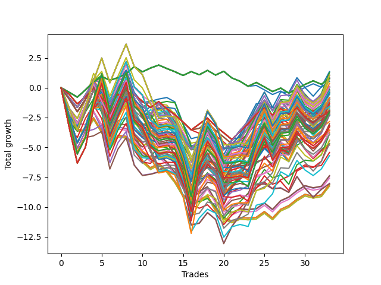

# Long HLT 343 
- Symbol: TSLA
- Date Range: 05/16/2022 - 05/17/2024
- Trading Period: 8:30-12:30
- Number of Trades: 33



| Id. | Name | Win Percent | Profit | Avg Profit / Trade | Avg Time / Trade | Std |      | Name | Win Percent | Profit | Avg Profit / Trade | Avg Time / Trade | Std |
| --- | ---- | ----------- | ------ | ------------------ | ---------------- | --- | ---- | ---- | ----------- | ------ | ------------------ | ---------------- | --- |
| | Sorted By <br> Profit | | | | | | | Sorted By <br> Win Percentage |||||
|0| TP-1.25 60m | 51.52 | 1.35 | 0.04 | 34:30 | 1.19 |     | TP-1.75 60m | 57.58 | 1.27 | 0.04 | 46:10 | 1.23 |
|1| TP-1.75 60m | 57.58 | 1.27 | 0.04 | 46:10 | 1.23 |     | TP-1.75 45m | 57.58 | 0.03 | 0.00 | 37:32 | 1.26 |
|2| TP-1.75 180m | 51.52 | 1.05 | 0.03 | 67:00 | 1.54 |     | TP-2 60m | 57.58 | -1.36 | -0.04 | 48:03 | 1.30 |
|3| TP-1.75 165m | 51.52 | 1.05 | 0.03 | 67:00 | 1.54 |     | TP-2.25 60m | 57.58 | -2.32 | -0.07 | 48:21 | 1.35 |
|4| TP-1.75 150m | 51.52 | 1.05 | 0.03 | 67:00 | 1.54 |     | TP-2.5 60m | 57.58 | -3.02 | -0.09 | 49:18 | 1.45 |
|5| TP-1.75 135m | 51.52 | 1.05 | 0.03 | 67:00 | 1.54 |     | TP-2.75 60m | 57.58 | -3.57 | -0.11 | 51:00 | 1.54 |
|6| TP-1.75 120m | 51.52 | 1.05 | 0.03 | 67:00 | 1.54 |     | TP-2 45m | 57.58 | -3.74 | -0.11 | 38:34 | 1.29 |
|7| TP-1.75 90m | 51.52 | 0.86 | 0.03 | 59:25 | 1.39 |     | TP-3 60m | 57.58 | -4.69 | -0.14 | 51:40 | 1.60 |
|8| TP-1.75 75m | 48.48 | 0.86 | 0.03 | 53:52 | 1.29 |     | TP-2.25 45m | 57.58 | -4.70 | -0.14 | 38:52 | 1.34 |
|9| TP-0.25 180m | 51.52 | 0.79 | 0.02 | 04:21 | 0.39 |     | TP-2.5 45m | 57.58 | -4.80 | -0.15 | 39:21 | 1.41 |
|10| TP-0.25 165m | 51.52 | 0.79 | 0.02 | 04:21 | 0.39 |     | TP-2.75 45m | 57.58 | -8.02 | -0.24 | 40:32 | 1.35 |
|11| TP-0.25 150m | 51.52 | 0.79 | 0.02 | 04:21 | 0.39 |     | TP-3 45m | 57.58 | -8.05 | -0.24 | 40:54 | 1.36 |
|12| TP-0.25 135m | 51.52 | 0.79 | 0.02 | 04:21 | 0.39 |     | TP-1.5 60m | 54.55 | 0.37 | 0.01 | 40:47 | 1.24 |
|13| TP-0.25 120m | 51.52 | 0.79 | 0.02 | 04:21 | 0.39 |     | TP-1.25 45m | 54.55 | -0.51 | -0.02 | 30:01 | 1.17 |
|14| TP-0.25 105m | 51.52 | 0.79 | 0.02 | 04:21 | 0.39 |     | TP-1 45m | 54.55 | -1.47 | -0.04 | 25:09 | 0.97 |
|15| TP-0.25 90m | 51.52 | 0.79 | 0.02 | 04:21 | 0.39 |     | TP-1.5 45m | 54.55 | -1.85 | -0.06 | 33:43 | 1.24 |
|16| TP-0.25 75m | 51.52 | 0.79 | 0.02 | 04:21 | 0.39 |     | TP-1.25 60m | 51.52 | 1.35 | 0.04 | 34:30 | 1.19 |
|17| TP-0.25 60m | 51.52 | 0.79 | 0.02 | 04:21 | 0.39 |     | TP-1.75 180m | 51.52 | 1.05 | 0.03 | 67:00 | 1.54 |
|18| TP-0.25 45m | 51.52 | 0.79 | 0.02 | 04:21 | 0.39 |     | TP-1.75 165m | 51.52 | 1.05 | 0.03 | 67:00 | 1.54 |
|19| TP-0.25 30m | 51.52 | 0.79 | 0.02 | 04:21 | 0.39 |     | TP-1.75 150m | 51.52 | 1.05 | 0.03 | 67:00 | 1.54 |
|20| TP-1.75 105m | 48.48 | 0.75 | 0.02 | 63:58 | 1.43 |     | TP-1.75 135m | 51.52 | 1.05 | 0.03 | 67:00 | 1.54 |
|21| TP-1.25 90m | 51.52 | 0.72 | 0.02 | 39:36 | 1.28 |     | TP-1.75 120m | 51.52 | 1.05 | 0.03 | 67:00 | 1.54 |
|22| TP-0.25 15m | 51.52 | 0.54 | 0.02 | 04:14 | 0.39 |     | TP-1.75 90m | 51.52 | 0.86 | 0.03 | 59:25 | 1.39 |
|23| TP-1.5 60m | 54.55 | 0.37 | 0.01 | 40:47 | 1.24 |     | TP-0.25 180m | 51.52 | 0.79 | 0.02 | 04:21 | 0.39 |
|24| TP-1.25 105m | 51.52 | 0.12 | 0.00 | 40:29 | 1.30 |     | TP-0.25 165m | 51.52 | 0.79 | 0.02 | 04:21 | 0.39 |
|25| TP-1.25 180m | 51.52 | 0.06 | 0.00 | 40:56 | 1.30 |     | TP-0.25 150m | 51.52 | 0.79 | 0.02 | 04:21 | 0.39 |
|26| TP-1.25 165m | 51.52 | 0.06 | 0.00 | 40:56 | 1.30 |     | TP-0.25 135m | 51.52 | 0.79 | 0.02 | 04:21 | 0.39 |
|27| TP-1.25 150m | 51.52 | 0.06 | 0.00 | 40:56 | 1.30 |     | TP-0.25 120m | 51.52 | 0.79 | 0.02 | 04:21 | 0.39 |
|28| TP-1.25 135m | 51.52 | 0.06 | 0.00 | 40:56 | 1.30 |     | TP-0.25 105m | 51.52 | 0.79 | 0.02 | 04:21 | 0.39 |
|29| TP-1.25 120m | 51.52 | 0.06 | 0.00 | 40:56 | 1.30 |     | TP-0.25 90m | 51.52 | 0.79 | 0.02 | 04:21 | 0.39 |
|30| TP-1.75 45m | 57.58 | 0.03 | 0.00 | 37:32 | 1.26 |     | TP-0.25 75m | 51.52 | 0.79 | 0.02 | 04:21 | 0.39 |
|31| TP-1.25 75m | 48.48 | -0.16 | -0.00 | 38:03 | 1.23 |     | TP-0.25 60m | 51.52 | 0.79 | 0.02 | 04:21 | 0.39 |
|32| TP-2 180m | 51.52 | -0.28 | -0.01 | 72:49 | 1.60 |     | TP-0.25 45m | 51.52 | 0.79 | 0.02 | 04:21 | 0.39 |
|33| TP-2 165m | 51.52 | -0.28 | -0.01 | 72:49 | 1.60 |     | TP-0.25 30m | 51.52 | 0.79 | 0.02 | 04:21 | 0.39 |
|34| TP-2 150m | 51.52 | -0.28 | -0.01 | 72:49 | 1.60 |     | TP-1.25 90m | 51.52 | 0.72 | 0.02 | 39:36 | 1.28 |
|35| TP-2 135m | 51.52 | -0.28 | -0.01 | 72:49 | 1.60 |     | TP-0.25 15m | 51.52 | 0.54 | 0.02 | 04:14 | 0.39 |
|36| TP-2 120m | 51.52 | -0.28 | -0.01 | 72:49 | 1.60 |     | TP-1.25 105m | 51.52 | 0.12 | 0.00 | 40:29 | 1.30 |
|37| TP-1.75 30m | 48.48 | -0.31 | -0.01 | 27:09 | 1.17 |     | TP-1.25 180m | 51.52 | 0.06 | 0.00 | 40:56 | 1.30 |
|38| TP-2.25 180m | 51.52 | -0.41 | -0.01 | 75:36 | 1.67 |     | TP-1.25 165m | 51.52 | 0.06 | 0.00 | 40:56 | 1.30 |
|39| TP-2.25 165m | 51.52 | -0.41 | -0.01 | 75:36 | 1.67 |     | TP-1.25 150m | 51.52 | 0.06 | 0.00 | 40:56 | 1.30 |
|40| TP-2.25 150m | 51.52 | -0.41 | -0.01 | 75:36 | 1.67 |     | TP-1.25 135m | 51.52 | 0.06 | 0.00 | 40:56 | 1.30 |
|41| TP-2.25 135m | 51.52 | -0.41 | -0.01 | 75:36 | 1.67 |     | TP-1.25 120m | 51.52 | 0.06 | 0.00 | 40:56 | 1.30 |
|42| TP-2.25 120m | 51.52 | -0.41 | -0.01 | 75:36 | 1.67 |     | TP-2 180m | 51.52 | -0.28 | -0.01 | 72:49 | 1.60 |
|43| TP-1 60m | 51.52 | -0.46 | -0.01 | 28:40 | 0.99 |     | TP-2 165m | 51.52 | -0.28 | -0.01 | 72:49 | 1.60 |
|44| TP-1.25 45m | 54.55 | -0.51 | -0.02 | 30:01 | 1.17 |     | TP-2 150m | 51.52 | -0.28 | -0.01 | 72:49 | 1.60 |
|45| TP-2.25 105m | 48.48 | -0.53 | -0.02 | 69:58 | 1.57 |     | TP-2 135m | 51.52 | -0.28 | -0.01 | 72:49 | 1.60 |
|46| TP-2 105m | 48.48 | -0.55 | -0.02 | 68:18 | 1.45 |     | TP-2 120m | 51.52 | -0.28 | -0.01 | 72:49 | 1.60 |
|47| TP-1.5 90m | 48.48 | -0.81 | -0.02 | 51:36 | 1.35 |     | TP-2.25 180m | 51.52 | -0.41 | -0.01 | 75:36 | 1.67 |
|48| TP-2.5 180m | 51.52 | -0.85 | -0.03 | 76:38 | 1.76 |     | TP-2.25 165m | 51.52 | -0.41 | -0.01 | 75:36 | 1.67 |
|49| TP-2.5 165m | 51.52 | -0.85 | -0.03 | 76:38 | 1.76 |     | TP-2.25 150m | 51.52 | -0.41 | -0.01 | 75:36 | 1.67 |
|50| TP-2.5 150m | 51.52 | -0.85 | -0.03 | 76:38 | 1.76 |     | TP-2.25 135m | 51.52 | -0.41 | -0.01 | 75:36 | 1.67 |
|51| TP-2.5 135m | 51.52 | -0.85 | -0.03 | 76:38 | 1.76 |     | TP-2.25 120m | 51.52 | -0.41 | -0.01 | 75:36 | 1.67 |
|52| TP-2.5 120m | 51.52 | -0.85 | -0.03 | 76:38 | 1.76 |     | TP-1 60m | 51.52 | -0.46 | -0.01 | 28:40 | 0.99 |
|53| TP-2.5 105m | 48.48 | -0.97 | -0.03 | 71:00 | 1.66 |     | TP-2.5 180m | 51.52 | -0.85 | -0.03 | 76:38 | 1.76 |
|54| TP-1.5 75m | 48.48 | -0.97 | -0.03 | 47:01 | 1.27 |     | TP-2.5 165m | 51.52 | -0.85 | -0.03 | 76:38 | 1.76 |
|55| TP-0.75 30m | 48.48 | -0.99 | -0.03 | 16:01 | 0.84 |     | TP-2.5 150m | 51.52 | -0.85 | -0.03 | 76:38 | 1.76 |
|56| TP-0.75 180m | 48.48 | -1.00 | -0.03 | 18:21 | 0.88 |     | TP-2.5 135m | 51.52 | -0.85 | -0.03 | 76:38 | 1.76 |
|57| TP-0.75 165m | 48.48 | -1.00 | -0.03 | 18:21 | 0.88 |     | TP-2.5 120m | 51.52 | -0.85 | -0.03 | 76:38 | 1.76 |
|58| TP-0.75 150m | 48.48 | -1.00 | -0.03 | 18:21 | 0.88 |     | TP-2.25 90m | 51.52 | -1.13 | -0.03 | 64:03 | 1.57 |
|59| TP-0.75 135m | 48.48 | -1.00 | -0.03 | 18:21 | 0.88 |     | TP-1 90m | 51.52 | -1.28 | -0.04 | 32:32 | 1.02 |
|60| TP-0.75 120m | 48.48 | -1.00 | -0.03 | 18:21 | 0.88 |     | TP-2.5 90m | 51.52 | -1.57 | -0.05 | 65:05 | 1.66 |
|61| TP-0.75 105m | 48.48 | -1.00 | -0.03 | 18:21 | 0.88 |     | TP-1 180m | 51.52 | -1.93 | -0.06 | 32:56 | 1.03 |
|62| TP-0.75 90m | 48.48 | -1.00 | -0.03 | 18:21 | 0.88 |     | TP-1 165m | 51.52 | -1.93 | -0.06 | 32:56 | 1.03 |
|63| TP-0.75 75m | 48.48 | -1.00 | -0.03 | 18:21 | 0.88 |     | TP-1 150m | 51.52 | -1.93 | -0.06 | 32:56 | 1.03 |
|64| TP-1.5 105m | 48.48 | -1.03 | -0.03 | 55:14 | 1.38 |     | TP-1 135m | 51.52 | -1.93 | -0.06 | 32:56 | 1.03 |
|65| TP-2.25 90m | 51.52 | -1.13 | -0.03 | 64:03 | 1.57 |     | TP-1 120m | 51.52 | -1.93 | -0.06 | 32:56 | 1.03 |
|66| TP-2 30m | 48.48 | -1.19 | -0.04 | 27:16 | 1.21 |     | TP-1 105m | 51.52 | -1.93 | -0.06 | 32:56 | 1.03 |
|67| TP-1 90m | 51.52 | -1.28 | -0.04 | 32:32 | 1.02 |     | TP-2 90m | 51.52 | -1.99 | -0.06 | 62:50 | 1.42 |
|68| TP-1 75m | 48.48 | -1.29 | -0.04 | 31:32 | 1.01 |     | TP-2.75 180m | 51.52 | -2.04 | -0.06 | 79:25 | 1.82 |
|69| TP-2 60m | 57.58 | -1.36 | -0.04 | 48:03 | 1.30 |     | TP-2.75 165m | 51.52 | -2.04 | -0.06 | 79:25 | 1.82 |
|70| TP-1 45m | 54.55 | -1.47 | -0.04 | 25:09 | 0.97 |     | TP-2.75 150m | 51.52 | -2.04 | -0.06 | 79:25 | 1.82 |
|71| TP-2.5 90m | 51.52 | -1.57 | -0.05 | 65:05 | 1.66 |     | TP-2.75 135m | 51.52 | -2.04 | -0.06 | 79:25 | 1.82 |
|72| TP-1 30m | 48.48 | -1.58 | -0.05 | 19:40 | 0.93 |     | TP-2.75 120m | 51.52 | -2.04 | -0.06 | 79:25 | 1.82 |
|73| TP-0.75 60m | 48.48 | -1.63 | -0.05 | 18:07 | 0.87 |     | TP-2.75 90m | 51.52 | -2.33 | -0.07 | 66:58 | 1.74 |
|74| TP-0.75 45m | 48.48 | -1.65 | -0.05 | 17:40 | 0.87 |     | TP-3 180m | 51.52 | -3.27 | -0.10 | 80:09 | 1.88 |
|75| TP-1.5 30m | 48.48 | -1.72 | -0.05 | 25:21 | 1.13 |     | TP-3 165m | 51.52 | -3.27 | -0.10 | 80:09 | 1.88 |
|76| TP-2.5 30m | 48.48 | -1.84 | -0.06 | 27:34 | 1.32 |     | TP-3 150m | 51.52 | -3.27 | -0.10 | 80:09 | 1.88 |
|77| TP-1.5 45m | 54.55 | -1.85 | -0.06 | 33:43 | 1.24 |     | TP-3 135m | 51.52 | -3.27 | -0.10 | 80:09 | 1.88 |
|78| TP-1 180m | 51.52 | -1.93 | -0.06 | 32:56 | 1.03 |     | TP-3 120m | 51.52 | -3.27 | -0.10 | 80:09 | 1.88 |
|79| TP-1 165m | 51.52 | -1.93 | -0.06 | 32:56 | 1.03 |     | TP-3 90m | 51.52 | -3.56 | -0.11 | 67:41 | 1.80 |
|80| TP-1 150m | 51.52 | -1.93 | -0.06 | 32:56 | 1.03 |     | TP-1.75 75m | 48.48 | 0.86 | 0.03 | 53:52 | 1.29 |
|81| TP-1 135m | 51.52 | -1.93 | -0.06 | 32:56 | 1.03 |     | TP-1.75 105m | 48.48 | 0.75 | 0.02 | 63:58 | 1.43 |
|82| TP-1 120m | 51.52 | -1.93 | -0.06 | 32:56 | 1.03 |     | TP-1.25 75m | 48.48 | -0.16 | -0.00 | 38:03 | 1.23 |
|83| TP-1 105m | 51.52 | -1.93 | -0.06 | 32:56 | 1.03 |     | TP-1.75 30m | 48.48 | -0.31 | -0.01 | 27:09 | 1.17 |
|84| TP-1.25 30m | 48.48 | -1.93 | -0.06 | 23:09 | 1.09 |     | TP-2.25 105m | 48.48 | -0.53 | -0.02 | 69:58 | 1.57 |
|85| TP-2.75 105m | 48.48 | -1.94 | -0.06 | 73:20 | 1.73 |     | TP-2 105m | 48.48 | -0.55 | -0.02 | 68:18 | 1.45 |
|86| TP-0.5 180m | 45.45 | -1.94 | -0.06 | 12:29 | 0.63 |     | TP-1.5 90m | 48.48 | -0.81 | -0.02 | 51:36 | 1.35 |
|87| TP-0.5 165m | 45.45 | -1.94 | -0.06 | 12:29 | 0.63 |     | TP-2.5 105m | 48.48 | -0.97 | -0.03 | 71:00 | 1.66 |
|88| TP-0.5 150m | 45.45 | -1.94 | -0.06 | 12:29 | 0.63 |     | TP-1.5 75m | 48.48 | -0.97 | -0.03 | 47:01 | 1.27 |
|89| TP-0.5 135m | 45.45 | -1.94 | -0.06 | 12:29 | 0.63 |     | TP-0.75 30m | 48.48 | -0.99 | -0.03 | 16:01 | 0.84 |
|90| TP-0.5 120m | 45.45 | -1.94 | -0.06 | 12:29 | 0.63 |     | TP-0.75 180m | 48.48 | -1.00 | -0.03 | 18:21 | 0.88 |
|91| TP-0.5 105m | 45.45 | -1.94 | -0.06 | 12:29 | 0.63 |     | TP-0.75 165m | 48.48 | -1.00 | -0.03 | 18:21 | 0.88 |
|92| TP-0.5 90m | 45.45 | -1.94 | -0.06 | 12:29 | 0.63 |     | TP-0.75 150m | 48.48 | -1.00 | -0.03 | 18:21 | 0.88 |
|93| TP-0.5 75m | 45.45 | -1.94 | -0.06 | 12:29 | 0.63 |     | TP-0.75 135m | 48.48 | -1.00 | -0.03 | 18:21 | 0.88 |
|94| TP-0.5 60m | 45.45 | -1.94 | -0.06 | 12:29 | 0.63 |     | TP-0.75 120m | 48.48 | -1.00 | -0.03 | 18:21 | 0.88 |
|95| TP-2 90m | 51.52 | -1.99 | -0.06 | 62:50 | 1.42 |     | TP-0.75 105m | 48.48 | -1.00 | -0.03 | 18:21 | 0.88 |
|96| TP-2.25 30m | 48.48 | -1.99 | -0.06 | 27:27 | 1.26 |     | TP-0.75 90m | 48.48 | -1.00 | -0.03 | 18:21 | 0.88 |
|97| TP-2.75 180m | 51.52 | -2.04 | -0.06 | 79:25 | 1.82 |     | TP-0.75 75m | 48.48 | -1.00 | -0.03 | 18:21 | 0.88 |
|98| TP-2.75 165m | 51.52 | -2.04 | -0.06 | 79:25 | 1.82 |     | TP-1.5 105m | 48.48 | -1.03 | -0.03 | 55:14 | 1.38 |
|99| TP-2.75 150m | 51.52 | -2.04 | -0.06 | 79:25 | 1.82 |     | TP-2 30m | 48.48 | -1.19 | -0.04 | 27:16 | 1.21 |
|100| TP-2.75 135m | 51.52 | -2.04 | -0.06 | 79:25 | 1.82 |     | TP-1 75m | 48.48 | -1.29 | -0.04 | 31:32 | 1.01 |
|101| TP-2.75 120m | 51.52 | -2.04 | -0.06 | 79:25 | 1.82 |     | TP-1 30m | 48.48 | -1.58 | -0.05 | 19:40 | 0.93 |
|102| TP-2 75m | 48.48 | -2.04 | -0.06 | 56:27 | 1.35 |     | TP-0.75 60m | 48.48 | -1.63 | -0.05 | 18:07 | 0.87 |
|103| TP-0.5 30m | 42.42 | -2.17 | -0.07 | 11:20 | 0.61 |     | TP-0.75 45m | 48.48 | -1.65 | -0.05 | 17:40 | 0.87 |
|104| TP-1.5 180m | 48.48 | -2.22 | -0.07 | 57:00 | 1.44 |     | TP-1.5 30m | 48.48 | -1.72 | -0.05 | 25:21 | 1.13 |
|105| TP-1.5 165m | 48.48 | -2.22 | -0.07 | 57:00 | 1.44 |     | TP-2.5 30m | 48.48 | -1.84 | -0.06 | 27:34 | 1.32 |
|106| TP-1.5 150m | 48.48 | -2.22 | -0.07 | 57:00 | 1.44 |     | TP-1.25 30m | 48.48 | -1.93 | -0.06 | 23:09 | 1.09 |
|107| TP-1.5 135m | 48.48 | -2.22 | -0.07 | 57:00 | 1.44 |     | TP-2.75 105m | 48.48 | -1.94 | -0.06 | 73:20 | 1.73 |
|108| TP-1.5 120m | 48.48 | -2.22 | -0.07 | 57:00 | 1.44 |     | TP-2.25 30m | 48.48 | -1.99 | -0.06 | 27:27 | 1.26 |
|109| TP-0.5 45m | 45.45 | -2.29 | -0.07 | 12:23 | 0.62 |     | TP-2 75m | 48.48 | -2.04 | -0.06 | 56:27 | 1.35 |
|110| TP-2.25 60m | 57.58 | -2.32 | -0.07 | 48:21 | 1.35 |     | TP-1.5 180m | 48.48 | -2.22 | -0.07 | 57:00 | 1.44 |
|111| TP-2.75 90m | 51.52 | -2.33 | -0.07 | 66:58 | 1.74 |     | TP-1.5 165m | 48.48 | -2.22 | -0.07 | 57:00 | 1.44 |
|112| TP-0.5 15m | 45.45 | -2.84 | -0.09 | 08:43 | 0.56 |     | TP-1.5 150m | 48.48 | -2.22 | -0.07 | 57:00 | 1.44 |
|113| TP-2.5 60m | 57.58 | -3.02 | -0.09 | 49:18 | 1.45 |     | TP-1.5 135m | 48.48 | -2.22 | -0.07 | 57:00 | 1.44 |
|114| TP-3 105m | 48.48 | -3.17 | -0.10 | 74:03 | 1.79 |     | TP-1.5 120m | 48.48 | -2.22 | -0.07 | 57:00 | 1.44 |
|115| TP-2.25 75m | 48.48 | -3.21 | -0.10 | 57:10 | 1.39 |     | TP-3 105m | 48.48 | -3.17 | -0.10 | 74:03 | 1.79 |
|116| TP-3 180m | 51.52 | -3.27 | -0.10 | 80:09 | 1.88 |     | TP-2.25 75m | 48.48 | -3.21 | -0.10 | 57:10 | 1.39 |
|117| TP-3 165m | 51.52 | -3.27 | -0.10 | 80:09 | 1.88 |     | TP-2.75 30m | 48.48 | -3.87 | -0.12 | 28:05 | 1.27 |
|118| TP-3 150m | 51.52 | -3.27 | -0.10 | 80:09 | 1.88 |     | TP-2.5 75m | 48.48 | -3.91 | -0.12 | 58:07 | 1.48 |
|119| TP-3 135m | 51.52 | -3.27 | -0.10 | 80:09 | 1.88 |     | TP-3 30m | 48.48 | -4.40 | -0.13 | 28:16 | 1.31 |
|120| TP-3 120m | 51.52 | -3.27 | -0.10 | 80:09 | 1.88 |     | TP-2.75 75m | 48.48 | -4.46 | -0.14 | 59:49 | 1.57 |
|121| TP-0.75 15m | 45.45 | -3.55 | -0.11 | 11:09 | 0.70 |     | TP-3 75m | 48.48 | -5.69 | -0.17 | 60:32 | 1.64 |
|122| TP-3 90m | 51.52 | -3.56 | -0.11 | 67:41 | 1.80 |     | TP-0.5 180m | 45.45 | -1.94 | -0.06 | 12:29 | 0.63 |
|123| TP-2.75 60m | 57.58 | -3.57 | -0.11 | 51:00 | 1.54 |     | TP-0.5 165m | 45.45 | -1.94 | -0.06 | 12:29 | 0.63 |
|124| TP-2 45m | 57.58 | -3.74 | -0.11 | 38:34 | 1.29 |     | TP-0.5 150m | 45.45 | -1.94 | -0.06 | 12:29 | 0.63 |
|125| TP-2.75 30m | 48.48 | -3.87 | -0.12 | 28:05 | 1.27 |     | TP-0.5 135m | 45.45 | -1.94 | -0.06 | 12:29 | 0.63 |
|126| TP-2.5 75m | 48.48 | -3.91 | -0.12 | 58:07 | 1.48 |     | TP-0.5 120m | 45.45 | -1.94 | -0.06 | 12:29 | 0.63 |
|127| TP-3 30m | 48.48 | -4.40 | -0.13 | 28:16 | 1.31 |     | TP-0.5 105m | 45.45 | -1.94 | -0.06 | 12:29 | 0.63 |
|128| TP-2.75 75m | 48.48 | -4.46 | -0.14 | 59:49 | 1.57 |     | TP-0.5 90m | 45.45 | -1.94 | -0.06 | 12:29 | 0.63 |
|129| TP-3 60m | 57.58 | -4.69 | -0.14 | 51:40 | 1.60 |     | TP-0.5 75m | 45.45 | -1.94 | -0.06 | 12:29 | 0.63 |
|130| TP-2.25 45m | 57.58 | -4.70 | -0.14 | 38:52 | 1.34 |     | TP-0.5 60m | 45.45 | -1.94 | -0.06 | 12:29 | 0.63 |
|131| TP-2.5 45m | 57.58 | -4.80 | -0.15 | 39:21 | 1.41 |     | TP-0.5 45m | 45.45 | -2.29 | -0.07 | 12:23 | 0.62 |
|132| TP-1 15m | 45.45 | -5.43 | -0.16 | 12:00 | 0.75 |     | TP-0.5 15m | 45.45 | -2.84 | -0.09 | 08:43 | 0.56 |
|133| TP-3 75m | 48.48 | -5.69 | -0.17 | 60:32 | 1.64 |     | TP-0.75 15m | 45.45 | -3.55 | -0.11 | 11:09 | 0.70 |
|134| TP-1.5 15m | 42.42 | -7.37 | -0.22 | 13:32 | 0.78 |     | TP-1 15m | 45.45 | -5.43 | -0.16 | 12:00 | 0.75 |
|135| TP-1.25 15m | 42.42 | -7.41 | -0.22 | 13:16 | 0.78 |     | TP-0.5 30m | 42.42 | -2.17 | -0.07 | 11:20 | 0.61 |
|136| TP-1.75 15m | 42.42 | -7.58 | -0.23 | 13:54 | 0.75 |     | TP-1.5 15m | 42.42 | -7.37 | -0.22 | 13:32 | 0.78 |
|137| TP-2.75 45m | 57.58 | -8.02 | -0.24 | 40:32 | 1.35 |     | TP-1.25 15m | 42.42 | -7.41 | -0.22 | 13:16 | 0.78 |
|138| TP-3 45m | 57.58 | -8.05 | -0.24 | 40:54 | 1.36 |     | TP-1.75 15m | 42.42 | -7.58 | -0.23 | 13:54 | 0.75 |
|139| TP-3 15m | 42.42 | -8.10 | -0.25 | 14:00 | 0.78 |     | TP-3 15m | 42.42 | -8.10 | -0.25 | 14:00 | 0.78 |
|140| TP-2.75 15m | 42.42 | -8.10 | -0.25 | 14:00 | 0.78 |     | TP-2.75 15m | 42.42 | -8.10 | -0.25 | 14:00 | 0.78 |
|141| TP-2.5 15m | 42.42 | -8.10 | -0.25 | 14:00 | 0.78 |     | TP-2.5 15m | 42.42 | -8.10 | -0.25 | 14:00 | 0.78 |
|142| TP-2.25 15m | 42.42 | -8.24 | -0.25 | 13:56 | 0.79 |     | TP-2.25 15m | 42.42 | -8.24 | -0.25 | 13:56 | 0.79 |
|143| TP-2 15m | 42.42 | -8.24 | -0.25 | 13:56 | 0.79 |     | TP-2 15m | 42.42 | -8.24 | -0.25 | 13:56 | 0.79 |

### Test TP-0.25 15m
* Take Profit of 0.25 Point
* 0.25 Stoploss
* Results:
```
Total Trades: 33
Percent Up: 51.52
Percent Down: 48.48
Total Points Moved Up: 0.54
Potential Profit: 270.00
Total Points Ups: 6.33 Count Ups: 17
Total Points Downs: -5.79 Count Downs: 16
```

<details><summary>Trades</summary>

<code>In: 2022-06-09 11:50:00		Out: 2022-06-09 11:53:00		Total Position Time: 03:00		Total Move Up: -0.38		Total to Date: -0.38</code> <br />
<code>In: 2022-06-16 10:10:00		Out: 2022-06-16 10:14:00		Total Position Time: 04:00		Total Move Up: -0.41		Total to Date: -0.79</code> <br />
<code>In: 2022-06-16 12:00:00		Out: 2022-06-16 12:02:00		Total Position Time: 02:00		Total Move Up: 0.61		Total to Date: -0.18</code> <br />
<code>In: 2022-08-01 11:00:00		Out: 2022-08-01 11:04:00		Total Position Time: 04:00		Total Move Up: 0.66		Total to Date: 0.48</code> <br />
<code>In: 2022-09-01 08:35:00		Out: 2022-09-01 08:37:00		Total Position Time: 02:00		Total Move Up: 0.46		Total to Date: 0.94</code> <br />
<code>In: 2022-09-22 10:55:00		Out: 2022-09-22 10:58:00		Total Position Time: 03:00		Total Move Up: -0.31		Total to Date: 0.63</code> <br />
<code>In: 2022-10-18 12:25:00		Out: 2022-10-18 12:31:00		Total Position Time: 06:00		Total Move Up: 0.21		Total to Date: 0.84</code> <br />
<code>In: 2022-10-20 11:35:00		Out: 2022-10-20 11:37:00		Total Position Time: 02:00		Total Move Up: 0.33		Total to Date: 1.17</code> <br />
<code>In: 2022-11-09 08:45:00		Out: 2022-11-09 08:48:00		Total Position Time: 03:00		Total Move Up: 0.60		Total to Date: 1.77</code> <br />
<code>In: 2022-11-16 12:00:00		Out: 2022-11-16 12:04:00		Total Position Time: 04:00		Total Move Up: -0.44		Total to Date: 1.33</code> <br />
<code>In: 2022-11-21 09:40:00		Out: 2022-11-21 09:44:00		Total Position Time: 04:00		Total Move Up: 0.32		Total to Date: 1.65</code> <br />
<code>In: 2022-11-21 10:10:00		Out: 2022-11-21 10:12:00		Total Position Time: 02:00		Total Move Up: 0.25		Total to Date: 1.90</code> <br />
<code>In: 2022-12-07 12:05:00		Out: 2022-12-07 12:07:00		Total Position Time: 02:00		Total Move Up: -0.29		Total to Date: 1.61</code> <br />
<code>In: 2022-12-16 08:40:00		Out: 2022-12-16 08:43:00		Total Position Time: 03:00		Total Move Up: -0.27		Total to Date: 1.34</code> <br />
<code>In: 2022-12-20 12:30:00		Out: 2022-12-20 12:33:00		Total Position Time: 03:00		Total Move Up: -0.31		Total to Date: 1.03</code> <br />
<code>In: 2023-03-09 10:05:00		Out: 2023-03-09 10:08:00		Total Position Time: 03:00		Total Move Up: 0.32		Total to Date: 1.35</code> <br />
<code>In: 2023-03-22 09:45:00		Out: 2023-03-22 09:47:00		Total Position Time: 02:00		Total Move Up: -0.26		Total to Date: 1.09</code> <br />
<code>In: 2023-04-14 09:30:00		Out: 2023-04-14 09:38:00		Total Position Time: 08:00		Total Move Up: 0.36		Total to Date: 1.45</code> <br />
<code>In: 2023-05-12 09:35:00		Out: 2023-05-12 09:37:00		Total Position Time: 02:00		Total Move Up: -0.39		Total to Date: 1.06</code> <br />
<code>In: 2023-07-27 12:15:00		Out: 2023-07-27 12:20:00		Total Position Time: 05:00		Total Move Up: 0.32		Total to Date: 1.38</code> <br />
<code>In: 2023-08-14 09:10:00		Out: 2023-08-14 09:16:00		Total Position Time: 06:00		Total Move Up: -0.56		Total to Date: 0.82</code> <br />
<code>In: 2023-09-26 11:25:00		Out: 2023-09-26 11:31:00		Total Position Time: 06:00		Total Move Up: -0.28		Total to Date: 0.54</code> <br />
<code>In: 2023-11-03 11:00:00		Out: 2023-11-03 11:08:00		Total Position Time: 08:00		Total Move Up: -0.42		Total to Date: 0.12</code> <br />
<code>In: 2023-11-08 09:45:00		Out: 2023-11-08 09:59:00		Total Position Time: 14:00		Total Move Up: 0.07		Total to Date: 0.19</code> <br />
<code>In: 2023-11-22 08:45:00		Out: 2023-11-22 08:48:00		Total Position Time: 03:00		Total Move Up: -0.37		Total to Date: -0.18</code> <br />
<code>In: 2023-11-30 08:45:00		Out: 2023-11-30 08:47:00		Total Position Time: 02:00		Total Move Up: -0.39		Total to Date: -0.57</code> <br />
<code>In: 2024-01-05 09:40:00		Out: 2024-01-05 09:42:00		Total Position Time: 02:00		Total Move Up: 0.29		Total to Date: -0.28</code> <br />
<code>In: 2024-02-12 11:30:00		Out: 2024-02-12 11:37:00		Total Position Time: 07:00		Total Move Up: -0.42		Total to Date: -0.70</code> <br />
<code>In: 2024-02-21 12:15:00		Out: 2024-02-21 12:19:00		Total Position Time: 04:00		Total Move Up: 0.35		Total to Date: -0.35</code> <br />
<code>In: 2024-02-23 10:20:00		Out: 2024-02-23 10:27:00		Total Position Time: 07:00		Total Move Up: 0.38		Total to Date: 0.03</code> <br />
<code>In: 2024-03-13 11:45:00		Out: 2024-03-13 11:53:00		Total Position Time: 08:00		Total Move Up: 0.30		Total to Date: 0.33</code> <br />
<code>In: 2024-03-21 11:35:00		Out: 2024-03-21 11:38:00		Total Position Time: 03:00		Total Move Up: -0.29		Total to Date: 0.04</code> <br />
<code>In: 2024-04-30 09:00:00		Out: 2024-04-30 09:03:00		Total Position Time: 03:00		Total Move Up: 0.50		Total to Date: 0.54</code> <br />


</details>

### Test TP-0.5 15m
* Take Profit of 0.5 Point
* 0.5 Stoploss
* Results:
```
Total Trades: 33
Percent Up: 45.45
Percent Down: 54.55
Total Points Moved Up: -2.84
Potential Profit: -1420.00
Total Points Ups: 7.30 Count Ups: 15
Total Points Downs: -10.14 Count Downs: 18
```

<details><summary>Trades</summary>

<code>In: 2022-06-09 11:50:00		Out: 2022-06-09 11:54:00		Total Position Time: 04:00		Total Move Up: -0.55		Total to Date: -0.55</code> <br />
<code>In: 2022-06-16 10:10:00		Out: 2022-06-16 10:20:00		Total Position Time: 10:00		Total Move Up: -0.81		Total to Date: -1.36</code> <br />
<code>In: 2022-06-16 12:00:00		Out: 2022-06-16 12:02:00		Total Position Time: 02:00		Total Move Up: 0.61		Total to Date: -0.75</code> <br />
<code>In: 2022-08-01 11:00:00		Out: 2022-08-01 11:04:00		Total Position Time: 04:00		Total Move Up: 0.66		Total to Date: -0.09</code> <br />
<code>In: 2022-09-01 08:35:00		Out: 2022-09-01 08:41:00		Total Position Time: 06:00		Total Move Up: -0.77		Total to Date: -0.86</code> <br />
<code>In: 2022-09-22 10:55:00		Out: 2022-09-22 11:02:00		Total Position Time: 07:00		Total Move Up: -0.75		Total to Date: -1.61</code> <br />
<code>In: 2022-10-18 12:25:00		Out: 2022-10-18 12:32:00		Total Position Time: 07:00		Total Move Up: 1.08		Total to Date: -0.53</code> <br />
<code>In: 2022-10-20 11:35:00		Out: 2022-10-20 11:46:00		Total Position Time: 11:00		Total Move Up: -0.64		Total to Date: -1.17</code> <br />
<code>In: 2022-11-09 08:45:00		Out: 2022-11-09 08:48:00		Total Position Time: 03:00		Total Move Up: 0.60		Total to Date: -0.57</code> <br />
<code>In: 2022-11-16 12:00:00		Out: 2022-11-16 12:05:00		Total Position Time: 05:00		Total Move Up: -0.57		Total to Date: -1.14</code> <br />
<code>In: 2022-11-21 09:40:00		Out: 2022-11-21 09:51:00		Total Position Time: 11:00		Total Move Up: -0.52		Total to Date: -1.66</code> <br />
<code>In: 2022-11-21 10:10:00		Out: 2022-11-21 10:13:00		Total Position Time: 03:00		Total Move Up: 0.50		Total to Date: -1.16</code> <br />
<code>In: 2022-12-07 12:05:00		Out: 2022-12-07 12:19:00		Total Position Time: 14:00		Total Move Up: -0.60		Total to Date: -1.76</code> <br />
<code>In: 2022-12-16 08:40:00		Out: 2022-12-16 08:48:00		Total Position Time: 08:00		Total Move Up: -0.50		Total to Date: -2.26</code> <br />
<code>In: 2022-12-20 12:30:00		Out: 2022-12-20 12:38:00		Total Position Time: 08:00		Total Move Up: -0.62		Total to Date: -2.88</code> <br />
<code>In: 2023-03-09 10:05:00		Out: 2023-03-09 10:15:00		Total Position Time: 10:00		Total Move Up: -0.66		Total to Date: -3.54</code> <br />
<code>In: 2023-03-22 09:45:00		Out: 2023-03-22 09:59:00		Total Position Time: 14:00		Total Move Up: 0.12		Total to Date: -3.42</code> <br />
<code>In: 2023-04-14 09:30:00		Out: 2023-04-14 09:43:00		Total Position Time: 13:00		Total Move Up: 0.50		Total to Date: -2.92</code> <br />
<code>In: 2023-05-12 09:35:00		Out: 2023-05-12 09:38:00		Total Position Time: 03:00		Total Move Up: -0.68		Total to Date: -3.60</code> <br />
<code>In: 2023-07-27 12:15:00		Out: 2023-07-27 12:24:00		Total Position Time: 09:00		Total Move Up: -0.56		Total to Date: -4.16</code> <br />
<code>In: 2023-08-14 09:10:00		Out: 2023-08-14 09:16:00		Total Position Time: 06:00		Total Move Up: -0.56		Total to Date: -4.72</code> <br />
<code>In: 2023-09-26 11:25:00		Out: 2023-09-26 11:39:00		Total Position Time: 14:00		Total Move Up: 0.30		Total to Date: -4.42</code> <br />
<code>In: 2023-11-03 11:00:00		Out: 2023-11-03 11:14:00		Total Position Time: 14:00		Total Move Up: -0.05		Total to Date: -4.47</code> <br />
<code>In: 2023-11-08 09:45:00		Out: 2023-11-08 09:59:00		Total Position Time: 14:00		Total Move Up: 0.07		Total to Date: -4.40</code> <br />
<code>In: 2023-11-22 08:45:00		Out: 2023-11-22 08:52:00		Total Position Time: 07:00		Total Move Up: 0.53		Total to Date: -3.87</code> <br />
<code>In: 2023-11-30 08:45:00		Out: 2023-11-30 08:57:00		Total Position Time: 12:00		Total Move Up: -0.60		Total to Date: -4.47</code> <br />
<code>In: 2024-01-05 09:40:00		Out: 2024-01-05 09:47:00		Total Position Time: 07:00		Total Move Up: 0.55		Total to Date: -3.92</code> <br />
<code>In: 2024-02-12 11:30:00		Out: 2024-02-12 11:44:00		Total Position Time: 14:00		Total Move Up: 0.31		Total to Date: -3.61</code> <br />
<code>In: 2024-02-21 12:15:00		Out: 2024-02-21 12:28:00		Total Position Time: 13:00		Total Move Up: 0.56		Total to Date: -3.05</code> <br />
<code>In: 2024-02-23 10:20:00		Out: 2024-02-23 10:34:00		Total Position Time: 14:00		Total Move Up: 0.41		Total to Date: -2.64</code> <br />
<code>In: 2024-03-13 11:45:00		Out: 2024-03-13 11:59:00		Total Position Time: 14:00		Total Move Up: -0.18		Total to Date: -2.82</code> <br />
<code>In: 2024-03-21 11:35:00		Out: 2024-03-21 11:39:00		Total Position Time: 04:00		Total Move Up: -0.52		Total to Date: -3.34</code> <br />
<code>In: 2024-04-30 09:00:00		Out: 2024-04-30 09:03:00		Total Position Time: 03:00		Total Move Up: 0.50		Total to Date: -2.84</code> <br />


</details>

### Test TP-0.75 15m
* Take Profit of 0.75 Point
* 0.75 Stoploss
* Results:
```
Total Trades: 33
Percent Up: 45.45
Percent Down: 54.55
Total Points Moved Up: -3.55
Potential Profit: -1775.00
Total Points Ups: 8.54 Count Ups: 15
Total Points Downs: -12.09 Count Downs: 18
```

<details><summary>Trades</summary>

<code>In: 2022-06-09 11:50:00		Out: 2022-06-09 11:56:00		Total Position Time: 06:00		Total Move Up: -0.84		Total to Date: -0.84</code> <br />
<code>In: 2022-06-16 10:10:00		Out: 2022-06-16 10:20:00		Total Position Time: 10:00		Total Move Up: -0.81		Total to Date: -1.65</code> <br />
<code>In: 2022-06-16 12:00:00		Out: 2022-06-16 12:04:00		Total Position Time: 04:00		Total Move Up: 1.04		Total to Date: -0.61</code> <br />
<code>In: 2022-08-01 11:00:00		Out: 2022-08-01 11:07:00		Total Position Time: 07:00		Total Move Up: 1.08		Total to Date: 0.47</code> <br />
<code>In: 2022-09-01 08:35:00		Out: 2022-09-01 08:42:00		Total Position Time: 07:00		Total Move Up: -0.73		Total to Date: -0.26</code> <br />
<code>In: 2022-09-22 10:55:00		Out: 2022-09-22 11:03:00		Total Position Time: 08:00		Total Move Up: -1.03		Total to Date: -1.29</code> <br />
<code>In: 2022-10-18 12:25:00		Out: 2022-10-18 12:32:00		Total Position Time: 07:00		Total Move Up: 1.08		Total to Date: -0.21</code> <br />
<code>In: 2022-10-20 11:35:00		Out: 2022-10-20 11:49:00		Total Position Time: 14:00		Total Move Up: -0.09		Total to Date: -0.30</code> <br />
<code>In: 2022-11-09 08:45:00		Out: 2022-11-09 08:59:00		Total Position Time: 14:00		Total Move Up: -0.67		Total to Date: -0.97</code> <br />
<code>In: 2022-11-16 12:00:00		Out: 2022-11-16 12:07:00		Total Position Time: 07:00		Total Move Up: -0.96		Total to Date: -1.93</code> <br />
<code>In: 2022-11-21 09:40:00		Out: 2022-11-21 09:53:00		Total Position Time: 13:00		Total Move Up: -0.75		Total to Date: -2.68</code> <br />
<code>In: 2022-11-21 10:10:00		Out: 2022-11-21 10:14:00		Total Position Time: 04:00		Total Move Up: 0.95		Total to Date: -1.73</code> <br />
<code>In: 2022-12-07 12:05:00		Out: 2022-12-07 12:19:00		Total Position Time: 14:00		Total Move Up: -0.60		Total to Date: -2.33</code> <br />
<code>In: 2022-12-16 08:40:00		Out: 2022-12-16 08:50:00		Total Position Time: 10:00		Total Move Up: -1.07		Total to Date: -3.40</code> <br />
<code>In: 2022-12-20 12:30:00		Out: 2022-12-20 12:41:00		Total Position Time: 11:00		Total Move Up: -1.00		Total to Date: -4.40</code> <br />
<code>In: 2023-03-09 10:05:00		Out: 2023-03-09 10:16:00		Total Position Time: 11:00		Total Move Up: -0.79		Total to Date: -5.19</code> <br />
<code>In: 2023-03-22 09:45:00		Out: 2023-03-22 09:59:00		Total Position Time: 14:00		Total Move Up: 0.12		Total to Date: -5.07</code> <br />
<code>In: 2023-04-14 09:30:00		Out: 2023-04-14 09:44:00		Total Position Time: 14:00		Total Move Up: 0.39		Total to Date: -4.68</code> <br />
<code>In: 2023-05-12 09:35:00		Out: 2023-05-12 09:45:00		Total Position Time: 10:00		Total Move Up: -0.89		Total to Date: -5.57</code> <br />
<code>In: 2023-07-27 12:15:00		Out: 2023-07-27 12:25:00		Total Position Time: 10:00		Total Move Up: -0.78		Total to Date: -6.35</code> <br />
<code>In: 2023-08-14 09:10:00		Out: 2023-08-14 09:24:00		Total Position Time: 14:00		Total Move Up: -0.31		Total to Date: -6.66</code> <br />
<code>In: 2023-09-26 11:25:00		Out: 2023-09-26 11:39:00		Total Position Time: 14:00		Total Move Up: 0.30		Total to Date: -6.36</code> <br />
<code>In: 2023-11-03 11:00:00		Out: 2023-11-03 11:14:00		Total Position Time: 14:00		Total Move Up: -0.05		Total to Date: -6.41</code> <br />
<code>In: 2023-11-08 09:45:00		Out: 2023-11-08 09:59:00		Total Position Time: 14:00		Total Move Up: 0.07		Total to Date: -6.34</code> <br />
<code>In: 2023-11-22 08:45:00		Out: 2023-11-22 08:59:00		Total Position Time: 14:00		Total Move Up: 0.48		Total to Date: -5.86</code> <br />
<code>In: 2023-11-30 08:45:00		Out: 2023-11-30 08:59:00		Total Position Time: 14:00		Total Move Up: -0.54		Total to Date: -6.40</code> <br />
<code>In: 2024-01-05 09:40:00		Out: 2024-01-05 09:54:00		Total Position Time: 14:00		Total Move Up: 0.73		Total to Date: -5.67</code> <br />
<code>In: 2024-02-12 11:30:00		Out: 2024-02-12 11:44:00		Total Position Time: 14:00		Total Move Up: 0.31		Total to Date: -5.36</code> <br />
<code>In: 2024-02-21 12:15:00		Out: 2024-02-21 12:29:00		Total Position Time: 14:00		Total Move Up: 0.54		Total to Date: -4.82</code> <br />
<code>In: 2024-02-23 10:20:00		Out: 2024-02-23 10:34:00		Total Position Time: 14:00		Total Move Up: 0.41		Total to Date: -4.41</code> <br />
<code>In: 2024-03-13 11:45:00		Out: 2024-03-13 11:59:00		Total Position Time: 14:00		Total Move Up: -0.18		Total to Date: -4.59</code> <br />
<code>In: 2024-03-21 11:35:00		Out: 2024-03-21 11:49:00		Total Position Time: 14:00		Total Move Up: 0.13		Total to Date: -4.46</code> <br />
<code>In: 2024-04-30 09:00:00		Out: 2024-04-30 09:05:00		Total Position Time: 05:00		Total Move Up: 0.91		Total to Date: -3.55</code> <br />


</details>

### Test TP-1 15m
* Take Profit of 1 Point
* 1 Stoploss
* Results:
```
Total Trades: 33
Percent Up: 45.45
Percent Down: 54.55
Total Points Moved Up: -5.43
Potential Profit: -2715.00
Total Points Ups: 8.13 Count Ups: 15
Total Points Downs: -13.56 Count Downs: 18
```

<details><summary>Trades</summary>

<code>In: 2022-06-09 11:50:00		Out: 2022-06-09 11:59:00		Total Position Time: 09:00		Total Move Up: -0.94		Total to Date: -0.94</code> <br />
<code>In: 2022-06-16 10:10:00		Out: 2022-06-16 10:22:00		Total Position Time: 12:00		Total Move Up: -1.07		Total to Date: -2.01</code> <br />
<code>In: 2022-06-16 12:00:00		Out: 2022-06-16 12:04:00		Total Position Time: 04:00		Total Move Up: 1.04		Total to Date: -0.97</code> <br />
<code>In: 2022-08-01 11:00:00		Out: 2022-08-01 11:07:00		Total Position Time: 07:00		Total Move Up: 1.08		Total to Date: 0.11</code> <br />
<code>In: 2022-09-01 08:35:00		Out: 2022-09-01 08:44:00		Total Position Time: 09:00		Total Move Up: -1.25		Total to Date: -1.14</code> <br />
<code>In: 2022-09-22 10:55:00		Out: 2022-09-22 11:03:00		Total Position Time: 08:00		Total Move Up: -1.03		Total to Date: -2.17</code> <br />
<code>In: 2022-10-18 12:25:00		Out: 2022-10-18 12:32:00		Total Position Time: 07:00		Total Move Up: 1.08		Total to Date: -1.09</code> <br />
<code>In: 2022-10-20 11:35:00		Out: 2022-10-20 11:49:00		Total Position Time: 14:00		Total Move Up: -0.09		Total to Date: -1.18</code> <br />
<code>In: 2022-11-09 08:45:00		Out: 2022-11-09 08:59:00		Total Position Time: 14:00		Total Move Up: -0.67		Total to Date: -1.85</code> <br />
<code>In: 2022-11-16 12:00:00		Out: 2022-11-16 12:08:00		Total Position Time: 08:00		Total Move Up: -1.33		Total to Date: -3.18</code> <br />
<code>In: 2022-11-21 09:40:00		Out: 2022-11-21 09:54:00		Total Position Time: 14:00		Total Move Up: -0.61		Total to Date: -3.79</code> <br />
<code>In: 2022-11-21 10:10:00		Out: 2022-11-21 10:24:00		Total Position Time: 14:00		Total Move Up: 0.37		Total to Date: -3.42</code> <br />
<code>In: 2022-12-07 12:05:00		Out: 2022-12-07 12:19:00		Total Position Time: 14:00		Total Move Up: -0.60		Total to Date: -4.02</code> <br />
<code>In: 2022-12-16 08:40:00		Out: 2022-12-16 08:50:00		Total Position Time: 10:00		Total Move Up: -1.07		Total to Date: -5.09</code> <br />
<code>In: 2022-12-20 12:30:00		Out: 2022-12-20 12:42:00		Total Position Time: 12:00		Total Move Up: -1.01		Total to Date: -6.10</code> <br />
<code>In: 2023-03-09 10:05:00		Out: 2023-03-09 10:19:00		Total Position Time: 14:00		Total Move Up: -0.55		Total to Date: -6.65</code> <br />
<code>In: 2023-03-22 09:45:00		Out: 2023-03-22 09:59:00		Total Position Time: 14:00		Total Move Up: 0.12		Total to Date: -6.53</code> <br />
<code>In: 2023-04-14 09:30:00		Out: 2023-04-14 09:44:00		Total Position Time: 14:00		Total Move Up: 0.39		Total to Date: -6.14</code> <br />
<code>In: 2023-05-12 09:35:00		Out: 2023-05-12 09:47:00		Total Position Time: 12:00		Total Move Up: -1.14		Total to Date: -7.28</code> <br />
<code>In: 2023-07-27 12:15:00		Out: 2023-07-27 12:27:00		Total Position Time: 12:00		Total Move Up: -1.12		Total to Date: -8.40</code> <br />
<code>In: 2023-08-14 09:10:00		Out: 2023-08-14 09:24:00		Total Position Time: 14:00		Total Move Up: -0.31		Total to Date: -8.71</code> <br />
<code>In: 2023-09-26 11:25:00		Out: 2023-09-26 11:39:00		Total Position Time: 14:00		Total Move Up: 0.30		Total to Date: -8.41</code> <br />
<code>In: 2023-11-03 11:00:00		Out: 2023-11-03 11:14:00		Total Position Time: 14:00		Total Move Up: -0.05		Total to Date: -8.46</code> <br />
<code>In: 2023-11-08 09:45:00		Out: 2023-11-08 09:59:00		Total Position Time: 14:00		Total Move Up: 0.07		Total to Date: -8.39</code> <br />
<code>In: 2023-11-22 08:45:00		Out: 2023-11-22 08:59:00		Total Position Time: 14:00		Total Move Up: 0.48		Total to Date: -7.91</code> <br />
<code>In: 2023-11-30 08:45:00		Out: 2023-11-30 08:59:00		Total Position Time: 14:00		Total Move Up: -0.54		Total to Date: -8.45</code> <br />
<code>In: 2024-01-05 09:40:00		Out: 2024-01-05 09:54:00		Total Position Time: 14:00		Total Move Up: 0.73		Total to Date: -7.72</code> <br />
<code>In: 2024-02-12 11:30:00		Out: 2024-02-12 11:44:00		Total Position Time: 14:00		Total Move Up: 0.31		Total to Date: -7.41</code> <br />
<code>In: 2024-02-21 12:15:00		Out: 2024-02-21 12:29:00		Total Position Time: 14:00		Total Move Up: 0.54		Total to Date: -6.87</code> <br />
<code>In: 2024-02-23 10:20:00		Out: 2024-02-23 10:34:00		Total Position Time: 14:00		Total Move Up: 0.41		Total to Date: -6.46</code> <br />
<code>In: 2024-03-13 11:45:00		Out: 2024-03-13 11:59:00		Total Position Time: 14:00		Total Move Up: -0.18		Total to Date: -6.64</code> <br />
<code>In: 2024-03-21 11:35:00		Out: 2024-03-21 11:49:00		Total Position Time: 14:00		Total Move Up: 0.13		Total to Date: -6.51</code> <br />
<code>In: 2024-04-30 09:00:00		Out: 2024-04-30 09:06:00		Total Position Time: 06:00		Total Move Up: 1.08		Total to Date: -5.43</code> <br />


</details>

### Test TP-1.25 15m
* Take Profit of 1.25 Point
* 1.25 Stoploss
* Results:
```
Total Trades: 33
Percent Up: 42.42
Percent Down: 57.58
Total Points Moved Up: -7.41
Potential Profit: -3705.00
Total Points Ups: 7.32 Count Ups: 14
Total Points Downs: -14.73 Count Downs: 19
```

<details><summary>Trades</summary>

<code>In: 2022-06-09 11:50:00		Out: 2022-06-09 12:00:00		Total Position Time: 10:00		Total Move Up: -1.72		Total to Date: -1.72</code> <br />
<code>In: 2022-06-16 10:10:00		Out: 2022-06-16 10:24:00		Total Position Time: 14:00		Total Move Up: -1.23		Total to Date: -2.95</code> <br />
<code>In: 2022-06-16 12:00:00		Out: 2022-06-16 12:14:00		Total Position Time: 14:00		Total Move Up: -0.16		Total to Date: -3.11</code> <br />
<code>In: 2022-08-01 11:00:00		Out: 2022-08-01 11:14:00		Total Position Time: 14:00		Total Move Up: 1.11		Total to Date: -2.00</code> <br />
<code>In: 2022-09-01 08:35:00		Out: 2022-09-01 08:45:00		Total Position Time: 10:00		Total Move Up: -1.46		Total to Date: -3.46</code> <br />
<code>In: 2022-09-22 10:55:00		Out: 2022-09-22 11:05:00		Total Position Time: 10:00		Total Move Up: -1.34		Total to Date: -4.80</code> <br />
<code>In: 2022-10-18 12:25:00		Out: 2022-10-18 12:33:00		Total Position Time: 08:00		Total Move Up: 1.48		Total to Date: -3.32</code> <br />
<code>In: 2022-10-20 11:35:00		Out: 2022-10-20 11:49:00		Total Position Time: 14:00		Total Move Up: -0.09		Total to Date: -3.41</code> <br />
<code>In: 2022-11-09 08:45:00		Out: 2022-11-09 08:59:00		Total Position Time: 14:00		Total Move Up: -0.67		Total to Date: -4.08</code> <br />
<code>In: 2022-11-16 12:00:00		Out: 2022-11-16 12:08:00		Total Position Time: 08:00		Total Move Up: -1.33		Total to Date: -5.41</code> <br />
<code>In: 2022-11-21 09:40:00		Out: 2022-11-21 09:54:00		Total Position Time: 14:00		Total Move Up: -0.61		Total to Date: -6.02</code> <br />
<code>In: 2022-11-21 10:10:00		Out: 2022-11-21 10:24:00		Total Position Time: 14:00		Total Move Up: 0.37		Total to Date: -5.65</code> <br />
<code>In: 2022-12-07 12:05:00		Out: 2022-12-07 12:19:00		Total Position Time: 14:00		Total Move Up: -0.60		Total to Date: -6.25</code> <br />
<code>In: 2022-12-16 08:40:00		Out: 2022-12-16 08:54:00		Total Position Time: 14:00		Total Move Up: -0.89		Total to Date: -7.14</code> <br />
<code>In: 2022-12-20 12:30:00		Out: 2022-12-20 12:44:00		Total Position Time: 14:00		Total Move Up: -1.15		Total to Date: -8.29</code> <br />
<code>In: 2023-03-09 10:05:00		Out: 2023-03-09 10:19:00		Total Position Time: 14:00		Total Move Up: -0.55		Total to Date: -8.84</code> <br />
<code>In: 2023-03-22 09:45:00		Out: 2023-03-22 09:59:00		Total Position Time: 14:00		Total Move Up: 0.12		Total to Date: -8.72</code> <br />
<code>In: 2023-04-14 09:30:00		Out: 2023-04-14 09:44:00		Total Position Time: 14:00		Total Move Up: 0.39		Total to Date: -8.33</code> <br />
<code>In: 2023-05-12 09:35:00		Out: 2023-05-12 09:49:00		Total Position Time: 14:00		Total Move Up: -1.17		Total to Date: -9.50</code> <br />
<code>In: 2023-07-27 12:15:00		Out: 2023-07-27 12:29:00		Total Position Time: 14:00		Total Move Up: -0.68		Total to Date: -10.18</code> <br />
<code>In: 2023-08-14 09:10:00		Out: 2023-08-14 09:24:00		Total Position Time: 14:00		Total Move Up: -0.31		Total to Date: -10.49</code> <br />
<code>In: 2023-09-26 11:25:00		Out: 2023-09-26 11:39:00		Total Position Time: 14:00		Total Move Up: 0.30		Total to Date: -10.19</code> <br />
<code>In: 2023-11-03 11:00:00		Out: 2023-11-03 11:14:00		Total Position Time: 14:00		Total Move Up: -0.05		Total to Date: -10.24</code> <br />
<code>In: 2023-11-08 09:45:00		Out: 2023-11-08 09:59:00		Total Position Time: 14:00		Total Move Up: 0.07		Total to Date: -10.17</code> <br />
<code>In: 2023-11-22 08:45:00		Out: 2023-11-22 08:59:00		Total Position Time: 14:00		Total Move Up: 0.48		Total to Date: -9.69</code> <br />
<code>In: 2023-11-30 08:45:00		Out: 2023-11-30 08:59:00		Total Position Time: 14:00		Total Move Up: -0.54		Total to Date: -10.23</code> <br />
<code>In: 2024-01-05 09:40:00		Out: 2024-01-05 09:54:00		Total Position Time: 14:00		Total Move Up: 0.73		Total to Date: -9.50</code> <br />
<code>In: 2024-02-12 11:30:00		Out: 2024-02-12 11:44:00		Total Position Time: 14:00		Total Move Up: 0.31		Total to Date: -9.19</code> <br />
<code>In: 2024-02-21 12:15:00		Out: 2024-02-21 12:29:00		Total Position Time: 14:00		Total Move Up: 0.54		Total to Date: -8.65</code> <br />
<code>In: 2024-02-23 10:20:00		Out: 2024-02-23 10:34:00		Total Position Time: 14:00		Total Move Up: 0.41		Total to Date: -8.24</code> <br />
<code>In: 2024-03-13 11:45:00		Out: 2024-03-13 11:59:00		Total Position Time: 14:00		Total Move Up: -0.18		Total to Date: -8.42</code> <br />
<code>In: 2024-03-21 11:35:00		Out: 2024-03-21 11:49:00		Total Position Time: 14:00		Total Move Up: 0.13		Total to Date: -8.29</code> <br />
<code>In: 2024-04-30 09:00:00		Out: 2024-04-30 09:14:00		Total Position Time: 14:00		Total Move Up: 0.88		Total to Date: -7.41</code> <br />


</details>

### Test TP-1.5 15m
* Take Profit of 1.5 Point
* 1.5 Stoploss
* Results:
```
Total Trades: 33
Percent Up: 42.42
Percent Down: 57.58
Total Points Moved Up: -7.37
Potential Profit: -3685.00
Total Points Ups: 7.32 Count Ups: 14
Total Points Downs: -14.69 Count Downs: 19
```

<details><summary>Trades</summary>

<code>In: 2022-06-09 11:50:00		Out: 2022-06-09 12:00:00		Total Position Time: 10:00		Total Move Up: -1.72		Total to Date: -1.72</code> <br />
<code>In: 2022-06-16 10:10:00		Out: 2022-06-16 10:24:00		Total Position Time: 14:00		Total Move Up: -1.23		Total to Date: -2.95</code> <br />
<code>In: 2022-06-16 12:00:00		Out: 2022-06-16 12:14:00		Total Position Time: 14:00		Total Move Up: -0.16		Total to Date: -3.11</code> <br />
<code>In: 2022-08-01 11:00:00		Out: 2022-08-01 11:14:00		Total Position Time: 14:00		Total Move Up: 1.11		Total to Date: -2.00</code> <br />
<code>In: 2022-09-01 08:35:00		Out: 2022-09-01 08:49:00		Total Position Time: 14:00		Total Move Up: -1.12		Total to Date: -3.12</code> <br />
<code>In: 2022-09-22 10:55:00		Out: 2022-09-22 11:09:00		Total Position Time: 14:00		Total Move Up: -1.38		Total to Date: -4.50</code> <br />
<code>In: 2022-10-18 12:25:00		Out: 2022-10-18 12:33:00		Total Position Time: 08:00		Total Move Up: 1.48		Total to Date: -3.02</code> <br />
<code>In: 2022-10-20 11:35:00		Out: 2022-10-20 11:49:00		Total Position Time: 14:00		Total Move Up: -0.09		Total to Date: -3.11</code> <br />
<code>In: 2022-11-09 08:45:00		Out: 2022-11-09 08:59:00		Total Position Time: 14:00		Total Move Up: -0.67		Total to Date: -3.78</code> <br />
<code>In: 2022-11-16 12:00:00		Out: 2022-11-16 12:09:00		Total Position Time: 09:00		Total Move Up: -1.59		Total to Date: -5.37</code> <br />
<code>In: 2022-11-21 09:40:00		Out: 2022-11-21 09:54:00		Total Position Time: 14:00		Total Move Up: -0.61		Total to Date: -5.98</code> <br />
<code>In: 2022-11-21 10:10:00		Out: 2022-11-21 10:24:00		Total Position Time: 14:00		Total Move Up: 0.37		Total to Date: -5.61</code> <br />
<code>In: 2022-12-07 12:05:00		Out: 2022-12-07 12:19:00		Total Position Time: 14:00		Total Move Up: -0.60		Total to Date: -6.21</code> <br />
<code>In: 2022-12-16 08:40:00		Out: 2022-12-16 08:54:00		Total Position Time: 14:00		Total Move Up: -0.89		Total to Date: -7.10</code> <br />
<code>In: 2022-12-20 12:30:00		Out: 2022-12-20 12:44:00		Total Position Time: 14:00		Total Move Up: -1.15		Total to Date: -8.25</code> <br />
<code>In: 2023-03-09 10:05:00		Out: 2023-03-09 10:19:00		Total Position Time: 14:00		Total Move Up: -0.55		Total to Date: -8.80</code> <br />
<code>In: 2023-03-22 09:45:00		Out: 2023-03-22 09:59:00		Total Position Time: 14:00		Total Move Up: 0.12		Total to Date: -8.68</code> <br />
<code>In: 2023-04-14 09:30:00		Out: 2023-04-14 09:44:00		Total Position Time: 14:00		Total Move Up: 0.39		Total to Date: -8.29</code> <br />
<code>In: 2023-05-12 09:35:00		Out: 2023-05-12 09:49:00		Total Position Time: 14:00		Total Move Up: -1.17		Total to Date: -9.46</code> <br />
<code>In: 2023-07-27 12:15:00		Out: 2023-07-27 12:29:00		Total Position Time: 14:00		Total Move Up: -0.68		Total to Date: -10.14</code> <br />
<code>In: 2023-08-14 09:10:00		Out: 2023-08-14 09:24:00		Total Position Time: 14:00		Total Move Up: -0.31		Total to Date: -10.45</code> <br />
<code>In: 2023-09-26 11:25:00		Out: 2023-09-26 11:39:00		Total Position Time: 14:00		Total Move Up: 0.30		Total to Date: -10.15</code> <br />
<code>In: 2023-11-03 11:00:00		Out: 2023-11-03 11:14:00		Total Position Time: 14:00		Total Move Up: -0.05		Total to Date: -10.20</code> <br />
<code>In: 2023-11-08 09:45:00		Out: 2023-11-08 09:59:00		Total Position Time: 14:00		Total Move Up: 0.07		Total to Date: -10.13</code> <br />
<code>In: 2023-11-22 08:45:00		Out: 2023-11-22 08:59:00		Total Position Time: 14:00		Total Move Up: 0.48		Total to Date: -9.65</code> <br />
<code>In: 2023-11-30 08:45:00		Out: 2023-11-30 08:59:00		Total Position Time: 14:00		Total Move Up: -0.54		Total to Date: -10.19</code> <br />
<code>In: 2024-01-05 09:40:00		Out: 2024-01-05 09:54:00		Total Position Time: 14:00		Total Move Up: 0.73		Total to Date: -9.46</code> <br />
<code>In: 2024-02-12 11:30:00		Out: 2024-02-12 11:44:00		Total Position Time: 14:00		Total Move Up: 0.31		Total to Date: -9.15</code> <br />
<code>In: 2024-02-21 12:15:00		Out: 2024-02-21 12:29:00		Total Position Time: 14:00		Total Move Up: 0.54		Total to Date: -8.61</code> <br />
<code>In: 2024-02-23 10:20:00		Out: 2024-02-23 10:34:00		Total Position Time: 14:00		Total Move Up: 0.41		Total to Date: -8.20</code> <br />
<code>In: 2024-03-13 11:45:00		Out: 2024-03-13 11:59:00		Total Position Time: 14:00		Total Move Up: -0.18		Total to Date: -8.38</code> <br />
<code>In: 2024-03-21 11:35:00		Out: 2024-03-21 11:49:00		Total Position Time: 14:00		Total Move Up: 0.13		Total to Date: -8.25</code> <br />
<code>In: 2024-04-30 09:00:00		Out: 2024-04-30 09:14:00		Total Position Time: 14:00		Total Move Up: 0.88		Total to Date: -7.37</code> <br />


</details>

### Test TP-1.75 15m
* Take Profit of 1.75 Point
* 1.75 Stoploss
* Results:
```
Total Trades: 33
Percent Up: 42.42
Percent Down: 57.58
Total Points Moved Up: -7.58
Potential Profit: -3790.00
Total Points Ups: 6.87 Count Ups: 14
Total Points Downs: -14.45 Count Downs: 19
```

<details><summary>Trades</summary>

<code>In: 2022-06-09 11:50:00		Out: 2022-06-09 12:01:00		Total Position Time: 11:00		Total Move Up: -1.72		Total to Date: -1.72</code> <br />
<code>In: 2022-06-16 10:10:00		Out: 2022-06-16 10:24:00		Total Position Time: 14:00		Total Move Up: -1.23		Total to Date: -2.95</code> <br />
<code>In: 2022-06-16 12:00:00		Out: 2022-06-16 12:14:00		Total Position Time: 14:00		Total Move Up: -0.16		Total to Date: -3.11</code> <br />
<code>In: 2022-08-01 11:00:00		Out: 2022-08-01 11:14:00		Total Position Time: 14:00		Total Move Up: 1.11		Total to Date: -2.00</code> <br />
<code>In: 2022-09-01 08:35:00		Out: 2022-09-01 08:49:00		Total Position Time: 14:00		Total Move Up: -1.12		Total to Date: -3.12</code> <br />
<code>In: 2022-09-22 10:55:00		Out: 2022-09-22 11:09:00		Total Position Time: 14:00		Total Move Up: -1.38		Total to Date: -4.50</code> <br />
<code>In: 2022-10-18 12:25:00		Out: 2022-10-18 12:39:00		Total Position Time: 14:00		Total Move Up: 1.03		Total to Date: -3.47</code> <br />
<code>In: 2022-10-20 11:35:00		Out: 2022-10-20 11:49:00		Total Position Time: 14:00		Total Move Up: -0.09		Total to Date: -3.56</code> <br />
<code>In: 2022-11-09 08:45:00		Out: 2022-11-09 08:59:00		Total Position Time: 14:00		Total Move Up: -0.67		Total to Date: -4.23</code> <br />
<code>In: 2022-11-16 12:00:00		Out: 2022-11-16 12:14:00		Total Position Time: 14:00		Total Move Up: -1.35		Total to Date: -5.58</code> <br />
<code>In: 2022-11-21 09:40:00		Out: 2022-11-21 09:54:00		Total Position Time: 14:00		Total Move Up: -0.61		Total to Date: -6.19</code> <br />
<code>In: 2022-11-21 10:10:00		Out: 2022-11-21 10:24:00		Total Position Time: 14:00		Total Move Up: 0.37		Total to Date: -5.82</code> <br />
<code>In: 2022-12-07 12:05:00		Out: 2022-12-07 12:19:00		Total Position Time: 14:00		Total Move Up: -0.60		Total to Date: -6.42</code> <br />
<code>In: 2022-12-16 08:40:00		Out: 2022-12-16 08:54:00		Total Position Time: 14:00		Total Move Up: -0.89		Total to Date: -7.31</code> <br />
<code>In: 2022-12-20 12:30:00		Out: 2022-12-20 12:44:00		Total Position Time: 14:00		Total Move Up: -1.15		Total to Date: -8.46</code> <br />
<code>In: 2023-03-09 10:05:00		Out: 2023-03-09 10:19:00		Total Position Time: 14:00		Total Move Up: -0.55		Total to Date: -9.01</code> <br />
<code>In: 2023-03-22 09:45:00		Out: 2023-03-22 09:59:00		Total Position Time: 14:00		Total Move Up: 0.12		Total to Date: -8.89</code> <br />
<code>In: 2023-04-14 09:30:00		Out: 2023-04-14 09:44:00		Total Position Time: 14:00		Total Move Up: 0.39		Total to Date: -8.50</code> <br />
<code>In: 2023-05-12 09:35:00		Out: 2023-05-12 09:49:00		Total Position Time: 14:00		Total Move Up: -1.17		Total to Date: -9.67</code> <br />
<code>In: 2023-07-27 12:15:00		Out: 2023-07-27 12:29:00		Total Position Time: 14:00		Total Move Up: -0.68		Total to Date: -10.35</code> <br />
<code>In: 2023-08-14 09:10:00		Out: 2023-08-14 09:24:00		Total Position Time: 14:00		Total Move Up: -0.31		Total to Date: -10.66</code> <br />
<code>In: 2023-09-26 11:25:00		Out: 2023-09-26 11:39:00		Total Position Time: 14:00		Total Move Up: 0.30		Total to Date: -10.36</code> <br />
<code>In: 2023-11-03 11:00:00		Out: 2023-11-03 11:14:00		Total Position Time: 14:00		Total Move Up: -0.05		Total to Date: -10.41</code> <br />
<code>In: 2023-11-08 09:45:00		Out: 2023-11-08 09:59:00		Total Position Time: 14:00		Total Move Up: 0.07		Total to Date: -10.34</code> <br />
<code>In: 2023-11-22 08:45:00		Out: 2023-11-22 08:59:00		Total Position Time: 14:00		Total Move Up: 0.48		Total to Date: -9.86</code> <br />
<code>In: 2023-11-30 08:45:00		Out: 2023-11-30 08:59:00		Total Position Time: 14:00		Total Move Up: -0.54		Total to Date: -10.40</code> <br />
<code>In: 2024-01-05 09:40:00		Out: 2024-01-05 09:54:00		Total Position Time: 14:00		Total Move Up: 0.73		Total to Date: -9.67</code> <br />
<code>In: 2024-02-12 11:30:00		Out: 2024-02-12 11:44:00		Total Position Time: 14:00		Total Move Up: 0.31		Total to Date: -9.36</code> <br />
<code>In: 2024-02-21 12:15:00		Out: 2024-02-21 12:29:00		Total Position Time: 14:00		Total Move Up: 0.54		Total to Date: -8.82</code> <br />
<code>In: 2024-02-23 10:20:00		Out: 2024-02-23 10:34:00		Total Position Time: 14:00		Total Move Up: 0.41		Total to Date: -8.41</code> <br />
<code>In: 2024-03-13 11:45:00		Out: 2024-03-13 11:59:00		Total Position Time: 14:00		Total Move Up: -0.18		Total to Date: -8.59</code> <br />
<code>In: 2024-03-21 11:35:00		Out: 2024-03-21 11:49:00		Total Position Time: 14:00		Total Move Up: 0.13		Total to Date: -8.46</code> <br />
<code>In: 2024-04-30 09:00:00		Out: 2024-04-30 09:14:00		Total Position Time: 14:00		Total Move Up: 0.88		Total to Date: -7.58</code> <br />


</details>

### Test TP-2 15m
* Take Profit of 2 Point
* 2 Stoploss
* Results:
```
Total Trades: 33
Percent Up: 42.42
Percent Down: 57.58
Total Points Moved Up: -8.24
Potential Profit: -4120.00
Total Points Ups: 6.87 Count Ups: 14
Total Points Downs: -15.11 Count Downs: 19
```

<details><summary>Trades</summary>

<code>In: 2022-06-09 11:50:00		Out: 2022-06-09 12:02:00		Total Position Time: 12:00		Total Move Up: -2.38		Total to Date: -2.38</code> <br />
<code>In: 2022-06-16 10:10:00		Out: 2022-06-16 10:24:00		Total Position Time: 14:00		Total Move Up: -1.23		Total to Date: -3.61</code> <br />
<code>In: 2022-06-16 12:00:00		Out: 2022-06-16 12:14:00		Total Position Time: 14:00		Total Move Up: -0.16		Total to Date: -3.77</code> <br />
<code>In: 2022-08-01 11:00:00		Out: 2022-08-01 11:14:00		Total Position Time: 14:00		Total Move Up: 1.11		Total to Date: -2.66</code> <br />
<code>In: 2022-09-01 08:35:00		Out: 2022-09-01 08:49:00		Total Position Time: 14:00		Total Move Up: -1.12		Total to Date: -3.78</code> <br />
<code>In: 2022-09-22 10:55:00		Out: 2022-09-22 11:09:00		Total Position Time: 14:00		Total Move Up: -1.38		Total to Date: -5.16</code> <br />
<code>In: 2022-10-18 12:25:00		Out: 2022-10-18 12:39:00		Total Position Time: 14:00		Total Move Up: 1.03		Total to Date: -4.13</code> <br />
<code>In: 2022-10-20 11:35:00		Out: 2022-10-20 11:49:00		Total Position Time: 14:00		Total Move Up: -0.09		Total to Date: -4.22</code> <br />
<code>In: 2022-11-09 08:45:00		Out: 2022-11-09 08:59:00		Total Position Time: 14:00		Total Move Up: -0.67		Total to Date: -4.89</code> <br />
<code>In: 2022-11-16 12:00:00		Out: 2022-11-16 12:14:00		Total Position Time: 14:00		Total Move Up: -1.35		Total to Date: -6.24</code> <br />
<code>In: 2022-11-21 09:40:00		Out: 2022-11-21 09:54:00		Total Position Time: 14:00		Total Move Up: -0.61		Total to Date: -6.85</code> <br />
<code>In: 2022-11-21 10:10:00		Out: 2022-11-21 10:24:00		Total Position Time: 14:00		Total Move Up: 0.37		Total to Date: -6.48</code> <br />
<code>In: 2022-12-07 12:05:00		Out: 2022-12-07 12:19:00		Total Position Time: 14:00		Total Move Up: -0.60		Total to Date: -7.08</code> <br />
<code>In: 2022-12-16 08:40:00		Out: 2022-12-16 08:54:00		Total Position Time: 14:00		Total Move Up: -0.89		Total to Date: -7.97</code> <br />
<code>In: 2022-12-20 12:30:00		Out: 2022-12-20 12:44:00		Total Position Time: 14:00		Total Move Up: -1.15		Total to Date: -9.12</code> <br />
<code>In: 2023-03-09 10:05:00		Out: 2023-03-09 10:19:00		Total Position Time: 14:00		Total Move Up: -0.55		Total to Date: -9.67</code> <br />
<code>In: 2023-03-22 09:45:00		Out: 2023-03-22 09:59:00		Total Position Time: 14:00		Total Move Up: 0.12		Total to Date: -9.55</code> <br />
<code>In: 2023-04-14 09:30:00		Out: 2023-04-14 09:44:00		Total Position Time: 14:00		Total Move Up: 0.39		Total to Date: -9.16</code> <br />
<code>In: 2023-05-12 09:35:00		Out: 2023-05-12 09:49:00		Total Position Time: 14:00		Total Move Up: -1.17		Total to Date: -10.33</code> <br />
<code>In: 2023-07-27 12:15:00		Out: 2023-07-27 12:29:00		Total Position Time: 14:00		Total Move Up: -0.68		Total to Date: -11.01</code> <br />
<code>In: 2023-08-14 09:10:00		Out: 2023-08-14 09:24:00		Total Position Time: 14:00		Total Move Up: -0.31		Total to Date: -11.32</code> <br />
<code>In: 2023-09-26 11:25:00		Out: 2023-09-26 11:39:00		Total Position Time: 14:00		Total Move Up: 0.30		Total to Date: -11.02</code> <br />
<code>In: 2023-11-03 11:00:00		Out: 2023-11-03 11:14:00		Total Position Time: 14:00		Total Move Up: -0.05		Total to Date: -11.07</code> <br />
<code>In: 2023-11-08 09:45:00		Out: 2023-11-08 09:59:00		Total Position Time: 14:00		Total Move Up: 0.07		Total to Date: -11.00</code> <br />
<code>In: 2023-11-22 08:45:00		Out: 2023-11-22 08:59:00		Total Position Time: 14:00		Total Move Up: 0.48		Total to Date: -10.52</code> <br />
<code>In: 2023-11-30 08:45:00		Out: 2023-11-30 08:59:00		Total Position Time: 14:00		Total Move Up: -0.54		Total to Date: -11.06</code> <br />
<code>In: 2024-01-05 09:40:00		Out: 2024-01-05 09:54:00		Total Position Time: 14:00		Total Move Up: 0.73		Total to Date: -10.33</code> <br />
<code>In: 2024-02-12 11:30:00		Out: 2024-02-12 11:44:00		Total Position Time: 14:00		Total Move Up: 0.31		Total to Date: -10.02</code> <br />
<code>In: 2024-02-21 12:15:00		Out: 2024-02-21 12:29:00		Total Position Time: 14:00		Total Move Up: 0.54		Total to Date: -9.48</code> <br />
<code>In: 2024-02-23 10:20:00		Out: 2024-02-23 10:34:00		Total Position Time: 14:00		Total Move Up: 0.41		Total to Date: -9.07</code> <br />
<code>In: 2024-03-13 11:45:00		Out: 2024-03-13 11:59:00		Total Position Time: 14:00		Total Move Up: -0.18		Total to Date: -9.25</code> <br />
<code>In: 2024-03-21 11:35:00		Out: 2024-03-21 11:49:00		Total Position Time: 14:00		Total Move Up: 0.13		Total to Date: -9.12</code> <br />
<code>In: 2024-04-30 09:00:00		Out: 2024-04-30 09:14:00		Total Position Time: 14:00		Total Move Up: 0.88		Total to Date: -8.24</code> <br />


</details>

### Test TP-2.25 15m
* Take Profit of 2.25 Point
* 2.25 Stoploss
* Results:
```
Total Trades: 33
Percent Up: 42.42
Percent Down: 57.58
Total Points Moved Up: -8.24
Potential Profit: -4120.00
Total Points Ups: 6.87 Count Ups: 14
Total Points Downs: -15.11 Count Downs: 19
```

<details><summary>Trades</summary>

<code>In: 2022-06-09 11:50:00		Out: 2022-06-09 12:02:00		Total Position Time: 12:00		Total Move Up: -2.38		Total to Date: -2.38</code> <br />
<code>In: 2022-06-16 10:10:00		Out: 2022-06-16 10:24:00		Total Position Time: 14:00		Total Move Up: -1.23		Total to Date: -3.61</code> <br />
<code>In: 2022-06-16 12:00:00		Out: 2022-06-16 12:14:00		Total Position Time: 14:00		Total Move Up: -0.16		Total to Date: -3.77</code> <br />
<code>In: 2022-08-01 11:00:00		Out: 2022-08-01 11:14:00		Total Position Time: 14:00		Total Move Up: 1.11		Total to Date: -2.66</code> <br />
<code>In: 2022-09-01 08:35:00		Out: 2022-09-01 08:49:00		Total Position Time: 14:00		Total Move Up: -1.12		Total to Date: -3.78</code> <br />
<code>In: 2022-09-22 10:55:00		Out: 2022-09-22 11:09:00		Total Position Time: 14:00		Total Move Up: -1.38		Total to Date: -5.16</code> <br />
<code>In: 2022-10-18 12:25:00		Out: 2022-10-18 12:39:00		Total Position Time: 14:00		Total Move Up: 1.03		Total to Date: -4.13</code> <br />
<code>In: 2022-10-20 11:35:00		Out: 2022-10-20 11:49:00		Total Position Time: 14:00		Total Move Up: -0.09		Total to Date: -4.22</code> <br />
<code>In: 2022-11-09 08:45:00		Out: 2022-11-09 08:59:00		Total Position Time: 14:00		Total Move Up: -0.67		Total to Date: -4.89</code> <br />
<code>In: 2022-11-16 12:00:00		Out: 2022-11-16 12:14:00		Total Position Time: 14:00		Total Move Up: -1.35		Total to Date: -6.24</code> <br />
<code>In: 2022-11-21 09:40:00		Out: 2022-11-21 09:54:00		Total Position Time: 14:00		Total Move Up: -0.61		Total to Date: -6.85</code> <br />
<code>In: 2022-11-21 10:10:00		Out: 2022-11-21 10:24:00		Total Position Time: 14:00		Total Move Up: 0.37		Total to Date: -6.48</code> <br />
<code>In: 2022-12-07 12:05:00		Out: 2022-12-07 12:19:00		Total Position Time: 14:00		Total Move Up: -0.60		Total to Date: -7.08</code> <br />
<code>In: 2022-12-16 08:40:00		Out: 2022-12-16 08:54:00		Total Position Time: 14:00		Total Move Up: -0.89		Total to Date: -7.97</code> <br />
<code>In: 2022-12-20 12:30:00		Out: 2022-12-20 12:44:00		Total Position Time: 14:00		Total Move Up: -1.15		Total to Date: -9.12</code> <br />
<code>In: 2023-03-09 10:05:00		Out: 2023-03-09 10:19:00		Total Position Time: 14:00		Total Move Up: -0.55		Total to Date: -9.67</code> <br />
<code>In: 2023-03-22 09:45:00		Out: 2023-03-22 09:59:00		Total Position Time: 14:00		Total Move Up: 0.12		Total to Date: -9.55</code> <br />
<code>In: 2023-04-14 09:30:00		Out: 2023-04-14 09:44:00		Total Position Time: 14:00		Total Move Up: 0.39		Total to Date: -9.16</code> <br />
<code>In: 2023-05-12 09:35:00		Out: 2023-05-12 09:49:00		Total Position Time: 14:00		Total Move Up: -1.17		Total to Date: -10.33</code> <br />
<code>In: 2023-07-27 12:15:00		Out: 2023-07-27 12:29:00		Total Position Time: 14:00		Total Move Up: -0.68		Total to Date: -11.01</code> <br />
<code>In: 2023-08-14 09:10:00		Out: 2023-08-14 09:24:00		Total Position Time: 14:00		Total Move Up: -0.31		Total to Date: -11.32</code> <br />
<code>In: 2023-09-26 11:25:00		Out: 2023-09-26 11:39:00		Total Position Time: 14:00		Total Move Up: 0.30		Total to Date: -11.02</code> <br />
<code>In: 2023-11-03 11:00:00		Out: 2023-11-03 11:14:00		Total Position Time: 14:00		Total Move Up: -0.05		Total to Date: -11.07</code> <br />
<code>In: 2023-11-08 09:45:00		Out: 2023-11-08 09:59:00		Total Position Time: 14:00		Total Move Up: 0.07		Total to Date: -11.00</code> <br />
<code>In: 2023-11-22 08:45:00		Out: 2023-11-22 08:59:00		Total Position Time: 14:00		Total Move Up: 0.48		Total to Date: -10.52</code> <br />
<code>In: 2023-11-30 08:45:00		Out: 2023-11-30 08:59:00		Total Position Time: 14:00		Total Move Up: -0.54		Total to Date: -11.06</code> <br />
<code>In: 2024-01-05 09:40:00		Out: 2024-01-05 09:54:00		Total Position Time: 14:00		Total Move Up: 0.73		Total to Date: -10.33</code> <br />
<code>In: 2024-02-12 11:30:00		Out: 2024-02-12 11:44:00		Total Position Time: 14:00		Total Move Up: 0.31		Total to Date: -10.02</code> <br />
<code>In: 2024-02-21 12:15:00		Out: 2024-02-21 12:29:00		Total Position Time: 14:00		Total Move Up: 0.54		Total to Date: -9.48</code> <br />
<code>In: 2024-02-23 10:20:00		Out: 2024-02-23 10:34:00		Total Position Time: 14:00		Total Move Up: 0.41		Total to Date: -9.07</code> <br />
<code>In: 2024-03-13 11:45:00		Out: 2024-03-13 11:59:00		Total Position Time: 14:00		Total Move Up: -0.18		Total to Date: -9.25</code> <br />
<code>In: 2024-03-21 11:35:00		Out: 2024-03-21 11:49:00		Total Position Time: 14:00		Total Move Up: 0.13		Total to Date: -9.12</code> <br />
<code>In: 2024-04-30 09:00:00		Out: 2024-04-30 09:14:00		Total Position Time: 14:00		Total Move Up: 0.88		Total to Date: -8.24</code> <br />


</details>

### Test TP-2.5 15m
* Take Profit of 2.5 Point
* 2.5 Stoploss
* Results:
```
Total Trades: 33
Percent Up: 42.42
Percent Down: 57.58
Total Points Moved Up: -8.10
Potential Profit: -4050.00
Total Points Ups: 6.87 Count Ups: 14
Total Points Downs: -14.97 Count Downs: 19
```

<details><summary>Trades</summary>

<code>In: 2022-06-09 11:50:00		Out: 2022-06-09 12:04:00		Total Position Time: 14:00		Total Move Up: -2.24		Total to Date: -2.24</code> <br />
<code>In: 2022-06-16 10:10:00		Out: 2022-06-16 10:24:00		Total Position Time: 14:00		Total Move Up: -1.23		Total to Date: -3.47</code> <br />
<code>In: 2022-06-16 12:00:00		Out: 2022-06-16 12:14:00		Total Position Time: 14:00		Total Move Up: -0.16		Total to Date: -3.63</code> <br />
<code>In: 2022-08-01 11:00:00		Out: 2022-08-01 11:14:00		Total Position Time: 14:00		Total Move Up: 1.11		Total to Date: -2.52</code> <br />
<code>In: 2022-09-01 08:35:00		Out: 2022-09-01 08:49:00		Total Position Time: 14:00		Total Move Up: -1.12		Total to Date: -3.64</code> <br />
<code>In: 2022-09-22 10:55:00		Out: 2022-09-22 11:09:00		Total Position Time: 14:00		Total Move Up: -1.38		Total to Date: -5.02</code> <br />
<code>In: 2022-10-18 12:25:00		Out: 2022-10-18 12:39:00		Total Position Time: 14:00		Total Move Up: 1.03		Total to Date: -3.99</code> <br />
<code>In: 2022-10-20 11:35:00		Out: 2022-10-20 11:49:00		Total Position Time: 14:00		Total Move Up: -0.09		Total to Date: -4.08</code> <br />
<code>In: 2022-11-09 08:45:00		Out: 2022-11-09 08:59:00		Total Position Time: 14:00		Total Move Up: -0.67		Total to Date: -4.75</code> <br />
<code>In: 2022-11-16 12:00:00		Out: 2022-11-16 12:14:00		Total Position Time: 14:00		Total Move Up: -1.35		Total to Date: -6.10</code> <br />
<code>In: 2022-11-21 09:40:00		Out: 2022-11-21 09:54:00		Total Position Time: 14:00		Total Move Up: -0.61		Total to Date: -6.71</code> <br />
<code>In: 2022-11-21 10:10:00		Out: 2022-11-21 10:24:00		Total Position Time: 14:00		Total Move Up: 0.37		Total to Date: -6.34</code> <br />
<code>In: 2022-12-07 12:05:00		Out: 2022-12-07 12:19:00		Total Position Time: 14:00		Total Move Up: -0.60		Total to Date: -6.94</code> <br />
<code>In: 2022-12-16 08:40:00		Out: 2022-12-16 08:54:00		Total Position Time: 14:00		Total Move Up: -0.89		Total to Date: -7.83</code> <br />
<code>In: 2022-12-20 12:30:00		Out: 2022-12-20 12:44:00		Total Position Time: 14:00		Total Move Up: -1.15		Total to Date: -8.98</code> <br />
<code>In: 2023-03-09 10:05:00		Out: 2023-03-09 10:19:00		Total Position Time: 14:00		Total Move Up: -0.55		Total to Date: -9.53</code> <br />
<code>In: 2023-03-22 09:45:00		Out: 2023-03-22 09:59:00		Total Position Time: 14:00		Total Move Up: 0.12		Total to Date: -9.41</code> <br />
<code>In: 2023-04-14 09:30:00		Out: 2023-04-14 09:44:00		Total Position Time: 14:00		Total Move Up: 0.39		Total to Date: -9.02</code> <br />
<code>In: 2023-05-12 09:35:00		Out: 2023-05-12 09:49:00		Total Position Time: 14:00		Total Move Up: -1.17		Total to Date: -10.19</code> <br />
<code>In: 2023-07-27 12:15:00		Out: 2023-07-27 12:29:00		Total Position Time: 14:00		Total Move Up: -0.68		Total to Date: -10.87</code> <br />
<code>In: 2023-08-14 09:10:00		Out: 2023-08-14 09:24:00		Total Position Time: 14:00		Total Move Up: -0.31		Total to Date: -11.18</code> <br />
<code>In: 2023-09-26 11:25:00		Out: 2023-09-26 11:39:00		Total Position Time: 14:00		Total Move Up: 0.30		Total to Date: -10.88</code> <br />
<code>In: 2023-11-03 11:00:00		Out: 2023-11-03 11:14:00		Total Position Time: 14:00		Total Move Up: -0.05		Total to Date: -10.93</code> <br />
<code>In: 2023-11-08 09:45:00		Out: 2023-11-08 09:59:00		Total Position Time: 14:00		Total Move Up: 0.07		Total to Date: -10.86</code> <br />
<code>In: 2023-11-22 08:45:00		Out: 2023-11-22 08:59:00		Total Position Time: 14:00		Total Move Up: 0.48		Total to Date: -10.38</code> <br />
<code>In: 2023-11-30 08:45:00		Out: 2023-11-30 08:59:00		Total Position Time: 14:00		Total Move Up: -0.54		Total to Date: -10.92</code> <br />
<code>In: 2024-01-05 09:40:00		Out: 2024-01-05 09:54:00		Total Position Time: 14:00		Total Move Up: 0.73		Total to Date: -10.19</code> <br />
<code>In: 2024-02-12 11:30:00		Out: 2024-02-12 11:44:00		Total Position Time: 14:00		Total Move Up: 0.31		Total to Date: -9.88</code> <br />
<code>In: 2024-02-21 12:15:00		Out: 2024-02-21 12:29:00		Total Position Time: 14:00		Total Move Up: 0.54		Total to Date: -9.34</code> <br />
<code>In: 2024-02-23 10:20:00		Out: 2024-02-23 10:34:00		Total Position Time: 14:00		Total Move Up: 0.41		Total to Date: -8.93</code> <br />
<code>In: 2024-03-13 11:45:00		Out: 2024-03-13 11:59:00		Total Position Time: 14:00		Total Move Up: -0.18		Total to Date: -9.11</code> <br />
<code>In: 2024-03-21 11:35:00		Out: 2024-03-21 11:49:00		Total Position Time: 14:00		Total Move Up: 0.13		Total to Date: -8.98</code> <br />
<code>In: 2024-04-30 09:00:00		Out: 2024-04-30 09:14:00		Total Position Time: 14:00		Total Move Up: 0.88		Total to Date: -8.10</code> <br />


</details>

### Test TP-2.75 15m
* Take Profit of 2.75 Point
* 2.75 Stoploss
* Results:
```
Total Trades: 33
Percent Up: 42.42
Percent Down: 57.58
Total Points Moved Up: -8.10
Potential Profit: -4050.00
Total Points Ups: 6.87 Count Ups: 14
Total Points Downs: -14.97 Count Downs: 19
```

<details><summary>Trades</summary>

<code>In: 2022-06-09 11:50:00		Out: 2022-06-09 12:04:00		Total Position Time: 14:00		Total Move Up: -2.24		Total to Date: -2.24</code> <br />
<code>In: 2022-06-16 10:10:00		Out: 2022-06-16 10:24:00		Total Position Time: 14:00		Total Move Up: -1.23		Total to Date: -3.47</code> <br />
<code>In: 2022-06-16 12:00:00		Out: 2022-06-16 12:14:00		Total Position Time: 14:00		Total Move Up: -0.16		Total to Date: -3.63</code> <br />
<code>In: 2022-08-01 11:00:00		Out: 2022-08-01 11:14:00		Total Position Time: 14:00		Total Move Up: 1.11		Total to Date: -2.52</code> <br />
<code>In: 2022-09-01 08:35:00		Out: 2022-09-01 08:49:00		Total Position Time: 14:00		Total Move Up: -1.12		Total to Date: -3.64</code> <br />
<code>In: 2022-09-22 10:55:00		Out: 2022-09-22 11:09:00		Total Position Time: 14:00		Total Move Up: -1.38		Total to Date: -5.02</code> <br />
<code>In: 2022-10-18 12:25:00		Out: 2022-10-18 12:39:00		Total Position Time: 14:00		Total Move Up: 1.03		Total to Date: -3.99</code> <br />
<code>In: 2022-10-20 11:35:00		Out: 2022-10-20 11:49:00		Total Position Time: 14:00		Total Move Up: -0.09		Total to Date: -4.08</code> <br />
<code>In: 2022-11-09 08:45:00		Out: 2022-11-09 08:59:00		Total Position Time: 14:00		Total Move Up: -0.67		Total to Date: -4.75</code> <br />
<code>In: 2022-11-16 12:00:00		Out: 2022-11-16 12:14:00		Total Position Time: 14:00		Total Move Up: -1.35		Total to Date: -6.10</code> <br />
<code>In: 2022-11-21 09:40:00		Out: 2022-11-21 09:54:00		Total Position Time: 14:00		Total Move Up: -0.61		Total to Date: -6.71</code> <br />
<code>In: 2022-11-21 10:10:00		Out: 2022-11-21 10:24:00		Total Position Time: 14:00		Total Move Up: 0.37		Total to Date: -6.34</code> <br />
<code>In: 2022-12-07 12:05:00		Out: 2022-12-07 12:19:00		Total Position Time: 14:00		Total Move Up: -0.60		Total to Date: -6.94</code> <br />
<code>In: 2022-12-16 08:40:00		Out: 2022-12-16 08:54:00		Total Position Time: 14:00		Total Move Up: -0.89		Total to Date: -7.83</code> <br />
<code>In: 2022-12-20 12:30:00		Out: 2022-12-20 12:44:00		Total Position Time: 14:00		Total Move Up: -1.15		Total to Date: -8.98</code> <br />
<code>In: 2023-03-09 10:05:00		Out: 2023-03-09 10:19:00		Total Position Time: 14:00		Total Move Up: -0.55		Total to Date: -9.53</code> <br />
<code>In: 2023-03-22 09:45:00		Out: 2023-03-22 09:59:00		Total Position Time: 14:00		Total Move Up: 0.12		Total to Date: -9.41</code> <br />
<code>In: 2023-04-14 09:30:00		Out: 2023-04-14 09:44:00		Total Position Time: 14:00		Total Move Up: 0.39		Total to Date: -9.02</code> <br />
<code>In: 2023-05-12 09:35:00		Out: 2023-05-12 09:49:00		Total Position Time: 14:00		Total Move Up: -1.17		Total to Date: -10.19</code> <br />
<code>In: 2023-07-27 12:15:00		Out: 2023-07-27 12:29:00		Total Position Time: 14:00		Total Move Up: -0.68		Total to Date: -10.87</code> <br />
<code>In: 2023-08-14 09:10:00		Out: 2023-08-14 09:24:00		Total Position Time: 14:00		Total Move Up: -0.31		Total to Date: -11.18</code> <br />
<code>In: 2023-09-26 11:25:00		Out: 2023-09-26 11:39:00		Total Position Time: 14:00		Total Move Up: 0.30		Total to Date: -10.88</code> <br />
<code>In: 2023-11-03 11:00:00		Out: 2023-11-03 11:14:00		Total Position Time: 14:00		Total Move Up: -0.05		Total to Date: -10.93</code> <br />
<code>In: 2023-11-08 09:45:00		Out: 2023-11-08 09:59:00		Total Position Time: 14:00		Total Move Up: 0.07		Total to Date: -10.86</code> <br />
<code>In: 2023-11-22 08:45:00		Out: 2023-11-22 08:59:00		Total Position Time: 14:00		Total Move Up: 0.48		Total to Date: -10.38</code> <br />
<code>In: 2023-11-30 08:45:00		Out: 2023-11-30 08:59:00		Total Position Time: 14:00		Total Move Up: -0.54		Total to Date: -10.92</code> <br />
<code>In: 2024-01-05 09:40:00		Out: 2024-01-05 09:54:00		Total Position Time: 14:00		Total Move Up: 0.73		Total to Date: -10.19</code> <br />
<code>In: 2024-02-12 11:30:00		Out: 2024-02-12 11:44:00		Total Position Time: 14:00		Total Move Up: 0.31		Total to Date: -9.88</code> <br />
<code>In: 2024-02-21 12:15:00		Out: 2024-02-21 12:29:00		Total Position Time: 14:00		Total Move Up: 0.54		Total to Date: -9.34</code> <br />
<code>In: 2024-02-23 10:20:00		Out: 2024-02-23 10:34:00		Total Position Time: 14:00		Total Move Up: 0.41		Total to Date: -8.93</code> <br />
<code>In: 2024-03-13 11:45:00		Out: 2024-03-13 11:59:00		Total Position Time: 14:00		Total Move Up: -0.18		Total to Date: -9.11</code> <br />
<code>In: 2024-03-21 11:35:00		Out: 2024-03-21 11:49:00		Total Position Time: 14:00		Total Move Up: 0.13		Total to Date: -8.98</code> <br />
<code>In: 2024-04-30 09:00:00		Out: 2024-04-30 09:14:00		Total Position Time: 14:00		Total Move Up: 0.88		Total to Date: -8.10</code> <br />


</details>

### Test TP-3 15m
* Take Profit of 3 Point
* 3 Stoploss
* Results:
```
Total Trades: 33
Percent Up: 42.42
Percent Down: 57.58
Total Points Moved Up: -8.10
Potential Profit: -4050.00
Total Points Ups: 6.87 Count Ups: 14
Total Points Downs: -14.97 Count Downs: 19
```

<details><summary>Trades</summary>

<code>In: 2022-06-09 11:50:00		Out: 2022-06-09 12:04:00		Total Position Time: 14:00		Total Move Up: -2.24		Total to Date: -2.24</code> <br />
<code>In: 2022-06-16 10:10:00		Out: 2022-06-16 10:24:00		Total Position Time: 14:00		Total Move Up: -1.23		Total to Date: -3.47</code> <br />
<code>In: 2022-06-16 12:00:00		Out: 2022-06-16 12:14:00		Total Position Time: 14:00		Total Move Up: -0.16		Total to Date: -3.63</code> <br />
<code>In: 2022-08-01 11:00:00		Out: 2022-08-01 11:14:00		Total Position Time: 14:00		Total Move Up: 1.11		Total to Date: -2.52</code> <br />
<code>In: 2022-09-01 08:35:00		Out: 2022-09-01 08:49:00		Total Position Time: 14:00		Total Move Up: -1.12		Total to Date: -3.64</code> <br />
<code>In: 2022-09-22 10:55:00		Out: 2022-09-22 11:09:00		Total Position Time: 14:00		Total Move Up: -1.38		Total to Date: -5.02</code> <br />
<code>In: 2022-10-18 12:25:00		Out: 2022-10-18 12:39:00		Total Position Time: 14:00		Total Move Up: 1.03		Total to Date: -3.99</code> <br />
<code>In: 2022-10-20 11:35:00		Out: 2022-10-20 11:49:00		Total Position Time: 14:00		Total Move Up: -0.09		Total to Date: -4.08</code> <br />
<code>In: 2022-11-09 08:45:00		Out: 2022-11-09 08:59:00		Total Position Time: 14:00		Total Move Up: -0.67		Total to Date: -4.75</code> <br />
<code>In: 2022-11-16 12:00:00		Out: 2022-11-16 12:14:00		Total Position Time: 14:00		Total Move Up: -1.35		Total to Date: -6.10</code> <br />
<code>In: 2022-11-21 09:40:00		Out: 2022-11-21 09:54:00		Total Position Time: 14:00		Total Move Up: -0.61		Total to Date: -6.71</code> <br />
<code>In: 2022-11-21 10:10:00		Out: 2022-11-21 10:24:00		Total Position Time: 14:00		Total Move Up: 0.37		Total to Date: -6.34</code> <br />
<code>In: 2022-12-07 12:05:00		Out: 2022-12-07 12:19:00		Total Position Time: 14:00		Total Move Up: -0.60		Total to Date: -6.94</code> <br />
<code>In: 2022-12-16 08:40:00		Out: 2022-12-16 08:54:00		Total Position Time: 14:00		Total Move Up: -0.89		Total to Date: -7.83</code> <br />
<code>In: 2022-12-20 12:30:00		Out: 2022-12-20 12:44:00		Total Position Time: 14:00		Total Move Up: -1.15		Total to Date: -8.98</code> <br />
<code>In: 2023-03-09 10:05:00		Out: 2023-03-09 10:19:00		Total Position Time: 14:00		Total Move Up: -0.55		Total to Date: -9.53</code> <br />
<code>In: 2023-03-22 09:45:00		Out: 2023-03-22 09:59:00		Total Position Time: 14:00		Total Move Up: 0.12		Total to Date: -9.41</code> <br />
<code>In: 2023-04-14 09:30:00		Out: 2023-04-14 09:44:00		Total Position Time: 14:00		Total Move Up: 0.39		Total to Date: -9.02</code> <br />
<code>In: 2023-05-12 09:35:00		Out: 2023-05-12 09:49:00		Total Position Time: 14:00		Total Move Up: -1.17		Total to Date: -10.19</code> <br />
<code>In: 2023-07-27 12:15:00		Out: 2023-07-27 12:29:00		Total Position Time: 14:00		Total Move Up: -0.68		Total to Date: -10.87</code> <br />
<code>In: 2023-08-14 09:10:00		Out: 2023-08-14 09:24:00		Total Position Time: 14:00		Total Move Up: -0.31		Total to Date: -11.18</code> <br />
<code>In: 2023-09-26 11:25:00		Out: 2023-09-26 11:39:00		Total Position Time: 14:00		Total Move Up: 0.30		Total to Date: -10.88</code> <br />
<code>In: 2023-11-03 11:00:00		Out: 2023-11-03 11:14:00		Total Position Time: 14:00		Total Move Up: -0.05		Total to Date: -10.93</code> <br />
<code>In: 2023-11-08 09:45:00		Out: 2023-11-08 09:59:00		Total Position Time: 14:00		Total Move Up: 0.07		Total to Date: -10.86</code> <br />
<code>In: 2023-11-22 08:45:00		Out: 2023-11-22 08:59:00		Total Position Time: 14:00		Total Move Up: 0.48		Total to Date: -10.38</code> <br />
<code>In: 2023-11-30 08:45:00		Out: 2023-11-30 08:59:00		Total Position Time: 14:00		Total Move Up: -0.54		Total to Date: -10.92</code> <br />
<code>In: 2024-01-05 09:40:00		Out: 2024-01-05 09:54:00		Total Position Time: 14:00		Total Move Up: 0.73		Total to Date: -10.19</code> <br />
<code>In: 2024-02-12 11:30:00		Out: 2024-02-12 11:44:00		Total Position Time: 14:00		Total Move Up: 0.31		Total to Date: -9.88</code> <br />
<code>In: 2024-02-21 12:15:00		Out: 2024-02-21 12:29:00		Total Position Time: 14:00		Total Move Up: 0.54		Total to Date: -9.34</code> <br />
<code>In: 2024-02-23 10:20:00		Out: 2024-02-23 10:34:00		Total Position Time: 14:00		Total Move Up: 0.41		Total to Date: -8.93</code> <br />
<code>In: 2024-03-13 11:45:00		Out: 2024-03-13 11:59:00		Total Position Time: 14:00		Total Move Up: -0.18		Total to Date: -9.11</code> <br />
<code>In: 2024-03-21 11:35:00		Out: 2024-03-21 11:49:00		Total Position Time: 14:00		Total Move Up: 0.13		Total to Date: -8.98</code> <br />
<code>In: 2024-04-30 09:00:00		Out: 2024-04-30 09:14:00		Total Position Time: 14:00		Total Move Up: 0.88		Total to Date: -8.10</code> <br />


</details>

### Test TP-0.25 30m
* Take Profit of 0.25 Point
* 0.25 Stoploss
* Results:
```
Total Trades: 33
Percent Up: 51.52
Percent Down: 48.48
Total Points Moved Up: 0.79
Potential Profit: 395.00
Total Points Ups: 6.58 Count Ups: 17
Total Points Downs: -5.79 Count Downs: 16
```

<details><summary>Trades</summary>

<code>In: 2022-06-09 11:50:00		Out: 2022-06-09 11:53:00		Total Position Time: 03:00		Total Move Up: -0.38		Total to Date: -0.38</code> <br />
<code>In: 2022-06-16 10:10:00		Out: 2022-06-16 10:14:00		Total Position Time: 04:00		Total Move Up: -0.41		Total to Date: -0.79</code> <br />
<code>In: 2022-06-16 12:00:00		Out: 2022-06-16 12:02:00		Total Position Time: 02:00		Total Move Up: 0.61		Total to Date: -0.18</code> <br />
<code>In: 2022-08-01 11:00:00		Out: 2022-08-01 11:04:00		Total Position Time: 04:00		Total Move Up: 0.66		Total to Date: 0.48</code> <br />
<code>In: 2022-09-01 08:35:00		Out: 2022-09-01 08:37:00		Total Position Time: 02:00		Total Move Up: 0.46		Total to Date: 0.94</code> <br />
<code>In: 2022-09-22 10:55:00		Out: 2022-09-22 10:58:00		Total Position Time: 03:00		Total Move Up: -0.31		Total to Date: 0.63</code> <br />
<code>In: 2022-10-18 12:25:00		Out: 2022-10-18 12:31:00		Total Position Time: 06:00		Total Move Up: 0.21		Total to Date: 0.84</code> <br />
<code>In: 2022-10-20 11:35:00		Out: 2022-10-20 11:37:00		Total Position Time: 02:00		Total Move Up: 0.33		Total to Date: 1.17</code> <br />
<code>In: 2022-11-09 08:45:00		Out: 2022-11-09 08:48:00		Total Position Time: 03:00		Total Move Up: 0.60		Total to Date: 1.77</code> <br />
<code>In: 2022-11-16 12:00:00		Out: 2022-11-16 12:04:00		Total Position Time: 04:00		Total Move Up: -0.44		Total to Date: 1.33</code> <br />
<code>In: 2022-11-21 09:40:00		Out: 2022-11-21 09:44:00		Total Position Time: 04:00		Total Move Up: 0.32		Total to Date: 1.65</code> <br />
<code>In: 2022-11-21 10:10:00		Out: 2022-11-21 10:12:00		Total Position Time: 02:00		Total Move Up: 0.25		Total to Date: 1.90</code> <br />
<code>In: 2022-12-07 12:05:00		Out: 2022-12-07 12:07:00		Total Position Time: 02:00		Total Move Up: -0.29		Total to Date: 1.61</code> <br />
<code>In: 2022-12-16 08:40:00		Out: 2022-12-16 08:43:00		Total Position Time: 03:00		Total Move Up: -0.27		Total to Date: 1.34</code> <br />
<code>In: 2022-12-20 12:30:00		Out: 2022-12-20 12:33:00		Total Position Time: 03:00		Total Move Up: -0.31		Total to Date: 1.03</code> <br />
<code>In: 2023-03-09 10:05:00		Out: 2023-03-09 10:08:00		Total Position Time: 03:00		Total Move Up: 0.32		Total to Date: 1.35</code> <br />
<code>In: 2023-03-22 09:45:00		Out: 2023-03-22 09:47:00		Total Position Time: 02:00		Total Move Up: -0.26		Total to Date: 1.09</code> <br />
<code>In: 2023-04-14 09:30:00		Out: 2023-04-14 09:38:00		Total Position Time: 08:00		Total Move Up: 0.36		Total to Date: 1.45</code> <br />
<code>In: 2023-05-12 09:35:00		Out: 2023-05-12 09:37:00		Total Position Time: 02:00		Total Move Up: -0.39		Total to Date: 1.06</code> <br />
<code>In: 2023-07-27 12:15:00		Out: 2023-07-27 12:20:00		Total Position Time: 05:00		Total Move Up: 0.32		Total to Date: 1.38</code> <br />
<code>In: 2023-08-14 09:10:00		Out: 2023-08-14 09:16:00		Total Position Time: 06:00		Total Move Up: -0.56		Total to Date: 0.82</code> <br />
<code>In: 2023-09-26 11:25:00		Out: 2023-09-26 11:31:00		Total Position Time: 06:00		Total Move Up: -0.28		Total to Date: 0.54</code> <br />
<code>In: 2023-11-03 11:00:00		Out: 2023-11-03 11:08:00		Total Position Time: 08:00		Total Move Up: -0.42		Total to Date: 0.12</code> <br />
<code>In: 2023-11-08 09:45:00		Out: 2023-11-08 10:03:00		Total Position Time: 18:00		Total Move Up: 0.32		Total to Date: 0.44</code> <br />
<code>In: 2023-11-22 08:45:00		Out: 2023-11-22 08:48:00		Total Position Time: 03:00		Total Move Up: -0.37		Total to Date: 0.07</code> <br />
<code>In: 2023-11-30 08:45:00		Out: 2023-11-30 08:47:00		Total Position Time: 02:00		Total Move Up: -0.39		Total to Date: -0.32</code> <br />
<code>In: 2024-01-05 09:40:00		Out: 2024-01-05 09:42:00		Total Position Time: 02:00		Total Move Up: 0.29		Total to Date: -0.03</code> <br />
<code>In: 2024-02-12 11:30:00		Out: 2024-02-12 11:37:00		Total Position Time: 07:00		Total Move Up: -0.42		Total to Date: -0.45</code> <br />
<code>In: 2024-02-21 12:15:00		Out: 2024-02-21 12:19:00		Total Position Time: 04:00		Total Move Up: 0.35		Total to Date: -0.10</code> <br />
<code>In: 2024-02-23 10:20:00		Out: 2024-02-23 10:27:00		Total Position Time: 07:00		Total Move Up: 0.38		Total to Date: 0.28</code> <br />
<code>In: 2024-03-13 11:45:00		Out: 2024-03-13 11:53:00		Total Position Time: 08:00		Total Move Up: 0.30		Total to Date: 0.58</code> <br />
<code>In: 2024-03-21 11:35:00		Out: 2024-03-21 11:38:00		Total Position Time: 03:00		Total Move Up: -0.29		Total to Date: 0.29</code> <br />
<code>In: 2024-04-30 09:00:00		Out: 2024-04-30 09:03:00		Total Position Time: 03:00		Total Move Up: 0.50		Total to Date: 0.79</code> <br />


</details>

### Test TP-0.5 30m
* Take Profit of 0.5 Point
* 0.5 Stoploss
* Results:
```
Total Trades: 33
Percent Up: 42.42
Percent Down: 57.58
Total Points Moved Up: -2.17
Potential Profit: -1085.00
Total Points Ups: 8.59 Count Ups: 14
Total Points Downs: -10.76 Count Downs: 19
```

<details><summary>Trades</summary>

<code>In: 2022-06-09 11:50:00		Out: 2022-06-09 11:54:00		Total Position Time: 04:00		Total Move Up: -0.55		Total to Date: -0.55</code> <br />
<code>In: 2022-06-16 10:10:00		Out: 2022-06-16 10:20:00		Total Position Time: 10:00		Total Move Up: -0.81		Total to Date: -1.36</code> <br />
<code>In: 2022-06-16 12:00:00		Out: 2022-06-16 12:02:00		Total Position Time: 02:00		Total Move Up: 0.61		Total to Date: -0.75</code> <br />
<code>In: 2022-08-01 11:00:00		Out: 2022-08-01 11:04:00		Total Position Time: 04:00		Total Move Up: 0.66		Total to Date: -0.09</code> <br />
<code>In: 2022-09-01 08:35:00		Out: 2022-09-01 08:41:00		Total Position Time: 06:00		Total Move Up: -0.77		Total to Date: -0.86</code> <br />
<code>In: 2022-09-22 10:55:00		Out: 2022-09-22 11:02:00		Total Position Time: 07:00		Total Move Up: -0.75		Total to Date: -1.61</code> <br />
<code>In: 2022-10-18 12:25:00		Out: 2022-10-18 12:32:00		Total Position Time: 07:00		Total Move Up: 1.08		Total to Date: -0.53</code> <br />
<code>In: 2022-10-20 11:35:00		Out: 2022-10-20 11:46:00		Total Position Time: 11:00		Total Move Up: -0.64		Total to Date: -1.17</code> <br />
<code>In: 2022-11-09 08:45:00		Out: 2022-11-09 08:48:00		Total Position Time: 03:00		Total Move Up: 0.60		Total to Date: -0.57</code> <br />
<code>In: 2022-11-16 12:00:00		Out: 2022-11-16 12:05:00		Total Position Time: 05:00		Total Move Up: -0.57		Total to Date: -1.14</code> <br />
<code>In: 2022-11-21 09:40:00		Out: 2022-11-21 09:51:00		Total Position Time: 11:00		Total Move Up: -0.52		Total to Date: -1.66</code> <br />
<code>In: 2022-11-21 10:10:00		Out: 2022-11-21 10:13:00		Total Position Time: 03:00		Total Move Up: 0.50		Total to Date: -1.16</code> <br />
<code>In: 2022-12-07 12:05:00		Out: 2022-12-07 12:19:00		Total Position Time: 14:00		Total Move Up: -0.60		Total to Date: -1.76</code> <br />
<code>In: 2022-12-16 08:40:00		Out: 2022-12-16 08:48:00		Total Position Time: 08:00		Total Move Up: -0.50		Total to Date: -2.26</code> <br />
<code>In: 2022-12-20 12:30:00		Out: 2022-12-20 12:38:00		Total Position Time: 08:00		Total Move Up: -0.62		Total to Date: -2.88</code> <br />
<code>In: 2023-03-09 10:05:00		Out: 2023-03-09 10:15:00		Total Position Time: 10:00		Total Move Up: -0.66		Total to Date: -3.54</code> <br />
<code>In: 2023-03-22 09:45:00		Out: 2023-03-22 10:14:00		Total Position Time: 29:00		Total Move Up: -0.28		Total to Date: -3.82</code> <br />
<code>In: 2023-04-14 09:30:00		Out: 2023-04-14 09:43:00		Total Position Time: 13:00		Total Move Up: 0.50		Total to Date: -3.32</code> <br />
<code>In: 2023-05-12 09:35:00		Out: 2023-05-12 09:38:00		Total Position Time: 03:00		Total Move Up: -0.68		Total to Date: -4.00</code> <br />
<code>In: 2023-07-27 12:15:00		Out: 2023-07-27 12:24:00		Total Position Time: 09:00		Total Move Up: -0.56		Total to Date: -4.56</code> <br />
<code>In: 2023-08-14 09:10:00		Out: 2023-08-14 09:16:00		Total Position Time: 06:00		Total Move Up: -0.56		Total to Date: -5.12</code> <br />
<code>In: 2023-09-26 11:25:00		Out: 2023-09-26 11:51:00		Total Position Time: 26:00		Total Move Up: 0.67		Total to Date: -4.45</code> <br />
<code>In: 2023-11-03 11:00:00		Out: 2023-11-03 11:28:00		Total Position Time: 28:00		Total Move Up: 0.64		Total to Date: -3.81</code> <br />
<code>In: 2023-11-08 09:45:00		Out: 2023-11-08 10:04:00		Total Position Time: 19:00		Total Move Up: 0.81		Total to Date: -3.00</code> <br />
<code>In: 2023-11-22 08:45:00		Out: 2023-11-22 08:52:00		Total Position Time: 07:00		Total Move Up: 0.53		Total to Date: -2.47</code> <br />
<code>In: 2023-11-30 08:45:00		Out: 2023-11-30 08:57:00		Total Position Time: 12:00		Total Move Up: -0.60		Total to Date: -3.07</code> <br />
<code>In: 2024-01-05 09:40:00		Out: 2024-01-05 09:47:00		Total Position Time: 07:00		Total Move Up: 0.55		Total to Date: -2.52</code> <br />
<code>In: 2024-02-12 11:30:00		Out: 2024-02-12 11:54:00		Total Position Time: 24:00		Total Move Up: -0.49		Total to Date: -3.01</code> <br />
<code>In: 2024-02-21 12:15:00		Out: 2024-02-21 12:28:00		Total Position Time: 13:00		Total Move Up: 0.56		Total to Date: -2.45</code> <br />
<code>In: 2024-02-23 10:20:00		Out: 2024-02-23 10:49:00		Total Position Time: 29:00		Total Move Up: 0.38		Total to Date: -2.07</code> <br />
<code>In: 2024-03-13 11:45:00		Out: 2024-03-13 12:14:00		Total Position Time: 29:00		Total Move Up: -0.08		Total to Date: -2.15</code> <br />
<code>In: 2024-03-21 11:35:00		Out: 2024-03-21 11:39:00		Total Position Time: 04:00		Total Move Up: -0.52		Total to Date: -2.67</code> <br />
<code>In: 2024-04-30 09:00:00		Out: 2024-04-30 09:03:00		Total Position Time: 03:00		Total Move Up: 0.50		Total to Date: -2.17</code> <br />


</details>

### Test TP-0.75 30m
* Take Profit of 0.75 Point
* 0.75 Stoploss
* Results:
```
Total Trades: 33
Percent Up: 48.48
Percent Down: 51.52
Total Points Moved Up: -0.99
Potential Profit: -495.00
Total Points Ups: 12.77 Count Ups: 16
Total Points Downs: -13.76 Count Downs: 17
```

<details><summary>Trades</summary>

<code>In: 2022-06-09 11:50:00		Out: 2022-06-09 11:56:00		Total Position Time: 06:00		Total Move Up: -0.84		Total to Date: -0.84</code> <br />
<code>In: 2022-06-16 10:10:00		Out: 2022-06-16 10:20:00		Total Position Time: 10:00		Total Move Up: -0.81		Total to Date: -1.65</code> <br />
<code>In: 2022-06-16 12:00:00		Out: 2022-06-16 12:04:00		Total Position Time: 04:00		Total Move Up: 1.04		Total to Date: -0.61</code> <br />
<code>In: 2022-08-01 11:00:00		Out: 2022-08-01 11:07:00		Total Position Time: 07:00		Total Move Up: 1.08		Total to Date: 0.47</code> <br />
<code>In: 2022-09-01 08:35:00		Out: 2022-09-01 08:42:00		Total Position Time: 07:00		Total Move Up: -0.73		Total to Date: -0.26</code> <br />
<code>In: 2022-09-22 10:55:00		Out: 2022-09-22 11:03:00		Total Position Time: 08:00		Total Move Up: -1.03		Total to Date: -1.29</code> <br />
<code>In: 2022-10-18 12:25:00		Out: 2022-10-18 12:32:00		Total Position Time: 07:00		Total Move Up: 1.08		Total to Date: -0.21</code> <br />
<code>In: 2022-10-20 11:35:00		Out: 2022-10-20 11:58:00		Total Position Time: 23:00		Total Move Up: 0.83		Total to Date: 0.62</code> <br />
<code>In: 2022-11-09 08:45:00		Out: 2022-11-09 09:06:00		Total Position Time: 21:00		Total Move Up: -1.13		Total to Date: -0.51</code> <br />
<code>In: 2022-11-16 12:00:00		Out: 2022-11-16 12:07:00		Total Position Time: 07:00		Total Move Up: -0.96		Total to Date: -1.47</code> <br />
<code>In: 2022-11-21 09:40:00		Out: 2022-11-21 09:53:00		Total Position Time: 13:00		Total Move Up: -0.75		Total to Date: -2.22</code> <br />
<code>In: 2022-11-21 10:10:00		Out: 2022-11-21 10:14:00		Total Position Time: 04:00		Total Move Up: 0.95		Total to Date: -1.27</code> <br />
<code>In: 2022-12-07 12:05:00		Out: 2022-12-07 12:22:00		Total Position Time: 17:00		Total Move Up: -0.97		Total to Date: -2.24</code> <br />
<code>In: 2022-12-16 08:40:00		Out: 2022-12-16 08:50:00		Total Position Time: 10:00		Total Move Up: -1.07		Total to Date: -3.31</code> <br />
<code>In: 2022-12-20 12:30:00		Out: 2022-12-20 12:41:00		Total Position Time: 11:00		Total Move Up: -1.00		Total to Date: -4.31</code> <br />
<code>In: 2023-03-09 10:05:00		Out: 2023-03-09 10:16:00		Total Position Time: 11:00		Total Move Up: -0.79		Total to Date: -5.10</code> <br />
<code>In: 2023-03-22 09:45:00		Out: 2023-03-22 10:14:00		Total Position Time: 29:00		Total Move Up: -0.28		Total to Date: -5.38</code> <br />
<code>In: 2023-04-14 09:30:00		Out: 2023-04-14 09:59:00		Total Position Time: 29:00		Total Move Up: 0.29		Total to Date: -5.09</code> <br />
<code>In: 2023-05-12 09:35:00		Out: 2023-05-12 09:45:00		Total Position Time: 10:00		Total Move Up: -0.89		Total to Date: -5.98</code> <br />
<code>In: 2023-07-27 12:15:00		Out: 2023-07-27 12:25:00		Total Position Time: 10:00		Total Move Up: -0.78		Total to Date: -6.76</code> <br />
<code>In: 2023-08-14 09:10:00		Out: 2023-08-14 09:33:00		Total Position Time: 23:00		Total Move Up: 0.76		Total to Date: -6.00</code> <br />
<code>In: 2023-09-26 11:25:00		Out: 2023-09-26 11:53:00		Total Position Time: 28:00		Total Move Up: 0.85		Total to Date: -5.15</code> <br />
<code>In: 2023-11-03 11:00:00		Out: 2023-11-03 11:29:00		Total Position Time: 29:00		Total Move Up: 0.72		Total to Date: -4.43</code> <br />
<code>In: 2023-11-08 09:45:00		Out: 2023-11-08 10:04:00		Total Position Time: 19:00		Total Move Up: 0.81		Total to Date: -3.62</code> <br />
<code>In: 2023-11-22 08:45:00		Out: 2023-11-22 09:02:00		Total Position Time: 17:00		Total Move Up: 0.97		Total to Date: -2.65</code> <br />
<code>In: 2023-11-30 08:45:00		Out: 2023-11-30 09:00:00		Total Position Time: 15:00		Total Move Up: -0.87		Total to Date: -3.52</code> <br />
<code>In: 2024-01-05 09:40:00		Out: 2024-01-05 09:56:00		Total Position Time: 16:00		Total Move Up: 0.79		Total to Date: -2.73</code> <br />
<code>In: 2024-02-12 11:30:00		Out: 2024-02-12 11:59:00		Total Position Time: 29:00		Total Move Up: -0.78		Total to Date: -3.51</code> <br />
<code>In: 2024-02-21 12:15:00		Out: 2024-02-21 12:32:00		Total Position Time: 17:00		Total Move Up: 0.79		Total to Date: -2.72</code> <br />
<code>In: 2024-02-23 10:20:00		Out: 2024-02-23 10:49:00		Total Position Time: 29:00		Total Move Up: 0.38		Total to Date: -2.34</code> <br />
<code>In: 2024-03-13 11:45:00		Out: 2024-03-13 12:14:00		Total Position Time: 29:00		Total Move Up: -0.08		Total to Date: -2.42</code> <br />
<code>In: 2024-03-21 11:35:00		Out: 2024-03-21 12:04:00		Total Position Time: 29:00		Total Move Up: 0.52		Total to Date: -1.90</code> <br />
<code>In: 2024-04-30 09:00:00		Out: 2024-04-30 09:05:00		Total Position Time: 05:00		Total Move Up: 0.91		Total to Date: -0.99</code> <br />


</details>

### Test TP-1 30m
* Take Profit of 1 Point
* 1 Stoploss
* Results:
```
Total Trades: 33
Percent Up: 48.48
Percent Down: 51.52
Total Points Moved Up: -1.58
Potential Profit: -790.00
Total Points Ups: 13.22 Count Ups: 16
Total Points Downs: -14.80 Count Downs: 17
```

<details><summary>Trades</summary>

<code>In: 2022-06-09 11:50:00		Out: 2022-06-09 11:59:00		Total Position Time: 09:00		Total Move Up: -0.94		Total to Date: -0.94</code> <br />
<code>In: 2022-06-16 10:10:00		Out: 2022-06-16 10:22:00		Total Position Time: 12:00		Total Move Up: -1.07		Total to Date: -2.01</code> <br />
<code>In: 2022-06-16 12:00:00		Out: 2022-06-16 12:04:00		Total Position Time: 04:00		Total Move Up: 1.04		Total to Date: -0.97</code> <br />
<code>In: 2022-08-01 11:00:00		Out: 2022-08-01 11:07:00		Total Position Time: 07:00		Total Move Up: 1.08		Total to Date: 0.11</code> <br />
<code>In: 2022-09-01 08:35:00		Out: 2022-09-01 08:44:00		Total Position Time: 09:00		Total Move Up: -1.25		Total to Date: -1.14</code> <br />
<code>In: 2022-09-22 10:55:00		Out: 2022-09-22 11:03:00		Total Position Time: 08:00		Total Move Up: -1.03		Total to Date: -2.17</code> <br />
<code>In: 2022-10-18 12:25:00		Out: 2022-10-18 12:32:00		Total Position Time: 07:00		Total Move Up: 1.08		Total to Date: -1.09</code> <br />
<code>In: 2022-10-20 11:35:00		Out: 2022-10-20 12:04:00		Total Position Time: 29:00		Total Move Up: 1.08		Total to Date: -0.01</code> <br />
<code>In: 2022-11-09 08:45:00		Out: 2022-11-09 09:06:00		Total Position Time: 21:00		Total Move Up: -1.13		Total to Date: -1.14</code> <br />
<code>In: 2022-11-16 12:00:00		Out: 2022-11-16 12:08:00		Total Position Time: 08:00		Total Move Up: -1.33		Total to Date: -2.47</code> <br />
<code>In: 2022-11-21 09:40:00		Out: 2022-11-21 10:09:00		Total Position Time: 29:00		Total Move Up: -0.10		Total to Date: -2.57</code> <br />
<code>In: 2022-11-21 10:10:00		Out: 2022-11-21 10:39:00		Total Position Time: 29:00		Total Move Up: 0.89		Total to Date: -1.68</code> <br />
<code>In: 2022-12-07 12:05:00		Out: 2022-12-07 12:34:00		Total Position Time: 29:00		Total Move Up: -0.09		Total to Date: -1.77</code> <br />
<code>In: 2022-12-16 08:40:00		Out: 2022-12-16 08:50:00		Total Position Time: 10:00		Total Move Up: -1.07		Total to Date: -2.84</code> <br />
<code>In: 2022-12-20 12:30:00		Out: 2022-12-20 12:42:00		Total Position Time: 12:00		Total Move Up: -1.01		Total to Date: -3.85</code> <br />
<code>In: 2023-03-09 10:05:00		Out: 2023-03-09 10:26:00		Total Position Time: 21:00		Total Move Up: -1.08		Total to Date: -4.93</code> <br />
<code>In: 2023-03-22 09:45:00		Out: 2023-03-22 10:14:00		Total Position Time: 29:00		Total Move Up: -0.28		Total to Date: -5.21</code> <br />
<code>In: 2023-04-14 09:30:00		Out: 2023-04-14 09:59:00		Total Position Time: 29:00		Total Move Up: 0.29		Total to Date: -4.92</code> <br />
<code>In: 2023-05-12 09:35:00		Out: 2023-05-12 09:47:00		Total Position Time: 12:00		Total Move Up: -1.14		Total to Date: -6.06</code> <br />
<code>In: 2023-07-27 12:15:00		Out: 2023-07-27 12:27:00		Total Position Time: 12:00		Total Move Up: -1.12		Total to Date: -7.18</code> <br />
<code>In: 2023-08-14 09:10:00		Out: 2023-08-14 09:39:00		Total Position Time: 29:00		Total Move Up: 0.80		Total to Date: -6.38</code> <br />
<code>In: 2023-09-26 11:25:00		Out: 2023-09-26 11:54:00		Total Position Time: 29:00		Total Move Up: 0.58		Total to Date: -5.80</code> <br />
<code>In: 2023-11-03 11:00:00		Out: 2023-11-03 11:29:00		Total Position Time: 29:00		Total Move Up: 0.72		Total to Date: -5.08</code> <br />
<code>In: 2023-11-08 09:45:00		Out: 2023-11-08 10:10:00		Total Position Time: 25:00		Total Move Up: 1.05		Total to Date: -4.03</code> <br />
<code>In: 2023-11-22 08:45:00		Out: 2023-11-22 09:08:00		Total Position Time: 23:00		Total Move Up: 1.13		Total to Date: -2.90</code> <br />
<code>In: 2023-11-30 08:45:00		Out: 2023-11-30 09:01:00		Total Position Time: 16:00		Total Move Up: -1.30		Total to Date: -4.20</code> <br />
<code>In: 2024-01-05 09:40:00		Out: 2024-01-05 10:09:00		Total Position Time: 29:00		Total Move Up: 0.25		Total to Date: -3.95</code> <br />
<code>In: 2024-02-12 11:30:00		Out: 2024-02-12 11:59:00		Total Position Time: 29:00		Total Move Up: -0.78		Total to Date: -4.73</code> <br />
<code>In: 2024-02-21 12:15:00		Out: 2024-02-21 12:36:00		Total Position Time: 21:00		Total Move Up: 1.25		Total to Date: -3.48</code> <br />
<code>In: 2024-02-23 10:20:00		Out: 2024-02-23 10:49:00		Total Position Time: 29:00		Total Move Up: 0.38		Total to Date: -3.10</code> <br />
<code>In: 2024-03-13 11:45:00		Out: 2024-03-13 12:14:00		Total Position Time: 29:00		Total Move Up: -0.08		Total to Date: -3.18</code> <br />
<code>In: 2024-03-21 11:35:00		Out: 2024-03-21 12:04:00		Total Position Time: 29:00		Total Move Up: 0.52		Total to Date: -2.66</code> <br />
<code>In: 2024-04-30 09:00:00		Out: 2024-04-30 09:06:00		Total Position Time: 06:00		Total Move Up: 1.08		Total to Date: -1.58</code> <br />


</details>

### Test TP-1.25 30m
* Take Profit of 1.25 Point
* 1.25 Stoploss
* Results:
```
Total Trades: 33
Percent Up: 48.48
Percent Down: 51.52
Total Points Moved Up: -1.93
Potential Profit: -965.00
Total Points Ups: 15.03 Count Ups: 16
Total Points Downs: -16.96 Count Downs: 17
```

<details><summary>Trades</summary>

<code>In: 2022-06-09 11:50:00		Out: 2022-06-09 12:00:00		Total Position Time: 10:00		Total Move Up: -1.72		Total to Date: -1.72</code> <br />
<code>In: 2022-06-16 10:10:00		Out: 2022-06-16 10:39:00		Total Position Time: 29:00		Total Move Up: -0.86		Total to Date: -2.58</code> <br />
<code>In: 2022-06-16 12:00:00		Out: 2022-06-16 12:27:00		Total Position Time: 27:00		Total Move Up: 1.54		Total to Date: -1.04</code> <br />
<code>In: 2022-08-01 11:00:00		Out: 2022-08-01 11:15:00		Total Position Time: 15:00		Total Move Up: 1.78		Total to Date: 0.74</code> <br />
<code>In: 2022-09-01 08:35:00		Out: 2022-09-01 08:45:00		Total Position Time: 10:00		Total Move Up: -1.46		Total to Date: -0.72</code> <br />
<code>In: 2022-09-22 10:55:00		Out: 2022-09-22 11:05:00		Total Position Time: 10:00		Total Move Up: -1.34		Total to Date: -2.06</code> <br />
<code>In: 2022-10-18 12:25:00		Out: 2022-10-18 12:33:00		Total Position Time: 08:00		Total Move Up: 1.48		Total to Date: -0.58</code> <br />
<code>In: 2022-10-20 11:35:00		Out: 2022-10-20 12:04:00		Total Position Time: 29:00		Total Move Up: 1.08		Total to Date: 0.50</code> <br />
<code>In: 2022-11-09 08:45:00		Out: 2022-11-09 09:08:00		Total Position Time: 23:00		Total Move Up: -1.46		Total to Date: -0.96</code> <br />
<code>In: 2022-11-16 12:00:00		Out: 2022-11-16 12:08:00		Total Position Time: 08:00		Total Move Up: -1.33		Total to Date: -2.29</code> <br />
<code>In: 2022-11-21 09:40:00		Out: 2022-11-21 10:09:00		Total Position Time: 29:00		Total Move Up: -0.10		Total to Date: -2.39</code> <br />
<code>In: 2022-11-21 10:10:00		Out: 2022-11-21 10:39:00		Total Position Time: 29:00		Total Move Up: 0.89		Total to Date: -1.50</code> <br />
<code>In: 2022-12-07 12:05:00		Out: 2022-12-07 12:34:00		Total Position Time: 29:00		Total Move Up: -0.09		Total to Date: -1.59</code> <br />
<code>In: 2022-12-16 08:40:00		Out: 2022-12-16 09:09:00		Total Position Time: 29:00		Total Move Up: -0.84		Total to Date: -2.43</code> <br />
<code>In: 2022-12-20 12:30:00		Out: 2022-12-20 12:45:00		Total Position Time: 15:00		Total Move Up: -1.29		Total to Date: -3.72</code> <br />
<code>In: 2023-03-09 10:05:00		Out: 2023-03-09 10:27:00		Total Position Time: 22:00		Total Move Up: -1.23		Total to Date: -4.95</code> <br />
<code>In: 2023-03-22 09:45:00		Out: 2023-03-22 10:14:00		Total Position Time: 29:00		Total Move Up: -0.28		Total to Date: -5.23</code> <br />
<code>In: 2023-04-14 09:30:00		Out: 2023-04-14 09:59:00		Total Position Time: 29:00		Total Move Up: 0.29		Total to Date: -4.94</code> <br />
<code>In: 2023-05-12 09:35:00		Out: 2023-05-12 09:54:00		Total Position Time: 19:00		Total Move Up: -1.43		Total to Date: -6.37</code> <br />
<code>In: 2023-07-27 12:15:00		Out: 2023-07-27 12:36:00		Total Position Time: 21:00		Total Move Up: -1.37		Total to Date: -7.74</code> <br />
<code>In: 2023-08-14 09:10:00		Out: 2023-08-14 09:39:00		Total Position Time: 29:00		Total Move Up: 0.80		Total to Date: -6.94</code> <br />
<code>In: 2023-09-26 11:25:00		Out: 2023-09-26 11:54:00		Total Position Time: 29:00		Total Move Up: 0.58		Total to Date: -6.36</code> <br />
<code>In: 2023-11-03 11:00:00		Out: 2023-11-03 11:29:00		Total Position Time: 29:00		Total Move Up: 0.72		Total to Date: -5.64</code> <br />
<code>In: 2023-11-08 09:45:00		Out: 2023-11-08 10:14:00		Total Position Time: 29:00		Total Move Up: 0.94		Total to Date: -4.70</code> <br />
<code>In: 2023-11-22 08:45:00		Out: 2023-11-22 09:09:00		Total Position Time: 24:00		Total Move Up: 1.25		Total to Date: -3.45</code> <br />
<code>In: 2023-11-30 08:45:00		Out: 2023-11-30 09:01:00		Total Position Time: 16:00		Total Move Up: -1.30		Total to Date: -4.75</code> <br />
<code>In: 2024-01-05 09:40:00		Out: 2024-01-05 10:09:00		Total Position Time: 29:00		Total Move Up: 0.25		Total to Date: -4.50</code> <br />
<code>In: 2024-02-12 11:30:00		Out: 2024-02-12 11:59:00		Total Position Time: 29:00		Total Move Up: -0.78		Total to Date: -5.28</code> <br />
<code>In: 2024-02-21 12:15:00		Out: 2024-02-21 12:36:00		Total Position Time: 21:00		Total Move Up: 1.25		Total to Date: -4.03</code> <br />
<code>In: 2024-02-23 10:20:00		Out: 2024-02-23 10:49:00		Total Position Time: 29:00		Total Move Up: 0.38		Total to Date: -3.65</code> <br />
<code>In: 2024-03-13 11:45:00		Out: 2024-03-13 12:14:00		Total Position Time: 29:00		Total Move Up: -0.08		Total to Date: -3.73</code> <br />
<code>In: 2024-03-21 11:35:00		Out: 2024-03-21 12:04:00		Total Position Time: 29:00		Total Move Up: 0.52		Total to Date: -3.21</code> <br />
<code>In: 2024-04-30 09:00:00		Out: 2024-04-30 09:22:00		Total Position Time: 22:00		Total Move Up: 1.28		Total to Date: -1.93</code> <br />


</details>

### Test TP-1.5 30m
* Take Profit of 1.5 Point
* 1.5 Stoploss
* Results:
```
Total Trades: 33
Percent Up: 48.48
Percent Down: 51.52
Total Points Moved Up: -1.72
Potential Profit: -860.00
Total Points Ups: 15.35 Count Ups: 16
Total Points Downs: -17.07 Count Downs: 17
```

<details><summary>Trades</summary>

<code>In: 2022-06-09 11:50:00		Out: 2022-06-09 12:00:00		Total Position Time: 10:00		Total Move Up: -1.72		Total to Date: -1.72</code> <br />
<code>In: 2022-06-16 10:10:00		Out: 2022-06-16 10:39:00		Total Position Time: 29:00		Total Move Up: -0.86		Total to Date: -2.58</code> <br />
<code>In: 2022-06-16 12:00:00		Out: 2022-06-16 12:28:00		Total Position Time: 28:00		Total Move Up: 1.60		Total to Date: -0.98</code> <br />
<code>In: 2022-08-01 11:00:00		Out: 2022-08-01 11:15:00		Total Position Time: 15:00		Total Move Up: 1.78		Total to Date: 0.80</code> <br />
<code>In: 2022-09-01 08:35:00		Out: 2022-09-01 08:58:00		Total Position Time: 23:00		Total Move Up: -1.72		Total to Date: -0.92</code> <br />
<code>In: 2022-09-22 10:55:00		Out: 2022-09-22 11:10:00		Total Position Time: 15:00		Total Move Up: -1.53		Total to Date: -2.45</code> <br />
<code>In: 2022-10-18 12:25:00		Out: 2022-10-18 12:33:00		Total Position Time: 08:00		Total Move Up: 1.48		Total to Date: -0.97</code> <br />
<code>In: 2022-10-20 11:35:00		Out: 2022-10-20 12:04:00		Total Position Time: 29:00		Total Move Up: 1.08		Total to Date: 0.11</code> <br />
<code>In: 2022-11-09 08:45:00		Out: 2022-11-09 09:09:00		Total Position Time: 24:00		Total Move Up: -1.87		Total to Date: -1.76</code> <br />
<code>In: 2022-11-16 12:00:00		Out: 2022-11-16 12:09:00		Total Position Time: 09:00		Total Move Up: -1.59		Total to Date: -3.35</code> <br />
<code>In: 2022-11-21 09:40:00		Out: 2022-11-21 10:09:00		Total Position Time: 29:00		Total Move Up: -0.10		Total to Date: -3.45</code> <br />
<code>In: 2022-11-21 10:10:00		Out: 2022-11-21 10:39:00		Total Position Time: 29:00		Total Move Up: 0.89		Total to Date: -2.56</code> <br />
<code>In: 2022-12-07 12:05:00		Out: 2022-12-07 12:34:00		Total Position Time: 29:00		Total Move Up: -0.09		Total to Date: -2.65</code> <br />
<code>In: 2022-12-16 08:40:00		Out: 2022-12-16 09:09:00		Total Position Time: 29:00		Total Move Up: -0.84		Total to Date: -3.49</code> <br />
<code>In: 2022-12-20 12:30:00		Out: 2022-12-20 12:47:00		Total Position Time: 17:00		Total Move Up: -1.61		Total to Date: -5.10</code> <br />
<code>In: 2023-03-09 10:05:00		Out: 2023-03-09 10:34:00		Total Position Time: 29:00		Total Move Up: -1.63		Total to Date: -6.73</code> <br />
<code>In: 2023-03-22 09:45:00		Out: 2023-03-22 10:14:00		Total Position Time: 29:00		Total Move Up: -0.28		Total to Date: -7.01</code> <br />
<code>In: 2023-04-14 09:30:00		Out: 2023-04-14 09:59:00		Total Position Time: 29:00		Total Move Up: 0.29		Total to Date: -6.72</code> <br />
<code>In: 2023-05-12 09:35:00		Out: 2023-05-12 10:04:00		Total Position Time: 29:00		Total Move Up: -0.70		Total to Date: -7.42</code> <br />
<code>In: 2023-07-27 12:15:00		Out: 2023-07-27 12:44:00		Total Position Time: 29:00		Total Move Up: -0.96		Total to Date: -8.38</code> <br />
<code>In: 2023-08-14 09:10:00		Out: 2023-08-14 09:39:00		Total Position Time: 29:00		Total Move Up: 0.80		Total to Date: -7.58</code> <br />
<code>In: 2023-09-26 11:25:00		Out: 2023-09-26 11:54:00		Total Position Time: 29:00		Total Move Up: 0.58		Total to Date: -7.00</code> <br />
<code>In: 2023-11-03 11:00:00		Out: 2023-11-03 11:29:00		Total Position Time: 29:00		Total Move Up: 0.72		Total to Date: -6.28</code> <br />
<code>In: 2023-11-08 09:45:00		Out: 2023-11-08 10:14:00		Total Position Time: 29:00		Total Move Up: 0.94		Total to Date: -5.34</code> <br />
<code>In: 2023-11-22 08:45:00		Out: 2023-11-22 09:14:00		Total Position Time: 29:00		Total Move Up: 1.05		Total to Date: -4.29</code> <br />
<code>In: 2023-11-30 08:45:00		Out: 2023-11-30 09:14:00		Total Position Time: 29:00		Total Move Up: -0.71		Total to Date: -5.00</code> <br />
<code>In: 2024-01-05 09:40:00		Out: 2024-01-05 10:09:00		Total Position Time: 29:00		Total Move Up: 0.25		Total to Date: -4.75</code> <br />
<code>In: 2024-02-12 11:30:00		Out: 2024-02-12 11:59:00		Total Position Time: 29:00		Total Move Up: -0.78		Total to Date: -5.53</code> <br />
<code>In: 2024-02-21 12:15:00		Out: 2024-02-21 12:39:00		Total Position Time: 24:00		Total Move Up: 1.51		Total to Date: -4.02</code> <br />
<code>In: 2024-02-23 10:20:00		Out: 2024-02-23 10:49:00		Total Position Time: 29:00		Total Move Up: 0.38		Total to Date: -3.64</code> <br />
<code>In: 2024-03-13 11:45:00		Out: 2024-03-13 12:14:00		Total Position Time: 29:00		Total Move Up: -0.08		Total to Date: -3.72</code> <br />
<code>In: 2024-03-21 11:35:00		Out: 2024-03-21 12:04:00		Total Position Time: 29:00		Total Move Up: 0.52		Total to Date: -3.20</code> <br />
<code>In: 2024-04-30 09:00:00		Out: 2024-04-30 09:26:00		Total Position Time: 26:00		Total Move Up: 1.48		Total to Date: -1.72</code> <br />


</details>

### Test TP-1.75 30m
* Take Profit of 1.75 Point
* 1.75 Stoploss
* Results:
```
Total Trades: 33
Percent Up: 48.48
Percent Down: 51.52
Total Points Moved Up: -0.31
Potential Profit: -155.00
Total Points Ups: 16.36 Count Ups: 16
Total Points Downs: -16.67 Count Downs: 17
```

<details><summary>Trades</summary>

<code>In: 2022-06-09 11:50:00		Out: 2022-06-09 12:01:00		Total Position Time: 11:00		Total Move Up: -1.72		Total to Date: -1.72</code> <br />
<code>In: 2022-06-16 10:10:00		Out: 2022-06-16 10:39:00		Total Position Time: 29:00		Total Move Up: -0.86		Total to Date: -2.58</code> <br />
<code>In: 2022-06-16 12:00:00		Out: 2022-06-16 12:29:00		Total Position Time: 29:00		Total Move Up: 1.62		Total to Date: -0.96</code> <br />
<code>In: 2022-08-01 11:00:00		Out: 2022-08-01 11:16:00		Total Position Time: 16:00		Total Move Up: 2.16		Total to Date: 1.20</code> <br />
<code>In: 2022-09-01 08:35:00		Out: 2022-09-01 09:04:00		Total Position Time: 29:00		Total Move Up: -1.14		Total to Date: 0.06</code> <br />
<code>In: 2022-09-22 10:55:00		Out: 2022-09-22 11:12:00		Total Position Time: 17:00		Total Move Up: -2.08		Total to Date: -2.02</code> <br />
<code>In: 2022-10-18 12:25:00		Out: 2022-10-18 12:50:00		Total Position Time: 25:00		Total Move Up: 1.68		Total to Date: -0.34</code> <br />
<code>In: 2022-10-20 11:35:00		Out: 2022-10-20 12:04:00		Total Position Time: 29:00		Total Move Up: 1.08		Total to Date: 0.74</code> <br />
<code>In: 2022-11-09 08:45:00		Out: 2022-11-09 09:09:00		Total Position Time: 24:00		Total Move Up: -1.87		Total to Date: -1.13</code> <br />
<code>In: 2022-11-16 12:00:00		Out: 2022-11-16 12:29:00		Total Position Time: 29:00		Total Move Up: -1.02		Total to Date: -2.15</code> <br />
<code>In: 2022-11-21 09:40:00		Out: 2022-11-21 10:09:00		Total Position Time: 29:00		Total Move Up: -0.10		Total to Date: -2.25</code> <br />
<code>In: 2022-11-21 10:10:00		Out: 2022-11-21 10:39:00		Total Position Time: 29:00		Total Move Up: 0.89		Total to Date: -1.36</code> <br />
<code>In: 2022-12-07 12:05:00		Out: 2022-12-07 12:34:00		Total Position Time: 29:00		Total Move Up: -0.09		Total to Date: -1.45</code> <br />
<code>In: 2022-12-16 08:40:00		Out: 2022-12-16 09:09:00		Total Position Time: 29:00		Total Move Up: -0.84		Total to Date: -2.29</code> <br />
<code>In: 2022-12-20 12:30:00		Out: 2022-12-20 12:50:00		Total Position Time: 20:00		Total Move Up: -1.81		Total to Date: -4.10</code> <br />
<code>In: 2023-03-09 10:05:00		Out: 2023-03-09 10:34:00		Total Position Time: 29:00		Total Move Up: -1.63		Total to Date: -5.73</code> <br />
<code>In: 2023-03-22 09:45:00		Out: 2023-03-22 10:14:00		Total Position Time: 29:00		Total Move Up: -0.28		Total to Date: -6.01</code> <br />
<code>In: 2023-04-14 09:30:00		Out: 2023-04-14 09:59:00		Total Position Time: 29:00		Total Move Up: 0.29		Total to Date: -5.72</code> <br />
<code>In: 2023-05-12 09:35:00		Out: 2023-05-12 10:04:00		Total Position Time: 29:00		Total Move Up: -0.70		Total to Date: -6.42</code> <br />
<code>In: 2023-07-27 12:15:00		Out: 2023-07-27 12:44:00		Total Position Time: 29:00		Total Move Up: -0.96		Total to Date: -7.38</code> <br />
<code>In: 2023-08-14 09:10:00		Out: 2023-08-14 09:39:00		Total Position Time: 29:00		Total Move Up: 0.80		Total to Date: -6.58</code> <br />
<code>In: 2023-09-26 11:25:00		Out: 2023-09-26 11:54:00		Total Position Time: 29:00		Total Move Up: 0.58		Total to Date: -6.00</code> <br />
<code>In: 2023-11-03 11:00:00		Out: 2023-11-03 11:29:00		Total Position Time: 29:00		Total Move Up: 0.72		Total to Date: -5.28</code> <br />
<code>In: 2023-11-08 09:45:00		Out: 2023-11-08 10:14:00		Total Position Time: 29:00		Total Move Up: 0.94		Total to Date: -4.34</code> <br />
<code>In: 2023-11-22 08:45:00		Out: 2023-11-22 09:14:00		Total Position Time: 29:00		Total Move Up: 1.05		Total to Date: -3.29</code> <br />
<code>In: 2023-11-30 08:45:00		Out: 2023-11-30 09:14:00		Total Position Time: 29:00		Total Move Up: -0.71		Total to Date: -4.00</code> <br />
<code>In: 2024-01-05 09:40:00		Out: 2024-01-05 10:09:00		Total Position Time: 29:00		Total Move Up: 0.25		Total to Date: -3.75</code> <br />
<code>In: 2024-02-12 11:30:00		Out: 2024-02-12 11:59:00		Total Position Time: 29:00		Total Move Up: -0.78		Total to Date: -4.53</code> <br />
<code>In: 2024-02-21 12:15:00		Out: 2024-02-21 12:44:00		Total Position Time: 29:00		Total Move Up: 1.64		Total to Date: -2.89</code> <br />
<code>In: 2024-02-23 10:20:00		Out: 2024-02-23 10:49:00		Total Position Time: 29:00		Total Move Up: 0.38		Total to Date: -2.51</code> <br />
<code>In: 2024-03-13 11:45:00		Out: 2024-03-13 12:14:00		Total Position Time: 29:00		Total Move Up: -0.08		Total to Date: -2.59</code> <br />
<code>In: 2024-03-21 11:35:00		Out: 2024-03-21 12:04:00		Total Position Time: 29:00		Total Move Up: 0.52		Total to Date: -2.07</code> <br />
<code>In: 2024-04-30 09:00:00		Out: 2024-04-30 09:29:00		Total Position Time: 29:00		Total Move Up: 1.76		Total to Date: -0.31</code> <br />


</details>

### Test TP-2 30m
* Take Profit of 2 Point
* 2 Stoploss
* Results:
```
Total Trades: 33
Percent Up: 48.48
Percent Down: 51.52
Total Points Moved Up: -1.19
Potential Profit: -595.00
Total Points Ups: 16.36 Count Ups: 16
Total Points Downs: -17.55 Count Downs: 17
```

<details><summary>Trades</summary>

<code>In: 2022-06-09 11:50:00		Out: 2022-06-09 12:02:00		Total Position Time: 12:00		Total Move Up: -2.38		Total to Date: -2.38</code> <br />
<code>In: 2022-06-16 10:10:00		Out: 2022-06-16 10:39:00		Total Position Time: 29:00		Total Move Up: -0.86		Total to Date: -3.24</code> <br />
<code>In: 2022-06-16 12:00:00		Out: 2022-06-16 12:29:00		Total Position Time: 29:00		Total Move Up: 1.62		Total to Date: -1.62</code> <br />
<code>In: 2022-08-01 11:00:00		Out: 2022-08-01 11:16:00		Total Position Time: 16:00		Total Move Up: 2.16		Total to Date: 0.54</code> <br />
<code>In: 2022-09-01 08:35:00		Out: 2022-09-01 09:04:00		Total Position Time: 29:00		Total Move Up: -1.14		Total to Date: -0.60</code> <br />
<code>In: 2022-09-22 10:55:00		Out: 2022-09-22 11:12:00		Total Position Time: 17:00		Total Move Up: -2.08		Total to Date: -2.68</code> <br />
<code>In: 2022-10-18 12:25:00		Out: 2022-10-18 12:50:00		Total Position Time: 25:00		Total Move Up: 1.68		Total to Date: -1.00</code> <br />
<code>In: 2022-10-20 11:35:00		Out: 2022-10-20 12:04:00		Total Position Time: 29:00		Total Move Up: 1.08		Total to Date: 0.08</code> <br />
<code>In: 2022-11-09 08:45:00		Out: 2022-11-09 09:12:00		Total Position Time: 27:00		Total Move Up: -2.09		Total to Date: -2.01</code> <br />
<code>In: 2022-11-16 12:00:00		Out: 2022-11-16 12:29:00		Total Position Time: 29:00		Total Move Up: -1.02		Total to Date: -3.03</code> <br />
<code>In: 2022-11-21 09:40:00		Out: 2022-11-21 10:09:00		Total Position Time: 29:00		Total Move Up: -0.10		Total to Date: -3.13</code> <br />
<code>In: 2022-11-21 10:10:00		Out: 2022-11-21 10:39:00		Total Position Time: 29:00		Total Move Up: 0.89		Total to Date: -2.24</code> <br />
<code>In: 2022-12-07 12:05:00		Out: 2022-12-07 12:34:00		Total Position Time: 29:00		Total Move Up: -0.09		Total to Date: -2.33</code> <br />
<code>In: 2022-12-16 08:40:00		Out: 2022-12-16 09:09:00		Total Position Time: 29:00		Total Move Up: -0.84		Total to Date: -3.17</code> <br />
<code>In: 2022-12-20 12:30:00		Out: 2022-12-20 12:50:00		Total Position Time: 20:00		Total Move Up: -1.81		Total to Date: -4.98</code> <br />
<code>In: 2023-03-09 10:05:00		Out: 2023-03-09 10:34:00		Total Position Time: 29:00		Total Move Up: -1.63		Total to Date: -6.61</code> <br />
<code>In: 2023-03-22 09:45:00		Out: 2023-03-22 10:14:00		Total Position Time: 29:00		Total Move Up: -0.28		Total to Date: -6.89</code> <br />
<code>In: 2023-04-14 09:30:00		Out: 2023-04-14 09:59:00		Total Position Time: 29:00		Total Move Up: 0.29		Total to Date: -6.60</code> <br />
<code>In: 2023-05-12 09:35:00		Out: 2023-05-12 10:04:00		Total Position Time: 29:00		Total Move Up: -0.70		Total to Date: -7.30</code> <br />
<code>In: 2023-07-27 12:15:00		Out: 2023-07-27 12:44:00		Total Position Time: 29:00		Total Move Up: -0.96		Total to Date: -8.26</code> <br />
<code>In: 2023-08-14 09:10:00		Out: 2023-08-14 09:39:00		Total Position Time: 29:00		Total Move Up: 0.80		Total to Date: -7.46</code> <br />
<code>In: 2023-09-26 11:25:00		Out: 2023-09-26 11:54:00		Total Position Time: 29:00		Total Move Up: 0.58		Total to Date: -6.88</code> <br />
<code>In: 2023-11-03 11:00:00		Out: 2023-11-03 11:29:00		Total Position Time: 29:00		Total Move Up: 0.72		Total to Date: -6.16</code> <br />
<code>In: 2023-11-08 09:45:00		Out: 2023-11-08 10:14:00		Total Position Time: 29:00		Total Move Up: 0.94		Total to Date: -5.22</code> <br />
<code>In: 2023-11-22 08:45:00		Out: 2023-11-22 09:14:00		Total Position Time: 29:00		Total Move Up: 1.05		Total to Date: -4.17</code> <br />
<code>In: 2023-11-30 08:45:00		Out: 2023-11-30 09:14:00		Total Position Time: 29:00		Total Move Up: -0.71		Total to Date: -4.88</code> <br />
<code>In: 2024-01-05 09:40:00		Out: 2024-01-05 10:09:00		Total Position Time: 29:00		Total Move Up: 0.25		Total to Date: -4.63</code> <br />
<code>In: 2024-02-12 11:30:00		Out: 2024-02-12 11:59:00		Total Position Time: 29:00		Total Move Up: -0.78		Total to Date: -5.41</code> <br />
<code>In: 2024-02-21 12:15:00		Out: 2024-02-21 12:44:00		Total Position Time: 29:00		Total Move Up: 1.64		Total to Date: -3.77</code> <br />
<code>In: 2024-02-23 10:20:00		Out: 2024-02-23 10:49:00		Total Position Time: 29:00		Total Move Up: 0.38		Total to Date: -3.39</code> <br />
<code>In: 2024-03-13 11:45:00		Out: 2024-03-13 12:14:00		Total Position Time: 29:00		Total Move Up: -0.08		Total to Date: -3.47</code> <br />
<code>In: 2024-03-21 11:35:00		Out: 2024-03-21 12:04:00		Total Position Time: 29:00		Total Move Up: 0.52		Total to Date: -2.95</code> <br />
<code>In: 2024-04-30 09:00:00		Out: 2024-04-30 09:29:00		Total Position Time: 29:00		Total Move Up: 1.76		Total to Date: -1.19</code> <br />


</details>

### Test TP-2.25 30m
* Take Profit of 2.25 Point
* 2.25 Stoploss
* Results:
```
Total Trades: 33
Percent Up: 48.48
Percent Down: 51.52
Total Points Moved Up: -1.99
Potential Profit: -995.00
Total Points Ups: 16.36 Count Ups: 16
Total Points Downs: -18.35 Count Downs: 17
```

<details><summary>Trades</summary>

<code>In: 2022-06-09 11:50:00		Out: 2022-06-09 12:02:00		Total Position Time: 12:00		Total Move Up: -2.38		Total to Date: -2.38</code> <br />
<code>In: 2022-06-16 10:10:00		Out: 2022-06-16 10:39:00		Total Position Time: 29:00		Total Move Up: -0.86		Total to Date: -3.24</code> <br />
<code>In: 2022-06-16 12:00:00		Out: 2022-06-16 12:29:00		Total Position Time: 29:00		Total Move Up: 1.62		Total to Date: -1.62</code> <br />
<code>In: 2022-08-01 11:00:00		Out: 2022-08-01 11:16:00		Total Position Time: 16:00		Total Move Up: 2.16		Total to Date: 0.54</code> <br />
<code>In: 2022-09-01 08:35:00		Out: 2022-09-01 09:04:00		Total Position Time: 29:00		Total Move Up: -1.14		Total to Date: -0.60</code> <br />
<code>In: 2022-09-22 10:55:00		Out: 2022-09-22 11:16:00		Total Position Time: 21:00		Total Move Up: -2.74		Total to Date: -3.34</code> <br />
<code>In: 2022-10-18 12:25:00		Out: 2022-10-18 12:50:00		Total Position Time: 25:00		Total Move Up: 1.68		Total to Date: -1.66</code> <br />
<code>In: 2022-10-20 11:35:00		Out: 2022-10-20 12:04:00		Total Position Time: 29:00		Total Move Up: 1.08		Total to Date: -0.58</code> <br />
<code>In: 2022-11-09 08:45:00		Out: 2022-11-09 09:14:00		Total Position Time: 29:00		Total Move Up: -2.23		Total to Date: -2.81</code> <br />
<code>In: 2022-11-16 12:00:00		Out: 2022-11-16 12:29:00		Total Position Time: 29:00		Total Move Up: -1.02		Total to Date: -3.83</code> <br />
<code>In: 2022-11-21 09:40:00		Out: 2022-11-21 10:09:00		Total Position Time: 29:00		Total Move Up: -0.10		Total to Date: -3.93</code> <br />
<code>In: 2022-11-21 10:10:00		Out: 2022-11-21 10:39:00		Total Position Time: 29:00		Total Move Up: 0.89		Total to Date: -3.04</code> <br />
<code>In: 2022-12-07 12:05:00		Out: 2022-12-07 12:34:00		Total Position Time: 29:00		Total Move Up: -0.09		Total to Date: -3.13</code> <br />
<code>In: 2022-12-16 08:40:00		Out: 2022-12-16 09:09:00		Total Position Time: 29:00		Total Move Up: -0.84		Total to Date: -3.97</code> <br />
<code>In: 2022-12-20 12:30:00		Out: 2022-12-20 12:50:00		Total Position Time: 20:00		Total Move Up: -1.81		Total to Date: -5.78</code> <br />
<code>In: 2023-03-09 10:05:00		Out: 2023-03-09 10:34:00		Total Position Time: 29:00		Total Move Up: -1.63		Total to Date: -7.41</code> <br />
<code>In: 2023-03-22 09:45:00		Out: 2023-03-22 10:14:00		Total Position Time: 29:00		Total Move Up: -0.28		Total to Date: -7.69</code> <br />
<code>In: 2023-04-14 09:30:00		Out: 2023-04-14 09:59:00		Total Position Time: 29:00		Total Move Up: 0.29		Total to Date: -7.40</code> <br />
<code>In: 2023-05-12 09:35:00		Out: 2023-05-12 10:04:00		Total Position Time: 29:00		Total Move Up: -0.70		Total to Date: -8.10</code> <br />
<code>In: 2023-07-27 12:15:00		Out: 2023-07-27 12:44:00		Total Position Time: 29:00		Total Move Up: -0.96		Total to Date: -9.06</code> <br />
<code>In: 2023-08-14 09:10:00		Out: 2023-08-14 09:39:00		Total Position Time: 29:00		Total Move Up: 0.80		Total to Date: -8.26</code> <br />
<code>In: 2023-09-26 11:25:00		Out: 2023-09-26 11:54:00		Total Position Time: 29:00		Total Move Up: 0.58		Total to Date: -7.68</code> <br />
<code>In: 2023-11-03 11:00:00		Out: 2023-11-03 11:29:00		Total Position Time: 29:00		Total Move Up: 0.72		Total to Date: -6.96</code> <br />
<code>In: 2023-11-08 09:45:00		Out: 2023-11-08 10:14:00		Total Position Time: 29:00		Total Move Up: 0.94		Total to Date: -6.02</code> <br />
<code>In: 2023-11-22 08:45:00		Out: 2023-11-22 09:14:00		Total Position Time: 29:00		Total Move Up: 1.05		Total to Date: -4.97</code> <br />
<code>In: 2023-11-30 08:45:00		Out: 2023-11-30 09:14:00		Total Position Time: 29:00		Total Move Up: -0.71		Total to Date: -5.68</code> <br />
<code>In: 2024-01-05 09:40:00		Out: 2024-01-05 10:09:00		Total Position Time: 29:00		Total Move Up: 0.25		Total to Date: -5.43</code> <br />
<code>In: 2024-02-12 11:30:00		Out: 2024-02-12 11:59:00		Total Position Time: 29:00		Total Move Up: -0.78		Total to Date: -6.21</code> <br />
<code>In: 2024-02-21 12:15:00		Out: 2024-02-21 12:44:00		Total Position Time: 29:00		Total Move Up: 1.64		Total to Date: -4.57</code> <br />
<code>In: 2024-02-23 10:20:00		Out: 2024-02-23 10:49:00		Total Position Time: 29:00		Total Move Up: 0.38		Total to Date: -4.19</code> <br />
<code>In: 2024-03-13 11:45:00		Out: 2024-03-13 12:14:00		Total Position Time: 29:00		Total Move Up: -0.08		Total to Date: -4.27</code> <br />
<code>In: 2024-03-21 11:35:00		Out: 2024-03-21 12:04:00		Total Position Time: 29:00		Total Move Up: 0.52		Total to Date: -3.75</code> <br />
<code>In: 2024-04-30 09:00:00		Out: 2024-04-30 09:29:00		Total Position Time: 29:00		Total Move Up: 1.76		Total to Date: -1.99</code> <br />


</details>

### Test TP-2.5 30m
* Take Profit of 2.5 Point
* 2.5 Stoploss
* Results:
```
Total Trades: 33
Percent Up: 48.48
Percent Down: 51.52
Total Points Moved Up: -1.84
Potential Profit: -920.00
Total Points Ups: 16.92 Count Ups: 16
Total Points Downs: -18.76 Count Downs: 17
```

<details><summary>Trades</summary>

<code>In: 2022-06-09 11:50:00		Out: 2022-06-09 12:05:00		Total Position Time: 15:00		Total Move Up: -2.79		Total to Date: -2.79</code> <br />
<code>In: 2022-06-16 10:10:00		Out: 2022-06-16 10:39:00		Total Position Time: 29:00		Total Move Up: -0.86		Total to Date: -3.65</code> <br />
<code>In: 2022-06-16 12:00:00		Out: 2022-06-16 12:29:00		Total Position Time: 29:00		Total Move Up: 1.62		Total to Date: -2.03</code> <br />
<code>In: 2022-08-01 11:00:00		Out: 2022-08-01 11:17:00		Total Position Time: 17:00		Total Move Up: 2.72		Total to Date: 0.69</code> <br />
<code>In: 2022-09-01 08:35:00		Out: 2022-09-01 09:04:00		Total Position Time: 29:00		Total Move Up: -1.14		Total to Date: -0.45</code> <br />
<code>In: 2022-09-22 10:55:00		Out: 2022-09-22 11:16:00		Total Position Time: 21:00		Total Move Up: -2.74		Total to Date: -3.19</code> <br />
<code>In: 2022-10-18 12:25:00		Out: 2022-10-18 12:50:00		Total Position Time: 25:00		Total Move Up: 1.68		Total to Date: -1.51</code> <br />
<code>In: 2022-10-20 11:35:00		Out: 2022-10-20 12:04:00		Total Position Time: 29:00		Total Move Up: 1.08		Total to Date: -0.43</code> <br />
<code>In: 2022-11-09 08:45:00		Out: 2022-11-09 09:14:00		Total Position Time: 29:00		Total Move Up: -2.23		Total to Date: -2.66</code> <br />
<code>In: 2022-11-16 12:00:00		Out: 2022-11-16 12:29:00		Total Position Time: 29:00		Total Move Up: -1.02		Total to Date: -3.68</code> <br />
<code>In: 2022-11-21 09:40:00		Out: 2022-11-21 10:09:00		Total Position Time: 29:00		Total Move Up: -0.10		Total to Date: -3.78</code> <br />
<code>In: 2022-11-21 10:10:00		Out: 2022-11-21 10:39:00		Total Position Time: 29:00		Total Move Up: 0.89		Total to Date: -2.89</code> <br />
<code>In: 2022-12-07 12:05:00		Out: 2022-12-07 12:34:00		Total Position Time: 29:00		Total Move Up: -0.09		Total to Date: -2.98</code> <br />
<code>In: 2022-12-16 08:40:00		Out: 2022-12-16 09:09:00		Total Position Time: 29:00		Total Move Up: -0.84		Total to Date: -3.82</code> <br />
<code>In: 2022-12-20 12:30:00		Out: 2022-12-20 12:50:00		Total Position Time: 20:00		Total Move Up: -1.81		Total to Date: -5.63</code> <br />
<code>In: 2023-03-09 10:05:00		Out: 2023-03-09 10:34:00		Total Position Time: 29:00		Total Move Up: -1.63		Total to Date: -7.26</code> <br />
<code>In: 2023-03-22 09:45:00		Out: 2023-03-22 10:14:00		Total Position Time: 29:00		Total Move Up: -0.28		Total to Date: -7.54</code> <br />
<code>In: 2023-04-14 09:30:00		Out: 2023-04-14 09:59:00		Total Position Time: 29:00		Total Move Up: 0.29		Total to Date: -7.25</code> <br />
<code>In: 2023-05-12 09:35:00		Out: 2023-05-12 10:04:00		Total Position Time: 29:00		Total Move Up: -0.70		Total to Date: -7.95</code> <br />
<code>In: 2023-07-27 12:15:00		Out: 2023-07-27 12:44:00		Total Position Time: 29:00		Total Move Up: -0.96		Total to Date: -8.91</code> <br />
<code>In: 2023-08-14 09:10:00		Out: 2023-08-14 09:39:00		Total Position Time: 29:00		Total Move Up: 0.80		Total to Date: -8.11</code> <br />
<code>In: 2023-09-26 11:25:00		Out: 2023-09-26 11:54:00		Total Position Time: 29:00		Total Move Up: 0.58		Total to Date: -7.53</code> <br />
<code>In: 2023-11-03 11:00:00		Out: 2023-11-03 11:29:00		Total Position Time: 29:00		Total Move Up: 0.72		Total to Date: -6.81</code> <br />
<code>In: 2023-11-08 09:45:00		Out: 2023-11-08 10:14:00		Total Position Time: 29:00		Total Move Up: 0.94		Total to Date: -5.87</code> <br />
<code>In: 2023-11-22 08:45:00		Out: 2023-11-22 09:14:00		Total Position Time: 29:00		Total Move Up: 1.05		Total to Date: -4.82</code> <br />
<code>In: 2023-11-30 08:45:00		Out: 2023-11-30 09:14:00		Total Position Time: 29:00		Total Move Up: -0.71		Total to Date: -5.53</code> <br />
<code>In: 2024-01-05 09:40:00		Out: 2024-01-05 10:09:00		Total Position Time: 29:00		Total Move Up: 0.25		Total to Date: -5.28</code> <br />
<code>In: 2024-02-12 11:30:00		Out: 2024-02-12 11:59:00		Total Position Time: 29:00		Total Move Up: -0.78		Total to Date: -6.06</code> <br />
<code>In: 2024-02-21 12:15:00		Out: 2024-02-21 12:44:00		Total Position Time: 29:00		Total Move Up: 1.64		Total to Date: -4.42</code> <br />
<code>In: 2024-02-23 10:20:00		Out: 2024-02-23 10:49:00		Total Position Time: 29:00		Total Move Up: 0.38		Total to Date: -4.04</code> <br />
<code>In: 2024-03-13 11:45:00		Out: 2024-03-13 12:14:00		Total Position Time: 29:00		Total Move Up: -0.08		Total to Date: -4.12</code> <br />
<code>In: 2024-03-21 11:35:00		Out: 2024-03-21 12:04:00		Total Position Time: 29:00		Total Move Up: 0.52		Total to Date: -3.60</code> <br />
<code>In: 2024-04-30 09:00:00		Out: 2024-04-30 09:29:00		Total Position Time: 29:00		Total Move Up: 1.76		Total to Date: -1.84</code> <br />


</details>

### Test TP-2.75 30m
* Take Profit of 2.75 Point
* 2.75 Stoploss
* Results:
```
Total Trades: 33
Percent Up: 48.48
Percent Down: 51.52
Total Points Moved Up: -3.87
Potential Profit: -1935.00
Total Points Ups: 15.31 Count Ups: 16
Total Points Downs: -19.18 Count Downs: 17
```

<details><summary>Trades</summary>

<code>In: 2022-06-09 11:50:00		Out: 2022-06-09 12:05:00		Total Position Time: 15:00		Total Move Up: -2.79		Total to Date: -2.79</code> <br />
<code>In: 2022-06-16 10:10:00		Out: 2022-06-16 10:39:00		Total Position Time: 29:00		Total Move Up: -0.86		Total to Date: -3.65</code> <br />
<code>In: 2022-06-16 12:00:00		Out: 2022-06-16 12:29:00		Total Position Time: 29:00		Total Move Up: 1.62		Total to Date: -2.03</code> <br />
<code>In: 2022-08-01 11:00:00		Out: 2022-08-01 11:29:00		Total Position Time: 29:00		Total Move Up: 1.11		Total to Date: -0.92</code> <br />
<code>In: 2022-09-01 08:35:00		Out: 2022-09-01 09:04:00		Total Position Time: 29:00		Total Move Up: -1.14		Total to Date: -2.06</code> <br />
<code>In: 2022-09-22 10:55:00		Out: 2022-09-22 11:21:00		Total Position Time: 26:00		Total Move Up: -3.16		Total to Date: -5.22</code> <br />
<code>In: 2022-10-18 12:25:00		Out: 2022-10-18 12:50:00		Total Position Time: 25:00		Total Move Up: 1.68		Total to Date: -3.54</code> <br />
<code>In: 2022-10-20 11:35:00		Out: 2022-10-20 12:04:00		Total Position Time: 29:00		Total Move Up: 1.08		Total to Date: -2.46</code> <br />
<code>In: 2022-11-09 08:45:00		Out: 2022-11-09 09:14:00		Total Position Time: 29:00		Total Move Up: -2.23		Total to Date: -4.69</code> <br />
<code>In: 2022-11-16 12:00:00		Out: 2022-11-16 12:29:00		Total Position Time: 29:00		Total Move Up: -1.02		Total to Date: -5.71</code> <br />
<code>In: 2022-11-21 09:40:00		Out: 2022-11-21 10:09:00		Total Position Time: 29:00		Total Move Up: -0.10		Total to Date: -5.81</code> <br />
<code>In: 2022-11-21 10:10:00		Out: 2022-11-21 10:39:00		Total Position Time: 29:00		Total Move Up: 0.89		Total to Date: -4.92</code> <br />
<code>In: 2022-12-07 12:05:00		Out: 2022-12-07 12:34:00		Total Position Time: 29:00		Total Move Up: -0.09		Total to Date: -5.01</code> <br />
<code>In: 2022-12-16 08:40:00		Out: 2022-12-16 09:09:00		Total Position Time: 29:00		Total Move Up: -0.84		Total to Date: -5.85</code> <br />
<code>In: 2022-12-20 12:30:00		Out: 2022-12-20 12:50:00		Total Position Time: 20:00		Total Move Up: -1.81		Total to Date: -7.66</code> <br />
<code>In: 2023-03-09 10:05:00		Out: 2023-03-09 10:34:00		Total Position Time: 29:00		Total Move Up: -1.63		Total to Date: -9.29</code> <br />
<code>In: 2023-03-22 09:45:00		Out: 2023-03-22 10:14:00		Total Position Time: 29:00		Total Move Up: -0.28		Total to Date: -9.57</code> <br />
<code>In: 2023-04-14 09:30:00		Out: 2023-04-14 09:59:00		Total Position Time: 29:00		Total Move Up: 0.29		Total to Date: -9.28</code> <br />
<code>In: 2023-05-12 09:35:00		Out: 2023-05-12 10:04:00		Total Position Time: 29:00		Total Move Up: -0.70		Total to Date: -9.98</code> <br />
<code>In: 2023-07-27 12:15:00		Out: 2023-07-27 12:44:00		Total Position Time: 29:00		Total Move Up: -0.96		Total to Date: -10.94</code> <br />
<code>In: 2023-08-14 09:10:00		Out: 2023-08-14 09:39:00		Total Position Time: 29:00		Total Move Up: 0.80		Total to Date: -10.14</code> <br />
<code>In: 2023-09-26 11:25:00		Out: 2023-09-26 11:54:00		Total Position Time: 29:00		Total Move Up: 0.58		Total to Date: -9.56</code> <br />
<code>In: 2023-11-03 11:00:00		Out: 2023-11-03 11:29:00		Total Position Time: 29:00		Total Move Up: 0.72		Total to Date: -8.84</code> <br />
<code>In: 2023-11-08 09:45:00		Out: 2023-11-08 10:14:00		Total Position Time: 29:00		Total Move Up: 0.94		Total to Date: -7.90</code> <br />
<code>In: 2023-11-22 08:45:00		Out: 2023-11-22 09:14:00		Total Position Time: 29:00		Total Move Up: 1.05		Total to Date: -6.85</code> <br />
<code>In: 2023-11-30 08:45:00		Out: 2023-11-30 09:14:00		Total Position Time: 29:00		Total Move Up: -0.71		Total to Date: -7.56</code> <br />
<code>In: 2024-01-05 09:40:00		Out: 2024-01-05 10:09:00		Total Position Time: 29:00		Total Move Up: 0.25		Total to Date: -7.31</code> <br />
<code>In: 2024-02-12 11:30:00		Out: 2024-02-12 11:59:00		Total Position Time: 29:00		Total Move Up: -0.78		Total to Date: -8.09</code> <br />
<code>In: 2024-02-21 12:15:00		Out: 2024-02-21 12:44:00		Total Position Time: 29:00		Total Move Up: 1.64		Total to Date: -6.45</code> <br />
<code>In: 2024-02-23 10:20:00		Out: 2024-02-23 10:49:00		Total Position Time: 29:00		Total Move Up: 0.38		Total to Date: -6.07</code> <br />
<code>In: 2024-03-13 11:45:00		Out: 2024-03-13 12:14:00		Total Position Time: 29:00		Total Move Up: -0.08		Total to Date: -6.15</code> <br />
<code>In: 2024-03-21 11:35:00		Out: 2024-03-21 12:04:00		Total Position Time: 29:00		Total Move Up: 0.52		Total to Date: -5.63</code> <br />
<code>In: 2024-04-30 09:00:00		Out: 2024-04-30 09:29:00		Total Position Time: 29:00		Total Move Up: 1.76		Total to Date: -3.87</code> <br />


</details>

### Test TP-3 30m
* Take Profit of 3 Point
* 3 Stoploss
* Results:
```
Total Trades: 33
Percent Up: 48.48
Percent Down: 51.52
Total Points Moved Up: -4.40
Potential Profit: -2200.00
Total Points Ups: 15.31 Count Ups: 16
Total Points Downs: -19.71 Count Downs: 17
```

<details><summary>Trades</summary>

<code>In: 2022-06-09 11:50:00		Out: 2022-06-09 12:11:00		Total Position Time: 21:00		Total Move Up: -3.32		Total to Date: -3.32</code> <br />
<code>In: 2022-06-16 10:10:00		Out: 2022-06-16 10:39:00		Total Position Time: 29:00		Total Move Up: -0.86		Total to Date: -4.18</code> <br />
<code>In: 2022-06-16 12:00:00		Out: 2022-06-16 12:29:00		Total Position Time: 29:00		Total Move Up: 1.62		Total to Date: -2.56</code> <br />
<code>In: 2022-08-01 11:00:00		Out: 2022-08-01 11:29:00		Total Position Time: 29:00		Total Move Up: 1.11		Total to Date: -1.45</code> <br />
<code>In: 2022-09-01 08:35:00		Out: 2022-09-01 09:04:00		Total Position Time: 29:00		Total Move Up: -1.14		Total to Date: -2.59</code> <br />
<code>In: 2022-09-22 10:55:00		Out: 2022-09-22 11:21:00		Total Position Time: 26:00		Total Move Up: -3.16		Total to Date: -5.75</code> <br />
<code>In: 2022-10-18 12:25:00		Out: 2022-10-18 12:50:00		Total Position Time: 25:00		Total Move Up: 1.68		Total to Date: -4.07</code> <br />
<code>In: 2022-10-20 11:35:00		Out: 2022-10-20 12:04:00		Total Position Time: 29:00		Total Move Up: 1.08		Total to Date: -2.99</code> <br />
<code>In: 2022-11-09 08:45:00		Out: 2022-11-09 09:14:00		Total Position Time: 29:00		Total Move Up: -2.23		Total to Date: -5.22</code> <br />
<code>In: 2022-11-16 12:00:00		Out: 2022-11-16 12:29:00		Total Position Time: 29:00		Total Move Up: -1.02		Total to Date: -6.24</code> <br />
<code>In: 2022-11-21 09:40:00		Out: 2022-11-21 10:09:00		Total Position Time: 29:00		Total Move Up: -0.10		Total to Date: -6.34</code> <br />
<code>In: 2022-11-21 10:10:00		Out: 2022-11-21 10:39:00		Total Position Time: 29:00		Total Move Up: 0.89		Total to Date: -5.45</code> <br />
<code>In: 2022-12-07 12:05:00		Out: 2022-12-07 12:34:00		Total Position Time: 29:00		Total Move Up: -0.09		Total to Date: -5.54</code> <br />
<code>In: 2022-12-16 08:40:00		Out: 2022-12-16 09:09:00		Total Position Time: 29:00		Total Move Up: -0.84		Total to Date: -6.38</code> <br />
<code>In: 2022-12-20 12:30:00		Out: 2022-12-20 12:50:00		Total Position Time: 20:00		Total Move Up: -1.81		Total to Date: -8.19</code> <br />
<code>In: 2023-03-09 10:05:00		Out: 2023-03-09 10:34:00		Total Position Time: 29:00		Total Move Up: -1.63		Total to Date: -9.82</code> <br />
<code>In: 2023-03-22 09:45:00		Out: 2023-03-22 10:14:00		Total Position Time: 29:00		Total Move Up: -0.28		Total to Date: -10.10</code> <br />
<code>In: 2023-04-14 09:30:00		Out: 2023-04-14 09:59:00		Total Position Time: 29:00		Total Move Up: 0.29		Total to Date: -9.81</code> <br />
<code>In: 2023-05-12 09:35:00		Out: 2023-05-12 10:04:00		Total Position Time: 29:00		Total Move Up: -0.70		Total to Date: -10.51</code> <br />
<code>In: 2023-07-27 12:15:00		Out: 2023-07-27 12:44:00		Total Position Time: 29:00		Total Move Up: -0.96		Total to Date: -11.47</code> <br />
<code>In: 2023-08-14 09:10:00		Out: 2023-08-14 09:39:00		Total Position Time: 29:00		Total Move Up: 0.80		Total to Date: -10.67</code> <br />
<code>In: 2023-09-26 11:25:00		Out: 2023-09-26 11:54:00		Total Position Time: 29:00		Total Move Up: 0.58		Total to Date: -10.09</code> <br />
<code>In: 2023-11-03 11:00:00		Out: 2023-11-03 11:29:00		Total Position Time: 29:00		Total Move Up: 0.72		Total to Date: -9.37</code> <br />
<code>In: 2023-11-08 09:45:00		Out: 2023-11-08 10:14:00		Total Position Time: 29:00		Total Move Up: 0.94		Total to Date: -8.43</code> <br />
<code>In: 2023-11-22 08:45:00		Out: 2023-11-22 09:14:00		Total Position Time: 29:00		Total Move Up: 1.05		Total to Date: -7.38</code> <br />
<code>In: 2023-11-30 08:45:00		Out: 2023-11-30 09:14:00		Total Position Time: 29:00		Total Move Up: -0.71		Total to Date: -8.09</code> <br />
<code>In: 2024-01-05 09:40:00		Out: 2024-01-05 10:09:00		Total Position Time: 29:00		Total Move Up: 0.25		Total to Date: -7.84</code> <br />
<code>In: 2024-02-12 11:30:00		Out: 2024-02-12 11:59:00		Total Position Time: 29:00		Total Move Up: -0.78		Total to Date: -8.62</code> <br />
<code>In: 2024-02-21 12:15:00		Out: 2024-02-21 12:44:00		Total Position Time: 29:00		Total Move Up: 1.64		Total to Date: -6.98</code> <br />
<code>In: 2024-02-23 10:20:00		Out: 2024-02-23 10:49:00		Total Position Time: 29:00		Total Move Up: 0.38		Total to Date: -6.60</code> <br />
<code>In: 2024-03-13 11:45:00		Out: 2024-03-13 12:14:00		Total Position Time: 29:00		Total Move Up: -0.08		Total to Date: -6.68</code> <br />
<code>In: 2024-03-21 11:35:00		Out: 2024-03-21 12:04:00		Total Position Time: 29:00		Total Move Up: 0.52		Total to Date: -6.16</code> <br />
<code>In: 2024-04-30 09:00:00		Out: 2024-04-30 09:29:00		Total Position Time: 29:00		Total Move Up: 1.76		Total to Date: -4.40</code> <br />


</details>

### Test TP-0.25 45m
* Take Profit of 0.25 Point
* 0.25 Stoploss
* Results:
```
Total Trades: 33
Percent Up: 51.52
Percent Down: 48.48
Total Points Moved Up: 0.79
Potential Profit: 395.00
Total Points Ups: 6.58 Count Ups: 17
Total Points Downs: -5.79 Count Downs: 16
```

<details><summary>Trades</summary>

<code>In: 2022-06-09 11:50:00		Out: 2022-06-09 11:53:00		Total Position Time: 03:00		Total Move Up: -0.38		Total to Date: -0.38</code> <br />
<code>In: 2022-06-16 10:10:00		Out: 2022-06-16 10:14:00		Total Position Time: 04:00		Total Move Up: -0.41		Total to Date: -0.79</code> <br />
<code>In: 2022-06-16 12:00:00		Out: 2022-06-16 12:02:00		Total Position Time: 02:00		Total Move Up: 0.61		Total to Date: -0.18</code> <br />
<code>In: 2022-08-01 11:00:00		Out: 2022-08-01 11:04:00		Total Position Time: 04:00		Total Move Up: 0.66		Total to Date: 0.48</code> <br />
<code>In: 2022-09-01 08:35:00		Out: 2022-09-01 08:37:00		Total Position Time: 02:00		Total Move Up: 0.46		Total to Date: 0.94</code> <br />
<code>In: 2022-09-22 10:55:00		Out: 2022-09-22 10:58:00		Total Position Time: 03:00		Total Move Up: -0.31		Total to Date: 0.63</code> <br />
<code>In: 2022-10-18 12:25:00		Out: 2022-10-18 12:31:00		Total Position Time: 06:00		Total Move Up: 0.21		Total to Date: 0.84</code> <br />
<code>In: 2022-10-20 11:35:00		Out: 2022-10-20 11:37:00		Total Position Time: 02:00		Total Move Up: 0.33		Total to Date: 1.17</code> <br />
<code>In: 2022-11-09 08:45:00		Out: 2022-11-09 08:48:00		Total Position Time: 03:00		Total Move Up: 0.60		Total to Date: 1.77</code> <br />
<code>In: 2022-11-16 12:00:00		Out: 2022-11-16 12:04:00		Total Position Time: 04:00		Total Move Up: -0.44		Total to Date: 1.33</code> <br />
<code>In: 2022-11-21 09:40:00		Out: 2022-11-21 09:44:00		Total Position Time: 04:00		Total Move Up: 0.32		Total to Date: 1.65</code> <br />
<code>In: 2022-11-21 10:10:00		Out: 2022-11-21 10:12:00		Total Position Time: 02:00		Total Move Up: 0.25		Total to Date: 1.90</code> <br />
<code>In: 2022-12-07 12:05:00		Out: 2022-12-07 12:07:00		Total Position Time: 02:00		Total Move Up: -0.29		Total to Date: 1.61</code> <br />
<code>In: 2022-12-16 08:40:00		Out: 2022-12-16 08:43:00		Total Position Time: 03:00		Total Move Up: -0.27		Total to Date: 1.34</code> <br />
<code>In: 2022-12-20 12:30:00		Out: 2022-12-20 12:33:00		Total Position Time: 03:00		Total Move Up: -0.31		Total to Date: 1.03</code> <br />
<code>In: 2023-03-09 10:05:00		Out: 2023-03-09 10:08:00		Total Position Time: 03:00		Total Move Up: 0.32		Total to Date: 1.35</code> <br />
<code>In: 2023-03-22 09:45:00		Out: 2023-03-22 09:47:00		Total Position Time: 02:00		Total Move Up: -0.26		Total to Date: 1.09</code> <br />
<code>In: 2023-04-14 09:30:00		Out: 2023-04-14 09:38:00		Total Position Time: 08:00		Total Move Up: 0.36		Total to Date: 1.45</code> <br />
<code>In: 2023-05-12 09:35:00		Out: 2023-05-12 09:37:00		Total Position Time: 02:00		Total Move Up: -0.39		Total to Date: 1.06</code> <br />
<code>In: 2023-07-27 12:15:00		Out: 2023-07-27 12:20:00		Total Position Time: 05:00		Total Move Up: 0.32		Total to Date: 1.38</code> <br />
<code>In: 2023-08-14 09:10:00		Out: 2023-08-14 09:16:00		Total Position Time: 06:00		Total Move Up: -0.56		Total to Date: 0.82</code> <br />
<code>In: 2023-09-26 11:25:00		Out: 2023-09-26 11:31:00		Total Position Time: 06:00		Total Move Up: -0.28		Total to Date: 0.54</code> <br />
<code>In: 2023-11-03 11:00:00		Out: 2023-11-03 11:08:00		Total Position Time: 08:00		Total Move Up: -0.42		Total to Date: 0.12</code> <br />
<code>In: 2023-11-08 09:45:00		Out: 2023-11-08 10:03:00		Total Position Time: 18:00		Total Move Up: 0.32		Total to Date: 0.44</code> <br />
<code>In: 2023-11-22 08:45:00		Out: 2023-11-22 08:48:00		Total Position Time: 03:00		Total Move Up: -0.37		Total to Date: 0.07</code> <br />
<code>In: 2023-11-30 08:45:00		Out: 2023-11-30 08:47:00		Total Position Time: 02:00		Total Move Up: -0.39		Total to Date: -0.32</code> <br />
<code>In: 2024-01-05 09:40:00		Out: 2024-01-05 09:42:00		Total Position Time: 02:00		Total Move Up: 0.29		Total to Date: -0.03</code> <br />
<code>In: 2024-02-12 11:30:00		Out: 2024-02-12 11:37:00		Total Position Time: 07:00		Total Move Up: -0.42		Total to Date: -0.45</code> <br />
<code>In: 2024-02-21 12:15:00		Out: 2024-02-21 12:19:00		Total Position Time: 04:00		Total Move Up: 0.35		Total to Date: -0.10</code> <br />
<code>In: 2024-02-23 10:20:00		Out: 2024-02-23 10:27:00		Total Position Time: 07:00		Total Move Up: 0.38		Total to Date: 0.28</code> <br />
<code>In: 2024-03-13 11:45:00		Out: 2024-03-13 11:53:00		Total Position Time: 08:00		Total Move Up: 0.30		Total to Date: 0.58</code> <br />
<code>In: 2024-03-21 11:35:00		Out: 2024-03-21 11:38:00		Total Position Time: 03:00		Total Move Up: -0.29		Total to Date: 0.29</code> <br />
<code>In: 2024-04-30 09:00:00		Out: 2024-04-30 09:03:00		Total Position Time: 03:00		Total Move Up: 0.50		Total to Date: 0.79</code> <br />


</details>

### Test TP-0.5 45m
* Take Profit of 0.5 Point
* 0.5 Stoploss
* Results:
```
Total Trades: 33
Percent Up: 45.45
Percent Down: 54.55
Total Points Moved Up: -2.29
Potential Profit: -1145.00
Total Points Ups: 8.91 Count Ups: 15
Total Points Downs: -11.20 Count Downs: 18
```

<details><summary>Trades</summary>

<code>In: 2022-06-09 11:50:00		Out: 2022-06-09 11:54:00		Total Position Time: 04:00		Total Move Up: -0.55		Total to Date: -0.55</code> <br />
<code>In: 2022-06-16 10:10:00		Out: 2022-06-16 10:20:00		Total Position Time: 10:00		Total Move Up: -0.81		Total to Date: -1.36</code> <br />
<code>In: 2022-06-16 12:00:00		Out: 2022-06-16 12:02:00		Total Position Time: 02:00		Total Move Up: 0.61		Total to Date: -0.75</code> <br />
<code>In: 2022-08-01 11:00:00		Out: 2022-08-01 11:04:00		Total Position Time: 04:00		Total Move Up: 0.66		Total to Date: -0.09</code> <br />
<code>In: 2022-09-01 08:35:00		Out: 2022-09-01 08:41:00		Total Position Time: 06:00		Total Move Up: -0.77		Total to Date: -0.86</code> <br />
<code>In: 2022-09-22 10:55:00		Out: 2022-09-22 11:02:00		Total Position Time: 07:00		Total Move Up: -0.75		Total to Date: -1.61</code> <br />
<code>In: 2022-10-18 12:25:00		Out: 2022-10-18 12:32:00		Total Position Time: 07:00		Total Move Up: 1.08		Total to Date: -0.53</code> <br />
<code>In: 2022-10-20 11:35:00		Out: 2022-10-20 11:46:00		Total Position Time: 11:00		Total Move Up: -0.64		Total to Date: -1.17</code> <br />
<code>In: 2022-11-09 08:45:00		Out: 2022-11-09 08:48:00		Total Position Time: 03:00		Total Move Up: 0.60		Total to Date: -0.57</code> <br />
<code>In: 2022-11-16 12:00:00		Out: 2022-11-16 12:05:00		Total Position Time: 05:00		Total Move Up: -0.57		Total to Date: -1.14</code> <br />
<code>In: 2022-11-21 09:40:00		Out: 2022-11-21 09:51:00		Total Position Time: 11:00		Total Move Up: -0.52		Total to Date: -1.66</code> <br />
<code>In: 2022-11-21 10:10:00		Out: 2022-11-21 10:13:00		Total Position Time: 03:00		Total Move Up: 0.50		Total to Date: -1.16</code> <br />
<code>In: 2022-12-07 12:05:00		Out: 2022-12-07 12:19:00		Total Position Time: 14:00		Total Move Up: -0.60		Total to Date: -1.76</code> <br />
<code>In: 2022-12-16 08:40:00		Out: 2022-12-16 08:48:00		Total Position Time: 08:00		Total Move Up: -0.50		Total to Date: -2.26</code> <br />
<code>In: 2022-12-20 12:30:00		Out: 2022-12-20 12:38:00		Total Position Time: 08:00		Total Move Up: -0.62		Total to Date: -2.88</code> <br />
<code>In: 2023-03-09 10:05:00		Out: 2023-03-09 10:15:00		Total Position Time: 10:00		Total Move Up: -0.66		Total to Date: -3.54</code> <br />
<code>In: 2023-03-22 09:45:00		Out: 2023-03-22 10:29:00		Total Position Time: 44:00		Total Move Up: 0.15		Total to Date: -3.39</code> <br />
<code>In: 2023-04-14 09:30:00		Out: 2023-04-14 09:43:00		Total Position Time: 13:00		Total Move Up: 0.50		Total to Date: -2.89</code> <br />
<code>In: 2023-05-12 09:35:00		Out: 2023-05-12 09:38:00		Total Position Time: 03:00		Total Move Up: -0.68		Total to Date: -3.57</code> <br />
<code>In: 2023-07-27 12:15:00		Out: 2023-07-27 12:24:00		Total Position Time: 09:00		Total Move Up: -0.56		Total to Date: -4.13</code> <br />
<code>In: 2023-08-14 09:10:00		Out: 2023-08-14 09:16:00		Total Position Time: 06:00		Total Move Up: -0.56		Total to Date: -4.69</code> <br />
<code>In: 2023-09-26 11:25:00		Out: 2023-09-26 11:51:00		Total Position Time: 26:00		Total Move Up: 0.67		Total to Date: -4.02</code> <br />
<code>In: 2023-11-03 11:00:00		Out: 2023-11-03 11:28:00		Total Position Time: 28:00		Total Move Up: 0.64		Total to Date: -3.38</code> <br />
<code>In: 2023-11-08 09:45:00		Out: 2023-11-08 10:04:00		Total Position Time: 19:00		Total Move Up: 0.81		Total to Date: -2.57</code> <br />
<code>In: 2023-11-22 08:45:00		Out: 2023-11-22 08:52:00		Total Position Time: 07:00		Total Move Up: 0.53		Total to Date: -2.04</code> <br />
<code>In: 2023-11-30 08:45:00		Out: 2023-11-30 08:57:00		Total Position Time: 12:00		Total Move Up: -0.60		Total to Date: -2.64</code> <br />
<code>In: 2024-01-05 09:40:00		Out: 2024-01-05 09:47:00		Total Position Time: 07:00		Total Move Up: 0.55		Total to Date: -2.09</code> <br />
<code>In: 2024-02-12 11:30:00		Out: 2024-02-12 11:54:00		Total Position Time: 24:00		Total Move Up: -0.49		Total to Date: -2.58</code> <br />
<code>In: 2024-02-21 12:15:00		Out: 2024-02-21 12:28:00		Total Position Time: 13:00		Total Move Up: 0.56		Total to Date: -2.02</code> <br />
<code>In: 2024-02-23 10:20:00		Out: 2024-02-23 11:02:00		Total Position Time: 42:00		Total Move Up: -0.80		Total to Date: -2.82</code> <br />
<code>In: 2024-03-13 11:45:00		Out: 2024-03-13 12:21:00		Total Position Time: 36:00		Total Move Up: 0.55		Total to Date: -2.27</code> <br />
<code>In: 2024-03-21 11:35:00		Out: 2024-03-21 11:39:00		Total Position Time: 04:00		Total Move Up: -0.52		Total to Date: -2.79</code> <br />
<code>In: 2024-04-30 09:00:00		Out: 2024-04-30 09:03:00		Total Position Time: 03:00		Total Move Up: 0.50		Total to Date: -2.29</code> <br />


</details>

### Test TP-0.75 45m
* Take Profit of 0.75 Point
* 0.75 Stoploss
* Results:
```
Total Trades: 33
Percent Up: 48.48
Percent Down: 51.52
Total Points Moved Up: -1.65
Potential Profit: -825.00
Total Points Ups: 13.31 Count Ups: 16
Total Points Downs: -14.96 Count Downs: 17
```

<details><summary>Trades</summary>

<code>In: 2022-06-09 11:50:00		Out: 2022-06-09 11:56:00		Total Position Time: 06:00		Total Move Up: -0.84		Total to Date: -0.84</code> <br />
<code>In: 2022-06-16 10:10:00		Out: 2022-06-16 10:20:00		Total Position Time: 10:00		Total Move Up: -0.81		Total to Date: -1.65</code> <br />
<code>In: 2022-06-16 12:00:00		Out: 2022-06-16 12:04:00		Total Position Time: 04:00		Total Move Up: 1.04		Total to Date: -0.61</code> <br />
<code>In: 2022-08-01 11:00:00		Out: 2022-08-01 11:07:00		Total Position Time: 07:00		Total Move Up: 1.08		Total to Date: 0.47</code> <br />
<code>In: 2022-09-01 08:35:00		Out: 2022-09-01 08:42:00		Total Position Time: 07:00		Total Move Up: -0.73		Total to Date: -0.26</code> <br />
<code>In: 2022-09-22 10:55:00		Out: 2022-09-22 11:03:00		Total Position Time: 08:00		Total Move Up: -1.03		Total to Date: -1.29</code> <br />
<code>In: 2022-10-18 12:25:00		Out: 2022-10-18 12:32:00		Total Position Time: 07:00		Total Move Up: 1.08		Total to Date: -0.21</code> <br />
<code>In: 2022-10-20 11:35:00		Out: 2022-10-20 11:58:00		Total Position Time: 23:00		Total Move Up: 0.83		Total to Date: 0.62</code> <br />
<code>In: 2022-11-09 08:45:00		Out: 2022-11-09 09:06:00		Total Position Time: 21:00		Total Move Up: -1.13		Total to Date: -0.51</code> <br />
<code>In: 2022-11-16 12:00:00		Out: 2022-11-16 12:07:00		Total Position Time: 07:00		Total Move Up: -0.96		Total to Date: -1.47</code> <br />
<code>In: 2022-11-21 09:40:00		Out: 2022-11-21 09:53:00		Total Position Time: 13:00		Total Move Up: -0.75		Total to Date: -2.22</code> <br />
<code>In: 2022-11-21 10:10:00		Out: 2022-11-21 10:14:00		Total Position Time: 04:00		Total Move Up: 0.95		Total to Date: -1.27</code> <br />
<code>In: 2022-12-07 12:05:00		Out: 2022-12-07 12:22:00		Total Position Time: 17:00		Total Move Up: -0.97		Total to Date: -2.24</code> <br />
<code>In: 2022-12-16 08:40:00		Out: 2022-12-16 08:50:00		Total Position Time: 10:00		Total Move Up: -1.07		Total to Date: -3.31</code> <br />
<code>In: 2022-12-20 12:30:00		Out: 2022-12-20 12:41:00		Total Position Time: 11:00		Total Move Up: -1.00		Total to Date: -4.31</code> <br />
<code>In: 2023-03-09 10:05:00		Out: 2023-03-09 10:16:00		Total Position Time: 11:00		Total Move Up: -0.79		Total to Date: -5.10</code> <br />
<code>In: 2023-03-22 09:45:00		Out: 2023-03-22 10:29:00		Total Position Time: 44:00		Total Move Up: 0.15		Total to Date: -4.95</code> <br />
<code>In: 2023-04-14 09:30:00		Out: 2023-04-14 10:06:00		Total Position Time: 36:00		Total Move Up: 0.77		Total to Date: -4.18</code> <br />
<code>In: 2023-05-12 09:35:00		Out: 2023-05-12 09:45:00		Total Position Time: 10:00		Total Move Up: -0.89		Total to Date: -5.07</code> <br />
<code>In: 2023-07-27 12:15:00		Out: 2023-07-27 12:25:00		Total Position Time: 10:00		Total Move Up: -0.78		Total to Date: -5.85</code> <br />
<code>In: 2023-08-14 09:10:00		Out: 2023-08-14 09:33:00		Total Position Time: 23:00		Total Move Up: 0.76		Total to Date: -5.09</code> <br />
<code>In: 2023-09-26 11:25:00		Out: 2023-09-26 11:53:00		Total Position Time: 28:00		Total Move Up: 0.85		Total to Date: -4.24</code> <br />
<code>In: 2023-11-03 11:00:00		Out: 2023-11-03 11:30:00		Total Position Time: 30:00		Total Move Up: 0.77		Total to Date: -3.47</code> <br />
<code>In: 2023-11-08 09:45:00		Out: 2023-11-08 10:04:00		Total Position Time: 19:00		Total Move Up: 0.81		Total to Date: -2.66</code> <br />
<code>In: 2023-11-22 08:45:00		Out: 2023-11-22 09:02:00		Total Position Time: 17:00		Total Move Up: 0.97		Total to Date: -1.69</code> <br />
<code>In: 2023-11-30 08:45:00		Out: 2023-11-30 09:00:00		Total Position Time: 15:00		Total Move Up: -0.87		Total to Date: -2.56</code> <br />
<code>In: 2024-01-05 09:40:00		Out: 2024-01-05 09:56:00		Total Position Time: 16:00		Total Move Up: 0.79		Total to Date: -1.77</code> <br />
<code>In: 2024-02-12 11:30:00		Out: 2024-02-12 11:59:00		Total Position Time: 29:00		Total Move Up: -0.78		Total to Date: -2.55</code> <br />
<code>In: 2024-02-21 12:15:00		Out: 2024-02-21 12:32:00		Total Position Time: 17:00		Total Move Up: 0.79		Total to Date: -1.76</code> <br />
<code>In: 2024-02-23 10:20:00		Out: 2024-02-23 11:02:00		Total Position Time: 42:00		Total Move Up: -0.80		Total to Date: -2.56</code> <br />
<code>In: 2024-03-13 11:45:00		Out: 2024-03-13 12:29:00		Total Position Time: 44:00		Total Move Up: -0.76		Total to Date: -3.32</code> <br />
<code>In: 2024-03-21 11:35:00		Out: 2024-03-21 12:07:00		Total Position Time: 32:00		Total Move Up: 0.76		Total to Date: -2.56</code> <br />
<code>In: 2024-04-30 09:00:00		Out: 2024-04-30 09:05:00		Total Position Time: 05:00		Total Move Up: 0.91		Total to Date: -1.65</code> <br />


</details>

### Test TP-1 45m
* Take Profit of 1 Point
* 1 Stoploss
* Results:
```
Total Trades: 33
Percent Up: 54.55
Percent Down: 45.45
Total Points Moved Up: -1.47
Potential Profit: -735.00
Total Points Ups: 14.12 Count Ups: 18
Total Points Downs: -15.59 Count Downs: 15
```

<details><summary>Trades</summary>

<code>In: 2022-06-09 11:50:00		Out: 2022-06-09 11:59:00		Total Position Time: 09:00		Total Move Up: -0.94		Total to Date: -0.94</code> <br />
<code>In: 2022-06-16 10:10:00		Out: 2022-06-16 10:22:00		Total Position Time: 12:00		Total Move Up: -1.07		Total to Date: -2.01</code> <br />
<code>In: 2022-06-16 12:00:00		Out: 2022-06-16 12:04:00		Total Position Time: 04:00		Total Move Up: 1.04		Total to Date: -0.97</code> <br />
<code>In: 2022-08-01 11:00:00		Out: 2022-08-01 11:07:00		Total Position Time: 07:00		Total Move Up: 1.08		Total to Date: 0.11</code> <br />
<code>In: 2022-09-01 08:35:00		Out: 2022-09-01 08:44:00		Total Position Time: 09:00		Total Move Up: -1.25		Total to Date: -1.14</code> <br />
<code>In: 2022-09-22 10:55:00		Out: 2022-09-22 11:03:00		Total Position Time: 08:00		Total Move Up: -1.03		Total to Date: -2.17</code> <br />
<code>In: 2022-10-18 12:25:00		Out: 2022-10-18 12:32:00		Total Position Time: 07:00		Total Move Up: 1.08		Total to Date: -1.09</code> <br />
<code>In: 2022-10-20 11:35:00		Out: 2022-10-20 12:04:00		Total Position Time: 29:00		Total Move Up: 1.08		Total to Date: -0.01</code> <br />
<code>In: 2022-11-09 08:45:00		Out: 2022-11-09 09:06:00		Total Position Time: 21:00		Total Move Up: -1.13		Total to Date: -1.14</code> <br />
<code>In: 2022-11-16 12:00:00		Out: 2022-11-16 12:08:00		Total Position Time: 08:00		Total Move Up: -1.33		Total to Date: -2.47</code> <br />
<code>In: 2022-11-21 09:40:00		Out: 2022-11-21 10:24:00		Total Position Time: 44:00		Total Move Up: 0.10		Total to Date: -2.37</code> <br />
<code>In: 2022-11-21 10:10:00		Out: 2022-11-21 10:54:00		Total Position Time: 44:00		Total Move Up: 0.19		Total to Date: -2.18</code> <br />
<code>In: 2022-12-07 12:05:00		Out: 2022-12-07 12:49:00		Total Position Time: 44:00		Total Move Up: 0.13		Total to Date: -2.05</code> <br />
<code>In: 2022-12-16 08:40:00		Out: 2022-12-16 08:50:00		Total Position Time: 10:00		Total Move Up: -1.07		Total to Date: -3.12</code> <br />
<code>In: 2022-12-20 12:30:00		Out: 2022-12-20 12:42:00		Total Position Time: 12:00		Total Move Up: -1.01		Total to Date: -4.13</code> <br />
<code>In: 2023-03-09 10:05:00		Out: 2023-03-09 10:26:00		Total Position Time: 21:00		Total Move Up: -1.08		Total to Date: -5.21</code> <br />
<code>In: 2023-03-22 09:45:00		Out: 2023-03-22 10:29:00		Total Position Time: 44:00		Total Move Up: 0.15		Total to Date: -5.06</code> <br />
<code>In: 2023-04-14 09:30:00		Out: 2023-04-14 10:14:00		Total Position Time: 44:00		Total Move Up: 0.88		Total to Date: -4.18</code> <br />
<code>In: 2023-05-12 09:35:00		Out: 2023-05-12 09:47:00		Total Position Time: 12:00		Total Move Up: -1.14		Total to Date: -5.32</code> <br />
<code>In: 2023-07-27 12:15:00		Out: 2023-07-27 12:27:00		Total Position Time: 12:00		Total Move Up: -1.12		Total to Date: -6.44</code> <br />
<code>In: 2023-08-14 09:10:00		Out: 2023-08-14 09:44:00		Total Position Time: 34:00		Total Move Up: 1.16		Total to Date: -5.28</code> <br />
<code>In: 2023-09-26 11:25:00		Out: 2023-09-26 12:09:00		Total Position Time: 44:00		Total Move Up: 0.94		Total to Date: -4.34</code> <br />
<code>In: 2023-11-03 11:00:00		Out: 2023-11-03 11:41:00		Total Position Time: 41:00		Total Move Up: 1.04		Total to Date: -3.30</code> <br />
<code>In: 2023-11-08 09:45:00		Out: 2023-11-08 10:10:00		Total Position Time: 25:00		Total Move Up: 1.05		Total to Date: -2.25</code> <br />
<code>In: 2023-11-22 08:45:00		Out: 2023-11-22 09:08:00		Total Position Time: 23:00		Total Move Up: 1.13		Total to Date: -1.12</code> <br />
<code>In: 2023-11-30 08:45:00		Out: 2023-11-30 09:01:00		Total Position Time: 16:00		Total Move Up: -1.30		Total to Date: -2.42</code> <br />
<code>In: 2024-01-05 09:40:00		Out: 2024-01-05 10:24:00		Total Position Time: 44:00		Total Move Up: 0.07		Total to Date: -2.35</code> <br />
<code>In: 2024-02-12 11:30:00		Out: 2024-02-12 12:14:00		Total Position Time: 44:00		Total Move Up: -0.37		Total to Date: -2.72</code> <br />
<code>In: 2024-02-21 12:15:00		Out: 2024-02-21 12:36:00		Total Position Time: 21:00		Total Move Up: 1.25		Total to Date: -1.47</code> <br />
<code>In: 2024-02-23 10:20:00		Out: 2024-02-23 11:03:00		Total Position Time: 43:00		Total Move Up: -0.99		Total to Date: -2.46</code> <br />
<code>In: 2024-03-13 11:45:00		Out: 2024-03-13 12:29:00		Total Position Time: 44:00		Total Move Up: -0.76		Total to Date: -3.22</code> <br />
<code>In: 2024-03-21 11:35:00		Out: 2024-03-21 12:19:00		Total Position Time: 44:00		Total Move Up: 0.67		Total to Date: -2.55</code> <br />
<code>In: 2024-04-30 09:00:00		Out: 2024-04-30 09:06:00		Total Position Time: 06:00		Total Move Up: 1.08		Total to Date: -1.47</code> <br />


</details>

### Test TP-1.25 45m
* Take Profit of 1.25 Point
* 1.25 Stoploss
* Results:
```
Total Trades: 33
Percent Up: 54.55
Percent Down: 45.45
Total Points Moved Up: -0.51
Potential Profit: -255.00
Total Points Ups: 17.19 Count Ups: 18
Total Points Downs: -17.70 Count Downs: 15
```

<details><summary>Trades</summary>

<code>In: 2022-06-09 11:50:00		Out: 2022-06-09 12:00:00		Total Position Time: 10:00		Total Move Up: -1.72		Total to Date: -1.72</code> <br />
<code>In: 2022-06-16 10:10:00		Out: 2022-06-16 10:44:00		Total Position Time: 34:00		Total Move Up: -1.28		Total to Date: -3.00</code> <br />
<code>In: 2022-06-16 12:00:00		Out: 2022-06-16 12:27:00		Total Position Time: 27:00		Total Move Up: 1.54		Total to Date: -1.46</code> <br />
<code>In: 2022-08-01 11:00:00		Out: 2022-08-01 11:15:00		Total Position Time: 15:00		Total Move Up: 1.78		Total to Date: 0.32</code> <br />
<code>In: 2022-09-01 08:35:00		Out: 2022-09-01 08:45:00		Total Position Time: 10:00		Total Move Up: -1.46		Total to Date: -1.14</code> <br />
<code>In: 2022-09-22 10:55:00		Out: 2022-09-22 11:05:00		Total Position Time: 10:00		Total Move Up: -1.34		Total to Date: -2.48</code> <br />
<code>In: 2022-10-18 12:25:00		Out: 2022-10-18 12:33:00		Total Position Time: 08:00		Total Move Up: 1.48		Total to Date: -1.00</code> <br />
<code>In: 2022-10-20 11:35:00		Out: 2022-10-20 12:07:00		Total Position Time: 32:00		Total Move Up: 1.61		Total to Date: 0.61</code> <br />
<code>In: 2022-11-09 08:45:00		Out: 2022-11-09 09:08:00		Total Position Time: 23:00		Total Move Up: -1.46		Total to Date: -0.85</code> <br />
<code>In: 2022-11-16 12:00:00		Out: 2022-11-16 12:08:00		Total Position Time: 08:00		Total Move Up: -1.33		Total to Date: -2.18</code> <br />
<code>In: 2022-11-21 09:40:00		Out: 2022-11-21 10:24:00		Total Position Time: 44:00		Total Move Up: 0.10		Total to Date: -2.08</code> <br />
<code>In: 2022-11-21 10:10:00		Out: 2022-11-21 10:54:00		Total Position Time: 44:00		Total Move Up: 0.19		Total to Date: -1.89</code> <br />
<code>In: 2022-12-07 12:05:00		Out: 2022-12-07 12:49:00		Total Position Time: 44:00		Total Move Up: 0.13		Total to Date: -1.76</code> <br />
<code>In: 2022-12-16 08:40:00		Out: 2022-12-16 09:24:00		Total Position Time: 44:00		Total Move Up: -0.37		Total to Date: -2.13</code> <br />
<code>In: 2022-12-20 12:30:00		Out: 2022-12-20 12:45:00		Total Position Time: 15:00		Total Move Up: -1.29		Total to Date: -3.42</code> <br />
<code>In: 2023-03-09 10:05:00		Out: 2023-03-09 10:27:00		Total Position Time: 22:00		Total Move Up: -1.23		Total to Date: -4.65</code> <br />
<code>In: 2023-03-22 09:45:00		Out: 2023-03-22 10:29:00		Total Position Time: 44:00		Total Move Up: 0.15		Total to Date: -4.50</code> <br />
<code>In: 2023-04-14 09:30:00		Out: 2023-04-14 10:14:00		Total Position Time: 44:00		Total Move Up: 0.88		Total to Date: -3.62</code> <br />
<code>In: 2023-05-12 09:35:00		Out: 2023-05-12 09:54:00		Total Position Time: 19:00		Total Move Up: -1.43		Total to Date: -5.05</code> <br />
<code>In: 2023-07-27 12:15:00		Out: 2023-07-27 12:36:00		Total Position Time: 21:00		Total Move Up: -1.37		Total to Date: -6.42</code> <br />
<code>In: 2023-08-14 09:10:00		Out: 2023-08-14 09:48:00		Total Position Time: 38:00		Total Move Up: 1.31		Total to Date: -5.11</code> <br />
<code>In: 2023-09-26 11:25:00		Out: 2023-09-26 12:09:00		Total Position Time: 44:00		Total Move Up: 0.94		Total to Date: -4.17</code> <br />
<code>In: 2023-11-03 11:00:00		Out: 2023-11-03 11:44:00		Total Position Time: 44:00		Total Move Up: 1.25		Total to Date: -2.92</code> <br />
<code>In: 2023-11-08 09:45:00		Out: 2023-11-08 10:29:00		Total Position Time: 44:00		Total Move Up: 1.31		Total to Date: -1.61</code> <br />
<code>In: 2023-11-22 08:45:00		Out: 2023-11-22 09:09:00		Total Position Time: 24:00		Total Move Up: 1.25		Total to Date: -0.36</code> <br />
<code>In: 2023-11-30 08:45:00		Out: 2023-11-30 09:01:00		Total Position Time: 16:00		Total Move Up: -1.30		Total to Date: -1.66</code> <br />
<code>In: 2024-01-05 09:40:00		Out: 2024-01-05 10:24:00		Total Position Time: 44:00		Total Move Up: 0.07		Total to Date: -1.59</code> <br />
<code>In: 2024-02-12 11:30:00		Out: 2024-02-12 12:14:00		Total Position Time: 44:00		Total Move Up: -0.37		Total to Date: -1.96</code> <br />
<code>In: 2024-02-21 12:15:00		Out: 2024-02-21 12:36:00		Total Position Time: 21:00		Total Move Up: 1.25		Total to Date: -0.71</code> <br />
<code>In: 2024-02-23 10:20:00		Out: 2024-02-23 11:04:00		Total Position Time: 44:00		Total Move Up: -0.99		Total to Date: -1.70</code> <br />
<code>In: 2024-03-13 11:45:00		Out: 2024-03-13 12:29:00		Total Position Time: 44:00		Total Move Up: -0.76		Total to Date: -2.46</code> <br />
<code>In: 2024-03-21 11:35:00		Out: 2024-03-21 12:19:00		Total Position Time: 44:00		Total Move Up: 0.67		Total to Date: -1.79</code> <br />
<code>In: 2024-04-30 09:00:00		Out: 2024-04-30 09:22:00		Total Position Time: 22:00		Total Move Up: 1.28		Total to Date: -0.51</code> <br />


</details>

### Test TP-1.5 45m
* Take Profit of 1.5 Point
* 1.5 Stoploss
* Results:
```
Total Trades: 33
Percent Up: 54.55
Percent Down: 45.45
Total Points Moved Up: -1.85
Potential Profit: -925.00
Total Points Ups: 16.78 Count Ups: 18
Total Points Downs: -18.63 Count Downs: 15
```

<details><summary>Trades</summary>

<code>In: 2022-06-09 11:50:00		Out: 2022-06-09 12:00:00		Total Position Time: 10:00		Total Move Up: -1.72		Total to Date: -1.72</code> <br />
<code>In: 2022-06-16 10:10:00		Out: 2022-06-16 10:45:00		Total Position Time: 35:00		Total Move Up: -1.83		Total to Date: -3.55</code> <br />
<code>In: 2022-06-16 12:00:00		Out: 2022-06-16 12:28:00		Total Position Time: 28:00		Total Move Up: 1.60		Total to Date: -1.95</code> <br />
<code>In: 2022-08-01 11:00:00		Out: 2022-08-01 11:15:00		Total Position Time: 15:00		Total Move Up: 1.78		Total to Date: -0.17</code> <br />
<code>In: 2022-09-01 08:35:00		Out: 2022-09-01 08:58:00		Total Position Time: 23:00		Total Move Up: -1.72		Total to Date: -1.89</code> <br />
<code>In: 2022-09-22 10:55:00		Out: 2022-09-22 11:10:00		Total Position Time: 15:00		Total Move Up: -1.53		Total to Date: -3.42</code> <br />
<code>In: 2022-10-18 12:25:00		Out: 2022-10-18 12:33:00		Total Position Time: 08:00		Total Move Up: 1.48		Total to Date: -1.94</code> <br />
<code>In: 2022-10-20 11:35:00		Out: 2022-10-20 12:07:00		Total Position Time: 32:00		Total Move Up: 1.61		Total to Date: -0.33</code> <br />
<code>In: 2022-11-09 08:45:00		Out: 2022-11-09 09:09:00		Total Position Time: 24:00		Total Move Up: -1.87		Total to Date: -2.20</code> <br />
<code>In: 2022-11-16 12:00:00		Out: 2022-11-16 12:09:00		Total Position Time: 09:00		Total Move Up: -1.59		Total to Date: -3.79</code> <br />
<code>In: 2022-11-21 09:40:00		Out: 2022-11-21 10:24:00		Total Position Time: 44:00		Total Move Up: 0.10		Total to Date: -3.69</code> <br />
<code>In: 2022-11-21 10:10:00		Out: 2022-11-21 10:54:00		Total Position Time: 44:00		Total Move Up: 0.19		Total to Date: -3.50</code> <br />
<code>In: 2022-12-07 12:05:00		Out: 2022-12-07 12:49:00		Total Position Time: 44:00		Total Move Up: 0.13		Total to Date: -3.37</code> <br />
<code>In: 2022-12-16 08:40:00		Out: 2022-12-16 09:24:00		Total Position Time: 44:00		Total Move Up: -0.37		Total to Date: -3.74</code> <br />
<code>In: 2022-12-20 12:30:00		Out: 2022-12-20 12:47:00		Total Position Time: 17:00		Total Move Up: -1.61		Total to Date: -5.35</code> <br />
<code>In: 2023-03-09 10:05:00		Out: 2023-03-09 10:34:00		Total Position Time: 29:00		Total Move Up: -1.63		Total to Date: -6.98</code> <br />
<code>In: 2023-03-22 09:45:00		Out: 2023-03-22 10:29:00		Total Position Time: 44:00		Total Move Up: 0.15		Total to Date: -6.83</code> <br />
<code>In: 2023-04-14 09:30:00		Out: 2023-04-14 10:14:00		Total Position Time: 44:00		Total Move Up: 0.88		Total to Date: -5.95</code> <br />
<code>In: 2023-05-12 09:35:00		Out: 2023-05-12 10:19:00		Total Position Time: 44:00		Total Move Up: -0.57		Total to Date: -6.52</code> <br />
<code>In: 2023-07-27 12:15:00		Out: 2023-07-27 12:46:00		Total Position Time: 31:00		Total Move Up: -1.65		Total to Date: -8.17</code> <br />
<code>In: 2023-08-14 09:10:00		Out: 2023-08-14 09:49:00		Total Position Time: 39:00		Total Move Up: 1.55		Total to Date: -6.62</code> <br />
<code>In: 2023-09-26 11:25:00		Out: 2023-09-26 12:09:00		Total Position Time: 44:00		Total Move Up: 0.94		Total to Date: -5.68</code> <br />
<code>In: 2023-11-03 11:00:00		Out: 2023-11-03 11:44:00		Total Position Time: 44:00		Total Move Up: 1.25		Total to Date: -4.43</code> <br />
<code>In: 2023-11-08 09:45:00		Out: 2023-11-08 10:29:00		Total Position Time: 44:00		Total Move Up: 1.31		Total to Date: -3.12</code> <br />
<code>In: 2023-11-22 08:45:00		Out: 2023-11-22 09:29:00		Total Position Time: 44:00		Total Move Up: 0.08		Total to Date: -3.04</code> <br />
<code>In: 2023-11-30 08:45:00		Out: 2023-11-30 09:29:00		Total Position Time: 44:00		Total Move Up: -0.42		Total to Date: -3.46</code> <br />
<code>In: 2024-01-05 09:40:00		Out: 2024-01-05 10:24:00		Total Position Time: 44:00		Total Move Up: 0.07		Total to Date: -3.39</code> <br />
<code>In: 2024-02-12 11:30:00		Out: 2024-02-12 12:14:00		Total Position Time: 44:00		Total Move Up: -0.37		Total to Date: -3.76</code> <br />
<code>In: 2024-02-21 12:15:00		Out: 2024-02-21 12:39:00		Total Position Time: 24:00		Total Move Up: 1.51		Total to Date: -2.25</code> <br />
<code>In: 2024-02-23 10:20:00		Out: 2024-02-23 11:04:00		Total Position Time: 44:00		Total Move Up: -0.99		Total to Date: -3.24</code> <br />
<code>In: 2024-03-13 11:45:00		Out: 2024-03-13 12:29:00		Total Position Time: 44:00		Total Move Up: -0.76		Total to Date: -4.00</code> <br />
<code>In: 2024-03-21 11:35:00		Out: 2024-03-21 12:19:00		Total Position Time: 44:00		Total Move Up: 0.67		Total to Date: -3.33</code> <br />
<code>In: 2024-04-30 09:00:00		Out: 2024-04-30 09:26:00		Total Position Time: 26:00		Total Move Up: 1.48		Total to Date: -1.85</code> <br />


</details>

### Test TP-1.75 45m
* Take Profit of 1.75 Point
* 1.75 Stoploss
* Results:
```
Total Trades: 33
Percent Up: 57.58
Percent Down: 42.42
Total Points Moved Up: 0.03
Potential Profit: 15.00
Total Points Ups: 17.41 Count Ups: 19
Total Points Downs: -17.38 Count Downs: 14
```

<details><summary>Trades</summary>

<code>In: 2022-06-09 11:50:00		Out: 2022-06-09 12:01:00		Total Position Time: 11:00		Total Move Up: -1.72		Total to Date: -1.72</code> <br />
<code>In: 2022-06-16 10:10:00		Out: 2022-06-16 10:45:00		Total Position Time: 35:00		Total Move Up: -1.83		Total to Date: -3.55</code> <br />
<code>In: 2022-06-16 12:00:00		Out: 2022-06-16 12:41:00		Total Position Time: 41:00		Total Move Up: 1.97		Total to Date: -1.58</code> <br />
<code>In: 2022-08-01 11:00:00		Out: 2022-08-01 11:16:00		Total Position Time: 16:00		Total Move Up: 2.16		Total to Date: 0.58</code> <br />
<code>In: 2022-09-01 08:35:00		Out: 2022-09-01 09:19:00		Total Position Time: 44:00		Total Move Up: 0.37		Total to Date: 0.95</code> <br />
<code>In: 2022-09-22 10:55:00		Out: 2022-09-22 11:12:00		Total Position Time: 17:00		Total Move Up: -2.08		Total to Date: -1.13</code> <br />
<code>In: 2022-10-18 12:25:00		Out: 2022-10-18 12:50:00		Total Position Time: 25:00		Total Move Up: 1.68		Total to Date: 0.55</code> <br />
<code>In: 2022-10-20 11:35:00		Out: 2022-10-20 12:19:00		Total Position Time: 44:00		Total Move Up: 0.94		Total to Date: 1.49</code> <br />
<code>In: 2022-11-09 08:45:00		Out: 2022-11-09 09:09:00		Total Position Time: 24:00		Total Move Up: -1.87		Total to Date: -0.38</code> <br />
<code>In: 2022-11-16 12:00:00		Out: 2022-11-16 12:44:00		Total Position Time: 44:00		Total Move Up: -0.86		Total to Date: -1.24</code> <br />
<code>In: 2022-11-21 09:40:00		Out: 2022-11-21 10:24:00		Total Position Time: 44:00		Total Move Up: 0.10		Total to Date: -1.14</code> <br />
<code>In: 2022-11-21 10:10:00		Out: 2022-11-21 10:54:00		Total Position Time: 44:00		Total Move Up: 0.19		Total to Date: -0.95</code> <br />
<code>In: 2022-12-07 12:05:00		Out: 2022-12-07 12:49:00		Total Position Time: 44:00		Total Move Up: 0.13		Total to Date: -0.82</code> <br />
<code>In: 2022-12-16 08:40:00		Out: 2022-12-16 09:24:00		Total Position Time: 44:00		Total Move Up: -0.37		Total to Date: -1.19</code> <br />
<code>In: 2022-12-20 12:30:00		Out: 2022-12-20 12:50:00		Total Position Time: 20:00		Total Move Up: -1.81		Total to Date: -3.00</code> <br />
<code>In: 2023-03-09 10:05:00		Out: 2023-03-09 10:35:00		Total Position Time: 30:00		Total Move Up: -1.88		Total to Date: -4.88</code> <br />
<code>In: 2023-03-22 09:45:00		Out: 2023-03-22 10:29:00		Total Position Time: 44:00		Total Move Up: 0.15		Total to Date: -4.73</code> <br />
<code>In: 2023-04-14 09:30:00		Out: 2023-04-14 10:14:00		Total Position Time: 44:00		Total Move Up: 0.88		Total to Date: -3.85</code> <br />
<code>In: 2023-05-12 09:35:00		Out: 2023-05-12 10:19:00		Total Position Time: 44:00		Total Move Up: -0.57		Total to Date: -4.42</code> <br />
<code>In: 2023-07-27 12:15:00		Out: 2023-07-27 12:47:00		Total Position Time: 32:00		Total Move Up: -1.85		Total to Date: -6.27</code> <br />
<code>In: 2023-08-14 09:10:00		Out: 2023-08-14 09:54:00		Total Position Time: 44:00		Total Move Up: 1.43		Total to Date: -4.84</code> <br />
<code>In: 2023-09-26 11:25:00		Out: 2023-09-26 12:09:00		Total Position Time: 44:00		Total Move Up: 0.94		Total to Date: -3.90</code> <br />
<code>In: 2023-11-03 11:00:00		Out: 2023-11-03 11:44:00		Total Position Time: 44:00		Total Move Up: 1.25		Total to Date: -2.65</code> <br />
<code>In: 2023-11-08 09:45:00		Out: 2023-11-08 10:29:00		Total Position Time: 44:00		Total Move Up: 1.31		Total to Date: -1.34</code> <br />
<code>In: 2023-11-22 08:45:00		Out: 2023-11-22 09:29:00		Total Position Time: 44:00		Total Move Up: 0.08		Total to Date: -1.26</code> <br />
<code>In: 2023-11-30 08:45:00		Out: 2023-11-30 09:29:00		Total Position Time: 44:00		Total Move Up: -0.42		Total to Date: -1.68</code> <br />
<code>In: 2024-01-05 09:40:00		Out: 2024-01-05 10:24:00		Total Position Time: 44:00		Total Move Up: 0.07		Total to Date: -1.61</code> <br />
<code>In: 2024-02-12 11:30:00		Out: 2024-02-12 12:14:00		Total Position Time: 44:00		Total Move Up: -0.37		Total to Date: -1.98</code> <br />
<code>In: 2024-02-21 12:15:00		Out: 2024-02-21 12:50:00		Total Position Time: 35:00		Total Move Up: 1.33		Total to Date: -0.65</code> <br />
<code>In: 2024-02-23 10:20:00		Out: 2024-02-23 11:04:00		Total Position Time: 44:00		Total Move Up: -0.99		Total to Date: -1.64</code> <br />
<code>In: 2024-03-13 11:45:00		Out: 2024-03-13 12:29:00		Total Position Time: 44:00		Total Move Up: -0.76		Total to Date: -2.40</code> <br />
<code>In: 2024-03-21 11:35:00		Out: 2024-03-21 12:19:00		Total Position Time: 44:00		Total Move Up: 0.67		Total to Date: -1.73</code> <br />
<code>In: 2024-04-30 09:00:00		Out: 2024-04-30 09:29:00		Total Position Time: 29:00		Total Move Up: 1.76		Total to Date: 0.03</code> <br />


</details>

### Test TP-2 45m
* Take Profit of 2 Point
* 2 Stoploss
* Results:
```
Total Trades: 33
Percent Up: 57.58
Percent Down: 42.42
Total Points Moved Up: -3.74
Potential Profit: -1870.00
Total Points Ups: 15.58 Count Ups: 19
Total Points Downs: -19.32 Count Downs: 14
```

<details><summary>Trades</summary>

<code>In: 2022-06-09 11:50:00		Out: 2022-06-09 12:02:00		Total Position Time: 12:00		Total Move Up: -2.38		Total to Date: -2.38</code> <br />
<code>In: 2022-06-16 10:10:00		Out: 2022-06-16 10:51:00		Total Position Time: 41:00		Total Move Up: -2.21		Total to Date: -4.59</code> <br />
<code>In: 2022-06-16 12:00:00		Out: 2022-06-16 12:44:00		Total Position Time: 44:00		Total Move Up: 1.42		Total to Date: -3.17</code> <br />
<code>In: 2022-08-01 11:00:00		Out: 2022-08-01 11:16:00		Total Position Time: 16:00		Total Move Up: 2.16		Total to Date: -1.01</code> <br />
<code>In: 2022-09-01 08:35:00		Out: 2022-09-01 09:19:00		Total Position Time: 44:00		Total Move Up: 0.37		Total to Date: -0.64</code> <br />
<code>In: 2022-09-22 10:55:00		Out: 2022-09-22 11:12:00		Total Position Time: 17:00		Total Move Up: -2.08		Total to Date: -2.72</code> <br />
<code>In: 2022-10-18 12:25:00		Out: 2022-10-18 12:50:00		Total Position Time: 25:00		Total Move Up: 1.68		Total to Date: -1.04</code> <br />
<code>In: 2022-10-20 11:35:00		Out: 2022-10-20 12:19:00		Total Position Time: 44:00		Total Move Up: 0.94		Total to Date: -0.10</code> <br />
<code>In: 2022-11-09 08:45:00		Out: 2022-11-09 09:12:00		Total Position Time: 27:00		Total Move Up: -2.09		Total to Date: -2.19</code> <br />
<code>In: 2022-11-16 12:00:00		Out: 2022-11-16 12:44:00		Total Position Time: 44:00		Total Move Up: -0.86		Total to Date: -3.05</code> <br />
<code>In: 2022-11-21 09:40:00		Out: 2022-11-21 10:24:00		Total Position Time: 44:00		Total Move Up: 0.10		Total to Date: -2.95</code> <br />
<code>In: 2022-11-21 10:10:00		Out: 2022-11-21 10:54:00		Total Position Time: 44:00		Total Move Up: 0.19		Total to Date: -2.76</code> <br />
<code>In: 2022-12-07 12:05:00		Out: 2022-12-07 12:49:00		Total Position Time: 44:00		Total Move Up: 0.13		Total to Date: -2.63</code> <br />
<code>In: 2022-12-16 08:40:00		Out: 2022-12-16 09:24:00		Total Position Time: 44:00		Total Move Up: -0.37		Total to Date: -3.00</code> <br />
<code>In: 2022-12-20 12:30:00		Out: 2022-12-20 12:50:00		Total Position Time: 20:00		Total Move Up: -1.81		Total to Date: -4.81</code> <br />
<code>In: 2023-03-09 10:05:00		Out: 2023-03-09 10:40:00		Total Position Time: 35:00		Total Move Up: -2.28		Total to Date: -7.09</code> <br />
<code>In: 2023-03-22 09:45:00		Out: 2023-03-22 10:29:00		Total Position Time: 44:00		Total Move Up: 0.15		Total to Date: -6.94</code> <br />
<code>In: 2023-04-14 09:30:00		Out: 2023-04-14 10:14:00		Total Position Time: 44:00		Total Move Up: 0.88		Total to Date: -6.06</code> <br />
<code>In: 2023-05-12 09:35:00		Out: 2023-05-12 10:19:00		Total Position Time: 44:00		Total Move Up: -0.57		Total to Date: -6.63</code> <br />
<code>In: 2023-07-27 12:15:00		Out: 2023-07-27 12:48:00		Total Position Time: 33:00		Total Move Up: -2.13		Total to Date: -8.76</code> <br />
<code>In: 2023-08-14 09:10:00		Out: 2023-08-14 09:54:00		Total Position Time: 44:00		Total Move Up: 1.43		Total to Date: -7.33</code> <br />
<code>In: 2023-09-26 11:25:00		Out: 2023-09-26 12:09:00		Total Position Time: 44:00		Total Move Up: 0.94		Total to Date: -6.39</code> <br />
<code>In: 2023-11-03 11:00:00		Out: 2023-11-03 11:44:00		Total Position Time: 44:00		Total Move Up: 1.25		Total to Date: -5.14</code> <br />
<code>In: 2023-11-08 09:45:00		Out: 2023-11-08 10:29:00		Total Position Time: 44:00		Total Move Up: 1.31		Total to Date: -3.83</code> <br />
<code>In: 2023-11-22 08:45:00		Out: 2023-11-22 09:29:00		Total Position Time: 44:00		Total Move Up: 0.08		Total to Date: -3.75</code> <br />
<code>In: 2023-11-30 08:45:00		Out: 2023-11-30 09:29:00		Total Position Time: 44:00		Total Move Up: -0.42		Total to Date: -4.17</code> <br />
<code>In: 2024-01-05 09:40:00		Out: 2024-01-05 10:24:00		Total Position Time: 44:00		Total Move Up: 0.07		Total to Date: -4.10</code> <br />
<code>In: 2024-02-12 11:30:00		Out: 2024-02-12 12:14:00		Total Position Time: 44:00		Total Move Up: -0.37		Total to Date: -4.47</code> <br />
<code>In: 2024-02-21 12:15:00		Out: 2024-02-21 12:50:00		Total Position Time: 35:00		Total Move Up: 1.33		Total to Date: -3.14</code> <br />
<code>In: 2024-02-23 10:20:00		Out: 2024-02-23 11:04:00		Total Position Time: 44:00		Total Move Up: -0.99		Total to Date: -4.13</code> <br />
<code>In: 2024-03-13 11:45:00		Out: 2024-03-13 12:29:00		Total Position Time: 44:00		Total Move Up: -0.76		Total to Date: -4.89</code> <br />
<code>In: 2024-03-21 11:35:00		Out: 2024-03-21 12:19:00		Total Position Time: 44:00		Total Move Up: 0.67		Total to Date: -4.22</code> <br />
<code>In: 2024-04-30 09:00:00		Out: 2024-04-30 09:44:00		Total Position Time: 44:00		Total Move Up: 0.48		Total to Date: -3.74</code> <br />


</details>

### Test TP-2.25 45m
* Take Profit of 2.25 Point
* 2.25 Stoploss
* Results:
```
Total Trades: 33
Percent Up: 57.58
Percent Down: 42.42
Total Points Moved Up: -4.70
Potential Profit: -2350.00
Total Points Ups: 15.58 Count Ups: 19
Total Points Downs: -20.28 Count Downs: 14
```

<details><summary>Trades</summary>

<code>In: 2022-06-09 11:50:00		Out: 2022-06-09 12:02:00		Total Position Time: 12:00		Total Move Up: -2.38		Total to Date: -2.38</code> <br />
<code>In: 2022-06-16 10:10:00		Out: 2022-06-16 10:52:00		Total Position Time: 42:00		Total Move Up: -2.26		Total to Date: -4.64</code> <br />
<code>In: 2022-06-16 12:00:00		Out: 2022-06-16 12:44:00		Total Position Time: 44:00		Total Move Up: 1.42		Total to Date: -3.22</code> <br />
<code>In: 2022-08-01 11:00:00		Out: 2022-08-01 11:16:00		Total Position Time: 16:00		Total Move Up: 2.16		Total to Date: -1.06</code> <br />
<code>In: 2022-09-01 08:35:00		Out: 2022-09-01 09:19:00		Total Position Time: 44:00		Total Move Up: 0.37		Total to Date: -0.69</code> <br />
<code>In: 2022-09-22 10:55:00		Out: 2022-09-22 11:16:00		Total Position Time: 21:00		Total Move Up: -2.74		Total to Date: -3.43</code> <br />
<code>In: 2022-10-18 12:25:00		Out: 2022-10-18 12:50:00		Total Position Time: 25:00		Total Move Up: 1.68		Total to Date: -1.75</code> <br />
<code>In: 2022-10-20 11:35:00		Out: 2022-10-20 12:19:00		Total Position Time: 44:00		Total Move Up: 0.94		Total to Date: -0.81</code> <br />
<code>In: 2022-11-09 08:45:00		Out: 2022-11-09 09:15:00		Total Position Time: 30:00		Total Move Up: -2.45		Total to Date: -3.26</code> <br />
<code>In: 2022-11-16 12:00:00		Out: 2022-11-16 12:44:00		Total Position Time: 44:00		Total Move Up: -0.86		Total to Date: -4.12</code> <br />
<code>In: 2022-11-21 09:40:00		Out: 2022-11-21 10:24:00		Total Position Time: 44:00		Total Move Up: 0.10		Total to Date: -4.02</code> <br />
<code>In: 2022-11-21 10:10:00		Out: 2022-11-21 10:54:00		Total Position Time: 44:00		Total Move Up: 0.19		Total to Date: -3.83</code> <br />
<code>In: 2022-12-07 12:05:00		Out: 2022-12-07 12:49:00		Total Position Time: 44:00		Total Move Up: 0.13		Total to Date: -3.70</code> <br />
<code>In: 2022-12-16 08:40:00		Out: 2022-12-16 09:24:00		Total Position Time: 44:00		Total Move Up: -0.37		Total to Date: -4.07</code> <br />
<code>In: 2022-12-20 12:30:00		Out: 2022-12-20 12:50:00		Total Position Time: 20:00		Total Move Up: -1.81		Total to Date: -5.88</code> <br />
<code>In: 2023-03-09 10:05:00		Out: 2023-03-09 10:40:00		Total Position Time: 35:00		Total Move Up: -2.28		Total to Date: -8.16</code> <br />
<code>In: 2023-03-22 09:45:00		Out: 2023-03-22 10:29:00		Total Position Time: 44:00		Total Move Up: 0.15		Total to Date: -8.01</code> <br />
<code>In: 2023-04-14 09:30:00		Out: 2023-04-14 10:14:00		Total Position Time: 44:00		Total Move Up: 0.88		Total to Date: -7.13</code> <br />
<code>In: 2023-05-12 09:35:00		Out: 2023-05-12 10:19:00		Total Position Time: 44:00		Total Move Up: -0.57		Total to Date: -7.70</code> <br />
<code>In: 2023-07-27 12:15:00		Out: 2023-07-27 12:50:00		Total Position Time: 35:00		Total Move Up: -2.02		Total to Date: -9.72</code> <br />
<code>In: 2023-08-14 09:10:00		Out: 2023-08-14 09:54:00		Total Position Time: 44:00		Total Move Up: 1.43		Total to Date: -8.29</code> <br />
<code>In: 2023-09-26 11:25:00		Out: 2023-09-26 12:09:00		Total Position Time: 44:00		Total Move Up: 0.94		Total to Date: -7.35</code> <br />
<code>In: 2023-11-03 11:00:00		Out: 2023-11-03 11:44:00		Total Position Time: 44:00		Total Move Up: 1.25		Total to Date: -6.10</code> <br />
<code>In: 2023-11-08 09:45:00		Out: 2023-11-08 10:29:00		Total Position Time: 44:00		Total Move Up: 1.31		Total to Date: -4.79</code> <br />
<code>In: 2023-11-22 08:45:00		Out: 2023-11-22 09:29:00		Total Position Time: 44:00		Total Move Up: 0.08		Total to Date: -4.71</code> <br />
<code>In: 2023-11-30 08:45:00		Out: 2023-11-30 09:29:00		Total Position Time: 44:00		Total Move Up: -0.42		Total to Date: -5.13</code> <br />
<code>In: 2024-01-05 09:40:00		Out: 2024-01-05 10:24:00		Total Position Time: 44:00		Total Move Up: 0.07		Total to Date: -5.06</code> <br />
<code>In: 2024-02-12 11:30:00		Out: 2024-02-12 12:14:00		Total Position Time: 44:00		Total Move Up: -0.37		Total to Date: -5.43</code> <br />
<code>In: 2024-02-21 12:15:00		Out: 2024-02-21 12:50:00		Total Position Time: 35:00		Total Move Up: 1.33		Total to Date: -4.10</code> <br />
<code>In: 2024-02-23 10:20:00		Out: 2024-02-23 11:04:00		Total Position Time: 44:00		Total Move Up: -0.99		Total to Date: -5.09</code> <br />
<code>In: 2024-03-13 11:45:00		Out: 2024-03-13 12:29:00		Total Position Time: 44:00		Total Move Up: -0.76		Total to Date: -5.85</code> <br />
<code>In: 2024-03-21 11:35:00		Out: 2024-03-21 12:19:00		Total Position Time: 44:00		Total Move Up: 0.67		Total to Date: -5.18</code> <br />
<code>In: 2024-04-30 09:00:00		Out: 2024-04-30 09:44:00		Total Position Time: 44:00		Total Move Up: 0.48		Total to Date: -4.70</code> <br />


</details>

### Test TP-2.5 45m
* Take Profit of 2.5 Point
* 2.5 Stoploss
* Results:
```
Total Trades: 33
Percent Up: 57.58
Percent Down: 42.42
Total Points Moved Up: -4.80
Potential Profit: -2400.00
Total Points Ups: 16.14 Count Ups: 19
Total Points Downs: -20.94 Count Downs: 14
```

<details><summary>Trades</summary>

<code>In: 2022-06-09 11:50:00		Out: 2022-06-09 12:05:00		Total Position Time: 15:00		Total Move Up: -2.79		Total to Date: -2.79</code> <br />
<code>In: 2022-06-16 10:10:00		Out: 2022-06-16 10:54:00		Total Position Time: 44:00		Total Move Up: -2.28		Total to Date: -5.07</code> <br />
<code>In: 2022-06-16 12:00:00		Out: 2022-06-16 12:44:00		Total Position Time: 44:00		Total Move Up: 1.42		Total to Date: -3.65</code> <br />
<code>In: 2022-08-01 11:00:00		Out: 2022-08-01 11:17:00		Total Position Time: 17:00		Total Move Up: 2.72		Total to Date: -0.93</code> <br />
<code>In: 2022-09-01 08:35:00		Out: 2022-09-01 09:19:00		Total Position Time: 44:00		Total Move Up: 0.37		Total to Date: -0.56</code> <br />
<code>In: 2022-09-22 10:55:00		Out: 2022-09-22 11:16:00		Total Position Time: 21:00		Total Move Up: -2.74		Total to Date: -3.30</code> <br />
<code>In: 2022-10-18 12:25:00		Out: 2022-10-18 12:50:00		Total Position Time: 25:00		Total Move Up: 1.68		Total to Date: -1.62</code> <br />
<code>In: 2022-10-20 11:35:00		Out: 2022-10-20 12:19:00		Total Position Time: 44:00		Total Move Up: 0.94		Total to Date: -0.68</code> <br />
<code>In: 2022-11-09 08:45:00		Out: 2022-11-09 09:16:00		Total Position Time: 31:00		Total Move Up: -2.57		Total to Date: -3.25</code> <br />
<code>In: 2022-11-16 12:00:00		Out: 2022-11-16 12:44:00		Total Position Time: 44:00		Total Move Up: -0.86		Total to Date: -4.11</code> <br />
<code>In: 2022-11-21 09:40:00		Out: 2022-11-21 10:24:00		Total Position Time: 44:00		Total Move Up: 0.10		Total to Date: -4.01</code> <br />
<code>In: 2022-11-21 10:10:00		Out: 2022-11-21 10:54:00		Total Position Time: 44:00		Total Move Up: 0.19		Total to Date: -3.82</code> <br />
<code>In: 2022-12-07 12:05:00		Out: 2022-12-07 12:49:00		Total Position Time: 44:00		Total Move Up: 0.13		Total to Date: -3.69</code> <br />
<code>In: 2022-12-16 08:40:00		Out: 2022-12-16 09:24:00		Total Position Time: 44:00		Total Move Up: -0.37		Total to Date: -4.06</code> <br />
<code>In: 2022-12-20 12:30:00		Out: 2022-12-20 12:50:00		Total Position Time: 20:00		Total Move Up: -1.81		Total to Date: -5.87</code> <br />
<code>In: 2023-03-09 10:05:00		Out: 2023-03-09 10:49:00		Total Position Time: 44:00		Total Move Up: -2.39		Total to Date: -8.26</code> <br />
<code>In: 2023-03-22 09:45:00		Out: 2023-03-22 10:29:00		Total Position Time: 44:00		Total Move Up: 0.15		Total to Date: -8.11</code> <br />
<code>In: 2023-04-14 09:30:00		Out: 2023-04-14 10:14:00		Total Position Time: 44:00		Total Move Up: 0.88		Total to Date: -7.23</code> <br />
<code>In: 2023-05-12 09:35:00		Out: 2023-05-12 10:19:00		Total Position Time: 44:00		Total Move Up: -0.57		Total to Date: -7.80</code> <br />
<code>In: 2023-07-27 12:15:00		Out: 2023-07-27 12:50:00		Total Position Time: 35:00		Total Move Up: -2.02		Total to Date: -9.82</code> <br />
<code>In: 2023-08-14 09:10:00		Out: 2023-08-14 09:54:00		Total Position Time: 44:00		Total Move Up: 1.43		Total to Date: -8.39</code> <br />
<code>In: 2023-09-26 11:25:00		Out: 2023-09-26 12:09:00		Total Position Time: 44:00		Total Move Up: 0.94		Total to Date: -7.45</code> <br />
<code>In: 2023-11-03 11:00:00		Out: 2023-11-03 11:44:00		Total Position Time: 44:00		Total Move Up: 1.25		Total to Date: -6.20</code> <br />
<code>In: 2023-11-08 09:45:00		Out: 2023-11-08 10:29:00		Total Position Time: 44:00		Total Move Up: 1.31		Total to Date: -4.89</code> <br />
<code>In: 2023-11-22 08:45:00		Out: 2023-11-22 09:29:00		Total Position Time: 44:00		Total Move Up: 0.08		Total to Date: -4.81</code> <br />
<code>In: 2023-11-30 08:45:00		Out: 2023-11-30 09:29:00		Total Position Time: 44:00		Total Move Up: -0.42		Total to Date: -5.23</code> <br />
<code>In: 2024-01-05 09:40:00		Out: 2024-01-05 10:24:00		Total Position Time: 44:00		Total Move Up: 0.07		Total to Date: -5.16</code> <br />
<code>In: 2024-02-12 11:30:00		Out: 2024-02-12 12:14:00		Total Position Time: 44:00		Total Move Up: -0.37		Total to Date: -5.53</code> <br />
<code>In: 2024-02-21 12:15:00		Out: 2024-02-21 12:50:00		Total Position Time: 35:00		Total Move Up: 1.33		Total to Date: -4.20</code> <br />
<code>In: 2024-02-23 10:20:00		Out: 2024-02-23 11:04:00		Total Position Time: 44:00		Total Move Up: -0.99		Total to Date: -5.19</code> <br />
<code>In: 2024-03-13 11:45:00		Out: 2024-03-13 12:29:00		Total Position Time: 44:00		Total Move Up: -0.76		Total to Date: -5.95</code> <br />
<code>In: 2024-03-21 11:35:00		Out: 2024-03-21 12:19:00		Total Position Time: 44:00		Total Move Up: 0.67		Total to Date: -5.28</code> <br />
<code>In: 2024-04-30 09:00:00		Out: 2024-04-30 09:44:00		Total Position Time: 44:00		Total Move Up: 0.48		Total to Date: -4.80</code> <br />


</details>

### Test TP-2.75 45m
* Take Profit of 2.75 Point
* 2.75 Stoploss
* Results:
```
Total Trades: 33
Percent Up: 57.58
Percent Down: 42.42
Total Points Moved Up: -8.02
Potential Profit: -4010.00
Total Points Ups: 13.57 Count Ups: 19
Total Points Downs: -21.59 Count Downs: 14
```

<details><summary>Trades</summary>

<code>In: 2022-06-09 11:50:00		Out: 2022-06-09 12:05:00		Total Position Time: 15:00		Total Move Up: -2.79		Total to Date: -2.79</code> <br />
<code>In: 2022-06-16 10:10:00		Out: 2022-06-16 10:54:00		Total Position Time: 44:00		Total Move Up: -2.28		Total to Date: -5.07</code> <br />
<code>In: 2022-06-16 12:00:00		Out: 2022-06-16 12:44:00		Total Position Time: 44:00		Total Move Up: 1.42		Total to Date: -3.65</code> <br />
<code>In: 2022-08-01 11:00:00		Out: 2022-08-01 11:44:00		Total Position Time: 44:00		Total Move Up: 0.15		Total to Date: -3.50</code> <br />
<code>In: 2022-09-01 08:35:00		Out: 2022-09-01 09:19:00		Total Position Time: 44:00		Total Move Up: 0.37		Total to Date: -3.13</code> <br />
<code>In: 2022-09-22 10:55:00		Out: 2022-09-22 11:21:00		Total Position Time: 26:00		Total Move Up: -3.16		Total to Date: -6.29</code> <br />
<code>In: 2022-10-18 12:25:00		Out: 2022-10-18 12:50:00		Total Position Time: 25:00		Total Move Up: 1.68		Total to Date: -4.61</code> <br />
<code>In: 2022-10-20 11:35:00		Out: 2022-10-20 12:19:00		Total Position Time: 44:00		Total Move Up: 0.94		Total to Date: -3.67</code> <br />
<code>In: 2022-11-09 08:45:00		Out: 2022-11-09 09:23:00		Total Position Time: 38:00		Total Move Up: -2.80		Total to Date: -6.47</code> <br />
<code>In: 2022-11-16 12:00:00		Out: 2022-11-16 12:44:00		Total Position Time: 44:00		Total Move Up: -0.86		Total to Date: -7.33</code> <br />
<code>In: 2022-11-21 09:40:00		Out: 2022-11-21 10:24:00		Total Position Time: 44:00		Total Move Up: 0.10		Total to Date: -7.23</code> <br />
<code>In: 2022-11-21 10:10:00		Out: 2022-11-21 10:54:00		Total Position Time: 44:00		Total Move Up: 0.19		Total to Date: -7.04</code> <br />
<code>In: 2022-12-07 12:05:00		Out: 2022-12-07 12:49:00		Total Position Time: 44:00		Total Move Up: 0.13		Total to Date: -6.91</code> <br />
<code>In: 2022-12-16 08:40:00		Out: 2022-12-16 09:24:00		Total Position Time: 44:00		Total Move Up: -0.37		Total to Date: -7.28</code> <br />
<code>In: 2022-12-20 12:30:00		Out: 2022-12-20 12:50:00		Total Position Time: 20:00		Total Move Up: -1.81		Total to Date: -9.09</code> <br />
<code>In: 2023-03-09 10:05:00		Out: 2023-03-09 10:49:00		Total Position Time: 44:00		Total Move Up: -2.39		Total to Date: -11.48</code> <br />
<code>In: 2023-03-22 09:45:00		Out: 2023-03-22 10:29:00		Total Position Time: 44:00		Total Move Up: 0.15		Total to Date: -11.33</code> <br />
<code>In: 2023-04-14 09:30:00		Out: 2023-04-14 10:14:00		Total Position Time: 44:00		Total Move Up: 0.88		Total to Date: -10.45</code> <br />
<code>In: 2023-05-12 09:35:00		Out: 2023-05-12 10:19:00		Total Position Time: 44:00		Total Move Up: -0.57		Total to Date: -11.02</code> <br />
<code>In: 2023-07-27 12:15:00		Out: 2023-07-27 12:50:00		Total Position Time: 35:00		Total Move Up: -2.02		Total to Date: -13.04</code> <br />
<code>In: 2023-08-14 09:10:00		Out: 2023-08-14 09:54:00		Total Position Time: 44:00		Total Move Up: 1.43		Total to Date: -11.61</code> <br />
<code>In: 2023-09-26 11:25:00		Out: 2023-09-26 12:09:00		Total Position Time: 44:00		Total Move Up: 0.94		Total to Date: -10.67</code> <br />
<code>In: 2023-11-03 11:00:00		Out: 2023-11-03 11:44:00		Total Position Time: 44:00		Total Move Up: 1.25		Total to Date: -9.42</code> <br />
<code>In: 2023-11-08 09:45:00		Out: 2023-11-08 10:29:00		Total Position Time: 44:00		Total Move Up: 1.31		Total to Date: -8.11</code> <br />
<code>In: 2023-11-22 08:45:00		Out: 2023-11-22 09:29:00		Total Position Time: 44:00		Total Move Up: 0.08		Total to Date: -8.03</code> <br />
<code>In: 2023-11-30 08:45:00		Out: 2023-11-30 09:29:00		Total Position Time: 44:00		Total Move Up: -0.42		Total to Date: -8.45</code> <br />
<code>In: 2024-01-05 09:40:00		Out: 2024-01-05 10:24:00		Total Position Time: 44:00		Total Move Up: 0.07		Total to Date: -8.38</code> <br />
<code>In: 2024-02-12 11:30:00		Out: 2024-02-12 12:14:00		Total Position Time: 44:00		Total Move Up: -0.37		Total to Date: -8.75</code> <br />
<code>In: 2024-02-21 12:15:00		Out: 2024-02-21 12:50:00		Total Position Time: 35:00		Total Move Up: 1.33		Total to Date: -7.42</code> <br />
<code>In: 2024-02-23 10:20:00		Out: 2024-02-23 11:04:00		Total Position Time: 44:00		Total Move Up: -0.99		Total to Date: -8.41</code> <br />
<code>In: 2024-03-13 11:45:00		Out: 2024-03-13 12:29:00		Total Position Time: 44:00		Total Move Up: -0.76		Total to Date: -9.17</code> <br />
<code>In: 2024-03-21 11:35:00		Out: 2024-03-21 12:19:00		Total Position Time: 44:00		Total Move Up: 0.67		Total to Date: -8.50</code> <br />
<code>In: 2024-04-30 09:00:00		Out: 2024-04-30 09:44:00		Total Position Time: 44:00		Total Move Up: 0.48		Total to Date: -8.02</code> <br />


</details>

### Test TP-3 45m
* Take Profit of 3 Point
* 3 Stoploss
* Results:
```
Total Trades: 33
Percent Up: 57.58
Percent Down: 42.42
Total Points Moved Up: -8.05
Potential Profit: -4025.00
Total Points Ups: 13.57 Count Ups: 19
Total Points Downs: -21.62 Count Downs: 14
```

<details><summary>Trades</summary>

<code>In: 2022-06-09 11:50:00		Out: 2022-06-09 12:11:00		Total Position Time: 21:00		Total Move Up: -3.32		Total to Date: -3.32</code> <br />
<code>In: 2022-06-16 10:10:00		Out: 2022-06-16 10:54:00		Total Position Time: 44:00		Total Move Up: -2.28		Total to Date: -5.60</code> <br />
<code>In: 2022-06-16 12:00:00		Out: 2022-06-16 12:44:00		Total Position Time: 44:00		Total Move Up: 1.42		Total to Date: -4.18</code> <br />
<code>In: 2022-08-01 11:00:00		Out: 2022-08-01 11:44:00		Total Position Time: 44:00		Total Move Up: 0.15		Total to Date: -4.03</code> <br />
<code>In: 2022-09-01 08:35:00		Out: 2022-09-01 09:19:00		Total Position Time: 44:00		Total Move Up: 0.37		Total to Date: -3.66</code> <br />
<code>In: 2022-09-22 10:55:00		Out: 2022-09-22 11:21:00		Total Position Time: 26:00		Total Move Up: -3.16		Total to Date: -6.82</code> <br />
<code>In: 2022-10-18 12:25:00		Out: 2022-10-18 12:50:00		Total Position Time: 25:00		Total Move Up: 1.68		Total to Date: -5.14</code> <br />
<code>In: 2022-10-20 11:35:00		Out: 2022-10-20 12:19:00		Total Position Time: 44:00		Total Move Up: 0.94		Total to Date: -4.20</code> <br />
<code>In: 2022-11-09 08:45:00		Out: 2022-11-09 09:29:00		Total Position Time: 44:00		Total Move Up: -2.30		Total to Date: -6.50</code> <br />
<code>In: 2022-11-16 12:00:00		Out: 2022-11-16 12:44:00		Total Position Time: 44:00		Total Move Up: -0.86		Total to Date: -7.36</code> <br />
<code>In: 2022-11-21 09:40:00		Out: 2022-11-21 10:24:00		Total Position Time: 44:00		Total Move Up: 0.10		Total to Date: -7.26</code> <br />
<code>In: 2022-11-21 10:10:00		Out: 2022-11-21 10:54:00		Total Position Time: 44:00		Total Move Up: 0.19		Total to Date: -7.07</code> <br />
<code>In: 2022-12-07 12:05:00		Out: 2022-12-07 12:49:00		Total Position Time: 44:00		Total Move Up: 0.13		Total to Date: -6.94</code> <br />
<code>In: 2022-12-16 08:40:00		Out: 2022-12-16 09:24:00		Total Position Time: 44:00		Total Move Up: -0.37		Total to Date: -7.31</code> <br />
<code>In: 2022-12-20 12:30:00		Out: 2022-12-20 12:50:00		Total Position Time: 20:00		Total Move Up: -1.81		Total to Date: -9.12</code> <br />
<code>In: 2023-03-09 10:05:00		Out: 2023-03-09 10:49:00		Total Position Time: 44:00		Total Move Up: -2.39		Total to Date: -11.51</code> <br />
<code>In: 2023-03-22 09:45:00		Out: 2023-03-22 10:29:00		Total Position Time: 44:00		Total Move Up: 0.15		Total to Date: -11.36</code> <br />
<code>In: 2023-04-14 09:30:00		Out: 2023-04-14 10:14:00		Total Position Time: 44:00		Total Move Up: 0.88		Total to Date: -10.48</code> <br />
<code>In: 2023-05-12 09:35:00		Out: 2023-05-12 10:19:00		Total Position Time: 44:00		Total Move Up: -0.57		Total to Date: -11.05</code> <br />
<code>In: 2023-07-27 12:15:00		Out: 2023-07-27 12:50:00		Total Position Time: 35:00		Total Move Up: -2.02		Total to Date: -13.07</code> <br />
<code>In: 2023-08-14 09:10:00		Out: 2023-08-14 09:54:00		Total Position Time: 44:00		Total Move Up: 1.43		Total to Date: -11.64</code> <br />
<code>In: 2023-09-26 11:25:00		Out: 2023-09-26 12:09:00		Total Position Time: 44:00		Total Move Up: 0.94		Total to Date: -10.70</code> <br />
<code>In: 2023-11-03 11:00:00		Out: 2023-11-03 11:44:00		Total Position Time: 44:00		Total Move Up: 1.25		Total to Date: -9.45</code> <br />
<code>In: 2023-11-08 09:45:00		Out: 2023-11-08 10:29:00		Total Position Time: 44:00		Total Move Up: 1.31		Total to Date: -8.14</code> <br />
<code>In: 2023-11-22 08:45:00		Out: 2023-11-22 09:29:00		Total Position Time: 44:00		Total Move Up: 0.08		Total to Date: -8.06</code> <br />
<code>In: 2023-11-30 08:45:00		Out: 2023-11-30 09:29:00		Total Position Time: 44:00		Total Move Up: -0.42		Total to Date: -8.48</code> <br />
<code>In: 2024-01-05 09:40:00		Out: 2024-01-05 10:24:00		Total Position Time: 44:00		Total Move Up: 0.07		Total to Date: -8.41</code> <br />
<code>In: 2024-02-12 11:30:00		Out: 2024-02-12 12:14:00		Total Position Time: 44:00		Total Move Up: -0.37		Total to Date: -8.78</code> <br />
<code>In: 2024-02-21 12:15:00		Out: 2024-02-21 12:50:00		Total Position Time: 35:00		Total Move Up: 1.33		Total to Date: -7.45</code> <br />
<code>In: 2024-02-23 10:20:00		Out: 2024-02-23 11:04:00		Total Position Time: 44:00		Total Move Up: -0.99		Total to Date: -8.44</code> <br />
<code>In: 2024-03-13 11:45:00		Out: 2024-03-13 12:29:00		Total Position Time: 44:00		Total Move Up: -0.76		Total to Date: -9.20</code> <br />
<code>In: 2024-03-21 11:35:00		Out: 2024-03-21 12:19:00		Total Position Time: 44:00		Total Move Up: 0.67		Total to Date: -8.53</code> <br />
<code>In: 2024-04-30 09:00:00		Out: 2024-04-30 09:44:00		Total Position Time: 44:00		Total Move Up: 0.48		Total to Date: -8.05</code> <br />


</details>

### Test TP-0.25 60m
* Take Profit of 0.25 Point
* 0.25 Stoploss
* Results:
```
Total Trades: 33
Percent Up: 51.52
Percent Down: 48.48
Total Points Moved Up: 0.79
Potential Profit: 395.00
Total Points Ups: 6.58 Count Ups: 17
Total Points Downs: -5.79 Count Downs: 16
```

<details><summary>Trades</summary>

<code>In: 2022-06-09 11:50:00		Out: 2022-06-09 11:53:00		Total Position Time: 03:00		Total Move Up: -0.38		Total to Date: -0.38</code> <br />
<code>In: 2022-06-16 10:10:00		Out: 2022-06-16 10:14:00		Total Position Time: 04:00		Total Move Up: -0.41		Total to Date: -0.79</code> <br />
<code>In: 2022-06-16 12:00:00		Out: 2022-06-16 12:02:00		Total Position Time: 02:00		Total Move Up: 0.61		Total to Date: -0.18</code> <br />
<code>In: 2022-08-01 11:00:00		Out: 2022-08-01 11:04:00		Total Position Time: 04:00		Total Move Up: 0.66		Total to Date: 0.48</code> <br />
<code>In: 2022-09-01 08:35:00		Out: 2022-09-01 08:37:00		Total Position Time: 02:00		Total Move Up: 0.46		Total to Date: 0.94</code> <br />
<code>In: 2022-09-22 10:55:00		Out: 2022-09-22 10:58:00		Total Position Time: 03:00		Total Move Up: -0.31		Total to Date: 0.63</code> <br />
<code>In: 2022-10-18 12:25:00		Out: 2022-10-18 12:31:00		Total Position Time: 06:00		Total Move Up: 0.21		Total to Date: 0.84</code> <br />
<code>In: 2022-10-20 11:35:00		Out: 2022-10-20 11:37:00		Total Position Time: 02:00		Total Move Up: 0.33		Total to Date: 1.17</code> <br />
<code>In: 2022-11-09 08:45:00		Out: 2022-11-09 08:48:00		Total Position Time: 03:00		Total Move Up: 0.60		Total to Date: 1.77</code> <br />
<code>In: 2022-11-16 12:00:00		Out: 2022-11-16 12:04:00		Total Position Time: 04:00		Total Move Up: -0.44		Total to Date: 1.33</code> <br />
<code>In: 2022-11-21 09:40:00		Out: 2022-11-21 09:44:00		Total Position Time: 04:00		Total Move Up: 0.32		Total to Date: 1.65</code> <br />
<code>In: 2022-11-21 10:10:00		Out: 2022-11-21 10:12:00		Total Position Time: 02:00		Total Move Up: 0.25		Total to Date: 1.90</code> <br />
<code>In: 2022-12-07 12:05:00		Out: 2022-12-07 12:07:00		Total Position Time: 02:00		Total Move Up: -0.29		Total to Date: 1.61</code> <br />
<code>In: 2022-12-16 08:40:00		Out: 2022-12-16 08:43:00		Total Position Time: 03:00		Total Move Up: -0.27		Total to Date: 1.34</code> <br />
<code>In: 2022-12-20 12:30:00		Out: 2022-12-20 12:33:00		Total Position Time: 03:00		Total Move Up: -0.31		Total to Date: 1.03</code> <br />
<code>In: 2023-03-09 10:05:00		Out: 2023-03-09 10:08:00		Total Position Time: 03:00		Total Move Up: 0.32		Total to Date: 1.35</code> <br />
<code>In: 2023-03-22 09:45:00		Out: 2023-03-22 09:47:00		Total Position Time: 02:00		Total Move Up: -0.26		Total to Date: 1.09</code> <br />
<code>In: 2023-04-14 09:30:00		Out: 2023-04-14 09:38:00		Total Position Time: 08:00		Total Move Up: 0.36		Total to Date: 1.45</code> <br />
<code>In: 2023-05-12 09:35:00		Out: 2023-05-12 09:37:00		Total Position Time: 02:00		Total Move Up: -0.39		Total to Date: 1.06</code> <br />
<code>In: 2023-07-27 12:15:00		Out: 2023-07-27 12:20:00		Total Position Time: 05:00		Total Move Up: 0.32		Total to Date: 1.38</code> <br />
<code>In: 2023-08-14 09:10:00		Out: 2023-08-14 09:16:00		Total Position Time: 06:00		Total Move Up: -0.56		Total to Date: 0.82</code> <br />
<code>In: 2023-09-26 11:25:00		Out: 2023-09-26 11:31:00		Total Position Time: 06:00		Total Move Up: -0.28		Total to Date: 0.54</code> <br />
<code>In: 2023-11-03 11:00:00		Out: 2023-11-03 11:08:00		Total Position Time: 08:00		Total Move Up: -0.42		Total to Date: 0.12</code> <br />
<code>In: 2023-11-08 09:45:00		Out: 2023-11-08 10:03:00		Total Position Time: 18:00		Total Move Up: 0.32		Total to Date: 0.44</code> <br />
<code>In: 2023-11-22 08:45:00		Out: 2023-11-22 08:48:00		Total Position Time: 03:00		Total Move Up: -0.37		Total to Date: 0.07</code> <br />
<code>In: 2023-11-30 08:45:00		Out: 2023-11-30 08:47:00		Total Position Time: 02:00		Total Move Up: -0.39		Total to Date: -0.32</code> <br />
<code>In: 2024-01-05 09:40:00		Out: 2024-01-05 09:42:00		Total Position Time: 02:00		Total Move Up: 0.29		Total to Date: -0.03</code> <br />
<code>In: 2024-02-12 11:30:00		Out: 2024-02-12 11:37:00		Total Position Time: 07:00		Total Move Up: -0.42		Total to Date: -0.45</code> <br />
<code>In: 2024-02-21 12:15:00		Out: 2024-02-21 12:19:00		Total Position Time: 04:00		Total Move Up: 0.35		Total to Date: -0.10</code> <br />
<code>In: 2024-02-23 10:20:00		Out: 2024-02-23 10:27:00		Total Position Time: 07:00		Total Move Up: 0.38		Total to Date: 0.28</code> <br />
<code>In: 2024-03-13 11:45:00		Out: 2024-03-13 11:53:00		Total Position Time: 08:00		Total Move Up: 0.30		Total to Date: 0.58</code> <br />
<code>In: 2024-03-21 11:35:00		Out: 2024-03-21 11:38:00		Total Position Time: 03:00		Total Move Up: -0.29		Total to Date: 0.29</code> <br />
<code>In: 2024-04-30 09:00:00		Out: 2024-04-30 09:03:00		Total Position Time: 03:00		Total Move Up: 0.50		Total to Date: 0.79</code> <br />


</details>

### Test TP-0.5 60m
* Take Profit of 0.5 Point
* 0.5 Stoploss
* Results:
```
Total Trades: 33
Percent Up: 45.45
Percent Down: 54.55
Total Points Moved Up: -1.94
Potential Profit: -970.00
Total Points Ups: 9.26 Count Ups: 15
Total Points Downs: -11.20 Count Downs: 18
```

<details><summary>Trades</summary>

<code>In: 2022-06-09 11:50:00		Out: 2022-06-09 11:54:00		Total Position Time: 04:00		Total Move Up: -0.55		Total to Date: -0.55</code> <br />
<code>In: 2022-06-16 10:10:00		Out: 2022-06-16 10:20:00		Total Position Time: 10:00		Total Move Up: -0.81		Total to Date: -1.36</code> <br />
<code>In: 2022-06-16 12:00:00		Out: 2022-06-16 12:02:00		Total Position Time: 02:00		Total Move Up: 0.61		Total to Date: -0.75</code> <br />
<code>In: 2022-08-01 11:00:00		Out: 2022-08-01 11:04:00		Total Position Time: 04:00		Total Move Up: 0.66		Total to Date: -0.09</code> <br />
<code>In: 2022-09-01 08:35:00		Out: 2022-09-01 08:41:00		Total Position Time: 06:00		Total Move Up: -0.77		Total to Date: -0.86</code> <br />
<code>In: 2022-09-22 10:55:00		Out: 2022-09-22 11:02:00		Total Position Time: 07:00		Total Move Up: -0.75		Total to Date: -1.61</code> <br />
<code>In: 2022-10-18 12:25:00		Out: 2022-10-18 12:32:00		Total Position Time: 07:00		Total Move Up: 1.08		Total to Date: -0.53</code> <br />
<code>In: 2022-10-20 11:35:00		Out: 2022-10-20 11:46:00		Total Position Time: 11:00		Total Move Up: -0.64		Total to Date: -1.17</code> <br />
<code>In: 2022-11-09 08:45:00		Out: 2022-11-09 08:48:00		Total Position Time: 03:00		Total Move Up: 0.60		Total to Date: -0.57</code> <br />
<code>In: 2022-11-16 12:00:00		Out: 2022-11-16 12:05:00		Total Position Time: 05:00		Total Move Up: -0.57		Total to Date: -1.14</code> <br />
<code>In: 2022-11-21 09:40:00		Out: 2022-11-21 09:51:00		Total Position Time: 11:00		Total Move Up: -0.52		Total to Date: -1.66</code> <br />
<code>In: 2022-11-21 10:10:00		Out: 2022-11-21 10:13:00		Total Position Time: 03:00		Total Move Up: 0.50		Total to Date: -1.16</code> <br />
<code>In: 2022-12-07 12:05:00		Out: 2022-12-07 12:19:00		Total Position Time: 14:00		Total Move Up: -0.60		Total to Date: -1.76</code> <br />
<code>In: 2022-12-16 08:40:00		Out: 2022-12-16 08:48:00		Total Position Time: 08:00		Total Move Up: -0.50		Total to Date: -2.26</code> <br />
<code>In: 2022-12-20 12:30:00		Out: 2022-12-20 12:38:00		Total Position Time: 08:00		Total Move Up: -0.62		Total to Date: -2.88</code> <br />
<code>In: 2023-03-09 10:05:00		Out: 2023-03-09 10:15:00		Total Position Time: 10:00		Total Move Up: -0.66		Total to Date: -3.54</code> <br />
<code>In: 2023-03-22 09:45:00		Out: 2023-03-22 10:32:00		Total Position Time: 47:00		Total Move Up: 0.50		Total to Date: -3.04</code> <br />
<code>In: 2023-04-14 09:30:00		Out: 2023-04-14 09:43:00		Total Position Time: 13:00		Total Move Up: 0.50		Total to Date: -2.54</code> <br />
<code>In: 2023-05-12 09:35:00		Out: 2023-05-12 09:38:00		Total Position Time: 03:00		Total Move Up: -0.68		Total to Date: -3.22</code> <br />
<code>In: 2023-07-27 12:15:00		Out: 2023-07-27 12:24:00		Total Position Time: 09:00		Total Move Up: -0.56		Total to Date: -3.78</code> <br />
<code>In: 2023-08-14 09:10:00		Out: 2023-08-14 09:16:00		Total Position Time: 06:00		Total Move Up: -0.56		Total to Date: -4.34</code> <br />
<code>In: 2023-09-26 11:25:00		Out: 2023-09-26 11:51:00		Total Position Time: 26:00		Total Move Up: 0.67		Total to Date: -3.67</code> <br />
<code>In: 2023-11-03 11:00:00		Out: 2023-11-03 11:28:00		Total Position Time: 28:00		Total Move Up: 0.64		Total to Date: -3.03</code> <br />
<code>In: 2023-11-08 09:45:00		Out: 2023-11-08 10:04:00		Total Position Time: 19:00		Total Move Up: 0.81		Total to Date: -2.22</code> <br />
<code>In: 2023-11-22 08:45:00		Out: 2023-11-22 08:52:00		Total Position Time: 07:00		Total Move Up: 0.53		Total to Date: -1.69</code> <br />
<code>In: 2023-11-30 08:45:00		Out: 2023-11-30 08:57:00		Total Position Time: 12:00		Total Move Up: -0.60		Total to Date: -2.29</code> <br />
<code>In: 2024-01-05 09:40:00		Out: 2024-01-05 09:47:00		Total Position Time: 07:00		Total Move Up: 0.55		Total to Date: -1.74</code> <br />
<code>In: 2024-02-12 11:30:00		Out: 2024-02-12 11:54:00		Total Position Time: 24:00		Total Move Up: -0.49		Total to Date: -2.23</code> <br />
<code>In: 2024-02-21 12:15:00		Out: 2024-02-21 12:28:00		Total Position Time: 13:00		Total Move Up: 0.56		Total to Date: -1.67</code> <br />
<code>In: 2024-02-23 10:20:00		Out: 2024-02-23 11:02:00		Total Position Time: 42:00		Total Move Up: -0.80		Total to Date: -2.47</code> <br />
<code>In: 2024-03-13 11:45:00		Out: 2024-03-13 12:21:00		Total Position Time: 36:00		Total Move Up: 0.55		Total to Date: -1.92</code> <br />
<code>In: 2024-03-21 11:35:00		Out: 2024-03-21 11:39:00		Total Position Time: 04:00		Total Move Up: -0.52		Total to Date: -2.44</code> <br />
<code>In: 2024-04-30 09:00:00		Out: 2024-04-30 09:03:00		Total Position Time: 03:00		Total Move Up: 0.50		Total to Date: -1.94</code> <br />


</details>

### Test TP-0.75 60m
* Take Profit of 0.75 Point
* 0.75 Stoploss
* Results:
```
Total Trades: 33
Percent Up: 48.48
Percent Down: 51.52
Total Points Moved Up: -1.63
Potential Profit: -815.00
Total Points Ups: 13.33 Count Ups: 16
Total Points Downs: -14.96 Count Downs: 17
```

<details><summary>Trades</summary>

<code>In: 2022-06-09 11:50:00		Out: 2022-06-09 11:56:00		Total Position Time: 06:00		Total Move Up: -0.84		Total to Date: -0.84</code> <br />
<code>In: 2022-06-16 10:10:00		Out: 2022-06-16 10:20:00		Total Position Time: 10:00		Total Move Up: -0.81		Total to Date: -1.65</code> <br />
<code>In: 2022-06-16 12:00:00		Out: 2022-06-16 12:04:00		Total Position Time: 04:00		Total Move Up: 1.04		Total to Date: -0.61</code> <br />
<code>In: 2022-08-01 11:00:00		Out: 2022-08-01 11:07:00		Total Position Time: 07:00		Total Move Up: 1.08		Total to Date: 0.47</code> <br />
<code>In: 2022-09-01 08:35:00		Out: 2022-09-01 08:42:00		Total Position Time: 07:00		Total Move Up: -0.73		Total to Date: -0.26</code> <br />
<code>In: 2022-09-22 10:55:00		Out: 2022-09-22 11:03:00		Total Position Time: 08:00		Total Move Up: -1.03		Total to Date: -1.29</code> <br />
<code>In: 2022-10-18 12:25:00		Out: 2022-10-18 12:32:00		Total Position Time: 07:00		Total Move Up: 1.08		Total to Date: -0.21</code> <br />
<code>In: 2022-10-20 11:35:00		Out: 2022-10-20 11:58:00		Total Position Time: 23:00		Total Move Up: 0.83		Total to Date: 0.62</code> <br />
<code>In: 2022-11-09 08:45:00		Out: 2022-11-09 09:06:00		Total Position Time: 21:00		Total Move Up: -1.13		Total to Date: -0.51</code> <br />
<code>In: 2022-11-16 12:00:00		Out: 2022-11-16 12:07:00		Total Position Time: 07:00		Total Move Up: -0.96		Total to Date: -1.47</code> <br />
<code>In: 2022-11-21 09:40:00		Out: 2022-11-21 09:53:00		Total Position Time: 13:00		Total Move Up: -0.75		Total to Date: -2.22</code> <br />
<code>In: 2022-11-21 10:10:00		Out: 2022-11-21 10:14:00		Total Position Time: 04:00		Total Move Up: 0.95		Total to Date: -1.27</code> <br />
<code>In: 2022-12-07 12:05:00		Out: 2022-12-07 12:22:00		Total Position Time: 17:00		Total Move Up: -0.97		Total to Date: -2.24</code> <br />
<code>In: 2022-12-16 08:40:00		Out: 2022-12-16 08:50:00		Total Position Time: 10:00		Total Move Up: -1.07		Total to Date: -3.31</code> <br />
<code>In: 2022-12-20 12:30:00		Out: 2022-12-20 12:41:00		Total Position Time: 11:00		Total Move Up: -1.00		Total to Date: -4.31</code> <br />
<code>In: 2023-03-09 10:05:00		Out: 2023-03-09 10:16:00		Total Position Time: 11:00		Total Move Up: -0.79		Total to Date: -5.10</code> <br />
<code>In: 2023-03-22 09:45:00		Out: 2023-03-22 10:44:00		Total Position Time: 59:00		Total Move Up: 0.17		Total to Date: -4.93</code> <br />
<code>In: 2023-04-14 09:30:00		Out: 2023-04-14 10:06:00		Total Position Time: 36:00		Total Move Up: 0.77		Total to Date: -4.16</code> <br />
<code>In: 2023-05-12 09:35:00		Out: 2023-05-12 09:45:00		Total Position Time: 10:00		Total Move Up: -0.89		Total to Date: -5.05</code> <br />
<code>In: 2023-07-27 12:15:00		Out: 2023-07-27 12:25:00		Total Position Time: 10:00		Total Move Up: -0.78		Total to Date: -5.83</code> <br />
<code>In: 2023-08-14 09:10:00		Out: 2023-08-14 09:33:00		Total Position Time: 23:00		Total Move Up: 0.76		Total to Date: -5.07</code> <br />
<code>In: 2023-09-26 11:25:00		Out: 2023-09-26 11:53:00		Total Position Time: 28:00		Total Move Up: 0.85		Total to Date: -4.22</code> <br />
<code>In: 2023-11-03 11:00:00		Out: 2023-11-03 11:30:00		Total Position Time: 30:00		Total Move Up: 0.77		Total to Date: -3.45</code> <br />
<code>In: 2023-11-08 09:45:00		Out: 2023-11-08 10:04:00		Total Position Time: 19:00		Total Move Up: 0.81		Total to Date: -2.64</code> <br />
<code>In: 2023-11-22 08:45:00		Out: 2023-11-22 09:02:00		Total Position Time: 17:00		Total Move Up: 0.97		Total to Date: -1.67</code> <br />
<code>In: 2023-11-30 08:45:00		Out: 2023-11-30 09:00:00		Total Position Time: 15:00		Total Move Up: -0.87		Total to Date: -2.54</code> <br />
<code>In: 2024-01-05 09:40:00		Out: 2024-01-05 09:56:00		Total Position Time: 16:00		Total Move Up: 0.79		Total to Date: -1.75</code> <br />
<code>In: 2024-02-12 11:30:00		Out: 2024-02-12 11:59:00		Total Position Time: 29:00		Total Move Up: -0.78		Total to Date: -2.53</code> <br />
<code>In: 2024-02-21 12:15:00		Out: 2024-02-21 12:32:00		Total Position Time: 17:00		Total Move Up: 0.79		Total to Date: -1.74</code> <br />
<code>In: 2024-02-23 10:20:00		Out: 2024-02-23 11:02:00		Total Position Time: 42:00		Total Move Up: -0.80		Total to Date: -2.54</code> <br />
<code>In: 2024-03-13 11:45:00		Out: 2024-03-13 12:29:00		Total Position Time: 44:00		Total Move Up: -0.76		Total to Date: -3.30</code> <br />
<code>In: 2024-03-21 11:35:00		Out: 2024-03-21 12:07:00		Total Position Time: 32:00		Total Move Up: 0.76		Total to Date: -2.54</code> <br />
<code>In: 2024-04-30 09:00:00		Out: 2024-04-30 09:05:00		Total Position Time: 05:00		Total Move Up: 0.91		Total to Date: -1.63</code> <br />


</details>

### Test TP-1 60m
* Take Profit of 1 Point
* 1 Stoploss
* Results:
```
Total Trades: 33
Percent Up: 51.52
Percent Down: 48.48
Total Points Moved Up: -0.46
Potential Profit: -230.00
Total Points Ups: 14.99 Count Ups: 17
Total Points Downs: -15.45 Count Downs: 16
```

<details><summary>Trades</summary>

<code>In: 2022-06-09 11:50:00		Out: 2022-06-09 11:59:00		Total Position Time: 09:00		Total Move Up: -0.94		Total to Date: -0.94</code> <br />
<code>In: 2022-06-16 10:10:00		Out: 2022-06-16 10:22:00		Total Position Time: 12:00		Total Move Up: -1.07		Total to Date: -2.01</code> <br />
<code>In: 2022-06-16 12:00:00		Out: 2022-06-16 12:04:00		Total Position Time: 04:00		Total Move Up: 1.04		Total to Date: -0.97</code> <br />
<code>In: 2022-08-01 11:00:00		Out: 2022-08-01 11:07:00		Total Position Time: 07:00		Total Move Up: 1.08		Total to Date: 0.11</code> <br />
<code>In: 2022-09-01 08:35:00		Out: 2022-09-01 08:44:00		Total Position Time: 09:00		Total Move Up: -1.25		Total to Date: -1.14</code> <br />
<code>In: 2022-09-22 10:55:00		Out: 2022-09-22 11:03:00		Total Position Time: 08:00		Total Move Up: -1.03		Total to Date: -2.17</code> <br />
<code>In: 2022-10-18 12:25:00		Out: 2022-10-18 12:32:00		Total Position Time: 07:00		Total Move Up: 1.08		Total to Date: -1.09</code> <br />
<code>In: 2022-10-20 11:35:00		Out: 2022-10-20 12:04:00		Total Position Time: 29:00		Total Move Up: 1.08		Total to Date: -0.01</code> <br />
<code>In: 2022-11-09 08:45:00		Out: 2022-11-09 09:06:00		Total Position Time: 21:00		Total Move Up: -1.13		Total to Date: -1.14</code> <br />
<code>In: 2022-11-16 12:00:00		Out: 2022-11-16 12:08:00		Total Position Time: 08:00		Total Move Up: -1.33		Total to Date: -2.47</code> <br />
<code>In: 2022-11-21 09:40:00		Out: 2022-11-21 10:39:00		Total Position Time: 59:00		Total Move Up: 0.62		Total to Date: -1.85</code> <br />
<code>In: 2022-11-21 10:10:00		Out: 2022-11-21 11:09:00		Total Position Time: 59:00		Total Move Up: -0.22		Total to Date: -2.07</code> <br />
<code>In: 2022-12-07 12:05:00		Out: 2022-12-07 12:50:00		Total Position Time: 45:00		Total Move Up: 0.14		Total to Date: -1.93</code> <br />
<code>In: 2022-12-16 08:40:00		Out: 2022-12-16 08:50:00		Total Position Time: 10:00		Total Move Up: -1.07		Total to Date: -3.00</code> <br />
<code>In: 2022-12-20 12:30:00		Out: 2022-12-20 12:42:00		Total Position Time: 12:00		Total Move Up: -1.01		Total to Date: -4.01</code> <br />
<code>In: 2023-03-09 10:05:00		Out: 2023-03-09 10:26:00		Total Position Time: 21:00		Total Move Up: -1.08		Total to Date: -5.09</code> <br />
<code>In: 2023-03-22 09:45:00		Out: 2023-03-22 10:44:00		Total Position Time: 59:00		Total Move Up: 0.17		Total to Date: -4.92</code> <br />
<code>In: 2023-04-14 09:30:00		Out: 2023-04-14 10:17:00		Total Position Time: 47:00		Total Move Up: 1.08		Total to Date: -3.84</code> <br />
<code>In: 2023-05-12 09:35:00		Out: 2023-05-12 09:47:00		Total Position Time: 12:00		Total Move Up: -1.14		Total to Date: -4.98</code> <br />
<code>In: 2023-07-27 12:15:00		Out: 2023-07-27 12:27:00		Total Position Time: 12:00		Total Move Up: -1.12		Total to Date: -6.10</code> <br />
<code>In: 2023-08-14 09:10:00		Out: 2023-08-14 09:44:00		Total Position Time: 34:00		Total Move Up: 1.16		Total to Date: -4.94</code> <br />
<code>In: 2023-09-26 11:25:00		Out: 2023-09-26 12:24:00		Total Position Time: 59:00		Total Move Up: 0.15		Total to Date: -4.79</code> <br />
<code>In: 2023-11-03 11:00:00		Out: 2023-11-03 11:41:00		Total Position Time: 41:00		Total Move Up: 1.04		Total to Date: -3.75</code> <br />
<code>In: 2023-11-08 09:45:00		Out: 2023-11-08 10:10:00		Total Position Time: 25:00		Total Move Up: 1.05		Total to Date: -2.70</code> <br />
<code>In: 2023-11-22 08:45:00		Out: 2023-11-22 09:08:00		Total Position Time: 23:00		Total Move Up: 1.13		Total to Date: -1.57</code> <br />
<code>In: 2023-11-30 08:45:00		Out: 2023-11-30 09:01:00		Total Position Time: 16:00		Total Move Up: -1.30		Total to Date: -2.87</code> <br />
<code>In: 2024-01-05 09:40:00		Out: 2024-01-05 10:31:00		Total Position Time: 51:00		Total Move Up: 1.06		Total to Date: -1.81</code> <br />
<code>In: 2024-02-12 11:30:00		Out: 2024-02-12 12:29:00		Total Position Time: 59:00		Total Move Up: -0.05		Total to Date: -1.86</code> <br />
<code>In: 2024-02-21 12:15:00		Out: 2024-02-21 12:36:00		Total Position Time: 21:00		Total Move Up: 1.25		Total to Date: -0.61</code> <br />
<code>In: 2024-02-23 10:20:00		Out: 2024-02-23 11:03:00		Total Position Time: 43:00		Total Move Up: -0.99		Total to Date: -1.60</code> <br />
<code>In: 2024-03-13 11:45:00		Out: 2024-03-13 12:44:00		Total Position Time: 59:00		Total Move Up: -0.72		Total to Date: -2.32</code> <br />
<code>In: 2024-03-21 11:35:00		Out: 2024-03-21 12:34:00		Total Position Time: 59:00		Total Move Up: 0.78		Total to Date: -1.54</code> <br />
<code>In: 2024-04-30 09:00:00		Out: 2024-04-30 09:06:00		Total Position Time: 06:00		Total Move Up: 1.08		Total to Date: -0.46</code> <br />


</details>

### Test TP-1.25 60m
* Take Profit of 1.25 Point
* 1.25 Stoploss
* Results:
```
Total Trades: 33
Percent Up: 51.52
Percent Down: 48.48
Total Points Moved Up: 1.35
Potential Profit: 675.00
Total Points Ups: 18.49 Count Ups: 17
Total Points Downs: -17.14 Count Downs: 16
```

<details><summary>Trades</summary>

<code>In: 2022-06-09 11:50:00		Out: 2022-06-09 12:00:00		Total Position Time: 10:00		Total Move Up: -1.72		Total to Date: -1.72</code> <br />
<code>In: 2022-06-16 10:10:00		Out: 2022-06-16 10:44:00		Total Position Time: 34:00		Total Move Up: -1.28		Total to Date: -3.00</code> <br />
<code>In: 2022-06-16 12:00:00		Out: 2022-06-16 12:27:00		Total Position Time: 27:00		Total Move Up: 1.54		Total to Date: -1.46</code> <br />
<code>In: 2022-08-01 11:00:00		Out: 2022-08-01 11:15:00		Total Position Time: 15:00		Total Move Up: 1.78		Total to Date: 0.32</code> <br />
<code>In: 2022-09-01 08:35:00		Out: 2022-09-01 08:45:00		Total Position Time: 10:00		Total Move Up: -1.46		Total to Date: -1.14</code> <br />
<code>In: 2022-09-22 10:55:00		Out: 2022-09-22 11:05:00		Total Position Time: 10:00		Total Move Up: -1.34		Total to Date: -2.48</code> <br />
<code>In: 2022-10-18 12:25:00		Out: 2022-10-18 12:33:00		Total Position Time: 08:00		Total Move Up: 1.48		Total to Date: -1.00</code> <br />
<code>In: 2022-10-20 11:35:00		Out: 2022-10-20 12:07:00		Total Position Time: 32:00		Total Move Up: 1.61		Total to Date: 0.61</code> <br />
<code>In: 2022-11-09 08:45:00		Out: 2022-11-09 09:08:00		Total Position Time: 23:00		Total Move Up: -1.46		Total to Date: -0.85</code> <br />
<code>In: 2022-11-16 12:00:00		Out: 2022-11-16 12:08:00		Total Position Time: 08:00		Total Move Up: -1.33		Total to Date: -2.18</code> <br />
<code>In: 2022-11-21 09:40:00		Out: 2022-11-21 10:39:00		Total Position Time: 59:00		Total Move Up: 0.62		Total to Date: -1.56</code> <br />
<code>In: 2022-11-21 10:10:00		Out: 2022-11-21 11:09:00		Total Position Time: 59:00		Total Move Up: -0.22		Total to Date: -1.78</code> <br />
<code>In: 2022-12-07 12:05:00		Out: 2022-12-07 12:50:00		Total Position Time: 45:00		Total Move Up: 0.14		Total to Date: -1.64</code> <br />
<code>In: 2022-12-16 08:40:00		Out: 2022-12-16 09:39:00		Total Position Time: 59:00		Total Move Up: -0.11		Total to Date: -1.75</code> <br />
<code>In: 2022-12-20 12:30:00		Out: 2022-12-20 12:45:00		Total Position Time: 15:00		Total Move Up: -1.29		Total to Date: -3.04</code> <br />
<code>In: 2023-03-09 10:05:00		Out: 2023-03-09 10:27:00		Total Position Time: 22:00		Total Move Up: -1.23		Total to Date: -4.27</code> <br />
<code>In: 2023-03-22 09:45:00		Out: 2023-03-22 10:44:00		Total Position Time: 59:00		Total Move Up: 0.17		Total to Date: -4.10</code> <br />
<code>In: 2023-04-14 09:30:00		Out: 2023-04-14 10:18:00		Total Position Time: 48:00		Total Move Up: 1.27		Total to Date: -2.83</code> <br />
<code>In: 2023-05-12 09:35:00		Out: 2023-05-12 09:54:00		Total Position Time: 19:00		Total Move Up: -1.43		Total to Date: -4.26</code> <br />
<code>In: 2023-07-27 12:15:00		Out: 2023-07-27 12:36:00		Total Position Time: 21:00		Total Move Up: -1.37		Total to Date: -5.63</code> <br />
<code>In: 2023-08-14 09:10:00		Out: 2023-08-14 09:48:00		Total Position Time: 38:00		Total Move Up: 1.31		Total to Date: -4.32</code> <br />
<code>In: 2023-09-26 11:25:00		Out: 2023-09-26 12:24:00		Total Position Time: 59:00		Total Move Up: 0.15		Total to Date: -4.17</code> <br />
<code>In: 2023-11-03 11:00:00		Out: 2023-11-03 11:44:00		Total Position Time: 44:00		Total Move Up: 1.25		Total to Date: -2.92</code> <br />
<code>In: 2023-11-08 09:45:00		Out: 2023-11-08 10:29:00		Total Position Time: 44:00		Total Move Up: 1.31		Total to Date: -1.61</code> <br />
<code>In: 2023-11-22 08:45:00		Out: 2023-11-22 09:09:00		Total Position Time: 24:00		Total Move Up: 1.25		Total to Date: -0.36</code> <br />
<code>In: 2023-11-30 08:45:00		Out: 2023-11-30 09:01:00		Total Position Time: 16:00		Total Move Up: -1.30		Total to Date: -1.66</code> <br />
<code>In: 2024-01-05 09:40:00		Out: 2024-01-05 10:32:00		Total Position Time: 52:00		Total Move Up: 1.30		Total to Date: -0.36</code> <br />
<code>In: 2024-02-12 11:30:00		Out: 2024-02-12 12:29:00		Total Position Time: 59:00		Total Move Up: -0.05		Total to Date: -0.41</code> <br />
<code>In: 2024-02-21 12:15:00		Out: 2024-02-21 12:36:00		Total Position Time: 21:00		Total Move Up: 1.25		Total to Date: 0.84</code> <br />
<code>In: 2024-02-23 10:20:00		Out: 2024-02-23 11:19:00		Total Position Time: 59:00		Total Move Up: -0.83		Total to Date: 0.01</code> <br />
<code>In: 2024-03-13 11:45:00		Out: 2024-03-13 12:44:00		Total Position Time: 59:00		Total Move Up: -0.72		Total to Date: -0.71</code> <br />
<code>In: 2024-03-21 11:35:00		Out: 2024-03-21 12:34:00		Total Position Time: 59:00		Total Move Up: 0.78		Total to Date: 0.07</code> <br />
<code>In: 2024-04-30 09:00:00		Out: 2024-04-30 09:22:00		Total Position Time: 22:00		Total Move Up: 1.28		Total to Date: 1.35</code> <br />


</details>

### Test TP-1.5 60m
* Take Profit of 1.5 Point
* 1.5 Stoploss
* Results:
```
Total Trades: 33
Percent Up: 54.55
Percent Down: 45.45
Total Points Moved Up: 0.37
Potential Profit: 185.00
Total Points Ups: 17.63 Count Ups: 18
Total Points Downs: -17.26 Count Downs: 15
```

<details><summary>Trades</summary>

<code>In: 2022-06-09 11:50:00		Out: 2022-06-09 12:00:00		Total Position Time: 10:00		Total Move Up: -1.72		Total to Date: -1.72</code> <br />
<code>In: 2022-06-16 10:10:00		Out: 2022-06-16 10:45:00		Total Position Time: 35:00		Total Move Up: -1.83		Total to Date: -3.55</code> <br />
<code>In: 2022-06-16 12:00:00		Out: 2022-06-16 12:28:00		Total Position Time: 28:00		Total Move Up: 1.60		Total to Date: -1.95</code> <br />
<code>In: 2022-08-01 11:00:00		Out: 2022-08-01 11:15:00		Total Position Time: 15:00		Total Move Up: 1.78		Total to Date: -0.17</code> <br />
<code>In: 2022-09-01 08:35:00		Out: 2022-09-01 08:58:00		Total Position Time: 23:00		Total Move Up: -1.72		Total to Date: -1.89</code> <br />
<code>In: 2022-09-22 10:55:00		Out: 2022-09-22 11:10:00		Total Position Time: 15:00		Total Move Up: -1.53		Total to Date: -3.42</code> <br />
<code>In: 2022-10-18 12:25:00		Out: 2022-10-18 12:33:00		Total Position Time: 08:00		Total Move Up: 1.48		Total to Date: -1.94</code> <br />
<code>In: 2022-10-20 11:35:00		Out: 2022-10-20 12:07:00		Total Position Time: 32:00		Total Move Up: 1.61		Total to Date: -0.33</code> <br />
<code>In: 2022-11-09 08:45:00		Out: 2022-11-09 09:09:00		Total Position Time: 24:00		Total Move Up: -1.87		Total to Date: -2.20</code> <br />
<code>In: 2022-11-16 12:00:00		Out: 2022-11-16 12:09:00		Total Position Time: 09:00		Total Move Up: -1.59		Total to Date: -3.79</code> <br />
<code>In: 2022-11-21 09:40:00		Out: 2022-11-21 10:39:00		Total Position Time: 59:00		Total Move Up: 0.62		Total to Date: -3.17</code> <br />
<code>In: 2022-11-21 10:10:00		Out: 2022-11-21 11:09:00		Total Position Time: 59:00		Total Move Up: -0.22		Total to Date: -3.39</code> <br />
<code>In: 2022-12-07 12:05:00		Out: 2022-12-07 12:50:00		Total Position Time: 45:00		Total Move Up: 0.14		Total to Date: -3.25</code> <br />
<code>In: 2022-12-16 08:40:00		Out: 2022-12-16 09:39:00		Total Position Time: 59:00		Total Move Up: -0.11		Total to Date: -3.36</code> <br />
<code>In: 2022-12-20 12:30:00		Out: 2022-12-20 12:47:00		Total Position Time: 17:00		Total Move Up: -1.61		Total to Date: -4.97</code> <br />
<code>In: 2023-03-09 10:05:00		Out: 2023-03-09 10:34:00		Total Position Time: 29:00		Total Move Up: -1.63		Total to Date: -6.60</code> <br />
<code>In: 2023-03-22 09:45:00		Out: 2023-03-22 10:44:00		Total Position Time: 59:00		Total Move Up: 0.17		Total to Date: -6.43</code> <br />
<code>In: 2023-04-14 09:30:00		Out: 2023-04-14 10:29:00		Total Position Time: 59:00		Total Move Up: 0.93		Total to Date: -5.50</code> <br />
<code>In: 2023-05-12 09:35:00		Out: 2023-05-12 10:34:00		Total Position Time: 59:00		Total Move Up: -0.18		Total to Date: -5.68</code> <br />
<code>In: 2023-07-27 12:15:00		Out: 2023-07-27 12:46:00		Total Position Time: 31:00		Total Move Up: -1.65		Total to Date: -7.33</code> <br />
<code>In: 2023-08-14 09:10:00		Out: 2023-08-14 09:49:00		Total Position Time: 39:00		Total Move Up: 1.55		Total to Date: -5.78</code> <br />
<code>In: 2023-09-26 11:25:00		Out: 2023-09-26 12:24:00		Total Position Time: 59:00		Total Move Up: 0.15		Total to Date: -5.63</code> <br />
<code>In: 2023-11-03 11:00:00		Out: 2023-11-03 11:59:00		Total Position Time: 59:00		Total Move Up: 0.37		Total to Date: -5.26</code> <br />
<code>In: 2023-11-08 09:45:00		Out: 2023-11-08 10:36:00		Total Position Time: 51:00		Total Move Up: 1.54		Total to Date: -3.72</code> <br />
<code>In: 2023-11-22 08:45:00		Out: 2023-11-22 09:44:00		Total Position Time: 59:00		Total Move Up: 0.32		Total to Date: -3.40</code> <br />
<code>In: 2023-11-30 08:45:00		Out: 2023-11-30 09:44:00		Total Position Time: 59:00		Total Move Up: 0.31		Total to Date: -3.09</code> <br />
<code>In: 2024-01-05 09:40:00		Out: 2024-01-05 10:39:00		Total Position Time: 59:00		Total Move Up: 1.29		Total to Date: -1.80</code> <br />
<code>In: 2024-02-12 11:30:00		Out: 2024-02-12 12:29:00		Total Position Time: 59:00		Total Move Up: -0.05		Total to Date: -1.85</code> <br />
<code>In: 2024-02-21 12:15:00		Out: 2024-02-21 12:39:00		Total Position Time: 24:00		Total Move Up: 1.51		Total to Date: -0.34</code> <br />
<code>In: 2024-02-23 10:20:00		Out: 2024-02-23 11:19:00		Total Position Time: 59:00		Total Move Up: -0.83		Total to Date: -1.17</code> <br />
<code>In: 2024-03-13 11:45:00		Out: 2024-03-13 12:44:00		Total Position Time: 59:00		Total Move Up: -0.72		Total to Date: -1.89</code> <br />
<code>In: 2024-03-21 11:35:00		Out: 2024-03-21 12:34:00		Total Position Time: 59:00		Total Move Up: 0.78		Total to Date: -1.11</code> <br />
<code>In: 2024-04-30 09:00:00		Out: 2024-04-30 09:26:00		Total Position Time: 26:00		Total Move Up: 1.48		Total to Date: 0.37</code> <br />


</details>

### Test TP-1.75 60m
* Take Profit of 1.75 Point
* 1.75 Stoploss
* Results:
```
Total Trades: 33
Percent Up: 57.58
Percent Down: 42.42
Total Points Moved Up: 1.27
Potential Profit: 635.00
Total Points Ups: 17.10 Count Ups: 19
Total Points Downs: -15.83 Count Downs: 14
```

<details><summary>Trades</summary>

<code>In: 2022-06-09 11:50:00		Out: 2022-06-09 12:01:00		Total Position Time: 11:00		Total Move Up: -1.72		Total to Date: -1.72</code> <br />
<code>In: 2022-06-16 10:10:00		Out: 2022-06-16 10:45:00		Total Position Time: 35:00		Total Move Up: -1.83		Total to Date: -3.55</code> <br />
<code>In: 2022-06-16 12:00:00		Out: 2022-06-16 12:41:00		Total Position Time: 41:00		Total Move Up: 1.97		Total to Date: -1.58</code> <br />
<code>In: 2022-08-01 11:00:00		Out: 2022-08-01 11:16:00		Total Position Time: 16:00		Total Move Up: 2.16		Total to Date: 0.58</code> <br />
<code>In: 2022-09-01 08:35:00		Out: 2022-09-01 09:34:00		Total Position Time: 59:00		Total Move Up: 0.45		Total to Date: 1.03</code> <br />
<code>In: 2022-09-22 10:55:00		Out: 2022-09-22 11:12:00		Total Position Time: 17:00		Total Move Up: -2.08		Total to Date: -1.05</code> <br />
<code>In: 2022-10-18 12:25:00		Out: 2022-10-18 12:50:00		Total Position Time: 25:00		Total Move Up: 1.68		Total to Date: 0.63</code> <br />
<code>In: 2022-10-20 11:35:00		Out: 2022-10-20 12:34:00		Total Position Time: 59:00		Total Move Up: 0.23		Total to Date: 0.86</code> <br />
<code>In: 2022-11-09 08:45:00		Out: 2022-11-09 09:09:00		Total Position Time: 24:00		Total Move Up: -1.87		Total to Date: -1.01</code> <br />
<code>In: 2022-11-16 12:00:00		Out: 2022-11-16 12:50:00		Total Position Time: 50:00		Total Move Up: -0.68		Total to Date: -1.69</code> <br />
<code>In: 2022-11-21 09:40:00		Out: 2022-11-21 10:39:00		Total Position Time: 59:00		Total Move Up: 0.62		Total to Date: -1.07</code> <br />
<code>In: 2022-11-21 10:10:00		Out: 2022-11-21 11:09:00		Total Position Time: 59:00		Total Move Up: -0.22		Total to Date: -1.29</code> <br />
<code>In: 2022-12-07 12:05:00		Out: 2022-12-07 12:50:00		Total Position Time: 45:00		Total Move Up: 0.14		Total to Date: -1.15</code> <br />
<code>In: 2022-12-16 08:40:00		Out: 2022-12-16 09:39:00		Total Position Time: 59:00		Total Move Up: -0.11		Total to Date: -1.26</code> <br />
<code>In: 2022-12-20 12:30:00		Out: 2022-12-20 12:50:00		Total Position Time: 20:00		Total Move Up: -1.81		Total to Date: -3.07</code> <br />
<code>In: 2023-03-09 10:05:00		Out: 2023-03-09 10:35:00		Total Position Time: 30:00		Total Move Up: -1.88		Total to Date: -4.95</code> <br />
<code>In: 2023-03-22 09:45:00		Out: 2023-03-22 10:44:00		Total Position Time: 59:00		Total Move Up: 0.17		Total to Date: -4.78</code> <br />
<code>In: 2023-04-14 09:30:00		Out: 2023-04-14 10:29:00		Total Position Time: 59:00		Total Move Up: 0.93		Total to Date: -3.85</code> <br />
<code>In: 2023-05-12 09:35:00		Out: 2023-05-12 10:34:00		Total Position Time: 59:00		Total Move Up: -0.18		Total to Date: -4.03</code> <br />
<code>In: 2023-07-27 12:15:00		Out: 2023-07-27 12:47:00		Total Position Time: 32:00		Total Move Up: -1.85		Total to Date: -5.88</code> <br />
<code>In: 2023-08-14 09:10:00		Out: 2023-08-14 10:09:00		Total Position Time: 59:00		Total Move Up: 0.67		Total to Date: -5.21</code> <br />
<code>In: 2023-09-26 11:25:00		Out: 2023-09-26 12:24:00		Total Position Time: 59:00		Total Move Up: 0.15		Total to Date: -5.06</code> <br />
<code>In: 2023-11-03 11:00:00		Out: 2023-11-03 11:59:00		Total Position Time: 59:00		Total Move Up: 0.37		Total to Date: -4.69</code> <br />
<code>In: 2023-11-08 09:45:00		Out: 2023-11-08 10:37:00		Total Position Time: 52:00		Total Move Up: 1.77		Total to Date: -2.92</code> <br />
<code>In: 2023-11-22 08:45:00		Out: 2023-11-22 09:44:00		Total Position Time: 59:00		Total Move Up: 0.32		Total to Date: -2.60</code> <br />
<code>In: 2023-11-30 08:45:00		Out: 2023-11-30 09:44:00		Total Position Time: 59:00		Total Move Up: 0.31		Total to Date: -2.29</code> <br />
<code>In: 2024-01-05 09:40:00		Out: 2024-01-05 10:39:00		Total Position Time: 59:00		Total Move Up: 1.29		Total to Date: -1.00</code> <br />
<code>In: 2024-02-12 11:30:00		Out: 2024-02-12 12:29:00		Total Position Time: 59:00		Total Move Up: -0.05		Total to Date: -1.05</code> <br />
<code>In: 2024-02-21 12:15:00		Out: 2024-02-21 12:50:00		Total Position Time: 35:00		Total Move Up: 1.33		Total to Date: 0.28</code> <br />
<code>In: 2024-02-23 10:20:00		Out: 2024-02-23 11:19:00		Total Position Time: 59:00		Total Move Up: -0.83		Total to Date: -0.55</code> <br />
<code>In: 2024-03-13 11:45:00		Out: 2024-03-13 12:44:00		Total Position Time: 59:00		Total Move Up: -0.72		Total to Date: -1.27</code> <br />
<code>In: 2024-03-21 11:35:00		Out: 2024-03-21 12:34:00		Total Position Time: 59:00		Total Move Up: 0.78		Total to Date: -0.49</code> <br />
<code>In: 2024-04-30 09:00:00		Out: 2024-04-30 09:29:00		Total Position Time: 29:00		Total Move Up: 1.76		Total to Date: 1.27</code> <br />


</details>

### Test TP-2 60m
* Take Profit of 2 Point
* 2 Stoploss
* Results:
```
Total Trades: 33
Percent Up: 57.58
Percent Down: 42.42
Total Points Moved Up: -1.36
Potential Profit: -680.00
Total Points Ups: 16.41 Count Ups: 19
Total Points Downs: -17.77 Count Downs: 14
```

<details><summary>Trades</summary>

<code>In: 2022-06-09 11:50:00		Out: 2022-06-09 12:02:00		Total Position Time: 12:00		Total Move Up: -2.38		Total to Date: -2.38</code> <br />
<code>In: 2022-06-16 10:10:00		Out: 2022-06-16 10:51:00		Total Position Time: 41:00		Total Move Up: -2.21		Total to Date: -4.59</code> <br />
<code>In: 2022-06-16 12:00:00		Out: 2022-06-16 12:50:00		Total Position Time: 50:00		Total Move Up: 1.34		Total to Date: -3.25</code> <br />
<code>In: 2022-08-01 11:00:00		Out: 2022-08-01 11:16:00		Total Position Time: 16:00		Total Move Up: 2.16		Total to Date: -1.09</code> <br />
<code>In: 2022-09-01 08:35:00		Out: 2022-09-01 09:34:00		Total Position Time: 59:00		Total Move Up: 0.45		Total to Date: -0.64</code> <br />
<code>In: 2022-09-22 10:55:00		Out: 2022-09-22 11:12:00		Total Position Time: 17:00		Total Move Up: -2.08		Total to Date: -2.72</code> <br />
<code>In: 2022-10-18 12:25:00		Out: 2022-10-18 12:50:00		Total Position Time: 25:00		Total Move Up: 1.68		Total to Date: -1.04</code> <br />
<code>In: 2022-10-20 11:35:00		Out: 2022-10-20 12:34:00		Total Position Time: 59:00		Total Move Up: 0.23		Total to Date: -0.81</code> <br />
<code>In: 2022-11-09 08:45:00		Out: 2022-11-09 09:12:00		Total Position Time: 27:00		Total Move Up: -2.09		Total to Date: -2.90</code> <br />
<code>In: 2022-11-16 12:00:00		Out: 2022-11-16 12:50:00		Total Position Time: 50:00		Total Move Up: -0.68		Total to Date: -3.58</code> <br />
<code>In: 2022-11-21 09:40:00		Out: 2022-11-21 10:39:00		Total Position Time: 59:00		Total Move Up: 0.62		Total to Date: -2.96</code> <br />
<code>In: 2022-11-21 10:10:00		Out: 2022-11-21 11:09:00		Total Position Time: 59:00		Total Move Up: -0.22		Total to Date: -3.18</code> <br />
<code>In: 2022-12-07 12:05:00		Out: 2022-12-07 12:50:00		Total Position Time: 45:00		Total Move Up: 0.14		Total to Date: -3.04</code> <br />
<code>In: 2022-12-16 08:40:00		Out: 2022-12-16 09:39:00		Total Position Time: 59:00		Total Move Up: -0.11		Total to Date: -3.15</code> <br />
<code>In: 2022-12-20 12:30:00		Out: 2022-12-20 12:50:00		Total Position Time: 20:00		Total Move Up: -1.81		Total to Date: -4.96</code> <br />
<code>In: 2023-03-09 10:05:00		Out: 2023-03-09 10:40:00		Total Position Time: 35:00		Total Move Up: -2.28		Total to Date: -7.24</code> <br />
<code>In: 2023-03-22 09:45:00		Out: 2023-03-22 10:44:00		Total Position Time: 59:00		Total Move Up: 0.17		Total to Date: -7.07</code> <br />
<code>In: 2023-04-14 09:30:00		Out: 2023-04-14 10:29:00		Total Position Time: 59:00		Total Move Up: 0.93		Total to Date: -6.14</code> <br />
<code>In: 2023-05-12 09:35:00		Out: 2023-05-12 10:34:00		Total Position Time: 59:00		Total Move Up: -0.18		Total to Date: -6.32</code> <br />
<code>In: 2023-07-27 12:15:00		Out: 2023-07-27 12:48:00		Total Position Time: 33:00		Total Move Up: -2.13		Total to Date: -8.45</code> <br />
<code>In: 2023-08-14 09:10:00		Out: 2023-08-14 10:09:00		Total Position Time: 59:00		Total Move Up: 0.67		Total to Date: -7.78</code> <br />
<code>In: 2023-09-26 11:25:00		Out: 2023-09-26 12:24:00		Total Position Time: 59:00		Total Move Up: 0.15		Total to Date: -7.63</code> <br />
<code>In: 2023-11-03 11:00:00		Out: 2023-11-03 11:59:00		Total Position Time: 59:00		Total Move Up: 0.37		Total to Date: -7.26</code> <br />
<code>In: 2023-11-08 09:45:00		Out: 2023-11-08 10:44:00		Total Position Time: 59:00		Total Move Up: 1.96		Total to Date: -5.30</code> <br />
<code>In: 2023-11-22 08:45:00		Out: 2023-11-22 09:44:00		Total Position Time: 59:00		Total Move Up: 0.32		Total to Date: -4.98</code> <br />
<code>In: 2023-11-30 08:45:00		Out: 2023-11-30 09:44:00		Total Position Time: 59:00		Total Move Up: 0.31		Total to Date: -4.67</code> <br />
<code>In: 2024-01-05 09:40:00		Out: 2024-01-05 10:39:00		Total Position Time: 59:00		Total Move Up: 1.29		Total to Date: -3.38</code> <br />
<code>In: 2024-02-12 11:30:00		Out: 2024-02-12 12:29:00		Total Position Time: 59:00		Total Move Up: -0.05		Total to Date: -3.43</code> <br />
<code>In: 2024-02-21 12:15:00		Out: 2024-02-21 12:50:00		Total Position Time: 35:00		Total Move Up: 1.33		Total to Date: -2.10</code> <br />
<code>In: 2024-02-23 10:20:00		Out: 2024-02-23 11:19:00		Total Position Time: 59:00		Total Move Up: -0.83		Total to Date: -2.93</code> <br />
<code>In: 2024-03-13 11:45:00		Out: 2024-03-13 12:44:00		Total Position Time: 59:00		Total Move Up: -0.72		Total to Date: -3.65</code> <br />
<code>In: 2024-03-21 11:35:00		Out: 2024-03-21 12:34:00		Total Position Time: 59:00		Total Move Up: 0.78		Total to Date: -2.87</code> <br />
<code>In: 2024-04-30 09:00:00		Out: 2024-04-30 09:59:00		Total Position Time: 59:00		Total Move Up: 1.51		Total to Date: -1.36</code> <br />


</details>

### Test TP-2.25 60m
* Take Profit of 2.25 Point
* 2.25 Stoploss
* Results:
```
Total Trades: 33
Percent Up: 57.58
Percent Down: 42.42
Total Points Moved Up: -2.32
Potential Profit: -1160.00
Total Points Ups: 16.41 Count Ups: 19
Total Points Downs: -18.73 Count Downs: 14
```

<details><summary>Trades</summary>

<code>In: 2022-06-09 11:50:00		Out: 2022-06-09 12:02:00		Total Position Time: 12:00		Total Move Up: -2.38		Total to Date: -2.38</code> <br />
<code>In: 2022-06-16 10:10:00		Out: 2022-06-16 10:52:00		Total Position Time: 42:00		Total Move Up: -2.26		Total to Date: -4.64</code> <br />
<code>In: 2022-06-16 12:00:00		Out: 2022-06-16 12:50:00		Total Position Time: 50:00		Total Move Up: 1.34		Total to Date: -3.30</code> <br />
<code>In: 2022-08-01 11:00:00		Out: 2022-08-01 11:16:00		Total Position Time: 16:00		Total Move Up: 2.16		Total to Date: -1.14</code> <br />
<code>In: 2022-09-01 08:35:00		Out: 2022-09-01 09:34:00		Total Position Time: 59:00		Total Move Up: 0.45		Total to Date: -0.69</code> <br />
<code>In: 2022-09-22 10:55:00		Out: 2022-09-22 11:16:00		Total Position Time: 21:00		Total Move Up: -2.74		Total to Date: -3.43</code> <br />
<code>In: 2022-10-18 12:25:00		Out: 2022-10-18 12:50:00		Total Position Time: 25:00		Total Move Up: 1.68		Total to Date: -1.75</code> <br />
<code>In: 2022-10-20 11:35:00		Out: 2022-10-20 12:34:00		Total Position Time: 59:00		Total Move Up: 0.23		Total to Date: -1.52</code> <br />
<code>In: 2022-11-09 08:45:00		Out: 2022-11-09 09:15:00		Total Position Time: 30:00		Total Move Up: -2.45		Total to Date: -3.97</code> <br />
<code>In: 2022-11-16 12:00:00		Out: 2022-11-16 12:50:00		Total Position Time: 50:00		Total Move Up: -0.68		Total to Date: -4.65</code> <br />
<code>In: 2022-11-21 09:40:00		Out: 2022-11-21 10:39:00		Total Position Time: 59:00		Total Move Up: 0.62		Total to Date: -4.03</code> <br />
<code>In: 2022-11-21 10:10:00		Out: 2022-11-21 11:09:00		Total Position Time: 59:00		Total Move Up: -0.22		Total to Date: -4.25</code> <br />
<code>In: 2022-12-07 12:05:00		Out: 2022-12-07 12:50:00		Total Position Time: 45:00		Total Move Up: 0.14		Total to Date: -4.11</code> <br />
<code>In: 2022-12-16 08:40:00		Out: 2022-12-16 09:39:00		Total Position Time: 59:00		Total Move Up: -0.11		Total to Date: -4.22</code> <br />
<code>In: 2022-12-20 12:30:00		Out: 2022-12-20 12:50:00		Total Position Time: 20:00		Total Move Up: -1.81		Total to Date: -6.03</code> <br />
<code>In: 2023-03-09 10:05:00		Out: 2023-03-09 10:40:00		Total Position Time: 35:00		Total Move Up: -2.28		Total to Date: -8.31</code> <br />
<code>In: 2023-03-22 09:45:00		Out: 2023-03-22 10:44:00		Total Position Time: 59:00		Total Move Up: 0.17		Total to Date: -8.14</code> <br />
<code>In: 2023-04-14 09:30:00		Out: 2023-04-14 10:29:00		Total Position Time: 59:00		Total Move Up: 0.93		Total to Date: -7.21</code> <br />
<code>In: 2023-05-12 09:35:00		Out: 2023-05-12 10:34:00		Total Position Time: 59:00		Total Move Up: -0.18		Total to Date: -7.39</code> <br />
<code>In: 2023-07-27 12:15:00		Out: 2023-07-27 12:50:00		Total Position Time: 35:00		Total Move Up: -2.02		Total to Date: -9.41</code> <br />
<code>In: 2023-08-14 09:10:00		Out: 2023-08-14 10:09:00		Total Position Time: 59:00		Total Move Up: 0.67		Total to Date: -8.74</code> <br />
<code>In: 2023-09-26 11:25:00		Out: 2023-09-26 12:24:00		Total Position Time: 59:00		Total Move Up: 0.15		Total to Date: -8.59</code> <br />
<code>In: 2023-11-03 11:00:00		Out: 2023-11-03 11:59:00		Total Position Time: 59:00		Total Move Up: 0.37		Total to Date: -8.22</code> <br />
<code>In: 2023-11-08 09:45:00		Out: 2023-11-08 10:44:00		Total Position Time: 59:00		Total Move Up: 1.96		Total to Date: -6.26</code> <br />
<code>In: 2023-11-22 08:45:00		Out: 2023-11-22 09:44:00		Total Position Time: 59:00		Total Move Up: 0.32		Total to Date: -5.94</code> <br />
<code>In: 2023-11-30 08:45:00		Out: 2023-11-30 09:44:00		Total Position Time: 59:00		Total Move Up: 0.31		Total to Date: -5.63</code> <br />
<code>In: 2024-01-05 09:40:00		Out: 2024-01-05 10:39:00		Total Position Time: 59:00		Total Move Up: 1.29		Total to Date: -4.34</code> <br />
<code>In: 2024-02-12 11:30:00		Out: 2024-02-12 12:29:00		Total Position Time: 59:00		Total Move Up: -0.05		Total to Date: -4.39</code> <br />
<code>In: 2024-02-21 12:15:00		Out: 2024-02-21 12:50:00		Total Position Time: 35:00		Total Move Up: 1.33		Total to Date: -3.06</code> <br />
<code>In: 2024-02-23 10:20:00		Out: 2024-02-23 11:19:00		Total Position Time: 59:00		Total Move Up: -0.83		Total to Date: -3.89</code> <br />
<code>In: 2024-03-13 11:45:00		Out: 2024-03-13 12:44:00		Total Position Time: 59:00		Total Move Up: -0.72		Total to Date: -4.61</code> <br />
<code>In: 2024-03-21 11:35:00		Out: 2024-03-21 12:34:00		Total Position Time: 59:00		Total Move Up: 0.78		Total to Date: -3.83</code> <br />
<code>In: 2024-04-30 09:00:00		Out: 2024-04-30 09:59:00		Total Position Time: 59:00		Total Move Up: 1.51		Total to Date: -2.32</code> <br />


</details>

### Test TP-2.5 60m
* Take Profit of 2.5 Point
* 2.5 Stoploss
* Results:
```
Total Trades: 33
Percent Up: 57.58
Percent Down: 42.42
Total Points Moved Up: -3.02
Potential Profit: -1510.00
Total Points Ups: 16.97 Count Ups: 19
Total Points Downs: -19.99 Count Downs: 14
```

<details><summary>Trades</summary>

<code>In: 2022-06-09 11:50:00		Out: 2022-06-09 12:05:00		Total Position Time: 15:00		Total Move Up: -2.79		Total to Date: -2.79</code> <br />
<code>In: 2022-06-16 10:10:00		Out: 2022-06-16 10:56:00		Total Position Time: 46:00		Total Move Up: -2.61		Total to Date: -5.40</code> <br />
<code>In: 2022-06-16 12:00:00		Out: 2022-06-16 12:50:00		Total Position Time: 50:00		Total Move Up: 1.34		Total to Date: -4.06</code> <br />
<code>In: 2022-08-01 11:00:00		Out: 2022-08-01 11:17:00		Total Position Time: 17:00		Total Move Up: 2.72		Total to Date: -1.34</code> <br />
<code>In: 2022-09-01 08:35:00		Out: 2022-09-01 09:34:00		Total Position Time: 59:00		Total Move Up: 0.45		Total to Date: -0.89</code> <br />
<code>In: 2022-09-22 10:55:00		Out: 2022-09-22 11:16:00		Total Position Time: 21:00		Total Move Up: -2.74		Total to Date: -3.63</code> <br />
<code>In: 2022-10-18 12:25:00		Out: 2022-10-18 12:50:00		Total Position Time: 25:00		Total Move Up: 1.68		Total to Date: -1.95</code> <br />
<code>In: 2022-10-20 11:35:00		Out: 2022-10-20 12:34:00		Total Position Time: 59:00		Total Move Up: 0.23		Total to Date: -1.72</code> <br />
<code>In: 2022-11-09 08:45:00		Out: 2022-11-09 09:16:00		Total Position Time: 31:00		Total Move Up: -2.57		Total to Date: -4.29</code> <br />
<code>In: 2022-11-16 12:00:00		Out: 2022-11-16 12:50:00		Total Position Time: 50:00		Total Move Up: -0.68		Total to Date: -4.97</code> <br />
<code>In: 2022-11-21 09:40:00		Out: 2022-11-21 10:39:00		Total Position Time: 59:00		Total Move Up: 0.62		Total to Date: -4.35</code> <br />
<code>In: 2022-11-21 10:10:00		Out: 2022-11-21 11:09:00		Total Position Time: 59:00		Total Move Up: -0.22		Total to Date: -4.57</code> <br />
<code>In: 2022-12-07 12:05:00		Out: 2022-12-07 12:50:00		Total Position Time: 45:00		Total Move Up: 0.14		Total to Date: -4.43</code> <br />
<code>In: 2022-12-16 08:40:00		Out: 2022-12-16 09:39:00		Total Position Time: 59:00		Total Move Up: -0.11		Total to Date: -4.54</code> <br />
<code>In: 2022-12-20 12:30:00		Out: 2022-12-20 12:50:00		Total Position Time: 20:00		Total Move Up: -1.81		Total to Date: -6.35</code> <br />
<code>In: 2023-03-09 10:05:00		Out: 2023-03-09 11:02:00		Total Position Time: 57:00		Total Move Up: -2.66		Total to Date: -9.01</code> <br />
<code>In: 2023-03-22 09:45:00		Out: 2023-03-22 10:44:00		Total Position Time: 59:00		Total Move Up: 0.17		Total to Date: -8.84</code> <br />
<code>In: 2023-04-14 09:30:00		Out: 2023-04-14 10:29:00		Total Position Time: 59:00		Total Move Up: 0.93		Total to Date: -7.91</code> <br />
<code>In: 2023-05-12 09:35:00		Out: 2023-05-12 10:34:00		Total Position Time: 59:00		Total Move Up: -0.18		Total to Date: -8.09</code> <br />
<code>In: 2023-07-27 12:15:00		Out: 2023-07-27 12:50:00		Total Position Time: 35:00		Total Move Up: -2.02		Total to Date: -10.11</code> <br />
<code>In: 2023-08-14 09:10:00		Out: 2023-08-14 10:09:00		Total Position Time: 59:00		Total Move Up: 0.67		Total to Date: -9.44</code> <br />
<code>In: 2023-09-26 11:25:00		Out: 2023-09-26 12:24:00		Total Position Time: 59:00		Total Move Up: 0.15		Total to Date: -9.29</code> <br />
<code>In: 2023-11-03 11:00:00		Out: 2023-11-03 11:59:00		Total Position Time: 59:00		Total Move Up: 0.37		Total to Date: -8.92</code> <br />
<code>In: 2023-11-08 09:45:00		Out: 2023-11-08 10:44:00		Total Position Time: 59:00		Total Move Up: 1.96		Total to Date: -6.96</code> <br />
<code>In: 2023-11-22 08:45:00		Out: 2023-11-22 09:44:00		Total Position Time: 59:00		Total Move Up: 0.32		Total to Date: -6.64</code> <br />
<code>In: 2023-11-30 08:45:00		Out: 2023-11-30 09:44:00		Total Position Time: 59:00		Total Move Up: 0.31		Total to Date: -6.33</code> <br />
<code>In: 2024-01-05 09:40:00		Out: 2024-01-05 10:39:00		Total Position Time: 59:00		Total Move Up: 1.29		Total to Date: -5.04</code> <br />
<code>In: 2024-02-12 11:30:00		Out: 2024-02-12 12:29:00		Total Position Time: 59:00		Total Move Up: -0.05		Total to Date: -5.09</code> <br />
<code>In: 2024-02-21 12:15:00		Out: 2024-02-21 12:50:00		Total Position Time: 35:00		Total Move Up: 1.33		Total to Date: -3.76</code> <br />
<code>In: 2024-02-23 10:20:00		Out: 2024-02-23 11:19:00		Total Position Time: 59:00		Total Move Up: -0.83		Total to Date: -4.59</code> <br />
<code>In: 2024-03-13 11:45:00		Out: 2024-03-13 12:44:00		Total Position Time: 59:00		Total Move Up: -0.72		Total to Date: -5.31</code> <br />
<code>In: 2024-03-21 11:35:00		Out: 2024-03-21 12:34:00		Total Position Time: 59:00		Total Move Up: 0.78		Total to Date: -4.53</code> <br />
<code>In: 2024-04-30 09:00:00		Out: 2024-04-30 09:59:00		Total Position Time: 59:00		Total Move Up: 1.51		Total to Date: -3.02</code> <br />


</details>

### Test TP-2.75 60m
* Take Profit of 2.75 Point
* 2.75 Stoploss
* Results:
```
Total Trades: 33
Percent Up: 57.58
Percent Down: 42.42
Total Points Moved Up: -3.57
Potential Profit: -1785.00
Total Points Ups: 17.50 Count Ups: 19
Total Points Downs: -21.07 Count Downs: 14
```

<details><summary>Trades</summary>

<code>In: 2022-06-09 11:50:00		Out: 2022-06-09 12:05:00		Total Position Time: 15:00		Total Move Up: -2.79		Total to Date: -2.79</code> <br />
<code>In: 2022-06-16 10:10:00		Out: 2022-06-16 10:57:00		Total Position Time: 47:00		Total Move Up: -2.73		Total to Date: -5.52</code> <br />
<code>In: 2022-06-16 12:00:00		Out: 2022-06-16 12:50:00		Total Position Time: 50:00		Total Move Up: 1.34		Total to Date: -4.18</code> <br />
<code>In: 2022-08-01 11:00:00		Out: 2022-08-01 11:58:00		Total Position Time: 58:00		Total Move Up: 3.25		Total to Date: -0.93</code> <br />
<code>In: 2022-09-01 08:35:00		Out: 2022-09-01 09:34:00		Total Position Time: 59:00		Total Move Up: 0.45		Total to Date: -0.48</code> <br />
<code>In: 2022-09-22 10:55:00		Out: 2022-09-22 11:21:00		Total Position Time: 26:00		Total Move Up: -3.16		Total to Date: -3.64</code> <br />
<code>In: 2022-10-18 12:25:00		Out: 2022-10-18 12:50:00		Total Position Time: 25:00		Total Move Up: 1.68		Total to Date: -1.96</code> <br />
<code>In: 2022-10-20 11:35:00		Out: 2022-10-20 12:34:00		Total Position Time: 59:00		Total Move Up: 0.23		Total to Date: -1.73</code> <br />
<code>In: 2022-11-09 08:45:00		Out: 2022-11-09 09:23:00		Total Position Time: 38:00		Total Move Up: -2.80		Total to Date: -4.53</code> <br />
<code>In: 2022-11-16 12:00:00		Out: 2022-11-16 12:50:00		Total Position Time: 50:00		Total Move Up: -0.68		Total to Date: -5.21</code> <br />
<code>In: 2022-11-21 09:40:00		Out: 2022-11-21 10:39:00		Total Position Time: 59:00		Total Move Up: 0.62		Total to Date: -4.59</code> <br />
<code>In: 2022-11-21 10:10:00		Out: 2022-11-21 11:09:00		Total Position Time: 59:00		Total Move Up: -0.22		Total to Date: -4.81</code> <br />
<code>In: 2022-12-07 12:05:00		Out: 2022-12-07 12:50:00		Total Position Time: 45:00		Total Move Up: 0.14		Total to Date: -4.67</code> <br />
<code>In: 2022-12-16 08:40:00		Out: 2022-12-16 09:39:00		Total Position Time: 59:00		Total Move Up: -0.11		Total to Date: -4.78</code> <br />
<code>In: 2022-12-20 12:30:00		Out: 2022-12-20 12:50:00		Total Position Time: 20:00		Total Move Up: -1.81		Total to Date: -6.59</code> <br />
<code>In: 2023-03-09 10:05:00		Out: 2023-03-09 11:04:00		Total Position Time: 59:00		Total Move Up: -2.97		Total to Date: -9.56</code> <br />
<code>In: 2023-03-22 09:45:00		Out: 2023-03-22 10:44:00		Total Position Time: 59:00		Total Move Up: 0.17		Total to Date: -9.39</code> <br />
<code>In: 2023-04-14 09:30:00		Out: 2023-04-14 10:29:00		Total Position Time: 59:00		Total Move Up: 0.93		Total to Date: -8.46</code> <br />
<code>In: 2023-05-12 09:35:00		Out: 2023-05-12 10:34:00		Total Position Time: 59:00		Total Move Up: -0.18		Total to Date: -8.64</code> <br />
<code>In: 2023-07-27 12:15:00		Out: 2023-07-27 12:50:00		Total Position Time: 35:00		Total Move Up: -2.02		Total to Date: -10.66</code> <br />
<code>In: 2023-08-14 09:10:00		Out: 2023-08-14 10:09:00		Total Position Time: 59:00		Total Move Up: 0.67		Total to Date: -9.99</code> <br />
<code>In: 2023-09-26 11:25:00		Out: 2023-09-26 12:24:00		Total Position Time: 59:00		Total Move Up: 0.15		Total to Date: -9.84</code> <br />
<code>In: 2023-11-03 11:00:00		Out: 2023-11-03 11:59:00		Total Position Time: 59:00		Total Move Up: 0.37		Total to Date: -9.47</code> <br />
<code>In: 2023-11-08 09:45:00		Out: 2023-11-08 10:44:00		Total Position Time: 59:00		Total Move Up: 1.96		Total to Date: -7.51</code> <br />
<code>In: 2023-11-22 08:45:00		Out: 2023-11-22 09:44:00		Total Position Time: 59:00		Total Move Up: 0.32		Total to Date: -7.19</code> <br />
<code>In: 2023-11-30 08:45:00		Out: 2023-11-30 09:44:00		Total Position Time: 59:00		Total Move Up: 0.31		Total to Date: -6.88</code> <br />
<code>In: 2024-01-05 09:40:00		Out: 2024-01-05 10:39:00		Total Position Time: 59:00		Total Move Up: 1.29		Total to Date: -5.59</code> <br />
<code>In: 2024-02-12 11:30:00		Out: 2024-02-12 12:29:00		Total Position Time: 59:00		Total Move Up: -0.05		Total to Date: -5.64</code> <br />
<code>In: 2024-02-21 12:15:00		Out: 2024-02-21 12:50:00		Total Position Time: 35:00		Total Move Up: 1.33		Total to Date: -4.31</code> <br />
<code>In: 2024-02-23 10:20:00		Out: 2024-02-23 11:19:00		Total Position Time: 59:00		Total Move Up: -0.83		Total to Date: -5.14</code> <br />
<code>In: 2024-03-13 11:45:00		Out: 2024-03-13 12:44:00		Total Position Time: 59:00		Total Move Up: -0.72		Total to Date: -5.86</code> <br />
<code>In: 2024-03-21 11:35:00		Out: 2024-03-21 12:34:00		Total Position Time: 59:00		Total Move Up: 0.78		Total to Date: -5.08</code> <br />
<code>In: 2024-04-30 09:00:00		Out: 2024-04-30 09:59:00		Total Position Time: 59:00		Total Move Up: 1.51		Total to Date: -3.57</code> <br />


</details>

### Test TP-3 60m
* Take Profit of 3 Point
* 3 Stoploss
* Results:
```
Total Trades: 33
Percent Up: 57.58
Percent Down: 42.42
Total Points Moved Up: -4.69
Potential Profit: -2345.00
Total Points Ups: 17.50 Count Ups: 19
Total Points Downs: -22.19 Count Downs: 14
```

<details><summary>Trades</summary>

<code>In: 2022-06-09 11:50:00		Out: 2022-06-09 12:11:00		Total Position Time: 21:00		Total Move Up: -3.32		Total to Date: -3.32</code> <br />
<code>In: 2022-06-16 10:10:00		Out: 2022-06-16 10:58:00		Total Position Time: 48:00		Total Move Up: -3.00		Total to Date: -6.32</code> <br />
<code>In: 2022-06-16 12:00:00		Out: 2022-06-16 12:50:00		Total Position Time: 50:00		Total Move Up: 1.34		Total to Date: -4.98</code> <br />
<code>In: 2022-08-01 11:00:00		Out: 2022-08-01 11:58:00		Total Position Time: 58:00		Total Move Up: 3.25		Total to Date: -1.73</code> <br />
<code>In: 2022-09-01 08:35:00		Out: 2022-09-01 09:34:00		Total Position Time: 59:00		Total Move Up: 0.45		Total to Date: -1.28</code> <br />
<code>In: 2022-09-22 10:55:00		Out: 2022-09-22 11:21:00		Total Position Time: 26:00		Total Move Up: -3.16		Total to Date: -4.44</code> <br />
<code>In: 2022-10-18 12:25:00		Out: 2022-10-18 12:50:00		Total Position Time: 25:00		Total Move Up: 1.68		Total to Date: -2.76</code> <br />
<code>In: 2022-10-20 11:35:00		Out: 2022-10-20 12:34:00		Total Position Time: 59:00		Total Move Up: 0.23		Total to Date: -2.53</code> <br />
<code>In: 2022-11-09 08:45:00		Out: 2022-11-09 09:38:00		Total Position Time: 53:00		Total Move Up: -3.12		Total to Date: -5.65</code> <br />
<code>In: 2022-11-16 12:00:00		Out: 2022-11-16 12:50:00		Total Position Time: 50:00		Total Move Up: -0.68		Total to Date: -6.33</code> <br />
<code>In: 2022-11-21 09:40:00		Out: 2022-11-21 10:39:00		Total Position Time: 59:00		Total Move Up: 0.62		Total to Date: -5.71</code> <br />
<code>In: 2022-11-21 10:10:00		Out: 2022-11-21 11:09:00		Total Position Time: 59:00		Total Move Up: -0.22		Total to Date: -5.93</code> <br />
<code>In: 2022-12-07 12:05:00		Out: 2022-12-07 12:50:00		Total Position Time: 45:00		Total Move Up: 0.14		Total to Date: -5.79</code> <br />
<code>In: 2022-12-16 08:40:00		Out: 2022-12-16 09:39:00		Total Position Time: 59:00		Total Move Up: -0.11		Total to Date: -5.90</code> <br />
<code>In: 2022-12-20 12:30:00		Out: 2022-12-20 12:50:00		Total Position Time: 20:00		Total Move Up: -1.81		Total to Date: -7.71</code> <br />
<code>In: 2023-03-09 10:05:00		Out: 2023-03-09 11:04:00		Total Position Time: 59:00		Total Move Up: -2.97		Total to Date: -10.68</code> <br />
<code>In: 2023-03-22 09:45:00		Out: 2023-03-22 10:44:00		Total Position Time: 59:00		Total Move Up: 0.17		Total to Date: -10.51</code> <br />
<code>In: 2023-04-14 09:30:00		Out: 2023-04-14 10:29:00		Total Position Time: 59:00		Total Move Up: 0.93		Total to Date: -9.58</code> <br />
<code>In: 2023-05-12 09:35:00		Out: 2023-05-12 10:34:00		Total Position Time: 59:00		Total Move Up: -0.18		Total to Date: -9.76</code> <br />
<code>In: 2023-07-27 12:15:00		Out: 2023-07-27 12:50:00		Total Position Time: 35:00		Total Move Up: -2.02		Total to Date: -11.78</code> <br />
<code>In: 2023-08-14 09:10:00		Out: 2023-08-14 10:09:00		Total Position Time: 59:00		Total Move Up: 0.67		Total to Date: -11.11</code> <br />
<code>In: 2023-09-26 11:25:00		Out: 2023-09-26 12:24:00		Total Position Time: 59:00		Total Move Up: 0.15		Total to Date: -10.96</code> <br />
<code>In: 2023-11-03 11:00:00		Out: 2023-11-03 11:59:00		Total Position Time: 59:00		Total Move Up: 0.37		Total to Date: -10.59</code> <br />
<code>In: 2023-11-08 09:45:00		Out: 2023-11-08 10:44:00		Total Position Time: 59:00		Total Move Up: 1.96		Total to Date: -8.63</code> <br />
<code>In: 2023-11-22 08:45:00		Out: 2023-11-22 09:44:00		Total Position Time: 59:00		Total Move Up: 0.32		Total to Date: -8.31</code> <br />
<code>In: 2023-11-30 08:45:00		Out: 2023-11-30 09:44:00		Total Position Time: 59:00		Total Move Up: 0.31		Total to Date: -8.00</code> <br />
<code>In: 2024-01-05 09:40:00		Out: 2024-01-05 10:39:00		Total Position Time: 59:00		Total Move Up: 1.29		Total to Date: -6.71</code> <br />
<code>In: 2024-02-12 11:30:00		Out: 2024-02-12 12:29:00		Total Position Time: 59:00		Total Move Up: -0.05		Total to Date: -6.76</code> <br />
<code>In: 2024-02-21 12:15:00		Out: 2024-02-21 12:50:00		Total Position Time: 35:00		Total Move Up: 1.33		Total to Date: -5.43</code> <br />
<code>In: 2024-02-23 10:20:00		Out: 2024-02-23 11:19:00		Total Position Time: 59:00		Total Move Up: -0.83		Total to Date: -6.26</code> <br />
<code>In: 2024-03-13 11:45:00		Out: 2024-03-13 12:44:00		Total Position Time: 59:00		Total Move Up: -0.72		Total to Date: -6.98</code> <br />
<code>In: 2024-03-21 11:35:00		Out: 2024-03-21 12:34:00		Total Position Time: 59:00		Total Move Up: 0.78		Total to Date: -6.20</code> <br />
<code>In: 2024-04-30 09:00:00		Out: 2024-04-30 09:59:00		Total Position Time: 59:00		Total Move Up: 1.51		Total to Date: -4.69</code> <br />


</details>

### Test TP-0.25 75m
* Take Profit of 0.25 Point
* 0.25 Stoploss
* Results:
```
Total Trades: 33
Percent Up: 51.52
Percent Down: 48.48
Total Points Moved Up: 0.79
Potential Profit: 395.00
Total Points Ups: 6.58 Count Ups: 17
Total Points Downs: -5.79 Count Downs: 16
```

<details><summary>Trades</summary>

<code>In: 2022-06-09 11:50:00		Out: 2022-06-09 11:53:00		Total Position Time: 03:00		Total Move Up: -0.38		Total to Date: -0.38</code> <br />
<code>In: 2022-06-16 10:10:00		Out: 2022-06-16 10:14:00		Total Position Time: 04:00		Total Move Up: -0.41		Total to Date: -0.79</code> <br />
<code>In: 2022-06-16 12:00:00		Out: 2022-06-16 12:02:00		Total Position Time: 02:00		Total Move Up: 0.61		Total to Date: -0.18</code> <br />
<code>In: 2022-08-01 11:00:00		Out: 2022-08-01 11:04:00		Total Position Time: 04:00		Total Move Up: 0.66		Total to Date: 0.48</code> <br />
<code>In: 2022-09-01 08:35:00		Out: 2022-09-01 08:37:00		Total Position Time: 02:00		Total Move Up: 0.46		Total to Date: 0.94</code> <br />
<code>In: 2022-09-22 10:55:00		Out: 2022-09-22 10:58:00		Total Position Time: 03:00		Total Move Up: -0.31		Total to Date: 0.63</code> <br />
<code>In: 2022-10-18 12:25:00		Out: 2022-10-18 12:31:00		Total Position Time: 06:00		Total Move Up: 0.21		Total to Date: 0.84</code> <br />
<code>In: 2022-10-20 11:35:00		Out: 2022-10-20 11:37:00		Total Position Time: 02:00		Total Move Up: 0.33		Total to Date: 1.17</code> <br />
<code>In: 2022-11-09 08:45:00		Out: 2022-11-09 08:48:00		Total Position Time: 03:00		Total Move Up: 0.60		Total to Date: 1.77</code> <br />
<code>In: 2022-11-16 12:00:00		Out: 2022-11-16 12:04:00		Total Position Time: 04:00		Total Move Up: -0.44		Total to Date: 1.33</code> <br />
<code>In: 2022-11-21 09:40:00		Out: 2022-11-21 09:44:00		Total Position Time: 04:00		Total Move Up: 0.32		Total to Date: 1.65</code> <br />
<code>In: 2022-11-21 10:10:00		Out: 2022-11-21 10:12:00		Total Position Time: 02:00		Total Move Up: 0.25		Total to Date: 1.90</code> <br />
<code>In: 2022-12-07 12:05:00		Out: 2022-12-07 12:07:00		Total Position Time: 02:00		Total Move Up: -0.29		Total to Date: 1.61</code> <br />
<code>In: 2022-12-16 08:40:00		Out: 2022-12-16 08:43:00		Total Position Time: 03:00		Total Move Up: -0.27		Total to Date: 1.34</code> <br />
<code>In: 2022-12-20 12:30:00		Out: 2022-12-20 12:33:00		Total Position Time: 03:00		Total Move Up: -0.31		Total to Date: 1.03</code> <br />
<code>In: 2023-03-09 10:05:00		Out: 2023-03-09 10:08:00		Total Position Time: 03:00		Total Move Up: 0.32		Total to Date: 1.35</code> <br />
<code>In: 2023-03-22 09:45:00		Out: 2023-03-22 09:47:00		Total Position Time: 02:00		Total Move Up: -0.26		Total to Date: 1.09</code> <br />
<code>In: 2023-04-14 09:30:00		Out: 2023-04-14 09:38:00		Total Position Time: 08:00		Total Move Up: 0.36		Total to Date: 1.45</code> <br />
<code>In: 2023-05-12 09:35:00		Out: 2023-05-12 09:37:00		Total Position Time: 02:00		Total Move Up: -0.39		Total to Date: 1.06</code> <br />
<code>In: 2023-07-27 12:15:00		Out: 2023-07-27 12:20:00		Total Position Time: 05:00		Total Move Up: 0.32		Total to Date: 1.38</code> <br />
<code>In: 2023-08-14 09:10:00		Out: 2023-08-14 09:16:00		Total Position Time: 06:00		Total Move Up: -0.56		Total to Date: 0.82</code> <br />
<code>In: 2023-09-26 11:25:00		Out: 2023-09-26 11:31:00		Total Position Time: 06:00		Total Move Up: -0.28		Total to Date: 0.54</code> <br />
<code>In: 2023-11-03 11:00:00		Out: 2023-11-03 11:08:00		Total Position Time: 08:00		Total Move Up: -0.42		Total to Date: 0.12</code> <br />
<code>In: 2023-11-08 09:45:00		Out: 2023-11-08 10:03:00		Total Position Time: 18:00		Total Move Up: 0.32		Total to Date: 0.44</code> <br />
<code>In: 2023-11-22 08:45:00		Out: 2023-11-22 08:48:00		Total Position Time: 03:00		Total Move Up: -0.37		Total to Date: 0.07</code> <br />
<code>In: 2023-11-30 08:45:00		Out: 2023-11-30 08:47:00		Total Position Time: 02:00		Total Move Up: -0.39		Total to Date: -0.32</code> <br />
<code>In: 2024-01-05 09:40:00		Out: 2024-01-05 09:42:00		Total Position Time: 02:00		Total Move Up: 0.29		Total to Date: -0.03</code> <br />
<code>In: 2024-02-12 11:30:00		Out: 2024-02-12 11:37:00		Total Position Time: 07:00		Total Move Up: -0.42		Total to Date: -0.45</code> <br />
<code>In: 2024-02-21 12:15:00		Out: 2024-02-21 12:19:00		Total Position Time: 04:00		Total Move Up: 0.35		Total to Date: -0.10</code> <br />
<code>In: 2024-02-23 10:20:00		Out: 2024-02-23 10:27:00		Total Position Time: 07:00		Total Move Up: 0.38		Total to Date: 0.28</code> <br />
<code>In: 2024-03-13 11:45:00		Out: 2024-03-13 11:53:00		Total Position Time: 08:00		Total Move Up: 0.30		Total to Date: 0.58</code> <br />
<code>In: 2024-03-21 11:35:00		Out: 2024-03-21 11:38:00		Total Position Time: 03:00		Total Move Up: -0.29		Total to Date: 0.29</code> <br />
<code>In: 2024-04-30 09:00:00		Out: 2024-04-30 09:03:00		Total Position Time: 03:00		Total Move Up: 0.50		Total to Date: 0.79</code> <br />


</details>

### Test TP-0.5 75m
* Take Profit of 0.5 Point
* 0.5 Stoploss
* Results:
```
Total Trades: 33
Percent Up: 45.45
Percent Down: 54.55
Total Points Moved Up: -1.94
Potential Profit: -970.00
Total Points Ups: 9.26 Count Ups: 15
Total Points Downs: -11.20 Count Downs: 18
```

<details><summary>Trades</summary>

<code>In: 2022-06-09 11:50:00		Out: 2022-06-09 11:54:00		Total Position Time: 04:00		Total Move Up: -0.55		Total to Date: -0.55</code> <br />
<code>In: 2022-06-16 10:10:00		Out: 2022-06-16 10:20:00		Total Position Time: 10:00		Total Move Up: -0.81		Total to Date: -1.36</code> <br />
<code>In: 2022-06-16 12:00:00		Out: 2022-06-16 12:02:00		Total Position Time: 02:00		Total Move Up: 0.61		Total to Date: -0.75</code> <br />
<code>In: 2022-08-01 11:00:00		Out: 2022-08-01 11:04:00		Total Position Time: 04:00		Total Move Up: 0.66		Total to Date: -0.09</code> <br />
<code>In: 2022-09-01 08:35:00		Out: 2022-09-01 08:41:00		Total Position Time: 06:00		Total Move Up: -0.77		Total to Date: -0.86</code> <br />
<code>In: 2022-09-22 10:55:00		Out: 2022-09-22 11:02:00		Total Position Time: 07:00		Total Move Up: -0.75		Total to Date: -1.61</code> <br />
<code>In: 2022-10-18 12:25:00		Out: 2022-10-18 12:32:00		Total Position Time: 07:00		Total Move Up: 1.08		Total to Date: -0.53</code> <br />
<code>In: 2022-10-20 11:35:00		Out: 2022-10-20 11:46:00		Total Position Time: 11:00		Total Move Up: -0.64		Total to Date: -1.17</code> <br />
<code>In: 2022-11-09 08:45:00		Out: 2022-11-09 08:48:00		Total Position Time: 03:00		Total Move Up: 0.60		Total to Date: -0.57</code> <br />
<code>In: 2022-11-16 12:00:00		Out: 2022-11-16 12:05:00		Total Position Time: 05:00		Total Move Up: -0.57		Total to Date: -1.14</code> <br />
<code>In: 2022-11-21 09:40:00		Out: 2022-11-21 09:51:00		Total Position Time: 11:00		Total Move Up: -0.52		Total to Date: -1.66</code> <br />
<code>In: 2022-11-21 10:10:00		Out: 2022-11-21 10:13:00		Total Position Time: 03:00		Total Move Up: 0.50		Total to Date: -1.16</code> <br />
<code>In: 2022-12-07 12:05:00		Out: 2022-12-07 12:19:00		Total Position Time: 14:00		Total Move Up: -0.60		Total to Date: -1.76</code> <br />
<code>In: 2022-12-16 08:40:00		Out: 2022-12-16 08:48:00		Total Position Time: 08:00		Total Move Up: -0.50		Total to Date: -2.26</code> <br />
<code>In: 2022-12-20 12:30:00		Out: 2022-12-20 12:38:00		Total Position Time: 08:00		Total Move Up: -0.62		Total to Date: -2.88</code> <br />
<code>In: 2023-03-09 10:05:00		Out: 2023-03-09 10:15:00		Total Position Time: 10:00		Total Move Up: -0.66		Total to Date: -3.54</code> <br />
<code>In: 2023-03-22 09:45:00		Out: 2023-03-22 10:32:00		Total Position Time: 47:00		Total Move Up: 0.50		Total to Date: -3.04</code> <br />
<code>In: 2023-04-14 09:30:00		Out: 2023-04-14 09:43:00		Total Position Time: 13:00		Total Move Up: 0.50		Total to Date: -2.54</code> <br />
<code>In: 2023-05-12 09:35:00		Out: 2023-05-12 09:38:00		Total Position Time: 03:00		Total Move Up: -0.68		Total to Date: -3.22</code> <br />
<code>In: 2023-07-27 12:15:00		Out: 2023-07-27 12:24:00		Total Position Time: 09:00		Total Move Up: -0.56		Total to Date: -3.78</code> <br />
<code>In: 2023-08-14 09:10:00		Out: 2023-08-14 09:16:00		Total Position Time: 06:00		Total Move Up: -0.56		Total to Date: -4.34</code> <br />
<code>In: 2023-09-26 11:25:00		Out: 2023-09-26 11:51:00		Total Position Time: 26:00		Total Move Up: 0.67		Total to Date: -3.67</code> <br />
<code>In: 2023-11-03 11:00:00		Out: 2023-11-03 11:28:00		Total Position Time: 28:00		Total Move Up: 0.64		Total to Date: -3.03</code> <br />
<code>In: 2023-11-08 09:45:00		Out: 2023-11-08 10:04:00		Total Position Time: 19:00		Total Move Up: 0.81		Total to Date: -2.22</code> <br />
<code>In: 2023-11-22 08:45:00		Out: 2023-11-22 08:52:00		Total Position Time: 07:00		Total Move Up: 0.53		Total to Date: -1.69</code> <br />
<code>In: 2023-11-30 08:45:00		Out: 2023-11-30 08:57:00		Total Position Time: 12:00		Total Move Up: -0.60		Total to Date: -2.29</code> <br />
<code>In: 2024-01-05 09:40:00		Out: 2024-01-05 09:47:00		Total Position Time: 07:00		Total Move Up: 0.55		Total to Date: -1.74</code> <br />
<code>In: 2024-02-12 11:30:00		Out: 2024-02-12 11:54:00		Total Position Time: 24:00		Total Move Up: -0.49		Total to Date: -2.23</code> <br />
<code>In: 2024-02-21 12:15:00		Out: 2024-02-21 12:28:00		Total Position Time: 13:00		Total Move Up: 0.56		Total to Date: -1.67</code> <br />
<code>In: 2024-02-23 10:20:00		Out: 2024-02-23 11:02:00		Total Position Time: 42:00		Total Move Up: -0.80		Total to Date: -2.47</code> <br />
<code>In: 2024-03-13 11:45:00		Out: 2024-03-13 12:21:00		Total Position Time: 36:00		Total Move Up: 0.55		Total to Date: -1.92</code> <br />
<code>In: 2024-03-21 11:35:00		Out: 2024-03-21 11:39:00		Total Position Time: 04:00		Total Move Up: -0.52		Total to Date: -2.44</code> <br />
<code>In: 2024-04-30 09:00:00		Out: 2024-04-30 09:03:00		Total Position Time: 03:00		Total Move Up: 0.50		Total to Date: -1.94</code> <br />


</details>

### Test TP-0.75 75m
* Take Profit of 0.75 Point
* 0.75 Stoploss
* Results:
```
Total Trades: 33
Percent Up: 48.48
Percent Down: 51.52
Total Points Moved Up: -1.00
Potential Profit: -500.00
Total Points Ups: 13.96 Count Ups: 16
Total Points Downs: -14.96 Count Downs: 17
```

<details><summary>Trades</summary>

<code>In: 2022-06-09 11:50:00		Out: 2022-06-09 11:56:00		Total Position Time: 06:00		Total Move Up: -0.84		Total to Date: -0.84</code> <br />
<code>In: 2022-06-16 10:10:00		Out: 2022-06-16 10:20:00		Total Position Time: 10:00		Total Move Up: -0.81		Total to Date: -1.65</code> <br />
<code>In: 2022-06-16 12:00:00		Out: 2022-06-16 12:04:00		Total Position Time: 04:00		Total Move Up: 1.04		Total to Date: -0.61</code> <br />
<code>In: 2022-08-01 11:00:00		Out: 2022-08-01 11:07:00		Total Position Time: 07:00		Total Move Up: 1.08		Total to Date: 0.47</code> <br />
<code>In: 2022-09-01 08:35:00		Out: 2022-09-01 08:42:00		Total Position Time: 07:00		Total Move Up: -0.73		Total to Date: -0.26</code> <br />
<code>In: 2022-09-22 10:55:00		Out: 2022-09-22 11:03:00		Total Position Time: 08:00		Total Move Up: -1.03		Total to Date: -1.29</code> <br />
<code>In: 2022-10-18 12:25:00		Out: 2022-10-18 12:32:00		Total Position Time: 07:00		Total Move Up: 1.08		Total to Date: -0.21</code> <br />
<code>In: 2022-10-20 11:35:00		Out: 2022-10-20 11:58:00		Total Position Time: 23:00		Total Move Up: 0.83		Total to Date: 0.62</code> <br />
<code>In: 2022-11-09 08:45:00		Out: 2022-11-09 09:06:00		Total Position Time: 21:00		Total Move Up: -1.13		Total to Date: -0.51</code> <br />
<code>In: 2022-11-16 12:00:00		Out: 2022-11-16 12:07:00		Total Position Time: 07:00		Total Move Up: -0.96		Total to Date: -1.47</code> <br />
<code>In: 2022-11-21 09:40:00		Out: 2022-11-21 09:53:00		Total Position Time: 13:00		Total Move Up: -0.75		Total to Date: -2.22</code> <br />
<code>In: 2022-11-21 10:10:00		Out: 2022-11-21 10:14:00		Total Position Time: 04:00		Total Move Up: 0.95		Total to Date: -1.27</code> <br />
<code>In: 2022-12-07 12:05:00		Out: 2022-12-07 12:22:00		Total Position Time: 17:00		Total Move Up: -0.97		Total to Date: -2.24</code> <br />
<code>In: 2022-12-16 08:40:00		Out: 2022-12-16 08:50:00		Total Position Time: 10:00		Total Move Up: -1.07		Total to Date: -3.31</code> <br />
<code>In: 2022-12-20 12:30:00		Out: 2022-12-20 12:41:00		Total Position Time: 11:00		Total Move Up: -1.00		Total to Date: -4.31</code> <br />
<code>In: 2023-03-09 10:05:00		Out: 2023-03-09 10:16:00		Total Position Time: 11:00		Total Move Up: -0.79		Total to Date: -5.10</code> <br />
<code>In: 2023-03-22 09:45:00		Out: 2023-03-22 10:52:00		Total Position Time: 67:00		Total Move Up: 0.80		Total to Date: -4.30</code> <br />
<code>In: 2023-04-14 09:30:00		Out: 2023-04-14 10:06:00		Total Position Time: 36:00		Total Move Up: 0.77		Total to Date: -3.53</code> <br />
<code>In: 2023-05-12 09:35:00		Out: 2023-05-12 09:45:00		Total Position Time: 10:00		Total Move Up: -0.89		Total to Date: -4.42</code> <br />
<code>In: 2023-07-27 12:15:00		Out: 2023-07-27 12:25:00		Total Position Time: 10:00		Total Move Up: -0.78		Total to Date: -5.20</code> <br />
<code>In: 2023-08-14 09:10:00		Out: 2023-08-14 09:33:00		Total Position Time: 23:00		Total Move Up: 0.76		Total to Date: -4.44</code> <br />
<code>In: 2023-09-26 11:25:00		Out: 2023-09-26 11:53:00		Total Position Time: 28:00		Total Move Up: 0.85		Total to Date: -3.59</code> <br />
<code>In: 2023-11-03 11:00:00		Out: 2023-11-03 11:30:00		Total Position Time: 30:00		Total Move Up: 0.77		Total to Date: -2.82</code> <br />
<code>In: 2023-11-08 09:45:00		Out: 2023-11-08 10:04:00		Total Position Time: 19:00		Total Move Up: 0.81		Total to Date: -2.01</code> <br />
<code>In: 2023-11-22 08:45:00		Out: 2023-11-22 09:02:00		Total Position Time: 17:00		Total Move Up: 0.97		Total to Date: -1.04</code> <br />
<code>In: 2023-11-30 08:45:00		Out: 2023-11-30 09:00:00		Total Position Time: 15:00		Total Move Up: -0.87		Total to Date: -1.91</code> <br />
<code>In: 2024-01-05 09:40:00		Out: 2024-01-05 09:56:00		Total Position Time: 16:00		Total Move Up: 0.79		Total to Date: -1.12</code> <br />
<code>In: 2024-02-12 11:30:00		Out: 2024-02-12 11:59:00		Total Position Time: 29:00		Total Move Up: -0.78		Total to Date: -1.90</code> <br />
<code>In: 2024-02-21 12:15:00		Out: 2024-02-21 12:32:00		Total Position Time: 17:00		Total Move Up: 0.79		Total to Date: -1.11</code> <br />
<code>In: 2024-02-23 10:20:00		Out: 2024-02-23 11:02:00		Total Position Time: 42:00		Total Move Up: -0.80		Total to Date: -1.91</code> <br />
<code>In: 2024-03-13 11:45:00		Out: 2024-03-13 12:29:00		Total Position Time: 44:00		Total Move Up: -0.76		Total to Date: -2.67</code> <br />
<code>In: 2024-03-21 11:35:00		Out: 2024-03-21 12:07:00		Total Position Time: 32:00		Total Move Up: 0.76		Total to Date: -1.91</code> <br />
<code>In: 2024-04-30 09:00:00		Out: 2024-04-30 09:05:00		Total Position Time: 05:00		Total Move Up: 0.91		Total to Date: -1.00</code> <br />


</details>

### Test TP-1 75m
* Take Profit of 1 Point
* 1 Stoploss
* Results:
```
Total Trades: 33
Percent Up: 48.48
Percent Down: 51.52
Total Points Moved Up: -1.29
Potential Profit: -645.00
Total Points Ups: 15.20 Count Ups: 16
Total Points Downs: -16.49 Count Downs: 17
```

<details><summary>Trades</summary>

<code>In: 2022-06-09 11:50:00		Out: 2022-06-09 11:59:00		Total Position Time: 09:00		Total Move Up: -0.94		Total to Date: -0.94</code> <br />
<code>In: 2022-06-16 10:10:00		Out: 2022-06-16 10:22:00		Total Position Time: 12:00		Total Move Up: -1.07		Total to Date: -2.01</code> <br />
<code>In: 2022-06-16 12:00:00		Out: 2022-06-16 12:04:00		Total Position Time: 04:00		Total Move Up: 1.04		Total to Date: -0.97</code> <br />
<code>In: 2022-08-01 11:00:00		Out: 2022-08-01 11:07:00		Total Position Time: 07:00		Total Move Up: 1.08		Total to Date: 0.11</code> <br />
<code>In: 2022-09-01 08:35:00		Out: 2022-09-01 08:44:00		Total Position Time: 09:00		Total Move Up: -1.25		Total to Date: -1.14</code> <br />
<code>In: 2022-09-22 10:55:00		Out: 2022-09-22 11:03:00		Total Position Time: 08:00		Total Move Up: -1.03		Total to Date: -2.17</code> <br />
<code>In: 2022-10-18 12:25:00		Out: 2022-10-18 12:32:00		Total Position Time: 07:00		Total Move Up: 1.08		Total to Date: -1.09</code> <br />
<code>In: 2022-10-20 11:35:00		Out: 2022-10-20 12:04:00		Total Position Time: 29:00		Total Move Up: 1.08		Total to Date: -0.01</code> <br />
<code>In: 2022-11-09 08:45:00		Out: 2022-11-09 09:06:00		Total Position Time: 21:00		Total Move Up: -1.13		Total to Date: -1.14</code> <br />
<code>In: 2022-11-16 12:00:00		Out: 2022-11-16 12:08:00		Total Position Time: 08:00		Total Move Up: -1.33		Total to Date: -2.47</code> <br />
<code>In: 2022-11-21 09:40:00		Out: 2022-11-21 10:54:00		Total Position Time: 74:00		Total Move Up: -0.08		Total to Date: -2.55</code> <br />
<code>In: 2022-11-21 10:10:00		Out: 2022-11-21 11:23:00		Total Position Time: 73:00		Total Move Up: -1.11		Total to Date: -3.66</code> <br />
<code>In: 2022-12-07 12:05:00		Out: 2022-12-07 12:50:00		Total Position Time: 45:00		Total Move Up: 0.14		Total to Date: -3.52</code> <br />
<code>In: 2022-12-16 08:40:00		Out: 2022-12-16 08:50:00		Total Position Time: 10:00		Total Move Up: -1.07		Total to Date: -4.59</code> <br />
<code>In: 2022-12-20 12:30:00		Out: 2022-12-20 12:42:00		Total Position Time: 12:00		Total Move Up: -1.01		Total to Date: -5.60</code> <br />
<code>In: 2023-03-09 10:05:00		Out: 2023-03-09 10:26:00		Total Position Time: 21:00		Total Move Up: -1.08		Total to Date: -6.68</code> <br />
<code>In: 2023-03-22 09:45:00		Out: 2023-03-22 10:59:00		Total Position Time: 74:00		Total Move Up: 1.18		Total to Date: -5.50</code> <br />
<code>In: 2023-04-14 09:30:00		Out: 2023-04-14 10:17:00		Total Position Time: 47:00		Total Move Up: 1.08		Total to Date: -4.42</code> <br />
<code>In: 2023-05-12 09:35:00		Out: 2023-05-12 09:47:00		Total Position Time: 12:00		Total Move Up: -1.14		Total to Date: -5.56</code> <br />
<code>In: 2023-07-27 12:15:00		Out: 2023-07-27 12:27:00		Total Position Time: 12:00		Total Move Up: -1.12		Total to Date: -6.68</code> <br />
<code>In: 2023-08-14 09:10:00		Out: 2023-08-14 09:44:00		Total Position Time: 34:00		Total Move Up: 1.16		Total to Date: -5.52</code> <br />
<code>In: 2023-09-26 11:25:00		Out: 2023-09-26 12:39:00		Total Position Time: 74:00		Total Move Up: 0.20		Total to Date: -5.32</code> <br />
<code>In: 2023-11-03 11:00:00		Out: 2023-11-03 11:41:00		Total Position Time: 41:00		Total Move Up: 1.04		Total to Date: -4.28</code> <br />
<code>In: 2023-11-08 09:45:00		Out: 2023-11-08 10:10:00		Total Position Time: 25:00		Total Move Up: 1.05		Total to Date: -3.23</code> <br />
<code>In: 2023-11-22 08:45:00		Out: 2023-11-22 09:08:00		Total Position Time: 23:00		Total Move Up: 1.13		Total to Date: -2.10</code> <br />
<code>In: 2023-11-30 08:45:00		Out: 2023-11-30 09:01:00		Total Position Time: 16:00		Total Move Up: -1.30		Total to Date: -3.40</code> <br />
<code>In: 2024-01-05 09:40:00		Out: 2024-01-05 10:31:00		Total Position Time: 51:00		Total Move Up: 1.06		Total to Date: -2.34</code> <br />
<code>In: 2024-02-12 11:30:00		Out: 2024-02-12 12:44:00		Total Position Time: 74:00		Total Move Up: -0.38		Total to Date: -2.72</code> <br />
<code>In: 2024-02-21 12:15:00		Out: 2024-02-21 12:36:00		Total Position Time: 21:00		Total Move Up: 1.25		Total to Date: -1.47</code> <br />
<code>In: 2024-02-23 10:20:00		Out: 2024-02-23 11:03:00		Total Position Time: 43:00		Total Move Up: -0.99		Total to Date: -2.46</code> <br />
<code>In: 2024-03-13 11:45:00		Out: 2024-03-13 12:50:00		Total Position Time: 65:00		Total Move Up: -0.46		Total to Date: -2.92</code> <br />
<code>In: 2024-03-21 11:35:00		Out: 2024-03-21 12:49:00		Total Position Time: 74:00		Total Move Up: 0.55		Total to Date: -2.37</code> <br />
<code>In: 2024-04-30 09:00:00		Out: 2024-04-30 09:06:00		Total Position Time: 06:00		Total Move Up: 1.08		Total to Date: -1.29</code> <br />


</details>

### Test TP-1.25 75m
* Take Profit of 1.25 Point
* 1.25 Stoploss
* Results:
```
Total Trades: 33
Percent Up: 48.48
Percent Down: 51.52
Total Points Moved Up: -0.16
Potential Profit: -80.00
Total Points Ups: 18.70 Count Ups: 16
Total Points Downs: -18.86 Count Downs: 17
```

<details><summary>Trades</summary>

<code>In: 2022-06-09 11:50:00		Out: 2022-06-09 12:00:00		Total Position Time: 10:00		Total Move Up: -1.72		Total to Date: -1.72</code> <br />
<code>In: 2022-06-16 10:10:00		Out: 2022-06-16 10:44:00		Total Position Time: 34:00		Total Move Up: -1.28		Total to Date: -3.00</code> <br />
<code>In: 2022-06-16 12:00:00		Out: 2022-06-16 12:27:00		Total Position Time: 27:00		Total Move Up: 1.54		Total to Date: -1.46</code> <br />
<code>In: 2022-08-01 11:00:00		Out: 2022-08-01 11:15:00		Total Position Time: 15:00		Total Move Up: 1.78		Total to Date: 0.32</code> <br />
<code>In: 2022-09-01 08:35:00		Out: 2022-09-01 08:45:00		Total Position Time: 10:00		Total Move Up: -1.46		Total to Date: -1.14</code> <br />
<code>In: 2022-09-22 10:55:00		Out: 2022-09-22 11:05:00		Total Position Time: 10:00		Total Move Up: -1.34		Total to Date: -2.48</code> <br />
<code>In: 2022-10-18 12:25:00		Out: 2022-10-18 12:33:00		Total Position Time: 08:00		Total Move Up: 1.48		Total to Date: -1.00</code> <br />
<code>In: 2022-10-20 11:35:00		Out: 2022-10-20 12:07:00		Total Position Time: 32:00		Total Move Up: 1.61		Total to Date: 0.61</code> <br />
<code>In: 2022-11-09 08:45:00		Out: 2022-11-09 09:08:00		Total Position Time: 23:00		Total Move Up: -1.46		Total to Date: -0.85</code> <br />
<code>In: 2022-11-16 12:00:00		Out: 2022-11-16 12:08:00		Total Position Time: 08:00		Total Move Up: -1.33		Total to Date: -2.18</code> <br />
<code>In: 2022-11-21 09:40:00		Out: 2022-11-21 10:54:00		Total Position Time: 74:00		Total Move Up: -0.08		Total to Date: -2.26</code> <br />
<code>In: 2022-11-21 10:10:00		Out: 2022-11-21 11:24:00		Total Position Time: 74:00		Total Move Up: -1.07		Total to Date: -3.33</code> <br />
<code>In: 2022-12-07 12:05:00		Out: 2022-12-07 12:50:00		Total Position Time: 45:00		Total Move Up: 0.14		Total to Date: -3.19</code> <br />
<code>In: 2022-12-16 08:40:00		Out: 2022-12-16 09:54:00		Total Position Time: 74:00		Total Move Up: -0.33		Total to Date: -3.52</code> <br />
<code>In: 2022-12-20 12:30:00		Out: 2022-12-20 12:45:00		Total Position Time: 15:00		Total Move Up: -1.29		Total to Date: -4.81</code> <br />
<code>In: 2023-03-09 10:05:00		Out: 2023-03-09 10:27:00		Total Position Time: 22:00		Total Move Up: -1.23		Total to Date: -6.04</code> <br />
<code>In: 2023-03-22 09:45:00		Out: 2023-03-22 10:59:00		Total Position Time: 74:00		Total Move Up: 1.18		Total to Date: -4.86</code> <br />
<code>In: 2023-04-14 09:30:00		Out: 2023-04-14 10:18:00		Total Position Time: 48:00		Total Move Up: 1.27		Total to Date: -3.59</code> <br />
<code>In: 2023-05-12 09:35:00		Out: 2023-05-12 09:54:00		Total Position Time: 19:00		Total Move Up: -1.43		Total to Date: -5.02</code> <br />
<code>In: 2023-07-27 12:15:00		Out: 2023-07-27 12:36:00		Total Position Time: 21:00		Total Move Up: -1.37		Total to Date: -6.39</code> <br />
<code>In: 2023-08-14 09:10:00		Out: 2023-08-14 09:48:00		Total Position Time: 38:00		Total Move Up: 1.31		Total to Date: -5.08</code> <br />
<code>In: 2023-09-26 11:25:00		Out: 2023-09-26 12:39:00		Total Position Time: 74:00		Total Move Up: 0.20		Total to Date: -4.88</code> <br />
<code>In: 2023-11-03 11:00:00		Out: 2023-11-03 11:44:00		Total Position Time: 44:00		Total Move Up: 1.25		Total to Date: -3.63</code> <br />
<code>In: 2023-11-08 09:45:00		Out: 2023-11-08 10:29:00		Total Position Time: 44:00		Total Move Up: 1.31		Total to Date: -2.32</code> <br />
<code>In: 2023-11-22 08:45:00		Out: 2023-11-22 09:09:00		Total Position Time: 24:00		Total Move Up: 1.25		Total to Date: -1.07</code> <br />
<code>In: 2023-11-30 08:45:00		Out: 2023-11-30 09:01:00		Total Position Time: 16:00		Total Move Up: -1.30		Total to Date: -2.37</code> <br />
<code>In: 2024-01-05 09:40:00		Out: 2024-01-05 10:32:00		Total Position Time: 52:00		Total Move Up: 1.30		Total to Date: -1.07</code> <br />
<code>In: 2024-02-12 11:30:00		Out: 2024-02-12 12:44:00		Total Position Time: 74:00		Total Move Up: -0.38		Total to Date: -1.45</code> <br />
<code>In: 2024-02-21 12:15:00		Out: 2024-02-21 12:36:00		Total Position Time: 21:00		Total Move Up: 1.25		Total to Date: -0.20</code> <br />
<code>In: 2024-02-23 10:20:00		Out: 2024-02-23 11:25:00		Total Position Time: 65:00		Total Move Up: -1.33		Total to Date: -1.53</code> <br />
<code>In: 2024-03-13 11:45:00		Out: 2024-03-13 12:50:00		Total Position Time: 65:00		Total Move Up: -0.46		Total to Date: -1.99</code> <br />
<code>In: 2024-03-21 11:35:00		Out: 2024-03-21 12:49:00		Total Position Time: 74:00		Total Move Up: 0.55		Total to Date: -1.44</code> <br />
<code>In: 2024-04-30 09:00:00		Out: 2024-04-30 09:22:00		Total Position Time: 22:00		Total Move Up: 1.28		Total to Date: -0.16</code> <br />


</details>

### Test TP-1.5 75m
* Take Profit of 1.5 Point
* 1.5 Stoploss
* Results:
```
Total Trades: 33
Percent Up: 48.48
Percent Down: 51.52
Total Points Moved Up: -0.97
Potential Profit: -485.00
Total Points Ups: 17.81 Count Ups: 16
Total Points Downs: -18.78 Count Downs: 17
```

<details><summary>Trades</summary>

<code>In: 2022-06-09 11:50:00		Out: 2022-06-09 12:00:00		Total Position Time: 10:00		Total Move Up: -1.72		Total to Date: -1.72</code> <br />
<code>In: 2022-06-16 10:10:00		Out: 2022-06-16 10:45:00		Total Position Time: 35:00		Total Move Up: -1.83		Total to Date: -3.55</code> <br />
<code>In: 2022-06-16 12:00:00		Out: 2022-06-16 12:28:00		Total Position Time: 28:00		Total Move Up: 1.60		Total to Date: -1.95</code> <br />
<code>In: 2022-08-01 11:00:00		Out: 2022-08-01 11:15:00		Total Position Time: 15:00		Total Move Up: 1.78		Total to Date: -0.17</code> <br />
<code>In: 2022-09-01 08:35:00		Out: 2022-09-01 08:58:00		Total Position Time: 23:00		Total Move Up: -1.72		Total to Date: -1.89</code> <br />
<code>In: 2022-09-22 10:55:00		Out: 2022-09-22 11:10:00		Total Position Time: 15:00		Total Move Up: -1.53		Total to Date: -3.42</code> <br />
<code>In: 2022-10-18 12:25:00		Out: 2022-10-18 12:33:00		Total Position Time: 08:00		Total Move Up: 1.48		Total to Date: -1.94</code> <br />
<code>In: 2022-10-20 11:35:00		Out: 2022-10-20 12:07:00		Total Position Time: 32:00		Total Move Up: 1.61		Total to Date: -0.33</code> <br />
<code>In: 2022-11-09 08:45:00		Out: 2022-11-09 09:09:00		Total Position Time: 24:00		Total Move Up: -1.87		Total to Date: -2.20</code> <br />
<code>In: 2022-11-16 12:00:00		Out: 2022-11-16 12:09:00		Total Position Time: 09:00		Total Move Up: -1.59		Total to Date: -3.79</code> <br />
<code>In: 2022-11-21 09:40:00		Out: 2022-11-21 10:54:00		Total Position Time: 74:00		Total Move Up: -0.08		Total to Date: -3.87</code> <br />
<code>In: 2022-11-21 10:10:00		Out: 2022-11-21 11:24:00		Total Position Time: 74:00		Total Move Up: -1.07		Total to Date: -4.94</code> <br />
<code>In: 2022-12-07 12:05:00		Out: 2022-12-07 12:50:00		Total Position Time: 45:00		Total Move Up: 0.14		Total to Date: -4.80</code> <br />
<code>In: 2022-12-16 08:40:00		Out: 2022-12-16 09:54:00		Total Position Time: 74:00		Total Move Up: -0.33		Total to Date: -5.13</code> <br />
<code>In: 2022-12-20 12:30:00		Out: 2022-12-20 12:47:00		Total Position Time: 17:00		Total Move Up: -1.61		Total to Date: -6.74</code> <br />
<code>In: 2023-03-09 10:05:00		Out: 2023-03-09 10:34:00		Total Position Time: 29:00		Total Move Up: -1.63		Total to Date: -8.37</code> <br />
<code>In: 2023-03-22 09:45:00		Out: 2023-03-22 10:59:00		Total Position Time: 74:00		Total Move Up: 1.18		Total to Date: -7.19</code> <br />
<code>In: 2023-04-14 09:30:00		Out: 2023-04-14 10:44:00		Total Position Time: 74:00		Total Move Up: 0.73		Total to Date: -6.46</code> <br />
<code>In: 2023-05-12 09:35:00		Out: 2023-05-12 10:49:00		Total Position Time: 74:00		Total Move Up: -0.33		Total to Date: -6.79</code> <br />
<code>In: 2023-07-27 12:15:00		Out: 2023-07-27 12:46:00		Total Position Time: 31:00		Total Move Up: -1.65		Total to Date: -8.44</code> <br />
<code>In: 2023-08-14 09:10:00		Out: 2023-08-14 09:49:00		Total Position Time: 39:00		Total Move Up: 1.55		Total to Date: -6.89</code> <br />
<code>In: 2023-09-26 11:25:00		Out: 2023-09-26 12:39:00		Total Position Time: 74:00		Total Move Up: 0.20		Total to Date: -6.69</code> <br />
<code>In: 2023-11-03 11:00:00		Out: 2023-11-03 12:14:00		Total Position Time: 74:00		Total Move Up: -0.17		Total to Date: -6.86</code> <br />
<code>In: 2023-11-08 09:45:00		Out: 2023-11-08 10:36:00		Total Position Time: 51:00		Total Move Up: 1.54		Total to Date: -5.32</code> <br />
<code>In: 2023-11-22 08:45:00		Out: 2023-11-22 09:59:00		Total Position Time: 74:00		Total Move Up: 0.19		Total to Date: -5.13</code> <br />
<code>In: 2023-11-30 08:45:00		Out: 2023-11-30 09:59:00		Total Position Time: 74:00		Total Move Up: 0.77		Total to Date: -4.36</code> <br />
<code>In: 2024-01-05 09:40:00		Out: 2024-01-05 10:44:00		Total Position Time: 64:00		Total Move Up: 1.50		Total to Date: -2.86</code> <br />
<code>In: 2024-02-12 11:30:00		Out: 2024-02-12 12:44:00		Total Position Time: 74:00		Total Move Up: -0.38		Total to Date: -3.24</code> <br />
<code>In: 2024-02-21 12:15:00		Out: 2024-02-21 12:39:00		Total Position Time: 24:00		Total Move Up: 1.51		Total to Date: -1.73</code> <br />
<code>In: 2024-02-23 10:20:00		Out: 2024-02-23 11:34:00		Total Position Time: 74:00		Total Move Up: -0.81		Total to Date: -2.54</code> <br />
<code>In: 2024-03-13 11:45:00		Out: 2024-03-13 12:50:00		Total Position Time: 65:00		Total Move Up: -0.46		Total to Date: -3.00</code> <br />
<code>In: 2024-03-21 11:35:00		Out: 2024-03-21 12:49:00		Total Position Time: 74:00		Total Move Up: 0.55		Total to Date: -2.45</code> <br />
<code>In: 2024-04-30 09:00:00		Out: 2024-04-30 09:26:00		Total Position Time: 26:00		Total Move Up: 1.48		Total to Date: -0.97</code> <br />


</details>

### Test TP-1.75 75m
* Take Profit of 1.75 Point
* 1.75 Stoploss
* Results:
```
Total Trades: 33
Percent Up: 48.48
Percent Down: 51.52
Total Points Moved Up: 0.86
Potential Profit: 430.00
Total Points Ups: 18.33 Count Ups: 16
Total Points Downs: -17.47 Count Downs: 17
```

<details><summary>Trades</summary>

<code>In: 2022-06-09 11:50:00		Out: 2022-06-09 12:01:00		Total Position Time: 11:00		Total Move Up: -1.72		Total to Date: -1.72</code> <br />
<code>In: 2022-06-16 10:10:00		Out: 2022-06-16 10:45:00		Total Position Time: 35:00		Total Move Up: -1.83		Total to Date: -3.55</code> <br />
<code>In: 2022-06-16 12:00:00		Out: 2022-06-16 12:41:00		Total Position Time: 41:00		Total Move Up: 1.97		Total to Date: -1.58</code> <br />
<code>In: 2022-08-01 11:00:00		Out: 2022-08-01 11:16:00		Total Position Time: 16:00		Total Move Up: 2.16		Total to Date: 0.58</code> <br />
<code>In: 2022-09-01 08:35:00		Out: 2022-09-01 09:49:00		Total Position Time: 74:00		Total Move Up: -0.12		Total to Date: 0.46</code> <br />
<code>In: 2022-09-22 10:55:00		Out: 2022-09-22 11:12:00		Total Position Time: 17:00		Total Move Up: -2.08		Total to Date: -1.62</code> <br />
<code>In: 2022-10-18 12:25:00		Out: 2022-10-18 12:50:00		Total Position Time: 25:00		Total Move Up: 1.68		Total to Date: 0.06</code> <br />
<code>In: 2022-10-20 11:35:00		Out: 2022-10-20 12:49:00		Total Position Time: 74:00		Total Move Up: 1.27		Total to Date: 1.33</code> <br />
<code>In: 2022-11-09 08:45:00		Out: 2022-11-09 09:09:00		Total Position Time: 24:00		Total Move Up: -1.87		Total to Date: -0.54</code> <br />
<code>In: 2022-11-16 12:00:00		Out: 2022-11-16 12:50:00		Total Position Time: 50:00		Total Move Up: -0.68		Total to Date: -1.22</code> <br />
<code>In: 2022-11-21 09:40:00		Out: 2022-11-21 10:54:00		Total Position Time: 74:00		Total Move Up: -0.08		Total to Date: -1.30</code> <br />
<code>In: 2022-11-21 10:10:00		Out: 2022-11-21 11:24:00		Total Position Time: 74:00		Total Move Up: -1.07		Total to Date: -2.37</code> <br />
<code>In: 2022-12-07 12:05:00		Out: 2022-12-07 12:50:00		Total Position Time: 45:00		Total Move Up: 0.14		Total to Date: -2.23</code> <br />
<code>In: 2022-12-16 08:40:00		Out: 2022-12-16 09:54:00		Total Position Time: 74:00		Total Move Up: -0.33		Total to Date: -2.56</code> <br />
<code>In: 2022-12-20 12:30:00		Out: 2022-12-20 12:50:00		Total Position Time: 20:00		Total Move Up: -1.81		Total to Date: -4.37</code> <br />
<code>In: 2023-03-09 10:05:00		Out: 2023-03-09 10:35:00		Total Position Time: 30:00		Total Move Up: -1.88		Total to Date: -6.25</code> <br />
<code>In: 2023-03-22 09:45:00		Out: 2023-03-22 10:59:00		Total Position Time: 74:00		Total Move Up: 1.18		Total to Date: -5.07</code> <br />
<code>In: 2023-04-14 09:30:00		Out: 2023-04-14 10:44:00		Total Position Time: 74:00		Total Move Up: 0.73		Total to Date: -4.34</code> <br />
<code>In: 2023-05-12 09:35:00		Out: 2023-05-12 10:49:00		Total Position Time: 74:00		Total Move Up: -0.33		Total to Date: -4.67</code> <br />
<code>In: 2023-07-27 12:15:00		Out: 2023-07-27 12:47:00		Total Position Time: 32:00		Total Move Up: -1.85		Total to Date: -6.52</code> <br />
<code>In: 2023-08-14 09:10:00		Out: 2023-08-14 10:24:00		Total Position Time: 74:00		Total Move Up: 0.87		Total to Date: -5.65</code> <br />
<code>In: 2023-09-26 11:25:00		Out: 2023-09-26 12:39:00		Total Position Time: 74:00		Total Move Up: 0.20		Total to Date: -5.45</code> <br />
<code>In: 2023-11-03 11:00:00		Out: 2023-11-03 12:14:00		Total Position Time: 74:00		Total Move Up: -0.17		Total to Date: -5.62</code> <br />
<code>In: 2023-11-08 09:45:00		Out: 2023-11-08 10:37:00		Total Position Time: 52:00		Total Move Up: 1.77		Total to Date: -3.85</code> <br />
<code>In: 2023-11-22 08:45:00		Out: 2023-11-22 09:59:00		Total Position Time: 74:00		Total Move Up: 0.19		Total to Date: -3.66</code> <br />
<code>In: 2023-11-30 08:45:00		Out: 2023-11-30 09:59:00		Total Position Time: 74:00		Total Move Up: 0.77		Total to Date: -2.89</code> <br />
<code>In: 2024-01-05 09:40:00		Out: 2024-01-05 10:47:00		Total Position Time: 67:00		Total Move Up: 1.76		Total to Date: -1.13</code> <br />
<code>In: 2024-02-12 11:30:00		Out: 2024-02-12 12:44:00		Total Position Time: 74:00		Total Move Up: -0.38		Total to Date: -1.51</code> <br />
<code>In: 2024-02-21 12:15:00		Out: 2024-02-21 12:50:00		Total Position Time: 35:00		Total Move Up: 1.33		Total to Date: -0.18</code> <br />
<code>In: 2024-02-23 10:20:00		Out: 2024-02-23 11:34:00		Total Position Time: 74:00		Total Move Up: -0.81		Total to Date: -0.99</code> <br />
<code>In: 2024-03-13 11:45:00		Out: 2024-03-13 12:50:00		Total Position Time: 65:00		Total Move Up: -0.46		Total to Date: -1.45</code> <br />
<code>In: 2024-03-21 11:35:00		Out: 2024-03-21 12:49:00		Total Position Time: 74:00		Total Move Up: 0.55		Total to Date: -0.90</code> <br />
<code>In: 2024-04-30 09:00:00		Out: 2024-04-30 09:29:00		Total Position Time: 29:00		Total Move Up: 1.76		Total to Date: 0.86</code> <br />


</details>

### Test TP-2 75m
* Take Profit of 2 Point
* 2 Stoploss
* Results:
```
Total Trades: 33
Percent Up: 48.48
Percent Down: 51.52
Total Points Moved Up: -2.04
Potential Profit: -1020.00
Total Points Ups: 17.37 Count Ups: 16
Total Points Downs: -19.41 Count Downs: 17
```

<details><summary>Trades</summary>

<code>In: 2022-06-09 11:50:00		Out: 2022-06-09 12:02:00		Total Position Time: 12:00		Total Move Up: -2.38		Total to Date: -2.38</code> <br />
<code>In: 2022-06-16 10:10:00		Out: 2022-06-16 10:51:00		Total Position Time: 41:00		Total Move Up: -2.21		Total to Date: -4.59</code> <br />
<code>In: 2022-06-16 12:00:00		Out: 2022-06-16 12:50:00		Total Position Time: 50:00		Total Move Up: 1.34		Total to Date: -3.25</code> <br />
<code>In: 2022-08-01 11:00:00		Out: 2022-08-01 11:16:00		Total Position Time: 16:00		Total Move Up: 2.16		Total to Date: -1.09</code> <br />
<code>In: 2022-09-01 08:35:00		Out: 2022-09-01 09:49:00		Total Position Time: 74:00		Total Move Up: -0.12		Total to Date: -1.21</code> <br />
<code>In: 2022-09-22 10:55:00		Out: 2022-09-22 11:12:00		Total Position Time: 17:00		Total Move Up: -2.08		Total to Date: -3.29</code> <br />
<code>In: 2022-10-18 12:25:00		Out: 2022-10-18 12:50:00		Total Position Time: 25:00		Total Move Up: 1.68		Total to Date: -1.61</code> <br />
<code>In: 2022-10-20 11:35:00		Out: 2022-10-20 12:49:00		Total Position Time: 74:00		Total Move Up: 1.27		Total to Date: -0.34</code> <br />
<code>In: 2022-11-09 08:45:00		Out: 2022-11-09 09:12:00		Total Position Time: 27:00		Total Move Up: -2.09		Total to Date: -2.43</code> <br />
<code>In: 2022-11-16 12:00:00		Out: 2022-11-16 12:50:00		Total Position Time: 50:00		Total Move Up: -0.68		Total to Date: -3.11</code> <br />
<code>In: 2022-11-21 09:40:00		Out: 2022-11-21 10:54:00		Total Position Time: 74:00		Total Move Up: -0.08		Total to Date: -3.19</code> <br />
<code>In: 2022-11-21 10:10:00		Out: 2022-11-21 11:24:00		Total Position Time: 74:00		Total Move Up: -1.07		Total to Date: -4.26</code> <br />
<code>In: 2022-12-07 12:05:00		Out: 2022-12-07 12:50:00		Total Position Time: 45:00		Total Move Up: 0.14		Total to Date: -4.12</code> <br />
<code>In: 2022-12-16 08:40:00		Out: 2022-12-16 09:54:00		Total Position Time: 74:00		Total Move Up: -0.33		Total to Date: -4.45</code> <br />
<code>In: 2022-12-20 12:30:00		Out: 2022-12-20 12:50:00		Total Position Time: 20:00		Total Move Up: -1.81		Total to Date: -6.26</code> <br />
<code>In: 2023-03-09 10:05:00		Out: 2023-03-09 10:40:00		Total Position Time: 35:00		Total Move Up: -2.28		Total to Date: -8.54</code> <br />
<code>In: 2023-03-22 09:45:00		Out: 2023-03-22 10:59:00		Total Position Time: 74:00		Total Move Up: 1.18		Total to Date: -7.36</code> <br />
<code>In: 2023-04-14 09:30:00		Out: 2023-04-14 10:44:00		Total Position Time: 74:00		Total Move Up: 0.73		Total to Date: -6.63</code> <br />
<code>In: 2023-05-12 09:35:00		Out: 2023-05-12 10:49:00		Total Position Time: 74:00		Total Move Up: -0.33		Total to Date: -6.96</code> <br />
<code>In: 2023-07-27 12:15:00		Out: 2023-07-27 12:48:00		Total Position Time: 33:00		Total Move Up: -2.13		Total to Date: -9.09</code> <br />
<code>In: 2023-08-14 09:10:00		Out: 2023-08-14 10:24:00		Total Position Time: 74:00		Total Move Up: 0.87		Total to Date: -8.22</code> <br />
<code>In: 2023-09-26 11:25:00		Out: 2023-09-26 12:39:00		Total Position Time: 74:00		Total Move Up: 0.20		Total to Date: -8.02</code> <br />
<code>In: 2023-11-03 11:00:00		Out: 2023-11-03 12:14:00		Total Position Time: 74:00		Total Move Up: -0.17		Total to Date: -8.19</code> <br />
<code>In: 2023-11-08 09:45:00		Out: 2023-11-08 10:45:00		Total Position Time: 60:00		Total Move Up: 1.99		Total to Date: -6.20</code> <br />
<code>In: 2023-11-22 08:45:00		Out: 2023-11-22 09:59:00		Total Position Time: 74:00		Total Move Up: 0.19		Total to Date: -6.01</code> <br />
<code>In: 2023-11-30 08:45:00		Out: 2023-11-30 09:59:00		Total Position Time: 74:00		Total Move Up: 0.77		Total to Date: -5.24</code> <br />
<code>In: 2024-01-05 09:40:00		Out: 2024-01-05 10:54:00		Total Position Time: 74:00		Total Move Up: 1.85		Total to Date: -3.39</code> <br />
<code>In: 2024-02-12 11:30:00		Out: 2024-02-12 12:44:00		Total Position Time: 74:00		Total Move Up: -0.38		Total to Date: -3.77</code> <br />
<code>In: 2024-02-21 12:15:00		Out: 2024-02-21 12:50:00		Total Position Time: 35:00		Total Move Up: 1.33		Total to Date: -2.44</code> <br />
<code>In: 2024-02-23 10:20:00		Out: 2024-02-23 11:34:00		Total Position Time: 74:00		Total Move Up: -0.81		Total to Date: -3.25</code> <br />
<code>In: 2024-03-13 11:45:00		Out: 2024-03-13 12:50:00		Total Position Time: 65:00		Total Move Up: -0.46		Total to Date: -3.71</code> <br />
<code>In: 2024-03-21 11:35:00		Out: 2024-03-21 12:49:00		Total Position Time: 74:00		Total Move Up: 0.55		Total to Date: -3.16</code> <br />
<code>In: 2024-04-30 09:00:00		Out: 2024-04-30 10:14:00		Total Position Time: 74:00		Total Move Up: 1.12		Total to Date: -2.04</code> <br />


</details>

### Test TP-2.25 75m
* Take Profit of 2.25 Point
* 2.25 Stoploss
* Results:
```
Total Trades: 33
Percent Up: 48.48
Percent Down: 51.52
Total Points Moved Up: -3.21
Potential Profit: -1605.00
Total Points Ups: 17.16 Count Ups: 16
Total Points Downs: -20.37 Count Downs: 17
```

<details><summary>Trades</summary>

<code>In: 2022-06-09 11:50:00		Out: 2022-06-09 12:02:00		Total Position Time: 12:00		Total Move Up: -2.38		Total to Date: -2.38</code> <br />
<code>In: 2022-06-16 10:10:00		Out: 2022-06-16 10:52:00		Total Position Time: 42:00		Total Move Up: -2.26		Total to Date: -4.64</code> <br />
<code>In: 2022-06-16 12:00:00		Out: 2022-06-16 12:50:00		Total Position Time: 50:00		Total Move Up: 1.34		Total to Date: -3.30</code> <br />
<code>In: 2022-08-01 11:00:00		Out: 2022-08-01 11:16:00		Total Position Time: 16:00		Total Move Up: 2.16		Total to Date: -1.14</code> <br />
<code>In: 2022-09-01 08:35:00		Out: 2022-09-01 09:49:00		Total Position Time: 74:00		Total Move Up: -0.12		Total to Date: -1.26</code> <br />
<code>In: 2022-09-22 10:55:00		Out: 2022-09-22 11:16:00		Total Position Time: 21:00		Total Move Up: -2.74		Total to Date: -4.00</code> <br />
<code>In: 2022-10-18 12:25:00		Out: 2022-10-18 12:50:00		Total Position Time: 25:00		Total Move Up: 1.68		Total to Date: -2.32</code> <br />
<code>In: 2022-10-20 11:35:00		Out: 2022-10-20 12:49:00		Total Position Time: 74:00		Total Move Up: 1.27		Total to Date: -1.05</code> <br />
<code>In: 2022-11-09 08:45:00		Out: 2022-11-09 09:15:00		Total Position Time: 30:00		Total Move Up: -2.45		Total to Date: -3.50</code> <br />
<code>In: 2022-11-16 12:00:00		Out: 2022-11-16 12:50:00		Total Position Time: 50:00		Total Move Up: -0.68		Total to Date: -4.18</code> <br />
<code>In: 2022-11-21 09:40:00		Out: 2022-11-21 10:54:00		Total Position Time: 74:00		Total Move Up: -0.08		Total to Date: -4.26</code> <br />
<code>In: 2022-11-21 10:10:00		Out: 2022-11-21 11:24:00		Total Position Time: 74:00		Total Move Up: -1.07		Total to Date: -5.33</code> <br />
<code>In: 2022-12-07 12:05:00		Out: 2022-12-07 12:50:00		Total Position Time: 45:00		Total Move Up: 0.14		Total to Date: -5.19</code> <br />
<code>In: 2022-12-16 08:40:00		Out: 2022-12-16 09:54:00		Total Position Time: 74:00		Total Move Up: -0.33		Total to Date: -5.52</code> <br />
<code>In: 2022-12-20 12:30:00		Out: 2022-12-20 12:50:00		Total Position Time: 20:00		Total Move Up: -1.81		Total to Date: -7.33</code> <br />
<code>In: 2023-03-09 10:05:00		Out: 2023-03-09 10:40:00		Total Position Time: 35:00		Total Move Up: -2.28		Total to Date: -9.61</code> <br />
<code>In: 2023-03-22 09:45:00		Out: 2023-03-22 10:59:00		Total Position Time: 74:00		Total Move Up: 1.18		Total to Date: -8.43</code> <br />
<code>In: 2023-04-14 09:30:00		Out: 2023-04-14 10:44:00		Total Position Time: 74:00		Total Move Up: 0.73		Total to Date: -7.70</code> <br />
<code>In: 2023-05-12 09:35:00		Out: 2023-05-12 10:49:00		Total Position Time: 74:00		Total Move Up: -0.33		Total to Date: -8.03</code> <br />
<code>In: 2023-07-27 12:15:00		Out: 2023-07-27 12:50:00		Total Position Time: 35:00		Total Move Up: -2.02		Total to Date: -10.05</code> <br />
<code>In: 2023-08-14 09:10:00		Out: 2023-08-14 10:24:00		Total Position Time: 74:00		Total Move Up: 0.87		Total to Date: -9.18</code> <br />
<code>In: 2023-09-26 11:25:00		Out: 2023-09-26 12:39:00		Total Position Time: 74:00		Total Move Up: 0.20		Total to Date: -8.98</code> <br />
<code>In: 2023-11-03 11:00:00		Out: 2023-11-03 12:14:00		Total Position Time: 74:00		Total Move Up: -0.17		Total to Date: -9.15</code> <br />
<code>In: 2023-11-08 09:45:00		Out: 2023-11-08 10:59:00		Total Position Time: 74:00		Total Move Up: 1.78		Total to Date: -7.37</code> <br />
<code>In: 2023-11-22 08:45:00		Out: 2023-11-22 09:59:00		Total Position Time: 74:00		Total Move Up: 0.19		Total to Date: -7.18</code> <br />
<code>In: 2023-11-30 08:45:00		Out: 2023-11-30 09:59:00		Total Position Time: 74:00		Total Move Up: 0.77		Total to Date: -6.41</code> <br />
<code>In: 2024-01-05 09:40:00		Out: 2024-01-05 10:54:00		Total Position Time: 74:00		Total Move Up: 1.85		Total to Date: -4.56</code> <br />
<code>In: 2024-02-12 11:30:00		Out: 2024-02-12 12:44:00		Total Position Time: 74:00		Total Move Up: -0.38		Total to Date: -4.94</code> <br />
<code>In: 2024-02-21 12:15:00		Out: 2024-02-21 12:50:00		Total Position Time: 35:00		Total Move Up: 1.33		Total to Date: -3.61</code> <br />
<code>In: 2024-02-23 10:20:00		Out: 2024-02-23 11:34:00		Total Position Time: 74:00		Total Move Up: -0.81		Total to Date: -4.42</code> <br />
<code>In: 2024-03-13 11:45:00		Out: 2024-03-13 12:50:00		Total Position Time: 65:00		Total Move Up: -0.46		Total to Date: -4.88</code> <br />
<code>In: 2024-03-21 11:35:00		Out: 2024-03-21 12:49:00		Total Position Time: 74:00		Total Move Up: 0.55		Total to Date: -4.33</code> <br />
<code>In: 2024-04-30 09:00:00		Out: 2024-04-30 10:14:00		Total Position Time: 74:00		Total Move Up: 1.12		Total to Date: -3.21</code> <br />


</details>

### Test TP-2.5 75m
* Take Profit of 2.5 Point
* 2.5 Stoploss
* Results:
```
Total Trades: 33
Percent Up: 48.48
Percent Down: 51.52
Total Points Moved Up: -3.91
Potential Profit: -1955.00
Total Points Ups: 17.72 Count Ups: 16
Total Points Downs: -21.63 Count Downs: 17
```

<details><summary>Trades</summary>

<code>In: 2022-06-09 11:50:00		Out: 2022-06-09 12:05:00		Total Position Time: 15:00		Total Move Up: -2.79		Total to Date: -2.79</code> <br />
<code>In: 2022-06-16 10:10:00		Out: 2022-06-16 10:56:00		Total Position Time: 46:00		Total Move Up: -2.61		Total to Date: -5.40</code> <br />
<code>In: 2022-06-16 12:00:00		Out: 2022-06-16 12:50:00		Total Position Time: 50:00		Total Move Up: 1.34		Total to Date: -4.06</code> <br />
<code>In: 2022-08-01 11:00:00		Out: 2022-08-01 11:17:00		Total Position Time: 17:00		Total Move Up: 2.72		Total to Date: -1.34</code> <br />
<code>In: 2022-09-01 08:35:00		Out: 2022-09-01 09:49:00		Total Position Time: 74:00		Total Move Up: -0.12		Total to Date: -1.46</code> <br />
<code>In: 2022-09-22 10:55:00		Out: 2022-09-22 11:16:00		Total Position Time: 21:00		Total Move Up: -2.74		Total to Date: -4.20</code> <br />
<code>In: 2022-10-18 12:25:00		Out: 2022-10-18 12:50:00		Total Position Time: 25:00		Total Move Up: 1.68		Total to Date: -2.52</code> <br />
<code>In: 2022-10-20 11:35:00		Out: 2022-10-20 12:49:00		Total Position Time: 74:00		Total Move Up: 1.27		Total to Date: -1.25</code> <br />
<code>In: 2022-11-09 08:45:00		Out: 2022-11-09 09:16:00		Total Position Time: 31:00		Total Move Up: -2.57		Total to Date: -3.82</code> <br />
<code>In: 2022-11-16 12:00:00		Out: 2022-11-16 12:50:00		Total Position Time: 50:00		Total Move Up: -0.68		Total to Date: -4.50</code> <br />
<code>In: 2022-11-21 09:40:00		Out: 2022-11-21 10:54:00		Total Position Time: 74:00		Total Move Up: -0.08		Total to Date: -4.58</code> <br />
<code>In: 2022-11-21 10:10:00		Out: 2022-11-21 11:24:00		Total Position Time: 74:00		Total Move Up: -1.07		Total to Date: -5.65</code> <br />
<code>In: 2022-12-07 12:05:00		Out: 2022-12-07 12:50:00		Total Position Time: 45:00		Total Move Up: 0.14		Total to Date: -5.51</code> <br />
<code>In: 2022-12-16 08:40:00		Out: 2022-12-16 09:54:00		Total Position Time: 74:00		Total Move Up: -0.33		Total to Date: -5.84</code> <br />
<code>In: 2022-12-20 12:30:00		Out: 2022-12-20 12:50:00		Total Position Time: 20:00		Total Move Up: -1.81		Total to Date: -7.65</code> <br />
<code>In: 2023-03-09 10:05:00		Out: 2023-03-09 11:02:00		Total Position Time: 57:00		Total Move Up: -2.66		Total to Date: -10.31</code> <br />
<code>In: 2023-03-22 09:45:00		Out: 2023-03-22 10:59:00		Total Position Time: 74:00		Total Move Up: 1.18		Total to Date: -9.13</code> <br />
<code>In: 2023-04-14 09:30:00		Out: 2023-04-14 10:44:00		Total Position Time: 74:00		Total Move Up: 0.73		Total to Date: -8.40</code> <br />
<code>In: 2023-05-12 09:35:00		Out: 2023-05-12 10:49:00		Total Position Time: 74:00		Total Move Up: -0.33		Total to Date: -8.73</code> <br />
<code>In: 2023-07-27 12:15:00		Out: 2023-07-27 12:50:00		Total Position Time: 35:00		Total Move Up: -2.02		Total to Date: -10.75</code> <br />
<code>In: 2023-08-14 09:10:00		Out: 2023-08-14 10:24:00		Total Position Time: 74:00		Total Move Up: 0.87		Total to Date: -9.88</code> <br />
<code>In: 2023-09-26 11:25:00		Out: 2023-09-26 12:39:00		Total Position Time: 74:00		Total Move Up: 0.20		Total to Date: -9.68</code> <br />
<code>In: 2023-11-03 11:00:00		Out: 2023-11-03 12:14:00		Total Position Time: 74:00		Total Move Up: -0.17		Total to Date: -9.85</code> <br />
<code>In: 2023-11-08 09:45:00		Out: 2023-11-08 10:59:00		Total Position Time: 74:00		Total Move Up: 1.78		Total to Date: -8.07</code> <br />
<code>In: 2023-11-22 08:45:00		Out: 2023-11-22 09:59:00		Total Position Time: 74:00		Total Move Up: 0.19		Total to Date: -7.88</code> <br />
<code>In: 2023-11-30 08:45:00		Out: 2023-11-30 09:59:00		Total Position Time: 74:00		Total Move Up: 0.77		Total to Date: -7.11</code> <br />
<code>In: 2024-01-05 09:40:00		Out: 2024-01-05 10:54:00		Total Position Time: 74:00		Total Move Up: 1.85		Total to Date: -5.26</code> <br />
<code>In: 2024-02-12 11:30:00		Out: 2024-02-12 12:44:00		Total Position Time: 74:00		Total Move Up: -0.38		Total to Date: -5.64</code> <br />
<code>In: 2024-02-21 12:15:00		Out: 2024-02-21 12:50:00		Total Position Time: 35:00		Total Move Up: 1.33		Total to Date: -4.31</code> <br />
<code>In: 2024-02-23 10:20:00		Out: 2024-02-23 11:34:00		Total Position Time: 74:00		Total Move Up: -0.81		Total to Date: -5.12</code> <br />
<code>In: 2024-03-13 11:45:00		Out: 2024-03-13 12:50:00		Total Position Time: 65:00		Total Move Up: -0.46		Total to Date: -5.58</code> <br />
<code>In: 2024-03-21 11:35:00		Out: 2024-03-21 12:49:00		Total Position Time: 74:00		Total Move Up: 0.55		Total to Date: -5.03</code> <br />
<code>In: 2024-04-30 09:00:00		Out: 2024-04-30 10:14:00		Total Position Time: 74:00		Total Move Up: 1.12		Total to Date: -3.91</code> <br />


</details>

### Test TP-2.75 75m
* Take Profit of 2.75 Point
* 2.75 Stoploss
* Results:
```
Total Trades: 33
Percent Up: 48.48
Percent Down: 51.52
Total Points Moved Up: -4.46
Potential Profit: -2230.00
Total Points Ups: 18.25 Count Ups: 16
Total Points Downs: -22.71 Count Downs: 17
```

<details><summary>Trades</summary>

<code>In: 2022-06-09 11:50:00		Out: 2022-06-09 12:05:00		Total Position Time: 15:00		Total Move Up: -2.79		Total to Date: -2.79</code> <br />
<code>In: 2022-06-16 10:10:00		Out: 2022-06-16 10:57:00		Total Position Time: 47:00		Total Move Up: -2.73		Total to Date: -5.52</code> <br />
<code>In: 2022-06-16 12:00:00		Out: 2022-06-16 12:50:00		Total Position Time: 50:00		Total Move Up: 1.34		Total to Date: -4.18</code> <br />
<code>In: 2022-08-01 11:00:00		Out: 2022-08-01 11:58:00		Total Position Time: 58:00		Total Move Up: 3.25		Total to Date: -0.93</code> <br />
<code>In: 2022-09-01 08:35:00		Out: 2022-09-01 09:49:00		Total Position Time: 74:00		Total Move Up: -0.12		Total to Date: -1.05</code> <br />
<code>In: 2022-09-22 10:55:00		Out: 2022-09-22 11:21:00		Total Position Time: 26:00		Total Move Up: -3.16		Total to Date: -4.21</code> <br />
<code>In: 2022-10-18 12:25:00		Out: 2022-10-18 12:50:00		Total Position Time: 25:00		Total Move Up: 1.68		Total to Date: -2.53</code> <br />
<code>In: 2022-10-20 11:35:00		Out: 2022-10-20 12:49:00		Total Position Time: 74:00		Total Move Up: 1.27		Total to Date: -1.26</code> <br />
<code>In: 2022-11-09 08:45:00		Out: 2022-11-09 09:23:00		Total Position Time: 38:00		Total Move Up: -2.80		Total to Date: -4.06</code> <br />
<code>In: 2022-11-16 12:00:00		Out: 2022-11-16 12:50:00		Total Position Time: 50:00		Total Move Up: -0.68		Total to Date: -4.74</code> <br />
<code>In: 2022-11-21 09:40:00		Out: 2022-11-21 10:54:00		Total Position Time: 74:00		Total Move Up: -0.08		Total to Date: -4.82</code> <br />
<code>In: 2022-11-21 10:10:00		Out: 2022-11-21 11:24:00		Total Position Time: 74:00		Total Move Up: -1.07		Total to Date: -5.89</code> <br />
<code>In: 2022-12-07 12:05:00		Out: 2022-12-07 12:50:00		Total Position Time: 45:00		Total Move Up: 0.14		Total to Date: -5.75</code> <br />
<code>In: 2022-12-16 08:40:00		Out: 2022-12-16 09:54:00		Total Position Time: 74:00		Total Move Up: -0.33		Total to Date: -6.08</code> <br />
<code>In: 2022-12-20 12:30:00		Out: 2022-12-20 12:50:00		Total Position Time: 20:00		Total Move Up: -1.81		Total to Date: -7.89</code> <br />
<code>In: 2023-03-09 10:05:00		Out: 2023-03-09 11:04:00		Total Position Time: 59:00		Total Move Up: -2.97		Total to Date: -10.86</code> <br />
<code>In: 2023-03-22 09:45:00		Out: 2023-03-22 10:59:00		Total Position Time: 74:00		Total Move Up: 1.18		Total to Date: -9.68</code> <br />
<code>In: 2023-04-14 09:30:00		Out: 2023-04-14 10:44:00		Total Position Time: 74:00		Total Move Up: 0.73		Total to Date: -8.95</code> <br />
<code>In: 2023-05-12 09:35:00		Out: 2023-05-12 10:49:00		Total Position Time: 74:00		Total Move Up: -0.33		Total to Date: -9.28</code> <br />
<code>In: 2023-07-27 12:15:00		Out: 2023-07-27 12:50:00		Total Position Time: 35:00		Total Move Up: -2.02		Total to Date: -11.30</code> <br />
<code>In: 2023-08-14 09:10:00		Out: 2023-08-14 10:24:00		Total Position Time: 74:00		Total Move Up: 0.87		Total to Date: -10.43</code> <br />
<code>In: 2023-09-26 11:25:00		Out: 2023-09-26 12:39:00		Total Position Time: 74:00		Total Move Up: 0.20		Total to Date: -10.23</code> <br />
<code>In: 2023-11-03 11:00:00		Out: 2023-11-03 12:14:00		Total Position Time: 74:00		Total Move Up: -0.17		Total to Date: -10.40</code> <br />
<code>In: 2023-11-08 09:45:00		Out: 2023-11-08 10:59:00		Total Position Time: 74:00		Total Move Up: 1.78		Total to Date: -8.62</code> <br />
<code>In: 2023-11-22 08:45:00		Out: 2023-11-22 09:59:00		Total Position Time: 74:00		Total Move Up: 0.19		Total to Date: -8.43</code> <br />
<code>In: 2023-11-30 08:45:00		Out: 2023-11-30 09:59:00		Total Position Time: 74:00		Total Move Up: 0.77		Total to Date: -7.66</code> <br />
<code>In: 2024-01-05 09:40:00		Out: 2024-01-05 10:54:00		Total Position Time: 74:00		Total Move Up: 1.85		Total to Date: -5.81</code> <br />
<code>In: 2024-02-12 11:30:00		Out: 2024-02-12 12:44:00		Total Position Time: 74:00		Total Move Up: -0.38		Total to Date: -6.19</code> <br />
<code>In: 2024-02-21 12:15:00		Out: 2024-02-21 12:50:00		Total Position Time: 35:00		Total Move Up: 1.33		Total to Date: -4.86</code> <br />
<code>In: 2024-02-23 10:20:00		Out: 2024-02-23 11:34:00		Total Position Time: 74:00		Total Move Up: -0.81		Total to Date: -5.67</code> <br />
<code>In: 2024-03-13 11:45:00		Out: 2024-03-13 12:50:00		Total Position Time: 65:00		Total Move Up: -0.46		Total to Date: -6.13</code> <br />
<code>In: 2024-03-21 11:35:00		Out: 2024-03-21 12:49:00		Total Position Time: 74:00		Total Move Up: 0.55		Total to Date: -5.58</code> <br />
<code>In: 2024-04-30 09:00:00		Out: 2024-04-30 10:14:00		Total Position Time: 74:00		Total Move Up: 1.12		Total to Date: -4.46</code> <br />


</details>

### Test TP-3 75m
* Take Profit of 3 Point
* 3 Stoploss
* Results:
```
Total Trades: 33
Percent Up: 48.48
Percent Down: 51.52
Total Points Moved Up: -5.69
Potential Profit: -2845.00
Total Points Ups: 18.25 Count Ups: 16
Total Points Downs: -23.94 Count Downs: 17
```

<details><summary>Trades</summary>

<code>In: 2022-06-09 11:50:00		Out: 2022-06-09 12:11:00		Total Position Time: 21:00		Total Move Up: -3.32		Total to Date: -3.32</code> <br />
<code>In: 2022-06-16 10:10:00		Out: 2022-06-16 10:58:00		Total Position Time: 48:00		Total Move Up: -3.00		Total to Date: -6.32</code> <br />
<code>In: 2022-06-16 12:00:00		Out: 2022-06-16 12:50:00		Total Position Time: 50:00		Total Move Up: 1.34		Total to Date: -4.98</code> <br />
<code>In: 2022-08-01 11:00:00		Out: 2022-08-01 11:58:00		Total Position Time: 58:00		Total Move Up: 3.25		Total to Date: -1.73</code> <br />
<code>In: 2022-09-01 08:35:00		Out: 2022-09-01 09:49:00		Total Position Time: 74:00		Total Move Up: -0.12		Total to Date: -1.85</code> <br />
<code>In: 2022-09-22 10:55:00		Out: 2022-09-22 11:21:00		Total Position Time: 26:00		Total Move Up: -3.16		Total to Date: -5.01</code> <br />
<code>In: 2022-10-18 12:25:00		Out: 2022-10-18 12:50:00		Total Position Time: 25:00		Total Move Up: 1.68		Total to Date: -3.33</code> <br />
<code>In: 2022-10-20 11:35:00		Out: 2022-10-20 12:49:00		Total Position Time: 74:00		Total Move Up: 1.27		Total to Date: -2.06</code> <br />
<code>In: 2022-11-09 08:45:00		Out: 2022-11-09 09:38:00		Total Position Time: 53:00		Total Move Up: -3.12		Total to Date: -5.18</code> <br />
<code>In: 2022-11-16 12:00:00		Out: 2022-11-16 12:50:00		Total Position Time: 50:00		Total Move Up: -0.68		Total to Date: -5.86</code> <br />
<code>In: 2022-11-21 09:40:00		Out: 2022-11-21 10:54:00		Total Position Time: 74:00		Total Move Up: -0.08		Total to Date: -5.94</code> <br />
<code>In: 2022-11-21 10:10:00		Out: 2022-11-21 11:24:00		Total Position Time: 74:00		Total Move Up: -1.07		Total to Date: -7.01</code> <br />
<code>In: 2022-12-07 12:05:00		Out: 2022-12-07 12:50:00		Total Position Time: 45:00		Total Move Up: 0.14		Total to Date: -6.87</code> <br />
<code>In: 2022-12-16 08:40:00		Out: 2022-12-16 09:54:00		Total Position Time: 74:00		Total Move Up: -0.33		Total to Date: -7.20</code> <br />
<code>In: 2022-12-20 12:30:00		Out: 2022-12-20 12:50:00		Total Position Time: 20:00		Total Move Up: -1.81		Total to Date: -9.01</code> <br />
<code>In: 2023-03-09 10:05:00		Out: 2023-03-09 11:06:00		Total Position Time: 61:00		Total Move Up: -3.08		Total to Date: -12.09</code> <br />
<code>In: 2023-03-22 09:45:00		Out: 2023-03-22 10:59:00		Total Position Time: 74:00		Total Move Up: 1.18		Total to Date: -10.91</code> <br />
<code>In: 2023-04-14 09:30:00		Out: 2023-04-14 10:44:00		Total Position Time: 74:00		Total Move Up: 0.73		Total to Date: -10.18</code> <br />
<code>In: 2023-05-12 09:35:00		Out: 2023-05-12 10:49:00		Total Position Time: 74:00		Total Move Up: -0.33		Total to Date: -10.51</code> <br />
<code>In: 2023-07-27 12:15:00		Out: 2023-07-27 12:50:00		Total Position Time: 35:00		Total Move Up: -2.02		Total to Date: -12.53</code> <br />
<code>In: 2023-08-14 09:10:00		Out: 2023-08-14 10:24:00		Total Position Time: 74:00		Total Move Up: 0.87		Total to Date: -11.66</code> <br />
<code>In: 2023-09-26 11:25:00		Out: 2023-09-26 12:39:00		Total Position Time: 74:00		Total Move Up: 0.20		Total to Date: -11.46</code> <br />
<code>In: 2023-11-03 11:00:00		Out: 2023-11-03 12:14:00		Total Position Time: 74:00		Total Move Up: -0.17		Total to Date: -11.63</code> <br />
<code>In: 2023-11-08 09:45:00		Out: 2023-11-08 10:59:00		Total Position Time: 74:00		Total Move Up: 1.78		Total to Date: -9.85</code> <br />
<code>In: 2023-11-22 08:45:00		Out: 2023-11-22 09:59:00		Total Position Time: 74:00		Total Move Up: 0.19		Total to Date: -9.66</code> <br />
<code>In: 2023-11-30 08:45:00		Out: 2023-11-30 09:59:00		Total Position Time: 74:00		Total Move Up: 0.77		Total to Date: -8.89</code> <br />
<code>In: 2024-01-05 09:40:00		Out: 2024-01-05 10:54:00		Total Position Time: 74:00		Total Move Up: 1.85		Total to Date: -7.04</code> <br />
<code>In: 2024-02-12 11:30:00		Out: 2024-02-12 12:44:00		Total Position Time: 74:00		Total Move Up: -0.38		Total to Date: -7.42</code> <br />
<code>In: 2024-02-21 12:15:00		Out: 2024-02-21 12:50:00		Total Position Time: 35:00		Total Move Up: 1.33		Total to Date: -6.09</code> <br />
<code>In: 2024-02-23 10:20:00		Out: 2024-02-23 11:34:00		Total Position Time: 74:00		Total Move Up: -0.81		Total to Date: -6.90</code> <br />
<code>In: 2024-03-13 11:45:00		Out: 2024-03-13 12:50:00		Total Position Time: 65:00		Total Move Up: -0.46		Total to Date: -7.36</code> <br />
<code>In: 2024-03-21 11:35:00		Out: 2024-03-21 12:49:00		Total Position Time: 74:00		Total Move Up: 0.55		Total to Date: -6.81</code> <br />
<code>In: 2024-04-30 09:00:00		Out: 2024-04-30 10:14:00		Total Position Time: 74:00		Total Move Up: 1.12		Total to Date: -5.69</code> <br />


</details>

### Test TP-0.25 90m
* Take Profit of 0.25 Point
* 0.25 Stoploss
* Results:
```
Total Trades: 33
Percent Up: 51.52
Percent Down: 48.48
Total Points Moved Up: 0.79
Potential Profit: 395.00
Total Points Ups: 6.58 Count Ups: 17
Total Points Downs: -5.79 Count Downs: 16
```

<details><summary>Trades</summary>

<code>In: 2022-06-09 11:50:00		Out: 2022-06-09 11:53:00		Total Position Time: 03:00		Total Move Up: -0.38		Total to Date: -0.38</code> <br />
<code>In: 2022-06-16 10:10:00		Out: 2022-06-16 10:14:00		Total Position Time: 04:00		Total Move Up: -0.41		Total to Date: -0.79</code> <br />
<code>In: 2022-06-16 12:00:00		Out: 2022-06-16 12:02:00		Total Position Time: 02:00		Total Move Up: 0.61		Total to Date: -0.18</code> <br />
<code>In: 2022-08-01 11:00:00		Out: 2022-08-01 11:04:00		Total Position Time: 04:00		Total Move Up: 0.66		Total to Date: 0.48</code> <br />
<code>In: 2022-09-01 08:35:00		Out: 2022-09-01 08:37:00		Total Position Time: 02:00		Total Move Up: 0.46		Total to Date: 0.94</code> <br />
<code>In: 2022-09-22 10:55:00		Out: 2022-09-22 10:58:00		Total Position Time: 03:00		Total Move Up: -0.31		Total to Date: 0.63</code> <br />
<code>In: 2022-10-18 12:25:00		Out: 2022-10-18 12:31:00		Total Position Time: 06:00		Total Move Up: 0.21		Total to Date: 0.84</code> <br />
<code>In: 2022-10-20 11:35:00		Out: 2022-10-20 11:37:00		Total Position Time: 02:00		Total Move Up: 0.33		Total to Date: 1.17</code> <br />
<code>In: 2022-11-09 08:45:00		Out: 2022-11-09 08:48:00		Total Position Time: 03:00		Total Move Up: 0.60		Total to Date: 1.77</code> <br />
<code>In: 2022-11-16 12:00:00		Out: 2022-11-16 12:04:00		Total Position Time: 04:00		Total Move Up: -0.44		Total to Date: 1.33</code> <br />
<code>In: 2022-11-21 09:40:00		Out: 2022-11-21 09:44:00		Total Position Time: 04:00		Total Move Up: 0.32		Total to Date: 1.65</code> <br />
<code>In: 2022-11-21 10:10:00		Out: 2022-11-21 10:12:00		Total Position Time: 02:00		Total Move Up: 0.25		Total to Date: 1.90</code> <br />
<code>In: 2022-12-07 12:05:00		Out: 2022-12-07 12:07:00		Total Position Time: 02:00		Total Move Up: -0.29		Total to Date: 1.61</code> <br />
<code>In: 2022-12-16 08:40:00		Out: 2022-12-16 08:43:00		Total Position Time: 03:00		Total Move Up: -0.27		Total to Date: 1.34</code> <br />
<code>In: 2022-12-20 12:30:00		Out: 2022-12-20 12:33:00		Total Position Time: 03:00		Total Move Up: -0.31		Total to Date: 1.03</code> <br />
<code>In: 2023-03-09 10:05:00		Out: 2023-03-09 10:08:00		Total Position Time: 03:00		Total Move Up: 0.32		Total to Date: 1.35</code> <br />
<code>In: 2023-03-22 09:45:00		Out: 2023-03-22 09:47:00		Total Position Time: 02:00		Total Move Up: -0.26		Total to Date: 1.09</code> <br />
<code>In: 2023-04-14 09:30:00		Out: 2023-04-14 09:38:00		Total Position Time: 08:00		Total Move Up: 0.36		Total to Date: 1.45</code> <br />
<code>In: 2023-05-12 09:35:00		Out: 2023-05-12 09:37:00		Total Position Time: 02:00		Total Move Up: -0.39		Total to Date: 1.06</code> <br />
<code>In: 2023-07-27 12:15:00		Out: 2023-07-27 12:20:00		Total Position Time: 05:00		Total Move Up: 0.32		Total to Date: 1.38</code> <br />
<code>In: 2023-08-14 09:10:00		Out: 2023-08-14 09:16:00		Total Position Time: 06:00		Total Move Up: -0.56		Total to Date: 0.82</code> <br />
<code>In: 2023-09-26 11:25:00		Out: 2023-09-26 11:31:00		Total Position Time: 06:00		Total Move Up: -0.28		Total to Date: 0.54</code> <br />
<code>In: 2023-11-03 11:00:00		Out: 2023-11-03 11:08:00		Total Position Time: 08:00		Total Move Up: -0.42		Total to Date: 0.12</code> <br />
<code>In: 2023-11-08 09:45:00		Out: 2023-11-08 10:03:00		Total Position Time: 18:00		Total Move Up: 0.32		Total to Date: 0.44</code> <br />
<code>In: 2023-11-22 08:45:00		Out: 2023-11-22 08:48:00		Total Position Time: 03:00		Total Move Up: -0.37		Total to Date: 0.07</code> <br />
<code>In: 2023-11-30 08:45:00		Out: 2023-11-30 08:47:00		Total Position Time: 02:00		Total Move Up: -0.39		Total to Date: -0.32</code> <br />
<code>In: 2024-01-05 09:40:00		Out: 2024-01-05 09:42:00		Total Position Time: 02:00		Total Move Up: 0.29		Total to Date: -0.03</code> <br />
<code>In: 2024-02-12 11:30:00		Out: 2024-02-12 11:37:00		Total Position Time: 07:00		Total Move Up: -0.42		Total to Date: -0.45</code> <br />
<code>In: 2024-02-21 12:15:00		Out: 2024-02-21 12:19:00		Total Position Time: 04:00		Total Move Up: 0.35		Total to Date: -0.10</code> <br />
<code>In: 2024-02-23 10:20:00		Out: 2024-02-23 10:27:00		Total Position Time: 07:00		Total Move Up: 0.38		Total to Date: 0.28</code> <br />
<code>In: 2024-03-13 11:45:00		Out: 2024-03-13 11:53:00		Total Position Time: 08:00		Total Move Up: 0.30		Total to Date: 0.58</code> <br />
<code>In: 2024-03-21 11:35:00		Out: 2024-03-21 11:38:00		Total Position Time: 03:00		Total Move Up: -0.29		Total to Date: 0.29</code> <br />
<code>In: 2024-04-30 09:00:00		Out: 2024-04-30 09:03:00		Total Position Time: 03:00		Total Move Up: 0.50		Total to Date: 0.79</code> <br />


</details>

### Test TP-0.5 90m
* Take Profit of 0.5 Point
* 0.5 Stoploss
* Results:
```
Total Trades: 33
Percent Up: 45.45
Percent Down: 54.55
Total Points Moved Up: -1.94
Potential Profit: -970.00
Total Points Ups: 9.26 Count Ups: 15
Total Points Downs: -11.20 Count Downs: 18
```

<details><summary>Trades</summary>

<code>In: 2022-06-09 11:50:00		Out: 2022-06-09 11:54:00		Total Position Time: 04:00		Total Move Up: -0.55		Total to Date: -0.55</code> <br />
<code>In: 2022-06-16 10:10:00		Out: 2022-06-16 10:20:00		Total Position Time: 10:00		Total Move Up: -0.81		Total to Date: -1.36</code> <br />
<code>In: 2022-06-16 12:00:00		Out: 2022-06-16 12:02:00		Total Position Time: 02:00		Total Move Up: 0.61		Total to Date: -0.75</code> <br />
<code>In: 2022-08-01 11:00:00		Out: 2022-08-01 11:04:00		Total Position Time: 04:00		Total Move Up: 0.66		Total to Date: -0.09</code> <br />
<code>In: 2022-09-01 08:35:00		Out: 2022-09-01 08:41:00		Total Position Time: 06:00		Total Move Up: -0.77		Total to Date: -0.86</code> <br />
<code>In: 2022-09-22 10:55:00		Out: 2022-09-22 11:02:00		Total Position Time: 07:00		Total Move Up: -0.75		Total to Date: -1.61</code> <br />
<code>In: 2022-10-18 12:25:00		Out: 2022-10-18 12:32:00		Total Position Time: 07:00		Total Move Up: 1.08		Total to Date: -0.53</code> <br />
<code>In: 2022-10-20 11:35:00		Out: 2022-10-20 11:46:00		Total Position Time: 11:00		Total Move Up: -0.64		Total to Date: -1.17</code> <br />
<code>In: 2022-11-09 08:45:00		Out: 2022-11-09 08:48:00		Total Position Time: 03:00		Total Move Up: 0.60		Total to Date: -0.57</code> <br />
<code>In: 2022-11-16 12:00:00		Out: 2022-11-16 12:05:00		Total Position Time: 05:00		Total Move Up: -0.57		Total to Date: -1.14</code> <br />
<code>In: 2022-11-21 09:40:00		Out: 2022-11-21 09:51:00		Total Position Time: 11:00		Total Move Up: -0.52		Total to Date: -1.66</code> <br />
<code>In: 2022-11-21 10:10:00		Out: 2022-11-21 10:13:00		Total Position Time: 03:00		Total Move Up: 0.50		Total to Date: -1.16</code> <br />
<code>In: 2022-12-07 12:05:00		Out: 2022-12-07 12:19:00		Total Position Time: 14:00		Total Move Up: -0.60		Total to Date: -1.76</code> <br />
<code>In: 2022-12-16 08:40:00		Out: 2022-12-16 08:48:00		Total Position Time: 08:00		Total Move Up: -0.50		Total to Date: -2.26</code> <br />
<code>In: 2022-12-20 12:30:00		Out: 2022-12-20 12:38:00		Total Position Time: 08:00		Total Move Up: -0.62		Total to Date: -2.88</code> <br />
<code>In: 2023-03-09 10:05:00		Out: 2023-03-09 10:15:00		Total Position Time: 10:00		Total Move Up: -0.66		Total to Date: -3.54</code> <br />
<code>In: 2023-03-22 09:45:00		Out: 2023-03-22 10:32:00		Total Position Time: 47:00		Total Move Up: 0.50		Total to Date: -3.04</code> <br />
<code>In: 2023-04-14 09:30:00		Out: 2023-04-14 09:43:00		Total Position Time: 13:00		Total Move Up: 0.50		Total to Date: -2.54</code> <br />
<code>In: 2023-05-12 09:35:00		Out: 2023-05-12 09:38:00		Total Position Time: 03:00		Total Move Up: -0.68		Total to Date: -3.22</code> <br />
<code>In: 2023-07-27 12:15:00		Out: 2023-07-27 12:24:00		Total Position Time: 09:00		Total Move Up: -0.56		Total to Date: -3.78</code> <br />
<code>In: 2023-08-14 09:10:00		Out: 2023-08-14 09:16:00		Total Position Time: 06:00		Total Move Up: -0.56		Total to Date: -4.34</code> <br />
<code>In: 2023-09-26 11:25:00		Out: 2023-09-26 11:51:00		Total Position Time: 26:00		Total Move Up: 0.67		Total to Date: -3.67</code> <br />
<code>In: 2023-11-03 11:00:00		Out: 2023-11-03 11:28:00		Total Position Time: 28:00		Total Move Up: 0.64		Total to Date: -3.03</code> <br />
<code>In: 2023-11-08 09:45:00		Out: 2023-11-08 10:04:00		Total Position Time: 19:00		Total Move Up: 0.81		Total to Date: -2.22</code> <br />
<code>In: 2023-11-22 08:45:00		Out: 2023-11-22 08:52:00		Total Position Time: 07:00		Total Move Up: 0.53		Total to Date: -1.69</code> <br />
<code>In: 2023-11-30 08:45:00		Out: 2023-11-30 08:57:00		Total Position Time: 12:00		Total Move Up: -0.60		Total to Date: -2.29</code> <br />
<code>In: 2024-01-05 09:40:00		Out: 2024-01-05 09:47:00		Total Position Time: 07:00		Total Move Up: 0.55		Total to Date: -1.74</code> <br />
<code>In: 2024-02-12 11:30:00		Out: 2024-02-12 11:54:00		Total Position Time: 24:00		Total Move Up: -0.49		Total to Date: -2.23</code> <br />
<code>In: 2024-02-21 12:15:00		Out: 2024-02-21 12:28:00		Total Position Time: 13:00		Total Move Up: 0.56		Total to Date: -1.67</code> <br />
<code>In: 2024-02-23 10:20:00		Out: 2024-02-23 11:02:00		Total Position Time: 42:00		Total Move Up: -0.80		Total to Date: -2.47</code> <br />
<code>In: 2024-03-13 11:45:00		Out: 2024-03-13 12:21:00		Total Position Time: 36:00		Total Move Up: 0.55		Total to Date: -1.92</code> <br />
<code>In: 2024-03-21 11:35:00		Out: 2024-03-21 11:39:00		Total Position Time: 04:00		Total Move Up: -0.52		Total to Date: -2.44</code> <br />
<code>In: 2024-04-30 09:00:00		Out: 2024-04-30 09:03:00		Total Position Time: 03:00		Total Move Up: 0.50		Total to Date: -1.94</code> <br />


</details>

### Test TP-0.75 90m
* Take Profit of 0.75 Point
* 0.75 Stoploss
* Results:
```
Total Trades: 33
Percent Up: 48.48
Percent Down: 51.52
Total Points Moved Up: -1.00
Potential Profit: -500.00
Total Points Ups: 13.96 Count Ups: 16
Total Points Downs: -14.96 Count Downs: 17
```

<details><summary>Trades</summary>

<code>In: 2022-06-09 11:50:00		Out: 2022-06-09 11:56:00		Total Position Time: 06:00		Total Move Up: -0.84		Total to Date: -0.84</code> <br />
<code>In: 2022-06-16 10:10:00		Out: 2022-06-16 10:20:00		Total Position Time: 10:00		Total Move Up: -0.81		Total to Date: -1.65</code> <br />
<code>In: 2022-06-16 12:00:00		Out: 2022-06-16 12:04:00		Total Position Time: 04:00		Total Move Up: 1.04		Total to Date: -0.61</code> <br />
<code>In: 2022-08-01 11:00:00		Out: 2022-08-01 11:07:00		Total Position Time: 07:00		Total Move Up: 1.08		Total to Date: 0.47</code> <br />
<code>In: 2022-09-01 08:35:00		Out: 2022-09-01 08:42:00		Total Position Time: 07:00		Total Move Up: -0.73		Total to Date: -0.26</code> <br />
<code>In: 2022-09-22 10:55:00		Out: 2022-09-22 11:03:00		Total Position Time: 08:00		Total Move Up: -1.03		Total to Date: -1.29</code> <br />
<code>In: 2022-10-18 12:25:00		Out: 2022-10-18 12:32:00		Total Position Time: 07:00		Total Move Up: 1.08		Total to Date: -0.21</code> <br />
<code>In: 2022-10-20 11:35:00		Out: 2022-10-20 11:58:00		Total Position Time: 23:00		Total Move Up: 0.83		Total to Date: 0.62</code> <br />
<code>In: 2022-11-09 08:45:00		Out: 2022-11-09 09:06:00		Total Position Time: 21:00		Total Move Up: -1.13		Total to Date: -0.51</code> <br />
<code>In: 2022-11-16 12:00:00		Out: 2022-11-16 12:07:00		Total Position Time: 07:00		Total Move Up: -0.96		Total to Date: -1.47</code> <br />
<code>In: 2022-11-21 09:40:00		Out: 2022-11-21 09:53:00		Total Position Time: 13:00		Total Move Up: -0.75		Total to Date: -2.22</code> <br />
<code>In: 2022-11-21 10:10:00		Out: 2022-11-21 10:14:00		Total Position Time: 04:00		Total Move Up: 0.95		Total to Date: -1.27</code> <br />
<code>In: 2022-12-07 12:05:00		Out: 2022-12-07 12:22:00		Total Position Time: 17:00		Total Move Up: -0.97		Total to Date: -2.24</code> <br />
<code>In: 2022-12-16 08:40:00		Out: 2022-12-16 08:50:00		Total Position Time: 10:00		Total Move Up: -1.07		Total to Date: -3.31</code> <br />
<code>In: 2022-12-20 12:30:00		Out: 2022-12-20 12:41:00		Total Position Time: 11:00		Total Move Up: -1.00		Total to Date: -4.31</code> <br />
<code>In: 2023-03-09 10:05:00		Out: 2023-03-09 10:16:00		Total Position Time: 11:00		Total Move Up: -0.79		Total to Date: -5.10</code> <br />
<code>In: 2023-03-22 09:45:00		Out: 2023-03-22 10:52:00		Total Position Time: 67:00		Total Move Up: 0.80		Total to Date: -4.30</code> <br />
<code>In: 2023-04-14 09:30:00		Out: 2023-04-14 10:06:00		Total Position Time: 36:00		Total Move Up: 0.77		Total to Date: -3.53</code> <br />
<code>In: 2023-05-12 09:35:00		Out: 2023-05-12 09:45:00		Total Position Time: 10:00		Total Move Up: -0.89		Total to Date: -4.42</code> <br />
<code>In: 2023-07-27 12:15:00		Out: 2023-07-27 12:25:00		Total Position Time: 10:00		Total Move Up: -0.78		Total to Date: -5.20</code> <br />
<code>In: 2023-08-14 09:10:00		Out: 2023-08-14 09:33:00		Total Position Time: 23:00		Total Move Up: 0.76		Total to Date: -4.44</code> <br />
<code>In: 2023-09-26 11:25:00		Out: 2023-09-26 11:53:00		Total Position Time: 28:00		Total Move Up: 0.85		Total to Date: -3.59</code> <br />
<code>In: 2023-11-03 11:00:00		Out: 2023-11-03 11:30:00		Total Position Time: 30:00		Total Move Up: 0.77		Total to Date: -2.82</code> <br />
<code>In: 2023-11-08 09:45:00		Out: 2023-11-08 10:04:00		Total Position Time: 19:00		Total Move Up: 0.81		Total to Date: -2.01</code> <br />
<code>In: 2023-11-22 08:45:00		Out: 2023-11-22 09:02:00		Total Position Time: 17:00		Total Move Up: 0.97		Total to Date: -1.04</code> <br />
<code>In: 2023-11-30 08:45:00		Out: 2023-11-30 09:00:00		Total Position Time: 15:00		Total Move Up: -0.87		Total to Date: -1.91</code> <br />
<code>In: 2024-01-05 09:40:00		Out: 2024-01-05 09:56:00		Total Position Time: 16:00		Total Move Up: 0.79		Total to Date: -1.12</code> <br />
<code>In: 2024-02-12 11:30:00		Out: 2024-02-12 11:59:00		Total Position Time: 29:00		Total Move Up: -0.78		Total to Date: -1.90</code> <br />
<code>In: 2024-02-21 12:15:00		Out: 2024-02-21 12:32:00		Total Position Time: 17:00		Total Move Up: 0.79		Total to Date: -1.11</code> <br />
<code>In: 2024-02-23 10:20:00		Out: 2024-02-23 11:02:00		Total Position Time: 42:00		Total Move Up: -0.80		Total to Date: -1.91</code> <br />
<code>In: 2024-03-13 11:45:00		Out: 2024-03-13 12:29:00		Total Position Time: 44:00		Total Move Up: -0.76		Total to Date: -2.67</code> <br />
<code>In: 2024-03-21 11:35:00		Out: 2024-03-21 12:07:00		Total Position Time: 32:00		Total Move Up: 0.76		Total to Date: -1.91</code> <br />
<code>In: 2024-04-30 09:00:00		Out: 2024-04-30 09:05:00		Total Position Time: 05:00		Total Move Up: 0.91		Total to Date: -1.00</code> <br />


</details>

### Test TP-1 90m
* Take Profit of 1 Point
* 1 Stoploss
* Results:
```
Total Trades: 33
Percent Up: 51.52
Percent Down: 48.48
Total Points Moved Up: -1.28
Potential Profit: -640.00
Total Points Ups: 15.24 Count Ups: 17
Total Points Downs: -16.52 Count Downs: 16
```

<details><summary>Trades</summary>

<code>In: 2022-06-09 11:50:00		Out: 2022-06-09 11:59:00		Total Position Time: 09:00		Total Move Up: -0.94		Total to Date: -0.94</code> <br />
<code>In: 2022-06-16 10:10:00		Out: 2022-06-16 10:22:00		Total Position Time: 12:00		Total Move Up: -1.07		Total to Date: -2.01</code> <br />
<code>In: 2022-06-16 12:00:00		Out: 2022-06-16 12:04:00		Total Position Time: 04:00		Total Move Up: 1.04		Total to Date: -0.97</code> <br />
<code>In: 2022-08-01 11:00:00		Out: 2022-08-01 11:07:00		Total Position Time: 07:00		Total Move Up: 1.08		Total to Date: 0.11</code> <br />
<code>In: 2022-09-01 08:35:00		Out: 2022-09-01 08:44:00		Total Position Time: 09:00		Total Move Up: -1.25		Total to Date: -1.14</code> <br />
<code>In: 2022-09-22 10:55:00		Out: 2022-09-22 11:03:00		Total Position Time: 08:00		Total Move Up: -1.03		Total to Date: -2.17</code> <br />
<code>In: 2022-10-18 12:25:00		Out: 2022-10-18 12:32:00		Total Position Time: 07:00		Total Move Up: 1.08		Total to Date: -1.09</code> <br />
<code>In: 2022-10-20 11:35:00		Out: 2022-10-20 12:04:00		Total Position Time: 29:00		Total Move Up: 1.08		Total to Date: -0.01</code> <br />
<code>In: 2022-11-09 08:45:00		Out: 2022-11-09 09:06:00		Total Position Time: 21:00		Total Move Up: -1.13		Total to Date: -1.14</code> <br />
<code>In: 2022-11-16 12:00:00		Out: 2022-11-16 12:08:00		Total Position Time: 08:00		Total Move Up: -1.33		Total to Date: -2.47</code> <br />
<code>In: 2022-11-21 09:40:00		Out: 2022-11-21 11:09:00		Total Position Time: 89:00		Total Move Up: -0.49		Total to Date: -2.96</code> <br />
<code>In: 2022-11-21 10:10:00		Out: 2022-11-21 11:23:00		Total Position Time: 73:00		Total Move Up: -1.11		Total to Date: -4.07</code> <br />
<code>In: 2022-12-07 12:05:00		Out: 2022-12-07 12:50:00		Total Position Time: 45:00		Total Move Up: 0.14		Total to Date: -3.93</code> <br />
<code>In: 2022-12-16 08:40:00		Out: 2022-12-16 08:50:00		Total Position Time: 10:00		Total Move Up: -1.07		Total to Date: -5.00</code> <br />
<code>In: 2022-12-20 12:30:00		Out: 2022-12-20 12:42:00		Total Position Time: 12:00		Total Move Up: -1.01		Total to Date: -6.01</code> <br />
<code>In: 2023-03-09 10:05:00		Out: 2023-03-09 10:26:00		Total Position Time: 21:00		Total Move Up: -1.08		Total to Date: -7.09</code> <br />
<code>In: 2023-03-22 09:45:00		Out: 2023-03-22 10:59:00		Total Position Time: 74:00		Total Move Up: 1.18		Total to Date: -5.91</code> <br />
<code>In: 2023-04-14 09:30:00		Out: 2023-04-14 10:17:00		Total Position Time: 47:00		Total Move Up: 1.08		Total to Date: -4.83</code> <br />
<code>In: 2023-05-12 09:35:00		Out: 2023-05-12 09:47:00		Total Position Time: 12:00		Total Move Up: -1.14		Total to Date: -5.97</code> <br />
<code>In: 2023-07-27 12:15:00		Out: 2023-07-27 12:27:00		Total Position Time: 12:00		Total Move Up: -1.12		Total to Date: -7.09</code> <br />
<code>In: 2023-08-14 09:10:00		Out: 2023-08-14 09:44:00		Total Position Time: 34:00		Total Move Up: 1.16		Total to Date: -5.93</code> <br />
<code>In: 2023-09-26 11:25:00		Out: 2023-09-26 12:50:00		Total Position Time: 85:00		Total Move Up: 0.14		Total to Date: -5.79</code> <br />
<code>In: 2023-11-03 11:00:00		Out: 2023-11-03 11:41:00		Total Position Time: 41:00		Total Move Up: 1.04		Total to Date: -4.75</code> <br />
<code>In: 2023-11-08 09:45:00		Out: 2023-11-08 10:10:00		Total Position Time: 25:00		Total Move Up: 1.05		Total to Date: -3.70</code> <br />
<code>In: 2023-11-22 08:45:00		Out: 2023-11-22 09:08:00		Total Position Time: 23:00		Total Move Up: 1.13		Total to Date: -2.57</code> <br />
<code>In: 2023-11-30 08:45:00		Out: 2023-11-30 09:01:00		Total Position Time: 16:00		Total Move Up: -1.30		Total to Date: -3.87</code> <br />
<code>In: 2024-01-05 09:40:00		Out: 2024-01-05 10:31:00		Total Position Time: 51:00		Total Move Up: 1.06		Total to Date: -2.81</code> <br />
<code>In: 2024-02-12 11:30:00		Out: 2024-02-12 12:50:00		Total Position Time: 80:00		Total Move Up: 0.07		Total to Date: -2.74</code> <br />
<code>In: 2024-02-21 12:15:00		Out: 2024-02-21 12:36:00		Total Position Time: 21:00		Total Move Up: 1.25		Total to Date: -1.49</code> <br />
<code>In: 2024-02-23 10:20:00		Out: 2024-02-23 11:03:00		Total Position Time: 43:00		Total Move Up: -0.99		Total to Date: -2.48</code> <br />
<code>In: 2024-03-13 11:45:00		Out: 2024-03-13 12:50:00		Total Position Time: 65:00		Total Move Up: -0.46		Total to Date: -2.94</code> <br />
<code>In: 2024-03-21 11:35:00		Out: 2024-03-21 12:50:00		Total Position Time: 75:00		Total Move Up: 0.58		Total to Date: -2.36</code> <br />
<code>In: 2024-04-30 09:00:00		Out: 2024-04-30 09:06:00		Total Position Time: 06:00		Total Move Up: 1.08		Total to Date: -1.28</code> <br />


</details>

### Test TP-1.25 90m
* Take Profit of 1.25 Point
* 1.25 Stoploss
* Results:
```
Total Trades: 33
Percent Up: 51.52
Percent Down: 48.48
Total Points Moved Up: 0.72
Potential Profit: 360.00
Total Points Ups: 19.81 Count Ups: 17
Total Points Downs: -19.09 Count Downs: 16
```

<details><summary>Trades</summary>

<code>In: 2022-06-09 11:50:00		Out: 2022-06-09 12:00:00		Total Position Time: 10:00		Total Move Up: -1.72		Total to Date: -1.72</code> <br />
<code>In: 2022-06-16 10:10:00		Out: 2022-06-16 10:44:00		Total Position Time: 34:00		Total Move Up: -1.28		Total to Date: -3.00</code> <br />
<code>In: 2022-06-16 12:00:00		Out: 2022-06-16 12:27:00		Total Position Time: 27:00		Total Move Up: 1.54		Total to Date: -1.46</code> <br />
<code>In: 2022-08-01 11:00:00		Out: 2022-08-01 11:15:00		Total Position Time: 15:00		Total Move Up: 1.78		Total to Date: 0.32</code> <br />
<code>In: 2022-09-01 08:35:00		Out: 2022-09-01 08:45:00		Total Position Time: 10:00		Total Move Up: -1.46		Total to Date: -1.14</code> <br />
<code>In: 2022-09-22 10:55:00		Out: 2022-09-22 11:05:00		Total Position Time: 10:00		Total Move Up: -1.34		Total to Date: -2.48</code> <br />
<code>In: 2022-10-18 12:25:00		Out: 2022-10-18 12:33:00		Total Position Time: 08:00		Total Move Up: 1.48		Total to Date: -1.00</code> <br />
<code>In: 2022-10-20 11:35:00		Out: 2022-10-20 12:07:00		Total Position Time: 32:00		Total Move Up: 1.61		Total to Date: 0.61</code> <br />
<code>In: 2022-11-09 08:45:00		Out: 2022-11-09 09:08:00		Total Position Time: 23:00		Total Move Up: -1.46		Total to Date: -0.85</code> <br />
<code>In: 2022-11-16 12:00:00		Out: 2022-11-16 12:08:00		Total Position Time: 08:00		Total Move Up: -1.33		Total to Date: -2.18</code> <br />
<code>In: 2022-11-21 09:40:00		Out: 2022-11-21 11:09:00		Total Position Time: 89:00		Total Move Up: -0.49		Total to Date: -2.67</code> <br />
<code>In: 2022-11-21 10:10:00		Out: 2022-11-21 11:25:00		Total Position Time: 75:00		Total Move Up: -1.29		Total to Date: -3.96</code> <br />
<code>In: 2022-12-07 12:05:00		Out: 2022-12-07 12:50:00		Total Position Time: 45:00		Total Move Up: 0.14		Total to Date: -3.82</code> <br />
<code>In: 2022-12-16 08:40:00		Out: 2022-12-16 10:09:00		Total Position Time: 89:00		Total Move Up: -0.31		Total to Date: -4.13</code> <br />
<code>In: 2022-12-20 12:30:00		Out: 2022-12-20 12:45:00		Total Position Time: 15:00		Total Move Up: -1.29		Total to Date: -5.42</code> <br />
<code>In: 2023-03-09 10:05:00		Out: 2023-03-09 10:27:00		Total Position Time: 22:00		Total Move Up: -1.23		Total to Date: -6.65</code> <br />
<code>In: 2023-03-22 09:45:00		Out: 2023-03-22 11:01:00		Total Position Time: 76:00		Total Move Up: 2.25		Total to Date: -4.40</code> <br />
<code>In: 2023-04-14 09:30:00		Out: 2023-04-14 10:18:00		Total Position Time: 48:00		Total Move Up: 1.27		Total to Date: -3.13</code> <br />
<code>In: 2023-05-12 09:35:00		Out: 2023-05-12 09:54:00		Total Position Time: 19:00		Total Move Up: -1.43		Total to Date: -4.56</code> <br />
<code>In: 2023-07-27 12:15:00		Out: 2023-07-27 12:36:00		Total Position Time: 21:00		Total Move Up: -1.37		Total to Date: -5.93</code> <br />
<code>In: 2023-08-14 09:10:00		Out: 2023-08-14 09:48:00		Total Position Time: 38:00		Total Move Up: 1.31		Total to Date: -4.62</code> <br />
<code>In: 2023-09-26 11:25:00		Out: 2023-09-26 12:50:00		Total Position Time: 85:00		Total Move Up: 0.14		Total to Date: -4.48</code> <br />
<code>In: 2023-11-03 11:00:00		Out: 2023-11-03 11:44:00		Total Position Time: 44:00		Total Move Up: 1.25		Total to Date: -3.23</code> <br />
<code>In: 2023-11-08 09:45:00		Out: 2023-11-08 10:29:00		Total Position Time: 44:00		Total Move Up: 1.31		Total to Date: -1.92</code> <br />
<code>In: 2023-11-22 08:45:00		Out: 2023-11-22 09:09:00		Total Position Time: 24:00		Total Move Up: 1.25		Total to Date: -0.67</code> <br />
<code>In: 2023-11-30 08:45:00		Out: 2023-11-30 09:01:00		Total Position Time: 16:00		Total Move Up: -1.30		Total to Date: -1.97</code> <br />
<code>In: 2024-01-05 09:40:00		Out: 2024-01-05 10:32:00		Total Position Time: 52:00		Total Move Up: 1.30		Total to Date: -0.67</code> <br />
<code>In: 2024-02-12 11:30:00		Out: 2024-02-12 12:50:00		Total Position Time: 80:00		Total Move Up: 0.07		Total to Date: -0.60</code> <br />
<code>In: 2024-02-21 12:15:00		Out: 2024-02-21 12:36:00		Total Position Time: 21:00		Total Move Up: 1.25		Total to Date: 0.65</code> <br />
<code>In: 2024-02-23 10:20:00		Out: 2024-02-23 11:25:00		Total Position Time: 65:00		Total Move Up: -1.33		Total to Date: -0.68</code> <br />
<code>In: 2024-03-13 11:45:00		Out: 2024-03-13 12:50:00		Total Position Time: 65:00		Total Move Up: -0.46		Total to Date: -1.14</code> <br />
<code>In: 2024-03-21 11:35:00		Out: 2024-03-21 12:50:00		Total Position Time: 75:00		Total Move Up: 0.58		Total to Date: -0.56</code> <br />
<code>In: 2024-04-30 09:00:00		Out: 2024-04-30 09:22:00		Total Position Time: 22:00		Total Move Up: 1.28		Total to Date: 0.72</code> <br />


</details>

### Test TP-1.5 90m
* Take Profit of 1.5 Point
* 1.5 Stoploss
* Results:
```
Total Trades: 33
Percent Up: 48.48
Percent Down: 51.52
Total Points Moved Up: -0.81
Potential Profit: -405.00
Total Points Ups: 19.43 Count Ups: 16
Total Points Downs: -20.24 Count Downs: 17
```

<details><summary>Trades</summary>

<code>In: 2022-06-09 11:50:00		Out: 2022-06-09 12:00:00		Total Position Time: 10:00		Total Move Up: -1.72		Total to Date: -1.72</code> <br />
<code>In: 2022-06-16 10:10:00		Out: 2022-06-16 10:45:00		Total Position Time: 35:00		Total Move Up: -1.83		Total to Date: -3.55</code> <br />
<code>In: 2022-06-16 12:00:00		Out: 2022-06-16 12:28:00		Total Position Time: 28:00		Total Move Up: 1.60		Total to Date: -1.95</code> <br />
<code>In: 2022-08-01 11:00:00		Out: 2022-08-01 11:15:00		Total Position Time: 15:00		Total Move Up: 1.78		Total to Date: -0.17</code> <br />
<code>In: 2022-09-01 08:35:00		Out: 2022-09-01 08:58:00		Total Position Time: 23:00		Total Move Up: -1.72		Total to Date: -1.89</code> <br />
<code>In: 2022-09-22 10:55:00		Out: 2022-09-22 11:10:00		Total Position Time: 15:00		Total Move Up: -1.53		Total to Date: -3.42</code> <br />
<code>In: 2022-10-18 12:25:00		Out: 2022-10-18 12:33:00		Total Position Time: 08:00		Total Move Up: 1.48		Total to Date: -1.94</code> <br />
<code>In: 2022-10-20 11:35:00		Out: 2022-10-20 12:07:00		Total Position Time: 32:00		Total Move Up: 1.61		Total to Date: -0.33</code> <br />
<code>In: 2022-11-09 08:45:00		Out: 2022-11-09 09:09:00		Total Position Time: 24:00		Total Move Up: -1.87		Total to Date: -2.20</code> <br />
<code>In: 2022-11-16 12:00:00		Out: 2022-11-16 12:09:00		Total Position Time: 09:00		Total Move Up: -1.59		Total to Date: -3.79</code> <br />
<code>In: 2022-11-21 09:40:00		Out: 2022-11-21 11:09:00		Total Position Time: 89:00		Total Move Up: -0.49		Total to Date: -4.28</code> <br />
<code>In: 2022-11-21 10:10:00		Out: 2022-11-21 11:35:00		Total Position Time: 85:00		Total Move Up: -1.50		Total to Date: -5.78</code> <br />
<code>In: 2022-12-07 12:05:00		Out: 2022-12-07 12:50:00		Total Position Time: 45:00		Total Move Up: 0.14		Total to Date: -5.64</code> <br />
<code>In: 2022-12-16 08:40:00		Out: 2022-12-16 10:09:00		Total Position Time: 89:00		Total Move Up: -0.31		Total to Date: -5.95</code> <br />
<code>In: 2022-12-20 12:30:00		Out: 2022-12-20 12:47:00		Total Position Time: 17:00		Total Move Up: -1.61		Total to Date: -7.56</code> <br />
<code>In: 2023-03-09 10:05:00		Out: 2023-03-09 10:34:00		Total Position Time: 29:00		Total Move Up: -1.63		Total to Date: -9.19</code> <br />
<code>In: 2023-03-22 09:45:00		Out: 2023-03-22 11:01:00		Total Position Time: 76:00		Total Move Up: 2.25		Total to Date: -6.94</code> <br />
<code>In: 2023-04-14 09:30:00		Out: 2023-04-14 10:59:00		Total Position Time: 89:00		Total Move Up: 1.19		Total to Date: -5.75</code> <br />
<code>In: 2023-05-12 09:35:00		Out: 2023-05-12 11:04:00		Total Position Time: 89:00		Total Move Up: -0.81		Total to Date: -6.56</code> <br />
<code>In: 2023-07-27 12:15:00		Out: 2023-07-27 12:46:00		Total Position Time: 31:00		Total Move Up: -1.65		Total to Date: -8.21</code> <br />
<code>In: 2023-08-14 09:10:00		Out: 2023-08-14 09:49:00		Total Position Time: 39:00		Total Move Up: 1.55		Total to Date: -6.66</code> <br />
<code>In: 2023-09-26 11:25:00		Out: 2023-09-26 12:50:00		Total Position Time: 85:00		Total Move Up: 0.14		Total to Date: -6.52</code> <br />
<code>In: 2023-11-03 11:00:00		Out: 2023-11-03 12:29:00		Total Position Time: 89:00		Total Move Up: -0.03		Total to Date: -6.55</code> <br />
<code>In: 2023-11-08 09:45:00		Out: 2023-11-08 10:36:00		Total Position Time: 51:00		Total Move Up: 1.54		Total to Date: -5.01</code> <br />
<code>In: 2023-11-22 08:45:00		Out: 2023-11-22 10:14:00		Total Position Time: 89:00		Total Move Up: 1.01		Total to Date: -4.00</code> <br />
<code>In: 2023-11-30 08:45:00		Out: 2023-11-30 10:14:00		Total Position Time: 89:00		Total Move Up: -0.66		Total to Date: -4.66</code> <br />
<code>In: 2024-01-05 09:40:00		Out: 2024-01-05 10:44:00		Total Position Time: 64:00		Total Move Up: 1.50		Total to Date: -3.16</code> <br />
<code>In: 2024-02-12 11:30:00		Out: 2024-02-12 12:50:00		Total Position Time: 80:00		Total Move Up: 0.07		Total to Date: -3.09</code> <br />
<code>In: 2024-02-21 12:15:00		Out: 2024-02-21 12:39:00		Total Position Time: 24:00		Total Move Up: 1.51		Total to Date: -1.58</code> <br />
<code>In: 2024-02-23 10:20:00		Out: 2024-02-23 11:49:00		Total Position Time: 89:00		Total Move Up: -0.83		Total to Date: -2.41</code> <br />
<code>In: 2024-03-13 11:45:00		Out: 2024-03-13 12:50:00		Total Position Time: 65:00		Total Move Up: -0.46		Total to Date: -2.87</code> <br />
<code>In: 2024-03-21 11:35:00		Out: 2024-03-21 12:50:00		Total Position Time: 75:00		Total Move Up: 0.58		Total to Date: -2.29</code> <br />
<code>In: 2024-04-30 09:00:00		Out: 2024-04-30 09:26:00		Total Position Time: 26:00		Total Move Up: 1.48		Total to Date: -0.81</code> <br />


</details>

### Test TP-1.75 90m
* Take Profit of 1.75 Point
* 1.75 Stoploss
* Results:
```
Total Trades: 33
Percent Up: 51.52
Percent Down: 48.48
Total Points Moved Up: 0.86
Potential Profit: 430.00
Total Points Ups: 20.01 Count Ups: 17
Total Points Downs: -19.15 Count Downs: 16
```

<details><summary>Trades</summary>

<code>In: 2022-06-09 11:50:00		Out: 2022-06-09 12:01:00		Total Position Time: 11:00		Total Move Up: -1.72		Total to Date: -1.72</code> <br />
<code>In: 2022-06-16 10:10:00		Out: 2022-06-16 10:45:00		Total Position Time: 35:00		Total Move Up: -1.83		Total to Date: -3.55</code> <br />
<code>In: 2022-06-16 12:00:00		Out: 2022-06-16 12:41:00		Total Position Time: 41:00		Total Move Up: 1.97		Total to Date: -1.58</code> <br />
<code>In: 2022-08-01 11:00:00		Out: 2022-08-01 11:16:00		Total Position Time: 16:00		Total Move Up: 2.16		Total to Date: 0.58</code> <br />
<code>In: 2022-09-01 08:35:00		Out: 2022-09-01 10:04:00		Total Position Time: 89:00		Total Move Up: 0.14		Total to Date: 0.72</code> <br />
<code>In: 2022-09-22 10:55:00		Out: 2022-09-22 11:12:00		Total Position Time: 17:00		Total Move Up: -2.08		Total to Date: -1.36</code> <br />
<code>In: 2022-10-18 12:25:00		Out: 2022-10-18 12:50:00		Total Position Time: 25:00		Total Move Up: 1.68		Total to Date: 0.32</code> <br />
<code>In: 2022-10-20 11:35:00		Out: 2022-10-20 12:50:00		Total Position Time: 75:00		Total Move Up: 1.56		Total to Date: 1.88</code> <br />
<code>In: 2022-11-09 08:45:00		Out: 2022-11-09 09:09:00		Total Position Time: 24:00		Total Move Up: -1.87		Total to Date: 0.01</code> <br />
<code>In: 2022-11-16 12:00:00		Out: 2022-11-16 12:50:00		Total Position Time: 50:00		Total Move Up: -0.68		Total to Date: -0.67</code> <br />
<code>In: 2022-11-21 09:40:00		Out: 2022-11-21 11:09:00		Total Position Time: 89:00		Total Move Up: -0.49		Total to Date: -1.16</code> <br />
<code>In: 2022-11-21 10:10:00		Out: 2022-11-21 11:36:00		Total Position Time: 86:00		Total Move Up: -1.84		Total to Date: -3.00</code> <br />
<code>In: 2022-12-07 12:05:00		Out: 2022-12-07 12:50:00		Total Position Time: 45:00		Total Move Up: 0.14		Total to Date: -2.86</code> <br />
<code>In: 2022-12-16 08:40:00		Out: 2022-12-16 10:09:00		Total Position Time: 89:00		Total Move Up: -0.31		Total to Date: -3.17</code> <br />
<code>In: 2022-12-20 12:30:00		Out: 2022-12-20 12:50:00		Total Position Time: 20:00		Total Move Up: -1.81		Total to Date: -4.98</code> <br />
<code>In: 2023-03-09 10:05:00		Out: 2023-03-09 10:35:00		Total Position Time: 30:00		Total Move Up: -1.88		Total to Date: -6.86</code> <br />
<code>In: 2023-03-22 09:45:00		Out: 2023-03-22 11:01:00		Total Position Time: 76:00		Total Move Up: 2.25		Total to Date: -4.61</code> <br />
<code>In: 2023-04-14 09:30:00		Out: 2023-04-14 10:59:00		Total Position Time: 89:00		Total Move Up: 1.19		Total to Date: -3.42</code> <br />
<code>In: 2023-05-12 09:35:00		Out: 2023-05-12 11:04:00		Total Position Time: 89:00		Total Move Up: -0.81		Total to Date: -4.23</code> <br />
<code>In: 2023-07-27 12:15:00		Out: 2023-07-27 12:47:00		Total Position Time: 32:00		Total Move Up: -1.85		Total to Date: -6.08</code> <br />
<code>In: 2023-08-14 09:10:00		Out: 2023-08-14 10:39:00		Total Position Time: 89:00		Total Move Up: 0.50		Total to Date: -5.58</code> <br />
<code>In: 2023-09-26 11:25:00		Out: 2023-09-26 12:50:00		Total Position Time: 85:00		Total Move Up: 0.14		Total to Date: -5.44</code> <br />
<code>In: 2023-11-03 11:00:00		Out: 2023-11-03 12:29:00		Total Position Time: 89:00		Total Move Up: -0.03		Total to Date: -5.47</code> <br />
<code>In: 2023-11-08 09:45:00		Out: 2023-11-08 10:37:00		Total Position Time: 52:00		Total Move Up: 1.77		Total to Date: -3.70</code> <br />
<code>In: 2023-11-22 08:45:00		Out: 2023-11-22 10:14:00		Total Position Time: 89:00		Total Move Up: 1.01		Total to Date: -2.69</code> <br />
<code>In: 2023-11-30 08:45:00		Out: 2023-11-30 10:14:00		Total Position Time: 89:00		Total Move Up: -0.66		Total to Date: -3.35</code> <br />
<code>In: 2024-01-05 09:40:00		Out: 2024-01-05 10:47:00		Total Position Time: 67:00		Total Move Up: 1.76		Total to Date: -1.59</code> <br />
<code>In: 2024-02-12 11:30:00		Out: 2024-02-12 12:50:00		Total Position Time: 80:00		Total Move Up: 0.07		Total to Date: -1.52</code> <br />
<code>In: 2024-02-21 12:15:00		Out: 2024-02-21 12:50:00		Total Position Time: 35:00		Total Move Up: 1.33		Total to Date: -0.19</code> <br />
<code>In: 2024-02-23 10:20:00		Out: 2024-02-23 11:49:00		Total Position Time: 89:00		Total Move Up: -0.83		Total to Date: -1.02</code> <br />
<code>In: 2024-03-13 11:45:00		Out: 2024-03-13 12:50:00		Total Position Time: 65:00		Total Move Up: -0.46		Total to Date: -1.48</code> <br />
<code>In: 2024-03-21 11:35:00		Out: 2024-03-21 12:50:00		Total Position Time: 75:00		Total Move Up: 0.58		Total to Date: -0.90</code> <br />
<code>In: 2024-04-30 09:00:00		Out: 2024-04-30 09:29:00		Total Position Time: 29:00		Total Move Up: 1.76		Total to Date: 0.86</code> <br />


</details>

### Test TP-2 90m
* Take Profit of 2 Point
* 2 Stoploss
* Results:
```
Total Trades: 33
Percent Up: 51.52
Percent Down: 48.48
Total Points Moved Up: -1.99
Potential Profit: -995.00
Total Points Ups: 18.61 Count Ups: 17
Total Points Downs: -20.60 Count Downs: 16
```

<details><summary>Trades</summary>

<code>In: 2022-06-09 11:50:00		Out: 2022-06-09 12:02:00		Total Position Time: 12:00		Total Move Up: -2.38		Total to Date: -2.38</code> <br />
<code>In: 2022-06-16 10:10:00		Out: 2022-06-16 10:51:00		Total Position Time: 41:00		Total Move Up: -2.21		Total to Date: -4.59</code> <br />
<code>In: 2022-06-16 12:00:00		Out: 2022-06-16 12:50:00		Total Position Time: 50:00		Total Move Up: 1.34		Total to Date: -3.25</code> <br />
<code>In: 2022-08-01 11:00:00		Out: 2022-08-01 11:16:00		Total Position Time: 16:00		Total Move Up: 2.16		Total to Date: -1.09</code> <br />
<code>In: 2022-09-01 08:35:00		Out: 2022-09-01 10:04:00		Total Position Time: 89:00		Total Move Up: 0.14		Total to Date: -0.95</code> <br />
<code>In: 2022-09-22 10:55:00		Out: 2022-09-22 11:12:00		Total Position Time: 17:00		Total Move Up: -2.08		Total to Date: -3.03</code> <br />
<code>In: 2022-10-18 12:25:00		Out: 2022-10-18 12:50:00		Total Position Time: 25:00		Total Move Up: 1.68		Total to Date: -1.35</code> <br />
<code>In: 2022-10-20 11:35:00		Out: 2022-10-20 12:50:00		Total Position Time: 75:00		Total Move Up: 1.56		Total to Date: 0.21</code> <br />
<code>In: 2022-11-09 08:45:00		Out: 2022-11-09 09:12:00		Total Position Time: 27:00		Total Move Up: -2.09		Total to Date: -1.88</code> <br />
<code>In: 2022-11-16 12:00:00		Out: 2022-11-16 12:50:00		Total Position Time: 50:00		Total Move Up: -0.68		Total to Date: -2.56</code> <br />
<code>In: 2022-11-21 09:40:00		Out: 2022-11-21 11:09:00		Total Position Time: 89:00		Total Move Up: -0.49		Total to Date: -3.05</code> <br />
<code>In: 2022-11-21 10:10:00		Out: 2022-11-21 11:39:00		Total Position Time: 89:00		Total Move Up: -1.35		Total to Date: -4.40</code> <br />
<code>In: 2022-12-07 12:05:00		Out: 2022-12-07 12:50:00		Total Position Time: 45:00		Total Move Up: 0.14		Total to Date: -4.26</code> <br />
<code>In: 2022-12-16 08:40:00		Out: 2022-12-16 10:09:00		Total Position Time: 89:00		Total Move Up: -0.31		Total to Date: -4.57</code> <br />
<code>In: 2022-12-20 12:30:00		Out: 2022-12-20 12:50:00		Total Position Time: 20:00		Total Move Up: -1.81		Total to Date: -6.38</code> <br />
<code>In: 2023-03-09 10:05:00		Out: 2023-03-09 10:40:00		Total Position Time: 35:00		Total Move Up: -2.28		Total to Date: -8.66</code> <br />
<code>In: 2023-03-22 09:45:00		Out: 2023-03-22 11:01:00		Total Position Time: 76:00		Total Move Up: 2.25		Total to Date: -6.41</code> <br />
<code>In: 2023-04-14 09:30:00		Out: 2023-04-14 10:59:00		Total Position Time: 89:00		Total Move Up: 1.19		Total to Date: -5.22</code> <br />
<code>In: 2023-05-12 09:35:00		Out: 2023-05-12 11:04:00		Total Position Time: 89:00		Total Move Up: -0.81		Total to Date: -6.03</code> <br />
<code>In: 2023-07-27 12:15:00		Out: 2023-07-27 12:48:00		Total Position Time: 33:00		Total Move Up: -2.13		Total to Date: -8.16</code> <br />
<code>In: 2023-08-14 09:10:00		Out: 2023-08-14 10:39:00		Total Position Time: 89:00		Total Move Up: 0.50		Total to Date: -7.66</code> <br />
<code>In: 2023-09-26 11:25:00		Out: 2023-09-26 12:50:00		Total Position Time: 85:00		Total Move Up: 0.14		Total to Date: -7.52</code> <br />
<code>In: 2023-11-03 11:00:00		Out: 2023-11-03 12:29:00		Total Position Time: 89:00		Total Move Up: -0.03		Total to Date: -7.55</code> <br />
<code>In: 2023-11-08 09:45:00		Out: 2023-11-08 10:45:00		Total Position Time: 60:00		Total Move Up: 1.99		Total to Date: -5.56</code> <br />
<code>In: 2023-11-22 08:45:00		Out: 2023-11-22 10:14:00		Total Position Time: 89:00		Total Move Up: 1.01		Total to Date: -4.55</code> <br />
<code>In: 2023-11-30 08:45:00		Out: 2023-11-30 10:14:00		Total Position Time: 89:00		Total Move Up: -0.66		Total to Date: -5.21</code> <br />
<code>In: 2024-01-05 09:40:00		Out: 2024-01-05 11:04:00		Total Position Time: 84:00		Total Move Up: 2.01		Total to Date: -3.20</code> <br />
<code>In: 2024-02-12 11:30:00		Out: 2024-02-12 12:50:00		Total Position Time: 80:00		Total Move Up: 0.07		Total to Date: -3.13</code> <br />
<code>In: 2024-02-21 12:15:00		Out: 2024-02-21 12:50:00		Total Position Time: 35:00		Total Move Up: 1.33		Total to Date: -1.80</code> <br />
<code>In: 2024-02-23 10:20:00		Out: 2024-02-23 11:49:00		Total Position Time: 89:00		Total Move Up: -0.83		Total to Date: -2.63</code> <br />
<code>In: 2024-03-13 11:45:00		Out: 2024-03-13 12:50:00		Total Position Time: 65:00		Total Move Up: -0.46		Total to Date: -3.09</code> <br />
<code>In: 2024-03-21 11:35:00		Out: 2024-03-21 12:50:00		Total Position Time: 75:00		Total Move Up: 0.58		Total to Date: -2.51</code> <br />
<code>In: 2024-04-30 09:00:00		Out: 2024-04-30 10:29:00		Total Position Time: 89:00		Total Move Up: 0.52		Total to Date: -1.99</code> <br />


</details>

### Test TP-2.25 90m
* Take Profit of 2.25 Point
* 2.25 Stoploss
* Results:
```
Total Trades: 33
Percent Up: 51.52
Percent Down: 48.48
Total Points Moved Up: -1.13
Potential Profit: -565.00
Total Points Ups: 20.43 Count Ups: 17
Total Points Downs: -21.56 Count Downs: 16
```

<details><summary>Trades</summary>

<code>In: 2022-06-09 11:50:00		Out: 2022-06-09 12:02:00		Total Position Time: 12:00		Total Move Up: -2.38		Total to Date: -2.38</code> <br />
<code>In: 2022-06-16 10:10:00		Out: 2022-06-16 10:52:00		Total Position Time: 42:00		Total Move Up: -2.26		Total to Date: -4.64</code> <br />
<code>In: 2022-06-16 12:00:00		Out: 2022-06-16 12:50:00		Total Position Time: 50:00		Total Move Up: 1.34		Total to Date: -3.30</code> <br />
<code>In: 2022-08-01 11:00:00		Out: 2022-08-01 11:16:00		Total Position Time: 16:00		Total Move Up: 2.16		Total to Date: -1.14</code> <br />
<code>In: 2022-09-01 08:35:00		Out: 2022-09-01 10:04:00		Total Position Time: 89:00		Total Move Up: 0.14		Total to Date: -1.00</code> <br />
<code>In: 2022-09-22 10:55:00		Out: 2022-09-22 11:16:00		Total Position Time: 21:00		Total Move Up: -2.74		Total to Date: -3.74</code> <br />
<code>In: 2022-10-18 12:25:00		Out: 2022-10-18 12:50:00		Total Position Time: 25:00		Total Move Up: 1.68		Total to Date: -2.06</code> <br />
<code>In: 2022-10-20 11:35:00		Out: 2022-10-20 12:50:00		Total Position Time: 75:00		Total Move Up: 1.56		Total to Date: -0.50</code> <br />
<code>In: 2022-11-09 08:45:00		Out: 2022-11-09 09:15:00		Total Position Time: 30:00		Total Move Up: -2.45		Total to Date: -2.95</code> <br />
<code>In: 2022-11-16 12:00:00		Out: 2022-11-16 12:50:00		Total Position Time: 50:00		Total Move Up: -0.68		Total to Date: -3.63</code> <br />
<code>In: 2022-11-21 09:40:00		Out: 2022-11-21 11:09:00		Total Position Time: 89:00		Total Move Up: -0.49		Total to Date: -4.12</code> <br />
<code>In: 2022-11-21 10:10:00		Out: 2022-11-21 11:39:00		Total Position Time: 89:00		Total Move Up: -1.35		Total to Date: -5.47</code> <br />
<code>In: 2022-12-07 12:05:00		Out: 2022-12-07 12:50:00		Total Position Time: 45:00		Total Move Up: 0.14		Total to Date: -5.33</code> <br />
<code>In: 2022-12-16 08:40:00		Out: 2022-12-16 10:09:00		Total Position Time: 89:00		Total Move Up: -0.31		Total to Date: -5.64</code> <br />
<code>In: 2022-12-20 12:30:00		Out: 2022-12-20 12:50:00		Total Position Time: 20:00		Total Move Up: -1.81		Total to Date: -7.45</code> <br />
<code>In: 2023-03-09 10:05:00		Out: 2023-03-09 10:40:00		Total Position Time: 35:00		Total Move Up: -2.28		Total to Date: -9.73</code> <br />
<code>In: 2023-03-22 09:45:00		Out: 2023-03-22 11:06:00		Total Position Time: 81:00		Total Move Up: 3.58		Total to Date: -6.15</code> <br />
<code>In: 2023-04-14 09:30:00		Out: 2023-04-14 10:59:00		Total Position Time: 89:00		Total Move Up: 1.19		Total to Date: -4.96</code> <br />
<code>In: 2023-05-12 09:35:00		Out: 2023-05-12 11:04:00		Total Position Time: 89:00		Total Move Up: -0.81		Total to Date: -5.77</code> <br />
<code>In: 2023-07-27 12:15:00		Out: 2023-07-27 12:50:00		Total Position Time: 35:00		Total Move Up: -2.02		Total to Date: -7.79</code> <br />
<code>In: 2023-08-14 09:10:00		Out: 2023-08-14 10:39:00		Total Position Time: 89:00		Total Move Up: 0.50		Total to Date: -7.29</code> <br />
<code>In: 2023-09-26 11:25:00		Out: 2023-09-26 12:50:00		Total Position Time: 85:00		Total Move Up: 0.14		Total to Date: -7.15</code> <br />
<code>In: 2023-11-03 11:00:00		Out: 2023-11-03 12:29:00		Total Position Time: 89:00		Total Move Up: -0.03		Total to Date: -7.18</code> <br />
<code>In: 2023-11-08 09:45:00		Out: 2023-11-08 11:05:00		Total Position Time: 80:00		Total Move Up: 2.28		Total to Date: -4.90</code> <br />
<code>In: 2023-11-22 08:45:00		Out: 2023-11-22 10:14:00		Total Position Time: 89:00		Total Move Up: 1.01		Total to Date: -3.89</code> <br />
<code>In: 2023-11-30 08:45:00		Out: 2023-11-30 10:14:00		Total Position Time: 89:00		Total Move Up: -0.66		Total to Date: -4.55</code> <br />
<code>In: 2024-01-05 09:40:00		Out: 2024-01-05 11:09:00		Total Position Time: 89:00		Total Move Up: 2.21		Total to Date: -2.34</code> <br />
<code>In: 2024-02-12 11:30:00		Out: 2024-02-12 12:50:00		Total Position Time: 80:00		Total Move Up: 0.07		Total to Date: -2.27</code> <br />
<code>In: 2024-02-21 12:15:00		Out: 2024-02-21 12:50:00		Total Position Time: 35:00		Total Move Up: 1.33		Total to Date: -0.94</code> <br />
<code>In: 2024-02-23 10:20:00		Out: 2024-02-23 11:49:00		Total Position Time: 89:00		Total Move Up: -0.83		Total to Date: -1.77</code> <br />
<code>In: 2024-03-13 11:45:00		Out: 2024-03-13 12:50:00		Total Position Time: 65:00		Total Move Up: -0.46		Total to Date: -2.23</code> <br />
<code>In: 2024-03-21 11:35:00		Out: 2024-03-21 12:50:00		Total Position Time: 75:00		Total Move Up: 0.58		Total to Date: -1.65</code> <br />
<code>In: 2024-04-30 09:00:00		Out: 2024-04-30 10:29:00		Total Position Time: 89:00		Total Move Up: 0.52		Total to Date: -1.13</code> <br />


</details>

### Test TP-2.5 90m
* Take Profit of 2.5 Point
* 2.5 Stoploss
* Results:
```
Total Trades: 33
Percent Up: 51.52
Percent Down: 48.48
Total Points Moved Up: -1.57
Potential Profit: -785.00
Total Points Ups: 21.25 Count Ups: 17
Total Points Downs: -22.82 Count Downs: 16
```

<details><summary>Trades</summary>

<code>In: 2022-06-09 11:50:00		Out: 2022-06-09 12:05:00		Total Position Time: 15:00		Total Move Up: -2.79		Total to Date: -2.79</code> <br />
<code>In: 2022-06-16 10:10:00		Out: 2022-06-16 10:56:00		Total Position Time: 46:00		Total Move Up: -2.61		Total to Date: -5.40</code> <br />
<code>In: 2022-06-16 12:00:00		Out: 2022-06-16 12:50:00		Total Position Time: 50:00		Total Move Up: 1.34		Total to Date: -4.06</code> <br />
<code>In: 2022-08-01 11:00:00		Out: 2022-08-01 11:17:00		Total Position Time: 17:00		Total Move Up: 2.72		Total to Date: -1.34</code> <br />
<code>In: 2022-09-01 08:35:00		Out: 2022-09-01 10:04:00		Total Position Time: 89:00		Total Move Up: 0.14		Total to Date: -1.20</code> <br />
<code>In: 2022-09-22 10:55:00		Out: 2022-09-22 11:16:00		Total Position Time: 21:00		Total Move Up: -2.74		Total to Date: -3.94</code> <br />
<code>In: 2022-10-18 12:25:00		Out: 2022-10-18 12:50:00		Total Position Time: 25:00		Total Move Up: 1.68		Total to Date: -2.26</code> <br />
<code>In: 2022-10-20 11:35:00		Out: 2022-10-20 12:50:00		Total Position Time: 75:00		Total Move Up: 1.56		Total to Date: -0.70</code> <br />
<code>In: 2022-11-09 08:45:00		Out: 2022-11-09 09:16:00		Total Position Time: 31:00		Total Move Up: -2.57		Total to Date: -3.27</code> <br />
<code>In: 2022-11-16 12:00:00		Out: 2022-11-16 12:50:00		Total Position Time: 50:00		Total Move Up: -0.68		Total to Date: -3.95</code> <br />
<code>In: 2022-11-21 09:40:00		Out: 2022-11-21 11:09:00		Total Position Time: 89:00		Total Move Up: -0.49		Total to Date: -4.44</code> <br />
<code>In: 2022-11-21 10:10:00		Out: 2022-11-21 11:39:00		Total Position Time: 89:00		Total Move Up: -1.35		Total to Date: -5.79</code> <br />
<code>In: 2022-12-07 12:05:00		Out: 2022-12-07 12:50:00		Total Position Time: 45:00		Total Move Up: 0.14		Total to Date: -5.65</code> <br />
<code>In: 2022-12-16 08:40:00		Out: 2022-12-16 10:09:00		Total Position Time: 89:00		Total Move Up: -0.31		Total to Date: -5.96</code> <br />
<code>In: 2022-12-20 12:30:00		Out: 2022-12-20 12:50:00		Total Position Time: 20:00		Total Move Up: -1.81		Total to Date: -7.77</code> <br />
<code>In: 2023-03-09 10:05:00		Out: 2023-03-09 11:02:00		Total Position Time: 57:00		Total Move Up: -2.66		Total to Date: -10.43</code> <br />
<code>In: 2023-03-22 09:45:00		Out: 2023-03-22 11:06:00		Total Position Time: 81:00		Total Move Up: 3.58		Total to Date: -6.85</code> <br />
<code>In: 2023-04-14 09:30:00		Out: 2023-04-14 10:59:00		Total Position Time: 89:00		Total Move Up: 1.19		Total to Date: -5.66</code> <br />
<code>In: 2023-05-12 09:35:00		Out: 2023-05-12 11:04:00		Total Position Time: 89:00		Total Move Up: -0.81		Total to Date: -6.47</code> <br />
<code>In: 2023-07-27 12:15:00		Out: 2023-07-27 12:50:00		Total Position Time: 35:00		Total Move Up: -2.02		Total to Date: -8.49</code> <br />
<code>In: 2023-08-14 09:10:00		Out: 2023-08-14 10:39:00		Total Position Time: 89:00		Total Move Up: 0.50		Total to Date: -7.99</code> <br />
<code>In: 2023-09-26 11:25:00		Out: 2023-09-26 12:50:00		Total Position Time: 85:00		Total Move Up: 0.14		Total to Date: -7.85</code> <br />
<code>In: 2023-11-03 11:00:00		Out: 2023-11-03 12:29:00		Total Position Time: 89:00		Total Move Up: -0.03		Total to Date: -7.88</code> <br />
<code>In: 2023-11-08 09:45:00		Out: 2023-11-08 11:08:00		Total Position Time: 83:00		Total Move Up: 2.54		Total to Date: -5.34</code> <br />
<code>In: 2023-11-22 08:45:00		Out: 2023-11-22 10:14:00		Total Position Time: 89:00		Total Move Up: 1.01		Total to Date: -4.33</code> <br />
<code>In: 2023-11-30 08:45:00		Out: 2023-11-30 10:14:00		Total Position Time: 89:00		Total Move Up: -0.66		Total to Date: -4.99</code> <br />
<code>In: 2024-01-05 09:40:00		Out: 2024-01-05 11:09:00		Total Position Time: 89:00		Total Move Up: 2.21		Total to Date: -2.78</code> <br />
<code>In: 2024-02-12 11:30:00		Out: 2024-02-12 12:50:00		Total Position Time: 80:00		Total Move Up: 0.07		Total to Date: -2.71</code> <br />
<code>In: 2024-02-21 12:15:00		Out: 2024-02-21 12:50:00		Total Position Time: 35:00		Total Move Up: 1.33		Total to Date: -1.38</code> <br />
<code>In: 2024-02-23 10:20:00		Out: 2024-02-23 11:49:00		Total Position Time: 89:00		Total Move Up: -0.83		Total to Date: -2.21</code> <br />
<code>In: 2024-03-13 11:45:00		Out: 2024-03-13 12:50:00		Total Position Time: 65:00		Total Move Up: -0.46		Total to Date: -2.67</code> <br />
<code>In: 2024-03-21 11:35:00		Out: 2024-03-21 12:50:00		Total Position Time: 75:00		Total Move Up: 0.58		Total to Date: -2.09</code> <br />
<code>In: 2024-04-30 09:00:00		Out: 2024-04-30 10:29:00		Total Position Time: 89:00		Total Move Up: 0.52		Total to Date: -1.57</code> <br />


</details>

### Test TP-2.75 90m
* Take Profit of 2.75 Point
* 2.75 Stoploss
* Results:
```
Total Trades: 33
Percent Up: 51.52
Percent Down: 48.48
Total Points Moved Up: -2.33
Potential Profit: -1165.00
Total Points Ups: 21.57 Count Ups: 17
Total Points Downs: -23.90 Count Downs: 16
```

<details><summary>Trades</summary>

<code>In: 2022-06-09 11:50:00		Out: 2022-06-09 12:05:00		Total Position Time: 15:00		Total Move Up: -2.79		Total to Date: -2.79</code> <br />
<code>In: 2022-06-16 10:10:00		Out: 2022-06-16 10:57:00		Total Position Time: 47:00		Total Move Up: -2.73		Total to Date: -5.52</code> <br />
<code>In: 2022-06-16 12:00:00		Out: 2022-06-16 12:50:00		Total Position Time: 50:00		Total Move Up: 1.34		Total to Date: -4.18</code> <br />
<code>In: 2022-08-01 11:00:00		Out: 2022-08-01 11:58:00		Total Position Time: 58:00		Total Move Up: 3.25		Total to Date: -0.93</code> <br />
<code>In: 2022-09-01 08:35:00		Out: 2022-09-01 10:04:00		Total Position Time: 89:00		Total Move Up: 0.14		Total to Date: -0.79</code> <br />
<code>In: 2022-09-22 10:55:00		Out: 2022-09-22 11:21:00		Total Position Time: 26:00		Total Move Up: -3.16		Total to Date: -3.95</code> <br />
<code>In: 2022-10-18 12:25:00		Out: 2022-10-18 12:50:00		Total Position Time: 25:00		Total Move Up: 1.68		Total to Date: -2.27</code> <br />
<code>In: 2022-10-20 11:35:00		Out: 2022-10-20 12:50:00		Total Position Time: 75:00		Total Move Up: 1.56		Total to Date: -0.71</code> <br />
<code>In: 2022-11-09 08:45:00		Out: 2022-11-09 09:23:00		Total Position Time: 38:00		Total Move Up: -2.80		Total to Date: -3.51</code> <br />
<code>In: 2022-11-16 12:00:00		Out: 2022-11-16 12:50:00		Total Position Time: 50:00		Total Move Up: -0.68		Total to Date: -4.19</code> <br />
<code>In: 2022-11-21 09:40:00		Out: 2022-11-21 11:09:00		Total Position Time: 89:00		Total Move Up: -0.49		Total to Date: -4.68</code> <br />
<code>In: 2022-11-21 10:10:00		Out: 2022-11-21 11:39:00		Total Position Time: 89:00		Total Move Up: -1.35		Total to Date: -6.03</code> <br />
<code>In: 2022-12-07 12:05:00		Out: 2022-12-07 12:50:00		Total Position Time: 45:00		Total Move Up: 0.14		Total to Date: -5.89</code> <br />
<code>In: 2022-12-16 08:40:00		Out: 2022-12-16 10:09:00		Total Position Time: 89:00		Total Move Up: -0.31		Total to Date: -6.20</code> <br />
<code>In: 2022-12-20 12:30:00		Out: 2022-12-20 12:50:00		Total Position Time: 20:00		Total Move Up: -1.81		Total to Date: -8.01</code> <br />
<code>In: 2023-03-09 10:05:00		Out: 2023-03-09 11:04:00		Total Position Time: 59:00		Total Move Up: -2.97		Total to Date: -10.98</code> <br />
<code>In: 2023-03-22 09:45:00		Out: 2023-03-22 11:06:00		Total Position Time: 81:00		Total Move Up: 3.58		Total to Date: -7.40</code> <br />
<code>In: 2023-04-14 09:30:00		Out: 2023-04-14 10:59:00		Total Position Time: 89:00		Total Move Up: 1.19		Total to Date: -6.21</code> <br />
<code>In: 2023-05-12 09:35:00		Out: 2023-05-12 11:04:00		Total Position Time: 89:00		Total Move Up: -0.81		Total to Date: -7.02</code> <br />
<code>In: 2023-07-27 12:15:00		Out: 2023-07-27 12:50:00		Total Position Time: 35:00		Total Move Up: -2.02		Total to Date: -9.04</code> <br />
<code>In: 2023-08-14 09:10:00		Out: 2023-08-14 10:39:00		Total Position Time: 89:00		Total Move Up: 0.50		Total to Date: -8.54</code> <br />
<code>In: 2023-09-26 11:25:00		Out: 2023-09-26 12:50:00		Total Position Time: 85:00		Total Move Up: 0.14		Total to Date: -8.40</code> <br />
<code>In: 2023-11-03 11:00:00		Out: 2023-11-03 12:29:00		Total Position Time: 89:00		Total Move Up: -0.03		Total to Date: -8.43</code> <br />
<code>In: 2023-11-08 09:45:00		Out: 2023-11-08 11:14:00		Total Position Time: 89:00		Total Move Up: 2.33		Total to Date: -6.10</code> <br />
<code>In: 2023-11-22 08:45:00		Out: 2023-11-22 10:14:00		Total Position Time: 89:00		Total Move Up: 1.01		Total to Date: -5.09</code> <br />
<code>In: 2023-11-30 08:45:00		Out: 2023-11-30 10:14:00		Total Position Time: 89:00		Total Move Up: -0.66		Total to Date: -5.75</code> <br />
<code>In: 2024-01-05 09:40:00		Out: 2024-01-05 11:09:00		Total Position Time: 89:00		Total Move Up: 2.21		Total to Date: -3.54</code> <br />
<code>In: 2024-02-12 11:30:00		Out: 2024-02-12 12:50:00		Total Position Time: 80:00		Total Move Up: 0.07		Total to Date: -3.47</code> <br />
<code>In: 2024-02-21 12:15:00		Out: 2024-02-21 12:50:00		Total Position Time: 35:00		Total Move Up: 1.33		Total to Date: -2.14</code> <br />
<code>In: 2024-02-23 10:20:00		Out: 2024-02-23 11:49:00		Total Position Time: 89:00		Total Move Up: -0.83		Total to Date: -2.97</code> <br />
<code>In: 2024-03-13 11:45:00		Out: 2024-03-13 12:50:00		Total Position Time: 65:00		Total Move Up: -0.46		Total to Date: -3.43</code> <br />
<code>In: 2024-03-21 11:35:00		Out: 2024-03-21 12:50:00		Total Position Time: 75:00		Total Move Up: 0.58		Total to Date: -2.85</code> <br />
<code>In: 2024-04-30 09:00:00		Out: 2024-04-30 10:29:00		Total Position Time: 89:00		Total Move Up: 0.52		Total to Date: -2.33</code> <br />


</details>

### Test TP-3 90m
* Take Profit of 3 Point
* 3 Stoploss
* Results:
```
Total Trades: 33
Percent Up: 51.52
Percent Down: 48.48
Total Points Moved Up: -3.56
Potential Profit: -1780.00
Total Points Ups: 21.57 Count Ups: 17
Total Points Downs: -25.13 Count Downs: 16
```

<details><summary>Trades</summary>

<code>In: 2022-06-09 11:50:00		Out: 2022-06-09 12:11:00		Total Position Time: 21:00		Total Move Up: -3.32		Total to Date: -3.32</code> <br />
<code>In: 2022-06-16 10:10:00		Out: 2022-06-16 10:58:00		Total Position Time: 48:00		Total Move Up: -3.00		Total to Date: -6.32</code> <br />
<code>In: 2022-06-16 12:00:00		Out: 2022-06-16 12:50:00		Total Position Time: 50:00		Total Move Up: 1.34		Total to Date: -4.98</code> <br />
<code>In: 2022-08-01 11:00:00		Out: 2022-08-01 11:58:00		Total Position Time: 58:00		Total Move Up: 3.25		Total to Date: -1.73</code> <br />
<code>In: 2022-09-01 08:35:00		Out: 2022-09-01 10:04:00		Total Position Time: 89:00		Total Move Up: 0.14		Total to Date: -1.59</code> <br />
<code>In: 2022-09-22 10:55:00		Out: 2022-09-22 11:21:00		Total Position Time: 26:00		Total Move Up: -3.16		Total to Date: -4.75</code> <br />
<code>In: 2022-10-18 12:25:00		Out: 2022-10-18 12:50:00		Total Position Time: 25:00		Total Move Up: 1.68		Total to Date: -3.07</code> <br />
<code>In: 2022-10-20 11:35:00		Out: 2022-10-20 12:50:00		Total Position Time: 75:00		Total Move Up: 1.56		Total to Date: -1.51</code> <br />
<code>In: 2022-11-09 08:45:00		Out: 2022-11-09 09:38:00		Total Position Time: 53:00		Total Move Up: -3.12		Total to Date: -4.63</code> <br />
<code>In: 2022-11-16 12:00:00		Out: 2022-11-16 12:50:00		Total Position Time: 50:00		Total Move Up: -0.68		Total to Date: -5.31</code> <br />
<code>In: 2022-11-21 09:40:00		Out: 2022-11-21 11:09:00		Total Position Time: 89:00		Total Move Up: -0.49		Total to Date: -5.80</code> <br />
<code>In: 2022-11-21 10:10:00		Out: 2022-11-21 11:39:00		Total Position Time: 89:00		Total Move Up: -1.35		Total to Date: -7.15</code> <br />
<code>In: 2022-12-07 12:05:00		Out: 2022-12-07 12:50:00		Total Position Time: 45:00		Total Move Up: 0.14		Total to Date: -7.01</code> <br />
<code>In: 2022-12-16 08:40:00		Out: 2022-12-16 10:09:00		Total Position Time: 89:00		Total Move Up: -0.31		Total to Date: -7.32</code> <br />
<code>In: 2022-12-20 12:30:00		Out: 2022-12-20 12:50:00		Total Position Time: 20:00		Total Move Up: -1.81		Total to Date: -9.13</code> <br />
<code>In: 2023-03-09 10:05:00		Out: 2023-03-09 11:06:00		Total Position Time: 61:00		Total Move Up: -3.08		Total to Date: -12.21</code> <br />
<code>In: 2023-03-22 09:45:00		Out: 2023-03-22 11:06:00		Total Position Time: 81:00		Total Move Up: 3.58		Total to Date: -8.63</code> <br />
<code>In: 2023-04-14 09:30:00		Out: 2023-04-14 10:59:00		Total Position Time: 89:00		Total Move Up: 1.19		Total to Date: -7.44</code> <br />
<code>In: 2023-05-12 09:35:00		Out: 2023-05-12 11:04:00		Total Position Time: 89:00		Total Move Up: -0.81		Total to Date: -8.25</code> <br />
<code>In: 2023-07-27 12:15:00		Out: 2023-07-27 12:50:00		Total Position Time: 35:00		Total Move Up: -2.02		Total to Date: -10.27</code> <br />
<code>In: 2023-08-14 09:10:00		Out: 2023-08-14 10:39:00		Total Position Time: 89:00		Total Move Up: 0.50		Total to Date: -9.77</code> <br />
<code>In: 2023-09-26 11:25:00		Out: 2023-09-26 12:50:00		Total Position Time: 85:00		Total Move Up: 0.14		Total to Date: -9.63</code> <br />
<code>In: 2023-11-03 11:00:00		Out: 2023-11-03 12:29:00		Total Position Time: 89:00		Total Move Up: -0.03		Total to Date: -9.66</code> <br />
<code>In: 2023-11-08 09:45:00		Out: 2023-11-08 11:14:00		Total Position Time: 89:00		Total Move Up: 2.33		Total to Date: -7.33</code> <br />
<code>In: 2023-11-22 08:45:00		Out: 2023-11-22 10:14:00		Total Position Time: 89:00		Total Move Up: 1.01		Total to Date: -6.32</code> <br />
<code>In: 2023-11-30 08:45:00		Out: 2023-11-30 10:14:00		Total Position Time: 89:00		Total Move Up: -0.66		Total to Date: -6.98</code> <br />
<code>In: 2024-01-05 09:40:00		Out: 2024-01-05 11:09:00		Total Position Time: 89:00		Total Move Up: 2.21		Total to Date: -4.77</code> <br />
<code>In: 2024-02-12 11:30:00		Out: 2024-02-12 12:50:00		Total Position Time: 80:00		Total Move Up: 0.07		Total to Date: -4.70</code> <br />
<code>In: 2024-02-21 12:15:00		Out: 2024-02-21 12:50:00		Total Position Time: 35:00		Total Move Up: 1.33		Total to Date: -3.37</code> <br />
<code>In: 2024-02-23 10:20:00		Out: 2024-02-23 11:49:00		Total Position Time: 89:00		Total Move Up: -0.83		Total to Date: -4.20</code> <br />
<code>In: 2024-03-13 11:45:00		Out: 2024-03-13 12:50:00		Total Position Time: 65:00		Total Move Up: -0.46		Total to Date: -4.66</code> <br />
<code>In: 2024-03-21 11:35:00		Out: 2024-03-21 12:50:00		Total Position Time: 75:00		Total Move Up: 0.58		Total to Date: -4.08</code> <br />
<code>In: 2024-04-30 09:00:00		Out: 2024-04-30 10:29:00		Total Position Time: 89:00		Total Move Up: 0.52		Total to Date: -3.56</code> <br />


</details>

### Test TP-0.25 105m
* Take Profit of 0.25 Point
* 0.25 Stoploss
* Results:
```
Total Trades: 33
Percent Up: 51.52
Percent Down: 48.48
Total Points Moved Up: 0.79
Potential Profit: 395.00
Total Points Ups: 6.58 Count Ups: 17
Total Points Downs: -5.79 Count Downs: 16
```

<details><summary>Trades</summary>

<code>In: 2022-06-09 11:50:00		Out: 2022-06-09 11:53:00		Total Position Time: 03:00		Total Move Up: -0.38		Total to Date: -0.38</code> <br />
<code>In: 2022-06-16 10:10:00		Out: 2022-06-16 10:14:00		Total Position Time: 04:00		Total Move Up: -0.41		Total to Date: -0.79</code> <br />
<code>In: 2022-06-16 12:00:00		Out: 2022-06-16 12:02:00		Total Position Time: 02:00		Total Move Up: 0.61		Total to Date: -0.18</code> <br />
<code>In: 2022-08-01 11:00:00		Out: 2022-08-01 11:04:00		Total Position Time: 04:00		Total Move Up: 0.66		Total to Date: 0.48</code> <br />
<code>In: 2022-09-01 08:35:00		Out: 2022-09-01 08:37:00		Total Position Time: 02:00		Total Move Up: 0.46		Total to Date: 0.94</code> <br />
<code>In: 2022-09-22 10:55:00		Out: 2022-09-22 10:58:00		Total Position Time: 03:00		Total Move Up: -0.31		Total to Date: 0.63</code> <br />
<code>In: 2022-10-18 12:25:00		Out: 2022-10-18 12:31:00		Total Position Time: 06:00		Total Move Up: 0.21		Total to Date: 0.84</code> <br />
<code>In: 2022-10-20 11:35:00		Out: 2022-10-20 11:37:00		Total Position Time: 02:00		Total Move Up: 0.33		Total to Date: 1.17</code> <br />
<code>In: 2022-11-09 08:45:00		Out: 2022-11-09 08:48:00		Total Position Time: 03:00		Total Move Up: 0.60		Total to Date: 1.77</code> <br />
<code>In: 2022-11-16 12:00:00		Out: 2022-11-16 12:04:00		Total Position Time: 04:00		Total Move Up: -0.44		Total to Date: 1.33</code> <br />
<code>In: 2022-11-21 09:40:00		Out: 2022-11-21 09:44:00		Total Position Time: 04:00		Total Move Up: 0.32		Total to Date: 1.65</code> <br />
<code>In: 2022-11-21 10:10:00		Out: 2022-11-21 10:12:00		Total Position Time: 02:00		Total Move Up: 0.25		Total to Date: 1.90</code> <br />
<code>In: 2022-12-07 12:05:00		Out: 2022-12-07 12:07:00		Total Position Time: 02:00		Total Move Up: -0.29		Total to Date: 1.61</code> <br />
<code>In: 2022-12-16 08:40:00		Out: 2022-12-16 08:43:00		Total Position Time: 03:00		Total Move Up: -0.27		Total to Date: 1.34</code> <br />
<code>In: 2022-12-20 12:30:00		Out: 2022-12-20 12:33:00		Total Position Time: 03:00		Total Move Up: -0.31		Total to Date: 1.03</code> <br />
<code>In: 2023-03-09 10:05:00		Out: 2023-03-09 10:08:00		Total Position Time: 03:00		Total Move Up: 0.32		Total to Date: 1.35</code> <br />
<code>In: 2023-03-22 09:45:00		Out: 2023-03-22 09:47:00		Total Position Time: 02:00		Total Move Up: -0.26		Total to Date: 1.09</code> <br />
<code>In: 2023-04-14 09:30:00		Out: 2023-04-14 09:38:00		Total Position Time: 08:00		Total Move Up: 0.36		Total to Date: 1.45</code> <br />
<code>In: 2023-05-12 09:35:00		Out: 2023-05-12 09:37:00		Total Position Time: 02:00		Total Move Up: -0.39		Total to Date: 1.06</code> <br />
<code>In: 2023-07-27 12:15:00		Out: 2023-07-27 12:20:00		Total Position Time: 05:00		Total Move Up: 0.32		Total to Date: 1.38</code> <br />
<code>In: 2023-08-14 09:10:00		Out: 2023-08-14 09:16:00		Total Position Time: 06:00		Total Move Up: -0.56		Total to Date: 0.82</code> <br />
<code>In: 2023-09-26 11:25:00		Out: 2023-09-26 11:31:00		Total Position Time: 06:00		Total Move Up: -0.28		Total to Date: 0.54</code> <br />
<code>In: 2023-11-03 11:00:00		Out: 2023-11-03 11:08:00		Total Position Time: 08:00		Total Move Up: -0.42		Total to Date: 0.12</code> <br />
<code>In: 2023-11-08 09:45:00		Out: 2023-11-08 10:03:00		Total Position Time: 18:00		Total Move Up: 0.32		Total to Date: 0.44</code> <br />
<code>In: 2023-11-22 08:45:00		Out: 2023-11-22 08:48:00		Total Position Time: 03:00		Total Move Up: -0.37		Total to Date: 0.07</code> <br />
<code>In: 2023-11-30 08:45:00		Out: 2023-11-30 08:47:00		Total Position Time: 02:00		Total Move Up: -0.39		Total to Date: -0.32</code> <br />
<code>In: 2024-01-05 09:40:00		Out: 2024-01-05 09:42:00		Total Position Time: 02:00		Total Move Up: 0.29		Total to Date: -0.03</code> <br />
<code>In: 2024-02-12 11:30:00		Out: 2024-02-12 11:37:00		Total Position Time: 07:00		Total Move Up: -0.42		Total to Date: -0.45</code> <br />
<code>In: 2024-02-21 12:15:00		Out: 2024-02-21 12:19:00		Total Position Time: 04:00		Total Move Up: 0.35		Total to Date: -0.10</code> <br />
<code>In: 2024-02-23 10:20:00		Out: 2024-02-23 10:27:00		Total Position Time: 07:00		Total Move Up: 0.38		Total to Date: 0.28</code> <br />
<code>In: 2024-03-13 11:45:00		Out: 2024-03-13 11:53:00		Total Position Time: 08:00		Total Move Up: 0.30		Total to Date: 0.58</code> <br />
<code>In: 2024-03-21 11:35:00		Out: 2024-03-21 11:38:00		Total Position Time: 03:00		Total Move Up: -0.29		Total to Date: 0.29</code> <br />
<code>In: 2024-04-30 09:00:00		Out: 2024-04-30 09:03:00		Total Position Time: 03:00		Total Move Up: 0.50		Total to Date: 0.79</code> <br />


</details>

### Test TP-0.5 105m
* Take Profit of 0.5 Point
* 0.5 Stoploss
* Results:
```
Total Trades: 33
Percent Up: 45.45
Percent Down: 54.55
Total Points Moved Up: -1.94
Potential Profit: -970.00
Total Points Ups: 9.26 Count Ups: 15
Total Points Downs: -11.20 Count Downs: 18
```

<details><summary>Trades</summary>

<code>In: 2022-06-09 11:50:00		Out: 2022-06-09 11:54:00		Total Position Time: 04:00		Total Move Up: -0.55		Total to Date: -0.55</code> <br />
<code>In: 2022-06-16 10:10:00		Out: 2022-06-16 10:20:00		Total Position Time: 10:00		Total Move Up: -0.81		Total to Date: -1.36</code> <br />
<code>In: 2022-06-16 12:00:00		Out: 2022-06-16 12:02:00		Total Position Time: 02:00		Total Move Up: 0.61		Total to Date: -0.75</code> <br />
<code>In: 2022-08-01 11:00:00		Out: 2022-08-01 11:04:00		Total Position Time: 04:00		Total Move Up: 0.66		Total to Date: -0.09</code> <br />
<code>In: 2022-09-01 08:35:00		Out: 2022-09-01 08:41:00		Total Position Time: 06:00		Total Move Up: -0.77		Total to Date: -0.86</code> <br />
<code>In: 2022-09-22 10:55:00		Out: 2022-09-22 11:02:00		Total Position Time: 07:00		Total Move Up: -0.75		Total to Date: -1.61</code> <br />
<code>In: 2022-10-18 12:25:00		Out: 2022-10-18 12:32:00		Total Position Time: 07:00		Total Move Up: 1.08		Total to Date: -0.53</code> <br />
<code>In: 2022-10-20 11:35:00		Out: 2022-10-20 11:46:00		Total Position Time: 11:00		Total Move Up: -0.64		Total to Date: -1.17</code> <br />
<code>In: 2022-11-09 08:45:00		Out: 2022-11-09 08:48:00		Total Position Time: 03:00		Total Move Up: 0.60		Total to Date: -0.57</code> <br />
<code>In: 2022-11-16 12:00:00		Out: 2022-11-16 12:05:00		Total Position Time: 05:00		Total Move Up: -0.57		Total to Date: -1.14</code> <br />
<code>In: 2022-11-21 09:40:00		Out: 2022-11-21 09:51:00		Total Position Time: 11:00		Total Move Up: -0.52		Total to Date: -1.66</code> <br />
<code>In: 2022-11-21 10:10:00		Out: 2022-11-21 10:13:00		Total Position Time: 03:00		Total Move Up: 0.50		Total to Date: -1.16</code> <br />
<code>In: 2022-12-07 12:05:00		Out: 2022-12-07 12:19:00		Total Position Time: 14:00		Total Move Up: -0.60		Total to Date: -1.76</code> <br />
<code>In: 2022-12-16 08:40:00		Out: 2022-12-16 08:48:00		Total Position Time: 08:00		Total Move Up: -0.50		Total to Date: -2.26</code> <br />
<code>In: 2022-12-20 12:30:00		Out: 2022-12-20 12:38:00		Total Position Time: 08:00		Total Move Up: -0.62		Total to Date: -2.88</code> <br />
<code>In: 2023-03-09 10:05:00		Out: 2023-03-09 10:15:00		Total Position Time: 10:00		Total Move Up: -0.66		Total to Date: -3.54</code> <br />
<code>In: 2023-03-22 09:45:00		Out: 2023-03-22 10:32:00		Total Position Time: 47:00		Total Move Up: 0.50		Total to Date: -3.04</code> <br />
<code>In: 2023-04-14 09:30:00		Out: 2023-04-14 09:43:00		Total Position Time: 13:00		Total Move Up: 0.50		Total to Date: -2.54</code> <br />
<code>In: 2023-05-12 09:35:00		Out: 2023-05-12 09:38:00		Total Position Time: 03:00		Total Move Up: -0.68		Total to Date: -3.22</code> <br />
<code>In: 2023-07-27 12:15:00		Out: 2023-07-27 12:24:00		Total Position Time: 09:00		Total Move Up: -0.56		Total to Date: -3.78</code> <br />
<code>In: 2023-08-14 09:10:00		Out: 2023-08-14 09:16:00		Total Position Time: 06:00		Total Move Up: -0.56		Total to Date: -4.34</code> <br />
<code>In: 2023-09-26 11:25:00		Out: 2023-09-26 11:51:00		Total Position Time: 26:00		Total Move Up: 0.67		Total to Date: -3.67</code> <br />
<code>In: 2023-11-03 11:00:00		Out: 2023-11-03 11:28:00		Total Position Time: 28:00		Total Move Up: 0.64		Total to Date: -3.03</code> <br />
<code>In: 2023-11-08 09:45:00		Out: 2023-11-08 10:04:00		Total Position Time: 19:00		Total Move Up: 0.81		Total to Date: -2.22</code> <br />
<code>In: 2023-11-22 08:45:00		Out: 2023-11-22 08:52:00		Total Position Time: 07:00		Total Move Up: 0.53		Total to Date: -1.69</code> <br />
<code>In: 2023-11-30 08:45:00		Out: 2023-11-30 08:57:00		Total Position Time: 12:00		Total Move Up: -0.60		Total to Date: -2.29</code> <br />
<code>In: 2024-01-05 09:40:00		Out: 2024-01-05 09:47:00		Total Position Time: 07:00		Total Move Up: 0.55		Total to Date: -1.74</code> <br />
<code>In: 2024-02-12 11:30:00		Out: 2024-02-12 11:54:00		Total Position Time: 24:00		Total Move Up: -0.49		Total to Date: -2.23</code> <br />
<code>In: 2024-02-21 12:15:00		Out: 2024-02-21 12:28:00		Total Position Time: 13:00		Total Move Up: 0.56		Total to Date: -1.67</code> <br />
<code>In: 2024-02-23 10:20:00		Out: 2024-02-23 11:02:00		Total Position Time: 42:00		Total Move Up: -0.80		Total to Date: -2.47</code> <br />
<code>In: 2024-03-13 11:45:00		Out: 2024-03-13 12:21:00		Total Position Time: 36:00		Total Move Up: 0.55		Total to Date: -1.92</code> <br />
<code>In: 2024-03-21 11:35:00		Out: 2024-03-21 11:39:00		Total Position Time: 04:00		Total Move Up: -0.52		Total to Date: -2.44</code> <br />
<code>In: 2024-04-30 09:00:00		Out: 2024-04-30 09:03:00		Total Position Time: 03:00		Total Move Up: 0.50		Total to Date: -1.94</code> <br />


</details>

### Test TP-0.75 105m
* Take Profit of 0.75 Point
* 0.75 Stoploss
* Results:
```
Total Trades: 33
Percent Up: 48.48
Percent Down: 51.52
Total Points Moved Up: -1.00
Potential Profit: -500.00
Total Points Ups: 13.96 Count Ups: 16
Total Points Downs: -14.96 Count Downs: 17
```

<details><summary>Trades</summary>

<code>In: 2022-06-09 11:50:00		Out: 2022-06-09 11:56:00		Total Position Time: 06:00		Total Move Up: -0.84		Total to Date: -0.84</code> <br />
<code>In: 2022-06-16 10:10:00		Out: 2022-06-16 10:20:00		Total Position Time: 10:00		Total Move Up: -0.81		Total to Date: -1.65</code> <br />
<code>In: 2022-06-16 12:00:00		Out: 2022-06-16 12:04:00		Total Position Time: 04:00		Total Move Up: 1.04		Total to Date: -0.61</code> <br />
<code>In: 2022-08-01 11:00:00		Out: 2022-08-01 11:07:00		Total Position Time: 07:00		Total Move Up: 1.08		Total to Date: 0.47</code> <br />
<code>In: 2022-09-01 08:35:00		Out: 2022-09-01 08:42:00		Total Position Time: 07:00		Total Move Up: -0.73		Total to Date: -0.26</code> <br />
<code>In: 2022-09-22 10:55:00		Out: 2022-09-22 11:03:00		Total Position Time: 08:00		Total Move Up: -1.03		Total to Date: -1.29</code> <br />
<code>In: 2022-10-18 12:25:00		Out: 2022-10-18 12:32:00		Total Position Time: 07:00		Total Move Up: 1.08		Total to Date: -0.21</code> <br />
<code>In: 2022-10-20 11:35:00		Out: 2022-10-20 11:58:00		Total Position Time: 23:00		Total Move Up: 0.83		Total to Date: 0.62</code> <br />
<code>In: 2022-11-09 08:45:00		Out: 2022-11-09 09:06:00		Total Position Time: 21:00		Total Move Up: -1.13		Total to Date: -0.51</code> <br />
<code>In: 2022-11-16 12:00:00		Out: 2022-11-16 12:07:00		Total Position Time: 07:00		Total Move Up: -0.96		Total to Date: -1.47</code> <br />
<code>In: 2022-11-21 09:40:00		Out: 2022-11-21 09:53:00		Total Position Time: 13:00		Total Move Up: -0.75		Total to Date: -2.22</code> <br />
<code>In: 2022-11-21 10:10:00		Out: 2022-11-21 10:14:00		Total Position Time: 04:00		Total Move Up: 0.95		Total to Date: -1.27</code> <br />
<code>In: 2022-12-07 12:05:00		Out: 2022-12-07 12:22:00		Total Position Time: 17:00		Total Move Up: -0.97		Total to Date: -2.24</code> <br />
<code>In: 2022-12-16 08:40:00		Out: 2022-12-16 08:50:00		Total Position Time: 10:00		Total Move Up: -1.07		Total to Date: -3.31</code> <br />
<code>In: 2022-12-20 12:30:00		Out: 2022-12-20 12:41:00		Total Position Time: 11:00		Total Move Up: -1.00		Total to Date: -4.31</code> <br />
<code>In: 2023-03-09 10:05:00		Out: 2023-03-09 10:16:00		Total Position Time: 11:00		Total Move Up: -0.79		Total to Date: -5.10</code> <br />
<code>In: 2023-03-22 09:45:00		Out: 2023-03-22 10:52:00		Total Position Time: 67:00		Total Move Up: 0.80		Total to Date: -4.30</code> <br />
<code>In: 2023-04-14 09:30:00		Out: 2023-04-14 10:06:00		Total Position Time: 36:00		Total Move Up: 0.77		Total to Date: -3.53</code> <br />
<code>In: 2023-05-12 09:35:00		Out: 2023-05-12 09:45:00		Total Position Time: 10:00		Total Move Up: -0.89		Total to Date: -4.42</code> <br />
<code>In: 2023-07-27 12:15:00		Out: 2023-07-27 12:25:00		Total Position Time: 10:00		Total Move Up: -0.78		Total to Date: -5.20</code> <br />
<code>In: 2023-08-14 09:10:00		Out: 2023-08-14 09:33:00		Total Position Time: 23:00		Total Move Up: 0.76		Total to Date: -4.44</code> <br />
<code>In: 2023-09-26 11:25:00		Out: 2023-09-26 11:53:00		Total Position Time: 28:00		Total Move Up: 0.85		Total to Date: -3.59</code> <br />
<code>In: 2023-11-03 11:00:00		Out: 2023-11-03 11:30:00		Total Position Time: 30:00		Total Move Up: 0.77		Total to Date: -2.82</code> <br />
<code>In: 2023-11-08 09:45:00		Out: 2023-11-08 10:04:00		Total Position Time: 19:00		Total Move Up: 0.81		Total to Date: -2.01</code> <br />
<code>In: 2023-11-22 08:45:00		Out: 2023-11-22 09:02:00		Total Position Time: 17:00		Total Move Up: 0.97		Total to Date: -1.04</code> <br />
<code>In: 2023-11-30 08:45:00		Out: 2023-11-30 09:00:00		Total Position Time: 15:00		Total Move Up: -0.87		Total to Date: -1.91</code> <br />
<code>In: 2024-01-05 09:40:00		Out: 2024-01-05 09:56:00		Total Position Time: 16:00		Total Move Up: 0.79		Total to Date: -1.12</code> <br />
<code>In: 2024-02-12 11:30:00		Out: 2024-02-12 11:59:00		Total Position Time: 29:00		Total Move Up: -0.78		Total to Date: -1.90</code> <br />
<code>In: 2024-02-21 12:15:00		Out: 2024-02-21 12:32:00		Total Position Time: 17:00		Total Move Up: 0.79		Total to Date: -1.11</code> <br />
<code>In: 2024-02-23 10:20:00		Out: 2024-02-23 11:02:00		Total Position Time: 42:00		Total Move Up: -0.80		Total to Date: -1.91</code> <br />
<code>In: 2024-03-13 11:45:00		Out: 2024-03-13 12:29:00		Total Position Time: 44:00		Total Move Up: -0.76		Total to Date: -2.67</code> <br />
<code>In: 2024-03-21 11:35:00		Out: 2024-03-21 12:07:00		Total Position Time: 32:00		Total Move Up: 0.76		Total to Date: -1.91</code> <br />
<code>In: 2024-04-30 09:00:00		Out: 2024-04-30 09:05:00		Total Position Time: 05:00		Total Move Up: 0.91		Total to Date: -1.00</code> <br />


</details>

### Test TP-1 105m
* Take Profit of 1 Point
* 1 Stoploss
* Results:
```
Total Trades: 33
Percent Up: 51.52
Percent Down: 48.48
Total Points Moved Up: -1.93
Potential Profit: -965.00
Total Points Ups: 15.24 Count Ups: 17
Total Points Downs: -17.17 Count Downs: 16
```

<details><summary>Trades</summary>

<code>In: 2022-06-09 11:50:00		Out: 2022-06-09 11:59:00		Total Position Time: 09:00		Total Move Up: -0.94		Total to Date: -0.94</code> <br />
<code>In: 2022-06-16 10:10:00		Out: 2022-06-16 10:22:00		Total Position Time: 12:00		Total Move Up: -1.07		Total to Date: -2.01</code> <br />
<code>In: 2022-06-16 12:00:00		Out: 2022-06-16 12:04:00		Total Position Time: 04:00		Total Move Up: 1.04		Total to Date: -0.97</code> <br />
<code>In: 2022-08-01 11:00:00		Out: 2022-08-01 11:07:00		Total Position Time: 07:00		Total Move Up: 1.08		Total to Date: 0.11</code> <br />
<code>In: 2022-09-01 08:35:00		Out: 2022-09-01 08:44:00		Total Position Time: 09:00		Total Move Up: -1.25		Total to Date: -1.14</code> <br />
<code>In: 2022-09-22 10:55:00		Out: 2022-09-22 11:03:00		Total Position Time: 08:00		Total Move Up: -1.03		Total to Date: -2.17</code> <br />
<code>In: 2022-10-18 12:25:00		Out: 2022-10-18 12:32:00		Total Position Time: 07:00		Total Move Up: 1.08		Total to Date: -1.09</code> <br />
<code>In: 2022-10-20 11:35:00		Out: 2022-10-20 12:04:00		Total Position Time: 29:00		Total Move Up: 1.08		Total to Date: -0.01</code> <br />
<code>In: 2022-11-09 08:45:00		Out: 2022-11-09 09:06:00		Total Position Time: 21:00		Total Move Up: -1.13		Total to Date: -1.14</code> <br />
<code>In: 2022-11-16 12:00:00		Out: 2022-11-16 12:08:00		Total Position Time: 08:00		Total Move Up: -1.33		Total to Date: -2.47</code> <br />
<code>In: 2022-11-21 09:40:00		Out: 2022-11-21 11:22:00		Total Position Time: 102:00		Total Move Up: -1.14		Total to Date: -3.61</code> <br />
<code>In: 2022-11-21 10:10:00		Out: 2022-11-21 11:23:00		Total Position Time: 73:00		Total Move Up: -1.11		Total to Date: -4.72</code> <br />
<code>In: 2022-12-07 12:05:00		Out: 2022-12-07 12:50:00		Total Position Time: 45:00		Total Move Up: 0.14		Total to Date: -4.58</code> <br />
<code>In: 2022-12-16 08:40:00		Out: 2022-12-16 08:50:00		Total Position Time: 10:00		Total Move Up: -1.07		Total to Date: -5.65</code> <br />
<code>In: 2022-12-20 12:30:00		Out: 2022-12-20 12:42:00		Total Position Time: 12:00		Total Move Up: -1.01		Total to Date: -6.66</code> <br />
<code>In: 2023-03-09 10:05:00		Out: 2023-03-09 10:26:00		Total Position Time: 21:00		Total Move Up: -1.08		Total to Date: -7.74</code> <br />
<code>In: 2023-03-22 09:45:00		Out: 2023-03-22 10:59:00		Total Position Time: 74:00		Total Move Up: 1.18		Total to Date: -6.56</code> <br />
<code>In: 2023-04-14 09:30:00		Out: 2023-04-14 10:17:00		Total Position Time: 47:00		Total Move Up: 1.08		Total to Date: -5.48</code> <br />
<code>In: 2023-05-12 09:35:00		Out: 2023-05-12 09:47:00		Total Position Time: 12:00		Total Move Up: -1.14		Total to Date: -6.62</code> <br />
<code>In: 2023-07-27 12:15:00		Out: 2023-07-27 12:27:00		Total Position Time: 12:00		Total Move Up: -1.12		Total to Date: -7.74</code> <br />
<code>In: 2023-08-14 09:10:00		Out: 2023-08-14 09:44:00		Total Position Time: 34:00		Total Move Up: 1.16		Total to Date: -6.58</code> <br />
<code>In: 2023-09-26 11:25:00		Out: 2023-09-26 12:50:00		Total Position Time: 85:00		Total Move Up: 0.14		Total to Date: -6.44</code> <br />
<code>In: 2023-11-03 11:00:00		Out: 2023-11-03 11:41:00		Total Position Time: 41:00		Total Move Up: 1.04		Total to Date: -5.40</code> <br />
<code>In: 2023-11-08 09:45:00		Out: 2023-11-08 10:10:00		Total Position Time: 25:00		Total Move Up: 1.05		Total to Date: -4.35</code> <br />
<code>In: 2023-11-22 08:45:00		Out: 2023-11-22 09:08:00		Total Position Time: 23:00		Total Move Up: 1.13		Total to Date: -3.22</code> <br />
<code>In: 2023-11-30 08:45:00		Out: 2023-11-30 09:01:00		Total Position Time: 16:00		Total Move Up: -1.30		Total to Date: -4.52</code> <br />
<code>In: 2024-01-05 09:40:00		Out: 2024-01-05 10:31:00		Total Position Time: 51:00		Total Move Up: 1.06		Total to Date: -3.46</code> <br />
<code>In: 2024-02-12 11:30:00		Out: 2024-02-12 12:50:00		Total Position Time: 80:00		Total Move Up: 0.07		Total to Date: -3.39</code> <br />
<code>In: 2024-02-21 12:15:00		Out: 2024-02-21 12:36:00		Total Position Time: 21:00		Total Move Up: 1.25		Total to Date: -2.14</code> <br />
<code>In: 2024-02-23 10:20:00		Out: 2024-02-23 11:03:00		Total Position Time: 43:00		Total Move Up: -0.99		Total to Date: -3.13</code> <br />
<code>In: 2024-03-13 11:45:00		Out: 2024-03-13 12:50:00		Total Position Time: 65:00		Total Move Up: -0.46		Total to Date: -3.59</code> <br />
<code>In: 2024-03-21 11:35:00		Out: 2024-03-21 12:50:00		Total Position Time: 75:00		Total Move Up: 0.58		Total to Date: -3.01</code> <br />
<code>In: 2024-04-30 09:00:00		Out: 2024-04-30 09:06:00		Total Position Time: 06:00		Total Move Up: 1.08		Total to Date: -1.93</code> <br />


</details>

### Test TP-1.25 105m
* Take Profit of 1.25 Point
* 1.25 Stoploss
* Results:
```
Total Trades: 33
Percent Up: 51.52
Percent Down: 48.48
Total Points Moved Up: 0.12
Potential Profit: 60.00
Total Points Ups: 19.81 Count Ups: 17
Total Points Downs: -19.69 Count Downs: 16
```

<details><summary>Trades</summary>

<code>In: 2022-06-09 11:50:00		Out: 2022-06-09 12:00:00		Total Position Time: 10:00		Total Move Up: -1.72		Total to Date: -1.72</code> <br />
<code>In: 2022-06-16 10:10:00		Out: 2022-06-16 10:44:00		Total Position Time: 34:00		Total Move Up: -1.28		Total to Date: -3.00</code> <br />
<code>In: 2022-06-16 12:00:00		Out: 2022-06-16 12:27:00		Total Position Time: 27:00		Total Move Up: 1.54		Total to Date: -1.46</code> <br />
<code>In: 2022-08-01 11:00:00		Out: 2022-08-01 11:15:00		Total Position Time: 15:00		Total Move Up: 1.78		Total to Date: 0.32</code> <br />
<code>In: 2022-09-01 08:35:00		Out: 2022-09-01 08:45:00		Total Position Time: 10:00		Total Move Up: -1.46		Total to Date: -1.14</code> <br />
<code>In: 2022-09-22 10:55:00		Out: 2022-09-22 11:05:00		Total Position Time: 10:00		Total Move Up: -1.34		Total to Date: -2.48</code> <br />
<code>In: 2022-10-18 12:25:00		Out: 2022-10-18 12:33:00		Total Position Time: 08:00		Total Move Up: 1.48		Total to Date: -1.00</code> <br />
<code>In: 2022-10-20 11:35:00		Out: 2022-10-20 12:07:00		Total Position Time: 32:00		Total Move Up: 1.61		Total to Date: 0.61</code> <br />
<code>In: 2022-11-09 08:45:00		Out: 2022-11-09 09:08:00		Total Position Time: 23:00		Total Move Up: -1.46		Total to Date: -0.85</code> <br />
<code>In: 2022-11-16 12:00:00		Out: 2022-11-16 12:08:00		Total Position Time: 08:00		Total Move Up: -1.33		Total to Date: -2.18</code> <br />
<code>In: 2022-11-21 09:40:00		Out: 2022-11-21 11:23:00		Total Position Time: 103:00		Total Move Up: -1.38		Total to Date: -3.56</code> <br />
<code>In: 2022-11-21 10:10:00		Out: 2022-11-21 11:25:00		Total Position Time: 75:00		Total Move Up: -1.29		Total to Date: -4.85</code> <br />
<code>In: 2022-12-07 12:05:00		Out: 2022-12-07 12:50:00		Total Position Time: 45:00		Total Move Up: 0.14		Total to Date: -4.71</code> <br />
<code>In: 2022-12-16 08:40:00		Out: 2022-12-16 10:24:00		Total Position Time: 104:00		Total Move Up: -0.02		Total to Date: -4.73</code> <br />
<code>In: 2022-12-20 12:30:00		Out: 2022-12-20 12:45:00		Total Position Time: 15:00		Total Move Up: -1.29		Total to Date: -6.02</code> <br />
<code>In: 2023-03-09 10:05:00		Out: 2023-03-09 10:27:00		Total Position Time: 22:00		Total Move Up: -1.23		Total to Date: -7.25</code> <br />
<code>In: 2023-03-22 09:45:00		Out: 2023-03-22 11:01:00		Total Position Time: 76:00		Total Move Up: 2.25		Total to Date: -5.00</code> <br />
<code>In: 2023-04-14 09:30:00		Out: 2023-04-14 10:18:00		Total Position Time: 48:00		Total Move Up: 1.27		Total to Date: -3.73</code> <br />
<code>In: 2023-05-12 09:35:00		Out: 2023-05-12 09:54:00		Total Position Time: 19:00		Total Move Up: -1.43		Total to Date: -5.16</code> <br />
<code>In: 2023-07-27 12:15:00		Out: 2023-07-27 12:36:00		Total Position Time: 21:00		Total Move Up: -1.37		Total to Date: -6.53</code> <br />
<code>In: 2023-08-14 09:10:00		Out: 2023-08-14 09:48:00		Total Position Time: 38:00		Total Move Up: 1.31		Total to Date: -5.22</code> <br />
<code>In: 2023-09-26 11:25:00		Out: 2023-09-26 12:50:00		Total Position Time: 85:00		Total Move Up: 0.14		Total to Date: -5.08</code> <br />
<code>In: 2023-11-03 11:00:00		Out: 2023-11-03 11:44:00		Total Position Time: 44:00		Total Move Up: 1.25		Total to Date: -3.83</code> <br />
<code>In: 2023-11-08 09:45:00		Out: 2023-11-08 10:29:00		Total Position Time: 44:00		Total Move Up: 1.31		Total to Date: -2.52</code> <br />
<code>In: 2023-11-22 08:45:00		Out: 2023-11-22 09:09:00		Total Position Time: 24:00		Total Move Up: 1.25		Total to Date: -1.27</code> <br />
<code>In: 2023-11-30 08:45:00		Out: 2023-11-30 09:01:00		Total Position Time: 16:00		Total Move Up: -1.30		Total to Date: -2.57</code> <br />
<code>In: 2024-01-05 09:40:00		Out: 2024-01-05 10:32:00		Total Position Time: 52:00		Total Move Up: 1.30		Total to Date: -1.27</code> <br />
<code>In: 2024-02-12 11:30:00		Out: 2024-02-12 12:50:00		Total Position Time: 80:00		Total Move Up: 0.07		Total to Date: -1.20</code> <br />
<code>In: 2024-02-21 12:15:00		Out: 2024-02-21 12:36:00		Total Position Time: 21:00		Total Move Up: 1.25		Total to Date: 0.05</code> <br />
<code>In: 2024-02-23 10:20:00		Out: 2024-02-23 11:25:00		Total Position Time: 65:00		Total Move Up: -1.33		Total to Date: -1.28</code> <br />
<code>In: 2024-03-13 11:45:00		Out: 2024-03-13 12:50:00		Total Position Time: 65:00		Total Move Up: -0.46		Total to Date: -1.74</code> <br />
<code>In: 2024-03-21 11:35:00		Out: 2024-03-21 12:50:00		Total Position Time: 75:00		Total Move Up: 0.58		Total to Date: -1.16</code> <br />
<code>In: 2024-04-30 09:00:00		Out: 2024-04-30 09:22:00		Total Position Time: 22:00		Total Move Up: 1.28		Total to Date: 0.12</code> <br />


</details>

### Test TP-1.5 105m
* Take Profit of 1.5 Point
* 1.5 Stoploss
* Results:
```
Total Trades: 33
Percent Up: 48.48
Percent Down: 51.52
Total Points Moved Up: -1.03
Potential Profit: -515.00
Total Points Ups: 20.04 Count Ups: 16
Total Points Downs: -21.07 Count Downs: 17
```

<details><summary>Trades</summary>

<code>In: 2022-06-09 11:50:00		Out: 2022-06-09 12:00:00		Total Position Time: 10:00		Total Move Up: -1.72		Total to Date: -1.72</code> <br />
<code>In: 2022-06-16 10:10:00		Out: 2022-06-16 10:45:00		Total Position Time: 35:00		Total Move Up: -1.83		Total to Date: -3.55</code> <br />
<code>In: 2022-06-16 12:00:00		Out: 2022-06-16 12:28:00		Total Position Time: 28:00		Total Move Up: 1.60		Total to Date: -1.95</code> <br />
<code>In: 2022-08-01 11:00:00		Out: 2022-08-01 11:15:00		Total Position Time: 15:00		Total Move Up: 1.78		Total to Date: -0.17</code> <br />
<code>In: 2022-09-01 08:35:00		Out: 2022-09-01 08:58:00		Total Position Time: 23:00		Total Move Up: -1.72		Total to Date: -1.89</code> <br />
<code>In: 2022-09-22 10:55:00		Out: 2022-09-22 11:10:00		Total Position Time: 15:00		Total Move Up: -1.53		Total to Date: -3.42</code> <br />
<code>In: 2022-10-18 12:25:00		Out: 2022-10-18 12:33:00		Total Position Time: 08:00		Total Move Up: 1.48		Total to Date: -1.94</code> <br />
<code>In: 2022-10-20 11:35:00		Out: 2022-10-20 12:07:00		Total Position Time: 32:00		Total Move Up: 1.61		Total to Date: -0.33</code> <br />
<code>In: 2022-11-09 08:45:00		Out: 2022-11-09 09:09:00		Total Position Time: 24:00		Total Move Up: -1.87		Total to Date: -2.20</code> <br />
<code>In: 2022-11-16 12:00:00		Out: 2022-11-16 12:09:00		Total Position Time: 09:00		Total Move Up: -1.59		Total to Date: -3.79</code> <br />
<code>In: 2022-11-21 09:40:00		Out: 2022-11-21 11:24:00		Total Position Time: 104:00		Total Move Up: -1.34		Total to Date: -5.13</code> <br />
<code>In: 2022-11-21 10:10:00		Out: 2022-11-21 11:35:00		Total Position Time: 85:00		Total Move Up: -1.50		Total to Date: -6.63</code> <br />
<code>In: 2022-12-07 12:05:00		Out: 2022-12-07 12:50:00		Total Position Time: 45:00		Total Move Up: 0.14		Total to Date: -6.49</code> <br />
<code>In: 2022-12-16 08:40:00		Out: 2022-12-16 10:24:00		Total Position Time: 104:00		Total Move Up: -0.02		Total to Date: -6.51</code> <br />
<code>In: 2022-12-20 12:30:00		Out: 2022-12-20 12:47:00		Total Position Time: 17:00		Total Move Up: -1.61		Total to Date: -8.12</code> <br />
<code>In: 2023-03-09 10:05:00		Out: 2023-03-09 10:34:00		Total Position Time: 29:00		Total Move Up: -1.63		Total to Date: -9.75</code> <br />
<code>In: 2023-03-22 09:45:00		Out: 2023-03-22 11:01:00		Total Position Time: 76:00		Total Move Up: 2.25		Total to Date: -7.50</code> <br />
<code>In: 2023-04-14 09:30:00		Out: 2023-04-14 11:14:00		Total Position Time: 104:00		Total Move Up: 1.16		Total to Date: -6.34</code> <br />
<code>In: 2023-05-12 09:35:00		Out: 2023-05-12 11:19:00		Total Position Time: 104:00		Total Move Up: -0.70		Total to Date: -7.04</code> <br />
<code>In: 2023-07-27 12:15:00		Out: 2023-07-27 12:46:00		Total Position Time: 31:00		Total Move Up: -1.65		Total to Date: -8.69</code> <br />
<code>In: 2023-08-14 09:10:00		Out: 2023-08-14 09:49:00		Total Position Time: 39:00		Total Move Up: 1.55		Total to Date: -7.14</code> <br />
<code>In: 2023-09-26 11:25:00		Out: 2023-09-26 12:50:00		Total Position Time: 85:00		Total Move Up: 0.14		Total to Date: -7.00</code> <br />
<code>In: 2023-11-03 11:00:00		Out: 2023-11-03 12:44:00		Total Position Time: 104:00		Total Move Up: -0.47		Total to Date: -7.47</code> <br />
<code>In: 2023-11-08 09:45:00		Out: 2023-11-08 10:36:00		Total Position Time: 51:00		Total Move Up: 1.54		Total to Date: -5.93</code> <br />
<code>In: 2023-11-22 08:45:00		Out: 2023-11-22 10:29:00		Total Position Time: 104:00		Total Move Up: 1.65		Total to Date: -4.28</code> <br />
<code>In: 2023-11-30 08:45:00		Out: 2023-11-30 10:29:00		Total Position Time: 104:00		Total Move Up: -0.90		Total to Date: -5.18</code> <br />
<code>In: 2024-01-05 09:40:00		Out: 2024-01-05 10:44:00		Total Position Time: 64:00		Total Move Up: 1.50		Total to Date: -3.68</code> <br />
<code>In: 2024-02-12 11:30:00		Out: 2024-02-12 12:50:00		Total Position Time: 80:00		Total Move Up: 0.07		Total to Date: -3.61</code> <br />
<code>In: 2024-02-21 12:15:00		Out: 2024-02-21 12:39:00		Total Position Time: 24:00		Total Move Up: 1.51		Total to Date: -2.10</code> <br />
<code>In: 2024-02-23 10:20:00		Out: 2024-02-23 12:04:00		Total Position Time: 104:00		Total Move Up: -0.53		Total to Date: -2.63</code> <br />
<code>In: 2024-03-13 11:45:00		Out: 2024-03-13 12:50:00		Total Position Time: 65:00		Total Move Up: -0.46		Total to Date: -3.09</code> <br />
<code>In: 2024-03-21 11:35:00		Out: 2024-03-21 12:50:00		Total Position Time: 75:00		Total Move Up: 0.58		Total to Date: -2.51</code> <br />
<code>In: 2024-04-30 09:00:00		Out: 2024-04-30 09:26:00		Total Position Time: 26:00		Total Move Up: 1.48		Total to Date: -1.03</code> <br />


</details>

### Test TP-1.75 105m
* Take Profit of 1.75 Point
* 1.75 Stoploss
* Results:
```
Total Trades: 33
Percent Up: 48.48
Percent Down: 51.52
Total Points Moved Up: 0.75
Potential Profit: 375.00
Total Points Ups: 20.77 Count Ups: 16
Total Points Downs: -20.02 Count Downs: 17
```

<details><summary>Trades</summary>

<code>In: 2022-06-09 11:50:00		Out: 2022-06-09 12:01:00		Total Position Time: 11:00		Total Move Up: -1.72		Total to Date: -1.72</code> <br />
<code>In: 2022-06-16 10:10:00		Out: 2022-06-16 10:45:00		Total Position Time: 35:00		Total Move Up: -1.83		Total to Date: -3.55</code> <br />
<code>In: 2022-06-16 12:00:00		Out: 2022-06-16 12:41:00		Total Position Time: 41:00		Total Move Up: 1.97		Total to Date: -1.58</code> <br />
<code>In: 2022-08-01 11:00:00		Out: 2022-08-01 11:16:00		Total Position Time: 16:00		Total Move Up: 2.16		Total to Date: 0.58</code> <br />
<code>In: 2022-09-01 08:35:00		Out: 2022-09-01 10:19:00		Total Position Time: 104:00		Total Move Up: 0.79		Total to Date: 1.37</code> <br />
<code>In: 2022-09-22 10:55:00		Out: 2022-09-22 11:12:00		Total Position Time: 17:00		Total Move Up: -2.08		Total to Date: -0.71</code> <br />
<code>In: 2022-10-18 12:25:00		Out: 2022-10-18 12:50:00		Total Position Time: 25:00		Total Move Up: 1.68		Total to Date: 0.97</code> <br />
<code>In: 2022-10-20 11:35:00		Out: 2022-10-20 12:50:00		Total Position Time: 75:00		Total Move Up: 1.56		Total to Date: 2.53</code> <br />
<code>In: 2022-11-09 08:45:00		Out: 2022-11-09 09:09:00		Total Position Time: 24:00		Total Move Up: -1.87		Total to Date: 0.66</code> <br />
<code>In: 2022-11-16 12:00:00		Out: 2022-11-16 12:50:00		Total Position Time: 50:00		Total Move Up: -0.68		Total to Date: -0.02</code> <br />
<code>In: 2022-11-21 09:40:00		Out: 2022-11-21 11:24:00		Total Position Time: 104:00		Total Move Up: -1.34		Total to Date: -1.36</code> <br />
<code>In: 2022-11-21 10:10:00		Out: 2022-11-21 11:36:00		Total Position Time: 86:00		Total Move Up: -1.84		Total to Date: -3.20</code> <br />
<code>In: 2022-12-07 12:05:00		Out: 2022-12-07 12:50:00		Total Position Time: 45:00		Total Move Up: 0.14		Total to Date: -3.06</code> <br />
<code>In: 2022-12-16 08:40:00		Out: 2022-12-16 10:24:00		Total Position Time: 104:00		Total Move Up: -0.02		Total to Date: -3.08</code> <br />
<code>In: 2022-12-20 12:30:00		Out: 2022-12-20 12:50:00		Total Position Time: 20:00		Total Move Up: -1.81		Total to Date: -4.89</code> <br />
<code>In: 2023-03-09 10:05:00		Out: 2023-03-09 10:35:00		Total Position Time: 30:00		Total Move Up: -1.88		Total to Date: -6.77</code> <br />
<code>In: 2023-03-22 09:45:00		Out: 2023-03-22 11:01:00		Total Position Time: 76:00		Total Move Up: 2.25		Total to Date: -4.52</code> <br />
<code>In: 2023-04-14 09:30:00		Out: 2023-04-14 11:14:00		Total Position Time: 104:00		Total Move Up: 1.16		Total to Date: -3.36</code> <br />
<code>In: 2023-05-12 09:35:00		Out: 2023-05-12 11:19:00		Total Position Time: 104:00		Total Move Up: -0.70		Total to Date: -4.06</code> <br />
<code>In: 2023-07-27 12:15:00		Out: 2023-07-27 12:47:00		Total Position Time: 32:00		Total Move Up: -1.85		Total to Date: -5.91</code> <br />
<code>In: 2023-08-14 09:10:00		Out: 2023-08-14 10:54:00		Total Position Time: 104:00		Total Move Up: -0.04		Total to Date: -5.95</code> <br />
<code>In: 2023-09-26 11:25:00		Out: 2023-09-26 12:50:00		Total Position Time: 85:00		Total Move Up: 0.14		Total to Date: -5.81</code> <br />
<code>In: 2023-11-03 11:00:00		Out: 2023-11-03 12:44:00		Total Position Time: 104:00		Total Move Up: -0.47		Total to Date: -6.28</code> <br />
<code>In: 2023-11-08 09:45:00		Out: 2023-11-08 10:37:00		Total Position Time: 52:00		Total Move Up: 1.77		Total to Date: -4.51</code> <br />
<code>In: 2023-11-22 08:45:00		Out: 2023-11-22 10:29:00		Total Position Time: 104:00		Total Move Up: 1.65		Total to Date: -2.86</code> <br />
<code>In: 2023-11-30 08:45:00		Out: 2023-11-30 10:29:00		Total Position Time: 104:00		Total Move Up: -0.90		Total to Date: -3.76</code> <br />
<code>In: 2024-01-05 09:40:00		Out: 2024-01-05 10:47:00		Total Position Time: 67:00		Total Move Up: 1.76		Total to Date: -2.00</code> <br />
<code>In: 2024-02-12 11:30:00		Out: 2024-02-12 12:50:00		Total Position Time: 80:00		Total Move Up: 0.07		Total to Date: -1.93</code> <br />
<code>In: 2024-02-21 12:15:00		Out: 2024-02-21 12:50:00		Total Position Time: 35:00		Total Move Up: 1.33		Total to Date: -0.60</code> <br />
<code>In: 2024-02-23 10:20:00		Out: 2024-02-23 12:04:00		Total Position Time: 104:00		Total Move Up: -0.53		Total to Date: -1.13</code> <br />
<code>In: 2024-03-13 11:45:00		Out: 2024-03-13 12:50:00		Total Position Time: 65:00		Total Move Up: -0.46		Total to Date: -1.59</code> <br />
<code>In: 2024-03-21 11:35:00		Out: 2024-03-21 12:50:00		Total Position Time: 75:00		Total Move Up: 0.58		Total to Date: -1.01</code> <br />
<code>In: 2024-04-30 09:00:00		Out: 2024-04-30 09:29:00		Total Position Time: 29:00		Total Move Up: 1.76		Total to Date: 0.75</code> <br />


</details>

### Test TP-2 105m
* Take Profit of 2 Point
* 2 Stoploss
* Results:
```
Total Trades: 33
Percent Up: 48.48
Percent Down: 51.52
Total Points Moved Up: -0.55
Potential Profit: -275.00
Total Points Ups: 19.96 Count Ups: 16
Total Points Downs: -20.51 Count Downs: 17
```

<details><summary>Trades</summary>

<code>In: 2022-06-09 11:50:00		Out: 2022-06-09 12:02:00		Total Position Time: 12:00		Total Move Up: -2.38		Total to Date: -2.38</code> <br />
<code>In: 2022-06-16 10:10:00		Out: 2022-06-16 10:51:00		Total Position Time: 41:00		Total Move Up: -2.21		Total to Date: -4.59</code> <br />
<code>In: 2022-06-16 12:00:00		Out: 2022-06-16 12:50:00		Total Position Time: 50:00		Total Move Up: 1.34		Total to Date: -3.25</code> <br />
<code>In: 2022-08-01 11:00:00		Out: 2022-08-01 11:16:00		Total Position Time: 16:00		Total Move Up: 2.16		Total to Date: -1.09</code> <br />
<code>In: 2022-09-01 08:35:00		Out: 2022-09-01 10:19:00		Total Position Time: 104:00		Total Move Up: 0.79		Total to Date: -0.30</code> <br />
<code>In: 2022-09-22 10:55:00		Out: 2022-09-22 11:12:00		Total Position Time: 17:00		Total Move Up: -2.08		Total to Date: -2.38</code> <br />
<code>In: 2022-10-18 12:25:00		Out: 2022-10-18 12:50:00		Total Position Time: 25:00		Total Move Up: 1.68		Total to Date: -0.70</code> <br />
<code>In: 2022-10-20 11:35:00		Out: 2022-10-20 12:50:00		Total Position Time: 75:00		Total Move Up: 1.56		Total to Date: 0.86</code> <br />
<code>In: 2022-11-09 08:45:00		Out: 2022-11-09 09:12:00		Total Position Time: 27:00		Total Move Up: -2.09		Total to Date: -1.23</code> <br />
<code>In: 2022-11-16 12:00:00		Out: 2022-11-16 12:50:00		Total Position Time: 50:00		Total Move Up: -0.68		Total to Date: -1.91</code> <br />
<code>In: 2022-11-21 09:40:00		Out: 2022-11-21 11:24:00		Total Position Time: 104:00		Total Move Up: -1.34		Total to Date: -3.25</code> <br />
<code>In: 2022-11-21 10:10:00		Out: 2022-11-21 11:54:00		Total Position Time: 104:00		Total Move Up: -0.39		Total to Date: -3.64</code> <br />
<code>In: 2022-12-07 12:05:00		Out: 2022-12-07 12:50:00		Total Position Time: 45:00		Total Move Up: 0.14		Total to Date: -3.50</code> <br />
<code>In: 2022-12-16 08:40:00		Out: 2022-12-16 10:24:00		Total Position Time: 104:00		Total Move Up: -0.02		Total to Date: -3.52</code> <br />
<code>In: 2022-12-20 12:30:00		Out: 2022-12-20 12:50:00		Total Position Time: 20:00		Total Move Up: -1.81		Total to Date: -5.33</code> <br />
<code>In: 2023-03-09 10:05:00		Out: 2023-03-09 10:40:00		Total Position Time: 35:00		Total Move Up: -2.28		Total to Date: -7.61</code> <br />
<code>In: 2023-03-22 09:45:00		Out: 2023-03-22 11:01:00		Total Position Time: 76:00		Total Move Up: 2.25		Total to Date: -5.36</code> <br />
<code>In: 2023-04-14 09:30:00		Out: 2023-04-14 11:14:00		Total Position Time: 104:00		Total Move Up: 1.16		Total to Date: -4.20</code> <br />
<code>In: 2023-05-12 09:35:00		Out: 2023-05-12 11:19:00		Total Position Time: 104:00		Total Move Up: -0.70		Total to Date: -4.90</code> <br />
<code>In: 2023-07-27 12:15:00		Out: 2023-07-27 12:48:00		Total Position Time: 33:00		Total Move Up: -2.13		Total to Date: -7.03</code> <br />
<code>In: 2023-08-14 09:10:00		Out: 2023-08-14 10:54:00		Total Position Time: 104:00		Total Move Up: -0.04		Total to Date: -7.07</code> <br />
<code>In: 2023-09-26 11:25:00		Out: 2023-09-26 12:50:00		Total Position Time: 85:00		Total Move Up: 0.14		Total to Date: -6.93</code> <br />
<code>In: 2023-11-03 11:00:00		Out: 2023-11-03 12:44:00		Total Position Time: 104:00		Total Move Up: -0.47		Total to Date: -7.40</code> <br />
<code>In: 2023-11-08 09:45:00		Out: 2023-11-08 10:45:00		Total Position Time: 60:00		Total Move Up: 1.99		Total to Date: -5.41</code> <br />
<code>In: 2023-11-22 08:45:00		Out: 2023-11-22 10:29:00		Total Position Time: 104:00		Total Move Up: 1.65		Total to Date: -3.76</code> <br />
<code>In: 2023-11-30 08:45:00		Out: 2023-11-30 10:29:00		Total Position Time: 104:00		Total Move Up: -0.90		Total to Date: -4.66</code> <br />
<code>In: 2024-01-05 09:40:00		Out: 2024-01-05 11:04:00		Total Position Time: 84:00		Total Move Up: 2.01		Total to Date: -2.65</code> <br />
<code>In: 2024-02-12 11:30:00		Out: 2024-02-12 12:50:00		Total Position Time: 80:00		Total Move Up: 0.07		Total to Date: -2.58</code> <br />
<code>In: 2024-02-21 12:15:00		Out: 2024-02-21 12:50:00		Total Position Time: 35:00		Total Move Up: 1.33		Total to Date: -1.25</code> <br />
<code>In: 2024-02-23 10:20:00		Out: 2024-02-23 12:04:00		Total Position Time: 104:00		Total Move Up: -0.53		Total to Date: -1.78</code> <br />
<code>In: 2024-03-13 11:45:00		Out: 2024-03-13 12:50:00		Total Position Time: 65:00		Total Move Up: -0.46		Total to Date: -2.24</code> <br />
<code>In: 2024-03-21 11:35:00		Out: 2024-03-21 12:50:00		Total Position Time: 75:00		Total Move Up: 0.58		Total to Date: -1.66</code> <br />
<code>In: 2024-04-30 09:00:00		Out: 2024-04-30 10:44:00		Total Position Time: 104:00		Total Move Up: 1.11		Total to Date: -0.55</code> <br />


</details>

### Test TP-2.25 105m
* Take Profit of 2.25 Point
* 2.25 Stoploss
* Results:
```
Total Trades: 33
Percent Up: 48.48
Percent Down: 51.52
Total Points Moved Up: -0.53
Potential Profit: -265.00
Total Points Ups: 20.94 Count Ups: 16
Total Points Downs: -21.47 Count Downs: 17
```

<details><summary>Trades</summary>

<code>In: 2022-06-09 11:50:00		Out: 2022-06-09 12:02:00		Total Position Time: 12:00		Total Move Up: -2.38		Total to Date: -2.38</code> <br />
<code>In: 2022-06-16 10:10:00		Out: 2022-06-16 10:52:00		Total Position Time: 42:00		Total Move Up: -2.26		Total to Date: -4.64</code> <br />
<code>In: 2022-06-16 12:00:00		Out: 2022-06-16 12:50:00		Total Position Time: 50:00		Total Move Up: 1.34		Total to Date: -3.30</code> <br />
<code>In: 2022-08-01 11:00:00		Out: 2022-08-01 11:16:00		Total Position Time: 16:00		Total Move Up: 2.16		Total to Date: -1.14</code> <br />
<code>In: 2022-09-01 08:35:00		Out: 2022-09-01 10:19:00		Total Position Time: 104:00		Total Move Up: 0.79		Total to Date: -0.35</code> <br />
<code>In: 2022-09-22 10:55:00		Out: 2022-09-22 11:16:00		Total Position Time: 21:00		Total Move Up: -2.74		Total to Date: -3.09</code> <br />
<code>In: 2022-10-18 12:25:00		Out: 2022-10-18 12:50:00		Total Position Time: 25:00		Total Move Up: 1.68		Total to Date: -1.41</code> <br />
<code>In: 2022-10-20 11:35:00		Out: 2022-10-20 12:50:00		Total Position Time: 75:00		Total Move Up: 1.56		Total to Date: 0.15</code> <br />
<code>In: 2022-11-09 08:45:00		Out: 2022-11-09 09:15:00		Total Position Time: 30:00		Total Move Up: -2.45		Total to Date: -2.30</code> <br />
<code>In: 2022-11-16 12:00:00		Out: 2022-11-16 12:50:00		Total Position Time: 50:00		Total Move Up: -0.68		Total to Date: -2.98</code> <br />
<code>In: 2022-11-21 09:40:00		Out: 2022-11-21 11:24:00		Total Position Time: 104:00		Total Move Up: -1.34		Total to Date: -4.32</code> <br />
<code>In: 2022-11-21 10:10:00		Out: 2022-11-21 11:54:00		Total Position Time: 104:00		Total Move Up: -0.39		Total to Date: -4.71</code> <br />
<code>In: 2022-12-07 12:05:00		Out: 2022-12-07 12:50:00		Total Position Time: 45:00		Total Move Up: 0.14		Total to Date: -4.57</code> <br />
<code>In: 2022-12-16 08:40:00		Out: 2022-12-16 10:24:00		Total Position Time: 104:00		Total Move Up: -0.02		Total to Date: -4.59</code> <br />
<code>In: 2022-12-20 12:30:00		Out: 2022-12-20 12:50:00		Total Position Time: 20:00		Total Move Up: -1.81		Total to Date: -6.40</code> <br />
<code>In: 2023-03-09 10:05:00		Out: 2023-03-09 10:40:00		Total Position Time: 35:00		Total Move Up: -2.28		Total to Date: -8.68</code> <br />
<code>In: 2023-03-22 09:45:00		Out: 2023-03-22 11:06:00		Total Position Time: 81:00		Total Move Up: 3.58		Total to Date: -5.10</code> <br />
<code>In: 2023-04-14 09:30:00		Out: 2023-04-14 11:14:00		Total Position Time: 104:00		Total Move Up: 1.16		Total to Date: -3.94</code> <br />
<code>In: 2023-05-12 09:35:00		Out: 2023-05-12 11:19:00		Total Position Time: 104:00		Total Move Up: -0.70		Total to Date: -4.64</code> <br />
<code>In: 2023-07-27 12:15:00		Out: 2023-07-27 12:50:00		Total Position Time: 35:00		Total Move Up: -2.02		Total to Date: -6.66</code> <br />
<code>In: 2023-08-14 09:10:00		Out: 2023-08-14 10:54:00		Total Position Time: 104:00		Total Move Up: -0.04		Total to Date: -6.70</code> <br />
<code>In: 2023-09-26 11:25:00		Out: 2023-09-26 12:50:00		Total Position Time: 85:00		Total Move Up: 0.14		Total to Date: -6.56</code> <br />
<code>In: 2023-11-03 11:00:00		Out: 2023-11-03 12:44:00		Total Position Time: 104:00		Total Move Up: -0.47		Total to Date: -7.03</code> <br />
<code>In: 2023-11-08 09:45:00		Out: 2023-11-08 11:05:00		Total Position Time: 80:00		Total Move Up: 2.28		Total to Date: -4.75</code> <br />
<code>In: 2023-11-22 08:45:00		Out: 2023-11-22 10:29:00		Total Position Time: 104:00		Total Move Up: 1.65		Total to Date: -3.10</code> <br />
<code>In: 2023-11-30 08:45:00		Out: 2023-11-30 10:29:00		Total Position Time: 104:00		Total Move Up: -0.90		Total to Date: -4.00</code> <br />
<code>In: 2024-01-05 09:40:00		Out: 2024-01-05 11:24:00		Total Position Time: 104:00		Total Move Up: 1.37		Total to Date: -2.63</code> <br />
<code>In: 2024-02-12 11:30:00		Out: 2024-02-12 12:50:00		Total Position Time: 80:00		Total Move Up: 0.07		Total to Date: -2.56</code> <br />
<code>In: 2024-02-21 12:15:00		Out: 2024-02-21 12:50:00		Total Position Time: 35:00		Total Move Up: 1.33		Total to Date: -1.23</code> <br />
<code>In: 2024-02-23 10:20:00		Out: 2024-02-23 12:04:00		Total Position Time: 104:00		Total Move Up: -0.53		Total to Date: -1.76</code> <br />
<code>In: 2024-03-13 11:45:00		Out: 2024-03-13 12:50:00		Total Position Time: 65:00		Total Move Up: -0.46		Total to Date: -2.22</code> <br />
<code>In: 2024-03-21 11:35:00		Out: 2024-03-21 12:50:00		Total Position Time: 75:00		Total Move Up: 0.58		Total to Date: -1.64</code> <br />
<code>In: 2024-04-30 09:00:00		Out: 2024-04-30 10:44:00		Total Position Time: 104:00		Total Move Up: 1.11		Total to Date: -0.53</code> <br />


</details>

### Test TP-2.5 105m
* Take Profit of 2.5 Point
* 2.5 Stoploss
* Results:
```
Total Trades: 33
Percent Up: 48.48
Percent Down: 51.52
Total Points Moved Up: -0.97
Potential Profit: -485.00
Total Points Ups: 21.76 Count Ups: 16
Total Points Downs: -22.73 Count Downs: 17
```

<details><summary>Trades</summary>

<code>In: 2022-06-09 11:50:00		Out: 2022-06-09 12:05:00		Total Position Time: 15:00		Total Move Up: -2.79		Total to Date: -2.79</code> <br />
<code>In: 2022-06-16 10:10:00		Out: 2022-06-16 10:56:00		Total Position Time: 46:00		Total Move Up: -2.61		Total to Date: -5.40</code> <br />
<code>In: 2022-06-16 12:00:00		Out: 2022-06-16 12:50:00		Total Position Time: 50:00		Total Move Up: 1.34		Total to Date: -4.06</code> <br />
<code>In: 2022-08-01 11:00:00		Out: 2022-08-01 11:17:00		Total Position Time: 17:00		Total Move Up: 2.72		Total to Date: -1.34</code> <br />
<code>In: 2022-09-01 08:35:00		Out: 2022-09-01 10:19:00		Total Position Time: 104:00		Total Move Up: 0.79		Total to Date: -0.55</code> <br />
<code>In: 2022-09-22 10:55:00		Out: 2022-09-22 11:16:00		Total Position Time: 21:00		Total Move Up: -2.74		Total to Date: -3.29</code> <br />
<code>In: 2022-10-18 12:25:00		Out: 2022-10-18 12:50:00		Total Position Time: 25:00		Total Move Up: 1.68		Total to Date: -1.61</code> <br />
<code>In: 2022-10-20 11:35:00		Out: 2022-10-20 12:50:00		Total Position Time: 75:00		Total Move Up: 1.56		Total to Date: -0.05</code> <br />
<code>In: 2022-11-09 08:45:00		Out: 2022-11-09 09:16:00		Total Position Time: 31:00		Total Move Up: -2.57		Total to Date: -2.62</code> <br />
<code>In: 2022-11-16 12:00:00		Out: 2022-11-16 12:50:00		Total Position Time: 50:00		Total Move Up: -0.68		Total to Date: -3.30</code> <br />
<code>In: 2022-11-21 09:40:00		Out: 2022-11-21 11:24:00		Total Position Time: 104:00		Total Move Up: -1.34		Total to Date: -4.64</code> <br />
<code>In: 2022-11-21 10:10:00		Out: 2022-11-21 11:54:00		Total Position Time: 104:00		Total Move Up: -0.39		Total to Date: -5.03</code> <br />
<code>In: 2022-12-07 12:05:00		Out: 2022-12-07 12:50:00		Total Position Time: 45:00		Total Move Up: 0.14		Total to Date: -4.89</code> <br />
<code>In: 2022-12-16 08:40:00		Out: 2022-12-16 10:24:00		Total Position Time: 104:00		Total Move Up: -0.02		Total to Date: -4.91</code> <br />
<code>In: 2022-12-20 12:30:00		Out: 2022-12-20 12:50:00		Total Position Time: 20:00		Total Move Up: -1.81		Total to Date: -6.72</code> <br />
<code>In: 2023-03-09 10:05:00		Out: 2023-03-09 11:02:00		Total Position Time: 57:00		Total Move Up: -2.66		Total to Date: -9.38</code> <br />
<code>In: 2023-03-22 09:45:00		Out: 2023-03-22 11:06:00		Total Position Time: 81:00		Total Move Up: 3.58		Total to Date: -5.80</code> <br />
<code>In: 2023-04-14 09:30:00		Out: 2023-04-14 11:14:00		Total Position Time: 104:00		Total Move Up: 1.16		Total to Date: -4.64</code> <br />
<code>In: 2023-05-12 09:35:00		Out: 2023-05-12 11:19:00		Total Position Time: 104:00		Total Move Up: -0.70		Total to Date: -5.34</code> <br />
<code>In: 2023-07-27 12:15:00		Out: 2023-07-27 12:50:00		Total Position Time: 35:00		Total Move Up: -2.02		Total to Date: -7.36</code> <br />
<code>In: 2023-08-14 09:10:00		Out: 2023-08-14 10:54:00		Total Position Time: 104:00		Total Move Up: -0.04		Total to Date: -7.40</code> <br />
<code>In: 2023-09-26 11:25:00		Out: 2023-09-26 12:50:00		Total Position Time: 85:00		Total Move Up: 0.14		Total to Date: -7.26</code> <br />
<code>In: 2023-11-03 11:00:00		Out: 2023-11-03 12:44:00		Total Position Time: 104:00		Total Move Up: -0.47		Total to Date: -7.73</code> <br />
<code>In: 2023-11-08 09:45:00		Out: 2023-11-08 11:08:00		Total Position Time: 83:00		Total Move Up: 2.54		Total to Date: -5.19</code> <br />
<code>In: 2023-11-22 08:45:00		Out: 2023-11-22 10:29:00		Total Position Time: 104:00		Total Move Up: 1.65		Total to Date: -3.54</code> <br />
<code>In: 2023-11-30 08:45:00		Out: 2023-11-30 10:29:00		Total Position Time: 104:00		Total Move Up: -0.90		Total to Date: -4.44</code> <br />
<code>In: 2024-01-05 09:40:00		Out: 2024-01-05 11:24:00		Total Position Time: 104:00		Total Move Up: 1.37		Total to Date: -3.07</code> <br />
<code>In: 2024-02-12 11:30:00		Out: 2024-02-12 12:50:00		Total Position Time: 80:00		Total Move Up: 0.07		Total to Date: -3.00</code> <br />
<code>In: 2024-02-21 12:15:00		Out: 2024-02-21 12:50:00		Total Position Time: 35:00		Total Move Up: 1.33		Total to Date: -1.67</code> <br />
<code>In: 2024-02-23 10:20:00		Out: 2024-02-23 12:04:00		Total Position Time: 104:00		Total Move Up: -0.53		Total to Date: -2.20</code> <br />
<code>In: 2024-03-13 11:45:00		Out: 2024-03-13 12:50:00		Total Position Time: 65:00		Total Move Up: -0.46		Total to Date: -2.66</code> <br />
<code>In: 2024-03-21 11:35:00		Out: 2024-03-21 12:50:00		Total Position Time: 75:00		Total Move Up: 0.58		Total to Date: -2.08</code> <br />
<code>In: 2024-04-30 09:00:00		Out: 2024-04-30 10:44:00		Total Position Time: 104:00		Total Move Up: 1.11		Total to Date: -0.97</code> <br />


</details>

### Test TP-2.75 105m
* Take Profit of 2.75 Point
* 2.75 Stoploss
* Results:
```
Total Trades: 33
Percent Up: 48.48
Percent Down: 51.52
Total Points Moved Up: -1.94
Potential Profit: -970.00
Total Points Ups: 21.87 Count Ups: 16
Total Points Downs: -23.81 Count Downs: 17
```

<details><summary>Trades</summary>

<code>In: 2022-06-09 11:50:00		Out: 2022-06-09 12:05:00		Total Position Time: 15:00		Total Move Up: -2.79		Total to Date: -2.79</code> <br />
<code>In: 2022-06-16 10:10:00		Out: 2022-06-16 10:57:00		Total Position Time: 47:00		Total Move Up: -2.73		Total to Date: -5.52</code> <br />
<code>In: 2022-06-16 12:00:00		Out: 2022-06-16 12:50:00		Total Position Time: 50:00		Total Move Up: 1.34		Total to Date: -4.18</code> <br />
<code>In: 2022-08-01 11:00:00		Out: 2022-08-01 11:58:00		Total Position Time: 58:00		Total Move Up: 3.25		Total to Date: -0.93</code> <br />
<code>In: 2022-09-01 08:35:00		Out: 2022-09-01 10:19:00		Total Position Time: 104:00		Total Move Up: 0.79		Total to Date: -0.14</code> <br />
<code>In: 2022-09-22 10:55:00		Out: 2022-09-22 11:21:00		Total Position Time: 26:00		Total Move Up: -3.16		Total to Date: -3.30</code> <br />
<code>In: 2022-10-18 12:25:00		Out: 2022-10-18 12:50:00		Total Position Time: 25:00		Total Move Up: 1.68		Total to Date: -1.62</code> <br />
<code>In: 2022-10-20 11:35:00		Out: 2022-10-20 12:50:00		Total Position Time: 75:00		Total Move Up: 1.56		Total to Date: -0.06</code> <br />
<code>In: 2022-11-09 08:45:00		Out: 2022-11-09 09:23:00		Total Position Time: 38:00		Total Move Up: -2.80		Total to Date: -2.86</code> <br />
<code>In: 2022-11-16 12:00:00		Out: 2022-11-16 12:50:00		Total Position Time: 50:00		Total Move Up: -0.68		Total to Date: -3.54</code> <br />
<code>In: 2022-11-21 09:40:00		Out: 2022-11-21 11:24:00		Total Position Time: 104:00		Total Move Up: -1.34		Total to Date: -4.88</code> <br />
<code>In: 2022-11-21 10:10:00		Out: 2022-11-21 11:54:00		Total Position Time: 104:00		Total Move Up: -0.39		Total to Date: -5.27</code> <br />
<code>In: 2022-12-07 12:05:00		Out: 2022-12-07 12:50:00		Total Position Time: 45:00		Total Move Up: 0.14		Total to Date: -5.13</code> <br />
<code>In: 2022-12-16 08:40:00		Out: 2022-12-16 10:24:00		Total Position Time: 104:00		Total Move Up: -0.02		Total to Date: -5.15</code> <br />
<code>In: 2022-12-20 12:30:00		Out: 2022-12-20 12:50:00		Total Position Time: 20:00		Total Move Up: -1.81		Total to Date: -6.96</code> <br />
<code>In: 2023-03-09 10:05:00		Out: 2023-03-09 11:04:00		Total Position Time: 59:00		Total Move Up: -2.97		Total to Date: -9.93</code> <br />
<code>In: 2023-03-22 09:45:00		Out: 2023-03-22 11:06:00		Total Position Time: 81:00		Total Move Up: 3.58		Total to Date: -6.35</code> <br />
<code>In: 2023-04-14 09:30:00		Out: 2023-04-14 11:14:00		Total Position Time: 104:00		Total Move Up: 1.16		Total to Date: -5.19</code> <br />
<code>In: 2023-05-12 09:35:00		Out: 2023-05-12 11:19:00		Total Position Time: 104:00		Total Move Up: -0.70		Total to Date: -5.89</code> <br />
<code>In: 2023-07-27 12:15:00		Out: 2023-07-27 12:50:00		Total Position Time: 35:00		Total Move Up: -2.02		Total to Date: -7.91</code> <br />
<code>In: 2023-08-14 09:10:00		Out: 2023-08-14 10:54:00		Total Position Time: 104:00		Total Move Up: -0.04		Total to Date: -7.95</code> <br />
<code>In: 2023-09-26 11:25:00		Out: 2023-09-26 12:50:00		Total Position Time: 85:00		Total Move Up: 0.14		Total to Date: -7.81</code> <br />
<code>In: 2023-11-03 11:00:00		Out: 2023-11-03 12:44:00		Total Position Time: 104:00		Total Move Up: -0.47		Total to Date: -8.28</code> <br />
<code>In: 2023-11-08 09:45:00		Out: 2023-11-08 11:29:00		Total Position Time: 104:00		Total Move Up: 2.12		Total to Date: -6.16</code> <br />
<code>In: 2023-11-22 08:45:00		Out: 2023-11-22 10:29:00		Total Position Time: 104:00		Total Move Up: 1.65		Total to Date: -4.51</code> <br />
<code>In: 2023-11-30 08:45:00		Out: 2023-11-30 10:29:00		Total Position Time: 104:00		Total Move Up: -0.90		Total to Date: -5.41</code> <br />
<code>In: 2024-01-05 09:40:00		Out: 2024-01-05 11:24:00		Total Position Time: 104:00		Total Move Up: 1.37		Total to Date: -4.04</code> <br />
<code>In: 2024-02-12 11:30:00		Out: 2024-02-12 12:50:00		Total Position Time: 80:00		Total Move Up: 0.07		Total to Date: -3.97</code> <br />
<code>In: 2024-02-21 12:15:00		Out: 2024-02-21 12:50:00		Total Position Time: 35:00		Total Move Up: 1.33		Total to Date: -2.64</code> <br />
<code>In: 2024-02-23 10:20:00		Out: 2024-02-23 12:04:00		Total Position Time: 104:00		Total Move Up: -0.53		Total to Date: -3.17</code> <br />
<code>In: 2024-03-13 11:45:00		Out: 2024-03-13 12:50:00		Total Position Time: 65:00		Total Move Up: -0.46		Total to Date: -3.63</code> <br />
<code>In: 2024-03-21 11:35:00		Out: 2024-03-21 12:50:00		Total Position Time: 75:00		Total Move Up: 0.58		Total to Date: -3.05</code> <br />
<code>In: 2024-04-30 09:00:00		Out: 2024-04-30 10:44:00		Total Position Time: 104:00		Total Move Up: 1.11		Total to Date: -1.94</code> <br />


</details>

### Test TP-3 105m
* Take Profit of 3 Point
* 3 Stoploss
* Results:
```
Total Trades: 33
Percent Up: 48.48
Percent Down: 51.52
Total Points Moved Up: -3.17
Potential Profit: -1585.00
Total Points Ups: 21.87 Count Ups: 16
Total Points Downs: -25.04 Count Downs: 17
```

<details><summary>Trades</summary>

<code>In: 2022-06-09 11:50:00		Out: 2022-06-09 12:11:00		Total Position Time: 21:00		Total Move Up: -3.32		Total to Date: -3.32</code> <br />
<code>In: 2022-06-16 10:10:00		Out: 2022-06-16 10:58:00		Total Position Time: 48:00		Total Move Up: -3.00		Total to Date: -6.32</code> <br />
<code>In: 2022-06-16 12:00:00		Out: 2022-06-16 12:50:00		Total Position Time: 50:00		Total Move Up: 1.34		Total to Date: -4.98</code> <br />
<code>In: 2022-08-01 11:00:00		Out: 2022-08-01 11:58:00		Total Position Time: 58:00		Total Move Up: 3.25		Total to Date: -1.73</code> <br />
<code>In: 2022-09-01 08:35:00		Out: 2022-09-01 10:19:00		Total Position Time: 104:00		Total Move Up: 0.79		Total to Date: -0.94</code> <br />
<code>In: 2022-09-22 10:55:00		Out: 2022-09-22 11:21:00		Total Position Time: 26:00		Total Move Up: -3.16		Total to Date: -4.10</code> <br />
<code>In: 2022-10-18 12:25:00		Out: 2022-10-18 12:50:00		Total Position Time: 25:00		Total Move Up: 1.68		Total to Date: -2.42</code> <br />
<code>In: 2022-10-20 11:35:00		Out: 2022-10-20 12:50:00		Total Position Time: 75:00		Total Move Up: 1.56		Total to Date: -0.86</code> <br />
<code>In: 2022-11-09 08:45:00		Out: 2022-11-09 09:38:00		Total Position Time: 53:00		Total Move Up: -3.12		Total to Date: -3.98</code> <br />
<code>In: 2022-11-16 12:00:00		Out: 2022-11-16 12:50:00		Total Position Time: 50:00		Total Move Up: -0.68		Total to Date: -4.66</code> <br />
<code>In: 2022-11-21 09:40:00		Out: 2022-11-21 11:24:00		Total Position Time: 104:00		Total Move Up: -1.34		Total to Date: -6.00</code> <br />
<code>In: 2022-11-21 10:10:00		Out: 2022-11-21 11:54:00		Total Position Time: 104:00		Total Move Up: -0.39		Total to Date: -6.39</code> <br />
<code>In: 2022-12-07 12:05:00		Out: 2022-12-07 12:50:00		Total Position Time: 45:00		Total Move Up: 0.14		Total to Date: -6.25</code> <br />
<code>In: 2022-12-16 08:40:00		Out: 2022-12-16 10:24:00		Total Position Time: 104:00		Total Move Up: -0.02		Total to Date: -6.27</code> <br />
<code>In: 2022-12-20 12:30:00		Out: 2022-12-20 12:50:00		Total Position Time: 20:00		Total Move Up: -1.81		Total to Date: -8.08</code> <br />
<code>In: 2023-03-09 10:05:00		Out: 2023-03-09 11:06:00		Total Position Time: 61:00		Total Move Up: -3.08		Total to Date: -11.16</code> <br />
<code>In: 2023-03-22 09:45:00		Out: 2023-03-22 11:06:00		Total Position Time: 81:00		Total Move Up: 3.58		Total to Date: -7.58</code> <br />
<code>In: 2023-04-14 09:30:00		Out: 2023-04-14 11:14:00		Total Position Time: 104:00		Total Move Up: 1.16		Total to Date: -6.42</code> <br />
<code>In: 2023-05-12 09:35:00		Out: 2023-05-12 11:19:00		Total Position Time: 104:00		Total Move Up: -0.70		Total to Date: -7.12</code> <br />
<code>In: 2023-07-27 12:15:00		Out: 2023-07-27 12:50:00		Total Position Time: 35:00		Total Move Up: -2.02		Total to Date: -9.14</code> <br />
<code>In: 2023-08-14 09:10:00		Out: 2023-08-14 10:54:00		Total Position Time: 104:00		Total Move Up: -0.04		Total to Date: -9.18</code> <br />
<code>In: 2023-09-26 11:25:00		Out: 2023-09-26 12:50:00		Total Position Time: 85:00		Total Move Up: 0.14		Total to Date: -9.04</code> <br />
<code>In: 2023-11-03 11:00:00		Out: 2023-11-03 12:44:00		Total Position Time: 104:00		Total Move Up: -0.47		Total to Date: -9.51</code> <br />
<code>In: 2023-11-08 09:45:00		Out: 2023-11-08 11:29:00		Total Position Time: 104:00		Total Move Up: 2.12		Total to Date: -7.39</code> <br />
<code>In: 2023-11-22 08:45:00		Out: 2023-11-22 10:29:00		Total Position Time: 104:00		Total Move Up: 1.65		Total to Date: -5.74</code> <br />
<code>In: 2023-11-30 08:45:00		Out: 2023-11-30 10:29:00		Total Position Time: 104:00		Total Move Up: -0.90		Total to Date: -6.64</code> <br />
<code>In: 2024-01-05 09:40:00		Out: 2024-01-05 11:24:00		Total Position Time: 104:00		Total Move Up: 1.37		Total to Date: -5.27</code> <br />
<code>In: 2024-02-12 11:30:00		Out: 2024-02-12 12:50:00		Total Position Time: 80:00		Total Move Up: 0.07		Total to Date: -5.20</code> <br />
<code>In: 2024-02-21 12:15:00		Out: 2024-02-21 12:50:00		Total Position Time: 35:00		Total Move Up: 1.33		Total to Date: -3.87</code> <br />
<code>In: 2024-02-23 10:20:00		Out: 2024-02-23 12:04:00		Total Position Time: 104:00		Total Move Up: -0.53		Total to Date: -4.40</code> <br />
<code>In: 2024-03-13 11:45:00		Out: 2024-03-13 12:50:00		Total Position Time: 65:00		Total Move Up: -0.46		Total to Date: -4.86</code> <br />
<code>In: 2024-03-21 11:35:00		Out: 2024-03-21 12:50:00		Total Position Time: 75:00		Total Move Up: 0.58		Total to Date: -4.28</code> <br />
<code>In: 2024-04-30 09:00:00		Out: 2024-04-30 10:44:00		Total Position Time: 104:00		Total Move Up: 1.11		Total to Date: -3.17</code> <br />


</details>

### Test TP-0.25 120m
* Take Profit of 0.25 Point
* 0.25 Stoploss
* Results:
```
Total Trades: 33
Percent Up: 51.52
Percent Down: 48.48
Total Points Moved Up: 0.79
Potential Profit: 395.00
Total Points Ups: 6.58 Count Ups: 17
Total Points Downs: -5.79 Count Downs: 16
```

<details><summary>Trades</summary>

<code>In: 2022-06-09 11:50:00		Out: 2022-06-09 11:53:00		Total Position Time: 03:00		Total Move Up: -0.38		Total to Date: -0.38</code> <br />
<code>In: 2022-06-16 10:10:00		Out: 2022-06-16 10:14:00		Total Position Time: 04:00		Total Move Up: -0.41		Total to Date: -0.79</code> <br />
<code>In: 2022-06-16 12:00:00		Out: 2022-06-16 12:02:00		Total Position Time: 02:00		Total Move Up: 0.61		Total to Date: -0.18</code> <br />
<code>In: 2022-08-01 11:00:00		Out: 2022-08-01 11:04:00		Total Position Time: 04:00		Total Move Up: 0.66		Total to Date: 0.48</code> <br />
<code>In: 2022-09-01 08:35:00		Out: 2022-09-01 08:37:00		Total Position Time: 02:00		Total Move Up: 0.46		Total to Date: 0.94</code> <br />
<code>In: 2022-09-22 10:55:00		Out: 2022-09-22 10:58:00		Total Position Time: 03:00		Total Move Up: -0.31		Total to Date: 0.63</code> <br />
<code>In: 2022-10-18 12:25:00		Out: 2022-10-18 12:31:00		Total Position Time: 06:00		Total Move Up: 0.21		Total to Date: 0.84</code> <br />
<code>In: 2022-10-20 11:35:00		Out: 2022-10-20 11:37:00		Total Position Time: 02:00		Total Move Up: 0.33		Total to Date: 1.17</code> <br />
<code>In: 2022-11-09 08:45:00		Out: 2022-11-09 08:48:00		Total Position Time: 03:00		Total Move Up: 0.60		Total to Date: 1.77</code> <br />
<code>In: 2022-11-16 12:00:00		Out: 2022-11-16 12:04:00		Total Position Time: 04:00		Total Move Up: -0.44		Total to Date: 1.33</code> <br />
<code>In: 2022-11-21 09:40:00		Out: 2022-11-21 09:44:00		Total Position Time: 04:00		Total Move Up: 0.32		Total to Date: 1.65</code> <br />
<code>In: 2022-11-21 10:10:00		Out: 2022-11-21 10:12:00		Total Position Time: 02:00		Total Move Up: 0.25		Total to Date: 1.90</code> <br />
<code>In: 2022-12-07 12:05:00		Out: 2022-12-07 12:07:00		Total Position Time: 02:00		Total Move Up: -0.29		Total to Date: 1.61</code> <br />
<code>In: 2022-12-16 08:40:00		Out: 2022-12-16 08:43:00		Total Position Time: 03:00		Total Move Up: -0.27		Total to Date: 1.34</code> <br />
<code>In: 2022-12-20 12:30:00		Out: 2022-12-20 12:33:00		Total Position Time: 03:00		Total Move Up: -0.31		Total to Date: 1.03</code> <br />
<code>In: 2023-03-09 10:05:00		Out: 2023-03-09 10:08:00		Total Position Time: 03:00		Total Move Up: 0.32		Total to Date: 1.35</code> <br />
<code>In: 2023-03-22 09:45:00		Out: 2023-03-22 09:47:00		Total Position Time: 02:00		Total Move Up: -0.26		Total to Date: 1.09</code> <br />
<code>In: 2023-04-14 09:30:00		Out: 2023-04-14 09:38:00		Total Position Time: 08:00		Total Move Up: 0.36		Total to Date: 1.45</code> <br />
<code>In: 2023-05-12 09:35:00		Out: 2023-05-12 09:37:00		Total Position Time: 02:00		Total Move Up: -0.39		Total to Date: 1.06</code> <br />
<code>In: 2023-07-27 12:15:00		Out: 2023-07-27 12:20:00		Total Position Time: 05:00		Total Move Up: 0.32		Total to Date: 1.38</code> <br />
<code>In: 2023-08-14 09:10:00		Out: 2023-08-14 09:16:00		Total Position Time: 06:00		Total Move Up: -0.56		Total to Date: 0.82</code> <br />
<code>In: 2023-09-26 11:25:00		Out: 2023-09-26 11:31:00		Total Position Time: 06:00		Total Move Up: -0.28		Total to Date: 0.54</code> <br />
<code>In: 2023-11-03 11:00:00		Out: 2023-11-03 11:08:00		Total Position Time: 08:00		Total Move Up: -0.42		Total to Date: 0.12</code> <br />
<code>In: 2023-11-08 09:45:00		Out: 2023-11-08 10:03:00		Total Position Time: 18:00		Total Move Up: 0.32		Total to Date: 0.44</code> <br />
<code>In: 2023-11-22 08:45:00		Out: 2023-11-22 08:48:00		Total Position Time: 03:00		Total Move Up: -0.37		Total to Date: 0.07</code> <br />
<code>In: 2023-11-30 08:45:00		Out: 2023-11-30 08:47:00		Total Position Time: 02:00		Total Move Up: -0.39		Total to Date: -0.32</code> <br />
<code>In: 2024-01-05 09:40:00		Out: 2024-01-05 09:42:00		Total Position Time: 02:00		Total Move Up: 0.29		Total to Date: -0.03</code> <br />
<code>In: 2024-02-12 11:30:00		Out: 2024-02-12 11:37:00		Total Position Time: 07:00		Total Move Up: -0.42		Total to Date: -0.45</code> <br />
<code>In: 2024-02-21 12:15:00		Out: 2024-02-21 12:19:00		Total Position Time: 04:00		Total Move Up: 0.35		Total to Date: -0.10</code> <br />
<code>In: 2024-02-23 10:20:00		Out: 2024-02-23 10:27:00		Total Position Time: 07:00		Total Move Up: 0.38		Total to Date: 0.28</code> <br />
<code>In: 2024-03-13 11:45:00		Out: 2024-03-13 11:53:00		Total Position Time: 08:00		Total Move Up: 0.30		Total to Date: 0.58</code> <br />
<code>In: 2024-03-21 11:35:00		Out: 2024-03-21 11:38:00		Total Position Time: 03:00		Total Move Up: -0.29		Total to Date: 0.29</code> <br />
<code>In: 2024-04-30 09:00:00		Out: 2024-04-30 09:03:00		Total Position Time: 03:00		Total Move Up: 0.50		Total to Date: 0.79</code> <br />


</details>

### Test TP-0.5 120m
* Take Profit of 0.5 Point
* 0.5 Stoploss
* Results:
```
Total Trades: 33
Percent Up: 45.45
Percent Down: 54.55
Total Points Moved Up: -1.94
Potential Profit: -970.00
Total Points Ups: 9.26 Count Ups: 15
Total Points Downs: -11.20 Count Downs: 18
```

<details><summary>Trades</summary>

<code>In: 2022-06-09 11:50:00		Out: 2022-06-09 11:54:00		Total Position Time: 04:00		Total Move Up: -0.55		Total to Date: -0.55</code> <br />
<code>In: 2022-06-16 10:10:00		Out: 2022-06-16 10:20:00		Total Position Time: 10:00		Total Move Up: -0.81		Total to Date: -1.36</code> <br />
<code>In: 2022-06-16 12:00:00		Out: 2022-06-16 12:02:00		Total Position Time: 02:00		Total Move Up: 0.61		Total to Date: -0.75</code> <br />
<code>In: 2022-08-01 11:00:00		Out: 2022-08-01 11:04:00		Total Position Time: 04:00		Total Move Up: 0.66		Total to Date: -0.09</code> <br />
<code>In: 2022-09-01 08:35:00		Out: 2022-09-01 08:41:00		Total Position Time: 06:00		Total Move Up: -0.77		Total to Date: -0.86</code> <br />
<code>In: 2022-09-22 10:55:00		Out: 2022-09-22 11:02:00		Total Position Time: 07:00		Total Move Up: -0.75		Total to Date: -1.61</code> <br />
<code>In: 2022-10-18 12:25:00		Out: 2022-10-18 12:32:00		Total Position Time: 07:00		Total Move Up: 1.08		Total to Date: -0.53</code> <br />
<code>In: 2022-10-20 11:35:00		Out: 2022-10-20 11:46:00		Total Position Time: 11:00		Total Move Up: -0.64		Total to Date: -1.17</code> <br />
<code>In: 2022-11-09 08:45:00		Out: 2022-11-09 08:48:00		Total Position Time: 03:00		Total Move Up: 0.60		Total to Date: -0.57</code> <br />
<code>In: 2022-11-16 12:00:00		Out: 2022-11-16 12:05:00		Total Position Time: 05:00		Total Move Up: -0.57		Total to Date: -1.14</code> <br />
<code>In: 2022-11-21 09:40:00		Out: 2022-11-21 09:51:00		Total Position Time: 11:00		Total Move Up: -0.52		Total to Date: -1.66</code> <br />
<code>In: 2022-11-21 10:10:00		Out: 2022-11-21 10:13:00		Total Position Time: 03:00		Total Move Up: 0.50		Total to Date: -1.16</code> <br />
<code>In: 2022-12-07 12:05:00		Out: 2022-12-07 12:19:00		Total Position Time: 14:00		Total Move Up: -0.60		Total to Date: -1.76</code> <br />
<code>In: 2022-12-16 08:40:00		Out: 2022-12-16 08:48:00		Total Position Time: 08:00		Total Move Up: -0.50		Total to Date: -2.26</code> <br />
<code>In: 2022-12-20 12:30:00		Out: 2022-12-20 12:38:00		Total Position Time: 08:00		Total Move Up: -0.62		Total to Date: -2.88</code> <br />
<code>In: 2023-03-09 10:05:00		Out: 2023-03-09 10:15:00		Total Position Time: 10:00		Total Move Up: -0.66		Total to Date: -3.54</code> <br />
<code>In: 2023-03-22 09:45:00		Out: 2023-03-22 10:32:00		Total Position Time: 47:00		Total Move Up: 0.50		Total to Date: -3.04</code> <br />
<code>In: 2023-04-14 09:30:00		Out: 2023-04-14 09:43:00		Total Position Time: 13:00		Total Move Up: 0.50		Total to Date: -2.54</code> <br />
<code>In: 2023-05-12 09:35:00		Out: 2023-05-12 09:38:00		Total Position Time: 03:00		Total Move Up: -0.68		Total to Date: -3.22</code> <br />
<code>In: 2023-07-27 12:15:00		Out: 2023-07-27 12:24:00		Total Position Time: 09:00		Total Move Up: -0.56		Total to Date: -3.78</code> <br />
<code>In: 2023-08-14 09:10:00		Out: 2023-08-14 09:16:00		Total Position Time: 06:00		Total Move Up: -0.56		Total to Date: -4.34</code> <br />
<code>In: 2023-09-26 11:25:00		Out: 2023-09-26 11:51:00		Total Position Time: 26:00		Total Move Up: 0.67		Total to Date: -3.67</code> <br />
<code>In: 2023-11-03 11:00:00		Out: 2023-11-03 11:28:00		Total Position Time: 28:00		Total Move Up: 0.64		Total to Date: -3.03</code> <br />
<code>In: 2023-11-08 09:45:00		Out: 2023-11-08 10:04:00		Total Position Time: 19:00		Total Move Up: 0.81		Total to Date: -2.22</code> <br />
<code>In: 2023-11-22 08:45:00		Out: 2023-11-22 08:52:00		Total Position Time: 07:00		Total Move Up: 0.53		Total to Date: -1.69</code> <br />
<code>In: 2023-11-30 08:45:00		Out: 2023-11-30 08:57:00		Total Position Time: 12:00		Total Move Up: -0.60		Total to Date: -2.29</code> <br />
<code>In: 2024-01-05 09:40:00		Out: 2024-01-05 09:47:00		Total Position Time: 07:00		Total Move Up: 0.55		Total to Date: -1.74</code> <br />
<code>In: 2024-02-12 11:30:00		Out: 2024-02-12 11:54:00		Total Position Time: 24:00		Total Move Up: -0.49		Total to Date: -2.23</code> <br />
<code>In: 2024-02-21 12:15:00		Out: 2024-02-21 12:28:00		Total Position Time: 13:00		Total Move Up: 0.56		Total to Date: -1.67</code> <br />
<code>In: 2024-02-23 10:20:00		Out: 2024-02-23 11:02:00		Total Position Time: 42:00		Total Move Up: -0.80		Total to Date: -2.47</code> <br />
<code>In: 2024-03-13 11:45:00		Out: 2024-03-13 12:21:00		Total Position Time: 36:00		Total Move Up: 0.55		Total to Date: -1.92</code> <br />
<code>In: 2024-03-21 11:35:00		Out: 2024-03-21 11:39:00		Total Position Time: 04:00		Total Move Up: -0.52		Total to Date: -2.44</code> <br />
<code>In: 2024-04-30 09:00:00		Out: 2024-04-30 09:03:00		Total Position Time: 03:00		Total Move Up: 0.50		Total to Date: -1.94</code> <br />


</details>

### Test TP-0.75 120m
* Take Profit of 0.75 Point
* 0.75 Stoploss
* Results:
```
Total Trades: 33
Percent Up: 48.48
Percent Down: 51.52
Total Points Moved Up: -1.00
Potential Profit: -500.00
Total Points Ups: 13.96 Count Ups: 16
Total Points Downs: -14.96 Count Downs: 17
```

<details><summary>Trades</summary>

<code>In: 2022-06-09 11:50:00		Out: 2022-06-09 11:56:00		Total Position Time: 06:00		Total Move Up: -0.84		Total to Date: -0.84</code> <br />
<code>In: 2022-06-16 10:10:00		Out: 2022-06-16 10:20:00		Total Position Time: 10:00		Total Move Up: -0.81		Total to Date: -1.65</code> <br />
<code>In: 2022-06-16 12:00:00		Out: 2022-06-16 12:04:00		Total Position Time: 04:00		Total Move Up: 1.04		Total to Date: -0.61</code> <br />
<code>In: 2022-08-01 11:00:00		Out: 2022-08-01 11:07:00		Total Position Time: 07:00		Total Move Up: 1.08		Total to Date: 0.47</code> <br />
<code>In: 2022-09-01 08:35:00		Out: 2022-09-01 08:42:00		Total Position Time: 07:00		Total Move Up: -0.73		Total to Date: -0.26</code> <br />
<code>In: 2022-09-22 10:55:00		Out: 2022-09-22 11:03:00		Total Position Time: 08:00		Total Move Up: -1.03		Total to Date: -1.29</code> <br />
<code>In: 2022-10-18 12:25:00		Out: 2022-10-18 12:32:00		Total Position Time: 07:00		Total Move Up: 1.08		Total to Date: -0.21</code> <br />
<code>In: 2022-10-20 11:35:00		Out: 2022-10-20 11:58:00		Total Position Time: 23:00		Total Move Up: 0.83		Total to Date: 0.62</code> <br />
<code>In: 2022-11-09 08:45:00		Out: 2022-11-09 09:06:00		Total Position Time: 21:00		Total Move Up: -1.13		Total to Date: -0.51</code> <br />
<code>In: 2022-11-16 12:00:00		Out: 2022-11-16 12:07:00		Total Position Time: 07:00		Total Move Up: -0.96		Total to Date: -1.47</code> <br />
<code>In: 2022-11-21 09:40:00		Out: 2022-11-21 09:53:00		Total Position Time: 13:00		Total Move Up: -0.75		Total to Date: -2.22</code> <br />
<code>In: 2022-11-21 10:10:00		Out: 2022-11-21 10:14:00		Total Position Time: 04:00		Total Move Up: 0.95		Total to Date: -1.27</code> <br />
<code>In: 2022-12-07 12:05:00		Out: 2022-12-07 12:22:00		Total Position Time: 17:00		Total Move Up: -0.97		Total to Date: -2.24</code> <br />
<code>In: 2022-12-16 08:40:00		Out: 2022-12-16 08:50:00		Total Position Time: 10:00		Total Move Up: -1.07		Total to Date: -3.31</code> <br />
<code>In: 2022-12-20 12:30:00		Out: 2022-12-20 12:41:00		Total Position Time: 11:00		Total Move Up: -1.00		Total to Date: -4.31</code> <br />
<code>In: 2023-03-09 10:05:00		Out: 2023-03-09 10:16:00		Total Position Time: 11:00		Total Move Up: -0.79		Total to Date: -5.10</code> <br />
<code>In: 2023-03-22 09:45:00		Out: 2023-03-22 10:52:00		Total Position Time: 67:00		Total Move Up: 0.80		Total to Date: -4.30</code> <br />
<code>In: 2023-04-14 09:30:00		Out: 2023-04-14 10:06:00		Total Position Time: 36:00		Total Move Up: 0.77		Total to Date: -3.53</code> <br />
<code>In: 2023-05-12 09:35:00		Out: 2023-05-12 09:45:00		Total Position Time: 10:00		Total Move Up: -0.89		Total to Date: -4.42</code> <br />
<code>In: 2023-07-27 12:15:00		Out: 2023-07-27 12:25:00		Total Position Time: 10:00		Total Move Up: -0.78		Total to Date: -5.20</code> <br />
<code>In: 2023-08-14 09:10:00		Out: 2023-08-14 09:33:00		Total Position Time: 23:00		Total Move Up: 0.76		Total to Date: -4.44</code> <br />
<code>In: 2023-09-26 11:25:00		Out: 2023-09-26 11:53:00		Total Position Time: 28:00		Total Move Up: 0.85		Total to Date: -3.59</code> <br />
<code>In: 2023-11-03 11:00:00		Out: 2023-11-03 11:30:00		Total Position Time: 30:00		Total Move Up: 0.77		Total to Date: -2.82</code> <br />
<code>In: 2023-11-08 09:45:00		Out: 2023-11-08 10:04:00		Total Position Time: 19:00		Total Move Up: 0.81		Total to Date: -2.01</code> <br />
<code>In: 2023-11-22 08:45:00		Out: 2023-11-22 09:02:00		Total Position Time: 17:00		Total Move Up: 0.97		Total to Date: -1.04</code> <br />
<code>In: 2023-11-30 08:45:00		Out: 2023-11-30 09:00:00		Total Position Time: 15:00		Total Move Up: -0.87		Total to Date: -1.91</code> <br />
<code>In: 2024-01-05 09:40:00		Out: 2024-01-05 09:56:00		Total Position Time: 16:00		Total Move Up: 0.79		Total to Date: -1.12</code> <br />
<code>In: 2024-02-12 11:30:00		Out: 2024-02-12 11:59:00		Total Position Time: 29:00		Total Move Up: -0.78		Total to Date: -1.90</code> <br />
<code>In: 2024-02-21 12:15:00		Out: 2024-02-21 12:32:00		Total Position Time: 17:00		Total Move Up: 0.79		Total to Date: -1.11</code> <br />
<code>In: 2024-02-23 10:20:00		Out: 2024-02-23 11:02:00		Total Position Time: 42:00		Total Move Up: -0.80		Total to Date: -1.91</code> <br />
<code>In: 2024-03-13 11:45:00		Out: 2024-03-13 12:29:00		Total Position Time: 44:00		Total Move Up: -0.76		Total to Date: -2.67</code> <br />
<code>In: 2024-03-21 11:35:00		Out: 2024-03-21 12:07:00		Total Position Time: 32:00		Total Move Up: 0.76		Total to Date: -1.91</code> <br />
<code>In: 2024-04-30 09:00:00		Out: 2024-04-30 09:05:00		Total Position Time: 05:00		Total Move Up: 0.91		Total to Date: -1.00</code> <br />


</details>

### Test TP-1 120m
* Take Profit of 1 Point
* 1 Stoploss
* Results:
```
Total Trades: 33
Percent Up: 51.52
Percent Down: 48.48
Total Points Moved Up: -1.93
Potential Profit: -965.00
Total Points Ups: 15.24 Count Ups: 17
Total Points Downs: -17.17 Count Downs: 16
```

<details><summary>Trades</summary>

<code>In: 2022-06-09 11:50:00		Out: 2022-06-09 11:59:00		Total Position Time: 09:00		Total Move Up: -0.94		Total to Date: -0.94</code> <br />
<code>In: 2022-06-16 10:10:00		Out: 2022-06-16 10:22:00		Total Position Time: 12:00		Total Move Up: -1.07		Total to Date: -2.01</code> <br />
<code>In: 2022-06-16 12:00:00		Out: 2022-06-16 12:04:00		Total Position Time: 04:00		Total Move Up: 1.04		Total to Date: -0.97</code> <br />
<code>In: 2022-08-01 11:00:00		Out: 2022-08-01 11:07:00		Total Position Time: 07:00		Total Move Up: 1.08		Total to Date: 0.11</code> <br />
<code>In: 2022-09-01 08:35:00		Out: 2022-09-01 08:44:00		Total Position Time: 09:00		Total Move Up: -1.25		Total to Date: -1.14</code> <br />
<code>In: 2022-09-22 10:55:00		Out: 2022-09-22 11:03:00		Total Position Time: 08:00		Total Move Up: -1.03		Total to Date: -2.17</code> <br />
<code>In: 2022-10-18 12:25:00		Out: 2022-10-18 12:32:00		Total Position Time: 07:00		Total Move Up: 1.08		Total to Date: -1.09</code> <br />
<code>In: 2022-10-20 11:35:00		Out: 2022-10-20 12:04:00		Total Position Time: 29:00		Total Move Up: 1.08		Total to Date: -0.01</code> <br />
<code>In: 2022-11-09 08:45:00		Out: 2022-11-09 09:06:00		Total Position Time: 21:00		Total Move Up: -1.13		Total to Date: -1.14</code> <br />
<code>In: 2022-11-16 12:00:00		Out: 2022-11-16 12:08:00		Total Position Time: 08:00		Total Move Up: -1.33		Total to Date: -2.47</code> <br />
<code>In: 2022-11-21 09:40:00		Out: 2022-11-21 11:22:00		Total Position Time: 102:00		Total Move Up: -1.14		Total to Date: -3.61</code> <br />
<code>In: 2022-11-21 10:10:00		Out: 2022-11-21 11:23:00		Total Position Time: 73:00		Total Move Up: -1.11		Total to Date: -4.72</code> <br />
<code>In: 2022-12-07 12:05:00		Out: 2022-12-07 12:50:00		Total Position Time: 45:00		Total Move Up: 0.14		Total to Date: -4.58</code> <br />
<code>In: 2022-12-16 08:40:00		Out: 2022-12-16 08:50:00		Total Position Time: 10:00		Total Move Up: -1.07		Total to Date: -5.65</code> <br />
<code>In: 2022-12-20 12:30:00		Out: 2022-12-20 12:42:00		Total Position Time: 12:00		Total Move Up: -1.01		Total to Date: -6.66</code> <br />
<code>In: 2023-03-09 10:05:00		Out: 2023-03-09 10:26:00		Total Position Time: 21:00		Total Move Up: -1.08		Total to Date: -7.74</code> <br />
<code>In: 2023-03-22 09:45:00		Out: 2023-03-22 10:59:00		Total Position Time: 74:00		Total Move Up: 1.18		Total to Date: -6.56</code> <br />
<code>In: 2023-04-14 09:30:00		Out: 2023-04-14 10:17:00		Total Position Time: 47:00		Total Move Up: 1.08		Total to Date: -5.48</code> <br />
<code>In: 2023-05-12 09:35:00		Out: 2023-05-12 09:47:00		Total Position Time: 12:00		Total Move Up: -1.14		Total to Date: -6.62</code> <br />
<code>In: 2023-07-27 12:15:00		Out: 2023-07-27 12:27:00		Total Position Time: 12:00		Total Move Up: -1.12		Total to Date: -7.74</code> <br />
<code>In: 2023-08-14 09:10:00		Out: 2023-08-14 09:44:00		Total Position Time: 34:00		Total Move Up: 1.16		Total to Date: -6.58</code> <br />
<code>In: 2023-09-26 11:25:00		Out: 2023-09-26 12:50:00		Total Position Time: 85:00		Total Move Up: 0.14		Total to Date: -6.44</code> <br />
<code>In: 2023-11-03 11:00:00		Out: 2023-11-03 11:41:00		Total Position Time: 41:00		Total Move Up: 1.04		Total to Date: -5.40</code> <br />
<code>In: 2023-11-08 09:45:00		Out: 2023-11-08 10:10:00		Total Position Time: 25:00		Total Move Up: 1.05		Total to Date: -4.35</code> <br />
<code>In: 2023-11-22 08:45:00		Out: 2023-11-22 09:08:00		Total Position Time: 23:00		Total Move Up: 1.13		Total to Date: -3.22</code> <br />
<code>In: 2023-11-30 08:45:00		Out: 2023-11-30 09:01:00		Total Position Time: 16:00		Total Move Up: -1.30		Total to Date: -4.52</code> <br />
<code>In: 2024-01-05 09:40:00		Out: 2024-01-05 10:31:00		Total Position Time: 51:00		Total Move Up: 1.06		Total to Date: -3.46</code> <br />
<code>In: 2024-02-12 11:30:00		Out: 2024-02-12 12:50:00		Total Position Time: 80:00		Total Move Up: 0.07		Total to Date: -3.39</code> <br />
<code>In: 2024-02-21 12:15:00		Out: 2024-02-21 12:36:00		Total Position Time: 21:00		Total Move Up: 1.25		Total to Date: -2.14</code> <br />
<code>In: 2024-02-23 10:20:00		Out: 2024-02-23 11:03:00		Total Position Time: 43:00		Total Move Up: -0.99		Total to Date: -3.13</code> <br />
<code>In: 2024-03-13 11:45:00		Out: 2024-03-13 12:50:00		Total Position Time: 65:00		Total Move Up: -0.46		Total to Date: -3.59</code> <br />
<code>In: 2024-03-21 11:35:00		Out: 2024-03-21 12:50:00		Total Position Time: 75:00		Total Move Up: 0.58		Total to Date: -3.01</code> <br />
<code>In: 2024-04-30 09:00:00		Out: 2024-04-30 09:06:00		Total Position Time: 06:00		Total Move Up: 1.08		Total to Date: -1.93</code> <br />


</details>

### Test TP-1.25 120m
* Take Profit of 1.25 Point
* 1.25 Stoploss
* Results:
```
Total Trades: 33
Percent Up: 51.52
Percent Down: 48.48
Total Points Moved Up: 0.06
Potential Profit: 30.00
Total Points Ups: 19.81 Count Ups: 17
Total Points Downs: -19.75 Count Downs: 16
```

<details><summary>Trades</summary>

<code>In: 2022-06-09 11:50:00		Out: 2022-06-09 12:00:00		Total Position Time: 10:00		Total Move Up: -1.72		Total to Date: -1.72</code> <br />
<code>In: 2022-06-16 10:10:00		Out: 2022-06-16 10:44:00		Total Position Time: 34:00		Total Move Up: -1.28		Total to Date: -3.00</code> <br />
<code>In: 2022-06-16 12:00:00		Out: 2022-06-16 12:27:00		Total Position Time: 27:00		Total Move Up: 1.54		Total to Date: -1.46</code> <br />
<code>In: 2022-08-01 11:00:00		Out: 2022-08-01 11:15:00		Total Position Time: 15:00		Total Move Up: 1.78		Total to Date: 0.32</code> <br />
<code>In: 2022-09-01 08:35:00		Out: 2022-09-01 08:45:00		Total Position Time: 10:00		Total Move Up: -1.46		Total to Date: -1.14</code> <br />
<code>In: 2022-09-22 10:55:00		Out: 2022-09-22 11:05:00		Total Position Time: 10:00		Total Move Up: -1.34		Total to Date: -2.48</code> <br />
<code>In: 2022-10-18 12:25:00		Out: 2022-10-18 12:33:00		Total Position Time: 08:00		Total Move Up: 1.48		Total to Date: -1.00</code> <br />
<code>In: 2022-10-20 11:35:00		Out: 2022-10-20 12:07:00		Total Position Time: 32:00		Total Move Up: 1.61		Total to Date: 0.61</code> <br />
<code>In: 2022-11-09 08:45:00		Out: 2022-11-09 09:08:00		Total Position Time: 23:00		Total Move Up: -1.46		Total to Date: -0.85</code> <br />
<code>In: 2022-11-16 12:00:00		Out: 2022-11-16 12:08:00		Total Position Time: 08:00		Total Move Up: -1.33		Total to Date: -2.18</code> <br />
<code>In: 2022-11-21 09:40:00		Out: 2022-11-21 11:23:00		Total Position Time: 103:00		Total Move Up: -1.38		Total to Date: -3.56</code> <br />
<code>In: 2022-11-21 10:10:00		Out: 2022-11-21 11:25:00		Total Position Time: 75:00		Total Move Up: -1.29		Total to Date: -4.85</code> <br />
<code>In: 2022-12-07 12:05:00		Out: 2022-12-07 12:50:00		Total Position Time: 45:00		Total Move Up: 0.14		Total to Date: -4.71</code> <br />
<code>In: 2022-12-16 08:40:00		Out: 2022-12-16 10:39:00		Total Position Time: 119:00		Total Move Up: -0.08		Total to Date: -4.79</code> <br />
<code>In: 2022-12-20 12:30:00		Out: 2022-12-20 12:45:00		Total Position Time: 15:00		Total Move Up: -1.29		Total to Date: -6.08</code> <br />
<code>In: 2023-03-09 10:05:00		Out: 2023-03-09 10:27:00		Total Position Time: 22:00		Total Move Up: -1.23		Total to Date: -7.31</code> <br />
<code>In: 2023-03-22 09:45:00		Out: 2023-03-22 11:01:00		Total Position Time: 76:00		Total Move Up: 2.25		Total to Date: -5.06</code> <br />
<code>In: 2023-04-14 09:30:00		Out: 2023-04-14 10:18:00		Total Position Time: 48:00		Total Move Up: 1.27		Total to Date: -3.79</code> <br />
<code>In: 2023-05-12 09:35:00		Out: 2023-05-12 09:54:00		Total Position Time: 19:00		Total Move Up: -1.43		Total to Date: -5.22</code> <br />
<code>In: 2023-07-27 12:15:00		Out: 2023-07-27 12:36:00		Total Position Time: 21:00		Total Move Up: -1.37		Total to Date: -6.59</code> <br />
<code>In: 2023-08-14 09:10:00		Out: 2023-08-14 09:48:00		Total Position Time: 38:00		Total Move Up: 1.31		Total to Date: -5.28</code> <br />
<code>In: 2023-09-26 11:25:00		Out: 2023-09-26 12:50:00		Total Position Time: 85:00		Total Move Up: 0.14		Total to Date: -5.14</code> <br />
<code>In: 2023-11-03 11:00:00		Out: 2023-11-03 11:44:00		Total Position Time: 44:00		Total Move Up: 1.25		Total to Date: -3.89</code> <br />
<code>In: 2023-11-08 09:45:00		Out: 2023-11-08 10:29:00		Total Position Time: 44:00		Total Move Up: 1.31		Total to Date: -2.58</code> <br />
<code>In: 2023-11-22 08:45:00		Out: 2023-11-22 09:09:00		Total Position Time: 24:00		Total Move Up: 1.25		Total to Date: -1.33</code> <br />
<code>In: 2023-11-30 08:45:00		Out: 2023-11-30 09:01:00		Total Position Time: 16:00		Total Move Up: -1.30		Total to Date: -2.63</code> <br />
<code>In: 2024-01-05 09:40:00		Out: 2024-01-05 10:32:00		Total Position Time: 52:00		Total Move Up: 1.30		Total to Date: -1.33</code> <br />
<code>In: 2024-02-12 11:30:00		Out: 2024-02-12 12:50:00		Total Position Time: 80:00		Total Move Up: 0.07		Total to Date: -1.26</code> <br />
<code>In: 2024-02-21 12:15:00		Out: 2024-02-21 12:36:00		Total Position Time: 21:00		Total Move Up: 1.25		Total to Date: -0.01</code> <br />
<code>In: 2024-02-23 10:20:00		Out: 2024-02-23 11:25:00		Total Position Time: 65:00		Total Move Up: -1.33		Total to Date: -1.34</code> <br />
<code>In: 2024-03-13 11:45:00		Out: 2024-03-13 12:50:00		Total Position Time: 65:00		Total Move Up: -0.46		Total to Date: -1.80</code> <br />
<code>In: 2024-03-21 11:35:00		Out: 2024-03-21 12:50:00		Total Position Time: 75:00		Total Move Up: 0.58		Total to Date: -1.22</code> <br />
<code>In: 2024-04-30 09:00:00		Out: 2024-04-30 09:22:00		Total Position Time: 22:00		Total Move Up: 1.28		Total to Date: 0.06</code> <br />


</details>

### Test TP-1.5 120m
* Take Profit of 1.5 Point
* 1.5 Stoploss
* Results:
```
Total Trades: 33
Percent Up: 48.48
Percent Down: 51.52
Total Points Moved Up: -2.22
Potential Profit: -1110.00
Total Points Ups: 20.53 Count Ups: 16
Total Points Downs: -22.75 Count Downs: 17
```

<details><summary>Trades</summary>

<code>In: 2022-06-09 11:50:00		Out: 2022-06-09 12:00:00		Total Position Time: 10:00		Total Move Up: -1.72		Total to Date: -1.72</code> <br />
<code>In: 2022-06-16 10:10:00		Out: 2022-06-16 10:45:00		Total Position Time: 35:00		Total Move Up: -1.83		Total to Date: -3.55</code> <br />
<code>In: 2022-06-16 12:00:00		Out: 2022-06-16 12:28:00		Total Position Time: 28:00		Total Move Up: 1.60		Total to Date: -1.95</code> <br />
<code>In: 2022-08-01 11:00:00		Out: 2022-08-01 11:15:00		Total Position Time: 15:00		Total Move Up: 1.78		Total to Date: -0.17</code> <br />
<code>In: 2022-09-01 08:35:00		Out: 2022-09-01 08:58:00		Total Position Time: 23:00		Total Move Up: -1.72		Total to Date: -1.89</code> <br />
<code>In: 2022-09-22 10:55:00		Out: 2022-09-22 11:10:00		Total Position Time: 15:00		Total Move Up: -1.53		Total to Date: -3.42</code> <br />
<code>In: 2022-10-18 12:25:00		Out: 2022-10-18 12:33:00		Total Position Time: 08:00		Total Move Up: 1.48		Total to Date: -1.94</code> <br />
<code>In: 2022-10-20 11:35:00		Out: 2022-10-20 12:07:00		Total Position Time: 32:00		Total Move Up: 1.61		Total to Date: -0.33</code> <br />
<code>In: 2022-11-09 08:45:00		Out: 2022-11-09 09:09:00		Total Position Time: 24:00		Total Move Up: -1.87		Total to Date: -2.20</code> <br />
<code>In: 2022-11-16 12:00:00		Out: 2022-11-16 12:09:00		Total Position Time: 09:00		Total Move Up: -1.59		Total to Date: -3.79</code> <br />
<code>In: 2022-11-21 09:40:00		Out: 2022-11-21 11:25:00		Total Position Time: 105:00		Total Move Up: -1.56		Total to Date: -5.35</code> <br />
<code>In: 2022-11-21 10:10:00		Out: 2022-11-21 11:35:00		Total Position Time: 85:00		Total Move Up: -1.50		Total to Date: -6.85</code> <br />
<code>In: 2022-12-07 12:05:00		Out: 2022-12-07 12:50:00		Total Position Time: 45:00		Total Move Up: 0.14		Total to Date: -6.71</code> <br />
<code>In: 2022-12-16 08:40:00		Out: 2022-12-16 10:39:00		Total Position Time: 119:00		Total Move Up: -0.08		Total to Date: -6.79</code> <br />
<code>In: 2022-12-20 12:30:00		Out: 2022-12-20 12:47:00		Total Position Time: 17:00		Total Move Up: -1.61		Total to Date: -8.40</code> <br />
<code>In: 2023-03-09 10:05:00		Out: 2023-03-09 10:34:00		Total Position Time: 29:00		Total Move Up: -1.63		Total to Date: -10.03</code> <br />
<code>In: 2023-03-22 09:45:00		Out: 2023-03-22 11:01:00		Total Position Time: 76:00		Total Move Up: 2.25		Total to Date: -7.78</code> <br />
<code>In: 2023-04-14 09:30:00		Out: 2023-04-14 11:17:00		Total Position Time: 107:00		Total Move Up: 1.65		Total to Date: -6.13</code> <br />
<code>In: 2023-05-12 09:35:00		Out: 2023-05-12 11:34:00		Total Position Time: 119:00		Total Move Up: -1.05		Total to Date: -7.18</code> <br />
<code>In: 2023-07-27 12:15:00		Out: 2023-07-27 12:46:00		Total Position Time: 31:00		Total Move Up: -1.65		Total to Date: -8.83</code> <br />
<code>In: 2023-08-14 09:10:00		Out: 2023-08-14 09:49:00		Total Position Time: 39:00		Total Move Up: 1.55		Total to Date: -7.28</code> <br />
<code>In: 2023-09-26 11:25:00		Out: 2023-09-26 12:50:00		Total Position Time: 85:00		Total Move Up: 0.14		Total to Date: -7.14</code> <br />
<code>In: 2023-11-03 11:00:00		Out: 2023-11-03 12:50:00		Total Position Time: 110:00		Total Move Up: -0.15		Total to Date: -7.29</code> <br />
<code>In: 2023-11-08 09:45:00		Out: 2023-11-08 10:36:00		Total Position Time: 51:00		Total Move Up: 1.54		Total to Date: -5.75</code> <br />
<code>In: 2023-11-22 08:45:00		Out: 2023-11-22 10:29:00		Total Position Time: 104:00		Total Move Up: 1.65		Total to Date: -4.10</code> <br />
<code>In: 2023-11-30 08:45:00		Out: 2023-11-30 10:32:00		Total Position Time: 107:00		Total Move Up: -1.80		Total to Date: -5.90</code> <br />
<code>In: 2024-01-05 09:40:00		Out: 2024-01-05 10:44:00		Total Position Time: 64:00		Total Move Up: 1.50		Total to Date: -4.40</code> <br />
<code>In: 2024-02-12 11:30:00		Out: 2024-02-12 12:50:00		Total Position Time: 80:00		Total Move Up: 0.07		Total to Date: -4.33</code> <br />
<code>In: 2024-02-21 12:15:00		Out: 2024-02-21 12:39:00		Total Position Time: 24:00		Total Move Up: 1.51		Total to Date: -2.82</code> <br />
<code>In: 2024-02-23 10:20:00		Out: 2024-02-23 12:19:00		Total Position Time: 119:00		Total Move Up: -1.00		Total to Date: -3.82</code> <br />
<code>In: 2024-03-13 11:45:00		Out: 2024-03-13 12:50:00		Total Position Time: 65:00		Total Move Up: -0.46		Total to Date: -4.28</code> <br />
<code>In: 2024-03-21 11:35:00		Out: 2024-03-21 12:50:00		Total Position Time: 75:00		Total Move Up: 0.58		Total to Date: -3.70</code> <br />
<code>In: 2024-04-30 09:00:00		Out: 2024-04-30 09:26:00		Total Position Time: 26:00		Total Move Up: 1.48		Total to Date: -2.22</code> <br />


</details>

### Test TP-1.75 120m
* Take Profit of 1.75 Point
* 1.75 Stoploss
* Results:
```
Total Trades: 33
Percent Up: 51.52
Percent Down: 48.48
Total Points Moved Up: 1.05
Potential Profit: 525.00
Total Points Ups: 22.92 Count Ups: 17
Total Points Downs: -21.87 Count Downs: 16
```

<details><summary>Trades</summary>

<code>In: 2022-06-09 11:50:00		Out: 2022-06-09 12:01:00		Total Position Time: 11:00		Total Move Up: -1.72		Total to Date: -1.72</code> <br />
<code>In: 2022-06-16 10:10:00		Out: 2022-06-16 10:45:00		Total Position Time: 35:00		Total Move Up: -1.83		Total to Date: -3.55</code> <br />
<code>In: 2022-06-16 12:00:00		Out: 2022-06-16 12:41:00		Total Position Time: 41:00		Total Move Up: 1.97		Total to Date: -1.58</code> <br />
<code>In: 2022-08-01 11:00:00		Out: 2022-08-01 11:16:00		Total Position Time: 16:00		Total Move Up: 2.16		Total to Date: 0.58</code> <br />
<code>In: 2022-09-01 08:35:00		Out: 2022-09-01 10:29:00		Total Position Time: 114:00		Total Move Up: 1.91		Total to Date: 2.49</code> <br />
<code>In: 2022-09-22 10:55:00		Out: 2022-09-22 11:12:00		Total Position Time: 17:00		Total Move Up: -2.08		Total to Date: 0.41</code> <br />
<code>In: 2022-10-18 12:25:00		Out: 2022-10-18 12:50:00		Total Position Time: 25:00		Total Move Up: 1.68		Total to Date: 2.09</code> <br />
<code>In: 2022-10-20 11:35:00		Out: 2022-10-20 12:50:00		Total Position Time: 75:00		Total Move Up: 1.56		Total to Date: 3.65</code> <br />
<code>In: 2022-11-09 08:45:00		Out: 2022-11-09 09:09:00		Total Position Time: 24:00		Total Move Up: -1.87		Total to Date: 1.78</code> <br />
<code>In: 2022-11-16 12:00:00		Out: 2022-11-16 12:50:00		Total Position Time: 50:00		Total Move Up: -0.68		Total to Date: 1.10</code> <br />
<code>In: 2022-11-21 09:40:00		Out: 2022-11-21 11:35:00		Total Position Time: 115:00		Total Move Up: -1.77		Total to Date: -0.67</code> <br />
<code>In: 2022-11-21 10:10:00		Out: 2022-11-21 11:36:00		Total Position Time: 86:00		Total Move Up: -1.84		Total to Date: -2.51</code> <br />
<code>In: 2022-12-07 12:05:00		Out: 2022-12-07 12:50:00		Total Position Time: 45:00		Total Move Up: 0.14		Total to Date: -2.37</code> <br />
<code>In: 2022-12-16 08:40:00		Out: 2022-12-16 10:39:00		Total Position Time: 119:00		Total Move Up: -0.08		Total to Date: -2.45</code> <br />
<code>In: 2022-12-20 12:30:00		Out: 2022-12-20 12:50:00		Total Position Time: 20:00		Total Move Up: -1.81		Total to Date: -4.26</code> <br />
<code>In: 2023-03-09 10:05:00		Out: 2023-03-09 10:35:00		Total Position Time: 30:00		Total Move Up: -1.88		Total to Date: -6.14</code> <br />
<code>In: 2023-03-22 09:45:00		Out: 2023-03-22 11:01:00		Total Position Time: 76:00		Total Move Up: 2.25		Total to Date: -3.89</code> <br />
<code>In: 2023-04-14 09:30:00		Out: 2023-04-14 11:23:00		Total Position Time: 113:00		Total Move Up: 2.00		Total to Date: -1.89</code> <br />
<code>In: 2023-05-12 09:35:00		Out: 2023-05-12 11:34:00		Total Position Time: 119:00		Total Move Up: -1.05		Total to Date: -2.94</code> <br />
<code>In: 2023-07-27 12:15:00		Out: 2023-07-27 12:47:00		Total Position Time: 32:00		Total Move Up: -1.85		Total to Date: -4.79</code> <br />
<code>In: 2023-08-14 09:10:00		Out: 2023-08-14 11:09:00		Total Position Time: 119:00		Total Move Up: 0.02		Total to Date: -4.77</code> <br />
<code>In: 2023-09-26 11:25:00		Out: 2023-09-26 12:50:00		Total Position Time: 85:00		Total Move Up: 0.14		Total to Date: -4.63</code> <br />
<code>In: 2023-11-03 11:00:00		Out: 2023-11-03 12:50:00		Total Position Time: 110:00		Total Move Up: -0.15		Total to Date: -4.78</code> <br />
<code>In: 2023-11-08 09:45:00		Out: 2023-11-08 10:37:00		Total Position Time: 52:00		Total Move Up: 1.77		Total to Date: -3.01</code> <br />
<code>In: 2023-11-22 08:45:00		Out: 2023-11-22 10:30:00		Total Position Time: 105:00		Total Move Up: 1.82		Total to Date: -1.19</code> <br />
<code>In: 2023-11-30 08:45:00		Out: 2023-11-30 10:32:00		Total Position Time: 107:00		Total Move Up: -1.80		Total to Date: -2.99</code> <br />
<code>In: 2024-01-05 09:40:00		Out: 2024-01-05 10:47:00		Total Position Time: 67:00		Total Move Up: 1.76		Total to Date: -1.23</code> <br />
<code>In: 2024-02-12 11:30:00		Out: 2024-02-12 12:50:00		Total Position Time: 80:00		Total Move Up: 0.07		Total to Date: -1.16</code> <br />
<code>In: 2024-02-21 12:15:00		Out: 2024-02-21 12:50:00		Total Position Time: 35:00		Total Move Up: 1.33		Total to Date: 0.17</code> <br />
<code>In: 2024-02-23 10:20:00		Out: 2024-02-23 12:19:00		Total Position Time: 119:00		Total Move Up: -1.00		Total to Date: -0.83</code> <br />
<code>In: 2024-03-13 11:45:00		Out: 2024-03-13 12:50:00		Total Position Time: 65:00		Total Move Up: -0.46		Total to Date: -1.29</code> <br />
<code>In: 2024-03-21 11:35:00		Out: 2024-03-21 12:50:00		Total Position Time: 75:00		Total Move Up: 0.58		Total to Date: -0.71</code> <br />
<code>In: 2024-04-30 09:00:00		Out: 2024-04-30 09:29:00		Total Position Time: 29:00		Total Move Up: 1.76		Total to Date: 1.05</code> <br />


</details>

### Test TP-2 120m
* Take Profit of 2 Point
* 2 Stoploss
* Results:
```
Total Trades: 33
Percent Up: 51.52
Percent Down: 48.48
Total Points Moved Up: -0.28
Potential Profit: -140.00
Total Points Ups: 22.66 Count Ups: 17
Total Points Downs: -22.94 Count Downs: 16
```

<details><summary>Trades</summary>

<code>In: 2022-06-09 11:50:00		Out: 2022-06-09 12:02:00		Total Position Time: 12:00		Total Move Up: -2.38		Total to Date: -2.38</code> <br />
<code>In: 2022-06-16 10:10:00		Out: 2022-06-16 10:51:00		Total Position Time: 41:00		Total Move Up: -2.21		Total to Date: -4.59</code> <br />
<code>In: 2022-06-16 12:00:00		Out: 2022-06-16 12:50:00		Total Position Time: 50:00		Total Move Up: 1.34		Total to Date: -3.25</code> <br />
<code>In: 2022-08-01 11:00:00		Out: 2022-08-01 11:16:00		Total Position Time: 16:00		Total Move Up: 2.16		Total to Date: -1.09</code> <br />
<code>In: 2022-09-01 08:35:00		Out: 2022-09-01 10:34:00		Total Position Time: 119:00		Total Move Up: 2.10		Total to Date: 1.01</code> <br />
<code>In: 2022-09-22 10:55:00		Out: 2022-09-22 11:12:00		Total Position Time: 17:00		Total Move Up: -2.08		Total to Date: -1.07</code> <br />
<code>In: 2022-10-18 12:25:00		Out: 2022-10-18 12:50:00		Total Position Time: 25:00		Total Move Up: 1.68		Total to Date: 0.61</code> <br />
<code>In: 2022-10-20 11:35:00		Out: 2022-10-20 12:50:00		Total Position Time: 75:00		Total Move Up: 1.56		Total to Date: 2.17</code> <br />
<code>In: 2022-11-09 08:45:00		Out: 2022-11-09 09:12:00		Total Position Time: 27:00		Total Move Up: -2.09		Total to Date: 0.08</code> <br />
<code>In: 2022-11-16 12:00:00		Out: 2022-11-16 12:50:00		Total Position Time: 50:00		Total Move Up: -0.68		Total to Date: -0.60</code> <br />
<code>In: 2022-11-21 09:40:00		Out: 2022-11-21 11:36:00		Total Position Time: 116:00		Total Move Up: -2.11		Total to Date: -2.71</code> <br />
<code>In: 2022-11-21 10:10:00		Out: 2022-11-21 12:09:00		Total Position Time: 119:00		Total Move Up: -0.56		Total to Date: -3.27</code> <br />
<code>In: 2022-12-07 12:05:00		Out: 2022-12-07 12:50:00		Total Position Time: 45:00		Total Move Up: 0.14		Total to Date: -3.13</code> <br />
<code>In: 2022-12-16 08:40:00		Out: 2022-12-16 10:39:00		Total Position Time: 119:00		Total Move Up: -0.08		Total to Date: -3.21</code> <br />
<code>In: 2022-12-20 12:30:00		Out: 2022-12-20 12:50:00		Total Position Time: 20:00		Total Move Up: -1.81		Total to Date: -5.02</code> <br />
<code>In: 2023-03-09 10:05:00		Out: 2023-03-09 10:40:00		Total Position Time: 35:00		Total Move Up: -2.28		Total to Date: -7.30</code> <br />
<code>In: 2023-03-22 09:45:00		Out: 2023-03-22 11:01:00		Total Position Time: 76:00		Total Move Up: 2.25		Total to Date: -5.05</code> <br />
<code>In: 2023-04-14 09:30:00		Out: 2023-04-14 11:23:00		Total Position Time: 113:00		Total Move Up: 2.00		Total to Date: -3.05</code> <br />
<code>In: 2023-05-12 09:35:00		Out: 2023-05-12 11:34:00		Total Position Time: 119:00		Total Move Up: -1.05		Total to Date: -4.10</code> <br />
<code>In: 2023-07-27 12:15:00		Out: 2023-07-27 12:48:00		Total Position Time: 33:00		Total Move Up: -2.13		Total to Date: -6.23</code> <br />
<code>In: 2023-08-14 09:10:00		Out: 2023-08-14 11:09:00		Total Position Time: 119:00		Total Move Up: 0.02		Total to Date: -6.21</code> <br />
<code>In: 2023-09-26 11:25:00		Out: 2023-09-26 12:50:00		Total Position Time: 85:00		Total Move Up: 0.14		Total to Date: -6.07</code> <br />
<code>In: 2023-11-03 11:00:00		Out: 2023-11-03 12:50:00		Total Position Time: 110:00		Total Move Up: -0.15		Total to Date: -6.22</code> <br />
<code>In: 2023-11-08 09:45:00		Out: 2023-11-08 10:45:00		Total Position Time: 60:00		Total Move Up: 1.99		Total to Date: -4.23</code> <br />
<code>In: 2023-11-22 08:45:00		Out: 2023-11-22 10:31:00		Total Position Time: 106:00		Total Move Up: 2.05		Total to Date: -2.18</code> <br />
<code>In: 2023-11-30 08:45:00		Out: 2023-11-30 10:44:00		Total Position Time: 119:00		Total Move Up: -1.87		Total to Date: -4.05</code> <br />
<code>In: 2024-01-05 09:40:00		Out: 2024-01-05 11:04:00		Total Position Time: 84:00		Total Move Up: 2.01		Total to Date: -2.04</code> <br />
<code>In: 2024-02-12 11:30:00		Out: 2024-02-12 12:50:00		Total Position Time: 80:00		Total Move Up: 0.07		Total to Date: -1.97</code> <br />
<code>In: 2024-02-21 12:15:00		Out: 2024-02-21 12:50:00		Total Position Time: 35:00		Total Move Up: 1.33		Total to Date: -0.64</code> <br />
<code>In: 2024-02-23 10:20:00		Out: 2024-02-23 12:19:00		Total Position Time: 119:00		Total Move Up: -1.00		Total to Date: -1.64</code> <br />
<code>In: 2024-03-13 11:45:00		Out: 2024-03-13 12:50:00		Total Position Time: 65:00		Total Move Up: -0.46		Total to Date: -2.10</code> <br />
<code>In: 2024-03-21 11:35:00		Out: 2024-03-21 12:50:00		Total Position Time: 75:00		Total Move Up: 0.58		Total to Date: -1.52</code> <br />
<code>In: 2024-04-30 09:00:00		Out: 2024-04-30 10:59:00		Total Position Time: 119:00		Total Move Up: 1.24		Total to Date: -0.28</code> <br />


</details>

### Test TP-2.25 120m
* Take Profit of 2.25 Point
* 2.25 Stoploss
* Results:
```
Total Trades: 33
Percent Up: 51.52
Percent Down: 48.48
Total Points Moved Up: -0.41
Potential Profit: -205.00
Total Points Ups: 23.00 Count Ups: 17
Total Points Downs: -23.41 Count Downs: 16
```

<details><summary>Trades</summary>

<code>In: 2022-06-09 11:50:00		Out: 2022-06-09 12:02:00		Total Position Time: 12:00		Total Move Up: -2.38		Total to Date: -2.38</code> <br />
<code>In: 2022-06-16 10:10:00		Out: 2022-06-16 10:52:00		Total Position Time: 42:00		Total Move Up: -2.26		Total to Date: -4.64</code> <br />
<code>In: 2022-06-16 12:00:00		Out: 2022-06-16 12:50:00		Total Position Time: 50:00		Total Move Up: 1.34		Total to Date: -3.30</code> <br />
<code>In: 2022-08-01 11:00:00		Out: 2022-08-01 11:16:00		Total Position Time: 16:00		Total Move Up: 2.16		Total to Date: -1.14</code> <br />
<code>In: 2022-09-01 08:35:00		Out: 2022-09-01 10:34:00		Total Position Time: 119:00		Total Move Up: 2.10		Total to Date: 0.96</code> <br />
<code>In: 2022-09-22 10:55:00		Out: 2022-09-22 11:16:00		Total Position Time: 21:00		Total Move Up: -2.74		Total to Date: -1.78</code> <br />
<code>In: 2022-10-18 12:25:00		Out: 2022-10-18 12:50:00		Total Position Time: 25:00		Total Move Up: 1.68		Total to Date: -0.10</code> <br />
<code>In: 2022-10-20 11:35:00		Out: 2022-10-20 12:50:00		Total Position Time: 75:00		Total Move Up: 1.56		Total to Date: 1.46</code> <br />
<code>In: 2022-11-09 08:45:00		Out: 2022-11-09 09:15:00		Total Position Time: 30:00		Total Move Up: -2.45		Total to Date: -0.99</code> <br />
<code>In: 2022-11-16 12:00:00		Out: 2022-11-16 12:50:00		Total Position Time: 50:00		Total Move Up: -0.68		Total to Date: -1.67</code> <br />
<code>In: 2022-11-21 09:40:00		Out: 2022-11-21 11:39:00		Total Position Time: 119:00		Total Move Up: -1.62		Total to Date: -3.29</code> <br />
<code>In: 2022-11-21 10:10:00		Out: 2022-11-21 12:09:00		Total Position Time: 119:00		Total Move Up: -0.56		Total to Date: -3.85</code> <br />
<code>In: 2022-12-07 12:05:00		Out: 2022-12-07 12:50:00		Total Position Time: 45:00		Total Move Up: 0.14		Total to Date: -3.71</code> <br />
<code>In: 2022-12-16 08:40:00		Out: 2022-12-16 10:39:00		Total Position Time: 119:00		Total Move Up: -0.08		Total to Date: -3.79</code> <br />
<code>In: 2022-12-20 12:30:00		Out: 2022-12-20 12:50:00		Total Position Time: 20:00		Total Move Up: -1.81		Total to Date: -5.60</code> <br />
<code>In: 2023-03-09 10:05:00		Out: 2023-03-09 10:40:00		Total Position Time: 35:00		Total Move Up: -2.28		Total to Date: -7.88</code> <br />
<code>In: 2023-03-22 09:45:00		Out: 2023-03-22 11:06:00		Total Position Time: 81:00		Total Move Up: 3.58		Total to Date: -4.30</code> <br />
<code>In: 2023-04-14 09:30:00		Out: 2023-04-14 11:29:00		Total Position Time: 119:00		Total Move Up: 2.30		Total to Date: -2.00</code> <br />
<code>In: 2023-05-12 09:35:00		Out: 2023-05-12 11:34:00		Total Position Time: 119:00		Total Move Up: -1.05		Total to Date: -3.05</code> <br />
<code>In: 2023-07-27 12:15:00		Out: 2023-07-27 12:50:00		Total Position Time: 35:00		Total Move Up: -2.02		Total to Date: -5.07</code> <br />
<code>In: 2023-08-14 09:10:00		Out: 2023-08-14 11:09:00		Total Position Time: 119:00		Total Move Up: 0.02		Total to Date: -5.05</code> <br />
<code>In: 2023-09-26 11:25:00		Out: 2023-09-26 12:50:00		Total Position Time: 85:00		Total Move Up: 0.14		Total to Date: -4.91</code> <br />
<code>In: 2023-11-03 11:00:00		Out: 2023-11-03 12:50:00		Total Position Time: 110:00		Total Move Up: -0.15		Total to Date: -5.06</code> <br />
<code>In: 2023-11-08 09:45:00		Out: 2023-11-08 11:05:00		Total Position Time: 80:00		Total Move Up: 2.28		Total to Date: -2.78</code> <br />
<code>In: 2023-11-22 08:45:00		Out: 2023-11-22 10:44:00		Total Position Time: 119:00		Total Move Up: 1.44		Total to Date: -1.34</code> <br />
<code>In: 2023-11-30 08:45:00		Out: 2023-11-30 10:44:00		Total Position Time: 119:00		Total Move Up: -1.87		Total to Date: -3.21</code> <br />
<code>In: 2024-01-05 09:40:00		Out: 2024-01-05 11:39:00		Total Position Time: 119:00		Total Move Up: 1.04		Total to Date: -2.17</code> <br />
<code>In: 2024-02-12 11:30:00		Out: 2024-02-12 12:50:00		Total Position Time: 80:00		Total Move Up: 0.07		Total to Date: -2.10</code> <br />
<code>In: 2024-02-21 12:15:00		Out: 2024-02-21 12:50:00		Total Position Time: 35:00		Total Move Up: 1.33		Total to Date: -0.77</code> <br />
<code>In: 2024-02-23 10:20:00		Out: 2024-02-23 12:19:00		Total Position Time: 119:00		Total Move Up: -1.00		Total to Date: -1.77</code> <br />
<code>In: 2024-03-13 11:45:00		Out: 2024-03-13 12:50:00		Total Position Time: 65:00		Total Move Up: -0.46		Total to Date: -2.23</code> <br />
<code>In: 2024-03-21 11:35:00		Out: 2024-03-21 12:50:00		Total Position Time: 75:00		Total Move Up: 0.58		Total to Date: -1.65</code> <br />
<code>In: 2024-04-30 09:00:00		Out: 2024-04-30 10:59:00		Total Position Time: 119:00		Total Move Up: 1.24		Total to Date: -0.41</code> <br />


</details>

### Test TP-2.5 120m
* Take Profit of 2.5 Point
* 2.5 Stoploss
* Results:
```
Total Trades: 33
Percent Up: 51.52
Percent Down: 48.48
Total Points Moved Up: -0.85
Potential Profit: -425.00
Total Points Ups: 23.82 Count Ups: 17
Total Points Downs: -24.67 Count Downs: 16
```

<details><summary>Trades</summary>

<code>In: 2022-06-09 11:50:00		Out: 2022-06-09 12:05:00		Total Position Time: 15:00		Total Move Up: -2.79		Total to Date: -2.79</code> <br />
<code>In: 2022-06-16 10:10:00		Out: 2022-06-16 10:56:00		Total Position Time: 46:00		Total Move Up: -2.61		Total to Date: -5.40</code> <br />
<code>In: 2022-06-16 12:00:00		Out: 2022-06-16 12:50:00		Total Position Time: 50:00		Total Move Up: 1.34		Total to Date: -4.06</code> <br />
<code>In: 2022-08-01 11:00:00		Out: 2022-08-01 11:17:00		Total Position Time: 17:00		Total Move Up: 2.72		Total to Date: -1.34</code> <br />
<code>In: 2022-09-01 08:35:00		Out: 2022-09-01 10:34:00		Total Position Time: 119:00		Total Move Up: 2.10		Total to Date: 0.76</code> <br />
<code>In: 2022-09-22 10:55:00		Out: 2022-09-22 11:16:00		Total Position Time: 21:00		Total Move Up: -2.74		Total to Date: -1.98</code> <br />
<code>In: 2022-10-18 12:25:00		Out: 2022-10-18 12:50:00		Total Position Time: 25:00		Total Move Up: 1.68		Total to Date: -0.30</code> <br />
<code>In: 2022-10-20 11:35:00		Out: 2022-10-20 12:50:00		Total Position Time: 75:00		Total Move Up: 1.56		Total to Date: 1.26</code> <br />
<code>In: 2022-11-09 08:45:00		Out: 2022-11-09 09:16:00		Total Position Time: 31:00		Total Move Up: -2.57		Total to Date: -1.31</code> <br />
<code>In: 2022-11-16 12:00:00		Out: 2022-11-16 12:50:00		Total Position Time: 50:00		Total Move Up: -0.68		Total to Date: -1.99</code> <br />
<code>In: 2022-11-21 09:40:00		Out: 2022-11-21 11:39:00		Total Position Time: 119:00		Total Move Up: -1.62		Total to Date: -3.61</code> <br />
<code>In: 2022-11-21 10:10:00		Out: 2022-11-21 12:09:00		Total Position Time: 119:00		Total Move Up: -0.56		Total to Date: -4.17</code> <br />
<code>In: 2022-12-07 12:05:00		Out: 2022-12-07 12:50:00		Total Position Time: 45:00		Total Move Up: 0.14		Total to Date: -4.03</code> <br />
<code>In: 2022-12-16 08:40:00		Out: 2022-12-16 10:39:00		Total Position Time: 119:00		Total Move Up: -0.08		Total to Date: -4.11</code> <br />
<code>In: 2022-12-20 12:30:00		Out: 2022-12-20 12:50:00		Total Position Time: 20:00		Total Move Up: -1.81		Total to Date: -5.92</code> <br />
<code>In: 2023-03-09 10:05:00		Out: 2023-03-09 11:02:00		Total Position Time: 57:00		Total Move Up: -2.66		Total to Date: -8.58</code> <br />
<code>In: 2023-03-22 09:45:00		Out: 2023-03-22 11:06:00		Total Position Time: 81:00		Total Move Up: 3.58		Total to Date: -5.00</code> <br />
<code>In: 2023-04-14 09:30:00		Out: 2023-04-14 11:29:00		Total Position Time: 119:00		Total Move Up: 2.30		Total to Date: -2.70</code> <br />
<code>In: 2023-05-12 09:35:00		Out: 2023-05-12 11:34:00		Total Position Time: 119:00		Total Move Up: -1.05		Total to Date: -3.75</code> <br />
<code>In: 2023-07-27 12:15:00		Out: 2023-07-27 12:50:00		Total Position Time: 35:00		Total Move Up: -2.02		Total to Date: -5.77</code> <br />
<code>In: 2023-08-14 09:10:00		Out: 2023-08-14 11:09:00		Total Position Time: 119:00		Total Move Up: 0.02		Total to Date: -5.75</code> <br />
<code>In: 2023-09-26 11:25:00		Out: 2023-09-26 12:50:00		Total Position Time: 85:00		Total Move Up: 0.14		Total to Date: -5.61</code> <br />
<code>In: 2023-11-03 11:00:00		Out: 2023-11-03 12:50:00		Total Position Time: 110:00		Total Move Up: -0.15		Total to Date: -5.76</code> <br />
<code>In: 2023-11-08 09:45:00		Out: 2023-11-08 11:08:00		Total Position Time: 83:00		Total Move Up: 2.54		Total to Date: -3.22</code> <br />
<code>In: 2023-11-22 08:45:00		Out: 2023-11-22 10:44:00		Total Position Time: 119:00		Total Move Up: 1.44		Total to Date: -1.78</code> <br />
<code>In: 2023-11-30 08:45:00		Out: 2023-11-30 10:44:00		Total Position Time: 119:00		Total Move Up: -1.87		Total to Date: -3.65</code> <br />
<code>In: 2024-01-05 09:40:00		Out: 2024-01-05 11:39:00		Total Position Time: 119:00		Total Move Up: 1.04		Total to Date: -2.61</code> <br />
<code>In: 2024-02-12 11:30:00		Out: 2024-02-12 12:50:00		Total Position Time: 80:00		Total Move Up: 0.07		Total to Date: -2.54</code> <br />
<code>In: 2024-02-21 12:15:00		Out: 2024-02-21 12:50:00		Total Position Time: 35:00		Total Move Up: 1.33		Total to Date: -1.21</code> <br />
<code>In: 2024-02-23 10:20:00		Out: 2024-02-23 12:19:00		Total Position Time: 119:00		Total Move Up: -1.00		Total to Date: -2.21</code> <br />
<code>In: 2024-03-13 11:45:00		Out: 2024-03-13 12:50:00		Total Position Time: 65:00		Total Move Up: -0.46		Total to Date: -2.67</code> <br />
<code>In: 2024-03-21 11:35:00		Out: 2024-03-21 12:50:00		Total Position Time: 75:00		Total Move Up: 0.58		Total to Date: -2.09</code> <br />
<code>In: 2024-04-30 09:00:00		Out: 2024-04-30 10:59:00		Total Position Time: 119:00		Total Move Up: 1.24		Total to Date: -0.85</code> <br />


</details>

### Test TP-2.75 120m
* Take Profit of 2.75 Point
* 2.75 Stoploss
* Results:
```
Total Trades: 33
Percent Up: 51.52
Percent Down: 48.48
Total Points Moved Up: -2.04
Potential Profit: -1020.00
Total Points Ups: 23.71 Count Ups: 17
Total Points Downs: -25.75 Count Downs: 16
```

<details><summary>Trades</summary>

<code>In: 2022-06-09 11:50:00		Out: 2022-06-09 12:05:00		Total Position Time: 15:00		Total Move Up: -2.79		Total to Date: -2.79</code> <br />
<code>In: 2022-06-16 10:10:00		Out: 2022-06-16 10:57:00		Total Position Time: 47:00		Total Move Up: -2.73		Total to Date: -5.52</code> <br />
<code>In: 2022-06-16 12:00:00		Out: 2022-06-16 12:50:00		Total Position Time: 50:00		Total Move Up: 1.34		Total to Date: -4.18</code> <br />
<code>In: 2022-08-01 11:00:00		Out: 2022-08-01 11:58:00		Total Position Time: 58:00		Total Move Up: 3.25		Total to Date: -0.93</code> <br />
<code>In: 2022-09-01 08:35:00		Out: 2022-09-01 10:34:00		Total Position Time: 119:00		Total Move Up: 2.10		Total to Date: 1.17</code> <br />
<code>In: 2022-09-22 10:55:00		Out: 2022-09-22 11:21:00		Total Position Time: 26:00		Total Move Up: -3.16		Total to Date: -1.99</code> <br />
<code>In: 2022-10-18 12:25:00		Out: 2022-10-18 12:50:00		Total Position Time: 25:00		Total Move Up: 1.68		Total to Date: -0.31</code> <br />
<code>In: 2022-10-20 11:35:00		Out: 2022-10-20 12:50:00		Total Position Time: 75:00		Total Move Up: 1.56		Total to Date: 1.25</code> <br />
<code>In: 2022-11-09 08:45:00		Out: 2022-11-09 09:23:00		Total Position Time: 38:00		Total Move Up: -2.80		Total to Date: -1.55</code> <br />
<code>In: 2022-11-16 12:00:00		Out: 2022-11-16 12:50:00		Total Position Time: 50:00		Total Move Up: -0.68		Total to Date: -2.23</code> <br />
<code>In: 2022-11-21 09:40:00		Out: 2022-11-21 11:39:00		Total Position Time: 119:00		Total Move Up: -1.62		Total to Date: -3.85</code> <br />
<code>In: 2022-11-21 10:10:00		Out: 2022-11-21 12:09:00		Total Position Time: 119:00		Total Move Up: -0.56		Total to Date: -4.41</code> <br />
<code>In: 2022-12-07 12:05:00		Out: 2022-12-07 12:50:00		Total Position Time: 45:00		Total Move Up: 0.14		Total to Date: -4.27</code> <br />
<code>In: 2022-12-16 08:40:00		Out: 2022-12-16 10:39:00		Total Position Time: 119:00		Total Move Up: -0.08		Total to Date: -4.35</code> <br />
<code>In: 2022-12-20 12:30:00		Out: 2022-12-20 12:50:00		Total Position Time: 20:00		Total Move Up: -1.81		Total to Date: -6.16</code> <br />
<code>In: 2023-03-09 10:05:00		Out: 2023-03-09 11:04:00		Total Position Time: 59:00		Total Move Up: -2.97		Total to Date: -9.13</code> <br />
<code>In: 2023-03-22 09:45:00		Out: 2023-03-22 11:06:00		Total Position Time: 81:00		Total Move Up: 3.58		Total to Date: -5.55</code> <br />
<code>In: 2023-04-14 09:30:00		Out: 2023-04-14 11:29:00		Total Position Time: 119:00		Total Move Up: 2.30		Total to Date: -3.25</code> <br />
<code>In: 2023-05-12 09:35:00		Out: 2023-05-12 11:34:00		Total Position Time: 119:00		Total Move Up: -1.05		Total to Date: -4.30</code> <br />
<code>In: 2023-07-27 12:15:00		Out: 2023-07-27 12:50:00		Total Position Time: 35:00		Total Move Up: -2.02		Total to Date: -6.32</code> <br />
<code>In: 2023-08-14 09:10:00		Out: 2023-08-14 11:09:00		Total Position Time: 119:00		Total Move Up: 0.02		Total to Date: -6.30</code> <br />
<code>In: 2023-09-26 11:25:00		Out: 2023-09-26 12:50:00		Total Position Time: 85:00		Total Move Up: 0.14		Total to Date: -6.16</code> <br />
<code>In: 2023-11-03 11:00:00		Out: 2023-11-03 12:50:00		Total Position Time: 110:00		Total Move Up: -0.15		Total to Date: -6.31</code> <br />
<code>In: 2023-11-08 09:45:00		Out: 2023-11-08 11:44:00		Total Position Time: 119:00		Total Move Up: 1.90		Total to Date: -4.41</code> <br />
<code>In: 2023-11-22 08:45:00		Out: 2023-11-22 10:44:00		Total Position Time: 119:00		Total Move Up: 1.44		Total to Date: -2.97</code> <br />
<code>In: 2023-11-30 08:45:00		Out: 2023-11-30 10:44:00		Total Position Time: 119:00		Total Move Up: -1.87		Total to Date: -4.84</code> <br />
<code>In: 2024-01-05 09:40:00		Out: 2024-01-05 11:39:00		Total Position Time: 119:00		Total Move Up: 1.04		Total to Date: -3.80</code> <br />
<code>In: 2024-02-12 11:30:00		Out: 2024-02-12 12:50:00		Total Position Time: 80:00		Total Move Up: 0.07		Total to Date: -3.73</code> <br />
<code>In: 2024-02-21 12:15:00		Out: 2024-02-21 12:50:00		Total Position Time: 35:00		Total Move Up: 1.33		Total to Date: -2.40</code> <br />
<code>In: 2024-02-23 10:20:00		Out: 2024-02-23 12:19:00		Total Position Time: 119:00		Total Move Up: -1.00		Total to Date: -3.40</code> <br />
<code>In: 2024-03-13 11:45:00		Out: 2024-03-13 12:50:00		Total Position Time: 65:00		Total Move Up: -0.46		Total to Date: -3.86</code> <br />
<code>In: 2024-03-21 11:35:00		Out: 2024-03-21 12:50:00		Total Position Time: 75:00		Total Move Up: 0.58		Total to Date: -3.28</code> <br />
<code>In: 2024-04-30 09:00:00		Out: 2024-04-30 10:59:00		Total Position Time: 119:00		Total Move Up: 1.24		Total to Date: -2.04</code> <br />


</details>

### Test TP-3 120m
* Take Profit of 3 Point
* 3 Stoploss
* Results:
```
Total Trades: 33
Percent Up: 51.52
Percent Down: 48.48
Total Points Moved Up: -3.27
Potential Profit: -1635.00
Total Points Ups: 23.71 Count Ups: 17
Total Points Downs: -26.98 Count Downs: 16
```

<details><summary>Trades</summary>

<code>In: 2022-06-09 11:50:00		Out: 2022-06-09 12:11:00		Total Position Time: 21:00		Total Move Up: -3.32		Total to Date: -3.32</code> <br />
<code>In: 2022-06-16 10:10:00		Out: 2022-06-16 10:58:00		Total Position Time: 48:00		Total Move Up: -3.00		Total to Date: -6.32</code> <br />
<code>In: 2022-06-16 12:00:00		Out: 2022-06-16 12:50:00		Total Position Time: 50:00		Total Move Up: 1.34		Total to Date: -4.98</code> <br />
<code>In: 2022-08-01 11:00:00		Out: 2022-08-01 11:58:00		Total Position Time: 58:00		Total Move Up: 3.25		Total to Date: -1.73</code> <br />
<code>In: 2022-09-01 08:35:00		Out: 2022-09-01 10:34:00		Total Position Time: 119:00		Total Move Up: 2.10		Total to Date: 0.37</code> <br />
<code>In: 2022-09-22 10:55:00		Out: 2022-09-22 11:21:00		Total Position Time: 26:00		Total Move Up: -3.16		Total to Date: -2.79</code> <br />
<code>In: 2022-10-18 12:25:00		Out: 2022-10-18 12:50:00		Total Position Time: 25:00		Total Move Up: 1.68		Total to Date: -1.11</code> <br />
<code>In: 2022-10-20 11:35:00		Out: 2022-10-20 12:50:00		Total Position Time: 75:00		Total Move Up: 1.56		Total to Date: 0.45</code> <br />
<code>In: 2022-11-09 08:45:00		Out: 2022-11-09 09:38:00		Total Position Time: 53:00		Total Move Up: -3.12		Total to Date: -2.67</code> <br />
<code>In: 2022-11-16 12:00:00		Out: 2022-11-16 12:50:00		Total Position Time: 50:00		Total Move Up: -0.68		Total to Date: -3.35</code> <br />
<code>In: 2022-11-21 09:40:00		Out: 2022-11-21 11:39:00		Total Position Time: 119:00		Total Move Up: -1.62		Total to Date: -4.97</code> <br />
<code>In: 2022-11-21 10:10:00		Out: 2022-11-21 12:09:00		Total Position Time: 119:00		Total Move Up: -0.56		Total to Date: -5.53</code> <br />
<code>In: 2022-12-07 12:05:00		Out: 2022-12-07 12:50:00		Total Position Time: 45:00		Total Move Up: 0.14		Total to Date: -5.39</code> <br />
<code>In: 2022-12-16 08:40:00		Out: 2022-12-16 10:39:00		Total Position Time: 119:00		Total Move Up: -0.08		Total to Date: -5.47</code> <br />
<code>In: 2022-12-20 12:30:00		Out: 2022-12-20 12:50:00		Total Position Time: 20:00		Total Move Up: -1.81		Total to Date: -7.28</code> <br />
<code>In: 2023-03-09 10:05:00		Out: 2023-03-09 11:06:00		Total Position Time: 61:00		Total Move Up: -3.08		Total to Date: -10.36</code> <br />
<code>In: 2023-03-22 09:45:00		Out: 2023-03-22 11:06:00		Total Position Time: 81:00		Total Move Up: 3.58		Total to Date: -6.78</code> <br />
<code>In: 2023-04-14 09:30:00		Out: 2023-04-14 11:29:00		Total Position Time: 119:00		Total Move Up: 2.30		Total to Date: -4.48</code> <br />
<code>In: 2023-05-12 09:35:00		Out: 2023-05-12 11:34:00		Total Position Time: 119:00		Total Move Up: -1.05		Total to Date: -5.53</code> <br />
<code>In: 2023-07-27 12:15:00		Out: 2023-07-27 12:50:00		Total Position Time: 35:00		Total Move Up: -2.02		Total to Date: -7.55</code> <br />
<code>In: 2023-08-14 09:10:00		Out: 2023-08-14 11:09:00		Total Position Time: 119:00		Total Move Up: 0.02		Total to Date: -7.53</code> <br />
<code>In: 2023-09-26 11:25:00		Out: 2023-09-26 12:50:00		Total Position Time: 85:00		Total Move Up: 0.14		Total to Date: -7.39</code> <br />
<code>In: 2023-11-03 11:00:00		Out: 2023-11-03 12:50:00		Total Position Time: 110:00		Total Move Up: -0.15		Total to Date: -7.54</code> <br />
<code>In: 2023-11-08 09:45:00		Out: 2023-11-08 11:44:00		Total Position Time: 119:00		Total Move Up: 1.90		Total to Date: -5.64</code> <br />
<code>In: 2023-11-22 08:45:00		Out: 2023-11-22 10:44:00		Total Position Time: 119:00		Total Move Up: 1.44		Total to Date: -4.20</code> <br />
<code>In: 2023-11-30 08:45:00		Out: 2023-11-30 10:44:00		Total Position Time: 119:00		Total Move Up: -1.87		Total to Date: -6.07</code> <br />
<code>In: 2024-01-05 09:40:00		Out: 2024-01-05 11:39:00		Total Position Time: 119:00		Total Move Up: 1.04		Total to Date: -5.03</code> <br />
<code>In: 2024-02-12 11:30:00		Out: 2024-02-12 12:50:00		Total Position Time: 80:00		Total Move Up: 0.07		Total to Date: -4.96</code> <br />
<code>In: 2024-02-21 12:15:00		Out: 2024-02-21 12:50:00		Total Position Time: 35:00		Total Move Up: 1.33		Total to Date: -3.63</code> <br />
<code>In: 2024-02-23 10:20:00		Out: 2024-02-23 12:19:00		Total Position Time: 119:00		Total Move Up: -1.00		Total to Date: -4.63</code> <br />
<code>In: 2024-03-13 11:45:00		Out: 2024-03-13 12:50:00		Total Position Time: 65:00		Total Move Up: -0.46		Total to Date: -5.09</code> <br />
<code>In: 2024-03-21 11:35:00		Out: 2024-03-21 12:50:00		Total Position Time: 75:00		Total Move Up: 0.58		Total to Date: -4.51</code> <br />
<code>In: 2024-04-30 09:00:00		Out: 2024-04-30 10:59:00		Total Position Time: 119:00		Total Move Up: 1.24		Total to Date: -3.27</code> <br />


</details>

### Test TP-0.25 135m
* Take Profit of 0.25 Point
* 0.25 Stoploss
* Results:
```
Total Trades: 33
Percent Up: 51.52
Percent Down: 48.48
Total Points Moved Up: 0.79
Potential Profit: 395.00
Total Points Ups: 6.58 Count Ups: 17
Total Points Downs: -5.79 Count Downs: 16
```

<details><summary>Trades</summary>

<code>In: 2022-06-09 11:50:00		Out: 2022-06-09 11:53:00		Total Position Time: 03:00		Total Move Up: -0.38		Total to Date: -0.38</code> <br />
<code>In: 2022-06-16 10:10:00		Out: 2022-06-16 10:14:00		Total Position Time: 04:00		Total Move Up: -0.41		Total to Date: -0.79</code> <br />
<code>In: 2022-06-16 12:00:00		Out: 2022-06-16 12:02:00		Total Position Time: 02:00		Total Move Up: 0.61		Total to Date: -0.18</code> <br />
<code>In: 2022-08-01 11:00:00		Out: 2022-08-01 11:04:00		Total Position Time: 04:00		Total Move Up: 0.66		Total to Date: 0.48</code> <br />
<code>In: 2022-09-01 08:35:00		Out: 2022-09-01 08:37:00		Total Position Time: 02:00		Total Move Up: 0.46		Total to Date: 0.94</code> <br />
<code>In: 2022-09-22 10:55:00		Out: 2022-09-22 10:58:00		Total Position Time: 03:00		Total Move Up: -0.31		Total to Date: 0.63</code> <br />
<code>In: 2022-10-18 12:25:00		Out: 2022-10-18 12:31:00		Total Position Time: 06:00		Total Move Up: 0.21		Total to Date: 0.84</code> <br />
<code>In: 2022-10-20 11:35:00		Out: 2022-10-20 11:37:00		Total Position Time: 02:00		Total Move Up: 0.33		Total to Date: 1.17</code> <br />
<code>In: 2022-11-09 08:45:00		Out: 2022-11-09 08:48:00		Total Position Time: 03:00		Total Move Up: 0.60		Total to Date: 1.77</code> <br />
<code>In: 2022-11-16 12:00:00		Out: 2022-11-16 12:04:00		Total Position Time: 04:00		Total Move Up: -0.44		Total to Date: 1.33</code> <br />
<code>In: 2022-11-21 09:40:00		Out: 2022-11-21 09:44:00		Total Position Time: 04:00		Total Move Up: 0.32		Total to Date: 1.65</code> <br />
<code>In: 2022-11-21 10:10:00		Out: 2022-11-21 10:12:00		Total Position Time: 02:00		Total Move Up: 0.25		Total to Date: 1.90</code> <br />
<code>In: 2022-12-07 12:05:00		Out: 2022-12-07 12:07:00		Total Position Time: 02:00		Total Move Up: -0.29		Total to Date: 1.61</code> <br />
<code>In: 2022-12-16 08:40:00		Out: 2022-12-16 08:43:00		Total Position Time: 03:00		Total Move Up: -0.27		Total to Date: 1.34</code> <br />
<code>In: 2022-12-20 12:30:00		Out: 2022-12-20 12:33:00		Total Position Time: 03:00		Total Move Up: -0.31		Total to Date: 1.03</code> <br />
<code>In: 2023-03-09 10:05:00		Out: 2023-03-09 10:08:00		Total Position Time: 03:00		Total Move Up: 0.32		Total to Date: 1.35</code> <br />
<code>In: 2023-03-22 09:45:00		Out: 2023-03-22 09:47:00		Total Position Time: 02:00		Total Move Up: -0.26		Total to Date: 1.09</code> <br />
<code>In: 2023-04-14 09:30:00		Out: 2023-04-14 09:38:00		Total Position Time: 08:00		Total Move Up: 0.36		Total to Date: 1.45</code> <br />
<code>In: 2023-05-12 09:35:00		Out: 2023-05-12 09:37:00		Total Position Time: 02:00		Total Move Up: -0.39		Total to Date: 1.06</code> <br />
<code>In: 2023-07-27 12:15:00		Out: 2023-07-27 12:20:00		Total Position Time: 05:00		Total Move Up: 0.32		Total to Date: 1.38</code> <br />
<code>In: 2023-08-14 09:10:00		Out: 2023-08-14 09:16:00		Total Position Time: 06:00		Total Move Up: -0.56		Total to Date: 0.82</code> <br />
<code>In: 2023-09-26 11:25:00		Out: 2023-09-26 11:31:00		Total Position Time: 06:00		Total Move Up: -0.28		Total to Date: 0.54</code> <br />
<code>In: 2023-11-03 11:00:00		Out: 2023-11-03 11:08:00		Total Position Time: 08:00		Total Move Up: -0.42		Total to Date: 0.12</code> <br />
<code>In: 2023-11-08 09:45:00		Out: 2023-11-08 10:03:00		Total Position Time: 18:00		Total Move Up: 0.32		Total to Date: 0.44</code> <br />
<code>In: 2023-11-22 08:45:00		Out: 2023-11-22 08:48:00		Total Position Time: 03:00		Total Move Up: -0.37		Total to Date: 0.07</code> <br />
<code>In: 2023-11-30 08:45:00		Out: 2023-11-30 08:47:00		Total Position Time: 02:00		Total Move Up: -0.39		Total to Date: -0.32</code> <br />
<code>In: 2024-01-05 09:40:00		Out: 2024-01-05 09:42:00		Total Position Time: 02:00		Total Move Up: 0.29		Total to Date: -0.03</code> <br />
<code>In: 2024-02-12 11:30:00		Out: 2024-02-12 11:37:00		Total Position Time: 07:00		Total Move Up: -0.42		Total to Date: -0.45</code> <br />
<code>In: 2024-02-21 12:15:00		Out: 2024-02-21 12:19:00		Total Position Time: 04:00		Total Move Up: 0.35		Total to Date: -0.10</code> <br />
<code>In: 2024-02-23 10:20:00		Out: 2024-02-23 10:27:00		Total Position Time: 07:00		Total Move Up: 0.38		Total to Date: 0.28</code> <br />
<code>In: 2024-03-13 11:45:00		Out: 2024-03-13 11:53:00		Total Position Time: 08:00		Total Move Up: 0.30		Total to Date: 0.58</code> <br />
<code>In: 2024-03-21 11:35:00		Out: 2024-03-21 11:38:00		Total Position Time: 03:00		Total Move Up: -0.29		Total to Date: 0.29</code> <br />
<code>In: 2024-04-30 09:00:00		Out: 2024-04-30 09:03:00		Total Position Time: 03:00		Total Move Up: 0.50		Total to Date: 0.79</code> <br />


</details>

### Test TP-0.5 135m
* Take Profit of 0.5 Point
* 0.5 Stoploss
* Results:
```
Total Trades: 33
Percent Up: 45.45
Percent Down: 54.55
Total Points Moved Up: -1.94
Potential Profit: -970.00
Total Points Ups: 9.26 Count Ups: 15
Total Points Downs: -11.20 Count Downs: 18
```

<details><summary>Trades</summary>

<code>In: 2022-06-09 11:50:00		Out: 2022-06-09 11:54:00		Total Position Time: 04:00		Total Move Up: -0.55		Total to Date: -0.55</code> <br />
<code>In: 2022-06-16 10:10:00		Out: 2022-06-16 10:20:00		Total Position Time: 10:00		Total Move Up: -0.81		Total to Date: -1.36</code> <br />
<code>In: 2022-06-16 12:00:00		Out: 2022-06-16 12:02:00		Total Position Time: 02:00		Total Move Up: 0.61		Total to Date: -0.75</code> <br />
<code>In: 2022-08-01 11:00:00		Out: 2022-08-01 11:04:00		Total Position Time: 04:00		Total Move Up: 0.66		Total to Date: -0.09</code> <br />
<code>In: 2022-09-01 08:35:00		Out: 2022-09-01 08:41:00		Total Position Time: 06:00		Total Move Up: -0.77		Total to Date: -0.86</code> <br />
<code>In: 2022-09-22 10:55:00		Out: 2022-09-22 11:02:00		Total Position Time: 07:00		Total Move Up: -0.75		Total to Date: -1.61</code> <br />
<code>In: 2022-10-18 12:25:00		Out: 2022-10-18 12:32:00		Total Position Time: 07:00		Total Move Up: 1.08		Total to Date: -0.53</code> <br />
<code>In: 2022-10-20 11:35:00		Out: 2022-10-20 11:46:00		Total Position Time: 11:00		Total Move Up: -0.64		Total to Date: -1.17</code> <br />
<code>In: 2022-11-09 08:45:00		Out: 2022-11-09 08:48:00		Total Position Time: 03:00		Total Move Up: 0.60		Total to Date: -0.57</code> <br />
<code>In: 2022-11-16 12:00:00		Out: 2022-11-16 12:05:00		Total Position Time: 05:00		Total Move Up: -0.57		Total to Date: -1.14</code> <br />
<code>In: 2022-11-21 09:40:00		Out: 2022-11-21 09:51:00		Total Position Time: 11:00		Total Move Up: -0.52		Total to Date: -1.66</code> <br />
<code>In: 2022-11-21 10:10:00		Out: 2022-11-21 10:13:00		Total Position Time: 03:00		Total Move Up: 0.50		Total to Date: -1.16</code> <br />
<code>In: 2022-12-07 12:05:00		Out: 2022-12-07 12:19:00		Total Position Time: 14:00		Total Move Up: -0.60		Total to Date: -1.76</code> <br />
<code>In: 2022-12-16 08:40:00		Out: 2022-12-16 08:48:00		Total Position Time: 08:00		Total Move Up: -0.50		Total to Date: -2.26</code> <br />
<code>In: 2022-12-20 12:30:00		Out: 2022-12-20 12:38:00		Total Position Time: 08:00		Total Move Up: -0.62		Total to Date: -2.88</code> <br />
<code>In: 2023-03-09 10:05:00		Out: 2023-03-09 10:15:00		Total Position Time: 10:00		Total Move Up: -0.66		Total to Date: -3.54</code> <br />
<code>In: 2023-03-22 09:45:00		Out: 2023-03-22 10:32:00		Total Position Time: 47:00		Total Move Up: 0.50		Total to Date: -3.04</code> <br />
<code>In: 2023-04-14 09:30:00		Out: 2023-04-14 09:43:00		Total Position Time: 13:00		Total Move Up: 0.50		Total to Date: -2.54</code> <br />
<code>In: 2023-05-12 09:35:00		Out: 2023-05-12 09:38:00		Total Position Time: 03:00		Total Move Up: -0.68		Total to Date: -3.22</code> <br />
<code>In: 2023-07-27 12:15:00		Out: 2023-07-27 12:24:00		Total Position Time: 09:00		Total Move Up: -0.56		Total to Date: -3.78</code> <br />
<code>In: 2023-08-14 09:10:00		Out: 2023-08-14 09:16:00		Total Position Time: 06:00		Total Move Up: -0.56		Total to Date: -4.34</code> <br />
<code>In: 2023-09-26 11:25:00		Out: 2023-09-26 11:51:00		Total Position Time: 26:00		Total Move Up: 0.67		Total to Date: -3.67</code> <br />
<code>In: 2023-11-03 11:00:00		Out: 2023-11-03 11:28:00		Total Position Time: 28:00		Total Move Up: 0.64		Total to Date: -3.03</code> <br />
<code>In: 2023-11-08 09:45:00		Out: 2023-11-08 10:04:00		Total Position Time: 19:00		Total Move Up: 0.81		Total to Date: -2.22</code> <br />
<code>In: 2023-11-22 08:45:00		Out: 2023-11-22 08:52:00		Total Position Time: 07:00		Total Move Up: 0.53		Total to Date: -1.69</code> <br />
<code>In: 2023-11-30 08:45:00		Out: 2023-11-30 08:57:00		Total Position Time: 12:00		Total Move Up: -0.60		Total to Date: -2.29</code> <br />
<code>In: 2024-01-05 09:40:00		Out: 2024-01-05 09:47:00		Total Position Time: 07:00		Total Move Up: 0.55		Total to Date: -1.74</code> <br />
<code>In: 2024-02-12 11:30:00		Out: 2024-02-12 11:54:00		Total Position Time: 24:00		Total Move Up: -0.49		Total to Date: -2.23</code> <br />
<code>In: 2024-02-21 12:15:00		Out: 2024-02-21 12:28:00		Total Position Time: 13:00		Total Move Up: 0.56		Total to Date: -1.67</code> <br />
<code>In: 2024-02-23 10:20:00		Out: 2024-02-23 11:02:00		Total Position Time: 42:00		Total Move Up: -0.80		Total to Date: -2.47</code> <br />
<code>In: 2024-03-13 11:45:00		Out: 2024-03-13 12:21:00		Total Position Time: 36:00		Total Move Up: 0.55		Total to Date: -1.92</code> <br />
<code>In: 2024-03-21 11:35:00		Out: 2024-03-21 11:39:00		Total Position Time: 04:00		Total Move Up: -0.52		Total to Date: -2.44</code> <br />
<code>In: 2024-04-30 09:00:00		Out: 2024-04-30 09:03:00		Total Position Time: 03:00		Total Move Up: 0.50		Total to Date: -1.94</code> <br />


</details>

### Test TP-0.75 135m
* Take Profit of 0.75 Point
* 0.75 Stoploss
* Results:
```
Total Trades: 33
Percent Up: 48.48
Percent Down: 51.52
Total Points Moved Up: -1.00
Potential Profit: -500.00
Total Points Ups: 13.96 Count Ups: 16
Total Points Downs: -14.96 Count Downs: 17
```

<details><summary>Trades</summary>

<code>In: 2022-06-09 11:50:00		Out: 2022-06-09 11:56:00		Total Position Time: 06:00		Total Move Up: -0.84		Total to Date: -0.84</code> <br />
<code>In: 2022-06-16 10:10:00		Out: 2022-06-16 10:20:00		Total Position Time: 10:00		Total Move Up: -0.81		Total to Date: -1.65</code> <br />
<code>In: 2022-06-16 12:00:00		Out: 2022-06-16 12:04:00		Total Position Time: 04:00		Total Move Up: 1.04		Total to Date: -0.61</code> <br />
<code>In: 2022-08-01 11:00:00		Out: 2022-08-01 11:07:00		Total Position Time: 07:00		Total Move Up: 1.08		Total to Date: 0.47</code> <br />
<code>In: 2022-09-01 08:35:00		Out: 2022-09-01 08:42:00		Total Position Time: 07:00		Total Move Up: -0.73		Total to Date: -0.26</code> <br />
<code>In: 2022-09-22 10:55:00		Out: 2022-09-22 11:03:00		Total Position Time: 08:00		Total Move Up: -1.03		Total to Date: -1.29</code> <br />
<code>In: 2022-10-18 12:25:00		Out: 2022-10-18 12:32:00		Total Position Time: 07:00		Total Move Up: 1.08		Total to Date: -0.21</code> <br />
<code>In: 2022-10-20 11:35:00		Out: 2022-10-20 11:58:00		Total Position Time: 23:00		Total Move Up: 0.83		Total to Date: 0.62</code> <br />
<code>In: 2022-11-09 08:45:00		Out: 2022-11-09 09:06:00		Total Position Time: 21:00		Total Move Up: -1.13		Total to Date: -0.51</code> <br />
<code>In: 2022-11-16 12:00:00		Out: 2022-11-16 12:07:00		Total Position Time: 07:00		Total Move Up: -0.96		Total to Date: -1.47</code> <br />
<code>In: 2022-11-21 09:40:00		Out: 2022-11-21 09:53:00		Total Position Time: 13:00		Total Move Up: -0.75		Total to Date: -2.22</code> <br />
<code>In: 2022-11-21 10:10:00		Out: 2022-11-21 10:14:00		Total Position Time: 04:00		Total Move Up: 0.95		Total to Date: -1.27</code> <br />
<code>In: 2022-12-07 12:05:00		Out: 2022-12-07 12:22:00		Total Position Time: 17:00		Total Move Up: -0.97		Total to Date: -2.24</code> <br />
<code>In: 2022-12-16 08:40:00		Out: 2022-12-16 08:50:00		Total Position Time: 10:00		Total Move Up: -1.07		Total to Date: -3.31</code> <br />
<code>In: 2022-12-20 12:30:00		Out: 2022-12-20 12:41:00		Total Position Time: 11:00		Total Move Up: -1.00		Total to Date: -4.31</code> <br />
<code>In: 2023-03-09 10:05:00		Out: 2023-03-09 10:16:00		Total Position Time: 11:00		Total Move Up: -0.79		Total to Date: -5.10</code> <br />
<code>In: 2023-03-22 09:45:00		Out: 2023-03-22 10:52:00		Total Position Time: 67:00		Total Move Up: 0.80		Total to Date: -4.30</code> <br />
<code>In: 2023-04-14 09:30:00		Out: 2023-04-14 10:06:00		Total Position Time: 36:00		Total Move Up: 0.77		Total to Date: -3.53</code> <br />
<code>In: 2023-05-12 09:35:00		Out: 2023-05-12 09:45:00		Total Position Time: 10:00		Total Move Up: -0.89		Total to Date: -4.42</code> <br />
<code>In: 2023-07-27 12:15:00		Out: 2023-07-27 12:25:00		Total Position Time: 10:00		Total Move Up: -0.78		Total to Date: -5.20</code> <br />
<code>In: 2023-08-14 09:10:00		Out: 2023-08-14 09:33:00		Total Position Time: 23:00		Total Move Up: 0.76		Total to Date: -4.44</code> <br />
<code>In: 2023-09-26 11:25:00		Out: 2023-09-26 11:53:00		Total Position Time: 28:00		Total Move Up: 0.85		Total to Date: -3.59</code> <br />
<code>In: 2023-11-03 11:00:00		Out: 2023-11-03 11:30:00		Total Position Time: 30:00		Total Move Up: 0.77		Total to Date: -2.82</code> <br />
<code>In: 2023-11-08 09:45:00		Out: 2023-11-08 10:04:00		Total Position Time: 19:00		Total Move Up: 0.81		Total to Date: -2.01</code> <br />
<code>In: 2023-11-22 08:45:00		Out: 2023-11-22 09:02:00		Total Position Time: 17:00		Total Move Up: 0.97		Total to Date: -1.04</code> <br />
<code>In: 2023-11-30 08:45:00		Out: 2023-11-30 09:00:00		Total Position Time: 15:00		Total Move Up: -0.87		Total to Date: -1.91</code> <br />
<code>In: 2024-01-05 09:40:00		Out: 2024-01-05 09:56:00		Total Position Time: 16:00		Total Move Up: 0.79		Total to Date: -1.12</code> <br />
<code>In: 2024-02-12 11:30:00		Out: 2024-02-12 11:59:00		Total Position Time: 29:00		Total Move Up: -0.78		Total to Date: -1.90</code> <br />
<code>In: 2024-02-21 12:15:00		Out: 2024-02-21 12:32:00		Total Position Time: 17:00		Total Move Up: 0.79		Total to Date: -1.11</code> <br />
<code>In: 2024-02-23 10:20:00		Out: 2024-02-23 11:02:00		Total Position Time: 42:00		Total Move Up: -0.80		Total to Date: -1.91</code> <br />
<code>In: 2024-03-13 11:45:00		Out: 2024-03-13 12:29:00		Total Position Time: 44:00		Total Move Up: -0.76		Total to Date: -2.67</code> <br />
<code>In: 2024-03-21 11:35:00		Out: 2024-03-21 12:07:00		Total Position Time: 32:00		Total Move Up: 0.76		Total to Date: -1.91</code> <br />
<code>In: 2024-04-30 09:00:00		Out: 2024-04-30 09:05:00		Total Position Time: 05:00		Total Move Up: 0.91		Total to Date: -1.00</code> <br />


</details>

### Test TP-1 135m
* Take Profit of 1 Point
* 1 Stoploss
* Results:
```
Total Trades: 33
Percent Up: 51.52
Percent Down: 48.48
Total Points Moved Up: -1.93
Potential Profit: -965.00
Total Points Ups: 15.24 Count Ups: 17
Total Points Downs: -17.17 Count Downs: 16
```

<details><summary>Trades</summary>

<code>In: 2022-06-09 11:50:00		Out: 2022-06-09 11:59:00		Total Position Time: 09:00		Total Move Up: -0.94		Total to Date: -0.94</code> <br />
<code>In: 2022-06-16 10:10:00		Out: 2022-06-16 10:22:00		Total Position Time: 12:00		Total Move Up: -1.07		Total to Date: -2.01</code> <br />
<code>In: 2022-06-16 12:00:00		Out: 2022-06-16 12:04:00		Total Position Time: 04:00		Total Move Up: 1.04		Total to Date: -0.97</code> <br />
<code>In: 2022-08-01 11:00:00		Out: 2022-08-01 11:07:00		Total Position Time: 07:00		Total Move Up: 1.08		Total to Date: 0.11</code> <br />
<code>In: 2022-09-01 08:35:00		Out: 2022-09-01 08:44:00		Total Position Time: 09:00		Total Move Up: -1.25		Total to Date: -1.14</code> <br />
<code>In: 2022-09-22 10:55:00		Out: 2022-09-22 11:03:00		Total Position Time: 08:00		Total Move Up: -1.03		Total to Date: -2.17</code> <br />
<code>In: 2022-10-18 12:25:00		Out: 2022-10-18 12:32:00		Total Position Time: 07:00		Total Move Up: 1.08		Total to Date: -1.09</code> <br />
<code>In: 2022-10-20 11:35:00		Out: 2022-10-20 12:04:00		Total Position Time: 29:00		Total Move Up: 1.08		Total to Date: -0.01</code> <br />
<code>In: 2022-11-09 08:45:00		Out: 2022-11-09 09:06:00		Total Position Time: 21:00		Total Move Up: -1.13		Total to Date: -1.14</code> <br />
<code>In: 2022-11-16 12:00:00		Out: 2022-11-16 12:08:00		Total Position Time: 08:00		Total Move Up: -1.33		Total to Date: -2.47</code> <br />
<code>In: 2022-11-21 09:40:00		Out: 2022-11-21 11:22:00		Total Position Time: 102:00		Total Move Up: -1.14		Total to Date: -3.61</code> <br />
<code>In: 2022-11-21 10:10:00		Out: 2022-11-21 11:23:00		Total Position Time: 73:00		Total Move Up: -1.11		Total to Date: -4.72</code> <br />
<code>In: 2022-12-07 12:05:00		Out: 2022-12-07 12:50:00		Total Position Time: 45:00		Total Move Up: 0.14		Total to Date: -4.58</code> <br />
<code>In: 2022-12-16 08:40:00		Out: 2022-12-16 08:50:00		Total Position Time: 10:00		Total Move Up: -1.07		Total to Date: -5.65</code> <br />
<code>In: 2022-12-20 12:30:00		Out: 2022-12-20 12:42:00		Total Position Time: 12:00		Total Move Up: -1.01		Total to Date: -6.66</code> <br />
<code>In: 2023-03-09 10:05:00		Out: 2023-03-09 10:26:00		Total Position Time: 21:00		Total Move Up: -1.08		Total to Date: -7.74</code> <br />
<code>In: 2023-03-22 09:45:00		Out: 2023-03-22 10:59:00		Total Position Time: 74:00		Total Move Up: 1.18		Total to Date: -6.56</code> <br />
<code>In: 2023-04-14 09:30:00		Out: 2023-04-14 10:17:00		Total Position Time: 47:00		Total Move Up: 1.08		Total to Date: -5.48</code> <br />
<code>In: 2023-05-12 09:35:00		Out: 2023-05-12 09:47:00		Total Position Time: 12:00		Total Move Up: -1.14		Total to Date: -6.62</code> <br />
<code>In: 2023-07-27 12:15:00		Out: 2023-07-27 12:27:00		Total Position Time: 12:00		Total Move Up: -1.12		Total to Date: -7.74</code> <br />
<code>In: 2023-08-14 09:10:00		Out: 2023-08-14 09:44:00		Total Position Time: 34:00		Total Move Up: 1.16		Total to Date: -6.58</code> <br />
<code>In: 2023-09-26 11:25:00		Out: 2023-09-26 12:50:00		Total Position Time: 85:00		Total Move Up: 0.14		Total to Date: -6.44</code> <br />
<code>In: 2023-11-03 11:00:00		Out: 2023-11-03 11:41:00		Total Position Time: 41:00		Total Move Up: 1.04		Total to Date: -5.40</code> <br />
<code>In: 2023-11-08 09:45:00		Out: 2023-11-08 10:10:00		Total Position Time: 25:00		Total Move Up: 1.05		Total to Date: -4.35</code> <br />
<code>In: 2023-11-22 08:45:00		Out: 2023-11-22 09:08:00		Total Position Time: 23:00		Total Move Up: 1.13		Total to Date: -3.22</code> <br />
<code>In: 2023-11-30 08:45:00		Out: 2023-11-30 09:01:00		Total Position Time: 16:00		Total Move Up: -1.30		Total to Date: -4.52</code> <br />
<code>In: 2024-01-05 09:40:00		Out: 2024-01-05 10:31:00		Total Position Time: 51:00		Total Move Up: 1.06		Total to Date: -3.46</code> <br />
<code>In: 2024-02-12 11:30:00		Out: 2024-02-12 12:50:00		Total Position Time: 80:00		Total Move Up: 0.07		Total to Date: -3.39</code> <br />
<code>In: 2024-02-21 12:15:00		Out: 2024-02-21 12:36:00		Total Position Time: 21:00		Total Move Up: 1.25		Total to Date: -2.14</code> <br />
<code>In: 2024-02-23 10:20:00		Out: 2024-02-23 11:03:00		Total Position Time: 43:00		Total Move Up: -0.99		Total to Date: -3.13</code> <br />
<code>In: 2024-03-13 11:45:00		Out: 2024-03-13 12:50:00		Total Position Time: 65:00		Total Move Up: -0.46		Total to Date: -3.59</code> <br />
<code>In: 2024-03-21 11:35:00		Out: 2024-03-21 12:50:00		Total Position Time: 75:00		Total Move Up: 0.58		Total to Date: -3.01</code> <br />
<code>In: 2024-04-30 09:00:00		Out: 2024-04-30 09:06:00		Total Position Time: 06:00		Total Move Up: 1.08		Total to Date: -1.93</code> <br />


</details>

### Test TP-1.25 135m
* Take Profit of 1.25 Point
* 1.25 Stoploss
* Results:
```
Total Trades: 33
Percent Up: 51.52
Percent Down: 48.48
Total Points Moved Up: 0.06
Potential Profit: 30.00
Total Points Ups: 19.81 Count Ups: 17
Total Points Downs: -19.75 Count Downs: 16
```

<details><summary>Trades</summary>

<code>In: 2022-06-09 11:50:00		Out: 2022-06-09 12:00:00		Total Position Time: 10:00		Total Move Up: -1.72		Total to Date: -1.72</code> <br />
<code>In: 2022-06-16 10:10:00		Out: 2022-06-16 10:44:00		Total Position Time: 34:00		Total Move Up: -1.28		Total to Date: -3.00</code> <br />
<code>In: 2022-06-16 12:00:00		Out: 2022-06-16 12:27:00		Total Position Time: 27:00		Total Move Up: 1.54		Total to Date: -1.46</code> <br />
<code>In: 2022-08-01 11:00:00		Out: 2022-08-01 11:15:00		Total Position Time: 15:00		Total Move Up: 1.78		Total to Date: 0.32</code> <br />
<code>In: 2022-09-01 08:35:00		Out: 2022-09-01 08:45:00		Total Position Time: 10:00		Total Move Up: -1.46		Total to Date: -1.14</code> <br />
<code>In: 2022-09-22 10:55:00		Out: 2022-09-22 11:05:00		Total Position Time: 10:00		Total Move Up: -1.34		Total to Date: -2.48</code> <br />
<code>In: 2022-10-18 12:25:00		Out: 2022-10-18 12:33:00		Total Position Time: 08:00		Total Move Up: 1.48		Total to Date: -1.00</code> <br />
<code>In: 2022-10-20 11:35:00		Out: 2022-10-20 12:07:00		Total Position Time: 32:00		Total Move Up: 1.61		Total to Date: 0.61</code> <br />
<code>In: 2022-11-09 08:45:00		Out: 2022-11-09 09:08:00		Total Position Time: 23:00		Total Move Up: -1.46		Total to Date: -0.85</code> <br />
<code>In: 2022-11-16 12:00:00		Out: 2022-11-16 12:08:00		Total Position Time: 08:00		Total Move Up: -1.33		Total to Date: -2.18</code> <br />
<code>In: 2022-11-21 09:40:00		Out: 2022-11-21 11:23:00		Total Position Time: 103:00		Total Move Up: -1.38		Total to Date: -3.56</code> <br />
<code>In: 2022-11-21 10:10:00		Out: 2022-11-21 11:25:00		Total Position Time: 75:00		Total Move Up: -1.29		Total to Date: -4.85</code> <br />
<code>In: 2022-12-07 12:05:00		Out: 2022-12-07 12:50:00		Total Position Time: 45:00		Total Move Up: 0.14		Total to Date: -4.71</code> <br />
<code>In: 2022-12-16 08:40:00		Out: 2022-12-16 10:39:00		Total Position Time: 119:00		Total Move Up: -0.08		Total to Date: -4.79</code> <br />
<code>In: 2022-12-20 12:30:00		Out: 2022-12-20 12:45:00		Total Position Time: 15:00		Total Move Up: -1.29		Total to Date: -6.08</code> <br />
<code>In: 2023-03-09 10:05:00		Out: 2023-03-09 10:27:00		Total Position Time: 22:00		Total Move Up: -1.23		Total to Date: -7.31</code> <br />
<code>In: 2023-03-22 09:45:00		Out: 2023-03-22 11:01:00		Total Position Time: 76:00		Total Move Up: 2.25		Total to Date: -5.06</code> <br />
<code>In: 2023-04-14 09:30:00		Out: 2023-04-14 10:18:00		Total Position Time: 48:00		Total Move Up: 1.27		Total to Date: -3.79</code> <br />
<code>In: 2023-05-12 09:35:00		Out: 2023-05-12 09:54:00		Total Position Time: 19:00		Total Move Up: -1.43		Total to Date: -5.22</code> <br />
<code>In: 2023-07-27 12:15:00		Out: 2023-07-27 12:36:00		Total Position Time: 21:00		Total Move Up: -1.37		Total to Date: -6.59</code> <br />
<code>In: 2023-08-14 09:10:00		Out: 2023-08-14 09:48:00		Total Position Time: 38:00		Total Move Up: 1.31		Total to Date: -5.28</code> <br />
<code>In: 2023-09-26 11:25:00		Out: 2023-09-26 12:50:00		Total Position Time: 85:00		Total Move Up: 0.14		Total to Date: -5.14</code> <br />
<code>In: 2023-11-03 11:00:00		Out: 2023-11-03 11:44:00		Total Position Time: 44:00		Total Move Up: 1.25		Total to Date: -3.89</code> <br />
<code>In: 2023-11-08 09:45:00		Out: 2023-11-08 10:29:00		Total Position Time: 44:00		Total Move Up: 1.31		Total to Date: -2.58</code> <br />
<code>In: 2023-11-22 08:45:00		Out: 2023-11-22 09:09:00		Total Position Time: 24:00		Total Move Up: 1.25		Total to Date: -1.33</code> <br />
<code>In: 2023-11-30 08:45:00		Out: 2023-11-30 09:01:00		Total Position Time: 16:00		Total Move Up: -1.30		Total to Date: -2.63</code> <br />
<code>In: 2024-01-05 09:40:00		Out: 2024-01-05 10:32:00		Total Position Time: 52:00		Total Move Up: 1.30		Total to Date: -1.33</code> <br />
<code>In: 2024-02-12 11:30:00		Out: 2024-02-12 12:50:00		Total Position Time: 80:00		Total Move Up: 0.07		Total to Date: -1.26</code> <br />
<code>In: 2024-02-21 12:15:00		Out: 2024-02-21 12:36:00		Total Position Time: 21:00		Total Move Up: 1.25		Total to Date: -0.01</code> <br />
<code>In: 2024-02-23 10:20:00		Out: 2024-02-23 11:25:00		Total Position Time: 65:00		Total Move Up: -1.33		Total to Date: -1.34</code> <br />
<code>In: 2024-03-13 11:45:00		Out: 2024-03-13 12:50:00		Total Position Time: 65:00		Total Move Up: -0.46		Total to Date: -1.80</code> <br />
<code>In: 2024-03-21 11:35:00		Out: 2024-03-21 12:50:00		Total Position Time: 75:00		Total Move Up: 0.58		Total to Date: -1.22</code> <br />
<code>In: 2024-04-30 09:00:00		Out: 2024-04-30 09:22:00		Total Position Time: 22:00		Total Move Up: 1.28		Total to Date: 0.06</code> <br />


</details>

### Test TP-1.5 135m
* Take Profit of 1.5 Point
* 1.5 Stoploss
* Results:
```
Total Trades: 33
Percent Up: 48.48
Percent Down: 51.52
Total Points Moved Up: -2.22
Potential Profit: -1110.00
Total Points Ups: 20.53 Count Ups: 16
Total Points Downs: -22.75 Count Downs: 17
```

<details><summary>Trades</summary>

<code>In: 2022-06-09 11:50:00		Out: 2022-06-09 12:00:00		Total Position Time: 10:00		Total Move Up: -1.72		Total to Date: -1.72</code> <br />
<code>In: 2022-06-16 10:10:00		Out: 2022-06-16 10:45:00		Total Position Time: 35:00		Total Move Up: -1.83		Total to Date: -3.55</code> <br />
<code>In: 2022-06-16 12:00:00		Out: 2022-06-16 12:28:00		Total Position Time: 28:00		Total Move Up: 1.60		Total to Date: -1.95</code> <br />
<code>In: 2022-08-01 11:00:00		Out: 2022-08-01 11:15:00		Total Position Time: 15:00		Total Move Up: 1.78		Total to Date: -0.17</code> <br />
<code>In: 2022-09-01 08:35:00		Out: 2022-09-01 08:58:00		Total Position Time: 23:00		Total Move Up: -1.72		Total to Date: -1.89</code> <br />
<code>In: 2022-09-22 10:55:00		Out: 2022-09-22 11:10:00		Total Position Time: 15:00		Total Move Up: -1.53		Total to Date: -3.42</code> <br />
<code>In: 2022-10-18 12:25:00		Out: 2022-10-18 12:33:00		Total Position Time: 08:00		Total Move Up: 1.48		Total to Date: -1.94</code> <br />
<code>In: 2022-10-20 11:35:00		Out: 2022-10-20 12:07:00		Total Position Time: 32:00		Total Move Up: 1.61		Total to Date: -0.33</code> <br />
<code>In: 2022-11-09 08:45:00		Out: 2022-11-09 09:09:00		Total Position Time: 24:00		Total Move Up: -1.87		Total to Date: -2.20</code> <br />
<code>In: 2022-11-16 12:00:00		Out: 2022-11-16 12:09:00		Total Position Time: 09:00		Total Move Up: -1.59		Total to Date: -3.79</code> <br />
<code>In: 2022-11-21 09:40:00		Out: 2022-11-21 11:25:00		Total Position Time: 105:00		Total Move Up: -1.56		Total to Date: -5.35</code> <br />
<code>In: 2022-11-21 10:10:00		Out: 2022-11-21 11:35:00		Total Position Time: 85:00		Total Move Up: -1.50		Total to Date: -6.85</code> <br />
<code>In: 2022-12-07 12:05:00		Out: 2022-12-07 12:50:00		Total Position Time: 45:00		Total Move Up: 0.14		Total to Date: -6.71</code> <br />
<code>In: 2022-12-16 08:40:00		Out: 2022-12-16 10:39:00		Total Position Time: 119:00		Total Move Up: -0.08		Total to Date: -6.79</code> <br />
<code>In: 2022-12-20 12:30:00		Out: 2022-12-20 12:47:00		Total Position Time: 17:00		Total Move Up: -1.61		Total to Date: -8.40</code> <br />
<code>In: 2023-03-09 10:05:00		Out: 2023-03-09 10:34:00		Total Position Time: 29:00		Total Move Up: -1.63		Total to Date: -10.03</code> <br />
<code>In: 2023-03-22 09:45:00		Out: 2023-03-22 11:01:00		Total Position Time: 76:00		Total Move Up: 2.25		Total to Date: -7.78</code> <br />
<code>In: 2023-04-14 09:30:00		Out: 2023-04-14 11:17:00		Total Position Time: 107:00		Total Move Up: 1.65		Total to Date: -6.13</code> <br />
<code>In: 2023-05-12 09:35:00		Out: 2023-05-12 11:34:00		Total Position Time: 119:00		Total Move Up: -1.05		Total to Date: -7.18</code> <br />
<code>In: 2023-07-27 12:15:00		Out: 2023-07-27 12:46:00		Total Position Time: 31:00		Total Move Up: -1.65		Total to Date: -8.83</code> <br />
<code>In: 2023-08-14 09:10:00		Out: 2023-08-14 09:49:00		Total Position Time: 39:00		Total Move Up: 1.55		Total to Date: -7.28</code> <br />
<code>In: 2023-09-26 11:25:00		Out: 2023-09-26 12:50:00		Total Position Time: 85:00		Total Move Up: 0.14		Total to Date: -7.14</code> <br />
<code>In: 2023-11-03 11:00:00		Out: 2023-11-03 12:50:00		Total Position Time: 110:00		Total Move Up: -0.15		Total to Date: -7.29</code> <br />
<code>In: 2023-11-08 09:45:00		Out: 2023-11-08 10:36:00		Total Position Time: 51:00		Total Move Up: 1.54		Total to Date: -5.75</code> <br />
<code>In: 2023-11-22 08:45:00		Out: 2023-11-22 10:29:00		Total Position Time: 104:00		Total Move Up: 1.65		Total to Date: -4.10</code> <br />
<code>In: 2023-11-30 08:45:00		Out: 2023-11-30 10:32:00		Total Position Time: 107:00		Total Move Up: -1.80		Total to Date: -5.90</code> <br />
<code>In: 2024-01-05 09:40:00		Out: 2024-01-05 10:44:00		Total Position Time: 64:00		Total Move Up: 1.50		Total to Date: -4.40</code> <br />
<code>In: 2024-02-12 11:30:00		Out: 2024-02-12 12:50:00		Total Position Time: 80:00		Total Move Up: 0.07		Total to Date: -4.33</code> <br />
<code>In: 2024-02-21 12:15:00		Out: 2024-02-21 12:39:00		Total Position Time: 24:00		Total Move Up: 1.51		Total to Date: -2.82</code> <br />
<code>In: 2024-02-23 10:20:00		Out: 2024-02-23 12:19:00		Total Position Time: 119:00		Total Move Up: -1.00		Total to Date: -3.82</code> <br />
<code>In: 2024-03-13 11:45:00		Out: 2024-03-13 12:50:00		Total Position Time: 65:00		Total Move Up: -0.46		Total to Date: -4.28</code> <br />
<code>In: 2024-03-21 11:35:00		Out: 2024-03-21 12:50:00		Total Position Time: 75:00		Total Move Up: 0.58		Total to Date: -3.70</code> <br />
<code>In: 2024-04-30 09:00:00		Out: 2024-04-30 09:26:00		Total Position Time: 26:00		Total Move Up: 1.48		Total to Date: -2.22</code> <br />


</details>

### Test TP-1.75 135m
* Take Profit of 1.75 Point
* 1.75 Stoploss
* Results:
```
Total Trades: 33
Percent Up: 51.52
Percent Down: 48.48
Total Points Moved Up: 1.05
Potential Profit: 525.00
Total Points Ups: 22.92 Count Ups: 17
Total Points Downs: -21.87 Count Downs: 16
```

<details><summary>Trades</summary>

<code>In: 2022-06-09 11:50:00		Out: 2022-06-09 12:01:00		Total Position Time: 11:00		Total Move Up: -1.72		Total to Date: -1.72</code> <br />
<code>In: 2022-06-16 10:10:00		Out: 2022-06-16 10:45:00		Total Position Time: 35:00		Total Move Up: -1.83		Total to Date: -3.55</code> <br />
<code>In: 2022-06-16 12:00:00		Out: 2022-06-16 12:41:00		Total Position Time: 41:00		Total Move Up: 1.97		Total to Date: -1.58</code> <br />
<code>In: 2022-08-01 11:00:00		Out: 2022-08-01 11:16:00		Total Position Time: 16:00		Total Move Up: 2.16		Total to Date: 0.58</code> <br />
<code>In: 2022-09-01 08:35:00		Out: 2022-09-01 10:29:00		Total Position Time: 114:00		Total Move Up: 1.91		Total to Date: 2.49</code> <br />
<code>In: 2022-09-22 10:55:00		Out: 2022-09-22 11:12:00		Total Position Time: 17:00		Total Move Up: -2.08		Total to Date: 0.41</code> <br />
<code>In: 2022-10-18 12:25:00		Out: 2022-10-18 12:50:00		Total Position Time: 25:00		Total Move Up: 1.68		Total to Date: 2.09</code> <br />
<code>In: 2022-10-20 11:35:00		Out: 2022-10-20 12:50:00		Total Position Time: 75:00		Total Move Up: 1.56		Total to Date: 3.65</code> <br />
<code>In: 2022-11-09 08:45:00		Out: 2022-11-09 09:09:00		Total Position Time: 24:00		Total Move Up: -1.87		Total to Date: 1.78</code> <br />
<code>In: 2022-11-16 12:00:00		Out: 2022-11-16 12:50:00		Total Position Time: 50:00		Total Move Up: -0.68		Total to Date: 1.10</code> <br />
<code>In: 2022-11-21 09:40:00		Out: 2022-11-21 11:35:00		Total Position Time: 115:00		Total Move Up: -1.77		Total to Date: -0.67</code> <br />
<code>In: 2022-11-21 10:10:00		Out: 2022-11-21 11:36:00		Total Position Time: 86:00		Total Move Up: -1.84		Total to Date: -2.51</code> <br />
<code>In: 2022-12-07 12:05:00		Out: 2022-12-07 12:50:00		Total Position Time: 45:00		Total Move Up: 0.14		Total to Date: -2.37</code> <br />
<code>In: 2022-12-16 08:40:00		Out: 2022-12-16 10:39:00		Total Position Time: 119:00		Total Move Up: -0.08		Total to Date: -2.45</code> <br />
<code>In: 2022-12-20 12:30:00		Out: 2022-12-20 12:50:00		Total Position Time: 20:00		Total Move Up: -1.81		Total to Date: -4.26</code> <br />
<code>In: 2023-03-09 10:05:00		Out: 2023-03-09 10:35:00		Total Position Time: 30:00		Total Move Up: -1.88		Total to Date: -6.14</code> <br />
<code>In: 2023-03-22 09:45:00		Out: 2023-03-22 11:01:00		Total Position Time: 76:00		Total Move Up: 2.25		Total to Date: -3.89</code> <br />
<code>In: 2023-04-14 09:30:00		Out: 2023-04-14 11:23:00		Total Position Time: 113:00		Total Move Up: 2.00		Total to Date: -1.89</code> <br />
<code>In: 2023-05-12 09:35:00		Out: 2023-05-12 11:34:00		Total Position Time: 119:00		Total Move Up: -1.05		Total to Date: -2.94</code> <br />
<code>In: 2023-07-27 12:15:00		Out: 2023-07-27 12:47:00		Total Position Time: 32:00		Total Move Up: -1.85		Total to Date: -4.79</code> <br />
<code>In: 2023-08-14 09:10:00		Out: 2023-08-14 11:09:00		Total Position Time: 119:00		Total Move Up: 0.02		Total to Date: -4.77</code> <br />
<code>In: 2023-09-26 11:25:00		Out: 2023-09-26 12:50:00		Total Position Time: 85:00		Total Move Up: 0.14		Total to Date: -4.63</code> <br />
<code>In: 2023-11-03 11:00:00		Out: 2023-11-03 12:50:00		Total Position Time: 110:00		Total Move Up: -0.15		Total to Date: -4.78</code> <br />
<code>In: 2023-11-08 09:45:00		Out: 2023-11-08 10:37:00		Total Position Time: 52:00		Total Move Up: 1.77		Total to Date: -3.01</code> <br />
<code>In: 2023-11-22 08:45:00		Out: 2023-11-22 10:30:00		Total Position Time: 105:00		Total Move Up: 1.82		Total to Date: -1.19</code> <br />
<code>In: 2023-11-30 08:45:00		Out: 2023-11-30 10:32:00		Total Position Time: 107:00		Total Move Up: -1.80		Total to Date: -2.99</code> <br />
<code>In: 2024-01-05 09:40:00		Out: 2024-01-05 10:47:00		Total Position Time: 67:00		Total Move Up: 1.76		Total to Date: -1.23</code> <br />
<code>In: 2024-02-12 11:30:00		Out: 2024-02-12 12:50:00		Total Position Time: 80:00		Total Move Up: 0.07		Total to Date: -1.16</code> <br />
<code>In: 2024-02-21 12:15:00		Out: 2024-02-21 12:50:00		Total Position Time: 35:00		Total Move Up: 1.33		Total to Date: 0.17</code> <br />
<code>In: 2024-02-23 10:20:00		Out: 2024-02-23 12:19:00		Total Position Time: 119:00		Total Move Up: -1.00		Total to Date: -0.83</code> <br />
<code>In: 2024-03-13 11:45:00		Out: 2024-03-13 12:50:00		Total Position Time: 65:00		Total Move Up: -0.46		Total to Date: -1.29</code> <br />
<code>In: 2024-03-21 11:35:00		Out: 2024-03-21 12:50:00		Total Position Time: 75:00		Total Move Up: 0.58		Total to Date: -0.71</code> <br />
<code>In: 2024-04-30 09:00:00		Out: 2024-04-30 09:29:00		Total Position Time: 29:00		Total Move Up: 1.76		Total to Date: 1.05</code> <br />


</details>

### Test TP-2 135m
* Take Profit of 2 Point
* 2 Stoploss
* Results:
```
Total Trades: 33
Percent Up: 51.52
Percent Down: 48.48
Total Points Moved Up: -0.28
Potential Profit: -140.00
Total Points Ups: 22.66 Count Ups: 17
Total Points Downs: -22.94 Count Downs: 16
```

<details><summary>Trades</summary>

<code>In: 2022-06-09 11:50:00		Out: 2022-06-09 12:02:00		Total Position Time: 12:00		Total Move Up: -2.38		Total to Date: -2.38</code> <br />
<code>In: 2022-06-16 10:10:00		Out: 2022-06-16 10:51:00		Total Position Time: 41:00		Total Move Up: -2.21		Total to Date: -4.59</code> <br />
<code>In: 2022-06-16 12:00:00		Out: 2022-06-16 12:50:00		Total Position Time: 50:00		Total Move Up: 1.34		Total to Date: -3.25</code> <br />
<code>In: 2022-08-01 11:00:00		Out: 2022-08-01 11:16:00		Total Position Time: 16:00		Total Move Up: 2.16		Total to Date: -1.09</code> <br />
<code>In: 2022-09-01 08:35:00		Out: 2022-09-01 10:34:00		Total Position Time: 119:00		Total Move Up: 2.10		Total to Date: 1.01</code> <br />
<code>In: 2022-09-22 10:55:00		Out: 2022-09-22 11:12:00		Total Position Time: 17:00		Total Move Up: -2.08		Total to Date: -1.07</code> <br />
<code>In: 2022-10-18 12:25:00		Out: 2022-10-18 12:50:00		Total Position Time: 25:00		Total Move Up: 1.68		Total to Date: 0.61</code> <br />
<code>In: 2022-10-20 11:35:00		Out: 2022-10-20 12:50:00		Total Position Time: 75:00		Total Move Up: 1.56		Total to Date: 2.17</code> <br />
<code>In: 2022-11-09 08:45:00		Out: 2022-11-09 09:12:00		Total Position Time: 27:00		Total Move Up: -2.09		Total to Date: 0.08</code> <br />
<code>In: 2022-11-16 12:00:00		Out: 2022-11-16 12:50:00		Total Position Time: 50:00		Total Move Up: -0.68		Total to Date: -0.60</code> <br />
<code>In: 2022-11-21 09:40:00		Out: 2022-11-21 11:36:00		Total Position Time: 116:00		Total Move Up: -2.11		Total to Date: -2.71</code> <br />
<code>In: 2022-11-21 10:10:00		Out: 2022-11-21 12:09:00		Total Position Time: 119:00		Total Move Up: -0.56		Total to Date: -3.27</code> <br />
<code>In: 2022-12-07 12:05:00		Out: 2022-12-07 12:50:00		Total Position Time: 45:00		Total Move Up: 0.14		Total to Date: -3.13</code> <br />
<code>In: 2022-12-16 08:40:00		Out: 2022-12-16 10:39:00		Total Position Time: 119:00		Total Move Up: -0.08		Total to Date: -3.21</code> <br />
<code>In: 2022-12-20 12:30:00		Out: 2022-12-20 12:50:00		Total Position Time: 20:00		Total Move Up: -1.81		Total to Date: -5.02</code> <br />
<code>In: 2023-03-09 10:05:00		Out: 2023-03-09 10:40:00		Total Position Time: 35:00		Total Move Up: -2.28		Total to Date: -7.30</code> <br />
<code>In: 2023-03-22 09:45:00		Out: 2023-03-22 11:01:00		Total Position Time: 76:00		Total Move Up: 2.25		Total to Date: -5.05</code> <br />
<code>In: 2023-04-14 09:30:00		Out: 2023-04-14 11:23:00		Total Position Time: 113:00		Total Move Up: 2.00		Total to Date: -3.05</code> <br />
<code>In: 2023-05-12 09:35:00		Out: 2023-05-12 11:34:00		Total Position Time: 119:00		Total Move Up: -1.05		Total to Date: -4.10</code> <br />
<code>In: 2023-07-27 12:15:00		Out: 2023-07-27 12:48:00		Total Position Time: 33:00		Total Move Up: -2.13		Total to Date: -6.23</code> <br />
<code>In: 2023-08-14 09:10:00		Out: 2023-08-14 11:09:00		Total Position Time: 119:00		Total Move Up: 0.02		Total to Date: -6.21</code> <br />
<code>In: 2023-09-26 11:25:00		Out: 2023-09-26 12:50:00		Total Position Time: 85:00		Total Move Up: 0.14		Total to Date: -6.07</code> <br />
<code>In: 2023-11-03 11:00:00		Out: 2023-11-03 12:50:00		Total Position Time: 110:00		Total Move Up: -0.15		Total to Date: -6.22</code> <br />
<code>In: 2023-11-08 09:45:00		Out: 2023-11-08 10:45:00		Total Position Time: 60:00		Total Move Up: 1.99		Total to Date: -4.23</code> <br />
<code>In: 2023-11-22 08:45:00		Out: 2023-11-22 10:31:00		Total Position Time: 106:00		Total Move Up: 2.05		Total to Date: -2.18</code> <br />
<code>In: 2023-11-30 08:45:00		Out: 2023-11-30 10:44:00		Total Position Time: 119:00		Total Move Up: -1.87		Total to Date: -4.05</code> <br />
<code>In: 2024-01-05 09:40:00		Out: 2024-01-05 11:04:00		Total Position Time: 84:00		Total Move Up: 2.01		Total to Date: -2.04</code> <br />
<code>In: 2024-02-12 11:30:00		Out: 2024-02-12 12:50:00		Total Position Time: 80:00		Total Move Up: 0.07		Total to Date: -1.97</code> <br />
<code>In: 2024-02-21 12:15:00		Out: 2024-02-21 12:50:00		Total Position Time: 35:00		Total Move Up: 1.33		Total to Date: -0.64</code> <br />
<code>In: 2024-02-23 10:20:00		Out: 2024-02-23 12:19:00		Total Position Time: 119:00		Total Move Up: -1.00		Total to Date: -1.64</code> <br />
<code>In: 2024-03-13 11:45:00		Out: 2024-03-13 12:50:00		Total Position Time: 65:00		Total Move Up: -0.46		Total to Date: -2.10</code> <br />
<code>In: 2024-03-21 11:35:00		Out: 2024-03-21 12:50:00		Total Position Time: 75:00		Total Move Up: 0.58		Total to Date: -1.52</code> <br />
<code>In: 2024-04-30 09:00:00		Out: 2024-04-30 10:59:00		Total Position Time: 119:00		Total Move Up: 1.24		Total to Date: -0.28</code> <br />


</details>

### Test TP-2.25 135m
* Take Profit of 2.25 Point
* 2.25 Stoploss
* Results:
```
Total Trades: 33
Percent Up: 51.52
Percent Down: 48.48
Total Points Moved Up: -0.41
Potential Profit: -205.00
Total Points Ups: 23.00 Count Ups: 17
Total Points Downs: -23.41 Count Downs: 16
```

<details><summary>Trades</summary>

<code>In: 2022-06-09 11:50:00		Out: 2022-06-09 12:02:00		Total Position Time: 12:00		Total Move Up: -2.38		Total to Date: -2.38</code> <br />
<code>In: 2022-06-16 10:10:00		Out: 2022-06-16 10:52:00		Total Position Time: 42:00		Total Move Up: -2.26		Total to Date: -4.64</code> <br />
<code>In: 2022-06-16 12:00:00		Out: 2022-06-16 12:50:00		Total Position Time: 50:00		Total Move Up: 1.34		Total to Date: -3.30</code> <br />
<code>In: 2022-08-01 11:00:00		Out: 2022-08-01 11:16:00		Total Position Time: 16:00		Total Move Up: 2.16		Total to Date: -1.14</code> <br />
<code>In: 2022-09-01 08:35:00		Out: 2022-09-01 10:34:00		Total Position Time: 119:00		Total Move Up: 2.10		Total to Date: 0.96</code> <br />
<code>In: 2022-09-22 10:55:00		Out: 2022-09-22 11:16:00		Total Position Time: 21:00		Total Move Up: -2.74		Total to Date: -1.78</code> <br />
<code>In: 2022-10-18 12:25:00		Out: 2022-10-18 12:50:00		Total Position Time: 25:00		Total Move Up: 1.68		Total to Date: -0.10</code> <br />
<code>In: 2022-10-20 11:35:00		Out: 2022-10-20 12:50:00		Total Position Time: 75:00		Total Move Up: 1.56		Total to Date: 1.46</code> <br />
<code>In: 2022-11-09 08:45:00		Out: 2022-11-09 09:15:00		Total Position Time: 30:00		Total Move Up: -2.45		Total to Date: -0.99</code> <br />
<code>In: 2022-11-16 12:00:00		Out: 2022-11-16 12:50:00		Total Position Time: 50:00		Total Move Up: -0.68		Total to Date: -1.67</code> <br />
<code>In: 2022-11-21 09:40:00		Out: 2022-11-21 11:39:00		Total Position Time: 119:00		Total Move Up: -1.62		Total to Date: -3.29</code> <br />
<code>In: 2022-11-21 10:10:00		Out: 2022-11-21 12:09:00		Total Position Time: 119:00		Total Move Up: -0.56		Total to Date: -3.85</code> <br />
<code>In: 2022-12-07 12:05:00		Out: 2022-12-07 12:50:00		Total Position Time: 45:00		Total Move Up: 0.14		Total to Date: -3.71</code> <br />
<code>In: 2022-12-16 08:40:00		Out: 2022-12-16 10:39:00		Total Position Time: 119:00		Total Move Up: -0.08		Total to Date: -3.79</code> <br />
<code>In: 2022-12-20 12:30:00		Out: 2022-12-20 12:50:00		Total Position Time: 20:00		Total Move Up: -1.81		Total to Date: -5.60</code> <br />
<code>In: 2023-03-09 10:05:00		Out: 2023-03-09 10:40:00		Total Position Time: 35:00		Total Move Up: -2.28		Total to Date: -7.88</code> <br />
<code>In: 2023-03-22 09:45:00		Out: 2023-03-22 11:06:00		Total Position Time: 81:00		Total Move Up: 3.58		Total to Date: -4.30</code> <br />
<code>In: 2023-04-14 09:30:00		Out: 2023-04-14 11:29:00		Total Position Time: 119:00		Total Move Up: 2.30		Total to Date: -2.00</code> <br />
<code>In: 2023-05-12 09:35:00		Out: 2023-05-12 11:34:00		Total Position Time: 119:00		Total Move Up: -1.05		Total to Date: -3.05</code> <br />
<code>In: 2023-07-27 12:15:00		Out: 2023-07-27 12:50:00		Total Position Time: 35:00		Total Move Up: -2.02		Total to Date: -5.07</code> <br />
<code>In: 2023-08-14 09:10:00		Out: 2023-08-14 11:09:00		Total Position Time: 119:00		Total Move Up: 0.02		Total to Date: -5.05</code> <br />
<code>In: 2023-09-26 11:25:00		Out: 2023-09-26 12:50:00		Total Position Time: 85:00		Total Move Up: 0.14		Total to Date: -4.91</code> <br />
<code>In: 2023-11-03 11:00:00		Out: 2023-11-03 12:50:00		Total Position Time: 110:00		Total Move Up: -0.15		Total to Date: -5.06</code> <br />
<code>In: 2023-11-08 09:45:00		Out: 2023-11-08 11:05:00		Total Position Time: 80:00		Total Move Up: 2.28		Total to Date: -2.78</code> <br />
<code>In: 2023-11-22 08:45:00		Out: 2023-11-22 10:44:00		Total Position Time: 119:00		Total Move Up: 1.44		Total to Date: -1.34</code> <br />
<code>In: 2023-11-30 08:45:00		Out: 2023-11-30 10:44:00		Total Position Time: 119:00		Total Move Up: -1.87		Total to Date: -3.21</code> <br />
<code>In: 2024-01-05 09:40:00		Out: 2024-01-05 11:39:00		Total Position Time: 119:00		Total Move Up: 1.04		Total to Date: -2.17</code> <br />
<code>In: 2024-02-12 11:30:00		Out: 2024-02-12 12:50:00		Total Position Time: 80:00		Total Move Up: 0.07		Total to Date: -2.10</code> <br />
<code>In: 2024-02-21 12:15:00		Out: 2024-02-21 12:50:00		Total Position Time: 35:00		Total Move Up: 1.33		Total to Date: -0.77</code> <br />
<code>In: 2024-02-23 10:20:00		Out: 2024-02-23 12:19:00		Total Position Time: 119:00		Total Move Up: -1.00		Total to Date: -1.77</code> <br />
<code>In: 2024-03-13 11:45:00		Out: 2024-03-13 12:50:00		Total Position Time: 65:00		Total Move Up: -0.46		Total to Date: -2.23</code> <br />
<code>In: 2024-03-21 11:35:00		Out: 2024-03-21 12:50:00		Total Position Time: 75:00		Total Move Up: 0.58		Total to Date: -1.65</code> <br />
<code>In: 2024-04-30 09:00:00		Out: 2024-04-30 10:59:00		Total Position Time: 119:00		Total Move Up: 1.24		Total to Date: -0.41</code> <br />


</details>

### Test TP-2.5 135m
* Take Profit of 2.5 Point
* 2.5 Stoploss
* Results:
```
Total Trades: 33
Percent Up: 51.52
Percent Down: 48.48
Total Points Moved Up: -0.85
Potential Profit: -425.00
Total Points Ups: 23.82 Count Ups: 17
Total Points Downs: -24.67 Count Downs: 16
```

<details><summary>Trades</summary>

<code>In: 2022-06-09 11:50:00		Out: 2022-06-09 12:05:00		Total Position Time: 15:00		Total Move Up: -2.79		Total to Date: -2.79</code> <br />
<code>In: 2022-06-16 10:10:00		Out: 2022-06-16 10:56:00		Total Position Time: 46:00		Total Move Up: -2.61		Total to Date: -5.40</code> <br />
<code>In: 2022-06-16 12:00:00		Out: 2022-06-16 12:50:00		Total Position Time: 50:00		Total Move Up: 1.34		Total to Date: -4.06</code> <br />
<code>In: 2022-08-01 11:00:00		Out: 2022-08-01 11:17:00		Total Position Time: 17:00		Total Move Up: 2.72		Total to Date: -1.34</code> <br />
<code>In: 2022-09-01 08:35:00		Out: 2022-09-01 10:34:00		Total Position Time: 119:00		Total Move Up: 2.10		Total to Date: 0.76</code> <br />
<code>In: 2022-09-22 10:55:00		Out: 2022-09-22 11:16:00		Total Position Time: 21:00		Total Move Up: -2.74		Total to Date: -1.98</code> <br />
<code>In: 2022-10-18 12:25:00		Out: 2022-10-18 12:50:00		Total Position Time: 25:00		Total Move Up: 1.68		Total to Date: -0.30</code> <br />
<code>In: 2022-10-20 11:35:00		Out: 2022-10-20 12:50:00		Total Position Time: 75:00		Total Move Up: 1.56		Total to Date: 1.26</code> <br />
<code>In: 2022-11-09 08:45:00		Out: 2022-11-09 09:16:00		Total Position Time: 31:00		Total Move Up: -2.57		Total to Date: -1.31</code> <br />
<code>In: 2022-11-16 12:00:00		Out: 2022-11-16 12:50:00		Total Position Time: 50:00		Total Move Up: -0.68		Total to Date: -1.99</code> <br />
<code>In: 2022-11-21 09:40:00		Out: 2022-11-21 11:39:00		Total Position Time: 119:00		Total Move Up: -1.62		Total to Date: -3.61</code> <br />
<code>In: 2022-11-21 10:10:00		Out: 2022-11-21 12:09:00		Total Position Time: 119:00		Total Move Up: -0.56		Total to Date: -4.17</code> <br />
<code>In: 2022-12-07 12:05:00		Out: 2022-12-07 12:50:00		Total Position Time: 45:00		Total Move Up: 0.14		Total to Date: -4.03</code> <br />
<code>In: 2022-12-16 08:40:00		Out: 2022-12-16 10:39:00		Total Position Time: 119:00		Total Move Up: -0.08		Total to Date: -4.11</code> <br />
<code>In: 2022-12-20 12:30:00		Out: 2022-12-20 12:50:00		Total Position Time: 20:00		Total Move Up: -1.81		Total to Date: -5.92</code> <br />
<code>In: 2023-03-09 10:05:00		Out: 2023-03-09 11:02:00		Total Position Time: 57:00		Total Move Up: -2.66		Total to Date: -8.58</code> <br />
<code>In: 2023-03-22 09:45:00		Out: 2023-03-22 11:06:00		Total Position Time: 81:00		Total Move Up: 3.58		Total to Date: -5.00</code> <br />
<code>In: 2023-04-14 09:30:00		Out: 2023-04-14 11:29:00		Total Position Time: 119:00		Total Move Up: 2.30		Total to Date: -2.70</code> <br />
<code>In: 2023-05-12 09:35:00		Out: 2023-05-12 11:34:00		Total Position Time: 119:00		Total Move Up: -1.05		Total to Date: -3.75</code> <br />
<code>In: 2023-07-27 12:15:00		Out: 2023-07-27 12:50:00		Total Position Time: 35:00		Total Move Up: -2.02		Total to Date: -5.77</code> <br />
<code>In: 2023-08-14 09:10:00		Out: 2023-08-14 11:09:00		Total Position Time: 119:00		Total Move Up: 0.02		Total to Date: -5.75</code> <br />
<code>In: 2023-09-26 11:25:00		Out: 2023-09-26 12:50:00		Total Position Time: 85:00		Total Move Up: 0.14		Total to Date: -5.61</code> <br />
<code>In: 2023-11-03 11:00:00		Out: 2023-11-03 12:50:00		Total Position Time: 110:00		Total Move Up: -0.15		Total to Date: -5.76</code> <br />
<code>In: 2023-11-08 09:45:00		Out: 2023-11-08 11:08:00		Total Position Time: 83:00		Total Move Up: 2.54		Total to Date: -3.22</code> <br />
<code>In: 2023-11-22 08:45:00		Out: 2023-11-22 10:44:00		Total Position Time: 119:00		Total Move Up: 1.44		Total to Date: -1.78</code> <br />
<code>In: 2023-11-30 08:45:00		Out: 2023-11-30 10:44:00		Total Position Time: 119:00		Total Move Up: -1.87		Total to Date: -3.65</code> <br />
<code>In: 2024-01-05 09:40:00		Out: 2024-01-05 11:39:00		Total Position Time: 119:00		Total Move Up: 1.04		Total to Date: -2.61</code> <br />
<code>In: 2024-02-12 11:30:00		Out: 2024-02-12 12:50:00		Total Position Time: 80:00		Total Move Up: 0.07		Total to Date: -2.54</code> <br />
<code>In: 2024-02-21 12:15:00		Out: 2024-02-21 12:50:00		Total Position Time: 35:00		Total Move Up: 1.33		Total to Date: -1.21</code> <br />
<code>In: 2024-02-23 10:20:00		Out: 2024-02-23 12:19:00		Total Position Time: 119:00		Total Move Up: -1.00		Total to Date: -2.21</code> <br />
<code>In: 2024-03-13 11:45:00		Out: 2024-03-13 12:50:00		Total Position Time: 65:00		Total Move Up: -0.46		Total to Date: -2.67</code> <br />
<code>In: 2024-03-21 11:35:00		Out: 2024-03-21 12:50:00		Total Position Time: 75:00		Total Move Up: 0.58		Total to Date: -2.09</code> <br />
<code>In: 2024-04-30 09:00:00		Out: 2024-04-30 10:59:00		Total Position Time: 119:00		Total Move Up: 1.24		Total to Date: -0.85</code> <br />


</details>

### Test TP-2.75 135m
* Take Profit of 2.75 Point
* 2.75 Stoploss
* Results:
```
Total Trades: 33
Percent Up: 51.52
Percent Down: 48.48
Total Points Moved Up: -2.04
Potential Profit: -1020.00
Total Points Ups: 23.71 Count Ups: 17
Total Points Downs: -25.75 Count Downs: 16
```

<details><summary>Trades</summary>

<code>In: 2022-06-09 11:50:00		Out: 2022-06-09 12:05:00		Total Position Time: 15:00		Total Move Up: -2.79		Total to Date: -2.79</code> <br />
<code>In: 2022-06-16 10:10:00		Out: 2022-06-16 10:57:00		Total Position Time: 47:00		Total Move Up: -2.73		Total to Date: -5.52</code> <br />
<code>In: 2022-06-16 12:00:00		Out: 2022-06-16 12:50:00		Total Position Time: 50:00		Total Move Up: 1.34		Total to Date: -4.18</code> <br />
<code>In: 2022-08-01 11:00:00		Out: 2022-08-01 11:58:00		Total Position Time: 58:00		Total Move Up: 3.25		Total to Date: -0.93</code> <br />
<code>In: 2022-09-01 08:35:00		Out: 2022-09-01 10:34:00		Total Position Time: 119:00		Total Move Up: 2.10		Total to Date: 1.17</code> <br />
<code>In: 2022-09-22 10:55:00		Out: 2022-09-22 11:21:00		Total Position Time: 26:00		Total Move Up: -3.16		Total to Date: -1.99</code> <br />
<code>In: 2022-10-18 12:25:00		Out: 2022-10-18 12:50:00		Total Position Time: 25:00		Total Move Up: 1.68		Total to Date: -0.31</code> <br />
<code>In: 2022-10-20 11:35:00		Out: 2022-10-20 12:50:00		Total Position Time: 75:00		Total Move Up: 1.56		Total to Date: 1.25</code> <br />
<code>In: 2022-11-09 08:45:00		Out: 2022-11-09 09:23:00		Total Position Time: 38:00		Total Move Up: -2.80		Total to Date: -1.55</code> <br />
<code>In: 2022-11-16 12:00:00		Out: 2022-11-16 12:50:00		Total Position Time: 50:00		Total Move Up: -0.68		Total to Date: -2.23</code> <br />
<code>In: 2022-11-21 09:40:00		Out: 2022-11-21 11:39:00		Total Position Time: 119:00		Total Move Up: -1.62		Total to Date: -3.85</code> <br />
<code>In: 2022-11-21 10:10:00		Out: 2022-11-21 12:09:00		Total Position Time: 119:00		Total Move Up: -0.56		Total to Date: -4.41</code> <br />
<code>In: 2022-12-07 12:05:00		Out: 2022-12-07 12:50:00		Total Position Time: 45:00		Total Move Up: 0.14		Total to Date: -4.27</code> <br />
<code>In: 2022-12-16 08:40:00		Out: 2022-12-16 10:39:00		Total Position Time: 119:00		Total Move Up: -0.08		Total to Date: -4.35</code> <br />
<code>In: 2022-12-20 12:30:00		Out: 2022-12-20 12:50:00		Total Position Time: 20:00		Total Move Up: -1.81		Total to Date: -6.16</code> <br />
<code>In: 2023-03-09 10:05:00		Out: 2023-03-09 11:04:00		Total Position Time: 59:00		Total Move Up: -2.97		Total to Date: -9.13</code> <br />
<code>In: 2023-03-22 09:45:00		Out: 2023-03-22 11:06:00		Total Position Time: 81:00		Total Move Up: 3.58		Total to Date: -5.55</code> <br />
<code>In: 2023-04-14 09:30:00		Out: 2023-04-14 11:29:00		Total Position Time: 119:00		Total Move Up: 2.30		Total to Date: -3.25</code> <br />
<code>In: 2023-05-12 09:35:00		Out: 2023-05-12 11:34:00		Total Position Time: 119:00		Total Move Up: -1.05		Total to Date: -4.30</code> <br />
<code>In: 2023-07-27 12:15:00		Out: 2023-07-27 12:50:00		Total Position Time: 35:00		Total Move Up: -2.02		Total to Date: -6.32</code> <br />
<code>In: 2023-08-14 09:10:00		Out: 2023-08-14 11:09:00		Total Position Time: 119:00		Total Move Up: 0.02		Total to Date: -6.30</code> <br />
<code>In: 2023-09-26 11:25:00		Out: 2023-09-26 12:50:00		Total Position Time: 85:00		Total Move Up: 0.14		Total to Date: -6.16</code> <br />
<code>In: 2023-11-03 11:00:00		Out: 2023-11-03 12:50:00		Total Position Time: 110:00		Total Move Up: -0.15		Total to Date: -6.31</code> <br />
<code>In: 2023-11-08 09:45:00		Out: 2023-11-08 11:44:00		Total Position Time: 119:00		Total Move Up: 1.90		Total to Date: -4.41</code> <br />
<code>In: 2023-11-22 08:45:00		Out: 2023-11-22 10:44:00		Total Position Time: 119:00		Total Move Up: 1.44		Total to Date: -2.97</code> <br />
<code>In: 2023-11-30 08:45:00		Out: 2023-11-30 10:44:00		Total Position Time: 119:00		Total Move Up: -1.87		Total to Date: -4.84</code> <br />
<code>In: 2024-01-05 09:40:00		Out: 2024-01-05 11:39:00		Total Position Time: 119:00		Total Move Up: 1.04		Total to Date: -3.80</code> <br />
<code>In: 2024-02-12 11:30:00		Out: 2024-02-12 12:50:00		Total Position Time: 80:00		Total Move Up: 0.07		Total to Date: -3.73</code> <br />
<code>In: 2024-02-21 12:15:00		Out: 2024-02-21 12:50:00		Total Position Time: 35:00		Total Move Up: 1.33		Total to Date: -2.40</code> <br />
<code>In: 2024-02-23 10:20:00		Out: 2024-02-23 12:19:00		Total Position Time: 119:00		Total Move Up: -1.00		Total to Date: -3.40</code> <br />
<code>In: 2024-03-13 11:45:00		Out: 2024-03-13 12:50:00		Total Position Time: 65:00		Total Move Up: -0.46		Total to Date: -3.86</code> <br />
<code>In: 2024-03-21 11:35:00		Out: 2024-03-21 12:50:00		Total Position Time: 75:00		Total Move Up: 0.58		Total to Date: -3.28</code> <br />
<code>In: 2024-04-30 09:00:00		Out: 2024-04-30 10:59:00		Total Position Time: 119:00		Total Move Up: 1.24		Total to Date: -2.04</code> <br />


</details>

### Test TP-3 135m
* Take Profit of 3 Point
* 3 Stoploss
* Results:
```
Total Trades: 33
Percent Up: 51.52
Percent Down: 48.48
Total Points Moved Up: -3.27
Potential Profit: -1635.00
Total Points Ups: 23.71 Count Ups: 17
Total Points Downs: -26.98 Count Downs: 16
```

<details><summary>Trades</summary>

<code>In: 2022-06-09 11:50:00		Out: 2022-06-09 12:11:00		Total Position Time: 21:00		Total Move Up: -3.32		Total to Date: -3.32</code> <br />
<code>In: 2022-06-16 10:10:00		Out: 2022-06-16 10:58:00		Total Position Time: 48:00		Total Move Up: -3.00		Total to Date: -6.32</code> <br />
<code>In: 2022-06-16 12:00:00		Out: 2022-06-16 12:50:00		Total Position Time: 50:00		Total Move Up: 1.34		Total to Date: -4.98</code> <br />
<code>In: 2022-08-01 11:00:00		Out: 2022-08-01 11:58:00		Total Position Time: 58:00		Total Move Up: 3.25		Total to Date: -1.73</code> <br />
<code>In: 2022-09-01 08:35:00		Out: 2022-09-01 10:34:00		Total Position Time: 119:00		Total Move Up: 2.10		Total to Date: 0.37</code> <br />
<code>In: 2022-09-22 10:55:00		Out: 2022-09-22 11:21:00		Total Position Time: 26:00		Total Move Up: -3.16		Total to Date: -2.79</code> <br />
<code>In: 2022-10-18 12:25:00		Out: 2022-10-18 12:50:00		Total Position Time: 25:00		Total Move Up: 1.68		Total to Date: -1.11</code> <br />
<code>In: 2022-10-20 11:35:00		Out: 2022-10-20 12:50:00		Total Position Time: 75:00		Total Move Up: 1.56		Total to Date: 0.45</code> <br />
<code>In: 2022-11-09 08:45:00		Out: 2022-11-09 09:38:00		Total Position Time: 53:00		Total Move Up: -3.12		Total to Date: -2.67</code> <br />
<code>In: 2022-11-16 12:00:00		Out: 2022-11-16 12:50:00		Total Position Time: 50:00		Total Move Up: -0.68		Total to Date: -3.35</code> <br />
<code>In: 2022-11-21 09:40:00		Out: 2022-11-21 11:39:00		Total Position Time: 119:00		Total Move Up: -1.62		Total to Date: -4.97</code> <br />
<code>In: 2022-11-21 10:10:00		Out: 2022-11-21 12:09:00		Total Position Time: 119:00		Total Move Up: -0.56		Total to Date: -5.53</code> <br />
<code>In: 2022-12-07 12:05:00		Out: 2022-12-07 12:50:00		Total Position Time: 45:00		Total Move Up: 0.14		Total to Date: -5.39</code> <br />
<code>In: 2022-12-16 08:40:00		Out: 2022-12-16 10:39:00		Total Position Time: 119:00		Total Move Up: -0.08		Total to Date: -5.47</code> <br />
<code>In: 2022-12-20 12:30:00		Out: 2022-12-20 12:50:00		Total Position Time: 20:00		Total Move Up: -1.81		Total to Date: -7.28</code> <br />
<code>In: 2023-03-09 10:05:00		Out: 2023-03-09 11:06:00		Total Position Time: 61:00		Total Move Up: -3.08		Total to Date: -10.36</code> <br />
<code>In: 2023-03-22 09:45:00		Out: 2023-03-22 11:06:00		Total Position Time: 81:00		Total Move Up: 3.58		Total to Date: -6.78</code> <br />
<code>In: 2023-04-14 09:30:00		Out: 2023-04-14 11:29:00		Total Position Time: 119:00		Total Move Up: 2.30		Total to Date: -4.48</code> <br />
<code>In: 2023-05-12 09:35:00		Out: 2023-05-12 11:34:00		Total Position Time: 119:00		Total Move Up: -1.05		Total to Date: -5.53</code> <br />
<code>In: 2023-07-27 12:15:00		Out: 2023-07-27 12:50:00		Total Position Time: 35:00		Total Move Up: -2.02		Total to Date: -7.55</code> <br />
<code>In: 2023-08-14 09:10:00		Out: 2023-08-14 11:09:00		Total Position Time: 119:00		Total Move Up: 0.02		Total to Date: -7.53</code> <br />
<code>In: 2023-09-26 11:25:00		Out: 2023-09-26 12:50:00		Total Position Time: 85:00		Total Move Up: 0.14		Total to Date: -7.39</code> <br />
<code>In: 2023-11-03 11:00:00		Out: 2023-11-03 12:50:00		Total Position Time: 110:00		Total Move Up: -0.15		Total to Date: -7.54</code> <br />
<code>In: 2023-11-08 09:45:00		Out: 2023-11-08 11:44:00		Total Position Time: 119:00		Total Move Up: 1.90		Total to Date: -5.64</code> <br />
<code>In: 2023-11-22 08:45:00		Out: 2023-11-22 10:44:00		Total Position Time: 119:00		Total Move Up: 1.44		Total to Date: -4.20</code> <br />
<code>In: 2023-11-30 08:45:00		Out: 2023-11-30 10:44:00		Total Position Time: 119:00		Total Move Up: -1.87		Total to Date: -6.07</code> <br />
<code>In: 2024-01-05 09:40:00		Out: 2024-01-05 11:39:00		Total Position Time: 119:00		Total Move Up: 1.04		Total to Date: -5.03</code> <br />
<code>In: 2024-02-12 11:30:00		Out: 2024-02-12 12:50:00		Total Position Time: 80:00		Total Move Up: 0.07		Total to Date: -4.96</code> <br />
<code>In: 2024-02-21 12:15:00		Out: 2024-02-21 12:50:00		Total Position Time: 35:00		Total Move Up: 1.33		Total to Date: -3.63</code> <br />
<code>In: 2024-02-23 10:20:00		Out: 2024-02-23 12:19:00		Total Position Time: 119:00		Total Move Up: -1.00		Total to Date: -4.63</code> <br />
<code>In: 2024-03-13 11:45:00		Out: 2024-03-13 12:50:00		Total Position Time: 65:00		Total Move Up: -0.46		Total to Date: -5.09</code> <br />
<code>In: 2024-03-21 11:35:00		Out: 2024-03-21 12:50:00		Total Position Time: 75:00		Total Move Up: 0.58		Total to Date: -4.51</code> <br />
<code>In: 2024-04-30 09:00:00		Out: 2024-04-30 10:59:00		Total Position Time: 119:00		Total Move Up: 1.24		Total to Date: -3.27</code> <br />


</details>

### Test TP-0.25 150m
* Take Profit of 0.25 Point
* 0.25 Stoploss
* Results:
```
Total Trades: 33
Percent Up: 51.52
Percent Down: 48.48
Total Points Moved Up: 0.79
Potential Profit: 395.00
Total Points Ups: 6.58 Count Ups: 17
Total Points Downs: -5.79 Count Downs: 16
```

<details><summary>Trades</summary>

<code>In: 2022-06-09 11:50:00		Out: 2022-06-09 11:53:00		Total Position Time: 03:00		Total Move Up: -0.38		Total to Date: -0.38</code> <br />
<code>In: 2022-06-16 10:10:00		Out: 2022-06-16 10:14:00		Total Position Time: 04:00		Total Move Up: -0.41		Total to Date: -0.79</code> <br />
<code>In: 2022-06-16 12:00:00		Out: 2022-06-16 12:02:00		Total Position Time: 02:00		Total Move Up: 0.61		Total to Date: -0.18</code> <br />
<code>In: 2022-08-01 11:00:00		Out: 2022-08-01 11:04:00		Total Position Time: 04:00		Total Move Up: 0.66		Total to Date: 0.48</code> <br />
<code>In: 2022-09-01 08:35:00		Out: 2022-09-01 08:37:00		Total Position Time: 02:00		Total Move Up: 0.46		Total to Date: 0.94</code> <br />
<code>In: 2022-09-22 10:55:00		Out: 2022-09-22 10:58:00		Total Position Time: 03:00		Total Move Up: -0.31		Total to Date: 0.63</code> <br />
<code>In: 2022-10-18 12:25:00		Out: 2022-10-18 12:31:00		Total Position Time: 06:00		Total Move Up: 0.21		Total to Date: 0.84</code> <br />
<code>In: 2022-10-20 11:35:00		Out: 2022-10-20 11:37:00		Total Position Time: 02:00		Total Move Up: 0.33		Total to Date: 1.17</code> <br />
<code>In: 2022-11-09 08:45:00		Out: 2022-11-09 08:48:00		Total Position Time: 03:00		Total Move Up: 0.60		Total to Date: 1.77</code> <br />
<code>In: 2022-11-16 12:00:00		Out: 2022-11-16 12:04:00		Total Position Time: 04:00		Total Move Up: -0.44		Total to Date: 1.33</code> <br />
<code>In: 2022-11-21 09:40:00		Out: 2022-11-21 09:44:00		Total Position Time: 04:00		Total Move Up: 0.32		Total to Date: 1.65</code> <br />
<code>In: 2022-11-21 10:10:00		Out: 2022-11-21 10:12:00		Total Position Time: 02:00		Total Move Up: 0.25		Total to Date: 1.90</code> <br />
<code>In: 2022-12-07 12:05:00		Out: 2022-12-07 12:07:00		Total Position Time: 02:00		Total Move Up: -0.29		Total to Date: 1.61</code> <br />
<code>In: 2022-12-16 08:40:00		Out: 2022-12-16 08:43:00		Total Position Time: 03:00		Total Move Up: -0.27		Total to Date: 1.34</code> <br />
<code>In: 2022-12-20 12:30:00		Out: 2022-12-20 12:33:00		Total Position Time: 03:00		Total Move Up: -0.31		Total to Date: 1.03</code> <br />
<code>In: 2023-03-09 10:05:00		Out: 2023-03-09 10:08:00		Total Position Time: 03:00		Total Move Up: 0.32		Total to Date: 1.35</code> <br />
<code>In: 2023-03-22 09:45:00		Out: 2023-03-22 09:47:00		Total Position Time: 02:00		Total Move Up: -0.26		Total to Date: 1.09</code> <br />
<code>In: 2023-04-14 09:30:00		Out: 2023-04-14 09:38:00		Total Position Time: 08:00		Total Move Up: 0.36		Total to Date: 1.45</code> <br />
<code>In: 2023-05-12 09:35:00		Out: 2023-05-12 09:37:00		Total Position Time: 02:00		Total Move Up: -0.39		Total to Date: 1.06</code> <br />
<code>In: 2023-07-27 12:15:00		Out: 2023-07-27 12:20:00		Total Position Time: 05:00		Total Move Up: 0.32		Total to Date: 1.38</code> <br />
<code>In: 2023-08-14 09:10:00		Out: 2023-08-14 09:16:00		Total Position Time: 06:00		Total Move Up: -0.56		Total to Date: 0.82</code> <br />
<code>In: 2023-09-26 11:25:00		Out: 2023-09-26 11:31:00		Total Position Time: 06:00		Total Move Up: -0.28		Total to Date: 0.54</code> <br />
<code>In: 2023-11-03 11:00:00		Out: 2023-11-03 11:08:00		Total Position Time: 08:00		Total Move Up: -0.42		Total to Date: 0.12</code> <br />
<code>In: 2023-11-08 09:45:00		Out: 2023-11-08 10:03:00		Total Position Time: 18:00		Total Move Up: 0.32		Total to Date: 0.44</code> <br />
<code>In: 2023-11-22 08:45:00		Out: 2023-11-22 08:48:00		Total Position Time: 03:00		Total Move Up: -0.37		Total to Date: 0.07</code> <br />
<code>In: 2023-11-30 08:45:00		Out: 2023-11-30 08:47:00		Total Position Time: 02:00		Total Move Up: -0.39		Total to Date: -0.32</code> <br />
<code>In: 2024-01-05 09:40:00		Out: 2024-01-05 09:42:00		Total Position Time: 02:00		Total Move Up: 0.29		Total to Date: -0.03</code> <br />
<code>In: 2024-02-12 11:30:00		Out: 2024-02-12 11:37:00		Total Position Time: 07:00		Total Move Up: -0.42		Total to Date: -0.45</code> <br />
<code>In: 2024-02-21 12:15:00		Out: 2024-02-21 12:19:00		Total Position Time: 04:00		Total Move Up: 0.35		Total to Date: -0.10</code> <br />
<code>In: 2024-02-23 10:20:00		Out: 2024-02-23 10:27:00		Total Position Time: 07:00		Total Move Up: 0.38		Total to Date: 0.28</code> <br />
<code>In: 2024-03-13 11:45:00		Out: 2024-03-13 11:53:00		Total Position Time: 08:00		Total Move Up: 0.30		Total to Date: 0.58</code> <br />
<code>In: 2024-03-21 11:35:00		Out: 2024-03-21 11:38:00		Total Position Time: 03:00		Total Move Up: -0.29		Total to Date: 0.29</code> <br />
<code>In: 2024-04-30 09:00:00		Out: 2024-04-30 09:03:00		Total Position Time: 03:00		Total Move Up: 0.50		Total to Date: 0.79</code> <br />


</details>

### Test TP-0.5 150m
* Take Profit of 0.5 Point
* 0.5 Stoploss
* Results:
```
Total Trades: 33
Percent Up: 45.45
Percent Down: 54.55
Total Points Moved Up: -1.94
Potential Profit: -970.00
Total Points Ups: 9.26 Count Ups: 15
Total Points Downs: -11.20 Count Downs: 18
```

<details><summary>Trades</summary>

<code>In: 2022-06-09 11:50:00		Out: 2022-06-09 11:54:00		Total Position Time: 04:00		Total Move Up: -0.55		Total to Date: -0.55</code> <br />
<code>In: 2022-06-16 10:10:00		Out: 2022-06-16 10:20:00		Total Position Time: 10:00		Total Move Up: -0.81		Total to Date: -1.36</code> <br />
<code>In: 2022-06-16 12:00:00		Out: 2022-06-16 12:02:00		Total Position Time: 02:00		Total Move Up: 0.61		Total to Date: -0.75</code> <br />
<code>In: 2022-08-01 11:00:00		Out: 2022-08-01 11:04:00		Total Position Time: 04:00		Total Move Up: 0.66		Total to Date: -0.09</code> <br />
<code>In: 2022-09-01 08:35:00		Out: 2022-09-01 08:41:00		Total Position Time: 06:00		Total Move Up: -0.77		Total to Date: -0.86</code> <br />
<code>In: 2022-09-22 10:55:00		Out: 2022-09-22 11:02:00		Total Position Time: 07:00		Total Move Up: -0.75		Total to Date: -1.61</code> <br />
<code>In: 2022-10-18 12:25:00		Out: 2022-10-18 12:32:00		Total Position Time: 07:00		Total Move Up: 1.08		Total to Date: -0.53</code> <br />
<code>In: 2022-10-20 11:35:00		Out: 2022-10-20 11:46:00		Total Position Time: 11:00		Total Move Up: -0.64		Total to Date: -1.17</code> <br />
<code>In: 2022-11-09 08:45:00		Out: 2022-11-09 08:48:00		Total Position Time: 03:00		Total Move Up: 0.60		Total to Date: -0.57</code> <br />
<code>In: 2022-11-16 12:00:00		Out: 2022-11-16 12:05:00		Total Position Time: 05:00		Total Move Up: -0.57		Total to Date: -1.14</code> <br />
<code>In: 2022-11-21 09:40:00		Out: 2022-11-21 09:51:00		Total Position Time: 11:00		Total Move Up: -0.52		Total to Date: -1.66</code> <br />
<code>In: 2022-11-21 10:10:00		Out: 2022-11-21 10:13:00		Total Position Time: 03:00		Total Move Up: 0.50		Total to Date: -1.16</code> <br />
<code>In: 2022-12-07 12:05:00		Out: 2022-12-07 12:19:00		Total Position Time: 14:00		Total Move Up: -0.60		Total to Date: -1.76</code> <br />
<code>In: 2022-12-16 08:40:00		Out: 2022-12-16 08:48:00		Total Position Time: 08:00		Total Move Up: -0.50		Total to Date: -2.26</code> <br />
<code>In: 2022-12-20 12:30:00		Out: 2022-12-20 12:38:00		Total Position Time: 08:00		Total Move Up: -0.62		Total to Date: -2.88</code> <br />
<code>In: 2023-03-09 10:05:00		Out: 2023-03-09 10:15:00		Total Position Time: 10:00		Total Move Up: -0.66		Total to Date: -3.54</code> <br />
<code>In: 2023-03-22 09:45:00		Out: 2023-03-22 10:32:00		Total Position Time: 47:00		Total Move Up: 0.50		Total to Date: -3.04</code> <br />
<code>In: 2023-04-14 09:30:00		Out: 2023-04-14 09:43:00		Total Position Time: 13:00		Total Move Up: 0.50		Total to Date: -2.54</code> <br />
<code>In: 2023-05-12 09:35:00		Out: 2023-05-12 09:38:00		Total Position Time: 03:00		Total Move Up: -0.68		Total to Date: -3.22</code> <br />
<code>In: 2023-07-27 12:15:00		Out: 2023-07-27 12:24:00		Total Position Time: 09:00		Total Move Up: -0.56		Total to Date: -3.78</code> <br />
<code>In: 2023-08-14 09:10:00		Out: 2023-08-14 09:16:00		Total Position Time: 06:00		Total Move Up: -0.56		Total to Date: -4.34</code> <br />
<code>In: 2023-09-26 11:25:00		Out: 2023-09-26 11:51:00		Total Position Time: 26:00		Total Move Up: 0.67		Total to Date: -3.67</code> <br />
<code>In: 2023-11-03 11:00:00		Out: 2023-11-03 11:28:00		Total Position Time: 28:00		Total Move Up: 0.64		Total to Date: -3.03</code> <br />
<code>In: 2023-11-08 09:45:00		Out: 2023-11-08 10:04:00		Total Position Time: 19:00		Total Move Up: 0.81		Total to Date: -2.22</code> <br />
<code>In: 2023-11-22 08:45:00		Out: 2023-11-22 08:52:00		Total Position Time: 07:00		Total Move Up: 0.53		Total to Date: -1.69</code> <br />
<code>In: 2023-11-30 08:45:00		Out: 2023-11-30 08:57:00		Total Position Time: 12:00		Total Move Up: -0.60		Total to Date: -2.29</code> <br />
<code>In: 2024-01-05 09:40:00		Out: 2024-01-05 09:47:00		Total Position Time: 07:00		Total Move Up: 0.55		Total to Date: -1.74</code> <br />
<code>In: 2024-02-12 11:30:00		Out: 2024-02-12 11:54:00		Total Position Time: 24:00		Total Move Up: -0.49		Total to Date: -2.23</code> <br />
<code>In: 2024-02-21 12:15:00		Out: 2024-02-21 12:28:00		Total Position Time: 13:00		Total Move Up: 0.56		Total to Date: -1.67</code> <br />
<code>In: 2024-02-23 10:20:00		Out: 2024-02-23 11:02:00		Total Position Time: 42:00		Total Move Up: -0.80		Total to Date: -2.47</code> <br />
<code>In: 2024-03-13 11:45:00		Out: 2024-03-13 12:21:00		Total Position Time: 36:00		Total Move Up: 0.55		Total to Date: -1.92</code> <br />
<code>In: 2024-03-21 11:35:00		Out: 2024-03-21 11:39:00		Total Position Time: 04:00		Total Move Up: -0.52		Total to Date: -2.44</code> <br />
<code>In: 2024-04-30 09:00:00		Out: 2024-04-30 09:03:00		Total Position Time: 03:00		Total Move Up: 0.50		Total to Date: -1.94</code> <br />


</details>

### Test TP-0.75 150m
* Take Profit of 0.75 Point
* 0.75 Stoploss
* Results:
```
Total Trades: 33
Percent Up: 48.48
Percent Down: 51.52
Total Points Moved Up: -1.00
Potential Profit: -500.00
Total Points Ups: 13.96 Count Ups: 16
Total Points Downs: -14.96 Count Downs: 17
```

<details><summary>Trades</summary>

<code>In: 2022-06-09 11:50:00		Out: 2022-06-09 11:56:00		Total Position Time: 06:00		Total Move Up: -0.84		Total to Date: -0.84</code> <br />
<code>In: 2022-06-16 10:10:00		Out: 2022-06-16 10:20:00		Total Position Time: 10:00		Total Move Up: -0.81		Total to Date: -1.65</code> <br />
<code>In: 2022-06-16 12:00:00		Out: 2022-06-16 12:04:00		Total Position Time: 04:00		Total Move Up: 1.04		Total to Date: -0.61</code> <br />
<code>In: 2022-08-01 11:00:00		Out: 2022-08-01 11:07:00		Total Position Time: 07:00		Total Move Up: 1.08		Total to Date: 0.47</code> <br />
<code>In: 2022-09-01 08:35:00		Out: 2022-09-01 08:42:00		Total Position Time: 07:00		Total Move Up: -0.73		Total to Date: -0.26</code> <br />
<code>In: 2022-09-22 10:55:00		Out: 2022-09-22 11:03:00		Total Position Time: 08:00		Total Move Up: -1.03		Total to Date: -1.29</code> <br />
<code>In: 2022-10-18 12:25:00		Out: 2022-10-18 12:32:00		Total Position Time: 07:00		Total Move Up: 1.08		Total to Date: -0.21</code> <br />
<code>In: 2022-10-20 11:35:00		Out: 2022-10-20 11:58:00		Total Position Time: 23:00		Total Move Up: 0.83		Total to Date: 0.62</code> <br />
<code>In: 2022-11-09 08:45:00		Out: 2022-11-09 09:06:00		Total Position Time: 21:00		Total Move Up: -1.13		Total to Date: -0.51</code> <br />
<code>In: 2022-11-16 12:00:00		Out: 2022-11-16 12:07:00		Total Position Time: 07:00		Total Move Up: -0.96		Total to Date: -1.47</code> <br />
<code>In: 2022-11-21 09:40:00		Out: 2022-11-21 09:53:00		Total Position Time: 13:00		Total Move Up: -0.75		Total to Date: -2.22</code> <br />
<code>In: 2022-11-21 10:10:00		Out: 2022-11-21 10:14:00		Total Position Time: 04:00		Total Move Up: 0.95		Total to Date: -1.27</code> <br />
<code>In: 2022-12-07 12:05:00		Out: 2022-12-07 12:22:00		Total Position Time: 17:00		Total Move Up: -0.97		Total to Date: -2.24</code> <br />
<code>In: 2022-12-16 08:40:00		Out: 2022-12-16 08:50:00		Total Position Time: 10:00		Total Move Up: -1.07		Total to Date: -3.31</code> <br />
<code>In: 2022-12-20 12:30:00		Out: 2022-12-20 12:41:00		Total Position Time: 11:00		Total Move Up: -1.00		Total to Date: -4.31</code> <br />
<code>In: 2023-03-09 10:05:00		Out: 2023-03-09 10:16:00		Total Position Time: 11:00		Total Move Up: -0.79		Total to Date: -5.10</code> <br />
<code>In: 2023-03-22 09:45:00		Out: 2023-03-22 10:52:00		Total Position Time: 67:00		Total Move Up: 0.80		Total to Date: -4.30</code> <br />
<code>In: 2023-04-14 09:30:00		Out: 2023-04-14 10:06:00		Total Position Time: 36:00		Total Move Up: 0.77		Total to Date: -3.53</code> <br />
<code>In: 2023-05-12 09:35:00		Out: 2023-05-12 09:45:00		Total Position Time: 10:00		Total Move Up: -0.89		Total to Date: -4.42</code> <br />
<code>In: 2023-07-27 12:15:00		Out: 2023-07-27 12:25:00		Total Position Time: 10:00		Total Move Up: -0.78		Total to Date: -5.20</code> <br />
<code>In: 2023-08-14 09:10:00		Out: 2023-08-14 09:33:00		Total Position Time: 23:00		Total Move Up: 0.76		Total to Date: -4.44</code> <br />
<code>In: 2023-09-26 11:25:00		Out: 2023-09-26 11:53:00		Total Position Time: 28:00		Total Move Up: 0.85		Total to Date: -3.59</code> <br />
<code>In: 2023-11-03 11:00:00		Out: 2023-11-03 11:30:00		Total Position Time: 30:00		Total Move Up: 0.77		Total to Date: -2.82</code> <br />
<code>In: 2023-11-08 09:45:00		Out: 2023-11-08 10:04:00		Total Position Time: 19:00		Total Move Up: 0.81		Total to Date: -2.01</code> <br />
<code>In: 2023-11-22 08:45:00		Out: 2023-11-22 09:02:00		Total Position Time: 17:00		Total Move Up: 0.97		Total to Date: -1.04</code> <br />
<code>In: 2023-11-30 08:45:00		Out: 2023-11-30 09:00:00		Total Position Time: 15:00		Total Move Up: -0.87		Total to Date: -1.91</code> <br />
<code>In: 2024-01-05 09:40:00		Out: 2024-01-05 09:56:00		Total Position Time: 16:00		Total Move Up: 0.79		Total to Date: -1.12</code> <br />
<code>In: 2024-02-12 11:30:00		Out: 2024-02-12 11:59:00		Total Position Time: 29:00		Total Move Up: -0.78		Total to Date: -1.90</code> <br />
<code>In: 2024-02-21 12:15:00		Out: 2024-02-21 12:32:00		Total Position Time: 17:00		Total Move Up: 0.79		Total to Date: -1.11</code> <br />
<code>In: 2024-02-23 10:20:00		Out: 2024-02-23 11:02:00		Total Position Time: 42:00		Total Move Up: -0.80		Total to Date: -1.91</code> <br />
<code>In: 2024-03-13 11:45:00		Out: 2024-03-13 12:29:00		Total Position Time: 44:00		Total Move Up: -0.76		Total to Date: -2.67</code> <br />
<code>In: 2024-03-21 11:35:00		Out: 2024-03-21 12:07:00		Total Position Time: 32:00		Total Move Up: 0.76		Total to Date: -1.91</code> <br />
<code>In: 2024-04-30 09:00:00		Out: 2024-04-30 09:05:00		Total Position Time: 05:00		Total Move Up: 0.91		Total to Date: -1.00</code> <br />


</details>

### Test TP-1 150m
* Take Profit of 1 Point
* 1 Stoploss
* Results:
```
Total Trades: 33
Percent Up: 51.52
Percent Down: 48.48
Total Points Moved Up: -1.93
Potential Profit: -965.00
Total Points Ups: 15.24 Count Ups: 17
Total Points Downs: -17.17 Count Downs: 16
```

<details><summary>Trades</summary>

<code>In: 2022-06-09 11:50:00		Out: 2022-06-09 11:59:00		Total Position Time: 09:00		Total Move Up: -0.94		Total to Date: -0.94</code> <br />
<code>In: 2022-06-16 10:10:00		Out: 2022-06-16 10:22:00		Total Position Time: 12:00		Total Move Up: -1.07		Total to Date: -2.01</code> <br />
<code>In: 2022-06-16 12:00:00		Out: 2022-06-16 12:04:00		Total Position Time: 04:00		Total Move Up: 1.04		Total to Date: -0.97</code> <br />
<code>In: 2022-08-01 11:00:00		Out: 2022-08-01 11:07:00		Total Position Time: 07:00		Total Move Up: 1.08		Total to Date: 0.11</code> <br />
<code>In: 2022-09-01 08:35:00		Out: 2022-09-01 08:44:00		Total Position Time: 09:00		Total Move Up: -1.25		Total to Date: -1.14</code> <br />
<code>In: 2022-09-22 10:55:00		Out: 2022-09-22 11:03:00		Total Position Time: 08:00		Total Move Up: -1.03		Total to Date: -2.17</code> <br />
<code>In: 2022-10-18 12:25:00		Out: 2022-10-18 12:32:00		Total Position Time: 07:00		Total Move Up: 1.08		Total to Date: -1.09</code> <br />
<code>In: 2022-10-20 11:35:00		Out: 2022-10-20 12:04:00		Total Position Time: 29:00		Total Move Up: 1.08		Total to Date: -0.01</code> <br />
<code>In: 2022-11-09 08:45:00		Out: 2022-11-09 09:06:00		Total Position Time: 21:00		Total Move Up: -1.13		Total to Date: -1.14</code> <br />
<code>In: 2022-11-16 12:00:00		Out: 2022-11-16 12:08:00		Total Position Time: 08:00		Total Move Up: -1.33		Total to Date: -2.47</code> <br />
<code>In: 2022-11-21 09:40:00		Out: 2022-11-21 11:22:00		Total Position Time: 102:00		Total Move Up: -1.14		Total to Date: -3.61</code> <br />
<code>In: 2022-11-21 10:10:00		Out: 2022-11-21 11:23:00		Total Position Time: 73:00		Total Move Up: -1.11		Total to Date: -4.72</code> <br />
<code>In: 2022-12-07 12:05:00		Out: 2022-12-07 12:50:00		Total Position Time: 45:00		Total Move Up: 0.14		Total to Date: -4.58</code> <br />
<code>In: 2022-12-16 08:40:00		Out: 2022-12-16 08:50:00		Total Position Time: 10:00		Total Move Up: -1.07		Total to Date: -5.65</code> <br />
<code>In: 2022-12-20 12:30:00		Out: 2022-12-20 12:42:00		Total Position Time: 12:00		Total Move Up: -1.01		Total to Date: -6.66</code> <br />
<code>In: 2023-03-09 10:05:00		Out: 2023-03-09 10:26:00		Total Position Time: 21:00		Total Move Up: -1.08		Total to Date: -7.74</code> <br />
<code>In: 2023-03-22 09:45:00		Out: 2023-03-22 10:59:00		Total Position Time: 74:00		Total Move Up: 1.18		Total to Date: -6.56</code> <br />
<code>In: 2023-04-14 09:30:00		Out: 2023-04-14 10:17:00		Total Position Time: 47:00		Total Move Up: 1.08		Total to Date: -5.48</code> <br />
<code>In: 2023-05-12 09:35:00		Out: 2023-05-12 09:47:00		Total Position Time: 12:00		Total Move Up: -1.14		Total to Date: -6.62</code> <br />
<code>In: 2023-07-27 12:15:00		Out: 2023-07-27 12:27:00		Total Position Time: 12:00		Total Move Up: -1.12		Total to Date: -7.74</code> <br />
<code>In: 2023-08-14 09:10:00		Out: 2023-08-14 09:44:00		Total Position Time: 34:00		Total Move Up: 1.16		Total to Date: -6.58</code> <br />
<code>In: 2023-09-26 11:25:00		Out: 2023-09-26 12:50:00		Total Position Time: 85:00		Total Move Up: 0.14		Total to Date: -6.44</code> <br />
<code>In: 2023-11-03 11:00:00		Out: 2023-11-03 11:41:00		Total Position Time: 41:00		Total Move Up: 1.04		Total to Date: -5.40</code> <br />
<code>In: 2023-11-08 09:45:00		Out: 2023-11-08 10:10:00		Total Position Time: 25:00		Total Move Up: 1.05		Total to Date: -4.35</code> <br />
<code>In: 2023-11-22 08:45:00		Out: 2023-11-22 09:08:00		Total Position Time: 23:00		Total Move Up: 1.13		Total to Date: -3.22</code> <br />
<code>In: 2023-11-30 08:45:00		Out: 2023-11-30 09:01:00		Total Position Time: 16:00		Total Move Up: -1.30		Total to Date: -4.52</code> <br />
<code>In: 2024-01-05 09:40:00		Out: 2024-01-05 10:31:00		Total Position Time: 51:00		Total Move Up: 1.06		Total to Date: -3.46</code> <br />
<code>In: 2024-02-12 11:30:00		Out: 2024-02-12 12:50:00		Total Position Time: 80:00		Total Move Up: 0.07		Total to Date: -3.39</code> <br />
<code>In: 2024-02-21 12:15:00		Out: 2024-02-21 12:36:00		Total Position Time: 21:00		Total Move Up: 1.25		Total to Date: -2.14</code> <br />
<code>In: 2024-02-23 10:20:00		Out: 2024-02-23 11:03:00		Total Position Time: 43:00		Total Move Up: -0.99		Total to Date: -3.13</code> <br />
<code>In: 2024-03-13 11:45:00		Out: 2024-03-13 12:50:00		Total Position Time: 65:00		Total Move Up: -0.46		Total to Date: -3.59</code> <br />
<code>In: 2024-03-21 11:35:00		Out: 2024-03-21 12:50:00		Total Position Time: 75:00		Total Move Up: 0.58		Total to Date: -3.01</code> <br />
<code>In: 2024-04-30 09:00:00		Out: 2024-04-30 09:06:00		Total Position Time: 06:00		Total Move Up: 1.08		Total to Date: -1.93</code> <br />


</details>

### Test TP-1.25 150m
* Take Profit of 1.25 Point
* 1.25 Stoploss
* Results:
```
Total Trades: 33
Percent Up: 51.52
Percent Down: 48.48
Total Points Moved Up: 0.06
Potential Profit: 30.00
Total Points Ups: 19.81 Count Ups: 17
Total Points Downs: -19.75 Count Downs: 16
```

<details><summary>Trades</summary>

<code>In: 2022-06-09 11:50:00		Out: 2022-06-09 12:00:00		Total Position Time: 10:00		Total Move Up: -1.72		Total to Date: -1.72</code> <br />
<code>In: 2022-06-16 10:10:00		Out: 2022-06-16 10:44:00		Total Position Time: 34:00		Total Move Up: -1.28		Total to Date: -3.00</code> <br />
<code>In: 2022-06-16 12:00:00		Out: 2022-06-16 12:27:00		Total Position Time: 27:00		Total Move Up: 1.54		Total to Date: -1.46</code> <br />
<code>In: 2022-08-01 11:00:00		Out: 2022-08-01 11:15:00		Total Position Time: 15:00		Total Move Up: 1.78		Total to Date: 0.32</code> <br />
<code>In: 2022-09-01 08:35:00		Out: 2022-09-01 08:45:00		Total Position Time: 10:00		Total Move Up: -1.46		Total to Date: -1.14</code> <br />
<code>In: 2022-09-22 10:55:00		Out: 2022-09-22 11:05:00		Total Position Time: 10:00		Total Move Up: -1.34		Total to Date: -2.48</code> <br />
<code>In: 2022-10-18 12:25:00		Out: 2022-10-18 12:33:00		Total Position Time: 08:00		Total Move Up: 1.48		Total to Date: -1.00</code> <br />
<code>In: 2022-10-20 11:35:00		Out: 2022-10-20 12:07:00		Total Position Time: 32:00		Total Move Up: 1.61		Total to Date: 0.61</code> <br />
<code>In: 2022-11-09 08:45:00		Out: 2022-11-09 09:08:00		Total Position Time: 23:00		Total Move Up: -1.46		Total to Date: -0.85</code> <br />
<code>In: 2022-11-16 12:00:00		Out: 2022-11-16 12:08:00		Total Position Time: 08:00		Total Move Up: -1.33		Total to Date: -2.18</code> <br />
<code>In: 2022-11-21 09:40:00		Out: 2022-11-21 11:23:00		Total Position Time: 103:00		Total Move Up: -1.38		Total to Date: -3.56</code> <br />
<code>In: 2022-11-21 10:10:00		Out: 2022-11-21 11:25:00		Total Position Time: 75:00		Total Move Up: -1.29		Total to Date: -4.85</code> <br />
<code>In: 2022-12-07 12:05:00		Out: 2022-12-07 12:50:00		Total Position Time: 45:00		Total Move Up: 0.14		Total to Date: -4.71</code> <br />
<code>In: 2022-12-16 08:40:00		Out: 2022-12-16 10:39:00		Total Position Time: 119:00		Total Move Up: -0.08		Total to Date: -4.79</code> <br />
<code>In: 2022-12-20 12:30:00		Out: 2022-12-20 12:45:00		Total Position Time: 15:00		Total Move Up: -1.29		Total to Date: -6.08</code> <br />
<code>In: 2023-03-09 10:05:00		Out: 2023-03-09 10:27:00		Total Position Time: 22:00		Total Move Up: -1.23		Total to Date: -7.31</code> <br />
<code>In: 2023-03-22 09:45:00		Out: 2023-03-22 11:01:00		Total Position Time: 76:00		Total Move Up: 2.25		Total to Date: -5.06</code> <br />
<code>In: 2023-04-14 09:30:00		Out: 2023-04-14 10:18:00		Total Position Time: 48:00		Total Move Up: 1.27		Total to Date: -3.79</code> <br />
<code>In: 2023-05-12 09:35:00		Out: 2023-05-12 09:54:00		Total Position Time: 19:00		Total Move Up: -1.43		Total to Date: -5.22</code> <br />
<code>In: 2023-07-27 12:15:00		Out: 2023-07-27 12:36:00		Total Position Time: 21:00		Total Move Up: -1.37		Total to Date: -6.59</code> <br />
<code>In: 2023-08-14 09:10:00		Out: 2023-08-14 09:48:00		Total Position Time: 38:00		Total Move Up: 1.31		Total to Date: -5.28</code> <br />
<code>In: 2023-09-26 11:25:00		Out: 2023-09-26 12:50:00		Total Position Time: 85:00		Total Move Up: 0.14		Total to Date: -5.14</code> <br />
<code>In: 2023-11-03 11:00:00		Out: 2023-11-03 11:44:00		Total Position Time: 44:00		Total Move Up: 1.25		Total to Date: -3.89</code> <br />
<code>In: 2023-11-08 09:45:00		Out: 2023-11-08 10:29:00		Total Position Time: 44:00		Total Move Up: 1.31		Total to Date: -2.58</code> <br />
<code>In: 2023-11-22 08:45:00		Out: 2023-11-22 09:09:00		Total Position Time: 24:00		Total Move Up: 1.25		Total to Date: -1.33</code> <br />
<code>In: 2023-11-30 08:45:00		Out: 2023-11-30 09:01:00		Total Position Time: 16:00		Total Move Up: -1.30		Total to Date: -2.63</code> <br />
<code>In: 2024-01-05 09:40:00		Out: 2024-01-05 10:32:00		Total Position Time: 52:00		Total Move Up: 1.30		Total to Date: -1.33</code> <br />
<code>In: 2024-02-12 11:30:00		Out: 2024-02-12 12:50:00		Total Position Time: 80:00		Total Move Up: 0.07		Total to Date: -1.26</code> <br />
<code>In: 2024-02-21 12:15:00		Out: 2024-02-21 12:36:00		Total Position Time: 21:00		Total Move Up: 1.25		Total to Date: -0.01</code> <br />
<code>In: 2024-02-23 10:20:00		Out: 2024-02-23 11:25:00		Total Position Time: 65:00		Total Move Up: -1.33		Total to Date: -1.34</code> <br />
<code>In: 2024-03-13 11:45:00		Out: 2024-03-13 12:50:00		Total Position Time: 65:00		Total Move Up: -0.46		Total to Date: -1.80</code> <br />
<code>In: 2024-03-21 11:35:00		Out: 2024-03-21 12:50:00		Total Position Time: 75:00		Total Move Up: 0.58		Total to Date: -1.22</code> <br />
<code>In: 2024-04-30 09:00:00		Out: 2024-04-30 09:22:00		Total Position Time: 22:00		Total Move Up: 1.28		Total to Date: 0.06</code> <br />


</details>

### Test TP-1.5 150m
* Take Profit of 1.5 Point
* 1.5 Stoploss
* Results:
```
Total Trades: 33
Percent Up: 48.48
Percent Down: 51.52
Total Points Moved Up: -2.22
Potential Profit: -1110.00
Total Points Ups: 20.53 Count Ups: 16
Total Points Downs: -22.75 Count Downs: 17
```

<details><summary>Trades</summary>

<code>In: 2022-06-09 11:50:00		Out: 2022-06-09 12:00:00		Total Position Time: 10:00		Total Move Up: -1.72		Total to Date: -1.72</code> <br />
<code>In: 2022-06-16 10:10:00		Out: 2022-06-16 10:45:00		Total Position Time: 35:00		Total Move Up: -1.83		Total to Date: -3.55</code> <br />
<code>In: 2022-06-16 12:00:00		Out: 2022-06-16 12:28:00		Total Position Time: 28:00		Total Move Up: 1.60		Total to Date: -1.95</code> <br />
<code>In: 2022-08-01 11:00:00		Out: 2022-08-01 11:15:00		Total Position Time: 15:00		Total Move Up: 1.78		Total to Date: -0.17</code> <br />
<code>In: 2022-09-01 08:35:00		Out: 2022-09-01 08:58:00		Total Position Time: 23:00		Total Move Up: -1.72		Total to Date: -1.89</code> <br />
<code>In: 2022-09-22 10:55:00		Out: 2022-09-22 11:10:00		Total Position Time: 15:00		Total Move Up: -1.53		Total to Date: -3.42</code> <br />
<code>In: 2022-10-18 12:25:00		Out: 2022-10-18 12:33:00		Total Position Time: 08:00		Total Move Up: 1.48		Total to Date: -1.94</code> <br />
<code>In: 2022-10-20 11:35:00		Out: 2022-10-20 12:07:00		Total Position Time: 32:00		Total Move Up: 1.61		Total to Date: -0.33</code> <br />
<code>In: 2022-11-09 08:45:00		Out: 2022-11-09 09:09:00		Total Position Time: 24:00		Total Move Up: -1.87		Total to Date: -2.20</code> <br />
<code>In: 2022-11-16 12:00:00		Out: 2022-11-16 12:09:00		Total Position Time: 09:00		Total Move Up: -1.59		Total to Date: -3.79</code> <br />
<code>In: 2022-11-21 09:40:00		Out: 2022-11-21 11:25:00		Total Position Time: 105:00		Total Move Up: -1.56		Total to Date: -5.35</code> <br />
<code>In: 2022-11-21 10:10:00		Out: 2022-11-21 11:35:00		Total Position Time: 85:00		Total Move Up: -1.50		Total to Date: -6.85</code> <br />
<code>In: 2022-12-07 12:05:00		Out: 2022-12-07 12:50:00		Total Position Time: 45:00		Total Move Up: 0.14		Total to Date: -6.71</code> <br />
<code>In: 2022-12-16 08:40:00		Out: 2022-12-16 10:39:00		Total Position Time: 119:00		Total Move Up: -0.08		Total to Date: -6.79</code> <br />
<code>In: 2022-12-20 12:30:00		Out: 2022-12-20 12:47:00		Total Position Time: 17:00		Total Move Up: -1.61		Total to Date: -8.40</code> <br />
<code>In: 2023-03-09 10:05:00		Out: 2023-03-09 10:34:00		Total Position Time: 29:00		Total Move Up: -1.63		Total to Date: -10.03</code> <br />
<code>In: 2023-03-22 09:45:00		Out: 2023-03-22 11:01:00		Total Position Time: 76:00		Total Move Up: 2.25		Total to Date: -7.78</code> <br />
<code>In: 2023-04-14 09:30:00		Out: 2023-04-14 11:17:00		Total Position Time: 107:00		Total Move Up: 1.65		Total to Date: -6.13</code> <br />
<code>In: 2023-05-12 09:35:00		Out: 2023-05-12 11:34:00		Total Position Time: 119:00		Total Move Up: -1.05		Total to Date: -7.18</code> <br />
<code>In: 2023-07-27 12:15:00		Out: 2023-07-27 12:46:00		Total Position Time: 31:00		Total Move Up: -1.65		Total to Date: -8.83</code> <br />
<code>In: 2023-08-14 09:10:00		Out: 2023-08-14 09:49:00		Total Position Time: 39:00		Total Move Up: 1.55		Total to Date: -7.28</code> <br />
<code>In: 2023-09-26 11:25:00		Out: 2023-09-26 12:50:00		Total Position Time: 85:00		Total Move Up: 0.14		Total to Date: -7.14</code> <br />
<code>In: 2023-11-03 11:00:00		Out: 2023-11-03 12:50:00		Total Position Time: 110:00		Total Move Up: -0.15		Total to Date: -7.29</code> <br />
<code>In: 2023-11-08 09:45:00		Out: 2023-11-08 10:36:00		Total Position Time: 51:00		Total Move Up: 1.54		Total to Date: -5.75</code> <br />
<code>In: 2023-11-22 08:45:00		Out: 2023-11-22 10:29:00		Total Position Time: 104:00		Total Move Up: 1.65		Total to Date: -4.10</code> <br />
<code>In: 2023-11-30 08:45:00		Out: 2023-11-30 10:32:00		Total Position Time: 107:00		Total Move Up: -1.80		Total to Date: -5.90</code> <br />
<code>In: 2024-01-05 09:40:00		Out: 2024-01-05 10:44:00		Total Position Time: 64:00		Total Move Up: 1.50		Total to Date: -4.40</code> <br />
<code>In: 2024-02-12 11:30:00		Out: 2024-02-12 12:50:00		Total Position Time: 80:00		Total Move Up: 0.07		Total to Date: -4.33</code> <br />
<code>In: 2024-02-21 12:15:00		Out: 2024-02-21 12:39:00		Total Position Time: 24:00		Total Move Up: 1.51		Total to Date: -2.82</code> <br />
<code>In: 2024-02-23 10:20:00		Out: 2024-02-23 12:19:00		Total Position Time: 119:00		Total Move Up: -1.00		Total to Date: -3.82</code> <br />
<code>In: 2024-03-13 11:45:00		Out: 2024-03-13 12:50:00		Total Position Time: 65:00		Total Move Up: -0.46		Total to Date: -4.28</code> <br />
<code>In: 2024-03-21 11:35:00		Out: 2024-03-21 12:50:00		Total Position Time: 75:00		Total Move Up: 0.58		Total to Date: -3.70</code> <br />
<code>In: 2024-04-30 09:00:00		Out: 2024-04-30 09:26:00		Total Position Time: 26:00		Total Move Up: 1.48		Total to Date: -2.22</code> <br />


</details>

### Test TP-1.75 150m
* Take Profit of 1.75 Point
* 1.75 Stoploss
* Results:
```
Total Trades: 33
Percent Up: 51.52
Percent Down: 48.48
Total Points Moved Up: 1.05
Potential Profit: 525.00
Total Points Ups: 22.92 Count Ups: 17
Total Points Downs: -21.87 Count Downs: 16
```

<details><summary>Trades</summary>

<code>In: 2022-06-09 11:50:00		Out: 2022-06-09 12:01:00		Total Position Time: 11:00		Total Move Up: -1.72		Total to Date: -1.72</code> <br />
<code>In: 2022-06-16 10:10:00		Out: 2022-06-16 10:45:00		Total Position Time: 35:00		Total Move Up: -1.83		Total to Date: -3.55</code> <br />
<code>In: 2022-06-16 12:00:00		Out: 2022-06-16 12:41:00		Total Position Time: 41:00		Total Move Up: 1.97		Total to Date: -1.58</code> <br />
<code>In: 2022-08-01 11:00:00		Out: 2022-08-01 11:16:00		Total Position Time: 16:00		Total Move Up: 2.16		Total to Date: 0.58</code> <br />
<code>In: 2022-09-01 08:35:00		Out: 2022-09-01 10:29:00		Total Position Time: 114:00		Total Move Up: 1.91		Total to Date: 2.49</code> <br />
<code>In: 2022-09-22 10:55:00		Out: 2022-09-22 11:12:00		Total Position Time: 17:00		Total Move Up: -2.08		Total to Date: 0.41</code> <br />
<code>In: 2022-10-18 12:25:00		Out: 2022-10-18 12:50:00		Total Position Time: 25:00		Total Move Up: 1.68		Total to Date: 2.09</code> <br />
<code>In: 2022-10-20 11:35:00		Out: 2022-10-20 12:50:00		Total Position Time: 75:00		Total Move Up: 1.56		Total to Date: 3.65</code> <br />
<code>In: 2022-11-09 08:45:00		Out: 2022-11-09 09:09:00		Total Position Time: 24:00		Total Move Up: -1.87		Total to Date: 1.78</code> <br />
<code>In: 2022-11-16 12:00:00		Out: 2022-11-16 12:50:00		Total Position Time: 50:00		Total Move Up: -0.68		Total to Date: 1.10</code> <br />
<code>In: 2022-11-21 09:40:00		Out: 2022-11-21 11:35:00		Total Position Time: 115:00		Total Move Up: -1.77		Total to Date: -0.67</code> <br />
<code>In: 2022-11-21 10:10:00		Out: 2022-11-21 11:36:00		Total Position Time: 86:00		Total Move Up: -1.84		Total to Date: -2.51</code> <br />
<code>In: 2022-12-07 12:05:00		Out: 2022-12-07 12:50:00		Total Position Time: 45:00		Total Move Up: 0.14		Total to Date: -2.37</code> <br />
<code>In: 2022-12-16 08:40:00		Out: 2022-12-16 10:39:00		Total Position Time: 119:00		Total Move Up: -0.08		Total to Date: -2.45</code> <br />
<code>In: 2022-12-20 12:30:00		Out: 2022-12-20 12:50:00		Total Position Time: 20:00		Total Move Up: -1.81		Total to Date: -4.26</code> <br />
<code>In: 2023-03-09 10:05:00		Out: 2023-03-09 10:35:00		Total Position Time: 30:00		Total Move Up: -1.88		Total to Date: -6.14</code> <br />
<code>In: 2023-03-22 09:45:00		Out: 2023-03-22 11:01:00		Total Position Time: 76:00		Total Move Up: 2.25		Total to Date: -3.89</code> <br />
<code>In: 2023-04-14 09:30:00		Out: 2023-04-14 11:23:00		Total Position Time: 113:00		Total Move Up: 2.00		Total to Date: -1.89</code> <br />
<code>In: 2023-05-12 09:35:00		Out: 2023-05-12 11:34:00		Total Position Time: 119:00		Total Move Up: -1.05		Total to Date: -2.94</code> <br />
<code>In: 2023-07-27 12:15:00		Out: 2023-07-27 12:47:00		Total Position Time: 32:00		Total Move Up: -1.85		Total to Date: -4.79</code> <br />
<code>In: 2023-08-14 09:10:00		Out: 2023-08-14 11:09:00		Total Position Time: 119:00		Total Move Up: 0.02		Total to Date: -4.77</code> <br />
<code>In: 2023-09-26 11:25:00		Out: 2023-09-26 12:50:00		Total Position Time: 85:00		Total Move Up: 0.14		Total to Date: -4.63</code> <br />
<code>In: 2023-11-03 11:00:00		Out: 2023-11-03 12:50:00		Total Position Time: 110:00		Total Move Up: -0.15		Total to Date: -4.78</code> <br />
<code>In: 2023-11-08 09:45:00		Out: 2023-11-08 10:37:00		Total Position Time: 52:00		Total Move Up: 1.77		Total to Date: -3.01</code> <br />
<code>In: 2023-11-22 08:45:00		Out: 2023-11-22 10:30:00		Total Position Time: 105:00		Total Move Up: 1.82		Total to Date: -1.19</code> <br />
<code>In: 2023-11-30 08:45:00		Out: 2023-11-30 10:32:00		Total Position Time: 107:00		Total Move Up: -1.80		Total to Date: -2.99</code> <br />
<code>In: 2024-01-05 09:40:00		Out: 2024-01-05 10:47:00		Total Position Time: 67:00		Total Move Up: 1.76		Total to Date: -1.23</code> <br />
<code>In: 2024-02-12 11:30:00		Out: 2024-02-12 12:50:00		Total Position Time: 80:00		Total Move Up: 0.07		Total to Date: -1.16</code> <br />
<code>In: 2024-02-21 12:15:00		Out: 2024-02-21 12:50:00		Total Position Time: 35:00		Total Move Up: 1.33		Total to Date: 0.17</code> <br />
<code>In: 2024-02-23 10:20:00		Out: 2024-02-23 12:19:00		Total Position Time: 119:00		Total Move Up: -1.00		Total to Date: -0.83</code> <br />
<code>In: 2024-03-13 11:45:00		Out: 2024-03-13 12:50:00		Total Position Time: 65:00		Total Move Up: -0.46		Total to Date: -1.29</code> <br />
<code>In: 2024-03-21 11:35:00		Out: 2024-03-21 12:50:00		Total Position Time: 75:00		Total Move Up: 0.58		Total to Date: -0.71</code> <br />
<code>In: 2024-04-30 09:00:00		Out: 2024-04-30 09:29:00		Total Position Time: 29:00		Total Move Up: 1.76		Total to Date: 1.05</code> <br />


</details>

### Test TP-2 150m
* Take Profit of 2 Point
* 2 Stoploss
* Results:
```
Total Trades: 33
Percent Up: 51.52
Percent Down: 48.48
Total Points Moved Up: -0.28
Potential Profit: -140.00
Total Points Ups: 22.66 Count Ups: 17
Total Points Downs: -22.94 Count Downs: 16
```

<details><summary>Trades</summary>

<code>In: 2022-06-09 11:50:00		Out: 2022-06-09 12:02:00		Total Position Time: 12:00		Total Move Up: -2.38		Total to Date: -2.38</code> <br />
<code>In: 2022-06-16 10:10:00		Out: 2022-06-16 10:51:00		Total Position Time: 41:00		Total Move Up: -2.21		Total to Date: -4.59</code> <br />
<code>In: 2022-06-16 12:00:00		Out: 2022-06-16 12:50:00		Total Position Time: 50:00		Total Move Up: 1.34		Total to Date: -3.25</code> <br />
<code>In: 2022-08-01 11:00:00		Out: 2022-08-01 11:16:00		Total Position Time: 16:00		Total Move Up: 2.16		Total to Date: -1.09</code> <br />
<code>In: 2022-09-01 08:35:00		Out: 2022-09-01 10:34:00		Total Position Time: 119:00		Total Move Up: 2.10		Total to Date: 1.01</code> <br />
<code>In: 2022-09-22 10:55:00		Out: 2022-09-22 11:12:00		Total Position Time: 17:00		Total Move Up: -2.08		Total to Date: -1.07</code> <br />
<code>In: 2022-10-18 12:25:00		Out: 2022-10-18 12:50:00		Total Position Time: 25:00		Total Move Up: 1.68		Total to Date: 0.61</code> <br />
<code>In: 2022-10-20 11:35:00		Out: 2022-10-20 12:50:00		Total Position Time: 75:00		Total Move Up: 1.56		Total to Date: 2.17</code> <br />
<code>In: 2022-11-09 08:45:00		Out: 2022-11-09 09:12:00		Total Position Time: 27:00		Total Move Up: -2.09		Total to Date: 0.08</code> <br />
<code>In: 2022-11-16 12:00:00		Out: 2022-11-16 12:50:00		Total Position Time: 50:00		Total Move Up: -0.68		Total to Date: -0.60</code> <br />
<code>In: 2022-11-21 09:40:00		Out: 2022-11-21 11:36:00		Total Position Time: 116:00		Total Move Up: -2.11		Total to Date: -2.71</code> <br />
<code>In: 2022-11-21 10:10:00		Out: 2022-11-21 12:09:00		Total Position Time: 119:00		Total Move Up: -0.56		Total to Date: -3.27</code> <br />
<code>In: 2022-12-07 12:05:00		Out: 2022-12-07 12:50:00		Total Position Time: 45:00		Total Move Up: 0.14		Total to Date: -3.13</code> <br />
<code>In: 2022-12-16 08:40:00		Out: 2022-12-16 10:39:00		Total Position Time: 119:00		Total Move Up: -0.08		Total to Date: -3.21</code> <br />
<code>In: 2022-12-20 12:30:00		Out: 2022-12-20 12:50:00		Total Position Time: 20:00		Total Move Up: -1.81		Total to Date: -5.02</code> <br />
<code>In: 2023-03-09 10:05:00		Out: 2023-03-09 10:40:00		Total Position Time: 35:00		Total Move Up: -2.28		Total to Date: -7.30</code> <br />
<code>In: 2023-03-22 09:45:00		Out: 2023-03-22 11:01:00		Total Position Time: 76:00		Total Move Up: 2.25		Total to Date: -5.05</code> <br />
<code>In: 2023-04-14 09:30:00		Out: 2023-04-14 11:23:00		Total Position Time: 113:00		Total Move Up: 2.00		Total to Date: -3.05</code> <br />
<code>In: 2023-05-12 09:35:00		Out: 2023-05-12 11:34:00		Total Position Time: 119:00		Total Move Up: -1.05		Total to Date: -4.10</code> <br />
<code>In: 2023-07-27 12:15:00		Out: 2023-07-27 12:48:00		Total Position Time: 33:00		Total Move Up: -2.13		Total to Date: -6.23</code> <br />
<code>In: 2023-08-14 09:10:00		Out: 2023-08-14 11:09:00		Total Position Time: 119:00		Total Move Up: 0.02		Total to Date: -6.21</code> <br />
<code>In: 2023-09-26 11:25:00		Out: 2023-09-26 12:50:00		Total Position Time: 85:00		Total Move Up: 0.14		Total to Date: -6.07</code> <br />
<code>In: 2023-11-03 11:00:00		Out: 2023-11-03 12:50:00		Total Position Time: 110:00		Total Move Up: -0.15		Total to Date: -6.22</code> <br />
<code>In: 2023-11-08 09:45:00		Out: 2023-11-08 10:45:00		Total Position Time: 60:00		Total Move Up: 1.99		Total to Date: -4.23</code> <br />
<code>In: 2023-11-22 08:45:00		Out: 2023-11-22 10:31:00		Total Position Time: 106:00		Total Move Up: 2.05		Total to Date: -2.18</code> <br />
<code>In: 2023-11-30 08:45:00		Out: 2023-11-30 10:44:00		Total Position Time: 119:00		Total Move Up: -1.87		Total to Date: -4.05</code> <br />
<code>In: 2024-01-05 09:40:00		Out: 2024-01-05 11:04:00		Total Position Time: 84:00		Total Move Up: 2.01		Total to Date: -2.04</code> <br />
<code>In: 2024-02-12 11:30:00		Out: 2024-02-12 12:50:00		Total Position Time: 80:00		Total Move Up: 0.07		Total to Date: -1.97</code> <br />
<code>In: 2024-02-21 12:15:00		Out: 2024-02-21 12:50:00		Total Position Time: 35:00		Total Move Up: 1.33		Total to Date: -0.64</code> <br />
<code>In: 2024-02-23 10:20:00		Out: 2024-02-23 12:19:00		Total Position Time: 119:00		Total Move Up: -1.00		Total to Date: -1.64</code> <br />
<code>In: 2024-03-13 11:45:00		Out: 2024-03-13 12:50:00		Total Position Time: 65:00		Total Move Up: -0.46		Total to Date: -2.10</code> <br />
<code>In: 2024-03-21 11:35:00		Out: 2024-03-21 12:50:00		Total Position Time: 75:00		Total Move Up: 0.58		Total to Date: -1.52</code> <br />
<code>In: 2024-04-30 09:00:00		Out: 2024-04-30 10:59:00		Total Position Time: 119:00		Total Move Up: 1.24		Total to Date: -0.28</code> <br />


</details>

### Test TP-2.25 150m
* Take Profit of 2.25 Point
* 2.25 Stoploss
* Results:
```
Total Trades: 33
Percent Up: 51.52
Percent Down: 48.48
Total Points Moved Up: -0.41
Potential Profit: -205.00
Total Points Ups: 23.00 Count Ups: 17
Total Points Downs: -23.41 Count Downs: 16
```

<details><summary>Trades</summary>

<code>In: 2022-06-09 11:50:00		Out: 2022-06-09 12:02:00		Total Position Time: 12:00		Total Move Up: -2.38		Total to Date: -2.38</code> <br />
<code>In: 2022-06-16 10:10:00		Out: 2022-06-16 10:52:00		Total Position Time: 42:00		Total Move Up: -2.26		Total to Date: -4.64</code> <br />
<code>In: 2022-06-16 12:00:00		Out: 2022-06-16 12:50:00		Total Position Time: 50:00		Total Move Up: 1.34		Total to Date: -3.30</code> <br />
<code>In: 2022-08-01 11:00:00		Out: 2022-08-01 11:16:00		Total Position Time: 16:00		Total Move Up: 2.16		Total to Date: -1.14</code> <br />
<code>In: 2022-09-01 08:35:00		Out: 2022-09-01 10:34:00		Total Position Time: 119:00		Total Move Up: 2.10		Total to Date: 0.96</code> <br />
<code>In: 2022-09-22 10:55:00		Out: 2022-09-22 11:16:00		Total Position Time: 21:00		Total Move Up: -2.74		Total to Date: -1.78</code> <br />
<code>In: 2022-10-18 12:25:00		Out: 2022-10-18 12:50:00		Total Position Time: 25:00		Total Move Up: 1.68		Total to Date: -0.10</code> <br />
<code>In: 2022-10-20 11:35:00		Out: 2022-10-20 12:50:00		Total Position Time: 75:00		Total Move Up: 1.56		Total to Date: 1.46</code> <br />
<code>In: 2022-11-09 08:45:00		Out: 2022-11-09 09:15:00		Total Position Time: 30:00		Total Move Up: -2.45		Total to Date: -0.99</code> <br />
<code>In: 2022-11-16 12:00:00		Out: 2022-11-16 12:50:00		Total Position Time: 50:00		Total Move Up: -0.68		Total to Date: -1.67</code> <br />
<code>In: 2022-11-21 09:40:00		Out: 2022-11-21 11:39:00		Total Position Time: 119:00		Total Move Up: -1.62		Total to Date: -3.29</code> <br />
<code>In: 2022-11-21 10:10:00		Out: 2022-11-21 12:09:00		Total Position Time: 119:00		Total Move Up: -0.56		Total to Date: -3.85</code> <br />
<code>In: 2022-12-07 12:05:00		Out: 2022-12-07 12:50:00		Total Position Time: 45:00		Total Move Up: 0.14		Total to Date: -3.71</code> <br />
<code>In: 2022-12-16 08:40:00		Out: 2022-12-16 10:39:00		Total Position Time: 119:00		Total Move Up: -0.08		Total to Date: -3.79</code> <br />
<code>In: 2022-12-20 12:30:00		Out: 2022-12-20 12:50:00		Total Position Time: 20:00		Total Move Up: -1.81		Total to Date: -5.60</code> <br />
<code>In: 2023-03-09 10:05:00		Out: 2023-03-09 10:40:00		Total Position Time: 35:00		Total Move Up: -2.28		Total to Date: -7.88</code> <br />
<code>In: 2023-03-22 09:45:00		Out: 2023-03-22 11:06:00		Total Position Time: 81:00		Total Move Up: 3.58		Total to Date: -4.30</code> <br />
<code>In: 2023-04-14 09:30:00		Out: 2023-04-14 11:29:00		Total Position Time: 119:00		Total Move Up: 2.30		Total to Date: -2.00</code> <br />
<code>In: 2023-05-12 09:35:00		Out: 2023-05-12 11:34:00		Total Position Time: 119:00		Total Move Up: -1.05		Total to Date: -3.05</code> <br />
<code>In: 2023-07-27 12:15:00		Out: 2023-07-27 12:50:00		Total Position Time: 35:00		Total Move Up: -2.02		Total to Date: -5.07</code> <br />
<code>In: 2023-08-14 09:10:00		Out: 2023-08-14 11:09:00		Total Position Time: 119:00		Total Move Up: 0.02		Total to Date: -5.05</code> <br />
<code>In: 2023-09-26 11:25:00		Out: 2023-09-26 12:50:00		Total Position Time: 85:00		Total Move Up: 0.14		Total to Date: -4.91</code> <br />
<code>In: 2023-11-03 11:00:00		Out: 2023-11-03 12:50:00		Total Position Time: 110:00		Total Move Up: -0.15		Total to Date: -5.06</code> <br />
<code>In: 2023-11-08 09:45:00		Out: 2023-11-08 11:05:00		Total Position Time: 80:00		Total Move Up: 2.28		Total to Date: -2.78</code> <br />
<code>In: 2023-11-22 08:45:00		Out: 2023-11-22 10:44:00		Total Position Time: 119:00		Total Move Up: 1.44		Total to Date: -1.34</code> <br />
<code>In: 2023-11-30 08:45:00		Out: 2023-11-30 10:44:00		Total Position Time: 119:00		Total Move Up: -1.87		Total to Date: -3.21</code> <br />
<code>In: 2024-01-05 09:40:00		Out: 2024-01-05 11:39:00		Total Position Time: 119:00		Total Move Up: 1.04		Total to Date: -2.17</code> <br />
<code>In: 2024-02-12 11:30:00		Out: 2024-02-12 12:50:00		Total Position Time: 80:00		Total Move Up: 0.07		Total to Date: -2.10</code> <br />
<code>In: 2024-02-21 12:15:00		Out: 2024-02-21 12:50:00		Total Position Time: 35:00		Total Move Up: 1.33		Total to Date: -0.77</code> <br />
<code>In: 2024-02-23 10:20:00		Out: 2024-02-23 12:19:00		Total Position Time: 119:00		Total Move Up: -1.00		Total to Date: -1.77</code> <br />
<code>In: 2024-03-13 11:45:00		Out: 2024-03-13 12:50:00		Total Position Time: 65:00		Total Move Up: -0.46		Total to Date: -2.23</code> <br />
<code>In: 2024-03-21 11:35:00		Out: 2024-03-21 12:50:00		Total Position Time: 75:00		Total Move Up: 0.58		Total to Date: -1.65</code> <br />
<code>In: 2024-04-30 09:00:00		Out: 2024-04-30 10:59:00		Total Position Time: 119:00		Total Move Up: 1.24		Total to Date: -0.41</code> <br />


</details>

### Test TP-2.5 150m
* Take Profit of 2.5 Point
* 2.5 Stoploss
* Results:
```
Total Trades: 33
Percent Up: 51.52
Percent Down: 48.48
Total Points Moved Up: -0.85
Potential Profit: -425.00
Total Points Ups: 23.82 Count Ups: 17
Total Points Downs: -24.67 Count Downs: 16
```

<details><summary>Trades</summary>

<code>In: 2022-06-09 11:50:00		Out: 2022-06-09 12:05:00		Total Position Time: 15:00		Total Move Up: -2.79		Total to Date: -2.79</code> <br />
<code>In: 2022-06-16 10:10:00		Out: 2022-06-16 10:56:00		Total Position Time: 46:00		Total Move Up: -2.61		Total to Date: -5.40</code> <br />
<code>In: 2022-06-16 12:00:00		Out: 2022-06-16 12:50:00		Total Position Time: 50:00		Total Move Up: 1.34		Total to Date: -4.06</code> <br />
<code>In: 2022-08-01 11:00:00		Out: 2022-08-01 11:17:00		Total Position Time: 17:00		Total Move Up: 2.72		Total to Date: -1.34</code> <br />
<code>In: 2022-09-01 08:35:00		Out: 2022-09-01 10:34:00		Total Position Time: 119:00		Total Move Up: 2.10		Total to Date: 0.76</code> <br />
<code>In: 2022-09-22 10:55:00		Out: 2022-09-22 11:16:00		Total Position Time: 21:00		Total Move Up: -2.74		Total to Date: -1.98</code> <br />
<code>In: 2022-10-18 12:25:00		Out: 2022-10-18 12:50:00		Total Position Time: 25:00		Total Move Up: 1.68		Total to Date: -0.30</code> <br />
<code>In: 2022-10-20 11:35:00		Out: 2022-10-20 12:50:00		Total Position Time: 75:00		Total Move Up: 1.56		Total to Date: 1.26</code> <br />
<code>In: 2022-11-09 08:45:00		Out: 2022-11-09 09:16:00		Total Position Time: 31:00		Total Move Up: -2.57		Total to Date: -1.31</code> <br />
<code>In: 2022-11-16 12:00:00		Out: 2022-11-16 12:50:00		Total Position Time: 50:00		Total Move Up: -0.68		Total to Date: -1.99</code> <br />
<code>In: 2022-11-21 09:40:00		Out: 2022-11-21 11:39:00		Total Position Time: 119:00		Total Move Up: -1.62		Total to Date: -3.61</code> <br />
<code>In: 2022-11-21 10:10:00		Out: 2022-11-21 12:09:00		Total Position Time: 119:00		Total Move Up: -0.56		Total to Date: -4.17</code> <br />
<code>In: 2022-12-07 12:05:00		Out: 2022-12-07 12:50:00		Total Position Time: 45:00		Total Move Up: 0.14		Total to Date: -4.03</code> <br />
<code>In: 2022-12-16 08:40:00		Out: 2022-12-16 10:39:00		Total Position Time: 119:00		Total Move Up: -0.08		Total to Date: -4.11</code> <br />
<code>In: 2022-12-20 12:30:00		Out: 2022-12-20 12:50:00		Total Position Time: 20:00		Total Move Up: -1.81		Total to Date: -5.92</code> <br />
<code>In: 2023-03-09 10:05:00		Out: 2023-03-09 11:02:00		Total Position Time: 57:00		Total Move Up: -2.66		Total to Date: -8.58</code> <br />
<code>In: 2023-03-22 09:45:00		Out: 2023-03-22 11:06:00		Total Position Time: 81:00		Total Move Up: 3.58		Total to Date: -5.00</code> <br />
<code>In: 2023-04-14 09:30:00		Out: 2023-04-14 11:29:00		Total Position Time: 119:00		Total Move Up: 2.30		Total to Date: -2.70</code> <br />
<code>In: 2023-05-12 09:35:00		Out: 2023-05-12 11:34:00		Total Position Time: 119:00		Total Move Up: -1.05		Total to Date: -3.75</code> <br />
<code>In: 2023-07-27 12:15:00		Out: 2023-07-27 12:50:00		Total Position Time: 35:00		Total Move Up: -2.02		Total to Date: -5.77</code> <br />
<code>In: 2023-08-14 09:10:00		Out: 2023-08-14 11:09:00		Total Position Time: 119:00		Total Move Up: 0.02		Total to Date: -5.75</code> <br />
<code>In: 2023-09-26 11:25:00		Out: 2023-09-26 12:50:00		Total Position Time: 85:00		Total Move Up: 0.14		Total to Date: -5.61</code> <br />
<code>In: 2023-11-03 11:00:00		Out: 2023-11-03 12:50:00		Total Position Time: 110:00		Total Move Up: -0.15		Total to Date: -5.76</code> <br />
<code>In: 2023-11-08 09:45:00		Out: 2023-11-08 11:08:00		Total Position Time: 83:00		Total Move Up: 2.54		Total to Date: -3.22</code> <br />
<code>In: 2023-11-22 08:45:00		Out: 2023-11-22 10:44:00		Total Position Time: 119:00		Total Move Up: 1.44		Total to Date: -1.78</code> <br />
<code>In: 2023-11-30 08:45:00		Out: 2023-11-30 10:44:00		Total Position Time: 119:00		Total Move Up: -1.87		Total to Date: -3.65</code> <br />
<code>In: 2024-01-05 09:40:00		Out: 2024-01-05 11:39:00		Total Position Time: 119:00		Total Move Up: 1.04		Total to Date: -2.61</code> <br />
<code>In: 2024-02-12 11:30:00		Out: 2024-02-12 12:50:00		Total Position Time: 80:00		Total Move Up: 0.07		Total to Date: -2.54</code> <br />
<code>In: 2024-02-21 12:15:00		Out: 2024-02-21 12:50:00		Total Position Time: 35:00		Total Move Up: 1.33		Total to Date: -1.21</code> <br />
<code>In: 2024-02-23 10:20:00		Out: 2024-02-23 12:19:00		Total Position Time: 119:00		Total Move Up: -1.00		Total to Date: -2.21</code> <br />
<code>In: 2024-03-13 11:45:00		Out: 2024-03-13 12:50:00		Total Position Time: 65:00		Total Move Up: -0.46		Total to Date: -2.67</code> <br />
<code>In: 2024-03-21 11:35:00		Out: 2024-03-21 12:50:00		Total Position Time: 75:00		Total Move Up: 0.58		Total to Date: -2.09</code> <br />
<code>In: 2024-04-30 09:00:00		Out: 2024-04-30 10:59:00		Total Position Time: 119:00		Total Move Up: 1.24		Total to Date: -0.85</code> <br />


</details>

### Test TP-2.75 150m
* Take Profit of 2.75 Point
* 2.75 Stoploss
* Results:
```
Total Trades: 33
Percent Up: 51.52
Percent Down: 48.48
Total Points Moved Up: -2.04
Potential Profit: -1020.00
Total Points Ups: 23.71 Count Ups: 17
Total Points Downs: -25.75 Count Downs: 16
```

<details><summary>Trades</summary>

<code>In: 2022-06-09 11:50:00		Out: 2022-06-09 12:05:00		Total Position Time: 15:00		Total Move Up: -2.79		Total to Date: -2.79</code> <br />
<code>In: 2022-06-16 10:10:00		Out: 2022-06-16 10:57:00		Total Position Time: 47:00		Total Move Up: -2.73		Total to Date: -5.52</code> <br />
<code>In: 2022-06-16 12:00:00		Out: 2022-06-16 12:50:00		Total Position Time: 50:00		Total Move Up: 1.34		Total to Date: -4.18</code> <br />
<code>In: 2022-08-01 11:00:00		Out: 2022-08-01 11:58:00		Total Position Time: 58:00		Total Move Up: 3.25		Total to Date: -0.93</code> <br />
<code>In: 2022-09-01 08:35:00		Out: 2022-09-01 10:34:00		Total Position Time: 119:00		Total Move Up: 2.10		Total to Date: 1.17</code> <br />
<code>In: 2022-09-22 10:55:00		Out: 2022-09-22 11:21:00		Total Position Time: 26:00		Total Move Up: -3.16		Total to Date: -1.99</code> <br />
<code>In: 2022-10-18 12:25:00		Out: 2022-10-18 12:50:00		Total Position Time: 25:00		Total Move Up: 1.68		Total to Date: -0.31</code> <br />
<code>In: 2022-10-20 11:35:00		Out: 2022-10-20 12:50:00		Total Position Time: 75:00		Total Move Up: 1.56		Total to Date: 1.25</code> <br />
<code>In: 2022-11-09 08:45:00		Out: 2022-11-09 09:23:00		Total Position Time: 38:00		Total Move Up: -2.80		Total to Date: -1.55</code> <br />
<code>In: 2022-11-16 12:00:00		Out: 2022-11-16 12:50:00		Total Position Time: 50:00		Total Move Up: -0.68		Total to Date: -2.23</code> <br />
<code>In: 2022-11-21 09:40:00		Out: 2022-11-21 11:39:00		Total Position Time: 119:00		Total Move Up: -1.62		Total to Date: -3.85</code> <br />
<code>In: 2022-11-21 10:10:00		Out: 2022-11-21 12:09:00		Total Position Time: 119:00		Total Move Up: -0.56		Total to Date: -4.41</code> <br />
<code>In: 2022-12-07 12:05:00		Out: 2022-12-07 12:50:00		Total Position Time: 45:00		Total Move Up: 0.14		Total to Date: -4.27</code> <br />
<code>In: 2022-12-16 08:40:00		Out: 2022-12-16 10:39:00		Total Position Time: 119:00		Total Move Up: -0.08		Total to Date: -4.35</code> <br />
<code>In: 2022-12-20 12:30:00		Out: 2022-12-20 12:50:00		Total Position Time: 20:00		Total Move Up: -1.81		Total to Date: -6.16</code> <br />
<code>In: 2023-03-09 10:05:00		Out: 2023-03-09 11:04:00		Total Position Time: 59:00		Total Move Up: -2.97		Total to Date: -9.13</code> <br />
<code>In: 2023-03-22 09:45:00		Out: 2023-03-22 11:06:00		Total Position Time: 81:00		Total Move Up: 3.58		Total to Date: -5.55</code> <br />
<code>In: 2023-04-14 09:30:00		Out: 2023-04-14 11:29:00		Total Position Time: 119:00		Total Move Up: 2.30		Total to Date: -3.25</code> <br />
<code>In: 2023-05-12 09:35:00		Out: 2023-05-12 11:34:00		Total Position Time: 119:00		Total Move Up: -1.05		Total to Date: -4.30</code> <br />
<code>In: 2023-07-27 12:15:00		Out: 2023-07-27 12:50:00		Total Position Time: 35:00		Total Move Up: -2.02		Total to Date: -6.32</code> <br />
<code>In: 2023-08-14 09:10:00		Out: 2023-08-14 11:09:00		Total Position Time: 119:00		Total Move Up: 0.02		Total to Date: -6.30</code> <br />
<code>In: 2023-09-26 11:25:00		Out: 2023-09-26 12:50:00		Total Position Time: 85:00		Total Move Up: 0.14		Total to Date: -6.16</code> <br />
<code>In: 2023-11-03 11:00:00		Out: 2023-11-03 12:50:00		Total Position Time: 110:00		Total Move Up: -0.15		Total to Date: -6.31</code> <br />
<code>In: 2023-11-08 09:45:00		Out: 2023-11-08 11:44:00		Total Position Time: 119:00		Total Move Up: 1.90		Total to Date: -4.41</code> <br />
<code>In: 2023-11-22 08:45:00		Out: 2023-11-22 10:44:00		Total Position Time: 119:00		Total Move Up: 1.44		Total to Date: -2.97</code> <br />
<code>In: 2023-11-30 08:45:00		Out: 2023-11-30 10:44:00		Total Position Time: 119:00		Total Move Up: -1.87		Total to Date: -4.84</code> <br />
<code>In: 2024-01-05 09:40:00		Out: 2024-01-05 11:39:00		Total Position Time: 119:00		Total Move Up: 1.04		Total to Date: -3.80</code> <br />
<code>In: 2024-02-12 11:30:00		Out: 2024-02-12 12:50:00		Total Position Time: 80:00		Total Move Up: 0.07		Total to Date: -3.73</code> <br />
<code>In: 2024-02-21 12:15:00		Out: 2024-02-21 12:50:00		Total Position Time: 35:00		Total Move Up: 1.33		Total to Date: -2.40</code> <br />
<code>In: 2024-02-23 10:20:00		Out: 2024-02-23 12:19:00		Total Position Time: 119:00		Total Move Up: -1.00		Total to Date: -3.40</code> <br />
<code>In: 2024-03-13 11:45:00		Out: 2024-03-13 12:50:00		Total Position Time: 65:00		Total Move Up: -0.46		Total to Date: -3.86</code> <br />
<code>In: 2024-03-21 11:35:00		Out: 2024-03-21 12:50:00		Total Position Time: 75:00		Total Move Up: 0.58		Total to Date: -3.28</code> <br />
<code>In: 2024-04-30 09:00:00		Out: 2024-04-30 10:59:00		Total Position Time: 119:00		Total Move Up: 1.24		Total to Date: -2.04</code> <br />


</details>

### Test TP-3 150m
* Take Profit of 3 Point
* 3 Stoploss
* Results:
```
Total Trades: 33
Percent Up: 51.52
Percent Down: 48.48
Total Points Moved Up: -3.27
Potential Profit: -1635.00
Total Points Ups: 23.71 Count Ups: 17
Total Points Downs: -26.98 Count Downs: 16
```

<details><summary>Trades</summary>

<code>In: 2022-06-09 11:50:00		Out: 2022-06-09 12:11:00		Total Position Time: 21:00		Total Move Up: -3.32		Total to Date: -3.32</code> <br />
<code>In: 2022-06-16 10:10:00		Out: 2022-06-16 10:58:00		Total Position Time: 48:00		Total Move Up: -3.00		Total to Date: -6.32</code> <br />
<code>In: 2022-06-16 12:00:00		Out: 2022-06-16 12:50:00		Total Position Time: 50:00		Total Move Up: 1.34		Total to Date: -4.98</code> <br />
<code>In: 2022-08-01 11:00:00		Out: 2022-08-01 11:58:00		Total Position Time: 58:00		Total Move Up: 3.25		Total to Date: -1.73</code> <br />
<code>In: 2022-09-01 08:35:00		Out: 2022-09-01 10:34:00		Total Position Time: 119:00		Total Move Up: 2.10		Total to Date: 0.37</code> <br />
<code>In: 2022-09-22 10:55:00		Out: 2022-09-22 11:21:00		Total Position Time: 26:00		Total Move Up: -3.16		Total to Date: -2.79</code> <br />
<code>In: 2022-10-18 12:25:00		Out: 2022-10-18 12:50:00		Total Position Time: 25:00		Total Move Up: 1.68		Total to Date: -1.11</code> <br />
<code>In: 2022-10-20 11:35:00		Out: 2022-10-20 12:50:00		Total Position Time: 75:00		Total Move Up: 1.56		Total to Date: 0.45</code> <br />
<code>In: 2022-11-09 08:45:00		Out: 2022-11-09 09:38:00		Total Position Time: 53:00		Total Move Up: -3.12		Total to Date: -2.67</code> <br />
<code>In: 2022-11-16 12:00:00		Out: 2022-11-16 12:50:00		Total Position Time: 50:00		Total Move Up: -0.68		Total to Date: -3.35</code> <br />
<code>In: 2022-11-21 09:40:00		Out: 2022-11-21 11:39:00		Total Position Time: 119:00		Total Move Up: -1.62		Total to Date: -4.97</code> <br />
<code>In: 2022-11-21 10:10:00		Out: 2022-11-21 12:09:00		Total Position Time: 119:00		Total Move Up: -0.56		Total to Date: -5.53</code> <br />
<code>In: 2022-12-07 12:05:00		Out: 2022-12-07 12:50:00		Total Position Time: 45:00		Total Move Up: 0.14		Total to Date: -5.39</code> <br />
<code>In: 2022-12-16 08:40:00		Out: 2022-12-16 10:39:00		Total Position Time: 119:00		Total Move Up: -0.08		Total to Date: -5.47</code> <br />
<code>In: 2022-12-20 12:30:00		Out: 2022-12-20 12:50:00		Total Position Time: 20:00		Total Move Up: -1.81		Total to Date: -7.28</code> <br />
<code>In: 2023-03-09 10:05:00		Out: 2023-03-09 11:06:00		Total Position Time: 61:00		Total Move Up: -3.08		Total to Date: -10.36</code> <br />
<code>In: 2023-03-22 09:45:00		Out: 2023-03-22 11:06:00		Total Position Time: 81:00		Total Move Up: 3.58		Total to Date: -6.78</code> <br />
<code>In: 2023-04-14 09:30:00		Out: 2023-04-14 11:29:00		Total Position Time: 119:00		Total Move Up: 2.30		Total to Date: -4.48</code> <br />
<code>In: 2023-05-12 09:35:00		Out: 2023-05-12 11:34:00		Total Position Time: 119:00		Total Move Up: -1.05		Total to Date: -5.53</code> <br />
<code>In: 2023-07-27 12:15:00		Out: 2023-07-27 12:50:00		Total Position Time: 35:00		Total Move Up: -2.02		Total to Date: -7.55</code> <br />
<code>In: 2023-08-14 09:10:00		Out: 2023-08-14 11:09:00		Total Position Time: 119:00		Total Move Up: 0.02		Total to Date: -7.53</code> <br />
<code>In: 2023-09-26 11:25:00		Out: 2023-09-26 12:50:00		Total Position Time: 85:00		Total Move Up: 0.14		Total to Date: -7.39</code> <br />
<code>In: 2023-11-03 11:00:00		Out: 2023-11-03 12:50:00		Total Position Time: 110:00		Total Move Up: -0.15		Total to Date: -7.54</code> <br />
<code>In: 2023-11-08 09:45:00		Out: 2023-11-08 11:44:00		Total Position Time: 119:00		Total Move Up: 1.90		Total to Date: -5.64</code> <br />
<code>In: 2023-11-22 08:45:00		Out: 2023-11-22 10:44:00		Total Position Time: 119:00		Total Move Up: 1.44		Total to Date: -4.20</code> <br />
<code>In: 2023-11-30 08:45:00		Out: 2023-11-30 10:44:00		Total Position Time: 119:00		Total Move Up: -1.87		Total to Date: -6.07</code> <br />
<code>In: 2024-01-05 09:40:00		Out: 2024-01-05 11:39:00		Total Position Time: 119:00		Total Move Up: 1.04		Total to Date: -5.03</code> <br />
<code>In: 2024-02-12 11:30:00		Out: 2024-02-12 12:50:00		Total Position Time: 80:00		Total Move Up: 0.07		Total to Date: -4.96</code> <br />
<code>In: 2024-02-21 12:15:00		Out: 2024-02-21 12:50:00		Total Position Time: 35:00		Total Move Up: 1.33		Total to Date: -3.63</code> <br />
<code>In: 2024-02-23 10:20:00		Out: 2024-02-23 12:19:00		Total Position Time: 119:00		Total Move Up: -1.00		Total to Date: -4.63</code> <br />
<code>In: 2024-03-13 11:45:00		Out: 2024-03-13 12:50:00		Total Position Time: 65:00		Total Move Up: -0.46		Total to Date: -5.09</code> <br />
<code>In: 2024-03-21 11:35:00		Out: 2024-03-21 12:50:00		Total Position Time: 75:00		Total Move Up: 0.58		Total to Date: -4.51</code> <br />
<code>In: 2024-04-30 09:00:00		Out: 2024-04-30 10:59:00		Total Position Time: 119:00		Total Move Up: 1.24		Total to Date: -3.27</code> <br />


</details>

### Test TP-0.25 165m
* Take Profit of 0.25 Point
* 0.25 Stoploss
* Results:
```
Total Trades: 33
Percent Up: 51.52
Percent Down: 48.48
Total Points Moved Up: 0.79
Potential Profit: 395.00
Total Points Ups: 6.58 Count Ups: 17
Total Points Downs: -5.79 Count Downs: 16
```

<details><summary>Trades</summary>

<code>In: 2022-06-09 11:50:00		Out: 2022-06-09 11:53:00		Total Position Time: 03:00		Total Move Up: -0.38		Total to Date: -0.38</code> <br />
<code>In: 2022-06-16 10:10:00		Out: 2022-06-16 10:14:00		Total Position Time: 04:00		Total Move Up: -0.41		Total to Date: -0.79</code> <br />
<code>In: 2022-06-16 12:00:00		Out: 2022-06-16 12:02:00		Total Position Time: 02:00		Total Move Up: 0.61		Total to Date: -0.18</code> <br />
<code>In: 2022-08-01 11:00:00		Out: 2022-08-01 11:04:00		Total Position Time: 04:00		Total Move Up: 0.66		Total to Date: 0.48</code> <br />
<code>In: 2022-09-01 08:35:00		Out: 2022-09-01 08:37:00		Total Position Time: 02:00		Total Move Up: 0.46		Total to Date: 0.94</code> <br />
<code>In: 2022-09-22 10:55:00		Out: 2022-09-22 10:58:00		Total Position Time: 03:00		Total Move Up: -0.31		Total to Date: 0.63</code> <br />
<code>In: 2022-10-18 12:25:00		Out: 2022-10-18 12:31:00		Total Position Time: 06:00		Total Move Up: 0.21		Total to Date: 0.84</code> <br />
<code>In: 2022-10-20 11:35:00		Out: 2022-10-20 11:37:00		Total Position Time: 02:00		Total Move Up: 0.33		Total to Date: 1.17</code> <br />
<code>In: 2022-11-09 08:45:00		Out: 2022-11-09 08:48:00		Total Position Time: 03:00		Total Move Up: 0.60		Total to Date: 1.77</code> <br />
<code>In: 2022-11-16 12:00:00		Out: 2022-11-16 12:04:00		Total Position Time: 04:00		Total Move Up: -0.44		Total to Date: 1.33</code> <br />
<code>In: 2022-11-21 09:40:00		Out: 2022-11-21 09:44:00		Total Position Time: 04:00		Total Move Up: 0.32		Total to Date: 1.65</code> <br />
<code>In: 2022-11-21 10:10:00		Out: 2022-11-21 10:12:00		Total Position Time: 02:00		Total Move Up: 0.25		Total to Date: 1.90</code> <br />
<code>In: 2022-12-07 12:05:00		Out: 2022-12-07 12:07:00		Total Position Time: 02:00		Total Move Up: -0.29		Total to Date: 1.61</code> <br />
<code>In: 2022-12-16 08:40:00		Out: 2022-12-16 08:43:00		Total Position Time: 03:00		Total Move Up: -0.27		Total to Date: 1.34</code> <br />
<code>In: 2022-12-20 12:30:00		Out: 2022-12-20 12:33:00		Total Position Time: 03:00		Total Move Up: -0.31		Total to Date: 1.03</code> <br />
<code>In: 2023-03-09 10:05:00		Out: 2023-03-09 10:08:00		Total Position Time: 03:00		Total Move Up: 0.32		Total to Date: 1.35</code> <br />
<code>In: 2023-03-22 09:45:00		Out: 2023-03-22 09:47:00		Total Position Time: 02:00		Total Move Up: -0.26		Total to Date: 1.09</code> <br />
<code>In: 2023-04-14 09:30:00		Out: 2023-04-14 09:38:00		Total Position Time: 08:00		Total Move Up: 0.36		Total to Date: 1.45</code> <br />
<code>In: 2023-05-12 09:35:00		Out: 2023-05-12 09:37:00		Total Position Time: 02:00		Total Move Up: -0.39		Total to Date: 1.06</code> <br />
<code>In: 2023-07-27 12:15:00		Out: 2023-07-27 12:20:00		Total Position Time: 05:00		Total Move Up: 0.32		Total to Date: 1.38</code> <br />
<code>In: 2023-08-14 09:10:00		Out: 2023-08-14 09:16:00		Total Position Time: 06:00		Total Move Up: -0.56		Total to Date: 0.82</code> <br />
<code>In: 2023-09-26 11:25:00		Out: 2023-09-26 11:31:00		Total Position Time: 06:00		Total Move Up: -0.28		Total to Date: 0.54</code> <br />
<code>In: 2023-11-03 11:00:00		Out: 2023-11-03 11:08:00		Total Position Time: 08:00		Total Move Up: -0.42		Total to Date: 0.12</code> <br />
<code>In: 2023-11-08 09:45:00		Out: 2023-11-08 10:03:00		Total Position Time: 18:00		Total Move Up: 0.32		Total to Date: 0.44</code> <br />
<code>In: 2023-11-22 08:45:00		Out: 2023-11-22 08:48:00		Total Position Time: 03:00		Total Move Up: -0.37		Total to Date: 0.07</code> <br />
<code>In: 2023-11-30 08:45:00		Out: 2023-11-30 08:47:00		Total Position Time: 02:00		Total Move Up: -0.39		Total to Date: -0.32</code> <br />
<code>In: 2024-01-05 09:40:00		Out: 2024-01-05 09:42:00		Total Position Time: 02:00		Total Move Up: 0.29		Total to Date: -0.03</code> <br />
<code>In: 2024-02-12 11:30:00		Out: 2024-02-12 11:37:00		Total Position Time: 07:00		Total Move Up: -0.42		Total to Date: -0.45</code> <br />
<code>In: 2024-02-21 12:15:00		Out: 2024-02-21 12:19:00		Total Position Time: 04:00		Total Move Up: 0.35		Total to Date: -0.10</code> <br />
<code>In: 2024-02-23 10:20:00		Out: 2024-02-23 10:27:00		Total Position Time: 07:00		Total Move Up: 0.38		Total to Date: 0.28</code> <br />
<code>In: 2024-03-13 11:45:00		Out: 2024-03-13 11:53:00		Total Position Time: 08:00		Total Move Up: 0.30		Total to Date: 0.58</code> <br />
<code>In: 2024-03-21 11:35:00		Out: 2024-03-21 11:38:00		Total Position Time: 03:00		Total Move Up: -0.29		Total to Date: 0.29</code> <br />
<code>In: 2024-04-30 09:00:00		Out: 2024-04-30 09:03:00		Total Position Time: 03:00		Total Move Up: 0.50		Total to Date: 0.79</code> <br />


</details>

### Test TP-0.5 165m
* Take Profit of 0.5 Point
* 0.5 Stoploss
* Results:
```
Total Trades: 33
Percent Up: 45.45
Percent Down: 54.55
Total Points Moved Up: -1.94
Potential Profit: -970.00
Total Points Ups: 9.26 Count Ups: 15
Total Points Downs: -11.20 Count Downs: 18
```

<details><summary>Trades</summary>

<code>In: 2022-06-09 11:50:00		Out: 2022-06-09 11:54:00		Total Position Time: 04:00		Total Move Up: -0.55		Total to Date: -0.55</code> <br />
<code>In: 2022-06-16 10:10:00		Out: 2022-06-16 10:20:00		Total Position Time: 10:00		Total Move Up: -0.81		Total to Date: -1.36</code> <br />
<code>In: 2022-06-16 12:00:00		Out: 2022-06-16 12:02:00		Total Position Time: 02:00		Total Move Up: 0.61		Total to Date: -0.75</code> <br />
<code>In: 2022-08-01 11:00:00		Out: 2022-08-01 11:04:00		Total Position Time: 04:00		Total Move Up: 0.66		Total to Date: -0.09</code> <br />
<code>In: 2022-09-01 08:35:00		Out: 2022-09-01 08:41:00		Total Position Time: 06:00		Total Move Up: -0.77		Total to Date: -0.86</code> <br />
<code>In: 2022-09-22 10:55:00		Out: 2022-09-22 11:02:00		Total Position Time: 07:00		Total Move Up: -0.75		Total to Date: -1.61</code> <br />
<code>In: 2022-10-18 12:25:00		Out: 2022-10-18 12:32:00		Total Position Time: 07:00		Total Move Up: 1.08		Total to Date: -0.53</code> <br />
<code>In: 2022-10-20 11:35:00		Out: 2022-10-20 11:46:00		Total Position Time: 11:00		Total Move Up: -0.64		Total to Date: -1.17</code> <br />
<code>In: 2022-11-09 08:45:00		Out: 2022-11-09 08:48:00		Total Position Time: 03:00		Total Move Up: 0.60		Total to Date: -0.57</code> <br />
<code>In: 2022-11-16 12:00:00		Out: 2022-11-16 12:05:00		Total Position Time: 05:00		Total Move Up: -0.57		Total to Date: -1.14</code> <br />
<code>In: 2022-11-21 09:40:00		Out: 2022-11-21 09:51:00		Total Position Time: 11:00		Total Move Up: -0.52		Total to Date: -1.66</code> <br />
<code>In: 2022-11-21 10:10:00		Out: 2022-11-21 10:13:00		Total Position Time: 03:00		Total Move Up: 0.50		Total to Date: -1.16</code> <br />
<code>In: 2022-12-07 12:05:00		Out: 2022-12-07 12:19:00		Total Position Time: 14:00		Total Move Up: -0.60		Total to Date: -1.76</code> <br />
<code>In: 2022-12-16 08:40:00		Out: 2022-12-16 08:48:00		Total Position Time: 08:00		Total Move Up: -0.50		Total to Date: -2.26</code> <br />
<code>In: 2022-12-20 12:30:00		Out: 2022-12-20 12:38:00		Total Position Time: 08:00		Total Move Up: -0.62		Total to Date: -2.88</code> <br />
<code>In: 2023-03-09 10:05:00		Out: 2023-03-09 10:15:00		Total Position Time: 10:00		Total Move Up: -0.66		Total to Date: -3.54</code> <br />
<code>In: 2023-03-22 09:45:00		Out: 2023-03-22 10:32:00		Total Position Time: 47:00		Total Move Up: 0.50		Total to Date: -3.04</code> <br />
<code>In: 2023-04-14 09:30:00		Out: 2023-04-14 09:43:00		Total Position Time: 13:00		Total Move Up: 0.50		Total to Date: -2.54</code> <br />
<code>In: 2023-05-12 09:35:00		Out: 2023-05-12 09:38:00		Total Position Time: 03:00		Total Move Up: -0.68		Total to Date: -3.22</code> <br />
<code>In: 2023-07-27 12:15:00		Out: 2023-07-27 12:24:00		Total Position Time: 09:00		Total Move Up: -0.56		Total to Date: -3.78</code> <br />
<code>In: 2023-08-14 09:10:00		Out: 2023-08-14 09:16:00		Total Position Time: 06:00		Total Move Up: -0.56		Total to Date: -4.34</code> <br />
<code>In: 2023-09-26 11:25:00		Out: 2023-09-26 11:51:00		Total Position Time: 26:00		Total Move Up: 0.67		Total to Date: -3.67</code> <br />
<code>In: 2023-11-03 11:00:00		Out: 2023-11-03 11:28:00		Total Position Time: 28:00		Total Move Up: 0.64		Total to Date: -3.03</code> <br />
<code>In: 2023-11-08 09:45:00		Out: 2023-11-08 10:04:00		Total Position Time: 19:00		Total Move Up: 0.81		Total to Date: -2.22</code> <br />
<code>In: 2023-11-22 08:45:00		Out: 2023-11-22 08:52:00		Total Position Time: 07:00		Total Move Up: 0.53		Total to Date: -1.69</code> <br />
<code>In: 2023-11-30 08:45:00		Out: 2023-11-30 08:57:00		Total Position Time: 12:00		Total Move Up: -0.60		Total to Date: -2.29</code> <br />
<code>In: 2024-01-05 09:40:00		Out: 2024-01-05 09:47:00		Total Position Time: 07:00		Total Move Up: 0.55		Total to Date: -1.74</code> <br />
<code>In: 2024-02-12 11:30:00		Out: 2024-02-12 11:54:00		Total Position Time: 24:00		Total Move Up: -0.49		Total to Date: -2.23</code> <br />
<code>In: 2024-02-21 12:15:00		Out: 2024-02-21 12:28:00		Total Position Time: 13:00		Total Move Up: 0.56		Total to Date: -1.67</code> <br />
<code>In: 2024-02-23 10:20:00		Out: 2024-02-23 11:02:00		Total Position Time: 42:00		Total Move Up: -0.80		Total to Date: -2.47</code> <br />
<code>In: 2024-03-13 11:45:00		Out: 2024-03-13 12:21:00		Total Position Time: 36:00		Total Move Up: 0.55		Total to Date: -1.92</code> <br />
<code>In: 2024-03-21 11:35:00		Out: 2024-03-21 11:39:00		Total Position Time: 04:00		Total Move Up: -0.52		Total to Date: -2.44</code> <br />
<code>In: 2024-04-30 09:00:00		Out: 2024-04-30 09:03:00		Total Position Time: 03:00		Total Move Up: 0.50		Total to Date: -1.94</code> <br />


</details>

### Test TP-0.75 165m
* Take Profit of 0.75 Point
* 0.75 Stoploss
* Results:
```
Total Trades: 33
Percent Up: 48.48
Percent Down: 51.52
Total Points Moved Up: -1.00
Potential Profit: -500.00
Total Points Ups: 13.96 Count Ups: 16
Total Points Downs: -14.96 Count Downs: 17
```

<details><summary>Trades</summary>

<code>In: 2022-06-09 11:50:00		Out: 2022-06-09 11:56:00		Total Position Time: 06:00		Total Move Up: -0.84		Total to Date: -0.84</code> <br />
<code>In: 2022-06-16 10:10:00		Out: 2022-06-16 10:20:00		Total Position Time: 10:00		Total Move Up: -0.81		Total to Date: -1.65</code> <br />
<code>In: 2022-06-16 12:00:00		Out: 2022-06-16 12:04:00		Total Position Time: 04:00		Total Move Up: 1.04		Total to Date: -0.61</code> <br />
<code>In: 2022-08-01 11:00:00		Out: 2022-08-01 11:07:00		Total Position Time: 07:00		Total Move Up: 1.08		Total to Date: 0.47</code> <br />
<code>In: 2022-09-01 08:35:00		Out: 2022-09-01 08:42:00		Total Position Time: 07:00		Total Move Up: -0.73		Total to Date: -0.26</code> <br />
<code>In: 2022-09-22 10:55:00		Out: 2022-09-22 11:03:00		Total Position Time: 08:00		Total Move Up: -1.03		Total to Date: -1.29</code> <br />
<code>In: 2022-10-18 12:25:00		Out: 2022-10-18 12:32:00		Total Position Time: 07:00		Total Move Up: 1.08		Total to Date: -0.21</code> <br />
<code>In: 2022-10-20 11:35:00		Out: 2022-10-20 11:58:00		Total Position Time: 23:00		Total Move Up: 0.83		Total to Date: 0.62</code> <br />
<code>In: 2022-11-09 08:45:00		Out: 2022-11-09 09:06:00		Total Position Time: 21:00		Total Move Up: -1.13		Total to Date: -0.51</code> <br />
<code>In: 2022-11-16 12:00:00		Out: 2022-11-16 12:07:00		Total Position Time: 07:00		Total Move Up: -0.96		Total to Date: -1.47</code> <br />
<code>In: 2022-11-21 09:40:00		Out: 2022-11-21 09:53:00		Total Position Time: 13:00		Total Move Up: -0.75		Total to Date: -2.22</code> <br />
<code>In: 2022-11-21 10:10:00		Out: 2022-11-21 10:14:00		Total Position Time: 04:00		Total Move Up: 0.95		Total to Date: -1.27</code> <br />
<code>In: 2022-12-07 12:05:00		Out: 2022-12-07 12:22:00		Total Position Time: 17:00		Total Move Up: -0.97		Total to Date: -2.24</code> <br />
<code>In: 2022-12-16 08:40:00		Out: 2022-12-16 08:50:00		Total Position Time: 10:00		Total Move Up: -1.07		Total to Date: -3.31</code> <br />
<code>In: 2022-12-20 12:30:00		Out: 2022-12-20 12:41:00		Total Position Time: 11:00		Total Move Up: -1.00		Total to Date: -4.31</code> <br />
<code>In: 2023-03-09 10:05:00		Out: 2023-03-09 10:16:00		Total Position Time: 11:00		Total Move Up: -0.79		Total to Date: -5.10</code> <br />
<code>In: 2023-03-22 09:45:00		Out: 2023-03-22 10:52:00		Total Position Time: 67:00		Total Move Up: 0.80		Total to Date: -4.30</code> <br />
<code>In: 2023-04-14 09:30:00		Out: 2023-04-14 10:06:00		Total Position Time: 36:00		Total Move Up: 0.77		Total to Date: -3.53</code> <br />
<code>In: 2023-05-12 09:35:00		Out: 2023-05-12 09:45:00		Total Position Time: 10:00		Total Move Up: -0.89		Total to Date: -4.42</code> <br />
<code>In: 2023-07-27 12:15:00		Out: 2023-07-27 12:25:00		Total Position Time: 10:00		Total Move Up: -0.78		Total to Date: -5.20</code> <br />
<code>In: 2023-08-14 09:10:00		Out: 2023-08-14 09:33:00		Total Position Time: 23:00		Total Move Up: 0.76		Total to Date: -4.44</code> <br />
<code>In: 2023-09-26 11:25:00		Out: 2023-09-26 11:53:00		Total Position Time: 28:00		Total Move Up: 0.85		Total to Date: -3.59</code> <br />
<code>In: 2023-11-03 11:00:00		Out: 2023-11-03 11:30:00		Total Position Time: 30:00		Total Move Up: 0.77		Total to Date: -2.82</code> <br />
<code>In: 2023-11-08 09:45:00		Out: 2023-11-08 10:04:00		Total Position Time: 19:00		Total Move Up: 0.81		Total to Date: -2.01</code> <br />
<code>In: 2023-11-22 08:45:00		Out: 2023-11-22 09:02:00		Total Position Time: 17:00		Total Move Up: 0.97		Total to Date: -1.04</code> <br />
<code>In: 2023-11-30 08:45:00		Out: 2023-11-30 09:00:00		Total Position Time: 15:00		Total Move Up: -0.87		Total to Date: -1.91</code> <br />
<code>In: 2024-01-05 09:40:00		Out: 2024-01-05 09:56:00		Total Position Time: 16:00		Total Move Up: 0.79		Total to Date: -1.12</code> <br />
<code>In: 2024-02-12 11:30:00		Out: 2024-02-12 11:59:00		Total Position Time: 29:00		Total Move Up: -0.78		Total to Date: -1.90</code> <br />
<code>In: 2024-02-21 12:15:00		Out: 2024-02-21 12:32:00		Total Position Time: 17:00		Total Move Up: 0.79		Total to Date: -1.11</code> <br />
<code>In: 2024-02-23 10:20:00		Out: 2024-02-23 11:02:00		Total Position Time: 42:00		Total Move Up: -0.80		Total to Date: -1.91</code> <br />
<code>In: 2024-03-13 11:45:00		Out: 2024-03-13 12:29:00		Total Position Time: 44:00		Total Move Up: -0.76		Total to Date: -2.67</code> <br />
<code>In: 2024-03-21 11:35:00		Out: 2024-03-21 12:07:00		Total Position Time: 32:00		Total Move Up: 0.76		Total to Date: -1.91</code> <br />
<code>In: 2024-04-30 09:00:00		Out: 2024-04-30 09:05:00		Total Position Time: 05:00		Total Move Up: 0.91		Total to Date: -1.00</code> <br />


</details>

### Test TP-1 165m
* Take Profit of 1 Point
* 1 Stoploss
* Results:
```
Total Trades: 33
Percent Up: 51.52
Percent Down: 48.48
Total Points Moved Up: -1.93
Potential Profit: -965.00
Total Points Ups: 15.24 Count Ups: 17
Total Points Downs: -17.17 Count Downs: 16
```

<details><summary>Trades</summary>

<code>In: 2022-06-09 11:50:00		Out: 2022-06-09 11:59:00		Total Position Time: 09:00		Total Move Up: -0.94		Total to Date: -0.94</code> <br />
<code>In: 2022-06-16 10:10:00		Out: 2022-06-16 10:22:00		Total Position Time: 12:00		Total Move Up: -1.07		Total to Date: -2.01</code> <br />
<code>In: 2022-06-16 12:00:00		Out: 2022-06-16 12:04:00		Total Position Time: 04:00		Total Move Up: 1.04		Total to Date: -0.97</code> <br />
<code>In: 2022-08-01 11:00:00		Out: 2022-08-01 11:07:00		Total Position Time: 07:00		Total Move Up: 1.08		Total to Date: 0.11</code> <br />
<code>In: 2022-09-01 08:35:00		Out: 2022-09-01 08:44:00		Total Position Time: 09:00		Total Move Up: -1.25		Total to Date: -1.14</code> <br />
<code>In: 2022-09-22 10:55:00		Out: 2022-09-22 11:03:00		Total Position Time: 08:00		Total Move Up: -1.03		Total to Date: -2.17</code> <br />
<code>In: 2022-10-18 12:25:00		Out: 2022-10-18 12:32:00		Total Position Time: 07:00		Total Move Up: 1.08		Total to Date: -1.09</code> <br />
<code>In: 2022-10-20 11:35:00		Out: 2022-10-20 12:04:00		Total Position Time: 29:00		Total Move Up: 1.08		Total to Date: -0.01</code> <br />
<code>In: 2022-11-09 08:45:00		Out: 2022-11-09 09:06:00		Total Position Time: 21:00		Total Move Up: -1.13		Total to Date: -1.14</code> <br />
<code>In: 2022-11-16 12:00:00		Out: 2022-11-16 12:08:00		Total Position Time: 08:00		Total Move Up: -1.33		Total to Date: -2.47</code> <br />
<code>In: 2022-11-21 09:40:00		Out: 2022-11-21 11:22:00		Total Position Time: 102:00		Total Move Up: -1.14		Total to Date: -3.61</code> <br />
<code>In: 2022-11-21 10:10:00		Out: 2022-11-21 11:23:00		Total Position Time: 73:00		Total Move Up: -1.11		Total to Date: -4.72</code> <br />
<code>In: 2022-12-07 12:05:00		Out: 2022-12-07 12:50:00		Total Position Time: 45:00		Total Move Up: 0.14		Total to Date: -4.58</code> <br />
<code>In: 2022-12-16 08:40:00		Out: 2022-12-16 08:50:00		Total Position Time: 10:00		Total Move Up: -1.07		Total to Date: -5.65</code> <br />
<code>In: 2022-12-20 12:30:00		Out: 2022-12-20 12:42:00		Total Position Time: 12:00		Total Move Up: -1.01		Total to Date: -6.66</code> <br />
<code>In: 2023-03-09 10:05:00		Out: 2023-03-09 10:26:00		Total Position Time: 21:00		Total Move Up: -1.08		Total to Date: -7.74</code> <br />
<code>In: 2023-03-22 09:45:00		Out: 2023-03-22 10:59:00		Total Position Time: 74:00		Total Move Up: 1.18		Total to Date: -6.56</code> <br />
<code>In: 2023-04-14 09:30:00		Out: 2023-04-14 10:17:00		Total Position Time: 47:00		Total Move Up: 1.08		Total to Date: -5.48</code> <br />
<code>In: 2023-05-12 09:35:00		Out: 2023-05-12 09:47:00		Total Position Time: 12:00		Total Move Up: -1.14		Total to Date: -6.62</code> <br />
<code>In: 2023-07-27 12:15:00		Out: 2023-07-27 12:27:00		Total Position Time: 12:00		Total Move Up: -1.12		Total to Date: -7.74</code> <br />
<code>In: 2023-08-14 09:10:00		Out: 2023-08-14 09:44:00		Total Position Time: 34:00		Total Move Up: 1.16		Total to Date: -6.58</code> <br />
<code>In: 2023-09-26 11:25:00		Out: 2023-09-26 12:50:00		Total Position Time: 85:00		Total Move Up: 0.14		Total to Date: -6.44</code> <br />
<code>In: 2023-11-03 11:00:00		Out: 2023-11-03 11:41:00		Total Position Time: 41:00		Total Move Up: 1.04		Total to Date: -5.40</code> <br />
<code>In: 2023-11-08 09:45:00		Out: 2023-11-08 10:10:00		Total Position Time: 25:00		Total Move Up: 1.05		Total to Date: -4.35</code> <br />
<code>In: 2023-11-22 08:45:00		Out: 2023-11-22 09:08:00		Total Position Time: 23:00		Total Move Up: 1.13		Total to Date: -3.22</code> <br />
<code>In: 2023-11-30 08:45:00		Out: 2023-11-30 09:01:00		Total Position Time: 16:00		Total Move Up: -1.30		Total to Date: -4.52</code> <br />
<code>In: 2024-01-05 09:40:00		Out: 2024-01-05 10:31:00		Total Position Time: 51:00		Total Move Up: 1.06		Total to Date: -3.46</code> <br />
<code>In: 2024-02-12 11:30:00		Out: 2024-02-12 12:50:00		Total Position Time: 80:00		Total Move Up: 0.07		Total to Date: -3.39</code> <br />
<code>In: 2024-02-21 12:15:00		Out: 2024-02-21 12:36:00		Total Position Time: 21:00		Total Move Up: 1.25		Total to Date: -2.14</code> <br />
<code>In: 2024-02-23 10:20:00		Out: 2024-02-23 11:03:00		Total Position Time: 43:00		Total Move Up: -0.99		Total to Date: -3.13</code> <br />
<code>In: 2024-03-13 11:45:00		Out: 2024-03-13 12:50:00		Total Position Time: 65:00		Total Move Up: -0.46		Total to Date: -3.59</code> <br />
<code>In: 2024-03-21 11:35:00		Out: 2024-03-21 12:50:00		Total Position Time: 75:00		Total Move Up: 0.58		Total to Date: -3.01</code> <br />
<code>In: 2024-04-30 09:00:00		Out: 2024-04-30 09:06:00		Total Position Time: 06:00		Total Move Up: 1.08		Total to Date: -1.93</code> <br />


</details>

### Test TP-1.25 165m
* Take Profit of 1.25 Point
* 1.25 Stoploss
* Results:
```
Total Trades: 33
Percent Up: 51.52
Percent Down: 48.48
Total Points Moved Up: 0.06
Potential Profit: 30.00
Total Points Ups: 19.81 Count Ups: 17
Total Points Downs: -19.75 Count Downs: 16
```

<details><summary>Trades</summary>

<code>In: 2022-06-09 11:50:00		Out: 2022-06-09 12:00:00		Total Position Time: 10:00		Total Move Up: -1.72		Total to Date: -1.72</code> <br />
<code>In: 2022-06-16 10:10:00		Out: 2022-06-16 10:44:00		Total Position Time: 34:00		Total Move Up: -1.28		Total to Date: -3.00</code> <br />
<code>In: 2022-06-16 12:00:00		Out: 2022-06-16 12:27:00		Total Position Time: 27:00		Total Move Up: 1.54		Total to Date: -1.46</code> <br />
<code>In: 2022-08-01 11:00:00		Out: 2022-08-01 11:15:00		Total Position Time: 15:00		Total Move Up: 1.78		Total to Date: 0.32</code> <br />
<code>In: 2022-09-01 08:35:00		Out: 2022-09-01 08:45:00		Total Position Time: 10:00		Total Move Up: -1.46		Total to Date: -1.14</code> <br />
<code>In: 2022-09-22 10:55:00		Out: 2022-09-22 11:05:00		Total Position Time: 10:00		Total Move Up: -1.34		Total to Date: -2.48</code> <br />
<code>In: 2022-10-18 12:25:00		Out: 2022-10-18 12:33:00		Total Position Time: 08:00		Total Move Up: 1.48		Total to Date: -1.00</code> <br />
<code>In: 2022-10-20 11:35:00		Out: 2022-10-20 12:07:00		Total Position Time: 32:00		Total Move Up: 1.61		Total to Date: 0.61</code> <br />
<code>In: 2022-11-09 08:45:00		Out: 2022-11-09 09:08:00		Total Position Time: 23:00		Total Move Up: -1.46		Total to Date: -0.85</code> <br />
<code>In: 2022-11-16 12:00:00		Out: 2022-11-16 12:08:00		Total Position Time: 08:00		Total Move Up: -1.33		Total to Date: -2.18</code> <br />
<code>In: 2022-11-21 09:40:00		Out: 2022-11-21 11:23:00		Total Position Time: 103:00		Total Move Up: -1.38		Total to Date: -3.56</code> <br />
<code>In: 2022-11-21 10:10:00		Out: 2022-11-21 11:25:00		Total Position Time: 75:00		Total Move Up: -1.29		Total to Date: -4.85</code> <br />
<code>In: 2022-12-07 12:05:00		Out: 2022-12-07 12:50:00		Total Position Time: 45:00		Total Move Up: 0.14		Total to Date: -4.71</code> <br />
<code>In: 2022-12-16 08:40:00		Out: 2022-12-16 10:39:00		Total Position Time: 119:00		Total Move Up: -0.08		Total to Date: -4.79</code> <br />
<code>In: 2022-12-20 12:30:00		Out: 2022-12-20 12:45:00		Total Position Time: 15:00		Total Move Up: -1.29		Total to Date: -6.08</code> <br />
<code>In: 2023-03-09 10:05:00		Out: 2023-03-09 10:27:00		Total Position Time: 22:00		Total Move Up: -1.23		Total to Date: -7.31</code> <br />
<code>In: 2023-03-22 09:45:00		Out: 2023-03-22 11:01:00		Total Position Time: 76:00		Total Move Up: 2.25		Total to Date: -5.06</code> <br />
<code>In: 2023-04-14 09:30:00		Out: 2023-04-14 10:18:00		Total Position Time: 48:00		Total Move Up: 1.27		Total to Date: -3.79</code> <br />
<code>In: 2023-05-12 09:35:00		Out: 2023-05-12 09:54:00		Total Position Time: 19:00		Total Move Up: -1.43		Total to Date: -5.22</code> <br />
<code>In: 2023-07-27 12:15:00		Out: 2023-07-27 12:36:00		Total Position Time: 21:00		Total Move Up: -1.37		Total to Date: -6.59</code> <br />
<code>In: 2023-08-14 09:10:00		Out: 2023-08-14 09:48:00		Total Position Time: 38:00		Total Move Up: 1.31		Total to Date: -5.28</code> <br />
<code>In: 2023-09-26 11:25:00		Out: 2023-09-26 12:50:00		Total Position Time: 85:00		Total Move Up: 0.14		Total to Date: -5.14</code> <br />
<code>In: 2023-11-03 11:00:00		Out: 2023-11-03 11:44:00		Total Position Time: 44:00		Total Move Up: 1.25		Total to Date: -3.89</code> <br />
<code>In: 2023-11-08 09:45:00		Out: 2023-11-08 10:29:00		Total Position Time: 44:00		Total Move Up: 1.31		Total to Date: -2.58</code> <br />
<code>In: 2023-11-22 08:45:00		Out: 2023-11-22 09:09:00		Total Position Time: 24:00		Total Move Up: 1.25		Total to Date: -1.33</code> <br />
<code>In: 2023-11-30 08:45:00		Out: 2023-11-30 09:01:00		Total Position Time: 16:00		Total Move Up: -1.30		Total to Date: -2.63</code> <br />
<code>In: 2024-01-05 09:40:00		Out: 2024-01-05 10:32:00		Total Position Time: 52:00		Total Move Up: 1.30		Total to Date: -1.33</code> <br />
<code>In: 2024-02-12 11:30:00		Out: 2024-02-12 12:50:00		Total Position Time: 80:00		Total Move Up: 0.07		Total to Date: -1.26</code> <br />
<code>In: 2024-02-21 12:15:00		Out: 2024-02-21 12:36:00		Total Position Time: 21:00		Total Move Up: 1.25		Total to Date: -0.01</code> <br />
<code>In: 2024-02-23 10:20:00		Out: 2024-02-23 11:25:00		Total Position Time: 65:00		Total Move Up: -1.33		Total to Date: -1.34</code> <br />
<code>In: 2024-03-13 11:45:00		Out: 2024-03-13 12:50:00		Total Position Time: 65:00		Total Move Up: -0.46		Total to Date: -1.80</code> <br />
<code>In: 2024-03-21 11:35:00		Out: 2024-03-21 12:50:00		Total Position Time: 75:00		Total Move Up: 0.58		Total to Date: -1.22</code> <br />
<code>In: 2024-04-30 09:00:00		Out: 2024-04-30 09:22:00		Total Position Time: 22:00		Total Move Up: 1.28		Total to Date: 0.06</code> <br />


</details>

### Test TP-1.5 165m
* Take Profit of 1.5 Point
* 1.5 Stoploss
* Results:
```
Total Trades: 33
Percent Up: 48.48
Percent Down: 51.52
Total Points Moved Up: -2.22
Potential Profit: -1110.00
Total Points Ups: 20.53 Count Ups: 16
Total Points Downs: -22.75 Count Downs: 17
```

<details><summary>Trades</summary>

<code>In: 2022-06-09 11:50:00		Out: 2022-06-09 12:00:00		Total Position Time: 10:00		Total Move Up: -1.72		Total to Date: -1.72</code> <br />
<code>In: 2022-06-16 10:10:00		Out: 2022-06-16 10:45:00		Total Position Time: 35:00		Total Move Up: -1.83		Total to Date: -3.55</code> <br />
<code>In: 2022-06-16 12:00:00		Out: 2022-06-16 12:28:00		Total Position Time: 28:00		Total Move Up: 1.60		Total to Date: -1.95</code> <br />
<code>In: 2022-08-01 11:00:00		Out: 2022-08-01 11:15:00		Total Position Time: 15:00		Total Move Up: 1.78		Total to Date: -0.17</code> <br />
<code>In: 2022-09-01 08:35:00		Out: 2022-09-01 08:58:00		Total Position Time: 23:00		Total Move Up: -1.72		Total to Date: -1.89</code> <br />
<code>In: 2022-09-22 10:55:00		Out: 2022-09-22 11:10:00		Total Position Time: 15:00		Total Move Up: -1.53		Total to Date: -3.42</code> <br />
<code>In: 2022-10-18 12:25:00		Out: 2022-10-18 12:33:00		Total Position Time: 08:00		Total Move Up: 1.48		Total to Date: -1.94</code> <br />
<code>In: 2022-10-20 11:35:00		Out: 2022-10-20 12:07:00		Total Position Time: 32:00		Total Move Up: 1.61		Total to Date: -0.33</code> <br />
<code>In: 2022-11-09 08:45:00		Out: 2022-11-09 09:09:00		Total Position Time: 24:00		Total Move Up: -1.87		Total to Date: -2.20</code> <br />
<code>In: 2022-11-16 12:00:00		Out: 2022-11-16 12:09:00		Total Position Time: 09:00		Total Move Up: -1.59		Total to Date: -3.79</code> <br />
<code>In: 2022-11-21 09:40:00		Out: 2022-11-21 11:25:00		Total Position Time: 105:00		Total Move Up: -1.56		Total to Date: -5.35</code> <br />
<code>In: 2022-11-21 10:10:00		Out: 2022-11-21 11:35:00		Total Position Time: 85:00		Total Move Up: -1.50		Total to Date: -6.85</code> <br />
<code>In: 2022-12-07 12:05:00		Out: 2022-12-07 12:50:00		Total Position Time: 45:00		Total Move Up: 0.14		Total to Date: -6.71</code> <br />
<code>In: 2022-12-16 08:40:00		Out: 2022-12-16 10:39:00		Total Position Time: 119:00		Total Move Up: -0.08		Total to Date: -6.79</code> <br />
<code>In: 2022-12-20 12:30:00		Out: 2022-12-20 12:47:00		Total Position Time: 17:00		Total Move Up: -1.61		Total to Date: -8.40</code> <br />
<code>In: 2023-03-09 10:05:00		Out: 2023-03-09 10:34:00		Total Position Time: 29:00		Total Move Up: -1.63		Total to Date: -10.03</code> <br />
<code>In: 2023-03-22 09:45:00		Out: 2023-03-22 11:01:00		Total Position Time: 76:00		Total Move Up: 2.25		Total to Date: -7.78</code> <br />
<code>In: 2023-04-14 09:30:00		Out: 2023-04-14 11:17:00		Total Position Time: 107:00		Total Move Up: 1.65		Total to Date: -6.13</code> <br />
<code>In: 2023-05-12 09:35:00		Out: 2023-05-12 11:34:00		Total Position Time: 119:00		Total Move Up: -1.05		Total to Date: -7.18</code> <br />
<code>In: 2023-07-27 12:15:00		Out: 2023-07-27 12:46:00		Total Position Time: 31:00		Total Move Up: -1.65		Total to Date: -8.83</code> <br />
<code>In: 2023-08-14 09:10:00		Out: 2023-08-14 09:49:00		Total Position Time: 39:00		Total Move Up: 1.55		Total to Date: -7.28</code> <br />
<code>In: 2023-09-26 11:25:00		Out: 2023-09-26 12:50:00		Total Position Time: 85:00		Total Move Up: 0.14		Total to Date: -7.14</code> <br />
<code>In: 2023-11-03 11:00:00		Out: 2023-11-03 12:50:00		Total Position Time: 110:00		Total Move Up: -0.15		Total to Date: -7.29</code> <br />
<code>In: 2023-11-08 09:45:00		Out: 2023-11-08 10:36:00		Total Position Time: 51:00		Total Move Up: 1.54		Total to Date: -5.75</code> <br />
<code>In: 2023-11-22 08:45:00		Out: 2023-11-22 10:29:00		Total Position Time: 104:00		Total Move Up: 1.65		Total to Date: -4.10</code> <br />
<code>In: 2023-11-30 08:45:00		Out: 2023-11-30 10:32:00		Total Position Time: 107:00		Total Move Up: -1.80		Total to Date: -5.90</code> <br />
<code>In: 2024-01-05 09:40:00		Out: 2024-01-05 10:44:00		Total Position Time: 64:00		Total Move Up: 1.50		Total to Date: -4.40</code> <br />
<code>In: 2024-02-12 11:30:00		Out: 2024-02-12 12:50:00		Total Position Time: 80:00		Total Move Up: 0.07		Total to Date: -4.33</code> <br />
<code>In: 2024-02-21 12:15:00		Out: 2024-02-21 12:39:00		Total Position Time: 24:00		Total Move Up: 1.51		Total to Date: -2.82</code> <br />
<code>In: 2024-02-23 10:20:00		Out: 2024-02-23 12:19:00		Total Position Time: 119:00		Total Move Up: -1.00		Total to Date: -3.82</code> <br />
<code>In: 2024-03-13 11:45:00		Out: 2024-03-13 12:50:00		Total Position Time: 65:00		Total Move Up: -0.46		Total to Date: -4.28</code> <br />
<code>In: 2024-03-21 11:35:00		Out: 2024-03-21 12:50:00		Total Position Time: 75:00		Total Move Up: 0.58		Total to Date: -3.70</code> <br />
<code>In: 2024-04-30 09:00:00		Out: 2024-04-30 09:26:00		Total Position Time: 26:00		Total Move Up: 1.48		Total to Date: -2.22</code> <br />


</details>

### Test TP-1.75 165m
* Take Profit of 1.75 Point
* 1.75 Stoploss
* Results:
```
Total Trades: 33
Percent Up: 51.52
Percent Down: 48.48
Total Points Moved Up: 1.05
Potential Profit: 525.00
Total Points Ups: 22.92 Count Ups: 17
Total Points Downs: -21.87 Count Downs: 16
```

<details><summary>Trades</summary>

<code>In: 2022-06-09 11:50:00		Out: 2022-06-09 12:01:00		Total Position Time: 11:00		Total Move Up: -1.72		Total to Date: -1.72</code> <br />
<code>In: 2022-06-16 10:10:00		Out: 2022-06-16 10:45:00		Total Position Time: 35:00		Total Move Up: -1.83		Total to Date: -3.55</code> <br />
<code>In: 2022-06-16 12:00:00		Out: 2022-06-16 12:41:00		Total Position Time: 41:00		Total Move Up: 1.97		Total to Date: -1.58</code> <br />
<code>In: 2022-08-01 11:00:00		Out: 2022-08-01 11:16:00		Total Position Time: 16:00		Total Move Up: 2.16		Total to Date: 0.58</code> <br />
<code>In: 2022-09-01 08:35:00		Out: 2022-09-01 10:29:00		Total Position Time: 114:00		Total Move Up: 1.91		Total to Date: 2.49</code> <br />
<code>In: 2022-09-22 10:55:00		Out: 2022-09-22 11:12:00		Total Position Time: 17:00		Total Move Up: -2.08		Total to Date: 0.41</code> <br />
<code>In: 2022-10-18 12:25:00		Out: 2022-10-18 12:50:00		Total Position Time: 25:00		Total Move Up: 1.68		Total to Date: 2.09</code> <br />
<code>In: 2022-10-20 11:35:00		Out: 2022-10-20 12:50:00		Total Position Time: 75:00		Total Move Up: 1.56		Total to Date: 3.65</code> <br />
<code>In: 2022-11-09 08:45:00		Out: 2022-11-09 09:09:00		Total Position Time: 24:00		Total Move Up: -1.87		Total to Date: 1.78</code> <br />
<code>In: 2022-11-16 12:00:00		Out: 2022-11-16 12:50:00		Total Position Time: 50:00		Total Move Up: -0.68		Total to Date: 1.10</code> <br />
<code>In: 2022-11-21 09:40:00		Out: 2022-11-21 11:35:00		Total Position Time: 115:00		Total Move Up: -1.77		Total to Date: -0.67</code> <br />
<code>In: 2022-11-21 10:10:00		Out: 2022-11-21 11:36:00		Total Position Time: 86:00		Total Move Up: -1.84		Total to Date: -2.51</code> <br />
<code>In: 2022-12-07 12:05:00		Out: 2022-12-07 12:50:00		Total Position Time: 45:00		Total Move Up: 0.14		Total to Date: -2.37</code> <br />
<code>In: 2022-12-16 08:40:00		Out: 2022-12-16 10:39:00		Total Position Time: 119:00		Total Move Up: -0.08		Total to Date: -2.45</code> <br />
<code>In: 2022-12-20 12:30:00		Out: 2022-12-20 12:50:00		Total Position Time: 20:00		Total Move Up: -1.81		Total to Date: -4.26</code> <br />
<code>In: 2023-03-09 10:05:00		Out: 2023-03-09 10:35:00		Total Position Time: 30:00		Total Move Up: -1.88		Total to Date: -6.14</code> <br />
<code>In: 2023-03-22 09:45:00		Out: 2023-03-22 11:01:00		Total Position Time: 76:00		Total Move Up: 2.25		Total to Date: -3.89</code> <br />
<code>In: 2023-04-14 09:30:00		Out: 2023-04-14 11:23:00		Total Position Time: 113:00		Total Move Up: 2.00		Total to Date: -1.89</code> <br />
<code>In: 2023-05-12 09:35:00		Out: 2023-05-12 11:34:00		Total Position Time: 119:00		Total Move Up: -1.05		Total to Date: -2.94</code> <br />
<code>In: 2023-07-27 12:15:00		Out: 2023-07-27 12:47:00		Total Position Time: 32:00		Total Move Up: -1.85		Total to Date: -4.79</code> <br />
<code>In: 2023-08-14 09:10:00		Out: 2023-08-14 11:09:00		Total Position Time: 119:00		Total Move Up: 0.02		Total to Date: -4.77</code> <br />
<code>In: 2023-09-26 11:25:00		Out: 2023-09-26 12:50:00		Total Position Time: 85:00		Total Move Up: 0.14		Total to Date: -4.63</code> <br />
<code>In: 2023-11-03 11:00:00		Out: 2023-11-03 12:50:00		Total Position Time: 110:00		Total Move Up: -0.15		Total to Date: -4.78</code> <br />
<code>In: 2023-11-08 09:45:00		Out: 2023-11-08 10:37:00		Total Position Time: 52:00		Total Move Up: 1.77		Total to Date: -3.01</code> <br />
<code>In: 2023-11-22 08:45:00		Out: 2023-11-22 10:30:00		Total Position Time: 105:00		Total Move Up: 1.82		Total to Date: -1.19</code> <br />
<code>In: 2023-11-30 08:45:00		Out: 2023-11-30 10:32:00		Total Position Time: 107:00		Total Move Up: -1.80		Total to Date: -2.99</code> <br />
<code>In: 2024-01-05 09:40:00		Out: 2024-01-05 10:47:00		Total Position Time: 67:00		Total Move Up: 1.76		Total to Date: -1.23</code> <br />
<code>In: 2024-02-12 11:30:00		Out: 2024-02-12 12:50:00		Total Position Time: 80:00		Total Move Up: 0.07		Total to Date: -1.16</code> <br />
<code>In: 2024-02-21 12:15:00		Out: 2024-02-21 12:50:00		Total Position Time: 35:00		Total Move Up: 1.33		Total to Date: 0.17</code> <br />
<code>In: 2024-02-23 10:20:00		Out: 2024-02-23 12:19:00		Total Position Time: 119:00		Total Move Up: -1.00		Total to Date: -0.83</code> <br />
<code>In: 2024-03-13 11:45:00		Out: 2024-03-13 12:50:00		Total Position Time: 65:00		Total Move Up: -0.46		Total to Date: -1.29</code> <br />
<code>In: 2024-03-21 11:35:00		Out: 2024-03-21 12:50:00		Total Position Time: 75:00		Total Move Up: 0.58		Total to Date: -0.71</code> <br />
<code>In: 2024-04-30 09:00:00		Out: 2024-04-30 09:29:00		Total Position Time: 29:00		Total Move Up: 1.76		Total to Date: 1.05</code> <br />


</details>

### Test TP-2 165m
* Take Profit of 2 Point
* 2 Stoploss
* Results:
```
Total Trades: 33
Percent Up: 51.52
Percent Down: 48.48
Total Points Moved Up: -0.28
Potential Profit: -140.00
Total Points Ups: 22.66 Count Ups: 17
Total Points Downs: -22.94 Count Downs: 16
```

<details><summary>Trades</summary>

<code>In: 2022-06-09 11:50:00		Out: 2022-06-09 12:02:00		Total Position Time: 12:00		Total Move Up: -2.38		Total to Date: -2.38</code> <br />
<code>In: 2022-06-16 10:10:00		Out: 2022-06-16 10:51:00		Total Position Time: 41:00		Total Move Up: -2.21		Total to Date: -4.59</code> <br />
<code>In: 2022-06-16 12:00:00		Out: 2022-06-16 12:50:00		Total Position Time: 50:00		Total Move Up: 1.34		Total to Date: -3.25</code> <br />
<code>In: 2022-08-01 11:00:00		Out: 2022-08-01 11:16:00		Total Position Time: 16:00		Total Move Up: 2.16		Total to Date: -1.09</code> <br />
<code>In: 2022-09-01 08:35:00		Out: 2022-09-01 10:34:00		Total Position Time: 119:00		Total Move Up: 2.10		Total to Date: 1.01</code> <br />
<code>In: 2022-09-22 10:55:00		Out: 2022-09-22 11:12:00		Total Position Time: 17:00		Total Move Up: -2.08		Total to Date: -1.07</code> <br />
<code>In: 2022-10-18 12:25:00		Out: 2022-10-18 12:50:00		Total Position Time: 25:00		Total Move Up: 1.68		Total to Date: 0.61</code> <br />
<code>In: 2022-10-20 11:35:00		Out: 2022-10-20 12:50:00		Total Position Time: 75:00		Total Move Up: 1.56		Total to Date: 2.17</code> <br />
<code>In: 2022-11-09 08:45:00		Out: 2022-11-09 09:12:00		Total Position Time: 27:00		Total Move Up: -2.09		Total to Date: 0.08</code> <br />
<code>In: 2022-11-16 12:00:00		Out: 2022-11-16 12:50:00		Total Position Time: 50:00		Total Move Up: -0.68		Total to Date: -0.60</code> <br />
<code>In: 2022-11-21 09:40:00		Out: 2022-11-21 11:36:00		Total Position Time: 116:00		Total Move Up: -2.11		Total to Date: -2.71</code> <br />
<code>In: 2022-11-21 10:10:00		Out: 2022-11-21 12:09:00		Total Position Time: 119:00		Total Move Up: -0.56		Total to Date: -3.27</code> <br />
<code>In: 2022-12-07 12:05:00		Out: 2022-12-07 12:50:00		Total Position Time: 45:00		Total Move Up: 0.14		Total to Date: -3.13</code> <br />
<code>In: 2022-12-16 08:40:00		Out: 2022-12-16 10:39:00		Total Position Time: 119:00		Total Move Up: -0.08		Total to Date: -3.21</code> <br />
<code>In: 2022-12-20 12:30:00		Out: 2022-12-20 12:50:00		Total Position Time: 20:00		Total Move Up: -1.81		Total to Date: -5.02</code> <br />
<code>In: 2023-03-09 10:05:00		Out: 2023-03-09 10:40:00		Total Position Time: 35:00		Total Move Up: -2.28		Total to Date: -7.30</code> <br />
<code>In: 2023-03-22 09:45:00		Out: 2023-03-22 11:01:00		Total Position Time: 76:00		Total Move Up: 2.25		Total to Date: -5.05</code> <br />
<code>In: 2023-04-14 09:30:00		Out: 2023-04-14 11:23:00		Total Position Time: 113:00		Total Move Up: 2.00		Total to Date: -3.05</code> <br />
<code>In: 2023-05-12 09:35:00		Out: 2023-05-12 11:34:00		Total Position Time: 119:00		Total Move Up: -1.05		Total to Date: -4.10</code> <br />
<code>In: 2023-07-27 12:15:00		Out: 2023-07-27 12:48:00		Total Position Time: 33:00		Total Move Up: -2.13		Total to Date: -6.23</code> <br />
<code>In: 2023-08-14 09:10:00		Out: 2023-08-14 11:09:00		Total Position Time: 119:00		Total Move Up: 0.02		Total to Date: -6.21</code> <br />
<code>In: 2023-09-26 11:25:00		Out: 2023-09-26 12:50:00		Total Position Time: 85:00		Total Move Up: 0.14		Total to Date: -6.07</code> <br />
<code>In: 2023-11-03 11:00:00		Out: 2023-11-03 12:50:00		Total Position Time: 110:00		Total Move Up: -0.15		Total to Date: -6.22</code> <br />
<code>In: 2023-11-08 09:45:00		Out: 2023-11-08 10:45:00		Total Position Time: 60:00		Total Move Up: 1.99		Total to Date: -4.23</code> <br />
<code>In: 2023-11-22 08:45:00		Out: 2023-11-22 10:31:00		Total Position Time: 106:00		Total Move Up: 2.05		Total to Date: -2.18</code> <br />
<code>In: 2023-11-30 08:45:00		Out: 2023-11-30 10:44:00		Total Position Time: 119:00		Total Move Up: -1.87		Total to Date: -4.05</code> <br />
<code>In: 2024-01-05 09:40:00		Out: 2024-01-05 11:04:00		Total Position Time: 84:00		Total Move Up: 2.01		Total to Date: -2.04</code> <br />
<code>In: 2024-02-12 11:30:00		Out: 2024-02-12 12:50:00		Total Position Time: 80:00		Total Move Up: 0.07		Total to Date: -1.97</code> <br />
<code>In: 2024-02-21 12:15:00		Out: 2024-02-21 12:50:00		Total Position Time: 35:00		Total Move Up: 1.33		Total to Date: -0.64</code> <br />
<code>In: 2024-02-23 10:20:00		Out: 2024-02-23 12:19:00		Total Position Time: 119:00		Total Move Up: -1.00		Total to Date: -1.64</code> <br />
<code>In: 2024-03-13 11:45:00		Out: 2024-03-13 12:50:00		Total Position Time: 65:00		Total Move Up: -0.46		Total to Date: -2.10</code> <br />
<code>In: 2024-03-21 11:35:00		Out: 2024-03-21 12:50:00		Total Position Time: 75:00		Total Move Up: 0.58		Total to Date: -1.52</code> <br />
<code>In: 2024-04-30 09:00:00		Out: 2024-04-30 10:59:00		Total Position Time: 119:00		Total Move Up: 1.24		Total to Date: -0.28</code> <br />


</details>

### Test TP-2.25 165m
* Take Profit of 2.25 Point
* 2.25 Stoploss
* Results:
```
Total Trades: 33
Percent Up: 51.52
Percent Down: 48.48
Total Points Moved Up: -0.41
Potential Profit: -205.00
Total Points Ups: 23.00 Count Ups: 17
Total Points Downs: -23.41 Count Downs: 16
```

<details><summary>Trades</summary>

<code>In: 2022-06-09 11:50:00		Out: 2022-06-09 12:02:00		Total Position Time: 12:00		Total Move Up: -2.38		Total to Date: -2.38</code> <br />
<code>In: 2022-06-16 10:10:00		Out: 2022-06-16 10:52:00		Total Position Time: 42:00		Total Move Up: -2.26		Total to Date: -4.64</code> <br />
<code>In: 2022-06-16 12:00:00		Out: 2022-06-16 12:50:00		Total Position Time: 50:00		Total Move Up: 1.34		Total to Date: -3.30</code> <br />
<code>In: 2022-08-01 11:00:00		Out: 2022-08-01 11:16:00		Total Position Time: 16:00		Total Move Up: 2.16		Total to Date: -1.14</code> <br />
<code>In: 2022-09-01 08:35:00		Out: 2022-09-01 10:34:00		Total Position Time: 119:00		Total Move Up: 2.10		Total to Date: 0.96</code> <br />
<code>In: 2022-09-22 10:55:00		Out: 2022-09-22 11:16:00		Total Position Time: 21:00		Total Move Up: -2.74		Total to Date: -1.78</code> <br />
<code>In: 2022-10-18 12:25:00		Out: 2022-10-18 12:50:00		Total Position Time: 25:00		Total Move Up: 1.68		Total to Date: -0.10</code> <br />
<code>In: 2022-10-20 11:35:00		Out: 2022-10-20 12:50:00		Total Position Time: 75:00		Total Move Up: 1.56		Total to Date: 1.46</code> <br />
<code>In: 2022-11-09 08:45:00		Out: 2022-11-09 09:15:00		Total Position Time: 30:00		Total Move Up: -2.45		Total to Date: -0.99</code> <br />
<code>In: 2022-11-16 12:00:00		Out: 2022-11-16 12:50:00		Total Position Time: 50:00		Total Move Up: -0.68		Total to Date: -1.67</code> <br />
<code>In: 2022-11-21 09:40:00		Out: 2022-11-21 11:39:00		Total Position Time: 119:00		Total Move Up: -1.62		Total to Date: -3.29</code> <br />
<code>In: 2022-11-21 10:10:00		Out: 2022-11-21 12:09:00		Total Position Time: 119:00		Total Move Up: -0.56		Total to Date: -3.85</code> <br />
<code>In: 2022-12-07 12:05:00		Out: 2022-12-07 12:50:00		Total Position Time: 45:00		Total Move Up: 0.14		Total to Date: -3.71</code> <br />
<code>In: 2022-12-16 08:40:00		Out: 2022-12-16 10:39:00		Total Position Time: 119:00		Total Move Up: -0.08		Total to Date: -3.79</code> <br />
<code>In: 2022-12-20 12:30:00		Out: 2022-12-20 12:50:00		Total Position Time: 20:00		Total Move Up: -1.81		Total to Date: -5.60</code> <br />
<code>In: 2023-03-09 10:05:00		Out: 2023-03-09 10:40:00		Total Position Time: 35:00		Total Move Up: -2.28		Total to Date: -7.88</code> <br />
<code>In: 2023-03-22 09:45:00		Out: 2023-03-22 11:06:00		Total Position Time: 81:00		Total Move Up: 3.58		Total to Date: -4.30</code> <br />
<code>In: 2023-04-14 09:30:00		Out: 2023-04-14 11:29:00		Total Position Time: 119:00		Total Move Up: 2.30		Total to Date: -2.00</code> <br />
<code>In: 2023-05-12 09:35:00		Out: 2023-05-12 11:34:00		Total Position Time: 119:00		Total Move Up: -1.05		Total to Date: -3.05</code> <br />
<code>In: 2023-07-27 12:15:00		Out: 2023-07-27 12:50:00		Total Position Time: 35:00		Total Move Up: -2.02		Total to Date: -5.07</code> <br />
<code>In: 2023-08-14 09:10:00		Out: 2023-08-14 11:09:00		Total Position Time: 119:00		Total Move Up: 0.02		Total to Date: -5.05</code> <br />
<code>In: 2023-09-26 11:25:00		Out: 2023-09-26 12:50:00		Total Position Time: 85:00		Total Move Up: 0.14		Total to Date: -4.91</code> <br />
<code>In: 2023-11-03 11:00:00		Out: 2023-11-03 12:50:00		Total Position Time: 110:00		Total Move Up: -0.15		Total to Date: -5.06</code> <br />
<code>In: 2023-11-08 09:45:00		Out: 2023-11-08 11:05:00		Total Position Time: 80:00		Total Move Up: 2.28		Total to Date: -2.78</code> <br />
<code>In: 2023-11-22 08:45:00		Out: 2023-11-22 10:44:00		Total Position Time: 119:00		Total Move Up: 1.44		Total to Date: -1.34</code> <br />
<code>In: 2023-11-30 08:45:00		Out: 2023-11-30 10:44:00		Total Position Time: 119:00		Total Move Up: -1.87		Total to Date: -3.21</code> <br />
<code>In: 2024-01-05 09:40:00		Out: 2024-01-05 11:39:00		Total Position Time: 119:00		Total Move Up: 1.04		Total to Date: -2.17</code> <br />
<code>In: 2024-02-12 11:30:00		Out: 2024-02-12 12:50:00		Total Position Time: 80:00		Total Move Up: 0.07		Total to Date: -2.10</code> <br />
<code>In: 2024-02-21 12:15:00		Out: 2024-02-21 12:50:00		Total Position Time: 35:00		Total Move Up: 1.33		Total to Date: -0.77</code> <br />
<code>In: 2024-02-23 10:20:00		Out: 2024-02-23 12:19:00		Total Position Time: 119:00		Total Move Up: -1.00		Total to Date: -1.77</code> <br />
<code>In: 2024-03-13 11:45:00		Out: 2024-03-13 12:50:00		Total Position Time: 65:00		Total Move Up: -0.46		Total to Date: -2.23</code> <br />
<code>In: 2024-03-21 11:35:00		Out: 2024-03-21 12:50:00		Total Position Time: 75:00		Total Move Up: 0.58		Total to Date: -1.65</code> <br />
<code>In: 2024-04-30 09:00:00		Out: 2024-04-30 10:59:00		Total Position Time: 119:00		Total Move Up: 1.24		Total to Date: -0.41</code> <br />


</details>

### Test TP-2.5 165m
* Take Profit of 2.5 Point
* 2.5 Stoploss
* Results:
```
Total Trades: 33
Percent Up: 51.52
Percent Down: 48.48
Total Points Moved Up: -0.85
Potential Profit: -425.00
Total Points Ups: 23.82 Count Ups: 17
Total Points Downs: -24.67 Count Downs: 16
```

<details><summary>Trades</summary>

<code>In: 2022-06-09 11:50:00		Out: 2022-06-09 12:05:00		Total Position Time: 15:00		Total Move Up: -2.79		Total to Date: -2.79</code> <br />
<code>In: 2022-06-16 10:10:00		Out: 2022-06-16 10:56:00		Total Position Time: 46:00		Total Move Up: -2.61		Total to Date: -5.40</code> <br />
<code>In: 2022-06-16 12:00:00		Out: 2022-06-16 12:50:00		Total Position Time: 50:00		Total Move Up: 1.34		Total to Date: -4.06</code> <br />
<code>In: 2022-08-01 11:00:00		Out: 2022-08-01 11:17:00		Total Position Time: 17:00		Total Move Up: 2.72		Total to Date: -1.34</code> <br />
<code>In: 2022-09-01 08:35:00		Out: 2022-09-01 10:34:00		Total Position Time: 119:00		Total Move Up: 2.10		Total to Date: 0.76</code> <br />
<code>In: 2022-09-22 10:55:00		Out: 2022-09-22 11:16:00		Total Position Time: 21:00		Total Move Up: -2.74		Total to Date: -1.98</code> <br />
<code>In: 2022-10-18 12:25:00		Out: 2022-10-18 12:50:00		Total Position Time: 25:00		Total Move Up: 1.68		Total to Date: -0.30</code> <br />
<code>In: 2022-10-20 11:35:00		Out: 2022-10-20 12:50:00		Total Position Time: 75:00		Total Move Up: 1.56		Total to Date: 1.26</code> <br />
<code>In: 2022-11-09 08:45:00		Out: 2022-11-09 09:16:00		Total Position Time: 31:00		Total Move Up: -2.57		Total to Date: -1.31</code> <br />
<code>In: 2022-11-16 12:00:00		Out: 2022-11-16 12:50:00		Total Position Time: 50:00		Total Move Up: -0.68		Total to Date: -1.99</code> <br />
<code>In: 2022-11-21 09:40:00		Out: 2022-11-21 11:39:00		Total Position Time: 119:00		Total Move Up: -1.62		Total to Date: -3.61</code> <br />
<code>In: 2022-11-21 10:10:00		Out: 2022-11-21 12:09:00		Total Position Time: 119:00		Total Move Up: -0.56		Total to Date: -4.17</code> <br />
<code>In: 2022-12-07 12:05:00		Out: 2022-12-07 12:50:00		Total Position Time: 45:00		Total Move Up: 0.14		Total to Date: -4.03</code> <br />
<code>In: 2022-12-16 08:40:00		Out: 2022-12-16 10:39:00		Total Position Time: 119:00		Total Move Up: -0.08		Total to Date: -4.11</code> <br />
<code>In: 2022-12-20 12:30:00		Out: 2022-12-20 12:50:00		Total Position Time: 20:00		Total Move Up: -1.81		Total to Date: -5.92</code> <br />
<code>In: 2023-03-09 10:05:00		Out: 2023-03-09 11:02:00		Total Position Time: 57:00		Total Move Up: -2.66		Total to Date: -8.58</code> <br />
<code>In: 2023-03-22 09:45:00		Out: 2023-03-22 11:06:00		Total Position Time: 81:00		Total Move Up: 3.58		Total to Date: -5.00</code> <br />
<code>In: 2023-04-14 09:30:00		Out: 2023-04-14 11:29:00		Total Position Time: 119:00		Total Move Up: 2.30		Total to Date: -2.70</code> <br />
<code>In: 2023-05-12 09:35:00		Out: 2023-05-12 11:34:00		Total Position Time: 119:00		Total Move Up: -1.05		Total to Date: -3.75</code> <br />
<code>In: 2023-07-27 12:15:00		Out: 2023-07-27 12:50:00		Total Position Time: 35:00		Total Move Up: -2.02		Total to Date: -5.77</code> <br />
<code>In: 2023-08-14 09:10:00		Out: 2023-08-14 11:09:00		Total Position Time: 119:00		Total Move Up: 0.02		Total to Date: -5.75</code> <br />
<code>In: 2023-09-26 11:25:00		Out: 2023-09-26 12:50:00		Total Position Time: 85:00		Total Move Up: 0.14		Total to Date: -5.61</code> <br />
<code>In: 2023-11-03 11:00:00		Out: 2023-11-03 12:50:00		Total Position Time: 110:00		Total Move Up: -0.15		Total to Date: -5.76</code> <br />
<code>In: 2023-11-08 09:45:00		Out: 2023-11-08 11:08:00		Total Position Time: 83:00		Total Move Up: 2.54		Total to Date: -3.22</code> <br />
<code>In: 2023-11-22 08:45:00		Out: 2023-11-22 10:44:00		Total Position Time: 119:00		Total Move Up: 1.44		Total to Date: -1.78</code> <br />
<code>In: 2023-11-30 08:45:00		Out: 2023-11-30 10:44:00		Total Position Time: 119:00		Total Move Up: -1.87		Total to Date: -3.65</code> <br />
<code>In: 2024-01-05 09:40:00		Out: 2024-01-05 11:39:00		Total Position Time: 119:00		Total Move Up: 1.04		Total to Date: -2.61</code> <br />
<code>In: 2024-02-12 11:30:00		Out: 2024-02-12 12:50:00		Total Position Time: 80:00		Total Move Up: 0.07		Total to Date: -2.54</code> <br />
<code>In: 2024-02-21 12:15:00		Out: 2024-02-21 12:50:00		Total Position Time: 35:00		Total Move Up: 1.33		Total to Date: -1.21</code> <br />
<code>In: 2024-02-23 10:20:00		Out: 2024-02-23 12:19:00		Total Position Time: 119:00		Total Move Up: -1.00		Total to Date: -2.21</code> <br />
<code>In: 2024-03-13 11:45:00		Out: 2024-03-13 12:50:00		Total Position Time: 65:00		Total Move Up: -0.46		Total to Date: -2.67</code> <br />
<code>In: 2024-03-21 11:35:00		Out: 2024-03-21 12:50:00		Total Position Time: 75:00		Total Move Up: 0.58		Total to Date: -2.09</code> <br />
<code>In: 2024-04-30 09:00:00		Out: 2024-04-30 10:59:00		Total Position Time: 119:00		Total Move Up: 1.24		Total to Date: -0.85</code> <br />


</details>

### Test TP-2.75 165m
* Take Profit of 2.75 Point
* 2.75 Stoploss
* Results:
```
Total Trades: 33
Percent Up: 51.52
Percent Down: 48.48
Total Points Moved Up: -2.04
Potential Profit: -1020.00
Total Points Ups: 23.71 Count Ups: 17
Total Points Downs: -25.75 Count Downs: 16
```

<details><summary>Trades</summary>

<code>In: 2022-06-09 11:50:00		Out: 2022-06-09 12:05:00		Total Position Time: 15:00		Total Move Up: -2.79		Total to Date: -2.79</code> <br />
<code>In: 2022-06-16 10:10:00		Out: 2022-06-16 10:57:00		Total Position Time: 47:00		Total Move Up: -2.73		Total to Date: -5.52</code> <br />
<code>In: 2022-06-16 12:00:00		Out: 2022-06-16 12:50:00		Total Position Time: 50:00		Total Move Up: 1.34		Total to Date: -4.18</code> <br />
<code>In: 2022-08-01 11:00:00		Out: 2022-08-01 11:58:00		Total Position Time: 58:00		Total Move Up: 3.25		Total to Date: -0.93</code> <br />
<code>In: 2022-09-01 08:35:00		Out: 2022-09-01 10:34:00		Total Position Time: 119:00		Total Move Up: 2.10		Total to Date: 1.17</code> <br />
<code>In: 2022-09-22 10:55:00		Out: 2022-09-22 11:21:00		Total Position Time: 26:00		Total Move Up: -3.16		Total to Date: -1.99</code> <br />
<code>In: 2022-10-18 12:25:00		Out: 2022-10-18 12:50:00		Total Position Time: 25:00		Total Move Up: 1.68		Total to Date: -0.31</code> <br />
<code>In: 2022-10-20 11:35:00		Out: 2022-10-20 12:50:00		Total Position Time: 75:00		Total Move Up: 1.56		Total to Date: 1.25</code> <br />
<code>In: 2022-11-09 08:45:00		Out: 2022-11-09 09:23:00		Total Position Time: 38:00		Total Move Up: -2.80		Total to Date: -1.55</code> <br />
<code>In: 2022-11-16 12:00:00		Out: 2022-11-16 12:50:00		Total Position Time: 50:00		Total Move Up: -0.68		Total to Date: -2.23</code> <br />
<code>In: 2022-11-21 09:40:00		Out: 2022-11-21 11:39:00		Total Position Time: 119:00		Total Move Up: -1.62		Total to Date: -3.85</code> <br />
<code>In: 2022-11-21 10:10:00		Out: 2022-11-21 12:09:00		Total Position Time: 119:00		Total Move Up: -0.56		Total to Date: -4.41</code> <br />
<code>In: 2022-12-07 12:05:00		Out: 2022-12-07 12:50:00		Total Position Time: 45:00		Total Move Up: 0.14		Total to Date: -4.27</code> <br />
<code>In: 2022-12-16 08:40:00		Out: 2022-12-16 10:39:00		Total Position Time: 119:00		Total Move Up: -0.08		Total to Date: -4.35</code> <br />
<code>In: 2022-12-20 12:30:00		Out: 2022-12-20 12:50:00		Total Position Time: 20:00		Total Move Up: -1.81		Total to Date: -6.16</code> <br />
<code>In: 2023-03-09 10:05:00		Out: 2023-03-09 11:04:00		Total Position Time: 59:00		Total Move Up: -2.97		Total to Date: -9.13</code> <br />
<code>In: 2023-03-22 09:45:00		Out: 2023-03-22 11:06:00		Total Position Time: 81:00		Total Move Up: 3.58		Total to Date: -5.55</code> <br />
<code>In: 2023-04-14 09:30:00		Out: 2023-04-14 11:29:00		Total Position Time: 119:00		Total Move Up: 2.30		Total to Date: -3.25</code> <br />
<code>In: 2023-05-12 09:35:00		Out: 2023-05-12 11:34:00		Total Position Time: 119:00		Total Move Up: -1.05		Total to Date: -4.30</code> <br />
<code>In: 2023-07-27 12:15:00		Out: 2023-07-27 12:50:00		Total Position Time: 35:00		Total Move Up: -2.02		Total to Date: -6.32</code> <br />
<code>In: 2023-08-14 09:10:00		Out: 2023-08-14 11:09:00		Total Position Time: 119:00		Total Move Up: 0.02		Total to Date: -6.30</code> <br />
<code>In: 2023-09-26 11:25:00		Out: 2023-09-26 12:50:00		Total Position Time: 85:00		Total Move Up: 0.14		Total to Date: -6.16</code> <br />
<code>In: 2023-11-03 11:00:00		Out: 2023-11-03 12:50:00		Total Position Time: 110:00		Total Move Up: -0.15		Total to Date: -6.31</code> <br />
<code>In: 2023-11-08 09:45:00		Out: 2023-11-08 11:44:00		Total Position Time: 119:00		Total Move Up: 1.90		Total to Date: -4.41</code> <br />
<code>In: 2023-11-22 08:45:00		Out: 2023-11-22 10:44:00		Total Position Time: 119:00		Total Move Up: 1.44		Total to Date: -2.97</code> <br />
<code>In: 2023-11-30 08:45:00		Out: 2023-11-30 10:44:00		Total Position Time: 119:00		Total Move Up: -1.87		Total to Date: -4.84</code> <br />
<code>In: 2024-01-05 09:40:00		Out: 2024-01-05 11:39:00		Total Position Time: 119:00		Total Move Up: 1.04		Total to Date: -3.80</code> <br />
<code>In: 2024-02-12 11:30:00		Out: 2024-02-12 12:50:00		Total Position Time: 80:00		Total Move Up: 0.07		Total to Date: -3.73</code> <br />
<code>In: 2024-02-21 12:15:00		Out: 2024-02-21 12:50:00		Total Position Time: 35:00		Total Move Up: 1.33		Total to Date: -2.40</code> <br />
<code>In: 2024-02-23 10:20:00		Out: 2024-02-23 12:19:00		Total Position Time: 119:00		Total Move Up: -1.00		Total to Date: -3.40</code> <br />
<code>In: 2024-03-13 11:45:00		Out: 2024-03-13 12:50:00		Total Position Time: 65:00		Total Move Up: -0.46		Total to Date: -3.86</code> <br />
<code>In: 2024-03-21 11:35:00		Out: 2024-03-21 12:50:00		Total Position Time: 75:00		Total Move Up: 0.58		Total to Date: -3.28</code> <br />
<code>In: 2024-04-30 09:00:00		Out: 2024-04-30 10:59:00		Total Position Time: 119:00		Total Move Up: 1.24		Total to Date: -2.04</code> <br />


</details>

### Test TP-3 165m
* Take Profit of 3 Point
* 3 Stoploss
* Results:
```
Total Trades: 33
Percent Up: 51.52
Percent Down: 48.48
Total Points Moved Up: -3.27
Potential Profit: -1635.00
Total Points Ups: 23.71 Count Ups: 17
Total Points Downs: -26.98 Count Downs: 16
```

<details><summary>Trades</summary>

<code>In: 2022-06-09 11:50:00		Out: 2022-06-09 12:11:00		Total Position Time: 21:00		Total Move Up: -3.32		Total to Date: -3.32</code> <br />
<code>In: 2022-06-16 10:10:00		Out: 2022-06-16 10:58:00		Total Position Time: 48:00		Total Move Up: -3.00		Total to Date: -6.32</code> <br />
<code>In: 2022-06-16 12:00:00		Out: 2022-06-16 12:50:00		Total Position Time: 50:00		Total Move Up: 1.34		Total to Date: -4.98</code> <br />
<code>In: 2022-08-01 11:00:00		Out: 2022-08-01 11:58:00		Total Position Time: 58:00		Total Move Up: 3.25		Total to Date: -1.73</code> <br />
<code>In: 2022-09-01 08:35:00		Out: 2022-09-01 10:34:00		Total Position Time: 119:00		Total Move Up: 2.10		Total to Date: 0.37</code> <br />
<code>In: 2022-09-22 10:55:00		Out: 2022-09-22 11:21:00		Total Position Time: 26:00		Total Move Up: -3.16		Total to Date: -2.79</code> <br />
<code>In: 2022-10-18 12:25:00		Out: 2022-10-18 12:50:00		Total Position Time: 25:00		Total Move Up: 1.68		Total to Date: -1.11</code> <br />
<code>In: 2022-10-20 11:35:00		Out: 2022-10-20 12:50:00		Total Position Time: 75:00		Total Move Up: 1.56		Total to Date: 0.45</code> <br />
<code>In: 2022-11-09 08:45:00		Out: 2022-11-09 09:38:00		Total Position Time: 53:00		Total Move Up: -3.12		Total to Date: -2.67</code> <br />
<code>In: 2022-11-16 12:00:00		Out: 2022-11-16 12:50:00		Total Position Time: 50:00		Total Move Up: -0.68		Total to Date: -3.35</code> <br />
<code>In: 2022-11-21 09:40:00		Out: 2022-11-21 11:39:00		Total Position Time: 119:00		Total Move Up: -1.62		Total to Date: -4.97</code> <br />
<code>In: 2022-11-21 10:10:00		Out: 2022-11-21 12:09:00		Total Position Time: 119:00		Total Move Up: -0.56		Total to Date: -5.53</code> <br />
<code>In: 2022-12-07 12:05:00		Out: 2022-12-07 12:50:00		Total Position Time: 45:00		Total Move Up: 0.14		Total to Date: -5.39</code> <br />
<code>In: 2022-12-16 08:40:00		Out: 2022-12-16 10:39:00		Total Position Time: 119:00		Total Move Up: -0.08		Total to Date: -5.47</code> <br />
<code>In: 2022-12-20 12:30:00		Out: 2022-12-20 12:50:00		Total Position Time: 20:00		Total Move Up: -1.81		Total to Date: -7.28</code> <br />
<code>In: 2023-03-09 10:05:00		Out: 2023-03-09 11:06:00		Total Position Time: 61:00		Total Move Up: -3.08		Total to Date: -10.36</code> <br />
<code>In: 2023-03-22 09:45:00		Out: 2023-03-22 11:06:00		Total Position Time: 81:00		Total Move Up: 3.58		Total to Date: -6.78</code> <br />
<code>In: 2023-04-14 09:30:00		Out: 2023-04-14 11:29:00		Total Position Time: 119:00		Total Move Up: 2.30		Total to Date: -4.48</code> <br />
<code>In: 2023-05-12 09:35:00		Out: 2023-05-12 11:34:00		Total Position Time: 119:00		Total Move Up: -1.05		Total to Date: -5.53</code> <br />
<code>In: 2023-07-27 12:15:00		Out: 2023-07-27 12:50:00		Total Position Time: 35:00		Total Move Up: -2.02		Total to Date: -7.55</code> <br />
<code>In: 2023-08-14 09:10:00		Out: 2023-08-14 11:09:00		Total Position Time: 119:00		Total Move Up: 0.02		Total to Date: -7.53</code> <br />
<code>In: 2023-09-26 11:25:00		Out: 2023-09-26 12:50:00		Total Position Time: 85:00		Total Move Up: 0.14		Total to Date: -7.39</code> <br />
<code>In: 2023-11-03 11:00:00		Out: 2023-11-03 12:50:00		Total Position Time: 110:00		Total Move Up: -0.15		Total to Date: -7.54</code> <br />
<code>In: 2023-11-08 09:45:00		Out: 2023-11-08 11:44:00		Total Position Time: 119:00		Total Move Up: 1.90		Total to Date: -5.64</code> <br />
<code>In: 2023-11-22 08:45:00		Out: 2023-11-22 10:44:00		Total Position Time: 119:00		Total Move Up: 1.44		Total to Date: -4.20</code> <br />
<code>In: 2023-11-30 08:45:00		Out: 2023-11-30 10:44:00		Total Position Time: 119:00		Total Move Up: -1.87		Total to Date: -6.07</code> <br />
<code>In: 2024-01-05 09:40:00		Out: 2024-01-05 11:39:00		Total Position Time: 119:00		Total Move Up: 1.04		Total to Date: -5.03</code> <br />
<code>In: 2024-02-12 11:30:00		Out: 2024-02-12 12:50:00		Total Position Time: 80:00		Total Move Up: 0.07		Total to Date: -4.96</code> <br />
<code>In: 2024-02-21 12:15:00		Out: 2024-02-21 12:50:00		Total Position Time: 35:00		Total Move Up: 1.33		Total to Date: -3.63</code> <br />
<code>In: 2024-02-23 10:20:00		Out: 2024-02-23 12:19:00		Total Position Time: 119:00		Total Move Up: -1.00		Total to Date: -4.63</code> <br />
<code>In: 2024-03-13 11:45:00		Out: 2024-03-13 12:50:00		Total Position Time: 65:00		Total Move Up: -0.46		Total to Date: -5.09</code> <br />
<code>In: 2024-03-21 11:35:00		Out: 2024-03-21 12:50:00		Total Position Time: 75:00		Total Move Up: 0.58		Total to Date: -4.51</code> <br />
<code>In: 2024-04-30 09:00:00		Out: 2024-04-30 10:59:00		Total Position Time: 119:00		Total Move Up: 1.24		Total to Date: -3.27</code> <br />


</details>

### Test TP-0.25 180m
* Take Profit of 0.25 Point
* 0.25 Stoploss
* Results:
```
Total Trades: 33
Percent Up: 51.52
Percent Down: 48.48
Total Points Moved Up: 0.79
Potential Profit: 395.00
Total Points Ups: 6.58 Count Ups: 17
Total Points Downs: -5.79 Count Downs: 16
```

<details><summary>Trades</summary>

<code>In: 2022-06-09 11:50:00		Out: 2022-06-09 11:53:00		Total Position Time: 03:00		Total Move Up: -0.38		Total to Date: -0.38</code> <br />
<code>In: 2022-06-16 10:10:00		Out: 2022-06-16 10:14:00		Total Position Time: 04:00		Total Move Up: -0.41		Total to Date: -0.79</code> <br />
<code>In: 2022-06-16 12:00:00		Out: 2022-06-16 12:02:00		Total Position Time: 02:00		Total Move Up: 0.61		Total to Date: -0.18</code> <br />
<code>In: 2022-08-01 11:00:00		Out: 2022-08-01 11:04:00		Total Position Time: 04:00		Total Move Up: 0.66		Total to Date: 0.48</code> <br />
<code>In: 2022-09-01 08:35:00		Out: 2022-09-01 08:37:00		Total Position Time: 02:00		Total Move Up: 0.46		Total to Date: 0.94</code> <br />
<code>In: 2022-09-22 10:55:00		Out: 2022-09-22 10:58:00		Total Position Time: 03:00		Total Move Up: -0.31		Total to Date: 0.63</code> <br />
<code>In: 2022-10-18 12:25:00		Out: 2022-10-18 12:31:00		Total Position Time: 06:00		Total Move Up: 0.21		Total to Date: 0.84</code> <br />
<code>In: 2022-10-20 11:35:00		Out: 2022-10-20 11:37:00		Total Position Time: 02:00		Total Move Up: 0.33		Total to Date: 1.17</code> <br />
<code>In: 2022-11-09 08:45:00		Out: 2022-11-09 08:48:00		Total Position Time: 03:00		Total Move Up: 0.60		Total to Date: 1.77</code> <br />
<code>In: 2022-11-16 12:00:00		Out: 2022-11-16 12:04:00		Total Position Time: 04:00		Total Move Up: -0.44		Total to Date: 1.33</code> <br />
<code>In: 2022-11-21 09:40:00		Out: 2022-11-21 09:44:00		Total Position Time: 04:00		Total Move Up: 0.32		Total to Date: 1.65</code> <br />
<code>In: 2022-11-21 10:10:00		Out: 2022-11-21 10:12:00		Total Position Time: 02:00		Total Move Up: 0.25		Total to Date: 1.90</code> <br />
<code>In: 2022-12-07 12:05:00		Out: 2022-12-07 12:07:00		Total Position Time: 02:00		Total Move Up: -0.29		Total to Date: 1.61</code> <br />
<code>In: 2022-12-16 08:40:00		Out: 2022-12-16 08:43:00		Total Position Time: 03:00		Total Move Up: -0.27		Total to Date: 1.34</code> <br />
<code>In: 2022-12-20 12:30:00		Out: 2022-12-20 12:33:00		Total Position Time: 03:00		Total Move Up: -0.31		Total to Date: 1.03</code> <br />
<code>In: 2023-03-09 10:05:00		Out: 2023-03-09 10:08:00		Total Position Time: 03:00		Total Move Up: 0.32		Total to Date: 1.35</code> <br />
<code>In: 2023-03-22 09:45:00		Out: 2023-03-22 09:47:00		Total Position Time: 02:00		Total Move Up: -0.26		Total to Date: 1.09</code> <br />
<code>In: 2023-04-14 09:30:00		Out: 2023-04-14 09:38:00		Total Position Time: 08:00		Total Move Up: 0.36		Total to Date: 1.45</code> <br />
<code>In: 2023-05-12 09:35:00		Out: 2023-05-12 09:37:00		Total Position Time: 02:00		Total Move Up: -0.39		Total to Date: 1.06</code> <br />
<code>In: 2023-07-27 12:15:00		Out: 2023-07-27 12:20:00		Total Position Time: 05:00		Total Move Up: 0.32		Total to Date: 1.38</code> <br />
<code>In: 2023-08-14 09:10:00		Out: 2023-08-14 09:16:00		Total Position Time: 06:00		Total Move Up: -0.56		Total to Date: 0.82</code> <br />
<code>In: 2023-09-26 11:25:00		Out: 2023-09-26 11:31:00		Total Position Time: 06:00		Total Move Up: -0.28		Total to Date: 0.54</code> <br />
<code>In: 2023-11-03 11:00:00		Out: 2023-11-03 11:08:00		Total Position Time: 08:00		Total Move Up: -0.42		Total to Date: 0.12</code> <br />
<code>In: 2023-11-08 09:45:00		Out: 2023-11-08 10:03:00		Total Position Time: 18:00		Total Move Up: 0.32		Total to Date: 0.44</code> <br />
<code>In: 2023-11-22 08:45:00		Out: 2023-11-22 08:48:00		Total Position Time: 03:00		Total Move Up: -0.37		Total to Date: 0.07</code> <br />
<code>In: 2023-11-30 08:45:00		Out: 2023-11-30 08:47:00		Total Position Time: 02:00		Total Move Up: -0.39		Total to Date: -0.32</code> <br />
<code>In: 2024-01-05 09:40:00		Out: 2024-01-05 09:42:00		Total Position Time: 02:00		Total Move Up: 0.29		Total to Date: -0.03</code> <br />
<code>In: 2024-02-12 11:30:00		Out: 2024-02-12 11:37:00		Total Position Time: 07:00		Total Move Up: -0.42		Total to Date: -0.45</code> <br />
<code>In: 2024-02-21 12:15:00		Out: 2024-02-21 12:19:00		Total Position Time: 04:00		Total Move Up: 0.35		Total to Date: -0.10</code> <br />
<code>In: 2024-02-23 10:20:00		Out: 2024-02-23 10:27:00		Total Position Time: 07:00		Total Move Up: 0.38		Total to Date: 0.28</code> <br />
<code>In: 2024-03-13 11:45:00		Out: 2024-03-13 11:53:00		Total Position Time: 08:00		Total Move Up: 0.30		Total to Date: 0.58</code> <br />
<code>In: 2024-03-21 11:35:00		Out: 2024-03-21 11:38:00		Total Position Time: 03:00		Total Move Up: -0.29		Total to Date: 0.29</code> <br />
<code>In: 2024-04-30 09:00:00		Out: 2024-04-30 09:03:00		Total Position Time: 03:00		Total Move Up: 0.50		Total to Date: 0.79</code> <br />


</details>

### Test TP-0.5 180m
* Take Profit of 0.5 Point
* 0.5 Stoploss
* Results:
```
Total Trades: 33
Percent Up: 45.45
Percent Down: 54.55
Total Points Moved Up: -1.94
Potential Profit: -970.00
Total Points Ups: 9.26 Count Ups: 15
Total Points Downs: -11.20 Count Downs: 18
```

<details><summary>Trades</summary>

<code>In: 2022-06-09 11:50:00		Out: 2022-06-09 11:54:00		Total Position Time: 04:00		Total Move Up: -0.55		Total to Date: -0.55</code> <br />
<code>In: 2022-06-16 10:10:00		Out: 2022-06-16 10:20:00		Total Position Time: 10:00		Total Move Up: -0.81		Total to Date: -1.36</code> <br />
<code>In: 2022-06-16 12:00:00		Out: 2022-06-16 12:02:00		Total Position Time: 02:00		Total Move Up: 0.61		Total to Date: -0.75</code> <br />
<code>In: 2022-08-01 11:00:00		Out: 2022-08-01 11:04:00		Total Position Time: 04:00		Total Move Up: 0.66		Total to Date: -0.09</code> <br />
<code>In: 2022-09-01 08:35:00		Out: 2022-09-01 08:41:00		Total Position Time: 06:00		Total Move Up: -0.77		Total to Date: -0.86</code> <br />
<code>In: 2022-09-22 10:55:00		Out: 2022-09-22 11:02:00		Total Position Time: 07:00		Total Move Up: -0.75		Total to Date: -1.61</code> <br />
<code>In: 2022-10-18 12:25:00		Out: 2022-10-18 12:32:00		Total Position Time: 07:00		Total Move Up: 1.08		Total to Date: -0.53</code> <br />
<code>In: 2022-10-20 11:35:00		Out: 2022-10-20 11:46:00		Total Position Time: 11:00		Total Move Up: -0.64		Total to Date: -1.17</code> <br />
<code>In: 2022-11-09 08:45:00		Out: 2022-11-09 08:48:00		Total Position Time: 03:00		Total Move Up: 0.60		Total to Date: -0.57</code> <br />
<code>In: 2022-11-16 12:00:00		Out: 2022-11-16 12:05:00		Total Position Time: 05:00		Total Move Up: -0.57		Total to Date: -1.14</code> <br />
<code>In: 2022-11-21 09:40:00		Out: 2022-11-21 09:51:00		Total Position Time: 11:00		Total Move Up: -0.52		Total to Date: -1.66</code> <br />
<code>In: 2022-11-21 10:10:00		Out: 2022-11-21 10:13:00		Total Position Time: 03:00		Total Move Up: 0.50		Total to Date: -1.16</code> <br />
<code>In: 2022-12-07 12:05:00		Out: 2022-12-07 12:19:00		Total Position Time: 14:00		Total Move Up: -0.60		Total to Date: -1.76</code> <br />
<code>In: 2022-12-16 08:40:00		Out: 2022-12-16 08:48:00		Total Position Time: 08:00		Total Move Up: -0.50		Total to Date: -2.26</code> <br />
<code>In: 2022-12-20 12:30:00		Out: 2022-12-20 12:38:00		Total Position Time: 08:00		Total Move Up: -0.62		Total to Date: -2.88</code> <br />
<code>In: 2023-03-09 10:05:00		Out: 2023-03-09 10:15:00		Total Position Time: 10:00		Total Move Up: -0.66		Total to Date: -3.54</code> <br />
<code>In: 2023-03-22 09:45:00		Out: 2023-03-22 10:32:00		Total Position Time: 47:00		Total Move Up: 0.50		Total to Date: -3.04</code> <br />
<code>In: 2023-04-14 09:30:00		Out: 2023-04-14 09:43:00		Total Position Time: 13:00		Total Move Up: 0.50		Total to Date: -2.54</code> <br />
<code>In: 2023-05-12 09:35:00		Out: 2023-05-12 09:38:00		Total Position Time: 03:00		Total Move Up: -0.68		Total to Date: -3.22</code> <br />
<code>In: 2023-07-27 12:15:00		Out: 2023-07-27 12:24:00		Total Position Time: 09:00		Total Move Up: -0.56		Total to Date: -3.78</code> <br />
<code>In: 2023-08-14 09:10:00		Out: 2023-08-14 09:16:00		Total Position Time: 06:00		Total Move Up: -0.56		Total to Date: -4.34</code> <br />
<code>In: 2023-09-26 11:25:00		Out: 2023-09-26 11:51:00		Total Position Time: 26:00		Total Move Up: 0.67		Total to Date: -3.67</code> <br />
<code>In: 2023-11-03 11:00:00		Out: 2023-11-03 11:28:00		Total Position Time: 28:00		Total Move Up: 0.64		Total to Date: -3.03</code> <br />
<code>In: 2023-11-08 09:45:00		Out: 2023-11-08 10:04:00		Total Position Time: 19:00		Total Move Up: 0.81		Total to Date: -2.22</code> <br />
<code>In: 2023-11-22 08:45:00		Out: 2023-11-22 08:52:00		Total Position Time: 07:00		Total Move Up: 0.53		Total to Date: -1.69</code> <br />
<code>In: 2023-11-30 08:45:00		Out: 2023-11-30 08:57:00		Total Position Time: 12:00		Total Move Up: -0.60		Total to Date: -2.29</code> <br />
<code>In: 2024-01-05 09:40:00		Out: 2024-01-05 09:47:00		Total Position Time: 07:00		Total Move Up: 0.55		Total to Date: -1.74</code> <br />
<code>In: 2024-02-12 11:30:00		Out: 2024-02-12 11:54:00		Total Position Time: 24:00		Total Move Up: -0.49		Total to Date: -2.23</code> <br />
<code>In: 2024-02-21 12:15:00		Out: 2024-02-21 12:28:00		Total Position Time: 13:00		Total Move Up: 0.56		Total to Date: -1.67</code> <br />
<code>In: 2024-02-23 10:20:00		Out: 2024-02-23 11:02:00		Total Position Time: 42:00		Total Move Up: -0.80		Total to Date: -2.47</code> <br />
<code>In: 2024-03-13 11:45:00		Out: 2024-03-13 12:21:00		Total Position Time: 36:00		Total Move Up: 0.55		Total to Date: -1.92</code> <br />
<code>In: 2024-03-21 11:35:00		Out: 2024-03-21 11:39:00		Total Position Time: 04:00		Total Move Up: -0.52		Total to Date: -2.44</code> <br />
<code>In: 2024-04-30 09:00:00		Out: 2024-04-30 09:03:00		Total Position Time: 03:00		Total Move Up: 0.50		Total to Date: -1.94</code> <br />


</details>

### Test TP-0.75 180m
* Take Profit of 0.75 Point
* 0.75 Stoploss
* Results:
```
Total Trades: 33
Percent Up: 48.48
Percent Down: 51.52
Total Points Moved Up: -1.00
Potential Profit: -500.00
Total Points Ups: 13.96 Count Ups: 16
Total Points Downs: -14.96 Count Downs: 17
```

<details><summary>Trades</summary>

<code>In: 2022-06-09 11:50:00		Out: 2022-06-09 11:56:00		Total Position Time: 06:00		Total Move Up: -0.84		Total to Date: -0.84</code> <br />
<code>In: 2022-06-16 10:10:00		Out: 2022-06-16 10:20:00		Total Position Time: 10:00		Total Move Up: -0.81		Total to Date: -1.65</code> <br />
<code>In: 2022-06-16 12:00:00		Out: 2022-06-16 12:04:00		Total Position Time: 04:00		Total Move Up: 1.04		Total to Date: -0.61</code> <br />
<code>In: 2022-08-01 11:00:00		Out: 2022-08-01 11:07:00		Total Position Time: 07:00		Total Move Up: 1.08		Total to Date: 0.47</code> <br />
<code>In: 2022-09-01 08:35:00		Out: 2022-09-01 08:42:00		Total Position Time: 07:00		Total Move Up: -0.73		Total to Date: -0.26</code> <br />
<code>In: 2022-09-22 10:55:00		Out: 2022-09-22 11:03:00		Total Position Time: 08:00		Total Move Up: -1.03		Total to Date: -1.29</code> <br />
<code>In: 2022-10-18 12:25:00		Out: 2022-10-18 12:32:00		Total Position Time: 07:00		Total Move Up: 1.08		Total to Date: -0.21</code> <br />
<code>In: 2022-10-20 11:35:00		Out: 2022-10-20 11:58:00		Total Position Time: 23:00		Total Move Up: 0.83		Total to Date: 0.62</code> <br />
<code>In: 2022-11-09 08:45:00		Out: 2022-11-09 09:06:00		Total Position Time: 21:00		Total Move Up: -1.13		Total to Date: -0.51</code> <br />
<code>In: 2022-11-16 12:00:00		Out: 2022-11-16 12:07:00		Total Position Time: 07:00		Total Move Up: -0.96		Total to Date: -1.47</code> <br />
<code>In: 2022-11-21 09:40:00		Out: 2022-11-21 09:53:00		Total Position Time: 13:00		Total Move Up: -0.75		Total to Date: -2.22</code> <br />
<code>In: 2022-11-21 10:10:00		Out: 2022-11-21 10:14:00		Total Position Time: 04:00		Total Move Up: 0.95		Total to Date: -1.27</code> <br />
<code>In: 2022-12-07 12:05:00		Out: 2022-12-07 12:22:00		Total Position Time: 17:00		Total Move Up: -0.97		Total to Date: -2.24</code> <br />
<code>In: 2022-12-16 08:40:00		Out: 2022-12-16 08:50:00		Total Position Time: 10:00		Total Move Up: -1.07		Total to Date: -3.31</code> <br />
<code>In: 2022-12-20 12:30:00		Out: 2022-12-20 12:41:00		Total Position Time: 11:00		Total Move Up: -1.00		Total to Date: -4.31</code> <br />
<code>In: 2023-03-09 10:05:00		Out: 2023-03-09 10:16:00		Total Position Time: 11:00		Total Move Up: -0.79		Total to Date: -5.10</code> <br />
<code>In: 2023-03-22 09:45:00		Out: 2023-03-22 10:52:00		Total Position Time: 67:00		Total Move Up: 0.80		Total to Date: -4.30</code> <br />
<code>In: 2023-04-14 09:30:00		Out: 2023-04-14 10:06:00		Total Position Time: 36:00		Total Move Up: 0.77		Total to Date: -3.53</code> <br />
<code>In: 2023-05-12 09:35:00		Out: 2023-05-12 09:45:00		Total Position Time: 10:00		Total Move Up: -0.89		Total to Date: -4.42</code> <br />
<code>In: 2023-07-27 12:15:00		Out: 2023-07-27 12:25:00		Total Position Time: 10:00		Total Move Up: -0.78		Total to Date: -5.20</code> <br />
<code>In: 2023-08-14 09:10:00		Out: 2023-08-14 09:33:00		Total Position Time: 23:00		Total Move Up: 0.76		Total to Date: -4.44</code> <br />
<code>In: 2023-09-26 11:25:00		Out: 2023-09-26 11:53:00		Total Position Time: 28:00		Total Move Up: 0.85		Total to Date: -3.59</code> <br />
<code>In: 2023-11-03 11:00:00		Out: 2023-11-03 11:30:00		Total Position Time: 30:00		Total Move Up: 0.77		Total to Date: -2.82</code> <br />
<code>In: 2023-11-08 09:45:00		Out: 2023-11-08 10:04:00		Total Position Time: 19:00		Total Move Up: 0.81		Total to Date: -2.01</code> <br />
<code>In: 2023-11-22 08:45:00		Out: 2023-11-22 09:02:00		Total Position Time: 17:00		Total Move Up: 0.97		Total to Date: -1.04</code> <br />
<code>In: 2023-11-30 08:45:00		Out: 2023-11-30 09:00:00		Total Position Time: 15:00		Total Move Up: -0.87		Total to Date: -1.91</code> <br />
<code>In: 2024-01-05 09:40:00		Out: 2024-01-05 09:56:00		Total Position Time: 16:00		Total Move Up: 0.79		Total to Date: -1.12</code> <br />
<code>In: 2024-02-12 11:30:00		Out: 2024-02-12 11:59:00		Total Position Time: 29:00		Total Move Up: -0.78		Total to Date: -1.90</code> <br />
<code>In: 2024-02-21 12:15:00		Out: 2024-02-21 12:32:00		Total Position Time: 17:00		Total Move Up: 0.79		Total to Date: -1.11</code> <br />
<code>In: 2024-02-23 10:20:00		Out: 2024-02-23 11:02:00		Total Position Time: 42:00		Total Move Up: -0.80		Total to Date: -1.91</code> <br />
<code>In: 2024-03-13 11:45:00		Out: 2024-03-13 12:29:00		Total Position Time: 44:00		Total Move Up: -0.76		Total to Date: -2.67</code> <br />
<code>In: 2024-03-21 11:35:00		Out: 2024-03-21 12:07:00		Total Position Time: 32:00		Total Move Up: 0.76		Total to Date: -1.91</code> <br />
<code>In: 2024-04-30 09:00:00		Out: 2024-04-30 09:05:00		Total Position Time: 05:00		Total Move Up: 0.91		Total to Date: -1.00</code> <br />


</details>

### Test TP-1 180m
* Take Profit of 1 Point
* 1 Stoploss
* Results:
```
Total Trades: 33
Percent Up: 51.52
Percent Down: 48.48
Total Points Moved Up: -1.93
Potential Profit: -965.00
Total Points Ups: 15.24 Count Ups: 17
Total Points Downs: -17.17 Count Downs: 16
```

<details><summary>Trades</summary>

<code>In: 2022-06-09 11:50:00		Out: 2022-06-09 11:59:00		Total Position Time: 09:00		Total Move Up: -0.94		Total to Date: -0.94</code> <br />
<code>In: 2022-06-16 10:10:00		Out: 2022-06-16 10:22:00		Total Position Time: 12:00		Total Move Up: -1.07		Total to Date: -2.01</code> <br />
<code>In: 2022-06-16 12:00:00		Out: 2022-06-16 12:04:00		Total Position Time: 04:00		Total Move Up: 1.04		Total to Date: -0.97</code> <br />
<code>In: 2022-08-01 11:00:00		Out: 2022-08-01 11:07:00		Total Position Time: 07:00		Total Move Up: 1.08		Total to Date: 0.11</code> <br />
<code>In: 2022-09-01 08:35:00		Out: 2022-09-01 08:44:00		Total Position Time: 09:00		Total Move Up: -1.25		Total to Date: -1.14</code> <br />
<code>In: 2022-09-22 10:55:00		Out: 2022-09-22 11:03:00		Total Position Time: 08:00		Total Move Up: -1.03		Total to Date: -2.17</code> <br />
<code>In: 2022-10-18 12:25:00		Out: 2022-10-18 12:32:00		Total Position Time: 07:00		Total Move Up: 1.08		Total to Date: -1.09</code> <br />
<code>In: 2022-10-20 11:35:00		Out: 2022-10-20 12:04:00		Total Position Time: 29:00		Total Move Up: 1.08		Total to Date: -0.01</code> <br />
<code>In: 2022-11-09 08:45:00		Out: 2022-11-09 09:06:00		Total Position Time: 21:00		Total Move Up: -1.13		Total to Date: -1.14</code> <br />
<code>In: 2022-11-16 12:00:00		Out: 2022-11-16 12:08:00		Total Position Time: 08:00		Total Move Up: -1.33		Total to Date: -2.47</code> <br />
<code>In: 2022-11-21 09:40:00		Out: 2022-11-21 11:22:00		Total Position Time: 102:00		Total Move Up: -1.14		Total to Date: -3.61</code> <br />
<code>In: 2022-11-21 10:10:00		Out: 2022-11-21 11:23:00		Total Position Time: 73:00		Total Move Up: -1.11		Total to Date: -4.72</code> <br />
<code>In: 2022-12-07 12:05:00		Out: 2022-12-07 12:50:00		Total Position Time: 45:00		Total Move Up: 0.14		Total to Date: -4.58</code> <br />
<code>In: 2022-12-16 08:40:00		Out: 2022-12-16 08:50:00		Total Position Time: 10:00		Total Move Up: -1.07		Total to Date: -5.65</code> <br />
<code>In: 2022-12-20 12:30:00		Out: 2022-12-20 12:42:00		Total Position Time: 12:00		Total Move Up: -1.01		Total to Date: -6.66</code> <br />
<code>In: 2023-03-09 10:05:00		Out: 2023-03-09 10:26:00		Total Position Time: 21:00		Total Move Up: -1.08		Total to Date: -7.74</code> <br />
<code>In: 2023-03-22 09:45:00		Out: 2023-03-22 10:59:00		Total Position Time: 74:00		Total Move Up: 1.18		Total to Date: -6.56</code> <br />
<code>In: 2023-04-14 09:30:00		Out: 2023-04-14 10:17:00		Total Position Time: 47:00		Total Move Up: 1.08		Total to Date: -5.48</code> <br />
<code>In: 2023-05-12 09:35:00		Out: 2023-05-12 09:47:00		Total Position Time: 12:00		Total Move Up: -1.14		Total to Date: -6.62</code> <br />
<code>In: 2023-07-27 12:15:00		Out: 2023-07-27 12:27:00		Total Position Time: 12:00		Total Move Up: -1.12		Total to Date: -7.74</code> <br />
<code>In: 2023-08-14 09:10:00		Out: 2023-08-14 09:44:00		Total Position Time: 34:00		Total Move Up: 1.16		Total to Date: -6.58</code> <br />
<code>In: 2023-09-26 11:25:00		Out: 2023-09-26 12:50:00		Total Position Time: 85:00		Total Move Up: 0.14		Total to Date: -6.44</code> <br />
<code>In: 2023-11-03 11:00:00		Out: 2023-11-03 11:41:00		Total Position Time: 41:00		Total Move Up: 1.04		Total to Date: -5.40</code> <br />
<code>In: 2023-11-08 09:45:00		Out: 2023-11-08 10:10:00		Total Position Time: 25:00		Total Move Up: 1.05		Total to Date: -4.35</code> <br />
<code>In: 2023-11-22 08:45:00		Out: 2023-11-22 09:08:00		Total Position Time: 23:00		Total Move Up: 1.13		Total to Date: -3.22</code> <br />
<code>In: 2023-11-30 08:45:00		Out: 2023-11-30 09:01:00		Total Position Time: 16:00		Total Move Up: -1.30		Total to Date: -4.52</code> <br />
<code>In: 2024-01-05 09:40:00		Out: 2024-01-05 10:31:00		Total Position Time: 51:00		Total Move Up: 1.06		Total to Date: -3.46</code> <br />
<code>In: 2024-02-12 11:30:00		Out: 2024-02-12 12:50:00		Total Position Time: 80:00		Total Move Up: 0.07		Total to Date: -3.39</code> <br />
<code>In: 2024-02-21 12:15:00		Out: 2024-02-21 12:36:00		Total Position Time: 21:00		Total Move Up: 1.25		Total to Date: -2.14</code> <br />
<code>In: 2024-02-23 10:20:00		Out: 2024-02-23 11:03:00		Total Position Time: 43:00		Total Move Up: -0.99		Total to Date: -3.13</code> <br />
<code>In: 2024-03-13 11:45:00		Out: 2024-03-13 12:50:00		Total Position Time: 65:00		Total Move Up: -0.46		Total to Date: -3.59</code> <br />
<code>In: 2024-03-21 11:35:00		Out: 2024-03-21 12:50:00		Total Position Time: 75:00		Total Move Up: 0.58		Total to Date: -3.01</code> <br />
<code>In: 2024-04-30 09:00:00		Out: 2024-04-30 09:06:00		Total Position Time: 06:00		Total Move Up: 1.08		Total to Date: -1.93</code> <br />


</details>

### Test TP-1.25 180m
* Take Profit of 1.25 Point
* 1.25 Stoploss
* Results:
```
Total Trades: 33
Percent Up: 51.52
Percent Down: 48.48
Total Points Moved Up: 0.06
Potential Profit: 30.00
Total Points Ups: 19.81 Count Ups: 17
Total Points Downs: -19.75 Count Downs: 16
```

<details><summary>Trades</summary>

<code>In: 2022-06-09 11:50:00		Out: 2022-06-09 12:00:00		Total Position Time: 10:00		Total Move Up: -1.72		Total to Date: -1.72</code> <br />
<code>In: 2022-06-16 10:10:00		Out: 2022-06-16 10:44:00		Total Position Time: 34:00		Total Move Up: -1.28		Total to Date: -3.00</code> <br />
<code>In: 2022-06-16 12:00:00		Out: 2022-06-16 12:27:00		Total Position Time: 27:00		Total Move Up: 1.54		Total to Date: -1.46</code> <br />
<code>In: 2022-08-01 11:00:00		Out: 2022-08-01 11:15:00		Total Position Time: 15:00		Total Move Up: 1.78		Total to Date: 0.32</code> <br />
<code>In: 2022-09-01 08:35:00		Out: 2022-09-01 08:45:00		Total Position Time: 10:00		Total Move Up: -1.46		Total to Date: -1.14</code> <br />
<code>In: 2022-09-22 10:55:00		Out: 2022-09-22 11:05:00		Total Position Time: 10:00		Total Move Up: -1.34		Total to Date: -2.48</code> <br />
<code>In: 2022-10-18 12:25:00		Out: 2022-10-18 12:33:00		Total Position Time: 08:00		Total Move Up: 1.48		Total to Date: -1.00</code> <br />
<code>In: 2022-10-20 11:35:00		Out: 2022-10-20 12:07:00		Total Position Time: 32:00		Total Move Up: 1.61		Total to Date: 0.61</code> <br />
<code>In: 2022-11-09 08:45:00		Out: 2022-11-09 09:08:00		Total Position Time: 23:00		Total Move Up: -1.46		Total to Date: -0.85</code> <br />
<code>In: 2022-11-16 12:00:00		Out: 2022-11-16 12:08:00		Total Position Time: 08:00		Total Move Up: -1.33		Total to Date: -2.18</code> <br />
<code>In: 2022-11-21 09:40:00		Out: 2022-11-21 11:23:00		Total Position Time: 103:00		Total Move Up: -1.38		Total to Date: -3.56</code> <br />
<code>In: 2022-11-21 10:10:00		Out: 2022-11-21 11:25:00		Total Position Time: 75:00		Total Move Up: -1.29		Total to Date: -4.85</code> <br />
<code>In: 2022-12-07 12:05:00		Out: 2022-12-07 12:50:00		Total Position Time: 45:00		Total Move Up: 0.14		Total to Date: -4.71</code> <br />
<code>In: 2022-12-16 08:40:00		Out: 2022-12-16 10:39:00		Total Position Time: 119:00		Total Move Up: -0.08		Total to Date: -4.79</code> <br />
<code>In: 2022-12-20 12:30:00		Out: 2022-12-20 12:45:00		Total Position Time: 15:00		Total Move Up: -1.29		Total to Date: -6.08</code> <br />
<code>In: 2023-03-09 10:05:00		Out: 2023-03-09 10:27:00		Total Position Time: 22:00		Total Move Up: -1.23		Total to Date: -7.31</code> <br />
<code>In: 2023-03-22 09:45:00		Out: 2023-03-22 11:01:00		Total Position Time: 76:00		Total Move Up: 2.25		Total to Date: -5.06</code> <br />
<code>In: 2023-04-14 09:30:00		Out: 2023-04-14 10:18:00		Total Position Time: 48:00		Total Move Up: 1.27		Total to Date: -3.79</code> <br />
<code>In: 2023-05-12 09:35:00		Out: 2023-05-12 09:54:00		Total Position Time: 19:00		Total Move Up: -1.43		Total to Date: -5.22</code> <br />
<code>In: 2023-07-27 12:15:00		Out: 2023-07-27 12:36:00		Total Position Time: 21:00		Total Move Up: -1.37		Total to Date: -6.59</code> <br />
<code>In: 2023-08-14 09:10:00		Out: 2023-08-14 09:48:00		Total Position Time: 38:00		Total Move Up: 1.31		Total to Date: -5.28</code> <br />
<code>In: 2023-09-26 11:25:00		Out: 2023-09-26 12:50:00		Total Position Time: 85:00		Total Move Up: 0.14		Total to Date: -5.14</code> <br />
<code>In: 2023-11-03 11:00:00		Out: 2023-11-03 11:44:00		Total Position Time: 44:00		Total Move Up: 1.25		Total to Date: -3.89</code> <br />
<code>In: 2023-11-08 09:45:00		Out: 2023-11-08 10:29:00		Total Position Time: 44:00		Total Move Up: 1.31		Total to Date: -2.58</code> <br />
<code>In: 2023-11-22 08:45:00		Out: 2023-11-22 09:09:00		Total Position Time: 24:00		Total Move Up: 1.25		Total to Date: -1.33</code> <br />
<code>In: 2023-11-30 08:45:00		Out: 2023-11-30 09:01:00		Total Position Time: 16:00		Total Move Up: -1.30		Total to Date: -2.63</code> <br />
<code>In: 2024-01-05 09:40:00		Out: 2024-01-05 10:32:00		Total Position Time: 52:00		Total Move Up: 1.30		Total to Date: -1.33</code> <br />
<code>In: 2024-02-12 11:30:00		Out: 2024-02-12 12:50:00		Total Position Time: 80:00		Total Move Up: 0.07		Total to Date: -1.26</code> <br />
<code>In: 2024-02-21 12:15:00		Out: 2024-02-21 12:36:00		Total Position Time: 21:00		Total Move Up: 1.25		Total to Date: -0.01</code> <br />
<code>In: 2024-02-23 10:20:00		Out: 2024-02-23 11:25:00		Total Position Time: 65:00		Total Move Up: -1.33		Total to Date: -1.34</code> <br />
<code>In: 2024-03-13 11:45:00		Out: 2024-03-13 12:50:00		Total Position Time: 65:00		Total Move Up: -0.46		Total to Date: -1.80</code> <br />
<code>In: 2024-03-21 11:35:00		Out: 2024-03-21 12:50:00		Total Position Time: 75:00		Total Move Up: 0.58		Total to Date: -1.22</code> <br />
<code>In: 2024-04-30 09:00:00		Out: 2024-04-30 09:22:00		Total Position Time: 22:00		Total Move Up: 1.28		Total to Date: 0.06</code> <br />


</details>

### Test TP-1.5 180m
* Take Profit of 1.5 Point
* 1.5 Stoploss
* Results:
```
Total Trades: 33
Percent Up: 48.48
Percent Down: 51.52
Total Points Moved Up: -2.22
Potential Profit: -1110.00
Total Points Ups: 20.53 Count Ups: 16
Total Points Downs: -22.75 Count Downs: 17
```

<details><summary>Trades</summary>

<code>In: 2022-06-09 11:50:00		Out: 2022-06-09 12:00:00		Total Position Time: 10:00		Total Move Up: -1.72		Total to Date: -1.72</code> <br />
<code>In: 2022-06-16 10:10:00		Out: 2022-06-16 10:45:00		Total Position Time: 35:00		Total Move Up: -1.83		Total to Date: -3.55</code> <br />
<code>In: 2022-06-16 12:00:00		Out: 2022-06-16 12:28:00		Total Position Time: 28:00		Total Move Up: 1.60		Total to Date: -1.95</code> <br />
<code>In: 2022-08-01 11:00:00		Out: 2022-08-01 11:15:00		Total Position Time: 15:00		Total Move Up: 1.78		Total to Date: -0.17</code> <br />
<code>In: 2022-09-01 08:35:00		Out: 2022-09-01 08:58:00		Total Position Time: 23:00		Total Move Up: -1.72		Total to Date: -1.89</code> <br />
<code>In: 2022-09-22 10:55:00		Out: 2022-09-22 11:10:00		Total Position Time: 15:00		Total Move Up: -1.53		Total to Date: -3.42</code> <br />
<code>In: 2022-10-18 12:25:00		Out: 2022-10-18 12:33:00		Total Position Time: 08:00		Total Move Up: 1.48		Total to Date: -1.94</code> <br />
<code>In: 2022-10-20 11:35:00		Out: 2022-10-20 12:07:00		Total Position Time: 32:00		Total Move Up: 1.61		Total to Date: -0.33</code> <br />
<code>In: 2022-11-09 08:45:00		Out: 2022-11-09 09:09:00		Total Position Time: 24:00		Total Move Up: -1.87		Total to Date: -2.20</code> <br />
<code>In: 2022-11-16 12:00:00		Out: 2022-11-16 12:09:00		Total Position Time: 09:00		Total Move Up: -1.59		Total to Date: -3.79</code> <br />
<code>In: 2022-11-21 09:40:00		Out: 2022-11-21 11:25:00		Total Position Time: 105:00		Total Move Up: -1.56		Total to Date: -5.35</code> <br />
<code>In: 2022-11-21 10:10:00		Out: 2022-11-21 11:35:00		Total Position Time: 85:00		Total Move Up: -1.50		Total to Date: -6.85</code> <br />
<code>In: 2022-12-07 12:05:00		Out: 2022-12-07 12:50:00		Total Position Time: 45:00		Total Move Up: 0.14		Total to Date: -6.71</code> <br />
<code>In: 2022-12-16 08:40:00		Out: 2022-12-16 10:39:00		Total Position Time: 119:00		Total Move Up: -0.08		Total to Date: -6.79</code> <br />
<code>In: 2022-12-20 12:30:00		Out: 2022-12-20 12:47:00		Total Position Time: 17:00		Total Move Up: -1.61		Total to Date: -8.40</code> <br />
<code>In: 2023-03-09 10:05:00		Out: 2023-03-09 10:34:00		Total Position Time: 29:00		Total Move Up: -1.63		Total to Date: -10.03</code> <br />
<code>In: 2023-03-22 09:45:00		Out: 2023-03-22 11:01:00		Total Position Time: 76:00		Total Move Up: 2.25		Total to Date: -7.78</code> <br />
<code>In: 2023-04-14 09:30:00		Out: 2023-04-14 11:17:00		Total Position Time: 107:00		Total Move Up: 1.65		Total to Date: -6.13</code> <br />
<code>In: 2023-05-12 09:35:00		Out: 2023-05-12 11:34:00		Total Position Time: 119:00		Total Move Up: -1.05		Total to Date: -7.18</code> <br />
<code>In: 2023-07-27 12:15:00		Out: 2023-07-27 12:46:00		Total Position Time: 31:00		Total Move Up: -1.65		Total to Date: -8.83</code> <br />
<code>In: 2023-08-14 09:10:00		Out: 2023-08-14 09:49:00		Total Position Time: 39:00		Total Move Up: 1.55		Total to Date: -7.28</code> <br />
<code>In: 2023-09-26 11:25:00		Out: 2023-09-26 12:50:00		Total Position Time: 85:00		Total Move Up: 0.14		Total to Date: -7.14</code> <br />
<code>In: 2023-11-03 11:00:00		Out: 2023-11-03 12:50:00		Total Position Time: 110:00		Total Move Up: -0.15		Total to Date: -7.29</code> <br />
<code>In: 2023-11-08 09:45:00		Out: 2023-11-08 10:36:00		Total Position Time: 51:00		Total Move Up: 1.54		Total to Date: -5.75</code> <br />
<code>In: 2023-11-22 08:45:00		Out: 2023-11-22 10:29:00		Total Position Time: 104:00		Total Move Up: 1.65		Total to Date: -4.10</code> <br />
<code>In: 2023-11-30 08:45:00		Out: 2023-11-30 10:32:00		Total Position Time: 107:00		Total Move Up: -1.80		Total to Date: -5.90</code> <br />
<code>In: 2024-01-05 09:40:00		Out: 2024-01-05 10:44:00		Total Position Time: 64:00		Total Move Up: 1.50		Total to Date: -4.40</code> <br />
<code>In: 2024-02-12 11:30:00		Out: 2024-02-12 12:50:00		Total Position Time: 80:00		Total Move Up: 0.07		Total to Date: -4.33</code> <br />
<code>In: 2024-02-21 12:15:00		Out: 2024-02-21 12:39:00		Total Position Time: 24:00		Total Move Up: 1.51		Total to Date: -2.82</code> <br />
<code>In: 2024-02-23 10:20:00		Out: 2024-02-23 12:19:00		Total Position Time: 119:00		Total Move Up: -1.00		Total to Date: -3.82</code> <br />
<code>In: 2024-03-13 11:45:00		Out: 2024-03-13 12:50:00		Total Position Time: 65:00		Total Move Up: -0.46		Total to Date: -4.28</code> <br />
<code>In: 2024-03-21 11:35:00		Out: 2024-03-21 12:50:00		Total Position Time: 75:00		Total Move Up: 0.58		Total to Date: -3.70</code> <br />
<code>In: 2024-04-30 09:00:00		Out: 2024-04-30 09:26:00		Total Position Time: 26:00		Total Move Up: 1.48		Total to Date: -2.22</code> <br />


</details>

### Test TP-1.75 180m
* Take Profit of 1.75 Point
* 1.75 Stoploss
* Results:
```
Total Trades: 33
Percent Up: 51.52
Percent Down: 48.48
Total Points Moved Up: 1.05
Potential Profit: 525.00
Total Points Ups: 22.92 Count Ups: 17
Total Points Downs: -21.87 Count Downs: 16
```

<details><summary>Trades</summary>

<code>In: 2022-06-09 11:50:00		Out: 2022-06-09 12:01:00		Total Position Time: 11:00		Total Move Up: -1.72		Total to Date: -1.72</code> <br />
<code>In: 2022-06-16 10:10:00		Out: 2022-06-16 10:45:00		Total Position Time: 35:00		Total Move Up: -1.83		Total to Date: -3.55</code> <br />
<code>In: 2022-06-16 12:00:00		Out: 2022-06-16 12:41:00		Total Position Time: 41:00		Total Move Up: 1.97		Total to Date: -1.58</code> <br />
<code>In: 2022-08-01 11:00:00		Out: 2022-08-01 11:16:00		Total Position Time: 16:00		Total Move Up: 2.16		Total to Date: 0.58</code> <br />
<code>In: 2022-09-01 08:35:00		Out: 2022-09-01 10:29:00		Total Position Time: 114:00		Total Move Up: 1.91		Total to Date: 2.49</code> <br />
<code>In: 2022-09-22 10:55:00		Out: 2022-09-22 11:12:00		Total Position Time: 17:00		Total Move Up: -2.08		Total to Date: 0.41</code> <br />
<code>In: 2022-10-18 12:25:00		Out: 2022-10-18 12:50:00		Total Position Time: 25:00		Total Move Up: 1.68		Total to Date: 2.09</code> <br />
<code>In: 2022-10-20 11:35:00		Out: 2022-10-20 12:50:00		Total Position Time: 75:00		Total Move Up: 1.56		Total to Date: 3.65</code> <br />
<code>In: 2022-11-09 08:45:00		Out: 2022-11-09 09:09:00		Total Position Time: 24:00		Total Move Up: -1.87		Total to Date: 1.78</code> <br />
<code>In: 2022-11-16 12:00:00		Out: 2022-11-16 12:50:00		Total Position Time: 50:00		Total Move Up: -0.68		Total to Date: 1.10</code> <br />
<code>In: 2022-11-21 09:40:00		Out: 2022-11-21 11:35:00		Total Position Time: 115:00		Total Move Up: -1.77		Total to Date: -0.67</code> <br />
<code>In: 2022-11-21 10:10:00		Out: 2022-11-21 11:36:00		Total Position Time: 86:00		Total Move Up: -1.84		Total to Date: -2.51</code> <br />
<code>In: 2022-12-07 12:05:00		Out: 2022-12-07 12:50:00		Total Position Time: 45:00		Total Move Up: 0.14		Total to Date: -2.37</code> <br />
<code>In: 2022-12-16 08:40:00		Out: 2022-12-16 10:39:00		Total Position Time: 119:00		Total Move Up: -0.08		Total to Date: -2.45</code> <br />
<code>In: 2022-12-20 12:30:00		Out: 2022-12-20 12:50:00		Total Position Time: 20:00		Total Move Up: -1.81		Total to Date: -4.26</code> <br />
<code>In: 2023-03-09 10:05:00		Out: 2023-03-09 10:35:00		Total Position Time: 30:00		Total Move Up: -1.88		Total to Date: -6.14</code> <br />
<code>In: 2023-03-22 09:45:00		Out: 2023-03-22 11:01:00		Total Position Time: 76:00		Total Move Up: 2.25		Total to Date: -3.89</code> <br />
<code>In: 2023-04-14 09:30:00		Out: 2023-04-14 11:23:00		Total Position Time: 113:00		Total Move Up: 2.00		Total to Date: -1.89</code> <br />
<code>In: 2023-05-12 09:35:00		Out: 2023-05-12 11:34:00		Total Position Time: 119:00		Total Move Up: -1.05		Total to Date: -2.94</code> <br />
<code>In: 2023-07-27 12:15:00		Out: 2023-07-27 12:47:00		Total Position Time: 32:00		Total Move Up: -1.85		Total to Date: -4.79</code> <br />
<code>In: 2023-08-14 09:10:00		Out: 2023-08-14 11:09:00		Total Position Time: 119:00		Total Move Up: 0.02		Total to Date: -4.77</code> <br />
<code>In: 2023-09-26 11:25:00		Out: 2023-09-26 12:50:00		Total Position Time: 85:00		Total Move Up: 0.14		Total to Date: -4.63</code> <br />
<code>In: 2023-11-03 11:00:00		Out: 2023-11-03 12:50:00		Total Position Time: 110:00		Total Move Up: -0.15		Total to Date: -4.78</code> <br />
<code>In: 2023-11-08 09:45:00		Out: 2023-11-08 10:37:00		Total Position Time: 52:00		Total Move Up: 1.77		Total to Date: -3.01</code> <br />
<code>In: 2023-11-22 08:45:00		Out: 2023-11-22 10:30:00		Total Position Time: 105:00		Total Move Up: 1.82		Total to Date: -1.19</code> <br />
<code>In: 2023-11-30 08:45:00		Out: 2023-11-30 10:32:00		Total Position Time: 107:00		Total Move Up: -1.80		Total to Date: -2.99</code> <br />
<code>In: 2024-01-05 09:40:00		Out: 2024-01-05 10:47:00		Total Position Time: 67:00		Total Move Up: 1.76		Total to Date: -1.23</code> <br />
<code>In: 2024-02-12 11:30:00		Out: 2024-02-12 12:50:00		Total Position Time: 80:00		Total Move Up: 0.07		Total to Date: -1.16</code> <br />
<code>In: 2024-02-21 12:15:00		Out: 2024-02-21 12:50:00		Total Position Time: 35:00		Total Move Up: 1.33		Total to Date: 0.17</code> <br />
<code>In: 2024-02-23 10:20:00		Out: 2024-02-23 12:19:00		Total Position Time: 119:00		Total Move Up: -1.00		Total to Date: -0.83</code> <br />
<code>In: 2024-03-13 11:45:00		Out: 2024-03-13 12:50:00		Total Position Time: 65:00		Total Move Up: -0.46		Total to Date: -1.29</code> <br />
<code>In: 2024-03-21 11:35:00		Out: 2024-03-21 12:50:00		Total Position Time: 75:00		Total Move Up: 0.58		Total to Date: -0.71</code> <br />
<code>In: 2024-04-30 09:00:00		Out: 2024-04-30 09:29:00		Total Position Time: 29:00		Total Move Up: 1.76		Total to Date: 1.05</code> <br />


</details>

### Test TP-2 180m
* Take Profit of 2 Point
* 2 Stoploss
* Results:
```
Total Trades: 33
Percent Up: 51.52
Percent Down: 48.48
Total Points Moved Up: -0.28
Potential Profit: -140.00
Total Points Ups: 22.66 Count Ups: 17
Total Points Downs: -22.94 Count Downs: 16
```

<details><summary>Trades</summary>

<code>In: 2022-06-09 11:50:00		Out: 2022-06-09 12:02:00		Total Position Time: 12:00		Total Move Up: -2.38		Total to Date: -2.38</code> <br />
<code>In: 2022-06-16 10:10:00		Out: 2022-06-16 10:51:00		Total Position Time: 41:00		Total Move Up: -2.21		Total to Date: -4.59</code> <br />
<code>In: 2022-06-16 12:00:00		Out: 2022-06-16 12:50:00		Total Position Time: 50:00		Total Move Up: 1.34		Total to Date: -3.25</code> <br />
<code>In: 2022-08-01 11:00:00		Out: 2022-08-01 11:16:00		Total Position Time: 16:00		Total Move Up: 2.16		Total to Date: -1.09</code> <br />
<code>In: 2022-09-01 08:35:00		Out: 2022-09-01 10:34:00		Total Position Time: 119:00		Total Move Up: 2.10		Total to Date: 1.01</code> <br />
<code>In: 2022-09-22 10:55:00		Out: 2022-09-22 11:12:00		Total Position Time: 17:00		Total Move Up: -2.08		Total to Date: -1.07</code> <br />
<code>In: 2022-10-18 12:25:00		Out: 2022-10-18 12:50:00		Total Position Time: 25:00		Total Move Up: 1.68		Total to Date: 0.61</code> <br />
<code>In: 2022-10-20 11:35:00		Out: 2022-10-20 12:50:00		Total Position Time: 75:00		Total Move Up: 1.56		Total to Date: 2.17</code> <br />
<code>In: 2022-11-09 08:45:00		Out: 2022-11-09 09:12:00		Total Position Time: 27:00		Total Move Up: -2.09		Total to Date: 0.08</code> <br />
<code>In: 2022-11-16 12:00:00		Out: 2022-11-16 12:50:00		Total Position Time: 50:00		Total Move Up: -0.68		Total to Date: -0.60</code> <br />
<code>In: 2022-11-21 09:40:00		Out: 2022-11-21 11:36:00		Total Position Time: 116:00		Total Move Up: -2.11		Total to Date: -2.71</code> <br />
<code>In: 2022-11-21 10:10:00		Out: 2022-11-21 12:09:00		Total Position Time: 119:00		Total Move Up: -0.56		Total to Date: -3.27</code> <br />
<code>In: 2022-12-07 12:05:00		Out: 2022-12-07 12:50:00		Total Position Time: 45:00		Total Move Up: 0.14		Total to Date: -3.13</code> <br />
<code>In: 2022-12-16 08:40:00		Out: 2022-12-16 10:39:00		Total Position Time: 119:00		Total Move Up: -0.08		Total to Date: -3.21</code> <br />
<code>In: 2022-12-20 12:30:00		Out: 2022-12-20 12:50:00		Total Position Time: 20:00		Total Move Up: -1.81		Total to Date: -5.02</code> <br />
<code>In: 2023-03-09 10:05:00		Out: 2023-03-09 10:40:00		Total Position Time: 35:00		Total Move Up: -2.28		Total to Date: -7.30</code> <br />
<code>In: 2023-03-22 09:45:00		Out: 2023-03-22 11:01:00		Total Position Time: 76:00		Total Move Up: 2.25		Total to Date: -5.05</code> <br />
<code>In: 2023-04-14 09:30:00		Out: 2023-04-14 11:23:00		Total Position Time: 113:00		Total Move Up: 2.00		Total to Date: -3.05</code> <br />
<code>In: 2023-05-12 09:35:00		Out: 2023-05-12 11:34:00		Total Position Time: 119:00		Total Move Up: -1.05		Total to Date: -4.10</code> <br />
<code>In: 2023-07-27 12:15:00		Out: 2023-07-27 12:48:00		Total Position Time: 33:00		Total Move Up: -2.13		Total to Date: -6.23</code> <br />
<code>In: 2023-08-14 09:10:00		Out: 2023-08-14 11:09:00		Total Position Time: 119:00		Total Move Up: 0.02		Total to Date: -6.21</code> <br />
<code>In: 2023-09-26 11:25:00		Out: 2023-09-26 12:50:00		Total Position Time: 85:00		Total Move Up: 0.14		Total to Date: -6.07</code> <br />
<code>In: 2023-11-03 11:00:00		Out: 2023-11-03 12:50:00		Total Position Time: 110:00		Total Move Up: -0.15		Total to Date: -6.22</code> <br />
<code>In: 2023-11-08 09:45:00		Out: 2023-11-08 10:45:00		Total Position Time: 60:00		Total Move Up: 1.99		Total to Date: -4.23</code> <br />
<code>In: 2023-11-22 08:45:00		Out: 2023-11-22 10:31:00		Total Position Time: 106:00		Total Move Up: 2.05		Total to Date: -2.18</code> <br />
<code>In: 2023-11-30 08:45:00		Out: 2023-11-30 10:44:00		Total Position Time: 119:00		Total Move Up: -1.87		Total to Date: -4.05</code> <br />
<code>In: 2024-01-05 09:40:00		Out: 2024-01-05 11:04:00		Total Position Time: 84:00		Total Move Up: 2.01		Total to Date: -2.04</code> <br />
<code>In: 2024-02-12 11:30:00		Out: 2024-02-12 12:50:00		Total Position Time: 80:00		Total Move Up: 0.07		Total to Date: -1.97</code> <br />
<code>In: 2024-02-21 12:15:00		Out: 2024-02-21 12:50:00		Total Position Time: 35:00		Total Move Up: 1.33		Total to Date: -0.64</code> <br />
<code>In: 2024-02-23 10:20:00		Out: 2024-02-23 12:19:00		Total Position Time: 119:00		Total Move Up: -1.00		Total to Date: -1.64</code> <br />
<code>In: 2024-03-13 11:45:00		Out: 2024-03-13 12:50:00		Total Position Time: 65:00		Total Move Up: -0.46		Total to Date: -2.10</code> <br />
<code>In: 2024-03-21 11:35:00		Out: 2024-03-21 12:50:00		Total Position Time: 75:00		Total Move Up: 0.58		Total to Date: -1.52</code> <br />
<code>In: 2024-04-30 09:00:00		Out: 2024-04-30 10:59:00		Total Position Time: 119:00		Total Move Up: 1.24		Total to Date: -0.28</code> <br />


</details>

### Test TP-2.25 180m
* Take Profit of 2.25 Point
* 2.25 Stoploss
* Results:
```
Total Trades: 33
Percent Up: 51.52
Percent Down: 48.48
Total Points Moved Up: -0.41
Potential Profit: -205.00
Total Points Ups: 23.00 Count Ups: 17
Total Points Downs: -23.41 Count Downs: 16
```

<details><summary>Trades</summary>

<code>In: 2022-06-09 11:50:00		Out: 2022-06-09 12:02:00		Total Position Time: 12:00		Total Move Up: -2.38		Total to Date: -2.38</code> <br />
<code>In: 2022-06-16 10:10:00		Out: 2022-06-16 10:52:00		Total Position Time: 42:00		Total Move Up: -2.26		Total to Date: -4.64</code> <br />
<code>In: 2022-06-16 12:00:00		Out: 2022-06-16 12:50:00		Total Position Time: 50:00		Total Move Up: 1.34		Total to Date: -3.30</code> <br />
<code>In: 2022-08-01 11:00:00		Out: 2022-08-01 11:16:00		Total Position Time: 16:00		Total Move Up: 2.16		Total to Date: -1.14</code> <br />
<code>In: 2022-09-01 08:35:00		Out: 2022-09-01 10:34:00		Total Position Time: 119:00		Total Move Up: 2.10		Total to Date: 0.96</code> <br />
<code>In: 2022-09-22 10:55:00		Out: 2022-09-22 11:16:00		Total Position Time: 21:00		Total Move Up: -2.74		Total to Date: -1.78</code> <br />
<code>In: 2022-10-18 12:25:00		Out: 2022-10-18 12:50:00		Total Position Time: 25:00		Total Move Up: 1.68		Total to Date: -0.10</code> <br />
<code>In: 2022-10-20 11:35:00		Out: 2022-10-20 12:50:00		Total Position Time: 75:00		Total Move Up: 1.56		Total to Date: 1.46</code> <br />
<code>In: 2022-11-09 08:45:00		Out: 2022-11-09 09:15:00		Total Position Time: 30:00		Total Move Up: -2.45		Total to Date: -0.99</code> <br />
<code>In: 2022-11-16 12:00:00		Out: 2022-11-16 12:50:00		Total Position Time: 50:00		Total Move Up: -0.68		Total to Date: -1.67</code> <br />
<code>In: 2022-11-21 09:40:00		Out: 2022-11-21 11:39:00		Total Position Time: 119:00		Total Move Up: -1.62		Total to Date: -3.29</code> <br />
<code>In: 2022-11-21 10:10:00		Out: 2022-11-21 12:09:00		Total Position Time: 119:00		Total Move Up: -0.56		Total to Date: -3.85</code> <br />
<code>In: 2022-12-07 12:05:00		Out: 2022-12-07 12:50:00		Total Position Time: 45:00		Total Move Up: 0.14		Total to Date: -3.71</code> <br />
<code>In: 2022-12-16 08:40:00		Out: 2022-12-16 10:39:00		Total Position Time: 119:00		Total Move Up: -0.08		Total to Date: -3.79</code> <br />
<code>In: 2022-12-20 12:30:00		Out: 2022-12-20 12:50:00		Total Position Time: 20:00		Total Move Up: -1.81		Total to Date: -5.60</code> <br />
<code>In: 2023-03-09 10:05:00		Out: 2023-03-09 10:40:00		Total Position Time: 35:00		Total Move Up: -2.28		Total to Date: -7.88</code> <br />
<code>In: 2023-03-22 09:45:00		Out: 2023-03-22 11:06:00		Total Position Time: 81:00		Total Move Up: 3.58		Total to Date: -4.30</code> <br />
<code>In: 2023-04-14 09:30:00		Out: 2023-04-14 11:29:00		Total Position Time: 119:00		Total Move Up: 2.30		Total to Date: -2.00</code> <br />
<code>In: 2023-05-12 09:35:00		Out: 2023-05-12 11:34:00		Total Position Time: 119:00		Total Move Up: -1.05		Total to Date: -3.05</code> <br />
<code>In: 2023-07-27 12:15:00		Out: 2023-07-27 12:50:00		Total Position Time: 35:00		Total Move Up: -2.02		Total to Date: -5.07</code> <br />
<code>In: 2023-08-14 09:10:00		Out: 2023-08-14 11:09:00		Total Position Time: 119:00		Total Move Up: 0.02		Total to Date: -5.05</code> <br />
<code>In: 2023-09-26 11:25:00		Out: 2023-09-26 12:50:00		Total Position Time: 85:00		Total Move Up: 0.14		Total to Date: -4.91</code> <br />
<code>In: 2023-11-03 11:00:00		Out: 2023-11-03 12:50:00		Total Position Time: 110:00		Total Move Up: -0.15		Total to Date: -5.06</code> <br />
<code>In: 2023-11-08 09:45:00		Out: 2023-11-08 11:05:00		Total Position Time: 80:00		Total Move Up: 2.28		Total to Date: -2.78</code> <br />
<code>In: 2023-11-22 08:45:00		Out: 2023-11-22 10:44:00		Total Position Time: 119:00		Total Move Up: 1.44		Total to Date: -1.34</code> <br />
<code>In: 2023-11-30 08:45:00		Out: 2023-11-30 10:44:00		Total Position Time: 119:00		Total Move Up: -1.87		Total to Date: -3.21</code> <br />
<code>In: 2024-01-05 09:40:00		Out: 2024-01-05 11:39:00		Total Position Time: 119:00		Total Move Up: 1.04		Total to Date: -2.17</code> <br />
<code>In: 2024-02-12 11:30:00		Out: 2024-02-12 12:50:00		Total Position Time: 80:00		Total Move Up: 0.07		Total to Date: -2.10</code> <br />
<code>In: 2024-02-21 12:15:00		Out: 2024-02-21 12:50:00		Total Position Time: 35:00		Total Move Up: 1.33		Total to Date: -0.77</code> <br />
<code>In: 2024-02-23 10:20:00		Out: 2024-02-23 12:19:00		Total Position Time: 119:00		Total Move Up: -1.00		Total to Date: -1.77</code> <br />
<code>In: 2024-03-13 11:45:00		Out: 2024-03-13 12:50:00		Total Position Time: 65:00		Total Move Up: -0.46		Total to Date: -2.23</code> <br />
<code>In: 2024-03-21 11:35:00		Out: 2024-03-21 12:50:00		Total Position Time: 75:00		Total Move Up: 0.58		Total to Date: -1.65</code> <br />
<code>In: 2024-04-30 09:00:00		Out: 2024-04-30 10:59:00		Total Position Time: 119:00		Total Move Up: 1.24		Total to Date: -0.41</code> <br />


</details>

### Test TP-2.5 180m
* Take Profit of 2.5 Point
* 2.5 Stoploss
* Results:
```
Total Trades: 33
Percent Up: 51.52
Percent Down: 48.48
Total Points Moved Up: -0.85
Potential Profit: -425.00
Total Points Ups: 23.82 Count Ups: 17
Total Points Downs: -24.67 Count Downs: 16
```

<details><summary>Trades</summary>

<code>In: 2022-06-09 11:50:00		Out: 2022-06-09 12:05:00		Total Position Time: 15:00		Total Move Up: -2.79		Total to Date: -2.79</code> <br />
<code>In: 2022-06-16 10:10:00		Out: 2022-06-16 10:56:00		Total Position Time: 46:00		Total Move Up: -2.61		Total to Date: -5.40</code> <br />
<code>In: 2022-06-16 12:00:00		Out: 2022-06-16 12:50:00		Total Position Time: 50:00		Total Move Up: 1.34		Total to Date: -4.06</code> <br />
<code>In: 2022-08-01 11:00:00		Out: 2022-08-01 11:17:00		Total Position Time: 17:00		Total Move Up: 2.72		Total to Date: -1.34</code> <br />
<code>In: 2022-09-01 08:35:00		Out: 2022-09-01 10:34:00		Total Position Time: 119:00		Total Move Up: 2.10		Total to Date: 0.76</code> <br />
<code>In: 2022-09-22 10:55:00		Out: 2022-09-22 11:16:00		Total Position Time: 21:00		Total Move Up: -2.74		Total to Date: -1.98</code> <br />
<code>In: 2022-10-18 12:25:00		Out: 2022-10-18 12:50:00		Total Position Time: 25:00		Total Move Up: 1.68		Total to Date: -0.30</code> <br />
<code>In: 2022-10-20 11:35:00		Out: 2022-10-20 12:50:00		Total Position Time: 75:00		Total Move Up: 1.56		Total to Date: 1.26</code> <br />
<code>In: 2022-11-09 08:45:00		Out: 2022-11-09 09:16:00		Total Position Time: 31:00		Total Move Up: -2.57		Total to Date: -1.31</code> <br />
<code>In: 2022-11-16 12:00:00		Out: 2022-11-16 12:50:00		Total Position Time: 50:00		Total Move Up: -0.68		Total to Date: -1.99</code> <br />
<code>In: 2022-11-21 09:40:00		Out: 2022-11-21 11:39:00		Total Position Time: 119:00		Total Move Up: -1.62		Total to Date: -3.61</code> <br />
<code>In: 2022-11-21 10:10:00		Out: 2022-11-21 12:09:00		Total Position Time: 119:00		Total Move Up: -0.56		Total to Date: -4.17</code> <br />
<code>In: 2022-12-07 12:05:00		Out: 2022-12-07 12:50:00		Total Position Time: 45:00		Total Move Up: 0.14		Total to Date: -4.03</code> <br />
<code>In: 2022-12-16 08:40:00		Out: 2022-12-16 10:39:00		Total Position Time: 119:00		Total Move Up: -0.08		Total to Date: -4.11</code> <br />
<code>In: 2022-12-20 12:30:00		Out: 2022-12-20 12:50:00		Total Position Time: 20:00		Total Move Up: -1.81		Total to Date: -5.92</code> <br />
<code>In: 2023-03-09 10:05:00		Out: 2023-03-09 11:02:00		Total Position Time: 57:00		Total Move Up: -2.66		Total to Date: -8.58</code> <br />
<code>In: 2023-03-22 09:45:00		Out: 2023-03-22 11:06:00		Total Position Time: 81:00		Total Move Up: 3.58		Total to Date: -5.00</code> <br />
<code>In: 2023-04-14 09:30:00		Out: 2023-04-14 11:29:00		Total Position Time: 119:00		Total Move Up: 2.30		Total to Date: -2.70</code> <br />
<code>In: 2023-05-12 09:35:00		Out: 2023-05-12 11:34:00		Total Position Time: 119:00		Total Move Up: -1.05		Total to Date: -3.75</code> <br />
<code>In: 2023-07-27 12:15:00		Out: 2023-07-27 12:50:00		Total Position Time: 35:00		Total Move Up: -2.02		Total to Date: -5.77</code> <br />
<code>In: 2023-08-14 09:10:00		Out: 2023-08-14 11:09:00		Total Position Time: 119:00		Total Move Up: 0.02		Total to Date: -5.75</code> <br />
<code>In: 2023-09-26 11:25:00		Out: 2023-09-26 12:50:00		Total Position Time: 85:00		Total Move Up: 0.14		Total to Date: -5.61</code> <br />
<code>In: 2023-11-03 11:00:00		Out: 2023-11-03 12:50:00		Total Position Time: 110:00		Total Move Up: -0.15		Total to Date: -5.76</code> <br />
<code>In: 2023-11-08 09:45:00		Out: 2023-11-08 11:08:00		Total Position Time: 83:00		Total Move Up: 2.54		Total to Date: -3.22</code> <br />
<code>In: 2023-11-22 08:45:00		Out: 2023-11-22 10:44:00		Total Position Time: 119:00		Total Move Up: 1.44		Total to Date: -1.78</code> <br />
<code>In: 2023-11-30 08:45:00		Out: 2023-11-30 10:44:00		Total Position Time: 119:00		Total Move Up: -1.87		Total to Date: -3.65</code> <br />
<code>In: 2024-01-05 09:40:00		Out: 2024-01-05 11:39:00		Total Position Time: 119:00		Total Move Up: 1.04		Total to Date: -2.61</code> <br />
<code>In: 2024-02-12 11:30:00		Out: 2024-02-12 12:50:00		Total Position Time: 80:00		Total Move Up: 0.07		Total to Date: -2.54</code> <br />
<code>In: 2024-02-21 12:15:00		Out: 2024-02-21 12:50:00		Total Position Time: 35:00		Total Move Up: 1.33		Total to Date: -1.21</code> <br />
<code>In: 2024-02-23 10:20:00		Out: 2024-02-23 12:19:00		Total Position Time: 119:00		Total Move Up: -1.00		Total to Date: -2.21</code> <br />
<code>In: 2024-03-13 11:45:00		Out: 2024-03-13 12:50:00		Total Position Time: 65:00		Total Move Up: -0.46		Total to Date: -2.67</code> <br />
<code>In: 2024-03-21 11:35:00		Out: 2024-03-21 12:50:00		Total Position Time: 75:00		Total Move Up: 0.58		Total to Date: -2.09</code> <br />
<code>In: 2024-04-30 09:00:00		Out: 2024-04-30 10:59:00		Total Position Time: 119:00		Total Move Up: 1.24		Total to Date: -0.85</code> <br />


</details>

### Test TP-2.75 180m
* Take Profit of 2.75 Point
* 2.75 Stoploss
* Results:
```
Total Trades: 33
Percent Up: 51.52
Percent Down: 48.48
Total Points Moved Up: -2.04
Potential Profit: -1020.00
Total Points Ups: 23.71 Count Ups: 17
Total Points Downs: -25.75 Count Downs: 16
```

<details><summary>Trades</summary>

<code>In: 2022-06-09 11:50:00		Out: 2022-06-09 12:05:00		Total Position Time: 15:00		Total Move Up: -2.79		Total to Date: -2.79</code> <br />
<code>In: 2022-06-16 10:10:00		Out: 2022-06-16 10:57:00		Total Position Time: 47:00		Total Move Up: -2.73		Total to Date: -5.52</code> <br />
<code>In: 2022-06-16 12:00:00		Out: 2022-06-16 12:50:00		Total Position Time: 50:00		Total Move Up: 1.34		Total to Date: -4.18</code> <br />
<code>In: 2022-08-01 11:00:00		Out: 2022-08-01 11:58:00		Total Position Time: 58:00		Total Move Up: 3.25		Total to Date: -0.93</code> <br />
<code>In: 2022-09-01 08:35:00		Out: 2022-09-01 10:34:00		Total Position Time: 119:00		Total Move Up: 2.10		Total to Date: 1.17</code> <br />
<code>In: 2022-09-22 10:55:00		Out: 2022-09-22 11:21:00		Total Position Time: 26:00		Total Move Up: -3.16		Total to Date: -1.99</code> <br />
<code>In: 2022-10-18 12:25:00		Out: 2022-10-18 12:50:00		Total Position Time: 25:00		Total Move Up: 1.68		Total to Date: -0.31</code> <br />
<code>In: 2022-10-20 11:35:00		Out: 2022-10-20 12:50:00		Total Position Time: 75:00		Total Move Up: 1.56		Total to Date: 1.25</code> <br />
<code>In: 2022-11-09 08:45:00		Out: 2022-11-09 09:23:00		Total Position Time: 38:00		Total Move Up: -2.80		Total to Date: -1.55</code> <br />
<code>In: 2022-11-16 12:00:00		Out: 2022-11-16 12:50:00		Total Position Time: 50:00		Total Move Up: -0.68		Total to Date: -2.23</code> <br />
<code>In: 2022-11-21 09:40:00		Out: 2022-11-21 11:39:00		Total Position Time: 119:00		Total Move Up: -1.62		Total to Date: -3.85</code> <br />
<code>In: 2022-11-21 10:10:00		Out: 2022-11-21 12:09:00		Total Position Time: 119:00		Total Move Up: -0.56		Total to Date: -4.41</code> <br />
<code>In: 2022-12-07 12:05:00		Out: 2022-12-07 12:50:00		Total Position Time: 45:00		Total Move Up: 0.14		Total to Date: -4.27</code> <br />
<code>In: 2022-12-16 08:40:00		Out: 2022-12-16 10:39:00		Total Position Time: 119:00		Total Move Up: -0.08		Total to Date: -4.35</code> <br />
<code>In: 2022-12-20 12:30:00		Out: 2022-12-20 12:50:00		Total Position Time: 20:00		Total Move Up: -1.81		Total to Date: -6.16</code> <br />
<code>In: 2023-03-09 10:05:00		Out: 2023-03-09 11:04:00		Total Position Time: 59:00		Total Move Up: -2.97		Total to Date: -9.13</code> <br />
<code>In: 2023-03-22 09:45:00		Out: 2023-03-22 11:06:00		Total Position Time: 81:00		Total Move Up: 3.58		Total to Date: -5.55</code> <br />
<code>In: 2023-04-14 09:30:00		Out: 2023-04-14 11:29:00		Total Position Time: 119:00		Total Move Up: 2.30		Total to Date: -3.25</code> <br />
<code>In: 2023-05-12 09:35:00		Out: 2023-05-12 11:34:00		Total Position Time: 119:00		Total Move Up: -1.05		Total to Date: -4.30</code> <br />
<code>In: 2023-07-27 12:15:00		Out: 2023-07-27 12:50:00		Total Position Time: 35:00		Total Move Up: -2.02		Total to Date: -6.32</code> <br />
<code>In: 2023-08-14 09:10:00		Out: 2023-08-14 11:09:00		Total Position Time: 119:00		Total Move Up: 0.02		Total to Date: -6.30</code> <br />
<code>In: 2023-09-26 11:25:00		Out: 2023-09-26 12:50:00		Total Position Time: 85:00		Total Move Up: 0.14		Total to Date: -6.16</code> <br />
<code>In: 2023-11-03 11:00:00		Out: 2023-11-03 12:50:00		Total Position Time: 110:00		Total Move Up: -0.15		Total to Date: -6.31</code> <br />
<code>In: 2023-11-08 09:45:00		Out: 2023-11-08 11:44:00		Total Position Time: 119:00		Total Move Up: 1.90		Total to Date: -4.41</code> <br />
<code>In: 2023-11-22 08:45:00		Out: 2023-11-22 10:44:00		Total Position Time: 119:00		Total Move Up: 1.44		Total to Date: -2.97</code> <br />
<code>In: 2023-11-30 08:45:00		Out: 2023-11-30 10:44:00		Total Position Time: 119:00		Total Move Up: -1.87		Total to Date: -4.84</code> <br />
<code>In: 2024-01-05 09:40:00		Out: 2024-01-05 11:39:00		Total Position Time: 119:00		Total Move Up: 1.04		Total to Date: -3.80</code> <br />
<code>In: 2024-02-12 11:30:00		Out: 2024-02-12 12:50:00		Total Position Time: 80:00		Total Move Up: 0.07		Total to Date: -3.73</code> <br />
<code>In: 2024-02-21 12:15:00		Out: 2024-02-21 12:50:00		Total Position Time: 35:00		Total Move Up: 1.33		Total to Date: -2.40</code> <br />
<code>In: 2024-02-23 10:20:00		Out: 2024-02-23 12:19:00		Total Position Time: 119:00		Total Move Up: -1.00		Total to Date: -3.40</code> <br />
<code>In: 2024-03-13 11:45:00		Out: 2024-03-13 12:50:00		Total Position Time: 65:00		Total Move Up: -0.46		Total to Date: -3.86</code> <br />
<code>In: 2024-03-21 11:35:00		Out: 2024-03-21 12:50:00		Total Position Time: 75:00		Total Move Up: 0.58		Total to Date: -3.28</code> <br />
<code>In: 2024-04-30 09:00:00		Out: 2024-04-30 10:59:00		Total Position Time: 119:00		Total Move Up: 1.24		Total to Date: -2.04</code> <br />


</details>

### Test TP-3 180m
* Take Profit of 3 Point
* 3 Stoploss
* Results:
```
Total Trades: 33
Percent Up: 51.52
Percent Down: 48.48
Total Points Moved Up: -3.27
Potential Profit: -1635.00
Total Points Ups: 23.71 Count Ups: 17
Total Points Downs: -26.98 Count Downs: 16
```

<details><summary>Trades</summary>

<code>In: 2022-06-09 11:50:00		Out: 2022-06-09 12:11:00		Total Position Time: 21:00		Total Move Up: -3.32		Total to Date: -3.32</code> <br />
<code>In: 2022-06-16 10:10:00		Out: 2022-06-16 10:58:00		Total Position Time: 48:00		Total Move Up: -3.00		Total to Date: -6.32</code> <br />
<code>In: 2022-06-16 12:00:00		Out: 2022-06-16 12:50:00		Total Position Time: 50:00		Total Move Up: 1.34		Total to Date: -4.98</code> <br />
<code>In: 2022-08-01 11:00:00		Out: 2022-08-01 11:58:00		Total Position Time: 58:00		Total Move Up: 3.25		Total to Date: -1.73</code> <br />
<code>In: 2022-09-01 08:35:00		Out: 2022-09-01 10:34:00		Total Position Time: 119:00		Total Move Up: 2.10		Total to Date: 0.37</code> <br />
<code>In: 2022-09-22 10:55:00		Out: 2022-09-22 11:21:00		Total Position Time: 26:00		Total Move Up: -3.16		Total to Date: -2.79</code> <br />
<code>In: 2022-10-18 12:25:00		Out: 2022-10-18 12:50:00		Total Position Time: 25:00		Total Move Up: 1.68		Total to Date: -1.11</code> <br />
<code>In: 2022-10-20 11:35:00		Out: 2022-10-20 12:50:00		Total Position Time: 75:00		Total Move Up: 1.56		Total to Date: 0.45</code> <br />
<code>In: 2022-11-09 08:45:00		Out: 2022-11-09 09:38:00		Total Position Time: 53:00		Total Move Up: -3.12		Total to Date: -2.67</code> <br />
<code>In: 2022-11-16 12:00:00		Out: 2022-11-16 12:50:00		Total Position Time: 50:00		Total Move Up: -0.68		Total to Date: -3.35</code> <br />
<code>In: 2022-11-21 09:40:00		Out: 2022-11-21 11:39:00		Total Position Time: 119:00		Total Move Up: -1.62		Total to Date: -4.97</code> <br />
<code>In: 2022-11-21 10:10:00		Out: 2022-11-21 12:09:00		Total Position Time: 119:00		Total Move Up: -0.56		Total to Date: -5.53</code> <br />
<code>In: 2022-12-07 12:05:00		Out: 2022-12-07 12:50:00		Total Position Time: 45:00		Total Move Up: 0.14		Total to Date: -5.39</code> <br />
<code>In: 2022-12-16 08:40:00		Out: 2022-12-16 10:39:00		Total Position Time: 119:00		Total Move Up: -0.08		Total to Date: -5.47</code> <br />
<code>In: 2022-12-20 12:30:00		Out: 2022-12-20 12:50:00		Total Position Time: 20:00		Total Move Up: -1.81		Total to Date: -7.28</code> <br />
<code>In: 2023-03-09 10:05:00		Out: 2023-03-09 11:06:00		Total Position Time: 61:00		Total Move Up: -3.08		Total to Date: -10.36</code> <br />
<code>In: 2023-03-22 09:45:00		Out: 2023-03-22 11:06:00		Total Position Time: 81:00		Total Move Up: 3.58		Total to Date: -6.78</code> <br />
<code>In: 2023-04-14 09:30:00		Out: 2023-04-14 11:29:00		Total Position Time: 119:00		Total Move Up: 2.30		Total to Date: -4.48</code> <br />
<code>In: 2023-05-12 09:35:00		Out: 2023-05-12 11:34:00		Total Position Time: 119:00		Total Move Up: -1.05		Total to Date: -5.53</code> <br />
<code>In: 2023-07-27 12:15:00		Out: 2023-07-27 12:50:00		Total Position Time: 35:00		Total Move Up: -2.02		Total to Date: -7.55</code> <br />
<code>In: 2023-08-14 09:10:00		Out: 2023-08-14 11:09:00		Total Position Time: 119:00		Total Move Up: 0.02		Total to Date: -7.53</code> <br />
<code>In: 2023-09-26 11:25:00		Out: 2023-09-26 12:50:00		Total Position Time: 85:00		Total Move Up: 0.14		Total to Date: -7.39</code> <br />
<code>In: 2023-11-03 11:00:00		Out: 2023-11-03 12:50:00		Total Position Time: 110:00		Total Move Up: -0.15		Total to Date: -7.54</code> <br />
<code>In: 2023-11-08 09:45:00		Out: 2023-11-08 11:44:00		Total Position Time: 119:00		Total Move Up: 1.90		Total to Date: -5.64</code> <br />
<code>In: 2023-11-22 08:45:00		Out: 2023-11-22 10:44:00		Total Position Time: 119:00		Total Move Up: 1.44		Total to Date: -4.20</code> <br />
<code>In: 2023-11-30 08:45:00		Out: 2023-11-30 10:44:00		Total Position Time: 119:00		Total Move Up: -1.87		Total to Date: -6.07</code> <br />
<code>In: 2024-01-05 09:40:00		Out: 2024-01-05 11:39:00		Total Position Time: 119:00		Total Move Up: 1.04		Total to Date: -5.03</code> <br />
<code>In: 2024-02-12 11:30:00		Out: 2024-02-12 12:50:00		Total Position Time: 80:00		Total Move Up: 0.07		Total to Date: -4.96</code> <br />
<code>In: 2024-02-21 12:15:00		Out: 2024-02-21 12:50:00		Total Position Time: 35:00		Total Move Up: 1.33		Total to Date: -3.63</code> <br />
<code>In: 2024-02-23 10:20:00		Out: 2024-02-23 12:19:00		Total Position Time: 119:00		Total Move Up: -1.00		Total to Date: -4.63</code> <br />
<code>In: 2024-03-13 11:45:00		Out: 2024-03-13 12:50:00		Total Position Time: 65:00		Total Move Up: -0.46		Total to Date: -5.09</code> <br />
<code>In: 2024-03-21 11:35:00		Out: 2024-03-21 12:50:00		Total Position Time: 75:00		Total Move Up: 0.58		Total to Date: -4.51</code> <br />
<code>In: 2024-04-30 09:00:00		Out: 2024-04-30 10:59:00		Total Position Time: 119:00		Total Move Up: 1.24		Total to Date: -3.27</code> <br />


</details>