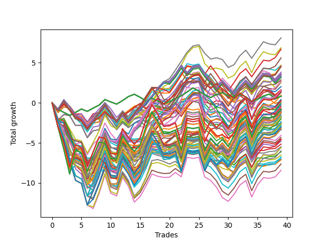

# Long HLT 344 
- Symbol: TSLA
- Date Range: 05/16/2022 - 05/17/2024
- Trading Period: 8:30-12:30
- Number of Trades: 39



| Id. | Name | Win Percent | Profit | Avg Profit / Trade | Avg Time / Trade | Std |      | Name | Win Percent | Profit | Avg Profit / Trade | Avg Time / Trade | Std |
| --- | ---- | ----------- | ------ | ------------------ | ---------------- | --- | ---- | ---- | ----------- | ------ | ------------------ | ---------------- | --- |
| | Sorted By <br> Profit | | | | | | | Sorted By <br> Win Percentage |||||
|0| TP-1 45m | 61.54 | 8.11 | 0.21 | 29:30 | 0.85 |     | TP-1 45m | 61.54 | 8.11 | 0.21 | 29:30 | 0.85 |
|1| TP-1.25 45m | 61.54 | 6.87 | 0.18 | 34:24 | 1.09 |     | TP-1.25 45m | 61.54 | 6.87 | 0.18 | 34:24 | 1.09 |
|2| TP-1 90m | 56.41 | 6.69 | 0.17 | 41:20 | 0.93 |     | TP-1 30m | 61.54 | 2.85 | 0.07 | 22:21 | 0.78 |
|3| TP-1 105m | 53.85 | 5.61 | 0.14 | 43:04 | 0.97 |     | TP-0.75 45m | 58.97 | 3.66 | 0.09 | 19:24 | 0.80 |
|4| TP-1 60m | 51.28 | 4.68 | 0.12 | 35:18 | 0.86 |     | TP-1.25 30m | 58.97 | -0.73 | -0.02 | 24:53 | 0.98 |
|5| TP-1 75m | 53.85 | 4.67 | 0.12 | 39:04 | 0.92 |     | TP-1 90m | 56.41 | 6.69 | 0.17 | 41:20 | 0.93 |
|6| TP-1 180m | 56.41 | 4.53 | 0.12 | 44:06 | 0.99 |     | TP-1 180m | 56.41 | 4.53 | 0.12 | 44:06 | 0.99 |
|7| TP-1 165m | 56.41 | 4.53 | 0.12 | 44:06 | 0.99 |     | TP-1 165m | 56.41 | 4.53 | 0.12 | 44:06 | 0.99 |
|8| TP-1 150m | 56.41 | 4.53 | 0.12 | 44:06 | 0.99 |     | TP-1 150m | 56.41 | 4.53 | 0.12 | 44:06 | 0.99 |
|9| TP-1 135m | 56.41 | 4.53 | 0.12 | 44:06 | 0.99 |     | TP-1 135m | 56.41 | 4.53 | 0.12 | 44:06 | 0.99 |
|10| TP-1 120m | 56.41 | 4.53 | 0.12 | 44:06 | 0.99 |     | TP-1 120m | 56.41 | 4.53 | 0.12 | 44:06 | 0.99 |
|11| TP-1.25 90m | 53.85 | 3.82 | 0.10 | 50:03 | 1.19 |     | TP-0.75 180m | 56.41 | 3.54 | 0.09 | 23:20 | 0.83 |
|12| TP-0.75 45m | 58.97 | 3.66 | 0.09 | 19:24 | 0.80 |     | TP-0.75 165m | 56.41 | 3.54 | 0.09 | 23:20 | 0.83 |
|13| TP-0.75 180m | 56.41 | 3.54 | 0.09 | 23:20 | 0.83 |     | TP-0.75 150m | 56.41 | 3.54 | 0.09 | 23:20 | 0.83 |
|14| TP-0.75 165m | 56.41 | 3.54 | 0.09 | 23:20 | 0.83 |     | TP-0.75 135m | 56.41 | 3.54 | 0.09 | 23:20 | 0.83 |
|15| TP-0.75 150m | 56.41 | 3.54 | 0.09 | 23:20 | 0.83 |     | TP-0.75 120m | 56.41 | 3.54 | 0.09 | 23:20 | 0.83 |
|16| TP-0.75 135m | 56.41 | 3.54 | 0.09 | 23:20 | 0.83 |     | TP-0.75 75m | 56.41 | 3.30 | 0.08 | 22:09 | 0.83 |
|17| TP-0.75 120m | 56.41 | 3.54 | 0.09 | 23:20 | 0.83 |     | TP-3 45m | 56.41 | 2.56 | 0.07 | 43:20 | 1.16 |
|18| TP-0.75 105m | 53.85 | 3.38 | 0.09 | 22:56 | 0.83 |     | TP-0.5 30m | 56.41 | 1.58 | 0.04 | 10:50 | 0.65 |
|19| TP-0.75 75m | 56.41 | 3.30 | 0.08 | 22:09 | 0.83 |     | TP-0.75 30m | 56.41 | 1.49 | 0.04 | 16:15 | 0.77 |
|20| TP-0.75 90m | 53.85 | 3.15 | 0.08 | 22:33 | 0.84 |     | TP-1.5 45m | 56.41 | 1.29 | 0.03 | 37:23 | 1.11 |
|21| TP-1 30m | 61.54 | 2.85 | 0.07 | 22:21 | 0.78 |     | TP-1.75 45m | 56.41 | 0.42 | 0.01 | 38:04 | 1.17 |
|22| TP-1.25 105m | 51.28 | 2.71 | 0.07 | 52:36 | 1.21 |     | TP-2.75 45m | 56.41 | 0.24 | 0.01 | 42:35 | 1.23 |
|23| TP-0.75 60m | 53.85 | 2.59 | 0.07 | 21:21 | 0.83 |     | TP-0.5 15m | 56.41 | 0.22 | 0.01 | 08:33 | 0.60 |
|24| TP-3 45m | 56.41 | 2.56 | 0.07 | 43:20 | 1.16 |     | TP-2.25 45m | 56.41 | -0.01 | -0.00 | 40:12 | 1.28 |
|25| TP-1.25 60m | 48.72 | 2.02 | 0.05 | 41:41 | 1.10 |     | TP-2 45m | 56.41 | -0.01 | -0.00 | 38:46 | 1.22 |
|26| TP-0.5 180m | 53.85 | 1.61 | 0.04 | 11:38 | 0.66 |     | TP-2.5 45m | 56.41 | -0.46 | -0.01 | 42:07 | 1.23 |
|27| TP-0.5 165m | 53.85 | 1.61 | 0.04 | 11:38 | 0.66 |     | TP-1 15m | 56.41 | -1.11 | -0.03 | 12:47 | 0.64 |
|28| TP-0.5 150m | 53.85 | 1.61 | 0.04 | 11:38 | 0.66 |     | TP-0.75 15m | 56.41 | -1.81 | -0.05 | 10:40 | 0.67 |
|29| TP-0.5 135m | 53.85 | 1.61 | 0.04 | 11:38 | 0.66 |     | TP-3 15m | 56.41 | -2.51 | -0.06 | 14:00 | 0.81 |
|30| TP-0.5 120m | 53.85 | 1.61 | 0.04 | 11:38 | 0.66 |     | TP-2.75 15m | 56.41 | -2.51 | -0.06 | 14:00 | 0.81 |
|31| TP-0.5 105m | 53.85 | 1.61 | 0.04 | 11:38 | 0.66 |     | TP-2.5 15m | 56.41 | -2.51 | -0.06 | 14:00 | 0.81 |
|32| TP-0.5 90m | 53.85 | 1.61 | 0.04 | 11:38 | 0.66 |     | TP-2.25 15m | 56.41 | -2.51 | -0.06 | 14:00 | 0.81 |
|33| TP-0.5 75m | 53.85 | 1.61 | 0.04 | 11:38 | 0.66 |     | TP-1.25 15m | 56.41 | -2.51 | -0.06 | 13:21 | 0.86 |
|34| TP-0.5 60m | 53.85 | 1.61 | 0.04 | 11:38 | 0.66 |     | TP-2 15m | 56.41 | -3.35 | -0.09 | 13:40 | 0.83 |
|35| TP-0.5 30m | 56.41 | 1.58 | 0.04 | 10:50 | 0.65 |     | TP-1.75 15m | 56.41 | -3.35 | -0.09 | 13:40 | 0.83 |
|36| TP-1.25 180m | 53.85 | 1.56 | 0.04 | 54:29 | 1.24 |     | TP-1.5 15m | 56.41 | -3.35 | -0.09 | 13:40 | 0.83 |
|37| TP-1.25 165m | 53.85 | 1.56 | 0.04 | 54:29 | 1.24 |     | TP-3 30m | 56.41 | -5.15 | -0.13 | 29:00 | 1.01 |
|38| TP-1.25 150m | 53.85 | 1.56 | 0.04 | 54:29 | 1.24 |     | TP-1.5 30m | 56.41 | -5.48 | -0.14 | 26:30 | 0.98 |
|39| TP-1.25 135m | 53.85 | 1.56 | 0.04 | 54:29 | 1.24 |     | TP-2.75 30m | 56.41 | -6.11 | -0.16 | 28:41 | 1.06 |
|40| TP-1.25 120m | 53.85 | 1.56 | 0.04 | 54:29 | 1.24 |     | TP-1.75 30m | 56.41 | -6.51 | -0.17 | 26:56 | 1.04 |
|41| TP-1.25 75m | 51.28 | 1.55 | 0.04 | 46:50 | 1.17 |     | TP-2 30m | 56.41 | -6.84 | -0.18 | 27:06 | 1.07 |
|42| TP-0.75 30m | 56.41 | 1.49 | 0.04 | 16:15 | 0.77 |     | TP-2.25 30m | 56.41 | -7.04 | -0.18 | 28:09 | 1.15 |
|43| TP-0.5 45m | 53.85 | 1.42 | 0.04 | 11:29 | 0.66 |     | TP-2.5 30m | 56.41 | -7.12 | -0.18 | 28:38 | 1.11 |
|44| TP-3 180m | 51.28 | 1.37 | 0.04 | 91:09 | 1.69 |     | TP-1 105m | 53.85 | 5.61 | 0.14 | 43:04 | 0.97 |
|45| TP-3 165m | 51.28 | 1.37 | 0.04 | 91:09 | 1.69 |     | TP-1 75m | 53.85 | 4.67 | 0.12 | 39:04 | 0.92 |
|46| TP-3 150m | 51.28 | 1.37 | 0.04 | 91:09 | 1.69 |     | TP-1.25 90m | 53.85 | 3.82 | 0.10 | 50:03 | 1.19 |
|47| TP-3 135m | 51.28 | 1.37 | 0.04 | 91:09 | 1.69 |     | TP-0.75 105m | 53.85 | 3.38 | 0.09 | 22:56 | 0.83 |
|48| TP-3 120m | 51.28 | 1.37 | 0.04 | 91:09 | 1.69 |     | TP-0.75 90m | 53.85 | 3.15 | 0.08 | 22:33 | 0.84 |
|49| TP-1.5 45m | 56.41 | 1.29 | 0.03 | 37:23 | 1.11 |     | TP-0.75 60m | 53.85 | 2.59 | 0.07 | 21:21 | 0.83 |
|50| TP-3 90m | 48.72 | 0.96 | 0.02 | 75:26 | 1.48 |     | TP-0.5 180m | 53.85 | 1.61 | 0.04 | 11:38 | 0.66 |
|51| TP-0.25 180m | 53.85 | 0.82 | 0.02 | 04:30 | 0.41 |     | TP-0.5 165m | 53.85 | 1.61 | 0.04 | 11:38 | 0.66 |
|52| TP-0.25 165m | 53.85 | 0.82 | 0.02 | 04:30 | 0.41 |     | TP-0.5 150m | 53.85 | 1.61 | 0.04 | 11:38 | 0.66 |
|53| TP-0.25 150m | 53.85 | 0.82 | 0.02 | 04:30 | 0.41 |     | TP-0.5 135m | 53.85 | 1.61 | 0.04 | 11:38 | 0.66 |
|54| TP-0.25 135m | 53.85 | 0.82 | 0.02 | 04:30 | 0.41 |     | TP-0.5 120m | 53.85 | 1.61 | 0.04 | 11:38 | 0.66 |
|55| TP-0.25 120m | 53.85 | 0.82 | 0.02 | 04:30 | 0.41 |     | TP-0.5 105m | 53.85 | 1.61 | 0.04 | 11:38 | 0.66 |
|56| TP-0.25 105m | 53.85 | 0.82 | 0.02 | 04:30 | 0.41 |     | TP-0.5 90m | 53.85 | 1.61 | 0.04 | 11:38 | 0.66 |
|57| TP-0.25 90m | 53.85 | 0.82 | 0.02 | 04:30 | 0.41 |     | TP-0.5 75m | 53.85 | 1.61 | 0.04 | 11:38 | 0.66 |
|58| TP-0.25 75m | 53.85 | 0.82 | 0.02 | 04:30 | 0.41 |     | TP-0.5 60m | 53.85 | 1.61 | 0.04 | 11:38 | 0.66 |
|59| TP-0.25 60m | 53.85 | 0.82 | 0.02 | 04:30 | 0.41 |     | TP-1.25 180m | 53.85 | 1.56 | 0.04 | 54:29 | 1.24 |
|60| TP-0.25 45m | 53.85 | 0.82 | 0.02 | 04:30 | 0.41 |     | TP-1.25 165m | 53.85 | 1.56 | 0.04 | 54:29 | 1.24 |
|61| TP-0.25 30m | 53.85 | 0.82 | 0.02 | 04:30 | 0.41 |     | TP-1.25 150m | 53.85 | 1.56 | 0.04 | 54:29 | 1.24 |
|62| TP-0.25 15m | 53.85 | 0.80 | 0.02 | 04:27 | 0.41 |     | TP-1.25 135m | 53.85 | 1.56 | 0.04 | 54:29 | 1.24 |
|63| TP-1.75 45m | 56.41 | 0.42 | 0.01 | 38:04 | 1.17 |     | TP-1.25 120m | 53.85 | 1.56 | 0.04 | 54:29 | 1.24 |
|64| TP-3 105m | 48.72 | 0.27 | 0.01 | 83:27 | 1.53 |     | TP-0.5 45m | 53.85 | 1.42 | 0.04 | 11:29 | 0.66 |
|65| TP-2.75 45m | 56.41 | 0.24 | 0.01 | 42:35 | 1.23 |     | TP-0.25 180m | 53.85 | 0.82 | 0.02 | 04:30 | 0.41 |
|66| TP-0.5 15m | 56.41 | 0.22 | 0.01 | 08:33 | 0.60 |     | TP-0.25 165m | 53.85 | 0.82 | 0.02 | 04:30 | 0.41 |
|67| TP-2.25 45m | 56.41 | -0.01 | -0.00 | 40:12 | 1.28 |     | TP-0.25 150m | 53.85 | 0.82 | 0.02 | 04:30 | 0.41 |
|68| TP-2 45m | 56.41 | -0.01 | -0.00 | 38:46 | 1.22 |     | TP-0.25 135m | 53.85 | 0.82 | 0.02 | 04:30 | 0.41 |
|69| TP-2.75 90m | 48.72 | -0.23 | -0.01 | 72:55 | 1.48 |     | TP-0.25 120m | 53.85 | 0.82 | 0.02 | 04:30 | 0.41 |
|70| TP-2.5 45m | 56.41 | -0.46 | -0.01 | 42:07 | 1.23 |     | TP-0.25 105m | 53.85 | 0.82 | 0.02 | 04:30 | 0.41 |
|71| TP-1.25 30m | 58.97 | -0.73 | -0.02 | 24:53 | 0.98 |     | TP-0.25 90m | 53.85 | 0.82 | 0.02 | 04:30 | 0.41 |
|72| TP-1.5 90m | 46.15 | -0.73 | -0.02 | 58:06 | 1.27 |     | TP-0.25 75m | 53.85 | 0.82 | 0.02 | 04:30 | 0.41 |
|73| TP-2.75 180m | 51.28 | -0.84 | -0.02 | 87:44 | 1.74 |     | TP-0.25 60m | 53.85 | 0.82 | 0.02 | 04:30 | 0.41 |
|74| TP-2.75 165m | 51.28 | -0.84 | -0.02 | 87:44 | 1.74 |     | TP-0.25 45m | 53.85 | 0.82 | 0.02 | 04:30 | 0.41 |
|75| TP-2.75 150m | 51.28 | -0.84 | -0.02 | 87:44 | 1.74 |     | TP-0.25 30m | 53.85 | 0.82 | 0.02 | 04:30 | 0.41 |
|76| TP-2.75 135m | 51.28 | -0.84 | -0.02 | 87:44 | 1.74 |     | TP-0.25 15m | 53.85 | 0.80 | 0.02 | 04:27 | 0.41 |
|77| TP-2.75 120m | 51.28 | -0.84 | -0.02 | 87:44 | 1.74 |     | TP-1 60m | 51.28 | 4.68 | 0.12 | 35:18 | 0.86 |
|78| TP-1.5 180m | 51.28 | -0.92 | -0.02 | 65:12 | 1.37 |     | TP-1.25 105m | 51.28 | 2.71 | 0.07 | 52:36 | 1.21 |
|79| TP-1.5 165m | 51.28 | -0.92 | -0.02 | 65:12 | 1.37 |     | TP-1.25 75m | 51.28 | 1.55 | 0.04 | 46:50 | 1.17 |
|80| TP-1.5 150m | 51.28 | -0.92 | -0.02 | 65:12 | 1.37 |     | TP-3 180m | 51.28 | 1.37 | 0.04 | 91:09 | 1.69 |
|81| TP-1.5 135m | 51.28 | -0.92 | -0.02 | 65:12 | 1.37 |     | TP-3 165m | 51.28 | 1.37 | 0.04 | 91:09 | 1.69 |
|82| TP-1.5 120m | 51.28 | -0.92 | -0.02 | 65:12 | 1.37 |     | TP-3 150m | 51.28 | 1.37 | 0.04 | 91:09 | 1.69 |
|83| TP-1 15m | 56.41 | -1.11 | -0.03 | 12:47 | 0.64 |     | TP-3 135m | 51.28 | 1.37 | 0.04 | 91:09 | 1.69 |
|84| TP-1.75 90m | 46.15 | -1.17 | -0.03 | 60:27 | 1.34 |     | TP-3 120m | 51.28 | 1.37 | 0.04 | 91:09 | 1.69 |
|85| TP-2.5 180m | 51.28 | -1.22 | -0.03 | 86:01 | 1.69 |     | TP-2.75 180m | 51.28 | -0.84 | -0.02 | 87:44 | 1.74 |
|86| TP-2.5 165m | 51.28 | -1.22 | -0.03 | 86:01 | 1.69 |     | TP-2.75 165m | 51.28 | -0.84 | -0.02 | 87:44 | 1.74 |
|87| TP-2.5 150m | 51.28 | -1.22 | -0.03 | 86:01 | 1.69 |     | TP-2.75 150m | 51.28 | -0.84 | -0.02 | 87:44 | 1.74 |
|88| TP-2.5 135m | 51.28 | -1.22 | -0.03 | 86:01 | 1.69 |     | TP-2.75 135m | 51.28 | -0.84 | -0.02 | 87:44 | 1.74 |
|89| TP-2.5 120m | 51.28 | -1.22 | -0.03 | 86:01 | 1.69 |     | TP-2.75 120m | 51.28 | -0.84 | -0.02 | 87:44 | 1.74 |
|90| TP-1.5 105m | 48.72 | -1.38 | -0.04 | 62:06 | 1.31 |     | TP-1.5 180m | 51.28 | -0.92 | -0.02 | 65:12 | 1.37 |
|91| TP-2.5 90m | 48.72 | -1.57 | -0.04 | 72:01 | 1.49 |     | TP-1.5 165m | 51.28 | -0.92 | -0.02 | 65:12 | 1.37 |
|92| TP-3 60m | 48.72 | -1.66 | -0.04 | 55:29 | 1.29 |     | TP-1.5 150m | 51.28 | -0.92 | -0.02 | 65:12 | 1.37 |
|93| TP-1.75 180m | 51.28 | -1.73 | -0.04 | 68:26 | 1.46 |     | TP-1.5 135m | 51.28 | -0.92 | -0.02 | 65:12 | 1.37 |
|94| TP-1.75 165m | 51.28 | -1.73 | -0.04 | 68:26 | 1.46 |     | TP-1.5 120m | 51.28 | -0.92 | -0.02 | 65:12 | 1.37 |
|95| TP-1.75 150m | 51.28 | -1.73 | -0.04 | 68:26 | 1.46 |     | TP-2.5 180m | 51.28 | -1.22 | -0.03 | 86:01 | 1.69 |
|96| TP-1.75 135m | 51.28 | -1.73 | -0.04 | 68:26 | 1.46 |     | TP-2.5 165m | 51.28 | -1.22 | -0.03 | 86:01 | 1.69 |
|97| TP-1.75 120m | 51.28 | -1.73 | -0.04 | 68:26 | 1.46 |     | TP-2.5 150m | 51.28 | -1.22 | -0.03 | 86:01 | 1.69 |
|98| TP-1.5 60m | 46.15 | -1.75 | -0.04 | 46:09 | 1.15 |     | TP-2.5 135m | 51.28 | -1.22 | -0.03 | 86:01 | 1.69 |
|99| TP-0.75 15m | 56.41 | -1.81 | -0.05 | 10:40 | 0.67 |     | TP-2.5 120m | 51.28 | -1.22 | -0.03 | 86:01 | 1.69 |
|100| TP-2.75 105m | 48.72 | -2.00 | -0.05 | 80:33 | 1.57 |     | TP-1.75 180m | 51.28 | -1.73 | -0.04 | 68:26 | 1.46 |
|101| TP-1.75 105m | 48.72 | -2.00 | -0.05 | 65:00 | 1.40 |     | TP-1.75 165m | 51.28 | -1.73 | -0.04 | 68:26 | 1.46 |
|102| TP-2 180m | 51.28 | -2.38 | -0.06 | 72:41 | 1.58 |     | TP-1.75 150m | 51.28 | -1.73 | -0.04 | 68:26 | 1.46 |
|103| TP-2 165m | 51.28 | -2.38 | -0.06 | 72:41 | 1.58 |     | TP-1.75 135m | 51.28 | -1.73 | -0.04 | 68:26 | 1.46 |
|104| TP-2 150m | 51.28 | -2.38 | -0.06 | 72:41 | 1.58 |     | TP-1.75 120m | 51.28 | -1.73 | -0.04 | 68:26 | 1.46 |
|105| TP-2 135m | 51.28 | -2.38 | -0.06 | 72:41 | 1.58 |     | TP-2 180m | 51.28 | -2.38 | -0.06 | 72:41 | 1.58 |
|106| TP-2 120m | 51.28 | -2.38 | -0.06 | 72:41 | 1.58 |     | TP-2 165m | 51.28 | -2.38 | -0.06 | 72:41 | 1.58 |
|107| TP-3 15m | 56.41 | -2.51 | -0.06 | 14:00 | 0.81 |     | TP-2 150m | 51.28 | -2.38 | -0.06 | 72:41 | 1.58 |
|108| TP-2.75 15m | 56.41 | -2.51 | -0.06 | 14:00 | 0.81 |     | TP-2 135m | 51.28 | -2.38 | -0.06 | 72:41 | 1.58 |
|109| TP-2.5 15m | 56.41 | -2.51 | -0.06 | 14:00 | 0.81 |     | TP-2 120m | 51.28 | -2.38 | -0.06 | 72:41 | 1.58 |
|110| TP-2.25 15m | 56.41 | -2.51 | -0.06 | 14:00 | 0.81 |     | TP-2.25 180m | 51.28 | -3.01 | -0.08 | 78:16 | 1.65 |
|111| TP-1.25 15m | 56.41 | -2.51 | -0.06 | 13:21 | 0.86 |     | TP-2.25 165m | 51.28 | -3.01 | -0.08 | 78:16 | 1.65 |
|112| TP-2 90m | 46.15 | -2.53 | -0.06 | 63:16 | 1.46 |     | TP-2.25 150m | 51.28 | -3.01 | -0.08 | 78:16 | 1.65 |
|113| TP-2.25 90m | 46.15 | -2.65 | -0.07 | 66:30 | 1.50 |     | TP-2.25 135m | 51.28 | -3.01 | -0.08 | 78:16 | 1.65 |
|114| TP-1.75 60m | 46.15 | -2.73 | -0.07 | 47:33 | 1.21 |     | TP-2.25 120m | 51.28 | -3.01 | -0.08 | 78:16 | 1.65 |
|115| TP-2 105m | 48.72 | -2.85 | -0.07 | 68:24 | 1.53 |     | TP-1.25 60m | 48.72 | 2.02 | 0.05 | 41:41 | 1.10 |
|116| TP-2.25 180m | 51.28 | -3.01 | -0.08 | 78:16 | 1.65 |     | TP-3 90m | 48.72 | 0.96 | 0.02 | 75:26 | 1.48 |
|117| TP-2.25 165m | 51.28 | -3.01 | -0.08 | 78:16 | 1.65 |     | TP-3 105m | 48.72 | 0.27 | 0.01 | 83:27 | 1.53 |
|118| TP-2.25 150m | 51.28 | -3.01 | -0.08 | 78:16 | 1.65 |     | TP-2.75 90m | 48.72 | -0.23 | -0.01 | 72:55 | 1.48 |
|119| TP-2.25 135m | 51.28 | -3.01 | -0.08 | 78:16 | 1.65 |     | TP-1.5 105m | 48.72 | -1.38 | -0.04 | 62:06 | 1.31 |
|120| TP-2.25 120m | 51.28 | -3.01 | -0.08 | 78:16 | 1.65 |     | TP-2.5 90m | 48.72 | -1.57 | -0.04 | 72:01 | 1.49 |
|121| TP-2.5 105m | 48.72 | -3.20 | -0.08 | 79:16 | 1.57 |     | TP-3 60m | 48.72 | -1.66 | -0.04 | 55:29 | 1.29 |
|122| TP-2.25 105m | 48.72 | -3.27 | -0.08 | 72:50 | 1.58 |     | TP-2.75 105m | 48.72 | -2.00 | -0.05 | 80:33 | 1.57 |
|123| TP-2 15m | 56.41 | -3.35 | -0.09 | 13:40 | 0.83 |     | TP-1.75 105m | 48.72 | -2.00 | -0.05 | 65:00 | 1.40 |
|124| TP-1.75 15m | 56.41 | -3.35 | -0.09 | 13:40 | 0.83 |     | TP-2 105m | 48.72 | -2.85 | -0.07 | 68:24 | 1.53 |
|125| TP-1.5 15m | 56.41 | -3.35 | -0.09 | 13:40 | 0.83 |     | TP-2.5 105m | 48.72 | -3.20 | -0.08 | 79:16 | 1.57 |
|126| TP-2.75 60m | 48.72 | -4.07 | -0.10 | 54:21 | 1.34 |     | TP-2.25 105m | 48.72 | -3.27 | -0.08 | 72:50 | 1.58 |
|127| TP-2.5 60m | 48.72 | -4.34 | -0.11 | 53:50 | 1.32 |     | TP-2.75 60m | 48.72 | -4.07 | -0.10 | 54:21 | 1.34 |
|128| TP-2 60m | 46.15 | -4.54 | -0.12 | 48:55 | 1.29 |     | TP-2.5 60m | 48.72 | -4.34 | -0.11 | 53:50 | 1.32 |
|129| TP-1.5 75m | 43.59 | -4.58 | -0.12 | 52:58 | 1.23 |     | TP-1.5 90m | 46.15 | -0.73 | -0.02 | 58:06 | 1.27 |
|130| TP-2.25 60m | 46.15 | -4.78 | -0.12 | 50:44 | 1.36 |     | TP-1.75 90m | 46.15 | -1.17 | -0.03 | 60:27 | 1.34 |
|131| TP-3 30m | 56.41 | -5.15 | -0.13 | 29:00 | 1.01 |     | TP-1.5 60m | 46.15 | -1.75 | -0.04 | 46:09 | 1.15 |
|132| TP-1.5 30m | 56.41 | -5.48 | -0.14 | 26:30 | 0.98 |     | TP-2 90m | 46.15 | -2.53 | -0.06 | 63:16 | 1.46 |
|133| TP-1.75 75m | 43.59 | -5.53 | -0.14 | 54:55 | 1.29 |     | TP-2.25 90m | 46.15 | -2.65 | -0.07 | 66:30 | 1.50 |
|134| TP-2.75 75m | 46.15 | -5.59 | -0.14 | 64:16 | 1.50 |     | TP-1.75 60m | 46.15 | -2.73 | -0.07 | 47:33 | 1.21 |
|135| TP-2.5 75m | 46.15 | -5.99 | -0.15 | 63:44 | 1.47 |     | TP-2 60m | 46.15 | -4.54 | -0.12 | 48:55 | 1.29 |
|136| TP-2.75 30m | 56.41 | -6.11 | -0.16 | 28:41 | 1.06 |     | TP-2.25 60m | 46.15 | -4.78 | -0.12 | 50:44 | 1.36 |
|137| TP-1.75 30m | 56.41 | -6.51 | -0.17 | 26:56 | 1.04 |     | TP-2.75 75m | 46.15 | -5.59 | -0.14 | 64:16 | 1.50 |
|138| TP-3 75m | 46.15 | -6.75 | -0.17 | 66:06 | 1.42 |     | TP-2.5 75m | 46.15 | -5.99 | -0.15 | 63:44 | 1.47 |
|139| TP-2 30m | 56.41 | -6.84 | -0.18 | 27:06 | 1.07 |     | TP-3 75m | 46.15 | -6.75 | -0.17 | 66:06 | 1.42 |
|140| TP-2.25 30m | 56.41 | -7.04 | -0.18 | 28:09 | 1.15 |     | TP-1.5 75m | 43.59 | -4.58 | -0.12 | 52:58 | 1.23 |
|141| TP-2.5 30m | 56.41 | -7.12 | -0.18 | 28:38 | 1.11 |     | TP-1.75 75m | 43.59 | -5.53 | -0.14 | 54:55 | 1.29 |
|142| TP-2 75m | 43.59 | -7.63 | -0.20 | 57:09 | 1.39 |     | TP-2 75m | 43.59 | -7.63 | -0.20 | 57:09 | 1.39 |
|143| TP-2.25 75m | 43.59 | -8.41 | -0.22 | 59:24 | 1.47 |     | TP-2.25 75m | 43.59 | -8.41 | -0.22 | 59:24 | 1.47 |

### Test TP-0.25 15m
* Take Profit of 0.25 Point
* 0.25 Stoploss
* Results:
```
Total Trades: 39
Percent Up: 53.85
Percent Down: 46.15
Total Points Moved Up: 0.80
Potential Profit: 400.00
Total Points Ups: 7.98 Count Ups: 21
Total Points Downs: -7.18 Count Downs: 18
```

<details><summary>Trades</summary>

<code>In: 2022-05-20 08:35:00		Out: 2022-05-20 08:37:00		Total Position Time: 02:00		Total Move Up: -0.80		Total to Date: -0.80</code> <br />
<code>In: 2022-06-09 09:30:00		Out: 2022-06-09 09:33:00		Total Position Time: 03:00		Total Move Up: -0.39		Total to Date: -1.19</code> <br />
<code>In: 2022-06-13 10:45:00		Out: 2022-06-13 10:51:00		Total Position Time: 06:00		Total Move Up: -0.38		Total to Date: -1.57</code> <br />
<code>In: 2022-06-23 10:15:00		Out: 2022-06-23 10:18:00		Total Position Time: 03:00		Total Move Up: 0.38		Total to Date: -1.19</code> <br />
<code>In: 2022-07-26 11:50:00		Out: 2022-07-26 11:52:00		Total Position Time: 02:00		Total Move Up: 0.42		Total to Date: -0.77</code> <br />
<code>In: 2022-08-08 12:05:00		Out: 2022-08-08 12:07:00		Total Position Time: 02:00		Total Move Up: -0.30		Total to Date: -1.07</code> <br />
<code>In: 2022-08-25 08:35:00		Out: 2022-08-25 08:37:00		Total Position Time: 02:00		Total Move Up: 0.41		Total to Date: -0.66</code> <br />
<code>In: 2022-08-25 12:05:00		Out: 2022-08-25 12:07:00		Total Position Time: 02:00		Total Move Up: 0.37		Total to Date: -0.29</code> <br />
<code>In: 2022-09-22 08:35:00		Out: 2022-09-22 08:39:00		Total Position Time: 04:00		Total Move Up: 0.70		Total to Date: 0.41</code> <br />
<code>In: 2022-09-30 11:15:00		Out: 2022-09-30 11:19:00		Total Position Time: 04:00		Total Move Up: -0.30		Total to Date: 0.11</code> <br />
<code>In: 2022-12-16 08:40:00		Out: 2022-12-16 08:43:00		Total Position Time: 03:00		Total Move Up: -0.27		Total to Date: -0.16</code> <br />
<code>In: 2022-12-19 09:10:00		Out: 2022-12-19 09:14:00		Total Position Time: 04:00		Total Move Up: 0.44		Total to Date: 0.28</code> <br />
<code>In: 2022-12-19 11:40:00		Out: 2022-12-19 11:44:00		Total Position Time: 04:00		Total Move Up: 0.50		Total to Date: 0.78</code> <br />
<code>In: 2023-01-18 08:55:00		Out: 2023-01-18 08:57:00		Total Position Time: 02:00		Total Move Up: 0.29		Total to Date: 1.07</code> <br />
<code>In: 2023-01-18 10:30:00		Out: 2023-01-18 10:35:00		Total Position Time: 05:00		Total Move Up: -0.38		Total to Date: 0.69</code> <br />
<code>In: 2023-01-19 08:55:00		Out: 2023-01-19 08:58:00		Total Position Time: 03:00		Total Move Up: -0.46		Total to Date: 0.23</code> <br />
<code>In: 2023-04-03 11:15:00		Out: 2023-04-03 11:20:00		Total Position Time: 05:00		Total Move Up: 0.33		Total to Date: 0.56</code> <br />
<code>In: 2023-04-12 08:50:00		Out: 2023-04-12 08:53:00		Total Position Time: 03:00		Total Move Up: -0.34		Total to Date: 0.22</code> <br />
<code>In: 2023-04-20 09:35:00		Out: 2023-04-20 09:38:00		Total Position Time: 03:00		Total Move Up: -0.35		Total to Date: -0.13</code> <br />
<code>In: 2023-05-12 10:05:00		Out: 2023-05-12 10:11:00		Total Position Time: 06:00		Total Move Up: 0.28		Total to Date: 0.15</code> <br />
<code>In: 2023-09-26 11:30:00		Out: 2023-09-26 11:32:00		Total Position Time: 02:00		Total Move Up: 0.39		Total to Date: 0.54</code> <br />
<code>In: 2023-10-18 10:10:00		Out: 2023-10-18 10:12:00		Total Position Time: 02:00		Total Move Up: 0.33		Total to Date: 0.87</code> <br />
<code>In: 2023-10-20 08:55:00		Out: 2023-10-20 08:57:00		Total Position Time: 02:00		Total Move Up: 0.49		Total to Date: 1.36</code> <br />
<code>In: 2023-10-20 11:50:00		Out: 2023-10-20 11:52:00		Total Position Time: 02:00		Total Move Up: 0.50		Total to Date: 1.86</code> <br />
<code>In: 2023-10-24 12:20:00		Out: 2023-10-24 12:24:00		Total Position Time: 04:00		Total Move Up: -0.41		Total to Date: 1.45</code> <br />
<code>In: 2023-11-09 09:50:00		Out: 2023-11-09 09:56:00		Total Position Time: 06:00		Total Move Up: -0.42		Total to Date: 1.03</code> <br />
<code>In: 2023-11-16 11:20:00		Out: 2023-11-16 11:26:00		Total Position Time: 06:00		Total Move Up: -0.38		Total to Date: 0.65</code> <br />
<code>In: 2024-01-04 11:55:00		Out: 2024-01-04 12:09:00		Total Position Time: 14:00		Total Move Up: 0.39		Total to Date: 1.04</code> <br />
<code>In: 2024-01-25 09:55:00		Out: 2024-01-25 10:03:00		Total Position Time: 08:00		Total Move Up: 0.23		Total to Date: 1.27</code> <br />
<code>In: 2024-01-26 10:30:00		Out: 2024-01-26 10:33:00		Total Position Time: 03:00		Total Move Up: -0.35		Total to Date: 0.92</code> <br />
<code>In: 2024-02-20 09:35:00		Out: 2024-02-20 09:37:00		Total Position Time: 02:00		Total Move Up: -0.22		Total to Date: 0.70</code> <br />
<code>In: 2024-03-15 10:10:00		Out: 2024-03-15 10:21:00		Total Position Time: 11:00		Total Move Up: 0.34		Total to Date: 1.04</code> <br />
<code>In: 2024-03-21 11:35:00		Out: 2024-03-21 11:38:00		Total Position Time: 03:00		Total Move Up: -0.29		Total to Date: 0.75</code> <br />
<code>In: 2024-04-15 10:10:00		Out: 2024-04-15 10:19:00		Total Position Time: 09:00		Total Move Up: -0.58		Total to Date: 0.17</code> <br />
<code>In: 2024-04-22 08:35:00		Out: 2024-04-22 08:49:00		Total Position Time: 14:00		Total Move Up: 0.24		Total to Date: 0.41</code> <br />
<code>In: 2024-04-26 12:05:00		Out: 2024-04-26 12:07:00		Total Position Time: 02:00		Total Move Up: 0.42		Total to Date: 0.83</code> <br />
<code>In: 2024-05-07 12:00:00		Out: 2024-05-07 12:08:00		Total Position Time: 08:00		Total Move Up: 0.24		Total to Date: 1.07</code> <br />
<code>In: 2024-05-09 08:35:00		Out: 2024-05-09 08:38:00		Total Position Time: 03:00		Total Move Up: -0.56		Total to Date: 0.51</code> <br />
<code>In: 2024-05-17 11:40:00		Out: 2024-05-17 11:45:00		Total Position Time: 05:00		Total Move Up: 0.29		Total to Date: 0.80</code> <br />


</details>

### Test TP-0.5 15m
* Take Profit of 0.5 Point
* 0.5 Stoploss
* Results:
```
Total Trades: 39
Percent Up: 56.41
Percent Down: 43.59
Total Points Moved Up: 0.22
Potential Profit: 110.00
Total Points Ups: 10.76 Count Ups: 22
Total Points Downs: -10.54 Count Downs: 17
```

<details><summary>Trades</summary>

<code>In: 2022-05-20 08:35:00		Out: 2022-05-20 08:37:00		Total Position Time: 02:00		Total Move Up: -0.80		Total to Date: -0.80</code> <br />
<code>In: 2022-06-09 09:30:00		Out: 2022-06-09 09:43:00		Total Position Time: 13:00		Total Move Up: 0.66		Total to Date: -0.14</code> <br />
<code>In: 2022-06-13 10:45:00		Out: 2022-06-13 10:53:00		Total Position Time: 08:00		Total Move Up: -0.75		Total to Date: -0.89</code> <br />
<code>In: 2022-06-23 10:15:00		Out: 2022-06-23 10:25:00		Total Position Time: 10:00		Total Move Up: -0.75		Total to Date: -1.64</code> <br />
<code>In: 2022-07-26 11:50:00		Out: 2022-07-26 12:04:00		Total Position Time: 14:00		Total Move Up: 0.02		Total to Date: -1.62</code> <br />
<code>In: 2022-08-08 12:05:00		Out: 2022-08-08 12:08:00		Total Position Time: 03:00		Total Move Up: -0.97		Total to Date: -2.59</code> <br />
<code>In: 2022-08-25 08:35:00		Out: 2022-08-25 08:38:00		Total Position Time: 03:00		Total Move Up: 0.81		Total to Date: -1.78</code> <br />
<code>In: 2022-08-25 12:05:00		Out: 2022-08-25 12:19:00		Total Position Time: 14:00		Total Move Up: 0.15		Total to Date: -1.63</code> <br />
<code>In: 2022-09-22 08:35:00		Out: 2022-09-22 08:39:00		Total Position Time: 04:00		Total Move Up: 0.70		Total to Date: -0.93</code> <br />
<code>In: 2022-09-30 11:15:00		Out: 2022-09-30 11:22:00		Total Position Time: 07:00		Total Move Up: -0.66		Total to Date: -1.59</code> <br />
<code>In: 2022-12-16 08:40:00		Out: 2022-12-16 08:48:00		Total Position Time: 08:00		Total Move Up: -0.50		Total to Date: -2.09</code> <br />
<code>In: 2022-12-19 09:10:00		Out: 2022-12-19 09:15:00		Total Position Time: 05:00		Total Move Up: 0.63		Total to Date: -1.46</code> <br />
<code>In: 2022-12-19 11:40:00		Out: 2022-12-19 11:44:00		Total Position Time: 04:00		Total Move Up: 0.50		Total to Date: -0.96</code> <br />
<code>In: 2023-01-18 08:55:00		Out: 2023-01-18 08:59:00		Total Position Time: 04:00		Total Move Up: 0.55		Total to Date: -0.41</code> <br />
<code>In: 2023-01-18 10:30:00		Out: 2023-01-18 10:44:00		Total Position Time: 14:00		Total Move Up: 0.22		Total to Date: -0.19</code> <br />
<code>In: 2023-01-19 08:55:00		Out: 2023-01-19 09:09:00		Total Position Time: 14:00		Total Move Up: -0.62		Total to Date: -0.81</code> <br />
<code>In: 2023-04-03 11:15:00		Out: 2023-04-03 11:26:00		Total Position Time: 11:00		Total Move Up: 0.63		Total to Date: -0.18</code> <br />
<code>In: 2023-04-12 08:50:00		Out: 2023-04-12 09:04:00		Total Position Time: 14:00		Total Move Up: 0.61		Total to Date: 0.43</code> <br />
<code>In: 2023-04-20 09:35:00		Out: 2023-04-20 09:40:00		Total Position Time: 05:00		Total Move Up: -0.66		Total to Date: -0.23</code> <br />
<code>In: 2023-05-12 10:05:00		Out: 2023-05-12 10:19:00		Total Position Time: 14:00		Total Move Up: 0.16		Total to Date: -0.07</code> <br />
<code>In: 2023-09-26 11:30:00		Out: 2023-09-26 11:37:00		Total Position Time: 07:00		Total Move Up: 0.61		Total to Date: 0.54</code> <br />
<code>In: 2023-10-18 10:10:00		Out: 2023-10-18 10:14:00		Total Position Time: 04:00		Total Move Up: 1.12		Total to Date: 1.66</code> <br />
<code>In: 2023-10-20 08:55:00		Out: 2023-10-20 08:58:00		Total Position Time: 03:00		Total Move Up: 0.66		Total to Date: 2.32</code> <br />
<code>In: 2023-10-20 11:50:00		Out: 2023-10-20 11:52:00		Total Position Time: 02:00		Total Move Up: 0.50		Total to Date: 2.82</code> <br />
<code>In: 2023-10-24 12:20:00		Out: 2023-10-24 12:34:00		Total Position Time: 14:00		Total Move Up: -0.17		Total to Date: 2.65</code> <br />
<code>In: 2023-11-09 09:50:00		Out: 2023-11-09 10:02:00		Total Position Time: 12:00		Total Move Up: -1.07		Total to Date: 1.58</code> <br />
<code>In: 2023-11-16 11:20:00		Out: 2023-11-16 11:27:00		Total Position Time: 07:00		Total Move Up: -0.59		Total to Date: 0.99</code> <br />
<code>In: 2024-01-04 11:55:00		Out: 2024-01-04 12:09:00		Total Position Time: 14:00		Total Move Up: 0.39		Total to Date: 1.38</code> <br />
<code>In: 2024-01-25 09:55:00		Out: 2024-01-25 10:09:00		Total Position Time: 14:00		Total Move Up: -0.14		Total to Date: 1.24</code> <br />
<code>In: 2024-01-26 10:30:00		Out: 2024-01-26 10:36:00		Total Position Time: 06:00		Total Move Up: -0.58		Total to Date: 0.66</code> <br />
<code>In: 2024-02-20 09:35:00		Out: 2024-02-20 09:38:00		Total Position Time: 03:00		Total Move Up: -0.62		Total to Date: 0.04</code> <br />
<code>In: 2024-03-15 10:10:00		Out: 2024-03-15 10:24:00		Total Position Time: 14:00		Total Move Up: 0.31		Total to Date: 0.35</code> <br />
<code>In: 2024-03-21 11:35:00		Out: 2024-03-21 11:39:00		Total Position Time: 04:00		Total Move Up: -0.52		Total to Date: -0.17</code> <br />
<code>In: 2024-04-15 10:10:00		Out: 2024-04-15 10:19:00		Total Position Time: 09:00		Total Move Up: -0.58		Total to Date: -0.75</code> <br />
<code>In: 2024-04-22 08:35:00		Out: 2024-04-22 08:49:00		Total Position Time: 14:00		Total Move Up: 0.24		Total to Date: -0.51</code> <br />
<code>In: 2024-04-26 12:05:00		Out: 2024-04-26 12:10:00		Total Position Time: 05:00		Total Move Up: 0.86		Total to Date: 0.35</code> <br />
<code>In: 2024-05-07 12:00:00		Out: 2024-05-07 12:14:00		Total Position Time: 14:00		Total Move Up: 0.12		Total to Date: 0.47</code> <br />
<code>In: 2024-05-09 08:35:00		Out: 2024-05-09 08:38:00		Total Position Time: 03:00		Total Move Up: -0.56		Total to Date: -0.09</code> <br />
<code>In: 2024-05-17 11:40:00		Out: 2024-05-17 11:54:00		Total Position Time: 14:00		Total Move Up: 0.31		Total to Date: 0.22</code> <br />


</details>

### Test TP-0.75 15m
* Take Profit of 0.75 Point
* 0.75 Stoploss
* Results:
```
Total Trades: 39
Percent Up: 56.41
Percent Down: 43.59
Total Points Moved Up: -1.81
Potential Profit: -905.00
Total Points Ups: 10.55 Count Ups: 22
Total Points Downs: -12.36 Count Downs: 17
```

<details><summary>Trades</summary>

<code>In: 2022-05-20 08:35:00		Out: 2022-05-20 08:37:00		Total Position Time: 02:00		Total Move Up: -0.80		Total to Date: -0.80</code> <br />
<code>In: 2022-06-09 09:30:00		Out: 2022-06-09 09:44:00		Total Position Time: 14:00		Total Move Up: 0.72		Total to Date: -0.08</code> <br />
<code>In: 2022-06-13 10:45:00		Out: 2022-06-13 10:54:00		Total Position Time: 09:00		Total Move Up: -0.86		Total to Date: -0.94</code> <br />
<code>In: 2022-06-23 10:15:00		Out: 2022-06-23 10:27:00		Total Position Time: 12:00		Total Move Up: -1.08		Total to Date: -2.02</code> <br />
<code>In: 2022-07-26 11:50:00		Out: 2022-07-26 12:04:00		Total Position Time: 14:00		Total Move Up: 0.02		Total to Date: -2.00</code> <br />
<code>In: 2022-08-08 12:05:00		Out: 2022-08-08 12:08:00		Total Position Time: 03:00		Total Move Up: -0.97		Total to Date: -2.97</code> <br />
<code>In: 2022-08-25 08:35:00		Out: 2022-08-25 08:38:00		Total Position Time: 03:00		Total Move Up: 0.81		Total to Date: -2.16</code> <br />
<code>In: 2022-08-25 12:05:00		Out: 2022-08-25 12:19:00		Total Position Time: 14:00		Total Move Up: 0.15		Total to Date: -2.01</code> <br />
<code>In: 2022-09-22 08:35:00		Out: 2022-09-22 08:41:00		Total Position Time: 06:00		Total Move Up: 0.83		Total to Date: -1.18</code> <br />
<code>In: 2022-09-30 11:15:00		Out: 2022-09-30 11:28:00		Total Position Time: 13:00		Total Move Up: -0.79		Total to Date: -1.97</code> <br />
<code>In: 2022-12-16 08:40:00		Out: 2022-12-16 08:50:00		Total Position Time: 10:00		Total Move Up: -1.07		Total to Date: -3.04</code> <br />
<code>In: 2022-12-19 09:10:00		Out: 2022-12-19 09:18:00		Total Position Time: 08:00		Total Move Up: 0.75		Total to Date: -2.29</code> <br />
<code>In: 2022-12-19 11:40:00		Out: 2022-12-19 11:54:00		Total Position Time: 14:00		Total Move Up: -0.60		Total to Date: -2.89</code> <br />
<code>In: 2023-01-18 08:55:00		Out: 2023-01-18 09:03:00		Total Position Time: 08:00		Total Move Up: 0.90		Total to Date: -1.99</code> <br />
<code>In: 2023-01-18 10:30:00		Out: 2023-01-18 10:44:00		Total Position Time: 14:00		Total Move Up: 0.22		Total to Date: -1.77</code> <br />
<code>In: 2023-01-19 08:55:00		Out: 2023-01-19 09:09:00		Total Position Time: 14:00		Total Move Up: -0.62		Total to Date: -2.39</code> <br />
<code>In: 2023-04-03 11:15:00		Out: 2023-04-03 11:27:00		Total Position Time: 12:00		Total Move Up: 0.79		Total to Date: -1.60</code> <br />
<code>In: 2023-04-12 08:50:00		Out: 2023-04-12 09:04:00		Total Position Time: 14:00		Total Move Up: 0.61		Total to Date: -0.99</code> <br />
<code>In: 2023-04-20 09:35:00		Out: 2023-04-20 09:49:00		Total Position Time: 14:00		Total Move Up: -0.25		Total to Date: -1.24</code> <br />
<code>In: 2023-05-12 10:05:00		Out: 2023-05-12 10:19:00		Total Position Time: 14:00		Total Move Up: 0.16		Total to Date: -1.08</code> <br />
<code>In: 2023-09-26 11:30:00		Out: 2023-09-26 11:44:00		Total Position Time: 14:00		Total Move Up: 0.08		Total to Date: -1.00</code> <br />
<code>In: 2023-10-18 10:10:00		Out: 2023-10-18 10:14:00		Total Position Time: 04:00		Total Move Up: 1.12		Total to Date: 0.12</code> <br />
<code>In: 2023-10-20 08:55:00		Out: 2023-10-20 09:09:00		Total Position Time: 14:00		Total Move Up: 0.23		Total to Date: 0.35</code> <br />
<code>In: 2023-10-20 11:50:00		Out: 2023-10-20 11:55:00		Total Position Time: 05:00		Total Move Up: 0.80		Total to Date: 1.15</code> <br />
<code>In: 2023-10-24 12:20:00		Out: 2023-10-24 12:34:00		Total Position Time: 14:00		Total Move Up: -0.17		Total to Date: 0.98</code> <br />
<code>In: 2023-11-09 09:50:00		Out: 2023-11-09 10:02:00		Total Position Time: 12:00		Total Move Up: -1.07		Total to Date: -0.09</code> <br />
<code>In: 2023-11-16 11:20:00		Out: 2023-11-16 11:28:00		Total Position Time: 08:00		Total Move Up: -0.84		Total to Date: -0.93</code> <br />
<code>In: 2024-01-04 11:55:00		Out: 2024-01-04 12:09:00		Total Position Time: 14:00		Total Move Up: 0.39		Total to Date: -0.54</code> <br />
<code>In: 2024-01-25 09:55:00		Out: 2024-01-25 10:09:00		Total Position Time: 14:00		Total Move Up: -0.14		Total to Date: -0.68</code> <br />
<code>In: 2024-01-26 10:30:00		Out: 2024-01-26 10:41:00		Total Position Time: 11:00		Total Move Up: -0.77		Total to Date: -1.45</code> <br />
<code>In: 2024-02-20 09:35:00		Out: 2024-02-20 09:39:00		Total Position Time: 04:00		Total Move Up: -0.81		Total to Date: -2.26</code> <br />
<code>In: 2024-03-15 10:10:00		Out: 2024-03-15 10:24:00		Total Position Time: 14:00		Total Move Up: 0.31		Total to Date: -1.95</code> <br />
<code>In: 2024-03-21 11:35:00		Out: 2024-03-21 11:49:00		Total Position Time: 14:00		Total Move Up: 0.13		Total to Date: -1.82</code> <br />
<code>In: 2024-04-15 10:10:00		Out: 2024-04-15 10:21:00		Total Position Time: 11:00		Total Move Up: -0.73		Total to Date: -2.55</code> <br />
<code>In: 2024-04-22 08:35:00		Out: 2024-04-22 08:49:00		Total Position Time: 14:00		Total Move Up: 0.24		Total to Date: -2.31</code> <br />
<code>In: 2024-04-26 12:05:00		Out: 2024-04-26 12:10:00		Total Position Time: 05:00		Total Move Up: 0.86		Total to Date: -1.45</code> <br />
<code>In: 2024-05-07 12:00:00		Out: 2024-05-07 12:14:00		Total Position Time: 14:00		Total Move Up: 0.12		Total to Date: -1.33</code> <br />
<code>In: 2024-05-09 08:35:00		Out: 2024-05-09 08:39:00		Total Position Time: 04:00		Total Move Up: -0.79		Total to Date: -2.12</code> <br />
<code>In: 2024-05-17 11:40:00		Out: 2024-05-17 11:54:00		Total Position Time: 14:00		Total Move Up: 0.31		Total to Date: -1.81</code> <br />


</details>

### Test TP-1 15m
* Take Profit of 1 Point
* 1 Stoploss
* Results:
```
Total Trades: 39
Percent Up: 56.41
Percent Down: 43.59
Total Points Moved Up: -1.11
Potential Profit: -555.00
Total Points Ups: 9.63 Count Ups: 22
Total Points Downs: -10.74 Count Downs: 17
```

<details><summary>Trades</summary>

<code>In: 2022-05-20 08:35:00		Out: 2022-05-20 08:38:00		Total Position Time: 03:00		Total Move Up: -0.98		Total to Date: -0.98</code> <br />
<code>In: 2022-06-09 09:30:00		Out: 2022-06-09 09:44:00		Total Position Time: 14:00		Total Move Up: 0.72		Total to Date: -0.26</code> <br />
<code>In: 2022-06-13 10:45:00		Out: 2022-06-13 10:59:00		Total Position Time: 14:00		Total Move Up: -0.14		Total to Date: -0.40</code> <br />
<code>In: 2022-06-23 10:15:00		Out: 2022-06-23 10:28:00		Total Position Time: 13:00		Total Move Up: -1.00		Total to Date: -1.40</code> <br />
<code>In: 2022-07-26 11:50:00		Out: 2022-07-26 12:04:00		Total Position Time: 14:00		Total Move Up: 0.02		Total to Date: -1.38</code> <br />
<code>In: 2022-08-08 12:05:00		Out: 2022-08-08 12:11:00		Total Position Time: 06:00		Total Move Up: -1.01		Total to Date: -2.39</code> <br />
<code>In: 2022-08-25 08:35:00		Out: 2022-08-25 08:43:00		Total Position Time: 08:00		Total Move Up: 1.02		Total to Date: -1.37</code> <br />
<code>In: 2022-08-25 12:05:00		Out: 2022-08-25 12:19:00		Total Position Time: 14:00		Total Move Up: 0.15		Total to Date: -1.22</code> <br />
<code>In: 2022-09-22 08:35:00		Out: 2022-09-22 08:44:00		Total Position Time: 09:00		Total Move Up: 1.03		Total to Date: -0.19</code> <br />
<code>In: 2022-09-30 11:15:00		Out: 2022-09-30 11:29:00		Total Position Time: 14:00		Total Move Up: -1.10		Total to Date: -1.29</code> <br />
<code>In: 2022-12-16 08:40:00		Out: 2022-12-16 08:50:00		Total Position Time: 10:00		Total Move Up: -1.07		Total to Date: -2.36</code> <br />
<code>In: 2022-12-19 09:10:00		Out: 2022-12-19 09:24:00		Total Position Time: 14:00		Total Move Up: 0.85		Total to Date: -1.51</code> <br />
<code>In: 2022-12-19 11:40:00		Out: 2022-12-19 11:54:00		Total Position Time: 14:00		Total Move Up: -0.60		Total to Date: -2.11</code> <br />
<code>In: 2023-01-18 08:55:00		Out: 2023-01-18 09:09:00		Total Position Time: 14:00		Total Move Up: 0.56		Total to Date: -1.55</code> <br />
<code>In: 2023-01-18 10:30:00		Out: 2023-01-18 10:44:00		Total Position Time: 14:00		Total Move Up: 0.22		Total to Date: -1.33</code> <br />
<code>In: 2023-01-19 08:55:00		Out: 2023-01-19 09:09:00		Total Position Time: 14:00		Total Move Up: -0.62		Total to Date: -1.95</code> <br />
<code>In: 2023-04-03 11:15:00		Out: 2023-04-03 11:29:00		Total Position Time: 14:00		Total Move Up: 0.60		Total to Date: -1.35</code> <br />
<code>In: 2023-04-12 08:50:00		Out: 2023-04-12 09:04:00		Total Position Time: 14:00		Total Move Up: 0.61		Total to Date: -0.74</code> <br />
<code>In: 2023-04-20 09:35:00		Out: 2023-04-20 09:49:00		Total Position Time: 14:00		Total Move Up: -0.25		Total to Date: -0.99</code> <br />
<code>In: 2023-05-12 10:05:00		Out: 2023-05-12 10:19:00		Total Position Time: 14:00		Total Move Up: 0.16		Total to Date: -0.83</code> <br />
<code>In: 2023-09-26 11:30:00		Out: 2023-09-26 11:44:00		Total Position Time: 14:00		Total Move Up: 0.08		Total to Date: -0.75</code> <br />
<code>In: 2023-10-18 10:10:00		Out: 2023-10-18 10:14:00		Total Position Time: 04:00		Total Move Up: 1.12		Total to Date: 0.37</code> <br />
<code>In: 2023-10-20 08:55:00		Out: 2023-10-20 09:09:00		Total Position Time: 14:00		Total Move Up: 0.23		Total to Date: 0.60</code> <br />
<code>In: 2023-10-20 11:50:00		Out: 2023-10-20 12:04:00		Total Position Time: 14:00		Total Move Up: 0.75		Total to Date: 1.35</code> <br />
<code>In: 2023-10-24 12:20:00		Out: 2023-10-24 12:34:00		Total Position Time: 14:00		Total Move Up: -0.17		Total to Date: 1.18</code> <br />
<code>In: 2023-11-09 09:50:00		Out: 2023-11-09 10:02:00		Total Position Time: 12:00		Total Move Up: -1.07		Total to Date: 0.11</code> <br />
<code>In: 2023-11-16 11:20:00		Out: 2023-11-16 11:34:00		Total Position Time: 14:00		Total Move Up: -0.23		Total to Date: -0.12</code> <br />
<code>In: 2024-01-04 11:55:00		Out: 2024-01-04 12:09:00		Total Position Time: 14:00		Total Move Up: 0.39		Total to Date: 0.27</code> <br />
<code>In: 2024-01-25 09:55:00		Out: 2024-01-25 10:09:00		Total Position Time: 14:00		Total Move Up: -0.14		Total to Date: 0.13</code> <br />
<code>In: 2024-01-26 10:30:00		Out: 2024-01-26 10:44:00		Total Position Time: 14:00		Total Move Up: -1.00		Total to Date: -0.87</code> <br />
<code>In: 2024-02-20 09:35:00		Out: 2024-02-20 09:49:00		Total Position Time: 14:00		Total Move Up: -0.53		Total to Date: -1.40</code> <br />
<code>In: 2024-03-15 10:10:00		Out: 2024-03-15 10:24:00		Total Position Time: 14:00		Total Move Up: 0.31		Total to Date: -1.09</code> <br />
<code>In: 2024-03-21 11:35:00		Out: 2024-03-21 11:49:00		Total Position Time: 14:00		Total Move Up: 0.13		Total to Date: -0.96</code> <br />
<code>In: 2024-04-15 10:10:00		Out: 2024-04-15 10:24:00		Total Position Time: 14:00		Total Move Up: -0.76		Total to Date: -1.72</code> <br />
<code>In: 2024-04-22 08:35:00		Out: 2024-04-22 08:49:00		Total Position Time: 14:00		Total Move Up: 0.24		Total to Date: -1.48</code> <br />
<code>In: 2024-04-26 12:05:00		Out: 2024-04-26 12:19:00		Total Position Time: 14:00		Total Move Up: -0.07		Total to Date: -1.55</code> <br />
<code>In: 2024-05-07 12:00:00		Out: 2024-05-07 12:14:00		Total Position Time: 14:00		Total Move Up: 0.12		Total to Date: -1.43</code> <br />
<code>In: 2024-05-09 08:35:00		Out: 2024-05-09 08:49:00		Total Position Time: 14:00		Total Move Up: 0.01		Total to Date: -1.42</code> <br />
<code>In: 2024-05-17 11:40:00		Out: 2024-05-17 11:54:00		Total Position Time: 14:00		Total Move Up: 0.31		Total to Date: -1.11</code> <br />


</details>

### Test TP-1.25 15m
* Take Profit of 1.25 Point
* 1.25 Stoploss
* Results:
```
Total Trades: 39
Percent Up: 56.41
Percent Down: 43.59
Total Points Moved Up: -2.51
Potential Profit: -1255.00
Total Points Ups: 11.08 Count Ups: 22
Total Points Downs: -13.59 Count Downs: 17
```

<details><summary>Trades</summary>

<code>In: 2022-05-20 08:35:00		Out: 2022-05-20 08:39:00		Total Position Time: 04:00		Total Move Up: -2.18		Total to Date: -2.18</code> <br />
<code>In: 2022-06-09 09:30:00		Out: 2022-06-09 09:44:00		Total Position Time: 14:00		Total Move Up: 0.72		Total to Date: -1.46</code> <br />
<code>In: 2022-06-13 10:45:00		Out: 2022-06-13 10:59:00		Total Position Time: 14:00		Total Move Up: -0.14		Total to Date: -1.60</code> <br />
<code>In: 2022-06-23 10:15:00		Out: 2022-06-23 10:29:00		Total Position Time: 14:00		Total Move Up: -1.23		Total to Date: -2.83</code> <br />
<code>In: 2022-07-26 11:50:00		Out: 2022-07-26 12:04:00		Total Position Time: 14:00		Total Move Up: 0.02		Total to Date: -2.81</code> <br />
<code>In: 2022-08-08 12:05:00		Out: 2022-08-08 12:19:00		Total Position Time: 14:00		Total Move Up: -1.53		Total to Date: -4.34</code> <br />
<code>In: 2022-08-25 08:35:00		Out: 2022-08-25 08:44:00		Total Position Time: 09:00		Total Move Up: 1.32		Total to Date: -3.02</code> <br />
<code>In: 2022-08-25 12:05:00		Out: 2022-08-25 12:19:00		Total Position Time: 14:00		Total Move Up: 0.15		Total to Date: -2.87</code> <br />
<code>In: 2022-09-22 08:35:00		Out: 2022-09-22 08:47:00		Total Position Time: 12:00		Total Move Up: 1.99		Total to Date: -0.88</code> <br />
<code>In: 2022-09-30 11:15:00		Out: 2022-09-30 11:29:00		Total Position Time: 14:00		Total Move Up: -1.10		Total to Date: -1.98</code> <br />
<code>In: 2022-12-16 08:40:00		Out: 2022-12-16 08:54:00		Total Position Time: 14:00		Total Move Up: -0.89		Total to Date: -2.87</code> <br />
<code>In: 2022-12-19 09:10:00		Out: 2022-12-19 09:24:00		Total Position Time: 14:00		Total Move Up: 0.85		Total to Date: -2.02</code> <br />
<code>In: 2022-12-19 11:40:00		Out: 2022-12-19 11:54:00		Total Position Time: 14:00		Total Move Up: -0.60		Total to Date: -2.62</code> <br />
<code>In: 2023-01-18 08:55:00		Out: 2023-01-18 09:09:00		Total Position Time: 14:00		Total Move Up: 0.56		Total to Date: -2.06</code> <br />
<code>In: 2023-01-18 10:30:00		Out: 2023-01-18 10:44:00		Total Position Time: 14:00		Total Move Up: 0.22		Total to Date: -1.84</code> <br />
<code>In: 2023-01-19 08:55:00		Out: 2023-01-19 09:09:00		Total Position Time: 14:00		Total Move Up: -0.62		Total to Date: -2.46</code> <br />
<code>In: 2023-04-03 11:15:00		Out: 2023-04-03 11:29:00		Total Position Time: 14:00		Total Move Up: 0.60		Total to Date: -1.86</code> <br />
<code>In: 2023-04-12 08:50:00		Out: 2023-04-12 09:04:00		Total Position Time: 14:00		Total Move Up: 0.61		Total to Date: -1.25</code> <br />
<code>In: 2023-04-20 09:35:00		Out: 2023-04-20 09:49:00		Total Position Time: 14:00		Total Move Up: -0.25		Total to Date: -1.50</code> <br />
<code>In: 2023-05-12 10:05:00		Out: 2023-05-12 10:19:00		Total Position Time: 14:00		Total Move Up: 0.16		Total to Date: -1.34</code> <br />
<code>In: 2023-09-26 11:30:00		Out: 2023-09-26 11:44:00		Total Position Time: 14:00		Total Move Up: 0.08		Total to Date: -1.26</code> <br />
<code>In: 2023-10-18 10:10:00		Out: 2023-10-18 10:17:00		Total Position Time: 07:00		Total Move Up: 1.31		Total to Date: 0.05</code> <br />
<code>In: 2023-10-20 08:55:00		Out: 2023-10-20 09:09:00		Total Position Time: 14:00		Total Move Up: 0.23		Total to Date: 0.28</code> <br />
<code>In: 2023-10-20 11:50:00		Out: 2023-10-20 12:04:00		Total Position Time: 14:00		Total Move Up: 0.75		Total to Date: 1.03</code> <br />
<code>In: 2023-10-24 12:20:00		Out: 2023-10-24 12:34:00		Total Position Time: 14:00		Total Move Up: -0.17		Total to Date: 0.86</code> <br />
<code>In: 2023-11-09 09:50:00		Out: 2023-11-09 10:03:00		Total Position Time: 13:00		Total Move Up: -2.15		Total to Date: -1.29</code> <br />
<code>In: 2023-11-16 11:20:00		Out: 2023-11-16 11:34:00		Total Position Time: 14:00		Total Move Up: -0.23		Total to Date: -1.52</code> <br />
<code>In: 2024-01-04 11:55:00		Out: 2024-01-04 12:09:00		Total Position Time: 14:00		Total Move Up: 0.39		Total to Date: -1.13</code> <br />
<code>In: 2024-01-25 09:55:00		Out: 2024-01-25 10:09:00		Total Position Time: 14:00		Total Move Up: -0.14		Total to Date: -1.27</code> <br />
<code>In: 2024-01-26 10:30:00		Out: 2024-01-26 10:44:00		Total Position Time: 14:00		Total Move Up: -1.00		Total to Date: -2.27</code> <br />
<code>In: 2024-02-20 09:35:00		Out: 2024-02-20 09:49:00		Total Position Time: 14:00		Total Move Up: -0.53		Total to Date: -2.80</code> <br />
<code>In: 2024-03-15 10:10:00		Out: 2024-03-15 10:24:00		Total Position Time: 14:00		Total Move Up: 0.31		Total to Date: -2.49</code> <br />
<code>In: 2024-03-21 11:35:00		Out: 2024-03-21 11:49:00		Total Position Time: 14:00		Total Move Up: 0.13		Total to Date: -2.36</code> <br />
<code>In: 2024-04-15 10:10:00		Out: 2024-04-15 10:24:00		Total Position Time: 14:00		Total Move Up: -0.76		Total to Date: -3.12</code> <br />
<code>In: 2024-04-22 08:35:00		Out: 2024-04-22 08:49:00		Total Position Time: 14:00		Total Move Up: 0.24		Total to Date: -2.88</code> <br />
<code>In: 2024-04-26 12:05:00		Out: 2024-04-26 12:19:00		Total Position Time: 14:00		Total Move Up: -0.07		Total to Date: -2.95</code> <br />
<code>In: 2024-05-07 12:00:00		Out: 2024-05-07 12:14:00		Total Position Time: 14:00		Total Move Up: 0.12		Total to Date: -2.83</code> <br />
<code>In: 2024-05-09 08:35:00		Out: 2024-05-09 08:49:00		Total Position Time: 14:00		Total Move Up: 0.01		Total to Date: -2.82</code> <br />
<code>In: 2024-05-17 11:40:00		Out: 2024-05-17 11:54:00		Total Position Time: 14:00		Total Move Up: 0.31		Total to Date: -2.51</code> <br />


</details>

### Test TP-1.5 15m
* Take Profit of 1.5 Point
* 1.5 Stoploss
* Results:
```
Total Trades: 39
Percent Up: 56.41
Percent Down: 43.59
Total Points Moved Up: -3.35
Potential Profit: -1675.00
Total Points Ups: 10.24 Count Ups: 22
Total Points Downs: -13.59 Count Downs: 17
```

<details><summary>Trades</summary>

<code>In: 2022-05-20 08:35:00		Out: 2022-05-20 08:39:00		Total Position Time: 04:00		Total Move Up: -2.18		Total to Date: -2.18</code> <br />
<code>In: 2022-06-09 09:30:00		Out: 2022-06-09 09:44:00		Total Position Time: 14:00		Total Move Up: 0.72		Total to Date: -1.46</code> <br />
<code>In: 2022-06-13 10:45:00		Out: 2022-06-13 10:59:00		Total Position Time: 14:00		Total Move Up: -0.14		Total to Date: -1.60</code> <br />
<code>In: 2022-06-23 10:15:00		Out: 2022-06-23 10:29:00		Total Position Time: 14:00		Total Move Up: -1.23		Total to Date: -2.83</code> <br />
<code>In: 2022-07-26 11:50:00		Out: 2022-07-26 12:04:00		Total Position Time: 14:00		Total Move Up: 0.02		Total to Date: -2.81</code> <br />
<code>In: 2022-08-08 12:05:00		Out: 2022-08-08 12:19:00		Total Position Time: 14:00		Total Move Up: -1.53		Total to Date: -4.34</code> <br />
<code>In: 2022-08-25 08:35:00		Out: 2022-08-25 08:49:00		Total Position Time: 14:00		Total Move Up: 0.85		Total to Date: -3.49</code> <br />
<code>In: 2022-08-25 12:05:00		Out: 2022-08-25 12:19:00		Total Position Time: 14:00		Total Move Up: 0.15		Total to Date: -3.34</code> <br />
<code>In: 2022-09-22 08:35:00		Out: 2022-09-22 08:47:00		Total Position Time: 12:00		Total Move Up: 1.99		Total to Date: -1.35</code> <br />
<code>In: 2022-09-30 11:15:00		Out: 2022-09-30 11:29:00		Total Position Time: 14:00		Total Move Up: -1.10		Total to Date: -2.45</code> <br />
<code>In: 2022-12-16 08:40:00		Out: 2022-12-16 08:54:00		Total Position Time: 14:00		Total Move Up: -0.89		Total to Date: -3.34</code> <br />
<code>In: 2022-12-19 09:10:00		Out: 2022-12-19 09:24:00		Total Position Time: 14:00		Total Move Up: 0.85		Total to Date: -2.49</code> <br />
<code>In: 2022-12-19 11:40:00		Out: 2022-12-19 11:54:00		Total Position Time: 14:00		Total Move Up: -0.60		Total to Date: -3.09</code> <br />
<code>In: 2023-01-18 08:55:00		Out: 2023-01-18 09:09:00		Total Position Time: 14:00		Total Move Up: 0.56		Total to Date: -2.53</code> <br />
<code>In: 2023-01-18 10:30:00		Out: 2023-01-18 10:44:00		Total Position Time: 14:00		Total Move Up: 0.22		Total to Date: -2.31</code> <br />
<code>In: 2023-01-19 08:55:00		Out: 2023-01-19 09:09:00		Total Position Time: 14:00		Total Move Up: -0.62		Total to Date: -2.93</code> <br />
<code>In: 2023-04-03 11:15:00		Out: 2023-04-03 11:29:00		Total Position Time: 14:00		Total Move Up: 0.60		Total to Date: -2.33</code> <br />
<code>In: 2023-04-12 08:50:00		Out: 2023-04-12 09:04:00		Total Position Time: 14:00		Total Move Up: 0.61		Total to Date: -1.72</code> <br />
<code>In: 2023-04-20 09:35:00		Out: 2023-04-20 09:49:00		Total Position Time: 14:00		Total Move Up: -0.25		Total to Date: -1.97</code> <br />
<code>In: 2023-05-12 10:05:00		Out: 2023-05-12 10:19:00		Total Position Time: 14:00		Total Move Up: 0.16		Total to Date: -1.81</code> <br />
<code>In: 2023-09-26 11:30:00		Out: 2023-09-26 11:44:00		Total Position Time: 14:00		Total Move Up: 0.08		Total to Date: -1.73</code> <br />
<code>In: 2023-10-18 10:10:00		Out: 2023-10-18 10:24:00		Total Position Time: 14:00		Total Move Up: 0.94		Total to Date: -0.79</code> <br />
<code>In: 2023-10-20 08:55:00		Out: 2023-10-20 09:09:00		Total Position Time: 14:00		Total Move Up: 0.23		Total to Date: -0.56</code> <br />
<code>In: 2023-10-20 11:50:00		Out: 2023-10-20 12:04:00		Total Position Time: 14:00		Total Move Up: 0.75		Total to Date: 0.19</code> <br />
<code>In: 2023-10-24 12:20:00		Out: 2023-10-24 12:34:00		Total Position Time: 14:00		Total Move Up: -0.17		Total to Date: 0.02</code> <br />
<code>In: 2023-11-09 09:50:00		Out: 2023-11-09 10:03:00		Total Position Time: 13:00		Total Move Up: -2.15		Total to Date: -2.13</code> <br />
<code>In: 2023-11-16 11:20:00		Out: 2023-11-16 11:34:00		Total Position Time: 14:00		Total Move Up: -0.23		Total to Date: -2.36</code> <br />
<code>In: 2024-01-04 11:55:00		Out: 2024-01-04 12:09:00		Total Position Time: 14:00		Total Move Up: 0.39		Total to Date: -1.97</code> <br />
<code>In: 2024-01-25 09:55:00		Out: 2024-01-25 10:09:00		Total Position Time: 14:00		Total Move Up: -0.14		Total to Date: -2.11</code> <br />
<code>In: 2024-01-26 10:30:00		Out: 2024-01-26 10:44:00		Total Position Time: 14:00		Total Move Up: -1.00		Total to Date: -3.11</code> <br />
<code>In: 2024-02-20 09:35:00		Out: 2024-02-20 09:49:00		Total Position Time: 14:00		Total Move Up: -0.53		Total to Date: -3.64</code> <br />
<code>In: 2024-03-15 10:10:00		Out: 2024-03-15 10:24:00		Total Position Time: 14:00		Total Move Up: 0.31		Total to Date: -3.33</code> <br />
<code>In: 2024-03-21 11:35:00		Out: 2024-03-21 11:49:00		Total Position Time: 14:00		Total Move Up: 0.13		Total to Date: -3.20</code> <br />
<code>In: 2024-04-15 10:10:00		Out: 2024-04-15 10:24:00		Total Position Time: 14:00		Total Move Up: -0.76		Total to Date: -3.96</code> <br />
<code>In: 2024-04-22 08:35:00		Out: 2024-04-22 08:49:00		Total Position Time: 14:00		Total Move Up: 0.24		Total to Date: -3.72</code> <br />
<code>In: 2024-04-26 12:05:00		Out: 2024-04-26 12:19:00		Total Position Time: 14:00		Total Move Up: -0.07		Total to Date: -3.79</code> <br />
<code>In: 2024-05-07 12:00:00		Out: 2024-05-07 12:14:00		Total Position Time: 14:00		Total Move Up: 0.12		Total to Date: -3.67</code> <br />
<code>In: 2024-05-09 08:35:00		Out: 2024-05-09 08:49:00		Total Position Time: 14:00		Total Move Up: 0.01		Total to Date: -3.66</code> <br />
<code>In: 2024-05-17 11:40:00		Out: 2024-05-17 11:54:00		Total Position Time: 14:00		Total Move Up: 0.31		Total to Date: -3.35</code> <br />


</details>

### Test TP-1.75 15m
* Take Profit of 1.75 Point
* 1.75 Stoploss
* Results:
```
Total Trades: 39
Percent Up: 56.41
Percent Down: 43.59
Total Points Moved Up: -3.35
Potential Profit: -1675.00
Total Points Ups: 10.24 Count Ups: 22
Total Points Downs: -13.59 Count Downs: 17
```

<details><summary>Trades</summary>

<code>In: 2022-05-20 08:35:00		Out: 2022-05-20 08:39:00		Total Position Time: 04:00		Total Move Up: -2.18		Total to Date: -2.18</code> <br />
<code>In: 2022-06-09 09:30:00		Out: 2022-06-09 09:44:00		Total Position Time: 14:00		Total Move Up: 0.72		Total to Date: -1.46</code> <br />
<code>In: 2022-06-13 10:45:00		Out: 2022-06-13 10:59:00		Total Position Time: 14:00		Total Move Up: -0.14		Total to Date: -1.60</code> <br />
<code>In: 2022-06-23 10:15:00		Out: 2022-06-23 10:29:00		Total Position Time: 14:00		Total Move Up: -1.23		Total to Date: -2.83</code> <br />
<code>In: 2022-07-26 11:50:00		Out: 2022-07-26 12:04:00		Total Position Time: 14:00		Total Move Up: 0.02		Total to Date: -2.81</code> <br />
<code>In: 2022-08-08 12:05:00		Out: 2022-08-08 12:19:00		Total Position Time: 14:00		Total Move Up: -1.53		Total to Date: -4.34</code> <br />
<code>In: 2022-08-25 08:35:00		Out: 2022-08-25 08:49:00		Total Position Time: 14:00		Total Move Up: 0.85		Total to Date: -3.49</code> <br />
<code>In: 2022-08-25 12:05:00		Out: 2022-08-25 12:19:00		Total Position Time: 14:00		Total Move Up: 0.15		Total to Date: -3.34</code> <br />
<code>In: 2022-09-22 08:35:00		Out: 2022-09-22 08:47:00		Total Position Time: 12:00		Total Move Up: 1.99		Total to Date: -1.35</code> <br />
<code>In: 2022-09-30 11:15:00		Out: 2022-09-30 11:29:00		Total Position Time: 14:00		Total Move Up: -1.10		Total to Date: -2.45</code> <br />
<code>In: 2022-12-16 08:40:00		Out: 2022-12-16 08:54:00		Total Position Time: 14:00		Total Move Up: -0.89		Total to Date: -3.34</code> <br />
<code>In: 2022-12-19 09:10:00		Out: 2022-12-19 09:24:00		Total Position Time: 14:00		Total Move Up: 0.85		Total to Date: -2.49</code> <br />
<code>In: 2022-12-19 11:40:00		Out: 2022-12-19 11:54:00		Total Position Time: 14:00		Total Move Up: -0.60		Total to Date: -3.09</code> <br />
<code>In: 2023-01-18 08:55:00		Out: 2023-01-18 09:09:00		Total Position Time: 14:00		Total Move Up: 0.56		Total to Date: -2.53</code> <br />
<code>In: 2023-01-18 10:30:00		Out: 2023-01-18 10:44:00		Total Position Time: 14:00		Total Move Up: 0.22		Total to Date: -2.31</code> <br />
<code>In: 2023-01-19 08:55:00		Out: 2023-01-19 09:09:00		Total Position Time: 14:00		Total Move Up: -0.62		Total to Date: -2.93</code> <br />
<code>In: 2023-04-03 11:15:00		Out: 2023-04-03 11:29:00		Total Position Time: 14:00		Total Move Up: 0.60		Total to Date: -2.33</code> <br />
<code>In: 2023-04-12 08:50:00		Out: 2023-04-12 09:04:00		Total Position Time: 14:00		Total Move Up: 0.61		Total to Date: -1.72</code> <br />
<code>In: 2023-04-20 09:35:00		Out: 2023-04-20 09:49:00		Total Position Time: 14:00		Total Move Up: -0.25		Total to Date: -1.97</code> <br />
<code>In: 2023-05-12 10:05:00		Out: 2023-05-12 10:19:00		Total Position Time: 14:00		Total Move Up: 0.16		Total to Date: -1.81</code> <br />
<code>In: 2023-09-26 11:30:00		Out: 2023-09-26 11:44:00		Total Position Time: 14:00		Total Move Up: 0.08		Total to Date: -1.73</code> <br />
<code>In: 2023-10-18 10:10:00		Out: 2023-10-18 10:24:00		Total Position Time: 14:00		Total Move Up: 0.94		Total to Date: -0.79</code> <br />
<code>In: 2023-10-20 08:55:00		Out: 2023-10-20 09:09:00		Total Position Time: 14:00		Total Move Up: 0.23		Total to Date: -0.56</code> <br />
<code>In: 2023-10-20 11:50:00		Out: 2023-10-20 12:04:00		Total Position Time: 14:00		Total Move Up: 0.75		Total to Date: 0.19</code> <br />
<code>In: 2023-10-24 12:20:00		Out: 2023-10-24 12:34:00		Total Position Time: 14:00		Total Move Up: -0.17		Total to Date: 0.02</code> <br />
<code>In: 2023-11-09 09:50:00		Out: 2023-11-09 10:03:00		Total Position Time: 13:00		Total Move Up: -2.15		Total to Date: -2.13</code> <br />
<code>In: 2023-11-16 11:20:00		Out: 2023-11-16 11:34:00		Total Position Time: 14:00		Total Move Up: -0.23		Total to Date: -2.36</code> <br />
<code>In: 2024-01-04 11:55:00		Out: 2024-01-04 12:09:00		Total Position Time: 14:00		Total Move Up: 0.39		Total to Date: -1.97</code> <br />
<code>In: 2024-01-25 09:55:00		Out: 2024-01-25 10:09:00		Total Position Time: 14:00		Total Move Up: -0.14		Total to Date: -2.11</code> <br />
<code>In: 2024-01-26 10:30:00		Out: 2024-01-26 10:44:00		Total Position Time: 14:00		Total Move Up: -1.00		Total to Date: -3.11</code> <br />
<code>In: 2024-02-20 09:35:00		Out: 2024-02-20 09:49:00		Total Position Time: 14:00		Total Move Up: -0.53		Total to Date: -3.64</code> <br />
<code>In: 2024-03-15 10:10:00		Out: 2024-03-15 10:24:00		Total Position Time: 14:00		Total Move Up: 0.31		Total to Date: -3.33</code> <br />
<code>In: 2024-03-21 11:35:00		Out: 2024-03-21 11:49:00		Total Position Time: 14:00		Total Move Up: 0.13		Total to Date: -3.20</code> <br />
<code>In: 2024-04-15 10:10:00		Out: 2024-04-15 10:24:00		Total Position Time: 14:00		Total Move Up: -0.76		Total to Date: -3.96</code> <br />
<code>In: 2024-04-22 08:35:00		Out: 2024-04-22 08:49:00		Total Position Time: 14:00		Total Move Up: 0.24		Total to Date: -3.72</code> <br />
<code>In: 2024-04-26 12:05:00		Out: 2024-04-26 12:19:00		Total Position Time: 14:00		Total Move Up: -0.07		Total to Date: -3.79</code> <br />
<code>In: 2024-05-07 12:00:00		Out: 2024-05-07 12:14:00		Total Position Time: 14:00		Total Move Up: 0.12		Total to Date: -3.67</code> <br />
<code>In: 2024-05-09 08:35:00		Out: 2024-05-09 08:49:00		Total Position Time: 14:00		Total Move Up: 0.01		Total to Date: -3.66</code> <br />
<code>In: 2024-05-17 11:40:00		Out: 2024-05-17 11:54:00		Total Position Time: 14:00		Total Move Up: 0.31		Total to Date: -3.35</code> <br />


</details>

### Test TP-2 15m
* Take Profit of 2 Point
* 2 Stoploss
* Results:
```
Total Trades: 39
Percent Up: 56.41
Percent Down: 43.59
Total Points Moved Up: -3.35
Potential Profit: -1675.00
Total Points Ups: 10.24 Count Ups: 22
Total Points Downs: -13.59 Count Downs: 17
```

<details><summary>Trades</summary>

<code>In: 2022-05-20 08:35:00		Out: 2022-05-20 08:39:00		Total Position Time: 04:00		Total Move Up: -2.18		Total to Date: -2.18</code> <br />
<code>In: 2022-06-09 09:30:00		Out: 2022-06-09 09:44:00		Total Position Time: 14:00		Total Move Up: 0.72		Total to Date: -1.46</code> <br />
<code>In: 2022-06-13 10:45:00		Out: 2022-06-13 10:59:00		Total Position Time: 14:00		Total Move Up: -0.14		Total to Date: -1.60</code> <br />
<code>In: 2022-06-23 10:15:00		Out: 2022-06-23 10:29:00		Total Position Time: 14:00		Total Move Up: -1.23		Total to Date: -2.83</code> <br />
<code>In: 2022-07-26 11:50:00		Out: 2022-07-26 12:04:00		Total Position Time: 14:00		Total Move Up: 0.02		Total to Date: -2.81</code> <br />
<code>In: 2022-08-08 12:05:00		Out: 2022-08-08 12:19:00		Total Position Time: 14:00		Total Move Up: -1.53		Total to Date: -4.34</code> <br />
<code>In: 2022-08-25 08:35:00		Out: 2022-08-25 08:49:00		Total Position Time: 14:00		Total Move Up: 0.85		Total to Date: -3.49</code> <br />
<code>In: 2022-08-25 12:05:00		Out: 2022-08-25 12:19:00		Total Position Time: 14:00		Total Move Up: 0.15		Total to Date: -3.34</code> <br />
<code>In: 2022-09-22 08:35:00		Out: 2022-09-22 08:47:00		Total Position Time: 12:00		Total Move Up: 1.99		Total to Date: -1.35</code> <br />
<code>In: 2022-09-30 11:15:00		Out: 2022-09-30 11:29:00		Total Position Time: 14:00		Total Move Up: -1.10		Total to Date: -2.45</code> <br />
<code>In: 2022-12-16 08:40:00		Out: 2022-12-16 08:54:00		Total Position Time: 14:00		Total Move Up: -0.89		Total to Date: -3.34</code> <br />
<code>In: 2022-12-19 09:10:00		Out: 2022-12-19 09:24:00		Total Position Time: 14:00		Total Move Up: 0.85		Total to Date: -2.49</code> <br />
<code>In: 2022-12-19 11:40:00		Out: 2022-12-19 11:54:00		Total Position Time: 14:00		Total Move Up: -0.60		Total to Date: -3.09</code> <br />
<code>In: 2023-01-18 08:55:00		Out: 2023-01-18 09:09:00		Total Position Time: 14:00		Total Move Up: 0.56		Total to Date: -2.53</code> <br />
<code>In: 2023-01-18 10:30:00		Out: 2023-01-18 10:44:00		Total Position Time: 14:00		Total Move Up: 0.22		Total to Date: -2.31</code> <br />
<code>In: 2023-01-19 08:55:00		Out: 2023-01-19 09:09:00		Total Position Time: 14:00		Total Move Up: -0.62		Total to Date: -2.93</code> <br />
<code>In: 2023-04-03 11:15:00		Out: 2023-04-03 11:29:00		Total Position Time: 14:00		Total Move Up: 0.60		Total to Date: -2.33</code> <br />
<code>In: 2023-04-12 08:50:00		Out: 2023-04-12 09:04:00		Total Position Time: 14:00		Total Move Up: 0.61		Total to Date: -1.72</code> <br />
<code>In: 2023-04-20 09:35:00		Out: 2023-04-20 09:49:00		Total Position Time: 14:00		Total Move Up: -0.25		Total to Date: -1.97</code> <br />
<code>In: 2023-05-12 10:05:00		Out: 2023-05-12 10:19:00		Total Position Time: 14:00		Total Move Up: 0.16		Total to Date: -1.81</code> <br />
<code>In: 2023-09-26 11:30:00		Out: 2023-09-26 11:44:00		Total Position Time: 14:00		Total Move Up: 0.08		Total to Date: -1.73</code> <br />
<code>In: 2023-10-18 10:10:00		Out: 2023-10-18 10:24:00		Total Position Time: 14:00		Total Move Up: 0.94		Total to Date: -0.79</code> <br />
<code>In: 2023-10-20 08:55:00		Out: 2023-10-20 09:09:00		Total Position Time: 14:00		Total Move Up: 0.23		Total to Date: -0.56</code> <br />
<code>In: 2023-10-20 11:50:00		Out: 2023-10-20 12:04:00		Total Position Time: 14:00		Total Move Up: 0.75		Total to Date: 0.19</code> <br />
<code>In: 2023-10-24 12:20:00		Out: 2023-10-24 12:34:00		Total Position Time: 14:00		Total Move Up: -0.17		Total to Date: 0.02</code> <br />
<code>In: 2023-11-09 09:50:00		Out: 2023-11-09 10:03:00		Total Position Time: 13:00		Total Move Up: -2.15		Total to Date: -2.13</code> <br />
<code>In: 2023-11-16 11:20:00		Out: 2023-11-16 11:34:00		Total Position Time: 14:00		Total Move Up: -0.23		Total to Date: -2.36</code> <br />
<code>In: 2024-01-04 11:55:00		Out: 2024-01-04 12:09:00		Total Position Time: 14:00		Total Move Up: 0.39		Total to Date: -1.97</code> <br />
<code>In: 2024-01-25 09:55:00		Out: 2024-01-25 10:09:00		Total Position Time: 14:00		Total Move Up: -0.14		Total to Date: -2.11</code> <br />
<code>In: 2024-01-26 10:30:00		Out: 2024-01-26 10:44:00		Total Position Time: 14:00		Total Move Up: -1.00		Total to Date: -3.11</code> <br />
<code>In: 2024-02-20 09:35:00		Out: 2024-02-20 09:49:00		Total Position Time: 14:00		Total Move Up: -0.53		Total to Date: -3.64</code> <br />
<code>In: 2024-03-15 10:10:00		Out: 2024-03-15 10:24:00		Total Position Time: 14:00		Total Move Up: 0.31		Total to Date: -3.33</code> <br />
<code>In: 2024-03-21 11:35:00		Out: 2024-03-21 11:49:00		Total Position Time: 14:00		Total Move Up: 0.13		Total to Date: -3.20</code> <br />
<code>In: 2024-04-15 10:10:00		Out: 2024-04-15 10:24:00		Total Position Time: 14:00		Total Move Up: -0.76		Total to Date: -3.96</code> <br />
<code>In: 2024-04-22 08:35:00		Out: 2024-04-22 08:49:00		Total Position Time: 14:00		Total Move Up: 0.24		Total to Date: -3.72</code> <br />
<code>In: 2024-04-26 12:05:00		Out: 2024-04-26 12:19:00		Total Position Time: 14:00		Total Move Up: -0.07		Total to Date: -3.79</code> <br />
<code>In: 2024-05-07 12:00:00		Out: 2024-05-07 12:14:00		Total Position Time: 14:00		Total Move Up: 0.12		Total to Date: -3.67</code> <br />
<code>In: 2024-05-09 08:35:00		Out: 2024-05-09 08:49:00		Total Position Time: 14:00		Total Move Up: 0.01		Total to Date: -3.66</code> <br />
<code>In: 2024-05-17 11:40:00		Out: 2024-05-17 11:54:00		Total Position Time: 14:00		Total Move Up: 0.31		Total to Date: -3.35</code> <br />


</details>

### Test TP-2.25 15m
* Take Profit of 2.25 Point
* 2.25 Stoploss
* Results:
```
Total Trades: 39
Percent Up: 56.41
Percent Down: 43.59
Total Points Moved Up: -2.51
Potential Profit: -1255.00
Total Points Ups: 10.41 Count Ups: 22
Total Points Downs: -12.92 Count Downs: 17
```

<details><summary>Trades</summary>

<code>In: 2022-05-20 08:35:00		Out: 2022-05-20 08:49:00		Total Position Time: 14:00		Total Move Up: -1.22		Total to Date: -1.22</code> <br />
<code>In: 2022-06-09 09:30:00		Out: 2022-06-09 09:44:00		Total Position Time: 14:00		Total Move Up: 0.72		Total to Date: -0.50</code> <br />
<code>In: 2022-06-13 10:45:00		Out: 2022-06-13 10:59:00		Total Position Time: 14:00		Total Move Up: -0.14		Total to Date: -0.64</code> <br />
<code>In: 2022-06-23 10:15:00		Out: 2022-06-23 10:29:00		Total Position Time: 14:00		Total Move Up: -1.23		Total to Date: -1.87</code> <br />
<code>In: 2022-07-26 11:50:00		Out: 2022-07-26 12:04:00		Total Position Time: 14:00		Total Move Up: 0.02		Total to Date: -1.85</code> <br />
<code>In: 2022-08-08 12:05:00		Out: 2022-08-08 12:19:00		Total Position Time: 14:00		Total Move Up: -1.53		Total to Date: -3.38</code> <br />
<code>In: 2022-08-25 08:35:00		Out: 2022-08-25 08:49:00		Total Position Time: 14:00		Total Move Up: 0.85		Total to Date: -2.53</code> <br />
<code>In: 2022-08-25 12:05:00		Out: 2022-08-25 12:19:00		Total Position Time: 14:00		Total Move Up: 0.15		Total to Date: -2.38</code> <br />
<code>In: 2022-09-22 08:35:00		Out: 2022-09-22 08:49:00		Total Position Time: 14:00		Total Move Up: 2.16		Total to Date: -0.22</code> <br />
<code>In: 2022-09-30 11:15:00		Out: 2022-09-30 11:29:00		Total Position Time: 14:00		Total Move Up: -1.10		Total to Date: -1.32</code> <br />
<code>In: 2022-12-16 08:40:00		Out: 2022-12-16 08:54:00		Total Position Time: 14:00		Total Move Up: -0.89		Total to Date: -2.21</code> <br />
<code>In: 2022-12-19 09:10:00		Out: 2022-12-19 09:24:00		Total Position Time: 14:00		Total Move Up: 0.85		Total to Date: -1.36</code> <br />
<code>In: 2022-12-19 11:40:00		Out: 2022-12-19 11:54:00		Total Position Time: 14:00		Total Move Up: -0.60		Total to Date: -1.96</code> <br />
<code>In: 2023-01-18 08:55:00		Out: 2023-01-18 09:09:00		Total Position Time: 14:00		Total Move Up: 0.56		Total to Date: -1.40</code> <br />
<code>In: 2023-01-18 10:30:00		Out: 2023-01-18 10:44:00		Total Position Time: 14:00		Total Move Up: 0.22		Total to Date: -1.18</code> <br />
<code>In: 2023-01-19 08:55:00		Out: 2023-01-19 09:09:00		Total Position Time: 14:00		Total Move Up: -0.62		Total to Date: -1.80</code> <br />
<code>In: 2023-04-03 11:15:00		Out: 2023-04-03 11:29:00		Total Position Time: 14:00		Total Move Up: 0.60		Total to Date: -1.20</code> <br />
<code>In: 2023-04-12 08:50:00		Out: 2023-04-12 09:04:00		Total Position Time: 14:00		Total Move Up: 0.61		Total to Date: -0.59</code> <br />
<code>In: 2023-04-20 09:35:00		Out: 2023-04-20 09:49:00		Total Position Time: 14:00		Total Move Up: -0.25		Total to Date: -0.84</code> <br />
<code>In: 2023-05-12 10:05:00		Out: 2023-05-12 10:19:00		Total Position Time: 14:00		Total Move Up: 0.16		Total to Date: -0.68</code> <br />
<code>In: 2023-09-26 11:30:00		Out: 2023-09-26 11:44:00		Total Position Time: 14:00		Total Move Up: 0.08		Total to Date: -0.60</code> <br />
<code>In: 2023-10-18 10:10:00		Out: 2023-10-18 10:24:00		Total Position Time: 14:00		Total Move Up: 0.94		Total to Date: 0.34</code> <br />
<code>In: 2023-10-20 08:55:00		Out: 2023-10-20 09:09:00		Total Position Time: 14:00		Total Move Up: 0.23		Total to Date: 0.57</code> <br />
<code>In: 2023-10-20 11:50:00		Out: 2023-10-20 12:04:00		Total Position Time: 14:00		Total Move Up: 0.75		Total to Date: 1.32</code> <br />
<code>In: 2023-10-24 12:20:00		Out: 2023-10-24 12:34:00		Total Position Time: 14:00		Total Move Up: -0.17		Total to Date: 1.15</code> <br />
<code>In: 2023-11-09 09:50:00		Out: 2023-11-09 10:04:00		Total Position Time: 14:00		Total Move Up: -2.44		Total to Date: -1.29</code> <br />
<code>In: 2023-11-16 11:20:00		Out: 2023-11-16 11:34:00		Total Position Time: 14:00		Total Move Up: -0.23		Total to Date: -1.52</code> <br />
<code>In: 2024-01-04 11:55:00		Out: 2024-01-04 12:09:00		Total Position Time: 14:00		Total Move Up: 0.39		Total to Date: -1.13</code> <br />
<code>In: 2024-01-25 09:55:00		Out: 2024-01-25 10:09:00		Total Position Time: 14:00		Total Move Up: -0.14		Total to Date: -1.27</code> <br />
<code>In: 2024-01-26 10:30:00		Out: 2024-01-26 10:44:00		Total Position Time: 14:00		Total Move Up: -1.00		Total to Date: -2.27</code> <br />
<code>In: 2024-02-20 09:35:00		Out: 2024-02-20 09:49:00		Total Position Time: 14:00		Total Move Up: -0.53		Total to Date: -2.80</code> <br />
<code>In: 2024-03-15 10:10:00		Out: 2024-03-15 10:24:00		Total Position Time: 14:00		Total Move Up: 0.31		Total to Date: -2.49</code> <br />
<code>In: 2024-03-21 11:35:00		Out: 2024-03-21 11:49:00		Total Position Time: 14:00		Total Move Up: 0.13		Total to Date: -2.36</code> <br />
<code>In: 2024-04-15 10:10:00		Out: 2024-04-15 10:24:00		Total Position Time: 14:00		Total Move Up: -0.76		Total to Date: -3.12</code> <br />
<code>In: 2024-04-22 08:35:00		Out: 2024-04-22 08:49:00		Total Position Time: 14:00		Total Move Up: 0.24		Total to Date: -2.88</code> <br />
<code>In: 2024-04-26 12:05:00		Out: 2024-04-26 12:19:00		Total Position Time: 14:00		Total Move Up: -0.07		Total to Date: -2.95</code> <br />
<code>In: 2024-05-07 12:00:00		Out: 2024-05-07 12:14:00		Total Position Time: 14:00		Total Move Up: 0.12		Total to Date: -2.83</code> <br />
<code>In: 2024-05-09 08:35:00		Out: 2024-05-09 08:49:00		Total Position Time: 14:00		Total Move Up: 0.01		Total to Date: -2.82</code> <br />
<code>In: 2024-05-17 11:40:00		Out: 2024-05-17 11:54:00		Total Position Time: 14:00		Total Move Up: 0.31		Total to Date: -2.51</code> <br />


</details>

### Test TP-2.5 15m
* Take Profit of 2.5 Point
* 2.5 Stoploss
* Results:
```
Total Trades: 39
Percent Up: 56.41
Percent Down: 43.59
Total Points Moved Up: -2.51
Potential Profit: -1255.00
Total Points Ups: 10.41 Count Ups: 22
Total Points Downs: -12.92 Count Downs: 17
```

<details><summary>Trades</summary>

<code>In: 2022-05-20 08:35:00		Out: 2022-05-20 08:49:00		Total Position Time: 14:00		Total Move Up: -1.22		Total to Date: -1.22</code> <br />
<code>In: 2022-06-09 09:30:00		Out: 2022-06-09 09:44:00		Total Position Time: 14:00		Total Move Up: 0.72		Total to Date: -0.50</code> <br />
<code>In: 2022-06-13 10:45:00		Out: 2022-06-13 10:59:00		Total Position Time: 14:00		Total Move Up: -0.14		Total to Date: -0.64</code> <br />
<code>In: 2022-06-23 10:15:00		Out: 2022-06-23 10:29:00		Total Position Time: 14:00		Total Move Up: -1.23		Total to Date: -1.87</code> <br />
<code>In: 2022-07-26 11:50:00		Out: 2022-07-26 12:04:00		Total Position Time: 14:00		Total Move Up: 0.02		Total to Date: -1.85</code> <br />
<code>In: 2022-08-08 12:05:00		Out: 2022-08-08 12:19:00		Total Position Time: 14:00		Total Move Up: -1.53		Total to Date: -3.38</code> <br />
<code>In: 2022-08-25 08:35:00		Out: 2022-08-25 08:49:00		Total Position Time: 14:00		Total Move Up: 0.85		Total to Date: -2.53</code> <br />
<code>In: 2022-08-25 12:05:00		Out: 2022-08-25 12:19:00		Total Position Time: 14:00		Total Move Up: 0.15		Total to Date: -2.38</code> <br />
<code>In: 2022-09-22 08:35:00		Out: 2022-09-22 08:49:00		Total Position Time: 14:00		Total Move Up: 2.16		Total to Date: -0.22</code> <br />
<code>In: 2022-09-30 11:15:00		Out: 2022-09-30 11:29:00		Total Position Time: 14:00		Total Move Up: -1.10		Total to Date: -1.32</code> <br />
<code>In: 2022-12-16 08:40:00		Out: 2022-12-16 08:54:00		Total Position Time: 14:00		Total Move Up: -0.89		Total to Date: -2.21</code> <br />
<code>In: 2022-12-19 09:10:00		Out: 2022-12-19 09:24:00		Total Position Time: 14:00		Total Move Up: 0.85		Total to Date: -1.36</code> <br />
<code>In: 2022-12-19 11:40:00		Out: 2022-12-19 11:54:00		Total Position Time: 14:00		Total Move Up: -0.60		Total to Date: -1.96</code> <br />
<code>In: 2023-01-18 08:55:00		Out: 2023-01-18 09:09:00		Total Position Time: 14:00		Total Move Up: 0.56		Total to Date: -1.40</code> <br />
<code>In: 2023-01-18 10:30:00		Out: 2023-01-18 10:44:00		Total Position Time: 14:00		Total Move Up: 0.22		Total to Date: -1.18</code> <br />
<code>In: 2023-01-19 08:55:00		Out: 2023-01-19 09:09:00		Total Position Time: 14:00		Total Move Up: -0.62		Total to Date: -1.80</code> <br />
<code>In: 2023-04-03 11:15:00		Out: 2023-04-03 11:29:00		Total Position Time: 14:00		Total Move Up: 0.60		Total to Date: -1.20</code> <br />
<code>In: 2023-04-12 08:50:00		Out: 2023-04-12 09:04:00		Total Position Time: 14:00		Total Move Up: 0.61		Total to Date: -0.59</code> <br />
<code>In: 2023-04-20 09:35:00		Out: 2023-04-20 09:49:00		Total Position Time: 14:00		Total Move Up: -0.25		Total to Date: -0.84</code> <br />
<code>In: 2023-05-12 10:05:00		Out: 2023-05-12 10:19:00		Total Position Time: 14:00		Total Move Up: 0.16		Total to Date: -0.68</code> <br />
<code>In: 2023-09-26 11:30:00		Out: 2023-09-26 11:44:00		Total Position Time: 14:00		Total Move Up: 0.08		Total to Date: -0.60</code> <br />
<code>In: 2023-10-18 10:10:00		Out: 2023-10-18 10:24:00		Total Position Time: 14:00		Total Move Up: 0.94		Total to Date: 0.34</code> <br />
<code>In: 2023-10-20 08:55:00		Out: 2023-10-20 09:09:00		Total Position Time: 14:00		Total Move Up: 0.23		Total to Date: 0.57</code> <br />
<code>In: 2023-10-20 11:50:00		Out: 2023-10-20 12:04:00		Total Position Time: 14:00		Total Move Up: 0.75		Total to Date: 1.32</code> <br />
<code>In: 2023-10-24 12:20:00		Out: 2023-10-24 12:34:00		Total Position Time: 14:00		Total Move Up: -0.17		Total to Date: 1.15</code> <br />
<code>In: 2023-11-09 09:50:00		Out: 2023-11-09 10:04:00		Total Position Time: 14:00		Total Move Up: -2.44		Total to Date: -1.29</code> <br />
<code>In: 2023-11-16 11:20:00		Out: 2023-11-16 11:34:00		Total Position Time: 14:00		Total Move Up: -0.23		Total to Date: -1.52</code> <br />
<code>In: 2024-01-04 11:55:00		Out: 2024-01-04 12:09:00		Total Position Time: 14:00		Total Move Up: 0.39		Total to Date: -1.13</code> <br />
<code>In: 2024-01-25 09:55:00		Out: 2024-01-25 10:09:00		Total Position Time: 14:00		Total Move Up: -0.14		Total to Date: -1.27</code> <br />
<code>In: 2024-01-26 10:30:00		Out: 2024-01-26 10:44:00		Total Position Time: 14:00		Total Move Up: -1.00		Total to Date: -2.27</code> <br />
<code>In: 2024-02-20 09:35:00		Out: 2024-02-20 09:49:00		Total Position Time: 14:00		Total Move Up: -0.53		Total to Date: -2.80</code> <br />
<code>In: 2024-03-15 10:10:00		Out: 2024-03-15 10:24:00		Total Position Time: 14:00		Total Move Up: 0.31		Total to Date: -2.49</code> <br />
<code>In: 2024-03-21 11:35:00		Out: 2024-03-21 11:49:00		Total Position Time: 14:00		Total Move Up: 0.13		Total to Date: -2.36</code> <br />
<code>In: 2024-04-15 10:10:00		Out: 2024-04-15 10:24:00		Total Position Time: 14:00		Total Move Up: -0.76		Total to Date: -3.12</code> <br />
<code>In: 2024-04-22 08:35:00		Out: 2024-04-22 08:49:00		Total Position Time: 14:00		Total Move Up: 0.24		Total to Date: -2.88</code> <br />
<code>In: 2024-04-26 12:05:00		Out: 2024-04-26 12:19:00		Total Position Time: 14:00		Total Move Up: -0.07		Total to Date: -2.95</code> <br />
<code>In: 2024-05-07 12:00:00		Out: 2024-05-07 12:14:00		Total Position Time: 14:00		Total Move Up: 0.12		Total to Date: -2.83</code> <br />
<code>In: 2024-05-09 08:35:00		Out: 2024-05-09 08:49:00		Total Position Time: 14:00		Total Move Up: 0.01		Total to Date: -2.82</code> <br />
<code>In: 2024-05-17 11:40:00		Out: 2024-05-17 11:54:00		Total Position Time: 14:00		Total Move Up: 0.31		Total to Date: -2.51</code> <br />


</details>

### Test TP-2.75 15m
* Take Profit of 2.75 Point
* 2.75 Stoploss
* Results:
```
Total Trades: 39
Percent Up: 56.41
Percent Down: 43.59
Total Points Moved Up: -2.51
Potential Profit: -1255.00
Total Points Ups: 10.41 Count Ups: 22
Total Points Downs: -12.92 Count Downs: 17
```

<details><summary>Trades</summary>

<code>In: 2022-05-20 08:35:00		Out: 2022-05-20 08:49:00		Total Position Time: 14:00		Total Move Up: -1.22		Total to Date: -1.22</code> <br />
<code>In: 2022-06-09 09:30:00		Out: 2022-06-09 09:44:00		Total Position Time: 14:00		Total Move Up: 0.72		Total to Date: -0.50</code> <br />
<code>In: 2022-06-13 10:45:00		Out: 2022-06-13 10:59:00		Total Position Time: 14:00		Total Move Up: -0.14		Total to Date: -0.64</code> <br />
<code>In: 2022-06-23 10:15:00		Out: 2022-06-23 10:29:00		Total Position Time: 14:00		Total Move Up: -1.23		Total to Date: -1.87</code> <br />
<code>In: 2022-07-26 11:50:00		Out: 2022-07-26 12:04:00		Total Position Time: 14:00		Total Move Up: 0.02		Total to Date: -1.85</code> <br />
<code>In: 2022-08-08 12:05:00		Out: 2022-08-08 12:19:00		Total Position Time: 14:00		Total Move Up: -1.53		Total to Date: -3.38</code> <br />
<code>In: 2022-08-25 08:35:00		Out: 2022-08-25 08:49:00		Total Position Time: 14:00		Total Move Up: 0.85		Total to Date: -2.53</code> <br />
<code>In: 2022-08-25 12:05:00		Out: 2022-08-25 12:19:00		Total Position Time: 14:00		Total Move Up: 0.15		Total to Date: -2.38</code> <br />
<code>In: 2022-09-22 08:35:00		Out: 2022-09-22 08:49:00		Total Position Time: 14:00		Total Move Up: 2.16		Total to Date: -0.22</code> <br />
<code>In: 2022-09-30 11:15:00		Out: 2022-09-30 11:29:00		Total Position Time: 14:00		Total Move Up: -1.10		Total to Date: -1.32</code> <br />
<code>In: 2022-12-16 08:40:00		Out: 2022-12-16 08:54:00		Total Position Time: 14:00		Total Move Up: -0.89		Total to Date: -2.21</code> <br />
<code>In: 2022-12-19 09:10:00		Out: 2022-12-19 09:24:00		Total Position Time: 14:00		Total Move Up: 0.85		Total to Date: -1.36</code> <br />
<code>In: 2022-12-19 11:40:00		Out: 2022-12-19 11:54:00		Total Position Time: 14:00		Total Move Up: -0.60		Total to Date: -1.96</code> <br />
<code>In: 2023-01-18 08:55:00		Out: 2023-01-18 09:09:00		Total Position Time: 14:00		Total Move Up: 0.56		Total to Date: -1.40</code> <br />
<code>In: 2023-01-18 10:30:00		Out: 2023-01-18 10:44:00		Total Position Time: 14:00		Total Move Up: 0.22		Total to Date: -1.18</code> <br />
<code>In: 2023-01-19 08:55:00		Out: 2023-01-19 09:09:00		Total Position Time: 14:00		Total Move Up: -0.62		Total to Date: -1.80</code> <br />
<code>In: 2023-04-03 11:15:00		Out: 2023-04-03 11:29:00		Total Position Time: 14:00		Total Move Up: 0.60		Total to Date: -1.20</code> <br />
<code>In: 2023-04-12 08:50:00		Out: 2023-04-12 09:04:00		Total Position Time: 14:00		Total Move Up: 0.61		Total to Date: -0.59</code> <br />
<code>In: 2023-04-20 09:35:00		Out: 2023-04-20 09:49:00		Total Position Time: 14:00		Total Move Up: -0.25		Total to Date: -0.84</code> <br />
<code>In: 2023-05-12 10:05:00		Out: 2023-05-12 10:19:00		Total Position Time: 14:00		Total Move Up: 0.16		Total to Date: -0.68</code> <br />
<code>In: 2023-09-26 11:30:00		Out: 2023-09-26 11:44:00		Total Position Time: 14:00		Total Move Up: 0.08		Total to Date: -0.60</code> <br />
<code>In: 2023-10-18 10:10:00		Out: 2023-10-18 10:24:00		Total Position Time: 14:00		Total Move Up: 0.94		Total to Date: 0.34</code> <br />
<code>In: 2023-10-20 08:55:00		Out: 2023-10-20 09:09:00		Total Position Time: 14:00		Total Move Up: 0.23		Total to Date: 0.57</code> <br />
<code>In: 2023-10-20 11:50:00		Out: 2023-10-20 12:04:00		Total Position Time: 14:00		Total Move Up: 0.75		Total to Date: 1.32</code> <br />
<code>In: 2023-10-24 12:20:00		Out: 2023-10-24 12:34:00		Total Position Time: 14:00		Total Move Up: -0.17		Total to Date: 1.15</code> <br />
<code>In: 2023-11-09 09:50:00		Out: 2023-11-09 10:04:00		Total Position Time: 14:00		Total Move Up: -2.44		Total to Date: -1.29</code> <br />
<code>In: 2023-11-16 11:20:00		Out: 2023-11-16 11:34:00		Total Position Time: 14:00		Total Move Up: -0.23		Total to Date: -1.52</code> <br />
<code>In: 2024-01-04 11:55:00		Out: 2024-01-04 12:09:00		Total Position Time: 14:00		Total Move Up: 0.39		Total to Date: -1.13</code> <br />
<code>In: 2024-01-25 09:55:00		Out: 2024-01-25 10:09:00		Total Position Time: 14:00		Total Move Up: -0.14		Total to Date: -1.27</code> <br />
<code>In: 2024-01-26 10:30:00		Out: 2024-01-26 10:44:00		Total Position Time: 14:00		Total Move Up: -1.00		Total to Date: -2.27</code> <br />
<code>In: 2024-02-20 09:35:00		Out: 2024-02-20 09:49:00		Total Position Time: 14:00		Total Move Up: -0.53		Total to Date: -2.80</code> <br />
<code>In: 2024-03-15 10:10:00		Out: 2024-03-15 10:24:00		Total Position Time: 14:00		Total Move Up: 0.31		Total to Date: -2.49</code> <br />
<code>In: 2024-03-21 11:35:00		Out: 2024-03-21 11:49:00		Total Position Time: 14:00		Total Move Up: 0.13		Total to Date: -2.36</code> <br />
<code>In: 2024-04-15 10:10:00		Out: 2024-04-15 10:24:00		Total Position Time: 14:00		Total Move Up: -0.76		Total to Date: -3.12</code> <br />
<code>In: 2024-04-22 08:35:00		Out: 2024-04-22 08:49:00		Total Position Time: 14:00		Total Move Up: 0.24		Total to Date: -2.88</code> <br />
<code>In: 2024-04-26 12:05:00		Out: 2024-04-26 12:19:00		Total Position Time: 14:00		Total Move Up: -0.07		Total to Date: -2.95</code> <br />
<code>In: 2024-05-07 12:00:00		Out: 2024-05-07 12:14:00		Total Position Time: 14:00		Total Move Up: 0.12		Total to Date: -2.83</code> <br />
<code>In: 2024-05-09 08:35:00		Out: 2024-05-09 08:49:00		Total Position Time: 14:00		Total Move Up: 0.01		Total to Date: -2.82</code> <br />
<code>In: 2024-05-17 11:40:00		Out: 2024-05-17 11:54:00		Total Position Time: 14:00		Total Move Up: 0.31		Total to Date: -2.51</code> <br />


</details>

### Test TP-3 15m
* Take Profit of 3 Point
* 3 Stoploss
* Results:
```
Total Trades: 39
Percent Up: 56.41
Percent Down: 43.59
Total Points Moved Up: -2.51
Potential Profit: -1255.00
Total Points Ups: 10.41 Count Ups: 22
Total Points Downs: -12.92 Count Downs: 17
```

<details><summary>Trades</summary>

<code>In: 2022-05-20 08:35:00		Out: 2022-05-20 08:49:00		Total Position Time: 14:00		Total Move Up: -1.22		Total to Date: -1.22</code> <br />
<code>In: 2022-06-09 09:30:00		Out: 2022-06-09 09:44:00		Total Position Time: 14:00		Total Move Up: 0.72		Total to Date: -0.50</code> <br />
<code>In: 2022-06-13 10:45:00		Out: 2022-06-13 10:59:00		Total Position Time: 14:00		Total Move Up: -0.14		Total to Date: -0.64</code> <br />
<code>In: 2022-06-23 10:15:00		Out: 2022-06-23 10:29:00		Total Position Time: 14:00		Total Move Up: -1.23		Total to Date: -1.87</code> <br />
<code>In: 2022-07-26 11:50:00		Out: 2022-07-26 12:04:00		Total Position Time: 14:00		Total Move Up: 0.02		Total to Date: -1.85</code> <br />
<code>In: 2022-08-08 12:05:00		Out: 2022-08-08 12:19:00		Total Position Time: 14:00		Total Move Up: -1.53		Total to Date: -3.38</code> <br />
<code>In: 2022-08-25 08:35:00		Out: 2022-08-25 08:49:00		Total Position Time: 14:00		Total Move Up: 0.85		Total to Date: -2.53</code> <br />
<code>In: 2022-08-25 12:05:00		Out: 2022-08-25 12:19:00		Total Position Time: 14:00		Total Move Up: 0.15		Total to Date: -2.38</code> <br />
<code>In: 2022-09-22 08:35:00		Out: 2022-09-22 08:49:00		Total Position Time: 14:00		Total Move Up: 2.16		Total to Date: -0.22</code> <br />
<code>In: 2022-09-30 11:15:00		Out: 2022-09-30 11:29:00		Total Position Time: 14:00		Total Move Up: -1.10		Total to Date: -1.32</code> <br />
<code>In: 2022-12-16 08:40:00		Out: 2022-12-16 08:54:00		Total Position Time: 14:00		Total Move Up: -0.89		Total to Date: -2.21</code> <br />
<code>In: 2022-12-19 09:10:00		Out: 2022-12-19 09:24:00		Total Position Time: 14:00		Total Move Up: 0.85		Total to Date: -1.36</code> <br />
<code>In: 2022-12-19 11:40:00		Out: 2022-12-19 11:54:00		Total Position Time: 14:00		Total Move Up: -0.60		Total to Date: -1.96</code> <br />
<code>In: 2023-01-18 08:55:00		Out: 2023-01-18 09:09:00		Total Position Time: 14:00		Total Move Up: 0.56		Total to Date: -1.40</code> <br />
<code>In: 2023-01-18 10:30:00		Out: 2023-01-18 10:44:00		Total Position Time: 14:00		Total Move Up: 0.22		Total to Date: -1.18</code> <br />
<code>In: 2023-01-19 08:55:00		Out: 2023-01-19 09:09:00		Total Position Time: 14:00		Total Move Up: -0.62		Total to Date: -1.80</code> <br />
<code>In: 2023-04-03 11:15:00		Out: 2023-04-03 11:29:00		Total Position Time: 14:00		Total Move Up: 0.60		Total to Date: -1.20</code> <br />
<code>In: 2023-04-12 08:50:00		Out: 2023-04-12 09:04:00		Total Position Time: 14:00		Total Move Up: 0.61		Total to Date: -0.59</code> <br />
<code>In: 2023-04-20 09:35:00		Out: 2023-04-20 09:49:00		Total Position Time: 14:00		Total Move Up: -0.25		Total to Date: -0.84</code> <br />
<code>In: 2023-05-12 10:05:00		Out: 2023-05-12 10:19:00		Total Position Time: 14:00		Total Move Up: 0.16		Total to Date: -0.68</code> <br />
<code>In: 2023-09-26 11:30:00		Out: 2023-09-26 11:44:00		Total Position Time: 14:00		Total Move Up: 0.08		Total to Date: -0.60</code> <br />
<code>In: 2023-10-18 10:10:00		Out: 2023-10-18 10:24:00		Total Position Time: 14:00		Total Move Up: 0.94		Total to Date: 0.34</code> <br />
<code>In: 2023-10-20 08:55:00		Out: 2023-10-20 09:09:00		Total Position Time: 14:00		Total Move Up: 0.23		Total to Date: 0.57</code> <br />
<code>In: 2023-10-20 11:50:00		Out: 2023-10-20 12:04:00		Total Position Time: 14:00		Total Move Up: 0.75		Total to Date: 1.32</code> <br />
<code>In: 2023-10-24 12:20:00		Out: 2023-10-24 12:34:00		Total Position Time: 14:00		Total Move Up: -0.17		Total to Date: 1.15</code> <br />
<code>In: 2023-11-09 09:50:00		Out: 2023-11-09 10:04:00		Total Position Time: 14:00		Total Move Up: -2.44		Total to Date: -1.29</code> <br />
<code>In: 2023-11-16 11:20:00		Out: 2023-11-16 11:34:00		Total Position Time: 14:00		Total Move Up: -0.23		Total to Date: -1.52</code> <br />
<code>In: 2024-01-04 11:55:00		Out: 2024-01-04 12:09:00		Total Position Time: 14:00		Total Move Up: 0.39		Total to Date: -1.13</code> <br />
<code>In: 2024-01-25 09:55:00		Out: 2024-01-25 10:09:00		Total Position Time: 14:00		Total Move Up: -0.14		Total to Date: -1.27</code> <br />
<code>In: 2024-01-26 10:30:00		Out: 2024-01-26 10:44:00		Total Position Time: 14:00		Total Move Up: -1.00		Total to Date: -2.27</code> <br />
<code>In: 2024-02-20 09:35:00		Out: 2024-02-20 09:49:00		Total Position Time: 14:00		Total Move Up: -0.53		Total to Date: -2.80</code> <br />
<code>In: 2024-03-15 10:10:00		Out: 2024-03-15 10:24:00		Total Position Time: 14:00		Total Move Up: 0.31		Total to Date: -2.49</code> <br />
<code>In: 2024-03-21 11:35:00		Out: 2024-03-21 11:49:00		Total Position Time: 14:00		Total Move Up: 0.13		Total to Date: -2.36</code> <br />
<code>In: 2024-04-15 10:10:00		Out: 2024-04-15 10:24:00		Total Position Time: 14:00		Total Move Up: -0.76		Total to Date: -3.12</code> <br />
<code>In: 2024-04-22 08:35:00		Out: 2024-04-22 08:49:00		Total Position Time: 14:00		Total Move Up: 0.24		Total to Date: -2.88</code> <br />
<code>In: 2024-04-26 12:05:00		Out: 2024-04-26 12:19:00		Total Position Time: 14:00		Total Move Up: -0.07		Total to Date: -2.95</code> <br />
<code>In: 2024-05-07 12:00:00		Out: 2024-05-07 12:14:00		Total Position Time: 14:00		Total Move Up: 0.12		Total to Date: -2.83</code> <br />
<code>In: 2024-05-09 08:35:00		Out: 2024-05-09 08:49:00		Total Position Time: 14:00		Total Move Up: 0.01		Total to Date: -2.82</code> <br />
<code>In: 2024-05-17 11:40:00		Out: 2024-05-17 11:54:00		Total Position Time: 14:00		Total Move Up: 0.31		Total to Date: -2.51</code> <br />


</details>

### Test TP-0.25 30m
* Take Profit of 0.25 Point
* 0.25 Stoploss
* Results:
```
Total Trades: 39
Percent Up: 53.85
Percent Down: 46.15
Total Points Moved Up: 0.82
Potential Profit: 410.00
Total Points Ups: 8.00 Count Ups: 21
Total Points Downs: -7.18 Count Downs: 18
```

<details><summary>Trades</summary>

<code>In: 2022-05-20 08:35:00		Out: 2022-05-20 08:37:00		Total Position Time: 02:00		Total Move Up: -0.80		Total to Date: -0.80</code> <br />
<code>In: 2022-06-09 09:30:00		Out: 2022-06-09 09:33:00		Total Position Time: 03:00		Total Move Up: -0.39		Total to Date: -1.19</code> <br />
<code>In: 2022-06-13 10:45:00		Out: 2022-06-13 10:51:00		Total Position Time: 06:00		Total Move Up: -0.38		Total to Date: -1.57</code> <br />
<code>In: 2022-06-23 10:15:00		Out: 2022-06-23 10:18:00		Total Position Time: 03:00		Total Move Up: 0.38		Total to Date: -1.19</code> <br />
<code>In: 2022-07-26 11:50:00		Out: 2022-07-26 11:52:00		Total Position Time: 02:00		Total Move Up: 0.42		Total to Date: -0.77</code> <br />
<code>In: 2022-08-08 12:05:00		Out: 2022-08-08 12:07:00		Total Position Time: 02:00		Total Move Up: -0.30		Total to Date: -1.07</code> <br />
<code>In: 2022-08-25 08:35:00		Out: 2022-08-25 08:37:00		Total Position Time: 02:00		Total Move Up: 0.41		Total to Date: -0.66</code> <br />
<code>In: 2022-08-25 12:05:00		Out: 2022-08-25 12:07:00		Total Position Time: 02:00		Total Move Up: 0.37		Total to Date: -0.29</code> <br />
<code>In: 2022-09-22 08:35:00		Out: 2022-09-22 08:39:00		Total Position Time: 04:00		Total Move Up: 0.70		Total to Date: 0.41</code> <br />
<code>In: 2022-09-30 11:15:00		Out: 2022-09-30 11:19:00		Total Position Time: 04:00		Total Move Up: -0.30		Total to Date: 0.11</code> <br />
<code>In: 2022-12-16 08:40:00		Out: 2022-12-16 08:43:00		Total Position Time: 03:00		Total Move Up: -0.27		Total to Date: -0.16</code> <br />
<code>In: 2022-12-19 09:10:00		Out: 2022-12-19 09:14:00		Total Position Time: 04:00		Total Move Up: 0.44		Total to Date: 0.28</code> <br />
<code>In: 2022-12-19 11:40:00		Out: 2022-12-19 11:44:00		Total Position Time: 04:00		Total Move Up: 0.50		Total to Date: 0.78</code> <br />
<code>In: 2023-01-18 08:55:00		Out: 2023-01-18 08:57:00		Total Position Time: 02:00		Total Move Up: 0.29		Total to Date: 1.07</code> <br />
<code>In: 2023-01-18 10:30:00		Out: 2023-01-18 10:35:00		Total Position Time: 05:00		Total Move Up: -0.38		Total to Date: 0.69</code> <br />
<code>In: 2023-01-19 08:55:00		Out: 2023-01-19 08:58:00		Total Position Time: 03:00		Total Move Up: -0.46		Total to Date: 0.23</code> <br />
<code>In: 2023-04-03 11:15:00		Out: 2023-04-03 11:20:00		Total Position Time: 05:00		Total Move Up: 0.33		Total to Date: 0.56</code> <br />
<code>In: 2023-04-12 08:50:00		Out: 2023-04-12 08:53:00		Total Position Time: 03:00		Total Move Up: -0.34		Total to Date: 0.22</code> <br />
<code>In: 2023-04-20 09:35:00		Out: 2023-04-20 09:38:00		Total Position Time: 03:00		Total Move Up: -0.35		Total to Date: -0.13</code> <br />
<code>In: 2023-05-12 10:05:00		Out: 2023-05-12 10:11:00		Total Position Time: 06:00		Total Move Up: 0.28		Total to Date: 0.15</code> <br />
<code>In: 2023-09-26 11:30:00		Out: 2023-09-26 11:32:00		Total Position Time: 02:00		Total Move Up: 0.39		Total to Date: 0.54</code> <br />
<code>In: 2023-10-18 10:10:00		Out: 2023-10-18 10:12:00		Total Position Time: 02:00		Total Move Up: 0.33		Total to Date: 0.87</code> <br />
<code>In: 2023-10-20 08:55:00		Out: 2023-10-20 08:57:00		Total Position Time: 02:00		Total Move Up: 0.49		Total to Date: 1.36</code> <br />
<code>In: 2023-10-20 11:50:00		Out: 2023-10-20 11:52:00		Total Position Time: 02:00		Total Move Up: 0.50		Total to Date: 1.86</code> <br />
<code>In: 2023-10-24 12:20:00		Out: 2023-10-24 12:24:00		Total Position Time: 04:00		Total Move Up: -0.41		Total to Date: 1.45</code> <br />
<code>In: 2023-11-09 09:50:00		Out: 2023-11-09 09:56:00		Total Position Time: 06:00		Total Move Up: -0.42		Total to Date: 1.03</code> <br />
<code>In: 2023-11-16 11:20:00		Out: 2023-11-16 11:26:00		Total Position Time: 06:00		Total Move Up: -0.38		Total to Date: 0.65</code> <br />
<code>In: 2024-01-04 11:55:00		Out: 2024-01-04 12:09:00		Total Position Time: 14:00		Total Move Up: 0.39		Total to Date: 1.04</code> <br />
<code>In: 2024-01-25 09:55:00		Out: 2024-01-25 10:03:00		Total Position Time: 08:00		Total Move Up: 0.23		Total to Date: 1.27</code> <br />
<code>In: 2024-01-26 10:30:00		Out: 2024-01-26 10:33:00		Total Position Time: 03:00		Total Move Up: -0.35		Total to Date: 0.92</code> <br />
<code>In: 2024-02-20 09:35:00		Out: 2024-02-20 09:37:00		Total Position Time: 02:00		Total Move Up: -0.22		Total to Date: 0.70</code> <br />
<code>In: 2024-03-15 10:10:00		Out: 2024-03-15 10:21:00		Total Position Time: 11:00		Total Move Up: 0.34		Total to Date: 1.04</code> <br />
<code>In: 2024-03-21 11:35:00		Out: 2024-03-21 11:38:00		Total Position Time: 03:00		Total Move Up: -0.29		Total to Date: 0.75</code> <br />
<code>In: 2024-04-15 10:10:00		Out: 2024-04-15 10:19:00		Total Position Time: 09:00		Total Move Up: -0.58		Total to Date: 0.17</code> <br />
<code>In: 2024-04-22 08:35:00		Out: 2024-04-22 08:51:00		Total Position Time: 16:00		Total Move Up: 0.26		Total to Date: 0.43</code> <br />
<code>In: 2024-04-26 12:05:00		Out: 2024-04-26 12:07:00		Total Position Time: 02:00		Total Move Up: 0.42		Total to Date: 0.85</code> <br />
<code>In: 2024-05-07 12:00:00		Out: 2024-05-07 12:08:00		Total Position Time: 08:00		Total Move Up: 0.24		Total to Date: 1.09</code> <br />
<code>In: 2024-05-09 08:35:00		Out: 2024-05-09 08:38:00		Total Position Time: 03:00		Total Move Up: -0.56		Total to Date: 0.53</code> <br />
<code>In: 2024-05-17 11:40:00		Out: 2024-05-17 11:45:00		Total Position Time: 05:00		Total Move Up: 0.29		Total to Date: 0.82</code> <br />


</details>

### Test TP-0.5 30m
* Take Profit of 0.5 Point
* 0.5 Stoploss
* Results:
```
Total Trades: 39
Percent Up: 56.41
Percent Down: 43.59
Total Points Moved Up: 1.58
Potential Profit: 790.00
Total Points Ups: 13.00 Count Ups: 22
Total Points Downs: -11.42 Count Downs: 17
```

<details><summary>Trades</summary>

<code>In: 2022-05-20 08:35:00		Out: 2022-05-20 08:37:00		Total Position Time: 02:00		Total Move Up: -0.80		Total to Date: -0.80</code> <br />
<code>In: 2022-06-09 09:30:00		Out: 2022-06-09 09:43:00		Total Position Time: 13:00		Total Move Up: 0.66		Total to Date: -0.14</code> <br />
<code>In: 2022-06-13 10:45:00		Out: 2022-06-13 10:53:00		Total Position Time: 08:00		Total Move Up: -0.75		Total to Date: -0.89</code> <br />
<code>In: 2022-06-23 10:15:00		Out: 2022-06-23 10:25:00		Total Position Time: 10:00		Total Move Up: -0.75		Total to Date: -1.64</code> <br />
<code>In: 2022-07-26 11:50:00		Out: 2022-07-26 12:10:00		Total Position Time: 20:00		Total Move Up: -0.55		Total to Date: -2.19</code> <br />
<code>In: 2022-08-08 12:05:00		Out: 2022-08-08 12:08:00		Total Position Time: 03:00		Total Move Up: -0.97		Total to Date: -3.16</code> <br />
<code>In: 2022-08-25 08:35:00		Out: 2022-08-25 08:38:00		Total Position Time: 03:00		Total Move Up: 0.81		Total to Date: -2.35</code> <br />
<code>In: 2022-08-25 12:05:00		Out: 2022-08-25 12:21:00		Total Position Time: 16:00		Total Move Up: 0.54		Total to Date: -1.81</code> <br />
<code>In: 2022-09-22 08:35:00		Out: 2022-09-22 08:39:00		Total Position Time: 04:00		Total Move Up: 0.70		Total to Date: -1.11</code> <br />
<code>In: 2022-09-30 11:15:00		Out: 2022-09-30 11:22:00		Total Position Time: 07:00		Total Move Up: -0.66		Total to Date: -1.77</code> <br />
<code>In: 2022-12-16 08:40:00		Out: 2022-12-16 08:48:00		Total Position Time: 08:00		Total Move Up: -0.50		Total to Date: -2.27</code> <br />
<code>In: 2022-12-19 09:10:00		Out: 2022-12-19 09:15:00		Total Position Time: 05:00		Total Move Up: 0.63		Total to Date: -1.64</code> <br />
<code>In: 2022-12-19 11:40:00		Out: 2022-12-19 11:44:00		Total Position Time: 04:00		Total Move Up: 0.50		Total to Date: -1.14</code> <br />
<code>In: 2023-01-18 08:55:00		Out: 2023-01-18 08:59:00		Total Position Time: 04:00		Total Move Up: 0.55		Total to Date: -0.59</code> <br />
<code>In: 2023-01-18 10:30:00		Out: 2023-01-18 10:47:00		Total Position Time: 17:00		Total Move Up: 0.50		Total to Date: -0.09</code> <br />
<code>In: 2023-01-19 08:55:00		Out: 2023-01-19 09:09:00		Total Position Time: 14:00		Total Move Up: -0.62		Total to Date: -0.71</code> <br />
<code>In: 2023-04-03 11:15:00		Out: 2023-04-03 11:26:00		Total Position Time: 11:00		Total Move Up: 0.63		Total to Date: -0.08</code> <br />
<code>In: 2023-04-12 08:50:00		Out: 2023-04-12 09:04:00		Total Position Time: 14:00		Total Move Up: 0.61		Total to Date: 0.53</code> <br />
<code>In: 2023-04-20 09:35:00		Out: 2023-04-20 09:40:00		Total Position Time: 05:00		Total Move Up: -0.66		Total to Date: -0.13</code> <br />
<code>In: 2023-05-12 10:05:00		Out: 2023-05-12 10:25:00		Total Position Time: 20:00		Total Move Up: 0.59		Total to Date: 0.46</code> <br />
<code>In: 2023-09-26 11:30:00		Out: 2023-09-26 11:37:00		Total Position Time: 07:00		Total Move Up: 0.61		Total to Date: 1.07</code> <br />
<code>In: 2023-10-18 10:10:00		Out: 2023-10-18 10:14:00		Total Position Time: 04:00		Total Move Up: 1.12		Total to Date: 2.19</code> <br />
<code>In: 2023-10-20 08:55:00		Out: 2023-10-20 08:58:00		Total Position Time: 03:00		Total Move Up: 0.66		Total to Date: 2.85</code> <br />
<code>In: 2023-10-20 11:50:00		Out: 2023-10-20 11:52:00		Total Position Time: 02:00		Total Move Up: 0.50		Total to Date: 3.35</code> <br />
<code>In: 2023-10-24 12:20:00		Out: 2023-10-24 12:49:00		Total Position Time: 29:00		Total Move Up: 0.27		Total to Date: 3.62</code> <br />
<code>In: 2023-11-09 09:50:00		Out: 2023-11-09 10:02:00		Total Position Time: 12:00		Total Move Up: -1.07		Total to Date: 2.55</code> <br />
<code>In: 2023-11-16 11:20:00		Out: 2023-11-16 11:27:00		Total Position Time: 07:00		Total Move Up: -0.59		Total to Date: 1.96</code> <br />
<code>In: 2024-01-04 11:55:00		Out: 2024-01-04 12:24:00		Total Position Time: 29:00		Total Move Up: 0.08		Total to Date: 2.04</code> <br />
<code>In: 2024-01-25 09:55:00		Out: 2024-01-25 10:18:00		Total Position Time: 23:00		Total Move Up: -0.64		Total to Date: 1.40</code> <br />
<code>In: 2024-01-26 10:30:00		Out: 2024-01-26 10:36:00		Total Position Time: 06:00		Total Move Up: -0.58		Total to Date: 0.82</code> <br />
<code>In: 2024-02-20 09:35:00		Out: 2024-02-20 09:38:00		Total Position Time: 03:00		Total Move Up: -0.62		Total to Date: 0.20</code> <br />
<code>In: 2024-03-15 10:10:00		Out: 2024-03-15 10:36:00		Total Position Time: 26:00		Total Move Up: 0.70		Total to Date: 0.90</code> <br />
<code>In: 2024-03-21 11:35:00		Out: 2024-03-21 11:39:00		Total Position Time: 04:00		Total Move Up: -0.52		Total to Date: 0.38</code> <br />
<code>In: 2024-04-15 10:10:00		Out: 2024-04-15 10:19:00		Total Position Time: 09:00		Total Move Up: -0.58		Total to Date: -0.20</code> <br />
<code>In: 2024-04-22 08:35:00		Out: 2024-04-22 08:53:00		Total Position Time: 18:00		Total Move Up: 0.63		Total to Date: 0.43</code> <br />
<code>In: 2024-04-26 12:05:00		Out: 2024-04-26 12:10:00		Total Position Time: 05:00		Total Move Up: 0.86		Total to Date: 1.29</code> <br />
<code>In: 2024-05-07 12:00:00		Out: 2024-05-07 12:29:00		Total Position Time: 29:00		Total Move Up: 0.20		Total to Date: 1.49</code> <br />
<code>In: 2024-05-09 08:35:00		Out: 2024-05-09 08:38:00		Total Position Time: 03:00		Total Move Up: -0.56		Total to Date: 0.93</code> <br />
<code>In: 2024-05-17 11:40:00		Out: 2024-05-17 11:56:00		Total Position Time: 16:00		Total Move Up: 0.65		Total to Date: 1.58</code> <br />


</details>

### Test TP-0.75 30m
* Take Profit of 0.75 Point
* 0.75 Stoploss
* Results:
```
Total Trades: 39
Percent Up: 56.41
Percent Down: 43.59
Total Points Moved Up: 1.49
Potential Profit: 745.00
Total Points Ups: 14.68 Count Ups: 22
Total Points Downs: -13.19 Count Downs: 17
```

<details><summary>Trades</summary>

<code>In: 2022-05-20 08:35:00		Out: 2022-05-20 08:37:00		Total Position Time: 02:00		Total Move Up: -0.80		Total to Date: -0.80</code> <br />
<code>In: 2022-06-09 09:30:00		Out: 2022-06-09 09:45:00		Total Position Time: 15:00		Total Move Up: 1.17		Total to Date: 0.37</code> <br />
<code>In: 2022-06-13 10:45:00		Out: 2022-06-13 10:54:00		Total Position Time: 09:00		Total Move Up: -0.86		Total to Date: -0.49</code> <br />
<code>In: 2022-06-23 10:15:00		Out: 2022-06-23 10:27:00		Total Position Time: 12:00		Total Move Up: -1.08		Total to Date: -1.57</code> <br />
<code>In: 2022-07-26 11:50:00		Out: 2022-07-26 12:19:00		Total Position Time: 29:00		Total Move Up: 0.17		Total to Date: -1.40</code> <br />
<code>In: 2022-08-08 12:05:00		Out: 2022-08-08 12:08:00		Total Position Time: 03:00		Total Move Up: -0.97		Total to Date: -2.37</code> <br />
<code>In: 2022-08-25 08:35:00		Out: 2022-08-25 08:38:00		Total Position Time: 03:00		Total Move Up: 0.81		Total to Date: -1.56</code> <br />
<code>In: 2022-08-25 12:05:00		Out: 2022-08-25 12:28:00		Total Position Time: 23:00		Total Move Up: 0.77		Total to Date: -0.79</code> <br />
<code>In: 2022-09-22 08:35:00		Out: 2022-09-22 08:41:00		Total Position Time: 06:00		Total Move Up: 0.83		Total to Date: 0.04</code> <br />
<code>In: 2022-09-30 11:15:00		Out: 2022-09-30 11:28:00		Total Position Time: 13:00		Total Move Up: -0.79		Total to Date: -0.75</code> <br />
<code>In: 2022-12-16 08:40:00		Out: 2022-12-16 08:50:00		Total Position Time: 10:00		Total Move Up: -1.07		Total to Date: -1.82</code> <br />
<code>In: 2022-12-19 09:10:00		Out: 2022-12-19 09:18:00		Total Position Time: 08:00		Total Move Up: 0.75		Total to Date: -1.07</code> <br />
<code>In: 2022-12-19 11:40:00		Out: 2022-12-19 12:01:00		Total Position Time: 21:00		Total Move Up: -0.90		Total to Date: -1.97</code> <br />
<code>In: 2023-01-18 08:55:00		Out: 2023-01-18 09:03:00		Total Position Time: 08:00		Total Move Up: 0.90		Total to Date: -1.07</code> <br />
<code>In: 2023-01-18 10:30:00		Out: 2023-01-18 10:59:00		Total Position Time: 29:00		Total Move Up: 0.09		Total to Date: -0.98</code> <br />
<code>In: 2023-01-19 08:55:00		Out: 2023-01-19 09:24:00		Total Position Time: 29:00		Total Move Up: -0.19		Total to Date: -1.17</code> <br />
<code>In: 2023-04-03 11:15:00		Out: 2023-04-03 11:27:00		Total Position Time: 12:00		Total Move Up: 0.79		Total to Date: -0.38</code> <br />
<code>In: 2023-04-12 08:50:00		Out: 2023-04-12 09:09:00		Total Position Time: 19:00		Total Move Up: 0.97		Total to Date: 0.59</code> <br />
<code>In: 2023-04-20 09:35:00		Out: 2023-04-20 10:04:00		Total Position Time: 29:00		Total Move Up: -0.36		Total to Date: 0.23</code> <br />
<code>In: 2023-05-12 10:05:00		Out: 2023-05-12 10:34:00		Total Position Time: 29:00		Total Move Up: 0.55		Total to Date: 0.78</code> <br />
<code>In: 2023-09-26 11:30:00		Out: 2023-09-26 11:51:00		Total Position Time: 21:00		Total Move Up: 0.87		Total to Date: 1.65</code> <br />
<code>In: 2023-10-18 10:10:00		Out: 2023-10-18 10:14:00		Total Position Time: 04:00		Total Move Up: 1.12		Total to Date: 2.77</code> <br />
<code>In: 2023-10-20 08:55:00		Out: 2023-10-20 09:12:00		Total Position Time: 17:00		Total Move Up: -0.92		Total to Date: 1.85</code> <br />
<code>In: 2023-10-20 11:50:00		Out: 2023-10-20 11:55:00		Total Position Time: 05:00		Total Move Up: 0.80		Total to Date: 2.65</code> <br />
<code>In: 2023-10-24 12:20:00		Out: 2023-10-24 12:49:00		Total Position Time: 29:00		Total Move Up: 0.27		Total to Date: 2.92</code> <br />
<code>In: 2023-11-09 09:50:00		Out: 2023-11-09 10:02:00		Total Position Time: 12:00		Total Move Up: -1.07		Total to Date: 1.85</code> <br />
<code>In: 2023-11-16 11:20:00		Out: 2023-11-16 11:28:00		Total Position Time: 08:00		Total Move Up: -0.84		Total to Date: 1.01</code> <br />
<code>In: 2024-01-04 11:55:00		Out: 2024-01-04 12:24:00		Total Position Time: 29:00		Total Move Up: 0.08		Total to Date: 1.09</code> <br />
<code>In: 2024-01-25 09:55:00		Out: 2024-01-25 10:24:00		Total Position Time: 29:00		Total Move Up: -0.24		Total to Date: 0.85</code> <br />
<code>In: 2024-01-26 10:30:00		Out: 2024-01-26 10:41:00		Total Position Time: 11:00		Total Move Up: -0.77		Total to Date: 0.08</code> <br />
<code>In: 2024-02-20 09:35:00		Out: 2024-02-20 09:39:00		Total Position Time: 04:00		Total Move Up: -0.81		Total to Date: -0.73</code> <br />
<code>In: 2024-03-15 10:10:00		Out: 2024-03-15 10:37:00		Total Position Time: 27:00		Total Move Up: 0.85		Total to Date: 0.12</code> <br />
<code>In: 2024-03-21 11:35:00		Out: 2024-03-21 12:04:00		Total Position Time: 29:00		Total Move Up: 0.52		Total to Date: 0.64</code> <br />
<code>In: 2024-04-15 10:10:00		Out: 2024-04-15 10:21:00		Total Position Time: 11:00		Total Move Up: -0.73		Total to Date: -0.09</code> <br />
<code>In: 2024-04-22 08:35:00		Out: 2024-04-22 08:57:00		Total Position Time: 22:00		Total Move Up: 0.77		Total to Date: 0.68</code> <br />
<code>In: 2024-04-26 12:05:00		Out: 2024-04-26 12:10:00		Total Position Time: 05:00		Total Move Up: 0.86		Total to Date: 1.54</code> <br />
<code>In: 2024-05-07 12:00:00		Out: 2024-05-07 12:29:00		Total Position Time: 29:00		Total Move Up: 0.20		Total to Date: 1.74</code> <br />
<code>In: 2024-05-09 08:35:00		Out: 2024-05-09 08:39:00		Total Position Time: 04:00		Total Move Up: -0.79		Total to Date: 0.95</code> <br />
<code>In: 2024-05-17 11:40:00		Out: 2024-05-17 12:09:00		Total Position Time: 29:00		Total Move Up: 0.54		Total to Date: 1.49</code> <br />


</details>

### Test TP-1 30m
* Take Profit of 1 Point
* 1 Stoploss
* Results:
```
Total Trades: 39
Percent Up: 61.54
Percent Down: 38.46
Total Points Moved Up: 2.85
Potential Profit: 1425.00
Total Points Ups: 14.49 Count Ups: 24
Total Points Downs: -11.64 Count Downs: 15
```

<details><summary>Trades</summary>

<code>In: 2022-05-20 08:35:00		Out: 2022-05-20 08:38:00		Total Position Time: 03:00		Total Move Up: -0.98		Total to Date: -0.98</code> <br />
<code>In: 2022-06-09 09:30:00		Out: 2022-06-09 09:45:00		Total Position Time: 15:00		Total Move Up: 1.17		Total to Date: 0.19</code> <br />
<code>In: 2022-06-13 10:45:00		Out: 2022-06-13 11:05:00		Total Position Time: 20:00		Total Move Up: -1.12		Total to Date: -0.93</code> <br />
<code>In: 2022-06-23 10:15:00		Out: 2022-06-23 10:28:00		Total Position Time: 13:00		Total Move Up: -1.00		Total to Date: -1.93</code> <br />
<code>In: 2022-07-26 11:50:00		Out: 2022-07-26 12:19:00		Total Position Time: 29:00		Total Move Up: 0.17		Total to Date: -1.76</code> <br />
<code>In: 2022-08-08 12:05:00		Out: 2022-08-08 12:11:00		Total Position Time: 06:00		Total Move Up: -1.01		Total to Date: -2.77</code> <br />
<code>In: 2022-08-25 08:35:00		Out: 2022-08-25 08:43:00		Total Position Time: 08:00		Total Move Up: 1.02		Total to Date: -1.75</code> <br />
<code>In: 2022-08-25 12:05:00		Out: 2022-08-25 12:34:00		Total Position Time: 29:00		Total Move Up: 0.65		Total to Date: -1.10</code> <br />
<code>In: 2022-09-22 08:35:00		Out: 2022-09-22 08:44:00		Total Position Time: 09:00		Total Move Up: 1.03		Total to Date: -0.07</code> <br />
<code>In: 2022-09-30 11:15:00		Out: 2022-09-30 11:29:00		Total Position Time: 14:00		Total Move Up: -1.10		Total to Date: -1.17</code> <br />
<code>In: 2022-12-16 08:40:00		Out: 2022-12-16 08:50:00		Total Position Time: 10:00		Total Move Up: -1.07		Total to Date: -2.24</code> <br />
<code>In: 2022-12-19 09:10:00		Out: 2022-12-19 09:31:00		Total Position Time: 21:00		Total Move Up: 1.23		Total to Date: -1.01</code> <br />
<code>In: 2022-12-19 11:40:00		Out: 2022-12-19 12:09:00		Total Position Time: 29:00		Total Move Up: -0.95		Total to Date: -1.96</code> <br />
<code>In: 2023-01-18 08:55:00		Out: 2023-01-18 09:12:00		Total Position Time: 17:00		Total Move Up: 1.06		Total to Date: -0.90</code> <br />
<code>In: 2023-01-18 10:30:00		Out: 2023-01-18 10:59:00		Total Position Time: 29:00		Total Move Up: 0.09		Total to Date: -0.81</code> <br />
<code>In: 2023-01-19 08:55:00		Out: 2023-01-19 09:24:00		Total Position Time: 29:00		Total Move Up: -0.19		Total to Date: -1.00</code> <br />
<code>In: 2023-04-03 11:15:00		Out: 2023-04-03 11:44:00		Total Position Time: 29:00		Total Move Up: 0.61		Total to Date: -0.39</code> <br />
<code>In: 2023-04-12 08:50:00		Out: 2023-04-12 09:19:00		Total Position Time: 29:00		Total Move Up: 0.06		Total to Date: -0.33</code> <br />
<code>In: 2023-04-20 09:35:00		Out: 2023-04-20 10:04:00		Total Position Time: 29:00		Total Move Up: -0.36		Total to Date: -0.69</code> <br />
<code>In: 2023-05-12 10:05:00		Out: 2023-05-12 10:34:00		Total Position Time: 29:00		Total Move Up: 0.55		Total to Date: -0.14</code> <br />
<code>In: 2023-09-26 11:30:00		Out: 2023-09-26 11:53:00		Total Position Time: 23:00		Total Move Up: 1.05		Total to Date: 0.91</code> <br />
<code>In: 2023-10-18 10:10:00		Out: 2023-10-18 10:14:00		Total Position Time: 04:00		Total Move Up: 1.12		Total to Date: 2.03</code> <br />
<code>In: 2023-10-20 08:55:00		Out: 2023-10-20 09:24:00		Total Position Time: 29:00		Total Move Up: 0.34		Total to Date: 2.37</code> <br />
<code>In: 2023-10-20 11:50:00		Out: 2023-10-20 12:19:00		Total Position Time: 29:00		Total Move Up: 0.52		Total to Date: 2.89</code> <br />
<code>In: 2023-10-24 12:20:00		Out: 2023-10-24 12:49:00		Total Position Time: 29:00		Total Move Up: 0.27		Total to Date: 3.16</code> <br />
<code>In: 2023-11-09 09:50:00		Out: 2023-11-09 10:02:00		Total Position Time: 12:00		Total Move Up: -1.07		Total to Date: 2.09</code> <br />
<code>In: 2023-11-16 11:20:00		Out: 2023-11-16 11:49:00		Total Position Time: 29:00		Total Move Up: 0.24		Total to Date: 2.33</code> <br />
<code>In: 2024-01-04 11:55:00		Out: 2024-01-04 12:24:00		Total Position Time: 29:00		Total Move Up: 0.08		Total to Date: 2.41</code> <br />
<code>In: 2024-01-25 09:55:00		Out: 2024-01-25 10:24:00		Total Position Time: 29:00		Total Move Up: -0.24		Total to Date: 2.17</code> <br />
<code>In: 2024-01-26 10:30:00		Out: 2024-01-26 10:44:00		Total Position Time: 14:00		Total Move Up: -1.00		Total to Date: 1.17</code> <br />
<code>In: 2024-02-20 09:35:00		Out: 2024-02-20 10:04:00		Total Position Time: 29:00		Total Move Up: -0.50		Total to Date: 0.67</code> <br />
<code>In: 2024-03-15 10:10:00		Out: 2024-03-15 10:39:00		Total Position Time: 29:00		Total Move Up: 0.85		Total to Date: 1.52</code> <br />
<code>In: 2024-03-21 11:35:00		Out: 2024-03-21 12:04:00		Total Position Time: 29:00		Total Move Up: 0.52		Total to Date: 2.04</code> <br />
<code>In: 2024-04-15 10:10:00		Out: 2024-04-15 10:27:00		Total Position Time: 17:00		Total Move Up: -1.00		Total to Date: 1.04</code> <br />
<code>In: 2024-04-22 08:35:00		Out: 2024-04-22 09:03:00		Total Position Time: 28:00		Total Move Up: 1.06		Total to Date: 2.10</code> <br />
<code>In: 2024-04-26 12:05:00		Out: 2024-04-26 12:34:00		Total Position Time: 29:00		Total Move Up: -0.05		Total to Date: 2.05</code> <br />
<code>In: 2024-05-07 12:00:00		Out: 2024-05-07 12:29:00		Total Position Time: 29:00		Total Move Up: 0.20		Total to Date: 2.25</code> <br />
<code>In: 2024-05-09 08:35:00		Out: 2024-05-09 09:04:00		Total Position Time: 29:00		Total Move Up: 0.06		Total to Date: 2.31</code> <br />
<code>In: 2024-05-17 11:40:00		Out: 2024-05-17 12:09:00		Total Position Time: 29:00		Total Move Up: 0.54		Total to Date: 2.85</code> <br />


</details>

### Test TP-1.25 30m
* Take Profit of 1.25 Point
* 1.25 Stoploss
* Results:
```
Total Trades: 39
Percent Up: 58.97
Percent Down: 41.03
Total Points Moved Up: -0.73
Potential Profit: -365.00
Total Points Ups: 14.76 Count Ups: 23
Total Points Downs: -15.49 Count Downs: 16
```

<details><summary>Trades</summary>

<code>In: 2022-05-20 08:35:00		Out: 2022-05-20 08:39:00		Total Position Time: 04:00		Total Move Up: -2.18		Total to Date: -2.18</code> <br />
<code>In: 2022-06-09 09:30:00		Out: 2022-06-09 09:59:00		Total Position Time: 29:00		Total Move Up: -0.31		Total to Date: -2.49</code> <br />
<code>In: 2022-06-13 10:45:00		Out: 2022-06-13 11:06:00		Total Position Time: 21:00		Total Move Up: -1.31		Total to Date: -3.80</code> <br />
<code>In: 2022-06-23 10:15:00		Out: 2022-06-23 10:37:00		Total Position Time: 22:00		Total Move Up: -1.31		Total to Date: -5.11</code> <br />
<code>In: 2022-07-26 11:50:00		Out: 2022-07-26 12:19:00		Total Position Time: 29:00		Total Move Up: 0.17		Total to Date: -4.94</code> <br />
<code>In: 2022-08-08 12:05:00		Out: 2022-08-08 12:19:00		Total Position Time: 14:00		Total Move Up: -1.53		Total to Date: -6.47</code> <br />
<code>In: 2022-08-25 08:35:00		Out: 2022-08-25 08:44:00		Total Position Time: 09:00		Total Move Up: 1.32		Total to Date: -5.15</code> <br />
<code>In: 2022-08-25 12:05:00		Out: 2022-08-25 12:34:00		Total Position Time: 29:00		Total Move Up: 0.65		Total to Date: -4.50</code> <br />
<code>In: 2022-09-22 08:35:00		Out: 2022-09-22 08:47:00		Total Position Time: 12:00		Total Move Up: 1.99		Total to Date: -2.51</code> <br />
<code>In: 2022-09-30 11:15:00		Out: 2022-09-30 11:43:00		Total Position Time: 28:00		Total Move Up: -1.32		Total to Date: -3.83</code> <br />
<code>In: 2022-12-16 08:40:00		Out: 2022-12-16 09:09:00		Total Position Time: 29:00		Total Move Up: -0.84		Total to Date: -4.67</code> <br />
<code>In: 2022-12-19 09:10:00		Out: 2022-12-19 09:31:00		Total Position Time: 21:00		Total Move Up: 1.23		Total to Date: -3.44</code> <br />
<code>In: 2022-12-19 11:40:00		Out: 2022-12-19 12:09:00		Total Position Time: 29:00		Total Move Up: -0.95		Total to Date: -4.39</code> <br />
<code>In: 2023-01-18 08:55:00		Out: 2023-01-18 09:13:00		Total Position Time: 18:00		Total Move Up: 1.36		Total to Date: -3.03</code> <br />
<code>In: 2023-01-18 10:30:00		Out: 2023-01-18 10:59:00		Total Position Time: 29:00		Total Move Up: 0.09		Total to Date: -2.94</code> <br />
<code>In: 2023-01-19 08:55:00		Out: 2023-01-19 09:24:00		Total Position Time: 29:00		Total Move Up: -0.19		Total to Date: -3.13</code> <br />
<code>In: 2023-04-03 11:15:00		Out: 2023-04-03 11:44:00		Total Position Time: 29:00		Total Move Up: 0.61		Total to Date: -2.52</code> <br />
<code>In: 2023-04-12 08:50:00		Out: 2023-04-12 09:19:00		Total Position Time: 29:00		Total Move Up: 0.06		Total to Date: -2.46</code> <br />
<code>In: 2023-04-20 09:35:00		Out: 2023-04-20 10:04:00		Total Position Time: 29:00		Total Move Up: -0.36		Total to Date: -2.82</code> <br />
<code>In: 2023-05-12 10:05:00		Out: 2023-05-12 10:34:00		Total Position Time: 29:00		Total Move Up: 0.55		Total to Date: -2.27</code> <br />
<code>In: 2023-09-26 11:30:00		Out: 2023-09-26 11:59:00		Total Position Time: 29:00		Total Move Up: 0.64		Total to Date: -1.63</code> <br />
<code>In: 2023-10-18 10:10:00		Out: 2023-10-18 10:17:00		Total Position Time: 07:00		Total Move Up: 1.31		Total to Date: -0.32</code> <br />
<code>In: 2023-10-20 08:55:00		Out: 2023-10-20 09:24:00		Total Position Time: 29:00		Total Move Up: 0.34		Total to Date: 0.02</code> <br />
<code>In: 2023-10-20 11:50:00		Out: 2023-10-20 12:19:00		Total Position Time: 29:00		Total Move Up: 0.52		Total to Date: 0.54</code> <br />
<code>In: 2023-10-24 12:20:00		Out: 2023-10-24 12:49:00		Total Position Time: 29:00		Total Move Up: 0.27		Total to Date: 0.81</code> <br />
<code>In: 2023-11-09 09:50:00		Out: 2023-11-09 10:03:00		Total Position Time: 13:00		Total Move Up: -2.15		Total to Date: -1.34</code> <br />
<code>In: 2023-11-16 11:20:00		Out: 2023-11-16 11:49:00		Total Position Time: 29:00		Total Move Up: 0.24		Total to Date: -1.10</code> <br />
<code>In: 2024-01-04 11:55:00		Out: 2024-01-04 12:24:00		Total Position Time: 29:00		Total Move Up: 0.08		Total to Date: -1.02</code> <br />
<code>In: 2024-01-25 09:55:00		Out: 2024-01-25 10:24:00		Total Position Time: 29:00		Total Move Up: -0.24		Total to Date: -1.26</code> <br />
<code>In: 2024-01-26 10:30:00		Out: 2024-01-26 10:59:00		Total Position Time: 29:00		Total Move Up: -0.80		Total to Date: -2.06</code> <br />
<code>In: 2024-02-20 09:35:00		Out: 2024-02-20 10:04:00		Total Position Time: 29:00		Total Move Up: -0.50		Total to Date: -2.56</code> <br />
<code>In: 2024-03-15 10:10:00		Out: 2024-03-15 10:39:00		Total Position Time: 29:00		Total Move Up: 0.85		Total to Date: -1.71</code> <br />
<code>In: 2024-03-21 11:35:00		Out: 2024-03-21 12:04:00		Total Position Time: 29:00		Total Move Up: 0.52		Total to Date: -1.19</code> <br />
<code>In: 2024-04-15 10:10:00		Out: 2024-04-15 10:29:00		Total Position Time: 19:00		Total Move Up: -1.45		Total to Date: -2.64</code> <br />
<code>In: 2024-04-22 08:35:00		Out: 2024-04-22 09:04:00		Total Position Time: 29:00		Total Move Up: 1.16		Total to Date: -1.48</code> <br />
<code>In: 2024-04-26 12:05:00		Out: 2024-04-26 12:34:00		Total Position Time: 29:00		Total Move Up: -0.05		Total to Date: -1.53</code> <br />
<code>In: 2024-05-07 12:00:00		Out: 2024-05-07 12:29:00		Total Position Time: 29:00		Total Move Up: 0.20		Total to Date: -1.33</code> <br />
<code>In: 2024-05-09 08:35:00		Out: 2024-05-09 09:04:00		Total Position Time: 29:00		Total Move Up: 0.06		Total to Date: -1.27</code> <br />
<code>In: 2024-05-17 11:40:00		Out: 2024-05-17 12:09:00		Total Position Time: 29:00		Total Move Up: 0.54		Total to Date: -0.73</code> <br />


</details>

### Test TP-1.5 30m
* Take Profit of 1.5 Point
* 1.5 Stoploss
* Results:
```
Total Trades: 39
Percent Up: 56.41
Percent Down: 43.59
Total Points Moved Up: -5.48
Potential Profit: -2740.00
Total Points Ups: 12.09 Count Ups: 22
Total Points Downs: -17.57 Count Downs: 17
```

<details><summary>Trades</summary>

<code>In: 2022-05-20 08:35:00		Out: 2022-05-20 08:39:00		Total Position Time: 04:00		Total Move Up: -2.18		Total to Date: -2.18</code> <br />
<code>In: 2022-06-09 09:30:00		Out: 2022-06-09 09:59:00		Total Position Time: 29:00		Total Move Up: -0.31		Total to Date: -2.49</code> <br />
<code>In: 2022-06-13 10:45:00		Out: 2022-06-13 11:08:00		Total Position Time: 23:00		Total Move Up: -1.59		Total to Date: -4.08</code> <br />
<code>In: 2022-06-23 10:15:00		Out: 2022-06-23 10:39:00		Total Position Time: 24:00		Total Move Up: -1.67		Total to Date: -5.75</code> <br />
<code>In: 2022-07-26 11:50:00		Out: 2022-07-26 12:19:00		Total Position Time: 29:00		Total Move Up: 0.17		Total to Date: -5.58</code> <br />
<code>In: 2022-08-08 12:05:00		Out: 2022-08-08 12:19:00		Total Position Time: 14:00		Total Move Up: -1.53		Total to Date: -7.11</code> <br />
<code>In: 2022-08-25 08:35:00		Out: 2022-08-25 09:04:00		Total Position Time: 29:00		Total Move Up: 0.32		Total to Date: -6.79</code> <br />
<code>In: 2022-08-25 12:05:00		Out: 2022-08-25 12:34:00		Total Position Time: 29:00		Total Move Up: 0.65		Total to Date: -6.14</code> <br />
<code>In: 2022-09-22 08:35:00		Out: 2022-09-22 08:47:00		Total Position Time: 12:00		Total Move Up: 1.99		Total to Date: -4.15</code> <br />
<code>In: 2022-09-30 11:15:00		Out: 2022-09-30 11:44:00		Total Position Time: 29:00		Total Move Up: -1.79		Total to Date: -5.94</code> <br />
<code>In: 2022-12-16 08:40:00		Out: 2022-12-16 09:09:00		Total Position Time: 29:00		Total Move Up: -0.84		Total to Date: -6.78</code> <br />
<code>In: 2022-12-19 09:10:00		Out: 2022-12-19 09:35:00		Total Position Time: 25:00		Total Move Up: 1.62		Total to Date: -5.16</code> <br />
<code>In: 2022-12-19 11:40:00		Out: 2022-12-19 12:09:00		Total Position Time: 29:00		Total Move Up: -0.95		Total to Date: -6.11</code> <br />
<code>In: 2023-01-18 08:55:00		Out: 2023-01-18 09:24:00		Total Position Time: 29:00		Total Move Up: 0.61		Total to Date: -5.50</code> <br />
<code>In: 2023-01-18 10:30:00		Out: 2023-01-18 10:59:00		Total Position Time: 29:00		Total Move Up: 0.09		Total to Date: -5.41</code> <br />
<code>In: 2023-01-19 08:55:00		Out: 2023-01-19 09:24:00		Total Position Time: 29:00		Total Move Up: -0.19		Total to Date: -5.60</code> <br />
<code>In: 2023-04-03 11:15:00		Out: 2023-04-03 11:44:00		Total Position Time: 29:00		Total Move Up: 0.61		Total to Date: -4.99</code> <br />
<code>In: 2023-04-12 08:50:00		Out: 2023-04-12 09:19:00		Total Position Time: 29:00		Total Move Up: 0.06		Total to Date: -4.93</code> <br />
<code>In: 2023-04-20 09:35:00		Out: 2023-04-20 10:04:00		Total Position Time: 29:00		Total Move Up: -0.36		Total to Date: -5.29</code> <br />
<code>In: 2023-05-12 10:05:00		Out: 2023-05-12 10:34:00		Total Position Time: 29:00		Total Move Up: 0.55		Total to Date: -4.74</code> <br />
<code>In: 2023-09-26 11:30:00		Out: 2023-09-26 11:59:00		Total Position Time: 29:00		Total Move Up: 0.64		Total to Date: -4.10</code> <br />
<code>In: 2023-10-18 10:10:00		Out: 2023-10-18 10:39:00		Total Position Time: 29:00		Total Move Up: -0.80		Total to Date: -4.90</code> <br />
<code>In: 2023-10-20 08:55:00		Out: 2023-10-20 09:24:00		Total Position Time: 29:00		Total Move Up: 0.34		Total to Date: -4.56</code> <br />
<code>In: 2023-10-20 11:50:00		Out: 2023-10-20 12:19:00		Total Position Time: 29:00		Total Move Up: 0.52		Total to Date: -4.04</code> <br />
<code>In: 2023-10-24 12:20:00		Out: 2023-10-24 12:49:00		Total Position Time: 29:00		Total Move Up: 0.27		Total to Date: -3.77</code> <br />
<code>In: 2023-11-09 09:50:00		Out: 2023-11-09 10:03:00		Total Position Time: 13:00		Total Move Up: -2.15		Total to Date: -5.92</code> <br />
<code>In: 2023-11-16 11:20:00		Out: 2023-11-16 11:49:00		Total Position Time: 29:00		Total Move Up: 0.24		Total to Date: -5.68</code> <br />
<code>In: 2024-01-04 11:55:00		Out: 2024-01-04 12:24:00		Total Position Time: 29:00		Total Move Up: 0.08		Total to Date: -5.60</code> <br />
<code>In: 2024-01-25 09:55:00		Out: 2024-01-25 10:24:00		Total Position Time: 29:00		Total Move Up: -0.24		Total to Date: -5.84</code> <br />
<code>In: 2024-01-26 10:30:00		Out: 2024-01-26 10:59:00		Total Position Time: 29:00		Total Move Up: -0.80		Total to Date: -6.64</code> <br />
<code>In: 2024-02-20 09:35:00		Out: 2024-02-20 10:04:00		Total Position Time: 29:00		Total Move Up: -0.50		Total to Date: -7.14</code> <br />
<code>In: 2024-03-15 10:10:00		Out: 2024-03-15 10:39:00		Total Position Time: 29:00		Total Move Up: 0.85		Total to Date: -6.29</code> <br />
<code>In: 2024-03-21 11:35:00		Out: 2024-03-21 12:04:00		Total Position Time: 29:00		Total Move Up: 0.52		Total to Date: -5.77</code> <br />
<code>In: 2024-04-15 10:10:00		Out: 2024-04-15 10:30:00		Total Position Time: 20:00		Total Move Up: -1.62		Total to Date: -7.39</code> <br />
<code>In: 2024-04-22 08:35:00		Out: 2024-04-22 09:04:00		Total Position Time: 29:00		Total Move Up: 1.16		Total to Date: -6.23</code> <br />
<code>In: 2024-04-26 12:05:00		Out: 2024-04-26 12:34:00		Total Position Time: 29:00		Total Move Up: -0.05		Total to Date: -6.28</code> <br />
<code>In: 2024-05-07 12:00:00		Out: 2024-05-07 12:29:00		Total Position Time: 29:00		Total Move Up: 0.20		Total to Date: -6.08</code> <br />
<code>In: 2024-05-09 08:35:00		Out: 2024-05-09 09:04:00		Total Position Time: 29:00		Total Move Up: 0.06		Total to Date: -6.02</code> <br />
<code>In: 2024-05-17 11:40:00		Out: 2024-05-17 12:09:00		Total Position Time: 29:00		Total Move Up: 0.54		Total to Date: -5.48</code> <br />


</details>

### Test TP-1.75 30m
* Take Profit of 1.75 Point
* 1.75 Stoploss
* Results:
```
Total Trades: 39
Percent Up: 56.41
Percent Down: 43.59
Total Points Moved Up: -6.51
Potential Profit: -3255.00
Total Points Ups: 12.25 Count Ups: 22
Total Points Downs: -18.76 Count Downs: 17
```

<details><summary>Trades</summary>

<code>In: 2022-05-20 08:35:00		Out: 2022-05-20 08:39:00		Total Position Time: 04:00		Total Move Up: -2.18		Total to Date: -2.18</code> <br />
<code>In: 2022-06-09 09:30:00		Out: 2022-06-09 09:59:00		Total Position Time: 29:00		Total Move Up: -0.31		Total to Date: -2.49</code> <br />
<code>In: 2022-06-13 10:45:00		Out: 2022-06-13 11:13:00		Total Position Time: 28:00		Total Move Up: -1.76		Total to Date: -4.25</code> <br />
<code>In: 2022-06-23 10:15:00		Out: 2022-06-23 10:40:00		Total Position Time: 25:00		Total Move Up: -1.87		Total to Date: -6.12</code> <br />
<code>In: 2022-07-26 11:50:00		Out: 2022-07-26 12:19:00		Total Position Time: 29:00		Total Move Up: 0.17		Total to Date: -5.95</code> <br />
<code>In: 2022-08-08 12:05:00		Out: 2022-08-08 12:28:00		Total Position Time: 23:00		Total Move Up: -1.93		Total to Date: -7.88</code> <br />
<code>In: 2022-08-25 08:35:00		Out: 2022-08-25 09:04:00		Total Position Time: 29:00		Total Move Up: 0.32		Total to Date: -7.56</code> <br />
<code>In: 2022-08-25 12:05:00		Out: 2022-08-25 12:34:00		Total Position Time: 29:00		Total Move Up: 0.65		Total to Date: -6.91</code> <br />
<code>In: 2022-09-22 08:35:00		Out: 2022-09-22 08:47:00		Total Position Time: 12:00		Total Move Up: 1.99		Total to Date: -4.92</code> <br />
<code>In: 2022-09-30 11:15:00		Out: 2022-09-30 11:44:00		Total Position Time: 29:00		Total Move Up: -1.79		Total to Date: -6.71</code> <br />
<code>In: 2022-12-16 08:40:00		Out: 2022-12-16 09:09:00		Total Position Time: 29:00		Total Move Up: -0.84		Total to Date: -7.55</code> <br />
<code>In: 2022-12-19 09:10:00		Out: 2022-12-19 09:36:00		Total Position Time: 26:00		Total Move Up: 1.78		Total to Date: -5.77</code> <br />
<code>In: 2022-12-19 11:40:00		Out: 2022-12-19 12:09:00		Total Position Time: 29:00		Total Move Up: -0.95		Total to Date: -6.72</code> <br />
<code>In: 2023-01-18 08:55:00		Out: 2023-01-18 09:24:00		Total Position Time: 29:00		Total Move Up: 0.61		Total to Date: -6.11</code> <br />
<code>In: 2023-01-18 10:30:00		Out: 2023-01-18 10:59:00		Total Position Time: 29:00		Total Move Up: 0.09		Total to Date: -6.02</code> <br />
<code>In: 2023-01-19 08:55:00		Out: 2023-01-19 09:24:00		Total Position Time: 29:00		Total Move Up: -0.19		Total to Date: -6.21</code> <br />
<code>In: 2023-04-03 11:15:00		Out: 2023-04-03 11:44:00		Total Position Time: 29:00		Total Move Up: 0.61		Total to Date: -5.60</code> <br />
<code>In: 2023-04-12 08:50:00		Out: 2023-04-12 09:19:00		Total Position Time: 29:00		Total Move Up: 0.06		Total to Date: -5.54</code> <br />
<code>In: 2023-04-20 09:35:00		Out: 2023-04-20 10:04:00		Total Position Time: 29:00		Total Move Up: -0.36		Total to Date: -5.90</code> <br />
<code>In: 2023-05-12 10:05:00		Out: 2023-05-12 10:34:00		Total Position Time: 29:00		Total Move Up: 0.55		Total to Date: -5.35</code> <br />
<code>In: 2023-09-26 11:30:00		Out: 2023-09-26 11:59:00		Total Position Time: 29:00		Total Move Up: 0.64		Total to Date: -4.71</code> <br />
<code>In: 2023-10-18 10:10:00		Out: 2023-10-18 10:39:00		Total Position Time: 29:00		Total Move Up: -0.80		Total to Date: -5.51</code> <br />
<code>In: 2023-10-20 08:55:00		Out: 2023-10-20 09:24:00		Total Position Time: 29:00		Total Move Up: 0.34		Total to Date: -5.17</code> <br />
<code>In: 2023-10-20 11:50:00		Out: 2023-10-20 12:19:00		Total Position Time: 29:00		Total Move Up: 0.52		Total to Date: -4.65</code> <br />
<code>In: 2023-10-24 12:20:00		Out: 2023-10-24 12:49:00		Total Position Time: 29:00		Total Move Up: 0.27		Total to Date: -4.38</code> <br />
<code>In: 2023-11-09 09:50:00		Out: 2023-11-09 10:03:00		Total Position Time: 13:00		Total Move Up: -2.15		Total to Date: -6.53</code> <br />
<code>In: 2023-11-16 11:20:00		Out: 2023-11-16 11:49:00		Total Position Time: 29:00		Total Move Up: 0.24		Total to Date: -6.29</code> <br />
<code>In: 2024-01-04 11:55:00		Out: 2024-01-04 12:24:00		Total Position Time: 29:00		Total Move Up: 0.08		Total to Date: -6.21</code> <br />
<code>In: 2024-01-25 09:55:00		Out: 2024-01-25 10:24:00		Total Position Time: 29:00		Total Move Up: -0.24		Total to Date: -6.45</code> <br />
<code>In: 2024-01-26 10:30:00		Out: 2024-01-26 10:59:00		Total Position Time: 29:00		Total Move Up: -0.80		Total to Date: -7.25</code> <br />
<code>In: 2024-02-20 09:35:00		Out: 2024-02-20 10:04:00		Total Position Time: 29:00		Total Move Up: -0.50		Total to Date: -7.75</code> <br />
<code>In: 2024-03-15 10:10:00		Out: 2024-03-15 10:39:00		Total Position Time: 29:00		Total Move Up: 0.85		Total to Date: -6.90</code> <br />
<code>In: 2024-03-21 11:35:00		Out: 2024-03-21 12:04:00		Total Position Time: 29:00		Total Move Up: 0.52		Total to Date: -6.38</code> <br />
<code>In: 2024-04-15 10:10:00		Out: 2024-04-15 10:31:00		Total Position Time: 21:00		Total Move Up: -2.04		Total to Date: -8.42</code> <br />
<code>In: 2024-04-22 08:35:00		Out: 2024-04-22 09:04:00		Total Position Time: 29:00		Total Move Up: 1.16		Total to Date: -7.26</code> <br />
<code>In: 2024-04-26 12:05:00		Out: 2024-04-26 12:34:00		Total Position Time: 29:00		Total Move Up: -0.05		Total to Date: -7.31</code> <br />
<code>In: 2024-05-07 12:00:00		Out: 2024-05-07 12:29:00		Total Position Time: 29:00		Total Move Up: 0.20		Total to Date: -7.11</code> <br />
<code>In: 2024-05-09 08:35:00		Out: 2024-05-09 09:04:00		Total Position Time: 29:00		Total Move Up: 0.06		Total to Date: -7.05</code> <br />
<code>In: 2024-05-17 11:40:00		Out: 2024-05-17 12:09:00		Total Position Time: 29:00		Total Move Up: 0.54		Total to Date: -6.51</code> <br />


</details>

### Test TP-2 30m
* Take Profit of 2 Point
* 2 Stoploss
* Results:
```
Total Trades: 39
Percent Up: 56.41
Percent Down: 43.59
Total Points Moved Up: -6.84
Potential Profit: -3420.00
Total Points Ups: 12.47 Count Ups: 22
Total Points Downs: -19.31 Count Downs: 17
```

<details><summary>Trades</summary>

<code>In: 2022-05-20 08:35:00		Out: 2022-05-20 08:39:00		Total Position Time: 04:00		Total Move Up: -2.18		Total to Date: -2.18</code> <br />
<code>In: 2022-06-09 09:30:00		Out: 2022-06-09 09:59:00		Total Position Time: 29:00		Total Move Up: -0.31		Total to Date: -2.49</code> <br />
<code>In: 2022-06-13 10:45:00		Out: 2022-06-13 11:14:00		Total Position Time: 29:00		Total Move Up: -1.88		Total to Date: -4.37</code> <br />
<code>In: 2022-06-23 10:15:00		Out: 2022-06-23 10:41:00		Total Position Time: 26:00		Total Move Up: -2.10		Total to Date: -6.47</code> <br />
<code>In: 2022-07-26 11:50:00		Out: 2022-07-26 12:19:00		Total Position Time: 29:00		Total Move Up: 0.17		Total to Date: -6.30</code> <br />
<code>In: 2022-08-08 12:05:00		Out: 2022-08-08 12:31:00		Total Position Time: 26:00		Total Move Up: -2.13		Total to Date: -8.43</code> <br />
<code>In: 2022-08-25 08:35:00		Out: 2022-08-25 09:04:00		Total Position Time: 29:00		Total Move Up: 0.32		Total to Date: -8.11</code> <br />
<code>In: 2022-08-25 12:05:00		Out: 2022-08-25 12:34:00		Total Position Time: 29:00		Total Move Up: 0.65		Total to Date: -7.46</code> <br />
<code>In: 2022-09-22 08:35:00		Out: 2022-09-22 08:47:00		Total Position Time: 12:00		Total Move Up: 1.99		Total to Date: -5.47</code> <br />
<code>In: 2022-09-30 11:15:00		Out: 2022-09-30 11:44:00		Total Position Time: 29:00		Total Move Up: -1.79		Total to Date: -7.26</code> <br />
<code>In: 2022-12-16 08:40:00		Out: 2022-12-16 09:09:00		Total Position Time: 29:00		Total Move Up: -0.84		Total to Date: -8.10</code> <br />
<code>In: 2022-12-19 09:10:00		Out: 2022-12-19 09:37:00		Total Position Time: 27:00		Total Move Up: 2.00		Total to Date: -6.10</code> <br />
<code>In: 2022-12-19 11:40:00		Out: 2022-12-19 12:09:00		Total Position Time: 29:00		Total Move Up: -0.95		Total to Date: -7.05</code> <br />
<code>In: 2023-01-18 08:55:00		Out: 2023-01-18 09:24:00		Total Position Time: 29:00		Total Move Up: 0.61		Total to Date: -6.44</code> <br />
<code>In: 2023-01-18 10:30:00		Out: 2023-01-18 10:59:00		Total Position Time: 29:00		Total Move Up: 0.09		Total to Date: -6.35</code> <br />
<code>In: 2023-01-19 08:55:00		Out: 2023-01-19 09:24:00		Total Position Time: 29:00		Total Move Up: -0.19		Total to Date: -6.54</code> <br />
<code>In: 2023-04-03 11:15:00		Out: 2023-04-03 11:44:00		Total Position Time: 29:00		Total Move Up: 0.61		Total to Date: -5.93</code> <br />
<code>In: 2023-04-12 08:50:00		Out: 2023-04-12 09:19:00		Total Position Time: 29:00		Total Move Up: 0.06		Total to Date: -5.87</code> <br />
<code>In: 2023-04-20 09:35:00		Out: 2023-04-20 10:04:00		Total Position Time: 29:00		Total Move Up: -0.36		Total to Date: -6.23</code> <br />
<code>In: 2023-05-12 10:05:00		Out: 2023-05-12 10:34:00		Total Position Time: 29:00		Total Move Up: 0.55		Total to Date: -5.68</code> <br />
<code>In: 2023-09-26 11:30:00		Out: 2023-09-26 11:59:00		Total Position Time: 29:00		Total Move Up: 0.64		Total to Date: -5.04</code> <br />
<code>In: 2023-10-18 10:10:00		Out: 2023-10-18 10:39:00		Total Position Time: 29:00		Total Move Up: -0.80		Total to Date: -5.84</code> <br />
<code>In: 2023-10-20 08:55:00		Out: 2023-10-20 09:24:00		Total Position Time: 29:00		Total Move Up: 0.34		Total to Date: -5.50</code> <br />
<code>In: 2023-10-20 11:50:00		Out: 2023-10-20 12:19:00		Total Position Time: 29:00		Total Move Up: 0.52		Total to Date: -4.98</code> <br />
<code>In: 2023-10-24 12:20:00		Out: 2023-10-24 12:49:00		Total Position Time: 29:00		Total Move Up: 0.27		Total to Date: -4.71</code> <br />
<code>In: 2023-11-09 09:50:00		Out: 2023-11-09 10:03:00		Total Position Time: 13:00		Total Move Up: -2.15		Total to Date: -6.86</code> <br />
<code>In: 2023-11-16 11:20:00		Out: 2023-11-16 11:49:00		Total Position Time: 29:00		Total Move Up: 0.24		Total to Date: -6.62</code> <br />
<code>In: 2024-01-04 11:55:00		Out: 2024-01-04 12:24:00		Total Position Time: 29:00		Total Move Up: 0.08		Total to Date: -6.54</code> <br />
<code>In: 2024-01-25 09:55:00		Out: 2024-01-25 10:24:00		Total Position Time: 29:00		Total Move Up: -0.24		Total to Date: -6.78</code> <br />
<code>In: 2024-01-26 10:30:00		Out: 2024-01-26 10:59:00		Total Position Time: 29:00		Total Move Up: -0.80		Total to Date: -7.58</code> <br />
<code>In: 2024-02-20 09:35:00		Out: 2024-02-20 10:04:00		Total Position Time: 29:00		Total Move Up: -0.50		Total to Date: -8.08</code> <br />
<code>In: 2024-03-15 10:10:00		Out: 2024-03-15 10:39:00		Total Position Time: 29:00		Total Move Up: 0.85		Total to Date: -7.23</code> <br />
<code>In: 2024-03-21 11:35:00		Out: 2024-03-21 12:04:00		Total Position Time: 29:00		Total Move Up: 0.52		Total to Date: -6.71</code> <br />
<code>In: 2024-04-15 10:10:00		Out: 2024-04-15 10:31:00		Total Position Time: 21:00		Total Move Up: -2.04		Total to Date: -8.75</code> <br />
<code>In: 2024-04-22 08:35:00		Out: 2024-04-22 09:04:00		Total Position Time: 29:00		Total Move Up: 1.16		Total to Date: -7.59</code> <br />
<code>In: 2024-04-26 12:05:00		Out: 2024-04-26 12:34:00		Total Position Time: 29:00		Total Move Up: -0.05		Total to Date: -7.64</code> <br />
<code>In: 2024-05-07 12:00:00		Out: 2024-05-07 12:29:00		Total Position Time: 29:00		Total Move Up: 0.20		Total to Date: -7.44</code> <br />
<code>In: 2024-05-09 08:35:00		Out: 2024-05-09 09:04:00		Total Position Time: 29:00		Total Move Up: 0.06		Total to Date: -7.38</code> <br />
<code>In: 2024-05-17 11:40:00		Out: 2024-05-17 12:09:00		Total Position Time: 29:00		Total Move Up: 0.54		Total to Date: -6.84</code> <br />


</details>

### Test TP-2.25 30m
* Take Profit of 2.25 Point
* 2.25 Stoploss
* Results:
```
Total Trades: 39
Percent Up: 56.41
Percent Down: 43.59
Total Points Moved Up: -7.04
Potential Profit: -3520.00
Total Points Ups: 13.12 Count Ups: 22
Total Points Downs: -20.16 Count Downs: 17
```

<details><summary>Trades</summary>

<code>In: 2022-05-20 08:35:00		Out: 2022-05-20 09:03:00		Total Position Time: 28:00		Total Move Up: -2.24		Total to Date: -2.24</code> <br />
<code>In: 2022-06-09 09:30:00		Out: 2022-06-09 09:59:00		Total Position Time: 29:00		Total Move Up: -0.31		Total to Date: -2.55</code> <br />
<code>In: 2022-06-13 10:45:00		Out: 2022-06-13 11:14:00		Total Position Time: 29:00		Total Move Up: -1.88		Total to Date: -4.43</code> <br />
<code>In: 2022-06-23 10:15:00		Out: 2022-06-23 10:42:00		Total Position Time: 27:00		Total Move Up: -2.44		Total to Date: -6.87</code> <br />
<code>In: 2022-07-26 11:50:00		Out: 2022-07-26 12:19:00		Total Position Time: 29:00		Total Move Up: 0.17		Total to Date: -6.70</code> <br />
<code>In: 2022-08-08 12:05:00		Out: 2022-08-08 12:32:00		Total Position Time: 27:00		Total Move Up: -2.70		Total to Date: -9.40</code> <br />
<code>In: 2022-08-25 08:35:00		Out: 2022-08-25 09:04:00		Total Position Time: 29:00		Total Move Up: 0.32		Total to Date: -9.08</code> <br />
<code>In: 2022-08-25 12:05:00		Out: 2022-08-25 12:34:00		Total Position Time: 29:00		Total Move Up: 0.65		Total to Date: -8.43</code> <br />
<code>In: 2022-09-22 08:35:00		Out: 2022-09-22 08:51:00		Total Position Time: 16:00		Total Move Up: 2.33		Total to Date: -6.10</code> <br />
<code>In: 2022-09-30 11:15:00		Out: 2022-09-30 11:44:00		Total Position Time: 29:00		Total Move Up: -1.79		Total to Date: -7.89</code> <br />
<code>In: 2022-12-16 08:40:00		Out: 2022-12-16 09:09:00		Total Position Time: 29:00		Total Move Up: -0.84		Total to Date: -8.73</code> <br />
<code>In: 2022-12-19 09:10:00		Out: 2022-12-19 09:39:00		Total Position Time: 29:00		Total Move Up: 2.31		Total to Date: -6.42</code> <br />
<code>In: 2022-12-19 11:40:00		Out: 2022-12-19 12:09:00		Total Position Time: 29:00		Total Move Up: -0.95		Total to Date: -7.37</code> <br />
<code>In: 2023-01-18 08:55:00		Out: 2023-01-18 09:24:00		Total Position Time: 29:00		Total Move Up: 0.61		Total to Date: -6.76</code> <br />
<code>In: 2023-01-18 10:30:00		Out: 2023-01-18 10:59:00		Total Position Time: 29:00		Total Move Up: 0.09		Total to Date: -6.67</code> <br />
<code>In: 2023-01-19 08:55:00		Out: 2023-01-19 09:24:00		Total Position Time: 29:00		Total Move Up: -0.19		Total to Date: -6.86</code> <br />
<code>In: 2023-04-03 11:15:00		Out: 2023-04-03 11:44:00		Total Position Time: 29:00		Total Move Up: 0.61		Total to Date: -6.25</code> <br />
<code>In: 2023-04-12 08:50:00		Out: 2023-04-12 09:19:00		Total Position Time: 29:00		Total Move Up: 0.06		Total to Date: -6.19</code> <br />
<code>In: 2023-04-20 09:35:00		Out: 2023-04-20 10:04:00		Total Position Time: 29:00		Total Move Up: -0.36		Total to Date: -6.55</code> <br />
<code>In: 2023-05-12 10:05:00		Out: 2023-05-12 10:34:00		Total Position Time: 29:00		Total Move Up: 0.55		Total to Date: -6.00</code> <br />
<code>In: 2023-09-26 11:30:00		Out: 2023-09-26 11:59:00		Total Position Time: 29:00		Total Move Up: 0.64		Total to Date: -5.36</code> <br />
<code>In: 2023-10-18 10:10:00		Out: 2023-10-18 10:39:00		Total Position Time: 29:00		Total Move Up: -0.80		Total to Date: -6.16</code> <br />
<code>In: 2023-10-20 08:55:00		Out: 2023-10-20 09:24:00		Total Position Time: 29:00		Total Move Up: 0.34		Total to Date: -5.82</code> <br />
<code>In: 2023-10-20 11:50:00		Out: 2023-10-20 12:19:00		Total Position Time: 29:00		Total Move Up: 0.52		Total to Date: -5.30</code> <br />
<code>In: 2023-10-24 12:20:00		Out: 2023-10-24 12:49:00		Total Position Time: 29:00		Total Move Up: 0.27		Total to Date: -5.03</code> <br />
<code>In: 2023-11-09 09:50:00		Out: 2023-11-09 10:04:00		Total Position Time: 14:00		Total Move Up: -2.44		Total to Date: -7.47</code> <br />
<code>In: 2023-11-16 11:20:00		Out: 2023-11-16 11:49:00		Total Position Time: 29:00		Total Move Up: 0.24		Total to Date: -7.23</code> <br />
<code>In: 2024-01-04 11:55:00		Out: 2024-01-04 12:24:00		Total Position Time: 29:00		Total Move Up: 0.08		Total to Date: -7.15</code> <br />
<code>In: 2024-01-25 09:55:00		Out: 2024-01-25 10:24:00		Total Position Time: 29:00		Total Move Up: -0.24		Total to Date: -7.39</code> <br />
<code>In: 2024-01-26 10:30:00		Out: 2024-01-26 10:59:00		Total Position Time: 29:00		Total Move Up: -0.80		Total to Date: -8.19</code> <br />
<code>In: 2024-02-20 09:35:00		Out: 2024-02-20 10:04:00		Total Position Time: 29:00		Total Move Up: -0.50		Total to Date: -8.69</code> <br />
<code>In: 2024-03-15 10:10:00		Out: 2024-03-15 10:39:00		Total Position Time: 29:00		Total Move Up: 0.85		Total to Date: -7.84</code> <br />
<code>In: 2024-03-21 11:35:00		Out: 2024-03-21 12:04:00		Total Position Time: 29:00		Total Move Up: 0.52		Total to Date: -7.32</code> <br />
<code>In: 2024-04-15 10:10:00		Out: 2024-04-15 10:39:00		Total Position Time: 29:00		Total Move Up: -1.63		Total to Date: -8.95</code> <br />
<code>In: 2024-04-22 08:35:00		Out: 2024-04-22 09:04:00		Total Position Time: 29:00		Total Move Up: 1.16		Total to Date: -7.79</code> <br />
<code>In: 2024-04-26 12:05:00		Out: 2024-04-26 12:34:00		Total Position Time: 29:00		Total Move Up: -0.05		Total to Date: -7.84</code> <br />
<code>In: 2024-05-07 12:00:00		Out: 2024-05-07 12:29:00		Total Position Time: 29:00		Total Move Up: 0.20		Total to Date: -7.64</code> <br />
<code>In: 2024-05-09 08:35:00		Out: 2024-05-09 09:04:00		Total Position Time: 29:00		Total Move Up: 0.06		Total to Date: -7.58</code> <br />
<code>In: 2024-05-17 11:40:00		Out: 2024-05-17 12:09:00		Total Position Time: 29:00		Total Move Up: 0.54		Total to Date: -7.04</code> <br />


</details>

### Test TP-2.5 30m
* Take Profit of 2.5 Point
* 2.5 Stoploss
* Results:
```
Total Trades: 39
Percent Up: 56.41
Percent Down: 43.59
Total Points Moved Up: -7.12
Potential Profit: -3560.00
Total Points Ups: 12.56 Count Ups: 22
Total Points Downs: -19.68 Count Downs: 17
```

<details><summary>Trades</summary>

<code>In: 2022-05-20 08:35:00		Out: 2022-05-20 09:04:00		Total Position Time: 29:00		Total Move Up: -1.97		Total to Date: -1.97</code> <br />
<code>In: 2022-06-09 09:30:00		Out: 2022-06-09 09:59:00		Total Position Time: 29:00		Total Move Up: -0.31		Total to Date: -2.28</code> <br />
<code>In: 2022-06-13 10:45:00		Out: 2022-06-13 11:14:00		Total Position Time: 29:00		Total Move Up: -1.88		Total to Date: -4.16</code> <br />
<code>In: 2022-06-23 10:15:00		Out: 2022-06-23 10:44:00		Total Position Time: 29:00		Total Move Up: -1.76		Total to Date: -5.92</code> <br />
<code>In: 2022-07-26 11:50:00		Out: 2022-07-26 12:19:00		Total Position Time: 29:00		Total Move Up: 0.17		Total to Date: -5.75</code> <br />
<code>In: 2022-08-08 12:05:00		Out: 2022-08-08 12:32:00		Total Position Time: 27:00		Total Move Up: -2.70		Total to Date: -8.45</code> <br />
<code>In: 2022-08-25 08:35:00		Out: 2022-08-25 09:04:00		Total Position Time: 29:00		Total Move Up: 0.32		Total to Date: -8.13</code> <br />
<code>In: 2022-08-25 12:05:00		Out: 2022-08-25 12:34:00		Total Position Time: 29:00		Total Move Up: 0.65		Total to Date: -7.48</code> <br />
<code>In: 2022-09-22 08:35:00		Out: 2022-09-22 09:04:00		Total Position Time: 29:00		Total Move Up: 1.77		Total to Date: -5.71</code> <br />
<code>In: 2022-09-30 11:15:00		Out: 2022-09-30 11:44:00		Total Position Time: 29:00		Total Move Up: -1.79		Total to Date: -7.50</code> <br />
<code>In: 2022-12-16 08:40:00		Out: 2022-12-16 09:09:00		Total Position Time: 29:00		Total Move Up: -0.84		Total to Date: -8.34</code> <br />
<code>In: 2022-12-19 09:10:00		Out: 2022-12-19 09:39:00		Total Position Time: 29:00		Total Move Up: 2.31		Total to Date: -6.03</code> <br />
<code>In: 2022-12-19 11:40:00		Out: 2022-12-19 12:09:00		Total Position Time: 29:00		Total Move Up: -0.95		Total to Date: -6.98</code> <br />
<code>In: 2023-01-18 08:55:00		Out: 2023-01-18 09:24:00		Total Position Time: 29:00		Total Move Up: 0.61		Total to Date: -6.37</code> <br />
<code>In: 2023-01-18 10:30:00		Out: 2023-01-18 10:59:00		Total Position Time: 29:00		Total Move Up: 0.09		Total to Date: -6.28</code> <br />
<code>In: 2023-01-19 08:55:00		Out: 2023-01-19 09:24:00		Total Position Time: 29:00		Total Move Up: -0.19		Total to Date: -6.47</code> <br />
<code>In: 2023-04-03 11:15:00		Out: 2023-04-03 11:44:00		Total Position Time: 29:00		Total Move Up: 0.61		Total to Date: -5.86</code> <br />
<code>In: 2023-04-12 08:50:00		Out: 2023-04-12 09:19:00		Total Position Time: 29:00		Total Move Up: 0.06		Total to Date: -5.80</code> <br />
<code>In: 2023-04-20 09:35:00		Out: 2023-04-20 10:04:00		Total Position Time: 29:00		Total Move Up: -0.36		Total to Date: -6.16</code> <br />
<code>In: 2023-05-12 10:05:00		Out: 2023-05-12 10:34:00		Total Position Time: 29:00		Total Move Up: 0.55		Total to Date: -5.61</code> <br />
<code>In: 2023-09-26 11:30:00		Out: 2023-09-26 11:59:00		Total Position Time: 29:00		Total Move Up: 0.64		Total to Date: -4.97</code> <br />
<code>In: 2023-10-18 10:10:00		Out: 2023-10-18 10:39:00		Total Position Time: 29:00		Total Move Up: -0.80		Total to Date: -5.77</code> <br />
<code>In: 2023-10-20 08:55:00		Out: 2023-10-20 09:24:00		Total Position Time: 29:00		Total Move Up: 0.34		Total to Date: -5.43</code> <br />
<code>In: 2023-10-20 11:50:00		Out: 2023-10-20 12:19:00		Total Position Time: 29:00		Total Move Up: 0.52		Total to Date: -4.91</code> <br />
<code>In: 2023-10-24 12:20:00		Out: 2023-10-24 12:49:00		Total Position Time: 29:00		Total Move Up: 0.27		Total to Date: -4.64</code> <br />
<code>In: 2023-11-09 09:50:00		Out: 2023-11-09 10:07:00		Total Position Time: 17:00		Total Move Up: -2.91		Total to Date: -7.55</code> <br />
<code>In: 2023-11-16 11:20:00		Out: 2023-11-16 11:49:00		Total Position Time: 29:00		Total Move Up: 0.24		Total to Date: -7.31</code> <br />
<code>In: 2024-01-04 11:55:00		Out: 2024-01-04 12:24:00		Total Position Time: 29:00		Total Move Up: 0.08		Total to Date: -7.23</code> <br />
<code>In: 2024-01-25 09:55:00		Out: 2024-01-25 10:24:00		Total Position Time: 29:00		Total Move Up: -0.24		Total to Date: -7.47</code> <br />
<code>In: 2024-01-26 10:30:00		Out: 2024-01-26 10:59:00		Total Position Time: 29:00		Total Move Up: -0.80		Total to Date: -8.27</code> <br />
<code>In: 2024-02-20 09:35:00		Out: 2024-02-20 10:04:00		Total Position Time: 29:00		Total Move Up: -0.50		Total to Date: -8.77</code> <br />
<code>In: 2024-03-15 10:10:00		Out: 2024-03-15 10:39:00		Total Position Time: 29:00		Total Move Up: 0.85		Total to Date: -7.92</code> <br />
<code>In: 2024-03-21 11:35:00		Out: 2024-03-21 12:04:00		Total Position Time: 29:00		Total Move Up: 0.52		Total to Date: -7.40</code> <br />
<code>In: 2024-04-15 10:10:00		Out: 2024-04-15 10:39:00		Total Position Time: 29:00		Total Move Up: -1.63		Total to Date: -9.03</code> <br />
<code>In: 2024-04-22 08:35:00		Out: 2024-04-22 09:04:00		Total Position Time: 29:00		Total Move Up: 1.16		Total to Date: -7.87</code> <br />
<code>In: 2024-04-26 12:05:00		Out: 2024-04-26 12:34:00		Total Position Time: 29:00		Total Move Up: -0.05		Total to Date: -7.92</code> <br />
<code>In: 2024-05-07 12:00:00		Out: 2024-05-07 12:29:00		Total Position Time: 29:00		Total Move Up: 0.20		Total to Date: -7.72</code> <br />
<code>In: 2024-05-09 08:35:00		Out: 2024-05-09 09:04:00		Total Position Time: 29:00		Total Move Up: 0.06		Total to Date: -7.66</code> <br />
<code>In: 2024-05-17 11:40:00		Out: 2024-05-17 12:09:00		Total Position Time: 29:00		Total Move Up: 0.54		Total to Date: -7.12</code> <br />


</details>

### Test TP-2.75 30m
* Take Profit of 2.75 Point
* 2.75 Stoploss
* Results:
```
Total Trades: 39
Percent Up: 56.41
Percent Down: 43.59
Total Points Moved Up: -6.11
Potential Profit: -3055.00
Total Points Ups: 12.56 Count Ups: 22
Total Points Downs: -18.67 Count Downs: 17
```

<details><summary>Trades</summary>

<code>In: 2022-05-20 08:35:00		Out: 2022-05-20 09:04:00		Total Position Time: 29:00		Total Move Up: -1.97		Total to Date: -1.97</code> <br />
<code>In: 2022-06-09 09:30:00		Out: 2022-06-09 09:59:00		Total Position Time: 29:00		Total Move Up: -0.31		Total to Date: -2.28</code> <br />
<code>In: 2022-06-13 10:45:00		Out: 2022-06-13 11:14:00		Total Position Time: 29:00		Total Move Up: -1.88		Total to Date: -4.16</code> <br />
<code>In: 2022-06-23 10:15:00		Out: 2022-06-23 10:44:00		Total Position Time: 29:00		Total Move Up: -1.76		Total to Date: -5.92</code> <br />
<code>In: 2022-07-26 11:50:00		Out: 2022-07-26 12:19:00		Total Position Time: 29:00		Total Move Up: 0.17		Total to Date: -5.75</code> <br />
<code>In: 2022-08-08 12:05:00		Out: 2022-08-08 12:34:00		Total Position Time: 29:00		Total Move Up: -1.69		Total to Date: -7.44</code> <br />
<code>In: 2022-08-25 08:35:00		Out: 2022-08-25 09:04:00		Total Position Time: 29:00		Total Move Up: 0.32		Total to Date: -7.12</code> <br />
<code>In: 2022-08-25 12:05:00		Out: 2022-08-25 12:34:00		Total Position Time: 29:00		Total Move Up: 0.65		Total to Date: -6.47</code> <br />
<code>In: 2022-09-22 08:35:00		Out: 2022-09-22 09:04:00		Total Position Time: 29:00		Total Move Up: 1.77		Total to Date: -4.70</code> <br />
<code>In: 2022-09-30 11:15:00		Out: 2022-09-30 11:44:00		Total Position Time: 29:00		Total Move Up: -1.79		Total to Date: -6.49</code> <br />
<code>In: 2022-12-16 08:40:00		Out: 2022-12-16 09:09:00		Total Position Time: 29:00		Total Move Up: -0.84		Total to Date: -7.33</code> <br />
<code>In: 2022-12-19 09:10:00		Out: 2022-12-19 09:39:00		Total Position Time: 29:00		Total Move Up: 2.31		Total to Date: -5.02</code> <br />
<code>In: 2022-12-19 11:40:00		Out: 2022-12-19 12:09:00		Total Position Time: 29:00		Total Move Up: -0.95		Total to Date: -5.97</code> <br />
<code>In: 2023-01-18 08:55:00		Out: 2023-01-18 09:24:00		Total Position Time: 29:00		Total Move Up: 0.61		Total to Date: -5.36</code> <br />
<code>In: 2023-01-18 10:30:00		Out: 2023-01-18 10:59:00		Total Position Time: 29:00		Total Move Up: 0.09		Total to Date: -5.27</code> <br />
<code>In: 2023-01-19 08:55:00		Out: 2023-01-19 09:24:00		Total Position Time: 29:00		Total Move Up: -0.19		Total to Date: -5.46</code> <br />
<code>In: 2023-04-03 11:15:00		Out: 2023-04-03 11:44:00		Total Position Time: 29:00		Total Move Up: 0.61		Total to Date: -4.85</code> <br />
<code>In: 2023-04-12 08:50:00		Out: 2023-04-12 09:19:00		Total Position Time: 29:00		Total Move Up: 0.06		Total to Date: -4.79</code> <br />
<code>In: 2023-04-20 09:35:00		Out: 2023-04-20 10:04:00		Total Position Time: 29:00		Total Move Up: -0.36		Total to Date: -5.15</code> <br />
<code>In: 2023-05-12 10:05:00		Out: 2023-05-12 10:34:00		Total Position Time: 29:00		Total Move Up: 0.55		Total to Date: -4.60</code> <br />
<code>In: 2023-09-26 11:30:00		Out: 2023-09-26 11:59:00		Total Position Time: 29:00		Total Move Up: 0.64		Total to Date: -3.96</code> <br />
<code>In: 2023-10-18 10:10:00		Out: 2023-10-18 10:39:00		Total Position Time: 29:00		Total Move Up: -0.80		Total to Date: -4.76</code> <br />
<code>In: 2023-10-20 08:55:00		Out: 2023-10-20 09:24:00		Total Position Time: 29:00		Total Move Up: 0.34		Total to Date: -4.42</code> <br />
<code>In: 2023-10-20 11:50:00		Out: 2023-10-20 12:19:00		Total Position Time: 29:00		Total Move Up: 0.52		Total to Date: -3.90</code> <br />
<code>In: 2023-10-24 12:20:00		Out: 2023-10-24 12:49:00		Total Position Time: 29:00		Total Move Up: 0.27		Total to Date: -3.63</code> <br />
<code>In: 2023-11-09 09:50:00		Out: 2023-11-09 10:07:00		Total Position Time: 17:00		Total Move Up: -2.91		Total to Date: -6.54</code> <br />
<code>In: 2023-11-16 11:20:00		Out: 2023-11-16 11:49:00		Total Position Time: 29:00		Total Move Up: 0.24		Total to Date: -6.30</code> <br />
<code>In: 2024-01-04 11:55:00		Out: 2024-01-04 12:24:00		Total Position Time: 29:00		Total Move Up: 0.08		Total to Date: -6.22</code> <br />
<code>In: 2024-01-25 09:55:00		Out: 2024-01-25 10:24:00		Total Position Time: 29:00		Total Move Up: -0.24		Total to Date: -6.46</code> <br />
<code>In: 2024-01-26 10:30:00		Out: 2024-01-26 10:59:00		Total Position Time: 29:00		Total Move Up: -0.80		Total to Date: -7.26</code> <br />
<code>In: 2024-02-20 09:35:00		Out: 2024-02-20 10:04:00		Total Position Time: 29:00		Total Move Up: -0.50		Total to Date: -7.76</code> <br />
<code>In: 2024-03-15 10:10:00		Out: 2024-03-15 10:39:00		Total Position Time: 29:00		Total Move Up: 0.85		Total to Date: -6.91</code> <br />
<code>In: 2024-03-21 11:35:00		Out: 2024-03-21 12:04:00		Total Position Time: 29:00		Total Move Up: 0.52		Total to Date: -6.39</code> <br />
<code>In: 2024-04-15 10:10:00		Out: 2024-04-15 10:39:00		Total Position Time: 29:00		Total Move Up: -1.63		Total to Date: -8.02</code> <br />
<code>In: 2024-04-22 08:35:00		Out: 2024-04-22 09:04:00		Total Position Time: 29:00		Total Move Up: 1.16		Total to Date: -6.86</code> <br />
<code>In: 2024-04-26 12:05:00		Out: 2024-04-26 12:34:00		Total Position Time: 29:00		Total Move Up: -0.05		Total to Date: -6.91</code> <br />
<code>In: 2024-05-07 12:00:00		Out: 2024-05-07 12:29:00		Total Position Time: 29:00		Total Move Up: 0.20		Total to Date: -6.71</code> <br />
<code>In: 2024-05-09 08:35:00		Out: 2024-05-09 09:04:00		Total Position Time: 29:00		Total Move Up: 0.06		Total to Date: -6.65</code> <br />
<code>In: 2024-05-17 11:40:00		Out: 2024-05-17 12:09:00		Total Position Time: 29:00		Total Move Up: 0.54		Total to Date: -6.11</code> <br />


</details>

### Test TP-3 30m
* Take Profit of 3 Point
* 3 Stoploss
* Results:
```
Total Trades: 39
Percent Up: 56.41
Percent Down: 43.59
Total Points Moved Up: -5.15
Potential Profit: -2575.00
Total Points Ups: 12.56 Count Ups: 22
Total Points Downs: -17.71 Count Downs: 17
```

<details><summary>Trades</summary>

<code>In: 2022-05-20 08:35:00		Out: 2022-05-20 09:04:00		Total Position Time: 29:00		Total Move Up: -1.97		Total to Date: -1.97</code> <br />
<code>In: 2022-06-09 09:30:00		Out: 2022-06-09 09:59:00		Total Position Time: 29:00		Total Move Up: -0.31		Total to Date: -2.28</code> <br />
<code>In: 2022-06-13 10:45:00		Out: 2022-06-13 11:14:00		Total Position Time: 29:00		Total Move Up: -1.88		Total to Date: -4.16</code> <br />
<code>In: 2022-06-23 10:15:00		Out: 2022-06-23 10:44:00		Total Position Time: 29:00		Total Move Up: -1.76		Total to Date: -5.92</code> <br />
<code>In: 2022-07-26 11:50:00		Out: 2022-07-26 12:19:00		Total Position Time: 29:00		Total Move Up: 0.17		Total to Date: -5.75</code> <br />
<code>In: 2022-08-08 12:05:00		Out: 2022-08-08 12:34:00		Total Position Time: 29:00		Total Move Up: -1.69		Total to Date: -7.44</code> <br />
<code>In: 2022-08-25 08:35:00		Out: 2022-08-25 09:04:00		Total Position Time: 29:00		Total Move Up: 0.32		Total to Date: -7.12</code> <br />
<code>In: 2022-08-25 12:05:00		Out: 2022-08-25 12:34:00		Total Position Time: 29:00		Total Move Up: 0.65		Total to Date: -6.47</code> <br />
<code>In: 2022-09-22 08:35:00		Out: 2022-09-22 09:04:00		Total Position Time: 29:00		Total Move Up: 1.77		Total to Date: -4.70</code> <br />
<code>In: 2022-09-30 11:15:00		Out: 2022-09-30 11:44:00		Total Position Time: 29:00		Total Move Up: -1.79		Total to Date: -6.49</code> <br />
<code>In: 2022-12-16 08:40:00		Out: 2022-12-16 09:09:00		Total Position Time: 29:00		Total Move Up: -0.84		Total to Date: -7.33</code> <br />
<code>In: 2022-12-19 09:10:00		Out: 2022-12-19 09:39:00		Total Position Time: 29:00		Total Move Up: 2.31		Total to Date: -5.02</code> <br />
<code>In: 2022-12-19 11:40:00		Out: 2022-12-19 12:09:00		Total Position Time: 29:00		Total Move Up: -0.95		Total to Date: -5.97</code> <br />
<code>In: 2023-01-18 08:55:00		Out: 2023-01-18 09:24:00		Total Position Time: 29:00		Total Move Up: 0.61		Total to Date: -5.36</code> <br />
<code>In: 2023-01-18 10:30:00		Out: 2023-01-18 10:59:00		Total Position Time: 29:00		Total Move Up: 0.09		Total to Date: -5.27</code> <br />
<code>In: 2023-01-19 08:55:00		Out: 2023-01-19 09:24:00		Total Position Time: 29:00		Total Move Up: -0.19		Total to Date: -5.46</code> <br />
<code>In: 2023-04-03 11:15:00		Out: 2023-04-03 11:44:00		Total Position Time: 29:00		Total Move Up: 0.61		Total to Date: -4.85</code> <br />
<code>In: 2023-04-12 08:50:00		Out: 2023-04-12 09:19:00		Total Position Time: 29:00		Total Move Up: 0.06		Total to Date: -4.79</code> <br />
<code>In: 2023-04-20 09:35:00		Out: 2023-04-20 10:04:00		Total Position Time: 29:00		Total Move Up: -0.36		Total to Date: -5.15</code> <br />
<code>In: 2023-05-12 10:05:00		Out: 2023-05-12 10:34:00		Total Position Time: 29:00		Total Move Up: 0.55		Total to Date: -4.60</code> <br />
<code>In: 2023-09-26 11:30:00		Out: 2023-09-26 11:59:00		Total Position Time: 29:00		Total Move Up: 0.64		Total to Date: -3.96</code> <br />
<code>In: 2023-10-18 10:10:00		Out: 2023-10-18 10:39:00		Total Position Time: 29:00		Total Move Up: -0.80		Total to Date: -4.76</code> <br />
<code>In: 2023-10-20 08:55:00		Out: 2023-10-20 09:24:00		Total Position Time: 29:00		Total Move Up: 0.34		Total to Date: -4.42</code> <br />
<code>In: 2023-10-20 11:50:00		Out: 2023-10-20 12:19:00		Total Position Time: 29:00		Total Move Up: 0.52		Total to Date: -3.90</code> <br />
<code>In: 2023-10-24 12:20:00		Out: 2023-10-24 12:49:00		Total Position Time: 29:00		Total Move Up: 0.27		Total to Date: -3.63</code> <br />
<code>In: 2023-11-09 09:50:00		Out: 2023-11-09 10:19:00		Total Position Time: 29:00		Total Move Up: -1.95		Total to Date: -5.58</code> <br />
<code>In: 2023-11-16 11:20:00		Out: 2023-11-16 11:49:00		Total Position Time: 29:00		Total Move Up: 0.24		Total to Date: -5.34</code> <br />
<code>In: 2024-01-04 11:55:00		Out: 2024-01-04 12:24:00		Total Position Time: 29:00		Total Move Up: 0.08		Total to Date: -5.26</code> <br />
<code>In: 2024-01-25 09:55:00		Out: 2024-01-25 10:24:00		Total Position Time: 29:00		Total Move Up: -0.24		Total to Date: -5.50</code> <br />
<code>In: 2024-01-26 10:30:00		Out: 2024-01-26 10:59:00		Total Position Time: 29:00		Total Move Up: -0.80		Total to Date: -6.30</code> <br />
<code>In: 2024-02-20 09:35:00		Out: 2024-02-20 10:04:00		Total Position Time: 29:00		Total Move Up: -0.50		Total to Date: -6.80</code> <br />
<code>In: 2024-03-15 10:10:00		Out: 2024-03-15 10:39:00		Total Position Time: 29:00		Total Move Up: 0.85		Total to Date: -5.95</code> <br />
<code>In: 2024-03-21 11:35:00		Out: 2024-03-21 12:04:00		Total Position Time: 29:00		Total Move Up: 0.52		Total to Date: -5.43</code> <br />
<code>In: 2024-04-15 10:10:00		Out: 2024-04-15 10:39:00		Total Position Time: 29:00		Total Move Up: -1.63		Total to Date: -7.06</code> <br />
<code>In: 2024-04-22 08:35:00		Out: 2024-04-22 09:04:00		Total Position Time: 29:00		Total Move Up: 1.16		Total to Date: -5.90</code> <br />
<code>In: 2024-04-26 12:05:00		Out: 2024-04-26 12:34:00		Total Position Time: 29:00		Total Move Up: -0.05		Total to Date: -5.95</code> <br />
<code>In: 2024-05-07 12:00:00		Out: 2024-05-07 12:29:00		Total Position Time: 29:00		Total Move Up: 0.20		Total to Date: -5.75</code> <br />
<code>In: 2024-05-09 08:35:00		Out: 2024-05-09 09:04:00		Total Position Time: 29:00		Total Move Up: 0.06		Total to Date: -5.69</code> <br />
<code>In: 2024-05-17 11:40:00		Out: 2024-05-17 12:09:00		Total Position Time: 29:00		Total Move Up: 0.54		Total to Date: -5.15</code> <br />


</details>

### Test TP-0.25 45m
* Take Profit of 0.25 Point
* 0.25 Stoploss
* Results:
```
Total Trades: 39
Percent Up: 53.85
Percent Down: 46.15
Total Points Moved Up: 0.82
Potential Profit: 410.00
Total Points Ups: 8.00 Count Ups: 21
Total Points Downs: -7.18 Count Downs: 18
```

<details><summary>Trades</summary>

<code>In: 2022-05-20 08:35:00		Out: 2022-05-20 08:37:00		Total Position Time: 02:00		Total Move Up: -0.80		Total to Date: -0.80</code> <br />
<code>In: 2022-06-09 09:30:00		Out: 2022-06-09 09:33:00		Total Position Time: 03:00		Total Move Up: -0.39		Total to Date: -1.19</code> <br />
<code>In: 2022-06-13 10:45:00		Out: 2022-06-13 10:51:00		Total Position Time: 06:00		Total Move Up: -0.38		Total to Date: -1.57</code> <br />
<code>In: 2022-06-23 10:15:00		Out: 2022-06-23 10:18:00		Total Position Time: 03:00		Total Move Up: 0.38		Total to Date: -1.19</code> <br />
<code>In: 2022-07-26 11:50:00		Out: 2022-07-26 11:52:00		Total Position Time: 02:00		Total Move Up: 0.42		Total to Date: -0.77</code> <br />
<code>In: 2022-08-08 12:05:00		Out: 2022-08-08 12:07:00		Total Position Time: 02:00		Total Move Up: -0.30		Total to Date: -1.07</code> <br />
<code>In: 2022-08-25 08:35:00		Out: 2022-08-25 08:37:00		Total Position Time: 02:00		Total Move Up: 0.41		Total to Date: -0.66</code> <br />
<code>In: 2022-08-25 12:05:00		Out: 2022-08-25 12:07:00		Total Position Time: 02:00		Total Move Up: 0.37		Total to Date: -0.29</code> <br />
<code>In: 2022-09-22 08:35:00		Out: 2022-09-22 08:39:00		Total Position Time: 04:00		Total Move Up: 0.70		Total to Date: 0.41</code> <br />
<code>In: 2022-09-30 11:15:00		Out: 2022-09-30 11:19:00		Total Position Time: 04:00		Total Move Up: -0.30		Total to Date: 0.11</code> <br />
<code>In: 2022-12-16 08:40:00		Out: 2022-12-16 08:43:00		Total Position Time: 03:00		Total Move Up: -0.27		Total to Date: -0.16</code> <br />
<code>In: 2022-12-19 09:10:00		Out: 2022-12-19 09:14:00		Total Position Time: 04:00		Total Move Up: 0.44		Total to Date: 0.28</code> <br />
<code>In: 2022-12-19 11:40:00		Out: 2022-12-19 11:44:00		Total Position Time: 04:00		Total Move Up: 0.50		Total to Date: 0.78</code> <br />
<code>In: 2023-01-18 08:55:00		Out: 2023-01-18 08:57:00		Total Position Time: 02:00		Total Move Up: 0.29		Total to Date: 1.07</code> <br />
<code>In: 2023-01-18 10:30:00		Out: 2023-01-18 10:35:00		Total Position Time: 05:00		Total Move Up: -0.38		Total to Date: 0.69</code> <br />
<code>In: 2023-01-19 08:55:00		Out: 2023-01-19 08:58:00		Total Position Time: 03:00		Total Move Up: -0.46		Total to Date: 0.23</code> <br />
<code>In: 2023-04-03 11:15:00		Out: 2023-04-03 11:20:00		Total Position Time: 05:00		Total Move Up: 0.33		Total to Date: 0.56</code> <br />
<code>In: 2023-04-12 08:50:00		Out: 2023-04-12 08:53:00		Total Position Time: 03:00		Total Move Up: -0.34		Total to Date: 0.22</code> <br />
<code>In: 2023-04-20 09:35:00		Out: 2023-04-20 09:38:00		Total Position Time: 03:00		Total Move Up: -0.35		Total to Date: -0.13</code> <br />
<code>In: 2023-05-12 10:05:00		Out: 2023-05-12 10:11:00		Total Position Time: 06:00		Total Move Up: 0.28		Total to Date: 0.15</code> <br />
<code>In: 2023-09-26 11:30:00		Out: 2023-09-26 11:32:00		Total Position Time: 02:00		Total Move Up: 0.39		Total to Date: 0.54</code> <br />
<code>In: 2023-10-18 10:10:00		Out: 2023-10-18 10:12:00		Total Position Time: 02:00		Total Move Up: 0.33		Total to Date: 0.87</code> <br />
<code>In: 2023-10-20 08:55:00		Out: 2023-10-20 08:57:00		Total Position Time: 02:00		Total Move Up: 0.49		Total to Date: 1.36</code> <br />
<code>In: 2023-10-20 11:50:00		Out: 2023-10-20 11:52:00		Total Position Time: 02:00		Total Move Up: 0.50		Total to Date: 1.86</code> <br />
<code>In: 2023-10-24 12:20:00		Out: 2023-10-24 12:24:00		Total Position Time: 04:00		Total Move Up: -0.41		Total to Date: 1.45</code> <br />
<code>In: 2023-11-09 09:50:00		Out: 2023-11-09 09:56:00		Total Position Time: 06:00		Total Move Up: -0.42		Total to Date: 1.03</code> <br />
<code>In: 2023-11-16 11:20:00		Out: 2023-11-16 11:26:00		Total Position Time: 06:00		Total Move Up: -0.38		Total to Date: 0.65</code> <br />
<code>In: 2024-01-04 11:55:00		Out: 2024-01-04 12:09:00		Total Position Time: 14:00		Total Move Up: 0.39		Total to Date: 1.04</code> <br />
<code>In: 2024-01-25 09:55:00		Out: 2024-01-25 10:03:00		Total Position Time: 08:00		Total Move Up: 0.23		Total to Date: 1.27</code> <br />
<code>In: 2024-01-26 10:30:00		Out: 2024-01-26 10:33:00		Total Position Time: 03:00		Total Move Up: -0.35		Total to Date: 0.92</code> <br />
<code>In: 2024-02-20 09:35:00		Out: 2024-02-20 09:37:00		Total Position Time: 02:00		Total Move Up: -0.22		Total to Date: 0.70</code> <br />
<code>In: 2024-03-15 10:10:00		Out: 2024-03-15 10:21:00		Total Position Time: 11:00		Total Move Up: 0.34		Total to Date: 1.04</code> <br />
<code>In: 2024-03-21 11:35:00		Out: 2024-03-21 11:38:00		Total Position Time: 03:00		Total Move Up: -0.29		Total to Date: 0.75</code> <br />
<code>In: 2024-04-15 10:10:00		Out: 2024-04-15 10:19:00		Total Position Time: 09:00		Total Move Up: -0.58		Total to Date: 0.17</code> <br />
<code>In: 2024-04-22 08:35:00		Out: 2024-04-22 08:51:00		Total Position Time: 16:00		Total Move Up: 0.26		Total to Date: 0.43</code> <br />
<code>In: 2024-04-26 12:05:00		Out: 2024-04-26 12:07:00		Total Position Time: 02:00		Total Move Up: 0.42		Total to Date: 0.85</code> <br />
<code>In: 2024-05-07 12:00:00		Out: 2024-05-07 12:08:00		Total Position Time: 08:00		Total Move Up: 0.24		Total to Date: 1.09</code> <br />
<code>In: 2024-05-09 08:35:00		Out: 2024-05-09 08:38:00		Total Position Time: 03:00		Total Move Up: -0.56		Total to Date: 0.53</code> <br />
<code>In: 2024-05-17 11:40:00		Out: 2024-05-17 11:45:00		Total Position Time: 05:00		Total Move Up: 0.29		Total to Date: 0.82</code> <br />


</details>

### Test TP-0.5 45m
* Take Profit of 0.5 Point
* 0.5 Stoploss
* Results:
```
Total Trades: 39
Percent Up: 53.85
Percent Down: 46.15
Total Points Moved Up: 1.42
Potential Profit: 710.00
Total Points Ups: 13.12 Count Ups: 21
Total Points Downs: -11.70 Count Downs: 18
```

<details><summary>Trades</summary>

<code>In: 2022-05-20 08:35:00		Out: 2022-05-20 08:37:00		Total Position Time: 02:00		Total Move Up: -0.80		Total to Date: -0.80</code> <br />
<code>In: 2022-06-09 09:30:00		Out: 2022-06-09 09:43:00		Total Position Time: 13:00		Total Move Up: 0.66		Total to Date: -0.14</code> <br />
<code>In: 2022-06-13 10:45:00		Out: 2022-06-13 10:53:00		Total Position Time: 08:00		Total Move Up: -0.75		Total to Date: -0.89</code> <br />
<code>In: 2022-06-23 10:15:00		Out: 2022-06-23 10:25:00		Total Position Time: 10:00		Total Move Up: -0.75		Total to Date: -1.64</code> <br />
<code>In: 2022-07-26 11:50:00		Out: 2022-07-26 12:10:00		Total Position Time: 20:00		Total Move Up: -0.55		Total to Date: -2.19</code> <br />
<code>In: 2022-08-08 12:05:00		Out: 2022-08-08 12:08:00		Total Position Time: 03:00		Total Move Up: -0.97		Total to Date: -3.16</code> <br />
<code>In: 2022-08-25 08:35:00		Out: 2022-08-25 08:38:00		Total Position Time: 03:00		Total Move Up: 0.81		Total to Date: -2.35</code> <br />
<code>In: 2022-08-25 12:05:00		Out: 2022-08-25 12:21:00		Total Position Time: 16:00		Total Move Up: 0.54		Total to Date: -1.81</code> <br />
<code>In: 2022-09-22 08:35:00		Out: 2022-09-22 08:39:00		Total Position Time: 04:00		Total Move Up: 0.70		Total to Date: -1.11</code> <br />
<code>In: 2022-09-30 11:15:00		Out: 2022-09-30 11:22:00		Total Position Time: 07:00		Total Move Up: -0.66		Total to Date: -1.77</code> <br />
<code>In: 2022-12-16 08:40:00		Out: 2022-12-16 08:48:00		Total Position Time: 08:00		Total Move Up: -0.50		Total to Date: -2.27</code> <br />
<code>In: 2022-12-19 09:10:00		Out: 2022-12-19 09:15:00		Total Position Time: 05:00		Total Move Up: 0.63		Total to Date: -1.64</code> <br />
<code>In: 2022-12-19 11:40:00		Out: 2022-12-19 11:44:00		Total Position Time: 04:00		Total Move Up: 0.50		Total to Date: -1.14</code> <br />
<code>In: 2023-01-18 08:55:00		Out: 2023-01-18 08:59:00		Total Position Time: 04:00		Total Move Up: 0.55		Total to Date: -0.59</code> <br />
<code>In: 2023-01-18 10:30:00		Out: 2023-01-18 10:47:00		Total Position Time: 17:00		Total Move Up: 0.50		Total to Date: -0.09</code> <br />
<code>In: 2023-01-19 08:55:00		Out: 2023-01-19 09:09:00		Total Position Time: 14:00		Total Move Up: -0.62		Total to Date: -0.71</code> <br />
<code>In: 2023-04-03 11:15:00		Out: 2023-04-03 11:26:00		Total Position Time: 11:00		Total Move Up: 0.63		Total to Date: -0.08</code> <br />
<code>In: 2023-04-12 08:50:00		Out: 2023-04-12 09:04:00		Total Position Time: 14:00		Total Move Up: 0.61		Total to Date: 0.53</code> <br />
<code>In: 2023-04-20 09:35:00		Out: 2023-04-20 09:40:00		Total Position Time: 05:00		Total Move Up: -0.66		Total to Date: -0.13</code> <br />
<code>In: 2023-05-12 10:05:00		Out: 2023-05-12 10:25:00		Total Position Time: 20:00		Total Move Up: 0.59		Total to Date: 0.46</code> <br />
<code>In: 2023-09-26 11:30:00		Out: 2023-09-26 11:37:00		Total Position Time: 07:00		Total Move Up: 0.61		Total to Date: 1.07</code> <br />
<code>In: 2023-10-18 10:10:00		Out: 2023-10-18 10:14:00		Total Position Time: 04:00		Total Move Up: 1.12		Total to Date: 2.19</code> <br />
<code>In: 2023-10-20 08:55:00		Out: 2023-10-20 08:58:00		Total Position Time: 03:00		Total Move Up: 0.66		Total to Date: 2.85</code> <br />
<code>In: 2023-10-20 11:50:00		Out: 2023-10-20 11:52:00		Total Position Time: 02:00		Total Move Up: 0.50		Total to Date: 3.35</code> <br />
<code>In: 2023-10-24 12:20:00		Out: 2023-10-24 12:50:00		Total Position Time: 30:00		Total Move Up: 0.14		Total to Date: 3.49</code> <br />
<code>In: 2023-11-09 09:50:00		Out: 2023-11-09 10:02:00		Total Position Time: 12:00		Total Move Up: -1.07		Total to Date: 2.42</code> <br />
<code>In: 2023-11-16 11:20:00		Out: 2023-11-16 11:27:00		Total Position Time: 07:00		Total Move Up: -0.59		Total to Date: 1.83</code> <br />
<code>In: 2024-01-04 11:55:00		Out: 2024-01-04 12:33:00		Total Position Time: 38:00		Total Move Up: 0.53		Total to Date: 2.36</code> <br />
<code>In: 2024-01-25 09:55:00		Out: 2024-01-25 10:18:00		Total Position Time: 23:00		Total Move Up: -0.64		Total to Date: 1.72</code> <br />
<code>In: 2024-01-26 10:30:00		Out: 2024-01-26 10:36:00		Total Position Time: 06:00		Total Move Up: -0.58		Total to Date: 1.14</code> <br />
<code>In: 2024-02-20 09:35:00		Out: 2024-02-20 09:38:00		Total Position Time: 03:00		Total Move Up: -0.62		Total to Date: 0.52</code> <br />
<code>In: 2024-03-15 10:10:00		Out: 2024-03-15 10:36:00		Total Position Time: 26:00		Total Move Up: 0.70		Total to Date: 1.22</code> <br />
<code>In: 2024-03-21 11:35:00		Out: 2024-03-21 11:39:00		Total Position Time: 04:00		Total Move Up: -0.52		Total to Date: 0.70</code> <br />
<code>In: 2024-04-15 10:10:00		Out: 2024-04-15 10:19:00		Total Position Time: 09:00		Total Move Up: -0.58		Total to Date: 0.12</code> <br />
<code>In: 2024-04-22 08:35:00		Out: 2024-04-22 08:53:00		Total Position Time: 18:00		Total Move Up: 0.63		Total to Date: 0.75</code> <br />
<code>In: 2024-04-26 12:05:00		Out: 2024-04-26 12:10:00		Total Position Time: 05:00		Total Move Up: 0.86		Total to Date: 1.61</code> <br />
<code>In: 2024-05-07 12:00:00		Out: 2024-05-07 12:44:00		Total Position Time: 44:00		Total Move Up: -0.28		Total to Date: 1.33</code> <br />
<code>In: 2024-05-09 08:35:00		Out: 2024-05-09 08:38:00		Total Position Time: 03:00		Total Move Up: -0.56		Total to Date: 0.77</code> <br />
<code>In: 2024-05-17 11:40:00		Out: 2024-05-17 11:56:00		Total Position Time: 16:00		Total Move Up: 0.65		Total to Date: 1.42</code> <br />


</details>

### Test TP-0.75 45m
* Take Profit of 0.75 Point
* 0.75 Stoploss
* Results:
```
Total Trades: 39
Percent Up: 58.97
Percent Down: 41.03
Total Points Moved Up: 3.66
Potential Profit: 1830.00
Total Points Ups: 16.52 Count Ups: 23
Total Points Downs: -12.86 Count Downs: 16
```

<details><summary>Trades</summary>

<code>In: 2022-05-20 08:35:00		Out: 2022-05-20 08:37:00		Total Position Time: 02:00		Total Move Up: -0.80		Total to Date: -0.80</code> <br />
<code>In: 2022-06-09 09:30:00		Out: 2022-06-09 09:45:00		Total Position Time: 15:00		Total Move Up: 1.17		Total to Date: 0.37</code> <br />
<code>In: 2022-06-13 10:45:00		Out: 2022-06-13 10:54:00		Total Position Time: 09:00		Total Move Up: -0.86		Total to Date: -0.49</code> <br />
<code>In: 2022-06-23 10:15:00		Out: 2022-06-23 10:27:00		Total Position Time: 12:00		Total Move Up: -1.08		Total to Date: -1.57</code> <br />
<code>In: 2022-07-26 11:50:00		Out: 2022-07-26 12:34:00		Total Position Time: 44:00		Total Move Up: -0.18		Total to Date: -1.75</code> <br />
<code>In: 2022-08-08 12:05:00		Out: 2022-08-08 12:08:00		Total Position Time: 03:00		Total Move Up: -0.97		Total to Date: -2.72</code> <br />
<code>In: 2022-08-25 08:35:00		Out: 2022-08-25 08:38:00		Total Position Time: 03:00		Total Move Up: 0.81		Total to Date: -1.91</code> <br />
<code>In: 2022-08-25 12:05:00		Out: 2022-08-25 12:28:00		Total Position Time: 23:00		Total Move Up: 0.77		Total to Date: -1.14</code> <br />
<code>In: 2022-09-22 08:35:00		Out: 2022-09-22 08:41:00		Total Position Time: 06:00		Total Move Up: 0.83		Total to Date: -0.31</code> <br />
<code>In: 2022-09-30 11:15:00		Out: 2022-09-30 11:28:00		Total Position Time: 13:00		Total Move Up: -0.79		Total to Date: -1.10</code> <br />
<code>In: 2022-12-16 08:40:00		Out: 2022-12-16 08:50:00		Total Position Time: 10:00		Total Move Up: -1.07		Total to Date: -2.17</code> <br />
<code>In: 2022-12-19 09:10:00		Out: 2022-12-19 09:18:00		Total Position Time: 08:00		Total Move Up: 0.75		Total to Date: -1.42</code> <br />
<code>In: 2022-12-19 11:40:00		Out: 2022-12-19 12:01:00		Total Position Time: 21:00		Total Move Up: -0.90		Total to Date: -2.32</code> <br />
<code>In: 2023-01-18 08:55:00		Out: 2023-01-18 09:03:00		Total Position Time: 08:00		Total Move Up: 0.90		Total to Date: -1.42</code> <br />
<code>In: 2023-01-18 10:30:00		Out: 2023-01-18 11:14:00		Total Position Time: 44:00		Total Move Up: 0.07		Total to Date: -1.35</code> <br />
<code>In: 2023-01-19 08:55:00		Out: 2023-01-19 09:39:00		Total Position Time: 44:00		Total Move Up: 0.24		Total to Date: -1.11</code> <br />
<code>In: 2023-04-03 11:15:00		Out: 2023-04-03 11:27:00		Total Position Time: 12:00		Total Move Up: 0.79		Total to Date: -0.32</code> <br />
<code>In: 2023-04-12 08:50:00		Out: 2023-04-12 09:09:00		Total Position Time: 19:00		Total Move Up: 0.97		Total to Date: 0.65</code> <br />
<code>In: 2023-04-20 09:35:00		Out: 2023-04-20 10:17:00		Total Position Time: 42:00		Total Move Up: 0.80		Total to Date: 1.45</code> <br />
<code>In: 2023-05-12 10:05:00		Out: 2023-05-12 10:49:00		Total Position Time: 44:00		Total Move Up: 0.40		Total to Date: 1.85</code> <br />
<code>In: 2023-09-26 11:30:00		Out: 2023-09-26 11:51:00		Total Position Time: 21:00		Total Move Up: 0.87		Total to Date: 2.72</code> <br />
<code>In: 2023-10-18 10:10:00		Out: 2023-10-18 10:14:00		Total Position Time: 04:00		Total Move Up: 1.12		Total to Date: 3.84</code> <br />
<code>In: 2023-10-20 08:55:00		Out: 2023-10-20 09:12:00		Total Position Time: 17:00		Total Move Up: -0.92		Total to Date: 2.92</code> <br />
<code>In: 2023-10-20 11:50:00		Out: 2023-10-20 11:55:00		Total Position Time: 05:00		Total Move Up: 0.80		Total to Date: 3.72</code> <br />
<code>In: 2023-10-24 12:20:00		Out: 2023-10-24 12:50:00		Total Position Time: 30:00		Total Move Up: 0.14		Total to Date: 3.86</code> <br />
<code>In: 2023-11-09 09:50:00		Out: 2023-11-09 10:02:00		Total Position Time: 12:00		Total Move Up: -1.07		Total to Date: 2.79</code> <br />
<code>In: 2023-11-16 11:20:00		Out: 2023-11-16 11:28:00		Total Position Time: 08:00		Total Move Up: -0.84		Total to Date: 1.95</code> <br />
<code>In: 2024-01-04 11:55:00		Out: 2024-01-04 12:39:00		Total Position Time: 44:00		Total Move Up: 0.16		Total to Date: 2.11</code> <br />
<code>In: 2024-01-25 09:55:00		Out: 2024-01-25 10:31:00		Total Position Time: 36:00		Total Move Up: 0.97		Total to Date: 3.08</code> <br />
<code>In: 2024-01-26 10:30:00		Out: 2024-01-26 10:41:00		Total Position Time: 11:00		Total Move Up: -0.77		Total to Date: 2.31</code> <br />
<code>In: 2024-02-20 09:35:00		Out: 2024-02-20 09:39:00		Total Position Time: 04:00		Total Move Up: -0.81		Total to Date: 1.50</code> <br />
<code>In: 2024-03-15 10:10:00		Out: 2024-03-15 10:37:00		Total Position Time: 27:00		Total Move Up: 0.85		Total to Date: 2.35</code> <br />
<code>In: 2024-03-21 11:35:00		Out: 2024-03-21 12:07:00		Total Position Time: 32:00		Total Move Up: 0.76		Total to Date: 3.11</code> <br />
<code>In: 2024-04-15 10:10:00		Out: 2024-04-15 10:21:00		Total Position Time: 11:00		Total Move Up: -0.73		Total to Date: 2.38</code> <br />
<code>In: 2024-04-22 08:35:00		Out: 2024-04-22 08:57:00		Total Position Time: 22:00		Total Move Up: 0.77		Total to Date: 3.15</code> <br />
<code>In: 2024-04-26 12:05:00		Out: 2024-04-26 12:10:00		Total Position Time: 05:00		Total Move Up: 0.86		Total to Date: 4.01</code> <br />
<code>In: 2024-05-07 12:00:00		Out: 2024-05-07 12:44:00		Total Position Time: 44:00		Total Move Up: -0.28		Total to Date: 3.73</code> <br />
<code>In: 2024-05-09 08:35:00		Out: 2024-05-09 08:39:00		Total Position Time: 04:00		Total Move Up: -0.79		Total to Date: 2.94</code> <br />
<code>In: 2024-05-17 11:40:00		Out: 2024-05-17 12:18:00		Total Position Time: 38:00		Total Move Up: 0.72		Total to Date: 3.66</code> <br />


</details>

### Test TP-1 45m
* Take Profit of 1 Point
* 1 Stoploss
* Results:
```
Total Trades: 39
Percent Up: 61.54
Percent Down: 38.46
Total Points Moved Up: 8.11
Potential Profit: 4055.00
Total Points Ups: 19.62 Count Ups: 24
Total Points Downs: -11.51 Count Downs: 15
```

<details><summary>Trades</summary>

<code>In: 2022-05-20 08:35:00		Out: 2022-05-20 08:38:00		Total Position Time: 03:00		Total Move Up: -0.98		Total to Date: -0.98</code> <br />
<code>In: 2022-06-09 09:30:00		Out: 2022-06-09 09:45:00		Total Position Time: 15:00		Total Move Up: 1.17		Total to Date: 0.19</code> <br />
<code>In: 2022-06-13 10:45:00		Out: 2022-06-13 11:05:00		Total Position Time: 20:00		Total Move Up: -1.12		Total to Date: -0.93</code> <br />
<code>In: 2022-06-23 10:15:00		Out: 2022-06-23 10:28:00		Total Position Time: 13:00		Total Move Up: -1.00		Total to Date: -1.93</code> <br />
<code>In: 2022-07-26 11:50:00		Out: 2022-07-26 12:34:00		Total Position Time: 44:00		Total Move Up: -0.18		Total to Date: -2.11</code> <br />
<code>In: 2022-08-08 12:05:00		Out: 2022-08-08 12:11:00		Total Position Time: 06:00		Total Move Up: -1.01		Total to Date: -3.12</code> <br />
<code>In: 2022-08-25 08:35:00		Out: 2022-08-25 08:43:00		Total Position Time: 08:00		Total Move Up: 1.02		Total to Date: -2.10</code> <br />
<code>In: 2022-08-25 12:05:00		Out: 2022-08-25 12:41:00		Total Position Time: 36:00		Total Move Up: 1.00		Total to Date: -1.10</code> <br />
<code>In: 2022-09-22 08:35:00		Out: 2022-09-22 08:44:00		Total Position Time: 09:00		Total Move Up: 1.03		Total to Date: -0.07</code> <br />
<code>In: 2022-09-30 11:15:00		Out: 2022-09-30 11:29:00		Total Position Time: 14:00		Total Move Up: -1.10		Total to Date: -1.17</code> <br />
<code>In: 2022-12-16 08:40:00		Out: 2022-12-16 08:50:00		Total Position Time: 10:00		Total Move Up: -1.07		Total to Date: -2.24</code> <br />
<code>In: 2022-12-19 09:10:00		Out: 2022-12-19 09:31:00		Total Position Time: 21:00		Total Move Up: 1.23		Total to Date: -1.01</code> <br />
<code>In: 2022-12-19 11:40:00		Out: 2022-12-19 12:24:00		Total Position Time: 44:00		Total Move Up: -0.68		Total to Date: -1.69</code> <br />
<code>In: 2023-01-18 08:55:00		Out: 2023-01-18 09:12:00		Total Position Time: 17:00		Total Move Up: 1.06		Total to Date: -0.63</code> <br />
<code>In: 2023-01-18 10:30:00		Out: 2023-01-18 11:14:00		Total Position Time: 44:00		Total Move Up: 0.07		Total to Date: -0.56</code> <br />
<code>In: 2023-01-19 08:55:00		Out: 2023-01-19 09:39:00		Total Position Time: 44:00		Total Move Up: 0.24		Total to Date: -0.32</code> <br />
<code>In: 2023-04-03 11:15:00		Out: 2023-04-03 11:47:00		Total Position Time: 32:00		Total Move Up: 1.14		Total to Date: 0.82</code> <br />
<code>In: 2023-04-12 08:50:00		Out: 2023-04-12 09:34:00		Total Position Time: 44:00		Total Move Up: 1.00		Total to Date: 1.82</code> <br />
<code>In: 2023-04-20 09:35:00		Out: 2023-04-20 10:19:00		Total Position Time: 44:00		Total Move Up: 0.80		Total to Date: 2.62</code> <br />
<code>In: 2023-05-12 10:05:00		Out: 2023-05-12 10:49:00		Total Position Time: 44:00		Total Move Up: 0.40		Total to Date: 3.02</code> <br />
<code>In: 2023-09-26 11:30:00		Out: 2023-09-26 11:53:00		Total Position Time: 23:00		Total Move Up: 1.05		Total to Date: 4.07</code> <br />
<code>In: 2023-10-18 10:10:00		Out: 2023-10-18 10:14:00		Total Position Time: 04:00		Total Move Up: 1.12		Total to Date: 5.19</code> <br />
<code>In: 2023-10-20 08:55:00		Out: 2023-10-20 09:35:00		Total Position Time: 40:00		Total Move Up: 1.13		Total to Date: 6.32</code> <br />
<code>In: 2023-10-20 11:50:00		Out: 2023-10-20 12:34:00		Total Position Time: 44:00		Total Move Up: 0.78		Total to Date: 7.10</code> <br />
<code>In: 2023-10-24 12:20:00		Out: 2023-10-24 12:50:00		Total Position Time: 30:00		Total Move Up: 0.14		Total to Date: 7.24</code> <br />
<code>In: 2023-11-09 09:50:00		Out: 2023-11-09 10:02:00		Total Position Time: 12:00		Total Move Up: -1.07		Total to Date: 6.17</code> <br />
<code>In: 2023-11-16 11:20:00		Out: 2023-11-16 12:04:00		Total Position Time: 44:00		Total Move Up: -0.71		Total to Date: 5.46</code> <br />
<code>In: 2024-01-04 11:55:00		Out: 2024-01-04 12:39:00		Total Position Time: 44:00		Total Move Up: 0.16		Total to Date: 5.62</code> <br />
<code>In: 2024-01-25 09:55:00		Out: 2024-01-25 10:39:00		Total Position Time: 44:00		Total Move Up: -0.21		Total to Date: 5.41</code> <br />
<code>In: 2024-01-26 10:30:00		Out: 2024-01-26 10:44:00		Total Position Time: 14:00		Total Move Up: -1.00		Total to Date: 4.41</code> <br />
<code>In: 2024-02-20 09:35:00		Out: 2024-02-20 10:19:00		Total Position Time: 44:00		Total Move Up: 0.35		Total to Date: 4.76</code> <br />
<code>In: 2024-03-15 10:10:00		Out: 2024-03-15 10:43:00		Total Position Time: 33:00		Total Move Up: 1.13		Total to Date: 5.89</code> <br />
<code>In: 2024-03-21 11:35:00		Out: 2024-03-21 12:19:00		Total Position Time: 44:00		Total Move Up: 0.67		Total to Date: 6.56</code> <br />
<code>In: 2024-04-15 10:10:00		Out: 2024-04-15 10:27:00		Total Position Time: 17:00		Total Move Up: -1.00		Total to Date: 5.56</code> <br />
<code>In: 2024-04-22 08:35:00		Out: 2024-04-22 09:03:00		Total Position Time: 28:00		Total Move Up: 1.06		Total to Date: 6.62</code> <br />
<code>In: 2024-04-26 12:05:00		Out: 2024-04-26 12:47:00		Total Position Time: 42:00		Total Move Up: 1.00		Total to Date: 7.62</code> <br />
<code>In: 2024-05-07 12:00:00		Out: 2024-05-07 12:44:00		Total Position Time: 44:00		Total Move Up: -0.28		Total to Date: 7.34</code> <br />
<code>In: 2024-05-09 08:35:00		Out: 2024-05-09 09:19:00		Total Position Time: 44:00		Total Move Up: -0.10		Total to Date: 7.24</code> <br />
<code>In: 2024-05-17 11:40:00		Out: 2024-05-17 12:24:00		Total Position Time: 44:00		Total Move Up: 0.87		Total to Date: 8.11</code> <br />


</details>

### Test TP-1.25 45m
* Take Profit of 1.25 Point
* 1.25 Stoploss
* Results:
```
Total Trades: 39
Percent Up: 61.54
Percent Down: 38.46
Total Points Moved Up: 6.87
Potential Profit: 3435.00
Total Points Ups: 21.70 Count Ups: 24
Total Points Downs: -14.83 Count Downs: 15
```

<details><summary>Trades</summary>

<code>In: 2022-05-20 08:35:00		Out: 2022-05-20 08:39:00		Total Position Time: 04:00		Total Move Up: -2.18		Total to Date: -2.18</code> <br />
<code>In: 2022-06-09 09:30:00		Out: 2022-06-09 10:14:00		Total Position Time: 44:00		Total Move Up: 0.24		Total to Date: -1.94</code> <br />
<code>In: 2022-06-13 10:45:00		Out: 2022-06-13 11:06:00		Total Position Time: 21:00		Total Move Up: -1.31		Total to Date: -3.25</code> <br />
<code>In: 2022-06-23 10:15:00		Out: 2022-06-23 10:37:00		Total Position Time: 22:00		Total Move Up: -1.31		Total to Date: -4.56</code> <br />
<code>In: 2022-07-26 11:50:00		Out: 2022-07-26 12:34:00		Total Position Time: 44:00		Total Move Up: -0.18		Total to Date: -4.74</code> <br />
<code>In: 2022-08-08 12:05:00		Out: 2022-08-08 12:19:00		Total Position Time: 14:00		Total Move Up: -1.53		Total to Date: -6.27</code> <br />
<code>In: 2022-08-25 08:35:00		Out: 2022-08-25 08:44:00		Total Position Time: 09:00		Total Move Up: 1.32		Total to Date: -4.95</code> <br />
<code>In: 2022-08-25 12:05:00		Out: 2022-08-25 12:43:00		Total Position Time: 38:00		Total Move Up: 1.42		Total to Date: -3.53</code> <br />
<code>In: 2022-09-22 08:35:00		Out: 2022-09-22 08:47:00		Total Position Time: 12:00		Total Move Up: 1.99		Total to Date: -1.54</code> <br />
<code>In: 2022-09-30 11:15:00		Out: 2022-09-30 11:43:00		Total Position Time: 28:00		Total Move Up: -1.32		Total to Date: -2.86</code> <br />
<code>In: 2022-12-16 08:40:00		Out: 2022-12-16 09:24:00		Total Position Time: 44:00		Total Move Up: -0.37		Total to Date: -3.23</code> <br />
<code>In: 2022-12-19 09:10:00		Out: 2022-12-19 09:31:00		Total Position Time: 21:00		Total Move Up: 1.23		Total to Date: -2.00</code> <br />
<code>In: 2022-12-19 11:40:00		Out: 2022-12-19 12:24:00		Total Position Time: 44:00		Total Move Up: -0.68		Total to Date: -2.68</code> <br />
<code>In: 2023-01-18 08:55:00		Out: 2023-01-18 09:13:00		Total Position Time: 18:00		Total Move Up: 1.36		Total to Date: -1.32</code> <br />
<code>In: 2023-01-18 10:30:00		Out: 2023-01-18 11:14:00		Total Position Time: 44:00		Total Move Up: 0.07		Total to Date: -1.25</code> <br />
<code>In: 2023-01-19 08:55:00		Out: 2023-01-19 09:39:00		Total Position Time: 44:00		Total Move Up: 0.24		Total to Date: -1.01</code> <br />
<code>In: 2023-04-03 11:15:00		Out: 2023-04-03 11:48:00		Total Position Time: 33:00		Total Move Up: 1.26		Total to Date: 0.25</code> <br />
<code>In: 2023-04-12 08:50:00		Out: 2023-04-12 09:34:00		Total Position Time: 44:00		Total Move Up: 1.00		Total to Date: 1.25</code> <br />
<code>In: 2023-04-20 09:35:00		Out: 2023-04-20 10:19:00		Total Position Time: 44:00		Total Move Up: 0.80		Total to Date: 2.05</code> <br />
<code>In: 2023-05-12 10:05:00		Out: 2023-05-12 10:49:00		Total Position Time: 44:00		Total Move Up: 0.40		Total to Date: 2.45</code> <br />
<code>In: 2023-09-26 11:30:00		Out: 2023-09-26 12:14:00		Total Position Time: 44:00		Total Move Up: 0.91		Total to Date: 3.36</code> <br />
<code>In: 2023-10-18 10:10:00		Out: 2023-10-18 10:17:00		Total Position Time: 07:00		Total Move Up: 1.31		Total to Date: 4.67</code> <br />
<code>In: 2023-10-20 08:55:00		Out: 2023-10-20 09:37:00		Total Position Time: 42:00		Total Move Up: 1.45		Total to Date: 6.12</code> <br />
<code>In: 2023-10-20 11:50:00		Out: 2023-10-20 12:34:00		Total Position Time: 44:00		Total Move Up: 0.78		Total to Date: 6.90</code> <br />
<code>In: 2023-10-24 12:20:00		Out: 2023-10-24 12:50:00		Total Position Time: 30:00		Total Move Up: 0.14		Total to Date: 7.04</code> <br />
<code>In: 2023-11-09 09:50:00		Out: 2023-11-09 10:03:00		Total Position Time: 13:00		Total Move Up: -2.15		Total to Date: 4.89</code> <br />
<code>In: 2023-11-16 11:20:00		Out: 2023-11-16 12:04:00		Total Position Time: 44:00		Total Move Up: -0.71		Total to Date: 4.18</code> <br />
<code>In: 2024-01-04 11:55:00		Out: 2024-01-04 12:39:00		Total Position Time: 44:00		Total Move Up: 0.16		Total to Date: 4.34</code> <br />
<code>In: 2024-01-25 09:55:00		Out: 2024-01-25 10:39:00		Total Position Time: 44:00		Total Move Up: -0.21		Total to Date: 4.13</code> <br />
<code>In: 2024-01-26 10:30:00		Out: 2024-01-26 11:14:00		Total Position Time: 44:00		Total Move Up: -1.05		Total to Date: 3.08</code> <br />
<code>In: 2024-02-20 09:35:00		Out: 2024-02-20 10:19:00		Total Position Time: 44:00		Total Move Up: 0.35		Total to Date: 3.43</code> <br />
<code>In: 2024-03-15 10:10:00		Out: 2024-03-15 10:54:00		Total Position Time: 44:00		Total Move Up: 1.10		Total to Date: 4.53</code> <br />
<code>In: 2024-03-21 11:35:00		Out: 2024-03-21 12:19:00		Total Position Time: 44:00		Total Move Up: 0.67		Total to Date: 5.20</code> <br />
<code>In: 2024-04-15 10:10:00		Out: 2024-04-15 10:29:00		Total Position Time: 19:00		Total Move Up: -1.45		Total to Date: 3.75</code> <br />
<code>In: 2024-04-22 08:35:00		Out: 2024-04-22 09:18:00		Total Position Time: 43:00		Total Move Up: 1.65		Total to Date: 5.40</code> <br />
<code>In: 2024-04-26 12:05:00		Out: 2024-04-26 12:49:00		Total Position Time: 44:00		Total Move Up: 0.98		Total to Date: 6.38</code> <br />
<code>In: 2024-05-07 12:00:00		Out: 2024-05-07 12:44:00		Total Position Time: 44:00		Total Move Up: -0.28		Total to Date: 6.10</code> <br />
<code>In: 2024-05-09 08:35:00		Out: 2024-05-09 09:19:00		Total Position Time: 44:00		Total Move Up: -0.10		Total to Date: 6.00</code> <br />
<code>In: 2024-05-17 11:40:00		Out: 2024-05-17 12:24:00		Total Position Time: 44:00		Total Move Up: 0.87		Total to Date: 6.87</code> <br />


</details>

### Test TP-1.5 45m
* Take Profit of 1.5 Point
* 1.5 Stoploss
* Results:
```
Total Trades: 39
Percent Up: 56.41
Percent Down: 43.59
Total Points Moved Up: 1.29
Potential Profit: 645.00
Total Points Ups: 18.32 Count Ups: 22
Total Points Downs: -17.03 Count Downs: 17
```

<details><summary>Trades</summary>

<code>In: 2022-05-20 08:35:00		Out: 2022-05-20 08:39:00		Total Position Time: 04:00		Total Move Up: -2.18		Total to Date: -2.18</code> <br />
<code>In: 2022-06-09 09:30:00		Out: 2022-06-09 10:14:00		Total Position Time: 44:00		Total Move Up: 0.24		Total to Date: -1.94</code> <br />
<code>In: 2022-06-13 10:45:00		Out: 2022-06-13 11:08:00		Total Position Time: 23:00		Total Move Up: -1.59		Total to Date: -3.53</code> <br />
<code>In: 2022-06-23 10:15:00		Out: 2022-06-23 10:39:00		Total Position Time: 24:00		Total Move Up: -1.67		Total to Date: -5.20</code> <br />
<code>In: 2022-07-26 11:50:00		Out: 2022-07-26 12:34:00		Total Position Time: 44:00		Total Move Up: -0.18		Total to Date: -5.38</code> <br />
<code>In: 2022-08-08 12:05:00		Out: 2022-08-08 12:19:00		Total Position Time: 14:00		Total Move Up: -1.53		Total to Date: -6.91</code> <br />
<code>In: 2022-08-25 08:35:00		Out: 2022-08-25 09:19:00		Total Position Time: 44:00		Total Move Up: 0.14		Total to Date: -6.77</code> <br />
<code>In: 2022-08-25 12:05:00		Out: 2022-08-25 12:45:00		Total Position Time: 40:00		Total Move Up: 1.59		Total to Date: -5.18</code> <br />
<code>In: 2022-09-22 08:35:00		Out: 2022-09-22 08:47:00		Total Position Time: 12:00		Total Move Up: 1.99		Total to Date: -3.19</code> <br />
<code>In: 2022-09-30 11:15:00		Out: 2022-09-30 11:44:00		Total Position Time: 29:00		Total Move Up: -1.79		Total to Date: -4.98</code> <br />
<code>In: 2022-12-16 08:40:00		Out: 2022-12-16 09:24:00		Total Position Time: 44:00		Total Move Up: -0.37		Total to Date: -5.35</code> <br />
<code>In: 2022-12-19 09:10:00		Out: 2022-12-19 09:35:00		Total Position Time: 25:00		Total Move Up: 1.62		Total to Date: -3.73</code> <br />
<code>In: 2022-12-19 11:40:00		Out: 2022-12-19 12:24:00		Total Position Time: 44:00		Total Move Up: -0.68		Total to Date: -4.41</code> <br />
<code>In: 2023-01-18 08:55:00		Out: 2023-01-18 09:39:00		Total Position Time: 44:00		Total Move Up: -0.11		Total to Date: -4.52</code> <br />
<code>In: 2023-01-18 10:30:00		Out: 2023-01-18 11:14:00		Total Position Time: 44:00		Total Move Up: 0.07		Total to Date: -4.45</code> <br />
<code>In: 2023-01-19 08:55:00		Out: 2023-01-19 09:39:00		Total Position Time: 44:00		Total Move Up: 0.24		Total to Date: -4.21</code> <br />
<code>In: 2023-04-03 11:15:00		Out: 2023-04-03 11:52:00		Total Position Time: 37:00		Total Move Up: 1.53		Total to Date: -2.68</code> <br />
<code>In: 2023-04-12 08:50:00		Out: 2023-04-12 09:34:00		Total Position Time: 44:00		Total Move Up: 1.00		Total to Date: -1.68</code> <br />
<code>In: 2023-04-20 09:35:00		Out: 2023-04-20 10:19:00		Total Position Time: 44:00		Total Move Up: 0.80		Total to Date: -0.88</code> <br />
<code>In: 2023-05-12 10:05:00		Out: 2023-05-12 10:49:00		Total Position Time: 44:00		Total Move Up: 0.40		Total to Date: -0.48</code> <br />
<code>In: 2023-09-26 11:30:00		Out: 2023-09-26 12:14:00		Total Position Time: 44:00		Total Move Up: 0.91		Total to Date: 0.43</code> <br />
<code>In: 2023-10-18 10:10:00		Out: 2023-10-18 10:54:00		Total Position Time: 44:00		Total Move Up: -0.81		Total to Date: -0.38</code> <br />
<code>In: 2023-10-20 08:55:00		Out: 2023-10-20 09:39:00		Total Position Time: 44:00		Total Move Up: 1.09		Total to Date: 0.71</code> <br />
<code>In: 2023-10-20 11:50:00		Out: 2023-10-20 12:34:00		Total Position Time: 44:00		Total Move Up: 0.78		Total to Date: 1.49</code> <br />
<code>In: 2023-10-24 12:20:00		Out: 2023-10-24 12:50:00		Total Position Time: 30:00		Total Move Up: 0.14		Total to Date: 1.63</code> <br />
<code>In: 2023-11-09 09:50:00		Out: 2023-11-09 10:03:00		Total Position Time: 13:00		Total Move Up: -2.15		Total to Date: -0.52</code> <br />
<code>In: 2023-11-16 11:20:00		Out: 2023-11-16 12:04:00		Total Position Time: 44:00		Total Move Up: -0.71		Total to Date: -1.23</code> <br />
<code>In: 2024-01-04 11:55:00		Out: 2024-01-04 12:39:00		Total Position Time: 44:00		Total Move Up: 0.16		Total to Date: -1.07</code> <br />
<code>In: 2024-01-25 09:55:00		Out: 2024-01-25 10:39:00		Total Position Time: 44:00		Total Move Up: -0.21		Total to Date: -1.28</code> <br />
<code>In: 2024-01-26 10:30:00		Out: 2024-01-26 11:14:00		Total Position Time: 44:00		Total Move Up: -1.05		Total to Date: -2.33</code> <br />
<code>In: 2024-02-20 09:35:00		Out: 2024-02-20 10:19:00		Total Position Time: 44:00		Total Move Up: 0.35		Total to Date: -1.98</code> <br />
<code>In: 2024-03-15 10:10:00		Out: 2024-03-15 10:54:00		Total Position Time: 44:00		Total Move Up: 1.10		Total to Date: -0.88</code> <br />
<code>In: 2024-03-21 11:35:00		Out: 2024-03-21 12:19:00		Total Position Time: 44:00		Total Move Up: 0.67		Total to Date: -0.21</code> <br />
<code>In: 2024-04-15 10:10:00		Out: 2024-04-15 10:30:00		Total Position Time: 20:00		Total Move Up: -1.62		Total to Date: -1.83</code> <br />
<code>In: 2024-04-22 08:35:00		Out: 2024-04-22 09:18:00		Total Position Time: 43:00		Total Move Up: 1.65		Total to Date: -0.18</code> <br />
<code>In: 2024-04-26 12:05:00		Out: 2024-04-26 12:49:00		Total Position Time: 44:00		Total Move Up: 0.98		Total to Date: 0.80</code> <br />
<code>In: 2024-05-07 12:00:00		Out: 2024-05-07 12:44:00		Total Position Time: 44:00		Total Move Up: -0.28		Total to Date: 0.52</code> <br />
<code>In: 2024-05-09 08:35:00		Out: 2024-05-09 09:19:00		Total Position Time: 44:00		Total Move Up: -0.10		Total to Date: 0.42</code> <br />
<code>In: 2024-05-17 11:40:00		Out: 2024-05-17 12:24:00		Total Position Time: 44:00		Total Move Up: 0.87		Total to Date: 1.29</code> <br />


</details>

### Test TP-1.75 45m
* Take Profit of 1.75 Point
* 1.75 Stoploss
* Results:
```
Total Trades: 39
Percent Up: 56.41
Percent Down: 43.59
Total Points Moved Up: 0.42
Potential Profit: 210.00
Total Points Ups: 18.64 Count Ups: 22
Total Points Downs: -18.22 Count Downs: 17
```

<details><summary>Trades</summary>

<code>In: 2022-05-20 08:35:00		Out: 2022-05-20 08:39:00		Total Position Time: 04:00		Total Move Up: -2.18		Total to Date: -2.18</code> <br />
<code>In: 2022-06-09 09:30:00		Out: 2022-06-09 10:14:00		Total Position Time: 44:00		Total Move Up: 0.24		Total to Date: -1.94</code> <br />
<code>In: 2022-06-13 10:45:00		Out: 2022-06-13 11:13:00		Total Position Time: 28:00		Total Move Up: -1.76		Total to Date: -3.70</code> <br />
<code>In: 2022-06-23 10:15:00		Out: 2022-06-23 10:40:00		Total Position Time: 25:00		Total Move Up: -1.87		Total to Date: -5.57</code> <br />
<code>In: 2022-07-26 11:50:00		Out: 2022-07-26 12:34:00		Total Position Time: 44:00		Total Move Up: -0.18		Total to Date: -5.75</code> <br />
<code>In: 2022-08-08 12:05:00		Out: 2022-08-08 12:28:00		Total Position Time: 23:00		Total Move Up: -1.93		Total to Date: -7.68</code> <br />
<code>In: 2022-08-25 08:35:00		Out: 2022-08-25 09:19:00		Total Position Time: 44:00		Total Move Up: 0.14		Total to Date: -7.54</code> <br />
<code>In: 2022-08-25 12:05:00		Out: 2022-08-25 12:47:00		Total Position Time: 42:00		Total Move Up: 1.82		Total to Date: -5.72</code> <br />
<code>In: 2022-09-22 08:35:00		Out: 2022-09-22 08:47:00		Total Position Time: 12:00		Total Move Up: 1.99		Total to Date: -3.73</code> <br />
<code>In: 2022-09-30 11:15:00		Out: 2022-09-30 11:44:00		Total Position Time: 29:00		Total Move Up: -1.79		Total to Date: -5.52</code> <br />
<code>In: 2022-12-16 08:40:00		Out: 2022-12-16 09:24:00		Total Position Time: 44:00		Total Move Up: -0.37		Total to Date: -5.89</code> <br />
<code>In: 2022-12-19 09:10:00		Out: 2022-12-19 09:36:00		Total Position Time: 26:00		Total Move Up: 1.78		Total to Date: -4.11</code> <br />
<code>In: 2022-12-19 11:40:00		Out: 2022-12-19 12:24:00		Total Position Time: 44:00		Total Move Up: -0.68		Total to Date: -4.79</code> <br />
<code>In: 2023-01-18 08:55:00		Out: 2023-01-18 09:39:00		Total Position Time: 44:00		Total Move Up: -0.11		Total to Date: -4.90</code> <br />
<code>In: 2023-01-18 10:30:00		Out: 2023-01-18 11:14:00		Total Position Time: 44:00		Total Move Up: 0.07		Total to Date: -4.83</code> <br />
<code>In: 2023-01-19 08:55:00		Out: 2023-01-19 09:39:00		Total Position Time: 44:00		Total Move Up: 0.24		Total to Date: -4.59</code> <br />
<code>In: 2023-04-03 11:15:00		Out: 2023-04-03 11:59:00		Total Position Time: 44:00		Total Move Up: 1.35		Total to Date: -3.24</code> <br />
<code>In: 2023-04-12 08:50:00		Out: 2023-04-12 09:34:00		Total Position Time: 44:00		Total Move Up: 1.00		Total to Date: -2.24</code> <br />
<code>In: 2023-04-20 09:35:00		Out: 2023-04-20 10:19:00		Total Position Time: 44:00		Total Move Up: 0.80		Total to Date: -1.44</code> <br />
<code>In: 2023-05-12 10:05:00		Out: 2023-05-12 10:49:00		Total Position Time: 44:00		Total Move Up: 0.40		Total to Date: -1.04</code> <br />
<code>In: 2023-09-26 11:30:00		Out: 2023-09-26 12:14:00		Total Position Time: 44:00		Total Move Up: 0.91		Total to Date: -0.13</code> <br />
<code>In: 2023-10-18 10:10:00		Out: 2023-10-18 10:54:00		Total Position Time: 44:00		Total Move Up: -0.81		Total to Date: -0.94</code> <br />
<code>In: 2023-10-20 08:55:00		Out: 2023-10-20 09:39:00		Total Position Time: 44:00		Total Move Up: 1.09		Total to Date: 0.15</code> <br />
<code>In: 2023-10-20 11:50:00		Out: 2023-10-20 12:34:00		Total Position Time: 44:00		Total Move Up: 0.78		Total to Date: 0.93</code> <br />
<code>In: 2023-10-24 12:20:00		Out: 2023-10-24 12:50:00		Total Position Time: 30:00		Total Move Up: 0.14		Total to Date: 1.07</code> <br />
<code>In: 2023-11-09 09:50:00		Out: 2023-11-09 10:03:00		Total Position Time: 13:00		Total Move Up: -2.15		Total to Date: -1.08</code> <br />
<code>In: 2023-11-16 11:20:00		Out: 2023-11-16 12:04:00		Total Position Time: 44:00		Total Move Up: -0.71		Total to Date: -1.79</code> <br />
<code>In: 2024-01-04 11:55:00		Out: 2024-01-04 12:39:00		Total Position Time: 44:00		Total Move Up: 0.16		Total to Date: -1.63</code> <br />
<code>In: 2024-01-25 09:55:00		Out: 2024-01-25 10:39:00		Total Position Time: 44:00		Total Move Up: -0.21		Total to Date: -1.84</code> <br />
<code>In: 2024-01-26 10:30:00		Out: 2024-01-26 11:14:00		Total Position Time: 44:00		Total Move Up: -1.05		Total to Date: -2.89</code> <br />
<code>In: 2024-02-20 09:35:00		Out: 2024-02-20 10:19:00		Total Position Time: 44:00		Total Move Up: 0.35		Total to Date: -2.54</code> <br />
<code>In: 2024-03-15 10:10:00		Out: 2024-03-15 10:54:00		Total Position Time: 44:00		Total Move Up: 1.10		Total to Date: -1.44</code> <br />
<code>In: 2024-03-21 11:35:00		Out: 2024-03-21 12:19:00		Total Position Time: 44:00		Total Move Up: 0.67		Total to Date: -0.77</code> <br />
<code>In: 2024-04-15 10:10:00		Out: 2024-04-15 10:31:00		Total Position Time: 21:00		Total Move Up: -2.04		Total to Date: -2.81</code> <br />
<code>In: 2024-04-22 08:35:00		Out: 2024-04-22 09:19:00		Total Position Time: 44:00		Total Move Up: 1.76		Total to Date: -1.05</code> <br />
<code>In: 2024-04-26 12:05:00		Out: 2024-04-26 12:49:00		Total Position Time: 44:00		Total Move Up: 0.98		Total to Date: -0.07</code> <br />
<code>In: 2024-05-07 12:00:00		Out: 2024-05-07 12:44:00		Total Position Time: 44:00		Total Move Up: -0.28		Total to Date: -0.35</code> <br />
<code>In: 2024-05-09 08:35:00		Out: 2024-05-09 09:19:00		Total Position Time: 44:00		Total Move Up: -0.10		Total to Date: -0.45</code> <br />
<code>In: 2024-05-17 11:40:00		Out: 2024-05-17 12:24:00		Total Position Time: 44:00		Total Move Up: 0.87		Total to Date: 0.42</code> <br />


</details>

### Test TP-2 45m
* Take Profit of 2 Point
* 2 Stoploss
* Results:
```
Total Trades: 39
Percent Up: 56.41
Percent Down: 43.59
Total Points Moved Up: -0.01
Potential Profit: -5.00
Total Points Ups: 18.92 Count Ups: 22
Total Points Downs: -18.93 Count Downs: 17
```

<details><summary>Trades</summary>

<code>In: 2022-05-20 08:35:00		Out: 2022-05-20 08:39:00		Total Position Time: 04:00		Total Move Up: -2.18		Total to Date: -2.18</code> <br />
<code>In: 2022-06-09 09:30:00		Out: 2022-06-09 10:14:00		Total Position Time: 44:00		Total Move Up: 0.24		Total to Date: -1.94</code> <br />
<code>In: 2022-06-13 10:45:00		Out: 2022-06-13 11:29:00		Total Position Time: 44:00		Total Move Up: -1.56		Total to Date: -3.50</code> <br />
<code>In: 2022-06-23 10:15:00		Out: 2022-06-23 10:41:00		Total Position Time: 26:00		Total Move Up: -2.10		Total to Date: -5.60</code> <br />
<code>In: 2022-07-26 11:50:00		Out: 2022-07-26 12:34:00		Total Position Time: 44:00		Total Move Up: -0.18		Total to Date: -5.78</code> <br />
<code>In: 2022-08-08 12:05:00		Out: 2022-08-08 12:31:00		Total Position Time: 26:00		Total Move Up: -2.13		Total to Date: -7.91</code> <br />
<code>In: 2022-08-25 08:35:00		Out: 2022-08-25 09:19:00		Total Position Time: 44:00		Total Move Up: 0.14		Total to Date: -7.77</code> <br />
<code>In: 2022-08-25 12:05:00		Out: 2022-08-25 12:49:00		Total Position Time: 44:00		Total Move Up: 1.88		Total to Date: -5.89</code> <br />
<code>In: 2022-09-22 08:35:00		Out: 2022-09-22 08:47:00		Total Position Time: 12:00		Total Move Up: 1.99		Total to Date: -3.90</code> <br />
<code>In: 2022-09-30 11:15:00		Out: 2022-09-30 11:48:00		Total Position Time: 33:00		Total Move Up: -2.27		Total to Date: -6.17</code> <br />
<code>In: 2022-12-16 08:40:00		Out: 2022-12-16 09:24:00		Total Position Time: 44:00		Total Move Up: -0.37		Total to Date: -6.54</code> <br />
<code>In: 2022-12-19 09:10:00		Out: 2022-12-19 09:37:00		Total Position Time: 27:00		Total Move Up: 2.00		Total to Date: -4.54</code> <br />
<code>In: 2022-12-19 11:40:00		Out: 2022-12-19 12:24:00		Total Position Time: 44:00		Total Move Up: -0.68		Total to Date: -5.22</code> <br />
<code>In: 2023-01-18 08:55:00		Out: 2023-01-18 09:39:00		Total Position Time: 44:00		Total Move Up: -0.11		Total to Date: -5.33</code> <br />
<code>In: 2023-01-18 10:30:00		Out: 2023-01-18 11:14:00		Total Position Time: 44:00		Total Move Up: 0.07		Total to Date: -5.26</code> <br />
<code>In: 2023-01-19 08:55:00		Out: 2023-01-19 09:39:00		Total Position Time: 44:00		Total Move Up: 0.24		Total to Date: -5.02</code> <br />
<code>In: 2023-04-03 11:15:00		Out: 2023-04-03 11:59:00		Total Position Time: 44:00		Total Move Up: 1.35		Total to Date: -3.67</code> <br />
<code>In: 2023-04-12 08:50:00		Out: 2023-04-12 09:34:00		Total Position Time: 44:00		Total Move Up: 1.00		Total to Date: -2.67</code> <br />
<code>In: 2023-04-20 09:35:00		Out: 2023-04-20 10:19:00		Total Position Time: 44:00		Total Move Up: 0.80		Total to Date: -1.87</code> <br />
<code>In: 2023-05-12 10:05:00		Out: 2023-05-12 10:49:00		Total Position Time: 44:00		Total Move Up: 0.40		Total to Date: -1.47</code> <br />
<code>In: 2023-09-26 11:30:00		Out: 2023-09-26 12:14:00		Total Position Time: 44:00		Total Move Up: 0.91		Total to Date: -0.56</code> <br />
<code>In: 2023-10-18 10:10:00		Out: 2023-10-18 10:54:00		Total Position Time: 44:00		Total Move Up: -0.81		Total to Date: -1.37</code> <br />
<code>In: 2023-10-20 08:55:00		Out: 2023-10-20 09:39:00		Total Position Time: 44:00		Total Move Up: 1.09		Total to Date: -0.28</code> <br />
<code>In: 2023-10-20 11:50:00		Out: 2023-10-20 12:34:00		Total Position Time: 44:00		Total Move Up: 0.78		Total to Date: 0.50</code> <br />
<code>In: 2023-10-24 12:20:00		Out: 2023-10-24 12:50:00		Total Position Time: 30:00		Total Move Up: 0.14		Total to Date: 0.64</code> <br />
<code>In: 2023-11-09 09:50:00		Out: 2023-11-09 10:03:00		Total Position Time: 13:00		Total Move Up: -2.15		Total to Date: -1.51</code> <br />
<code>In: 2023-11-16 11:20:00		Out: 2023-11-16 12:04:00		Total Position Time: 44:00		Total Move Up: -0.71		Total to Date: -2.22</code> <br />
<code>In: 2024-01-04 11:55:00		Out: 2024-01-04 12:39:00		Total Position Time: 44:00		Total Move Up: 0.16		Total to Date: -2.06</code> <br />
<code>In: 2024-01-25 09:55:00		Out: 2024-01-25 10:39:00		Total Position Time: 44:00		Total Move Up: -0.21		Total to Date: -2.27</code> <br />
<code>In: 2024-01-26 10:30:00		Out: 2024-01-26 11:14:00		Total Position Time: 44:00		Total Move Up: -1.05		Total to Date: -3.32</code> <br />
<code>In: 2024-02-20 09:35:00		Out: 2024-02-20 10:19:00		Total Position Time: 44:00		Total Move Up: 0.35		Total to Date: -2.97</code> <br />
<code>In: 2024-03-15 10:10:00		Out: 2024-03-15 10:54:00		Total Position Time: 44:00		Total Move Up: 1.10		Total to Date: -1.87</code> <br />
<code>In: 2024-03-21 11:35:00		Out: 2024-03-21 12:19:00		Total Position Time: 44:00		Total Move Up: 0.67		Total to Date: -1.20</code> <br />
<code>In: 2024-04-15 10:10:00		Out: 2024-04-15 10:31:00		Total Position Time: 21:00		Total Move Up: -2.04		Total to Date: -3.24</code> <br />
<code>In: 2024-04-22 08:35:00		Out: 2024-04-22 09:19:00		Total Position Time: 44:00		Total Move Up: 1.76		Total to Date: -1.48</code> <br />
<code>In: 2024-04-26 12:05:00		Out: 2024-04-26 12:49:00		Total Position Time: 44:00		Total Move Up: 0.98		Total to Date: -0.50</code> <br />
<code>In: 2024-05-07 12:00:00		Out: 2024-05-07 12:44:00		Total Position Time: 44:00		Total Move Up: -0.28		Total to Date: -0.78</code> <br />
<code>In: 2024-05-09 08:35:00		Out: 2024-05-09 09:19:00		Total Position Time: 44:00		Total Move Up: -0.10		Total to Date: -0.88</code> <br />
<code>In: 2024-05-17 11:40:00		Out: 2024-05-17 12:24:00		Total Position Time: 44:00		Total Move Up: 0.87		Total to Date: -0.01</code> <br />


</details>

### Test TP-2.25 45m
* Take Profit of 2.25 Point
* 2.25 Stoploss
* Results:
```
Total Trades: 39
Percent Up: 56.41
Percent Down: 43.59
Total Points Moved Up: -0.01
Potential Profit: -5.00
Total Points Ups: 19.57 Count Ups: 22
Total Points Downs: -19.58 Count Downs: 17
```

<details><summary>Trades</summary>

<code>In: 2022-05-20 08:35:00		Out: 2022-05-20 09:03:00		Total Position Time: 28:00		Total Move Up: -2.24		Total to Date: -2.24</code> <br />
<code>In: 2022-06-09 09:30:00		Out: 2022-06-09 10:14:00		Total Position Time: 44:00		Total Move Up: 0.24		Total to Date: -2.00</code> <br />
<code>In: 2022-06-13 10:45:00		Out: 2022-06-13 11:29:00		Total Position Time: 44:00		Total Move Up: -1.56		Total to Date: -3.56</code> <br />
<code>In: 2022-06-23 10:15:00		Out: 2022-06-23 10:42:00		Total Position Time: 27:00		Total Move Up: -2.44		Total to Date: -6.00</code> <br />
<code>In: 2022-07-26 11:50:00		Out: 2022-07-26 12:34:00		Total Position Time: 44:00		Total Move Up: -0.18		Total to Date: -6.18</code> <br />
<code>In: 2022-08-08 12:05:00		Out: 2022-08-08 12:32:00		Total Position Time: 27:00		Total Move Up: -2.70		Total to Date: -8.88</code> <br />
<code>In: 2022-08-25 08:35:00		Out: 2022-08-25 09:19:00		Total Position Time: 44:00		Total Move Up: 0.14		Total to Date: -8.74</code> <br />
<code>In: 2022-08-25 12:05:00		Out: 2022-08-25 12:49:00		Total Position Time: 44:00		Total Move Up: 1.88		Total to Date: -6.86</code> <br />
<code>In: 2022-09-22 08:35:00		Out: 2022-09-22 08:51:00		Total Position Time: 16:00		Total Move Up: 2.33		Total to Date: -4.53</code> <br />
<code>In: 2022-09-30 11:15:00		Out: 2022-09-30 11:48:00		Total Position Time: 33:00		Total Move Up: -2.27		Total to Date: -6.80</code> <br />
<code>In: 2022-12-16 08:40:00		Out: 2022-12-16 09:24:00		Total Position Time: 44:00		Total Move Up: -0.37		Total to Date: -7.17</code> <br />
<code>In: 2022-12-19 09:10:00		Out: 2022-12-19 09:39:00		Total Position Time: 29:00		Total Move Up: 2.31		Total to Date: -4.86</code> <br />
<code>In: 2022-12-19 11:40:00		Out: 2022-12-19 12:24:00		Total Position Time: 44:00		Total Move Up: -0.68		Total to Date: -5.54</code> <br />
<code>In: 2023-01-18 08:55:00		Out: 2023-01-18 09:39:00		Total Position Time: 44:00		Total Move Up: -0.11		Total to Date: -5.65</code> <br />
<code>In: 2023-01-18 10:30:00		Out: 2023-01-18 11:14:00		Total Position Time: 44:00		Total Move Up: 0.07		Total to Date: -5.58</code> <br />
<code>In: 2023-01-19 08:55:00		Out: 2023-01-19 09:39:00		Total Position Time: 44:00		Total Move Up: 0.24		Total to Date: -5.34</code> <br />
<code>In: 2023-04-03 11:15:00		Out: 2023-04-03 11:59:00		Total Position Time: 44:00		Total Move Up: 1.35		Total to Date: -3.99</code> <br />
<code>In: 2023-04-12 08:50:00		Out: 2023-04-12 09:34:00		Total Position Time: 44:00		Total Move Up: 1.00		Total to Date: -2.99</code> <br />
<code>In: 2023-04-20 09:35:00		Out: 2023-04-20 10:19:00		Total Position Time: 44:00		Total Move Up: 0.80		Total to Date: -2.19</code> <br />
<code>In: 2023-05-12 10:05:00		Out: 2023-05-12 10:49:00		Total Position Time: 44:00		Total Move Up: 0.40		Total to Date: -1.79</code> <br />
<code>In: 2023-09-26 11:30:00		Out: 2023-09-26 12:14:00		Total Position Time: 44:00		Total Move Up: 0.91		Total to Date: -0.88</code> <br />
<code>In: 2023-10-18 10:10:00		Out: 2023-10-18 10:54:00		Total Position Time: 44:00		Total Move Up: -0.81		Total to Date: -1.69</code> <br />
<code>In: 2023-10-20 08:55:00		Out: 2023-10-20 09:39:00		Total Position Time: 44:00		Total Move Up: 1.09		Total to Date: -0.60</code> <br />
<code>In: 2023-10-20 11:50:00		Out: 2023-10-20 12:34:00		Total Position Time: 44:00		Total Move Up: 0.78		Total to Date: 0.18</code> <br />
<code>In: 2023-10-24 12:20:00		Out: 2023-10-24 12:50:00		Total Position Time: 30:00		Total Move Up: 0.14		Total to Date: 0.32</code> <br />
<code>In: 2023-11-09 09:50:00		Out: 2023-11-09 10:04:00		Total Position Time: 14:00		Total Move Up: -2.44		Total to Date: -2.12</code> <br />
<code>In: 2023-11-16 11:20:00		Out: 2023-11-16 12:04:00		Total Position Time: 44:00		Total Move Up: -0.71		Total to Date: -2.83</code> <br />
<code>In: 2024-01-04 11:55:00		Out: 2024-01-04 12:39:00		Total Position Time: 44:00		Total Move Up: 0.16		Total to Date: -2.67</code> <br />
<code>In: 2024-01-25 09:55:00		Out: 2024-01-25 10:39:00		Total Position Time: 44:00		Total Move Up: -0.21		Total to Date: -2.88</code> <br />
<code>In: 2024-01-26 10:30:00		Out: 2024-01-26 11:14:00		Total Position Time: 44:00		Total Move Up: -1.05		Total to Date: -3.93</code> <br />
<code>In: 2024-02-20 09:35:00		Out: 2024-02-20 10:19:00		Total Position Time: 44:00		Total Move Up: 0.35		Total to Date: -3.58</code> <br />
<code>In: 2024-03-15 10:10:00		Out: 2024-03-15 10:54:00		Total Position Time: 44:00		Total Move Up: 1.10		Total to Date: -2.48</code> <br />
<code>In: 2024-03-21 11:35:00		Out: 2024-03-21 12:19:00		Total Position Time: 44:00		Total Move Up: 0.67		Total to Date: -1.81</code> <br />
<code>In: 2024-04-15 10:10:00		Out: 2024-04-15 10:54:00		Total Position Time: 44:00		Total Move Up: -1.43		Total to Date: -3.24</code> <br />
<code>In: 2024-04-22 08:35:00		Out: 2024-04-22 09:19:00		Total Position Time: 44:00		Total Move Up: 1.76		Total to Date: -1.48</code> <br />
<code>In: 2024-04-26 12:05:00		Out: 2024-04-26 12:49:00		Total Position Time: 44:00		Total Move Up: 0.98		Total to Date: -0.50</code> <br />
<code>In: 2024-05-07 12:00:00		Out: 2024-05-07 12:44:00		Total Position Time: 44:00		Total Move Up: -0.28		Total to Date: -0.78</code> <br />
<code>In: 2024-05-09 08:35:00		Out: 2024-05-09 09:19:00		Total Position Time: 44:00		Total Move Up: -0.10		Total to Date: -0.88</code> <br />
<code>In: 2024-05-17 11:40:00		Out: 2024-05-17 12:24:00		Total Position Time: 44:00		Total Move Up: 0.87		Total to Date: -0.01</code> <br />


</details>

### Test TP-2.5 45m
* Take Profit of 2.5 Point
* 2.5 Stoploss
* Results:
```
Total Trades: 39
Percent Up: 56.41
Percent Down: 43.59
Total Points Moved Up: -0.46
Potential Profit: -230.00
Total Points Ups: 17.92 Count Ups: 22
Total Points Downs: -18.38 Count Downs: 17
```

<details><summary>Trades</summary>

<code>In: 2022-05-20 08:35:00		Out: 2022-05-20 09:08:00		Total Position Time: 33:00		Total Move Up: -3.00		Total to Date: -3.00</code> <br />
<code>In: 2022-06-09 09:30:00		Out: 2022-06-09 10:14:00		Total Position Time: 44:00		Total Move Up: 0.24		Total to Date: -2.76</code> <br />
<code>In: 2022-06-13 10:45:00		Out: 2022-06-13 11:29:00		Total Position Time: 44:00		Total Move Up: -1.56		Total to Date: -4.32</code> <br />
<code>In: 2022-06-23 10:15:00		Out: 2022-06-23 10:59:00		Total Position Time: 44:00		Total Move Up: -0.42		Total to Date: -4.74</code> <br />
<code>In: 2022-07-26 11:50:00		Out: 2022-07-26 12:34:00		Total Position Time: 44:00		Total Move Up: -0.18		Total to Date: -4.92</code> <br />
<code>In: 2022-08-08 12:05:00		Out: 2022-08-08 12:32:00		Total Position Time: 27:00		Total Move Up: -2.70		Total to Date: -7.62</code> <br />
<code>In: 2022-08-25 08:35:00		Out: 2022-08-25 09:19:00		Total Position Time: 44:00		Total Move Up: 0.14		Total to Date: -7.48</code> <br />
<code>In: 2022-08-25 12:05:00		Out: 2022-08-25 12:49:00		Total Position Time: 44:00		Total Move Up: 1.88		Total to Date: -5.60</code> <br />
<code>In: 2022-09-22 08:35:00		Out: 2022-09-22 09:19:00		Total Position Time: 44:00		Total Move Up: 0.40		Total to Date: -5.20</code> <br />
<code>In: 2022-09-30 11:15:00		Out: 2022-09-30 11:59:00		Total Position Time: 44:00		Total Move Up: -1.86		Total to Date: -7.06</code> <br />
<code>In: 2022-12-16 08:40:00		Out: 2022-12-16 09:24:00		Total Position Time: 44:00		Total Move Up: -0.37		Total to Date: -7.43</code> <br />
<code>In: 2022-12-19 09:10:00		Out: 2022-12-19 09:50:00		Total Position Time: 40:00		Total Move Up: 2.59		Total to Date: -4.84</code> <br />
<code>In: 2022-12-19 11:40:00		Out: 2022-12-19 12:24:00		Total Position Time: 44:00		Total Move Up: -0.68		Total to Date: -5.52</code> <br />
<code>In: 2023-01-18 08:55:00		Out: 2023-01-18 09:39:00		Total Position Time: 44:00		Total Move Up: -0.11		Total to Date: -5.63</code> <br />
<code>In: 2023-01-18 10:30:00		Out: 2023-01-18 11:14:00		Total Position Time: 44:00		Total Move Up: 0.07		Total to Date: -5.56</code> <br />
<code>In: 2023-01-19 08:55:00		Out: 2023-01-19 09:39:00		Total Position Time: 44:00		Total Move Up: 0.24		Total to Date: -5.32</code> <br />
<code>In: 2023-04-03 11:15:00		Out: 2023-04-03 11:59:00		Total Position Time: 44:00		Total Move Up: 1.35		Total to Date: -3.97</code> <br />
<code>In: 2023-04-12 08:50:00		Out: 2023-04-12 09:34:00		Total Position Time: 44:00		Total Move Up: 1.00		Total to Date: -2.97</code> <br />
<code>In: 2023-04-20 09:35:00		Out: 2023-04-20 10:19:00		Total Position Time: 44:00		Total Move Up: 0.80		Total to Date: -2.17</code> <br />
<code>In: 2023-05-12 10:05:00		Out: 2023-05-12 10:49:00		Total Position Time: 44:00		Total Move Up: 0.40		Total to Date: -1.77</code> <br />
<code>In: 2023-09-26 11:30:00		Out: 2023-09-26 12:14:00		Total Position Time: 44:00		Total Move Up: 0.91		Total to Date: -0.86</code> <br />
<code>In: 2023-10-18 10:10:00		Out: 2023-10-18 10:54:00		Total Position Time: 44:00		Total Move Up: -0.81		Total to Date: -1.67</code> <br />
<code>In: 2023-10-20 08:55:00		Out: 2023-10-20 09:39:00		Total Position Time: 44:00		Total Move Up: 1.09		Total to Date: -0.58</code> <br />
<code>In: 2023-10-20 11:50:00		Out: 2023-10-20 12:34:00		Total Position Time: 44:00		Total Move Up: 0.78		Total to Date: 0.20</code> <br />
<code>In: 2023-10-24 12:20:00		Out: 2023-10-24 12:50:00		Total Position Time: 30:00		Total Move Up: 0.14		Total to Date: 0.34</code> <br />
<code>In: 2023-11-09 09:50:00		Out: 2023-11-09 10:07:00		Total Position Time: 17:00		Total Move Up: -2.91		Total to Date: -2.57</code> <br />
<code>In: 2023-11-16 11:20:00		Out: 2023-11-16 12:04:00		Total Position Time: 44:00		Total Move Up: -0.71		Total to Date: -3.28</code> <br />
<code>In: 2024-01-04 11:55:00		Out: 2024-01-04 12:39:00		Total Position Time: 44:00		Total Move Up: 0.16		Total to Date: -3.12</code> <br />
<code>In: 2024-01-25 09:55:00		Out: 2024-01-25 10:39:00		Total Position Time: 44:00		Total Move Up: -0.21		Total to Date: -3.33</code> <br />
<code>In: 2024-01-26 10:30:00		Out: 2024-01-26 11:14:00		Total Position Time: 44:00		Total Move Up: -1.05		Total to Date: -4.38</code> <br />
<code>In: 2024-02-20 09:35:00		Out: 2024-02-20 10:19:00		Total Position Time: 44:00		Total Move Up: 0.35		Total to Date: -4.03</code> <br />
<code>In: 2024-03-15 10:10:00		Out: 2024-03-15 10:54:00		Total Position Time: 44:00		Total Move Up: 1.10		Total to Date: -2.93</code> <br />
<code>In: 2024-03-21 11:35:00		Out: 2024-03-21 12:19:00		Total Position Time: 44:00		Total Move Up: 0.67		Total to Date: -2.26</code> <br />
<code>In: 2024-04-15 10:10:00		Out: 2024-04-15 10:54:00		Total Position Time: 44:00		Total Move Up: -1.43		Total to Date: -3.69</code> <br />
<code>In: 2024-04-22 08:35:00		Out: 2024-04-22 09:19:00		Total Position Time: 44:00		Total Move Up: 1.76		Total to Date: -1.93</code> <br />
<code>In: 2024-04-26 12:05:00		Out: 2024-04-26 12:49:00		Total Position Time: 44:00		Total Move Up: 0.98		Total to Date: -0.95</code> <br />
<code>In: 2024-05-07 12:00:00		Out: 2024-05-07 12:44:00		Total Position Time: 44:00		Total Move Up: -0.28		Total to Date: -1.23</code> <br />
<code>In: 2024-05-09 08:35:00		Out: 2024-05-09 09:19:00		Total Position Time: 44:00		Total Move Up: -0.10		Total to Date: -1.33</code> <br />
<code>In: 2024-05-17 11:40:00		Out: 2024-05-17 12:24:00		Total Position Time: 44:00		Total Move Up: 0.87		Total to Date: -0.46</code> <br />


</details>

### Test TP-2.75 45m
* Take Profit of 2.75 Point
* 2.75 Stoploss
* Results:
```
Total Trades: 39
Percent Up: 56.41
Percent Down: 43.59
Total Points Moved Up: 0.24
Potential Profit: 120.00
Total Points Ups: 18.25 Count Ups: 22
Total Points Downs: -18.01 Count Downs: 17
```

<details><summary>Trades</summary>

<code>In: 2022-05-20 08:35:00		Out: 2022-05-20 09:08:00		Total Position Time: 33:00		Total Move Up: -3.00		Total to Date: -3.00</code> <br />
<code>In: 2022-06-09 09:30:00		Out: 2022-06-09 10:14:00		Total Position Time: 44:00		Total Move Up: 0.24		Total to Date: -2.76</code> <br />
<code>In: 2022-06-13 10:45:00		Out: 2022-06-13 11:29:00		Total Position Time: 44:00		Total Move Up: -1.56		Total to Date: -4.32</code> <br />
<code>In: 2022-06-23 10:15:00		Out: 2022-06-23 10:59:00		Total Position Time: 44:00		Total Move Up: -0.42		Total to Date: -4.74</code> <br />
<code>In: 2022-07-26 11:50:00		Out: 2022-07-26 12:34:00		Total Position Time: 44:00		Total Move Up: -0.18		Total to Date: -4.92</code> <br />
<code>In: 2022-08-08 12:05:00		Out: 2022-08-08 12:49:00		Total Position Time: 44:00		Total Move Up: -2.33		Total to Date: -7.25</code> <br />
<code>In: 2022-08-25 08:35:00		Out: 2022-08-25 09:19:00		Total Position Time: 44:00		Total Move Up: 0.14		Total to Date: -7.11</code> <br />
<code>In: 2022-08-25 12:05:00		Out: 2022-08-25 12:49:00		Total Position Time: 44:00		Total Move Up: 1.88		Total to Date: -5.23</code> <br />
<code>In: 2022-09-22 08:35:00		Out: 2022-09-22 09:19:00		Total Position Time: 44:00		Total Move Up: 0.40		Total to Date: -4.83</code> <br />
<code>In: 2022-09-30 11:15:00		Out: 2022-09-30 11:59:00		Total Position Time: 44:00		Total Move Up: -1.86		Total to Date: -6.69</code> <br />
<code>In: 2022-12-16 08:40:00		Out: 2022-12-16 09:24:00		Total Position Time: 44:00		Total Move Up: -0.37		Total to Date: -7.06</code> <br />
<code>In: 2022-12-19 09:10:00		Out: 2022-12-19 09:51:00		Total Position Time: 41:00		Total Move Up: 2.92		Total to Date: -4.14</code> <br />
<code>In: 2022-12-19 11:40:00		Out: 2022-12-19 12:24:00		Total Position Time: 44:00		Total Move Up: -0.68		Total to Date: -4.82</code> <br />
<code>In: 2023-01-18 08:55:00		Out: 2023-01-18 09:39:00		Total Position Time: 44:00		Total Move Up: -0.11		Total to Date: -4.93</code> <br />
<code>In: 2023-01-18 10:30:00		Out: 2023-01-18 11:14:00		Total Position Time: 44:00		Total Move Up: 0.07		Total to Date: -4.86</code> <br />
<code>In: 2023-01-19 08:55:00		Out: 2023-01-19 09:39:00		Total Position Time: 44:00		Total Move Up: 0.24		Total to Date: -4.62</code> <br />
<code>In: 2023-04-03 11:15:00		Out: 2023-04-03 11:59:00		Total Position Time: 44:00		Total Move Up: 1.35		Total to Date: -3.27</code> <br />
<code>In: 2023-04-12 08:50:00		Out: 2023-04-12 09:34:00		Total Position Time: 44:00		Total Move Up: 1.00		Total to Date: -2.27</code> <br />
<code>In: 2023-04-20 09:35:00		Out: 2023-04-20 10:19:00		Total Position Time: 44:00		Total Move Up: 0.80		Total to Date: -1.47</code> <br />
<code>In: 2023-05-12 10:05:00		Out: 2023-05-12 10:49:00		Total Position Time: 44:00		Total Move Up: 0.40		Total to Date: -1.07</code> <br />
<code>In: 2023-09-26 11:30:00		Out: 2023-09-26 12:14:00		Total Position Time: 44:00		Total Move Up: 0.91		Total to Date: -0.16</code> <br />
<code>In: 2023-10-18 10:10:00		Out: 2023-10-18 10:54:00		Total Position Time: 44:00		Total Move Up: -0.81		Total to Date: -0.97</code> <br />
<code>In: 2023-10-20 08:55:00		Out: 2023-10-20 09:39:00		Total Position Time: 44:00		Total Move Up: 1.09		Total to Date: 0.12</code> <br />
<code>In: 2023-10-20 11:50:00		Out: 2023-10-20 12:34:00		Total Position Time: 44:00		Total Move Up: 0.78		Total to Date: 0.90</code> <br />
<code>In: 2023-10-24 12:20:00		Out: 2023-10-24 12:50:00		Total Position Time: 30:00		Total Move Up: 0.14		Total to Date: 1.04</code> <br />
<code>In: 2023-11-09 09:50:00		Out: 2023-11-09 10:07:00		Total Position Time: 17:00		Total Move Up: -2.91		Total to Date: -1.87</code> <br />
<code>In: 2023-11-16 11:20:00		Out: 2023-11-16 12:04:00		Total Position Time: 44:00		Total Move Up: -0.71		Total to Date: -2.58</code> <br />
<code>In: 2024-01-04 11:55:00		Out: 2024-01-04 12:39:00		Total Position Time: 44:00		Total Move Up: 0.16		Total to Date: -2.42</code> <br />
<code>In: 2024-01-25 09:55:00		Out: 2024-01-25 10:39:00		Total Position Time: 44:00		Total Move Up: -0.21		Total to Date: -2.63</code> <br />
<code>In: 2024-01-26 10:30:00		Out: 2024-01-26 11:14:00		Total Position Time: 44:00		Total Move Up: -1.05		Total to Date: -3.68</code> <br />
<code>In: 2024-02-20 09:35:00		Out: 2024-02-20 10:19:00		Total Position Time: 44:00		Total Move Up: 0.35		Total to Date: -3.33</code> <br />
<code>In: 2024-03-15 10:10:00		Out: 2024-03-15 10:54:00		Total Position Time: 44:00		Total Move Up: 1.10		Total to Date: -2.23</code> <br />
<code>In: 2024-03-21 11:35:00		Out: 2024-03-21 12:19:00		Total Position Time: 44:00		Total Move Up: 0.67		Total to Date: -1.56</code> <br />
<code>In: 2024-04-15 10:10:00		Out: 2024-04-15 10:54:00		Total Position Time: 44:00		Total Move Up: -1.43		Total to Date: -2.99</code> <br />
<code>In: 2024-04-22 08:35:00		Out: 2024-04-22 09:19:00		Total Position Time: 44:00		Total Move Up: 1.76		Total to Date: -1.23</code> <br />
<code>In: 2024-04-26 12:05:00		Out: 2024-04-26 12:49:00		Total Position Time: 44:00		Total Move Up: 0.98		Total to Date: -0.25</code> <br />
<code>In: 2024-05-07 12:00:00		Out: 2024-05-07 12:44:00		Total Position Time: 44:00		Total Move Up: -0.28		Total to Date: -0.53</code> <br />
<code>In: 2024-05-09 08:35:00		Out: 2024-05-09 09:19:00		Total Position Time: 44:00		Total Move Up: -0.10		Total to Date: -0.63</code> <br />
<code>In: 2024-05-17 11:40:00		Out: 2024-05-17 12:24:00		Total Position Time: 44:00		Total Move Up: 0.87		Total to Date: 0.24</code> <br />


</details>

### Test TP-3 45m
* Take Profit of 3 Point
* 3 Stoploss
* Results:
```
Total Trades: 39
Percent Up: 56.41
Percent Down: 43.59
Total Points Moved Up: 2.56
Potential Profit: 1280.00
Total Points Ups: 18.49 Count Ups: 22
Total Points Downs: -15.93 Count Downs: 17
```

<details><summary>Trades</summary>

<code>In: 2022-05-20 08:35:00		Out: 2022-05-20 09:08:00		Total Position Time: 33:00		Total Move Up: -3.00		Total to Date: -3.00</code> <br />
<code>In: 2022-06-09 09:30:00		Out: 2022-06-09 10:14:00		Total Position Time: 44:00		Total Move Up: 0.24		Total to Date: -2.76</code> <br />
<code>In: 2022-06-13 10:45:00		Out: 2022-06-13 11:29:00		Total Position Time: 44:00		Total Move Up: -1.56		Total to Date: -4.32</code> <br />
<code>In: 2022-06-23 10:15:00		Out: 2022-06-23 10:59:00		Total Position Time: 44:00		Total Move Up: -0.42		Total to Date: -4.74</code> <br />
<code>In: 2022-07-26 11:50:00		Out: 2022-07-26 12:34:00		Total Position Time: 44:00		Total Move Up: -0.18		Total to Date: -4.92</code> <br />
<code>In: 2022-08-08 12:05:00		Out: 2022-08-08 12:49:00		Total Position Time: 44:00		Total Move Up: -2.33		Total to Date: -7.25</code> <br />
<code>In: 2022-08-25 08:35:00		Out: 2022-08-25 09:19:00		Total Position Time: 44:00		Total Move Up: 0.14		Total to Date: -7.11</code> <br />
<code>In: 2022-08-25 12:05:00		Out: 2022-08-25 12:49:00		Total Position Time: 44:00		Total Move Up: 1.88		Total to Date: -5.23</code> <br />
<code>In: 2022-09-22 08:35:00		Out: 2022-09-22 09:19:00		Total Position Time: 44:00		Total Move Up: 0.40		Total to Date: -4.83</code> <br />
<code>In: 2022-09-30 11:15:00		Out: 2022-09-30 11:59:00		Total Position Time: 44:00		Total Move Up: -1.86		Total to Date: -6.69</code> <br />
<code>In: 2022-12-16 08:40:00		Out: 2022-12-16 09:24:00		Total Position Time: 44:00		Total Move Up: -0.37		Total to Date: -7.06</code> <br />
<code>In: 2022-12-19 09:10:00		Out: 2022-12-19 09:53:00		Total Position Time: 43:00		Total Move Up: 3.16		Total to Date: -3.90</code> <br />
<code>In: 2022-12-19 11:40:00		Out: 2022-12-19 12:24:00		Total Position Time: 44:00		Total Move Up: -0.68		Total to Date: -4.58</code> <br />
<code>In: 2023-01-18 08:55:00		Out: 2023-01-18 09:39:00		Total Position Time: 44:00		Total Move Up: -0.11		Total to Date: -4.69</code> <br />
<code>In: 2023-01-18 10:30:00		Out: 2023-01-18 11:14:00		Total Position Time: 44:00		Total Move Up: 0.07		Total to Date: -4.62</code> <br />
<code>In: 2023-01-19 08:55:00		Out: 2023-01-19 09:39:00		Total Position Time: 44:00		Total Move Up: 0.24		Total to Date: -4.38</code> <br />
<code>In: 2023-04-03 11:15:00		Out: 2023-04-03 11:59:00		Total Position Time: 44:00		Total Move Up: 1.35		Total to Date: -3.03</code> <br />
<code>In: 2023-04-12 08:50:00		Out: 2023-04-12 09:34:00		Total Position Time: 44:00		Total Move Up: 1.00		Total to Date: -2.03</code> <br />
<code>In: 2023-04-20 09:35:00		Out: 2023-04-20 10:19:00		Total Position Time: 44:00		Total Move Up: 0.80		Total to Date: -1.23</code> <br />
<code>In: 2023-05-12 10:05:00		Out: 2023-05-12 10:49:00		Total Position Time: 44:00		Total Move Up: 0.40		Total to Date: -0.83</code> <br />
<code>In: 2023-09-26 11:30:00		Out: 2023-09-26 12:14:00		Total Position Time: 44:00		Total Move Up: 0.91		Total to Date: 0.08</code> <br />
<code>In: 2023-10-18 10:10:00		Out: 2023-10-18 10:54:00		Total Position Time: 44:00		Total Move Up: -0.81		Total to Date: -0.73</code> <br />
<code>In: 2023-10-20 08:55:00		Out: 2023-10-20 09:39:00		Total Position Time: 44:00		Total Move Up: 1.09		Total to Date: 0.36</code> <br />
<code>In: 2023-10-20 11:50:00		Out: 2023-10-20 12:34:00		Total Position Time: 44:00		Total Move Up: 0.78		Total to Date: 1.14</code> <br />
<code>In: 2023-10-24 12:20:00		Out: 2023-10-24 12:50:00		Total Position Time: 30:00		Total Move Up: 0.14		Total to Date: 1.28</code> <br />
<code>In: 2023-11-09 09:50:00		Out: 2023-11-09 10:34:00		Total Position Time: 44:00		Total Move Up: -0.83		Total to Date: 0.45</code> <br />
<code>In: 2023-11-16 11:20:00		Out: 2023-11-16 12:04:00		Total Position Time: 44:00		Total Move Up: -0.71		Total to Date: -0.26</code> <br />
<code>In: 2024-01-04 11:55:00		Out: 2024-01-04 12:39:00		Total Position Time: 44:00		Total Move Up: 0.16		Total to Date: -0.10</code> <br />
<code>In: 2024-01-25 09:55:00		Out: 2024-01-25 10:39:00		Total Position Time: 44:00		Total Move Up: -0.21		Total to Date: -0.31</code> <br />
<code>In: 2024-01-26 10:30:00		Out: 2024-01-26 11:14:00		Total Position Time: 44:00		Total Move Up: -1.05		Total to Date: -1.36</code> <br />
<code>In: 2024-02-20 09:35:00		Out: 2024-02-20 10:19:00		Total Position Time: 44:00		Total Move Up: 0.35		Total to Date: -1.01</code> <br />
<code>In: 2024-03-15 10:10:00		Out: 2024-03-15 10:54:00		Total Position Time: 44:00		Total Move Up: 1.10		Total to Date: 0.09</code> <br />
<code>In: 2024-03-21 11:35:00		Out: 2024-03-21 12:19:00		Total Position Time: 44:00		Total Move Up: 0.67		Total to Date: 0.76</code> <br />
<code>In: 2024-04-15 10:10:00		Out: 2024-04-15 10:54:00		Total Position Time: 44:00		Total Move Up: -1.43		Total to Date: -0.67</code> <br />
<code>In: 2024-04-22 08:35:00		Out: 2024-04-22 09:19:00		Total Position Time: 44:00		Total Move Up: 1.76		Total to Date: 1.09</code> <br />
<code>In: 2024-04-26 12:05:00		Out: 2024-04-26 12:49:00		Total Position Time: 44:00		Total Move Up: 0.98		Total to Date: 2.07</code> <br />
<code>In: 2024-05-07 12:00:00		Out: 2024-05-07 12:44:00		Total Position Time: 44:00		Total Move Up: -0.28		Total to Date: 1.79</code> <br />
<code>In: 2024-05-09 08:35:00		Out: 2024-05-09 09:19:00		Total Position Time: 44:00		Total Move Up: -0.10		Total to Date: 1.69</code> <br />
<code>In: 2024-05-17 11:40:00		Out: 2024-05-17 12:24:00		Total Position Time: 44:00		Total Move Up: 0.87		Total to Date: 2.56</code> <br />


</details>

### Test TP-0.25 60m
* Take Profit of 0.25 Point
* 0.25 Stoploss
* Results:
```
Total Trades: 39
Percent Up: 53.85
Percent Down: 46.15
Total Points Moved Up: 0.82
Potential Profit: 410.00
Total Points Ups: 8.00 Count Ups: 21
Total Points Downs: -7.18 Count Downs: 18
```

<details><summary>Trades</summary>

<code>In: 2022-05-20 08:35:00		Out: 2022-05-20 08:37:00		Total Position Time: 02:00		Total Move Up: -0.80		Total to Date: -0.80</code> <br />
<code>In: 2022-06-09 09:30:00		Out: 2022-06-09 09:33:00		Total Position Time: 03:00		Total Move Up: -0.39		Total to Date: -1.19</code> <br />
<code>In: 2022-06-13 10:45:00		Out: 2022-06-13 10:51:00		Total Position Time: 06:00		Total Move Up: -0.38		Total to Date: -1.57</code> <br />
<code>In: 2022-06-23 10:15:00		Out: 2022-06-23 10:18:00		Total Position Time: 03:00		Total Move Up: 0.38		Total to Date: -1.19</code> <br />
<code>In: 2022-07-26 11:50:00		Out: 2022-07-26 11:52:00		Total Position Time: 02:00		Total Move Up: 0.42		Total to Date: -0.77</code> <br />
<code>In: 2022-08-08 12:05:00		Out: 2022-08-08 12:07:00		Total Position Time: 02:00		Total Move Up: -0.30		Total to Date: -1.07</code> <br />
<code>In: 2022-08-25 08:35:00		Out: 2022-08-25 08:37:00		Total Position Time: 02:00		Total Move Up: 0.41		Total to Date: -0.66</code> <br />
<code>In: 2022-08-25 12:05:00		Out: 2022-08-25 12:07:00		Total Position Time: 02:00		Total Move Up: 0.37		Total to Date: -0.29</code> <br />
<code>In: 2022-09-22 08:35:00		Out: 2022-09-22 08:39:00		Total Position Time: 04:00		Total Move Up: 0.70		Total to Date: 0.41</code> <br />
<code>In: 2022-09-30 11:15:00		Out: 2022-09-30 11:19:00		Total Position Time: 04:00		Total Move Up: -0.30		Total to Date: 0.11</code> <br />
<code>In: 2022-12-16 08:40:00		Out: 2022-12-16 08:43:00		Total Position Time: 03:00		Total Move Up: -0.27		Total to Date: -0.16</code> <br />
<code>In: 2022-12-19 09:10:00		Out: 2022-12-19 09:14:00		Total Position Time: 04:00		Total Move Up: 0.44		Total to Date: 0.28</code> <br />
<code>In: 2022-12-19 11:40:00		Out: 2022-12-19 11:44:00		Total Position Time: 04:00		Total Move Up: 0.50		Total to Date: 0.78</code> <br />
<code>In: 2023-01-18 08:55:00		Out: 2023-01-18 08:57:00		Total Position Time: 02:00		Total Move Up: 0.29		Total to Date: 1.07</code> <br />
<code>In: 2023-01-18 10:30:00		Out: 2023-01-18 10:35:00		Total Position Time: 05:00		Total Move Up: -0.38		Total to Date: 0.69</code> <br />
<code>In: 2023-01-19 08:55:00		Out: 2023-01-19 08:58:00		Total Position Time: 03:00		Total Move Up: -0.46		Total to Date: 0.23</code> <br />
<code>In: 2023-04-03 11:15:00		Out: 2023-04-03 11:20:00		Total Position Time: 05:00		Total Move Up: 0.33		Total to Date: 0.56</code> <br />
<code>In: 2023-04-12 08:50:00		Out: 2023-04-12 08:53:00		Total Position Time: 03:00		Total Move Up: -0.34		Total to Date: 0.22</code> <br />
<code>In: 2023-04-20 09:35:00		Out: 2023-04-20 09:38:00		Total Position Time: 03:00		Total Move Up: -0.35		Total to Date: -0.13</code> <br />
<code>In: 2023-05-12 10:05:00		Out: 2023-05-12 10:11:00		Total Position Time: 06:00		Total Move Up: 0.28		Total to Date: 0.15</code> <br />
<code>In: 2023-09-26 11:30:00		Out: 2023-09-26 11:32:00		Total Position Time: 02:00		Total Move Up: 0.39		Total to Date: 0.54</code> <br />
<code>In: 2023-10-18 10:10:00		Out: 2023-10-18 10:12:00		Total Position Time: 02:00		Total Move Up: 0.33		Total to Date: 0.87</code> <br />
<code>In: 2023-10-20 08:55:00		Out: 2023-10-20 08:57:00		Total Position Time: 02:00		Total Move Up: 0.49		Total to Date: 1.36</code> <br />
<code>In: 2023-10-20 11:50:00		Out: 2023-10-20 11:52:00		Total Position Time: 02:00		Total Move Up: 0.50		Total to Date: 1.86</code> <br />
<code>In: 2023-10-24 12:20:00		Out: 2023-10-24 12:24:00		Total Position Time: 04:00		Total Move Up: -0.41		Total to Date: 1.45</code> <br />
<code>In: 2023-11-09 09:50:00		Out: 2023-11-09 09:56:00		Total Position Time: 06:00		Total Move Up: -0.42		Total to Date: 1.03</code> <br />
<code>In: 2023-11-16 11:20:00		Out: 2023-11-16 11:26:00		Total Position Time: 06:00		Total Move Up: -0.38		Total to Date: 0.65</code> <br />
<code>In: 2024-01-04 11:55:00		Out: 2024-01-04 12:09:00		Total Position Time: 14:00		Total Move Up: 0.39		Total to Date: 1.04</code> <br />
<code>In: 2024-01-25 09:55:00		Out: 2024-01-25 10:03:00		Total Position Time: 08:00		Total Move Up: 0.23		Total to Date: 1.27</code> <br />
<code>In: 2024-01-26 10:30:00		Out: 2024-01-26 10:33:00		Total Position Time: 03:00		Total Move Up: -0.35		Total to Date: 0.92</code> <br />
<code>In: 2024-02-20 09:35:00		Out: 2024-02-20 09:37:00		Total Position Time: 02:00		Total Move Up: -0.22		Total to Date: 0.70</code> <br />
<code>In: 2024-03-15 10:10:00		Out: 2024-03-15 10:21:00		Total Position Time: 11:00		Total Move Up: 0.34		Total to Date: 1.04</code> <br />
<code>In: 2024-03-21 11:35:00		Out: 2024-03-21 11:38:00		Total Position Time: 03:00		Total Move Up: -0.29		Total to Date: 0.75</code> <br />
<code>In: 2024-04-15 10:10:00		Out: 2024-04-15 10:19:00		Total Position Time: 09:00		Total Move Up: -0.58		Total to Date: 0.17</code> <br />
<code>In: 2024-04-22 08:35:00		Out: 2024-04-22 08:51:00		Total Position Time: 16:00		Total Move Up: 0.26		Total to Date: 0.43</code> <br />
<code>In: 2024-04-26 12:05:00		Out: 2024-04-26 12:07:00		Total Position Time: 02:00		Total Move Up: 0.42		Total to Date: 0.85</code> <br />
<code>In: 2024-05-07 12:00:00		Out: 2024-05-07 12:08:00		Total Position Time: 08:00		Total Move Up: 0.24		Total to Date: 1.09</code> <br />
<code>In: 2024-05-09 08:35:00		Out: 2024-05-09 08:38:00		Total Position Time: 03:00		Total Move Up: -0.56		Total to Date: 0.53</code> <br />
<code>In: 2024-05-17 11:40:00		Out: 2024-05-17 11:45:00		Total Position Time: 05:00		Total Move Up: 0.29		Total to Date: 0.82</code> <br />


</details>

### Test TP-0.5 60m
* Take Profit of 0.5 Point
* 0.5 Stoploss
* Results:
```
Total Trades: 39
Percent Up: 53.85
Percent Down: 46.15
Total Points Moved Up: 1.61
Potential Profit: 805.00
Total Points Ups: 13.12 Count Ups: 21
Total Points Downs: -11.51 Count Downs: 18
```

<details><summary>Trades</summary>

<code>In: 2022-05-20 08:35:00		Out: 2022-05-20 08:37:00		Total Position Time: 02:00		Total Move Up: -0.80		Total to Date: -0.80</code> <br />
<code>In: 2022-06-09 09:30:00		Out: 2022-06-09 09:43:00		Total Position Time: 13:00		Total Move Up: 0.66		Total to Date: -0.14</code> <br />
<code>In: 2022-06-13 10:45:00		Out: 2022-06-13 10:53:00		Total Position Time: 08:00		Total Move Up: -0.75		Total to Date: -0.89</code> <br />
<code>In: 2022-06-23 10:15:00		Out: 2022-06-23 10:25:00		Total Position Time: 10:00		Total Move Up: -0.75		Total to Date: -1.64</code> <br />
<code>In: 2022-07-26 11:50:00		Out: 2022-07-26 12:10:00		Total Position Time: 20:00		Total Move Up: -0.55		Total to Date: -2.19</code> <br />
<code>In: 2022-08-08 12:05:00		Out: 2022-08-08 12:08:00		Total Position Time: 03:00		Total Move Up: -0.97		Total to Date: -3.16</code> <br />
<code>In: 2022-08-25 08:35:00		Out: 2022-08-25 08:38:00		Total Position Time: 03:00		Total Move Up: 0.81		Total to Date: -2.35</code> <br />
<code>In: 2022-08-25 12:05:00		Out: 2022-08-25 12:21:00		Total Position Time: 16:00		Total Move Up: 0.54		Total to Date: -1.81</code> <br />
<code>In: 2022-09-22 08:35:00		Out: 2022-09-22 08:39:00		Total Position Time: 04:00		Total Move Up: 0.70		Total to Date: -1.11</code> <br />
<code>In: 2022-09-30 11:15:00		Out: 2022-09-30 11:22:00		Total Position Time: 07:00		Total Move Up: -0.66		Total to Date: -1.77</code> <br />
<code>In: 2022-12-16 08:40:00		Out: 2022-12-16 08:48:00		Total Position Time: 08:00		Total Move Up: -0.50		Total to Date: -2.27</code> <br />
<code>In: 2022-12-19 09:10:00		Out: 2022-12-19 09:15:00		Total Position Time: 05:00		Total Move Up: 0.63		Total to Date: -1.64</code> <br />
<code>In: 2022-12-19 11:40:00		Out: 2022-12-19 11:44:00		Total Position Time: 04:00		Total Move Up: 0.50		Total to Date: -1.14</code> <br />
<code>In: 2023-01-18 08:55:00		Out: 2023-01-18 08:59:00		Total Position Time: 04:00		Total Move Up: 0.55		Total to Date: -0.59</code> <br />
<code>In: 2023-01-18 10:30:00		Out: 2023-01-18 10:47:00		Total Position Time: 17:00		Total Move Up: 0.50		Total to Date: -0.09</code> <br />
<code>In: 2023-01-19 08:55:00		Out: 2023-01-19 09:09:00		Total Position Time: 14:00		Total Move Up: -0.62		Total to Date: -0.71</code> <br />
<code>In: 2023-04-03 11:15:00		Out: 2023-04-03 11:26:00		Total Position Time: 11:00		Total Move Up: 0.63		Total to Date: -0.08</code> <br />
<code>In: 2023-04-12 08:50:00		Out: 2023-04-12 09:04:00		Total Position Time: 14:00		Total Move Up: 0.61		Total to Date: 0.53</code> <br />
<code>In: 2023-04-20 09:35:00		Out: 2023-04-20 09:40:00		Total Position Time: 05:00		Total Move Up: -0.66		Total to Date: -0.13</code> <br />
<code>In: 2023-05-12 10:05:00		Out: 2023-05-12 10:25:00		Total Position Time: 20:00		Total Move Up: 0.59		Total to Date: 0.46</code> <br />
<code>In: 2023-09-26 11:30:00		Out: 2023-09-26 11:37:00		Total Position Time: 07:00		Total Move Up: 0.61		Total to Date: 1.07</code> <br />
<code>In: 2023-10-18 10:10:00		Out: 2023-10-18 10:14:00		Total Position Time: 04:00		Total Move Up: 1.12		Total to Date: 2.19</code> <br />
<code>In: 2023-10-20 08:55:00		Out: 2023-10-20 08:58:00		Total Position Time: 03:00		Total Move Up: 0.66		Total to Date: 2.85</code> <br />
<code>In: 2023-10-20 11:50:00		Out: 2023-10-20 11:52:00		Total Position Time: 02:00		Total Move Up: 0.50		Total to Date: 3.35</code> <br />
<code>In: 2023-10-24 12:20:00		Out: 2023-10-24 12:50:00		Total Position Time: 30:00		Total Move Up: 0.14		Total to Date: 3.49</code> <br />
<code>In: 2023-11-09 09:50:00		Out: 2023-11-09 10:02:00		Total Position Time: 12:00		Total Move Up: -1.07		Total to Date: 2.42</code> <br />
<code>In: 2023-11-16 11:20:00		Out: 2023-11-16 11:27:00		Total Position Time: 07:00		Total Move Up: -0.59		Total to Date: 1.83</code> <br />
<code>In: 2024-01-04 11:55:00		Out: 2024-01-04 12:33:00		Total Position Time: 38:00		Total Move Up: 0.53		Total to Date: 2.36</code> <br />
<code>In: 2024-01-25 09:55:00		Out: 2024-01-25 10:18:00		Total Position Time: 23:00		Total Move Up: -0.64		Total to Date: 1.72</code> <br />
<code>In: 2024-01-26 10:30:00		Out: 2024-01-26 10:36:00		Total Position Time: 06:00		Total Move Up: -0.58		Total to Date: 1.14</code> <br />
<code>In: 2024-02-20 09:35:00		Out: 2024-02-20 09:38:00		Total Position Time: 03:00		Total Move Up: -0.62		Total to Date: 0.52</code> <br />
<code>In: 2024-03-15 10:10:00		Out: 2024-03-15 10:36:00		Total Position Time: 26:00		Total Move Up: 0.70		Total to Date: 1.22</code> <br />
<code>In: 2024-03-21 11:35:00		Out: 2024-03-21 11:39:00		Total Position Time: 04:00		Total Move Up: -0.52		Total to Date: 0.70</code> <br />
<code>In: 2024-04-15 10:10:00		Out: 2024-04-15 10:19:00		Total Position Time: 09:00		Total Move Up: -0.58		Total to Date: 0.12</code> <br />
<code>In: 2024-04-22 08:35:00		Out: 2024-04-22 08:53:00		Total Position Time: 18:00		Total Move Up: 0.63		Total to Date: 0.75</code> <br />
<code>In: 2024-04-26 12:05:00		Out: 2024-04-26 12:10:00		Total Position Time: 05:00		Total Move Up: 0.86		Total to Date: 1.61</code> <br />
<code>In: 2024-05-07 12:00:00		Out: 2024-05-07 12:50:00		Total Position Time: 50:00		Total Move Up: -0.09		Total to Date: 1.52</code> <br />
<code>In: 2024-05-09 08:35:00		Out: 2024-05-09 08:38:00		Total Position Time: 03:00		Total Move Up: -0.56		Total to Date: 0.96</code> <br />
<code>In: 2024-05-17 11:40:00		Out: 2024-05-17 11:56:00		Total Position Time: 16:00		Total Move Up: 0.65		Total to Date: 1.61</code> <br />


</details>

### Test TP-0.75 60m
* Take Profit of 0.75 Point
* 0.75 Stoploss
* Results:
```
Total Trades: 39
Percent Up: 53.85
Percent Down: 46.15
Total Points Moved Up: 2.59
Potential Profit: 1295.00
Total Points Ups: 16.85 Count Ups: 21
Total Points Downs: -14.26 Count Downs: 18
```

<details><summary>Trades</summary>

<code>In: 2022-05-20 08:35:00		Out: 2022-05-20 08:37:00		Total Position Time: 02:00		Total Move Up: -0.80		Total to Date: -0.80</code> <br />
<code>In: 2022-06-09 09:30:00		Out: 2022-06-09 09:45:00		Total Position Time: 15:00		Total Move Up: 1.17		Total to Date: 0.37</code> <br />
<code>In: 2022-06-13 10:45:00		Out: 2022-06-13 10:54:00		Total Position Time: 09:00		Total Move Up: -0.86		Total to Date: -0.49</code> <br />
<code>In: 2022-06-23 10:15:00		Out: 2022-06-23 10:27:00		Total Position Time: 12:00		Total Move Up: -1.08		Total to Date: -1.57</code> <br />
<code>In: 2022-07-26 11:50:00		Out: 2022-07-26 12:49:00		Total Position Time: 59:00		Total Move Up: -0.69		Total to Date: -2.26</code> <br />
<code>In: 2022-08-08 12:05:00		Out: 2022-08-08 12:08:00		Total Position Time: 03:00		Total Move Up: -0.97		Total to Date: -3.23</code> <br />
<code>In: 2022-08-25 08:35:00		Out: 2022-08-25 08:38:00		Total Position Time: 03:00		Total Move Up: 0.81		Total to Date: -2.42</code> <br />
<code>In: 2022-08-25 12:05:00		Out: 2022-08-25 12:28:00		Total Position Time: 23:00		Total Move Up: 0.77		Total to Date: -1.65</code> <br />
<code>In: 2022-09-22 08:35:00		Out: 2022-09-22 08:41:00		Total Position Time: 06:00		Total Move Up: 0.83		Total to Date: -0.82</code> <br />
<code>In: 2022-09-30 11:15:00		Out: 2022-09-30 11:28:00		Total Position Time: 13:00		Total Move Up: -0.79		Total to Date: -1.61</code> <br />
<code>In: 2022-12-16 08:40:00		Out: 2022-12-16 08:50:00		Total Position Time: 10:00		Total Move Up: -1.07		Total to Date: -2.68</code> <br />
<code>In: 2022-12-19 09:10:00		Out: 2022-12-19 09:18:00		Total Position Time: 08:00		Total Move Up: 0.75		Total to Date: -1.93</code> <br />
<code>In: 2022-12-19 11:40:00		Out: 2022-12-19 12:01:00		Total Position Time: 21:00		Total Move Up: -0.90		Total to Date: -2.83</code> <br />
<code>In: 2023-01-18 08:55:00		Out: 2023-01-18 09:03:00		Total Position Time: 08:00		Total Move Up: 0.90		Total to Date: -1.93</code> <br />
<code>In: 2023-01-18 10:30:00		Out: 2023-01-18 11:29:00		Total Position Time: 59:00		Total Move Up: 0.40		Total to Date: -1.53</code> <br />
<code>In: 2023-01-19 08:55:00		Out: 2023-01-19 09:54:00		Total Position Time: 59:00		Total Move Up: 0.80		Total to Date: -0.73</code> <br />
<code>In: 2023-04-03 11:15:00		Out: 2023-04-03 11:27:00		Total Position Time: 12:00		Total Move Up: 0.79		Total to Date: 0.06</code> <br />
<code>In: 2023-04-12 08:50:00		Out: 2023-04-12 09:09:00		Total Position Time: 19:00		Total Move Up: 0.97		Total to Date: 1.03</code> <br />
<code>In: 2023-04-20 09:35:00		Out: 2023-04-20 10:17:00		Total Position Time: 42:00		Total Move Up: 0.80		Total to Date: 1.83</code> <br />
<code>In: 2023-05-12 10:05:00		Out: 2023-05-12 11:04:00		Total Position Time: 59:00		Total Move Up: -0.08		Total to Date: 1.75</code> <br />
<code>In: 2023-09-26 11:30:00		Out: 2023-09-26 11:51:00		Total Position Time: 21:00		Total Move Up: 0.87		Total to Date: 2.62</code> <br />
<code>In: 2023-10-18 10:10:00		Out: 2023-10-18 10:14:00		Total Position Time: 04:00		Total Move Up: 1.12		Total to Date: 3.74</code> <br />
<code>In: 2023-10-20 08:55:00		Out: 2023-10-20 09:12:00		Total Position Time: 17:00		Total Move Up: -0.92		Total to Date: 2.82</code> <br />
<code>In: 2023-10-20 11:50:00		Out: 2023-10-20 11:55:00		Total Position Time: 05:00		Total Move Up: 0.80		Total to Date: 3.62</code> <br />
<code>In: 2023-10-24 12:20:00		Out: 2023-10-24 12:50:00		Total Position Time: 30:00		Total Move Up: 0.14		Total to Date: 3.76</code> <br />
<code>In: 2023-11-09 09:50:00		Out: 2023-11-09 10:02:00		Total Position Time: 12:00		Total Move Up: -1.07		Total to Date: 2.69</code> <br />
<code>In: 2023-11-16 11:20:00		Out: 2023-11-16 11:28:00		Total Position Time: 08:00		Total Move Up: -0.84		Total to Date: 1.85</code> <br />
<code>In: 2024-01-04 11:55:00		Out: 2024-01-04 12:49:00		Total Position Time: 54:00		Total Move Up: -1.00		Total to Date: 0.85</code> <br />
<code>In: 2024-01-25 09:55:00		Out: 2024-01-25 10:31:00		Total Position Time: 36:00		Total Move Up: 0.97		Total to Date: 1.82</code> <br />
<code>In: 2024-01-26 10:30:00		Out: 2024-01-26 10:41:00		Total Position Time: 11:00		Total Move Up: -0.77		Total to Date: 1.05</code> <br />
<code>In: 2024-02-20 09:35:00		Out: 2024-02-20 09:39:00		Total Position Time: 04:00		Total Move Up: -0.81		Total to Date: 0.24</code> <br />
<code>In: 2024-03-15 10:10:00		Out: 2024-03-15 10:37:00		Total Position Time: 27:00		Total Move Up: 0.85		Total to Date: 1.09</code> <br />
<code>In: 2024-03-21 11:35:00		Out: 2024-03-21 12:07:00		Total Position Time: 32:00		Total Move Up: 0.76		Total to Date: 1.85</code> <br />
<code>In: 2024-04-15 10:10:00		Out: 2024-04-15 10:21:00		Total Position Time: 11:00		Total Move Up: -0.73		Total to Date: 1.12</code> <br />
<code>In: 2024-04-22 08:35:00		Out: 2024-04-22 08:57:00		Total Position Time: 22:00		Total Move Up: 0.77		Total to Date: 1.89</code> <br />
<code>In: 2024-04-26 12:05:00		Out: 2024-04-26 12:10:00		Total Position Time: 05:00		Total Move Up: 0.86		Total to Date: 2.75</code> <br />
<code>In: 2024-05-07 12:00:00		Out: 2024-05-07 12:50:00		Total Position Time: 50:00		Total Move Up: -0.09		Total to Date: 2.66</code> <br />
<code>In: 2024-05-09 08:35:00		Out: 2024-05-09 08:39:00		Total Position Time: 04:00		Total Move Up: -0.79		Total to Date: 1.87</code> <br />
<code>In: 2024-05-17 11:40:00		Out: 2024-05-17 12:18:00		Total Position Time: 38:00		Total Move Up: 0.72		Total to Date: 2.59</code> <br />


</details>

### Test TP-1 60m
* Take Profit of 1 Point
* 1 Stoploss
* Results:
```
Total Trades: 39
Percent Up: 51.28
Percent Down: 48.72
Total Points Moved Up: 4.68
Potential Profit: 2340.00
Total Points Ups: 17.75 Count Ups: 20
Total Points Downs: -13.07 Count Downs: 19
```

<details><summary>Trades</summary>

<code>In: 2022-05-20 08:35:00		Out: 2022-05-20 08:38:00		Total Position Time: 03:00		Total Move Up: -0.98		Total to Date: -0.98</code> <br />
<code>In: 2022-06-09 09:30:00		Out: 2022-06-09 09:45:00		Total Position Time: 15:00		Total Move Up: 1.17		Total to Date: 0.19</code> <br />
<code>In: 2022-06-13 10:45:00		Out: 2022-06-13 11:05:00		Total Position Time: 20:00		Total Move Up: -1.12		Total to Date: -0.93</code> <br />
<code>In: 2022-06-23 10:15:00		Out: 2022-06-23 10:28:00		Total Position Time: 13:00		Total Move Up: -1.00		Total to Date: -1.93</code> <br />
<code>In: 2022-07-26 11:50:00		Out: 2022-07-26 12:49:00		Total Position Time: 59:00		Total Move Up: -0.69		Total to Date: -2.62</code> <br />
<code>In: 2022-08-08 12:05:00		Out: 2022-08-08 12:11:00		Total Position Time: 06:00		Total Move Up: -1.01		Total to Date: -3.63</code> <br />
<code>In: 2022-08-25 08:35:00		Out: 2022-08-25 08:43:00		Total Position Time: 08:00		Total Move Up: 1.02		Total to Date: -2.61</code> <br />
<code>In: 2022-08-25 12:05:00		Out: 2022-08-25 12:41:00		Total Position Time: 36:00		Total Move Up: 1.00		Total to Date: -1.61</code> <br />
<code>In: 2022-09-22 08:35:00		Out: 2022-09-22 08:44:00		Total Position Time: 09:00		Total Move Up: 1.03		Total to Date: -0.58</code> <br />
<code>In: 2022-09-30 11:15:00		Out: 2022-09-30 11:29:00		Total Position Time: 14:00		Total Move Up: -1.10		Total to Date: -1.68</code> <br />
<code>In: 2022-12-16 08:40:00		Out: 2022-12-16 08:50:00		Total Position Time: 10:00		Total Move Up: -1.07		Total to Date: -2.75</code> <br />
<code>In: 2022-12-19 09:10:00		Out: 2022-12-19 09:31:00		Total Position Time: 21:00		Total Move Up: 1.23		Total to Date: -1.52</code> <br />
<code>In: 2022-12-19 11:40:00		Out: 2022-12-19 12:39:00		Total Position Time: 59:00		Total Move Up: -0.49		Total to Date: -2.01</code> <br />
<code>In: 2023-01-18 08:55:00		Out: 2023-01-18 09:12:00		Total Position Time: 17:00		Total Move Up: 1.06		Total to Date: -0.95</code> <br />
<code>In: 2023-01-18 10:30:00		Out: 2023-01-18 11:29:00		Total Position Time: 59:00		Total Move Up: 0.40		Total to Date: -0.55</code> <br />
<code>In: 2023-01-19 08:55:00		Out: 2023-01-19 09:54:00		Total Position Time: 59:00		Total Move Up: 0.80		Total to Date: 0.25</code> <br />
<code>In: 2023-04-03 11:15:00		Out: 2023-04-03 11:47:00		Total Position Time: 32:00		Total Move Up: 1.14		Total to Date: 1.39</code> <br />
<code>In: 2023-04-12 08:50:00		Out: 2023-04-12 09:49:00		Total Position Time: 59:00		Total Move Up: -0.11		Total to Date: 1.28</code> <br />
<code>In: 2023-04-20 09:35:00		Out: 2023-04-20 10:34:00		Total Position Time: 59:00		Total Move Up: 0.38		Total to Date: 1.66</code> <br />
<code>In: 2023-05-12 10:05:00		Out: 2023-05-12 11:04:00		Total Position Time: 59:00		Total Move Up: -0.08		Total to Date: 1.58</code> <br />
<code>In: 2023-09-26 11:30:00		Out: 2023-09-26 11:53:00		Total Position Time: 23:00		Total Move Up: 1.05		Total to Date: 2.63</code> <br />
<code>In: 2023-10-18 10:10:00		Out: 2023-10-18 10:14:00		Total Position Time: 04:00		Total Move Up: 1.12		Total to Date: 3.75</code> <br />
<code>In: 2023-10-20 08:55:00		Out: 2023-10-20 09:35:00		Total Position Time: 40:00		Total Move Up: 1.13		Total to Date: 4.88</code> <br />
<code>In: 2023-10-20 11:50:00		Out: 2023-10-20 12:49:00		Total Position Time: 59:00		Total Move Up: -0.18		Total to Date: 4.70</code> <br />
<code>In: 2023-10-24 12:20:00		Out: 2023-10-24 12:50:00		Total Position Time: 30:00		Total Move Up: 0.14		Total to Date: 4.84</code> <br />
<code>In: 2023-11-09 09:50:00		Out: 2023-11-09 10:02:00		Total Position Time: 12:00		Total Move Up: -1.07		Total to Date: 3.77</code> <br />
<code>In: 2023-11-16 11:20:00		Out: 2023-11-16 12:19:00		Total Position Time: 59:00		Total Move Up: -0.62		Total to Date: 3.15</code> <br />
<code>In: 2024-01-04 11:55:00		Out: 2024-01-04 12:49:00		Total Position Time: 54:00		Total Move Up: -1.00		Total to Date: 2.15</code> <br />
<code>In: 2024-01-25 09:55:00		Out: 2024-01-25 10:54:00		Total Position Time: 59:00		Total Move Up: 0.48		Total to Date: 2.63</code> <br />
<code>In: 2024-01-26 10:30:00		Out: 2024-01-26 10:44:00		Total Position Time: 14:00		Total Move Up: -1.00		Total to Date: 1.63</code> <br />
<code>In: 2024-02-20 09:35:00		Out: 2024-02-20 10:34:00		Total Position Time: 59:00		Total Move Up: -0.29		Total to Date: 1.34</code> <br />
<code>In: 2024-03-15 10:10:00		Out: 2024-03-15 10:43:00		Total Position Time: 33:00		Total Move Up: 1.13		Total to Date: 2.47</code> <br />
<code>In: 2024-03-21 11:35:00		Out: 2024-03-21 12:34:00		Total Position Time: 59:00		Total Move Up: 0.78		Total to Date: 3.25</code> <br />
<code>In: 2024-04-15 10:10:00		Out: 2024-04-15 10:27:00		Total Position Time: 17:00		Total Move Up: -1.00		Total to Date: 2.25</code> <br />
<code>In: 2024-04-22 08:35:00		Out: 2024-04-22 09:03:00		Total Position Time: 28:00		Total Move Up: 1.06		Total to Date: 3.31</code> <br />
<code>In: 2024-04-26 12:05:00		Out: 2024-04-26 12:47:00		Total Position Time: 42:00		Total Move Up: 1.00		Total to Date: 4.31</code> <br />
<code>In: 2024-05-07 12:00:00		Out: 2024-05-07 12:50:00		Total Position Time: 50:00		Total Move Up: -0.09		Total to Date: 4.22</code> <br />
<code>In: 2024-05-09 08:35:00		Out: 2024-05-09 09:34:00		Total Position Time: 59:00		Total Move Up: -0.17		Total to Date: 4.05</code> <br />
<code>In: 2024-05-17 11:40:00		Out: 2024-05-17 12:39:00		Total Position Time: 59:00		Total Move Up: 0.63		Total to Date: 4.68</code> <br />


</details>

### Test TP-1.25 60m
* Take Profit of 1.25 Point
* 1.25 Stoploss
* Results:
```
Total Trades: 39
Percent Up: 48.72
Percent Down: 51.28
Total Points Moved Up: 2.02
Potential Profit: 1010.00
Total Points Ups: 19.10 Count Ups: 19
Total Points Downs: -17.08 Count Downs: 20
```

<details><summary>Trades</summary>

<code>In: 2022-05-20 08:35:00		Out: 2022-05-20 08:39:00		Total Position Time: 04:00		Total Move Up: -2.18		Total to Date: -2.18</code> <br />
<code>In: 2022-06-09 09:30:00		Out: 2022-06-09 10:29:00		Total Position Time: 59:00		Total Move Up: -0.91		Total to Date: -3.09</code> <br />
<code>In: 2022-06-13 10:45:00		Out: 2022-06-13 11:06:00		Total Position Time: 21:00		Total Move Up: -1.31		Total to Date: -4.40</code> <br />
<code>In: 2022-06-23 10:15:00		Out: 2022-06-23 10:37:00		Total Position Time: 22:00		Total Move Up: -1.31		Total to Date: -5.71</code> <br />
<code>In: 2022-07-26 11:50:00		Out: 2022-07-26 12:49:00		Total Position Time: 59:00		Total Move Up: -0.69		Total to Date: -6.40</code> <br />
<code>In: 2022-08-08 12:05:00		Out: 2022-08-08 12:19:00		Total Position Time: 14:00		Total Move Up: -1.53		Total to Date: -7.93</code> <br />
<code>In: 2022-08-25 08:35:00		Out: 2022-08-25 08:44:00		Total Position Time: 09:00		Total Move Up: 1.32		Total to Date: -6.61</code> <br />
<code>In: 2022-08-25 12:05:00		Out: 2022-08-25 12:43:00		Total Position Time: 38:00		Total Move Up: 1.42		Total to Date: -5.19</code> <br />
<code>In: 2022-09-22 08:35:00		Out: 2022-09-22 08:47:00		Total Position Time: 12:00		Total Move Up: 1.99		Total to Date: -3.20</code> <br />
<code>In: 2022-09-30 11:15:00		Out: 2022-09-30 11:43:00		Total Position Time: 28:00		Total Move Up: -1.32		Total to Date: -4.52</code> <br />
<code>In: 2022-12-16 08:40:00		Out: 2022-12-16 09:39:00		Total Position Time: 59:00		Total Move Up: -0.11		Total to Date: -4.63</code> <br />
<code>In: 2022-12-19 09:10:00		Out: 2022-12-19 09:31:00		Total Position Time: 21:00		Total Move Up: 1.23		Total to Date: -3.40</code> <br />
<code>In: 2022-12-19 11:40:00		Out: 2022-12-19 12:39:00		Total Position Time: 59:00		Total Move Up: -0.49		Total to Date: -3.89</code> <br />
<code>In: 2023-01-18 08:55:00		Out: 2023-01-18 09:13:00		Total Position Time: 18:00		Total Move Up: 1.36		Total to Date: -2.53</code> <br />
<code>In: 2023-01-18 10:30:00		Out: 2023-01-18 11:29:00		Total Position Time: 59:00		Total Move Up: 0.40		Total to Date: -2.13</code> <br />
<code>In: 2023-01-19 08:55:00		Out: 2023-01-19 09:54:00		Total Position Time: 59:00		Total Move Up: 0.80		Total to Date: -1.33</code> <br />
<code>In: 2023-04-03 11:15:00		Out: 2023-04-03 11:48:00		Total Position Time: 33:00		Total Move Up: 1.26		Total to Date: -0.07</code> <br />
<code>In: 2023-04-12 08:50:00		Out: 2023-04-12 09:49:00		Total Position Time: 59:00		Total Move Up: -0.11		Total to Date: -0.18</code> <br />
<code>In: 2023-04-20 09:35:00		Out: 2023-04-20 10:34:00		Total Position Time: 59:00		Total Move Up: 0.38		Total to Date: 0.20</code> <br />
<code>In: 2023-05-12 10:05:00		Out: 2023-05-12 11:04:00		Total Position Time: 59:00		Total Move Up: -0.08		Total to Date: 0.12</code> <br />
<code>In: 2023-09-26 11:30:00		Out: 2023-09-26 12:29:00		Total Position Time: 59:00		Total Move Up: 0.28		Total to Date: 0.40</code> <br />
<code>In: 2023-10-18 10:10:00		Out: 2023-10-18 10:17:00		Total Position Time: 07:00		Total Move Up: 1.31		Total to Date: 1.71</code> <br />
<code>In: 2023-10-20 08:55:00		Out: 2023-10-20 09:37:00		Total Position Time: 42:00		Total Move Up: 1.45		Total to Date: 3.16</code> <br />
<code>In: 2023-10-20 11:50:00		Out: 2023-10-20 12:49:00		Total Position Time: 59:00		Total Move Up: -0.18		Total to Date: 2.98</code> <br />
<code>In: 2023-10-24 12:20:00		Out: 2023-10-24 12:50:00		Total Position Time: 30:00		Total Move Up: 0.14		Total to Date: 3.12</code> <br />
<code>In: 2023-11-09 09:50:00		Out: 2023-11-09 10:03:00		Total Position Time: 13:00		Total Move Up: -2.15		Total to Date: 0.97</code> <br />
<code>In: 2023-11-16 11:20:00		Out: 2023-11-16 12:19:00		Total Position Time: 59:00		Total Move Up: -0.62		Total to Date: 0.35</code> <br />
<code>In: 2024-01-04 11:55:00		Out: 2024-01-04 12:50:00		Total Position Time: 55:00		Total Move Up: -0.84		Total to Date: -0.49</code> <br />
<code>In: 2024-01-25 09:55:00		Out: 2024-01-25 10:54:00		Total Position Time: 59:00		Total Move Up: 0.48		Total to Date: -0.01</code> <br />
<code>In: 2024-01-26 10:30:00		Out: 2024-01-26 11:24:00		Total Position Time: 54:00		Total Move Up: -1.25		Total to Date: -1.26</code> <br />
<code>In: 2024-02-20 09:35:00		Out: 2024-02-20 10:34:00		Total Position Time: 59:00		Total Move Up: -0.29		Total to Date: -1.55</code> <br />
<code>In: 2024-03-15 10:10:00		Out: 2024-03-15 10:55:00		Total Position Time: 45:00		Total Move Up: 1.31		Total to Date: -0.24</code> <br />
<code>In: 2024-03-21 11:35:00		Out: 2024-03-21 12:34:00		Total Position Time: 59:00		Total Move Up: 0.78		Total to Date: 0.54</code> <br />
<code>In: 2024-04-15 10:10:00		Out: 2024-04-15 10:29:00		Total Position Time: 19:00		Total Move Up: -1.45		Total to Date: -0.91</code> <br />
<code>In: 2024-04-22 08:35:00		Out: 2024-04-22 09:18:00		Total Position Time: 43:00		Total Move Up: 1.65		Total to Date: 0.74</code> <br />
<code>In: 2024-04-26 12:05:00		Out: 2024-04-26 12:50:00		Total Position Time: 45:00		Total Move Up: 0.91		Total to Date: 1.65</code> <br />
<code>In: 2024-05-07 12:00:00		Out: 2024-05-07 12:50:00		Total Position Time: 50:00		Total Move Up: -0.09		Total to Date: 1.56</code> <br />
<code>In: 2024-05-09 08:35:00		Out: 2024-05-09 09:34:00		Total Position Time: 59:00		Total Move Up: -0.17		Total to Date: 1.39</code> <br />
<code>In: 2024-05-17 11:40:00		Out: 2024-05-17 12:39:00		Total Position Time: 59:00		Total Move Up: 0.63		Total to Date: 2.02</code> <br />


</details>

### Test TP-1.5 60m
* Take Profit of 1.5 Point
* 1.5 Stoploss
* Results:
```
Total Trades: 39
Percent Up: 46.15
Percent Down: 53.85
Total Points Moved Up: -1.75
Potential Profit: -875.00
Total Points Ups: 17.55 Count Ups: 18
Total Points Downs: -19.30 Count Downs: 21
```

<details><summary>Trades</summary>

<code>In: 2022-05-20 08:35:00		Out: 2022-05-20 08:39:00		Total Position Time: 04:00		Total Move Up: -2.18		Total to Date: -2.18</code> <br />
<code>In: 2022-06-09 09:30:00		Out: 2022-06-09 10:29:00		Total Position Time: 59:00		Total Move Up: -0.91		Total to Date: -3.09</code> <br />
<code>In: 2022-06-13 10:45:00		Out: 2022-06-13 11:08:00		Total Position Time: 23:00		Total Move Up: -1.59		Total to Date: -4.68</code> <br />
<code>In: 2022-06-23 10:15:00		Out: 2022-06-23 10:39:00		Total Position Time: 24:00		Total Move Up: -1.67		Total to Date: -6.35</code> <br />
<code>In: 2022-07-26 11:50:00		Out: 2022-07-26 12:49:00		Total Position Time: 59:00		Total Move Up: -0.69		Total to Date: -7.04</code> <br />
<code>In: 2022-08-08 12:05:00		Out: 2022-08-08 12:19:00		Total Position Time: 14:00		Total Move Up: -1.53		Total to Date: -8.57</code> <br />
<code>In: 2022-08-25 08:35:00		Out: 2022-08-25 09:34:00		Total Position Time: 59:00		Total Move Up: 0.55		Total to Date: -8.02</code> <br />
<code>In: 2022-08-25 12:05:00		Out: 2022-08-25 12:45:00		Total Position Time: 40:00		Total Move Up: 1.59		Total to Date: -6.43</code> <br />
<code>In: 2022-09-22 08:35:00		Out: 2022-09-22 08:47:00		Total Position Time: 12:00		Total Move Up: 1.99		Total to Date: -4.44</code> <br />
<code>In: 2022-09-30 11:15:00		Out: 2022-09-30 11:44:00		Total Position Time: 29:00		Total Move Up: -1.79		Total to Date: -6.23</code> <br />
<code>In: 2022-12-16 08:40:00		Out: 2022-12-16 09:39:00		Total Position Time: 59:00		Total Move Up: -0.11		Total to Date: -6.34</code> <br />
<code>In: 2022-12-19 09:10:00		Out: 2022-12-19 09:35:00		Total Position Time: 25:00		Total Move Up: 1.62		Total to Date: -4.72</code> <br />
<code>In: 2022-12-19 11:40:00		Out: 2022-12-19 12:39:00		Total Position Time: 59:00		Total Move Up: -0.49		Total to Date: -5.21</code> <br />
<code>In: 2023-01-18 08:55:00		Out: 2023-01-18 09:54:00		Total Position Time: 59:00		Total Move Up: -1.00		Total to Date: -6.21</code> <br />
<code>In: 2023-01-18 10:30:00		Out: 2023-01-18 11:29:00		Total Position Time: 59:00		Total Move Up: 0.40		Total to Date: -5.81</code> <br />
<code>In: 2023-01-19 08:55:00		Out: 2023-01-19 09:54:00		Total Position Time: 59:00		Total Move Up: 0.80		Total to Date: -5.01</code> <br />
<code>In: 2023-04-03 11:15:00		Out: 2023-04-03 11:52:00		Total Position Time: 37:00		Total Move Up: 1.53		Total to Date: -3.48</code> <br />
<code>In: 2023-04-12 08:50:00		Out: 2023-04-12 09:49:00		Total Position Time: 59:00		Total Move Up: -0.11		Total to Date: -3.59</code> <br />
<code>In: 2023-04-20 09:35:00		Out: 2023-04-20 10:34:00		Total Position Time: 59:00		Total Move Up: 0.38		Total to Date: -3.21</code> <br />
<code>In: 2023-05-12 10:05:00		Out: 2023-05-12 11:04:00		Total Position Time: 59:00		Total Move Up: -0.08		Total to Date: -3.29</code> <br />
<code>In: 2023-09-26 11:30:00		Out: 2023-09-26 12:29:00		Total Position Time: 59:00		Total Move Up: 0.28		Total to Date: -3.01</code> <br />
<code>In: 2023-10-18 10:10:00		Out: 2023-10-18 11:09:00		Total Position Time: 59:00		Total Move Up: 0.31		Total to Date: -2.70</code> <br />
<code>In: 2023-10-20 08:55:00		Out: 2023-10-20 09:46:00		Total Position Time: 51:00		Total Move Up: 1.98		Total to Date: -0.72</code> <br />
<code>In: 2023-10-20 11:50:00		Out: 2023-10-20 12:49:00		Total Position Time: 59:00		Total Move Up: -0.18		Total to Date: -0.90</code> <br />
<code>In: 2023-10-24 12:20:00		Out: 2023-10-24 12:50:00		Total Position Time: 30:00		Total Move Up: 0.14		Total to Date: -0.76</code> <br />
<code>In: 2023-11-09 09:50:00		Out: 2023-11-09 10:03:00		Total Position Time: 13:00		Total Move Up: -2.15		Total to Date: -2.91</code> <br />
<code>In: 2023-11-16 11:20:00		Out: 2023-11-16 12:19:00		Total Position Time: 59:00		Total Move Up: -0.62		Total to Date: -3.53</code> <br />
<code>In: 2024-01-04 11:55:00		Out: 2024-01-04 12:50:00		Total Position Time: 55:00		Total Move Up: -0.84		Total to Date: -4.37</code> <br />
<code>In: 2024-01-25 09:55:00		Out: 2024-01-25 10:54:00		Total Position Time: 59:00		Total Move Up: 0.48		Total to Date: -3.89</code> <br />
<code>In: 2024-01-26 10:30:00		Out: 2024-01-26 11:29:00		Total Position Time: 59:00		Total Move Up: -1.19		Total to Date: -5.08</code> <br />
<code>In: 2024-02-20 09:35:00		Out: 2024-02-20 10:34:00		Total Position Time: 59:00		Total Move Up: -0.29		Total to Date: -5.37</code> <br />
<code>In: 2024-03-15 10:10:00		Out: 2024-03-15 10:56:00		Total Position Time: 46:00		Total Move Up: 1.53		Total to Date: -3.84</code> <br />
<code>In: 2024-03-21 11:35:00		Out: 2024-03-21 12:34:00		Total Position Time: 59:00		Total Move Up: 0.78		Total to Date: -3.06</code> <br />
<code>In: 2024-04-15 10:10:00		Out: 2024-04-15 10:30:00		Total Position Time: 20:00		Total Move Up: -1.62		Total to Date: -4.68</code> <br />
<code>In: 2024-04-22 08:35:00		Out: 2024-04-22 09:18:00		Total Position Time: 43:00		Total Move Up: 1.65		Total to Date: -3.03</code> <br />
<code>In: 2024-04-26 12:05:00		Out: 2024-04-26 12:50:00		Total Position Time: 45:00		Total Move Up: 0.91		Total to Date: -2.12</code> <br />
<code>In: 2024-05-07 12:00:00		Out: 2024-05-07 12:50:00		Total Position Time: 50:00		Total Move Up: -0.09		Total to Date: -2.21</code> <br />
<code>In: 2024-05-09 08:35:00		Out: 2024-05-09 09:34:00		Total Position Time: 59:00		Total Move Up: -0.17		Total to Date: -2.38</code> <br />
<code>In: 2024-05-17 11:40:00		Out: 2024-05-17 12:39:00		Total Position Time: 59:00		Total Move Up: 0.63		Total to Date: -1.75</code> <br />


</details>

### Test TP-1.75 60m
* Take Profit of 1.75 Point
* 1.75 Stoploss
* Results:
```
Total Trades: 39
Percent Up: 46.15
Percent Down: 53.85
Total Points Moved Up: -2.73
Potential Profit: -1365.00
Total Points Ups: 17.76 Count Ups: 18
Total Points Downs: -20.49 Count Downs: 21
```

<details><summary>Trades</summary>

<code>In: 2022-05-20 08:35:00		Out: 2022-05-20 08:39:00		Total Position Time: 04:00		Total Move Up: -2.18		Total to Date: -2.18</code> <br />
<code>In: 2022-06-09 09:30:00		Out: 2022-06-09 10:29:00		Total Position Time: 59:00		Total Move Up: -0.91		Total to Date: -3.09</code> <br />
<code>In: 2022-06-13 10:45:00		Out: 2022-06-13 11:13:00		Total Position Time: 28:00		Total Move Up: -1.76		Total to Date: -4.85</code> <br />
<code>In: 2022-06-23 10:15:00		Out: 2022-06-23 10:40:00		Total Position Time: 25:00		Total Move Up: -1.87		Total to Date: -6.72</code> <br />
<code>In: 2022-07-26 11:50:00		Out: 2022-07-26 12:49:00		Total Position Time: 59:00		Total Move Up: -0.69		Total to Date: -7.41</code> <br />
<code>In: 2022-08-08 12:05:00		Out: 2022-08-08 12:28:00		Total Position Time: 23:00		Total Move Up: -1.93		Total to Date: -9.34</code> <br />
<code>In: 2022-08-25 08:35:00		Out: 2022-08-25 09:34:00		Total Position Time: 59:00		Total Move Up: 0.55		Total to Date: -8.79</code> <br />
<code>In: 2022-08-25 12:05:00		Out: 2022-08-25 12:47:00		Total Position Time: 42:00		Total Move Up: 1.82		Total to Date: -6.97</code> <br />
<code>In: 2022-09-22 08:35:00		Out: 2022-09-22 08:47:00		Total Position Time: 12:00		Total Move Up: 1.99		Total to Date: -4.98</code> <br />
<code>In: 2022-09-30 11:15:00		Out: 2022-09-30 11:44:00		Total Position Time: 29:00		Total Move Up: -1.79		Total to Date: -6.77</code> <br />
<code>In: 2022-12-16 08:40:00		Out: 2022-12-16 09:39:00		Total Position Time: 59:00		Total Move Up: -0.11		Total to Date: -6.88</code> <br />
<code>In: 2022-12-19 09:10:00		Out: 2022-12-19 09:36:00		Total Position Time: 26:00		Total Move Up: 1.78		Total to Date: -5.10</code> <br />
<code>In: 2022-12-19 11:40:00		Out: 2022-12-19 12:39:00		Total Position Time: 59:00		Total Move Up: -0.49		Total to Date: -5.59</code> <br />
<code>In: 2023-01-18 08:55:00		Out: 2023-01-18 09:54:00		Total Position Time: 59:00		Total Move Up: -1.00		Total to Date: -6.59</code> <br />
<code>In: 2023-01-18 10:30:00		Out: 2023-01-18 11:29:00		Total Position Time: 59:00		Total Move Up: 0.40		Total to Date: -6.19</code> <br />
<code>In: 2023-01-19 08:55:00		Out: 2023-01-19 09:54:00		Total Position Time: 59:00		Total Move Up: 0.80		Total to Date: -5.39</code> <br />
<code>In: 2023-04-03 11:15:00		Out: 2023-04-03 12:14:00		Total Position Time: 59:00		Total Move Up: 1.53		Total to Date: -3.86</code> <br />
<code>In: 2023-04-12 08:50:00		Out: 2023-04-12 09:49:00		Total Position Time: 59:00		Total Move Up: -0.11		Total to Date: -3.97</code> <br />
<code>In: 2023-04-20 09:35:00		Out: 2023-04-20 10:34:00		Total Position Time: 59:00		Total Move Up: 0.38		Total to Date: -3.59</code> <br />
<code>In: 2023-05-12 10:05:00		Out: 2023-05-12 11:04:00		Total Position Time: 59:00		Total Move Up: -0.08		Total to Date: -3.67</code> <br />
<code>In: 2023-09-26 11:30:00		Out: 2023-09-26 12:29:00		Total Position Time: 59:00		Total Move Up: 0.28		Total to Date: -3.39</code> <br />
<code>In: 2023-10-18 10:10:00		Out: 2023-10-18 11:09:00		Total Position Time: 59:00		Total Move Up: 0.31		Total to Date: -3.08</code> <br />
<code>In: 2023-10-20 08:55:00		Out: 2023-10-20 09:46:00		Total Position Time: 51:00		Total Move Up: 1.98		Total to Date: -1.10</code> <br />
<code>In: 2023-10-20 11:50:00		Out: 2023-10-20 12:49:00		Total Position Time: 59:00		Total Move Up: -0.18		Total to Date: -1.28</code> <br />
<code>In: 2023-10-24 12:20:00		Out: 2023-10-24 12:50:00		Total Position Time: 30:00		Total Move Up: 0.14		Total to Date: -1.14</code> <br />
<code>In: 2023-11-09 09:50:00		Out: 2023-11-09 10:03:00		Total Position Time: 13:00		Total Move Up: -2.15		Total to Date: -3.29</code> <br />
<code>In: 2023-11-16 11:20:00		Out: 2023-11-16 12:19:00		Total Position Time: 59:00		Total Move Up: -0.62		Total to Date: -3.91</code> <br />
<code>In: 2024-01-04 11:55:00		Out: 2024-01-04 12:50:00		Total Position Time: 55:00		Total Move Up: -0.84		Total to Date: -4.75</code> <br />
<code>In: 2024-01-25 09:55:00		Out: 2024-01-25 10:54:00		Total Position Time: 59:00		Total Move Up: 0.48		Total to Date: -4.27</code> <br />
<code>In: 2024-01-26 10:30:00		Out: 2024-01-26 11:29:00		Total Position Time: 59:00		Total Move Up: -1.19		Total to Date: -5.46</code> <br />
<code>In: 2024-02-20 09:35:00		Out: 2024-02-20 10:34:00		Total Position Time: 59:00		Total Move Up: -0.29		Total to Date: -5.75</code> <br />
<code>In: 2024-03-15 10:10:00		Out: 2024-03-15 11:09:00		Total Position Time: 59:00		Total Move Up: 1.24		Total to Date: -4.51</code> <br />
<code>In: 2024-03-21 11:35:00		Out: 2024-03-21 12:34:00		Total Position Time: 59:00		Total Move Up: 0.78		Total to Date: -3.73</code> <br />
<code>In: 2024-04-15 10:10:00		Out: 2024-04-15 10:31:00		Total Position Time: 21:00		Total Move Up: -2.04		Total to Date: -5.77</code> <br />
<code>In: 2024-04-22 08:35:00		Out: 2024-04-22 09:19:00		Total Position Time: 44:00		Total Move Up: 1.76		Total to Date: -4.01</code> <br />
<code>In: 2024-04-26 12:05:00		Out: 2024-04-26 12:50:00		Total Position Time: 45:00		Total Move Up: 0.91		Total to Date: -3.10</code> <br />
<code>In: 2024-05-07 12:00:00		Out: 2024-05-07 12:50:00		Total Position Time: 50:00		Total Move Up: -0.09		Total to Date: -3.19</code> <br />
<code>In: 2024-05-09 08:35:00		Out: 2024-05-09 09:34:00		Total Position Time: 59:00		Total Move Up: -0.17		Total to Date: -3.36</code> <br />
<code>In: 2024-05-17 11:40:00		Out: 2024-05-17 12:39:00		Total Position Time: 59:00		Total Move Up: 0.63		Total to Date: -2.73</code> <br />


</details>

### Test TP-2 60m
* Take Profit of 2 Point
* 2 Stoploss
* Results:
```
Total Trades: 39
Percent Up: 46.15
Percent Down: 53.85
Total Points Moved Up: -4.54
Potential Profit: -2270.00
Total Points Ups: 17.73 Count Ups: 18
Total Points Downs: -22.27 Count Downs: 21
```

<details><summary>Trades</summary>

<code>In: 2022-05-20 08:35:00		Out: 2022-05-20 08:39:00		Total Position Time: 04:00		Total Move Up: -2.18		Total to Date: -2.18</code> <br />
<code>In: 2022-06-09 09:30:00		Out: 2022-06-09 10:29:00		Total Position Time: 59:00		Total Move Up: -0.91		Total to Date: -3.09</code> <br />
<code>In: 2022-06-13 10:45:00		Out: 2022-06-13 11:32:00		Total Position Time: 47:00		Total Move Up: -2.63		Total to Date: -5.72</code> <br />
<code>In: 2022-06-23 10:15:00		Out: 2022-06-23 10:41:00		Total Position Time: 26:00		Total Move Up: -2.10		Total to Date: -7.82</code> <br />
<code>In: 2022-07-26 11:50:00		Out: 2022-07-26 12:49:00		Total Position Time: 59:00		Total Move Up: -0.69		Total to Date: -8.51</code> <br />
<code>In: 2022-08-08 12:05:00		Out: 2022-08-08 12:31:00		Total Position Time: 26:00		Total Move Up: -2.13		Total to Date: -10.64</code> <br />
<code>In: 2022-08-25 08:35:00		Out: 2022-08-25 09:34:00		Total Position Time: 59:00		Total Move Up: 0.55		Total to Date: -10.09</code> <br />
<code>In: 2022-08-25 12:05:00		Out: 2022-08-25 12:50:00		Total Position Time: 45:00		Total Move Up: 1.85		Total to Date: -8.24</code> <br />
<code>In: 2022-09-22 08:35:00		Out: 2022-09-22 08:47:00		Total Position Time: 12:00		Total Move Up: 1.99		Total to Date: -6.25</code> <br />
<code>In: 2022-09-30 11:15:00		Out: 2022-09-30 11:48:00		Total Position Time: 33:00		Total Move Up: -2.27		Total to Date: -8.52</code> <br />
<code>In: 2022-12-16 08:40:00		Out: 2022-12-16 09:39:00		Total Position Time: 59:00		Total Move Up: -0.11		Total to Date: -8.63</code> <br />
<code>In: 2022-12-19 09:10:00		Out: 2022-12-19 09:37:00		Total Position Time: 27:00		Total Move Up: 2.00		Total to Date: -6.63</code> <br />
<code>In: 2022-12-19 11:40:00		Out: 2022-12-19 12:39:00		Total Position Time: 59:00		Total Move Up: -0.49		Total to Date: -7.12</code> <br />
<code>In: 2023-01-18 08:55:00		Out: 2023-01-18 09:54:00		Total Position Time: 59:00		Total Move Up: -1.00		Total to Date: -8.12</code> <br />
<code>In: 2023-01-18 10:30:00		Out: 2023-01-18 11:29:00		Total Position Time: 59:00		Total Move Up: 0.40		Total to Date: -7.72</code> <br />
<code>In: 2023-01-19 08:55:00		Out: 2023-01-19 09:54:00		Total Position Time: 59:00		Total Move Up: 0.80		Total to Date: -6.92</code> <br />
<code>In: 2023-04-03 11:15:00		Out: 2023-04-03 12:14:00		Total Position Time: 59:00		Total Move Up: 1.53		Total to Date: -5.39</code> <br />
<code>In: 2023-04-12 08:50:00		Out: 2023-04-12 09:49:00		Total Position Time: 59:00		Total Move Up: -0.11		Total to Date: -5.50</code> <br />
<code>In: 2023-04-20 09:35:00		Out: 2023-04-20 10:34:00		Total Position Time: 59:00		Total Move Up: 0.38		Total to Date: -5.12</code> <br />
<code>In: 2023-05-12 10:05:00		Out: 2023-05-12 11:04:00		Total Position Time: 59:00		Total Move Up: -0.08		Total to Date: -5.20</code> <br />
<code>In: 2023-09-26 11:30:00		Out: 2023-09-26 12:29:00		Total Position Time: 59:00		Total Move Up: 0.28		Total to Date: -4.92</code> <br />
<code>In: 2023-10-18 10:10:00		Out: 2023-10-18 11:09:00		Total Position Time: 59:00		Total Move Up: 0.31		Total to Date: -4.61</code> <br />
<code>In: 2023-10-20 08:55:00		Out: 2023-10-20 09:53:00		Total Position Time: 58:00		Total Move Up: 2.43		Total to Date: -2.18</code> <br />
<code>In: 2023-10-20 11:50:00		Out: 2023-10-20 12:49:00		Total Position Time: 59:00		Total Move Up: -0.18		Total to Date: -2.36</code> <br />
<code>In: 2023-10-24 12:20:00		Out: 2023-10-24 12:50:00		Total Position Time: 30:00		Total Move Up: 0.14		Total to Date: -2.22</code> <br />
<code>In: 2023-11-09 09:50:00		Out: 2023-11-09 10:03:00		Total Position Time: 13:00		Total Move Up: -2.15		Total to Date: -4.37</code> <br />
<code>In: 2023-11-16 11:20:00		Out: 2023-11-16 12:19:00		Total Position Time: 59:00		Total Move Up: -0.62		Total to Date: -4.99</code> <br />
<code>In: 2024-01-04 11:55:00		Out: 2024-01-04 12:50:00		Total Position Time: 55:00		Total Move Up: -0.84		Total to Date: -5.83</code> <br />
<code>In: 2024-01-25 09:55:00		Out: 2024-01-25 10:54:00		Total Position Time: 59:00		Total Move Up: 0.48		Total to Date: -5.35</code> <br />
<code>In: 2024-01-26 10:30:00		Out: 2024-01-26 11:29:00		Total Position Time: 59:00		Total Move Up: -1.19		Total to Date: -6.54</code> <br />
<code>In: 2024-02-20 09:35:00		Out: 2024-02-20 10:34:00		Total Position Time: 59:00		Total Move Up: -0.29		Total to Date: -6.83</code> <br />
<code>In: 2024-03-15 10:10:00		Out: 2024-03-15 11:09:00		Total Position Time: 59:00		Total Move Up: 1.24		Total to Date: -5.59</code> <br />
<code>In: 2024-03-21 11:35:00		Out: 2024-03-21 12:34:00		Total Position Time: 59:00		Total Move Up: 0.78		Total to Date: -4.81</code> <br />
<code>In: 2024-04-15 10:10:00		Out: 2024-04-15 10:31:00		Total Position Time: 21:00		Total Move Up: -2.04		Total to Date: -6.85</code> <br />
<code>In: 2024-04-22 08:35:00		Out: 2024-04-22 09:34:00		Total Position Time: 59:00		Total Move Up: 1.03		Total to Date: -5.82</code> <br />
<code>In: 2024-04-26 12:05:00		Out: 2024-04-26 12:50:00		Total Position Time: 45:00		Total Move Up: 0.91		Total to Date: -4.91</code> <br />
<code>In: 2024-05-07 12:00:00		Out: 2024-05-07 12:50:00		Total Position Time: 50:00		Total Move Up: -0.09		Total to Date: -5.00</code> <br />
<code>In: 2024-05-09 08:35:00		Out: 2024-05-09 09:34:00		Total Position Time: 59:00		Total Move Up: -0.17		Total to Date: -5.17</code> <br />
<code>In: 2024-05-17 11:40:00		Out: 2024-05-17 12:39:00		Total Position Time: 59:00		Total Move Up: 0.63		Total to Date: -4.54</code> <br />


</details>

### Test TP-2.25 60m
* Take Profit of 2.25 Point
* 2.25 Stoploss
* Results:
```
Total Trades: 39
Percent Up: 46.15
Percent Down: 53.85
Total Points Moved Up: -4.78
Potential Profit: -2390.00
Total Points Ups: 18.38 Count Ups: 18
Total Points Downs: -23.16 Count Downs: 21
```

<details><summary>Trades</summary>

<code>In: 2022-05-20 08:35:00		Out: 2022-05-20 09:03:00		Total Position Time: 28:00		Total Move Up: -2.24		Total to Date: -2.24</code> <br />
<code>In: 2022-06-09 09:30:00		Out: 2022-06-09 10:29:00		Total Position Time: 59:00		Total Move Up: -0.91		Total to Date: -3.15</code> <br />
<code>In: 2022-06-13 10:45:00		Out: 2022-06-13 11:32:00		Total Position Time: 47:00		Total Move Up: -2.63		Total to Date: -5.78</code> <br />
<code>In: 2022-06-23 10:15:00		Out: 2022-06-23 10:42:00		Total Position Time: 27:00		Total Move Up: -2.44		Total to Date: -8.22</code> <br />
<code>In: 2022-07-26 11:50:00		Out: 2022-07-26 12:49:00		Total Position Time: 59:00		Total Move Up: -0.69		Total to Date: -8.91</code> <br />
<code>In: 2022-08-08 12:05:00		Out: 2022-08-08 12:32:00		Total Position Time: 27:00		Total Move Up: -2.70		Total to Date: -11.61</code> <br />
<code>In: 2022-08-25 08:35:00		Out: 2022-08-25 09:34:00		Total Position Time: 59:00		Total Move Up: 0.55		Total to Date: -11.06</code> <br />
<code>In: 2022-08-25 12:05:00		Out: 2022-08-25 12:50:00		Total Position Time: 45:00		Total Move Up: 1.85		Total to Date: -9.21</code> <br />
<code>In: 2022-09-22 08:35:00		Out: 2022-09-22 08:51:00		Total Position Time: 16:00		Total Move Up: 2.33		Total to Date: -6.88</code> <br />
<code>In: 2022-09-30 11:15:00		Out: 2022-09-30 11:48:00		Total Position Time: 33:00		Total Move Up: -2.27		Total to Date: -9.15</code> <br />
<code>In: 2022-12-16 08:40:00		Out: 2022-12-16 09:39:00		Total Position Time: 59:00		Total Move Up: -0.11		Total to Date: -9.26</code> <br />
<code>In: 2022-12-19 09:10:00		Out: 2022-12-19 09:39:00		Total Position Time: 29:00		Total Move Up: 2.31		Total to Date: -6.95</code> <br />
<code>In: 2022-12-19 11:40:00		Out: 2022-12-19 12:39:00		Total Position Time: 59:00		Total Move Up: -0.49		Total to Date: -7.44</code> <br />
<code>In: 2023-01-18 08:55:00		Out: 2023-01-18 09:54:00		Total Position Time: 59:00		Total Move Up: -1.00		Total to Date: -8.44</code> <br />
<code>In: 2023-01-18 10:30:00		Out: 2023-01-18 11:29:00		Total Position Time: 59:00		Total Move Up: 0.40		Total to Date: -8.04</code> <br />
<code>In: 2023-01-19 08:55:00		Out: 2023-01-19 09:54:00		Total Position Time: 59:00		Total Move Up: 0.80		Total to Date: -7.24</code> <br />
<code>In: 2023-04-03 11:15:00		Out: 2023-04-03 12:14:00		Total Position Time: 59:00		Total Move Up: 1.53		Total to Date: -5.71</code> <br />
<code>In: 2023-04-12 08:50:00		Out: 2023-04-12 09:49:00		Total Position Time: 59:00		Total Move Up: -0.11		Total to Date: -5.82</code> <br />
<code>In: 2023-04-20 09:35:00		Out: 2023-04-20 10:34:00		Total Position Time: 59:00		Total Move Up: 0.38		Total to Date: -5.44</code> <br />
<code>In: 2023-05-12 10:05:00		Out: 2023-05-12 11:04:00		Total Position Time: 59:00		Total Move Up: -0.08		Total to Date: -5.52</code> <br />
<code>In: 2023-09-26 11:30:00		Out: 2023-09-26 12:29:00		Total Position Time: 59:00		Total Move Up: 0.28		Total to Date: -5.24</code> <br />
<code>In: 2023-10-18 10:10:00		Out: 2023-10-18 11:09:00		Total Position Time: 59:00		Total Move Up: 0.31		Total to Date: -4.93</code> <br />
<code>In: 2023-10-20 08:55:00		Out: 2023-10-20 09:53:00		Total Position Time: 58:00		Total Move Up: 2.43		Total to Date: -2.50</code> <br />
<code>In: 2023-10-20 11:50:00		Out: 2023-10-20 12:49:00		Total Position Time: 59:00		Total Move Up: -0.18		Total to Date: -2.68</code> <br />
<code>In: 2023-10-24 12:20:00		Out: 2023-10-24 12:50:00		Total Position Time: 30:00		Total Move Up: 0.14		Total to Date: -2.54</code> <br />
<code>In: 2023-11-09 09:50:00		Out: 2023-11-09 10:04:00		Total Position Time: 14:00		Total Move Up: -2.44		Total to Date: -4.98</code> <br />
<code>In: 2023-11-16 11:20:00		Out: 2023-11-16 12:19:00		Total Position Time: 59:00		Total Move Up: -0.62		Total to Date: -5.60</code> <br />
<code>In: 2024-01-04 11:55:00		Out: 2024-01-04 12:50:00		Total Position Time: 55:00		Total Move Up: -0.84		Total to Date: -6.44</code> <br />
<code>In: 2024-01-25 09:55:00		Out: 2024-01-25 10:54:00		Total Position Time: 59:00		Total Move Up: 0.48		Total to Date: -5.96</code> <br />
<code>In: 2024-01-26 10:30:00		Out: 2024-01-26 11:29:00		Total Position Time: 59:00		Total Move Up: -1.19		Total to Date: -7.15</code> <br />
<code>In: 2024-02-20 09:35:00		Out: 2024-02-20 10:34:00		Total Position Time: 59:00		Total Move Up: -0.29		Total to Date: -7.44</code> <br />
<code>In: 2024-03-15 10:10:00		Out: 2024-03-15 11:09:00		Total Position Time: 59:00		Total Move Up: 1.24		Total to Date: -6.20</code> <br />
<code>In: 2024-03-21 11:35:00		Out: 2024-03-21 12:34:00		Total Position Time: 59:00		Total Move Up: 0.78		Total to Date: -5.42</code> <br />
<code>In: 2024-04-15 10:10:00		Out: 2024-04-15 11:09:00		Total Position Time: 59:00		Total Move Up: -1.67		Total to Date: -7.09</code> <br />
<code>In: 2024-04-22 08:35:00		Out: 2024-04-22 09:34:00		Total Position Time: 59:00		Total Move Up: 1.03		Total to Date: -6.06</code> <br />
<code>In: 2024-04-26 12:05:00		Out: 2024-04-26 12:50:00		Total Position Time: 45:00		Total Move Up: 0.91		Total to Date: -5.15</code> <br />
<code>In: 2024-05-07 12:00:00		Out: 2024-05-07 12:50:00		Total Position Time: 50:00		Total Move Up: -0.09		Total to Date: -5.24</code> <br />
<code>In: 2024-05-09 08:35:00		Out: 2024-05-09 09:34:00		Total Position Time: 59:00		Total Move Up: -0.17		Total to Date: -5.41</code> <br />
<code>In: 2024-05-17 11:40:00		Out: 2024-05-17 12:39:00		Total Position Time: 59:00		Total Move Up: 0.63		Total to Date: -4.78</code> <br />


</details>

### Test TP-2.5 60m
* Take Profit of 2.5 Point
* 2.5 Stoploss
* Results:
```
Total Trades: 39
Percent Up: 48.72
Percent Down: 51.28
Total Points Moved Up: -4.34
Potential Profit: -2170.00
Total Points Ups: 17.33 Count Ups: 19
Total Points Downs: -21.67 Count Downs: 20
```

<details><summary>Trades</summary>

<code>In: 2022-05-20 08:35:00		Out: 2022-05-20 09:08:00		Total Position Time: 33:00		Total Move Up: -3.00		Total to Date: -3.00</code> <br />
<code>In: 2022-06-09 09:30:00		Out: 2022-06-09 10:29:00		Total Position Time: 59:00		Total Move Up: -0.91		Total to Date: -3.91</code> <br />
<code>In: 2022-06-13 10:45:00		Out: 2022-06-13 11:32:00		Total Position Time: 47:00		Total Move Up: -2.63		Total to Date: -6.54</code> <br />
<code>In: 2022-06-23 10:15:00		Out: 2022-06-23 11:14:00		Total Position Time: 59:00		Total Move Up: 0.09		Total to Date: -6.45</code> <br />
<code>In: 2022-07-26 11:50:00		Out: 2022-07-26 12:49:00		Total Position Time: 59:00		Total Move Up: -0.69		Total to Date: -7.14</code> <br />
<code>In: 2022-08-08 12:05:00		Out: 2022-08-08 12:32:00		Total Position Time: 27:00		Total Move Up: -2.70		Total to Date: -9.84</code> <br />
<code>In: 2022-08-25 08:35:00		Out: 2022-08-25 09:34:00		Total Position Time: 59:00		Total Move Up: 0.55		Total to Date: -9.29</code> <br />
<code>In: 2022-08-25 12:05:00		Out: 2022-08-25 12:50:00		Total Position Time: 45:00		Total Move Up: 1.85		Total to Date: -7.44</code> <br />
<code>In: 2022-09-22 08:35:00		Out: 2022-09-22 09:34:00		Total Position Time: 59:00		Total Move Up: 1.08		Total to Date: -6.36</code> <br />
<code>In: 2022-09-30 11:15:00		Out: 2022-09-30 12:14:00		Total Position Time: 59:00		Total Move Up: -1.99		Total to Date: -8.35</code> <br />
<code>In: 2022-12-16 08:40:00		Out: 2022-12-16 09:39:00		Total Position Time: 59:00		Total Move Up: -0.11		Total to Date: -8.46</code> <br />
<code>In: 2022-12-19 09:10:00		Out: 2022-12-19 09:50:00		Total Position Time: 40:00		Total Move Up: 2.59		Total to Date: -5.87</code> <br />
<code>In: 2022-12-19 11:40:00		Out: 2022-12-19 12:39:00		Total Position Time: 59:00		Total Move Up: -0.49		Total to Date: -6.36</code> <br />
<code>In: 2023-01-18 08:55:00		Out: 2023-01-18 09:54:00		Total Position Time: 59:00		Total Move Up: -1.00		Total to Date: -7.36</code> <br />
<code>In: 2023-01-18 10:30:00		Out: 2023-01-18 11:29:00		Total Position Time: 59:00		Total Move Up: 0.40		Total to Date: -6.96</code> <br />
<code>In: 2023-01-19 08:55:00		Out: 2023-01-19 09:54:00		Total Position Time: 59:00		Total Move Up: 0.80		Total to Date: -6.16</code> <br />
<code>In: 2023-04-03 11:15:00		Out: 2023-04-03 12:14:00		Total Position Time: 59:00		Total Move Up: 1.53		Total to Date: -4.63</code> <br />
<code>In: 2023-04-12 08:50:00		Out: 2023-04-12 09:49:00		Total Position Time: 59:00		Total Move Up: -0.11		Total to Date: -4.74</code> <br />
<code>In: 2023-04-20 09:35:00		Out: 2023-04-20 10:34:00		Total Position Time: 59:00		Total Move Up: 0.38		Total to Date: -4.36</code> <br />
<code>In: 2023-05-12 10:05:00		Out: 2023-05-12 11:04:00		Total Position Time: 59:00		Total Move Up: -0.08		Total to Date: -4.44</code> <br />
<code>In: 2023-09-26 11:30:00		Out: 2023-09-26 12:29:00		Total Position Time: 59:00		Total Move Up: 0.28		Total to Date: -4.16</code> <br />
<code>In: 2023-10-18 10:10:00		Out: 2023-10-18 11:09:00		Total Position Time: 59:00		Total Move Up: 0.31		Total to Date: -3.85</code> <br />
<code>In: 2023-10-20 08:55:00		Out: 2023-10-20 09:54:00		Total Position Time: 59:00		Total Move Up: 2.26		Total to Date: -1.59</code> <br />
<code>In: 2023-10-20 11:50:00		Out: 2023-10-20 12:49:00		Total Position Time: 59:00		Total Move Up: -0.18		Total to Date: -1.77</code> <br />
<code>In: 2023-10-24 12:20:00		Out: 2023-10-24 12:50:00		Total Position Time: 30:00		Total Move Up: 0.14		Total to Date: -1.63</code> <br />
<code>In: 2023-11-09 09:50:00		Out: 2023-11-09 10:07:00		Total Position Time: 17:00		Total Move Up: -2.91		Total to Date: -4.54</code> <br />
<code>In: 2023-11-16 11:20:00		Out: 2023-11-16 12:19:00		Total Position Time: 59:00		Total Move Up: -0.62		Total to Date: -5.16</code> <br />
<code>In: 2024-01-04 11:55:00		Out: 2024-01-04 12:50:00		Total Position Time: 55:00		Total Move Up: -0.84		Total to Date: -6.00</code> <br />
<code>In: 2024-01-25 09:55:00		Out: 2024-01-25 10:54:00		Total Position Time: 59:00		Total Move Up: 0.48		Total to Date: -5.52</code> <br />
<code>In: 2024-01-26 10:30:00		Out: 2024-01-26 11:29:00		Total Position Time: 59:00		Total Move Up: -1.19		Total to Date: -6.71</code> <br />
<code>In: 2024-02-20 09:35:00		Out: 2024-02-20 10:34:00		Total Position Time: 59:00		Total Move Up: -0.29		Total to Date: -7.00</code> <br />
<code>In: 2024-03-15 10:10:00		Out: 2024-03-15 11:09:00		Total Position Time: 59:00		Total Move Up: 1.24		Total to Date: -5.76</code> <br />
<code>In: 2024-03-21 11:35:00		Out: 2024-03-21 12:34:00		Total Position Time: 59:00		Total Move Up: 0.78		Total to Date: -4.98</code> <br />
<code>In: 2024-04-15 10:10:00		Out: 2024-04-15 11:09:00		Total Position Time: 59:00		Total Move Up: -1.67		Total to Date: -6.65</code> <br />
<code>In: 2024-04-22 08:35:00		Out: 2024-04-22 09:34:00		Total Position Time: 59:00		Total Move Up: 1.03		Total to Date: -5.62</code> <br />
<code>In: 2024-04-26 12:05:00		Out: 2024-04-26 12:50:00		Total Position Time: 45:00		Total Move Up: 0.91		Total to Date: -4.71</code> <br />
<code>In: 2024-05-07 12:00:00		Out: 2024-05-07 12:50:00		Total Position Time: 50:00		Total Move Up: -0.09		Total to Date: -4.80</code> <br />
<code>In: 2024-05-09 08:35:00		Out: 2024-05-09 09:34:00		Total Position Time: 59:00		Total Move Up: -0.17		Total to Date: -4.97</code> <br />
<code>In: 2024-05-17 11:40:00		Out: 2024-05-17 12:39:00		Total Position Time: 59:00		Total Move Up: 0.63		Total to Date: -4.34</code> <br />


</details>

### Test TP-2.75 60m
* Take Profit of 2.75 Point
* 2.75 Stoploss
* Results:
```
Total Trades: 39
Percent Up: 48.72
Percent Down: 51.28
Total Points Moved Up: -4.07
Potential Profit: -2035.00
Total Points Ups: 17.66 Count Ups: 19
Total Points Downs: -21.73 Count Downs: 20
```

<details><summary>Trades</summary>

<code>In: 2022-05-20 08:35:00		Out: 2022-05-20 09:08:00		Total Position Time: 33:00		Total Move Up: -3.00		Total to Date: -3.00</code> <br />
<code>In: 2022-06-09 09:30:00		Out: 2022-06-09 10:29:00		Total Position Time: 59:00		Total Move Up: -0.91		Total to Date: -3.91</code> <br />
<code>In: 2022-06-13 10:45:00		Out: 2022-06-13 11:33:00		Total Position Time: 48:00		Total Move Up: -3.08		Total to Date: -6.99</code> <br />
<code>In: 2022-06-23 10:15:00		Out: 2022-06-23 11:14:00		Total Position Time: 59:00		Total Move Up: 0.09		Total to Date: -6.90</code> <br />
<code>In: 2022-07-26 11:50:00		Out: 2022-07-26 12:49:00		Total Position Time: 59:00		Total Move Up: -0.69		Total to Date: -7.59</code> <br />
<code>In: 2022-08-08 12:05:00		Out: 2022-08-08 12:50:00		Total Position Time: 45:00		Total Move Up: -2.31		Total to Date: -9.90</code> <br />
<code>In: 2022-08-25 08:35:00		Out: 2022-08-25 09:34:00		Total Position Time: 59:00		Total Move Up: 0.55		Total to Date: -9.35</code> <br />
<code>In: 2022-08-25 12:05:00		Out: 2022-08-25 12:50:00		Total Position Time: 45:00		Total Move Up: 1.85		Total to Date: -7.50</code> <br />
<code>In: 2022-09-22 08:35:00		Out: 2022-09-22 09:34:00		Total Position Time: 59:00		Total Move Up: 1.08		Total to Date: -6.42</code> <br />
<code>In: 2022-09-30 11:15:00		Out: 2022-09-30 12:14:00		Total Position Time: 59:00		Total Move Up: -1.99		Total to Date: -8.41</code> <br />
<code>In: 2022-12-16 08:40:00		Out: 2022-12-16 09:39:00		Total Position Time: 59:00		Total Move Up: -0.11		Total to Date: -8.52</code> <br />
<code>In: 2022-12-19 09:10:00		Out: 2022-12-19 09:51:00		Total Position Time: 41:00		Total Move Up: 2.92		Total to Date: -5.60</code> <br />
<code>In: 2022-12-19 11:40:00		Out: 2022-12-19 12:39:00		Total Position Time: 59:00		Total Move Up: -0.49		Total to Date: -6.09</code> <br />
<code>In: 2023-01-18 08:55:00		Out: 2023-01-18 09:54:00		Total Position Time: 59:00		Total Move Up: -1.00		Total to Date: -7.09</code> <br />
<code>In: 2023-01-18 10:30:00		Out: 2023-01-18 11:29:00		Total Position Time: 59:00		Total Move Up: 0.40		Total to Date: -6.69</code> <br />
<code>In: 2023-01-19 08:55:00		Out: 2023-01-19 09:54:00		Total Position Time: 59:00		Total Move Up: 0.80		Total to Date: -5.89</code> <br />
<code>In: 2023-04-03 11:15:00		Out: 2023-04-03 12:14:00		Total Position Time: 59:00		Total Move Up: 1.53		Total to Date: -4.36</code> <br />
<code>In: 2023-04-12 08:50:00		Out: 2023-04-12 09:49:00		Total Position Time: 59:00		Total Move Up: -0.11		Total to Date: -4.47</code> <br />
<code>In: 2023-04-20 09:35:00		Out: 2023-04-20 10:34:00		Total Position Time: 59:00		Total Move Up: 0.38		Total to Date: -4.09</code> <br />
<code>In: 2023-05-12 10:05:00		Out: 2023-05-12 11:04:00		Total Position Time: 59:00		Total Move Up: -0.08		Total to Date: -4.17</code> <br />
<code>In: 2023-09-26 11:30:00		Out: 2023-09-26 12:29:00		Total Position Time: 59:00		Total Move Up: 0.28		Total to Date: -3.89</code> <br />
<code>In: 2023-10-18 10:10:00		Out: 2023-10-18 11:09:00		Total Position Time: 59:00		Total Move Up: 0.31		Total to Date: -3.58</code> <br />
<code>In: 2023-10-20 08:55:00		Out: 2023-10-20 09:54:00		Total Position Time: 59:00		Total Move Up: 2.26		Total to Date: -1.32</code> <br />
<code>In: 2023-10-20 11:50:00		Out: 2023-10-20 12:49:00		Total Position Time: 59:00		Total Move Up: -0.18		Total to Date: -1.50</code> <br />
<code>In: 2023-10-24 12:20:00		Out: 2023-10-24 12:50:00		Total Position Time: 30:00		Total Move Up: 0.14		Total to Date: -1.36</code> <br />
<code>In: 2023-11-09 09:50:00		Out: 2023-11-09 10:07:00		Total Position Time: 17:00		Total Move Up: -2.91		Total to Date: -4.27</code> <br />
<code>In: 2023-11-16 11:20:00		Out: 2023-11-16 12:19:00		Total Position Time: 59:00		Total Move Up: -0.62		Total to Date: -4.89</code> <br />
<code>In: 2024-01-04 11:55:00		Out: 2024-01-04 12:50:00		Total Position Time: 55:00		Total Move Up: -0.84		Total to Date: -5.73</code> <br />
<code>In: 2024-01-25 09:55:00		Out: 2024-01-25 10:54:00		Total Position Time: 59:00		Total Move Up: 0.48		Total to Date: -5.25</code> <br />
<code>In: 2024-01-26 10:30:00		Out: 2024-01-26 11:29:00		Total Position Time: 59:00		Total Move Up: -1.19		Total to Date: -6.44</code> <br />
<code>In: 2024-02-20 09:35:00		Out: 2024-02-20 10:34:00		Total Position Time: 59:00		Total Move Up: -0.29		Total to Date: -6.73</code> <br />
<code>In: 2024-03-15 10:10:00		Out: 2024-03-15 11:09:00		Total Position Time: 59:00		Total Move Up: 1.24		Total to Date: -5.49</code> <br />
<code>In: 2024-03-21 11:35:00		Out: 2024-03-21 12:34:00		Total Position Time: 59:00		Total Move Up: 0.78		Total to Date: -4.71</code> <br />
<code>In: 2024-04-15 10:10:00		Out: 2024-04-15 11:09:00		Total Position Time: 59:00		Total Move Up: -1.67		Total to Date: -6.38</code> <br />
<code>In: 2024-04-22 08:35:00		Out: 2024-04-22 09:34:00		Total Position Time: 59:00		Total Move Up: 1.03		Total to Date: -5.35</code> <br />
<code>In: 2024-04-26 12:05:00		Out: 2024-04-26 12:50:00		Total Position Time: 45:00		Total Move Up: 0.91		Total to Date: -4.44</code> <br />
<code>In: 2024-05-07 12:00:00		Out: 2024-05-07 12:50:00		Total Position Time: 50:00		Total Move Up: -0.09		Total to Date: -4.53</code> <br />
<code>In: 2024-05-09 08:35:00		Out: 2024-05-09 09:34:00		Total Position Time: 59:00		Total Move Up: -0.17		Total to Date: -4.70</code> <br />
<code>In: 2024-05-17 11:40:00		Out: 2024-05-17 12:39:00		Total Position Time: 59:00		Total Move Up: 0.63		Total to Date: -4.07</code> <br />


</details>

### Test TP-3 60m
* Take Profit of 3 Point
* 3 Stoploss
* Results:
```
Total Trades: 39
Percent Up: 48.72
Percent Down: 51.28
Total Points Moved Up: -1.66
Potential Profit: -830.00
Total Points Ups: 17.90 Count Ups: 19
Total Points Downs: -19.56 Count Downs: 20
```

<details><summary>Trades</summary>

<code>In: 2022-05-20 08:35:00		Out: 2022-05-20 09:08:00		Total Position Time: 33:00		Total Move Up: -3.00		Total to Date: -3.00</code> <br />
<code>In: 2022-06-09 09:30:00		Out: 2022-06-09 10:29:00		Total Position Time: 59:00		Total Move Up: -0.91		Total to Date: -3.91</code> <br />
<code>In: 2022-06-13 10:45:00		Out: 2022-06-13 11:33:00		Total Position Time: 48:00		Total Move Up: -3.08		Total to Date: -6.99</code> <br />
<code>In: 2022-06-23 10:15:00		Out: 2022-06-23 11:14:00		Total Position Time: 59:00		Total Move Up: 0.09		Total to Date: -6.90</code> <br />
<code>In: 2022-07-26 11:50:00		Out: 2022-07-26 12:49:00		Total Position Time: 59:00		Total Move Up: -0.69		Total to Date: -7.59</code> <br />
<code>In: 2022-08-08 12:05:00		Out: 2022-08-08 12:50:00		Total Position Time: 45:00		Total Move Up: -2.31		Total to Date: -9.90</code> <br />
<code>In: 2022-08-25 08:35:00		Out: 2022-08-25 09:34:00		Total Position Time: 59:00		Total Move Up: 0.55		Total to Date: -9.35</code> <br />
<code>In: 2022-08-25 12:05:00		Out: 2022-08-25 12:50:00		Total Position Time: 45:00		Total Move Up: 1.85		Total to Date: -7.50</code> <br />
<code>In: 2022-09-22 08:35:00		Out: 2022-09-22 09:34:00		Total Position Time: 59:00		Total Move Up: 1.08		Total to Date: -6.42</code> <br />
<code>In: 2022-09-30 11:15:00		Out: 2022-09-30 12:14:00		Total Position Time: 59:00		Total Move Up: -1.99		Total to Date: -8.41</code> <br />
<code>In: 2022-12-16 08:40:00		Out: 2022-12-16 09:39:00		Total Position Time: 59:00		Total Move Up: -0.11		Total to Date: -8.52</code> <br />
<code>In: 2022-12-19 09:10:00		Out: 2022-12-19 09:53:00		Total Position Time: 43:00		Total Move Up: 3.16		Total to Date: -5.36</code> <br />
<code>In: 2022-12-19 11:40:00		Out: 2022-12-19 12:39:00		Total Position Time: 59:00		Total Move Up: -0.49		Total to Date: -5.85</code> <br />
<code>In: 2023-01-18 08:55:00		Out: 2023-01-18 09:54:00		Total Position Time: 59:00		Total Move Up: -1.00		Total to Date: -6.85</code> <br />
<code>In: 2023-01-18 10:30:00		Out: 2023-01-18 11:29:00		Total Position Time: 59:00		Total Move Up: 0.40		Total to Date: -6.45</code> <br />
<code>In: 2023-01-19 08:55:00		Out: 2023-01-19 09:54:00		Total Position Time: 59:00		Total Move Up: 0.80		Total to Date: -5.65</code> <br />
<code>In: 2023-04-03 11:15:00		Out: 2023-04-03 12:14:00		Total Position Time: 59:00		Total Move Up: 1.53		Total to Date: -4.12</code> <br />
<code>In: 2023-04-12 08:50:00		Out: 2023-04-12 09:49:00		Total Position Time: 59:00		Total Move Up: -0.11		Total to Date: -4.23</code> <br />
<code>In: 2023-04-20 09:35:00		Out: 2023-04-20 10:34:00		Total Position Time: 59:00		Total Move Up: 0.38		Total to Date: -3.85</code> <br />
<code>In: 2023-05-12 10:05:00		Out: 2023-05-12 11:04:00		Total Position Time: 59:00		Total Move Up: -0.08		Total to Date: -3.93</code> <br />
<code>In: 2023-09-26 11:30:00		Out: 2023-09-26 12:29:00		Total Position Time: 59:00		Total Move Up: 0.28		Total to Date: -3.65</code> <br />
<code>In: 2023-10-18 10:10:00		Out: 2023-10-18 11:09:00		Total Position Time: 59:00		Total Move Up: 0.31		Total to Date: -3.34</code> <br />
<code>In: 2023-10-20 08:55:00		Out: 2023-10-20 09:54:00		Total Position Time: 59:00		Total Move Up: 2.26		Total to Date: -1.08</code> <br />
<code>In: 2023-10-20 11:50:00		Out: 2023-10-20 12:49:00		Total Position Time: 59:00		Total Move Up: -0.18		Total to Date: -1.26</code> <br />
<code>In: 2023-10-24 12:20:00		Out: 2023-10-24 12:50:00		Total Position Time: 30:00		Total Move Up: 0.14		Total to Date: -1.12</code> <br />
<code>In: 2023-11-09 09:50:00		Out: 2023-11-09 10:49:00		Total Position Time: 59:00		Total Move Up: -0.74		Total to Date: -1.86</code> <br />
<code>In: 2023-11-16 11:20:00		Out: 2023-11-16 12:19:00		Total Position Time: 59:00		Total Move Up: -0.62		Total to Date: -2.48</code> <br />
<code>In: 2024-01-04 11:55:00		Out: 2024-01-04 12:50:00		Total Position Time: 55:00		Total Move Up: -0.84		Total to Date: -3.32</code> <br />
<code>In: 2024-01-25 09:55:00		Out: 2024-01-25 10:54:00		Total Position Time: 59:00		Total Move Up: 0.48		Total to Date: -2.84</code> <br />
<code>In: 2024-01-26 10:30:00		Out: 2024-01-26 11:29:00		Total Position Time: 59:00		Total Move Up: -1.19		Total to Date: -4.03</code> <br />
<code>In: 2024-02-20 09:35:00		Out: 2024-02-20 10:34:00		Total Position Time: 59:00		Total Move Up: -0.29		Total to Date: -4.32</code> <br />
<code>In: 2024-03-15 10:10:00		Out: 2024-03-15 11:09:00		Total Position Time: 59:00		Total Move Up: 1.24		Total to Date: -3.08</code> <br />
<code>In: 2024-03-21 11:35:00		Out: 2024-03-21 12:34:00		Total Position Time: 59:00		Total Move Up: 0.78		Total to Date: -2.30</code> <br />
<code>In: 2024-04-15 10:10:00		Out: 2024-04-15 11:09:00		Total Position Time: 59:00		Total Move Up: -1.67		Total to Date: -3.97</code> <br />
<code>In: 2024-04-22 08:35:00		Out: 2024-04-22 09:34:00		Total Position Time: 59:00		Total Move Up: 1.03		Total to Date: -2.94</code> <br />
<code>In: 2024-04-26 12:05:00		Out: 2024-04-26 12:50:00		Total Position Time: 45:00		Total Move Up: 0.91		Total to Date: -2.03</code> <br />
<code>In: 2024-05-07 12:00:00		Out: 2024-05-07 12:50:00		Total Position Time: 50:00		Total Move Up: -0.09		Total to Date: -2.12</code> <br />
<code>In: 2024-05-09 08:35:00		Out: 2024-05-09 09:34:00		Total Position Time: 59:00		Total Move Up: -0.17		Total to Date: -2.29</code> <br />
<code>In: 2024-05-17 11:40:00		Out: 2024-05-17 12:39:00		Total Position Time: 59:00		Total Move Up: 0.63		Total to Date: -1.66</code> <br />


</details>

### Test TP-0.25 75m
* Take Profit of 0.25 Point
* 0.25 Stoploss
* Results:
```
Total Trades: 39
Percent Up: 53.85
Percent Down: 46.15
Total Points Moved Up: 0.82
Potential Profit: 410.00
Total Points Ups: 8.00 Count Ups: 21
Total Points Downs: -7.18 Count Downs: 18
```

<details><summary>Trades</summary>

<code>In: 2022-05-20 08:35:00		Out: 2022-05-20 08:37:00		Total Position Time: 02:00		Total Move Up: -0.80		Total to Date: -0.80</code> <br />
<code>In: 2022-06-09 09:30:00		Out: 2022-06-09 09:33:00		Total Position Time: 03:00		Total Move Up: -0.39		Total to Date: -1.19</code> <br />
<code>In: 2022-06-13 10:45:00		Out: 2022-06-13 10:51:00		Total Position Time: 06:00		Total Move Up: -0.38		Total to Date: -1.57</code> <br />
<code>In: 2022-06-23 10:15:00		Out: 2022-06-23 10:18:00		Total Position Time: 03:00		Total Move Up: 0.38		Total to Date: -1.19</code> <br />
<code>In: 2022-07-26 11:50:00		Out: 2022-07-26 11:52:00		Total Position Time: 02:00		Total Move Up: 0.42		Total to Date: -0.77</code> <br />
<code>In: 2022-08-08 12:05:00		Out: 2022-08-08 12:07:00		Total Position Time: 02:00		Total Move Up: -0.30		Total to Date: -1.07</code> <br />
<code>In: 2022-08-25 08:35:00		Out: 2022-08-25 08:37:00		Total Position Time: 02:00		Total Move Up: 0.41		Total to Date: -0.66</code> <br />
<code>In: 2022-08-25 12:05:00		Out: 2022-08-25 12:07:00		Total Position Time: 02:00		Total Move Up: 0.37		Total to Date: -0.29</code> <br />
<code>In: 2022-09-22 08:35:00		Out: 2022-09-22 08:39:00		Total Position Time: 04:00		Total Move Up: 0.70		Total to Date: 0.41</code> <br />
<code>In: 2022-09-30 11:15:00		Out: 2022-09-30 11:19:00		Total Position Time: 04:00		Total Move Up: -0.30		Total to Date: 0.11</code> <br />
<code>In: 2022-12-16 08:40:00		Out: 2022-12-16 08:43:00		Total Position Time: 03:00		Total Move Up: -0.27		Total to Date: -0.16</code> <br />
<code>In: 2022-12-19 09:10:00		Out: 2022-12-19 09:14:00		Total Position Time: 04:00		Total Move Up: 0.44		Total to Date: 0.28</code> <br />
<code>In: 2022-12-19 11:40:00		Out: 2022-12-19 11:44:00		Total Position Time: 04:00		Total Move Up: 0.50		Total to Date: 0.78</code> <br />
<code>In: 2023-01-18 08:55:00		Out: 2023-01-18 08:57:00		Total Position Time: 02:00		Total Move Up: 0.29		Total to Date: 1.07</code> <br />
<code>In: 2023-01-18 10:30:00		Out: 2023-01-18 10:35:00		Total Position Time: 05:00		Total Move Up: -0.38		Total to Date: 0.69</code> <br />
<code>In: 2023-01-19 08:55:00		Out: 2023-01-19 08:58:00		Total Position Time: 03:00		Total Move Up: -0.46		Total to Date: 0.23</code> <br />
<code>In: 2023-04-03 11:15:00		Out: 2023-04-03 11:20:00		Total Position Time: 05:00		Total Move Up: 0.33		Total to Date: 0.56</code> <br />
<code>In: 2023-04-12 08:50:00		Out: 2023-04-12 08:53:00		Total Position Time: 03:00		Total Move Up: -0.34		Total to Date: 0.22</code> <br />
<code>In: 2023-04-20 09:35:00		Out: 2023-04-20 09:38:00		Total Position Time: 03:00		Total Move Up: -0.35		Total to Date: -0.13</code> <br />
<code>In: 2023-05-12 10:05:00		Out: 2023-05-12 10:11:00		Total Position Time: 06:00		Total Move Up: 0.28		Total to Date: 0.15</code> <br />
<code>In: 2023-09-26 11:30:00		Out: 2023-09-26 11:32:00		Total Position Time: 02:00		Total Move Up: 0.39		Total to Date: 0.54</code> <br />
<code>In: 2023-10-18 10:10:00		Out: 2023-10-18 10:12:00		Total Position Time: 02:00		Total Move Up: 0.33		Total to Date: 0.87</code> <br />
<code>In: 2023-10-20 08:55:00		Out: 2023-10-20 08:57:00		Total Position Time: 02:00		Total Move Up: 0.49		Total to Date: 1.36</code> <br />
<code>In: 2023-10-20 11:50:00		Out: 2023-10-20 11:52:00		Total Position Time: 02:00		Total Move Up: 0.50		Total to Date: 1.86</code> <br />
<code>In: 2023-10-24 12:20:00		Out: 2023-10-24 12:24:00		Total Position Time: 04:00		Total Move Up: -0.41		Total to Date: 1.45</code> <br />
<code>In: 2023-11-09 09:50:00		Out: 2023-11-09 09:56:00		Total Position Time: 06:00		Total Move Up: -0.42		Total to Date: 1.03</code> <br />
<code>In: 2023-11-16 11:20:00		Out: 2023-11-16 11:26:00		Total Position Time: 06:00		Total Move Up: -0.38		Total to Date: 0.65</code> <br />
<code>In: 2024-01-04 11:55:00		Out: 2024-01-04 12:09:00		Total Position Time: 14:00		Total Move Up: 0.39		Total to Date: 1.04</code> <br />
<code>In: 2024-01-25 09:55:00		Out: 2024-01-25 10:03:00		Total Position Time: 08:00		Total Move Up: 0.23		Total to Date: 1.27</code> <br />
<code>In: 2024-01-26 10:30:00		Out: 2024-01-26 10:33:00		Total Position Time: 03:00		Total Move Up: -0.35		Total to Date: 0.92</code> <br />
<code>In: 2024-02-20 09:35:00		Out: 2024-02-20 09:37:00		Total Position Time: 02:00		Total Move Up: -0.22		Total to Date: 0.70</code> <br />
<code>In: 2024-03-15 10:10:00		Out: 2024-03-15 10:21:00		Total Position Time: 11:00		Total Move Up: 0.34		Total to Date: 1.04</code> <br />
<code>In: 2024-03-21 11:35:00		Out: 2024-03-21 11:38:00		Total Position Time: 03:00		Total Move Up: -0.29		Total to Date: 0.75</code> <br />
<code>In: 2024-04-15 10:10:00		Out: 2024-04-15 10:19:00		Total Position Time: 09:00		Total Move Up: -0.58		Total to Date: 0.17</code> <br />
<code>In: 2024-04-22 08:35:00		Out: 2024-04-22 08:51:00		Total Position Time: 16:00		Total Move Up: 0.26		Total to Date: 0.43</code> <br />
<code>In: 2024-04-26 12:05:00		Out: 2024-04-26 12:07:00		Total Position Time: 02:00		Total Move Up: 0.42		Total to Date: 0.85</code> <br />
<code>In: 2024-05-07 12:00:00		Out: 2024-05-07 12:08:00		Total Position Time: 08:00		Total Move Up: 0.24		Total to Date: 1.09</code> <br />
<code>In: 2024-05-09 08:35:00		Out: 2024-05-09 08:38:00		Total Position Time: 03:00		Total Move Up: -0.56		Total to Date: 0.53</code> <br />
<code>In: 2024-05-17 11:40:00		Out: 2024-05-17 11:45:00		Total Position Time: 05:00		Total Move Up: 0.29		Total to Date: 0.82</code> <br />


</details>

### Test TP-0.5 75m
* Take Profit of 0.5 Point
* 0.5 Stoploss
* Results:
```
Total Trades: 39
Percent Up: 53.85
Percent Down: 46.15
Total Points Moved Up: 1.61
Potential Profit: 805.00
Total Points Ups: 13.12 Count Ups: 21
Total Points Downs: -11.51 Count Downs: 18
```

<details><summary>Trades</summary>

<code>In: 2022-05-20 08:35:00		Out: 2022-05-20 08:37:00		Total Position Time: 02:00		Total Move Up: -0.80		Total to Date: -0.80</code> <br />
<code>In: 2022-06-09 09:30:00		Out: 2022-06-09 09:43:00		Total Position Time: 13:00		Total Move Up: 0.66		Total to Date: -0.14</code> <br />
<code>In: 2022-06-13 10:45:00		Out: 2022-06-13 10:53:00		Total Position Time: 08:00		Total Move Up: -0.75		Total to Date: -0.89</code> <br />
<code>In: 2022-06-23 10:15:00		Out: 2022-06-23 10:25:00		Total Position Time: 10:00		Total Move Up: -0.75		Total to Date: -1.64</code> <br />
<code>In: 2022-07-26 11:50:00		Out: 2022-07-26 12:10:00		Total Position Time: 20:00		Total Move Up: -0.55		Total to Date: -2.19</code> <br />
<code>In: 2022-08-08 12:05:00		Out: 2022-08-08 12:08:00		Total Position Time: 03:00		Total Move Up: -0.97		Total to Date: -3.16</code> <br />
<code>In: 2022-08-25 08:35:00		Out: 2022-08-25 08:38:00		Total Position Time: 03:00		Total Move Up: 0.81		Total to Date: -2.35</code> <br />
<code>In: 2022-08-25 12:05:00		Out: 2022-08-25 12:21:00		Total Position Time: 16:00		Total Move Up: 0.54		Total to Date: -1.81</code> <br />
<code>In: 2022-09-22 08:35:00		Out: 2022-09-22 08:39:00		Total Position Time: 04:00		Total Move Up: 0.70		Total to Date: -1.11</code> <br />
<code>In: 2022-09-30 11:15:00		Out: 2022-09-30 11:22:00		Total Position Time: 07:00		Total Move Up: -0.66		Total to Date: -1.77</code> <br />
<code>In: 2022-12-16 08:40:00		Out: 2022-12-16 08:48:00		Total Position Time: 08:00		Total Move Up: -0.50		Total to Date: -2.27</code> <br />
<code>In: 2022-12-19 09:10:00		Out: 2022-12-19 09:15:00		Total Position Time: 05:00		Total Move Up: 0.63		Total to Date: -1.64</code> <br />
<code>In: 2022-12-19 11:40:00		Out: 2022-12-19 11:44:00		Total Position Time: 04:00		Total Move Up: 0.50		Total to Date: -1.14</code> <br />
<code>In: 2023-01-18 08:55:00		Out: 2023-01-18 08:59:00		Total Position Time: 04:00		Total Move Up: 0.55		Total to Date: -0.59</code> <br />
<code>In: 2023-01-18 10:30:00		Out: 2023-01-18 10:47:00		Total Position Time: 17:00		Total Move Up: 0.50		Total to Date: -0.09</code> <br />
<code>In: 2023-01-19 08:55:00		Out: 2023-01-19 09:09:00		Total Position Time: 14:00		Total Move Up: -0.62		Total to Date: -0.71</code> <br />
<code>In: 2023-04-03 11:15:00		Out: 2023-04-03 11:26:00		Total Position Time: 11:00		Total Move Up: 0.63		Total to Date: -0.08</code> <br />
<code>In: 2023-04-12 08:50:00		Out: 2023-04-12 09:04:00		Total Position Time: 14:00		Total Move Up: 0.61		Total to Date: 0.53</code> <br />
<code>In: 2023-04-20 09:35:00		Out: 2023-04-20 09:40:00		Total Position Time: 05:00		Total Move Up: -0.66		Total to Date: -0.13</code> <br />
<code>In: 2023-05-12 10:05:00		Out: 2023-05-12 10:25:00		Total Position Time: 20:00		Total Move Up: 0.59		Total to Date: 0.46</code> <br />
<code>In: 2023-09-26 11:30:00		Out: 2023-09-26 11:37:00		Total Position Time: 07:00		Total Move Up: 0.61		Total to Date: 1.07</code> <br />
<code>In: 2023-10-18 10:10:00		Out: 2023-10-18 10:14:00		Total Position Time: 04:00		Total Move Up: 1.12		Total to Date: 2.19</code> <br />
<code>In: 2023-10-20 08:55:00		Out: 2023-10-20 08:58:00		Total Position Time: 03:00		Total Move Up: 0.66		Total to Date: 2.85</code> <br />
<code>In: 2023-10-20 11:50:00		Out: 2023-10-20 11:52:00		Total Position Time: 02:00		Total Move Up: 0.50		Total to Date: 3.35</code> <br />
<code>In: 2023-10-24 12:20:00		Out: 2023-10-24 12:50:00		Total Position Time: 30:00		Total Move Up: 0.14		Total to Date: 3.49</code> <br />
<code>In: 2023-11-09 09:50:00		Out: 2023-11-09 10:02:00		Total Position Time: 12:00		Total Move Up: -1.07		Total to Date: 2.42</code> <br />
<code>In: 2023-11-16 11:20:00		Out: 2023-11-16 11:27:00		Total Position Time: 07:00		Total Move Up: -0.59		Total to Date: 1.83</code> <br />
<code>In: 2024-01-04 11:55:00		Out: 2024-01-04 12:33:00		Total Position Time: 38:00		Total Move Up: 0.53		Total to Date: 2.36</code> <br />
<code>In: 2024-01-25 09:55:00		Out: 2024-01-25 10:18:00		Total Position Time: 23:00		Total Move Up: -0.64		Total to Date: 1.72</code> <br />
<code>In: 2024-01-26 10:30:00		Out: 2024-01-26 10:36:00		Total Position Time: 06:00		Total Move Up: -0.58		Total to Date: 1.14</code> <br />
<code>In: 2024-02-20 09:35:00		Out: 2024-02-20 09:38:00		Total Position Time: 03:00		Total Move Up: -0.62		Total to Date: 0.52</code> <br />
<code>In: 2024-03-15 10:10:00		Out: 2024-03-15 10:36:00		Total Position Time: 26:00		Total Move Up: 0.70		Total to Date: 1.22</code> <br />
<code>In: 2024-03-21 11:35:00		Out: 2024-03-21 11:39:00		Total Position Time: 04:00		Total Move Up: -0.52		Total to Date: 0.70</code> <br />
<code>In: 2024-04-15 10:10:00		Out: 2024-04-15 10:19:00		Total Position Time: 09:00		Total Move Up: -0.58		Total to Date: 0.12</code> <br />
<code>In: 2024-04-22 08:35:00		Out: 2024-04-22 08:53:00		Total Position Time: 18:00		Total Move Up: 0.63		Total to Date: 0.75</code> <br />
<code>In: 2024-04-26 12:05:00		Out: 2024-04-26 12:10:00		Total Position Time: 05:00		Total Move Up: 0.86		Total to Date: 1.61</code> <br />
<code>In: 2024-05-07 12:00:00		Out: 2024-05-07 12:50:00		Total Position Time: 50:00		Total Move Up: -0.09		Total to Date: 1.52</code> <br />
<code>In: 2024-05-09 08:35:00		Out: 2024-05-09 08:38:00		Total Position Time: 03:00		Total Move Up: -0.56		Total to Date: 0.96</code> <br />
<code>In: 2024-05-17 11:40:00		Out: 2024-05-17 11:56:00		Total Position Time: 16:00		Total Move Up: 0.65		Total to Date: 1.61</code> <br />


</details>

### Test TP-0.75 75m
* Take Profit of 0.75 Point
* 0.75 Stoploss
* Results:
```
Total Trades: 39
Percent Up: 56.41
Percent Down: 43.59
Total Points Moved Up: 3.30
Potential Profit: 1650.00
Total Points Ups: 17.18 Count Ups: 22
Total Points Downs: -13.88 Count Downs: 17
```

<details><summary>Trades</summary>

<code>In: 2022-05-20 08:35:00		Out: 2022-05-20 08:37:00		Total Position Time: 02:00		Total Move Up: -0.80		Total to Date: -0.80</code> <br />
<code>In: 2022-06-09 09:30:00		Out: 2022-06-09 09:45:00		Total Position Time: 15:00		Total Move Up: 1.17		Total to Date: 0.37</code> <br />
<code>In: 2022-06-13 10:45:00		Out: 2022-06-13 10:54:00		Total Position Time: 09:00		Total Move Up: -0.86		Total to Date: -0.49</code> <br />
<code>In: 2022-06-23 10:15:00		Out: 2022-06-23 10:27:00		Total Position Time: 12:00		Total Move Up: -1.08		Total to Date: -1.57</code> <br />
<code>In: 2022-07-26 11:50:00		Out: 2022-07-26 12:50:00		Total Position Time: 60:00		Total Move Up: -0.39		Total to Date: -1.96</code> <br />
<code>In: 2022-08-08 12:05:00		Out: 2022-08-08 12:08:00		Total Position Time: 03:00		Total Move Up: -0.97		Total to Date: -2.93</code> <br />
<code>In: 2022-08-25 08:35:00		Out: 2022-08-25 08:38:00		Total Position Time: 03:00		Total Move Up: 0.81		Total to Date: -2.12</code> <br />
<code>In: 2022-08-25 12:05:00		Out: 2022-08-25 12:28:00		Total Position Time: 23:00		Total Move Up: 0.77		Total to Date: -1.35</code> <br />
<code>In: 2022-09-22 08:35:00		Out: 2022-09-22 08:41:00		Total Position Time: 06:00		Total Move Up: 0.83		Total to Date: -0.52</code> <br />
<code>In: 2022-09-30 11:15:00		Out: 2022-09-30 11:28:00		Total Position Time: 13:00		Total Move Up: -0.79		Total to Date: -1.31</code> <br />
<code>In: 2022-12-16 08:40:00		Out: 2022-12-16 08:50:00		Total Position Time: 10:00		Total Move Up: -1.07		Total to Date: -2.38</code> <br />
<code>In: 2022-12-19 09:10:00		Out: 2022-12-19 09:18:00		Total Position Time: 08:00		Total Move Up: 0.75		Total to Date: -1.63</code> <br />
<code>In: 2022-12-19 11:40:00		Out: 2022-12-19 12:01:00		Total Position Time: 21:00		Total Move Up: -0.90		Total to Date: -2.53</code> <br />
<code>In: 2023-01-18 08:55:00		Out: 2023-01-18 09:03:00		Total Position Time: 08:00		Total Move Up: 0.90		Total to Date: -1.63</code> <br />
<code>In: 2023-01-18 10:30:00		Out: 2023-01-18 11:44:00		Total Position Time: 74:00		Total Move Up: 0.70		Total to Date: -0.93</code> <br />
<code>In: 2023-01-19 08:55:00		Out: 2023-01-19 09:54:00		Total Position Time: 59:00		Total Move Up: 0.80		Total to Date: -0.13</code> <br />
<code>In: 2023-04-03 11:15:00		Out: 2023-04-03 11:27:00		Total Position Time: 12:00		Total Move Up: 0.79		Total to Date: 0.66</code> <br />
<code>In: 2023-04-12 08:50:00		Out: 2023-04-12 09:09:00		Total Position Time: 19:00		Total Move Up: 0.97		Total to Date: 1.63</code> <br />
<code>In: 2023-04-20 09:35:00		Out: 2023-04-20 10:17:00		Total Position Time: 42:00		Total Move Up: 0.80		Total to Date: 2.43</code> <br />
<code>In: 2023-05-12 10:05:00		Out: 2023-05-12 11:19:00		Total Position Time: 74:00		Total Move Up: 0.03		Total to Date: 2.46</code> <br />
<code>In: 2023-09-26 11:30:00		Out: 2023-09-26 11:51:00		Total Position Time: 21:00		Total Move Up: 0.87		Total to Date: 3.33</code> <br />
<code>In: 2023-10-18 10:10:00		Out: 2023-10-18 10:14:00		Total Position Time: 04:00		Total Move Up: 1.12		Total to Date: 4.45</code> <br />
<code>In: 2023-10-20 08:55:00		Out: 2023-10-20 09:12:00		Total Position Time: 17:00		Total Move Up: -0.92		Total to Date: 3.53</code> <br />
<code>In: 2023-10-20 11:50:00		Out: 2023-10-20 11:55:00		Total Position Time: 05:00		Total Move Up: 0.80		Total to Date: 4.33</code> <br />
<code>In: 2023-10-24 12:20:00		Out: 2023-10-24 12:50:00		Total Position Time: 30:00		Total Move Up: 0.14		Total to Date: 4.47</code> <br />
<code>In: 2023-11-09 09:50:00		Out: 2023-11-09 10:02:00		Total Position Time: 12:00		Total Move Up: -1.07		Total to Date: 3.40</code> <br />
<code>In: 2023-11-16 11:20:00		Out: 2023-11-16 11:28:00		Total Position Time: 08:00		Total Move Up: -0.84		Total to Date: 2.56</code> <br />
<code>In: 2024-01-04 11:55:00		Out: 2024-01-04 12:49:00		Total Position Time: 54:00		Total Move Up: -1.00		Total to Date: 1.56</code> <br />
<code>In: 2024-01-25 09:55:00		Out: 2024-01-25 10:31:00		Total Position Time: 36:00		Total Move Up: 0.97		Total to Date: 2.53</code> <br />
<code>In: 2024-01-26 10:30:00		Out: 2024-01-26 10:41:00		Total Position Time: 11:00		Total Move Up: -0.77		Total to Date: 1.76</code> <br />
<code>In: 2024-02-20 09:35:00		Out: 2024-02-20 09:39:00		Total Position Time: 04:00		Total Move Up: -0.81		Total to Date: 0.95</code> <br />
<code>In: 2024-03-15 10:10:00		Out: 2024-03-15 10:37:00		Total Position Time: 27:00		Total Move Up: 0.85		Total to Date: 1.80</code> <br />
<code>In: 2024-03-21 11:35:00		Out: 2024-03-21 12:07:00		Total Position Time: 32:00		Total Move Up: 0.76		Total to Date: 2.56</code> <br />
<code>In: 2024-04-15 10:10:00		Out: 2024-04-15 10:21:00		Total Position Time: 11:00		Total Move Up: -0.73		Total to Date: 1.83</code> <br />
<code>In: 2024-04-22 08:35:00		Out: 2024-04-22 08:57:00		Total Position Time: 22:00		Total Move Up: 0.77		Total to Date: 2.60</code> <br />
<code>In: 2024-04-26 12:05:00		Out: 2024-04-26 12:10:00		Total Position Time: 05:00		Total Move Up: 0.86		Total to Date: 3.46</code> <br />
<code>In: 2024-05-07 12:00:00		Out: 2024-05-07 12:50:00		Total Position Time: 50:00		Total Move Up: -0.09		Total to Date: 3.37</code> <br />
<code>In: 2024-05-09 08:35:00		Out: 2024-05-09 08:39:00		Total Position Time: 04:00		Total Move Up: -0.79		Total to Date: 2.58</code> <br />
<code>In: 2024-05-17 11:40:00		Out: 2024-05-17 12:18:00		Total Position Time: 38:00		Total Move Up: 0.72		Total to Date: 3.30</code> <br />


</details>

### Test TP-1 75m
* Take Profit of 1 Point
* 1 Stoploss
* Results:
```
Total Trades: 39
Percent Up: 53.85
Percent Down: 46.15
Total Points Moved Up: 4.67
Potential Profit: 2335.00
Total Points Ups: 18.79 Count Ups: 21
Total Points Downs: -14.12 Count Downs: 18
```

<details><summary>Trades</summary>

<code>In: 2022-05-20 08:35:00		Out: 2022-05-20 08:38:00		Total Position Time: 03:00		Total Move Up: -0.98		Total to Date: -0.98</code> <br />
<code>In: 2022-06-09 09:30:00		Out: 2022-06-09 09:45:00		Total Position Time: 15:00		Total Move Up: 1.17		Total to Date: 0.19</code> <br />
<code>In: 2022-06-13 10:45:00		Out: 2022-06-13 11:05:00		Total Position Time: 20:00		Total Move Up: -1.12		Total to Date: -0.93</code> <br />
<code>In: 2022-06-23 10:15:00		Out: 2022-06-23 10:28:00		Total Position Time: 13:00		Total Move Up: -1.00		Total to Date: -1.93</code> <br />
<code>In: 2022-07-26 11:50:00		Out: 2022-07-26 12:50:00		Total Position Time: 60:00		Total Move Up: -0.39		Total to Date: -2.32</code> <br />
<code>In: 2022-08-08 12:05:00		Out: 2022-08-08 12:11:00		Total Position Time: 06:00		Total Move Up: -1.01		Total to Date: -3.33</code> <br />
<code>In: 2022-08-25 08:35:00		Out: 2022-08-25 08:43:00		Total Position Time: 08:00		Total Move Up: 1.02		Total to Date: -2.31</code> <br />
<code>In: 2022-08-25 12:05:00		Out: 2022-08-25 12:41:00		Total Position Time: 36:00		Total Move Up: 1.00		Total to Date: -1.31</code> <br />
<code>In: 2022-09-22 08:35:00		Out: 2022-09-22 08:44:00		Total Position Time: 09:00		Total Move Up: 1.03		Total to Date: -0.28</code> <br />
<code>In: 2022-09-30 11:15:00		Out: 2022-09-30 11:29:00		Total Position Time: 14:00		Total Move Up: -1.10		Total to Date: -1.38</code> <br />
<code>In: 2022-12-16 08:40:00		Out: 2022-12-16 08:50:00		Total Position Time: 10:00		Total Move Up: -1.07		Total to Date: -2.45</code> <br />
<code>In: 2022-12-19 09:10:00		Out: 2022-12-19 09:31:00		Total Position Time: 21:00		Total Move Up: 1.23		Total to Date: -1.22</code> <br />
<code>In: 2022-12-19 11:40:00		Out: 2022-12-19 12:40:00		Total Position Time: 60:00		Total Move Up: -1.18		Total to Date: -2.40</code> <br />
<code>In: 2023-01-18 08:55:00		Out: 2023-01-18 09:12:00		Total Position Time: 17:00		Total Move Up: 1.06		Total to Date: -1.34</code> <br />
<code>In: 2023-01-18 10:30:00		Out: 2023-01-18 11:44:00		Total Position Time: 74:00		Total Move Up: 0.70		Total to Date: -0.64</code> <br />
<code>In: 2023-01-19 08:55:00		Out: 2023-01-19 10:02:00		Total Position Time: 67:00		Total Move Up: 1.12		Total to Date: 0.48</code> <br />
<code>In: 2023-04-03 11:15:00		Out: 2023-04-03 11:47:00		Total Position Time: 32:00		Total Move Up: 1.14		Total to Date: 1.62</code> <br />
<code>In: 2023-04-12 08:50:00		Out: 2023-04-12 10:04:00		Total Position Time: 74:00		Total Move Up: -0.27		Total to Date: 1.35</code> <br />
<code>In: 2023-04-20 09:35:00		Out: 2023-04-20 10:49:00		Total Position Time: 74:00		Total Move Up: -0.15		Total to Date: 1.20</code> <br />
<code>In: 2023-05-12 10:05:00		Out: 2023-05-12 11:19:00		Total Position Time: 74:00		Total Move Up: 0.03		Total to Date: 1.23</code> <br />
<code>In: 2023-09-26 11:30:00		Out: 2023-09-26 11:53:00		Total Position Time: 23:00		Total Move Up: 1.05		Total to Date: 2.28</code> <br />
<code>In: 2023-10-18 10:10:00		Out: 2023-10-18 10:14:00		Total Position Time: 04:00		Total Move Up: 1.12		Total to Date: 3.40</code> <br />
<code>In: 2023-10-20 08:55:00		Out: 2023-10-20 09:35:00		Total Position Time: 40:00		Total Move Up: 1.13		Total to Date: 4.53</code> <br />
<code>In: 2023-10-20 11:50:00		Out: 2023-10-20 12:50:00		Total Position Time: 60:00		Total Move Up: -0.14		Total to Date: 4.39</code> <br />
<code>In: 2023-10-24 12:20:00		Out: 2023-10-24 12:50:00		Total Position Time: 30:00		Total Move Up: 0.14		Total to Date: 4.53</code> <br />
<code>In: 2023-11-09 09:50:00		Out: 2023-11-09 10:02:00		Total Position Time: 12:00		Total Move Up: -1.07		Total to Date: 3.46</code> <br />
<code>In: 2023-11-16 11:20:00		Out: 2023-11-16 12:34:00		Total Position Time: 74:00		Total Move Up: -0.44		Total to Date: 3.02</code> <br />
<code>In: 2024-01-04 11:55:00		Out: 2024-01-04 12:49:00		Total Position Time: 54:00		Total Move Up: -1.00		Total to Date: 2.02</code> <br />
<code>In: 2024-01-25 09:55:00		Out: 2024-01-25 11:07:00		Total Position Time: 72:00		Total Move Up: -1.11		Total to Date: 0.91</code> <br />
<code>In: 2024-01-26 10:30:00		Out: 2024-01-26 10:44:00		Total Position Time: 14:00		Total Move Up: -1.00		Total to Date: -0.09</code> <br />
<code>In: 2024-02-20 09:35:00		Out: 2024-02-20 10:49:00		Total Position Time: 74:00		Total Move Up: 0.89		Total to Date: 0.80</code> <br />
<code>In: 2024-03-15 10:10:00		Out: 2024-03-15 10:43:00		Total Position Time: 33:00		Total Move Up: 1.13		Total to Date: 1.93</code> <br />
<code>In: 2024-03-21 11:35:00		Out: 2024-03-21 12:49:00		Total Position Time: 74:00		Total Move Up: 0.55		Total to Date: 2.48</code> <br />
<code>In: 2024-04-15 10:10:00		Out: 2024-04-15 10:27:00		Total Position Time: 17:00		Total Move Up: -1.00		Total to Date: 1.48</code> <br />
<code>In: 2024-04-22 08:35:00		Out: 2024-04-22 09:03:00		Total Position Time: 28:00		Total Move Up: 1.06		Total to Date: 2.54</code> <br />
<code>In: 2024-04-26 12:05:00		Out: 2024-04-26 12:47:00		Total Position Time: 42:00		Total Move Up: 1.00		Total to Date: 3.54</code> <br />
<code>In: 2024-05-07 12:00:00		Out: 2024-05-07 12:50:00		Total Position Time: 50:00		Total Move Up: -0.09		Total to Date: 3.45</code> <br />
<code>In: 2024-05-09 08:35:00		Out: 2024-05-09 09:49:00		Total Position Time: 74:00		Total Move Up: 0.17		Total to Date: 3.62</code> <br />
<code>In: 2024-05-17 11:40:00		Out: 2024-05-17 12:42:00		Total Position Time: 62:00		Total Move Up: 1.05		Total to Date: 4.67</code> <br />


</details>

### Test TP-1.25 75m
* Take Profit of 1.25 Point
* 1.25 Stoploss
* Results:
```
Total Trades: 39
Percent Up: 51.28
Percent Down: 48.72
Total Points Moved Up: 1.55
Potential Profit: 775.00
Total Points Ups: 20.49 Count Ups: 20
Total Points Downs: -18.94 Count Downs: 19
```

<details><summary>Trades</summary>

<code>In: 2022-05-20 08:35:00		Out: 2022-05-20 08:39:00		Total Position Time: 04:00		Total Move Up: -2.18		Total to Date: -2.18</code> <br />
<code>In: 2022-06-09 09:30:00		Out: 2022-06-09 10:32:00		Total Position Time: 62:00		Total Move Up: -1.45		Total to Date: -3.63</code> <br />
<code>In: 2022-06-13 10:45:00		Out: 2022-06-13 11:06:00		Total Position Time: 21:00		Total Move Up: -1.31		Total to Date: -4.94</code> <br />
<code>In: 2022-06-23 10:15:00		Out: 2022-06-23 10:37:00		Total Position Time: 22:00		Total Move Up: -1.31		Total to Date: -6.25</code> <br />
<code>In: 2022-07-26 11:50:00		Out: 2022-07-26 12:50:00		Total Position Time: 60:00		Total Move Up: -0.39		Total to Date: -6.64</code> <br />
<code>In: 2022-08-08 12:05:00		Out: 2022-08-08 12:19:00		Total Position Time: 14:00		Total Move Up: -1.53		Total to Date: -8.17</code> <br />
<code>In: 2022-08-25 08:35:00		Out: 2022-08-25 08:44:00		Total Position Time: 09:00		Total Move Up: 1.32		Total to Date: -6.85</code> <br />
<code>In: 2022-08-25 12:05:00		Out: 2022-08-25 12:43:00		Total Position Time: 38:00		Total Move Up: 1.42		Total to Date: -5.43</code> <br />
<code>In: 2022-09-22 08:35:00		Out: 2022-09-22 08:47:00		Total Position Time: 12:00		Total Move Up: 1.99		Total to Date: -3.44</code> <br />
<code>In: 2022-09-30 11:15:00		Out: 2022-09-30 11:43:00		Total Position Time: 28:00		Total Move Up: -1.32		Total to Date: -4.76</code> <br />
<code>In: 2022-12-16 08:40:00		Out: 2022-12-16 09:54:00		Total Position Time: 74:00		Total Move Up: -0.33		Total to Date: -5.09</code> <br />
<code>In: 2022-12-19 09:10:00		Out: 2022-12-19 09:31:00		Total Position Time: 21:00		Total Move Up: 1.23		Total to Date: -3.86</code> <br />
<code>In: 2022-12-19 11:40:00		Out: 2022-12-19 12:50:00		Total Position Time: 70:00		Total Move Up: -1.08		Total to Date: -4.94</code> <br />
<code>In: 2023-01-18 08:55:00		Out: 2023-01-18 09:13:00		Total Position Time: 18:00		Total Move Up: 1.36		Total to Date: -3.58</code> <br />
<code>In: 2023-01-18 10:30:00		Out: 2023-01-18 11:44:00		Total Position Time: 74:00		Total Move Up: 0.70		Total to Date: -2.88</code> <br />
<code>In: 2023-01-19 08:55:00		Out: 2023-01-19 10:04:00		Total Position Time: 69:00		Total Move Up: 1.37		Total to Date: -1.51</code> <br />
<code>In: 2023-04-03 11:15:00		Out: 2023-04-03 11:48:00		Total Position Time: 33:00		Total Move Up: 1.26		Total to Date: -0.25</code> <br />
<code>In: 2023-04-12 08:50:00		Out: 2023-04-12 10:04:00		Total Position Time: 74:00		Total Move Up: -0.27		Total to Date: -0.52</code> <br />
<code>In: 2023-04-20 09:35:00		Out: 2023-04-20 10:49:00		Total Position Time: 74:00		Total Move Up: -0.15		Total to Date: -0.67</code> <br />
<code>In: 2023-05-12 10:05:00		Out: 2023-05-12 11:19:00		Total Position Time: 74:00		Total Move Up: 0.03		Total to Date: -0.64</code> <br />
<code>In: 2023-09-26 11:30:00		Out: 2023-09-26 12:44:00		Total Position Time: 74:00		Total Move Up: 0.59		Total to Date: -0.05</code> <br />
<code>In: 2023-10-18 10:10:00		Out: 2023-10-18 10:17:00		Total Position Time: 07:00		Total Move Up: 1.31		Total to Date: 1.26</code> <br />
<code>In: 2023-10-20 08:55:00		Out: 2023-10-20 09:37:00		Total Position Time: 42:00		Total Move Up: 1.45		Total to Date: 2.71</code> <br />
<code>In: 2023-10-20 11:50:00		Out: 2023-10-20 12:50:00		Total Position Time: 60:00		Total Move Up: -0.14		Total to Date: 2.57</code> <br />
<code>In: 2023-10-24 12:20:00		Out: 2023-10-24 12:50:00		Total Position Time: 30:00		Total Move Up: 0.14		Total to Date: 2.71</code> <br />
<code>In: 2023-11-09 09:50:00		Out: 2023-11-09 10:03:00		Total Position Time: 13:00		Total Move Up: -2.15		Total to Date: 0.56</code> <br />
<code>In: 2023-11-16 11:20:00		Out: 2023-11-16 12:34:00		Total Position Time: 74:00		Total Move Up: -0.44		Total to Date: 0.12</code> <br />
<code>In: 2024-01-04 11:55:00		Out: 2024-01-04 12:50:00		Total Position Time: 55:00		Total Move Up: -0.84		Total to Date: -0.72</code> <br />
<code>In: 2024-01-25 09:55:00		Out: 2024-01-25 11:08:00		Total Position Time: 73:00		Total Move Up: -1.26		Total to Date: -1.98</code> <br />
<code>In: 2024-01-26 10:30:00		Out: 2024-01-26 11:24:00		Total Position Time: 54:00		Total Move Up: -1.25		Total to Date: -3.23</code> <br />
<code>In: 2024-02-20 09:35:00		Out: 2024-02-20 10:49:00		Total Position Time: 74:00		Total Move Up: 0.89		Total to Date: -2.34</code> <br />
<code>In: 2024-03-15 10:10:00		Out: 2024-03-15 10:55:00		Total Position Time: 45:00		Total Move Up: 1.31		Total to Date: -1.03</code> <br />
<code>In: 2024-03-21 11:35:00		Out: 2024-03-21 12:49:00		Total Position Time: 74:00		Total Move Up: 0.55		Total to Date: -0.48</code> <br />
<code>In: 2024-04-15 10:10:00		Out: 2024-04-15 10:29:00		Total Position Time: 19:00		Total Move Up: -1.45		Total to Date: -1.93</code> <br />
<code>In: 2024-04-22 08:35:00		Out: 2024-04-22 09:18:00		Total Position Time: 43:00		Total Move Up: 1.65		Total to Date: -0.28</code> <br />
<code>In: 2024-04-26 12:05:00		Out: 2024-04-26 12:50:00		Total Position Time: 45:00		Total Move Up: 0.91		Total to Date: 0.63</code> <br />
<code>In: 2024-05-07 12:00:00		Out: 2024-05-07 12:50:00		Total Position Time: 50:00		Total Move Up: -0.09		Total to Date: 0.54</code> <br />
<code>In: 2024-05-09 08:35:00		Out: 2024-05-09 09:49:00		Total Position Time: 74:00		Total Move Up: 0.17		Total to Date: 0.71</code> <br />
<code>In: 2024-05-17 11:40:00		Out: 2024-05-17 12:50:00		Total Position Time: 70:00		Total Move Up: 0.84		Total to Date: 1.55</code> <br />


</details>

### Test TP-1.5 75m
* Take Profit of 1.5 Point
* 1.5 Stoploss
* Results:
```
Total Trades: 39
Percent Up: 43.59
Percent Down: 56.41
Total Points Moved Up: -4.58
Potential Profit: -2290.00
Total Points Ups: 18.02 Count Ups: 17
Total Points Downs: -22.60 Count Downs: 22
```

<details><summary>Trades</summary>

<code>In: 2022-05-20 08:35:00		Out: 2022-05-20 08:39:00		Total Position Time: 04:00		Total Move Up: -2.18		Total to Date: -2.18</code> <br />
<code>In: 2022-06-09 09:30:00		Out: 2022-06-09 10:36:00		Total Position Time: 66:00		Total Move Up: -1.98		Total to Date: -4.16</code> <br />
<code>In: 2022-06-13 10:45:00		Out: 2022-06-13 11:08:00		Total Position Time: 23:00		Total Move Up: -1.59		Total to Date: -5.75</code> <br />
<code>In: 2022-06-23 10:15:00		Out: 2022-06-23 10:39:00		Total Position Time: 24:00		Total Move Up: -1.67		Total to Date: -7.42</code> <br />
<code>In: 2022-07-26 11:50:00		Out: 2022-07-26 12:50:00		Total Position Time: 60:00		Total Move Up: -0.39		Total to Date: -7.81</code> <br />
<code>In: 2022-08-08 12:05:00		Out: 2022-08-08 12:19:00		Total Position Time: 14:00		Total Move Up: -1.53		Total to Date: -9.34</code> <br />
<code>In: 2022-08-25 08:35:00		Out: 2022-08-25 09:49:00		Total Position Time: 74:00		Total Move Up: -0.44		Total to Date: -9.78</code> <br />
<code>In: 2022-08-25 12:05:00		Out: 2022-08-25 12:45:00		Total Position Time: 40:00		Total Move Up: 1.59		Total to Date: -8.19</code> <br />
<code>In: 2022-09-22 08:35:00		Out: 2022-09-22 08:47:00		Total Position Time: 12:00		Total Move Up: 1.99		Total to Date: -6.20</code> <br />
<code>In: 2022-09-30 11:15:00		Out: 2022-09-30 11:44:00		Total Position Time: 29:00		Total Move Up: -1.79		Total to Date: -7.99</code> <br />
<code>In: 2022-12-16 08:40:00		Out: 2022-12-16 09:54:00		Total Position Time: 74:00		Total Move Up: -0.33		Total to Date: -8.32</code> <br />
<code>In: 2022-12-19 09:10:00		Out: 2022-12-19 09:35:00		Total Position Time: 25:00		Total Move Up: 1.62		Total to Date: -6.70</code> <br />
<code>In: 2022-12-19 11:40:00		Out: 2022-12-19 12:50:00		Total Position Time: 70:00		Total Move Up: -1.08		Total to Date: -7.78</code> <br />
<code>In: 2023-01-18 08:55:00		Out: 2023-01-18 10:04:00		Total Position Time: 69:00		Total Move Up: -1.60		Total to Date: -9.38</code> <br />
<code>In: 2023-01-18 10:30:00		Out: 2023-01-18 11:44:00		Total Position Time: 74:00		Total Move Up: 0.70		Total to Date: -8.68</code> <br />
<code>In: 2023-01-19 08:55:00		Out: 2023-01-19 10:09:00		Total Position Time: 74:00		Total Move Up: 1.31		Total to Date: -7.37</code> <br />
<code>In: 2023-04-03 11:15:00		Out: 2023-04-03 11:52:00		Total Position Time: 37:00		Total Move Up: 1.53		Total to Date: -5.84</code> <br />
<code>In: 2023-04-12 08:50:00		Out: 2023-04-12 10:04:00		Total Position Time: 74:00		Total Move Up: -0.27		Total to Date: -6.11</code> <br />
<code>In: 2023-04-20 09:35:00		Out: 2023-04-20 10:49:00		Total Position Time: 74:00		Total Move Up: -0.15		Total to Date: -6.26</code> <br />
<code>In: 2023-05-12 10:05:00		Out: 2023-05-12 11:19:00		Total Position Time: 74:00		Total Move Up: 0.03		Total to Date: -6.23</code> <br />
<code>In: 2023-09-26 11:30:00		Out: 2023-09-26 12:44:00		Total Position Time: 74:00		Total Move Up: 0.59		Total to Date: -5.64</code> <br />
<code>In: 2023-10-18 10:10:00		Out: 2023-10-18 11:24:00		Total Position Time: 74:00		Total Move Up: -0.54		Total to Date: -6.18</code> <br />
<code>In: 2023-10-20 08:55:00		Out: 2023-10-20 09:46:00		Total Position Time: 51:00		Total Move Up: 1.98		Total to Date: -4.20</code> <br />
<code>In: 2023-10-20 11:50:00		Out: 2023-10-20 12:50:00		Total Position Time: 60:00		Total Move Up: -0.14		Total to Date: -4.34</code> <br />
<code>In: 2023-10-24 12:20:00		Out: 2023-10-24 12:50:00		Total Position Time: 30:00		Total Move Up: 0.14		Total to Date: -4.20</code> <br />
<code>In: 2023-11-09 09:50:00		Out: 2023-11-09 10:03:00		Total Position Time: 13:00		Total Move Up: -2.15		Total to Date: -6.35</code> <br />
<code>In: 2023-11-16 11:20:00		Out: 2023-11-16 12:34:00		Total Position Time: 74:00		Total Move Up: -0.44		Total to Date: -6.79</code> <br />
<code>In: 2024-01-04 11:55:00		Out: 2024-01-04 12:50:00		Total Position Time: 55:00		Total Move Up: -0.84		Total to Date: -7.63</code> <br />
<code>In: 2024-01-25 09:55:00		Out: 2024-01-25 11:09:00		Total Position Time: 74:00		Total Move Up: -1.29		Total to Date: -8.92</code> <br />
<code>In: 2024-01-26 10:30:00		Out: 2024-01-26 11:44:00		Total Position Time: 74:00		Total Move Up: -0.49		Total to Date: -9.41</code> <br />
<code>In: 2024-02-20 09:35:00		Out: 2024-02-20 10:49:00		Total Position Time: 74:00		Total Move Up: 0.89		Total to Date: -8.52</code> <br />
<code>In: 2024-03-15 10:10:00		Out: 2024-03-15 10:56:00		Total Position Time: 46:00		Total Move Up: 1.53		Total to Date: -6.99</code> <br />
<code>In: 2024-03-21 11:35:00		Out: 2024-03-21 12:49:00		Total Position Time: 74:00		Total Move Up: 0.55		Total to Date: -6.44</code> <br />
<code>In: 2024-04-15 10:10:00		Out: 2024-04-15 10:30:00		Total Position Time: 20:00		Total Move Up: -1.62		Total to Date: -8.06</code> <br />
<code>In: 2024-04-22 08:35:00		Out: 2024-04-22 09:18:00		Total Position Time: 43:00		Total Move Up: 1.65		Total to Date: -6.41</code> <br />
<code>In: 2024-04-26 12:05:00		Out: 2024-04-26 12:50:00		Total Position Time: 45:00		Total Move Up: 0.91		Total to Date: -5.50</code> <br />
<code>In: 2024-05-07 12:00:00		Out: 2024-05-07 12:50:00		Total Position Time: 50:00		Total Move Up: -0.09		Total to Date: -5.59</code> <br />
<code>In: 2024-05-09 08:35:00		Out: 2024-05-09 09:49:00		Total Position Time: 74:00		Total Move Up: 0.17		Total to Date: -5.42</code> <br />
<code>In: 2024-05-17 11:40:00		Out: 2024-05-17 12:50:00		Total Position Time: 70:00		Total Move Up: 0.84		Total to Date: -4.58</code> <br />


</details>

### Test TP-1.75 75m
* Take Profit of 1.75 Point
* 1.75 Stoploss
* Results:
```
Total Trades: 39
Percent Up: 43.59
Percent Down: 56.41
Total Points Moved Up: -5.53
Potential Profit: -2765.00
Total Points Ups: 18.41 Count Ups: 17
Total Points Downs: -23.94 Count Downs: 22
```

<details><summary>Trades</summary>

<code>In: 2022-05-20 08:35:00		Out: 2022-05-20 08:39:00		Total Position Time: 04:00		Total Move Up: -2.18		Total to Date: -2.18</code> <br />
<code>In: 2022-06-09 09:30:00		Out: 2022-06-09 10:36:00		Total Position Time: 66:00		Total Move Up: -1.98		Total to Date: -4.16</code> <br />
<code>In: 2022-06-13 10:45:00		Out: 2022-06-13 11:13:00		Total Position Time: 28:00		Total Move Up: -1.76		Total to Date: -5.92</code> <br />
<code>In: 2022-06-23 10:15:00		Out: 2022-06-23 10:40:00		Total Position Time: 25:00		Total Move Up: -1.87		Total to Date: -7.79</code> <br />
<code>In: 2022-07-26 11:50:00		Out: 2022-07-26 12:50:00		Total Position Time: 60:00		Total Move Up: -0.39		Total to Date: -8.18</code> <br />
<code>In: 2022-08-08 12:05:00		Out: 2022-08-08 12:28:00		Total Position Time: 23:00		Total Move Up: -1.93		Total to Date: -10.11</code> <br />
<code>In: 2022-08-25 08:35:00		Out: 2022-08-25 09:49:00		Total Position Time: 74:00		Total Move Up: -0.44		Total to Date: -10.55</code> <br />
<code>In: 2022-08-25 12:05:00		Out: 2022-08-25 12:47:00		Total Position Time: 42:00		Total Move Up: 1.82		Total to Date: -8.73</code> <br />
<code>In: 2022-09-22 08:35:00		Out: 2022-09-22 08:47:00		Total Position Time: 12:00		Total Move Up: 1.99		Total to Date: -6.74</code> <br />
<code>In: 2022-09-30 11:15:00		Out: 2022-09-30 11:44:00		Total Position Time: 29:00		Total Move Up: -1.79		Total to Date: -8.53</code> <br />
<code>In: 2022-12-16 08:40:00		Out: 2022-12-16 09:54:00		Total Position Time: 74:00		Total Move Up: -0.33		Total to Date: -8.86</code> <br />
<code>In: 2022-12-19 09:10:00		Out: 2022-12-19 09:36:00		Total Position Time: 26:00		Total Move Up: 1.78		Total to Date: -7.08</code> <br />
<code>In: 2022-12-19 11:40:00		Out: 2022-12-19 12:50:00		Total Position Time: 70:00		Total Move Up: -1.08		Total to Date: -8.16</code> <br />
<code>In: 2023-01-18 08:55:00		Out: 2023-01-18 10:05:00		Total Position Time: 70:00		Total Move Up: -1.75		Total to Date: -9.91</code> <br />
<code>In: 2023-01-18 10:30:00		Out: 2023-01-18 11:44:00		Total Position Time: 74:00		Total Move Up: 0.70		Total to Date: -9.21</code> <br />
<code>In: 2023-01-19 08:55:00		Out: 2023-01-19 10:09:00		Total Position Time: 74:00		Total Move Up: 1.31		Total to Date: -7.90</code> <br />
<code>In: 2023-04-03 11:15:00		Out: 2023-04-03 12:19:00		Total Position Time: 64:00		Total Move Up: 1.79		Total to Date: -6.11</code> <br />
<code>In: 2023-04-12 08:50:00		Out: 2023-04-12 10:04:00		Total Position Time: 74:00		Total Move Up: -0.27		Total to Date: -6.38</code> <br />
<code>In: 2023-04-20 09:35:00		Out: 2023-04-20 10:49:00		Total Position Time: 74:00		Total Move Up: -0.15		Total to Date: -6.53</code> <br />
<code>In: 2023-05-12 10:05:00		Out: 2023-05-12 11:19:00		Total Position Time: 74:00		Total Move Up: 0.03		Total to Date: -6.50</code> <br />
<code>In: 2023-09-26 11:30:00		Out: 2023-09-26 12:44:00		Total Position Time: 74:00		Total Move Up: 0.59		Total to Date: -5.91</code> <br />
<code>In: 2023-10-18 10:10:00		Out: 2023-10-18 11:24:00		Total Position Time: 74:00		Total Move Up: -0.54		Total to Date: -6.45</code> <br />
<code>In: 2023-10-20 08:55:00		Out: 2023-10-20 09:46:00		Total Position Time: 51:00		Total Move Up: 1.98		Total to Date: -4.47</code> <br />
<code>In: 2023-10-20 11:50:00		Out: 2023-10-20 12:50:00		Total Position Time: 60:00		Total Move Up: -0.14		Total to Date: -4.61</code> <br />
<code>In: 2023-10-24 12:20:00		Out: 2023-10-24 12:50:00		Total Position Time: 30:00		Total Move Up: 0.14		Total to Date: -4.47</code> <br />
<code>In: 2023-11-09 09:50:00		Out: 2023-11-09 10:03:00		Total Position Time: 13:00		Total Move Up: -2.15		Total to Date: -6.62</code> <br />
<code>In: 2023-11-16 11:20:00		Out: 2023-11-16 12:34:00		Total Position Time: 74:00		Total Move Up: -0.44		Total to Date: -7.06</code> <br />
<code>In: 2024-01-04 11:55:00		Out: 2024-01-04 12:50:00		Total Position Time: 55:00		Total Move Up: -0.84		Total to Date: -7.90</code> <br />
<code>In: 2024-01-25 09:55:00		Out: 2024-01-25 11:09:00		Total Position Time: 74:00		Total Move Up: -1.29		Total to Date: -9.19</code> <br />
<code>In: 2024-01-26 10:30:00		Out: 2024-01-26 11:44:00		Total Position Time: 74:00		Total Move Up: -0.49		Total to Date: -9.68</code> <br />
<code>In: 2024-02-20 09:35:00		Out: 2024-02-20 10:49:00		Total Position Time: 74:00		Total Move Up: 0.89		Total to Date: -8.79</code> <br />
<code>In: 2024-03-15 10:10:00		Out: 2024-03-15 11:24:00		Total Position Time: 74:00		Total Move Up: 1.16		Total to Date: -7.63</code> <br />
<code>In: 2024-03-21 11:35:00		Out: 2024-03-21 12:49:00		Total Position Time: 74:00		Total Move Up: 0.55		Total to Date: -7.08</code> <br />
<code>In: 2024-04-15 10:10:00		Out: 2024-04-15 10:31:00		Total Position Time: 21:00		Total Move Up: -2.04		Total to Date: -9.12</code> <br />
<code>In: 2024-04-22 08:35:00		Out: 2024-04-22 09:19:00		Total Position Time: 44:00		Total Move Up: 1.76		Total to Date: -7.36</code> <br />
<code>In: 2024-04-26 12:05:00		Out: 2024-04-26 12:50:00		Total Position Time: 45:00		Total Move Up: 0.91		Total to Date: -6.45</code> <br />
<code>In: 2024-05-07 12:00:00		Out: 2024-05-07 12:50:00		Total Position Time: 50:00		Total Move Up: -0.09		Total to Date: -6.54</code> <br />
<code>In: 2024-05-09 08:35:00		Out: 2024-05-09 09:49:00		Total Position Time: 74:00		Total Move Up: 0.17		Total to Date: -6.37</code> <br />
<code>In: 2024-05-17 11:40:00		Out: 2024-05-17 12:50:00		Total Position Time: 70:00		Total Move Up: 0.84		Total to Date: -5.53</code> <br />


</details>

### Test TP-2 75m
* Take Profit of 2 Point
* 2 Stoploss
* Results:
```
Total Trades: 39
Percent Up: 43.59
Percent Down: 56.41
Total Points Moved Up: -7.63
Potential Profit: -3815.00
Total Points Ups: 18.55 Count Ups: 17
Total Points Downs: -26.18 Count Downs: 22
```

<details><summary>Trades</summary>

<code>In: 2022-05-20 08:35:00		Out: 2022-05-20 08:39:00		Total Position Time: 04:00		Total Move Up: -2.18		Total to Date: -2.18</code> <br />
<code>In: 2022-06-09 09:30:00		Out: 2022-06-09 10:41:00		Total Position Time: 71:00		Total Move Up: -2.19		Total to Date: -4.37</code> <br />
<code>In: 2022-06-13 10:45:00		Out: 2022-06-13 11:32:00		Total Position Time: 47:00		Total Move Up: -2.63		Total to Date: -7.00</code> <br />
<code>In: 2022-06-23 10:15:00		Out: 2022-06-23 10:41:00		Total Position Time: 26:00		Total Move Up: -2.10		Total to Date: -9.10</code> <br />
<code>In: 2022-07-26 11:50:00		Out: 2022-07-26 12:50:00		Total Position Time: 60:00		Total Move Up: -0.39		Total to Date: -9.49</code> <br />
<code>In: 2022-08-08 12:05:00		Out: 2022-08-08 12:31:00		Total Position Time: 26:00		Total Move Up: -2.13		Total to Date: -11.62</code> <br />
<code>In: 2022-08-25 08:35:00		Out: 2022-08-25 09:49:00		Total Position Time: 74:00		Total Move Up: -0.44		Total to Date: -12.06</code> <br />
<code>In: 2022-08-25 12:05:00		Out: 2022-08-25 12:50:00		Total Position Time: 45:00		Total Move Up: 1.85		Total to Date: -10.21</code> <br />
<code>In: 2022-09-22 08:35:00		Out: 2022-09-22 08:47:00		Total Position Time: 12:00		Total Move Up: 1.99		Total to Date: -8.22</code> <br />
<code>In: 2022-09-30 11:15:00		Out: 2022-09-30 11:48:00		Total Position Time: 33:00		Total Move Up: -2.27		Total to Date: -10.49</code> <br />
<code>In: 2022-12-16 08:40:00		Out: 2022-12-16 09:54:00		Total Position Time: 74:00		Total Move Up: -0.33		Total to Date: -10.82</code> <br />
<code>In: 2022-12-19 09:10:00		Out: 2022-12-19 09:37:00		Total Position Time: 27:00		Total Move Up: 2.00		Total to Date: -8.82</code> <br />
<code>In: 2022-12-19 11:40:00		Out: 2022-12-19 12:50:00		Total Position Time: 70:00		Total Move Up: -1.08		Total to Date: -9.90</code> <br />
<code>In: 2023-01-18 08:55:00		Out: 2023-01-18 10:09:00		Total Position Time: 74:00		Total Move Up: -2.00		Total to Date: -11.90</code> <br />
<code>In: 2023-01-18 10:30:00		Out: 2023-01-18 11:44:00		Total Position Time: 74:00		Total Move Up: 0.70		Total to Date: -11.20</code> <br />
<code>In: 2023-01-19 08:55:00		Out: 2023-01-19 10:09:00		Total Position Time: 74:00		Total Move Up: 1.31		Total to Date: -9.89</code> <br />
<code>In: 2023-04-03 11:15:00		Out: 2023-04-03 12:29:00		Total Position Time: 74:00		Total Move Up: 1.49		Total to Date: -8.40</code> <br />
<code>In: 2023-04-12 08:50:00		Out: 2023-04-12 10:04:00		Total Position Time: 74:00		Total Move Up: -0.27		Total to Date: -8.67</code> <br />
<code>In: 2023-04-20 09:35:00		Out: 2023-04-20 10:49:00		Total Position Time: 74:00		Total Move Up: -0.15		Total to Date: -8.82</code> <br />
<code>In: 2023-05-12 10:05:00		Out: 2023-05-12 11:19:00		Total Position Time: 74:00		Total Move Up: 0.03		Total to Date: -8.79</code> <br />
<code>In: 2023-09-26 11:30:00		Out: 2023-09-26 12:44:00		Total Position Time: 74:00		Total Move Up: 0.59		Total to Date: -8.20</code> <br />
<code>In: 2023-10-18 10:10:00		Out: 2023-10-18 11:24:00		Total Position Time: 74:00		Total Move Up: -0.54		Total to Date: -8.74</code> <br />
<code>In: 2023-10-20 08:55:00		Out: 2023-10-20 09:53:00		Total Position Time: 58:00		Total Move Up: 2.43		Total to Date: -6.31</code> <br />
<code>In: 2023-10-20 11:50:00		Out: 2023-10-20 12:50:00		Total Position Time: 60:00		Total Move Up: -0.14		Total to Date: -6.45</code> <br />
<code>In: 2023-10-24 12:20:00		Out: 2023-10-24 12:50:00		Total Position Time: 30:00		Total Move Up: 0.14		Total to Date: -6.31</code> <br />
<code>In: 2023-11-09 09:50:00		Out: 2023-11-09 10:03:00		Total Position Time: 13:00		Total Move Up: -2.15		Total to Date: -8.46</code> <br />
<code>In: 2023-11-16 11:20:00		Out: 2023-11-16 12:34:00		Total Position Time: 74:00		Total Move Up: -0.44		Total to Date: -8.90</code> <br />
<code>In: 2024-01-04 11:55:00		Out: 2024-01-04 12:50:00		Total Position Time: 55:00		Total Move Up: -0.84		Total to Date: -9.74</code> <br />
<code>In: 2024-01-25 09:55:00		Out: 2024-01-25 11:09:00		Total Position Time: 74:00		Total Move Up: -1.29		Total to Date: -11.03</code> <br />
<code>In: 2024-01-26 10:30:00		Out: 2024-01-26 11:44:00		Total Position Time: 74:00		Total Move Up: -0.49		Total to Date: -11.52</code> <br />
<code>In: 2024-02-20 09:35:00		Out: 2024-02-20 10:49:00		Total Position Time: 74:00		Total Move Up: 0.89		Total to Date: -10.63</code> <br />
<code>In: 2024-03-15 10:10:00		Out: 2024-03-15 11:24:00		Total Position Time: 74:00		Total Move Up: 1.16		Total to Date: -9.47</code> <br />
<code>In: 2024-03-21 11:35:00		Out: 2024-03-21 12:49:00		Total Position Time: 74:00		Total Move Up: 0.55		Total to Date: -8.92</code> <br />
<code>In: 2024-04-15 10:10:00		Out: 2024-04-15 10:31:00		Total Position Time: 21:00		Total Move Up: -2.04		Total to Date: -10.96</code> <br />
<code>In: 2024-04-22 08:35:00		Out: 2024-04-22 09:49:00		Total Position Time: 74:00		Total Move Up: 1.50		Total to Date: -9.46</code> <br />
<code>In: 2024-04-26 12:05:00		Out: 2024-04-26 12:50:00		Total Position Time: 45:00		Total Move Up: 0.91		Total to Date: -8.55</code> <br />
<code>In: 2024-05-07 12:00:00		Out: 2024-05-07 12:50:00		Total Position Time: 50:00		Total Move Up: -0.09		Total to Date: -8.64</code> <br />
<code>In: 2024-05-09 08:35:00		Out: 2024-05-09 09:49:00		Total Position Time: 74:00		Total Move Up: 0.17		Total to Date: -8.47</code> <br />
<code>In: 2024-05-17 11:40:00		Out: 2024-05-17 12:50:00		Total Position Time: 70:00		Total Move Up: 0.84		Total to Date: -7.63</code> <br />


</details>

### Test TP-2.25 75m
* Take Profit of 2.25 Point
* 2.25 Stoploss
* Results:
```
Total Trades: 39
Percent Up: 43.59
Percent Down: 56.41
Total Points Moved Up: -8.41
Potential Profit: -4205.00
Total Points Ups: 19.20 Count Ups: 17
Total Points Downs: -27.61 Count Downs: 22
```

<details><summary>Trades</summary>

<code>In: 2022-05-20 08:35:00		Out: 2022-05-20 09:03:00		Total Position Time: 28:00		Total Move Up: -2.24		Total to Date: -2.24</code> <br />
<code>In: 2022-06-09 09:30:00		Out: 2022-06-09 10:43:00		Total Position Time: 73:00		Total Move Up: -2.36		Total to Date: -4.60</code> <br />
<code>In: 2022-06-13 10:45:00		Out: 2022-06-13 11:32:00		Total Position Time: 47:00		Total Move Up: -2.63		Total to Date: -7.23</code> <br />
<code>In: 2022-06-23 10:15:00		Out: 2022-06-23 10:42:00		Total Position Time: 27:00		Total Move Up: -2.44		Total to Date: -9.67</code> <br />
<code>In: 2022-07-26 11:50:00		Out: 2022-07-26 12:50:00		Total Position Time: 60:00		Total Move Up: -0.39		Total to Date: -10.06</code> <br />
<code>In: 2022-08-08 12:05:00		Out: 2022-08-08 12:32:00		Total Position Time: 27:00		Total Move Up: -2.70		Total to Date: -12.76</code> <br />
<code>In: 2022-08-25 08:35:00		Out: 2022-08-25 09:49:00		Total Position Time: 74:00		Total Move Up: -0.44		Total to Date: -13.20</code> <br />
<code>In: 2022-08-25 12:05:00		Out: 2022-08-25 12:50:00		Total Position Time: 45:00		Total Move Up: 1.85		Total to Date: -11.35</code> <br />
<code>In: 2022-09-22 08:35:00		Out: 2022-09-22 08:51:00		Total Position Time: 16:00		Total Move Up: 2.33		Total to Date: -9.02</code> <br />
<code>In: 2022-09-30 11:15:00		Out: 2022-09-30 11:48:00		Total Position Time: 33:00		Total Move Up: -2.27		Total to Date: -11.29</code> <br />
<code>In: 2022-12-16 08:40:00		Out: 2022-12-16 09:54:00		Total Position Time: 74:00		Total Move Up: -0.33		Total to Date: -11.62</code> <br />
<code>In: 2022-12-19 09:10:00		Out: 2022-12-19 09:39:00		Total Position Time: 29:00		Total Move Up: 2.31		Total to Date: -9.31</code> <br />
<code>In: 2022-12-19 11:40:00		Out: 2022-12-19 12:50:00		Total Position Time: 70:00		Total Move Up: -1.08		Total to Date: -10.39</code> <br />
<code>In: 2023-01-18 08:55:00		Out: 2023-01-18 10:09:00		Total Position Time: 74:00		Total Move Up: -2.00		Total to Date: -12.39</code> <br />
<code>In: 2023-01-18 10:30:00		Out: 2023-01-18 11:44:00		Total Position Time: 74:00		Total Move Up: 0.70		Total to Date: -11.69</code> <br />
<code>In: 2023-01-19 08:55:00		Out: 2023-01-19 10:09:00		Total Position Time: 74:00		Total Move Up: 1.31		Total to Date: -10.38</code> <br />
<code>In: 2023-04-03 11:15:00		Out: 2023-04-03 12:29:00		Total Position Time: 74:00		Total Move Up: 1.49		Total to Date: -8.89</code> <br />
<code>In: 2023-04-12 08:50:00		Out: 2023-04-12 10:04:00		Total Position Time: 74:00		Total Move Up: -0.27		Total to Date: -9.16</code> <br />
<code>In: 2023-04-20 09:35:00		Out: 2023-04-20 10:49:00		Total Position Time: 74:00		Total Move Up: -0.15		Total to Date: -9.31</code> <br />
<code>In: 2023-05-12 10:05:00		Out: 2023-05-12 11:19:00		Total Position Time: 74:00		Total Move Up: 0.03		Total to Date: -9.28</code> <br />
<code>In: 2023-09-26 11:30:00		Out: 2023-09-26 12:44:00		Total Position Time: 74:00		Total Move Up: 0.59		Total to Date: -8.69</code> <br />
<code>In: 2023-10-18 10:10:00		Out: 2023-10-18 11:24:00		Total Position Time: 74:00		Total Move Up: -0.54		Total to Date: -9.23</code> <br />
<code>In: 2023-10-20 08:55:00		Out: 2023-10-20 09:53:00		Total Position Time: 58:00		Total Move Up: 2.43		Total to Date: -6.80</code> <br />
<code>In: 2023-10-20 11:50:00		Out: 2023-10-20 12:50:00		Total Position Time: 60:00		Total Move Up: -0.14		Total to Date: -6.94</code> <br />
<code>In: 2023-10-24 12:20:00		Out: 2023-10-24 12:50:00		Total Position Time: 30:00		Total Move Up: 0.14		Total to Date: -6.80</code> <br />
<code>In: 2023-11-09 09:50:00		Out: 2023-11-09 10:04:00		Total Position Time: 14:00		Total Move Up: -2.44		Total to Date: -9.24</code> <br />
<code>In: 2023-11-16 11:20:00		Out: 2023-11-16 12:34:00		Total Position Time: 74:00		Total Move Up: -0.44		Total to Date: -9.68</code> <br />
<code>In: 2024-01-04 11:55:00		Out: 2024-01-04 12:50:00		Total Position Time: 55:00		Total Move Up: -0.84		Total to Date: -10.52</code> <br />
<code>In: 2024-01-25 09:55:00		Out: 2024-01-25 11:09:00		Total Position Time: 74:00		Total Move Up: -1.29		Total to Date: -11.81</code> <br />
<code>In: 2024-01-26 10:30:00		Out: 2024-01-26 11:44:00		Total Position Time: 74:00		Total Move Up: -0.49		Total to Date: -12.30</code> <br />
<code>In: 2024-02-20 09:35:00		Out: 2024-02-20 10:49:00		Total Position Time: 74:00		Total Move Up: 0.89		Total to Date: -11.41</code> <br />
<code>In: 2024-03-15 10:10:00		Out: 2024-03-15 11:24:00		Total Position Time: 74:00		Total Move Up: 1.16		Total to Date: -10.25</code> <br />
<code>In: 2024-03-21 11:35:00		Out: 2024-03-21 12:49:00		Total Position Time: 74:00		Total Move Up: 0.55		Total to Date: -9.70</code> <br />
<code>In: 2024-04-15 10:10:00		Out: 2024-04-15 11:24:00		Total Position Time: 74:00		Total Move Up: -2.04		Total to Date: -11.74</code> <br />
<code>In: 2024-04-22 08:35:00		Out: 2024-04-22 09:49:00		Total Position Time: 74:00		Total Move Up: 1.50		Total to Date: -10.24</code> <br />
<code>In: 2024-04-26 12:05:00		Out: 2024-04-26 12:50:00		Total Position Time: 45:00		Total Move Up: 0.91		Total to Date: -9.33</code> <br />
<code>In: 2024-05-07 12:00:00		Out: 2024-05-07 12:50:00		Total Position Time: 50:00		Total Move Up: -0.09		Total to Date: -9.42</code> <br />
<code>In: 2024-05-09 08:35:00		Out: 2024-05-09 09:49:00		Total Position Time: 74:00		Total Move Up: 0.17		Total to Date: -9.25</code> <br />
<code>In: 2024-05-17 11:40:00		Out: 2024-05-17 12:50:00		Total Position Time: 70:00		Total Move Up: 0.84		Total to Date: -8.41</code> <br />


</details>

### Test TP-2.5 75m
* Take Profit of 2.5 Point
* 2.5 Stoploss
* Results:
```
Total Trades: 39
Percent Up: 46.15
Percent Down: 53.85
Total Points Moved Up: -5.99
Potential Profit: -2995.00
Total Points Ups: 19.91 Count Ups: 18
Total Points Downs: -25.90 Count Downs: 21
```

<details><summary>Trades</summary>

<code>In: 2022-05-20 08:35:00		Out: 2022-05-20 09:08:00		Total Position Time: 33:00		Total Move Up: -3.00		Total to Date: -3.00</code> <br />
<code>In: 2022-06-09 09:30:00		Out: 2022-06-09 10:44:00		Total Position Time: 74:00		Total Move Up: -2.42		Total to Date: -5.42</code> <br />
<code>In: 2022-06-13 10:45:00		Out: 2022-06-13 11:32:00		Total Position Time: 47:00		Total Move Up: -2.63		Total to Date: -8.05</code> <br />
<code>In: 2022-06-23 10:15:00		Out: 2022-06-23 11:29:00		Total Position Time: 74:00		Total Move Up: 0.71		Total to Date: -7.34</code> <br />
<code>In: 2022-07-26 11:50:00		Out: 2022-07-26 12:50:00		Total Position Time: 60:00		Total Move Up: -0.39		Total to Date: -7.73</code> <br />
<code>In: 2022-08-08 12:05:00		Out: 2022-08-08 12:32:00		Total Position Time: 27:00		Total Move Up: -2.70		Total to Date: -10.43</code> <br />
<code>In: 2022-08-25 08:35:00		Out: 2022-08-25 09:49:00		Total Position Time: 74:00		Total Move Up: -0.44		Total to Date: -10.87</code> <br />
<code>In: 2022-08-25 12:05:00		Out: 2022-08-25 12:50:00		Total Position Time: 45:00		Total Move Up: 1.85		Total to Date: -9.02</code> <br />
<code>In: 2022-09-22 08:35:00		Out: 2022-09-22 09:49:00		Total Position Time: 74:00		Total Move Up: 1.75		Total to Date: -7.27</code> <br />
<code>In: 2022-09-30 11:15:00		Out: 2022-09-30 12:29:00		Total Position Time: 74:00		Total Move Up: -1.71		Total to Date: -8.98</code> <br />
<code>In: 2022-12-16 08:40:00		Out: 2022-12-16 09:54:00		Total Position Time: 74:00		Total Move Up: -0.33		Total to Date: -9.31</code> <br />
<code>In: 2022-12-19 09:10:00		Out: 2022-12-19 09:50:00		Total Position Time: 40:00		Total Move Up: 2.59		Total to Date: -6.72</code> <br />
<code>In: 2022-12-19 11:40:00		Out: 2022-12-19 12:50:00		Total Position Time: 70:00		Total Move Up: -1.08		Total to Date: -7.80</code> <br />
<code>In: 2023-01-18 08:55:00		Out: 2023-01-18 10:09:00		Total Position Time: 74:00		Total Move Up: -2.00		Total to Date: -9.80</code> <br />
<code>In: 2023-01-18 10:30:00		Out: 2023-01-18 11:44:00		Total Position Time: 74:00		Total Move Up: 0.70		Total to Date: -9.10</code> <br />
<code>In: 2023-01-19 08:55:00		Out: 2023-01-19 10:09:00		Total Position Time: 74:00		Total Move Up: 1.31		Total to Date: -7.79</code> <br />
<code>In: 2023-04-03 11:15:00		Out: 2023-04-03 12:29:00		Total Position Time: 74:00		Total Move Up: 1.49		Total to Date: -6.30</code> <br />
<code>In: 2023-04-12 08:50:00		Out: 2023-04-12 10:04:00		Total Position Time: 74:00		Total Move Up: -0.27		Total to Date: -6.57</code> <br />
<code>In: 2023-04-20 09:35:00		Out: 2023-04-20 10:49:00		Total Position Time: 74:00		Total Move Up: -0.15		Total to Date: -6.72</code> <br />
<code>In: 2023-05-12 10:05:00		Out: 2023-05-12 11:19:00		Total Position Time: 74:00		Total Move Up: 0.03		Total to Date: -6.69</code> <br />
<code>In: 2023-09-26 11:30:00		Out: 2023-09-26 12:44:00		Total Position Time: 74:00		Total Move Up: 0.59		Total to Date: -6.10</code> <br />
<code>In: 2023-10-18 10:10:00		Out: 2023-10-18 11:24:00		Total Position Time: 74:00		Total Move Up: -0.54		Total to Date: -6.64</code> <br />
<code>In: 2023-10-20 08:55:00		Out: 2023-10-20 09:56:00		Total Position Time: 61:00		Total Move Up: 2.73		Total to Date: -3.91</code> <br />
<code>In: 2023-10-20 11:50:00		Out: 2023-10-20 12:50:00		Total Position Time: 60:00		Total Move Up: -0.14		Total to Date: -4.05</code> <br />
<code>In: 2023-10-24 12:20:00		Out: 2023-10-24 12:50:00		Total Position Time: 30:00		Total Move Up: 0.14		Total to Date: -3.91</code> <br />
<code>In: 2023-11-09 09:50:00		Out: 2023-11-09 10:07:00		Total Position Time: 17:00		Total Move Up: -2.91		Total to Date: -6.82</code> <br />
<code>In: 2023-11-16 11:20:00		Out: 2023-11-16 12:34:00		Total Position Time: 74:00		Total Move Up: -0.44		Total to Date: -7.26</code> <br />
<code>In: 2024-01-04 11:55:00		Out: 2024-01-04 12:50:00		Total Position Time: 55:00		Total Move Up: -0.84		Total to Date: -8.10</code> <br />
<code>In: 2024-01-25 09:55:00		Out: 2024-01-25 11:09:00		Total Position Time: 74:00		Total Move Up: -1.29		Total to Date: -9.39</code> <br />
<code>In: 2024-01-26 10:30:00		Out: 2024-01-26 11:44:00		Total Position Time: 74:00		Total Move Up: -0.49		Total to Date: -9.88</code> <br />
<code>In: 2024-02-20 09:35:00		Out: 2024-02-20 10:49:00		Total Position Time: 74:00		Total Move Up: 0.89		Total to Date: -8.99</code> <br />
<code>In: 2024-03-15 10:10:00		Out: 2024-03-15 11:24:00		Total Position Time: 74:00		Total Move Up: 1.16		Total to Date: -7.83</code> <br />
<code>In: 2024-03-21 11:35:00		Out: 2024-03-21 12:49:00		Total Position Time: 74:00		Total Move Up: 0.55		Total to Date: -7.28</code> <br />
<code>In: 2024-04-15 10:10:00		Out: 2024-04-15 11:24:00		Total Position Time: 74:00		Total Move Up: -2.04		Total to Date: -9.32</code> <br />
<code>In: 2024-04-22 08:35:00		Out: 2024-04-22 09:49:00		Total Position Time: 74:00		Total Move Up: 1.50		Total to Date: -7.82</code> <br />
<code>In: 2024-04-26 12:05:00		Out: 2024-04-26 12:50:00		Total Position Time: 45:00		Total Move Up: 0.91		Total to Date: -6.91</code> <br />
<code>In: 2024-05-07 12:00:00		Out: 2024-05-07 12:50:00		Total Position Time: 50:00		Total Move Up: -0.09		Total to Date: -7.00</code> <br />
<code>In: 2024-05-09 08:35:00		Out: 2024-05-09 09:49:00		Total Position Time: 74:00		Total Move Up: 0.17		Total to Date: -6.83</code> <br />
<code>In: 2024-05-17 11:40:00		Out: 2024-05-17 12:50:00		Total Position Time: 70:00		Total Move Up: 0.84		Total to Date: -5.99</code> <br />


</details>

### Test TP-2.75 75m
* Take Profit of 2.75 Point
* 2.75 Stoploss
* Results:
```
Total Trades: 39
Percent Up: 46.15
Percent Down: 53.85
Total Points Moved Up: -5.59
Potential Profit: -2795.00
Total Points Ups: 20.37 Count Ups: 18
Total Points Downs: -25.96 Count Downs: 21
```

<details><summary>Trades</summary>

<code>In: 2022-05-20 08:35:00		Out: 2022-05-20 09:08:00		Total Position Time: 33:00		Total Move Up: -3.00		Total to Date: -3.00</code> <br />
<code>In: 2022-06-09 09:30:00		Out: 2022-06-09 10:44:00		Total Position Time: 74:00		Total Move Up: -2.42		Total to Date: -5.42</code> <br />
<code>In: 2022-06-13 10:45:00		Out: 2022-06-13 11:33:00		Total Position Time: 48:00		Total Move Up: -3.08		Total to Date: -8.50</code> <br />
<code>In: 2022-06-23 10:15:00		Out: 2022-06-23 11:29:00		Total Position Time: 74:00		Total Move Up: 0.71		Total to Date: -7.79</code> <br />
<code>In: 2022-07-26 11:50:00		Out: 2022-07-26 12:50:00		Total Position Time: 60:00		Total Move Up: -0.39		Total to Date: -8.18</code> <br />
<code>In: 2022-08-08 12:05:00		Out: 2022-08-08 12:50:00		Total Position Time: 45:00		Total Move Up: -2.31		Total to Date: -10.49</code> <br />
<code>In: 2022-08-25 08:35:00		Out: 2022-08-25 09:49:00		Total Position Time: 74:00		Total Move Up: -0.44		Total to Date: -10.93</code> <br />
<code>In: 2022-08-25 12:05:00		Out: 2022-08-25 12:50:00		Total Position Time: 45:00		Total Move Up: 1.85		Total to Date: -9.08</code> <br />
<code>In: 2022-09-22 08:35:00		Out: 2022-09-22 09:49:00		Total Position Time: 74:00		Total Move Up: 1.75		Total to Date: -7.33</code> <br />
<code>In: 2022-09-30 11:15:00		Out: 2022-09-30 12:29:00		Total Position Time: 74:00		Total Move Up: -1.71		Total to Date: -9.04</code> <br />
<code>In: 2022-12-16 08:40:00		Out: 2022-12-16 09:54:00		Total Position Time: 74:00		Total Move Up: -0.33		Total to Date: -9.37</code> <br />
<code>In: 2022-12-19 09:10:00		Out: 2022-12-19 09:51:00		Total Position Time: 41:00		Total Move Up: 2.92		Total to Date: -6.45</code> <br />
<code>In: 2022-12-19 11:40:00		Out: 2022-12-19 12:50:00		Total Position Time: 70:00		Total Move Up: -1.08		Total to Date: -7.53</code> <br />
<code>In: 2023-01-18 08:55:00		Out: 2023-01-18 10:09:00		Total Position Time: 74:00		Total Move Up: -2.00		Total to Date: -9.53</code> <br />
<code>In: 2023-01-18 10:30:00		Out: 2023-01-18 11:44:00		Total Position Time: 74:00		Total Move Up: 0.70		Total to Date: -8.83</code> <br />
<code>In: 2023-01-19 08:55:00		Out: 2023-01-19 10:09:00		Total Position Time: 74:00		Total Move Up: 1.31		Total to Date: -7.52</code> <br />
<code>In: 2023-04-03 11:15:00		Out: 2023-04-03 12:29:00		Total Position Time: 74:00		Total Move Up: 1.49		Total to Date: -6.03</code> <br />
<code>In: 2023-04-12 08:50:00		Out: 2023-04-12 10:04:00		Total Position Time: 74:00		Total Move Up: -0.27		Total to Date: -6.30</code> <br />
<code>In: 2023-04-20 09:35:00		Out: 2023-04-20 10:49:00		Total Position Time: 74:00		Total Move Up: -0.15		Total to Date: -6.45</code> <br />
<code>In: 2023-05-12 10:05:00		Out: 2023-05-12 11:19:00		Total Position Time: 74:00		Total Move Up: 0.03		Total to Date: -6.42</code> <br />
<code>In: 2023-09-26 11:30:00		Out: 2023-09-26 12:44:00		Total Position Time: 74:00		Total Move Up: 0.59		Total to Date: -5.83</code> <br />
<code>In: 2023-10-18 10:10:00		Out: 2023-10-18 11:24:00		Total Position Time: 74:00		Total Move Up: -0.54		Total to Date: -6.37</code> <br />
<code>In: 2023-10-20 08:55:00		Out: 2023-10-20 09:57:00		Total Position Time: 62:00		Total Move Up: 2.86		Total to Date: -3.51</code> <br />
<code>In: 2023-10-20 11:50:00		Out: 2023-10-20 12:50:00		Total Position Time: 60:00		Total Move Up: -0.14		Total to Date: -3.65</code> <br />
<code>In: 2023-10-24 12:20:00		Out: 2023-10-24 12:50:00		Total Position Time: 30:00		Total Move Up: 0.14		Total to Date: -3.51</code> <br />
<code>In: 2023-11-09 09:50:00		Out: 2023-11-09 10:07:00		Total Position Time: 17:00		Total Move Up: -2.91		Total to Date: -6.42</code> <br />
<code>In: 2023-11-16 11:20:00		Out: 2023-11-16 12:34:00		Total Position Time: 74:00		Total Move Up: -0.44		Total to Date: -6.86</code> <br />
<code>In: 2024-01-04 11:55:00		Out: 2024-01-04 12:50:00		Total Position Time: 55:00		Total Move Up: -0.84		Total to Date: -7.70</code> <br />
<code>In: 2024-01-25 09:55:00		Out: 2024-01-25 11:09:00		Total Position Time: 74:00		Total Move Up: -1.29		Total to Date: -8.99</code> <br />
<code>In: 2024-01-26 10:30:00		Out: 2024-01-26 11:44:00		Total Position Time: 74:00		Total Move Up: -0.49		Total to Date: -9.48</code> <br />
<code>In: 2024-02-20 09:35:00		Out: 2024-02-20 10:49:00		Total Position Time: 74:00		Total Move Up: 0.89		Total to Date: -8.59</code> <br />
<code>In: 2024-03-15 10:10:00		Out: 2024-03-15 11:24:00		Total Position Time: 74:00		Total Move Up: 1.16		Total to Date: -7.43</code> <br />
<code>In: 2024-03-21 11:35:00		Out: 2024-03-21 12:49:00		Total Position Time: 74:00		Total Move Up: 0.55		Total to Date: -6.88</code> <br />
<code>In: 2024-04-15 10:10:00		Out: 2024-04-15 11:24:00		Total Position Time: 74:00		Total Move Up: -2.04		Total to Date: -8.92</code> <br />
<code>In: 2024-04-22 08:35:00		Out: 2024-04-22 09:49:00		Total Position Time: 74:00		Total Move Up: 1.50		Total to Date: -7.42</code> <br />
<code>In: 2024-04-26 12:05:00		Out: 2024-04-26 12:50:00		Total Position Time: 45:00		Total Move Up: 0.91		Total to Date: -6.51</code> <br />
<code>In: 2024-05-07 12:00:00		Out: 2024-05-07 12:50:00		Total Position Time: 50:00		Total Move Up: -0.09		Total to Date: -6.60</code> <br />
<code>In: 2024-05-09 08:35:00		Out: 2024-05-09 09:49:00		Total Position Time: 74:00		Total Move Up: 0.17		Total to Date: -6.43</code> <br />
<code>In: 2024-05-17 11:40:00		Out: 2024-05-17 12:50:00		Total Position Time: 70:00		Total Move Up: 0.84		Total to Date: -5.59</code> <br />


</details>

### Test TP-3 75m
* Take Profit of 3 Point
* 3 Stoploss
* Results:
```
Total Trades: 39
Percent Up: 46.15
Percent Down: 53.85
Total Points Moved Up: -6.75
Potential Profit: -3375.00
Total Points Ups: 18.66 Count Ups: 18
Total Points Downs: -25.41 Count Downs: 21
```

<details><summary>Trades</summary>

<code>In: 2022-05-20 08:35:00		Out: 2022-05-20 09:08:00		Total Position Time: 33:00		Total Move Up: -3.00		Total to Date: -3.00</code> <br />
<code>In: 2022-06-09 09:30:00		Out: 2022-06-09 10:44:00		Total Position Time: 74:00		Total Move Up: -2.42		Total to Date: -5.42</code> <br />
<code>In: 2022-06-13 10:45:00		Out: 2022-06-13 11:33:00		Total Position Time: 48:00		Total Move Up: -3.08		Total to Date: -8.50</code> <br />
<code>In: 2022-06-23 10:15:00		Out: 2022-06-23 11:29:00		Total Position Time: 74:00		Total Move Up: 0.71		Total to Date: -7.79</code> <br />
<code>In: 2022-07-26 11:50:00		Out: 2022-07-26 12:50:00		Total Position Time: 60:00		Total Move Up: -0.39		Total to Date: -8.18</code> <br />
<code>In: 2022-08-08 12:05:00		Out: 2022-08-08 12:50:00		Total Position Time: 45:00		Total Move Up: -2.31		Total to Date: -10.49</code> <br />
<code>In: 2022-08-25 08:35:00		Out: 2022-08-25 09:49:00		Total Position Time: 74:00		Total Move Up: -0.44		Total to Date: -10.93</code> <br />
<code>In: 2022-08-25 12:05:00		Out: 2022-08-25 12:50:00		Total Position Time: 45:00		Total Move Up: 1.85		Total to Date: -9.08</code> <br />
<code>In: 2022-09-22 08:35:00		Out: 2022-09-22 09:49:00		Total Position Time: 74:00		Total Move Up: 1.75		Total to Date: -7.33</code> <br />
<code>In: 2022-09-30 11:15:00		Out: 2022-09-30 12:29:00		Total Position Time: 74:00		Total Move Up: -1.71		Total to Date: -9.04</code> <br />
<code>In: 2022-12-16 08:40:00		Out: 2022-12-16 09:54:00		Total Position Time: 74:00		Total Move Up: -0.33		Total to Date: -9.37</code> <br />
<code>In: 2022-12-19 09:10:00		Out: 2022-12-19 09:53:00		Total Position Time: 43:00		Total Move Up: 3.16		Total to Date: -6.21</code> <br />
<code>In: 2022-12-19 11:40:00		Out: 2022-12-19 12:50:00		Total Position Time: 70:00		Total Move Up: -1.08		Total to Date: -7.29</code> <br />
<code>In: 2023-01-18 08:55:00		Out: 2023-01-18 10:09:00		Total Position Time: 74:00		Total Move Up: -2.00		Total to Date: -9.29</code> <br />
<code>In: 2023-01-18 10:30:00		Out: 2023-01-18 11:44:00		Total Position Time: 74:00		Total Move Up: 0.70		Total to Date: -8.59</code> <br />
<code>In: 2023-01-19 08:55:00		Out: 2023-01-19 10:09:00		Total Position Time: 74:00		Total Move Up: 1.31		Total to Date: -7.28</code> <br />
<code>In: 2023-04-03 11:15:00		Out: 2023-04-03 12:29:00		Total Position Time: 74:00		Total Move Up: 1.49		Total to Date: -5.79</code> <br />
<code>In: 2023-04-12 08:50:00		Out: 2023-04-12 10:04:00		Total Position Time: 74:00		Total Move Up: -0.27		Total to Date: -6.06</code> <br />
<code>In: 2023-04-20 09:35:00		Out: 2023-04-20 10:49:00		Total Position Time: 74:00		Total Move Up: -0.15		Total to Date: -6.21</code> <br />
<code>In: 2023-05-12 10:05:00		Out: 2023-05-12 11:19:00		Total Position Time: 74:00		Total Move Up: 0.03		Total to Date: -6.18</code> <br />
<code>In: 2023-09-26 11:30:00		Out: 2023-09-26 12:44:00		Total Position Time: 74:00		Total Move Up: 0.59		Total to Date: -5.59</code> <br />
<code>In: 2023-10-18 10:10:00		Out: 2023-10-18 11:24:00		Total Position Time: 74:00		Total Move Up: -0.54		Total to Date: -6.13</code> <br />
<code>In: 2023-10-20 08:55:00		Out: 2023-10-20 10:09:00		Total Position Time: 74:00		Total Move Up: 0.91		Total to Date: -5.22</code> <br />
<code>In: 2023-10-20 11:50:00		Out: 2023-10-20 12:50:00		Total Position Time: 60:00		Total Move Up: -0.14		Total to Date: -5.36</code> <br />
<code>In: 2023-10-24 12:20:00		Out: 2023-10-24 12:50:00		Total Position Time: 30:00		Total Move Up: 0.14		Total to Date: -5.22</code> <br />
<code>In: 2023-11-09 09:50:00		Out: 2023-11-09 11:04:00		Total Position Time: 74:00		Total Move Up: -2.36		Total to Date: -7.58</code> <br />
<code>In: 2023-11-16 11:20:00		Out: 2023-11-16 12:34:00		Total Position Time: 74:00		Total Move Up: -0.44		Total to Date: -8.02</code> <br />
<code>In: 2024-01-04 11:55:00		Out: 2024-01-04 12:50:00		Total Position Time: 55:00		Total Move Up: -0.84		Total to Date: -8.86</code> <br />
<code>In: 2024-01-25 09:55:00		Out: 2024-01-25 11:09:00		Total Position Time: 74:00		Total Move Up: -1.29		Total to Date: -10.15</code> <br />
<code>In: 2024-01-26 10:30:00		Out: 2024-01-26 11:44:00		Total Position Time: 74:00		Total Move Up: -0.49		Total to Date: -10.64</code> <br />
<code>In: 2024-02-20 09:35:00		Out: 2024-02-20 10:49:00		Total Position Time: 74:00		Total Move Up: 0.89		Total to Date: -9.75</code> <br />
<code>In: 2024-03-15 10:10:00		Out: 2024-03-15 11:24:00		Total Position Time: 74:00		Total Move Up: 1.16		Total to Date: -8.59</code> <br />
<code>In: 2024-03-21 11:35:00		Out: 2024-03-21 12:49:00		Total Position Time: 74:00		Total Move Up: 0.55		Total to Date: -8.04</code> <br />
<code>In: 2024-04-15 10:10:00		Out: 2024-04-15 11:24:00		Total Position Time: 74:00		Total Move Up: -2.04		Total to Date: -10.08</code> <br />
<code>In: 2024-04-22 08:35:00		Out: 2024-04-22 09:49:00		Total Position Time: 74:00		Total Move Up: 1.50		Total to Date: -8.58</code> <br />
<code>In: 2024-04-26 12:05:00		Out: 2024-04-26 12:50:00		Total Position Time: 45:00		Total Move Up: 0.91		Total to Date: -7.67</code> <br />
<code>In: 2024-05-07 12:00:00		Out: 2024-05-07 12:50:00		Total Position Time: 50:00		Total Move Up: -0.09		Total to Date: -7.76</code> <br />
<code>In: 2024-05-09 08:35:00		Out: 2024-05-09 09:49:00		Total Position Time: 74:00		Total Move Up: 0.17		Total to Date: -7.59</code> <br />
<code>In: 2024-05-17 11:40:00		Out: 2024-05-17 12:50:00		Total Position Time: 70:00		Total Move Up: 0.84		Total to Date: -6.75</code> <br />


</details>

### Test TP-0.25 90m
* Take Profit of 0.25 Point
* 0.25 Stoploss
* Results:
```
Total Trades: 39
Percent Up: 53.85
Percent Down: 46.15
Total Points Moved Up: 0.82
Potential Profit: 410.00
Total Points Ups: 8.00 Count Ups: 21
Total Points Downs: -7.18 Count Downs: 18
```

<details><summary>Trades</summary>

<code>In: 2022-05-20 08:35:00		Out: 2022-05-20 08:37:00		Total Position Time: 02:00		Total Move Up: -0.80		Total to Date: -0.80</code> <br />
<code>In: 2022-06-09 09:30:00		Out: 2022-06-09 09:33:00		Total Position Time: 03:00		Total Move Up: -0.39		Total to Date: -1.19</code> <br />
<code>In: 2022-06-13 10:45:00		Out: 2022-06-13 10:51:00		Total Position Time: 06:00		Total Move Up: -0.38		Total to Date: -1.57</code> <br />
<code>In: 2022-06-23 10:15:00		Out: 2022-06-23 10:18:00		Total Position Time: 03:00		Total Move Up: 0.38		Total to Date: -1.19</code> <br />
<code>In: 2022-07-26 11:50:00		Out: 2022-07-26 11:52:00		Total Position Time: 02:00		Total Move Up: 0.42		Total to Date: -0.77</code> <br />
<code>In: 2022-08-08 12:05:00		Out: 2022-08-08 12:07:00		Total Position Time: 02:00		Total Move Up: -0.30		Total to Date: -1.07</code> <br />
<code>In: 2022-08-25 08:35:00		Out: 2022-08-25 08:37:00		Total Position Time: 02:00		Total Move Up: 0.41		Total to Date: -0.66</code> <br />
<code>In: 2022-08-25 12:05:00		Out: 2022-08-25 12:07:00		Total Position Time: 02:00		Total Move Up: 0.37		Total to Date: -0.29</code> <br />
<code>In: 2022-09-22 08:35:00		Out: 2022-09-22 08:39:00		Total Position Time: 04:00		Total Move Up: 0.70		Total to Date: 0.41</code> <br />
<code>In: 2022-09-30 11:15:00		Out: 2022-09-30 11:19:00		Total Position Time: 04:00		Total Move Up: -0.30		Total to Date: 0.11</code> <br />
<code>In: 2022-12-16 08:40:00		Out: 2022-12-16 08:43:00		Total Position Time: 03:00		Total Move Up: -0.27		Total to Date: -0.16</code> <br />
<code>In: 2022-12-19 09:10:00		Out: 2022-12-19 09:14:00		Total Position Time: 04:00		Total Move Up: 0.44		Total to Date: 0.28</code> <br />
<code>In: 2022-12-19 11:40:00		Out: 2022-12-19 11:44:00		Total Position Time: 04:00		Total Move Up: 0.50		Total to Date: 0.78</code> <br />
<code>In: 2023-01-18 08:55:00		Out: 2023-01-18 08:57:00		Total Position Time: 02:00		Total Move Up: 0.29		Total to Date: 1.07</code> <br />
<code>In: 2023-01-18 10:30:00		Out: 2023-01-18 10:35:00		Total Position Time: 05:00		Total Move Up: -0.38		Total to Date: 0.69</code> <br />
<code>In: 2023-01-19 08:55:00		Out: 2023-01-19 08:58:00		Total Position Time: 03:00		Total Move Up: -0.46		Total to Date: 0.23</code> <br />
<code>In: 2023-04-03 11:15:00		Out: 2023-04-03 11:20:00		Total Position Time: 05:00		Total Move Up: 0.33		Total to Date: 0.56</code> <br />
<code>In: 2023-04-12 08:50:00		Out: 2023-04-12 08:53:00		Total Position Time: 03:00		Total Move Up: -0.34		Total to Date: 0.22</code> <br />
<code>In: 2023-04-20 09:35:00		Out: 2023-04-20 09:38:00		Total Position Time: 03:00		Total Move Up: -0.35		Total to Date: -0.13</code> <br />
<code>In: 2023-05-12 10:05:00		Out: 2023-05-12 10:11:00		Total Position Time: 06:00		Total Move Up: 0.28		Total to Date: 0.15</code> <br />
<code>In: 2023-09-26 11:30:00		Out: 2023-09-26 11:32:00		Total Position Time: 02:00		Total Move Up: 0.39		Total to Date: 0.54</code> <br />
<code>In: 2023-10-18 10:10:00		Out: 2023-10-18 10:12:00		Total Position Time: 02:00		Total Move Up: 0.33		Total to Date: 0.87</code> <br />
<code>In: 2023-10-20 08:55:00		Out: 2023-10-20 08:57:00		Total Position Time: 02:00		Total Move Up: 0.49		Total to Date: 1.36</code> <br />
<code>In: 2023-10-20 11:50:00		Out: 2023-10-20 11:52:00		Total Position Time: 02:00		Total Move Up: 0.50		Total to Date: 1.86</code> <br />
<code>In: 2023-10-24 12:20:00		Out: 2023-10-24 12:24:00		Total Position Time: 04:00		Total Move Up: -0.41		Total to Date: 1.45</code> <br />
<code>In: 2023-11-09 09:50:00		Out: 2023-11-09 09:56:00		Total Position Time: 06:00		Total Move Up: -0.42		Total to Date: 1.03</code> <br />
<code>In: 2023-11-16 11:20:00		Out: 2023-11-16 11:26:00		Total Position Time: 06:00		Total Move Up: -0.38		Total to Date: 0.65</code> <br />
<code>In: 2024-01-04 11:55:00		Out: 2024-01-04 12:09:00		Total Position Time: 14:00		Total Move Up: 0.39		Total to Date: 1.04</code> <br />
<code>In: 2024-01-25 09:55:00		Out: 2024-01-25 10:03:00		Total Position Time: 08:00		Total Move Up: 0.23		Total to Date: 1.27</code> <br />
<code>In: 2024-01-26 10:30:00		Out: 2024-01-26 10:33:00		Total Position Time: 03:00		Total Move Up: -0.35		Total to Date: 0.92</code> <br />
<code>In: 2024-02-20 09:35:00		Out: 2024-02-20 09:37:00		Total Position Time: 02:00		Total Move Up: -0.22		Total to Date: 0.70</code> <br />
<code>In: 2024-03-15 10:10:00		Out: 2024-03-15 10:21:00		Total Position Time: 11:00		Total Move Up: 0.34		Total to Date: 1.04</code> <br />
<code>In: 2024-03-21 11:35:00		Out: 2024-03-21 11:38:00		Total Position Time: 03:00		Total Move Up: -0.29		Total to Date: 0.75</code> <br />
<code>In: 2024-04-15 10:10:00		Out: 2024-04-15 10:19:00		Total Position Time: 09:00		Total Move Up: -0.58		Total to Date: 0.17</code> <br />
<code>In: 2024-04-22 08:35:00		Out: 2024-04-22 08:51:00		Total Position Time: 16:00		Total Move Up: 0.26		Total to Date: 0.43</code> <br />
<code>In: 2024-04-26 12:05:00		Out: 2024-04-26 12:07:00		Total Position Time: 02:00		Total Move Up: 0.42		Total to Date: 0.85</code> <br />
<code>In: 2024-05-07 12:00:00		Out: 2024-05-07 12:08:00		Total Position Time: 08:00		Total Move Up: 0.24		Total to Date: 1.09</code> <br />
<code>In: 2024-05-09 08:35:00		Out: 2024-05-09 08:38:00		Total Position Time: 03:00		Total Move Up: -0.56		Total to Date: 0.53</code> <br />
<code>In: 2024-05-17 11:40:00		Out: 2024-05-17 11:45:00		Total Position Time: 05:00		Total Move Up: 0.29		Total to Date: 0.82</code> <br />


</details>

### Test TP-0.5 90m
* Take Profit of 0.5 Point
* 0.5 Stoploss
* Results:
```
Total Trades: 39
Percent Up: 53.85
Percent Down: 46.15
Total Points Moved Up: 1.61
Potential Profit: 805.00
Total Points Ups: 13.12 Count Ups: 21
Total Points Downs: -11.51 Count Downs: 18
```

<details><summary>Trades</summary>

<code>In: 2022-05-20 08:35:00		Out: 2022-05-20 08:37:00		Total Position Time: 02:00		Total Move Up: -0.80		Total to Date: -0.80</code> <br />
<code>In: 2022-06-09 09:30:00		Out: 2022-06-09 09:43:00		Total Position Time: 13:00		Total Move Up: 0.66		Total to Date: -0.14</code> <br />
<code>In: 2022-06-13 10:45:00		Out: 2022-06-13 10:53:00		Total Position Time: 08:00		Total Move Up: -0.75		Total to Date: -0.89</code> <br />
<code>In: 2022-06-23 10:15:00		Out: 2022-06-23 10:25:00		Total Position Time: 10:00		Total Move Up: -0.75		Total to Date: -1.64</code> <br />
<code>In: 2022-07-26 11:50:00		Out: 2022-07-26 12:10:00		Total Position Time: 20:00		Total Move Up: -0.55		Total to Date: -2.19</code> <br />
<code>In: 2022-08-08 12:05:00		Out: 2022-08-08 12:08:00		Total Position Time: 03:00		Total Move Up: -0.97		Total to Date: -3.16</code> <br />
<code>In: 2022-08-25 08:35:00		Out: 2022-08-25 08:38:00		Total Position Time: 03:00		Total Move Up: 0.81		Total to Date: -2.35</code> <br />
<code>In: 2022-08-25 12:05:00		Out: 2022-08-25 12:21:00		Total Position Time: 16:00		Total Move Up: 0.54		Total to Date: -1.81</code> <br />
<code>In: 2022-09-22 08:35:00		Out: 2022-09-22 08:39:00		Total Position Time: 04:00		Total Move Up: 0.70		Total to Date: -1.11</code> <br />
<code>In: 2022-09-30 11:15:00		Out: 2022-09-30 11:22:00		Total Position Time: 07:00		Total Move Up: -0.66		Total to Date: -1.77</code> <br />
<code>In: 2022-12-16 08:40:00		Out: 2022-12-16 08:48:00		Total Position Time: 08:00		Total Move Up: -0.50		Total to Date: -2.27</code> <br />
<code>In: 2022-12-19 09:10:00		Out: 2022-12-19 09:15:00		Total Position Time: 05:00		Total Move Up: 0.63		Total to Date: -1.64</code> <br />
<code>In: 2022-12-19 11:40:00		Out: 2022-12-19 11:44:00		Total Position Time: 04:00		Total Move Up: 0.50		Total to Date: -1.14</code> <br />
<code>In: 2023-01-18 08:55:00		Out: 2023-01-18 08:59:00		Total Position Time: 04:00		Total Move Up: 0.55		Total to Date: -0.59</code> <br />
<code>In: 2023-01-18 10:30:00		Out: 2023-01-18 10:47:00		Total Position Time: 17:00		Total Move Up: 0.50		Total to Date: -0.09</code> <br />
<code>In: 2023-01-19 08:55:00		Out: 2023-01-19 09:09:00		Total Position Time: 14:00		Total Move Up: -0.62		Total to Date: -0.71</code> <br />
<code>In: 2023-04-03 11:15:00		Out: 2023-04-03 11:26:00		Total Position Time: 11:00		Total Move Up: 0.63		Total to Date: -0.08</code> <br />
<code>In: 2023-04-12 08:50:00		Out: 2023-04-12 09:04:00		Total Position Time: 14:00		Total Move Up: 0.61		Total to Date: 0.53</code> <br />
<code>In: 2023-04-20 09:35:00		Out: 2023-04-20 09:40:00		Total Position Time: 05:00		Total Move Up: -0.66		Total to Date: -0.13</code> <br />
<code>In: 2023-05-12 10:05:00		Out: 2023-05-12 10:25:00		Total Position Time: 20:00		Total Move Up: 0.59		Total to Date: 0.46</code> <br />
<code>In: 2023-09-26 11:30:00		Out: 2023-09-26 11:37:00		Total Position Time: 07:00		Total Move Up: 0.61		Total to Date: 1.07</code> <br />
<code>In: 2023-10-18 10:10:00		Out: 2023-10-18 10:14:00		Total Position Time: 04:00		Total Move Up: 1.12		Total to Date: 2.19</code> <br />
<code>In: 2023-10-20 08:55:00		Out: 2023-10-20 08:58:00		Total Position Time: 03:00		Total Move Up: 0.66		Total to Date: 2.85</code> <br />
<code>In: 2023-10-20 11:50:00		Out: 2023-10-20 11:52:00		Total Position Time: 02:00		Total Move Up: 0.50		Total to Date: 3.35</code> <br />
<code>In: 2023-10-24 12:20:00		Out: 2023-10-24 12:50:00		Total Position Time: 30:00		Total Move Up: 0.14		Total to Date: 3.49</code> <br />
<code>In: 2023-11-09 09:50:00		Out: 2023-11-09 10:02:00		Total Position Time: 12:00		Total Move Up: -1.07		Total to Date: 2.42</code> <br />
<code>In: 2023-11-16 11:20:00		Out: 2023-11-16 11:27:00		Total Position Time: 07:00		Total Move Up: -0.59		Total to Date: 1.83</code> <br />
<code>In: 2024-01-04 11:55:00		Out: 2024-01-04 12:33:00		Total Position Time: 38:00		Total Move Up: 0.53		Total to Date: 2.36</code> <br />
<code>In: 2024-01-25 09:55:00		Out: 2024-01-25 10:18:00		Total Position Time: 23:00		Total Move Up: -0.64		Total to Date: 1.72</code> <br />
<code>In: 2024-01-26 10:30:00		Out: 2024-01-26 10:36:00		Total Position Time: 06:00		Total Move Up: -0.58		Total to Date: 1.14</code> <br />
<code>In: 2024-02-20 09:35:00		Out: 2024-02-20 09:38:00		Total Position Time: 03:00		Total Move Up: -0.62		Total to Date: 0.52</code> <br />
<code>In: 2024-03-15 10:10:00		Out: 2024-03-15 10:36:00		Total Position Time: 26:00		Total Move Up: 0.70		Total to Date: 1.22</code> <br />
<code>In: 2024-03-21 11:35:00		Out: 2024-03-21 11:39:00		Total Position Time: 04:00		Total Move Up: -0.52		Total to Date: 0.70</code> <br />
<code>In: 2024-04-15 10:10:00		Out: 2024-04-15 10:19:00		Total Position Time: 09:00		Total Move Up: -0.58		Total to Date: 0.12</code> <br />
<code>In: 2024-04-22 08:35:00		Out: 2024-04-22 08:53:00		Total Position Time: 18:00		Total Move Up: 0.63		Total to Date: 0.75</code> <br />
<code>In: 2024-04-26 12:05:00		Out: 2024-04-26 12:10:00		Total Position Time: 05:00		Total Move Up: 0.86		Total to Date: 1.61</code> <br />
<code>In: 2024-05-07 12:00:00		Out: 2024-05-07 12:50:00		Total Position Time: 50:00		Total Move Up: -0.09		Total to Date: 1.52</code> <br />
<code>In: 2024-05-09 08:35:00		Out: 2024-05-09 08:38:00		Total Position Time: 03:00		Total Move Up: -0.56		Total to Date: 0.96</code> <br />
<code>In: 2024-05-17 11:40:00		Out: 2024-05-17 11:56:00		Total Position Time: 16:00		Total Move Up: 0.65		Total to Date: 1.61</code> <br />


</details>

### Test TP-0.75 90m
* Take Profit of 0.75 Point
* 0.75 Stoploss
* Results:
```
Total Trades: 39
Percent Up: 53.85
Percent Down: 46.15
Total Points Moved Up: 3.15
Potential Profit: 1575.00
Total Points Ups: 17.35 Count Ups: 21
Total Points Downs: -14.20 Count Downs: 18
```

<details><summary>Trades</summary>

<code>In: 2022-05-20 08:35:00		Out: 2022-05-20 08:37:00		Total Position Time: 02:00		Total Move Up: -0.80		Total to Date: -0.80</code> <br />
<code>In: 2022-06-09 09:30:00		Out: 2022-06-09 09:45:00		Total Position Time: 15:00		Total Move Up: 1.17		Total to Date: 0.37</code> <br />
<code>In: 2022-06-13 10:45:00		Out: 2022-06-13 10:54:00		Total Position Time: 09:00		Total Move Up: -0.86		Total to Date: -0.49</code> <br />
<code>In: 2022-06-23 10:15:00		Out: 2022-06-23 10:27:00		Total Position Time: 12:00		Total Move Up: -1.08		Total to Date: -1.57</code> <br />
<code>In: 2022-07-26 11:50:00		Out: 2022-07-26 12:50:00		Total Position Time: 60:00		Total Move Up: -0.39		Total to Date: -1.96</code> <br />
<code>In: 2022-08-08 12:05:00		Out: 2022-08-08 12:08:00		Total Position Time: 03:00		Total Move Up: -0.97		Total to Date: -2.93</code> <br />
<code>In: 2022-08-25 08:35:00		Out: 2022-08-25 08:38:00		Total Position Time: 03:00		Total Move Up: 0.81		Total to Date: -2.12</code> <br />
<code>In: 2022-08-25 12:05:00		Out: 2022-08-25 12:28:00		Total Position Time: 23:00		Total Move Up: 0.77		Total to Date: -1.35</code> <br />
<code>In: 2022-09-22 08:35:00		Out: 2022-09-22 08:41:00		Total Position Time: 06:00		Total Move Up: 0.83		Total to Date: -0.52</code> <br />
<code>In: 2022-09-30 11:15:00		Out: 2022-09-30 11:28:00		Total Position Time: 13:00		Total Move Up: -0.79		Total to Date: -1.31</code> <br />
<code>In: 2022-12-16 08:40:00		Out: 2022-12-16 08:50:00		Total Position Time: 10:00		Total Move Up: -1.07		Total to Date: -2.38</code> <br />
<code>In: 2022-12-19 09:10:00		Out: 2022-12-19 09:18:00		Total Position Time: 08:00		Total Move Up: 0.75		Total to Date: -1.63</code> <br />
<code>In: 2022-12-19 11:40:00		Out: 2022-12-19 12:01:00		Total Position Time: 21:00		Total Move Up: -0.90		Total to Date: -2.53</code> <br />
<code>In: 2023-01-18 08:55:00		Out: 2023-01-18 09:03:00		Total Position Time: 08:00		Total Move Up: 0.90		Total to Date: -1.63</code> <br />
<code>In: 2023-01-18 10:30:00		Out: 2023-01-18 11:45:00		Total Position Time: 75:00		Total Move Up: 0.90		Total to Date: -0.73</code> <br />
<code>In: 2023-01-19 08:55:00		Out: 2023-01-19 09:54:00		Total Position Time: 59:00		Total Move Up: 0.80		Total to Date: 0.07</code> <br />
<code>In: 2023-04-03 11:15:00		Out: 2023-04-03 11:27:00		Total Position Time: 12:00		Total Move Up: 0.79		Total to Date: 0.86</code> <br />
<code>In: 2023-04-12 08:50:00		Out: 2023-04-12 09:09:00		Total Position Time: 19:00		Total Move Up: 0.97		Total to Date: 1.83</code> <br />
<code>In: 2023-04-20 09:35:00		Out: 2023-04-20 10:17:00		Total Position Time: 42:00		Total Move Up: 0.80		Total to Date: 2.63</code> <br />
<code>In: 2023-05-12 10:05:00		Out: 2023-05-12 11:34:00		Total Position Time: 89:00		Total Move Up: -0.32		Total to Date: 2.31</code> <br />
<code>In: 2023-09-26 11:30:00		Out: 2023-09-26 11:51:00		Total Position Time: 21:00		Total Move Up: 0.87		Total to Date: 3.18</code> <br />
<code>In: 2023-10-18 10:10:00		Out: 2023-10-18 10:14:00		Total Position Time: 04:00		Total Move Up: 1.12		Total to Date: 4.30</code> <br />
<code>In: 2023-10-20 08:55:00		Out: 2023-10-20 09:12:00		Total Position Time: 17:00		Total Move Up: -0.92		Total to Date: 3.38</code> <br />
<code>In: 2023-10-20 11:50:00		Out: 2023-10-20 11:55:00		Total Position Time: 05:00		Total Move Up: 0.80		Total to Date: 4.18</code> <br />
<code>In: 2023-10-24 12:20:00		Out: 2023-10-24 12:50:00		Total Position Time: 30:00		Total Move Up: 0.14		Total to Date: 4.32</code> <br />
<code>In: 2023-11-09 09:50:00		Out: 2023-11-09 10:02:00		Total Position Time: 12:00		Total Move Up: -1.07		Total to Date: 3.25</code> <br />
<code>In: 2023-11-16 11:20:00		Out: 2023-11-16 11:28:00		Total Position Time: 08:00		Total Move Up: -0.84		Total to Date: 2.41</code> <br />
<code>In: 2024-01-04 11:55:00		Out: 2024-01-04 12:49:00		Total Position Time: 54:00		Total Move Up: -1.00		Total to Date: 1.41</code> <br />
<code>In: 2024-01-25 09:55:00		Out: 2024-01-25 10:31:00		Total Position Time: 36:00		Total Move Up: 0.97		Total to Date: 2.38</code> <br />
<code>In: 2024-01-26 10:30:00		Out: 2024-01-26 10:41:00		Total Position Time: 11:00		Total Move Up: -0.77		Total to Date: 1.61</code> <br />
<code>In: 2024-02-20 09:35:00		Out: 2024-02-20 09:39:00		Total Position Time: 04:00		Total Move Up: -0.81		Total to Date: 0.80</code> <br />
<code>In: 2024-03-15 10:10:00		Out: 2024-03-15 10:37:00		Total Position Time: 27:00		Total Move Up: 0.85		Total to Date: 1.65</code> <br />
<code>In: 2024-03-21 11:35:00		Out: 2024-03-21 12:07:00		Total Position Time: 32:00		Total Move Up: 0.76		Total to Date: 2.41</code> <br />
<code>In: 2024-04-15 10:10:00		Out: 2024-04-15 10:21:00		Total Position Time: 11:00		Total Move Up: -0.73		Total to Date: 1.68</code> <br />
<code>In: 2024-04-22 08:35:00		Out: 2024-04-22 08:57:00		Total Position Time: 22:00		Total Move Up: 0.77		Total to Date: 2.45</code> <br />
<code>In: 2024-04-26 12:05:00		Out: 2024-04-26 12:10:00		Total Position Time: 05:00		Total Move Up: 0.86		Total to Date: 3.31</code> <br />
<code>In: 2024-05-07 12:00:00		Out: 2024-05-07 12:50:00		Total Position Time: 50:00		Total Move Up: -0.09		Total to Date: 3.22</code> <br />
<code>In: 2024-05-09 08:35:00		Out: 2024-05-09 08:39:00		Total Position Time: 04:00		Total Move Up: -0.79		Total to Date: 2.43</code> <br />
<code>In: 2024-05-17 11:40:00		Out: 2024-05-17 12:18:00		Total Position Time: 38:00		Total Move Up: 0.72		Total to Date: 3.15</code> <br />


</details>

### Test TP-1 90m
* Take Profit of 1 Point
* 1 Stoploss
* Results:
```
Total Trades: 39
Percent Up: 56.41
Percent Down: 43.59
Total Points Moved Up: 6.69
Potential Profit: 3345.00
Total Points Ups: 20.51 Count Ups: 22
Total Points Downs: -13.82 Count Downs: 17
```

<details><summary>Trades</summary>

<code>In: 2022-05-20 08:35:00		Out: 2022-05-20 08:38:00		Total Position Time: 03:00		Total Move Up: -0.98		Total to Date: -0.98</code> <br />
<code>In: 2022-06-09 09:30:00		Out: 2022-06-09 09:45:00		Total Position Time: 15:00		Total Move Up: 1.17		Total to Date: 0.19</code> <br />
<code>In: 2022-06-13 10:45:00		Out: 2022-06-13 11:05:00		Total Position Time: 20:00		Total Move Up: -1.12		Total to Date: -0.93</code> <br />
<code>In: 2022-06-23 10:15:00		Out: 2022-06-23 10:28:00		Total Position Time: 13:00		Total Move Up: -1.00		Total to Date: -1.93</code> <br />
<code>In: 2022-07-26 11:50:00		Out: 2022-07-26 12:50:00		Total Position Time: 60:00		Total Move Up: -0.39		Total to Date: -2.32</code> <br />
<code>In: 2022-08-08 12:05:00		Out: 2022-08-08 12:11:00		Total Position Time: 06:00		Total Move Up: -1.01		Total to Date: -3.33</code> <br />
<code>In: 2022-08-25 08:35:00		Out: 2022-08-25 08:43:00		Total Position Time: 08:00		Total Move Up: 1.02		Total to Date: -2.31</code> <br />
<code>In: 2022-08-25 12:05:00		Out: 2022-08-25 12:41:00		Total Position Time: 36:00		Total Move Up: 1.00		Total to Date: -1.31</code> <br />
<code>In: 2022-09-22 08:35:00		Out: 2022-09-22 08:44:00		Total Position Time: 09:00		Total Move Up: 1.03		Total to Date: -0.28</code> <br />
<code>In: 2022-09-30 11:15:00		Out: 2022-09-30 11:29:00		Total Position Time: 14:00		Total Move Up: -1.10		Total to Date: -1.38</code> <br />
<code>In: 2022-12-16 08:40:00		Out: 2022-12-16 08:50:00		Total Position Time: 10:00		Total Move Up: -1.07		Total to Date: -2.45</code> <br />
<code>In: 2022-12-19 09:10:00		Out: 2022-12-19 09:31:00		Total Position Time: 21:00		Total Move Up: 1.23		Total to Date: -1.22</code> <br />
<code>In: 2022-12-19 11:40:00		Out: 2022-12-19 12:40:00		Total Position Time: 60:00		Total Move Up: -1.18		Total to Date: -2.40</code> <br />
<code>In: 2023-01-18 08:55:00		Out: 2023-01-18 09:12:00		Total Position Time: 17:00		Total Move Up: 1.06		Total to Date: -1.34</code> <br />
<code>In: 2023-01-18 10:30:00		Out: 2023-01-18 11:59:00		Total Position Time: 89:00		Total Move Up: 0.84		Total to Date: -0.50</code> <br />
<code>In: 2023-01-19 08:55:00		Out: 2023-01-19 10:02:00		Total Position Time: 67:00		Total Move Up: 1.12		Total to Date: 0.62</code> <br />
<code>In: 2023-04-03 11:15:00		Out: 2023-04-03 11:47:00		Total Position Time: 32:00		Total Move Up: 1.14		Total to Date: 1.76</code> <br />
<code>In: 2023-04-12 08:50:00		Out: 2023-04-12 10:19:00		Total Position Time: 89:00		Total Move Up: 0.12		Total to Date: 1.88</code> <br />
<code>In: 2023-04-20 09:35:00		Out: 2023-04-20 11:04:00		Total Position Time: 89:00		Total Move Up: -0.24		Total to Date: 1.64</code> <br />
<code>In: 2023-05-12 10:05:00		Out: 2023-05-12 11:34:00		Total Position Time: 89:00		Total Move Up: -0.32		Total to Date: 1.32</code> <br />
<code>In: 2023-09-26 11:30:00		Out: 2023-09-26 11:53:00		Total Position Time: 23:00		Total Move Up: 1.05		Total to Date: 2.37</code> <br />
<code>In: 2023-10-18 10:10:00		Out: 2023-10-18 10:14:00		Total Position Time: 04:00		Total Move Up: 1.12		Total to Date: 3.49</code> <br />
<code>In: 2023-10-20 08:55:00		Out: 2023-10-20 09:35:00		Total Position Time: 40:00		Total Move Up: 1.13		Total to Date: 4.62</code> <br />
<code>In: 2023-10-20 11:50:00		Out: 2023-10-20 12:50:00		Total Position Time: 60:00		Total Move Up: -0.14		Total to Date: 4.48</code> <br />
<code>In: 2023-10-24 12:20:00		Out: 2023-10-24 12:50:00		Total Position Time: 30:00		Total Move Up: 0.14		Total to Date: 4.62</code> <br />
<code>In: 2023-11-09 09:50:00		Out: 2023-11-09 10:02:00		Total Position Time: 12:00		Total Move Up: -1.07		Total to Date: 3.55</code> <br />
<code>In: 2023-11-16 11:20:00		Out: 2023-11-16 12:43:00		Total Position Time: 83:00		Total Move Up: 1.08		Total to Date: 4.63</code> <br />
<code>In: 2024-01-04 11:55:00		Out: 2024-01-04 12:49:00		Total Position Time: 54:00		Total Move Up: -1.00		Total to Date: 3.63</code> <br />
<code>In: 2024-01-25 09:55:00		Out: 2024-01-25 11:07:00		Total Position Time: 72:00		Total Move Up: -1.11		Total to Date: 2.52</code> <br />
<code>In: 2024-01-26 10:30:00		Out: 2024-01-26 10:44:00		Total Position Time: 14:00		Total Move Up: -1.00		Total to Date: 1.52</code> <br />
<code>In: 2024-02-20 09:35:00		Out: 2024-02-20 10:52:00		Total Position Time: 77:00		Total Move Up: 1.02		Total to Date: 2.54</code> <br />
<code>In: 2024-03-15 10:10:00		Out: 2024-03-15 10:43:00		Total Position Time: 33:00		Total Move Up: 1.13		Total to Date: 3.67</code> <br />
<code>In: 2024-03-21 11:35:00		Out: 2024-03-21 12:50:00		Total Position Time: 75:00		Total Move Up: 0.58		Total to Date: 4.25</code> <br />
<code>In: 2024-04-15 10:10:00		Out: 2024-04-15 10:27:00		Total Position Time: 17:00		Total Move Up: -1.00		Total to Date: 3.25</code> <br />
<code>In: 2024-04-22 08:35:00		Out: 2024-04-22 09:03:00		Total Position Time: 28:00		Total Move Up: 1.06		Total to Date: 4.31</code> <br />
<code>In: 2024-04-26 12:05:00		Out: 2024-04-26 12:47:00		Total Position Time: 42:00		Total Move Up: 1.00		Total to Date: 5.31</code> <br />
<code>In: 2024-05-07 12:00:00		Out: 2024-05-07 12:50:00		Total Position Time: 50:00		Total Move Up: -0.09		Total to Date: 5.22</code> <br />
<code>In: 2024-05-09 08:35:00		Out: 2024-05-09 10:04:00		Total Position Time: 89:00		Total Move Up: 0.42		Total to Date: 5.64</code> <br />
<code>In: 2024-05-17 11:40:00		Out: 2024-05-17 12:42:00		Total Position Time: 62:00		Total Move Up: 1.05		Total to Date: 6.69</code> <br />


</details>

### Test TP-1.25 90m
* Take Profit of 1.25 Point
* 1.25 Stoploss
* Results:
```
Total Trades: 39
Percent Up: 53.85
Percent Down: 46.15
Total Points Moved Up: 3.82
Potential Profit: 1910.00
Total Points Ups: 22.44 Count Ups: 21
Total Points Downs: -18.62 Count Downs: 18
```

<details><summary>Trades</summary>

<code>In: 2022-05-20 08:35:00		Out: 2022-05-20 08:39:00		Total Position Time: 04:00		Total Move Up: -2.18		Total to Date: -2.18</code> <br />
<code>In: 2022-06-09 09:30:00		Out: 2022-06-09 10:32:00		Total Position Time: 62:00		Total Move Up: -1.45		Total to Date: -3.63</code> <br />
<code>In: 2022-06-13 10:45:00		Out: 2022-06-13 11:06:00		Total Position Time: 21:00		Total Move Up: -1.31		Total to Date: -4.94</code> <br />
<code>In: 2022-06-23 10:15:00		Out: 2022-06-23 10:37:00		Total Position Time: 22:00		Total Move Up: -1.31		Total to Date: -6.25</code> <br />
<code>In: 2022-07-26 11:50:00		Out: 2022-07-26 12:50:00		Total Position Time: 60:00		Total Move Up: -0.39		Total to Date: -6.64</code> <br />
<code>In: 2022-08-08 12:05:00		Out: 2022-08-08 12:19:00		Total Position Time: 14:00		Total Move Up: -1.53		Total to Date: -8.17</code> <br />
<code>In: 2022-08-25 08:35:00		Out: 2022-08-25 08:44:00		Total Position Time: 09:00		Total Move Up: 1.32		Total to Date: -6.85</code> <br />
<code>In: 2022-08-25 12:05:00		Out: 2022-08-25 12:43:00		Total Position Time: 38:00		Total Move Up: 1.42		Total to Date: -5.43</code> <br />
<code>In: 2022-09-22 08:35:00		Out: 2022-09-22 08:47:00		Total Position Time: 12:00		Total Move Up: 1.99		Total to Date: -3.44</code> <br />
<code>In: 2022-09-30 11:15:00		Out: 2022-09-30 11:43:00		Total Position Time: 28:00		Total Move Up: -1.32		Total to Date: -4.76</code> <br />
<code>In: 2022-12-16 08:40:00		Out: 2022-12-16 10:09:00		Total Position Time: 89:00		Total Move Up: -0.31		Total to Date: -5.07</code> <br />
<code>In: 2022-12-19 09:10:00		Out: 2022-12-19 09:31:00		Total Position Time: 21:00		Total Move Up: 1.23		Total to Date: -3.84</code> <br />
<code>In: 2022-12-19 11:40:00		Out: 2022-12-19 12:50:00		Total Position Time: 70:00		Total Move Up: -1.08		Total to Date: -4.92</code> <br />
<code>In: 2023-01-18 08:55:00		Out: 2023-01-18 09:13:00		Total Position Time: 18:00		Total Move Up: 1.36		Total to Date: -3.56</code> <br />
<code>In: 2023-01-18 10:30:00		Out: 2023-01-18 11:59:00		Total Position Time: 89:00		Total Move Up: 0.84		Total to Date: -2.72</code> <br />
<code>In: 2023-01-19 08:55:00		Out: 2023-01-19 10:04:00		Total Position Time: 69:00		Total Move Up: 1.37		Total to Date: -1.35</code> <br />
<code>In: 2023-04-03 11:15:00		Out: 2023-04-03 11:48:00		Total Position Time: 33:00		Total Move Up: 1.26		Total to Date: -0.09</code> <br />
<code>In: 2023-04-12 08:50:00		Out: 2023-04-12 10:19:00		Total Position Time: 89:00		Total Move Up: 0.12		Total to Date: 0.03</code> <br />
<code>In: 2023-04-20 09:35:00		Out: 2023-04-20 11:04:00		Total Position Time: 89:00		Total Move Up: -0.24		Total to Date: -0.21</code> <br />
<code>In: 2023-05-12 10:05:00		Out: 2023-05-12 11:34:00		Total Position Time: 89:00		Total Move Up: -0.32		Total to Date: -0.53</code> <br />
<code>In: 2023-09-26 11:30:00		Out: 2023-09-26 12:50:00		Total Position Time: 80:00		Total Move Up: 0.34		Total to Date: -0.19</code> <br />
<code>In: 2023-10-18 10:10:00		Out: 2023-10-18 10:17:00		Total Position Time: 07:00		Total Move Up: 1.31		Total to Date: 1.12</code> <br />
<code>In: 2023-10-20 08:55:00		Out: 2023-10-20 09:37:00		Total Position Time: 42:00		Total Move Up: 1.45		Total to Date: 2.57</code> <br />
<code>In: 2023-10-20 11:50:00		Out: 2023-10-20 12:50:00		Total Position Time: 60:00		Total Move Up: -0.14		Total to Date: 2.43</code> <br />
<code>In: 2023-10-24 12:20:00		Out: 2023-10-24 12:50:00		Total Position Time: 30:00		Total Move Up: 0.14		Total to Date: 2.57</code> <br />
<code>In: 2023-11-09 09:50:00		Out: 2023-11-09 10:03:00		Total Position Time: 13:00		Total Move Up: -2.15		Total to Date: 0.42</code> <br />
<code>In: 2023-11-16 11:20:00		Out: 2023-11-16 12:47:00		Total Position Time: 87:00		Total Move Up: 1.47		Total to Date: 1.89</code> <br />
<code>In: 2024-01-04 11:55:00		Out: 2024-01-04 12:50:00		Total Position Time: 55:00		Total Move Up: -0.84		Total to Date: 1.05</code> <br />
<code>In: 2024-01-25 09:55:00		Out: 2024-01-25 11:08:00		Total Position Time: 73:00		Total Move Up: -1.26		Total to Date: -0.21</code> <br />
<code>In: 2024-01-26 10:30:00		Out: 2024-01-26 11:24:00		Total Position Time: 54:00		Total Move Up: -1.25		Total to Date: -1.46</code> <br />
<code>In: 2024-02-20 09:35:00		Out: 2024-02-20 11:04:00		Total Position Time: 89:00		Total Move Up: 1.11		Total to Date: -0.35</code> <br />
<code>In: 2024-03-15 10:10:00		Out: 2024-03-15 10:55:00		Total Position Time: 45:00		Total Move Up: 1.31		Total to Date: 0.96</code> <br />
<code>In: 2024-03-21 11:35:00		Out: 2024-03-21 12:50:00		Total Position Time: 75:00		Total Move Up: 0.58		Total to Date: 1.54</code> <br />
<code>In: 2024-04-15 10:10:00		Out: 2024-04-15 10:29:00		Total Position Time: 19:00		Total Move Up: -1.45		Total to Date: 0.09</code> <br />
<code>In: 2024-04-22 08:35:00		Out: 2024-04-22 09:18:00		Total Position Time: 43:00		Total Move Up: 1.65		Total to Date: 1.74</code> <br />
<code>In: 2024-04-26 12:05:00		Out: 2024-04-26 12:50:00		Total Position Time: 45:00		Total Move Up: 0.91		Total to Date: 2.65</code> <br />
<code>In: 2024-05-07 12:00:00		Out: 2024-05-07 12:50:00		Total Position Time: 50:00		Total Move Up: -0.09		Total to Date: 2.56</code> <br />
<code>In: 2024-05-09 08:35:00		Out: 2024-05-09 10:04:00		Total Position Time: 89:00		Total Move Up: 0.42		Total to Date: 2.98</code> <br />
<code>In: 2024-05-17 11:40:00		Out: 2024-05-17 12:50:00		Total Position Time: 70:00		Total Move Up: 0.84		Total to Date: 3.82</code> <br />


</details>

### Test TP-1.5 90m
* Take Profit of 1.5 Point
* 1.5 Stoploss
* Results:
```
Total Trades: 39
Percent Up: 46.15
Percent Down: 53.85
Total Points Moved Up: -0.73
Potential Profit: -365.00
Total Points Ups: 20.47 Count Ups: 18
Total Points Downs: -21.20 Count Downs: 21
```

<details><summary>Trades</summary>

<code>In: 2022-05-20 08:35:00		Out: 2022-05-20 08:39:00		Total Position Time: 04:00		Total Move Up: -2.18		Total to Date: -2.18</code> <br />
<code>In: 2022-06-09 09:30:00		Out: 2022-06-09 10:36:00		Total Position Time: 66:00		Total Move Up: -1.98		Total to Date: -4.16</code> <br />
<code>In: 2022-06-13 10:45:00		Out: 2022-06-13 11:08:00		Total Position Time: 23:00		Total Move Up: -1.59		Total to Date: -5.75</code> <br />
<code>In: 2022-06-23 10:15:00		Out: 2022-06-23 10:39:00		Total Position Time: 24:00		Total Move Up: -1.67		Total to Date: -7.42</code> <br />
<code>In: 2022-07-26 11:50:00		Out: 2022-07-26 12:50:00		Total Position Time: 60:00		Total Move Up: -0.39		Total to Date: -7.81</code> <br />
<code>In: 2022-08-08 12:05:00		Out: 2022-08-08 12:19:00		Total Position Time: 14:00		Total Move Up: -1.53		Total to Date: -9.34</code> <br />
<code>In: 2022-08-25 08:35:00		Out: 2022-08-25 10:04:00		Total Position Time: 89:00		Total Move Up: -0.22		Total to Date: -9.56</code> <br />
<code>In: 2022-08-25 12:05:00		Out: 2022-08-25 12:45:00		Total Position Time: 40:00		Total Move Up: 1.59		Total to Date: -7.97</code> <br />
<code>In: 2022-09-22 08:35:00		Out: 2022-09-22 08:47:00		Total Position Time: 12:00		Total Move Up: 1.99		Total to Date: -5.98</code> <br />
<code>In: 2022-09-30 11:15:00		Out: 2022-09-30 11:44:00		Total Position Time: 29:00		Total Move Up: -1.79		Total to Date: -7.77</code> <br />
<code>In: 2022-12-16 08:40:00		Out: 2022-12-16 10:09:00		Total Position Time: 89:00		Total Move Up: -0.31		Total to Date: -8.08</code> <br />
<code>In: 2022-12-19 09:10:00		Out: 2022-12-19 09:35:00		Total Position Time: 25:00		Total Move Up: 1.62		Total to Date: -6.46</code> <br />
<code>In: 2022-12-19 11:40:00		Out: 2022-12-19 12:50:00		Total Position Time: 70:00		Total Move Up: -1.08		Total to Date: -7.54</code> <br />
<code>In: 2023-01-18 08:55:00		Out: 2023-01-18 10:04:00		Total Position Time: 69:00		Total Move Up: -1.60		Total to Date: -9.14</code> <br />
<code>In: 2023-01-18 10:30:00		Out: 2023-01-18 11:59:00		Total Position Time: 89:00		Total Move Up: 0.84		Total to Date: -8.30</code> <br />
<code>In: 2023-01-19 08:55:00		Out: 2023-01-19 10:22:00		Total Position Time: 87:00		Total Move Up: 1.69		Total to Date: -6.61</code> <br />
<code>In: 2023-04-03 11:15:00		Out: 2023-04-03 11:52:00		Total Position Time: 37:00		Total Move Up: 1.53		Total to Date: -5.08</code> <br />
<code>In: 2023-04-12 08:50:00		Out: 2023-04-12 10:19:00		Total Position Time: 89:00		Total Move Up: 0.12		Total to Date: -4.96</code> <br />
<code>In: 2023-04-20 09:35:00		Out: 2023-04-20 11:04:00		Total Position Time: 89:00		Total Move Up: -0.24		Total to Date: -5.20</code> <br />
<code>In: 2023-05-12 10:05:00		Out: 2023-05-12 11:34:00		Total Position Time: 89:00		Total Move Up: -0.32		Total to Date: -5.52</code> <br />
<code>In: 2023-09-26 11:30:00		Out: 2023-09-26 12:50:00		Total Position Time: 80:00		Total Move Up: 0.34		Total to Date: -5.18</code> <br />
<code>In: 2023-10-18 10:10:00		Out: 2023-10-18 11:39:00		Total Position Time: 89:00		Total Move Up: -0.71		Total to Date: -5.89</code> <br />
<code>In: 2023-10-20 08:55:00		Out: 2023-10-20 09:46:00		Total Position Time: 51:00		Total Move Up: 1.98		Total to Date: -3.91</code> <br />
<code>In: 2023-10-20 11:50:00		Out: 2023-10-20 12:50:00		Total Position Time: 60:00		Total Move Up: -0.14		Total to Date: -4.05</code> <br />
<code>In: 2023-10-24 12:20:00		Out: 2023-10-24 12:50:00		Total Position Time: 30:00		Total Move Up: 0.14		Total to Date: -3.91</code> <br />
<code>In: 2023-11-09 09:50:00		Out: 2023-11-09 10:03:00		Total Position Time: 13:00		Total Move Up: -2.15		Total to Date: -6.06</code> <br />
<code>In: 2023-11-16 11:20:00		Out: 2023-11-16 12:49:00		Total Position Time: 89:00		Total Move Up: 1.59		Total to Date: -4.47</code> <br />
<code>In: 2024-01-04 11:55:00		Out: 2024-01-04 12:50:00		Total Position Time: 55:00		Total Move Up: -0.84		Total to Date: -5.31</code> <br />
<code>In: 2024-01-25 09:55:00		Out: 2024-01-25 11:24:00		Total Position Time: 89:00		Total Move Up: -0.53		Total to Date: -5.84</code> <br />
<code>In: 2024-01-26 10:30:00		Out: 2024-01-26 11:59:00		Total Position Time: 89:00		Total Move Up: -0.22		Total to Date: -6.06</code> <br />
<code>In: 2024-02-20 09:35:00		Out: 2024-02-20 11:04:00		Total Position Time: 89:00		Total Move Up: 1.11		Total to Date: -4.95</code> <br />
<code>In: 2024-03-15 10:10:00		Out: 2024-03-15 10:56:00		Total Position Time: 46:00		Total Move Up: 1.53		Total to Date: -3.42</code> <br />
<code>In: 2024-03-21 11:35:00		Out: 2024-03-21 12:50:00		Total Position Time: 75:00		Total Move Up: 0.58		Total to Date: -2.84</code> <br />
<code>In: 2024-04-15 10:10:00		Out: 2024-04-15 10:30:00		Total Position Time: 20:00		Total Move Up: -1.62		Total to Date: -4.46</code> <br />
<code>In: 2024-04-22 08:35:00		Out: 2024-04-22 09:18:00		Total Position Time: 43:00		Total Move Up: 1.65		Total to Date: -2.81</code> <br />
<code>In: 2024-04-26 12:05:00		Out: 2024-04-26 12:50:00		Total Position Time: 45:00		Total Move Up: 0.91		Total to Date: -1.90</code> <br />
<code>In: 2024-05-07 12:00:00		Out: 2024-05-07 12:50:00		Total Position Time: 50:00		Total Move Up: -0.09		Total to Date: -1.99</code> <br />
<code>In: 2024-05-09 08:35:00		Out: 2024-05-09 10:04:00		Total Position Time: 89:00		Total Move Up: 0.42		Total to Date: -1.57</code> <br />
<code>In: 2024-05-17 11:40:00		Out: 2024-05-17 12:50:00		Total Position Time: 70:00		Total Move Up: 0.84		Total to Date: -0.73</code> <br />


</details>

### Test TP-1.75 90m
* Take Profit of 1.75 Point
* 1.75 Stoploss
* Results:
```
Total Trades: 39
Percent Up: 46.15
Percent Down: 53.85
Total Points Moved Up: -1.17
Potential Profit: -585.00
Total Points Ups: 21.37 Count Ups: 18
Total Points Downs: -22.54 Count Downs: 21
```

<details><summary>Trades</summary>

<code>In: 2022-05-20 08:35:00		Out: 2022-05-20 08:39:00		Total Position Time: 04:00		Total Move Up: -2.18		Total to Date: -2.18</code> <br />
<code>In: 2022-06-09 09:30:00		Out: 2022-06-09 10:36:00		Total Position Time: 66:00		Total Move Up: -1.98		Total to Date: -4.16</code> <br />
<code>In: 2022-06-13 10:45:00		Out: 2022-06-13 11:13:00		Total Position Time: 28:00		Total Move Up: -1.76		Total to Date: -5.92</code> <br />
<code>In: 2022-06-23 10:15:00		Out: 2022-06-23 10:40:00		Total Position Time: 25:00		Total Move Up: -1.87		Total to Date: -7.79</code> <br />
<code>In: 2022-07-26 11:50:00		Out: 2022-07-26 12:50:00		Total Position Time: 60:00		Total Move Up: -0.39		Total to Date: -8.18</code> <br />
<code>In: 2022-08-08 12:05:00		Out: 2022-08-08 12:28:00		Total Position Time: 23:00		Total Move Up: -1.93		Total to Date: -10.11</code> <br />
<code>In: 2022-08-25 08:35:00		Out: 2022-08-25 10:04:00		Total Position Time: 89:00		Total Move Up: -0.22		Total to Date: -10.33</code> <br />
<code>In: 2022-08-25 12:05:00		Out: 2022-08-25 12:47:00		Total Position Time: 42:00		Total Move Up: 1.82		Total to Date: -8.51</code> <br />
<code>In: 2022-09-22 08:35:00		Out: 2022-09-22 08:47:00		Total Position Time: 12:00		Total Move Up: 1.99		Total to Date: -6.52</code> <br />
<code>In: 2022-09-30 11:15:00		Out: 2022-09-30 11:44:00		Total Position Time: 29:00		Total Move Up: -1.79		Total to Date: -8.31</code> <br />
<code>In: 2022-12-16 08:40:00		Out: 2022-12-16 10:09:00		Total Position Time: 89:00		Total Move Up: -0.31		Total to Date: -8.62</code> <br />
<code>In: 2022-12-19 09:10:00		Out: 2022-12-19 09:36:00		Total Position Time: 26:00		Total Move Up: 1.78		Total to Date: -6.84</code> <br />
<code>In: 2022-12-19 11:40:00		Out: 2022-12-19 12:50:00		Total Position Time: 70:00		Total Move Up: -1.08		Total to Date: -7.92</code> <br />
<code>In: 2023-01-18 08:55:00		Out: 2023-01-18 10:05:00		Total Position Time: 70:00		Total Move Up: -1.75		Total to Date: -9.67</code> <br />
<code>In: 2023-01-18 10:30:00		Out: 2023-01-18 11:59:00		Total Position Time: 89:00		Total Move Up: 0.84		Total to Date: -8.83</code> <br />
<code>In: 2023-01-19 08:55:00		Out: 2023-01-19 10:24:00		Total Position Time: 89:00		Total Move Up: 1.52		Total to Date: -7.31</code> <br />
<code>In: 2023-04-03 11:15:00		Out: 2023-04-03 12:19:00		Total Position Time: 64:00		Total Move Up: 1.79		Total to Date: -5.52</code> <br />
<code>In: 2023-04-12 08:50:00		Out: 2023-04-12 10:19:00		Total Position Time: 89:00		Total Move Up: 0.12		Total to Date: -5.40</code> <br />
<code>In: 2023-04-20 09:35:00		Out: 2023-04-20 11:04:00		Total Position Time: 89:00		Total Move Up: -0.24		Total to Date: -5.64</code> <br />
<code>In: 2023-05-12 10:05:00		Out: 2023-05-12 11:34:00		Total Position Time: 89:00		Total Move Up: -0.32		Total to Date: -5.96</code> <br />
<code>In: 2023-09-26 11:30:00		Out: 2023-09-26 12:50:00		Total Position Time: 80:00		Total Move Up: 0.34		Total to Date: -5.62</code> <br />
<code>In: 2023-10-18 10:10:00		Out: 2023-10-18 11:39:00		Total Position Time: 89:00		Total Move Up: -0.71		Total to Date: -6.33</code> <br />
<code>In: 2023-10-20 08:55:00		Out: 2023-10-20 09:46:00		Total Position Time: 51:00		Total Move Up: 1.98		Total to Date: -4.35</code> <br />
<code>In: 2023-10-20 11:50:00		Out: 2023-10-20 12:50:00		Total Position Time: 60:00		Total Move Up: -0.14		Total to Date: -4.49</code> <br />
<code>In: 2023-10-24 12:20:00		Out: 2023-10-24 12:50:00		Total Position Time: 30:00		Total Move Up: 0.14		Total to Date: -4.35</code> <br />
<code>In: 2023-11-09 09:50:00		Out: 2023-11-09 10:03:00		Total Position Time: 13:00		Total Move Up: -2.15		Total to Date: -6.50</code> <br />
<code>In: 2023-11-16 11:20:00		Out: 2023-11-16 12:49:00		Total Position Time: 89:00		Total Move Up: 1.59		Total to Date: -4.91</code> <br />
<code>In: 2024-01-04 11:55:00		Out: 2024-01-04 12:50:00		Total Position Time: 55:00		Total Move Up: -0.84		Total to Date: -5.75</code> <br />
<code>In: 2024-01-25 09:55:00		Out: 2024-01-25 11:24:00		Total Position Time: 89:00		Total Move Up: -0.53		Total to Date: -6.28</code> <br />
<code>In: 2024-01-26 10:30:00		Out: 2024-01-26 11:59:00		Total Position Time: 89:00		Total Move Up: -0.22		Total to Date: -6.50</code> <br />
<code>In: 2024-02-20 09:35:00		Out: 2024-02-20 11:04:00		Total Position Time: 89:00		Total Move Up: 1.11		Total to Date: -5.39</code> <br />
<code>In: 2024-03-15 10:10:00		Out: 2024-03-15 11:38:00		Total Position Time: 88:00		Total Move Up: 1.84		Total to Date: -3.55</code> <br />
<code>In: 2024-03-21 11:35:00		Out: 2024-03-21 12:50:00		Total Position Time: 75:00		Total Move Up: 0.58		Total to Date: -2.97</code> <br />
<code>In: 2024-04-15 10:10:00		Out: 2024-04-15 10:31:00		Total Position Time: 21:00		Total Move Up: -2.04		Total to Date: -5.01</code> <br />
<code>In: 2024-04-22 08:35:00		Out: 2024-04-22 09:19:00		Total Position Time: 44:00		Total Move Up: 1.76		Total to Date: -3.25</code> <br />
<code>In: 2024-04-26 12:05:00		Out: 2024-04-26 12:50:00		Total Position Time: 45:00		Total Move Up: 0.91		Total to Date: -2.34</code> <br />
<code>In: 2024-05-07 12:00:00		Out: 2024-05-07 12:50:00		Total Position Time: 50:00		Total Move Up: -0.09		Total to Date: -2.43</code> <br />
<code>In: 2024-05-09 08:35:00		Out: 2024-05-09 10:04:00		Total Position Time: 89:00		Total Move Up: 0.42		Total to Date: -2.01</code> <br />
<code>In: 2024-05-17 11:40:00		Out: 2024-05-17 12:50:00		Total Position Time: 70:00		Total Move Up: 0.84		Total to Date: -1.17</code> <br />


</details>

### Test TP-2 90m
* Take Profit of 2 Point
* 2 Stoploss
* Results:
```
Total Trades: 39
Percent Up: 46.15
Percent Down: 53.85
Total Points Moved Up: -2.53
Potential Profit: -1265.00
Total Points Ups: 22.25 Count Ups: 18
Total Points Downs: -24.78 Count Downs: 21
```

<details><summary>Trades</summary>

<code>In: 2022-05-20 08:35:00		Out: 2022-05-20 08:39:00		Total Position Time: 04:00		Total Move Up: -2.18		Total to Date: -2.18</code> <br />
<code>In: 2022-06-09 09:30:00		Out: 2022-06-09 10:41:00		Total Position Time: 71:00		Total Move Up: -2.19		Total to Date: -4.37</code> <br />
<code>In: 2022-06-13 10:45:00		Out: 2022-06-13 11:32:00		Total Position Time: 47:00		Total Move Up: -2.63		Total to Date: -7.00</code> <br />
<code>In: 2022-06-23 10:15:00		Out: 2022-06-23 10:41:00		Total Position Time: 26:00		Total Move Up: -2.10		Total to Date: -9.10</code> <br />
<code>In: 2022-07-26 11:50:00		Out: 2022-07-26 12:50:00		Total Position Time: 60:00		Total Move Up: -0.39		Total to Date: -9.49</code> <br />
<code>In: 2022-08-08 12:05:00		Out: 2022-08-08 12:31:00		Total Position Time: 26:00		Total Move Up: -2.13		Total to Date: -11.62</code> <br />
<code>In: 2022-08-25 08:35:00		Out: 2022-08-25 10:04:00		Total Position Time: 89:00		Total Move Up: -0.22		Total to Date: -11.84</code> <br />
<code>In: 2022-08-25 12:05:00		Out: 2022-08-25 12:50:00		Total Position Time: 45:00		Total Move Up: 1.85		Total to Date: -9.99</code> <br />
<code>In: 2022-09-22 08:35:00		Out: 2022-09-22 08:47:00		Total Position Time: 12:00		Total Move Up: 1.99		Total to Date: -8.00</code> <br />
<code>In: 2022-09-30 11:15:00		Out: 2022-09-30 11:48:00		Total Position Time: 33:00		Total Move Up: -2.27		Total to Date: -10.27</code> <br />
<code>In: 2022-12-16 08:40:00		Out: 2022-12-16 10:09:00		Total Position Time: 89:00		Total Move Up: -0.31		Total to Date: -10.58</code> <br />
<code>In: 2022-12-19 09:10:00		Out: 2022-12-19 09:37:00		Total Position Time: 27:00		Total Move Up: 2.00		Total to Date: -8.58</code> <br />
<code>In: 2022-12-19 11:40:00		Out: 2022-12-19 12:50:00		Total Position Time: 70:00		Total Move Up: -1.08		Total to Date: -9.66</code> <br />
<code>In: 2023-01-18 08:55:00		Out: 2023-01-18 10:09:00		Total Position Time: 74:00		Total Move Up: -2.00		Total to Date: -11.66</code> <br />
<code>In: 2023-01-18 10:30:00		Out: 2023-01-18 11:59:00		Total Position Time: 89:00		Total Move Up: 0.84		Total to Date: -10.82</code> <br />
<code>In: 2023-01-19 08:55:00		Out: 2023-01-19 10:24:00		Total Position Time: 89:00		Total Move Up: 1.52		Total to Date: -9.30</code> <br />
<code>In: 2023-04-03 11:15:00		Out: 2023-04-03 12:36:00		Total Position Time: 81:00		Total Move Up: 2.10		Total to Date: -7.20</code> <br />
<code>In: 2023-04-12 08:50:00		Out: 2023-04-12 10:19:00		Total Position Time: 89:00		Total Move Up: 0.12		Total to Date: -7.08</code> <br />
<code>In: 2023-04-20 09:35:00		Out: 2023-04-20 11:04:00		Total Position Time: 89:00		Total Move Up: -0.24		Total to Date: -7.32</code> <br />
<code>In: 2023-05-12 10:05:00		Out: 2023-05-12 11:34:00		Total Position Time: 89:00		Total Move Up: -0.32		Total to Date: -7.64</code> <br />
<code>In: 2023-09-26 11:30:00		Out: 2023-09-26 12:50:00		Total Position Time: 80:00		Total Move Up: 0.34		Total to Date: -7.30</code> <br />
<code>In: 2023-10-18 10:10:00		Out: 2023-10-18 11:39:00		Total Position Time: 89:00		Total Move Up: -0.71		Total to Date: -8.01</code> <br />
<code>In: 2023-10-20 08:55:00		Out: 2023-10-20 09:53:00		Total Position Time: 58:00		Total Move Up: 2.43		Total to Date: -5.58</code> <br />
<code>In: 2023-10-20 11:50:00		Out: 2023-10-20 12:50:00		Total Position Time: 60:00		Total Move Up: -0.14		Total to Date: -5.72</code> <br />
<code>In: 2023-10-24 12:20:00		Out: 2023-10-24 12:50:00		Total Position Time: 30:00		Total Move Up: 0.14		Total to Date: -5.58</code> <br />
<code>In: 2023-11-09 09:50:00		Out: 2023-11-09 10:03:00		Total Position Time: 13:00		Total Move Up: -2.15		Total to Date: -7.73</code> <br />
<code>In: 2023-11-16 11:20:00		Out: 2023-11-16 12:49:00		Total Position Time: 89:00		Total Move Up: 1.59		Total to Date: -6.14</code> <br />
<code>In: 2024-01-04 11:55:00		Out: 2024-01-04 12:50:00		Total Position Time: 55:00		Total Move Up: -0.84		Total to Date: -6.98</code> <br />
<code>In: 2024-01-25 09:55:00		Out: 2024-01-25 11:24:00		Total Position Time: 89:00		Total Move Up: -0.53		Total to Date: -7.51</code> <br />
<code>In: 2024-01-26 10:30:00		Out: 2024-01-26 11:59:00		Total Position Time: 89:00		Total Move Up: -0.22		Total to Date: -7.73</code> <br />
<code>In: 2024-02-20 09:35:00		Out: 2024-02-20 11:04:00		Total Position Time: 89:00		Total Move Up: 1.11		Total to Date: -6.62</code> <br />
<code>In: 2024-03-15 10:10:00		Out: 2024-03-15 11:39:00		Total Position Time: 89:00		Total Move Up: 1.72		Total to Date: -4.90</code> <br />
<code>In: 2024-03-21 11:35:00		Out: 2024-03-21 12:50:00		Total Position Time: 75:00		Total Move Up: 0.58		Total to Date: -4.32</code> <br />
<code>In: 2024-04-15 10:10:00		Out: 2024-04-15 10:31:00		Total Position Time: 21:00		Total Move Up: -2.04		Total to Date: -6.36</code> <br />
<code>In: 2024-04-22 08:35:00		Out: 2024-04-22 10:04:00		Total Position Time: 89:00		Total Move Up: 1.75		Total to Date: -4.61</code> <br />
<code>In: 2024-04-26 12:05:00		Out: 2024-04-26 12:50:00		Total Position Time: 45:00		Total Move Up: 0.91		Total to Date: -3.70</code> <br />
<code>In: 2024-05-07 12:00:00		Out: 2024-05-07 12:50:00		Total Position Time: 50:00		Total Move Up: -0.09		Total to Date: -3.79</code> <br />
<code>In: 2024-05-09 08:35:00		Out: 2024-05-09 10:04:00		Total Position Time: 89:00		Total Move Up: 0.42		Total to Date: -3.37</code> <br />
<code>In: 2024-05-17 11:40:00		Out: 2024-05-17 12:50:00		Total Position Time: 70:00		Total Move Up: 0.84		Total to Date: -2.53</code> <br />


</details>

### Test TP-2.25 90m
* Take Profit of 2.25 Point
* 2.25 Stoploss
* Results:
```
Total Trades: 39
Percent Up: 46.15
Percent Down: 53.85
Total Points Moved Up: -2.65
Potential Profit: -1325.00
Total Points Ups: 22.65 Count Ups: 18
Total Points Downs: -25.30 Count Downs: 21
```

<details><summary>Trades</summary>

<code>In: 2022-05-20 08:35:00		Out: 2022-05-20 09:03:00		Total Position Time: 28:00		Total Move Up: -2.24		Total to Date: -2.24</code> <br />
<code>In: 2022-06-09 09:30:00		Out: 2022-06-09 10:43:00		Total Position Time: 73:00		Total Move Up: -2.36		Total to Date: -4.60</code> <br />
<code>In: 2022-06-13 10:45:00		Out: 2022-06-13 11:32:00		Total Position Time: 47:00		Total Move Up: -2.63		Total to Date: -7.23</code> <br />
<code>In: 2022-06-23 10:15:00		Out: 2022-06-23 10:42:00		Total Position Time: 27:00		Total Move Up: -2.44		Total to Date: -9.67</code> <br />
<code>In: 2022-07-26 11:50:00		Out: 2022-07-26 12:50:00		Total Position Time: 60:00		Total Move Up: -0.39		Total to Date: -10.06</code> <br />
<code>In: 2022-08-08 12:05:00		Out: 2022-08-08 12:32:00		Total Position Time: 27:00		Total Move Up: -2.70		Total to Date: -12.76</code> <br />
<code>In: 2022-08-25 08:35:00		Out: 2022-08-25 10:04:00		Total Position Time: 89:00		Total Move Up: -0.22		Total to Date: -12.98</code> <br />
<code>In: 2022-08-25 12:05:00		Out: 2022-08-25 12:50:00		Total Position Time: 45:00		Total Move Up: 1.85		Total to Date: -11.13</code> <br />
<code>In: 2022-09-22 08:35:00		Out: 2022-09-22 08:51:00		Total Position Time: 16:00		Total Move Up: 2.33		Total to Date: -8.80</code> <br />
<code>In: 2022-09-30 11:15:00		Out: 2022-09-30 11:48:00		Total Position Time: 33:00		Total Move Up: -2.27		Total to Date: -11.07</code> <br />
<code>In: 2022-12-16 08:40:00		Out: 2022-12-16 10:09:00		Total Position Time: 89:00		Total Move Up: -0.31		Total to Date: -11.38</code> <br />
<code>In: 2022-12-19 09:10:00		Out: 2022-12-19 09:39:00		Total Position Time: 29:00		Total Move Up: 2.31		Total to Date: -9.07</code> <br />
<code>In: 2022-12-19 11:40:00		Out: 2022-12-19 12:50:00		Total Position Time: 70:00		Total Move Up: -1.08		Total to Date: -10.15</code> <br />
<code>In: 2023-01-18 08:55:00		Out: 2023-01-18 10:24:00		Total Position Time: 89:00		Total Move Up: -1.63		Total to Date: -11.78</code> <br />
<code>In: 2023-01-18 10:30:00		Out: 2023-01-18 11:59:00		Total Position Time: 89:00		Total Move Up: 0.84		Total to Date: -10.94</code> <br />
<code>In: 2023-01-19 08:55:00		Out: 2023-01-19 10:24:00		Total Position Time: 89:00		Total Move Up: 1.52		Total to Date: -9.42</code> <br />
<code>In: 2023-04-03 11:15:00		Out: 2023-04-03 12:44:00		Total Position Time: 89:00		Total Move Up: 1.85		Total to Date: -7.57</code> <br />
<code>In: 2023-04-12 08:50:00		Out: 2023-04-12 10:19:00		Total Position Time: 89:00		Total Move Up: 0.12		Total to Date: -7.45</code> <br />
<code>In: 2023-04-20 09:35:00		Out: 2023-04-20 11:04:00		Total Position Time: 89:00		Total Move Up: -0.24		Total to Date: -7.69</code> <br />
<code>In: 2023-05-12 10:05:00		Out: 2023-05-12 11:34:00		Total Position Time: 89:00		Total Move Up: -0.32		Total to Date: -8.01</code> <br />
<code>In: 2023-09-26 11:30:00		Out: 2023-09-26 12:50:00		Total Position Time: 80:00		Total Move Up: 0.34		Total to Date: -7.67</code> <br />
<code>In: 2023-10-18 10:10:00		Out: 2023-10-18 11:39:00		Total Position Time: 89:00		Total Move Up: -0.71		Total to Date: -8.38</code> <br />
<code>In: 2023-10-20 08:55:00		Out: 2023-10-20 09:53:00		Total Position Time: 58:00		Total Move Up: 2.43		Total to Date: -5.95</code> <br />
<code>In: 2023-10-20 11:50:00		Out: 2023-10-20 12:50:00		Total Position Time: 60:00		Total Move Up: -0.14		Total to Date: -6.09</code> <br />
<code>In: 2023-10-24 12:20:00		Out: 2023-10-24 12:50:00		Total Position Time: 30:00		Total Move Up: 0.14		Total to Date: -5.95</code> <br />
<code>In: 2023-11-09 09:50:00		Out: 2023-11-09 10:04:00		Total Position Time: 14:00		Total Move Up: -2.44		Total to Date: -8.39</code> <br />
<code>In: 2023-11-16 11:20:00		Out: 2023-11-16 12:49:00		Total Position Time: 89:00		Total Move Up: 1.59		Total to Date: -6.80</code> <br />
<code>In: 2024-01-04 11:55:00		Out: 2024-01-04 12:50:00		Total Position Time: 55:00		Total Move Up: -0.84		Total to Date: -7.64</code> <br />
<code>In: 2024-01-25 09:55:00		Out: 2024-01-25 11:24:00		Total Position Time: 89:00		Total Move Up: -0.53		Total to Date: -8.17</code> <br />
<code>In: 2024-01-26 10:30:00		Out: 2024-01-26 11:59:00		Total Position Time: 89:00		Total Move Up: -0.22		Total to Date: -8.39</code> <br />
<code>In: 2024-02-20 09:35:00		Out: 2024-02-20 11:04:00		Total Position Time: 89:00		Total Move Up: 1.11		Total to Date: -7.28</code> <br />
<code>In: 2024-03-15 10:10:00		Out: 2024-03-15 11:39:00		Total Position Time: 89:00		Total Move Up: 1.72		Total to Date: -5.56</code> <br />
<code>In: 2024-03-21 11:35:00		Out: 2024-03-21 12:50:00		Total Position Time: 75:00		Total Move Up: 0.58		Total to Date: -4.98</code> <br />
<code>In: 2024-04-15 10:10:00		Out: 2024-04-15 11:39:00		Total Position Time: 89:00		Total Move Up: -1.50		Total to Date: -6.48</code> <br />
<code>In: 2024-04-22 08:35:00		Out: 2024-04-22 10:04:00		Total Position Time: 89:00		Total Move Up: 1.75		Total to Date: -4.73</code> <br />
<code>In: 2024-04-26 12:05:00		Out: 2024-04-26 12:50:00		Total Position Time: 45:00		Total Move Up: 0.91		Total to Date: -3.82</code> <br />
<code>In: 2024-05-07 12:00:00		Out: 2024-05-07 12:50:00		Total Position Time: 50:00		Total Move Up: -0.09		Total to Date: -3.91</code> <br />
<code>In: 2024-05-09 08:35:00		Out: 2024-05-09 10:04:00		Total Position Time: 89:00		Total Move Up: 0.42		Total to Date: -3.49</code> <br />
<code>In: 2024-05-17 11:40:00		Out: 2024-05-17 12:50:00		Total Position Time: 70:00		Total Move Up: 0.84		Total to Date: -2.65</code> <br />


</details>

### Test TP-2.5 90m
* Take Profit of 2.5 Point
* 2.5 Stoploss
* Results:
```
Total Trades: 39
Percent Up: 48.72
Percent Down: 51.28
Total Points Moved Up: -1.57
Potential Profit: -785.00
Total Points Ups: 22.17 Count Ups: 19
Total Points Downs: -23.74 Count Downs: 20
```

<details><summary>Trades</summary>

<code>In: 2022-05-20 08:35:00		Out: 2022-05-20 09:08:00		Total Position Time: 33:00		Total Move Up: -3.00		Total to Date: -3.00</code> <br />
<code>In: 2022-06-09 09:30:00		Out: 2022-06-09 10:45:00		Total Position Time: 75:00		Total Move Up: -2.59		Total to Date: -5.59</code> <br />
<code>In: 2022-06-13 10:45:00		Out: 2022-06-13 11:32:00		Total Position Time: 47:00		Total Move Up: -2.63		Total to Date: -8.22</code> <br />
<code>In: 2022-06-23 10:15:00		Out: 2022-06-23 11:44:00		Total Position Time: 89:00		Total Move Up: 1.17		Total to Date: -7.05</code> <br />
<code>In: 2022-07-26 11:50:00		Out: 2022-07-26 12:50:00		Total Position Time: 60:00		Total Move Up: -0.39		Total to Date: -7.44</code> <br />
<code>In: 2022-08-08 12:05:00		Out: 2022-08-08 12:32:00		Total Position Time: 27:00		Total Move Up: -2.70		Total to Date: -10.14</code> <br />
<code>In: 2022-08-25 08:35:00		Out: 2022-08-25 10:04:00		Total Position Time: 89:00		Total Move Up: -0.22		Total to Date: -10.36</code> <br />
<code>In: 2022-08-25 12:05:00		Out: 2022-08-25 12:50:00		Total Position Time: 45:00		Total Move Up: 1.85		Total to Date: -8.51</code> <br />
<code>In: 2022-09-22 08:35:00		Out: 2022-09-22 10:04:00		Total Position Time: 89:00		Total Move Up: 0.10		Total to Date: -8.41</code> <br />
<code>In: 2022-09-30 11:15:00		Out: 2022-09-30 12:44:00		Total Position Time: 89:00		Total Move Up: -1.69		Total to Date: -10.10</code> <br />
<code>In: 2022-12-16 08:40:00		Out: 2022-12-16 10:09:00		Total Position Time: 89:00		Total Move Up: -0.31		Total to Date: -10.41</code> <br />
<code>In: 2022-12-19 09:10:00		Out: 2022-12-19 09:50:00		Total Position Time: 40:00		Total Move Up: 2.59		Total to Date: -7.82</code> <br />
<code>In: 2022-12-19 11:40:00		Out: 2022-12-19 12:50:00		Total Position Time: 70:00		Total Move Up: -1.08		Total to Date: -8.90</code> <br />
<code>In: 2023-01-18 08:55:00		Out: 2023-01-18 10:24:00		Total Position Time: 89:00		Total Move Up: -1.63		Total to Date: -10.53</code> <br />
<code>In: 2023-01-18 10:30:00		Out: 2023-01-18 11:59:00		Total Position Time: 89:00		Total Move Up: 0.84		Total to Date: -9.69</code> <br />
<code>In: 2023-01-19 08:55:00		Out: 2023-01-19 10:24:00		Total Position Time: 89:00		Total Move Up: 1.52		Total to Date: -8.17</code> <br />
<code>In: 2023-04-03 11:15:00		Out: 2023-04-03 12:44:00		Total Position Time: 89:00		Total Move Up: 1.85		Total to Date: -6.32</code> <br />
<code>In: 2023-04-12 08:50:00		Out: 2023-04-12 10:19:00		Total Position Time: 89:00		Total Move Up: 0.12		Total to Date: -6.20</code> <br />
<code>In: 2023-04-20 09:35:00		Out: 2023-04-20 11:04:00		Total Position Time: 89:00		Total Move Up: -0.24		Total to Date: -6.44</code> <br />
<code>In: 2023-05-12 10:05:00		Out: 2023-05-12 11:34:00		Total Position Time: 89:00		Total Move Up: -0.32		Total to Date: -6.76</code> <br />
<code>In: 2023-09-26 11:30:00		Out: 2023-09-26 12:50:00		Total Position Time: 80:00		Total Move Up: 0.34		Total to Date: -6.42</code> <br />
<code>In: 2023-10-18 10:10:00		Out: 2023-10-18 11:39:00		Total Position Time: 89:00		Total Move Up: -0.71		Total to Date: -7.13</code> <br />
<code>In: 2023-10-20 08:55:00		Out: 2023-10-20 09:56:00		Total Position Time: 61:00		Total Move Up: 2.73		Total to Date: -4.40</code> <br />
<code>In: 2023-10-20 11:50:00		Out: 2023-10-20 12:50:00		Total Position Time: 60:00		Total Move Up: -0.14		Total to Date: -4.54</code> <br />
<code>In: 2023-10-24 12:20:00		Out: 2023-10-24 12:50:00		Total Position Time: 30:00		Total Move Up: 0.14		Total to Date: -4.40</code> <br />
<code>In: 2023-11-09 09:50:00		Out: 2023-11-09 10:07:00		Total Position Time: 17:00		Total Move Up: -2.91		Total to Date: -7.31</code> <br />
<code>In: 2023-11-16 11:20:00		Out: 2023-11-16 12:49:00		Total Position Time: 89:00		Total Move Up: 1.59		Total to Date: -5.72</code> <br />
<code>In: 2024-01-04 11:55:00		Out: 2024-01-04 12:50:00		Total Position Time: 55:00		Total Move Up: -0.84		Total to Date: -6.56</code> <br />
<code>In: 2024-01-25 09:55:00		Out: 2024-01-25 11:24:00		Total Position Time: 89:00		Total Move Up: -0.53		Total to Date: -7.09</code> <br />
<code>In: 2024-01-26 10:30:00		Out: 2024-01-26 11:59:00		Total Position Time: 89:00		Total Move Up: -0.22		Total to Date: -7.31</code> <br />
<code>In: 2024-02-20 09:35:00		Out: 2024-02-20 11:04:00		Total Position Time: 89:00		Total Move Up: 1.11		Total to Date: -6.20</code> <br />
<code>In: 2024-03-15 10:10:00		Out: 2024-03-15 11:39:00		Total Position Time: 89:00		Total Move Up: 1.72		Total to Date: -4.48</code> <br />
<code>In: 2024-03-21 11:35:00		Out: 2024-03-21 12:50:00		Total Position Time: 75:00		Total Move Up: 0.58		Total to Date: -3.90</code> <br />
<code>In: 2024-04-15 10:10:00		Out: 2024-04-15 11:39:00		Total Position Time: 89:00		Total Move Up: -1.50		Total to Date: -5.40</code> <br />
<code>In: 2024-04-22 08:35:00		Out: 2024-04-22 10:04:00		Total Position Time: 89:00		Total Move Up: 1.75		Total to Date: -3.65</code> <br />
<code>In: 2024-04-26 12:05:00		Out: 2024-04-26 12:50:00		Total Position Time: 45:00		Total Move Up: 0.91		Total to Date: -2.74</code> <br />
<code>In: 2024-05-07 12:00:00		Out: 2024-05-07 12:50:00		Total Position Time: 50:00		Total Move Up: -0.09		Total to Date: -2.83</code> <br />
<code>In: 2024-05-09 08:35:00		Out: 2024-05-09 10:04:00		Total Position Time: 89:00		Total Move Up: 0.42		Total to Date: -2.41</code> <br />
<code>In: 2024-05-17 11:40:00		Out: 2024-05-17 12:50:00		Total Position Time: 70:00		Total Move Up: 0.84		Total to Date: -1.57</code> <br />


</details>

### Test TP-2.75 90m
* Take Profit of 2.75 Point
* 2.75 Stoploss
* Results:
```
Total Trades: 39
Percent Up: 48.72
Percent Down: 51.28
Total Points Moved Up: -0.23
Potential Profit: -115.00
Total Points Ups: 22.63 Count Ups: 19
Total Points Downs: -22.86 Count Downs: 20
```

<details><summary>Trades</summary>

<code>In: 2022-05-20 08:35:00		Out: 2022-05-20 09:08:00		Total Position Time: 33:00		Total Move Up: -3.00		Total to Date: -3.00</code> <br />
<code>In: 2022-06-09 09:30:00		Out: 2022-06-09 10:59:00		Total Position Time: 89:00		Total Move Up: -1.65		Total to Date: -4.65</code> <br />
<code>In: 2022-06-13 10:45:00		Out: 2022-06-13 11:33:00		Total Position Time: 48:00		Total Move Up: -3.08		Total to Date: -7.73</code> <br />
<code>In: 2022-06-23 10:15:00		Out: 2022-06-23 11:44:00		Total Position Time: 89:00		Total Move Up: 1.17		Total to Date: -6.56</code> <br />
<code>In: 2022-07-26 11:50:00		Out: 2022-07-26 12:50:00		Total Position Time: 60:00		Total Move Up: -0.39		Total to Date: -6.95</code> <br />
<code>In: 2022-08-08 12:05:00		Out: 2022-08-08 12:50:00		Total Position Time: 45:00		Total Move Up: -2.31		Total to Date: -9.26</code> <br />
<code>In: 2022-08-25 08:35:00		Out: 2022-08-25 10:04:00		Total Position Time: 89:00		Total Move Up: -0.22		Total to Date: -9.48</code> <br />
<code>In: 2022-08-25 12:05:00		Out: 2022-08-25 12:50:00		Total Position Time: 45:00		Total Move Up: 1.85		Total to Date: -7.63</code> <br />
<code>In: 2022-09-22 08:35:00		Out: 2022-09-22 10:04:00		Total Position Time: 89:00		Total Move Up: 0.10		Total to Date: -7.53</code> <br />
<code>In: 2022-09-30 11:15:00		Out: 2022-09-30 12:44:00		Total Position Time: 89:00		Total Move Up: -1.69		Total to Date: -9.22</code> <br />
<code>In: 2022-12-16 08:40:00		Out: 2022-12-16 10:09:00		Total Position Time: 89:00		Total Move Up: -0.31		Total to Date: -9.53</code> <br />
<code>In: 2022-12-19 09:10:00		Out: 2022-12-19 09:51:00		Total Position Time: 41:00		Total Move Up: 2.92		Total to Date: -6.61</code> <br />
<code>In: 2022-12-19 11:40:00		Out: 2022-12-19 12:50:00		Total Position Time: 70:00		Total Move Up: -1.08		Total to Date: -7.69</code> <br />
<code>In: 2023-01-18 08:55:00		Out: 2023-01-18 10:24:00		Total Position Time: 89:00		Total Move Up: -1.63		Total to Date: -9.32</code> <br />
<code>In: 2023-01-18 10:30:00		Out: 2023-01-18 11:59:00		Total Position Time: 89:00		Total Move Up: 0.84		Total to Date: -8.48</code> <br />
<code>In: 2023-01-19 08:55:00		Out: 2023-01-19 10:24:00		Total Position Time: 89:00		Total Move Up: 1.52		Total to Date: -6.96</code> <br />
<code>In: 2023-04-03 11:15:00		Out: 2023-04-03 12:44:00		Total Position Time: 89:00		Total Move Up: 1.85		Total to Date: -5.11</code> <br />
<code>In: 2023-04-12 08:50:00		Out: 2023-04-12 10:19:00		Total Position Time: 89:00		Total Move Up: 0.12		Total to Date: -4.99</code> <br />
<code>In: 2023-04-20 09:35:00		Out: 2023-04-20 11:04:00		Total Position Time: 89:00		Total Move Up: -0.24		Total to Date: -5.23</code> <br />
<code>In: 2023-05-12 10:05:00		Out: 2023-05-12 11:34:00		Total Position Time: 89:00		Total Move Up: -0.32		Total to Date: -5.55</code> <br />
<code>In: 2023-09-26 11:30:00		Out: 2023-09-26 12:50:00		Total Position Time: 80:00		Total Move Up: 0.34		Total to Date: -5.21</code> <br />
<code>In: 2023-10-18 10:10:00		Out: 2023-10-18 11:39:00		Total Position Time: 89:00		Total Move Up: -0.71		Total to Date: -5.92</code> <br />
<code>In: 2023-10-20 08:55:00		Out: 2023-10-20 09:57:00		Total Position Time: 62:00		Total Move Up: 2.86		Total to Date: -3.06</code> <br />
<code>In: 2023-10-20 11:50:00		Out: 2023-10-20 12:50:00		Total Position Time: 60:00		Total Move Up: -0.14		Total to Date: -3.20</code> <br />
<code>In: 2023-10-24 12:20:00		Out: 2023-10-24 12:50:00		Total Position Time: 30:00		Total Move Up: 0.14		Total to Date: -3.06</code> <br />
<code>In: 2023-11-09 09:50:00		Out: 2023-11-09 10:07:00		Total Position Time: 17:00		Total Move Up: -2.91		Total to Date: -5.97</code> <br />
<code>In: 2023-11-16 11:20:00		Out: 2023-11-16 12:49:00		Total Position Time: 89:00		Total Move Up: 1.59		Total to Date: -4.38</code> <br />
<code>In: 2024-01-04 11:55:00		Out: 2024-01-04 12:50:00		Total Position Time: 55:00		Total Move Up: -0.84		Total to Date: -5.22</code> <br />
<code>In: 2024-01-25 09:55:00		Out: 2024-01-25 11:24:00		Total Position Time: 89:00		Total Move Up: -0.53		Total to Date: -5.75</code> <br />
<code>In: 2024-01-26 10:30:00		Out: 2024-01-26 11:59:00		Total Position Time: 89:00		Total Move Up: -0.22		Total to Date: -5.97</code> <br />
<code>In: 2024-02-20 09:35:00		Out: 2024-02-20 11:04:00		Total Position Time: 89:00		Total Move Up: 1.11		Total to Date: -4.86</code> <br />
<code>In: 2024-03-15 10:10:00		Out: 2024-03-15 11:39:00		Total Position Time: 89:00		Total Move Up: 1.72		Total to Date: -3.14</code> <br />
<code>In: 2024-03-21 11:35:00		Out: 2024-03-21 12:50:00		Total Position Time: 75:00		Total Move Up: 0.58		Total to Date: -2.56</code> <br />
<code>In: 2024-04-15 10:10:00		Out: 2024-04-15 11:39:00		Total Position Time: 89:00		Total Move Up: -1.50		Total to Date: -4.06</code> <br />
<code>In: 2024-04-22 08:35:00		Out: 2024-04-22 10:04:00		Total Position Time: 89:00		Total Move Up: 1.75		Total to Date: -2.31</code> <br />
<code>In: 2024-04-26 12:05:00		Out: 2024-04-26 12:50:00		Total Position Time: 45:00		Total Move Up: 0.91		Total to Date: -1.40</code> <br />
<code>In: 2024-05-07 12:00:00		Out: 2024-05-07 12:50:00		Total Position Time: 50:00		Total Move Up: -0.09		Total to Date: -1.49</code> <br />
<code>In: 2024-05-09 08:35:00		Out: 2024-05-09 10:04:00		Total Position Time: 89:00		Total Move Up: 0.42		Total to Date: -1.07</code> <br />
<code>In: 2024-05-17 11:40:00		Out: 2024-05-17 12:50:00		Total Position Time: 70:00		Total Move Up: 0.84		Total to Date: -0.23</code> <br />


</details>

### Test TP-3 90m
* Take Profit of 3 Point
* 3 Stoploss
* Results:
```
Total Trades: 39
Percent Up: 48.72
Percent Down: 51.28
Total Points Moved Up: 0.96
Potential Profit: 480.00
Total Points Ups: 23.12 Count Ups: 19
Total Points Downs: -22.16 Count Downs: 20
```

<details><summary>Trades</summary>

<code>In: 2022-05-20 08:35:00		Out: 2022-05-20 09:08:00		Total Position Time: 33:00		Total Move Up: -3.00		Total to Date: -3.00</code> <br />
<code>In: 2022-06-09 09:30:00		Out: 2022-06-09 10:59:00		Total Position Time: 89:00		Total Move Up: -1.65		Total to Date: -4.65</code> <br />
<code>In: 2022-06-13 10:45:00		Out: 2022-06-13 11:33:00		Total Position Time: 48:00		Total Move Up: -3.08		Total to Date: -7.73</code> <br />
<code>In: 2022-06-23 10:15:00		Out: 2022-06-23 11:44:00		Total Position Time: 89:00		Total Move Up: 1.17		Total to Date: -6.56</code> <br />
<code>In: 2022-07-26 11:50:00		Out: 2022-07-26 12:50:00		Total Position Time: 60:00		Total Move Up: -0.39		Total to Date: -6.95</code> <br />
<code>In: 2022-08-08 12:05:00		Out: 2022-08-08 12:50:00		Total Position Time: 45:00		Total Move Up: -2.31		Total to Date: -9.26</code> <br />
<code>In: 2022-08-25 08:35:00		Out: 2022-08-25 10:04:00		Total Position Time: 89:00		Total Move Up: -0.22		Total to Date: -9.48</code> <br />
<code>In: 2022-08-25 12:05:00		Out: 2022-08-25 12:50:00		Total Position Time: 45:00		Total Move Up: 1.85		Total to Date: -7.63</code> <br />
<code>In: 2022-09-22 08:35:00		Out: 2022-09-22 10:04:00		Total Position Time: 89:00		Total Move Up: 0.10		Total to Date: -7.53</code> <br />
<code>In: 2022-09-30 11:15:00		Out: 2022-09-30 12:44:00		Total Position Time: 89:00		Total Move Up: -1.69		Total to Date: -9.22</code> <br />
<code>In: 2022-12-16 08:40:00		Out: 2022-12-16 10:09:00		Total Position Time: 89:00		Total Move Up: -0.31		Total to Date: -9.53</code> <br />
<code>In: 2022-12-19 09:10:00		Out: 2022-12-19 09:53:00		Total Position Time: 43:00		Total Move Up: 3.16		Total to Date: -6.37</code> <br />
<code>In: 2022-12-19 11:40:00		Out: 2022-12-19 12:50:00		Total Position Time: 70:00		Total Move Up: -1.08		Total to Date: -7.45</code> <br />
<code>In: 2023-01-18 08:55:00		Out: 2023-01-18 10:24:00		Total Position Time: 89:00		Total Move Up: -1.63		Total to Date: -9.08</code> <br />
<code>In: 2023-01-18 10:30:00		Out: 2023-01-18 11:59:00		Total Position Time: 89:00		Total Move Up: 0.84		Total to Date: -8.24</code> <br />
<code>In: 2023-01-19 08:55:00		Out: 2023-01-19 10:24:00		Total Position Time: 89:00		Total Move Up: 1.52		Total to Date: -6.72</code> <br />
<code>In: 2023-04-03 11:15:00		Out: 2023-04-03 12:44:00		Total Position Time: 89:00		Total Move Up: 1.85		Total to Date: -4.87</code> <br />
<code>In: 2023-04-12 08:50:00		Out: 2023-04-12 10:19:00		Total Position Time: 89:00		Total Move Up: 0.12		Total to Date: -4.75</code> <br />
<code>In: 2023-04-20 09:35:00		Out: 2023-04-20 11:04:00		Total Position Time: 89:00		Total Move Up: -0.24		Total to Date: -4.99</code> <br />
<code>In: 2023-05-12 10:05:00		Out: 2023-05-12 11:34:00		Total Position Time: 89:00		Total Move Up: -0.32		Total to Date: -5.31</code> <br />
<code>In: 2023-09-26 11:30:00		Out: 2023-09-26 12:50:00		Total Position Time: 80:00		Total Move Up: 0.34		Total to Date: -4.97</code> <br />
<code>In: 2023-10-18 10:10:00		Out: 2023-10-18 11:39:00		Total Position Time: 89:00		Total Move Up: -0.71		Total to Date: -5.68</code> <br />
<code>In: 2023-10-20 08:55:00		Out: 2023-10-20 10:21:00		Total Position Time: 86:00		Total Move Up: 3.11		Total to Date: -2.57</code> <br />
<code>In: 2023-10-20 11:50:00		Out: 2023-10-20 12:50:00		Total Position Time: 60:00		Total Move Up: -0.14		Total to Date: -2.71</code> <br />
<code>In: 2023-10-24 12:20:00		Out: 2023-10-24 12:50:00		Total Position Time: 30:00		Total Move Up: 0.14		Total to Date: -2.57</code> <br />
<code>In: 2023-11-09 09:50:00		Out: 2023-11-09 11:19:00		Total Position Time: 89:00		Total Move Up: -2.21		Total to Date: -4.78</code> <br />
<code>In: 2023-11-16 11:20:00		Out: 2023-11-16 12:49:00		Total Position Time: 89:00		Total Move Up: 1.59		Total to Date: -3.19</code> <br />
<code>In: 2024-01-04 11:55:00		Out: 2024-01-04 12:50:00		Total Position Time: 55:00		Total Move Up: -0.84		Total to Date: -4.03</code> <br />
<code>In: 2024-01-25 09:55:00		Out: 2024-01-25 11:24:00		Total Position Time: 89:00		Total Move Up: -0.53		Total to Date: -4.56</code> <br />
<code>In: 2024-01-26 10:30:00		Out: 2024-01-26 11:59:00		Total Position Time: 89:00		Total Move Up: -0.22		Total to Date: -4.78</code> <br />
<code>In: 2024-02-20 09:35:00		Out: 2024-02-20 11:04:00		Total Position Time: 89:00		Total Move Up: 1.11		Total to Date: -3.67</code> <br />
<code>In: 2024-03-15 10:10:00		Out: 2024-03-15 11:39:00		Total Position Time: 89:00		Total Move Up: 1.72		Total to Date: -1.95</code> <br />
<code>In: 2024-03-21 11:35:00		Out: 2024-03-21 12:50:00		Total Position Time: 75:00		Total Move Up: 0.58		Total to Date: -1.37</code> <br />
<code>In: 2024-04-15 10:10:00		Out: 2024-04-15 11:39:00		Total Position Time: 89:00		Total Move Up: -1.50		Total to Date: -2.87</code> <br />
<code>In: 2024-04-22 08:35:00		Out: 2024-04-22 10:04:00		Total Position Time: 89:00		Total Move Up: 1.75		Total to Date: -1.12</code> <br />
<code>In: 2024-04-26 12:05:00		Out: 2024-04-26 12:50:00		Total Position Time: 45:00		Total Move Up: 0.91		Total to Date: -0.21</code> <br />
<code>In: 2024-05-07 12:00:00		Out: 2024-05-07 12:50:00		Total Position Time: 50:00		Total Move Up: -0.09		Total to Date: -0.30</code> <br />
<code>In: 2024-05-09 08:35:00		Out: 2024-05-09 10:04:00		Total Position Time: 89:00		Total Move Up: 0.42		Total to Date: 0.12</code> <br />
<code>In: 2024-05-17 11:40:00		Out: 2024-05-17 12:50:00		Total Position Time: 70:00		Total Move Up: 0.84		Total to Date: 0.96</code> <br />


</details>

### Test TP-0.25 105m
* Take Profit of 0.25 Point
* 0.25 Stoploss
* Results:
```
Total Trades: 39
Percent Up: 53.85
Percent Down: 46.15
Total Points Moved Up: 0.82
Potential Profit: 410.00
Total Points Ups: 8.00 Count Ups: 21
Total Points Downs: -7.18 Count Downs: 18
```

<details><summary>Trades</summary>

<code>In: 2022-05-20 08:35:00		Out: 2022-05-20 08:37:00		Total Position Time: 02:00		Total Move Up: -0.80		Total to Date: -0.80</code> <br />
<code>In: 2022-06-09 09:30:00		Out: 2022-06-09 09:33:00		Total Position Time: 03:00		Total Move Up: -0.39		Total to Date: -1.19</code> <br />
<code>In: 2022-06-13 10:45:00		Out: 2022-06-13 10:51:00		Total Position Time: 06:00		Total Move Up: -0.38		Total to Date: -1.57</code> <br />
<code>In: 2022-06-23 10:15:00		Out: 2022-06-23 10:18:00		Total Position Time: 03:00		Total Move Up: 0.38		Total to Date: -1.19</code> <br />
<code>In: 2022-07-26 11:50:00		Out: 2022-07-26 11:52:00		Total Position Time: 02:00		Total Move Up: 0.42		Total to Date: -0.77</code> <br />
<code>In: 2022-08-08 12:05:00		Out: 2022-08-08 12:07:00		Total Position Time: 02:00		Total Move Up: -0.30		Total to Date: -1.07</code> <br />
<code>In: 2022-08-25 08:35:00		Out: 2022-08-25 08:37:00		Total Position Time: 02:00		Total Move Up: 0.41		Total to Date: -0.66</code> <br />
<code>In: 2022-08-25 12:05:00		Out: 2022-08-25 12:07:00		Total Position Time: 02:00		Total Move Up: 0.37		Total to Date: -0.29</code> <br />
<code>In: 2022-09-22 08:35:00		Out: 2022-09-22 08:39:00		Total Position Time: 04:00		Total Move Up: 0.70		Total to Date: 0.41</code> <br />
<code>In: 2022-09-30 11:15:00		Out: 2022-09-30 11:19:00		Total Position Time: 04:00		Total Move Up: -0.30		Total to Date: 0.11</code> <br />
<code>In: 2022-12-16 08:40:00		Out: 2022-12-16 08:43:00		Total Position Time: 03:00		Total Move Up: -0.27		Total to Date: -0.16</code> <br />
<code>In: 2022-12-19 09:10:00		Out: 2022-12-19 09:14:00		Total Position Time: 04:00		Total Move Up: 0.44		Total to Date: 0.28</code> <br />
<code>In: 2022-12-19 11:40:00		Out: 2022-12-19 11:44:00		Total Position Time: 04:00		Total Move Up: 0.50		Total to Date: 0.78</code> <br />
<code>In: 2023-01-18 08:55:00		Out: 2023-01-18 08:57:00		Total Position Time: 02:00		Total Move Up: 0.29		Total to Date: 1.07</code> <br />
<code>In: 2023-01-18 10:30:00		Out: 2023-01-18 10:35:00		Total Position Time: 05:00		Total Move Up: -0.38		Total to Date: 0.69</code> <br />
<code>In: 2023-01-19 08:55:00		Out: 2023-01-19 08:58:00		Total Position Time: 03:00		Total Move Up: -0.46		Total to Date: 0.23</code> <br />
<code>In: 2023-04-03 11:15:00		Out: 2023-04-03 11:20:00		Total Position Time: 05:00		Total Move Up: 0.33		Total to Date: 0.56</code> <br />
<code>In: 2023-04-12 08:50:00		Out: 2023-04-12 08:53:00		Total Position Time: 03:00		Total Move Up: -0.34		Total to Date: 0.22</code> <br />
<code>In: 2023-04-20 09:35:00		Out: 2023-04-20 09:38:00		Total Position Time: 03:00		Total Move Up: -0.35		Total to Date: -0.13</code> <br />
<code>In: 2023-05-12 10:05:00		Out: 2023-05-12 10:11:00		Total Position Time: 06:00		Total Move Up: 0.28		Total to Date: 0.15</code> <br />
<code>In: 2023-09-26 11:30:00		Out: 2023-09-26 11:32:00		Total Position Time: 02:00		Total Move Up: 0.39		Total to Date: 0.54</code> <br />
<code>In: 2023-10-18 10:10:00		Out: 2023-10-18 10:12:00		Total Position Time: 02:00		Total Move Up: 0.33		Total to Date: 0.87</code> <br />
<code>In: 2023-10-20 08:55:00		Out: 2023-10-20 08:57:00		Total Position Time: 02:00		Total Move Up: 0.49		Total to Date: 1.36</code> <br />
<code>In: 2023-10-20 11:50:00		Out: 2023-10-20 11:52:00		Total Position Time: 02:00		Total Move Up: 0.50		Total to Date: 1.86</code> <br />
<code>In: 2023-10-24 12:20:00		Out: 2023-10-24 12:24:00		Total Position Time: 04:00		Total Move Up: -0.41		Total to Date: 1.45</code> <br />
<code>In: 2023-11-09 09:50:00		Out: 2023-11-09 09:56:00		Total Position Time: 06:00		Total Move Up: -0.42		Total to Date: 1.03</code> <br />
<code>In: 2023-11-16 11:20:00		Out: 2023-11-16 11:26:00		Total Position Time: 06:00		Total Move Up: -0.38		Total to Date: 0.65</code> <br />
<code>In: 2024-01-04 11:55:00		Out: 2024-01-04 12:09:00		Total Position Time: 14:00		Total Move Up: 0.39		Total to Date: 1.04</code> <br />
<code>In: 2024-01-25 09:55:00		Out: 2024-01-25 10:03:00		Total Position Time: 08:00		Total Move Up: 0.23		Total to Date: 1.27</code> <br />
<code>In: 2024-01-26 10:30:00		Out: 2024-01-26 10:33:00		Total Position Time: 03:00		Total Move Up: -0.35		Total to Date: 0.92</code> <br />
<code>In: 2024-02-20 09:35:00		Out: 2024-02-20 09:37:00		Total Position Time: 02:00		Total Move Up: -0.22		Total to Date: 0.70</code> <br />
<code>In: 2024-03-15 10:10:00		Out: 2024-03-15 10:21:00		Total Position Time: 11:00		Total Move Up: 0.34		Total to Date: 1.04</code> <br />
<code>In: 2024-03-21 11:35:00		Out: 2024-03-21 11:38:00		Total Position Time: 03:00		Total Move Up: -0.29		Total to Date: 0.75</code> <br />
<code>In: 2024-04-15 10:10:00		Out: 2024-04-15 10:19:00		Total Position Time: 09:00		Total Move Up: -0.58		Total to Date: 0.17</code> <br />
<code>In: 2024-04-22 08:35:00		Out: 2024-04-22 08:51:00		Total Position Time: 16:00		Total Move Up: 0.26		Total to Date: 0.43</code> <br />
<code>In: 2024-04-26 12:05:00		Out: 2024-04-26 12:07:00		Total Position Time: 02:00		Total Move Up: 0.42		Total to Date: 0.85</code> <br />
<code>In: 2024-05-07 12:00:00		Out: 2024-05-07 12:08:00		Total Position Time: 08:00		Total Move Up: 0.24		Total to Date: 1.09</code> <br />
<code>In: 2024-05-09 08:35:00		Out: 2024-05-09 08:38:00		Total Position Time: 03:00		Total Move Up: -0.56		Total to Date: 0.53</code> <br />
<code>In: 2024-05-17 11:40:00		Out: 2024-05-17 11:45:00		Total Position Time: 05:00		Total Move Up: 0.29		Total to Date: 0.82</code> <br />


</details>

### Test TP-0.5 105m
* Take Profit of 0.5 Point
* 0.5 Stoploss
* Results:
```
Total Trades: 39
Percent Up: 53.85
Percent Down: 46.15
Total Points Moved Up: 1.61
Potential Profit: 805.00
Total Points Ups: 13.12 Count Ups: 21
Total Points Downs: -11.51 Count Downs: 18
```

<details><summary>Trades</summary>

<code>In: 2022-05-20 08:35:00		Out: 2022-05-20 08:37:00		Total Position Time: 02:00		Total Move Up: -0.80		Total to Date: -0.80</code> <br />
<code>In: 2022-06-09 09:30:00		Out: 2022-06-09 09:43:00		Total Position Time: 13:00		Total Move Up: 0.66		Total to Date: -0.14</code> <br />
<code>In: 2022-06-13 10:45:00		Out: 2022-06-13 10:53:00		Total Position Time: 08:00		Total Move Up: -0.75		Total to Date: -0.89</code> <br />
<code>In: 2022-06-23 10:15:00		Out: 2022-06-23 10:25:00		Total Position Time: 10:00		Total Move Up: -0.75		Total to Date: -1.64</code> <br />
<code>In: 2022-07-26 11:50:00		Out: 2022-07-26 12:10:00		Total Position Time: 20:00		Total Move Up: -0.55		Total to Date: -2.19</code> <br />
<code>In: 2022-08-08 12:05:00		Out: 2022-08-08 12:08:00		Total Position Time: 03:00		Total Move Up: -0.97		Total to Date: -3.16</code> <br />
<code>In: 2022-08-25 08:35:00		Out: 2022-08-25 08:38:00		Total Position Time: 03:00		Total Move Up: 0.81		Total to Date: -2.35</code> <br />
<code>In: 2022-08-25 12:05:00		Out: 2022-08-25 12:21:00		Total Position Time: 16:00		Total Move Up: 0.54		Total to Date: -1.81</code> <br />
<code>In: 2022-09-22 08:35:00		Out: 2022-09-22 08:39:00		Total Position Time: 04:00		Total Move Up: 0.70		Total to Date: -1.11</code> <br />
<code>In: 2022-09-30 11:15:00		Out: 2022-09-30 11:22:00		Total Position Time: 07:00		Total Move Up: -0.66		Total to Date: -1.77</code> <br />
<code>In: 2022-12-16 08:40:00		Out: 2022-12-16 08:48:00		Total Position Time: 08:00		Total Move Up: -0.50		Total to Date: -2.27</code> <br />
<code>In: 2022-12-19 09:10:00		Out: 2022-12-19 09:15:00		Total Position Time: 05:00		Total Move Up: 0.63		Total to Date: -1.64</code> <br />
<code>In: 2022-12-19 11:40:00		Out: 2022-12-19 11:44:00		Total Position Time: 04:00		Total Move Up: 0.50		Total to Date: -1.14</code> <br />
<code>In: 2023-01-18 08:55:00		Out: 2023-01-18 08:59:00		Total Position Time: 04:00		Total Move Up: 0.55		Total to Date: -0.59</code> <br />
<code>In: 2023-01-18 10:30:00		Out: 2023-01-18 10:47:00		Total Position Time: 17:00		Total Move Up: 0.50		Total to Date: -0.09</code> <br />
<code>In: 2023-01-19 08:55:00		Out: 2023-01-19 09:09:00		Total Position Time: 14:00		Total Move Up: -0.62		Total to Date: -0.71</code> <br />
<code>In: 2023-04-03 11:15:00		Out: 2023-04-03 11:26:00		Total Position Time: 11:00		Total Move Up: 0.63		Total to Date: -0.08</code> <br />
<code>In: 2023-04-12 08:50:00		Out: 2023-04-12 09:04:00		Total Position Time: 14:00		Total Move Up: 0.61		Total to Date: 0.53</code> <br />
<code>In: 2023-04-20 09:35:00		Out: 2023-04-20 09:40:00		Total Position Time: 05:00		Total Move Up: -0.66		Total to Date: -0.13</code> <br />
<code>In: 2023-05-12 10:05:00		Out: 2023-05-12 10:25:00		Total Position Time: 20:00		Total Move Up: 0.59		Total to Date: 0.46</code> <br />
<code>In: 2023-09-26 11:30:00		Out: 2023-09-26 11:37:00		Total Position Time: 07:00		Total Move Up: 0.61		Total to Date: 1.07</code> <br />
<code>In: 2023-10-18 10:10:00		Out: 2023-10-18 10:14:00		Total Position Time: 04:00		Total Move Up: 1.12		Total to Date: 2.19</code> <br />
<code>In: 2023-10-20 08:55:00		Out: 2023-10-20 08:58:00		Total Position Time: 03:00		Total Move Up: 0.66		Total to Date: 2.85</code> <br />
<code>In: 2023-10-20 11:50:00		Out: 2023-10-20 11:52:00		Total Position Time: 02:00		Total Move Up: 0.50		Total to Date: 3.35</code> <br />
<code>In: 2023-10-24 12:20:00		Out: 2023-10-24 12:50:00		Total Position Time: 30:00		Total Move Up: 0.14		Total to Date: 3.49</code> <br />
<code>In: 2023-11-09 09:50:00		Out: 2023-11-09 10:02:00		Total Position Time: 12:00		Total Move Up: -1.07		Total to Date: 2.42</code> <br />
<code>In: 2023-11-16 11:20:00		Out: 2023-11-16 11:27:00		Total Position Time: 07:00		Total Move Up: -0.59		Total to Date: 1.83</code> <br />
<code>In: 2024-01-04 11:55:00		Out: 2024-01-04 12:33:00		Total Position Time: 38:00		Total Move Up: 0.53		Total to Date: 2.36</code> <br />
<code>In: 2024-01-25 09:55:00		Out: 2024-01-25 10:18:00		Total Position Time: 23:00		Total Move Up: -0.64		Total to Date: 1.72</code> <br />
<code>In: 2024-01-26 10:30:00		Out: 2024-01-26 10:36:00		Total Position Time: 06:00		Total Move Up: -0.58		Total to Date: 1.14</code> <br />
<code>In: 2024-02-20 09:35:00		Out: 2024-02-20 09:38:00		Total Position Time: 03:00		Total Move Up: -0.62		Total to Date: 0.52</code> <br />
<code>In: 2024-03-15 10:10:00		Out: 2024-03-15 10:36:00		Total Position Time: 26:00		Total Move Up: 0.70		Total to Date: 1.22</code> <br />
<code>In: 2024-03-21 11:35:00		Out: 2024-03-21 11:39:00		Total Position Time: 04:00		Total Move Up: -0.52		Total to Date: 0.70</code> <br />
<code>In: 2024-04-15 10:10:00		Out: 2024-04-15 10:19:00		Total Position Time: 09:00		Total Move Up: -0.58		Total to Date: 0.12</code> <br />
<code>In: 2024-04-22 08:35:00		Out: 2024-04-22 08:53:00		Total Position Time: 18:00		Total Move Up: 0.63		Total to Date: 0.75</code> <br />
<code>In: 2024-04-26 12:05:00		Out: 2024-04-26 12:10:00		Total Position Time: 05:00		Total Move Up: 0.86		Total to Date: 1.61</code> <br />
<code>In: 2024-05-07 12:00:00		Out: 2024-05-07 12:50:00		Total Position Time: 50:00		Total Move Up: -0.09		Total to Date: 1.52</code> <br />
<code>In: 2024-05-09 08:35:00		Out: 2024-05-09 08:38:00		Total Position Time: 03:00		Total Move Up: -0.56		Total to Date: 0.96</code> <br />
<code>In: 2024-05-17 11:40:00		Out: 2024-05-17 11:56:00		Total Position Time: 16:00		Total Move Up: 0.65		Total to Date: 1.61</code> <br />


</details>

### Test TP-0.75 105m
* Take Profit of 0.75 Point
* 0.75 Stoploss
* Results:
```
Total Trades: 39
Percent Up: 53.85
Percent Down: 46.15
Total Points Moved Up: 3.38
Potential Profit: 1690.00
Total Points Ups: 17.35 Count Ups: 21
Total Points Downs: -13.97 Count Downs: 18
```

<details><summary>Trades</summary>

<code>In: 2022-05-20 08:35:00		Out: 2022-05-20 08:37:00		Total Position Time: 02:00		Total Move Up: -0.80		Total to Date: -0.80</code> <br />
<code>In: 2022-06-09 09:30:00		Out: 2022-06-09 09:45:00		Total Position Time: 15:00		Total Move Up: 1.17		Total to Date: 0.37</code> <br />
<code>In: 2022-06-13 10:45:00		Out: 2022-06-13 10:54:00		Total Position Time: 09:00		Total Move Up: -0.86		Total to Date: -0.49</code> <br />
<code>In: 2022-06-23 10:15:00		Out: 2022-06-23 10:27:00		Total Position Time: 12:00		Total Move Up: -1.08		Total to Date: -1.57</code> <br />
<code>In: 2022-07-26 11:50:00		Out: 2022-07-26 12:50:00		Total Position Time: 60:00		Total Move Up: -0.39		Total to Date: -1.96</code> <br />
<code>In: 2022-08-08 12:05:00		Out: 2022-08-08 12:08:00		Total Position Time: 03:00		Total Move Up: -0.97		Total to Date: -2.93</code> <br />
<code>In: 2022-08-25 08:35:00		Out: 2022-08-25 08:38:00		Total Position Time: 03:00		Total Move Up: 0.81		Total to Date: -2.12</code> <br />
<code>In: 2022-08-25 12:05:00		Out: 2022-08-25 12:28:00		Total Position Time: 23:00		Total Move Up: 0.77		Total to Date: -1.35</code> <br />
<code>In: 2022-09-22 08:35:00		Out: 2022-09-22 08:41:00		Total Position Time: 06:00		Total Move Up: 0.83		Total to Date: -0.52</code> <br />
<code>In: 2022-09-30 11:15:00		Out: 2022-09-30 11:28:00		Total Position Time: 13:00		Total Move Up: -0.79		Total to Date: -1.31</code> <br />
<code>In: 2022-12-16 08:40:00		Out: 2022-12-16 08:50:00		Total Position Time: 10:00		Total Move Up: -1.07		Total to Date: -2.38</code> <br />
<code>In: 2022-12-19 09:10:00		Out: 2022-12-19 09:18:00		Total Position Time: 08:00		Total Move Up: 0.75		Total to Date: -1.63</code> <br />
<code>In: 2022-12-19 11:40:00		Out: 2022-12-19 12:01:00		Total Position Time: 21:00		Total Move Up: -0.90		Total to Date: -2.53</code> <br />
<code>In: 2023-01-18 08:55:00		Out: 2023-01-18 09:03:00		Total Position Time: 08:00		Total Move Up: 0.90		Total to Date: -1.63</code> <br />
<code>In: 2023-01-18 10:30:00		Out: 2023-01-18 11:45:00		Total Position Time: 75:00		Total Move Up: 0.90		Total to Date: -0.73</code> <br />
<code>In: 2023-01-19 08:55:00		Out: 2023-01-19 09:54:00		Total Position Time: 59:00		Total Move Up: 0.80		Total to Date: 0.07</code> <br />
<code>In: 2023-04-03 11:15:00		Out: 2023-04-03 11:27:00		Total Position Time: 12:00		Total Move Up: 0.79		Total to Date: 0.86</code> <br />
<code>In: 2023-04-12 08:50:00		Out: 2023-04-12 09:09:00		Total Position Time: 19:00		Total Move Up: 0.97		Total to Date: 1.83</code> <br />
<code>In: 2023-04-20 09:35:00		Out: 2023-04-20 10:17:00		Total Position Time: 42:00		Total Move Up: 0.80		Total to Date: 2.63</code> <br />
<code>In: 2023-05-12 10:05:00		Out: 2023-05-12 11:49:00		Total Position Time: 104:00		Total Move Up: -0.09		Total to Date: 2.54</code> <br />
<code>In: 2023-09-26 11:30:00		Out: 2023-09-26 11:51:00		Total Position Time: 21:00		Total Move Up: 0.87		Total to Date: 3.41</code> <br />
<code>In: 2023-10-18 10:10:00		Out: 2023-10-18 10:14:00		Total Position Time: 04:00		Total Move Up: 1.12		Total to Date: 4.53</code> <br />
<code>In: 2023-10-20 08:55:00		Out: 2023-10-20 09:12:00		Total Position Time: 17:00		Total Move Up: -0.92		Total to Date: 3.61</code> <br />
<code>In: 2023-10-20 11:50:00		Out: 2023-10-20 11:55:00		Total Position Time: 05:00		Total Move Up: 0.80		Total to Date: 4.41</code> <br />
<code>In: 2023-10-24 12:20:00		Out: 2023-10-24 12:50:00		Total Position Time: 30:00		Total Move Up: 0.14		Total to Date: 4.55</code> <br />
<code>In: 2023-11-09 09:50:00		Out: 2023-11-09 10:02:00		Total Position Time: 12:00		Total Move Up: -1.07		Total to Date: 3.48</code> <br />
<code>In: 2023-11-16 11:20:00		Out: 2023-11-16 11:28:00		Total Position Time: 08:00		Total Move Up: -0.84		Total to Date: 2.64</code> <br />
<code>In: 2024-01-04 11:55:00		Out: 2024-01-04 12:49:00		Total Position Time: 54:00		Total Move Up: -1.00		Total to Date: 1.64</code> <br />
<code>In: 2024-01-25 09:55:00		Out: 2024-01-25 10:31:00		Total Position Time: 36:00		Total Move Up: 0.97		Total to Date: 2.61</code> <br />
<code>In: 2024-01-26 10:30:00		Out: 2024-01-26 10:41:00		Total Position Time: 11:00		Total Move Up: -0.77		Total to Date: 1.84</code> <br />
<code>In: 2024-02-20 09:35:00		Out: 2024-02-20 09:39:00		Total Position Time: 04:00		Total Move Up: -0.81		Total to Date: 1.03</code> <br />
<code>In: 2024-03-15 10:10:00		Out: 2024-03-15 10:37:00		Total Position Time: 27:00		Total Move Up: 0.85		Total to Date: 1.88</code> <br />
<code>In: 2024-03-21 11:35:00		Out: 2024-03-21 12:07:00		Total Position Time: 32:00		Total Move Up: 0.76		Total to Date: 2.64</code> <br />
<code>In: 2024-04-15 10:10:00		Out: 2024-04-15 10:21:00		Total Position Time: 11:00		Total Move Up: -0.73		Total to Date: 1.91</code> <br />
<code>In: 2024-04-22 08:35:00		Out: 2024-04-22 08:57:00		Total Position Time: 22:00		Total Move Up: 0.77		Total to Date: 2.68</code> <br />
<code>In: 2024-04-26 12:05:00		Out: 2024-04-26 12:10:00		Total Position Time: 05:00		Total Move Up: 0.86		Total to Date: 3.54</code> <br />
<code>In: 2024-05-07 12:00:00		Out: 2024-05-07 12:50:00		Total Position Time: 50:00		Total Move Up: -0.09		Total to Date: 3.45</code> <br />
<code>In: 2024-05-09 08:35:00		Out: 2024-05-09 08:39:00		Total Position Time: 04:00		Total Move Up: -0.79		Total to Date: 2.66</code> <br />
<code>In: 2024-05-17 11:40:00		Out: 2024-05-17 12:18:00		Total Position Time: 38:00		Total Move Up: 0.72		Total to Date: 3.38</code> <br />


</details>

### Test TP-1 105m
* Take Profit of 1 Point
* 1 Stoploss
* Results:
```
Total Trades: 39
Percent Up: 53.85
Percent Down: 46.15
Total Points Moved Up: 5.61
Potential Profit: 2805.00
Total Points Ups: 20.46 Count Ups: 21
Total Points Downs: -14.85 Count Downs: 18
```

<details><summary>Trades</summary>

<code>In: 2022-05-20 08:35:00		Out: 2022-05-20 08:38:00		Total Position Time: 03:00		Total Move Up: -0.98		Total to Date: -0.98</code> <br />
<code>In: 2022-06-09 09:30:00		Out: 2022-06-09 09:45:00		Total Position Time: 15:00		Total Move Up: 1.17		Total to Date: 0.19</code> <br />
<code>In: 2022-06-13 10:45:00		Out: 2022-06-13 11:05:00		Total Position Time: 20:00		Total Move Up: -1.12		Total to Date: -0.93</code> <br />
<code>In: 2022-06-23 10:15:00		Out: 2022-06-23 10:28:00		Total Position Time: 13:00		Total Move Up: -1.00		Total to Date: -1.93</code> <br />
<code>In: 2022-07-26 11:50:00		Out: 2022-07-26 12:50:00		Total Position Time: 60:00		Total Move Up: -0.39		Total to Date: -2.32</code> <br />
<code>In: 2022-08-08 12:05:00		Out: 2022-08-08 12:11:00		Total Position Time: 06:00		Total Move Up: -1.01		Total to Date: -3.33</code> <br />
<code>In: 2022-08-25 08:35:00		Out: 2022-08-25 08:43:00		Total Position Time: 08:00		Total Move Up: 1.02		Total to Date: -2.31</code> <br />
<code>In: 2022-08-25 12:05:00		Out: 2022-08-25 12:41:00		Total Position Time: 36:00		Total Move Up: 1.00		Total to Date: -1.31</code> <br />
<code>In: 2022-09-22 08:35:00		Out: 2022-09-22 08:44:00		Total Position Time: 09:00		Total Move Up: 1.03		Total to Date: -0.28</code> <br />
<code>In: 2022-09-30 11:15:00		Out: 2022-09-30 11:29:00		Total Position Time: 14:00		Total Move Up: -1.10		Total to Date: -1.38</code> <br />
<code>In: 2022-12-16 08:40:00		Out: 2022-12-16 08:50:00		Total Position Time: 10:00		Total Move Up: -1.07		Total to Date: -2.45</code> <br />
<code>In: 2022-12-19 09:10:00		Out: 2022-12-19 09:31:00		Total Position Time: 21:00		Total Move Up: 1.23		Total to Date: -1.22</code> <br />
<code>In: 2022-12-19 11:40:00		Out: 2022-12-19 12:40:00		Total Position Time: 60:00		Total Move Up: -1.18		Total to Date: -2.40</code> <br />
<code>In: 2023-01-18 08:55:00		Out: 2023-01-18 09:12:00		Total Position Time: 17:00		Total Move Up: 1.06		Total to Date: -1.34</code> <br />
<code>In: 2023-01-18 10:30:00		Out: 2023-01-18 12:12:00		Total Position Time: 102:00		Total Move Up: 1.01		Total to Date: -0.33</code> <br />
<code>In: 2023-01-19 08:55:00		Out: 2023-01-19 10:02:00		Total Position Time: 67:00		Total Move Up: 1.12		Total to Date: 0.79</code> <br />
<code>In: 2023-04-03 11:15:00		Out: 2023-04-03 11:47:00		Total Position Time: 32:00		Total Move Up: 1.14		Total to Date: 1.93</code> <br />
<code>In: 2023-04-12 08:50:00		Out: 2023-04-12 10:34:00		Total Position Time: 104:00		Total Move Up: -0.02		Total to Date: 1.91</code> <br />
<code>In: 2023-04-20 09:35:00		Out: 2023-04-20 11:14:00		Total Position Time: 99:00		Total Move Up: -1.48		Total to Date: 0.43</code> <br />
<code>In: 2023-05-12 10:05:00		Out: 2023-05-12 11:49:00		Total Position Time: 104:00		Total Move Up: -0.09		Total to Date: 0.34</code> <br />
<code>In: 2023-09-26 11:30:00		Out: 2023-09-26 11:53:00		Total Position Time: 23:00		Total Move Up: 1.05		Total to Date: 1.39</code> <br />
<code>In: 2023-10-18 10:10:00		Out: 2023-10-18 10:14:00		Total Position Time: 04:00		Total Move Up: 1.12		Total to Date: 2.51</code> <br />
<code>In: 2023-10-20 08:55:00		Out: 2023-10-20 09:35:00		Total Position Time: 40:00		Total Move Up: 1.13		Total to Date: 3.64</code> <br />
<code>In: 2023-10-20 11:50:00		Out: 2023-10-20 12:50:00		Total Position Time: 60:00		Total Move Up: -0.14		Total to Date: 3.50</code> <br />
<code>In: 2023-10-24 12:20:00		Out: 2023-10-24 12:50:00		Total Position Time: 30:00		Total Move Up: 0.14		Total to Date: 3.64</code> <br />
<code>In: 2023-11-09 09:50:00		Out: 2023-11-09 10:02:00		Total Position Time: 12:00		Total Move Up: -1.07		Total to Date: 2.57</code> <br />
<code>In: 2023-11-16 11:20:00		Out: 2023-11-16 12:43:00		Total Position Time: 83:00		Total Move Up: 1.08		Total to Date: 3.65</code> <br />
<code>In: 2024-01-04 11:55:00		Out: 2024-01-04 12:49:00		Total Position Time: 54:00		Total Move Up: -1.00		Total to Date: 2.65</code> <br />
<code>In: 2024-01-25 09:55:00		Out: 2024-01-25 11:07:00		Total Position Time: 72:00		Total Move Up: -1.11		Total to Date: 1.54</code> <br />
<code>In: 2024-01-26 10:30:00		Out: 2024-01-26 10:44:00		Total Position Time: 14:00		Total Move Up: -1.00		Total to Date: 0.54</code> <br />
<code>In: 2024-02-20 09:35:00		Out: 2024-02-20 10:52:00		Total Position Time: 77:00		Total Move Up: 1.02		Total to Date: 1.56</code> <br />
<code>In: 2024-03-15 10:10:00		Out: 2024-03-15 10:43:00		Total Position Time: 33:00		Total Move Up: 1.13		Total to Date: 2.69</code> <br />
<code>In: 2024-03-21 11:35:00		Out: 2024-03-21 12:50:00		Total Position Time: 75:00		Total Move Up: 0.58		Total to Date: 3.27</code> <br />
<code>In: 2024-04-15 10:10:00		Out: 2024-04-15 10:27:00		Total Position Time: 17:00		Total Move Up: -1.00		Total to Date: 2.27</code> <br />
<code>In: 2024-04-22 08:35:00		Out: 2024-04-22 09:03:00		Total Position Time: 28:00		Total Move Up: 1.06		Total to Date: 3.33</code> <br />
<code>In: 2024-04-26 12:05:00		Out: 2024-04-26 12:47:00		Total Position Time: 42:00		Total Move Up: 1.00		Total to Date: 4.33</code> <br />
<code>In: 2024-05-07 12:00:00		Out: 2024-05-07 12:50:00		Total Position Time: 50:00		Total Move Up: -0.09		Total to Date: 4.24</code> <br />
<code>In: 2024-05-09 08:35:00		Out: 2024-05-09 10:19:00		Total Position Time: 104:00		Total Move Up: 0.32		Total to Date: 4.56</code> <br />
<code>In: 2024-05-17 11:40:00		Out: 2024-05-17 12:42:00		Total Position Time: 62:00		Total Move Up: 1.05		Total to Date: 5.61</code> <br />


</details>

### Test TP-1.25 105m
* Take Profit of 1.25 Point
* 1.25 Stoploss
* Results:
```
Total Trades: 39
Percent Up: 51.28
Percent Down: 48.72
Total Points Moved Up: 2.71
Potential Profit: 1355.00
Total Points Ups: 22.07 Count Ups: 20
Total Points Downs: -19.36 Count Downs: 19
```

<details><summary>Trades</summary>

<code>In: 2022-05-20 08:35:00		Out: 2022-05-20 08:39:00		Total Position Time: 04:00		Total Move Up: -2.18		Total to Date: -2.18</code> <br />
<code>In: 2022-06-09 09:30:00		Out: 2022-06-09 10:32:00		Total Position Time: 62:00		Total Move Up: -1.45		Total to Date: -3.63</code> <br />
<code>In: 2022-06-13 10:45:00		Out: 2022-06-13 11:06:00		Total Position Time: 21:00		Total Move Up: -1.31		Total to Date: -4.94</code> <br />
<code>In: 2022-06-23 10:15:00		Out: 2022-06-23 10:37:00		Total Position Time: 22:00		Total Move Up: -1.31		Total to Date: -6.25</code> <br />
<code>In: 2022-07-26 11:50:00		Out: 2022-07-26 12:50:00		Total Position Time: 60:00		Total Move Up: -0.39		Total to Date: -6.64</code> <br />
<code>In: 2022-08-08 12:05:00		Out: 2022-08-08 12:19:00		Total Position Time: 14:00		Total Move Up: -1.53		Total to Date: -8.17</code> <br />
<code>In: 2022-08-25 08:35:00		Out: 2022-08-25 08:44:00		Total Position Time: 09:00		Total Move Up: 1.32		Total to Date: -6.85</code> <br />
<code>In: 2022-08-25 12:05:00		Out: 2022-08-25 12:43:00		Total Position Time: 38:00		Total Move Up: 1.42		Total to Date: -5.43</code> <br />
<code>In: 2022-09-22 08:35:00		Out: 2022-09-22 08:47:00		Total Position Time: 12:00		Total Move Up: 1.99		Total to Date: -3.44</code> <br />
<code>In: 2022-09-30 11:15:00		Out: 2022-09-30 11:43:00		Total Position Time: 28:00		Total Move Up: -1.32		Total to Date: -4.76</code> <br />
<code>In: 2022-12-16 08:40:00		Out: 2022-12-16 10:24:00		Total Position Time: 104:00		Total Move Up: -0.02		Total to Date: -4.78</code> <br />
<code>In: 2022-12-19 09:10:00		Out: 2022-12-19 09:31:00		Total Position Time: 21:00		Total Move Up: 1.23		Total to Date: -3.55</code> <br />
<code>In: 2022-12-19 11:40:00		Out: 2022-12-19 12:50:00		Total Position Time: 70:00		Total Move Up: -1.08		Total to Date: -4.63</code> <br />
<code>In: 2023-01-18 08:55:00		Out: 2023-01-18 09:13:00		Total Position Time: 18:00		Total Move Up: 1.36		Total to Date: -3.27</code> <br />
<code>In: 2023-01-18 10:30:00		Out: 2023-01-18 12:14:00		Total Position Time: 104:00		Total Move Up: 1.05		Total to Date: -2.22</code> <br />
<code>In: 2023-01-19 08:55:00		Out: 2023-01-19 10:04:00		Total Position Time: 69:00		Total Move Up: 1.37		Total to Date: -0.85</code> <br />
<code>In: 2023-04-03 11:15:00		Out: 2023-04-03 11:48:00		Total Position Time: 33:00		Total Move Up: 1.26		Total to Date: 0.41</code> <br />
<code>In: 2023-04-12 08:50:00		Out: 2023-04-12 10:34:00		Total Position Time: 104:00		Total Move Up: -0.02		Total to Date: 0.39</code> <br />
<code>In: 2023-04-20 09:35:00		Out: 2023-04-20 11:14:00		Total Position Time: 99:00		Total Move Up: -1.48		Total to Date: -1.09</code> <br />
<code>In: 2023-05-12 10:05:00		Out: 2023-05-12 11:49:00		Total Position Time: 104:00		Total Move Up: -0.09		Total to Date: -1.18</code> <br />
<code>In: 2023-09-26 11:30:00		Out: 2023-09-26 12:50:00		Total Position Time: 80:00		Total Move Up: 0.34		Total to Date: -0.84</code> <br />
<code>In: 2023-10-18 10:10:00		Out: 2023-10-18 10:17:00		Total Position Time: 07:00		Total Move Up: 1.31		Total to Date: 0.47</code> <br />
<code>In: 2023-10-20 08:55:00		Out: 2023-10-20 09:37:00		Total Position Time: 42:00		Total Move Up: 1.45		Total to Date: 1.92</code> <br />
<code>In: 2023-10-20 11:50:00		Out: 2023-10-20 12:50:00		Total Position Time: 60:00		Total Move Up: -0.14		Total to Date: 1.78</code> <br />
<code>In: 2023-10-24 12:20:00		Out: 2023-10-24 12:50:00		Total Position Time: 30:00		Total Move Up: 0.14		Total to Date: 1.92</code> <br />
<code>In: 2023-11-09 09:50:00		Out: 2023-11-09 10:03:00		Total Position Time: 13:00		Total Move Up: -2.15		Total to Date: -0.23</code> <br />
<code>In: 2023-11-16 11:20:00		Out: 2023-11-16 12:47:00		Total Position Time: 87:00		Total Move Up: 1.47		Total to Date: 1.24</code> <br />
<code>In: 2024-01-04 11:55:00		Out: 2024-01-04 12:50:00		Total Position Time: 55:00		Total Move Up: -0.84		Total to Date: 0.40</code> <br />
<code>In: 2024-01-25 09:55:00		Out: 2024-01-25 11:08:00		Total Position Time: 73:00		Total Move Up: -1.26		Total to Date: -0.86</code> <br />
<code>In: 2024-01-26 10:30:00		Out: 2024-01-26 11:24:00		Total Position Time: 54:00		Total Move Up: -1.25		Total to Date: -2.11</code> <br />
<code>In: 2024-02-20 09:35:00		Out: 2024-02-20 11:19:00		Total Position Time: 104:00		Total Move Up: 0.75		Total to Date: -1.36</code> <br />
<code>In: 2024-03-15 10:10:00		Out: 2024-03-15 10:55:00		Total Position Time: 45:00		Total Move Up: 1.31		Total to Date: -0.05</code> <br />
<code>In: 2024-03-21 11:35:00		Out: 2024-03-21 12:50:00		Total Position Time: 75:00		Total Move Up: 0.58		Total to Date: 0.53</code> <br />
<code>In: 2024-04-15 10:10:00		Out: 2024-04-15 10:29:00		Total Position Time: 19:00		Total Move Up: -1.45		Total to Date: -0.92</code> <br />
<code>In: 2024-04-22 08:35:00		Out: 2024-04-22 09:18:00		Total Position Time: 43:00		Total Move Up: 1.65		Total to Date: 0.73</code> <br />
<code>In: 2024-04-26 12:05:00		Out: 2024-04-26 12:50:00		Total Position Time: 45:00		Total Move Up: 0.91		Total to Date: 1.64</code> <br />
<code>In: 2024-05-07 12:00:00		Out: 2024-05-07 12:50:00		Total Position Time: 50:00		Total Move Up: -0.09		Total to Date: 1.55</code> <br />
<code>In: 2024-05-09 08:35:00		Out: 2024-05-09 10:19:00		Total Position Time: 104:00		Total Move Up: 0.32		Total to Date: 1.87</code> <br />
<code>In: 2024-05-17 11:40:00		Out: 2024-05-17 12:50:00		Total Position Time: 70:00		Total Move Up: 0.84		Total to Date: 2.71</code> <br />


</details>

### Test TP-1.5 105m
* Take Profit of 1.5 Point
* 1.5 Stoploss
* Results:
```
Total Trades: 39
Percent Up: 48.72
Percent Down: 51.28
Total Points Moved Up: -1.38
Potential Profit: -690.00
Total Points Ups: 21.01 Count Ups: 19
Total Points Downs: -22.39 Count Downs: 20
```

<details><summary>Trades</summary>

<code>In: 2022-05-20 08:35:00		Out: 2022-05-20 08:39:00		Total Position Time: 04:00		Total Move Up: -2.18		Total to Date: -2.18</code> <br />
<code>In: 2022-06-09 09:30:00		Out: 2022-06-09 10:36:00		Total Position Time: 66:00		Total Move Up: -1.98		Total to Date: -4.16</code> <br />
<code>In: 2022-06-13 10:45:00		Out: 2022-06-13 11:08:00		Total Position Time: 23:00		Total Move Up: -1.59		Total to Date: -5.75</code> <br />
<code>In: 2022-06-23 10:15:00		Out: 2022-06-23 10:39:00		Total Position Time: 24:00		Total Move Up: -1.67		Total to Date: -7.42</code> <br />
<code>In: 2022-07-26 11:50:00		Out: 2022-07-26 12:50:00		Total Position Time: 60:00		Total Move Up: -0.39		Total to Date: -7.81</code> <br />
<code>In: 2022-08-08 12:05:00		Out: 2022-08-08 12:19:00		Total Position Time: 14:00		Total Move Up: -1.53		Total to Date: -9.34</code> <br />
<code>In: 2022-08-25 08:35:00		Out: 2022-08-25 10:19:00		Total Position Time: 104:00		Total Move Up: 0.76		Total to Date: -8.58</code> <br />
<code>In: 2022-08-25 12:05:00		Out: 2022-08-25 12:45:00		Total Position Time: 40:00		Total Move Up: 1.59		Total to Date: -6.99</code> <br />
<code>In: 2022-09-22 08:35:00		Out: 2022-09-22 08:47:00		Total Position Time: 12:00		Total Move Up: 1.99		Total to Date: -5.00</code> <br />
<code>In: 2022-09-30 11:15:00		Out: 2022-09-30 11:44:00		Total Position Time: 29:00		Total Move Up: -1.79		Total to Date: -6.79</code> <br />
<code>In: 2022-12-16 08:40:00		Out: 2022-12-16 10:24:00		Total Position Time: 104:00		Total Move Up: -0.02		Total to Date: -6.81</code> <br />
<code>In: 2022-12-19 09:10:00		Out: 2022-12-19 09:35:00		Total Position Time: 25:00		Total Move Up: 1.62		Total to Date: -5.19</code> <br />
<code>In: 2022-12-19 11:40:00		Out: 2022-12-19 12:50:00		Total Position Time: 70:00		Total Move Up: -1.08		Total to Date: -6.27</code> <br />
<code>In: 2023-01-18 08:55:00		Out: 2023-01-18 10:04:00		Total Position Time: 69:00		Total Move Up: -1.60		Total to Date: -7.87</code> <br />
<code>In: 2023-01-18 10:30:00		Out: 2023-01-18 12:14:00		Total Position Time: 104:00		Total Move Up: 1.05		Total to Date: -6.82</code> <br />
<code>In: 2023-01-19 08:55:00		Out: 2023-01-19 10:22:00		Total Position Time: 87:00		Total Move Up: 1.69		Total to Date: -5.13</code> <br />
<code>In: 2023-04-03 11:15:00		Out: 2023-04-03 11:52:00		Total Position Time: 37:00		Total Move Up: 1.53		Total to Date: -3.60</code> <br />
<code>In: 2023-04-12 08:50:00		Out: 2023-04-12 10:34:00		Total Position Time: 104:00		Total Move Up: -0.02		Total to Date: -3.62</code> <br />
<code>In: 2023-04-20 09:35:00		Out: 2023-04-20 11:17:00		Total Position Time: 102:00		Total Move Up: -1.57		Total to Date: -5.19</code> <br />
<code>In: 2023-05-12 10:05:00		Out: 2023-05-12 11:49:00		Total Position Time: 104:00		Total Move Up: -0.09		Total to Date: -5.28</code> <br />
<code>In: 2023-09-26 11:30:00		Out: 2023-09-26 12:50:00		Total Position Time: 80:00		Total Move Up: 0.34		Total to Date: -4.94</code> <br />
<code>In: 2023-10-18 10:10:00		Out: 2023-10-18 11:47:00		Total Position Time: 97:00		Total Move Up: -1.57		Total to Date: -6.51</code> <br />
<code>In: 2023-10-20 08:55:00		Out: 2023-10-20 09:46:00		Total Position Time: 51:00		Total Move Up: 1.98		Total to Date: -4.53</code> <br />
<code>In: 2023-10-20 11:50:00		Out: 2023-10-20 12:50:00		Total Position Time: 60:00		Total Move Up: -0.14		Total to Date: -4.67</code> <br />
<code>In: 2023-10-24 12:20:00		Out: 2023-10-24 12:50:00		Total Position Time: 30:00		Total Move Up: 0.14		Total to Date: -4.53</code> <br />
<code>In: 2023-11-09 09:50:00		Out: 2023-11-09 10:03:00		Total Position Time: 13:00		Total Move Up: -2.15		Total to Date: -6.68</code> <br />
<code>In: 2023-11-16 11:20:00		Out: 2023-11-16 12:49:00		Total Position Time: 89:00		Total Move Up: 1.59		Total to Date: -5.09</code> <br />
<code>In: 2024-01-04 11:55:00		Out: 2024-01-04 12:50:00		Total Position Time: 55:00		Total Move Up: -0.84		Total to Date: -5.93</code> <br />
<code>In: 2024-01-25 09:55:00		Out: 2024-01-25 11:39:00		Total Position Time: 104:00		Total Move Up: 0.15		Total to Date: -5.78</code> <br />
<code>In: 2024-01-26 10:30:00		Out: 2024-01-26 12:14:00		Total Position Time: 104:00		Total Move Up: -0.47		Total to Date: -6.25</code> <br />
<code>In: 2024-02-20 09:35:00		Out: 2024-02-20 11:19:00		Total Position Time: 104:00		Total Move Up: 0.75		Total to Date: -5.50</code> <br />
<code>In: 2024-03-15 10:10:00		Out: 2024-03-15 10:56:00		Total Position Time: 46:00		Total Move Up: 1.53		Total to Date: -3.97</code> <br />
<code>In: 2024-03-21 11:35:00		Out: 2024-03-21 12:50:00		Total Position Time: 75:00		Total Move Up: 0.58		Total to Date: -3.39</code> <br />
<code>In: 2024-04-15 10:10:00		Out: 2024-04-15 10:30:00		Total Position Time: 20:00		Total Move Up: -1.62		Total to Date: -5.01</code> <br />
<code>In: 2024-04-22 08:35:00		Out: 2024-04-22 09:18:00		Total Position Time: 43:00		Total Move Up: 1.65		Total to Date: -3.36</code> <br />
<code>In: 2024-04-26 12:05:00		Out: 2024-04-26 12:50:00		Total Position Time: 45:00		Total Move Up: 0.91		Total to Date: -2.45</code> <br />
<code>In: 2024-05-07 12:00:00		Out: 2024-05-07 12:50:00		Total Position Time: 50:00		Total Move Up: -0.09		Total to Date: -2.54</code> <br />
<code>In: 2024-05-09 08:35:00		Out: 2024-05-09 10:19:00		Total Position Time: 104:00		Total Move Up: 0.32		Total to Date: -2.22</code> <br />
<code>In: 2024-05-17 11:40:00		Out: 2024-05-17 12:50:00		Total Position Time: 70:00		Total Move Up: 0.84		Total to Date: -1.38</code> <br />


</details>

### Test TP-1.75 105m
* Take Profit of 1.75 Point
* 1.75 Stoploss
* Results:
```
Total Trades: 39
Percent Up: 48.72
Percent Down: 51.28
Total Points Moved Up: -2.00
Potential Profit: -1000.00
Total Points Ups: 22.08 Count Ups: 19
Total Points Downs: -24.08 Count Downs: 20
```

<details><summary>Trades</summary>

<code>In: 2022-05-20 08:35:00		Out: 2022-05-20 08:39:00		Total Position Time: 04:00		Total Move Up: -2.18		Total to Date: -2.18</code> <br />
<code>In: 2022-06-09 09:30:00		Out: 2022-06-09 10:36:00		Total Position Time: 66:00		Total Move Up: -1.98		Total to Date: -4.16</code> <br />
<code>In: 2022-06-13 10:45:00		Out: 2022-06-13 11:13:00		Total Position Time: 28:00		Total Move Up: -1.76		Total to Date: -5.92</code> <br />
<code>In: 2022-06-23 10:15:00		Out: 2022-06-23 10:40:00		Total Position Time: 25:00		Total Move Up: -1.87		Total to Date: -7.79</code> <br />
<code>In: 2022-07-26 11:50:00		Out: 2022-07-26 12:50:00		Total Position Time: 60:00		Total Move Up: -0.39		Total to Date: -8.18</code> <br />
<code>In: 2022-08-08 12:05:00		Out: 2022-08-08 12:28:00		Total Position Time: 23:00		Total Move Up: -1.93		Total to Date: -10.11</code> <br />
<code>In: 2022-08-25 08:35:00		Out: 2022-08-25 10:19:00		Total Position Time: 104:00		Total Move Up: 0.76		Total to Date: -9.35</code> <br />
<code>In: 2022-08-25 12:05:00		Out: 2022-08-25 12:47:00		Total Position Time: 42:00		Total Move Up: 1.82		Total to Date: -7.53</code> <br />
<code>In: 2022-09-22 08:35:00		Out: 2022-09-22 08:47:00		Total Position Time: 12:00		Total Move Up: 1.99		Total to Date: -5.54</code> <br />
<code>In: 2022-09-30 11:15:00		Out: 2022-09-30 11:44:00		Total Position Time: 29:00		Total Move Up: -1.79		Total to Date: -7.33</code> <br />
<code>In: 2022-12-16 08:40:00		Out: 2022-12-16 10:24:00		Total Position Time: 104:00		Total Move Up: -0.02		Total to Date: -7.35</code> <br />
<code>In: 2022-12-19 09:10:00		Out: 2022-12-19 09:36:00		Total Position Time: 26:00		Total Move Up: 1.78		Total to Date: -5.57</code> <br />
<code>In: 2022-12-19 11:40:00		Out: 2022-12-19 12:50:00		Total Position Time: 70:00		Total Move Up: -1.08		Total to Date: -6.65</code> <br />
<code>In: 2023-01-18 08:55:00		Out: 2023-01-18 10:05:00		Total Position Time: 70:00		Total Move Up: -1.75		Total to Date: -8.40</code> <br />
<code>In: 2023-01-18 10:30:00		Out: 2023-01-18 12:14:00		Total Position Time: 104:00		Total Move Up: 1.05		Total to Date: -7.35</code> <br />
<code>In: 2023-01-19 08:55:00		Out: 2023-01-19 10:37:00		Total Position Time: 102:00		Total Move Up: 1.76		Total to Date: -5.59</code> <br />
<code>In: 2023-04-03 11:15:00		Out: 2023-04-03 12:19:00		Total Position Time: 64:00		Total Move Up: 1.79		Total to Date: -3.80</code> <br />
<code>In: 2023-04-12 08:50:00		Out: 2023-04-12 10:34:00		Total Position Time: 104:00		Total Move Up: -0.02		Total to Date: -3.82</code> <br />
<code>In: 2023-04-20 09:35:00		Out: 2023-04-20 11:19:00		Total Position Time: 104:00		Total Move Up: -1.59		Total to Date: -5.41</code> <br />
<code>In: 2023-05-12 10:05:00		Out: 2023-05-12 11:49:00		Total Position Time: 104:00		Total Move Up: -0.09		Total to Date: -5.50</code> <br />
<code>In: 2023-09-26 11:30:00		Out: 2023-09-26 12:50:00		Total Position Time: 80:00		Total Move Up: 0.34		Total to Date: -5.16</code> <br />
<code>In: 2023-10-18 10:10:00		Out: 2023-10-18 11:52:00		Total Position Time: 102:00		Total Move Up: -1.90		Total to Date: -7.06</code> <br />
<code>In: 2023-10-20 08:55:00		Out: 2023-10-20 09:46:00		Total Position Time: 51:00		Total Move Up: 1.98		Total to Date: -5.08</code> <br />
<code>In: 2023-10-20 11:50:00		Out: 2023-10-20 12:50:00		Total Position Time: 60:00		Total Move Up: -0.14		Total to Date: -5.22</code> <br />
<code>In: 2023-10-24 12:20:00		Out: 2023-10-24 12:50:00		Total Position Time: 30:00		Total Move Up: 0.14		Total to Date: -5.08</code> <br />
<code>In: 2023-11-09 09:50:00		Out: 2023-11-09 10:03:00		Total Position Time: 13:00		Total Move Up: -2.15		Total to Date: -7.23</code> <br />
<code>In: 2023-11-16 11:20:00		Out: 2023-11-16 12:50:00		Total Position Time: 90:00		Total Move Up: 1.52		Total to Date: -5.71</code> <br />
<code>In: 2024-01-04 11:55:00		Out: 2024-01-04 12:50:00		Total Position Time: 55:00		Total Move Up: -0.84		Total to Date: -6.55</code> <br />
<code>In: 2024-01-25 09:55:00		Out: 2024-01-25 11:39:00		Total Position Time: 104:00		Total Move Up: 0.15		Total to Date: -6.40</code> <br />
<code>In: 2024-01-26 10:30:00		Out: 2024-01-26 12:14:00		Total Position Time: 104:00		Total Move Up: -0.47		Total to Date: -6.87</code> <br />
<code>In: 2024-02-20 09:35:00		Out: 2024-02-20 11:19:00		Total Position Time: 104:00		Total Move Up: 0.75		Total to Date: -6.12</code> <br />
<code>In: 2024-03-15 10:10:00		Out: 2024-03-15 11:38:00		Total Position Time: 88:00		Total Move Up: 1.84		Total to Date: -4.28</code> <br />
<code>In: 2024-03-21 11:35:00		Out: 2024-03-21 12:50:00		Total Position Time: 75:00		Total Move Up: 0.58		Total to Date: -3.70</code> <br />
<code>In: 2024-04-15 10:10:00		Out: 2024-04-15 10:31:00		Total Position Time: 21:00		Total Move Up: -2.04		Total to Date: -5.74</code> <br />
<code>In: 2024-04-22 08:35:00		Out: 2024-04-22 09:19:00		Total Position Time: 44:00		Total Move Up: 1.76		Total to Date: -3.98</code> <br />
<code>In: 2024-04-26 12:05:00		Out: 2024-04-26 12:50:00		Total Position Time: 45:00		Total Move Up: 0.91		Total to Date: -3.07</code> <br />
<code>In: 2024-05-07 12:00:00		Out: 2024-05-07 12:50:00		Total Position Time: 50:00		Total Move Up: -0.09		Total to Date: -3.16</code> <br />
<code>In: 2024-05-09 08:35:00		Out: 2024-05-09 10:19:00		Total Position Time: 104:00		Total Move Up: 0.32		Total to Date: -2.84</code> <br />
<code>In: 2024-05-17 11:40:00		Out: 2024-05-17 12:50:00		Total Position Time: 70:00		Total Move Up: 0.84		Total to Date: -2.00</code> <br />


</details>

### Test TP-2 105m
* Take Profit of 2 Point
* 2 Stoploss
* Results:
```
Total Trades: 39
Percent Up: 48.72
Percent Down: 51.28
Total Points Moved Up: -2.85
Potential Profit: -1425.00
Total Points Ups: 23.39 Count Ups: 19
Total Points Downs: -26.24 Count Downs: 20
```

<details><summary>Trades</summary>

<code>In: 2022-05-20 08:35:00		Out: 2022-05-20 08:39:00		Total Position Time: 04:00		Total Move Up: -2.18		Total to Date: -2.18</code> <br />
<code>In: 2022-06-09 09:30:00		Out: 2022-06-09 10:41:00		Total Position Time: 71:00		Total Move Up: -2.19		Total to Date: -4.37</code> <br />
<code>In: 2022-06-13 10:45:00		Out: 2022-06-13 11:32:00		Total Position Time: 47:00		Total Move Up: -2.63		Total to Date: -7.00</code> <br />
<code>In: 2022-06-23 10:15:00		Out: 2022-06-23 10:41:00		Total Position Time: 26:00		Total Move Up: -2.10		Total to Date: -9.10</code> <br />
<code>In: 2022-07-26 11:50:00		Out: 2022-07-26 12:50:00		Total Position Time: 60:00		Total Move Up: -0.39		Total to Date: -9.49</code> <br />
<code>In: 2022-08-08 12:05:00		Out: 2022-08-08 12:31:00		Total Position Time: 26:00		Total Move Up: -2.13		Total to Date: -11.62</code> <br />
<code>In: 2022-08-25 08:35:00		Out: 2022-08-25 10:19:00		Total Position Time: 104:00		Total Move Up: 0.76		Total to Date: -10.86</code> <br />
<code>In: 2022-08-25 12:05:00		Out: 2022-08-25 12:50:00		Total Position Time: 45:00		Total Move Up: 1.85		Total to Date: -9.01</code> <br />
<code>In: 2022-09-22 08:35:00		Out: 2022-09-22 08:47:00		Total Position Time: 12:00		Total Move Up: 1.99		Total to Date: -7.02</code> <br />
<code>In: 2022-09-30 11:15:00		Out: 2022-09-30 11:48:00		Total Position Time: 33:00		Total Move Up: -2.27		Total to Date: -9.29</code> <br />
<code>In: 2022-12-16 08:40:00		Out: 2022-12-16 10:24:00		Total Position Time: 104:00		Total Move Up: -0.02		Total to Date: -9.31</code> <br />
<code>In: 2022-12-19 09:10:00		Out: 2022-12-19 09:37:00		Total Position Time: 27:00		Total Move Up: 2.00		Total to Date: -7.31</code> <br />
<code>In: 2022-12-19 11:40:00		Out: 2022-12-19 12:50:00		Total Position Time: 70:00		Total Move Up: -1.08		Total to Date: -8.39</code> <br />
<code>In: 2023-01-18 08:55:00		Out: 2023-01-18 10:09:00		Total Position Time: 74:00		Total Move Up: -2.00		Total to Date: -10.39</code> <br />
<code>In: 2023-01-18 10:30:00		Out: 2023-01-18 12:14:00		Total Position Time: 104:00		Total Move Up: 1.05		Total to Date: -9.34</code> <br />
<code>In: 2023-01-19 08:55:00		Out: 2023-01-19 10:39:00		Total Position Time: 104:00		Total Move Up: 2.14		Total to Date: -7.20</code> <br />
<code>In: 2023-04-03 11:15:00		Out: 2023-04-03 12:36:00		Total Position Time: 81:00		Total Move Up: 2.10		Total to Date: -5.10</code> <br />
<code>In: 2023-04-12 08:50:00		Out: 2023-04-12 10:34:00		Total Position Time: 104:00		Total Move Up: -0.02		Total to Date: -5.12</code> <br />
<code>In: 2023-04-20 09:35:00		Out: 2023-04-20 11:19:00		Total Position Time: 104:00		Total Move Up: -1.59		Total to Date: -6.71</code> <br />
<code>In: 2023-05-12 10:05:00		Out: 2023-05-12 11:49:00		Total Position Time: 104:00		Total Move Up: -0.09		Total to Date: -6.80</code> <br />
<code>In: 2023-09-26 11:30:00		Out: 2023-09-26 12:50:00		Total Position Time: 80:00		Total Move Up: 0.34		Total to Date: -6.46</code> <br />
<code>In: 2023-10-18 10:10:00		Out: 2023-10-18 11:54:00		Total Position Time: 104:00		Total Move Up: -1.82		Total to Date: -8.28</code> <br />
<code>In: 2023-10-20 08:55:00		Out: 2023-10-20 09:53:00		Total Position Time: 58:00		Total Move Up: 2.43		Total to Date: -5.85</code> <br />
<code>In: 2023-10-20 11:50:00		Out: 2023-10-20 12:50:00		Total Position Time: 60:00		Total Move Up: -0.14		Total to Date: -5.99</code> <br />
<code>In: 2023-10-24 12:20:00		Out: 2023-10-24 12:50:00		Total Position Time: 30:00		Total Move Up: 0.14		Total to Date: -5.85</code> <br />
<code>In: 2023-11-09 09:50:00		Out: 2023-11-09 10:03:00		Total Position Time: 13:00		Total Move Up: -2.15		Total to Date: -8.00</code> <br />
<code>In: 2023-11-16 11:20:00		Out: 2023-11-16 12:50:00		Total Position Time: 90:00		Total Move Up: 1.52		Total to Date: -6.48</code> <br />
<code>In: 2024-01-04 11:55:00		Out: 2024-01-04 12:50:00		Total Position Time: 55:00		Total Move Up: -0.84		Total to Date: -7.32</code> <br />
<code>In: 2024-01-25 09:55:00		Out: 2024-01-25 11:39:00		Total Position Time: 104:00		Total Move Up: 0.15		Total to Date: -7.17</code> <br />
<code>In: 2024-01-26 10:30:00		Out: 2024-01-26 12:14:00		Total Position Time: 104:00		Total Move Up: -0.47		Total to Date: -7.64</code> <br />
<code>In: 2024-02-20 09:35:00		Out: 2024-02-20 11:19:00		Total Position Time: 104:00		Total Move Up: 0.75		Total to Date: -6.89</code> <br />
<code>In: 2024-03-15 10:10:00		Out: 2024-03-15 11:43:00		Total Position Time: 93:00		Total Move Up: 2.14		Total to Date: -4.75</code> <br />
<code>In: 2024-03-21 11:35:00		Out: 2024-03-21 12:50:00		Total Position Time: 75:00		Total Move Up: 0.58		Total to Date: -4.17</code> <br />
<code>In: 2024-04-15 10:10:00		Out: 2024-04-15 10:31:00		Total Position Time: 21:00		Total Move Up: -2.04		Total to Date: -6.21</code> <br />
<code>In: 2024-04-22 08:35:00		Out: 2024-04-22 10:19:00		Total Position Time: 104:00		Total Move Up: 1.38		Total to Date: -4.83</code> <br />
<code>In: 2024-04-26 12:05:00		Out: 2024-04-26 12:50:00		Total Position Time: 45:00		Total Move Up: 0.91		Total to Date: -3.92</code> <br />
<code>In: 2024-05-07 12:00:00		Out: 2024-05-07 12:50:00		Total Position Time: 50:00		Total Move Up: -0.09		Total to Date: -4.01</code> <br />
<code>In: 2024-05-09 08:35:00		Out: 2024-05-09 10:19:00		Total Position Time: 104:00		Total Move Up: 0.32		Total to Date: -3.69</code> <br />
<code>In: 2024-05-17 11:40:00		Out: 2024-05-17 12:50:00		Total Position Time: 70:00		Total Move Up: 0.84		Total to Date: -2.85</code> <br />


</details>

### Test TP-2.25 105m
* Take Profit of 2.25 Point
* 2.25 Stoploss
* Results:
```
Total Trades: 39
Percent Up: 48.72
Percent Down: 51.28
Total Points Moved Up: -3.27
Potential Profit: -1635.00
Total Points Ups: 23.77 Count Ups: 19
Total Points Downs: -27.04 Count Downs: 20
```

<details><summary>Trades</summary>

<code>In: 2022-05-20 08:35:00		Out: 2022-05-20 09:03:00		Total Position Time: 28:00		Total Move Up: -2.24		Total to Date: -2.24</code> <br />
<code>In: 2022-06-09 09:30:00		Out: 2022-06-09 10:43:00		Total Position Time: 73:00		Total Move Up: -2.36		Total to Date: -4.60</code> <br />
<code>In: 2022-06-13 10:45:00		Out: 2022-06-13 11:32:00		Total Position Time: 47:00		Total Move Up: -2.63		Total to Date: -7.23</code> <br />
<code>In: 2022-06-23 10:15:00		Out: 2022-06-23 10:42:00		Total Position Time: 27:00		Total Move Up: -2.44		Total to Date: -9.67</code> <br />
<code>In: 2022-07-26 11:50:00		Out: 2022-07-26 12:50:00		Total Position Time: 60:00		Total Move Up: -0.39		Total to Date: -10.06</code> <br />
<code>In: 2022-08-08 12:05:00		Out: 2022-08-08 12:32:00		Total Position Time: 27:00		Total Move Up: -2.70		Total to Date: -12.76</code> <br />
<code>In: 2022-08-25 08:35:00		Out: 2022-08-25 10:19:00		Total Position Time: 104:00		Total Move Up: 0.76		Total to Date: -12.00</code> <br />
<code>In: 2022-08-25 12:05:00		Out: 2022-08-25 12:50:00		Total Position Time: 45:00		Total Move Up: 1.85		Total to Date: -10.15</code> <br />
<code>In: 2022-09-22 08:35:00		Out: 2022-09-22 08:51:00		Total Position Time: 16:00		Total Move Up: 2.33		Total to Date: -7.82</code> <br />
<code>In: 2022-09-30 11:15:00		Out: 2022-09-30 11:48:00		Total Position Time: 33:00		Total Move Up: -2.27		Total to Date: -10.09</code> <br />
<code>In: 2022-12-16 08:40:00		Out: 2022-12-16 10:24:00		Total Position Time: 104:00		Total Move Up: -0.02		Total to Date: -10.11</code> <br />
<code>In: 2022-12-19 09:10:00		Out: 2022-12-19 09:39:00		Total Position Time: 29:00		Total Move Up: 2.31		Total to Date: -7.80</code> <br />
<code>In: 2022-12-19 11:40:00		Out: 2022-12-19 12:50:00		Total Position Time: 70:00		Total Move Up: -1.08		Total to Date: -8.88</code> <br />
<code>In: 2023-01-18 08:55:00		Out: 2023-01-18 10:39:00		Total Position Time: 104:00		Total Move Up: -1.36		Total to Date: -10.24</code> <br />
<code>In: 2023-01-18 10:30:00		Out: 2023-01-18 12:14:00		Total Position Time: 104:00		Total Move Up: 1.05		Total to Date: -9.19</code> <br />
<code>In: 2023-01-19 08:55:00		Out: 2023-01-19 10:39:00		Total Position Time: 104:00		Total Move Up: 2.14		Total to Date: -7.05</code> <br />
<code>In: 2023-04-03 11:15:00		Out: 2023-04-03 12:50:00		Total Position Time: 95:00		Total Move Up: 1.87		Total to Date: -5.18</code> <br />
<code>In: 2023-04-12 08:50:00		Out: 2023-04-12 10:34:00		Total Position Time: 104:00		Total Move Up: -0.02		Total to Date: -5.20</code> <br />
<code>In: 2023-04-20 09:35:00		Out: 2023-04-20 11:19:00		Total Position Time: 104:00		Total Move Up: -1.59		Total to Date: -6.79</code> <br />
<code>In: 2023-05-12 10:05:00		Out: 2023-05-12 11:49:00		Total Position Time: 104:00		Total Move Up: -0.09		Total to Date: -6.88</code> <br />
<code>In: 2023-09-26 11:30:00		Out: 2023-09-26 12:50:00		Total Position Time: 80:00		Total Move Up: 0.34		Total to Date: -6.54</code> <br />
<code>In: 2023-10-18 10:10:00		Out: 2023-10-18 11:54:00		Total Position Time: 104:00		Total Move Up: -1.82		Total to Date: -8.36</code> <br />
<code>In: 2023-10-20 08:55:00		Out: 2023-10-20 09:53:00		Total Position Time: 58:00		Total Move Up: 2.43		Total to Date: -5.93</code> <br />
<code>In: 2023-10-20 11:50:00		Out: 2023-10-20 12:50:00		Total Position Time: 60:00		Total Move Up: -0.14		Total to Date: -6.07</code> <br />
<code>In: 2023-10-24 12:20:00		Out: 2023-10-24 12:50:00		Total Position Time: 30:00		Total Move Up: 0.14		Total to Date: -5.93</code> <br />
<code>In: 2023-11-09 09:50:00		Out: 2023-11-09 10:04:00		Total Position Time: 14:00		Total Move Up: -2.44		Total to Date: -8.37</code> <br />
<code>In: 2023-11-16 11:20:00		Out: 2023-11-16 12:50:00		Total Position Time: 90:00		Total Move Up: 1.52		Total to Date: -6.85</code> <br />
<code>In: 2024-01-04 11:55:00		Out: 2024-01-04 12:50:00		Total Position Time: 55:00		Total Move Up: -0.84		Total to Date: -7.69</code> <br />
<code>In: 2024-01-25 09:55:00		Out: 2024-01-25 11:39:00		Total Position Time: 104:00		Total Move Up: 0.15		Total to Date: -7.54</code> <br />
<code>In: 2024-01-26 10:30:00		Out: 2024-01-26 12:14:00		Total Position Time: 104:00		Total Move Up: -0.47		Total to Date: -8.01</code> <br />
<code>In: 2024-02-20 09:35:00		Out: 2024-02-20 11:19:00		Total Position Time: 104:00		Total Move Up: 0.75		Total to Date: -7.26</code> <br />
<code>In: 2024-03-15 10:10:00		Out: 2024-03-15 11:54:00		Total Position Time: 104:00		Total Move Up: 2.10		Total to Date: -5.16</code> <br />
<code>In: 2024-03-21 11:35:00		Out: 2024-03-21 12:50:00		Total Position Time: 75:00		Total Move Up: 0.58		Total to Date: -4.58</code> <br />
<code>In: 2024-04-15 10:10:00		Out: 2024-04-15 11:54:00		Total Position Time: 104:00		Total Move Up: -2.05		Total to Date: -6.63</code> <br />
<code>In: 2024-04-22 08:35:00		Out: 2024-04-22 10:19:00		Total Position Time: 104:00		Total Move Up: 1.38		Total to Date: -5.25</code> <br />
<code>In: 2024-04-26 12:05:00		Out: 2024-04-26 12:50:00		Total Position Time: 45:00		Total Move Up: 0.91		Total to Date: -4.34</code> <br />
<code>In: 2024-05-07 12:00:00		Out: 2024-05-07 12:50:00		Total Position Time: 50:00		Total Move Up: -0.09		Total to Date: -4.43</code> <br />
<code>In: 2024-05-09 08:35:00		Out: 2024-05-09 10:19:00		Total Position Time: 104:00		Total Move Up: 0.32		Total to Date: -4.11</code> <br />
<code>In: 2024-05-17 11:40:00		Out: 2024-05-17 12:50:00		Total Position Time: 70:00		Total Move Up: 0.84		Total to Date: -3.27</code> <br />


</details>

### Test TP-2.5 105m
* Take Profit of 2.5 Point
* 2.5 Stoploss
* Results:
```
Total Trades: 39
Percent Up: 48.72
Percent Down: 51.28
Total Points Moved Up: -3.20
Potential Profit: -1600.00
Total Points Ups: 23.08 Count Ups: 19
Total Points Downs: -26.28 Count Downs: 20
```

<details><summary>Trades</summary>

<code>In: 2022-05-20 08:35:00		Out: 2022-05-20 09:08:00		Total Position Time: 33:00		Total Move Up: -3.00		Total to Date: -3.00</code> <br />
<code>In: 2022-06-09 09:30:00		Out: 2022-06-09 10:45:00		Total Position Time: 75:00		Total Move Up: -2.59		Total to Date: -5.59</code> <br />
<code>In: 2022-06-13 10:45:00		Out: 2022-06-13 11:32:00		Total Position Time: 47:00		Total Move Up: -2.63		Total to Date: -8.22</code> <br />
<code>In: 2022-06-23 10:15:00		Out: 2022-06-23 11:59:00		Total Position Time: 104:00		Total Move Up: 1.06		Total to Date: -7.16</code> <br />
<code>In: 2022-07-26 11:50:00		Out: 2022-07-26 12:50:00		Total Position Time: 60:00		Total Move Up: -0.39		Total to Date: -7.55</code> <br />
<code>In: 2022-08-08 12:05:00		Out: 2022-08-08 12:32:00		Total Position Time: 27:00		Total Move Up: -2.70		Total to Date: -10.25</code> <br />
<code>In: 2022-08-25 08:35:00		Out: 2022-08-25 10:19:00		Total Position Time: 104:00		Total Move Up: 0.76		Total to Date: -9.49</code> <br />
<code>In: 2022-08-25 12:05:00		Out: 2022-08-25 12:50:00		Total Position Time: 45:00		Total Move Up: 1.85		Total to Date: -7.64</code> <br />
<code>In: 2022-09-22 08:35:00		Out: 2022-09-22 10:19:00		Total Position Time: 104:00		Total Move Up: -0.60		Total to Date: -8.24</code> <br />
<code>In: 2022-09-30 11:15:00		Out: 2022-09-30 12:50:00		Total Position Time: 95:00		Total Move Up: -1.89		Total to Date: -10.13</code> <br />
<code>In: 2022-12-16 08:40:00		Out: 2022-12-16 10:24:00		Total Position Time: 104:00		Total Move Up: -0.02		Total to Date: -10.15</code> <br />
<code>In: 2022-12-19 09:10:00		Out: 2022-12-19 09:50:00		Total Position Time: 40:00		Total Move Up: 2.59		Total to Date: -7.56</code> <br />
<code>In: 2022-12-19 11:40:00		Out: 2022-12-19 12:50:00		Total Position Time: 70:00		Total Move Up: -1.08		Total to Date: -8.64</code> <br />
<code>In: 2023-01-18 08:55:00		Out: 2023-01-18 10:39:00		Total Position Time: 104:00		Total Move Up: -1.36		Total to Date: -10.00</code> <br />
<code>In: 2023-01-18 10:30:00		Out: 2023-01-18 12:14:00		Total Position Time: 104:00		Total Move Up: 1.05		Total to Date: -8.95</code> <br />
<code>In: 2023-01-19 08:55:00		Out: 2023-01-19 10:39:00		Total Position Time: 104:00		Total Move Up: 2.14		Total to Date: -6.81</code> <br />
<code>In: 2023-04-03 11:15:00		Out: 2023-04-03 12:50:00		Total Position Time: 95:00		Total Move Up: 1.87		Total to Date: -4.94</code> <br />
<code>In: 2023-04-12 08:50:00		Out: 2023-04-12 10:34:00		Total Position Time: 104:00		Total Move Up: -0.02		Total to Date: -4.96</code> <br />
<code>In: 2023-04-20 09:35:00		Out: 2023-04-20 11:19:00		Total Position Time: 104:00		Total Move Up: -1.59		Total to Date: -6.55</code> <br />
<code>In: 2023-05-12 10:05:00		Out: 2023-05-12 11:49:00		Total Position Time: 104:00		Total Move Up: -0.09		Total to Date: -6.64</code> <br />
<code>In: 2023-09-26 11:30:00		Out: 2023-09-26 12:50:00		Total Position Time: 80:00		Total Move Up: 0.34		Total to Date: -6.30</code> <br />
<code>In: 2023-10-18 10:10:00		Out: 2023-10-18 11:54:00		Total Position Time: 104:00		Total Move Up: -1.82		Total to Date: -8.12</code> <br />
<code>In: 2023-10-20 08:55:00		Out: 2023-10-20 09:56:00		Total Position Time: 61:00		Total Move Up: 2.73		Total to Date: -5.39</code> <br />
<code>In: 2023-10-20 11:50:00		Out: 2023-10-20 12:50:00		Total Position Time: 60:00		Total Move Up: -0.14		Total to Date: -5.53</code> <br />
<code>In: 2023-10-24 12:20:00		Out: 2023-10-24 12:50:00		Total Position Time: 30:00		Total Move Up: 0.14		Total to Date: -5.39</code> <br />
<code>In: 2023-11-09 09:50:00		Out: 2023-11-09 10:07:00		Total Position Time: 17:00		Total Move Up: -2.91		Total to Date: -8.30</code> <br />
<code>In: 2023-11-16 11:20:00		Out: 2023-11-16 12:50:00		Total Position Time: 90:00		Total Move Up: 1.52		Total to Date: -6.78</code> <br />
<code>In: 2024-01-04 11:55:00		Out: 2024-01-04 12:50:00		Total Position Time: 55:00		Total Move Up: -0.84		Total to Date: -7.62</code> <br />
<code>In: 2024-01-25 09:55:00		Out: 2024-01-25 11:39:00		Total Position Time: 104:00		Total Move Up: 0.15		Total to Date: -7.47</code> <br />
<code>In: 2024-01-26 10:30:00		Out: 2024-01-26 12:14:00		Total Position Time: 104:00		Total Move Up: -0.47		Total to Date: -7.94</code> <br />
<code>In: 2024-02-20 09:35:00		Out: 2024-02-20 11:19:00		Total Position Time: 104:00		Total Move Up: 0.75		Total to Date: -7.19</code> <br />
<code>In: 2024-03-15 10:10:00		Out: 2024-03-15 11:54:00		Total Position Time: 104:00		Total Move Up: 2.10		Total to Date: -5.09</code> <br />
<code>In: 2024-03-21 11:35:00		Out: 2024-03-21 12:50:00		Total Position Time: 75:00		Total Move Up: 0.58		Total to Date: -4.51</code> <br />
<code>In: 2024-04-15 10:10:00		Out: 2024-04-15 11:54:00		Total Position Time: 104:00		Total Move Up: -2.05		Total to Date: -6.56</code> <br />
<code>In: 2024-04-22 08:35:00		Out: 2024-04-22 10:19:00		Total Position Time: 104:00		Total Move Up: 1.38		Total to Date: -5.18</code> <br />
<code>In: 2024-04-26 12:05:00		Out: 2024-04-26 12:50:00		Total Position Time: 45:00		Total Move Up: 0.91		Total to Date: -4.27</code> <br />
<code>In: 2024-05-07 12:00:00		Out: 2024-05-07 12:50:00		Total Position Time: 50:00		Total Move Up: -0.09		Total to Date: -4.36</code> <br />
<code>In: 2024-05-09 08:35:00		Out: 2024-05-09 10:19:00		Total Position Time: 104:00		Total Move Up: 0.32		Total to Date: -4.04</code> <br />
<code>In: 2024-05-17 11:40:00		Out: 2024-05-17 12:50:00		Total Position Time: 70:00		Total Move Up: 0.84		Total to Date: -3.20</code> <br />


</details>

### Test TP-2.75 105m
* Take Profit of 2.75 Point
* 2.75 Stoploss
* Results:
```
Total Trades: 39
Percent Up: 48.72
Percent Down: 51.28
Total Points Moved Up: -2.00
Potential Profit: -1000.00
Total Points Ups: 23.54 Count Ups: 19
Total Points Downs: -25.54 Count Downs: 20
```

<details><summary>Trades</summary>

<code>In: 2022-05-20 08:35:00		Out: 2022-05-20 09:08:00		Total Position Time: 33:00		Total Move Up: -3.00		Total to Date: -3.00</code> <br />
<code>In: 2022-06-09 09:30:00		Out: 2022-06-09 11:14:00		Total Position Time: 104:00		Total Move Up: -1.79		Total to Date: -4.79</code> <br />
<code>In: 2022-06-13 10:45:00		Out: 2022-06-13 11:33:00		Total Position Time: 48:00		Total Move Up: -3.08		Total to Date: -7.87</code> <br />
<code>In: 2022-06-23 10:15:00		Out: 2022-06-23 11:59:00		Total Position Time: 104:00		Total Move Up: 1.06		Total to Date: -6.81</code> <br />
<code>In: 2022-07-26 11:50:00		Out: 2022-07-26 12:50:00		Total Position Time: 60:00		Total Move Up: -0.39		Total to Date: -7.20</code> <br />
<code>In: 2022-08-08 12:05:00		Out: 2022-08-08 12:50:00		Total Position Time: 45:00		Total Move Up: -2.31		Total to Date: -9.51</code> <br />
<code>In: 2022-08-25 08:35:00		Out: 2022-08-25 10:19:00		Total Position Time: 104:00		Total Move Up: 0.76		Total to Date: -8.75</code> <br />
<code>In: 2022-08-25 12:05:00		Out: 2022-08-25 12:50:00		Total Position Time: 45:00		Total Move Up: 1.85		Total to Date: -6.90</code> <br />
<code>In: 2022-09-22 08:35:00		Out: 2022-09-22 10:19:00		Total Position Time: 104:00		Total Move Up: -0.60		Total to Date: -7.50</code> <br />
<code>In: 2022-09-30 11:15:00		Out: 2022-09-30 12:50:00		Total Position Time: 95:00		Total Move Up: -1.89		Total to Date: -9.39</code> <br />
<code>In: 2022-12-16 08:40:00		Out: 2022-12-16 10:24:00		Total Position Time: 104:00		Total Move Up: -0.02		Total to Date: -9.41</code> <br />
<code>In: 2022-12-19 09:10:00		Out: 2022-12-19 09:51:00		Total Position Time: 41:00		Total Move Up: 2.92		Total to Date: -6.49</code> <br />
<code>In: 2022-12-19 11:40:00		Out: 2022-12-19 12:50:00		Total Position Time: 70:00		Total Move Up: -1.08		Total to Date: -7.57</code> <br />
<code>In: 2023-01-18 08:55:00		Out: 2023-01-18 10:39:00		Total Position Time: 104:00		Total Move Up: -1.36		Total to Date: -8.93</code> <br />
<code>In: 2023-01-18 10:30:00		Out: 2023-01-18 12:14:00		Total Position Time: 104:00		Total Move Up: 1.05		Total to Date: -7.88</code> <br />
<code>In: 2023-01-19 08:55:00		Out: 2023-01-19 10:39:00		Total Position Time: 104:00		Total Move Up: 2.14		Total to Date: -5.74</code> <br />
<code>In: 2023-04-03 11:15:00		Out: 2023-04-03 12:50:00		Total Position Time: 95:00		Total Move Up: 1.87		Total to Date: -3.87</code> <br />
<code>In: 2023-04-12 08:50:00		Out: 2023-04-12 10:34:00		Total Position Time: 104:00		Total Move Up: -0.02		Total to Date: -3.89</code> <br />
<code>In: 2023-04-20 09:35:00		Out: 2023-04-20 11:19:00		Total Position Time: 104:00		Total Move Up: -1.59		Total to Date: -5.48</code> <br />
<code>In: 2023-05-12 10:05:00		Out: 2023-05-12 11:49:00		Total Position Time: 104:00		Total Move Up: -0.09		Total to Date: -5.57</code> <br />
<code>In: 2023-09-26 11:30:00		Out: 2023-09-26 12:50:00		Total Position Time: 80:00		Total Move Up: 0.34		Total to Date: -5.23</code> <br />
<code>In: 2023-10-18 10:10:00		Out: 2023-10-18 11:54:00		Total Position Time: 104:00		Total Move Up: -1.82		Total to Date: -7.05</code> <br />
<code>In: 2023-10-20 08:55:00		Out: 2023-10-20 09:57:00		Total Position Time: 62:00		Total Move Up: 2.86		Total to Date: -4.19</code> <br />
<code>In: 2023-10-20 11:50:00		Out: 2023-10-20 12:50:00		Total Position Time: 60:00		Total Move Up: -0.14		Total to Date: -4.33</code> <br />
<code>In: 2023-10-24 12:20:00		Out: 2023-10-24 12:50:00		Total Position Time: 30:00		Total Move Up: 0.14		Total to Date: -4.19</code> <br />
<code>In: 2023-11-09 09:50:00		Out: 2023-11-09 10:07:00		Total Position Time: 17:00		Total Move Up: -2.91		Total to Date: -7.10</code> <br />
<code>In: 2023-11-16 11:20:00		Out: 2023-11-16 12:50:00		Total Position Time: 90:00		Total Move Up: 1.52		Total to Date: -5.58</code> <br />
<code>In: 2024-01-04 11:55:00		Out: 2024-01-04 12:50:00		Total Position Time: 55:00		Total Move Up: -0.84		Total to Date: -6.42</code> <br />
<code>In: 2024-01-25 09:55:00		Out: 2024-01-25 11:39:00		Total Position Time: 104:00		Total Move Up: 0.15		Total to Date: -6.27</code> <br />
<code>In: 2024-01-26 10:30:00		Out: 2024-01-26 12:14:00		Total Position Time: 104:00		Total Move Up: -0.47		Total to Date: -6.74</code> <br />
<code>In: 2024-02-20 09:35:00		Out: 2024-02-20 11:19:00		Total Position Time: 104:00		Total Move Up: 0.75		Total to Date: -5.99</code> <br />
<code>In: 2024-03-15 10:10:00		Out: 2024-03-15 11:54:00		Total Position Time: 104:00		Total Move Up: 2.10		Total to Date: -3.89</code> <br />
<code>In: 2024-03-21 11:35:00		Out: 2024-03-21 12:50:00		Total Position Time: 75:00		Total Move Up: 0.58		Total to Date: -3.31</code> <br />
<code>In: 2024-04-15 10:10:00		Out: 2024-04-15 11:54:00		Total Position Time: 104:00		Total Move Up: -2.05		Total to Date: -5.36</code> <br />
<code>In: 2024-04-22 08:35:00		Out: 2024-04-22 10:19:00		Total Position Time: 104:00		Total Move Up: 1.38		Total to Date: -3.98</code> <br />
<code>In: 2024-04-26 12:05:00		Out: 2024-04-26 12:50:00		Total Position Time: 45:00		Total Move Up: 0.91		Total to Date: -3.07</code> <br />
<code>In: 2024-05-07 12:00:00		Out: 2024-05-07 12:50:00		Total Position Time: 50:00		Total Move Up: -0.09		Total to Date: -3.16</code> <br />
<code>In: 2024-05-09 08:35:00		Out: 2024-05-09 10:19:00		Total Position Time: 104:00		Total Move Up: 0.32		Total to Date: -2.84</code> <br />
<code>In: 2024-05-17 11:40:00		Out: 2024-05-17 12:50:00		Total Position Time: 70:00		Total Move Up: 0.84		Total to Date: -2.00</code> <br />


</details>

### Test TP-3 105m
* Take Profit of 3 Point
* 3 Stoploss
* Results:
```
Total Trades: 39
Percent Up: 48.72
Percent Down: 51.28
Total Points Moved Up: 0.27
Potential Profit: 135.00
Total Points Ups: 24.03 Count Ups: 19
Total Points Downs: -23.76 Count Downs: 20
```

<details><summary>Trades</summary>

<code>In: 2022-05-20 08:35:00		Out: 2022-05-20 09:08:00		Total Position Time: 33:00		Total Move Up: -3.00		Total to Date: -3.00</code> <br />
<code>In: 2022-06-09 09:30:00		Out: 2022-06-09 11:14:00		Total Position Time: 104:00		Total Move Up: -1.79		Total to Date: -4.79</code> <br />
<code>In: 2022-06-13 10:45:00		Out: 2022-06-13 11:33:00		Total Position Time: 48:00		Total Move Up: -3.08		Total to Date: -7.87</code> <br />
<code>In: 2022-06-23 10:15:00		Out: 2022-06-23 11:59:00		Total Position Time: 104:00		Total Move Up: 1.06		Total to Date: -6.81</code> <br />
<code>In: 2022-07-26 11:50:00		Out: 2022-07-26 12:50:00		Total Position Time: 60:00		Total Move Up: -0.39		Total to Date: -7.20</code> <br />
<code>In: 2022-08-08 12:05:00		Out: 2022-08-08 12:50:00		Total Position Time: 45:00		Total Move Up: -2.31		Total to Date: -9.51</code> <br />
<code>In: 2022-08-25 08:35:00		Out: 2022-08-25 10:19:00		Total Position Time: 104:00		Total Move Up: 0.76		Total to Date: -8.75</code> <br />
<code>In: 2022-08-25 12:05:00		Out: 2022-08-25 12:50:00		Total Position Time: 45:00		Total Move Up: 1.85		Total to Date: -6.90</code> <br />
<code>In: 2022-09-22 08:35:00		Out: 2022-09-22 10:19:00		Total Position Time: 104:00		Total Move Up: -0.60		Total to Date: -7.50</code> <br />
<code>In: 2022-09-30 11:15:00		Out: 2022-09-30 12:50:00		Total Position Time: 95:00		Total Move Up: -1.89		Total to Date: -9.39</code> <br />
<code>In: 2022-12-16 08:40:00		Out: 2022-12-16 10:24:00		Total Position Time: 104:00		Total Move Up: -0.02		Total to Date: -9.41</code> <br />
<code>In: 2022-12-19 09:10:00		Out: 2022-12-19 09:53:00		Total Position Time: 43:00		Total Move Up: 3.16		Total to Date: -6.25</code> <br />
<code>In: 2022-12-19 11:40:00		Out: 2022-12-19 12:50:00		Total Position Time: 70:00		Total Move Up: -1.08		Total to Date: -7.33</code> <br />
<code>In: 2023-01-18 08:55:00		Out: 2023-01-18 10:39:00		Total Position Time: 104:00		Total Move Up: -1.36		Total to Date: -8.69</code> <br />
<code>In: 2023-01-18 10:30:00		Out: 2023-01-18 12:14:00		Total Position Time: 104:00		Total Move Up: 1.05		Total to Date: -7.64</code> <br />
<code>In: 2023-01-19 08:55:00		Out: 2023-01-19 10:39:00		Total Position Time: 104:00		Total Move Up: 2.14		Total to Date: -5.50</code> <br />
<code>In: 2023-04-03 11:15:00		Out: 2023-04-03 12:50:00		Total Position Time: 95:00		Total Move Up: 1.87		Total to Date: -3.63</code> <br />
<code>In: 2023-04-12 08:50:00		Out: 2023-04-12 10:34:00		Total Position Time: 104:00		Total Move Up: -0.02		Total to Date: -3.65</code> <br />
<code>In: 2023-04-20 09:35:00		Out: 2023-04-20 11:19:00		Total Position Time: 104:00		Total Move Up: -1.59		Total to Date: -5.24</code> <br />
<code>In: 2023-05-12 10:05:00		Out: 2023-05-12 11:49:00		Total Position Time: 104:00		Total Move Up: -0.09		Total to Date: -5.33</code> <br />
<code>In: 2023-09-26 11:30:00		Out: 2023-09-26 12:50:00		Total Position Time: 80:00		Total Move Up: 0.34		Total to Date: -4.99</code> <br />
<code>In: 2023-10-18 10:10:00		Out: 2023-10-18 11:54:00		Total Position Time: 104:00		Total Move Up: -1.82		Total to Date: -6.81</code> <br />
<code>In: 2023-10-20 08:55:00		Out: 2023-10-20 10:21:00		Total Position Time: 86:00		Total Move Up: 3.11		Total to Date: -3.70</code> <br />
<code>In: 2023-10-20 11:50:00		Out: 2023-10-20 12:50:00		Total Position Time: 60:00		Total Move Up: -0.14		Total to Date: -3.84</code> <br />
<code>In: 2023-10-24 12:20:00		Out: 2023-10-24 12:50:00		Total Position Time: 30:00		Total Move Up: 0.14		Total to Date: -3.70</code> <br />
<code>In: 2023-11-09 09:50:00		Out: 2023-11-09 11:34:00		Total Position Time: 104:00		Total Move Up: -1.13		Total to Date: -4.83</code> <br />
<code>In: 2023-11-16 11:20:00		Out: 2023-11-16 12:50:00		Total Position Time: 90:00		Total Move Up: 1.52		Total to Date: -3.31</code> <br />
<code>In: 2024-01-04 11:55:00		Out: 2024-01-04 12:50:00		Total Position Time: 55:00		Total Move Up: -0.84		Total to Date: -4.15</code> <br />
<code>In: 2024-01-25 09:55:00		Out: 2024-01-25 11:39:00		Total Position Time: 104:00		Total Move Up: 0.15		Total to Date: -4.00</code> <br />
<code>In: 2024-01-26 10:30:00		Out: 2024-01-26 12:14:00		Total Position Time: 104:00		Total Move Up: -0.47		Total to Date: -4.47</code> <br />
<code>In: 2024-02-20 09:35:00		Out: 2024-02-20 11:19:00		Total Position Time: 104:00		Total Move Up: 0.75		Total to Date: -3.72</code> <br />
<code>In: 2024-03-15 10:10:00		Out: 2024-03-15 11:54:00		Total Position Time: 104:00		Total Move Up: 2.10		Total to Date: -1.62</code> <br />
<code>In: 2024-03-21 11:35:00		Out: 2024-03-21 12:50:00		Total Position Time: 75:00		Total Move Up: 0.58		Total to Date: -1.04</code> <br />
<code>In: 2024-04-15 10:10:00		Out: 2024-04-15 11:54:00		Total Position Time: 104:00		Total Move Up: -2.05		Total to Date: -3.09</code> <br />
<code>In: 2024-04-22 08:35:00		Out: 2024-04-22 10:19:00		Total Position Time: 104:00		Total Move Up: 1.38		Total to Date: -1.71</code> <br />
<code>In: 2024-04-26 12:05:00		Out: 2024-04-26 12:50:00		Total Position Time: 45:00		Total Move Up: 0.91		Total to Date: -0.80</code> <br />
<code>In: 2024-05-07 12:00:00		Out: 2024-05-07 12:50:00		Total Position Time: 50:00		Total Move Up: -0.09		Total to Date: -0.89</code> <br />
<code>In: 2024-05-09 08:35:00		Out: 2024-05-09 10:19:00		Total Position Time: 104:00		Total Move Up: 0.32		Total to Date: -0.57</code> <br />
<code>In: 2024-05-17 11:40:00		Out: 2024-05-17 12:50:00		Total Position Time: 70:00		Total Move Up: 0.84		Total to Date: 0.27</code> <br />


</details>

### Test TP-0.25 120m
* Take Profit of 0.25 Point
* 0.25 Stoploss
* Results:
```
Total Trades: 39
Percent Up: 53.85
Percent Down: 46.15
Total Points Moved Up: 0.82
Potential Profit: 410.00
Total Points Ups: 8.00 Count Ups: 21
Total Points Downs: -7.18 Count Downs: 18
```

<details><summary>Trades</summary>

<code>In: 2022-05-20 08:35:00		Out: 2022-05-20 08:37:00		Total Position Time: 02:00		Total Move Up: -0.80		Total to Date: -0.80</code> <br />
<code>In: 2022-06-09 09:30:00		Out: 2022-06-09 09:33:00		Total Position Time: 03:00		Total Move Up: -0.39		Total to Date: -1.19</code> <br />
<code>In: 2022-06-13 10:45:00		Out: 2022-06-13 10:51:00		Total Position Time: 06:00		Total Move Up: -0.38		Total to Date: -1.57</code> <br />
<code>In: 2022-06-23 10:15:00		Out: 2022-06-23 10:18:00		Total Position Time: 03:00		Total Move Up: 0.38		Total to Date: -1.19</code> <br />
<code>In: 2022-07-26 11:50:00		Out: 2022-07-26 11:52:00		Total Position Time: 02:00		Total Move Up: 0.42		Total to Date: -0.77</code> <br />
<code>In: 2022-08-08 12:05:00		Out: 2022-08-08 12:07:00		Total Position Time: 02:00		Total Move Up: -0.30		Total to Date: -1.07</code> <br />
<code>In: 2022-08-25 08:35:00		Out: 2022-08-25 08:37:00		Total Position Time: 02:00		Total Move Up: 0.41		Total to Date: -0.66</code> <br />
<code>In: 2022-08-25 12:05:00		Out: 2022-08-25 12:07:00		Total Position Time: 02:00		Total Move Up: 0.37		Total to Date: -0.29</code> <br />
<code>In: 2022-09-22 08:35:00		Out: 2022-09-22 08:39:00		Total Position Time: 04:00		Total Move Up: 0.70		Total to Date: 0.41</code> <br />
<code>In: 2022-09-30 11:15:00		Out: 2022-09-30 11:19:00		Total Position Time: 04:00		Total Move Up: -0.30		Total to Date: 0.11</code> <br />
<code>In: 2022-12-16 08:40:00		Out: 2022-12-16 08:43:00		Total Position Time: 03:00		Total Move Up: -0.27		Total to Date: -0.16</code> <br />
<code>In: 2022-12-19 09:10:00		Out: 2022-12-19 09:14:00		Total Position Time: 04:00		Total Move Up: 0.44		Total to Date: 0.28</code> <br />
<code>In: 2022-12-19 11:40:00		Out: 2022-12-19 11:44:00		Total Position Time: 04:00		Total Move Up: 0.50		Total to Date: 0.78</code> <br />
<code>In: 2023-01-18 08:55:00		Out: 2023-01-18 08:57:00		Total Position Time: 02:00		Total Move Up: 0.29		Total to Date: 1.07</code> <br />
<code>In: 2023-01-18 10:30:00		Out: 2023-01-18 10:35:00		Total Position Time: 05:00		Total Move Up: -0.38		Total to Date: 0.69</code> <br />
<code>In: 2023-01-19 08:55:00		Out: 2023-01-19 08:58:00		Total Position Time: 03:00		Total Move Up: -0.46		Total to Date: 0.23</code> <br />
<code>In: 2023-04-03 11:15:00		Out: 2023-04-03 11:20:00		Total Position Time: 05:00		Total Move Up: 0.33		Total to Date: 0.56</code> <br />
<code>In: 2023-04-12 08:50:00		Out: 2023-04-12 08:53:00		Total Position Time: 03:00		Total Move Up: -0.34		Total to Date: 0.22</code> <br />
<code>In: 2023-04-20 09:35:00		Out: 2023-04-20 09:38:00		Total Position Time: 03:00		Total Move Up: -0.35		Total to Date: -0.13</code> <br />
<code>In: 2023-05-12 10:05:00		Out: 2023-05-12 10:11:00		Total Position Time: 06:00		Total Move Up: 0.28		Total to Date: 0.15</code> <br />
<code>In: 2023-09-26 11:30:00		Out: 2023-09-26 11:32:00		Total Position Time: 02:00		Total Move Up: 0.39		Total to Date: 0.54</code> <br />
<code>In: 2023-10-18 10:10:00		Out: 2023-10-18 10:12:00		Total Position Time: 02:00		Total Move Up: 0.33		Total to Date: 0.87</code> <br />
<code>In: 2023-10-20 08:55:00		Out: 2023-10-20 08:57:00		Total Position Time: 02:00		Total Move Up: 0.49		Total to Date: 1.36</code> <br />
<code>In: 2023-10-20 11:50:00		Out: 2023-10-20 11:52:00		Total Position Time: 02:00		Total Move Up: 0.50		Total to Date: 1.86</code> <br />
<code>In: 2023-10-24 12:20:00		Out: 2023-10-24 12:24:00		Total Position Time: 04:00		Total Move Up: -0.41		Total to Date: 1.45</code> <br />
<code>In: 2023-11-09 09:50:00		Out: 2023-11-09 09:56:00		Total Position Time: 06:00		Total Move Up: -0.42		Total to Date: 1.03</code> <br />
<code>In: 2023-11-16 11:20:00		Out: 2023-11-16 11:26:00		Total Position Time: 06:00		Total Move Up: -0.38		Total to Date: 0.65</code> <br />
<code>In: 2024-01-04 11:55:00		Out: 2024-01-04 12:09:00		Total Position Time: 14:00		Total Move Up: 0.39		Total to Date: 1.04</code> <br />
<code>In: 2024-01-25 09:55:00		Out: 2024-01-25 10:03:00		Total Position Time: 08:00		Total Move Up: 0.23		Total to Date: 1.27</code> <br />
<code>In: 2024-01-26 10:30:00		Out: 2024-01-26 10:33:00		Total Position Time: 03:00		Total Move Up: -0.35		Total to Date: 0.92</code> <br />
<code>In: 2024-02-20 09:35:00		Out: 2024-02-20 09:37:00		Total Position Time: 02:00		Total Move Up: -0.22		Total to Date: 0.70</code> <br />
<code>In: 2024-03-15 10:10:00		Out: 2024-03-15 10:21:00		Total Position Time: 11:00		Total Move Up: 0.34		Total to Date: 1.04</code> <br />
<code>In: 2024-03-21 11:35:00		Out: 2024-03-21 11:38:00		Total Position Time: 03:00		Total Move Up: -0.29		Total to Date: 0.75</code> <br />
<code>In: 2024-04-15 10:10:00		Out: 2024-04-15 10:19:00		Total Position Time: 09:00		Total Move Up: -0.58		Total to Date: 0.17</code> <br />
<code>In: 2024-04-22 08:35:00		Out: 2024-04-22 08:51:00		Total Position Time: 16:00		Total Move Up: 0.26		Total to Date: 0.43</code> <br />
<code>In: 2024-04-26 12:05:00		Out: 2024-04-26 12:07:00		Total Position Time: 02:00		Total Move Up: 0.42		Total to Date: 0.85</code> <br />
<code>In: 2024-05-07 12:00:00		Out: 2024-05-07 12:08:00		Total Position Time: 08:00		Total Move Up: 0.24		Total to Date: 1.09</code> <br />
<code>In: 2024-05-09 08:35:00		Out: 2024-05-09 08:38:00		Total Position Time: 03:00		Total Move Up: -0.56		Total to Date: 0.53</code> <br />
<code>In: 2024-05-17 11:40:00		Out: 2024-05-17 11:45:00		Total Position Time: 05:00		Total Move Up: 0.29		Total to Date: 0.82</code> <br />


</details>

### Test TP-0.5 120m
* Take Profit of 0.5 Point
* 0.5 Stoploss
* Results:
```
Total Trades: 39
Percent Up: 53.85
Percent Down: 46.15
Total Points Moved Up: 1.61
Potential Profit: 805.00
Total Points Ups: 13.12 Count Ups: 21
Total Points Downs: -11.51 Count Downs: 18
```

<details><summary>Trades</summary>

<code>In: 2022-05-20 08:35:00		Out: 2022-05-20 08:37:00		Total Position Time: 02:00		Total Move Up: -0.80		Total to Date: -0.80</code> <br />
<code>In: 2022-06-09 09:30:00		Out: 2022-06-09 09:43:00		Total Position Time: 13:00		Total Move Up: 0.66		Total to Date: -0.14</code> <br />
<code>In: 2022-06-13 10:45:00		Out: 2022-06-13 10:53:00		Total Position Time: 08:00		Total Move Up: -0.75		Total to Date: -0.89</code> <br />
<code>In: 2022-06-23 10:15:00		Out: 2022-06-23 10:25:00		Total Position Time: 10:00		Total Move Up: -0.75		Total to Date: -1.64</code> <br />
<code>In: 2022-07-26 11:50:00		Out: 2022-07-26 12:10:00		Total Position Time: 20:00		Total Move Up: -0.55		Total to Date: -2.19</code> <br />
<code>In: 2022-08-08 12:05:00		Out: 2022-08-08 12:08:00		Total Position Time: 03:00		Total Move Up: -0.97		Total to Date: -3.16</code> <br />
<code>In: 2022-08-25 08:35:00		Out: 2022-08-25 08:38:00		Total Position Time: 03:00		Total Move Up: 0.81		Total to Date: -2.35</code> <br />
<code>In: 2022-08-25 12:05:00		Out: 2022-08-25 12:21:00		Total Position Time: 16:00		Total Move Up: 0.54		Total to Date: -1.81</code> <br />
<code>In: 2022-09-22 08:35:00		Out: 2022-09-22 08:39:00		Total Position Time: 04:00		Total Move Up: 0.70		Total to Date: -1.11</code> <br />
<code>In: 2022-09-30 11:15:00		Out: 2022-09-30 11:22:00		Total Position Time: 07:00		Total Move Up: -0.66		Total to Date: -1.77</code> <br />
<code>In: 2022-12-16 08:40:00		Out: 2022-12-16 08:48:00		Total Position Time: 08:00		Total Move Up: -0.50		Total to Date: -2.27</code> <br />
<code>In: 2022-12-19 09:10:00		Out: 2022-12-19 09:15:00		Total Position Time: 05:00		Total Move Up: 0.63		Total to Date: -1.64</code> <br />
<code>In: 2022-12-19 11:40:00		Out: 2022-12-19 11:44:00		Total Position Time: 04:00		Total Move Up: 0.50		Total to Date: -1.14</code> <br />
<code>In: 2023-01-18 08:55:00		Out: 2023-01-18 08:59:00		Total Position Time: 04:00		Total Move Up: 0.55		Total to Date: -0.59</code> <br />
<code>In: 2023-01-18 10:30:00		Out: 2023-01-18 10:47:00		Total Position Time: 17:00		Total Move Up: 0.50		Total to Date: -0.09</code> <br />
<code>In: 2023-01-19 08:55:00		Out: 2023-01-19 09:09:00		Total Position Time: 14:00		Total Move Up: -0.62		Total to Date: -0.71</code> <br />
<code>In: 2023-04-03 11:15:00		Out: 2023-04-03 11:26:00		Total Position Time: 11:00		Total Move Up: 0.63		Total to Date: -0.08</code> <br />
<code>In: 2023-04-12 08:50:00		Out: 2023-04-12 09:04:00		Total Position Time: 14:00		Total Move Up: 0.61		Total to Date: 0.53</code> <br />
<code>In: 2023-04-20 09:35:00		Out: 2023-04-20 09:40:00		Total Position Time: 05:00		Total Move Up: -0.66		Total to Date: -0.13</code> <br />
<code>In: 2023-05-12 10:05:00		Out: 2023-05-12 10:25:00		Total Position Time: 20:00		Total Move Up: 0.59		Total to Date: 0.46</code> <br />
<code>In: 2023-09-26 11:30:00		Out: 2023-09-26 11:37:00		Total Position Time: 07:00		Total Move Up: 0.61		Total to Date: 1.07</code> <br />
<code>In: 2023-10-18 10:10:00		Out: 2023-10-18 10:14:00		Total Position Time: 04:00		Total Move Up: 1.12		Total to Date: 2.19</code> <br />
<code>In: 2023-10-20 08:55:00		Out: 2023-10-20 08:58:00		Total Position Time: 03:00		Total Move Up: 0.66		Total to Date: 2.85</code> <br />
<code>In: 2023-10-20 11:50:00		Out: 2023-10-20 11:52:00		Total Position Time: 02:00		Total Move Up: 0.50		Total to Date: 3.35</code> <br />
<code>In: 2023-10-24 12:20:00		Out: 2023-10-24 12:50:00		Total Position Time: 30:00		Total Move Up: 0.14		Total to Date: 3.49</code> <br />
<code>In: 2023-11-09 09:50:00		Out: 2023-11-09 10:02:00		Total Position Time: 12:00		Total Move Up: -1.07		Total to Date: 2.42</code> <br />
<code>In: 2023-11-16 11:20:00		Out: 2023-11-16 11:27:00		Total Position Time: 07:00		Total Move Up: -0.59		Total to Date: 1.83</code> <br />
<code>In: 2024-01-04 11:55:00		Out: 2024-01-04 12:33:00		Total Position Time: 38:00		Total Move Up: 0.53		Total to Date: 2.36</code> <br />
<code>In: 2024-01-25 09:55:00		Out: 2024-01-25 10:18:00		Total Position Time: 23:00		Total Move Up: -0.64		Total to Date: 1.72</code> <br />
<code>In: 2024-01-26 10:30:00		Out: 2024-01-26 10:36:00		Total Position Time: 06:00		Total Move Up: -0.58		Total to Date: 1.14</code> <br />
<code>In: 2024-02-20 09:35:00		Out: 2024-02-20 09:38:00		Total Position Time: 03:00		Total Move Up: -0.62		Total to Date: 0.52</code> <br />
<code>In: 2024-03-15 10:10:00		Out: 2024-03-15 10:36:00		Total Position Time: 26:00		Total Move Up: 0.70		Total to Date: 1.22</code> <br />
<code>In: 2024-03-21 11:35:00		Out: 2024-03-21 11:39:00		Total Position Time: 04:00		Total Move Up: -0.52		Total to Date: 0.70</code> <br />
<code>In: 2024-04-15 10:10:00		Out: 2024-04-15 10:19:00		Total Position Time: 09:00		Total Move Up: -0.58		Total to Date: 0.12</code> <br />
<code>In: 2024-04-22 08:35:00		Out: 2024-04-22 08:53:00		Total Position Time: 18:00		Total Move Up: 0.63		Total to Date: 0.75</code> <br />
<code>In: 2024-04-26 12:05:00		Out: 2024-04-26 12:10:00		Total Position Time: 05:00		Total Move Up: 0.86		Total to Date: 1.61</code> <br />
<code>In: 2024-05-07 12:00:00		Out: 2024-05-07 12:50:00		Total Position Time: 50:00		Total Move Up: -0.09		Total to Date: 1.52</code> <br />
<code>In: 2024-05-09 08:35:00		Out: 2024-05-09 08:38:00		Total Position Time: 03:00		Total Move Up: -0.56		Total to Date: 0.96</code> <br />
<code>In: 2024-05-17 11:40:00		Out: 2024-05-17 11:56:00		Total Position Time: 16:00		Total Move Up: 0.65		Total to Date: 1.61</code> <br />


</details>

### Test TP-0.75 120m
* Take Profit of 0.75 Point
* 0.75 Stoploss
* Results:
```
Total Trades: 39
Percent Up: 56.41
Percent Down: 43.59
Total Points Moved Up: 3.54
Potential Profit: 1770.00
Total Points Ups: 17.42 Count Ups: 22
Total Points Downs: -13.88 Count Downs: 17
```

<details><summary>Trades</summary>

<code>In: 2022-05-20 08:35:00		Out: 2022-05-20 08:37:00		Total Position Time: 02:00		Total Move Up: -0.80		Total to Date: -0.80</code> <br />
<code>In: 2022-06-09 09:30:00		Out: 2022-06-09 09:45:00		Total Position Time: 15:00		Total Move Up: 1.17		Total to Date: 0.37</code> <br />
<code>In: 2022-06-13 10:45:00		Out: 2022-06-13 10:54:00		Total Position Time: 09:00		Total Move Up: -0.86		Total to Date: -0.49</code> <br />
<code>In: 2022-06-23 10:15:00		Out: 2022-06-23 10:27:00		Total Position Time: 12:00		Total Move Up: -1.08		Total to Date: -1.57</code> <br />
<code>In: 2022-07-26 11:50:00		Out: 2022-07-26 12:50:00		Total Position Time: 60:00		Total Move Up: -0.39		Total to Date: -1.96</code> <br />
<code>In: 2022-08-08 12:05:00		Out: 2022-08-08 12:08:00		Total Position Time: 03:00		Total Move Up: -0.97		Total to Date: -2.93</code> <br />
<code>In: 2022-08-25 08:35:00		Out: 2022-08-25 08:38:00		Total Position Time: 03:00		Total Move Up: 0.81		Total to Date: -2.12</code> <br />
<code>In: 2022-08-25 12:05:00		Out: 2022-08-25 12:28:00		Total Position Time: 23:00		Total Move Up: 0.77		Total to Date: -1.35</code> <br />
<code>In: 2022-09-22 08:35:00		Out: 2022-09-22 08:41:00		Total Position Time: 06:00		Total Move Up: 0.83		Total to Date: -0.52</code> <br />
<code>In: 2022-09-30 11:15:00		Out: 2022-09-30 11:28:00		Total Position Time: 13:00		Total Move Up: -0.79		Total to Date: -1.31</code> <br />
<code>In: 2022-12-16 08:40:00		Out: 2022-12-16 08:50:00		Total Position Time: 10:00		Total Move Up: -1.07		Total to Date: -2.38</code> <br />
<code>In: 2022-12-19 09:10:00		Out: 2022-12-19 09:18:00		Total Position Time: 08:00		Total Move Up: 0.75		Total to Date: -1.63</code> <br />
<code>In: 2022-12-19 11:40:00		Out: 2022-12-19 12:01:00		Total Position Time: 21:00		Total Move Up: -0.90		Total to Date: -2.53</code> <br />
<code>In: 2023-01-18 08:55:00		Out: 2023-01-18 09:03:00		Total Position Time: 08:00		Total Move Up: 0.90		Total to Date: -1.63</code> <br />
<code>In: 2023-01-18 10:30:00		Out: 2023-01-18 11:45:00		Total Position Time: 75:00		Total Move Up: 0.90		Total to Date: -0.73</code> <br />
<code>In: 2023-01-19 08:55:00		Out: 2023-01-19 09:54:00		Total Position Time: 59:00		Total Move Up: 0.80		Total to Date: 0.07</code> <br />
<code>In: 2023-04-03 11:15:00		Out: 2023-04-03 11:27:00		Total Position Time: 12:00		Total Move Up: 0.79		Total to Date: 0.86</code> <br />
<code>In: 2023-04-12 08:50:00		Out: 2023-04-12 09:09:00		Total Position Time: 19:00		Total Move Up: 0.97		Total to Date: 1.83</code> <br />
<code>In: 2023-04-20 09:35:00		Out: 2023-04-20 10:17:00		Total Position Time: 42:00		Total Move Up: 0.80		Total to Date: 2.63</code> <br />
<code>In: 2023-05-12 10:05:00		Out: 2023-05-12 12:04:00		Total Position Time: 119:00		Total Move Up: 0.07		Total to Date: 2.70</code> <br />
<code>In: 2023-09-26 11:30:00		Out: 2023-09-26 11:51:00		Total Position Time: 21:00		Total Move Up: 0.87		Total to Date: 3.57</code> <br />
<code>In: 2023-10-18 10:10:00		Out: 2023-10-18 10:14:00		Total Position Time: 04:00		Total Move Up: 1.12		Total to Date: 4.69</code> <br />
<code>In: 2023-10-20 08:55:00		Out: 2023-10-20 09:12:00		Total Position Time: 17:00		Total Move Up: -0.92		Total to Date: 3.77</code> <br />
<code>In: 2023-10-20 11:50:00		Out: 2023-10-20 11:55:00		Total Position Time: 05:00		Total Move Up: 0.80		Total to Date: 4.57</code> <br />
<code>In: 2023-10-24 12:20:00		Out: 2023-10-24 12:50:00		Total Position Time: 30:00		Total Move Up: 0.14		Total to Date: 4.71</code> <br />
<code>In: 2023-11-09 09:50:00		Out: 2023-11-09 10:02:00		Total Position Time: 12:00		Total Move Up: -1.07		Total to Date: 3.64</code> <br />
<code>In: 2023-11-16 11:20:00		Out: 2023-11-16 11:28:00		Total Position Time: 08:00		Total Move Up: -0.84		Total to Date: 2.80</code> <br />
<code>In: 2024-01-04 11:55:00		Out: 2024-01-04 12:49:00		Total Position Time: 54:00		Total Move Up: -1.00		Total to Date: 1.80</code> <br />
<code>In: 2024-01-25 09:55:00		Out: 2024-01-25 10:31:00		Total Position Time: 36:00		Total Move Up: 0.97		Total to Date: 2.77</code> <br />
<code>In: 2024-01-26 10:30:00		Out: 2024-01-26 10:41:00		Total Position Time: 11:00		Total Move Up: -0.77		Total to Date: 2.00</code> <br />
<code>In: 2024-02-20 09:35:00		Out: 2024-02-20 09:39:00		Total Position Time: 04:00		Total Move Up: -0.81		Total to Date: 1.19</code> <br />
<code>In: 2024-03-15 10:10:00		Out: 2024-03-15 10:37:00		Total Position Time: 27:00		Total Move Up: 0.85		Total to Date: 2.04</code> <br />
<code>In: 2024-03-21 11:35:00		Out: 2024-03-21 12:07:00		Total Position Time: 32:00		Total Move Up: 0.76		Total to Date: 2.80</code> <br />
<code>In: 2024-04-15 10:10:00		Out: 2024-04-15 10:21:00		Total Position Time: 11:00		Total Move Up: -0.73		Total to Date: 2.07</code> <br />
<code>In: 2024-04-22 08:35:00		Out: 2024-04-22 08:57:00		Total Position Time: 22:00		Total Move Up: 0.77		Total to Date: 2.84</code> <br />
<code>In: 2024-04-26 12:05:00		Out: 2024-04-26 12:10:00		Total Position Time: 05:00		Total Move Up: 0.86		Total to Date: 3.70</code> <br />
<code>In: 2024-05-07 12:00:00		Out: 2024-05-07 12:50:00		Total Position Time: 50:00		Total Move Up: -0.09		Total to Date: 3.61</code> <br />
<code>In: 2024-05-09 08:35:00		Out: 2024-05-09 08:39:00		Total Position Time: 04:00		Total Move Up: -0.79		Total to Date: 2.82</code> <br />
<code>In: 2024-05-17 11:40:00		Out: 2024-05-17 12:18:00		Total Position Time: 38:00		Total Move Up: 0.72		Total to Date: 3.54</code> <br />


</details>

### Test TP-1 120m
* Take Profit of 1 Point
* 1 Stoploss
* Results:
```
Total Trades: 39
Percent Up: 56.41
Percent Down: 43.59
Total Points Moved Up: 4.53
Potential Profit: 2265.00
Total Points Ups: 20.39 Count Ups: 22
Total Points Downs: -15.86 Count Downs: 17
```

<details><summary>Trades</summary>

<code>In: 2022-05-20 08:35:00		Out: 2022-05-20 08:38:00		Total Position Time: 03:00		Total Move Up: -0.98		Total to Date: -0.98</code> <br />
<code>In: 2022-06-09 09:30:00		Out: 2022-06-09 09:45:00		Total Position Time: 15:00		Total Move Up: 1.17		Total to Date: 0.19</code> <br />
<code>In: 2022-06-13 10:45:00		Out: 2022-06-13 11:05:00		Total Position Time: 20:00		Total Move Up: -1.12		Total to Date: -0.93</code> <br />
<code>In: 2022-06-23 10:15:00		Out: 2022-06-23 10:28:00		Total Position Time: 13:00		Total Move Up: -1.00		Total to Date: -1.93</code> <br />
<code>In: 2022-07-26 11:50:00		Out: 2022-07-26 12:50:00		Total Position Time: 60:00		Total Move Up: -0.39		Total to Date: -2.32</code> <br />
<code>In: 2022-08-08 12:05:00		Out: 2022-08-08 12:11:00		Total Position Time: 06:00		Total Move Up: -1.01		Total to Date: -3.33</code> <br />
<code>In: 2022-08-25 08:35:00		Out: 2022-08-25 08:43:00		Total Position Time: 08:00		Total Move Up: 1.02		Total to Date: -2.31</code> <br />
<code>In: 2022-08-25 12:05:00		Out: 2022-08-25 12:41:00		Total Position Time: 36:00		Total Move Up: 1.00		Total to Date: -1.31</code> <br />
<code>In: 2022-09-22 08:35:00		Out: 2022-09-22 08:44:00		Total Position Time: 09:00		Total Move Up: 1.03		Total to Date: -0.28</code> <br />
<code>In: 2022-09-30 11:15:00		Out: 2022-09-30 11:29:00		Total Position Time: 14:00		Total Move Up: -1.10		Total to Date: -1.38</code> <br />
<code>In: 2022-12-16 08:40:00		Out: 2022-12-16 08:50:00		Total Position Time: 10:00		Total Move Up: -1.07		Total to Date: -2.45</code> <br />
<code>In: 2022-12-19 09:10:00		Out: 2022-12-19 09:31:00		Total Position Time: 21:00		Total Move Up: 1.23		Total to Date: -1.22</code> <br />
<code>In: 2022-12-19 11:40:00		Out: 2022-12-19 12:40:00		Total Position Time: 60:00		Total Move Up: -1.18		Total to Date: -2.40</code> <br />
<code>In: 2023-01-18 08:55:00		Out: 2023-01-18 09:12:00		Total Position Time: 17:00		Total Move Up: 1.06		Total to Date: -1.34</code> <br />
<code>In: 2023-01-18 10:30:00		Out: 2023-01-18 12:12:00		Total Position Time: 102:00		Total Move Up: 1.01		Total to Date: -0.33</code> <br />
<code>In: 2023-01-19 08:55:00		Out: 2023-01-19 10:02:00		Total Position Time: 67:00		Total Move Up: 1.12		Total to Date: 0.79</code> <br />
<code>In: 2023-04-03 11:15:00		Out: 2023-04-03 11:47:00		Total Position Time: 32:00		Total Move Up: 1.14		Total to Date: 1.93</code> <br />
<code>In: 2023-04-12 08:50:00		Out: 2023-04-12 10:44:00		Total Position Time: 114:00		Total Move Up: -1.12		Total to Date: 0.81</code> <br />
<code>In: 2023-04-20 09:35:00		Out: 2023-04-20 11:14:00		Total Position Time: 99:00		Total Move Up: -1.48		Total to Date: -0.67</code> <br />
<code>In: 2023-05-12 10:05:00		Out: 2023-05-12 12:04:00		Total Position Time: 119:00		Total Move Up: 0.07		Total to Date: -0.60</code> <br />
<code>In: 2023-09-26 11:30:00		Out: 2023-09-26 11:53:00		Total Position Time: 23:00		Total Move Up: 1.05		Total to Date: 0.45</code> <br />
<code>In: 2023-10-18 10:10:00		Out: 2023-10-18 10:14:00		Total Position Time: 04:00		Total Move Up: 1.12		Total to Date: 1.57</code> <br />
<code>In: 2023-10-20 08:55:00		Out: 2023-10-20 09:35:00		Total Position Time: 40:00		Total Move Up: 1.13		Total to Date: 2.70</code> <br />
<code>In: 2023-10-20 11:50:00		Out: 2023-10-20 12:50:00		Total Position Time: 60:00		Total Move Up: -0.14		Total to Date: 2.56</code> <br />
<code>In: 2023-10-24 12:20:00		Out: 2023-10-24 12:50:00		Total Position Time: 30:00		Total Move Up: 0.14		Total to Date: 2.70</code> <br />
<code>In: 2023-11-09 09:50:00		Out: 2023-11-09 10:02:00		Total Position Time: 12:00		Total Move Up: -1.07		Total to Date: 1.63</code> <br />
<code>In: 2023-11-16 11:20:00		Out: 2023-11-16 12:43:00		Total Position Time: 83:00		Total Move Up: 1.08		Total to Date: 2.71</code> <br />
<code>In: 2024-01-04 11:55:00		Out: 2024-01-04 12:49:00		Total Position Time: 54:00		Total Move Up: -1.00		Total to Date: 1.71</code> <br />
<code>In: 2024-01-25 09:55:00		Out: 2024-01-25 11:07:00		Total Position Time: 72:00		Total Move Up: -1.11		Total to Date: 0.60</code> <br />
<code>In: 2024-01-26 10:30:00		Out: 2024-01-26 10:44:00		Total Position Time: 14:00		Total Move Up: -1.00		Total to Date: -0.40</code> <br />
<code>In: 2024-02-20 09:35:00		Out: 2024-02-20 10:52:00		Total Position Time: 77:00		Total Move Up: 1.02		Total to Date: 0.62</code> <br />
<code>In: 2024-03-15 10:10:00		Out: 2024-03-15 10:43:00		Total Position Time: 33:00		Total Move Up: 1.13		Total to Date: 1.75</code> <br />
<code>In: 2024-03-21 11:35:00		Out: 2024-03-21 12:50:00		Total Position Time: 75:00		Total Move Up: 0.58		Total to Date: 2.33</code> <br />
<code>In: 2024-04-15 10:10:00		Out: 2024-04-15 10:27:00		Total Position Time: 17:00		Total Move Up: -1.00		Total to Date: 1.33</code> <br />
<code>In: 2024-04-22 08:35:00		Out: 2024-04-22 09:03:00		Total Position Time: 28:00		Total Move Up: 1.06		Total to Date: 2.39</code> <br />
<code>In: 2024-04-26 12:05:00		Out: 2024-04-26 12:47:00		Total Position Time: 42:00		Total Move Up: 1.00		Total to Date: 3.39</code> <br />
<code>In: 2024-05-07 12:00:00		Out: 2024-05-07 12:50:00		Total Position Time: 50:00		Total Move Up: -0.09		Total to Date: 3.30</code> <br />
<code>In: 2024-05-09 08:35:00		Out: 2024-05-09 10:34:00		Total Position Time: 119:00		Total Move Up: 0.18		Total to Date: 3.48</code> <br />
<code>In: 2024-05-17 11:40:00		Out: 2024-05-17 12:42:00		Total Position Time: 62:00		Total Move Up: 1.05		Total to Date: 4.53</code> <br />


</details>

### Test TP-1.25 120m
* Take Profit of 1.25 Point
* 1.25 Stoploss
* Results:
```
Total Trades: 39
Percent Up: 53.85
Percent Down: 46.15
Total Points Moved Up: 1.56
Potential Profit: 780.00
Total Points Ups: 22.30 Count Ups: 21
Total Points Downs: -20.74 Count Downs: 18
```

<details><summary>Trades</summary>

<code>In: 2022-05-20 08:35:00		Out: 2022-05-20 08:39:00		Total Position Time: 04:00		Total Move Up: -2.18		Total to Date: -2.18</code> <br />
<code>In: 2022-06-09 09:30:00		Out: 2022-06-09 10:32:00		Total Position Time: 62:00		Total Move Up: -1.45		Total to Date: -3.63</code> <br />
<code>In: 2022-06-13 10:45:00		Out: 2022-06-13 11:06:00		Total Position Time: 21:00		Total Move Up: -1.31		Total to Date: -4.94</code> <br />
<code>In: 2022-06-23 10:15:00		Out: 2022-06-23 10:37:00		Total Position Time: 22:00		Total Move Up: -1.31		Total to Date: -6.25</code> <br />
<code>In: 2022-07-26 11:50:00		Out: 2022-07-26 12:50:00		Total Position Time: 60:00		Total Move Up: -0.39		Total to Date: -6.64</code> <br />
<code>In: 2022-08-08 12:05:00		Out: 2022-08-08 12:19:00		Total Position Time: 14:00		Total Move Up: -1.53		Total to Date: -8.17</code> <br />
<code>In: 2022-08-25 08:35:00		Out: 2022-08-25 08:44:00		Total Position Time: 09:00		Total Move Up: 1.32		Total to Date: -6.85</code> <br />
<code>In: 2022-08-25 12:05:00		Out: 2022-08-25 12:43:00		Total Position Time: 38:00		Total Move Up: 1.42		Total to Date: -5.43</code> <br />
<code>In: 2022-09-22 08:35:00		Out: 2022-09-22 08:47:00		Total Position Time: 12:00		Total Move Up: 1.99		Total to Date: -3.44</code> <br />
<code>In: 2022-09-30 11:15:00		Out: 2022-09-30 11:43:00		Total Position Time: 28:00		Total Move Up: -1.32		Total to Date: -4.76</code> <br />
<code>In: 2022-12-16 08:40:00		Out: 2022-12-16 10:39:00		Total Position Time: 119:00		Total Move Up: -0.08		Total to Date: -4.84</code> <br />
<code>In: 2022-12-19 09:10:00		Out: 2022-12-19 09:31:00		Total Position Time: 21:00		Total Move Up: 1.23		Total to Date: -3.61</code> <br />
<code>In: 2022-12-19 11:40:00		Out: 2022-12-19 12:50:00		Total Position Time: 70:00		Total Move Up: -1.08		Total to Date: -4.69</code> <br />
<code>In: 2023-01-18 08:55:00		Out: 2023-01-18 09:13:00		Total Position Time: 18:00		Total Move Up: 1.36		Total to Date: -3.33</code> <br />
<code>In: 2023-01-18 10:30:00		Out: 2023-01-18 12:29:00		Total Position Time: 119:00		Total Move Up: 0.80		Total to Date: -2.53</code> <br />
<code>In: 2023-01-19 08:55:00		Out: 2023-01-19 10:04:00		Total Position Time: 69:00		Total Move Up: 1.37		Total to Date: -1.16</code> <br />
<code>In: 2023-04-03 11:15:00		Out: 2023-04-03 11:48:00		Total Position Time: 33:00		Total Move Up: 1.26		Total to Date: 0.10</code> <br />
<code>In: 2023-04-12 08:50:00		Out: 2023-04-12 10:46:00		Total Position Time: 116:00		Total Move Up: -1.43		Total to Date: -1.33</code> <br />
<code>In: 2023-04-20 09:35:00		Out: 2023-04-20 11:14:00		Total Position Time: 99:00		Total Move Up: -1.48		Total to Date: -2.81</code> <br />
<code>In: 2023-05-12 10:05:00		Out: 2023-05-12 12:04:00		Total Position Time: 119:00		Total Move Up: 0.07		Total to Date: -2.74</code> <br />
<code>In: 2023-09-26 11:30:00		Out: 2023-09-26 12:50:00		Total Position Time: 80:00		Total Move Up: 0.34		Total to Date: -2.40</code> <br />
<code>In: 2023-10-18 10:10:00		Out: 2023-10-18 10:17:00		Total Position Time: 07:00		Total Move Up: 1.31		Total to Date: -1.09</code> <br />
<code>In: 2023-10-20 08:55:00		Out: 2023-10-20 09:37:00		Total Position Time: 42:00		Total Move Up: 1.45		Total to Date: 0.36</code> <br />
<code>In: 2023-10-20 11:50:00		Out: 2023-10-20 12:50:00		Total Position Time: 60:00		Total Move Up: -0.14		Total to Date: 0.22</code> <br />
<code>In: 2023-10-24 12:20:00		Out: 2023-10-24 12:50:00		Total Position Time: 30:00		Total Move Up: 0.14		Total to Date: 0.36</code> <br />
<code>In: 2023-11-09 09:50:00		Out: 2023-11-09 10:03:00		Total Position Time: 13:00		Total Move Up: -2.15		Total to Date: -1.79</code> <br />
<code>In: 2023-11-16 11:20:00		Out: 2023-11-16 12:47:00		Total Position Time: 87:00		Total Move Up: 1.47		Total to Date: -0.32</code> <br />
<code>In: 2024-01-04 11:55:00		Out: 2024-01-04 12:50:00		Total Position Time: 55:00		Total Move Up: -0.84		Total to Date: -1.16</code> <br />
<code>In: 2024-01-25 09:55:00		Out: 2024-01-25 11:08:00		Total Position Time: 73:00		Total Move Up: -1.26		Total to Date: -2.42</code> <br />
<code>In: 2024-01-26 10:30:00		Out: 2024-01-26 11:24:00		Total Position Time: 54:00		Total Move Up: -1.25		Total to Date: -3.67</code> <br />
<code>In: 2024-02-20 09:35:00		Out: 2024-02-20 11:20:00		Total Position Time: 105:00		Total Move Up: 1.30		Total to Date: -2.37</code> <br />
<code>In: 2024-03-15 10:10:00		Out: 2024-03-15 10:55:00		Total Position Time: 45:00		Total Move Up: 1.31		Total to Date: -1.06</code> <br />
<code>In: 2024-03-21 11:35:00		Out: 2024-03-21 12:50:00		Total Position Time: 75:00		Total Move Up: 0.58		Total to Date: -0.48</code> <br />
<code>In: 2024-04-15 10:10:00		Out: 2024-04-15 10:29:00		Total Position Time: 19:00		Total Move Up: -1.45		Total to Date: -1.93</code> <br />
<code>In: 2024-04-22 08:35:00		Out: 2024-04-22 09:18:00		Total Position Time: 43:00		Total Move Up: 1.65		Total to Date: -0.28</code> <br />
<code>In: 2024-04-26 12:05:00		Out: 2024-04-26 12:50:00		Total Position Time: 45:00		Total Move Up: 0.91		Total to Date: 0.63</code> <br />
<code>In: 2024-05-07 12:00:00		Out: 2024-05-07 12:50:00		Total Position Time: 50:00		Total Move Up: -0.09		Total to Date: 0.54</code> <br />
<code>In: 2024-05-09 08:35:00		Out: 2024-05-09 10:34:00		Total Position Time: 119:00		Total Move Up: 0.18		Total to Date: 0.72</code> <br />
<code>In: 2024-05-17 11:40:00		Out: 2024-05-17 12:50:00		Total Position Time: 70:00		Total Move Up: 0.84		Total to Date: 1.56</code> <br />


</details>

### Test TP-1.5 120m
* Take Profit of 1.5 Point
* 1.5 Stoploss
* Results:
```
Total Trades: 39
Percent Up: 51.28
Percent Down: 48.72
Total Points Moved Up: -0.92
Potential Profit: -460.00
Total Points Ups: 23.01 Count Ups: 20
Total Points Downs: -23.93 Count Downs: 19
```

<details><summary>Trades</summary>

<code>In: 2022-05-20 08:35:00		Out: 2022-05-20 08:39:00		Total Position Time: 04:00		Total Move Up: -2.18		Total to Date: -2.18</code> <br />
<code>In: 2022-06-09 09:30:00		Out: 2022-06-09 10:36:00		Total Position Time: 66:00		Total Move Up: -1.98		Total to Date: -4.16</code> <br />
<code>In: 2022-06-13 10:45:00		Out: 2022-06-13 11:08:00		Total Position Time: 23:00		Total Move Up: -1.59		Total to Date: -5.75</code> <br />
<code>In: 2022-06-23 10:15:00		Out: 2022-06-23 10:39:00		Total Position Time: 24:00		Total Move Up: -1.67		Total to Date: -7.42</code> <br />
<code>In: 2022-07-26 11:50:00		Out: 2022-07-26 12:50:00		Total Position Time: 60:00		Total Move Up: -0.39		Total to Date: -7.81</code> <br />
<code>In: 2022-08-08 12:05:00		Out: 2022-08-08 12:19:00		Total Position Time: 14:00		Total Move Up: -1.53		Total to Date: -9.34</code> <br />
<code>In: 2022-08-25 08:35:00		Out: 2022-08-25 10:20:00		Total Position Time: 105:00		Total Move Up: 1.94		Total to Date: -7.40</code> <br />
<code>In: 2022-08-25 12:05:00		Out: 2022-08-25 12:45:00		Total Position Time: 40:00		Total Move Up: 1.59		Total to Date: -5.81</code> <br />
<code>In: 2022-09-22 08:35:00		Out: 2022-09-22 08:47:00		Total Position Time: 12:00		Total Move Up: 1.99		Total to Date: -3.82</code> <br />
<code>In: 2022-09-30 11:15:00		Out: 2022-09-30 11:44:00		Total Position Time: 29:00		Total Move Up: -1.79		Total to Date: -5.61</code> <br />
<code>In: 2022-12-16 08:40:00		Out: 2022-12-16 10:39:00		Total Position Time: 119:00		Total Move Up: -0.08		Total to Date: -5.69</code> <br />
<code>In: 2022-12-19 09:10:00		Out: 2022-12-19 09:35:00		Total Position Time: 25:00		Total Move Up: 1.62		Total to Date: -4.07</code> <br />
<code>In: 2022-12-19 11:40:00		Out: 2022-12-19 12:50:00		Total Position Time: 70:00		Total Move Up: -1.08		Total to Date: -5.15</code> <br />
<code>In: 2023-01-18 08:55:00		Out: 2023-01-18 10:04:00		Total Position Time: 69:00		Total Move Up: -1.60		Total to Date: -6.75</code> <br />
<code>In: 2023-01-18 10:30:00		Out: 2023-01-18 12:29:00		Total Position Time: 119:00		Total Move Up: 0.80		Total to Date: -5.95</code> <br />
<code>In: 2023-01-19 08:55:00		Out: 2023-01-19 10:22:00		Total Position Time: 87:00		Total Move Up: 1.69		Total to Date: -4.26</code> <br />
<code>In: 2023-04-03 11:15:00		Out: 2023-04-03 11:52:00		Total Position Time: 37:00		Total Move Up: 1.53		Total to Date: -2.73</code> <br />
<code>In: 2023-04-12 08:50:00		Out: 2023-04-12 10:49:00		Total Position Time: 119:00		Total Move Up: -1.19		Total to Date: -3.92</code> <br />
<code>In: 2023-04-20 09:35:00		Out: 2023-04-20 11:17:00		Total Position Time: 102:00		Total Move Up: -1.57		Total to Date: -5.49</code> <br />
<code>In: 2023-05-12 10:05:00		Out: 2023-05-12 12:04:00		Total Position Time: 119:00		Total Move Up: 0.07		Total to Date: -5.42</code> <br />
<code>In: 2023-09-26 11:30:00		Out: 2023-09-26 12:50:00		Total Position Time: 80:00		Total Move Up: 0.34		Total to Date: -5.08</code> <br />
<code>In: 2023-10-18 10:10:00		Out: 2023-10-18 11:47:00		Total Position Time: 97:00		Total Move Up: -1.57		Total to Date: -6.65</code> <br />
<code>In: 2023-10-20 08:55:00		Out: 2023-10-20 09:46:00		Total Position Time: 51:00		Total Move Up: 1.98		Total to Date: -4.67</code> <br />
<code>In: 2023-10-20 11:50:00		Out: 2023-10-20 12:50:00		Total Position Time: 60:00		Total Move Up: -0.14		Total to Date: -4.81</code> <br />
<code>In: 2023-10-24 12:20:00		Out: 2023-10-24 12:50:00		Total Position Time: 30:00		Total Move Up: 0.14		Total to Date: -4.67</code> <br />
<code>In: 2023-11-09 09:50:00		Out: 2023-11-09 10:03:00		Total Position Time: 13:00		Total Move Up: -2.15		Total to Date: -6.82</code> <br />
<code>In: 2023-11-16 11:20:00		Out: 2023-11-16 12:49:00		Total Position Time: 89:00		Total Move Up: 1.59		Total to Date: -5.23</code> <br />
<code>In: 2024-01-04 11:55:00		Out: 2024-01-04 12:50:00		Total Position Time: 55:00		Total Move Up: -0.84		Total to Date: -6.07</code> <br />
<code>In: 2024-01-25 09:55:00		Out: 2024-01-25 11:54:00		Total Position Time: 119:00		Total Move Up: 0.74		Total to Date: -5.33</code> <br />
<code>In: 2024-01-26 10:30:00		Out: 2024-01-26 12:29:00		Total Position Time: 119:00		Total Move Up: -0.87		Total to Date: -6.20</code> <br />
<code>In: 2024-02-20 09:35:00		Out: 2024-02-20 11:34:00		Total Position Time: 119:00		Total Move Up: 1.30		Total to Date: -4.90</code> <br />
<code>In: 2024-03-15 10:10:00		Out: 2024-03-15 10:56:00		Total Position Time: 46:00		Total Move Up: 1.53		Total to Date: -3.37</code> <br />
<code>In: 2024-03-21 11:35:00		Out: 2024-03-21 12:50:00		Total Position Time: 75:00		Total Move Up: 0.58		Total to Date: -2.79</code> <br />
<code>In: 2024-04-15 10:10:00		Out: 2024-04-15 10:30:00		Total Position Time: 20:00		Total Move Up: -1.62		Total to Date: -4.41</code> <br />
<code>In: 2024-04-22 08:35:00		Out: 2024-04-22 09:18:00		Total Position Time: 43:00		Total Move Up: 1.65		Total to Date: -2.76</code> <br />
<code>In: 2024-04-26 12:05:00		Out: 2024-04-26 12:50:00		Total Position Time: 45:00		Total Move Up: 0.91		Total to Date: -1.85</code> <br />
<code>In: 2024-05-07 12:00:00		Out: 2024-05-07 12:50:00		Total Position Time: 50:00		Total Move Up: -0.09		Total to Date: -1.94</code> <br />
<code>In: 2024-05-09 08:35:00		Out: 2024-05-09 10:34:00		Total Position Time: 119:00		Total Move Up: 0.18		Total to Date: -1.76</code> <br />
<code>In: 2024-05-17 11:40:00		Out: 2024-05-17 12:50:00		Total Position Time: 70:00		Total Move Up: 0.84		Total to Date: -0.92</code> <br />


</details>

### Test TP-1.75 120m
* Take Profit of 1.75 Point
* 1.75 Stoploss
* Results:
```
Total Trades: 39
Percent Up: 51.28
Percent Down: 48.72
Total Points Moved Up: -1.73
Potential Profit: -865.00
Total Points Ups: 24.08 Count Ups: 20
Total Points Downs: -25.81 Count Downs: 19
```

<details><summary>Trades</summary>

<code>In: 2022-05-20 08:35:00		Out: 2022-05-20 08:39:00		Total Position Time: 04:00		Total Move Up: -2.18		Total to Date: -2.18</code> <br />
<code>In: 2022-06-09 09:30:00		Out: 2022-06-09 10:36:00		Total Position Time: 66:00		Total Move Up: -1.98		Total to Date: -4.16</code> <br />
<code>In: 2022-06-13 10:45:00		Out: 2022-06-13 11:13:00		Total Position Time: 28:00		Total Move Up: -1.76		Total to Date: -5.92</code> <br />
<code>In: 2022-06-23 10:15:00		Out: 2022-06-23 10:40:00		Total Position Time: 25:00		Total Move Up: -1.87		Total to Date: -7.79</code> <br />
<code>In: 2022-07-26 11:50:00		Out: 2022-07-26 12:50:00		Total Position Time: 60:00		Total Move Up: -0.39		Total to Date: -8.18</code> <br />
<code>In: 2022-08-08 12:05:00		Out: 2022-08-08 12:28:00		Total Position Time: 23:00		Total Move Up: -1.93		Total to Date: -10.11</code> <br />
<code>In: 2022-08-25 08:35:00		Out: 2022-08-25 10:20:00		Total Position Time: 105:00		Total Move Up: 1.94		Total to Date: -8.17</code> <br />
<code>In: 2022-08-25 12:05:00		Out: 2022-08-25 12:47:00		Total Position Time: 42:00		Total Move Up: 1.82		Total to Date: -6.35</code> <br />
<code>In: 2022-09-22 08:35:00		Out: 2022-09-22 08:47:00		Total Position Time: 12:00		Total Move Up: 1.99		Total to Date: -4.36</code> <br />
<code>In: 2022-09-30 11:15:00		Out: 2022-09-30 11:44:00		Total Position Time: 29:00		Total Move Up: -1.79		Total to Date: -6.15</code> <br />
<code>In: 2022-12-16 08:40:00		Out: 2022-12-16 10:39:00		Total Position Time: 119:00		Total Move Up: -0.08		Total to Date: -6.23</code> <br />
<code>In: 2022-12-19 09:10:00		Out: 2022-12-19 09:36:00		Total Position Time: 26:00		Total Move Up: 1.78		Total to Date: -4.45</code> <br />
<code>In: 2022-12-19 11:40:00		Out: 2022-12-19 12:50:00		Total Position Time: 70:00		Total Move Up: -1.08		Total to Date: -5.53</code> <br />
<code>In: 2023-01-18 08:55:00		Out: 2023-01-18 10:05:00		Total Position Time: 70:00		Total Move Up: -1.75		Total to Date: -7.28</code> <br />
<code>In: 2023-01-18 10:30:00		Out: 2023-01-18 12:29:00		Total Position Time: 119:00		Total Move Up: 0.80		Total to Date: -6.48</code> <br />
<code>In: 2023-01-19 08:55:00		Out: 2023-01-19 10:37:00		Total Position Time: 102:00		Total Move Up: 1.76		Total to Date: -4.72</code> <br />
<code>In: 2023-04-03 11:15:00		Out: 2023-04-03 12:19:00		Total Position Time: 64:00		Total Move Up: 1.79		Total to Date: -2.93</code> <br />
<code>In: 2023-04-12 08:50:00		Out: 2023-04-12 10:49:00		Total Position Time: 119:00		Total Move Up: -1.19		Total to Date: -4.12</code> <br />
<code>In: 2023-04-20 09:35:00		Out: 2023-04-20 11:32:00		Total Position Time: 117:00		Total Move Up: -1.78		Total to Date: -5.90</code> <br />
<code>In: 2023-05-12 10:05:00		Out: 2023-05-12 12:04:00		Total Position Time: 119:00		Total Move Up: 0.07		Total to Date: -5.83</code> <br />
<code>In: 2023-09-26 11:30:00		Out: 2023-09-26 12:50:00		Total Position Time: 80:00		Total Move Up: 0.34		Total to Date: -5.49</code> <br />
<code>In: 2023-10-18 10:10:00		Out: 2023-10-18 11:52:00		Total Position Time: 102:00		Total Move Up: -1.90		Total to Date: -7.39</code> <br />
<code>In: 2023-10-20 08:55:00		Out: 2023-10-20 09:46:00		Total Position Time: 51:00		Total Move Up: 1.98		Total to Date: -5.41</code> <br />
<code>In: 2023-10-20 11:50:00		Out: 2023-10-20 12:50:00		Total Position Time: 60:00		Total Move Up: -0.14		Total to Date: -5.55</code> <br />
<code>In: 2023-10-24 12:20:00		Out: 2023-10-24 12:50:00		Total Position Time: 30:00		Total Move Up: 0.14		Total to Date: -5.41</code> <br />
<code>In: 2023-11-09 09:50:00		Out: 2023-11-09 10:03:00		Total Position Time: 13:00		Total Move Up: -2.15		Total to Date: -7.56</code> <br />
<code>In: 2023-11-16 11:20:00		Out: 2023-11-16 12:50:00		Total Position Time: 90:00		Total Move Up: 1.52		Total to Date: -6.04</code> <br />
<code>In: 2024-01-04 11:55:00		Out: 2024-01-04 12:50:00		Total Position Time: 55:00		Total Move Up: -0.84		Total to Date: -6.88</code> <br />
<code>In: 2024-01-25 09:55:00		Out: 2024-01-25 11:54:00		Total Position Time: 119:00		Total Move Up: 0.74		Total to Date: -6.14</code> <br />
<code>In: 2024-01-26 10:30:00		Out: 2024-01-26 12:29:00		Total Position Time: 119:00		Total Move Up: -0.87		Total to Date: -7.01</code> <br />
<code>In: 2024-02-20 09:35:00		Out: 2024-02-20 11:34:00		Total Position Time: 119:00		Total Move Up: 1.30		Total to Date: -5.71</code> <br />
<code>In: 2024-03-15 10:10:00		Out: 2024-03-15 11:38:00		Total Position Time: 88:00		Total Move Up: 1.84		Total to Date: -3.87</code> <br />
<code>In: 2024-03-21 11:35:00		Out: 2024-03-21 12:50:00		Total Position Time: 75:00		Total Move Up: 0.58		Total to Date: -3.29</code> <br />
<code>In: 2024-04-15 10:10:00		Out: 2024-04-15 10:31:00		Total Position Time: 21:00		Total Move Up: -2.04		Total to Date: -5.33</code> <br />
<code>In: 2024-04-22 08:35:00		Out: 2024-04-22 09:19:00		Total Position Time: 44:00		Total Move Up: 1.76		Total to Date: -3.57</code> <br />
<code>In: 2024-04-26 12:05:00		Out: 2024-04-26 12:50:00		Total Position Time: 45:00		Total Move Up: 0.91		Total to Date: -2.66</code> <br />
<code>In: 2024-05-07 12:00:00		Out: 2024-05-07 12:50:00		Total Position Time: 50:00		Total Move Up: -0.09		Total to Date: -2.75</code> <br />
<code>In: 2024-05-09 08:35:00		Out: 2024-05-09 10:34:00		Total Position Time: 119:00		Total Move Up: 0.18		Total to Date: -2.57</code> <br />
<code>In: 2024-05-17 11:40:00		Out: 2024-05-17 12:50:00		Total Position Time: 70:00		Total Move Up: 0.84		Total to Date: -1.73</code> <br />


</details>

### Test TP-2 120m
* Take Profit of 2 Point
* 2 Stoploss
* Results:
```
Total Trades: 39
Percent Up: 51.28
Percent Down: 48.72
Total Points Moved Up: -2.38
Potential Profit: -1190.00
Total Points Ups: 25.48 Count Ups: 20
Total Points Downs: -27.86 Count Downs: 19
```

<details><summary>Trades</summary>

<code>In: 2022-05-20 08:35:00		Out: 2022-05-20 08:39:00		Total Position Time: 04:00		Total Move Up: -2.18		Total to Date: -2.18</code> <br />
<code>In: 2022-06-09 09:30:00		Out: 2022-06-09 10:41:00		Total Position Time: 71:00		Total Move Up: -2.19		Total to Date: -4.37</code> <br />
<code>In: 2022-06-13 10:45:00		Out: 2022-06-13 11:32:00		Total Position Time: 47:00		Total Move Up: -2.63		Total to Date: -7.00</code> <br />
<code>In: 2022-06-23 10:15:00		Out: 2022-06-23 10:41:00		Total Position Time: 26:00		Total Move Up: -2.10		Total to Date: -9.10</code> <br />
<code>In: 2022-07-26 11:50:00		Out: 2022-07-26 12:50:00		Total Position Time: 60:00		Total Move Up: -0.39		Total to Date: -9.49</code> <br />
<code>In: 2022-08-08 12:05:00		Out: 2022-08-08 12:31:00		Total Position Time: 26:00		Total Move Up: -2.13		Total to Date: -11.62</code> <br />
<code>In: 2022-08-25 08:35:00		Out: 2022-08-25 10:34:00		Total Position Time: 119:00		Total Move Up: 1.80		Total to Date: -9.82</code> <br />
<code>In: 2022-08-25 12:05:00		Out: 2022-08-25 12:50:00		Total Position Time: 45:00		Total Move Up: 1.85		Total to Date: -7.97</code> <br />
<code>In: 2022-09-22 08:35:00		Out: 2022-09-22 08:47:00		Total Position Time: 12:00		Total Move Up: 1.99		Total to Date: -5.98</code> <br />
<code>In: 2022-09-30 11:15:00		Out: 2022-09-30 11:48:00		Total Position Time: 33:00		Total Move Up: -2.27		Total to Date: -8.25</code> <br />
<code>In: 2022-12-16 08:40:00		Out: 2022-12-16 10:39:00		Total Position Time: 119:00		Total Move Up: -0.08		Total to Date: -8.33</code> <br />
<code>In: 2022-12-19 09:10:00		Out: 2022-12-19 09:37:00		Total Position Time: 27:00		Total Move Up: 2.00		Total to Date: -6.33</code> <br />
<code>In: 2022-12-19 11:40:00		Out: 2022-12-19 12:50:00		Total Position Time: 70:00		Total Move Up: -1.08		Total to Date: -7.41</code> <br />
<code>In: 2023-01-18 08:55:00		Out: 2023-01-18 10:09:00		Total Position Time: 74:00		Total Move Up: -2.00		Total to Date: -9.41</code> <br />
<code>In: 2023-01-18 10:30:00		Out: 2023-01-18 12:29:00		Total Position Time: 119:00		Total Move Up: 0.80		Total to Date: -8.61</code> <br />
<code>In: 2023-01-19 08:55:00		Out: 2023-01-19 10:39:00		Total Position Time: 104:00		Total Move Up: 2.14		Total to Date: -6.47</code> <br />
<code>In: 2023-04-03 11:15:00		Out: 2023-04-03 12:36:00		Total Position Time: 81:00		Total Move Up: 2.10		Total to Date: -4.37</code> <br />
<code>In: 2023-04-12 08:50:00		Out: 2023-04-12 10:49:00		Total Position Time: 119:00		Total Move Up: -1.19		Total to Date: -5.56</code> <br />
<code>In: 2023-04-20 09:35:00		Out: 2023-04-20 11:34:00		Total Position Time: 119:00		Total Move Up: -1.50		Total to Date: -7.06</code> <br />
<code>In: 2023-05-12 10:05:00		Out: 2023-05-12 12:04:00		Total Position Time: 119:00		Total Move Up: 0.07		Total to Date: -6.99</code> <br />
<code>In: 2023-09-26 11:30:00		Out: 2023-09-26 12:50:00		Total Position Time: 80:00		Total Move Up: 0.34		Total to Date: -6.65</code> <br />
<code>In: 2023-10-18 10:10:00		Out: 2023-10-18 11:56:00		Total Position Time: 106:00		Total Move Up: -1.99		Total to Date: -8.64</code> <br />
<code>In: 2023-10-20 08:55:00		Out: 2023-10-20 09:53:00		Total Position Time: 58:00		Total Move Up: 2.43		Total to Date: -6.21</code> <br />
<code>In: 2023-10-20 11:50:00		Out: 2023-10-20 12:50:00		Total Position Time: 60:00		Total Move Up: -0.14		Total to Date: -6.35</code> <br />
<code>In: 2023-10-24 12:20:00		Out: 2023-10-24 12:50:00		Total Position Time: 30:00		Total Move Up: 0.14		Total to Date: -6.21</code> <br />
<code>In: 2023-11-09 09:50:00		Out: 2023-11-09 10:03:00		Total Position Time: 13:00		Total Move Up: -2.15		Total to Date: -8.36</code> <br />
<code>In: 2023-11-16 11:20:00		Out: 2023-11-16 12:50:00		Total Position Time: 90:00		Total Move Up: 1.52		Total to Date: -6.84</code> <br />
<code>In: 2024-01-04 11:55:00		Out: 2024-01-04 12:50:00		Total Position Time: 55:00		Total Move Up: -0.84		Total to Date: -7.68</code> <br />
<code>In: 2024-01-25 09:55:00		Out: 2024-01-25 11:54:00		Total Position Time: 119:00		Total Move Up: 0.74		Total to Date: -6.94</code> <br />
<code>In: 2024-01-26 10:30:00		Out: 2024-01-26 12:29:00		Total Position Time: 119:00		Total Move Up: -0.87		Total to Date: -7.81</code> <br />
<code>In: 2024-02-20 09:35:00		Out: 2024-02-20 11:34:00		Total Position Time: 119:00		Total Move Up: 1.30		Total to Date: -6.51</code> <br />
<code>In: 2024-03-15 10:10:00		Out: 2024-03-15 11:43:00		Total Position Time: 93:00		Total Move Up: 2.14		Total to Date: -4.37</code> <br />
<code>In: 2024-03-21 11:35:00		Out: 2024-03-21 12:50:00		Total Position Time: 75:00		Total Move Up: 0.58		Total to Date: -3.79</code> <br />
<code>In: 2024-04-15 10:10:00		Out: 2024-04-15 10:31:00		Total Position Time: 21:00		Total Move Up: -2.04		Total to Date: -5.83</code> <br />
<code>In: 2024-04-22 08:35:00		Out: 2024-04-22 10:34:00		Total Position Time: 119:00		Total Move Up: 1.61		Total to Date: -4.22</code> <br />
<code>In: 2024-04-26 12:05:00		Out: 2024-04-26 12:50:00		Total Position Time: 45:00		Total Move Up: 0.91		Total to Date: -3.31</code> <br />
<code>In: 2024-05-07 12:00:00		Out: 2024-05-07 12:50:00		Total Position Time: 50:00		Total Move Up: -0.09		Total to Date: -3.40</code> <br />
<code>In: 2024-05-09 08:35:00		Out: 2024-05-09 10:34:00		Total Position Time: 119:00		Total Move Up: 0.18		Total to Date: -3.22</code> <br />
<code>In: 2024-05-17 11:40:00		Out: 2024-05-17 12:50:00		Total Position Time: 70:00		Total Move Up: 0.84		Total to Date: -2.38</code> <br />


</details>

### Test TP-2.25 120m
* Take Profit of 2.25 Point
* 2.25 Stoploss
* Results:
```
Total Trades: 39
Percent Up: 51.28
Percent Down: 48.72
Total Points Moved Up: -3.01
Potential Profit: -1505.00
Total Points Ups: 25.83 Count Ups: 20
Total Points Downs: -28.84 Count Downs: 19
```

<details><summary>Trades</summary>

<code>In: 2022-05-20 08:35:00		Out: 2022-05-20 09:03:00		Total Position Time: 28:00		Total Move Up: -2.24		Total to Date: -2.24</code> <br />
<code>In: 2022-06-09 09:30:00		Out: 2022-06-09 10:43:00		Total Position Time: 73:00		Total Move Up: -2.36		Total to Date: -4.60</code> <br />
<code>In: 2022-06-13 10:45:00		Out: 2022-06-13 11:32:00		Total Position Time: 47:00		Total Move Up: -2.63		Total to Date: -7.23</code> <br />
<code>In: 2022-06-23 10:15:00		Out: 2022-06-23 10:42:00		Total Position Time: 27:00		Total Move Up: -2.44		Total to Date: -9.67</code> <br />
<code>In: 2022-07-26 11:50:00		Out: 2022-07-26 12:50:00		Total Position Time: 60:00		Total Move Up: -0.39		Total to Date: -10.06</code> <br />
<code>In: 2022-08-08 12:05:00		Out: 2022-08-08 12:32:00		Total Position Time: 27:00		Total Move Up: -2.70		Total to Date: -12.76</code> <br />
<code>In: 2022-08-25 08:35:00		Out: 2022-08-25 10:34:00		Total Position Time: 119:00		Total Move Up: 1.80		Total to Date: -10.96</code> <br />
<code>In: 2022-08-25 12:05:00		Out: 2022-08-25 12:50:00		Total Position Time: 45:00		Total Move Up: 1.85		Total to Date: -9.11</code> <br />
<code>In: 2022-09-22 08:35:00		Out: 2022-09-22 08:51:00		Total Position Time: 16:00		Total Move Up: 2.33		Total to Date: -6.78</code> <br />
<code>In: 2022-09-30 11:15:00		Out: 2022-09-30 11:48:00		Total Position Time: 33:00		Total Move Up: -2.27		Total to Date: -9.05</code> <br />
<code>In: 2022-12-16 08:40:00		Out: 2022-12-16 10:39:00		Total Position Time: 119:00		Total Move Up: -0.08		Total to Date: -9.13</code> <br />
<code>In: 2022-12-19 09:10:00		Out: 2022-12-19 09:39:00		Total Position Time: 29:00		Total Move Up: 2.31		Total to Date: -6.82</code> <br />
<code>In: 2022-12-19 11:40:00		Out: 2022-12-19 12:50:00		Total Position Time: 70:00		Total Move Up: -1.08		Total to Date: -7.90</code> <br />
<code>In: 2023-01-18 08:55:00		Out: 2023-01-18 10:54:00		Total Position Time: 119:00		Total Move Up: -0.86		Total to Date: -8.76</code> <br />
<code>In: 2023-01-18 10:30:00		Out: 2023-01-18 12:29:00		Total Position Time: 119:00		Total Move Up: 0.80		Total to Date: -7.96</code> <br />
<code>In: 2023-01-19 08:55:00		Out: 2023-01-19 10:40:00		Total Position Time: 105:00		Total Move Up: 2.35		Total to Date: -5.61</code> <br />
<code>In: 2023-04-03 11:15:00		Out: 2023-04-03 12:50:00		Total Position Time: 95:00		Total Move Up: 1.87		Total to Date: -3.74</code> <br />
<code>In: 2023-04-12 08:50:00		Out: 2023-04-12 10:49:00		Total Position Time: 119:00		Total Move Up: -1.19		Total to Date: -4.93</code> <br />
<code>In: 2023-04-20 09:35:00		Out: 2023-04-20 11:34:00		Total Position Time: 119:00		Total Move Up: -1.50		Total to Date: -6.43</code> <br />
<code>In: 2023-05-12 10:05:00		Out: 2023-05-12 12:04:00		Total Position Time: 119:00		Total Move Up: 0.07		Total to Date: -6.36</code> <br />
<code>In: 2023-09-26 11:30:00		Out: 2023-09-26 12:50:00		Total Position Time: 80:00		Total Move Up: 0.34		Total to Date: -6.02</code> <br />
<code>In: 2023-10-18 10:10:00		Out: 2023-10-18 12:02:00		Total Position Time: 112:00		Total Move Up: -2.46		Total to Date: -8.48</code> <br />
<code>In: 2023-10-20 08:55:00		Out: 2023-10-20 09:53:00		Total Position Time: 58:00		Total Move Up: 2.43		Total to Date: -6.05</code> <br />
<code>In: 2023-10-20 11:50:00		Out: 2023-10-20 12:50:00		Total Position Time: 60:00		Total Move Up: -0.14		Total to Date: -6.19</code> <br />
<code>In: 2023-10-24 12:20:00		Out: 2023-10-24 12:50:00		Total Position Time: 30:00		Total Move Up: 0.14		Total to Date: -6.05</code> <br />
<code>In: 2023-11-09 09:50:00		Out: 2023-11-09 10:04:00		Total Position Time: 14:00		Total Move Up: -2.44		Total to Date: -8.49</code> <br />
<code>In: 2023-11-16 11:20:00		Out: 2023-11-16 12:50:00		Total Position Time: 90:00		Total Move Up: 1.52		Total to Date: -6.97</code> <br />
<code>In: 2024-01-04 11:55:00		Out: 2024-01-04 12:50:00		Total Position Time: 55:00		Total Move Up: -0.84		Total to Date: -7.81</code> <br />
<code>In: 2024-01-25 09:55:00		Out: 2024-01-25 11:54:00		Total Position Time: 119:00		Total Move Up: 0.74		Total to Date: -7.07</code> <br />
<code>In: 2024-01-26 10:30:00		Out: 2024-01-26 12:29:00		Total Position Time: 119:00		Total Move Up: -0.87		Total to Date: -7.94</code> <br />
<code>In: 2024-02-20 09:35:00		Out: 2024-02-20 11:34:00		Total Position Time: 119:00		Total Move Up: 1.30		Total to Date: -6.64</code> <br />
<code>In: 2024-03-15 10:10:00		Out: 2024-03-15 12:09:00		Total Position Time: 119:00		Total Move Up: 1.86		Total to Date: -4.78</code> <br />
<code>In: 2024-03-21 11:35:00		Out: 2024-03-21 12:50:00		Total Position Time: 75:00		Total Move Up: 0.58		Total to Date: -4.20</code> <br />
<code>In: 2024-04-15 10:10:00		Out: 2024-04-15 12:02:00		Total Position Time: 112:00		Total Move Up: -2.26		Total to Date: -6.46</code> <br />
<code>In: 2024-04-22 08:35:00		Out: 2024-04-22 10:34:00		Total Position Time: 119:00		Total Move Up: 1.61		Total to Date: -4.85</code> <br />
<code>In: 2024-04-26 12:05:00		Out: 2024-04-26 12:50:00		Total Position Time: 45:00		Total Move Up: 0.91		Total to Date: -3.94</code> <br />
<code>In: 2024-05-07 12:00:00		Out: 2024-05-07 12:50:00		Total Position Time: 50:00		Total Move Up: -0.09		Total to Date: -4.03</code> <br />
<code>In: 2024-05-09 08:35:00		Out: 2024-05-09 10:34:00		Total Position Time: 119:00		Total Move Up: 0.18		Total to Date: -3.85</code> <br />
<code>In: 2024-05-17 11:40:00		Out: 2024-05-17 12:50:00		Total Position Time: 70:00		Total Move Up: 0.84		Total to Date: -3.01</code> <br />


</details>

### Test TP-2.5 120m
* Take Profit of 2.5 Point
* 2.5 Stoploss
* Results:
```
Total Trades: 39
Percent Up: 51.28
Percent Down: 48.72
Total Points Moved Up: -1.22
Potential Profit: -610.00
Total Points Ups: 26.70 Count Ups: 20
Total Points Downs: -27.92 Count Downs: 19
```

<details><summary>Trades</summary>

<code>In: 2022-05-20 08:35:00		Out: 2022-05-20 09:08:00		Total Position Time: 33:00		Total Move Up: -3.00		Total to Date: -3.00</code> <br />
<code>In: 2022-06-09 09:30:00		Out: 2022-06-09 10:45:00		Total Position Time: 75:00		Total Move Up: -2.59		Total to Date: -5.59</code> <br />
<code>In: 2022-06-13 10:45:00		Out: 2022-06-13 11:32:00		Total Position Time: 47:00		Total Move Up: -2.63		Total to Date: -8.22</code> <br />
<code>In: 2022-06-23 10:15:00		Out: 2022-06-23 12:11:00		Total Position Time: 116:00		Total Move Up: 2.71		Total to Date: -5.51</code> <br />
<code>In: 2022-07-26 11:50:00		Out: 2022-07-26 12:50:00		Total Position Time: 60:00		Total Move Up: -0.39		Total to Date: -5.90</code> <br />
<code>In: 2022-08-08 12:05:00		Out: 2022-08-08 12:32:00		Total Position Time: 27:00		Total Move Up: -2.70		Total to Date: -8.60</code> <br />
<code>In: 2022-08-25 08:35:00		Out: 2022-08-25 10:34:00		Total Position Time: 119:00		Total Move Up: 1.80		Total to Date: -6.80</code> <br />
<code>In: 2022-08-25 12:05:00		Out: 2022-08-25 12:50:00		Total Position Time: 45:00		Total Move Up: 1.85		Total to Date: -4.95</code> <br />
<code>In: 2022-09-22 08:35:00		Out: 2022-09-22 10:34:00		Total Position Time: 119:00		Total Move Up: -0.15		Total to Date: -5.10</code> <br />
<code>In: 2022-09-30 11:15:00		Out: 2022-09-30 12:50:00		Total Position Time: 95:00		Total Move Up: -1.89		Total to Date: -6.99</code> <br />
<code>In: 2022-12-16 08:40:00		Out: 2022-12-16 10:39:00		Total Position Time: 119:00		Total Move Up: -0.08		Total to Date: -7.07</code> <br />
<code>In: 2022-12-19 09:10:00		Out: 2022-12-19 09:50:00		Total Position Time: 40:00		Total Move Up: 2.59		Total to Date: -4.48</code> <br />
<code>In: 2022-12-19 11:40:00		Out: 2022-12-19 12:50:00		Total Position Time: 70:00		Total Move Up: -1.08		Total to Date: -5.56</code> <br />
<code>In: 2023-01-18 08:55:00		Out: 2023-01-18 10:54:00		Total Position Time: 119:00		Total Move Up: -0.86		Total to Date: -6.42</code> <br />
<code>In: 2023-01-18 10:30:00		Out: 2023-01-18 12:29:00		Total Position Time: 119:00		Total Move Up: 0.80		Total to Date: -5.62</code> <br />
<code>In: 2023-01-19 08:55:00		Out: 2023-01-19 10:54:00		Total Position Time: 119:00		Total Move Up: 2.26		Total to Date: -3.36</code> <br />
<code>In: 2023-04-03 11:15:00		Out: 2023-04-03 12:50:00		Total Position Time: 95:00		Total Move Up: 1.87		Total to Date: -1.49</code> <br />
<code>In: 2023-04-12 08:50:00		Out: 2023-04-12 10:49:00		Total Position Time: 119:00		Total Move Up: -1.19		Total to Date: -2.68</code> <br />
<code>In: 2023-04-20 09:35:00		Out: 2023-04-20 11:34:00		Total Position Time: 119:00		Total Move Up: -1.50		Total to Date: -4.18</code> <br />
<code>In: 2023-05-12 10:05:00		Out: 2023-05-12 12:04:00		Total Position Time: 119:00		Total Move Up: 0.07		Total to Date: -4.11</code> <br />
<code>In: 2023-09-26 11:30:00		Out: 2023-09-26 12:50:00		Total Position Time: 80:00		Total Move Up: 0.34		Total to Date: -3.77</code> <br />
<code>In: 2023-10-18 10:10:00		Out: 2023-10-18 12:07:00		Total Position Time: 117:00		Total Move Up: -2.48		Total to Date: -6.25</code> <br />
<code>In: 2023-10-20 08:55:00		Out: 2023-10-20 09:56:00		Total Position Time: 61:00		Total Move Up: 2.73		Total to Date: -3.52</code> <br />
<code>In: 2023-10-20 11:50:00		Out: 2023-10-20 12:50:00		Total Position Time: 60:00		Total Move Up: -0.14		Total to Date: -3.66</code> <br />
<code>In: 2023-10-24 12:20:00		Out: 2023-10-24 12:50:00		Total Position Time: 30:00		Total Move Up: 0.14		Total to Date: -3.52</code> <br />
<code>In: 2023-11-09 09:50:00		Out: 2023-11-09 10:07:00		Total Position Time: 17:00		Total Move Up: -2.91		Total to Date: -6.43</code> <br />
<code>In: 2023-11-16 11:20:00		Out: 2023-11-16 12:50:00		Total Position Time: 90:00		Total Move Up: 1.52		Total to Date: -4.91</code> <br />
<code>In: 2024-01-04 11:55:00		Out: 2024-01-04 12:50:00		Total Position Time: 55:00		Total Move Up: -0.84		Total to Date: -5.75</code> <br />
<code>In: 2024-01-25 09:55:00		Out: 2024-01-25 11:54:00		Total Position Time: 119:00		Total Move Up: 0.74		Total to Date: -5.01</code> <br />
<code>In: 2024-01-26 10:30:00		Out: 2024-01-26 12:29:00		Total Position Time: 119:00		Total Move Up: -0.87		Total to Date: -5.88</code> <br />
<code>In: 2024-02-20 09:35:00		Out: 2024-02-20 11:34:00		Total Position Time: 119:00		Total Move Up: 1.30		Total to Date: -4.58</code> <br />
<code>In: 2024-03-15 10:10:00		Out: 2024-03-15 12:09:00		Total Position Time: 119:00		Total Move Up: 1.86		Total to Date: -2.72</code> <br />
<code>In: 2024-03-21 11:35:00		Out: 2024-03-21 12:50:00		Total Position Time: 75:00		Total Move Up: 0.58		Total to Date: -2.14</code> <br />
<code>In: 2024-04-15 10:10:00		Out: 2024-04-15 12:07:00		Total Position Time: 117:00		Total Move Up: -2.53		Total to Date: -4.67</code> <br />
<code>In: 2024-04-22 08:35:00		Out: 2024-04-22 10:34:00		Total Position Time: 119:00		Total Move Up: 1.61		Total to Date: -3.06</code> <br />
<code>In: 2024-04-26 12:05:00		Out: 2024-04-26 12:50:00		Total Position Time: 45:00		Total Move Up: 0.91		Total to Date: -2.15</code> <br />
<code>In: 2024-05-07 12:00:00		Out: 2024-05-07 12:50:00		Total Position Time: 50:00		Total Move Up: -0.09		Total to Date: -2.24</code> <br />
<code>In: 2024-05-09 08:35:00		Out: 2024-05-09 10:34:00		Total Position Time: 119:00		Total Move Up: 0.18		Total to Date: -2.06</code> <br />
<code>In: 2024-05-17 11:40:00		Out: 2024-05-17 12:50:00		Total Position Time: 70:00		Total Move Up: 0.84		Total to Date: -1.22</code> <br />


</details>

### Test TP-2.75 120m
* Take Profit of 2.75 Point
* 2.75 Stoploss
* Results:
```
Total Trades: 39
Percent Up: 51.28
Percent Down: 48.72
Total Points Moved Up: -0.84
Potential Profit: -420.00
Total Points Ups: 27.47 Count Ups: 20
Total Points Downs: -28.31 Count Downs: 19
```

<details><summary>Trades</summary>

<code>In: 2022-05-20 08:35:00		Out: 2022-05-20 09:08:00		Total Position Time: 33:00		Total Move Up: -3.00		Total to Date: -3.00</code> <br />
<code>In: 2022-06-09 09:30:00		Out: 2022-06-09 11:25:00		Total Position Time: 115:00		Total Move Up: -2.80		Total to Date: -5.80</code> <br />
<code>In: 2022-06-13 10:45:00		Out: 2022-06-13 11:33:00		Total Position Time: 48:00		Total Move Up: -3.08		Total to Date: -8.88</code> <br />
<code>In: 2022-06-23 10:15:00		Out: 2022-06-23 12:13:00		Total Position Time: 118:00		Total Move Up: 3.02		Total to Date: -5.86</code> <br />
<code>In: 2022-07-26 11:50:00		Out: 2022-07-26 12:50:00		Total Position Time: 60:00		Total Move Up: -0.39		Total to Date: -6.25</code> <br />
<code>In: 2022-08-08 12:05:00		Out: 2022-08-08 12:50:00		Total Position Time: 45:00		Total Move Up: -2.31		Total to Date: -8.56</code> <br />
<code>In: 2022-08-25 08:35:00		Out: 2022-08-25 10:34:00		Total Position Time: 119:00		Total Move Up: 1.80		Total to Date: -6.76</code> <br />
<code>In: 2022-08-25 12:05:00		Out: 2022-08-25 12:50:00		Total Position Time: 45:00		Total Move Up: 1.85		Total to Date: -4.91</code> <br />
<code>In: 2022-09-22 08:35:00		Out: 2022-09-22 10:34:00		Total Position Time: 119:00		Total Move Up: -0.15		Total to Date: -5.06</code> <br />
<code>In: 2022-09-30 11:15:00		Out: 2022-09-30 12:50:00		Total Position Time: 95:00		Total Move Up: -1.89		Total to Date: -6.95</code> <br />
<code>In: 2022-12-16 08:40:00		Out: 2022-12-16 10:39:00		Total Position Time: 119:00		Total Move Up: -0.08		Total to Date: -7.03</code> <br />
<code>In: 2022-12-19 09:10:00		Out: 2022-12-19 09:51:00		Total Position Time: 41:00		Total Move Up: 2.92		Total to Date: -4.11</code> <br />
<code>In: 2022-12-19 11:40:00		Out: 2022-12-19 12:50:00		Total Position Time: 70:00		Total Move Up: -1.08		Total to Date: -5.19</code> <br />
<code>In: 2023-01-18 08:55:00		Out: 2023-01-18 10:54:00		Total Position Time: 119:00		Total Move Up: -0.86		Total to Date: -6.05</code> <br />
<code>In: 2023-01-18 10:30:00		Out: 2023-01-18 12:29:00		Total Position Time: 119:00		Total Move Up: 0.80		Total to Date: -5.25</code> <br />
<code>In: 2023-01-19 08:55:00		Out: 2023-01-19 10:54:00		Total Position Time: 119:00		Total Move Up: 2.26		Total to Date: -2.99</code> <br />
<code>In: 2023-04-03 11:15:00		Out: 2023-04-03 12:50:00		Total Position Time: 95:00		Total Move Up: 1.87		Total to Date: -1.12</code> <br />
<code>In: 2023-04-12 08:50:00		Out: 2023-04-12 10:49:00		Total Position Time: 119:00		Total Move Up: -1.19		Total to Date: -2.31</code> <br />
<code>In: 2023-04-20 09:35:00		Out: 2023-04-20 11:34:00		Total Position Time: 119:00		Total Move Up: -1.50		Total to Date: -3.81</code> <br />
<code>In: 2023-05-12 10:05:00		Out: 2023-05-12 12:04:00		Total Position Time: 119:00		Total Move Up: 0.07		Total to Date: -3.74</code> <br />
<code>In: 2023-09-26 11:30:00		Out: 2023-09-26 12:50:00		Total Position Time: 80:00		Total Move Up: 0.34		Total to Date: -3.40</code> <br />
<code>In: 2023-10-18 10:10:00		Out: 2023-10-18 12:09:00		Total Position Time: 119:00		Total Move Up: -2.53		Total to Date: -5.93</code> <br />
<code>In: 2023-10-20 08:55:00		Out: 2023-10-20 09:57:00		Total Position Time: 62:00		Total Move Up: 2.86		Total to Date: -3.07</code> <br />
<code>In: 2023-10-20 11:50:00		Out: 2023-10-20 12:50:00		Total Position Time: 60:00		Total Move Up: -0.14		Total to Date: -3.21</code> <br />
<code>In: 2023-10-24 12:20:00		Out: 2023-10-24 12:50:00		Total Position Time: 30:00		Total Move Up: 0.14		Total to Date: -3.07</code> <br />
<code>In: 2023-11-09 09:50:00		Out: 2023-11-09 10:07:00		Total Position Time: 17:00		Total Move Up: -2.91		Total to Date: -5.98</code> <br />
<code>In: 2023-11-16 11:20:00		Out: 2023-11-16 12:50:00		Total Position Time: 90:00		Total Move Up: 1.52		Total to Date: -4.46</code> <br />
<code>In: 2024-01-04 11:55:00		Out: 2024-01-04 12:50:00		Total Position Time: 55:00		Total Move Up: -0.84		Total to Date: -5.30</code> <br />
<code>In: 2024-01-25 09:55:00		Out: 2024-01-25 11:54:00		Total Position Time: 119:00		Total Move Up: 0.74		Total to Date: -4.56</code> <br />
<code>In: 2024-01-26 10:30:00		Out: 2024-01-26 12:29:00		Total Position Time: 119:00		Total Move Up: -0.87		Total to Date: -5.43</code> <br />
<code>In: 2024-02-20 09:35:00		Out: 2024-02-20 11:34:00		Total Position Time: 119:00		Total Move Up: 1.30		Total to Date: -4.13</code> <br />
<code>In: 2024-03-15 10:10:00		Out: 2024-03-15 12:09:00		Total Position Time: 119:00		Total Move Up: 1.86		Total to Date: -2.27</code> <br />
<code>In: 2024-03-21 11:35:00		Out: 2024-03-21 12:50:00		Total Position Time: 75:00		Total Move Up: 0.58		Total to Date: -1.69</code> <br />
<code>In: 2024-04-15 10:10:00		Out: 2024-04-15 12:09:00		Total Position Time: 119:00		Total Move Up: -2.60		Total to Date: -4.29</code> <br />
<code>In: 2024-04-22 08:35:00		Out: 2024-04-22 10:34:00		Total Position Time: 119:00		Total Move Up: 1.61		Total to Date: -2.68</code> <br />
<code>In: 2024-04-26 12:05:00		Out: 2024-04-26 12:50:00		Total Position Time: 45:00		Total Move Up: 0.91		Total to Date: -1.77</code> <br />
<code>In: 2024-05-07 12:00:00		Out: 2024-05-07 12:50:00		Total Position Time: 50:00		Total Move Up: -0.09		Total to Date: -1.86</code> <br />
<code>In: 2024-05-09 08:35:00		Out: 2024-05-09 10:34:00		Total Position Time: 119:00		Total Move Up: 0.18		Total to Date: -1.68</code> <br />
<code>In: 2024-05-17 11:40:00		Out: 2024-05-17 12:50:00		Total Position Time: 70:00		Total Move Up: 0.84		Total to Date: -0.84</code> <br />


</details>

### Test TP-3 120m
* Take Profit of 3 Point
* 3 Stoploss
* Results:
```
Total Trades: 39
Percent Up: 51.28
Percent Down: 48.72
Total Points Moved Up: 1.37
Potential Profit: 685.00
Total Points Ups: 27.73 Count Ups: 20
Total Points Downs: -26.36 Count Downs: 19
```

<details><summary>Trades</summary>

<code>In: 2022-05-20 08:35:00		Out: 2022-05-20 09:08:00		Total Position Time: 33:00		Total Move Up: -3.00		Total to Date: -3.00</code> <br />
<code>In: 2022-06-09 09:30:00		Out: 2022-06-09 11:29:00		Total Position Time: 119:00		Total Move Up: -1.93		Total to Date: -4.93</code> <br />
<code>In: 2022-06-13 10:45:00		Out: 2022-06-13 11:33:00		Total Position Time: 48:00		Total Move Up: -3.08		Total to Date: -8.01</code> <br />
<code>In: 2022-06-23 10:15:00		Out: 2022-06-23 12:14:00		Total Position Time: 119:00		Total Move Up: 2.79		Total to Date: -5.22</code> <br />
<code>In: 2022-07-26 11:50:00		Out: 2022-07-26 12:50:00		Total Position Time: 60:00		Total Move Up: -0.39		Total to Date: -5.61</code> <br />
<code>In: 2022-08-08 12:05:00		Out: 2022-08-08 12:50:00		Total Position Time: 45:00		Total Move Up: -2.31		Total to Date: -7.92</code> <br />
<code>In: 2022-08-25 08:35:00		Out: 2022-08-25 10:34:00		Total Position Time: 119:00		Total Move Up: 1.80		Total to Date: -6.12</code> <br />
<code>In: 2022-08-25 12:05:00		Out: 2022-08-25 12:50:00		Total Position Time: 45:00		Total Move Up: 1.85		Total to Date: -4.27</code> <br />
<code>In: 2022-09-22 08:35:00		Out: 2022-09-22 10:34:00		Total Position Time: 119:00		Total Move Up: -0.15		Total to Date: -4.42</code> <br />
<code>In: 2022-09-30 11:15:00		Out: 2022-09-30 12:50:00		Total Position Time: 95:00		Total Move Up: -1.89		Total to Date: -6.31</code> <br />
<code>In: 2022-12-16 08:40:00		Out: 2022-12-16 10:39:00		Total Position Time: 119:00		Total Move Up: -0.08		Total to Date: -6.39</code> <br />
<code>In: 2022-12-19 09:10:00		Out: 2022-12-19 09:53:00		Total Position Time: 43:00		Total Move Up: 3.16		Total to Date: -3.23</code> <br />
<code>In: 2022-12-19 11:40:00		Out: 2022-12-19 12:50:00		Total Position Time: 70:00		Total Move Up: -1.08		Total to Date: -4.31</code> <br />
<code>In: 2023-01-18 08:55:00		Out: 2023-01-18 10:54:00		Total Position Time: 119:00		Total Move Up: -0.86		Total to Date: -5.17</code> <br />
<code>In: 2023-01-18 10:30:00		Out: 2023-01-18 12:29:00		Total Position Time: 119:00		Total Move Up: 0.80		Total to Date: -4.37</code> <br />
<code>In: 2023-01-19 08:55:00		Out: 2023-01-19 10:54:00		Total Position Time: 119:00		Total Move Up: 2.26		Total to Date: -2.11</code> <br />
<code>In: 2023-04-03 11:15:00		Out: 2023-04-03 12:50:00		Total Position Time: 95:00		Total Move Up: 1.87		Total to Date: -0.24</code> <br />
<code>In: 2023-04-12 08:50:00		Out: 2023-04-12 10:49:00		Total Position Time: 119:00		Total Move Up: -1.19		Total to Date: -1.43</code> <br />
<code>In: 2023-04-20 09:35:00		Out: 2023-04-20 11:34:00		Total Position Time: 119:00		Total Move Up: -1.50		Total to Date: -2.93</code> <br />
<code>In: 2023-05-12 10:05:00		Out: 2023-05-12 12:04:00		Total Position Time: 119:00		Total Move Up: 0.07		Total to Date: -2.86</code> <br />
<code>In: 2023-09-26 11:30:00		Out: 2023-09-26 12:50:00		Total Position Time: 80:00		Total Move Up: 0.34		Total to Date: -2.52</code> <br />
<code>In: 2023-10-18 10:10:00		Out: 2023-10-18 12:09:00		Total Position Time: 119:00		Total Move Up: -2.53		Total to Date: -5.05</code> <br />
<code>In: 2023-10-20 08:55:00		Out: 2023-10-20 10:21:00		Total Position Time: 86:00		Total Move Up: 3.11		Total to Date: -1.94</code> <br />
<code>In: 2023-10-20 11:50:00		Out: 2023-10-20 12:50:00		Total Position Time: 60:00		Total Move Up: -0.14		Total to Date: -2.08</code> <br />
<code>In: 2023-10-24 12:20:00		Out: 2023-10-24 12:50:00		Total Position Time: 30:00		Total Move Up: 0.14		Total to Date: -1.94</code> <br />
<code>In: 2023-11-09 09:50:00		Out: 2023-11-09 11:49:00		Total Position Time: 119:00		Total Move Up: -1.83		Total to Date: -3.77</code> <br />
<code>In: 2023-11-16 11:20:00		Out: 2023-11-16 12:50:00		Total Position Time: 90:00		Total Move Up: 1.52		Total to Date: -2.25</code> <br />
<code>In: 2024-01-04 11:55:00		Out: 2024-01-04 12:50:00		Total Position Time: 55:00		Total Move Up: -0.84		Total to Date: -3.09</code> <br />
<code>In: 2024-01-25 09:55:00		Out: 2024-01-25 11:54:00		Total Position Time: 119:00		Total Move Up: 0.74		Total to Date: -2.35</code> <br />
<code>In: 2024-01-26 10:30:00		Out: 2024-01-26 12:29:00		Total Position Time: 119:00		Total Move Up: -0.87		Total to Date: -3.22</code> <br />
<code>In: 2024-02-20 09:35:00		Out: 2024-02-20 11:34:00		Total Position Time: 119:00		Total Move Up: 1.30		Total to Date: -1.92</code> <br />
<code>In: 2024-03-15 10:10:00		Out: 2024-03-15 12:09:00		Total Position Time: 119:00		Total Move Up: 1.86		Total to Date: -0.06</code> <br />
<code>In: 2024-03-21 11:35:00		Out: 2024-03-21 12:50:00		Total Position Time: 75:00		Total Move Up: 0.58		Total to Date: 0.52</code> <br />
<code>In: 2024-04-15 10:10:00		Out: 2024-04-15 12:09:00		Total Position Time: 119:00		Total Move Up: -2.60		Total to Date: -2.08</code> <br />
<code>In: 2024-04-22 08:35:00		Out: 2024-04-22 10:34:00		Total Position Time: 119:00		Total Move Up: 1.61		Total to Date: -0.47</code> <br />
<code>In: 2024-04-26 12:05:00		Out: 2024-04-26 12:50:00		Total Position Time: 45:00		Total Move Up: 0.91		Total to Date: 0.44</code> <br />
<code>In: 2024-05-07 12:00:00		Out: 2024-05-07 12:50:00		Total Position Time: 50:00		Total Move Up: -0.09		Total to Date: 0.35</code> <br />
<code>In: 2024-05-09 08:35:00		Out: 2024-05-09 10:34:00		Total Position Time: 119:00		Total Move Up: 0.18		Total to Date: 0.53</code> <br />
<code>In: 2024-05-17 11:40:00		Out: 2024-05-17 12:50:00		Total Position Time: 70:00		Total Move Up: 0.84		Total to Date: 1.37</code> <br />


</details>

### Test TP-0.25 135m
* Take Profit of 0.25 Point
* 0.25 Stoploss
* Results:
```
Total Trades: 39
Percent Up: 53.85
Percent Down: 46.15
Total Points Moved Up: 0.82
Potential Profit: 410.00
Total Points Ups: 8.00 Count Ups: 21
Total Points Downs: -7.18 Count Downs: 18
```

<details><summary>Trades</summary>

<code>In: 2022-05-20 08:35:00		Out: 2022-05-20 08:37:00		Total Position Time: 02:00		Total Move Up: -0.80		Total to Date: -0.80</code> <br />
<code>In: 2022-06-09 09:30:00		Out: 2022-06-09 09:33:00		Total Position Time: 03:00		Total Move Up: -0.39		Total to Date: -1.19</code> <br />
<code>In: 2022-06-13 10:45:00		Out: 2022-06-13 10:51:00		Total Position Time: 06:00		Total Move Up: -0.38		Total to Date: -1.57</code> <br />
<code>In: 2022-06-23 10:15:00		Out: 2022-06-23 10:18:00		Total Position Time: 03:00		Total Move Up: 0.38		Total to Date: -1.19</code> <br />
<code>In: 2022-07-26 11:50:00		Out: 2022-07-26 11:52:00		Total Position Time: 02:00		Total Move Up: 0.42		Total to Date: -0.77</code> <br />
<code>In: 2022-08-08 12:05:00		Out: 2022-08-08 12:07:00		Total Position Time: 02:00		Total Move Up: -0.30		Total to Date: -1.07</code> <br />
<code>In: 2022-08-25 08:35:00		Out: 2022-08-25 08:37:00		Total Position Time: 02:00		Total Move Up: 0.41		Total to Date: -0.66</code> <br />
<code>In: 2022-08-25 12:05:00		Out: 2022-08-25 12:07:00		Total Position Time: 02:00		Total Move Up: 0.37		Total to Date: -0.29</code> <br />
<code>In: 2022-09-22 08:35:00		Out: 2022-09-22 08:39:00		Total Position Time: 04:00		Total Move Up: 0.70		Total to Date: 0.41</code> <br />
<code>In: 2022-09-30 11:15:00		Out: 2022-09-30 11:19:00		Total Position Time: 04:00		Total Move Up: -0.30		Total to Date: 0.11</code> <br />
<code>In: 2022-12-16 08:40:00		Out: 2022-12-16 08:43:00		Total Position Time: 03:00		Total Move Up: -0.27		Total to Date: -0.16</code> <br />
<code>In: 2022-12-19 09:10:00		Out: 2022-12-19 09:14:00		Total Position Time: 04:00		Total Move Up: 0.44		Total to Date: 0.28</code> <br />
<code>In: 2022-12-19 11:40:00		Out: 2022-12-19 11:44:00		Total Position Time: 04:00		Total Move Up: 0.50		Total to Date: 0.78</code> <br />
<code>In: 2023-01-18 08:55:00		Out: 2023-01-18 08:57:00		Total Position Time: 02:00		Total Move Up: 0.29		Total to Date: 1.07</code> <br />
<code>In: 2023-01-18 10:30:00		Out: 2023-01-18 10:35:00		Total Position Time: 05:00		Total Move Up: -0.38		Total to Date: 0.69</code> <br />
<code>In: 2023-01-19 08:55:00		Out: 2023-01-19 08:58:00		Total Position Time: 03:00		Total Move Up: -0.46		Total to Date: 0.23</code> <br />
<code>In: 2023-04-03 11:15:00		Out: 2023-04-03 11:20:00		Total Position Time: 05:00		Total Move Up: 0.33		Total to Date: 0.56</code> <br />
<code>In: 2023-04-12 08:50:00		Out: 2023-04-12 08:53:00		Total Position Time: 03:00		Total Move Up: -0.34		Total to Date: 0.22</code> <br />
<code>In: 2023-04-20 09:35:00		Out: 2023-04-20 09:38:00		Total Position Time: 03:00		Total Move Up: -0.35		Total to Date: -0.13</code> <br />
<code>In: 2023-05-12 10:05:00		Out: 2023-05-12 10:11:00		Total Position Time: 06:00		Total Move Up: 0.28		Total to Date: 0.15</code> <br />
<code>In: 2023-09-26 11:30:00		Out: 2023-09-26 11:32:00		Total Position Time: 02:00		Total Move Up: 0.39		Total to Date: 0.54</code> <br />
<code>In: 2023-10-18 10:10:00		Out: 2023-10-18 10:12:00		Total Position Time: 02:00		Total Move Up: 0.33		Total to Date: 0.87</code> <br />
<code>In: 2023-10-20 08:55:00		Out: 2023-10-20 08:57:00		Total Position Time: 02:00		Total Move Up: 0.49		Total to Date: 1.36</code> <br />
<code>In: 2023-10-20 11:50:00		Out: 2023-10-20 11:52:00		Total Position Time: 02:00		Total Move Up: 0.50		Total to Date: 1.86</code> <br />
<code>In: 2023-10-24 12:20:00		Out: 2023-10-24 12:24:00		Total Position Time: 04:00		Total Move Up: -0.41		Total to Date: 1.45</code> <br />
<code>In: 2023-11-09 09:50:00		Out: 2023-11-09 09:56:00		Total Position Time: 06:00		Total Move Up: -0.42		Total to Date: 1.03</code> <br />
<code>In: 2023-11-16 11:20:00		Out: 2023-11-16 11:26:00		Total Position Time: 06:00		Total Move Up: -0.38		Total to Date: 0.65</code> <br />
<code>In: 2024-01-04 11:55:00		Out: 2024-01-04 12:09:00		Total Position Time: 14:00		Total Move Up: 0.39		Total to Date: 1.04</code> <br />
<code>In: 2024-01-25 09:55:00		Out: 2024-01-25 10:03:00		Total Position Time: 08:00		Total Move Up: 0.23		Total to Date: 1.27</code> <br />
<code>In: 2024-01-26 10:30:00		Out: 2024-01-26 10:33:00		Total Position Time: 03:00		Total Move Up: -0.35		Total to Date: 0.92</code> <br />
<code>In: 2024-02-20 09:35:00		Out: 2024-02-20 09:37:00		Total Position Time: 02:00		Total Move Up: -0.22		Total to Date: 0.70</code> <br />
<code>In: 2024-03-15 10:10:00		Out: 2024-03-15 10:21:00		Total Position Time: 11:00		Total Move Up: 0.34		Total to Date: 1.04</code> <br />
<code>In: 2024-03-21 11:35:00		Out: 2024-03-21 11:38:00		Total Position Time: 03:00		Total Move Up: -0.29		Total to Date: 0.75</code> <br />
<code>In: 2024-04-15 10:10:00		Out: 2024-04-15 10:19:00		Total Position Time: 09:00		Total Move Up: -0.58		Total to Date: 0.17</code> <br />
<code>In: 2024-04-22 08:35:00		Out: 2024-04-22 08:51:00		Total Position Time: 16:00		Total Move Up: 0.26		Total to Date: 0.43</code> <br />
<code>In: 2024-04-26 12:05:00		Out: 2024-04-26 12:07:00		Total Position Time: 02:00		Total Move Up: 0.42		Total to Date: 0.85</code> <br />
<code>In: 2024-05-07 12:00:00		Out: 2024-05-07 12:08:00		Total Position Time: 08:00		Total Move Up: 0.24		Total to Date: 1.09</code> <br />
<code>In: 2024-05-09 08:35:00		Out: 2024-05-09 08:38:00		Total Position Time: 03:00		Total Move Up: -0.56		Total to Date: 0.53</code> <br />
<code>In: 2024-05-17 11:40:00		Out: 2024-05-17 11:45:00		Total Position Time: 05:00		Total Move Up: 0.29		Total to Date: 0.82</code> <br />


</details>

### Test TP-0.5 135m
* Take Profit of 0.5 Point
* 0.5 Stoploss
* Results:
```
Total Trades: 39
Percent Up: 53.85
Percent Down: 46.15
Total Points Moved Up: 1.61
Potential Profit: 805.00
Total Points Ups: 13.12 Count Ups: 21
Total Points Downs: -11.51 Count Downs: 18
```

<details><summary>Trades</summary>

<code>In: 2022-05-20 08:35:00		Out: 2022-05-20 08:37:00		Total Position Time: 02:00		Total Move Up: -0.80		Total to Date: -0.80</code> <br />
<code>In: 2022-06-09 09:30:00		Out: 2022-06-09 09:43:00		Total Position Time: 13:00		Total Move Up: 0.66		Total to Date: -0.14</code> <br />
<code>In: 2022-06-13 10:45:00		Out: 2022-06-13 10:53:00		Total Position Time: 08:00		Total Move Up: -0.75		Total to Date: -0.89</code> <br />
<code>In: 2022-06-23 10:15:00		Out: 2022-06-23 10:25:00		Total Position Time: 10:00		Total Move Up: -0.75		Total to Date: -1.64</code> <br />
<code>In: 2022-07-26 11:50:00		Out: 2022-07-26 12:10:00		Total Position Time: 20:00		Total Move Up: -0.55		Total to Date: -2.19</code> <br />
<code>In: 2022-08-08 12:05:00		Out: 2022-08-08 12:08:00		Total Position Time: 03:00		Total Move Up: -0.97		Total to Date: -3.16</code> <br />
<code>In: 2022-08-25 08:35:00		Out: 2022-08-25 08:38:00		Total Position Time: 03:00		Total Move Up: 0.81		Total to Date: -2.35</code> <br />
<code>In: 2022-08-25 12:05:00		Out: 2022-08-25 12:21:00		Total Position Time: 16:00		Total Move Up: 0.54		Total to Date: -1.81</code> <br />
<code>In: 2022-09-22 08:35:00		Out: 2022-09-22 08:39:00		Total Position Time: 04:00		Total Move Up: 0.70		Total to Date: -1.11</code> <br />
<code>In: 2022-09-30 11:15:00		Out: 2022-09-30 11:22:00		Total Position Time: 07:00		Total Move Up: -0.66		Total to Date: -1.77</code> <br />
<code>In: 2022-12-16 08:40:00		Out: 2022-12-16 08:48:00		Total Position Time: 08:00		Total Move Up: -0.50		Total to Date: -2.27</code> <br />
<code>In: 2022-12-19 09:10:00		Out: 2022-12-19 09:15:00		Total Position Time: 05:00		Total Move Up: 0.63		Total to Date: -1.64</code> <br />
<code>In: 2022-12-19 11:40:00		Out: 2022-12-19 11:44:00		Total Position Time: 04:00		Total Move Up: 0.50		Total to Date: -1.14</code> <br />
<code>In: 2023-01-18 08:55:00		Out: 2023-01-18 08:59:00		Total Position Time: 04:00		Total Move Up: 0.55		Total to Date: -0.59</code> <br />
<code>In: 2023-01-18 10:30:00		Out: 2023-01-18 10:47:00		Total Position Time: 17:00		Total Move Up: 0.50		Total to Date: -0.09</code> <br />
<code>In: 2023-01-19 08:55:00		Out: 2023-01-19 09:09:00		Total Position Time: 14:00		Total Move Up: -0.62		Total to Date: -0.71</code> <br />
<code>In: 2023-04-03 11:15:00		Out: 2023-04-03 11:26:00		Total Position Time: 11:00		Total Move Up: 0.63		Total to Date: -0.08</code> <br />
<code>In: 2023-04-12 08:50:00		Out: 2023-04-12 09:04:00		Total Position Time: 14:00		Total Move Up: 0.61		Total to Date: 0.53</code> <br />
<code>In: 2023-04-20 09:35:00		Out: 2023-04-20 09:40:00		Total Position Time: 05:00		Total Move Up: -0.66		Total to Date: -0.13</code> <br />
<code>In: 2023-05-12 10:05:00		Out: 2023-05-12 10:25:00		Total Position Time: 20:00		Total Move Up: 0.59		Total to Date: 0.46</code> <br />
<code>In: 2023-09-26 11:30:00		Out: 2023-09-26 11:37:00		Total Position Time: 07:00		Total Move Up: 0.61		Total to Date: 1.07</code> <br />
<code>In: 2023-10-18 10:10:00		Out: 2023-10-18 10:14:00		Total Position Time: 04:00		Total Move Up: 1.12		Total to Date: 2.19</code> <br />
<code>In: 2023-10-20 08:55:00		Out: 2023-10-20 08:58:00		Total Position Time: 03:00		Total Move Up: 0.66		Total to Date: 2.85</code> <br />
<code>In: 2023-10-20 11:50:00		Out: 2023-10-20 11:52:00		Total Position Time: 02:00		Total Move Up: 0.50		Total to Date: 3.35</code> <br />
<code>In: 2023-10-24 12:20:00		Out: 2023-10-24 12:50:00		Total Position Time: 30:00		Total Move Up: 0.14		Total to Date: 3.49</code> <br />
<code>In: 2023-11-09 09:50:00		Out: 2023-11-09 10:02:00		Total Position Time: 12:00		Total Move Up: -1.07		Total to Date: 2.42</code> <br />
<code>In: 2023-11-16 11:20:00		Out: 2023-11-16 11:27:00		Total Position Time: 07:00		Total Move Up: -0.59		Total to Date: 1.83</code> <br />
<code>In: 2024-01-04 11:55:00		Out: 2024-01-04 12:33:00		Total Position Time: 38:00		Total Move Up: 0.53		Total to Date: 2.36</code> <br />
<code>In: 2024-01-25 09:55:00		Out: 2024-01-25 10:18:00		Total Position Time: 23:00		Total Move Up: -0.64		Total to Date: 1.72</code> <br />
<code>In: 2024-01-26 10:30:00		Out: 2024-01-26 10:36:00		Total Position Time: 06:00		Total Move Up: -0.58		Total to Date: 1.14</code> <br />
<code>In: 2024-02-20 09:35:00		Out: 2024-02-20 09:38:00		Total Position Time: 03:00		Total Move Up: -0.62		Total to Date: 0.52</code> <br />
<code>In: 2024-03-15 10:10:00		Out: 2024-03-15 10:36:00		Total Position Time: 26:00		Total Move Up: 0.70		Total to Date: 1.22</code> <br />
<code>In: 2024-03-21 11:35:00		Out: 2024-03-21 11:39:00		Total Position Time: 04:00		Total Move Up: -0.52		Total to Date: 0.70</code> <br />
<code>In: 2024-04-15 10:10:00		Out: 2024-04-15 10:19:00		Total Position Time: 09:00		Total Move Up: -0.58		Total to Date: 0.12</code> <br />
<code>In: 2024-04-22 08:35:00		Out: 2024-04-22 08:53:00		Total Position Time: 18:00		Total Move Up: 0.63		Total to Date: 0.75</code> <br />
<code>In: 2024-04-26 12:05:00		Out: 2024-04-26 12:10:00		Total Position Time: 05:00		Total Move Up: 0.86		Total to Date: 1.61</code> <br />
<code>In: 2024-05-07 12:00:00		Out: 2024-05-07 12:50:00		Total Position Time: 50:00		Total Move Up: -0.09		Total to Date: 1.52</code> <br />
<code>In: 2024-05-09 08:35:00		Out: 2024-05-09 08:38:00		Total Position Time: 03:00		Total Move Up: -0.56		Total to Date: 0.96</code> <br />
<code>In: 2024-05-17 11:40:00		Out: 2024-05-17 11:56:00		Total Position Time: 16:00		Total Move Up: 0.65		Total to Date: 1.61</code> <br />


</details>

### Test TP-0.75 135m
* Take Profit of 0.75 Point
* 0.75 Stoploss
* Results:
```
Total Trades: 39
Percent Up: 56.41
Percent Down: 43.59
Total Points Moved Up: 3.54
Potential Profit: 1770.00
Total Points Ups: 17.42 Count Ups: 22
Total Points Downs: -13.88 Count Downs: 17
```

<details><summary>Trades</summary>

<code>In: 2022-05-20 08:35:00		Out: 2022-05-20 08:37:00		Total Position Time: 02:00		Total Move Up: -0.80		Total to Date: -0.80</code> <br />
<code>In: 2022-06-09 09:30:00		Out: 2022-06-09 09:45:00		Total Position Time: 15:00		Total Move Up: 1.17		Total to Date: 0.37</code> <br />
<code>In: 2022-06-13 10:45:00		Out: 2022-06-13 10:54:00		Total Position Time: 09:00		Total Move Up: -0.86		Total to Date: -0.49</code> <br />
<code>In: 2022-06-23 10:15:00		Out: 2022-06-23 10:27:00		Total Position Time: 12:00		Total Move Up: -1.08		Total to Date: -1.57</code> <br />
<code>In: 2022-07-26 11:50:00		Out: 2022-07-26 12:50:00		Total Position Time: 60:00		Total Move Up: -0.39		Total to Date: -1.96</code> <br />
<code>In: 2022-08-08 12:05:00		Out: 2022-08-08 12:08:00		Total Position Time: 03:00		Total Move Up: -0.97		Total to Date: -2.93</code> <br />
<code>In: 2022-08-25 08:35:00		Out: 2022-08-25 08:38:00		Total Position Time: 03:00		Total Move Up: 0.81		Total to Date: -2.12</code> <br />
<code>In: 2022-08-25 12:05:00		Out: 2022-08-25 12:28:00		Total Position Time: 23:00		Total Move Up: 0.77		Total to Date: -1.35</code> <br />
<code>In: 2022-09-22 08:35:00		Out: 2022-09-22 08:41:00		Total Position Time: 06:00		Total Move Up: 0.83		Total to Date: -0.52</code> <br />
<code>In: 2022-09-30 11:15:00		Out: 2022-09-30 11:28:00		Total Position Time: 13:00		Total Move Up: -0.79		Total to Date: -1.31</code> <br />
<code>In: 2022-12-16 08:40:00		Out: 2022-12-16 08:50:00		Total Position Time: 10:00		Total Move Up: -1.07		Total to Date: -2.38</code> <br />
<code>In: 2022-12-19 09:10:00		Out: 2022-12-19 09:18:00		Total Position Time: 08:00		Total Move Up: 0.75		Total to Date: -1.63</code> <br />
<code>In: 2022-12-19 11:40:00		Out: 2022-12-19 12:01:00		Total Position Time: 21:00		Total Move Up: -0.90		Total to Date: -2.53</code> <br />
<code>In: 2023-01-18 08:55:00		Out: 2023-01-18 09:03:00		Total Position Time: 08:00		Total Move Up: 0.90		Total to Date: -1.63</code> <br />
<code>In: 2023-01-18 10:30:00		Out: 2023-01-18 11:45:00		Total Position Time: 75:00		Total Move Up: 0.90		Total to Date: -0.73</code> <br />
<code>In: 2023-01-19 08:55:00		Out: 2023-01-19 09:54:00		Total Position Time: 59:00		Total Move Up: 0.80		Total to Date: 0.07</code> <br />
<code>In: 2023-04-03 11:15:00		Out: 2023-04-03 11:27:00		Total Position Time: 12:00		Total Move Up: 0.79		Total to Date: 0.86</code> <br />
<code>In: 2023-04-12 08:50:00		Out: 2023-04-12 09:09:00		Total Position Time: 19:00		Total Move Up: 0.97		Total to Date: 1.83</code> <br />
<code>In: 2023-04-20 09:35:00		Out: 2023-04-20 10:17:00		Total Position Time: 42:00		Total Move Up: 0.80		Total to Date: 2.63</code> <br />
<code>In: 2023-05-12 10:05:00		Out: 2023-05-12 12:04:00		Total Position Time: 119:00		Total Move Up: 0.07		Total to Date: 2.70</code> <br />
<code>In: 2023-09-26 11:30:00		Out: 2023-09-26 11:51:00		Total Position Time: 21:00		Total Move Up: 0.87		Total to Date: 3.57</code> <br />
<code>In: 2023-10-18 10:10:00		Out: 2023-10-18 10:14:00		Total Position Time: 04:00		Total Move Up: 1.12		Total to Date: 4.69</code> <br />
<code>In: 2023-10-20 08:55:00		Out: 2023-10-20 09:12:00		Total Position Time: 17:00		Total Move Up: -0.92		Total to Date: 3.77</code> <br />
<code>In: 2023-10-20 11:50:00		Out: 2023-10-20 11:55:00		Total Position Time: 05:00		Total Move Up: 0.80		Total to Date: 4.57</code> <br />
<code>In: 2023-10-24 12:20:00		Out: 2023-10-24 12:50:00		Total Position Time: 30:00		Total Move Up: 0.14		Total to Date: 4.71</code> <br />
<code>In: 2023-11-09 09:50:00		Out: 2023-11-09 10:02:00		Total Position Time: 12:00		Total Move Up: -1.07		Total to Date: 3.64</code> <br />
<code>In: 2023-11-16 11:20:00		Out: 2023-11-16 11:28:00		Total Position Time: 08:00		Total Move Up: -0.84		Total to Date: 2.80</code> <br />
<code>In: 2024-01-04 11:55:00		Out: 2024-01-04 12:49:00		Total Position Time: 54:00		Total Move Up: -1.00		Total to Date: 1.80</code> <br />
<code>In: 2024-01-25 09:55:00		Out: 2024-01-25 10:31:00		Total Position Time: 36:00		Total Move Up: 0.97		Total to Date: 2.77</code> <br />
<code>In: 2024-01-26 10:30:00		Out: 2024-01-26 10:41:00		Total Position Time: 11:00		Total Move Up: -0.77		Total to Date: 2.00</code> <br />
<code>In: 2024-02-20 09:35:00		Out: 2024-02-20 09:39:00		Total Position Time: 04:00		Total Move Up: -0.81		Total to Date: 1.19</code> <br />
<code>In: 2024-03-15 10:10:00		Out: 2024-03-15 10:37:00		Total Position Time: 27:00		Total Move Up: 0.85		Total to Date: 2.04</code> <br />
<code>In: 2024-03-21 11:35:00		Out: 2024-03-21 12:07:00		Total Position Time: 32:00		Total Move Up: 0.76		Total to Date: 2.80</code> <br />
<code>In: 2024-04-15 10:10:00		Out: 2024-04-15 10:21:00		Total Position Time: 11:00		Total Move Up: -0.73		Total to Date: 2.07</code> <br />
<code>In: 2024-04-22 08:35:00		Out: 2024-04-22 08:57:00		Total Position Time: 22:00		Total Move Up: 0.77		Total to Date: 2.84</code> <br />
<code>In: 2024-04-26 12:05:00		Out: 2024-04-26 12:10:00		Total Position Time: 05:00		Total Move Up: 0.86		Total to Date: 3.70</code> <br />
<code>In: 2024-05-07 12:00:00		Out: 2024-05-07 12:50:00		Total Position Time: 50:00		Total Move Up: -0.09		Total to Date: 3.61</code> <br />
<code>In: 2024-05-09 08:35:00		Out: 2024-05-09 08:39:00		Total Position Time: 04:00		Total Move Up: -0.79		Total to Date: 2.82</code> <br />
<code>In: 2024-05-17 11:40:00		Out: 2024-05-17 12:18:00		Total Position Time: 38:00		Total Move Up: 0.72		Total to Date: 3.54</code> <br />


</details>

### Test TP-1 135m
* Take Profit of 1 Point
* 1 Stoploss
* Results:
```
Total Trades: 39
Percent Up: 56.41
Percent Down: 43.59
Total Points Moved Up: 4.53
Potential Profit: 2265.00
Total Points Ups: 20.39 Count Ups: 22
Total Points Downs: -15.86 Count Downs: 17
```

<details><summary>Trades</summary>

<code>In: 2022-05-20 08:35:00		Out: 2022-05-20 08:38:00		Total Position Time: 03:00		Total Move Up: -0.98		Total to Date: -0.98</code> <br />
<code>In: 2022-06-09 09:30:00		Out: 2022-06-09 09:45:00		Total Position Time: 15:00		Total Move Up: 1.17		Total to Date: 0.19</code> <br />
<code>In: 2022-06-13 10:45:00		Out: 2022-06-13 11:05:00		Total Position Time: 20:00		Total Move Up: -1.12		Total to Date: -0.93</code> <br />
<code>In: 2022-06-23 10:15:00		Out: 2022-06-23 10:28:00		Total Position Time: 13:00		Total Move Up: -1.00		Total to Date: -1.93</code> <br />
<code>In: 2022-07-26 11:50:00		Out: 2022-07-26 12:50:00		Total Position Time: 60:00		Total Move Up: -0.39		Total to Date: -2.32</code> <br />
<code>In: 2022-08-08 12:05:00		Out: 2022-08-08 12:11:00		Total Position Time: 06:00		Total Move Up: -1.01		Total to Date: -3.33</code> <br />
<code>In: 2022-08-25 08:35:00		Out: 2022-08-25 08:43:00		Total Position Time: 08:00		Total Move Up: 1.02		Total to Date: -2.31</code> <br />
<code>In: 2022-08-25 12:05:00		Out: 2022-08-25 12:41:00		Total Position Time: 36:00		Total Move Up: 1.00		Total to Date: -1.31</code> <br />
<code>In: 2022-09-22 08:35:00		Out: 2022-09-22 08:44:00		Total Position Time: 09:00		Total Move Up: 1.03		Total to Date: -0.28</code> <br />
<code>In: 2022-09-30 11:15:00		Out: 2022-09-30 11:29:00		Total Position Time: 14:00		Total Move Up: -1.10		Total to Date: -1.38</code> <br />
<code>In: 2022-12-16 08:40:00		Out: 2022-12-16 08:50:00		Total Position Time: 10:00		Total Move Up: -1.07		Total to Date: -2.45</code> <br />
<code>In: 2022-12-19 09:10:00		Out: 2022-12-19 09:31:00		Total Position Time: 21:00		Total Move Up: 1.23		Total to Date: -1.22</code> <br />
<code>In: 2022-12-19 11:40:00		Out: 2022-12-19 12:40:00		Total Position Time: 60:00		Total Move Up: -1.18		Total to Date: -2.40</code> <br />
<code>In: 2023-01-18 08:55:00		Out: 2023-01-18 09:12:00		Total Position Time: 17:00		Total Move Up: 1.06		Total to Date: -1.34</code> <br />
<code>In: 2023-01-18 10:30:00		Out: 2023-01-18 12:12:00		Total Position Time: 102:00		Total Move Up: 1.01		Total to Date: -0.33</code> <br />
<code>In: 2023-01-19 08:55:00		Out: 2023-01-19 10:02:00		Total Position Time: 67:00		Total Move Up: 1.12		Total to Date: 0.79</code> <br />
<code>In: 2023-04-03 11:15:00		Out: 2023-04-03 11:47:00		Total Position Time: 32:00		Total Move Up: 1.14		Total to Date: 1.93</code> <br />
<code>In: 2023-04-12 08:50:00		Out: 2023-04-12 10:44:00		Total Position Time: 114:00		Total Move Up: -1.12		Total to Date: 0.81</code> <br />
<code>In: 2023-04-20 09:35:00		Out: 2023-04-20 11:14:00		Total Position Time: 99:00		Total Move Up: -1.48		Total to Date: -0.67</code> <br />
<code>In: 2023-05-12 10:05:00		Out: 2023-05-12 12:04:00		Total Position Time: 119:00		Total Move Up: 0.07		Total to Date: -0.60</code> <br />
<code>In: 2023-09-26 11:30:00		Out: 2023-09-26 11:53:00		Total Position Time: 23:00		Total Move Up: 1.05		Total to Date: 0.45</code> <br />
<code>In: 2023-10-18 10:10:00		Out: 2023-10-18 10:14:00		Total Position Time: 04:00		Total Move Up: 1.12		Total to Date: 1.57</code> <br />
<code>In: 2023-10-20 08:55:00		Out: 2023-10-20 09:35:00		Total Position Time: 40:00		Total Move Up: 1.13		Total to Date: 2.70</code> <br />
<code>In: 2023-10-20 11:50:00		Out: 2023-10-20 12:50:00		Total Position Time: 60:00		Total Move Up: -0.14		Total to Date: 2.56</code> <br />
<code>In: 2023-10-24 12:20:00		Out: 2023-10-24 12:50:00		Total Position Time: 30:00		Total Move Up: 0.14		Total to Date: 2.70</code> <br />
<code>In: 2023-11-09 09:50:00		Out: 2023-11-09 10:02:00		Total Position Time: 12:00		Total Move Up: -1.07		Total to Date: 1.63</code> <br />
<code>In: 2023-11-16 11:20:00		Out: 2023-11-16 12:43:00		Total Position Time: 83:00		Total Move Up: 1.08		Total to Date: 2.71</code> <br />
<code>In: 2024-01-04 11:55:00		Out: 2024-01-04 12:49:00		Total Position Time: 54:00		Total Move Up: -1.00		Total to Date: 1.71</code> <br />
<code>In: 2024-01-25 09:55:00		Out: 2024-01-25 11:07:00		Total Position Time: 72:00		Total Move Up: -1.11		Total to Date: 0.60</code> <br />
<code>In: 2024-01-26 10:30:00		Out: 2024-01-26 10:44:00		Total Position Time: 14:00		Total Move Up: -1.00		Total to Date: -0.40</code> <br />
<code>In: 2024-02-20 09:35:00		Out: 2024-02-20 10:52:00		Total Position Time: 77:00		Total Move Up: 1.02		Total to Date: 0.62</code> <br />
<code>In: 2024-03-15 10:10:00		Out: 2024-03-15 10:43:00		Total Position Time: 33:00		Total Move Up: 1.13		Total to Date: 1.75</code> <br />
<code>In: 2024-03-21 11:35:00		Out: 2024-03-21 12:50:00		Total Position Time: 75:00		Total Move Up: 0.58		Total to Date: 2.33</code> <br />
<code>In: 2024-04-15 10:10:00		Out: 2024-04-15 10:27:00		Total Position Time: 17:00		Total Move Up: -1.00		Total to Date: 1.33</code> <br />
<code>In: 2024-04-22 08:35:00		Out: 2024-04-22 09:03:00		Total Position Time: 28:00		Total Move Up: 1.06		Total to Date: 2.39</code> <br />
<code>In: 2024-04-26 12:05:00		Out: 2024-04-26 12:47:00		Total Position Time: 42:00		Total Move Up: 1.00		Total to Date: 3.39</code> <br />
<code>In: 2024-05-07 12:00:00		Out: 2024-05-07 12:50:00		Total Position Time: 50:00		Total Move Up: -0.09		Total to Date: 3.30</code> <br />
<code>In: 2024-05-09 08:35:00		Out: 2024-05-09 10:34:00		Total Position Time: 119:00		Total Move Up: 0.18		Total to Date: 3.48</code> <br />
<code>In: 2024-05-17 11:40:00		Out: 2024-05-17 12:42:00		Total Position Time: 62:00		Total Move Up: 1.05		Total to Date: 4.53</code> <br />


</details>

### Test TP-1.25 135m
* Take Profit of 1.25 Point
* 1.25 Stoploss
* Results:
```
Total Trades: 39
Percent Up: 53.85
Percent Down: 46.15
Total Points Moved Up: 1.56
Potential Profit: 780.00
Total Points Ups: 22.30 Count Ups: 21
Total Points Downs: -20.74 Count Downs: 18
```

<details><summary>Trades</summary>

<code>In: 2022-05-20 08:35:00		Out: 2022-05-20 08:39:00		Total Position Time: 04:00		Total Move Up: -2.18		Total to Date: -2.18</code> <br />
<code>In: 2022-06-09 09:30:00		Out: 2022-06-09 10:32:00		Total Position Time: 62:00		Total Move Up: -1.45		Total to Date: -3.63</code> <br />
<code>In: 2022-06-13 10:45:00		Out: 2022-06-13 11:06:00		Total Position Time: 21:00		Total Move Up: -1.31		Total to Date: -4.94</code> <br />
<code>In: 2022-06-23 10:15:00		Out: 2022-06-23 10:37:00		Total Position Time: 22:00		Total Move Up: -1.31		Total to Date: -6.25</code> <br />
<code>In: 2022-07-26 11:50:00		Out: 2022-07-26 12:50:00		Total Position Time: 60:00		Total Move Up: -0.39		Total to Date: -6.64</code> <br />
<code>In: 2022-08-08 12:05:00		Out: 2022-08-08 12:19:00		Total Position Time: 14:00		Total Move Up: -1.53		Total to Date: -8.17</code> <br />
<code>In: 2022-08-25 08:35:00		Out: 2022-08-25 08:44:00		Total Position Time: 09:00		Total Move Up: 1.32		Total to Date: -6.85</code> <br />
<code>In: 2022-08-25 12:05:00		Out: 2022-08-25 12:43:00		Total Position Time: 38:00		Total Move Up: 1.42		Total to Date: -5.43</code> <br />
<code>In: 2022-09-22 08:35:00		Out: 2022-09-22 08:47:00		Total Position Time: 12:00		Total Move Up: 1.99		Total to Date: -3.44</code> <br />
<code>In: 2022-09-30 11:15:00		Out: 2022-09-30 11:43:00		Total Position Time: 28:00		Total Move Up: -1.32		Total to Date: -4.76</code> <br />
<code>In: 2022-12-16 08:40:00		Out: 2022-12-16 10:39:00		Total Position Time: 119:00		Total Move Up: -0.08		Total to Date: -4.84</code> <br />
<code>In: 2022-12-19 09:10:00		Out: 2022-12-19 09:31:00		Total Position Time: 21:00		Total Move Up: 1.23		Total to Date: -3.61</code> <br />
<code>In: 2022-12-19 11:40:00		Out: 2022-12-19 12:50:00		Total Position Time: 70:00		Total Move Up: -1.08		Total to Date: -4.69</code> <br />
<code>In: 2023-01-18 08:55:00		Out: 2023-01-18 09:13:00		Total Position Time: 18:00		Total Move Up: 1.36		Total to Date: -3.33</code> <br />
<code>In: 2023-01-18 10:30:00		Out: 2023-01-18 12:29:00		Total Position Time: 119:00		Total Move Up: 0.80		Total to Date: -2.53</code> <br />
<code>In: 2023-01-19 08:55:00		Out: 2023-01-19 10:04:00		Total Position Time: 69:00		Total Move Up: 1.37		Total to Date: -1.16</code> <br />
<code>In: 2023-04-03 11:15:00		Out: 2023-04-03 11:48:00		Total Position Time: 33:00		Total Move Up: 1.26		Total to Date: 0.10</code> <br />
<code>In: 2023-04-12 08:50:00		Out: 2023-04-12 10:46:00		Total Position Time: 116:00		Total Move Up: -1.43		Total to Date: -1.33</code> <br />
<code>In: 2023-04-20 09:35:00		Out: 2023-04-20 11:14:00		Total Position Time: 99:00		Total Move Up: -1.48		Total to Date: -2.81</code> <br />
<code>In: 2023-05-12 10:05:00		Out: 2023-05-12 12:04:00		Total Position Time: 119:00		Total Move Up: 0.07		Total to Date: -2.74</code> <br />
<code>In: 2023-09-26 11:30:00		Out: 2023-09-26 12:50:00		Total Position Time: 80:00		Total Move Up: 0.34		Total to Date: -2.40</code> <br />
<code>In: 2023-10-18 10:10:00		Out: 2023-10-18 10:17:00		Total Position Time: 07:00		Total Move Up: 1.31		Total to Date: -1.09</code> <br />
<code>In: 2023-10-20 08:55:00		Out: 2023-10-20 09:37:00		Total Position Time: 42:00		Total Move Up: 1.45		Total to Date: 0.36</code> <br />
<code>In: 2023-10-20 11:50:00		Out: 2023-10-20 12:50:00		Total Position Time: 60:00		Total Move Up: -0.14		Total to Date: 0.22</code> <br />
<code>In: 2023-10-24 12:20:00		Out: 2023-10-24 12:50:00		Total Position Time: 30:00		Total Move Up: 0.14		Total to Date: 0.36</code> <br />
<code>In: 2023-11-09 09:50:00		Out: 2023-11-09 10:03:00		Total Position Time: 13:00		Total Move Up: -2.15		Total to Date: -1.79</code> <br />
<code>In: 2023-11-16 11:20:00		Out: 2023-11-16 12:47:00		Total Position Time: 87:00		Total Move Up: 1.47		Total to Date: -0.32</code> <br />
<code>In: 2024-01-04 11:55:00		Out: 2024-01-04 12:50:00		Total Position Time: 55:00		Total Move Up: -0.84		Total to Date: -1.16</code> <br />
<code>In: 2024-01-25 09:55:00		Out: 2024-01-25 11:08:00		Total Position Time: 73:00		Total Move Up: -1.26		Total to Date: -2.42</code> <br />
<code>In: 2024-01-26 10:30:00		Out: 2024-01-26 11:24:00		Total Position Time: 54:00		Total Move Up: -1.25		Total to Date: -3.67</code> <br />
<code>In: 2024-02-20 09:35:00		Out: 2024-02-20 11:20:00		Total Position Time: 105:00		Total Move Up: 1.30		Total to Date: -2.37</code> <br />
<code>In: 2024-03-15 10:10:00		Out: 2024-03-15 10:55:00		Total Position Time: 45:00		Total Move Up: 1.31		Total to Date: -1.06</code> <br />
<code>In: 2024-03-21 11:35:00		Out: 2024-03-21 12:50:00		Total Position Time: 75:00		Total Move Up: 0.58		Total to Date: -0.48</code> <br />
<code>In: 2024-04-15 10:10:00		Out: 2024-04-15 10:29:00		Total Position Time: 19:00		Total Move Up: -1.45		Total to Date: -1.93</code> <br />
<code>In: 2024-04-22 08:35:00		Out: 2024-04-22 09:18:00		Total Position Time: 43:00		Total Move Up: 1.65		Total to Date: -0.28</code> <br />
<code>In: 2024-04-26 12:05:00		Out: 2024-04-26 12:50:00		Total Position Time: 45:00		Total Move Up: 0.91		Total to Date: 0.63</code> <br />
<code>In: 2024-05-07 12:00:00		Out: 2024-05-07 12:50:00		Total Position Time: 50:00		Total Move Up: -0.09		Total to Date: 0.54</code> <br />
<code>In: 2024-05-09 08:35:00		Out: 2024-05-09 10:34:00		Total Position Time: 119:00		Total Move Up: 0.18		Total to Date: 0.72</code> <br />
<code>In: 2024-05-17 11:40:00		Out: 2024-05-17 12:50:00		Total Position Time: 70:00		Total Move Up: 0.84		Total to Date: 1.56</code> <br />


</details>

### Test TP-1.5 135m
* Take Profit of 1.5 Point
* 1.5 Stoploss
* Results:
```
Total Trades: 39
Percent Up: 51.28
Percent Down: 48.72
Total Points Moved Up: -0.92
Potential Profit: -460.00
Total Points Ups: 23.01 Count Ups: 20
Total Points Downs: -23.93 Count Downs: 19
```

<details><summary>Trades</summary>

<code>In: 2022-05-20 08:35:00		Out: 2022-05-20 08:39:00		Total Position Time: 04:00		Total Move Up: -2.18		Total to Date: -2.18</code> <br />
<code>In: 2022-06-09 09:30:00		Out: 2022-06-09 10:36:00		Total Position Time: 66:00		Total Move Up: -1.98		Total to Date: -4.16</code> <br />
<code>In: 2022-06-13 10:45:00		Out: 2022-06-13 11:08:00		Total Position Time: 23:00		Total Move Up: -1.59		Total to Date: -5.75</code> <br />
<code>In: 2022-06-23 10:15:00		Out: 2022-06-23 10:39:00		Total Position Time: 24:00		Total Move Up: -1.67		Total to Date: -7.42</code> <br />
<code>In: 2022-07-26 11:50:00		Out: 2022-07-26 12:50:00		Total Position Time: 60:00		Total Move Up: -0.39		Total to Date: -7.81</code> <br />
<code>In: 2022-08-08 12:05:00		Out: 2022-08-08 12:19:00		Total Position Time: 14:00		Total Move Up: -1.53		Total to Date: -9.34</code> <br />
<code>In: 2022-08-25 08:35:00		Out: 2022-08-25 10:20:00		Total Position Time: 105:00		Total Move Up: 1.94		Total to Date: -7.40</code> <br />
<code>In: 2022-08-25 12:05:00		Out: 2022-08-25 12:45:00		Total Position Time: 40:00		Total Move Up: 1.59		Total to Date: -5.81</code> <br />
<code>In: 2022-09-22 08:35:00		Out: 2022-09-22 08:47:00		Total Position Time: 12:00		Total Move Up: 1.99		Total to Date: -3.82</code> <br />
<code>In: 2022-09-30 11:15:00		Out: 2022-09-30 11:44:00		Total Position Time: 29:00		Total Move Up: -1.79		Total to Date: -5.61</code> <br />
<code>In: 2022-12-16 08:40:00		Out: 2022-12-16 10:39:00		Total Position Time: 119:00		Total Move Up: -0.08		Total to Date: -5.69</code> <br />
<code>In: 2022-12-19 09:10:00		Out: 2022-12-19 09:35:00		Total Position Time: 25:00		Total Move Up: 1.62		Total to Date: -4.07</code> <br />
<code>In: 2022-12-19 11:40:00		Out: 2022-12-19 12:50:00		Total Position Time: 70:00		Total Move Up: -1.08		Total to Date: -5.15</code> <br />
<code>In: 2023-01-18 08:55:00		Out: 2023-01-18 10:04:00		Total Position Time: 69:00		Total Move Up: -1.60		Total to Date: -6.75</code> <br />
<code>In: 2023-01-18 10:30:00		Out: 2023-01-18 12:29:00		Total Position Time: 119:00		Total Move Up: 0.80		Total to Date: -5.95</code> <br />
<code>In: 2023-01-19 08:55:00		Out: 2023-01-19 10:22:00		Total Position Time: 87:00		Total Move Up: 1.69		Total to Date: -4.26</code> <br />
<code>In: 2023-04-03 11:15:00		Out: 2023-04-03 11:52:00		Total Position Time: 37:00		Total Move Up: 1.53		Total to Date: -2.73</code> <br />
<code>In: 2023-04-12 08:50:00		Out: 2023-04-12 10:49:00		Total Position Time: 119:00		Total Move Up: -1.19		Total to Date: -3.92</code> <br />
<code>In: 2023-04-20 09:35:00		Out: 2023-04-20 11:17:00		Total Position Time: 102:00		Total Move Up: -1.57		Total to Date: -5.49</code> <br />
<code>In: 2023-05-12 10:05:00		Out: 2023-05-12 12:04:00		Total Position Time: 119:00		Total Move Up: 0.07		Total to Date: -5.42</code> <br />
<code>In: 2023-09-26 11:30:00		Out: 2023-09-26 12:50:00		Total Position Time: 80:00		Total Move Up: 0.34		Total to Date: -5.08</code> <br />
<code>In: 2023-10-18 10:10:00		Out: 2023-10-18 11:47:00		Total Position Time: 97:00		Total Move Up: -1.57		Total to Date: -6.65</code> <br />
<code>In: 2023-10-20 08:55:00		Out: 2023-10-20 09:46:00		Total Position Time: 51:00		Total Move Up: 1.98		Total to Date: -4.67</code> <br />
<code>In: 2023-10-20 11:50:00		Out: 2023-10-20 12:50:00		Total Position Time: 60:00		Total Move Up: -0.14		Total to Date: -4.81</code> <br />
<code>In: 2023-10-24 12:20:00		Out: 2023-10-24 12:50:00		Total Position Time: 30:00		Total Move Up: 0.14		Total to Date: -4.67</code> <br />
<code>In: 2023-11-09 09:50:00		Out: 2023-11-09 10:03:00		Total Position Time: 13:00		Total Move Up: -2.15		Total to Date: -6.82</code> <br />
<code>In: 2023-11-16 11:20:00		Out: 2023-11-16 12:49:00		Total Position Time: 89:00		Total Move Up: 1.59		Total to Date: -5.23</code> <br />
<code>In: 2024-01-04 11:55:00		Out: 2024-01-04 12:50:00		Total Position Time: 55:00		Total Move Up: -0.84		Total to Date: -6.07</code> <br />
<code>In: 2024-01-25 09:55:00		Out: 2024-01-25 11:54:00		Total Position Time: 119:00		Total Move Up: 0.74		Total to Date: -5.33</code> <br />
<code>In: 2024-01-26 10:30:00		Out: 2024-01-26 12:29:00		Total Position Time: 119:00		Total Move Up: -0.87		Total to Date: -6.20</code> <br />
<code>In: 2024-02-20 09:35:00		Out: 2024-02-20 11:34:00		Total Position Time: 119:00		Total Move Up: 1.30		Total to Date: -4.90</code> <br />
<code>In: 2024-03-15 10:10:00		Out: 2024-03-15 10:56:00		Total Position Time: 46:00		Total Move Up: 1.53		Total to Date: -3.37</code> <br />
<code>In: 2024-03-21 11:35:00		Out: 2024-03-21 12:50:00		Total Position Time: 75:00		Total Move Up: 0.58		Total to Date: -2.79</code> <br />
<code>In: 2024-04-15 10:10:00		Out: 2024-04-15 10:30:00		Total Position Time: 20:00		Total Move Up: -1.62		Total to Date: -4.41</code> <br />
<code>In: 2024-04-22 08:35:00		Out: 2024-04-22 09:18:00		Total Position Time: 43:00		Total Move Up: 1.65		Total to Date: -2.76</code> <br />
<code>In: 2024-04-26 12:05:00		Out: 2024-04-26 12:50:00		Total Position Time: 45:00		Total Move Up: 0.91		Total to Date: -1.85</code> <br />
<code>In: 2024-05-07 12:00:00		Out: 2024-05-07 12:50:00		Total Position Time: 50:00		Total Move Up: -0.09		Total to Date: -1.94</code> <br />
<code>In: 2024-05-09 08:35:00		Out: 2024-05-09 10:34:00		Total Position Time: 119:00		Total Move Up: 0.18		Total to Date: -1.76</code> <br />
<code>In: 2024-05-17 11:40:00		Out: 2024-05-17 12:50:00		Total Position Time: 70:00		Total Move Up: 0.84		Total to Date: -0.92</code> <br />


</details>

### Test TP-1.75 135m
* Take Profit of 1.75 Point
* 1.75 Stoploss
* Results:
```
Total Trades: 39
Percent Up: 51.28
Percent Down: 48.72
Total Points Moved Up: -1.73
Potential Profit: -865.00
Total Points Ups: 24.08 Count Ups: 20
Total Points Downs: -25.81 Count Downs: 19
```

<details><summary>Trades</summary>

<code>In: 2022-05-20 08:35:00		Out: 2022-05-20 08:39:00		Total Position Time: 04:00		Total Move Up: -2.18		Total to Date: -2.18</code> <br />
<code>In: 2022-06-09 09:30:00		Out: 2022-06-09 10:36:00		Total Position Time: 66:00		Total Move Up: -1.98		Total to Date: -4.16</code> <br />
<code>In: 2022-06-13 10:45:00		Out: 2022-06-13 11:13:00		Total Position Time: 28:00		Total Move Up: -1.76		Total to Date: -5.92</code> <br />
<code>In: 2022-06-23 10:15:00		Out: 2022-06-23 10:40:00		Total Position Time: 25:00		Total Move Up: -1.87		Total to Date: -7.79</code> <br />
<code>In: 2022-07-26 11:50:00		Out: 2022-07-26 12:50:00		Total Position Time: 60:00		Total Move Up: -0.39		Total to Date: -8.18</code> <br />
<code>In: 2022-08-08 12:05:00		Out: 2022-08-08 12:28:00		Total Position Time: 23:00		Total Move Up: -1.93		Total to Date: -10.11</code> <br />
<code>In: 2022-08-25 08:35:00		Out: 2022-08-25 10:20:00		Total Position Time: 105:00		Total Move Up: 1.94		Total to Date: -8.17</code> <br />
<code>In: 2022-08-25 12:05:00		Out: 2022-08-25 12:47:00		Total Position Time: 42:00		Total Move Up: 1.82		Total to Date: -6.35</code> <br />
<code>In: 2022-09-22 08:35:00		Out: 2022-09-22 08:47:00		Total Position Time: 12:00		Total Move Up: 1.99		Total to Date: -4.36</code> <br />
<code>In: 2022-09-30 11:15:00		Out: 2022-09-30 11:44:00		Total Position Time: 29:00		Total Move Up: -1.79		Total to Date: -6.15</code> <br />
<code>In: 2022-12-16 08:40:00		Out: 2022-12-16 10:39:00		Total Position Time: 119:00		Total Move Up: -0.08		Total to Date: -6.23</code> <br />
<code>In: 2022-12-19 09:10:00		Out: 2022-12-19 09:36:00		Total Position Time: 26:00		Total Move Up: 1.78		Total to Date: -4.45</code> <br />
<code>In: 2022-12-19 11:40:00		Out: 2022-12-19 12:50:00		Total Position Time: 70:00		Total Move Up: -1.08		Total to Date: -5.53</code> <br />
<code>In: 2023-01-18 08:55:00		Out: 2023-01-18 10:05:00		Total Position Time: 70:00		Total Move Up: -1.75		Total to Date: -7.28</code> <br />
<code>In: 2023-01-18 10:30:00		Out: 2023-01-18 12:29:00		Total Position Time: 119:00		Total Move Up: 0.80		Total to Date: -6.48</code> <br />
<code>In: 2023-01-19 08:55:00		Out: 2023-01-19 10:37:00		Total Position Time: 102:00		Total Move Up: 1.76		Total to Date: -4.72</code> <br />
<code>In: 2023-04-03 11:15:00		Out: 2023-04-03 12:19:00		Total Position Time: 64:00		Total Move Up: 1.79		Total to Date: -2.93</code> <br />
<code>In: 2023-04-12 08:50:00		Out: 2023-04-12 10:49:00		Total Position Time: 119:00		Total Move Up: -1.19		Total to Date: -4.12</code> <br />
<code>In: 2023-04-20 09:35:00		Out: 2023-04-20 11:32:00		Total Position Time: 117:00		Total Move Up: -1.78		Total to Date: -5.90</code> <br />
<code>In: 2023-05-12 10:05:00		Out: 2023-05-12 12:04:00		Total Position Time: 119:00		Total Move Up: 0.07		Total to Date: -5.83</code> <br />
<code>In: 2023-09-26 11:30:00		Out: 2023-09-26 12:50:00		Total Position Time: 80:00		Total Move Up: 0.34		Total to Date: -5.49</code> <br />
<code>In: 2023-10-18 10:10:00		Out: 2023-10-18 11:52:00		Total Position Time: 102:00		Total Move Up: -1.90		Total to Date: -7.39</code> <br />
<code>In: 2023-10-20 08:55:00		Out: 2023-10-20 09:46:00		Total Position Time: 51:00		Total Move Up: 1.98		Total to Date: -5.41</code> <br />
<code>In: 2023-10-20 11:50:00		Out: 2023-10-20 12:50:00		Total Position Time: 60:00		Total Move Up: -0.14		Total to Date: -5.55</code> <br />
<code>In: 2023-10-24 12:20:00		Out: 2023-10-24 12:50:00		Total Position Time: 30:00		Total Move Up: 0.14		Total to Date: -5.41</code> <br />
<code>In: 2023-11-09 09:50:00		Out: 2023-11-09 10:03:00		Total Position Time: 13:00		Total Move Up: -2.15		Total to Date: -7.56</code> <br />
<code>In: 2023-11-16 11:20:00		Out: 2023-11-16 12:50:00		Total Position Time: 90:00		Total Move Up: 1.52		Total to Date: -6.04</code> <br />
<code>In: 2024-01-04 11:55:00		Out: 2024-01-04 12:50:00		Total Position Time: 55:00		Total Move Up: -0.84		Total to Date: -6.88</code> <br />
<code>In: 2024-01-25 09:55:00		Out: 2024-01-25 11:54:00		Total Position Time: 119:00		Total Move Up: 0.74		Total to Date: -6.14</code> <br />
<code>In: 2024-01-26 10:30:00		Out: 2024-01-26 12:29:00		Total Position Time: 119:00		Total Move Up: -0.87		Total to Date: -7.01</code> <br />
<code>In: 2024-02-20 09:35:00		Out: 2024-02-20 11:34:00		Total Position Time: 119:00		Total Move Up: 1.30		Total to Date: -5.71</code> <br />
<code>In: 2024-03-15 10:10:00		Out: 2024-03-15 11:38:00		Total Position Time: 88:00		Total Move Up: 1.84		Total to Date: -3.87</code> <br />
<code>In: 2024-03-21 11:35:00		Out: 2024-03-21 12:50:00		Total Position Time: 75:00		Total Move Up: 0.58		Total to Date: -3.29</code> <br />
<code>In: 2024-04-15 10:10:00		Out: 2024-04-15 10:31:00		Total Position Time: 21:00		Total Move Up: -2.04		Total to Date: -5.33</code> <br />
<code>In: 2024-04-22 08:35:00		Out: 2024-04-22 09:19:00		Total Position Time: 44:00		Total Move Up: 1.76		Total to Date: -3.57</code> <br />
<code>In: 2024-04-26 12:05:00		Out: 2024-04-26 12:50:00		Total Position Time: 45:00		Total Move Up: 0.91		Total to Date: -2.66</code> <br />
<code>In: 2024-05-07 12:00:00		Out: 2024-05-07 12:50:00		Total Position Time: 50:00		Total Move Up: -0.09		Total to Date: -2.75</code> <br />
<code>In: 2024-05-09 08:35:00		Out: 2024-05-09 10:34:00		Total Position Time: 119:00		Total Move Up: 0.18		Total to Date: -2.57</code> <br />
<code>In: 2024-05-17 11:40:00		Out: 2024-05-17 12:50:00		Total Position Time: 70:00		Total Move Up: 0.84		Total to Date: -1.73</code> <br />


</details>

### Test TP-2 135m
* Take Profit of 2 Point
* 2 Stoploss
* Results:
```
Total Trades: 39
Percent Up: 51.28
Percent Down: 48.72
Total Points Moved Up: -2.38
Potential Profit: -1190.00
Total Points Ups: 25.48 Count Ups: 20
Total Points Downs: -27.86 Count Downs: 19
```

<details><summary>Trades</summary>

<code>In: 2022-05-20 08:35:00		Out: 2022-05-20 08:39:00		Total Position Time: 04:00		Total Move Up: -2.18		Total to Date: -2.18</code> <br />
<code>In: 2022-06-09 09:30:00		Out: 2022-06-09 10:41:00		Total Position Time: 71:00		Total Move Up: -2.19		Total to Date: -4.37</code> <br />
<code>In: 2022-06-13 10:45:00		Out: 2022-06-13 11:32:00		Total Position Time: 47:00		Total Move Up: -2.63		Total to Date: -7.00</code> <br />
<code>In: 2022-06-23 10:15:00		Out: 2022-06-23 10:41:00		Total Position Time: 26:00		Total Move Up: -2.10		Total to Date: -9.10</code> <br />
<code>In: 2022-07-26 11:50:00		Out: 2022-07-26 12:50:00		Total Position Time: 60:00		Total Move Up: -0.39		Total to Date: -9.49</code> <br />
<code>In: 2022-08-08 12:05:00		Out: 2022-08-08 12:31:00		Total Position Time: 26:00		Total Move Up: -2.13		Total to Date: -11.62</code> <br />
<code>In: 2022-08-25 08:35:00		Out: 2022-08-25 10:34:00		Total Position Time: 119:00		Total Move Up: 1.80		Total to Date: -9.82</code> <br />
<code>In: 2022-08-25 12:05:00		Out: 2022-08-25 12:50:00		Total Position Time: 45:00		Total Move Up: 1.85		Total to Date: -7.97</code> <br />
<code>In: 2022-09-22 08:35:00		Out: 2022-09-22 08:47:00		Total Position Time: 12:00		Total Move Up: 1.99		Total to Date: -5.98</code> <br />
<code>In: 2022-09-30 11:15:00		Out: 2022-09-30 11:48:00		Total Position Time: 33:00		Total Move Up: -2.27		Total to Date: -8.25</code> <br />
<code>In: 2022-12-16 08:40:00		Out: 2022-12-16 10:39:00		Total Position Time: 119:00		Total Move Up: -0.08		Total to Date: -8.33</code> <br />
<code>In: 2022-12-19 09:10:00		Out: 2022-12-19 09:37:00		Total Position Time: 27:00		Total Move Up: 2.00		Total to Date: -6.33</code> <br />
<code>In: 2022-12-19 11:40:00		Out: 2022-12-19 12:50:00		Total Position Time: 70:00		Total Move Up: -1.08		Total to Date: -7.41</code> <br />
<code>In: 2023-01-18 08:55:00		Out: 2023-01-18 10:09:00		Total Position Time: 74:00		Total Move Up: -2.00		Total to Date: -9.41</code> <br />
<code>In: 2023-01-18 10:30:00		Out: 2023-01-18 12:29:00		Total Position Time: 119:00		Total Move Up: 0.80		Total to Date: -8.61</code> <br />
<code>In: 2023-01-19 08:55:00		Out: 2023-01-19 10:39:00		Total Position Time: 104:00		Total Move Up: 2.14		Total to Date: -6.47</code> <br />
<code>In: 2023-04-03 11:15:00		Out: 2023-04-03 12:36:00		Total Position Time: 81:00		Total Move Up: 2.10		Total to Date: -4.37</code> <br />
<code>In: 2023-04-12 08:50:00		Out: 2023-04-12 10:49:00		Total Position Time: 119:00		Total Move Up: -1.19		Total to Date: -5.56</code> <br />
<code>In: 2023-04-20 09:35:00		Out: 2023-04-20 11:34:00		Total Position Time: 119:00		Total Move Up: -1.50		Total to Date: -7.06</code> <br />
<code>In: 2023-05-12 10:05:00		Out: 2023-05-12 12:04:00		Total Position Time: 119:00		Total Move Up: 0.07		Total to Date: -6.99</code> <br />
<code>In: 2023-09-26 11:30:00		Out: 2023-09-26 12:50:00		Total Position Time: 80:00		Total Move Up: 0.34		Total to Date: -6.65</code> <br />
<code>In: 2023-10-18 10:10:00		Out: 2023-10-18 11:56:00		Total Position Time: 106:00		Total Move Up: -1.99		Total to Date: -8.64</code> <br />
<code>In: 2023-10-20 08:55:00		Out: 2023-10-20 09:53:00		Total Position Time: 58:00		Total Move Up: 2.43		Total to Date: -6.21</code> <br />
<code>In: 2023-10-20 11:50:00		Out: 2023-10-20 12:50:00		Total Position Time: 60:00		Total Move Up: -0.14		Total to Date: -6.35</code> <br />
<code>In: 2023-10-24 12:20:00		Out: 2023-10-24 12:50:00		Total Position Time: 30:00		Total Move Up: 0.14		Total to Date: -6.21</code> <br />
<code>In: 2023-11-09 09:50:00		Out: 2023-11-09 10:03:00		Total Position Time: 13:00		Total Move Up: -2.15		Total to Date: -8.36</code> <br />
<code>In: 2023-11-16 11:20:00		Out: 2023-11-16 12:50:00		Total Position Time: 90:00		Total Move Up: 1.52		Total to Date: -6.84</code> <br />
<code>In: 2024-01-04 11:55:00		Out: 2024-01-04 12:50:00		Total Position Time: 55:00		Total Move Up: -0.84		Total to Date: -7.68</code> <br />
<code>In: 2024-01-25 09:55:00		Out: 2024-01-25 11:54:00		Total Position Time: 119:00		Total Move Up: 0.74		Total to Date: -6.94</code> <br />
<code>In: 2024-01-26 10:30:00		Out: 2024-01-26 12:29:00		Total Position Time: 119:00		Total Move Up: -0.87		Total to Date: -7.81</code> <br />
<code>In: 2024-02-20 09:35:00		Out: 2024-02-20 11:34:00		Total Position Time: 119:00		Total Move Up: 1.30		Total to Date: -6.51</code> <br />
<code>In: 2024-03-15 10:10:00		Out: 2024-03-15 11:43:00		Total Position Time: 93:00		Total Move Up: 2.14		Total to Date: -4.37</code> <br />
<code>In: 2024-03-21 11:35:00		Out: 2024-03-21 12:50:00		Total Position Time: 75:00		Total Move Up: 0.58		Total to Date: -3.79</code> <br />
<code>In: 2024-04-15 10:10:00		Out: 2024-04-15 10:31:00		Total Position Time: 21:00		Total Move Up: -2.04		Total to Date: -5.83</code> <br />
<code>In: 2024-04-22 08:35:00		Out: 2024-04-22 10:34:00		Total Position Time: 119:00		Total Move Up: 1.61		Total to Date: -4.22</code> <br />
<code>In: 2024-04-26 12:05:00		Out: 2024-04-26 12:50:00		Total Position Time: 45:00		Total Move Up: 0.91		Total to Date: -3.31</code> <br />
<code>In: 2024-05-07 12:00:00		Out: 2024-05-07 12:50:00		Total Position Time: 50:00		Total Move Up: -0.09		Total to Date: -3.40</code> <br />
<code>In: 2024-05-09 08:35:00		Out: 2024-05-09 10:34:00		Total Position Time: 119:00		Total Move Up: 0.18		Total to Date: -3.22</code> <br />
<code>In: 2024-05-17 11:40:00		Out: 2024-05-17 12:50:00		Total Position Time: 70:00		Total Move Up: 0.84		Total to Date: -2.38</code> <br />


</details>

### Test TP-2.25 135m
* Take Profit of 2.25 Point
* 2.25 Stoploss
* Results:
```
Total Trades: 39
Percent Up: 51.28
Percent Down: 48.72
Total Points Moved Up: -3.01
Potential Profit: -1505.00
Total Points Ups: 25.83 Count Ups: 20
Total Points Downs: -28.84 Count Downs: 19
```

<details><summary>Trades</summary>

<code>In: 2022-05-20 08:35:00		Out: 2022-05-20 09:03:00		Total Position Time: 28:00		Total Move Up: -2.24		Total to Date: -2.24</code> <br />
<code>In: 2022-06-09 09:30:00		Out: 2022-06-09 10:43:00		Total Position Time: 73:00		Total Move Up: -2.36		Total to Date: -4.60</code> <br />
<code>In: 2022-06-13 10:45:00		Out: 2022-06-13 11:32:00		Total Position Time: 47:00		Total Move Up: -2.63		Total to Date: -7.23</code> <br />
<code>In: 2022-06-23 10:15:00		Out: 2022-06-23 10:42:00		Total Position Time: 27:00		Total Move Up: -2.44		Total to Date: -9.67</code> <br />
<code>In: 2022-07-26 11:50:00		Out: 2022-07-26 12:50:00		Total Position Time: 60:00		Total Move Up: -0.39		Total to Date: -10.06</code> <br />
<code>In: 2022-08-08 12:05:00		Out: 2022-08-08 12:32:00		Total Position Time: 27:00		Total Move Up: -2.70		Total to Date: -12.76</code> <br />
<code>In: 2022-08-25 08:35:00		Out: 2022-08-25 10:34:00		Total Position Time: 119:00		Total Move Up: 1.80		Total to Date: -10.96</code> <br />
<code>In: 2022-08-25 12:05:00		Out: 2022-08-25 12:50:00		Total Position Time: 45:00		Total Move Up: 1.85		Total to Date: -9.11</code> <br />
<code>In: 2022-09-22 08:35:00		Out: 2022-09-22 08:51:00		Total Position Time: 16:00		Total Move Up: 2.33		Total to Date: -6.78</code> <br />
<code>In: 2022-09-30 11:15:00		Out: 2022-09-30 11:48:00		Total Position Time: 33:00		Total Move Up: -2.27		Total to Date: -9.05</code> <br />
<code>In: 2022-12-16 08:40:00		Out: 2022-12-16 10:39:00		Total Position Time: 119:00		Total Move Up: -0.08		Total to Date: -9.13</code> <br />
<code>In: 2022-12-19 09:10:00		Out: 2022-12-19 09:39:00		Total Position Time: 29:00		Total Move Up: 2.31		Total to Date: -6.82</code> <br />
<code>In: 2022-12-19 11:40:00		Out: 2022-12-19 12:50:00		Total Position Time: 70:00		Total Move Up: -1.08		Total to Date: -7.90</code> <br />
<code>In: 2023-01-18 08:55:00		Out: 2023-01-18 10:54:00		Total Position Time: 119:00		Total Move Up: -0.86		Total to Date: -8.76</code> <br />
<code>In: 2023-01-18 10:30:00		Out: 2023-01-18 12:29:00		Total Position Time: 119:00		Total Move Up: 0.80		Total to Date: -7.96</code> <br />
<code>In: 2023-01-19 08:55:00		Out: 2023-01-19 10:40:00		Total Position Time: 105:00		Total Move Up: 2.35		Total to Date: -5.61</code> <br />
<code>In: 2023-04-03 11:15:00		Out: 2023-04-03 12:50:00		Total Position Time: 95:00		Total Move Up: 1.87		Total to Date: -3.74</code> <br />
<code>In: 2023-04-12 08:50:00		Out: 2023-04-12 10:49:00		Total Position Time: 119:00		Total Move Up: -1.19		Total to Date: -4.93</code> <br />
<code>In: 2023-04-20 09:35:00		Out: 2023-04-20 11:34:00		Total Position Time: 119:00		Total Move Up: -1.50		Total to Date: -6.43</code> <br />
<code>In: 2023-05-12 10:05:00		Out: 2023-05-12 12:04:00		Total Position Time: 119:00		Total Move Up: 0.07		Total to Date: -6.36</code> <br />
<code>In: 2023-09-26 11:30:00		Out: 2023-09-26 12:50:00		Total Position Time: 80:00		Total Move Up: 0.34		Total to Date: -6.02</code> <br />
<code>In: 2023-10-18 10:10:00		Out: 2023-10-18 12:02:00		Total Position Time: 112:00		Total Move Up: -2.46		Total to Date: -8.48</code> <br />
<code>In: 2023-10-20 08:55:00		Out: 2023-10-20 09:53:00		Total Position Time: 58:00		Total Move Up: 2.43		Total to Date: -6.05</code> <br />
<code>In: 2023-10-20 11:50:00		Out: 2023-10-20 12:50:00		Total Position Time: 60:00		Total Move Up: -0.14		Total to Date: -6.19</code> <br />
<code>In: 2023-10-24 12:20:00		Out: 2023-10-24 12:50:00		Total Position Time: 30:00		Total Move Up: 0.14		Total to Date: -6.05</code> <br />
<code>In: 2023-11-09 09:50:00		Out: 2023-11-09 10:04:00		Total Position Time: 14:00		Total Move Up: -2.44		Total to Date: -8.49</code> <br />
<code>In: 2023-11-16 11:20:00		Out: 2023-11-16 12:50:00		Total Position Time: 90:00		Total Move Up: 1.52		Total to Date: -6.97</code> <br />
<code>In: 2024-01-04 11:55:00		Out: 2024-01-04 12:50:00		Total Position Time: 55:00		Total Move Up: -0.84		Total to Date: -7.81</code> <br />
<code>In: 2024-01-25 09:55:00		Out: 2024-01-25 11:54:00		Total Position Time: 119:00		Total Move Up: 0.74		Total to Date: -7.07</code> <br />
<code>In: 2024-01-26 10:30:00		Out: 2024-01-26 12:29:00		Total Position Time: 119:00		Total Move Up: -0.87		Total to Date: -7.94</code> <br />
<code>In: 2024-02-20 09:35:00		Out: 2024-02-20 11:34:00		Total Position Time: 119:00		Total Move Up: 1.30		Total to Date: -6.64</code> <br />
<code>In: 2024-03-15 10:10:00		Out: 2024-03-15 12:09:00		Total Position Time: 119:00		Total Move Up: 1.86		Total to Date: -4.78</code> <br />
<code>In: 2024-03-21 11:35:00		Out: 2024-03-21 12:50:00		Total Position Time: 75:00		Total Move Up: 0.58		Total to Date: -4.20</code> <br />
<code>In: 2024-04-15 10:10:00		Out: 2024-04-15 12:02:00		Total Position Time: 112:00		Total Move Up: -2.26		Total to Date: -6.46</code> <br />
<code>In: 2024-04-22 08:35:00		Out: 2024-04-22 10:34:00		Total Position Time: 119:00		Total Move Up: 1.61		Total to Date: -4.85</code> <br />
<code>In: 2024-04-26 12:05:00		Out: 2024-04-26 12:50:00		Total Position Time: 45:00		Total Move Up: 0.91		Total to Date: -3.94</code> <br />
<code>In: 2024-05-07 12:00:00		Out: 2024-05-07 12:50:00		Total Position Time: 50:00		Total Move Up: -0.09		Total to Date: -4.03</code> <br />
<code>In: 2024-05-09 08:35:00		Out: 2024-05-09 10:34:00		Total Position Time: 119:00		Total Move Up: 0.18		Total to Date: -3.85</code> <br />
<code>In: 2024-05-17 11:40:00		Out: 2024-05-17 12:50:00		Total Position Time: 70:00		Total Move Up: 0.84		Total to Date: -3.01</code> <br />


</details>

### Test TP-2.5 135m
* Take Profit of 2.5 Point
* 2.5 Stoploss
* Results:
```
Total Trades: 39
Percent Up: 51.28
Percent Down: 48.72
Total Points Moved Up: -1.22
Potential Profit: -610.00
Total Points Ups: 26.70 Count Ups: 20
Total Points Downs: -27.92 Count Downs: 19
```

<details><summary>Trades</summary>

<code>In: 2022-05-20 08:35:00		Out: 2022-05-20 09:08:00		Total Position Time: 33:00		Total Move Up: -3.00		Total to Date: -3.00</code> <br />
<code>In: 2022-06-09 09:30:00		Out: 2022-06-09 10:45:00		Total Position Time: 75:00		Total Move Up: -2.59		Total to Date: -5.59</code> <br />
<code>In: 2022-06-13 10:45:00		Out: 2022-06-13 11:32:00		Total Position Time: 47:00		Total Move Up: -2.63		Total to Date: -8.22</code> <br />
<code>In: 2022-06-23 10:15:00		Out: 2022-06-23 12:11:00		Total Position Time: 116:00		Total Move Up: 2.71		Total to Date: -5.51</code> <br />
<code>In: 2022-07-26 11:50:00		Out: 2022-07-26 12:50:00		Total Position Time: 60:00		Total Move Up: -0.39		Total to Date: -5.90</code> <br />
<code>In: 2022-08-08 12:05:00		Out: 2022-08-08 12:32:00		Total Position Time: 27:00		Total Move Up: -2.70		Total to Date: -8.60</code> <br />
<code>In: 2022-08-25 08:35:00		Out: 2022-08-25 10:34:00		Total Position Time: 119:00		Total Move Up: 1.80		Total to Date: -6.80</code> <br />
<code>In: 2022-08-25 12:05:00		Out: 2022-08-25 12:50:00		Total Position Time: 45:00		Total Move Up: 1.85		Total to Date: -4.95</code> <br />
<code>In: 2022-09-22 08:35:00		Out: 2022-09-22 10:34:00		Total Position Time: 119:00		Total Move Up: -0.15		Total to Date: -5.10</code> <br />
<code>In: 2022-09-30 11:15:00		Out: 2022-09-30 12:50:00		Total Position Time: 95:00		Total Move Up: -1.89		Total to Date: -6.99</code> <br />
<code>In: 2022-12-16 08:40:00		Out: 2022-12-16 10:39:00		Total Position Time: 119:00		Total Move Up: -0.08		Total to Date: -7.07</code> <br />
<code>In: 2022-12-19 09:10:00		Out: 2022-12-19 09:50:00		Total Position Time: 40:00		Total Move Up: 2.59		Total to Date: -4.48</code> <br />
<code>In: 2022-12-19 11:40:00		Out: 2022-12-19 12:50:00		Total Position Time: 70:00		Total Move Up: -1.08		Total to Date: -5.56</code> <br />
<code>In: 2023-01-18 08:55:00		Out: 2023-01-18 10:54:00		Total Position Time: 119:00		Total Move Up: -0.86		Total to Date: -6.42</code> <br />
<code>In: 2023-01-18 10:30:00		Out: 2023-01-18 12:29:00		Total Position Time: 119:00		Total Move Up: 0.80		Total to Date: -5.62</code> <br />
<code>In: 2023-01-19 08:55:00		Out: 2023-01-19 10:54:00		Total Position Time: 119:00		Total Move Up: 2.26		Total to Date: -3.36</code> <br />
<code>In: 2023-04-03 11:15:00		Out: 2023-04-03 12:50:00		Total Position Time: 95:00		Total Move Up: 1.87		Total to Date: -1.49</code> <br />
<code>In: 2023-04-12 08:50:00		Out: 2023-04-12 10:49:00		Total Position Time: 119:00		Total Move Up: -1.19		Total to Date: -2.68</code> <br />
<code>In: 2023-04-20 09:35:00		Out: 2023-04-20 11:34:00		Total Position Time: 119:00		Total Move Up: -1.50		Total to Date: -4.18</code> <br />
<code>In: 2023-05-12 10:05:00		Out: 2023-05-12 12:04:00		Total Position Time: 119:00		Total Move Up: 0.07		Total to Date: -4.11</code> <br />
<code>In: 2023-09-26 11:30:00		Out: 2023-09-26 12:50:00		Total Position Time: 80:00		Total Move Up: 0.34		Total to Date: -3.77</code> <br />
<code>In: 2023-10-18 10:10:00		Out: 2023-10-18 12:07:00		Total Position Time: 117:00		Total Move Up: -2.48		Total to Date: -6.25</code> <br />
<code>In: 2023-10-20 08:55:00		Out: 2023-10-20 09:56:00		Total Position Time: 61:00		Total Move Up: 2.73		Total to Date: -3.52</code> <br />
<code>In: 2023-10-20 11:50:00		Out: 2023-10-20 12:50:00		Total Position Time: 60:00		Total Move Up: -0.14		Total to Date: -3.66</code> <br />
<code>In: 2023-10-24 12:20:00		Out: 2023-10-24 12:50:00		Total Position Time: 30:00		Total Move Up: 0.14		Total to Date: -3.52</code> <br />
<code>In: 2023-11-09 09:50:00		Out: 2023-11-09 10:07:00		Total Position Time: 17:00		Total Move Up: -2.91		Total to Date: -6.43</code> <br />
<code>In: 2023-11-16 11:20:00		Out: 2023-11-16 12:50:00		Total Position Time: 90:00		Total Move Up: 1.52		Total to Date: -4.91</code> <br />
<code>In: 2024-01-04 11:55:00		Out: 2024-01-04 12:50:00		Total Position Time: 55:00		Total Move Up: -0.84		Total to Date: -5.75</code> <br />
<code>In: 2024-01-25 09:55:00		Out: 2024-01-25 11:54:00		Total Position Time: 119:00		Total Move Up: 0.74		Total to Date: -5.01</code> <br />
<code>In: 2024-01-26 10:30:00		Out: 2024-01-26 12:29:00		Total Position Time: 119:00		Total Move Up: -0.87		Total to Date: -5.88</code> <br />
<code>In: 2024-02-20 09:35:00		Out: 2024-02-20 11:34:00		Total Position Time: 119:00		Total Move Up: 1.30		Total to Date: -4.58</code> <br />
<code>In: 2024-03-15 10:10:00		Out: 2024-03-15 12:09:00		Total Position Time: 119:00		Total Move Up: 1.86		Total to Date: -2.72</code> <br />
<code>In: 2024-03-21 11:35:00		Out: 2024-03-21 12:50:00		Total Position Time: 75:00		Total Move Up: 0.58		Total to Date: -2.14</code> <br />
<code>In: 2024-04-15 10:10:00		Out: 2024-04-15 12:07:00		Total Position Time: 117:00		Total Move Up: -2.53		Total to Date: -4.67</code> <br />
<code>In: 2024-04-22 08:35:00		Out: 2024-04-22 10:34:00		Total Position Time: 119:00		Total Move Up: 1.61		Total to Date: -3.06</code> <br />
<code>In: 2024-04-26 12:05:00		Out: 2024-04-26 12:50:00		Total Position Time: 45:00		Total Move Up: 0.91		Total to Date: -2.15</code> <br />
<code>In: 2024-05-07 12:00:00		Out: 2024-05-07 12:50:00		Total Position Time: 50:00		Total Move Up: -0.09		Total to Date: -2.24</code> <br />
<code>In: 2024-05-09 08:35:00		Out: 2024-05-09 10:34:00		Total Position Time: 119:00		Total Move Up: 0.18		Total to Date: -2.06</code> <br />
<code>In: 2024-05-17 11:40:00		Out: 2024-05-17 12:50:00		Total Position Time: 70:00		Total Move Up: 0.84		Total to Date: -1.22</code> <br />


</details>

### Test TP-2.75 135m
* Take Profit of 2.75 Point
* 2.75 Stoploss
* Results:
```
Total Trades: 39
Percent Up: 51.28
Percent Down: 48.72
Total Points Moved Up: -0.84
Potential Profit: -420.00
Total Points Ups: 27.47 Count Ups: 20
Total Points Downs: -28.31 Count Downs: 19
```

<details><summary>Trades</summary>

<code>In: 2022-05-20 08:35:00		Out: 2022-05-20 09:08:00		Total Position Time: 33:00		Total Move Up: -3.00		Total to Date: -3.00</code> <br />
<code>In: 2022-06-09 09:30:00		Out: 2022-06-09 11:25:00		Total Position Time: 115:00		Total Move Up: -2.80		Total to Date: -5.80</code> <br />
<code>In: 2022-06-13 10:45:00		Out: 2022-06-13 11:33:00		Total Position Time: 48:00		Total Move Up: -3.08		Total to Date: -8.88</code> <br />
<code>In: 2022-06-23 10:15:00		Out: 2022-06-23 12:13:00		Total Position Time: 118:00		Total Move Up: 3.02		Total to Date: -5.86</code> <br />
<code>In: 2022-07-26 11:50:00		Out: 2022-07-26 12:50:00		Total Position Time: 60:00		Total Move Up: -0.39		Total to Date: -6.25</code> <br />
<code>In: 2022-08-08 12:05:00		Out: 2022-08-08 12:50:00		Total Position Time: 45:00		Total Move Up: -2.31		Total to Date: -8.56</code> <br />
<code>In: 2022-08-25 08:35:00		Out: 2022-08-25 10:34:00		Total Position Time: 119:00		Total Move Up: 1.80		Total to Date: -6.76</code> <br />
<code>In: 2022-08-25 12:05:00		Out: 2022-08-25 12:50:00		Total Position Time: 45:00		Total Move Up: 1.85		Total to Date: -4.91</code> <br />
<code>In: 2022-09-22 08:35:00		Out: 2022-09-22 10:34:00		Total Position Time: 119:00		Total Move Up: -0.15		Total to Date: -5.06</code> <br />
<code>In: 2022-09-30 11:15:00		Out: 2022-09-30 12:50:00		Total Position Time: 95:00		Total Move Up: -1.89		Total to Date: -6.95</code> <br />
<code>In: 2022-12-16 08:40:00		Out: 2022-12-16 10:39:00		Total Position Time: 119:00		Total Move Up: -0.08		Total to Date: -7.03</code> <br />
<code>In: 2022-12-19 09:10:00		Out: 2022-12-19 09:51:00		Total Position Time: 41:00		Total Move Up: 2.92		Total to Date: -4.11</code> <br />
<code>In: 2022-12-19 11:40:00		Out: 2022-12-19 12:50:00		Total Position Time: 70:00		Total Move Up: -1.08		Total to Date: -5.19</code> <br />
<code>In: 2023-01-18 08:55:00		Out: 2023-01-18 10:54:00		Total Position Time: 119:00		Total Move Up: -0.86		Total to Date: -6.05</code> <br />
<code>In: 2023-01-18 10:30:00		Out: 2023-01-18 12:29:00		Total Position Time: 119:00		Total Move Up: 0.80		Total to Date: -5.25</code> <br />
<code>In: 2023-01-19 08:55:00		Out: 2023-01-19 10:54:00		Total Position Time: 119:00		Total Move Up: 2.26		Total to Date: -2.99</code> <br />
<code>In: 2023-04-03 11:15:00		Out: 2023-04-03 12:50:00		Total Position Time: 95:00		Total Move Up: 1.87		Total to Date: -1.12</code> <br />
<code>In: 2023-04-12 08:50:00		Out: 2023-04-12 10:49:00		Total Position Time: 119:00		Total Move Up: -1.19		Total to Date: -2.31</code> <br />
<code>In: 2023-04-20 09:35:00		Out: 2023-04-20 11:34:00		Total Position Time: 119:00		Total Move Up: -1.50		Total to Date: -3.81</code> <br />
<code>In: 2023-05-12 10:05:00		Out: 2023-05-12 12:04:00		Total Position Time: 119:00		Total Move Up: 0.07		Total to Date: -3.74</code> <br />
<code>In: 2023-09-26 11:30:00		Out: 2023-09-26 12:50:00		Total Position Time: 80:00		Total Move Up: 0.34		Total to Date: -3.40</code> <br />
<code>In: 2023-10-18 10:10:00		Out: 2023-10-18 12:09:00		Total Position Time: 119:00		Total Move Up: -2.53		Total to Date: -5.93</code> <br />
<code>In: 2023-10-20 08:55:00		Out: 2023-10-20 09:57:00		Total Position Time: 62:00		Total Move Up: 2.86		Total to Date: -3.07</code> <br />
<code>In: 2023-10-20 11:50:00		Out: 2023-10-20 12:50:00		Total Position Time: 60:00		Total Move Up: -0.14		Total to Date: -3.21</code> <br />
<code>In: 2023-10-24 12:20:00		Out: 2023-10-24 12:50:00		Total Position Time: 30:00		Total Move Up: 0.14		Total to Date: -3.07</code> <br />
<code>In: 2023-11-09 09:50:00		Out: 2023-11-09 10:07:00		Total Position Time: 17:00		Total Move Up: -2.91		Total to Date: -5.98</code> <br />
<code>In: 2023-11-16 11:20:00		Out: 2023-11-16 12:50:00		Total Position Time: 90:00		Total Move Up: 1.52		Total to Date: -4.46</code> <br />
<code>In: 2024-01-04 11:55:00		Out: 2024-01-04 12:50:00		Total Position Time: 55:00		Total Move Up: -0.84		Total to Date: -5.30</code> <br />
<code>In: 2024-01-25 09:55:00		Out: 2024-01-25 11:54:00		Total Position Time: 119:00		Total Move Up: 0.74		Total to Date: -4.56</code> <br />
<code>In: 2024-01-26 10:30:00		Out: 2024-01-26 12:29:00		Total Position Time: 119:00		Total Move Up: -0.87		Total to Date: -5.43</code> <br />
<code>In: 2024-02-20 09:35:00		Out: 2024-02-20 11:34:00		Total Position Time: 119:00		Total Move Up: 1.30		Total to Date: -4.13</code> <br />
<code>In: 2024-03-15 10:10:00		Out: 2024-03-15 12:09:00		Total Position Time: 119:00		Total Move Up: 1.86		Total to Date: -2.27</code> <br />
<code>In: 2024-03-21 11:35:00		Out: 2024-03-21 12:50:00		Total Position Time: 75:00		Total Move Up: 0.58		Total to Date: -1.69</code> <br />
<code>In: 2024-04-15 10:10:00		Out: 2024-04-15 12:09:00		Total Position Time: 119:00		Total Move Up: -2.60		Total to Date: -4.29</code> <br />
<code>In: 2024-04-22 08:35:00		Out: 2024-04-22 10:34:00		Total Position Time: 119:00		Total Move Up: 1.61		Total to Date: -2.68</code> <br />
<code>In: 2024-04-26 12:05:00		Out: 2024-04-26 12:50:00		Total Position Time: 45:00		Total Move Up: 0.91		Total to Date: -1.77</code> <br />
<code>In: 2024-05-07 12:00:00		Out: 2024-05-07 12:50:00		Total Position Time: 50:00		Total Move Up: -0.09		Total to Date: -1.86</code> <br />
<code>In: 2024-05-09 08:35:00		Out: 2024-05-09 10:34:00		Total Position Time: 119:00		Total Move Up: 0.18		Total to Date: -1.68</code> <br />
<code>In: 2024-05-17 11:40:00		Out: 2024-05-17 12:50:00		Total Position Time: 70:00		Total Move Up: 0.84		Total to Date: -0.84</code> <br />


</details>

### Test TP-3 135m
* Take Profit of 3 Point
* 3 Stoploss
* Results:
```
Total Trades: 39
Percent Up: 51.28
Percent Down: 48.72
Total Points Moved Up: 1.37
Potential Profit: 685.00
Total Points Ups: 27.73 Count Ups: 20
Total Points Downs: -26.36 Count Downs: 19
```

<details><summary>Trades</summary>

<code>In: 2022-05-20 08:35:00		Out: 2022-05-20 09:08:00		Total Position Time: 33:00		Total Move Up: -3.00		Total to Date: -3.00</code> <br />
<code>In: 2022-06-09 09:30:00		Out: 2022-06-09 11:29:00		Total Position Time: 119:00		Total Move Up: -1.93		Total to Date: -4.93</code> <br />
<code>In: 2022-06-13 10:45:00		Out: 2022-06-13 11:33:00		Total Position Time: 48:00		Total Move Up: -3.08		Total to Date: -8.01</code> <br />
<code>In: 2022-06-23 10:15:00		Out: 2022-06-23 12:14:00		Total Position Time: 119:00		Total Move Up: 2.79		Total to Date: -5.22</code> <br />
<code>In: 2022-07-26 11:50:00		Out: 2022-07-26 12:50:00		Total Position Time: 60:00		Total Move Up: -0.39		Total to Date: -5.61</code> <br />
<code>In: 2022-08-08 12:05:00		Out: 2022-08-08 12:50:00		Total Position Time: 45:00		Total Move Up: -2.31		Total to Date: -7.92</code> <br />
<code>In: 2022-08-25 08:35:00		Out: 2022-08-25 10:34:00		Total Position Time: 119:00		Total Move Up: 1.80		Total to Date: -6.12</code> <br />
<code>In: 2022-08-25 12:05:00		Out: 2022-08-25 12:50:00		Total Position Time: 45:00		Total Move Up: 1.85		Total to Date: -4.27</code> <br />
<code>In: 2022-09-22 08:35:00		Out: 2022-09-22 10:34:00		Total Position Time: 119:00		Total Move Up: -0.15		Total to Date: -4.42</code> <br />
<code>In: 2022-09-30 11:15:00		Out: 2022-09-30 12:50:00		Total Position Time: 95:00		Total Move Up: -1.89		Total to Date: -6.31</code> <br />
<code>In: 2022-12-16 08:40:00		Out: 2022-12-16 10:39:00		Total Position Time: 119:00		Total Move Up: -0.08		Total to Date: -6.39</code> <br />
<code>In: 2022-12-19 09:10:00		Out: 2022-12-19 09:53:00		Total Position Time: 43:00		Total Move Up: 3.16		Total to Date: -3.23</code> <br />
<code>In: 2022-12-19 11:40:00		Out: 2022-12-19 12:50:00		Total Position Time: 70:00		Total Move Up: -1.08		Total to Date: -4.31</code> <br />
<code>In: 2023-01-18 08:55:00		Out: 2023-01-18 10:54:00		Total Position Time: 119:00		Total Move Up: -0.86		Total to Date: -5.17</code> <br />
<code>In: 2023-01-18 10:30:00		Out: 2023-01-18 12:29:00		Total Position Time: 119:00		Total Move Up: 0.80		Total to Date: -4.37</code> <br />
<code>In: 2023-01-19 08:55:00		Out: 2023-01-19 10:54:00		Total Position Time: 119:00		Total Move Up: 2.26		Total to Date: -2.11</code> <br />
<code>In: 2023-04-03 11:15:00		Out: 2023-04-03 12:50:00		Total Position Time: 95:00		Total Move Up: 1.87		Total to Date: -0.24</code> <br />
<code>In: 2023-04-12 08:50:00		Out: 2023-04-12 10:49:00		Total Position Time: 119:00		Total Move Up: -1.19		Total to Date: -1.43</code> <br />
<code>In: 2023-04-20 09:35:00		Out: 2023-04-20 11:34:00		Total Position Time: 119:00		Total Move Up: -1.50		Total to Date: -2.93</code> <br />
<code>In: 2023-05-12 10:05:00		Out: 2023-05-12 12:04:00		Total Position Time: 119:00		Total Move Up: 0.07		Total to Date: -2.86</code> <br />
<code>In: 2023-09-26 11:30:00		Out: 2023-09-26 12:50:00		Total Position Time: 80:00		Total Move Up: 0.34		Total to Date: -2.52</code> <br />
<code>In: 2023-10-18 10:10:00		Out: 2023-10-18 12:09:00		Total Position Time: 119:00		Total Move Up: -2.53		Total to Date: -5.05</code> <br />
<code>In: 2023-10-20 08:55:00		Out: 2023-10-20 10:21:00		Total Position Time: 86:00		Total Move Up: 3.11		Total to Date: -1.94</code> <br />
<code>In: 2023-10-20 11:50:00		Out: 2023-10-20 12:50:00		Total Position Time: 60:00		Total Move Up: -0.14		Total to Date: -2.08</code> <br />
<code>In: 2023-10-24 12:20:00		Out: 2023-10-24 12:50:00		Total Position Time: 30:00		Total Move Up: 0.14		Total to Date: -1.94</code> <br />
<code>In: 2023-11-09 09:50:00		Out: 2023-11-09 11:49:00		Total Position Time: 119:00		Total Move Up: -1.83		Total to Date: -3.77</code> <br />
<code>In: 2023-11-16 11:20:00		Out: 2023-11-16 12:50:00		Total Position Time: 90:00		Total Move Up: 1.52		Total to Date: -2.25</code> <br />
<code>In: 2024-01-04 11:55:00		Out: 2024-01-04 12:50:00		Total Position Time: 55:00		Total Move Up: -0.84		Total to Date: -3.09</code> <br />
<code>In: 2024-01-25 09:55:00		Out: 2024-01-25 11:54:00		Total Position Time: 119:00		Total Move Up: 0.74		Total to Date: -2.35</code> <br />
<code>In: 2024-01-26 10:30:00		Out: 2024-01-26 12:29:00		Total Position Time: 119:00		Total Move Up: -0.87		Total to Date: -3.22</code> <br />
<code>In: 2024-02-20 09:35:00		Out: 2024-02-20 11:34:00		Total Position Time: 119:00		Total Move Up: 1.30		Total to Date: -1.92</code> <br />
<code>In: 2024-03-15 10:10:00		Out: 2024-03-15 12:09:00		Total Position Time: 119:00		Total Move Up: 1.86		Total to Date: -0.06</code> <br />
<code>In: 2024-03-21 11:35:00		Out: 2024-03-21 12:50:00		Total Position Time: 75:00		Total Move Up: 0.58		Total to Date: 0.52</code> <br />
<code>In: 2024-04-15 10:10:00		Out: 2024-04-15 12:09:00		Total Position Time: 119:00		Total Move Up: -2.60		Total to Date: -2.08</code> <br />
<code>In: 2024-04-22 08:35:00		Out: 2024-04-22 10:34:00		Total Position Time: 119:00		Total Move Up: 1.61		Total to Date: -0.47</code> <br />
<code>In: 2024-04-26 12:05:00		Out: 2024-04-26 12:50:00		Total Position Time: 45:00		Total Move Up: 0.91		Total to Date: 0.44</code> <br />
<code>In: 2024-05-07 12:00:00		Out: 2024-05-07 12:50:00		Total Position Time: 50:00		Total Move Up: -0.09		Total to Date: 0.35</code> <br />
<code>In: 2024-05-09 08:35:00		Out: 2024-05-09 10:34:00		Total Position Time: 119:00		Total Move Up: 0.18		Total to Date: 0.53</code> <br />
<code>In: 2024-05-17 11:40:00		Out: 2024-05-17 12:50:00		Total Position Time: 70:00		Total Move Up: 0.84		Total to Date: 1.37</code> <br />


</details>

### Test TP-0.25 150m
* Take Profit of 0.25 Point
* 0.25 Stoploss
* Results:
```
Total Trades: 39
Percent Up: 53.85
Percent Down: 46.15
Total Points Moved Up: 0.82
Potential Profit: 410.00
Total Points Ups: 8.00 Count Ups: 21
Total Points Downs: -7.18 Count Downs: 18
```

<details><summary>Trades</summary>

<code>In: 2022-05-20 08:35:00		Out: 2022-05-20 08:37:00		Total Position Time: 02:00		Total Move Up: -0.80		Total to Date: -0.80</code> <br />
<code>In: 2022-06-09 09:30:00		Out: 2022-06-09 09:33:00		Total Position Time: 03:00		Total Move Up: -0.39		Total to Date: -1.19</code> <br />
<code>In: 2022-06-13 10:45:00		Out: 2022-06-13 10:51:00		Total Position Time: 06:00		Total Move Up: -0.38		Total to Date: -1.57</code> <br />
<code>In: 2022-06-23 10:15:00		Out: 2022-06-23 10:18:00		Total Position Time: 03:00		Total Move Up: 0.38		Total to Date: -1.19</code> <br />
<code>In: 2022-07-26 11:50:00		Out: 2022-07-26 11:52:00		Total Position Time: 02:00		Total Move Up: 0.42		Total to Date: -0.77</code> <br />
<code>In: 2022-08-08 12:05:00		Out: 2022-08-08 12:07:00		Total Position Time: 02:00		Total Move Up: -0.30		Total to Date: -1.07</code> <br />
<code>In: 2022-08-25 08:35:00		Out: 2022-08-25 08:37:00		Total Position Time: 02:00		Total Move Up: 0.41		Total to Date: -0.66</code> <br />
<code>In: 2022-08-25 12:05:00		Out: 2022-08-25 12:07:00		Total Position Time: 02:00		Total Move Up: 0.37		Total to Date: -0.29</code> <br />
<code>In: 2022-09-22 08:35:00		Out: 2022-09-22 08:39:00		Total Position Time: 04:00		Total Move Up: 0.70		Total to Date: 0.41</code> <br />
<code>In: 2022-09-30 11:15:00		Out: 2022-09-30 11:19:00		Total Position Time: 04:00		Total Move Up: -0.30		Total to Date: 0.11</code> <br />
<code>In: 2022-12-16 08:40:00		Out: 2022-12-16 08:43:00		Total Position Time: 03:00		Total Move Up: -0.27		Total to Date: -0.16</code> <br />
<code>In: 2022-12-19 09:10:00		Out: 2022-12-19 09:14:00		Total Position Time: 04:00		Total Move Up: 0.44		Total to Date: 0.28</code> <br />
<code>In: 2022-12-19 11:40:00		Out: 2022-12-19 11:44:00		Total Position Time: 04:00		Total Move Up: 0.50		Total to Date: 0.78</code> <br />
<code>In: 2023-01-18 08:55:00		Out: 2023-01-18 08:57:00		Total Position Time: 02:00		Total Move Up: 0.29		Total to Date: 1.07</code> <br />
<code>In: 2023-01-18 10:30:00		Out: 2023-01-18 10:35:00		Total Position Time: 05:00		Total Move Up: -0.38		Total to Date: 0.69</code> <br />
<code>In: 2023-01-19 08:55:00		Out: 2023-01-19 08:58:00		Total Position Time: 03:00		Total Move Up: -0.46		Total to Date: 0.23</code> <br />
<code>In: 2023-04-03 11:15:00		Out: 2023-04-03 11:20:00		Total Position Time: 05:00		Total Move Up: 0.33		Total to Date: 0.56</code> <br />
<code>In: 2023-04-12 08:50:00		Out: 2023-04-12 08:53:00		Total Position Time: 03:00		Total Move Up: -0.34		Total to Date: 0.22</code> <br />
<code>In: 2023-04-20 09:35:00		Out: 2023-04-20 09:38:00		Total Position Time: 03:00		Total Move Up: -0.35		Total to Date: -0.13</code> <br />
<code>In: 2023-05-12 10:05:00		Out: 2023-05-12 10:11:00		Total Position Time: 06:00		Total Move Up: 0.28		Total to Date: 0.15</code> <br />
<code>In: 2023-09-26 11:30:00		Out: 2023-09-26 11:32:00		Total Position Time: 02:00		Total Move Up: 0.39		Total to Date: 0.54</code> <br />
<code>In: 2023-10-18 10:10:00		Out: 2023-10-18 10:12:00		Total Position Time: 02:00		Total Move Up: 0.33		Total to Date: 0.87</code> <br />
<code>In: 2023-10-20 08:55:00		Out: 2023-10-20 08:57:00		Total Position Time: 02:00		Total Move Up: 0.49		Total to Date: 1.36</code> <br />
<code>In: 2023-10-20 11:50:00		Out: 2023-10-20 11:52:00		Total Position Time: 02:00		Total Move Up: 0.50		Total to Date: 1.86</code> <br />
<code>In: 2023-10-24 12:20:00		Out: 2023-10-24 12:24:00		Total Position Time: 04:00		Total Move Up: -0.41		Total to Date: 1.45</code> <br />
<code>In: 2023-11-09 09:50:00		Out: 2023-11-09 09:56:00		Total Position Time: 06:00		Total Move Up: -0.42		Total to Date: 1.03</code> <br />
<code>In: 2023-11-16 11:20:00		Out: 2023-11-16 11:26:00		Total Position Time: 06:00		Total Move Up: -0.38		Total to Date: 0.65</code> <br />
<code>In: 2024-01-04 11:55:00		Out: 2024-01-04 12:09:00		Total Position Time: 14:00		Total Move Up: 0.39		Total to Date: 1.04</code> <br />
<code>In: 2024-01-25 09:55:00		Out: 2024-01-25 10:03:00		Total Position Time: 08:00		Total Move Up: 0.23		Total to Date: 1.27</code> <br />
<code>In: 2024-01-26 10:30:00		Out: 2024-01-26 10:33:00		Total Position Time: 03:00		Total Move Up: -0.35		Total to Date: 0.92</code> <br />
<code>In: 2024-02-20 09:35:00		Out: 2024-02-20 09:37:00		Total Position Time: 02:00		Total Move Up: -0.22		Total to Date: 0.70</code> <br />
<code>In: 2024-03-15 10:10:00		Out: 2024-03-15 10:21:00		Total Position Time: 11:00		Total Move Up: 0.34		Total to Date: 1.04</code> <br />
<code>In: 2024-03-21 11:35:00		Out: 2024-03-21 11:38:00		Total Position Time: 03:00		Total Move Up: -0.29		Total to Date: 0.75</code> <br />
<code>In: 2024-04-15 10:10:00		Out: 2024-04-15 10:19:00		Total Position Time: 09:00		Total Move Up: -0.58		Total to Date: 0.17</code> <br />
<code>In: 2024-04-22 08:35:00		Out: 2024-04-22 08:51:00		Total Position Time: 16:00		Total Move Up: 0.26		Total to Date: 0.43</code> <br />
<code>In: 2024-04-26 12:05:00		Out: 2024-04-26 12:07:00		Total Position Time: 02:00		Total Move Up: 0.42		Total to Date: 0.85</code> <br />
<code>In: 2024-05-07 12:00:00		Out: 2024-05-07 12:08:00		Total Position Time: 08:00		Total Move Up: 0.24		Total to Date: 1.09</code> <br />
<code>In: 2024-05-09 08:35:00		Out: 2024-05-09 08:38:00		Total Position Time: 03:00		Total Move Up: -0.56		Total to Date: 0.53</code> <br />
<code>In: 2024-05-17 11:40:00		Out: 2024-05-17 11:45:00		Total Position Time: 05:00		Total Move Up: 0.29		Total to Date: 0.82</code> <br />


</details>

### Test TP-0.5 150m
* Take Profit of 0.5 Point
* 0.5 Stoploss
* Results:
```
Total Trades: 39
Percent Up: 53.85
Percent Down: 46.15
Total Points Moved Up: 1.61
Potential Profit: 805.00
Total Points Ups: 13.12 Count Ups: 21
Total Points Downs: -11.51 Count Downs: 18
```

<details><summary>Trades</summary>

<code>In: 2022-05-20 08:35:00		Out: 2022-05-20 08:37:00		Total Position Time: 02:00		Total Move Up: -0.80		Total to Date: -0.80</code> <br />
<code>In: 2022-06-09 09:30:00		Out: 2022-06-09 09:43:00		Total Position Time: 13:00		Total Move Up: 0.66		Total to Date: -0.14</code> <br />
<code>In: 2022-06-13 10:45:00		Out: 2022-06-13 10:53:00		Total Position Time: 08:00		Total Move Up: -0.75		Total to Date: -0.89</code> <br />
<code>In: 2022-06-23 10:15:00		Out: 2022-06-23 10:25:00		Total Position Time: 10:00		Total Move Up: -0.75		Total to Date: -1.64</code> <br />
<code>In: 2022-07-26 11:50:00		Out: 2022-07-26 12:10:00		Total Position Time: 20:00		Total Move Up: -0.55		Total to Date: -2.19</code> <br />
<code>In: 2022-08-08 12:05:00		Out: 2022-08-08 12:08:00		Total Position Time: 03:00		Total Move Up: -0.97		Total to Date: -3.16</code> <br />
<code>In: 2022-08-25 08:35:00		Out: 2022-08-25 08:38:00		Total Position Time: 03:00		Total Move Up: 0.81		Total to Date: -2.35</code> <br />
<code>In: 2022-08-25 12:05:00		Out: 2022-08-25 12:21:00		Total Position Time: 16:00		Total Move Up: 0.54		Total to Date: -1.81</code> <br />
<code>In: 2022-09-22 08:35:00		Out: 2022-09-22 08:39:00		Total Position Time: 04:00		Total Move Up: 0.70		Total to Date: -1.11</code> <br />
<code>In: 2022-09-30 11:15:00		Out: 2022-09-30 11:22:00		Total Position Time: 07:00		Total Move Up: -0.66		Total to Date: -1.77</code> <br />
<code>In: 2022-12-16 08:40:00		Out: 2022-12-16 08:48:00		Total Position Time: 08:00		Total Move Up: -0.50		Total to Date: -2.27</code> <br />
<code>In: 2022-12-19 09:10:00		Out: 2022-12-19 09:15:00		Total Position Time: 05:00		Total Move Up: 0.63		Total to Date: -1.64</code> <br />
<code>In: 2022-12-19 11:40:00		Out: 2022-12-19 11:44:00		Total Position Time: 04:00		Total Move Up: 0.50		Total to Date: -1.14</code> <br />
<code>In: 2023-01-18 08:55:00		Out: 2023-01-18 08:59:00		Total Position Time: 04:00		Total Move Up: 0.55		Total to Date: -0.59</code> <br />
<code>In: 2023-01-18 10:30:00		Out: 2023-01-18 10:47:00		Total Position Time: 17:00		Total Move Up: 0.50		Total to Date: -0.09</code> <br />
<code>In: 2023-01-19 08:55:00		Out: 2023-01-19 09:09:00		Total Position Time: 14:00		Total Move Up: -0.62		Total to Date: -0.71</code> <br />
<code>In: 2023-04-03 11:15:00		Out: 2023-04-03 11:26:00		Total Position Time: 11:00		Total Move Up: 0.63		Total to Date: -0.08</code> <br />
<code>In: 2023-04-12 08:50:00		Out: 2023-04-12 09:04:00		Total Position Time: 14:00		Total Move Up: 0.61		Total to Date: 0.53</code> <br />
<code>In: 2023-04-20 09:35:00		Out: 2023-04-20 09:40:00		Total Position Time: 05:00		Total Move Up: -0.66		Total to Date: -0.13</code> <br />
<code>In: 2023-05-12 10:05:00		Out: 2023-05-12 10:25:00		Total Position Time: 20:00		Total Move Up: 0.59		Total to Date: 0.46</code> <br />
<code>In: 2023-09-26 11:30:00		Out: 2023-09-26 11:37:00		Total Position Time: 07:00		Total Move Up: 0.61		Total to Date: 1.07</code> <br />
<code>In: 2023-10-18 10:10:00		Out: 2023-10-18 10:14:00		Total Position Time: 04:00		Total Move Up: 1.12		Total to Date: 2.19</code> <br />
<code>In: 2023-10-20 08:55:00		Out: 2023-10-20 08:58:00		Total Position Time: 03:00		Total Move Up: 0.66		Total to Date: 2.85</code> <br />
<code>In: 2023-10-20 11:50:00		Out: 2023-10-20 11:52:00		Total Position Time: 02:00		Total Move Up: 0.50		Total to Date: 3.35</code> <br />
<code>In: 2023-10-24 12:20:00		Out: 2023-10-24 12:50:00		Total Position Time: 30:00		Total Move Up: 0.14		Total to Date: 3.49</code> <br />
<code>In: 2023-11-09 09:50:00		Out: 2023-11-09 10:02:00		Total Position Time: 12:00		Total Move Up: -1.07		Total to Date: 2.42</code> <br />
<code>In: 2023-11-16 11:20:00		Out: 2023-11-16 11:27:00		Total Position Time: 07:00		Total Move Up: -0.59		Total to Date: 1.83</code> <br />
<code>In: 2024-01-04 11:55:00		Out: 2024-01-04 12:33:00		Total Position Time: 38:00		Total Move Up: 0.53		Total to Date: 2.36</code> <br />
<code>In: 2024-01-25 09:55:00		Out: 2024-01-25 10:18:00		Total Position Time: 23:00		Total Move Up: -0.64		Total to Date: 1.72</code> <br />
<code>In: 2024-01-26 10:30:00		Out: 2024-01-26 10:36:00		Total Position Time: 06:00		Total Move Up: -0.58		Total to Date: 1.14</code> <br />
<code>In: 2024-02-20 09:35:00		Out: 2024-02-20 09:38:00		Total Position Time: 03:00		Total Move Up: -0.62		Total to Date: 0.52</code> <br />
<code>In: 2024-03-15 10:10:00		Out: 2024-03-15 10:36:00		Total Position Time: 26:00		Total Move Up: 0.70		Total to Date: 1.22</code> <br />
<code>In: 2024-03-21 11:35:00		Out: 2024-03-21 11:39:00		Total Position Time: 04:00		Total Move Up: -0.52		Total to Date: 0.70</code> <br />
<code>In: 2024-04-15 10:10:00		Out: 2024-04-15 10:19:00		Total Position Time: 09:00		Total Move Up: -0.58		Total to Date: 0.12</code> <br />
<code>In: 2024-04-22 08:35:00		Out: 2024-04-22 08:53:00		Total Position Time: 18:00		Total Move Up: 0.63		Total to Date: 0.75</code> <br />
<code>In: 2024-04-26 12:05:00		Out: 2024-04-26 12:10:00		Total Position Time: 05:00		Total Move Up: 0.86		Total to Date: 1.61</code> <br />
<code>In: 2024-05-07 12:00:00		Out: 2024-05-07 12:50:00		Total Position Time: 50:00		Total Move Up: -0.09		Total to Date: 1.52</code> <br />
<code>In: 2024-05-09 08:35:00		Out: 2024-05-09 08:38:00		Total Position Time: 03:00		Total Move Up: -0.56		Total to Date: 0.96</code> <br />
<code>In: 2024-05-17 11:40:00		Out: 2024-05-17 11:56:00		Total Position Time: 16:00		Total Move Up: 0.65		Total to Date: 1.61</code> <br />


</details>

### Test TP-0.75 150m
* Take Profit of 0.75 Point
* 0.75 Stoploss
* Results:
```
Total Trades: 39
Percent Up: 56.41
Percent Down: 43.59
Total Points Moved Up: 3.54
Potential Profit: 1770.00
Total Points Ups: 17.42 Count Ups: 22
Total Points Downs: -13.88 Count Downs: 17
```

<details><summary>Trades</summary>

<code>In: 2022-05-20 08:35:00		Out: 2022-05-20 08:37:00		Total Position Time: 02:00		Total Move Up: -0.80		Total to Date: -0.80</code> <br />
<code>In: 2022-06-09 09:30:00		Out: 2022-06-09 09:45:00		Total Position Time: 15:00		Total Move Up: 1.17		Total to Date: 0.37</code> <br />
<code>In: 2022-06-13 10:45:00		Out: 2022-06-13 10:54:00		Total Position Time: 09:00		Total Move Up: -0.86		Total to Date: -0.49</code> <br />
<code>In: 2022-06-23 10:15:00		Out: 2022-06-23 10:27:00		Total Position Time: 12:00		Total Move Up: -1.08		Total to Date: -1.57</code> <br />
<code>In: 2022-07-26 11:50:00		Out: 2022-07-26 12:50:00		Total Position Time: 60:00		Total Move Up: -0.39		Total to Date: -1.96</code> <br />
<code>In: 2022-08-08 12:05:00		Out: 2022-08-08 12:08:00		Total Position Time: 03:00		Total Move Up: -0.97		Total to Date: -2.93</code> <br />
<code>In: 2022-08-25 08:35:00		Out: 2022-08-25 08:38:00		Total Position Time: 03:00		Total Move Up: 0.81		Total to Date: -2.12</code> <br />
<code>In: 2022-08-25 12:05:00		Out: 2022-08-25 12:28:00		Total Position Time: 23:00		Total Move Up: 0.77		Total to Date: -1.35</code> <br />
<code>In: 2022-09-22 08:35:00		Out: 2022-09-22 08:41:00		Total Position Time: 06:00		Total Move Up: 0.83		Total to Date: -0.52</code> <br />
<code>In: 2022-09-30 11:15:00		Out: 2022-09-30 11:28:00		Total Position Time: 13:00		Total Move Up: -0.79		Total to Date: -1.31</code> <br />
<code>In: 2022-12-16 08:40:00		Out: 2022-12-16 08:50:00		Total Position Time: 10:00		Total Move Up: -1.07		Total to Date: -2.38</code> <br />
<code>In: 2022-12-19 09:10:00		Out: 2022-12-19 09:18:00		Total Position Time: 08:00		Total Move Up: 0.75		Total to Date: -1.63</code> <br />
<code>In: 2022-12-19 11:40:00		Out: 2022-12-19 12:01:00		Total Position Time: 21:00		Total Move Up: -0.90		Total to Date: -2.53</code> <br />
<code>In: 2023-01-18 08:55:00		Out: 2023-01-18 09:03:00		Total Position Time: 08:00		Total Move Up: 0.90		Total to Date: -1.63</code> <br />
<code>In: 2023-01-18 10:30:00		Out: 2023-01-18 11:45:00		Total Position Time: 75:00		Total Move Up: 0.90		Total to Date: -0.73</code> <br />
<code>In: 2023-01-19 08:55:00		Out: 2023-01-19 09:54:00		Total Position Time: 59:00		Total Move Up: 0.80		Total to Date: 0.07</code> <br />
<code>In: 2023-04-03 11:15:00		Out: 2023-04-03 11:27:00		Total Position Time: 12:00		Total Move Up: 0.79		Total to Date: 0.86</code> <br />
<code>In: 2023-04-12 08:50:00		Out: 2023-04-12 09:09:00		Total Position Time: 19:00		Total Move Up: 0.97		Total to Date: 1.83</code> <br />
<code>In: 2023-04-20 09:35:00		Out: 2023-04-20 10:17:00		Total Position Time: 42:00		Total Move Up: 0.80		Total to Date: 2.63</code> <br />
<code>In: 2023-05-12 10:05:00		Out: 2023-05-12 12:04:00		Total Position Time: 119:00		Total Move Up: 0.07		Total to Date: 2.70</code> <br />
<code>In: 2023-09-26 11:30:00		Out: 2023-09-26 11:51:00		Total Position Time: 21:00		Total Move Up: 0.87		Total to Date: 3.57</code> <br />
<code>In: 2023-10-18 10:10:00		Out: 2023-10-18 10:14:00		Total Position Time: 04:00		Total Move Up: 1.12		Total to Date: 4.69</code> <br />
<code>In: 2023-10-20 08:55:00		Out: 2023-10-20 09:12:00		Total Position Time: 17:00		Total Move Up: -0.92		Total to Date: 3.77</code> <br />
<code>In: 2023-10-20 11:50:00		Out: 2023-10-20 11:55:00		Total Position Time: 05:00		Total Move Up: 0.80		Total to Date: 4.57</code> <br />
<code>In: 2023-10-24 12:20:00		Out: 2023-10-24 12:50:00		Total Position Time: 30:00		Total Move Up: 0.14		Total to Date: 4.71</code> <br />
<code>In: 2023-11-09 09:50:00		Out: 2023-11-09 10:02:00		Total Position Time: 12:00		Total Move Up: -1.07		Total to Date: 3.64</code> <br />
<code>In: 2023-11-16 11:20:00		Out: 2023-11-16 11:28:00		Total Position Time: 08:00		Total Move Up: -0.84		Total to Date: 2.80</code> <br />
<code>In: 2024-01-04 11:55:00		Out: 2024-01-04 12:49:00		Total Position Time: 54:00		Total Move Up: -1.00		Total to Date: 1.80</code> <br />
<code>In: 2024-01-25 09:55:00		Out: 2024-01-25 10:31:00		Total Position Time: 36:00		Total Move Up: 0.97		Total to Date: 2.77</code> <br />
<code>In: 2024-01-26 10:30:00		Out: 2024-01-26 10:41:00		Total Position Time: 11:00		Total Move Up: -0.77		Total to Date: 2.00</code> <br />
<code>In: 2024-02-20 09:35:00		Out: 2024-02-20 09:39:00		Total Position Time: 04:00		Total Move Up: -0.81		Total to Date: 1.19</code> <br />
<code>In: 2024-03-15 10:10:00		Out: 2024-03-15 10:37:00		Total Position Time: 27:00		Total Move Up: 0.85		Total to Date: 2.04</code> <br />
<code>In: 2024-03-21 11:35:00		Out: 2024-03-21 12:07:00		Total Position Time: 32:00		Total Move Up: 0.76		Total to Date: 2.80</code> <br />
<code>In: 2024-04-15 10:10:00		Out: 2024-04-15 10:21:00		Total Position Time: 11:00		Total Move Up: -0.73		Total to Date: 2.07</code> <br />
<code>In: 2024-04-22 08:35:00		Out: 2024-04-22 08:57:00		Total Position Time: 22:00		Total Move Up: 0.77		Total to Date: 2.84</code> <br />
<code>In: 2024-04-26 12:05:00		Out: 2024-04-26 12:10:00		Total Position Time: 05:00		Total Move Up: 0.86		Total to Date: 3.70</code> <br />
<code>In: 2024-05-07 12:00:00		Out: 2024-05-07 12:50:00		Total Position Time: 50:00		Total Move Up: -0.09		Total to Date: 3.61</code> <br />
<code>In: 2024-05-09 08:35:00		Out: 2024-05-09 08:39:00		Total Position Time: 04:00		Total Move Up: -0.79		Total to Date: 2.82</code> <br />
<code>In: 2024-05-17 11:40:00		Out: 2024-05-17 12:18:00		Total Position Time: 38:00		Total Move Up: 0.72		Total to Date: 3.54</code> <br />


</details>

### Test TP-1 150m
* Take Profit of 1 Point
* 1 Stoploss
* Results:
```
Total Trades: 39
Percent Up: 56.41
Percent Down: 43.59
Total Points Moved Up: 4.53
Potential Profit: 2265.00
Total Points Ups: 20.39 Count Ups: 22
Total Points Downs: -15.86 Count Downs: 17
```

<details><summary>Trades</summary>

<code>In: 2022-05-20 08:35:00		Out: 2022-05-20 08:38:00		Total Position Time: 03:00		Total Move Up: -0.98		Total to Date: -0.98</code> <br />
<code>In: 2022-06-09 09:30:00		Out: 2022-06-09 09:45:00		Total Position Time: 15:00		Total Move Up: 1.17		Total to Date: 0.19</code> <br />
<code>In: 2022-06-13 10:45:00		Out: 2022-06-13 11:05:00		Total Position Time: 20:00		Total Move Up: -1.12		Total to Date: -0.93</code> <br />
<code>In: 2022-06-23 10:15:00		Out: 2022-06-23 10:28:00		Total Position Time: 13:00		Total Move Up: -1.00		Total to Date: -1.93</code> <br />
<code>In: 2022-07-26 11:50:00		Out: 2022-07-26 12:50:00		Total Position Time: 60:00		Total Move Up: -0.39		Total to Date: -2.32</code> <br />
<code>In: 2022-08-08 12:05:00		Out: 2022-08-08 12:11:00		Total Position Time: 06:00		Total Move Up: -1.01		Total to Date: -3.33</code> <br />
<code>In: 2022-08-25 08:35:00		Out: 2022-08-25 08:43:00		Total Position Time: 08:00		Total Move Up: 1.02		Total to Date: -2.31</code> <br />
<code>In: 2022-08-25 12:05:00		Out: 2022-08-25 12:41:00		Total Position Time: 36:00		Total Move Up: 1.00		Total to Date: -1.31</code> <br />
<code>In: 2022-09-22 08:35:00		Out: 2022-09-22 08:44:00		Total Position Time: 09:00		Total Move Up: 1.03		Total to Date: -0.28</code> <br />
<code>In: 2022-09-30 11:15:00		Out: 2022-09-30 11:29:00		Total Position Time: 14:00		Total Move Up: -1.10		Total to Date: -1.38</code> <br />
<code>In: 2022-12-16 08:40:00		Out: 2022-12-16 08:50:00		Total Position Time: 10:00		Total Move Up: -1.07		Total to Date: -2.45</code> <br />
<code>In: 2022-12-19 09:10:00		Out: 2022-12-19 09:31:00		Total Position Time: 21:00		Total Move Up: 1.23		Total to Date: -1.22</code> <br />
<code>In: 2022-12-19 11:40:00		Out: 2022-12-19 12:40:00		Total Position Time: 60:00		Total Move Up: -1.18		Total to Date: -2.40</code> <br />
<code>In: 2023-01-18 08:55:00		Out: 2023-01-18 09:12:00		Total Position Time: 17:00		Total Move Up: 1.06		Total to Date: -1.34</code> <br />
<code>In: 2023-01-18 10:30:00		Out: 2023-01-18 12:12:00		Total Position Time: 102:00		Total Move Up: 1.01		Total to Date: -0.33</code> <br />
<code>In: 2023-01-19 08:55:00		Out: 2023-01-19 10:02:00		Total Position Time: 67:00		Total Move Up: 1.12		Total to Date: 0.79</code> <br />
<code>In: 2023-04-03 11:15:00		Out: 2023-04-03 11:47:00		Total Position Time: 32:00		Total Move Up: 1.14		Total to Date: 1.93</code> <br />
<code>In: 2023-04-12 08:50:00		Out: 2023-04-12 10:44:00		Total Position Time: 114:00		Total Move Up: -1.12		Total to Date: 0.81</code> <br />
<code>In: 2023-04-20 09:35:00		Out: 2023-04-20 11:14:00		Total Position Time: 99:00		Total Move Up: -1.48		Total to Date: -0.67</code> <br />
<code>In: 2023-05-12 10:05:00		Out: 2023-05-12 12:04:00		Total Position Time: 119:00		Total Move Up: 0.07		Total to Date: -0.60</code> <br />
<code>In: 2023-09-26 11:30:00		Out: 2023-09-26 11:53:00		Total Position Time: 23:00		Total Move Up: 1.05		Total to Date: 0.45</code> <br />
<code>In: 2023-10-18 10:10:00		Out: 2023-10-18 10:14:00		Total Position Time: 04:00		Total Move Up: 1.12		Total to Date: 1.57</code> <br />
<code>In: 2023-10-20 08:55:00		Out: 2023-10-20 09:35:00		Total Position Time: 40:00		Total Move Up: 1.13		Total to Date: 2.70</code> <br />
<code>In: 2023-10-20 11:50:00		Out: 2023-10-20 12:50:00		Total Position Time: 60:00		Total Move Up: -0.14		Total to Date: 2.56</code> <br />
<code>In: 2023-10-24 12:20:00		Out: 2023-10-24 12:50:00		Total Position Time: 30:00		Total Move Up: 0.14		Total to Date: 2.70</code> <br />
<code>In: 2023-11-09 09:50:00		Out: 2023-11-09 10:02:00		Total Position Time: 12:00		Total Move Up: -1.07		Total to Date: 1.63</code> <br />
<code>In: 2023-11-16 11:20:00		Out: 2023-11-16 12:43:00		Total Position Time: 83:00		Total Move Up: 1.08		Total to Date: 2.71</code> <br />
<code>In: 2024-01-04 11:55:00		Out: 2024-01-04 12:49:00		Total Position Time: 54:00		Total Move Up: -1.00		Total to Date: 1.71</code> <br />
<code>In: 2024-01-25 09:55:00		Out: 2024-01-25 11:07:00		Total Position Time: 72:00		Total Move Up: -1.11		Total to Date: 0.60</code> <br />
<code>In: 2024-01-26 10:30:00		Out: 2024-01-26 10:44:00		Total Position Time: 14:00		Total Move Up: -1.00		Total to Date: -0.40</code> <br />
<code>In: 2024-02-20 09:35:00		Out: 2024-02-20 10:52:00		Total Position Time: 77:00		Total Move Up: 1.02		Total to Date: 0.62</code> <br />
<code>In: 2024-03-15 10:10:00		Out: 2024-03-15 10:43:00		Total Position Time: 33:00		Total Move Up: 1.13		Total to Date: 1.75</code> <br />
<code>In: 2024-03-21 11:35:00		Out: 2024-03-21 12:50:00		Total Position Time: 75:00		Total Move Up: 0.58		Total to Date: 2.33</code> <br />
<code>In: 2024-04-15 10:10:00		Out: 2024-04-15 10:27:00		Total Position Time: 17:00		Total Move Up: -1.00		Total to Date: 1.33</code> <br />
<code>In: 2024-04-22 08:35:00		Out: 2024-04-22 09:03:00		Total Position Time: 28:00		Total Move Up: 1.06		Total to Date: 2.39</code> <br />
<code>In: 2024-04-26 12:05:00		Out: 2024-04-26 12:47:00		Total Position Time: 42:00		Total Move Up: 1.00		Total to Date: 3.39</code> <br />
<code>In: 2024-05-07 12:00:00		Out: 2024-05-07 12:50:00		Total Position Time: 50:00		Total Move Up: -0.09		Total to Date: 3.30</code> <br />
<code>In: 2024-05-09 08:35:00		Out: 2024-05-09 10:34:00		Total Position Time: 119:00		Total Move Up: 0.18		Total to Date: 3.48</code> <br />
<code>In: 2024-05-17 11:40:00		Out: 2024-05-17 12:42:00		Total Position Time: 62:00		Total Move Up: 1.05		Total to Date: 4.53</code> <br />


</details>

### Test TP-1.25 150m
* Take Profit of 1.25 Point
* 1.25 Stoploss
* Results:
```
Total Trades: 39
Percent Up: 53.85
Percent Down: 46.15
Total Points Moved Up: 1.56
Potential Profit: 780.00
Total Points Ups: 22.30 Count Ups: 21
Total Points Downs: -20.74 Count Downs: 18
```

<details><summary>Trades</summary>

<code>In: 2022-05-20 08:35:00		Out: 2022-05-20 08:39:00		Total Position Time: 04:00		Total Move Up: -2.18		Total to Date: -2.18</code> <br />
<code>In: 2022-06-09 09:30:00		Out: 2022-06-09 10:32:00		Total Position Time: 62:00		Total Move Up: -1.45		Total to Date: -3.63</code> <br />
<code>In: 2022-06-13 10:45:00		Out: 2022-06-13 11:06:00		Total Position Time: 21:00		Total Move Up: -1.31		Total to Date: -4.94</code> <br />
<code>In: 2022-06-23 10:15:00		Out: 2022-06-23 10:37:00		Total Position Time: 22:00		Total Move Up: -1.31		Total to Date: -6.25</code> <br />
<code>In: 2022-07-26 11:50:00		Out: 2022-07-26 12:50:00		Total Position Time: 60:00		Total Move Up: -0.39		Total to Date: -6.64</code> <br />
<code>In: 2022-08-08 12:05:00		Out: 2022-08-08 12:19:00		Total Position Time: 14:00		Total Move Up: -1.53		Total to Date: -8.17</code> <br />
<code>In: 2022-08-25 08:35:00		Out: 2022-08-25 08:44:00		Total Position Time: 09:00		Total Move Up: 1.32		Total to Date: -6.85</code> <br />
<code>In: 2022-08-25 12:05:00		Out: 2022-08-25 12:43:00		Total Position Time: 38:00		Total Move Up: 1.42		Total to Date: -5.43</code> <br />
<code>In: 2022-09-22 08:35:00		Out: 2022-09-22 08:47:00		Total Position Time: 12:00		Total Move Up: 1.99		Total to Date: -3.44</code> <br />
<code>In: 2022-09-30 11:15:00		Out: 2022-09-30 11:43:00		Total Position Time: 28:00		Total Move Up: -1.32		Total to Date: -4.76</code> <br />
<code>In: 2022-12-16 08:40:00		Out: 2022-12-16 10:39:00		Total Position Time: 119:00		Total Move Up: -0.08		Total to Date: -4.84</code> <br />
<code>In: 2022-12-19 09:10:00		Out: 2022-12-19 09:31:00		Total Position Time: 21:00		Total Move Up: 1.23		Total to Date: -3.61</code> <br />
<code>In: 2022-12-19 11:40:00		Out: 2022-12-19 12:50:00		Total Position Time: 70:00		Total Move Up: -1.08		Total to Date: -4.69</code> <br />
<code>In: 2023-01-18 08:55:00		Out: 2023-01-18 09:13:00		Total Position Time: 18:00		Total Move Up: 1.36		Total to Date: -3.33</code> <br />
<code>In: 2023-01-18 10:30:00		Out: 2023-01-18 12:29:00		Total Position Time: 119:00		Total Move Up: 0.80		Total to Date: -2.53</code> <br />
<code>In: 2023-01-19 08:55:00		Out: 2023-01-19 10:04:00		Total Position Time: 69:00		Total Move Up: 1.37		Total to Date: -1.16</code> <br />
<code>In: 2023-04-03 11:15:00		Out: 2023-04-03 11:48:00		Total Position Time: 33:00		Total Move Up: 1.26		Total to Date: 0.10</code> <br />
<code>In: 2023-04-12 08:50:00		Out: 2023-04-12 10:46:00		Total Position Time: 116:00		Total Move Up: -1.43		Total to Date: -1.33</code> <br />
<code>In: 2023-04-20 09:35:00		Out: 2023-04-20 11:14:00		Total Position Time: 99:00		Total Move Up: -1.48		Total to Date: -2.81</code> <br />
<code>In: 2023-05-12 10:05:00		Out: 2023-05-12 12:04:00		Total Position Time: 119:00		Total Move Up: 0.07		Total to Date: -2.74</code> <br />
<code>In: 2023-09-26 11:30:00		Out: 2023-09-26 12:50:00		Total Position Time: 80:00		Total Move Up: 0.34		Total to Date: -2.40</code> <br />
<code>In: 2023-10-18 10:10:00		Out: 2023-10-18 10:17:00		Total Position Time: 07:00		Total Move Up: 1.31		Total to Date: -1.09</code> <br />
<code>In: 2023-10-20 08:55:00		Out: 2023-10-20 09:37:00		Total Position Time: 42:00		Total Move Up: 1.45		Total to Date: 0.36</code> <br />
<code>In: 2023-10-20 11:50:00		Out: 2023-10-20 12:50:00		Total Position Time: 60:00		Total Move Up: -0.14		Total to Date: 0.22</code> <br />
<code>In: 2023-10-24 12:20:00		Out: 2023-10-24 12:50:00		Total Position Time: 30:00		Total Move Up: 0.14		Total to Date: 0.36</code> <br />
<code>In: 2023-11-09 09:50:00		Out: 2023-11-09 10:03:00		Total Position Time: 13:00		Total Move Up: -2.15		Total to Date: -1.79</code> <br />
<code>In: 2023-11-16 11:20:00		Out: 2023-11-16 12:47:00		Total Position Time: 87:00		Total Move Up: 1.47		Total to Date: -0.32</code> <br />
<code>In: 2024-01-04 11:55:00		Out: 2024-01-04 12:50:00		Total Position Time: 55:00		Total Move Up: -0.84		Total to Date: -1.16</code> <br />
<code>In: 2024-01-25 09:55:00		Out: 2024-01-25 11:08:00		Total Position Time: 73:00		Total Move Up: -1.26		Total to Date: -2.42</code> <br />
<code>In: 2024-01-26 10:30:00		Out: 2024-01-26 11:24:00		Total Position Time: 54:00		Total Move Up: -1.25		Total to Date: -3.67</code> <br />
<code>In: 2024-02-20 09:35:00		Out: 2024-02-20 11:20:00		Total Position Time: 105:00		Total Move Up: 1.30		Total to Date: -2.37</code> <br />
<code>In: 2024-03-15 10:10:00		Out: 2024-03-15 10:55:00		Total Position Time: 45:00		Total Move Up: 1.31		Total to Date: -1.06</code> <br />
<code>In: 2024-03-21 11:35:00		Out: 2024-03-21 12:50:00		Total Position Time: 75:00		Total Move Up: 0.58		Total to Date: -0.48</code> <br />
<code>In: 2024-04-15 10:10:00		Out: 2024-04-15 10:29:00		Total Position Time: 19:00		Total Move Up: -1.45		Total to Date: -1.93</code> <br />
<code>In: 2024-04-22 08:35:00		Out: 2024-04-22 09:18:00		Total Position Time: 43:00		Total Move Up: 1.65		Total to Date: -0.28</code> <br />
<code>In: 2024-04-26 12:05:00		Out: 2024-04-26 12:50:00		Total Position Time: 45:00		Total Move Up: 0.91		Total to Date: 0.63</code> <br />
<code>In: 2024-05-07 12:00:00		Out: 2024-05-07 12:50:00		Total Position Time: 50:00		Total Move Up: -0.09		Total to Date: 0.54</code> <br />
<code>In: 2024-05-09 08:35:00		Out: 2024-05-09 10:34:00		Total Position Time: 119:00		Total Move Up: 0.18		Total to Date: 0.72</code> <br />
<code>In: 2024-05-17 11:40:00		Out: 2024-05-17 12:50:00		Total Position Time: 70:00		Total Move Up: 0.84		Total to Date: 1.56</code> <br />


</details>

### Test TP-1.5 150m
* Take Profit of 1.5 Point
* 1.5 Stoploss
* Results:
```
Total Trades: 39
Percent Up: 51.28
Percent Down: 48.72
Total Points Moved Up: -0.92
Potential Profit: -460.00
Total Points Ups: 23.01 Count Ups: 20
Total Points Downs: -23.93 Count Downs: 19
```

<details><summary>Trades</summary>

<code>In: 2022-05-20 08:35:00		Out: 2022-05-20 08:39:00		Total Position Time: 04:00		Total Move Up: -2.18		Total to Date: -2.18</code> <br />
<code>In: 2022-06-09 09:30:00		Out: 2022-06-09 10:36:00		Total Position Time: 66:00		Total Move Up: -1.98		Total to Date: -4.16</code> <br />
<code>In: 2022-06-13 10:45:00		Out: 2022-06-13 11:08:00		Total Position Time: 23:00		Total Move Up: -1.59		Total to Date: -5.75</code> <br />
<code>In: 2022-06-23 10:15:00		Out: 2022-06-23 10:39:00		Total Position Time: 24:00		Total Move Up: -1.67		Total to Date: -7.42</code> <br />
<code>In: 2022-07-26 11:50:00		Out: 2022-07-26 12:50:00		Total Position Time: 60:00		Total Move Up: -0.39		Total to Date: -7.81</code> <br />
<code>In: 2022-08-08 12:05:00		Out: 2022-08-08 12:19:00		Total Position Time: 14:00		Total Move Up: -1.53		Total to Date: -9.34</code> <br />
<code>In: 2022-08-25 08:35:00		Out: 2022-08-25 10:20:00		Total Position Time: 105:00		Total Move Up: 1.94		Total to Date: -7.40</code> <br />
<code>In: 2022-08-25 12:05:00		Out: 2022-08-25 12:45:00		Total Position Time: 40:00		Total Move Up: 1.59		Total to Date: -5.81</code> <br />
<code>In: 2022-09-22 08:35:00		Out: 2022-09-22 08:47:00		Total Position Time: 12:00		Total Move Up: 1.99		Total to Date: -3.82</code> <br />
<code>In: 2022-09-30 11:15:00		Out: 2022-09-30 11:44:00		Total Position Time: 29:00		Total Move Up: -1.79		Total to Date: -5.61</code> <br />
<code>In: 2022-12-16 08:40:00		Out: 2022-12-16 10:39:00		Total Position Time: 119:00		Total Move Up: -0.08		Total to Date: -5.69</code> <br />
<code>In: 2022-12-19 09:10:00		Out: 2022-12-19 09:35:00		Total Position Time: 25:00		Total Move Up: 1.62		Total to Date: -4.07</code> <br />
<code>In: 2022-12-19 11:40:00		Out: 2022-12-19 12:50:00		Total Position Time: 70:00		Total Move Up: -1.08		Total to Date: -5.15</code> <br />
<code>In: 2023-01-18 08:55:00		Out: 2023-01-18 10:04:00		Total Position Time: 69:00		Total Move Up: -1.60		Total to Date: -6.75</code> <br />
<code>In: 2023-01-18 10:30:00		Out: 2023-01-18 12:29:00		Total Position Time: 119:00		Total Move Up: 0.80		Total to Date: -5.95</code> <br />
<code>In: 2023-01-19 08:55:00		Out: 2023-01-19 10:22:00		Total Position Time: 87:00		Total Move Up: 1.69		Total to Date: -4.26</code> <br />
<code>In: 2023-04-03 11:15:00		Out: 2023-04-03 11:52:00		Total Position Time: 37:00		Total Move Up: 1.53		Total to Date: -2.73</code> <br />
<code>In: 2023-04-12 08:50:00		Out: 2023-04-12 10:49:00		Total Position Time: 119:00		Total Move Up: -1.19		Total to Date: -3.92</code> <br />
<code>In: 2023-04-20 09:35:00		Out: 2023-04-20 11:17:00		Total Position Time: 102:00		Total Move Up: -1.57		Total to Date: -5.49</code> <br />
<code>In: 2023-05-12 10:05:00		Out: 2023-05-12 12:04:00		Total Position Time: 119:00		Total Move Up: 0.07		Total to Date: -5.42</code> <br />
<code>In: 2023-09-26 11:30:00		Out: 2023-09-26 12:50:00		Total Position Time: 80:00		Total Move Up: 0.34		Total to Date: -5.08</code> <br />
<code>In: 2023-10-18 10:10:00		Out: 2023-10-18 11:47:00		Total Position Time: 97:00		Total Move Up: -1.57		Total to Date: -6.65</code> <br />
<code>In: 2023-10-20 08:55:00		Out: 2023-10-20 09:46:00		Total Position Time: 51:00		Total Move Up: 1.98		Total to Date: -4.67</code> <br />
<code>In: 2023-10-20 11:50:00		Out: 2023-10-20 12:50:00		Total Position Time: 60:00		Total Move Up: -0.14		Total to Date: -4.81</code> <br />
<code>In: 2023-10-24 12:20:00		Out: 2023-10-24 12:50:00		Total Position Time: 30:00		Total Move Up: 0.14		Total to Date: -4.67</code> <br />
<code>In: 2023-11-09 09:50:00		Out: 2023-11-09 10:03:00		Total Position Time: 13:00		Total Move Up: -2.15		Total to Date: -6.82</code> <br />
<code>In: 2023-11-16 11:20:00		Out: 2023-11-16 12:49:00		Total Position Time: 89:00		Total Move Up: 1.59		Total to Date: -5.23</code> <br />
<code>In: 2024-01-04 11:55:00		Out: 2024-01-04 12:50:00		Total Position Time: 55:00		Total Move Up: -0.84		Total to Date: -6.07</code> <br />
<code>In: 2024-01-25 09:55:00		Out: 2024-01-25 11:54:00		Total Position Time: 119:00		Total Move Up: 0.74		Total to Date: -5.33</code> <br />
<code>In: 2024-01-26 10:30:00		Out: 2024-01-26 12:29:00		Total Position Time: 119:00		Total Move Up: -0.87		Total to Date: -6.20</code> <br />
<code>In: 2024-02-20 09:35:00		Out: 2024-02-20 11:34:00		Total Position Time: 119:00		Total Move Up: 1.30		Total to Date: -4.90</code> <br />
<code>In: 2024-03-15 10:10:00		Out: 2024-03-15 10:56:00		Total Position Time: 46:00		Total Move Up: 1.53		Total to Date: -3.37</code> <br />
<code>In: 2024-03-21 11:35:00		Out: 2024-03-21 12:50:00		Total Position Time: 75:00		Total Move Up: 0.58		Total to Date: -2.79</code> <br />
<code>In: 2024-04-15 10:10:00		Out: 2024-04-15 10:30:00		Total Position Time: 20:00		Total Move Up: -1.62		Total to Date: -4.41</code> <br />
<code>In: 2024-04-22 08:35:00		Out: 2024-04-22 09:18:00		Total Position Time: 43:00		Total Move Up: 1.65		Total to Date: -2.76</code> <br />
<code>In: 2024-04-26 12:05:00		Out: 2024-04-26 12:50:00		Total Position Time: 45:00		Total Move Up: 0.91		Total to Date: -1.85</code> <br />
<code>In: 2024-05-07 12:00:00		Out: 2024-05-07 12:50:00		Total Position Time: 50:00		Total Move Up: -0.09		Total to Date: -1.94</code> <br />
<code>In: 2024-05-09 08:35:00		Out: 2024-05-09 10:34:00		Total Position Time: 119:00		Total Move Up: 0.18		Total to Date: -1.76</code> <br />
<code>In: 2024-05-17 11:40:00		Out: 2024-05-17 12:50:00		Total Position Time: 70:00		Total Move Up: 0.84		Total to Date: -0.92</code> <br />


</details>

### Test TP-1.75 150m
* Take Profit of 1.75 Point
* 1.75 Stoploss
* Results:
```
Total Trades: 39
Percent Up: 51.28
Percent Down: 48.72
Total Points Moved Up: -1.73
Potential Profit: -865.00
Total Points Ups: 24.08 Count Ups: 20
Total Points Downs: -25.81 Count Downs: 19
```

<details><summary>Trades</summary>

<code>In: 2022-05-20 08:35:00		Out: 2022-05-20 08:39:00		Total Position Time: 04:00		Total Move Up: -2.18		Total to Date: -2.18</code> <br />
<code>In: 2022-06-09 09:30:00		Out: 2022-06-09 10:36:00		Total Position Time: 66:00		Total Move Up: -1.98		Total to Date: -4.16</code> <br />
<code>In: 2022-06-13 10:45:00		Out: 2022-06-13 11:13:00		Total Position Time: 28:00		Total Move Up: -1.76		Total to Date: -5.92</code> <br />
<code>In: 2022-06-23 10:15:00		Out: 2022-06-23 10:40:00		Total Position Time: 25:00		Total Move Up: -1.87		Total to Date: -7.79</code> <br />
<code>In: 2022-07-26 11:50:00		Out: 2022-07-26 12:50:00		Total Position Time: 60:00		Total Move Up: -0.39		Total to Date: -8.18</code> <br />
<code>In: 2022-08-08 12:05:00		Out: 2022-08-08 12:28:00		Total Position Time: 23:00		Total Move Up: -1.93		Total to Date: -10.11</code> <br />
<code>In: 2022-08-25 08:35:00		Out: 2022-08-25 10:20:00		Total Position Time: 105:00		Total Move Up: 1.94		Total to Date: -8.17</code> <br />
<code>In: 2022-08-25 12:05:00		Out: 2022-08-25 12:47:00		Total Position Time: 42:00		Total Move Up: 1.82		Total to Date: -6.35</code> <br />
<code>In: 2022-09-22 08:35:00		Out: 2022-09-22 08:47:00		Total Position Time: 12:00		Total Move Up: 1.99		Total to Date: -4.36</code> <br />
<code>In: 2022-09-30 11:15:00		Out: 2022-09-30 11:44:00		Total Position Time: 29:00		Total Move Up: -1.79		Total to Date: -6.15</code> <br />
<code>In: 2022-12-16 08:40:00		Out: 2022-12-16 10:39:00		Total Position Time: 119:00		Total Move Up: -0.08		Total to Date: -6.23</code> <br />
<code>In: 2022-12-19 09:10:00		Out: 2022-12-19 09:36:00		Total Position Time: 26:00		Total Move Up: 1.78		Total to Date: -4.45</code> <br />
<code>In: 2022-12-19 11:40:00		Out: 2022-12-19 12:50:00		Total Position Time: 70:00		Total Move Up: -1.08		Total to Date: -5.53</code> <br />
<code>In: 2023-01-18 08:55:00		Out: 2023-01-18 10:05:00		Total Position Time: 70:00		Total Move Up: -1.75		Total to Date: -7.28</code> <br />
<code>In: 2023-01-18 10:30:00		Out: 2023-01-18 12:29:00		Total Position Time: 119:00		Total Move Up: 0.80		Total to Date: -6.48</code> <br />
<code>In: 2023-01-19 08:55:00		Out: 2023-01-19 10:37:00		Total Position Time: 102:00		Total Move Up: 1.76		Total to Date: -4.72</code> <br />
<code>In: 2023-04-03 11:15:00		Out: 2023-04-03 12:19:00		Total Position Time: 64:00		Total Move Up: 1.79		Total to Date: -2.93</code> <br />
<code>In: 2023-04-12 08:50:00		Out: 2023-04-12 10:49:00		Total Position Time: 119:00		Total Move Up: -1.19		Total to Date: -4.12</code> <br />
<code>In: 2023-04-20 09:35:00		Out: 2023-04-20 11:32:00		Total Position Time: 117:00		Total Move Up: -1.78		Total to Date: -5.90</code> <br />
<code>In: 2023-05-12 10:05:00		Out: 2023-05-12 12:04:00		Total Position Time: 119:00		Total Move Up: 0.07		Total to Date: -5.83</code> <br />
<code>In: 2023-09-26 11:30:00		Out: 2023-09-26 12:50:00		Total Position Time: 80:00		Total Move Up: 0.34		Total to Date: -5.49</code> <br />
<code>In: 2023-10-18 10:10:00		Out: 2023-10-18 11:52:00		Total Position Time: 102:00		Total Move Up: -1.90		Total to Date: -7.39</code> <br />
<code>In: 2023-10-20 08:55:00		Out: 2023-10-20 09:46:00		Total Position Time: 51:00		Total Move Up: 1.98		Total to Date: -5.41</code> <br />
<code>In: 2023-10-20 11:50:00		Out: 2023-10-20 12:50:00		Total Position Time: 60:00		Total Move Up: -0.14		Total to Date: -5.55</code> <br />
<code>In: 2023-10-24 12:20:00		Out: 2023-10-24 12:50:00		Total Position Time: 30:00		Total Move Up: 0.14		Total to Date: -5.41</code> <br />
<code>In: 2023-11-09 09:50:00		Out: 2023-11-09 10:03:00		Total Position Time: 13:00		Total Move Up: -2.15		Total to Date: -7.56</code> <br />
<code>In: 2023-11-16 11:20:00		Out: 2023-11-16 12:50:00		Total Position Time: 90:00		Total Move Up: 1.52		Total to Date: -6.04</code> <br />
<code>In: 2024-01-04 11:55:00		Out: 2024-01-04 12:50:00		Total Position Time: 55:00		Total Move Up: -0.84		Total to Date: -6.88</code> <br />
<code>In: 2024-01-25 09:55:00		Out: 2024-01-25 11:54:00		Total Position Time: 119:00		Total Move Up: 0.74		Total to Date: -6.14</code> <br />
<code>In: 2024-01-26 10:30:00		Out: 2024-01-26 12:29:00		Total Position Time: 119:00		Total Move Up: -0.87		Total to Date: -7.01</code> <br />
<code>In: 2024-02-20 09:35:00		Out: 2024-02-20 11:34:00		Total Position Time: 119:00		Total Move Up: 1.30		Total to Date: -5.71</code> <br />
<code>In: 2024-03-15 10:10:00		Out: 2024-03-15 11:38:00		Total Position Time: 88:00		Total Move Up: 1.84		Total to Date: -3.87</code> <br />
<code>In: 2024-03-21 11:35:00		Out: 2024-03-21 12:50:00		Total Position Time: 75:00		Total Move Up: 0.58		Total to Date: -3.29</code> <br />
<code>In: 2024-04-15 10:10:00		Out: 2024-04-15 10:31:00		Total Position Time: 21:00		Total Move Up: -2.04		Total to Date: -5.33</code> <br />
<code>In: 2024-04-22 08:35:00		Out: 2024-04-22 09:19:00		Total Position Time: 44:00		Total Move Up: 1.76		Total to Date: -3.57</code> <br />
<code>In: 2024-04-26 12:05:00		Out: 2024-04-26 12:50:00		Total Position Time: 45:00		Total Move Up: 0.91		Total to Date: -2.66</code> <br />
<code>In: 2024-05-07 12:00:00		Out: 2024-05-07 12:50:00		Total Position Time: 50:00		Total Move Up: -0.09		Total to Date: -2.75</code> <br />
<code>In: 2024-05-09 08:35:00		Out: 2024-05-09 10:34:00		Total Position Time: 119:00		Total Move Up: 0.18		Total to Date: -2.57</code> <br />
<code>In: 2024-05-17 11:40:00		Out: 2024-05-17 12:50:00		Total Position Time: 70:00		Total Move Up: 0.84		Total to Date: -1.73</code> <br />


</details>

### Test TP-2 150m
* Take Profit of 2 Point
* 2 Stoploss
* Results:
```
Total Trades: 39
Percent Up: 51.28
Percent Down: 48.72
Total Points Moved Up: -2.38
Potential Profit: -1190.00
Total Points Ups: 25.48 Count Ups: 20
Total Points Downs: -27.86 Count Downs: 19
```

<details><summary>Trades</summary>

<code>In: 2022-05-20 08:35:00		Out: 2022-05-20 08:39:00		Total Position Time: 04:00		Total Move Up: -2.18		Total to Date: -2.18</code> <br />
<code>In: 2022-06-09 09:30:00		Out: 2022-06-09 10:41:00		Total Position Time: 71:00		Total Move Up: -2.19		Total to Date: -4.37</code> <br />
<code>In: 2022-06-13 10:45:00		Out: 2022-06-13 11:32:00		Total Position Time: 47:00		Total Move Up: -2.63		Total to Date: -7.00</code> <br />
<code>In: 2022-06-23 10:15:00		Out: 2022-06-23 10:41:00		Total Position Time: 26:00		Total Move Up: -2.10		Total to Date: -9.10</code> <br />
<code>In: 2022-07-26 11:50:00		Out: 2022-07-26 12:50:00		Total Position Time: 60:00		Total Move Up: -0.39		Total to Date: -9.49</code> <br />
<code>In: 2022-08-08 12:05:00		Out: 2022-08-08 12:31:00		Total Position Time: 26:00		Total Move Up: -2.13		Total to Date: -11.62</code> <br />
<code>In: 2022-08-25 08:35:00		Out: 2022-08-25 10:34:00		Total Position Time: 119:00		Total Move Up: 1.80		Total to Date: -9.82</code> <br />
<code>In: 2022-08-25 12:05:00		Out: 2022-08-25 12:50:00		Total Position Time: 45:00		Total Move Up: 1.85		Total to Date: -7.97</code> <br />
<code>In: 2022-09-22 08:35:00		Out: 2022-09-22 08:47:00		Total Position Time: 12:00		Total Move Up: 1.99		Total to Date: -5.98</code> <br />
<code>In: 2022-09-30 11:15:00		Out: 2022-09-30 11:48:00		Total Position Time: 33:00		Total Move Up: -2.27		Total to Date: -8.25</code> <br />
<code>In: 2022-12-16 08:40:00		Out: 2022-12-16 10:39:00		Total Position Time: 119:00		Total Move Up: -0.08		Total to Date: -8.33</code> <br />
<code>In: 2022-12-19 09:10:00		Out: 2022-12-19 09:37:00		Total Position Time: 27:00		Total Move Up: 2.00		Total to Date: -6.33</code> <br />
<code>In: 2022-12-19 11:40:00		Out: 2022-12-19 12:50:00		Total Position Time: 70:00		Total Move Up: -1.08		Total to Date: -7.41</code> <br />
<code>In: 2023-01-18 08:55:00		Out: 2023-01-18 10:09:00		Total Position Time: 74:00		Total Move Up: -2.00		Total to Date: -9.41</code> <br />
<code>In: 2023-01-18 10:30:00		Out: 2023-01-18 12:29:00		Total Position Time: 119:00		Total Move Up: 0.80		Total to Date: -8.61</code> <br />
<code>In: 2023-01-19 08:55:00		Out: 2023-01-19 10:39:00		Total Position Time: 104:00		Total Move Up: 2.14		Total to Date: -6.47</code> <br />
<code>In: 2023-04-03 11:15:00		Out: 2023-04-03 12:36:00		Total Position Time: 81:00		Total Move Up: 2.10		Total to Date: -4.37</code> <br />
<code>In: 2023-04-12 08:50:00		Out: 2023-04-12 10:49:00		Total Position Time: 119:00		Total Move Up: -1.19		Total to Date: -5.56</code> <br />
<code>In: 2023-04-20 09:35:00		Out: 2023-04-20 11:34:00		Total Position Time: 119:00		Total Move Up: -1.50		Total to Date: -7.06</code> <br />
<code>In: 2023-05-12 10:05:00		Out: 2023-05-12 12:04:00		Total Position Time: 119:00		Total Move Up: 0.07		Total to Date: -6.99</code> <br />
<code>In: 2023-09-26 11:30:00		Out: 2023-09-26 12:50:00		Total Position Time: 80:00		Total Move Up: 0.34		Total to Date: -6.65</code> <br />
<code>In: 2023-10-18 10:10:00		Out: 2023-10-18 11:56:00		Total Position Time: 106:00		Total Move Up: -1.99		Total to Date: -8.64</code> <br />
<code>In: 2023-10-20 08:55:00		Out: 2023-10-20 09:53:00		Total Position Time: 58:00		Total Move Up: 2.43		Total to Date: -6.21</code> <br />
<code>In: 2023-10-20 11:50:00		Out: 2023-10-20 12:50:00		Total Position Time: 60:00		Total Move Up: -0.14		Total to Date: -6.35</code> <br />
<code>In: 2023-10-24 12:20:00		Out: 2023-10-24 12:50:00		Total Position Time: 30:00		Total Move Up: 0.14		Total to Date: -6.21</code> <br />
<code>In: 2023-11-09 09:50:00		Out: 2023-11-09 10:03:00		Total Position Time: 13:00		Total Move Up: -2.15		Total to Date: -8.36</code> <br />
<code>In: 2023-11-16 11:20:00		Out: 2023-11-16 12:50:00		Total Position Time: 90:00		Total Move Up: 1.52		Total to Date: -6.84</code> <br />
<code>In: 2024-01-04 11:55:00		Out: 2024-01-04 12:50:00		Total Position Time: 55:00		Total Move Up: -0.84		Total to Date: -7.68</code> <br />
<code>In: 2024-01-25 09:55:00		Out: 2024-01-25 11:54:00		Total Position Time: 119:00		Total Move Up: 0.74		Total to Date: -6.94</code> <br />
<code>In: 2024-01-26 10:30:00		Out: 2024-01-26 12:29:00		Total Position Time: 119:00		Total Move Up: -0.87		Total to Date: -7.81</code> <br />
<code>In: 2024-02-20 09:35:00		Out: 2024-02-20 11:34:00		Total Position Time: 119:00		Total Move Up: 1.30		Total to Date: -6.51</code> <br />
<code>In: 2024-03-15 10:10:00		Out: 2024-03-15 11:43:00		Total Position Time: 93:00		Total Move Up: 2.14		Total to Date: -4.37</code> <br />
<code>In: 2024-03-21 11:35:00		Out: 2024-03-21 12:50:00		Total Position Time: 75:00		Total Move Up: 0.58		Total to Date: -3.79</code> <br />
<code>In: 2024-04-15 10:10:00		Out: 2024-04-15 10:31:00		Total Position Time: 21:00		Total Move Up: -2.04		Total to Date: -5.83</code> <br />
<code>In: 2024-04-22 08:35:00		Out: 2024-04-22 10:34:00		Total Position Time: 119:00		Total Move Up: 1.61		Total to Date: -4.22</code> <br />
<code>In: 2024-04-26 12:05:00		Out: 2024-04-26 12:50:00		Total Position Time: 45:00		Total Move Up: 0.91		Total to Date: -3.31</code> <br />
<code>In: 2024-05-07 12:00:00		Out: 2024-05-07 12:50:00		Total Position Time: 50:00		Total Move Up: -0.09		Total to Date: -3.40</code> <br />
<code>In: 2024-05-09 08:35:00		Out: 2024-05-09 10:34:00		Total Position Time: 119:00		Total Move Up: 0.18		Total to Date: -3.22</code> <br />
<code>In: 2024-05-17 11:40:00		Out: 2024-05-17 12:50:00		Total Position Time: 70:00		Total Move Up: 0.84		Total to Date: -2.38</code> <br />


</details>

### Test TP-2.25 150m
* Take Profit of 2.25 Point
* 2.25 Stoploss
* Results:
```
Total Trades: 39
Percent Up: 51.28
Percent Down: 48.72
Total Points Moved Up: -3.01
Potential Profit: -1505.00
Total Points Ups: 25.83 Count Ups: 20
Total Points Downs: -28.84 Count Downs: 19
```

<details><summary>Trades</summary>

<code>In: 2022-05-20 08:35:00		Out: 2022-05-20 09:03:00		Total Position Time: 28:00		Total Move Up: -2.24		Total to Date: -2.24</code> <br />
<code>In: 2022-06-09 09:30:00		Out: 2022-06-09 10:43:00		Total Position Time: 73:00		Total Move Up: -2.36		Total to Date: -4.60</code> <br />
<code>In: 2022-06-13 10:45:00		Out: 2022-06-13 11:32:00		Total Position Time: 47:00		Total Move Up: -2.63		Total to Date: -7.23</code> <br />
<code>In: 2022-06-23 10:15:00		Out: 2022-06-23 10:42:00		Total Position Time: 27:00		Total Move Up: -2.44		Total to Date: -9.67</code> <br />
<code>In: 2022-07-26 11:50:00		Out: 2022-07-26 12:50:00		Total Position Time: 60:00		Total Move Up: -0.39		Total to Date: -10.06</code> <br />
<code>In: 2022-08-08 12:05:00		Out: 2022-08-08 12:32:00		Total Position Time: 27:00		Total Move Up: -2.70		Total to Date: -12.76</code> <br />
<code>In: 2022-08-25 08:35:00		Out: 2022-08-25 10:34:00		Total Position Time: 119:00		Total Move Up: 1.80		Total to Date: -10.96</code> <br />
<code>In: 2022-08-25 12:05:00		Out: 2022-08-25 12:50:00		Total Position Time: 45:00		Total Move Up: 1.85		Total to Date: -9.11</code> <br />
<code>In: 2022-09-22 08:35:00		Out: 2022-09-22 08:51:00		Total Position Time: 16:00		Total Move Up: 2.33		Total to Date: -6.78</code> <br />
<code>In: 2022-09-30 11:15:00		Out: 2022-09-30 11:48:00		Total Position Time: 33:00		Total Move Up: -2.27		Total to Date: -9.05</code> <br />
<code>In: 2022-12-16 08:40:00		Out: 2022-12-16 10:39:00		Total Position Time: 119:00		Total Move Up: -0.08		Total to Date: -9.13</code> <br />
<code>In: 2022-12-19 09:10:00		Out: 2022-12-19 09:39:00		Total Position Time: 29:00		Total Move Up: 2.31		Total to Date: -6.82</code> <br />
<code>In: 2022-12-19 11:40:00		Out: 2022-12-19 12:50:00		Total Position Time: 70:00		Total Move Up: -1.08		Total to Date: -7.90</code> <br />
<code>In: 2023-01-18 08:55:00		Out: 2023-01-18 10:54:00		Total Position Time: 119:00		Total Move Up: -0.86		Total to Date: -8.76</code> <br />
<code>In: 2023-01-18 10:30:00		Out: 2023-01-18 12:29:00		Total Position Time: 119:00		Total Move Up: 0.80		Total to Date: -7.96</code> <br />
<code>In: 2023-01-19 08:55:00		Out: 2023-01-19 10:40:00		Total Position Time: 105:00		Total Move Up: 2.35		Total to Date: -5.61</code> <br />
<code>In: 2023-04-03 11:15:00		Out: 2023-04-03 12:50:00		Total Position Time: 95:00		Total Move Up: 1.87		Total to Date: -3.74</code> <br />
<code>In: 2023-04-12 08:50:00		Out: 2023-04-12 10:49:00		Total Position Time: 119:00		Total Move Up: -1.19		Total to Date: -4.93</code> <br />
<code>In: 2023-04-20 09:35:00		Out: 2023-04-20 11:34:00		Total Position Time: 119:00		Total Move Up: -1.50		Total to Date: -6.43</code> <br />
<code>In: 2023-05-12 10:05:00		Out: 2023-05-12 12:04:00		Total Position Time: 119:00		Total Move Up: 0.07		Total to Date: -6.36</code> <br />
<code>In: 2023-09-26 11:30:00		Out: 2023-09-26 12:50:00		Total Position Time: 80:00		Total Move Up: 0.34		Total to Date: -6.02</code> <br />
<code>In: 2023-10-18 10:10:00		Out: 2023-10-18 12:02:00		Total Position Time: 112:00		Total Move Up: -2.46		Total to Date: -8.48</code> <br />
<code>In: 2023-10-20 08:55:00		Out: 2023-10-20 09:53:00		Total Position Time: 58:00		Total Move Up: 2.43		Total to Date: -6.05</code> <br />
<code>In: 2023-10-20 11:50:00		Out: 2023-10-20 12:50:00		Total Position Time: 60:00		Total Move Up: -0.14		Total to Date: -6.19</code> <br />
<code>In: 2023-10-24 12:20:00		Out: 2023-10-24 12:50:00		Total Position Time: 30:00		Total Move Up: 0.14		Total to Date: -6.05</code> <br />
<code>In: 2023-11-09 09:50:00		Out: 2023-11-09 10:04:00		Total Position Time: 14:00		Total Move Up: -2.44		Total to Date: -8.49</code> <br />
<code>In: 2023-11-16 11:20:00		Out: 2023-11-16 12:50:00		Total Position Time: 90:00		Total Move Up: 1.52		Total to Date: -6.97</code> <br />
<code>In: 2024-01-04 11:55:00		Out: 2024-01-04 12:50:00		Total Position Time: 55:00		Total Move Up: -0.84		Total to Date: -7.81</code> <br />
<code>In: 2024-01-25 09:55:00		Out: 2024-01-25 11:54:00		Total Position Time: 119:00		Total Move Up: 0.74		Total to Date: -7.07</code> <br />
<code>In: 2024-01-26 10:30:00		Out: 2024-01-26 12:29:00		Total Position Time: 119:00		Total Move Up: -0.87		Total to Date: -7.94</code> <br />
<code>In: 2024-02-20 09:35:00		Out: 2024-02-20 11:34:00		Total Position Time: 119:00		Total Move Up: 1.30		Total to Date: -6.64</code> <br />
<code>In: 2024-03-15 10:10:00		Out: 2024-03-15 12:09:00		Total Position Time: 119:00		Total Move Up: 1.86		Total to Date: -4.78</code> <br />
<code>In: 2024-03-21 11:35:00		Out: 2024-03-21 12:50:00		Total Position Time: 75:00		Total Move Up: 0.58		Total to Date: -4.20</code> <br />
<code>In: 2024-04-15 10:10:00		Out: 2024-04-15 12:02:00		Total Position Time: 112:00		Total Move Up: -2.26		Total to Date: -6.46</code> <br />
<code>In: 2024-04-22 08:35:00		Out: 2024-04-22 10:34:00		Total Position Time: 119:00		Total Move Up: 1.61		Total to Date: -4.85</code> <br />
<code>In: 2024-04-26 12:05:00		Out: 2024-04-26 12:50:00		Total Position Time: 45:00		Total Move Up: 0.91		Total to Date: -3.94</code> <br />
<code>In: 2024-05-07 12:00:00		Out: 2024-05-07 12:50:00		Total Position Time: 50:00		Total Move Up: -0.09		Total to Date: -4.03</code> <br />
<code>In: 2024-05-09 08:35:00		Out: 2024-05-09 10:34:00		Total Position Time: 119:00		Total Move Up: 0.18		Total to Date: -3.85</code> <br />
<code>In: 2024-05-17 11:40:00		Out: 2024-05-17 12:50:00		Total Position Time: 70:00		Total Move Up: 0.84		Total to Date: -3.01</code> <br />


</details>

### Test TP-2.5 150m
* Take Profit of 2.5 Point
* 2.5 Stoploss
* Results:
```
Total Trades: 39
Percent Up: 51.28
Percent Down: 48.72
Total Points Moved Up: -1.22
Potential Profit: -610.00
Total Points Ups: 26.70 Count Ups: 20
Total Points Downs: -27.92 Count Downs: 19
```

<details><summary>Trades</summary>

<code>In: 2022-05-20 08:35:00		Out: 2022-05-20 09:08:00		Total Position Time: 33:00		Total Move Up: -3.00		Total to Date: -3.00</code> <br />
<code>In: 2022-06-09 09:30:00		Out: 2022-06-09 10:45:00		Total Position Time: 75:00		Total Move Up: -2.59		Total to Date: -5.59</code> <br />
<code>In: 2022-06-13 10:45:00		Out: 2022-06-13 11:32:00		Total Position Time: 47:00		Total Move Up: -2.63		Total to Date: -8.22</code> <br />
<code>In: 2022-06-23 10:15:00		Out: 2022-06-23 12:11:00		Total Position Time: 116:00		Total Move Up: 2.71		Total to Date: -5.51</code> <br />
<code>In: 2022-07-26 11:50:00		Out: 2022-07-26 12:50:00		Total Position Time: 60:00		Total Move Up: -0.39		Total to Date: -5.90</code> <br />
<code>In: 2022-08-08 12:05:00		Out: 2022-08-08 12:32:00		Total Position Time: 27:00		Total Move Up: -2.70		Total to Date: -8.60</code> <br />
<code>In: 2022-08-25 08:35:00		Out: 2022-08-25 10:34:00		Total Position Time: 119:00		Total Move Up: 1.80		Total to Date: -6.80</code> <br />
<code>In: 2022-08-25 12:05:00		Out: 2022-08-25 12:50:00		Total Position Time: 45:00		Total Move Up: 1.85		Total to Date: -4.95</code> <br />
<code>In: 2022-09-22 08:35:00		Out: 2022-09-22 10:34:00		Total Position Time: 119:00		Total Move Up: -0.15		Total to Date: -5.10</code> <br />
<code>In: 2022-09-30 11:15:00		Out: 2022-09-30 12:50:00		Total Position Time: 95:00		Total Move Up: -1.89		Total to Date: -6.99</code> <br />
<code>In: 2022-12-16 08:40:00		Out: 2022-12-16 10:39:00		Total Position Time: 119:00		Total Move Up: -0.08		Total to Date: -7.07</code> <br />
<code>In: 2022-12-19 09:10:00		Out: 2022-12-19 09:50:00		Total Position Time: 40:00		Total Move Up: 2.59		Total to Date: -4.48</code> <br />
<code>In: 2022-12-19 11:40:00		Out: 2022-12-19 12:50:00		Total Position Time: 70:00		Total Move Up: -1.08		Total to Date: -5.56</code> <br />
<code>In: 2023-01-18 08:55:00		Out: 2023-01-18 10:54:00		Total Position Time: 119:00		Total Move Up: -0.86		Total to Date: -6.42</code> <br />
<code>In: 2023-01-18 10:30:00		Out: 2023-01-18 12:29:00		Total Position Time: 119:00		Total Move Up: 0.80		Total to Date: -5.62</code> <br />
<code>In: 2023-01-19 08:55:00		Out: 2023-01-19 10:54:00		Total Position Time: 119:00		Total Move Up: 2.26		Total to Date: -3.36</code> <br />
<code>In: 2023-04-03 11:15:00		Out: 2023-04-03 12:50:00		Total Position Time: 95:00		Total Move Up: 1.87		Total to Date: -1.49</code> <br />
<code>In: 2023-04-12 08:50:00		Out: 2023-04-12 10:49:00		Total Position Time: 119:00		Total Move Up: -1.19		Total to Date: -2.68</code> <br />
<code>In: 2023-04-20 09:35:00		Out: 2023-04-20 11:34:00		Total Position Time: 119:00		Total Move Up: -1.50		Total to Date: -4.18</code> <br />
<code>In: 2023-05-12 10:05:00		Out: 2023-05-12 12:04:00		Total Position Time: 119:00		Total Move Up: 0.07		Total to Date: -4.11</code> <br />
<code>In: 2023-09-26 11:30:00		Out: 2023-09-26 12:50:00		Total Position Time: 80:00		Total Move Up: 0.34		Total to Date: -3.77</code> <br />
<code>In: 2023-10-18 10:10:00		Out: 2023-10-18 12:07:00		Total Position Time: 117:00		Total Move Up: -2.48		Total to Date: -6.25</code> <br />
<code>In: 2023-10-20 08:55:00		Out: 2023-10-20 09:56:00		Total Position Time: 61:00		Total Move Up: 2.73		Total to Date: -3.52</code> <br />
<code>In: 2023-10-20 11:50:00		Out: 2023-10-20 12:50:00		Total Position Time: 60:00		Total Move Up: -0.14		Total to Date: -3.66</code> <br />
<code>In: 2023-10-24 12:20:00		Out: 2023-10-24 12:50:00		Total Position Time: 30:00		Total Move Up: 0.14		Total to Date: -3.52</code> <br />
<code>In: 2023-11-09 09:50:00		Out: 2023-11-09 10:07:00		Total Position Time: 17:00		Total Move Up: -2.91		Total to Date: -6.43</code> <br />
<code>In: 2023-11-16 11:20:00		Out: 2023-11-16 12:50:00		Total Position Time: 90:00		Total Move Up: 1.52		Total to Date: -4.91</code> <br />
<code>In: 2024-01-04 11:55:00		Out: 2024-01-04 12:50:00		Total Position Time: 55:00		Total Move Up: -0.84		Total to Date: -5.75</code> <br />
<code>In: 2024-01-25 09:55:00		Out: 2024-01-25 11:54:00		Total Position Time: 119:00		Total Move Up: 0.74		Total to Date: -5.01</code> <br />
<code>In: 2024-01-26 10:30:00		Out: 2024-01-26 12:29:00		Total Position Time: 119:00		Total Move Up: -0.87		Total to Date: -5.88</code> <br />
<code>In: 2024-02-20 09:35:00		Out: 2024-02-20 11:34:00		Total Position Time: 119:00		Total Move Up: 1.30		Total to Date: -4.58</code> <br />
<code>In: 2024-03-15 10:10:00		Out: 2024-03-15 12:09:00		Total Position Time: 119:00		Total Move Up: 1.86		Total to Date: -2.72</code> <br />
<code>In: 2024-03-21 11:35:00		Out: 2024-03-21 12:50:00		Total Position Time: 75:00		Total Move Up: 0.58		Total to Date: -2.14</code> <br />
<code>In: 2024-04-15 10:10:00		Out: 2024-04-15 12:07:00		Total Position Time: 117:00		Total Move Up: -2.53		Total to Date: -4.67</code> <br />
<code>In: 2024-04-22 08:35:00		Out: 2024-04-22 10:34:00		Total Position Time: 119:00		Total Move Up: 1.61		Total to Date: -3.06</code> <br />
<code>In: 2024-04-26 12:05:00		Out: 2024-04-26 12:50:00		Total Position Time: 45:00		Total Move Up: 0.91		Total to Date: -2.15</code> <br />
<code>In: 2024-05-07 12:00:00		Out: 2024-05-07 12:50:00		Total Position Time: 50:00		Total Move Up: -0.09		Total to Date: -2.24</code> <br />
<code>In: 2024-05-09 08:35:00		Out: 2024-05-09 10:34:00		Total Position Time: 119:00		Total Move Up: 0.18		Total to Date: -2.06</code> <br />
<code>In: 2024-05-17 11:40:00		Out: 2024-05-17 12:50:00		Total Position Time: 70:00		Total Move Up: 0.84		Total to Date: -1.22</code> <br />


</details>

### Test TP-2.75 150m
* Take Profit of 2.75 Point
* 2.75 Stoploss
* Results:
```
Total Trades: 39
Percent Up: 51.28
Percent Down: 48.72
Total Points Moved Up: -0.84
Potential Profit: -420.00
Total Points Ups: 27.47 Count Ups: 20
Total Points Downs: -28.31 Count Downs: 19
```

<details><summary>Trades</summary>

<code>In: 2022-05-20 08:35:00		Out: 2022-05-20 09:08:00		Total Position Time: 33:00		Total Move Up: -3.00		Total to Date: -3.00</code> <br />
<code>In: 2022-06-09 09:30:00		Out: 2022-06-09 11:25:00		Total Position Time: 115:00		Total Move Up: -2.80		Total to Date: -5.80</code> <br />
<code>In: 2022-06-13 10:45:00		Out: 2022-06-13 11:33:00		Total Position Time: 48:00		Total Move Up: -3.08		Total to Date: -8.88</code> <br />
<code>In: 2022-06-23 10:15:00		Out: 2022-06-23 12:13:00		Total Position Time: 118:00		Total Move Up: 3.02		Total to Date: -5.86</code> <br />
<code>In: 2022-07-26 11:50:00		Out: 2022-07-26 12:50:00		Total Position Time: 60:00		Total Move Up: -0.39		Total to Date: -6.25</code> <br />
<code>In: 2022-08-08 12:05:00		Out: 2022-08-08 12:50:00		Total Position Time: 45:00		Total Move Up: -2.31		Total to Date: -8.56</code> <br />
<code>In: 2022-08-25 08:35:00		Out: 2022-08-25 10:34:00		Total Position Time: 119:00		Total Move Up: 1.80		Total to Date: -6.76</code> <br />
<code>In: 2022-08-25 12:05:00		Out: 2022-08-25 12:50:00		Total Position Time: 45:00		Total Move Up: 1.85		Total to Date: -4.91</code> <br />
<code>In: 2022-09-22 08:35:00		Out: 2022-09-22 10:34:00		Total Position Time: 119:00		Total Move Up: -0.15		Total to Date: -5.06</code> <br />
<code>In: 2022-09-30 11:15:00		Out: 2022-09-30 12:50:00		Total Position Time: 95:00		Total Move Up: -1.89		Total to Date: -6.95</code> <br />
<code>In: 2022-12-16 08:40:00		Out: 2022-12-16 10:39:00		Total Position Time: 119:00		Total Move Up: -0.08		Total to Date: -7.03</code> <br />
<code>In: 2022-12-19 09:10:00		Out: 2022-12-19 09:51:00		Total Position Time: 41:00		Total Move Up: 2.92		Total to Date: -4.11</code> <br />
<code>In: 2022-12-19 11:40:00		Out: 2022-12-19 12:50:00		Total Position Time: 70:00		Total Move Up: -1.08		Total to Date: -5.19</code> <br />
<code>In: 2023-01-18 08:55:00		Out: 2023-01-18 10:54:00		Total Position Time: 119:00		Total Move Up: -0.86		Total to Date: -6.05</code> <br />
<code>In: 2023-01-18 10:30:00		Out: 2023-01-18 12:29:00		Total Position Time: 119:00		Total Move Up: 0.80		Total to Date: -5.25</code> <br />
<code>In: 2023-01-19 08:55:00		Out: 2023-01-19 10:54:00		Total Position Time: 119:00		Total Move Up: 2.26		Total to Date: -2.99</code> <br />
<code>In: 2023-04-03 11:15:00		Out: 2023-04-03 12:50:00		Total Position Time: 95:00		Total Move Up: 1.87		Total to Date: -1.12</code> <br />
<code>In: 2023-04-12 08:50:00		Out: 2023-04-12 10:49:00		Total Position Time: 119:00		Total Move Up: -1.19		Total to Date: -2.31</code> <br />
<code>In: 2023-04-20 09:35:00		Out: 2023-04-20 11:34:00		Total Position Time: 119:00		Total Move Up: -1.50		Total to Date: -3.81</code> <br />
<code>In: 2023-05-12 10:05:00		Out: 2023-05-12 12:04:00		Total Position Time: 119:00		Total Move Up: 0.07		Total to Date: -3.74</code> <br />
<code>In: 2023-09-26 11:30:00		Out: 2023-09-26 12:50:00		Total Position Time: 80:00		Total Move Up: 0.34		Total to Date: -3.40</code> <br />
<code>In: 2023-10-18 10:10:00		Out: 2023-10-18 12:09:00		Total Position Time: 119:00		Total Move Up: -2.53		Total to Date: -5.93</code> <br />
<code>In: 2023-10-20 08:55:00		Out: 2023-10-20 09:57:00		Total Position Time: 62:00		Total Move Up: 2.86		Total to Date: -3.07</code> <br />
<code>In: 2023-10-20 11:50:00		Out: 2023-10-20 12:50:00		Total Position Time: 60:00		Total Move Up: -0.14		Total to Date: -3.21</code> <br />
<code>In: 2023-10-24 12:20:00		Out: 2023-10-24 12:50:00		Total Position Time: 30:00		Total Move Up: 0.14		Total to Date: -3.07</code> <br />
<code>In: 2023-11-09 09:50:00		Out: 2023-11-09 10:07:00		Total Position Time: 17:00		Total Move Up: -2.91		Total to Date: -5.98</code> <br />
<code>In: 2023-11-16 11:20:00		Out: 2023-11-16 12:50:00		Total Position Time: 90:00		Total Move Up: 1.52		Total to Date: -4.46</code> <br />
<code>In: 2024-01-04 11:55:00		Out: 2024-01-04 12:50:00		Total Position Time: 55:00		Total Move Up: -0.84		Total to Date: -5.30</code> <br />
<code>In: 2024-01-25 09:55:00		Out: 2024-01-25 11:54:00		Total Position Time: 119:00		Total Move Up: 0.74		Total to Date: -4.56</code> <br />
<code>In: 2024-01-26 10:30:00		Out: 2024-01-26 12:29:00		Total Position Time: 119:00		Total Move Up: -0.87		Total to Date: -5.43</code> <br />
<code>In: 2024-02-20 09:35:00		Out: 2024-02-20 11:34:00		Total Position Time: 119:00		Total Move Up: 1.30		Total to Date: -4.13</code> <br />
<code>In: 2024-03-15 10:10:00		Out: 2024-03-15 12:09:00		Total Position Time: 119:00		Total Move Up: 1.86		Total to Date: -2.27</code> <br />
<code>In: 2024-03-21 11:35:00		Out: 2024-03-21 12:50:00		Total Position Time: 75:00		Total Move Up: 0.58		Total to Date: -1.69</code> <br />
<code>In: 2024-04-15 10:10:00		Out: 2024-04-15 12:09:00		Total Position Time: 119:00		Total Move Up: -2.60		Total to Date: -4.29</code> <br />
<code>In: 2024-04-22 08:35:00		Out: 2024-04-22 10:34:00		Total Position Time: 119:00		Total Move Up: 1.61		Total to Date: -2.68</code> <br />
<code>In: 2024-04-26 12:05:00		Out: 2024-04-26 12:50:00		Total Position Time: 45:00		Total Move Up: 0.91		Total to Date: -1.77</code> <br />
<code>In: 2024-05-07 12:00:00		Out: 2024-05-07 12:50:00		Total Position Time: 50:00		Total Move Up: -0.09		Total to Date: -1.86</code> <br />
<code>In: 2024-05-09 08:35:00		Out: 2024-05-09 10:34:00		Total Position Time: 119:00		Total Move Up: 0.18		Total to Date: -1.68</code> <br />
<code>In: 2024-05-17 11:40:00		Out: 2024-05-17 12:50:00		Total Position Time: 70:00		Total Move Up: 0.84		Total to Date: -0.84</code> <br />


</details>

### Test TP-3 150m
* Take Profit of 3 Point
* 3 Stoploss
* Results:
```
Total Trades: 39
Percent Up: 51.28
Percent Down: 48.72
Total Points Moved Up: 1.37
Potential Profit: 685.00
Total Points Ups: 27.73 Count Ups: 20
Total Points Downs: -26.36 Count Downs: 19
```

<details><summary>Trades</summary>

<code>In: 2022-05-20 08:35:00		Out: 2022-05-20 09:08:00		Total Position Time: 33:00		Total Move Up: -3.00		Total to Date: -3.00</code> <br />
<code>In: 2022-06-09 09:30:00		Out: 2022-06-09 11:29:00		Total Position Time: 119:00		Total Move Up: -1.93		Total to Date: -4.93</code> <br />
<code>In: 2022-06-13 10:45:00		Out: 2022-06-13 11:33:00		Total Position Time: 48:00		Total Move Up: -3.08		Total to Date: -8.01</code> <br />
<code>In: 2022-06-23 10:15:00		Out: 2022-06-23 12:14:00		Total Position Time: 119:00		Total Move Up: 2.79		Total to Date: -5.22</code> <br />
<code>In: 2022-07-26 11:50:00		Out: 2022-07-26 12:50:00		Total Position Time: 60:00		Total Move Up: -0.39		Total to Date: -5.61</code> <br />
<code>In: 2022-08-08 12:05:00		Out: 2022-08-08 12:50:00		Total Position Time: 45:00		Total Move Up: -2.31		Total to Date: -7.92</code> <br />
<code>In: 2022-08-25 08:35:00		Out: 2022-08-25 10:34:00		Total Position Time: 119:00		Total Move Up: 1.80		Total to Date: -6.12</code> <br />
<code>In: 2022-08-25 12:05:00		Out: 2022-08-25 12:50:00		Total Position Time: 45:00		Total Move Up: 1.85		Total to Date: -4.27</code> <br />
<code>In: 2022-09-22 08:35:00		Out: 2022-09-22 10:34:00		Total Position Time: 119:00		Total Move Up: -0.15		Total to Date: -4.42</code> <br />
<code>In: 2022-09-30 11:15:00		Out: 2022-09-30 12:50:00		Total Position Time: 95:00		Total Move Up: -1.89		Total to Date: -6.31</code> <br />
<code>In: 2022-12-16 08:40:00		Out: 2022-12-16 10:39:00		Total Position Time: 119:00		Total Move Up: -0.08		Total to Date: -6.39</code> <br />
<code>In: 2022-12-19 09:10:00		Out: 2022-12-19 09:53:00		Total Position Time: 43:00		Total Move Up: 3.16		Total to Date: -3.23</code> <br />
<code>In: 2022-12-19 11:40:00		Out: 2022-12-19 12:50:00		Total Position Time: 70:00		Total Move Up: -1.08		Total to Date: -4.31</code> <br />
<code>In: 2023-01-18 08:55:00		Out: 2023-01-18 10:54:00		Total Position Time: 119:00		Total Move Up: -0.86		Total to Date: -5.17</code> <br />
<code>In: 2023-01-18 10:30:00		Out: 2023-01-18 12:29:00		Total Position Time: 119:00		Total Move Up: 0.80		Total to Date: -4.37</code> <br />
<code>In: 2023-01-19 08:55:00		Out: 2023-01-19 10:54:00		Total Position Time: 119:00		Total Move Up: 2.26		Total to Date: -2.11</code> <br />
<code>In: 2023-04-03 11:15:00		Out: 2023-04-03 12:50:00		Total Position Time: 95:00		Total Move Up: 1.87		Total to Date: -0.24</code> <br />
<code>In: 2023-04-12 08:50:00		Out: 2023-04-12 10:49:00		Total Position Time: 119:00		Total Move Up: -1.19		Total to Date: -1.43</code> <br />
<code>In: 2023-04-20 09:35:00		Out: 2023-04-20 11:34:00		Total Position Time: 119:00		Total Move Up: -1.50		Total to Date: -2.93</code> <br />
<code>In: 2023-05-12 10:05:00		Out: 2023-05-12 12:04:00		Total Position Time: 119:00		Total Move Up: 0.07		Total to Date: -2.86</code> <br />
<code>In: 2023-09-26 11:30:00		Out: 2023-09-26 12:50:00		Total Position Time: 80:00		Total Move Up: 0.34		Total to Date: -2.52</code> <br />
<code>In: 2023-10-18 10:10:00		Out: 2023-10-18 12:09:00		Total Position Time: 119:00		Total Move Up: -2.53		Total to Date: -5.05</code> <br />
<code>In: 2023-10-20 08:55:00		Out: 2023-10-20 10:21:00		Total Position Time: 86:00		Total Move Up: 3.11		Total to Date: -1.94</code> <br />
<code>In: 2023-10-20 11:50:00		Out: 2023-10-20 12:50:00		Total Position Time: 60:00		Total Move Up: -0.14		Total to Date: -2.08</code> <br />
<code>In: 2023-10-24 12:20:00		Out: 2023-10-24 12:50:00		Total Position Time: 30:00		Total Move Up: 0.14		Total to Date: -1.94</code> <br />
<code>In: 2023-11-09 09:50:00		Out: 2023-11-09 11:49:00		Total Position Time: 119:00		Total Move Up: -1.83		Total to Date: -3.77</code> <br />
<code>In: 2023-11-16 11:20:00		Out: 2023-11-16 12:50:00		Total Position Time: 90:00		Total Move Up: 1.52		Total to Date: -2.25</code> <br />
<code>In: 2024-01-04 11:55:00		Out: 2024-01-04 12:50:00		Total Position Time: 55:00		Total Move Up: -0.84		Total to Date: -3.09</code> <br />
<code>In: 2024-01-25 09:55:00		Out: 2024-01-25 11:54:00		Total Position Time: 119:00		Total Move Up: 0.74		Total to Date: -2.35</code> <br />
<code>In: 2024-01-26 10:30:00		Out: 2024-01-26 12:29:00		Total Position Time: 119:00		Total Move Up: -0.87		Total to Date: -3.22</code> <br />
<code>In: 2024-02-20 09:35:00		Out: 2024-02-20 11:34:00		Total Position Time: 119:00		Total Move Up: 1.30		Total to Date: -1.92</code> <br />
<code>In: 2024-03-15 10:10:00		Out: 2024-03-15 12:09:00		Total Position Time: 119:00		Total Move Up: 1.86		Total to Date: -0.06</code> <br />
<code>In: 2024-03-21 11:35:00		Out: 2024-03-21 12:50:00		Total Position Time: 75:00		Total Move Up: 0.58		Total to Date: 0.52</code> <br />
<code>In: 2024-04-15 10:10:00		Out: 2024-04-15 12:09:00		Total Position Time: 119:00		Total Move Up: -2.60		Total to Date: -2.08</code> <br />
<code>In: 2024-04-22 08:35:00		Out: 2024-04-22 10:34:00		Total Position Time: 119:00		Total Move Up: 1.61		Total to Date: -0.47</code> <br />
<code>In: 2024-04-26 12:05:00		Out: 2024-04-26 12:50:00		Total Position Time: 45:00		Total Move Up: 0.91		Total to Date: 0.44</code> <br />
<code>In: 2024-05-07 12:00:00		Out: 2024-05-07 12:50:00		Total Position Time: 50:00		Total Move Up: -0.09		Total to Date: 0.35</code> <br />
<code>In: 2024-05-09 08:35:00		Out: 2024-05-09 10:34:00		Total Position Time: 119:00		Total Move Up: 0.18		Total to Date: 0.53</code> <br />
<code>In: 2024-05-17 11:40:00		Out: 2024-05-17 12:50:00		Total Position Time: 70:00		Total Move Up: 0.84		Total to Date: 1.37</code> <br />


</details>

### Test TP-0.25 165m
* Take Profit of 0.25 Point
* 0.25 Stoploss
* Results:
```
Total Trades: 39
Percent Up: 53.85
Percent Down: 46.15
Total Points Moved Up: 0.82
Potential Profit: 410.00
Total Points Ups: 8.00 Count Ups: 21
Total Points Downs: -7.18 Count Downs: 18
```

<details><summary>Trades</summary>

<code>In: 2022-05-20 08:35:00		Out: 2022-05-20 08:37:00		Total Position Time: 02:00		Total Move Up: -0.80		Total to Date: -0.80</code> <br />
<code>In: 2022-06-09 09:30:00		Out: 2022-06-09 09:33:00		Total Position Time: 03:00		Total Move Up: -0.39		Total to Date: -1.19</code> <br />
<code>In: 2022-06-13 10:45:00		Out: 2022-06-13 10:51:00		Total Position Time: 06:00		Total Move Up: -0.38		Total to Date: -1.57</code> <br />
<code>In: 2022-06-23 10:15:00		Out: 2022-06-23 10:18:00		Total Position Time: 03:00		Total Move Up: 0.38		Total to Date: -1.19</code> <br />
<code>In: 2022-07-26 11:50:00		Out: 2022-07-26 11:52:00		Total Position Time: 02:00		Total Move Up: 0.42		Total to Date: -0.77</code> <br />
<code>In: 2022-08-08 12:05:00		Out: 2022-08-08 12:07:00		Total Position Time: 02:00		Total Move Up: -0.30		Total to Date: -1.07</code> <br />
<code>In: 2022-08-25 08:35:00		Out: 2022-08-25 08:37:00		Total Position Time: 02:00		Total Move Up: 0.41		Total to Date: -0.66</code> <br />
<code>In: 2022-08-25 12:05:00		Out: 2022-08-25 12:07:00		Total Position Time: 02:00		Total Move Up: 0.37		Total to Date: -0.29</code> <br />
<code>In: 2022-09-22 08:35:00		Out: 2022-09-22 08:39:00		Total Position Time: 04:00		Total Move Up: 0.70		Total to Date: 0.41</code> <br />
<code>In: 2022-09-30 11:15:00		Out: 2022-09-30 11:19:00		Total Position Time: 04:00		Total Move Up: -0.30		Total to Date: 0.11</code> <br />
<code>In: 2022-12-16 08:40:00		Out: 2022-12-16 08:43:00		Total Position Time: 03:00		Total Move Up: -0.27		Total to Date: -0.16</code> <br />
<code>In: 2022-12-19 09:10:00		Out: 2022-12-19 09:14:00		Total Position Time: 04:00		Total Move Up: 0.44		Total to Date: 0.28</code> <br />
<code>In: 2022-12-19 11:40:00		Out: 2022-12-19 11:44:00		Total Position Time: 04:00		Total Move Up: 0.50		Total to Date: 0.78</code> <br />
<code>In: 2023-01-18 08:55:00		Out: 2023-01-18 08:57:00		Total Position Time: 02:00		Total Move Up: 0.29		Total to Date: 1.07</code> <br />
<code>In: 2023-01-18 10:30:00		Out: 2023-01-18 10:35:00		Total Position Time: 05:00		Total Move Up: -0.38		Total to Date: 0.69</code> <br />
<code>In: 2023-01-19 08:55:00		Out: 2023-01-19 08:58:00		Total Position Time: 03:00		Total Move Up: -0.46		Total to Date: 0.23</code> <br />
<code>In: 2023-04-03 11:15:00		Out: 2023-04-03 11:20:00		Total Position Time: 05:00		Total Move Up: 0.33		Total to Date: 0.56</code> <br />
<code>In: 2023-04-12 08:50:00		Out: 2023-04-12 08:53:00		Total Position Time: 03:00		Total Move Up: -0.34		Total to Date: 0.22</code> <br />
<code>In: 2023-04-20 09:35:00		Out: 2023-04-20 09:38:00		Total Position Time: 03:00		Total Move Up: -0.35		Total to Date: -0.13</code> <br />
<code>In: 2023-05-12 10:05:00		Out: 2023-05-12 10:11:00		Total Position Time: 06:00		Total Move Up: 0.28		Total to Date: 0.15</code> <br />
<code>In: 2023-09-26 11:30:00		Out: 2023-09-26 11:32:00		Total Position Time: 02:00		Total Move Up: 0.39		Total to Date: 0.54</code> <br />
<code>In: 2023-10-18 10:10:00		Out: 2023-10-18 10:12:00		Total Position Time: 02:00		Total Move Up: 0.33		Total to Date: 0.87</code> <br />
<code>In: 2023-10-20 08:55:00		Out: 2023-10-20 08:57:00		Total Position Time: 02:00		Total Move Up: 0.49		Total to Date: 1.36</code> <br />
<code>In: 2023-10-20 11:50:00		Out: 2023-10-20 11:52:00		Total Position Time: 02:00		Total Move Up: 0.50		Total to Date: 1.86</code> <br />
<code>In: 2023-10-24 12:20:00		Out: 2023-10-24 12:24:00		Total Position Time: 04:00		Total Move Up: -0.41		Total to Date: 1.45</code> <br />
<code>In: 2023-11-09 09:50:00		Out: 2023-11-09 09:56:00		Total Position Time: 06:00		Total Move Up: -0.42		Total to Date: 1.03</code> <br />
<code>In: 2023-11-16 11:20:00		Out: 2023-11-16 11:26:00		Total Position Time: 06:00		Total Move Up: -0.38		Total to Date: 0.65</code> <br />
<code>In: 2024-01-04 11:55:00		Out: 2024-01-04 12:09:00		Total Position Time: 14:00		Total Move Up: 0.39		Total to Date: 1.04</code> <br />
<code>In: 2024-01-25 09:55:00		Out: 2024-01-25 10:03:00		Total Position Time: 08:00		Total Move Up: 0.23		Total to Date: 1.27</code> <br />
<code>In: 2024-01-26 10:30:00		Out: 2024-01-26 10:33:00		Total Position Time: 03:00		Total Move Up: -0.35		Total to Date: 0.92</code> <br />
<code>In: 2024-02-20 09:35:00		Out: 2024-02-20 09:37:00		Total Position Time: 02:00		Total Move Up: -0.22		Total to Date: 0.70</code> <br />
<code>In: 2024-03-15 10:10:00		Out: 2024-03-15 10:21:00		Total Position Time: 11:00		Total Move Up: 0.34		Total to Date: 1.04</code> <br />
<code>In: 2024-03-21 11:35:00		Out: 2024-03-21 11:38:00		Total Position Time: 03:00		Total Move Up: -0.29		Total to Date: 0.75</code> <br />
<code>In: 2024-04-15 10:10:00		Out: 2024-04-15 10:19:00		Total Position Time: 09:00		Total Move Up: -0.58		Total to Date: 0.17</code> <br />
<code>In: 2024-04-22 08:35:00		Out: 2024-04-22 08:51:00		Total Position Time: 16:00		Total Move Up: 0.26		Total to Date: 0.43</code> <br />
<code>In: 2024-04-26 12:05:00		Out: 2024-04-26 12:07:00		Total Position Time: 02:00		Total Move Up: 0.42		Total to Date: 0.85</code> <br />
<code>In: 2024-05-07 12:00:00		Out: 2024-05-07 12:08:00		Total Position Time: 08:00		Total Move Up: 0.24		Total to Date: 1.09</code> <br />
<code>In: 2024-05-09 08:35:00		Out: 2024-05-09 08:38:00		Total Position Time: 03:00		Total Move Up: -0.56		Total to Date: 0.53</code> <br />
<code>In: 2024-05-17 11:40:00		Out: 2024-05-17 11:45:00		Total Position Time: 05:00		Total Move Up: 0.29		Total to Date: 0.82</code> <br />


</details>

### Test TP-0.5 165m
* Take Profit of 0.5 Point
* 0.5 Stoploss
* Results:
```
Total Trades: 39
Percent Up: 53.85
Percent Down: 46.15
Total Points Moved Up: 1.61
Potential Profit: 805.00
Total Points Ups: 13.12 Count Ups: 21
Total Points Downs: -11.51 Count Downs: 18
```

<details><summary>Trades</summary>

<code>In: 2022-05-20 08:35:00		Out: 2022-05-20 08:37:00		Total Position Time: 02:00		Total Move Up: -0.80		Total to Date: -0.80</code> <br />
<code>In: 2022-06-09 09:30:00		Out: 2022-06-09 09:43:00		Total Position Time: 13:00		Total Move Up: 0.66		Total to Date: -0.14</code> <br />
<code>In: 2022-06-13 10:45:00		Out: 2022-06-13 10:53:00		Total Position Time: 08:00		Total Move Up: -0.75		Total to Date: -0.89</code> <br />
<code>In: 2022-06-23 10:15:00		Out: 2022-06-23 10:25:00		Total Position Time: 10:00		Total Move Up: -0.75		Total to Date: -1.64</code> <br />
<code>In: 2022-07-26 11:50:00		Out: 2022-07-26 12:10:00		Total Position Time: 20:00		Total Move Up: -0.55		Total to Date: -2.19</code> <br />
<code>In: 2022-08-08 12:05:00		Out: 2022-08-08 12:08:00		Total Position Time: 03:00		Total Move Up: -0.97		Total to Date: -3.16</code> <br />
<code>In: 2022-08-25 08:35:00		Out: 2022-08-25 08:38:00		Total Position Time: 03:00		Total Move Up: 0.81		Total to Date: -2.35</code> <br />
<code>In: 2022-08-25 12:05:00		Out: 2022-08-25 12:21:00		Total Position Time: 16:00		Total Move Up: 0.54		Total to Date: -1.81</code> <br />
<code>In: 2022-09-22 08:35:00		Out: 2022-09-22 08:39:00		Total Position Time: 04:00		Total Move Up: 0.70		Total to Date: -1.11</code> <br />
<code>In: 2022-09-30 11:15:00		Out: 2022-09-30 11:22:00		Total Position Time: 07:00		Total Move Up: -0.66		Total to Date: -1.77</code> <br />
<code>In: 2022-12-16 08:40:00		Out: 2022-12-16 08:48:00		Total Position Time: 08:00		Total Move Up: -0.50		Total to Date: -2.27</code> <br />
<code>In: 2022-12-19 09:10:00		Out: 2022-12-19 09:15:00		Total Position Time: 05:00		Total Move Up: 0.63		Total to Date: -1.64</code> <br />
<code>In: 2022-12-19 11:40:00		Out: 2022-12-19 11:44:00		Total Position Time: 04:00		Total Move Up: 0.50		Total to Date: -1.14</code> <br />
<code>In: 2023-01-18 08:55:00		Out: 2023-01-18 08:59:00		Total Position Time: 04:00		Total Move Up: 0.55		Total to Date: -0.59</code> <br />
<code>In: 2023-01-18 10:30:00		Out: 2023-01-18 10:47:00		Total Position Time: 17:00		Total Move Up: 0.50		Total to Date: -0.09</code> <br />
<code>In: 2023-01-19 08:55:00		Out: 2023-01-19 09:09:00		Total Position Time: 14:00		Total Move Up: -0.62		Total to Date: -0.71</code> <br />
<code>In: 2023-04-03 11:15:00		Out: 2023-04-03 11:26:00		Total Position Time: 11:00		Total Move Up: 0.63		Total to Date: -0.08</code> <br />
<code>In: 2023-04-12 08:50:00		Out: 2023-04-12 09:04:00		Total Position Time: 14:00		Total Move Up: 0.61		Total to Date: 0.53</code> <br />
<code>In: 2023-04-20 09:35:00		Out: 2023-04-20 09:40:00		Total Position Time: 05:00		Total Move Up: -0.66		Total to Date: -0.13</code> <br />
<code>In: 2023-05-12 10:05:00		Out: 2023-05-12 10:25:00		Total Position Time: 20:00		Total Move Up: 0.59		Total to Date: 0.46</code> <br />
<code>In: 2023-09-26 11:30:00		Out: 2023-09-26 11:37:00		Total Position Time: 07:00		Total Move Up: 0.61		Total to Date: 1.07</code> <br />
<code>In: 2023-10-18 10:10:00		Out: 2023-10-18 10:14:00		Total Position Time: 04:00		Total Move Up: 1.12		Total to Date: 2.19</code> <br />
<code>In: 2023-10-20 08:55:00		Out: 2023-10-20 08:58:00		Total Position Time: 03:00		Total Move Up: 0.66		Total to Date: 2.85</code> <br />
<code>In: 2023-10-20 11:50:00		Out: 2023-10-20 11:52:00		Total Position Time: 02:00		Total Move Up: 0.50		Total to Date: 3.35</code> <br />
<code>In: 2023-10-24 12:20:00		Out: 2023-10-24 12:50:00		Total Position Time: 30:00		Total Move Up: 0.14		Total to Date: 3.49</code> <br />
<code>In: 2023-11-09 09:50:00		Out: 2023-11-09 10:02:00		Total Position Time: 12:00		Total Move Up: -1.07		Total to Date: 2.42</code> <br />
<code>In: 2023-11-16 11:20:00		Out: 2023-11-16 11:27:00		Total Position Time: 07:00		Total Move Up: -0.59		Total to Date: 1.83</code> <br />
<code>In: 2024-01-04 11:55:00		Out: 2024-01-04 12:33:00		Total Position Time: 38:00		Total Move Up: 0.53		Total to Date: 2.36</code> <br />
<code>In: 2024-01-25 09:55:00		Out: 2024-01-25 10:18:00		Total Position Time: 23:00		Total Move Up: -0.64		Total to Date: 1.72</code> <br />
<code>In: 2024-01-26 10:30:00		Out: 2024-01-26 10:36:00		Total Position Time: 06:00		Total Move Up: -0.58		Total to Date: 1.14</code> <br />
<code>In: 2024-02-20 09:35:00		Out: 2024-02-20 09:38:00		Total Position Time: 03:00		Total Move Up: -0.62		Total to Date: 0.52</code> <br />
<code>In: 2024-03-15 10:10:00		Out: 2024-03-15 10:36:00		Total Position Time: 26:00		Total Move Up: 0.70		Total to Date: 1.22</code> <br />
<code>In: 2024-03-21 11:35:00		Out: 2024-03-21 11:39:00		Total Position Time: 04:00		Total Move Up: -0.52		Total to Date: 0.70</code> <br />
<code>In: 2024-04-15 10:10:00		Out: 2024-04-15 10:19:00		Total Position Time: 09:00		Total Move Up: -0.58		Total to Date: 0.12</code> <br />
<code>In: 2024-04-22 08:35:00		Out: 2024-04-22 08:53:00		Total Position Time: 18:00		Total Move Up: 0.63		Total to Date: 0.75</code> <br />
<code>In: 2024-04-26 12:05:00		Out: 2024-04-26 12:10:00		Total Position Time: 05:00		Total Move Up: 0.86		Total to Date: 1.61</code> <br />
<code>In: 2024-05-07 12:00:00		Out: 2024-05-07 12:50:00		Total Position Time: 50:00		Total Move Up: -0.09		Total to Date: 1.52</code> <br />
<code>In: 2024-05-09 08:35:00		Out: 2024-05-09 08:38:00		Total Position Time: 03:00		Total Move Up: -0.56		Total to Date: 0.96</code> <br />
<code>In: 2024-05-17 11:40:00		Out: 2024-05-17 11:56:00		Total Position Time: 16:00		Total Move Up: 0.65		Total to Date: 1.61</code> <br />


</details>

### Test TP-0.75 165m
* Take Profit of 0.75 Point
* 0.75 Stoploss
* Results:
```
Total Trades: 39
Percent Up: 56.41
Percent Down: 43.59
Total Points Moved Up: 3.54
Potential Profit: 1770.00
Total Points Ups: 17.42 Count Ups: 22
Total Points Downs: -13.88 Count Downs: 17
```

<details><summary>Trades</summary>

<code>In: 2022-05-20 08:35:00		Out: 2022-05-20 08:37:00		Total Position Time: 02:00		Total Move Up: -0.80		Total to Date: -0.80</code> <br />
<code>In: 2022-06-09 09:30:00		Out: 2022-06-09 09:45:00		Total Position Time: 15:00		Total Move Up: 1.17		Total to Date: 0.37</code> <br />
<code>In: 2022-06-13 10:45:00		Out: 2022-06-13 10:54:00		Total Position Time: 09:00		Total Move Up: -0.86		Total to Date: -0.49</code> <br />
<code>In: 2022-06-23 10:15:00		Out: 2022-06-23 10:27:00		Total Position Time: 12:00		Total Move Up: -1.08		Total to Date: -1.57</code> <br />
<code>In: 2022-07-26 11:50:00		Out: 2022-07-26 12:50:00		Total Position Time: 60:00		Total Move Up: -0.39		Total to Date: -1.96</code> <br />
<code>In: 2022-08-08 12:05:00		Out: 2022-08-08 12:08:00		Total Position Time: 03:00		Total Move Up: -0.97		Total to Date: -2.93</code> <br />
<code>In: 2022-08-25 08:35:00		Out: 2022-08-25 08:38:00		Total Position Time: 03:00		Total Move Up: 0.81		Total to Date: -2.12</code> <br />
<code>In: 2022-08-25 12:05:00		Out: 2022-08-25 12:28:00		Total Position Time: 23:00		Total Move Up: 0.77		Total to Date: -1.35</code> <br />
<code>In: 2022-09-22 08:35:00		Out: 2022-09-22 08:41:00		Total Position Time: 06:00		Total Move Up: 0.83		Total to Date: -0.52</code> <br />
<code>In: 2022-09-30 11:15:00		Out: 2022-09-30 11:28:00		Total Position Time: 13:00		Total Move Up: -0.79		Total to Date: -1.31</code> <br />
<code>In: 2022-12-16 08:40:00		Out: 2022-12-16 08:50:00		Total Position Time: 10:00		Total Move Up: -1.07		Total to Date: -2.38</code> <br />
<code>In: 2022-12-19 09:10:00		Out: 2022-12-19 09:18:00		Total Position Time: 08:00		Total Move Up: 0.75		Total to Date: -1.63</code> <br />
<code>In: 2022-12-19 11:40:00		Out: 2022-12-19 12:01:00		Total Position Time: 21:00		Total Move Up: -0.90		Total to Date: -2.53</code> <br />
<code>In: 2023-01-18 08:55:00		Out: 2023-01-18 09:03:00		Total Position Time: 08:00		Total Move Up: 0.90		Total to Date: -1.63</code> <br />
<code>In: 2023-01-18 10:30:00		Out: 2023-01-18 11:45:00		Total Position Time: 75:00		Total Move Up: 0.90		Total to Date: -0.73</code> <br />
<code>In: 2023-01-19 08:55:00		Out: 2023-01-19 09:54:00		Total Position Time: 59:00		Total Move Up: 0.80		Total to Date: 0.07</code> <br />
<code>In: 2023-04-03 11:15:00		Out: 2023-04-03 11:27:00		Total Position Time: 12:00		Total Move Up: 0.79		Total to Date: 0.86</code> <br />
<code>In: 2023-04-12 08:50:00		Out: 2023-04-12 09:09:00		Total Position Time: 19:00		Total Move Up: 0.97		Total to Date: 1.83</code> <br />
<code>In: 2023-04-20 09:35:00		Out: 2023-04-20 10:17:00		Total Position Time: 42:00		Total Move Up: 0.80		Total to Date: 2.63</code> <br />
<code>In: 2023-05-12 10:05:00		Out: 2023-05-12 12:04:00		Total Position Time: 119:00		Total Move Up: 0.07		Total to Date: 2.70</code> <br />
<code>In: 2023-09-26 11:30:00		Out: 2023-09-26 11:51:00		Total Position Time: 21:00		Total Move Up: 0.87		Total to Date: 3.57</code> <br />
<code>In: 2023-10-18 10:10:00		Out: 2023-10-18 10:14:00		Total Position Time: 04:00		Total Move Up: 1.12		Total to Date: 4.69</code> <br />
<code>In: 2023-10-20 08:55:00		Out: 2023-10-20 09:12:00		Total Position Time: 17:00		Total Move Up: -0.92		Total to Date: 3.77</code> <br />
<code>In: 2023-10-20 11:50:00		Out: 2023-10-20 11:55:00		Total Position Time: 05:00		Total Move Up: 0.80		Total to Date: 4.57</code> <br />
<code>In: 2023-10-24 12:20:00		Out: 2023-10-24 12:50:00		Total Position Time: 30:00		Total Move Up: 0.14		Total to Date: 4.71</code> <br />
<code>In: 2023-11-09 09:50:00		Out: 2023-11-09 10:02:00		Total Position Time: 12:00		Total Move Up: -1.07		Total to Date: 3.64</code> <br />
<code>In: 2023-11-16 11:20:00		Out: 2023-11-16 11:28:00		Total Position Time: 08:00		Total Move Up: -0.84		Total to Date: 2.80</code> <br />
<code>In: 2024-01-04 11:55:00		Out: 2024-01-04 12:49:00		Total Position Time: 54:00		Total Move Up: -1.00		Total to Date: 1.80</code> <br />
<code>In: 2024-01-25 09:55:00		Out: 2024-01-25 10:31:00		Total Position Time: 36:00		Total Move Up: 0.97		Total to Date: 2.77</code> <br />
<code>In: 2024-01-26 10:30:00		Out: 2024-01-26 10:41:00		Total Position Time: 11:00		Total Move Up: -0.77		Total to Date: 2.00</code> <br />
<code>In: 2024-02-20 09:35:00		Out: 2024-02-20 09:39:00		Total Position Time: 04:00		Total Move Up: -0.81		Total to Date: 1.19</code> <br />
<code>In: 2024-03-15 10:10:00		Out: 2024-03-15 10:37:00		Total Position Time: 27:00		Total Move Up: 0.85		Total to Date: 2.04</code> <br />
<code>In: 2024-03-21 11:35:00		Out: 2024-03-21 12:07:00		Total Position Time: 32:00		Total Move Up: 0.76		Total to Date: 2.80</code> <br />
<code>In: 2024-04-15 10:10:00		Out: 2024-04-15 10:21:00		Total Position Time: 11:00		Total Move Up: -0.73		Total to Date: 2.07</code> <br />
<code>In: 2024-04-22 08:35:00		Out: 2024-04-22 08:57:00		Total Position Time: 22:00		Total Move Up: 0.77		Total to Date: 2.84</code> <br />
<code>In: 2024-04-26 12:05:00		Out: 2024-04-26 12:10:00		Total Position Time: 05:00		Total Move Up: 0.86		Total to Date: 3.70</code> <br />
<code>In: 2024-05-07 12:00:00		Out: 2024-05-07 12:50:00		Total Position Time: 50:00		Total Move Up: -0.09		Total to Date: 3.61</code> <br />
<code>In: 2024-05-09 08:35:00		Out: 2024-05-09 08:39:00		Total Position Time: 04:00		Total Move Up: -0.79		Total to Date: 2.82</code> <br />
<code>In: 2024-05-17 11:40:00		Out: 2024-05-17 12:18:00		Total Position Time: 38:00		Total Move Up: 0.72		Total to Date: 3.54</code> <br />


</details>

### Test TP-1 165m
* Take Profit of 1 Point
* 1 Stoploss
* Results:
```
Total Trades: 39
Percent Up: 56.41
Percent Down: 43.59
Total Points Moved Up: 4.53
Potential Profit: 2265.00
Total Points Ups: 20.39 Count Ups: 22
Total Points Downs: -15.86 Count Downs: 17
```

<details><summary>Trades</summary>

<code>In: 2022-05-20 08:35:00		Out: 2022-05-20 08:38:00		Total Position Time: 03:00		Total Move Up: -0.98		Total to Date: -0.98</code> <br />
<code>In: 2022-06-09 09:30:00		Out: 2022-06-09 09:45:00		Total Position Time: 15:00		Total Move Up: 1.17		Total to Date: 0.19</code> <br />
<code>In: 2022-06-13 10:45:00		Out: 2022-06-13 11:05:00		Total Position Time: 20:00		Total Move Up: -1.12		Total to Date: -0.93</code> <br />
<code>In: 2022-06-23 10:15:00		Out: 2022-06-23 10:28:00		Total Position Time: 13:00		Total Move Up: -1.00		Total to Date: -1.93</code> <br />
<code>In: 2022-07-26 11:50:00		Out: 2022-07-26 12:50:00		Total Position Time: 60:00		Total Move Up: -0.39		Total to Date: -2.32</code> <br />
<code>In: 2022-08-08 12:05:00		Out: 2022-08-08 12:11:00		Total Position Time: 06:00		Total Move Up: -1.01		Total to Date: -3.33</code> <br />
<code>In: 2022-08-25 08:35:00		Out: 2022-08-25 08:43:00		Total Position Time: 08:00		Total Move Up: 1.02		Total to Date: -2.31</code> <br />
<code>In: 2022-08-25 12:05:00		Out: 2022-08-25 12:41:00		Total Position Time: 36:00		Total Move Up: 1.00		Total to Date: -1.31</code> <br />
<code>In: 2022-09-22 08:35:00		Out: 2022-09-22 08:44:00		Total Position Time: 09:00		Total Move Up: 1.03		Total to Date: -0.28</code> <br />
<code>In: 2022-09-30 11:15:00		Out: 2022-09-30 11:29:00		Total Position Time: 14:00		Total Move Up: -1.10		Total to Date: -1.38</code> <br />
<code>In: 2022-12-16 08:40:00		Out: 2022-12-16 08:50:00		Total Position Time: 10:00		Total Move Up: -1.07		Total to Date: -2.45</code> <br />
<code>In: 2022-12-19 09:10:00		Out: 2022-12-19 09:31:00		Total Position Time: 21:00		Total Move Up: 1.23		Total to Date: -1.22</code> <br />
<code>In: 2022-12-19 11:40:00		Out: 2022-12-19 12:40:00		Total Position Time: 60:00		Total Move Up: -1.18		Total to Date: -2.40</code> <br />
<code>In: 2023-01-18 08:55:00		Out: 2023-01-18 09:12:00		Total Position Time: 17:00		Total Move Up: 1.06		Total to Date: -1.34</code> <br />
<code>In: 2023-01-18 10:30:00		Out: 2023-01-18 12:12:00		Total Position Time: 102:00		Total Move Up: 1.01		Total to Date: -0.33</code> <br />
<code>In: 2023-01-19 08:55:00		Out: 2023-01-19 10:02:00		Total Position Time: 67:00		Total Move Up: 1.12		Total to Date: 0.79</code> <br />
<code>In: 2023-04-03 11:15:00		Out: 2023-04-03 11:47:00		Total Position Time: 32:00		Total Move Up: 1.14		Total to Date: 1.93</code> <br />
<code>In: 2023-04-12 08:50:00		Out: 2023-04-12 10:44:00		Total Position Time: 114:00		Total Move Up: -1.12		Total to Date: 0.81</code> <br />
<code>In: 2023-04-20 09:35:00		Out: 2023-04-20 11:14:00		Total Position Time: 99:00		Total Move Up: -1.48		Total to Date: -0.67</code> <br />
<code>In: 2023-05-12 10:05:00		Out: 2023-05-12 12:04:00		Total Position Time: 119:00		Total Move Up: 0.07		Total to Date: -0.60</code> <br />
<code>In: 2023-09-26 11:30:00		Out: 2023-09-26 11:53:00		Total Position Time: 23:00		Total Move Up: 1.05		Total to Date: 0.45</code> <br />
<code>In: 2023-10-18 10:10:00		Out: 2023-10-18 10:14:00		Total Position Time: 04:00		Total Move Up: 1.12		Total to Date: 1.57</code> <br />
<code>In: 2023-10-20 08:55:00		Out: 2023-10-20 09:35:00		Total Position Time: 40:00		Total Move Up: 1.13		Total to Date: 2.70</code> <br />
<code>In: 2023-10-20 11:50:00		Out: 2023-10-20 12:50:00		Total Position Time: 60:00		Total Move Up: -0.14		Total to Date: 2.56</code> <br />
<code>In: 2023-10-24 12:20:00		Out: 2023-10-24 12:50:00		Total Position Time: 30:00		Total Move Up: 0.14		Total to Date: 2.70</code> <br />
<code>In: 2023-11-09 09:50:00		Out: 2023-11-09 10:02:00		Total Position Time: 12:00		Total Move Up: -1.07		Total to Date: 1.63</code> <br />
<code>In: 2023-11-16 11:20:00		Out: 2023-11-16 12:43:00		Total Position Time: 83:00		Total Move Up: 1.08		Total to Date: 2.71</code> <br />
<code>In: 2024-01-04 11:55:00		Out: 2024-01-04 12:49:00		Total Position Time: 54:00		Total Move Up: -1.00		Total to Date: 1.71</code> <br />
<code>In: 2024-01-25 09:55:00		Out: 2024-01-25 11:07:00		Total Position Time: 72:00		Total Move Up: -1.11		Total to Date: 0.60</code> <br />
<code>In: 2024-01-26 10:30:00		Out: 2024-01-26 10:44:00		Total Position Time: 14:00		Total Move Up: -1.00		Total to Date: -0.40</code> <br />
<code>In: 2024-02-20 09:35:00		Out: 2024-02-20 10:52:00		Total Position Time: 77:00		Total Move Up: 1.02		Total to Date: 0.62</code> <br />
<code>In: 2024-03-15 10:10:00		Out: 2024-03-15 10:43:00		Total Position Time: 33:00		Total Move Up: 1.13		Total to Date: 1.75</code> <br />
<code>In: 2024-03-21 11:35:00		Out: 2024-03-21 12:50:00		Total Position Time: 75:00		Total Move Up: 0.58		Total to Date: 2.33</code> <br />
<code>In: 2024-04-15 10:10:00		Out: 2024-04-15 10:27:00		Total Position Time: 17:00		Total Move Up: -1.00		Total to Date: 1.33</code> <br />
<code>In: 2024-04-22 08:35:00		Out: 2024-04-22 09:03:00		Total Position Time: 28:00		Total Move Up: 1.06		Total to Date: 2.39</code> <br />
<code>In: 2024-04-26 12:05:00		Out: 2024-04-26 12:47:00		Total Position Time: 42:00		Total Move Up: 1.00		Total to Date: 3.39</code> <br />
<code>In: 2024-05-07 12:00:00		Out: 2024-05-07 12:50:00		Total Position Time: 50:00		Total Move Up: -0.09		Total to Date: 3.30</code> <br />
<code>In: 2024-05-09 08:35:00		Out: 2024-05-09 10:34:00		Total Position Time: 119:00		Total Move Up: 0.18		Total to Date: 3.48</code> <br />
<code>In: 2024-05-17 11:40:00		Out: 2024-05-17 12:42:00		Total Position Time: 62:00		Total Move Up: 1.05		Total to Date: 4.53</code> <br />


</details>

### Test TP-1.25 165m
* Take Profit of 1.25 Point
* 1.25 Stoploss
* Results:
```
Total Trades: 39
Percent Up: 53.85
Percent Down: 46.15
Total Points Moved Up: 1.56
Potential Profit: 780.00
Total Points Ups: 22.30 Count Ups: 21
Total Points Downs: -20.74 Count Downs: 18
```

<details><summary>Trades</summary>

<code>In: 2022-05-20 08:35:00		Out: 2022-05-20 08:39:00		Total Position Time: 04:00		Total Move Up: -2.18		Total to Date: -2.18</code> <br />
<code>In: 2022-06-09 09:30:00		Out: 2022-06-09 10:32:00		Total Position Time: 62:00		Total Move Up: -1.45		Total to Date: -3.63</code> <br />
<code>In: 2022-06-13 10:45:00		Out: 2022-06-13 11:06:00		Total Position Time: 21:00		Total Move Up: -1.31		Total to Date: -4.94</code> <br />
<code>In: 2022-06-23 10:15:00		Out: 2022-06-23 10:37:00		Total Position Time: 22:00		Total Move Up: -1.31		Total to Date: -6.25</code> <br />
<code>In: 2022-07-26 11:50:00		Out: 2022-07-26 12:50:00		Total Position Time: 60:00		Total Move Up: -0.39		Total to Date: -6.64</code> <br />
<code>In: 2022-08-08 12:05:00		Out: 2022-08-08 12:19:00		Total Position Time: 14:00		Total Move Up: -1.53		Total to Date: -8.17</code> <br />
<code>In: 2022-08-25 08:35:00		Out: 2022-08-25 08:44:00		Total Position Time: 09:00		Total Move Up: 1.32		Total to Date: -6.85</code> <br />
<code>In: 2022-08-25 12:05:00		Out: 2022-08-25 12:43:00		Total Position Time: 38:00		Total Move Up: 1.42		Total to Date: -5.43</code> <br />
<code>In: 2022-09-22 08:35:00		Out: 2022-09-22 08:47:00		Total Position Time: 12:00		Total Move Up: 1.99		Total to Date: -3.44</code> <br />
<code>In: 2022-09-30 11:15:00		Out: 2022-09-30 11:43:00		Total Position Time: 28:00		Total Move Up: -1.32		Total to Date: -4.76</code> <br />
<code>In: 2022-12-16 08:40:00		Out: 2022-12-16 10:39:00		Total Position Time: 119:00		Total Move Up: -0.08		Total to Date: -4.84</code> <br />
<code>In: 2022-12-19 09:10:00		Out: 2022-12-19 09:31:00		Total Position Time: 21:00		Total Move Up: 1.23		Total to Date: -3.61</code> <br />
<code>In: 2022-12-19 11:40:00		Out: 2022-12-19 12:50:00		Total Position Time: 70:00		Total Move Up: -1.08		Total to Date: -4.69</code> <br />
<code>In: 2023-01-18 08:55:00		Out: 2023-01-18 09:13:00		Total Position Time: 18:00		Total Move Up: 1.36		Total to Date: -3.33</code> <br />
<code>In: 2023-01-18 10:30:00		Out: 2023-01-18 12:29:00		Total Position Time: 119:00		Total Move Up: 0.80		Total to Date: -2.53</code> <br />
<code>In: 2023-01-19 08:55:00		Out: 2023-01-19 10:04:00		Total Position Time: 69:00		Total Move Up: 1.37		Total to Date: -1.16</code> <br />
<code>In: 2023-04-03 11:15:00		Out: 2023-04-03 11:48:00		Total Position Time: 33:00		Total Move Up: 1.26		Total to Date: 0.10</code> <br />
<code>In: 2023-04-12 08:50:00		Out: 2023-04-12 10:46:00		Total Position Time: 116:00		Total Move Up: -1.43		Total to Date: -1.33</code> <br />
<code>In: 2023-04-20 09:35:00		Out: 2023-04-20 11:14:00		Total Position Time: 99:00		Total Move Up: -1.48		Total to Date: -2.81</code> <br />
<code>In: 2023-05-12 10:05:00		Out: 2023-05-12 12:04:00		Total Position Time: 119:00		Total Move Up: 0.07		Total to Date: -2.74</code> <br />
<code>In: 2023-09-26 11:30:00		Out: 2023-09-26 12:50:00		Total Position Time: 80:00		Total Move Up: 0.34		Total to Date: -2.40</code> <br />
<code>In: 2023-10-18 10:10:00		Out: 2023-10-18 10:17:00		Total Position Time: 07:00		Total Move Up: 1.31		Total to Date: -1.09</code> <br />
<code>In: 2023-10-20 08:55:00		Out: 2023-10-20 09:37:00		Total Position Time: 42:00		Total Move Up: 1.45		Total to Date: 0.36</code> <br />
<code>In: 2023-10-20 11:50:00		Out: 2023-10-20 12:50:00		Total Position Time: 60:00		Total Move Up: -0.14		Total to Date: 0.22</code> <br />
<code>In: 2023-10-24 12:20:00		Out: 2023-10-24 12:50:00		Total Position Time: 30:00		Total Move Up: 0.14		Total to Date: 0.36</code> <br />
<code>In: 2023-11-09 09:50:00		Out: 2023-11-09 10:03:00		Total Position Time: 13:00		Total Move Up: -2.15		Total to Date: -1.79</code> <br />
<code>In: 2023-11-16 11:20:00		Out: 2023-11-16 12:47:00		Total Position Time: 87:00		Total Move Up: 1.47		Total to Date: -0.32</code> <br />
<code>In: 2024-01-04 11:55:00		Out: 2024-01-04 12:50:00		Total Position Time: 55:00		Total Move Up: -0.84		Total to Date: -1.16</code> <br />
<code>In: 2024-01-25 09:55:00		Out: 2024-01-25 11:08:00		Total Position Time: 73:00		Total Move Up: -1.26		Total to Date: -2.42</code> <br />
<code>In: 2024-01-26 10:30:00		Out: 2024-01-26 11:24:00		Total Position Time: 54:00		Total Move Up: -1.25		Total to Date: -3.67</code> <br />
<code>In: 2024-02-20 09:35:00		Out: 2024-02-20 11:20:00		Total Position Time: 105:00		Total Move Up: 1.30		Total to Date: -2.37</code> <br />
<code>In: 2024-03-15 10:10:00		Out: 2024-03-15 10:55:00		Total Position Time: 45:00		Total Move Up: 1.31		Total to Date: -1.06</code> <br />
<code>In: 2024-03-21 11:35:00		Out: 2024-03-21 12:50:00		Total Position Time: 75:00		Total Move Up: 0.58		Total to Date: -0.48</code> <br />
<code>In: 2024-04-15 10:10:00		Out: 2024-04-15 10:29:00		Total Position Time: 19:00		Total Move Up: -1.45		Total to Date: -1.93</code> <br />
<code>In: 2024-04-22 08:35:00		Out: 2024-04-22 09:18:00		Total Position Time: 43:00		Total Move Up: 1.65		Total to Date: -0.28</code> <br />
<code>In: 2024-04-26 12:05:00		Out: 2024-04-26 12:50:00		Total Position Time: 45:00		Total Move Up: 0.91		Total to Date: 0.63</code> <br />
<code>In: 2024-05-07 12:00:00		Out: 2024-05-07 12:50:00		Total Position Time: 50:00		Total Move Up: -0.09		Total to Date: 0.54</code> <br />
<code>In: 2024-05-09 08:35:00		Out: 2024-05-09 10:34:00		Total Position Time: 119:00		Total Move Up: 0.18		Total to Date: 0.72</code> <br />
<code>In: 2024-05-17 11:40:00		Out: 2024-05-17 12:50:00		Total Position Time: 70:00		Total Move Up: 0.84		Total to Date: 1.56</code> <br />


</details>

### Test TP-1.5 165m
* Take Profit of 1.5 Point
* 1.5 Stoploss
* Results:
```
Total Trades: 39
Percent Up: 51.28
Percent Down: 48.72
Total Points Moved Up: -0.92
Potential Profit: -460.00
Total Points Ups: 23.01 Count Ups: 20
Total Points Downs: -23.93 Count Downs: 19
```

<details><summary>Trades</summary>

<code>In: 2022-05-20 08:35:00		Out: 2022-05-20 08:39:00		Total Position Time: 04:00		Total Move Up: -2.18		Total to Date: -2.18</code> <br />
<code>In: 2022-06-09 09:30:00		Out: 2022-06-09 10:36:00		Total Position Time: 66:00		Total Move Up: -1.98		Total to Date: -4.16</code> <br />
<code>In: 2022-06-13 10:45:00		Out: 2022-06-13 11:08:00		Total Position Time: 23:00		Total Move Up: -1.59		Total to Date: -5.75</code> <br />
<code>In: 2022-06-23 10:15:00		Out: 2022-06-23 10:39:00		Total Position Time: 24:00		Total Move Up: -1.67		Total to Date: -7.42</code> <br />
<code>In: 2022-07-26 11:50:00		Out: 2022-07-26 12:50:00		Total Position Time: 60:00		Total Move Up: -0.39		Total to Date: -7.81</code> <br />
<code>In: 2022-08-08 12:05:00		Out: 2022-08-08 12:19:00		Total Position Time: 14:00		Total Move Up: -1.53		Total to Date: -9.34</code> <br />
<code>In: 2022-08-25 08:35:00		Out: 2022-08-25 10:20:00		Total Position Time: 105:00		Total Move Up: 1.94		Total to Date: -7.40</code> <br />
<code>In: 2022-08-25 12:05:00		Out: 2022-08-25 12:45:00		Total Position Time: 40:00		Total Move Up: 1.59		Total to Date: -5.81</code> <br />
<code>In: 2022-09-22 08:35:00		Out: 2022-09-22 08:47:00		Total Position Time: 12:00		Total Move Up: 1.99		Total to Date: -3.82</code> <br />
<code>In: 2022-09-30 11:15:00		Out: 2022-09-30 11:44:00		Total Position Time: 29:00		Total Move Up: -1.79		Total to Date: -5.61</code> <br />
<code>In: 2022-12-16 08:40:00		Out: 2022-12-16 10:39:00		Total Position Time: 119:00		Total Move Up: -0.08		Total to Date: -5.69</code> <br />
<code>In: 2022-12-19 09:10:00		Out: 2022-12-19 09:35:00		Total Position Time: 25:00		Total Move Up: 1.62		Total to Date: -4.07</code> <br />
<code>In: 2022-12-19 11:40:00		Out: 2022-12-19 12:50:00		Total Position Time: 70:00		Total Move Up: -1.08		Total to Date: -5.15</code> <br />
<code>In: 2023-01-18 08:55:00		Out: 2023-01-18 10:04:00		Total Position Time: 69:00		Total Move Up: -1.60		Total to Date: -6.75</code> <br />
<code>In: 2023-01-18 10:30:00		Out: 2023-01-18 12:29:00		Total Position Time: 119:00		Total Move Up: 0.80		Total to Date: -5.95</code> <br />
<code>In: 2023-01-19 08:55:00		Out: 2023-01-19 10:22:00		Total Position Time: 87:00		Total Move Up: 1.69		Total to Date: -4.26</code> <br />
<code>In: 2023-04-03 11:15:00		Out: 2023-04-03 11:52:00		Total Position Time: 37:00		Total Move Up: 1.53		Total to Date: -2.73</code> <br />
<code>In: 2023-04-12 08:50:00		Out: 2023-04-12 10:49:00		Total Position Time: 119:00		Total Move Up: -1.19		Total to Date: -3.92</code> <br />
<code>In: 2023-04-20 09:35:00		Out: 2023-04-20 11:17:00		Total Position Time: 102:00		Total Move Up: -1.57		Total to Date: -5.49</code> <br />
<code>In: 2023-05-12 10:05:00		Out: 2023-05-12 12:04:00		Total Position Time: 119:00		Total Move Up: 0.07		Total to Date: -5.42</code> <br />
<code>In: 2023-09-26 11:30:00		Out: 2023-09-26 12:50:00		Total Position Time: 80:00		Total Move Up: 0.34		Total to Date: -5.08</code> <br />
<code>In: 2023-10-18 10:10:00		Out: 2023-10-18 11:47:00		Total Position Time: 97:00		Total Move Up: -1.57		Total to Date: -6.65</code> <br />
<code>In: 2023-10-20 08:55:00		Out: 2023-10-20 09:46:00		Total Position Time: 51:00		Total Move Up: 1.98		Total to Date: -4.67</code> <br />
<code>In: 2023-10-20 11:50:00		Out: 2023-10-20 12:50:00		Total Position Time: 60:00		Total Move Up: -0.14		Total to Date: -4.81</code> <br />
<code>In: 2023-10-24 12:20:00		Out: 2023-10-24 12:50:00		Total Position Time: 30:00		Total Move Up: 0.14		Total to Date: -4.67</code> <br />
<code>In: 2023-11-09 09:50:00		Out: 2023-11-09 10:03:00		Total Position Time: 13:00		Total Move Up: -2.15		Total to Date: -6.82</code> <br />
<code>In: 2023-11-16 11:20:00		Out: 2023-11-16 12:49:00		Total Position Time: 89:00		Total Move Up: 1.59		Total to Date: -5.23</code> <br />
<code>In: 2024-01-04 11:55:00		Out: 2024-01-04 12:50:00		Total Position Time: 55:00		Total Move Up: -0.84		Total to Date: -6.07</code> <br />
<code>In: 2024-01-25 09:55:00		Out: 2024-01-25 11:54:00		Total Position Time: 119:00		Total Move Up: 0.74		Total to Date: -5.33</code> <br />
<code>In: 2024-01-26 10:30:00		Out: 2024-01-26 12:29:00		Total Position Time: 119:00		Total Move Up: -0.87		Total to Date: -6.20</code> <br />
<code>In: 2024-02-20 09:35:00		Out: 2024-02-20 11:34:00		Total Position Time: 119:00		Total Move Up: 1.30		Total to Date: -4.90</code> <br />
<code>In: 2024-03-15 10:10:00		Out: 2024-03-15 10:56:00		Total Position Time: 46:00		Total Move Up: 1.53		Total to Date: -3.37</code> <br />
<code>In: 2024-03-21 11:35:00		Out: 2024-03-21 12:50:00		Total Position Time: 75:00		Total Move Up: 0.58		Total to Date: -2.79</code> <br />
<code>In: 2024-04-15 10:10:00		Out: 2024-04-15 10:30:00		Total Position Time: 20:00		Total Move Up: -1.62		Total to Date: -4.41</code> <br />
<code>In: 2024-04-22 08:35:00		Out: 2024-04-22 09:18:00		Total Position Time: 43:00		Total Move Up: 1.65		Total to Date: -2.76</code> <br />
<code>In: 2024-04-26 12:05:00		Out: 2024-04-26 12:50:00		Total Position Time: 45:00		Total Move Up: 0.91		Total to Date: -1.85</code> <br />
<code>In: 2024-05-07 12:00:00		Out: 2024-05-07 12:50:00		Total Position Time: 50:00		Total Move Up: -0.09		Total to Date: -1.94</code> <br />
<code>In: 2024-05-09 08:35:00		Out: 2024-05-09 10:34:00		Total Position Time: 119:00		Total Move Up: 0.18		Total to Date: -1.76</code> <br />
<code>In: 2024-05-17 11:40:00		Out: 2024-05-17 12:50:00		Total Position Time: 70:00		Total Move Up: 0.84		Total to Date: -0.92</code> <br />


</details>

### Test TP-1.75 165m
* Take Profit of 1.75 Point
* 1.75 Stoploss
* Results:
```
Total Trades: 39
Percent Up: 51.28
Percent Down: 48.72
Total Points Moved Up: -1.73
Potential Profit: -865.00
Total Points Ups: 24.08 Count Ups: 20
Total Points Downs: -25.81 Count Downs: 19
```

<details><summary>Trades</summary>

<code>In: 2022-05-20 08:35:00		Out: 2022-05-20 08:39:00		Total Position Time: 04:00		Total Move Up: -2.18		Total to Date: -2.18</code> <br />
<code>In: 2022-06-09 09:30:00		Out: 2022-06-09 10:36:00		Total Position Time: 66:00		Total Move Up: -1.98		Total to Date: -4.16</code> <br />
<code>In: 2022-06-13 10:45:00		Out: 2022-06-13 11:13:00		Total Position Time: 28:00		Total Move Up: -1.76		Total to Date: -5.92</code> <br />
<code>In: 2022-06-23 10:15:00		Out: 2022-06-23 10:40:00		Total Position Time: 25:00		Total Move Up: -1.87		Total to Date: -7.79</code> <br />
<code>In: 2022-07-26 11:50:00		Out: 2022-07-26 12:50:00		Total Position Time: 60:00		Total Move Up: -0.39		Total to Date: -8.18</code> <br />
<code>In: 2022-08-08 12:05:00		Out: 2022-08-08 12:28:00		Total Position Time: 23:00		Total Move Up: -1.93		Total to Date: -10.11</code> <br />
<code>In: 2022-08-25 08:35:00		Out: 2022-08-25 10:20:00		Total Position Time: 105:00		Total Move Up: 1.94		Total to Date: -8.17</code> <br />
<code>In: 2022-08-25 12:05:00		Out: 2022-08-25 12:47:00		Total Position Time: 42:00		Total Move Up: 1.82		Total to Date: -6.35</code> <br />
<code>In: 2022-09-22 08:35:00		Out: 2022-09-22 08:47:00		Total Position Time: 12:00		Total Move Up: 1.99		Total to Date: -4.36</code> <br />
<code>In: 2022-09-30 11:15:00		Out: 2022-09-30 11:44:00		Total Position Time: 29:00		Total Move Up: -1.79		Total to Date: -6.15</code> <br />
<code>In: 2022-12-16 08:40:00		Out: 2022-12-16 10:39:00		Total Position Time: 119:00		Total Move Up: -0.08		Total to Date: -6.23</code> <br />
<code>In: 2022-12-19 09:10:00		Out: 2022-12-19 09:36:00		Total Position Time: 26:00		Total Move Up: 1.78		Total to Date: -4.45</code> <br />
<code>In: 2022-12-19 11:40:00		Out: 2022-12-19 12:50:00		Total Position Time: 70:00		Total Move Up: -1.08		Total to Date: -5.53</code> <br />
<code>In: 2023-01-18 08:55:00		Out: 2023-01-18 10:05:00		Total Position Time: 70:00		Total Move Up: -1.75		Total to Date: -7.28</code> <br />
<code>In: 2023-01-18 10:30:00		Out: 2023-01-18 12:29:00		Total Position Time: 119:00		Total Move Up: 0.80		Total to Date: -6.48</code> <br />
<code>In: 2023-01-19 08:55:00		Out: 2023-01-19 10:37:00		Total Position Time: 102:00		Total Move Up: 1.76		Total to Date: -4.72</code> <br />
<code>In: 2023-04-03 11:15:00		Out: 2023-04-03 12:19:00		Total Position Time: 64:00		Total Move Up: 1.79		Total to Date: -2.93</code> <br />
<code>In: 2023-04-12 08:50:00		Out: 2023-04-12 10:49:00		Total Position Time: 119:00		Total Move Up: -1.19		Total to Date: -4.12</code> <br />
<code>In: 2023-04-20 09:35:00		Out: 2023-04-20 11:32:00		Total Position Time: 117:00		Total Move Up: -1.78		Total to Date: -5.90</code> <br />
<code>In: 2023-05-12 10:05:00		Out: 2023-05-12 12:04:00		Total Position Time: 119:00		Total Move Up: 0.07		Total to Date: -5.83</code> <br />
<code>In: 2023-09-26 11:30:00		Out: 2023-09-26 12:50:00		Total Position Time: 80:00		Total Move Up: 0.34		Total to Date: -5.49</code> <br />
<code>In: 2023-10-18 10:10:00		Out: 2023-10-18 11:52:00		Total Position Time: 102:00		Total Move Up: -1.90		Total to Date: -7.39</code> <br />
<code>In: 2023-10-20 08:55:00		Out: 2023-10-20 09:46:00		Total Position Time: 51:00		Total Move Up: 1.98		Total to Date: -5.41</code> <br />
<code>In: 2023-10-20 11:50:00		Out: 2023-10-20 12:50:00		Total Position Time: 60:00		Total Move Up: -0.14		Total to Date: -5.55</code> <br />
<code>In: 2023-10-24 12:20:00		Out: 2023-10-24 12:50:00		Total Position Time: 30:00		Total Move Up: 0.14		Total to Date: -5.41</code> <br />
<code>In: 2023-11-09 09:50:00		Out: 2023-11-09 10:03:00		Total Position Time: 13:00		Total Move Up: -2.15		Total to Date: -7.56</code> <br />
<code>In: 2023-11-16 11:20:00		Out: 2023-11-16 12:50:00		Total Position Time: 90:00		Total Move Up: 1.52		Total to Date: -6.04</code> <br />
<code>In: 2024-01-04 11:55:00		Out: 2024-01-04 12:50:00		Total Position Time: 55:00		Total Move Up: -0.84		Total to Date: -6.88</code> <br />
<code>In: 2024-01-25 09:55:00		Out: 2024-01-25 11:54:00		Total Position Time: 119:00		Total Move Up: 0.74		Total to Date: -6.14</code> <br />
<code>In: 2024-01-26 10:30:00		Out: 2024-01-26 12:29:00		Total Position Time: 119:00		Total Move Up: -0.87		Total to Date: -7.01</code> <br />
<code>In: 2024-02-20 09:35:00		Out: 2024-02-20 11:34:00		Total Position Time: 119:00		Total Move Up: 1.30		Total to Date: -5.71</code> <br />
<code>In: 2024-03-15 10:10:00		Out: 2024-03-15 11:38:00		Total Position Time: 88:00		Total Move Up: 1.84		Total to Date: -3.87</code> <br />
<code>In: 2024-03-21 11:35:00		Out: 2024-03-21 12:50:00		Total Position Time: 75:00		Total Move Up: 0.58		Total to Date: -3.29</code> <br />
<code>In: 2024-04-15 10:10:00		Out: 2024-04-15 10:31:00		Total Position Time: 21:00		Total Move Up: -2.04		Total to Date: -5.33</code> <br />
<code>In: 2024-04-22 08:35:00		Out: 2024-04-22 09:19:00		Total Position Time: 44:00		Total Move Up: 1.76		Total to Date: -3.57</code> <br />
<code>In: 2024-04-26 12:05:00		Out: 2024-04-26 12:50:00		Total Position Time: 45:00		Total Move Up: 0.91		Total to Date: -2.66</code> <br />
<code>In: 2024-05-07 12:00:00		Out: 2024-05-07 12:50:00		Total Position Time: 50:00		Total Move Up: -0.09		Total to Date: -2.75</code> <br />
<code>In: 2024-05-09 08:35:00		Out: 2024-05-09 10:34:00		Total Position Time: 119:00		Total Move Up: 0.18		Total to Date: -2.57</code> <br />
<code>In: 2024-05-17 11:40:00		Out: 2024-05-17 12:50:00		Total Position Time: 70:00		Total Move Up: 0.84		Total to Date: -1.73</code> <br />


</details>

### Test TP-2 165m
* Take Profit of 2 Point
* 2 Stoploss
* Results:
```
Total Trades: 39
Percent Up: 51.28
Percent Down: 48.72
Total Points Moved Up: -2.38
Potential Profit: -1190.00
Total Points Ups: 25.48 Count Ups: 20
Total Points Downs: -27.86 Count Downs: 19
```

<details><summary>Trades</summary>

<code>In: 2022-05-20 08:35:00		Out: 2022-05-20 08:39:00		Total Position Time: 04:00		Total Move Up: -2.18		Total to Date: -2.18</code> <br />
<code>In: 2022-06-09 09:30:00		Out: 2022-06-09 10:41:00		Total Position Time: 71:00		Total Move Up: -2.19		Total to Date: -4.37</code> <br />
<code>In: 2022-06-13 10:45:00		Out: 2022-06-13 11:32:00		Total Position Time: 47:00		Total Move Up: -2.63		Total to Date: -7.00</code> <br />
<code>In: 2022-06-23 10:15:00		Out: 2022-06-23 10:41:00		Total Position Time: 26:00		Total Move Up: -2.10		Total to Date: -9.10</code> <br />
<code>In: 2022-07-26 11:50:00		Out: 2022-07-26 12:50:00		Total Position Time: 60:00		Total Move Up: -0.39		Total to Date: -9.49</code> <br />
<code>In: 2022-08-08 12:05:00		Out: 2022-08-08 12:31:00		Total Position Time: 26:00		Total Move Up: -2.13		Total to Date: -11.62</code> <br />
<code>In: 2022-08-25 08:35:00		Out: 2022-08-25 10:34:00		Total Position Time: 119:00		Total Move Up: 1.80		Total to Date: -9.82</code> <br />
<code>In: 2022-08-25 12:05:00		Out: 2022-08-25 12:50:00		Total Position Time: 45:00		Total Move Up: 1.85		Total to Date: -7.97</code> <br />
<code>In: 2022-09-22 08:35:00		Out: 2022-09-22 08:47:00		Total Position Time: 12:00		Total Move Up: 1.99		Total to Date: -5.98</code> <br />
<code>In: 2022-09-30 11:15:00		Out: 2022-09-30 11:48:00		Total Position Time: 33:00		Total Move Up: -2.27		Total to Date: -8.25</code> <br />
<code>In: 2022-12-16 08:40:00		Out: 2022-12-16 10:39:00		Total Position Time: 119:00		Total Move Up: -0.08		Total to Date: -8.33</code> <br />
<code>In: 2022-12-19 09:10:00		Out: 2022-12-19 09:37:00		Total Position Time: 27:00		Total Move Up: 2.00		Total to Date: -6.33</code> <br />
<code>In: 2022-12-19 11:40:00		Out: 2022-12-19 12:50:00		Total Position Time: 70:00		Total Move Up: -1.08		Total to Date: -7.41</code> <br />
<code>In: 2023-01-18 08:55:00		Out: 2023-01-18 10:09:00		Total Position Time: 74:00		Total Move Up: -2.00		Total to Date: -9.41</code> <br />
<code>In: 2023-01-18 10:30:00		Out: 2023-01-18 12:29:00		Total Position Time: 119:00		Total Move Up: 0.80		Total to Date: -8.61</code> <br />
<code>In: 2023-01-19 08:55:00		Out: 2023-01-19 10:39:00		Total Position Time: 104:00		Total Move Up: 2.14		Total to Date: -6.47</code> <br />
<code>In: 2023-04-03 11:15:00		Out: 2023-04-03 12:36:00		Total Position Time: 81:00		Total Move Up: 2.10		Total to Date: -4.37</code> <br />
<code>In: 2023-04-12 08:50:00		Out: 2023-04-12 10:49:00		Total Position Time: 119:00		Total Move Up: -1.19		Total to Date: -5.56</code> <br />
<code>In: 2023-04-20 09:35:00		Out: 2023-04-20 11:34:00		Total Position Time: 119:00		Total Move Up: -1.50		Total to Date: -7.06</code> <br />
<code>In: 2023-05-12 10:05:00		Out: 2023-05-12 12:04:00		Total Position Time: 119:00		Total Move Up: 0.07		Total to Date: -6.99</code> <br />
<code>In: 2023-09-26 11:30:00		Out: 2023-09-26 12:50:00		Total Position Time: 80:00		Total Move Up: 0.34		Total to Date: -6.65</code> <br />
<code>In: 2023-10-18 10:10:00		Out: 2023-10-18 11:56:00		Total Position Time: 106:00		Total Move Up: -1.99		Total to Date: -8.64</code> <br />
<code>In: 2023-10-20 08:55:00		Out: 2023-10-20 09:53:00		Total Position Time: 58:00		Total Move Up: 2.43		Total to Date: -6.21</code> <br />
<code>In: 2023-10-20 11:50:00		Out: 2023-10-20 12:50:00		Total Position Time: 60:00		Total Move Up: -0.14		Total to Date: -6.35</code> <br />
<code>In: 2023-10-24 12:20:00		Out: 2023-10-24 12:50:00		Total Position Time: 30:00		Total Move Up: 0.14		Total to Date: -6.21</code> <br />
<code>In: 2023-11-09 09:50:00		Out: 2023-11-09 10:03:00		Total Position Time: 13:00		Total Move Up: -2.15		Total to Date: -8.36</code> <br />
<code>In: 2023-11-16 11:20:00		Out: 2023-11-16 12:50:00		Total Position Time: 90:00		Total Move Up: 1.52		Total to Date: -6.84</code> <br />
<code>In: 2024-01-04 11:55:00		Out: 2024-01-04 12:50:00		Total Position Time: 55:00		Total Move Up: -0.84		Total to Date: -7.68</code> <br />
<code>In: 2024-01-25 09:55:00		Out: 2024-01-25 11:54:00		Total Position Time: 119:00		Total Move Up: 0.74		Total to Date: -6.94</code> <br />
<code>In: 2024-01-26 10:30:00		Out: 2024-01-26 12:29:00		Total Position Time: 119:00		Total Move Up: -0.87		Total to Date: -7.81</code> <br />
<code>In: 2024-02-20 09:35:00		Out: 2024-02-20 11:34:00		Total Position Time: 119:00		Total Move Up: 1.30		Total to Date: -6.51</code> <br />
<code>In: 2024-03-15 10:10:00		Out: 2024-03-15 11:43:00		Total Position Time: 93:00		Total Move Up: 2.14		Total to Date: -4.37</code> <br />
<code>In: 2024-03-21 11:35:00		Out: 2024-03-21 12:50:00		Total Position Time: 75:00		Total Move Up: 0.58		Total to Date: -3.79</code> <br />
<code>In: 2024-04-15 10:10:00		Out: 2024-04-15 10:31:00		Total Position Time: 21:00		Total Move Up: -2.04		Total to Date: -5.83</code> <br />
<code>In: 2024-04-22 08:35:00		Out: 2024-04-22 10:34:00		Total Position Time: 119:00		Total Move Up: 1.61		Total to Date: -4.22</code> <br />
<code>In: 2024-04-26 12:05:00		Out: 2024-04-26 12:50:00		Total Position Time: 45:00		Total Move Up: 0.91		Total to Date: -3.31</code> <br />
<code>In: 2024-05-07 12:00:00		Out: 2024-05-07 12:50:00		Total Position Time: 50:00		Total Move Up: -0.09		Total to Date: -3.40</code> <br />
<code>In: 2024-05-09 08:35:00		Out: 2024-05-09 10:34:00		Total Position Time: 119:00		Total Move Up: 0.18		Total to Date: -3.22</code> <br />
<code>In: 2024-05-17 11:40:00		Out: 2024-05-17 12:50:00		Total Position Time: 70:00		Total Move Up: 0.84		Total to Date: -2.38</code> <br />


</details>

### Test TP-2.25 165m
* Take Profit of 2.25 Point
* 2.25 Stoploss
* Results:
```
Total Trades: 39
Percent Up: 51.28
Percent Down: 48.72
Total Points Moved Up: -3.01
Potential Profit: -1505.00
Total Points Ups: 25.83 Count Ups: 20
Total Points Downs: -28.84 Count Downs: 19
```

<details><summary>Trades</summary>

<code>In: 2022-05-20 08:35:00		Out: 2022-05-20 09:03:00		Total Position Time: 28:00		Total Move Up: -2.24		Total to Date: -2.24</code> <br />
<code>In: 2022-06-09 09:30:00		Out: 2022-06-09 10:43:00		Total Position Time: 73:00		Total Move Up: -2.36		Total to Date: -4.60</code> <br />
<code>In: 2022-06-13 10:45:00		Out: 2022-06-13 11:32:00		Total Position Time: 47:00		Total Move Up: -2.63		Total to Date: -7.23</code> <br />
<code>In: 2022-06-23 10:15:00		Out: 2022-06-23 10:42:00		Total Position Time: 27:00		Total Move Up: -2.44		Total to Date: -9.67</code> <br />
<code>In: 2022-07-26 11:50:00		Out: 2022-07-26 12:50:00		Total Position Time: 60:00		Total Move Up: -0.39		Total to Date: -10.06</code> <br />
<code>In: 2022-08-08 12:05:00		Out: 2022-08-08 12:32:00		Total Position Time: 27:00		Total Move Up: -2.70		Total to Date: -12.76</code> <br />
<code>In: 2022-08-25 08:35:00		Out: 2022-08-25 10:34:00		Total Position Time: 119:00		Total Move Up: 1.80		Total to Date: -10.96</code> <br />
<code>In: 2022-08-25 12:05:00		Out: 2022-08-25 12:50:00		Total Position Time: 45:00		Total Move Up: 1.85		Total to Date: -9.11</code> <br />
<code>In: 2022-09-22 08:35:00		Out: 2022-09-22 08:51:00		Total Position Time: 16:00		Total Move Up: 2.33		Total to Date: -6.78</code> <br />
<code>In: 2022-09-30 11:15:00		Out: 2022-09-30 11:48:00		Total Position Time: 33:00		Total Move Up: -2.27		Total to Date: -9.05</code> <br />
<code>In: 2022-12-16 08:40:00		Out: 2022-12-16 10:39:00		Total Position Time: 119:00		Total Move Up: -0.08		Total to Date: -9.13</code> <br />
<code>In: 2022-12-19 09:10:00		Out: 2022-12-19 09:39:00		Total Position Time: 29:00		Total Move Up: 2.31		Total to Date: -6.82</code> <br />
<code>In: 2022-12-19 11:40:00		Out: 2022-12-19 12:50:00		Total Position Time: 70:00		Total Move Up: -1.08		Total to Date: -7.90</code> <br />
<code>In: 2023-01-18 08:55:00		Out: 2023-01-18 10:54:00		Total Position Time: 119:00		Total Move Up: -0.86		Total to Date: -8.76</code> <br />
<code>In: 2023-01-18 10:30:00		Out: 2023-01-18 12:29:00		Total Position Time: 119:00		Total Move Up: 0.80		Total to Date: -7.96</code> <br />
<code>In: 2023-01-19 08:55:00		Out: 2023-01-19 10:40:00		Total Position Time: 105:00		Total Move Up: 2.35		Total to Date: -5.61</code> <br />
<code>In: 2023-04-03 11:15:00		Out: 2023-04-03 12:50:00		Total Position Time: 95:00		Total Move Up: 1.87		Total to Date: -3.74</code> <br />
<code>In: 2023-04-12 08:50:00		Out: 2023-04-12 10:49:00		Total Position Time: 119:00		Total Move Up: -1.19		Total to Date: -4.93</code> <br />
<code>In: 2023-04-20 09:35:00		Out: 2023-04-20 11:34:00		Total Position Time: 119:00		Total Move Up: -1.50		Total to Date: -6.43</code> <br />
<code>In: 2023-05-12 10:05:00		Out: 2023-05-12 12:04:00		Total Position Time: 119:00		Total Move Up: 0.07		Total to Date: -6.36</code> <br />
<code>In: 2023-09-26 11:30:00		Out: 2023-09-26 12:50:00		Total Position Time: 80:00		Total Move Up: 0.34		Total to Date: -6.02</code> <br />
<code>In: 2023-10-18 10:10:00		Out: 2023-10-18 12:02:00		Total Position Time: 112:00		Total Move Up: -2.46		Total to Date: -8.48</code> <br />
<code>In: 2023-10-20 08:55:00		Out: 2023-10-20 09:53:00		Total Position Time: 58:00		Total Move Up: 2.43		Total to Date: -6.05</code> <br />
<code>In: 2023-10-20 11:50:00		Out: 2023-10-20 12:50:00		Total Position Time: 60:00		Total Move Up: -0.14		Total to Date: -6.19</code> <br />
<code>In: 2023-10-24 12:20:00		Out: 2023-10-24 12:50:00		Total Position Time: 30:00		Total Move Up: 0.14		Total to Date: -6.05</code> <br />
<code>In: 2023-11-09 09:50:00		Out: 2023-11-09 10:04:00		Total Position Time: 14:00		Total Move Up: -2.44		Total to Date: -8.49</code> <br />
<code>In: 2023-11-16 11:20:00		Out: 2023-11-16 12:50:00		Total Position Time: 90:00		Total Move Up: 1.52		Total to Date: -6.97</code> <br />
<code>In: 2024-01-04 11:55:00		Out: 2024-01-04 12:50:00		Total Position Time: 55:00		Total Move Up: -0.84		Total to Date: -7.81</code> <br />
<code>In: 2024-01-25 09:55:00		Out: 2024-01-25 11:54:00		Total Position Time: 119:00		Total Move Up: 0.74		Total to Date: -7.07</code> <br />
<code>In: 2024-01-26 10:30:00		Out: 2024-01-26 12:29:00		Total Position Time: 119:00		Total Move Up: -0.87		Total to Date: -7.94</code> <br />
<code>In: 2024-02-20 09:35:00		Out: 2024-02-20 11:34:00		Total Position Time: 119:00		Total Move Up: 1.30		Total to Date: -6.64</code> <br />
<code>In: 2024-03-15 10:10:00		Out: 2024-03-15 12:09:00		Total Position Time: 119:00		Total Move Up: 1.86		Total to Date: -4.78</code> <br />
<code>In: 2024-03-21 11:35:00		Out: 2024-03-21 12:50:00		Total Position Time: 75:00		Total Move Up: 0.58		Total to Date: -4.20</code> <br />
<code>In: 2024-04-15 10:10:00		Out: 2024-04-15 12:02:00		Total Position Time: 112:00		Total Move Up: -2.26		Total to Date: -6.46</code> <br />
<code>In: 2024-04-22 08:35:00		Out: 2024-04-22 10:34:00		Total Position Time: 119:00		Total Move Up: 1.61		Total to Date: -4.85</code> <br />
<code>In: 2024-04-26 12:05:00		Out: 2024-04-26 12:50:00		Total Position Time: 45:00		Total Move Up: 0.91		Total to Date: -3.94</code> <br />
<code>In: 2024-05-07 12:00:00		Out: 2024-05-07 12:50:00		Total Position Time: 50:00		Total Move Up: -0.09		Total to Date: -4.03</code> <br />
<code>In: 2024-05-09 08:35:00		Out: 2024-05-09 10:34:00		Total Position Time: 119:00		Total Move Up: 0.18		Total to Date: -3.85</code> <br />
<code>In: 2024-05-17 11:40:00		Out: 2024-05-17 12:50:00		Total Position Time: 70:00		Total Move Up: 0.84		Total to Date: -3.01</code> <br />


</details>

### Test TP-2.5 165m
* Take Profit of 2.5 Point
* 2.5 Stoploss
* Results:
```
Total Trades: 39
Percent Up: 51.28
Percent Down: 48.72
Total Points Moved Up: -1.22
Potential Profit: -610.00
Total Points Ups: 26.70 Count Ups: 20
Total Points Downs: -27.92 Count Downs: 19
```

<details><summary>Trades</summary>

<code>In: 2022-05-20 08:35:00		Out: 2022-05-20 09:08:00		Total Position Time: 33:00		Total Move Up: -3.00		Total to Date: -3.00</code> <br />
<code>In: 2022-06-09 09:30:00		Out: 2022-06-09 10:45:00		Total Position Time: 75:00		Total Move Up: -2.59		Total to Date: -5.59</code> <br />
<code>In: 2022-06-13 10:45:00		Out: 2022-06-13 11:32:00		Total Position Time: 47:00		Total Move Up: -2.63		Total to Date: -8.22</code> <br />
<code>In: 2022-06-23 10:15:00		Out: 2022-06-23 12:11:00		Total Position Time: 116:00		Total Move Up: 2.71		Total to Date: -5.51</code> <br />
<code>In: 2022-07-26 11:50:00		Out: 2022-07-26 12:50:00		Total Position Time: 60:00		Total Move Up: -0.39		Total to Date: -5.90</code> <br />
<code>In: 2022-08-08 12:05:00		Out: 2022-08-08 12:32:00		Total Position Time: 27:00		Total Move Up: -2.70		Total to Date: -8.60</code> <br />
<code>In: 2022-08-25 08:35:00		Out: 2022-08-25 10:34:00		Total Position Time: 119:00		Total Move Up: 1.80		Total to Date: -6.80</code> <br />
<code>In: 2022-08-25 12:05:00		Out: 2022-08-25 12:50:00		Total Position Time: 45:00		Total Move Up: 1.85		Total to Date: -4.95</code> <br />
<code>In: 2022-09-22 08:35:00		Out: 2022-09-22 10:34:00		Total Position Time: 119:00		Total Move Up: -0.15		Total to Date: -5.10</code> <br />
<code>In: 2022-09-30 11:15:00		Out: 2022-09-30 12:50:00		Total Position Time: 95:00		Total Move Up: -1.89		Total to Date: -6.99</code> <br />
<code>In: 2022-12-16 08:40:00		Out: 2022-12-16 10:39:00		Total Position Time: 119:00		Total Move Up: -0.08		Total to Date: -7.07</code> <br />
<code>In: 2022-12-19 09:10:00		Out: 2022-12-19 09:50:00		Total Position Time: 40:00		Total Move Up: 2.59		Total to Date: -4.48</code> <br />
<code>In: 2022-12-19 11:40:00		Out: 2022-12-19 12:50:00		Total Position Time: 70:00		Total Move Up: -1.08		Total to Date: -5.56</code> <br />
<code>In: 2023-01-18 08:55:00		Out: 2023-01-18 10:54:00		Total Position Time: 119:00		Total Move Up: -0.86		Total to Date: -6.42</code> <br />
<code>In: 2023-01-18 10:30:00		Out: 2023-01-18 12:29:00		Total Position Time: 119:00		Total Move Up: 0.80		Total to Date: -5.62</code> <br />
<code>In: 2023-01-19 08:55:00		Out: 2023-01-19 10:54:00		Total Position Time: 119:00		Total Move Up: 2.26		Total to Date: -3.36</code> <br />
<code>In: 2023-04-03 11:15:00		Out: 2023-04-03 12:50:00		Total Position Time: 95:00		Total Move Up: 1.87		Total to Date: -1.49</code> <br />
<code>In: 2023-04-12 08:50:00		Out: 2023-04-12 10:49:00		Total Position Time: 119:00		Total Move Up: -1.19		Total to Date: -2.68</code> <br />
<code>In: 2023-04-20 09:35:00		Out: 2023-04-20 11:34:00		Total Position Time: 119:00		Total Move Up: -1.50		Total to Date: -4.18</code> <br />
<code>In: 2023-05-12 10:05:00		Out: 2023-05-12 12:04:00		Total Position Time: 119:00		Total Move Up: 0.07		Total to Date: -4.11</code> <br />
<code>In: 2023-09-26 11:30:00		Out: 2023-09-26 12:50:00		Total Position Time: 80:00		Total Move Up: 0.34		Total to Date: -3.77</code> <br />
<code>In: 2023-10-18 10:10:00		Out: 2023-10-18 12:07:00		Total Position Time: 117:00		Total Move Up: -2.48		Total to Date: -6.25</code> <br />
<code>In: 2023-10-20 08:55:00		Out: 2023-10-20 09:56:00		Total Position Time: 61:00		Total Move Up: 2.73		Total to Date: -3.52</code> <br />
<code>In: 2023-10-20 11:50:00		Out: 2023-10-20 12:50:00		Total Position Time: 60:00		Total Move Up: -0.14		Total to Date: -3.66</code> <br />
<code>In: 2023-10-24 12:20:00		Out: 2023-10-24 12:50:00		Total Position Time: 30:00		Total Move Up: 0.14		Total to Date: -3.52</code> <br />
<code>In: 2023-11-09 09:50:00		Out: 2023-11-09 10:07:00		Total Position Time: 17:00		Total Move Up: -2.91		Total to Date: -6.43</code> <br />
<code>In: 2023-11-16 11:20:00		Out: 2023-11-16 12:50:00		Total Position Time: 90:00		Total Move Up: 1.52		Total to Date: -4.91</code> <br />
<code>In: 2024-01-04 11:55:00		Out: 2024-01-04 12:50:00		Total Position Time: 55:00		Total Move Up: -0.84		Total to Date: -5.75</code> <br />
<code>In: 2024-01-25 09:55:00		Out: 2024-01-25 11:54:00		Total Position Time: 119:00		Total Move Up: 0.74		Total to Date: -5.01</code> <br />
<code>In: 2024-01-26 10:30:00		Out: 2024-01-26 12:29:00		Total Position Time: 119:00		Total Move Up: -0.87		Total to Date: -5.88</code> <br />
<code>In: 2024-02-20 09:35:00		Out: 2024-02-20 11:34:00		Total Position Time: 119:00		Total Move Up: 1.30		Total to Date: -4.58</code> <br />
<code>In: 2024-03-15 10:10:00		Out: 2024-03-15 12:09:00		Total Position Time: 119:00		Total Move Up: 1.86		Total to Date: -2.72</code> <br />
<code>In: 2024-03-21 11:35:00		Out: 2024-03-21 12:50:00		Total Position Time: 75:00		Total Move Up: 0.58		Total to Date: -2.14</code> <br />
<code>In: 2024-04-15 10:10:00		Out: 2024-04-15 12:07:00		Total Position Time: 117:00		Total Move Up: -2.53		Total to Date: -4.67</code> <br />
<code>In: 2024-04-22 08:35:00		Out: 2024-04-22 10:34:00		Total Position Time: 119:00		Total Move Up: 1.61		Total to Date: -3.06</code> <br />
<code>In: 2024-04-26 12:05:00		Out: 2024-04-26 12:50:00		Total Position Time: 45:00		Total Move Up: 0.91		Total to Date: -2.15</code> <br />
<code>In: 2024-05-07 12:00:00		Out: 2024-05-07 12:50:00		Total Position Time: 50:00		Total Move Up: -0.09		Total to Date: -2.24</code> <br />
<code>In: 2024-05-09 08:35:00		Out: 2024-05-09 10:34:00		Total Position Time: 119:00		Total Move Up: 0.18		Total to Date: -2.06</code> <br />
<code>In: 2024-05-17 11:40:00		Out: 2024-05-17 12:50:00		Total Position Time: 70:00		Total Move Up: 0.84		Total to Date: -1.22</code> <br />


</details>

### Test TP-2.75 165m
* Take Profit of 2.75 Point
* 2.75 Stoploss
* Results:
```
Total Trades: 39
Percent Up: 51.28
Percent Down: 48.72
Total Points Moved Up: -0.84
Potential Profit: -420.00
Total Points Ups: 27.47 Count Ups: 20
Total Points Downs: -28.31 Count Downs: 19
```

<details><summary>Trades</summary>

<code>In: 2022-05-20 08:35:00		Out: 2022-05-20 09:08:00		Total Position Time: 33:00		Total Move Up: -3.00		Total to Date: -3.00</code> <br />
<code>In: 2022-06-09 09:30:00		Out: 2022-06-09 11:25:00		Total Position Time: 115:00		Total Move Up: -2.80		Total to Date: -5.80</code> <br />
<code>In: 2022-06-13 10:45:00		Out: 2022-06-13 11:33:00		Total Position Time: 48:00		Total Move Up: -3.08		Total to Date: -8.88</code> <br />
<code>In: 2022-06-23 10:15:00		Out: 2022-06-23 12:13:00		Total Position Time: 118:00		Total Move Up: 3.02		Total to Date: -5.86</code> <br />
<code>In: 2022-07-26 11:50:00		Out: 2022-07-26 12:50:00		Total Position Time: 60:00		Total Move Up: -0.39		Total to Date: -6.25</code> <br />
<code>In: 2022-08-08 12:05:00		Out: 2022-08-08 12:50:00		Total Position Time: 45:00		Total Move Up: -2.31		Total to Date: -8.56</code> <br />
<code>In: 2022-08-25 08:35:00		Out: 2022-08-25 10:34:00		Total Position Time: 119:00		Total Move Up: 1.80		Total to Date: -6.76</code> <br />
<code>In: 2022-08-25 12:05:00		Out: 2022-08-25 12:50:00		Total Position Time: 45:00		Total Move Up: 1.85		Total to Date: -4.91</code> <br />
<code>In: 2022-09-22 08:35:00		Out: 2022-09-22 10:34:00		Total Position Time: 119:00		Total Move Up: -0.15		Total to Date: -5.06</code> <br />
<code>In: 2022-09-30 11:15:00		Out: 2022-09-30 12:50:00		Total Position Time: 95:00		Total Move Up: -1.89		Total to Date: -6.95</code> <br />
<code>In: 2022-12-16 08:40:00		Out: 2022-12-16 10:39:00		Total Position Time: 119:00		Total Move Up: -0.08		Total to Date: -7.03</code> <br />
<code>In: 2022-12-19 09:10:00		Out: 2022-12-19 09:51:00		Total Position Time: 41:00		Total Move Up: 2.92		Total to Date: -4.11</code> <br />
<code>In: 2022-12-19 11:40:00		Out: 2022-12-19 12:50:00		Total Position Time: 70:00		Total Move Up: -1.08		Total to Date: -5.19</code> <br />
<code>In: 2023-01-18 08:55:00		Out: 2023-01-18 10:54:00		Total Position Time: 119:00		Total Move Up: -0.86		Total to Date: -6.05</code> <br />
<code>In: 2023-01-18 10:30:00		Out: 2023-01-18 12:29:00		Total Position Time: 119:00		Total Move Up: 0.80		Total to Date: -5.25</code> <br />
<code>In: 2023-01-19 08:55:00		Out: 2023-01-19 10:54:00		Total Position Time: 119:00		Total Move Up: 2.26		Total to Date: -2.99</code> <br />
<code>In: 2023-04-03 11:15:00		Out: 2023-04-03 12:50:00		Total Position Time: 95:00		Total Move Up: 1.87		Total to Date: -1.12</code> <br />
<code>In: 2023-04-12 08:50:00		Out: 2023-04-12 10:49:00		Total Position Time: 119:00		Total Move Up: -1.19		Total to Date: -2.31</code> <br />
<code>In: 2023-04-20 09:35:00		Out: 2023-04-20 11:34:00		Total Position Time: 119:00		Total Move Up: -1.50		Total to Date: -3.81</code> <br />
<code>In: 2023-05-12 10:05:00		Out: 2023-05-12 12:04:00		Total Position Time: 119:00		Total Move Up: 0.07		Total to Date: -3.74</code> <br />
<code>In: 2023-09-26 11:30:00		Out: 2023-09-26 12:50:00		Total Position Time: 80:00		Total Move Up: 0.34		Total to Date: -3.40</code> <br />
<code>In: 2023-10-18 10:10:00		Out: 2023-10-18 12:09:00		Total Position Time: 119:00		Total Move Up: -2.53		Total to Date: -5.93</code> <br />
<code>In: 2023-10-20 08:55:00		Out: 2023-10-20 09:57:00		Total Position Time: 62:00		Total Move Up: 2.86		Total to Date: -3.07</code> <br />
<code>In: 2023-10-20 11:50:00		Out: 2023-10-20 12:50:00		Total Position Time: 60:00		Total Move Up: -0.14		Total to Date: -3.21</code> <br />
<code>In: 2023-10-24 12:20:00		Out: 2023-10-24 12:50:00		Total Position Time: 30:00		Total Move Up: 0.14		Total to Date: -3.07</code> <br />
<code>In: 2023-11-09 09:50:00		Out: 2023-11-09 10:07:00		Total Position Time: 17:00		Total Move Up: -2.91		Total to Date: -5.98</code> <br />
<code>In: 2023-11-16 11:20:00		Out: 2023-11-16 12:50:00		Total Position Time: 90:00		Total Move Up: 1.52		Total to Date: -4.46</code> <br />
<code>In: 2024-01-04 11:55:00		Out: 2024-01-04 12:50:00		Total Position Time: 55:00		Total Move Up: -0.84		Total to Date: -5.30</code> <br />
<code>In: 2024-01-25 09:55:00		Out: 2024-01-25 11:54:00		Total Position Time: 119:00		Total Move Up: 0.74		Total to Date: -4.56</code> <br />
<code>In: 2024-01-26 10:30:00		Out: 2024-01-26 12:29:00		Total Position Time: 119:00		Total Move Up: -0.87		Total to Date: -5.43</code> <br />
<code>In: 2024-02-20 09:35:00		Out: 2024-02-20 11:34:00		Total Position Time: 119:00		Total Move Up: 1.30		Total to Date: -4.13</code> <br />
<code>In: 2024-03-15 10:10:00		Out: 2024-03-15 12:09:00		Total Position Time: 119:00		Total Move Up: 1.86		Total to Date: -2.27</code> <br />
<code>In: 2024-03-21 11:35:00		Out: 2024-03-21 12:50:00		Total Position Time: 75:00		Total Move Up: 0.58		Total to Date: -1.69</code> <br />
<code>In: 2024-04-15 10:10:00		Out: 2024-04-15 12:09:00		Total Position Time: 119:00		Total Move Up: -2.60		Total to Date: -4.29</code> <br />
<code>In: 2024-04-22 08:35:00		Out: 2024-04-22 10:34:00		Total Position Time: 119:00		Total Move Up: 1.61		Total to Date: -2.68</code> <br />
<code>In: 2024-04-26 12:05:00		Out: 2024-04-26 12:50:00		Total Position Time: 45:00		Total Move Up: 0.91		Total to Date: -1.77</code> <br />
<code>In: 2024-05-07 12:00:00		Out: 2024-05-07 12:50:00		Total Position Time: 50:00		Total Move Up: -0.09		Total to Date: -1.86</code> <br />
<code>In: 2024-05-09 08:35:00		Out: 2024-05-09 10:34:00		Total Position Time: 119:00		Total Move Up: 0.18		Total to Date: -1.68</code> <br />
<code>In: 2024-05-17 11:40:00		Out: 2024-05-17 12:50:00		Total Position Time: 70:00		Total Move Up: 0.84		Total to Date: -0.84</code> <br />


</details>

### Test TP-3 165m
* Take Profit of 3 Point
* 3 Stoploss
* Results:
```
Total Trades: 39
Percent Up: 51.28
Percent Down: 48.72
Total Points Moved Up: 1.37
Potential Profit: 685.00
Total Points Ups: 27.73 Count Ups: 20
Total Points Downs: -26.36 Count Downs: 19
```

<details><summary>Trades</summary>

<code>In: 2022-05-20 08:35:00		Out: 2022-05-20 09:08:00		Total Position Time: 33:00		Total Move Up: -3.00		Total to Date: -3.00</code> <br />
<code>In: 2022-06-09 09:30:00		Out: 2022-06-09 11:29:00		Total Position Time: 119:00		Total Move Up: -1.93		Total to Date: -4.93</code> <br />
<code>In: 2022-06-13 10:45:00		Out: 2022-06-13 11:33:00		Total Position Time: 48:00		Total Move Up: -3.08		Total to Date: -8.01</code> <br />
<code>In: 2022-06-23 10:15:00		Out: 2022-06-23 12:14:00		Total Position Time: 119:00		Total Move Up: 2.79		Total to Date: -5.22</code> <br />
<code>In: 2022-07-26 11:50:00		Out: 2022-07-26 12:50:00		Total Position Time: 60:00		Total Move Up: -0.39		Total to Date: -5.61</code> <br />
<code>In: 2022-08-08 12:05:00		Out: 2022-08-08 12:50:00		Total Position Time: 45:00		Total Move Up: -2.31		Total to Date: -7.92</code> <br />
<code>In: 2022-08-25 08:35:00		Out: 2022-08-25 10:34:00		Total Position Time: 119:00		Total Move Up: 1.80		Total to Date: -6.12</code> <br />
<code>In: 2022-08-25 12:05:00		Out: 2022-08-25 12:50:00		Total Position Time: 45:00		Total Move Up: 1.85		Total to Date: -4.27</code> <br />
<code>In: 2022-09-22 08:35:00		Out: 2022-09-22 10:34:00		Total Position Time: 119:00		Total Move Up: -0.15		Total to Date: -4.42</code> <br />
<code>In: 2022-09-30 11:15:00		Out: 2022-09-30 12:50:00		Total Position Time: 95:00		Total Move Up: -1.89		Total to Date: -6.31</code> <br />
<code>In: 2022-12-16 08:40:00		Out: 2022-12-16 10:39:00		Total Position Time: 119:00		Total Move Up: -0.08		Total to Date: -6.39</code> <br />
<code>In: 2022-12-19 09:10:00		Out: 2022-12-19 09:53:00		Total Position Time: 43:00		Total Move Up: 3.16		Total to Date: -3.23</code> <br />
<code>In: 2022-12-19 11:40:00		Out: 2022-12-19 12:50:00		Total Position Time: 70:00		Total Move Up: -1.08		Total to Date: -4.31</code> <br />
<code>In: 2023-01-18 08:55:00		Out: 2023-01-18 10:54:00		Total Position Time: 119:00		Total Move Up: -0.86		Total to Date: -5.17</code> <br />
<code>In: 2023-01-18 10:30:00		Out: 2023-01-18 12:29:00		Total Position Time: 119:00		Total Move Up: 0.80		Total to Date: -4.37</code> <br />
<code>In: 2023-01-19 08:55:00		Out: 2023-01-19 10:54:00		Total Position Time: 119:00		Total Move Up: 2.26		Total to Date: -2.11</code> <br />
<code>In: 2023-04-03 11:15:00		Out: 2023-04-03 12:50:00		Total Position Time: 95:00		Total Move Up: 1.87		Total to Date: -0.24</code> <br />
<code>In: 2023-04-12 08:50:00		Out: 2023-04-12 10:49:00		Total Position Time: 119:00		Total Move Up: -1.19		Total to Date: -1.43</code> <br />
<code>In: 2023-04-20 09:35:00		Out: 2023-04-20 11:34:00		Total Position Time: 119:00		Total Move Up: -1.50		Total to Date: -2.93</code> <br />
<code>In: 2023-05-12 10:05:00		Out: 2023-05-12 12:04:00		Total Position Time: 119:00		Total Move Up: 0.07		Total to Date: -2.86</code> <br />
<code>In: 2023-09-26 11:30:00		Out: 2023-09-26 12:50:00		Total Position Time: 80:00		Total Move Up: 0.34		Total to Date: -2.52</code> <br />
<code>In: 2023-10-18 10:10:00		Out: 2023-10-18 12:09:00		Total Position Time: 119:00		Total Move Up: -2.53		Total to Date: -5.05</code> <br />
<code>In: 2023-10-20 08:55:00		Out: 2023-10-20 10:21:00		Total Position Time: 86:00		Total Move Up: 3.11		Total to Date: -1.94</code> <br />
<code>In: 2023-10-20 11:50:00		Out: 2023-10-20 12:50:00		Total Position Time: 60:00		Total Move Up: -0.14		Total to Date: -2.08</code> <br />
<code>In: 2023-10-24 12:20:00		Out: 2023-10-24 12:50:00		Total Position Time: 30:00		Total Move Up: 0.14		Total to Date: -1.94</code> <br />
<code>In: 2023-11-09 09:50:00		Out: 2023-11-09 11:49:00		Total Position Time: 119:00		Total Move Up: -1.83		Total to Date: -3.77</code> <br />
<code>In: 2023-11-16 11:20:00		Out: 2023-11-16 12:50:00		Total Position Time: 90:00		Total Move Up: 1.52		Total to Date: -2.25</code> <br />
<code>In: 2024-01-04 11:55:00		Out: 2024-01-04 12:50:00		Total Position Time: 55:00		Total Move Up: -0.84		Total to Date: -3.09</code> <br />
<code>In: 2024-01-25 09:55:00		Out: 2024-01-25 11:54:00		Total Position Time: 119:00		Total Move Up: 0.74		Total to Date: -2.35</code> <br />
<code>In: 2024-01-26 10:30:00		Out: 2024-01-26 12:29:00		Total Position Time: 119:00		Total Move Up: -0.87		Total to Date: -3.22</code> <br />
<code>In: 2024-02-20 09:35:00		Out: 2024-02-20 11:34:00		Total Position Time: 119:00		Total Move Up: 1.30		Total to Date: -1.92</code> <br />
<code>In: 2024-03-15 10:10:00		Out: 2024-03-15 12:09:00		Total Position Time: 119:00		Total Move Up: 1.86		Total to Date: -0.06</code> <br />
<code>In: 2024-03-21 11:35:00		Out: 2024-03-21 12:50:00		Total Position Time: 75:00		Total Move Up: 0.58		Total to Date: 0.52</code> <br />
<code>In: 2024-04-15 10:10:00		Out: 2024-04-15 12:09:00		Total Position Time: 119:00		Total Move Up: -2.60		Total to Date: -2.08</code> <br />
<code>In: 2024-04-22 08:35:00		Out: 2024-04-22 10:34:00		Total Position Time: 119:00		Total Move Up: 1.61		Total to Date: -0.47</code> <br />
<code>In: 2024-04-26 12:05:00		Out: 2024-04-26 12:50:00		Total Position Time: 45:00		Total Move Up: 0.91		Total to Date: 0.44</code> <br />
<code>In: 2024-05-07 12:00:00		Out: 2024-05-07 12:50:00		Total Position Time: 50:00		Total Move Up: -0.09		Total to Date: 0.35</code> <br />
<code>In: 2024-05-09 08:35:00		Out: 2024-05-09 10:34:00		Total Position Time: 119:00		Total Move Up: 0.18		Total to Date: 0.53</code> <br />
<code>In: 2024-05-17 11:40:00		Out: 2024-05-17 12:50:00		Total Position Time: 70:00		Total Move Up: 0.84		Total to Date: 1.37</code> <br />


</details>

### Test TP-0.25 180m
* Take Profit of 0.25 Point
* 0.25 Stoploss
* Results:
```
Total Trades: 39
Percent Up: 53.85
Percent Down: 46.15
Total Points Moved Up: 0.82
Potential Profit: 410.00
Total Points Ups: 8.00 Count Ups: 21
Total Points Downs: -7.18 Count Downs: 18
```

<details><summary>Trades</summary>

<code>In: 2022-05-20 08:35:00		Out: 2022-05-20 08:37:00		Total Position Time: 02:00		Total Move Up: -0.80		Total to Date: -0.80</code> <br />
<code>In: 2022-06-09 09:30:00		Out: 2022-06-09 09:33:00		Total Position Time: 03:00		Total Move Up: -0.39		Total to Date: -1.19</code> <br />
<code>In: 2022-06-13 10:45:00		Out: 2022-06-13 10:51:00		Total Position Time: 06:00		Total Move Up: -0.38		Total to Date: -1.57</code> <br />
<code>In: 2022-06-23 10:15:00		Out: 2022-06-23 10:18:00		Total Position Time: 03:00		Total Move Up: 0.38		Total to Date: -1.19</code> <br />
<code>In: 2022-07-26 11:50:00		Out: 2022-07-26 11:52:00		Total Position Time: 02:00		Total Move Up: 0.42		Total to Date: -0.77</code> <br />
<code>In: 2022-08-08 12:05:00		Out: 2022-08-08 12:07:00		Total Position Time: 02:00		Total Move Up: -0.30		Total to Date: -1.07</code> <br />
<code>In: 2022-08-25 08:35:00		Out: 2022-08-25 08:37:00		Total Position Time: 02:00		Total Move Up: 0.41		Total to Date: -0.66</code> <br />
<code>In: 2022-08-25 12:05:00		Out: 2022-08-25 12:07:00		Total Position Time: 02:00		Total Move Up: 0.37		Total to Date: -0.29</code> <br />
<code>In: 2022-09-22 08:35:00		Out: 2022-09-22 08:39:00		Total Position Time: 04:00		Total Move Up: 0.70		Total to Date: 0.41</code> <br />
<code>In: 2022-09-30 11:15:00		Out: 2022-09-30 11:19:00		Total Position Time: 04:00		Total Move Up: -0.30		Total to Date: 0.11</code> <br />
<code>In: 2022-12-16 08:40:00		Out: 2022-12-16 08:43:00		Total Position Time: 03:00		Total Move Up: -0.27		Total to Date: -0.16</code> <br />
<code>In: 2022-12-19 09:10:00		Out: 2022-12-19 09:14:00		Total Position Time: 04:00		Total Move Up: 0.44		Total to Date: 0.28</code> <br />
<code>In: 2022-12-19 11:40:00		Out: 2022-12-19 11:44:00		Total Position Time: 04:00		Total Move Up: 0.50		Total to Date: 0.78</code> <br />
<code>In: 2023-01-18 08:55:00		Out: 2023-01-18 08:57:00		Total Position Time: 02:00		Total Move Up: 0.29		Total to Date: 1.07</code> <br />
<code>In: 2023-01-18 10:30:00		Out: 2023-01-18 10:35:00		Total Position Time: 05:00		Total Move Up: -0.38		Total to Date: 0.69</code> <br />
<code>In: 2023-01-19 08:55:00		Out: 2023-01-19 08:58:00		Total Position Time: 03:00		Total Move Up: -0.46		Total to Date: 0.23</code> <br />
<code>In: 2023-04-03 11:15:00		Out: 2023-04-03 11:20:00		Total Position Time: 05:00		Total Move Up: 0.33		Total to Date: 0.56</code> <br />
<code>In: 2023-04-12 08:50:00		Out: 2023-04-12 08:53:00		Total Position Time: 03:00		Total Move Up: -0.34		Total to Date: 0.22</code> <br />
<code>In: 2023-04-20 09:35:00		Out: 2023-04-20 09:38:00		Total Position Time: 03:00		Total Move Up: -0.35		Total to Date: -0.13</code> <br />
<code>In: 2023-05-12 10:05:00		Out: 2023-05-12 10:11:00		Total Position Time: 06:00		Total Move Up: 0.28		Total to Date: 0.15</code> <br />
<code>In: 2023-09-26 11:30:00		Out: 2023-09-26 11:32:00		Total Position Time: 02:00		Total Move Up: 0.39		Total to Date: 0.54</code> <br />
<code>In: 2023-10-18 10:10:00		Out: 2023-10-18 10:12:00		Total Position Time: 02:00		Total Move Up: 0.33		Total to Date: 0.87</code> <br />
<code>In: 2023-10-20 08:55:00		Out: 2023-10-20 08:57:00		Total Position Time: 02:00		Total Move Up: 0.49		Total to Date: 1.36</code> <br />
<code>In: 2023-10-20 11:50:00		Out: 2023-10-20 11:52:00		Total Position Time: 02:00		Total Move Up: 0.50		Total to Date: 1.86</code> <br />
<code>In: 2023-10-24 12:20:00		Out: 2023-10-24 12:24:00		Total Position Time: 04:00		Total Move Up: -0.41		Total to Date: 1.45</code> <br />
<code>In: 2023-11-09 09:50:00		Out: 2023-11-09 09:56:00		Total Position Time: 06:00		Total Move Up: -0.42		Total to Date: 1.03</code> <br />
<code>In: 2023-11-16 11:20:00		Out: 2023-11-16 11:26:00		Total Position Time: 06:00		Total Move Up: -0.38		Total to Date: 0.65</code> <br />
<code>In: 2024-01-04 11:55:00		Out: 2024-01-04 12:09:00		Total Position Time: 14:00		Total Move Up: 0.39		Total to Date: 1.04</code> <br />
<code>In: 2024-01-25 09:55:00		Out: 2024-01-25 10:03:00		Total Position Time: 08:00		Total Move Up: 0.23		Total to Date: 1.27</code> <br />
<code>In: 2024-01-26 10:30:00		Out: 2024-01-26 10:33:00		Total Position Time: 03:00		Total Move Up: -0.35		Total to Date: 0.92</code> <br />
<code>In: 2024-02-20 09:35:00		Out: 2024-02-20 09:37:00		Total Position Time: 02:00		Total Move Up: -0.22		Total to Date: 0.70</code> <br />
<code>In: 2024-03-15 10:10:00		Out: 2024-03-15 10:21:00		Total Position Time: 11:00		Total Move Up: 0.34		Total to Date: 1.04</code> <br />
<code>In: 2024-03-21 11:35:00		Out: 2024-03-21 11:38:00		Total Position Time: 03:00		Total Move Up: -0.29		Total to Date: 0.75</code> <br />
<code>In: 2024-04-15 10:10:00		Out: 2024-04-15 10:19:00		Total Position Time: 09:00		Total Move Up: -0.58		Total to Date: 0.17</code> <br />
<code>In: 2024-04-22 08:35:00		Out: 2024-04-22 08:51:00		Total Position Time: 16:00		Total Move Up: 0.26		Total to Date: 0.43</code> <br />
<code>In: 2024-04-26 12:05:00		Out: 2024-04-26 12:07:00		Total Position Time: 02:00		Total Move Up: 0.42		Total to Date: 0.85</code> <br />
<code>In: 2024-05-07 12:00:00		Out: 2024-05-07 12:08:00		Total Position Time: 08:00		Total Move Up: 0.24		Total to Date: 1.09</code> <br />
<code>In: 2024-05-09 08:35:00		Out: 2024-05-09 08:38:00		Total Position Time: 03:00		Total Move Up: -0.56		Total to Date: 0.53</code> <br />
<code>In: 2024-05-17 11:40:00		Out: 2024-05-17 11:45:00		Total Position Time: 05:00		Total Move Up: 0.29		Total to Date: 0.82</code> <br />


</details>

### Test TP-0.5 180m
* Take Profit of 0.5 Point
* 0.5 Stoploss
* Results:
```
Total Trades: 39
Percent Up: 53.85
Percent Down: 46.15
Total Points Moved Up: 1.61
Potential Profit: 805.00
Total Points Ups: 13.12 Count Ups: 21
Total Points Downs: -11.51 Count Downs: 18
```

<details><summary>Trades</summary>

<code>In: 2022-05-20 08:35:00		Out: 2022-05-20 08:37:00		Total Position Time: 02:00		Total Move Up: -0.80		Total to Date: -0.80</code> <br />
<code>In: 2022-06-09 09:30:00		Out: 2022-06-09 09:43:00		Total Position Time: 13:00		Total Move Up: 0.66		Total to Date: -0.14</code> <br />
<code>In: 2022-06-13 10:45:00		Out: 2022-06-13 10:53:00		Total Position Time: 08:00		Total Move Up: -0.75		Total to Date: -0.89</code> <br />
<code>In: 2022-06-23 10:15:00		Out: 2022-06-23 10:25:00		Total Position Time: 10:00		Total Move Up: -0.75		Total to Date: -1.64</code> <br />
<code>In: 2022-07-26 11:50:00		Out: 2022-07-26 12:10:00		Total Position Time: 20:00		Total Move Up: -0.55		Total to Date: -2.19</code> <br />
<code>In: 2022-08-08 12:05:00		Out: 2022-08-08 12:08:00		Total Position Time: 03:00		Total Move Up: -0.97		Total to Date: -3.16</code> <br />
<code>In: 2022-08-25 08:35:00		Out: 2022-08-25 08:38:00		Total Position Time: 03:00		Total Move Up: 0.81		Total to Date: -2.35</code> <br />
<code>In: 2022-08-25 12:05:00		Out: 2022-08-25 12:21:00		Total Position Time: 16:00		Total Move Up: 0.54		Total to Date: -1.81</code> <br />
<code>In: 2022-09-22 08:35:00		Out: 2022-09-22 08:39:00		Total Position Time: 04:00		Total Move Up: 0.70		Total to Date: -1.11</code> <br />
<code>In: 2022-09-30 11:15:00		Out: 2022-09-30 11:22:00		Total Position Time: 07:00		Total Move Up: -0.66		Total to Date: -1.77</code> <br />
<code>In: 2022-12-16 08:40:00		Out: 2022-12-16 08:48:00		Total Position Time: 08:00		Total Move Up: -0.50		Total to Date: -2.27</code> <br />
<code>In: 2022-12-19 09:10:00		Out: 2022-12-19 09:15:00		Total Position Time: 05:00		Total Move Up: 0.63		Total to Date: -1.64</code> <br />
<code>In: 2022-12-19 11:40:00		Out: 2022-12-19 11:44:00		Total Position Time: 04:00		Total Move Up: 0.50		Total to Date: -1.14</code> <br />
<code>In: 2023-01-18 08:55:00		Out: 2023-01-18 08:59:00		Total Position Time: 04:00		Total Move Up: 0.55		Total to Date: -0.59</code> <br />
<code>In: 2023-01-18 10:30:00		Out: 2023-01-18 10:47:00		Total Position Time: 17:00		Total Move Up: 0.50		Total to Date: -0.09</code> <br />
<code>In: 2023-01-19 08:55:00		Out: 2023-01-19 09:09:00		Total Position Time: 14:00		Total Move Up: -0.62		Total to Date: -0.71</code> <br />
<code>In: 2023-04-03 11:15:00		Out: 2023-04-03 11:26:00		Total Position Time: 11:00		Total Move Up: 0.63		Total to Date: -0.08</code> <br />
<code>In: 2023-04-12 08:50:00		Out: 2023-04-12 09:04:00		Total Position Time: 14:00		Total Move Up: 0.61		Total to Date: 0.53</code> <br />
<code>In: 2023-04-20 09:35:00		Out: 2023-04-20 09:40:00		Total Position Time: 05:00		Total Move Up: -0.66		Total to Date: -0.13</code> <br />
<code>In: 2023-05-12 10:05:00		Out: 2023-05-12 10:25:00		Total Position Time: 20:00		Total Move Up: 0.59		Total to Date: 0.46</code> <br />
<code>In: 2023-09-26 11:30:00		Out: 2023-09-26 11:37:00		Total Position Time: 07:00		Total Move Up: 0.61		Total to Date: 1.07</code> <br />
<code>In: 2023-10-18 10:10:00		Out: 2023-10-18 10:14:00		Total Position Time: 04:00		Total Move Up: 1.12		Total to Date: 2.19</code> <br />
<code>In: 2023-10-20 08:55:00		Out: 2023-10-20 08:58:00		Total Position Time: 03:00		Total Move Up: 0.66		Total to Date: 2.85</code> <br />
<code>In: 2023-10-20 11:50:00		Out: 2023-10-20 11:52:00		Total Position Time: 02:00		Total Move Up: 0.50		Total to Date: 3.35</code> <br />
<code>In: 2023-10-24 12:20:00		Out: 2023-10-24 12:50:00		Total Position Time: 30:00		Total Move Up: 0.14		Total to Date: 3.49</code> <br />
<code>In: 2023-11-09 09:50:00		Out: 2023-11-09 10:02:00		Total Position Time: 12:00		Total Move Up: -1.07		Total to Date: 2.42</code> <br />
<code>In: 2023-11-16 11:20:00		Out: 2023-11-16 11:27:00		Total Position Time: 07:00		Total Move Up: -0.59		Total to Date: 1.83</code> <br />
<code>In: 2024-01-04 11:55:00		Out: 2024-01-04 12:33:00		Total Position Time: 38:00		Total Move Up: 0.53		Total to Date: 2.36</code> <br />
<code>In: 2024-01-25 09:55:00		Out: 2024-01-25 10:18:00		Total Position Time: 23:00		Total Move Up: -0.64		Total to Date: 1.72</code> <br />
<code>In: 2024-01-26 10:30:00		Out: 2024-01-26 10:36:00		Total Position Time: 06:00		Total Move Up: -0.58		Total to Date: 1.14</code> <br />
<code>In: 2024-02-20 09:35:00		Out: 2024-02-20 09:38:00		Total Position Time: 03:00		Total Move Up: -0.62		Total to Date: 0.52</code> <br />
<code>In: 2024-03-15 10:10:00		Out: 2024-03-15 10:36:00		Total Position Time: 26:00		Total Move Up: 0.70		Total to Date: 1.22</code> <br />
<code>In: 2024-03-21 11:35:00		Out: 2024-03-21 11:39:00		Total Position Time: 04:00		Total Move Up: -0.52		Total to Date: 0.70</code> <br />
<code>In: 2024-04-15 10:10:00		Out: 2024-04-15 10:19:00		Total Position Time: 09:00		Total Move Up: -0.58		Total to Date: 0.12</code> <br />
<code>In: 2024-04-22 08:35:00		Out: 2024-04-22 08:53:00		Total Position Time: 18:00		Total Move Up: 0.63		Total to Date: 0.75</code> <br />
<code>In: 2024-04-26 12:05:00		Out: 2024-04-26 12:10:00		Total Position Time: 05:00		Total Move Up: 0.86		Total to Date: 1.61</code> <br />
<code>In: 2024-05-07 12:00:00		Out: 2024-05-07 12:50:00		Total Position Time: 50:00		Total Move Up: -0.09		Total to Date: 1.52</code> <br />
<code>In: 2024-05-09 08:35:00		Out: 2024-05-09 08:38:00		Total Position Time: 03:00		Total Move Up: -0.56		Total to Date: 0.96</code> <br />
<code>In: 2024-05-17 11:40:00		Out: 2024-05-17 11:56:00		Total Position Time: 16:00		Total Move Up: 0.65		Total to Date: 1.61</code> <br />


</details>

### Test TP-0.75 180m
* Take Profit of 0.75 Point
* 0.75 Stoploss
* Results:
```
Total Trades: 39
Percent Up: 56.41
Percent Down: 43.59
Total Points Moved Up: 3.54
Potential Profit: 1770.00
Total Points Ups: 17.42 Count Ups: 22
Total Points Downs: -13.88 Count Downs: 17
```

<details><summary>Trades</summary>

<code>In: 2022-05-20 08:35:00		Out: 2022-05-20 08:37:00		Total Position Time: 02:00		Total Move Up: -0.80		Total to Date: -0.80</code> <br />
<code>In: 2022-06-09 09:30:00		Out: 2022-06-09 09:45:00		Total Position Time: 15:00		Total Move Up: 1.17		Total to Date: 0.37</code> <br />
<code>In: 2022-06-13 10:45:00		Out: 2022-06-13 10:54:00		Total Position Time: 09:00		Total Move Up: -0.86		Total to Date: -0.49</code> <br />
<code>In: 2022-06-23 10:15:00		Out: 2022-06-23 10:27:00		Total Position Time: 12:00		Total Move Up: -1.08		Total to Date: -1.57</code> <br />
<code>In: 2022-07-26 11:50:00		Out: 2022-07-26 12:50:00		Total Position Time: 60:00		Total Move Up: -0.39		Total to Date: -1.96</code> <br />
<code>In: 2022-08-08 12:05:00		Out: 2022-08-08 12:08:00		Total Position Time: 03:00		Total Move Up: -0.97		Total to Date: -2.93</code> <br />
<code>In: 2022-08-25 08:35:00		Out: 2022-08-25 08:38:00		Total Position Time: 03:00		Total Move Up: 0.81		Total to Date: -2.12</code> <br />
<code>In: 2022-08-25 12:05:00		Out: 2022-08-25 12:28:00		Total Position Time: 23:00		Total Move Up: 0.77		Total to Date: -1.35</code> <br />
<code>In: 2022-09-22 08:35:00		Out: 2022-09-22 08:41:00		Total Position Time: 06:00		Total Move Up: 0.83		Total to Date: -0.52</code> <br />
<code>In: 2022-09-30 11:15:00		Out: 2022-09-30 11:28:00		Total Position Time: 13:00		Total Move Up: -0.79		Total to Date: -1.31</code> <br />
<code>In: 2022-12-16 08:40:00		Out: 2022-12-16 08:50:00		Total Position Time: 10:00		Total Move Up: -1.07		Total to Date: -2.38</code> <br />
<code>In: 2022-12-19 09:10:00		Out: 2022-12-19 09:18:00		Total Position Time: 08:00		Total Move Up: 0.75		Total to Date: -1.63</code> <br />
<code>In: 2022-12-19 11:40:00		Out: 2022-12-19 12:01:00		Total Position Time: 21:00		Total Move Up: -0.90		Total to Date: -2.53</code> <br />
<code>In: 2023-01-18 08:55:00		Out: 2023-01-18 09:03:00		Total Position Time: 08:00		Total Move Up: 0.90		Total to Date: -1.63</code> <br />
<code>In: 2023-01-18 10:30:00		Out: 2023-01-18 11:45:00		Total Position Time: 75:00		Total Move Up: 0.90		Total to Date: -0.73</code> <br />
<code>In: 2023-01-19 08:55:00		Out: 2023-01-19 09:54:00		Total Position Time: 59:00		Total Move Up: 0.80		Total to Date: 0.07</code> <br />
<code>In: 2023-04-03 11:15:00		Out: 2023-04-03 11:27:00		Total Position Time: 12:00		Total Move Up: 0.79		Total to Date: 0.86</code> <br />
<code>In: 2023-04-12 08:50:00		Out: 2023-04-12 09:09:00		Total Position Time: 19:00		Total Move Up: 0.97		Total to Date: 1.83</code> <br />
<code>In: 2023-04-20 09:35:00		Out: 2023-04-20 10:17:00		Total Position Time: 42:00		Total Move Up: 0.80		Total to Date: 2.63</code> <br />
<code>In: 2023-05-12 10:05:00		Out: 2023-05-12 12:04:00		Total Position Time: 119:00		Total Move Up: 0.07		Total to Date: 2.70</code> <br />
<code>In: 2023-09-26 11:30:00		Out: 2023-09-26 11:51:00		Total Position Time: 21:00		Total Move Up: 0.87		Total to Date: 3.57</code> <br />
<code>In: 2023-10-18 10:10:00		Out: 2023-10-18 10:14:00		Total Position Time: 04:00		Total Move Up: 1.12		Total to Date: 4.69</code> <br />
<code>In: 2023-10-20 08:55:00		Out: 2023-10-20 09:12:00		Total Position Time: 17:00		Total Move Up: -0.92		Total to Date: 3.77</code> <br />
<code>In: 2023-10-20 11:50:00		Out: 2023-10-20 11:55:00		Total Position Time: 05:00		Total Move Up: 0.80		Total to Date: 4.57</code> <br />
<code>In: 2023-10-24 12:20:00		Out: 2023-10-24 12:50:00		Total Position Time: 30:00		Total Move Up: 0.14		Total to Date: 4.71</code> <br />
<code>In: 2023-11-09 09:50:00		Out: 2023-11-09 10:02:00		Total Position Time: 12:00		Total Move Up: -1.07		Total to Date: 3.64</code> <br />
<code>In: 2023-11-16 11:20:00		Out: 2023-11-16 11:28:00		Total Position Time: 08:00		Total Move Up: -0.84		Total to Date: 2.80</code> <br />
<code>In: 2024-01-04 11:55:00		Out: 2024-01-04 12:49:00		Total Position Time: 54:00		Total Move Up: -1.00		Total to Date: 1.80</code> <br />
<code>In: 2024-01-25 09:55:00		Out: 2024-01-25 10:31:00		Total Position Time: 36:00		Total Move Up: 0.97		Total to Date: 2.77</code> <br />
<code>In: 2024-01-26 10:30:00		Out: 2024-01-26 10:41:00		Total Position Time: 11:00		Total Move Up: -0.77		Total to Date: 2.00</code> <br />
<code>In: 2024-02-20 09:35:00		Out: 2024-02-20 09:39:00		Total Position Time: 04:00		Total Move Up: -0.81		Total to Date: 1.19</code> <br />
<code>In: 2024-03-15 10:10:00		Out: 2024-03-15 10:37:00		Total Position Time: 27:00		Total Move Up: 0.85		Total to Date: 2.04</code> <br />
<code>In: 2024-03-21 11:35:00		Out: 2024-03-21 12:07:00		Total Position Time: 32:00		Total Move Up: 0.76		Total to Date: 2.80</code> <br />
<code>In: 2024-04-15 10:10:00		Out: 2024-04-15 10:21:00		Total Position Time: 11:00		Total Move Up: -0.73		Total to Date: 2.07</code> <br />
<code>In: 2024-04-22 08:35:00		Out: 2024-04-22 08:57:00		Total Position Time: 22:00		Total Move Up: 0.77		Total to Date: 2.84</code> <br />
<code>In: 2024-04-26 12:05:00		Out: 2024-04-26 12:10:00		Total Position Time: 05:00		Total Move Up: 0.86		Total to Date: 3.70</code> <br />
<code>In: 2024-05-07 12:00:00		Out: 2024-05-07 12:50:00		Total Position Time: 50:00		Total Move Up: -0.09		Total to Date: 3.61</code> <br />
<code>In: 2024-05-09 08:35:00		Out: 2024-05-09 08:39:00		Total Position Time: 04:00		Total Move Up: -0.79		Total to Date: 2.82</code> <br />
<code>In: 2024-05-17 11:40:00		Out: 2024-05-17 12:18:00		Total Position Time: 38:00		Total Move Up: 0.72		Total to Date: 3.54</code> <br />


</details>

### Test TP-1 180m
* Take Profit of 1 Point
* 1 Stoploss
* Results:
```
Total Trades: 39
Percent Up: 56.41
Percent Down: 43.59
Total Points Moved Up: 4.53
Potential Profit: 2265.00
Total Points Ups: 20.39 Count Ups: 22
Total Points Downs: -15.86 Count Downs: 17
```

<details><summary>Trades</summary>

<code>In: 2022-05-20 08:35:00		Out: 2022-05-20 08:38:00		Total Position Time: 03:00		Total Move Up: -0.98		Total to Date: -0.98</code> <br />
<code>In: 2022-06-09 09:30:00		Out: 2022-06-09 09:45:00		Total Position Time: 15:00		Total Move Up: 1.17		Total to Date: 0.19</code> <br />
<code>In: 2022-06-13 10:45:00		Out: 2022-06-13 11:05:00		Total Position Time: 20:00		Total Move Up: -1.12		Total to Date: -0.93</code> <br />
<code>In: 2022-06-23 10:15:00		Out: 2022-06-23 10:28:00		Total Position Time: 13:00		Total Move Up: -1.00		Total to Date: -1.93</code> <br />
<code>In: 2022-07-26 11:50:00		Out: 2022-07-26 12:50:00		Total Position Time: 60:00		Total Move Up: -0.39		Total to Date: -2.32</code> <br />
<code>In: 2022-08-08 12:05:00		Out: 2022-08-08 12:11:00		Total Position Time: 06:00		Total Move Up: -1.01		Total to Date: -3.33</code> <br />
<code>In: 2022-08-25 08:35:00		Out: 2022-08-25 08:43:00		Total Position Time: 08:00		Total Move Up: 1.02		Total to Date: -2.31</code> <br />
<code>In: 2022-08-25 12:05:00		Out: 2022-08-25 12:41:00		Total Position Time: 36:00		Total Move Up: 1.00		Total to Date: -1.31</code> <br />
<code>In: 2022-09-22 08:35:00		Out: 2022-09-22 08:44:00		Total Position Time: 09:00		Total Move Up: 1.03		Total to Date: -0.28</code> <br />
<code>In: 2022-09-30 11:15:00		Out: 2022-09-30 11:29:00		Total Position Time: 14:00		Total Move Up: -1.10		Total to Date: -1.38</code> <br />
<code>In: 2022-12-16 08:40:00		Out: 2022-12-16 08:50:00		Total Position Time: 10:00		Total Move Up: -1.07		Total to Date: -2.45</code> <br />
<code>In: 2022-12-19 09:10:00		Out: 2022-12-19 09:31:00		Total Position Time: 21:00		Total Move Up: 1.23		Total to Date: -1.22</code> <br />
<code>In: 2022-12-19 11:40:00		Out: 2022-12-19 12:40:00		Total Position Time: 60:00		Total Move Up: -1.18		Total to Date: -2.40</code> <br />
<code>In: 2023-01-18 08:55:00		Out: 2023-01-18 09:12:00		Total Position Time: 17:00		Total Move Up: 1.06		Total to Date: -1.34</code> <br />
<code>In: 2023-01-18 10:30:00		Out: 2023-01-18 12:12:00		Total Position Time: 102:00		Total Move Up: 1.01		Total to Date: -0.33</code> <br />
<code>In: 2023-01-19 08:55:00		Out: 2023-01-19 10:02:00		Total Position Time: 67:00		Total Move Up: 1.12		Total to Date: 0.79</code> <br />
<code>In: 2023-04-03 11:15:00		Out: 2023-04-03 11:47:00		Total Position Time: 32:00		Total Move Up: 1.14		Total to Date: 1.93</code> <br />
<code>In: 2023-04-12 08:50:00		Out: 2023-04-12 10:44:00		Total Position Time: 114:00		Total Move Up: -1.12		Total to Date: 0.81</code> <br />
<code>In: 2023-04-20 09:35:00		Out: 2023-04-20 11:14:00		Total Position Time: 99:00		Total Move Up: -1.48		Total to Date: -0.67</code> <br />
<code>In: 2023-05-12 10:05:00		Out: 2023-05-12 12:04:00		Total Position Time: 119:00		Total Move Up: 0.07		Total to Date: -0.60</code> <br />
<code>In: 2023-09-26 11:30:00		Out: 2023-09-26 11:53:00		Total Position Time: 23:00		Total Move Up: 1.05		Total to Date: 0.45</code> <br />
<code>In: 2023-10-18 10:10:00		Out: 2023-10-18 10:14:00		Total Position Time: 04:00		Total Move Up: 1.12		Total to Date: 1.57</code> <br />
<code>In: 2023-10-20 08:55:00		Out: 2023-10-20 09:35:00		Total Position Time: 40:00		Total Move Up: 1.13		Total to Date: 2.70</code> <br />
<code>In: 2023-10-20 11:50:00		Out: 2023-10-20 12:50:00		Total Position Time: 60:00		Total Move Up: -0.14		Total to Date: 2.56</code> <br />
<code>In: 2023-10-24 12:20:00		Out: 2023-10-24 12:50:00		Total Position Time: 30:00		Total Move Up: 0.14		Total to Date: 2.70</code> <br />
<code>In: 2023-11-09 09:50:00		Out: 2023-11-09 10:02:00		Total Position Time: 12:00		Total Move Up: -1.07		Total to Date: 1.63</code> <br />
<code>In: 2023-11-16 11:20:00		Out: 2023-11-16 12:43:00		Total Position Time: 83:00		Total Move Up: 1.08		Total to Date: 2.71</code> <br />
<code>In: 2024-01-04 11:55:00		Out: 2024-01-04 12:49:00		Total Position Time: 54:00		Total Move Up: -1.00		Total to Date: 1.71</code> <br />
<code>In: 2024-01-25 09:55:00		Out: 2024-01-25 11:07:00		Total Position Time: 72:00		Total Move Up: -1.11		Total to Date: 0.60</code> <br />
<code>In: 2024-01-26 10:30:00		Out: 2024-01-26 10:44:00		Total Position Time: 14:00		Total Move Up: -1.00		Total to Date: -0.40</code> <br />
<code>In: 2024-02-20 09:35:00		Out: 2024-02-20 10:52:00		Total Position Time: 77:00		Total Move Up: 1.02		Total to Date: 0.62</code> <br />
<code>In: 2024-03-15 10:10:00		Out: 2024-03-15 10:43:00		Total Position Time: 33:00		Total Move Up: 1.13		Total to Date: 1.75</code> <br />
<code>In: 2024-03-21 11:35:00		Out: 2024-03-21 12:50:00		Total Position Time: 75:00		Total Move Up: 0.58		Total to Date: 2.33</code> <br />
<code>In: 2024-04-15 10:10:00		Out: 2024-04-15 10:27:00		Total Position Time: 17:00		Total Move Up: -1.00		Total to Date: 1.33</code> <br />
<code>In: 2024-04-22 08:35:00		Out: 2024-04-22 09:03:00		Total Position Time: 28:00		Total Move Up: 1.06		Total to Date: 2.39</code> <br />
<code>In: 2024-04-26 12:05:00		Out: 2024-04-26 12:47:00		Total Position Time: 42:00		Total Move Up: 1.00		Total to Date: 3.39</code> <br />
<code>In: 2024-05-07 12:00:00		Out: 2024-05-07 12:50:00		Total Position Time: 50:00		Total Move Up: -0.09		Total to Date: 3.30</code> <br />
<code>In: 2024-05-09 08:35:00		Out: 2024-05-09 10:34:00		Total Position Time: 119:00		Total Move Up: 0.18		Total to Date: 3.48</code> <br />
<code>In: 2024-05-17 11:40:00		Out: 2024-05-17 12:42:00		Total Position Time: 62:00		Total Move Up: 1.05		Total to Date: 4.53</code> <br />


</details>

### Test TP-1.25 180m
* Take Profit of 1.25 Point
* 1.25 Stoploss
* Results:
```
Total Trades: 39
Percent Up: 53.85
Percent Down: 46.15
Total Points Moved Up: 1.56
Potential Profit: 780.00
Total Points Ups: 22.30 Count Ups: 21
Total Points Downs: -20.74 Count Downs: 18
```

<details><summary>Trades</summary>

<code>In: 2022-05-20 08:35:00		Out: 2022-05-20 08:39:00		Total Position Time: 04:00		Total Move Up: -2.18		Total to Date: -2.18</code> <br />
<code>In: 2022-06-09 09:30:00		Out: 2022-06-09 10:32:00		Total Position Time: 62:00		Total Move Up: -1.45		Total to Date: -3.63</code> <br />
<code>In: 2022-06-13 10:45:00		Out: 2022-06-13 11:06:00		Total Position Time: 21:00		Total Move Up: -1.31		Total to Date: -4.94</code> <br />
<code>In: 2022-06-23 10:15:00		Out: 2022-06-23 10:37:00		Total Position Time: 22:00		Total Move Up: -1.31		Total to Date: -6.25</code> <br />
<code>In: 2022-07-26 11:50:00		Out: 2022-07-26 12:50:00		Total Position Time: 60:00		Total Move Up: -0.39		Total to Date: -6.64</code> <br />
<code>In: 2022-08-08 12:05:00		Out: 2022-08-08 12:19:00		Total Position Time: 14:00		Total Move Up: -1.53		Total to Date: -8.17</code> <br />
<code>In: 2022-08-25 08:35:00		Out: 2022-08-25 08:44:00		Total Position Time: 09:00		Total Move Up: 1.32		Total to Date: -6.85</code> <br />
<code>In: 2022-08-25 12:05:00		Out: 2022-08-25 12:43:00		Total Position Time: 38:00		Total Move Up: 1.42		Total to Date: -5.43</code> <br />
<code>In: 2022-09-22 08:35:00		Out: 2022-09-22 08:47:00		Total Position Time: 12:00		Total Move Up: 1.99		Total to Date: -3.44</code> <br />
<code>In: 2022-09-30 11:15:00		Out: 2022-09-30 11:43:00		Total Position Time: 28:00		Total Move Up: -1.32		Total to Date: -4.76</code> <br />
<code>In: 2022-12-16 08:40:00		Out: 2022-12-16 10:39:00		Total Position Time: 119:00		Total Move Up: -0.08		Total to Date: -4.84</code> <br />
<code>In: 2022-12-19 09:10:00		Out: 2022-12-19 09:31:00		Total Position Time: 21:00		Total Move Up: 1.23		Total to Date: -3.61</code> <br />
<code>In: 2022-12-19 11:40:00		Out: 2022-12-19 12:50:00		Total Position Time: 70:00		Total Move Up: -1.08		Total to Date: -4.69</code> <br />
<code>In: 2023-01-18 08:55:00		Out: 2023-01-18 09:13:00		Total Position Time: 18:00		Total Move Up: 1.36		Total to Date: -3.33</code> <br />
<code>In: 2023-01-18 10:30:00		Out: 2023-01-18 12:29:00		Total Position Time: 119:00		Total Move Up: 0.80		Total to Date: -2.53</code> <br />
<code>In: 2023-01-19 08:55:00		Out: 2023-01-19 10:04:00		Total Position Time: 69:00		Total Move Up: 1.37		Total to Date: -1.16</code> <br />
<code>In: 2023-04-03 11:15:00		Out: 2023-04-03 11:48:00		Total Position Time: 33:00		Total Move Up: 1.26		Total to Date: 0.10</code> <br />
<code>In: 2023-04-12 08:50:00		Out: 2023-04-12 10:46:00		Total Position Time: 116:00		Total Move Up: -1.43		Total to Date: -1.33</code> <br />
<code>In: 2023-04-20 09:35:00		Out: 2023-04-20 11:14:00		Total Position Time: 99:00		Total Move Up: -1.48		Total to Date: -2.81</code> <br />
<code>In: 2023-05-12 10:05:00		Out: 2023-05-12 12:04:00		Total Position Time: 119:00		Total Move Up: 0.07		Total to Date: -2.74</code> <br />
<code>In: 2023-09-26 11:30:00		Out: 2023-09-26 12:50:00		Total Position Time: 80:00		Total Move Up: 0.34		Total to Date: -2.40</code> <br />
<code>In: 2023-10-18 10:10:00		Out: 2023-10-18 10:17:00		Total Position Time: 07:00		Total Move Up: 1.31		Total to Date: -1.09</code> <br />
<code>In: 2023-10-20 08:55:00		Out: 2023-10-20 09:37:00		Total Position Time: 42:00		Total Move Up: 1.45		Total to Date: 0.36</code> <br />
<code>In: 2023-10-20 11:50:00		Out: 2023-10-20 12:50:00		Total Position Time: 60:00		Total Move Up: -0.14		Total to Date: 0.22</code> <br />
<code>In: 2023-10-24 12:20:00		Out: 2023-10-24 12:50:00		Total Position Time: 30:00		Total Move Up: 0.14		Total to Date: 0.36</code> <br />
<code>In: 2023-11-09 09:50:00		Out: 2023-11-09 10:03:00		Total Position Time: 13:00		Total Move Up: -2.15		Total to Date: -1.79</code> <br />
<code>In: 2023-11-16 11:20:00		Out: 2023-11-16 12:47:00		Total Position Time: 87:00		Total Move Up: 1.47		Total to Date: -0.32</code> <br />
<code>In: 2024-01-04 11:55:00		Out: 2024-01-04 12:50:00		Total Position Time: 55:00		Total Move Up: -0.84		Total to Date: -1.16</code> <br />
<code>In: 2024-01-25 09:55:00		Out: 2024-01-25 11:08:00		Total Position Time: 73:00		Total Move Up: -1.26		Total to Date: -2.42</code> <br />
<code>In: 2024-01-26 10:30:00		Out: 2024-01-26 11:24:00		Total Position Time: 54:00		Total Move Up: -1.25		Total to Date: -3.67</code> <br />
<code>In: 2024-02-20 09:35:00		Out: 2024-02-20 11:20:00		Total Position Time: 105:00		Total Move Up: 1.30		Total to Date: -2.37</code> <br />
<code>In: 2024-03-15 10:10:00		Out: 2024-03-15 10:55:00		Total Position Time: 45:00		Total Move Up: 1.31		Total to Date: -1.06</code> <br />
<code>In: 2024-03-21 11:35:00		Out: 2024-03-21 12:50:00		Total Position Time: 75:00		Total Move Up: 0.58		Total to Date: -0.48</code> <br />
<code>In: 2024-04-15 10:10:00		Out: 2024-04-15 10:29:00		Total Position Time: 19:00		Total Move Up: -1.45		Total to Date: -1.93</code> <br />
<code>In: 2024-04-22 08:35:00		Out: 2024-04-22 09:18:00		Total Position Time: 43:00		Total Move Up: 1.65		Total to Date: -0.28</code> <br />
<code>In: 2024-04-26 12:05:00		Out: 2024-04-26 12:50:00		Total Position Time: 45:00		Total Move Up: 0.91		Total to Date: 0.63</code> <br />
<code>In: 2024-05-07 12:00:00		Out: 2024-05-07 12:50:00		Total Position Time: 50:00		Total Move Up: -0.09		Total to Date: 0.54</code> <br />
<code>In: 2024-05-09 08:35:00		Out: 2024-05-09 10:34:00		Total Position Time: 119:00		Total Move Up: 0.18		Total to Date: 0.72</code> <br />
<code>In: 2024-05-17 11:40:00		Out: 2024-05-17 12:50:00		Total Position Time: 70:00		Total Move Up: 0.84		Total to Date: 1.56</code> <br />


</details>

### Test TP-1.5 180m
* Take Profit of 1.5 Point
* 1.5 Stoploss
* Results:
```
Total Trades: 39
Percent Up: 51.28
Percent Down: 48.72
Total Points Moved Up: -0.92
Potential Profit: -460.00
Total Points Ups: 23.01 Count Ups: 20
Total Points Downs: -23.93 Count Downs: 19
```

<details><summary>Trades</summary>

<code>In: 2022-05-20 08:35:00		Out: 2022-05-20 08:39:00		Total Position Time: 04:00		Total Move Up: -2.18		Total to Date: -2.18</code> <br />
<code>In: 2022-06-09 09:30:00		Out: 2022-06-09 10:36:00		Total Position Time: 66:00		Total Move Up: -1.98		Total to Date: -4.16</code> <br />
<code>In: 2022-06-13 10:45:00		Out: 2022-06-13 11:08:00		Total Position Time: 23:00		Total Move Up: -1.59		Total to Date: -5.75</code> <br />
<code>In: 2022-06-23 10:15:00		Out: 2022-06-23 10:39:00		Total Position Time: 24:00		Total Move Up: -1.67		Total to Date: -7.42</code> <br />
<code>In: 2022-07-26 11:50:00		Out: 2022-07-26 12:50:00		Total Position Time: 60:00		Total Move Up: -0.39		Total to Date: -7.81</code> <br />
<code>In: 2022-08-08 12:05:00		Out: 2022-08-08 12:19:00		Total Position Time: 14:00		Total Move Up: -1.53		Total to Date: -9.34</code> <br />
<code>In: 2022-08-25 08:35:00		Out: 2022-08-25 10:20:00		Total Position Time: 105:00		Total Move Up: 1.94		Total to Date: -7.40</code> <br />
<code>In: 2022-08-25 12:05:00		Out: 2022-08-25 12:45:00		Total Position Time: 40:00		Total Move Up: 1.59		Total to Date: -5.81</code> <br />
<code>In: 2022-09-22 08:35:00		Out: 2022-09-22 08:47:00		Total Position Time: 12:00		Total Move Up: 1.99		Total to Date: -3.82</code> <br />
<code>In: 2022-09-30 11:15:00		Out: 2022-09-30 11:44:00		Total Position Time: 29:00		Total Move Up: -1.79		Total to Date: -5.61</code> <br />
<code>In: 2022-12-16 08:40:00		Out: 2022-12-16 10:39:00		Total Position Time: 119:00		Total Move Up: -0.08		Total to Date: -5.69</code> <br />
<code>In: 2022-12-19 09:10:00		Out: 2022-12-19 09:35:00		Total Position Time: 25:00		Total Move Up: 1.62		Total to Date: -4.07</code> <br />
<code>In: 2022-12-19 11:40:00		Out: 2022-12-19 12:50:00		Total Position Time: 70:00		Total Move Up: -1.08		Total to Date: -5.15</code> <br />
<code>In: 2023-01-18 08:55:00		Out: 2023-01-18 10:04:00		Total Position Time: 69:00		Total Move Up: -1.60		Total to Date: -6.75</code> <br />
<code>In: 2023-01-18 10:30:00		Out: 2023-01-18 12:29:00		Total Position Time: 119:00		Total Move Up: 0.80		Total to Date: -5.95</code> <br />
<code>In: 2023-01-19 08:55:00		Out: 2023-01-19 10:22:00		Total Position Time: 87:00		Total Move Up: 1.69		Total to Date: -4.26</code> <br />
<code>In: 2023-04-03 11:15:00		Out: 2023-04-03 11:52:00		Total Position Time: 37:00		Total Move Up: 1.53		Total to Date: -2.73</code> <br />
<code>In: 2023-04-12 08:50:00		Out: 2023-04-12 10:49:00		Total Position Time: 119:00		Total Move Up: -1.19		Total to Date: -3.92</code> <br />
<code>In: 2023-04-20 09:35:00		Out: 2023-04-20 11:17:00		Total Position Time: 102:00		Total Move Up: -1.57		Total to Date: -5.49</code> <br />
<code>In: 2023-05-12 10:05:00		Out: 2023-05-12 12:04:00		Total Position Time: 119:00		Total Move Up: 0.07		Total to Date: -5.42</code> <br />
<code>In: 2023-09-26 11:30:00		Out: 2023-09-26 12:50:00		Total Position Time: 80:00		Total Move Up: 0.34		Total to Date: -5.08</code> <br />
<code>In: 2023-10-18 10:10:00		Out: 2023-10-18 11:47:00		Total Position Time: 97:00		Total Move Up: -1.57		Total to Date: -6.65</code> <br />
<code>In: 2023-10-20 08:55:00		Out: 2023-10-20 09:46:00		Total Position Time: 51:00		Total Move Up: 1.98		Total to Date: -4.67</code> <br />
<code>In: 2023-10-20 11:50:00		Out: 2023-10-20 12:50:00		Total Position Time: 60:00		Total Move Up: -0.14		Total to Date: -4.81</code> <br />
<code>In: 2023-10-24 12:20:00		Out: 2023-10-24 12:50:00		Total Position Time: 30:00		Total Move Up: 0.14		Total to Date: -4.67</code> <br />
<code>In: 2023-11-09 09:50:00		Out: 2023-11-09 10:03:00		Total Position Time: 13:00		Total Move Up: -2.15		Total to Date: -6.82</code> <br />
<code>In: 2023-11-16 11:20:00		Out: 2023-11-16 12:49:00		Total Position Time: 89:00		Total Move Up: 1.59		Total to Date: -5.23</code> <br />
<code>In: 2024-01-04 11:55:00		Out: 2024-01-04 12:50:00		Total Position Time: 55:00		Total Move Up: -0.84		Total to Date: -6.07</code> <br />
<code>In: 2024-01-25 09:55:00		Out: 2024-01-25 11:54:00		Total Position Time: 119:00		Total Move Up: 0.74		Total to Date: -5.33</code> <br />
<code>In: 2024-01-26 10:30:00		Out: 2024-01-26 12:29:00		Total Position Time: 119:00		Total Move Up: -0.87		Total to Date: -6.20</code> <br />
<code>In: 2024-02-20 09:35:00		Out: 2024-02-20 11:34:00		Total Position Time: 119:00		Total Move Up: 1.30		Total to Date: -4.90</code> <br />
<code>In: 2024-03-15 10:10:00		Out: 2024-03-15 10:56:00		Total Position Time: 46:00		Total Move Up: 1.53		Total to Date: -3.37</code> <br />
<code>In: 2024-03-21 11:35:00		Out: 2024-03-21 12:50:00		Total Position Time: 75:00		Total Move Up: 0.58		Total to Date: -2.79</code> <br />
<code>In: 2024-04-15 10:10:00		Out: 2024-04-15 10:30:00		Total Position Time: 20:00		Total Move Up: -1.62		Total to Date: -4.41</code> <br />
<code>In: 2024-04-22 08:35:00		Out: 2024-04-22 09:18:00		Total Position Time: 43:00		Total Move Up: 1.65		Total to Date: -2.76</code> <br />
<code>In: 2024-04-26 12:05:00		Out: 2024-04-26 12:50:00		Total Position Time: 45:00		Total Move Up: 0.91		Total to Date: -1.85</code> <br />
<code>In: 2024-05-07 12:00:00		Out: 2024-05-07 12:50:00		Total Position Time: 50:00		Total Move Up: -0.09		Total to Date: -1.94</code> <br />
<code>In: 2024-05-09 08:35:00		Out: 2024-05-09 10:34:00		Total Position Time: 119:00		Total Move Up: 0.18		Total to Date: -1.76</code> <br />
<code>In: 2024-05-17 11:40:00		Out: 2024-05-17 12:50:00		Total Position Time: 70:00		Total Move Up: 0.84		Total to Date: -0.92</code> <br />


</details>

### Test TP-1.75 180m
* Take Profit of 1.75 Point
* 1.75 Stoploss
* Results:
```
Total Trades: 39
Percent Up: 51.28
Percent Down: 48.72
Total Points Moved Up: -1.73
Potential Profit: -865.00
Total Points Ups: 24.08 Count Ups: 20
Total Points Downs: -25.81 Count Downs: 19
```

<details><summary>Trades</summary>

<code>In: 2022-05-20 08:35:00		Out: 2022-05-20 08:39:00		Total Position Time: 04:00		Total Move Up: -2.18		Total to Date: -2.18</code> <br />
<code>In: 2022-06-09 09:30:00		Out: 2022-06-09 10:36:00		Total Position Time: 66:00		Total Move Up: -1.98		Total to Date: -4.16</code> <br />
<code>In: 2022-06-13 10:45:00		Out: 2022-06-13 11:13:00		Total Position Time: 28:00		Total Move Up: -1.76		Total to Date: -5.92</code> <br />
<code>In: 2022-06-23 10:15:00		Out: 2022-06-23 10:40:00		Total Position Time: 25:00		Total Move Up: -1.87		Total to Date: -7.79</code> <br />
<code>In: 2022-07-26 11:50:00		Out: 2022-07-26 12:50:00		Total Position Time: 60:00		Total Move Up: -0.39		Total to Date: -8.18</code> <br />
<code>In: 2022-08-08 12:05:00		Out: 2022-08-08 12:28:00		Total Position Time: 23:00		Total Move Up: -1.93		Total to Date: -10.11</code> <br />
<code>In: 2022-08-25 08:35:00		Out: 2022-08-25 10:20:00		Total Position Time: 105:00		Total Move Up: 1.94		Total to Date: -8.17</code> <br />
<code>In: 2022-08-25 12:05:00		Out: 2022-08-25 12:47:00		Total Position Time: 42:00		Total Move Up: 1.82		Total to Date: -6.35</code> <br />
<code>In: 2022-09-22 08:35:00		Out: 2022-09-22 08:47:00		Total Position Time: 12:00		Total Move Up: 1.99		Total to Date: -4.36</code> <br />
<code>In: 2022-09-30 11:15:00		Out: 2022-09-30 11:44:00		Total Position Time: 29:00		Total Move Up: -1.79		Total to Date: -6.15</code> <br />
<code>In: 2022-12-16 08:40:00		Out: 2022-12-16 10:39:00		Total Position Time: 119:00		Total Move Up: -0.08		Total to Date: -6.23</code> <br />
<code>In: 2022-12-19 09:10:00		Out: 2022-12-19 09:36:00		Total Position Time: 26:00		Total Move Up: 1.78		Total to Date: -4.45</code> <br />
<code>In: 2022-12-19 11:40:00		Out: 2022-12-19 12:50:00		Total Position Time: 70:00		Total Move Up: -1.08		Total to Date: -5.53</code> <br />
<code>In: 2023-01-18 08:55:00		Out: 2023-01-18 10:05:00		Total Position Time: 70:00		Total Move Up: -1.75		Total to Date: -7.28</code> <br />
<code>In: 2023-01-18 10:30:00		Out: 2023-01-18 12:29:00		Total Position Time: 119:00		Total Move Up: 0.80		Total to Date: -6.48</code> <br />
<code>In: 2023-01-19 08:55:00		Out: 2023-01-19 10:37:00		Total Position Time: 102:00		Total Move Up: 1.76		Total to Date: -4.72</code> <br />
<code>In: 2023-04-03 11:15:00		Out: 2023-04-03 12:19:00		Total Position Time: 64:00		Total Move Up: 1.79		Total to Date: -2.93</code> <br />
<code>In: 2023-04-12 08:50:00		Out: 2023-04-12 10:49:00		Total Position Time: 119:00		Total Move Up: -1.19		Total to Date: -4.12</code> <br />
<code>In: 2023-04-20 09:35:00		Out: 2023-04-20 11:32:00		Total Position Time: 117:00		Total Move Up: -1.78		Total to Date: -5.90</code> <br />
<code>In: 2023-05-12 10:05:00		Out: 2023-05-12 12:04:00		Total Position Time: 119:00		Total Move Up: 0.07		Total to Date: -5.83</code> <br />
<code>In: 2023-09-26 11:30:00		Out: 2023-09-26 12:50:00		Total Position Time: 80:00		Total Move Up: 0.34		Total to Date: -5.49</code> <br />
<code>In: 2023-10-18 10:10:00		Out: 2023-10-18 11:52:00		Total Position Time: 102:00		Total Move Up: -1.90		Total to Date: -7.39</code> <br />
<code>In: 2023-10-20 08:55:00		Out: 2023-10-20 09:46:00		Total Position Time: 51:00		Total Move Up: 1.98		Total to Date: -5.41</code> <br />
<code>In: 2023-10-20 11:50:00		Out: 2023-10-20 12:50:00		Total Position Time: 60:00		Total Move Up: -0.14		Total to Date: -5.55</code> <br />
<code>In: 2023-10-24 12:20:00		Out: 2023-10-24 12:50:00		Total Position Time: 30:00		Total Move Up: 0.14		Total to Date: -5.41</code> <br />
<code>In: 2023-11-09 09:50:00		Out: 2023-11-09 10:03:00		Total Position Time: 13:00		Total Move Up: -2.15		Total to Date: -7.56</code> <br />
<code>In: 2023-11-16 11:20:00		Out: 2023-11-16 12:50:00		Total Position Time: 90:00		Total Move Up: 1.52		Total to Date: -6.04</code> <br />
<code>In: 2024-01-04 11:55:00		Out: 2024-01-04 12:50:00		Total Position Time: 55:00		Total Move Up: -0.84		Total to Date: -6.88</code> <br />
<code>In: 2024-01-25 09:55:00		Out: 2024-01-25 11:54:00		Total Position Time: 119:00		Total Move Up: 0.74		Total to Date: -6.14</code> <br />
<code>In: 2024-01-26 10:30:00		Out: 2024-01-26 12:29:00		Total Position Time: 119:00		Total Move Up: -0.87		Total to Date: -7.01</code> <br />
<code>In: 2024-02-20 09:35:00		Out: 2024-02-20 11:34:00		Total Position Time: 119:00		Total Move Up: 1.30		Total to Date: -5.71</code> <br />
<code>In: 2024-03-15 10:10:00		Out: 2024-03-15 11:38:00		Total Position Time: 88:00		Total Move Up: 1.84		Total to Date: -3.87</code> <br />
<code>In: 2024-03-21 11:35:00		Out: 2024-03-21 12:50:00		Total Position Time: 75:00		Total Move Up: 0.58		Total to Date: -3.29</code> <br />
<code>In: 2024-04-15 10:10:00		Out: 2024-04-15 10:31:00		Total Position Time: 21:00		Total Move Up: -2.04		Total to Date: -5.33</code> <br />
<code>In: 2024-04-22 08:35:00		Out: 2024-04-22 09:19:00		Total Position Time: 44:00		Total Move Up: 1.76		Total to Date: -3.57</code> <br />
<code>In: 2024-04-26 12:05:00		Out: 2024-04-26 12:50:00		Total Position Time: 45:00		Total Move Up: 0.91		Total to Date: -2.66</code> <br />
<code>In: 2024-05-07 12:00:00		Out: 2024-05-07 12:50:00		Total Position Time: 50:00		Total Move Up: -0.09		Total to Date: -2.75</code> <br />
<code>In: 2024-05-09 08:35:00		Out: 2024-05-09 10:34:00		Total Position Time: 119:00		Total Move Up: 0.18		Total to Date: -2.57</code> <br />
<code>In: 2024-05-17 11:40:00		Out: 2024-05-17 12:50:00		Total Position Time: 70:00		Total Move Up: 0.84		Total to Date: -1.73</code> <br />


</details>

### Test TP-2 180m
* Take Profit of 2 Point
* 2 Stoploss
* Results:
```
Total Trades: 39
Percent Up: 51.28
Percent Down: 48.72
Total Points Moved Up: -2.38
Potential Profit: -1190.00
Total Points Ups: 25.48 Count Ups: 20
Total Points Downs: -27.86 Count Downs: 19
```

<details><summary>Trades</summary>

<code>In: 2022-05-20 08:35:00		Out: 2022-05-20 08:39:00		Total Position Time: 04:00		Total Move Up: -2.18		Total to Date: -2.18</code> <br />
<code>In: 2022-06-09 09:30:00		Out: 2022-06-09 10:41:00		Total Position Time: 71:00		Total Move Up: -2.19		Total to Date: -4.37</code> <br />
<code>In: 2022-06-13 10:45:00		Out: 2022-06-13 11:32:00		Total Position Time: 47:00		Total Move Up: -2.63		Total to Date: -7.00</code> <br />
<code>In: 2022-06-23 10:15:00		Out: 2022-06-23 10:41:00		Total Position Time: 26:00		Total Move Up: -2.10		Total to Date: -9.10</code> <br />
<code>In: 2022-07-26 11:50:00		Out: 2022-07-26 12:50:00		Total Position Time: 60:00		Total Move Up: -0.39		Total to Date: -9.49</code> <br />
<code>In: 2022-08-08 12:05:00		Out: 2022-08-08 12:31:00		Total Position Time: 26:00		Total Move Up: -2.13		Total to Date: -11.62</code> <br />
<code>In: 2022-08-25 08:35:00		Out: 2022-08-25 10:34:00		Total Position Time: 119:00		Total Move Up: 1.80		Total to Date: -9.82</code> <br />
<code>In: 2022-08-25 12:05:00		Out: 2022-08-25 12:50:00		Total Position Time: 45:00		Total Move Up: 1.85		Total to Date: -7.97</code> <br />
<code>In: 2022-09-22 08:35:00		Out: 2022-09-22 08:47:00		Total Position Time: 12:00		Total Move Up: 1.99		Total to Date: -5.98</code> <br />
<code>In: 2022-09-30 11:15:00		Out: 2022-09-30 11:48:00		Total Position Time: 33:00		Total Move Up: -2.27		Total to Date: -8.25</code> <br />
<code>In: 2022-12-16 08:40:00		Out: 2022-12-16 10:39:00		Total Position Time: 119:00		Total Move Up: -0.08		Total to Date: -8.33</code> <br />
<code>In: 2022-12-19 09:10:00		Out: 2022-12-19 09:37:00		Total Position Time: 27:00		Total Move Up: 2.00		Total to Date: -6.33</code> <br />
<code>In: 2022-12-19 11:40:00		Out: 2022-12-19 12:50:00		Total Position Time: 70:00		Total Move Up: -1.08		Total to Date: -7.41</code> <br />
<code>In: 2023-01-18 08:55:00		Out: 2023-01-18 10:09:00		Total Position Time: 74:00		Total Move Up: -2.00		Total to Date: -9.41</code> <br />
<code>In: 2023-01-18 10:30:00		Out: 2023-01-18 12:29:00		Total Position Time: 119:00		Total Move Up: 0.80		Total to Date: -8.61</code> <br />
<code>In: 2023-01-19 08:55:00		Out: 2023-01-19 10:39:00		Total Position Time: 104:00		Total Move Up: 2.14		Total to Date: -6.47</code> <br />
<code>In: 2023-04-03 11:15:00		Out: 2023-04-03 12:36:00		Total Position Time: 81:00		Total Move Up: 2.10		Total to Date: -4.37</code> <br />
<code>In: 2023-04-12 08:50:00		Out: 2023-04-12 10:49:00		Total Position Time: 119:00		Total Move Up: -1.19		Total to Date: -5.56</code> <br />
<code>In: 2023-04-20 09:35:00		Out: 2023-04-20 11:34:00		Total Position Time: 119:00		Total Move Up: -1.50		Total to Date: -7.06</code> <br />
<code>In: 2023-05-12 10:05:00		Out: 2023-05-12 12:04:00		Total Position Time: 119:00		Total Move Up: 0.07		Total to Date: -6.99</code> <br />
<code>In: 2023-09-26 11:30:00		Out: 2023-09-26 12:50:00		Total Position Time: 80:00		Total Move Up: 0.34		Total to Date: -6.65</code> <br />
<code>In: 2023-10-18 10:10:00		Out: 2023-10-18 11:56:00		Total Position Time: 106:00		Total Move Up: -1.99		Total to Date: -8.64</code> <br />
<code>In: 2023-10-20 08:55:00		Out: 2023-10-20 09:53:00		Total Position Time: 58:00		Total Move Up: 2.43		Total to Date: -6.21</code> <br />
<code>In: 2023-10-20 11:50:00		Out: 2023-10-20 12:50:00		Total Position Time: 60:00		Total Move Up: -0.14		Total to Date: -6.35</code> <br />
<code>In: 2023-10-24 12:20:00		Out: 2023-10-24 12:50:00		Total Position Time: 30:00		Total Move Up: 0.14		Total to Date: -6.21</code> <br />
<code>In: 2023-11-09 09:50:00		Out: 2023-11-09 10:03:00		Total Position Time: 13:00		Total Move Up: -2.15		Total to Date: -8.36</code> <br />
<code>In: 2023-11-16 11:20:00		Out: 2023-11-16 12:50:00		Total Position Time: 90:00		Total Move Up: 1.52		Total to Date: -6.84</code> <br />
<code>In: 2024-01-04 11:55:00		Out: 2024-01-04 12:50:00		Total Position Time: 55:00		Total Move Up: -0.84		Total to Date: -7.68</code> <br />
<code>In: 2024-01-25 09:55:00		Out: 2024-01-25 11:54:00		Total Position Time: 119:00		Total Move Up: 0.74		Total to Date: -6.94</code> <br />
<code>In: 2024-01-26 10:30:00		Out: 2024-01-26 12:29:00		Total Position Time: 119:00		Total Move Up: -0.87		Total to Date: -7.81</code> <br />
<code>In: 2024-02-20 09:35:00		Out: 2024-02-20 11:34:00		Total Position Time: 119:00		Total Move Up: 1.30		Total to Date: -6.51</code> <br />
<code>In: 2024-03-15 10:10:00		Out: 2024-03-15 11:43:00		Total Position Time: 93:00		Total Move Up: 2.14		Total to Date: -4.37</code> <br />
<code>In: 2024-03-21 11:35:00		Out: 2024-03-21 12:50:00		Total Position Time: 75:00		Total Move Up: 0.58		Total to Date: -3.79</code> <br />
<code>In: 2024-04-15 10:10:00		Out: 2024-04-15 10:31:00		Total Position Time: 21:00		Total Move Up: -2.04		Total to Date: -5.83</code> <br />
<code>In: 2024-04-22 08:35:00		Out: 2024-04-22 10:34:00		Total Position Time: 119:00		Total Move Up: 1.61		Total to Date: -4.22</code> <br />
<code>In: 2024-04-26 12:05:00		Out: 2024-04-26 12:50:00		Total Position Time: 45:00		Total Move Up: 0.91		Total to Date: -3.31</code> <br />
<code>In: 2024-05-07 12:00:00		Out: 2024-05-07 12:50:00		Total Position Time: 50:00		Total Move Up: -0.09		Total to Date: -3.40</code> <br />
<code>In: 2024-05-09 08:35:00		Out: 2024-05-09 10:34:00		Total Position Time: 119:00		Total Move Up: 0.18		Total to Date: -3.22</code> <br />
<code>In: 2024-05-17 11:40:00		Out: 2024-05-17 12:50:00		Total Position Time: 70:00		Total Move Up: 0.84		Total to Date: -2.38</code> <br />


</details>

### Test TP-2.25 180m
* Take Profit of 2.25 Point
* 2.25 Stoploss
* Results:
```
Total Trades: 39
Percent Up: 51.28
Percent Down: 48.72
Total Points Moved Up: -3.01
Potential Profit: -1505.00
Total Points Ups: 25.83 Count Ups: 20
Total Points Downs: -28.84 Count Downs: 19
```

<details><summary>Trades</summary>

<code>In: 2022-05-20 08:35:00		Out: 2022-05-20 09:03:00		Total Position Time: 28:00		Total Move Up: -2.24		Total to Date: -2.24</code> <br />
<code>In: 2022-06-09 09:30:00		Out: 2022-06-09 10:43:00		Total Position Time: 73:00		Total Move Up: -2.36		Total to Date: -4.60</code> <br />
<code>In: 2022-06-13 10:45:00		Out: 2022-06-13 11:32:00		Total Position Time: 47:00		Total Move Up: -2.63		Total to Date: -7.23</code> <br />
<code>In: 2022-06-23 10:15:00		Out: 2022-06-23 10:42:00		Total Position Time: 27:00		Total Move Up: -2.44		Total to Date: -9.67</code> <br />
<code>In: 2022-07-26 11:50:00		Out: 2022-07-26 12:50:00		Total Position Time: 60:00		Total Move Up: -0.39		Total to Date: -10.06</code> <br />
<code>In: 2022-08-08 12:05:00		Out: 2022-08-08 12:32:00		Total Position Time: 27:00		Total Move Up: -2.70		Total to Date: -12.76</code> <br />
<code>In: 2022-08-25 08:35:00		Out: 2022-08-25 10:34:00		Total Position Time: 119:00		Total Move Up: 1.80		Total to Date: -10.96</code> <br />
<code>In: 2022-08-25 12:05:00		Out: 2022-08-25 12:50:00		Total Position Time: 45:00		Total Move Up: 1.85		Total to Date: -9.11</code> <br />
<code>In: 2022-09-22 08:35:00		Out: 2022-09-22 08:51:00		Total Position Time: 16:00		Total Move Up: 2.33		Total to Date: -6.78</code> <br />
<code>In: 2022-09-30 11:15:00		Out: 2022-09-30 11:48:00		Total Position Time: 33:00		Total Move Up: -2.27		Total to Date: -9.05</code> <br />
<code>In: 2022-12-16 08:40:00		Out: 2022-12-16 10:39:00		Total Position Time: 119:00		Total Move Up: -0.08		Total to Date: -9.13</code> <br />
<code>In: 2022-12-19 09:10:00		Out: 2022-12-19 09:39:00		Total Position Time: 29:00		Total Move Up: 2.31		Total to Date: -6.82</code> <br />
<code>In: 2022-12-19 11:40:00		Out: 2022-12-19 12:50:00		Total Position Time: 70:00		Total Move Up: -1.08		Total to Date: -7.90</code> <br />
<code>In: 2023-01-18 08:55:00		Out: 2023-01-18 10:54:00		Total Position Time: 119:00		Total Move Up: -0.86		Total to Date: -8.76</code> <br />
<code>In: 2023-01-18 10:30:00		Out: 2023-01-18 12:29:00		Total Position Time: 119:00		Total Move Up: 0.80		Total to Date: -7.96</code> <br />
<code>In: 2023-01-19 08:55:00		Out: 2023-01-19 10:40:00		Total Position Time: 105:00		Total Move Up: 2.35		Total to Date: -5.61</code> <br />
<code>In: 2023-04-03 11:15:00		Out: 2023-04-03 12:50:00		Total Position Time: 95:00		Total Move Up: 1.87		Total to Date: -3.74</code> <br />
<code>In: 2023-04-12 08:50:00		Out: 2023-04-12 10:49:00		Total Position Time: 119:00		Total Move Up: -1.19		Total to Date: -4.93</code> <br />
<code>In: 2023-04-20 09:35:00		Out: 2023-04-20 11:34:00		Total Position Time: 119:00		Total Move Up: -1.50		Total to Date: -6.43</code> <br />
<code>In: 2023-05-12 10:05:00		Out: 2023-05-12 12:04:00		Total Position Time: 119:00		Total Move Up: 0.07		Total to Date: -6.36</code> <br />
<code>In: 2023-09-26 11:30:00		Out: 2023-09-26 12:50:00		Total Position Time: 80:00		Total Move Up: 0.34		Total to Date: -6.02</code> <br />
<code>In: 2023-10-18 10:10:00		Out: 2023-10-18 12:02:00		Total Position Time: 112:00		Total Move Up: -2.46		Total to Date: -8.48</code> <br />
<code>In: 2023-10-20 08:55:00		Out: 2023-10-20 09:53:00		Total Position Time: 58:00		Total Move Up: 2.43		Total to Date: -6.05</code> <br />
<code>In: 2023-10-20 11:50:00		Out: 2023-10-20 12:50:00		Total Position Time: 60:00		Total Move Up: -0.14		Total to Date: -6.19</code> <br />
<code>In: 2023-10-24 12:20:00		Out: 2023-10-24 12:50:00		Total Position Time: 30:00		Total Move Up: 0.14		Total to Date: -6.05</code> <br />
<code>In: 2023-11-09 09:50:00		Out: 2023-11-09 10:04:00		Total Position Time: 14:00		Total Move Up: -2.44		Total to Date: -8.49</code> <br />
<code>In: 2023-11-16 11:20:00		Out: 2023-11-16 12:50:00		Total Position Time: 90:00		Total Move Up: 1.52		Total to Date: -6.97</code> <br />
<code>In: 2024-01-04 11:55:00		Out: 2024-01-04 12:50:00		Total Position Time: 55:00		Total Move Up: -0.84		Total to Date: -7.81</code> <br />
<code>In: 2024-01-25 09:55:00		Out: 2024-01-25 11:54:00		Total Position Time: 119:00		Total Move Up: 0.74		Total to Date: -7.07</code> <br />
<code>In: 2024-01-26 10:30:00		Out: 2024-01-26 12:29:00		Total Position Time: 119:00		Total Move Up: -0.87		Total to Date: -7.94</code> <br />
<code>In: 2024-02-20 09:35:00		Out: 2024-02-20 11:34:00		Total Position Time: 119:00		Total Move Up: 1.30		Total to Date: -6.64</code> <br />
<code>In: 2024-03-15 10:10:00		Out: 2024-03-15 12:09:00		Total Position Time: 119:00		Total Move Up: 1.86		Total to Date: -4.78</code> <br />
<code>In: 2024-03-21 11:35:00		Out: 2024-03-21 12:50:00		Total Position Time: 75:00		Total Move Up: 0.58		Total to Date: -4.20</code> <br />
<code>In: 2024-04-15 10:10:00		Out: 2024-04-15 12:02:00		Total Position Time: 112:00		Total Move Up: -2.26		Total to Date: -6.46</code> <br />
<code>In: 2024-04-22 08:35:00		Out: 2024-04-22 10:34:00		Total Position Time: 119:00		Total Move Up: 1.61		Total to Date: -4.85</code> <br />
<code>In: 2024-04-26 12:05:00		Out: 2024-04-26 12:50:00		Total Position Time: 45:00		Total Move Up: 0.91		Total to Date: -3.94</code> <br />
<code>In: 2024-05-07 12:00:00		Out: 2024-05-07 12:50:00		Total Position Time: 50:00		Total Move Up: -0.09		Total to Date: -4.03</code> <br />
<code>In: 2024-05-09 08:35:00		Out: 2024-05-09 10:34:00		Total Position Time: 119:00		Total Move Up: 0.18		Total to Date: -3.85</code> <br />
<code>In: 2024-05-17 11:40:00		Out: 2024-05-17 12:50:00		Total Position Time: 70:00		Total Move Up: 0.84		Total to Date: -3.01</code> <br />


</details>

### Test TP-2.5 180m
* Take Profit of 2.5 Point
* 2.5 Stoploss
* Results:
```
Total Trades: 39
Percent Up: 51.28
Percent Down: 48.72
Total Points Moved Up: -1.22
Potential Profit: -610.00
Total Points Ups: 26.70 Count Ups: 20
Total Points Downs: -27.92 Count Downs: 19
```

<details><summary>Trades</summary>

<code>In: 2022-05-20 08:35:00		Out: 2022-05-20 09:08:00		Total Position Time: 33:00		Total Move Up: -3.00		Total to Date: -3.00</code> <br />
<code>In: 2022-06-09 09:30:00		Out: 2022-06-09 10:45:00		Total Position Time: 75:00		Total Move Up: -2.59		Total to Date: -5.59</code> <br />
<code>In: 2022-06-13 10:45:00		Out: 2022-06-13 11:32:00		Total Position Time: 47:00		Total Move Up: -2.63		Total to Date: -8.22</code> <br />
<code>In: 2022-06-23 10:15:00		Out: 2022-06-23 12:11:00		Total Position Time: 116:00		Total Move Up: 2.71		Total to Date: -5.51</code> <br />
<code>In: 2022-07-26 11:50:00		Out: 2022-07-26 12:50:00		Total Position Time: 60:00		Total Move Up: -0.39		Total to Date: -5.90</code> <br />
<code>In: 2022-08-08 12:05:00		Out: 2022-08-08 12:32:00		Total Position Time: 27:00		Total Move Up: -2.70		Total to Date: -8.60</code> <br />
<code>In: 2022-08-25 08:35:00		Out: 2022-08-25 10:34:00		Total Position Time: 119:00		Total Move Up: 1.80		Total to Date: -6.80</code> <br />
<code>In: 2022-08-25 12:05:00		Out: 2022-08-25 12:50:00		Total Position Time: 45:00		Total Move Up: 1.85		Total to Date: -4.95</code> <br />
<code>In: 2022-09-22 08:35:00		Out: 2022-09-22 10:34:00		Total Position Time: 119:00		Total Move Up: -0.15		Total to Date: -5.10</code> <br />
<code>In: 2022-09-30 11:15:00		Out: 2022-09-30 12:50:00		Total Position Time: 95:00		Total Move Up: -1.89		Total to Date: -6.99</code> <br />
<code>In: 2022-12-16 08:40:00		Out: 2022-12-16 10:39:00		Total Position Time: 119:00		Total Move Up: -0.08		Total to Date: -7.07</code> <br />
<code>In: 2022-12-19 09:10:00		Out: 2022-12-19 09:50:00		Total Position Time: 40:00		Total Move Up: 2.59		Total to Date: -4.48</code> <br />
<code>In: 2022-12-19 11:40:00		Out: 2022-12-19 12:50:00		Total Position Time: 70:00		Total Move Up: -1.08		Total to Date: -5.56</code> <br />
<code>In: 2023-01-18 08:55:00		Out: 2023-01-18 10:54:00		Total Position Time: 119:00		Total Move Up: -0.86		Total to Date: -6.42</code> <br />
<code>In: 2023-01-18 10:30:00		Out: 2023-01-18 12:29:00		Total Position Time: 119:00		Total Move Up: 0.80		Total to Date: -5.62</code> <br />
<code>In: 2023-01-19 08:55:00		Out: 2023-01-19 10:54:00		Total Position Time: 119:00		Total Move Up: 2.26		Total to Date: -3.36</code> <br />
<code>In: 2023-04-03 11:15:00		Out: 2023-04-03 12:50:00		Total Position Time: 95:00		Total Move Up: 1.87		Total to Date: -1.49</code> <br />
<code>In: 2023-04-12 08:50:00		Out: 2023-04-12 10:49:00		Total Position Time: 119:00		Total Move Up: -1.19		Total to Date: -2.68</code> <br />
<code>In: 2023-04-20 09:35:00		Out: 2023-04-20 11:34:00		Total Position Time: 119:00		Total Move Up: -1.50		Total to Date: -4.18</code> <br />
<code>In: 2023-05-12 10:05:00		Out: 2023-05-12 12:04:00		Total Position Time: 119:00		Total Move Up: 0.07		Total to Date: -4.11</code> <br />
<code>In: 2023-09-26 11:30:00		Out: 2023-09-26 12:50:00		Total Position Time: 80:00		Total Move Up: 0.34		Total to Date: -3.77</code> <br />
<code>In: 2023-10-18 10:10:00		Out: 2023-10-18 12:07:00		Total Position Time: 117:00		Total Move Up: -2.48		Total to Date: -6.25</code> <br />
<code>In: 2023-10-20 08:55:00		Out: 2023-10-20 09:56:00		Total Position Time: 61:00		Total Move Up: 2.73		Total to Date: -3.52</code> <br />
<code>In: 2023-10-20 11:50:00		Out: 2023-10-20 12:50:00		Total Position Time: 60:00		Total Move Up: -0.14		Total to Date: -3.66</code> <br />
<code>In: 2023-10-24 12:20:00		Out: 2023-10-24 12:50:00		Total Position Time: 30:00		Total Move Up: 0.14		Total to Date: -3.52</code> <br />
<code>In: 2023-11-09 09:50:00		Out: 2023-11-09 10:07:00		Total Position Time: 17:00		Total Move Up: -2.91		Total to Date: -6.43</code> <br />
<code>In: 2023-11-16 11:20:00		Out: 2023-11-16 12:50:00		Total Position Time: 90:00		Total Move Up: 1.52		Total to Date: -4.91</code> <br />
<code>In: 2024-01-04 11:55:00		Out: 2024-01-04 12:50:00		Total Position Time: 55:00		Total Move Up: -0.84		Total to Date: -5.75</code> <br />
<code>In: 2024-01-25 09:55:00		Out: 2024-01-25 11:54:00		Total Position Time: 119:00		Total Move Up: 0.74		Total to Date: -5.01</code> <br />
<code>In: 2024-01-26 10:30:00		Out: 2024-01-26 12:29:00		Total Position Time: 119:00		Total Move Up: -0.87		Total to Date: -5.88</code> <br />
<code>In: 2024-02-20 09:35:00		Out: 2024-02-20 11:34:00		Total Position Time: 119:00		Total Move Up: 1.30		Total to Date: -4.58</code> <br />
<code>In: 2024-03-15 10:10:00		Out: 2024-03-15 12:09:00		Total Position Time: 119:00		Total Move Up: 1.86		Total to Date: -2.72</code> <br />
<code>In: 2024-03-21 11:35:00		Out: 2024-03-21 12:50:00		Total Position Time: 75:00		Total Move Up: 0.58		Total to Date: -2.14</code> <br />
<code>In: 2024-04-15 10:10:00		Out: 2024-04-15 12:07:00		Total Position Time: 117:00		Total Move Up: -2.53		Total to Date: -4.67</code> <br />
<code>In: 2024-04-22 08:35:00		Out: 2024-04-22 10:34:00		Total Position Time: 119:00		Total Move Up: 1.61		Total to Date: -3.06</code> <br />
<code>In: 2024-04-26 12:05:00		Out: 2024-04-26 12:50:00		Total Position Time: 45:00		Total Move Up: 0.91		Total to Date: -2.15</code> <br />
<code>In: 2024-05-07 12:00:00		Out: 2024-05-07 12:50:00		Total Position Time: 50:00		Total Move Up: -0.09		Total to Date: -2.24</code> <br />
<code>In: 2024-05-09 08:35:00		Out: 2024-05-09 10:34:00		Total Position Time: 119:00		Total Move Up: 0.18		Total to Date: -2.06</code> <br />
<code>In: 2024-05-17 11:40:00		Out: 2024-05-17 12:50:00		Total Position Time: 70:00		Total Move Up: 0.84		Total to Date: -1.22</code> <br />


</details>

### Test TP-2.75 180m
* Take Profit of 2.75 Point
* 2.75 Stoploss
* Results:
```
Total Trades: 39
Percent Up: 51.28
Percent Down: 48.72
Total Points Moved Up: -0.84
Potential Profit: -420.00
Total Points Ups: 27.47 Count Ups: 20
Total Points Downs: -28.31 Count Downs: 19
```

<details><summary>Trades</summary>

<code>In: 2022-05-20 08:35:00		Out: 2022-05-20 09:08:00		Total Position Time: 33:00		Total Move Up: -3.00		Total to Date: -3.00</code> <br />
<code>In: 2022-06-09 09:30:00		Out: 2022-06-09 11:25:00		Total Position Time: 115:00		Total Move Up: -2.80		Total to Date: -5.80</code> <br />
<code>In: 2022-06-13 10:45:00		Out: 2022-06-13 11:33:00		Total Position Time: 48:00		Total Move Up: -3.08		Total to Date: -8.88</code> <br />
<code>In: 2022-06-23 10:15:00		Out: 2022-06-23 12:13:00		Total Position Time: 118:00		Total Move Up: 3.02		Total to Date: -5.86</code> <br />
<code>In: 2022-07-26 11:50:00		Out: 2022-07-26 12:50:00		Total Position Time: 60:00		Total Move Up: -0.39		Total to Date: -6.25</code> <br />
<code>In: 2022-08-08 12:05:00		Out: 2022-08-08 12:50:00		Total Position Time: 45:00		Total Move Up: -2.31		Total to Date: -8.56</code> <br />
<code>In: 2022-08-25 08:35:00		Out: 2022-08-25 10:34:00		Total Position Time: 119:00		Total Move Up: 1.80		Total to Date: -6.76</code> <br />
<code>In: 2022-08-25 12:05:00		Out: 2022-08-25 12:50:00		Total Position Time: 45:00		Total Move Up: 1.85		Total to Date: -4.91</code> <br />
<code>In: 2022-09-22 08:35:00		Out: 2022-09-22 10:34:00		Total Position Time: 119:00		Total Move Up: -0.15		Total to Date: -5.06</code> <br />
<code>In: 2022-09-30 11:15:00		Out: 2022-09-30 12:50:00		Total Position Time: 95:00		Total Move Up: -1.89		Total to Date: -6.95</code> <br />
<code>In: 2022-12-16 08:40:00		Out: 2022-12-16 10:39:00		Total Position Time: 119:00		Total Move Up: -0.08		Total to Date: -7.03</code> <br />
<code>In: 2022-12-19 09:10:00		Out: 2022-12-19 09:51:00		Total Position Time: 41:00		Total Move Up: 2.92		Total to Date: -4.11</code> <br />
<code>In: 2022-12-19 11:40:00		Out: 2022-12-19 12:50:00		Total Position Time: 70:00		Total Move Up: -1.08		Total to Date: -5.19</code> <br />
<code>In: 2023-01-18 08:55:00		Out: 2023-01-18 10:54:00		Total Position Time: 119:00		Total Move Up: -0.86		Total to Date: -6.05</code> <br />
<code>In: 2023-01-18 10:30:00		Out: 2023-01-18 12:29:00		Total Position Time: 119:00		Total Move Up: 0.80		Total to Date: -5.25</code> <br />
<code>In: 2023-01-19 08:55:00		Out: 2023-01-19 10:54:00		Total Position Time: 119:00		Total Move Up: 2.26		Total to Date: -2.99</code> <br />
<code>In: 2023-04-03 11:15:00		Out: 2023-04-03 12:50:00		Total Position Time: 95:00		Total Move Up: 1.87		Total to Date: -1.12</code> <br />
<code>In: 2023-04-12 08:50:00		Out: 2023-04-12 10:49:00		Total Position Time: 119:00		Total Move Up: -1.19		Total to Date: -2.31</code> <br />
<code>In: 2023-04-20 09:35:00		Out: 2023-04-20 11:34:00		Total Position Time: 119:00		Total Move Up: -1.50		Total to Date: -3.81</code> <br />
<code>In: 2023-05-12 10:05:00		Out: 2023-05-12 12:04:00		Total Position Time: 119:00		Total Move Up: 0.07		Total to Date: -3.74</code> <br />
<code>In: 2023-09-26 11:30:00		Out: 2023-09-26 12:50:00		Total Position Time: 80:00		Total Move Up: 0.34		Total to Date: -3.40</code> <br />
<code>In: 2023-10-18 10:10:00		Out: 2023-10-18 12:09:00		Total Position Time: 119:00		Total Move Up: -2.53		Total to Date: -5.93</code> <br />
<code>In: 2023-10-20 08:55:00		Out: 2023-10-20 09:57:00		Total Position Time: 62:00		Total Move Up: 2.86		Total to Date: -3.07</code> <br />
<code>In: 2023-10-20 11:50:00		Out: 2023-10-20 12:50:00		Total Position Time: 60:00		Total Move Up: -0.14		Total to Date: -3.21</code> <br />
<code>In: 2023-10-24 12:20:00		Out: 2023-10-24 12:50:00		Total Position Time: 30:00		Total Move Up: 0.14		Total to Date: -3.07</code> <br />
<code>In: 2023-11-09 09:50:00		Out: 2023-11-09 10:07:00		Total Position Time: 17:00		Total Move Up: -2.91		Total to Date: -5.98</code> <br />
<code>In: 2023-11-16 11:20:00		Out: 2023-11-16 12:50:00		Total Position Time: 90:00		Total Move Up: 1.52		Total to Date: -4.46</code> <br />
<code>In: 2024-01-04 11:55:00		Out: 2024-01-04 12:50:00		Total Position Time: 55:00		Total Move Up: -0.84		Total to Date: -5.30</code> <br />
<code>In: 2024-01-25 09:55:00		Out: 2024-01-25 11:54:00		Total Position Time: 119:00		Total Move Up: 0.74		Total to Date: -4.56</code> <br />
<code>In: 2024-01-26 10:30:00		Out: 2024-01-26 12:29:00		Total Position Time: 119:00		Total Move Up: -0.87		Total to Date: -5.43</code> <br />
<code>In: 2024-02-20 09:35:00		Out: 2024-02-20 11:34:00		Total Position Time: 119:00		Total Move Up: 1.30		Total to Date: -4.13</code> <br />
<code>In: 2024-03-15 10:10:00		Out: 2024-03-15 12:09:00		Total Position Time: 119:00		Total Move Up: 1.86		Total to Date: -2.27</code> <br />
<code>In: 2024-03-21 11:35:00		Out: 2024-03-21 12:50:00		Total Position Time: 75:00		Total Move Up: 0.58		Total to Date: -1.69</code> <br />
<code>In: 2024-04-15 10:10:00		Out: 2024-04-15 12:09:00		Total Position Time: 119:00		Total Move Up: -2.60		Total to Date: -4.29</code> <br />
<code>In: 2024-04-22 08:35:00		Out: 2024-04-22 10:34:00		Total Position Time: 119:00		Total Move Up: 1.61		Total to Date: -2.68</code> <br />
<code>In: 2024-04-26 12:05:00		Out: 2024-04-26 12:50:00		Total Position Time: 45:00		Total Move Up: 0.91		Total to Date: -1.77</code> <br />
<code>In: 2024-05-07 12:00:00		Out: 2024-05-07 12:50:00		Total Position Time: 50:00		Total Move Up: -0.09		Total to Date: -1.86</code> <br />
<code>In: 2024-05-09 08:35:00		Out: 2024-05-09 10:34:00		Total Position Time: 119:00		Total Move Up: 0.18		Total to Date: -1.68</code> <br />
<code>In: 2024-05-17 11:40:00		Out: 2024-05-17 12:50:00		Total Position Time: 70:00		Total Move Up: 0.84		Total to Date: -0.84</code> <br />


</details>

### Test TP-3 180m
* Take Profit of 3 Point
* 3 Stoploss
* Results:
```
Total Trades: 39
Percent Up: 51.28
Percent Down: 48.72
Total Points Moved Up: 1.37
Potential Profit: 685.00
Total Points Ups: 27.73 Count Ups: 20
Total Points Downs: -26.36 Count Downs: 19
```

<details><summary>Trades</summary>

<code>In: 2022-05-20 08:35:00		Out: 2022-05-20 09:08:00		Total Position Time: 33:00		Total Move Up: -3.00		Total to Date: -3.00</code> <br />
<code>In: 2022-06-09 09:30:00		Out: 2022-06-09 11:29:00		Total Position Time: 119:00		Total Move Up: -1.93		Total to Date: -4.93</code> <br />
<code>In: 2022-06-13 10:45:00		Out: 2022-06-13 11:33:00		Total Position Time: 48:00		Total Move Up: -3.08		Total to Date: -8.01</code> <br />
<code>In: 2022-06-23 10:15:00		Out: 2022-06-23 12:14:00		Total Position Time: 119:00		Total Move Up: 2.79		Total to Date: -5.22</code> <br />
<code>In: 2022-07-26 11:50:00		Out: 2022-07-26 12:50:00		Total Position Time: 60:00		Total Move Up: -0.39		Total to Date: -5.61</code> <br />
<code>In: 2022-08-08 12:05:00		Out: 2022-08-08 12:50:00		Total Position Time: 45:00		Total Move Up: -2.31		Total to Date: -7.92</code> <br />
<code>In: 2022-08-25 08:35:00		Out: 2022-08-25 10:34:00		Total Position Time: 119:00		Total Move Up: 1.80		Total to Date: -6.12</code> <br />
<code>In: 2022-08-25 12:05:00		Out: 2022-08-25 12:50:00		Total Position Time: 45:00		Total Move Up: 1.85		Total to Date: -4.27</code> <br />
<code>In: 2022-09-22 08:35:00		Out: 2022-09-22 10:34:00		Total Position Time: 119:00		Total Move Up: -0.15		Total to Date: -4.42</code> <br />
<code>In: 2022-09-30 11:15:00		Out: 2022-09-30 12:50:00		Total Position Time: 95:00		Total Move Up: -1.89		Total to Date: -6.31</code> <br />
<code>In: 2022-12-16 08:40:00		Out: 2022-12-16 10:39:00		Total Position Time: 119:00		Total Move Up: -0.08		Total to Date: -6.39</code> <br />
<code>In: 2022-12-19 09:10:00		Out: 2022-12-19 09:53:00		Total Position Time: 43:00		Total Move Up: 3.16		Total to Date: -3.23</code> <br />
<code>In: 2022-12-19 11:40:00		Out: 2022-12-19 12:50:00		Total Position Time: 70:00		Total Move Up: -1.08		Total to Date: -4.31</code> <br />
<code>In: 2023-01-18 08:55:00		Out: 2023-01-18 10:54:00		Total Position Time: 119:00		Total Move Up: -0.86		Total to Date: -5.17</code> <br />
<code>In: 2023-01-18 10:30:00		Out: 2023-01-18 12:29:00		Total Position Time: 119:00		Total Move Up: 0.80		Total to Date: -4.37</code> <br />
<code>In: 2023-01-19 08:55:00		Out: 2023-01-19 10:54:00		Total Position Time: 119:00		Total Move Up: 2.26		Total to Date: -2.11</code> <br />
<code>In: 2023-04-03 11:15:00		Out: 2023-04-03 12:50:00		Total Position Time: 95:00		Total Move Up: 1.87		Total to Date: -0.24</code> <br />
<code>In: 2023-04-12 08:50:00		Out: 2023-04-12 10:49:00		Total Position Time: 119:00		Total Move Up: -1.19		Total to Date: -1.43</code> <br />
<code>In: 2023-04-20 09:35:00		Out: 2023-04-20 11:34:00		Total Position Time: 119:00		Total Move Up: -1.50		Total to Date: -2.93</code> <br />
<code>In: 2023-05-12 10:05:00		Out: 2023-05-12 12:04:00		Total Position Time: 119:00		Total Move Up: 0.07		Total to Date: -2.86</code> <br />
<code>In: 2023-09-26 11:30:00		Out: 2023-09-26 12:50:00		Total Position Time: 80:00		Total Move Up: 0.34		Total to Date: -2.52</code> <br />
<code>In: 2023-10-18 10:10:00		Out: 2023-10-18 12:09:00		Total Position Time: 119:00		Total Move Up: -2.53		Total to Date: -5.05</code> <br />
<code>In: 2023-10-20 08:55:00		Out: 2023-10-20 10:21:00		Total Position Time: 86:00		Total Move Up: 3.11		Total to Date: -1.94</code> <br />
<code>In: 2023-10-20 11:50:00		Out: 2023-10-20 12:50:00		Total Position Time: 60:00		Total Move Up: -0.14		Total to Date: -2.08</code> <br />
<code>In: 2023-10-24 12:20:00		Out: 2023-10-24 12:50:00		Total Position Time: 30:00		Total Move Up: 0.14		Total to Date: -1.94</code> <br />
<code>In: 2023-11-09 09:50:00		Out: 2023-11-09 11:49:00		Total Position Time: 119:00		Total Move Up: -1.83		Total to Date: -3.77</code> <br />
<code>In: 2023-11-16 11:20:00		Out: 2023-11-16 12:50:00		Total Position Time: 90:00		Total Move Up: 1.52		Total to Date: -2.25</code> <br />
<code>In: 2024-01-04 11:55:00		Out: 2024-01-04 12:50:00		Total Position Time: 55:00		Total Move Up: -0.84		Total to Date: -3.09</code> <br />
<code>In: 2024-01-25 09:55:00		Out: 2024-01-25 11:54:00		Total Position Time: 119:00		Total Move Up: 0.74		Total to Date: -2.35</code> <br />
<code>In: 2024-01-26 10:30:00		Out: 2024-01-26 12:29:00		Total Position Time: 119:00		Total Move Up: -0.87		Total to Date: -3.22</code> <br />
<code>In: 2024-02-20 09:35:00		Out: 2024-02-20 11:34:00		Total Position Time: 119:00		Total Move Up: 1.30		Total to Date: -1.92</code> <br />
<code>In: 2024-03-15 10:10:00		Out: 2024-03-15 12:09:00		Total Position Time: 119:00		Total Move Up: 1.86		Total to Date: -0.06</code> <br />
<code>In: 2024-03-21 11:35:00		Out: 2024-03-21 12:50:00		Total Position Time: 75:00		Total Move Up: 0.58		Total to Date: 0.52</code> <br />
<code>In: 2024-04-15 10:10:00		Out: 2024-04-15 12:09:00		Total Position Time: 119:00		Total Move Up: -2.60		Total to Date: -2.08</code> <br />
<code>In: 2024-04-22 08:35:00		Out: 2024-04-22 10:34:00		Total Position Time: 119:00		Total Move Up: 1.61		Total to Date: -0.47</code> <br />
<code>In: 2024-04-26 12:05:00		Out: 2024-04-26 12:50:00		Total Position Time: 45:00		Total Move Up: 0.91		Total to Date: 0.44</code> <br />
<code>In: 2024-05-07 12:00:00		Out: 2024-05-07 12:50:00		Total Position Time: 50:00		Total Move Up: -0.09		Total to Date: 0.35</code> <br />
<code>In: 2024-05-09 08:35:00		Out: 2024-05-09 10:34:00		Total Position Time: 119:00		Total Move Up: 0.18		Total to Date: 0.53</code> <br />
<code>In: 2024-05-17 11:40:00		Out: 2024-05-17 12:50:00		Total Position Time: 70:00		Total Move Up: 0.84		Total to Date: 1.37</code> <br />


</details>