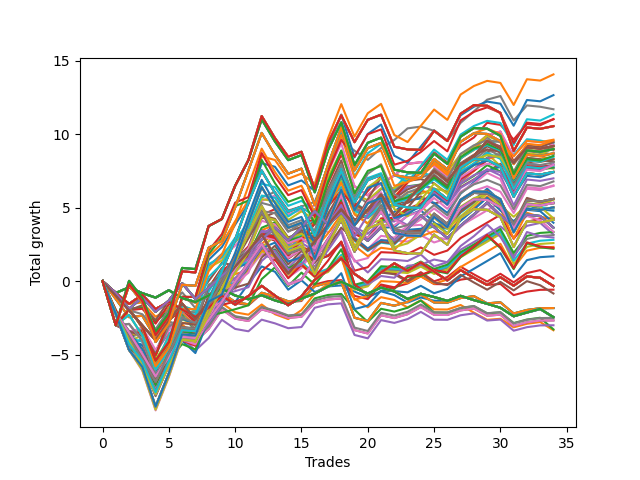

# Long HLT 345 
- Symbol: TSLA
- Date Range: 05/16/2022 - 05/17/2024
- Trading Period: 8:30-12:30
- Number of Trades: 34



| Id. | Name | Win Percent | Profit | Avg Profit / Trade | Avg Time / Trade | Std |      | Name | Win Percent | Profit | Avg Profit / Trade | Avg Time / Trade | Std |
| --- | ---- | ----------- | ------ | ------------------ | ---------------- | --- | ---- | ---- | ----------- | ------ | ------------------ | ---------------- | --- |
| | Sorted By <br> Profit | | | | | | | Sorted By <br> Win Percentage |||||
|0| TP-3 90m | 58.82 | 14.06 | 0.41 | 78:08 | 1.62 |     | TP-3 60m | 64.71 | 11.69 | 0.34 | 55:30 | 1.33 |
|1| TP-2.75 90m | 58.82 | 12.65 | 0.37 | 75:08 | 1.62 |     | TP-2.75 60m | 64.71 | 9.28 | 0.27 | 54:12 | 1.41 |
|2| TP-3 60m | 64.71 | 11.69 | 0.34 | 55:30 | 1.33 |     | TP-1 30m | 64.71 | 8.30 | 0.24 | 22:03 | 0.81 |
|3| TP-2.5 90m | 58.82 | 11.34 | 0.33 | 73:42 | 1.60 |     | TP-2.5 60m | 64.71 | 8.12 | 0.24 | 53:35 | 1.40 |
|4| TP-1 90m | 61.76 | 11.02 | 0.32 | 40:07 | 0.96 |     | TP-1.25 30m | 64.71 | 5.32 | 0.16 | 24:07 | 1.02 |
|5| TP-3 105m | 61.76 | 11.01 | 0.32 | 87:12 | 1.65 |     | TP-1 90m | 61.76 | 11.02 | 0.32 | 40:07 | 0.96 |
|6| TP-3 180m | 52.94 | 10.54 | 0.31 | 95:45 | 1.79 |     | TP-3 105m | 61.76 | 11.01 | 0.32 | 87:12 | 1.65 |
|7| TP-3 165m | 52.94 | 10.54 | 0.31 | 95:45 | 1.79 |     | TP-1 75m | 61.76 | 9.62 | 0.28 | 37:58 | 0.91 |
|8| TP-3 150m | 52.94 | 10.54 | 0.31 | 95:45 | 1.79 |     | TP-2.5 105m | 61.76 | 9.57 | 0.28 | 81:30 | 1.72 |
|9| TP-3 135m | 52.94 | 10.54 | 0.31 | 95:45 | 1.79 |     | TP-1 105m | 61.76 | 9.45 | 0.28 | 41:17 | 1.01 |
|10| TP-3 120m | 52.94 | 10.54 | 0.31 | 95:45 | 1.79 |     | TP-1 60m | 61.76 | 9.39 | 0.28 | 33:45 | 0.90 |
|11| TP-1 75m | 61.76 | 9.62 | 0.28 | 37:58 | 0.91 |     | TP-1 180m | 61.76 | 9.19 | 0.27 | 42:10 | 1.01 |
|12| TP-2.5 105m | 61.76 | 9.57 | 0.28 | 81:30 | 1.72 |     | TP-1 165m | 61.76 | 9.19 | 0.27 | 42:10 | 1.01 |
|13| TP-2 90m | 55.88 | 9.49 | 0.28 | 64:33 | 1.51 |     | TP-1 150m | 61.76 | 9.19 | 0.27 | 42:10 | 1.01 |
|14| TP-1 105m | 61.76 | 9.45 | 0.28 | 41:17 | 1.01 |     | TP-1 135m | 61.76 | 9.19 | 0.27 | 42:10 | 1.01 |
|15| TP-1 60m | 61.76 | 9.39 | 0.28 | 33:45 | 0.90 |     | TP-1 120m | 61.76 | 9.19 | 0.27 | 42:10 | 1.01 |
|16| TP-2.75 60m | 64.71 | 9.28 | 0.27 | 54:12 | 1.41 |     | TP-2.75 75m | 61.76 | 9.01 | 0.26 | 65:19 | 1.48 |
|17| TP-1 180m | 61.76 | 9.19 | 0.27 | 42:10 | 1.01 |     | TP-2 60m | 61.76 | 8.90 | 0.26 | 48:01 | 1.36 |
|18| TP-1 165m | 61.76 | 9.19 | 0.27 | 42:10 | 1.01 |     | TP-2.75 105m | 61.76 | 8.52 | 0.25 | 83:44 | 1.69 |
|19| TP-1 150m | 61.76 | 9.19 | 0.27 | 42:10 | 1.01 |     | TP-1.5 60m | 61.76 | 8.31 | 0.24 | 45:08 | 1.20 |
|20| TP-1 135m | 61.76 | 9.19 | 0.27 | 42:10 | 1.01 |     | TP-1.75 60m | 61.76 | 8.11 | 0.24 | 46:12 | 1.28 |
|21| TP-1 120m | 61.76 | 9.19 | 0.27 | 42:10 | 1.01 |     | TP-2.5 75m | 61.76 | 8.07 | 0.24 | 64:22 | 1.48 |
|22| TP-1.5 90m | 55.88 | 9.17 | 0.27 | 58:15 | 1.34 |     | TP-3 75m | 61.76 | 7.85 | 0.23 | 67:24 | 1.40 |
|23| TP-2.25 90m | 55.88 | 9.02 | 0.27 | 70:40 | 1.58 |     | TP-1.25 75m | 61.76 | 7.74 | 0.23 | 45:51 | 1.14 |
|24| TP-2.75 75m | 61.76 | 9.01 | 0.26 | 65:19 | 1.48 |     | TP-2.25 60m | 61.76 | 7.72 | 0.23 | 51:40 | 1.42 |
|25| TP-2.75 180m | 52.94 | 8.98 | 0.26 | 91:49 | 1.81 |     | TP-1.25 60m | 61.76 | 7.71 | 0.23 | 39:42 | 1.11 |
|26| TP-2.75 165m | 52.94 | 8.98 | 0.26 | 91:49 | 1.81 |     | TP-1.25 105m | 61.76 | 6.51 | 0.19 | 53:31 | 1.21 |
|27| TP-2.75 150m | 52.94 | 8.98 | 0.26 | 91:49 | 1.81 |     | TP-3 30m | 61.76 | 4.30 | 0.13 | 29:00 | 1.10 |
|28| TP-2.75 135m | 52.94 | 8.98 | 0.26 | 91:49 | 1.81 |     | TP-2.75 30m | 61.76 | 3.34 | 0.10 | 28:38 | 1.17 |
|29| TP-2.75 120m | 52.94 | 8.98 | 0.26 | 91:49 | 1.81 |     | TP-1.5 30m | 61.76 | 3.13 | 0.09 | 26:00 | 1.06 |
|30| TP-2 60m | 61.76 | 8.90 | 0.26 | 48:01 | 1.36 |     | TP-2 30m | 61.76 | 2.81 | 0.08 | 26:49 | 1.18 |
|31| TP-2.5 180m | 52.94 | 8.69 | 0.26 | 88:31 | 1.81 |     | TP-1.75 30m | 61.76 | 2.59 | 0.08 | 26:26 | 1.13 |
|32| TP-2.5 165m | 52.94 | 8.69 | 0.26 | 88:31 | 1.81 |     | TP-2.5 30m | 61.76 | 2.33 | 0.07 | 28:35 | 1.22 |
|33| TP-2.5 150m | 52.94 | 8.69 | 0.26 | 88:31 | 1.81 |     | TP-2.25 30m | 61.76 | 1.69 | 0.05 | 28:21 | 1.23 |
|34| TP-2.5 135m | 52.94 | 8.69 | 0.26 | 88:31 | 1.81 |     | TP-3 90m | 58.82 | 14.06 | 0.41 | 78:08 | 1.62 |
|35| TP-2.5 120m | 52.94 | 8.69 | 0.26 | 88:31 | 1.81 |     | TP-2.75 90m | 58.82 | 12.65 | 0.37 | 75:08 | 1.62 |
|36| TP-1 45m | 58.82 | 8.63 | 0.25 | 28:40 | 0.88 |     | TP-2.5 90m | 58.82 | 11.34 | 0.33 | 73:42 | 1.60 |
|37| TP-2.75 105m | 61.76 | 8.52 | 0.25 | 83:44 | 1.69 |     | TP-1 45m | 58.82 | 8.63 | 0.25 | 28:40 | 0.88 |
|38| TP-2 105m | 58.82 | 8.45 | 0.25 | 70:15 | 1.60 |     | TP-2 105m | 58.82 | 8.45 | 0.25 | 70:15 | 1.60 |
|39| TP-1.5 60m | 61.76 | 8.31 | 0.24 | 45:08 | 1.20 |     | TP-2 75m | 58.82 | 8.28 | 0.24 | 56:52 | 1.40 |
|40| TP-1 30m | 64.71 | 8.30 | 0.24 | 22:03 | 0.81 |     | TP-1.25 90m | 58.82 | 7.95 | 0.23 | 50:08 | 1.20 |
|41| TP-2 75m | 58.82 | 8.28 | 0.24 | 56:52 | 1.40 |     | TP-1.5 75m | 58.82 | 7.91 | 0.23 | 52:37 | 1.25 |
|42| TP-2.5 60m | 64.71 | 8.12 | 0.24 | 53:35 | 1.40 |     | TP-1.25 45m | 58.82 | 7.65 | 0.23 | 32:52 | 1.10 |
|43| TP-1.75 60m | 61.76 | 8.11 | 0.24 | 46:12 | 1.28 |     | TP-2.25 105m | 58.82 | 7.39 | 0.22 | 77:42 | 1.71 |
|44| TP-2.5 75m | 61.76 | 8.07 | 0.24 | 64:22 | 1.48 |     | TP-1.75 75m | 58.82 | 6.99 | 0.21 | 54:35 | 1.31 |
|45| TP-1.25 90m | 58.82 | 7.95 | 0.23 | 50:08 | 1.20 |     | TP-1.5 105m | 58.82 | 6.78 | 0.20 | 61:58 | 1.38 |
|46| TP-1.5 75m | 58.82 | 7.91 | 0.23 | 52:37 | 1.25 |     | TP-2.25 75m | 58.82 | 6.47 | 0.19 | 61:52 | 1.47 |
|47| TP-1.75 90m | 55.88 | 7.90 | 0.23 | 61:26 | 1.43 |     | TP-1.75 105m | 58.82 | 5.53 | 0.16 | 66:15 | 1.49 |
|48| TP-3 75m | 61.76 | 7.85 | 0.23 | 67:24 | 1.40 |     | TP-0.75 60m | 58.82 | 4.27 | 0.13 | 23:10 | 0.83 |
|49| TP-1.25 75m | 61.76 | 7.74 | 0.23 | 45:51 | 1.14 |     | TP-0.75 75m | 58.82 | 3.97 | 0.12 | 24:03 | 0.83 |
|50| TP-2.25 60m | 61.76 | 7.72 | 0.23 | 51:40 | 1.42 |     | TP-2 90m | 55.88 | 9.49 | 0.28 | 64:33 | 1.51 |
|51| TP-1.25 60m | 61.76 | 7.71 | 0.23 | 39:42 | 1.11 |     | TP-1.5 90m | 55.88 | 9.17 | 0.27 | 58:15 | 1.34 |
|52| TP-1.25 45m | 58.82 | 7.65 | 0.23 | 32:52 | 1.10 |     | TP-2.25 90m | 55.88 | 9.02 | 0.27 | 70:40 | 1.58 |
|53| TP-2 180m | 50.00 | 7.43 | 0.22 | 74:28 | 1.62 |     | TP-1.75 90m | 55.88 | 7.90 | 0.23 | 61:26 | 1.43 |
|54| TP-2 165m | 50.00 | 7.43 | 0.22 | 74:28 | 1.62 |     | TP-3 45m | 55.88 | 5.28 | 0.16 | 43:07 | 1.18 |
|55| TP-2 150m | 50.00 | 7.43 | 0.22 | 74:28 | 1.62 |     | TP-1.5 45m | 55.88 | 4.93 | 0.15 | 36:33 | 1.15 |
|56| TP-2 135m | 50.00 | 7.43 | 0.22 | 74:28 | 1.62 |     | TP-1.75 45m | 55.88 | 4.79 | 0.14 | 37:12 | 1.23 |
|57| TP-2 120m | 50.00 | 7.43 | 0.22 | 74:28 | 1.62 |     | TP-2 45m | 55.88 | 4.27 | 0.13 | 37:52 | 1.26 |
|58| TP-2.25 105m | 58.82 | 7.39 | 0.22 | 77:42 | 1.71 |     | TP-0.75 180m | 55.88 | 3.64 | 0.11 | 24:17 | 0.85 |
|59| TP-1.75 75m | 58.82 | 6.99 | 0.21 | 54:35 | 1.31 |     | TP-0.75 165m | 55.88 | 3.64 | 0.11 | 24:17 | 0.85 |
|60| TP-1.5 105m | 58.82 | 6.78 | 0.20 | 61:58 | 1.38 |     | TP-0.75 150m | 55.88 | 3.64 | 0.11 | 24:17 | 0.85 |
|61| TP-1.25 105m | 61.76 | 6.51 | 0.19 | 53:31 | 1.21 |     | TP-0.75 135m | 55.88 | 3.64 | 0.11 | 24:17 | 0.85 |
|62| TP-2.25 75m | 58.82 | 6.47 | 0.19 | 61:52 | 1.47 |     | TP-0.75 120m | 55.88 | 3.64 | 0.11 | 24:17 | 0.85 |
|63| TP-1.5 180m | 50.00 | 5.59 | 0.16 | 65:03 | 1.39 |     | TP-0.75 105m | 55.88 | 3.64 | 0.11 | 24:17 | 0.85 |
|64| TP-1.5 165m | 50.00 | 5.59 | 0.16 | 65:03 | 1.39 |     | TP-0.75 90m | 55.88 | 3.64 | 0.11 | 24:17 | 0.85 |
|65| TP-1.5 150m | 50.00 | 5.59 | 0.16 | 65:03 | 1.39 |     | TP-0.75 45m | 55.88 | 3.36 | 0.10 | 21:21 | 0.81 |
|66| TP-1.5 135m | 50.00 | 5.59 | 0.16 | 65:03 | 1.39 |     | TP-0.75 30m | 55.88 | 3.17 | 0.09 | 17:44 | 0.77 |
|67| TP-1.5 120m | 50.00 | 5.59 | 0.16 | 65:03 | 1.39 |     | TP-2.75 45m | 55.88 | 2.96 | 0.09 | 42:15 | 1.26 |
|68| TP-1.75 105m | 58.82 | 5.53 | 0.16 | 66:15 | 1.49 |     | TP-2.5 45m | 55.88 | 2.26 | 0.07 | 41:44 | 1.26 |
|69| TP-1.25 30m | 64.71 | 5.32 | 0.16 | 24:07 | 1.02 |     | TP-2.25 45m | 55.88 | 2.20 | 0.06 | 40:17 | 1.28 |
|70| TP-1.25 180m | 52.94 | 5.32 | 0.16 | 56:12 | 1.23 |     | TP-3 180m | 52.94 | 10.54 | 0.31 | 95:45 | 1.79 |
|71| TP-1.25 165m | 52.94 | 5.32 | 0.16 | 56:12 | 1.23 |     | TP-3 165m | 52.94 | 10.54 | 0.31 | 95:45 | 1.79 |
|72| TP-1.25 150m | 52.94 | 5.32 | 0.16 | 56:12 | 1.23 |     | TP-3 150m | 52.94 | 10.54 | 0.31 | 95:45 | 1.79 |
|73| TP-1.25 135m | 52.94 | 5.32 | 0.16 | 56:12 | 1.23 |     | TP-3 135m | 52.94 | 10.54 | 0.31 | 95:45 | 1.79 |
|74| TP-1.25 120m | 52.94 | 5.32 | 0.16 | 56:12 | 1.23 |     | TP-3 120m | 52.94 | 10.54 | 0.31 | 95:45 | 1.79 |
|75| TP-3 45m | 55.88 | 5.28 | 0.16 | 43:07 | 1.18 |     | TP-2.75 180m | 52.94 | 8.98 | 0.26 | 91:49 | 1.81 |
|76| TP-2.25 180m | 50.00 | 5.02 | 0.15 | 83:14 | 1.74 |     | TP-2.75 165m | 52.94 | 8.98 | 0.26 | 91:49 | 1.81 |
|77| TP-2.25 165m | 50.00 | 5.02 | 0.15 | 83:14 | 1.74 |     | TP-2.75 150m | 52.94 | 8.98 | 0.26 | 91:49 | 1.81 |
|78| TP-2.25 150m | 50.00 | 5.02 | 0.15 | 83:14 | 1.74 |     | TP-2.75 135m | 52.94 | 8.98 | 0.26 | 91:49 | 1.81 |
|79| TP-2.25 135m | 50.00 | 5.02 | 0.15 | 83:14 | 1.74 |     | TP-2.75 120m | 52.94 | 8.98 | 0.26 | 91:49 | 1.81 |
|80| TP-2.25 120m | 50.00 | 5.02 | 0.15 | 83:14 | 1.74 |     | TP-2.5 180m | 52.94 | 8.69 | 0.26 | 88:31 | 1.81 |
|81| TP-1.5 45m | 55.88 | 4.93 | 0.15 | 36:33 | 1.15 |     | TP-2.5 165m | 52.94 | 8.69 | 0.26 | 88:31 | 1.81 |
|82| TP-1.75 45m | 55.88 | 4.79 | 0.14 | 37:12 | 1.23 |     | TP-2.5 150m | 52.94 | 8.69 | 0.26 | 88:31 | 1.81 |
|83| TP-3 30m | 61.76 | 4.30 | 0.13 | 29:00 | 1.10 |     | TP-2.5 135m | 52.94 | 8.69 | 0.26 | 88:31 | 1.81 |
|84| TP-0.75 60m | 58.82 | 4.27 | 0.13 | 23:10 | 0.83 |     | TP-2.5 120m | 52.94 | 8.69 | 0.26 | 88:31 | 1.81 |
|85| TP-2 45m | 55.88 | 4.27 | 0.13 | 37:52 | 1.26 |     | TP-1.25 180m | 52.94 | 5.32 | 0.16 | 56:12 | 1.23 |
|86| TP-1.75 180m | 50.00 | 4.17 | 0.12 | 69:54 | 1.51 |     | TP-1.25 165m | 52.94 | 5.32 | 0.16 | 56:12 | 1.23 |
|87| TP-1.75 165m | 50.00 | 4.17 | 0.12 | 69:54 | 1.51 |     | TP-1.25 150m | 52.94 | 5.32 | 0.16 | 56:12 | 1.23 |
|88| TP-1.75 150m | 50.00 | 4.17 | 0.12 | 69:54 | 1.51 |     | TP-1.25 135m | 52.94 | 5.32 | 0.16 | 56:12 | 1.23 |
|89| TP-1.75 135m | 50.00 | 4.17 | 0.12 | 69:54 | 1.51 |     | TP-1.25 120m | 52.94 | 5.32 | 0.16 | 56:12 | 1.23 |
|90| TP-1.75 120m | 50.00 | 4.17 | 0.12 | 69:54 | 1.51 |     | TP-1 15m | 52.94 | -0.58 | -0.02 | 12:33 | 0.65 |
|91| TP-0.75 75m | 58.82 | 3.97 | 0.12 | 24:03 | 0.83 |     | TP-3 15m | 52.94 | -1.83 | -0.05 | 14:00 | 0.85 |
|92| TP-0.75 180m | 55.88 | 3.64 | 0.11 | 24:17 | 0.85 |     | TP-2.75 15m | 52.94 | -1.83 | -0.05 | 14:00 | 0.85 |
|93| TP-0.75 165m | 55.88 | 3.64 | 0.11 | 24:17 | 0.85 |     | TP-2.5 15m | 52.94 | -1.83 | -0.05 | 14:00 | 0.85 |
|94| TP-0.75 150m | 55.88 | 3.64 | 0.11 | 24:17 | 0.85 |     | TP-2.25 15m | 52.94 | -1.83 | -0.05 | 14:00 | 0.85 |
|95| TP-0.75 135m | 55.88 | 3.64 | 0.11 | 24:17 | 0.85 |     | TP-2 15m | 52.94 | -2.50 | -0.07 | 13:40 | 0.88 |
|96| TP-0.75 120m | 55.88 | 3.64 | 0.11 | 24:17 | 0.85 |     | TP-1.75 15m | 52.94 | -2.67 | -0.08 | 13:28 | 0.87 |
|97| TP-0.75 105m | 55.88 | 3.64 | 0.11 | 24:17 | 0.85 |     | TP-1.5 15m | 52.94 | -2.67 | -0.08 | 13:28 | 0.87 |
|98| TP-0.75 90m | 55.88 | 3.64 | 0.11 | 24:17 | 0.85 |     | TP-1.25 15m | 52.94 | -3.00 | -0.09 | 13:08 | 0.84 |
|99| TP-0.75 45m | 55.88 | 3.36 | 0.10 | 21:21 | 0.81 |     | TP-2 180m | 50.00 | 7.43 | 0.22 | 74:28 | 1.62 |
|100| TP-2.75 30m | 61.76 | 3.34 | 0.10 | 28:38 | 1.17 |     | TP-2 165m | 50.00 | 7.43 | 0.22 | 74:28 | 1.62 |
|101| TP-0.75 30m | 55.88 | 3.17 | 0.09 | 17:44 | 0.77 |     | TP-2 150m | 50.00 | 7.43 | 0.22 | 74:28 | 1.62 |
|102| TP-1.5 30m | 61.76 | 3.13 | 0.09 | 26:00 | 1.06 |     | TP-2 135m | 50.00 | 7.43 | 0.22 | 74:28 | 1.62 |
|103| TP-2.75 45m | 55.88 | 2.96 | 0.09 | 42:15 | 1.26 |     | TP-2 120m | 50.00 | 7.43 | 0.22 | 74:28 | 1.62 |
|104| TP-2 30m | 61.76 | 2.81 | 0.08 | 26:49 | 1.18 |     | TP-1.5 180m | 50.00 | 5.59 | 0.16 | 65:03 | 1.39 |
|105| TP-1.75 30m | 61.76 | 2.59 | 0.08 | 26:26 | 1.13 |     | TP-1.5 165m | 50.00 | 5.59 | 0.16 | 65:03 | 1.39 |
|106| TP-2.5 30m | 61.76 | 2.33 | 0.07 | 28:35 | 1.22 |     | TP-1.5 150m | 50.00 | 5.59 | 0.16 | 65:03 | 1.39 |
|107| TP-2.5 45m | 55.88 | 2.26 | 0.07 | 41:44 | 1.26 |     | TP-1.5 135m | 50.00 | 5.59 | 0.16 | 65:03 | 1.39 |
|108| TP-2.25 45m | 55.88 | 2.20 | 0.06 | 40:17 | 1.28 |     | TP-1.5 120m | 50.00 | 5.59 | 0.16 | 65:03 | 1.39 |
|109| TP-2.25 30m | 61.76 | 1.69 | 0.05 | 28:21 | 1.23 |     | TP-2.25 180m | 50.00 | 5.02 | 0.15 | 83:14 | 1.74 |
|110| TP-0.5 30m | 50.00 | 0.19 | 0.01 | 11:58 | 0.65 |     | TP-2.25 165m | 50.00 | 5.02 | 0.15 | 83:14 | 1.74 |
|111| TP-0.5 180m | 47.06 | -0.33 | -0.01 | 13:52 | 0.67 |     | TP-2.25 150m | 50.00 | 5.02 | 0.15 | 83:14 | 1.74 |
|112| TP-0.5 165m | 47.06 | -0.33 | -0.01 | 13:52 | 0.67 |     | TP-2.25 135m | 50.00 | 5.02 | 0.15 | 83:14 | 1.74 |
|113| TP-0.5 150m | 47.06 | -0.33 | -0.01 | 13:52 | 0.67 |     | TP-2.25 120m | 50.00 | 5.02 | 0.15 | 83:14 | 1.74 |
|114| TP-0.5 135m | 47.06 | -0.33 | -0.01 | 13:52 | 0.67 |     | TP-1.75 180m | 50.00 | 4.17 | 0.12 | 69:54 | 1.51 |
|115| TP-0.5 120m | 47.06 | -0.33 | -0.01 | 13:52 | 0.67 |     | TP-1.75 165m | 50.00 | 4.17 | 0.12 | 69:54 | 1.51 |
|116| TP-0.5 105m | 47.06 | -0.33 | -0.01 | 13:52 | 0.67 |     | TP-1.75 150m | 50.00 | 4.17 | 0.12 | 69:54 | 1.51 |
|117| TP-0.5 90m | 47.06 | -0.33 | -0.01 | 13:52 | 0.67 |     | TP-1.75 135m | 50.00 | 4.17 | 0.12 | 69:54 | 1.51 |
|118| TP-0.5 75m | 47.06 | -0.33 | -0.01 | 13:52 | 0.67 |     | TP-1.75 120m | 50.00 | 4.17 | 0.12 | 69:54 | 1.51 |
|119| TP-0.5 60m | 47.06 | -0.33 | -0.01 | 13:52 | 0.67 |     | TP-0.5 30m | 50.00 | 0.19 | 0.01 | 11:58 | 0.65 |
|120| TP-1 15m | 52.94 | -0.58 | -0.02 | 12:33 | 0.65 |     | TP-0.75 15m | 50.00 | -3.28 | -0.10 | 11:15 | 0.62 |
|121| TP-0.5 45m | 44.12 | -0.84 | -0.02 | 13:17 | 0.65 |     | TP-0.5 180m | 47.06 | -0.33 | -0.01 | 13:52 | 0.67 |
|122| TP-3 15m | 52.94 | -1.83 | -0.05 | 14:00 | 0.85 |     | TP-0.5 165m | 47.06 | -0.33 | -0.01 | 13:52 | 0.67 |
|123| TP-2.75 15m | 52.94 | -1.83 | -0.05 | 14:00 | 0.85 |     | TP-0.5 150m | 47.06 | -0.33 | -0.01 | 13:52 | 0.67 |
|124| TP-2.5 15m | 52.94 | -1.83 | -0.05 | 14:00 | 0.85 |     | TP-0.5 135m | 47.06 | -0.33 | -0.01 | 13:52 | 0.67 |
|125| TP-2.25 15m | 52.94 | -1.83 | -0.05 | 14:00 | 0.85 |     | TP-0.5 120m | 47.06 | -0.33 | -0.01 | 13:52 | 0.67 |
|126| TP-0.25 180m | 41.18 | -2.45 | -0.07 | 05:33 | 0.39 |     | TP-0.5 105m | 47.06 | -0.33 | -0.01 | 13:52 | 0.67 |
|127| TP-0.25 165m | 41.18 | -2.45 | -0.07 | 05:33 | 0.39 |     | TP-0.5 90m | 47.06 | -0.33 | -0.01 | 13:52 | 0.67 |
|128| TP-0.25 150m | 41.18 | -2.45 | -0.07 | 05:33 | 0.39 |     | TP-0.5 75m | 47.06 | -0.33 | -0.01 | 13:52 | 0.67 |
|129| TP-0.25 135m | 41.18 | -2.45 | -0.07 | 05:33 | 0.39 |     | TP-0.5 60m | 47.06 | -0.33 | -0.01 | 13:52 | 0.67 |
|130| TP-0.25 120m | 41.18 | -2.45 | -0.07 | 05:33 | 0.39 |     | TP-0.5 45m | 44.12 | -0.84 | -0.02 | 13:17 | 0.65 |
|131| TP-0.25 105m | 41.18 | -2.45 | -0.07 | 05:33 | 0.39 |     | TP-0.5 15m | 44.12 | -3.34 | -0.10 | 08:54 | 0.58 |
|132| TP-0.25 90m | 41.18 | -2.45 | -0.07 | 05:33 | 0.39 |     | TP-0.25 180m | 41.18 | -2.45 | -0.07 | 05:33 | 0.39 |
|133| TP-0.25 75m | 41.18 | -2.45 | -0.07 | 05:33 | 0.39 |     | TP-0.25 165m | 41.18 | -2.45 | -0.07 | 05:33 | 0.39 |
|134| TP-0.25 60m | 41.18 | -2.45 | -0.07 | 05:33 | 0.39 |     | TP-0.25 150m | 41.18 | -2.45 | -0.07 | 05:33 | 0.39 |
|135| TP-0.25 45m | 41.18 | -2.45 | -0.07 | 05:33 | 0.39 |     | TP-0.25 135m | 41.18 | -2.45 | -0.07 | 05:33 | 0.39 |
|136| TP-0.25 30m | 41.18 | -2.45 | -0.07 | 05:33 | 0.39 |     | TP-0.25 120m | 41.18 | -2.45 | -0.07 | 05:33 | 0.39 |
|137| TP-0.25 15m | 41.18 | -2.47 | -0.07 | 05:17 | 0.38 |     | TP-0.25 105m | 41.18 | -2.45 | -0.07 | 05:33 | 0.39 |
|138| TP-2 15m | 52.94 | -2.50 | -0.07 | 13:40 | 0.88 |     | TP-0.25 90m | 41.18 | -2.45 | -0.07 | 05:33 | 0.39 |
|139| TP-1.75 15m | 52.94 | -2.67 | -0.08 | 13:28 | 0.87 |     | TP-0.25 75m | 41.18 | -2.45 | -0.07 | 05:33 | 0.39 |
|140| TP-1.5 15m | 52.94 | -2.67 | -0.08 | 13:28 | 0.87 |     | TP-0.25 60m | 41.18 | -2.45 | -0.07 | 05:33 | 0.39 |
|141| TP-1.25 15m | 52.94 | -3.00 | -0.09 | 13:08 | 0.84 |     | TP-0.25 45m | 41.18 | -2.45 | -0.07 | 05:33 | 0.39 |
|142| TP-0.75 15m | 50.00 | -3.28 | -0.10 | 11:15 | 0.62 |     | TP-0.25 30m | 41.18 | -2.45 | -0.07 | 05:33 | 0.39 |
|143| TP-0.5 15m | 44.12 | -3.34 | -0.10 | 08:54 | 0.58 |     | TP-0.25 15m | 41.18 | -2.47 | -0.07 | 05:17 | 0.38 |

### Test TP-0.25 15m
* Take Profit of 0.25 Point
* 0.25 Stoploss
* Results:
```
Total Trades: 34
Percent Up: 41.18
Percent Down: 58.82
Total Points Moved Up: -2.47
Potential Profit: -1235.00
Total Points Ups: 4.90 Count Ups: 14
Total Points Downs: -7.37 Count Downs: 20
```

<details><summary>Trades</summary>

<code>In: 2022-05-20 08:35:00		Out: 2022-05-20 08:37:00		Total Position Time: 02:00		Total Move Up: -0.80		Total to Date: -0.80</code> <br />
<code>In: 2022-06-23 10:15:00		Out: 2022-06-23 10:18:00		Total Position Time: 03:00		Total Move Up: 0.38		Total to Date: -0.42</code> <br />
<code>In: 2022-07-25 11:15:00		Out: 2022-07-25 11:17:00		Total Position Time: 02:00		Total Move Up: -0.40		Total to Date: -0.82</code> <br />
<code>In: 2022-08-08 12:05:00		Out: 2022-08-08 12:07:00		Total Position Time: 02:00		Total Move Up: -0.30		Total to Date: -1.12</code> <br />
<code>In: 2022-09-29 12:10:00		Out: 2022-09-29 12:12:00		Total Position Time: 02:00		Total Move Up: 0.50		Total to Date: -0.62</code> <br />
<code>In: 2022-11-04 11:20:00		Out: 2022-11-04 11:22:00		Total Position Time: 02:00		Total Move Up: -0.53		Total to Date: -1.15</code> <br />
<code>In: 2022-12-16 08:40:00		Out: 2022-12-16 08:43:00		Total Position Time: 03:00		Total Move Up: -0.27		Total to Date: -1.42</code> <br />
<code>In: 2022-12-19 09:10:00		Out: 2022-12-19 09:14:00		Total Position Time: 04:00		Total Move Up: 0.44		Total to Date: -0.98</code> <br />
<code>In: 2022-12-23 09:10:00		Out: 2022-12-23 09:13:00		Total Position Time: 03:00		Total Move Up: 0.46		Total to Date: -0.52</code> <br />
<code>In: 2023-01-19 08:55:00		Out: 2023-01-19 08:58:00		Total Position Time: 03:00		Total Move Up: -0.46		Total to Date: -0.98</code> <br />
<code>In: 2023-03-02 09:05:00		Out: 2023-03-02 09:07:00		Total Position Time: 02:00		Total Move Up: -0.25		Total to Date: -1.23</code> <br />
<code>In: 2023-04-17 11:20:00		Out: 2023-04-17 11:22:00		Total Position Time: 02:00		Total Move Up: 0.27		Total to Date: -0.96</code> <br />
<code>In: 2023-04-20 09:35:00		Out: 2023-04-20 09:38:00		Total Position Time: 03:00		Total Move Up: -0.35		Total to Date: -1.31</code> <br />
<code>In: 2023-04-26 12:20:00		Out: 2023-04-26 12:33:00		Total Position Time: 13:00		Total Move Up: -0.26		Total to Date: -1.57</code> <br />
<code>In: 2023-09-26 11:30:00		Out: 2023-09-26 11:32:00		Total Position Time: 02:00		Total Move Up: 0.39		Total to Date: -1.18</code> <br />
<code>In: 2023-10-18 10:10:00		Out: 2023-10-18 10:12:00		Total Position Time: 02:00		Total Move Up: 0.33		Total to Date: -0.85</code> <br />
<code>In: 2023-10-20 08:55:00		Out: 2023-10-20 08:57:00		Total Position Time: 02:00		Total Move Up: 0.49		Total to Date: -0.36</code> <br />
<code>In: 2023-11-08 09:45:00		Out: 2023-11-08 09:59:00		Total Position Time: 14:00		Total Move Up: 0.07		Total to Date: -0.29</code> <br />
<code>In: 2023-11-09 09:50:00		Out: 2023-11-09 09:56:00		Total Position Time: 06:00		Total Move Up: -0.42		Total to Date: -0.71</code> <br />
<code>In: 2023-11-16 11:20:00		Out: 2023-11-16 11:26:00		Total Position Time: 06:00		Total Move Up: -0.38		Total to Date: -1.09</code> <br />
<code>In: 2023-12-11 11:00:00		Out: 2023-12-11 11:02:00		Total Position Time: 02:00		Total Move Up: 0.40		Total to Date: -0.69</code> <br />
<code>In: 2023-12-28 08:45:00		Out: 2023-12-28 08:52:00		Total Position Time: 07:00		Total Move Up: -0.26		Total to Date: -0.95</code> <br />
<code>In: 2024-01-12 09:20:00		Out: 2024-01-12 09:26:00		Total Position Time: 06:00		Total Move Up: -0.51		Total to Date: -1.46</code> <br />
<code>In: 2024-01-23 10:50:00		Out: 2024-01-23 11:03:00		Total Position Time: 13:00		Total Move Up: 0.35		Total to Date: -1.11</code> <br />
<code>In: 2024-02-20 09:35:00		Out: 2024-02-20 09:37:00		Total Position Time: 02:00		Total Move Up: -0.22		Total to Date: -1.33</code> <br />
<code>In: 2024-02-23 11:35:00		Out: 2024-02-23 11:49:00		Total Position Time: 14:00		Total Move Up: -0.01		Total to Date: -1.34</code> <br />
<code>In: 2024-03-15 10:10:00		Out: 2024-03-15 10:21:00		Total Position Time: 11:00		Total Move Up: 0.34		Total to Date: -1.00</code> <br />
<code>In: 2024-03-21 11:35:00		Out: 2024-03-21 11:38:00		Total Position Time: 03:00		Total Move Up: -0.29		Total to Date: -1.29</code> <br />
<code>In: 2024-03-28 08:55:00		Out: 2024-03-28 09:03:00		Total Position Time: 08:00		Total Move Up: -0.25		Total to Date: -1.54</code> <br />
<code>In: 2024-04-10 09:30:00		Out: 2024-04-10 09:32:00		Total Position Time: 02:00		Total Move Up: -0.27		Total to Date: -1.81</code> <br />
<code>In: 2024-04-15 10:10:00		Out: 2024-04-15 10:19:00		Total Position Time: 09:00		Total Move Up: -0.58		Total to Date: -2.39</code> <br />
<code>In: 2024-04-22 08:35:00		Out: 2024-04-22 08:49:00		Total Position Time: 14:00		Total Move Up: 0.24		Total to Date: -2.15</code> <br />
<code>In: 2024-05-07 12:00:00		Out: 2024-05-07 12:08:00		Total Position Time: 08:00		Total Move Up: 0.24		Total to Date: -1.91</code> <br />
<code>In: 2024-05-09 08:35:00		Out: 2024-05-09 08:38:00		Total Position Time: 03:00		Total Move Up: -0.56		Total to Date: -2.47</code> <br />


</details>

### Test TP-0.5 15m
* Take Profit of 0.5 Point
* 0.5 Stoploss
* Results:
```
Total Trades: 34
Percent Up: 44.12
Percent Down: 55.88
Total Points Moved Up: -3.34
Potential Profit: -1670.00
Total Points Ups: 7.12 Count Ups: 15
Total Points Downs: -10.46 Count Downs: 19
```

<details><summary>Trades</summary>

<code>In: 2022-05-20 08:35:00		Out: 2022-05-20 08:37:00		Total Position Time: 02:00		Total Move Up: -0.80		Total to Date: -0.80</code> <br />
<code>In: 2022-06-23 10:15:00		Out: 2022-06-23 10:25:00		Total Position Time: 10:00		Total Move Up: -0.75		Total to Date: -1.55</code> <br />
<code>In: 2022-07-25 11:15:00		Out: 2022-07-25 11:29:00		Total Position Time: 14:00		Total Move Up: 0.10		Total to Date: -1.45</code> <br />
<code>In: 2022-08-08 12:05:00		Out: 2022-08-08 12:08:00		Total Position Time: 03:00		Total Move Up: -0.97		Total to Date: -2.42</code> <br />
<code>In: 2022-09-29 12:10:00		Out: 2022-09-29 12:12:00		Total Position Time: 02:00		Total Move Up: 0.50		Total to Date: -1.92</code> <br />
<code>In: 2022-11-04 11:20:00		Out: 2022-11-04 11:22:00		Total Position Time: 02:00		Total Move Up: -0.53		Total to Date: -2.45</code> <br />
<code>In: 2022-12-16 08:40:00		Out: 2022-12-16 08:48:00		Total Position Time: 08:00		Total Move Up: -0.50		Total to Date: -2.95</code> <br />
<code>In: 2022-12-19 09:10:00		Out: 2022-12-19 09:15:00		Total Position Time: 05:00		Total Move Up: 0.63		Total to Date: -2.32</code> <br />
<code>In: 2022-12-23 09:10:00		Out: 2022-12-23 09:21:00		Total Position Time: 11:00		Total Move Up: 0.82		Total to Date: -1.50</code> <br />
<code>In: 2023-01-19 08:55:00		Out: 2023-01-19 09:09:00		Total Position Time: 14:00		Total Move Up: -0.62		Total to Date: -2.12</code> <br />
<code>In: 2023-03-02 09:05:00		Out: 2023-03-02 09:19:00		Total Position Time: 14:00		Total Move Up: -0.16		Total to Date: -2.28</code> <br />
<code>In: 2023-04-17 11:20:00		Out: 2023-04-17 11:31:00		Total Position Time: 11:00		Total Move Up: 0.69		Total to Date: -1.59</code> <br />
<code>In: 2023-04-20 09:35:00		Out: 2023-04-20 09:40:00		Total Position Time: 05:00		Total Move Up: -0.66		Total to Date: -2.25</code> <br />
<code>In: 2023-04-26 12:20:00		Out: 2023-04-26 12:34:00		Total Position Time: 14:00		Total Move Up: -0.33		Total to Date: -2.58</code> <br />
<code>In: 2023-09-26 11:30:00		Out: 2023-09-26 11:37:00		Total Position Time: 07:00		Total Move Up: 0.61		Total to Date: -1.97</code> <br />
<code>In: 2023-10-18 10:10:00		Out: 2023-10-18 10:14:00		Total Position Time: 04:00		Total Move Up: 1.12		Total to Date: -0.85</code> <br />
<code>In: 2023-10-20 08:55:00		Out: 2023-10-20 08:58:00		Total Position Time: 03:00		Total Move Up: 0.66		Total to Date: -0.19</code> <br />
<code>In: 2023-11-08 09:45:00		Out: 2023-11-08 09:59:00		Total Position Time: 14:00		Total Move Up: 0.07		Total to Date: -0.12</code> <br />
<code>In: 2023-11-09 09:50:00		Out: 2023-11-09 10:02:00		Total Position Time: 12:00		Total Move Up: -1.07		Total to Date: -1.19</code> <br />
<code>In: 2023-11-16 11:20:00		Out: 2023-11-16 11:27:00		Total Position Time: 07:00		Total Move Up: -0.59		Total to Date: -1.78</code> <br />
<code>In: 2023-12-11 11:00:00		Out: 2023-12-11 11:04:00		Total Position Time: 04:00		Total Move Up: 0.69		Total to Date: -1.09</code> <br />
<code>In: 2023-12-28 08:45:00		Out: 2023-12-28 08:59:00		Total Position Time: 14:00		Total Move Up: -0.19		Total to Date: -1.28</code> <br />
<code>In: 2024-01-12 09:20:00		Out: 2024-01-12 09:26:00		Total Position Time: 06:00		Total Move Up: -0.51		Total to Date: -1.79</code> <br />
<code>In: 2024-01-23 10:50:00		Out: 2024-01-23 11:04:00		Total Position Time: 14:00		Total Move Up: 0.49		Total to Date: -1.30</code> <br />
<code>In: 2024-02-20 09:35:00		Out: 2024-02-20 09:38:00		Total Position Time: 03:00		Total Move Up: -0.62		Total to Date: -1.92</code> <br />
<code>In: 2024-02-23 11:35:00		Out: 2024-02-23 11:49:00		Total Position Time: 14:00		Total Move Up: -0.01		Total to Date: -1.93</code> <br />
<code>In: 2024-03-15 10:10:00		Out: 2024-03-15 10:24:00		Total Position Time: 14:00		Total Move Up: 0.31		Total to Date: -1.62</code> <br />
<code>In: 2024-03-21 11:35:00		Out: 2024-03-21 11:39:00		Total Position Time: 04:00		Total Move Up: -0.52		Total to Date: -2.14</code> <br />
<code>In: 2024-03-28 08:55:00		Out: 2024-03-28 09:09:00		Total Position Time: 14:00		Total Move Up: -0.49		Total to Date: -2.63</code> <br />
<code>In: 2024-04-10 09:30:00		Out: 2024-04-10 09:44:00		Total Position Time: 14:00		Total Move Up: 0.07		Total to Date: -2.56</code> <br />
<code>In: 2024-04-15 10:10:00		Out: 2024-04-15 10:19:00		Total Position Time: 09:00		Total Move Up: -0.58		Total to Date: -3.14</code> <br />
<code>In: 2024-04-22 08:35:00		Out: 2024-04-22 08:49:00		Total Position Time: 14:00		Total Move Up: 0.24		Total to Date: -2.90</code> <br />
<code>In: 2024-05-07 12:00:00		Out: 2024-05-07 12:14:00		Total Position Time: 14:00		Total Move Up: 0.12		Total to Date: -2.78</code> <br />
<code>In: 2024-05-09 08:35:00		Out: 2024-05-09 08:38:00		Total Position Time: 03:00		Total Move Up: -0.56		Total to Date: -3.34</code> <br />


</details>

### Test TP-0.75 15m
* Take Profit of 0.75 Point
* 0.75 Stoploss
* Results:
```
Total Trades: 34
Percent Up: 50.00
Percent Down: 50.00
Total Points Moved Up: -3.28
Potential Profit: -1640.00
Total Points Ups: 7.24 Count Ups: 17
Total Points Downs: -10.52 Count Downs: 17
```

<details><summary>Trades</summary>

<code>In: 2022-05-20 08:35:00		Out: 2022-05-20 08:37:00		Total Position Time: 02:00		Total Move Up: -0.80		Total to Date: -0.80</code> <br />
<code>In: 2022-06-23 10:15:00		Out: 2022-06-23 10:27:00		Total Position Time: 12:00		Total Move Up: -1.08		Total to Date: -1.88</code> <br />
<code>In: 2022-07-25 11:15:00		Out: 2022-07-25 11:29:00		Total Position Time: 14:00		Total Move Up: 0.10		Total to Date: -1.78</code> <br />
<code>In: 2022-08-08 12:05:00		Out: 2022-08-08 12:08:00		Total Position Time: 03:00		Total Move Up: -0.97		Total to Date: -2.75</code> <br />
<code>In: 2022-09-29 12:10:00		Out: 2022-09-29 12:14:00		Total Position Time: 04:00		Total Move Up: 0.76		Total to Date: -1.99</code> <br />
<code>In: 2022-11-04 11:20:00		Out: 2022-11-04 11:34:00		Total Position Time: 14:00		Total Move Up: -0.31		Total to Date: -2.30</code> <br />
<code>In: 2022-12-16 08:40:00		Out: 2022-12-16 08:50:00		Total Position Time: 10:00		Total Move Up: -1.07		Total to Date: -3.37</code> <br />
<code>In: 2022-12-19 09:10:00		Out: 2022-12-19 09:18:00		Total Position Time: 08:00		Total Move Up: 0.75		Total to Date: -2.62</code> <br />
<code>In: 2022-12-23 09:10:00		Out: 2022-12-23 09:21:00		Total Position Time: 11:00		Total Move Up: 0.82		Total to Date: -1.80</code> <br />
<code>In: 2023-01-19 08:55:00		Out: 2023-01-19 09:09:00		Total Position Time: 14:00		Total Move Up: -0.62		Total to Date: -2.42</code> <br />
<code>In: 2023-03-02 09:05:00		Out: 2023-03-02 09:19:00		Total Position Time: 14:00		Total Move Up: -0.16		Total to Date: -2.58</code> <br />
<code>In: 2023-04-17 11:20:00		Out: 2023-04-17 11:34:00		Total Position Time: 14:00		Total Move Up: 0.79		Total to Date: -1.79</code> <br />
<code>In: 2023-04-20 09:35:00		Out: 2023-04-20 09:49:00		Total Position Time: 14:00		Total Move Up: -0.25		Total to Date: -2.04</code> <br />
<code>In: 2023-04-26 12:20:00		Out: 2023-04-26 12:34:00		Total Position Time: 14:00		Total Move Up: -0.33		Total to Date: -2.37</code> <br />
<code>In: 2023-09-26 11:30:00		Out: 2023-09-26 11:44:00		Total Position Time: 14:00		Total Move Up: 0.08		Total to Date: -2.29</code> <br />
<code>In: 2023-10-18 10:10:00		Out: 2023-10-18 10:14:00		Total Position Time: 04:00		Total Move Up: 1.12		Total to Date: -1.17</code> <br />
<code>In: 2023-10-20 08:55:00		Out: 2023-10-20 09:09:00		Total Position Time: 14:00		Total Move Up: 0.23		Total to Date: -0.94</code> <br />
<code>In: 2023-11-08 09:45:00		Out: 2023-11-08 09:59:00		Total Position Time: 14:00		Total Move Up: 0.07		Total to Date: -0.87</code> <br />
<code>In: 2023-11-09 09:50:00		Out: 2023-11-09 10:02:00		Total Position Time: 12:00		Total Move Up: -1.07		Total to Date: -1.94</code> <br />
<code>In: 2023-11-16 11:20:00		Out: 2023-11-16 11:28:00		Total Position Time: 08:00		Total Move Up: -0.84		Total to Date: -2.78</code> <br />
<code>In: 2023-12-11 11:00:00		Out: 2023-12-11 11:10:00		Total Position Time: 10:00		Total Move Up: 0.90		Total to Date: -1.88</code> <br />
<code>In: 2023-12-28 08:45:00		Out: 2023-12-28 08:59:00		Total Position Time: 14:00		Total Move Up: -0.19		Total to Date: -2.07</code> <br />
<code>In: 2024-01-12 09:20:00		Out: 2024-01-12 09:34:00		Total Position Time: 14:00		Total Move Up: 0.26		Total to Date: -1.81</code> <br />
<code>In: 2024-01-23 10:50:00		Out: 2024-01-23 11:04:00		Total Position Time: 14:00		Total Move Up: 0.49		Total to Date: -1.32</code> <br />
<code>In: 2024-02-20 09:35:00		Out: 2024-02-20 09:39:00		Total Position Time: 04:00		Total Move Up: -0.81		Total to Date: -2.13</code> <br />
<code>In: 2024-02-23 11:35:00		Out: 2024-02-23 11:49:00		Total Position Time: 14:00		Total Move Up: -0.01		Total to Date: -2.14</code> <br />
<code>In: 2024-03-15 10:10:00		Out: 2024-03-15 10:24:00		Total Position Time: 14:00		Total Move Up: 0.31		Total to Date: -1.83</code> <br />
<code>In: 2024-03-21 11:35:00		Out: 2024-03-21 11:49:00		Total Position Time: 14:00		Total Move Up: 0.13		Total to Date: -1.70</code> <br />
<code>In: 2024-03-28 08:55:00		Out: 2024-03-28 09:09:00		Total Position Time: 14:00		Total Move Up: -0.49		Total to Date: -2.19</code> <br />
<code>In: 2024-04-10 09:30:00		Out: 2024-04-10 09:44:00		Total Position Time: 14:00		Total Move Up: 0.07		Total to Date: -2.12</code> <br />
<code>In: 2024-04-15 10:10:00		Out: 2024-04-15 10:21:00		Total Position Time: 11:00		Total Move Up: -0.73		Total to Date: -2.85</code> <br />
<code>In: 2024-04-22 08:35:00		Out: 2024-04-22 08:49:00		Total Position Time: 14:00		Total Move Up: 0.24		Total to Date: -2.61</code> <br />
<code>In: 2024-05-07 12:00:00		Out: 2024-05-07 12:14:00		Total Position Time: 14:00		Total Move Up: 0.12		Total to Date: -2.49</code> <br />
<code>In: 2024-05-09 08:35:00		Out: 2024-05-09 08:39:00		Total Position Time: 04:00		Total Move Up: -0.79		Total to Date: -3.28</code> <br />


</details>

### Test TP-1 15m
* Take Profit of 1 Point
* 1 Stoploss
* Results:
```
Total Trades: 34
Percent Up: 52.94
Percent Down: 47.06
Total Points Moved Up: -0.58
Potential Profit: -290.00
Total Points Ups: 8.43 Count Ups: 18
Total Points Downs: -9.01 Count Downs: 16
```

<details><summary>Trades</summary>

<code>In: 2022-05-20 08:35:00		Out: 2022-05-20 08:38:00		Total Position Time: 03:00		Total Move Up: -0.98		Total to Date: -0.98</code> <br />
<code>In: 2022-06-23 10:15:00		Out: 2022-06-23 10:28:00		Total Position Time: 13:00		Total Move Up: -1.00		Total to Date: -1.98</code> <br />
<code>In: 2022-07-25 11:15:00		Out: 2022-07-25 11:29:00		Total Position Time: 14:00		Total Move Up: 0.10		Total to Date: -1.88</code> <br />
<code>In: 2022-08-08 12:05:00		Out: 2022-08-08 12:11:00		Total Position Time: 06:00		Total Move Up: -1.01		Total to Date: -2.89</code> <br />
<code>In: 2022-09-29 12:10:00		Out: 2022-09-29 12:15:00		Total Position Time: 05:00		Total Move Up: 1.32		Total to Date: -1.57</code> <br />
<code>In: 2022-11-04 11:20:00		Out: 2022-11-04 11:34:00		Total Position Time: 14:00		Total Move Up: -0.31		Total to Date: -1.88</code> <br />
<code>In: 2022-12-16 08:40:00		Out: 2022-12-16 08:50:00		Total Position Time: 10:00		Total Move Up: -1.07		Total to Date: -2.95</code> <br />
<code>In: 2022-12-19 09:10:00		Out: 2022-12-19 09:24:00		Total Position Time: 14:00		Total Move Up: 0.85		Total to Date: -2.10</code> <br />
<code>In: 2022-12-23 09:10:00		Out: 2022-12-23 09:22:00		Total Position Time: 12:00		Total Move Up: 1.24		Total to Date: -0.86</code> <br />
<code>In: 2023-01-19 08:55:00		Out: 2023-01-19 09:09:00		Total Position Time: 14:00		Total Move Up: -0.62		Total to Date: -1.48</code> <br />
<code>In: 2023-03-02 09:05:00		Out: 2023-03-02 09:19:00		Total Position Time: 14:00		Total Move Up: -0.16		Total to Date: -1.64</code> <br />
<code>In: 2023-04-17 11:20:00		Out: 2023-04-17 11:34:00		Total Position Time: 14:00		Total Move Up: 0.79		Total to Date: -0.85</code> <br />
<code>In: 2023-04-20 09:35:00		Out: 2023-04-20 09:49:00		Total Position Time: 14:00		Total Move Up: -0.25		Total to Date: -1.10</code> <br />
<code>In: 2023-04-26 12:20:00		Out: 2023-04-26 12:34:00		Total Position Time: 14:00		Total Move Up: -0.33		Total to Date: -1.43</code> <br />
<code>In: 2023-09-26 11:30:00		Out: 2023-09-26 11:44:00		Total Position Time: 14:00		Total Move Up: 0.08		Total to Date: -1.35</code> <br />
<code>In: 2023-10-18 10:10:00		Out: 2023-10-18 10:14:00		Total Position Time: 04:00		Total Move Up: 1.12		Total to Date: -0.23</code> <br />
<code>In: 2023-10-20 08:55:00		Out: 2023-10-20 09:09:00		Total Position Time: 14:00		Total Move Up: 0.23		Total to Date: -0.00</code> <br />
<code>In: 2023-11-08 09:45:00		Out: 2023-11-08 09:59:00		Total Position Time: 14:00		Total Move Up: 0.07		Total to Date: 0.07</code> <br />
<code>In: 2023-11-09 09:50:00		Out: 2023-11-09 10:02:00		Total Position Time: 12:00		Total Move Up: -1.07		Total to Date: -1.00</code> <br />
<code>In: 2023-11-16 11:20:00		Out: 2023-11-16 11:34:00		Total Position Time: 14:00		Total Move Up: -0.23		Total to Date: -1.23</code> <br />
<code>In: 2023-12-11 11:00:00		Out: 2023-12-11 11:12:00		Total Position Time: 12:00		Total Move Up: 1.00		Total to Date: -0.23</code> <br />
<code>In: 2023-12-28 08:45:00		Out: 2023-12-28 08:59:00		Total Position Time: 14:00		Total Move Up: -0.19		Total to Date: -0.42</code> <br />
<code>In: 2024-01-12 09:20:00		Out: 2024-01-12 09:34:00		Total Position Time: 14:00		Total Move Up: 0.26		Total to Date: -0.16</code> <br />
<code>In: 2024-01-23 10:50:00		Out: 2024-01-23 11:04:00		Total Position Time: 14:00		Total Move Up: 0.49		Total to Date: 0.33</code> <br />
<code>In: 2024-02-20 09:35:00		Out: 2024-02-20 09:49:00		Total Position Time: 14:00		Total Move Up: -0.53		Total to Date: -0.20</code> <br />
<code>In: 2024-02-23 11:35:00		Out: 2024-02-23 11:49:00		Total Position Time: 14:00		Total Move Up: -0.01		Total to Date: -0.21</code> <br />
<code>In: 2024-03-15 10:10:00		Out: 2024-03-15 10:24:00		Total Position Time: 14:00		Total Move Up: 0.31		Total to Date: 0.10</code> <br />
<code>In: 2024-03-21 11:35:00		Out: 2024-03-21 11:49:00		Total Position Time: 14:00		Total Move Up: 0.13		Total to Date: 0.23</code> <br />
<code>In: 2024-03-28 08:55:00		Out: 2024-03-28 09:09:00		Total Position Time: 14:00		Total Move Up: -0.49		Total to Date: -0.26</code> <br />
<code>In: 2024-04-10 09:30:00		Out: 2024-04-10 09:44:00		Total Position Time: 14:00		Total Move Up: 0.07		Total to Date: -0.19</code> <br />
<code>In: 2024-04-15 10:10:00		Out: 2024-04-15 10:24:00		Total Position Time: 14:00		Total Move Up: -0.76		Total to Date: -0.95</code> <br />
<code>In: 2024-04-22 08:35:00		Out: 2024-04-22 08:49:00		Total Position Time: 14:00		Total Move Up: 0.24		Total to Date: -0.71</code> <br />
<code>In: 2024-05-07 12:00:00		Out: 2024-05-07 12:14:00		Total Position Time: 14:00		Total Move Up: 0.12		Total to Date: -0.59</code> <br />
<code>In: 2024-05-09 08:35:00		Out: 2024-05-09 08:49:00		Total Position Time: 14:00		Total Move Up: 0.01		Total to Date: -0.58</code> <br />


</details>

### Test TP-1.25 15m
* Take Profit of 1.25 Point
* 1.25 Stoploss
* Results:
```
Total Trades: 34
Percent Up: 52.94
Percent Down: 47.06
Total Points Moved Up: -3.00
Potential Profit: -1500.00
Total Points Ups: 8.86 Count Ups: 18
Total Points Downs: -11.86 Count Downs: 16
```

<details><summary>Trades</summary>

<code>In: 2022-05-20 08:35:00		Out: 2022-05-20 08:39:00		Total Position Time: 04:00		Total Move Up: -2.18		Total to Date: -2.18</code> <br />
<code>In: 2022-06-23 10:15:00		Out: 2022-06-23 10:29:00		Total Position Time: 14:00		Total Move Up: -1.23		Total to Date: -3.41</code> <br />
<code>In: 2022-07-25 11:15:00		Out: 2022-07-25 11:29:00		Total Position Time: 14:00		Total Move Up: 0.10		Total to Date: -3.31</code> <br />
<code>In: 2022-08-08 12:05:00		Out: 2022-08-08 12:19:00		Total Position Time: 14:00		Total Move Up: -1.53		Total to Date: -4.84</code> <br />
<code>In: 2022-09-29 12:10:00		Out: 2022-09-29 12:15:00		Total Position Time: 05:00		Total Move Up: 1.32		Total to Date: -3.52</code> <br />
<code>In: 2022-11-04 11:20:00		Out: 2022-11-04 11:34:00		Total Position Time: 14:00		Total Move Up: -0.31		Total to Date: -3.83</code> <br />
<code>In: 2022-12-16 08:40:00		Out: 2022-12-16 08:54:00		Total Position Time: 14:00		Total Move Up: -0.89		Total to Date: -4.72</code> <br />
<code>In: 2022-12-19 09:10:00		Out: 2022-12-19 09:24:00		Total Position Time: 14:00		Total Move Up: 0.85		Total to Date: -3.87</code> <br />
<code>In: 2022-12-23 09:10:00		Out: 2022-12-23 09:22:00		Total Position Time: 12:00		Total Move Up: 1.24		Total to Date: -2.63</code> <br />
<code>In: 2023-01-19 08:55:00		Out: 2023-01-19 09:09:00		Total Position Time: 14:00		Total Move Up: -0.62		Total to Date: -3.25</code> <br />
<code>In: 2023-03-02 09:05:00		Out: 2023-03-02 09:19:00		Total Position Time: 14:00		Total Move Up: -0.16		Total to Date: -3.41</code> <br />
<code>In: 2023-04-17 11:20:00		Out: 2023-04-17 11:34:00		Total Position Time: 14:00		Total Move Up: 0.79		Total to Date: -2.62</code> <br />
<code>In: 2023-04-20 09:35:00		Out: 2023-04-20 09:49:00		Total Position Time: 14:00		Total Move Up: -0.25		Total to Date: -2.87</code> <br />
<code>In: 2023-04-26 12:20:00		Out: 2023-04-26 12:34:00		Total Position Time: 14:00		Total Move Up: -0.33		Total to Date: -3.20</code> <br />
<code>In: 2023-09-26 11:30:00		Out: 2023-09-26 11:44:00		Total Position Time: 14:00		Total Move Up: 0.08		Total to Date: -3.12</code> <br />
<code>In: 2023-10-18 10:10:00		Out: 2023-10-18 10:17:00		Total Position Time: 07:00		Total Move Up: 1.31		Total to Date: -1.81</code> <br />
<code>In: 2023-10-20 08:55:00		Out: 2023-10-20 09:09:00		Total Position Time: 14:00		Total Move Up: 0.23		Total to Date: -1.58</code> <br />
<code>In: 2023-11-08 09:45:00		Out: 2023-11-08 09:59:00		Total Position Time: 14:00		Total Move Up: 0.07		Total to Date: -1.51</code> <br />
<code>In: 2023-11-09 09:50:00		Out: 2023-11-09 10:03:00		Total Position Time: 13:00		Total Move Up: -2.15		Total to Date: -3.66</code> <br />
<code>In: 2023-11-16 11:20:00		Out: 2023-11-16 11:34:00		Total Position Time: 14:00		Total Move Up: -0.23		Total to Date: -3.89</code> <br />
<code>In: 2023-12-11 11:00:00		Out: 2023-12-11 11:14:00		Total Position Time: 14:00		Total Move Up: 1.24		Total to Date: -2.65</code> <br />
<code>In: 2023-12-28 08:45:00		Out: 2023-12-28 08:59:00		Total Position Time: 14:00		Total Move Up: -0.19		Total to Date: -2.84</code> <br />
<code>In: 2024-01-12 09:20:00		Out: 2024-01-12 09:34:00		Total Position Time: 14:00		Total Move Up: 0.26		Total to Date: -2.58</code> <br />
<code>In: 2024-01-23 10:50:00		Out: 2024-01-23 11:04:00		Total Position Time: 14:00		Total Move Up: 0.49		Total to Date: -2.09</code> <br />
<code>In: 2024-02-20 09:35:00		Out: 2024-02-20 09:49:00		Total Position Time: 14:00		Total Move Up: -0.53		Total to Date: -2.62</code> <br />
<code>In: 2024-02-23 11:35:00		Out: 2024-02-23 11:49:00		Total Position Time: 14:00		Total Move Up: -0.01		Total to Date: -2.63</code> <br />
<code>In: 2024-03-15 10:10:00		Out: 2024-03-15 10:24:00		Total Position Time: 14:00		Total Move Up: 0.31		Total to Date: -2.32</code> <br />
<code>In: 2024-03-21 11:35:00		Out: 2024-03-21 11:49:00		Total Position Time: 14:00		Total Move Up: 0.13		Total to Date: -2.19</code> <br />
<code>In: 2024-03-28 08:55:00		Out: 2024-03-28 09:09:00		Total Position Time: 14:00		Total Move Up: -0.49		Total to Date: -2.68</code> <br />
<code>In: 2024-04-10 09:30:00		Out: 2024-04-10 09:44:00		Total Position Time: 14:00		Total Move Up: 0.07		Total to Date: -2.61</code> <br />
<code>In: 2024-04-15 10:10:00		Out: 2024-04-15 10:24:00		Total Position Time: 14:00		Total Move Up: -0.76		Total to Date: -3.37</code> <br />
<code>In: 2024-04-22 08:35:00		Out: 2024-04-22 08:49:00		Total Position Time: 14:00		Total Move Up: 0.24		Total to Date: -3.13</code> <br />
<code>In: 2024-05-07 12:00:00		Out: 2024-05-07 12:14:00		Total Position Time: 14:00		Total Move Up: 0.12		Total to Date: -3.01</code> <br />
<code>In: 2024-05-09 08:35:00		Out: 2024-05-09 08:49:00		Total Position Time: 14:00		Total Move Up: 0.01		Total to Date: -3.00</code> <br />


</details>

### Test TP-1.5 15m
* Take Profit of 1.5 Point
* 1.5 Stoploss
* Results:
```
Total Trades: 34
Percent Up: 52.94
Percent Down: 47.06
Total Points Moved Up: -2.67
Potential Profit: -1335.00
Total Points Ups: 9.19 Count Ups: 18
Total Points Downs: -11.86 Count Downs: 16
```

<details><summary>Trades</summary>

<code>In: 2022-05-20 08:35:00		Out: 2022-05-20 08:39:00		Total Position Time: 04:00		Total Move Up: -2.18		Total to Date: -2.18</code> <br />
<code>In: 2022-06-23 10:15:00		Out: 2022-06-23 10:29:00		Total Position Time: 14:00		Total Move Up: -1.23		Total to Date: -3.41</code> <br />
<code>In: 2022-07-25 11:15:00		Out: 2022-07-25 11:29:00		Total Position Time: 14:00		Total Move Up: 0.10		Total to Date: -3.31</code> <br />
<code>In: 2022-08-08 12:05:00		Out: 2022-08-08 12:19:00		Total Position Time: 14:00		Total Move Up: -1.53		Total to Date: -4.84</code> <br />
<code>In: 2022-09-29 12:10:00		Out: 2022-09-29 12:17:00		Total Position Time: 07:00		Total Move Up: 1.93		Total to Date: -2.91</code> <br />
<code>In: 2022-11-04 11:20:00		Out: 2022-11-04 11:34:00		Total Position Time: 14:00		Total Move Up: -0.31		Total to Date: -3.22</code> <br />
<code>In: 2022-12-16 08:40:00		Out: 2022-12-16 08:54:00		Total Position Time: 14:00		Total Move Up: -0.89		Total to Date: -4.11</code> <br />
<code>In: 2022-12-19 09:10:00		Out: 2022-12-19 09:24:00		Total Position Time: 14:00		Total Move Up: 0.85		Total to Date: -3.26</code> <br />
<code>In: 2022-12-23 09:10:00		Out: 2022-12-23 09:24:00		Total Position Time: 14:00		Total Move Up: 1.33		Total to Date: -1.93</code> <br />
<code>In: 2023-01-19 08:55:00		Out: 2023-01-19 09:09:00		Total Position Time: 14:00		Total Move Up: -0.62		Total to Date: -2.55</code> <br />
<code>In: 2023-03-02 09:05:00		Out: 2023-03-02 09:19:00		Total Position Time: 14:00		Total Move Up: -0.16		Total to Date: -2.71</code> <br />
<code>In: 2023-04-17 11:20:00		Out: 2023-04-17 11:34:00		Total Position Time: 14:00		Total Move Up: 0.79		Total to Date: -1.92</code> <br />
<code>In: 2023-04-20 09:35:00		Out: 2023-04-20 09:49:00		Total Position Time: 14:00		Total Move Up: -0.25		Total to Date: -2.17</code> <br />
<code>In: 2023-04-26 12:20:00		Out: 2023-04-26 12:34:00		Total Position Time: 14:00		Total Move Up: -0.33		Total to Date: -2.50</code> <br />
<code>In: 2023-09-26 11:30:00		Out: 2023-09-26 11:44:00		Total Position Time: 14:00		Total Move Up: 0.08		Total to Date: -2.42</code> <br />
<code>In: 2023-10-18 10:10:00		Out: 2023-10-18 10:24:00		Total Position Time: 14:00		Total Move Up: 0.94		Total to Date: -1.48</code> <br />
<code>In: 2023-10-20 08:55:00		Out: 2023-10-20 09:09:00		Total Position Time: 14:00		Total Move Up: 0.23		Total to Date: -1.25</code> <br />
<code>In: 2023-11-08 09:45:00		Out: 2023-11-08 09:59:00		Total Position Time: 14:00		Total Move Up: 0.07		Total to Date: -1.18</code> <br />
<code>In: 2023-11-09 09:50:00		Out: 2023-11-09 10:03:00		Total Position Time: 13:00		Total Move Up: -2.15		Total to Date: -3.33</code> <br />
<code>In: 2023-11-16 11:20:00		Out: 2023-11-16 11:34:00		Total Position Time: 14:00		Total Move Up: -0.23		Total to Date: -3.56</code> <br />
<code>In: 2023-12-11 11:00:00		Out: 2023-12-11 11:14:00		Total Position Time: 14:00		Total Move Up: 1.24		Total to Date: -2.32</code> <br />
<code>In: 2023-12-28 08:45:00		Out: 2023-12-28 08:59:00		Total Position Time: 14:00		Total Move Up: -0.19		Total to Date: -2.51</code> <br />
<code>In: 2024-01-12 09:20:00		Out: 2024-01-12 09:34:00		Total Position Time: 14:00		Total Move Up: 0.26		Total to Date: -2.25</code> <br />
<code>In: 2024-01-23 10:50:00		Out: 2024-01-23 11:04:00		Total Position Time: 14:00		Total Move Up: 0.49		Total to Date: -1.76</code> <br />
<code>In: 2024-02-20 09:35:00		Out: 2024-02-20 09:49:00		Total Position Time: 14:00		Total Move Up: -0.53		Total to Date: -2.29</code> <br />
<code>In: 2024-02-23 11:35:00		Out: 2024-02-23 11:49:00		Total Position Time: 14:00		Total Move Up: -0.01		Total to Date: -2.30</code> <br />
<code>In: 2024-03-15 10:10:00		Out: 2024-03-15 10:24:00		Total Position Time: 14:00		Total Move Up: 0.31		Total to Date: -1.99</code> <br />
<code>In: 2024-03-21 11:35:00		Out: 2024-03-21 11:49:00		Total Position Time: 14:00		Total Move Up: 0.13		Total to Date: -1.86</code> <br />
<code>In: 2024-03-28 08:55:00		Out: 2024-03-28 09:09:00		Total Position Time: 14:00		Total Move Up: -0.49		Total to Date: -2.35</code> <br />
<code>In: 2024-04-10 09:30:00		Out: 2024-04-10 09:44:00		Total Position Time: 14:00		Total Move Up: 0.07		Total to Date: -2.28</code> <br />
<code>In: 2024-04-15 10:10:00		Out: 2024-04-15 10:24:00		Total Position Time: 14:00		Total Move Up: -0.76		Total to Date: -3.04</code> <br />
<code>In: 2024-04-22 08:35:00		Out: 2024-04-22 08:49:00		Total Position Time: 14:00		Total Move Up: 0.24		Total to Date: -2.80</code> <br />
<code>In: 2024-05-07 12:00:00		Out: 2024-05-07 12:14:00		Total Position Time: 14:00		Total Move Up: 0.12		Total to Date: -2.68</code> <br />
<code>In: 2024-05-09 08:35:00		Out: 2024-05-09 08:49:00		Total Position Time: 14:00		Total Move Up: 0.01		Total to Date: -2.67</code> <br />


</details>

### Test TP-1.75 15m
* Take Profit of 1.75 Point
* 1.75 Stoploss
* Results:
```
Total Trades: 34
Percent Up: 52.94
Percent Down: 47.06
Total Points Moved Up: -2.67
Potential Profit: -1335.00
Total Points Ups: 9.19 Count Ups: 18
Total Points Downs: -11.86 Count Downs: 16
```

<details><summary>Trades</summary>

<code>In: 2022-05-20 08:35:00		Out: 2022-05-20 08:39:00		Total Position Time: 04:00		Total Move Up: -2.18		Total to Date: -2.18</code> <br />
<code>In: 2022-06-23 10:15:00		Out: 2022-06-23 10:29:00		Total Position Time: 14:00		Total Move Up: -1.23		Total to Date: -3.41</code> <br />
<code>In: 2022-07-25 11:15:00		Out: 2022-07-25 11:29:00		Total Position Time: 14:00		Total Move Up: 0.10		Total to Date: -3.31</code> <br />
<code>In: 2022-08-08 12:05:00		Out: 2022-08-08 12:19:00		Total Position Time: 14:00		Total Move Up: -1.53		Total to Date: -4.84</code> <br />
<code>In: 2022-09-29 12:10:00		Out: 2022-09-29 12:17:00		Total Position Time: 07:00		Total Move Up: 1.93		Total to Date: -2.91</code> <br />
<code>In: 2022-11-04 11:20:00		Out: 2022-11-04 11:34:00		Total Position Time: 14:00		Total Move Up: -0.31		Total to Date: -3.22</code> <br />
<code>In: 2022-12-16 08:40:00		Out: 2022-12-16 08:54:00		Total Position Time: 14:00		Total Move Up: -0.89		Total to Date: -4.11</code> <br />
<code>In: 2022-12-19 09:10:00		Out: 2022-12-19 09:24:00		Total Position Time: 14:00		Total Move Up: 0.85		Total to Date: -3.26</code> <br />
<code>In: 2022-12-23 09:10:00		Out: 2022-12-23 09:24:00		Total Position Time: 14:00		Total Move Up: 1.33		Total to Date: -1.93</code> <br />
<code>In: 2023-01-19 08:55:00		Out: 2023-01-19 09:09:00		Total Position Time: 14:00		Total Move Up: -0.62		Total to Date: -2.55</code> <br />
<code>In: 2023-03-02 09:05:00		Out: 2023-03-02 09:19:00		Total Position Time: 14:00		Total Move Up: -0.16		Total to Date: -2.71</code> <br />
<code>In: 2023-04-17 11:20:00		Out: 2023-04-17 11:34:00		Total Position Time: 14:00		Total Move Up: 0.79		Total to Date: -1.92</code> <br />
<code>In: 2023-04-20 09:35:00		Out: 2023-04-20 09:49:00		Total Position Time: 14:00		Total Move Up: -0.25		Total to Date: -2.17</code> <br />
<code>In: 2023-04-26 12:20:00		Out: 2023-04-26 12:34:00		Total Position Time: 14:00		Total Move Up: -0.33		Total to Date: -2.50</code> <br />
<code>In: 2023-09-26 11:30:00		Out: 2023-09-26 11:44:00		Total Position Time: 14:00		Total Move Up: 0.08		Total to Date: -2.42</code> <br />
<code>In: 2023-10-18 10:10:00		Out: 2023-10-18 10:24:00		Total Position Time: 14:00		Total Move Up: 0.94		Total to Date: -1.48</code> <br />
<code>In: 2023-10-20 08:55:00		Out: 2023-10-20 09:09:00		Total Position Time: 14:00		Total Move Up: 0.23		Total to Date: -1.25</code> <br />
<code>In: 2023-11-08 09:45:00		Out: 2023-11-08 09:59:00		Total Position Time: 14:00		Total Move Up: 0.07		Total to Date: -1.18</code> <br />
<code>In: 2023-11-09 09:50:00		Out: 2023-11-09 10:03:00		Total Position Time: 13:00		Total Move Up: -2.15		Total to Date: -3.33</code> <br />
<code>In: 2023-11-16 11:20:00		Out: 2023-11-16 11:34:00		Total Position Time: 14:00		Total Move Up: -0.23		Total to Date: -3.56</code> <br />
<code>In: 2023-12-11 11:00:00		Out: 2023-12-11 11:14:00		Total Position Time: 14:00		Total Move Up: 1.24		Total to Date: -2.32</code> <br />
<code>In: 2023-12-28 08:45:00		Out: 2023-12-28 08:59:00		Total Position Time: 14:00		Total Move Up: -0.19		Total to Date: -2.51</code> <br />
<code>In: 2024-01-12 09:20:00		Out: 2024-01-12 09:34:00		Total Position Time: 14:00		Total Move Up: 0.26		Total to Date: -2.25</code> <br />
<code>In: 2024-01-23 10:50:00		Out: 2024-01-23 11:04:00		Total Position Time: 14:00		Total Move Up: 0.49		Total to Date: -1.76</code> <br />
<code>In: 2024-02-20 09:35:00		Out: 2024-02-20 09:49:00		Total Position Time: 14:00		Total Move Up: -0.53		Total to Date: -2.29</code> <br />
<code>In: 2024-02-23 11:35:00		Out: 2024-02-23 11:49:00		Total Position Time: 14:00		Total Move Up: -0.01		Total to Date: -2.30</code> <br />
<code>In: 2024-03-15 10:10:00		Out: 2024-03-15 10:24:00		Total Position Time: 14:00		Total Move Up: 0.31		Total to Date: -1.99</code> <br />
<code>In: 2024-03-21 11:35:00		Out: 2024-03-21 11:49:00		Total Position Time: 14:00		Total Move Up: 0.13		Total to Date: -1.86</code> <br />
<code>In: 2024-03-28 08:55:00		Out: 2024-03-28 09:09:00		Total Position Time: 14:00		Total Move Up: -0.49		Total to Date: -2.35</code> <br />
<code>In: 2024-04-10 09:30:00		Out: 2024-04-10 09:44:00		Total Position Time: 14:00		Total Move Up: 0.07		Total to Date: -2.28</code> <br />
<code>In: 2024-04-15 10:10:00		Out: 2024-04-15 10:24:00		Total Position Time: 14:00		Total Move Up: -0.76		Total to Date: -3.04</code> <br />
<code>In: 2024-04-22 08:35:00		Out: 2024-04-22 08:49:00		Total Position Time: 14:00		Total Move Up: 0.24		Total to Date: -2.80</code> <br />
<code>In: 2024-05-07 12:00:00		Out: 2024-05-07 12:14:00		Total Position Time: 14:00		Total Move Up: 0.12		Total to Date: -2.68</code> <br />
<code>In: 2024-05-09 08:35:00		Out: 2024-05-09 08:49:00		Total Position Time: 14:00		Total Move Up: 0.01		Total to Date: -2.67</code> <br />


</details>

### Test TP-2 15m
* Take Profit of 2 Point
* 2 Stoploss
* Results:
```
Total Trades: 34
Percent Up: 52.94
Percent Down: 47.06
Total Points Moved Up: -2.50
Potential Profit: -1250.00
Total Points Ups: 9.36 Count Ups: 18
Total Points Downs: -11.86 Count Downs: 16
```

<details><summary>Trades</summary>

<code>In: 2022-05-20 08:35:00		Out: 2022-05-20 08:39:00		Total Position Time: 04:00		Total Move Up: -2.18		Total to Date: -2.18</code> <br />
<code>In: 2022-06-23 10:15:00		Out: 2022-06-23 10:29:00		Total Position Time: 14:00		Total Move Up: -1.23		Total to Date: -3.41</code> <br />
<code>In: 2022-07-25 11:15:00		Out: 2022-07-25 11:29:00		Total Position Time: 14:00		Total Move Up: 0.10		Total to Date: -3.31</code> <br />
<code>In: 2022-08-08 12:05:00		Out: 2022-08-08 12:19:00		Total Position Time: 14:00		Total Move Up: -1.53		Total to Date: -4.84</code> <br />
<code>In: 2022-09-29 12:10:00		Out: 2022-09-29 12:24:00		Total Position Time: 14:00		Total Move Up: 2.10		Total to Date: -2.74</code> <br />
<code>In: 2022-11-04 11:20:00		Out: 2022-11-04 11:34:00		Total Position Time: 14:00		Total Move Up: -0.31		Total to Date: -3.05</code> <br />
<code>In: 2022-12-16 08:40:00		Out: 2022-12-16 08:54:00		Total Position Time: 14:00		Total Move Up: -0.89		Total to Date: -3.94</code> <br />
<code>In: 2022-12-19 09:10:00		Out: 2022-12-19 09:24:00		Total Position Time: 14:00		Total Move Up: 0.85		Total to Date: -3.09</code> <br />
<code>In: 2022-12-23 09:10:00		Out: 2022-12-23 09:24:00		Total Position Time: 14:00		Total Move Up: 1.33		Total to Date: -1.76</code> <br />
<code>In: 2023-01-19 08:55:00		Out: 2023-01-19 09:09:00		Total Position Time: 14:00		Total Move Up: -0.62		Total to Date: -2.38</code> <br />
<code>In: 2023-03-02 09:05:00		Out: 2023-03-02 09:19:00		Total Position Time: 14:00		Total Move Up: -0.16		Total to Date: -2.54</code> <br />
<code>In: 2023-04-17 11:20:00		Out: 2023-04-17 11:34:00		Total Position Time: 14:00		Total Move Up: 0.79		Total to Date: -1.75</code> <br />
<code>In: 2023-04-20 09:35:00		Out: 2023-04-20 09:49:00		Total Position Time: 14:00		Total Move Up: -0.25		Total to Date: -2.00</code> <br />
<code>In: 2023-04-26 12:20:00		Out: 2023-04-26 12:34:00		Total Position Time: 14:00		Total Move Up: -0.33		Total to Date: -2.33</code> <br />
<code>In: 2023-09-26 11:30:00		Out: 2023-09-26 11:44:00		Total Position Time: 14:00		Total Move Up: 0.08		Total to Date: -2.25</code> <br />
<code>In: 2023-10-18 10:10:00		Out: 2023-10-18 10:24:00		Total Position Time: 14:00		Total Move Up: 0.94		Total to Date: -1.31</code> <br />
<code>In: 2023-10-20 08:55:00		Out: 2023-10-20 09:09:00		Total Position Time: 14:00		Total Move Up: 0.23		Total to Date: -1.08</code> <br />
<code>In: 2023-11-08 09:45:00		Out: 2023-11-08 09:59:00		Total Position Time: 14:00		Total Move Up: 0.07		Total to Date: -1.01</code> <br />
<code>In: 2023-11-09 09:50:00		Out: 2023-11-09 10:03:00		Total Position Time: 13:00		Total Move Up: -2.15		Total to Date: -3.16</code> <br />
<code>In: 2023-11-16 11:20:00		Out: 2023-11-16 11:34:00		Total Position Time: 14:00		Total Move Up: -0.23		Total to Date: -3.39</code> <br />
<code>In: 2023-12-11 11:00:00		Out: 2023-12-11 11:14:00		Total Position Time: 14:00		Total Move Up: 1.24		Total to Date: -2.15</code> <br />
<code>In: 2023-12-28 08:45:00		Out: 2023-12-28 08:59:00		Total Position Time: 14:00		Total Move Up: -0.19		Total to Date: -2.34</code> <br />
<code>In: 2024-01-12 09:20:00		Out: 2024-01-12 09:34:00		Total Position Time: 14:00		Total Move Up: 0.26		Total to Date: -2.08</code> <br />
<code>In: 2024-01-23 10:50:00		Out: 2024-01-23 11:04:00		Total Position Time: 14:00		Total Move Up: 0.49		Total to Date: -1.59</code> <br />
<code>In: 2024-02-20 09:35:00		Out: 2024-02-20 09:49:00		Total Position Time: 14:00		Total Move Up: -0.53		Total to Date: -2.12</code> <br />
<code>In: 2024-02-23 11:35:00		Out: 2024-02-23 11:49:00		Total Position Time: 14:00		Total Move Up: -0.01		Total to Date: -2.13</code> <br />
<code>In: 2024-03-15 10:10:00		Out: 2024-03-15 10:24:00		Total Position Time: 14:00		Total Move Up: 0.31		Total to Date: -1.82</code> <br />
<code>In: 2024-03-21 11:35:00		Out: 2024-03-21 11:49:00		Total Position Time: 14:00		Total Move Up: 0.13		Total to Date: -1.69</code> <br />
<code>In: 2024-03-28 08:55:00		Out: 2024-03-28 09:09:00		Total Position Time: 14:00		Total Move Up: -0.49		Total to Date: -2.18</code> <br />
<code>In: 2024-04-10 09:30:00		Out: 2024-04-10 09:44:00		Total Position Time: 14:00		Total Move Up: 0.07		Total to Date: -2.11</code> <br />
<code>In: 2024-04-15 10:10:00		Out: 2024-04-15 10:24:00		Total Position Time: 14:00		Total Move Up: -0.76		Total to Date: -2.87</code> <br />
<code>In: 2024-04-22 08:35:00		Out: 2024-04-22 08:49:00		Total Position Time: 14:00		Total Move Up: 0.24		Total to Date: -2.63</code> <br />
<code>In: 2024-05-07 12:00:00		Out: 2024-05-07 12:14:00		Total Position Time: 14:00		Total Move Up: 0.12		Total to Date: -2.51</code> <br />
<code>In: 2024-05-09 08:35:00		Out: 2024-05-09 08:49:00		Total Position Time: 14:00		Total Move Up: 0.01		Total to Date: -2.50</code> <br />


</details>

### Test TP-2.25 15m
* Take Profit of 2.25 Point
* 2.25 Stoploss
* Results:
```
Total Trades: 34
Percent Up: 52.94
Percent Down: 47.06
Total Points Moved Up: -1.83
Potential Profit: -915.00
Total Points Ups: 9.36 Count Ups: 18
Total Points Downs: -11.19 Count Downs: 16
```

<details><summary>Trades</summary>

<code>In: 2022-05-20 08:35:00		Out: 2022-05-20 08:49:00		Total Position Time: 14:00		Total Move Up: -1.22		Total to Date: -1.22</code> <br />
<code>In: 2022-06-23 10:15:00		Out: 2022-06-23 10:29:00		Total Position Time: 14:00		Total Move Up: -1.23		Total to Date: -2.45</code> <br />
<code>In: 2022-07-25 11:15:00		Out: 2022-07-25 11:29:00		Total Position Time: 14:00		Total Move Up: 0.10		Total to Date: -2.35</code> <br />
<code>In: 2022-08-08 12:05:00		Out: 2022-08-08 12:19:00		Total Position Time: 14:00		Total Move Up: -1.53		Total to Date: -3.88</code> <br />
<code>In: 2022-09-29 12:10:00		Out: 2022-09-29 12:24:00		Total Position Time: 14:00		Total Move Up: 2.10		Total to Date: -1.78</code> <br />
<code>In: 2022-11-04 11:20:00		Out: 2022-11-04 11:34:00		Total Position Time: 14:00		Total Move Up: -0.31		Total to Date: -2.09</code> <br />
<code>In: 2022-12-16 08:40:00		Out: 2022-12-16 08:54:00		Total Position Time: 14:00		Total Move Up: -0.89		Total to Date: -2.98</code> <br />
<code>In: 2022-12-19 09:10:00		Out: 2022-12-19 09:24:00		Total Position Time: 14:00		Total Move Up: 0.85		Total to Date: -2.13</code> <br />
<code>In: 2022-12-23 09:10:00		Out: 2022-12-23 09:24:00		Total Position Time: 14:00		Total Move Up: 1.33		Total to Date: -0.80</code> <br />
<code>In: 2023-01-19 08:55:00		Out: 2023-01-19 09:09:00		Total Position Time: 14:00		Total Move Up: -0.62		Total to Date: -1.42</code> <br />
<code>In: 2023-03-02 09:05:00		Out: 2023-03-02 09:19:00		Total Position Time: 14:00		Total Move Up: -0.16		Total to Date: -1.58</code> <br />
<code>In: 2023-04-17 11:20:00		Out: 2023-04-17 11:34:00		Total Position Time: 14:00		Total Move Up: 0.79		Total to Date: -0.79</code> <br />
<code>In: 2023-04-20 09:35:00		Out: 2023-04-20 09:49:00		Total Position Time: 14:00		Total Move Up: -0.25		Total to Date: -1.04</code> <br />
<code>In: 2023-04-26 12:20:00		Out: 2023-04-26 12:34:00		Total Position Time: 14:00		Total Move Up: -0.33		Total to Date: -1.37</code> <br />
<code>In: 2023-09-26 11:30:00		Out: 2023-09-26 11:44:00		Total Position Time: 14:00		Total Move Up: 0.08		Total to Date: -1.29</code> <br />
<code>In: 2023-10-18 10:10:00		Out: 2023-10-18 10:24:00		Total Position Time: 14:00		Total Move Up: 0.94		Total to Date: -0.35</code> <br />
<code>In: 2023-10-20 08:55:00		Out: 2023-10-20 09:09:00		Total Position Time: 14:00		Total Move Up: 0.23		Total to Date: -0.12</code> <br />
<code>In: 2023-11-08 09:45:00		Out: 2023-11-08 09:59:00		Total Position Time: 14:00		Total Move Up: 0.07		Total to Date: -0.05</code> <br />
<code>In: 2023-11-09 09:50:00		Out: 2023-11-09 10:04:00		Total Position Time: 14:00		Total Move Up: -2.44		Total to Date: -2.49</code> <br />
<code>In: 2023-11-16 11:20:00		Out: 2023-11-16 11:34:00		Total Position Time: 14:00		Total Move Up: -0.23		Total to Date: -2.72</code> <br />
<code>In: 2023-12-11 11:00:00		Out: 2023-12-11 11:14:00		Total Position Time: 14:00		Total Move Up: 1.24		Total to Date: -1.48</code> <br />
<code>In: 2023-12-28 08:45:00		Out: 2023-12-28 08:59:00		Total Position Time: 14:00		Total Move Up: -0.19		Total to Date: -1.67</code> <br />
<code>In: 2024-01-12 09:20:00		Out: 2024-01-12 09:34:00		Total Position Time: 14:00		Total Move Up: 0.26		Total to Date: -1.41</code> <br />
<code>In: 2024-01-23 10:50:00		Out: 2024-01-23 11:04:00		Total Position Time: 14:00		Total Move Up: 0.49		Total to Date: -0.92</code> <br />
<code>In: 2024-02-20 09:35:00		Out: 2024-02-20 09:49:00		Total Position Time: 14:00		Total Move Up: -0.53		Total to Date: -1.45</code> <br />
<code>In: 2024-02-23 11:35:00		Out: 2024-02-23 11:49:00		Total Position Time: 14:00		Total Move Up: -0.01		Total to Date: -1.46</code> <br />
<code>In: 2024-03-15 10:10:00		Out: 2024-03-15 10:24:00		Total Position Time: 14:00		Total Move Up: 0.31		Total to Date: -1.15</code> <br />
<code>In: 2024-03-21 11:35:00		Out: 2024-03-21 11:49:00		Total Position Time: 14:00		Total Move Up: 0.13		Total to Date: -1.02</code> <br />
<code>In: 2024-03-28 08:55:00		Out: 2024-03-28 09:09:00		Total Position Time: 14:00		Total Move Up: -0.49		Total to Date: -1.51</code> <br />
<code>In: 2024-04-10 09:30:00		Out: 2024-04-10 09:44:00		Total Position Time: 14:00		Total Move Up: 0.07		Total to Date: -1.44</code> <br />
<code>In: 2024-04-15 10:10:00		Out: 2024-04-15 10:24:00		Total Position Time: 14:00		Total Move Up: -0.76		Total to Date: -2.20</code> <br />
<code>In: 2024-04-22 08:35:00		Out: 2024-04-22 08:49:00		Total Position Time: 14:00		Total Move Up: 0.24		Total to Date: -1.96</code> <br />
<code>In: 2024-05-07 12:00:00		Out: 2024-05-07 12:14:00		Total Position Time: 14:00		Total Move Up: 0.12		Total to Date: -1.84</code> <br />
<code>In: 2024-05-09 08:35:00		Out: 2024-05-09 08:49:00		Total Position Time: 14:00		Total Move Up: 0.01		Total to Date: -1.83</code> <br />


</details>

### Test TP-2.5 15m
* Take Profit of 2.5 Point
* 2.5 Stoploss
* Results:
```
Total Trades: 34
Percent Up: 52.94
Percent Down: 47.06
Total Points Moved Up: -1.83
Potential Profit: -915.00
Total Points Ups: 9.36 Count Ups: 18
Total Points Downs: -11.19 Count Downs: 16
```

<details><summary>Trades</summary>

<code>In: 2022-05-20 08:35:00		Out: 2022-05-20 08:49:00		Total Position Time: 14:00		Total Move Up: -1.22		Total to Date: -1.22</code> <br />
<code>In: 2022-06-23 10:15:00		Out: 2022-06-23 10:29:00		Total Position Time: 14:00		Total Move Up: -1.23		Total to Date: -2.45</code> <br />
<code>In: 2022-07-25 11:15:00		Out: 2022-07-25 11:29:00		Total Position Time: 14:00		Total Move Up: 0.10		Total to Date: -2.35</code> <br />
<code>In: 2022-08-08 12:05:00		Out: 2022-08-08 12:19:00		Total Position Time: 14:00		Total Move Up: -1.53		Total to Date: -3.88</code> <br />
<code>In: 2022-09-29 12:10:00		Out: 2022-09-29 12:24:00		Total Position Time: 14:00		Total Move Up: 2.10		Total to Date: -1.78</code> <br />
<code>In: 2022-11-04 11:20:00		Out: 2022-11-04 11:34:00		Total Position Time: 14:00		Total Move Up: -0.31		Total to Date: -2.09</code> <br />
<code>In: 2022-12-16 08:40:00		Out: 2022-12-16 08:54:00		Total Position Time: 14:00		Total Move Up: -0.89		Total to Date: -2.98</code> <br />
<code>In: 2022-12-19 09:10:00		Out: 2022-12-19 09:24:00		Total Position Time: 14:00		Total Move Up: 0.85		Total to Date: -2.13</code> <br />
<code>In: 2022-12-23 09:10:00		Out: 2022-12-23 09:24:00		Total Position Time: 14:00		Total Move Up: 1.33		Total to Date: -0.80</code> <br />
<code>In: 2023-01-19 08:55:00		Out: 2023-01-19 09:09:00		Total Position Time: 14:00		Total Move Up: -0.62		Total to Date: -1.42</code> <br />
<code>In: 2023-03-02 09:05:00		Out: 2023-03-02 09:19:00		Total Position Time: 14:00		Total Move Up: -0.16		Total to Date: -1.58</code> <br />
<code>In: 2023-04-17 11:20:00		Out: 2023-04-17 11:34:00		Total Position Time: 14:00		Total Move Up: 0.79		Total to Date: -0.79</code> <br />
<code>In: 2023-04-20 09:35:00		Out: 2023-04-20 09:49:00		Total Position Time: 14:00		Total Move Up: -0.25		Total to Date: -1.04</code> <br />
<code>In: 2023-04-26 12:20:00		Out: 2023-04-26 12:34:00		Total Position Time: 14:00		Total Move Up: -0.33		Total to Date: -1.37</code> <br />
<code>In: 2023-09-26 11:30:00		Out: 2023-09-26 11:44:00		Total Position Time: 14:00		Total Move Up: 0.08		Total to Date: -1.29</code> <br />
<code>In: 2023-10-18 10:10:00		Out: 2023-10-18 10:24:00		Total Position Time: 14:00		Total Move Up: 0.94		Total to Date: -0.35</code> <br />
<code>In: 2023-10-20 08:55:00		Out: 2023-10-20 09:09:00		Total Position Time: 14:00		Total Move Up: 0.23		Total to Date: -0.12</code> <br />
<code>In: 2023-11-08 09:45:00		Out: 2023-11-08 09:59:00		Total Position Time: 14:00		Total Move Up: 0.07		Total to Date: -0.05</code> <br />
<code>In: 2023-11-09 09:50:00		Out: 2023-11-09 10:04:00		Total Position Time: 14:00		Total Move Up: -2.44		Total to Date: -2.49</code> <br />
<code>In: 2023-11-16 11:20:00		Out: 2023-11-16 11:34:00		Total Position Time: 14:00		Total Move Up: -0.23		Total to Date: -2.72</code> <br />
<code>In: 2023-12-11 11:00:00		Out: 2023-12-11 11:14:00		Total Position Time: 14:00		Total Move Up: 1.24		Total to Date: -1.48</code> <br />
<code>In: 2023-12-28 08:45:00		Out: 2023-12-28 08:59:00		Total Position Time: 14:00		Total Move Up: -0.19		Total to Date: -1.67</code> <br />
<code>In: 2024-01-12 09:20:00		Out: 2024-01-12 09:34:00		Total Position Time: 14:00		Total Move Up: 0.26		Total to Date: -1.41</code> <br />
<code>In: 2024-01-23 10:50:00		Out: 2024-01-23 11:04:00		Total Position Time: 14:00		Total Move Up: 0.49		Total to Date: -0.92</code> <br />
<code>In: 2024-02-20 09:35:00		Out: 2024-02-20 09:49:00		Total Position Time: 14:00		Total Move Up: -0.53		Total to Date: -1.45</code> <br />
<code>In: 2024-02-23 11:35:00		Out: 2024-02-23 11:49:00		Total Position Time: 14:00		Total Move Up: -0.01		Total to Date: -1.46</code> <br />
<code>In: 2024-03-15 10:10:00		Out: 2024-03-15 10:24:00		Total Position Time: 14:00		Total Move Up: 0.31		Total to Date: -1.15</code> <br />
<code>In: 2024-03-21 11:35:00		Out: 2024-03-21 11:49:00		Total Position Time: 14:00		Total Move Up: 0.13		Total to Date: -1.02</code> <br />
<code>In: 2024-03-28 08:55:00		Out: 2024-03-28 09:09:00		Total Position Time: 14:00		Total Move Up: -0.49		Total to Date: -1.51</code> <br />
<code>In: 2024-04-10 09:30:00		Out: 2024-04-10 09:44:00		Total Position Time: 14:00		Total Move Up: 0.07		Total to Date: -1.44</code> <br />
<code>In: 2024-04-15 10:10:00		Out: 2024-04-15 10:24:00		Total Position Time: 14:00		Total Move Up: -0.76		Total to Date: -2.20</code> <br />
<code>In: 2024-04-22 08:35:00		Out: 2024-04-22 08:49:00		Total Position Time: 14:00		Total Move Up: 0.24		Total to Date: -1.96</code> <br />
<code>In: 2024-05-07 12:00:00		Out: 2024-05-07 12:14:00		Total Position Time: 14:00		Total Move Up: 0.12		Total to Date: -1.84</code> <br />
<code>In: 2024-05-09 08:35:00		Out: 2024-05-09 08:49:00		Total Position Time: 14:00		Total Move Up: 0.01		Total to Date: -1.83</code> <br />


</details>

### Test TP-2.75 15m
* Take Profit of 2.75 Point
* 2.75 Stoploss
* Results:
```
Total Trades: 34
Percent Up: 52.94
Percent Down: 47.06
Total Points Moved Up: -1.83
Potential Profit: -915.00
Total Points Ups: 9.36 Count Ups: 18
Total Points Downs: -11.19 Count Downs: 16
```

<details><summary>Trades</summary>

<code>In: 2022-05-20 08:35:00		Out: 2022-05-20 08:49:00		Total Position Time: 14:00		Total Move Up: -1.22		Total to Date: -1.22</code> <br />
<code>In: 2022-06-23 10:15:00		Out: 2022-06-23 10:29:00		Total Position Time: 14:00		Total Move Up: -1.23		Total to Date: -2.45</code> <br />
<code>In: 2022-07-25 11:15:00		Out: 2022-07-25 11:29:00		Total Position Time: 14:00		Total Move Up: 0.10		Total to Date: -2.35</code> <br />
<code>In: 2022-08-08 12:05:00		Out: 2022-08-08 12:19:00		Total Position Time: 14:00		Total Move Up: -1.53		Total to Date: -3.88</code> <br />
<code>In: 2022-09-29 12:10:00		Out: 2022-09-29 12:24:00		Total Position Time: 14:00		Total Move Up: 2.10		Total to Date: -1.78</code> <br />
<code>In: 2022-11-04 11:20:00		Out: 2022-11-04 11:34:00		Total Position Time: 14:00		Total Move Up: -0.31		Total to Date: -2.09</code> <br />
<code>In: 2022-12-16 08:40:00		Out: 2022-12-16 08:54:00		Total Position Time: 14:00		Total Move Up: -0.89		Total to Date: -2.98</code> <br />
<code>In: 2022-12-19 09:10:00		Out: 2022-12-19 09:24:00		Total Position Time: 14:00		Total Move Up: 0.85		Total to Date: -2.13</code> <br />
<code>In: 2022-12-23 09:10:00		Out: 2022-12-23 09:24:00		Total Position Time: 14:00		Total Move Up: 1.33		Total to Date: -0.80</code> <br />
<code>In: 2023-01-19 08:55:00		Out: 2023-01-19 09:09:00		Total Position Time: 14:00		Total Move Up: -0.62		Total to Date: -1.42</code> <br />
<code>In: 2023-03-02 09:05:00		Out: 2023-03-02 09:19:00		Total Position Time: 14:00		Total Move Up: -0.16		Total to Date: -1.58</code> <br />
<code>In: 2023-04-17 11:20:00		Out: 2023-04-17 11:34:00		Total Position Time: 14:00		Total Move Up: 0.79		Total to Date: -0.79</code> <br />
<code>In: 2023-04-20 09:35:00		Out: 2023-04-20 09:49:00		Total Position Time: 14:00		Total Move Up: -0.25		Total to Date: -1.04</code> <br />
<code>In: 2023-04-26 12:20:00		Out: 2023-04-26 12:34:00		Total Position Time: 14:00		Total Move Up: -0.33		Total to Date: -1.37</code> <br />
<code>In: 2023-09-26 11:30:00		Out: 2023-09-26 11:44:00		Total Position Time: 14:00		Total Move Up: 0.08		Total to Date: -1.29</code> <br />
<code>In: 2023-10-18 10:10:00		Out: 2023-10-18 10:24:00		Total Position Time: 14:00		Total Move Up: 0.94		Total to Date: -0.35</code> <br />
<code>In: 2023-10-20 08:55:00		Out: 2023-10-20 09:09:00		Total Position Time: 14:00		Total Move Up: 0.23		Total to Date: -0.12</code> <br />
<code>In: 2023-11-08 09:45:00		Out: 2023-11-08 09:59:00		Total Position Time: 14:00		Total Move Up: 0.07		Total to Date: -0.05</code> <br />
<code>In: 2023-11-09 09:50:00		Out: 2023-11-09 10:04:00		Total Position Time: 14:00		Total Move Up: -2.44		Total to Date: -2.49</code> <br />
<code>In: 2023-11-16 11:20:00		Out: 2023-11-16 11:34:00		Total Position Time: 14:00		Total Move Up: -0.23		Total to Date: -2.72</code> <br />
<code>In: 2023-12-11 11:00:00		Out: 2023-12-11 11:14:00		Total Position Time: 14:00		Total Move Up: 1.24		Total to Date: -1.48</code> <br />
<code>In: 2023-12-28 08:45:00		Out: 2023-12-28 08:59:00		Total Position Time: 14:00		Total Move Up: -0.19		Total to Date: -1.67</code> <br />
<code>In: 2024-01-12 09:20:00		Out: 2024-01-12 09:34:00		Total Position Time: 14:00		Total Move Up: 0.26		Total to Date: -1.41</code> <br />
<code>In: 2024-01-23 10:50:00		Out: 2024-01-23 11:04:00		Total Position Time: 14:00		Total Move Up: 0.49		Total to Date: -0.92</code> <br />
<code>In: 2024-02-20 09:35:00		Out: 2024-02-20 09:49:00		Total Position Time: 14:00		Total Move Up: -0.53		Total to Date: -1.45</code> <br />
<code>In: 2024-02-23 11:35:00		Out: 2024-02-23 11:49:00		Total Position Time: 14:00		Total Move Up: -0.01		Total to Date: -1.46</code> <br />
<code>In: 2024-03-15 10:10:00		Out: 2024-03-15 10:24:00		Total Position Time: 14:00		Total Move Up: 0.31		Total to Date: -1.15</code> <br />
<code>In: 2024-03-21 11:35:00		Out: 2024-03-21 11:49:00		Total Position Time: 14:00		Total Move Up: 0.13		Total to Date: -1.02</code> <br />
<code>In: 2024-03-28 08:55:00		Out: 2024-03-28 09:09:00		Total Position Time: 14:00		Total Move Up: -0.49		Total to Date: -1.51</code> <br />
<code>In: 2024-04-10 09:30:00		Out: 2024-04-10 09:44:00		Total Position Time: 14:00		Total Move Up: 0.07		Total to Date: -1.44</code> <br />
<code>In: 2024-04-15 10:10:00		Out: 2024-04-15 10:24:00		Total Position Time: 14:00		Total Move Up: -0.76		Total to Date: -2.20</code> <br />
<code>In: 2024-04-22 08:35:00		Out: 2024-04-22 08:49:00		Total Position Time: 14:00		Total Move Up: 0.24		Total to Date: -1.96</code> <br />
<code>In: 2024-05-07 12:00:00		Out: 2024-05-07 12:14:00		Total Position Time: 14:00		Total Move Up: 0.12		Total to Date: -1.84</code> <br />
<code>In: 2024-05-09 08:35:00		Out: 2024-05-09 08:49:00		Total Position Time: 14:00		Total Move Up: 0.01		Total to Date: -1.83</code> <br />


</details>

### Test TP-3 15m
* Take Profit of 3 Point
* 3 Stoploss
* Results:
```
Total Trades: 34
Percent Up: 52.94
Percent Down: 47.06
Total Points Moved Up: -1.83
Potential Profit: -915.00
Total Points Ups: 9.36 Count Ups: 18
Total Points Downs: -11.19 Count Downs: 16
```

<details><summary>Trades</summary>

<code>In: 2022-05-20 08:35:00		Out: 2022-05-20 08:49:00		Total Position Time: 14:00		Total Move Up: -1.22		Total to Date: -1.22</code> <br />
<code>In: 2022-06-23 10:15:00		Out: 2022-06-23 10:29:00		Total Position Time: 14:00		Total Move Up: -1.23		Total to Date: -2.45</code> <br />
<code>In: 2022-07-25 11:15:00		Out: 2022-07-25 11:29:00		Total Position Time: 14:00		Total Move Up: 0.10		Total to Date: -2.35</code> <br />
<code>In: 2022-08-08 12:05:00		Out: 2022-08-08 12:19:00		Total Position Time: 14:00		Total Move Up: -1.53		Total to Date: -3.88</code> <br />
<code>In: 2022-09-29 12:10:00		Out: 2022-09-29 12:24:00		Total Position Time: 14:00		Total Move Up: 2.10		Total to Date: -1.78</code> <br />
<code>In: 2022-11-04 11:20:00		Out: 2022-11-04 11:34:00		Total Position Time: 14:00		Total Move Up: -0.31		Total to Date: -2.09</code> <br />
<code>In: 2022-12-16 08:40:00		Out: 2022-12-16 08:54:00		Total Position Time: 14:00		Total Move Up: -0.89		Total to Date: -2.98</code> <br />
<code>In: 2022-12-19 09:10:00		Out: 2022-12-19 09:24:00		Total Position Time: 14:00		Total Move Up: 0.85		Total to Date: -2.13</code> <br />
<code>In: 2022-12-23 09:10:00		Out: 2022-12-23 09:24:00		Total Position Time: 14:00		Total Move Up: 1.33		Total to Date: -0.80</code> <br />
<code>In: 2023-01-19 08:55:00		Out: 2023-01-19 09:09:00		Total Position Time: 14:00		Total Move Up: -0.62		Total to Date: -1.42</code> <br />
<code>In: 2023-03-02 09:05:00		Out: 2023-03-02 09:19:00		Total Position Time: 14:00		Total Move Up: -0.16		Total to Date: -1.58</code> <br />
<code>In: 2023-04-17 11:20:00		Out: 2023-04-17 11:34:00		Total Position Time: 14:00		Total Move Up: 0.79		Total to Date: -0.79</code> <br />
<code>In: 2023-04-20 09:35:00		Out: 2023-04-20 09:49:00		Total Position Time: 14:00		Total Move Up: -0.25		Total to Date: -1.04</code> <br />
<code>In: 2023-04-26 12:20:00		Out: 2023-04-26 12:34:00		Total Position Time: 14:00		Total Move Up: -0.33		Total to Date: -1.37</code> <br />
<code>In: 2023-09-26 11:30:00		Out: 2023-09-26 11:44:00		Total Position Time: 14:00		Total Move Up: 0.08		Total to Date: -1.29</code> <br />
<code>In: 2023-10-18 10:10:00		Out: 2023-10-18 10:24:00		Total Position Time: 14:00		Total Move Up: 0.94		Total to Date: -0.35</code> <br />
<code>In: 2023-10-20 08:55:00		Out: 2023-10-20 09:09:00		Total Position Time: 14:00		Total Move Up: 0.23		Total to Date: -0.12</code> <br />
<code>In: 2023-11-08 09:45:00		Out: 2023-11-08 09:59:00		Total Position Time: 14:00		Total Move Up: 0.07		Total to Date: -0.05</code> <br />
<code>In: 2023-11-09 09:50:00		Out: 2023-11-09 10:04:00		Total Position Time: 14:00		Total Move Up: -2.44		Total to Date: -2.49</code> <br />
<code>In: 2023-11-16 11:20:00		Out: 2023-11-16 11:34:00		Total Position Time: 14:00		Total Move Up: -0.23		Total to Date: -2.72</code> <br />
<code>In: 2023-12-11 11:00:00		Out: 2023-12-11 11:14:00		Total Position Time: 14:00		Total Move Up: 1.24		Total to Date: -1.48</code> <br />
<code>In: 2023-12-28 08:45:00		Out: 2023-12-28 08:59:00		Total Position Time: 14:00		Total Move Up: -0.19		Total to Date: -1.67</code> <br />
<code>In: 2024-01-12 09:20:00		Out: 2024-01-12 09:34:00		Total Position Time: 14:00		Total Move Up: 0.26		Total to Date: -1.41</code> <br />
<code>In: 2024-01-23 10:50:00		Out: 2024-01-23 11:04:00		Total Position Time: 14:00		Total Move Up: 0.49		Total to Date: -0.92</code> <br />
<code>In: 2024-02-20 09:35:00		Out: 2024-02-20 09:49:00		Total Position Time: 14:00		Total Move Up: -0.53		Total to Date: -1.45</code> <br />
<code>In: 2024-02-23 11:35:00		Out: 2024-02-23 11:49:00		Total Position Time: 14:00		Total Move Up: -0.01		Total to Date: -1.46</code> <br />
<code>In: 2024-03-15 10:10:00		Out: 2024-03-15 10:24:00		Total Position Time: 14:00		Total Move Up: 0.31		Total to Date: -1.15</code> <br />
<code>In: 2024-03-21 11:35:00		Out: 2024-03-21 11:49:00		Total Position Time: 14:00		Total Move Up: 0.13		Total to Date: -1.02</code> <br />
<code>In: 2024-03-28 08:55:00		Out: 2024-03-28 09:09:00		Total Position Time: 14:00		Total Move Up: -0.49		Total to Date: -1.51</code> <br />
<code>In: 2024-04-10 09:30:00		Out: 2024-04-10 09:44:00		Total Position Time: 14:00		Total Move Up: 0.07		Total to Date: -1.44</code> <br />
<code>In: 2024-04-15 10:10:00		Out: 2024-04-15 10:24:00		Total Position Time: 14:00		Total Move Up: -0.76		Total to Date: -2.20</code> <br />
<code>In: 2024-04-22 08:35:00		Out: 2024-04-22 08:49:00		Total Position Time: 14:00		Total Move Up: 0.24		Total to Date: -1.96</code> <br />
<code>In: 2024-05-07 12:00:00		Out: 2024-05-07 12:14:00		Total Position Time: 14:00		Total Move Up: 0.12		Total to Date: -1.84</code> <br />
<code>In: 2024-05-09 08:35:00		Out: 2024-05-09 08:49:00		Total Position Time: 14:00		Total Move Up: 0.01		Total to Date: -1.83</code> <br />


</details>

### Test TP-0.25 30m
* Take Profit of 0.25 Point
* 0.25 Stoploss
* Results:
```
Total Trades: 34
Percent Up: 41.18
Percent Down: 58.82
Total Points Moved Up: -2.45
Potential Profit: -1225.00
Total Points Ups: 5.17 Count Ups: 14
Total Points Downs: -7.62 Count Downs: 20
```

<details><summary>Trades</summary>

<code>In: 2022-05-20 08:35:00		Out: 2022-05-20 08:37:00		Total Position Time: 02:00		Total Move Up: -0.80		Total to Date: -0.80</code> <br />
<code>In: 2022-06-23 10:15:00		Out: 2022-06-23 10:18:00		Total Position Time: 03:00		Total Move Up: 0.38		Total to Date: -0.42</code> <br />
<code>In: 2022-07-25 11:15:00		Out: 2022-07-25 11:17:00		Total Position Time: 02:00		Total Move Up: -0.40		Total to Date: -0.82</code> <br />
<code>In: 2022-08-08 12:05:00		Out: 2022-08-08 12:07:00		Total Position Time: 02:00		Total Move Up: -0.30		Total to Date: -1.12</code> <br />
<code>In: 2022-09-29 12:10:00		Out: 2022-09-29 12:12:00		Total Position Time: 02:00		Total Move Up: 0.50		Total to Date: -0.62</code> <br />
<code>In: 2022-11-04 11:20:00		Out: 2022-11-04 11:22:00		Total Position Time: 02:00		Total Move Up: -0.53		Total to Date: -1.15</code> <br />
<code>In: 2022-12-16 08:40:00		Out: 2022-12-16 08:43:00		Total Position Time: 03:00		Total Move Up: -0.27		Total to Date: -1.42</code> <br />
<code>In: 2022-12-19 09:10:00		Out: 2022-12-19 09:14:00		Total Position Time: 04:00		Total Move Up: 0.44		Total to Date: -0.98</code> <br />
<code>In: 2022-12-23 09:10:00		Out: 2022-12-23 09:13:00		Total Position Time: 03:00		Total Move Up: 0.46		Total to Date: -0.52</code> <br />
<code>In: 2023-01-19 08:55:00		Out: 2023-01-19 08:58:00		Total Position Time: 03:00		Total Move Up: -0.46		Total to Date: -0.98</code> <br />
<code>In: 2023-03-02 09:05:00		Out: 2023-03-02 09:07:00		Total Position Time: 02:00		Total Move Up: -0.25		Total to Date: -1.23</code> <br />
<code>In: 2023-04-17 11:20:00		Out: 2023-04-17 11:22:00		Total Position Time: 02:00		Total Move Up: 0.27		Total to Date: -0.96</code> <br />
<code>In: 2023-04-20 09:35:00		Out: 2023-04-20 09:38:00		Total Position Time: 03:00		Total Move Up: -0.35		Total to Date: -1.31</code> <br />
<code>In: 2023-04-26 12:20:00		Out: 2023-04-26 12:33:00		Total Position Time: 13:00		Total Move Up: -0.26		Total to Date: -1.57</code> <br />
<code>In: 2023-09-26 11:30:00		Out: 2023-09-26 11:32:00		Total Position Time: 02:00		Total Move Up: 0.39		Total to Date: -1.18</code> <br />
<code>In: 2023-10-18 10:10:00		Out: 2023-10-18 10:12:00		Total Position Time: 02:00		Total Move Up: 0.33		Total to Date: -0.85</code> <br />
<code>In: 2023-10-20 08:55:00		Out: 2023-10-20 08:57:00		Total Position Time: 02:00		Total Move Up: 0.49		Total to Date: -0.36</code> <br />
<code>In: 2023-11-08 09:45:00		Out: 2023-11-08 10:03:00		Total Position Time: 18:00		Total Move Up: 0.32		Total to Date: -0.04</code> <br />
<code>In: 2023-11-09 09:50:00		Out: 2023-11-09 09:56:00		Total Position Time: 06:00		Total Move Up: -0.42		Total to Date: -0.46</code> <br />
<code>In: 2023-11-16 11:20:00		Out: 2023-11-16 11:26:00		Total Position Time: 06:00		Total Move Up: -0.38		Total to Date: -0.84</code> <br />
<code>In: 2023-12-11 11:00:00		Out: 2023-12-11 11:02:00		Total Position Time: 02:00		Total Move Up: 0.40		Total to Date: -0.44</code> <br />
<code>In: 2023-12-28 08:45:00		Out: 2023-12-28 08:52:00		Total Position Time: 07:00		Total Move Up: -0.26		Total to Date: -0.70</code> <br />
<code>In: 2024-01-12 09:20:00		Out: 2024-01-12 09:26:00		Total Position Time: 06:00		Total Move Up: -0.51		Total to Date: -1.21</code> <br />
<code>In: 2024-01-23 10:50:00		Out: 2024-01-23 11:03:00		Total Position Time: 13:00		Total Move Up: 0.35		Total to Date: -0.86</code> <br />
<code>In: 2024-02-20 09:35:00		Out: 2024-02-20 09:37:00		Total Position Time: 02:00		Total Move Up: -0.22		Total to Date: -1.08</code> <br />
<code>In: 2024-02-23 11:35:00		Out: 2024-02-23 11:52:00		Total Position Time: 17:00		Total Move Up: -0.26		Total to Date: -1.34</code> <br />
<code>In: 2024-03-15 10:10:00		Out: 2024-03-15 10:21:00		Total Position Time: 11:00		Total Move Up: 0.34		Total to Date: -1.00</code> <br />
<code>In: 2024-03-21 11:35:00		Out: 2024-03-21 11:38:00		Total Position Time: 03:00		Total Move Up: -0.29		Total to Date: -1.29</code> <br />
<code>In: 2024-03-28 08:55:00		Out: 2024-03-28 09:03:00		Total Position Time: 08:00		Total Move Up: -0.25		Total to Date: -1.54</code> <br />
<code>In: 2024-04-10 09:30:00		Out: 2024-04-10 09:32:00		Total Position Time: 02:00		Total Move Up: -0.27		Total to Date: -1.81</code> <br />
<code>In: 2024-04-15 10:10:00		Out: 2024-04-15 10:19:00		Total Position Time: 09:00		Total Move Up: -0.58		Total to Date: -2.39</code> <br />
<code>In: 2024-04-22 08:35:00		Out: 2024-04-22 08:51:00		Total Position Time: 16:00		Total Move Up: 0.26		Total to Date: -2.13</code> <br />
<code>In: 2024-05-07 12:00:00		Out: 2024-05-07 12:08:00		Total Position Time: 08:00		Total Move Up: 0.24		Total to Date: -1.89</code> <br />
<code>In: 2024-05-09 08:35:00		Out: 2024-05-09 08:38:00		Total Position Time: 03:00		Total Move Up: -0.56		Total to Date: -2.45</code> <br />


</details>

### Test TP-0.5 30m
* Take Profit of 0.5 Point
* 0.5 Stoploss
* Results:
```
Total Trades: 34
Percent Up: 50.00
Percent Down: 50.00
Total Points Moved Up: 0.19
Potential Profit: 95.00
Total Points Ups: 10.66 Count Ups: 17
Total Points Downs: -10.47 Count Downs: 17
```

<details><summary>Trades</summary>

<code>In: 2022-05-20 08:35:00		Out: 2022-05-20 08:37:00		Total Position Time: 02:00		Total Move Up: -0.80		Total to Date: -0.80</code> <br />
<code>In: 2022-06-23 10:15:00		Out: 2022-06-23 10:25:00		Total Position Time: 10:00		Total Move Up: -0.75		Total to Date: -1.55</code> <br />
<code>In: 2022-07-25 11:15:00		Out: 2022-07-25 11:36:00		Total Position Time: 21:00		Total Move Up: 0.62		Total to Date: -0.93</code> <br />
<code>In: 2022-08-08 12:05:00		Out: 2022-08-08 12:08:00		Total Position Time: 03:00		Total Move Up: -0.97		Total to Date: -1.90</code> <br />
<code>In: 2022-09-29 12:10:00		Out: 2022-09-29 12:12:00		Total Position Time: 02:00		Total Move Up: 0.50		Total to Date: -1.40</code> <br />
<code>In: 2022-11-04 11:20:00		Out: 2022-11-04 11:22:00		Total Position Time: 02:00		Total Move Up: -0.53		Total to Date: -1.93</code> <br />
<code>In: 2022-12-16 08:40:00		Out: 2022-12-16 08:48:00		Total Position Time: 08:00		Total Move Up: -0.50		Total to Date: -2.43</code> <br />
<code>In: 2022-12-19 09:10:00		Out: 2022-12-19 09:15:00		Total Position Time: 05:00		Total Move Up: 0.63		Total to Date: -1.80</code> <br />
<code>In: 2022-12-23 09:10:00		Out: 2022-12-23 09:21:00		Total Position Time: 11:00		Total Move Up: 0.82		Total to Date: -0.98</code> <br />
<code>In: 2023-01-19 08:55:00		Out: 2023-01-19 09:09:00		Total Position Time: 14:00		Total Move Up: -0.62		Total to Date: -1.60</code> <br />
<code>In: 2023-03-02 09:05:00		Out: 2023-03-02 09:24:00		Total Position Time: 19:00		Total Move Up: 0.59		Total to Date: -1.01</code> <br />
<code>In: 2023-04-17 11:20:00		Out: 2023-04-17 11:31:00		Total Position Time: 11:00		Total Move Up: 0.69		Total to Date: -0.32</code> <br />
<code>In: 2023-04-20 09:35:00		Out: 2023-04-20 09:40:00		Total Position Time: 05:00		Total Move Up: -0.66		Total to Date: -0.98</code> <br />
<code>In: 2023-04-26 12:20:00		Out: 2023-04-26 12:43:00		Total Position Time: 23:00		Total Move Up: -0.66		Total to Date: -1.64</code> <br />
<code>In: 2023-09-26 11:30:00		Out: 2023-09-26 11:37:00		Total Position Time: 07:00		Total Move Up: 0.61		Total to Date: -1.03</code> <br />
<code>In: 2023-10-18 10:10:00		Out: 2023-10-18 10:14:00		Total Position Time: 04:00		Total Move Up: 1.12		Total to Date: 0.09</code> <br />
<code>In: 2023-10-20 08:55:00		Out: 2023-10-20 08:58:00		Total Position Time: 03:00		Total Move Up: 0.66		Total to Date: 0.75</code> <br />
<code>In: 2023-11-08 09:45:00		Out: 2023-11-08 10:04:00		Total Position Time: 19:00		Total Move Up: 0.81		Total to Date: 1.56</code> <br />
<code>In: 2023-11-09 09:50:00		Out: 2023-11-09 10:02:00		Total Position Time: 12:00		Total Move Up: -1.07		Total to Date: 0.49</code> <br />
<code>In: 2023-11-16 11:20:00		Out: 2023-11-16 11:27:00		Total Position Time: 07:00		Total Move Up: -0.59		Total to Date: -0.10</code> <br />
<code>In: 2023-12-11 11:00:00		Out: 2023-12-11 11:04:00		Total Position Time: 04:00		Total Move Up: 0.69		Total to Date: 0.59</code> <br />
<code>In: 2023-12-28 08:45:00		Out: 2023-12-28 09:14:00		Total Position Time: 29:00		Total Move Up: -0.04		Total to Date: 0.55</code> <br />
<code>In: 2024-01-12 09:20:00		Out: 2024-01-12 09:26:00		Total Position Time: 06:00		Total Move Up: -0.51		Total to Date: 0.04</code> <br />
<code>In: 2024-01-23 10:50:00		Out: 2024-01-23 11:06:00		Total Position Time: 16:00		Total Move Up: 0.57		Total to Date: 0.61</code> <br />
<code>In: 2024-02-20 09:35:00		Out: 2024-02-20 09:38:00		Total Position Time: 03:00		Total Move Up: -0.62		Total to Date: -0.01</code> <br />
<code>In: 2024-02-23 11:35:00		Out: 2024-02-23 12:04:00		Total Position Time: 29:00		Total Move Up: 0.29		Total to Date: 0.28</code> <br />
<code>In: 2024-03-15 10:10:00		Out: 2024-03-15 10:36:00		Total Position Time: 26:00		Total Move Up: 0.70		Total to Date: 0.98</code> <br />
<code>In: 2024-03-21 11:35:00		Out: 2024-03-21 11:39:00		Total Position Time: 04:00		Total Move Up: -0.52		Total to Date: 0.46</code> <br />
<code>In: 2024-03-28 08:55:00		Out: 2024-03-28 09:09:00		Total Position Time: 14:00		Total Move Up: -0.49		Total to Date: -0.03</code> <br />
<code>In: 2024-04-10 09:30:00		Out: 2024-04-10 09:59:00		Total Position Time: 29:00		Total Move Up: 0.53		Total to Date: 0.50</code> <br />
<code>In: 2024-04-15 10:10:00		Out: 2024-04-15 10:19:00		Total Position Time: 09:00		Total Move Up: -0.58		Total to Date: -0.08</code> <br />
<code>In: 2024-04-22 08:35:00		Out: 2024-04-22 08:53:00		Total Position Time: 18:00		Total Move Up: 0.63		Total to Date: 0.55</code> <br />
<code>In: 2024-05-07 12:00:00		Out: 2024-05-07 12:29:00		Total Position Time: 29:00		Total Move Up: 0.20		Total to Date: 0.75</code> <br />
<code>In: 2024-05-09 08:35:00		Out: 2024-05-09 08:38:00		Total Position Time: 03:00		Total Move Up: -0.56		Total to Date: 0.19</code> <br />


</details>

### Test TP-0.75 30m
* Take Profit of 0.75 Point
* 0.75 Stoploss
* Results:
```
Total Trades: 34
Percent Up: 55.88
Percent Down: 44.12
Total Points Moved Up: 3.17
Potential Profit: 1585.00
Total Points Ups: 13.78 Count Ups: 19
Total Points Downs: -10.61 Count Downs: 15
```

<details><summary>Trades</summary>

<code>In: 2022-05-20 08:35:00		Out: 2022-05-20 08:37:00		Total Position Time: 02:00		Total Move Up: -0.80		Total to Date: -0.80</code> <br />
<code>In: 2022-06-23 10:15:00		Out: 2022-06-23 10:27:00		Total Position Time: 12:00		Total Move Up: -1.08		Total to Date: -1.88</code> <br />
<code>In: 2022-07-25 11:15:00		Out: 2022-07-25 11:37:00		Total Position Time: 22:00		Total Move Up: 0.77		Total to Date: -1.11</code> <br />
<code>In: 2022-08-08 12:05:00		Out: 2022-08-08 12:08:00		Total Position Time: 03:00		Total Move Up: -0.97		Total to Date: -2.08</code> <br />
<code>In: 2022-09-29 12:10:00		Out: 2022-09-29 12:14:00		Total Position Time: 04:00		Total Move Up: 0.76		Total to Date: -1.32</code> <br />
<code>In: 2022-11-04 11:20:00		Out: 2022-11-04 11:44:00		Total Position Time: 24:00		Total Move Up: 1.18		Total to Date: -0.14</code> <br />
<code>In: 2022-12-16 08:40:00		Out: 2022-12-16 08:50:00		Total Position Time: 10:00		Total Move Up: -1.07		Total to Date: -1.21</code> <br />
<code>In: 2022-12-19 09:10:00		Out: 2022-12-19 09:18:00		Total Position Time: 08:00		Total Move Up: 0.75		Total to Date: -0.46</code> <br />
<code>In: 2022-12-23 09:10:00		Out: 2022-12-23 09:21:00		Total Position Time: 11:00		Total Move Up: 0.82		Total to Date: 0.36</code> <br />
<code>In: 2023-01-19 08:55:00		Out: 2023-01-19 09:24:00		Total Position Time: 29:00		Total Move Up: -0.19		Total to Date: 0.17</code> <br />
<code>In: 2023-03-02 09:05:00		Out: 2023-03-02 09:25:00		Total Position Time: 20:00		Total Move Up: 0.88		Total to Date: 1.05</code> <br />
<code>In: 2023-04-17 11:20:00		Out: 2023-04-17 11:34:00		Total Position Time: 14:00		Total Move Up: 0.79		Total to Date: 1.84</code> <br />
<code>In: 2023-04-20 09:35:00		Out: 2023-04-20 10:04:00		Total Position Time: 29:00		Total Move Up: -0.36		Total to Date: 1.48</code> <br />
<code>In: 2023-04-26 12:20:00		Out: 2023-04-26 12:44:00		Total Position Time: 24:00		Total Move Up: -0.86		Total to Date: 0.62</code> <br />
<code>In: 2023-09-26 11:30:00		Out: 2023-09-26 11:51:00		Total Position Time: 21:00		Total Move Up: 0.87		Total to Date: 1.49</code> <br />
<code>In: 2023-10-18 10:10:00		Out: 2023-10-18 10:14:00		Total Position Time: 04:00		Total Move Up: 1.12		Total to Date: 2.61</code> <br />
<code>In: 2023-10-20 08:55:00		Out: 2023-10-20 09:12:00		Total Position Time: 17:00		Total Move Up: -0.92		Total to Date: 1.69</code> <br />
<code>In: 2023-11-08 09:45:00		Out: 2023-11-08 10:04:00		Total Position Time: 19:00		Total Move Up: 0.81		Total to Date: 2.50</code> <br />
<code>In: 2023-11-09 09:50:00		Out: 2023-11-09 10:02:00		Total Position Time: 12:00		Total Move Up: -1.07		Total to Date: 1.43</code> <br />
<code>In: 2023-11-16 11:20:00		Out: 2023-11-16 11:28:00		Total Position Time: 08:00		Total Move Up: -0.84		Total to Date: 0.59</code> <br />
<code>In: 2023-12-11 11:00:00		Out: 2023-12-11 11:10:00		Total Position Time: 10:00		Total Move Up: 0.90		Total to Date: 1.49</code> <br />
<code>In: 2023-12-28 08:45:00		Out: 2023-12-28 09:14:00		Total Position Time: 29:00		Total Move Up: -0.04		Total to Date: 1.45</code> <br />
<code>In: 2024-01-12 09:20:00		Out: 2024-01-12 09:49:00		Total Position Time: 29:00		Total Move Up: -0.08		Total to Date: 1.37</code> <br />
<code>In: 2024-01-23 10:50:00		Out: 2024-01-23 11:19:00		Total Position Time: 29:00		Total Move Up: 0.44		Total to Date: 1.81</code> <br />
<code>In: 2024-02-20 09:35:00		Out: 2024-02-20 09:39:00		Total Position Time: 04:00		Total Move Up: -0.81		Total to Date: 1.00</code> <br />
<code>In: 2024-02-23 11:35:00		Out: 2024-02-23 12:04:00		Total Position Time: 29:00		Total Move Up: 0.29		Total to Date: 1.29</code> <br />
<code>In: 2024-03-15 10:10:00		Out: 2024-03-15 10:37:00		Total Position Time: 27:00		Total Move Up: 0.85		Total to Date: 2.14</code> <br />
<code>In: 2024-03-21 11:35:00		Out: 2024-03-21 12:04:00		Total Position Time: 29:00		Total Move Up: 0.52		Total to Date: 2.66</code> <br />
<code>In: 2024-03-28 08:55:00		Out: 2024-03-28 09:24:00		Total Position Time: 29:00		Total Move Up: 0.53		Total to Date: 3.19</code> <br />
<code>In: 2024-04-10 09:30:00		Out: 2024-04-10 09:59:00		Total Position Time: 29:00		Total Move Up: 0.53		Total to Date: 3.72</code> <br />
<code>In: 2024-04-15 10:10:00		Out: 2024-04-15 10:21:00		Total Position Time: 11:00		Total Move Up: -0.73		Total to Date: 2.99</code> <br />
<code>In: 2024-04-22 08:35:00		Out: 2024-04-22 08:57:00		Total Position Time: 22:00		Total Move Up: 0.77		Total to Date: 3.76</code> <br />
<code>In: 2024-05-07 12:00:00		Out: 2024-05-07 12:29:00		Total Position Time: 29:00		Total Move Up: 0.20		Total to Date: 3.96</code> <br />
<code>In: 2024-05-09 08:35:00		Out: 2024-05-09 08:39:00		Total Position Time: 04:00		Total Move Up: -0.79		Total to Date: 3.17</code> <br />


</details>

### Test TP-1 30m
* Take Profit of 1 Point
* 1 Stoploss
* Results:
```
Total Trades: 34
Percent Up: 64.71
Percent Down: 35.29
Total Points Moved Up: 8.30
Potential Profit: 4150.00
Total Points Ups: 16.76 Count Ups: 22
Total Points Downs: -8.46 Count Downs: 12
```

<details><summary>Trades</summary>

<code>In: 2022-05-20 08:35:00		Out: 2022-05-20 08:38:00		Total Position Time: 03:00		Total Move Up: -0.98		Total to Date: -0.98</code> <br />
<code>In: 2022-06-23 10:15:00		Out: 2022-06-23 10:28:00		Total Position Time: 13:00		Total Move Up: -1.00		Total to Date: -1.98</code> <br />
<code>In: 2022-07-25 11:15:00		Out: 2022-07-25 11:44:00		Total Position Time: 29:00		Total Move Up: 0.34		Total to Date: -1.64</code> <br />
<code>In: 2022-08-08 12:05:00		Out: 2022-08-08 12:11:00		Total Position Time: 06:00		Total Move Up: -1.01		Total to Date: -2.65</code> <br />
<code>In: 2022-09-29 12:10:00		Out: 2022-09-29 12:15:00		Total Position Time: 05:00		Total Move Up: 1.32		Total to Date: -1.33</code> <br />
<code>In: 2022-11-04 11:20:00		Out: 2022-11-04 11:44:00		Total Position Time: 24:00		Total Move Up: 1.18		Total to Date: -0.15</code> <br />
<code>In: 2022-12-16 08:40:00		Out: 2022-12-16 08:50:00		Total Position Time: 10:00		Total Move Up: -1.07		Total to Date: -1.22</code> <br />
<code>In: 2022-12-19 09:10:00		Out: 2022-12-19 09:31:00		Total Position Time: 21:00		Total Move Up: 1.23		Total to Date: 0.01</code> <br />
<code>In: 2022-12-23 09:10:00		Out: 2022-12-23 09:22:00		Total Position Time: 12:00		Total Move Up: 1.24		Total to Date: 1.25</code> <br />
<code>In: 2023-01-19 08:55:00		Out: 2023-01-19 09:24:00		Total Position Time: 29:00		Total Move Up: -0.19		Total to Date: 1.06</code> <br />
<code>In: 2023-03-02 09:05:00		Out: 2023-03-02 09:27:00		Total Position Time: 22:00		Total Move Up: 1.04		Total to Date: 2.10</code> <br />
<code>In: 2023-04-17 11:20:00		Out: 2023-04-17 11:42:00		Total Position Time: 22:00		Total Move Up: 1.13		Total to Date: 3.23</code> <br />
<code>In: 2023-04-20 09:35:00		Out: 2023-04-20 10:04:00		Total Position Time: 29:00		Total Move Up: -0.36		Total to Date: 2.87</code> <br />
<code>In: 2023-04-26 12:20:00		Out: 2023-04-26 12:47:00		Total Position Time: 27:00		Total Move Up: -1.16		Total to Date: 1.71</code> <br />
<code>In: 2023-09-26 11:30:00		Out: 2023-09-26 11:53:00		Total Position Time: 23:00		Total Move Up: 1.05		Total to Date: 2.76</code> <br />
<code>In: 2023-10-18 10:10:00		Out: 2023-10-18 10:14:00		Total Position Time: 04:00		Total Move Up: 1.12		Total to Date: 3.88</code> <br />
<code>In: 2023-10-20 08:55:00		Out: 2023-10-20 09:24:00		Total Position Time: 29:00		Total Move Up: 0.34		Total to Date: 4.22</code> <br />
<code>In: 2023-11-08 09:45:00		Out: 2023-11-08 10:10:00		Total Position Time: 25:00		Total Move Up: 1.05		Total to Date: 5.27</code> <br />
<code>In: 2023-11-09 09:50:00		Out: 2023-11-09 10:02:00		Total Position Time: 12:00		Total Move Up: -1.07		Total to Date: 4.20</code> <br />
<code>In: 2023-11-16 11:20:00		Out: 2023-11-16 11:49:00		Total Position Time: 29:00		Total Move Up: 0.24		Total to Date: 4.44</code> <br />
<code>In: 2023-12-11 11:00:00		Out: 2023-12-11 11:12:00		Total Position Time: 12:00		Total Move Up: 1.00		Total to Date: 5.44</code> <br />
<code>In: 2023-12-28 08:45:00		Out: 2023-12-28 09:14:00		Total Position Time: 29:00		Total Move Up: -0.04		Total to Date: 5.40</code> <br />
<code>In: 2024-01-12 09:20:00		Out: 2024-01-12 09:49:00		Total Position Time: 29:00		Total Move Up: -0.08		Total to Date: 5.32</code> <br />
<code>In: 2024-01-23 10:50:00		Out: 2024-01-23 11:19:00		Total Position Time: 29:00		Total Move Up: 0.44		Total to Date: 5.76</code> <br />
<code>In: 2024-02-20 09:35:00		Out: 2024-02-20 10:04:00		Total Position Time: 29:00		Total Move Up: -0.50		Total to Date: 5.26</code> <br />
<code>In: 2024-02-23 11:35:00		Out: 2024-02-23 12:04:00		Total Position Time: 29:00		Total Move Up: 0.29		Total to Date: 5.55</code> <br />
<code>In: 2024-03-15 10:10:00		Out: 2024-03-15 10:39:00		Total Position Time: 29:00		Total Move Up: 0.85		Total to Date: 6.40</code> <br />
<code>In: 2024-03-21 11:35:00		Out: 2024-03-21 12:04:00		Total Position Time: 29:00		Total Move Up: 0.52		Total to Date: 6.92</code> <br />
<code>In: 2024-03-28 08:55:00		Out: 2024-03-28 09:24:00		Total Position Time: 29:00		Total Move Up: 0.53		Total to Date: 7.45</code> <br />
<code>In: 2024-04-10 09:30:00		Out: 2024-04-10 09:59:00		Total Position Time: 29:00		Total Move Up: 0.53		Total to Date: 7.98</code> <br />
<code>In: 2024-04-15 10:10:00		Out: 2024-04-15 10:27:00		Total Position Time: 17:00		Total Move Up: -1.00		Total to Date: 6.98</code> <br />
<code>In: 2024-04-22 08:35:00		Out: 2024-04-22 09:03:00		Total Position Time: 28:00		Total Move Up: 1.06		Total to Date: 8.04</code> <br />
<code>In: 2024-05-07 12:00:00		Out: 2024-05-07 12:29:00		Total Position Time: 29:00		Total Move Up: 0.20		Total to Date: 8.24</code> <br />
<code>In: 2024-05-09 08:35:00		Out: 2024-05-09 09:04:00		Total Position Time: 29:00		Total Move Up: 0.06		Total to Date: 8.30</code> <br />


</details>

### Test TP-1.25 30m
* Take Profit of 1.25 Point
* 1.25 Stoploss
* Results:
```
Total Trades: 34
Percent Up: 64.71
Percent Down: 35.29
Total Points Moved Up: 5.32
Potential Profit: 2660.00
Total Points Ups: 17.23 Count Ups: 22
Total Points Downs: -11.91 Count Downs: 12
```

<details><summary>Trades</summary>

<code>In: 2022-05-20 08:35:00		Out: 2022-05-20 08:39:00		Total Position Time: 04:00		Total Move Up: -2.18		Total to Date: -2.18</code> <br />
<code>In: 2022-06-23 10:15:00		Out: 2022-06-23 10:37:00		Total Position Time: 22:00		Total Move Up: -1.31		Total to Date: -3.49</code> <br />
<code>In: 2022-07-25 11:15:00		Out: 2022-07-25 11:44:00		Total Position Time: 29:00		Total Move Up: 0.34		Total to Date: -3.15</code> <br />
<code>In: 2022-08-08 12:05:00		Out: 2022-08-08 12:19:00		Total Position Time: 14:00		Total Move Up: -1.53		Total to Date: -4.68</code> <br />
<code>In: 2022-09-29 12:10:00		Out: 2022-09-29 12:15:00		Total Position Time: 05:00		Total Move Up: 1.32		Total to Date: -3.36</code> <br />
<code>In: 2022-11-04 11:20:00		Out: 2022-11-04 11:45:00		Total Position Time: 25:00		Total Move Up: 1.37		Total to Date: -1.99</code> <br />
<code>In: 2022-12-16 08:40:00		Out: 2022-12-16 09:09:00		Total Position Time: 29:00		Total Move Up: -0.84		Total to Date: -2.83</code> <br />
<code>In: 2022-12-19 09:10:00		Out: 2022-12-19 09:31:00		Total Position Time: 21:00		Total Move Up: 1.23		Total to Date: -1.60</code> <br />
<code>In: 2022-12-23 09:10:00		Out: 2022-12-23 09:22:00		Total Position Time: 12:00		Total Move Up: 1.24		Total to Date: -0.36</code> <br />
<code>In: 2023-01-19 08:55:00		Out: 2023-01-19 09:24:00		Total Position Time: 29:00		Total Move Up: -0.19		Total to Date: -0.55</code> <br />
<code>In: 2023-03-02 09:05:00		Out: 2023-03-02 09:32:00		Total Position Time: 27:00		Total Move Up: 1.27		Total to Date: 0.72</code> <br />
<code>In: 2023-04-17 11:20:00		Out: 2023-04-17 11:49:00		Total Position Time: 29:00		Total Move Up: 1.17		Total to Date: 1.89</code> <br />
<code>In: 2023-04-20 09:35:00		Out: 2023-04-20 10:04:00		Total Position Time: 29:00		Total Move Up: -0.36		Total to Date: 1.53</code> <br />
<code>In: 2023-04-26 12:20:00		Out: 2023-04-26 12:48:00		Total Position Time: 28:00		Total Move Up: -1.28		Total to Date: 0.25</code> <br />
<code>In: 2023-09-26 11:30:00		Out: 2023-09-26 11:59:00		Total Position Time: 29:00		Total Move Up: 0.64		Total to Date: 0.89</code> <br />
<code>In: 2023-10-18 10:10:00		Out: 2023-10-18 10:17:00		Total Position Time: 07:00		Total Move Up: 1.31		Total to Date: 2.20</code> <br />
<code>In: 2023-10-20 08:55:00		Out: 2023-10-20 09:24:00		Total Position Time: 29:00		Total Move Up: 0.34		Total to Date: 2.54</code> <br />
<code>In: 2023-11-08 09:45:00		Out: 2023-11-08 10:14:00		Total Position Time: 29:00		Total Move Up: 0.94		Total to Date: 3.48</code> <br />
<code>In: 2023-11-09 09:50:00		Out: 2023-11-09 10:03:00		Total Position Time: 13:00		Total Move Up: -2.15		Total to Date: 1.33</code> <br />
<code>In: 2023-11-16 11:20:00		Out: 2023-11-16 11:49:00		Total Position Time: 29:00		Total Move Up: 0.24		Total to Date: 1.57</code> <br />
<code>In: 2023-12-11 11:00:00		Out: 2023-12-11 11:14:00		Total Position Time: 14:00		Total Move Up: 1.24		Total to Date: 2.81</code> <br />
<code>In: 2023-12-28 08:45:00		Out: 2023-12-28 09:14:00		Total Position Time: 29:00		Total Move Up: -0.04		Total to Date: 2.77</code> <br />
<code>In: 2024-01-12 09:20:00		Out: 2024-01-12 09:49:00		Total Position Time: 29:00		Total Move Up: -0.08		Total to Date: 2.69</code> <br />
<code>In: 2024-01-23 10:50:00		Out: 2024-01-23 11:19:00		Total Position Time: 29:00		Total Move Up: 0.44		Total to Date: 3.13</code> <br />
<code>In: 2024-02-20 09:35:00		Out: 2024-02-20 10:04:00		Total Position Time: 29:00		Total Move Up: -0.50		Total to Date: 2.63</code> <br />
<code>In: 2024-02-23 11:35:00		Out: 2024-02-23 12:04:00		Total Position Time: 29:00		Total Move Up: 0.29		Total to Date: 2.92</code> <br />
<code>In: 2024-03-15 10:10:00		Out: 2024-03-15 10:39:00		Total Position Time: 29:00		Total Move Up: 0.85		Total to Date: 3.77</code> <br />
<code>In: 2024-03-21 11:35:00		Out: 2024-03-21 12:04:00		Total Position Time: 29:00		Total Move Up: 0.52		Total to Date: 4.29</code> <br />
<code>In: 2024-03-28 08:55:00		Out: 2024-03-28 09:24:00		Total Position Time: 29:00		Total Move Up: 0.53		Total to Date: 4.82</code> <br />
<code>In: 2024-04-10 09:30:00		Out: 2024-04-10 09:59:00		Total Position Time: 29:00		Total Move Up: 0.53		Total to Date: 5.35</code> <br />
<code>In: 2024-04-15 10:10:00		Out: 2024-04-15 10:29:00		Total Position Time: 19:00		Total Move Up: -1.45		Total to Date: 3.90</code> <br />
<code>In: 2024-04-22 08:35:00		Out: 2024-04-22 09:04:00		Total Position Time: 29:00		Total Move Up: 1.16		Total to Date: 5.06</code> <br />
<code>In: 2024-05-07 12:00:00		Out: 2024-05-07 12:29:00		Total Position Time: 29:00		Total Move Up: 0.20		Total to Date: 5.26</code> <br />
<code>In: 2024-05-09 08:35:00		Out: 2024-05-09 09:04:00		Total Position Time: 29:00		Total Move Up: 0.06		Total to Date: 5.32</code> <br />


</details>

### Test TP-1.5 30m
* Take Profit of 1.5 Point
* 1.5 Stoploss
* Results:
```
Total Trades: 34
Percent Up: 61.76
Percent Down: 38.24
Total Points Moved Up: 3.13
Potential Profit: 1565.00
Total Points Ups: 16.31 Count Ups: 21
Total Points Downs: -13.18 Count Downs: 13
```

<details><summary>Trades</summary>

<code>In: 2022-05-20 08:35:00		Out: 2022-05-20 08:39:00		Total Position Time: 04:00		Total Move Up: -2.18		Total to Date: -2.18</code> <br />
<code>In: 2022-06-23 10:15:00		Out: 2022-06-23 10:39:00		Total Position Time: 24:00		Total Move Up: -1.67		Total to Date: -3.85</code> <br />
<code>In: 2022-07-25 11:15:00		Out: 2022-07-25 11:44:00		Total Position Time: 29:00		Total Move Up: 0.34		Total to Date: -3.51</code> <br />
<code>In: 2022-08-08 12:05:00		Out: 2022-08-08 12:19:00		Total Position Time: 14:00		Total Move Up: -1.53		Total to Date: -5.04</code> <br />
<code>In: 2022-09-29 12:10:00		Out: 2022-09-29 12:17:00		Total Position Time: 07:00		Total Move Up: 1.93		Total to Date: -3.11</code> <br />
<code>In: 2022-11-04 11:20:00		Out: 2022-11-04 11:49:00		Total Position Time: 29:00		Total Move Up: 0.72		Total to Date: -2.39</code> <br />
<code>In: 2022-12-16 08:40:00		Out: 2022-12-16 09:09:00		Total Position Time: 29:00		Total Move Up: -0.84		Total to Date: -3.23</code> <br />
<code>In: 2022-12-19 09:10:00		Out: 2022-12-19 09:35:00		Total Position Time: 25:00		Total Move Up: 1.62		Total to Date: -1.61</code> <br />
<code>In: 2022-12-23 09:10:00		Out: 2022-12-23 09:33:00		Total Position Time: 23:00		Total Move Up: 1.51		Total to Date: -0.10</code> <br />
<code>In: 2023-01-19 08:55:00		Out: 2023-01-19 09:24:00		Total Position Time: 29:00		Total Move Up: -0.19		Total to Date: -0.29</code> <br />
<code>In: 2023-03-02 09:05:00		Out: 2023-03-02 09:34:00		Total Position Time: 29:00		Total Move Up: 1.26		Total to Date: 0.97</code> <br />
<code>In: 2023-04-17 11:20:00		Out: 2023-04-17 11:49:00		Total Position Time: 29:00		Total Move Up: 1.17		Total to Date: 2.14</code> <br />
<code>In: 2023-04-20 09:35:00		Out: 2023-04-20 10:04:00		Total Position Time: 29:00		Total Move Up: -0.36		Total to Date: 1.78</code> <br />
<code>In: 2023-04-26 12:20:00		Out: 2023-04-26 12:49:00		Total Position Time: 29:00		Total Move Up: -1.22		Total to Date: 0.56</code> <br />
<code>In: 2023-09-26 11:30:00		Out: 2023-09-26 11:59:00		Total Position Time: 29:00		Total Move Up: 0.64		Total to Date: 1.20</code> <br />
<code>In: 2023-10-18 10:10:00		Out: 2023-10-18 10:39:00		Total Position Time: 29:00		Total Move Up: -0.80		Total to Date: 0.40</code> <br />
<code>In: 2023-10-20 08:55:00		Out: 2023-10-20 09:24:00		Total Position Time: 29:00		Total Move Up: 0.34		Total to Date: 0.74</code> <br />
<code>In: 2023-11-08 09:45:00		Out: 2023-11-08 10:14:00		Total Position Time: 29:00		Total Move Up: 0.94		Total to Date: 1.68</code> <br />
<code>In: 2023-11-09 09:50:00		Out: 2023-11-09 10:03:00		Total Position Time: 13:00		Total Move Up: -2.15		Total to Date: -0.47</code> <br />
<code>In: 2023-11-16 11:20:00		Out: 2023-11-16 11:49:00		Total Position Time: 29:00		Total Move Up: 0.24		Total to Date: -0.23</code> <br />
<code>In: 2023-12-11 11:00:00		Out: 2023-12-11 11:29:00		Total Position Time: 29:00		Total Move Up: 1.02		Total to Date: 0.79</code> <br />
<code>In: 2023-12-28 08:45:00		Out: 2023-12-28 09:14:00		Total Position Time: 29:00		Total Move Up: -0.04		Total to Date: 0.75</code> <br />
<code>In: 2024-01-12 09:20:00		Out: 2024-01-12 09:49:00		Total Position Time: 29:00		Total Move Up: -0.08		Total to Date: 0.67</code> <br />
<code>In: 2024-01-23 10:50:00		Out: 2024-01-23 11:19:00		Total Position Time: 29:00		Total Move Up: 0.44		Total to Date: 1.11</code> <br />
<code>In: 2024-02-20 09:35:00		Out: 2024-02-20 10:04:00		Total Position Time: 29:00		Total Move Up: -0.50		Total to Date: 0.61</code> <br />
<code>In: 2024-02-23 11:35:00		Out: 2024-02-23 12:04:00		Total Position Time: 29:00		Total Move Up: 0.29		Total to Date: 0.90</code> <br />
<code>In: 2024-03-15 10:10:00		Out: 2024-03-15 10:39:00		Total Position Time: 29:00		Total Move Up: 0.85		Total to Date: 1.75</code> <br />
<code>In: 2024-03-21 11:35:00		Out: 2024-03-21 12:04:00		Total Position Time: 29:00		Total Move Up: 0.52		Total to Date: 2.27</code> <br />
<code>In: 2024-03-28 08:55:00		Out: 2024-03-28 09:24:00		Total Position Time: 29:00		Total Move Up: 0.53		Total to Date: 2.80</code> <br />
<code>In: 2024-04-10 09:30:00		Out: 2024-04-10 09:59:00		Total Position Time: 29:00		Total Move Up: 0.53		Total to Date: 3.33</code> <br />
<code>In: 2024-04-15 10:10:00		Out: 2024-04-15 10:30:00		Total Position Time: 20:00		Total Move Up: -1.62		Total to Date: 1.71</code> <br />
<code>In: 2024-04-22 08:35:00		Out: 2024-04-22 09:04:00		Total Position Time: 29:00		Total Move Up: 1.16		Total to Date: 2.87</code> <br />
<code>In: 2024-05-07 12:00:00		Out: 2024-05-07 12:29:00		Total Position Time: 29:00		Total Move Up: 0.20		Total to Date: 3.07</code> <br />
<code>In: 2024-05-09 08:35:00		Out: 2024-05-09 09:04:00		Total Position Time: 29:00		Total Move Up: 0.06		Total to Date: 3.13</code> <br />


</details>

### Test TP-1.75 30m
* Take Profit of 1.75 Point
* 1.75 Stoploss
* Results:
```
Total Trades: 34
Percent Up: 61.76
Percent Down: 38.24
Total Points Moved Up: 2.59
Potential Profit: 1295.00
Total Points Ups: 16.79 Count Ups: 21
Total Points Downs: -14.20 Count Downs: 13
```

<details><summary>Trades</summary>

<code>In: 2022-05-20 08:35:00		Out: 2022-05-20 08:39:00		Total Position Time: 04:00		Total Move Up: -2.18		Total to Date: -2.18</code> <br />
<code>In: 2022-06-23 10:15:00		Out: 2022-06-23 10:40:00		Total Position Time: 25:00		Total Move Up: -1.87		Total to Date: -4.05</code> <br />
<code>In: 2022-07-25 11:15:00		Out: 2022-07-25 11:44:00		Total Position Time: 29:00		Total Move Up: 0.34		Total to Date: -3.71</code> <br />
<code>In: 2022-08-08 12:05:00		Out: 2022-08-08 12:28:00		Total Position Time: 23:00		Total Move Up: -1.93		Total to Date: -5.64</code> <br />
<code>In: 2022-09-29 12:10:00		Out: 2022-09-29 12:17:00		Total Position Time: 07:00		Total Move Up: 1.93		Total to Date: -3.71</code> <br />
<code>In: 2022-11-04 11:20:00		Out: 2022-11-04 11:49:00		Total Position Time: 29:00		Total Move Up: 0.72		Total to Date: -2.99</code> <br />
<code>In: 2022-12-16 08:40:00		Out: 2022-12-16 09:09:00		Total Position Time: 29:00		Total Move Up: -0.84		Total to Date: -3.83</code> <br />
<code>In: 2022-12-19 09:10:00		Out: 2022-12-19 09:36:00		Total Position Time: 26:00		Total Move Up: 1.78		Total to Date: -2.05</code> <br />
<code>In: 2022-12-23 09:10:00		Out: 2022-12-23 09:36:00		Total Position Time: 26:00		Total Move Up: 1.83		Total to Date: -0.22</code> <br />
<code>In: 2023-01-19 08:55:00		Out: 2023-01-19 09:24:00		Total Position Time: 29:00		Total Move Up: -0.19		Total to Date: -0.41</code> <br />
<code>In: 2023-03-02 09:05:00		Out: 2023-03-02 09:34:00		Total Position Time: 29:00		Total Move Up: 1.26		Total to Date: 0.85</code> <br />
<code>In: 2023-04-17 11:20:00		Out: 2023-04-17 11:49:00		Total Position Time: 29:00		Total Move Up: 1.17		Total to Date: 2.02</code> <br />
<code>In: 2023-04-20 09:35:00		Out: 2023-04-20 10:04:00		Total Position Time: 29:00		Total Move Up: -0.36		Total to Date: 1.66</code> <br />
<code>In: 2023-04-26 12:20:00		Out: 2023-04-26 12:49:00		Total Position Time: 29:00		Total Move Up: -1.22		Total to Date: 0.44</code> <br />
<code>In: 2023-09-26 11:30:00		Out: 2023-09-26 11:59:00		Total Position Time: 29:00		Total Move Up: 0.64		Total to Date: 1.08</code> <br />
<code>In: 2023-10-18 10:10:00		Out: 2023-10-18 10:39:00		Total Position Time: 29:00		Total Move Up: -0.80		Total to Date: 0.28</code> <br />
<code>In: 2023-10-20 08:55:00		Out: 2023-10-20 09:24:00		Total Position Time: 29:00		Total Move Up: 0.34		Total to Date: 0.62</code> <br />
<code>In: 2023-11-08 09:45:00		Out: 2023-11-08 10:14:00		Total Position Time: 29:00		Total Move Up: 0.94		Total to Date: 1.56</code> <br />
<code>In: 2023-11-09 09:50:00		Out: 2023-11-09 10:03:00		Total Position Time: 13:00		Total Move Up: -2.15		Total to Date: -0.59</code> <br />
<code>In: 2023-11-16 11:20:00		Out: 2023-11-16 11:49:00		Total Position Time: 29:00		Total Move Up: 0.24		Total to Date: -0.35</code> <br />
<code>In: 2023-12-11 11:00:00		Out: 2023-12-11 11:29:00		Total Position Time: 29:00		Total Move Up: 1.02		Total to Date: 0.67</code> <br />
<code>In: 2023-12-28 08:45:00		Out: 2023-12-28 09:14:00		Total Position Time: 29:00		Total Move Up: -0.04		Total to Date: 0.63</code> <br />
<code>In: 2024-01-12 09:20:00		Out: 2024-01-12 09:49:00		Total Position Time: 29:00		Total Move Up: -0.08		Total to Date: 0.55</code> <br />
<code>In: 2024-01-23 10:50:00		Out: 2024-01-23 11:19:00		Total Position Time: 29:00		Total Move Up: 0.44		Total to Date: 0.99</code> <br />
<code>In: 2024-02-20 09:35:00		Out: 2024-02-20 10:04:00		Total Position Time: 29:00		Total Move Up: -0.50		Total to Date: 0.49</code> <br />
<code>In: 2024-02-23 11:35:00		Out: 2024-02-23 12:04:00		Total Position Time: 29:00		Total Move Up: 0.29		Total to Date: 0.78</code> <br />
<code>In: 2024-03-15 10:10:00		Out: 2024-03-15 10:39:00		Total Position Time: 29:00		Total Move Up: 0.85		Total to Date: 1.63</code> <br />
<code>In: 2024-03-21 11:35:00		Out: 2024-03-21 12:04:00		Total Position Time: 29:00		Total Move Up: 0.52		Total to Date: 2.15</code> <br />
<code>In: 2024-03-28 08:55:00		Out: 2024-03-28 09:24:00		Total Position Time: 29:00		Total Move Up: 0.53		Total to Date: 2.68</code> <br />
<code>In: 2024-04-10 09:30:00		Out: 2024-04-10 09:59:00		Total Position Time: 29:00		Total Move Up: 0.53		Total to Date: 3.21</code> <br />
<code>In: 2024-04-15 10:10:00		Out: 2024-04-15 10:31:00		Total Position Time: 21:00		Total Move Up: -2.04		Total to Date: 1.17</code> <br />
<code>In: 2024-04-22 08:35:00		Out: 2024-04-22 09:04:00		Total Position Time: 29:00		Total Move Up: 1.16		Total to Date: 2.33</code> <br />
<code>In: 2024-05-07 12:00:00		Out: 2024-05-07 12:29:00		Total Position Time: 29:00		Total Move Up: 0.20		Total to Date: 2.53</code> <br />
<code>In: 2024-05-09 08:35:00		Out: 2024-05-09 09:04:00		Total Position Time: 29:00		Total Move Up: 0.06		Total to Date: 2.59</code> <br />


</details>

### Test TP-2 30m
* Take Profit of 2 Point
* 2 Stoploss
* Results:
```
Total Trades: 34
Percent Up: 61.76
Percent Down: 38.24
Total Points Moved Up: 2.81
Potential Profit: 1405.00
Total Points Ups: 17.44 Count Ups: 21
Total Points Downs: -14.63 Count Downs: 13
```

<details><summary>Trades</summary>

<code>In: 2022-05-20 08:35:00		Out: 2022-05-20 08:39:00		Total Position Time: 04:00		Total Move Up: -2.18		Total to Date: -2.18</code> <br />
<code>In: 2022-06-23 10:15:00		Out: 2022-06-23 10:41:00		Total Position Time: 26:00		Total Move Up: -2.10		Total to Date: -4.28</code> <br />
<code>In: 2022-07-25 11:15:00		Out: 2022-07-25 11:44:00		Total Position Time: 29:00		Total Move Up: 0.34		Total to Date: -3.94</code> <br />
<code>In: 2022-08-08 12:05:00		Out: 2022-08-08 12:31:00		Total Position Time: 26:00		Total Move Up: -2.13		Total to Date: -6.07</code> <br />
<code>In: 2022-09-29 12:10:00		Out: 2022-09-29 12:24:00		Total Position Time: 14:00		Total Move Up: 2.10		Total to Date: -3.97</code> <br />
<code>In: 2022-11-04 11:20:00		Out: 2022-11-04 11:49:00		Total Position Time: 29:00		Total Move Up: 0.72		Total to Date: -3.25</code> <br />
<code>In: 2022-12-16 08:40:00		Out: 2022-12-16 09:09:00		Total Position Time: 29:00		Total Move Up: -0.84		Total to Date: -4.09</code> <br />
<code>In: 2022-12-19 09:10:00		Out: 2022-12-19 09:37:00		Total Position Time: 27:00		Total Move Up: 2.00		Total to Date: -2.09</code> <br />
<code>In: 2022-12-23 09:10:00		Out: 2022-12-23 09:37:00		Total Position Time: 27:00		Total Move Up: 2.09		Total to Date: -0.00</code> <br />
<code>In: 2023-01-19 08:55:00		Out: 2023-01-19 09:24:00		Total Position Time: 29:00		Total Move Up: -0.19		Total to Date: -0.19</code> <br />
<code>In: 2023-03-02 09:05:00		Out: 2023-03-02 09:34:00		Total Position Time: 29:00		Total Move Up: 1.26		Total to Date: 1.07</code> <br />
<code>In: 2023-04-17 11:20:00		Out: 2023-04-17 11:49:00		Total Position Time: 29:00		Total Move Up: 1.17		Total to Date: 2.24</code> <br />
<code>In: 2023-04-20 09:35:00		Out: 2023-04-20 10:04:00		Total Position Time: 29:00		Total Move Up: -0.36		Total to Date: 1.88</code> <br />
<code>In: 2023-04-26 12:20:00		Out: 2023-04-26 12:49:00		Total Position Time: 29:00		Total Move Up: -1.22		Total to Date: 0.66</code> <br />
<code>In: 2023-09-26 11:30:00		Out: 2023-09-26 11:59:00		Total Position Time: 29:00		Total Move Up: 0.64		Total to Date: 1.30</code> <br />
<code>In: 2023-10-18 10:10:00		Out: 2023-10-18 10:39:00		Total Position Time: 29:00		Total Move Up: -0.80		Total to Date: 0.50</code> <br />
<code>In: 2023-10-20 08:55:00		Out: 2023-10-20 09:24:00		Total Position Time: 29:00		Total Move Up: 0.34		Total to Date: 0.84</code> <br />
<code>In: 2023-11-08 09:45:00		Out: 2023-11-08 10:14:00		Total Position Time: 29:00		Total Move Up: 0.94		Total to Date: 1.78</code> <br />
<code>In: 2023-11-09 09:50:00		Out: 2023-11-09 10:03:00		Total Position Time: 13:00		Total Move Up: -2.15		Total to Date: -0.37</code> <br />
<code>In: 2023-11-16 11:20:00		Out: 2023-11-16 11:49:00		Total Position Time: 29:00		Total Move Up: 0.24		Total to Date: -0.13</code> <br />
<code>In: 2023-12-11 11:00:00		Out: 2023-12-11 11:29:00		Total Position Time: 29:00		Total Move Up: 1.02		Total to Date: 0.89</code> <br />
<code>In: 2023-12-28 08:45:00		Out: 2023-12-28 09:14:00		Total Position Time: 29:00		Total Move Up: -0.04		Total to Date: 0.85</code> <br />
<code>In: 2024-01-12 09:20:00		Out: 2024-01-12 09:49:00		Total Position Time: 29:00		Total Move Up: -0.08		Total to Date: 0.77</code> <br />
<code>In: 2024-01-23 10:50:00		Out: 2024-01-23 11:19:00		Total Position Time: 29:00		Total Move Up: 0.44		Total to Date: 1.21</code> <br />
<code>In: 2024-02-20 09:35:00		Out: 2024-02-20 10:04:00		Total Position Time: 29:00		Total Move Up: -0.50		Total to Date: 0.71</code> <br />
<code>In: 2024-02-23 11:35:00		Out: 2024-02-23 12:04:00		Total Position Time: 29:00		Total Move Up: 0.29		Total to Date: 1.00</code> <br />
<code>In: 2024-03-15 10:10:00		Out: 2024-03-15 10:39:00		Total Position Time: 29:00		Total Move Up: 0.85		Total to Date: 1.85</code> <br />
<code>In: 2024-03-21 11:35:00		Out: 2024-03-21 12:04:00		Total Position Time: 29:00		Total Move Up: 0.52		Total to Date: 2.37</code> <br />
<code>In: 2024-03-28 08:55:00		Out: 2024-03-28 09:24:00		Total Position Time: 29:00		Total Move Up: 0.53		Total to Date: 2.90</code> <br />
<code>In: 2024-04-10 09:30:00		Out: 2024-04-10 09:59:00		Total Position Time: 29:00		Total Move Up: 0.53		Total to Date: 3.43</code> <br />
<code>In: 2024-04-15 10:10:00		Out: 2024-04-15 10:31:00		Total Position Time: 21:00		Total Move Up: -2.04		Total to Date: 1.39</code> <br />
<code>In: 2024-04-22 08:35:00		Out: 2024-04-22 09:04:00		Total Position Time: 29:00		Total Move Up: 1.16		Total to Date: 2.55</code> <br />
<code>In: 2024-05-07 12:00:00		Out: 2024-05-07 12:29:00		Total Position Time: 29:00		Total Move Up: 0.20		Total to Date: 2.75</code> <br />
<code>In: 2024-05-09 08:35:00		Out: 2024-05-09 09:04:00		Total Position Time: 29:00		Total Move Up: 0.06		Total to Date: 2.81</code> <br />


</details>

### Test TP-2.25 30m
* Take Profit of 2.25 Point
* 2.25 Stoploss
* Results:
```
Total Trades: 34
Percent Up: 61.76
Percent Down: 38.24
Total Points Moved Up: 1.69
Potential Profit: 845.00
Total Points Ups: 17.17 Count Ups: 21
Total Points Downs: -15.48 Count Downs: 13
```

<details><summary>Trades</summary>

<code>In: 2022-05-20 08:35:00		Out: 2022-05-20 09:03:00		Total Position Time: 28:00		Total Move Up: -2.24		Total to Date: -2.24</code> <br />
<code>In: 2022-06-23 10:15:00		Out: 2022-06-23 10:42:00		Total Position Time: 27:00		Total Move Up: -2.44		Total to Date: -4.68</code> <br />
<code>In: 2022-07-25 11:15:00		Out: 2022-07-25 11:44:00		Total Position Time: 29:00		Total Move Up: 0.34		Total to Date: -4.34</code> <br />
<code>In: 2022-08-08 12:05:00		Out: 2022-08-08 12:32:00		Total Position Time: 27:00		Total Move Up: -2.70		Total to Date: -7.04</code> <br />
<code>In: 2022-09-29 12:10:00		Out: 2022-09-29 12:37:00		Total Position Time: 27:00		Total Move Up: 2.27		Total to Date: -4.77</code> <br />
<code>In: 2022-11-04 11:20:00		Out: 2022-11-04 11:49:00		Total Position Time: 29:00		Total Move Up: 0.72		Total to Date: -4.05</code> <br />
<code>In: 2022-12-16 08:40:00		Out: 2022-12-16 09:09:00		Total Position Time: 29:00		Total Move Up: -0.84		Total to Date: -4.89</code> <br />
<code>In: 2022-12-19 09:10:00		Out: 2022-12-19 09:39:00		Total Position Time: 29:00		Total Move Up: 2.31		Total to Date: -2.58</code> <br />
<code>In: 2022-12-23 09:10:00		Out: 2022-12-23 09:39:00		Total Position Time: 29:00		Total Move Up: 1.34		Total to Date: -1.24</code> <br />
<code>In: 2023-01-19 08:55:00		Out: 2023-01-19 09:24:00		Total Position Time: 29:00		Total Move Up: -0.19		Total to Date: -1.43</code> <br />
<code>In: 2023-03-02 09:05:00		Out: 2023-03-02 09:34:00		Total Position Time: 29:00		Total Move Up: 1.26		Total to Date: -0.17</code> <br />
<code>In: 2023-04-17 11:20:00		Out: 2023-04-17 11:49:00		Total Position Time: 29:00		Total Move Up: 1.17		Total to Date: 1.00</code> <br />
<code>In: 2023-04-20 09:35:00		Out: 2023-04-20 10:04:00		Total Position Time: 29:00		Total Move Up: -0.36		Total to Date: 0.64</code> <br />
<code>In: 2023-04-26 12:20:00		Out: 2023-04-26 12:49:00		Total Position Time: 29:00		Total Move Up: -1.22		Total to Date: -0.58</code> <br />
<code>In: 2023-09-26 11:30:00		Out: 2023-09-26 11:59:00		Total Position Time: 29:00		Total Move Up: 0.64		Total to Date: 0.06</code> <br />
<code>In: 2023-10-18 10:10:00		Out: 2023-10-18 10:39:00		Total Position Time: 29:00		Total Move Up: -0.80		Total to Date: -0.74</code> <br />
<code>In: 2023-10-20 08:55:00		Out: 2023-10-20 09:24:00		Total Position Time: 29:00		Total Move Up: 0.34		Total to Date: -0.40</code> <br />
<code>In: 2023-11-08 09:45:00		Out: 2023-11-08 10:14:00		Total Position Time: 29:00		Total Move Up: 0.94		Total to Date: 0.54</code> <br />
<code>In: 2023-11-09 09:50:00		Out: 2023-11-09 10:04:00		Total Position Time: 14:00		Total Move Up: -2.44		Total to Date: -1.90</code> <br />
<code>In: 2023-11-16 11:20:00		Out: 2023-11-16 11:49:00		Total Position Time: 29:00		Total Move Up: 0.24		Total to Date: -1.66</code> <br />
<code>In: 2023-12-11 11:00:00		Out: 2023-12-11 11:29:00		Total Position Time: 29:00		Total Move Up: 1.02		Total to Date: -0.64</code> <br />
<code>In: 2023-12-28 08:45:00		Out: 2023-12-28 09:14:00		Total Position Time: 29:00		Total Move Up: -0.04		Total to Date: -0.68</code> <br />
<code>In: 2024-01-12 09:20:00		Out: 2024-01-12 09:49:00		Total Position Time: 29:00		Total Move Up: -0.08		Total to Date: -0.76</code> <br />
<code>In: 2024-01-23 10:50:00		Out: 2024-01-23 11:19:00		Total Position Time: 29:00		Total Move Up: 0.44		Total to Date: -0.32</code> <br />
<code>In: 2024-02-20 09:35:00		Out: 2024-02-20 10:04:00		Total Position Time: 29:00		Total Move Up: -0.50		Total to Date: -0.82</code> <br />
<code>In: 2024-02-23 11:35:00		Out: 2024-02-23 12:04:00		Total Position Time: 29:00		Total Move Up: 0.29		Total to Date: -0.53</code> <br />
<code>In: 2024-03-15 10:10:00		Out: 2024-03-15 10:39:00		Total Position Time: 29:00		Total Move Up: 0.85		Total to Date: 0.32</code> <br />
<code>In: 2024-03-21 11:35:00		Out: 2024-03-21 12:04:00		Total Position Time: 29:00		Total Move Up: 0.52		Total to Date: 0.84</code> <br />
<code>In: 2024-03-28 08:55:00		Out: 2024-03-28 09:24:00		Total Position Time: 29:00		Total Move Up: 0.53		Total to Date: 1.37</code> <br />
<code>In: 2024-04-10 09:30:00		Out: 2024-04-10 09:59:00		Total Position Time: 29:00		Total Move Up: 0.53		Total to Date: 1.90</code> <br />
<code>In: 2024-04-15 10:10:00		Out: 2024-04-15 10:39:00		Total Position Time: 29:00		Total Move Up: -1.63		Total to Date: 0.27</code> <br />
<code>In: 2024-04-22 08:35:00		Out: 2024-04-22 09:04:00		Total Position Time: 29:00		Total Move Up: 1.16		Total to Date: 1.43</code> <br />
<code>In: 2024-05-07 12:00:00		Out: 2024-05-07 12:29:00		Total Position Time: 29:00		Total Move Up: 0.20		Total to Date: 1.63</code> <br />
<code>In: 2024-05-09 08:35:00		Out: 2024-05-09 09:04:00		Total Position Time: 29:00		Total Move Up: 0.06		Total to Date: 1.69</code> <br />


</details>

### Test TP-2.5 30m
* Take Profit of 2.5 Point
* 2.5 Stoploss
* Results:
```
Total Trades: 34
Percent Up: 61.76
Percent Down: 38.24
Total Points Moved Up: 2.33
Potential Profit: 1165.00
Total Points Ups: 17.33 Count Ups: 21
Total Points Downs: -15.00 Count Downs: 13
```

<details><summary>Trades</summary>

<code>In: 2022-05-20 08:35:00		Out: 2022-05-20 09:04:00		Total Position Time: 29:00		Total Move Up: -1.97		Total to Date: -1.97</code> <br />
<code>In: 2022-06-23 10:15:00		Out: 2022-06-23 10:44:00		Total Position Time: 29:00		Total Move Up: -1.76		Total to Date: -3.73</code> <br />
<code>In: 2022-07-25 11:15:00		Out: 2022-07-25 11:44:00		Total Position Time: 29:00		Total Move Up: 0.34		Total to Date: -3.39</code> <br />
<code>In: 2022-08-08 12:05:00		Out: 2022-08-08 12:32:00		Total Position Time: 27:00		Total Move Up: -2.70		Total to Date: -6.09</code> <br />
<code>In: 2022-09-29 12:10:00		Out: 2022-09-29 12:39:00		Total Position Time: 29:00		Total Move Up: 2.43		Total to Date: -3.66</code> <br />
<code>In: 2022-11-04 11:20:00		Out: 2022-11-04 11:49:00		Total Position Time: 29:00		Total Move Up: 0.72		Total to Date: -2.94</code> <br />
<code>In: 2022-12-16 08:40:00		Out: 2022-12-16 09:09:00		Total Position Time: 29:00		Total Move Up: -0.84		Total to Date: -3.78</code> <br />
<code>In: 2022-12-19 09:10:00		Out: 2022-12-19 09:39:00		Total Position Time: 29:00		Total Move Up: 2.31		Total to Date: -1.47</code> <br />
<code>In: 2022-12-23 09:10:00		Out: 2022-12-23 09:39:00		Total Position Time: 29:00		Total Move Up: 1.34		Total to Date: -0.13</code> <br />
<code>In: 2023-01-19 08:55:00		Out: 2023-01-19 09:24:00		Total Position Time: 29:00		Total Move Up: -0.19		Total to Date: -0.32</code> <br />
<code>In: 2023-03-02 09:05:00		Out: 2023-03-02 09:34:00		Total Position Time: 29:00		Total Move Up: 1.26		Total to Date: 0.94</code> <br />
<code>In: 2023-04-17 11:20:00		Out: 2023-04-17 11:49:00		Total Position Time: 29:00		Total Move Up: 1.17		Total to Date: 2.11</code> <br />
<code>In: 2023-04-20 09:35:00		Out: 2023-04-20 10:04:00		Total Position Time: 29:00		Total Move Up: -0.36		Total to Date: 1.75</code> <br />
<code>In: 2023-04-26 12:20:00		Out: 2023-04-26 12:49:00		Total Position Time: 29:00		Total Move Up: -1.22		Total to Date: 0.53</code> <br />
<code>In: 2023-09-26 11:30:00		Out: 2023-09-26 11:59:00		Total Position Time: 29:00		Total Move Up: 0.64		Total to Date: 1.17</code> <br />
<code>In: 2023-10-18 10:10:00		Out: 2023-10-18 10:39:00		Total Position Time: 29:00		Total Move Up: -0.80		Total to Date: 0.37</code> <br />
<code>In: 2023-10-20 08:55:00		Out: 2023-10-20 09:24:00		Total Position Time: 29:00		Total Move Up: 0.34		Total to Date: 0.71</code> <br />
<code>In: 2023-11-08 09:45:00		Out: 2023-11-08 10:14:00		Total Position Time: 29:00		Total Move Up: 0.94		Total to Date: 1.65</code> <br />
<code>In: 2023-11-09 09:50:00		Out: 2023-11-09 10:07:00		Total Position Time: 17:00		Total Move Up: -2.91		Total to Date: -1.26</code> <br />
<code>In: 2023-11-16 11:20:00		Out: 2023-11-16 11:49:00		Total Position Time: 29:00		Total Move Up: 0.24		Total to Date: -1.02</code> <br />
<code>In: 2023-12-11 11:00:00		Out: 2023-12-11 11:29:00		Total Position Time: 29:00		Total Move Up: 1.02		Total to Date: -0.00</code> <br />
<code>In: 2023-12-28 08:45:00		Out: 2023-12-28 09:14:00		Total Position Time: 29:00		Total Move Up: -0.04		Total to Date: -0.04</code> <br />
<code>In: 2024-01-12 09:20:00		Out: 2024-01-12 09:49:00		Total Position Time: 29:00		Total Move Up: -0.08		Total to Date: -0.12</code> <br />
<code>In: 2024-01-23 10:50:00		Out: 2024-01-23 11:19:00		Total Position Time: 29:00		Total Move Up: 0.44		Total to Date: 0.32</code> <br />
<code>In: 2024-02-20 09:35:00		Out: 2024-02-20 10:04:00		Total Position Time: 29:00		Total Move Up: -0.50		Total to Date: -0.18</code> <br />
<code>In: 2024-02-23 11:35:00		Out: 2024-02-23 12:04:00		Total Position Time: 29:00		Total Move Up: 0.29		Total to Date: 0.11</code> <br />
<code>In: 2024-03-15 10:10:00		Out: 2024-03-15 10:39:00		Total Position Time: 29:00		Total Move Up: 0.85		Total to Date: 0.96</code> <br />
<code>In: 2024-03-21 11:35:00		Out: 2024-03-21 12:04:00		Total Position Time: 29:00		Total Move Up: 0.52		Total to Date: 1.48</code> <br />
<code>In: 2024-03-28 08:55:00		Out: 2024-03-28 09:24:00		Total Position Time: 29:00		Total Move Up: 0.53		Total to Date: 2.01</code> <br />
<code>In: 2024-04-10 09:30:00		Out: 2024-04-10 09:59:00		Total Position Time: 29:00		Total Move Up: 0.53		Total to Date: 2.54</code> <br />
<code>In: 2024-04-15 10:10:00		Out: 2024-04-15 10:39:00		Total Position Time: 29:00		Total Move Up: -1.63		Total to Date: 0.91</code> <br />
<code>In: 2024-04-22 08:35:00		Out: 2024-04-22 09:04:00		Total Position Time: 29:00		Total Move Up: 1.16		Total to Date: 2.07</code> <br />
<code>In: 2024-05-07 12:00:00		Out: 2024-05-07 12:29:00		Total Position Time: 29:00		Total Move Up: 0.20		Total to Date: 2.27</code> <br />
<code>In: 2024-05-09 08:35:00		Out: 2024-05-09 09:04:00		Total Position Time: 29:00		Total Move Up: 0.06		Total to Date: 2.33</code> <br />


</details>

### Test TP-2.75 30m
* Take Profit of 2.75 Point
* 2.75 Stoploss
* Results:
```
Total Trades: 34
Percent Up: 61.76
Percent Down: 38.24
Total Points Moved Up: 3.34
Potential Profit: 1670.00
Total Points Ups: 17.33 Count Ups: 21
Total Points Downs: -13.99 Count Downs: 13
```

<details><summary>Trades</summary>

<code>In: 2022-05-20 08:35:00		Out: 2022-05-20 09:04:00		Total Position Time: 29:00		Total Move Up: -1.97		Total to Date: -1.97</code> <br />
<code>In: 2022-06-23 10:15:00		Out: 2022-06-23 10:44:00		Total Position Time: 29:00		Total Move Up: -1.76		Total to Date: -3.73</code> <br />
<code>In: 2022-07-25 11:15:00		Out: 2022-07-25 11:44:00		Total Position Time: 29:00		Total Move Up: 0.34		Total to Date: -3.39</code> <br />
<code>In: 2022-08-08 12:05:00		Out: 2022-08-08 12:34:00		Total Position Time: 29:00		Total Move Up: -1.69		Total to Date: -5.08</code> <br />
<code>In: 2022-09-29 12:10:00		Out: 2022-09-29 12:39:00		Total Position Time: 29:00		Total Move Up: 2.43		Total to Date: -2.65</code> <br />
<code>In: 2022-11-04 11:20:00		Out: 2022-11-04 11:49:00		Total Position Time: 29:00		Total Move Up: 0.72		Total to Date: -1.93</code> <br />
<code>In: 2022-12-16 08:40:00		Out: 2022-12-16 09:09:00		Total Position Time: 29:00		Total Move Up: -0.84		Total to Date: -2.77</code> <br />
<code>In: 2022-12-19 09:10:00		Out: 2022-12-19 09:39:00		Total Position Time: 29:00		Total Move Up: 2.31		Total to Date: -0.46</code> <br />
<code>In: 2022-12-23 09:10:00		Out: 2022-12-23 09:39:00		Total Position Time: 29:00		Total Move Up: 1.34		Total to Date: 0.88</code> <br />
<code>In: 2023-01-19 08:55:00		Out: 2023-01-19 09:24:00		Total Position Time: 29:00		Total Move Up: -0.19		Total to Date: 0.69</code> <br />
<code>In: 2023-03-02 09:05:00		Out: 2023-03-02 09:34:00		Total Position Time: 29:00		Total Move Up: 1.26		Total to Date: 1.95</code> <br />
<code>In: 2023-04-17 11:20:00		Out: 2023-04-17 11:49:00		Total Position Time: 29:00		Total Move Up: 1.17		Total to Date: 3.12</code> <br />
<code>In: 2023-04-20 09:35:00		Out: 2023-04-20 10:04:00		Total Position Time: 29:00		Total Move Up: -0.36		Total to Date: 2.76</code> <br />
<code>In: 2023-04-26 12:20:00		Out: 2023-04-26 12:49:00		Total Position Time: 29:00		Total Move Up: -1.22		Total to Date: 1.54</code> <br />
<code>In: 2023-09-26 11:30:00		Out: 2023-09-26 11:59:00		Total Position Time: 29:00		Total Move Up: 0.64		Total to Date: 2.18</code> <br />
<code>In: 2023-10-18 10:10:00		Out: 2023-10-18 10:39:00		Total Position Time: 29:00		Total Move Up: -0.80		Total to Date: 1.38</code> <br />
<code>In: 2023-10-20 08:55:00		Out: 2023-10-20 09:24:00		Total Position Time: 29:00		Total Move Up: 0.34		Total to Date: 1.72</code> <br />
<code>In: 2023-11-08 09:45:00		Out: 2023-11-08 10:14:00		Total Position Time: 29:00		Total Move Up: 0.94		Total to Date: 2.66</code> <br />
<code>In: 2023-11-09 09:50:00		Out: 2023-11-09 10:07:00		Total Position Time: 17:00		Total Move Up: -2.91		Total to Date: -0.25</code> <br />
<code>In: 2023-11-16 11:20:00		Out: 2023-11-16 11:49:00		Total Position Time: 29:00		Total Move Up: 0.24		Total to Date: -0.01</code> <br />
<code>In: 2023-12-11 11:00:00		Out: 2023-12-11 11:29:00		Total Position Time: 29:00		Total Move Up: 1.02		Total to Date: 1.01</code> <br />
<code>In: 2023-12-28 08:45:00		Out: 2023-12-28 09:14:00		Total Position Time: 29:00		Total Move Up: -0.04		Total to Date: 0.97</code> <br />
<code>In: 2024-01-12 09:20:00		Out: 2024-01-12 09:49:00		Total Position Time: 29:00		Total Move Up: -0.08		Total to Date: 0.89</code> <br />
<code>In: 2024-01-23 10:50:00		Out: 2024-01-23 11:19:00		Total Position Time: 29:00		Total Move Up: 0.44		Total to Date: 1.33</code> <br />
<code>In: 2024-02-20 09:35:00		Out: 2024-02-20 10:04:00		Total Position Time: 29:00		Total Move Up: -0.50		Total to Date: 0.83</code> <br />
<code>In: 2024-02-23 11:35:00		Out: 2024-02-23 12:04:00		Total Position Time: 29:00		Total Move Up: 0.29		Total to Date: 1.12</code> <br />
<code>In: 2024-03-15 10:10:00		Out: 2024-03-15 10:39:00		Total Position Time: 29:00		Total Move Up: 0.85		Total to Date: 1.97</code> <br />
<code>In: 2024-03-21 11:35:00		Out: 2024-03-21 12:04:00		Total Position Time: 29:00		Total Move Up: 0.52		Total to Date: 2.49</code> <br />
<code>In: 2024-03-28 08:55:00		Out: 2024-03-28 09:24:00		Total Position Time: 29:00		Total Move Up: 0.53		Total to Date: 3.02</code> <br />
<code>In: 2024-04-10 09:30:00		Out: 2024-04-10 09:59:00		Total Position Time: 29:00		Total Move Up: 0.53		Total to Date: 3.55</code> <br />
<code>In: 2024-04-15 10:10:00		Out: 2024-04-15 10:39:00		Total Position Time: 29:00		Total Move Up: -1.63		Total to Date: 1.92</code> <br />
<code>In: 2024-04-22 08:35:00		Out: 2024-04-22 09:04:00		Total Position Time: 29:00		Total Move Up: 1.16		Total to Date: 3.08</code> <br />
<code>In: 2024-05-07 12:00:00		Out: 2024-05-07 12:29:00		Total Position Time: 29:00		Total Move Up: 0.20		Total to Date: 3.28</code> <br />
<code>In: 2024-05-09 08:35:00		Out: 2024-05-09 09:04:00		Total Position Time: 29:00		Total Move Up: 0.06		Total to Date: 3.34</code> <br />


</details>

### Test TP-3 30m
* Take Profit of 3 Point
* 3 Stoploss
* Results:
```
Total Trades: 34
Percent Up: 61.76
Percent Down: 38.24
Total Points Moved Up: 4.30
Potential Profit: 2150.00
Total Points Ups: 17.33 Count Ups: 21
Total Points Downs: -13.03 Count Downs: 13
```

<details><summary>Trades</summary>

<code>In: 2022-05-20 08:35:00		Out: 2022-05-20 09:04:00		Total Position Time: 29:00		Total Move Up: -1.97		Total to Date: -1.97</code> <br />
<code>In: 2022-06-23 10:15:00		Out: 2022-06-23 10:44:00		Total Position Time: 29:00		Total Move Up: -1.76		Total to Date: -3.73</code> <br />
<code>In: 2022-07-25 11:15:00		Out: 2022-07-25 11:44:00		Total Position Time: 29:00		Total Move Up: 0.34		Total to Date: -3.39</code> <br />
<code>In: 2022-08-08 12:05:00		Out: 2022-08-08 12:34:00		Total Position Time: 29:00		Total Move Up: -1.69		Total to Date: -5.08</code> <br />
<code>In: 2022-09-29 12:10:00		Out: 2022-09-29 12:39:00		Total Position Time: 29:00		Total Move Up: 2.43		Total to Date: -2.65</code> <br />
<code>In: 2022-11-04 11:20:00		Out: 2022-11-04 11:49:00		Total Position Time: 29:00		Total Move Up: 0.72		Total to Date: -1.93</code> <br />
<code>In: 2022-12-16 08:40:00		Out: 2022-12-16 09:09:00		Total Position Time: 29:00		Total Move Up: -0.84		Total to Date: -2.77</code> <br />
<code>In: 2022-12-19 09:10:00		Out: 2022-12-19 09:39:00		Total Position Time: 29:00		Total Move Up: 2.31		Total to Date: -0.46</code> <br />
<code>In: 2022-12-23 09:10:00		Out: 2022-12-23 09:39:00		Total Position Time: 29:00		Total Move Up: 1.34		Total to Date: 0.88</code> <br />
<code>In: 2023-01-19 08:55:00		Out: 2023-01-19 09:24:00		Total Position Time: 29:00		Total Move Up: -0.19		Total to Date: 0.69</code> <br />
<code>In: 2023-03-02 09:05:00		Out: 2023-03-02 09:34:00		Total Position Time: 29:00		Total Move Up: 1.26		Total to Date: 1.95</code> <br />
<code>In: 2023-04-17 11:20:00		Out: 2023-04-17 11:49:00		Total Position Time: 29:00		Total Move Up: 1.17		Total to Date: 3.12</code> <br />
<code>In: 2023-04-20 09:35:00		Out: 2023-04-20 10:04:00		Total Position Time: 29:00		Total Move Up: -0.36		Total to Date: 2.76</code> <br />
<code>In: 2023-04-26 12:20:00		Out: 2023-04-26 12:49:00		Total Position Time: 29:00		Total Move Up: -1.22		Total to Date: 1.54</code> <br />
<code>In: 2023-09-26 11:30:00		Out: 2023-09-26 11:59:00		Total Position Time: 29:00		Total Move Up: 0.64		Total to Date: 2.18</code> <br />
<code>In: 2023-10-18 10:10:00		Out: 2023-10-18 10:39:00		Total Position Time: 29:00		Total Move Up: -0.80		Total to Date: 1.38</code> <br />
<code>In: 2023-10-20 08:55:00		Out: 2023-10-20 09:24:00		Total Position Time: 29:00		Total Move Up: 0.34		Total to Date: 1.72</code> <br />
<code>In: 2023-11-08 09:45:00		Out: 2023-11-08 10:14:00		Total Position Time: 29:00		Total Move Up: 0.94		Total to Date: 2.66</code> <br />
<code>In: 2023-11-09 09:50:00		Out: 2023-11-09 10:19:00		Total Position Time: 29:00		Total Move Up: -1.95		Total to Date: 0.71</code> <br />
<code>In: 2023-11-16 11:20:00		Out: 2023-11-16 11:49:00		Total Position Time: 29:00		Total Move Up: 0.24		Total to Date: 0.95</code> <br />
<code>In: 2023-12-11 11:00:00		Out: 2023-12-11 11:29:00		Total Position Time: 29:00		Total Move Up: 1.02		Total to Date: 1.97</code> <br />
<code>In: 2023-12-28 08:45:00		Out: 2023-12-28 09:14:00		Total Position Time: 29:00		Total Move Up: -0.04		Total to Date: 1.93</code> <br />
<code>In: 2024-01-12 09:20:00		Out: 2024-01-12 09:49:00		Total Position Time: 29:00		Total Move Up: -0.08		Total to Date: 1.85</code> <br />
<code>In: 2024-01-23 10:50:00		Out: 2024-01-23 11:19:00		Total Position Time: 29:00		Total Move Up: 0.44		Total to Date: 2.29</code> <br />
<code>In: 2024-02-20 09:35:00		Out: 2024-02-20 10:04:00		Total Position Time: 29:00		Total Move Up: -0.50		Total to Date: 1.79</code> <br />
<code>In: 2024-02-23 11:35:00		Out: 2024-02-23 12:04:00		Total Position Time: 29:00		Total Move Up: 0.29		Total to Date: 2.08</code> <br />
<code>In: 2024-03-15 10:10:00		Out: 2024-03-15 10:39:00		Total Position Time: 29:00		Total Move Up: 0.85		Total to Date: 2.93</code> <br />
<code>In: 2024-03-21 11:35:00		Out: 2024-03-21 12:04:00		Total Position Time: 29:00		Total Move Up: 0.52		Total to Date: 3.45</code> <br />
<code>In: 2024-03-28 08:55:00		Out: 2024-03-28 09:24:00		Total Position Time: 29:00		Total Move Up: 0.53		Total to Date: 3.98</code> <br />
<code>In: 2024-04-10 09:30:00		Out: 2024-04-10 09:59:00		Total Position Time: 29:00		Total Move Up: 0.53		Total to Date: 4.51</code> <br />
<code>In: 2024-04-15 10:10:00		Out: 2024-04-15 10:39:00		Total Position Time: 29:00		Total Move Up: -1.63		Total to Date: 2.88</code> <br />
<code>In: 2024-04-22 08:35:00		Out: 2024-04-22 09:04:00		Total Position Time: 29:00		Total Move Up: 1.16		Total to Date: 4.04</code> <br />
<code>In: 2024-05-07 12:00:00		Out: 2024-05-07 12:29:00		Total Position Time: 29:00		Total Move Up: 0.20		Total to Date: 4.24</code> <br />
<code>In: 2024-05-09 08:35:00		Out: 2024-05-09 09:04:00		Total Position Time: 29:00		Total Move Up: 0.06		Total to Date: 4.30</code> <br />


</details>

### Test TP-0.25 45m
* Take Profit of 0.25 Point
* 0.25 Stoploss
* Results:
```
Total Trades: 34
Percent Up: 41.18
Percent Down: 58.82
Total Points Moved Up: -2.45
Potential Profit: -1225.00
Total Points Ups: 5.17 Count Ups: 14
Total Points Downs: -7.62 Count Downs: 20
```

<details><summary>Trades</summary>

<code>In: 2022-05-20 08:35:00		Out: 2022-05-20 08:37:00		Total Position Time: 02:00		Total Move Up: -0.80		Total to Date: -0.80</code> <br />
<code>In: 2022-06-23 10:15:00		Out: 2022-06-23 10:18:00		Total Position Time: 03:00		Total Move Up: 0.38		Total to Date: -0.42</code> <br />
<code>In: 2022-07-25 11:15:00		Out: 2022-07-25 11:17:00		Total Position Time: 02:00		Total Move Up: -0.40		Total to Date: -0.82</code> <br />
<code>In: 2022-08-08 12:05:00		Out: 2022-08-08 12:07:00		Total Position Time: 02:00		Total Move Up: -0.30		Total to Date: -1.12</code> <br />
<code>In: 2022-09-29 12:10:00		Out: 2022-09-29 12:12:00		Total Position Time: 02:00		Total Move Up: 0.50		Total to Date: -0.62</code> <br />
<code>In: 2022-11-04 11:20:00		Out: 2022-11-04 11:22:00		Total Position Time: 02:00		Total Move Up: -0.53		Total to Date: -1.15</code> <br />
<code>In: 2022-12-16 08:40:00		Out: 2022-12-16 08:43:00		Total Position Time: 03:00		Total Move Up: -0.27		Total to Date: -1.42</code> <br />
<code>In: 2022-12-19 09:10:00		Out: 2022-12-19 09:14:00		Total Position Time: 04:00		Total Move Up: 0.44		Total to Date: -0.98</code> <br />
<code>In: 2022-12-23 09:10:00		Out: 2022-12-23 09:13:00		Total Position Time: 03:00		Total Move Up: 0.46		Total to Date: -0.52</code> <br />
<code>In: 2023-01-19 08:55:00		Out: 2023-01-19 08:58:00		Total Position Time: 03:00		Total Move Up: -0.46		Total to Date: -0.98</code> <br />
<code>In: 2023-03-02 09:05:00		Out: 2023-03-02 09:07:00		Total Position Time: 02:00		Total Move Up: -0.25		Total to Date: -1.23</code> <br />
<code>In: 2023-04-17 11:20:00		Out: 2023-04-17 11:22:00		Total Position Time: 02:00		Total Move Up: 0.27		Total to Date: -0.96</code> <br />
<code>In: 2023-04-20 09:35:00		Out: 2023-04-20 09:38:00		Total Position Time: 03:00		Total Move Up: -0.35		Total to Date: -1.31</code> <br />
<code>In: 2023-04-26 12:20:00		Out: 2023-04-26 12:33:00		Total Position Time: 13:00		Total Move Up: -0.26		Total to Date: -1.57</code> <br />
<code>In: 2023-09-26 11:30:00		Out: 2023-09-26 11:32:00		Total Position Time: 02:00		Total Move Up: 0.39		Total to Date: -1.18</code> <br />
<code>In: 2023-10-18 10:10:00		Out: 2023-10-18 10:12:00		Total Position Time: 02:00		Total Move Up: 0.33		Total to Date: -0.85</code> <br />
<code>In: 2023-10-20 08:55:00		Out: 2023-10-20 08:57:00		Total Position Time: 02:00		Total Move Up: 0.49		Total to Date: -0.36</code> <br />
<code>In: 2023-11-08 09:45:00		Out: 2023-11-08 10:03:00		Total Position Time: 18:00		Total Move Up: 0.32		Total to Date: -0.04</code> <br />
<code>In: 2023-11-09 09:50:00		Out: 2023-11-09 09:56:00		Total Position Time: 06:00		Total Move Up: -0.42		Total to Date: -0.46</code> <br />
<code>In: 2023-11-16 11:20:00		Out: 2023-11-16 11:26:00		Total Position Time: 06:00		Total Move Up: -0.38		Total to Date: -0.84</code> <br />
<code>In: 2023-12-11 11:00:00		Out: 2023-12-11 11:02:00		Total Position Time: 02:00		Total Move Up: 0.40		Total to Date: -0.44</code> <br />
<code>In: 2023-12-28 08:45:00		Out: 2023-12-28 08:52:00		Total Position Time: 07:00		Total Move Up: -0.26		Total to Date: -0.70</code> <br />
<code>In: 2024-01-12 09:20:00		Out: 2024-01-12 09:26:00		Total Position Time: 06:00		Total Move Up: -0.51		Total to Date: -1.21</code> <br />
<code>In: 2024-01-23 10:50:00		Out: 2024-01-23 11:03:00		Total Position Time: 13:00		Total Move Up: 0.35		Total to Date: -0.86</code> <br />
<code>In: 2024-02-20 09:35:00		Out: 2024-02-20 09:37:00		Total Position Time: 02:00		Total Move Up: -0.22		Total to Date: -1.08</code> <br />
<code>In: 2024-02-23 11:35:00		Out: 2024-02-23 11:52:00		Total Position Time: 17:00		Total Move Up: -0.26		Total to Date: -1.34</code> <br />
<code>In: 2024-03-15 10:10:00		Out: 2024-03-15 10:21:00		Total Position Time: 11:00		Total Move Up: 0.34		Total to Date: -1.00</code> <br />
<code>In: 2024-03-21 11:35:00		Out: 2024-03-21 11:38:00		Total Position Time: 03:00		Total Move Up: -0.29		Total to Date: -1.29</code> <br />
<code>In: 2024-03-28 08:55:00		Out: 2024-03-28 09:03:00		Total Position Time: 08:00		Total Move Up: -0.25		Total to Date: -1.54</code> <br />
<code>In: 2024-04-10 09:30:00		Out: 2024-04-10 09:32:00		Total Position Time: 02:00		Total Move Up: -0.27		Total to Date: -1.81</code> <br />
<code>In: 2024-04-15 10:10:00		Out: 2024-04-15 10:19:00		Total Position Time: 09:00		Total Move Up: -0.58		Total to Date: -2.39</code> <br />
<code>In: 2024-04-22 08:35:00		Out: 2024-04-22 08:51:00		Total Position Time: 16:00		Total Move Up: 0.26		Total to Date: -2.13</code> <br />
<code>In: 2024-05-07 12:00:00		Out: 2024-05-07 12:08:00		Total Position Time: 08:00		Total Move Up: 0.24		Total to Date: -1.89</code> <br />
<code>In: 2024-05-09 08:35:00		Out: 2024-05-09 08:38:00		Total Position Time: 03:00		Total Move Up: -0.56		Total to Date: -2.45</code> <br />


</details>

### Test TP-0.5 45m
* Take Profit of 0.5 Point
* 0.5 Stoploss
* Results:
```
Total Trades: 34
Percent Up: 44.12
Percent Down: 55.88
Total Points Moved Up: -0.84
Potential Profit: -420.00
Total Points Ups: 10.17 Count Ups: 15
Total Points Downs: -11.01 Count Downs: 19
```

<details><summary>Trades</summary>

<code>In: 2022-05-20 08:35:00		Out: 2022-05-20 08:37:00		Total Position Time: 02:00		Total Move Up: -0.80		Total to Date: -0.80</code> <br />
<code>In: 2022-06-23 10:15:00		Out: 2022-06-23 10:25:00		Total Position Time: 10:00		Total Move Up: -0.75		Total to Date: -1.55</code> <br />
<code>In: 2022-07-25 11:15:00		Out: 2022-07-25 11:36:00		Total Position Time: 21:00		Total Move Up: 0.62		Total to Date: -0.93</code> <br />
<code>In: 2022-08-08 12:05:00		Out: 2022-08-08 12:08:00		Total Position Time: 03:00		Total Move Up: -0.97		Total to Date: -1.90</code> <br />
<code>In: 2022-09-29 12:10:00		Out: 2022-09-29 12:12:00		Total Position Time: 02:00		Total Move Up: 0.50		Total to Date: -1.40</code> <br />
<code>In: 2022-11-04 11:20:00		Out: 2022-11-04 11:22:00		Total Position Time: 02:00		Total Move Up: -0.53		Total to Date: -1.93</code> <br />
<code>In: 2022-12-16 08:40:00		Out: 2022-12-16 08:48:00		Total Position Time: 08:00		Total Move Up: -0.50		Total to Date: -2.43</code> <br />
<code>In: 2022-12-19 09:10:00		Out: 2022-12-19 09:15:00		Total Position Time: 05:00		Total Move Up: 0.63		Total to Date: -1.80</code> <br />
<code>In: 2022-12-23 09:10:00		Out: 2022-12-23 09:21:00		Total Position Time: 11:00		Total Move Up: 0.82		Total to Date: -0.98</code> <br />
<code>In: 2023-01-19 08:55:00		Out: 2023-01-19 09:09:00		Total Position Time: 14:00		Total Move Up: -0.62		Total to Date: -1.60</code> <br />
<code>In: 2023-03-02 09:05:00		Out: 2023-03-02 09:24:00		Total Position Time: 19:00		Total Move Up: 0.59		Total to Date: -1.01</code> <br />
<code>In: 2023-04-17 11:20:00		Out: 2023-04-17 11:31:00		Total Position Time: 11:00		Total Move Up: 0.69		Total to Date: -0.32</code> <br />
<code>In: 2023-04-20 09:35:00		Out: 2023-04-20 09:40:00		Total Position Time: 05:00		Total Move Up: -0.66		Total to Date: -0.98</code> <br />
<code>In: 2023-04-26 12:20:00		Out: 2023-04-26 12:43:00		Total Position Time: 23:00		Total Move Up: -0.66		Total to Date: -1.64</code> <br />
<code>In: 2023-09-26 11:30:00		Out: 2023-09-26 11:37:00		Total Position Time: 07:00		Total Move Up: 0.61		Total to Date: -1.03</code> <br />
<code>In: 2023-10-18 10:10:00		Out: 2023-10-18 10:14:00		Total Position Time: 04:00		Total Move Up: 1.12		Total to Date: 0.09</code> <br />
<code>In: 2023-10-20 08:55:00		Out: 2023-10-20 08:58:00		Total Position Time: 03:00		Total Move Up: 0.66		Total to Date: 0.75</code> <br />
<code>In: 2023-11-08 09:45:00		Out: 2023-11-08 10:04:00		Total Position Time: 19:00		Total Move Up: 0.81		Total to Date: 1.56</code> <br />
<code>In: 2023-11-09 09:50:00		Out: 2023-11-09 10:02:00		Total Position Time: 12:00		Total Move Up: -1.07		Total to Date: 0.49</code> <br />
<code>In: 2023-11-16 11:20:00		Out: 2023-11-16 11:27:00		Total Position Time: 07:00		Total Move Up: -0.59		Total to Date: -0.10</code> <br />
<code>In: 2023-12-11 11:00:00		Out: 2023-12-11 11:04:00		Total Position Time: 04:00		Total Move Up: 0.69		Total to Date: 0.59</code> <br />
<code>In: 2023-12-28 08:45:00		Out: 2023-12-28 09:29:00		Total Position Time: 44:00		Total Move Up: -0.12		Total to Date: 0.47</code> <br />
<code>In: 2024-01-12 09:20:00		Out: 2024-01-12 09:26:00		Total Position Time: 06:00		Total Move Up: -0.51		Total to Date: -0.04</code> <br />
<code>In: 2024-01-23 10:50:00		Out: 2024-01-23 11:06:00		Total Position Time: 16:00		Total Move Up: 0.57		Total to Date: 0.53</code> <br />
<code>In: 2024-02-20 09:35:00		Out: 2024-02-20 09:38:00		Total Position Time: 03:00		Total Move Up: -0.62		Total to Date: -0.09</code> <br />
<code>In: 2024-02-23 11:35:00		Out: 2024-02-23 12:19:00		Total Position Time: 44:00		Total Move Up: -0.18		Total to Date: -0.27</code> <br />
<code>In: 2024-03-15 10:10:00		Out: 2024-03-15 10:36:00		Total Position Time: 26:00		Total Move Up: 0.70		Total to Date: 0.43</code> <br />
<code>In: 2024-03-21 11:35:00		Out: 2024-03-21 11:39:00		Total Position Time: 04:00		Total Move Up: -0.52		Total to Date: -0.09</code> <br />
<code>In: 2024-03-28 08:55:00		Out: 2024-03-28 09:09:00		Total Position Time: 14:00		Total Move Up: -0.49		Total to Date: -0.58</code> <br />
<code>In: 2024-04-10 09:30:00		Out: 2024-04-10 09:59:00		Total Position Time: 29:00		Total Move Up: 0.53		Total to Date: -0.05</code> <br />
<code>In: 2024-04-15 10:10:00		Out: 2024-04-15 10:19:00		Total Position Time: 09:00		Total Move Up: -0.58		Total to Date: -0.63</code> <br />
<code>In: 2024-04-22 08:35:00		Out: 2024-04-22 08:53:00		Total Position Time: 18:00		Total Move Up: 0.63		Total to Date: 0.00</code> <br />
<code>In: 2024-05-07 12:00:00		Out: 2024-05-07 12:44:00		Total Position Time: 44:00		Total Move Up: -0.28		Total to Date: -0.28</code> <br />
<code>In: 2024-05-09 08:35:00		Out: 2024-05-09 08:38:00		Total Position Time: 03:00		Total Move Up: -0.56		Total to Date: -0.84</code> <br />


</details>

### Test TP-0.75 45m
* Take Profit of 0.75 Point
* 0.75 Stoploss
* Results:
```
Total Trades: 34
Percent Up: 55.88
Percent Down: 44.12
Total Points Moved Up: 3.36
Potential Profit: 1680.00
Total Points Ups: 14.75 Count Ups: 19
Total Points Downs: -11.39 Count Downs: 15
```

<details><summary>Trades</summary>

<code>In: 2022-05-20 08:35:00		Out: 2022-05-20 08:37:00		Total Position Time: 02:00		Total Move Up: -0.80		Total to Date: -0.80</code> <br />
<code>In: 2022-06-23 10:15:00		Out: 2022-06-23 10:27:00		Total Position Time: 12:00		Total Move Up: -1.08		Total to Date: -1.88</code> <br />
<code>In: 2022-07-25 11:15:00		Out: 2022-07-25 11:37:00		Total Position Time: 22:00		Total Move Up: 0.77		Total to Date: -1.11</code> <br />
<code>In: 2022-08-08 12:05:00		Out: 2022-08-08 12:08:00		Total Position Time: 03:00		Total Move Up: -0.97		Total to Date: -2.08</code> <br />
<code>In: 2022-09-29 12:10:00		Out: 2022-09-29 12:14:00		Total Position Time: 04:00		Total Move Up: 0.76		Total to Date: -1.32</code> <br />
<code>In: 2022-11-04 11:20:00		Out: 2022-11-04 11:44:00		Total Position Time: 24:00		Total Move Up: 1.18		Total to Date: -0.14</code> <br />
<code>In: 2022-12-16 08:40:00		Out: 2022-12-16 08:50:00		Total Position Time: 10:00		Total Move Up: -1.07		Total to Date: -1.21</code> <br />
<code>In: 2022-12-19 09:10:00		Out: 2022-12-19 09:18:00		Total Position Time: 08:00		Total Move Up: 0.75		Total to Date: -0.46</code> <br />
<code>In: 2022-12-23 09:10:00		Out: 2022-12-23 09:21:00		Total Position Time: 11:00		Total Move Up: 0.82		Total to Date: 0.36</code> <br />
<code>In: 2023-01-19 08:55:00		Out: 2023-01-19 09:39:00		Total Position Time: 44:00		Total Move Up: 0.24		Total to Date: 0.60</code> <br />
<code>In: 2023-03-02 09:05:00		Out: 2023-03-02 09:25:00		Total Position Time: 20:00		Total Move Up: 0.88		Total to Date: 1.48</code> <br />
<code>In: 2023-04-17 11:20:00		Out: 2023-04-17 11:34:00		Total Position Time: 14:00		Total Move Up: 0.79		Total to Date: 2.27</code> <br />
<code>In: 2023-04-20 09:35:00		Out: 2023-04-20 10:17:00		Total Position Time: 42:00		Total Move Up: 0.80		Total to Date: 3.07</code> <br />
<code>In: 2023-04-26 12:20:00		Out: 2023-04-26 12:44:00		Total Position Time: 24:00		Total Move Up: -0.86		Total to Date: 2.21</code> <br />
<code>In: 2023-09-26 11:30:00		Out: 2023-09-26 11:51:00		Total Position Time: 21:00		Total Move Up: 0.87		Total to Date: 3.08</code> <br />
<code>In: 2023-10-18 10:10:00		Out: 2023-10-18 10:14:00		Total Position Time: 04:00		Total Move Up: 1.12		Total to Date: 4.20</code> <br />
<code>In: 2023-10-20 08:55:00		Out: 2023-10-20 09:12:00		Total Position Time: 17:00		Total Move Up: -0.92		Total to Date: 3.28</code> <br />
<code>In: 2023-11-08 09:45:00		Out: 2023-11-08 10:04:00		Total Position Time: 19:00		Total Move Up: 0.81		Total to Date: 4.09</code> <br />
<code>In: 2023-11-09 09:50:00		Out: 2023-11-09 10:02:00		Total Position Time: 12:00		Total Move Up: -1.07		Total to Date: 3.02</code> <br />
<code>In: 2023-11-16 11:20:00		Out: 2023-11-16 11:28:00		Total Position Time: 08:00		Total Move Up: -0.84		Total to Date: 2.18</code> <br />
<code>In: 2023-12-11 11:00:00		Out: 2023-12-11 11:10:00		Total Position Time: 10:00		Total Move Up: 0.90		Total to Date: 3.08</code> <br />
<code>In: 2023-12-28 08:45:00		Out: 2023-12-28 09:29:00		Total Position Time: 44:00		Total Move Up: -0.12		Total to Date: 2.96</code> <br />
<code>In: 2024-01-12 09:20:00		Out: 2024-01-12 09:55:00		Total Position Time: 35:00		Total Move Up: 0.80		Total to Date: 3.76</code> <br />
<code>In: 2024-01-23 10:50:00		Out: 2024-01-23 11:34:00		Total Position Time: 44:00		Total Move Up: 0.07		Total to Date: 3.83</code> <br />
<code>In: 2024-02-20 09:35:00		Out: 2024-02-20 09:39:00		Total Position Time: 04:00		Total Move Up: -0.81		Total to Date: 3.02</code> <br />
<code>In: 2024-02-23 11:35:00		Out: 2024-02-23 12:19:00		Total Position Time: 44:00		Total Move Up: -0.18		Total to Date: 2.84</code> <br />
<code>In: 2024-03-15 10:10:00		Out: 2024-03-15 10:37:00		Total Position Time: 27:00		Total Move Up: 0.85		Total to Date: 3.69</code> <br />
<code>In: 2024-03-21 11:35:00		Out: 2024-03-21 12:07:00		Total Position Time: 32:00		Total Move Up: 0.76		Total to Date: 4.45</code> <br />
<code>In: 2024-03-28 08:55:00		Out: 2024-03-28 09:36:00		Total Position Time: 41:00		Total Move Up: 0.81		Total to Date: 5.26</code> <br />
<code>In: 2024-04-10 09:30:00		Out: 2024-04-10 10:13:00		Total Position Time: 43:00		Total Move Up: -0.87		Total to Date: 4.39</code> <br />
<code>In: 2024-04-15 10:10:00		Out: 2024-04-15 10:21:00		Total Position Time: 11:00		Total Move Up: -0.73		Total to Date: 3.66</code> <br />
<code>In: 2024-04-22 08:35:00		Out: 2024-04-22 08:57:00		Total Position Time: 22:00		Total Move Up: 0.77		Total to Date: 4.43</code> <br />
<code>In: 2024-05-07 12:00:00		Out: 2024-05-07 12:44:00		Total Position Time: 44:00		Total Move Up: -0.28		Total to Date: 4.15</code> <br />
<code>In: 2024-05-09 08:35:00		Out: 2024-05-09 08:39:00		Total Position Time: 04:00		Total Move Up: -0.79		Total to Date: 3.36</code> <br />


</details>

### Test TP-1 45m
* Take Profit of 1 Point
* 1 Stoploss
* Results:
```
Total Trades: 34
Percent Up: 58.82
Percent Down: 41.18
Total Points Moved Up: 8.63
Potential Profit: 4315.00
Total Points Ups: 18.42 Count Ups: 20
Total Points Downs: -9.79 Count Downs: 14
```

<details><summary>Trades</summary>

<code>In: 2022-05-20 08:35:00		Out: 2022-05-20 08:38:00		Total Position Time: 03:00		Total Move Up: -0.98		Total to Date: -0.98</code> <br />
<code>In: 2022-06-23 10:15:00		Out: 2022-06-23 10:28:00		Total Position Time: 13:00		Total Move Up: -1.00		Total to Date: -1.98</code> <br />
<code>In: 2022-07-25 11:15:00		Out: 2022-07-25 11:59:00		Total Position Time: 44:00		Total Move Up: -0.27		Total to Date: -2.25</code> <br />
<code>In: 2022-08-08 12:05:00		Out: 2022-08-08 12:11:00		Total Position Time: 06:00		Total Move Up: -1.01		Total to Date: -3.26</code> <br />
<code>In: 2022-09-29 12:10:00		Out: 2022-09-29 12:15:00		Total Position Time: 05:00		Total Move Up: 1.32		Total to Date: -1.94</code> <br />
<code>In: 2022-11-04 11:20:00		Out: 2022-11-04 11:44:00		Total Position Time: 24:00		Total Move Up: 1.18		Total to Date: -0.76</code> <br />
<code>In: 2022-12-16 08:40:00		Out: 2022-12-16 08:50:00		Total Position Time: 10:00		Total Move Up: -1.07		Total to Date: -1.83</code> <br />
<code>In: 2022-12-19 09:10:00		Out: 2022-12-19 09:31:00		Total Position Time: 21:00		Total Move Up: 1.23		Total to Date: -0.60</code> <br />
<code>In: 2022-12-23 09:10:00		Out: 2022-12-23 09:22:00		Total Position Time: 12:00		Total Move Up: 1.24		Total to Date: 0.64</code> <br />
<code>In: 2023-01-19 08:55:00		Out: 2023-01-19 09:39:00		Total Position Time: 44:00		Total Move Up: 0.24		Total to Date: 0.88</code> <br />
<code>In: 2023-03-02 09:05:00		Out: 2023-03-02 09:27:00		Total Position Time: 22:00		Total Move Up: 1.04		Total to Date: 1.92</code> <br />
<code>In: 2023-04-17 11:20:00		Out: 2023-04-17 11:42:00		Total Position Time: 22:00		Total Move Up: 1.13		Total to Date: 3.05</code> <br />
<code>In: 2023-04-20 09:35:00		Out: 2023-04-20 10:19:00		Total Position Time: 44:00		Total Move Up: 0.80		Total to Date: 3.85</code> <br />
<code>In: 2023-04-26 12:20:00		Out: 2023-04-26 12:47:00		Total Position Time: 27:00		Total Move Up: -1.16		Total to Date: 2.69</code> <br />
<code>In: 2023-09-26 11:30:00		Out: 2023-09-26 11:53:00		Total Position Time: 23:00		Total Move Up: 1.05		Total to Date: 3.74</code> <br />
<code>In: 2023-10-18 10:10:00		Out: 2023-10-18 10:14:00		Total Position Time: 04:00		Total Move Up: 1.12		Total to Date: 4.86</code> <br />
<code>In: 2023-10-20 08:55:00		Out: 2023-10-20 09:35:00		Total Position Time: 40:00		Total Move Up: 1.13		Total to Date: 5.99</code> <br />
<code>In: 2023-11-08 09:45:00		Out: 2023-11-08 10:10:00		Total Position Time: 25:00		Total Move Up: 1.05		Total to Date: 7.04</code> <br />
<code>In: 2023-11-09 09:50:00		Out: 2023-11-09 10:02:00		Total Position Time: 12:00		Total Move Up: -1.07		Total to Date: 5.97</code> <br />
<code>In: 2023-11-16 11:20:00		Out: 2023-11-16 12:04:00		Total Position Time: 44:00		Total Move Up: -0.71		Total to Date: 5.26</code> <br />
<code>In: 2023-12-11 11:00:00		Out: 2023-12-11 11:12:00		Total Position Time: 12:00		Total Move Up: 1.00		Total to Date: 6.26</code> <br />
<code>In: 2023-12-28 08:45:00		Out: 2023-12-28 09:29:00		Total Position Time: 44:00		Total Move Up: -0.12		Total to Date: 6.14</code> <br />
<code>In: 2024-01-12 09:20:00		Out: 2024-01-12 10:04:00		Total Position Time: 44:00		Total Move Up: 0.82		Total to Date: 6.96</code> <br />
<code>In: 2024-01-23 10:50:00		Out: 2024-01-23 11:34:00		Total Position Time: 44:00		Total Move Up: 0.07		Total to Date: 7.03</code> <br />
<code>In: 2024-02-20 09:35:00		Out: 2024-02-20 10:19:00		Total Position Time: 44:00		Total Move Up: 0.35		Total to Date: 7.38</code> <br />
<code>In: 2024-02-23 11:35:00		Out: 2024-02-23 12:19:00		Total Position Time: 44:00		Total Move Up: -0.18		Total to Date: 7.20</code> <br />
<code>In: 2024-03-15 10:10:00		Out: 2024-03-15 10:43:00		Total Position Time: 33:00		Total Move Up: 1.13		Total to Date: 8.33</code> <br />
<code>In: 2024-03-21 11:35:00		Out: 2024-03-21 12:19:00		Total Position Time: 44:00		Total Move Up: 0.67		Total to Date: 9.00</code> <br />
<code>In: 2024-03-28 08:55:00		Out: 2024-03-28 09:39:00		Total Position Time: 44:00		Total Move Up: 0.79		Total to Date: 9.79</code> <br />
<code>In: 2024-04-10 09:30:00		Out: 2024-04-10 10:14:00		Total Position Time: 44:00		Total Move Up: -0.84		Total to Date: 8.95</code> <br />
<code>In: 2024-04-15 10:10:00		Out: 2024-04-15 10:27:00		Total Position Time: 17:00		Total Move Up: -1.00		Total to Date: 7.95</code> <br />
<code>In: 2024-04-22 08:35:00		Out: 2024-04-22 09:03:00		Total Position Time: 28:00		Total Move Up: 1.06		Total to Date: 9.01</code> <br />
<code>In: 2024-05-07 12:00:00		Out: 2024-05-07 12:44:00		Total Position Time: 44:00		Total Move Up: -0.28		Total to Date: 8.73</code> <br />
<code>In: 2024-05-09 08:35:00		Out: 2024-05-09 09:19:00		Total Position Time: 44:00		Total Move Up: -0.10		Total to Date: 8.63</code> <br />


</details>

### Test TP-1.25 45m
* Take Profit of 1.25 Point
* 1.25 Stoploss
* Results:
```
Total Trades: 34
Percent Up: 58.82
Percent Down: 41.18
Total Points Moved Up: 7.65
Potential Profit: 3825.00
Total Points Ups: 20.42 Count Ups: 20
Total Points Downs: -12.77 Count Downs: 14
```

<details><summary>Trades</summary>

<code>In: 2022-05-20 08:35:00		Out: 2022-05-20 08:39:00		Total Position Time: 04:00		Total Move Up: -2.18		Total to Date: -2.18</code> <br />
<code>In: 2022-06-23 10:15:00		Out: 2022-06-23 10:37:00		Total Position Time: 22:00		Total Move Up: -1.31		Total to Date: -3.49</code> <br />
<code>In: 2022-07-25 11:15:00		Out: 2022-07-25 11:59:00		Total Position Time: 44:00		Total Move Up: -0.27		Total to Date: -3.76</code> <br />
<code>In: 2022-08-08 12:05:00		Out: 2022-08-08 12:19:00		Total Position Time: 14:00		Total Move Up: -1.53		Total to Date: -5.29</code> <br />
<code>In: 2022-09-29 12:10:00		Out: 2022-09-29 12:15:00		Total Position Time: 05:00		Total Move Up: 1.32		Total to Date: -3.97</code> <br />
<code>In: 2022-11-04 11:20:00		Out: 2022-11-04 11:45:00		Total Position Time: 25:00		Total Move Up: 1.37		Total to Date: -2.60</code> <br />
<code>In: 2022-12-16 08:40:00		Out: 2022-12-16 09:24:00		Total Position Time: 44:00		Total Move Up: -0.37		Total to Date: -2.97</code> <br />
<code>In: 2022-12-19 09:10:00		Out: 2022-12-19 09:31:00		Total Position Time: 21:00		Total Move Up: 1.23		Total to Date: -1.74</code> <br />
<code>In: 2022-12-23 09:10:00		Out: 2022-12-23 09:22:00		Total Position Time: 12:00		Total Move Up: 1.24		Total to Date: -0.50</code> <br />
<code>In: 2023-01-19 08:55:00		Out: 2023-01-19 09:39:00		Total Position Time: 44:00		Total Move Up: 0.24		Total to Date: -0.26</code> <br />
<code>In: 2023-03-02 09:05:00		Out: 2023-03-02 09:32:00		Total Position Time: 27:00		Total Move Up: 1.27		Total to Date: 1.01</code> <br />
<code>In: 2023-04-17 11:20:00		Out: 2023-04-17 11:50:00		Total Position Time: 30:00		Total Move Up: 1.28		Total to Date: 2.29</code> <br />
<code>In: 2023-04-20 09:35:00		Out: 2023-04-20 10:19:00		Total Position Time: 44:00		Total Move Up: 0.80		Total to Date: 3.09</code> <br />
<code>In: 2023-04-26 12:20:00		Out: 2023-04-26 12:48:00		Total Position Time: 28:00		Total Move Up: -1.28		Total to Date: 1.81</code> <br />
<code>In: 2023-09-26 11:30:00		Out: 2023-09-26 12:14:00		Total Position Time: 44:00		Total Move Up: 0.91		Total to Date: 2.72</code> <br />
<code>In: 2023-10-18 10:10:00		Out: 2023-10-18 10:17:00		Total Position Time: 07:00		Total Move Up: 1.31		Total to Date: 4.03</code> <br />
<code>In: 2023-10-20 08:55:00		Out: 2023-10-20 09:37:00		Total Position Time: 42:00		Total Move Up: 1.45		Total to Date: 5.48</code> <br />
<code>In: 2023-11-08 09:45:00		Out: 2023-11-08 10:29:00		Total Position Time: 44:00		Total Move Up: 1.31		Total to Date: 6.79</code> <br />
<code>In: 2023-11-09 09:50:00		Out: 2023-11-09 10:03:00		Total Position Time: 13:00		Total Move Up: -2.15		Total to Date: 4.64</code> <br />
<code>In: 2023-11-16 11:20:00		Out: 2023-11-16 12:04:00		Total Position Time: 44:00		Total Move Up: -0.71		Total to Date: 3.93</code> <br />
<code>In: 2023-12-11 11:00:00		Out: 2023-12-11 11:14:00		Total Position Time: 14:00		Total Move Up: 1.24		Total to Date: 5.17</code> <br />
<code>In: 2023-12-28 08:45:00		Out: 2023-12-28 09:29:00		Total Position Time: 44:00		Total Move Up: -0.12		Total to Date: 5.05</code> <br />
<code>In: 2024-01-12 09:20:00		Out: 2024-01-12 10:04:00		Total Position Time: 44:00		Total Move Up: 0.82		Total to Date: 5.87</code> <br />
<code>In: 2024-01-23 10:50:00		Out: 2024-01-23 11:34:00		Total Position Time: 44:00		Total Move Up: 0.07		Total to Date: 5.94</code> <br />
<code>In: 2024-02-20 09:35:00		Out: 2024-02-20 10:19:00		Total Position Time: 44:00		Total Move Up: 0.35		Total to Date: 6.29</code> <br />
<code>In: 2024-02-23 11:35:00		Out: 2024-02-23 12:19:00		Total Position Time: 44:00		Total Move Up: -0.18		Total to Date: 6.11</code> <br />
<code>In: 2024-03-15 10:10:00		Out: 2024-03-15 10:54:00		Total Position Time: 44:00		Total Move Up: 1.10		Total to Date: 7.21</code> <br />
<code>In: 2024-03-21 11:35:00		Out: 2024-03-21 12:19:00		Total Position Time: 44:00		Total Move Up: 0.67		Total to Date: 7.88</code> <br />
<code>In: 2024-03-28 08:55:00		Out: 2024-03-28 09:39:00		Total Position Time: 44:00		Total Move Up: 0.79		Total to Date: 8.67</code> <br />
<code>In: 2024-04-10 09:30:00		Out: 2024-04-10 10:14:00		Total Position Time: 44:00		Total Move Up: -0.84		Total to Date: 7.83</code> <br />
<code>In: 2024-04-15 10:10:00		Out: 2024-04-15 10:29:00		Total Position Time: 19:00		Total Move Up: -1.45		Total to Date: 6.38</code> <br />
<code>In: 2024-04-22 08:35:00		Out: 2024-04-22 09:18:00		Total Position Time: 43:00		Total Move Up: 1.65		Total to Date: 8.03</code> <br />
<code>In: 2024-05-07 12:00:00		Out: 2024-05-07 12:44:00		Total Position Time: 44:00		Total Move Up: -0.28		Total to Date: 7.75</code> <br />
<code>In: 2024-05-09 08:35:00		Out: 2024-05-09 09:19:00		Total Position Time: 44:00		Total Move Up: -0.10		Total to Date: 7.65</code> <br />


</details>

### Test TP-1.5 45m
* Take Profit of 1.5 Point
* 1.5 Stoploss
* Results:
```
Total Trades: 34
Percent Up: 55.88
Percent Down: 44.12
Total Points Moved Up: 4.93
Potential Profit: 2465.00
Total Points Ups: 19.03 Count Ups: 19
Total Points Downs: -14.10 Count Downs: 15
```

<details><summary>Trades</summary>

<code>In: 2022-05-20 08:35:00		Out: 2022-05-20 08:39:00		Total Position Time: 04:00		Total Move Up: -2.18		Total to Date: -2.18</code> <br />
<code>In: 2022-06-23 10:15:00		Out: 2022-06-23 10:39:00		Total Position Time: 24:00		Total Move Up: -1.67		Total to Date: -3.85</code> <br />
<code>In: 2022-07-25 11:15:00		Out: 2022-07-25 11:59:00		Total Position Time: 44:00		Total Move Up: -0.27		Total to Date: -4.12</code> <br />
<code>In: 2022-08-08 12:05:00		Out: 2022-08-08 12:19:00		Total Position Time: 14:00		Total Move Up: -1.53		Total to Date: -5.65</code> <br />
<code>In: 2022-09-29 12:10:00		Out: 2022-09-29 12:17:00		Total Position Time: 07:00		Total Move Up: 1.93		Total to Date: -3.72</code> <br />
<code>In: 2022-11-04 11:20:00		Out: 2022-11-04 11:57:00		Total Position Time: 37:00		Total Move Up: 1.76		Total to Date: -1.96</code> <br />
<code>In: 2022-12-16 08:40:00		Out: 2022-12-16 09:24:00		Total Position Time: 44:00		Total Move Up: -0.37		Total to Date: -2.33</code> <br />
<code>In: 2022-12-19 09:10:00		Out: 2022-12-19 09:35:00		Total Position Time: 25:00		Total Move Up: 1.62		Total to Date: -0.71</code> <br />
<code>In: 2022-12-23 09:10:00		Out: 2022-12-23 09:33:00		Total Position Time: 23:00		Total Move Up: 1.51		Total to Date: 0.80</code> <br />
<code>In: 2023-01-19 08:55:00		Out: 2023-01-19 09:39:00		Total Position Time: 44:00		Total Move Up: 0.24		Total to Date: 1.04</code> <br />
<code>In: 2023-03-02 09:05:00		Out: 2023-03-02 09:49:00		Total Position Time: 44:00		Total Move Up: 0.27		Total to Date: 1.31</code> <br />
<code>In: 2023-04-17 11:20:00		Out: 2023-04-17 11:55:00		Total Position Time: 35:00		Total Move Up: 1.57		Total to Date: 2.88</code> <br />
<code>In: 2023-04-20 09:35:00		Out: 2023-04-20 10:19:00		Total Position Time: 44:00		Total Move Up: 0.80		Total to Date: 3.68</code> <br />
<code>In: 2023-04-26 12:20:00		Out: 2023-04-26 12:50:00		Total Position Time: 30:00		Total Move Up: -1.27		Total to Date: 2.41</code> <br />
<code>In: 2023-09-26 11:30:00		Out: 2023-09-26 12:14:00		Total Position Time: 44:00		Total Move Up: 0.91		Total to Date: 3.32</code> <br />
<code>In: 2023-10-18 10:10:00		Out: 2023-10-18 10:54:00		Total Position Time: 44:00		Total Move Up: -0.81		Total to Date: 2.51</code> <br />
<code>In: 2023-10-20 08:55:00		Out: 2023-10-20 09:39:00		Total Position Time: 44:00		Total Move Up: 1.09		Total to Date: 3.60</code> <br />
<code>In: 2023-11-08 09:45:00		Out: 2023-11-08 10:29:00		Total Position Time: 44:00		Total Move Up: 1.31		Total to Date: 4.91</code> <br />
<code>In: 2023-11-09 09:50:00		Out: 2023-11-09 10:03:00		Total Position Time: 13:00		Total Move Up: -2.15		Total to Date: 2.76</code> <br />
<code>In: 2023-11-16 11:20:00		Out: 2023-11-16 12:04:00		Total Position Time: 44:00		Total Move Up: -0.71		Total to Date: 2.05</code> <br />
<code>In: 2023-12-11 11:00:00		Out: 2023-12-11 11:44:00		Total Position Time: 44:00		Total Move Up: 0.57		Total to Date: 2.62</code> <br />
<code>In: 2023-12-28 08:45:00		Out: 2023-12-28 09:29:00		Total Position Time: 44:00		Total Move Up: -0.12		Total to Date: 2.50</code> <br />
<code>In: 2024-01-12 09:20:00		Out: 2024-01-12 10:04:00		Total Position Time: 44:00		Total Move Up: 0.82		Total to Date: 3.32</code> <br />
<code>In: 2024-01-23 10:50:00		Out: 2024-01-23 11:34:00		Total Position Time: 44:00		Total Move Up: 0.07		Total to Date: 3.39</code> <br />
<code>In: 2024-02-20 09:35:00		Out: 2024-02-20 10:19:00		Total Position Time: 44:00		Total Move Up: 0.35		Total to Date: 3.74</code> <br />
<code>In: 2024-02-23 11:35:00		Out: 2024-02-23 12:19:00		Total Position Time: 44:00		Total Move Up: -0.18		Total to Date: 3.56</code> <br />
<code>In: 2024-03-15 10:10:00		Out: 2024-03-15 10:54:00		Total Position Time: 44:00		Total Move Up: 1.10		Total to Date: 4.66</code> <br />
<code>In: 2024-03-21 11:35:00		Out: 2024-03-21 12:19:00		Total Position Time: 44:00		Total Move Up: 0.67		Total to Date: 5.33</code> <br />
<code>In: 2024-03-28 08:55:00		Out: 2024-03-28 09:39:00		Total Position Time: 44:00		Total Move Up: 0.79		Total to Date: 6.12</code> <br />
<code>In: 2024-04-10 09:30:00		Out: 2024-04-10 10:14:00		Total Position Time: 44:00		Total Move Up: -0.84		Total to Date: 5.28</code> <br />
<code>In: 2024-04-15 10:10:00		Out: 2024-04-15 10:30:00		Total Position Time: 20:00		Total Move Up: -1.62		Total to Date: 3.66</code> <br />
<code>In: 2024-04-22 08:35:00		Out: 2024-04-22 09:18:00		Total Position Time: 43:00		Total Move Up: 1.65		Total to Date: 5.31</code> <br />
<code>In: 2024-05-07 12:00:00		Out: 2024-05-07 12:44:00		Total Position Time: 44:00		Total Move Up: -0.28		Total to Date: 5.03</code> <br />
<code>In: 2024-05-09 08:35:00		Out: 2024-05-09 09:19:00		Total Position Time: 44:00		Total Move Up: -0.10		Total to Date: 4.93</code> <br />


</details>

### Test TP-1.75 45m
* Take Profit of 1.75 Point
* 1.75 Stoploss
* Results:
```
Total Trades: 34
Percent Up: 55.88
Percent Down: 44.12
Total Points Moved Up: 4.79
Potential Profit: 2395.00
Total Points Ups: 19.91 Count Ups: 19
Total Points Downs: -15.12 Count Downs: 15
```

<details><summary>Trades</summary>

<code>In: 2022-05-20 08:35:00		Out: 2022-05-20 08:39:00		Total Position Time: 04:00		Total Move Up: -2.18		Total to Date: -2.18</code> <br />
<code>In: 2022-06-23 10:15:00		Out: 2022-06-23 10:40:00		Total Position Time: 25:00		Total Move Up: -1.87		Total to Date: -4.05</code> <br />
<code>In: 2022-07-25 11:15:00		Out: 2022-07-25 11:59:00		Total Position Time: 44:00		Total Move Up: -0.27		Total to Date: -4.32</code> <br />
<code>In: 2022-08-08 12:05:00		Out: 2022-08-08 12:28:00		Total Position Time: 23:00		Total Move Up: -1.93		Total to Date: -6.25</code> <br />
<code>In: 2022-09-29 12:10:00		Out: 2022-09-29 12:17:00		Total Position Time: 07:00		Total Move Up: 1.93		Total to Date: -4.32</code> <br />
<code>In: 2022-11-04 11:20:00		Out: 2022-11-04 11:57:00		Total Position Time: 37:00		Total Move Up: 1.76		Total to Date: -2.56</code> <br />
<code>In: 2022-12-16 08:40:00		Out: 2022-12-16 09:24:00		Total Position Time: 44:00		Total Move Up: -0.37		Total to Date: -2.93</code> <br />
<code>In: 2022-12-19 09:10:00		Out: 2022-12-19 09:36:00		Total Position Time: 26:00		Total Move Up: 1.78		Total to Date: -1.15</code> <br />
<code>In: 2022-12-23 09:10:00		Out: 2022-12-23 09:36:00		Total Position Time: 26:00		Total Move Up: 1.83		Total to Date: 0.68</code> <br />
<code>In: 2023-01-19 08:55:00		Out: 2023-01-19 09:39:00		Total Position Time: 44:00		Total Move Up: 0.24		Total to Date: 0.92</code> <br />
<code>In: 2023-03-02 09:05:00		Out: 2023-03-02 09:49:00		Total Position Time: 44:00		Total Move Up: 0.27		Total to Date: 1.19</code> <br />
<code>In: 2023-04-17 11:20:00		Out: 2023-04-17 12:01:00		Total Position Time: 41:00		Total Move Up: 1.86		Total to Date: 3.05</code> <br />
<code>In: 2023-04-20 09:35:00		Out: 2023-04-20 10:19:00		Total Position Time: 44:00		Total Move Up: 0.80		Total to Date: 3.85</code> <br />
<code>In: 2023-04-26 12:20:00		Out: 2023-04-26 12:50:00		Total Position Time: 30:00		Total Move Up: -1.27		Total to Date: 2.58</code> <br />
<code>In: 2023-09-26 11:30:00		Out: 2023-09-26 12:14:00		Total Position Time: 44:00		Total Move Up: 0.91		Total to Date: 3.49</code> <br />
<code>In: 2023-10-18 10:10:00		Out: 2023-10-18 10:54:00		Total Position Time: 44:00		Total Move Up: -0.81		Total to Date: 2.68</code> <br />
<code>In: 2023-10-20 08:55:00		Out: 2023-10-20 09:39:00		Total Position Time: 44:00		Total Move Up: 1.09		Total to Date: 3.77</code> <br />
<code>In: 2023-11-08 09:45:00		Out: 2023-11-08 10:29:00		Total Position Time: 44:00		Total Move Up: 1.31		Total to Date: 5.08</code> <br />
<code>In: 2023-11-09 09:50:00		Out: 2023-11-09 10:03:00		Total Position Time: 13:00		Total Move Up: -2.15		Total to Date: 2.93</code> <br />
<code>In: 2023-11-16 11:20:00		Out: 2023-11-16 12:04:00		Total Position Time: 44:00		Total Move Up: -0.71		Total to Date: 2.22</code> <br />
<code>In: 2023-12-11 11:00:00		Out: 2023-12-11 11:44:00		Total Position Time: 44:00		Total Move Up: 0.57		Total to Date: 2.79</code> <br />
<code>In: 2023-12-28 08:45:00		Out: 2023-12-28 09:29:00		Total Position Time: 44:00		Total Move Up: -0.12		Total to Date: 2.67</code> <br />
<code>In: 2024-01-12 09:20:00		Out: 2024-01-12 10:04:00		Total Position Time: 44:00		Total Move Up: 0.82		Total to Date: 3.49</code> <br />
<code>In: 2024-01-23 10:50:00		Out: 2024-01-23 11:34:00		Total Position Time: 44:00		Total Move Up: 0.07		Total to Date: 3.56</code> <br />
<code>In: 2024-02-20 09:35:00		Out: 2024-02-20 10:19:00		Total Position Time: 44:00		Total Move Up: 0.35		Total to Date: 3.91</code> <br />
<code>In: 2024-02-23 11:35:00		Out: 2024-02-23 12:19:00		Total Position Time: 44:00		Total Move Up: -0.18		Total to Date: 3.73</code> <br />
<code>In: 2024-03-15 10:10:00		Out: 2024-03-15 10:54:00		Total Position Time: 44:00		Total Move Up: 1.10		Total to Date: 4.83</code> <br />
<code>In: 2024-03-21 11:35:00		Out: 2024-03-21 12:19:00		Total Position Time: 44:00		Total Move Up: 0.67		Total to Date: 5.50</code> <br />
<code>In: 2024-03-28 08:55:00		Out: 2024-03-28 09:39:00		Total Position Time: 44:00		Total Move Up: 0.79		Total to Date: 6.29</code> <br />
<code>In: 2024-04-10 09:30:00		Out: 2024-04-10 10:14:00		Total Position Time: 44:00		Total Move Up: -0.84		Total to Date: 5.45</code> <br />
<code>In: 2024-04-15 10:10:00		Out: 2024-04-15 10:31:00		Total Position Time: 21:00		Total Move Up: -2.04		Total to Date: 3.41</code> <br />
<code>In: 2024-04-22 08:35:00		Out: 2024-04-22 09:19:00		Total Position Time: 44:00		Total Move Up: 1.76		Total to Date: 5.17</code> <br />
<code>In: 2024-05-07 12:00:00		Out: 2024-05-07 12:44:00		Total Position Time: 44:00		Total Move Up: -0.28		Total to Date: 4.89</code> <br />
<code>In: 2024-05-09 08:35:00		Out: 2024-05-09 09:19:00		Total Position Time: 44:00		Total Move Up: -0.10		Total to Date: 4.79</code> <br />


</details>

### Test TP-2 45m
* Take Profit of 2 Point
* 2 Stoploss
* Results:
```
Total Trades: 34
Percent Up: 55.88
Percent Down: 44.12
Total Points Moved Up: 4.27
Potential Profit: 2135.00
Total Points Ups: 19.82 Count Ups: 19
Total Points Downs: -15.55 Count Downs: 15
```

<details><summary>Trades</summary>

<code>In: 2022-05-20 08:35:00		Out: 2022-05-20 08:39:00		Total Position Time: 04:00		Total Move Up: -2.18		Total to Date: -2.18</code> <br />
<code>In: 2022-06-23 10:15:00		Out: 2022-06-23 10:41:00		Total Position Time: 26:00		Total Move Up: -2.10		Total to Date: -4.28</code> <br />
<code>In: 2022-07-25 11:15:00		Out: 2022-07-25 11:59:00		Total Position Time: 44:00		Total Move Up: -0.27		Total to Date: -4.55</code> <br />
<code>In: 2022-08-08 12:05:00		Out: 2022-08-08 12:31:00		Total Position Time: 26:00		Total Move Up: -2.13		Total to Date: -6.68</code> <br />
<code>In: 2022-09-29 12:10:00		Out: 2022-09-29 12:24:00		Total Position Time: 14:00		Total Move Up: 2.10		Total to Date: -4.58</code> <br />
<code>In: 2022-11-04 11:20:00		Out: 2022-11-04 12:04:00		Total Position Time: 44:00		Total Move Up: 1.10		Total to Date: -3.48</code> <br />
<code>In: 2022-12-16 08:40:00		Out: 2022-12-16 09:24:00		Total Position Time: 44:00		Total Move Up: -0.37		Total to Date: -3.85</code> <br />
<code>In: 2022-12-19 09:10:00		Out: 2022-12-19 09:37:00		Total Position Time: 27:00		Total Move Up: 2.00		Total to Date: -1.85</code> <br />
<code>In: 2022-12-23 09:10:00		Out: 2022-12-23 09:37:00		Total Position Time: 27:00		Total Move Up: 2.09		Total to Date: 0.24</code> <br />
<code>In: 2023-01-19 08:55:00		Out: 2023-01-19 09:39:00		Total Position Time: 44:00		Total Move Up: 0.24		Total to Date: 0.48</code> <br />
<code>In: 2023-03-02 09:05:00		Out: 2023-03-02 09:49:00		Total Position Time: 44:00		Total Move Up: 0.27		Total to Date: 0.75</code> <br />
<code>In: 2023-04-17 11:20:00		Out: 2023-04-17 12:04:00		Total Position Time: 44:00		Total Move Up: 1.78		Total to Date: 2.53</code> <br />
<code>In: 2023-04-20 09:35:00		Out: 2023-04-20 10:19:00		Total Position Time: 44:00		Total Move Up: 0.80		Total to Date: 3.33</code> <br />
<code>In: 2023-04-26 12:20:00		Out: 2023-04-26 12:50:00		Total Position Time: 30:00		Total Move Up: -1.27		Total to Date: 2.06</code> <br />
<code>In: 2023-09-26 11:30:00		Out: 2023-09-26 12:14:00		Total Position Time: 44:00		Total Move Up: 0.91		Total to Date: 2.97</code> <br />
<code>In: 2023-10-18 10:10:00		Out: 2023-10-18 10:54:00		Total Position Time: 44:00		Total Move Up: -0.81		Total to Date: 2.16</code> <br />
<code>In: 2023-10-20 08:55:00		Out: 2023-10-20 09:39:00		Total Position Time: 44:00		Total Move Up: 1.09		Total to Date: 3.25</code> <br />
<code>In: 2023-11-08 09:45:00		Out: 2023-11-08 10:29:00		Total Position Time: 44:00		Total Move Up: 1.31		Total to Date: 4.56</code> <br />
<code>In: 2023-11-09 09:50:00		Out: 2023-11-09 10:03:00		Total Position Time: 13:00		Total Move Up: -2.15		Total to Date: 2.41</code> <br />
<code>In: 2023-11-16 11:20:00		Out: 2023-11-16 12:04:00		Total Position Time: 44:00		Total Move Up: -0.71		Total to Date: 1.70</code> <br />
<code>In: 2023-12-11 11:00:00		Out: 2023-12-11 11:44:00		Total Position Time: 44:00		Total Move Up: 0.57		Total to Date: 2.27</code> <br />
<code>In: 2023-12-28 08:45:00		Out: 2023-12-28 09:29:00		Total Position Time: 44:00		Total Move Up: -0.12		Total to Date: 2.15</code> <br />
<code>In: 2024-01-12 09:20:00		Out: 2024-01-12 10:04:00		Total Position Time: 44:00		Total Move Up: 0.82		Total to Date: 2.97</code> <br />
<code>In: 2024-01-23 10:50:00		Out: 2024-01-23 11:34:00		Total Position Time: 44:00		Total Move Up: 0.07		Total to Date: 3.04</code> <br />
<code>In: 2024-02-20 09:35:00		Out: 2024-02-20 10:19:00		Total Position Time: 44:00		Total Move Up: 0.35		Total to Date: 3.39</code> <br />
<code>In: 2024-02-23 11:35:00		Out: 2024-02-23 12:19:00		Total Position Time: 44:00		Total Move Up: -0.18		Total to Date: 3.21</code> <br />
<code>In: 2024-03-15 10:10:00		Out: 2024-03-15 10:54:00		Total Position Time: 44:00		Total Move Up: 1.10		Total to Date: 4.31</code> <br />
<code>In: 2024-03-21 11:35:00		Out: 2024-03-21 12:19:00		Total Position Time: 44:00		Total Move Up: 0.67		Total to Date: 4.98</code> <br />
<code>In: 2024-03-28 08:55:00		Out: 2024-03-28 09:39:00		Total Position Time: 44:00		Total Move Up: 0.79		Total to Date: 5.77</code> <br />
<code>In: 2024-04-10 09:30:00		Out: 2024-04-10 10:14:00		Total Position Time: 44:00		Total Move Up: -0.84		Total to Date: 4.93</code> <br />
<code>In: 2024-04-15 10:10:00		Out: 2024-04-15 10:31:00		Total Position Time: 21:00		Total Move Up: -2.04		Total to Date: 2.89</code> <br />
<code>In: 2024-04-22 08:35:00		Out: 2024-04-22 09:19:00		Total Position Time: 44:00		Total Move Up: 1.76		Total to Date: 4.65</code> <br />
<code>In: 2024-05-07 12:00:00		Out: 2024-05-07 12:44:00		Total Position Time: 44:00		Total Move Up: -0.28		Total to Date: 4.37</code> <br />
<code>In: 2024-05-09 08:35:00		Out: 2024-05-09 09:19:00		Total Position Time: 44:00		Total Move Up: -0.10		Total to Date: 4.27</code> <br />


</details>

### Test TP-2.25 45m
* Take Profit of 2.25 Point
* 2.25 Stoploss
* Results:
```
Total Trades: 34
Percent Up: 55.88
Percent Down: 44.12
Total Points Moved Up: 2.20
Potential Profit: 1100.00
Total Points Ups: 18.40 Count Ups: 19
Total Points Downs: -16.20 Count Downs: 15
```

<details><summary>Trades</summary>

<code>In: 2022-05-20 08:35:00		Out: 2022-05-20 09:03:00		Total Position Time: 28:00		Total Move Up: -2.24		Total to Date: -2.24</code> <br />
<code>In: 2022-06-23 10:15:00		Out: 2022-06-23 10:42:00		Total Position Time: 27:00		Total Move Up: -2.44		Total to Date: -4.68</code> <br />
<code>In: 2022-07-25 11:15:00		Out: 2022-07-25 11:59:00		Total Position Time: 44:00		Total Move Up: -0.27		Total to Date: -4.95</code> <br />
<code>In: 2022-08-08 12:05:00		Out: 2022-08-08 12:32:00		Total Position Time: 27:00		Total Move Up: -2.70		Total to Date: -7.65</code> <br />
<code>In: 2022-09-29 12:10:00		Out: 2022-09-29 12:37:00		Total Position Time: 27:00		Total Move Up: 2.27		Total to Date: -5.38</code> <br />
<code>In: 2022-11-04 11:20:00		Out: 2022-11-04 12:04:00		Total Position Time: 44:00		Total Move Up: 1.10		Total to Date: -4.28</code> <br />
<code>In: 2022-12-16 08:40:00		Out: 2022-12-16 09:24:00		Total Position Time: 44:00		Total Move Up: -0.37		Total to Date: -4.65</code> <br />
<code>In: 2022-12-19 09:10:00		Out: 2022-12-19 09:39:00		Total Position Time: 29:00		Total Move Up: 2.31		Total to Date: -2.34</code> <br />
<code>In: 2022-12-23 09:10:00		Out: 2022-12-23 09:54:00		Total Position Time: 44:00		Total Move Up: 0.19		Total to Date: -2.15</code> <br />
<code>In: 2023-01-19 08:55:00		Out: 2023-01-19 09:39:00		Total Position Time: 44:00		Total Move Up: 0.24		Total to Date: -1.91</code> <br />
<code>In: 2023-03-02 09:05:00		Out: 2023-03-02 09:49:00		Total Position Time: 44:00		Total Move Up: 0.27		Total to Date: -1.64</code> <br />
<code>In: 2023-04-17 11:20:00		Out: 2023-04-17 12:04:00		Total Position Time: 44:00		Total Move Up: 1.78		Total to Date: 0.14</code> <br />
<code>In: 2023-04-20 09:35:00		Out: 2023-04-20 10:19:00		Total Position Time: 44:00		Total Move Up: 0.80		Total to Date: 0.94</code> <br />
<code>In: 2023-04-26 12:20:00		Out: 2023-04-26 12:50:00		Total Position Time: 30:00		Total Move Up: -1.27		Total to Date: -0.33</code> <br />
<code>In: 2023-09-26 11:30:00		Out: 2023-09-26 12:14:00		Total Position Time: 44:00		Total Move Up: 0.91		Total to Date: 0.58</code> <br />
<code>In: 2023-10-18 10:10:00		Out: 2023-10-18 10:54:00		Total Position Time: 44:00		Total Move Up: -0.81		Total to Date: -0.23</code> <br />
<code>In: 2023-10-20 08:55:00		Out: 2023-10-20 09:39:00		Total Position Time: 44:00		Total Move Up: 1.09		Total to Date: 0.86</code> <br />
<code>In: 2023-11-08 09:45:00		Out: 2023-11-08 10:29:00		Total Position Time: 44:00		Total Move Up: 1.31		Total to Date: 2.17</code> <br />
<code>In: 2023-11-09 09:50:00		Out: 2023-11-09 10:04:00		Total Position Time: 14:00		Total Move Up: -2.44		Total to Date: -0.27</code> <br />
<code>In: 2023-11-16 11:20:00		Out: 2023-11-16 12:04:00		Total Position Time: 44:00		Total Move Up: -0.71		Total to Date: -0.98</code> <br />
<code>In: 2023-12-11 11:00:00		Out: 2023-12-11 11:44:00		Total Position Time: 44:00		Total Move Up: 0.57		Total to Date: -0.41</code> <br />
<code>In: 2023-12-28 08:45:00		Out: 2023-12-28 09:29:00		Total Position Time: 44:00		Total Move Up: -0.12		Total to Date: -0.53</code> <br />
<code>In: 2024-01-12 09:20:00		Out: 2024-01-12 10:04:00		Total Position Time: 44:00		Total Move Up: 0.82		Total to Date: 0.29</code> <br />
<code>In: 2024-01-23 10:50:00		Out: 2024-01-23 11:34:00		Total Position Time: 44:00		Total Move Up: 0.07		Total to Date: 0.36</code> <br />
<code>In: 2024-02-20 09:35:00		Out: 2024-02-20 10:19:00		Total Position Time: 44:00		Total Move Up: 0.35		Total to Date: 0.71</code> <br />
<code>In: 2024-02-23 11:35:00		Out: 2024-02-23 12:19:00		Total Position Time: 44:00		Total Move Up: -0.18		Total to Date: 0.53</code> <br />
<code>In: 2024-03-15 10:10:00		Out: 2024-03-15 10:54:00		Total Position Time: 44:00		Total Move Up: 1.10		Total to Date: 1.63</code> <br />
<code>In: 2024-03-21 11:35:00		Out: 2024-03-21 12:19:00		Total Position Time: 44:00		Total Move Up: 0.67		Total to Date: 2.30</code> <br />
<code>In: 2024-03-28 08:55:00		Out: 2024-03-28 09:39:00		Total Position Time: 44:00		Total Move Up: 0.79		Total to Date: 3.09</code> <br />
<code>In: 2024-04-10 09:30:00		Out: 2024-04-10 10:14:00		Total Position Time: 44:00		Total Move Up: -0.84		Total to Date: 2.25</code> <br />
<code>In: 2024-04-15 10:10:00		Out: 2024-04-15 10:54:00		Total Position Time: 44:00		Total Move Up: -1.43		Total to Date: 0.82</code> <br />
<code>In: 2024-04-22 08:35:00		Out: 2024-04-22 09:19:00		Total Position Time: 44:00		Total Move Up: 1.76		Total to Date: 2.58</code> <br />
<code>In: 2024-05-07 12:00:00		Out: 2024-05-07 12:44:00		Total Position Time: 44:00		Total Move Up: -0.28		Total to Date: 2.30</code> <br />
<code>In: 2024-05-09 08:35:00		Out: 2024-05-09 09:19:00		Total Position Time: 44:00		Total Move Up: -0.10		Total to Date: 2.20</code> <br />


</details>

### Test TP-2.5 45m
* Take Profit of 2.5 Point
* 2.5 Stoploss
* Results:
```
Total Trades: 34
Percent Up: 55.88
Percent Down: 44.12
Total Points Moved Up: 2.26
Potential Profit: 1130.00
Total Points Ups: 17.67 Count Ups: 19
Total Points Downs: -15.41 Count Downs: 15
```

<details><summary>Trades</summary>

<code>In: 2022-05-20 08:35:00		Out: 2022-05-20 09:08:00		Total Position Time: 33:00		Total Move Up: -3.00		Total to Date: -3.00</code> <br />
<code>In: 2022-06-23 10:15:00		Out: 2022-06-23 10:59:00		Total Position Time: 44:00		Total Move Up: -0.42		Total to Date: -3.42</code> <br />
<code>In: 2022-07-25 11:15:00		Out: 2022-07-25 11:59:00		Total Position Time: 44:00		Total Move Up: -0.27		Total to Date: -3.69</code> <br />
<code>In: 2022-08-08 12:05:00		Out: 2022-08-08 12:32:00		Total Position Time: 27:00		Total Move Up: -2.70		Total to Date: -6.39</code> <br />
<code>In: 2022-09-29 12:10:00		Out: 2022-09-29 12:50:00		Total Position Time: 40:00		Total Move Up: 1.26		Total to Date: -5.13</code> <br />
<code>In: 2022-11-04 11:20:00		Out: 2022-11-04 12:04:00		Total Position Time: 44:00		Total Move Up: 1.10		Total to Date: -4.03</code> <br />
<code>In: 2022-12-16 08:40:00		Out: 2022-12-16 09:24:00		Total Position Time: 44:00		Total Move Up: -0.37		Total to Date: -4.40</code> <br />
<code>In: 2022-12-19 09:10:00		Out: 2022-12-19 09:50:00		Total Position Time: 40:00		Total Move Up: 2.59		Total to Date: -1.81</code> <br />
<code>In: 2022-12-23 09:10:00		Out: 2022-12-23 09:54:00		Total Position Time: 44:00		Total Move Up: 0.19		Total to Date: -1.62</code> <br />
<code>In: 2023-01-19 08:55:00		Out: 2023-01-19 09:39:00		Total Position Time: 44:00		Total Move Up: 0.24		Total to Date: -1.38</code> <br />
<code>In: 2023-03-02 09:05:00		Out: 2023-03-02 09:49:00		Total Position Time: 44:00		Total Move Up: 0.27		Total to Date: -1.11</code> <br />
<code>In: 2023-04-17 11:20:00		Out: 2023-04-17 12:04:00		Total Position Time: 44:00		Total Move Up: 1.78		Total to Date: 0.67</code> <br />
<code>In: 2023-04-20 09:35:00		Out: 2023-04-20 10:19:00		Total Position Time: 44:00		Total Move Up: 0.80		Total to Date: 1.47</code> <br />
<code>In: 2023-04-26 12:20:00		Out: 2023-04-26 12:50:00		Total Position Time: 30:00		Total Move Up: -1.27		Total to Date: 0.20</code> <br />
<code>In: 2023-09-26 11:30:00		Out: 2023-09-26 12:14:00		Total Position Time: 44:00		Total Move Up: 0.91		Total to Date: 1.11</code> <br />
<code>In: 2023-10-18 10:10:00		Out: 2023-10-18 10:54:00		Total Position Time: 44:00		Total Move Up: -0.81		Total to Date: 0.30</code> <br />
<code>In: 2023-10-20 08:55:00		Out: 2023-10-20 09:39:00		Total Position Time: 44:00		Total Move Up: 1.09		Total to Date: 1.39</code> <br />
<code>In: 2023-11-08 09:45:00		Out: 2023-11-08 10:29:00		Total Position Time: 44:00		Total Move Up: 1.31		Total to Date: 2.70</code> <br />
<code>In: 2023-11-09 09:50:00		Out: 2023-11-09 10:07:00		Total Position Time: 17:00		Total Move Up: -2.91		Total to Date: -0.21</code> <br />
<code>In: 2023-11-16 11:20:00		Out: 2023-11-16 12:04:00		Total Position Time: 44:00		Total Move Up: -0.71		Total to Date: -0.92</code> <br />
<code>In: 2023-12-11 11:00:00		Out: 2023-12-11 11:44:00		Total Position Time: 44:00		Total Move Up: 0.57		Total to Date: -0.35</code> <br />
<code>In: 2023-12-28 08:45:00		Out: 2023-12-28 09:29:00		Total Position Time: 44:00		Total Move Up: -0.12		Total to Date: -0.47</code> <br />
<code>In: 2024-01-12 09:20:00		Out: 2024-01-12 10:04:00		Total Position Time: 44:00		Total Move Up: 0.82		Total to Date: 0.35</code> <br />
<code>In: 2024-01-23 10:50:00		Out: 2024-01-23 11:34:00		Total Position Time: 44:00		Total Move Up: 0.07		Total to Date: 0.42</code> <br />
<code>In: 2024-02-20 09:35:00		Out: 2024-02-20 10:19:00		Total Position Time: 44:00		Total Move Up: 0.35		Total to Date: 0.77</code> <br />
<code>In: 2024-02-23 11:35:00		Out: 2024-02-23 12:19:00		Total Position Time: 44:00		Total Move Up: -0.18		Total to Date: 0.59</code> <br />
<code>In: 2024-03-15 10:10:00		Out: 2024-03-15 10:54:00		Total Position Time: 44:00		Total Move Up: 1.10		Total to Date: 1.69</code> <br />
<code>In: 2024-03-21 11:35:00		Out: 2024-03-21 12:19:00		Total Position Time: 44:00		Total Move Up: 0.67		Total to Date: 2.36</code> <br />
<code>In: 2024-03-28 08:55:00		Out: 2024-03-28 09:39:00		Total Position Time: 44:00		Total Move Up: 0.79		Total to Date: 3.15</code> <br />
<code>In: 2024-04-10 09:30:00		Out: 2024-04-10 10:14:00		Total Position Time: 44:00		Total Move Up: -0.84		Total to Date: 2.31</code> <br />
<code>In: 2024-04-15 10:10:00		Out: 2024-04-15 10:54:00		Total Position Time: 44:00		Total Move Up: -1.43		Total to Date: 0.88</code> <br />
<code>In: 2024-04-22 08:35:00		Out: 2024-04-22 09:19:00		Total Position Time: 44:00		Total Move Up: 1.76		Total to Date: 2.64</code> <br />
<code>In: 2024-05-07 12:00:00		Out: 2024-05-07 12:44:00		Total Position Time: 44:00		Total Move Up: -0.28		Total to Date: 2.36</code> <br />
<code>In: 2024-05-09 08:35:00		Out: 2024-05-09 09:19:00		Total Position Time: 44:00		Total Move Up: -0.10		Total to Date: 2.26</code> <br />


</details>

### Test TP-2.75 45m
* Take Profit of 2.75 Point
* 2.75 Stoploss
* Results:
```
Total Trades: 34
Percent Up: 55.88
Percent Down: 44.12
Total Points Moved Up: 2.96
Potential Profit: 1480.00
Total Points Ups: 18.00 Count Ups: 19
Total Points Downs: -15.04 Count Downs: 15
```

<details><summary>Trades</summary>

<code>In: 2022-05-20 08:35:00		Out: 2022-05-20 09:08:00		Total Position Time: 33:00		Total Move Up: -3.00		Total to Date: -3.00</code> <br />
<code>In: 2022-06-23 10:15:00		Out: 2022-06-23 10:59:00		Total Position Time: 44:00		Total Move Up: -0.42		Total to Date: -3.42</code> <br />
<code>In: 2022-07-25 11:15:00		Out: 2022-07-25 11:59:00		Total Position Time: 44:00		Total Move Up: -0.27		Total to Date: -3.69</code> <br />
<code>In: 2022-08-08 12:05:00		Out: 2022-08-08 12:49:00		Total Position Time: 44:00		Total Move Up: -2.33		Total to Date: -6.02</code> <br />
<code>In: 2022-09-29 12:10:00		Out: 2022-09-29 12:50:00		Total Position Time: 40:00		Total Move Up: 1.26		Total to Date: -4.76</code> <br />
<code>In: 2022-11-04 11:20:00		Out: 2022-11-04 12:04:00		Total Position Time: 44:00		Total Move Up: 1.10		Total to Date: -3.66</code> <br />
<code>In: 2022-12-16 08:40:00		Out: 2022-12-16 09:24:00		Total Position Time: 44:00		Total Move Up: -0.37		Total to Date: -4.03</code> <br />
<code>In: 2022-12-19 09:10:00		Out: 2022-12-19 09:51:00		Total Position Time: 41:00		Total Move Up: 2.92		Total to Date: -1.11</code> <br />
<code>In: 2022-12-23 09:10:00		Out: 2022-12-23 09:54:00		Total Position Time: 44:00		Total Move Up: 0.19		Total to Date: -0.92</code> <br />
<code>In: 2023-01-19 08:55:00		Out: 2023-01-19 09:39:00		Total Position Time: 44:00		Total Move Up: 0.24		Total to Date: -0.68</code> <br />
<code>In: 2023-03-02 09:05:00		Out: 2023-03-02 09:49:00		Total Position Time: 44:00		Total Move Up: 0.27		Total to Date: -0.41</code> <br />
<code>In: 2023-04-17 11:20:00		Out: 2023-04-17 12:04:00		Total Position Time: 44:00		Total Move Up: 1.78		Total to Date: 1.37</code> <br />
<code>In: 2023-04-20 09:35:00		Out: 2023-04-20 10:19:00		Total Position Time: 44:00		Total Move Up: 0.80		Total to Date: 2.17</code> <br />
<code>In: 2023-04-26 12:20:00		Out: 2023-04-26 12:50:00		Total Position Time: 30:00		Total Move Up: -1.27		Total to Date: 0.90</code> <br />
<code>In: 2023-09-26 11:30:00		Out: 2023-09-26 12:14:00		Total Position Time: 44:00		Total Move Up: 0.91		Total to Date: 1.81</code> <br />
<code>In: 2023-10-18 10:10:00		Out: 2023-10-18 10:54:00		Total Position Time: 44:00		Total Move Up: -0.81		Total to Date: 1.00</code> <br />
<code>In: 2023-10-20 08:55:00		Out: 2023-10-20 09:39:00		Total Position Time: 44:00		Total Move Up: 1.09		Total to Date: 2.09</code> <br />
<code>In: 2023-11-08 09:45:00		Out: 2023-11-08 10:29:00		Total Position Time: 44:00		Total Move Up: 1.31		Total to Date: 3.40</code> <br />
<code>In: 2023-11-09 09:50:00		Out: 2023-11-09 10:07:00		Total Position Time: 17:00		Total Move Up: -2.91		Total to Date: 0.49</code> <br />
<code>In: 2023-11-16 11:20:00		Out: 2023-11-16 12:04:00		Total Position Time: 44:00		Total Move Up: -0.71		Total to Date: -0.22</code> <br />
<code>In: 2023-12-11 11:00:00		Out: 2023-12-11 11:44:00		Total Position Time: 44:00		Total Move Up: 0.57		Total to Date: 0.35</code> <br />
<code>In: 2023-12-28 08:45:00		Out: 2023-12-28 09:29:00		Total Position Time: 44:00		Total Move Up: -0.12		Total to Date: 0.23</code> <br />
<code>In: 2024-01-12 09:20:00		Out: 2024-01-12 10:04:00		Total Position Time: 44:00		Total Move Up: 0.82		Total to Date: 1.05</code> <br />
<code>In: 2024-01-23 10:50:00		Out: 2024-01-23 11:34:00		Total Position Time: 44:00		Total Move Up: 0.07		Total to Date: 1.12</code> <br />
<code>In: 2024-02-20 09:35:00		Out: 2024-02-20 10:19:00		Total Position Time: 44:00		Total Move Up: 0.35		Total to Date: 1.47</code> <br />
<code>In: 2024-02-23 11:35:00		Out: 2024-02-23 12:19:00		Total Position Time: 44:00		Total Move Up: -0.18		Total to Date: 1.29</code> <br />
<code>In: 2024-03-15 10:10:00		Out: 2024-03-15 10:54:00		Total Position Time: 44:00		Total Move Up: 1.10		Total to Date: 2.39</code> <br />
<code>In: 2024-03-21 11:35:00		Out: 2024-03-21 12:19:00		Total Position Time: 44:00		Total Move Up: 0.67		Total to Date: 3.06</code> <br />
<code>In: 2024-03-28 08:55:00		Out: 2024-03-28 09:39:00		Total Position Time: 44:00		Total Move Up: 0.79		Total to Date: 3.85</code> <br />
<code>In: 2024-04-10 09:30:00		Out: 2024-04-10 10:14:00		Total Position Time: 44:00		Total Move Up: -0.84		Total to Date: 3.01</code> <br />
<code>In: 2024-04-15 10:10:00		Out: 2024-04-15 10:54:00		Total Position Time: 44:00		Total Move Up: -1.43		Total to Date: 1.58</code> <br />
<code>In: 2024-04-22 08:35:00		Out: 2024-04-22 09:19:00		Total Position Time: 44:00		Total Move Up: 1.76		Total to Date: 3.34</code> <br />
<code>In: 2024-05-07 12:00:00		Out: 2024-05-07 12:44:00		Total Position Time: 44:00		Total Move Up: -0.28		Total to Date: 3.06</code> <br />
<code>In: 2024-05-09 08:35:00		Out: 2024-05-09 09:19:00		Total Position Time: 44:00		Total Move Up: -0.10		Total to Date: 2.96</code> <br />


</details>

### Test TP-3 45m
* Take Profit of 3 Point
* 3 Stoploss
* Results:
```
Total Trades: 34
Percent Up: 55.88
Percent Down: 44.12
Total Points Moved Up: 5.28
Potential Profit: 2640.00
Total Points Ups: 18.24 Count Ups: 19
Total Points Downs: -12.96 Count Downs: 15
```

<details><summary>Trades</summary>

<code>In: 2022-05-20 08:35:00		Out: 2022-05-20 09:08:00		Total Position Time: 33:00		Total Move Up: -3.00		Total to Date: -3.00</code> <br />
<code>In: 2022-06-23 10:15:00		Out: 2022-06-23 10:59:00		Total Position Time: 44:00		Total Move Up: -0.42		Total to Date: -3.42</code> <br />
<code>In: 2022-07-25 11:15:00		Out: 2022-07-25 11:59:00		Total Position Time: 44:00		Total Move Up: -0.27		Total to Date: -3.69</code> <br />
<code>In: 2022-08-08 12:05:00		Out: 2022-08-08 12:49:00		Total Position Time: 44:00		Total Move Up: -2.33		Total to Date: -6.02</code> <br />
<code>In: 2022-09-29 12:10:00		Out: 2022-09-29 12:50:00		Total Position Time: 40:00		Total Move Up: 1.26		Total to Date: -4.76</code> <br />
<code>In: 2022-11-04 11:20:00		Out: 2022-11-04 12:04:00		Total Position Time: 44:00		Total Move Up: 1.10		Total to Date: -3.66</code> <br />
<code>In: 2022-12-16 08:40:00		Out: 2022-12-16 09:24:00		Total Position Time: 44:00		Total Move Up: -0.37		Total to Date: -4.03</code> <br />
<code>In: 2022-12-19 09:10:00		Out: 2022-12-19 09:53:00		Total Position Time: 43:00		Total Move Up: 3.16		Total to Date: -0.87</code> <br />
<code>In: 2022-12-23 09:10:00		Out: 2022-12-23 09:54:00		Total Position Time: 44:00		Total Move Up: 0.19		Total to Date: -0.68</code> <br />
<code>In: 2023-01-19 08:55:00		Out: 2023-01-19 09:39:00		Total Position Time: 44:00		Total Move Up: 0.24		Total to Date: -0.44</code> <br />
<code>In: 2023-03-02 09:05:00		Out: 2023-03-02 09:49:00		Total Position Time: 44:00		Total Move Up: 0.27		Total to Date: -0.17</code> <br />
<code>In: 2023-04-17 11:20:00		Out: 2023-04-17 12:04:00		Total Position Time: 44:00		Total Move Up: 1.78		Total to Date: 1.61</code> <br />
<code>In: 2023-04-20 09:35:00		Out: 2023-04-20 10:19:00		Total Position Time: 44:00		Total Move Up: 0.80		Total to Date: 2.41</code> <br />
<code>In: 2023-04-26 12:20:00		Out: 2023-04-26 12:50:00		Total Position Time: 30:00		Total Move Up: -1.27		Total to Date: 1.14</code> <br />
<code>In: 2023-09-26 11:30:00		Out: 2023-09-26 12:14:00		Total Position Time: 44:00		Total Move Up: 0.91		Total to Date: 2.05</code> <br />
<code>In: 2023-10-18 10:10:00		Out: 2023-10-18 10:54:00		Total Position Time: 44:00		Total Move Up: -0.81		Total to Date: 1.24</code> <br />
<code>In: 2023-10-20 08:55:00		Out: 2023-10-20 09:39:00		Total Position Time: 44:00		Total Move Up: 1.09		Total to Date: 2.33</code> <br />
<code>In: 2023-11-08 09:45:00		Out: 2023-11-08 10:29:00		Total Position Time: 44:00		Total Move Up: 1.31		Total to Date: 3.64</code> <br />
<code>In: 2023-11-09 09:50:00		Out: 2023-11-09 10:34:00		Total Position Time: 44:00		Total Move Up: -0.83		Total to Date: 2.81</code> <br />
<code>In: 2023-11-16 11:20:00		Out: 2023-11-16 12:04:00		Total Position Time: 44:00		Total Move Up: -0.71		Total to Date: 2.10</code> <br />
<code>In: 2023-12-11 11:00:00		Out: 2023-12-11 11:44:00		Total Position Time: 44:00		Total Move Up: 0.57		Total to Date: 2.67</code> <br />
<code>In: 2023-12-28 08:45:00		Out: 2023-12-28 09:29:00		Total Position Time: 44:00		Total Move Up: -0.12		Total to Date: 2.55</code> <br />
<code>In: 2024-01-12 09:20:00		Out: 2024-01-12 10:04:00		Total Position Time: 44:00		Total Move Up: 0.82		Total to Date: 3.37</code> <br />
<code>In: 2024-01-23 10:50:00		Out: 2024-01-23 11:34:00		Total Position Time: 44:00		Total Move Up: 0.07		Total to Date: 3.44</code> <br />
<code>In: 2024-02-20 09:35:00		Out: 2024-02-20 10:19:00		Total Position Time: 44:00		Total Move Up: 0.35		Total to Date: 3.79</code> <br />
<code>In: 2024-02-23 11:35:00		Out: 2024-02-23 12:19:00		Total Position Time: 44:00		Total Move Up: -0.18		Total to Date: 3.61</code> <br />
<code>In: 2024-03-15 10:10:00		Out: 2024-03-15 10:54:00		Total Position Time: 44:00		Total Move Up: 1.10		Total to Date: 4.71</code> <br />
<code>In: 2024-03-21 11:35:00		Out: 2024-03-21 12:19:00		Total Position Time: 44:00		Total Move Up: 0.67		Total to Date: 5.38</code> <br />
<code>In: 2024-03-28 08:55:00		Out: 2024-03-28 09:39:00		Total Position Time: 44:00		Total Move Up: 0.79		Total to Date: 6.17</code> <br />
<code>In: 2024-04-10 09:30:00		Out: 2024-04-10 10:14:00		Total Position Time: 44:00		Total Move Up: -0.84		Total to Date: 5.33</code> <br />
<code>In: 2024-04-15 10:10:00		Out: 2024-04-15 10:54:00		Total Position Time: 44:00		Total Move Up: -1.43		Total to Date: 3.90</code> <br />
<code>In: 2024-04-22 08:35:00		Out: 2024-04-22 09:19:00		Total Position Time: 44:00		Total Move Up: 1.76		Total to Date: 5.66</code> <br />
<code>In: 2024-05-07 12:00:00		Out: 2024-05-07 12:44:00		Total Position Time: 44:00		Total Move Up: -0.28		Total to Date: 5.38</code> <br />
<code>In: 2024-05-09 08:35:00		Out: 2024-05-09 09:19:00		Total Position Time: 44:00		Total Move Up: -0.10		Total to Date: 5.28</code> <br />


</details>

### Test TP-0.25 60m
* Take Profit of 0.25 Point
* 0.25 Stoploss
* Results:
```
Total Trades: 34
Percent Up: 41.18
Percent Down: 58.82
Total Points Moved Up: -2.45
Potential Profit: -1225.00
Total Points Ups: 5.17 Count Ups: 14
Total Points Downs: -7.62 Count Downs: 20
```

<details><summary>Trades</summary>

<code>In: 2022-05-20 08:35:00		Out: 2022-05-20 08:37:00		Total Position Time: 02:00		Total Move Up: -0.80		Total to Date: -0.80</code> <br />
<code>In: 2022-06-23 10:15:00		Out: 2022-06-23 10:18:00		Total Position Time: 03:00		Total Move Up: 0.38		Total to Date: -0.42</code> <br />
<code>In: 2022-07-25 11:15:00		Out: 2022-07-25 11:17:00		Total Position Time: 02:00		Total Move Up: -0.40		Total to Date: -0.82</code> <br />
<code>In: 2022-08-08 12:05:00		Out: 2022-08-08 12:07:00		Total Position Time: 02:00		Total Move Up: -0.30		Total to Date: -1.12</code> <br />
<code>In: 2022-09-29 12:10:00		Out: 2022-09-29 12:12:00		Total Position Time: 02:00		Total Move Up: 0.50		Total to Date: -0.62</code> <br />
<code>In: 2022-11-04 11:20:00		Out: 2022-11-04 11:22:00		Total Position Time: 02:00		Total Move Up: -0.53		Total to Date: -1.15</code> <br />
<code>In: 2022-12-16 08:40:00		Out: 2022-12-16 08:43:00		Total Position Time: 03:00		Total Move Up: -0.27		Total to Date: -1.42</code> <br />
<code>In: 2022-12-19 09:10:00		Out: 2022-12-19 09:14:00		Total Position Time: 04:00		Total Move Up: 0.44		Total to Date: -0.98</code> <br />
<code>In: 2022-12-23 09:10:00		Out: 2022-12-23 09:13:00		Total Position Time: 03:00		Total Move Up: 0.46		Total to Date: -0.52</code> <br />
<code>In: 2023-01-19 08:55:00		Out: 2023-01-19 08:58:00		Total Position Time: 03:00		Total Move Up: -0.46		Total to Date: -0.98</code> <br />
<code>In: 2023-03-02 09:05:00		Out: 2023-03-02 09:07:00		Total Position Time: 02:00		Total Move Up: -0.25		Total to Date: -1.23</code> <br />
<code>In: 2023-04-17 11:20:00		Out: 2023-04-17 11:22:00		Total Position Time: 02:00		Total Move Up: 0.27		Total to Date: -0.96</code> <br />
<code>In: 2023-04-20 09:35:00		Out: 2023-04-20 09:38:00		Total Position Time: 03:00		Total Move Up: -0.35		Total to Date: -1.31</code> <br />
<code>In: 2023-04-26 12:20:00		Out: 2023-04-26 12:33:00		Total Position Time: 13:00		Total Move Up: -0.26		Total to Date: -1.57</code> <br />
<code>In: 2023-09-26 11:30:00		Out: 2023-09-26 11:32:00		Total Position Time: 02:00		Total Move Up: 0.39		Total to Date: -1.18</code> <br />
<code>In: 2023-10-18 10:10:00		Out: 2023-10-18 10:12:00		Total Position Time: 02:00		Total Move Up: 0.33		Total to Date: -0.85</code> <br />
<code>In: 2023-10-20 08:55:00		Out: 2023-10-20 08:57:00		Total Position Time: 02:00		Total Move Up: 0.49		Total to Date: -0.36</code> <br />
<code>In: 2023-11-08 09:45:00		Out: 2023-11-08 10:03:00		Total Position Time: 18:00		Total Move Up: 0.32		Total to Date: -0.04</code> <br />
<code>In: 2023-11-09 09:50:00		Out: 2023-11-09 09:56:00		Total Position Time: 06:00		Total Move Up: -0.42		Total to Date: -0.46</code> <br />
<code>In: 2023-11-16 11:20:00		Out: 2023-11-16 11:26:00		Total Position Time: 06:00		Total Move Up: -0.38		Total to Date: -0.84</code> <br />
<code>In: 2023-12-11 11:00:00		Out: 2023-12-11 11:02:00		Total Position Time: 02:00		Total Move Up: 0.40		Total to Date: -0.44</code> <br />
<code>In: 2023-12-28 08:45:00		Out: 2023-12-28 08:52:00		Total Position Time: 07:00		Total Move Up: -0.26		Total to Date: -0.70</code> <br />
<code>In: 2024-01-12 09:20:00		Out: 2024-01-12 09:26:00		Total Position Time: 06:00		Total Move Up: -0.51		Total to Date: -1.21</code> <br />
<code>In: 2024-01-23 10:50:00		Out: 2024-01-23 11:03:00		Total Position Time: 13:00		Total Move Up: 0.35		Total to Date: -0.86</code> <br />
<code>In: 2024-02-20 09:35:00		Out: 2024-02-20 09:37:00		Total Position Time: 02:00		Total Move Up: -0.22		Total to Date: -1.08</code> <br />
<code>In: 2024-02-23 11:35:00		Out: 2024-02-23 11:52:00		Total Position Time: 17:00		Total Move Up: -0.26		Total to Date: -1.34</code> <br />
<code>In: 2024-03-15 10:10:00		Out: 2024-03-15 10:21:00		Total Position Time: 11:00		Total Move Up: 0.34		Total to Date: -1.00</code> <br />
<code>In: 2024-03-21 11:35:00		Out: 2024-03-21 11:38:00		Total Position Time: 03:00		Total Move Up: -0.29		Total to Date: -1.29</code> <br />
<code>In: 2024-03-28 08:55:00		Out: 2024-03-28 09:03:00		Total Position Time: 08:00		Total Move Up: -0.25		Total to Date: -1.54</code> <br />
<code>In: 2024-04-10 09:30:00		Out: 2024-04-10 09:32:00		Total Position Time: 02:00		Total Move Up: -0.27		Total to Date: -1.81</code> <br />
<code>In: 2024-04-15 10:10:00		Out: 2024-04-15 10:19:00		Total Position Time: 09:00		Total Move Up: -0.58		Total to Date: -2.39</code> <br />
<code>In: 2024-04-22 08:35:00		Out: 2024-04-22 08:51:00		Total Position Time: 16:00		Total Move Up: 0.26		Total to Date: -2.13</code> <br />
<code>In: 2024-05-07 12:00:00		Out: 2024-05-07 12:08:00		Total Position Time: 08:00		Total Move Up: 0.24		Total to Date: -1.89</code> <br />
<code>In: 2024-05-09 08:35:00		Out: 2024-05-09 08:38:00		Total Position Time: 03:00		Total Move Up: -0.56		Total to Date: -2.45</code> <br />


</details>

### Test TP-0.5 60m
* Take Profit of 0.5 Point
* 0.5 Stoploss
* Results:
```
Total Trades: 34
Percent Up: 47.06
Percent Down: 52.94
Total Points Moved Up: -0.33
Potential Profit: -165.00
Total Points Ups: 10.79 Count Ups: 16
Total Points Downs: -11.12 Count Downs: 18
```

<details><summary>Trades</summary>

<code>In: 2022-05-20 08:35:00		Out: 2022-05-20 08:37:00		Total Position Time: 02:00		Total Move Up: -0.80		Total to Date: -0.80</code> <br />
<code>In: 2022-06-23 10:15:00		Out: 2022-06-23 10:25:00		Total Position Time: 10:00		Total Move Up: -0.75		Total to Date: -1.55</code> <br />
<code>In: 2022-07-25 11:15:00		Out: 2022-07-25 11:36:00		Total Position Time: 21:00		Total Move Up: 0.62		Total to Date: -0.93</code> <br />
<code>In: 2022-08-08 12:05:00		Out: 2022-08-08 12:08:00		Total Position Time: 03:00		Total Move Up: -0.97		Total to Date: -1.90</code> <br />
<code>In: 2022-09-29 12:10:00		Out: 2022-09-29 12:12:00		Total Position Time: 02:00		Total Move Up: 0.50		Total to Date: -1.40</code> <br />
<code>In: 2022-11-04 11:20:00		Out: 2022-11-04 11:22:00		Total Position Time: 02:00		Total Move Up: -0.53		Total to Date: -1.93</code> <br />
<code>In: 2022-12-16 08:40:00		Out: 2022-12-16 08:48:00		Total Position Time: 08:00		Total Move Up: -0.50		Total to Date: -2.43</code> <br />
<code>In: 2022-12-19 09:10:00		Out: 2022-12-19 09:15:00		Total Position Time: 05:00		Total Move Up: 0.63		Total to Date: -1.80</code> <br />
<code>In: 2022-12-23 09:10:00		Out: 2022-12-23 09:21:00		Total Position Time: 11:00		Total Move Up: 0.82		Total to Date: -0.98</code> <br />
<code>In: 2023-01-19 08:55:00		Out: 2023-01-19 09:09:00		Total Position Time: 14:00		Total Move Up: -0.62		Total to Date: -1.60</code> <br />
<code>In: 2023-03-02 09:05:00		Out: 2023-03-02 09:24:00		Total Position Time: 19:00		Total Move Up: 0.59		Total to Date: -1.01</code> <br />
<code>In: 2023-04-17 11:20:00		Out: 2023-04-17 11:31:00		Total Position Time: 11:00		Total Move Up: 0.69		Total to Date: -0.32</code> <br />
<code>In: 2023-04-20 09:35:00		Out: 2023-04-20 09:40:00		Total Position Time: 05:00		Total Move Up: -0.66		Total to Date: -0.98</code> <br />
<code>In: 2023-04-26 12:20:00		Out: 2023-04-26 12:43:00		Total Position Time: 23:00		Total Move Up: -0.66		Total to Date: -1.64</code> <br />
<code>In: 2023-09-26 11:30:00		Out: 2023-09-26 11:37:00		Total Position Time: 07:00		Total Move Up: 0.61		Total to Date: -1.03</code> <br />
<code>In: 2023-10-18 10:10:00		Out: 2023-10-18 10:14:00		Total Position Time: 04:00		Total Move Up: 1.12		Total to Date: 0.09</code> <br />
<code>In: 2023-10-20 08:55:00		Out: 2023-10-20 08:58:00		Total Position Time: 03:00		Total Move Up: 0.66		Total to Date: 0.75</code> <br />
<code>In: 2023-11-08 09:45:00		Out: 2023-11-08 10:04:00		Total Position Time: 19:00		Total Move Up: 0.81		Total to Date: 1.56</code> <br />
<code>In: 2023-11-09 09:50:00		Out: 2023-11-09 10:02:00		Total Position Time: 12:00		Total Move Up: -1.07		Total to Date: 0.49</code> <br />
<code>In: 2023-11-16 11:20:00		Out: 2023-11-16 11:27:00		Total Position Time: 07:00		Total Move Up: -0.59		Total to Date: -0.10</code> <br />
<code>In: 2023-12-11 11:00:00		Out: 2023-12-11 11:04:00		Total Position Time: 04:00		Total Move Up: 0.69		Total to Date: 0.59</code> <br />
<code>In: 2023-12-28 08:45:00		Out: 2023-12-28 09:35:00		Total Position Time: 50:00		Total Move Up: 0.62		Total to Date: 1.21</code> <br />
<code>In: 2024-01-12 09:20:00		Out: 2024-01-12 09:26:00		Total Position Time: 06:00		Total Move Up: -0.51		Total to Date: 0.70</code> <br />
<code>In: 2024-01-23 10:50:00		Out: 2024-01-23 11:06:00		Total Position Time: 16:00		Total Move Up: 0.57		Total to Date: 1.27</code> <br />
<code>In: 2024-02-20 09:35:00		Out: 2024-02-20 09:38:00		Total Position Time: 03:00		Total Move Up: -0.62		Total to Date: 0.65</code> <br />
<code>In: 2024-02-23 11:35:00		Out: 2024-02-23 12:27:00		Total Position Time: 52:00		Total Move Up: -0.60		Total to Date: 0.05</code> <br />
<code>In: 2024-03-15 10:10:00		Out: 2024-03-15 10:36:00		Total Position Time: 26:00		Total Move Up: 0.70		Total to Date: 0.75</code> <br />
<code>In: 2024-03-21 11:35:00		Out: 2024-03-21 11:39:00		Total Position Time: 04:00		Total Move Up: -0.52		Total to Date: 0.23</code> <br />
<code>In: 2024-03-28 08:55:00		Out: 2024-03-28 09:09:00		Total Position Time: 14:00		Total Move Up: -0.49		Total to Date: -0.26</code> <br />
<code>In: 2024-04-10 09:30:00		Out: 2024-04-10 09:59:00		Total Position Time: 29:00		Total Move Up: 0.53		Total to Date: 0.27</code> <br />
<code>In: 2024-04-15 10:10:00		Out: 2024-04-15 10:19:00		Total Position Time: 09:00		Total Move Up: -0.58		Total to Date: -0.31</code> <br />
<code>In: 2024-04-22 08:35:00		Out: 2024-04-22 08:53:00		Total Position Time: 18:00		Total Move Up: 0.63		Total to Date: 0.32</code> <br />
<code>In: 2024-05-07 12:00:00		Out: 2024-05-07 12:50:00		Total Position Time: 50:00		Total Move Up: -0.09		Total to Date: 0.23</code> <br />
<code>In: 2024-05-09 08:35:00		Out: 2024-05-09 08:38:00		Total Position Time: 03:00		Total Move Up: -0.56		Total to Date: -0.33</code> <br />


</details>

### Test TP-0.75 60m
* Take Profit of 0.75 Point
* 0.75 Stoploss
* Results:
```
Total Trades: 34
Percent Up: 58.82
Percent Down: 41.18
Total Points Moved Up: 4.27
Potential Profit: 2135.00
Total Points Ups: 15.91 Count Ups: 20
Total Points Downs: -11.64 Count Downs: 14
```

<details><summary>Trades</summary>

<code>In: 2022-05-20 08:35:00		Out: 2022-05-20 08:37:00		Total Position Time: 02:00		Total Move Up: -0.80		Total to Date: -0.80</code> <br />
<code>In: 2022-06-23 10:15:00		Out: 2022-06-23 10:27:00		Total Position Time: 12:00		Total Move Up: -1.08		Total to Date: -1.88</code> <br />
<code>In: 2022-07-25 11:15:00		Out: 2022-07-25 11:37:00		Total Position Time: 22:00		Total Move Up: 0.77		Total to Date: -1.11</code> <br />
<code>In: 2022-08-08 12:05:00		Out: 2022-08-08 12:08:00		Total Position Time: 03:00		Total Move Up: -0.97		Total to Date: -2.08</code> <br />
<code>In: 2022-09-29 12:10:00		Out: 2022-09-29 12:14:00		Total Position Time: 04:00		Total Move Up: 0.76		Total to Date: -1.32</code> <br />
<code>In: 2022-11-04 11:20:00		Out: 2022-11-04 11:44:00		Total Position Time: 24:00		Total Move Up: 1.18		Total to Date: -0.14</code> <br />
<code>In: 2022-12-16 08:40:00		Out: 2022-12-16 08:50:00		Total Position Time: 10:00		Total Move Up: -1.07		Total to Date: -1.21</code> <br />
<code>In: 2022-12-19 09:10:00		Out: 2022-12-19 09:18:00		Total Position Time: 08:00		Total Move Up: 0.75		Total to Date: -0.46</code> <br />
<code>In: 2022-12-23 09:10:00		Out: 2022-12-23 09:21:00		Total Position Time: 11:00		Total Move Up: 0.82		Total to Date: 0.36</code> <br />
<code>In: 2023-01-19 08:55:00		Out: 2023-01-19 09:54:00		Total Position Time: 59:00		Total Move Up: 0.80		Total to Date: 1.16</code> <br />
<code>In: 2023-03-02 09:05:00		Out: 2023-03-02 09:25:00		Total Position Time: 20:00		Total Move Up: 0.88		Total to Date: 2.04</code> <br />
<code>In: 2023-04-17 11:20:00		Out: 2023-04-17 11:34:00		Total Position Time: 14:00		Total Move Up: 0.79		Total to Date: 2.83</code> <br />
<code>In: 2023-04-20 09:35:00		Out: 2023-04-20 10:17:00		Total Position Time: 42:00		Total Move Up: 0.80		Total to Date: 3.63</code> <br />
<code>In: 2023-04-26 12:20:00		Out: 2023-04-26 12:44:00		Total Position Time: 24:00		Total Move Up: -0.86		Total to Date: 2.77</code> <br />
<code>In: 2023-09-26 11:30:00		Out: 2023-09-26 11:51:00		Total Position Time: 21:00		Total Move Up: 0.87		Total to Date: 3.64</code> <br />
<code>In: 2023-10-18 10:10:00		Out: 2023-10-18 10:14:00		Total Position Time: 04:00		Total Move Up: 1.12		Total to Date: 4.76</code> <br />
<code>In: 2023-10-20 08:55:00		Out: 2023-10-20 09:12:00		Total Position Time: 17:00		Total Move Up: -0.92		Total to Date: 3.84</code> <br />
<code>In: 2023-11-08 09:45:00		Out: 2023-11-08 10:04:00		Total Position Time: 19:00		Total Move Up: 0.81		Total to Date: 4.65</code> <br />
<code>In: 2023-11-09 09:50:00		Out: 2023-11-09 10:02:00		Total Position Time: 12:00		Total Move Up: -1.07		Total to Date: 3.58</code> <br />
<code>In: 2023-11-16 11:20:00		Out: 2023-11-16 11:28:00		Total Position Time: 08:00		Total Move Up: -0.84		Total to Date: 2.74</code> <br />
<code>In: 2023-12-11 11:00:00		Out: 2023-12-11 11:10:00		Total Position Time: 10:00		Total Move Up: 0.90		Total to Date: 3.64</code> <br />
<code>In: 2023-12-28 08:45:00		Out: 2023-12-28 09:44:00		Total Position Time: 59:00		Total Move Up: 0.55		Total to Date: 4.19</code> <br />
<code>In: 2024-01-12 09:20:00		Out: 2024-01-12 09:55:00		Total Position Time: 35:00		Total Move Up: 0.80		Total to Date: 4.99</code> <br />
<code>In: 2024-01-23 10:50:00		Out: 2024-01-23 11:49:00		Total Position Time: 59:00		Total Move Up: 0.12		Total to Date: 5.11</code> <br />
<code>In: 2024-02-20 09:35:00		Out: 2024-02-20 09:39:00		Total Position Time: 04:00		Total Move Up: -0.81		Total to Date: 4.30</code> <br />
<code>In: 2024-02-23 11:35:00		Out: 2024-02-23 12:30:00		Total Position Time: 55:00		Total Move Up: -0.74		Total to Date: 3.56</code> <br />
<code>In: 2024-03-15 10:10:00		Out: 2024-03-15 10:37:00		Total Position Time: 27:00		Total Move Up: 0.85		Total to Date: 4.41</code> <br />
<code>In: 2024-03-21 11:35:00		Out: 2024-03-21 12:07:00		Total Position Time: 32:00		Total Move Up: 0.76		Total to Date: 5.17</code> <br />
<code>In: 2024-03-28 08:55:00		Out: 2024-03-28 09:36:00		Total Position Time: 41:00		Total Move Up: 0.81		Total to Date: 5.98</code> <br />
<code>In: 2024-04-10 09:30:00		Out: 2024-04-10 10:13:00		Total Position Time: 43:00		Total Move Up: -0.87		Total to Date: 5.11</code> <br />
<code>In: 2024-04-15 10:10:00		Out: 2024-04-15 10:21:00		Total Position Time: 11:00		Total Move Up: -0.73		Total to Date: 4.38</code> <br />
<code>In: 2024-04-22 08:35:00		Out: 2024-04-22 08:57:00		Total Position Time: 22:00		Total Move Up: 0.77		Total to Date: 5.15</code> <br />
<code>In: 2024-05-07 12:00:00		Out: 2024-05-07 12:50:00		Total Position Time: 50:00		Total Move Up: -0.09		Total to Date: 5.06</code> <br />
<code>In: 2024-05-09 08:35:00		Out: 2024-05-09 08:39:00		Total Position Time: 04:00		Total Move Up: -0.79		Total to Date: 4.27</code> <br />


</details>

### Test TP-1 60m
* Take Profit of 1 Point
* 1 Stoploss
* Results:
```
Total Trades: 34
Percent Up: 61.76
Percent Down: 38.24
Total Points Moved Up: 9.39
Potential Profit: 4695.00
Total Points Ups: 19.57 Count Ups: 21
Total Points Downs: -10.18 Count Downs: 13
```

<details><summary>Trades</summary>

<code>In: 2022-05-20 08:35:00		Out: 2022-05-20 08:38:00		Total Position Time: 03:00		Total Move Up: -0.98		Total to Date: -0.98</code> <br />
<code>In: 2022-06-23 10:15:00		Out: 2022-06-23 10:28:00		Total Position Time: 13:00		Total Move Up: -1.00		Total to Date: -1.98</code> <br />
<code>In: 2022-07-25 11:15:00		Out: 2022-07-25 12:06:00		Total Position Time: 51:00		Total Move Up: -1.03		Total to Date: -3.01</code> <br />
<code>In: 2022-08-08 12:05:00		Out: 2022-08-08 12:11:00		Total Position Time: 06:00		Total Move Up: -1.01		Total to Date: -4.02</code> <br />
<code>In: 2022-09-29 12:10:00		Out: 2022-09-29 12:15:00		Total Position Time: 05:00		Total Move Up: 1.32		Total to Date: -2.70</code> <br />
<code>In: 2022-11-04 11:20:00		Out: 2022-11-04 11:44:00		Total Position Time: 24:00		Total Move Up: 1.18		Total to Date: -1.52</code> <br />
<code>In: 2022-12-16 08:40:00		Out: 2022-12-16 08:50:00		Total Position Time: 10:00		Total Move Up: -1.07		Total to Date: -2.59</code> <br />
<code>In: 2022-12-19 09:10:00		Out: 2022-12-19 09:31:00		Total Position Time: 21:00		Total Move Up: 1.23		Total to Date: -1.36</code> <br />
<code>In: 2022-12-23 09:10:00		Out: 2022-12-23 09:22:00		Total Position Time: 12:00		Total Move Up: 1.24		Total to Date: -0.12</code> <br />
<code>In: 2023-01-19 08:55:00		Out: 2023-01-19 09:54:00		Total Position Time: 59:00		Total Move Up: 0.80		Total to Date: 0.68</code> <br />
<code>In: 2023-03-02 09:05:00		Out: 2023-03-02 09:27:00		Total Position Time: 22:00		Total Move Up: 1.04		Total to Date: 1.72</code> <br />
<code>In: 2023-04-17 11:20:00		Out: 2023-04-17 11:42:00		Total Position Time: 22:00		Total Move Up: 1.13		Total to Date: 2.85</code> <br />
<code>In: 2023-04-20 09:35:00		Out: 2023-04-20 10:34:00		Total Position Time: 59:00		Total Move Up: 0.38		Total to Date: 3.23</code> <br />
<code>In: 2023-04-26 12:20:00		Out: 2023-04-26 12:47:00		Total Position Time: 27:00		Total Move Up: -1.16		Total to Date: 2.07</code> <br />
<code>In: 2023-09-26 11:30:00		Out: 2023-09-26 11:53:00		Total Position Time: 23:00		Total Move Up: 1.05		Total to Date: 3.12</code> <br />
<code>In: 2023-10-18 10:10:00		Out: 2023-10-18 10:14:00		Total Position Time: 04:00		Total Move Up: 1.12		Total to Date: 4.24</code> <br />
<code>In: 2023-10-20 08:55:00		Out: 2023-10-20 09:35:00		Total Position Time: 40:00		Total Move Up: 1.13		Total to Date: 5.37</code> <br />
<code>In: 2023-11-08 09:45:00		Out: 2023-11-08 10:10:00		Total Position Time: 25:00		Total Move Up: 1.05		Total to Date: 6.42</code> <br />
<code>In: 2023-11-09 09:50:00		Out: 2023-11-09 10:02:00		Total Position Time: 12:00		Total Move Up: -1.07		Total to Date: 5.35</code> <br />
<code>In: 2023-11-16 11:20:00		Out: 2023-11-16 12:19:00		Total Position Time: 59:00		Total Move Up: -0.62		Total to Date: 4.73</code> <br />
<code>In: 2023-12-11 11:00:00		Out: 2023-12-11 11:12:00		Total Position Time: 12:00		Total Move Up: 1.00		Total to Date: 5.73</code> <br />
<code>In: 2023-12-28 08:45:00		Out: 2023-12-28 09:44:00		Total Position Time: 59:00		Total Move Up: 0.55		Total to Date: 6.28</code> <br />
<code>In: 2024-01-12 09:20:00		Out: 2024-01-12 10:06:00		Total Position Time: 46:00		Total Move Up: 1.01		Total to Date: 7.29</code> <br />
<code>In: 2024-01-23 10:50:00		Out: 2024-01-23 11:49:00		Total Position Time: 59:00		Total Move Up: 0.12		Total to Date: 7.41</code> <br />
<code>In: 2024-02-20 09:35:00		Out: 2024-02-20 10:34:00		Total Position Time: 59:00		Total Move Up: -0.29		Total to Date: 7.12</code> <br />
<code>In: 2024-02-23 11:35:00		Out: 2024-02-23 12:34:00		Total Position Time: 59:00		Total Move Up: -0.69		Total to Date: 6.43</code> <br />
<code>In: 2024-03-15 10:10:00		Out: 2024-03-15 10:43:00		Total Position Time: 33:00		Total Move Up: 1.13		Total to Date: 7.56</code> <br />
<code>In: 2024-03-21 11:35:00		Out: 2024-03-21 12:34:00		Total Position Time: 59:00		Total Move Up: 0.78		Total to Date: 8.34</code> <br />
<code>In: 2024-03-28 08:55:00		Out: 2024-03-28 09:47:00		Total Position Time: 52:00		Total Move Up: 1.00		Total to Date: 9.34</code> <br />
<code>In: 2024-04-10 09:30:00		Out: 2024-04-10 10:29:00		Total Position Time: 59:00		Total Move Up: 0.25		Total to Date: 9.59</code> <br />
<code>In: 2024-04-15 10:10:00		Out: 2024-04-15 10:27:00		Total Position Time: 17:00		Total Move Up: -1.00		Total to Date: 8.59</code> <br />
<code>In: 2024-04-22 08:35:00		Out: 2024-04-22 09:03:00		Total Position Time: 28:00		Total Move Up: 1.06		Total to Date: 9.65</code> <br />
<code>In: 2024-05-07 12:00:00		Out: 2024-05-07 12:50:00		Total Position Time: 50:00		Total Move Up: -0.09		Total to Date: 9.56</code> <br />
<code>In: 2024-05-09 08:35:00		Out: 2024-05-09 09:34:00		Total Position Time: 59:00		Total Move Up: -0.17		Total to Date: 9.39</code> <br />


</details>

### Test TP-1.25 60m
* Take Profit of 1.25 Point
* 1.25 Stoploss
* Results:
```
Total Trades: 34
Percent Up: 61.76
Percent Down: 38.24
Total Points Moved Up: 7.71
Potential Profit: 3855.00
Total Points Ups: 20.72 Count Ups: 21
Total Points Downs: -13.01 Count Downs: 13
```

<details><summary>Trades</summary>

<code>In: 2022-05-20 08:35:00		Out: 2022-05-20 08:39:00		Total Position Time: 04:00		Total Move Up: -2.18		Total to Date: -2.18</code> <br />
<code>In: 2022-06-23 10:15:00		Out: 2022-06-23 10:37:00		Total Position Time: 22:00		Total Move Up: -1.31		Total to Date: -3.49</code> <br />
<code>In: 2022-07-25 11:15:00		Out: 2022-07-25 12:14:00		Total Position Time: 59:00		Total Move Up: -1.14		Total to Date: -4.63</code> <br />
<code>In: 2022-08-08 12:05:00		Out: 2022-08-08 12:19:00		Total Position Time: 14:00		Total Move Up: -1.53		Total to Date: -6.16</code> <br />
<code>In: 2022-09-29 12:10:00		Out: 2022-09-29 12:15:00		Total Position Time: 05:00		Total Move Up: 1.32		Total to Date: -4.84</code> <br />
<code>In: 2022-11-04 11:20:00		Out: 2022-11-04 11:45:00		Total Position Time: 25:00		Total Move Up: 1.37		Total to Date: -3.47</code> <br />
<code>In: 2022-12-16 08:40:00		Out: 2022-12-16 09:39:00		Total Position Time: 59:00		Total Move Up: -0.11		Total to Date: -3.58</code> <br />
<code>In: 2022-12-19 09:10:00		Out: 2022-12-19 09:31:00		Total Position Time: 21:00		Total Move Up: 1.23		Total to Date: -2.35</code> <br />
<code>In: 2022-12-23 09:10:00		Out: 2022-12-23 09:22:00		Total Position Time: 12:00		Total Move Up: 1.24		Total to Date: -1.11</code> <br />
<code>In: 2023-01-19 08:55:00		Out: 2023-01-19 09:54:00		Total Position Time: 59:00		Total Move Up: 0.80		Total to Date: -0.31</code> <br />
<code>In: 2023-03-02 09:05:00		Out: 2023-03-02 09:32:00		Total Position Time: 27:00		Total Move Up: 1.27		Total to Date: 0.96</code> <br />
<code>In: 2023-04-17 11:20:00		Out: 2023-04-17 11:50:00		Total Position Time: 30:00		Total Move Up: 1.28		Total to Date: 2.24</code> <br />
<code>In: 2023-04-20 09:35:00		Out: 2023-04-20 10:34:00		Total Position Time: 59:00		Total Move Up: 0.38		Total to Date: 2.62</code> <br />
<code>In: 2023-04-26 12:20:00		Out: 2023-04-26 12:48:00		Total Position Time: 28:00		Total Move Up: -1.28		Total to Date: 1.34</code> <br />
<code>In: 2023-09-26 11:30:00		Out: 2023-09-26 12:29:00		Total Position Time: 59:00		Total Move Up: 0.28		Total to Date: 1.62</code> <br />
<code>In: 2023-10-18 10:10:00		Out: 2023-10-18 10:17:00		Total Position Time: 07:00		Total Move Up: 1.31		Total to Date: 2.93</code> <br />
<code>In: 2023-10-20 08:55:00		Out: 2023-10-20 09:37:00		Total Position Time: 42:00		Total Move Up: 1.45		Total to Date: 4.38</code> <br />
<code>In: 2023-11-08 09:45:00		Out: 2023-11-08 10:29:00		Total Position Time: 44:00		Total Move Up: 1.31		Total to Date: 5.69</code> <br />
<code>In: 2023-11-09 09:50:00		Out: 2023-11-09 10:03:00		Total Position Time: 13:00		Total Move Up: -2.15		Total to Date: 3.54</code> <br />
<code>In: 2023-11-16 11:20:00		Out: 2023-11-16 12:19:00		Total Position Time: 59:00		Total Move Up: -0.62		Total to Date: 2.92</code> <br />
<code>In: 2023-12-11 11:00:00		Out: 2023-12-11 11:14:00		Total Position Time: 14:00		Total Move Up: 1.24		Total to Date: 4.16</code> <br />
<code>In: 2023-12-28 08:45:00		Out: 2023-12-28 09:44:00		Total Position Time: 59:00		Total Move Up: 0.55		Total to Date: 4.71</code> <br />
<code>In: 2024-01-12 09:20:00		Out: 2024-01-12 10:19:00		Total Position Time: 59:00		Total Move Up: 0.79		Total to Date: 5.50</code> <br />
<code>In: 2024-01-23 10:50:00		Out: 2024-01-23 11:49:00		Total Position Time: 59:00		Total Move Up: 0.12		Total to Date: 5.62</code> <br />
<code>In: 2024-02-20 09:35:00		Out: 2024-02-20 10:34:00		Total Position Time: 59:00		Total Move Up: -0.29		Total to Date: 5.33</code> <br />
<code>In: 2024-02-23 11:35:00		Out: 2024-02-23 12:34:00		Total Position Time: 59:00		Total Move Up: -0.69		Total to Date: 4.64</code> <br />
<code>In: 2024-03-15 10:10:00		Out: 2024-03-15 10:55:00		Total Position Time: 45:00		Total Move Up: 1.31		Total to Date: 5.95</code> <br />
<code>In: 2024-03-21 11:35:00		Out: 2024-03-21 12:34:00		Total Position Time: 59:00		Total Move Up: 0.78		Total to Date: 6.73</code> <br />
<code>In: 2024-03-28 08:55:00		Out: 2024-03-28 09:54:00		Total Position Time: 59:00		Total Move Up: 0.79		Total to Date: 7.52</code> <br />
<code>In: 2024-04-10 09:30:00		Out: 2024-04-10 10:29:00		Total Position Time: 59:00		Total Move Up: 0.25		Total to Date: 7.77</code> <br />
<code>In: 2024-04-15 10:10:00		Out: 2024-04-15 10:29:00		Total Position Time: 19:00		Total Move Up: -1.45		Total to Date: 6.32</code> <br />
<code>In: 2024-04-22 08:35:00		Out: 2024-04-22 09:18:00		Total Position Time: 43:00		Total Move Up: 1.65		Total to Date: 7.97</code> <br />
<code>In: 2024-05-07 12:00:00		Out: 2024-05-07 12:50:00		Total Position Time: 50:00		Total Move Up: -0.09		Total to Date: 7.88</code> <br />
<code>In: 2024-05-09 08:35:00		Out: 2024-05-09 09:34:00		Total Position Time: 59:00		Total Move Up: -0.17		Total to Date: 7.71</code> <br />


</details>

### Test TP-1.5 60m
* Take Profit of 1.5 Point
* 1.5 Stoploss
* Results:
```
Total Trades: 34
Percent Up: 61.76
Percent Down: 38.24
Total Points Moved Up: 8.31
Potential Profit: 4155.00
Total Points Ups: 21.84 Count Ups: 21
Total Points Downs: -13.53 Count Downs: 13
```

<details><summary>Trades</summary>

<code>In: 2022-05-20 08:35:00		Out: 2022-05-20 08:39:00		Total Position Time: 04:00		Total Move Up: -2.18		Total to Date: -2.18</code> <br />
<code>In: 2022-06-23 10:15:00		Out: 2022-06-23 10:39:00		Total Position Time: 24:00		Total Move Up: -1.67		Total to Date: -3.85</code> <br />
<code>In: 2022-07-25 11:15:00		Out: 2022-07-25 12:14:00		Total Position Time: 59:00		Total Move Up: -1.14		Total to Date: -4.99</code> <br />
<code>In: 2022-08-08 12:05:00		Out: 2022-08-08 12:19:00		Total Position Time: 14:00		Total Move Up: -1.53		Total to Date: -6.52</code> <br />
<code>In: 2022-09-29 12:10:00		Out: 2022-09-29 12:17:00		Total Position Time: 07:00		Total Move Up: 1.93		Total to Date: -4.59</code> <br />
<code>In: 2022-11-04 11:20:00		Out: 2022-11-04 11:57:00		Total Position Time: 37:00		Total Move Up: 1.76		Total to Date: -2.83</code> <br />
<code>In: 2022-12-16 08:40:00		Out: 2022-12-16 09:39:00		Total Position Time: 59:00		Total Move Up: -0.11		Total to Date: -2.94</code> <br />
<code>In: 2022-12-19 09:10:00		Out: 2022-12-19 09:35:00		Total Position Time: 25:00		Total Move Up: 1.62		Total to Date: -1.32</code> <br />
<code>In: 2022-12-23 09:10:00		Out: 2022-12-23 09:33:00		Total Position Time: 23:00		Total Move Up: 1.51		Total to Date: 0.19</code> <br />
<code>In: 2023-01-19 08:55:00		Out: 2023-01-19 09:54:00		Total Position Time: 59:00		Total Move Up: 0.80		Total to Date: 0.99</code> <br />
<code>In: 2023-03-02 09:05:00		Out: 2023-03-02 10:04:00		Total Position Time: 59:00		Total Move Up: 0.90		Total to Date: 1.89</code> <br />
<code>In: 2023-04-17 11:20:00		Out: 2023-04-17 11:55:00		Total Position Time: 35:00		Total Move Up: 1.57		Total to Date: 3.46</code> <br />
<code>In: 2023-04-20 09:35:00		Out: 2023-04-20 10:34:00		Total Position Time: 59:00		Total Move Up: 0.38		Total to Date: 3.84</code> <br />
<code>In: 2023-04-26 12:20:00		Out: 2023-04-26 12:50:00		Total Position Time: 30:00		Total Move Up: -1.27		Total to Date: 2.57</code> <br />
<code>In: 2023-09-26 11:30:00		Out: 2023-09-26 12:29:00		Total Position Time: 59:00		Total Move Up: 0.28		Total to Date: 2.85</code> <br />
<code>In: 2023-10-18 10:10:00		Out: 2023-10-18 11:09:00		Total Position Time: 59:00		Total Move Up: 0.31		Total to Date: 3.16</code> <br />
<code>In: 2023-10-20 08:55:00		Out: 2023-10-20 09:46:00		Total Position Time: 51:00		Total Move Up: 1.98		Total to Date: 5.14</code> <br />
<code>In: 2023-11-08 09:45:00		Out: 2023-11-08 10:36:00		Total Position Time: 51:00		Total Move Up: 1.54		Total to Date: 6.68</code> <br />
<code>In: 2023-11-09 09:50:00		Out: 2023-11-09 10:03:00		Total Position Time: 13:00		Total Move Up: -2.15		Total to Date: 4.53</code> <br />
<code>In: 2023-11-16 11:20:00		Out: 2023-11-16 12:19:00		Total Position Time: 59:00		Total Move Up: -0.62		Total to Date: 3.91</code> <br />
<code>In: 2023-12-11 11:00:00		Out: 2023-12-11 11:59:00		Total Position Time: 59:00		Total Move Up: 0.80		Total to Date: 4.71</code> <br />
<code>In: 2023-12-28 08:45:00		Out: 2023-12-28 09:44:00		Total Position Time: 59:00		Total Move Up: 0.55		Total to Date: 5.26</code> <br />
<code>In: 2024-01-12 09:20:00		Out: 2024-01-12 10:19:00		Total Position Time: 59:00		Total Move Up: 0.79		Total to Date: 6.05</code> <br />
<code>In: 2024-01-23 10:50:00		Out: 2024-01-23 11:49:00		Total Position Time: 59:00		Total Move Up: 0.12		Total to Date: 6.17</code> <br />
<code>In: 2024-02-20 09:35:00		Out: 2024-02-20 10:34:00		Total Position Time: 59:00		Total Move Up: -0.29		Total to Date: 5.88</code> <br />
<code>In: 2024-02-23 11:35:00		Out: 2024-02-23 12:34:00		Total Position Time: 59:00		Total Move Up: -0.69		Total to Date: 5.19</code> <br />
<code>In: 2024-03-15 10:10:00		Out: 2024-03-15 10:56:00		Total Position Time: 46:00		Total Move Up: 1.53		Total to Date: 6.72</code> <br />
<code>In: 2024-03-21 11:35:00		Out: 2024-03-21 12:34:00		Total Position Time: 59:00		Total Move Up: 0.78		Total to Date: 7.50</code> <br />
<code>In: 2024-03-28 08:55:00		Out: 2024-03-28 09:54:00		Total Position Time: 59:00		Total Move Up: 0.79		Total to Date: 8.29</code> <br />
<code>In: 2024-04-10 09:30:00		Out: 2024-04-10 10:29:00		Total Position Time: 59:00		Total Move Up: 0.25		Total to Date: 8.54</code> <br />
<code>In: 2024-04-15 10:10:00		Out: 2024-04-15 10:30:00		Total Position Time: 20:00		Total Move Up: -1.62		Total to Date: 6.92</code> <br />
<code>In: 2024-04-22 08:35:00		Out: 2024-04-22 09:18:00		Total Position Time: 43:00		Total Move Up: 1.65		Total to Date: 8.57</code> <br />
<code>In: 2024-05-07 12:00:00		Out: 2024-05-07 12:50:00		Total Position Time: 50:00		Total Move Up: -0.09		Total to Date: 8.48</code> <br />
<code>In: 2024-05-09 08:35:00		Out: 2024-05-09 09:34:00		Total Position Time: 59:00		Total Move Up: -0.17		Total to Date: 8.31</code> <br />


</details>

### Test TP-1.75 60m
* Take Profit of 1.75 Point
* 1.75 Stoploss
* Results:
```
Total Trades: 34
Percent Up: 61.76
Percent Down: 38.24
Total Points Moved Up: 8.11
Potential Profit: 4055.00
Total Points Ups: 22.66 Count Ups: 21
Total Points Downs: -14.55 Count Downs: 13
```

<details><summary>Trades</summary>

<code>In: 2022-05-20 08:35:00		Out: 2022-05-20 08:39:00		Total Position Time: 04:00		Total Move Up: -2.18		Total to Date: -2.18</code> <br />
<code>In: 2022-06-23 10:15:00		Out: 2022-06-23 10:40:00		Total Position Time: 25:00		Total Move Up: -1.87		Total to Date: -4.05</code> <br />
<code>In: 2022-07-25 11:15:00		Out: 2022-07-25 12:14:00		Total Position Time: 59:00		Total Move Up: -1.14		Total to Date: -5.19</code> <br />
<code>In: 2022-08-08 12:05:00		Out: 2022-08-08 12:28:00		Total Position Time: 23:00		Total Move Up: -1.93		Total to Date: -7.12</code> <br />
<code>In: 2022-09-29 12:10:00		Out: 2022-09-29 12:17:00		Total Position Time: 07:00		Total Move Up: 1.93		Total to Date: -5.19</code> <br />
<code>In: 2022-11-04 11:20:00		Out: 2022-11-04 11:57:00		Total Position Time: 37:00		Total Move Up: 1.76		Total to Date: -3.43</code> <br />
<code>In: 2022-12-16 08:40:00		Out: 2022-12-16 09:39:00		Total Position Time: 59:00		Total Move Up: -0.11		Total to Date: -3.54</code> <br />
<code>In: 2022-12-19 09:10:00		Out: 2022-12-19 09:36:00		Total Position Time: 26:00		Total Move Up: 1.78		Total to Date: -1.76</code> <br />
<code>In: 2022-12-23 09:10:00		Out: 2022-12-23 09:36:00		Total Position Time: 26:00		Total Move Up: 1.83		Total to Date: 0.07</code> <br />
<code>In: 2023-01-19 08:55:00		Out: 2023-01-19 09:54:00		Total Position Time: 59:00		Total Move Up: 0.80		Total to Date: 0.87</code> <br />
<code>In: 2023-03-02 09:05:00		Out: 2023-03-02 10:04:00		Total Position Time: 59:00		Total Move Up: 0.90		Total to Date: 1.77</code> <br />
<code>In: 2023-04-17 11:20:00		Out: 2023-04-17 12:01:00		Total Position Time: 41:00		Total Move Up: 1.86		Total to Date: 3.63</code> <br />
<code>In: 2023-04-20 09:35:00		Out: 2023-04-20 10:34:00		Total Position Time: 59:00		Total Move Up: 0.38		Total to Date: 4.01</code> <br />
<code>In: 2023-04-26 12:20:00		Out: 2023-04-26 12:50:00		Total Position Time: 30:00		Total Move Up: -1.27		Total to Date: 2.74</code> <br />
<code>In: 2023-09-26 11:30:00		Out: 2023-09-26 12:29:00		Total Position Time: 59:00		Total Move Up: 0.28		Total to Date: 3.02</code> <br />
<code>In: 2023-10-18 10:10:00		Out: 2023-10-18 11:09:00		Total Position Time: 59:00		Total Move Up: 0.31		Total to Date: 3.33</code> <br />
<code>In: 2023-10-20 08:55:00		Out: 2023-10-20 09:46:00		Total Position Time: 51:00		Total Move Up: 1.98		Total to Date: 5.31</code> <br />
<code>In: 2023-11-08 09:45:00		Out: 2023-11-08 10:37:00		Total Position Time: 52:00		Total Move Up: 1.77		Total to Date: 7.08</code> <br />
<code>In: 2023-11-09 09:50:00		Out: 2023-11-09 10:03:00		Total Position Time: 13:00		Total Move Up: -2.15		Total to Date: 4.93</code> <br />
<code>In: 2023-11-16 11:20:00		Out: 2023-11-16 12:19:00		Total Position Time: 59:00		Total Move Up: -0.62		Total to Date: 4.31</code> <br />
<code>In: 2023-12-11 11:00:00		Out: 2023-12-11 11:59:00		Total Position Time: 59:00		Total Move Up: 0.80		Total to Date: 5.11</code> <br />
<code>In: 2023-12-28 08:45:00		Out: 2023-12-28 09:44:00		Total Position Time: 59:00		Total Move Up: 0.55		Total to Date: 5.66</code> <br />
<code>In: 2024-01-12 09:20:00		Out: 2024-01-12 10:19:00		Total Position Time: 59:00		Total Move Up: 0.79		Total to Date: 6.45</code> <br />
<code>In: 2024-01-23 10:50:00		Out: 2024-01-23 11:49:00		Total Position Time: 59:00		Total Move Up: 0.12		Total to Date: 6.57</code> <br />
<code>In: 2024-02-20 09:35:00		Out: 2024-02-20 10:34:00		Total Position Time: 59:00		Total Move Up: -0.29		Total to Date: 6.28</code> <br />
<code>In: 2024-02-23 11:35:00		Out: 2024-02-23 12:34:00		Total Position Time: 59:00		Total Move Up: -0.69		Total to Date: 5.59</code> <br />
<code>In: 2024-03-15 10:10:00		Out: 2024-03-15 11:09:00		Total Position Time: 59:00		Total Move Up: 1.24		Total to Date: 6.83</code> <br />
<code>In: 2024-03-21 11:35:00		Out: 2024-03-21 12:34:00		Total Position Time: 59:00		Total Move Up: 0.78		Total to Date: 7.61</code> <br />
<code>In: 2024-03-28 08:55:00		Out: 2024-03-28 09:54:00		Total Position Time: 59:00		Total Move Up: 0.79		Total to Date: 8.40</code> <br />
<code>In: 2024-04-10 09:30:00		Out: 2024-04-10 10:29:00		Total Position Time: 59:00		Total Move Up: 0.25		Total to Date: 8.65</code> <br />
<code>In: 2024-04-15 10:10:00		Out: 2024-04-15 10:31:00		Total Position Time: 21:00		Total Move Up: -2.04		Total to Date: 6.61</code> <br />
<code>In: 2024-04-22 08:35:00		Out: 2024-04-22 09:19:00		Total Position Time: 44:00		Total Move Up: 1.76		Total to Date: 8.37</code> <br />
<code>In: 2024-05-07 12:00:00		Out: 2024-05-07 12:50:00		Total Position Time: 50:00		Total Move Up: -0.09		Total to Date: 8.28</code> <br />
<code>In: 2024-05-09 08:35:00		Out: 2024-05-09 09:34:00		Total Position Time: 59:00		Total Move Up: -0.17		Total to Date: 8.11</code> <br />


</details>

### Test TP-2 60m
* Take Profit of 2 Point
* 2 Stoploss
* Results:
```
Total Trades: 34
Percent Up: 61.76
Percent Down: 38.24
Total Points Moved Up: 8.90
Potential Profit: 4450.00
Total Points Ups: 23.88 Count Ups: 21
Total Points Downs: -14.98 Count Downs: 13
```

<details><summary>Trades</summary>

<code>In: 2022-05-20 08:35:00		Out: 2022-05-20 08:39:00		Total Position Time: 04:00		Total Move Up: -2.18		Total to Date: -2.18</code> <br />
<code>In: 2022-06-23 10:15:00		Out: 2022-06-23 10:41:00		Total Position Time: 26:00		Total Move Up: -2.10		Total to Date: -4.28</code> <br />
<code>In: 2022-07-25 11:15:00		Out: 2022-07-25 12:14:00		Total Position Time: 59:00		Total Move Up: -1.14		Total to Date: -5.42</code> <br />
<code>In: 2022-08-08 12:05:00		Out: 2022-08-08 12:31:00		Total Position Time: 26:00		Total Move Up: -2.13		Total to Date: -7.55</code> <br />
<code>In: 2022-09-29 12:10:00		Out: 2022-09-29 12:24:00		Total Position Time: 14:00		Total Move Up: 2.10		Total to Date: -5.45</code> <br />
<code>In: 2022-11-04 11:20:00		Out: 2022-11-04 12:10:00		Total Position Time: 50:00		Total Move Up: 2.13		Total to Date: -3.32</code> <br />
<code>In: 2022-12-16 08:40:00		Out: 2022-12-16 09:39:00		Total Position Time: 59:00		Total Move Up: -0.11		Total to Date: -3.43</code> <br />
<code>In: 2022-12-19 09:10:00		Out: 2022-12-19 09:37:00		Total Position Time: 27:00		Total Move Up: 2.00		Total to Date: -1.43</code> <br />
<code>In: 2022-12-23 09:10:00		Out: 2022-12-23 09:37:00		Total Position Time: 27:00		Total Move Up: 2.09		Total to Date: 0.66</code> <br />
<code>In: 2023-01-19 08:55:00		Out: 2023-01-19 09:54:00		Total Position Time: 59:00		Total Move Up: 0.80		Total to Date: 1.46</code> <br />
<code>In: 2023-03-02 09:05:00		Out: 2023-03-02 10:04:00		Total Position Time: 59:00		Total Move Up: 0.90		Total to Date: 2.36</code> <br />
<code>In: 2023-04-17 11:20:00		Out: 2023-04-17 12:08:00		Total Position Time: 48:00		Total Move Up: 2.15		Total to Date: 4.51</code> <br />
<code>In: 2023-04-20 09:35:00		Out: 2023-04-20 10:34:00		Total Position Time: 59:00		Total Move Up: 0.38		Total to Date: 4.89</code> <br />
<code>In: 2023-04-26 12:20:00		Out: 2023-04-26 12:50:00		Total Position Time: 30:00		Total Move Up: -1.27		Total to Date: 3.62</code> <br />
<code>In: 2023-09-26 11:30:00		Out: 2023-09-26 12:29:00		Total Position Time: 59:00		Total Move Up: 0.28		Total to Date: 3.90</code> <br />
<code>In: 2023-10-18 10:10:00		Out: 2023-10-18 11:09:00		Total Position Time: 59:00		Total Move Up: 0.31		Total to Date: 4.21</code> <br />
<code>In: 2023-10-20 08:55:00		Out: 2023-10-20 09:53:00		Total Position Time: 58:00		Total Move Up: 2.43		Total to Date: 6.64</code> <br />
<code>In: 2023-11-08 09:45:00		Out: 2023-11-08 10:44:00		Total Position Time: 59:00		Total Move Up: 1.96		Total to Date: 8.60</code> <br />
<code>In: 2023-11-09 09:50:00		Out: 2023-11-09 10:03:00		Total Position Time: 13:00		Total Move Up: -2.15		Total to Date: 6.45</code> <br />
<code>In: 2023-11-16 11:20:00		Out: 2023-11-16 12:19:00		Total Position Time: 59:00		Total Move Up: -0.62		Total to Date: 5.83</code> <br />
<code>In: 2023-12-11 11:00:00		Out: 2023-12-11 11:59:00		Total Position Time: 59:00		Total Move Up: 0.80		Total to Date: 6.63</code> <br />
<code>In: 2023-12-28 08:45:00		Out: 2023-12-28 09:44:00		Total Position Time: 59:00		Total Move Up: 0.55		Total to Date: 7.18</code> <br />
<code>In: 2024-01-12 09:20:00		Out: 2024-01-12 10:19:00		Total Position Time: 59:00		Total Move Up: 0.79		Total to Date: 7.97</code> <br />
<code>In: 2024-01-23 10:50:00		Out: 2024-01-23 11:49:00		Total Position Time: 59:00		Total Move Up: 0.12		Total to Date: 8.09</code> <br />
<code>In: 2024-02-20 09:35:00		Out: 2024-02-20 10:34:00		Total Position Time: 59:00		Total Move Up: -0.29		Total to Date: 7.80</code> <br />
<code>In: 2024-02-23 11:35:00		Out: 2024-02-23 12:34:00		Total Position Time: 59:00		Total Move Up: -0.69		Total to Date: 7.11</code> <br />
<code>In: 2024-03-15 10:10:00		Out: 2024-03-15 11:09:00		Total Position Time: 59:00		Total Move Up: 1.24		Total to Date: 8.35</code> <br />
<code>In: 2024-03-21 11:35:00		Out: 2024-03-21 12:34:00		Total Position Time: 59:00		Total Move Up: 0.78		Total to Date: 9.13</code> <br />
<code>In: 2024-03-28 08:55:00		Out: 2024-03-28 09:54:00		Total Position Time: 59:00		Total Move Up: 0.79		Total to Date: 9.92</code> <br />
<code>In: 2024-04-10 09:30:00		Out: 2024-04-10 10:29:00		Total Position Time: 59:00		Total Move Up: 0.25		Total to Date: 10.17</code> <br />
<code>In: 2024-04-15 10:10:00		Out: 2024-04-15 10:31:00		Total Position Time: 21:00		Total Move Up: -2.04		Total to Date: 8.13</code> <br />
<code>In: 2024-04-22 08:35:00		Out: 2024-04-22 09:34:00		Total Position Time: 59:00		Total Move Up: 1.03		Total to Date: 9.16</code> <br />
<code>In: 2024-05-07 12:00:00		Out: 2024-05-07 12:50:00		Total Position Time: 50:00		Total Move Up: -0.09		Total to Date: 9.07</code> <br />
<code>In: 2024-05-09 08:35:00		Out: 2024-05-09 09:34:00		Total Position Time: 59:00		Total Move Up: -0.17		Total to Date: 8.90</code> <br />


</details>

### Test TP-2.25 60m
* Take Profit of 2.25 Point
* 2.25 Stoploss
* Results:
```
Total Trades: 34
Percent Up: 61.76
Percent Down: 38.24
Total Points Moved Up: 7.72
Potential Profit: 3860.00
Total Points Ups: 23.59 Count Ups: 21
Total Points Downs: -15.87 Count Downs: 13
```

<details><summary>Trades</summary>

<code>In: 2022-05-20 08:35:00		Out: 2022-05-20 09:03:00		Total Position Time: 28:00		Total Move Up: -2.24		Total to Date: -2.24</code> <br />
<code>In: 2022-06-23 10:15:00		Out: 2022-06-23 10:42:00		Total Position Time: 27:00		Total Move Up: -2.44		Total to Date: -4.68</code> <br />
<code>In: 2022-07-25 11:15:00		Out: 2022-07-25 12:14:00		Total Position Time: 59:00		Total Move Up: -1.14		Total to Date: -5.82</code> <br />
<code>In: 2022-08-08 12:05:00		Out: 2022-08-08 12:32:00		Total Position Time: 27:00		Total Move Up: -2.70		Total to Date: -8.52</code> <br />
<code>In: 2022-09-29 12:10:00		Out: 2022-09-29 12:37:00		Total Position Time: 27:00		Total Move Up: 2.27		Total to Date: -6.25</code> <br />
<code>In: 2022-11-04 11:20:00		Out: 2022-11-04 12:11:00		Total Position Time: 51:00		Total Move Up: 2.64		Total to Date: -3.61</code> <br />
<code>In: 2022-12-16 08:40:00		Out: 2022-12-16 09:39:00		Total Position Time: 59:00		Total Move Up: -0.11		Total to Date: -3.72</code> <br />
<code>In: 2022-12-19 09:10:00		Out: 2022-12-19 09:39:00		Total Position Time: 29:00		Total Move Up: 2.31		Total to Date: -1.41</code> <br />
<code>In: 2022-12-23 09:10:00		Out: 2022-12-23 10:09:00		Total Position Time: 59:00		Total Move Up: 0.82		Total to Date: -0.59</code> <br />
<code>In: 2023-01-19 08:55:00		Out: 2023-01-19 09:54:00		Total Position Time: 59:00		Total Move Up: 0.80		Total to Date: 0.21</code> <br />
<code>In: 2023-03-02 09:05:00		Out: 2023-03-02 10:04:00		Total Position Time: 59:00		Total Move Up: 0.90		Total to Date: 1.11</code> <br />
<code>In: 2023-04-17 11:20:00		Out: 2023-04-17 12:19:00		Total Position Time: 59:00		Total Move Up: 2.14		Total to Date: 3.25</code> <br />
<code>In: 2023-04-20 09:35:00		Out: 2023-04-20 10:34:00		Total Position Time: 59:00		Total Move Up: 0.38		Total to Date: 3.63</code> <br />
<code>In: 2023-04-26 12:20:00		Out: 2023-04-26 12:50:00		Total Position Time: 30:00		Total Move Up: -1.27		Total to Date: 2.36</code> <br />
<code>In: 2023-09-26 11:30:00		Out: 2023-09-26 12:29:00		Total Position Time: 59:00		Total Move Up: 0.28		Total to Date: 2.64</code> <br />
<code>In: 2023-10-18 10:10:00		Out: 2023-10-18 11:09:00		Total Position Time: 59:00		Total Move Up: 0.31		Total to Date: 2.95</code> <br />
<code>In: 2023-10-20 08:55:00		Out: 2023-10-20 09:53:00		Total Position Time: 58:00		Total Move Up: 2.43		Total to Date: 5.38</code> <br />
<code>In: 2023-11-08 09:45:00		Out: 2023-11-08 10:44:00		Total Position Time: 59:00		Total Move Up: 1.96		Total to Date: 7.34</code> <br />
<code>In: 2023-11-09 09:50:00		Out: 2023-11-09 10:04:00		Total Position Time: 14:00		Total Move Up: -2.44		Total to Date: 4.90</code> <br />
<code>In: 2023-11-16 11:20:00		Out: 2023-11-16 12:19:00		Total Position Time: 59:00		Total Move Up: -0.62		Total to Date: 4.28</code> <br />
<code>In: 2023-12-11 11:00:00		Out: 2023-12-11 11:59:00		Total Position Time: 59:00		Total Move Up: 0.80		Total to Date: 5.08</code> <br />
<code>In: 2023-12-28 08:45:00		Out: 2023-12-28 09:44:00		Total Position Time: 59:00		Total Move Up: 0.55		Total to Date: 5.63</code> <br />
<code>In: 2024-01-12 09:20:00		Out: 2024-01-12 10:19:00		Total Position Time: 59:00		Total Move Up: 0.79		Total to Date: 6.42</code> <br />
<code>In: 2024-01-23 10:50:00		Out: 2024-01-23 11:49:00		Total Position Time: 59:00		Total Move Up: 0.12		Total to Date: 6.54</code> <br />
<code>In: 2024-02-20 09:35:00		Out: 2024-02-20 10:34:00		Total Position Time: 59:00		Total Move Up: -0.29		Total to Date: 6.25</code> <br />
<code>In: 2024-02-23 11:35:00		Out: 2024-02-23 12:34:00		Total Position Time: 59:00		Total Move Up: -0.69		Total to Date: 5.56</code> <br />
<code>In: 2024-03-15 10:10:00		Out: 2024-03-15 11:09:00		Total Position Time: 59:00		Total Move Up: 1.24		Total to Date: 6.80</code> <br />
<code>In: 2024-03-21 11:35:00		Out: 2024-03-21 12:34:00		Total Position Time: 59:00		Total Move Up: 0.78		Total to Date: 7.58</code> <br />
<code>In: 2024-03-28 08:55:00		Out: 2024-03-28 09:54:00		Total Position Time: 59:00		Total Move Up: 0.79		Total to Date: 8.37</code> <br />
<code>In: 2024-04-10 09:30:00		Out: 2024-04-10 10:29:00		Total Position Time: 59:00		Total Move Up: 0.25		Total to Date: 8.62</code> <br />
<code>In: 2024-04-15 10:10:00		Out: 2024-04-15 11:09:00		Total Position Time: 59:00		Total Move Up: -1.67		Total to Date: 6.95</code> <br />
<code>In: 2024-04-22 08:35:00		Out: 2024-04-22 09:34:00		Total Position Time: 59:00		Total Move Up: 1.03		Total to Date: 7.98</code> <br />
<code>In: 2024-05-07 12:00:00		Out: 2024-05-07 12:50:00		Total Position Time: 50:00		Total Move Up: -0.09		Total to Date: 7.89</code> <br />
<code>In: 2024-05-09 08:35:00		Out: 2024-05-09 09:34:00		Total Position Time: 59:00		Total Move Up: -0.17		Total to Date: 7.72</code> <br />


</details>

### Test TP-2.5 60m
* Take Profit of 2.5 Point
* 2.5 Stoploss
* Results:
```
Total Trades: 34
Percent Up: 64.71
Percent Down: 35.29
Total Points Moved Up: 8.12
Potential Profit: 4060.00
Total Points Ups: 22.78 Count Ups: 22
Total Points Downs: -14.66 Count Downs: 12
```

<details><summary>Trades</summary>

<code>In: 2022-05-20 08:35:00		Out: 2022-05-20 09:08:00		Total Position Time: 33:00		Total Move Up: -3.00		Total to Date: -3.00</code> <br />
<code>In: 2022-06-23 10:15:00		Out: 2022-06-23 11:14:00		Total Position Time: 59:00		Total Move Up: 0.09		Total to Date: -2.91</code> <br />
<code>In: 2022-07-25 11:15:00		Out: 2022-07-25 12:14:00		Total Position Time: 59:00		Total Move Up: -1.14		Total to Date: -4.05</code> <br />
<code>In: 2022-08-08 12:05:00		Out: 2022-08-08 12:32:00		Total Position Time: 27:00		Total Move Up: -2.70		Total to Date: -6.75</code> <br />
<code>In: 2022-09-29 12:10:00		Out: 2022-09-29 12:50:00		Total Position Time: 40:00		Total Move Up: 1.26		Total to Date: -5.49</code> <br />
<code>In: 2022-11-04 11:20:00		Out: 2022-11-04 12:11:00		Total Position Time: 51:00		Total Move Up: 2.64		Total to Date: -2.85</code> <br />
<code>In: 2022-12-16 08:40:00		Out: 2022-12-16 09:39:00		Total Position Time: 59:00		Total Move Up: -0.11		Total to Date: -2.96</code> <br />
<code>In: 2022-12-19 09:10:00		Out: 2022-12-19 09:50:00		Total Position Time: 40:00		Total Move Up: 2.59		Total to Date: -0.37</code> <br />
<code>In: 2022-12-23 09:10:00		Out: 2022-12-23 10:09:00		Total Position Time: 59:00		Total Move Up: 0.82		Total to Date: 0.45</code> <br />
<code>In: 2023-01-19 08:55:00		Out: 2023-01-19 09:54:00		Total Position Time: 59:00		Total Move Up: 0.80		Total to Date: 1.25</code> <br />
<code>In: 2023-03-02 09:05:00		Out: 2023-03-02 10:04:00		Total Position Time: 59:00		Total Move Up: 0.90		Total to Date: 2.15</code> <br />
<code>In: 2023-04-17 11:20:00		Out: 2023-04-17 12:19:00		Total Position Time: 59:00		Total Move Up: 2.14		Total to Date: 4.29</code> <br />
<code>In: 2023-04-20 09:35:00		Out: 2023-04-20 10:34:00		Total Position Time: 59:00		Total Move Up: 0.38		Total to Date: 4.67</code> <br />
<code>In: 2023-04-26 12:20:00		Out: 2023-04-26 12:50:00		Total Position Time: 30:00		Total Move Up: -1.27		Total to Date: 3.40</code> <br />
<code>In: 2023-09-26 11:30:00		Out: 2023-09-26 12:29:00		Total Position Time: 59:00		Total Move Up: 0.28		Total to Date: 3.68</code> <br />
<code>In: 2023-10-18 10:10:00		Out: 2023-10-18 11:09:00		Total Position Time: 59:00		Total Move Up: 0.31		Total to Date: 3.99</code> <br />
<code>In: 2023-10-20 08:55:00		Out: 2023-10-20 09:54:00		Total Position Time: 59:00		Total Move Up: 2.26		Total to Date: 6.25</code> <br />
<code>In: 2023-11-08 09:45:00		Out: 2023-11-08 10:44:00		Total Position Time: 59:00		Total Move Up: 1.96		Total to Date: 8.21</code> <br />
<code>In: 2023-11-09 09:50:00		Out: 2023-11-09 10:07:00		Total Position Time: 17:00		Total Move Up: -2.91		Total to Date: 5.30</code> <br />
<code>In: 2023-11-16 11:20:00		Out: 2023-11-16 12:19:00		Total Position Time: 59:00		Total Move Up: -0.62		Total to Date: 4.68</code> <br />
<code>In: 2023-12-11 11:00:00		Out: 2023-12-11 11:59:00		Total Position Time: 59:00		Total Move Up: 0.80		Total to Date: 5.48</code> <br />
<code>In: 2023-12-28 08:45:00		Out: 2023-12-28 09:44:00		Total Position Time: 59:00		Total Move Up: 0.55		Total to Date: 6.03</code> <br />
<code>In: 2024-01-12 09:20:00		Out: 2024-01-12 10:19:00		Total Position Time: 59:00		Total Move Up: 0.79		Total to Date: 6.82</code> <br />
<code>In: 2024-01-23 10:50:00		Out: 2024-01-23 11:49:00		Total Position Time: 59:00		Total Move Up: 0.12		Total to Date: 6.94</code> <br />
<code>In: 2024-02-20 09:35:00		Out: 2024-02-20 10:34:00		Total Position Time: 59:00		Total Move Up: -0.29		Total to Date: 6.65</code> <br />
<code>In: 2024-02-23 11:35:00		Out: 2024-02-23 12:34:00		Total Position Time: 59:00		Total Move Up: -0.69		Total to Date: 5.96</code> <br />
<code>In: 2024-03-15 10:10:00		Out: 2024-03-15 11:09:00		Total Position Time: 59:00		Total Move Up: 1.24		Total to Date: 7.20</code> <br />
<code>In: 2024-03-21 11:35:00		Out: 2024-03-21 12:34:00		Total Position Time: 59:00		Total Move Up: 0.78		Total to Date: 7.98</code> <br />
<code>In: 2024-03-28 08:55:00		Out: 2024-03-28 09:54:00		Total Position Time: 59:00		Total Move Up: 0.79		Total to Date: 8.77</code> <br />
<code>In: 2024-04-10 09:30:00		Out: 2024-04-10 10:29:00		Total Position Time: 59:00		Total Move Up: 0.25		Total to Date: 9.02</code> <br />
<code>In: 2024-04-15 10:10:00		Out: 2024-04-15 11:09:00		Total Position Time: 59:00		Total Move Up: -1.67		Total to Date: 7.35</code> <br />
<code>In: 2024-04-22 08:35:00		Out: 2024-04-22 09:34:00		Total Position Time: 59:00		Total Move Up: 1.03		Total to Date: 8.38</code> <br />
<code>In: 2024-05-07 12:00:00		Out: 2024-05-07 12:50:00		Total Position Time: 50:00		Total Move Up: -0.09		Total to Date: 8.29</code> <br />
<code>In: 2024-05-09 08:35:00		Out: 2024-05-09 09:34:00		Total Position Time: 59:00		Total Move Up: -0.17		Total to Date: 8.12</code> <br />


</details>

### Test TP-2.75 60m
* Take Profit of 2.75 Point
* 2.75 Stoploss
* Results:
```
Total Trades: 34
Percent Up: 64.71
Percent Down: 35.29
Total Points Moved Up: 9.28
Potential Profit: 4640.00
Total Points Ups: 23.55 Count Ups: 22
Total Points Downs: -14.27 Count Downs: 12
```

<details><summary>Trades</summary>

<code>In: 2022-05-20 08:35:00		Out: 2022-05-20 09:08:00		Total Position Time: 33:00		Total Move Up: -3.00		Total to Date: -3.00</code> <br />
<code>In: 2022-06-23 10:15:00		Out: 2022-06-23 11:14:00		Total Position Time: 59:00		Total Move Up: 0.09		Total to Date: -2.91</code> <br />
<code>In: 2022-07-25 11:15:00		Out: 2022-07-25 12:14:00		Total Position Time: 59:00		Total Move Up: -1.14		Total to Date: -4.05</code> <br />
<code>In: 2022-08-08 12:05:00		Out: 2022-08-08 12:50:00		Total Position Time: 45:00		Total Move Up: -2.31		Total to Date: -6.36</code> <br />
<code>In: 2022-09-29 12:10:00		Out: 2022-09-29 12:50:00		Total Position Time: 40:00		Total Move Up: 1.26		Total to Date: -5.10</code> <br />
<code>In: 2022-11-04 11:20:00		Out: 2022-11-04 12:13:00		Total Position Time: 53:00		Total Move Up: 3.08		Total to Date: -2.02</code> <br />
<code>In: 2022-12-16 08:40:00		Out: 2022-12-16 09:39:00		Total Position Time: 59:00		Total Move Up: -0.11		Total to Date: -2.13</code> <br />
<code>In: 2022-12-19 09:10:00		Out: 2022-12-19 09:51:00		Total Position Time: 41:00		Total Move Up: 2.92		Total to Date: 0.79</code> <br />
<code>In: 2022-12-23 09:10:00		Out: 2022-12-23 10:09:00		Total Position Time: 59:00		Total Move Up: 0.82		Total to Date: 1.61</code> <br />
<code>In: 2023-01-19 08:55:00		Out: 2023-01-19 09:54:00		Total Position Time: 59:00		Total Move Up: 0.80		Total to Date: 2.41</code> <br />
<code>In: 2023-03-02 09:05:00		Out: 2023-03-02 10:04:00		Total Position Time: 59:00		Total Move Up: 0.90		Total to Date: 3.31</code> <br />
<code>In: 2023-04-17 11:20:00		Out: 2023-04-17 12:19:00		Total Position Time: 59:00		Total Move Up: 2.14		Total to Date: 5.45</code> <br />
<code>In: 2023-04-20 09:35:00		Out: 2023-04-20 10:34:00		Total Position Time: 59:00		Total Move Up: 0.38		Total to Date: 5.83</code> <br />
<code>In: 2023-04-26 12:20:00		Out: 2023-04-26 12:50:00		Total Position Time: 30:00		Total Move Up: -1.27		Total to Date: 4.56</code> <br />
<code>In: 2023-09-26 11:30:00		Out: 2023-09-26 12:29:00		Total Position Time: 59:00		Total Move Up: 0.28		Total to Date: 4.84</code> <br />
<code>In: 2023-10-18 10:10:00		Out: 2023-10-18 11:09:00		Total Position Time: 59:00		Total Move Up: 0.31		Total to Date: 5.15</code> <br />
<code>In: 2023-10-20 08:55:00		Out: 2023-10-20 09:54:00		Total Position Time: 59:00		Total Move Up: 2.26		Total to Date: 7.41</code> <br />
<code>In: 2023-11-08 09:45:00		Out: 2023-11-08 10:44:00		Total Position Time: 59:00		Total Move Up: 1.96		Total to Date: 9.37</code> <br />
<code>In: 2023-11-09 09:50:00		Out: 2023-11-09 10:07:00		Total Position Time: 17:00		Total Move Up: -2.91		Total to Date: 6.46</code> <br />
<code>In: 2023-11-16 11:20:00		Out: 2023-11-16 12:19:00		Total Position Time: 59:00		Total Move Up: -0.62		Total to Date: 5.84</code> <br />
<code>In: 2023-12-11 11:00:00		Out: 2023-12-11 11:59:00		Total Position Time: 59:00		Total Move Up: 0.80		Total to Date: 6.64</code> <br />
<code>In: 2023-12-28 08:45:00		Out: 2023-12-28 09:44:00		Total Position Time: 59:00		Total Move Up: 0.55		Total to Date: 7.19</code> <br />
<code>In: 2024-01-12 09:20:00		Out: 2024-01-12 10:19:00		Total Position Time: 59:00		Total Move Up: 0.79		Total to Date: 7.98</code> <br />
<code>In: 2024-01-23 10:50:00		Out: 2024-01-23 11:49:00		Total Position Time: 59:00		Total Move Up: 0.12		Total to Date: 8.10</code> <br />
<code>In: 2024-02-20 09:35:00		Out: 2024-02-20 10:34:00		Total Position Time: 59:00		Total Move Up: -0.29		Total to Date: 7.81</code> <br />
<code>In: 2024-02-23 11:35:00		Out: 2024-02-23 12:34:00		Total Position Time: 59:00		Total Move Up: -0.69		Total to Date: 7.12</code> <br />
<code>In: 2024-03-15 10:10:00		Out: 2024-03-15 11:09:00		Total Position Time: 59:00		Total Move Up: 1.24		Total to Date: 8.36</code> <br />
<code>In: 2024-03-21 11:35:00		Out: 2024-03-21 12:34:00		Total Position Time: 59:00		Total Move Up: 0.78		Total to Date: 9.14</code> <br />
<code>In: 2024-03-28 08:55:00		Out: 2024-03-28 09:54:00		Total Position Time: 59:00		Total Move Up: 0.79		Total to Date: 9.93</code> <br />
<code>In: 2024-04-10 09:30:00		Out: 2024-04-10 10:29:00		Total Position Time: 59:00		Total Move Up: 0.25		Total to Date: 10.18</code> <br />
<code>In: 2024-04-15 10:10:00		Out: 2024-04-15 11:09:00		Total Position Time: 59:00		Total Move Up: -1.67		Total to Date: 8.51</code> <br />
<code>In: 2024-04-22 08:35:00		Out: 2024-04-22 09:34:00		Total Position Time: 59:00		Total Move Up: 1.03		Total to Date: 9.54</code> <br />
<code>In: 2024-05-07 12:00:00		Out: 2024-05-07 12:50:00		Total Position Time: 50:00		Total Move Up: -0.09		Total to Date: 9.45</code> <br />
<code>In: 2024-05-09 08:35:00		Out: 2024-05-09 09:34:00		Total Position Time: 59:00		Total Move Up: -0.17		Total to Date: 9.28</code> <br />


</details>

### Test TP-3 60m
* Take Profit of 3 Point
* 3 Stoploss
* Results:
```
Total Trades: 34
Percent Up: 64.71
Percent Down: 35.29
Total Points Moved Up: 11.69
Potential Profit: 5845.00
Total Points Ups: 23.79 Count Ups: 22
Total Points Downs: -12.10 Count Downs: 12
```

<details><summary>Trades</summary>

<code>In: 2022-05-20 08:35:00		Out: 2022-05-20 09:08:00		Total Position Time: 33:00		Total Move Up: -3.00		Total to Date: -3.00</code> <br />
<code>In: 2022-06-23 10:15:00		Out: 2022-06-23 11:14:00		Total Position Time: 59:00		Total Move Up: 0.09		Total to Date: -2.91</code> <br />
<code>In: 2022-07-25 11:15:00		Out: 2022-07-25 12:14:00		Total Position Time: 59:00		Total Move Up: -1.14		Total to Date: -4.05</code> <br />
<code>In: 2022-08-08 12:05:00		Out: 2022-08-08 12:50:00		Total Position Time: 45:00		Total Move Up: -2.31		Total to Date: -6.36</code> <br />
<code>In: 2022-09-29 12:10:00		Out: 2022-09-29 12:50:00		Total Position Time: 40:00		Total Move Up: 1.26		Total to Date: -5.10</code> <br />
<code>In: 2022-11-04 11:20:00		Out: 2022-11-04 12:13:00		Total Position Time: 53:00		Total Move Up: 3.08		Total to Date: -2.02</code> <br />
<code>In: 2022-12-16 08:40:00		Out: 2022-12-16 09:39:00		Total Position Time: 59:00		Total Move Up: -0.11		Total to Date: -2.13</code> <br />
<code>In: 2022-12-19 09:10:00		Out: 2022-12-19 09:53:00		Total Position Time: 43:00		Total Move Up: 3.16		Total to Date: 1.03</code> <br />
<code>In: 2022-12-23 09:10:00		Out: 2022-12-23 10:09:00		Total Position Time: 59:00		Total Move Up: 0.82		Total to Date: 1.85</code> <br />
<code>In: 2023-01-19 08:55:00		Out: 2023-01-19 09:54:00		Total Position Time: 59:00		Total Move Up: 0.80		Total to Date: 2.65</code> <br />
<code>In: 2023-03-02 09:05:00		Out: 2023-03-02 10:04:00		Total Position Time: 59:00		Total Move Up: 0.90		Total to Date: 3.55</code> <br />
<code>In: 2023-04-17 11:20:00		Out: 2023-04-17 12:19:00		Total Position Time: 59:00		Total Move Up: 2.14		Total to Date: 5.69</code> <br />
<code>In: 2023-04-20 09:35:00		Out: 2023-04-20 10:34:00		Total Position Time: 59:00		Total Move Up: 0.38		Total to Date: 6.07</code> <br />
<code>In: 2023-04-26 12:20:00		Out: 2023-04-26 12:50:00		Total Position Time: 30:00		Total Move Up: -1.27		Total to Date: 4.80</code> <br />
<code>In: 2023-09-26 11:30:00		Out: 2023-09-26 12:29:00		Total Position Time: 59:00		Total Move Up: 0.28		Total to Date: 5.08</code> <br />
<code>In: 2023-10-18 10:10:00		Out: 2023-10-18 11:09:00		Total Position Time: 59:00		Total Move Up: 0.31		Total to Date: 5.39</code> <br />
<code>In: 2023-10-20 08:55:00		Out: 2023-10-20 09:54:00		Total Position Time: 59:00		Total Move Up: 2.26		Total to Date: 7.65</code> <br />
<code>In: 2023-11-08 09:45:00		Out: 2023-11-08 10:44:00		Total Position Time: 59:00		Total Move Up: 1.96		Total to Date: 9.61</code> <br />
<code>In: 2023-11-09 09:50:00		Out: 2023-11-09 10:49:00		Total Position Time: 59:00		Total Move Up: -0.74		Total to Date: 8.87</code> <br />
<code>In: 2023-11-16 11:20:00		Out: 2023-11-16 12:19:00		Total Position Time: 59:00		Total Move Up: -0.62		Total to Date: 8.25</code> <br />
<code>In: 2023-12-11 11:00:00		Out: 2023-12-11 11:59:00		Total Position Time: 59:00		Total Move Up: 0.80		Total to Date: 9.05</code> <br />
<code>In: 2023-12-28 08:45:00		Out: 2023-12-28 09:44:00		Total Position Time: 59:00		Total Move Up: 0.55		Total to Date: 9.60</code> <br />
<code>In: 2024-01-12 09:20:00		Out: 2024-01-12 10:19:00		Total Position Time: 59:00		Total Move Up: 0.79		Total to Date: 10.39</code> <br />
<code>In: 2024-01-23 10:50:00		Out: 2024-01-23 11:49:00		Total Position Time: 59:00		Total Move Up: 0.12		Total to Date: 10.51</code> <br />
<code>In: 2024-02-20 09:35:00		Out: 2024-02-20 10:34:00		Total Position Time: 59:00		Total Move Up: -0.29		Total to Date: 10.22</code> <br />
<code>In: 2024-02-23 11:35:00		Out: 2024-02-23 12:34:00		Total Position Time: 59:00		Total Move Up: -0.69		Total to Date: 9.53</code> <br />
<code>In: 2024-03-15 10:10:00		Out: 2024-03-15 11:09:00		Total Position Time: 59:00		Total Move Up: 1.24		Total to Date: 10.77</code> <br />
<code>In: 2024-03-21 11:35:00		Out: 2024-03-21 12:34:00		Total Position Time: 59:00		Total Move Up: 0.78		Total to Date: 11.55</code> <br />
<code>In: 2024-03-28 08:55:00		Out: 2024-03-28 09:54:00		Total Position Time: 59:00		Total Move Up: 0.79		Total to Date: 12.34</code> <br />
<code>In: 2024-04-10 09:30:00		Out: 2024-04-10 10:29:00		Total Position Time: 59:00		Total Move Up: 0.25		Total to Date: 12.59</code> <br />
<code>In: 2024-04-15 10:10:00		Out: 2024-04-15 11:09:00		Total Position Time: 59:00		Total Move Up: -1.67		Total to Date: 10.92</code> <br />
<code>In: 2024-04-22 08:35:00		Out: 2024-04-22 09:34:00		Total Position Time: 59:00		Total Move Up: 1.03		Total to Date: 11.95</code> <br />
<code>In: 2024-05-07 12:00:00		Out: 2024-05-07 12:50:00		Total Position Time: 50:00		Total Move Up: -0.09		Total to Date: 11.86</code> <br />
<code>In: 2024-05-09 08:35:00		Out: 2024-05-09 09:34:00		Total Position Time: 59:00		Total Move Up: -0.17		Total to Date: 11.69</code> <br />


</details>

### Test TP-0.25 75m
* Take Profit of 0.25 Point
* 0.25 Stoploss
* Results:
```
Total Trades: 34
Percent Up: 41.18
Percent Down: 58.82
Total Points Moved Up: -2.45
Potential Profit: -1225.00
Total Points Ups: 5.17 Count Ups: 14
Total Points Downs: -7.62 Count Downs: 20
```

<details><summary>Trades</summary>

<code>In: 2022-05-20 08:35:00		Out: 2022-05-20 08:37:00		Total Position Time: 02:00		Total Move Up: -0.80		Total to Date: -0.80</code> <br />
<code>In: 2022-06-23 10:15:00		Out: 2022-06-23 10:18:00		Total Position Time: 03:00		Total Move Up: 0.38		Total to Date: -0.42</code> <br />
<code>In: 2022-07-25 11:15:00		Out: 2022-07-25 11:17:00		Total Position Time: 02:00		Total Move Up: -0.40		Total to Date: -0.82</code> <br />
<code>In: 2022-08-08 12:05:00		Out: 2022-08-08 12:07:00		Total Position Time: 02:00		Total Move Up: -0.30		Total to Date: -1.12</code> <br />
<code>In: 2022-09-29 12:10:00		Out: 2022-09-29 12:12:00		Total Position Time: 02:00		Total Move Up: 0.50		Total to Date: -0.62</code> <br />
<code>In: 2022-11-04 11:20:00		Out: 2022-11-04 11:22:00		Total Position Time: 02:00		Total Move Up: -0.53		Total to Date: -1.15</code> <br />
<code>In: 2022-12-16 08:40:00		Out: 2022-12-16 08:43:00		Total Position Time: 03:00		Total Move Up: -0.27		Total to Date: -1.42</code> <br />
<code>In: 2022-12-19 09:10:00		Out: 2022-12-19 09:14:00		Total Position Time: 04:00		Total Move Up: 0.44		Total to Date: -0.98</code> <br />
<code>In: 2022-12-23 09:10:00		Out: 2022-12-23 09:13:00		Total Position Time: 03:00		Total Move Up: 0.46		Total to Date: -0.52</code> <br />
<code>In: 2023-01-19 08:55:00		Out: 2023-01-19 08:58:00		Total Position Time: 03:00		Total Move Up: -0.46		Total to Date: -0.98</code> <br />
<code>In: 2023-03-02 09:05:00		Out: 2023-03-02 09:07:00		Total Position Time: 02:00		Total Move Up: -0.25		Total to Date: -1.23</code> <br />
<code>In: 2023-04-17 11:20:00		Out: 2023-04-17 11:22:00		Total Position Time: 02:00		Total Move Up: 0.27		Total to Date: -0.96</code> <br />
<code>In: 2023-04-20 09:35:00		Out: 2023-04-20 09:38:00		Total Position Time: 03:00		Total Move Up: -0.35		Total to Date: -1.31</code> <br />
<code>In: 2023-04-26 12:20:00		Out: 2023-04-26 12:33:00		Total Position Time: 13:00		Total Move Up: -0.26		Total to Date: -1.57</code> <br />
<code>In: 2023-09-26 11:30:00		Out: 2023-09-26 11:32:00		Total Position Time: 02:00		Total Move Up: 0.39		Total to Date: -1.18</code> <br />
<code>In: 2023-10-18 10:10:00		Out: 2023-10-18 10:12:00		Total Position Time: 02:00		Total Move Up: 0.33		Total to Date: -0.85</code> <br />
<code>In: 2023-10-20 08:55:00		Out: 2023-10-20 08:57:00		Total Position Time: 02:00		Total Move Up: 0.49		Total to Date: -0.36</code> <br />
<code>In: 2023-11-08 09:45:00		Out: 2023-11-08 10:03:00		Total Position Time: 18:00		Total Move Up: 0.32		Total to Date: -0.04</code> <br />
<code>In: 2023-11-09 09:50:00		Out: 2023-11-09 09:56:00		Total Position Time: 06:00		Total Move Up: -0.42		Total to Date: -0.46</code> <br />
<code>In: 2023-11-16 11:20:00		Out: 2023-11-16 11:26:00		Total Position Time: 06:00		Total Move Up: -0.38		Total to Date: -0.84</code> <br />
<code>In: 2023-12-11 11:00:00		Out: 2023-12-11 11:02:00		Total Position Time: 02:00		Total Move Up: 0.40		Total to Date: -0.44</code> <br />
<code>In: 2023-12-28 08:45:00		Out: 2023-12-28 08:52:00		Total Position Time: 07:00		Total Move Up: -0.26		Total to Date: -0.70</code> <br />
<code>In: 2024-01-12 09:20:00		Out: 2024-01-12 09:26:00		Total Position Time: 06:00		Total Move Up: -0.51		Total to Date: -1.21</code> <br />
<code>In: 2024-01-23 10:50:00		Out: 2024-01-23 11:03:00		Total Position Time: 13:00		Total Move Up: 0.35		Total to Date: -0.86</code> <br />
<code>In: 2024-02-20 09:35:00		Out: 2024-02-20 09:37:00		Total Position Time: 02:00		Total Move Up: -0.22		Total to Date: -1.08</code> <br />
<code>In: 2024-02-23 11:35:00		Out: 2024-02-23 11:52:00		Total Position Time: 17:00		Total Move Up: -0.26		Total to Date: -1.34</code> <br />
<code>In: 2024-03-15 10:10:00		Out: 2024-03-15 10:21:00		Total Position Time: 11:00		Total Move Up: 0.34		Total to Date: -1.00</code> <br />
<code>In: 2024-03-21 11:35:00		Out: 2024-03-21 11:38:00		Total Position Time: 03:00		Total Move Up: -0.29		Total to Date: -1.29</code> <br />
<code>In: 2024-03-28 08:55:00		Out: 2024-03-28 09:03:00		Total Position Time: 08:00		Total Move Up: -0.25		Total to Date: -1.54</code> <br />
<code>In: 2024-04-10 09:30:00		Out: 2024-04-10 09:32:00		Total Position Time: 02:00		Total Move Up: -0.27		Total to Date: -1.81</code> <br />
<code>In: 2024-04-15 10:10:00		Out: 2024-04-15 10:19:00		Total Position Time: 09:00		Total Move Up: -0.58		Total to Date: -2.39</code> <br />
<code>In: 2024-04-22 08:35:00		Out: 2024-04-22 08:51:00		Total Position Time: 16:00		Total Move Up: 0.26		Total to Date: -2.13</code> <br />
<code>In: 2024-05-07 12:00:00		Out: 2024-05-07 12:08:00		Total Position Time: 08:00		Total Move Up: 0.24		Total to Date: -1.89</code> <br />
<code>In: 2024-05-09 08:35:00		Out: 2024-05-09 08:38:00		Total Position Time: 03:00		Total Move Up: -0.56		Total to Date: -2.45</code> <br />


</details>

### Test TP-0.5 75m
* Take Profit of 0.5 Point
* 0.5 Stoploss
* Results:
```
Total Trades: 34
Percent Up: 47.06
Percent Down: 52.94
Total Points Moved Up: -0.33
Potential Profit: -165.00
Total Points Ups: 10.79 Count Ups: 16
Total Points Downs: -11.12 Count Downs: 18
```

<details><summary>Trades</summary>

<code>In: 2022-05-20 08:35:00		Out: 2022-05-20 08:37:00		Total Position Time: 02:00		Total Move Up: -0.80		Total to Date: -0.80</code> <br />
<code>In: 2022-06-23 10:15:00		Out: 2022-06-23 10:25:00		Total Position Time: 10:00		Total Move Up: -0.75		Total to Date: -1.55</code> <br />
<code>In: 2022-07-25 11:15:00		Out: 2022-07-25 11:36:00		Total Position Time: 21:00		Total Move Up: 0.62		Total to Date: -0.93</code> <br />
<code>In: 2022-08-08 12:05:00		Out: 2022-08-08 12:08:00		Total Position Time: 03:00		Total Move Up: -0.97		Total to Date: -1.90</code> <br />
<code>In: 2022-09-29 12:10:00		Out: 2022-09-29 12:12:00		Total Position Time: 02:00		Total Move Up: 0.50		Total to Date: -1.40</code> <br />
<code>In: 2022-11-04 11:20:00		Out: 2022-11-04 11:22:00		Total Position Time: 02:00		Total Move Up: -0.53		Total to Date: -1.93</code> <br />
<code>In: 2022-12-16 08:40:00		Out: 2022-12-16 08:48:00		Total Position Time: 08:00		Total Move Up: -0.50		Total to Date: -2.43</code> <br />
<code>In: 2022-12-19 09:10:00		Out: 2022-12-19 09:15:00		Total Position Time: 05:00		Total Move Up: 0.63		Total to Date: -1.80</code> <br />
<code>In: 2022-12-23 09:10:00		Out: 2022-12-23 09:21:00		Total Position Time: 11:00		Total Move Up: 0.82		Total to Date: -0.98</code> <br />
<code>In: 2023-01-19 08:55:00		Out: 2023-01-19 09:09:00		Total Position Time: 14:00		Total Move Up: -0.62		Total to Date: -1.60</code> <br />
<code>In: 2023-03-02 09:05:00		Out: 2023-03-02 09:24:00		Total Position Time: 19:00		Total Move Up: 0.59		Total to Date: -1.01</code> <br />
<code>In: 2023-04-17 11:20:00		Out: 2023-04-17 11:31:00		Total Position Time: 11:00		Total Move Up: 0.69		Total to Date: -0.32</code> <br />
<code>In: 2023-04-20 09:35:00		Out: 2023-04-20 09:40:00		Total Position Time: 05:00		Total Move Up: -0.66		Total to Date: -0.98</code> <br />
<code>In: 2023-04-26 12:20:00		Out: 2023-04-26 12:43:00		Total Position Time: 23:00		Total Move Up: -0.66		Total to Date: -1.64</code> <br />
<code>In: 2023-09-26 11:30:00		Out: 2023-09-26 11:37:00		Total Position Time: 07:00		Total Move Up: 0.61		Total to Date: -1.03</code> <br />
<code>In: 2023-10-18 10:10:00		Out: 2023-10-18 10:14:00		Total Position Time: 04:00		Total Move Up: 1.12		Total to Date: 0.09</code> <br />
<code>In: 2023-10-20 08:55:00		Out: 2023-10-20 08:58:00		Total Position Time: 03:00		Total Move Up: 0.66		Total to Date: 0.75</code> <br />
<code>In: 2023-11-08 09:45:00		Out: 2023-11-08 10:04:00		Total Position Time: 19:00		Total Move Up: 0.81		Total to Date: 1.56</code> <br />
<code>In: 2023-11-09 09:50:00		Out: 2023-11-09 10:02:00		Total Position Time: 12:00		Total Move Up: -1.07		Total to Date: 0.49</code> <br />
<code>In: 2023-11-16 11:20:00		Out: 2023-11-16 11:27:00		Total Position Time: 07:00		Total Move Up: -0.59		Total to Date: -0.10</code> <br />
<code>In: 2023-12-11 11:00:00		Out: 2023-12-11 11:04:00		Total Position Time: 04:00		Total Move Up: 0.69		Total to Date: 0.59</code> <br />
<code>In: 2023-12-28 08:45:00		Out: 2023-12-28 09:35:00		Total Position Time: 50:00		Total Move Up: 0.62		Total to Date: 1.21</code> <br />
<code>In: 2024-01-12 09:20:00		Out: 2024-01-12 09:26:00		Total Position Time: 06:00		Total Move Up: -0.51		Total to Date: 0.70</code> <br />
<code>In: 2024-01-23 10:50:00		Out: 2024-01-23 11:06:00		Total Position Time: 16:00		Total Move Up: 0.57		Total to Date: 1.27</code> <br />
<code>In: 2024-02-20 09:35:00		Out: 2024-02-20 09:38:00		Total Position Time: 03:00		Total Move Up: -0.62		Total to Date: 0.65</code> <br />
<code>In: 2024-02-23 11:35:00		Out: 2024-02-23 12:27:00		Total Position Time: 52:00		Total Move Up: -0.60		Total to Date: 0.05</code> <br />
<code>In: 2024-03-15 10:10:00		Out: 2024-03-15 10:36:00		Total Position Time: 26:00		Total Move Up: 0.70		Total to Date: 0.75</code> <br />
<code>In: 2024-03-21 11:35:00		Out: 2024-03-21 11:39:00		Total Position Time: 04:00		Total Move Up: -0.52		Total to Date: 0.23</code> <br />
<code>In: 2024-03-28 08:55:00		Out: 2024-03-28 09:09:00		Total Position Time: 14:00		Total Move Up: -0.49		Total to Date: -0.26</code> <br />
<code>In: 2024-04-10 09:30:00		Out: 2024-04-10 09:59:00		Total Position Time: 29:00		Total Move Up: 0.53		Total to Date: 0.27</code> <br />
<code>In: 2024-04-15 10:10:00		Out: 2024-04-15 10:19:00		Total Position Time: 09:00		Total Move Up: -0.58		Total to Date: -0.31</code> <br />
<code>In: 2024-04-22 08:35:00		Out: 2024-04-22 08:53:00		Total Position Time: 18:00		Total Move Up: 0.63		Total to Date: 0.32</code> <br />
<code>In: 2024-05-07 12:00:00		Out: 2024-05-07 12:50:00		Total Position Time: 50:00		Total Move Up: -0.09		Total to Date: 0.23</code> <br />
<code>In: 2024-05-09 08:35:00		Out: 2024-05-09 08:38:00		Total Position Time: 03:00		Total Move Up: -0.56		Total to Date: -0.33</code> <br />


</details>

### Test TP-0.75 75m
* Take Profit of 0.75 Point
* 0.75 Stoploss
* Results:
```
Total Trades: 34
Percent Up: 58.82
Percent Down: 41.18
Total Points Moved Up: 3.97
Potential Profit: 1985.00
Total Points Ups: 15.61 Count Ups: 20
Total Points Downs: -11.64 Count Downs: 14
```

<details><summary>Trades</summary>

<code>In: 2022-05-20 08:35:00		Out: 2022-05-20 08:37:00		Total Position Time: 02:00		Total Move Up: -0.80		Total to Date: -0.80</code> <br />
<code>In: 2022-06-23 10:15:00		Out: 2022-06-23 10:27:00		Total Position Time: 12:00		Total Move Up: -1.08		Total to Date: -1.88</code> <br />
<code>In: 2022-07-25 11:15:00		Out: 2022-07-25 11:37:00		Total Position Time: 22:00		Total Move Up: 0.77		Total to Date: -1.11</code> <br />
<code>In: 2022-08-08 12:05:00		Out: 2022-08-08 12:08:00		Total Position Time: 03:00		Total Move Up: -0.97		Total to Date: -2.08</code> <br />
<code>In: 2022-09-29 12:10:00		Out: 2022-09-29 12:14:00		Total Position Time: 04:00		Total Move Up: 0.76		Total to Date: -1.32</code> <br />
<code>In: 2022-11-04 11:20:00		Out: 2022-11-04 11:44:00		Total Position Time: 24:00		Total Move Up: 1.18		Total to Date: -0.14</code> <br />
<code>In: 2022-12-16 08:40:00		Out: 2022-12-16 08:50:00		Total Position Time: 10:00		Total Move Up: -1.07		Total to Date: -1.21</code> <br />
<code>In: 2022-12-19 09:10:00		Out: 2022-12-19 09:18:00		Total Position Time: 08:00		Total Move Up: 0.75		Total to Date: -0.46</code> <br />
<code>In: 2022-12-23 09:10:00		Out: 2022-12-23 09:21:00		Total Position Time: 11:00		Total Move Up: 0.82		Total to Date: 0.36</code> <br />
<code>In: 2023-01-19 08:55:00		Out: 2023-01-19 09:54:00		Total Position Time: 59:00		Total Move Up: 0.80		Total to Date: 1.16</code> <br />
<code>In: 2023-03-02 09:05:00		Out: 2023-03-02 09:25:00		Total Position Time: 20:00		Total Move Up: 0.88		Total to Date: 2.04</code> <br />
<code>In: 2023-04-17 11:20:00		Out: 2023-04-17 11:34:00		Total Position Time: 14:00		Total Move Up: 0.79		Total to Date: 2.83</code> <br />
<code>In: 2023-04-20 09:35:00		Out: 2023-04-20 10:17:00		Total Position Time: 42:00		Total Move Up: 0.80		Total to Date: 3.63</code> <br />
<code>In: 2023-04-26 12:20:00		Out: 2023-04-26 12:44:00		Total Position Time: 24:00		Total Move Up: -0.86		Total to Date: 2.77</code> <br />
<code>In: 2023-09-26 11:30:00		Out: 2023-09-26 11:51:00		Total Position Time: 21:00		Total Move Up: 0.87		Total to Date: 3.64</code> <br />
<code>In: 2023-10-18 10:10:00		Out: 2023-10-18 10:14:00		Total Position Time: 04:00		Total Move Up: 1.12		Total to Date: 4.76</code> <br />
<code>In: 2023-10-20 08:55:00		Out: 2023-10-20 09:12:00		Total Position Time: 17:00		Total Move Up: -0.92		Total to Date: 3.84</code> <br />
<code>In: 2023-11-08 09:45:00		Out: 2023-11-08 10:04:00		Total Position Time: 19:00		Total Move Up: 0.81		Total to Date: 4.65</code> <br />
<code>In: 2023-11-09 09:50:00		Out: 2023-11-09 10:02:00		Total Position Time: 12:00		Total Move Up: -1.07		Total to Date: 3.58</code> <br />
<code>In: 2023-11-16 11:20:00		Out: 2023-11-16 11:28:00		Total Position Time: 08:00		Total Move Up: -0.84		Total to Date: 2.74</code> <br />
<code>In: 2023-12-11 11:00:00		Out: 2023-12-11 11:10:00		Total Position Time: 10:00		Total Move Up: 0.90		Total to Date: 3.64</code> <br />
<code>In: 2023-12-28 08:45:00		Out: 2023-12-28 09:59:00		Total Position Time: 74:00		Total Move Up: 0.03		Total to Date: 3.67</code> <br />
<code>In: 2024-01-12 09:20:00		Out: 2024-01-12 09:55:00		Total Position Time: 35:00		Total Move Up: 0.80		Total to Date: 4.47</code> <br />
<code>In: 2024-01-23 10:50:00		Out: 2024-01-23 12:04:00		Total Position Time: 74:00		Total Move Up: 0.34		Total to Date: 4.81</code> <br />
<code>In: 2024-02-20 09:35:00		Out: 2024-02-20 09:39:00		Total Position Time: 04:00		Total Move Up: -0.81		Total to Date: 4.00</code> <br />
<code>In: 2024-02-23 11:35:00		Out: 2024-02-23 12:30:00		Total Position Time: 55:00		Total Move Up: -0.74		Total to Date: 3.26</code> <br />
<code>In: 2024-03-15 10:10:00		Out: 2024-03-15 10:37:00		Total Position Time: 27:00		Total Move Up: 0.85		Total to Date: 4.11</code> <br />
<code>In: 2024-03-21 11:35:00		Out: 2024-03-21 12:07:00		Total Position Time: 32:00		Total Move Up: 0.76		Total to Date: 4.87</code> <br />
<code>In: 2024-03-28 08:55:00		Out: 2024-03-28 09:36:00		Total Position Time: 41:00		Total Move Up: 0.81		Total to Date: 5.68</code> <br />
<code>In: 2024-04-10 09:30:00		Out: 2024-04-10 10:13:00		Total Position Time: 43:00		Total Move Up: -0.87		Total to Date: 4.81</code> <br />
<code>In: 2024-04-15 10:10:00		Out: 2024-04-15 10:21:00		Total Position Time: 11:00		Total Move Up: -0.73		Total to Date: 4.08</code> <br />
<code>In: 2024-04-22 08:35:00		Out: 2024-04-22 08:57:00		Total Position Time: 22:00		Total Move Up: 0.77		Total to Date: 4.85</code> <br />
<code>In: 2024-05-07 12:00:00		Out: 2024-05-07 12:50:00		Total Position Time: 50:00		Total Move Up: -0.09		Total to Date: 4.76</code> <br />
<code>In: 2024-05-09 08:35:00		Out: 2024-05-09 08:39:00		Total Position Time: 04:00		Total Move Up: -0.79		Total to Date: 3.97</code> <br />


</details>

### Test TP-1 75m
* Take Profit of 1 Point
* 1 Stoploss
* Results:
```
Total Trades: 34
Percent Up: 61.76
Percent Down: 38.24
Total Points Moved Up: 9.62
Potential Profit: 4810.00
Total Points Ups: 19.79 Count Ups: 21
Total Points Downs: -10.17 Count Downs: 13
```

<details><summary>Trades</summary>

<code>In: 2022-05-20 08:35:00		Out: 2022-05-20 08:38:00		Total Position Time: 03:00		Total Move Up: -0.98		Total to Date: -0.98</code> <br />
<code>In: 2022-06-23 10:15:00		Out: 2022-06-23 10:28:00		Total Position Time: 13:00		Total Move Up: -1.00		Total to Date: -1.98</code> <br />
<code>In: 2022-07-25 11:15:00		Out: 2022-07-25 12:06:00		Total Position Time: 51:00		Total Move Up: -1.03		Total to Date: -3.01</code> <br />
<code>In: 2022-08-08 12:05:00		Out: 2022-08-08 12:11:00		Total Position Time: 06:00		Total Move Up: -1.01		Total to Date: -4.02</code> <br />
<code>In: 2022-09-29 12:10:00		Out: 2022-09-29 12:15:00		Total Position Time: 05:00		Total Move Up: 1.32		Total to Date: -2.70</code> <br />
<code>In: 2022-11-04 11:20:00		Out: 2022-11-04 11:44:00		Total Position Time: 24:00		Total Move Up: 1.18		Total to Date: -1.52</code> <br />
<code>In: 2022-12-16 08:40:00		Out: 2022-12-16 08:50:00		Total Position Time: 10:00		Total Move Up: -1.07		Total to Date: -2.59</code> <br />
<code>In: 2022-12-19 09:10:00		Out: 2022-12-19 09:31:00		Total Position Time: 21:00		Total Move Up: 1.23		Total to Date: -1.36</code> <br />
<code>In: 2022-12-23 09:10:00		Out: 2022-12-23 09:22:00		Total Position Time: 12:00		Total Move Up: 1.24		Total to Date: -0.12</code> <br />
<code>In: 2023-01-19 08:55:00		Out: 2023-01-19 10:02:00		Total Position Time: 67:00		Total Move Up: 1.12		Total to Date: 1.00</code> <br />
<code>In: 2023-03-02 09:05:00		Out: 2023-03-02 09:27:00		Total Position Time: 22:00		Total Move Up: 1.04		Total to Date: 2.04</code> <br />
<code>In: 2023-04-17 11:20:00		Out: 2023-04-17 11:42:00		Total Position Time: 22:00		Total Move Up: 1.13		Total to Date: 3.17</code> <br />
<code>In: 2023-04-20 09:35:00		Out: 2023-04-20 10:49:00		Total Position Time: 74:00		Total Move Up: -0.15		Total to Date: 3.02</code> <br />
<code>In: 2023-04-26 12:20:00		Out: 2023-04-26 12:47:00		Total Position Time: 27:00		Total Move Up: -1.16		Total to Date: 1.86</code> <br />
<code>In: 2023-09-26 11:30:00		Out: 2023-09-26 11:53:00		Total Position Time: 23:00		Total Move Up: 1.05		Total to Date: 2.91</code> <br />
<code>In: 2023-10-18 10:10:00		Out: 2023-10-18 10:14:00		Total Position Time: 04:00		Total Move Up: 1.12		Total to Date: 4.03</code> <br />
<code>In: 2023-10-20 08:55:00		Out: 2023-10-20 09:35:00		Total Position Time: 40:00		Total Move Up: 1.13		Total to Date: 5.16</code> <br />
<code>In: 2023-11-08 09:45:00		Out: 2023-11-08 10:10:00		Total Position Time: 25:00		Total Move Up: 1.05		Total to Date: 6.21</code> <br />
<code>In: 2023-11-09 09:50:00		Out: 2023-11-09 10:02:00		Total Position Time: 12:00		Total Move Up: -1.07		Total to Date: 5.14</code> <br />
<code>In: 2023-11-16 11:20:00		Out: 2023-11-16 12:34:00		Total Position Time: 74:00		Total Move Up: -0.44		Total to Date: 4.70</code> <br />
<code>In: 2023-12-11 11:00:00		Out: 2023-12-11 11:12:00		Total Position Time: 12:00		Total Move Up: 1.00		Total to Date: 5.70</code> <br />
<code>In: 2023-12-28 08:45:00		Out: 2023-12-28 09:59:00		Total Position Time: 74:00		Total Move Up: 0.03		Total to Date: 5.73</code> <br />
<code>In: 2024-01-12 09:20:00		Out: 2024-01-12 10:06:00		Total Position Time: 46:00		Total Move Up: 1.01		Total to Date: 6.74</code> <br />
<code>In: 2024-01-23 10:50:00		Out: 2024-01-23 12:04:00		Total Position Time: 74:00		Total Move Up: 0.34		Total to Date: 7.08</code> <br />
<code>In: 2024-02-20 09:35:00		Out: 2024-02-20 10:49:00		Total Position Time: 74:00		Total Move Up: 0.89		Total to Date: 7.97</code> <br />
<code>In: 2024-02-23 11:35:00		Out: 2024-02-23 12:49:00		Total Position Time: 74:00		Total Move Up: -0.74		Total to Date: 7.23</code> <br />
<code>In: 2024-03-15 10:10:00		Out: 2024-03-15 10:43:00		Total Position Time: 33:00		Total Move Up: 1.13		Total to Date: 8.36</code> <br />
<code>In: 2024-03-21 11:35:00		Out: 2024-03-21 12:49:00		Total Position Time: 74:00		Total Move Up: 0.55		Total to Date: 8.91</code> <br />
<code>In: 2024-03-28 08:55:00		Out: 2024-03-28 09:47:00		Total Position Time: 52:00		Total Move Up: 1.00		Total to Date: 9.91</code> <br />
<code>In: 2024-04-10 09:30:00		Out: 2024-04-10 10:44:00		Total Position Time: 74:00		Total Move Up: -0.43		Total to Date: 9.48</code> <br />
<code>In: 2024-04-15 10:10:00		Out: 2024-04-15 10:27:00		Total Position Time: 17:00		Total Move Up: -1.00		Total to Date: 8.48</code> <br />
<code>In: 2024-04-22 08:35:00		Out: 2024-04-22 09:03:00		Total Position Time: 28:00		Total Move Up: 1.06		Total to Date: 9.54</code> <br />
<code>In: 2024-05-07 12:00:00		Out: 2024-05-07 12:50:00		Total Position Time: 50:00		Total Move Up: -0.09		Total to Date: 9.45</code> <br />
<code>In: 2024-05-09 08:35:00		Out: 2024-05-09 09:49:00		Total Position Time: 74:00		Total Move Up: 0.17		Total to Date: 9.62</code> <br />


</details>

### Test TP-1.25 75m
* Take Profit of 1.25 Point
* 1.25 Stoploss
* Results:
```
Total Trades: 34
Percent Up: 61.76
Percent Down: 38.24
Total Points Moved Up: 7.74
Potential Profit: 3870.00
Total Points Ups: 21.28 Count Ups: 21
Total Points Downs: -13.54 Count Downs: 13
```

<details><summary>Trades</summary>

<code>In: 2022-05-20 08:35:00		Out: 2022-05-20 08:39:00		Total Position Time: 04:00		Total Move Up: -2.18		Total to Date: -2.18</code> <br />
<code>In: 2022-06-23 10:15:00		Out: 2022-06-23 10:37:00		Total Position Time: 22:00		Total Move Up: -1.31		Total to Date: -3.49</code> <br />
<code>In: 2022-07-25 11:15:00		Out: 2022-07-25 12:18:00		Total Position Time: 63:00		Total Move Up: -1.46		Total to Date: -4.95</code> <br />
<code>In: 2022-08-08 12:05:00		Out: 2022-08-08 12:19:00		Total Position Time: 14:00		Total Move Up: -1.53		Total to Date: -6.48</code> <br />
<code>In: 2022-09-29 12:10:00		Out: 2022-09-29 12:15:00		Total Position Time: 05:00		Total Move Up: 1.32		Total to Date: -5.16</code> <br />
<code>In: 2022-11-04 11:20:00		Out: 2022-11-04 11:45:00		Total Position Time: 25:00		Total Move Up: 1.37		Total to Date: -3.79</code> <br />
<code>In: 2022-12-16 08:40:00		Out: 2022-12-16 09:54:00		Total Position Time: 74:00		Total Move Up: -0.33		Total to Date: -4.12</code> <br />
<code>In: 2022-12-19 09:10:00		Out: 2022-12-19 09:31:00		Total Position Time: 21:00		Total Move Up: 1.23		Total to Date: -2.89</code> <br />
<code>In: 2022-12-23 09:10:00		Out: 2022-12-23 09:22:00		Total Position Time: 12:00		Total Move Up: 1.24		Total to Date: -1.65</code> <br />
<code>In: 2023-01-19 08:55:00		Out: 2023-01-19 10:04:00		Total Position Time: 69:00		Total Move Up: 1.37		Total to Date: -0.28</code> <br />
<code>In: 2023-03-02 09:05:00		Out: 2023-03-02 09:32:00		Total Position Time: 27:00		Total Move Up: 1.27		Total to Date: 0.99</code> <br />
<code>In: 2023-04-17 11:20:00		Out: 2023-04-17 11:50:00		Total Position Time: 30:00		Total Move Up: 1.28		Total to Date: 2.27</code> <br />
<code>In: 2023-04-20 09:35:00		Out: 2023-04-20 10:49:00		Total Position Time: 74:00		Total Move Up: -0.15		Total to Date: 2.12</code> <br />
<code>In: 2023-04-26 12:20:00		Out: 2023-04-26 12:48:00		Total Position Time: 28:00		Total Move Up: -1.28		Total to Date: 0.84</code> <br />
<code>In: 2023-09-26 11:30:00		Out: 2023-09-26 12:44:00		Total Position Time: 74:00		Total Move Up: 0.59		Total to Date: 1.43</code> <br />
<code>In: 2023-10-18 10:10:00		Out: 2023-10-18 10:17:00		Total Position Time: 07:00		Total Move Up: 1.31		Total to Date: 2.74</code> <br />
<code>In: 2023-10-20 08:55:00		Out: 2023-10-20 09:37:00		Total Position Time: 42:00		Total Move Up: 1.45		Total to Date: 4.19</code> <br />
<code>In: 2023-11-08 09:45:00		Out: 2023-11-08 10:29:00		Total Position Time: 44:00		Total Move Up: 1.31		Total to Date: 5.50</code> <br />
<code>In: 2023-11-09 09:50:00		Out: 2023-11-09 10:03:00		Total Position Time: 13:00		Total Move Up: -2.15		Total to Date: 3.35</code> <br />
<code>In: 2023-11-16 11:20:00		Out: 2023-11-16 12:34:00		Total Position Time: 74:00		Total Move Up: -0.44		Total to Date: 2.91</code> <br />
<code>In: 2023-12-11 11:00:00		Out: 2023-12-11 11:14:00		Total Position Time: 14:00		Total Move Up: 1.24		Total to Date: 4.15</code> <br />
<code>In: 2023-12-28 08:45:00		Out: 2023-12-28 09:59:00		Total Position Time: 74:00		Total Move Up: 0.03		Total to Date: 4.18</code> <br />
<code>In: 2024-01-12 09:20:00		Out: 2024-01-12 10:34:00		Total Position Time: 74:00		Total Move Up: 0.63		Total to Date: 4.81</code> <br />
<code>In: 2024-01-23 10:50:00		Out: 2024-01-23 12:04:00		Total Position Time: 74:00		Total Move Up: 0.34		Total to Date: 5.15</code> <br />
<code>In: 2024-02-20 09:35:00		Out: 2024-02-20 10:49:00		Total Position Time: 74:00		Total Move Up: 0.89		Total to Date: 6.04</code> <br />
<code>In: 2024-02-23 11:35:00		Out: 2024-02-23 12:49:00		Total Position Time: 74:00		Total Move Up: -0.74		Total to Date: 5.30</code> <br />
<code>In: 2024-03-15 10:10:00		Out: 2024-03-15 10:55:00		Total Position Time: 45:00		Total Move Up: 1.31		Total to Date: 6.61</code> <br />
<code>In: 2024-03-21 11:35:00		Out: 2024-03-21 12:49:00		Total Position Time: 74:00		Total Move Up: 0.55		Total to Date: 7.16</code> <br />
<code>In: 2024-03-28 08:55:00		Out: 2024-03-28 10:09:00		Total Position Time: 74:00		Total Move Up: 0.73		Total to Date: 7.89</code> <br />
<code>In: 2024-04-10 09:30:00		Out: 2024-04-10 10:44:00		Total Position Time: 74:00		Total Move Up: -0.43		Total to Date: 7.46</code> <br />
<code>In: 2024-04-15 10:10:00		Out: 2024-04-15 10:29:00		Total Position Time: 19:00		Total Move Up: -1.45		Total to Date: 6.01</code> <br />
<code>In: 2024-04-22 08:35:00		Out: 2024-04-22 09:18:00		Total Position Time: 43:00		Total Move Up: 1.65		Total to Date: 7.66</code> <br />
<code>In: 2024-05-07 12:00:00		Out: 2024-05-07 12:50:00		Total Position Time: 50:00		Total Move Up: -0.09		Total to Date: 7.57</code> <br />
<code>In: 2024-05-09 08:35:00		Out: 2024-05-09 09:49:00		Total Position Time: 74:00		Total Move Up: 0.17		Total to Date: 7.74</code> <br />


</details>

### Test TP-1.5 75m
* Take Profit of 1.5 Point
* 1.5 Stoploss
* Results:
```
Total Trades: 34
Percent Up: 58.82
Percent Down: 41.18
Total Points Moved Up: 7.91
Potential Profit: 3955.00
Total Points Ups: 22.51 Count Ups: 20
Total Points Downs: -14.60 Count Downs: 14
```

<details><summary>Trades</summary>

<code>In: 2022-05-20 08:35:00		Out: 2022-05-20 08:39:00		Total Position Time: 04:00		Total Move Up: -2.18		Total to Date: -2.18</code> <br />
<code>In: 2022-06-23 10:15:00		Out: 2022-06-23 10:39:00		Total Position Time: 24:00		Total Move Up: -1.67		Total to Date: -3.85</code> <br />
<code>In: 2022-07-25 11:15:00		Out: 2022-07-25 12:18:00		Total Position Time: 63:00		Total Move Up: -1.46		Total to Date: -5.31</code> <br />
<code>In: 2022-08-08 12:05:00		Out: 2022-08-08 12:19:00		Total Position Time: 14:00		Total Move Up: -1.53		Total to Date: -6.84</code> <br />
<code>In: 2022-09-29 12:10:00		Out: 2022-09-29 12:17:00		Total Position Time: 07:00		Total Move Up: 1.93		Total to Date: -4.91</code> <br />
<code>In: 2022-11-04 11:20:00		Out: 2022-11-04 11:57:00		Total Position Time: 37:00		Total Move Up: 1.76		Total to Date: -3.15</code> <br />
<code>In: 2022-12-16 08:40:00		Out: 2022-12-16 09:54:00		Total Position Time: 74:00		Total Move Up: -0.33		Total to Date: -3.48</code> <br />
<code>In: 2022-12-19 09:10:00		Out: 2022-12-19 09:35:00		Total Position Time: 25:00		Total Move Up: 1.62		Total to Date: -1.86</code> <br />
<code>In: 2022-12-23 09:10:00		Out: 2022-12-23 09:33:00		Total Position Time: 23:00		Total Move Up: 1.51		Total to Date: -0.35</code> <br />
<code>In: 2023-01-19 08:55:00		Out: 2023-01-19 10:09:00		Total Position Time: 74:00		Total Move Up: 1.31		Total to Date: 0.96</code> <br />
<code>In: 2023-03-02 09:05:00		Out: 2023-03-02 10:19:00		Total Position Time: 74:00		Total Move Up: 0.68		Total to Date: 1.64</code> <br />
<code>In: 2023-04-17 11:20:00		Out: 2023-04-17 11:55:00		Total Position Time: 35:00		Total Move Up: 1.57		Total to Date: 3.21</code> <br />
<code>In: 2023-04-20 09:35:00		Out: 2023-04-20 10:49:00		Total Position Time: 74:00		Total Move Up: -0.15		Total to Date: 3.06</code> <br />
<code>In: 2023-04-26 12:20:00		Out: 2023-04-26 12:50:00		Total Position Time: 30:00		Total Move Up: -1.27		Total to Date: 1.79</code> <br />
<code>In: 2023-09-26 11:30:00		Out: 2023-09-26 12:44:00		Total Position Time: 74:00		Total Move Up: 0.59		Total to Date: 2.38</code> <br />
<code>In: 2023-10-18 10:10:00		Out: 2023-10-18 11:24:00		Total Position Time: 74:00		Total Move Up: -0.54		Total to Date: 1.84</code> <br />
<code>In: 2023-10-20 08:55:00		Out: 2023-10-20 09:46:00		Total Position Time: 51:00		Total Move Up: 1.98		Total to Date: 3.82</code> <br />
<code>In: 2023-11-08 09:45:00		Out: 2023-11-08 10:36:00		Total Position Time: 51:00		Total Move Up: 1.54		Total to Date: 5.36</code> <br />
<code>In: 2023-11-09 09:50:00		Out: 2023-11-09 10:03:00		Total Position Time: 13:00		Total Move Up: -2.15		Total to Date: 3.21</code> <br />
<code>In: 2023-11-16 11:20:00		Out: 2023-11-16 12:34:00		Total Position Time: 74:00		Total Move Up: -0.44		Total to Date: 2.77</code> <br />
<code>In: 2023-12-11 11:00:00		Out: 2023-12-11 12:09:00		Total Position Time: 69:00		Total Move Up: 1.50		Total to Date: 4.27</code> <br />
<code>In: 2023-12-28 08:45:00		Out: 2023-12-28 09:59:00		Total Position Time: 74:00		Total Move Up: 0.03		Total to Date: 4.30</code> <br />
<code>In: 2024-01-12 09:20:00		Out: 2024-01-12 10:34:00		Total Position Time: 74:00		Total Move Up: 0.63		Total to Date: 4.93</code> <br />
<code>In: 2024-01-23 10:50:00		Out: 2024-01-23 12:04:00		Total Position Time: 74:00		Total Move Up: 0.34		Total to Date: 5.27</code> <br />
<code>In: 2024-02-20 09:35:00		Out: 2024-02-20 10:49:00		Total Position Time: 74:00		Total Move Up: 0.89		Total to Date: 6.16</code> <br />
<code>In: 2024-02-23 11:35:00		Out: 2024-02-23 12:49:00		Total Position Time: 74:00		Total Move Up: -0.74		Total to Date: 5.42</code> <br />
<code>In: 2024-03-15 10:10:00		Out: 2024-03-15 10:56:00		Total Position Time: 46:00		Total Move Up: 1.53		Total to Date: 6.95</code> <br />
<code>In: 2024-03-21 11:35:00		Out: 2024-03-21 12:49:00		Total Position Time: 74:00		Total Move Up: 0.55		Total to Date: 7.50</code> <br />
<code>In: 2024-03-28 08:55:00		Out: 2024-03-28 10:09:00		Total Position Time: 74:00		Total Move Up: 0.73		Total to Date: 8.23</code> <br />
<code>In: 2024-04-10 09:30:00		Out: 2024-04-10 10:44:00		Total Position Time: 74:00		Total Move Up: -0.43		Total to Date: 7.80</code> <br />
<code>In: 2024-04-15 10:10:00		Out: 2024-04-15 10:30:00		Total Position Time: 20:00		Total Move Up: -1.62		Total to Date: 6.18</code> <br />
<code>In: 2024-04-22 08:35:00		Out: 2024-04-22 09:18:00		Total Position Time: 43:00		Total Move Up: 1.65		Total to Date: 7.83</code> <br />
<code>In: 2024-05-07 12:00:00		Out: 2024-05-07 12:50:00		Total Position Time: 50:00		Total Move Up: -0.09		Total to Date: 7.74</code> <br />
<code>In: 2024-05-09 08:35:00		Out: 2024-05-09 09:49:00		Total Position Time: 74:00		Total Move Up: 0.17		Total to Date: 7.91</code> <br />


</details>

### Test TP-1.75 75m
* Take Profit of 1.75 Point
* 1.75 Stoploss
* Results:
```
Total Trades: 34
Percent Up: 58.82
Percent Down: 41.18
Total Points Moved Up: 6.99
Potential Profit: 3495.00
Total Points Ups: 22.56 Count Ups: 20
Total Points Downs: -15.57 Count Downs: 14
```

<details><summary>Trades</summary>

<code>In: 2022-05-20 08:35:00		Out: 2022-05-20 08:39:00		Total Position Time: 04:00		Total Move Up: -2.18		Total to Date: -2.18</code> <br />
<code>In: 2022-06-23 10:15:00		Out: 2022-06-23 10:40:00		Total Position Time: 25:00		Total Move Up: -1.87		Total to Date: -4.05</code> <br />
<code>In: 2022-07-25 11:15:00		Out: 2022-07-25 12:29:00		Total Position Time: 74:00		Total Move Up: -1.41		Total to Date: -5.46</code> <br />
<code>In: 2022-08-08 12:05:00		Out: 2022-08-08 12:28:00		Total Position Time: 23:00		Total Move Up: -1.93		Total to Date: -7.39</code> <br />
<code>In: 2022-09-29 12:10:00		Out: 2022-09-29 12:17:00		Total Position Time: 07:00		Total Move Up: 1.93		Total to Date: -5.46</code> <br />
<code>In: 2022-11-04 11:20:00		Out: 2022-11-04 11:57:00		Total Position Time: 37:00		Total Move Up: 1.76		Total to Date: -3.70</code> <br />
<code>In: 2022-12-16 08:40:00		Out: 2022-12-16 09:54:00		Total Position Time: 74:00		Total Move Up: -0.33		Total to Date: -4.03</code> <br />
<code>In: 2022-12-19 09:10:00		Out: 2022-12-19 09:36:00		Total Position Time: 26:00		Total Move Up: 1.78		Total to Date: -2.25</code> <br />
<code>In: 2022-12-23 09:10:00		Out: 2022-12-23 09:36:00		Total Position Time: 26:00		Total Move Up: 1.83		Total to Date: -0.42</code> <br />
<code>In: 2023-01-19 08:55:00		Out: 2023-01-19 10:09:00		Total Position Time: 74:00		Total Move Up: 1.31		Total to Date: 0.89</code> <br />
<code>In: 2023-03-02 09:05:00		Out: 2023-03-02 10:19:00		Total Position Time: 74:00		Total Move Up: 0.68		Total to Date: 1.57</code> <br />
<code>In: 2023-04-17 11:20:00		Out: 2023-04-17 12:01:00		Total Position Time: 41:00		Total Move Up: 1.86		Total to Date: 3.43</code> <br />
<code>In: 2023-04-20 09:35:00		Out: 2023-04-20 10:49:00		Total Position Time: 74:00		Total Move Up: -0.15		Total to Date: 3.28</code> <br />
<code>In: 2023-04-26 12:20:00		Out: 2023-04-26 12:50:00		Total Position Time: 30:00		Total Move Up: -1.27		Total to Date: 2.01</code> <br />
<code>In: 2023-09-26 11:30:00		Out: 2023-09-26 12:44:00		Total Position Time: 74:00		Total Move Up: 0.59		Total to Date: 2.60</code> <br />
<code>In: 2023-10-18 10:10:00		Out: 2023-10-18 11:24:00		Total Position Time: 74:00		Total Move Up: -0.54		Total to Date: 2.06</code> <br />
<code>In: 2023-10-20 08:55:00		Out: 2023-10-20 09:46:00		Total Position Time: 51:00		Total Move Up: 1.98		Total to Date: 4.04</code> <br />
<code>In: 2023-11-08 09:45:00		Out: 2023-11-08 10:37:00		Total Position Time: 52:00		Total Move Up: 1.77		Total to Date: 5.81</code> <br />
<code>In: 2023-11-09 09:50:00		Out: 2023-11-09 10:03:00		Total Position Time: 13:00		Total Move Up: -2.15		Total to Date: 3.66</code> <br />
<code>In: 2023-11-16 11:20:00		Out: 2023-11-16 12:34:00		Total Position Time: 74:00		Total Move Up: -0.44		Total to Date: 3.22</code> <br />
<code>In: 2023-12-11 11:00:00		Out: 2023-12-11 12:14:00		Total Position Time: 74:00		Total Move Up: 0.81		Total to Date: 4.03</code> <br />
<code>In: 2023-12-28 08:45:00		Out: 2023-12-28 09:59:00		Total Position Time: 74:00		Total Move Up: 0.03		Total to Date: 4.06</code> <br />
<code>In: 2024-01-12 09:20:00		Out: 2024-01-12 10:34:00		Total Position Time: 74:00		Total Move Up: 0.63		Total to Date: 4.69</code> <br />
<code>In: 2024-01-23 10:50:00		Out: 2024-01-23 12:04:00		Total Position Time: 74:00		Total Move Up: 0.34		Total to Date: 5.03</code> <br />
<code>In: 2024-02-20 09:35:00		Out: 2024-02-20 10:49:00		Total Position Time: 74:00		Total Move Up: 0.89		Total to Date: 5.92</code> <br />
<code>In: 2024-02-23 11:35:00		Out: 2024-02-23 12:49:00		Total Position Time: 74:00		Total Move Up: -0.74		Total to Date: 5.18</code> <br />
<code>In: 2024-03-15 10:10:00		Out: 2024-03-15 11:24:00		Total Position Time: 74:00		Total Move Up: 1.16		Total to Date: 6.34</code> <br />
<code>In: 2024-03-21 11:35:00		Out: 2024-03-21 12:49:00		Total Position Time: 74:00		Total Move Up: 0.55		Total to Date: 6.89</code> <br />
<code>In: 2024-03-28 08:55:00		Out: 2024-03-28 10:09:00		Total Position Time: 74:00		Total Move Up: 0.73		Total to Date: 7.62</code> <br />
<code>In: 2024-04-10 09:30:00		Out: 2024-04-10 10:44:00		Total Position Time: 74:00		Total Move Up: -0.43		Total to Date: 7.19</code> <br />
<code>In: 2024-04-15 10:10:00		Out: 2024-04-15 10:31:00		Total Position Time: 21:00		Total Move Up: -2.04		Total to Date: 5.15</code> <br />
<code>In: 2024-04-22 08:35:00		Out: 2024-04-22 09:19:00		Total Position Time: 44:00		Total Move Up: 1.76		Total to Date: 6.91</code> <br />
<code>In: 2024-05-07 12:00:00		Out: 2024-05-07 12:50:00		Total Position Time: 50:00		Total Move Up: -0.09		Total to Date: 6.82</code> <br />
<code>In: 2024-05-09 08:35:00		Out: 2024-05-09 09:49:00		Total Position Time: 74:00		Total Move Up: 0.17		Total to Date: 6.99</code> <br />


</details>

### Test TP-2 75m
* Take Profit of 2 Point
* 2 Stoploss
* Results:
```
Total Trades: 34
Percent Up: 58.82
Percent Down: 41.18
Total Points Moved Up: 8.28
Potential Profit: 4140.00
Total Points Ups: 24.28 Count Ups: 20
Total Points Downs: -16.00 Count Downs: 14
```

<details><summary>Trades</summary>

<code>In: 2022-05-20 08:35:00		Out: 2022-05-20 08:39:00		Total Position Time: 04:00		Total Move Up: -2.18		Total to Date: -2.18</code> <br />
<code>In: 2022-06-23 10:15:00		Out: 2022-06-23 10:41:00		Total Position Time: 26:00		Total Move Up: -2.10		Total to Date: -4.28</code> <br />
<code>In: 2022-07-25 11:15:00		Out: 2022-07-25 12:29:00		Total Position Time: 74:00		Total Move Up: -1.41		Total to Date: -5.69</code> <br />
<code>In: 2022-08-08 12:05:00		Out: 2022-08-08 12:31:00		Total Position Time: 26:00		Total Move Up: -2.13		Total to Date: -7.82</code> <br />
<code>In: 2022-09-29 12:10:00		Out: 2022-09-29 12:24:00		Total Position Time: 14:00		Total Move Up: 2.10		Total to Date: -5.72</code> <br />
<code>In: 2022-11-04 11:20:00		Out: 2022-11-04 12:10:00		Total Position Time: 50:00		Total Move Up: 2.13		Total to Date: -3.59</code> <br />
<code>In: 2022-12-16 08:40:00		Out: 2022-12-16 09:54:00		Total Position Time: 74:00		Total Move Up: -0.33		Total to Date: -3.92</code> <br />
<code>In: 2022-12-19 09:10:00		Out: 2022-12-19 09:37:00		Total Position Time: 27:00		Total Move Up: 2.00		Total to Date: -1.92</code> <br />
<code>In: 2022-12-23 09:10:00		Out: 2022-12-23 09:37:00		Total Position Time: 27:00		Total Move Up: 2.09		Total to Date: 0.17</code> <br />
<code>In: 2023-01-19 08:55:00		Out: 2023-01-19 10:09:00		Total Position Time: 74:00		Total Move Up: 1.31		Total to Date: 1.48</code> <br />
<code>In: 2023-03-02 09:05:00		Out: 2023-03-02 10:19:00		Total Position Time: 74:00		Total Move Up: 0.68		Total to Date: 2.16</code> <br />
<code>In: 2023-04-17 11:20:00		Out: 2023-04-17 12:08:00		Total Position Time: 48:00		Total Move Up: 2.15		Total to Date: 4.31</code> <br />
<code>In: 2023-04-20 09:35:00		Out: 2023-04-20 10:49:00		Total Position Time: 74:00		Total Move Up: -0.15		Total to Date: 4.16</code> <br />
<code>In: 2023-04-26 12:20:00		Out: 2023-04-26 12:50:00		Total Position Time: 30:00		Total Move Up: -1.27		Total to Date: 2.89</code> <br />
<code>In: 2023-09-26 11:30:00		Out: 2023-09-26 12:44:00		Total Position Time: 74:00		Total Move Up: 0.59		Total to Date: 3.48</code> <br />
<code>In: 2023-10-18 10:10:00		Out: 2023-10-18 11:24:00		Total Position Time: 74:00		Total Move Up: -0.54		Total to Date: 2.94</code> <br />
<code>In: 2023-10-20 08:55:00		Out: 2023-10-20 09:53:00		Total Position Time: 58:00		Total Move Up: 2.43		Total to Date: 5.37</code> <br />
<code>In: 2023-11-08 09:45:00		Out: 2023-11-08 10:45:00		Total Position Time: 60:00		Total Move Up: 1.99		Total to Date: 7.36</code> <br />
<code>In: 2023-11-09 09:50:00		Out: 2023-11-09 10:03:00		Total Position Time: 13:00		Total Move Up: -2.15		Total to Date: 5.21</code> <br />
<code>In: 2023-11-16 11:20:00		Out: 2023-11-16 12:34:00		Total Position Time: 74:00		Total Move Up: -0.44		Total to Date: 4.77</code> <br />
<code>In: 2023-12-11 11:00:00		Out: 2023-12-11 12:14:00		Total Position Time: 74:00		Total Move Up: 0.81		Total to Date: 5.58</code> <br />
<code>In: 2023-12-28 08:45:00		Out: 2023-12-28 09:59:00		Total Position Time: 74:00		Total Move Up: 0.03		Total to Date: 5.61</code> <br />
<code>In: 2024-01-12 09:20:00		Out: 2024-01-12 10:34:00		Total Position Time: 74:00		Total Move Up: 0.63		Total to Date: 6.24</code> <br />
<code>In: 2024-01-23 10:50:00		Out: 2024-01-23 12:04:00		Total Position Time: 74:00		Total Move Up: 0.34		Total to Date: 6.58</code> <br />
<code>In: 2024-02-20 09:35:00		Out: 2024-02-20 10:49:00		Total Position Time: 74:00		Total Move Up: 0.89		Total to Date: 7.47</code> <br />
<code>In: 2024-02-23 11:35:00		Out: 2024-02-23 12:49:00		Total Position Time: 74:00		Total Move Up: -0.74		Total to Date: 6.73</code> <br />
<code>In: 2024-03-15 10:10:00		Out: 2024-03-15 11:24:00		Total Position Time: 74:00		Total Move Up: 1.16		Total to Date: 7.89</code> <br />
<code>In: 2024-03-21 11:35:00		Out: 2024-03-21 12:49:00		Total Position Time: 74:00		Total Move Up: 0.55		Total to Date: 8.44</code> <br />
<code>In: 2024-03-28 08:55:00		Out: 2024-03-28 10:09:00		Total Position Time: 74:00		Total Move Up: 0.73		Total to Date: 9.17</code> <br />
<code>In: 2024-04-10 09:30:00		Out: 2024-04-10 10:44:00		Total Position Time: 74:00		Total Move Up: -0.43		Total to Date: 8.74</code> <br />
<code>In: 2024-04-15 10:10:00		Out: 2024-04-15 10:31:00		Total Position Time: 21:00		Total Move Up: -2.04		Total to Date: 6.70</code> <br />
<code>In: 2024-04-22 08:35:00		Out: 2024-04-22 09:49:00		Total Position Time: 74:00		Total Move Up: 1.50		Total to Date: 8.20</code> <br />
<code>In: 2024-05-07 12:00:00		Out: 2024-05-07 12:50:00		Total Position Time: 50:00		Total Move Up: -0.09		Total to Date: 8.11</code> <br />
<code>In: 2024-05-09 08:35:00		Out: 2024-05-09 09:49:00		Total Position Time: 74:00		Total Move Up: 0.17		Total to Date: 8.28</code> <br />


</details>

### Test TP-2.25 75m
* Take Profit of 2.25 Point
* 2.25 Stoploss
* Results:
```
Total Trades: 34
Percent Up: 58.82
Percent Down: 41.18
Total Points Moved Up: 6.47
Potential Profit: 3235.00
Total Points Ups: 23.73 Count Ups: 20
Total Points Downs: -17.26 Count Downs: 14
```

<details><summary>Trades</summary>

<code>In: 2022-05-20 08:35:00		Out: 2022-05-20 09:03:00		Total Position Time: 28:00		Total Move Up: -2.24		Total to Date: -2.24</code> <br />
<code>In: 2022-06-23 10:15:00		Out: 2022-06-23 10:42:00		Total Position Time: 27:00		Total Move Up: -2.44		Total to Date: -4.68</code> <br />
<code>In: 2022-07-25 11:15:00		Out: 2022-07-25 12:29:00		Total Position Time: 74:00		Total Move Up: -1.41		Total to Date: -6.09</code> <br />
<code>In: 2022-08-08 12:05:00		Out: 2022-08-08 12:32:00		Total Position Time: 27:00		Total Move Up: -2.70		Total to Date: -8.79</code> <br />
<code>In: 2022-09-29 12:10:00		Out: 2022-09-29 12:37:00		Total Position Time: 27:00		Total Move Up: 2.27		Total to Date: -6.52</code> <br />
<code>In: 2022-11-04 11:20:00		Out: 2022-11-04 12:11:00		Total Position Time: 51:00		Total Move Up: 2.64		Total to Date: -3.88</code> <br />
<code>In: 2022-12-16 08:40:00		Out: 2022-12-16 09:54:00		Total Position Time: 74:00		Total Move Up: -0.33		Total to Date: -4.21</code> <br />
<code>In: 2022-12-19 09:10:00		Out: 2022-12-19 09:39:00		Total Position Time: 29:00		Total Move Up: 2.31		Total to Date: -1.90</code> <br />
<code>In: 2022-12-23 09:10:00		Out: 2022-12-23 10:24:00		Total Position Time: 74:00		Total Move Up: 0.48		Total to Date: -1.42</code> <br />
<code>In: 2023-01-19 08:55:00		Out: 2023-01-19 10:09:00		Total Position Time: 74:00		Total Move Up: 1.31		Total to Date: -0.11</code> <br />
<code>In: 2023-03-02 09:05:00		Out: 2023-03-02 10:19:00		Total Position Time: 74:00		Total Move Up: 0.68		Total to Date: 0.57</code> <br />
<code>In: 2023-04-17 11:20:00		Out: 2023-04-17 12:21:00		Total Position Time: 61:00		Total Move Up: 2.43		Total to Date: 3.00</code> <br />
<code>In: 2023-04-20 09:35:00		Out: 2023-04-20 10:49:00		Total Position Time: 74:00		Total Move Up: -0.15		Total to Date: 2.85</code> <br />
<code>In: 2023-04-26 12:20:00		Out: 2023-04-26 12:50:00		Total Position Time: 30:00		Total Move Up: -1.27		Total to Date: 1.58</code> <br />
<code>In: 2023-09-26 11:30:00		Out: 2023-09-26 12:44:00		Total Position Time: 74:00		Total Move Up: 0.59		Total to Date: 2.17</code> <br />
<code>In: 2023-10-18 10:10:00		Out: 2023-10-18 11:24:00		Total Position Time: 74:00		Total Move Up: -0.54		Total to Date: 1.63</code> <br />
<code>In: 2023-10-20 08:55:00		Out: 2023-10-20 09:53:00		Total Position Time: 58:00		Total Move Up: 2.43		Total to Date: 4.06</code> <br />
<code>In: 2023-11-08 09:45:00		Out: 2023-11-08 10:59:00		Total Position Time: 74:00		Total Move Up: 1.78		Total to Date: 5.84</code> <br />
<code>In: 2023-11-09 09:50:00		Out: 2023-11-09 10:04:00		Total Position Time: 14:00		Total Move Up: -2.44		Total to Date: 3.40</code> <br />
<code>In: 2023-11-16 11:20:00		Out: 2023-11-16 12:34:00		Total Position Time: 74:00		Total Move Up: -0.44		Total to Date: 2.96</code> <br />
<code>In: 2023-12-11 11:00:00		Out: 2023-12-11 12:14:00		Total Position Time: 74:00		Total Move Up: 0.81		Total to Date: 3.77</code> <br />
<code>In: 2023-12-28 08:45:00		Out: 2023-12-28 09:59:00		Total Position Time: 74:00		Total Move Up: 0.03		Total to Date: 3.80</code> <br />
<code>In: 2024-01-12 09:20:00		Out: 2024-01-12 10:34:00		Total Position Time: 74:00		Total Move Up: 0.63		Total to Date: 4.43</code> <br />
<code>In: 2024-01-23 10:50:00		Out: 2024-01-23 12:04:00		Total Position Time: 74:00		Total Move Up: 0.34		Total to Date: 4.77</code> <br />
<code>In: 2024-02-20 09:35:00		Out: 2024-02-20 10:49:00		Total Position Time: 74:00		Total Move Up: 0.89		Total to Date: 5.66</code> <br />
<code>In: 2024-02-23 11:35:00		Out: 2024-02-23 12:49:00		Total Position Time: 74:00		Total Move Up: -0.74		Total to Date: 4.92</code> <br />
<code>In: 2024-03-15 10:10:00		Out: 2024-03-15 11:24:00		Total Position Time: 74:00		Total Move Up: 1.16		Total to Date: 6.08</code> <br />
<code>In: 2024-03-21 11:35:00		Out: 2024-03-21 12:49:00		Total Position Time: 74:00		Total Move Up: 0.55		Total to Date: 6.63</code> <br />
<code>In: 2024-03-28 08:55:00		Out: 2024-03-28 10:09:00		Total Position Time: 74:00		Total Move Up: 0.73		Total to Date: 7.36</code> <br />
<code>In: 2024-04-10 09:30:00		Out: 2024-04-10 10:44:00		Total Position Time: 74:00		Total Move Up: -0.43		Total to Date: 6.93</code> <br />
<code>In: 2024-04-15 10:10:00		Out: 2024-04-15 11:24:00		Total Position Time: 74:00		Total Move Up: -2.04		Total to Date: 4.89</code> <br />
<code>In: 2024-04-22 08:35:00		Out: 2024-04-22 09:49:00		Total Position Time: 74:00		Total Move Up: 1.50		Total to Date: 6.39</code> <br />
<code>In: 2024-05-07 12:00:00		Out: 2024-05-07 12:50:00		Total Position Time: 50:00		Total Move Up: -0.09		Total to Date: 6.30</code> <br />
<code>In: 2024-05-09 08:35:00		Out: 2024-05-09 09:49:00		Total Position Time: 74:00		Total Move Up: 0.17		Total to Date: 6.47</code> <br />


</details>

### Test TP-2.5 75m
* Take Profit of 2.5 Point
* 2.5 Stoploss
* Results:
```
Total Trades: 34
Percent Up: 61.76
Percent Down: 38.24
Total Points Moved Up: 8.07
Potential Profit: 4035.00
Total Points Ups: 24.12 Count Ups: 21
Total Points Downs: -16.05 Count Downs: 13
```

<details><summary>Trades</summary>

<code>In: 2022-05-20 08:35:00		Out: 2022-05-20 09:08:00		Total Position Time: 33:00		Total Move Up: -3.00		Total to Date: -3.00</code> <br />
<code>In: 2022-06-23 10:15:00		Out: 2022-06-23 11:29:00		Total Position Time: 74:00		Total Move Up: 0.71		Total to Date: -2.29</code> <br />
<code>In: 2022-07-25 11:15:00		Out: 2022-07-25 12:29:00		Total Position Time: 74:00		Total Move Up: -1.41		Total to Date: -3.70</code> <br />
<code>In: 2022-08-08 12:05:00		Out: 2022-08-08 12:32:00		Total Position Time: 27:00		Total Move Up: -2.70		Total to Date: -6.40</code> <br />
<code>In: 2022-09-29 12:10:00		Out: 2022-09-29 12:50:00		Total Position Time: 40:00		Total Move Up: 1.26		Total to Date: -5.14</code> <br />
<code>In: 2022-11-04 11:20:00		Out: 2022-11-04 12:11:00		Total Position Time: 51:00		Total Move Up: 2.64		Total to Date: -2.50</code> <br />
<code>In: 2022-12-16 08:40:00		Out: 2022-12-16 09:54:00		Total Position Time: 74:00		Total Move Up: -0.33		Total to Date: -2.83</code> <br />
<code>In: 2022-12-19 09:10:00		Out: 2022-12-19 09:50:00		Total Position Time: 40:00		Total Move Up: 2.59		Total to Date: -0.24</code> <br />
<code>In: 2022-12-23 09:10:00		Out: 2022-12-23 10:24:00		Total Position Time: 74:00		Total Move Up: 0.48		Total to Date: 0.24</code> <br />
<code>In: 2023-01-19 08:55:00		Out: 2023-01-19 10:09:00		Total Position Time: 74:00		Total Move Up: 1.31		Total to Date: 1.55</code> <br />
<code>In: 2023-03-02 09:05:00		Out: 2023-03-02 10:19:00		Total Position Time: 74:00		Total Move Up: 0.68		Total to Date: 2.23</code> <br />
<code>In: 2023-04-17 11:20:00		Out: 2023-04-17 12:24:00		Total Position Time: 64:00		Total Move Up: 2.54		Total to Date: 4.77</code> <br />
<code>In: 2023-04-20 09:35:00		Out: 2023-04-20 10:49:00		Total Position Time: 74:00		Total Move Up: -0.15		Total to Date: 4.62</code> <br />
<code>In: 2023-04-26 12:20:00		Out: 2023-04-26 12:50:00		Total Position Time: 30:00		Total Move Up: -1.27		Total to Date: 3.35</code> <br />
<code>In: 2023-09-26 11:30:00		Out: 2023-09-26 12:44:00		Total Position Time: 74:00		Total Move Up: 0.59		Total to Date: 3.94</code> <br />
<code>In: 2023-10-18 10:10:00		Out: 2023-10-18 11:24:00		Total Position Time: 74:00		Total Move Up: -0.54		Total to Date: 3.40</code> <br />
<code>In: 2023-10-20 08:55:00		Out: 2023-10-20 09:56:00		Total Position Time: 61:00		Total Move Up: 2.73		Total to Date: 6.13</code> <br />
<code>In: 2023-11-08 09:45:00		Out: 2023-11-08 10:59:00		Total Position Time: 74:00		Total Move Up: 1.78		Total to Date: 7.91</code> <br />
<code>In: 2023-11-09 09:50:00		Out: 2023-11-09 10:07:00		Total Position Time: 17:00		Total Move Up: -2.91		Total to Date: 5.00</code> <br />
<code>In: 2023-11-16 11:20:00		Out: 2023-11-16 12:34:00		Total Position Time: 74:00		Total Move Up: -0.44		Total to Date: 4.56</code> <br />
<code>In: 2023-12-11 11:00:00		Out: 2023-12-11 12:14:00		Total Position Time: 74:00		Total Move Up: 0.81		Total to Date: 5.37</code> <br />
<code>In: 2023-12-28 08:45:00		Out: 2023-12-28 09:59:00		Total Position Time: 74:00		Total Move Up: 0.03		Total to Date: 5.40</code> <br />
<code>In: 2024-01-12 09:20:00		Out: 2024-01-12 10:34:00		Total Position Time: 74:00		Total Move Up: 0.63		Total to Date: 6.03</code> <br />
<code>In: 2024-01-23 10:50:00		Out: 2024-01-23 12:04:00		Total Position Time: 74:00		Total Move Up: 0.34		Total to Date: 6.37</code> <br />
<code>In: 2024-02-20 09:35:00		Out: 2024-02-20 10:49:00		Total Position Time: 74:00		Total Move Up: 0.89		Total to Date: 7.26</code> <br />
<code>In: 2024-02-23 11:35:00		Out: 2024-02-23 12:49:00		Total Position Time: 74:00		Total Move Up: -0.74		Total to Date: 6.52</code> <br />
<code>In: 2024-03-15 10:10:00		Out: 2024-03-15 11:24:00		Total Position Time: 74:00		Total Move Up: 1.16		Total to Date: 7.68</code> <br />
<code>In: 2024-03-21 11:35:00		Out: 2024-03-21 12:49:00		Total Position Time: 74:00		Total Move Up: 0.55		Total to Date: 8.23</code> <br />
<code>In: 2024-03-28 08:55:00		Out: 2024-03-28 10:09:00		Total Position Time: 74:00		Total Move Up: 0.73		Total to Date: 8.96</code> <br />
<code>In: 2024-04-10 09:30:00		Out: 2024-04-10 10:44:00		Total Position Time: 74:00		Total Move Up: -0.43		Total to Date: 8.53</code> <br />
<code>In: 2024-04-15 10:10:00		Out: 2024-04-15 11:24:00		Total Position Time: 74:00		Total Move Up: -2.04		Total to Date: 6.49</code> <br />
<code>In: 2024-04-22 08:35:00		Out: 2024-04-22 09:49:00		Total Position Time: 74:00		Total Move Up: 1.50		Total to Date: 7.99</code> <br />
<code>In: 2024-05-07 12:00:00		Out: 2024-05-07 12:50:00		Total Position Time: 50:00		Total Move Up: -0.09		Total to Date: 7.90</code> <br />
<code>In: 2024-05-09 08:35:00		Out: 2024-05-09 09:49:00		Total Position Time: 74:00		Total Move Up: 0.17		Total to Date: 8.07</code> <br />


</details>

### Test TP-2.75 75m
* Take Profit of 2.75 Point
* 2.75 Stoploss
* Results:
```
Total Trades: 34
Percent Up: 61.76
Percent Down: 38.24
Total Points Moved Up: 9.01
Potential Profit: 4505.00
Total Points Ups: 24.67 Count Ups: 21
Total Points Downs: -15.66 Count Downs: 13
```

<details><summary>Trades</summary>

<code>In: 2022-05-20 08:35:00		Out: 2022-05-20 09:08:00		Total Position Time: 33:00		Total Move Up: -3.00		Total to Date: -3.00</code> <br />
<code>In: 2022-06-23 10:15:00		Out: 2022-06-23 11:29:00		Total Position Time: 74:00		Total Move Up: 0.71		Total to Date: -2.29</code> <br />
<code>In: 2022-07-25 11:15:00		Out: 2022-07-25 12:29:00		Total Position Time: 74:00		Total Move Up: -1.41		Total to Date: -3.70</code> <br />
<code>In: 2022-08-08 12:05:00		Out: 2022-08-08 12:50:00		Total Position Time: 45:00		Total Move Up: -2.31		Total to Date: -6.01</code> <br />
<code>In: 2022-09-29 12:10:00		Out: 2022-09-29 12:50:00		Total Position Time: 40:00		Total Move Up: 1.26		Total to Date: -4.75</code> <br />
<code>In: 2022-11-04 11:20:00		Out: 2022-11-04 12:13:00		Total Position Time: 53:00		Total Move Up: 3.08		Total to Date: -1.67</code> <br />
<code>In: 2022-12-16 08:40:00		Out: 2022-12-16 09:54:00		Total Position Time: 74:00		Total Move Up: -0.33		Total to Date: -2.00</code> <br />
<code>In: 2022-12-19 09:10:00		Out: 2022-12-19 09:51:00		Total Position Time: 41:00		Total Move Up: 2.92		Total to Date: 0.92</code> <br />
<code>In: 2022-12-23 09:10:00		Out: 2022-12-23 10:24:00		Total Position Time: 74:00		Total Move Up: 0.48		Total to Date: 1.40</code> <br />
<code>In: 2023-01-19 08:55:00		Out: 2023-01-19 10:09:00		Total Position Time: 74:00		Total Move Up: 1.31		Total to Date: 2.71</code> <br />
<code>In: 2023-03-02 09:05:00		Out: 2023-03-02 10:19:00		Total Position Time: 74:00		Total Move Up: 0.68		Total to Date: 3.39</code> <br />
<code>In: 2023-04-17 11:20:00		Out: 2023-04-17 12:34:00		Total Position Time: 74:00		Total Move Up: 2.19		Total to Date: 5.58</code> <br />
<code>In: 2023-04-20 09:35:00		Out: 2023-04-20 10:49:00		Total Position Time: 74:00		Total Move Up: -0.15		Total to Date: 5.43</code> <br />
<code>In: 2023-04-26 12:20:00		Out: 2023-04-26 12:50:00		Total Position Time: 30:00		Total Move Up: -1.27		Total to Date: 4.16</code> <br />
<code>In: 2023-09-26 11:30:00		Out: 2023-09-26 12:44:00		Total Position Time: 74:00		Total Move Up: 0.59		Total to Date: 4.75</code> <br />
<code>In: 2023-10-18 10:10:00		Out: 2023-10-18 11:24:00		Total Position Time: 74:00		Total Move Up: -0.54		Total to Date: 4.21</code> <br />
<code>In: 2023-10-20 08:55:00		Out: 2023-10-20 09:57:00		Total Position Time: 62:00		Total Move Up: 2.86		Total to Date: 7.07</code> <br />
<code>In: 2023-11-08 09:45:00		Out: 2023-11-08 10:59:00		Total Position Time: 74:00		Total Move Up: 1.78		Total to Date: 8.85</code> <br />
<code>In: 2023-11-09 09:50:00		Out: 2023-11-09 10:07:00		Total Position Time: 17:00		Total Move Up: -2.91		Total to Date: 5.94</code> <br />
<code>In: 2023-11-16 11:20:00		Out: 2023-11-16 12:34:00		Total Position Time: 74:00		Total Move Up: -0.44		Total to Date: 5.50</code> <br />
<code>In: 2023-12-11 11:00:00		Out: 2023-12-11 12:14:00		Total Position Time: 74:00		Total Move Up: 0.81		Total to Date: 6.31</code> <br />
<code>In: 2023-12-28 08:45:00		Out: 2023-12-28 09:59:00		Total Position Time: 74:00		Total Move Up: 0.03		Total to Date: 6.34</code> <br />
<code>In: 2024-01-12 09:20:00		Out: 2024-01-12 10:34:00		Total Position Time: 74:00		Total Move Up: 0.63		Total to Date: 6.97</code> <br />
<code>In: 2024-01-23 10:50:00		Out: 2024-01-23 12:04:00		Total Position Time: 74:00		Total Move Up: 0.34		Total to Date: 7.31</code> <br />
<code>In: 2024-02-20 09:35:00		Out: 2024-02-20 10:49:00		Total Position Time: 74:00		Total Move Up: 0.89		Total to Date: 8.20</code> <br />
<code>In: 2024-02-23 11:35:00		Out: 2024-02-23 12:49:00		Total Position Time: 74:00		Total Move Up: -0.74		Total to Date: 7.46</code> <br />
<code>In: 2024-03-15 10:10:00		Out: 2024-03-15 11:24:00		Total Position Time: 74:00		Total Move Up: 1.16		Total to Date: 8.62</code> <br />
<code>In: 2024-03-21 11:35:00		Out: 2024-03-21 12:49:00		Total Position Time: 74:00		Total Move Up: 0.55		Total to Date: 9.17</code> <br />
<code>In: 2024-03-28 08:55:00		Out: 2024-03-28 10:09:00		Total Position Time: 74:00		Total Move Up: 0.73		Total to Date: 9.90</code> <br />
<code>In: 2024-04-10 09:30:00		Out: 2024-04-10 10:44:00		Total Position Time: 74:00		Total Move Up: -0.43		Total to Date: 9.47</code> <br />
<code>In: 2024-04-15 10:10:00		Out: 2024-04-15 11:24:00		Total Position Time: 74:00		Total Move Up: -2.04		Total to Date: 7.43</code> <br />
<code>In: 2024-04-22 08:35:00		Out: 2024-04-22 09:49:00		Total Position Time: 74:00		Total Move Up: 1.50		Total to Date: 8.93</code> <br />
<code>In: 2024-05-07 12:00:00		Out: 2024-05-07 12:50:00		Total Position Time: 50:00		Total Move Up: -0.09		Total to Date: 8.84</code> <br />
<code>In: 2024-05-09 08:35:00		Out: 2024-05-09 09:49:00		Total Position Time: 74:00		Total Move Up: 0.17		Total to Date: 9.01</code> <br />


</details>

### Test TP-3 75m
* Take Profit of 3 Point
* 3 Stoploss
* Results:
```
Total Trades: 34
Percent Up: 61.76
Percent Down: 38.24
Total Points Moved Up: 7.85
Potential Profit: 3925.00
Total Points Ups: 22.96 Count Ups: 21
Total Points Downs: -15.11 Count Downs: 13
```

<details><summary>Trades</summary>

<code>In: 2022-05-20 08:35:00		Out: 2022-05-20 09:08:00		Total Position Time: 33:00		Total Move Up: -3.00		Total to Date: -3.00</code> <br />
<code>In: 2022-06-23 10:15:00		Out: 2022-06-23 11:29:00		Total Position Time: 74:00		Total Move Up: 0.71		Total to Date: -2.29</code> <br />
<code>In: 2022-07-25 11:15:00		Out: 2022-07-25 12:29:00		Total Position Time: 74:00		Total Move Up: -1.41		Total to Date: -3.70</code> <br />
<code>In: 2022-08-08 12:05:00		Out: 2022-08-08 12:50:00		Total Position Time: 45:00		Total Move Up: -2.31		Total to Date: -6.01</code> <br />
<code>In: 2022-09-29 12:10:00		Out: 2022-09-29 12:50:00		Total Position Time: 40:00		Total Move Up: 1.26		Total to Date: -4.75</code> <br />
<code>In: 2022-11-04 11:20:00		Out: 2022-11-04 12:13:00		Total Position Time: 53:00		Total Move Up: 3.08		Total to Date: -1.67</code> <br />
<code>In: 2022-12-16 08:40:00		Out: 2022-12-16 09:54:00		Total Position Time: 74:00		Total Move Up: -0.33		Total to Date: -2.00</code> <br />
<code>In: 2022-12-19 09:10:00		Out: 2022-12-19 09:53:00		Total Position Time: 43:00		Total Move Up: 3.16		Total to Date: 1.16</code> <br />
<code>In: 2022-12-23 09:10:00		Out: 2022-12-23 10:24:00		Total Position Time: 74:00		Total Move Up: 0.48		Total to Date: 1.64</code> <br />
<code>In: 2023-01-19 08:55:00		Out: 2023-01-19 10:09:00		Total Position Time: 74:00		Total Move Up: 1.31		Total to Date: 2.95</code> <br />
<code>In: 2023-03-02 09:05:00		Out: 2023-03-02 10:19:00		Total Position Time: 74:00		Total Move Up: 0.68		Total to Date: 3.63</code> <br />
<code>In: 2023-04-17 11:20:00		Out: 2023-04-17 12:34:00		Total Position Time: 74:00		Total Move Up: 2.19		Total to Date: 5.82</code> <br />
<code>In: 2023-04-20 09:35:00		Out: 2023-04-20 10:49:00		Total Position Time: 74:00		Total Move Up: -0.15		Total to Date: 5.67</code> <br />
<code>In: 2023-04-26 12:20:00		Out: 2023-04-26 12:50:00		Total Position Time: 30:00		Total Move Up: -1.27		Total to Date: 4.40</code> <br />
<code>In: 2023-09-26 11:30:00		Out: 2023-09-26 12:44:00		Total Position Time: 74:00		Total Move Up: 0.59		Total to Date: 4.99</code> <br />
<code>In: 2023-10-18 10:10:00		Out: 2023-10-18 11:24:00		Total Position Time: 74:00		Total Move Up: -0.54		Total to Date: 4.45</code> <br />
<code>In: 2023-10-20 08:55:00		Out: 2023-10-20 10:09:00		Total Position Time: 74:00		Total Move Up: 0.91		Total to Date: 5.36</code> <br />
<code>In: 2023-11-08 09:45:00		Out: 2023-11-08 10:59:00		Total Position Time: 74:00		Total Move Up: 1.78		Total to Date: 7.14</code> <br />
<code>In: 2023-11-09 09:50:00		Out: 2023-11-09 11:04:00		Total Position Time: 74:00		Total Move Up: -2.36		Total to Date: 4.78</code> <br />
<code>In: 2023-11-16 11:20:00		Out: 2023-11-16 12:34:00		Total Position Time: 74:00		Total Move Up: -0.44		Total to Date: 4.34</code> <br />
<code>In: 2023-12-11 11:00:00		Out: 2023-12-11 12:14:00		Total Position Time: 74:00		Total Move Up: 0.81		Total to Date: 5.15</code> <br />
<code>In: 2023-12-28 08:45:00		Out: 2023-12-28 09:59:00		Total Position Time: 74:00		Total Move Up: 0.03		Total to Date: 5.18</code> <br />
<code>In: 2024-01-12 09:20:00		Out: 2024-01-12 10:34:00		Total Position Time: 74:00		Total Move Up: 0.63		Total to Date: 5.81</code> <br />
<code>In: 2024-01-23 10:50:00		Out: 2024-01-23 12:04:00		Total Position Time: 74:00		Total Move Up: 0.34		Total to Date: 6.15</code> <br />
<code>In: 2024-02-20 09:35:00		Out: 2024-02-20 10:49:00		Total Position Time: 74:00		Total Move Up: 0.89		Total to Date: 7.04</code> <br />
<code>In: 2024-02-23 11:35:00		Out: 2024-02-23 12:49:00		Total Position Time: 74:00		Total Move Up: -0.74		Total to Date: 6.30</code> <br />
<code>In: 2024-03-15 10:10:00		Out: 2024-03-15 11:24:00		Total Position Time: 74:00		Total Move Up: 1.16		Total to Date: 7.46</code> <br />
<code>In: 2024-03-21 11:35:00		Out: 2024-03-21 12:49:00		Total Position Time: 74:00		Total Move Up: 0.55		Total to Date: 8.01</code> <br />
<code>In: 2024-03-28 08:55:00		Out: 2024-03-28 10:09:00		Total Position Time: 74:00		Total Move Up: 0.73		Total to Date: 8.74</code> <br />
<code>In: 2024-04-10 09:30:00		Out: 2024-04-10 10:44:00		Total Position Time: 74:00		Total Move Up: -0.43		Total to Date: 8.31</code> <br />
<code>In: 2024-04-15 10:10:00		Out: 2024-04-15 11:24:00		Total Position Time: 74:00		Total Move Up: -2.04		Total to Date: 6.27</code> <br />
<code>In: 2024-04-22 08:35:00		Out: 2024-04-22 09:49:00		Total Position Time: 74:00		Total Move Up: 1.50		Total to Date: 7.77</code> <br />
<code>In: 2024-05-07 12:00:00		Out: 2024-05-07 12:50:00		Total Position Time: 50:00		Total Move Up: -0.09		Total to Date: 7.68</code> <br />
<code>In: 2024-05-09 08:35:00		Out: 2024-05-09 09:49:00		Total Position Time: 74:00		Total Move Up: 0.17		Total to Date: 7.85</code> <br />


</details>

### Test TP-0.25 90m
* Take Profit of 0.25 Point
* 0.25 Stoploss
* Results:
```
Total Trades: 34
Percent Up: 41.18
Percent Down: 58.82
Total Points Moved Up: -2.45
Potential Profit: -1225.00
Total Points Ups: 5.17 Count Ups: 14
Total Points Downs: -7.62 Count Downs: 20
```

<details><summary>Trades</summary>

<code>In: 2022-05-20 08:35:00		Out: 2022-05-20 08:37:00		Total Position Time: 02:00		Total Move Up: -0.80		Total to Date: -0.80</code> <br />
<code>In: 2022-06-23 10:15:00		Out: 2022-06-23 10:18:00		Total Position Time: 03:00		Total Move Up: 0.38		Total to Date: -0.42</code> <br />
<code>In: 2022-07-25 11:15:00		Out: 2022-07-25 11:17:00		Total Position Time: 02:00		Total Move Up: -0.40		Total to Date: -0.82</code> <br />
<code>In: 2022-08-08 12:05:00		Out: 2022-08-08 12:07:00		Total Position Time: 02:00		Total Move Up: -0.30		Total to Date: -1.12</code> <br />
<code>In: 2022-09-29 12:10:00		Out: 2022-09-29 12:12:00		Total Position Time: 02:00		Total Move Up: 0.50		Total to Date: -0.62</code> <br />
<code>In: 2022-11-04 11:20:00		Out: 2022-11-04 11:22:00		Total Position Time: 02:00		Total Move Up: -0.53		Total to Date: -1.15</code> <br />
<code>In: 2022-12-16 08:40:00		Out: 2022-12-16 08:43:00		Total Position Time: 03:00		Total Move Up: -0.27		Total to Date: -1.42</code> <br />
<code>In: 2022-12-19 09:10:00		Out: 2022-12-19 09:14:00		Total Position Time: 04:00		Total Move Up: 0.44		Total to Date: -0.98</code> <br />
<code>In: 2022-12-23 09:10:00		Out: 2022-12-23 09:13:00		Total Position Time: 03:00		Total Move Up: 0.46		Total to Date: -0.52</code> <br />
<code>In: 2023-01-19 08:55:00		Out: 2023-01-19 08:58:00		Total Position Time: 03:00		Total Move Up: -0.46		Total to Date: -0.98</code> <br />
<code>In: 2023-03-02 09:05:00		Out: 2023-03-02 09:07:00		Total Position Time: 02:00		Total Move Up: -0.25		Total to Date: -1.23</code> <br />
<code>In: 2023-04-17 11:20:00		Out: 2023-04-17 11:22:00		Total Position Time: 02:00		Total Move Up: 0.27		Total to Date: -0.96</code> <br />
<code>In: 2023-04-20 09:35:00		Out: 2023-04-20 09:38:00		Total Position Time: 03:00		Total Move Up: -0.35		Total to Date: -1.31</code> <br />
<code>In: 2023-04-26 12:20:00		Out: 2023-04-26 12:33:00		Total Position Time: 13:00		Total Move Up: -0.26		Total to Date: -1.57</code> <br />
<code>In: 2023-09-26 11:30:00		Out: 2023-09-26 11:32:00		Total Position Time: 02:00		Total Move Up: 0.39		Total to Date: -1.18</code> <br />
<code>In: 2023-10-18 10:10:00		Out: 2023-10-18 10:12:00		Total Position Time: 02:00		Total Move Up: 0.33		Total to Date: -0.85</code> <br />
<code>In: 2023-10-20 08:55:00		Out: 2023-10-20 08:57:00		Total Position Time: 02:00		Total Move Up: 0.49		Total to Date: -0.36</code> <br />
<code>In: 2023-11-08 09:45:00		Out: 2023-11-08 10:03:00		Total Position Time: 18:00		Total Move Up: 0.32		Total to Date: -0.04</code> <br />
<code>In: 2023-11-09 09:50:00		Out: 2023-11-09 09:56:00		Total Position Time: 06:00		Total Move Up: -0.42		Total to Date: -0.46</code> <br />
<code>In: 2023-11-16 11:20:00		Out: 2023-11-16 11:26:00		Total Position Time: 06:00		Total Move Up: -0.38		Total to Date: -0.84</code> <br />
<code>In: 2023-12-11 11:00:00		Out: 2023-12-11 11:02:00		Total Position Time: 02:00		Total Move Up: 0.40		Total to Date: -0.44</code> <br />
<code>In: 2023-12-28 08:45:00		Out: 2023-12-28 08:52:00		Total Position Time: 07:00		Total Move Up: -0.26		Total to Date: -0.70</code> <br />
<code>In: 2024-01-12 09:20:00		Out: 2024-01-12 09:26:00		Total Position Time: 06:00		Total Move Up: -0.51		Total to Date: -1.21</code> <br />
<code>In: 2024-01-23 10:50:00		Out: 2024-01-23 11:03:00		Total Position Time: 13:00		Total Move Up: 0.35		Total to Date: -0.86</code> <br />
<code>In: 2024-02-20 09:35:00		Out: 2024-02-20 09:37:00		Total Position Time: 02:00		Total Move Up: -0.22		Total to Date: -1.08</code> <br />
<code>In: 2024-02-23 11:35:00		Out: 2024-02-23 11:52:00		Total Position Time: 17:00		Total Move Up: -0.26		Total to Date: -1.34</code> <br />
<code>In: 2024-03-15 10:10:00		Out: 2024-03-15 10:21:00		Total Position Time: 11:00		Total Move Up: 0.34		Total to Date: -1.00</code> <br />
<code>In: 2024-03-21 11:35:00		Out: 2024-03-21 11:38:00		Total Position Time: 03:00		Total Move Up: -0.29		Total to Date: -1.29</code> <br />
<code>In: 2024-03-28 08:55:00		Out: 2024-03-28 09:03:00		Total Position Time: 08:00		Total Move Up: -0.25		Total to Date: -1.54</code> <br />
<code>In: 2024-04-10 09:30:00		Out: 2024-04-10 09:32:00		Total Position Time: 02:00		Total Move Up: -0.27		Total to Date: -1.81</code> <br />
<code>In: 2024-04-15 10:10:00		Out: 2024-04-15 10:19:00		Total Position Time: 09:00		Total Move Up: -0.58		Total to Date: -2.39</code> <br />
<code>In: 2024-04-22 08:35:00		Out: 2024-04-22 08:51:00		Total Position Time: 16:00		Total Move Up: 0.26		Total to Date: -2.13</code> <br />
<code>In: 2024-05-07 12:00:00		Out: 2024-05-07 12:08:00		Total Position Time: 08:00		Total Move Up: 0.24		Total to Date: -1.89</code> <br />
<code>In: 2024-05-09 08:35:00		Out: 2024-05-09 08:38:00		Total Position Time: 03:00		Total Move Up: -0.56		Total to Date: -2.45</code> <br />


</details>

### Test TP-0.5 90m
* Take Profit of 0.5 Point
* 0.5 Stoploss
* Results:
```
Total Trades: 34
Percent Up: 47.06
Percent Down: 52.94
Total Points Moved Up: -0.33
Potential Profit: -165.00
Total Points Ups: 10.79 Count Ups: 16
Total Points Downs: -11.12 Count Downs: 18
```

<details><summary>Trades</summary>

<code>In: 2022-05-20 08:35:00		Out: 2022-05-20 08:37:00		Total Position Time: 02:00		Total Move Up: -0.80		Total to Date: -0.80</code> <br />
<code>In: 2022-06-23 10:15:00		Out: 2022-06-23 10:25:00		Total Position Time: 10:00		Total Move Up: -0.75		Total to Date: -1.55</code> <br />
<code>In: 2022-07-25 11:15:00		Out: 2022-07-25 11:36:00		Total Position Time: 21:00		Total Move Up: 0.62		Total to Date: -0.93</code> <br />
<code>In: 2022-08-08 12:05:00		Out: 2022-08-08 12:08:00		Total Position Time: 03:00		Total Move Up: -0.97		Total to Date: -1.90</code> <br />
<code>In: 2022-09-29 12:10:00		Out: 2022-09-29 12:12:00		Total Position Time: 02:00		Total Move Up: 0.50		Total to Date: -1.40</code> <br />
<code>In: 2022-11-04 11:20:00		Out: 2022-11-04 11:22:00		Total Position Time: 02:00		Total Move Up: -0.53		Total to Date: -1.93</code> <br />
<code>In: 2022-12-16 08:40:00		Out: 2022-12-16 08:48:00		Total Position Time: 08:00		Total Move Up: -0.50		Total to Date: -2.43</code> <br />
<code>In: 2022-12-19 09:10:00		Out: 2022-12-19 09:15:00		Total Position Time: 05:00		Total Move Up: 0.63		Total to Date: -1.80</code> <br />
<code>In: 2022-12-23 09:10:00		Out: 2022-12-23 09:21:00		Total Position Time: 11:00		Total Move Up: 0.82		Total to Date: -0.98</code> <br />
<code>In: 2023-01-19 08:55:00		Out: 2023-01-19 09:09:00		Total Position Time: 14:00		Total Move Up: -0.62		Total to Date: -1.60</code> <br />
<code>In: 2023-03-02 09:05:00		Out: 2023-03-02 09:24:00		Total Position Time: 19:00		Total Move Up: 0.59		Total to Date: -1.01</code> <br />
<code>In: 2023-04-17 11:20:00		Out: 2023-04-17 11:31:00		Total Position Time: 11:00		Total Move Up: 0.69		Total to Date: -0.32</code> <br />
<code>In: 2023-04-20 09:35:00		Out: 2023-04-20 09:40:00		Total Position Time: 05:00		Total Move Up: -0.66		Total to Date: -0.98</code> <br />
<code>In: 2023-04-26 12:20:00		Out: 2023-04-26 12:43:00		Total Position Time: 23:00		Total Move Up: -0.66		Total to Date: -1.64</code> <br />
<code>In: 2023-09-26 11:30:00		Out: 2023-09-26 11:37:00		Total Position Time: 07:00		Total Move Up: 0.61		Total to Date: -1.03</code> <br />
<code>In: 2023-10-18 10:10:00		Out: 2023-10-18 10:14:00		Total Position Time: 04:00		Total Move Up: 1.12		Total to Date: 0.09</code> <br />
<code>In: 2023-10-20 08:55:00		Out: 2023-10-20 08:58:00		Total Position Time: 03:00		Total Move Up: 0.66		Total to Date: 0.75</code> <br />
<code>In: 2023-11-08 09:45:00		Out: 2023-11-08 10:04:00		Total Position Time: 19:00		Total Move Up: 0.81		Total to Date: 1.56</code> <br />
<code>In: 2023-11-09 09:50:00		Out: 2023-11-09 10:02:00		Total Position Time: 12:00		Total Move Up: -1.07		Total to Date: 0.49</code> <br />
<code>In: 2023-11-16 11:20:00		Out: 2023-11-16 11:27:00		Total Position Time: 07:00		Total Move Up: -0.59		Total to Date: -0.10</code> <br />
<code>In: 2023-12-11 11:00:00		Out: 2023-12-11 11:04:00		Total Position Time: 04:00		Total Move Up: 0.69		Total to Date: 0.59</code> <br />
<code>In: 2023-12-28 08:45:00		Out: 2023-12-28 09:35:00		Total Position Time: 50:00		Total Move Up: 0.62		Total to Date: 1.21</code> <br />
<code>In: 2024-01-12 09:20:00		Out: 2024-01-12 09:26:00		Total Position Time: 06:00		Total Move Up: -0.51		Total to Date: 0.70</code> <br />
<code>In: 2024-01-23 10:50:00		Out: 2024-01-23 11:06:00		Total Position Time: 16:00		Total Move Up: 0.57		Total to Date: 1.27</code> <br />
<code>In: 2024-02-20 09:35:00		Out: 2024-02-20 09:38:00		Total Position Time: 03:00		Total Move Up: -0.62		Total to Date: 0.65</code> <br />
<code>In: 2024-02-23 11:35:00		Out: 2024-02-23 12:27:00		Total Position Time: 52:00		Total Move Up: -0.60		Total to Date: 0.05</code> <br />
<code>In: 2024-03-15 10:10:00		Out: 2024-03-15 10:36:00		Total Position Time: 26:00		Total Move Up: 0.70		Total to Date: 0.75</code> <br />
<code>In: 2024-03-21 11:35:00		Out: 2024-03-21 11:39:00		Total Position Time: 04:00		Total Move Up: -0.52		Total to Date: 0.23</code> <br />
<code>In: 2024-03-28 08:55:00		Out: 2024-03-28 09:09:00		Total Position Time: 14:00		Total Move Up: -0.49		Total to Date: -0.26</code> <br />
<code>In: 2024-04-10 09:30:00		Out: 2024-04-10 09:59:00		Total Position Time: 29:00		Total Move Up: 0.53		Total to Date: 0.27</code> <br />
<code>In: 2024-04-15 10:10:00		Out: 2024-04-15 10:19:00		Total Position Time: 09:00		Total Move Up: -0.58		Total to Date: -0.31</code> <br />
<code>In: 2024-04-22 08:35:00		Out: 2024-04-22 08:53:00		Total Position Time: 18:00		Total Move Up: 0.63		Total to Date: 0.32</code> <br />
<code>In: 2024-05-07 12:00:00		Out: 2024-05-07 12:50:00		Total Position Time: 50:00		Total Move Up: -0.09		Total to Date: 0.23</code> <br />
<code>In: 2024-05-09 08:35:00		Out: 2024-05-09 08:38:00		Total Position Time: 03:00		Total Move Up: -0.56		Total to Date: -0.33</code> <br />


</details>

### Test TP-0.75 90m
* Take Profit of 0.75 Point
* 0.75 Stoploss
* Results:
```
Total Trades: 34
Percent Up: 55.88
Percent Down: 44.12
Total Points Moved Up: 3.64
Potential Profit: 1820.00
Total Points Ups: 16.16 Count Ups: 19
Total Points Downs: -12.52 Count Downs: 15
```

<details><summary>Trades</summary>

<code>In: 2022-05-20 08:35:00		Out: 2022-05-20 08:37:00		Total Position Time: 02:00		Total Move Up: -0.80		Total to Date: -0.80</code> <br />
<code>In: 2022-06-23 10:15:00		Out: 2022-06-23 10:27:00		Total Position Time: 12:00		Total Move Up: -1.08		Total to Date: -1.88</code> <br />
<code>In: 2022-07-25 11:15:00		Out: 2022-07-25 11:37:00		Total Position Time: 22:00		Total Move Up: 0.77		Total to Date: -1.11</code> <br />
<code>In: 2022-08-08 12:05:00		Out: 2022-08-08 12:08:00		Total Position Time: 03:00		Total Move Up: -0.97		Total to Date: -2.08</code> <br />
<code>In: 2022-09-29 12:10:00		Out: 2022-09-29 12:14:00		Total Position Time: 04:00		Total Move Up: 0.76		Total to Date: -1.32</code> <br />
<code>In: 2022-11-04 11:20:00		Out: 2022-11-04 11:44:00		Total Position Time: 24:00		Total Move Up: 1.18		Total to Date: -0.14</code> <br />
<code>In: 2022-12-16 08:40:00		Out: 2022-12-16 08:50:00		Total Position Time: 10:00		Total Move Up: -1.07		Total to Date: -1.21</code> <br />
<code>In: 2022-12-19 09:10:00		Out: 2022-12-19 09:18:00		Total Position Time: 08:00		Total Move Up: 0.75		Total to Date: -0.46</code> <br />
<code>In: 2022-12-23 09:10:00		Out: 2022-12-23 09:21:00		Total Position Time: 11:00		Total Move Up: 0.82		Total to Date: 0.36</code> <br />
<code>In: 2023-01-19 08:55:00		Out: 2023-01-19 09:54:00		Total Position Time: 59:00		Total Move Up: 0.80		Total to Date: 1.16</code> <br />
<code>In: 2023-03-02 09:05:00		Out: 2023-03-02 09:25:00		Total Position Time: 20:00		Total Move Up: 0.88		Total to Date: 2.04</code> <br />
<code>In: 2023-04-17 11:20:00		Out: 2023-04-17 11:34:00		Total Position Time: 14:00		Total Move Up: 0.79		Total to Date: 2.83</code> <br />
<code>In: 2023-04-20 09:35:00		Out: 2023-04-20 10:17:00		Total Position Time: 42:00		Total Move Up: 0.80		Total to Date: 3.63</code> <br />
<code>In: 2023-04-26 12:20:00		Out: 2023-04-26 12:44:00		Total Position Time: 24:00		Total Move Up: -0.86		Total to Date: 2.77</code> <br />
<code>In: 2023-09-26 11:30:00		Out: 2023-09-26 11:51:00		Total Position Time: 21:00		Total Move Up: 0.87		Total to Date: 3.64</code> <br />
<code>In: 2023-10-18 10:10:00		Out: 2023-10-18 10:14:00		Total Position Time: 04:00		Total Move Up: 1.12		Total to Date: 4.76</code> <br />
<code>In: 2023-10-20 08:55:00		Out: 2023-10-20 09:12:00		Total Position Time: 17:00		Total Move Up: -0.92		Total to Date: 3.84</code> <br />
<code>In: 2023-11-08 09:45:00		Out: 2023-11-08 10:04:00		Total Position Time: 19:00		Total Move Up: 0.81		Total to Date: 4.65</code> <br />
<code>In: 2023-11-09 09:50:00		Out: 2023-11-09 10:02:00		Total Position Time: 12:00		Total Move Up: -1.07		Total to Date: 3.58</code> <br />
<code>In: 2023-11-16 11:20:00		Out: 2023-11-16 11:28:00		Total Position Time: 08:00		Total Move Up: -0.84		Total to Date: 2.74</code> <br />
<code>In: 2023-12-11 11:00:00		Out: 2023-12-11 11:10:00		Total Position Time: 10:00		Total Move Up: 0.90		Total to Date: 3.64</code> <br />
<code>In: 2023-12-28 08:45:00		Out: 2023-12-28 10:03:00		Total Position Time: 78:00		Total Move Up: -0.88		Total to Date: 2.76</code> <br />
<code>In: 2024-01-12 09:20:00		Out: 2024-01-12 09:55:00		Total Position Time: 35:00		Total Move Up: 0.80		Total to Date: 3.56</code> <br />
<code>In: 2024-01-23 10:50:00		Out: 2024-01-23 12:08:00		Total Position Time: 78:00		Total Move Up: 0.92		Total to Date: 4.48</code> <br />
<code>In: 2024-02-20 09:35:00		Out: 2024-02-20 09:39:00		Total Position Time: 04:00		Total Move Up: -0.81		Total to Date: 3.67</code> <br />
<code>In: 2024-02-23 11:35:00		Out: 2024-02-23 12:30:00		Total Position Time: 55:00		Total Move Up: -0.74		Total to Date: 2.93</code> <br />
<code>In: 2024-03-15 10:10:00		Out: 2024-03-15 10:37:00		Total Position Time: 27:00		Total Move Up: 0.85		Total to Date: 3.78</code> <br />
<code>In: 2024-03-21 11:35:00		Out: 2024-03-21 12:07:00		Total Position Time: 32:00		Total Move Up: 0.76		Total to Date: 4.54</code> <br />
<code>In: 2024-03-28 08:55:00		Out: 2024-03-28 09:36:00		Total Position Time: 41:00		Total Move Up: 0.81		Total to Date: 5.35</code> <br />
<code>In: 2024-04-10 09:30:00		Out: 2024-04-10 10:13:00		Total Position Time: 43:00		Total Move Up: -0.87		Total to Date: 4.48</code> <br />
<code>In: 2024-04-15 10:10:00		Out: 2024-04-15 10:21:00		Total Position Time: 11:00		Total Move Up: -0.73		Total to Date: 3.75</code> <br />
<code>In: 2024-04-22 08:35:00		Out: 2024-04-22 08:57:00		Total Position Time: 22:00		Total Move Up: 0.77		Total to Date: 4.52</code> <br />
<code>In: 2024-05-07 12:00:00		Out: 2024-05-07 12:50:00		Total Position Time: 50:00		Total Move Up: -0.09		Total to Date: 4.43</code> <br />
<code>In: 2024-05-09 08:35:00		Out: 2024-05-09 08:39:00		Total Position Time: 04:00		Total Move Up: -0.79		Total to Date: 3.64</code> <br />


</details>

### Test TP-1 90m
* Take Profit of 1 Point
* 1 Stoploss
* Results:
```
Total Trades: 34
Percent Up: 61.76
Percent Down: 38.24
Total Points Moved Up: 11.02
Potential Profit: 5510.00
Total Points Ups: 21.96 Count Ups: 21
Total Points Downs: -10.94 Count Downs: 13
```

<details><summary>Trades</summary>

<code>In: 2022-05-20 08:35:00		Out: 2022-05-20 08:38:00		Total Position Time: 03:00		Total Move Up: -0.98		Total to Date: -0.98</code> <br />
<code>In: 2022-06-23 10:15:00		Out: 2022-06-23 10:28:00		Total Position Time: 13:00		Total Move Up: -1.00		Total to Date: -1.98</code> <br />
<code>In: 2022-07-25 11:15:00		Out: 2022-07-25 12:06:00		Total Position Time: 51:00		Total Move Up: -1.03		Total to Date: -3.01</code> <br />
<code>In: 2022-08-08 12:05:00		Out: 2022-08-08 12:11:00		Total Position Time: 06:00		Total Move Up: -1.01		Total to Date: -4.02</code> <br />
<code>In: 2022-09-29 12:10:00		Out: 2022-09-29 12:15:00		Total Position Time: 05:00		Total Move Up: 1.32		Total to Date: -2.70</code> <br />
<code>In: 2022-11-04 11:20:00		Out: 2022-11-04 11:44:00		Total Position Time: 24:00		Total Move Up: 1.18		Total to Date: -1.52</code> <br />
<code>In: 2022-12-16 08:40:00		Out: 2022-12-16 08:50:00		Total Position Time: 10:00		Total Move Up: -1.07		Total to Date: -2.59</code> <br />
<code>In: 2022-12-19 09:10:00		Out: 2022-12-19 09:31:00		Total Position Time: 21:00		Total Move Up: 1.23		Total to Date: -1.36</code> <br />
<code>In: 2022-12-23 09:10:00		Out: 2022-12-23 09:22:00		Total Position Time: 12:00		Total Move Up: 1.24		Total to Date: -0.12</code> <br />
<code>In: 2023-01-19 08:55:00		Out: 2023-01-19 10:02:00		Total Position Time: 67:00		Total Move Up: 1.12		Total to Date: 1.00</code> <br />
<code>In: 2023-03-02 09:05:00		Out: 2023-03-02 09:27:00		Total Position Time: 22:00		Total Move Up: 1.04		Total to Date: 2.04</code> <br />
<code>In: 2023-04-17 11:20:00		Out: 2023-04-17 11:42:00		Total Position Time: 22:00		Total Move Up: 1.13		Total to Date: 3.17</code> <br />
<code>In: 2023-04-20 09:35:00		Out: 2023-04-20 11:04:00		Total Position Time: 89:00		Total Move Up: -0.24		Total to Date: 2.93</code> <br />
<code>In: 2023-04-26 12:20:00		Out: 2023-04-26 12:47:00		Total Position Time: 27:00		Total Move Up: -1.16		Total to Date: 1.77</code> <br />
<code>In: 2023-09-26 11:30:00		Out: 2023-09-26 11:53:00		Total Position Time: 23:00		Total Move Up: 1.05		Total to Date: 2.82</code> <br />
<code>In: 2023-10-18 10:10:00		Out: 2023-10-18 10:14:00		Total Position Time: 04:00		Total Move Up: 1.12		Total to Date: 3.94</code> <br />
<code>In: 2023-10-20 08:55:00		Out: 2023-10-20 09:35:00		Total Position Time: 40:00		Total Move Up: 1.13		Total to Date: 5.07</code> <br />
<code>In: 2023-11-08 09:45:00		Out: 2023-11-08 10:10:00		Total Position Time: 25:00		Total Move Up: 1.05		Total to Date: 6.12</code> <br />
<code>In: 2023-11-09 09:50:00		Out: 2023-11-09 10:02:00		Total Position Time: 12:00		Total Move Up: -1.07		Total to Date: 5.05</code> <br />
<code>In: 2023-11-16 11:20:00		Out: 2023-11-16 12:43:00		Total Position Time: 83:00		Total Move Up: 1.08		Total to Date: 6.13</code> <br />
<code>In: 2023-12-11 11:00:00		Out: 2023-12-11 11:12:00		Total Position Time: 12:00		Total Move Up: 1.00		Total to Date: 7.13</code> <br />
<code>In: 2023-12-28 08:45:00		Out: 2023-12-28 10:04:00		Total Position Time: 79:00		Total Move Up: -1.45		Total to Date: 5.68</code> <br />
<code>In: 2024-01-12 09:20:00		Out: 2024-01-12 10:06:00		Total Position Time: 46:00		Total Move Up: 1.01		Total to Date: 6.69</code> <br />
<code>In: 2024-01-23 10:50:00		Out: 2024-01-23 12:13:00		Total Position Time: 83:00		Total Move Up: 1.05		Total to Date: 7.74</code> <br />
<code>In: 2024-02-20 09:35:00		Out: 2024-02-20 10:52:00		Total Position Time: 77:00		Total Move Up: 1.02		Total to Date: 8.76</code> <br />
<code>In: 2024-02-23 11:35:00		Out: 2024-02-23 12:50:00		Total Position Time: 75:00		Total Move Up: -0.70		Total to Date: 8.06</code> <br />
<code>In: 2024-03-15 10:10:00		Out: 2024-03-15 10:43:00		Total Position Time: 33:00		Total Move Up: 1.13		Total to Date: 9.19</code> <br />
<code>In: 2024-03-21 11:35:00		Out: 2024-03-21 12:50:00		Total Position Time: 75:00		Total Move Up: 0.58		Total to Date: 9.77</code> <br />
<code>In: 2024-03-28 08:55:00		Out: 2024-03-28 09:47:00		Total Position Time: 52:00		Total Move Up: 1.00		Total to Date: 10.77</code> <br />
<code>In: 2024-04-10 09:30:00		Out: 2024-04-10 10:59:00		Total Position Time: 89:00		Total Move Up: -0.14		Total to Date: 10.63</code> <br />
<code>In: 2024-04-15 10:10:00		Out: 2024-04-15 10:27:00		Total Position Time: 17:00		Total Move Up: -1.00		Total to Date: 9.63</code> <br />
<code>In: 2024-04-22 08:35:00		Out: 2024-04-22 09:03:00		Total Position Time: 28:00		Total Move Up: 1.06		Total to Date: 10.69</code> <br />
<code>In: 2024-05-07 12:00:00		Out: 2024-05-07 12:50:00		Total Position Time: 50:00		Total Move Up: -0.09		Total to Date: 10.60</code> <br />
<code>In: 2024-05-09 08:35:00		Out: 2024-05-09 10:04:00		Total Position Time: 89:00		Total Move Up: 0.42		Total to Date: 11.02</code> <br />


</details>

### Test TP-1.25 90m
* Take Profit of 1.25 Point
* 1.25 Stoploss
* Results:
```
Total Trades: 34
Percent Up: 58.82
Percent Down: 41.18
Total Points Moved Up: 7.95
Potential Profit: 3975.00
Total Points Ups: 22.72 Count Ups: 20
Total Points Downs: -14.77 Count Downs: 14
```

<details><summary>Trades</summary>

<code>In: 2022-05-20 08:35:00		Out: 2022-05-20 08:39:00		Total Position Time: 04:00		Total Move Up: -2.18		Total to Date: -2.18</code> <br />
<code>In: 2022-06-23 10:15:00		Out: 2022-06-23 10:37:00		Total Position Time: 22:00		Total Move Up: -1.31		Total to Date: -3.49</code> <br />
<code>In: 2022-07-25 11:15:00		Out: 2022-07-25 12:18:00		Total Position Time: 63:00		Total Move Up: -1.46		Total to Date: -4.95</code> <br />
<code>In: 2022-08-08 12:05:00		Out: 2022-08-08 12:19:00		Total Position Time: 14:00		Total Move Up: -1.53		Total to Date: -6.48</code> <br />
<code>In: 2022-09-29 12:10:00		Out: 2022-09-29 12:15:00		Total Position Time: 05:00		Total Move Up: 1.32		Total to Date: -5.16</code> <br />
<code>In: 2022-11-04 11:20:00		Out: 2022-11-04 11:45:00		Total Position Time: 25:00		Total Move Up: 1.37		Total to Date: -3.79</code> <br />
<code>In: 2022-12-16 08:40:00		Out: 2022-12-16 10:09:00		Total Position Time: 89:00		Total Move Up: -0.31		Total to Date: -4.10</code> <br />
<code>In: 2022-12-19 09:10:00		Out: 2022-12-19 09:31:00		Total Position Time: 21:00		Total Move Up: 1.23		Total to Date: -2.87</code> <br />
<code>In: 2022-12-23 09:10:00		Out: 2022-12-23 09:22:00		Total Position Time: 12:00		Total Move Up: 1.24		Total to Date: -1.63</code> <br />
<code>In: 2023-01-19 08:55:00		Out: 2023-01-19 10:04:00		Total Position Time: 69:00		Total Move Up: 1.37		Total to Date: -0.26</code> <br />
<code>In: 2023-03-02 09:05:00		Out: 2023-03-02 09:32:00		Total Position Time: 27:00		Total Move Up: 1.27		Total to Date: 1.01</code> <br />
<code>In: 2023-04-17 11:20:00		Out: 2023-04-17 11:50:00		Total Position Time: 30:00		Total Move Up: 1.28		Total to Date: 2.29</code> <br />
<code>In: 2023-04-20 09:35:00		Out: 2023-04-20 11:04:00		Total Position Time: 89:00		Total Move Up: -0.24		Total to Date: 2.05</code> <br />
<code>In: 2023-04-26 12:20:00		Out: 2023-04-26 12:48:00		Total Position Time: 28:00		Total Move Up: -1.28		Total to Date: 0.77</code> <br />
<code>In: 2023-09-26 11:30:00		Out: 2023-09-26 12:50:00		Total Position Time: 80:00		Total Move Up: 0.34		Total to Date: 1.11</code> <br />
<code>In: 2023-10-18 10:10:00		Out: 2023-10-18 10:17:00		Total Position Time: 07:00		Total Move Up: 1.31		Total to Date: 2.42</code> <br />
<code>In: 2023-10-20 08:55:00		Out: 2023-10-20 09:37:00		Total Position Time: 42:00		Total Move Up: 1.45		Total to Date: 3.87</code> <br />
<code>In: 2023-11-08 09:45:00		Out: 2023-11-08 10:29:00		Total Position Time: 44:00		Total Move Up: 1.31		Total to Date: 5.18</code> <br />
<code>In: 2023-11-09 09:50:00		Out: 2023-11-09 10:03:00		Total Position Time: 13:00		Total Move Up: -2.15		Total to Date: 3.03</code> <br />
<code>In: 2023-11-16 11:20:00		Out: 2023-11-16 12:47:00		Total Position Time: 87:00		Total Move Up: 1.47		Total to Date: 4.50</code> <br />
<code>In: 2023-12-11 11:00:00		Out: 2023-12-11 11:14:00		Total Position Time: 14:00		Total Move Up: 1.24		Total to Date: 5.74</code> <br />
<code>In: 2023-12-28 08:45:00		Out: 2023-12-28 10:04:00		Total Position Time: 79:00		Total Move Up: -1.45		Total to Date: 4.29</code> <br />
<code>In: 2024-01-12 09:20:00		Out: 2024-01-12 10:49:00		Total Position Time: 89:00		Total Move Up: -0.48		Total to Date: 3.81</code> <br />
<code>In: 2024-01-23 10:50:00		Out: 2024-01-23 12:19:00		Total Position Time: 89:00		Total Move Up: 1.10		Total to Date: 4.91</code> <br />
<code>In: 2024-02-20 09:35:00		Out: 2024-02-20 11:04:00		Total Position Time: 89:00		Total Move Up: 1.11		Total to Date: 6.02</code> <br />
<code>In: 2024-02-23 11:35:00		Out: 2024-02-23 12:50:00		Total Position Time: 75:00		Total Move Up: -0.70		Total to Date: 5.32</code> <br />
<code>In: 2024-03-15 10:10:00		Out: 2024-03-15 10:55:00		Total Position Time: 45:00		Total Move Up: 1.31		Total to Date: 6.63</code> <br />
<code>In: 2024-03-21 11:35:00		Out: 2024-03-21 12:50:00		Total Position Time: 75:00		Total Move Up: 0.58		Total to Date: 7.21</code> <br />
<code>In: 2024-03-28 08:55:00		Out: 2024-03-28 10:24:00		Total Position Time: 89:00		Total Move Up: 0.35		Total to Date: 7.56</code> <br />
<code>In: 2024-04-10 09:30:00		Out: 2024-04-10 10:59:00		Total Position Time: 89:00		Total Move Up: -0.14		Total to Date: 7.42</code> <br />
<code>In: 2024-04-15 10:10:00		Out: 2024-04-15 10:29:00		Total Position Time: 19:00		Total Move Up: -1.45		Total to Date: 5.97</code> <br />
<code>In: 2024-04-22 08:35:00		Out: 2024-04-22 09:18:00		Total Position Time: 43:00		Total Move Up: 1.65		Total to Date: 7.62</code> <br />
<code>In: 2024-05-07 12:00:00		Out: 2024-05-07 12:50:00		Total Position Time: 50:00		Total Move Up: -0.09		Total to Date: 7.53</code> <br />
<code>In: 2024-05-09 08:35:00		Out: 2024-05-09 10:04:00		Total Position Time: 89:00		Total Move Up: 0.42		Total to Date: 7.95</code> <br />


</details>

### Test TP-1.5 90m
* Take Profit of 1.5 Point
* 1.5 Stoploss
* Results:
```
Total Trades: 34
Percent Up: 55.88
Percent Down: 44.12
Total Points Moved Up: 9.17
Potential Profit: 4585.00
Total Points Ups: 25.32 Count Ups: 19
Total Points Downs: -16.15 Count Downs: 15
```

<details><summary>Trades</summary>

<code>In: 2022-05-20 08:35:00		Out: 2022-05-20 08:39:00		Total Position Time: 04:00		Total Move Up: -2.18		Total to Date: -2.18</code> <br />
<code>In: 2022-06-23 10:15:00		Out: 2022-06-23 10:39:00		Total Position Time: 24:00		Total Move Up: -1.67		Total to Date: -3.85</code> <br />
<code>In: 2022-07-25 11:15:00		Out: 2022-07-25 12:18:00		Total Position Time: 63:00		Total Move Up: -1.46		Total to Date: -5.31</code> <br />
<code>In: 2022-08-08 12:05:00		Out: 2022-08-08 12:19:00		Total Position Time: 14:00		Total Move Up: -1.53		Total to Date: -6.84</code> <br />
<code>In: 2022-09-29 12:10:00		Out: 2022-09-29 12:17:00		Total Position Time: 07:00		Total Move Up: 1.93		Total to Date: -4.91</code> <br />
<code>In: 2022-11-04 11:20:00		Out: 2022-11-04 11:57:00		Total Position Time: 37:00		Total Move Up: 1.76		Total to Date: -3.15</code> <br />
<code>In: 2022-12-16 08:40:00		Out: 2022-12-16 10:09:00		Total Position Time: 89:00		Total Move Up: -0.31		Total to Date: -3.46</code> <br />
<code>In: 2022-12-19 09:10:00		Out: 2022-12-19 09:35:00		Total Position Time: 25:00		Total Move Up: 1.62		Total to Date: -1.84</code> <br />
<code>In: 2022-12-23 09:10:00		Out: 2022-12-23 09:33:00		Total Position Time: 23:00		Total Move Up: 1.51		Total to Date: -0.33</code> <br />
<code>In: 2023-01-19 08:55:00		Out: 2023-01-19 10:22:00		Total Position Time: 87:00		Total Move Up: 1.69		Total to Date: 1.36</code> <br />
<code>In: 2023-03-02 09:05:00		Out: 2023-03-02 10:32:00		Total Position Time: 87:00		Total Move Up: 1.55		Total to Date: 2.91</code> <br />
<code>In: 2023-04-17 11:20:00		Out: 2023-04-17 11:55:00		Total Position Time: 35:00		Total Move Up: 1.57		Total to Date: 4.48</code> <br />
<code>In: 2023-04-20 09:35:00		Out: 2023-04-20 11:04:00		Total Position Time: 89:00		Total Move Up: -0.24		Total to Date: 4.24</code> <br />
<code>In: 2023-04-26 12:20:00		Out: 2023-04-26 12:50:00		Total Position Time: 30:00		Total Move Up: -1.27		Total to Date: 2.97</code> <br />
<code>In: 2023-09-26 11:30:00		Out: 2023-09-26 12:50:00		Total Position Time: 80:00		Total Move Up: 0.34		Total to Date: 3.31</code> <br />
<code>In: 2023-10-18 10:10:00		Out: 2023-10-18 11:39:00		Total Position Time: 89:00		Total Move Up: -0.71		Total to Date: 2.60</code> <br />
<code>In: 2023-10-20 08:55:00		Out: 2023-10-20 09:46:00		Total Position Time: 51:00		Total Move Up: 1.98		Total to Date: 4.58</code> <br />
<code>In: 2023-11-08 09:45:00		Out: 2023-11-08 10:36:00		Total Position Time: 51:00		Total Move Up: 1.54		Total to Date: 6.12</code> <br />
<code>In: 2023-11-09 09:50:00		Out: 2023-11-09 10:03:00		Total Position Time: 13:00		Total Move Up: -2.15		Total to Date: 3.97</code> <br />
<code>In: 2023-11-16 11:20:00		Out: 2023-11-16 12:49:00		Total Position Time: 89:00		Total Move Up: 1.59		Total to Date: 5.56</code> <br />
<code>In: 2023-12-11 11:00:00		Out: 2023-12-11 12:09:00		Total Position Time: 69:00		Total Move Up: 1.50		Total to Date: 7.06</code> <br />
<code>In: 2023-12-28 08:45:00		Out: 2023-12-28 10:07:00		Total Position Time: 82:00		Total Move Up: -1.60		Total to Date: 5.46</code> <br />
<code>In: 2024-01-12 09:20:00		Out: 2024-01-12 10:49:00		Total Position Time: 89:00		Total Move Up: -0.48		Total to Date: 4.98</code> <br />
<code>In: 2024-01-23 10:50:00		Out: 2024-01-23 12:19:00		Total Position Time: 89:00		Total Move Up: 1.10		Total to Date: 6.08</code> <br />
<code>In: 2024-02-20 09:35:00		Out: 2024-02-20 11:04:00		Total Position Time: 89:00		Total Move Up: 1.11		Total to Date: 7.19</code> <br />
<code>In: 2024-02-23 11:35:00		Out: 2024-02-23 12:50:00		Total Position Time: 75:00		Total Move Up: -0.70		Total to Date: 6.49</code> <br />
<code>In: 2024-03-15 10:10:00		Out: 2024-03-15 10:56:00		Total Position Time: 46:00		Total Move Up: 1.53		Total to Date: 8.02</code> <br />
<code>In: 2024-03-21 11:35:00		Out: 2024-03-21 12:50:00		Total Position Time: 75:00		Total Move Up: 0.58		Total to Date: 8.60</code> <br />
<code>In: 2024-03-28 08:55:00		Out: 2024-03-28 10:24:00		Total Position Time: 89:00		Total Move Up: 0.35		Total to Date: 8.95</code> <br />
<code>In: 2024-04-10 09:30:00		Out: 2024-04-10 10:59:00		Total Position Time: 89:00		Total Move Up: -0.14		Total to Date: 8.81</code> <br />
<code>In: 2024-04-15 10:10:00		Out: 2024-04-15 10:30:00		Total Position Time: 20:00		Total Move Up: -1.62		Total to Date: 7.19</code> <br />
<code>In: 2024-04-22 08:35:00		Out: 2024-04-22 09:18:00		Total Position Time: 43:00		Total Move Up: 1.65		Total to Date: 8.84</code> <br />
<code>In: 2024-05-07 12:00:00		Out: 2024-05-07 12:50:00		Total Position Time: 50:00		Total Move Up: -0.09		Total to Date: 8.75</code> <br />
<code>In: 2024-05-09 08:35:00		Out: 2024-05-09 10:04:00		Total Position Time: 89:00		Total Move Up: 0.42		Total to Date: 9.17</code> <br />


</details>

### Test TP-1.75 90m
* Take Profit of 1.75 Point
* 1.75 Stoploss
* Results:
```
Total Trades: 34
Percent Up: 55.88
Percent Down: 44.12
Total Points Moved Up: 7.90
Potential Profit: 3950.00
Total Points Ups: 25.57 Count Ups: 19
Total Points Downs: -17.67 Count Downs: 15
```

<details><summary>Trades</summary>

<code>In: 2022-05-20 08:35:00		Out: 2022-05-20 08:39:00		Total Position Time: 04:00		Total Move Up: -2.18		Total to Date: -2.18</code> <br />
<code>In: 2022-06-23 10:15:00		Out: 2022-06-23 10:40:00		Total Position Time: 25:00		Total Move Up: -1.87		Total to Date: -4.05</code> <br />
<code>In: 2022-07-25 11:15:00		Out: 2022-07-25 12:33:00		Total Position Time: 78:00		Total Move Up: -1.70		Total to Date: -5.75</code> <br />
<code>In: 2022-08-08 12:05:00		Out: 2022-08-08 12:28:00		Total Position Time: 23:00		Total Move Up: -1.93		Total to Date: -7.68</code> <br />
<code>In: 2022-09-29 12:10:00		Out: 2022-09-29 12:17:00		Total Position Time: 07:00		Total Move Up: 1.93		Total to Date: -5.75</code> <br />
<code>In: 2022-11-04 11:20:00		Out: 2022-11-04 11:57:00		Total Position Time: 37:00		Total Move Up: 1.76		Total to Date: -3.99</code> <br />
<code>In: 2022-12-16 08:40:00		Out: 2022-12-16 10:09:00		Total Position Time: 89:00		Total Move Up: -0.31		Total to Date: -4.30</code> <br />
<code>In: 2022-12-19 09:10:00		Out: 2022-12-19 09:36:00		Total Position Time: 26:00		Total Move Up: 1.78		Total to Date: -2.52</code> <br />
<code>In: 2022-12-23 09:10:00		Out: 2022-12-23 09:36:00		Total Position Time: 26:00		Total Move Up: 1.83		Total to Date: -0.69</code> <br />
<code>In: 2023-01-19 08:55:00		Out: 2023-01-19 10:24:00		Total Position Time: 89:00		Total Move Up: 1.52		Total to Date: 0.83</code> <br />
<code>In: 2023-03-02 09:05:00		Out: 2023-03-02 10:34:00		Total Position Time: 89:00		Total Move Up: 1.41		Total to Date: 2.24</code> <br />
<code>In: 2023-04-17 11:20:00		Out: 2023-04-17 12:01:00		Total Position Time: 41:00		Total Move Up: 1.86		Total to Date: 4.10</code> <br />
<code>In: 2023-04-20 09:35:00		Out: 2023-04-20 11:04:00		Total Position Time: 89:00		Total Move Up: -0.24		Total to Date: 3.86</code> <br />
<code>In: 2023-04-26 12:20:00		Out: 2023-04-26 12:50:00		Total Position Time: 30:00		Total Move Up: -1.27		Total to Date: 2.59</code> <br />
<code>In: 2023-09-26 11:30:00		Out: 2023-09-26 12:50:00		Total Position Time: 80:00		Total Move Up: 0.34		Total to Date: 2.93</code> <br />
<code>In: 2023-10-18 10:10:00		Out: 2023-10-18 11:39:00		Total Position Time: 89:00		Total Move Up: -0.71		Total to Date: 2.22</code> <br />
<code>In: 2023-10-20 08:55:00		Out: 2023-10-20 09:46:00		Total Position Time: 51:00		Total Move Up: 1.98		Total to Date: 4.20</code> <br />
<code>In: 2023-11-08 09:45:00		Out: 2023-11-08 10:37:00		Total Position Time: 52:00		Total Move Up: 1.77		Total to Date: 5.97</code> <br />
<code>In: 2023-11-09 09:50:00		Out: 2023-11-09 10:03:00		Total Position Time: 13:00		Total Move Up: -2.15		Total to Date: 3.82</code> <br />
<code>In: 2023-11-16 11:20:00		Out: 2023-11-16 12:49:00		Total Position Time: 89:00		Total Move Up: 1.59		Total to Date: 5.41</code> <br />
<code>In: 2023-12-11 11:00:00		Out: 2023-12-11 12:29:00		Total Position Time: 89:00		Total Move Up: 0.64		Total to Date: 6.05</code> <br />
<code>In: 2023-12-28 08:45:00		Out: 2023-12-28 10:11:00		Total Position Time: 86:00		Total Move Up: -1.86		Total to Date: 4.19</code> <br />
<code>In: 2024-01-12 09:20:00		Out: 2024-01-12 10:49:00		Total Position Time: 89:00		Total Move Up: -0.48		Total to Date: 3.71</code> <br />
<code>In: 2024-01-23 10:50:00		Out: 2024-01-23 12:19:00		Total Position Time: 89:00		Total Move Up: 1.10		Total to Date: 4.81</code> <br />
<code>In: 2024-02-20 09:35:00		Out: 2024-02-20 11:04:00		Total Position Time: 89:00		Total Move Up: 1.11		Total to Date: 5.92</code> <br />
<code>In: 2024-02-23 11:35:00		Out: 2024-02-23 12:50:00		Total Position Time: 75:00		Total Move Up: -0.70		Total to Date: 5.22</code> <br />
<code>In: 2024-03-15 10:10:00		Out: 2024-03-15 11:38:00		Total Position Time: 88:00		Total Move Up: 1.84		Total to Date: 7.06</code> <br />
<code>In: 2024-03-21 11:35:00		Out: 2024-03-21 12:50:00		Total Position Time: 75:00		Total Move Up: 0.58		Total to Date: 7.64</code> <br />
<code>In: 2024-03-28 08:55:00		Out: 2024-03-28 10:24:00		Total Position Time: 89:00		Total Move Up: 0.35		Total to Date: 7.99</code> <br />
<code>In: 2024-04-10 09:30:00		Out: 2024-04-10 10:59:00		Total Position Time: 89:00		Total Move Up: -0.14		Total to Date: 7.85</code> <br />
<code>In: 2024-04-15 10:10:00		Out: 2024-04-15 10:31:00		Total Position Time: 21:00		Total Move Up: -2.04		Total to Date: 5.81</code> <br />
<code>In: 2024-04-22 08:35:00		Out: 2024-04-22 09:19:00		Total Position Time: 44:00		Total Move Up: 1.76		Total to Date: 7.57</code> <br />
<code>In: 2024-05-07 12:00:00		Out: 2024-05-07 12:50:00		Total Position Time: 50:00		Total Move Up: -0.09		Total to Date: 7.48</code> <br />
<code>In: 2024-05-09 08:35:00		Out: 2024-05-09 10:04:00		Total Position Time: 89:00		Total Move Up: 0.42		Total to Date: 7.90</code> <br />


</details>

### Test TP-2 90m
* Take Profit of 2 Point
* 2 Stoploss
* Results:
```
Total Trades: 34
Percent Up: 55.88
Percent Down: 44.12
Total Points Moved Up: 9.49
Potential Profit: 4745.00
Total Points Ups: 27.42 Count Ups: 19
Total Points Downs: -17.93 Count Downs: 15
```

<details><summary>Trades</summary>

<code>In: 2022-05-20 08:35:00		Out: 2022-05-20 08:39:00		Total Position Time: 04:00		Total Move Up: -2.18		Total to Date: -2.18</code> <br />
<code>In: 2022-06-23 10:15:00		Out: 2022-06-23 10:41:00		Total Position Time: 26:00		Total Move Up: -2.10		Total to Date: -4.28</code> <br />
<code>In: 2022-07-25 11:15:00		Out: 2022-07-25 12:44:00		Total Position Time: 89:00		Total Move Up: -1.36		Total to Date: -5.64</code> <br />
<code>In: 2022-08-08 12:05:00		Out: 2022-08-08 12:31:00		Total Position Time: 26:00		Total Move Up: -2.13		Total to Date: -7.77</code> <br />
<code>In: 2022-09-29 12:10:00		Out: 2022-09-29 12:24:00		Total Position Time: 14:00		Total Move Up: 2.10		Total to Date: -5.67</code> <br />
<code>In: 2022-11-04 11:20:00		Out: 2022-11-04 12:10:00		Total Position Time: 50:00		Total Move Up: 2.13		Total to Date: -3.54</code> <br />
<code>In: 2022-12-16 08:40:00		Out: 2022-12-16 10:09:00		Total Position Time: 89:00		Total Move Up: -0.31		Total to Date: -3.85</code> <br />
<code>In: 2022-12-19 09:10:00		Out: 2022-12-19 09:37:00		Total Position Time: 27:00		Total Move Up: 2.00		Total to Date: -1.85</code> <br />
<code>In: 2022-12-23 09:10:00		Out: 2022-12-23 09:37:00		Total Position Time: 27:00		Total Move Up: 2.09		Total to Date: 0.24</code> <br />
<code>In: 2023-01-19 08:55:00		Out: 2023-01-19 10:24:00		Total Position Time: 89:00		Total Move Up: 1.52		Total to Date: 1.76</code> <br />
<code>In: 2023-03-02 09:05:00		Out: 2023-03-02 10:34:00		Total Position Time: 89:00		Total Move Up: 1.41		Total to Date: 3.17</code> <br />
<code>In: 2023-04-17 11:20:00		Out: 2023-04-17 12:08:00		Total Position Time: 48:00		Total Move Up: 2.15		Total to Date: 5.32</code> <br />
<code>In: 2023-04-20 09:35:00		Out: 2023-04-20 11:04:00		Total Position Time: 89:00		Total Move Up: -0.24		Total to Date: 5.08</code> <br />
<code>In: 2023-04-26 12:20:00		Out: 2023-04-26 12:50:00		Total Position Time: 30:00		Total Move Up: -1.27		Total to Date: 3.81</code> <br />
<code>In: 2023-09-26 11:30:00		Out: 2023-09-26 12:50:00		Total Position Time: 80:00		Total Move Up: 0.34		Total to Date: 4.15</code> <br />
<code>In: 2023-10-18 10:10:00		Out: 2023-10-18 11:39:00		Total Position Time: 89:00		Total Move Up: -0.71		Total to Date: 3.44</code> <br />
<code>In: 2023-10-20 08:55:00		Out: 2023-10-20 09:53:00		Total Position Time: 58:00		Total Move Up: 2.43		Total to Date: 5.87</code> <br />
<code>In: 2023-11-08 09:45:00		Out: 2023-11-08 10:45:00		Total Position Time: 60:00		Total Move Up: 1.99		Total to Date: 7.86</code> <br />
<code>In: 2023-11-09 09:50:00		Out: 2023-11-09 10:03:00		Total Position Time: 13:00		Total Move Up: -2.15		Total to Date: 5.71</code> <br />
<code>In: 2023-11-16 11:20:00		Out: 2023-11-16 12:49:00		Total Position Time: 89:00		Total Move Up: 1.59		Total to Date: 7.30</code> <br />
<code>In: 2023-12-11 11:00:00		Out: 2023-12-11 12:29:00		Total Position Time: 89:00		Total Move Up: 0.64		Total to Date: 7.94</code> <br />
<code>In: 2023-12-28 08:45:00		Out: 2023-12-28 10:12:00		Total Position Time: 87:00		Total Move Up: -2.03		Total to Date: 5.91</code> <br />
<code>In: 2024-01-12 09:20:00		Out: 2024-01-12 10:49:00		Total Position Time: 89:00		Total Move Up: -0.48		Total to Date: 5.43</code> <br />
<code>In: 2024-01-23 10:50:00		Out: 2024-01-23 12:19:00		Total Position Time: 89:00		Total Move Up: 1.10		Total to Date: 6.53</code> <br />
<code>In: 2024-02-20 09:35:00		Out: 2024-02-20 11:04:00		Total Position Time: 89:00		Total Move Up: 1.11		Total to Date: 7.64</code> <br />
<code>In: 2024-02-23 11:35:00		Out: 2024-02-23 12:50:00		Total Position Time: 75:00		Total Move Up: -0.70		Total to Date: 6.94</code> <br />
<code>In: 2024-03-15 10:10:00		Out: 2024-03-15 11:39:00		Total Position Time: 89:00		Total Move Up: 1.72		Total to Date: 8.66</code> <br />
<code>In: 2024-03-21 11:35:00		Out: 2024-03-21 12:50:00		Total Position Time: 75:00		Total Move Up: 0.58		Total to Date: 9.24</code> <br />
<code>In: 2024-03-28 08:55:00		Out: 2024-03-28 10:24:00		Total Position Time: 89:00		Total Move Up: 0.35		Total to Date: 9.59</code> <br />
<code>In: 2024-04-10 09:30:00		Out: 2024-04-10 10:59:00		Total Position Time: 89:00		Total Move Up: -0.14		Total to Date: 9.45</code> <br />
<code>In: 2024-04-15 10:10:00		Out: 2024-04-15 10:31:00		Total Position Time: 21:00		Total Move Up: -2.04		Total to Date: 7.41</code> <br />
<code>In: 2024-04-22 08:35:00		Out: 2024-04-22 10:04:00		Total Position Time: 89:00		Total Move Up: 1.75		Total to Date: 9.16</code> <br />
<code>In: 2024-05-07 12:00:00		Out: 2024-05-07 12:50:00		Total Position Time: 50:00		Total Move Up: -0.09		Total to Date: 9.07</code> <br />
<code>In: 2024-05-09 08:35:00		Out: 2024-05-09 10:04:00		Total Position Time: 89:00		Total Move Up: 0.42		Total to Date: 9.49</code> <br />


</details>

### Test TP-2.25 90m
* Take Profit of 2.25 Point
* 2.25 Stoploss
* Results:
```
Total Trades: 34
Percent Up: 55.88
Percent Down: 44.12
Total Points Moved Up: 9.02
Potential Profit: 4510.00
Total Points Ups: 27.76 Count Ups: 19
Total Points Downs: -18.74 Count Downs: 15
```

<details><summary>Trades</summary>

<code>In: 2022-05-20 08:35:00		Out: 2022-05-20 09:03:00		Total Position Time: 28:00		Total Move Up: -2.24		Total to Date: -2.24</code> <br />
<code>In: 2022-06-23 10:15:00		Out: 2022-06-23 10:42:00		Total Position Time: 27:00		Total Move Up: -2.44		Total to Date: -4.68</code> <br />
<code>In: 2022-07-25 11:15:00		Out: 2022-07-25 12:44:00		Total Position Time: 89:00		Total Move Up: -1.36		Total to Date: -6.04</code> <br />
<code>In: 2022-08-08 12:05:00		Out: 2022-08-08 12:32:00		Total Position Time: 27:00		Total Move Up: -2.70		Total to Date: -8.74</code> <br />
<code>In: 2022-09-29 12:10:00		Out: 2022-09-29 12:37:00		Total Position Time: 27:00		Total Move Up: 2.27		Total to Date: -6.47</code> <br />
<code>In: 2022-11-04 11:20:00		Out: 2022-11-04 12:11:00		Total Position Time: 51:00		Total Move Up: 2.64		Total to Date: -3.83</code> <br />
<code>In: 2022-12-16 08:40:00		Out: 2022-12-16 10:09:00		Total Position Time: 89:00		Total Move Up: -0.31		Total to Date: -4.14</code> <br />
<code>In: 2022-12-19 09:10:00		Out: 2022-12-19 09:39:00		Total Position Time: 29:00		Total Move Up: 2.31		Total to Date: -1.83</code> <br />
<code>In: 2022-12-23 09:10:00		Out: 2022-12-23 10:39:00		Total Position Time: 89:00		Total Move Up: 0.87		Total to Date: -0.96</code> <br />
<code>In: 2023-01-19 08:55:00		Out: 2023-01-19 10:24:00		Total Position Time: 89:00		Total Move Up: 1.52		Total to Date: 0.56</code> <br />
<code>In: 2023-03-02 09:05:00		Out: 2023-03-02 10:34:00		Total Position Time: 89:00		Total Move Up: 1.41		Total to Date: 1.97</code> <br />
<code>In: 2023-04-17 11:20:00		Out: 2023-04-17 12:21:00		Total Position Time: 61:00		Total Move Up: 2.43		Total to Date: 4.40</code> <br />
<code>In: 2023-04-20 09:35:00		Out: 2023-04-20 11:04:00		Total Position Time: 89:00		Total Move Up: -0.24		Total to Date: 4.16</code> <br />
<code>In: 2023-04-26 12:20:00		Out: 2023-04-26 12:50:00		Total Position Time: 30:00		Total Move Up: -1.27		Total to Date: 2.89</code> <br />
<code>In: 2023-09-26 11:30:00		Out: 2023-09-26 12:50:00		Total Position Time: 80:00		Total Move Up: 0.34		Total to Date: 3.23</code> <br />
<code>In: 2023-10-18 10:10:00		Out: 2023-10-18 11:39:00		Total Position Time: 89:00		Total Move Up: -0.71		Total to Date: 2.52</code> <br />
<code>In: 2023-10-20 08:55:00		Out: 2023-10-20 09:53:00		Total Position Time: 58:00		Total Move Up: 2.43		Total to Date: 4.95</code> <br />
<code>In: 2023-11-08 09:45:00		Out: 2023-11-08 11:05:00		Total Position Time: 80:00		Total Move Up: 2.28		Total to Date: 7.23</code> <br />
<code>In: 2023-11-09 09:50:00		Out: 2023-11-09 10:04:00		Total Position Time: 14:00		Total Move Up: -2.44		Total to Date: 4.79</code> <br />
<code>In: 2023-11-16 11:20:00		Out: 2023-11-16 12:49:00		Total Position Time: 89:00		Total Move Up: 1.59		Total to Date: 6.38</code> <br />
<code>In: 2023-12-11 11:00:00		Out: 2023-12-11 12:29:00		Total Position Time: 89:00		Total Move Up: 0.64		Total to Date: 7.02</code> <br />
<code>In: 2023-12-28 08:45:00		Out: 2023-12-28 10:14:00		Total Position Time: 89:00		Total Move Up: -2.12		Total to Date: 4.90</code> <br />
<code>In: 2024-01-12 09:20:00		Out: 2024-01-12 10:49:00		Total Position Time: 89:00		Total Move Up: -0.48		Total to Date: 4.42</code> <br />
<code>In: 2024-01-23 10:50:00		Out: 2024-01-23 12:19:00		Total Position Time: 89:00		Total Move Up: 1.10		Total to Date: 5.52</code> <br />
<code>In: 2024-02-20 09:35:00		Out: 2024-02-20 11:04:00		Total Position Time: 89:00		Total Move Up: 1.11		Total to Date: 6.63</code> <br />
<code>In: 2024-02-23 11:35:00		Out: 2024-02-23 12:50:00		Total Position Time: 75:00		Total Move Up: -0.70		Total to Date: 5.93</code> <br />
<code>In: 2024-03-15 10:10:00		Out: 2024-03-15 11:39:00		Total Position Time: 89:00		Total Move Up: 1.72		Total to Date: 7.65</code> <br />
<code>In: 2024-03-21 11:35:00		Out: 2024-03-21 12:50:00		Total Position Time: 75:00		Total Move Up: 0.58		Total to Date: 8.23</code> <br />
<code>In: 2024-03-28 08:55:00		Out: 2024-03-28 10:24:00		Total Position Time: 89:00		Total Move Up: 0.35		Total to Date: 8.58</code> <br />
<code>In: 2024-04-10 09:30:00		Out: 2024-04-10 10:59:00		Total Position Time: 89:00		Total Move Up: -0.14		Total to Date: 8.44</code> <br />
<code>In: 2024-04-15 10:10:00		Out: 2024-04-15 11:39:00		Total Position Time: 89:00		Total Move Up: -1.50		Total to Date: 6.94</code> <br />
<code>In: 2024-04-22 08:35:00		Out: 2024-04-22 10:04:00		Total Position Time: 89:00		Total Move Up: 1.75		Total to Date: 8.69</code> <br />
<code>In: 2024-05-07 12:00:00		Out: 2024-05-07 12:50:00		Total Position Time: 50:00		Total Move Up: -0.09		Total to Date: 8.60</code> <br />
<code>In: 2024-05-09 08:35:00		Out: 2024-05-09 10:04:00		Total Position Time: 89:00		Total Move Up: 0.42		Total to Date: 9.02</code> <br />


</details>

### Test TP-2.5 90m
* Take Profit of 2.5 Point
* 2.5 Stoploss
* Results:
```
Total Trades: 34
Percent Up: 58.82
Percent Down: 41.18
Total Points Moved Up: 11.34
Potential Profit: 5670.00
Total Points Ups: 28.87 Count Ups: 20
Total Points Downs: -17.53 Count Downs: 14
```

<details><summary>Trades</summary>

<code>In: 2022-05-20 08:35:00		Out: 2022-05-20 09:08:00		Total Position Time: 33:00		Total Move Up: -3.00		Total to Date: -3.00</code> <br />
<code>In: 2022-06-23 10:15:00		Out: 2022-06-23 11:44:00		Total Position Time: 89:00		Total Move Up: 1.17		Total to Date: -1.83</code> <br />
<code>In: 2022-07-25 11:15:00		Out: 2022-07-25 12:44:00		Total Position Time: 89:00		Total Move Up: -1.36		Total to Date: -3.19</code> <br />
<code>In: 2022-08-08 12:05:00		Out: 2022-08-08 12:32:00		Total Position Time: 27:00		Total Move Up: -2.70		Total to Date: -5.89</code> <br />
<code>In: 2022-09-29 12:10:00		Out: 2022-09-29 12:50:00		Total Position Time: 40:00		Total Move Up: 1.26		Total to Date: -4.63</code> <br />
<code>In: 2022-11-04 11:20:00		Out: 2022-11-04 12:11:00		Total Position Time: 51:00		Total Move Up: 2.64		Total to Date: -1.99</code> <br />
<code>In: 2022-12-16 08:40:00		Out: 2022-12-16 10:09:00		Total Position Time: 89:00		Total Move Up: -0.31		Total to Date: -2.30</code> <br />
<code>In: 2022-12-19 09:10:00		Out: 2022-12-19 09:50:00		Total Position Time: 40:00		Total Move Up: 2.59		Total to Date: 0.29</code> <br />
<code>In: 2022-12-23 09:10:00		Out: 2022-12-23 10:39:00		Total Position Time: 89:00		Total Move Up: 0.87		Total to Date: 1.16</code> <br />
<code>In: 2023-01-19 08:55:00		Out: 2023-01-19 10:24:00		Total Position Time: 89:00		Total Move Up: 1.52		Total to Date: 2.68</code> <br />
<code>In: 2023-03-02 09:05:00		Out: 2023-03-02 10:34:00		Total Position Time: 89:00		Total Move Up: 1.41		Total to Date: 4.09</code> <br />
<code>In: 2023-04-17 11:20:00		Out: 2023-04-17 12:24:00		Total Position Time: 64:00		Total Move Up: 2.54		Total to Date: 6.63</code> <br />
<code>In: 2023-04-20 09:35:00		Out: 2023-04-20 11:04:00		Total Position Time: 89:00		Total Move Up: -0.24		Total to Date: 6.39</code> <br />
<code>In: 2023-04-26 12:20:00		Out: 2023-04-26 12:50:00		Total Position Time: 30:00		Total Move Up: -1.27		Total to Date: 5.12</code> <br />
<code>In: 2023-09-26 11:30:00		Out: 2023-09-26 12:50:00		Total Position Time: 80:00		Total Move Up: 0.34		Total to Date: 5.46</code> <br />
<code>In: 2023-10-18 10:10:00		Out: 2023-10-18 11:39:00		Total Position Time: 89:00		Total Move Up: -0.71		Total to Date: 4.75</code> <br />
<code>In: 2023-10-20 08:55:00		Out: 2023-10-20 09:56:00		Total Position Time: 61:00		Total Move Up: 2.73		Total to Date: 7.48</code> <br />
<code>In: 2023-11-08 09:45:00		Out: 2023-11-08 11:08:00		Total Position Time: 83:00		Total Move Up: 2.54		Total to Date: 10.02</code> <br />
<code>In: 2023-11-09 09:50:00		Out: 2023-11-09 10:07:00		Total Position Time: 17:00		Total Move Up: -2.91		Total to Date: 7.11</code> <br />
<code>In: 2023-11-16 11:20:00		Out: 2023-11-16 12:49:00		Total Position Time: 89:00		Total Move Up: 1.59		Total to Date: 8.70</code> <br />
<code>In: 2023-12-11 11:00:00		Out: 2023-12-11 12:29:00		Total Position Time: 89:00		Total Move Up: 0.64		Total to Date: 9.34</code> <br />
<code>In: 2023-12-28 08:45:00		Out: 2023-12-28 10:14:00		Total Position Time: 89:00		Total Move Up: -2.12		Total to Date: 7.22</code> <br />
<code>In: 2024-01-12 09:20:00		Out: 2024-01-12 10:49:00		Total Position Time: 89:00		Total Move Up: -0.48		Total to Date: 6.74</code> <br />
<code>In: 2024-01-23 10:50:00		Out: 2024-01-23 12:19:00		Total Position Time: 89:00		Total Move Up: 1.10		Total to Date: 7.84</code> <br />
<code>In: 2024-02-20 09:35:00		Out: 2024-02-20 11:04:00		Total Position Time: 89:00		Total Move Up: 1.11		Total to Date: 8.95</code> <br />
<code>In: 2024-02-23 11:35:00		Out: 2024-02-23 12:50:00		Total Position Time: 75:00		Total Move Up: -0.70		Total to Date: 8.25</code> <br />
<code>In: 2024-03-15 10:10:00		Out: 2024-03-15 11:39:00		Total Position Time: 89:00		Total Move Up: 1.72		Total to Date: 9.97</code> <br />
<code>In: 2024-03-21 11:35:00		Out: 2024-03-21 12:50:00		Total Position Time: 75:00		Total Move Up: 0.58		Total to Date: 10.55</code> <br />
<code>In: 2024-03-28 08:55:00		Out: 2024-03-28 10:24:00		Total Position Time: 89:00		Total Move Up: 0.35		Total to Date: 10.90</code> <br />
<code>In: 2024-04-10 09:30:00		Out: 2024-04-10 10:59:00		Total Position Time: 89:00		Total Move Up: -0.14		Total to Date: 10.76</code> <br />
<code>In: 2024-04-15 10:10:00		Out: 2024-04-15 11:39:00		Total Position Time: 89:00		Total Move Up: -1.50		Total to Date: 9.26</code> <br />
<code>In: 2024-04-22 08:35:00		Out: 2024-04-22 10:04:00		Total Position Time: 89:00		Total Move Up: 1.75		Total to Date: 11.01</code> <br />
<code>In: 2024-05-07 12:00:00		Out: 2024-05-07 12:50:00		Total Position Time: 50:00		Total Move Up: -0.09		Total to Date: 10.92</code> <br />
<code>In: 2024-05-09 08:35:00		Out: 2024-05-09 10:04:00		Total Position Time: 89:00		Total Move Up: 0.42		Total to Date: 11.34</code> <br />


</details>

### Test TP-2.75 90m
* Take Profit of 2.75 Point
* 2.75 Stoploss
* Results:
```
Total Trades: 34
Percent Up: 58.82
Percent Down: 41.18
Total Points Moved Up: 12.65
Potential Profit: 6325.00
Total Points Ups: 29.79 Count Ups: 20
Total Points Downs: -17.14 Count Downs: 14
```

<details><summary>Trades</summary>

<code>In: 2022-05-20 08:35:00		Out: 2022-05-20 09:08:00		Total Position Time: 33:00		Total Move Up: -3.00		Total to Date: -3.00</code> <br />
<code>In: 2022-06-23 10:15:00		Out: 2022-06-23 11:44:00		Total Position Time: 89:00		Total Move Up: 1.17		Total to Date: -1.83</code> <br />
<code>In: 2022-07-25 11:15:00		Out: 2022-07-25 12:44:00		Total Position Time: 89:00		Total Move Up: -1.36		Total to Date: -3.19</code> <br />
<code>In: 2022-08-08 12:05:00		Out: 2022-08-08 12:50:00		Total Position Time: 45:00		Total Move Up: -2.31		Total to Date: -5.50</code> <br />
<code>In: 2022-09-29 12:10:00		Out: 2022-09-29 12:50:00		Total Position Time: 40:00		Total Move Up: 1.26		Total to Date: -4.24</code> <br />
<code>In: 2022-11-04 11:20:00		Out: 2022-11-04 12:13:00		Total Position Time: 53:00		Total Move Up: 3.08		Total to Date: -1.16</code> <br />
<code>In: 2022-12-16 08:40:00		Out: 2022-12-16 10:09:00		Total Position Time: 89:00		Total Move Up: -0.31		Total to Date: -1.47</code> <br />
<code>In: 2022-12-19 09:10:00		Out: 2022-12-19 09:51:00		Total Position Time: 41:00		Total Move Up: 2.92		Total to Date: 1.45</code> <br />
<code>In: 2022-12-23 09:10:00		Out: 2022-12-23 10:39:00		Total Position Time: 89:00		Total Move Up: 0.87		Total to Date: 2.32</code> <br />
<code>In: 2023-01-19 08:55:00		Out: 2023-01-19 10:24:00		Total Position Time: 89:00		Total Move Up: 1.52		Total to Date: 3.84</code> <br />
<code>In: 2023-03-02 09:05:00		Out: 2023-03-02 10:34:00		Total Position Time: 89:00		Total Move Up: 1.41		Total to Date: 5.25</code> <br />
<code>In: 2023-04-17 11:20:00		Out: 2023-04-17 12:45:00		Total Position Time: 85:00		Total Move Up: 2.77		Total to Date: 8.02</code> <br />
<code>In: 2023-04-20 09:35:00		Out: 2023-04-20 11:04:00		Total Position Time: 89:00		Total Move Up: -0.24		Total to Date: 7.78</code> <br />
<code>In: 2023-04-26 12:20:00		Out: 2023-04-26 12:50:00		Total Position Time: 30:00		Total Move Up: -1.27		Total to Date: 6.51</code> <br />
<code>In: 2023-09-26 11:30:00		Out: 2023-09-26 12:50:00		Total Position Time: 80:00		Total Move Up: 0.34		Total to Date: 6.85</code> <br />
<code>In: 2023-10-18 10:10:00		Out: 2023-10-18 11:39:00		Total Position Time: 89:00		Total Move Up: -0.71		Total to Date: 6.14</code> <br />
<code>In: 2023-10-20 08:55:00		Out: 2023-10-20 09:57:00		Total Position Time: 62:00		Total Move Up: 2.86		Total to Date: 9.00</code> <br />
<code>In: 2023-11-08 09:45:00		Out: 2023-11-08 11:14:00		Total Position Time: 89:00		Total Move Up: 2.33		Total to Date: 11.33</code> <br />
<code>In: 2023-11-09 09:50:00		Out: 2023-11-09 10:07:00		Total Position Time: 17:00		Total Move Up: -2.91		Total to Date: 8.42</code> <br />
<code>In: 2023-11-16 11:20:00		Out: 2023-11-16 12:49:00		Total Position Time: 89:00		Total Move Up: 1.59		Total to Date: 10.01</code> <br />
<code>In: 2023-12-11 11:00:00		Out: 2023-12-11 12:29:00		Total Position Time: 89:00		Total Move Up: 0.64		Total to Date: 10.65</code> <br />
<code>In: 2023-12-28 08:45:00		Out: 2023-12-28 10:14:00		Total Position Time: 89:00		Total Move Up: -2.12		Total to Date: 8.53</code> <br />
<code>In: 2024-01-12 09:20:00		Out: 2024-01-12 10:49:00		Total Position Time: 89:00		Total Move Up: -0.48		Total to Date: 8.05</code> <br />
<code>In: 2024-01-23 10:50:00		Out: 2024-01-23 12:19:00		Total Position Time: 89:00		Total Move Up: 1.10		Total to Date: 9.15</code> <br />
<code>In: 2024-02-20 09:35:00		Out: 2024-02-20 11:04:00		Total Position Time: 89:00		Total Move Up: 1.11		Total to Date: 10.26</code> <br />
<code>In: 2024-02-23 11:35:00		Out: 2024-02-23 12:50:00		Total Position Time: 75:00		Total Move Up: -0.70		Total to Date: 9.56</code> <br />
<code>In: 2024-03-15 10:10:00		Out: 2024-03-15 11:39:00		Total Position Time: 89:00		Total Move Up: 1.72		Total to Date: 11.28</code> <br />
<code>In: 2024-03-21 11:35:00		Out: 2024-03-21 12:50:00		Total Position Time: 75:00		Total Move Up: 0.58		Total to Date: 11.86</code> <br />
<code>In: 2024-03-28 08:55:00		Out: 2024-03-28 10:24:00		Total Position Time: 89:00		Total Move Up: 0.35		Total to Date: 12.21</code> <br />
<code>In: 2024-04-10 09:30:00		Out: 2024-04-10 10:59:00		Total Position Time: 89:00		Total Move Up: -0.14		Total to Date: 12.07</code> <br />
<code>In: 2024-04-15 10:10:00		Out: 2024-04-15 11:39:00		Total Position Time: 89:00		Total Move Up: -1.50		Total to Date: 10.57</code> <br />
<code>In: 2024-04-22 08:35:00		Out: 2024-04-22 10:04:00		Total Position Time: 89:00		Total Move Up: 1.75		Total to Date: 12.32</code> <br />
<code>In: 2024-05-07 12:00:00		Out: 2024-05-07 12:50:00		Total Position Time: 50:00		Total Move Up: -0.09		Total to Date: 12.23</code> <br />
<code>In: 2024-05-09 08:35:00		Out: 2024-05-09 10:04:00		Total Position Time: 89:00		Total Move Up: 0.42		Total to Date: 12.65</code> <br />


</details>

### Test TP-3 90m
* Take Profit of 3 Point
* 3 Stoploss
* Results:
```
Total Trades: 34
Percent Up: 58.82
Percent Down: 41.18
Total Points Moved Up: 14.06
Potential Profit: 7030.00
Total Points Ups: 30.50 Count Ups: 20
Total Points Downs: -16.44 Count Downs: 14
```

<details><summary>Trades</summary>

<code>In: 2022-05-20 08:35:00		Out: 2022-05-20 09:08:00		Total Position Time: 33:00		Total Move Up: -3.00		Total to Date: -3.00</code> <br />
<code>In: 2022-06-23 10:15:00		Out: 2022-06-23 11:44:00		Total Position Time: 89:00		Total Move Up: 1.17		Total to Date: -1.83</code> <br />
<code>In: 2022-07-25 11:15:00		Out: 2022-07-25 12:44:00		Total Position Time: 89:00		Total Move Up: -1.36		Total to Date: -3.19</code> <br />
<code>In: 2022-08-08 12:05:00		Out: 2022-08-08 12:50:00		Total Position Time: 45:00		Total Move Up: -2.31		Total to Date: -5.50</code> <br />
<code>In: 2022-09-29 12:10:00		Out: 2022-09-29 12:50:00		Total Position Time: 40:00		Total Move Up: 1.26		Total to Date: -4.24</code> <br />
<code>In: 2022-11-04 11:20:00		Out: 2022-11-04 12:13:00		Total Position Time: 53:00		Total Move Up: 3.08		Total to Date: -1.16</code> <br />
<code>In: 2022-12-16 08:40:00		Out: 2022-12-16 10:09:00		Total Position Time: 89:00		Total Move Up: -0.31		Total to Date: -1.47</code> <br />
<code>In: 2022-12-19 09:10:00		Out: 2022-12-19 09:53:00		Total Position Time: 43:00		Total Move Up: 3.16		Total to Date: 1.69</code> <br />
<code>In: 2022-12-23 09:10:00		Out: 2022-12-23 10:39:00		Total Position Time: 89:00		Total Move Up: 0.87		Total to Date: 2.56</code> <br />
<code>In: 2023-01-19 08:55:00		Out: 2023-01-19 10:24:00		Total Position Time: 89:00		Total Move Up: 1.52		Total to Date: 4.08</code> <br />
<code>In: 2023-03-02 09:05:00		Out: 2023-03-02 10:34:00		Total Position Time: 89:00		Total Move Up: 1.41		Total to Date: 5.49</code> <br />
<code>In: 2023-04-17 11:20:00		Out: 2023-04-17 12:49:00		Total Position Time: 89:00		Total Move Up: 2.99		Total to Date: 8.48</code> <br />
<code>In: 2023-04-20 09:35:00		Out: 2023-04-20 11:04:00		Total Position Time: 89:00		Total Move Up: -0.24		Total to Date: 8.24</code> <br />
<code>In: 2023-04-26 12:20:00		Out: 2023-04-26 12:50:00		Total Position Time: 30:00		Total Move Up: -1.27		Total to Date: 6.97</code> <br />
<code>In: 2023-09-26 11:30:00		Out: 2023-09-26 12:50:00		Total Position Time: 80:00		Total Move Up: 0.34		Total to Date: 7.31</code> <br />
<code>In: 2023-10-18 10:10:00		Out: 2023-10-18 11:39:00		Total Position Time: 89:00		Total Move Up: -0.71		Total to Date: 6.60</code> <br />
<code>In: 2023-10-20 08:55:00		Out: 2023-10-20 10:21:00		Total Position Time: 86:00		Total Move Up: 3.11		Total to Date: 9.71</code> <br />
<code>In: 2023-11-08 09:45:00		Out: 2023-11-08 11:14:00		Total Position Time: 89:00		Total Move Up: 2.33		Total to Date: 12.04</code> <br />
<code>In: 2023-11-09 09:50:00		Out: 2023-11-09 11:19:00		Total Position Time: 89:00		Total Move Up: -2.21		Total to Date: 9.83</code> <br />
<code>In: 2023-11-16 11:20:00		Out: 2023-11-16 12:49:00		Total Position Time: 89:00		Total Move Up: 1.59		Total to Date: 11.42</code> <br />
<code>In: 2023-12-11 11:00:00		Out: 2023-12-11 12:29:00		Total Position Time: 89:00		Total Move Up: 0.64		Total to Date: 12.06</code> <br />
<code>In: 2023-12-28 08:45:00		Out: 2023-12-28 10:14:00		Total Position Time: 89:00		Total Move Up: -2.12		Total to Date: 9.94</code> <br />
<code>In: 2024-01-12 09:20:00		Out: 2024-01-12 10:49:00		Total Position Time: 89:00		Total Move Up: -0.48		Total to Date: 9.46</code> <br />
<code>In: 2024-01-23 10:50:00		Out: 2024-01-23 12:19:00		Total Position Time: 89:00		Total Move Up: 1.10		Total to Date: 10.56</code> <br />
<code>In: 2024-02-20 09:35:00		Out: 2024-02-20 11:04:00		Total Position Time: 89:00		Total Move Up: 1.11		Total to Date: 11.67</code> <br />
<code>In: 2024-02-23 11:35:00		Out: 2024-02-23 12:50:00		Total Position Time: 75:00		Total Move Up: -0.70		Total to Date: 10.97</code> <br />
<code>In: 2024-03-15 10:10:00		Out: 2024-03-15 11:39:00		Total Position Time: 89:00		Total Move Up: 1.72		Total to Date: 12.69</code> <br />
<code>In: 2024-03-21 11:35:00		Out: 2024-03-21 12:50:00		Total Position Time: 75:00		Total Move Up: 0.58		Total to Date: 13.27</code> <br />
<code>In: 2024-03-28 08:55:00		Out: 2024-03-28 10:24:00		Total Position Time: 89:00		Total Move Up: 0.35		Total to Date: 13.62</code> <br />
<code>In: 2024-04-10 09:30:00		Out: 2024-04-10 10:59:00		Total Position Time: 89:00		Total Move Up: -0.14		Total to Date: 13.48</code> <br />
<code>In: 2024-04-15 10:10:00		Out: 2024-04-15 11:39:00		Total Position Time: 89:00		Total Move Up: -1.50		Total to Date: 11.98</code> <br />
<code>In: 2024-04-22 08:35:00		Out: 2024-04-22 10:04:00		Total Position Time: 89:00		Total Move Up: 1.75		Total to Date: 13.73</code> <br />
<code>In: 2024-05-07 12:00:00		Out: 2024-05-07 12:50:00		Total Position Time: 50:00		Total Move Up: -0.09		Total to Date: 13.64</code> <br />
<code>In: 2024-05-09 08:35:00		Out: 2024-05-09 10:04:00		Total Position Time: 89:00		Total Move Up: 0.42		Total to Date: 14.06</code> <br />


</details>

### Test TP-0.25 105m
* Take Profit of 0.25 Point
* 0.25 Stoploss
* Results:
```
Total Trades: 34
Percent Up: 41.18
Percent Down: 58.82
Total Points Moved Up: -2.45
Potential Profit: -1225.00
Total Points Ups: 5.17 Count Ups: 14
Total Points Downs: -7.62 Count Downs: 20
```

<details><summary>Trades</summary>

<code>In: 2022-05-20 08:35:00		Out: 2022-05-20 08:37:00		Total Position Time: 02:00		Total Move Up: -0.80		Total to Date: -0.80</code> <br />
<code>In: 2022-06-23 10:15:00		Out: 2022-06-23 10:18:00		Total Position Time: 03:00		Total Move Up: 0.38		Total to Date: -0.42</code> <br />
<code>In: 2022-07-25 11:15:00		Out: 2022-07-25 11:17:00		Total Position Time: 02:00		Total Move Up: -0.40		Total to Date: -0.82</code> <br />
<code>In: 2022-08-08 12:05:00		Out: 2022-08-08 12:07:00		Total Position Time: 02:00		Total Move Up: -0.30		Total to Date: -1.12</code> <br />
<code>In: 2022-09-29 12:10:00		Out: 2022-09-29 12:12:00		Total Position Time: 02:00		Total Move Up: 0.50		Total to Date: -0.62</code> <br />
<code>In: 2022-11-04 11:20:00		Out: 2022-11-04 11:22:00		Total Position Time: 02:00		Total Move Up: -0.53		Total to Date: -1.15</code> <br />
<code>In: 2022-12-16 08:40:00		Out: 2022-12-16 08:43:00		Total Position Time: 03:00		Total Move Up: -0.27		Total to Date: -1.42</code> <br />
<code>In: 2022-12-19 09:10:00		Out: 2022-12-19 09:14:00		Total Position Time: 04:00		Total Move Up: 0.44		Total to Date: -0.98</code> <br />
<code>In: 2022-12-23 09:10:00		Out: 2022-12-23 09:13:00		Total Position Time: 03:00		Total Move Up: 0.46		Total to Date: -0.52</code> <br />
<code>In: 2023-01-19 08:55:00		Out: 2023-01-19 08:58:00		Total Position Time: 03:00		Total Move Up: -0.46		Total to Date: -0.98</code> <br />
<code>In: 2023-03-02 09:05:00		Out: 2023-03-02 09:07:00		Total Position Time: 02:00		Total Move Up: -0.25		Total to Date: -1.23</code> <br />
<code>In: 2023-04-17 11:20:00		Out: 2023-04-17 11:22:00		Total Position Time: 02:00		Total Move Up: 0.27		Total to Date: -0.96</code> <br />
<code>In: 2023-04-20 09:35:00		Out: 2023-04-20 09:38:00		Total Position Time: 03:00		Total Move Up: -0.35		Total to Date: -1.31</code> <br />
<code>In: 2023-04-26 12:20:00		Out: 2023-04-26 12:33:00		Total Position Time: 13:00		Total Move Up: -0.26		Total to Date: -1.57</code> <br />
<code>In: 2023-09-26 11:30:00		Out: 2023-09-26 11:32:00		Total Position Time: 02:00		Total Move Up: 0.39		Total to Date: -1.18</code> <br />
<code>In: 2023-10-18 10:10:00		Out: 2023-10-18 10:12:00		Total Position Time: 02:00		Total Move Up: 0.33		Total to Date: -0.85</code> <br />
<code>In: 2023-10-20 08:55:00		Out: 2023-10-20 08:57:00		Total Position Time: 02:00		Total Move Up: 0.49		Total to Date: -0.36</code> <br />
<code>In: 2023-11-08 09:45:00		Out: 2023-11-08 10:03:00		Total Position Time: 18:00		Total Move Up: 0.32		Total to Date: -0.04</code> <br />
<code>In: 2023-11-09 09:50:00		Out: 2023-11-09 09:56:00		Total Position Time: 06:00		Total Move Up: -0.42		Total to Date: -0.46</code> <br />
<code>In: 2023-11-16 11:20:00		Out: 2023-11-16 11:26:00		Total Position Time: 06:00		Total Move Up: -0.38		Total to Date: -0.84</code> <br />
<code>In: 2023-12-11 11:00:00		Out: 2023-12-11 11:02:00		Total Position Time: 02:00		Total Move Up: 0.40		Total to Date: -0.44</code> <br />
<code>In: 2023-12-28 08:45:00		Out: 2023-12-28 08:52:00		Total Position Time: 07:00		Total Move Up: -0.26		Total to Date: -0.70</code> <br />
<code>In: 2024-01-12 09:20:00		Out: 2024-01-12 09:26:00		Total Position Time: 06:00		Total Move Up: -0.51		Total to Date: -1.21</code> <br />
<code>In: 2024-01-23 10:50:00		Out: 2024-01-23 11:03:00		Total Position Time: 13:00		Total Move Up: 0.35		Total to Date: -0.86</code> <br />
<code>In: 2024-02-20 09:35:00		Out: 2024-02-20 09:37:00		Total Position Time: 02:00		Total Move Up: -0.22		Total to Date: -1.08</code> <br />
<code>In: 2024-02-23 11:35:00		Out: 2024-02-23 11:52:00		Total Position Time: 17:00		Total Move Up: -0.26		Total to Date: -1.34</code> <br />
<code>In: 2024-03-15 10:10:00		Out: 2024-03-15 10:21:00		Total Position Time: 11:00		Total Move Up: 0.34		Total to Date: -1.00</code> <br />
<code>In: 2024-03-21 11:35:00		Out: 2024-03-21 11:38:00		Total Position Time: 03:00		Total Move Up: -0.29		Total to Date: -1.29</code> <br />
<code>In: 2024-03-28 08:55:00		Out: 2024-03-28 09:03:00		Total Position Time: 08:00		Total Move Up: -0.25		Total to Date: -1.54</code> <br />
<code>In: 2024-04-10 09:30:00		Out: 2024-04-10 09:32:00		Total Position Time: 02:00		Total Move Up: -0.27		Total to Date: -1.81</code> <br />
<code>In: 2024-04-15 10:10:00		Out: 2024-04-15 10:19:00		Total Position Time: 09:00		Total Move Up: -0.58		Total to Date: -2.39</code> <br />
<code>In: 2024-04-22 08:35:00		Out: 2024-04-22 08:51:00		Total Position Time: 16:00		Total Move Up: 0.26		Total to Date: -2.13</code> <br />
<code>In: 2024-05-07 12:00:00		Out: 2024-05-07 12:08:00		Total Position Time: 08:00		Total Move Up: 0.24		Total to Date: -1.89</code> <br />
<code>In: 2024-05-09 08:35:00		Out: 2024-05-09 08:38:00		Total Position Time: 03:00		Total Move Up: -0.56		Total to Date: -2.45</code> <br />


</details>

### Test TP-0.5 105m
* Take Profit of 0.5 Point
* 0.5 Stoploss
* Results:
```
Total Trades: 34
Percent Up: 47.06
Percent Down: 52.94
Total Points Moved Up: -0.33
Potential Profit: -165.00
Total Points Ups: 10.79 Count Ups: 16
Total Points Downs: -11.12 Count Downs: 18
```

<details><summary>Trades</summary>

<code>In: 2022-05-20 08:35:00		Out: 2022-05-20 08:37:00		Total Position Time: 02:00		Total Move Up: -0.80		Total to Date: -0.80</code> <br />
<code>In: 2022-06-23 10:15:00		Out: 2022-06-23 10:25:00		Total Position Time: 10:00		Total Move Up: -0.75		Total to Date: -1.55</code> <br />
<code>In: 2022-07-25 11:15:00		Out: 2022-07-25 11:36:00		Total Position Time: 21:00		Total Move Up: 0.62		Total to Date: -0.93</code> <br />
<code>In: 2022-08-08 12:05:00		Out: 2022-08-08 12:08:00		Total Position Time: 03:00		Total Move Up: -0.97		Total to Date: -1.90</code> <br />
<code>In: 2022-09-29 12:10:00		Out: 2022-09-29 12:12:00		Total Position Time: 02:00		Total Move Up: 0.50		Total to Date: -1.40</code> <br />
<code>In: 2022-11-04 11:20:00		Out: 2022-11-04 11:22:00		Total Position Time: 02:00		Total Move Up: -0.53		Total to Date: -1.93</code> <br />
<code>In: 2022-12-16 08:40:00		Out: 2022-12-16 08:48:00		Total Position Time: 08:00		Total Move Up: -0.50		Total to Date: -2.43</code> <br />
<code>In: 2022-12-19 09:10:00		Out: 2022-12-19 09:15:00		Total Position Time: 05:00		Total Move Up: 0.63		Total to Date: -1.80</code> <br />
<code>In: 2022-12-23 09:10:00		Out: 2022-12-23 09:21:00		Total Position Time: 11:00		Total Move Up: 0.82		Total to Date: -0.98</code> <br />
<code>In: 2023-01-19 08:55:00		Out: 2023-01-19 09:09:00		Total Position Time: 14:00		Total Move Up: -0.62		Total to Date: -1.60</code> <br />
<code>In: 2023-03-02 09:05:00		Out: 2023-03-02 09:24:00		Total Position Time: 19:00		Total Move Up: 0.59		Total to Date: -1.01</code> <br />
<code>In: 2023-04-17 11:20:00		Out: 2023-04-17 11:31:00		Total Position Time: 11:00		Total Move Up: 0.69		Total to Date: -0.32</code> <br />
<code>In: 2023-04-20 09:35:00		Out: 2023-04-20 09:40:00		Total Position Time: 05:00		Total Move Up: -0.66		Total to Date: -0.98</code> <br />
<code>In: 2023-04-26 12:20:00		Out: 2023-04-26 12:43:00		Total Position Time: 23:00		Total Move Up: -0.66		Total to Date: -1.64</code> <br />
<code>In: 2023-09-26 11:30:00		Out: 2023-09-26 11:37:00		Total Position Time: 07:00		Total Move Up: 0.61		Total to Date: -1.03</code> <br />
<code>In: 2023-10-18 10:10:00		Out: 2023-10-18 10:14:00		Total Position Time: 04:00		Total Move Up: 1.12		Total to Date: 0.09</code> <br />
<code>In: 2023-10-20 08:55:00		Out: 2023-10-20 08:58:00		Total Position Time: 03:00		Total Move Up: 0.66		Total to Date: 0.75</code> <br />
<code>In: 2023-11-08 09:45:00		Out: 2023-11-08 10:04:00		Total Position Time: 19:00		Total Move Up: 0.81		Total to Date: 1.56</code> <br />
<code>In: 2023-11-09 09:50:00		Out: 2023-11-09 10:02:00		Total Position Time: 12:00		Total Move Up: -1.07		Total to Date: 0.49</code> <br />
<code>In: 2023-11-16 11:20:00		Out: 2023-11-16 11:27:00		Total Position Time: 07:00		Total Move Up: -0.59		Total to Date: -0.10</code> <br />
<code>In: 2023-12-11 11:00:00		Out: 2023-12-11 11:04:00		Total Position Time: 04:00		Total Move Up: 0.69		Total to Date: 0.59</code> <br />
<code>In: 2023-12-28 08:45:00		Out: 2023-12-28 09:35:00		Total Position Time: 50:00		Total Move Up: 0.62		Total to Date: 1.21</code> <br />
<code>In: 2024-01-12 09:20:00		Out: 2024-01-12 09:26:00		Total Position Time: 06:00		Total Move Up: -0.51		Total to Date: 0.70</code> <br />
<code>In: 2024-01-23 10:50:00		Out: 2024-01-23 11:06:00		Total Position Time: 16:00		Total Move Up: 0.57		Total to Date: 1.27</code> <br />
<code>In: 2024-02-20 09:35:00		Out: 2024-02-20 09:38:00		Total Position Time: 03:00		Total Move Up: -0.62		Total to Date: 0.65</code> <br />
<code>In: 2024-02-23 11:35:00		Out: 2024-02-23 12:27:00		Total Position Time: 52:00		Total Move Up: -0.60		Total to Date: 0.05</code> <br />
<code>In: 2024-03-15 10:10:00		Out: 2024-03-15 10:36:00		Total Position Time: 26:00		Total Move Up: 0.70		Total to Date: 0.75</code> <br />
<code>In: 2024-03-21 11:35:00		Out: 2024-03-21 11:39:00		Total Position Time: 04:00		Total Move Up: -0.52		Total to Date: 0.23</code> <br />
<code>In: 2024-03-28 08:55:00		Out: 2024-03-28 09:09:00		Total Position Time: 14:00		Total Move Up: -0.49		Total to Date: -0.26</code> <br />
<code>In: 2024-04-10 09:30:00		Out: 2024-04-10 09:59:00		Total Position Time: 29:00		Total Move Up: 0.53		Total to Date: 0.27</code> <br />
<code>In: 2024-04-15 10:10:00		Out: 2024-04-15 10:19:00		Total Position Time: 09:00		Total Move Up: -0.58		Total to Date: -0.31</code> <br />
<code>In: 2024-04-22 08:35:00		Out: 2024-04-22 08:53:00		Total Position Time: 18:00		Total Move Up: 0.63		Total to Date: 0.32</code> <br />
<code>In: 2024-05-07 12:00:00		Out: 2024-05-07 12:50:00		Total Position Time: 50:00		Total Move Up: -0.09		Total to Date: 0.23</code> <br />
<code>In: 2024-05-09 08:35:00		Out: 2024-05-09 08:38:00		Total Position Time: 03:00		Total Move Up: -0.56		Total to Date: -0.33</code> <br />


</details>

### Test TP-0.75 105m
* Take Profit of 0.75 Point
* 0.75 Stoploss
* Results:
```
Total Trades: 34
Percent Up: 55.88
Percent Down: 44.12
Total Points Moved Up: 3.64
Potential Profit: 1820.00
Total Points Ups: 16.16 Count Ups: 19
Total Points Downs: -12.52 Count Downs: 15
```

<details><summary>Trades</summary>

<code>In: 2022-05-20 08:35:00		Out: 2022-05-20 08:37:00		Total Position Time: 02:00		Total Move Up: -0.80		Total to Date: -0.80</code> <br />
<code>In: 2022-06-23 10:15:00		Out: 2022-06-23 10:27:00		Total Position Time: 12:00		Total Move Up: -1.08		Total to Date: -1.88</code> <br />
<code>In: 2022-07-25 11:15:00		Out: 2022-07-25 11:37:00		Total Position Time: 22:00		Total Move Up: 0.77		Total to Date: -1.11</code> <br />
<code>In: 2022-08-08 12:05:00		Out: 2022-08-08 12:08:00		Total Position Time: 03:00		Total Move Up: -0.97		Total to Date: -2.08</code> <br />
<code>In: 2022-09-29 12:10:00		Out: 2022-09-29 12:14:00		Total Position Time: 04:00		Total Move Up: 0.76		Total to Date: -1.32</code> <br />
<code>In: 2022-11-04 11:20:00		Out: 2022-11-04 11:44:00		Total Position Time: 24:00		Total Move Up: 1.18		Total to Date: -0.14</code> <br />
<code>In: 2022-12-16 08:40:00		Out: 2022-12-16 08:50:00		Total Position Time: 10:00		Total Move Up: -1.07		Total to Date: -1.21</code> <br />
<code>In: 2022-12-19 09:10:00		Out: 2022-12-19 09:18:00		Total Position Time: 08:00		Total Move Up: 0.75		Total to Date: -0.46</code> <br />
<code>In: 2022-12-23 09:10:00		Out: 2022-12-23 09:21:00		Total Position Time: 11:00		Total Move Up: 0.82		Total to Date: 0.36</code> <br />
<code>In: 2023-01-19 08:55:00		Out: 2023-01-19 09:54:00		Total Position Time: 59:00		Total Move Up: 0.80		Total to Date: 1.16</code> <br />
<code>In: 2023-03-02 09:05:00		Out: 2023-03-02 09:25:00		Total Position Time: 20:00		Total Move Up: 0.88		Total to Date: 2.04</code> <br />
<code>In: 2023-04-17 11:20:00		Out: 2023-04-17 11:34:00		Total Position Time: 14:00		Total Move Up: 0.79		Total to Date: 2.83</code> <br />
<code>In: 2023-04-20 09:35:00		Out: 2023-04-20 10:17:00		Total Position Time: 42:00		Total Move Up: 0.80		Total to Date: 3.63</code> <br />
<code>In: 2023-04-26 12:20:00		Out: 2023-04-26 12:44:00		Total Position Time: 24:00		Total Move Up: -0.86		Total to Date: 2.77</code> <br />
<code>In: 2023-09-26 11:30:00		Out: 2023-09-26 11:51:00		Total Position Time: 21:00		Total Move Up: 0.87		Total to Date: 3.64</code> <br />
<code>In: 2023-10-18 10:10:00		Out: 2023-10-18 10:14:00		Total Position Time: 04:00		Total Move Up: 1.12		Total to Date: 4.76</code> <br />
<code>In: 2023-10-20 08:55:00		Out: 2023-10-20 09:12:00		Total Position Time: 17:00		Total Move Up: -0.92		Total to Date: 3.84</code> <br />
<code>In: 2023-11-08 09:45:00		Out: 2023-11-08 10:04:00		Total Position Time: 19:00		Total Move Up: 0.81		Total to Date: 4.65</code> <br />
<code>In: 2023-11-09 09:50:00		Out: 2023-11-09 10:02:00		Total Position Time: 12:00		Total Move Up: -1.07		Total to Date: 3.58</code> <br />
<code>In: 2023-11-16 11:20:00		Out: 2023-11-16 11:28:00		Total Position Time: 08:00		Total Move Up: -0.84		Total to Date: 2.74</code> <br />
<code>In: 2023-12-11 11:00:00		Out: 2023-12-11 11:10:00		Total Position Time: 10:00		Total Move Up: 0.90		Total to Date: 3.64</code> <br />
<code>In: 2023-12-28 08:45:00		Out: 2023-12-28 10:03:00		Total Position Time: 78:00		Total Move Up: -0.88		Total to Date: 2.76</code> <br />
<code>In: 2024-01-12 09:20:00		Out: 2024-01-12 09:55:00		Total Position Time: 35:00		Total Move Up: 0.80		Total to Date: 3.56</code> <br />
<code>In: 2024-01-23 10:50:00		Out: 2024-01-23 12:08:00		Total Position Time: 78:00		Total Move Up: 0.92		Total to Date: 4.48</code> <br />
<code>In: 2024-02-20 09:35:00		Out: 2024-02-20 09:39:00		Total Position Time: 04:00		Total Move Up: -0.81		Total to Date: 3.67</code> <br />
<code>In: 2024-02-23 11:35:00		Out: 2024-02-23 12:30:00		Total Position Time: 55:00		Total Move Up: -0.74		Total to Date: 2.93</code> <br />
<code>In: 2024-03-15 10:10:00		Out: 2024-03-15 10:37:00		Total Position Time: 27:00		Total Move Up: 0.85		Total to Date: 3.78</code> <br />
<code>In: 2024-03-21 11:35:00		Out: 2024-03-21 12:07:00		Total Position Time: 32:00		Total Move Up: 0.76		Total to Date: 4.54</code> <br />
<code>In: 2024-03-28 08:55:00		Out: 2024-03-28 09:36:00		Total Position Time: 41:00		Total Move Up: 0.81		Total to Date: 5.35</code> <br />
<code>In: 2024-04-10 09:30:00		Out: 2024-04-10 10:13:00		Total Position Time: 43:00		Total Move Up: -0.87		Total to Date: 4.48</code> <br />
<code>In: 2024-04-15 10:10:00		Out: 2024-04-15 10:21:00		Total Position Time: 11:00		Total Move Up: -0.73		Total to Date: 3.75</code> <br />
<code>In: 2024-04-22 08:35:00		Out: 2024-04-22 08:57:00		Total Position Time: 22:00		Total Move Up: 0.77		Total to Date: 4.52</code> <br />
<code>In: 2024-05-07 12:00:00		Out: 2024-05-07 12:50:00		Total Position Time: 50:00		Total Move Up: -0.09		Total to Date: 4.43</code> <br />
<code>In: 2024-05-09 08:35:00		Out: 2024-05-09 08:39:00		Total Position Time: 04:00		Total Move Up: -0.79		Total to Date: 3.64</code> <br />


</details>

### Test TP-1 105m
* Take Profit of 1 Point
* 1 Stoploss
* Results:
```
Total Trades: 34
Percent Up: 61.76
Percent Down: 38.24
Total Points Moved Up: 9.45
Potential Profit: 4725.00
Total Points Ups: 21.86 Count Ups: 21
Total Points Downs: -12.41 Count Downs: 13
```

<details><summary>Trades</summary>

<code>In: 2022-05-20 08:35:00		Out: 2022-05-20 08:38:00		Total Position Time: 03:00		Total Move Up: -0.98		Total to Date: -0.98</code> <br />
<code>In: 2022-06-23 10:15:00		Out: 2022-06-23 10:28:00		Total Position Time: 13:00		Total Move Up: -1.00		Total to Date: -1.98</code> <br />
<code>In: 2022-07-25 11:15:00		Out: 2022-07-25 12:06:00		Total Position Time: 51:00		Total Move Up: -1.03		Total to Date: -3.01</code> <br />
<code>In: 2022-08-08 12:05:00		Out: 2022-08-08 12:11:00		Total Position Time: 06:00		Total Move Up: -1.01		Total to Date: -4.02</code> <br />
<code>In: 2022-09-29 12:10:00		Out: 2022-09-29 12:15:00		Total Position Time: 05:00		Total Move Up: 1.32		Total to Date: -2.70</code> <br />
<code>In: 2022-11-04 11:20:00		Out: 2022-11-04 11:44:00		Total Position Time: 24:00		Total Move Up: 1.18		Total to Date: -1.52</code> <br />
<code>In: 2022-12-16 08:40:00		Out: 2022-12-16 08:50:00		Total Position Time: 10:00		Total Move Up: -1.07		Total to Date: -2.59</code> <br />
<code>In: 2022-12-19 09:10:00		Out: 2022-12-19 09:31:00		Total Position Time: 21:00		Total Move Up: 1.23		Total to Date: -1.36</code> <br />
<code>In: 2022-12-23 09:10:00		Out: 2022-12-23 09:22:00		Total Position Time: 12:00		Total Move Up: 1.24		Total to Date: -0.12</code> <br />
<code>In: 2023-01-19 08:55:00		Out: 2023-01-19 10:02:00		Total Position Time: 67:00		Total Move Up: 1.12		Total to Date: 1.00</code> <br />
<code>In: 2023-03-02 09:05:00		Out: 2023-03-02 09:27:00		Total Position Time: 22:00		Total Move Up: 1.04		Total to Date: 2.04</code> <br />
<code>In: 2023-04-17 11:20:00		Out: 2023-04-17 11:42:00		Total Position Time: 22:00		Total Move Up: 1.13		Total to Date: 3.17</code> <br />
<code>In: 2023-04-20 09:35:00		Out: 2023-04-20 11:14:00		Total Position Time: 99:00		Total Move Up: -1.48		Total to Date: 1.69</code> <br />
<code>In: 2023-04-26 12:20:00		Out: 2023-04-26 12:47:00		Total Position Time: 27:00		Total Move Up: -1.16		Total to Date: 0.53</code> <br />
<code>In: 2023-09-26 11:30:00		Out: 2023-09-26 11:53:00		Total Position Time: 23:00		Total Move Up: 1.05		Total to Date: 1.58</code> <br />
<code>In: 2023-10-18 10:10:00		Out: 2023-10-18 10:14:00		Total Position Time: 04:00		Total Move Up: 1.12		Total to Date: 2.70</code> <br />
<code>In: 2023-10-20 08:55:00		Out: 2023-10-20 09:35:00		Total Position Time: 40:00		Total Move Up: 1.13		Total to Date: 3.83</code> <br />
<code>In: 2023-11-08 09:45:00		Out: 2023-11-08 10:10:00		Total Position Time: 25:00		Total Move Up: 1.05		Total to Date: 4.88</code> <br />
<code>In: 2023-11-09 09:50:00		Out: 2023-11-09 10:02:00		Total Position Time: 12:00		Total Move Up: -1.07		Total to Date: 3.81</code> <br />
<code>In: 2023-11-16 11:20:00		Out: 2023-11-16 12:43:00		Total Position Time: 83:00		Total Move Up: 1.08		Total to Date: 4.89</code> <br />
<code>In: 2023-12-11 11:00:00		Out: 2023-12-11 11:12:00		Total Position Time: 12:00		Total Move Up: 1.00		Total to Date: 5.89</code> <br />
<code>In: 2023-12-28 08:45:00		Out: 2023-12-28 10:04:00		Total Position Time: 79:00		Total Move Up: -1.45		Total to Date: 4.44</code> <br />
<code>In: 2024-01-12 09:20:00		Out: 2024-01-12 10:06:00		Total Position Time: 46:00		Total Move Up: 1.01		Total to Date: 5.45</code> <br />
<code>In: 2024-01-23 10:50:00		Out: 2024-01-23 12:13:00		Total Position Time: 83:00		Total Move Up: 1.05		Total to Date: 6.50</code> <br />
<code>In: 2024-02-20 09:35:00		Out: 2024-02-20 10:52:00		Total Position Time: 77:00		Total Move Up: 1.02		Total to Date: 7.52</code> <br />
<code>In: 2024-02-23 11:35:00		Out: 2024-02-23 12:50:00		Total Position Time: 75:00		Total Move Up: -0.70		Total to Date: 6.82</code> <br />
<code>In: 2024-03-15 10:10:00		Out: 2024-03-15 10:43:00		Total Position Time: 33:00		Total Move Up: 1.13		Total to Date: 7.95</code> <br />
<code>In: 2024-03-21 11:35:00		Out: 2024-03-21 12:50:00		Total Position Time: 75:00		Total Move Up: 0.58		Total to Date: 8.53</code> <br />
<code>In: 2024-03-28 08:55:00		Out: 2024-03-28 09:47:00		Total Position Time: 52:00		Total Move Up: 1.00		Total to Date: 9.53</code> <br />
<code>In: 2024-04-10 09:30:00		Out: 2024-04-10 11:14:00		Total Position Time: 104:00		Total Move Up: -0.37		Total to Date: 9.16</code> <br />
<code>In: 2024-04-15 10:10:00		Out: 2024-04-15 10:27:00		Total Position Time: 17:00		Total Move Up: -1.00		Total to Date: 8.16</code> <br />
<code>In: 2024-04-22 08:35:00		Out: 2024-04-22 09:03:00		Total Position Time: 28:00		Total Move Up: 1.06		Total to Date: 9.22</code> <br />
<code>In: 2024-05-07 12:00:00		Out: 2024-05-07 12:50:00		Total Position Time: 50:00		Total Move Up: -0.09		Total to Date: 9.13</code> <br />
<code>In: 2024-05-09 08:35:00		Out: 2024-05-09 10:19:00		Total Position Time: 104:00		Total Move Up: 0.32		Total to Date: 9.45</code> <br />


</details>

### Test TP-1.25 105m
* Take Profit of 1.25 Point
* 1.25 Stoploss
* Results:
```
Total Trades: 34
Percent Up: 61.76
Percent Down: 38.24
Total Points Moved Up: 6.51
Potential Profit: 3255.00
Total Points Ups: 21.98 Count Ups: 21
Total Points Downs: -15.47 Count Downs: 13
```

<details><summary>Trades</summary>

<code>In: 2022-05-20 08:35:00		Out: 2022-05-20 08:39:00		Total Position Time: 04:00		Total Move Up: -2.18		Total to Date: -2.18</code> <br />
<code>In: 2022-06-23 10:15:00		Out: 2022-06-23 10:37:00		Total Position Time: 22:00		Total Move Up: -1.31		Total to Date: -3.49</code> <br />
<code>In: 2022-07-25 11:15:00		Out: 2022-07-25 12:18:00		Total Position Time: 63:00		Total Move Up: -1.46		Total to Date: -4.95</code> <br />
<code>In: 2022-08-08 12:05:00		Out: 2022-08-08 12:19:00		Total Position Time: 14:00		Total Move Up: -1.53		Total to Date: -6.48</code> <br />
<code>In: 2022-09-29 12:10:00		Out: 2022-09-29 12:15:00		Total Position Time: 05:00		Total Move Up: 1.32		Total to Date: -5.16</code> <br />
<code>In: 2022-11-04 11:20:00		Out: 2022-11-04 11:45:00		Total Position Time: 25:00		Total Move Up: 1.37		Total to Date: -3.79</code> <br />
<code>In: 2022-12-16 08:40:00		Out: 2022-12-16 10:24:00		Total Position Time: 104:00		Total Move Up: -0.02		Total to Date: -3.81</code> <br />
<code>In: 2022-12-19 09:10:00		Out: 2022-12-19 09:31:00		Total Position Time: 21:00		Total Move Up: 1.23		Total to Date: -2.58</code> <br />
<code>In: 2022-12-23 09:10:00		Out: 2022-12-23 09:22:00		Total Position Time: 12:00		Total Move Up: 1.24		Total to Date: -1.34</code> <br />
<code>In: 2023-01-19 08:55:00		Out: 2023-01-19 10:04:00		Total Position Time: 69:00		Total Move Up: 1.37		Total to Date: 0.03</code> <br />
<code>In: 2023-03-02 09:05:00		Out: 2023-03-02 09:32:00		Total Position Time: 27:00		Total Move Up: 1.27		Total to Date: 1.30</code> <br />
<code>In: 2023-04-17 11:20:00		Out: 2023-04-17 11:50:00		Total Position Time: 30:00		Total Move Up: 1.28		Total to Date: 2.58</code> <br />
<code>In: 2023-04-20 09:35:00		Out: 2023-04-20 11:14:00		Total Position Time: 99:00		Total Move Up: -1.48		Total to Date: 1.10</code> <br />
<code>In: 2023-04-26 12:20:00		Out: 2023-04-26 12:48:00		Total Position Time: 28:00		Total Move Up: -1.28		Total to Date: -0.18</code> <br />
<code>In: 2023-09-26 11:30:00		Out: 2023-09-26 12:50:00		Total Position Time: 80:00		Total Move Up: 0.34		Total to Date: 0.16</code> <br />
<code>In: 2023-10-18 10:10:00		Out: 2023-10-18 10:17:00		Total Position Time: 07:00		Total Move Up: 1.31		Total to Date: 1.47</code> <br />
<code>In: 2023-10-20 08:55:00		Out: 2023-10-20 09:37:00		Total Position Time: 42:00		Total Move Up: 1.45		Total to Date: 2.92</code> <br />
<code>In: 2023-11-08 09:45:00		Out: 2023-11-08 10:29:00		Total Position Time: 44:00		Total Move Up: 1.31		Total to Date: 4.23</code> <br />
<code>In: 2023-11-09 09:50:00		Out: 2023-11-09 10:03:00		Total Position Time: 13:00		Total Move Up: -2.15		Total to Date: 2.08</code> <br />
<code>In: 2023-11-16 11:20:00		Out: 2023-11-16 12:47:00		Total Position Time: 87:00		Total Move Up: 1.47		Total to Date: 3.55</code> <br />
<code>In: 2023-12-11 11:00:00		Out: 2023-12-11 11:14:00		Total Position Time: 14:00		Total Move Up: 1.24		Total to Date: 4.79</code> <br />
<code>In: 2023-12-28 08:45:00		Out: 2023-12-28 10:04:00		Total Position Time: 79:00		Total Move Up: -1.45		Total to Date: 3.34</code> <br />
<code>In: 2024-01-12 09:20:00		Out: 2024-01-12 11:04:00		Total Position Time: 104:00		Total Move Up: 0.26		Total to Date: 3.60</code> <br />
<code>In: 2024-01-23 10:50:00		Out: 2024-01-23 12:34:00		Total Position Time: 104:00		Total Move Up: 0.60		Total to Date: 4.20</code> <br />
<code>In: 2024-02-20 09:35:00		Out: 2024-02-20 11:19:00		Total Position Time: 104:00		Total Move Up: 0.75		Total to Date: 4.95</code> <br />
<code>In: 2024-02-23 11:35:00		Out: 2024-02-23 12:50:00		Total Position Time: 75:00		Total Move Up: -0.70		Total to Date: 4.25</code> <br />
<code>In: 2024-03-15 10:10:00		Out: 2024-03-15 10:55:00		Total Position Time: 45:00		Total Move Up: 1.31		Total to Date: 5.56</code> <br />
<code>In: 2024-03-21 11:35:00		Out: 2024-03-21 12:50:00		Total Position Time: 75:00		Total Move Up: 0.58		Total to Date: 6.14</code> <br />
<code>In: 2024-03-28 08:55:00		Out: 2024-03-28 10:39:00		Total Position Time: 104:00		Total Move Up: 0.31		Total to Date: 6.45</code> <br />
<code>In: 2024-04-10 09:30:00		Out: 2024-04-10 11:14:00		Total Position Time: 104:00		Total Move Up: -0.37		Total to Date: 6.08</code> <br />
<code>In: 2024-04-15 10:10:00		Out: 2024-04-15 10:29:00		Total Position Time: 19:00		Total Move Up: -1.45		Total to Date: 4.63</code> <br />
<code>In: 2024-04-22 08:35:00		Out: 2024-04-22 09:18:00		Total Position Time: 43:00		Total Move Up: 1.65		Total to Date: 6.28</code> <br />
<code>In: 2024-05-07 12:00:00		Out: 2024-05-07 12:50:00		Total Position Time: 50:00		Total Move Up: -0.09		Total to Date: 6.19</code> <br />
<code>In: 2024-05-09 08:35:00		Out: 2024-05-09 10:19:00		Total Position Time: 104:00		Total Move Up: 0.32		Total to Date: 6.51</code> <br />


</details>

### Test TP-1.5 105m
* Take Profit of 1.5 Point
* 1.5 Stoploss
* Results:
```
Total Trades: 34
Percent Up: 58.82
Percent Down: 41.18
Total Points Moved Up: 6.78
Potential Profit: 3390.00
Total Points Ups: 24.58 Count Ups: 20
Total Points Downs: -17.80 Count Downs: 14
```

<details><summary>Trades</summary>

<code>In: 2022-05-20 08:35:00		Out: 2022-05-20 08:39:00		Total Position Time: 04:00		Total Move Up: -2.18		Total to Date: -2.18</code> <br />
<code>In: 2022-06-23 10:15:00		Out: 2022-06-23 10:39:00		Total Position Time: 24:00		Total Move Up: -1.67		Total to Date: -3.85</code> <br />
<code>In: 2022-07-25 11:15:00		Out: 2022-07-25 12:18:00		Total Position Time: 63:00		Total Move Up: -1.46		Total to Date: -5.31</code> <br />
<code>In: 2022-08-08 12:05:00		Out: 2022-08-08 12:19:00		Total Position Time: 14:00		Total Move Up: -1.53		Total to Date: -6.84</code> <br />
<code>In: 2022-09-29 12:10:00		Out: 2022-09-29 12:17:00		Total Position Time: 07:00		Total Move Up: 1.93		Total to Date: -4.91</code> <br />
<code>In: 2022-11-04 11:20:00		Out: 2022-11-04 11:57:00		Total Position Time: 37:00		Total Move Up: 1.76		Total to Date: -3.15</code> <br />
<code>In: 2022-12-16 08:40:00		Out: 2022-12-16 10:24:00		Total Position Time: 104:00		Total Move Up: -0.02		Total to Date: -3.17</code> <br />
<code>In: 2022-12-19 09:10:00		Out: 2022-12-19 09:35:00		Total Position Time: 25:00		Total Move Up: 1.62		Total to Date: -1.55</code> <br />
<code>In: 2022-12-23 09:10:00		Out: 2022-12-23 09:33:00		Total Position Time: 23:00		Total Move Up: 1.51		Total to Date: -0.04</code> <br />
<code>In: 2023-01-19 08:55:00		Out: 2023-01-19 10:22:00		Total Position Time: 87:00		Total Move Up: 1.69		Total to Date: 1.65</code> <br />
<code>In: 2023-03-02 09:05:00		Out: 2023-03-02 10:32:00		Total Position Time: 87:00		Total Move Up: 1.55		Total to Date: 3.20</code> <br />
<code>In: 2023-04-17 11:20:00		Out: 2023-04-17 11:55:00		Total Position Time: 35:00		Total Move Up: 1.57		Total to Date: 4.77</code> <br />
<code>In: 2023-04-20 09:35:00		Out: 2023-04-20 11:17:00		Total Position Time: 102:00		Total Move Up: -1.57		Total to Date: 3.20</code> <br />
<code>In: 2023-04-26 12:20:00		Out: 2023-04-26 12:50:00		Total Position Time: 30:00		Total Move Up: -1.27		Total to Date: 1.93</code> <br />
<code>In: 2023-09-26 11:30:00		Out: 2023-09-26 12:50:00		Total Position Time: 80:00		Total Move Up: 0.34		Total to Date: 2.27</code> <br />
<code>In: 2023-10-18 10:10:00		Out: 2023-10-18 11:47:00		Total Position Time: 97:00		Total Move Up: -1.57		Total to Date: 0.70</code> <br />
<code>In: 2023-10-20 08:55:00		Out: 2023-10-20 09:46:00		Total Position Time: 51:00		Total Move Up: 1.98		Total to Date: 2.68</code> <br />
<code>In: 2023-11-08 09:45:00		Out: 2023-11-08 10:36:00		Total Position Time: 51:00		Total Move Up: 1.54		Total to Date: 4.22</code> <br />
<code>In: 2023-11-09 09:50:00		Out: 2023-11-09 10:03:00		Total Position Time: 13:00		Total Move Up: -2.15		Total to Date: 2.07</code> <br />
<code>In: 2023-11-16 11:20:00		Out: 2023-11-16 12:49:00		Total Position Time: 89:00		Total Move Up: 1.59		Total to Date: 3.66</code> <br />
<code>In: 2023-12-11 11:00:00		Out: 2023-12-11 12:09:00		Total Position Time: 69:00		Total Move Up: 1.50		Total to Date: 5.16</code> <br />
<code>In: 2023-12-28 08:45:00		Out: 2023-12-28 10:07:00		Total Position Time: 82:00		Total Move Up: -1.60		Total to Date: 3.56</code> <br />
<code>In: 2024-01-12 09:20:00		Out: 2024-01-12 11:04:00		Total Position Time: 104:00		Total Move Up: 0.26		Total to Date: 3.82</code> <br />
<code>In: 2024-01-23 10:50:00		Out: 2024-01-23 12:34:00		Total Position Time: 104:00		Total Move Up: 0.60		Total to Date: 4.42</code> <br />
<code>In: 2024-02-20 09:35:00		Out: 2024-02-20 11:19:00		Total Position Time: 104:00		Total Move Up: 0.75		Total to Date: 5.17</code> <br />
<code>In: 2024-02-23 11:35:00		Out: 2024-02-23 12:50:00		Total Position Time: 75:00		Total Move Up: -0.70		Total to Date: 4.47</code> <br />
<code>In: 2024-03-15 10:10:00		Out: 2024-03-15 10:56:00		Total Position Time: 46:00		Total Move Up: 1.53		Total to Date: 6.00</code> <br />
<code>In: 2024-03-21 11:35:00		Out: 2024-03-21 12:50:00		Total Position Time: 75:00		Total Move Up: 0.58		Total to Date: 6.58</code> <br />
<code>In: 2024-03-28 08:55:00		Out: 2024-03-28 10:39:00		Total Position Time: 104:00		Total Move Up: 0.31		Total to Date: 6.89</code> <br />
<code>In: 2024-04-10 09:30:00		Out: 2024-04-10 11:14:00		Total Position Time: 104:00		Total Move Up: -0.37		Total to Date: 6.52</code> <br />
<code>In: 2024-04-15 10:10:00		Out: 2024-04-15 10:30:00		Total Position Time: 20:00		Total Move Up: -1.62		Total to Date: 4.90</code> <br />
<code>In: 2024-04-22 08:35:00		Out: 2024-04-22 09:18:00		Total Position Time: 43:00		Total Move Up: 1.65		Total to Date: 6.55</code> <br />
<code>In: 2024-05-07 12:00:00		Out: 2024-05-07 12:50:00		Total Position Time: 50:00		Total Move Up: -0.09		Total to Date: 6.46</code> <br />
<code>In: 2024-05-09 08:35:00		Out: 2024-05-09 10:19:00		Total Position Time: 104:00		Total Move Up: 0.32		Total to Date: 6.78</code> <br />


</details>

### Test TP-1.75 105m
* Take Profit of 1.75 Point
* 1.75 Stoploss
* Results:
```
Total Trades: 34
Percent Up: 58.82
Percent Down: 41.18
Total Points Moved Up: 5.53
Potential Profit: 2765.00
Total Points Ups: 25.20 Count Ups: 20
Total Points Downs: -19.67 Count Downs: 14
```

<details><summary>Trades</summary>

<code>In: 2022-05-20 08:35:00		Out: 2022-05-20 08:39:00		Total Position Time: 04:00		Total Move Up: -2.18		Total to Date: -2.18</code> <br />
<code>In: 2022-06-23 10:15:00		Out: 2022-06-23 10:40:00		Total Position Time: 25:00		Total Move Up: -1.87		Total to Date: -4.05</code> <br />
<code>In: 2022-07-25 11:15:00		Out: 2022-07-25 12:33:00		Total Position Time: 78:00		Total Move Up: -1.70		Total to Date: -5.75</code> <br />
<code>In: 2022-08-08 12:05:00		Out: 2022-08-08 12:28:00		Total Position Time: 23:00		Total Move Up: -1.93		Total to Date: -7.68</code> <br />
<code>In: 2022-09-29 12:10:00		Out: 2022-09-29 12:17:00		Total Position Time: 07:00		Total Move Up: 1.93		Total to Date: -5.75</code> <br />
<code>In: 2022-11-04 11:20:00		Out: 2022-11-04 11:57:00		Total Position Time: 37:00		Total Move Up: 1.76		Total to Date: -3.99</code> <br />
<code>In: 2022-12-16 08:40:00		Out: 2022-12-16 10:24:00		Total Position Time: 104:00		Total Move Up: -0.02		Total to Date: -4.01</code> <br />
<code>In: 2022-12-19 09:10:00		Out: 2022-12-19 09:36:00		Total Position Time: 26:00		Total Move Up: 1.78		Total to Date: -2.23</code> <br />
<code>In: 2022-12-23 09:10:00		Out: 2022-12-23 09:36:00		Total Position Time: 26:00		Total Move Up: 1.83		Total to Date: -0.40</code> <br />
<code>In: 2023-01-19 08:55:00		Out: 2023-01-19 10:37:00		Total Position Time: 102:00		Total Move Up: 1.76		Total to Date: 1.36</code> <br />
<code>In: 2023-03-02 09:05:00		Out: 2023-03-02 10:36:00		Total Position Time: 91:00		Total Move Up: 1.92		Total to Date: 3.28</code> <br />
<code>In: 2023-04-17 11:20:00		Out: 2023-04-17 12:01:00		Total Position Time: 41:00		Total Move Up: 1.86		Total to Date: 5.14</code> <br />
<code>In: 2023-04-20 09:35:00		Out: 2023-04-20 11:19:00		Total Position Time: 104:00		Total Move Up: -1.59		Total to Date: 3.55</code> <br />
<code>In: 2023-04-26 12:20:00		Out: 2023-04-26 12:50:00		Total Position Time: 30:00		Total Move Up: -1.27		Total to Date: 2.28</code> <br />
<code>In: 2023-09-26 11:30:00		Out: 2023-09-26 12:50:00		Total Position Time: 80:00		Total Move Up: 0.34		Total to Date: 2.62</code> <br />
<code>In: 2023-10-18 10:10:00		Out: 2023-10-18 11:52:00		Total Position Time: 102:00		Total Move Up: -1.90		Total to Date: 0.72</code> <br />
<code>In: 2023-10-20 08:55:00		Out: 2023-10-20 09:46:00		Total Position Time: 51:00		Total Move Up: 1.98		Total to Date: 2.70</code> <br />
<code>In: 2023-11-08 09:45:00		Out: 2023-11-08 10:37:00		Total Position Time: 52:00		Total Move Up: 1.77		Total to Date: 4.47</code> <br />
<code>In: 2023-11-09 09:50:00		Out: 2023-11-09 10:03:00		Total Position Time: 13:00		Total Move Up: -2.15		Total to Date: 2.32</code> <br />
<code>In: 2023-11-16 11:20:00		Out: 2023-11-16 12:50:00		Total Position Time: 90:00		Total Move Up: 1.52		Total to Date: 3.84</code> <br />
<code>In: 2023-12-11 11:00:00		Out: 2023-12-11 12:44:00		Total Position Time: 104:00		Total Move Up: 0.33		Total to Date: 4.17</code> <br />
<code>In: 2023-12-28 08:45:00		Out: 2023-12-28 10:11:00		Total Position Time: 86:00		Total Move Up: -1.86		Total to Date: 2.31</code> <br />
<code>In: 2024-01-12 09:20:00		Out: 2024-01-12 11:04:00		Total Position Time: 104:00		Total Move Up: 0.26		Total to Date: 2.57</code> <br />
<code>In: 2024-01-23 10:50:00		Out: 2024-01-23 12:34:00		Total Position Time: 104:00		Total Move Up: 0.60		Total to Date: 3.17</code> <br />
<code>In: 2024-02-20 09:35:00		Out: 2024-02-20 11:19:00		Total Position Time: 104:00		Total Move Up: 0.75		Total to Date: 3.92</code> <br />
<code>In: 2024-02-23 11:35:00		Out: 2024-02-23 12:50:00		Total Position Time: 75:00		Total Move Up: -0.70		Total to Date: 3.22</code> <br />
<code>In: 2024-03-15 10:10:00		Out: 2024-03-15 11:38:00		Total Position Time: 88:00		Total Move Up: 1.84		Total to Date: 5.06</code> <br />
<code>In: 2024-03-21 11:35:00		Out: 2024-03-21 12:50:00		Total Position Time: 75:00		Total Move Up: 0.58		Total to Date: 5.64</code> <br />
<code>In: 2024-03-28 08:55:00		Out: 2024-03-28 10:39:00		Total Position Time: 104:00		Total Move Up: 0.31		Total to Date: 5.95</code> <br />
<code>In: 2024-04-10 09:30:00		Out: 2024-04-10 11:14:00		Total Position Time: 104:00		Total Move Up: -0.37		Total to Date: 5.58</code> <br />
<code>In: 2024-04-15 10:10:00		Out: 2024-04-15 10:31:00		Total Position Time: 21:00		Total Move Up: -2.04		Total to Date: 3.54</code> <br />
<code>In: 2024-04-22 08:35:00		Out: 2024-04-22 09:19:00		Total Position Time: 44:00		Total Move Up: 1.76		Total to Date: 5.30</code> <br />
<code>In: 2024-05-07 12:00:00		Out: 2024-05-07 12:50:00		Total Position Time: 50:00		Total Move Up: -0.09		Total to Date: 5.21</code> <br />
<code>In: 2024-05-09 08:35:00		Out: 2024-05-09 10:19:00		Total Position Time: 104:00		Total Move Up: 0.32		Total to Date: 5.53</code> <br />


</details>

### Test TP-2 105m
* Take Profit of 2 Point
* 2 Stoploss
* Results:
```
Total Trades: 34
Percent Up: 58.82
Percent Down: 41.18
Total Points Moved Up: 8.45
Potential Profit: 4225.00
Total Points Ups: 28.09 Count Ups: 20
Total Points Downs: -19.64 Count Downs: 14
```

<details><summary>Trades</summary>

<code>In: 2022-05-20 08:35:00		Out: 2022-05-20 08:39:00		Total Position Time: 04:00		Total Move Up: -2.18		Total to Date: -2.18</code> <br />
<code>In: 2022-06-23 10:15:00		Out: 2022-06-23 10:41:00		Total Position Time: 26:00		Total Move Up: -2.10		Total to Date: -4.28</code> <br />
<code>In: 2022-07-25 11:15:00		Out: 2022-07-25 12:50:00		Total Position Time: 95:00		Total Move Up: -1.15		Total to Date: -5.43</code> <br />
<code>In: 2022-08-08 12:05:00		Out: 2022-08-08 12:31:00		Total Position Time: 26:00		Total Move Up: -2.13		Total to Date: -7.56</code> <br />
<code>In: 2022-09-29 12:10:00		Out: 2022-09-29 12:24:00		Total Position Time: 14:00		Total Move Up: 2.10		Total to Date: -5.46</code> <br />
<code>In: 2022-11-04 11:20:00		Out: 2022-11-04 12:10:00		Total Position Time: 50:00		Total Move Up: 2.13		Total to Date: -3.33</code> <br />
<code>In: 2022-12-16 08:40:00		Out: 2022-12-16 10:24:00		Total Position Time: 104:00		Total Move Up: -0.02		Total to Date: -3.35</code> <br />
<code>In: 2022-12-19 09:10:00		Out: 2022-12-19 09:37:00		Total Position Time: 27:00		Total Move Up: 2.00		Total to Date: -1.35</code> <br />
<code>In: 2022-12-23 09:10:00		Out: 2022-12-23 09:37:00		Total Position Time: 27:00		Total Move Up: 2.09		Total to Date: 0.74</code> <br />
<code>In: 2023-01-19 08:55:00		Out: 2023-01-19 10:39:00		Total Position Time: 104:00		Total Move Up: 2.14		Total to Date: 2.88</code> <br />
<code>In: 2023-03-02 09:05:00		Out: 2023-03-02 10:37:00		Total Position Time: 92:00		Total Move Up: 2.53		Total to Date: 5.41</code> <br />
<code>In: 2023-04-17 11:20:00		Out: 2023-04-17 12:08:00		Total Position Time: 48:00		Total Move Up: 2.15		Total to Date: 7.56</code> <br />
<code>In: 2023-04-20 09:35:00		Out: 2023-04-20 11:19:00		Total Position Time: 104:00		Total Move Up: -1.59		Total to Date: 5.97</code> <br />
<code>In: 2023-04-26 12:20:00		Out: 2023-04-26 12:50:00		Total Position Time: 30:00		Total Move Up: -1.27		Total to Date: 4.70</code> <br />
<code>In: 2023-09-26 11:30:00		Out: 2023-09-26 12:50:00		Total Position Time: 80:00		Total Move Up: 0.34		Total to Date: 5.04</code> <br />
<code>In: 2023-10-18 10:10:00		Out: 2023-10-18 11:54:00		Total Position Time: 104:00		Total Move Up: -1.82		Total to Date: 3.22</code> <br />
<code>In: 2023-10-20 08:55:00		Out: 2023-10-20 09:53:00		Total Position Time: 58:00		Total Move Up: 2.43		Total to Date: 5.65</code> <br />
<code>In: 2023-11-08 09:45:00		Out: 2023-11-08 10:45:00		Total Position Time: 60:00		Total Move Up: 1.99		Total to Date: 7.64</code> <br />
<code>In: 2023-11-09 09:50:00		Out: 2023-11-09 10:03:00		Total Position Time: 13:00		Total Move Up: -2.15		Total to Date: 5.49</code> <br />
<code>In: 2023-11-16 11:20:00		Out: 2023-11-16 12:50:00		Total Position Time: 90:00		Total Move Up: 1.52		Total to Date: 7.01</code> <br />
<code>In: 2023-12-11 11:00:00		Out: 2023-12-11 12:44:00		Total Position Time: 104:00		Total Move Up: 0.33		Total to Date: 7.34</code> <br />
<code>In: 2023-12-28 08:45:00		Out: 2023-12-28 10:12:00		Total Position Time: 87:00		Total Move Up: -2.03		Total to Date: 5.31</code> <br />
<code>In: 2024-01-12 09:20:00		Out: 2024-01-12 11:04:00		Total Position Time: 104:00		Total Move Up: 0.26		Total to Date: 5.57</code> <br />
<code>In: 2024-01-23 10:50:00		Out: 2024-01-23 12:34:00		Total Position Time: 104:00		Total Move Up: 0.60		Total to Date: 6.17</code> <br />
<code>In: 2024-02-20 09:35:00		Out: 2024-02-20 11:19:00		Total Position Time: 104:00		Total Move Up: 0.75		Total to Date: 6.92</code> <br />
<code>In: 2024-02-23 11:35:00		Out: 2024-02-23 12:50:00		Total Position Time: 75:00		Total Move Up: -0.70		Total to Date: 6.22</code> <br />
<code>In: 2024-03-15 10:10:00		Out: 2024-03-15 11:43:00		Total Position Time: 93:00		Total Move Up: 2.14		Total to Date: 8.36</code> <br />
<code>In: 2024-03-21 11:35:00		Out: 2024-03-21 12:50:00		Total Position Time: 75:00		Total Move Up: 0.58		Total to Date: 8.94</code> <br />
<code>In: 2024-03-28 08:55:00		Out: 2024-03-28 10:39:00		Total Position Time: 104:00		Total Move Up: 0.31		Total to Date: 9.25</code> <br />
<code>In: 2024-04-10 09:30:00		Out: 2024-04-10 11:14:00		Total Position Time: 104:00		Total Move Up: -0.37		Total to Date: 8.88</code> <br />
<code>In: 2024-04-15 10:10:00		Out: 2024-04-15 10:31:00		Total Position Time: 21:00		Total Move Up: -2.04		Total to Date: 6.84</code> <br />
<code>In: 2024-04-22 08:35:00		Out: 2024-04-22 10:19:00		Total Position Time: 104:00		Total Move Up: 1.38		Total to Date: 8.22</code> <br />
<code>In: 2024-05-07 12:00:00		Out: 2024-05-07 12:50:00		Total Position Time: 50:00		Total Move Up: -0.09		Total to Date: 8.13</code> <br />
<code>In: 2024-05-09 08:35:00		Out: 2024-05-09 10:19:00		Total Position Time: 104:00		Total Move Up: 0.32		Total to Date: 8.45</code> <br />


</details>

### Test TP-2.25 105m
* Take Profit of 2.25 Point
* 2.25 Stoploss
* Results:
```
Total Trades: 34
Percent Up: 58.82
Percent Down: 41.18
Total Points Moved Up: 7.39
Potential Profit: 3695.00
Total Points Ups: 28.64 Count Ups: 20
Total Points Downs: -21.25 Count Downs: 14
```

<details><summary>Trades</summary>

<code>In: 2022-05-20 08:35:00		Out: 2022-05-20 09:03:00		Total Position Time: 28:00		Total Move Up: -2.24		Total to Date: -2.24</code> <br />
<code>In: 2022-06-23 10:15:00		Out: 2022-06-23 10:42:00		Total Position Time: 27:00		Total Move Up: -2.44		Total to Date: -4.68</code> <br />
<code>In: 2022-07-25 11:15:00		Out: 2022-07-25 12:50:00		Total Position Time: 95:00		Total Move Up: -1.15		Total to Date: -5.83</code> <br />
<code>In: 2022-08-08 12:05:00		Out: 2022-08-08 12:32:00		Total Position Time: 27:00		Total Move Up: -2.70		Total to Date: -8.53</code> <br />
<code>In: 2022-09-29 12:10:00		Out: 2022-09-29 12:37:00		Total Position Time: 27:00		Total Move Up: 2.27		Total to Date: -6.26</code> <br />
<code>In: 2022-11-04 11:20:00		Out: 2022-11-04 12:11:00		Total Position Time: 51:00		Total Move Up: 2.64		Total to Date: -3.62</code> <br />
<code>In: 2022-12-16 08:40:00		Out: 2022-12-16 10:24:00		Total Position Time: 104:00		Total Move Up: -0.02		Total to Date: -3.64</code> <br />
<code>In: 2022-12-19 09:10:00		Out: 2022-12-19 09:39:00		Total Position Time: 29:00		Total Move Up: 2.31		Total to Date: -1.33</code> <br />
<code>In: 2022-12-23 09:10:00		Out: 2022-12-23 10:54:00		Total Position Time: 104:00		Total Move Up: 1.12		Total to Date: -0.21</code> <br />
<code>In: 2023-01-19 08:55:00		Out: 2023-01-19 10:39:00		Total Position Time: 104:00		Total Move Up: 2.14		Total to Date: 1.93</code> <br />
<code>In: 2023-03-02 09:05:00		Out: 2023-03-02 10:37:00		Total Position Time: 92:00		Total Move Up: 2.53		Total to Date: 4.46</code> <br />
<code>In: 2023-04-17 11:20:00		Out: 2023-04-17 12:21:00		Total Position Time: 61:00		Total Move Up: 2.43		Total to Date: 6.89</code> <br />
<code>In: 2023-04-20 09:35:00		Out: 2023-04-20 11:19:00		Total Position Time: 104:00		Total Move Up: -1.59		Total to Date: 5.30</code> <br />
<code>In: 2023-04-26 12:20:00		Out: 2023-04-26 12:50:00		Total Position Time: 30:00		Total Move Up: -1.27		Total to Date: 4.03</code> <br />
<code>In: 2023-09-26 11:30:00		Out: 2023-09-26 12:50:00		Total Position Time: 80:00		Total Move Up: 0.34		Total to Date: 4.37</code> <br />
<code>In: 2023-10-18 10:10:00		Out: 2023-10-18 11:54:00		Total Position Time: 104:00		Total Move Up: -1.82		Total to Date: 2.55</code> <br />
<code>In: 2023-10-20 08:55:00		Out: 2023-10-20 09:53:00		Total Position Time: 58:00		Total Move Up: 2.43		Total to Date: 4.98</code> <br />
<code>In: 2023-11-08 09:45:00		Out: 2023-11-08 11:05:00		Total Position Time: 80:00		Total Move Up: 2.28		Total to Date: 7.26</code> <br />
<code>In: 2023-11-09 09:50:00		Out: 2023-11-09 10:04:00		Total Position Time: 14:00		Total Move Up: -2.44		Total to Date: 4.82</code> <br />
<code>In: 2023-11-16 11:20:00		Out: 2023-11-16 12:50:00		Total Position Time: 90:00		Total Move Up: 1.52		Total to Date: 6.34</code> <br />
<code>In: 2023-12-11 11:00:00		Out: 2023-12-11 12:44:00		Total Position Time: 104:00		Total Move Up: 0.33		Total to Date: 6.67</code> <br />
<code>In: 2023-12-28 08:45:00		Out: 2023-12-28 10:18:00		Total Position Time: 93:00		Total Move Up: -2.37		Total to Date: 4.30</code> <br />
<code>In: 2024-01-12 09:20:00		Out: 2024-01-12 11:04:00		Total Position Time: 104:00		Total Move Up: 0.26		Total to Date: 4.56</code> <br />
<code>In: 2024-01-23 10:50:00		Out: 2024-01-23 12:34:00		Total Position Time: 104:00		Total Move Up: 0.60		Total to Date: 5.16</code> <br />
<code>In: 2024-02-20 09:35:00		Out: 2024-02-20 11:19:00		Total Position Time: 104:00		Total Move Up: 0.75		Total to Date: 5.91</code> <br />
<code>In: 2024-02-23 11:35:00		Out: 2024-02-23 12:50:00		Total Position Time: 75:00		Total Move Up: -0.70		Total to Date: 5.21</code> <br />
<code>In: 2024-03-15 10:10:00		Out: 2024-03-15 11:54:00		Total Position Time: 104:00		Total Move Up: 2.10		Total to Date: 7.31</code> <br />
<code>In: 2024-03-21 11:35:00		Out: 2024-03-21 12:50:00		Total Position Time: 75:00		Total Move Up: 0.58		Total to Date: 7.89</code> <br />
<code>In: 2024-03-28 08:55:00		Out: 2024-03-28 10:39:00		Total Position Time: 104:00		Total Move Up: 0.31		Total to Date: 8.20</code> <br />
<code>In: 2024-04-10 09:30:00		Out: 2024-04-10 11:14:00		Total Position Time: 104:00		Total Move Up: -0.37		Total to Date: 7.83</code> <br />
<code>In: 2024-04-15 10:10:00		Out: 2024-04-15 11:54:00		Total Position Time: 104:00		Total Move Up: -2.05		Total to Date: 5.78</code> <br />
<code>In: 2024-04-22 08:35:00		Out: 2024-04-22 10:19:00		Total Position Time: 104:00		Total Move Up: 1.38		Total to Date: 7.16</code> <br />
<code>In: 2024-05-07 12:00:00		Out: 2024-05-07 12:50:00		Total Position Time: 50:00		Total Move Up: -0.09		Total to Date: 7.07</code> <br />
<code>In: 2024-05-09 08:35:00		Out: 2024-05-09 10:19:00		Total Position Time: 104:00		Total Move Up: 0.32		Total to Date: 7.39</code> <br />


</details>

### Test TP-2.5 105m
* Take Profit of 2.5 Point
* 2.5 Stoploss
* Results:
```
Total Trades: 34
Percent Up: 61.76
Percent Down: 38.24
Total Points Moved Up: 9.57
Potential Profit: 4785.00
Total Points Ups: 29.64 Count Ups: 21
Total Points Downs: -20.07 Count Downs: 13
```

<details><summary>Trades</summary>

<code>In: 2022-05-20 08:35:00		Out: 2022-05-20 09:08:00		Total Position Time: 33:00		Total Move Up: -3.00		Total to Date: -3.00</code> <br />
<code>In: 2022-06-23 10:15:00		Out: 2022-06-23 11:59:00		Total Position Time: 104:00		Total Move Up: 1.06		Total to Date: -1.94</code> <br />
<code>In: 2022-07-25 11:15:00		Out: 2022-07-25 12:50:00		Total Position Time: 95:00		Total Move Up: -1.15		Total to Date: -3.09</code> <br />
<code>In: 2022-08-08 12:05:00		Out: 2022-08-08 12:32:00		Total Position Time: 27:00		Total Move Up: -2.70		Total to Date: -5.79</code> <br />
<code>In: 2022-09-29 12:10:00		Out: 2022-09-29 12:50:00		Total Position Time: 40:00		Total Move Up: 1.26		Total to Date: -4.53</code> <br />
<code>In: 2022-11-04 11:20:00		Out: 2022-11-04 12:11:00		Total Position Time: 51:00		Total Move Up: 2.64		Total to Date: -1.89</code> <br />
<code>In: 2022-12-16 08:40:00		Out: 2022-12-16 10:24:00		Total Position Time: 104:00		Total Move Up: -0.02		Total to Date: -1.91</code> <br />
<code>In: 2022-12-19 09:10:00		Out: 2022-12-19 09:50:00		Total Position Time: 40:00		Total Move Up: 2.59		Total to Date: 0.68</code> <br />
<code>In: 2022-12-23 09:10:00		Out: 2022-12-23 10:54:00		Total Position Time: 104:00		Total Move Up: 1.12		Total to Date: 1.80</code> <br />
<code>In: 2023-01-19 08:55:00		Out: 2023-01-19 10:39:00		Total Position Time: 104:00		Total Move Up: 2.14		Total to Date: 3.94</code> <br />
<code>In: 2023-03-02 09:05:00		Out: 2023-03-02 10:37:00		Total Position Time: 92:00		Total Move Up: 2.53		Total to Date: 6.47</code> <br />
<code>In: 2023-04-17 11:20:00		Out: 2023-04-17 12:24:00		Total Position Time: 64:00		Total Move Up: 2.54		Total to Date: 9.01</code> <br />
<code>In: 2023-04-20 09:35:00		Out: 2023-04-20 11:19:00		Total Position Time: 104:00		Total Move Up: -1.59		Total to Date: 7.42</code> <br />
<code>In: 2023-04-26 12:20:00		Out: 2023-04-26 12:50:00		Total Position Time: 30:00		Total Move Up: -1.27		Total to Date: 6.15</code> <br />
<code>In: 2023-09-26 11:30:00		Out: 2023-09-26 12:50:00		Total Position Time: 80:00		Total Move Up: 0.34		Total to Date: 6.49</code> <br />
<code>In: 2023-10-18 10:10:00		Out: 2023-10-18 11:54:00		Total Position Time: 104:00		Total Move Up: -1.82		Total to Date: 4.67</code> <br />
<code>In: 2023-10-20 08:55:00		Out: 2023-10-20 09:56:00		Total Position Time: 61:00		Total Move Up: 2.73		Total to Date: 7.40</code> <br />
<code>In: 2023-11-08 09:45:00		Out: 2023-11-08 11:08:00		Total Position Time: 83:00		Total Move Up: 2.54		Total to Date: 9.94</code> <br />
<code>In: 2023-11-09 09:50:00		Out: 2023-11-09 10:07:00		Total Position Time: 17:00		Total Move Up: -2.91		Total to Date: 7.03</code> <br />
<code>In: 2023-11-16 11:20:00		Out: 2023-11-16 12:50:00		Total Position Time: 90:00		Total Move Up: 1.52		Total to Date: 8.55</code> <br />
<code>In: 2023-12-11 11:00:00		Out: 2023-12-11 12:44:00		Total Position Time: 104:00		Total Move Up: 0.33		Total to Date: 8.88</code> <br />
<code>In: 2023-12-28 08:45:00		Out: 2023-12-28 10:29:00		Total Position Time: 104:00		Total Move Up: -2.40		Total to Date: 6.48</code> <br />
<code>In: 2024-01-12 09:20:00		Out: 2024-01-12 11:04:00		Total Position Time: 104:00		Total Move Up: 0.26		Total to Date: 6.74</code> <br />
<code>In: 2024-01-23 10:50:00		Out: 2024-01-23 12:34:00		Total Position Time: 104:00		Total Move Up: 0.60		Total to Date: 7.34</code> <br />
<code>In: 2024-02-20 09:35:00		Out: 2024-02-20 11:19:00		Total Position Time: 104:00		Total Move Up: 0.75		Total to Date: 8.09</code> <br />
<code>In: 2024-02-23 11:35:00		Out: 2024-02-23 12:50:00		Total Position Time: 75:00		Total Move Up: -0.70		Total to Date: 7.39</code> <br />
<code>In: 2024-03-15 10:10:00		Out: 2024-03-15 11:54:00		Total Position Time: 104:00		Total Move Up: 2.10		Total to Date: 9.49</code> <br />
<code>In: 2024-03-21 11:35:00		Out: 2024-03-21 12:50:00		Total Position Time: 75:00		Total Move Up: 0.58		Total to Date: 10.07</code> <br />
<code>In: 2024-03-28 08:55:00		Out: 2024-03-28 10:39:00		Total Position Time: 104:00		Total Move Up: 0.31		Total to Date: 10.38</code> <br />
<code>In: 2024-04-10 09:30:00		Out: 2024-04-10 11:14:00		Total Position Time: 104:00		Total Move Up: -0.37		Total to Date: 10.01</code> <br />
<code>In: 2024-04-15 10:10:00		Out: 2024-04-15 11:54:00		Total Position Time: 104:00		Total Move Up: -2.05		Total to Date: 7.96</code> <br />
<code>In: 2024-04-22 08:35:00		Out: 2024-04-22 10:19:00		Total Position Time: 104:00		Total Move Up: 1.38		Total to Date: 9.34</code> <br />
<code>In: 2024-05-07 12:00:00		Out: 2024-05-07 12:50:00		Total Position Time: 50:00		Total Move Up: -0.09		Total to Date: 9.25</code> <br />
<code>In: 2024-05-09 08:35:00		Out: 2024-05-09 10:19:00		Total Position Time: 104:00		Total Move Up: 0.32		Total to Date: 9.57</code> <br />


</details>

### Test TP-2.75 105m
* Take Profit of 2.75 Point
* 2.75 Stoploss
* Results:
```
Total Trades: 34
Percent Up: 61.76
Percent Down: 38.24
Total Points Moved Up: 8.52
Potential Profit: 4260.00
Total Points Ups: 28.20 Count Ups: 21
Total Points Downs: -19.68 Count Downs: 13
```

<details><summary>Trades</summary>

<code>In: 2022-05-20 08:35:00		Out: 2022-05-20 09:08:00		Total Position Time: 33:00		Total Move Up: -3.00		Total to Date: -3.00</code> <br />
<code>In: 2022-06-23 10:15:00		Out: 2022-06-23 11:59:00		Total Position Time: 104:00		Total Move Up: 1.06		Total to Date: -1.94</code> <br />
<code>In: 2022-07-25 11:15:00		Out: 2022-07-25 12:50:00		Total Position Time: 95:00		Total Move Up: -1.15		Total to Date: -3.09</code> <br />
<code>In: 2022-08-08 12:05:00		Out: 2022-08-08 12:50:00		Total Position Time: 45:00		Total Move Up: -2.31		Total to Date: -5.40</code> <br />
<code>In: 2022-09-29 12:10:00		Out: 2022-09-29 12:50:00		Total Position Time: 40:00		Total Move Up: 1.26		Total to Date: -4.14</code> <br />
<code>In: 2022-11-04 11:20:00		Out: 2022-11-04 12:13:00		Total Position Time: 53:00		Total Move Up: 3.08		Total to Date: -1.06</code> <br />
<code>In: 2022-12-16 08:40:00		Out: 2022-12-16 10:24:00		Total Position Time: 104:00		Total Move Up: -0.02		Total to Date: -1.08</code> <br />
<code>In: 2022-12-19 09:10:00		Out: 2022-12-19 09:51:00		Total Position Time: 41:00		Total Move Up: 2.92		Total to Date: 1.84</code> <br />
<code>In: 2022-12-23 09:10:00		Out: 2022-12-23 10:54:00		Total Position Time: 104:00		Total Move Up: 1.12		Total to Date: 2.96</code> <br />
<code>In: 2023-01-19 08:55:00		Out: 2023-01-19 10:39:00		Total Position Time: 104:00		Total Move Up: 2.14		Total to Date: 5.10</code> <br />
<code>In: 2023-03-02 09:05:00		Out: 2023-03-02 10:49:00		Total Position Time: 104:00		Total Move Up: 0.38		Total to Date: 5.48</code> <br />
<code>In: 2023-04-17 11:20:00		Out: 2023-04-17 12:45:00		Total Position Time: 85:00		Total Move Up: 2.77		Total to Date: 8.25</code> <br />
<code>In: 2023-04-20 09:35:00		Out: 2023-04-20 11:19:00		Total Position Time: 104:00		Total Move Up: -1.59		Total to Date: 6.66</code> <br />
<code>In: 2023-04-26 12:20:00		Out: 2023-04-26 12:50:00		Total Position Time: 30:00		Total Move Up: -1.27		Total to Date: 5.39</code> <br />
<code>In: 2023-09-26 11:30:00		Out: 2023-09-26 12:50:00		Total Position Time: 80:00		Total Move Up: 0.34		Total to Date: 5.73</code> <br />
<code>In: 2023-10-18 10:10:00		Out: 2023-10-18 11:54:00		Total Position Time: 104:00		Total Move Up: -1.82		Total to Date: 3.91</code> <br />
<code>In: 2023-10-20 08:55:00		Out: 2023-10-20 09:57:00		Total Position Time: 62:00		Total Move Up: 2.86		Total to Date: 6.77</code> <br />
<code>In: 2023-11-08 09:45:00		Out: 2023-11-08 11:29:00		Total Position Time: 104:00		Total Move Up: 2.12		Total to Date: 8.89</code> <br />
<code>In: 2023-11-09 09:50:00		Out: 2023-11-09 10:07:00		Total Position Time: 17:00		Total Move Up: -2.91		Total to Date: 5.98</code> <br />
<code>In: 2023-11-16 11:20:00		Out: 2023-11-16 12:50:00		Total Position Time: 90:00		Total Move Up: 1.52		Total to Date: 7.50</code> <br />
<code>In: 2023-12-11 11:00:00		Out: 2023-12-11 12:44:00		Total Position Time: 104:00		Total Move Up: 0.33		Total to Date: 7.83</code> <br />
<code>In: 2023-12-28 08:45:00		Out: 2023-12-28 10:29:00		Total Position Time: 104:00		Total Move Up: -2.40		Total to Date: 5.43</code> <br />
<code>In: 2024-01-12 09:20:00		Out: 2024-01-12 11:04:00		Total Position Time: 104:00		Total Move Up: 0.26		Total to Date: 5.69</code> <br />
<code>In: 2024-01-23 10:50:00		Out: 2024-01-23 12:34:00		Total Position Time: 104:00		Total Move Up: 0.60		Total to Date: 6.29</code> <br />
<code>In: 2024-02-20 09:35:00		Out: 2024-02-20 11:19:00		Total Position Time: 104:00		Total Move Up: 0.75		Total to Date: 7.04</code> <br />
<code>In: 2024-02-23 11:35:00		Out: 2024-02-23 12:50:00		Total Position Time: 75:00		Total Move Up: -0.70		Total to Date: 6.34</code> <br />
<code>In: 2024-03-15 10:10:00		Out: 2024-03-15 11:54:00		Total Position Time: 104:00		Total Move Up: 2.10		Total to Date: 8.44</code> <br />
<code>In: 2024-03-21 11:35:00		Out: 2024-03-21 12:50:00		Total Position Time: 75:00		Total Move Up: 0.58		Total to Date: 9.02</code> <br />
<code>In: 2024-03-28 08:55:00		Out: 2024-03-28 10:39:00		Total Position Time: 104:00		Total Move Up: 0.31		Total to Date: 9.33</code> <br />
<code>In: 2024-04-10 09:30:00		Out: 2024-04-10 11:14:00		Total Position Time: 104:00		Total Move Up: -0.37		Total to Date: 8.96</code> <br />
<code>In: 2024-04-15 10:10:00		Out: 2024-04-15 11:54:00		Total Position Time: 104:00		Total Move Up: -2.05		Total to Date: 6.91</code> <br />
<code>In: 2024-04-22 08:35:00		Out: 2024-04-22 10:19:00		Total Position Time: 104:00		Total Move Up: 1.38		Total to Date: 8.29</code> <br />
<code>In: 2024-05-07 12:00:00		Out: 2024-05-07 12:50:00		Total Position Time: 50:00		Total Move Up: -0.09		Total to Date: 8.20</code> <br />
<code>In: 2024-05-09 08:35:00		Out: 2024-05-09 10:19:00		Total Position Time: 104:00		Total Move Up: 0.32		Total to Date: 8.52</code> <br />


</details>

### Test TP-3 105m
* Take Profit of 3 Point
* 3 Stoploss
* Results:
```
Total Trades: 34
Percent Up: 61.76
Percent Down: 38.24
Total Points Moved Up: 11.01
Potential Profit: 5505.00
Total Points Ups: 28.91 Count Ups: 21
Total Points Downs: -17.90 Count Downs: 13
```

<details><summary>Trades</summary>

<code>In: 2022-05-20 08:35:00		Out: 2022-05-20 09:08:00		Total Position Time: 33:00		Total Move Up: -3.00		Total to Date: -3.00</code> <br />
<code>In: 2022-06-23 10:15:00		Out: 2022-06-23 11:59:00		Total Position Time: 104:00		Total Move Up: 1.06		Total to Date: -1.94</code> <br />
<code>In: 2022-07-25 11:15:00		Out: 2022-07-25 12:50:00		Total Position Time: 95:00		Total Move Up: -1.15		Total to Date: -3.09</code> <br />
<code>In: 2022-08-08 12:05:00		Out: 2022-08-08 12:50:00		Total Position Time: 45:00		Total Move Up: -2.31		Total to Date: -5.40</code> <br />
<code>In: 2022-09-29 12:10:00		Out: 2022-09-29 12:50:00		Total Position Time: 40:00		Total Move Up: 1.26		Total to Date: -4.14</code> <br />
<code>In: 2022-11-04 11:20:00		Out: 2022-11-04 12:13:00		Total Position Time: 53:00		Total Move Up: 3.08		Total to Date: -1.06</code> <br />
<code>In: 2022-12-16 08:40:00		Out: 2022-12-16 10:24:00		Total Position Time: 104:00		Total Move Up: -0.02		Total to Date: -1.08</code> <br />
<code>In: 2022-12-19 09:10:00		Out: 2022-12-19 09:53:00		Total Position Time: 43:00		Total Move Up: 3.16		Total to Date: 2.08</code> <br />
<code>In: 2022-12-23 09:10:00		Out: 2022-12-23 10:54:00		Total Position Time: 104:00		Total Move Up: 1.12		Total to Date: 3.20</code> <br />
<code>In: 2023-01-19 08:55:00		Out: 2023-01-19 10:39:00		Total Position Time: 104:00		Total Move Up: 2.14		Total to Date: 5.34</code> <br />
<code>In: 2023-03-02 09:05:00		Out: 2023-03-02 10:49:00		Total Position Time: 104:00		Total Move Up: 0.38		Total to Date: 5.72</code> <br />
<code>In: 2023-04-17 11:20:00		Out: 2023-04-17 12:50:00		Total Position Time: 90:00		Total Move Up: 2.99		Total to Date: 8.71</code> <br />
<code>In: 2023-04-20 09:35:00		Out: 2023-04-20 11:19:00		Total Position Time: 104:00		Total Move Up: -1.59		Total to Date: 7.12</code> <br />
<code>In: 2023-04-26 12:20:00		Out: 2023-04-26 12:50:00		Total Position Time: 30:00		Total Move Up: -1.27		Total to Date: 5.85</code> <br />
<code>In: 2023-09-26 11:30:00		Out: 2023-09-26 12:50:00		Total Position Time: 80:00		Total Move Up: 0.34		Total to Date: 6.19</code> <br />
<code>In: 2023-10-18 10:10:00		Out: 2023-10-18 11:54:00		Total Position Time: 104:00		Total Move Up: -1.82		Total to Date: 4.37</code> <br />
<code>In: 2023-10-20 08:55:00		Out: 2023-10-20 10:21:00		Total Position Time: 86:00		Total Move Up: 3.11		Total to Date: 7.48</code> <br />
<code>In: 2023-11-08 09:45:00		Out: 2023-11-08 11:29:00		Total Position Time: 104:00		Total Move Up: 2.12		Total to Date: 9.60</code> <br />
<code>In: 2023-11-09 09:50:00		Out: 2023-11-09 11:34:00		Total Position Time: 104:00		Total Move Up: -1.13		Total to Date: 8.47</code> <br />
<code>In: 2023-11-16 11:20:00		Out: 2023-11-16 12:50:00		Total Position Time: 90:00		Total Move Up: 1.52		Total to Date: 9.99</code> <br />
<code>In: 2023-12-11 11:00:00		Out: 2023-12-11 12:44:00		Total Position Time: 104:00		Total Move Up: 0.33		Total to Date: 10.32</code> <br />
<code>In: 2023-12-28 08:45:00		Out: 2023-12-28 10:29:00		Total Position Time: 104:00		Total Move Up: -2.40		Total to Date: 7.92</code> <br />
<code>In: 2024-01-12 09:20:00		Out: 2024-01-12 11:04:00		Total Position Time: 104:00		Total Move Up: 0.26		Total to Date: 8.18</code> <br />
<code>In: 2024-01-23 10:50:00		Out: 2024-01-23 12:34:00		Total Position Time: 104:00		Total Move Up: 0.60		Total to Date: 8.78</code> <br />
<code>In: 2024-02-20 09:35:00		Out: 2024-02-20 11:19:00		Total Position Time: 104:00		Total Move Up: 0.75		Total to Date: 9.53</code> <br />
<code>In: 2024-02-23 11:35:00		Out: 2024-02-23 12:50:00		Total Position Time: 75:00		Total Move Up: -0.70		Total to Date: 8.83</code> <br />
<code>In: 2024-03-15 10:10:00		Out: 2024-03-15 11:54:00		Total Position Time: 104:00		Total Move Up: 2.10		Total to Date: 10.93</code> <br />
<code>In: 2024-03-21 11:35:00		Out: 2024-03-21 12:50:00		Total Position Time: 75:00		Total Move Up: 0.58		Total to Date: 11.51</code> <br />
<code>In: 2024-03-28 08:55:00		Out: 2024-03-28 10:39:00		Total Position Time: 104:00		Total Move Up: 0.31		Total to Date: 11.82</code> <br />
<code>In: 2024-04-10 09:30:00		Out: 2024-04-10 11:14:00		Total Position Time: 104:00		Total Move Up: -0.37		Total to Date: 11.45</code> <br />
<code>In: 2024-04-15 10:10:00		Out: 2024-04-15 11:54:00		Total Position Time: 104:00		Total Move Up: -2.05		Total to Date: 9.40</code> <br />
<code>In: 2024-04-22 08:35:00		Out: 2024-04-22 10:19:00		Total Position Time: 104:00		Total Move Up: 1.38		Total to Date: 10.78</code> <br />
<code>In: 2024-05-07 12:00:00		Out: 2024-05-07 12:50:00		Total Position Time: 50:00		Total Move Up: -0.09		Total to Date: 10.69</code> <br />
<code>In: 2024-05-09 08:35:00		Out: 2024-05-09 10:19:00		Total Position Time: 104:00		Total Move Up: 0.32		Total to Date: 11.01</code> <br />


</details>

### Test TP-0.25 120m
* Take Profit of 0.25 Point
* 0.25 Stoploss
* Results:
```
Total Trades: 34
Percent Up: 41.18
Percent Down: 58.82
Total Points Moved Up: -2.45
Potential Profit: -1225.00
Total Points Ups: 5.17 Count Ups: 14
Total Points Downs: -7.62 Count Downs: 20
```

<details><summary>Trades</summary>

<code>In: 2022-05-20 08:35:00		Out: 2022-05-20 08:37:00		Total Position Time: 02:00		Total Move Up: -0.80		Total to Date: -0.80</code> <br />
<code>In: 2022-06-23 10:15:00		Out: 2022-06-23 10:18:00		Total Position Time: 03:00		Total Move Up: 0.38		Total to Date: -0.42</code> <br />
<code>In: 2022-07-25 11:15:00		Out: 2022-07-25 11:17:00		Total Position Time: 02:00		Total Move Up: -0.40		Total to Date: -0.82</code> <br />
<code>In: 2022-08-08 12:05:00		Out: 2022-08-08 12:07:00		Total Position Time: 02:00		Total Move Up: -0.30		Total to Date: -1.12</code> <br />
<code>In: 2022-09-29 12:10:00		Out: 2022-09-29 12:12:00		Total Position Time: 02:00		Total Move Up: 0.50		Total to Date: -0.62</code> <br />
<code>In: 2022-11-04 11:20:00		Out: 2022-11-04 11:22:00		Total Position Time: 02:00		Total Move Up: -0.53		Total to Date: -1.15</code> <br />
<code>In: 2022-12-16 08:40:00		Out: 2022-12-16 08:43:00		Total Position Time: 03:00		Total Move Up: -0.27		Total to Date: -1.42</code> <br />
<code>In: 2022-12-19 09:10:00		Out: 2022-12-19 09:14:00		Total Position Time: 04:00		Total Move Up: 0.44		Total to Date: -0.98</code> <br />
<code>In: 2022-12-23 09:10:00		Out: 2022-12-23 09:13:00		Total Position Time: 03:00		Total Move Up: 0.46		Total to Date: -0.52</code> <br />
<code>In: 2023-01-19 08:55:00		Out: 2023-01-19 08:58:00		Total Position Time: 03:00		Total Move Up: -0.46		Total to Date: -0.98</code> <br />
<code>In: 2023-03-02 09:05:00		Out: 2023-03-02 09:07:00		Total Position Time: 02:00		Total Move Up: -0.25		Total to Date: -1.23</code> <br />
<code>In: 2023-04-17 11:20:00		Out: 2023-04-17 11:22:00		Total Position Time: 02:00		Total Move Up: 0.27		Total to Date: -0.96</code> <br />
<code>In: 2023-04-20 09:35:00		Out: 2023-04-20 09:38:00		Total Position Time: 03:00		Total Move Up: -0.35		Total to Date: -1.31</code> <br />
<code>In: 2023-04-26 12:20:00		Out: 2023-04-26 12:33:00		Total Position Time: 13:00		Total Move Up: -0.26		Total to Date: -1.57</code> <br />
<code>In: 2023-09-26 11:30:00		Out: 2023-09-26 11:32:00		Total Position Time: 02:00		Total Move Up: 0.39		Total to Date: -1.18</code> <br />
<code>In: 2023-10-18 10:10:00		Out: 2023-10-18 10:12:00		Total Position Time: 02:00		Total Move Up: 0.33		Total to Date: -0.85</code> <br />
<code>In: 2023-10-20 08:55:00		Out: 2023-10-20 08:57:00		Total Position Time: 02:00		Total Move Up: 0.49		Total to Date: -0.36</code> <br />
<code>In: 2023-11-08 09:45:00		Out: 2023-11-08 10:03:00		Total Position Time: 18:00		Total Move Up: 0.32		Total to Date: -0.04</code> <br />
<code>In: 2023-11-09 09:50:00		Out: 2023-11-09 09:56:00		Total Position Time: 06:00		Total Move Up: -0.42		Total to Date: -0.46</code> <br />
<code>In: 2023-11-16 11:20:00		Out: 2023-11-16 11:26:00		Total Position Time: 06:00		Total Move Up: -0.38		Total to Date: -0.84</code> <br />
<code>In: 2023-12-11 11:00:00		Out: 2023-12-11 11:02:00		Total Position Time: 02:00		Total Move Up: 0.40		Total to Date: -0.44</code> <br />
<code>In: 2023-12-28 08:45:00		Out: 2023-12-28 08:52:00		Total Position Time: 07:00		Total Move Up: -0.26		Total to Date: -0.70</code> <br />
<code>In: 2024-01-12 09:20:00		Out: 2024-01-12 09:26:00		Total Position Time: 06:00		Total Move Up: -0.51		Total to Date: -1.21</code> <br />
<code>In: 2024-01-23 10:50:00		Out: 2024-01-23 11:03:00		Total Position Time: 13:00		Total Move Up: 0.35		Total to Date: -0.86</code> <br />
<code>In: 2024-02-20 09:35:00		Out: 2024-02-20 09:37:00		Total Position Time: 02:00		Total Move Up: -0.22		Total to Date: -1.08</code> <br />
<code>In: 2024-02-23 11:35:00		Out: 2024-02-23 11:52:00		Total Position Time: 17:00		Total Move Up: -0.26		Total to Date: -1.34</code> <br />
<code>In: 2024-03-15 10:10:00		Out: 2024-03-15 10:21:00		Total Position Time: 11:00		Total Move Up: 0.34		Total to Date: -1.00</code> <br />
<code>In: 2024-03-21 11:35:00		Out: 2024-03-21 11:38:00		Total Position Time: 03:00		Total Move Up: -0.29		Total to Date: -1.29</code> <br />
<code>In: 2024-03-28 08:55:00		Out: 2024-03-28 09:03:00		Total Position Time: 08:00		Total Move Up: -0.25		Total to Date: -1.54</code> <br />
<code>In: 2024-04-10 09:30:00		Out: 2024-04-10 09:32:00		Total Position Time: 02:00		Total Move Up: -0.27		Total to Date: -1.81</code> <br />
<code>In: 2024-04-15 10:10:00		Out: 2024-04-15 10:19:00		Total Position Time: 09:00		Total Move Up: -0.58		Total to Date: -2.39</code> <br />
<code>In: 2024-04-22 08:35:00		Out: 2024-04-22 08:51:00		Total Position Time: 16:00		Total Move Up: 0.26		Total to Date: -2.13</code> <br />
<code>In: 2024-05-07 12:00:00		Out: 2024-05-07 12:08:00		Total Position Time: 08:00		Total Move Up: 0.24		Total to Date: -1.89</code> <br />
<code>In: 2024-05-09 08:35:00		Out: 2024-05-09 08:38:00		Total Position Time: 03:00		Total Move Up: -0.56		Total to Date: -2.45</code> <br />


</details>

### Test TP-0.5 120m
* Take Profit of 0.5 Point
* 0.5 Stoploss
* Results:
```
Total Trades: 34
Percent Up: 47.06
Percent Down: 52.94
Total Points Moved Up: -0.33
Potential Profit: -165.00
Total Points Ups: 10.79 Count Ups: 16
Total Points Downs: -11.12 Count Downs: 18
```

<details><summary>Trades</summary>

<code>In: 2022-05-20 08:35:00		Out: 2022-05-20 08:37:00		Total Position Time: 02:00		Total Move Up: -0.80		Total to Date: -0.80</code> <br />
<code>In: 2022-06-23 10:15:00		Out: 2022-06-23 10:25:00		Total Position Time: 10:00		Total Move Up: -0.75		Total to Date: -1.55</code> <br />
<code>In: 2022-07-25 11:15:00		Out: 2022-07-25 11:36:00		Total Position Time: 21:00		Total Move Up: 0.62		Total to Date: -0.93</code> <br />
<code>In: 2022-08-08 12:05:00		Out: 2022-08-08 12:08:00		Total Position Time: 03:00		Total Move Up: -0.97		Total to Date: -1.90</code> <br />
<code>In: 2022-09-29 12:10:00		Out: 2022-09-29 12:12:00		Total Position Time: 02:00		Total Move Up: 0.50		Total to Date: -1.40</code> <br />
<code>In: 2022-11-04 11:20:00		Out: 2022-11-04 11:22:00		Total Position Time: 02:00		Total Move Up: -0.53		Total to Date: -1.93</code> <br />
<code>In: 2022-12-16 08:40:00		Out: 2022-12-16 08:48:00		Total Position Time: 08:00		Total Move Up: -0.50		Total to Date: -2.43</code> <br />
<code>In: 2022-12-19 09:10:00		Out: 2022-12-19 09:15:00		Total Position Time: 05:00		Total Move Up: 0.63		Total to Date: -1.80</code> <br />
<code>In: 2022-12-23 09:10:00		Out: 2022-12-23 09:21:00		Total Position Time: 11:00		Total Move Up: 0.82		Total to Date: -0.98</code> <br />
<code>In: 2023-01-19 08:55:00		Out: 2023-01-19 09:09:00		Total Position Time: 14:00		Total Move Up: -0.62		Total to Date: -1.60</code> <br />
<code>In: 2023-03-02 09:05:00		Out: 2023-03-02 09:24:00		Total Position Time: 19:00		Total Move Up: 0.59		Total to Date: -1.01</code> <br />
<code>In: 2023-04-17 11:20:00		Out: 2023-04-17 11:31:00		Total Position Time: 11:00		Total Move Up: 0.69		Total to Date: -0.32</code> <br />
<code>In: 2023-04-20 09:35:00		Out: 2023-04-20 09:40:00		Total Position Time: 05:00		Total Move Up: -0.66		Total to Date: -0.98</code> <br />
<code>In: 2023-04-26 12:20:00		Out: 2023-04-26 12:43:00		Total Position Time: 23:00		Total Move Up: -0.66		Total to Date: -1.64</code> <br />
<code>In: 2023-09-26 11:30:00		Out: 2023-09-26 11:37:00		Total Position Time: 07:00		Total Move Up: 0.61		Total to Date: -1.03</code> <br />
<code>In: 2023-10-18 10:10:00		Out: 2023-10-18 10:14:00		Total Position Time: 04:00		Total Move Up: 1.12		Total to Date: 0.09</code> <br />
<code>In: 2023-10-20 08:55:00		Out: 2023-10-20 08:58:00		Total Position Time: 03:00		Total Move Up: 0.66		Total to Date: 0.75</code> <br />
<code>In: 2023-11-08 09:45:00		Out: 2023-11-08 10:04:00		Total Position Time: 19:00		Total Move Up: 0.81		Total to Date: 1.56</code> <br />
<code>In: 2023-11-09 09:50:00		Out: 2023-11-09 10:02:00		Total Position Time: 12:00		Total Move Up: -1.07		Total to Date: 0.49</code> <br />
<code>In: 2023-11-16 11:20:00		Out: 2023-11-16 11:27:00		Total Position Time: 07:00		Total Move Up: -0.59		Total to Date: -0.10</code> <br />
<code>In: 2023-12-11 11:00:00		Out: 2023-12-11 11:04:00		Total Position Time: 04:00		Total Move Up: 0.69		Total to Date: 0.59</code> <br />
<code>In: 2023-12-28 08:45:00		Out: 2023-12-28 09:35:00		Total Position Time: 50:00		Total Move Up: 0.62		Total to Date: 1.21</code> <br />
<code>In: 2024-01-12 09:20:00		Out: 2024-01-12 09:26:00		Total Position Time: 06:00		Total Move Up: -0.51		Total to Date: 0.70</code> <br />
<code>In: 2024-01-23 10:50:00		Out: 2024-01-23 11:06:00		Total Position Time: 16:00		Total Move Up: 0.57		Total to Date: 1.27</code> <br />
<code>In: 2024-02-20 09:35:00		Out: 2024-02-20 09:38:00		Total Position Time: 03:00		Total Move Up: -0.62		Total to Date: 0.65</code> <br />
<code>In: 2024-02-23 11:35:00		Out: 2024-02-23 12:27:00		Total Position Time: 52:00		Total Move Up: -0.60		Total to Date: 0.05</code> <br />
<code>In: 2024-03-15 10:10:00		Out: 2024-03-15 10:36:00		Total Position Time: 26:00		Total Move Up: 0.70		Total to Date: 0.75</code> <br />
<code>In: 2024-03-21 11:35:00		Out: 2024-03-21 11:39:00		Total Position Time: 04:00		Total Move Up: -0.52		Total to Date: 0.23</code> <br />
<code>In: 2024-03-28 08:55:00		Out: 2024-03-28 09:09:00		Total Position Time: 14:00		Total Move Up: -0.49		Total to Date: -0.26</code> <br />
<code>In: 2024-04-10 09:30:00		Out: 2024-04-10 09:59:00		Total Position Time: 29:00		Total Move Up: 0.53		Total to Date: 0.27</code> <br />
<code>In: 2024-04-15 10:10:00		Out: 2024-04-15 10:19:00		Total Position Time: 09:00		Total Move Up: -0.58		Total to Date: -0.31</code> <br />
<code>In: 2024-04-22 08:35:00		Out: 2024-04-22 08:53:00		Total Position Time: 18:00		Total Move Up: 0.63		Total to Date: 0.32</code> <br />
<code>In: 2024-05-07 12:00:00		Out: 2024-05-07 12:50:00		Total Position Time: 50:00		Total Move Up: -0.09		Total to Date: 0.23</code> <br />
<code>In: 2024-05-09 08:35:00		Out: 2024-05-09 08:38:00		Total Position Time: 03:00		Total Move Up: -0.56		Total to Date: -0.33</code> <br />


</details>

### Test TP-0.75 120m
* Take Profit of 0.75 Point
* 0.75 Stoploss
* Results:
```
Total Trades: 34
Percent Up: 55.88
Percent Down: 44.12
Total Points Moved Up: 3.64
Potential Profit: 1820.00
Total Points Ups: 16.16 Count Ups: 19
Total Points Downs: -12.52 Count Downs: 15
```

<details><summary>Trades</summary>

<code>In: 2022-05-20 08:35:00		Out: 2022-05-20 08:37:00		Total Position Time: 02:00		Total Move Up: -0.80		Total to Date: -0.80</code> <br />
<code>In: 2022-06-23 10:15:00		Out: 2022-06-23 10:27:00		Total Position Time: 12:00		Total Move Up: -1.08		Total to Date: -1.88</code> <br />
<code>In: 2022-07-25 11:15:00		Out: 2022-07-25 11:37:00		Total Position Time: 22:00		Total Move Up: 0.77		Total to Date: -1.11</code> <br />
<code>In: 2022-08-08 12:05:00		Out: 2022-08-08 12:08:00		Total Position Time: 03:00		Total Move Up: -0.97		Total to Date: -2.08</code> <br />
<code>In: 2022-09-29 12:10:00		Out: 2022-09-29 12:14:00		Total Position Time: 04:00		Total Move Up: 0.76		Total to Date: -1.32</code> <br />
<code>In: 2022-11-04 11:20:00		Out: 2022-11-04 11:44:00		Total Position Time: 24:00		Total Move Up: 1.18		Total to Date: -0.14</code> <br />
<code>In: 2022-12-16 08:40:00		Out: 2022-12-16 08:50:00		Total Position Time: 10:00		Total Move Up: -1.07		Total to Date: -1.21</code> <br />
<code>In: 2022-12-19 09:10:00		Out: 2022-12-19 09:18:00		Total Position Time: 08:00		Total Move Up: 0.75		Total to Date: -0.46</code> <br />
<code>In: 2022-12-23 09:10:00		Out: 2022-12-23 09:21:00		Total Position Time: 11:00		Total Move Up: 0.82		Total to Date: 0.36</code> <br />
<code>In: 2023-01-19 08:55:00		Out: 2023-01-19 09:54:00		Total Position Time: 59:00		Total Move Up: 0.80		Total to Date: 1.16</code> <br />
<code>In: 2023-03-02 09:05:00		Out: 2023-03-02 09:25:00		Total Position Time: 20:00		Total Move Up: 0.88		Total to Date: 2.04</code> <br />
<code>In: 2023-04-17 11:20:00		Out: 2023-04-17 11:34:00		Total Position Time: 14:00		Total Move Up: 0.79		Total to Date: 2.83</code> <br />
<code>In: 2023-04-20 09:35:00		Out: 2023-04-20 10:17:00		Total Position Time: 42:00		Total Move Up: 0.80		Total to Date: 3.63</code> <br />
<code>In: 2023-04-26 12:20:00		Out: 2023-04-26 12:44:00		Total Position Time: 24:00		Total Move Up: -0.86		Total to Date: 2.77</code> <br />
<code>In: 2023-09-26 11:30:00		Out: 2023-09-26 11:51:00		Total Position Time: 21:00		Total Move Up: 0.87		Total to Date: 3.64</code> <br />
<code>In: 2023-10-18 10:10:00		Out: 2023-10-18 10:14:00		Total Position Time: 04:00		Total Move Up: 1.12		Total to Date: 4.76</code> <br />
<code>In: 2023-10-20 08:55:00		Out: 2023-10-20 09:12:00		Total Position Time: 17:00		Total Move Up: -0.92		Total to Date: 3.84</code> <br />
<code>In: 2023-11-08 09:45:00		Out: 2023-11-08 10:04:00		Total Position Time: 19:00		Total Move Up: 0.81		Total to Date: 4.65</code> <br />
<code>In: 2023-11-09 09:50:00		Out: 2023-11-09 10:02:00		Total Position Time: 12:00		Total Move Up: -1.07		Total to Date: 3.58</code> <br />
<code>In: 2023-11-16 11:20:00		Out: 2023-11-16 11:28:00		Total Position Time: 08:00		Total Move Up: -0.84		Total to Date: 2.74</code> <br />
<code>In: 2023-12-11 11:00:00		Out: 2023-12-11 11:10:00		Total Position Time: 10:00		Total Move Up: 0.90		Total to Date: 3.64</code> <br />
<code>In: 2023-12-28 08:45:00		Out: 2023-12-28 10:03:00		Total Position Time: 78:00		Total Move Up: -0.88		Total to Date: 2.76</code> <br />
<code>In: 2024-01-12 09:20:00		Out: 2024-01-12 09:55:00		Total Position Time: 35:00		Total Move Up: 0.80		Total to Date: 3.56</code> <br />
<code>In: 2024-01-23 10:50:00		Out: 2024-01-23 12:08:00		Total Position Time: 78:00		Total Move Up: 0.92		Total to Date: 4.48</code> <br />
<code>In: 2024-02-20 09:35:00		Out: 2024-02-20 09:39:00		Total Position Time: 04:00		Total Move Up: -0.81		Total to Date: 3.67</code> <br />
<code>In: 2024-02-23 11:35:00		Out: 2024-02-23 12:30:00		Total Position Time: 55:00		Total Move Up: -0.74		Total to Date: 2.93</code> <br />
<code>In: 2024-03-15 10:10:00		Out: 2024-03-15 10:37:00		Total Position Time: 27:00		Total Move Up: 0.85		Total to Date: 3.78</code> <br />
<code>In: 2024-03-21 11:35:00		Out: 2024-03-21 12:07:00		Total Position Time: 32:00		Total Move Up: 0.76		Total to Date: 4.54</code> <br />
<code>In: 2024-03-28 08:55:00		Out: 2024-03-28 09:36:00		Total Position Time: 41:00		Total Move Up: 0.81		Total to Date: 5.35</code> <br />
<code>In: 2024-04-10 09:30:00		Out: 2024-04-10 10:13:00		Total Position Time: 43:00		Total Move Up: -0.87		Total to Date: 4.48</code> <br />
<code>In: 2024-04-15 10:10:00		Out: 2024-04-15 10:21:00		Total Position Time: 11:00		Total Move Up: -0.73		Total to Date: 3.75</code> <br />
<code>In: 2024-04-22 08:35:00		Out: 2024-04-22 08:57:00		Total Position Time: 22:00		Total Move Up: 0.77		Total to Date: 4.52</code> <br />
<code>In: 2024-05-07 12:00:00		Out: 2024-05-07 12:50:00		Total Position Time: 50:00		Total Move Up: -0.09		Total to Date: 4.43</code> <br />
<code>In: 2024-05-09 08:35:00		Out: 2024-05-09 08:39:00		Total Position Time: 04:00		Total Move Up: -0.79		Total to Date: 3.64</code> <br />


</details>

### Test TP-1 120m
* Take Profit of 1 Point
* 1 Stoploss
* Results:
```
Total Trades: 34
Percent Up: 61.76
Percent Down: 38.24
Total Points Moved Up: 9.19
Potential Profit: 4595.00
Total Points Ups: 21.72 Count Ups: 21
Total Points Downs: -12.53 Count Downs: 13
```

<details><summary>Trades</summary>

<code>In: 2022-05-20 08:35:00		Out: 2022-05-20 08:38:00		Total Position Time: 03:00		Total Move Up: -0.98		Total to Date: -0.98</code> <br />
<code>In: 2022-06-23 10:15:00		Out: 2022-06-23 10:28:00		Total Position Time: 13:00		Total Move Up: -1.00		Total to Date: -1.98</code> <br />
<code>In: 2022-07-25 11:15:00		Out: 2022-07-25 12:06:00		Total Position Time: 51:00		Total Move Up: -1.03		Total to Date: -3.01</code> <br />
<code>In: 2022-08-08 12:05:00		Out: 2022-08-08 12:11:00		Total Position Time: 06:00		Total Move Up: -1.01		Total to Date: -4.02</code> <br />
<code>In: 2022-09-29 12:10:00		Out: 2022-09-29 12:15:00		Total Position Time: 05:00		Total Move Up: 1.32		Total to Date: -2.70</code> <br />
<code>In: 2022-11-04 11:20:00		Out: 2022-11-04 11:44:00		Total Position Time: 24:00		Total Move Up: 1.18		Total to Date: -1.52</code> <br />
<code>In: 2022-12-16 08:40:00		Out: 2022-12-16 08:50:00		Total Position Time: 10:00		Total Move Up: -1.07		Total to Date: -2.59</code> <br />
<code>In: 2022-12-19 09:10:00		Out: 2022-12-19 09:31:00		Total Position Time: 21:00		Total Move Up: 1.23		Total to Date: -1.36</code> <br />
<code>In: 2022-12-23 09:10:00		Out: 2022-12-23 09:22:00		Total Position Time: 12:00		Total Move Up: 1.24		Total to Date: -0.12</code> <br />
<code>In: 2023-01-19 08:55:00		Out: 2023-01-19 10:02:00		Total Position Time: 67:00		Total Move Up: 1.12		Total to Date: 1.00</code> <br />
<code>In: 2023-03-02 09:05:00		Out: 2023-03-02 09:27:00		Total Position Time: 22:00		Total Move Up: 1.04		Total to Date: 2.04</code> <br />
<code>In: 2023-04-17 11:20:00		Out: 2023-04-17 11:42:00		Total Position Time: 22:00		Total Move Up: 1.13		Total to Date: 3.17</code> <br />
<code>In: 2023-04-20 09:35:00		Out: 2023-04-20 11:14:00		Total Position Time: 99:00		Total Move Up: -1.48		Total to Date: 1.69</code> <br />
<code>In: 2023-04-26 12:20:00		Out: 2023-04-26 12:47:00		Total Position Time: 27:00		Total Move Up: -1.16		Total to Date: 0.53</code> <br />
<code>In: 2023-09-26 11:30:00		Out: 2023-09-26 11:53:00		Total Position Time: 23:00		Total Move Up: 1.05		Total to Date: 1.58</code> <br />
<code>In: 2023-10-18 10:10:00		Out: 2023-10-18 10:14:00		Total Position Time: 04:00		Total Move Up: 1.12		Total to Date: 2.70</code> <br />
<code>In: 2023-10-20 08:55:00		Out: 2023-10-20 09:35:00		Total Position Time: 40:00		Total Move Up: 1.13		Total to Date: 3.83</code> <br />
<code>In: 2023-11-08 09:45:00		Out: 2023-11-08 10:10:00		Total Position Time: 25:00		Total Move Up: 1.05		Total to Date: 4.88</code> <br />
<code>In: 2023-11-09 09:50:00		Out: 2023-11-09 10:02:00		Total Position Time: 12:00		Total Move Up: -1.07		Total to Date: 3.81</code> <br />
<code>In: 2023-11-16 11:20:00		Out: 2023-11-16 12:43:00		Total Position Time: 83:00		Total Move Up: 1.08		Total to Date: 4.89</code> <br />
<code>In: 2023-12-11 11:00:00		Out: 2023-12-11 11:12:00		Total Position Time: 12:00		Total Move Up: 1.00		Total to Date: 5.89</code> <br />
<code>In: 2023-12-28 08:45:00		Out: 2023-12-28 10:04:00		Total Position Time: 79:00		Total Move Up: -1.45		Total to Date: 4.44</code> <br />
<code>In: 2024-01-12 09:20:00		Out: 2024-01-12 10:06:00		Total Position Time: 46:00		Total Move Up: 1.01		Total to Date: 5.45</code> <br />
<code>In: 2024-01-23 10:50:00		Out: 2024-01-23 12:13:00		Total Position Time: 83:00		Total Move Up: 1.05		Total to Date: 6.50</code> <br />
<code>In: 2024-02-20 09:35:00		Out: 2024-02-20 10:52:00		Total Position Time: 77:00		Total Move Up: 1.02		Total to Date: 7.52</code> <br />
<code>In: 2024-02-23 11:35:00		Out: 2024-02-23 12:50:00		Total Position Time: 75:00		Total Move Up: -0.70		Total to Date: 6.82</code> <br />
<code>In: 2024-03-15 10:10:00		Out: 2024-03-15 10:43:00		Total Position Time: 33:00		Total Move Up: 1.13		Total to Date: 7.95</code> <br />
<code>In: 2024-03-21 11:35:00		Out: 2024-03-21 12:50:00		Total Position Time: 75:00		Total Move Up: 0.58		Total to Date: 8.53</code> <br />
<code>In: 2024-03-28 08:55:00		Out: 2024-03-28 09:47:00		Total Position Time: 52:00		Total Move Up: 1.00		Total to Date: 9.53</code> <br />
<code>In: 2024-04-10 09:30:00		Out: 2024-04-10 11:29:00		Total Position Time: 119:00		Total Move Up: -0.49		Total to Date: 9.04</code> <br />
<code>In: 2024-04-15 10:10:00		Out: 2024-04-15 10:27:00		Total Position Time: 17:00		Total Move Up: -1.00		Total to Date: 8.04</code> <br />
<code>In: 2024-04-22 08:35:00		Out: 2024-04-22 09:03:00		Total Position Time: 28:00		Total Move Up: 1.06		Total to Date: 9.10</code> <br />
<code>In: 2024-05-07 12:00:00		Out: 2024-05-07 12:50:00		Total Position Time: 50:00		Total Move Up: -0.09		Total to Date: 9.01</code> <br />
<code>In: 2024-05-09 08:35:00		Out: 2024-05-09 10:34:00		Total Position Time: 119:00		Total Move Up: 0.18		Total to Date: 9.19</code> <br />


</details>

### Test TP-1.25 120m
* Take Profit of 1.25 Point
* 1.25 Stoploss
* Results:
```
Total Trades: 34
Percent Up: 52.94
Percent Down: 47.06
Total Points Moved Up: 5.32
Potential Profit: 2660.00
Total Points Ups: 21.22 Count Ups: 18
Total Points Downs: -15.90 Count Downs: 16
```

<details><summary>Trades</summary>

<code>In: 2022-05-20 08:35:00		Out: 2022-05-20 08:39:00		Total Position Time: 04:00		Total Move Up: -2.18		Total to Date: -2.18</code> <br />
<code>In: 2022-06-23 10:15:00		Out: 2022-06-23 10:37:00		Total Position Time: 22:00		Total Move Up: -1.31		Total to Date: -3.49</code> <br />
<code>In: 2022-07-25 11:15:00		Out: 2022-07-25 12:18:00		Total Position Time: 63:00		Total Move Up: -1.46		Total to Date: -4.95</code> <br />
<code>In: 2022-08-08 12:05:00		Out: 2022-08-08 12:19:00		Total Position Time: 14:00		Total Move Up: -1.53		Total to Date: -6.48</code> <br />
<code>In: 2022-09-29 12:10:00		Out: 2022-09-29 12:15:00		Total Position Time: 05:00		Total Move Up: 1.32		Total to Date: -5.16</code> <br />
<code>In: 2022-11-04 11:20:00		Out: 2022-11-04 11:45:00		Total Position Time: 25:00		Total Move Up: 1.37		Total to Date: -3.79</code> <br />
<code>In: 2022-12-16 08:40:00		Out: 2022-12-16 10:39:00		Total Position Time: 119:00		Total Move Up: -0.08		Total to Date: -3.87</code> <br />
<code>In: 2022-12-19 09:10:00		Out: 2022-12-19 09:31:00		Total Position Time: 21:00		Total Move Up: 1.23		Total to Date: -2.64</code> <br />
<code>In: 2022-12-23 09:10:00		Out: 2022-12-23 09:22:00		Total Position Time: 12:00		Total Move Up: 1.24		Total to Date: -1.40</code> <br />
<code>In: 2023-01-19 08:55:00		Out: 2023-01-19 10:04:00		Total Position Time: 69:00		Total Move Up: 1.37		Total to Date: -0.03</code> <br />
<code>In: 2023-03-02 09:05:00		Out: 2023-03-02 09:32:00		Total Position Time: 27:00		Total Move Up: 1.27		Total to Date: 1.24</code> <br />
<code>In: 2023-04-17 11:20:00		Out: 2023-04-17 11:50:00		Total Position Time: 30:00		Total Move Up: 1.28		Total to Date: 2.52</code> <br />
<code>In: 2023-04-20 09:35:00		Out: 2023-04-20 11:14:00		Total Position Time: 99:00		Total Move Up: -1.48		Total to Date: 1.04</code> <br />
<code>In: 2023-04-26 12:20:00		Out: 2023-04-26 12:48:00		Total Position Time: 28:00		Total Move Up: -1.28		Total to Date: -0.24</code> <br />
<code>In: 2023-09-26 11:30:00		Out: 2023-09-26 12:50:00		Total Position Time: 80:00		Total Move Up: 0.34		Total to Date: 0.10</code> <br />
<code>In: 2023-10-18 10:10:00		Out: 2023-10-18 10:17:00		Total Position Time: 07:00		Total Move Up: 1.31		Total to Date: 1.41</code> <br />
<code>In: 2023-10-20 08:55:00		Out: 2023-10-20 09:37:00		Total Position Time: 42:00		Total Move Up: 1.45		Total to Date: 2.86</code> <br />
<code>In: 2023-11-08 09:45:00		Out: 2023-11-08 10:29:00		Total Position Time: 44:00		Total Move Up: 1.31		Total to Date: 4.17</code> <br />
<code>In: 2023-11-09 09:50:00		Out: 2023-11-09 10:03:00		Total Position Time: 13:00		Total Move Up: -2.15		Total to Date: 2.02</code> <br />
<code>In: 2023-11-16 11:20:00		Out: 2023-11-16 12:47:00		Total Position Time: 87:00		Total Move Up: 1.47		Total to Date: 3.49</code> <br />
<code>In: 2023-12-11 11:00:00		Out: 2023-12-11 11:14:00		Total Position Time: 14:00		Total Move Up: 1.24		Total to Date: 4.73</code> <br />
<code>In: 2023-12-28 08:45:00		Out: 2023-12-28 10:04:00		Total Position Time: 79:00		Total Move Up: -1.45		Total to Date: 3.28</code> <br />
<code>In: 2024-01-12 09:20:00		Out: 2024-01-12 11:19:00		Total Position Time: 119:00		Total Move Up: -0.18		Total to Date: 3.10</code> <br />
<code>In: 2024-01-23 10:50:00		Out: 2024-01-23 12:49:00		Total Position Time: 119:00		Total Move Up: -0.03		Total to Date: 3.07</code> <br />
<code>In: 2024-02-20 09:35:00		Out: 2024-02-20 11:20:00		Total Position Time: 105:00		Total Move Up: 1.30		Total to Date: 4.37</code> <br />
<code>In: 2024-02-23 11:35:00		Out: 2024-02-23 12:50:00		Total Position Time: 75:00		Total Move Up: -0.70		Total to Date: 3.67</code> <br />
<code>In: 2024-03-15 10:10:00		Out: 2024-03-15 10:55:00		Total Position Time: 45:00		Total Move Up: 1.31		Total to Date: 4.98</code> <br />
<code>In: 2024-03-21 11:35:00		Out: 2024-03-21 12:50:00		Total Position Time: 75:00		Total Move Up: 0.58		Total to Date: 5.56</code> <br />
<code>In: 2024-03-28 08:55:00		Out: 2024-03-28 10:54:00		Total Position Time: 119:00		Total Move Up: -0.04		Total to Date: 5.52</code> <br />
<code>In: 2024-04-10 09:30:00		Out: 2024-04-10 11:29:00		Total Position Time: 119:00		Total Move Up: -0.49		Total to Date: 5.03</code> <br />
<code>In: 2024-04-15 10:10:00		Out: 2024-04-15 10:29:00		Total Position Time: 19:00		Total Move Up: -1.45		Total to Date: 3.58</code> <br />
<code>In: 2024-04-22 08:35:00		Out: 2024-04-22 09:18:00		Total Position Time: 43:00		Total Move Up: 1.65		Total to Date: 5.23</code> <br />
<code>In: 2024-05-07 12:00:00		Out: 2024-05-07 12:50:00		Total Position Time: 50:00		Total Move Up: -0.09		Total to Date: 5.14</code> <br />
<code>In: 2024-05-09 08:35:00		Out: 2024-05-09 10:34:00		Total Position Time: 119:00		Total Move Up: 0.18		Total to Date: 5.32</code> <br />


</details>

### Test TP-1.5 120m
* Take Profit of 1.5 Point
* 1.5 Stoploss
* Results:
```
Total Trades: 34
Percent Up: 50.00
Percent Down: 50.00
Total Points Moved Up: 5.59
Potential Profit: 2795.00
Total Points Ups: 23.82 Count Ups: 17
Total Points Downs: -18.23 Count Downs: 17
```

<details><summary>Trades</summary>

<code>In: 2022-05-20 08:35:00		Out: 2022-05-20 08:39:00		Total Position Time: 04:00		Total Move Up: -2.18		Total to Date: -2.18</code> <br />
<code>In: 2022-06-23 10:15:00		Out: 2022-06-23 10:39:00		Total Position Time: 24:00		Total Move Up: -1.67		Total to Date: -3.85</code> <br />
<code>In: 2022-07-25 11:15:00		Out: 2022-07-25 12:18:00		Total Position Time: 63:00		Total Move Up: -1.46		Total to Date: -5.31</code> <br />
<code>In: 2022-08-08 12:05:00		Out: 2022-08-08 12:19:00		Total Position Time: 14:00		Total Move Up: -1.53		Total to Date: -6.84</code> <br />
<code>In: 2022-09-29 12:10:00		Out: 2022-09-29 12:17:00		Total Position Time: 07:00		Total Move Up: 1.93		Total to Date: -4.91</code> <br />
<code>In: 2022-11-04 11:20:00		Out: 2022-11-04 11:57:00		Total Position Time: 37:00		Total Move Up: 1.76		Total to Date: -3.15</code> <br />
<code>In: 2022-12-16 08:40:00		Out: 2022-12-16 10:39:00		Total Position Time: 119:00		Total Move Up: -0.08		Total to Date: -3.23</code> <br />
<code>In: 2022-12-19 09:10:00		Out: 2022-12-19 09:35:00		Total Position Time: 25:00		Total Move Up: 1.62		Total to Date: -1.61</code> <br />
<code>In: 2022-12-23 09:10:00		Out: 2022-12-23 09:33:00		Total Position Time: 23:00		Total Move Up: 1.51		Total to Date: -0.10</code> <br />
<code>In: 2023-01-19 08:55:00		Out: 2023-01-19 10:22:00		Total Position Time: 87:00		Total Move Up: 1.69		Total to Date: 1.59</code> <br />
<code>In: 2023-03-02 09:05:00		Out: 2023-03-02 10:32:00		Total Position Time: 87:00		Total Move Up: 1.55		Total to Date: 3.14</code> <br />
<code>In: 2023-04-17 11:20:00		Out: 2023-04-17 11:55:00		Total Position Time: 35:00		Total Move Up: 1.57		Total to Date: 4.71</code> <br />
<code>In: 2023-04-20 09:35:00		Out: 2023-04-20 11:17:00		Total Position Time: 102:00		Total Move Up: -1.57		Total to Date: 3.14</code> <br />
<code>In: 2023-04-26 12:20:00		Out: 2023-04-26 12:50:00		Total Position Time: 30:00		Total Move Up: -1.27		Total to Date: 1.87</code> <br />
<code>In: 2023-09-26 11:30:00		Out: 2023-09-26 12:50:00		Total Position Time: 80:00		Total Move Up: 0.34		Total to Date: 2.21</code> <br />
<code>In: 2023-10-18 10:10:00		Out: 2023-10-18 11:47:00		Total Position Time: 97:00		Total Move Up: -1.57		Total to Date: 0.64</code> <br />
<code>In: 2023-10-20 08:55:00		Out: 2023-10-20 09:46:00		Total Position Time: 51:00		Total Move Up: 1.98		Total to Date: 2.62</code> <br />
<code>In: 2023-11-08 09:45:00		Out: 2023-11-08 10:36:00		Total Position Time: 51:00		Total Move Up: 1.54		Total to Date: 4.16</code> <br />
<code>In: 2023-11-09 09:50:00		Out: 2023-11-09 10:03:00		Total Position Time: 13:00		Total Move Up: -2.15		Total to Date: 2.01</code> <br />
<code>In: 2023-11-16 11:20:00		Out: 2023-11-16 12:49:00		Total Position Time: 89:00		Total Move Up: 1.59		Total to Date: 3.60</code> <br />
<code>In: 2023-12-11 11:00:00		Out: 2023-12-11 12:09:00		Total Position Time: 69:00		Total Move Up: 1.50		Total to Date: 5.10</code> <br />
<code>In: 2023-12-28 08:45:00		Out: 2023-12-28 10:07:00		Total Position Time: 82:00		Total Move Up: -1.60		Total to Date: 3.50</code> <br />
<code>In: 2024-01-12 09:20:00		Out: 2024-01-12 11:19:00		Total Position Time: 119:00		Total Move Up: -0.18		Total to Date: 3.32</code> <br />
<code>In: 2024-01-23 10:50:00		Out: 2024-01-23 12:49:00		Total Position Time: 119:00		Total Move Up: -0.03		Total to Date: 3.29</code> <br />
<code>In: 2024-02-20 09:35:00		Out: 2024-02-20 11:34:00		Total Position Time: 119:00		Total Move Up: 1.30		Total to Date: 4.59</code> <br />
<code>In: 2024-02-23 11:35:00		Out: 2024-02-23 12:50:00		Total Position Time: 75:00		Total Move Up: -0.70		Total to Date: 3.89</code> <br />
<code>In: 2024-03-15 10:10:00		Out: 2024-03-15 10:56:00		Total Position Time: 46:00		Total Move Up: 1.53		Total to Date: 5.42</code> <br />
<code>In: 2024-03-21 11:35:00		Out: 2024-03-21 12:50:00		Total Position Time: 75:00		Total Move Up: 0.58		Total to Date: 6.00</code> <br />
<code>In: 2024-03-28 08:55:00		Out: 2024-03-28 10:54:00		Total Position Time: 119:00		Total Move Up: -0.04		Total to Date: 5.96</code> <br />
<code>In: 2024-04-10 09:30:00		Out: 2024-04-10 11:29:00		Total Position Time: 119:00		Total Move Up: -0.49		Total to Date: 5.47</code> <br />
<code>In: 2024-04-15 10:10:00		Out: 2024-04-15 10:30:00		Total Position Time: 20:00		Total Move Up: -1.62		Total to Date: 3.85</code> <br />
<code>In: 2024-04-22 08:35:00		Out: 2024-04-22 09:18:00		Total Position Time: 43:00		Total Move Up: 1.65		Total to Date: 5.50</code> <br />
<code>In: 2024-05-07 12:00:00		Out: 2024-05-07 12:50:00		Total Position Time: 50:00		Total Move Up: -0.09		Total to Date: 5.41</code> <br />
<code>In: 2024-05-09 08:35:00		Out: 2024-05-09 10:34:00		Total Position Time: 119:00		Total Move Up: 0.18		Total to Date: 5.59</code> <br />


</details>

### Test TP-1.75 120m
* Take Profit of 1.75 Point
* 1.75 Stoploss
* Results:
```
Total Trades: 34
Percent Up: 50.00
Percent Down: 50.00
Total Points Moved Up: 4.17
Potential Profit: 2085.00
Total Points Ups: 24.46 Count Ups: 17
Total Points Downs: -20.29 Count Downs: 17
```

<details><summary>Trades</summary>

<code>In: 2022-05-20 08:35:00		Out: 2022-05-20 08:39:00		Total Position Time: 04:00		Total Move Up: -2.18		Total to Date: -2.18</code> <br />
<code>In: 2022-06-23 10:15:00		Out: 2022-06-23 10:40:00		Total Position Time: 25:00		Total Move Up: -1.87		Total to Date: -4.05</code> <br />
<code>In: 2022-07-25 11:15:00		Out: 2022-07-25 12:33:00		Total Position Time: 78:00		Total Move Up: -1.70		Total to Date: -5.75</code> <br />
<code>In: 2022-08-08 12:05:00		Out: 2022-08-08 12:28:00		Total Position Time: 23:00		Total Move Up: -1.93		Total to Date: -7.68</code> <br />
<code>In: 2022-09-29 12:10:00		Out: 2022-09-29 12:17:00		Total Position Time: 07:00		Total Move Up: 1.93		Total to Date: -5.75</code> <br />
<code>In: 2022-11-04 11:20:00		Out: 2022-11-04 11:57:00		Total Position Time: 37:00		Total Move Up: 1.76		Total to Date: -3.99</code> <br />
<code>In: 2022-12-16 08:40:00		Out: 2022-12-16 10:39:00		Total Position Time: 119:00		Total Move Up: -0.08		Total to Date: -4.07</code> <br />
<code>In: 2022-12-19 09:10:00		Out: 2022-12-19 09:36:00		Total Position Time: 26:00		Total Move Up: 1.78		Total to Date: -2.29</code> <br />
<code>In: 2022-12-23 09:10:00		Out: 2022-12-23 09:36:00		Total Position Time: 26:00		Total Move Up: 1.83		Total to Date: -0.46</code> <br />
<code>In: 2023-01-19 08:55:00		Out: 2023-01-19 10:37:00		Total Position Time: 102:00		Total Move Up: 1.76		Total to Date: 1.30</code> <br />
<code>In: 2023-03-02 09:05:00		Out: 2023-03-02 10:36:00		Total Position Time: 91:00		Total Move Up: 1.92		Total to Date: 3.22</code> <br />
<code>In: 2023-04-17 11:20:00		Out: 2023-04-17 12:01:00		Total Position Time: 41:00		Total Move Up: 1.86		Total to Date: 5.08</code> <br />
<code>In: 2023-04-20 09:35:00		Out: 2023-04-20 11:32:00		Total Position Time: 117:00		Total Move Up: -1.78		Total to Date: 3.30</code> <br />
<code>In: 2023-04-26 12:20:00		Out: 2023-04-26 12:50:00		Total Position Time: 30:00		Total Move Up: -1.27		Total to Date: 2.03</code> <br />
<code>In: 2023-09-26 11:30:00		Out: 2023-09-26 12:50:00		Total Position Time: 80:00		Total Move Up: 0.34		Total to Date: 2.37</code> <br />
<code>In: 2023-10-18 10:10:00		Out: 2023-10-18 11:52:00		Total Position Time: 102:00		Total Move Up: -1.90		Total to Date: 0.47</code> <br />
<code>In: 2023-10-20 08:55:00		Out: 2023-10-20 09:46:00		Total Position Time: 51:00		Total Move Up: 1.98		Total to Date: 2.45</code> <br />
<code>In: 2023-11-08 09:45:00		Out: 2023-11-08 10:37:00		Total Position Time: 52:00		Total Move Up: 1.77		Total to Date: 4.22</code> <br />
<code>In: 2023-11-09 09:50:00		Out: 2023-11-09 10:03:00		Total Position Time: 13:00		Total Move Up: -2.15		Total to Date: 2.07</code> <br />
<code>In: 2023-11-16 11:20:00		Out: 2023-11-16 12:50:00		Total Position Time: 90:00		Total Move Up: 1.52		Total to Date: 3.59</code> <br />
<code>In: 2023-12-11 11:00:00		Out: 2023-12-11 12:50:00		Total Position Time: 110:00		Total Move Up: 0.35		Total to Date: 3.94</code> <br />
<code>In: 2023-12-28 08:45:00		Out: 2023-12-28 10:11:00		Total Position Time: 86:00		Total Move Up: -1.86		Total to Date: 2.08</code> <br />
<code>In: 2024-01-12 09:20:00		Out: 2024-01-12 11:19:00		Total Position Time: 119:00		Total Move Up: -0.18		Total to Date: 1.90</code> <br />
<code>In: 2024-01-23 10:50:00		Out: 2024-01-23 12:49:00		Total Position Time: 119:00		Total Move Up: -0.03		Total to Date: 1.87</code> <br />
<code>In: 2024-02-20 09:35:00		Out: 2024-02-20 11:34:00		Total Position Time: 119:00		Total Move Up: 1.30		Total to Date: 3.17</code> <br />
<code>In: 2024-02-23 11:35:00		Out: 2024-02-23 12:50:00		Total Position Time: 75:00		Total Move Up: -0.70		Total to Date: 2.47</code> <br />
<code>In: 2024-03-15 10:10:00		Out: 2024-03-15 11:38:00		Total Position Time: 88:00		Total Move Up: 1.84		Total to Date: 4.31</code> <br />
<code>In: 2024-03-21 11:35:00		Out: 2024-03-21 12:50:00		Total Position Time: 75:00		Total Move Up: 0.58		Total to Date: 4.89</code> <br />
<code>In: 2024-03-28 08:55:00		Out: 2024-03-28 10:54:00		Total Position Time: 119:00		Total Move Up: -0.04		Total to Date: 4.85</code> <br />
<code>In: 2024-04-10 09:30:00		Out: 2024-04-10 11:29:00		Total Position Time: 119:00		Total Move Up: -0.49		Total to Date: 4.36</code> <br />
<code>In: 2024-04-15 10:10:00		Out: 2024-04-15 10:31:00		Total Position Time: 21:00		Total Move Up: -2.04		Total to Date: 2.32</code> <br />
<code>In: 2024-04-22 08:35:00		Out: 2024-04-22 09:19:00		Total Position Time: 44:00		Total Move Up: 1.76		Total to Date: 4.08</code> <br />
<code>In: 2024-05-07 12:00:00		Out: 2024-05-07 12:50:00		Total Position Time: 50:00		Total Move Up: -0.09		Total to Date: 3.99</code> <br />
<code>In: 2024-05-09 08:35:00		Out: 2024-05-09 10:34:00		Total Position Time: 119:00		Total Move Up: 0.18		Total to Date: 4.17</code> <br />


</details>

### Test TP-2 120m
* Take Profit of 2 Point
* 2 Stoploss
* Results:
```
Total Trades: 34
Percent Up: 50.00
Percent Down: 50.00
Total Points Moved Up: 7.43
Potential Profit: 3715.00
Total Points Ups: 27.58 Count Ups: 17
Total Points Downs: -20.15 Count Downs: 17
```

<details><summary>Trades</summary>

<code>In: 2022-05-20 08:35:00		Out: 2022-05-20 08:39:00		Total Position Time: 04:00		Total Move Up: -2.18		Total to Date: -2.18</code> <br />
<code>In: 2022-06-23 10:15:00		Out: 2022-06-23 10:41:00		Total Position Time: 26:00		Total Move Up: -2.10		Total to Date: -4.28</code> <br />
<code>In: 2022-07-25 11:15:00		Out: 2022-07-25 12:50:00		Total Position Time: 95:00		Total Move Up: -1.15		Total to Date: -5.43</code> <br />
<code>In: 2022-08-08 12:05:00		Out: 2022-08-08 12:31:00		Total Position Time: 26:00		Total Move Up: -2.13		Total to Date: -7.56</code> <br />
<code>In: 2022-09-29 12:10:00		Out: 2022-09-29 12:24:00		Total Position Time: 14:00		Total Move Up: 2.10		Total to Date: -5.46</code> <br />
<code>In: 2022-11-04 11:20:00		Out: 2022-11-04 12:10:00		Total Position Time: 50:00		Total Move Up: 2.13		Total to Date: -3.33</code> <br />
<code>In: 2022-12-16 08:40:00		Out: 2022-12-16 10:39:00		Total Position Time: 119:00		Total Move Up: -0.08		Total to Date: -3.41</code> <br />
<code>In: 2022-12-19 09:10:00		Out: 2022-12-19 09:37:00		Total Position Time: 27:00		Total Move Up: 2.00		Total to Date: -1.41</code> <br />
<code>In: 2022-12-23 09:10:00		Out: 2022-12-23 09:37:00		Total Position Time: 27:00		Total Move Up: 2.09		Total to Date: 0.68</code> <br />
<code>In: 2023-01-19 08:55:00		Out: 2023-01-19 10:39:00		Total Position Time: 104:00		Total Move Up: 2.14		Total to Date: 2.82</code> <br />
<code>In: 2023-03-02 09:05:00		Out: 2023-03-02 10:37:00		Total Position Time: 92:00		Total Move Up: 2.53		Total to Date: 5.35</code> <br />
<code>In: 2023-04-17 11:20:00		Out: 2023-04-17 12:08:00		Total Position Time: 48:00		Total Move Up: 2.15		Total to Date: 7.50</code> <br />
<code>In: 2023-04-20 09:35:00		Out: 2023-04-20 11:34:00		Total Position Time: 119:00		Total Move Up: -1.50		Total to Date: 6.00</code> <br />
<code>In: 2023-04-26 12:20:00		Out: 2023-04-26 12:50:00		Total Position Time: 30:00		Total Move Up: -1.27		Total to Date: 4.73</code> <br />
<code>In: 2023-09-26 11:30:00		Out: 2023-09-26 12:50:00		Total Position Time: 80:00		Total Move Up: 0.34		Total to Date: 5.07</code> <br />
<code>In: 2023-10-18 10:10:00		Out: 2023-10-18 11:56:00		Total Position Time: 106:00		Total Move Up: -1.99		Total to Date: 3.08</code> <br />
<code>In: 2023-10-20 08:55:00		Out: 2023-10-20 09:53:00		Total Position Time: 58:00		Total Move Up: 2.43		Total to Date: 5.51</code> <br />
<code>In: 2023-11-08 09:45:00		Out: 2023-11-08 10:45:00		Total Position Time: 60:00		Total Move Up: 1.99		Total to Date: 7.50</code> <br />
<code>In: 2023-11-09 09:50:00		Out: 2023-11-09 10:03:00		Total Position Time: 13:00		Total Move Up: -2.15		Total to Date: 5.35</code> <br />
<code>In: 2023-11-16 11:20:00		Out: 2023-11-16 12:50:00		Total Position Time: 90:00		Total Move Up: 1.52		Total to Date: 6.87</code> <br />
<code>In: 2023-12-11 11:00:00		Out: 2023-12-11 12:50:00		Total Position Time: 110:00		Total Move Up: 0.35		Total to Date: 7.22</code> <br />
<code>In: 2023-12-28 08:45:00		Out: 2023-12-28 10:12:00		Total Position Time: 87:00		Total Move Up: -2.03		Total to Date: 5.19</code> <br />
<code>In: 2024-01-12 09:20:00		Out: 2024-01-12 11:19:00		Total Position Time: 119:00		Total Move Up: -0.18		Total to Date: 5.01</code> <br />
<code>In: 2024-01-23 10:50:00		Out: 2024-01-23 12:49:00		Total Position Time: 119:00		Total Move Up: -0.03		Total to Date: 4.98</code> <br />
<code>In: 2024-02-20 09:35:00		Out: 2024-02-20 11:34:00		Total Position Time: 119:00		Total Move Up: 1.30		Total to Date: 6.28</code> <br />
<code>In: 2024-02-23 11:35:00		Out: 2024-02-23 12:50:00		Total Position Time: 75:00		Total Move Up: -0.70		Total to Date: 5.58</code> <br />
<code>In: 2024-03-15 10:10:00		Out: 2024-03-15 11:43:00		Total Position Time: 93:00		Total Move Up: 2.14		Total to Date: 7.72</code> <br />
<code>In: 2024-03-21 11:35:00		Out: 2024-03-21 12:50:00		Total Position Time: 75:00		Total Move Up: 0.58		Total to Date: 8.30</code> <br />
<code>In: 2024-03-28 08:55:00		Out: 2024-03-28 10:54:00		Total Position Time: 119:00		Total Move Up: -0.04		Total to Date: 8.26</code> <br />
<code>In: 2024-04-10 09:30:00		Out: 2024-04-10 11:29:00		Total Position Time: 119:00		Total Move Up: -0.49		Total to Date: 7.77</code> <br />
<code>In: 2024-04-15 10:10:00		Out: 2024-04-15 10:31:00		Total Position Time: 21:00		Total Move Up: -2.04		Total to Date: 5.73</code> <br />
<code>In: 2024-04-22 08:35:00		Out: 2024-04-22 10:34:00		Total Position Time: 119:00		Total Move Up: 1.61		Total to Date: 7.34</code> <br />
<code>In: 2024-05-07 12:00:00		Out: 2024-05-07 12:50:00		Total Position Time: 50:00		Total Move Up: -0.09		Total to Date: 7.25</code> <br />
<code>In: 2024-05-09 08:35:00		Out: 2024-05-09 10:34:00		Total Position Time: 119:00		Total Move Up: 0.18		Total to Date: 7.43</code> <br />


</details>

### Test TP-2.25 120m
* Take Profit of 2.25 Point
* 2.25 Stoploss
* Results:
```
Total Trades: 34
Percent Up: 50.00
Percent Down: 50.00
Total Points Moved Up: 5.02
Potential Profit: 2510.00
Total Points Ups: 27.46 Count Ups: 17
Total Points Downs: -22.44 Count Downs: 17
```

<details><summary>Trades</summary>

<code>In: 2022-05-20 08:35:00		Out: 2022-05-20 09:03:00		Total Position Time: 28:00		Total Move Up: -2.24		Total to Date: -2.24</code> <br />
<code>In: 2022-06-23 10:15:00		Out: 2022-06-23 10:42:00		Total Position Time: 27:00		Total Move Up: -2.44		Total to Date: -4.68</code> <br />
<code>In: 2022-07-25 11:15:00		Out: 2022-07-25 12:50:00		Total Position Time: 95:00		Total Move Up: -1.15		Total to Date: -5.83</code> <br />
<code>In: 2022-08-08 12:05:00		Out: 2022-08-08 12:32:00		Total Position Time: 27:00		Total Move Up: -2.70		Total to Date: -8.53</code> <br />
<code>In: 2022-09-29 12:10:00		Out: 2022-09-29 12:37:00		Total Position Time: 27:00		Total Move Up: 2.27		Total to Date: -6.26</code> <br />
<code>In: 2022-11-04 11:20:00		Out: 2022-11-04 12:11:00		Total Position Time: 51:00		Total Move Up: 2.64		Total to Date: -3.62</code> <br />
<code>In: 2022-12-16 08:40:00		Out: 2022-12-16 10:39:00		Total Position Time: 119:00		Total Move Up: -0.08		Total to Date: -3.70</code> <br />
<code>In: 2022-12-19 09:10:00		Out: 2022-12-19 09:39:00		Total Position Time: 29:00		Total Move Up: 2.31		Total to Date: -1.39</code> <br />
<code>In: 2022-12-23 09:10:00		Out: 2022-12-23 11:09:00		Total Position Time: 119:00		Total Move Up: 0.48		Total to Date: -0.91</code> <br />
<code>In: 2023-01-19 08:55:00		Out: 2023-01-19 10:40:00		Total Position Time: 105:00		Total Move Up: 2.35		Total to Date: 1.44</code> <br />
<code>In: 2023-03-02 09:05:00		Out: 2023-03-02 10:37:00		Total Position Time: 92:00		Total Move Up: 2.53		Total to Date: 3.97</code> <br />
<code>In: 2023-04-17 11:20:00		Out: 2023-04-17 12:21:00		Total Position Time: 61:00		Total Move Up: 2.43		Total to Date: 6.40</code> <br />
<code>In: 2023-04-20 09:35:00		Out: 2023-04-20 11:34:00		Total Position Time: 119:00		Total Move Up: -1.50		Total to Date: 4.90</code> <br />
<code>In: 2023-04-26 12:20:00		Out: 2023-04-26 12:50:00		Total Position Time: 30:00		Total Move Up: -1.27		Total to Date: 3.63</code> <br />
<code>In: 2023-09-26 11:30:00		Out: 2023-09-26 12:50:00		Total Position Time: 80:00		Total Move Up: 0.34		Total to Date: 3.97</code> <br />
<code>In: 2023-10-18 10:10:00		Out: 2023-10-18 12:02:00		Total Position Time: 112:00		Total Move Up: -2.46		Total to Date: 1.51</code> <br />
<code>In: 2023-10-20 08:55:00		Out: 2023-10-20 09:53:00		Total Position Time: 58:00		Total Move Up: 2.43		Total to Date: 3.94</code> <br />
<code>In: 2023-11-08 09:45:00		Out: 2023-11-08 11:05:00		Total Position Time: 80:00		Total Move Up: 2.28		Total to Date: 6.22</code> <br />
<code>In: 2023-11-09 09:50:00		Out: 2023-11-09 10:04:00		Total Position Time: 14:00		Total Move Up: -2.44		Total to Date: 3.78</code> <br />
<code>In: 2023-11-16 11:20:00		Out: 2023-11-16 12:50:00		Total Position Time: 90:00		Total Move Up: 1.52		Total to Date: 5.30</code> <br />
<code>In: 2023-12-11 11:00:00		Out: 2023-12-11 12:50:00		Total Position Time: 110:00		Total Move Up: 0.35		Total to Date: 5.65</code> <br />
<code>In: 2023-12-28 08:45:00		Out: 2023-12-28 10:18:00		Total Position Time: 93:00		Total Move Up: -2.37		Total to Date: 3.28</code> <br />
<code>In: 2024-01-12 09:20:00		Out: 2024-01-12 11:19:00		Total Position Time: 119:00		Total Move Up: -0.18		Total to Date: 3.10</code> <br />
<code>In: 2024-01-23 10:50:00		Out: 2024-01-23 12:49:00		Total Position Time: 119:00		Total Move Up: -0.03		Total to Date: 3.07</code> <br />
<code>In: 2024-02-20 09:35:00		Out: 2024-02-20 11:34:00		Total Position Time: 119:00		Total Move Up: 1.30		Total to Date: 4.37</code> <br />
<code>In: 2024-02-23 11:35:00		Out: 2024-02-23 12:50:00		Total Position Time: 75:00		Total Move Up: -0.70		Total to Date: 3.67</code> <br />
<code>In: 2024-03-15 10:10:00		Out: 2024-03-15 12:09:00		Total Position Time: 119:00		Total Move Up: 1.86		Total to Date: 5.53</code> <br />
<code>In: 2024-03-21 11:35:00		Out: 2024-03-21 12:50:00		Total Position Time: 75:00		Total Move Up: 0.58		Total to Date: 6.11</code> <br />
<code>In: 2024-03-28 08:55:00		Out: 2024-03-28 10:54:00		Total Position Time: 119:00		Total Move Up: -0.04		Total to Date: 6.07</code> <br />
<code>In: 2024-04-10 09:30:00		Out: 2024-04-10 11:29:00		Total Position Time: 119:00		Total Move Up: -0.49		Total to Date: 5.58</code> <br />
<code>In: 2024-04-15 10:10:00		Out: 2024-04-15 12:02:00		Total Position Time: 112:00		Total Move Up: -2.26		Total to Date: 3.32</code> <br />
<code>In: 2024-04-22 08:35:00		Out: 2024-04-22 10:34:00		Total Position Time: 119:00		Total Move Up: 1.61		Total to Date: 4.93</code> <br />
<code>In: 2024-05-07 12:00:00		Out: 2024-05-07 12:50:00		Total Position Time: 50:00		Total Move Up: -0.09		Total to Date: 4.84</code> <br />
<code>In: 2024-05-09 08:35:00		Out: 2024-05-09 10:34:00		Total Position Time: 119:00		Total Move Up: 0.18		Total to Date: 5.02</code> <br />


</details>

### Test TP-2.5 120m
* Take Profit of 2.5 Point
* 2.5 Stoploss
* Results:
```
Total Trades: 34
Percent Up: 52.94
Percent Down: 47.06
Total Points Moved Up: 8.69
Potential Profit: 4345.00
Total Points Ups: 30.02 Count Ups: 18
Total Points Downs: -21.33 Count Downs: 16
```

<details><summary>Trades</summary>

<code>In: 2022-05-20 08:35:00		Out: 2022-05-20 09:08:00		Total Position Time: 33:00		Total Move Up: -3.00		Total to Date: -3.00</code> <br />
<code>In: 2022-06-23 10:15:00		Out: 2022-06-23 12:11:00		Total Position Time: 116:00		Total Move Up: 2.71		Total to Date: -0.29</code> <br />
<code>In: 2022-07-25 11:15:00		Out: 2022-07-25 12:50:00		Total Position Time: 95:00		Total Move Up: -1.15		Total to Date: -1.44</code> <br />
<code>In: 2022-08-08 12:05:00		Out: 2022-08-08 12:32:00		Total Position Time: 27:00		Total Move Up: -2.70		Total to Date: -4.14</code> <br />
<code>In: 2022-09-29 12:10:00		Out: 2022-09-29 12:50:00		Total Position Time: 40:00		Total Move Up: 1.26		Total to Date: -2.88</code> <br />
<code>In: 2022-11-04 11:20:00		Out: 2022-11-04 12:11:00		Total Position Time: 51:00		Total Move Up: 2.64		Total to Date: -0.24</code> <br />
<code>In: 2022-12-16 08:40:00		Out: 2022-12-16 10:39:00		Total Position Time: 119:00		Total Move Up: -0.08		Total to Date: -0.32</code> <br />
<code>In: 2022-12-19 09:10:00		Out: 2022-12-19 09:50:00		Total Position Time: 40:00		Total Move Up: 2.59		Total to Date: 2.27</code> <br />
<code>In: 2022-12-23 09:10:00		Out: 2022-12-23 11:09:00		Total Position Time: 119:00		Total Move Up: 0.48		Total to Date: 2.75</code> <br />
<code>In: 2023-01-19 08:55:00		Out: 2023-01-19 10:54:00		Total Position Time: 119:00		Total Move Up: 2.26		Total to Date: 5.01</code> <br />
<code>In: 2023-03-02 09:05:00		Out: 2023-03-02 10:37:00		Total Position Time: 92:00		Total Move Up: 2.53		Total to Date: 7.54</code> <br />
<code>In: 2023-04-17 11:20:00		Out: 2023-04-17 12:24:00		Total Position Time: 64:00		Total Move Up: 2.54		Total to Date: 10.08</code> <br />
<code>In: 2023-04-20 09:35:00		Out: 2023-04-20 11:34:00		Total Position Time: 119:00		Total Move Up: -1.50		Total to Date: 8.58</code> <br />
<code>In: 2023-04-26 12:20:00		Out: 2023-04-26 12:50:00		Total Position Time: 30:00		Total Move Up: -1.27		Total to Date: 7.31</code> <br />
<code>In: 2023-09-26 11:30:00		Out: 2023-09-26 12:50:00		Total Position Time: 80:00		Total Move Up: 0.34		Total to Date: 7.65</code> <br />
<code>In: 2023-10-18 10:10:00		Out: 2023-10-18 12:07:00		Total Position Time: 117:00		Total Move Up: -2.48		Total to Date: 5.17</code> <br />
<code>In: 2023-10-20 08:55:00		Out: 2023-10-20 09:56:00		Total Position Time: 61:00		Total Move Up: 2.73		Total to Date: 7.90</code> <br />
<code>In: 2023-11-08 09:45:00		Out: 2023-11-08 11:08:00		Total Position Time: 83:00		Total Move Up: 2.54		Total to Date: 10.44</code> <br />
<code>In: 2023-11-09 09:50:00		Out: 2023-11-09 10:07:00		Total Position Time: 17:00		Total Move Up: -2.91		Total to Date: 7.53</code> <br />
<code>In: 2023-11-16 11:20:00		Out: 2023-11-16 12:50:00		Total Position Time: 90:00		Total Move Up: 1.52		Total to Date: 9.05</code> <br />
<code>In: 2023-12-11 11:00:00		Out: 2023-12-11 12:50:00		Total Position Time: 110:00		Total Move Up: 0.35		Total to Date: 9.40</code> <br />
<code>In: 2023-12-28 08:45:00		Out: 2023-12-28 10:44:00		Total Position Time: 119:00		Total Move Up: -2.18		Total to Date: 7.22</code> <br />
<code>In: 2024-01-12 09:20:00		Out: 2024-01-12 11:19:00		Total Position Time: 119:00		Total Move Up: -0.18		Total to Date: 7.04</code> <br />
<code>In: 2024-01-23 10:50:00		Out: 2024-01-23 12:49:00		Total Position Time: 119:00		Total Move Up: -0.03		Total to Date: 7.01</code> <br />
<code>In: 2024-02-20 09:35:00		Out: 2024-02-20 11:34:00		Total Position Time: 119:00		Total Move Up: 1.30		Total to Date: 8.31</code> <br />
<code>In: 2024-02-23 11:35:00		Out: 2024-02-23 12:50:00		Total Position Time: 75:00		Total Move Up: -0.70		Total to Date: 7.61</code> <br />
<code>In: 2024-03-15 10:10:00		Out: 2024-03-15 12:09:00		Total Position Time: 119:00		Total Move Up: 1.86		Total to Date: 9.47</code> <br />
<code>In: 2024-03-21 11:35:00		Out: 2024-03-21 12:50:00		Total Position Time: 75:00		Total Move Up: 0.58		Total to Date: 10.05</code> <br />
<code>In: 2024-03-28 08:55:00		Out: 2024-03-28 10:54:00		Total Position Time: 119:00		Total Move Up: -0.04		Total to Date: 10.01</code> <br />
<code>In: 2024-04-10 09:30:00		Out: 2024-04-10 11:29:00		Total Position Time: 119:00		Total Move Up: -0.49		Total to Date: 9.52</code> <br />
<code>In: 2024-04-15 10:10:00		Out: 2024-04-15 12:07:00		Total Position Time: 117:00		Total Move Up: -2.53		Total to Date: 6.99</code> <br />
<code>In: 2024-04-22 08:35:00		Out: 2024-04-22 10:34:00		Total Position Time: 119:00		Total Move Up: 1.61		Total to Date: 8.60</code> <br />
<code>In: 2024-05-07 12:00:00		Out: 2024-05-07 12:50:00		Total Position Time: 50:00		Total Move Up: -0.09		Total to Date: 8.51</code> <br />
<code>In: 2024-05-09 08:35:00		Out: 2024-05-09 10:34:00		Total Position Time: 119:00		Total Move Up: 0.18		Total to Date: 8.69</code> <br />


</details>

### Test TP-2.75 120m
* Take Profit of 2.75 Point
* 2.75 Stoploss
* Results:
```
Total Trades: 34
Percent Up: 52.94
Percent Down: 47.06
Total Points Moved Up: 8.98
Potential Profit: 4490.00
Total Points Ups: 30.04 Count Ups: 18
Total Points Downs: -21.06 Count Downs: 16
```

<details><summary>Trades</summary>

<code>In: 2022-05-20 08:35:00		Out: 2022-05-20 09:08:00		Total Position Time: 33:00		Total Move Up: -3.00		Total to Date: -3.00</code> <br />
<code>In: 2022-06-23 10:15:00		Out: 2022-06-23 12:13:00		Total Position Time: 118:00		Total Move Up: 3.02		Total to Date: 0.02</code> <br />
<code>In: 2022-07-25 11:15:00		Out: 2022-07-25 12:50:00		Total Position Time: 95:00		Total Move Up: -1.15		Total to Date: -1.13</code> <br />
<code>In: 2022-08-08 12:05:00		Out: 2022-08-08 12:50:00		Total Position Time: 45:00		Total Move Up: -2.31		Total to Date: -3.44</code> <br />
<code>In: 2022-09-29 12:10:00		Out: 2022-09-29 12:50:00		Total Position Time: 40:00		Total Move Up: 1.26		Total to Date: -2.18</code> <br />
<code>In: 2022-11-04 11:20:00		Out: 2022-11-04 12:13:00		Total Position Time: 53:00		Total Move Up: 3.08		Total to Date: 0.90</code> <br />
<code>In: 2022-12-16 08:40:00		Out: 2022-12-16 10:39:00		Total Position Time: 119:00		Total Move Up: -0.08		Total to Date: 0.82</code> <br />
<code>In: 2022-12-19 09:10:00		Out: 2022-12-19 09:51:00		Total Position Time: 41:00		Total Move Up: 2.92		Total to Date: 3.74</code> <br />
<code>In: 2022-12-23 09:10:00		Out: 2022-12-23 11:09:00		Total Position Time: 119:00		Total Move Up: 0.48		Total to Date: 4.22</code> <br />
<code>In: 2023-01-19 08:55:00		Out: 2023-01-19 10:54:00		Total Position Time: 119:00		Total Move Up: 2.26		Total to Date: 6.48</code> <br />
<code>In: 2023-03-02 09:05:00		Out: 2023-03-02 11:04:00		Total Position Time: 119:00		Total Move Up: 1.75		Total to Date: 8.23</code> <br />
<code>In: 2023-04-17 11:20:00		Out: 2023-04-17 12:45:00		Total Position Time: 85:00		Total Move Up: 2.77		Total to Date: 11.00</code> <br />
<code>In: 2023-04-20 09:35:00		Out: 2023-04-20 11:34:00		Total Position Time: 119:00		Total Move Up: -1.50		Total to Date: 9.50</code> <br />
<code>In: 2023-04-26 12:20:00		Out: 2023-04-26 12:50:00		Total Position Time: 30:00		Total Move Up: -1.27		Total to Date: 8.23</code> <br />
<code>In: 2023-09-26 11:30:00		Out: 2023-09-26 12:50:00		Total Position Time: 80:00		Total Move Up: 0.34		Total to Date: 8.57</code> <br />
<code>In: 2023-10-18 10:10:00		Out: 2023-10-18 12:09:00		Total Position Time: 119:00		Total Move Up: -2.53		Total to Date: 6.04</code> <br />
<code>In: 2023-10-20 08:55:00		Out: 2023-10-20 09:57:00		Total Position Time: 62:00		Total Move Up: 2.86		Total to Date: 8.90</code> <br />
<code>In: 2023-11-08 09:45:00		Out: 2023-11-08 11:44:00		Total Position Time: 119:00		Total Move Up: 1.90		Total to Date: 10.80</code> <br />
<code>In: 2023-11-09 09:50:00		Out: 2023-11-09 10:07:00		Total Position Time: 17:00		Total Move Up: -2.91		Total to Date: 7.89</code> <br />
<code>In: 2023-11-16 11:20:00		Out: 2023-11-16 12:50:00		Total Position Time: 90:00		Total Move Up: 1.52		Total to Date: 9.41</code> <br />
<code>In: 2023-12-11 11:00:00		Out: 2023-12-11 12:50:00		Total Position Time: 110:00		Total Move Up: 0.35		Total to Date: 9.76</code> <br />
<code>In: 2023-12-28 08:45:00		Out: 2023-12-28 10:44:00		Total Position Time: 119:00		Total Move Up: -2.18		Total to Date: 7.58</code> <br />
<code>In: 2024-01-12 09:20:00		Out: 2024-01-12 11:19:00		Total Position Time: 119:00		Total Move Up: -0.18		Total to Date: 7.40</code> <br />
<code>In: 2024-01-23 10:50:00		Out: 2024-01-23 12:49:00		Total Position Time: 119:00		Total Move Up: -0.03		Total to Date: 7.37</code> <br />
<code>In: 2024-02-20 09:35:00		Out: 2024-02-20 11:34:00		Total Position Time: 119:00		Total Move Up: 1.30		Total to Date: 8.67</code> <br />
<code>In: 2024-02-23 11:35:00		Out: 2024-02-23 12:50:00		Total Position Time: 75:00		Total Move Up: -0.70		Total to Date: 7.97</code> <br />
<code>In: 2024-03-15 10:10:00		Out: 2024-03-15 12:09:00		Total Position Time: 119:00		Total Move Up: 1.86		Total to Date: 9.83</code> <br />
<code>In: 2024-03-21 11:35:00		Out: 2024-03-21 12:50:00		Total Position Time: 75:00		Total Move Up: 0.58		Total to Date: 10.41</code> <br />
<code>In: 2024-03-28 08:55:00		Out: 2024-03-28 10:54:00		Total Position Time: 119:00		Total Move Up: -0.04		Total to Date: 10.37</code> <br />
<code>In: 2024-04-10 09:30:00		Out: 2024-04-10 11:29:00		Total Position Time: 119:00		Total Move Up: -0.49		Total to Date: 9.88</code> <br />
<code>In: 2024-04-15 10:10:00		Out: 2024-04-15 12:09:00		Total Position Time: 119:00		Total Move Up: -2.60		Total to Date: 7.28</code> <br />
<code>In: 2024-04-22 08:35:00		Out: 2024-04-22 10:34:00		Total Position Time: 119:00		Total Move Up: 1.61		Total to Date: 8.89</code> <br />
<code>In: 2024-05-07 12:00:00		Out: 2024-05-07 12:50:00		Total Position Time: 50:00		Total Move Up: -0.09		Total to Date: 8.80</code> <br />
<code>In: 2024-05-09 08:35:00		Out: 2024-05-09 10:34:00		Total Position Time: 119:00		Total Move Up: 0.18		Total to Date: 8.98</code> <br />


</details>

### Test TP-3 120m
* Take Profit of 3 Point
* 3 Stoploss
* Results:
```
Total Trades: 34
Percent Up: 52.94
Percent Down: 47.06
Total Points Moved Up: 10.54
Potential Profit: 5270.00
Total Points Ups: 30.52 Count Ups: 18
Total Points Downs: -19.98 Count Downs: 16
```

<details><summary>Trades</summary>

<code>In: 2022-05-20 08:35:00		Out: 2022-05-20 09:08:00		Total Position Time: 33:00		Total Move Up: -3.00		Total to Date: -3.00</code> <br />
<code>In: 2022-06-23 10:15:00		Out: 2022-06-23 12:14:00		Total Position Time: 119:00		Total Move Up: 2.79		Total to Date: -0.21</code> <br />
<code>In: 2022-07-25 11:15:00		Out: 2022-07-25 12:50:00		Total Position Time: 95:00		Total Move Up: -1.15		Total to Date: -1.36</code> <br />
<code>In: 2022-08-08 12:05:00		Out: 2022-08-08 12:50:00		Total Position Time: 45:00		Total Move Up: -2.31		Total to Date: -3.67</code> <br />
<code>In: 2022-09-29 12:10:00		Out: 2022-09-29 12:50:00		Total Position Time: 40:00		Total Move Up: 1.26		Total to Date: -2.41</code> <br />
<code>In: 2022-11-04 11:20:00		Out: 2022-11-04 12:13:00		Total Position Time: 53:00		Total Move Up: 3.08		Total to Date: 0.67</code> <br />
<code>In: 2022-12-16 08:40:00		Out: 2022-12-16 10:39:00		Total Position Time: 119:00		Total Move Up: -0.08		Total to Date: 0.59</code> <br />
<code>In: 2022-12-19 09:10:00		Out: 2022-12-19 09:53:00		Total Position Time: 43:00		Total Move Up: 3.16		Total to Date: 3.75</code> <br />
<code>In: 2022-12-23 09:10:00		Out: 2022-12-23 11:09:00		Total Position Time: 119:00		Total Move Up: 0.48		Total to Date: 4.23</code> <br />
<code>In: 2023-01-19 08:55:00		Out: 2023-01-19 10:54:00		Total Position Time: 119:00		Total Move Up: 2.26		Total to Date: 6.49</code> <br />
<code>In: 2023-03-02 09:05:00		Out: 2023-03-02 11:04:00		Total Position Time: 119:00		Total Move Up: 1.75		Total to Date: 8.24</code> <br />
<code>In: 2023-04-17 11:20:00		Out: 2023-04-17 12:50:00		Total Position Time: 90:00		Total Move Up: 2.99		Total to Date: 11.23</code> <br />
<code>In: 2023-04-20 09:35:00		Out: 2023-04-20 11:34:00		Total Position Time: 119:00		Total Move Up: -1.50		Total to Date: 9.73</code> <br />
<code>In: 2023-04-26 12:20:00		Out: 2023-04-26 12:50:00		Total Position Time: 30:00		Total Move Up: -1.27		Total to Date: 8.46</code> <br />
<code>In: 2023-09-26 11:30:00		Out: 2023-09-26 12:50:00		Total Position Time: 80:00		Total Move Up: 0.34		Total to Date: 8.80</code> <br />
<code>In: 2023-10-18 10:10:00		Out: 2023-10-18 12:09:00		Total Position Time: 119:00		Total Move Up: -2.53		Total to Date: 6.27</code> <br />
<code>In: 2023-10-20 08:55:00		Out: 2023-10-20 10:21:00		Total Position Time: 86:00		Total Move Up: 3.11		Total to Date: 9.38</code> <br />
<code>In: 2023-11-08 09:45:00		Out: 2023-11-08 11:44:00		Total Position Time: 119:00		Total Move Up: 1.90		Total to Date: 11.28</code> <br />
<code>In: 2023-11-09 09:50:00		Out: 2023-11-09 11:49:00		Total Position Time: 119:00		Total Move Up: -1.83		Total to Date: 9.45</code> <br />
<code>In: 2023-11-16 11:20:00		Out: 2023-11-16 12:50:00		Total Position Time: 90:00		Total Move Up: 1.52		Total to Date: 10.97</code> <br />
<code>In: 2023-12-11 11:00:00		Out: 2023-12-11 12:50:00		Total Position Time: 110:00		Total Move Up: 0.35		Total to Date: 11.32</code> <br />
<code>In: 2023-12-28 08:45:00		Out: 2023-12-28 10:44:00		Total Position Time: 119:00		Total Move Up: -2.18		Total to Date: 9.14</code> <br />
<code>In: 2024-01-12 09:20:00		Out: 2024-01-12 11:19:00		Total Position Time: 119:00		Total Move Up: -0.18		Total to Date: 8.96</code> <br />
<code>In: 2024-01-23 10:50:00		Out: 2024-01-23 12:49:00		Total Position Time: 119:00		Total Move Up: -0.03		Total to Date: 8.93</code> <br />
<code>In: 2024-02-20 09:35:00		Out: 2024-02-20 11:34:00		Total Position Time: 119:00		Total Move Up: 1.30		Total to Date: 10.23</code> <br />
<code>In: 2024-02-23 11:35:00		Out: 2024-02-23 12:50:00		Total Position Time: 75:00		Total Move Up: -0.70		Total to Date: 9.53</code> <br />
<code>In: 2024-03-15 10:10:00		Out: 2024-03-15 12:09:00		Total Position Time: 119:00		Total Move Up: 1.86		Total to Date: 11.39</code> <br />
<code>In: 2024-03-21 11:35:00		Out: 2024-03-21 12:50:00		Total Position Time: 75:00		Total Move Up: 0.58		Total to Date: 11.97</code> <br />
<code>In: 2024-03-28 08:55:00		Out: 2024-03-28 10:54:00		Total Position Time: 119:00		Total Move Up: -0.04		Total to Date: 11.93</code> <br />
<code>In: 2024-04-10 09:30:00		Out: 2024-04-10 11:29:00		Total Position Time: 119:00		Total Move Up: -0.49		Total to Date: 11.44</code> <br />
<code>In: 2024-04-15 10:10:00		Out: 2024-04-15 12:09:00		Total Position Time: 119:00		Total Move Up: -2.60		Total to Date: 8.84</code> <br />
<code>In: 2024-04-22 08:35:00		Out: 2024-04-22 10:34:00		Total Position Time: 119:00		Total Move Up: 1.61		Total to Date: 10.45</code> <br />
<code>In: 2024-05-07 12:00:00		Out: 2024-05-07 12:50:00		Total Position Time: 50:00		Total Move Up: -0.09		Total to Date: 10.36</code> <br />
<code>In: 2024-05-09 08:35:00		Out: 2024-05-09 10:34:00		Total Position Time: 119:00		Total Move Up: 0.18		Total to Date: 10.54</code> <br />


</details>

### Test TP-0.25 135m
* Take Profit of 0.25 Point
* 0.25 Stoploss
* Results:
```
Total Trades: 34
Percent Up: 41.18
Percent Down: 58.82
Total Points Moved Up: -2.45
Potential Profit: -1225.00
Total Points Ups: 5.17 Count Ups: 14
Total Points Downs: -7.62 Count Downs: 20
```

<details><summary>Trades</summary>

<code>In: 2022-05-20 08:35:00		Out: 2022-05-20 08:37:00		Total Position Time: 02:00		Total Move Up: -0.80		Total to Date: -0.80</code> <br />
<code>In: 2022-06-23 10:15:00		Out: 2022-06-23 10:18:00		Total Position Time: 03:00		Total Move Up: 0.38		Total to Date: -0.42</code> <br />
<code>In: 2022-07-25 11:15:00		Out: 2022-07-25 11:17:00		Total Position Time: 02:00		Total Move Up: -0.40		Total to Date: -0.82</code> <br />
<code>In: 2022-08-08 12:05:00		Out: 2022-08-08 12:07:00		Total Position Time: 02:00		Total Move Up: -0.30		Total to Date: -1.12</code> <br />
<code>In: 2022-09-29 12:10:00		Out: 2022-09-29 12:12:00		Total Position Time: 02:00		Total Move Up: 0.50		Total to Date: -0.62</code> <br />
<code>In: 2022-11-04 11:20:00		Out: 2022-11-04 11:22:00		Total Position Time: 02:00		Total Move Up: -0.53		Total to Date: -1.15</code> <br />
<code>In: 2022-12-16 08:40:00		Out: 2022-12-16 08:43:00		Total Position Time: 03:00		Total Move Up: -0.27		Total to Date: -1.42</code> <br />
<code>In: 2022-12-19 09:10:00		Out: 2022-12-19 09:14:00		Total Position Time: 04:00		Total Move Up: 0.44		Total to Date: -0.98</code> <br />
<code>In: 2022-12-23 09:10:00		Out: 2022-12-23 09:13:00		Total Position Time: 03:00		Total Move Up: 0.46		Total to Date: -0.52</code> <br />
<code>In: 2023-01-19 08:55:00		Out: 2023-01-19 08:58:00		Total Position Time: 03:00		Total Move Up: -0.46		Total to Date: -0.98</code> <br />
<code>In: 2023-03-02 09:05:00		Out: 2023-03-02 09:07:00		Total Position Time: 02:00		Total Move Up: -0.25		Total to Date: -1.23</code> <br />
<code>In: 2023-04-17 11:20:00		Out: 2023-04-17 11:22:00		Total Position Time: 02:00		Total Move Up: 0.27		Total to Date: -0.96</code> <br />
<code>In: 2023-04-20 09:35:00		Out: 2023-04-20 09:38:00		Total Position Time: 03:00		Total Move Up: -0.35		Total to Date: -1.31</code> <br />
<code>In: 2023-04-26 12:20:00		Out: 2023-04-26 12:33:00		Total Position Time: 13:00		Total Move Up: -0.26		Total to Date: -1.57</code> <br />
<code>In: 2023-09-26 11:30:00		Out: 2023-09-26 11:32:00		Total Position Time: 02:00		Total Move Up: 0.39		Total to Date: -1.18</code> <br />
<code>In: 2023-10-18 10:10:00		Out: 2023-10-18 10:12:00		Total Position Time: 02:00		Total Move Up: 0.33		Total to Date: -0.85</code> <br />
<code>In: 2023-10-20 08:55:00		Out: 2023-10-20 08:57:00		Total Position Time: 02:00		Total Move Up: 0.49		Total to Date: -0.36</code> <br />
<code>In: 2023-11-08 09:45:00		Out: 2023-11-08 10:03:00		Total Position Time: 18:00		Total Move Up: 0.32		Total to Date: -0.04</code> <br />
<code>In: 2023-11-09 09:50:00		Out: 2023-11-09 09:56:00		Total Position Time: 06:00		Total Move Up: -0.42		Total to Date: -0.46</code> <br />
<code>In: 2023-11-16 11:20:00		Out: 2023-11-16 11:26:00		Total Position Time: 06:00		Total Move Up: -0.38		Total to Date: -0.84</code> <br />
<code>In: 2023-12-11 11:00:00		Out: 2023-12-11 11:02:00		Total Position Time: 02:00		Total Move Up: 0.40		Total to Date: -0.44</code> <br />
<code>In: 2023-12-28 08:45:00		Out: 2023-12-28 08:52:00		Total Position Time: 07:00		Total Move Up: -0.26		Total to Date: -0.70</code> <br />
<code>In: 2024-01-12 09:20:00		Out: 2024-01-12 09:26:00		Total Position Time: 06:00		Total Move Up: -0.51		Total to Date: -1.21</code> <br />
<code>In: 2024-01-23 10:50:00		Out: 2024-01-23 11:03:00		Total Position Time: 13:00		Total Move Up: 0.35		Total to Date: -0.86</code> <br />
<code>In: 2024-02-20 09:35:00		Out: 2024-02-20 09:37:00		Total Position Time: 02:00		Total Move Up: -0.22		Total to Date: -1.08</code> <br />
<code>In: 2024-02-23 11:35:00		Out: 2024-02-23 11:52:00		Total Position Time: 17:00		Total Move Up: -0.26		Total to Date: -1.34</code> <br />
<code>In: 2024-03-15 10:10:00		Out: 2024-03-15 10:21:00		Total Position Time: 11:00		Total Move Up: 0.34		Total to Date: -1.00</code> <br />
<code>In: 2024-03-21 11:35:00		Out: 2024-03-21 11:38:00		Total Position Time: 03:00		Total Move Up: -0.29		Total to Date: -1.29</code> <br />
<code>In: 2024-03-28 08:55:00		Out: 2024-03-28 09:03:00		Total Position Time: 08:00		Total Move Up: -0.25		Total to Date: -1.54</code> <br />
<code>In: 2024-04-10 09:30:00		Out: 2024-04-10 09:32:00		Total Position Time: 02:00		Total Move Up: -0.27		Total to Date: -1.81</code> <br />
<code>In: 2024-04-15 10:10:00		Out: 2024-04-15 10:19:00		Total Position Time: 09:00		Total Move Up: -0.58		Total to Date: -2.39</code> <br />
<code>In: 2024-04-22 08:35:00		Out: 2024-04-22 08:51:00		Total Position Time: 16:00		Total Move Up: 0.26		Total to Date: -2.13</code> <br />
<code>In: 2024-05-07 12:00:00		Out: 2024-05-07 12:08:00		Total Position Time: 08:00		Total Move Up: 0.24		Total to Date: -1.89</code> <br />
<code>In: 2024-05-09 08:35:00		Out: 2024-05-09 08:38:00		Total Position Time: 03:00		Total Move Up: -0.56		Total to Date: -2.45</code> <br />


</details>

### Test TP-0.5 135m
* Take Profit of 0.5 Point
* 0.5 Stoploss
* Results:
```
Total Trades: 34
Percent Up: 47.06
Percent Down: 52.94
Total Points Moved Up: -0.33
Potential Profit: -165.00
Total Points Ups: 10.79 Count Ups: 16
Total Points Downs: -11.12 Count Downs: 18
```

<details><summary>Trades</summary>

<code>In: 2022-05-20 08:35:00		Out: 2022-05-20 08:37:00		Total Position Time: 02:00		Total Move Up: -0.80		Total to Date: -0.80</code> <br />
<code>In: 2022-06-23 10:15:00		Out: 2022-06-23 10:25:00		Total Position Time: 10:00		Total Move Up: -0.75		Total to Date: -1.55</code> <br />
<code>In: 2022-07-25 11:15:00		Out: 2022-07-25 11:36:00		Total Position Time: 21:00		Total Move Up: 0.62		Total to Date: -0.93</code> <br />
<code>In: 2022-08-08 12:05:00		Out: 2022-08-08 12:08:00		Total Position Time: 03:00		Total Move Up: -0.97		Total to Date: -1.90</code> <br />
<code>In: 2022-09-29 12:10:00		Out: 2022-09-29 12:12:00		Total Position Time: 02:00		Total Move Up: 0.50		Total to Date: -1.40</code> <br />
<code>In: 2022-11-04 11:20:00		Out: 2022-11-04 11:22:00		Total Position Time: 02:00		Total Move Up: -0.53		Total to Date: -1.93</code> <br />
<code>In: 2022-12-16 08:40:00		Out: 2022-12-16 08:48:00		Total Position Time: 08:00		Total Move Up: -0.50		Total to Date: -2.43</code> <br />
<code>In: 2022-12-19 09:10:00		Out: 2022-12-19 09:15:00		Total Position Time: 05:00		Total Move Up: 0.63		Total to Date: -1.80</code> <br />
<code>In: 2022-12-23 09:10:00		Out: 2022-12-23 09:21:00		Total Position Time: 11:00		Total Move Up: 0.82		Total to Date: -0.98</code> <br />
<code>In: 2023-01-19 08:55:00		Out: 2023-01-19 09:09:00		Total Position Time: 14:00		Total Move Up: -0.62		Total to Date: -1.60</code> <br />
<code>In: 2023-03-02 09:05:00		Out: 2023-03-02 09:24:00		Total Position Time: 19:00		Total Move Up: 0.59		Total to Date: -1.01</code> <br />
<code>In: 2023-04-17 11:20:00		Out: 2023-04-17 11:31:00		Total Position Time: 11:00		Total Move Up: 0.69		Total to Date: -0.32</code> <br />
<code>In: 2023-04-20 09:35:00		Out: 2023-04-20 09:40:00		Total Position Time: 05:00		Total Move Up: -0.66		Total to Date: -0.98</code> <br />
<code>In: 2023-04-26 12:20:00		Out: 2023-04-26 12:43:00		Total Position Time: 23:00		Total Move Up: -0.66		Total to Date: -1.64</code> <br />
<code>In: 2023-09-26 11:30:00		Out: 2023-09-26 11:37:00		Total Position Time: 07:00		Total Move Up: 0.61		Total to Date: -1.03</code> <br />
<code>In: 2023-10-18 10:10:00		Out: 2023-10-18 10:14:00		Total Position Time: 04:00		Total Move Up: 1.12		Total to Date: 0.09</code> <br />
<code>In: 2023-10-20 08:55:00		Out: 2023-10-20 08:58:00		Total Position Time: 03:00		Total Move Up: 0.66		Total to Date: 0.75</code> <br />
<code>In: 2023-11-08 09:45:00		Out: 2023-11-08 10:04:00		Total Position Time: 19:00		Total Move Up: 0.81		Total to Date: 1.56</code> <br />
<code>In: 2023-11-09 09:50:00		Out: 2023-11-09 10:02:00		Total Position Time: 12:00		Total Move Up: -1.07		Total to Date: 0.49</code> <br />
<code>In: 2023-11-16 11:20:00		Out: 2023-11-16 11:27:00		Total Position Time: 07:00		Total Move Up: -0.59		Total to Date: -0.10</code> <br />
<code>In: 2023-12-11 11:00:00		Out: 2023-12-11 11:04:00		Total Position Time: 04:00		Total Move Up: 0.69		Total to Date: 0.59</code> <br />
<code>In: 2023-12-28 08:45:00		Out: 2023-12-28 09:35:00		Total Position Time: 50:00		Total Move Up: 0.62		Total to Date: 1.21</code> <br />
<code>In: 2024-01-12 09:20:00		Out: 2024-01-12 09:26:00		Total Position Time: 06:00		Total Move Up: -0.51		Total to Date: 0.70</code> <br />
<code>In: 2024-01-23 10:50:00		Out: 2024-01-23 11:06:00		Total Position Time: 16:00		Total Move Up: 0.57		Total to Date: 1.27</code> <br />
<code>In: 2024-02-20 09:35:00		Out: 2024-02-20 09:38:00		Total Position Time: 03:00		Total Move Up: -0.62		Total to Date: 0.65</code> <br />
<code>In: 2024-02-23 11:35:00		Out: 2024-02-23 12:27:00		Total Position Time: 52:00		Total Move Up: -0.60		Total to Date: 0.05</code> <br />
<code>In: 2024-03-15 10:10:00		Out: 2024-03-15 10:36:00		Total Position Time: 26:00		Total Move Up: 0.70		Total to Date: 0.75</code> <br />
<code>In: 2024-03-21 11:35:00		Out: 2024-03-21 11:39:00		Total Position Time: 04:00		Total Move Up: -0.52		Total to Date: 0.23</code> <br />
<code>In: 2024-03-28 08:55:00		Out: 2024-03-28 09:09:00		Total Position Time: 14:00		Total Move Up: -0.49		Total to Date: -0.26</code> <br />
<code>In: 2024-04-10 09:30:00		Out: 2024-04-10 09:59:00		Total Position Time: 29:00		Total Move Up: 0.53		Total to Date: 0.27</code> <br />
<code>In: 2024-04-15 10:10:00		Out: 2024-04-15 10:19:00		Total Position Time: 09:00		Total Move Up: -0.58		Total to Date: -0.31</code> <br />
<code>In: 2024-04-22 08:35:00		Out: 2024-04-22 08:53:00		Total Position Time: 18:00		Total Move Up: 0.63		Total to Date: 0.32</code> <br />
<code>In: 2024-05-07 12:00:00		Out: 2024-05-07 12:50:00		Total Position Time: 50:00		Total Move Up: -0.09		Total to Date: 0.23</code> <br />
<code>In: 2024-05-09 08:35:00		Out: 2024-05-09 08:38:00		Total Position Time: 03:00		Total Move Up: -0.56		Total to Date: -0.33</code> <br />


</details>

### Test TP-0.75 135m
* Take Profit of 0.75 Point
* 0.75 Stoploss
* Results:
```
Total Trades: 34
Percent Up: 55.88
Percent Down: 44.12
Total Points Moved Up: 3.64
Potential Profit: 1820.00
Total Points Ups: 16.16 Count Ups: 19
Total Points Downs: -12.52 Count Downs: 15
```

<details><summary>Trades</summary>

<code>In: 2022-05-20 08:35:00		Out: 2022-05-20 08:37:00		Total Position Time: 02:00		Total Move Up: -0.80		Total to Date: -0.80</code> <br />
<code>In: 2022-06-23 10:15:00		Out: 2022-06-23 10:27:00		Total Position Time: 12:00		Total Move Up: -1.08		Total to Date: -1.88</code> <br />
<code>In: 2022-07-25 11:15:00		Out: 2022-07-25 11:37:00		Total Position Time: 22:00		Total Move Up: 0.77		Total to Date: -1.11</code> <br />
<code>In: 2022-08-08 12:05:00		Out: 2022-08-08 12:08:00		Total Position Time: 03:00		Total Move Up: -0.97		Total to Date: -2.08</code> <br />
<code>In: 2022-09-29 12:10:00		Out: 2022-09-29 12:14:00		Total Position Time: 04:00		Total Move Up: 0.76		Total to Date: -1.32</code> <br />
<code>In: 2022-11-04 11:20:00		Out: 2022-11-04 11:44:00		Total Position Time: 24:00		Total Move Up: 1.18		Total to Date: -0.14</code> <br />
<code>In: 2022-12-16 08:40:00		Out: 2022-12-16 08:50:00		Total Position Time: 10:00		Total Move Up: -1.07		Total to Date: -1.21</code> <br />
<code>In: 2022-12-19 09:10:00		Out: 2022-12-19 09:18:00		Total Position Time: 08:00		Total Move Up: 0.75		Total to Date: -0.46</code> <br />
<code>In: 2022-12-23 09:10:00		Out: 2022-12-23 09:21:00		Total Position Time: 11:00		Total Move Up: 0.82		Total to Date: 0.36</code> <br />
<code>In: 2023-01-19 08:55:00		Out: 2023-01-19 09:54:00		Total Position Time: 59:00		Total Move Up: 0.80		Total to Date: 1.16</code> <br />
<code>In: 2023-03-02 09:05:00		Out: 2023-03-02 09:25:00		Total Position Time: 20:00		Total Move Up: 0.88		Total to Date: 2.04</code> <br />
<code>In: 2023-04-17 11:20:00		Out: 2023-04-17 11:34:00		Total Position Time: 14:00		Total Move Up: 0.79		Total to Date: 2.83</code> <br />
<code>In: 2023-04-20 09:35:00		Out: 2023-04-20 10:17:00		Total Position Time: 42:00		Total Move Up: 0.80		Total to Date: 3.63</code> <br />
<code>In: 2023-04-26 12:20:00		Out: 2023-04-26 12:44:00		Total Position Time: 24:00		Total Move Up: -0.86		Total to Date: 2.77</code> <br />
<code>In: 2023-09-26 11:30:00		Out: 2023-09-26 11:51:00		Total Position Time: 21:00		Total Move Up: 0.87		Total to Date: 3.64</code> <br />
<code>In: 2023-10-18 10:10:00		Out: 2023-10-18 10:14:00		Total Position Time: 04:00		Total Move Up: 1.12		Total to Date: 4.76</code> <br />
<code>In: 2023-10-20 08:55:00		Out: 2023-10-20 09:12:00		Total Position Time: 17:00		Total Move Up: -0.92		Total to Date: 3.84</code> <br />
<code>In: 2023-11-08 09:45:00		Out: 2023-11-08 10:04:00		Total Position Time: 19:00		Total Move Up: 0.81		Total to Date: 4.65</code> <br />
<code>In: 2023-11-09 09:50:00		Out: 2023-11-09 10:02:00		Total Position Time: 12:00		Total Move Up: -1.07		Total to Date: 3.58</code> <br />
<code>In: 2023-11-16 11:20:00		Out: 2023-11-16 11:28:00		Total Position Time: 08:00		Total Move Up: -0.84		Total to Date: 2.74</code> <br />
<code>In: 2023-12-11 11:00:00		Out: 2023-12-11 11:10:00		Total Position Time: 10:00		Total Move Up: 0.90		Total to Date: 3.64</code> <br />
<code>In: 2023-12-28 08:45:00		Out: 2023-12-28 10:03:00		Total Position Time: 78:00		Total Move Up: -0.88		Total to Date: 2.76</code> <br />
<code>In: 2024-01-12 09:20:00		Out: 2024-01-12 09:55:00		Total Position Time: 35:00		Total Move Up: 0.80		Total to Date: 3.56</code> <br />
<code>In: 2024-01-23 10:50:00		Out: 2024-01-23 12:08:00		Total Position Time: 78:00		Total Move Up: 0.92		Total to Date: 4.48</code> <br />
<code>In: 2024-02-20 09:35:00		Out: 2024-02-20 09:39:00		Total Position Time: 04:00		Total Move Up: -0.81		Total to Date: 3.67</code> <br />
<code>In: 2024-02-23 11:35:00		Out: 2024-02-23 12:30:00		Total Position Time: 55:00		Total Move Up: -0.74		Total to Date: 2.93</code> <br />
<code>In: 2024-03-15 10:10:00		Out: 2024-03-15 10:37:00		Total Position Time: 27:00		Total Move Up: 0.85		Total to Date: 3.78</code> <br />
<code>In: 2024-03-21 11:35:00		Out: 2024-03-21 12:07:00		Total Position Time: 32:00		Total Move Up: 0.76		Total to Date: 4.54</code> <br />
<code>In: 2024-03-28 08:55:00		Out: 2024-03-28 09:36:00		Total Position Time: 41:00		Total Move Up: 0.81		Total to Date: 5.35</code> <br />
<code>In: 2024-04-10 09:30:00		Out: 2024-04-10 10:13:00		Total Position Time: 43:00		Total Move Up: -0.87		Total to Date: 4.48</code> <br />
<code>In: 2024-04-15 10:10:00		Out: 2024-04-15 10:21:00		Total Position Time: 11:00		Total Move Up: -0.73		Total to Date: 3.75</code> <br />
<code>In: 2024-04-22 08:35:00		Out: 2024-04-22 08:57:00		Total Position Time: 22:00		Total Move Up: 0.77		Total to Date: 4.52</code> <br />
<code>In: 2024-05-07 12:00:00		Out: 2024-05-07 12:50:00		Total Position Time: 50:00		Total Move Up: -0.09		Total to Date: 4.43</code> <br />
<code>In: 2024-05-09 08:35:00		Out: 2024-05-09 08:39:00		Total Position Time: 04:00		Total Move Up: -0.79		Total to Date: 3.64</code> <br />


</details>

### Test TP-1 135m
* Take Profit of 1 Point
* 1 Stoploss
* Results:
```
Total Trades: 34
Percent Up: 61.76
Percent Down: 38.24
Total Points Moved Up: 9.19
Potential Profit: 4595.00
Total Points Ups: 21.72 Count Ups: 21
Total Points Downs: -12.53 Count Downs: 13
```

<details><summary>Trades</summary>

<code>In: 2022-05-20 08:35:00		Out: 2022-05-20 08:38:00		Total Position Time: 03:00		Total Move Up: -0.98		Total to Date: -0.98</code> <br />
<code>In: 2022-06-23 10:15:00		Out: 2022-06-23 10:28:00		Total Position Time: 13:00		Total Move Up: -1.00		Total to Date: -1.98</code> <br />
<code>In: 2022-07-25 11:15:00		Out: 2022-07-25 12:06:00		Total Position Time: 51:00		Total Move Up: -1.03		Total to Date: -3.01</code> <br />
<code>In: 2022-08-08 12:05:00		Out: 2022-08-08 12:11:00		Total Position Time: 06:00		Total Move Up: -1.01		Total to Date: -4.02</code> <br />
<code>In: 2022-09-29 12:10:00		Out: 2022-09-29 12:15:00		Total Position Time: 05:00		Total Move Up: 1.32		Total to Date: -2.70</code> <br />
<code>In: 2022-11-04 11:20:00		Out: 2022-11-04 11:44:00		Total Position Time: 24:00		Total Move Up: 1.18		Total to Date: -1.52</code> <br />
<code>In: 2022-12-16 08:40:00		Out: 2022-12-16 08:50:00		Total Position Time: 10:00		Total Move Up: -1.07		Total to Date: -2.59</code> <br />
<code>In: 2022-12-19 09:10:00		Out: 2022-12-19 09:31:00		Total Position Time: 21:00		Total Move Up: 1.23		Total to Date: -1.36</code> <br />
<code>In: 2022-12-23 09:10:00		Out: 2022-12-23 09:22:00		Total Position Time: 12:00		Total Move Up: 1.24		Total to Date: -0.12</code> <br />
<code>In: 2023-01-19 08:55:00		Out: 2023-01-19 10:02:00		Total Position Time: 67:00		Total Move Up: 1.12		Total to Date: 1.00</code> <br />
<code>In: 2023-03-02 09:05:00		Out: 2023-03-02 09:27:00		Total Position Time: 22:00		Total Move Up: 1.04		Total to Date: 2.04</code> <br />
<code>In: 2023-04-17 11:20:00		Out: 2023-04-17 11:42:00		Total Position Time: 22:00		Total Move Up: 1.13		Total to Date: 3.17</code> <br />
<code>In: 2023-04-20 09:35:00		Out: 2023-04-20 11:14:00		Total Position Time: 99:00		Total Move Up: -1.48		Total to Date: 1.69</code> <br />
<code>In: 2023-04-26 12:20:00		Out: 2023-04-26 12:47:00		Total Position Time: 27:00		Total Move Up: -1.16		Total to Date: 0.53</code> <br />
<code>In: 2023-09-26 11:30:00		Out: 2023-09-26 11:53:00		Total Position Time: 23:00		Total Move Up: 1.05		Total to Date: 1.58</code> <br />
<code>In: 2023-10-18 10:10:00		Out: 2023-10-18 10:14:00		Total Position Time: 04:00		Total Move Up: 1.12		Total to Date: 2.70</code> <br />
<code>In: 2023-10-20 08:55:00		Out: 2023-10-20 09:35:00		Total Position Time: 40:00		Total Move Up: 1.13		Total to Date: 3.83</code> <br />
<code>In: 2023-11-08 09:45:00		Out: 2023-11-08 10:10:00		Total Position Time: 25:00		Total Move Up: 1.05		Total to Date: 4.88</code> <br />
<code>In: 2023-11-09 09:50:00		Out: 2023-11-09 10:02:00		Total Position Time: 12:00		Total Move Up: -1.07		Total to Date: 3.81</code> <br />
<code>In: 2023-11-16 11:20:00		Out: 2023-11-16 12:43:00		Total Position Time: 83:00		Total Move Up: 1.08		Total to Date: 4.89</code> <br />
<code>In: 2023-12-11 11:00:00		Out: 2023-12-11 11:12:00		Total Position Time: 12:00		Total Move Up: 1.00		Total to Date: 5.89</code> <br />
<code>In: 2023-12-28 08:45:00		Out: 2023-12-28 10:04:00		Total Position Time: 79:00		Total Move Up: -1.45		Total to Date: 4.44</code> <br />
<code>In: 2024-01-12 09:20:00		Out: 2024-01-12 10:06:00		Total Position Time: 46:00		Total Move Up: 1.01		Total to Date: 5.45</code> <br />
<code>In: 2024-01-23 10:50:00		Out: 2024-01-23 12:13:00		Total Position Time: 83:00		Total Move Up: 1.05		Total to Date: 6.50</code> <br />
<code>In: 2024-02-20 09:35:00		Out: 2024-02-20 10:52:00		Total Position Time: 77:00		Total Move Up: 1.02		Total to Date: 7.52</code> <br />
<code>In: 2024-02-23 11:35:00		Out: 2024-02-23 12:50:00		Total Position Time: 75:00		Total Move Up: -0.70		Total to Date: 6.82</code> <br />
<code>In: 2024-03-15 10:10:00		Out: 2024-03-15 10:43:00		Total Position Time: 33:00		Total Move Up: 1.13		Total to Date: 7.95</code> <br />
<code>In: 2024-03-21 11:35:00		Out: 2024-03-21 12:50:00		Total Position Time: 75:00		Total Move Up: 0.58		Total to Date: 8.53</code> <br />
<code>In: 2024-03-28 08:55:00		Out: 2024-03-28 09:47:00		Total Position Time: 52:00		Total Move Up: 1.00		Total to Date: 9.53</code> <br />
<code>In: 2024-04-10 09:30:00		Out: 2024-04-10 11:29:00		Total Position Time: 119:00		Total Move Up: -0.49		Total to Date: 9.04</code> <br />
<code>In: 2024-04-15 10:10:00		Out: 2024-04-15 10:27:00		Total Position Time: 17:00		Total Move Up: -1.00		Total to Date: 8.04</code> <br />
<code>In: 2024-04-22 08:35:00		Out: 2024-04-22 09:03:00		Total Position Time: 28:00		Total Move Up: 1.06		Total to Date: 9.10</code> <br />
<code>In: 2024-05-07 12:00:00		Out: 2024-05-07 12:50:00		Total Position Time: 50:00		Total Move Up: -0.09		Total to Date: 9.01</code> <br />
<code>In: 2024-05-09 08:35:00		Out: 2024-05-09 10:34:00		Total Position Time: 119:00		Total Move Up: 0.18		Total to Date: 9.19</code> <br />


</details>

### Test TP-1.25 135m
* Take Profit of 1.25 Point
* 1.25 Stoploss
* Results:
```
Total Trades: 34
Percent Up: 52.94
Percent Down: 47.06
Total Points Moved Up: 5.32
Potential Profit: 2660.00
Total Points Ups: 21.22 Count Ups: 18
Total Points Downs: -15.90 Count Downs: 16
```

<details><summary>Trades</summary>

<code>In: 2022-05-20 08:35:00		Out: 2022-05-20 08:39:00		Total Position Time: 04:00		Total Move Up: -2.18		Total to Date: -2.18</code> <br />
<code>In: 2022-06-23 10:15:00		Out: 2022-06-23 10:37:00		Total Position Time: 22:00		Total Move Up: -1.31		Total to Date: -3.49</code> <br />
<code>In: 2022-07-25 11:15:00		Out: 2022-07-25 12:18:00		Total Position Time: 63:00		Total Move Up: -1.46		Total to Date: -4.95</code> <br />
<code>In: 2022-08-08 12:05:00		Out: 2022-08-08 12:19:00		Total Position Time: 14:00		Total Move Up: -1.53		Total to Date: -6.48</code> <br />
<code>In: 2022-09-29 12:10:00		Out: 2022-09-29 12:15:00		Total Position Time: 05:00		Total Move Up: 1.32		Total to Date: -5.16</code> <br />
<code>In: 2022-11-04 11:20:00		Out: 2022-11-04 11:45:00		Total Position Time: 25:00		Total Move Up: 1.37		Total to Date: -3.79</code> <br />
<code>In: 2022-12-16 08:40:00		Out: 2022-12-16 10:39:00		Total Position Time: 119:00		Total Move Up: -0.08		Total to Date: -3.87</code> <br />
<code>In: 2022-12-19 09:10:00		Out: 2022-12-19 09:31:00		Total Position Time: 21:00		Total Move Up: 1.23		Total to Date: -2.64</code> <br />
<code>In: 2022-12-23 09:10:00		Out: 2022-12-23 09:22:00		Total Position Time: 12:00		Total Move Up: 1.24		Total to Date: -1.40</code> <br />
<code>In: 2023-01-19 08:55:00		Out: 2023-01-19 10:04:00		Total Position Time: 69:00		Total Move Up: 1.37		Total to Date: -0.03</code> <br />
<code>In: 2023-03-02 09:05:00		Out: 2023-03-02 09:32:00		Total Position Time: 27:00		Total Move Up: 1.27		Total to Date: 1.24</code> <br />
<code>In: 2023-04-17 11:20:00		Out: 2023-04-17 11:50:00		Total Position Time: 30:00		Total Move Up: 1.28		Total to Date: 2.52</code> <br />
<code>In: 2023-04-20 09:35:00		Out: 2023-04-20 11:14:00		Total Position Time: 99:00		Total Move Up: -1.48		Total to Date: 1.04</code> <br />
<code>In: 2023-04-26 12:20:00		Out: 2023-04-26 12:48:00		Total Position Time: 28:00		Total Move Up: -1.28		Total to Date: -0.24</code> <br />
<code>In: 2023-09-26 11:30:00		Out: 2023-09-26 12:50:00		Total Position Time: 80:00		Total Move Up: 0.34		Total to Date: 0.10</code> <br />
<code>In: 2023-10-18 10:10:00		Out: 2023-10-18 10:17:00		Total Position Time: 07:00		Total Move Up: 1.31		Total to Date: 1.41</code> <br />
<code>In: 2023-10-20 08:55:00		Out: 2023-10-20 09:37:00		Total Position Time: 42:00		Total Move Up: 1.45		Total to Date: 2.86</code> <br />
<code>In: 2023-11-08 09:45:00		Out: 2023-11-08 10:29:00		Total Position Time: 44:00		Total Move Up: 1.31		Total to Date: 4.17</code> <br />
<code>In: 2023-11-09 09:50:00		Out: 2023-11-09 10:03:00		Total Position Time: 13:00		Total Move Up: -2.15		Total to Date: 2.02</code> <br />
<code>In: 2023-11-16 11:20:00		Out: 2023-11-16 12:47:00		Total Position Time: 87:00		Total Move Up: 1.47		Total to Date: 3.49</code> <br />
<code>In: 2023-12-11 11:00:00		Out: 2023-12-11 11:14:00		Total Position Time: 14:00		Total Move Up: 1.24		Total to Date: 4.73</code> <br />
<code>In: 2023-12-28 08:45:00		Out: 2023-12-28 10:04:00		Total Position Time: 79:00		Total Move Up: -1.45		Total to Date: 3.28</code> <br />
<code>In: 2024-01-12 09:20:00		Out: 2024-01-12 11:19:00		Total Position Time: 119:00		Total Move Up: -0.18		Total to Date: 3.10</code> <br />
<code>In: 2024-01-23 10:50:00		Out: 2024-01-23 12:49:00		Total Position Time: 119:00		Total Move Up: -0.03		Total to Date: 3.07</code> <br />
<code>In: 2024-02-20 09:35:00		Out: 2024-02-20 11:20:00		Total Position Time: 105:00		Total Move Up: 1.30		Total to Date: 4.37</code> <br />
<code>In: 2024-02-23 11:35:00		Out: 2024-02-23 12:50:00		Total Position Time: 75:00		Total Move Up: -0.70		Total to Date: 3.67</code> <br />
<code>In: 2024-03-15 10:10:00		Out: 2024-03-15 10:55:00		Total Position Time: 45:00		Total Move Up: 1.31		Total to Date: 4.98</code> <br />
<code>In: 2024-03-21 11:35:00		Out: 2024-03-21 12:50:00		Total Position Time: 75:00		Total Move Up: 0.58		Total to Date: 5.56</code> <br />
<code>In: 2024-03-28 08:55:00		Out: 2024-03-28 10:54:00		Total Position Time: 119:00		Total Move Up: -0.04		Total to Date: 5.52</code> <br />
<code>In: 2024-04-10 09:30:00		Out: 2024-04-10 11:29:00		Total Position Time: 119:00		Total Move Up: -0.49		Total to Date: 5.03</code> <br />
<code>In: 2024-04-15 10:10:00		Out: 2024-04-15 10:29:00		Total Position Time: 19:00		Total Move Up: -1.45		Total to Date: 3.58</code> <br />
<code>In: 2024-04-22 08:35:00		Out: 2024-04-22 09:18:00		Total Position Time: 43:00		Total Move Up: 1.65		Total to Date: 5.23</code> <br />
<code>In: 2024-05-07 12:00:00		Out: 2024-05-07 12:50:00		Total Position Time: 50:00		Total Move Up: -0.09		Total to Date: 5.14</code> <br />
<code>In: 2024-05-09 08:35:00		Out: 2024-05-09 10:34:00		Total Position Time: 119:00		Total Move Up: 0.18		Total to Date: 5.32</code> <br />


</details>

### Test TP-1.5 135m
* Take Profit of 1.5 Point
* 1.5 Stoploss
* Results:
```
Total Trades: 34
Percent Up: 50.00
Percent Down: 50.00
Total Points Moved Up: 5.59
Potential Profit: 2795.00
Total Points Ups: 23.82 Count Ups: 17
Total Points Downs: -18.23 Count Downs: 17
```

<details><summary>Trades</summary>

<code>In: 2022-05-20 08:35:00		Out: 2022-05-20 08:39:00		Total Position Time: 04:00		Total Move Up: -2.18		Total to Date: -2.18</code> <br />
<code>In: 2022-06-23 10:15:00		Out: 2022-06-23 10:39:00		Total Position Time: 24:00		Total Move Up: -1.67		Total to Date: -3.85</code> <br />
<code>In: 2022-07-25 11:15:00		Out: 2022-07-25 12:18:00		Total Position Time: 63:00		Total Move Up: -1.46		Total to Date: -5.31</code> <br />
<code>In: 2022-08-08 12:05:00		Out: 2022-08-08 12:19:00		Total Position Time: 14:00		Total Move Up: -1.53		Total to Date: -6.84</code> <br />
<code>In: 2022-09-29 12:10:00		Out: 2022-09-29 12:17:00		Total Position Time: 07:00		Total Move Up: 1.93		Total to Date: -4.91</code> <br />
<code>In: 2022-11-04 11:20:00		Out: 2022-11-04 11:57:00		Total Position Time: 37:00		Total Move Up: 1.76		Total to Date: -3.15</code> <br />
<code>In: 2022-12-16 08:40:00		Out: 2022-12-16 10:39:00		Total Position Time: 119:00		Total Move Up: -0.08		Total to Date: -3.23</code> <br />
<code>In: 2022-12-19 09:10:00		Out: 2022-12-19 09:35:00		Total Position Time: 25:00		Total Move Up: 1.62		Total to Date: -1.61</code> <br />
<code>In: 2022-12-23 09:10:00		Out: 2022-12-23 09:33:00		Total Position Time: 23:00		Total Move Up: 1.51		Total to Date: -0.10</code> <br />
<code>In: 2023-01-19 08:55:00		Out: 2023-01-19 10:22:00		Total Position Time: 87:00		Total Move Up: 1.69		Total to Date: 1.59</code> <br />
<code>In: 2023-03-02 09:05:00		Out: 2023-03-02 10:32:00		Total Position Time: 87:00		Total Move Up: 1.55		Total to Date: 3.14</code> <br />
<code>In: 2023-04-17 11:20:00		Out: 2023-04-17 11:55:00		Total Position Time: 35:00		Total Move Up: 1.57		Total to Date: 4.71</code> <br />
<code>In: 2023-04-20 09:35:00		Out: 2023-04-20 11:17:00		Total Position Time: 102:00		Total Move Up: -1.57		Total to Date: 3.14</code> <br />
<code>In: 2023-04-26 12:20:00		Out: 2023-04-26 12:50:00		Total Position Time: 30:00		Total Move Up: -1.27		Total to Date: 1.87</code> <br />
<code>In: 2023-09-26 11:30:00		Out: 2023-09-26 12:50:00		Total Position Time: 80:00		Total Move Up: 0.34		Total to Date: 2.21</code> <br />
<code>In: 2023-10-18 10:10:00		Out: 2023-10-18 11:47:00		Total Position Time: 97:00		Total Move Up: -1.57		Total to Date: 0.64</code> <br />
<code>In: 2023-10-20 08:55:00		Out: 2023-10-20 09:46:00		Total Position Time: 51:00		Total Move Up: 1.98		Total to Date: 2.62</code> <br />
<code>In: 2023-11-08 09:45:00		Out: 2023-11-08 10:36:00		Total Position Time: 51:00		Total Move Up: 1.54		Total to Date: 4.16</code> <br />
<code>In: 2023-11-09 09:50:00		Out: 2023-11-09 10:03:00		Total Position Time: 13:00		Total Move Up: -2.15		Total to Date: 2.01</code> <br />
<code>In: 2023-11-16 11:20:00		Out: 2023-11-16 12:49:00		Total Position Time: 89:00		Total Move Up: 1.59		Total to Date: 3.60</code> <br />
<code>In: 2023-12-11 11:00:00		Out: 2023-12-11 12:09:00		Total Position Time: 69:00		Total Move Up: 1.50		Total to Date: 5.10</code> <br />
<code>In: 2023-12-28 08:45:00		Out: 2023-12-28 10:07:00		Total Position Time: 82:00		Total Move Up: -1.60		Total to Date: 3.50</code> <br />
<code>In: 2024-01-12 09:20:00		Out: 2024-01-12 11:19:00		Total Position Time: 119:00		Total Move Up: -0.18		Total to Date: 3.32</code> <br />
<code>In: 2024-01-23 10:50:00		Out: 2024-01-23 12:49:00		Total Position Time: 119:00		Total Move Up: -0.03		Total to Date: 3.29</code> <br />
<code>In: 2024-02-20 09:35:00		Out: 2024-02-20 11:34:00		Total Position Time: 119:00		Total Move Up: 1.30		Total to Date: 4.59</code> <br />
<code>In: 2024-02-23 11:35:00		Out: 2024-02-23 12:50:00		Total Position Time: 75:00		Total Move Up: -0.70		Total to Date: 3.89</code> <br />
<code>In: 2024-03-15 10:10:00		Out: 2024-03-15 10:56:00		Total Position Time: 46:00		Total Move Up: 1.53		Total to Date: 5.42</code> <br />
<code>In: 2024-03-21 11:35:00		Out: 2024-03-21 12:50:00		Total Position Time: 75:00		Total Move Up: 0.58		Total to Date: 6.00</code> <br />
<code>In: 2024-03-28 08:55:00		Out: 2024-03-28 10:54:00		Total Position Time: 119:00		Total Move Up: -0.04		Total to Date: 5.96</code> <br />
<code>In: 2024-04-10 09:30:00		Out: 2024-04-10 11:29:00		Total Position Time: 119:00		Total Move Up: -0.49		Total to Date: 5.47</code> <br />
<code>In: 2024-04-15 10:10:00		Out: 2024-04-15 10:30:00		Total Position Time: 20:00		Total Move Up: -1.62		Total to Date: 3.85</code> <br />
<code>In: 2024-04-22 08:35:00		Out: 2024-04-22 09:18:00		Total Position Time: 43:00		Total Move Up: 1.65		Total to Date: 5.50</code> <br />
<code>In: 2024-05-07 12:00:00		Out: 2024-05-07 12:50:00		Total Position Time: 50:00		Total Move Up: -0.09		Total to Date: 5.41</code> <br />
<code>In: 2024-05-09 08:35:00		Out: 2024-05-09 10:34:00		Total Position Time: 119:00		Total Move Up: 0.18		Total to Date: 5.59</code> <br />


</details>

### Test TP-1.75 135m
* Take Profit of 1.75 Point
* 1.75 Stoploss
* Results:
```
Total Trades: 34
Percent Up: 50.00
Percent Down: 50.00
Total Points Moved Up: 4.17
Potential Profit: 2085.00
Total Points Ups: 24.46 Count Ups: 17
Total Points Downs: -20.29 Count Downs: 17
```

<details><summary>Trades</summary>

<code>In: 2022-05-20 08:35:00		Out: 2022-05-20 08:39:00		Total Position Time: 04:00		Total Move Up: -2.18		Total to Date: -2.18</code> <br />
<code>In: 2022-06-23 10:15:00		Out: 2022-06-23 10:40:00		Total Position Time: 25:00		Total Move Up: -1.87		Total to Date: -4.05</code> <br />
<code>In: 2022-07-25 11:15:00		Out: 2022-07-25 12:33:00		Total Position Time: 78:00		Total Move Up: -1.70		Total to Date: -5.75</code> <br />
<code>In: 2022-08-08 12:05:00		Out: 2022-08-08 12:28:00		Total Position Time: 23:00		Total Move Up: -1.93		Total to Date: -7.68</code> <br />
<code>In: 2022-09-29 12:10:00		Out: 2022-09-29 12:17:00		Total Position Time: 07:00		Total Move Up: 1.93		Total to Date: -5.75</code> <br />
<code>In: 2022-11-04 11:20:00		Out: 2022-11-04 11:57:00		Total Position Time: 37:00		Total Move Up: 1.76		Total to Date: -3.99</code> <br />
<code>In: 2022-12-16 08:40:00		Out: 2022-12-16 10:39:00		Total Position Time: 119:00		Total Move Up: -0.08		Total to Date: -4.07</code> <br />
<code>In: 2022-12-19 09:10:00		Out: 2022-12-19 09:36:00		Total Position Time: 26:00		Total Move Up: 1.78		Total to Date: -2.29</code> <br />
<code>In: 2022-12-23 09:10:00		Out: 2022-12-23 09:36:00		Total Position Time: 26:00		Total Move Up: 1.83		Total to Date: -0.46</code> <br />
<code>In: 2023-01-19 08:55:00		Out: 2023-01-19 10:37:00		Total Position Time: 102:00		Total Move Up: 1.76		Total to Date: 1.30</code> <br />
<code>In: 2023-03-02 09:05:00		Out: 2023-03-02 10:36:00		Total Position Time: 91:00		Total Move Up: 1.92		Total to Date: 3.22</code> <br />
<code>In: 2023-04-17 11:20:00		Out: 2023-04-17 12:01:00		Total Position Time: 41:00		Total Move Up: 1.86		Total to Date: 5.08</code> <br />
<code>In: 2023-04-20 09:35:00		Out: 2023-04-20 11:32:00		Total Position Time: 117:00		Total Move Up: -1.78		Total to Date: 3.30</code> <br />
<code>In: 2023-04-26 12:20:00		Out: 2023-04-26 12:50:00		Total Position Time: 30:00		Total Move Up: -1.27		Total to Date: 2.03</code> <br />
<code>In: 2023-09-26 11:30:00		Out: 2023-09-26 12:50:00		Total Position Time: 80:00		Total Move Up: 0.34		Total to Date: 2.37</code> <br />
<code>In: 2023-10-18 10:10:00		Out: 2023-10-18 11:52:00		Total Position Time: 102:00		Total Move Up: -1.90		Total to Date: 0.47</code> <br />
<code>In: 2023-10-20 08:55:00		Out: 2023-10-20 09:46:00		Total Position Time: 51:00		Total Move Up: 1.98		Total to Date: 2.45</code> <br />
<code>In: 2023-11-08 09:45:00		Out: 2023-11-08 10:37:00		Total Position Time: 52:00		Total Move Up: 1.77		Total to Date: 4.22</code> <br />
<code>In: 2023-11-09 09:50:00		Out: 2023-11-09 10:03:00		Total Position Time: 13:00		Total Move Up: -2.15		Total to Date: 2.07</code> <br />
<code>In: 2023-11-16 11:20:00		Out: 2023-11-16 12:50:00		Total Position Time: 90:00		Total Move Up: 1.52		Total to Date: 3.59</code> <br />
<code>In: 2023-12-11 11:00:00		Out: 2023-12-11 12:50:00		Total Position Time: 110:00		Total Move Up: 0.35		Total to Date: 3.94</code> <br />
<code>In: 2023-12-28 08:45:00		Out: 2023-12-28 10:11:00		Total Position Time: 86:00		Total Move Up: -1.86		Total to Date: 2.08</code> <br />
<code>In: 2024-01-12 09:20:00		Out: 2024-01-12 11:19:00		Total Position Time: 119:00		Total Move Up: -0.18		Total to Date: 1.90</code> <br />
<code>In: 2024-01-23 10:50:00		Out: 2024-01-23 12:49:00		Total Position Time: 119:00		Total Move Up: -0.03		Total to Date: 1.87</code> <br />
<code>In: 2024-02-20 09:35:00		Out: 2024-02-20 11:34:00		Total Position Time: 119:00		Total Move Up: 1.30		Total to Date: 3.17</code> <br />
<code>In: 2024-02-23 11:35:00		Out: 2024-02-23 12:50:00		Total Position Time: 75:00		Total Move Up: -0.70		Total to Date: 2.47</code> <br />
<code>In: 2024-03-15 10:10:00		Out: 2024-03-15 11:38:00		Total Position Time: 88:00		Total Move Up: 1.84		Total to Date: 4.31</code> <br />
<code>In: 2024-03-21 11:35:00		Out: 2024-03-21 12:50:00		Total Position Time: 75:00		Total Move Up: 0.58		Total to Date: 4.89</code> <br />
<code>In: 2024-03-28 08:55:00		Out: 2024-03-28 10:54:00		Total Position Time: 119:00		Total Move Up: -0.04		Total to Date: 4.85</code> <br />
<code>In: 2024-04-10 09:30:00		Out: 2024-04-10 11:29:00		Total Position Time: 119:00		Total Move Up: -0.49		Total to Date: 4.36</code> <br />
<code>In: 2024-04-15 10:10:00		Out: 2024-04-15 10:31:00		Total Position Time: 21:00		Total Move Up: -2.04		Total to Date: 2.32</code> <br />
<code>In: 2024-04-22 08:35:00		Out: 2024-04-22 09:19:00		Total Position Time: 44:00		Total Move Up: 1.76		Total to Date: 4.08</code> <br />
<code>In: 2024-05-07 12:00:00		Out: 2024-05-07 12:50:00		Total Position Time: 50:00		Total Move Up: -0.09		Total to Date: 3.99</code> <br />
<code>In: 2024-05-09 08:35:00		Out: 2024-05-09 10:34:00		Total Position Time: 119:00		Total Move Up: 0.18		Total to Date: 4.17</code> <br />


</details>

### Test TP-2 135m
* Take Profit of 2 Point
* 2 Stoploss
* Results:
```
Total Trades: 34
Percent Up: 50.00
Percent Down: 50.00
Total Points Moved Up: 7.43
Potential Profit: 3715.00
Total Points Ups: 27.58 Count Ups: 17
Total Points Downs: -20.15 Count Downs: 17
```

<details><summary>Trades</summary>

<code>In: 2022-05-20 08:35:00		Out: 2022-05-20 08:39:00		Total Position Time: 04:00		Total Move Up: -2.18		Total to Date: -2.18</code> <br />
<code>In: 2022-06-23 10:15:00		Out: 2022-06-23 10:41:00		Total Position Time: 26:00		Total Move Up: -2.10		Total to Date: -4.28</code> <br />
<code>In: 2022-07-25 11:15:00		Out: 2022-07-25 12:50:00		Total Position Time: 95:00		Total Move Up: -1.15		Total to Date: -5.43</code> <br />
<code>In: 2022-08-08 12:05:00		Out: 2022-08-08 12:31:00		Total Position Time: 26:00		Total Move Up: -2.13		Total to Date: -7.56</code> <br />
<code>In: 2022-09-29 12:10:00		Out: 2022-09-29 12:24:00		Total Position Time: 14:00		Total Move Up: 2.10		Total to Date: -5.46</code> <br />
<code>In: 2022-11-04 11:20:00		Out: 2022-11-04 12:10:00		Total Position Time: 50:00		Total Move Up: 2.13		Total to Date: -3.33</code> <br />
<code>In: 2022-12-16 08:40:00		Out: 2022-12-16 10:39:00		Total Position Time: 119:00		Total Move Up: -0.08		Total to Date: -3.41</code> <br />
<code>In: 2022-12-19 09:10:00		Out: 2022-12-19 09:37:00		Total Position Time: 27:00		Total Move Up: 2.00		Total to Date: -1.41</code> <br />
<code>In: 2022-12-23 09:10:00		Out: 2022-12-23 09:37:00		Total Position Time: 27:00		Total Move Up: 2.09		Total to Date: 0.68</code> <br />
<code>In: 2023-01-19 08:55:00		Out: 2023-01-19 10:39:00		Total Position Time: 104:00		Total Move Up: 2.14		Total to Date: 2.82</code> <br />
<code>In: 2023-03-02 09:05:00		Out: 2023-03-02 10:37:00		Total Position Time: 92:00		Total Move Up: 2.53		Total to Date: 5.35</code> <br />
<code>In: 2023-04-17 11:20:00		Out: 2023-04-17 12:08:00		Total Position Time: 48:00		Total Move Up: 2.15		Total to Date: 7.50</code> <br />
<code>In: 2023-04-20 09:35:00		Out: 2023-04-20 11:34:00		Total Position Time: 119:00		Total Move Up: -1.50		Total to Date: 6.00</code> <br />
<code>In: 2023-04-26 12:20:00		Out: 2023-04-26 12:50:00		Total Position Time: 30:00		Total Move Up: -1.27		Total to Date: 4.73</code> <br />
<code>In: 2023-09-26 11:30:00		Out: 2023-09-26 12:50:00		Total Position Time: 80:00		Total Move Up: 0.34		Total to Date: 5.07</code> <br />
<code>In: 2023-10-18 10:10:00		Out: 2023-10-18 11:56:00		Total Position Time: 106:00		Total Move Up: -1.99		Total to Date: 3.08</code> <br />
<code>In: 2023-10-20 08:55:00		Out: 2023-10-20 09:53:00		Total Position Time: 58:00		Total Move Up: 2.43		Total to Date: 5.51</code> <br />
<code>In: 2023-11-08 09:45:00		Out: 2023-11-08 10:45:00		Total Position Time: 60:00		Total Move Up: 1.99		Total to Date: 7.50</code> <br />
<code>In: 2023-11-09 09:50:00		Out: 2023-11-09 10:03:00		Total Position Time: 13:00		Total Move Up: -2.15		Total to Date: 5.35</code> <br />
<code>In: 2023-11-16 11:20:00		Out: 2023-11-16 12:50:00		Total Position Time: 90:00		Total Move Up: 1.52		Total to Date: 6.87</code> <br />
<code>In: 2023-12-11 11:00:00		Out: 2023-12-11 12:50:00		Total Position Time: 110:00		Total Move Up: 0.35		Total to Date: 7.22</code> <br />
<code>In: 2023-12-28 08:45:00		Out: 2023-12-28 10:12:00		Total Position Time: 87:00		Total Move Up: -2.03		Total to Date: 5.19</code> <br />
<code>In: 2024-01-12 09:20:00		Out: 2024-01-12 11:19:00		Total Position Time: 119:00		Total Move Up: -0.18		Total to Date: 5.01</code> <br />
<code>In: 2024-01-23 10:50:00		Out: 2024-01-23 12:49:00		Total Position Time: 119:00		Total Move Up: -0.03		Total to Date: 4.98</code> <br />
<code>In: 2024-02-20 09:35:00		Out: 2024-02-20 11:34:00		Total Position Time: 119:00		Total Move Up: 1.30		Total to Date: 6.28</code> <br />
<code>In: 2024-02-23 11:35:00		Out: 2024-02-23 12:50:00		Total Position Time: 75:00		Total Move Up: -0.70		Total to Date: 5.58</code> <br />
<code>In: 2024-03-15 10:10:00		Out: 2024-03-15 11:43:00		Total Position Time: 93:00		Total Move Up: 2.14		Total to Date: 7.72</code> <br />
<code>In: 2024-03-21 11:35:00		Out: 2024-03-21 12:50:00		Total Position Time: 75:00		Total Move Up: 0.58		Total to Date: 8.30</code> <br />
<code>In: 2024-03-28 08:55:00		Out: 2024-03-28 10:54:00		Total Position Time: 119:00		Total Move Up: -0.04		Total to Date: 8.26</code> <br />
<code>In: 2024-04-10 09:30:00		Out: 2024-04-10 11:29:00		Total Position Time: 119:00		Total Move Up: -0.49		Total to Date: 7.77</code> <br />
<code>In: 2024-04-15 10:10:00		Out: 2024-04-15 10:31:00		Total Position Time: 21:00		Total Move Up: -2.04		Total to Date: 5.73</code> <br />
<code>In: 2024-04-22 08:35:00		Out: 2024-04-22 10:34:00		Total Position Time: 119:00		Total Move Up: 1.61		Total to Date: 7.34</code> <br />
<code>In: 2024-05-07 12:00:00		Out: 2024-05-07 12:50:00		Total Position Time: 50:00		Total Move Up: -0.09		Total to Date: 7.25</code> <br />
<code>In: 2024-05-09 08:35:00		Out: 2024-05-09 10:34:00		Total Position Time: 119:00		Total Move Up: 0.18		Total to Date: 7.43</code> <br />


</details>

### Test TP-2.25 135m
* Take Profit of 2.25 Point
* 2.25 Stoploss
* Results:
```
Total Trades: 34
Percent Up: 50.00
Percent Down: 50.00
Total Points Moved Up: 5.02
Potential Profit: 2510.00
Total Points Ups: 27.46 Count Ups: 17
Total Points Downs: -22.44 Count Downs: 17
```

<details><summary>Trades</summary>

<code>In: 2022-05-20 08:35:00		Out: 2022-05-20 09:03:00		Total Position Time: 28:00		Total Move Up: -2.24		Total to Date: -2.24</code> <br />
<code>In: 2022-06-23 10:15:00		Out: 2022-06-23 10:42:00		Total Position Time: 27:00		Total Move Up: -2.44		Total to Date: -4.68</code> <br />
<code>In: 2022-07-25 11:15:00		Out: 2022-07-25 12:50:00		Total Position Time: 95:00		Total Move Up: -1.15		Total to Date: -5.83</code> <br />
<code>In: 2022-08-08 12:05:00		Out: 2022-08-08 12:32:00		Total Position Time: 27:00		Total Move Up: -2.70		Total to Date: -8.53</code> <br />
<code>In: 2022-09-29 12:10:00		Out: 2022-09-29 12:37:00		Total Position Time: 27:00		Total Move Up: 2.27		Total to Date: -6.26</code> <br />
<code>In: 2022-11-04 11:20:00		Out: 2022-11-04 12:11:00		Total Position Time: 51:00		Total Move Up: 2.64		Total to Date: -3.62</code> <br />
<code>In: 2022-12-16 08:40:00		Out: 2022-12-16 10:39:00		Total Position Time: 119:00		Total Move Up: -0.08		Total to Date: -3.70</code> <br />
<code>In: 2022-12-19 09:10:00		Out: 2022-12-19 09:39:00		Total Position Time: 29:00		Total Move Up: 2.31		Total to Date: -1.39</code> <br />
<code>In: 2022-12-23 09:10:00		Out: 2022-12-23 11:09:00		Total Position Time: 119:00		Total Move Up: 0.48		Total to Date: -0.91</code> <br />
<code>In: 2023-01-19 08:55:00		Out: 2023-01-19 10:40:00		Total Position Time: 105:00		Total Move Up: 2.35		Total to Date: 1.44</code> <br />
<code>In: 2023-03-02 09:05:00		Out: 2023-03-02 10:37:00		Total Position Time: 92:00		Total Move Up: 2.53		Total to Date: 3.97</code> <br />
<code>In: 2023-04-17 11:20:00		Out: 2023-04-17 12:21:00		Total Position Time: 61:00		Total Move Up: 2.43		Total to Date: 6.40</code> <br />
<code>In: 2023-04-20 09:35:00		Out: 2023-04-20 11:34:00		Total Position Time: 119:00		Total Move Up: -1.50		Total to Date: 4.90</code> <br />
<code>In: 2023-04-26 12:20:00		Out: 2023-04-26 12:50:00		Total Position Time: 30:00		Total Move Up: -1.27		Total to Date: 3.63</code> <br />
<code>In: 2023-09-26 11:30:00		Out: 2023-09-26 12:50:00		Total Position Time: 80:00		Total Move Up: 0.34		Total to Date: 3.97</code> <br />
<code>In: 2023-10-18 10:10:00		Out: 2023-10-18 12:02:00		Total Position Time: 112:00		Total Move Up: -2.46		Total to Date: 1.51</code> <br />
<code>In: 2023-10-20 08:55:00		Out: 2023-10-20 09:53:00		Total Position Time: 58:00		Total Move Up: 2.43		Total to Date: 3.94</code> <br />
<code>In: 2023-11-08 09:45:00		Out: 2023-11-08 11:05:00		Total Position Time: 80:00		Total Move Up: 2.28		Total to Date: 6.22</code> <br />
<code>In: 2023-11-09 09:50:00		Out: 2023-11-09 10:04:00		Total Position Time: 14:00		Total Move Up: -2.44		Total to Date: 3.78</code> <br />
<code>In: 2023-11-16 11:20:00		Out: 2023-11-16 12:50:00		Total Position Time: 90:00		Total Move Up: 1.52		Total to Date: 5.30</code> <br />
<code>In: 2023-12-11 11:00:00		Out: 2023-12-11 12:50:00		Total Position Time: 110:00		Total Move Up: 0.35		Total to Date: 5.65</code> <br />
<code>In: 2023-12-28 08:45:00		Out: 2023-12-28 10:18:00		Total Position Time: 93:00		Total Move Up: -2.37		Total to Date: 3.28</code> <br />
<code>In: 2024-01-12 09:20:00		Out: 2024-01-12 11:19:00		Total Position Time: 119:00		Total Move Up: -0.18		Total to Date: 3.10</code> <br />
<code>In: 2024-01-23 10:50:00		Out: 2024-01-23 12:49:00		Total Position Time: 119:00		Total Move Up: -0.03		Total to Date: 3.07</code> <br />
<code>In: 2024-02-20 09:35:00		Out: 2024-02-20 11:34:00		Total Position Time: 119:00		Total Move Up: 1.30		Total to Date: 4.37</code> <br />
<code>In: 2024-02-23 11:35:00		Out: 2024-02-23 12:50:00		Total Position Time: 75:00		Total Move Up: -0.70		Total to Date: 3.67</code> <br />
<code>In: 2024-03-15 10:10:00		Out: 2024-03-15 12:09:00		Total Position Time: 119:00		Total Move Up: 1.86		Total to Date: 5.53</code> <br />
<code>In: 2024-03-21 11:35:00		Out: 2024-03-21 12:50:00		Total Position Time: 75:00		Total Move Up: 0.58		Total to Date: 6.11</code> <br />
<code>In: 2024-03-28 08:55:00		Out: 2024-03-28 10:54:00		Total Position Time: 119:00		Total Move Up: -0.04		Total to Date: 6.07</code> <br />
<code>In: 2024-04-10 09:30:00		Out: 2024-04-10 11:29:00		Total Position Time: 119:00		Total Move Up: -0.49		Total to Date: 5.58</code> <br />
<code>In: 2024-04-15 10:10:00		Out: 2024-04-15 12:02:00		Total Position Time: 112:00		Total Move Up: -2.26		Total to Date: 3.32</code> <br />
<code>In: 2024-04-22 08:35:00		Out: 2024-04-22 10:34:00		Total Position Time: 119:00		Total Move Up: 1.61		Total to Date: 4.93</code> <br />
<code>In: 2024-05-07 12:00:00		Out: 2024-05-07 12:50:00		Total Position Time: 50:00		Total Move Up: -0.09		Total to Date: 4.84</code> <br />
<code>In: 2024-05-09 08:35:00		Out: 2024-05-09 10:34:00		Total Position Time: 119:00		Total Move Up: 0.18		Total to Date: 5.02</code> <br />


</details>

### Test TP-2.5 135m
* Take Profit of 2.5 Point
* 2.5 Stoploss
* Results:
```
Total Trades: 34
Percent Up: 52.94
Percent Down: 47.06
Total Points Moved Up: 8.69
Potential Profit: 4345.00
Total Points Ups: 30.02 Count Ups: 18
Total Points Downs: -21.33 Count Downs: 16
```

<details><summary>Trades</summary>

<code>In: 2022-05-20 08:35:00		Out: 2022-05-20 09:08:00		Total Position Time: 33:00		Total Move Up: -3.00		Total to Date: -3.00</code> <br />
<code>In: 2022-06-23 10:15:00		Out: 2022-06-23 12:11:00		Total Position Time: 116:00		Total Move Up: 2.71		Total to Date: -0.29</code> <br />
<code>In: 2022-07-25 11:15:00		Out: 2022-07-25 12:50:00		Total Position Time: 95:00		Total Move Up: -1.15		Total to Date: -1.44</code> <br />
<code>In: 2022-08-08 12:05:00		Out: 2022-08-08 12:32:00		Total Position Time: 27:00		Total Move Up: -2.70		Total to Date: -4.14</code> <br />
<code>In: 2022-09-29 12:10:00		Out: 2022-09-29 12:50:00		Total Position Time: 40:00		Total Move Up: 1.26		Total to Date: -2.88</code> <br />
<code>In: 2022-11-04 11:20:00		Out: 2022-11-04 12:11:00		Total Position Time: 51:00		Total Move Up: 2.64		Total to Date: -0.24</code> <br />
<code>In: 2022-12-16 08:40:00		Out: 2022-12-16 10:39:00		Total Position Time: 119:00		Total Move Up: -0.08		Total to Date: -0.32</code> <br />
<code>In: 2022-12-19 09:10:00		Out: 2022-12-19 09:50:00		Total Position Time: 40:00		Total Move Up: 2.59		Total to Date: 2.27</code> <br />
<code>In: 2022-12-23 09:10:00		Out: 2022-12-23 11:09:00		Total Position Time: 119:00		Total Move Up: 0.48		Total to Date: 2.75</code> <br />
<code>In: 2023-01-19 08:55:00		Out: 2023-01-19 10:54:00		Total Position Time: 119:00		Total Move Up: 2.26		Total to Date: 5.01</code> <br />
<code>In: 2023-03-02 09:05:00		Out: 2023-03-02 10:37:00		Total Position Time: 92:00		Total Move Up: 2.53		Total to Date: 7.54</code> <br />
<code>In: 2023-04-17 11:20:00		Out: 2023-04-17 12:24:00		Total Position Time: 64:00		Total Move Up: 2.54		Total to Date: 10.08</code> <br />
<code>In: 2023-04-20 09:35:00		Out: 2023-04-20 11:34:00		Total Position Time: 119:00		Total Move Up: -1.50		Total to Date: 8.58</code> <br />
<code>In: 2023-04-26 12:20:00		Out: 2023-04-26 12:50:00		Total Position Time: 30:00		Total Move Up: -1.27		Total to Date: 7.31</code> <br />
<code>In: 2023-09-26 11:30:00		Out: 2023-09-26 12:50:00		Total Position Time: 80:00		Total Move Up: 0.34		Total to Date: 7.65</code> <br />
<code>In: 2023-10-18 10:10:00		Out: 2023-10-18 12:07:00		Total Position Time: 117:00		Total Move Up: -2.48		Total to Date: 5.17</code> <br />
<code>In: 2023-10-20 08:55:00		Out: 2023-10-20 09:56:00		Total Position Time: 61:00		Total Move Up: 2.73		Total to Date: 7.90</code> <br />
<code>In: 2023-11-08 09:45:00		Out: 2023-11-08 11:08:00		Total Position Time: 83:00		Total Move Up: 2.54		Total to Date: 10.44</code> <br />
<code>In: 2023-11-09 09:50:00		Out: 2023-11-09 10:07:00		Total Position Time: 17:00		Total Move Up: -2.91		Total to Date: 7.53</code> <br />
<code>In: 2023-11-16 11:20:00		Out: 2023-11-16 12:50:00		Total Position Time: 90:00		Total Move Up: 1.52		Total to Date: 9.05</code> <br />
<code>In: 2023-12-11 11:00:00		Out: 2023-12-11 12:50:00		Total Position Time: 110:00		Total Move Up: 0.35		Total to Date: 9.40</code> <br />
<code>In: 2023-12-28 08:45:00		Out: 2023-12-28 10:44:00		Total Position Time: 119:00		Total Move Up: -2.18		Total to Date: 7.22</code> <br />
<code>In: 2024-01-12 09:20:00		Out: 2024-01-12 11:19:00		Total Position Time: 119:00		Total Move Up: -0.18		Total to Date: 7.04</code> <br />
<code>In: 2024-01-23 10:50:00		Out: 2024-01-23 12:49:00		Total Position Time: 119:00		Total Move Up: -0.03		Total to Date: 7.01</code> <br />
<code>In: 2024-02-20 09:35:00		Out: 2024-02-20 11:34:00		Total Position Time: 119:00		Total Move Up: 1.30		Total to Date: 8.31</code> <br />
<code>In: 2024-02-23 11:35:00		Out: 2024-02-23 12:50:00		Total Position Time: 75:00		Total Move Up: -0.70		Total to Date: 7.61</code> <br />
<code>In: 2024-03-15 10:10:00		Out: 2024-03-15 12:09:00		Total Position Time: 119:00		Total Move Up: 1.86		Total to Date: 9.47</code> <br />
<code>In: 2024-03-21 11:35:00		Out: 2024-03-21 12:50:00		Total Position Time: 75:00		Total Move Up: 0.58		Total to Date: 10.05</code> <br />
<code>In: 2024-03-28 08:55:00		Out: 2024-03-28 10:54:00		Total Position Time: 119:00		Total Move Up: -0.04		Total to Date: 10.01</code> <br />
<code>In: 2024-04-10 09:30:00		Out: 2024-04-10 11:29:00		Total Position Time: 119:00		Total Move Up: -0.49		Total to Date: 9.52</code> <br />
<code>In: 2024-04-15 10:10:00		Out: 2024-04-15 12:07:00		Total Position Time: 117:00		Total Move Up: -2.53		Total to Date: 6.99</code> <br />
<code>In: 2024-04-22 08:35:00		Out: 2024-04-22 10:34:00		Total Position Time: 119:00		Total Move Up: 1.61		Total to Date: 8.60</code> <br />
<code>In: 2024-05-07 12:00:00		Out: 2024-05-07 12:50:00		Total Position Time: 50:00		Total Move Up: -0.09		Total to Date: 8.51</code> <br />
<code>In: 2024-05-09 08:35:00		Out: 2024-05-09 10:34:00		Total Position Time: 119:00		Total Move Up: 0.18		Total to Date: 8.69</code> <br />


</details>

### Test TP-2.75 135m
* Take Profit of 2.75 Point
* 2.75 Stoploss
* Results:
```
Total Trades: 34
Percent Up: 52.94
Percent Down: 47.06
Total Points Moved Up: 8.98
Potential Profit: 4490.00
Total Points Ups: 30.04 Count Ups: 18
Total Points Downs: -21.06 Count Downs: 16
```

<details><summary>Trades</summary>

<code>In: 2022-05-20 08:35:00		Out: 2022-05-20 09:08:00		Total Position Time: 33:00		Total Move Up: -3.00		Total to Date: -3.00</code> <br />
<code>In: 2022-06-23 10:15:00		Out: 2022-06-23 12:13:00		Total Position Time: 118:00		Total Move Up: 3.02		Total to Date: 0.02</code> <br />
<code>In: 2022-07-25 11:15:00		Out: 2022-07-25 12:50:00		Total Position Time: 95:00		Total Move Up: -1.15		Total to Date: -1.13</code> <br />
<code>In: 2022-08-08 12:05:00		Out: 2022-08-08 12:50:00		Total Position Time: 45:00		Total Move Up: -2.31		Total to Date: -3.44</code> <br />
<code>In: 2022-09-29 12:10:00		Out: 2022-09-29 12:50:00		Total Position Time: 40:00		Total Move Up: 1.26		Total to Date: -2.18</code> <br />
<code>In: 2022-11-04 11:20:00		Out: 2022-11-04 12:13:00		Total Position Time: 53:00		Total Move Up: 3.08		Total to Date: 0.90</code> <br />
<code>In: 2022-12-16 08:40:00		Out: 2022-12-16 10:39:00		Total Position Time: 119:00		Total Move Up: -0.08		Total to Date: 0.82</code> <br />
<code>In: 2022-12-19 09:10:00		Out: 2022-12-19 09:51:00		Total Position Time: 41:00		Total Move Up: 2.92		Total to Date: 3.74</code> <br />
<code>In: 2022-12-23 09:10:00		Out: 2022-12-23 11:09:00		Total Position Time: 119:00		Total Move Up: 0.48		Total to Date: 4.22</code> <br />
<code>In: 2023-01-19 08:55:00		Out: 2023-01-19 10:54:00		Total Position Time: 119:00		Total Move Up: 2.26		Total to Date: 6.48</code> <br />
<code>In: 2023-03-02 09:05:00		Out: 2023-03-02 11:04:00		Total Position Time: 119:00		Total Move Up: 1.75		Total to Date: 8.23</code> <br />
<code>In: 2023-04-17 11:20:00		Out: 2023-04-17 12:45:00		Total Position Time: 85:00		Total Move Up: 2.77		Total to Date: 11.00</code> <br />
<code>In: 2023-04-20 09:35:00		Out: 2023-04-20 11:34:00		Total Position Time: 119:00		Total Move Up: -1.50		Total to Date: 9.50</code> <br />
<code>In: 2023-04-26 12:20:00		Out: 2023-04-26 12:50:00		Total Position Time: 30:00		Total Move Up: -1.27		Total to Date: 8.23</code> <br />
<code>In: 2023-09-26 11:30:00		Out: 2023-09-26 12:50:00		Total Position Time: 80:00		Total Move Up: 0.34		Total to Date: 8.57</code> <br />
<code>In: 2023-10-18 10:10:00		Out: 2023-10-18 12:09:00		Total Position Time: 119:00		Total Move Up: -2.53		Total to Date: 6.04</code> <br />
<code>In: 2023-10-20 08:55:00		Out: 2023-10-20 09:57:00		Total Position Time: 62:00		Total Move Up: 2.86		Total to Date: 8.90</code> <br />
<code>In: 2023-11-08 09:45:00		Out: 2023-11-08 11:44:00		Total Position Time: 119:00		Total Move Up: 1.90		Total to Date: 10.80</code> <br />
<code>In: 2023-11-09 09:50:00		Out: 2023-11-09 10:07:00		Total Position Time: 17:00		Total Move Up: -2.91		Total to Date: 7.89</code> <br />
<code>In: 2023-11-16 11:20:00		Out: 2023-11-16 12:50:00		Total Position Time: 90:00		Total Move Up: 1.52		Total to Date: 9.41</code> <br />
<code>In: 2023-12-11 11:00:00		Out: 2023-12-11 12:50:00		Total Position Time: 110:00		Total Move Up: 0.35		Total to Date: 9.76</code> <br />
<code>In: 2023-12-28 08:45:00		Out: 2023-12-28 10:44:00		Total Position Time: 119:00		Total Move Up: -2.18		Total to Date: 7.58</code> <br />
<code>In: 2024-01-12 09:20:00		Out: 2024-01-12 11:19:00		Total Position Time: 119:00		Total Move Up: -0.18		Total to Date: 7.40</code> <br />
<code>In: 2024-01-23 10:50:00		Out: 2024-01-23 12:49:00		Total Position Time: 119:00		Total Move Up: -0.03		Total to Date: 7.37</code> <br />
<code>In: 2024-02-20 09:35:00		Out: 2024-02-20 11:34:00		Total Position Time: 119:00		Total Move Up: 1.30		Total to Date: 8.67</code> <br />
<code>In: 2024-02-23 11:35:00		Out: 2024-02-23 12:50:00		Total Position Time: 75:00		Total Move Up: -0.70		Total to Date: 7.97</code> <br />
<code>In: 2024-03-15 10:10:00		Out: 2024-03-15 12:09:00		Total Position Time: 119:00		Total Move Up: 1.86		Total to Date: 9.83</code> <br />
<code>In: 2024-03-21 11:35:00		Out: 2024-03-21 12:50:00		Total Position Time: 75:00		Total Move Up: 0.58		Total to Date: 10.41</code> <br />
<code>In: 2024-03-28 08:55:00		Out: 2024-03-28 10:54:00		Total Position Time: 119:00		Total Move Up: -0.04		Total to Date: 10.37</code> <br />
<code>In: 2024-04-10 09:30:00		Out: 2024-04-10 11:29:00		Total Position Time: 119:00		Total Move Up: -0.49		Total to Date: 9.88</code> <br />
<code>In: 2024-04-15 10:10:00		Out: 2024-04-15 12:09:00		Total Position Time: 119:00		Total Move Up: -2.60		Total to Date: 7.28</code> <br />
<code>In: 2024-04-22 08:35:00		Out: 2024-04-22 10:34:00		Total Position Time: 119:00		Total Move Up: 1.61		Total to Date: 8.89</code> <br />
<code>In: 2024-05-07 12:00:00		Out: 2024-05-07 12:50:00		Total Position Time: 50:00		Total Move Up: -0.09		Total to Date: 8.80</code> <br />
<code>In: 2024-05-09 08:35:00		Out: 2024-05-09 10:34:00		Total Position Time: 119:00		Total Move Up: 0.18		Total to Date: 8.98</code> <br />


</details>

### Test TP-3 135m
* Take Profit of 3 Point
* 3 Stoploss
* Results:
```
Total Trades: 34
Percent Up: 52.94
Percent Down: 47.06
Total Points Moved Up: 10.54
Potential Profit: 5270.00
Total Points Ups: 30.52 Count Ups: 18
Total Points Downs: -19.98 Count Downs: 16
```

<details><summary>Trades</summary>

<code>In: 2022-05-20 08:35:00		Out: 2022-05-20 09:08:00		Total Position Time: 33:00		Total Move Up: -3.00		Total to Date: -3.00</code> <br />
<code>In: 2022-06-23 10:15:00		Out: 2022-06-23 12:14:00		Total Position Time: 119:00		Total Move Up: 2.79		Total to Date: -0.21</code> <br />
<code>In: 2022-07-25 11:15:00		Out: 2022-07-25 12:50:00		Total Position Time: 95:00		Total Move Up: -1.15		Total to Date: -1.36</code> <br />
<code>In: 2022-08-08 12:05:00		Out: 2022-08-08 12:50:00		Total Position Time: 45:00		Total Move Up: -2.31		Total to Date: -3.67</code> <br />
<code>In: 2022-09-29 12:10:00		Out: 2022-09-29 12:50:00		Total Position Time: 40:00		Total Move Up: 1.26		Total to Date: -2.41</code> <br />
<code>In: 2022-11-04 11:20:00		Out: 2022-11-04 12:13:00		Total Position Time: 53:00		Total Move Up: 3.08		Total to Date: 0.67</code> <br />
<code>In: 2022-12-16 08:40:00		Out: 2022-12-16 10:39:00		Total Position Time: 119:00		Total Move Up: -0.08		Total to Date: 0.59</code> <br />
<code>In: 2022-12-19 09:10:00		Out: 2022-12-19 09:53:00		Total Position Time: 43:00		Total Move Up: 3.16		Total to Date: 3.75</code> <br />
<code>In: 2022-12-23 09:10:00		Out: 2022-12-23 11:09:00		Total Position Time: 119:00		Total Move Up: 0.48		Total to Date: 4.23</code> <br />
<code>In: 2023-01-19 08:55:00		Out: 2023-01-19 10:54:00		Total Position Time: 119:00		Total Move Up: 2.26		Total to Date: 6.49</code> <br />
<code>In: 2023-03-02 09:05:00		Out: 2023-03-02 11:04:00		Total Position Time: 119:00		Total Move Up: 1.75		Total to Date: 8.24</code> <br />
<code>In: 2023-04-17 11:20:00		Out: 2023-04-17 12:50:00		Total Position Time: 90:00		Total Move Up: 2.99		Total to Date: 11.23</code> <br />
<code>In: 2023-04-20 09:35:00		Out: 2023-04-20 11:34:00		Total Position Time: 119:00		Total Move Up: -1.50		Total to Date: 9.73</code> <br />
<code>In: 2023-04-26 12:20:00		Out: 2023-04-26 12:50:00		Total Position Time: 30:00		Total Move Up: -1.27		Total to Date: 8.46</code> <br />
<code>In: 2023-09-26 11:30:00		Out: 2023-09-26 12:50:00		Total Position Time: 80:00		Total Move Up: 0.34		Total to Date: 8.80</code> <br />
<code>In: 2023-10-18 10:10:00		Out: 2023-10-18 12:09:00		Total Position Time: 119:00		Total Move Up: -2.53		Total to Date: 6.27</code> <br />
<code>In: 2023-10-20 08:55:00		Out: 2023-10-20 10:21:00		Total Position Time: 86:00		Total Move Up: 3.11		Total to Date: 9.38</code> <br />
<code>In: 2023-11-08 09:45:00		Out: 2023-11-08 11:44:00		Total Position Time: 119:00		Total Move Up: 1.90		Total to Date: 11.28</code> <br />
<code>In: 2023-11-09 09:50:00		Out: 2023-11-09 11:49:00		Total Position Time: 119:00		Total Move Up: -1.83		Total to Date: 9.45</code> <br />
<code>In: 2023-11-16 11:20:00		Out: 2023-11-16 12:50:00		Total Position Time: 90:00		Total Move Up: 1.52		Total to Date: 10.97</code> <br />
<code>In: 2023-12-11 11:00:00		Out: 2023-12-11 12:50:00		Total Position Time: 110:00		Total Move Up: 0.35		Total to Date: 11.32</code> <br />
<code>In: 2023-12-28 08:45:00		Out: 2023-12-28 10:44:00		Total Position Time: 119:00		Total Move Up: -2.18		Total to Date: 9.14</code> <br />
<code>In: 2024-01-12 09:20:00		Out: 2024-01-12 11:19:00		Total Position Time: 119:00		Total Move Up: -0.18		Total to Date: 8.96</code> <br />
<code>In: 2024-01-23 10:50:00		Out: 2024-01-23 12:49:00		Total Position Time: 119:00		Total Move Up: -0.03		Total to Date: 8.93</code> <br />
<code>In: 2024-02-20 09:35:00		Out: 2024-02-20 11:34:00		Total Position Time: 119:00		Total Move Up: 1.30		Total to Date: 10.23</code> <br />
<code>In: 2024-02-23 11:35:00		Out: 2024-02-23 12:50:00		Total Position Time: 75:00		Total Move Up: -0.70		Total to Date: 9.53</code> <br />
<code>In: 2024-03-15 10:10:00		Out: 2024-03-15 12:09:00		Total Position Time: 119:00		Total Move Up: 1.86		Total to Date: 11.39</code> <br />
<code>In: 2024-03-21 11:35:00		Out: 2024-03-21 12:50:00		Total Position Time: 75:00		Total Move Up: 0.58		Total to Date: 11.97</code> <br />
<code>In: 2024-03-28 08:55:00		Out: 2024-03-28 10:54:00		Total Position Time: 119:00		Total Move Up: -0.04		Total to Date: 11.93</code> <br />
<code>In: 2024-04-10 09:30:00		Out: 2024-04-10 11:29:00		Total Position Time: 119:00		Total Move Up: -0.49		Total to Date: 11.44</code> <br />
<code>In: 2024-04-15 10:10:00		Out: 2024-04-15 12:09:00		Total Position Time: 119:00		Total Move Up: -2.60		Total to Date: 8.84</code> <br />
<code>In: 2024-04-22 08:35:00		Out: 2024-04-22 10:34:00		Total Position Time: 119:00		Total Move Up: 1.61		Total to Date: 10.45</code> <br />
<code>In: 2024-05-07 12:00:00		Out: 2024-05-07 12:50:00		Total Position Time: 50:00		Total Move Up: -0.09		Total to Date: 10.36</code> <br />
<code>In: 2024-05-09 08:35:00		Out: 2024-05-09 10:34:00		Total Position Time: 119:00		Total Move Up: 0.18		Total to Date: 10.54</code> <br />


</details>

### Test TP-0.25 150m
* Take Profit of 0.25 Point
* 0.25 Stoploss
* Results:
```
Total Trades: 34
Percent Up: 41.18
Percent Down: 58.82
Total Points Moved Up: -2.45
Potential Profit: -1225.00
Total Points Ups: 5.17 Count Ups: 14
Total Points Downs: -7.62 Count Downs: 20
```

<details><summary>Trades</summary>

<code>In: 2022-05-20 08:35:00		Out: 2022-05-20 08:37:00		Total Position Time: 02:00		Total Move Up: -0.80		Total to Date: -0.80</code> <br />
<code>In: 2022-06-23 10:15:00		Out: 2022-06-23 10:18:00		Total Position Time: 03:00		Total Move Up: 0.38		Total to Date: -0.42</code> <br />
<code>In: 2022-07-25 11:15:00		Out: 2022-07-25 11:17:00		Total Position Time: 02:00		Total Move Up: -0.40		Total to Date: -0.82</code> <br />
<code>In: 2022-08-08 12:05:00		Out: 2022-08-08 12:07:00		Total Position Time: 02:00		Total Move Up: -0.30		Total to Date: -1.12</code> <br />
<code>In: 2022-09-29 12:10:00		Out: 2022-09-29 12:12:00		Total Position Time: 02:00		Total Move Up: 0.50		Total to Date: -0.62</code> <br />
<code>In: 2022-11-04 11:20:00		Out: 2022-11-04 11:22:00		Total Position Time: 02:00		Total Move Up: -0.53		Total to Date: -1.15</code> <br />
<code>In: 2022-12-16 08:40:00		Out: 2022-12-16 08:43:00		Total Position Time: 03:00		Total Move Up: -0.27		Total to Date: -1.42</code> <br />
<code>In: 2022-12-19 09:10:00		Out: 2022-12-19 09:14:00		Total Position Time: 04:00		Total Move Up: 0.44		Total to Date: -0.98</code> <br />
<code>In: 2022-12-23 09:10:00		Out: 2022-12-23 09:13:00		Total Position Time: 03:00		Total Move Up: 0.46		Total to Date: -0.52</code> <br />
<code>In: 2023-01-19 08:55:00		Out: 2023-01-19 08:58:00		Total Position Time: 03:00		Total Move Up: -0.46		Total to Date: -0.98</code> <br />
<code>In: 2023-03-02 09:05:00		Out: 2023-03-02 09:07:00		Total Position Time: 02:00		Total Move Up: -0.25		Total to Date: -1.23</code> <br />
<code>In: 2023-04-17 11:20:00		Out: 2023-04-17 11:22:00		Total Position Time: 02:00		Total Move Up: 0.27		Total to Date: -0.96</code> <br />
<code>In: 2023-04-20 09:35:00		Out: 2023-04-20 09:38:00		Total Position Time: 03:00		Total Move Up: -0.35		Total to Date: -1.31</code> <br />
<code>In: 2023-04-26 12:20:00		Out: 2023-04-26 12:33:00		Total Position Time: 13:00		Total Move Up: -0.26		Total to Date: -1.57</code> <br />
<code>In: 2023-09-26 11:30:00		Out: 2023-09-26 11:32:00		Total Position Time: 02:00		Total Move Up: 0.39		Total to Date: -1.18</code> <br />
<code>In: 2023-10-18 10:10:00		Out: 2023-10-18 10:12:00		Total Position Time: 02:00		Total Move Up: 0.33		Total to Date: -0.85</code> <br />
<code>In: 2023-10-20 08:55:00		Out: 2023-10-20 08:57:00		Total Position Time: 02:00		Total Move Up: 0.49		Total to Date: -0.36</code> <br />
<code>In: 2023-11-08 09:45:00		Out: 2023-11-08 10:03:00		Total Position Time: 18:00		Total Move Up: 0.32		Total to Date: -0.04</code> <br />
<code>In: 2023-11-09 09:50:00		Out: 2023-11-09 09:56:00		Total Position Time: 06:00		Total Move Up: -0.42		Total to Date: -0.46</code> <br />
<code>In: 2023-11-16 11:20:00		Out: 2023-11-16 11:26:00		Total Position Time: 06:00		Total Move Up: -0.38		Total to Date: -0.84</code> <br />
<code>In: 2023-12-11 11:00:00		Out: 2023-12-11 11:02:00		Total Position Time: 02:00		Total Move Up: 0.40		Total to Date: -0.44</code> <br />
<code>In: 2023-12-28 08:45:00		Out: 2023-12-28 08:52:00		Total Position Time: 07:00		Total Move Up: -0.26		Total to Date: -0.70</code> <br />
<code>In: 2024-01-12 09:20:00		Out: 2024-01-12 09:26:00		Total Position Time: 06:00		Total Move Up: -0.51		Total to Date: -1.21</code> <br />
<code>In: 2024-01-23 10:50:00		Out: 2024-01-23 11:03:00		Total Position Time: 13:00		Total Move Up: 0.35		Total to Date: -0.86</code> <br />
<code>In: 2024-02-20 09:35:00		Out: 2024-02-20 09:37:00		Total Position Time: 02:00		Total Move Up: -0.22		Total to Date: -1.08</code> <br />
<code>In: 2024-02-23 11:35:00		Out: 2024-02-23 11:52:00		Total Position Time: 17:00		Total Move Up: -0.26		Total to Date: -1.34</code> <br />
<code>In: 2024-03-15 10:10:00		Out: 2024-03-15 10:21:00		Total Position Time: 11:00		Total Move Up: 0.34		Total to Date: -1.00</code> <br />
<code>In: 2024-03-21 11:35:00		Out: 2024-03-21 11:38:00		Total Position Time: 03:00		Total Move Up: -0.29		Total to Date: -1.29</code> <br />
<code>In: 2024-03-28 08:55:00		Out: 2024-03-28 09:03:00		Total Position Time: 08:00		Total Move Up: -0.25		Total to Date: -1.54</code> <br />
<code>In: 2024-04-10 09:30:00		Out: 2024-04-10 09:32:00		Total Position Time: 02:00		Total Move Up: -0.27		Total to Date: -1.81</code> <br />
<code>In: 2024-04-15 10:10:00		Out: 2024-04-15 10:19:00		Total Position Time: 09:00		Total Move Up: -0.58		Total to Date: -2.39</code> <br />
<code>In: 2024-04-22 08:35:00		Out: 2024-04-22 08:51:00		Total Position Time: 16:00		Total Move Up: 0.26		Total to Date: -2.13</code> <br />
<code>In: 2024-05-07 12:00:00		Out: 2024-05-07 12:08:00		Total Position Time: 08:00		Total Move Up: 0.24		Total to Date: -1.89</code> <br />
<code>In: 2024-05-09 08:35:00		Out: 2024-05-09 08:38:00		Total Position Time: 03:00		Total Move Up: -0.56		Total to Date: -2.45</code> <br />


</details>

### Test TP-0.5 150m
* Take Profit of 0.5 Point
* 0.5 Stoploss
* Results:
```
Total Trades: 34
Percent Up: 47.06
Percent Down: 52.94
Total Points Moved Up: -0.33
Potential Profit: -165.00
Total Points Ups: 10.79 Count Ups: 16
Total Points Downs: -11.12 Count Downs: 18
```

<details><summary>Trades</summary>

<code>In: 2022-05-20 08:35:00		Out: 2022-05-20 08:37:00		Total Position Time: 02:00		Total Move Up: -0.80		Total to Date: -0.80</code> <br />
<code>In: 2022-06-23 10:15:00		Out: 2022-06-23 10:25:00		Total Position Time: 10:00		Total Move Up: -0.75		Total to Date: -1.55</code> <br />
<code>In: 2022-07-25 11:15:00		Out: 2022-07-25 11:36:00		Total Position Time: 21:00		Total Move Up: 0.62		Total to Date: -0.93</code> <br />
<code>In: 2022-08-08 12:05:00		Out: 2022-08-08 12:08:00		Total Position Time: 03:00		Total Move Up: -0.97		Total to Date: -1.90</code> <br />
<code>In: 2022-09-29 12:10:00		Out: 2022-09-29 12:12:00		Total Position Time: 02:00		Total Move Up: 0.50		Total to Date: -1.40</code> <br />
<code>In: 2022-11-04 11:20:00		Out: 2022-11-04 11:22:00		Total Position Time: 02:00		Total Move Up: -0.53		Total to Date: -1.93</code> <br />
<code>In: 2022-12-16 08:40:00		Out: 2022-12-16 08:48:00		Total Position Time: 08:00		Total Move Up: -0.50		Total to Date: -2.43</code> <br />
<code>In: 2022-12-19 09:10:00		Out: 2022-12-19 09:15:00		Total Position Time: 05:00		Total Move Up: 0.63		Total to Date: -1.80</code> <br />
<code>In: 2022-12-23 09:10:00		Out: 2022-12-23 09:21:00		Total Position Time: 11:00		Total Move Up: 0.82		Total to Date: -0.98</code> <br />
<code>In: 2023-01-19 08:55:00		Out: 2023-01-19 09:09:00		Total Position Time: 14:00		Total Move Up: -0.62		Total to Date: -1.60</code> <br />
<code>In: 2023-03-02 09:05:00		Out: 2023-03-02 09:24:00		Total Position Time: 19:00		Total Move Up: 0.59		Total to Date: -1.01</code> <br />
<code>In: 2023-04-17 11:20:00		Out: 2023-04-17 11:31:00		Total Position Time: 11:00		Total Move Up: 0.69		Total to Date: -0.32</code> <br />
<code>In: 2023-04-20 09:35:00		Out: 2023-04-20 09:40:00		Total Position Time: 05:00		Total Move Up: -0.66		Total to Date: -0.98</code> <br />
<code>In: 2023-04-26 12:20:00		Out: 2023-04-26 12:43:00		Total Position Time: 23:00		Total Move Up: -0.66		Total to Date: -1.64</code> <br />
<code>In: 2023-09-26 11:30:00		Out: 2023-09-26 11:37:00		Total Position Time: 07:00		Total Move Up: 0.61		Total to Date: -1.03</code> <br />
<code>In: 2023-10-18 10:10:00		Out: 2023-10-18 10:14:00		Total Position Time: 04:00		Total Move Up: 1.12		Total to Date: 0.09</code> <br />
<code>In: 2023-10-20 08:55:00		Out: 2023-10-20 08:58:00		Total Position Time: 03:00		Total Move Up: 0.66		Total to Date: 0.75</code> <br />
<code>In: 2023-11-08 09:45:00		Out: 2023-11-08 10:04:00		Total Position Time: 19:00		Total Move Up: 0.81		Total to Date: 1.56</code> <br />
<code>In: 2023-11-09 09:50:00		Out: 2023-11-09 10:02:00		Total Position Time: 12:00		Total Move Up: -1.07		Total to Date: 0.49</code> <br />
<code>In: 2023-11-16 11:20:00		Out: 2023-11-16 11:27:00		Total Position Time: 07:00		Total Move Up: -0.59		Total to Date: -0.10</code> <br />
<code>In: 2023-12-11 11:00:00		Out: 2023-12-11 11:04:00		Total Position Time: 04:00		Total Move Up: 0.69		Total to Date: 0.59</code> <br />
<code>In: 2023-12-28 08:45:00		Out: 2023-12-28 09:35:00		Total Position Time: 50:00		Total Move Up: 0.62		Total to Date: 1.21</code> <br />
<code>In: 2024-01-12 09:20:00		Out: 2024-01-12 09:26:00		Total Position Time: 06:00		Total Move Up: -0.51		Total to Date: 0.70</code> <br />
<code>In: 2024-01-23 10:50:00		Out: 2024-01-23 11:06:00		Total Position Time: 16:00		Total Move Up: 0.57		Total to Date: 1.27</code> <br />
<code>In: 2024-02-20 09:35:00		Out: 2024-02-20 09:38:00		Total Position Time: 03:00		Total Move Up: -0.62		Total to Date: 0.65</code> <br />
<code>In: 2024-02-23 11:35:00		Out: 2024-02-23 12:27:00		Total Position Time: 52:00		Total Move Up: -0.60		Total to Date: 0.05</code> <br />
<code>In: 2024-03-15 10:10:00		Out: 2024-03-15 10:36:00		Total Position Time: 26:00		Total Move Up: 0.70		Total to Date: 0.75</code> <br />
<code>In: 2024-03-21 11:35:00		Out: 2024-03-21 11:39:00		Total Position Time: 04:00		Total Move Up: -0.52		Total to Date: 0.23</code> <br />
<code>In: 2024-03-28 08:55:00		Out: 2024-03-28 09:09:00		Total Position Time: 14:00		Total Move Up: -0.49		Total to Date: -0.26</code> <br />
<code>In: 2024-04-10 09:30:00		Out: 2024-04-10 09:59:00		Total Position Time: 29:00		Total Move Up: 0.53		Total to Date: 0.27</code> <br />
<code>In: 2024-04-15 10:10:00		Out: 2024-04-15 10:19:00		Total Position Time: 09:00		Total Move Up: -0.58		Total to Date: -0.31</code> <br />
<code>In: 2024-04-22 08:35:00		Out: 2024-04-22 08:53:00		Total Position Time: 18:00		Total Move Up: 0.63		Total to Date: 0.32</code> <br />
<code>In: 2024-05-07 12:00:00		Out: 2024-05-07 12:50:00		Total Position Time: 50:00		Total Move Up: -0.09		Total to Date: 0.23</code> <br />
<code>In: 2024-05-09 08:35:00		Out: 2024-05-09 08:38:00		Total Position Time: 03:00		Total Move Up: -0.56		Total to Date: -0.33</code> <br />


</details>

### Test TP-0.75 150m
* Take Profit of 0.75 Point
* 0.75 Stoploss
* Results:
```
Total Trades: 34
Percent Up: 55.88
Percent Down: 44.12
Total Points Moved Up: 3.64
Potential Profit: 1820.00
Total Points Ups: 16.16 Count Ups: 19
Total Points Downs: -12.52 Count Downs: 15
```

<details><summary>Trades</summary>

<code>In: 2022-05-20 08:35:00		Out: 2022-05-20 08:37:00		Total Position Time: 02:00		Total Move Up: -0.80		Total to Date: -0.80</code> <br />
<code>In: 2022-06-23 10:15:00		Out: 2022-06-23 10:27:00		Total Position Time: 12:00		Total Move Up: -1.08		Total to Date: -1.88</code> <br />
<code>In: 2022-07-25 11:15:00		Out: 2022-07-25 11:37:00		Total Position Time: 22:00		Total Move Up: 0.77		Total to Date: -1.11</code> <br />
<code>In: 2022-08-08 12:05:00		Out: 2022-08-08 12:08:00		Total Position Time: 03:00		Total Move Up: -0.97		Total to Date: -2.08</code> <br />
<code>In: 2022-09-29 12:10:00		Out: 2022-09-29 12:14:00		Total Position Time: 04:00		Total Move Up: 0.76		Total to Date: -1.32</code> <br />
<code>In: 2022-11-04 11:20:00		Out: 2022-11-04 11:44:00		Total Position Time: 24:00		Total Move Up: 1.18		Total to Date: -0.14</code> <br />
<code>In: 2022-12-16 08:40:00		Out: 2022-12-16 08:50:00		Total Position Time: 10:00		Total Move Up: -1.07		Total to Date: -1.21</code> <br />
<code>In: 2022-12-19 09:10:00		Out: 2022-12-19 09:18:00		Total Position Time: 08:00		Total Move Up: 0.75		Total to Date: -0.46</code> <br />
<code>In: 2022-12-23 09:10:00		Out: 2022-12-23 09:21:00		Total Position Time: 11:00		Total Move Up: 0.82		Total to Date: 0.36</code> <br />
<code>In: 2023-01-19 08:55:00		Out: 2023-01-19 09:54:00		Total Position Time: 59:00		Total Move Up: 0.80		Total to Date: 1.16</code> <br />
<code>In: 2023-03-02 09:05:00		Out: 2023-03-02 09:25:00		Total Position Time: 20:00		Total Move Up: 0.88		Total to Date: 2.04</code> <br />
<code>In: 2023-04-17 11:20:00		Out: 2023-04-17 11:34:00		Total Position Time: 14:00		Total Move Up: 0.79		Total to Date: 2.83</code> <br />
<code>In: 2023-04-20 09:35:00		Out: 2023-04-20 10:17:00		Total Position Time: 42:00		Total Move Up: 0.80		Total to Date: 3.63</code> <br />
<code>In: 2023-04-26 12:20:00		Out: 2023-04-26 12:44:00		Total Position Time: 24:00		Total Move Up: -0.86		Total to Date: 2.77</code> <br />
<code>In: 2023-09-26 11:30:00		Out: 2023-09-26 11:51:00		Total Position Time: 21:00		Total Move Up: 0.87		Total to Date: 3.64</code> <br />
<code>In: 2023-10-18 10:10:00		Out: 2023-10-18 10:14:00		Total Position Time: 04:00		Total Move Up: 1.12		Total to Date: 4.76</code> <br />
<code>In: 2023-10-20 08:55:00		Out: 2023-10-20 09:12:00		Total Position Time: 17:00		Total Move Up: -0.92		Total to Date: 3.84</code> <br />
<code>In: 2023-11-08 09:45:00		Out: 2023-11-08 10:04:00		Total Position Time: 19:00		Total Move Up: 0.81		Total to Date: 4.65</code> <br />
<code>In: 2023-11-09 09:50:00		Out: 2023-11-09 10:02:00		Total Position Time: 12:00		Total Move Up: -1.07		Total to Date: 3.58</code> <br />
<code>In: 2023-11-16 11:20:00		Out: 2023-11-16 11:28:00		Total Position Time: 08:00		Total Move Up: -0.84		Total to Date: 2.74</code> <br />
<code>In: 2023-12-11 11:00:00		Out: 2023-12-11 11:10:00		Total Position Time: 10:00		Total Move Up: 0.90		Total to Date: 3.64</code> <br />
<code>In: 2023-12-28 08:45:00		Out: 2023-12-28 10:03:00		Total Position Time: 78:00		Total Move Up: -0.88		Total to Date: 2.76</code> <br />
<code>In: 2024-01-12 09:20:00		Out: 2024-01-12 09:55:00		Total Position Time: 35:00		Total Move Up: 0.80		Total to Date: 3.56</code> <br />
<code>In: 2024-01-23 10:50:00		Out: 2024-01-23 12:08:00		Total Position Time: 78:00		Total Move Up: 0.92		Total to Date: 4.48</code> <br />
<code>In: 2024-02-20 09:35:00		Out: 2024-02-20 09:39:00		Total Position Time: 04:00		Total Move Up: -0.81		Total to Date: 3.67</code> <br />
<code>In: 2024-02-23 11:35:00		Out: 2024-02-23 12:30:00		Total Position Time: 55:00		Total Move Up: -0.74		Total to Date: 2.93</code> <br />
<code>In: 2024-03-15 10:10:00		Out: 2024-03-15 10:37:00		Total Position Time: 27:00		Total Move Up: 0.85		Total to Date: 3.78</code> <br />
<code>In: 2024-03-21 11:35:00		Out: 2024-03-21 12:07:00		Total Position Time: 32:00		Total Move Up: 0.76		Total to Date: 4.54</code> <br />
<code>In: 2024-03-28 08:55:00		Out: 2024-03-28 09:36:00		Total Position Time: 41:00		Total Move Up: 0.81		Total to Date: 5.35</code> <br />
<code>In: 2024-04-10 09:30:00		Out: 2024-04-10 10:13:00		Total Position Time: 43:00		Total Move Up: -0.87		Total to Date: 4.48</code> <br />
<code>In: 2024-04-15 10:10:00		Out: 2024-04-15 10:21:00		Total Position Time: 11:00		Total Move Up: -0.73		Total to Date: 3.75</code> <br />
<code>In: 2024-04-22 08:35:00		Out: 2024-04-22 08:57:00		Total Position Time: 22:00		Total Move Up: 0.77		Total to Date: 4.52</code> <br />
<code>In: 2024-05-07 12:00:00		Out: 2024-05-07 12:50:00		Total Position Time: 50:00		Total Move Up: -0.09		Total to Date: 4.43</code> <br />
<code>In: 2024-05-09 08:35:00		Out: 2024-05-09 08:39:00		Total Position Time: 04:00		Total Move Up: -0.79		Total to Date: 3.64</code> <br />


</details>

### Test TP-1 150m
* Take Profit of 1 Point
* 1 Stoploss
* Results:
```
Total Trades: 34
Percent Up: 61.76
Percent Down: 38.24
Total Points Moved Up: 9.19
Potential Profit: 4595.00
Total Points Ups: 21.72 Count Ups: 21
Total Points Downs: -12.53 Count Downs: 13
```

<details><summary>Trades</summary>

<code>In: 2022-05-20 08:35:00		Out: 2022-05-20 08:38:00		Total Position Time: 03:00		Total Move Up: -0.98		Total to Date: -0.98</code> <br />
<code>In: 2022-06-23 10:15:00		Out: 2022-06-23 10:28:00		Total Position Time: 13:00		Total Move Up: -1.00		Total to Date: -1.98</code> <br />
<code>In: 2022-07-25 11:15:00		Out: 2022-07-25 12:06:00		Total Position Time: 51:00		Total Move Up: -1.03		Total to Date: -3.01</code> <br />
<code>In: 2022-08-08 12:05:00		Out: 2022-08-08 12:11:00		Total Position Time: 06:00		Total Move Up: -1.01		Total to Date: -4.02</code> <br />
<code>In: 2022-09-29 12:10:00		Out: 2022-09-29 12:15:00		Total Position Time: 05:00		Total Move Up: 1.32		Total to Date: -2.70</code> <br />
<code>In: 2022-11-04 11:20:00		Out: 2022-11-04 11:44:00		Total Position Time: 24:00		Total Move Up: 1.18		Total to Date: -1.52</code> <br />
<code>In: 2022-12-16 08:40:00		Out: 2022-12-16 08:50:00		Total Position Time: 10:00		Total Move Up: -1.07		Total to Date: -2.59</code> <br />
<code>In: 2022-12-19 09:10:00		Out: 2022-12-19 09:31:00		Total Position Time: 21:00		Total Move Up: 1.23		Total to Date: -1.36</code> <br />
<code>In: 2022-12-23 09:10:00		Out: 2022-12-23 09:22:00		Total Position Time: 12:00		Total Move Up: 1.24		Total to Date: -0.12</code> <br />
<code>In: 2023-01-19 08:55:00		Out: 2023-01-19 10:02:00		Total Position Time: 67:00		Total Move Up: 1.12		Total to Date: 1.00</code> <br />
<code>In: 2023-03-02 09:05:00		Out: 2023-03-02 09:27:00		Total Position Time: 22:00		Total Move Up: 1.04		Total to Date: 2.04</code> <br />
<code>In: 2023-04-17 11:20:00		Out: 2023-04-17 11:42:00		Total Position Time: 22:00		Total Move Up: 1.13		Total to Date: 3.17</code> <br />
<code>In: 2023-04-20 09:35:00		Out: 2023-04-20 11:14:00		Total Position Time: 99:00		Total Move Up: -1.48		Total to Date: 1.69</code> <br />
<code>In: 2023-04-26 12:20:00		Out: 2023-04-26 12:47:00		Total Position Time: 27:00		Total Move Up: -1.16		Total to Date: 0.53</code> <br />
<code>In: 2023-09-26 11:30:00		Out: 2023-09-26 11:53:00		Total Position Time: 23:00		Total Move Up: 1.05		Total to Date: 1.58</code> <br />
<code>In: 2023-10-18 10:10:00		Out: 2023-10-18 10:14:00		Total Position Time: 04:00		Total Move Up: 1.12		Total to Date: 2.70</code> <br />
<code>In: 2023-10-20 08:55:00		Out: 2023-10-20 09:35:00		Total Position Time: 40:00		Total Move Up: 1.13		Total to Date: 3.83</code> <br />
<code>In: 2023-11-08 09:45:00		Out: 2023-11-08 10:10:00		Total Position Time: 25:00		Total Move Up: 1.05		Total to Date: 4.88</code> <br />
<code>In: 2023-11-09 09:50:00		Out: 2023-11-09 10:02:00		Total Position Time: 12:00		Total Move Up: -1.07		Total to Date: 3.81</code> <br />
<code>In: 2023-11-16 11:20:00		Out: 2023-11-16 12:43:00		Total Position Time: 83:00		Total Move Up: 1.08		Total to Date: 4.89</code> <br />
<code>In: 2023-12-11 11:00:00		Out: 2023-12-11 11:12:00		Total Position Time: 12:00		Total Move Up: 1.00		Total to Date: 5.89</code> <br />
<code>In: 2023-12-28 08:45:00		Out: 2023-12-28 10:04:00		Total Position Time: 79:00		Total Move Up: -1.45		Total to Date: 4.44</code> <br />
<code>In: 2024-01-12 09:20:00		Out: 2024-01-12 10:06:00		Total Position Time: 46:00		Total Move Up: 1.01		Total to Date: 5.45</code> <br />
<code>In: 2024-01-23 10:50:00		Out: 2024-01-23 12:13:00		Total Position Time: 83:00		Total Move Up: 1.05		Total to Date: 6.50</code> <br />
<code>In: 2024-02-20 09:35:00		Out: 2024-02-20 10:52:00		Total Position Time: 77:00		Total Move Up: 1.02		Total to Date: 7.52</code> <br />
<code>In: 2024-02-23 11:35:00		Out: 2024-02-23 12:50:00		Total Position Time: 75:00		Total Move Up: -0.70		Total to Date: 6.82</code> <br />
<code>In: 2024-03-15 10:10:00		Out: 2024-03-15 10:43:00		Total Position Time: 33:00		Total Move Up: 1.13		Total to Date: 7.95</code> <br />
<code>In: 2024-03-21 11:35:00		Out: 2024-03-21 12:50:00		Total Position Time: 75:00		Total Move Up: 0.58		Total to Date: 8.53</code> <br />
<code>In: 2024-03-28 08:55:00		Out: 2024-03-28 09:47:00		Total Position Time: 52:00		Total Move Up: 1.00		Total to Date: 9.53</code> <br />
<code>In: 2024-04-10 09:30:00		Out: 2024-04-10 11:29:00		Total Position Time: 119:00		Total Move Up: -0.49		Total to Date: 9.04</code> <br />
<code>In: 2024-04-15 10:10:00		Out: 2024-04-15 10:27:00		Total Position Time: 17:00		Total Move Up: -1.00		Total to Date: 8.04</code> <br />
<code>In: 2024-04-22 08:35:00		Out: 2024-04-22 09:03:00		Total Position Time: 28:00		Total Move Up: 1.06		Total to Date: 9.10</code> <br />
<code>In: 2024-05-07 12:00:00		Out: 2024-05-07 12:50:00		Total Position Time: 50:00		Total Move Up: -0.09		Total to Date: 9.01</code> <br />
<code>In: 2024-05-09 08:35:00		Out: 2024-05-09 10:34:00		Total Position Time: 119:00		Total Move Up: 0.18		Total to Date: 9.19</code> <br />


</details>

### Test TP-1.25 150m
* Take Profit of 1.25 Point
* 1.25 Stoploss
* Results:
```
Total Trades: 34
Percent Up: 52.94
Percent Down: 47.06
Total Points Moved Up: 5.32
Potential Profit: 2660.00
Total Points Ups: 21.22 Count Ups: 18
Total Points Downs: -15.90 Count Downs: 16
```

<details><summary>Trades</summary>

<code>In: 2022-05-20 08:35:00		Out: 2022-05-20 08:39:00		Total Position Time: 04:00		Total Move Up: -2.18		Total to Date: -2.18</code> <br />
<code>In: 2022-06-23 10:15:00		Out: 2022-06-23 10:37:00		Total Position Time: 22:00		Total Move Up: -1.31		Total to Date: -3.49</code> <br />
<code>In: 2022-07-25 11:15:00		Out: 2022-07-25 12:18:00		Total Position Time: 63:00		Total Move Up: -1.46		Total to Date: -4.95</code> <br />
<code>In: 2022-08-08 12:05:00		Out: 2022-08-08 12:19:00		Total Position Time: 14:00		Total Move Up: -1.53		Total to Date: -6.48</code> <br />
<code>In: 2022-09-29 12:10:00		Out: 2022-09-29 12:15:00		Total Position Time: 05:00		Total Move Up: 1.32		Total to Date: -5.16</code> <br />
<code>In: 2022-11-04 11:20:00		Out: 2022-11-04 11:45:00		Total Position Time: 25:00		Total Move Up: 1.37		Total to Date: -3.79</code> <br />
<code>In: 2022-12-16 08:40:00		Out: 2022-12-16 10:39:00		Total Position Time: 119:00		Total Move Up: -0.08		Total to Date: -3.87</code> <br />
<code>In: 2022-12-19 09:10:00		Out: 2022-12-19 09:31:00		Total Position Time: 21:00		Total Move Up: 1.23		Total to Date: -2.64</code> <br />
<code>In: 2022-12-23 09:10:00		Out: 2022-12-23 09:22:00		Total Position Time: 12:00		Total Move Up: 1.24		Total to Date: -1.40</code> <br />
<code>In: 2023-01-19 08:55:00		Out: 2023-01-19 10:04:00		Total Position Time: 69:00		Total Move Up: 1.37		Total to Date: -0.03</code> <br />
<code>In: 2023-03-02 09:05:00		Out: 2023-03-02 09:32:00		Total Position Time: 27:00		Total Move Up: 1.27		Total to Date: 1.24</code> <br />
<code>In: 2023-04-17 11:20:00		Out: 2023-04-17 11:50:00		Total Position Time: 30:00		Total Move Up: 1.28		Total to Date: 2.52</code> <br />
<code>In: 2023-04-20 09:35:00		Out: 2023-04-20 11:14:00		Total Position Time: 99:00		Total Move Up: -1.48		Total to Date: 1.04</code> <br />
<code>In: 2023-04-26 12:20:00		Out: 2023-04-26 12:48:00		Total Position Time: 28:00		Total Move Up: -1.28		Total to Date: -0.24</code> <br />
<code>In: 2023-09-26 11:30:00		Out: 2023-09-26 12:50:00		Total Position Time: 80:00		Total Move Up: 0.34		Total to Date: 0.10</code> <br />
<code>In: 2023-10-18 10:10:00		Out: 2023-10-18 10:17:00		Total Position Time: 07:00		Total Move Up: 1.31		Total to Date: 1.41</code> <br />
<code>In: 2023-10-20 08:55:00		Out: 2023-10-20 09:37:00		Total Position Time: 42:00		Total Move Up: 1.45		Total to Date: 2.86</code> <br />
<code>In: 2023-11-08 09:45:00		Out: 2023-11-08 10:29:00		Total Position Time: 44:00		Total Move Up: 1.31		Total to Date: 4.17</code> <br />
<code>In: 2023-11-09 09:50:00		Out: 2023-11-09 10:03:00		Total Position Time: 13:00		Total Move Up: -2.15		Total to Date: 2.02</code> <br />
<code>In: 2023-11-16 11:20:00		Out: 2023-11-16 12:47:00		Total Position Time: 87:00		Total Move Up: 1.47		Total to Date: 3.49</code> <br />
<code>In: 2023-12-11 11:00:00		Out: 2023-12-11 11:14:00		Total Position Time: 14:00		Total Move Up: 1.24		Total to Date: 4.73</code> <br />
<code>In: 2023-12-28 08:45:00		Out: 2023-12-28 10:04:00		Total Position Time: 79:00		Total Move Up: -1.45		Total to Date: 3.28</code> <br />
<code>In: 2024-01-12 09:20:00		Out: 2024-01-12 11:19:00		Total Position Time: 119:00		Total Move Up: -0.18		Total to Date: 3.10</code> <br />
<code>In: 2024-01-23 10:50:00		Out: 2024-01-23 12:49:00		Total Position Time: 119:00		Total Move Up: -0.03		Total to Date: 3.07</code> <br />
<code>In: 2024-02-20 09:35:00		Out: 2024-02-20 11:20:00		Total Position Time: 105:00		Total Move Up: 1.30		Total to Date: 4.37</code> <br />
<code>In: 2024-02-23 11:35:00		Out: 2024-02-23 12:50:00		Total Position Time: 75:00		Total Move Up: -0.70		Total to Date: 3.67</code> <br />
<code>In: 2024-03-15 10:10:00		Out: 2024-03-15 10:55:00		Total Position Time: 45:00		Total Move Up: 1.31		Total to Date: 4.98</code> <br />
<code>In: 2024-03-21 11:35:00		Out: 2024-03-21 12:50:00		Total Position Time: 75:00		Total Move Up: 0.58		Total to Date: 5.56</code> <br />
<code>In: 2024-03-28 08:55:00		Out: 2024-03-28 10:54:00		Total Position Time: 119:00		Total Move Up: -0.04		Total to Date: 5.52</code> <br />
<code>In: 2024-04-10 09:30:00		Out: 2024-04-10 11:29:00		Total Position Time: 119:00		Total Move Up: -0.49		Total to Date: 5.03</code> <br />
<code>In: 2024-04-15 10:10:00		Out: 2024-04-15 10:29:00		Total Position Time: 19:00		Total Move Up: -1.45		Total to Date: 3.58</code> <br />
<code>In: 2024-04-22 08:35:00		Out: 2024-04-22 09:18:00		Total Position Time: 43:00		Total Move Up: 1.65		Total to Date: 5.23</code> <br />
<code>In: 2024-05-07 12:00:00		Out: 2024-05-07 12:50:00		Total Position Time: 50:00		Total Move Up: -0.09		Total to Date: 5.14</code> <br />
<code>In: 2024-05-09 08:35:00		Out: 2024-05-09 10:34:00		Total Position Time: 119:00		Total Move Up: 0.18		Total to Date: 5.32</code> <br />


</details>

### Test TP-1.5 150m
* Take Profit of 1.5 Point
* 1.5 Stoploss
* Results:
```
Total Trades: 34
Percent Up: 50.00
Percent Down: 50.00
Total Points Moved Up: 5.59
Potential Profit: 2795.00
Total Points Ups: 23.82 Count Ups: 17
Total Points Downs: -18.23 Count Downs: 17
```

<details><summary>Trades</summary>

<code>In: 2022-05-20 08:35:00		Out: 2022-05-20 08:39:00		Total Position Time: 04:00		Total Move Up: -2.18		Total to Date: -2.18</code> <br />
<code>In: 2022-06-23 10:15:00		Out: 2022-06-23 10:39:00		Total Position Time: 24:00		Total Move Up: -1.67		Total to Date: -3.85</code> <br />
<code>In: 2022-07-25 11:15:00		Out: 2022-07-25 12:18:00		Total Position Time: 63:00		Total Move Up: -1.46		Total to Date: -5.31</code> <br />
<code>In: 2022-08-08 12:05:00		Out: 2022-08-08 12:19:00		Total Position Time: 14:00		Total Move Up: -1.53		Total to Date: -6.84</code> <br />
<code>In: 2022-09-29 12:10:00		Out: 2022-09-29 12:17:00		Total Position Time: 07:00		Total Move Up: 1.93		Total to Date: -4.91</code> <br />
<code>In: 2022-11-04 11:20:00		Out: 2022-11-04 11:57:00		Total Position Time: 37:00		Total Move Up: 1.76		Total to Date: -3.15</code> <br />
<code>In: 2022-12-16 08:40:00		Out: 2022-12-16 10:39:00		Total Position Time: 119:00		Total Move Up: -0.08		Total to Date: -3.23</code> <br />
<code>In: 2022-12-19 09:10:00		Out: 2022-12-19 09:35:00		Total Position Time: 25:00		Total Move Up: 1.62		Total to Date: -1.61</code> <br />
<code>In: 2022-12-23 09:10:00		Out: 2022-12-23 09:33:00		Total Position Time: 23:00		Total Move Up: 1.51		Total to Date: -0.10</code> <br />
<code>In: 2023-01-19 08:55:00		Out: 2023-01-19 10:22:00		Total Position Time: 87:00		Total Move Up: 1.69		Total to Date: 1.59</code> <br />
<code>In: 2023-03-02 09:05:00		Out: 2023-03-02 10:32:00		Total Position Time: 87:00		Total Move Up: 1.55		Total to Date: 3.14</code> <br />
<code>In: 2023-04-17 11:20:00		Out: 2023-04-17 11:55:00		Total Position Time: 35:00		Total Move Up: 1.57		Total to Date: 4.71</code> <br />
<code>In: 2023-04-20 09:35:00		Out: 2023-04-20 11:17:00		Total Position Time: 102:00		Total Move Up: -1.57		Total to Date: 3.14</code> <br />
<code>In: 2023-04-26 12:20:00		Out: 2023-04-26 12:50:00		Total Position Time: 30:00		Total Move Up: -1.27		Total to Date: 1.87</code> <br />
<code>In: 2023-09-26 11:30:00		Out: 2023-09-26 12:50:00		Total Position Time: 80:00		Total Move Up: 0.34		Total to Date: 2.21</code> <br />
<code>In: 2023-10-18 10:10:00		Out: 2023-10-18 11:47:00		Total Position Time: 97:00		Total Move Up: -1.57		Total to Date: 0.64</code> <br />
<code>In: 2023-10-20 08:55:00		Out: 2023-10-20 09:46:00		Total Position Time: 51:00		Total Move Up: 1.98		Total to Date: 2.62</code> <br />
<code>In: 2023-11-08 09:45:00		Out: 2023-11-08 10:36:00		Total Position Time: 51:00		Total Move Up: 1.54		Total to Date: 4.16</code> <br />
<code>In: 2023-11-09 09:50:00		Out: 2023-11-09 10:03:00		Total Position Time: 13:00		Total Move Up: -2.15		Total to Date: 2.01</code> <br />
<code>In: 2023-11-16 11:20:00		Out: 2023-11-16 12:49:00		Total Position Time: 89:00		Total Move Up: 1.59		Total to Date: 3.60</code> <br />
<code>In: 2023-12-11 11:00:00		Out: 2023-12-11 12:09:00		Total Position Time: 69:00		Total Move Up: 1.50		Total to Date: 5.10</code> <br />
<code>In: 2023-12-28 08:45:00		Out: 2023-12-28 10:07:00		Total Position Time: 82:00		Total Move Up: -1.60		Total to Date: 3.50</code> <br />
<code>In: 2024-01-12 09:20:00		Out: 2024-01-12 11:19:00		Total Position Time: 119:00		Total Move Up: -0.18		Total to Date: 3.32</code> <br />
<code>In: 2024-01-23 10:50:00		Out: 2024-01-23 12:49:00		Total Position Time: 119:00		Total Move Up: -0.03		Total to Date: 3.29</code> <br />
<code>In: 2024-02-20 09:35:00		Out: 2024-02-20 11:34:00		Total Position Time: 119:00		Total Move Up: 1.30		Total to Date: 4.59</code> <br />
<code>In: 2024-02-23 11:35:00		Out: 2024-02-23 12:50:00		Total Position Time: 75:00		Total Move Up: -0.70		Total to Date: 3.89</code> <br />
<code>In: 2024-03-15 10:10:00		Out: 2024-03-15 10:56:00		Total Position Time: 46:00		Total Move Up: 1.53		Total to Date: 5.42</code> <br />
<code>In: 2024-03-21 11:35:00		Out: 2024-03-21 12:50:00		Total Position Time: 75:00		Total Move Up: 0.58		Total to Date: 6.00</code> <br />
<code>In: 2024-03-28 08:55:00		Out: 2024-03-28 10:54:00		Total Position Time: 119:00		Total Move Up: -0.04		Total to Date: 5.96</code> <br />
<code>In: 2024-04-10 09:30:00		Out: 2024-04-10 11:29:00		Total Position Time: 119:00		Total Move Up: -0.49		Total to Date: 5.47</code> <br />
<code>In: 2024-04-15 10:10:00		Out: 2024-04-15 10:30:00		Total Position Time: 20:00		Total Move Up: -1.62		Total to Date: 3.85</code> <br />
<code>In: 2024-04-22 08:35:00		Out: 2024-04-22 09:18:00		Total Position Time: 43:00		Total Move Up: 1.65		Total to Date: 5.50</code> <br />
<code>In: 2024-05-07 12:00:00		Out: 2024-05-07 12:50:00		Total Position Time: 50:00		Total Move Up: -0.09		Total to Date: 5.41</code> <br />
<code>In: 2024-05-09 08:35:00		Out: 2024-05-09 10:34:00		Total Position Time: 119:00		Total Move Up: 0.18		Total to Date: 5.59</code> <br />


</details>

### Test TP-1.75 150m
* Take Profit of 1.75 Point
* 1.75 Stoploss
* Results:
```
Total Trades: 34
Percent Up: 50.00
Percent Down: 50.00
Total Points Moved Up: 4.17
Potential Profit: 2085.00
Total Points Ups: 24.46 Count Ups: 17
Total Points Downs: -20.29 Count Downs: 17
```

<details><summary>Trades</summary>

<code>In: 2022-05-20 08:35:00		Out: 2022-05-20 08:39:00		Total Position Time: 04:00		Total Move Up: -2.18		Total to Date: -2.18</code> <br />
<code>In: 2022-06-23 10:15:00		Out: 2022-06-23 10:40:00		Total Position Time: 25:00		Total Move Up: -1.87		Total to Date: -4.05</code> <br />
<code>In: 2022-07-25 11:15:00		Out: 2022-07-25 12:33:00		Total Position Time: 78:00		Total Move Up: -1.70		Total to Date: -5.75</code> <br />
<code>In: 2022-08-08 12:05:00		Out: 2022-08-08 12:28:00		Total Position Time: 23:00		Total Move Up: -1.93		Total to Date: -7.68</code> <br />
<code>In: 2022-09-29 12:10:00		Out: 2022-09-29 12:17:00		Total Position Time: 07:00		Total Move Up: 1.93		Total to Date: -5.75</code> <br />
<code>In: 2022-11-04 11:20:00		Out: 2022-11-04 11:57:00		Total Position Time: 37:00		Total Move Up: 1.76		Total to Date: -3.99</code> <br />
<code>In: 2022-12-16 08:40:00		Out: 2022-12-16 10:39:00		Total Position Time: 119:00		Total Move Up: -0.08		Total to Date: -4.07</code> <br />
<code>In: 2022-12-19 09:10:00		Out: 2022-12-19 09:36:00		Total Position Time: 26:00		Total Move Up: 1.78		Total to Date: -2.29</code> <br />
<code>In: 2022-12-23 09:10:00		Out: 2022-12-23 09:36:00		Total Position Time: 26:00		Total Move Up: 1.83		Total to Date: -0.46</code> <br />
<code>In: 2023-01-19 08:55:00		Out: 2023-01-19 10:37:00		Total Position Time: 102:00		Total Move Up: 1.76		Total to Date: 1.30</code> <br />
<code>In: 2023-03-02 09:05:00		Out: 2023-03-02 10:36:00		Total Position Time: 91:00		Total Move Up: 1.92		Total to Date: 3.22</code> <br />
<code>In: 2023-04-17 11:20:00		Out: 2023-04-17 12:01:00		Total Position Time: 41:00		Total Move Up: 1.86		Total to Date: 5.08</code> <br />
<code>In: 2023-04-20 09:35:00		Out: 2023-04-20 11:32:00		Total Position Time: 117:00		Total Move Up: -1.78		Total to Date: 3.30</code> <br />
<code>In: 2023-04-26 12:20:00		Out: 2023-04-26 12:50:00		Total Position Time: 30:00		Total Move Up: -1.27		Total to Date: 2.03</code> <br />
<code>In: 2023-09-26 11:30:00		Out: 2023-09-26 12:50:00		Total Position Time: 80:00		Total Move Up: 0.34		Total to Date: 2.37</code> <br />
<code>In: 2023-10-18 10:10:00		Out: 2023-10-18 11:52:00		Total Position Time: 102:00		Total Move Up: -1.90		Total to Date: 0.47</code> <br />
<code>In: 2023-10-20 08:55:00		Out: 2023-10-20 09:46:00		Total Position Time: 51:00		Total Move Up: 1.98		Total to Date: 2.45</code> <br />
<code>In: 2023-11-08 09:45:00		Out: 2023-11-08 10:37:00		Total Position Time: 52:00		Total Move Up: 1.77		Total to Date: 4.22</code> <br />
<code>In: 2023-11-09 09:50:00		Out: 2023-11-09 10:03:00		Total Position Time: 13:00		Total Move Up: -2.15		Total to Date: 2.07</code> <br />
<code>In: 2023-11-16 11:20:00		Out: 2023-11-16 12:50:00		Total Position Time: 90:00		Total Move Up: 1.52		Total to Date: 3.59</code> <br />
<code>In: 2023-12-11 11:00:00		Out: 2023-12-11 12:50:00		Total Position Time: 110:00		Total Move Up: 0.35		Total to Date: 3.94</code> <br />
<code>In: 2023-12-28 08:45:00		Out: 2023-12-28 10:11:00		Total Position Time: 86:00		Total Move Up: -1.86		Total to Date: 2.08</code> <br />
<code>In: 2024-01-12 09:20:00		Out: 2024-01-12 11:19:00		Total Position Time: 119:00		Total Move Up: -0.18		Total to Date: 1.90</code> <br />
<code>In: 2024-01-23 10:50:00		Out: 2024-01-23 12:49:00		Total Position Time: 119:00		Total Move Up: -0.03		Total to Date: 1.87</code> <br />
<code>In: 2024-02-20 09:35:00		Out: 2024-02-20 11:34:00		Total Position Time: 119:00		Total Move Up: 1.30		Total to Date: 3.17</code> <br />
<code>In: 2024-02-23 11:35:00		Out: 2024-02-23 12:50:00		Total Position Time: 75:00		Total Move Up: -0.70		Total to Date: 2.47</code> <br />
<code>In: 2024-03-15 10:10:00		Out: 2024-03-15 11:38:00		Total Position Time: 88:00		Total Move Up: 1.84		Total to Date: 4.31</code> <br />
<code>In: 2024-03-21 11:35:00		Out: 2024-03-21 12:50:00		Total Position Time: 75:00		Total Move Up: 0.58		Total to Date: 4.89</code> <br />
<code>In: 2024-03-28 08:55:00		Out: 2024-03-28 10:54:00		Total Position Time: 119:00		Total Move Up: -0.04		Total to Date: 4.85</code> <br />
<code>In: 2024-04-10 09:30:00		Out: 2024-04-10 11:29:00		Total Position Time: 119:00		Total Move Up: -0.49		Total to Date: 4.36</code> <br />
<code>In: 2024-04-15 10:10:00		Out: 2024-04-15 10:31:00		Total Position Time: 21:00		Total Move Up: -2.04		Total to Date: 2.32</code> <br />
<code>In: 2024-04-22 08:35:00		Out: 2024-04-22 09:19:00		Total Position Time: 44:00		Total Move Up: 1.76		Total to Date: 4.08</code> <br />
<code>In: 2024-05-07 12:00:00		Out: 2024-05-07 12:50:00		Total Position Time: 50:00		Total Move Up: -0.09		Total to Date: 3.99</code> <br />
<code>In: 2024-05-09 08:35:00		Out: 2024-05-09 10:34:00		Total Position Time: 119:00		Total Move Up: 0.18		Total to Date: 4.17</code> <br />


</details>

### Test TP-2 150m
* Take Profit of 2 Point
* 2 Stoploss
* Results:
```
Total Trades: 34
Percent Up: 50.00
Percent Down: 50.00
Total Points Moved Up: 7.43
Potential Profit: 3715.00
Total Points Ups: 27.58 Count Ups: 17
Total Points Downs: -20.15 Count Downs: 17
```

<details><summary>Trades</summary>

<code>In: 2022-05-20 08:35:00		Out: 2022-05-20 08:39:00		Total Position Time: 04:00		Total Move Up: -2.18		Total to Date: -2.18</code> <br />
<code>In: 2022-06-23 10:15:00		Out: 2022-06-23 10:41:00		Total Position Time: 26:00		Total Move Up: -2.10		Total to Date: -4.28</code> <br />
<code>In: 2022-07-25 11:15:00		Out: 2022-07-25 12:50:00		Total Position Time: 95:00		Total Move Up: -1.15		Total to Date: -5.43</code> <br />
<code>In: 2022-08-08 12:05:00		Out: 2022-08-08 12:31:00		Total Position Time: 26:00		Total Move Up: -2.13		Total to Date: -7.56</code> <br />
<code>In: 2022-09-29 12:10:00		Out: 2022-09-29 12:24:00		Total Position Time: 14:00		Total Move Up: 2.10		Total to Date: -5.46</code> <br />
<code>In: 2022-11-04 11:20:00		Out: 2022-11-04 12:10:00		Total Position Time: 50:00		Total Move Up: 2.13		Total to Date: -3.33</code> <br />
<code>In: 2022-12-16 08:40:00		Out: 2022-12-16 10:39:00		Total Position Time: 119:00		Total Move Up: -0.08		Total to Date: -3.41</code> <br />
<code>In: 2022-12-19 09:10:00		Out: 2022-12-19 09:37:00		Total Position Time: 27:00		Total Move Up: 2.00		Total to Date: -1.41</code> <br />
<code>In: 2022-12-23 09:10:00		Out: 2022-12-23 09:37:00		Total Position Time: 27:00		Total Move Up: 2.09		Total to Date: 0.68</code> <br />
<code>In: 2023-01-19 08:55:00		Out: 2023-01-19 10:39:00		Total Position Time: 104:00		Total Move Up: 2.14		Total to Date: 2.82</code> <br />
<code>In: 2023-03-02 09:05:00		Out: 2023-03-02 10:37:00		Total Position Time: 92:00		Total Move Up: 2.53		Total to Date: 5.35</code> <br />
<code>In: 2023-04-17 11:20:00		Out: 2023-04-17 12:08:00		Total Position Time: 48:00		Total Move Up: 2.15		Total to Date: 7.50</code> <br />
<code>In: 2023-04-20 09:35:00		Out: 2023-04-20 11:34:00		Total Position Time: 119:00		Total Move Up: -1.50		Total to Date: 6.00</code> <br />
<code>In: 2023-04-26 12:20:00		Out: 2023-04-26 12:50:00		Total Position Time: 30:00		Total Move Up: -1.27		Total to Date: 4.73</code> <br />
<code>In: 2023-09-26 11:30:00		Out: 2023-09-26 12:50:00		Total Position Time: 80:00		Total Move Up: 0.34		Total to Date: 5.07</code> <br />
<code>In: 2023-10-18 10:10:00		Out: 2023-10-18 11:56:00		Total Position Time: 106:00		Total Move Up: -1.99		Total to Date: 3.08</code> <br />
<code>In: 2023-10-20 08:55:00		Out: 2023-10-20 09:53:00		Total Position Time: 58:00		Total Move Up: 2.43		Total to Date: 5.51</code> <br />
<code>In: 2023-11-08 09:45:00		Out: 2023-11-08 10:45:00		Total Position Time: 60:00		Total Move Up: 1.99		Total to Date: 7.50</code> <br />
<code>In: 2023-11-09 09:50:00		Out: 2023-11-09 10:03:00		Total Position Time: 13:00		Total Move Up: -2.15		Total to Date: 5.35</code> <br />
<code>In: 2023-11-16 11:20:00		Out: 2023-11-16 12:50:00		Total Position Time: 90:00		Total Move Up: 1.52		Total to Date: 6.87</code> <br />
<code>In: 2023-12-11 11:00:00		Out: 2023-12-11 12:50:00		Total Position Time: 110:00		Total Move Up: 0.35		Total to Date: 7.22</code> <br />
<code>In: 2023-12-28 08:45:00		Out: 2023-12-28 10:12:00		Total Position Time: 87:00		Total Move Up: -2.03		Total to Date: 5.19</code> <br />
<code>In: 2024-01-12 09:20:00		Out: 2024-01-12 11:19:00		Total Position Time: 119:00		Total Move Up: -0.18		Total to Date: 5.01</code> <br />
<code>In: 2024-01-23 10:50:00		Out: 2024-01-23 12:49:00		Total Position Time: 119:00		Total Move Up: -0.03		Total to Date: 4.98</code> <br />
<code>In: 2024-02-20 09:35:00		Out: 2024-02-20 11:34:00		Total Position Time: 119:00		Total Move Up: 1.30		Total to Date: 6.28</code> <br />
<code>In: 2024-02-23 11:35:00		Out: 2024-02-23 12:50:00		Total Position Time: 75:00		Total Move Up: -0.70		Total to Date: 5.58</code> <br />
<code>In: 2024-03-15 10:10:00		Out: 2024-03-15 11:43:00		Total Position Time: 93:00		Total Move Up: 2.14		Total to Date: 7.72</code> <br />
<code>In: 2024-03-21 11:35:00		Out: 2024-03-21 12:50:00		Total Position Time: 75:00		Total Move Up: 0.58		Total to Date: 8.30</code> <br />
<code>In: 2024-03-28 08:55:00		Out: 2024-03-28 10:54:00		Total Position Time: 119:00		Total Move Up: -0.04		Total to Date: 8.26</code> <br />
<code>In: 2024-04-10 09:30:00		Out: 2024-04-10 11:29:00		Total Position Time: 119:00		Total Move Up: -0.49		Total to Date: 7.77</code> <br />
<code>In: 2024-04-15 10:10:00		Out: 2024-04-15 10:31:00		Total Position Time: 21:00		Total Move Up: -2.04		Total to Date: 5.73</code> <br />
<code>In: 2024-04-22 08:35:00		Out: 2024-04-22 10:34:00		Total Position Time: 119:00		Total Move Up: 1.61		Total to Date: 7.34</code> <br />
<code>In: 2024-05-07 12:00:00		Out: 2024-05-07 12:50:00		Total Position Time: 50:00		Total Move Up: -0.09		Total to Date: 7.25</code> <br />
<code>In: 2024-05-09 08:35:00		Out: 2024-05-09 10:34:00		Total Position Time: 119:00		Total Move Up: 0.18		Total to Date: 7.43</code> <br />


</details>

### Test TP-2.25 150m
* Take Profit of 2.25 Point
* 2.25 Stoploss
* Results:
```
Total Trades: 34
Percent Up: 50.00
Percent Down: 50.00
Total Points Moved Up: 5.02
Potential Profit: 2510.00
Total Points Ups: 27.46 Count Ups: 17
Total Points Downs: -22.44 Count Downs: 17
```

<details><summary>Trades</summary>

<code>In: 2022-05-20 08:35:00		Out: 2022-05-20 09:03:00		Total Position Time: 28:00		Total Move Up: -2.24		Total to Date: -2.24</code> <br />
<code>In: 2022-06-23 10:15:00		Out: 2022-06-23 10:42:00		Total Position Time: 27:00		Total Move Up: -2.44		Total to Date: -4.68</code> <br />
<code>In: 2022-07-25 11:15:00		Out: 2022-07-25 12:50:00		Total Position Time: 95:00		Total Move Up: -1.15		Total to Date: -5.83</code> <br />
<code>In: 2022-08-08 12:05:00		Out: 2022-08-08 12:32:00		Total Position Time: 27:00		Total Move Up: -2.70		Total to Date: -8.53</code> <br />
<code>In: 2022-09-29 12:10:00		Out: 2022-09-29 12:37:00		Total Position Time: 27:00		Total Move Up: 2.27		Total to Date: -6.26</code> <br />
<code>In: 2022-11-04 11:20:00		Out: 2022-11-04 12:11:00		Total Position Time: 51:00		Total Move Up: 2.64		Total to Date: -3.62</code> <br />
<code>In: 2022-12-16 08:40:00		Out: 2022-12-16 10:39:00		Total Position Time: 119:00		Total Move Up: -0.08		Total to Date: -3.70</code> <br />
<code>In: 2022-12-19 09:10:00		Out: 2022-12-19 09:39:00		Total Position Time: 29:00		Total Move Up: 2.31		Total to Date: -1.39</code> <br />
<code>In: 2022-12-23 09:10:00		Out: 2022-12-23 11:09:00		Total Position Time: 119:00		Total Move Up: 0.48		Total to Date: -0.91</code> <br />
<code>In: 2023-01-19 08:55:00		Out: 2023-01-19 10:40:00		Total Position Time: 105:00		Total Move Up: 2.35		Total to Date: 1.44</code> <br />
<code>In: 2023-03-02 09:05:00		Out: 2023-03-02 10:37:00		Total Position Time: 92:00		Total Move Up: 2.53		Total to Date: 3.97</code> <br />
<code>In: 2023-04-17 11:20:00		Out: 2023-04-17 12:21:00		Total Position Time: 61:00		Total Move Up: 2.43		Total to Date: 6.40</code> <br />
<code>In: 2023-04-20 09:35:00		Out: 2023-04-20 11:34:00		Total Position Time: 119:00		Total Move Up: -1.50		Total to Date: 4.90</code> <br />
<code>In: 2023-04-26 12:20:00		Out: 2023-04-26 12:50:00		Total Position Time: 30:00		Total Move Up: -1.27		Total to Date: 3.63</code> <br />
<code>In: 2023-09-26 11:30:00		Out: 2023-09-26 12:50:00		Total Position Time: 80:00		Total Move Up: 0.34		Total to Date: 3.97</code> <br />
<code>In: 2023-10-18 10:10:00		Out: 2023-10-18 12:02:00		Total Position Time: 112:00		Total Move Up: -2.46		Total to Date: 1.51</code> <br />
<code>In: 2023-10-20 08:55:00		Out: 2023-10-20 09:53:00		Total Position Time: 58:00		Total Move Up: 2.43		Total to Date: 3.94</code> <br />
<code>In: 2023-11-08 09:45:00		Out: 2023-11-08 11:05:00		Total Position Time: 80:00		Total Move Up: 2.28		Total to Date: 6.22</code> <br />
<code>In: 2023-11-09 09:50:00		Out: 2023-11-09 10:04:00		Total Position Time: 14:00		Total Move Up: -2.44		Total to Date: 3.78</code> <br />
<code>In: 2023-11-16 11:20:00		Out: 2023-11-16 12:50:00		Total Position Time: 90:00		Total Move Up: 1.52		Total to Date: 5.30</code> <br />
<code>In: 2023-12-11 11:00:00		Out: 2023-12-11 12:50:00		Total Position Time: 110:00		Total Move Up: 0.35		Total to Date: 5.65</code> <br />
<code>In: 2023-12-28 08:45:00		Out: 2023-12-28 10:18:00		Total Position Time: 93:00		Total Move Up: -2.37		Total to Date: 3.28</code> <br />
<code>In: 2024-01-12 09:20:00		Out: 2024-01-12 11:19:00		Total Position Time: 119:00		Total Move Up: -0.18		Total to Date: 3.10</code> <br />
<code>In: 2024-01-23 10:50:00		Out: 2024-01-23 12:49:00		Total Position Time: 119:00		Total Move Up: -0.03		Total to Date: 3.07</code> <br />
<code>In: 2024-02-20 09:35:00		Out: 2024-02-20 11:34:00		Total Position Time: 119:00		Total Move Up: 1.30		Total to Date: 4.37</code> <br />
<code>In: 2024-02-23 11:35:00		Out: 2024-02-23 12:50:00		Total Position Time: 75:00		Total Move Up: -0.70		Total to Date: 3.67</code> <br />
<code>In: 2024-03-15 10:10:00		Out: 2024-03-15 12:09:00		Total Position Time: 119:00		Total Move Up: 1.86		Total to Date: 5.53</code> <br />
<code>In: 2024-03-21 11:35:00		Out: 2024-03-21 12:50:00		Total Position Time: 75:00		Total Move Up: 0.58		Total to Date: 6.11</code> <br />
<code>In: 2024-03-28 08:55:00		Out: 2024-03-28 10:54:00		Total Position Time: 119:00		Total Move Up: -0.04		Total to Date: 6.07</code> <br />
<code>In: 2024-04-10 09:30:00		Out: 2024-04-10 11:29:00		Total Position Time: 119:00		Total Move Up: -0.49		Total to Date: 5.58</code> <br />
<code>In: 2024-04-15 10:10:00		Out: 2024-04-15 12:02:00		Total Position Time: 112:00		Total Move Up: -2.26		Total to Date: 3.32</code> <br />
<code>In: 2024-04-22 08:35:00		Out: 2024-04-22 10:34:00		Total Position Time: 119:00		Total Move Up: 1.61		Total to Date: 4.93</code> <br />
<code>In: 2024-05-07 12:00:00		Out: 2024-05-07 12:50:00		Total Position Time: 50:00		Total Move Up: -0.09		Total to Date: 4.84</code> <br />
<code>In: 2024-05-09 08:35:00		Out: 2024-05-09 10:34:00		Total Position Time: 119:00		Total Move Up: 0.18		Total to Date: 5.02</code> <br />


</details>

### Test TP-2.5 150m
* Take Profit of 2.5 Point
* 2.5 Stoploss
* Results:
```
Total Trades: 34
Percent Up: 52.94
Percent Down: 47.06
Total Points Moved Up: 8.69
Potential Profit: 4345.00
Total Points Ups: 30.02 Count Ups: 18
Total Points Downs: -21.33 Count Downs: 16
```

<details><summary>Trades</summary>

<code>In: 2022-05-20 08:35:00		Out: 2022-05-20 09:08:00		Total Position Time: 33:00		Total Move Up: -3.00		Total to Date: -3.00</code> <br />
<code>In: 2022-06-23 10:15:00		Out: 2022-06-23 12:11:00		Total Position Time: 116:00		Total Move Up: 2.71		Total to Date: -0.29</code> <br />
<code>In: 2022-07-25 11:15:00		Out: 2022-07-25 12:50:00		Total Position Time: 95:00		Total Move Up: -1.15		Total to Date: -1.44</code> <br />
<code>In: 2022-08-08 12:05:00		Out: 2022-08-08 12:32:00		Total Position Time: 27:00		Total Move Up: -2.70		Total to Date: -4.14</code> <br />
<code>In: 2022-09-29 12:10:00		Out: 2022-09-29 12:50:00		Total Position Time: 40:00		Total Move Up: 1.26		Total to Date: -2.88</code> <br />
<code>In: 2022-11-04 11:20:00		Out: 2022-11-04 12:11:00		Total Position Time: 51:00		Total Move Up: 2.64		Total to Date: -0.24</code> <br />
<code>In: 2022-12-16 08:40:00		Out: 2022-12-16 10:39:00		Total Position Time: 119:00		Total Move Up: -0.08		Total to Date: -0.32</code> <br />
<code>In: 2022-12-19 09:10:00		Out: 2022-12-19 09:50:00		Total Position Time: 40:00		Total Move Up: 2.59		Total to Date: 2.27</code> <br />
<code>In: 2022-12-23 09:10:00		Out: 2022-12-23 11:09:00		Total Position Time: 119:00		Total Move Up: 0.48		Total to Date: 2.75</code> <br />
<code>In: 2023-01-19 08:55:00		Out: 2023-01-19 10:54:00		Total Position Time: 119:00		Total Move Up: 2.26		Total to Date: 5.01</code> <br />
<code>In: 2023-03-02 09:05:00		Out: 2023-03-02 10:37:00		Total Position Time: 92:00		Total Move Up: 2.53		Total to Date: 7.54</code> <br />
<code>In: 2023-04-17 11:20:00		Out: 2023-04-17 12:24:00		Total Position Time: 64:00		Total Move Up: 2.54		Total to Date: 10.08</code> <br />
<code>In: 2023-04-20 09:35:00		Out: 2023-04-20 11:34:00		Total Position Time: 119:00		Total Move Up: -1.50		Total to Date: 8.58</code> <br />
<code>In: 2023-04-26 12:20:00		Out: 2023-04-26 12:50:00		Total Position Time: 30:00		Total Move Up: -1.27		Total to Date: 7.31</code> <br />
<code>In: 2023-09-26 11:30:00		Out: 2023-09-26 12:50:00		Total Position Time: 80:00		Total Move Up: 0.34		Total to Date: 7.65</code> <br />
<code>In: 2023-10-18 10:10:00		Out: 2023-10-18 12:07:00		Total Position Time: 117:00		Total Move Up: -2.48		Total to Date: 5.17</code> <br />
<code>In: 2023-10-20 08:55:00		Out: 2023-10-20 09:56:00		Total Position Time: 61:00		Total Move Up: 2.73		Total to Date: 7.90</code> <br />
<code>In: 2023-11-08 09:45:00		Out: 2023-11-08 11:08:00		Total Position Time: 83:00		Total Move Up: 2.54		Total to Date: 10.44</code> <br />
<code>In: 2023-11-09 09:50:00		Out: 2023-11-09 10:07:00		Total Position Time: 17:00		Total Move Up: -2.91		Total to Date: 7.53</code> <br />
<code>In: 2023-11-16 11:20:00		Out: 2023-11-16 12:50:00		Total Position Time: 90:00		Total Move Up: 1.52		Total to Date: 9.05</code> <br />
<code>In: 2023-12-11 11:00:00		Out: 2023-12-11 12:50:00		Total Position Time: 110:00		Total Move Up: 0.35		Total to Date: 9.40</code> <br />
<code>In: 2023-12-28 08:45:00		Out: 2023-12-28 10:44:00		Total Position Time: 119:00		Total Move Up: -2.18		Total to Date: 7.22</code> <br />
<code>In: 2024-01-12 09:20:00		Out: 2024-01-12 11:19:00		Total Position Time: 119:00		Total Move Up: -0.18		Total to Date: 7.04</code> <br />
<code>In: 2024-01-23 10:50:00		Out: 2024-01-23 12:49:00		Total Position Time: 119:00		Total Move Up: -0.03		Total to Date: 7.01</code> <br />
<code>In: 2024-02-20 09:35:00		Out: 2024-02-20 11:34:00		Total Position Time: 119:00		Total Move Up: 1.30		Total to Date: 8.31</code> <br />
<code>In: 2024-02-23 11:35:00		Out: 2024-02-23 12:50:00		Total Position Time: 75:00		Total Move Up: -0.70		Total to Date: 7.61</code> <br />
<code>In: 2024-03-15 10:10:00		Out: 2024-03-15 12:09:00		Total Position Time: 119:00		Total Move Up: 1.86		Total to Date: 9.47</code> <br />
<code>In: 2024-03-21 11:35:00		Out: 2024-03-21 12:50:00		Total Position Time: 75:00		Total Move Up: 0.58		Total to Date: 10.05</code> <br />
<code>In: 2024-03-28 08:55:00		Out: 2024-03-28 10:54:00		Total Position Time: 119:00		Total Move Up: -0.04		Total to Date: 10.01</code> <br />
<code>In: 2024-04-10 09:30:00		Out: 2024-04-10 11:29:00		Total Position Time: 119:00		Total Move Up: -0.49		Total to Date: 9.52</code> <br />
<code>In: 2024-04-15 10:10:00		Out: 2024-04-15 12:07:00		Total Position Time: 117:00		Total Move Up: -2.53		Total to Date: 6.99</code> <br />
<code>In: 2024-04-22 08:35:00		Out: 2024-04-22 10:34:00		Total Position Time: 119:00		Total Move Up: 1.61		Total to Date: 8.60</code> <br />
<code>In: 2024-05-07 12:00:00		Out: 2024-05-07 12:50:00		Total Position Time: 50:00		Total Move Up: -0.09		Total to Date: 8.51</code> <br />
<code>In: 2024-05-09 08:35:00		Out: 2024-05-09 10:34:00		Total Position Time: 119:00		Total Move Up: 0.18		Total to Date: 8.69</code> <br />


</details>

### Test TP-2.75 150m
* Take Profit of 2.75 Point
* 2.75 Stoploss
* Results:
```
Total Trades: 34
Percent Up: 52.94
Percent Down: 47.06
Total Points Moved Up: 8.98
Potential Profit: 4490.00
Total Points Ups: 30.04 Count Ups: 18
Total Points Downs: -21.06 Count Downs: 16
```

<details><summary>Trades</summary>

<code>In: 2022-05-20 08:35:00		Out: 2022-05-20 09:08:00		Total Position Time: 33:00		Total Move Up: -3.00		Total to Date: -3.00</code> <br />
<code>In: 2022-06-23 10:15:00		Out: 2022-06-23 12:13:00		Total Position Time: 118:00		Total Move Up: 3.02		Total to Date: 0.02</code> <br />
<code>In: 2022-07-25 11:15:00		Out: 2022-07-25 12:50:00		Total Position Time: 95:00		Total Move Up: -1.15		Total to Date: -1.13</code> <br />
<code>In: 2022-08-08 12:05:00		Out: 2022-08-08 12:50:00		Total Position Time: 45:00		Total Move Up: -2.31		Total to Date: -3.44</code> <br />
<code>In: 2022-09-29 12:10:00		Out: 2022-09-29 12:50:00		Total Position Time: 40:00		Total Move Up: 1.26		Total to Date: -2.18</code> <br />
<code>In: 2022-11-04 11:20:00		Out: 2022-11-04 12:13:00		Total Position Time: 53:00		Total Move Up: 3.08		Total to Date: 0.90</code> <br />
<code>In: 2022-12-16 08:40:00		Out: 2022-12-16 10:39:00		Total Position Time: 119:00		Total Move Up: -0.08		Total to Date: 0.82</code> <br />
<code>In: 2022-12-19 09:10:00		Out: 2022-12-19 09:51:00		Total Position Time: 41:00		Total Move Up: 2.92		Total to Date: 3.74</code> <br />
<code>In: 2022-12-23 09:10:00		Out: 2022-12-23 11:09:00		Total Position Time: 119:00		Total Move Up: 0.48		Total to Date: 4.22</code> <br />
<code>In: 2023-01-19 08:55:00		Out: 2023-01-19 10:54:00		Total Position Time: 119:00		Total Move Up: 2.26		Total to Date: 6.48</code> <br />
<code>In: 2023-03-02 09:05:00		Out: 2023-03-02 11:04:00		Total Position Time: 119:00		Total Move Up: 1.75		Total to Date: 8.23</code> <br />
<code>In: 2023-04-17 11:20:00		Out: 2023-04-17 12:45:00		Total Position Time: 85:00		Total Move Up: 2.77		Total to Date: 11.00</code> <br />
<code>In: 2023-04-20 09:35:00		Out: 2023-04-20 11:34:00		Total Position Time: 119:00		Total Move Up: -1.50		Total to Date: 9.50</code> <br />
<code>In: 2023-04-26 12:20:00		Out: 2023-04-26 12:50:00		Total Position Time: 30:00		Total Move Up: -1.27		Total to Date: 8.23</code> <br />
<code>In: 2023-09-26 11:30:00		Out: 2023-09-26 12:50:00		Total Position Time: 80:00		Total Move Up: 0.34		Total to Date: 8.57</code> <br />
<code>In: 2023-10-18 10:10:00		Out: 2023-10-18 12:09:00		Total Position Time: 119:00		Total Move Up: -2.53		Total to Date: 6.04</code> <br />
<code>In: 2023-10-20 08:55:00		Out: 2023-10-20 09:57:00		Total Position Time: 62:00		Total Move Up: 2.86		Total to Date: 8.90</code> <br />
<code>In: 2023-11-08 09:45:00		Out: 2023-11-08 11:44:00		Total Position Time: 119:00		Total Move Up: 1.90		Total to Date: 10.80</code> <br />
<code>In: 2023-11-09 09:50:00		Out: 2023-11-09 10:07:00		Total Position Time: 17:00		Total Move Up: -2.91		Total to Date: 7.89</code> <br />
<code>In: 2023-11-16 11:20:00		Out: 2023-11-16 12:50:00		Total Position Time: 90:00		Total Move Up: 1.52		Total to Date: 9.41</code> <br />
<code>In: 2023-12-11 11:00:00		Out: 2023-12-11 12:50:00		Total Position Time: 110:00		Total Move Up: 0.35		Total to Date: 9.76</code> <br />
<code>In: 2023-12-28 08:45:00		Out: 2023-12-28 10:44:00		Total Position Time: 119:00		Total Move Up: -2.18		Total to Date: 7.58</code> <br />
<code>In: 2024-01-12 09:20:00		Out: 2024-01-12 11:19:00		Total Position Time: 119:00		Total Move Up: -0.18		Total to Date: 7.40</code> <br />
<code>In: 2024-01-23 10:50:00		Out: 2024-01-23 12:49:00		Total Position Time: 119:00		Total Move Up: -0.03		Total to Date: 7.37</code> <br />
<code>In: 2024-02-20 09:35:00		Out: 2024-02-20 11:34:00		Total Position Time: 119:00		Total Move Up: 1.30		Total to Date: 8.67</code> <br />
<code>In: 2024-02-23 11:35:00		Out: 2024-02-23 12:50:00		Total Position Time: 75:00		Total Move Up: -0.70		Total to Date: 7.97</code> <br />
<code>In: 2024-03-15 10:10:00		Out: 2024-03-15 12:09:00		Total Position Time: 119:00		Total Move Up: 1.86		Total to Date: 9.83</code> <br />
<code>In: 2024-03-21 11:35:00		Out: 2024-03-21 12:50:00		Total Position Time: 75:00		Total Move Up: 0.58		Total to Date: 10.41</code> <br />
<code>In: 2024-03-28 08:55:00		Out: 2024-03-28 10:54:00		Total Position Time: 119:00		Total Move Up: -0.04		Total to Date: 10.37</code> <br />
<code>In: 2024-04-10 09:30:00		Out: 2024-04-10 11:29:00		Total Position Time: 119:00		Total Move Up: -0.49		Total to Date: 9.88</code> <br />
<code>In: 2024-04-15 10:10:00		Out: 2024-04-15 12:09:00		Total Position Time: 119:00		Total Move Up: -2.60		Total to Date: 7.28</code> <br />
<code>In: 2024-04-22 08:35:00		Out: 2024-04-22 10:34:00		Total Position Time: 119:00		Total Move Up: 1.61		Total to Date: 8.89</code> <br />
<code>In: 2024-05-07 12:00:00		Out: 2024-05-07 12:50:00		Total Position Time: 50:00		Total Move Up: -0.09		Total to Date: 8.80</code> <br />
<code>In: 2024-05-09 08:35:00		Out: 2024-05-09 10:34:00		Total Position Time: 119:00		Total Move Up: 0.18		Total to Date: 8.98</code> <br />


</details>

### Test TP-3 150m
* Take Profit of 3 Point
* 3 Stoploss
* Results:
```
Total Trades: 34
Percent Up: 52.94
Percent Down: 47.06
Total Points Moved Up: 10.54
Potential Profit: 5270.00
Total Points Ups: 30.52 Count Ups: 18
Total Points Downs: -19.98 Count Downs: 16
```

<details><summary>Trades</summary>

<code>In: 2022-05-20 08:35:00		Out: 2022-05-20 09:08:00		Total Position Time: 33:00		Total Move Up: -3.00		Total to Date: -3.00</code> <br />
<code>In: 2022-06-23 10:15:00		Out: 2022-06-23 12:14:00		Total Position Time: 119:00		Total Move Up: 2.79		Total to Date: -0.21</code> <br />
<code>In: 2022-07-25 11:15:00		Out: 2022-07-25 12:50:00		Total Position Time: 95:00		Total Move Up: -1.15		Total to Date: -1.36</code> <br />
<code>In: 2022-08-08 12:05:00		Out: 2022-08-08 12:50:00		Total Position Time: 45:00		Total Move Up: -2.31		Total to Date: -3.67</code> <br />
<code>In: 2022-09-29 12:10:00		Out: 2022-09-29 12:50:00		Total Position Time: 40:00		Total Move Up: 1.26		Total to Date: -2.41</code> <br />
<code>In: 2022-11-04 11:20:00		Out: 2022-11-04 12:13:00		Total Position Time: 53:00		Total Move Up: 3.08		Total to Date: 0.67</code> <br />
<code>In: 2022-12-16 08:40:00		Out: 2022-12-16 10:39:00		Total Position Time: 119:00		Total Move Up: -0.08		Total to Date: 0.59</code> <br />
<code>In: 2022-12-19 09:10:00		Out: 2022-12-19 09:53:00		Total Position Time: 43:00		Total Move Up: 3.16		Total to Date: 3.75</code> <br />
<code>In: 2022-12-23 09:10:00		Out: 2022-12-23 11:09:00		Total Position Time: 119:00		Total Move Up: 0.48		Total to Date: 4.23</code> <br />
<code>In: 2023-01-19 08:55:00		Out: 2023-01-19 10:54:00		Total Position Time: 119:00		Total Move Up: 2.26		Total to Date: 6.49</code> <br />
<code>In: 2023-03-02 09:05:00		Out: 2023-03-02 11:04:00		Total Position Time: 119:00		Total Move Up: 1.75		Total to Date: 8.24</code> <br />
<code>In: 2023-04-17 11:20:00		Out: 2023-04-17 12:50:00		Total Position Time: 90:00		Total Move Up: 2.99		Total to Date: 11.23</code> <br />
<code>In: 2023-04-20 09:35:00		Out: 2023-04-20 11:34:00		Total Position Time: 119:00		Total Move Up: -1.50		Total to Date: 9.73</code> <br />
<code>In: 2023-04-26 12:20:00		Out: 2023-04-26 12:50:00		Total Position Time: 30:00		Total Move Up: -1.27		Total to Date: 8.46</code> <br />
<code>In: 2023-09-26 11:30:00		Out: 2023-09-26 12:50:00		Total Position Time: 80:00		Total Move Up: 0.34		Total to Date: 8.80</code> <br />
<code>In: 2023-10-18 10:10:00		Out: 2023-10-18 12:09:00		Total Position Time: 119:00		Total Move Up: -2.53		Total to Date: 6.27</code> <br />
<code>In: 2023-10-20 08:55:00		Out: 2023-10-20 10:21:00		Total Position Time: 86:00		Total Move Up: 3.11		Total to Date: 9.38</code> <br />
<code>In: 2023-11-08 09:45:00		Out: 2023-11-08 11:44:00		Total Position Time: 119:00		Total Move Up: 1.90		Total to Date: 11.28</code> <br />
<code>In: 2023-11-09 09:50:00		Out: 2023-11-09 11:49:00		Total Position Time: 119:00		Total Move Up: -1.83		Total to Date: 9.45</code> <br />
<code>In: 2023-11-16 11:20:00		Out: 2023-11-16 12:50:00		Total Position Time: 90:00		Total Move Up: 1.52		Total to Date: 10.97</code> <br />
<code>In: 2023-12-11 11:00:00		Out: 2023-12-11 12:50:00		Total Position Time: 110:00		Total Move Up: 0.35		Total to Date: 11.32</code> <br />
<code>In: 2023-12-28 08:45:00		Out: 2023-12-28 10:44:00		Total Position Time: 119:00		Total Move Up: -2.18		Total to Date: 9.14</code> <br />
<code>In: 2024-01-12 09:20:00		Out: 2024-01-12 11:19:00		Total Position Time: 119:00		Total Move Up: -0.18		Total to Date: 8.96</code> <br />
<code>In: 2024-01-23 10:50:00		Out: 2024-01-23 12:49:00		Total Position Time: 119:00		Total Move Up: -0.03		Total to Date: 8.93</code> <br />
<code>In: 2024-02-20 09:35:00		Out: 2024-02-20 11:34:00		Total Position Time: 119:00		Total Move Up: 1.30		Total to Date: 10.23</code> <br />
<code>In: 2024-02-23 11:35:00		Out: 2024-02-23 12:50:00		Total Position Time: 75:00		Total Move Up: -0.70		Total to Date: 9.53</code> <br />
<code>In: 2024-03-15 10:10:00		Out: 2024-03-15 12:09:00		Total Position Time: 119:00		Total Move Up: 1.86		Total to Date: 11.39</code> <br />
<code>In: 2024-03-21 11:35:00		Out: 2024-03-21 12:50:00		Total Position Time: 75:00		Total Move Up: 0.58		Total to Date: 11.97</code> <br />
<code>In: 2024-03-28 08:55:00		Out: 2024-03-28 10:54:00		Total Position Time: 119:00		Total Move Up: -0.04		Total to Date: 11.93</code> <br />
<code>In: 2024-04-10 09:30:00		Out: 2024-04-10 11:29:00		Total Position Time: 119:00		Total Move Up: -0.49		Total to Date: 11.44</code> <br />
<code>In: 2024-04-15 10:10:00		Out: 2024-04-15 12:09:00		Total Position Time: 119:00		Total Move Up: -2.60		Total to Date: 8.84</code> <br />
<code>In: 2024-04-22 08:35:00		Out: 2024-04-22 10:34:00		Total Position Time: 119:00		Total Move Up: 1.61		Total to Date: 10.45</code> <br />
<code>In: 2024-05-07 12:00:00		Out: 2024-05-07 12:50:00		Total Position Time: 50:00		Total Move Up: -0.09		Total to Date: 10.36</code> <br />
<code>In: 2024-05-09 08:35:00		Out: 2024-05-09 10:34:00		Total Position Time: 119:00		Total Move Up: 0.18		Total to Date: 10.54</code> <br />


</details>

### Test TP-0.25 165m
* Take Profit of 0.25 Point
* 0.25 Stoploss
* Results:
```
Total Trades: 34
Percent Up: 41.18
Percent Down: 58.82
Total Points Moved Up: -2.45
Potential Profit: -1225.00
Total Points Ups: 5.17 Count Ups: 14
Total Points Downs: -7.62 Count Downs: 20
```

<details><summary>Trades</summary>

<code>In: 2022-05-20 08:35:00		Out: 2022-05-20 08:37:00		Total Position Time: 02:00		Total Move Up: -0.80		Total to Date: -0.80</code> <br />
<code>In: 2022-06-23 10:15:00		Out: 2022-06-23 10:18:00		Total Position Time: 03:00		Total Move Up: 0.38		Total to Date: -0.42</code> <br />
<code>In: 2022-07-25 11:15:00		Out: 2022-07-25 11:17:00		Total Position Time: 02:00		Total Move Up: -0.40		Total to Date: -0.82</code> <br />
<code>In: 2022-08-08 12:05:00		Out: 2022-08-08 12:07:00		Total Position Time: 02:00		Total Move Up: -0.30		Total to Date: -1.12</code> <br />
<code>In: 2022-09-29 12:10:00		Out: 2022-09-29 12:12:00		Total Position Time: 02:00		Total Move Up: 0.50		Total to Date: -0.62</code> <br />
<code>In: 2022-11-04 11:20:00		Out: 2022-11-04 11:22:00		Total Position Time: 02:00		Total Move Up: -0.53		Total to Date: -1.15</code> <br />
<code>In: 2022-12-16 08:40:00		Out: 2022-12-16 08:43:00		Total Position Time: 03:00		Total Move Up: -0.27		Total to Date: -1.42</code> <br />
<code>In: 2022-12-19 09:10:00		Out: 2022-12-19 09:14:00		Total Position Time: 04:00		Total Move Up: 0.44		Total to Date: -0.98</code> <br />
<code>In: 2022-12-23 09:10:00		Out: 2022-12-23 09:13:00		Total Position Time: 03:00		Total Move Up: 0.46		Total to Date: -0.52</code> <br />
<code>In: 2023-01-19 08:55:00		Out: 2023-01-19 08:58:00		Total Position Time: 03:00		Total Move Up: -0.46		Total to Date: -0.98</code> <br />
<code>In: 2023-03-02 09:05:00		Out: 2023-03-02 09:07:00		Total Position Time: 02:00		Total Move Up: -0.25		Total to Date: -1.23</code> <br />
<code>In: 2023-04-17 11:20:00		Out: 2023-04-17 11:22:00		Total Position Time: 02:00		Total Move Up: 0.27		Total to Date: -0.96</code> <br />
<code>In: 2023-04-20 09:35:00		Out: 2023-04-20 09:38:00		Total Position Time: 03:00		Total Move Up: -0.35		Total to Date: -1.31</code> <br />
<code>In: 2023-04-26 12:20:00		Out: 2023-04-26 12:33:00		Total Position Time: 13:00		Total Move Up: -0.26		Total to Date: -1.57</code> <br />
<code>In: 2023-09-26 11:30:00		Out: 2023-09-26 11:32:00		Total Position Time: 02:00		Total Move Up: 0.39		Total to Date: -1.18</code> <br />
<code>In: 2023-10-18 10:10:00		Out: 2023-10-18 10:12:00		Total Position Time: 02:00		Total Move Up: 0.33		Total to Date: -0.85</code> <br />
<code>In: 2023-10-20 08:55:00		Out: 2023-10-20 08:57:00		Total Position Time: 02:00		Total Move Up: 0.49		Total to Date: -0.36</code> <br />
<code>In: 2023-11-08 09:45:00		Out: 2023-11-08 10:03:00		Total Position Time: 18:00		Total Move Up: 0.32		Total to Date: -0.04</code> <br />
<code>In: 2023-11-09 09:50:00		Out: 2023-11-09 09:56:00		Total Position Time: 06:00		Total Move Up: -0.42		Total to Date: -0.46</code> <br />
<code>In: 2023-11-16 11:20:00		Out: 2023-11-16 11:26:00		Total Position Time: 06:00		Total Move Up: -0.38		Total to Date: -0.84</code> <br />
<code>In: 2023-12-11 11:00:00		Out: 2023-12-11 11:02:00		Total Position Time: 02:00		Total Move Up: 0.40		Total to Date: -0.44</code> <br />
<code>In: 2023-12-28 08:45:00		Out: 2023-12-28 08:52:00		Total Position Time: 07:00		Total Move Up: -0.26		Total to Date: -0.70</code> <br />
<code>In: 2024-01-12 09:20:00		Out: 2024-01-12 09:26:00		Total Position Time: 06:00		Total Move Up: -0.51		Total to Date: -1.21</code> <br />
<code>In: 2024-01-23 10:50:00		Out: 2024-01-23 11:03:00		Total Position Time: 13:00		Total Move Up: 0.35		Total to Date: -0.86</code> <br />
<code>In: 2024-02-20 09:35:00		Out: 2024-02-20 09:37:00		Total Position Time: 02:00		Total Move Up: -0.22		Total to Date: -1.08</code> <br />
<code>In: 2024-02-23 11:35:00		Out: 2024-02-23 11:52:00		Total Position Time: 17:00		Total Move Up: -0.26		Total to Date: -1.34</code> <br />
<code>In: 2024-03-15 10:10:00		Out: 2024-03-15 10:21:00		Total Position Time: 11:00		Total Move Up: 0.34		Total to Date: -1.00</code> <br />
<code>In: 2024-03-21 11:35:00		Out: 2024-03-21 11:38:00		Total Position Time: 03:00		Total Move Up: -0.29		Total to Date: -1.29</code> <br />
<code>In: 2024-03-28 08:55:00		Out: 2024-03-28 09:03:00		Total Position Time: 08:00		Total Move Up: -0.25		Total to Date: -1.54</code> <br />
<code>In: 2024-04-10 09:30:00		Out: 2024-04-10 09:32:00		Total Position Time: 02:00		Total Move Up: -0.27		Total to Date: -1.81</code> <br />
<code>In: 2024-04-15 10:10:00		Out: 2024-04-15 10:19:00		Total Position Time: 09:00		Total Move Up: -0.58		Total to Date: -2.39</code> <br />
<code>In: 2024-04-22 08:35:00		Out: 2024-04-22 08:51:00		Total Position Time: 16:00		Total Move Up: 0.26		Total to Date: -2.13</code> <br />
<code>In: 2024-05-07 12:00:00		Out: 2024-05-07 12:08:00		Total Position Time: 08:00		Total Move Up: 0.24		Total to Date: -1.89</code> <br />
<code>In: 2024-05-09 08:35:00		Out: 2024-05-09 08:38:00		Total Position Time: 03:00		Total Move Up: -0.56		Total to Date: -2.45</code> <br />


</details>

### Test TP-0.5 165m
* Take Profit of 0.5 Point
* 0.5 Stoploss
* Results:
```
Total Trades: 34
Percent Up: 47.06
Percent Down: 52.94
Total Points Moved Up: -0.33
Potential Profit: -165.00
Total Points Ups: 10.79 Count Ups: 16
Total Points Downs: -11.12 Count Downs: 18
```

<details><summary>Trades</summary>

<code>In: 2022-05-20 08:35:00		Out: 2022-05-20 08:37:00		Total Position Time: 02:00		Total Move Up: -0.80		Total to Date: -0.80</code> <br />
<code>In: 2022-06-23 10:15:00		Out: 2022-06-23 10:25:00		Total Position Time: 10:00		Total Move Up: -0.75		Total to Date: -1.55</code> <br />
<code>In: 2022-07-25 11:15:00		Out: 2022-07-25 11:36:00		Total Position Time: 21:00		Total Move Up: 0.62		Total to Date: -0.93</code> <br />
<code>In: 2022-08-08 12:05:00		Out: 2022-08-08 12:08:00		Total Position Time: 03:00		Total Move Up: -0.97		Total to Date: -1.90</code> <br />
<code>In: 2022-09-29 12:10:00		Out: 2022-09-29 12:12:00		Total Position Time: 02:00		Total Move Up: 0.50		Total to Date: -1.40</code> <br />
<code>In: 2022-11-04 11:20:00		Out: 2022-11-04 11:22:00		Total Position Time: 02:00		Total Move Up: -0.53		Total to Date: -1.93</code> <br />
<code>In: 2022-12-16 08:40:00		Out: 2022-12-16 08:48:00		Total Position Time: 08:00		Total Move Up: -0.50		Total to Date: -2.43</code> <br />
<code>In: 2022-12-19 09:10:00		Out: 2022-12-19 09:15:00		Total Position Time: 05:00		Total Move Up: 0.63		Total to Date: -1.80</code> <br />
<code>In: 2022-12-23 09:10:00		Out: 2022-12-23 09:21:00		Total Position Time: 11:00		Total Move Up: 0.82		Total to Date: -0.98</code> <br />
<code>In: 2023-01-19 08:55:00		Out: 2023-01-19 09:09:00		Total Position Time: 14:00		Total Move Up: -0.62		Total to Date: -1.60</code> <br />
<code>In: 2023-03-02 09:05:00		Out: 2023-03-02 09:24:00		Total Position Time: 19:00		Total Move Up: 0.59		Total to Date: -1.01</code> <br />
<code>In: 2023-04-17 11:20:00		Out: 2023-04-17 11:31:00		Total Position Time: 11:00		Total Move Up: 0.69		Total to Date: -0.32</code> <br />
<code>In: 2023-04-20 09:35:00		Out: 2023-04-20 09:40:00		Total Position Time: 05:00		Total Move Up: -0.66		Total to Date: -0.98</code> <br />
<code>In: 2023-04-26 12:20:00		Out: 2023-04-26 12:43:00		Total Position Time: 23:00		Total Move Up: -0.66		Total to Date: -1.64</code> <br />
<code>In: 2023-09-26 11:30:00		Out: 2023-09-26 11:37:00		Total Position Time: 07:00		Total Move Up: 0.61		Total to Date: -1.03</code> <br />
<code>In: 2023-10-18 10:10:00		Out: 2023-10-18 10:14:00		Total Position Time: 04:00		Total Move Up: 1.12		Total to Date: 0.09</code> <br />
<code>In: 2023-10-20 08:55:00		Out: 2023-10-20 08:58:00		Total Position Time: 03:00		Total Move Up: 0.66		Total to Date: 0.75</code> <br />
<code>In: 2023-11-08 09:45:00		Out: 2023-11-08 10:04:00		Total Position Time: 19:00		Total Move Up: 0.81		Total to Date: 1.56</code> <br />
<code>In: 2023-11-09 09:50:00		Out: 2023-11-09 10:02:00		Total Position Time: 12:00		Total Move Up: -1.07		Total to Date: 0.49</code> <br />
<code>In: 2023-11-16 11:20:00		Out: 2023-11-16 11:27:00		Total Position Time: 07:00		Total Move Up: -0.59		Total to Date: -0.10</code> <br />
<code>In: 2023-12-11 11:00:00		Out: 2023-12-11 11:04:00		Total Position Time: 04:00		Total Move Up: 0.69		Total to Date: 0.59</code> <br />
<code>In: 2023-12-28 08:45:00		Out: 2023-12-28 09:35:00		Total Position Time: 50:00		Total Move Up: 0.62		Total to Date: 1.21</code> <br />
<code>In: 2024-01-12 09:20:00		Out: 2024-01-12 09:26:00		Total Position Time: 06:00		Total Move Up: -0.51		Total to Date: 0.70</code> <br />
<code>In: 2024-01-23 10:50:00		Out: 2024-01-23 11:06:00		Total Position Time: 16:00		Total Move Up: 0.57		Total to Date: 1.27</code> <br />
<code>In: 2024-02-20 09:35:00		Out: 2024-02-20 09:38:00		Total Position Time: 03:00		Total Move Up: -0.62		Total to Date: 0.65</code> <br />
<code>In: 2024-02-23 11:35:00		Out: 2024-02-23 12:27:00		Total Position Time: 52:00		Total Move Up: -0.60		Total to Date: 0.05</code> <br />
<code>In: 2024-03-15 10:10:00		Out: 2024-03-15 10:36:00		Total Position Time: 26:00		Total Move Up: 0.70		Total to Date: 0.75</code> <br />
<code>In: 2024-03-21 11:35:00		Out: 2024-03-21 11:39:00		Total Position Time: 04:00		Total Move Up: -0.52		Total to Date: 0.23</code> <br />
<code>In: 2024-03-28 08:55:00		Out: 2024-03-28 09:09:00		Total Position Time: 14:00		Total Move Up: -0.49		Total to Date: -0.26</code> <br />
<code>In: 2024-04-10 09:30:00		Out: 2024-04-10 09:59:00		Total Position Time: 29:00		Total Move Up: 0.53		Total to Date: 0.27</code> <br />
<code>In: 2024-04-15 10:10:00		Out: 2024-04-15 10:19:00		Total Position Time: 09:00		Total Move Up: -0.58		Total to Date: -0.31</code> <br />
<code>In: 2024-04-22 08:35:00		Out: 2024-04-22 08:53:00		Total Position Time: 18:00		Total Move Up: 0.63		Total to Date: 0.32</code> <br />
<code>In: 2024-05-07 12:00:00		Out: 2024-05-07 12:50:00		Total Position Time: 50:00		Total Move Up: -0.09		Total to Date: 0.23</code> <br />
<code>In: 2024-05-09 08:35:00		Out: 2024-05-09 08:38:00		Total Position Time: 03:00		Total Move Up: -0.56		Total to Date: -0.33</code> <br />


</details>

### Test TP-0.75 165m
* Take Profit of 0.75 Point
* 0.75 Stoploss
* Results:
```
Total Trades: 34
Percent Up: 55.88
Percent Down: 44.12
Total Points Moved Up: 3.64
Potential Profit: 1820.00
Total Points Ups: 16.16 Count Ups: 19
Total Points Downs: -12.52 Count Downs: 15
```

<details><summary>Trades</summary>

<code>In: 2022-05-20 08:35:00		Out: 2022-05-20 08:37:00		Total Position Time: 02:00		Total Move Up: -0.80		Total to Date: -0.80</code> <br />
<code>In: 2022-06-23 10:15:00		Out: 2022-06-23 10:27:00		Total Position Time: 12:00		Total Move Up: -1.08		Total to Date: -1.88</code> <br />
<code>In: 2022-07-25 11:15:00		Out: 2022-07-25 11:37:00		Total Position Time: 22:00		Total Move Up: 0.77		Total to Date: -1.11</code> <br />
<code>In: 2022-08-08 12:05:00		Out: 2022-08-08 12:08:00		Total Position Time: 03:00		Total Move Up: -0.97		Total to Date: -2.08</code> <br />
<code>In: 2022-09-29 12:10:00		Out: 2022-09-29 12:14:00		Total Position Time: 04:00		Total Move Up: 0.76		Total to Date: -1.32</code> <br />
<code>In: 2022-11-04 11:20:00		Out: 2022-11-04 11:44:00		Total Position Time: 24:00		Total Move Up: 1.18		Total to Date: -0.14</code> <br />
<code>In: 2022-12-16 08:40:00		Out: 2022-12-16 08:50:00		Total Position Time: 10:00		Total Move Up: -1.07		Total to Date: -1.21</code> <br />
<code>In: 2022-12-19 09:10:00		Out: 2022-12-19 09:18:00		Total Position Time: 08:00		Total Move Up: 0.75		Total to Date: -0.46</code> <br />
<code>In: 2022-12-23 09:10:00		Out: 2022-12-23 09:21:00		Total Position Time: 11:00		Total Move Up: 0.82		Total to Date: 0.36</code> <br />
<code>In: 2023-01-19 08:55:00		Out: 2023-01-19 09:54:00		Total Position Time: 59:00		Total Move Up: 0.80		Total to Date: 1.16</code> <br />
<code>In: 2023-03-02 09:05:00		Out: 2023-03-02 09:25:00		Total Position Time: 20:00		Total Move Up: 0.88		Total to Date: 2.04</code> <br />
<code>In: 2023-04-17 11:20:00		Out: 2023-04-17 11:34:00		Total Position Time: 14:00		Total Move Up: 0.79		Total to Date: 2.83</code> <br />
<code>In: 2023-04-20 09:35:00		Out: 2023-04-20 10:17:00		Total Position Time: 42:00		Total Move Up: 0.80		Total to Date: 3.63</code> <br />
<code>In: 2023-04-26 12:20:00		Out: 2023-04-26 12:44:00		Total Position Time: 24:00		Total Move Up: -0.86		Total to Date: 2.77</code> <br />
<code>In: 2023-09-26 11:30:00		Out: 2023-09-26 11:51:00		Total Position Time: 21:00		Total Move Up: 0.87		Total to Date: 3.64</code> <br />
<code>In: 2023-10-18 10:10:00		Out: 2023-10-18 10:14:00		Total Position Time: 04:00		Total Move Up: 1.12		Total to Date: 4.76</code> <br />
<code>In: 2023-10-20 08:55:00		Out: 2023-10-20 09:12:00		Total Position Time: 17:00		Total Move Up: -0.92		Total to Date: 3.84</code> <br />
<code>In: 2023-11-08 09:45:00		Out: 2023-11-08 10:04:00		Total Position Time: 19:00		Total Move Up: 0.81		Total to Date: 4.65</code> <br />
<code>In: 2023-11-09 09:50:00		Out: 2023-11-09 10:02:00		Total Position Time: 12:00		Total Move Up: -1.07		Total to Date: 3.58</code> <br />
<code>In: 2023-11-16 11:20:00		Out: 2023-11-16 11:28:00		Total Position Time: 08:00		Total Move Up: -0.84		Total to Date: 2.74</code> <br />
<code>In: 2023-12-11 11:00:00		Out: 2023-12-11 11:10:00		Total Position Time: 10:00		Total Move Up: 0.90		Total to Date: 3.64</code> <br />
<code>In: 2023-12-28 08:45:00		Out: 2023-12-28 10:03:00		Total Position Time: 78:00		Total Move Up: -0.88		Total to Date: 2.76</code> <br />
<code>In: 2024-01-12 09:20:00		Out: 2024-01-12 09:55:00		Total Position Time: 35:00		Total Move Up: 0.80		Total to Date: 3.56</code> <br />
<code>In: 2024-01-23 10:50:00		Out: 2024-01-23 12:08:00		Total Position Time: 78:00		Total Move Up: 0.92		Total to Date: 4.48</code> <br />
<code>In: 2024-02-20 09:35:00		Out: 2024-02-20 09:39:00		Total Position Time: 04:00		Total Move Up: -0.81		Total to Date: 3.67</code> <br />
<code>In: 2024-02-23 11:35:00		Out: 2024-02-23 12:30:00		Total Position Time: 55:00		Total Move Up: -0.74		Total to Date: 2.93</code> <br />
<code>In: 2024-03-15 10:10:00		Out: 2024-03-15 10:37:00		Total Position Time: 27:00		Total Move Up: 0.85		Total to Date: 3.78</code> <br />
<code>In: 2024-03-21 11:35:00		Out: 2024-03-21 12:07:00		Total Position Time: 32:00		Total Move Up: 0.76		Total to Date: 4.54</code> <br />
<code>In: 2024-03-28 08:55:00		Out: 2024-03-28 09:36:00		Total Position Time: 41:00		Total Move Up: 0.81		Total to Date: 5.35</code> <br />
<code>In: 2024-04-10 09:30:00		Out: 2024-04-10 10:13:00		Total Position Time: 43:00		Total Move Up: -0.87		Total to Date: 4.48</code> <br />
<code>In: 2024-04-15 10:10:00		Out: 2024-04-15 10:21:00		Total Position Time: 11:00		Total Move Up: -0.73		Total to Date: 3.75</code> <br />
<code>In: 2024-04-22 08:35:00		Out: 2024-04-22 08:57:00		Total Position Time: 22:00		Total Move Up: 0.77		Total to Date: 4.52</code> <br />
<code>In: 2024-05-07 12:00:00		Out: 2024-05-07 12:50:00		Total Position Time: 50:00		Total Move Up: -0.09		Total to Date: 4.43</code> <br />
<code>In: 2024-05-09 08:35:00		Out: 2024-05-09 08:39:00		Total Position Time: 04:00		Total Move Up: -0.79		Total to Date: 3.64</code> <br />


</details>

### Test TP-1 165m
* Take Profit of 1 Point
* 1 Stoploss
* Results:
```
Total Trades: 34
Percent Up: 61.76
Percent Down: 38.24
Total Points Moved Up: 9.19
Potential Profit: 4595.00
Total Points Ups: 21.72 Count Ups: 21
Total Points Downs: -12.53 Count Downs: 13
```

<details><summary>Trades</summary>

<code>In: 2022-05-20 08:35:00		Out: 2022-05-20 08:38:00		Total Position Time: 03:00		Total Move Up: -0.98		Total to Date: -0.98</code> <br />
<code>In: 2022-06-23 10:15:00		Out: 2022-06-23 10:28:00		Total Position Time: 13:00		Total Move Up: -1.00		Total to Date: -1.98</code> <br />
<code>In: 2022-07-25 11:15:00		Out: 2022-07-25 12:06:00		Total Position Time: 51:00		Total Move Up: -1.03		Total to Date: -3.01</code> <br />
<code>In: 2022-08-08 12:05:00		Out: 2022-08-08 12:11:00		Total Position Time: 06:00		Total Move Up: -1.01		Total to Date: -4.02</code> <br />
<code>In: 2022-09-29 12:10:00		Out: 2022-09-29 12:15:00		Total Position Time: 05:00		Total Move Up: 1.32		Total to Date: -2.70</code> <br />
<code>In: 2022-11-04 11:20:00		Out: 2022-11-04 11:44:00		Total Position Time: 24:00		Total Move Up: 1.18		Total to Date: -1.52</code> <br />
<code>In: 2022-12-16 08:40:00		Out: 2022-12-16 08:50:00		Total Position Time: 10:00		Total Move Up: -1.07		Total to Date: -2.59</code> <br />
<code>In: 2022-12-19 09:10:00		Out: 2022-12-19 09:31:00		Total Position Time: 21:00		Total Move Up: 1.23		Total to Date: -1.36</code> <br />
<code>In: 2022-12-23 09:10:00		Out: 2022-12-23 09:22:00		Total Position Time: 12:00		Total Move Up: 1.24		Total to Date: -0.12</code> <br />
<code>In: 2023-01-19 08:55:00		Out: 2023-01-19 10:02:00		Total Position Time: 67:00		Total Move Up: 1.12		Total to Date: 1.00</code> <br />
<code>In: 2023-03-02 09:05:00		Out: 2023-03-02 09:27:00		Total Position Time: 22:00		Total Move Up: 1.04		Total to Date: 2.04</code> <br />
<code>In: 2023-04-17 11:20:00		Out: 2023-04-17 11:42:00		Total Position Time: 22:00		Total Move Up: 1.13		Total to Date: 3.17</code> <br />
<code>In: 2023-04-20 09:35:00		Out: 2023-04-20 11:14:00		Total Position Time: 99:00		Total Move Up: -1.48		Total to Date: 1.69</code> <br />
<code>In: 2023-04-26 12:20:00		Out: 2023-04-26 12:47:00		Total Position Time: 27:00		Total Move Up: -1.16		Total to Date: 0.53</code> <br />
<code>In: 2023-09-26 11:30:00		Out: 2023-09-26 11:53:00		Total Position Time: 23:00		Total Move Up: 1.05		Total to Date: 1.58</code> <br />
<code>In: 2023-10-18 10:10:00		Out: 2023-10-18 10:14:00		Total Position Time: 04:00		Total Move Up: 1.12		Total to Date: 2.70</code> <br />
<code>In: 2023-10-20 08:55:00		Out: 2023-10-20 09:35:00		Total Position Time: 40:00		Total Move Up: 1.13		Total to Date: 3.83</code> <br />
<code>In: 2023-11-08 09:45:00		Out: 2023-11-08 10:10:00		Total Position Time: 25:00		Total Move Up: 1.05		Total to Date: 4.88</code> <br />
<code>In: 2023-11-09 09:50:00		Out: 2023-11-09 10:02:00		Total Position Time: 12:00		Total Move Up: -1.07		Total to Date: 3.81</code> <br />
<code>In: 2023-11-16 11:20:00		Out: 2023-11-16 12:43:00		Total Position Time: 83:00		Total Move Up: 1.08		Total to Date: 4.89</code> <br />
<code>In: 2023-12-11 11:00:00		Out: 2023-12-11 11:12:00		Total Position Time: 12:00		Total Move Up: 1.00		Total to Date: 5.89</code> <br />
<code>In: 2023-12-28 08:45:00		Out: 2023-12-28 10:04:00		Total Position Time: 79:00		Total Move Up: -1.45		Total to Date: 4.44</code> <br />
<code>In: 2024-01-12 09:20:00		Out: 2024-01-12 10:06:00		Total Position Time: 46:00		Total Move Up: 1.01		Total to Date: 5.45</code> <br />
<code>In: 2024-01-23 10:50:00		Out: 2024-01-23 12:13:00		Total Position Time: 83:00		Total Move Up: 1.05		Total to Date: 6.50</code> <br />
<code>In: 2024-02-20 09:35:00		Out: 2024-02-20 10:52:00		Total Position Time: 77:00		Total Move Up: 1.02		Total to Date: 7.52</code> <br />
<code>In: 2024-02-23 11:35:00		Out: 2024-02-23 12:50:00		Total Position Time: 75:00		Total Move Up: -0.70		Total to Date: 6.82</code> <br />
<code>In: 2024-03-15 10:10:00		Out: 2024-03-15 10:43:00		Total Position Time: 33:00		Total Move Up: 1.13		Total to Date: 7.95</code> <br />
<code>In: 2024-03-21 11:35:00		Out: 2024-03-21 12:50:00		Total Position Time: 75:00		Total Move Up: 0.58		Total to Date: 8.53</code> <br />
<code>In: 2024-03-28 08:55:00		Out: 2024-03-28 09:47:00		Total Position Time: 52:00		Total Move Up: 1.00		Total to Date: 9.53</code> <br />
<code>In: 2024-04-10 09:30:00		Out: 2024-04-10 11:29:00		Total Position Time: 119:00		Total Move Up: -0.49		Total to Date: 9.04</code> <br />
<code>In: 2024-04-15 10:10:00		Out: 2024-04-15 10:27:00		Total Position Time: 17:00		Total Move Up: -1.00		Total to Date: 8.04</code> <br />
<code>In: 2024-04-22 08:35:00		Out: 2024-04-22 09:03:00		Total Position Time: 28:00		Total Move Up: 1.06		Total to Date: 9.10</code> <br />
<code>In: 2024-05-07 12:00:00		Out: 2024-05-07 12:50:00		Total Position Time: 50:00		Total Move Up: -0.09		Total to Date: 9.01</code> <br />
<code>In: 2024-05-09 08:35:00		Out: 2024-05-09 10:34:00		Total Position Time: 119:00		Total Move Up: 0.18		Total to Date: 9.19</code> <br />


</details>

### Test TP-1.25 165m
* Take Profit of 1.25 Point
* 1.25 Stoploss
* Results:
```
Total Trades: 34
Percent Up: 52.94
Percent Down: 47.06
Total Points Moved Up: 5.32
Potential Profit: 2660.00
Total Points Ups: 21.22 Count Ups: 18
Total Points Downs: -15.90 Count Downs: 16
```

<details><summary>Trades</summary>

<code>In: 2022-05-20 08:35:00		Out: 2022-05-20 08:39:00		Total Position Time: 04:00		Total Move Up: -2.18		Total to Date: -2.18</code> <br />
<code>In: 2022-06-23 10:15:00		Out: 2022-06-23 10:37:00		Total Position Time: 22:00		Total Move Up: -1.31		Total to Date: -3.49</code> <br />
<code>In: 2022-07-25 11:15:00		Out: 2022-07-25 12:18:00		Total Position Time: 63:00		Total Move Up: -1.46		Total to Date: -4.95</code> <br />
<code>In: 2022-08-08 12:05:00		Out: 2022-08-08 12:19:00		Total Position Time: 14:00		Total Move Up: -1.53		Total to Date: -6.48</code> <br />
<code>In: 2022-09-29 12:10:00		Out: 2022-09-29 12:15:00		Total Position Time: 05:00		Total Move Up: 1.32		Total to Date: -5.16</code> <br />
<code>In: 2022-11-04 11:20:00		Out: 2022-11-04 11:45:00		Total Position Time: 25:00		Total Move Up: 1.37		Total to Date: -3.79</code> <br />
<code>In: 2022-12-16 08:40:00		Out: 2022-12-16 10:39:00		Total Position Time: 119:00		Total Move Up: -0.08		Total to Date: -3.87</code> <br />
<code>In: 2022-12-19 09:10:00		Out: 2022-12-19 09:31:00		Total Position Time: 21:00		Total Move Up: 1.23		Total to Date: -2.64</code> <br />
<code>In: 2022-12-23 09:10:00		Out: 2022-12-23 09:22:00		Total Position Time: 12:00		Total Move Up: 1.24		Total to Date: -1.40</code> <br />
<code>In: 2023-01-19 08:55:00		Out: 2023-01-19 10:04:00		Total Position Time: 69:00		Total Move Up: 1.37		Total to Date: -0.03</code> <br />
<code>In: 2023-03-02 09:05:00		Out: 2023-03-02 09:32:00		Total Position Time: 27:00		Total Move Up: 1.27		Total to Date: 1.24</code> <br />
<code>In: 2023-04-17 11:20:00		Out: 2023-04-17 11:50:00		Total Position Time: 30:00		Total Move Up: 1.28		Total to Date: 2.52</code> <br />
<code>In: 2023-04-20 09:35:00		Out: 2023-04-20 11:14:00		Total Position Time: 99:00		Total Move Up: -1.48		Total to Date: 1.04</code> <br />
<code>In: 2023-04-26 12:20:00		Out: 2023-04-26 12:48:00		Total Position Time: 28:00		Total Move Up: -1.28		Total to Date: -0.24</code> <br />
<code>In: 2023-09-26 11:30:00		Out: 2023-09-26 12:50:00		Total Position Time: 80:00		Total Move Up: 0.34		Total to Date: 0.10</code> <br />
<code>In: 2023-10-18 10:10:00		Out: 2023-10-18 10:17:00		Total Position Time: 07:00		Total Move Up: 1.31		Total to Date: 1.41</code> <br />
<code>In: 2023-10-20 08:55:00		Out: 2023-10-20 09:37:00		Total Position Time: 42:00		Total Move Up: 1.45		Total to Date: 2.86</code> <br />
<code>In: 2023-11-08 09:45:00		Out: 2023-11-08 10:29:00		Total Position Time: 44:00		Total Move Up: 1.31		Total to Date: 4.17</code> <br />
<code>In: 2023-11-09 09:50:00		Out: 2023-11-09 10:03:00		Total Position Time: 13:00		Total Move Up: -2.15		Total to Date: 2.02</code> <br />
<code>In: 2023-11-16 11:20:00		Out: 2023-11-16 12:47:00		Total Position Time: 87:00		Total Move Up: 1.47		Total to Date: 3.49</code> <br />
<code>In: 2023-12-11 11:00:00		Out: 2023-12-11 11:14:00		Total Position Time: 14:00		Total Move Up: 1.24		Total to Date: 4.73</code> <br />
<code>In: 2023-12-28 08:45:00		Out: 2023-12-28 10:04:00		Total Position Time: 79:00		Total Move Up: -1.45		Total to Date: 3.28</code> <br />
<code>In: 2024-01-12 09:20:00		Out: 2024-01-12 11:19:00		Total Position Time: 119:00		Total Move Up: -0.18		Total to Date: 3.10</code> <br />
<code>In: 2024-01-23 10:50:00		Out: 2024-01-23 12:49:00		Total Position Time: 119:00		Total Move Up: -0.03		Total to Date: 3.07</code> <br />
<code>In: 2024-02-20 09:35:00		Out: 2024-02-20 11:20:00		Total Position Time: 105:00		Total Move Up: 1.30		Total to Date: 4.37</code> <br />
<code>In: 2024-02-23 11:35:00		Out: 2024-02-23 12:50:00		Total Position Time: 75:00		Total Move Up: -0.70		Total to Date: 3.67</code> <br />
<code>In: 2024-03-15 10:10:00		Out: 2024-03-15 10:55:00		Total Position Time: 45:00		Total Move Up: 1.31		Total to Date: 4.98</code> <br />
<code>In: 2024-03-21 11:35:00		Out: 2024-03-21 12:50:00		Total Position Time: 75:00		Total Move Up: 0.58		Total to Date: 5.56</code> <br />
<code>In: 2024-03-28 08:55:00		Out: 2024-03-28 10:54:00		Total Position Time: 119:00		Total Move Up: -0.04		Total to Date: 5.52</code> <br />
<code>In: 2024-04-10 09:30:00		Out: 2024-04-10 11:29:00		Total Position Time: 119:00		Total Move Up: -0.49		Total to Date: 5.03</code> <br />
<code>In: 2024-04-15 10:10:00		Out: 2024-04-15 10:29:00		Total Position Time: 19:00		Total Move Up: -1.45		Total to Date: 3.58</code> <br />
<code>In: 2024-04-22 08:35:00		Out: 2024-04-22 09:18:00		Total Position Time: 43:00		Total Move Up: 1.65		Total to Date: 5.23</code> <br />
<code>In: 2024-05-07 12:00:00		Out: 2024-05-07 12:50:00		Total Position Time: 50:00		Total Move Up: -0.09		Total to Date: 5.14</code> <br />
<code>In: 2024-05-09 08:35:00		Out: 2024-05-09 10:34:00		Total Position Time: 119:00		Total Move Up: 0.18		Total to Date: 5.32</code> <br />


</details>

### Test TP-1.5 165m
* Take Profit of 1.5 Point
* 1.5 Stoploss
* Results:
```
Total Trades: 34
Percent Up: 50.00
Percent Down: 50.00
Total Points Moved Up: 5.59
Potential Profit: 2795.00
Total Points Ups: 23.82 Count Ups: 17
Total Points Downs: -18.23 Count Downs: 17
```

<details><summary>Trades</summary>

<code>In: 2022-05-20 08:35:00		Out: 2022-05-20 08:39:00		Total Position Time: 04:00		Total Move Up: -2.18		Total to Date: -2.18</code> <br />
<code>In: 2022-06-23 10:15:00		Out: 2022-06-23 10:39:00		Total Position Time: 24:00		Total Move Up: -1.67		Total to Date: -3.85</code> <br />
<code>In: 2022-07-25 11:15:00		Out: 2022-07-25 12:18:00		Total Position Time: 63:00		Total Move Up: -1.46		Total to Date: -5.31</code> <br />
<code>In: 2022-08-08 12:05:00		Out: 2022-08-08 12:19:00		Total Position Time: 14:00		Total Move Up: -1.53		Total to Date: -6.84</code> <br />
<code>In: 2022-09-29 12:10:00		Out: 2022-09-29 12:17:00		Total Position Time: 07:00		Total Move Up: 1.93		Total to Date: -4.91</code> <br />
<code>In: 2022-11-04 11:20:00		Out: 2022-11-04 11:57:00		Total Position Time: 37:00		Total Move Up: 1.76		Total to Date: -3.15</code> <br />
<code>In: 2022-12-16 08:40:00		Out: 2022-12-16 10:39:00		Total Position Time: 119:00		Total Move Up: -0.08		Total to Date: -3.23</code> <br />
<code>In: 2022-12-19 09:10:00		Out: 2022-12-19 09:35:00		Total Position Time: 25:00		Total Move Up: 1.62		Total to Date: -1.61</code> <br />
<code>In: 2022-12-23 09:10:00		Out: 2022-12-23 09:33:00		Total Position Time: 23:00		Total Move Up: 1.51		Total to Date: -0.10</code> <br />
<code>In: 2023-01-19 08:55:00		Out: 2023-01-19 10:22:00		Total Position Time: 87:00		Total Move Up: 1.69		Total to Date: 1.59</code> <br />
<code>In: 2023-03-02 09:05:00		Out: 2023-03-02 10:32:00		Total Position Time: 87:00		Total Move Up: 1.55		Total to Date: 3.14</code> <br />
<code>In: 2023-04-17 11:20:00		Out: 2023-04-17 11:55:00		Total Position Time: 35:00		Total Move Up: 1.57		Total to Date: 4.71</code> <br />
<code>In: 2023-04-20 09:35:00		Out: 2023-04-20 11:17:00		Total Position Time: 102:00		Total Move Up: -1.57		Total to Date: 3.14</code> <br />
<code>In: 2023-04-26 12:20:00		Out: 2023-04-26 12:50:00		Total Position Time: 30:00		Total Move Up: -1.27		Total to Date: 1.87</code> <br />
<code>In: 2023-09-26 11:30:00		Out: 2023-09-26 12:50:00		Total Position Time: 80:00		Total Move Up: 0.34		Total to Date: 2.21</code> <br />
<code>In: 2023-10-18 10:10:00		Out: 2023-10-18 11:47:00		Total Position Time: 97:00		Total Move Up: -1.57		Total to Date: 0.64</code> <br />
<code>In: 2023-10-20 08:55:00		Out: 2023-10-20 09:46:00		Total Position Time: 51:00		Total Move Up: 1.98		Total to Date: 2.62</code> <br />
<code>In: 2023-11-08 09:45:00		Out: 2023-11-08 10:36:00		Total Position Time: 51:00		Total Move Up: 1.54		Total to Date: 4.16</code> <br />
<code>In: 2023-11-09 09:50:00		Out: 2023-11-09 10:03:00		Total Position Time: 13:00		Total Move Up: -2.15		Total to Date: 2.01</code> <br />
<code>In: 2023-11-16 11:20:00		Out: 2023-11-16 12:49:00		Total Position Time: 89:00		Total Move Up: 1.59		Total to Date: 3.60</code> <br />
<code>In: 2023-12-11 11:00:00		Out: 2023-12-11 12:09:00		Total Position Time: 69:00		Total Move Up: 1.50		Total to Date: 5.10</code> <br />
<code>In: 2023-12-28 08:45:00		Out: 2023-12-28 10:07:00		Total Position Time: 82:00		Total Move Up: -1.60		Total to Date: 3.50</code> <br />
<code>In: 2024-01-12 09:20:00		Out: 2024-01-12 11:19:00		Total Position Time: 119:00		Total Move Up: -0.18		Total to Date: 3.32</code> <br />
<code>In: 2024-01-23 10:50:00		Out: 2024-01-23 12:49:00		Total Position Time: 119:00		Total Move Up: -0.03		Total to Date: 3.29</code> <br />
<code>In: 2024-02-20 09:35:00		Out: 2024-02-20 11:34:00		Total Position Time: 119:00		Total Move Up: 1.30		Total to Date: 4.59</code> <br />
<code>In: 2024-02-23 11:35:00		Out: 2024-02-23 12:50:00		Total Position Time: 75:00		Total Move Up: -0.70		Total to Date: 3.89</code> <br />
<code>In: 2024-03-15 10:10:00		Out: 2024-03-15 10:56:00		Total Position Time: 46:00		Total Move Up: 1.53		Total to Date: 5.42</code> <br />
<code>In: 2024-03-21 11:35:00		Out: 2024-03-21 12:50:00		Total Position Time: 75:00		Total Move Up: 0.58		Total to Date: 6.00</code> <br />
<code>In: 2024-03-28 08:55:00		Out: 2024-03-28 10:54:00		Total Position Time: 119:00		Total Move Up: -0.04		Total to Date: 5.96</code> <br />
<code>In: 2024-04-10 09:30:00		Out: 2024-04-10 11:29:00		Total Position Time: 119:00		Total Move Up: -0.49		Total to Date: 5.47</code> <br />
<code>In: 2024-04-15 10:10:00		Out: 2024-04-15 10:30:00		Total Position Time: 20:00		Total Move Up: -1.62		Total to Date: 3.85</code> <br />
<code>In: 2024-04-22 08:35:00		Out: 2024-04-22 09:18:00		Total Position Time: 43:00		Total Move Up: 1.65		Total to Date: 5.50</code> <br />
<code>In: 2024-05-07 12:00:00		Out: 2024-05-07 12:50:00		Total Position Time: 50:00		Total Move Up: -0.09		Total to Date: 5.41</code> <br />
<code>In: 2024-05-09 08:35:00		Out: 2024-05-09 10:34:00		Total Position Time: 119:00		Total Move Up: 0.18		Total to Date: 5.59</code> <br />


</details>

### Test TP-1.75 165m
* Take Profit of 1.75 Point
* 1.75 Stoploss
* Results:
```
Total Trades: 34
Percent Up: 50.00
Percent Down: 50.00
Total Points Moved Up: 4.17
Potential Profit: 2085.00
Total Points Ups: 24.46 Count Ups: 17
Total Points Downs: -20.29 Count Downs: 17
```

<details><summary>Trades</summary>

<code>In: 2022-05-20 08:35:00		Out: 2022-05-20 08:39:00		Total Position Time: 04:00		Total Move Up: -2.18		Total to Date: -2.18</code> <br />
<code>In: 2022-06-23 10:15:00		Out: 2022-06-23 10:40:00		Total Position Time: 25:00		Total Move Up: -1.87		Total to Date: -4.05</code> <br />
<code>In: 2022-07-25 11:15:00		Out: 2022-07-25 12:33:00		Total Position Time: 78:00		Total Move Up: -1.70		Total to Date: -5.75</code> <br />
<code>In: 2022-08-08 12:05:00		Out: 2022-08-08 12:28:00		Total Position Time: 23:00		Total Move Up: -1.93		Total to Date: -7.68</code> <br />
<code>In: 2022-09-29 12:10:00		Out: 2022-09-29 12:17:00		Total Position Time: 07:00		Total Move Up: 1.93		Total to Date: -5.75</code> <br />
<code>In: 2022-11-04 11:20:00		Out: 2022-11-04 11:57:00		Total Position Time: 37:00		Total Move Up: 1.76		Total to Date: -3.99</code> <br />
<code>In: 2022-12-16 08:40:00		Out: 2022-12-16 10:39:00		Total Position Time: 119:00		Total Move Up: -0.08		Total to Date: -4.07</code> <br />
<code>In: 2022-12-19 09:10:00		Out: 2022-12-19 09:36:00		Total Position Time: 26:00		Total Move Up: 1.78		Total to Date: -2.29</code> <br />
<code>In: 2022-12-23 09:10:00		Out: 2022-12-23 09:36:00		Total Position Time: 26:00		Total Move Up: 1.83		Total to Date: -0.46</code> <br />
<code>In: 2023-01-19 08:55:00		Out: 2023-01-19 10:37:00		Total Position Time: 102:00		Total Move Up: 1.76		Total to Date: 1.30</code> <br />
<code>In: 2023-03-02 09:05:00		Out: 2023-03-02 10:36:00		Total Position Time: 91:00		Total Move Up: 1.92		Total to Date: 3.22</code> <br />
<code>In: 2023-04-17 11:20:00		Out: 2023-04-17 12:01:00		Total Position Time: 41:00		Total Move Up: 1.86		Total to Date: 5.08</code> <br />
<code>In: 2023-04-20 09:35:00		Out: 2023-04-20 11:32:00		Total Position Time: 117:00		Total Move Up: -1.78		Total to Date: 3.30</code> <br />
<code>In: 2023-04-26 12:20:00		Out: 2023-04-26 12:50:00		Total Position Time: 30:00		Total Move Up: -1.27		Total to Date: 2.03</code> <br />
<code>In: 2023-09-26 11:30:00		Out: 2023-09-26 12:50:00		Total Position Time: 80:00		Total Move Up: 0.34		Total to Date: 2.37</code> <br />
<code>In: 2023-10-18 10:10:00		Out: 2023-10-18 11:52:00		Total Position Time: 102:00		Total Move Up: -1.90		Total to Date: 0.47</code> <br />
<code>In: 2023-10-20 08:55:00		Out: 2023-10-20 09:46:00		Total Position Time: 51:00		Total Move Up: 1.98		Total to Date: 2.45</code> <br />
<code>In: 2023-11-08 09:45:00		Out: 2023-11-08 10:37:00		Total Position Time: 52:00		Total Move Up: 1.77		Total to Date: 4.22</code> <br />
<code>In: 2023-11-09 09:50:00		Out: 2023-11-09 10:03:00		Total Position Time: 13:00		Total Move Up: -2.15		Total to Date: 2.07</code> <br />
<code>In: 2023-11-16 11:20:00		Out: 2023-11-16 12:50:00		Total Position Time: 90:00		Total Move Up: 1.52		Total to Date: 3.59</code> <br />
<code>In: 2023-12-11 11:00:00		Out: 2023-12-11 12:50:00		Total Position Time: 110:00		Total Move Up: 0.35		Total to Date: 3.94</code> <br />
<code>In: 2023-12-28 08:45:00		Out: 2023-12-28 10:11:00		Total Position Time: 86:00		Total Move Up: -1.86		Total to Date: 2.08</code> <br />
<code>In: 2024-01-12 09:20:00		Out: 2024-01-12 11:19:00		Total Position Time: 119:00		Total Move Up: -0.18		Total to Date: 1.90</code> <br />
<code>In: 2024-01-23 10:50:00		Out: 2024-01-23 12:49:00		Total Position Time: 119:00		Total Move Up: -0.03		Total to Date: 1.87</code> <br />
<code>In: 2024-02-20 09:35:00		Out: 2024-02-20 11:34:00		Total Position Time: 119:00		Total Move Up: 1.30		Total to Date: 3.17</code> <br />
<code>In: 2024-02-23 11:35:00		Out: 2024-02-23 12:50:00		Total Position Time: 75:00		Total Move Up: -0.70		Total to Date: 2.47</code> <br />
<code>In: 2024-03-15 10:10:00		Out: 2024-03-15 11:38:00		Total Position Time: 88:00		Total Move Up: 1.84		Total to Date: 4.31</code> <br />
<code>In: 2024-03-21 11:35:00		Out: 2024-03-21 12:50:00		Total Position Time: 75:00		Total Move Up: 0.58		Total to Date: 4.89</code> <br />
<code>In: 2024-03-28 08:55:00		Out: 2024-03-28 10:54:00		Total Position Time: 119:00		Total Move Up: -0.04		Total to Date: 4.85</code> <br />
<code>In: 2024-04-10 09:30:00		Out: 2024-04-10 11:29:00		Total Position Time: 119:00		Total Move Up: -0.49		Total to Date: 4.36</code> <br />
<code>In: 2024-04-15 10:10:00		Out: 2024-04-15 10:31:00		Total Position Time: 21:00		Total Move Up: -2.04		Total to Date: 2.32</code> <br />
<code>In: 2024-04-22 08:35:00		Out: 2024-04-22 09:19:00		Total Position Time: 44:00		Total Move Up: 1.76		Total to Date: 4.08</code> <br />
<code>In: 2024-05-07 12:00:00		Out: 2024-05-07 12:50:00		Total Position Time: 50:00		Total Move Up: -0.09		Total to Date: 3.99</code> <br />
<code>In: 2024-05-09 08:35:00		Out: 2024-05-09 10:34:00		Total Position Time: 119:00		Total Move Up: 0.18		Total to Date: 4.17</code> <br />


</details>

### Test TP-2 165m
* Take Profit of 2 Point
* 2 Stoploss
* Results:
```
Total Trades: 34
Percent Up: 50.00
Percent Down: 50.00
Total Points Moved Up: 7.43
Potential Profit: 3715.00
Total Points Ups: 27.58 Count Ups: 17
Total Points Downs: -20.15 Count Downs: 17
```

<details><summary>Trades</summary>

<code>In: 2022-05-20 08:35:00		Out: 2022-05-20 08:39:00		Total Position Time: 04:00		Total Move Up: -2.18		Total to Date: -2.18</code> <br />
<code>In: 2022-06-23 10:15:00		Out: 2022-06-23 10:41:00		Total Position Time: 26:00		Total Move Up: -2.10		Total to Date: -4.28</code> <br />
<code>In: 2022-07-25 11:15:00		Out: 2022-07-25 12:50:00		Total Position Time: 95:00		Total Move Up: -1.15		Total to Date: -5.43</code> <br />
<code>In: 2022-08-08 12:05:00		Out: 2022-08-08 12:31:00		Total Position Time: 26:00		Total Move Up: -2.13		Total to Date: -7.56</code> <br />
<code>In: 2022-09-29 12:10:00		Out: 2022-09-29 12:24:00		Total Position Time: 14:00		Total Move Up: 2.10		Total to Date: -5.46</code> <br />
<code>In: 2022-11-04 11:20:00		Out: 2022-11-04 12:10:00		Total Position Time: 50:00		Total Move Up: 2.13		Total to Date: -3.33</code> <br />
<code>In: 2022-12-16 08:40:00		Out: 2022-12-16 10:39:00		Total Position Time: 119:00		Total Move Up: -0.08		Total to Date: -3.41</code> <br />
<code>In: 2022-12-19 09:10:00		Out: 2022-12-19 09:37:00		Total Position Time: 27:00		Total Move Up: 2.00		Total to Date: -1.41</code> <br />
<code>In: 2022-12-23 09:10:00		Out: 2022-12-23 09:37:00		Total Position Time: 27:00		Total Move Up: 2.09		Total to Date: 0.68</code> <br />
<code>In: 2023-01-19 08:55:00		Out: 2023-01-19 10:39:00		Total Position Time: 104:00		Total Move Up: 2.14		Total to Date: 2.82</code> <br />
<code>In: 2023-03-02 09:05:00		Out: 2023-03-02 10:37:00		Total Position Time: 92:00		Total Move Up: 2.53		Total to Date: 5.35</code> <br />
<code>In: 2023-04-17 11:20:00		Out: 2023-04-17 12:08:00		Total Position Time: 48:00		Total Move Up: 2.15		Total to Date: 7.50</code> <br />
<code>In: 2023-04-20 09:35:00		Out: 2023-04-20 11:34:00		Total Position Time: 119:00		Total Move Up: -1.50		Total to Date: 6.00</code> <br />
<code>In: 2023-04-26 12:20:00		Out: 2023-04-26 12:50:00		Total Position Time: 30:00		Total Move Up: -1.27		Total to Date: 4.73</code> <br />
<code>In: 2023-09-26 11:30:00		Out: 2023-09-26 12:50:00		Total Position Time: 80:00		Total Move Up: 0.34		Total to Date: 5.07</code> <br />
<code>In: 2023-10-18 10:10:00		Out: 2023-10-18 11:56:00		Total Position Time: 106:00		Total Move Up: -1.99		Total to Date: 3.08</code> <br />
<code>In: 2023-10-20 08:55:00		Out: 2023-10-20 09:53:00		Total Position Time: 58:00		Total Move Up: 2.43		Total to Date: 5.51</code> <br />
<code>In: 2023-11-08 09:45:00		Out: 2023-11-08 10:45:00		Total Position Time: 60:00		Total Move Up: 1.99		Total to Date: 7.50</code> <br />
<code>In: 2023-11-09 09:50:00		Out: 2023-11-09 10:03:00		Total Position Time: 13:00		Total Move Up: -2.15		Total to Date: 5.35</code> <br />
<code>In: 2023-11-16 11:20:00		Out: 2023-11-16 12:50:00		Total Position Time: 90:00		Total Move Up: 1.52		Total to Date: 6.87</code> <br />
<code>In: 2023-12-11 11:00:00		Out: 2023-12-11 12:50:00		Total Position Time: 110:00		Total Move Up: 0.35		Total to Date: 7.22</code> <br />
<code>In: 2023-12-28 08:45:00		Out: 2023-12-28 10:12:00		Total Position Time: 87:00		Total Move Up: -2.03		Total to Date: 5.19</code> <br />
<code>In: 2024-01-12 09:20:00		Out: 2024-01-12 11:19:00		Total Position Time: 119:00		Total Move Up: -0.18		Total to Date: 5.01</code> <br />
<code>In: 2024-01-23 10:50:00		Out: 2024-01-23 12:49:00		Total Position Time: 119:00		Total Move Up: -0.03		Total to Date: 4.98</code> <br />
<code>In: 2024-02-20 09:35:00		Out: 2024-02-20 11:34:00		Total Position Time: 119:00		Total Move Up: 1.30		Total to Date: 6.28</code> <br />
<code>In: 2024-02-23 11:35:00		Out: 2024-02-23 12:50:00		Total Position Time: 75:00		Total Move Up: -0.70		Total to Date: 5.58</code> <br />
<code>In: 2024-03-15 10:10:00		Out: 2024-03-15 11:43:00		Total Position Time: 93:00		Total Move Up: 2.14		Total to Date: 7.72</code> <br />
<code>In: 2024-03-21 11:35:00		Out: 2024-03-21 12:50:00		Total Position Time: 75:00		Total Move Up: 0.58		Total to Date: 8.30</code> <br />
<code>In: 2024-03-28 08:55:00		Out: 2024-03-28 10:54:00		Total Position Time: 119:00		Total Move Up: -0.04		Total to Date: 8.26</code> <br />
<code>In: 2024-04-10 09:30:00		Out: 2024-04-10 11:29:00		Total Position Time: 119:00		Total Move Up: -0.49		Total to Date: 7.77</code> <br />
<code>In: 2024-04-15 10:10:00		Out: 2024-04-15 10:31:00		Total Position Time: 21:00		Total Move Up: -2.04		Total to Date: 5.73</code> <br />
<code>In: 2024-04-22 08:35:00		Out: 2024-04-22 10:34:00		Total Position Time: 119:00		Total Move Up: 1.61		Total to Date: 7.34</code> <br />
<code>In: 2024-05-07 12:00:00		Out: 2024-05-07 12:50:00		Total Position Time: 50:00		Total Move Up: -0.09		Total to Date: 7.25</code> <br />
<code>In: 2024-05-09 08:35:00		Out: 2024-05-09 10:34:00		Total Position Time: 119:00		Total Move Up: 0.18		Total to Date: 7.43</code> <br />


</details>

### Test TP-2.25 165m
* Take Profit of 2.25 Point
* 2.25 Stoploss
* Results:
```
Total Trades: 34
Percent Up: 50.00
Percent Down: 50.00
Total Points Moved Up: 5.02
Potential Profit: 2510.00
Total Points Ups: 27.46 Count Ups: 17
Total Points Downs: -22.44 Count Downs: 17
```

<details><summary>Trades</summary>

<code>In: 2022-05-20 08:35:00		Out: 2022-05-20 09:03:00		Total Position Time: 28:00		Total Move Up: -2.24		Total to Date: -2.24</code> <br />
<code>In: 2022-06-23 10:15:00		Out: 2022-06-23 10:42:00		Total Position Time: 27:00		Total Move Up: -2.44		Total to Date: -4.68</code> <br />
<code>In: 2022-07-25 11:15:00		Out: 2022-07-25 12:50:00		Total Position Time: 95:00		Total Move Up: -1.15		Total to Date: -5.83</code> <br />
<code>In: 2022-08-08 12:05:00		Out: 2022-08-08 12:32:00		Total Position Time: 27:00		Total Move Up: -2.70		Total to Date: -8.53</code> <br />
<code>In: 2022-09-29 12:10:00		Out: 2022-09-29 12:37:00		Total Position Time: 27:00		Total Move Up: 2.27		Total to Date: -6.26</code> <br />
<code>In: 2022-11-04 11:20:00		Out: 2022-11-04 12:11:00		Total Position Time: 51:00		Total Move Up: 2.64		Total to Date: -3.62</code> <br />
<code>In: 2022-12-16 08:40:00		Out: 2022-12-16 10:39:00		Total Position Time: 119:00		Total Move Up: -0.08		Total to Date: -3.70</code> <br />
<code>In: 2022-12-19 09:10:00		Out: 2022-12-19 09:39:00		Total Position Time: 29:00		Total Move Up: 2.31		Total to Date: -1.39</code> <br />
<code>In: 2022-12-23 09:10:00		Out: 2022-12-23 11:09:00		Total Position Time: 119:00		Total Move Up: 0.48		Total to Date: -0.91</code> <br />
<code>In: 2023-01-19 08:55:00		Out: 2023-01-19 10:40:00		Total Position Time: 105:00		Total Move Up: 2.35		Total to Date: 1.44</code> <br />
<code>In: 2023-03-02 09:05:00		Out: 2023-03-02 10:37:00		Total Position Time: 92:00		Total Move Up: 2.53		Total to Date: 3.97</code> <br />
<code>In: 2023-04-17 11:20:00		Out: 2023-04-17 12:21:00		Total Position Time: 61:00		Total Move Up: 2.43		Total to Date: 6.40</code> <br />
<code>In: 2023-04-20 09:35:00		Out: 2023-04-20 11:34:00		Total Position Time: 119:00		Total Move Up: -1.50		Total to Date: 4.90</code> <br />
<code>In: 2023-04-26 12:20:00		Out: 2023-04-26 12:50:00		Total Position Time: 30:00		Total Move Up: -1.27		Total to Date: 3.63</code> <br />
<code>In: 2023-09-26 11:30:00		Out: 2023-09-26 12:50:00		Total Position Time: 80:00		Total Move Up: 0.34		Total to Date: 3.97</code> <br />
<code>In: 2023-10-18 10:10:00		Out: 2023-10-18 12:02:00		Total Position Time: 112:00		Total Move Up: -2.46		Total to Date: 1.51</code> <br />
<code>In: 2023-10-20 08:55:00		Out: 2023-10-20 09:53:00		Total Position Time: 58:00		Total Move Up: 2.43		Total to Date: 3.94</code> <br />
<code>In: 2023-11-08 09:45:00		Out: 2023-11-08 11:05:00		Total Position Time: 80:00		Total Move Up: 2.28		Total to Date: 6.22</code> <br />
<code>In: 2023-11-09 09:50:00		Out: 2023-11-09 10:04:00		Total Position Time: 14:00		Total Move Up: -2.44		Total to Date: 3.78</code> <br />
<code>In: 2023-11-16 11:20:00		Out: 2023-11-16 12:50:00		Total Position Time: 90:00		Total Move Up: 1.52		Total to Date: 5.30</code> <br />
<code>In: 2023-12-11 11:00:00		Out: 2023-12-11 12:50:00		Total Position Time: 110:00		Total Move Up: 0.35		Total to Date: 5.65</code> <br />
<code>In: 2023-12-28 08:45:00		Out: 2023-12-28 10:18:00		Total Position Time: 93:00		Total Move Up: -2.37		Total to Date: 3.28</code> <br />
<code>In: 2024-01-12 09:20:00		Out: 2024-01-12 11:19:00		Total Position Time: 119:00		Total Move Up: -0.18		Total to Date: 3.10</code> <br />
<code>In: 2024-01-23 10:50:00		Out: 2024-01-23 12:49:00		Total Position Time: 119:00		Total Move Up: -0.03		Total to Date: 3.07</code> <br />
<code>In: 2024-02-20 09:35:00		Out: 2024-02-20 11:34:00		Total Position Time: 119:00		Total Move Up: 1.30		Total to Date: 4.37</code> <br />
<code>In: 2024-02-23 11:35:00		Out: 2024-02-23 12:50:00		Total Position Time: 75:00		Total Move Up: -0.70		Total to Date: 3.67</code> <br />
<code>In: 2024-03-15 10:10:00		Out: 2024-03-15 12:09:00		Total Position Time: 119:00		Total Move Up: 1.86		Total to Date: 5.53</code> <br />
<code>In: 2024-03-21 11:35:00		Out: 2024-03-21 12:50:00		Total Position Time: 75:00		Total Move Up: 0.58		Total to Date: 6.11</code> <br />
<code>In: 2024-03-28 08:55:00		Out: 2024-03-28 10:54:00		Total Position Time: 119:00		Total Move Up: -0.04		Total to Date: 6.07</code> <br />
<code>In: 2024-04-10 09:30:00		Out: 2024-04-10 11:29:00		Total Position Time: 119:00		Total Move Up: -0.49		Total to Date: 5.58</code> <br />
<code>In: 2024-04-15 10:10:00		Out: 2024-04-15 12:02:00		Total Position Time: 112:00		Total Move Up: -2.26		Total to Date: 3.32</code> <br />
<code>In: 2024-04-22 08:35:00		Out: 2024-04-22 10:34:00		Total Position Time: 119:00		Total Move Up: 1.61		Total to Date: 4.93</code> <br />
<code>In: 2024-05-07 12:00:00		Out: 2024-05-07 12:50:00		Total Position Time: 50:00		Total Move Up: -0.09		Total to Date: 4.84</code> <br />
<code>In: 2024-05-09 08:35:00		Out: 2024-05-09 10:34:00		Total Position Time: 119:00		Total Move Up: 0.18		Total to Date: 5.02</code> <br />


</details>

### Test TP-2.5 165m
* Take Profit of 2.5 Point
* 2.5 Stoploss
* Results:
```
Total Trades: 34
Percent Up: 52.94
Percent Down: 47.06
Total Points Moved Up: 8.69
Potential Profit: 4345.00
Total Points Ups: 30.02 Count Ups: 18
Total Points Downs: -21.33 Count Downs: 16
```

<details><summary>Trades</summary>

<code>In: 2022-05-20 08:35:00		Out: 2022-05-20 09:08:00		Total Position Time: 33:00		Total Move Up: -3.00		Total to Date: -3.00</code> <br />
<code>In: 2022-06-23 10:15:00		Out: 2022-06-23 12:11:00		Total Position Time: 116:00		Total Move Up: 2.71		Total to Date: -0.29</code> <br />
<code>In: 2022-07-25 11:15:00		Out: 2022-07-25 12:50:00		Total Position Time: 95:00		Total Move Up: -1.15		Total to Date: -1.44</code> <br />
<code>In: 2022-08-08 12:05:00		Out: 2022-08-08 12:32:00		Total Position Time: 27:00		Total Move Up: -2.70		Total to Date: -4.14</code> <br />
<code>In: 2022-09-29 12:10:00		Out: 2022-09-29 12:50:00		Total Position Time: 40:00		Total Move Up: 1.26		Total to Date: -2.88</code> <br />
<code>In: 2022-11-04 11:20:00		Out: 2022-11-04 12:11:00		Total Position Time: 51:00		Total Move Up: 2.64		Total to Date: -0.24</code> <br />
<code>In: 2022-12-16 08:40:00		Out: 2022-12-16 10:39:00		Total Position Time: 119:00		Total Move Up: -0.08		Total to Date: -0.32</code> <br />
<code>In: 2022-12-19 09:10:00		Out: 2022-12-19 09:50:00		Total Position Time: 40:00		Total Move Up: 2.59		Total to Date: 2.27</code> <br />
<code>In: 2022-12-23 09:10:00		Out: 2022-12-23 11:09:00		Total Position Time: 119:00		Total Move Up: 0.48		Total to Date: 2.75</code> <br />
<code>In: 2023-01-19 08:55:00		Out: 2023-01-19 10:54:00		Total Position Time: 119:00		Total Move Up: 2.26		Total to Date: 5.01</code> <br />
<code>In: 2023-03-02 09:05:00		Out: 2023-03-02 10:37:00		Total Position Time: 92:00		Total Move Up: 2.53		Total to Date: 7.54</code> <br />
<code>In: 2023-04-17 11:20:00		Out: 2023-04-17 12:24:00		Total Position Time: 64:00		Total Move Up: 2.54		Total to Date: 10.08</code> <br />
<code>In: 2023-04-20 09:35:00		Out: 2023-04-20 11:34:00		Total Position Time: 119:00		Total Move Up: -1.50		Total to Date: 8.58</code> <br />
<code>In: 2023-04-26 12:20:00		Out: 2023-04-26 12:50:00		Total Position Time: 30:00		Total Move Up: -1.27		Total to Date: 7.31</code> <br />
<code>In: 2023-09-26 11:30:00		Out: 2023-09-26 12:50:00		Total Position Time: 80:00		Total Move Up: 0.34		Total to Date: 7.65</code> <br />
<code>In: 2023-10-18 10:10:00		Out: 2023-10-18 12:07:00		Total Position Time: 117:00		Total Move Up: -2.48		Total to Date: 5.17</code> <br />
<code>In: 2023-10-20 08:55:00		Out: 2023-10-20 09:56:00		Total Position Time: 61:00		Total Move Up: 2.73		Total to Date: 7.90</code> <br />
<code>In: 2023-11-08 09:45:00		Out: 2023-11-08 11:08:00		Total Position Time: 83:00		Total Move Up: 2.54		Total to Date: 10.44</code> <br />
<code>In: 2023-11-09 09:50:00		Out: 2023-11-09 10:07:00		Total Position Time: 17:00		Total Move Up: -2.91		Total to Date: 7.53</code> <br />
<code>In: 2023-11-16 11:20:00		Out: 2023-11-16 12:50:00		Total Position Time: 90:00		Total Move Up: 1.52		Total to Date: 9.05</code> <br />
<code>In: 2023-12-11 11:00:00		Out: 2023-12-11 12:50:00		Total Position Time: 110:00		Total Move Up: 0.35		Total to Date: 9.40</code> <br />
<code>In: 2023-12-28 08:45:00		Out: 2023-12-28 10:44:00		Total Position Time: 119:00		Total Move Up: -2.18		Total to Date: 7.22</code> <br />
<code>In: 2024-01-12 09:20:00		Out: 2024-01-12 11:19:00		Total Position Time: 119:00		Total Move Up: -0.18		Total to Date: 7.04</code> <br />
<code>In: 2024-01-23 10:50:00		Out: 2024-01-23 12:49:00		Total Position Time: 119:00		Total Move Up: -0.03		Total to Date: 7.01</code> <br />
<code>In: 2024-02-20 09:35:00		Out: 2024-02-20 11:34:00		Total Position Time: 119:00		Total Move Up: 1.30		Total to Date: 8.31</code> <br />
<code>In: 2024-02-23 11:35:00		Out: 2024-02-23 12:50:00		Total Position Time: 75:00		Total Move Up: -0.70		Total to Date: 7.61</code> <br />
<code>In: 2024-03-15 10:10:00		Out: 2024-03-15 12:09:00		Total Position Time: 119:00		Total Move Up: 1.86		Total to Date: 9.47</code> <br />
<code>In: 2024-03-21 11:35:00		Out: 2024-03-21 12:50:00		Total Position Time: 75:00		Total Move Up: 0.58		Total to Date: 10.05</code> <br />
<code>In: 2024-03-28 08:55:00		Out: 2024-03-28 10:54:00		Total Position Time: 119:00		Total Move Up: -0.04		Total to Date: 10.01</code> <br />
<code>In: 2024-04-10 09:30:00		Out: 2024-04-10 11:29:00		Total Position Time: 119:00		Total Move Up: -0.49		Total to Date: 9.52</code> <br />
<code>In: 2024-04-15 10:10:00		Out: 2024-04-15 12:07:00		Total Position Time: 117:00		Total Move Up: -2.53		Total to Date: 6.99</code> <br />
<code>In: 2024-04-22 08:35:00		Out: 2024-04-22 10:34:00		Total Position Time: 119:00		Total Move Up: 1.61		Total to Date: 8.60</code> <br />
<code>In: 2024-05-07 12:00:00		Out: 2024-05-07 12:50:00		Total Position Time: 50:00		Total Move Up: -0.09		Total to Date: 8.51</code> <br />
<code>In: 2024-05-09 08:35:00		Out: 2024-05-09 10:34:00		Total Position Time: 119:00		Total Move Up: 0.18		Total to Date: 8.69</code> <br />


</details>

### Test TP-2.75 165m
* Take Profit of 2.75 Point
* 2.75 Stoploss
* Results:
```
Total Trades: 34
Percent Up: 52.94
Percent Down: 47.06
Total Points Moved Up: 8.98
Potential Profit: 4490.00
Total Points Ups: 30.04 Count Ups: 18
Total Points Downs: -21.06 Count Downs: 16
```

<details><summary>Trades</summary>

<code>In: 2022-05-20 08:35:00		Out: 2022-05-20 09:08:00		Total Position Time: 33:00		Total Move Up: -3.00		Total to Date: -3.00</code> <br />
<code>In: 2022-06-23 10:15:00		Out: 2022-06-23 12:13:00		Total Position Time: 118:00		Total Move Up: 3.02		Total to Date: 0.02</code> <br />
<code>In: 2022-07-25 11:15:00		Out: 2022-07-25 12:50:00		Total Position Time: 95:00		Total Move Up: -1.15		Total to Date: -1.13</code> <br />
<code>In: 2022-08-08 12:05:00		Out: 2022-08-08 12:50:00		Total Position Time: 45:00		Total Move Up: -2.31		Total to Date: -3.44</code> <br />
<code>In: 2022-09-29 12:10:00		Out: 2022-09-29 12:50:00		Total Position Time: 40:00		Total Move Up: 1.26		Total to Date: -2.18</code> <br />
<code>In: 2022-11-04 11:20:00		Out: 2022-11-04 12:13:00		Total Position Time: 53:00		Total Move Up: 3.08		Total to Date: 0.90</code> <br />
<code>In: 2022-12-16 08:40:00		Out: 2022-12-16 10:39:00		Total Position Time: 119:00		Total Move Up: -0.08		Total to Date: 0.82</code> <br />
<code>In: 2022-12-19 09:10:00		Out: 2022-12-19 09:51:00		Total Position Time: 41:00		Total Move Up: 2.92		Total to Date: 3.74</code> <br />
<code>In: 2022-12-23 09:10:00		Out: 2022-12-23 11:09:00		Total Position Time: 119:00		Total Move Up: 0.48		Total to Date: 4.22</code> <br />
<code>In: 2023-01-19 08:55:00		Out: 2023-01-19 10:54:00		Total Position Time: 119:00		Total Move Up: 2.26		Total to Date: 6.48</code> <br />
<code>In: 2023-03-02 09:05:00		Out: 2023-03-02 11:04:00		Total Position Time: 119:00		Total Move Up: 1.75		Total to Date: 8.23</code> <br />
<code>In: 2023-04-17 11:20:00		Out: 2023-04-17 12:45:00		Total Position Time: 85:00		Total Move Up: 2.77		Total to Date: 11.00</code> <br />
<code>In: 2023-04-20 09:35:00		Out: 2023-04-20 11:34:00		Total Position Time: 119:00		Total Move Up: -1.50		Total to Date: 9.50</code> <br />
<code>In: 2023-04-26 12:20:00		Out: 2023-04-26 12:50:00		Total Position Time: 30:00		Total Move Up: -1.27		Total to Date: 8.23</code> <br />
<code>In: 2023-09-26 11:30:00		Out: 2023-09-26 12:50:00		Total Position Time: 80:00		Total Move Up: 0.34		Total to Date: 8.57</code> <br />
<code>In: 2023-10-18 10:10:00		Out: 2023-10-18 12:09:00		Total Position Time: 119:00		Total Move Up: -2.53		Total to Date: 6.04</code> <br />
<code>In: 2023-10-20 08:55:00		Out: 2023-10-20 09:57:00		Total Position Time: 62:00		Total Move Up: 2.86		Total to Date: 8.90</code> <br />
<code>In: 2023-11-08 09:45:00		Out: 2023-11-08 11:44:00		Total Position Time: 119:00		Total Move Up: 1.90		Total to Date: 10.80</code> <br />
<code>In: 2023-11-09 09:50:00		Out: 2023-11-09 10:07:00		Total Position Time: 17:00		Total Move Up: -2.91		Total to Date: 7.89</code> <br />
<code>In: 2023-11-16 11:20:00		Out: 2023-11-16 12:50:00		Total Position Time: 90:00		Total Move Up: 1.52		Total to Date: 9.41</code> <br />
<code>In: 2023-12-11 11:00:00		Out: 2023-12-11 12:50:00		Total Position Time: 110:00		Total Move Up: 0.35		Total to Date: 9.76</code> <br />
<code>In: 2023-12-28 08:45:00		Out: 2023-12-28 10:44:00		Total Position Time: 119:00		Total Move Up: -2.18		Total to Date: 7.58</code> <br />
<code>In: 2024-01-12 09:20:00		Out: 2024-01-12 11:19:00		Total Position Time: 119:00		Total Move Up: -0.18		Total to Date: 7.40</code> <br />
<code>In: 2024-01-23 10:50:00		Out: 2024-01-23 12:49:00		Total Position Time: 119:00		Total Move Up: -0.03		Total to Date: 7.37</code> <br />
<code>In: 2024-02-20 09:35:00		Out: 2024-02-20 11:34:00		Total Position Time: 119:00		Total Move Up: 1.30		Total to Date: 8.67</code> <br />
<code>In: 2024-02-23 11:35:00		Out: 2024-02-23 12:50:00		Total Position Time: 75:00		Total Move Up: -0.70		Total to Date: 7.97</code> <br />
<code>In: 2024-03-15 10:10:00		Out: 2024-03-15 12:09:00		Total Position Time: 119:00		Total Move Up: 1.86		Total to Date: 9.83</code> <br />
<code>In: 2024-03-21 11:35:00		Out: 2024-03-21 12:50:00		Total Position Time: 75:00		Total Move Up: 0.58		Total to Date: 10.41</code> <br />
<code>In: 2024-03-28 08:55:00		Out: 2024-03-28 10:54:00		Total Position Time: 119:00		Total Move Up: -0.04		Total to Date: 10.37</code> <br />
<code>In: 2024-04-10 09:30:00		Out: 2024-04-10 11:29:00		Total Position Time: 119:00		Total Move Up: -0.49		Total to Date: 9.88</code> <br />
<code>In: 2024-04-15 10:10:00		Out: 2024-04-15 12:09:00		Total Position Time: 119:00		Total Move Up: -2.60		Total to Date: 7.28</code> <br />
<code>In: 2024-04-22 08:35:00		Out: 2024-04-22 10:34:00		Total Position Time: 119:00		Total Move Up: 1.61		Total to Date: 8.89</code> <br />
<code>In: 2024-05-07 12:00:00		Out: 2024-05-07 12:50:00		Total Position Time: 50:00		Total Move Up: -0.09		Total to Date: 8.80</code> <br />
<code>In: 2024-05-09 08:35:00		Out: 2024-05-09 10:34:00		Total Position Time: 119:00		Total Move Up: 0.18		Total to Date: 8.98</code> <br />


</details>

### Test TP-3 165m
* Take Profit of 3 Point
* 3 Stoploss
* Results:
```
Total Trades: 34
Percent Up: 52.94
Percent Down: 47.06
Total Points Moved Up: 10.54
Potential Profit: 5270.00
Total Points Ups: 30.52 Count Ups: 18
Total Points Downs: -19.98 Count Downs: 16
```

<details><summary>Trades</summary>

<code>In: 2022-05-20 08:35:00		Out: 2022-05-20 09:08:00		Total Position Time: 33:00		Total Move Up: -3.00		Total to Date: -3.00</code> <br />
<code>In: 2022-06-23 10:15:00		Out: 2022-06-23 12:14:00		Total Position Time: 119:00		Total Move Up: 2.79		Total to Date: -0.21</code> <br />
<code>In: 2022-07-25 11:15:00		Out: 2022-07-25 12:50:00		Total Position Time: 95:00		Total Move Up: -1.15		Total to Date: -1.36</code> <br />
<code>In: 2022-08-08 12:05:00		Out: 2022-08-08 12:50:00		Total Position Time: 45:00		Total Move Up: -2.31		Total to Date: -3.67</code> <br />
<code>In: 2022-09-29 12:10:00		Out: 2022-09-29 12:50:00		Total Position Time: 40:00		Total Move Up: 1.26		Total to Date: -2.41</code> <br />
<code>In: 2022-11-04 11:20:00		Out: 2022-11-04 12:13:00		Total Position Time: 53:00		Total Move Up: 3.08		Total to Date: 0.67</code> <br />
<code>In: 2022-12-16 08:40:00		Out: 2022-12-16 10:39:00		Total Position Time: 119:00		Total Move Up: -0.08		Total to Date: 0.59</code> <br />
<code>In: 2022-12-19 09:10:00		Out: 2022-12-19 09:53:00		Total Position Time: 43:00		Total Move Up: 3.16		Total to Date: 3.75</code> <br />
<code>In: 2022-12-23 09:10:00		Out: 2022-12-23 11:09:00		Total Position Time: 119:00		Total Move Up: 0.48		Total to Date: 4.23</code> <br />
<code>In: 2023-01-19 08:55:00		Out: 2023-01-19 10:54:00		Total Position Time: 119:00		Total Move Up: 2.26		Total to Date: 6.49</code> <br />
<code>In: 2023-03-02 09:05:00		Out: 2023-03-02 11:04:00		Total Position Time: 119:00		Total Move Up: 1.75		Total to Date: 8.24</code> <br />
<code>In: 2023-04-17 11:20:00		Out: 2023-04-17 12:50:00		Total Position Time: 90:00		Total Move Up: 2.99		Total to Date: 11.23</code> <br />
<code>In: 2023-04-20 09:35:00		Out: 2023-04-20 11:34:00		Total Position Time: 119:00		Total Move Up: -1.50		Total to Date: 9.73</code> <br />
<code>In: 2023-04-26 12:20:00		Out: 2023-04-26 12:50:00		Total Position Time: 30:00		Total Move Up: -1.27		Total to Date: 8.46</code> <br />
<code>In: 2023-09-26 11:30:00		Out: 2023-09-26 12:50:00		Total Position Time: 80:00		Total Move Up: 0.34		Total to Date: 8.80</code> <br />
<code>In: 2023-10-18 10:10:00		Out: 2023-10-18 12:09:00		Total Position Time: 119:00		Total Move Up: -2.53		Total to Date: 6.27</code> <br />
<code>In: 2023-10-20 08:55:00		Out: 2023-10-20 10:21:00		Total Position Time: 86:00		Total Move Up: 3.11		Total to Date: 9.38</code> <br />
<code>In: 2023-11-08 09:45:00		Out: 2023-11-08 11:44:00		Total Position Time: 119:00		Total Move Up: 1.90		Total to Date: 11.28</code> <br />
<code>In: 2023-11-09 09:50:00		Out: 2023-11-09 11:49:00		Total Position Time: 119:00		Total Move Up: -1.83		Total to Date: 9.45</code> <br />
<code>In: 2023-11-16 11:20:00		Out: 2023-11-16 12:50:00		Total Position Time: 90:00		Total Move Up: 1.52		Total to Date: 10.97</code> <br />
<code>In: 2023-12-11 11:00:00		Out: 2023-12-11 12:50:00		Total Position Time: 110:00		Total Move Up: 0.35		Total to Date: 11.32</code> <br />
<code>In: 2023-12-28 08:45:00		Out: 2023-12-28 10:44:00		Total Position Time: 119:00		Total Move Up: -2.18		Total to Date: 9.14</code> <br />
<code>In: 2024-01-12 09:20:00		Out: 2024-01-12 11:19:00		Total Position Time: 119:00		Total Move Up: -0.18		Total to Date: 8.96</code> <br />
<code>In: 2024-01-23 10:50:00		Out: 2024-01-23 12:49:00		Total Position Time: 119:00		Total Move Up: -0.03		Total to Date: 8.93</code> <br />
<code>In: 2024-02-20 09:35:00		Out: 2024-02-20 11:34:00		Total Position Time: 119:00		Total Move Up: 1.30		Total to Date: 10.23</code> <br />
<code>In: 2024-02-23 11:35:00		Out: 2024-02-23 12:50:00		Total Position Time: 75:00		Total Move Up: -0.70		Total to Date: 9.53</code> <br />
<code>In: 2024-03-15 10:10:00		Out: 2024-03-15 12:09:00		Total Position Time: 119:00		Total Move Up: 1.86		Total to Date: 11.39</code> <br />
<code>In: 2024-03-21 11:35:00		Out: 2024-03-21 12:50:00		Total Position Time: 75:00		Total Move Up: 0.58		Total to Date: 11.97</code> <br />
<code>In: 2024-03-28 08:55:00		Out: 2024-03-28 10:54:00		Total Position Time: 119:00		Total Move Up: -0.04		Total to Date: 11.93</code> <br />
<code>In: 2024-04-10 09:30:00		Out: 2024-04-10 11:29:00		Total Position Time: 119:00		Total Move Up: -0.49		Total to Date: 11.44</code> <br />
<code>In: 2024-04-15 10:10:00		Out: 2024-04-15 12:09:00		Total Position Time: 119:00		Total Move Up: -2.60		Total to Date: 8.84</code> <br />
<code>In: 2024-04-22 08:35:00		Out: 2024-04-22 10:34:00		Total Position Time: 119:00		Total Move Up: 1.61		Total to Date: 10.45</code> <br />
<code>In: 2024-05-07 12:00:00		Out: 2024-05-07 12:50:00		Total Position Time: 50:00		Total Move Up: -0.09		Total to Date: 10.36</code> <br />
<code>In: 2024-05-09 08:35:00		Out: 2024-05-09 10:34:00		Total Position Time: 119:00		Total Move Up: 0.18		Total to Date: 10.54</code> <br />


</details>

### Test TP-0.25 180m
* Take Profit of 0.25 Point
* 0.25 Stoploss
* Results:
```
Total Trades: 34
Percent Up: 41.18
Percent Down: 58.82
Total Points Moved Up: -2.45
Potential Profit: -1225.00
Total Points Ups: 5.17 Count Ups: 14
Total Points Downs: -7.62 Count Downs: 20
```

<details><summary>Trades</summary>

<code>In: 2022-05-20 08:35:00		Out: 2022-05-20 08:37:00		Total Position Time: 02:00		Total Move Up: -0.80		Total to Date: -0.80</code> <br />
<code>In: 2022-06-23 10:15:00		Out: 2022-06-23 10:18:00		Total Position Time: 03:00		Total Move Up: 0.38		Total to Date: -0.42</code> <br />
<code>In: 2022-07-25 11:15:00		Out: 2022-07-25 11:17:00		Total Position Time: 02:00		Total Move Up: -0.40		Total to Date: -0.82</code> <br />
<code>In: 2022-08-08 12:05:00		Out: 2022-08-08 12:07:00		Total Position Time: 02:00		Total Move Up: -0.30		Total to Date: -1.12</code> <br />
<code>In: 2022-09-29 12:10:00		Out: 2022-09-29 12:12:00		Total Position Time: 02:00		Total Move Up: 0.50		Total to Date: -0.62</code> <br />
<code>In: 2022-11-04 11:20:00		Out: 2022-11-04 11:22:00		Total Position Time: 02:00		Total Move Up: -0.53		Total to Date: -1.15</code> <br />
<code>In: 2022-12-16 08:40:00		Out: 2022-12-16 08:43:00		Total Position Time: 03:00		Total Move Up: -0.27		Total to Date: -1.42</code> <br />
<code>In: 2022-12-19 09:10:00		Out: 2022-12-19 09:14:00		Total Position Time: 04:00		Total Move Up: 0.44		Total to Date: -0.98</code> <br />
<code>In: 2022-12-23 09:10:00		Out: 2022-12-23 09:13:00		Total Position Time: 03:00		Total Move Up: 0.46		Total to Date: -0.52</code> <br />
<code>In: 2023-01-19 08:55:00		Out: 2023-01-19 08:58:00		Total Position Time: 03:00		Total Move Up: -0.46		Total to Date: -0.98</code> <br />
<code>In: 2023-03-02 09:05:00		Out: 2023-03-02 09:07:00		Total Position Time: 02:00		Total Move Up: -0.25		Total to Date: -1.23</code> <br />
<code>In: 2023-04-17 11:20:00		Out: 2023-04-17 11:22:00		Total Position Time: 02:00		Total Move Up: 0.27		Total to Date: -0.96</code> <br />
<code>In: 2023-04-20 09:35:00		Out: 2023-04-20 09:38:00		Total Position Time: 03:00		Total Move Up: -0.35		Total to Date: -1.31</code> <br />
<code>In: 2023-04-26 12:20:00		Out: 2023-04-26 12:33:00		Total Position Time: 13:00		Total Move Up: -0.26		Total to Date: -1.57</code> <br />
<code>In: 2023-09-26 11:30:00		Out: 2023-09-26 11:32:00		Total Position Time: 02:00		Total Move Up: 0.39		Total to Date: -1.18</code> <br />
<code>In: 2023-10-18 10:10:00		Out: 2023-10-18 10:12:00		Total Position Time: 02:00		Total Move Up: 0.33		Total to Date: -0.85</code> <br />
<code>In: 2023-10-20 08:55:00		Out: 2023-10-20 08:57:00		Total Position Time: 02:00		Total Move Up: 0.49		Total to Date: -0.36</code> <br />
<code>In: 2023-11-08 09:45:00		Out: 2023-11-08 10:03:00		Total Position Time: 18:00		Total Move Up: 0.32		Total to Date: -0.04</code> <br />
<code>In: 2023-11-09 09:50:00		Out: 2023-11-09 09:56:00		Total Position Time: 06:00		Total Move Up: -0.42		Total to Date: -0.46</code> <br />
<code>In: 2023-11-16 11:20:00		Out: 2023-11-16 11:26:00		Total Position Time: 06:00		Total Move Up: -0.38		Total to Date: -0.84</code> <br />
<code>In: 2023-12-11 11:00:00		Out: 2023-12-11 11:02:00		Total Position Time: 02:00		Total Move Up: 0.40		Total to Date: -0.44</code> <br />
<code>In: 2023-12-28 08:45:00		Out: 2023-12-28 08:52:00		Total Position Time: 07:00		Total Move Up: -0.26		Total to Date: -0.70</code> <br />
<code>In: 2024-01-12 09:20:00		Out: 2024-01-12 09:26:00		Total Position Time: 06:00		Total Move Up: -0.51		Total to Date: -1.21</code> <br />
<code>In: 2024-01-23 10:50:00		Out: 2024-01-23 11:03:00		Total Position Time: 13:00		Total Move Up: 0.35		Total to Date: -0.86</code> <br />
<code>In: 2024-02-20 09:35:00		Out: 2024-02-20 09:37:00		Total Position Time: 02:00		Total Move Up: -0.22		Total to Date: -1.08</code> <br />
<code>In: 2024-02-23 11:35:00		Out: 2024-02-23 11:52:00		Total Position Time: 17:00		Total Move Up: -0.26		Total to Date: -1.34</code> <br />
<code>In: 2024-03-15 10:10:00		Out: 2024-03-15 10:21:00		Total Position Time: 11:00		Total Move Up: 0.34		Total to Date: -1.00</code> <br />
<code>In: 2024-03-21 11:35:00		Out: 2024-03-21 11:38:00		Total Position Time: 03:00		Total Move Up: -0.29		Total to Date: -1.29</code> <br />
<code>In: 2024-03-28 08:55:00		Out: 2024-03-28 09:03:00		Total Position Time: 08:00		Total Move Up: -0.25		Total to Date: -1.54</code> <br />
<code>In: 2024-04-10 09:30:00		Out: 2024-04-10 09:32:00		Total Position Time: 02:00		Total Move Up: -0.27		Total to Date: -1.81</code> <br />
<code>In: 2024-04-15 10:10:00		Out: 2024-04-15 10:19:00		Total Position Time: 09:00		Total Move Up: -0.58		Total to Date: -2.39</code> <br />
<code>In: 2024-04-22 08:35:00		Out: 2024-04-22 08:51:00		Total Position Time: 16:00		Total Move Up: 0.26		Total to Date: -2.13</code> <br />
<code>In: 2024-05-07 12:00:00		Out: 2024-05-07 12:08:00		Total Position Time: 08:00		Total Move Up: 0.24		Total to Date: -1.89</code> <br />
<code>In: 2024-05-09 08:35:00		Out: 2024-05-09 08:38:00		Total Position Time: 03:00		Total Move Up: -0.56		Total to Date: -2.45</code> <br />


</details>

### Test TP-0.5 180m
* Take Profit of 0.5 Point
* 0.5 Stoploss
* Results:
```
Total Trades: 34
Percent Up: 47.06
Percent Down: 52.94
Total Points Moved Up: -0.33
Potential Profit: -165.00
Total Points Ups: 10.79 Count Ups: 16
Total Points Downs: -11.12 Count Downs: 18
```

<details><summary>Trades</summary>

<code>In: 2022-05-20 08:35:00		Out: 2022-05-20 08:37:00		Total Position Time: 02:00		Total Move Up: -0.80		Total to Date: -0.80</code> <br />
<code>In: 2022-06-23 10:15:00		Out: 2022-06-23 10:25:00		Total Position Time: 10:00		Total Move Up: -0.75		Total to Date: -1.55</code> <br />
<code>In: 2022-07-25 11:15:00		Out: 2022-07-25 11:36:00		Total Position Time: 21:00		Total Move Up: 0.62		Total to Date: -0.93</code> <br />
<code>In: 2022-08-08 12:05:00		Out: 2022-08-08 12:08:00		Total Position Time: 03:00		Total Move Up: -0.97		Total to Date: -1.90</code> <br />
<code>In: 2022-09-29 12:10:00		Out: 2022-09-29 12:12:00		Total Position Time: 02:00		Total Move Up: 0.50		Total to Date: -1.40</code> <br />
<code>In: 2022-11-04 11:20:00		Out: 2022-11-04 11:22:00		Total Position Time: 02:00		Total Move Up: -0.53		Total to Date: -1.93</code> <br />
<code>In: 2022-12-16 08:40:00		Out: 2022-12-16 08:48:00		Total Position Time: 08:00		Total Move Up: -0.50		Total to Date: -2.43</code> <br />
<code>In: 2022-12-19 09:10:00		Out: 2022-12-19 09:15:00		Total Position Time: 05:00		Total Move Up: 0.63		Total to Date: -1.80</code> <br />
<code>In: 2022-12-23 09:10:00		Out: 2022-12-23 09:21:00		Total Position Time: 11:00		Total Move Up: 0.82		Total to Date: -0.98</code> <br />
<code>In: 2023-01-19 08:55:00		Out: 2023-01-19 09:09:00		Total Position Time: 14:00		Total Move Up: -0.62		Total to Date: -1.60</code> <br />
<code>In: 2023-03-02 09:05:00		Out: 2023-03-02 09:24:00		Total Position Time: 19:00		Total Move Up: 0.59		Total to Date: -1.01</code> <br />
<code>In: 2023-04-17 11:20:00		Out: 2023-04-17 11:31:00		Total Position Time: 11:00		Total Move Up: 0.69		Total to Date: -0.32</code> <br />
<code>In: 2023-04-20 09:35:00		Out: 2023-04-20 09:40:00		Total Position Time: 05:00		Total Move Up: -0.66		Total to Date: -0.98</code> <br />
<code>In: 2023-04-26 12:20:00		Out: 2023-04-26 12:43:00		Total Position Time: 23:00		Total Move Up: -0.66		Total to Date: -1.64</code> <br />
<code>In: 2023-09-26 11:30:00		Out: 2023-09-26 11:37:00		Total Position Time: 07:00		Total Move Up: 0.61		Total to Date: -1.03</code> <br />
<code>In: 2023-10-18 10:10:00		Out: 2023-10-18 10:14:00		Total Position Time: 04:00		Total Move Up: 1.12		Total to Date: 0.09</code> <br />
<code>In: 2023-10-20 08:55:00		Out: 2023-10-20 08:58:00		Total Position Time: 03:00		Total Move Up: 0.66		Total to Date: 0.75</code> <br />
<code>In: 2023-11-08 09:45:00		Out: 2023-11-08 10:04:00		Total Position Time: 19:00		Total Move Up: 0.81		Total to Date: 1.56</code> <br />
<code>In: 2023-11-09 09:50:00		Out: 2023-11-09 10:02:00		Total Position Time: 12:00		Total Move Up: -1.07		Total to Date: 0.49</code> <br />
<code>In: 2023-11-16 11:20:00		Out: 2023-11-16 11:27:00		Total Position Time: 07:00		Total Move Up: -0.59		Total to Date: -0.10</code> <br />
<code>In: 2023-12-11 11:00:00		Out: 2023-12-11 11:04:00		Total Position Time: 04:00		Total Move Up: 0.69		Total to Date: 0.59</code> <br />
<code>In: 2023-12-28 08:45:00		Out: 2023-12-28 09:35:00		Total Position Time: 50:00		Total Move Up: 0.62		Total to Date: 1.21</code> <br />
<code>In: 2024-01-12 09:20:00		Out: 2024-01-12 09:26:00		Total Position Time: 06:00		Total Move Up: -0.51		Total to Date: 0.70</code> <br />
<code>In: 2024-01-23 10:50:00		Out: 2024-01-23 11:06:00		Total Position Time: 16:00		Total Move Up: 0.57		Total to Date: 1.27</code> <br />
<code>In: 2024-02-20 09:35:00		Out: 2024-02-20 09:38:00		Total Position Time: 03:00		Total Move Up: -0.62		Total to Date: 0.65</code> <br />
<code>In: 2024-02-23 11:35:00		Out: 2024-02-23 12:27:00		Total Position Time: 52:00		Total Move Up: -0.60		Total to Date: 0.05</code> <br />
<code>In: 2024-03-15 10:10:00		Out: 2024-03-15 10:36:00		Total Position Time: 26:00		Total Move Up: 0.70		Total to Date: 0.75</code> <br />
<code>In: 2024-03-21 11:35:00		Out: 2024-03-21 11:39:00		Total Position Time: 04:00		Total Move Up: -0.52		Total to Date: 0.23</code> <br />
<code>In: 2024-03-28 08:55:00		Out: 2024-03-28 09:09:00		Total Position Time: 14:00		Total Move Up: -0.49		Total to Date: -0.26</code> <br />
<code>In: 2024-04-10 09:30:00		Out: 2024-04-10 09:59:00		Total Position Time: 29:00		Total Move Up: 0.53		Total to Date: 0.27</code> <br />
<code>In: 2024-04-15 10:10:00		Out: 2024-04-15 10:19:00		Total Position Time: 09:00		Total Move Up: -0.58		Total to Date: -0.31</code> <br />
<code>In: 2024-04-22 08:35:00		Out: 2024-04-22 08:53:00		Total Position Time: 18:00		Total Move Up: 0.63		Total to Date: 0.32</code> <br />
<code>In: 2024-05-07 12:00:00		Out: 2024-05-07 12:50:00		Total Position Time: 50:00		Total Move Up: -0.09		Total to Date: 0.23</code> <br />
<code>In: 2024-05-09 08:35:00		Out: 2024-05-09 08:38:00		Total Position Time: 03:00		Total Move Up: -0.56		Total to Date: -0.33</code> <br />


</details>

### Test TP-0.75 180m
* Take Profit of 0.75 Point
* 0.75 Stoploss
* Results:
```
Total Trades: 34
Percent Up: 55.88
Percent Down: 44.12
Total Points Moved Up: 3.64
Potential Profit: 1820.00
Total Points Ups: 16.16 Count Ups: 19
Total Points Downs: -12.52 Count Downs: 15
```

<details><summary>Trades</summary>

<code>In: 2022-05-20 08:35:00		Out: 2022-05-20 08:37:00		Total Position Time: 02:00		Total Move Up: -0.80		Total to Date: -0.80</code> <br />
<code>In: 2022-06-23 10:15:00		Out: 2022-06-23 10:27:00		Total Position Time: 12:00		Total Move Up: -1.08		Total to Date: -1.88</code> <br />
<code>In: 2022-07-25 11:15:00		Out: 2022-07-25 11:37:00		Total Position Time: 22:00		Total Move Up: 0.77		Total to Date: -1.11</code> <br />
<code>In: 2022-08-08 12:05:00		Out: 2022-08-08 12:08:00		Total Position Time: 03:00		Total Move Up: -0.97		Total to Date: -2.08</code> <br />
<code>In: 2022-09-29 12:10:00		Out: 2022-09-29 12:14:00		Total Position Time: 04:00		Total Move Up: 0.76		Total to Date: -1.32</code> <br />
<code>In: 2022-11-04 11:20:00		Out: 2022-11-04 11:44:00		Total Position Time: 24:00		Total Move Up: 1.18		Total to Date: -0.14</code> <br />
<code>In: 2022-12-16 08:40:00		Out: 2022-12-16 08:50:00		Total Position Time: 10:00		Total Move Up: -1.07		Total to Date: -1.21</code> <br />
<code>In: 2022-12-19 09:10:00		Out: 2022-12-19 09:18:00		Total Position Time: 08:00		Total Move Up: 0.75		Total to Date: -0.46</code> <br />
<code>In: 2022-12-23 09:10:00		Out: 2022-12-23 09:21:00		Total Position Time: 11:00		Total Move Up: 0.82		Total to Date: 0.36</code> <br />
<code>In: 2023-01-19 08:55:00		Out: 2023-01-19 09:54:00		Total Position Time: 59:00		Total Move Up: 0.80		Total to Date: 1.16</code> <br />
<code>In: 2023-03-02 09:05:00		Out: 2023-03-02 09:25:00		Total Position Time: 20:00		Total Move Up: 0.88		Total to Date: 2.04</code> <br />
<code>In: 2023-04-17 11:20:00		Out: 2023-04-17 11:34:00		Total Position Time: 14:00		Total Move Up: 0.79		Total to Date: 2.83</code> <br />
<code>In: 2023-04-20 09:35:00		Out: 2023-04-20 10:17:00		Total Position Time: 42:00		Total Move Up: 0.80		Total to Date: 3.63</code> <br />
<code>In: 2023-04-26 12:20:00		Out: 2023-04-26 12:44:00		Total Position Time: 24:00		Total Move Up: -0.86		Total to Date: 2.77</code> <br />
<code>In: 2023-09-26 11:30:00		Out: 2023-09-26 11:51:00		Total Position Time: 21:00		Total Move Up: 0.87		Total to Date: 3.64</code> <br />
<code>In: 2023-10-18 10:10:00		Out: 2023-10-18 10:14:00		Total Position Time: 04:00		Total Move Up: 1.12		Total to Date: 4.76</code> <br />
<code>In: 2023-10-20 08:55:00		Out: 2023-10-20 09:12:00		Total Position Time: 17:00		Total Move Up: -0.92		Total to Date: 3.84</code> <br />
<code>In: 2023-11-08 09:45:00		Out: 2023-11-08 10:04:00		Total Position Time: 19:00		Total Move Up: 0.81		Total to Date: 4.65</code> <br />
<code>In: 2023-11-09 09:50:00		Out: 2023-11-09 10:02:00		Total Position Time: 12:00		Total Move Up: -1.07		Total to Date: 3.58</code> <br />
<code>In: 2023-11-16 11:20:00		Out: 2023-11-16 11:28:00		Total Position Time: 08:00		Total Move Up: -0.84		Total to Date: 2.74</code> <br />
<code>In: 2023-12-11 11:00:00		Out: 2023-12-11 11:10:00		Total Position Time: 10:00		Total Move Up: 0.90		Total to Date: 3.64</code> <br />
<code>In: 2023-12-28 08:45:00		Out: 2023-12-28 10:03:00		Total Position Time: 78:00		Total Move Up: -0.88		Total to Date: 2.76</code> <br />
<code>In: 2024-01-12 09:20:00		Out: 2024-01-12 09:55:00		Total Position Time: 35:00		Total Move Up: 0.80		Total to Date: 3.56</code> <br />
<code>In: 2024-01-23 10:50:00		Out: 2024-01-23 12:08:00		Total Position Time: 78:00		Total Move Up: 0.92		Total to Date: 4.48</code> <br />
<code>In: 2024-02-20 09:35:00		Out: 2024-02-20 09:39:00		Total Position Time: 04:00		Total Move Up: -0.81		Total to Date: 3.67</code> <br />
<code>In: 2024-02-23 11:35:00		Out: 2024-02-23 12:30:00		Total Position Time: 55:00		Total Move Up: -0.74		Total to Date: 2.93</code> <br />
<code>In: 2024-03-15 10:10:00		Out: 2024-03-15 10:37:00		Total Position Time: 27:00		Total Move Up: 0.85		Total to Date: 3.78</code> <br />
<code>In: 2024-03-21 11:35:00		Out: 2024-03-21 12:07:00		Total Position Time: 32:00		Total Move Up: 0.76		Total to Date: 4.54</code> <br />
<code>In: 2024-03-28 08:55:00		Out: 2024-03-28 09:36:00		Total Position Time: 41:00		Total Move Up: 0.81		Total to Date: 5.35</code> <br />
<code>In: 2024-04-10 09:30:00		Out: 2024-04-10 10:13:00		Total Position Time: 43:00		Total Move Up: -0.87		Total to Date: 4.48</code> <br />
<code>In: 2024-04-15 10:10:00		Out: 2024-04-15 10:21:00		Total Position Time: 11:00		Total Move Up: -0.73		Total to Date: 3.75</code> <br />
<code>In: 2024-04-22 08:35:00		Out: 2024-04-22 08:57:00		Total Position Time: 22:00		Total Move Up: 0.77		Total to Date: 4.52</code> <br />
<code>In: 2024-05-07 12:00:00		Out: 2024-05-07 12:50:00		Total Position Time: 50:00		Total Move Up: -0.09		Total to Date: 4.43</code> <br />
<code>In: 2024-05-09 08:35:00		Out: 2024-05-09 08:39:00		Total Position Time: 04:00		Total Move Up: -0.79		Total to Date: 3.64</code> <br />


</details>

### Test TP-1 180m
* Take Profit of 1 Point
* 1 Stoploss
* Results:
```
Total Trades: 34
Percent Up: 61.76
Percent Down: 38.24
Total Points Moved Up: 9.19
Potential Profit: 4595.00
Total Points Ups: 21.72 Count Ups: 21
Total Points Downs: -12.53 Count Downs: 13
```

<details><summary>Trades</summary>

<code>In: 2022-05-20 08:35:00		Out: 2022-05-20 08:38:00		Total Position Time: 03:00		Total Move Up: -0.98		Total to Date: -0.98</code> <br />
<code>In: 2022-06-23 10:15:00		Out: 2022-06-23 10:28:00		Total Position Time: 13:00		Total Move Up: -1.00		Total to Date: -1.98</code> <br />
<code>In: 2022-07-25 11:15:00		Out: 2022-07-25 12:06:00		Total Position Time: 51:00		Total Move Up: -1.03		Total to Date: -3.01</code> <br />
<code>In: 2022-08-08 12:05:00		Out: 2022-08-08 12:11:00		Total Position Time: 06:00		Total Move Up: -1.01		Total to Date: -4.02</code> <br />
<code>In: 2022-09-29 12:10:00		Out: 2022-09-29 12:15:00		Total Position Time: 05:00		Total Move Up: 1.32		Total to Date: -2.70</code> <br />
<code>In: 2022-11-04 11:20:00		Out: 2022-11-04 11:44:00		Total Position Time: 24:00		Total Move Up: 1.18		Total to Date: -1.52</code> <br />
<code>In: 2022-12-16 08:40:00		Out: 2022-12-16 08:50:00		Total Position Time: 10:00		Total Move Up: -1.07		Total to Date: -2.59</code> <br />
<code>In: 2022-12-19 09:10:00		Out: 2022-12-19 09:31:00		Total Position Time: 21:00		Total Move Up: 1.23		Total to Date: -1.36</code> <br />
<code>In: 2022-12-23 09:10:00		Out: 2022-12-23 09:22:00		Total Position Time: 12:00		Total Move Up: 1.24		Total to Date: -0.12</code> <br />
<code>In: 2023-01-19 08:55:00		Out: 2023-01-19 10:02:00		Total Position Time: 67:00		Total Move Up: 1.12		Total to Date: 1.00</code> <br />
<code>In: 2023-03-02 09:05:00		Out: 2023-03-02 09:27:00		Total Position Time: 22:00		Total Move Up: 1.04		Total to Date: 2.04</code> <br />
<code>In: 2023-04-17 11:20:00		Out: 2023-04-17 11:42:00		Total Position Time: 22:00		Total Move Up: 1.13		Total to Date: 3.17</code> <br />
<code>In: 2023-04-20 09:35:00		Out: 2023-04-20 11:14:00		Total Position Time: 99:00		Total Move Up: -1.48		Total to Date: 1.69</code> <br />
<code>In: 2023-04-26 12:20:00		Out: 2023-04-26 12:47:00		Total Position Time: 27:00		Total Move Up: -1.16		Total to Date: 0.53</code> <br />
<code>In: 2023-09-26 11:30:00		Out: 2023-09-26 11:53:00		Total Position Time: 23:00		Total Move Up: 1.05		Total to Date: 1.58</code> <br />
<code>In: 2023-10-18 10:10:00		Out: 2023-10-18 10:14:00		Total Position Time: 04:00		Total Move Up: 1.12		Total to Date: 2.70</code> <br />
<code>In: 2023-10-20 08:55:00		Out: 2023-10-20 09:35:00		Total Position Time: 40:00		Total Move Up: 1.13		Total to Date: 3.83</code> <br />
<code>In: 2023-11-08 09:45:00		Out: 2023-11-08 10:10:00		Total Position Time: 25:00		Total Move Up: 1.05		Total to Date: 4.88</code> <br />
<code>In: 2023-11-09 09:50:00		Out: 2023-11-09 10:02:00		Total Position Time: 12:00		Total Move Up: -1.07		Total to Date: 3.81</code> <br />
<code>In: 2023-11-16 11:20:00		Out: 2023-11-16 12:43:00		Total Position Time: 83:00		Total Move Up: 1.08		Total to Date: 4.89</code> <br />
<code>In: 2023-12-11 11:00:00		Out: 2023-12-11 11:12:00		Total Position Time: 12:00		Total Move Up: 1.00		Total to Date: 5.89</code> <br />
<code>In: 2023-12-28 08:45:00		Out: 2023-12-28 10:04:00		Total Position Time: 79:00		Total Move Up: -1.45		Total to Date: 4.44</code> <br />
<code>In: 2024-01-12 09:20:00		Out: 2024-01-12 10:06:00		Total Position Time: 46:00		Total Move Up: 1.01		Total to Date: 5.45</code> <br />
<code>In: 2024-01-23 10:50:00		Out: 2024-01-23 12:13:00		Total Position Time: 83:00		Total Move Up: 1.05		Total to Date: 6.50</code> <br />
<code>In: 2024-02-20 09:35:00		Out: 2024-02-20 10:52:00		Total Position Time: 77:00		Total Move Up: 1.02		Total to Date: 7.52</code> <br />
<code>In: 2024-02-23 11:35:00		Out: 2024-02-23 12:50:00		Total Position Time: 75:00		Total Move Up: -0.70		Total to Date: 6.82</code> <br />
<code>In: 2024-03-15 10:10:00		Out: 2024-03-15 10:43:00		Total Position Time: 33:00		Total Move Up: 1.13		Total to Date: 7.95</code> <br />
<code>In: 2024-03-21 11:35:00		Out: 2024-03-21 12:50:00		Total Position Time: 75:00		Total Move Up: 0.58		Total to Date: 8.53</code> <br />
<code>In: 2024-03-28 08:55:00		Out: 2024-03-28 09:47:00		Total Position Time: 52:00		Total Move Up: 1.00		Total to Date: 9.53</code> <br />
<code>In: 2024-04-10 09:30:00		Out: 2024-04-10 11:29:00		Total Position Time: 119:00		Total Move Up: -0.49		Total to Date: 9.04</code> <br />
<code>In: 2024-04-15 10:10:00		Out: 2024-04-15 10:27:00		Total Position Time: 17:00		Total Move Up: -1.00		Total to Date: 8.04</code> <br />
<code>In: 2024-04-22 08:35:00		Out: 2024-04-22 09:03:00		Total Position Time: 28:00		Total Move Up: 1.06		Total to Date: 9.10</code> <br />
<code>In: 2024-05-07 12:00:00		Out: 2024-05-07 12:50:00		Total Position Time: 50:00		Total Move Up: -0.09		Total to Date: 9.01</code> <br />
<code>In: 2024-05-09 08:35:00		Out: 2024-05-09 10:34:00		Total Position Time: 119:00		Total Move Up: 0.18		Total to Date: 9.19</code> <br />


</details>

### Test TP-1.25 180m
* Take Profit of 1.25 Point
* 1.25 Stoploss
* Results:
```
Total Trades: 34
Percent Up: 52.94
Percent Down: 47.06
Total Points Moved Up: 5.32
Potential Profit: 2660.00
Total Points Ups: 21.22 Count Ups: 18
Total Points Downs: -15.90 Count Downs: 16
```

<details><summary>Trades</summary>

<code>In: 2022-05-20 08:35:00		Out: 2022-05-20 08:39:00		Total Position Time: 04:00		Total Move Up: -2.18		Total to Date: -2.18</code> <br />
<code>In: 2022-06-23 10:15:00		Out: 2022-06-23 10:37:00		Total Position Time: 22:00		Total Move Up: -1.31		Total to Date: -3.49</code> <br />
<code>In: 2022-07-25 11:15:00		Out: 2022-07-25 12:18:00		Total Position Time: 63:00		Total Move Up: -1.46		Total to Date: -4.95</code> <br />
<code>In: 2022-08-08 12:05:00		Out: 2022-08-08 12:19:00		Total Position Time: 14:00		Total Move Up: -1.53		Total to Date: -6.48</code> <br />
<code>In: 2022-09-29 12:10:00		Out: 2022-09-29 12:15:00		Total Position Time: 05:00		Total Move Up: 1.32		Total to Date: -5.16</code> <br />
<code>In: 2022-11-04 11:20:00		Out: 2022-11-04 11:45:00		Total Position Time: 25:00		Total Move Up: 1.37		Total to Date: -3.79</code> <br />
<code>In: 2022-12-16 08:40:00		Out: 2022-12-16 10:39:00		Total Position Time: 119:00		Total Move Up: -0.08		Total to Date: -3.87</code> <br />
<code>In: 2022-12-19 09:10:00		Out: 2022-12-19 09:31:00		Total Position Time: 21:00		Total Move Up: 1.23		Total to Date: -2.64</code> <br />
<code>In: 2022-12-23 09:10:00		Out: 2022-12-23 09:22:00		Total Position Time: 12:00		Total Move Up: 1.24		Total to Date: -1.40</code> <br />
<code>In: 2023-01-19 08:55:00		Out: 2023-01-19 10:04:00		Total Position Time: 69:00		Total Move Up: 1.37		Total to Date: -0.03</code> <br />
<code>In: 2023-03-02 09:05:00		Out: 2023-03-02 09:32:00		Total Position Time: 27:00		Total Move Up: 1.27		Total to Date: 1.24</code> <br />
<code>In: 2023-04-17 11:20:00		Out: 2023-04-17 11:50:00		Total Position Time: 30:00		Total Move Up: 1.28		Total to Date: 2.52</code> <br />
<code>In: 2023-04-20 09:35:00		Out: 2023-04-20 11:14:00		Total Position Time: 99:00		Total Move Up: -1.48		Total to Date: 1.04</code> <br />
<code>In: 2023-04-26 12:20:00		Out: 2023-04-26 12:48:00		Total Position Time: 28:00		Total Move Up: -1.28		Total to Date: -0.24</code> <br />
<code>In: 2023-09-26 11:30:00		Out: 2023-09-26 12:50:00		Total Position Time: 80:00		Total Move Up: 0.34		Total to Date: 0.10</code> <br />
<code>In: 2023-10-18 10:10:00		Out: 2023-10-18 10:17:00		Total Position Time: 07:00		Total Move Up: 1.31		Total to Date: 1.41</code> <br />
<code>In: 2023-10-20 08:55:00		Out: 2023-10-20 09:37:00		Total Position Time: 42:00		Total Move Up: 1.45		Total to Date: 2.86</code> <br />
<code>In: 2023-11-08 09:45:00		Out: 2023-11-08 10:29:00		Total Position Time: 44:00		Total Move Up: 1.31		Total to Date: 4.17</code> <br />
<code>In: 2023-11-09 09:50:00		Out: 2023-11-09 10:03:00		Total Position Time: 13:00		Total Move Up: -2.15		Total to Date: 2.02</code> <br />
<code>In: 2023-11-16 11:20:00		Out: 2023-11-16 12:47:00		Total Position Time: 87:00		Total Move Up: 1.47		Total to Date: 3.49</code> <br />
<code>In: 2023-12-11 11:00:00		Out: 2023-12-11 11:14:00		Total Position Time: 14:00		Total Move Up: 1.24		Total to Date: 4.73</code> <br />
<code>In: 2023-12-28 08:45:00		Out: 2023-12-28 10:04:00		Total Position Time: 79:00		Total Move Up: -1.45		Total to Date: 3.28</code> <br />
<code>In: 2024-01-12 09:20:00		Out: 2024-01-12 11:19:00		Total Position Time: 119:00		Total Move Up: -0.18		Total to Date: 3.10</code> <br />
<code>In: 2024-01-23 10:50:00		Out: 2024-01-23 12:49:00		Total Position Time: 119:00		Total Move Up: -0.03		Total to Date: 3.07</code> <br />
<code>In: 2024-02-20 09:35:00		Out: 2024-02-20 11:20:00		Total Position Time: 105:00		Total Move Up: 1.30		Total to Date: 4.37</code> <br />
<code>In: 2024-02-23 11:35:00		Out: 2024-02-23 12:50:00		Total Position Time: 75:00		Total Move Up: -0.70		Total to Date: 3.67</code> <br />
<code>In: 2024-03-15 10:10:00		Out: 2024-03-15 10:55:00		Total Position Time: 45:00		Total Move Up: 1.31		Total to Date: 4.98</code> <br />
<code>In: 2024-03-21 11:35:00		Out: 2024-03-21 12:50:00		Total Position Time: 75:00		Total Move Up: 0.58		Total to Date: 5.56</code> <br />
<code>In: 2024-03-28 08:55:00		Out: 2024-03-28 10:54:00		Total Position Time: 119:00		Total Move Up: -0.04		Total to Date: 5.52</code> <br />
<code>In: 2024-04-10 09:30:00		Out: 2024-04-10 11:29:00		Total Position Time: 119:00		Total Move Up: -0.49		Total to Date: 5.03</code> <br />
<code>In: 2024-04-15 10:10:00		Out: 2024-04-15 10:29:00		Total Position Time: 19:00		Total Move Up: -1.45		Total to Date: 3.58</code> <br />
<code>In: 2024-04-22 08:35:00		Out: 2024-04-22 09:18:00		Total Position Time: 43:00		Total Move Up: 1.65		Total to Date: 5.23</code> <br />
<code>In: 2024-05-07 12:00:00		Out: 2024-05-07 12:50:00		Total Position Time: 50:00		Total Move Up: -0.09		Total to Date: 5.14</code> <br />
<code>In: 2024-05-09 08:35:00		Out: 2024-05-09 10:34:00		Total Position Time: 119:00		Total Move Up: 0.18		Total to Date: 5.32</code> <br />


</details>

### Test TP-1.5 180m
* Take Profit of 1.5 Point
* 1.5 Stoploss
* Results:
```
Total Trades: 34
Percent Up: 50.00
Percent Down: 50.00
Total Points Moved Up: 5.59
Potential Profit: 2795.00
Total Points Ups: 23.82 Count Ups: 17
Total Points Downs: -18.23 Count Downs: 17
```

<details><summary>Trades</summary>

<code>In: 2022-05-20 08:35:00		Out: 2022-05-20 08:39:00		Total Position Time: 04:00		Total Move Up: -2.18		Total to Date: -2.18</code> <br />
<code>In: 2022-06-23 10:15:00		Out: 2022-06-23 10:39:00		Total Position Time: 24:00		Total Move Up: -1.67		Total to Date: -3.85</code> <br />
<code>In: 2022-07-25 11:15:00		Out: 2022-07-25 12:18:00		Total Position Time: 63:00		Total Move Up: -1.46		Total to Date: -5.31</code> <br />
<code>In: 2022-08-08 12:05:00		Out: 2022-08-08 12:19:00		Total Position Time: 14:00		Total Move Up: -1.53		Total to Date: -6.84</code> <br />
<code>In: 2022-09-29 12:10:00		Out: 2022-09-29 12:17:00		Total Position Time: 07:00		Total Move Up: 1.93		Total to Date: -4.91</code> <br />
<code>In: 2022-11-04 11:20:00		Out: 2022-11-04 11:57:00		Total Position Time: 37:00		Total Move Up: 1.76		Total to Date: -3.15</code> <br />
<code>In: 2022-12-16 08:40:00		Out: 2022-12-16 10:39:00		Total Position Time: 119:00		Total Move Up: -0.08		Total to Date: -3.23</code> <br />
<code>In: 2022-12-19 09:10:00		Out: 2022-12-19 09:35:00		Total Position Time: 25:00		Total Move Up: 1.62		Total to Date: -1.61</code> <br />
<code>In: 2022-12-23 09:10:00		Out: 2022-12-23 09:33:00		Total Position Time: 23:00		Total Move Up: 1.51		Total to Date: -0.10</code> <br />
<code>In: 2023-01-19 08:55:00		Out: 2023-01-19 10:22:00		Total Position Time: 87:00		Total Move Up: 1.69		Total to Date: 1.59</code> <br />
<code>In: 2023-03-02 09:05:00		Out: 2023-03-02 10:32:00		Total Position Time: 87:00		Total Move Up: 1.55		Total to Date: 3.14</code> <br />
<code>In: 2023-04-17 11:20:00		Out: 2023-04-17 11:55:00		Total Position Time: 35:00		Total Move Up: 1.57		Total to Date: 4.71</code> <br />
<code>In: 2023-04-20 09:35:00		Out: 2023-04-20 11:17:00		Total Position Time: 102:00		Total Move Up: -1.57		Total to Date: 3.14</code> <br />
<code>In: 2023-04-26 12:20:00		Out: 2023-04-26 12:50:00		Total Position Time: 30:00		Total Move Up: -1.27		Total to Date: 1.87</code> <br />
<code>In: 2023-09-26 11:30:00		Out: 2023-09-26 12:50:00		Total Position Time: 80:00		Total Move Up: 0.34		Total to Date: 2.21</code> <br />
<code>In: 2023-10-18 10:10:00		Out: 2023-10-18 11:47:00		Total Position Time: 97:00		Total Move Up: -1.57		Total to Date: 0.64</code> <br />
<code>In: 2023-10-20 08:55:00		Out: 2023-10-20 09:46:00		Total Position Time: 51:00		Total Move Up: 1.98		Total to Date: 2.62</code> <br />
<code>In: 2023-11-08 09:45:00		Out: 2023-11-08 10:36:00		Total Position Time: 51:00		Total Move Up: 1.54		Total to Date: 4.16</code> <br />
<code>In: 2023-11-09 09:50:00		Out: 2023-11-09 10:03:00		Total Position Time: 13:00		Total Move Up: -2.15		Total to Date: 2.01</code> <br />
<code>In: 2023-11-16 11:20:00		Out: 2023-11-16 12:49:00		Total Position Time: 89:00		Total Move Up: 1.59		Total to Date: 3.60</code> <br />
<code>In: 2023-12-11 11:00:00		Out: 2023-12-11 12:09:00		Total Position Time: 69:00		Total Move Up: 1.50		Total to Date: 5.10</code> <br />
<code>In: 2023-12-28 08:45:00		Out: 2023-12-28 10:07:00		Total Position Time: 82:00		Total Move Up: -1.60		Total to Date: 3.50</code> <br />
<code>In: 2024-01-12 09:20:00		Out: 2024-01-12 11:19:00		Total Position Time: 119:00		Total Move Up: -0.18		Total to Date: 3.32</code> <br />
<code>In: 2024-01-23 10:50:00		Out: 2024-01-23 12:49:00		Total Position Time: 119:00		Total Move Up: -0.03		Total to Date: 3.29</code> <br />
<code>In: 2024-02-20 09:35:00		Out: 2024-02-20 11:34:00		Total Position Time: 119:00		Total Move Up: 1.30		Total to Date: 4.59</code> <br />
<code>In: 2024-02-23 11:35:00		Out: 2024-02-23 12:50:00		Total Position Time: 75:00		Total Move Up: -0.70		Total to Date: 3.89</code> <br />
<code>In: 2024-03-15 10:10:00		Out: 2024-03-15 10:56:00		Total Position Time: 46:00		Total Move Up: 1.53		Total to Date: 5.42</code> <br />
<code>In: 2024-03-21 11:35:00		Out: 2024-03-21 12:50:00		Total Position Time: 75:00		Total Move Up: 0.58		Total to Date: 6.00</code> <br />
<code>In: 2024-03-28 08:55:00		Out: 2024-03-28 10:54:00		Total Position Time: 119:00		Total Move Up: -0.04		Total to Date: 5.96</code> <br />
<code>In: 2024-04-10 09:30:00		Out: 2024-04-10 11:29:00		Total Position Time: 119:00		Total Move Up: -0.49		Total to Date: 5.47</code> <br />
<code>In: 2024-04-15 10:10:00		Out: 2024-04-15 10:30:00		Total Position Time: 20:00		Total Move Up: -1.62		Total to Date: 3.85</code> <br />
<code>In: 2024-04-22 08:35:00		Out: 2024-04-22 09:18:00		Total Position Time: 43:00		Total Move Up: 1.65		Total to Date: 5.50</code> <br />
<code>In: 2024-05-07 12:00:00		Out: 2024-05-07 12:50:00		Total Position Time: 50:00		Total Move Up: -0.09		Total to Date: 5.41</code> <br />
<code>In: 2024-05-09 08:35:00		Out: 2024-05-09 10:34:00		Total Position Time: 119:00		Total Move Up: 0.18		Total to Date: 5.59</code> <br />


</details>

### Test TP-1.75 180m
* Take Profit of 1.75 Point
* 1.75 Stoploss
* Results:
```
Total Trades: 34
Percent Up: 50.00
Percent Down: 50.00
Total Points Moved Up: 4.17
Potential Profit: 2085.00
Total Points Ups: 24.46 Count Ups: 17
Total Points Downs: -20.29 Count Downs: 17
```

<details><summary>Trades</summary>

<code>In: 2022-05-20 08:35:00		Out: 2022-05-20 08:39:00		Total Position Time: 04:00		Total Move Up: -2.18		Total to Date: -2.18</code> <br />
<code>In: 2022-06-23 10:15:00		Out: 2022-06-23 10:40:00		Total Position Time: 25:00		Total Move Up: -1.87		Total to Date: -4.05</code> <br />
<code>In: 2022-07-25 11:15:00		Out: 2022-07-25 12:33:00		Total Position Time: 78:00		Total Move Up: -1.70		Total to Date: -5.75</code> <br />
<code>In: 2022-08-08 12:05:00		Out: 2022-08-08 12:28:00		Total Position Time: 23:00		Total Move Up: -1.93		Total to Date: -7.68</code> <br />
<code>In: 2022-09-29 12:10:00		Out: 2022-09-29 12:17:00		Total Position Time: 07:00		Total Move Up: 1.93		Total to Date: -5.75</code> <br />
<code>In: 2022-11-04 11:20:00		Out: 2022-11-04 11:57:00		Total Position Time: 37:00		Total Move Up: 1.76		Total to Date: -3.99</code> <br />
<code>In: 2022-12-16 08:40:00		Out: 2022-12-16 10:39:00		Total Position Time: 119:00		Total Move Up: -0.08		Total to Date: -4.07</code> <br />
<code>In: 2022-12-19 09:10:00		Out: 2022-12-19 09:36:00		Total Position Time: 26:00		Total Move Up: 1.78		Total to Date: -2.29</code> <br />
<code>In: 2022-12-23 09:10:00		Out: 2022-12-23 09:36:00		Total Position Time: 26:00		Total Move Up: 1.83		Total to Date: -0.46</code> <br />
<code>In: 2023-01-19 08:55:00		Out: 2023-01-19 10:37:00		Total Position Time: 102:00		Total Move Up: 1.76		Total to Date: 1.30</code> <br />
<code>In: 2023-03-02 09:05:00		Out: 2023-03-02 10:36:00		Total Position Time: 91:00		Total Move Up: 1.92		Total to Date: 3.22</code> <br />
<code>In: 2023-04-17 11:20:00		Out: 2023-04-17 12:01:00		Total Position Time: 41:00		Total Move Up: 1.86		Total to Date: 5.08</code> <br />
<code>In: 2023-04-20 09:35:00		Out: 2023-04-20 11:32:00		Total Position Time: 117:00		Total Move Up: -1.78		Total to Date: 3.30</code> <br />
<code>In: 2023-04-26 12:20:00		Out: 2023-04-26 12:50:00		Total Position Time: 30:00		Total Move Up: -1.27		Total to Date: 2.03</code> <br />
<code>In: 2023-09-26 11:30:00		Out: 2023-09-26 12:50:00		Total Position Time: 80:00		Total Move Up: 0.34		Total to Date: 2.37</code> <br />
<code>In: 2023-10-18 10:10:00		Out: 2023-10-18 11:52:00		Total Position Time: 102:00		Total Move Up: -1.90		Total to Date: 0.47</code> <br />
<code>In: 2023-10-20 08:55:00		Out: 2023-10-20 09:46:00		Total Position Time: 51:00		Total Move Up: 1.98		Total to Date: 2.45</code> <br />
<code>In: 2023-11-08 09:45:00		Out: 2023-11-08 10:37:00		Total Position Time: 52:00		Total Move Up: 1.77		Total to Date: 4.22</code> <br />
<code>In: 2023-11-09 09:50:00		Out: 2023-11-09 10:03:00		Total Position Time: 13:00		Total Move Up: -2.15		Total to Date: 2.07</code> <br />
<code>In: 2023-11-16 11:20:00		Out: 2023-11-16 12:50:00		Total Position Time: 90:00		Total Move Up: 1.52		Total to Date: 3.59</code> <br />
<code>In: 2023-12-11 11:00:00		Out: 2023-12-11 12:50:00		Total Position Time: 110:00		Total Move Up: 0.35		Total to Date: 3.94</code> <br />
<code>In: 2023-12-28 08:45:00		Out: 2023-12-28 10:11:00		Total Position Time: 86:00		Total Move Up: -1.86		Total to Date: 2.08</code> <br />
<code>In: 2024-01-12 09:20:00		Out: 2024-01-12 11:19:00		Total Position Time: 119:00		Total Move Up: -0.18		Total to Date: 1.90</code> <br />
<code>In: 2024-01-23 10:50:00		Out: 2024-01-23 12:49:00		Total Position Time: 119:00		Total Move Up: -0.03		Total to Date: 1.87</code> <br />
<code>In: 2024-02-20 09:35:00		Out: 2024-02-20 11:34:00		Total Position Time: 119:00		Total Move Up: 1.30		Total to Date: 3.17</code> <br />
<code>In: 2024-02-23 11:35:00		Out: 2024-02-23 12:50:00		Total Position Time: 75:00		Total Move Up: -0.70		Total to Date: 2.47</code> <br />
<code>In: 2024-03-15 10:10:00		Out: 2024-03-15 11:38:00		Total Position Time: 88:00		Total Move Up: 1.84		Total to Date: 4.31</code> <br />
<code>In: 2024-03-21 11:35:00		Out: 2024-03-21 12:50:00		Total Position Time: 75:00		Total Move Up: 0.58		Total to Date: 4.89</code> <br />
<code>In: 2024-03-28 08:55:00		Out: 2024-03-28 10:54:00		Total Position Time: 119:00		Total Move Up: -0.04		Total to Date: 4.85</code> <br />
<code>In: 2024-04-10 09:30:00		Out: 2024-04-10 11:29:00		Total Position Time: 119:00		Total Move Up: -0.49		Total to Date: 4.36</code> <br />
<code>In: 2024-04-15 10:10:00		Out: 2024-04-15 10:31:00		Total Position Time: 21:00		Total Move Up: -2.04		Total to Date: 2.32</code> <br />
<code>In: 2024-04-22 08:35:00		Out: 2024-04-22 09:19:00		Total Position Time: 44:00		Total Move Up: 1.76		Total to Date: 4.08</code> <br />
<code>In: 2024-05-07 12:00:00		Out: 2024-05-07 12:50:00		Total Position Time: 50:00		Total Move Up: -0.09		Total to Date: 3.99</code> <br />
<code>In: 2024-05-09 08:35:00		Out: 2024-05-09 10:34:00		Total Position Time: 119:00		Total Move Up: 0.18		Total to Date: 4.17</code> <br />


</details>

### Test TP-2 180m
* Take Profit of 2 Point
* 2 Stoploss
* Results:
```
Total Trades: 34
Percent Up: 50.00
Percent Down: 50.00
Total Points Moved Up: 7.43
Potential Profit: 3715.00
Total Points Ups: 27.58 Count Ups: 17
Total Points Downs: -20.15 Count Downs: 17
```

<details><summary>Trades</summary>

<code>In: 2022-05-20 08:35:00		Out: 2022-05-20 08:39:00		Total Position Time: 04:00		Total Move Up: -2.18		Total to Date: -2.18</code> <br />
<code>In: 2022-06-23 10:15:00		Out: 2022-06-23 10:41:00		Total Position Time: 26:00		Total Move Up: -2.10		Total to Date: -4.28</code> <br />
<code>In: 2022-07-25 11:15:00		Out: 2022-07-25 12:50:00		Total Position Time: 95:00		Total Move Up: -1.15		Total to Date: -5.43</code> <br />
<code>In: 2022-08-08 12:05:00		Out: 2022-08-08 12:31:00		Total Position Time: 26:00		Total Move Up: -2.13		Total to Date: -7.56</code> <br />
<code>In: 2022-09-29 12:10:00		Out: 2022-09-29 12:24:00		Total Position Time: 14:00		Total Move Up: 2.10		Total to Date: -5.46</code> <br />
<code>In: 2022-11-04 11:20:00		Out: 2022-11-04 12:10:00		Total Position Time: 50:00		Total Move Up: 2.13		Total to Date: -3.33</code> <br />
<code>In: 2022-12-16 08:40:00		Out: 2022-12-16 10:39:00		Total Position Time: 119:00		Total Move Up: -0.08		Total to Date: -3.41</code> <br />
<code>In: 2022-12-19 09:10:00		Out: 2022-12-19 09:37:00		Total Position Time: 27:00		Total Move Up: 2.00		Total to Date: -1.41</code> <br />
<code>In: 2022-12-23 09:10:00		Out: 2022-12-23 09:37:00		Total Position Time: 27:00		Total Move Up: 2.09		Total to Date: 0.68</code> <br />
<code>In: 2023-01-19 08:55:00		Out: 2023-01-19 10:39:00		Total Position Time: 104:00		Total Move Up: 2.14		Total to Date: 2.82</code> <br />
<code>In: 2023-03-02 09:05:00		Out: 2023-03-02 10:37:00		Total Position Time: 92:00		Total Move Up: 2.53		Total to Date: 5.35</code> <br />
<code>In: 2023-04-17 11:20:00		Out: 2023-04-17 12:08:00		Total Position Time: 48:00		Total Move Up: 2.15		Total to Date: 7.50</code> <br />
<code>In: 2023-04-20 09:35:00		Out: 2023-04-20 11:34:00		Total Position Time: 119:00		Total Move Up: -1.50		Total to Date: 6.00</code> <br />
<code>In: 2023-04-26 12:20:00		Out: 2023-04-26 12:50:00		Total Position Time: 30:00		Total Move Up: -1.27		Total to Date: 4.73</code> <br />
<code>In: 2023-09-26 11:30:00		Out: 2023-09-26 12:50:00		Total Position Time: 80:00		Total Move Up: 0.34		Total to Date: 5.07</code> <br />
<code>In: 2023-10-18 10:10:00		Out: 2023-10-18 11:56:00		Total Position Time: 106:00		Total Move Up: -1.99		Total to Date: 3.08</code> <br />
<code>In: 2023-10-20 08:55:00		Out: 2023-10-20 09:53:00		Total Position Time: 58:00		Total Move Up: 2.43		Total to Date: 5.51</code> <br />
<code>In: 2023-11-08 09:45:00		Out: 2023-11-08 10:45:00		Total Position Time: 60:00		Total Move Up: 1.99		Total to Date: 7.50</code> <br />
<code>In: 2023-11-09 09:50:00		Out: 2023-11-09 10:03:00		Total Position Time: 13:00		Total Move Up: -2.15		Total to Date: 5.35</code> <br />
<code>In: 2023-11-16 11:20:00		Out: 2023-11-16 12:50:00		Total Position Time: 90:00		Total Move Up: 1.52		Total to Date: 6.87</code> <br />
<code>In: 2023-12-11 11:00:00		Out: 2023-12-11 12:50:00		Total Position Time: 110:00		Total Move Up: 0.35		Total to Date: 7.22</code> <br />
<code>In: 2023-12-28 08:45:00		Out: 2023-12-28 10:12:00		Total Position Time: 87:00		Total Move Up: -2.03		Total to Date: 5.19</code> <br />
<code>In: 2024-01-12 09:20:00		Out: 2024-01-12 11:19:00		Total Position Time: 119:00		Total Move Up: -0.18		Total to Date: 5.01</code> <br />
<code>In: 2024-01-23 10:50:00		Out: 2024-01-23 12:49:00		Total Position Time: 119:00		Total Move Up: -0.03		Total to Date: 4.98</code> <br />
<code>In: 2024-02-20 09:35:00		Out: 2024-02-20 11:34:00		Total Position Time: 119:00		Total Move Up: 1.30		Total to Date: 6.28</code> <br />
<code>In: 2024-02-23 11:35:00		Out: 2024-02-23 12:50:00		Total Position Time: 75:00		Total Move Up: -0.70		Total to Date: 5.58</code> <br />
<code>In: 2024-03-15 10:10:00		Out: 2024-03-15 11:43:00		Total Position Time: 93:00		Total Move Up: 2.14		Total to Date: 7.72</code> <br />
<code>In: 2024-03-21 11:35:00		Out: 2024-03-21 12:50:00		Total Position Time: 75:00		Total Move Up: 0.58		Total to Date: 8.30</code> <br />
<code>In: 2024-03-28 08:55:00		Out: 2024-03-28 10:54:00		Total Position Time: 119:00		Total Move Up: -0.04		Total to Date: 8.26</code> <br />
<code>In: 2024-04-10 09:30:00		Out: 2024-04-10 11:29:00		Total Position Time: 119:00		Total Move Up: -0.49		Total to Date: 7.77</code> <br />
<code>In: 2024-04-15 10:10:00		Out: 2024-04-15 10:31:00		Total Position Time: 21:00		Total Move Up: -2.04		Total to Date: 5.73</code> <br />
<code>In: 2024-04-22 08:35:00		Out: 2024-04-22 10:34:00		Total Position Time: 119:00		Total Move Up: 1.61		Total to Date: 7.34</code> <br />
<code>In: 2024-05-07 12:00:00		Out: 2024-05-07 12:50:00		Total Position Time: 50:00		Total Move Up: -0.09		Total to Date: 7.25</code> <br />
<code>In: 2024-05-09 08:35:00		Out: 2024-05-09 10:34:00		Total Position Time: 119:00		Total Move Up: 0.18		Total to Date: 7.43</code> <br />


</details>

### Test TP-2.25 180m
* Take Profit of 2.25 Point
* 2.25 Stoploss
* Results:
```
Total Trades: 34
Percent Up: 50.00
Percent Down: 50.00
Total Points Moved Up: 5.02
Potential Profit: 2510.00
Total Points Ups: 27.46 Count Ups: 17
Total Points Downs: -22.44 Count Downs: 17
```

<details><summary>Trades</summary>

<code>In: 2022-05-20 08:35:00		Out: 2022-05-20 09:03:00		Total Position Time: 28:00		Total Move Up: -2.24		Total to Date: -2.24</code> <br />
<code>In: 2022-06-23 10:15:00		Out: 2022-06-23 10:42:00		Total Position Time: 27:00		Total Move Up: -2.44		Total to Date: -4.68</code> <br />
<code>In: 2022-07-25 11:15:00		Out: 2022-07-25 12:50:00		Total Position Time: 95:00		Total Move Up: -1.15		Total to Date: -5.83</code> <br />
<code>In: 2022-08-08 12:05:00		Out: 2022-08-08 12:32:00		Total Position Time: 27:00		Total Move Up: -2.70		Total to Date: -8.53</code> <br />
<code>In: 2022-09-29 12:10:00		Out: 2022-09-29 12:37:00		Total Position Time: 27:00		Total Move Up: 2.27		Total to Date: -6.26</code> <br />
<code>In: 2022-11-04 11:20:00		Out: 2022-11-04 12:11:00		Total Position Time: 51:00		Total Move Up: 2.64		Total to Date: -3.62</code> <br />
<code>In: 2022-12-16 08:40:00		Out: 2022-12-16 10:39:00		Total Position Time: 119:00		Total Move Up: -0.08		Total to Date: -3.70</code> <br />
<code>In: 2022-12-19 09:10:00		Out: 2022-12-19 09:39:00		Total Position Time: 29:00		Total Move Up: 2.31		Total to Date: -1.39</code> <br />
<code>In: 2022-12-23 09:10:00		Out: 2022-12-23 11:09:00		Total Position Time: 119:00		Total Move Up: 0.48		Total to Date: -0.91</code> <br />
<code>In: 2023-01-19 08:55:00		Out: 2023-01-19 10:40:00		Total Position Time: 105:00		Total Move Up: 2.35		Total to Date: 1.44</code> <br />
<code>In: 2023-03-02 09:05:00		Out: 2023-03-02 10:37:00		Total Position Time: 92:00		Total Move Up: 2.53		Total to Date: 3.97</code> <br />
<code>In: 2023-04-17 11:20:00		Out: 2023-04-17 12:21:00		Total Position Time: 61:00		Total Move Up: 2.43		Total to Date: 6.40</code> <br />
<code>In: 2023-04-20 09:35:00		Out: 2023-04-20 11:34:00		Total Position Time: 119:00		Total Move Up: -1.50		Total to Date: 4.90</code> <br />
<code>In: 2023-04-26 12:20:00		Out: 2023-04-26 12:50:00		Total Position Time: 30:00		Total Move Up: -1.27		Total to Date: 3.63</code> <br />
<code>In: 2023-09-26 11:30:00		Out: 2023-09-26 12:50:00		Total Position Time: 80:00		Total Move Up: 0.34		Total to Date: 3.97</code> <br />
<code>In: 2023-10-18 10:10:00		Out: 2023-10-18 12:02:00		Total Position Time: 112:00		Total Move Up: -2.46		Total to Date: 1.51</code> <br />
<code>In: 2023-10-20 08:55:00		Out: 2023-10-20 09:53:00		Total Position Time: 58:00		Total Move Up: 2.43		Total to Date: 3.94</code> <br />
<code>In: 2023-11-08 09:45:00		Out: 2023-11-08 11:05:00		Total Position Time: 80:00		Total Move Up: 2.28		Total to Date: 6.22</code> <br />
<code>In: 2023-11-09 09:50:00		Out: 2023-11-09 10:04:00		Total Position Time: 14:00		Total Move Up: -2.44		Total to Date: 3.78</code> <br />
<code>In: 2023-11-16 11:20:00		Out: 2023-11-16 12:50:00		Total Position Time: 90:00		Total Move Up: 1.52		Total to Date: 5.30</code> <br />
<code>In: 2023-12-11 11:00:00		Out: 2023-12-11 12:50:00		Total Position Time: 110:00		Total Move Up: 0.35		Total to Date: 5.65</code> <br />
<code>In: 2023-12-28 08:45:00		Out: 2023-12-28 10:18:00		Total Position Time: 93:00		Total Move Up: -2.37		Total to Date: 3.28</code> <br />
<code>In: 2024-01-12 09:20:00		Out: 2024-01-12 11:19:00		Total Position Time: 119:00		Total Move Up: -0.18		Total to Date: 3.10</code> <br />
<code>In: 2024-01-23 10:50:00		Out: 2024-01-23 12:49:00		Total Position Time: 119:00		Total Move Up: -0.03		Total to Date: 3.07</code> <br />
<code>In: 2024-02-20 09:35:00		Out: 2024-02-20 11:34:00		Total Position Time: 119:00		Total Move Up: 1.30		Total to Date: 4.37</code> <br />
<code>In: 2024-02-23 11:35:00		Out: 2024-02-23 12:50:00		Total Position Time: 75:00		Total Move Up: -0.70		Total to Date: 3.67</code> <br />
<code>In: 2024-03-15 10:10:00		Out: 2024-03-15 12:09:00		Total Position Time: 119:00		Total Move Up: 1.86		Total to Date: 5.53</code> <br />
<code>In: 2024-03-21 11:35:00		Out: 2024-03-21 12:50:00		Total Position Time: 75:00		Total Move Up: 0.58		Total to Date: 6.11</code> <br />
<code>In: 2024-03-28 08:55:00		Out: 2024-03-28 10:54:00		Total Position Time: 119:00		Total Move Up: -0.04		Total to Date: 6.07</code> <br />
<code>In: 2024-04-10 09:30:00		Out: 2024-04-10 11:29:00		Total Position Time: 119:00		Total Move Up: -0.49		Total to Date: 5.58</code> <br />
<code>In: 2024-04-15 10:10:00		Out: 2024-04-15 12:02:00		Total Position Time: 112:00		Total Move Up: -2.26		Total to Date: 3.32</code> <br />
<code>In: 2024-04-22 08:35:00		Out: 2024-04-22 10:34:00		Total Position Time: 119:00		Total Move Up: 1.61		Total to Date: 4.93</code> <br />
<code>In: 2024-05-07 12:00:00		Out: 2024-05-07 12:50:00		Total Position Time: 50:00		Total Move Up: -0.09		Total to Date: 4.84</code> <br />
<code>In: 2024-05-09 08:35:00		Out: 2024-05-09 10:34:00		Total Position Time: 119:00		Total Move Up: 0.18		Total to Date: 5.02</code> <br />


</details>

### Test TP-2.5 180m
* Take Profit of 2.5 Point
* 2.5 Stoploss
* Results:
```
Total Trades: 34
Percent Up: 52.94
Percent Down: 47.06
Total Points Moved Up: 8.69
Potential Profit: 4345.00
Total Points Ups: 30.02 Count Ups: 18
Total Points Downs: -21.33 Count Downs: 16
```

<details><summary>Trades</summary>

<code>In: 2022-05-20 08:35:00		Out: 2022-05-20 09:08:00		Total Position Time: 33:00		Total Move Up: -3.00		Total to Date: -3.00</code> <br />
<code>In: 2022-06-23 10:15:00		Out: 2022-06-23 12:11:00		Total Position Time: 116:00		Total Move Up: 2.71		Total to Date: -0.29</code> <br />
<code>In: 2022-07-25 11:15:00		Out: 2022-07-25 12:50:00		Total Position Time: 95:00		Total Move Up: -1.15		Total to Date: -1.44</code> <br />
<code>In: 2022-08-08 12:05:00		Out: 2022-08-08 12:32:00		Total Position Time: 27:00		Total Move Up: -2.70		Total to Date: -4.14</code> <br />
<code>In: 2022-09-29 12:10:00		Out: 2022-09-29 12:50:00		Total Position Time: 40:00		Total Move Up: 1.26		Total to Date: -2.88</code> <br />
<code>In: 2022-11-04 11:20:00		Out: 2022-11-04 12:11:00		Total Position Time: 51:00		Total Move Up: 2.64		Total to Date: -0.24</code> <br />
<code>In: 2022-12-16 08:40:00		Out: 2022-12-16 10:39:00		Total Position Time: 119:00		Total Move Up: -0.08		Total to Date: -0.32</code> <br />
<code>In: 2022-12-19 09:10:00		Out: 2022-12-19 09:50:00		Total Position Time: 40:00		Total Move Up: 2.59		Total to Date: 2.27</code> <br />
<code>In: 2022-12-23 09:10:00		Out: 2022-12-23 11:09:00		Total Position Time: 119:00		Total Move Up: 0.48		Total to Date: 2.75</code> <br />
<code>In: 2023-01-19 08:55:00		Out: 2023-01-19 10:54:00		Total Position Time: 119:00		Total Move Up: 2.26		Total to Date: 5.01</code> <br />
<code>In: 2023-03-02 09:05:00		Out: 2023-03-02 10:37:00		Total Position Time: 92:00		Total Move Up: 2.53		Total to Date: 7.54</code> <br />
<code>In: 2023-04-17 11:20:00		Out: 2023-04-17 12:24:00		Total Position Time: 64:00		Total Move Up: 2.54		Total to Date: 10.08</code> <br />
<code>In: 2023-04-20 09:35:00		Out: 2023-04-20 11:34:00		Total Position Time: 119:00		Total Move Up: -1.50		Total to Date: 8.58</code> <br />
<code>In: 2023-04-26 12:20:00		Out: 2023-04-26 12:50:00		Total Position Time: 30:00		Total Move Up: -1.27		Total to Date: 7.31</code> <br />
<code>In: 2023-09-26 11:30:00		Out: 2023-09-26 12:50:00		Total Position Time: 80:00		Total Move Up: 0.34		Total to Date: 7.65</code> <br />
<code>In: 2023-10-18 10:10:00		Out: 2023-10-18 12:07:00		Total Position Time: 117:00		Total Move Up: -2.48		Total to Date: 5.17</code> <br />
<code>In: 2023-10-20 08:55:00		Out: 2023-10-20 09:56:00		Total Position Time: 61:00		Total Move Up: 2.73		Total to Date: 7.90</code> <br />
<code>In: 2023-11-08 09:45:00		Out: 2023-11-08 11:08:00		Total Position Time: 83:00		Total Move Up: 2.54		Total to Date: 10.44</code> <br />
<code>In: 2023-11-09 09:50:00		Out: 2023-11-09 10:07:00		Total Position Time: 17:00		Total Move Up: -2.91		Total to Date: 7.53</code> <br />
<code>In: 2023-11-16 11:20:00		Out: 2023-11-16 12:50:00		Total Position Time: 90:00		Total Move Up: 1.52		Total to Date: 9.05</code> <br />
<code>In: 2023-12-11 11:00:00		Out: 2023-12-11 12:50:00		Total Position Time: 110:00		Total Move Up: 0.35		Total to Date: 9.40</code> <br />
<code>In: 2023-12-28 08:45:00		Out: 2023-12-28 10:44:00		Total Position Time: 119:00		Total Move Up: -2.18		Total to Date: 7.22</code> <br />
<code>In: 2024-01-12 09:20:00		Out: 2024-01-12 11:19:00		Total Position Time: 119:00		Total Move Up: -0.18		Total to Date: 7.04</code> <br />
<code>In: 2024-01-23 10:50:00		Out: 2024-01-23 12:49:00		Total Position Time: 119:00		Total Move Up: -0.03		Total to Date: 7.01</code> <br />
<code>In: 2024-02-20 09:35:00		Out: 2024-02-20 11:34:00		Total Position Time: 119:00		Total Move Up: 1.30		Total to Date: 8.31</code> <br />
<code>In: 2024-02-23 11:35:00		Out: 2024-02-23 12:50:00		Total Position Time: 75:00		Total Move Up: -0.70		Total to Date: 7.61</code> <br />
<code>In: 2024-03-15 10:10:00		Out: 2024-03-15 12:09:00		Total Position Time: 119:00		Total Move Up: 1.86		Total to Date: 9.47</code> <br />
<code>In: 2024-03-21 11:35:00		Out: 2024-03-21 12:50:00		Total Position Time: 75:00		Total Move Up: 0.58		Total to Date: 10.05</code> <br />
<code>In: 2024-03-28 08:55:00		Out: 2024-03-28 10:54:00		Total Position Time: 119:00		Total Move Up: -0.04		Total to Date: 10.01</code> <br />
<code>In: 2024-04-10 09:30:00		Out: 2024-04-10 11:29:00		Total Position Time: 119:00		Total Move Up: -0.49		Total to Date: 9.52</code> <br />
<code>In: 2024-04-15 10:10:00		Out: 2024-04-15 12:07:00		Total Position Time: 117:00		Total Move Up: -2.53		Total to Date: 6.99</code> <br />
<code>In: 2024-04-22 08:35:00		Out: 2024-04-22 10:34:00		Total Position Time: 119:00		Total Move Up: 1.61		Total to Date: 8.60</code> <br />
<code>In: 2024-05-07 12:00:00		Out: 2024-05-07 12:50:00		Total Position Time: 50:00		Total Move Up: -0.09		Total to Date: 8.51</code> <br />
<code>In: 2024-05-09 08:35:00		Out: 2024-05-09 10:34:00		Total Position Time: 119:00		Total Move Up: 0.18		Total to Date: 8.69</code> <br />


</details>

### Test TP-2.75 180m
* Take Profit of 2.75 Point
* 2.75 Stoploss
* Results:
```
Total Trades: 34
Percent Up: 52.94
Percent Down: 47.06
Total Points Moved Up: 8.98
Potential Profit: 4490.00
Total Points Ups: 30.04 Count Ups: 18
Total Points Downs: -21.06 Count Downs: 16
```

<details><summary>Trades</summary>

<code>In: 2022-05-20 08:35:00		Out: 2022-05-20 09:08:00		Total Position Time: 33:00		Total Move Up: -3.00		Total to Date: -3.00</code> <br />
<code>In: 2022-06-23 10:15:00		Out: 2022-06-23 12:13:00		Total Position Time: 118:00		Total Move Up: 3.02		Total to Date: 0.02</code> <br />
<code>In: 2022-07-25 11:15:00		Out: 2022-07-25 12:50:00		Total Position Time: 95:00		Total Move Up: -1.15		Total to Date: -1.13</code> <br />
<code>In: 2022-08-08 12:05:00		Out: 2022-08-08 12:50:00		Total Position Time: 45:00		Total Move Up: -2.31		Total to Date: -3.44</code> <br />
<code>In: 2022-09-29 12:10:00		Out: 2022-09-29 12:50:00		Total Position Time: 40:00		Total Move Up: 1.26		Total to Date: -2.18</code> <br />
<code>In: 2022-11-04 11:20:00		Out: 2022-11-04 12:13:00		Total Position Time: 53:00		Total Move Up: 3.08		Total to Date: 0.90</code> <br />
<code>In: 2022-12-16 08:40:00		Out: 2022-12-16 10:39:00		Total Position Time: 119:00		Total Move Up: -0.08		Total to Date: 0.82</code> <br />
<code>In: 2022-12-19 09:10:00		Out: 2022-12-19 09:51:00		Total Position Time: 41:00		Total Move Up: 2.92		Total to Date: 3.74</code> <br />
<code>In: 2022-12-23 09:10:00		Out: 2022-12-23 11:09:00		Total Position Time: 119:00		Total Move Up: 0.48		Total to Date: 4.22</code> <br />
<code>In: 2023-01-19 08:55:00		Out: 2023-01-19 10:54:00		Total Position Time: 119:00		Total Move Up: 2.26		Total to Date: 6.48</code> <br />
<code>In: 2023-03-02 09:05:00		Out: 2023-03-02 11:04:00		Total Position Time: 119:00		Total Move Up: 1.75		Total to Date: 8.23</code> <br />
<code>In: 2023-04-17 11:20:00		Out: 2023-04-17 12:45:00		Total Position Time: 85:00		Total Move Up: 2.77		Total to Date: 11.00</code> <br />
<code>In: 2023-04-20 09:35:00		Out: 2023-04-20 11:34:00		Total Position Time: 119:00		Total Move Up: -1.50		Total to Date: 9.50</code> <br />
<code>In: 2023-04-26 12:20:00		Out: 2023-04-26 12:50:00		Total Position Time: 30:00		Total Move Up: -1.27		Total to Date: 8.23</code> <br />
<code>In: 2023-09-26 11:30:00		Out: 2023-09-26 12:50:00		Total Position Time: 80:00		Total Move Up: 0.34		Total to Date: 8.57</code> <br />
<code>In: 2023-10-18 10:10:00		Out: 2023-10-18 12:09:00		Total Position Time: 119:00		Total Move Up: -2.53		Total to Date: 6.04</code> <br />
<code>In: 2023-10-20 08:55:00		Out: 2023-10-20 09:57:00		Total Position Time: 62:00		Total Move Up: 2.86		Total to Date: 8.90</code> <br />
<code>In: 2023-11-08 09:45:00		Out: 2023-11-08 11:44:00		Total Position Time: 119:00		Total Move Up: 1.90		Total to Date: 10.80</code> <br />
<code>In: 2023-11-09 09:50:00		Out: 2023-11-09 10:07:00		Total Position Time: 17:00		Total Move Up: -2.91		Total to Date: 7.89</code> <br />
<code>In: 2023-11-16 11:20:00		Out: 2023-11-16 12:50:00		Total Position Time: 90:00		Total Move Up: 1.52		Total to Date: 9.41</code> <br />
<code>In: 2023-12-11 11:00:00		Out: 2023-12-11 12:50:00		Total Position Time: 110:00		Total Move Up: 0.35		Total to Date: 9.76</code> <br />
<code>In: 2023-12-28 08:45:00		Out: 2023-12-28 10:44:00		Total Position Time: 119:00		Total Move Up: -2.18		Total to Date: 7.58</code> <br />
<code>In: 2024-01-12 09:20:00		Out: 2024-01-12 11:19:00		Total Position Time: 119:00		Total Move Up: -0.18		Total to Date: 7.40</code> <br />
<code>In: 2024-01-23 10:50:00		Out: 2024-01-23 12:49:00		Total Position Time: 119:00		Total Move Up: -0.03		Total to Date: 7.37</code> <br />
<code>In: 2024-02-20 09:35:00		Out: 2024-02-20 11:34:00		Total Position Time: 119:00		Total Move Up: 1.30		Total to Date: 8.67</code> <br />
<code>In: 2024-02-23 11:35:00		Out: 2024-02-23 12:50:00		Total Position Time: 75:00		Total Move Up: -0.70		Total to Date: 7.97</code> <br />
<code>In: 2024-03-15 10:10:00		Out: 2024-03-15 12:09:00		Total Position Time: 119:00		Total Move Up: 1.86		Total to Date: 9.83</code> <br />
<code>In: 2024-03-21 11:35:00		Out: 2024-03-21 12:50:00		Total Position Time: 75:00		Total Move Up: 0.58		Total to Date: 10.41</code> <br />
<code>In: 2024-03-28 08:55:00		Out: 2024-03-28 10:54:00		Total Position Time: 119:00		Total Move Up: -0.04		Total to Date: 10.37</code> <br />
<code>In: 2024-04-10 09:30:00		Out: 2024-04-10 11:29:00		Total Position Time: 119:00		Total Move Up: -0.49		Total to Date: 9.88</code> <br />
<code>In: 2024-04-15 10:10:00		Out: 2024-04-15 12:09:00		Total Position Time: 119:00		Total Move Up: -2.60		Total to Date: 7.28</code> <br />
<code>In: 2024-04-22 08:35:00		Out: 2024-04-22 10:34:00		Total Position Time: 119:00		Total Move Up: 1.61		Total to Date: 8.89</code> <br />
<code>In: 2024-05-07 12:00:00		Out: 2024-05-07 12:50:00		Total Position Time: 50:00		Total Move Up: -0.09		Total to Date: 8.80</code> <br />
<code>In: 2024-05-09 08:35:00		Out: 2024-05-09 10:34:00		Total Position Time: 119:00		Total Move Up: 0.18		Total to Date: 8.98</code> <br />


</details>

### Test TP-3 180m
* Take Profit of 3 Point
* 3 Stoploss
* Results:
```
Total Trades: 34
Percent Up: 52.94
Percent Down: 47.06
Total Points Moved Up: 10.54
Potential Profit: 5270.00
Total Points Ups: 30.52 Count Ups: 18
Total Points Downs: -19.98 Count Downs: 16
```

<details><summary>Trades</summary>

<code>In: 2022-05-20 08:35:00		Out: 2022-05-20 09:08:00		Total Position Time: 33:00		Total Move Up: -3.00		Total to Date: -3.00</code> <br />
<code>In: 2022-06-23 10:15:00		Out: 2022-06-23 12:14:00		Total Position Time: 119:00		Total Move Up: 2.79		Total to Date: -0.21</code> <br />
<code>In: 2022-07-25 11:15:00		Out: 2022-07-25 12:50:00		Total Position Time: 95:00		Total Move Up: -1.15		Total to Date: -1.36</code> <br />
<code>In: 2022-08-08 12:05:00		Out: 2022-08-08 12:50:00		Total Position Time: 45:00		Total Move Up: -2.31		Total to Date: -3.67</code> <br />
<code>In: 2022-09-29 12:10:00		Out: 2022-09-29 12:50:00		Total Position Time: 40:00		Total Move Up: 1.26		Total to Date: -2.41</code> <br />
<code>In: 2022-11-04 11:20:00		Out: 2022-11-04 12:13:00		Total Position Time: 53:00		Total Move Up: 3.08		Total to Date: 0.67</code> <br />
<code>In: 2022-12-16 08:40:00		Out: 2022-12-16 10:39:00		Total Position Time: 119:00		Total Move Up: -0.08		Total to Date: 0.59</code> <br />
<code>In: 2022-12-19 09:10:00		Out: 2022-12-19 09:53:00		Total Position Time: 43:00		Total Move Up: 3.16		Total to Date: 3.75</code> <br />
<code>In: 2022-12-23 09:10:00		Out: 2022-12-23 11:09:00		Total Position Time: 119:00		Total Move Up: 0.48		Total to Date: 4.23</code> <br />
<code>In: 2023-01-19 08:55:00		Out: 2023-01-19 10:54:00		Total Position Time: 119:00		Total Move Up: 2.26		Total to Date: 6.49</code> <br />
<code>In: 2023-03-02 09:05:00		Out: 2023-03-02 11:04:00		Total Position Time: 119:00		Total Move Up: 1.75		Total to Date: 8.24</code> <br />
<code>In: 2023-04-17 11:20:00		Out: 2023-04-17 12:50:00		Total Position Time: 90:00		Total Move Up: 2.99		Total to Date: 11.23</code> <br />
<code>In: 2023-04-20 09:35:00		Out: 2023-04-20 11:34:00		Total Position Time: 119:00		Total Move Up: -1.50		Total to Date: 9.73</code> <br />
<code>In: 2023-04-26 12:20:00		Out: 2023-04-26 12:50:00		Total Position Time: 30:00		Total Move Up: -1.27		Total to Date: 8.46</code> <br />
<code>In: 2023-09-26 11:30:00		Out: 2023-09-26 12:50:00		Total Position Time: 80:00		Total Move Up: 0.34		Total to Date: 8.80</code> <br />
<code>In: 2023-10-18 10:10:00		Out: 2023-10-18 12:09:00		Total Position Time: 119:00		Total Move Up: -2.53		Total to Date: 6.27</code> <br />
<code>In: 2023-10-20 08:55:00		Out: 2023-10-20 10:21:00		Total Position Time: 86:00		Total Move Up: 3.11		Total to Date: 9.38</code> <br />
<code>In: 2023-11-08 09:45:00		Out: 2023-11-08 11:44:00		Total Position Time: 119:00		Total Move Up: 1.90		Total to Date: 11.28</code> <br />
<code>In: 2023-11-09 09:50:00		Out: 2023-11-09 11:49:00		Total Position Time: 119:00		Total Move Up: -1.83		Total to Date: 9.45</code> <br />
<code>In: 2023-11-16 11:20:00		Out: 2023-11-16 12:50:00		Total Position Time: 90:00		Total Move Up: 1.52		Total to Date: 10.97</code> <br />
<code>In: 2023-12-11 11:00:00		Out: 2023-12-11 12:50:00		Total Position Time: 110:00		Total Move Up: 0.35		Total to Date: 11.32</code> <br />
<code>In: 2023-12-28 08:45:00		Out: 2023-12-28 10:44:00		Total Position Time: 119:00		Total Move Up: -2.18		Total to Date: 9.14</code> <br />
<code>In: 2024-01-12 09:20:00		Out: 2024-01-12 11:19:00		Total Position Time: 119:00		Total Move Up: -0.18		Total to Date: 8.96</code> <br />
<code>In: 2024-01-23 10:50:00		Out: 2024-01-23 12:49:00		Total Position Time: 119:00		Total Move Up: -0.03		Total to Date: 8.93</code> <br />
<code>In: 2024-02-20 09:35:00		Out: 2024-02-20 11:34:00		Total Position Time: 119:00		Total Move Up: 1.30		Total to Date: 10.23</code> <br />
<code>In: 2024-02-23 11:35:00		Out: 2024-02-23 12:50:00		Total Position Time: 75:00		Total Move Up: -0.70		Total to Date: 9.53</code> <br />
<code>In: 2024-03-15 10:10:00		Out: 2024-03-15 12:09:00		Total Position Time: 119:00		Total Move Up: 1.86		Total to Date: 11.39</code> <br />
<code>In: 2024-03-21 11:35:00		Out: 2024-03-21 12:50:00		Total Position Time: 75:00		Total Move Up: 0.58		Total to Date: 11.97</code> <br />
<code>In: 2024-03-28 08:55:00		Out: 2024-03-28 10:54:00		Total Position Time: 119:00		Total Move Up: -0.04		Total to Date: 11.93</code> <br />
<code>In: 2024-04-10 09:30:00		Out: 2024-04-10 11:29:00		Total Position Time: 119:00		Total Move Up: -0.49		Total to Date: 11.44</code> <br />
<code>In: 2024-04-15 10:10:00		Out: 2024-04-15 12:09:00		Total Position Time: 119:00		Total Move Up: -2.60		Total to Date: 8.84</code> <br />
<code>In: 2024-04-22 08:35:00		Out: 2024-04-22 10:34:00		Total Position Time: 119:00		Total Move Up: 1.61		Total to Date: 10.45</code> <br />
<code>In: 2024-05-07 12:00:00		Out: 2024-05-07 12:50:00		Total Position Time: 50:00		Total Move Up: -0.09		Total to Date: 10.36</code> <br />
<code>In: 2024-05-09 08:35:00		Out: 2024-05-09 10:34:00		Total Position Time: 119:00		Total Move Up: 0.18		Total to Date: 10.54</code> <br />


</details>