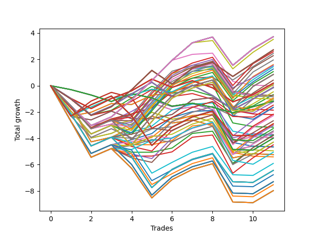

# Long HLT 346 
- Symbol: TSLA
- Date Range: 05/16/2022 - 05/17/2024
- Trading Period: 8:30-12:30
- Number of Trades: 11



| Id. | Name | Win Percent | Profit | Avg Profit / Trade | Avg Time / Trade | Std |      | Name | Win Percent | Profit | Avg Profit / Trade | Avg Time / Trade | Std |
| --- | ---- | ----------- | ------ | ------------------ | ---------------- | --- | ---- | ---- | ----------- | ------ | ------------------ | ---------------- | --- |
| | Sorted By <br> Profit | | | | | | | Sorted By <br> Win Percentage |||||
|0| TP-1.25 180m | 72.73 | 3.72 | 0.34 | 26:43 | 1.31 |     | TP-1.25 180m | 72.73 | 3.72 | 0.34 | 26:43 | 1.31 |
|1| TP-1.25 165m | 72.73 | 3.72 | 0.34 | 26:43 | 1.31 |     | TP-1.25 165m | 72.73 | 3.72 | 0.34 | 26:43 | 1.31 |
|2| TP-1.25 150m | 72.73 | 3.72 | 0.34 | 26:43 | 1.31 |     | TP-1.25 150m | 72.73 | 3.72 | 0.34 | 26:43 | 1.31 |
|3| TP-1.25 135m | 72.73 | 3.72 | 0.34 | 26:43 | 1.31 |     | TP-1.25 135m | 72.73 | 3.72 | 0.34 | 26:43 | 1.31 |
|4| TP-1.25 120m | 72.73 | 3.72 | 0.34 | 26:43 | 1.31 |     | TP-1.25 120m | 72.73 | 3.72 | 0.34 | 26:43 | 1.31 |
|5| TP-1.25 105m | 72.73 | 3.72 | 0.34 | 26:43 | 1.31 |     | TP-1.25 105m | 72.73 | 3.72 | 0.34 | 26:43 | 1.31 |
|6| TP-1.25 90m | 72.73 | 3.72 | 0.34 | 26:43 | 1.31 |     | TP-1.25 90m | 72.73 | 3.72 | 0.34 | 26:43 | 1.31 |
|7| TP-1.25 75m | 72.73 | 3.72 | 0.34 | 26:43 | 1.31 |     | TP-1.25 75m | 72.73 | 3.72 | 0.34 | 26:43 | 1.31 |
|8| TP-1.25 60m | 72.73 | 3.72 | 0.34 | 26:43 | 1.31 |     | TP-1.25 60m | 72.73 | 3.72 | 0.34 | 26:43 | 1.31 |
|9| TP-1.25 45m | 72.73 | 3.52 | 0.32 | 26:32 | 1.32 |     | TP-1.25 45m | 72.73 | 3.52 | 0.32 | 26:32 | 1.32 |
|10| TP-1 180m | 63.64 | 2.72 | 0.25 | 24:27 | 1.05 |     | TP-1.5 75m | 72.73 | 2.58 | 0.23 | 35:27 | 1.34 |
|11| TP-1 165m | 63.64 | 2.72 | 0.25 | 24:27 | 1.05 |     | TP-1.75 75m | 72.73 | 1.54 | 0.14 | 38:49 | 1.36 |
|12| TP-1 150m | 63.64 | 2.72 | 0.25 | 24:27 | 1.05 |     | TP-3 75m | 72.73 | 0.08 | 0.01 | 61:16 | 1.14 |
|13| TP-1 135m | 63.64 | 2.72 | 0.25 | 24:27 | 1.05 |     | TP-2.75 75m | 72.73 | -0.47 | -0.04 | 56:05 | 1.25 |
|14| TP-1 120m | 63.64 | 2.72 | 0.25 | 24:27 | 1.05 |     | TP-1 180m | 63.64 | 2.72 | 0.25 | 24:27 | 1.05 |
|15| TP-1 105m | 63.64 | 2.72 | 0.25 | 24:27 | 1.05 |     | TP-1 165m | 63.64 | 2.72 | 0.25 | 24:27 | 1.05 |
|16| TP-1 90m | 63.64 | 2.72 | 0.25 | 24:27 | 1.05 |     | TP-1 150m | 63.64 | 2.72 | 0.25 | 24:27 | 1.05 |
|17| TP-1 75m | 63.64 | 2.72 | 0.25 | 24:27 | 1.05 |     | TP-1 135m | 63.64 | 2.72 | 0.25 | 24:27 | 1.05 |
|18| TP-1 60m | 63.64 | 2.72 | 0.25 | 24:27 | 1.05 |     | TP-1 120m | 63.64 | 2.72 | 0.25 | 24:27 | 1.05 |
|19| TP-1.5 75m | 72.73 | 2.58 | 0.23 | 35:27 | 1.34 |     | TP-1 105m | 63.64 | 2.72 | 0.25 | 24:27 | 1.05 |
|20| TP-1 45m | 63.64 | 2.45 | 0.22 | 24:21 | 1.05 |     | TP-1 90m | 63.64 | 2.72 | 0.25 | 24:27 | 1.05 |
|21| TP-1.5 90m | 63.64 | 2.28 | 0.21 | 36:49 | 1.35 |     | TP-1 75m | 63.64 | 2.72 | 0.25 | 24:27 | 1.05 |
|22| TP-1.5 105m | 63.64 | 1.95 | 0.18 | 38:10 | 1.35 |     | TP-1 60m | 63.64 | 2.72 | 0.25 | 24:27 | 1.05 |
|23| TP-1.5 60m | 63.64 | 1.60 | 0.15 | 33:05 | 1.37 |     | TP-1 45m | 63.64 | 2.45 | 0.22 | 24:21 | 1.05 |
|24| TP-1.75 75m | 72.73 | 1.54 | 0.14 | 38:49 | 1.36 |     | TP-1.5 90m | 63.64 | 2.28 | 0.21 | 36:49 | 1.35 |
|25| TP-1.5 45m | 63.64 | 1.44 | 0.13 | 29:49 | 1.34 |     | TP-1.5 105m | 63.64 | 1.95 | 0.18 | 38:10 | 1.35 |
|26| TP-1.75 45m | 63.64 | 1.27 | 0.12 | 30:49 | 1.41 |     | TP-1.5 60m | 63.64 | 1.60 | 0.15 | 33:05 | 1.37 |
|27| TP-1.75 60m | 63.64 | 1.07 | 0.10 | 35:05 | 1.41 |     | TP-1.5 45m | 63.64 | 1.44 | 0.13 | 29:49 | 1.34 |
|28| TP-1.5 180m | 63.64 | 0.85 | 0.08 | 39:10 | 1.43 |     | TP-1.75 45m | 63.64 | 1.27 | 0.12 | 30:49 | 1.41 |
|29| TP-1.5 165m | 63.64 | 0.85 | 0.08 | 39:10 | 1.43 |     | TP-1.75 60m | 63.64 | 1.07 | 0.10 | 35:05 | 1.41 |
|30| TP-1.5 150m | 63.64 | 0.85 | 0.08 | 39:10 | 1.43 |     | TP-1.5 180m | 63.64 | 0.85 | 0.08 | 39:10 | 1.43 |
|31| TP-1.5 135m | 63.64 | 0.85 | 0.08 | 39:10 | 1.43 |     | TP-1.5 165m | 63.64 | 0.85 | 0.08 | 39:10 | 1.43 |
|32| TP-1.5 120m | 63.64 | 0.85 | 0.08 | 39:10 | 1.43 |     | TP-1.5 150m | 63.64 | 0.85 | 0.08 | 39:10 | 1.43 |
|33| TP-3 45m | 63.64 | 0.42 | 0.04 | 42:16 | 0.98 |     | TP-1.5 135m | 63.64 | 0.85 | 0.08 | 39:10 | 1.43 |
|34| TP-0.5 180m | 54.55 | 0.19 | 0.02 | 07:10 | 0.76 |     | TP-1.5 120m | 63.64 | 0.85 | 0.08 | 39:10 | 1.43 |
|35| TP-0.5 165m | 54.55 | 0.19 | 0.02 | 07:10 | 0.76 |     | TP-3 45m | 63.64 | 0.42 | 0.04 | 42:16 | 0.98 |
|36| TP-0.5 150m | 54.55 | 0.19 | 0.02 | 07:10 | 0.76 |     | TP-3 90m | 63.64 | -0.94 | -0.09 | 69:27 | 1.08 |
|37| TP-0.5 135m | 54.55 | 0.19 | 0.02 | 07:10 | 0.76 |     | TP-2.75 90m | 63.64 | -1.64 | -0.15 | 62:54 | 1.22 |
|38| TP-0.5 120m | 54.55 | 0.19 | 0.02 | 07:10 | 0.76 |     | TP-2.75 45m | 63.64 | -1.66 | -0.15 | 39:49 | 1.29 |
|39| TP-0.5 105m | 54.55 | 0.19 | 0.02 | 07:10 | 0.76 |     | TP-2 75m | 63.64 | -2.67 | -0.24 | 48:16 | 1.26 |
|40| TP-0.5 90m | 54.55 | 0.19 | 0.02 | 07:10 | 0.76 |     | TP-2 45m | 63.64 | -2.88 | -0.26 | 34:49 | 1.31 |
|41| TP-0.5 75m | 54.55 | 0.19 | 0.02 | 07:10 | 0.76 |     | TP-2.25 75m | 63.64 | -3.53 | -0.32 | 48:27 | 1.38 |
|42| TP-0.5 60m | 54.55 | 0.19 | 0.02 | 07:10 | 0.76 |     | TP-2.25 45m | 63.64 | -3.74 | -0.34 | 35:00 | 1.43 |
|43| TP-0.5 45m | 54.55 | 0.19 | 0.02 | 07:10 | 0.76 |     | TP-2.5 75m | 63.64 | -4.29 | -0.39 | 49:00 | 1.49 |
|44| TP-0.5 30m | 54.55 | 0.19 | 0.02 | 07:10 | 0.76 |     | TP-2.5 45m | 63.64 | -4.50 | -0.41 | 35:32 | 1.53 |
|45| TP-0.5 15m | 54.55 | 0.19 | 0.02 | 07:10 | 0.76 |     | TP-0.5 180m | 54.55 | 0.19 | 0.02 | 07:10 | 0.76 |
|46| TP-1.75 90m | 54.55 | 0.16 | 0.01 | 41:32 | 1.34 |     | TP-0.5 165m | 54.55 | 0.19 | 0.02 | 07:10 | 0.76 |
|47| TP-3 75m | 72.73 | 0.08 | 0.01 | 61:16 | 1.14 |     | TP-0.5 150m | 54.55 | 0.19 | 0.02 | 07:10 | 0.76 |
|48| TP-1.75 105m | 54.55 | 0.07 | 0.01 | 43:27 | 1.35 |     | TP-0.5 135m | 54.55 | 0.19 | 0.02 | 07:10 | 0.76 |
|49| TP-1.25 30m | 54.55 | -0.01 | -0.00 | 21:32 | 1.21 |     | TP-0.5 120m | 54.55 | 0.19 | 0.02 | 07:10 | 0.76 |
|50| TP-3 60m | 54.55 | -0.11 | -0.01 | 52:05 | 1.18 |     | TP-0.5 105m | 54.55 | 0.19 | 0.02 | 07:10 | 0.76 |
|51| TP-0.75 180m | 54.55 | -0.15 | -0.01 | 14:54 | 0.93 |     | TP-0.5 90m | 54.55 | 0.19 | 0.02 | 07:10 | 0.76 |
|52| TP-0.75 165m | 54.55 | -0.15 | -0.01 | 14:54 | 0.93 |     | TP-0.5 75m | 54.55 | 0.19 | 0.02 | 07:10 | 0.76 |
|53| TP-0.75 150m | 54.55 | -0.15 | -0.01 | 14:54 | 0.93 |     | TP-0.5 60m | 54.55 | 0.19 | 0.02 | 07:10 | 0.76 |
|54| TP-0.75 135m | 54.55 | -0.15 | -0.01 | 14:54 | 0.93 |     | TP-0.5 45m | 54.55 | 0.19 | 0.02 | 07:10 | 0.76 |
|55| TP-0.75 120m | 54.55 | -0.15 | -0.01 | 14:54 | 0.93 |     | TP-0.5 30m | 54.55 | 0.19 | 0.02 | 07:10 | 0.76 |
|56| TP-0.75 105m | 54.55 | -0.15 | -0.01 | 14:54 | 0.93 |     | TP-0.5 15m | 54.55 | 0.19 | 0.02 | 07:10 | 0.76 |
|57| TP-0.75 90m | 54.55 | -0.15 | -0.01 | 14:54 | 0.93 |     | TP-1.75 90m | 54.55 | 0.16 | 0.01 | 41:32 | 1.34 |
|58| TP-0.75 75m | 54.55 | -0.15 | -0.01 | 14:54 | 0.93 |     | TP-1.75 105m | 54.55 | 0.07 | 0.01 | 43:27 | 1.35 |
|59| TP-0.75 60m | 54.55 | -0.15 | -0.01 | 14:54 | 0.93 |     | TP-1.25 30m | 54.55 | -0.01 | -0.00 | 21:32 | 1.21 |
|60| TP-0.75 45m | 54.55 | -0.15 | -0.01 | 14:54 | 0.93 |     | TP-3 60m | 54.55 | -0.11 | -0.01 | 52:05 | 1.18 |
|61| TP-2.75 75m | 72.73 | -0.47 | -0.04 | 56:05 | 1.25 |     | TP-0.75 180m | 54.55 | -0.15 | -0.01 | 14:54 | 0.93 |
|62| TP-0.75 15m | 54.55 | -0.68 | -0.06 | 10:32 | 0.78 |     | TP-0.75 165m | 54.55 | -0.15 | -0.01 | 14:54 | 0.93 |
|63| TP-1 30m | 45.45 | -0.74 | -0.07 | 20:00 | 0.92 |     | TP-0.75 150m | 54.55 | -0.15 | -0.01 | 14:54 | 0.93 |
|64| TP-1.5 30m | 54.55 | -0.84 | -0.08 | 23:00 | 1.22 |     | TP-0.75 135m | 54.55 | -0.15 | -0.01 | 14:54 | 0.93 |
|65| TP-3 90m | 63.64 | -0.94 | -0.09 | 69:27 | 1.08 |     | TP-0.75 120m | 54.55 | -0.15 | -0.01 | 14:54 | 0.93 |
|66| TP-1.75 30m | 54.55 | -1.01 | -0.09 | 24:00 | 1.30 |     | TP-0.75 105m | 54.55 | -0.15 | -0.01 | 14:54 | 0.93 |
|67| TP-1.75 180m | 54.55 | -1.03 | -0.09 | 44:49 | 1.41 |     | TP-0.75 90m | 54.55 | -0.15 | -0.01 | 14:54 | 0.93 |
|68| TP-1.75 165m | 54.55 | -1.03 | -0.09 | 44:49 | 1.41 |     | TP-0.75 75m | 54.55 | -0.15 | -0.01 | 14:54 | 0.93 |
|69| TP-1.75 150m | 54.55 | -1.03 | -0.09 | 44:49 | 1.41 |     | TP-0.75 60m | 54.55 | -0.15 | -0.01 | 14:54 | 0.93 |
|70| TP-1.75 135m | 54.55 | -1.03 | -0.09 | 44:49 | 1.41 |     | TP-0.75 45m | 54.55 | -0.15 | -0.01 | 14:54 | 0.93 |
|71| TP-1.75 120m | 54.55 | -1.03 | -0.09 | 44:49 | 1.41 |     | TP-0.75 15m | 54.55 | -0.68 | -0.06 | 10:32 | 0.78 |
|72| TP-0.25 180m | 36.36 | -1.18 | -0.11 | 03:54 | 0.42 |     | TP-1.5 30m | 54.55 | -0.84 | -0.08 | 23:00 | 1.22 |
|73| TP-0.25 165m | 36.36 | -1.18 | -0.11 | 03:54 | 0.42 |     | TP-1.75 30m | 54.55 | -1.01 | -0.09 | 24:00 | 1.30 |
|74| TP-0.25 150m | 36.36 | -1.18 | -0.11 | 03:54 | 0.42 |     | TP-1.75 180m | 54.55 | -1.03 | -0.09 | 44:49 | 1.41 |
|75| TP-0.25 135m | 36.36 | -1.18 | -0.11 | 03:54 | 0.42 |     | TP-1.75 165m | 54.55 | -1.03 | -0.09 | 44:49 | 1.41 |
|76| TP-0.25 120m | 36.36 | -1.18 | -0.11 | 03:54 | 0.42 |     | TP-1.75 150m | 54.55 | -1.03 | -0.09 | 44:49 | 1.41 |
|77| TP-0.25 105m | 36.36 | -1.18 | -0.11 | 03:54 | 0.42 |     | TP-1.75 135m | 54.55 | -1.03 | -0.09 | 44:49 | 1.41 |
|78| TP-0.25 90m | 36.36 | -1.18 | -0.11 | 03:54 | 0.42 |     | TP-1.75 120m | 54.55 | -1.03 | -0.09 | 44:49 | 1.41 |
|79| TP-0.25 75m | 36.36 | -1.18 | -0.11 | 03:54 | 0.42 |     | TP-3 105m | 54.55 | -1.48 | -0.13 | 76:49 | 1.21 |
|80| TP-0.25 60m | 36.36 | -1.18 | -0.11 | 03:54 | 0.42 |     | TP-2 60m | 54.55 | -2.17 | -0.20 | 41:49 | 1.40 |
|81| TP-0.25 45m | 36.36 | -1.18 | -0.11 | 03:54 | 0.42 |     | TP-3 30m | 54.55 | -2.20 | -0.20 | 28:38 | 1.00 |
|82| TP-0.25 30m | 36.36 | -1.18 | -0.11 | 03:54 | 0.42 |     | TP-2.75 60m | 54.55 | -2.28 | -0.21 | 48:16 | 1.44 |
|83| TP-0.25 15m | 36.36 | -1.18 | -0.11 | 03:54 | 0.42 |     | TP-3 180m | 54.55 | -2.91 | -0.26 | 82:21 | 1.35 |
|84| TP-0.75 30m | 45.45 | -1.24 | -0.11 | 14:05 | 0.89 |     | TP-3 165m | 54.55 | -2.91 | -0.26 | 82:21 | 1.35 |
|85| TP-3 105m | 54.55 | -1.48 | -0.13 | 76:49 | 1.21 |     | TP-3 150m | 54.55 | -2.91 | -0.26 | 82:21 | 1.35 |
|86| TP-2.75 90m | 63.64 | -1.64 | -0.15 | 62:54 | 1.22 |     | TP-3 135m | 54.55 | -2.91 | -0.26 | 82:21 | 1.35 |
|87| TP-2.75 45m | 63.64 | -1.66 | -0.15 | 39:49 | 1.29 |     | TP-3 120m | 54.55 | -2.91 | -0.26 | 82:21 | 1.35 |
|88| TP-1 15m | 45.45 | -1.86 | -0.17 | 12:16 | 0.71 |     | TP-2.25 60m | 54.55 | -3.03 | -0.28 | 42:00 | 1.51 |
|89| TP-2 60m | 54.55 | -2.17 | -0.20 | 41:49 | 1.40 |     | TP-2.75 30m | 54.55 | -3.16 | -0.29 | 27:32 | 1.18 |
|90| TP-3 30m | 54.55 | -2.20 | -0.20 | 28:38 | 1.00 |     | TP-2.75 105m | 54.55 | -3.26 | -0.30 | 68:54 | 1.43 |
|91| TP-2.75 60m | 54.55 | -2.28 | -0.21 | 48:16 | 1.44 |     | TP-2 90m | 54.55 | -3.44 | -0.31 | 53:43 | 1.23 |
|92| TP-2 75m | 63.64 | -2.67 | -0.24 | 48:16 | 1.26 |     | TP-2.5 60m | 54.55 | -3.79 | -0.34 | 42:32 | 1.62 |
|93| TP-2 45m | 63.64 | -2.88 | -0.26 | 34:49 | 1.31 |     | TP-2 30m | 54.55 | -3.79 | -0.34 | 25:16 | 1.22 |
|94| TP-3 180m | 54.55 | -2.91 | -0.26 | 82:21 | 1.35 |     | TP-2.75 180m | 54.55 | -3.99 | -0.36 | 73:05 | 1.49 |
|95| TP-3 165m | 54.55 | -2.91 | -0.26 | 82:21 | 1.35 |     | TP-2.75 165m | 54.55 | -3.99 | -0.36 | 73:05 | 1.49 |
|96| TP-3 150m | 54.55 | -2.91 | -0.26 | 82:21 | 1.35 |     | TP-2.75 150m | 54.55 | -3.99 | -0.36 | 73:05 | 1.49 |
|97| TP-3 135m | 54.55 | -2.91 | -0.26 | 82:21 | 1.35 |     | TP-2.75 135m | 54.55 | -3.99 | -0.36 | 73:05 | 1.49 |
|98| TP-3 120m | 54.55 | -2.91 | -0.26 | 82:21 | 1.35 |     | TP-2.75 120m | 54.55 | -3.99 | -0.36 | 73:05 | 1.49 |
|99| TP-2.25 60m | 54.55 | -3.03 | -0.28 | 42:00 | 1.51 |     | TP-2.25 90m | 54.55 | -4.30 | -0.39 | 53:54 | 1.36 |
|100| TP-2.75 30m | 54.55 | -3.16 | -0.29 | 27:32 | 1.18 |     | TP-2.25 30m | 54.55 | -4.65 | -0.42 | 25:27 | 1.34 |
|101| TP-2.75 105m | 54.55 | -3.26 | -0.30 | 68:54 | 1.43 |     | TP-2.5 90m | 54.55 | -5.06 | -0.46 | 54:27 | 1.46 |
|102| TP-2 90m | 54.55 | -3.44 | -0.31 | 53:43 | 1.23 |     | TP-2.5 30m | 54.55 | -5.41 | -0.49 | 26:00 | 1.45 |
|103| TP-2.25 75m | 63.64 | -3.53 | -0.32 | 48:27 | 1.38 |     | TP-1 30m | 45.45 | -0.74 | -0.07 | 20:00 | 0.92 |
|104| TP-1.25 15m | 45.45 | -3.71 | -0.34 | 13:10 | 0.95 |     | TP-0.75 30m | 45.45 | -1.24 | -0.11 | 14:05 | 0.89 |
|105| TP-2.25 45m | 63.64 | -3.74 | -0.34 | 35:00 | 1.43 |     | TP-1 15m | 45.45 | -1.86 | -0.17 | 12:16 | 0.71 |
|106| TP-2.5 60m | 54.55 | -3.79 | -0.34 | 42:32 | 1.62 |     | TP-1.25 15m | 45.45 | -3.71 | -0.34 | 13:10 | 0.95 |
|107| TP-2 30m | 54.55 | -3.79 | -0.34 | 25:16 | 1.22 |     | TP-1.75 15m | 45.45 | -3.95 | -0.36 | 13:21 | 0.98 |
|108| TP-1.75 15m | 45.45 | -3.95 | -0.36 | 13:21 | 0.98 |     | TP-1.5 15m | 45.45 | -3.95 | -0.36 | 13:21 | 0.98 |
|109| TP-1.5 15m | 45.45 | -3.95 | -0.36 | 13:21 | 0.98 |     | TP-2 15m | 45.45 | -4.66 | -0.42 | 13:38 | 1.09 |
|110| TP-2.75 180m | 54.55 | -3.99 | -0.36 | 73:05 | 1.49 |     | TP-2.25 15m | 45.45 | -4.95 | -0.45 | 13:43 | 1.13 |
|111| TP-2.75 165m | 54.55 | -3.99 | -0.36 | 73:05 | 1.49 |     | TP-3 15m | 45.45 | -5.24 | -0.48 | 14:00 | 1.18 |
|112| TP-2.75 150m | 54.55 | -3.99 | -0.36 | 73:05 | 1.49 |     | TP-2.75 15m | 45.45 | -5.24 | -0.48 | 14:00 | 1.18 |
|113| TP-2.75 135m | 54.55 | -3.99 | -0.36 | 73:05 | 1.49 |     | TP-2.5 15m | 45.45 | -5.24 | -0.48 | 14:00 | 1.18 |
|114| TP-2.75 120m | 54.55 | -3.99 | -0.36 | 73:05 | 1.49 |     | TP-2 105m | 45.45 | -5.91 | -0.54 | 58:21 | 1.36 |
|115| TP-2.5 75m | 63.64 | -4.29 | -0.39 | 49:00 | 1.49 |     | TP-2 180m | 45.45 | -6.44 | -0.59 | 61:05 | 1.45 |
|116| TP-2.25 90m | 54.55 | -4.30 | -0.39 | 53:54 | 1.36 |     | TP-2 165m | 45.45 | -6.44 | -0.59 | 61:05 | 1.45 |
|117| TP-2.5 45m | 63.64 | -4.50 | -0.41 | 35:32 | 1.53 |     | TP-2 150m | 45.45 | -6.44 | -0.59 | 61:05 | 1.45 |
|118| TP-2.25 30m | 54.55 | -4.65 | -0.42 | 25:27 | 1.34 |     | TP-2 135m | 45.45 | -6.44 | -0.59 | 61:05 | 1.45 |
|119| TP-2 15m | 45.45 | -4.66 | -0.42 | 13:38 | 1.09 |     | TP-2 120m | 45.45 | -6.44 | -0.59 | 61:05 | 1.45 |
|120| TP-2.25 15m | 45.45 | -4.95 | -0.45 | 13:43 | 1.13 |     | TP-2.25 105m | 45.45 | -6.77 | -0.62 | 58:32 | 1.46 |
|121| TP-2.5 90m | 54.55 | -5.06 | -0.46 | 54:27 | 1.46 |     | TP-2.25 180m | 45.45 | -7.30 | -0.66 | 61:16 | 1.54 |
|122| TP-3 15m | 45.45 | -5.24 | -0.48 | 14:00 | 1.18 |     | TP-2.25 165m | 45.45 | -7.30 | -0.66 | 61:16 | 1.54 |
|123| TP-2.75 15m | 45.45 | -5.24 | -0.48 | 14:00 | 1.18 |     | TP-2.25 150m | 45.45 | -7.30 | -0.66 | 61:16 | 1.54 |
|124| TP-2.5 15m | 45.45 | -5.24 | -0.48 | 14:00 | 1.18 |     | TP-2.25 135m | 45.45 | -7.30 | -0.66 | 61:16 | 1.54 |
|125| TP-2.5 30m | 54.55 | -5.41 | -0.49 | 26:00 | 1.45 |     | TP-2.25 120m | 45.45 | -7.30 | -0.66 | 61:16 | 1.54 |
|126| TP-2 105m | 45.45 | -5.91 | -0.54 | 58:21 | 1.36 |     | TP-2.5 105m | 45.45 | -7.53 | -0.68 | 59:05 | 1.55 |
|127| TP-2 180m | 45.45 | -6.44 | -0.59 | 61:05 | 1.45 |     | TP-2.5 180m | 45.45 | -7.98 | -0.73 | 61:54 | 1.62 |
|128| TP-2 165m | 45.45 | -6.44 | -0.59 | 61:05 | 1.45 |     | TP-2.5 165m | 45.45 | -7.98 | -0.73 | 61:54 | 1.62 |
|129| TP-2 150m | 45.45 | -6.44 | -0.59 | 61:05 | 1.45 |     | TP-2.5 150m | 45.45 | -7.98 | -0.73 | 61:54 | 1.62 |
|130| TP-2 135m | 45.45 | -6.44 | -0.59 | 61:05 | 1.45 |     | TP-2.5 135m | 45.45 | -7.98 | -0.73 | 61:54 | 1.62 |
|131| TP-2 120m | 45.45 | -6.44 | -0.59 | 61:05 | 1.45 |     | TP-2.5 120m | 45.45 | -7.98 | -0.73 | 61:54 | 1.62 |
|132| TP-2.25 105m | 45.45 | -6.77 | -0.62 | 58:32 | 1.46 |     | TP-0.25 180m | 36.36 | -1.18 | -0.11 | 03:54 | 0.42 |
|133| TP-2.25 180m | 45.45 | -7.30 | -0.66 | 61:16 | 1.54 |     | TP-0.25 165m | 36.36 | -1.18 | -0.11 | 03:54 | 0.42 |
|134| TP-2.25 165m | 45.45 | -7.30 | -0.66 | 61:16 | 1.54 |     | TP-0.25 150m | 36.36 | -1.18 | -0.11 | 03:54 | 0.42 |
|135| TP-2.25 150m | 45.45 | -7.30 | -0.66 | 61:16 | 1.54 |     | TP-0.25 135m | 36.36 | -1.18 | -0.11 | 03:54 | 0.42 |
|136| TP-2.25 135m | 45.45 | -7.30 | -0.66 | 61:16 | 1.54 |     | TP-0.25 120m | 36.36 | -1.18 | -0.11 | 03:54 | 0.42 |
|137| TP-2.25 120m | 45.45 | -7.30 | -0.66 | 61:16 | 1.54 |     | TP-0.25 105m | 36.36 | -1.18 | -0.11 | 03:54 | 0.42 |
|138| TP-2.5 105m | 45.45 | -7.53 | -0.68 | 59:05 | 1.55 |     | TP-0.25 90m | 36.36 | -1.18 | -0.11 | 03:54 | 0.42 |
|139| TP-2.5 180m | 45.45 | -7.98 | -0.73 | 61:54 | 1.62 |     | TP-0.25 75m | 36.36 | -1.18 | -0.11 | 03:54 | 0.42 |
|140| TP-2.5 165m | 45.45 | -7.98 | -0.73 | 61:54 | 1.62 |     | TP-0.25 60m | 36.36 | -1.18 | -0.11 | 03:54 | 0.42 |
|141| TP-2.5 150m | 45.45 | -7.98 | -0.73 | 61:54 | 1.62 |     | TP-0.25 45m | 36.36 | -1.18 | -0.11 | 03:54 | 0.42 |
|142| TP-2.5 135m | 45.45 | -7.98 | -0.73 | 61:54 | 1.62 |     | TP-0.25 30m | 36.36 | -1.18 | -0.11 | 03:54 | 0.42 |
|143| TP-2.5 120m | 45.45 | -7.98 | -0.73 | 61:54 | 1.62 |     | TP-0.25 15m | 36.36 | -1.18 | -0.11 | 03:54 | 0.42 |

### Test TP-0.25 15m
* Take Profit of 0.25 Point
* 0.25 Stoploss
* Results:
```
Total Trades: 11
Percent Up: 36.36
Percent Down: 63.64
Total Points Moved Up: -1.18
Potential Profit: -590.00
Total Points Ups: 1.70 Count Ups: 4
Total Points Downs: -2.88 Count Downs: 7
```

<details><summary>Trades</summary>

<code>In: 2022-08-08 12:05:00		Out: 2022-08-08 12:07:00		Total Position Time: 02:00		Total Move Up: -0.30		Total to Date: -0.30</code> <br />
<code>In: 2022-09-20 10:45:00		Out: 2022-09-20 10:48:00		Total Position Time: 03:00		Total Move Up: -0.41		Total to Date: -0.71</code> <br />
<code>In: 2022-10-11 12:25:00		Out: 2022-10-11 12:29:00		Total Position Time: 04:00		Total Move Up: -0.49		Total to Date: -1.20</code> <br />
<code>In: 2022-10-14 09:25:00		Out: 2022-10-14 09:30:00		Total Position Time: 05:00		Total Move Up: 0.59		Total to Date: -0.61</code> <br />
<code>In: 2022-11-09 11:05:00		Out: 2022-11-09 11:07:00		Total Position Time: 02:00		Total Move Up: -0.32		Total to Date: -0.93</code> <br />
<code>In: 2023-06-26 09:35:00		Out: 2023-06-26 09:39:00		Total Position Time: 04:00		Total Move Up: -0.63		Total to Date: -1.56</code> <br />
<code>In: 2023-09-15 11:40:00		Out: 2023-09-15 11:45:00		Total Position Time: 05:00		Total Move Up: 0.23		Total to Date: -1.33</code> <br />
<code>In: 2023-10-19 12:05:00		Out: 2023-10-19 12:13:00		Total Position Time: 08:00		Total Move Up: -0.31		Total to Date: -1.64</code> <br />
<code>In: 2023-11-09 09:50:00		Out: 2023-11-09 09:56:00		Total Position Time: 06:00		Total Move Up: -0.42		Total to Date: -2.06</code> <br />
<code>In: 2023-12-05 11:15:00		Out: 2023-12-05 11:17:00		Total Position Time: 02:00		Total Move Up: 0.46		Total to Date: -1.60</code> <br />
<code>In: 2024-04-26 12:05:00		Out: 2024-04-26 12:07:00		Total Position Time: 02:00		Total Move Up: 0.42		Total to Date: -1.18</code> <br />


</details>

### Test TP-0.5 15m
* Take Profit of 0.5 Point
* 0.5 Stoploss
* Results:
```
Total Trades: 11
Percent Up: 54.55
Percent Down: 45.45
Total Points Moved Up: 0.19
Potential Profit: 95.00
Total Points Ups: 4.17 Count Ups: 6
Total Points Downs: -3.98 Count Downs: 5
```

<details><summary>Trades</summary>

<code>In: 2022-08-08 12:05:00		Out: 2022-08-08 12:08:00		Total Position Time: 03:00		Total Move Up: -0.97		Total to Date: -0.97</code> <br />
<code>In: 2022-09-20 10:45:00		Out: 2022-09-20 10:49:00		Total Position Time: 04:00		Total Move Up: -0.77		Total to Date: -1.74</code> <br />
<code>In: 2022-10-11 12:25:00		Out: 2022-10-11 12:37:00		Total Position Time: 12:00		Total Move Up: 0.76		Total to Date: -0.98</code> <br />
<code>In: 2022-10-14 09:25:00		Out: 2022-10-14 09:30:00		Total Position Time: 05:00		Total Move Up: 0.59		Total to Date: -0.39</code> <br />
<code>In: 2022-11-09 11:05:00		Out: 2022-11-09 11:19:00		Total Position Time: 14:00		Total Move Up: 0.89		Total to Date: 0.50</code> <br />
<code>In: 2023-06-26 09:35:00		Out: 2023-06-26 09:39:00		Total Position Time: 04:00		Total Move Up: -0.63		Total to Date: -0.13</code> <br />
<code>In: 2023-09-15 11:40:00		Out: 2023-09-15 11:48:00		Total Position Time: 08:00		Total Move Up: 0.51		Total to Date: 0.38</code> <br />
<code>In: 2023-10-19 12:05:00		Out: 2023-10-19 12:14:00		Total Position Time: 09:00		Total Move Up: -0.54		Total to Date: -0.16</code> <br />
<code>In: 2023-11-09 09:50:00		Out: 2023-11-09 10:02:00		Total Position Time: 12:00		Total Move Up: -1.07		Total to Date: -1.23</code> <br />
<code>In: 2023-12-05 11:15:00		Out: 2023-12-05 11:18:00		Total Position Time: 03:00		Total Move Up: 0.56		Total to Date: -0.67</code> <br />
<code>In: 2024-04-26 12:05:00		Out: 2024-04-26 12:10:00		Total Position Time: 05:00		Total Move Up: 0.86		Total to Date: 0.19</code> <br />


</details>

### Test TP-0.75 15m
* Take Profit of 0.75 Point
* 0.75 Stoploss
* Results:
```
Total Trades: 11
Percent Up: 54.55
Percent Down: 45.45
Total Points Moved Up: -0.68
Potential Profit: -340.00
Total Points Ups: 3.58 Count Ups: 6
Total Points Downs: -4.26 Count Downs: 5
```

<details><summary>Trades</summary>

<code>In: 2022-08-08 12:05:00		Out: 2022-08-08 12:08:00		Total Position Time: 03:00		Total Move Up: -0.97		Total to Date: -0.97</code> <br />
<code>In: 2022-09-20 10:45:00		Out: 2022-09-20 10:50:00		Total Position Time: 05:00		Total Move Up: -1.25		Total to Date: -2.22</code> <br />
<code>In: 2022-10-11 12:25:00		Out: 2022-10-11 12:39:00		Total Position Time: 14:00		Total Move Up: 0.35		Total to Date: -1.87</code> <br />
<code>In: 2022-10-14 09:25:00		Out: 2022-10-14 09:32:00		Total Position Time: 07:00		Total Move Up: 0.93		Total to Date: -0.94</code> <br />
<code>In: 2022-11-09 11:05:00		Out: 2022-11-09 11:19:00		Total Position Time: 14:00		Total Move Up: 0.89		Total to Date: -0.05</code> <br />
<code>In: 2023-06-26 09:35:00		Out: 2023-06-26 09:49:00		Total Position Time: 14:00		Total Move Up: -0.53		Total to Date: -0.58</code> <br />
<code>In: 2023-09-15 11:40:00		Out: 2023-09-15 11:54:00		Total Position Time: 14:00		Total Move Up: 0.23		Total to Date: -0.35</code> <br />
<code>In: 2023-10-19 12:05:00		Out: 2023-10-19 12:19:00		Total Position Time: 14:00		Total Move Up: -0.44		Total to Date: -0.79</code> <br />
<code>In: 2023-11-09 09:50:00		Out: 2023-11-09 10:02:00		Total Position Time: 12:00		Total Move Up: -1.07		Total to Date: -1.86</code> <br />
<code>In: 2023-12-05 11:15:00		Out: 2023-12-05 11:29:00		Total Position Time: 14:00		Total Move Up: 0.32		Total to Date: -1.54</code> <br />
<code>In: 2024-04-26 12:05:00		Out: 2024-04-26 12:10:00		Total Position Time: 05:00		Total Move Up: 0.86		Total to Date: -0.68</code> <br />


</details>

### Test TP-1 15m
* Take Profit of 1 Point
* 1 Stoploss
* Results:
```
Total Trades: 11
Percent Up: 45.45
Percent Down: 54.55
Total Points Moved Up: -1.86
Potential Profit: -930.00
Total Points Ups: 2.51 Count Ups: 5
Total Points Downs: -4.37 Count Downs: 6
```

<details><summary>Trades</summary>

<code>In: 2022-08-08 12:05:00		Out: 2022-08-08 12:11:00		Total Position Time: 06:00		Total Move Up: -1.01		Total to Date: -1.01</code> <br />
<code>In: 2022-09-20 10:45:00		Out: 2022-09-20 10:50:00		Total Position Time: 05:00		Total Move Up: -1.25		Total to Date: -2.26</code> <br />
<code>In: 2022-10-11 12:25:00		Out: 2022-10-11 12:39:00		Total Position Time: 14:00		Total Move Up: 0.35		Total to Date: -1.91</code> <br />
<code>In: 2022-10-14 09:25:00		Out: 2022-10-14 09:39:00		Total Position Time: 14:00		Total Move Up: 0.72		Total to Date: -1.19</code> <br />
<code>In: 2022-11-09 11:05:00		Out: 2022-11-09 11:19:00		Total Position Time: 14:00		Total Move Up: 0.89		Total to Date: -0.30</code> <br />
<code>In: 2023-06-26 09:35:00		Out: 2023-06-26 09:49:00		Total Position Time: 14:00		Total Move Up: -0.53		Total to Date: -0.83</code> <br />
<code>In: 2023-09-15 11:40:00		Out: 2023-09-15 11:54:00		Total Position Time: 14:00		Total Move Up: 0.23		Total to Date: -0.60</code> <br />
<code>In: 2023-10-19 12:05:00		Out: 2023-10-19 12:19:00		Total Position Time: 14:00		Total Move Up: -0.44		Total to Date: -1.04</code> <br />
<code>In: 2023-11-09 09:50:00		Out: 2023-11-09 10:02:00		Total Position Time: 12:00		Total Move Up: -1.07		Total to Date: -2.11</code> <br />
<code>In: 2023-12-05 11:15:00		Out: 2023-12-05 11:29:00		Total Position Time: 14:00		Total Move Up: 0.32		Total to Date: -1.79</code> <br />
<code>In: 2024-04-26 12:05:00		Out: 2024-04-26 12:19:00		Total Position Time: 14:00		Total Move Up: -0.07		Total to Date: -1.86</code> <br />


</details>

### Test TP-1.25 15m
* Take Profit of 1.25 Point
* 1.25 Stoploss
* Results:
```
Total Trades: 11
Percent Up: 45.45
Percent Down: 54.55
Total Points Moved Up: -3.71
Potential Profit: -1855.00
Total Points Ups: 2.51 Count Ups: 5
Total Points Downs: -6.22 Count Downs: 6
```

<details><summary>Trades</summary>

<code>In: 2022-08-08 12:05:00		Out: 2022-08-08 12:19:00		Total Position Time: 14:00		Total Move Up: -1.53		Total to Date: -1.53</code> <br />
<code>In: 2022-09-20 10:45:00		Out: 2022-09-20 10:51:00		Total Position Time: 06:00		Total Move Up: -1.50		Total to Date: -3.03</code> <br />
<code>In: 2022-10-11 12:25:00		Out: 2022-10-11 12:39:00		Total Position Time: 14:00		Total Move Up: 0.35		Total to Date: -2.68</code> <br />
<code>In: 2022-10-14 09:25:00		Out: 2022-10-14 09:39:00		Total Position Time: 14:00		Total Move Up: 0.72		Total to Date: -1.96</code> <br />
<code>In: 2022-11-09 11:05:00		Out: 2022-11-09 11:19:00		Total Position Time: 14:00		Total Move Up: 0.89		Total to Date: -1.07</code> <br />
<code>In: 2023-06-26 09:35:00		Out: 2023-06-26 09:49:00		Total Position Time: 14:00		Total Move Up: -0.53		Total to Date: -1.60</code> <br />
<code>In: 2023-09-15 11:40:00		Out: 2023-09-15 11:54:00		Total Position Time: 14:00		Total Move Up: 0.23		Total to Date: -1.37</code> <br />
<code>In: 2023-10-19 12:05:00		Out: 2023-10-19 12:19:00		Total Position Time: 14:00		Total Move Up: -0.44		Total to Date: -1.81</code> <br />
<code>In: 2023-11-09 09:50:00		Out: 2023-11-09 10:03:00		Total Position Time: 13:00		Total Move Up: -2.15		Total to Date: -3.96</code> <br />
<code>In: 2023-12-05 11:15:00		Out: 2023-12-05 11:29:00		Total Position Time: 14:00		Total Move Up: 0.32		Total to Date: -3.64</code> <br />
<code>In: 2024-04-26 12:05:00		Out: 2024-04-26 12:19:00		Total Position Time: 14:00		Total Move Up: -0.07		Total to Date: -3.71</code> <br />


</details>

### Test TP-1.5 15m
* Take Profit of 1.5 Point
* 1.5 Stoploss
* Results:
```
Total Trades: 11
Percent Up: 45.45
Percent Down: 54.55
Total Points Moved Up: -3.95
Potential Profit: -1975.00
Total Points Ups: 2.51 Count Ups: 5
Total Points Downs: -6.46 Count Downs: 6
```

<details><summary>Trades</summary>

<code>In: 2022-08-08 12:05:00		Out: 2022-08-08 12:19:00		Total Position Time: 14:00		Total Move Up: -1.53		Total to Date: -1.53</code> <br />
<code>In: 2022-09-20 10:45:00		Out: 2022-09-20 10:53:00		Total Position Time: 08:00		Total Move Up: -1.74		Total to Date: -3.27</code> <br />
<code>In: 2022-10-11 12:25:00		Out: 2022-10-11 12:39:00		Total Position Time: 14:00		Total Move Up: 0.35		Total to Date: -2.92</code> <br />
<code>In: 2022-10-14 09:25:00		Out: 2022-10-14 09:39:00		Total Position Time: 14:00		Total Move Up: 0.72		Total to Date: -2.20</code> <br />
<code>In: 2022-11-09 11:05:00		Out: 2022-11-09 11:19:00		Total Position Time: 14:00		Total Move Up: 0.89		Total to Date: -1.31</code> <br />
<code>In: 2023-06-26 09:35:00		Out: 2023-06-26 09:49:00		Total Position Time: 14:00		Total Move Up: -0.53		Total to Date: -1.84</code> <br />
<code>In: 2023-09-15 11:40:00		Out: 2023-09-15 11:54:00		Total Position Time: 14:00		Total Move Up: 0.23		Total to Date: -1.61</code> <br />
<code>In: 2023-10-19 12:05:00		Out: 2023-10-19 12:19:00		Total Position Time: 14:00		Total Move Up: -0.44		Total to Date: -2.05</code> <br />
<code>In: 2023-11-09 09:50:00		Out: 2023-11-09 10:03:00		Total Position Time: 13:00		Total Move Up: -2.15		Total to Date: -4.20</code> <br />
<code>In: 2023-12-05 11:15:00		Out: 2023-12-05 11:29:00		Total Position Time: 14:00		Total Move Up: 0.32		Total to Date: -3.88</code> <br />
<code>In: 2024-04-26 12:05:00		Out: 2024-04-26 12:19:00		Total Position Time: 14:00		Total Move Up: -0.07		Total to Date: -3.95</code> <br />


</details>

### Test TP-1.75 15m
* Take Profit of 1.75 Point
* 1.75 Stoploss
* Results:
```
Total Trades: 11
Percent Up: 45.45
Percent Down: 54.55
Total Points Moved Up: -3.95
Potential Profit: -1975.00
Total Points Ups: 2.51 Count Ups: 5
Total Points Downs: -6.46 Count Downs: 6
```

<details><summary>Trades</summary>

<code>In: 2022-08-08 12:05:00		Out: 2022-08-08 12:19:00		Total Position Time: 14:00		Total Move Up: -1.53		Total to Date: -1.53</code> <br />
<code>In: 2022-09-20 10:45:00		Out: 2022-09-20 10:53:00		Total Position Time: 08:00		Total Move Up: -1.74		Total to Date: -3.27</code> <br />
<code>In: 2022-10-11 12:25:00		Out: 2022-10-11 12:39:00		Total Position Time: 14:00		Total Move Up: 0.35		Total to Date: -2.92</code> <br />
<code>In: 2022-10-14 09:25:00		Out: 2022-10-14 09:39:00		Total Position Time: 14:00		Total Move Up: 0.72		Total to Date: -2.20</code> <br />
<code>In: 2022-11-09 11:05:00		Out: 2022-11-09 11:19:00		Total Position Time: 14:00		Total Move Up: 0.89		Total to Date: -1.31</code> <br />
<code>In: 2023-06-26 09:35:00		Out: 2023-06-26 09:49:00		Total Position Time: 14:00		Total Move Up: -0.53		Total to Date: -1.84</code> <br />
<code>In: 2023-09-15 11:40:00		Out: 2023-09-15 11:54:00		Total Position Time: 14:00		Total Move Up: 0.23		Total to Date: -1.61</code> <br />
<code>In: 2023-10-19 12:05:00		Out: 2023-10-19 12:19:00		Total Position Time: 14:00		Total Move Up: -0.44		Total to Date: -2.05</code> <br />
<code>In: 2023-11-09 09:50:00		Out: 2023-11-09 10:03:00		Total Position Time: 13:00		Total Move Up: -2.15		Total to Date: -4.20</code> <br />
<code>In: 2023-12-05 11:15:00		Out: 2023-12-05 11:29:00		Total Position Time: 14:00		Total Move Up: 0.32		Total to Date: -3.88</code> <br />
<code>In: 2024-04-26 12:05:00		Out: 2024-04-26 12:19:00		Total Position Time: 14:00		Total Move Up: -0.07		Total to Date: -3.95</code> <br />


</details>

### Test TP-2 15m
* Take Profit of 2 Point
* 2 Stoploss
* Results:
```
Total Trades: 11
Percent Up: 45.45
Percent Down: 54.55
Total Points Moved Up: -4.66
Potential Profit: -2330.00
Total Points Ups: 2.51 Count Ups: 5
Total Points Downs: -7.17 Count Downs: 6
```

<details><summary>Trades</summary>

<code>In: 2022-08-08 12:05:00		Out: 2022-08-08 12:19:00		Total Position Time: 14:00		Total Move Up: -1.53		Total to Date: -1.53</code> <br />
<code>In: 2022-09-20 10:45:00		Out: 2022-09-20 10:56:00		Total Position Time: 11:00		Total Move Up: -2.45		Total to Date: -3.98</code> <br />
<code>In: 2022-10-11 12:25:00		Out: 2022-10-11 12:39:00		Total Position Time: 14:00		Total Move Up: 0.35		Total to Date: -3.63</code> <br />
<code>In: 2022-10-14 09:25:00		Out: 2022-10-14 09:39:00		Total Position Time: 14:00		Total Move Up: 0.72		Total to Date: -2.91</code> <br />
<code>In: 2022-11-09 11:05:00		Out: 2022-11-09 11:19:00		Total Position Time: 14:00		Total Move Up: 0.89		Total to Date: -2.02</code> <br />
<code>In: 2023-06-26 09:35:00		Out: 2023-06-26 09:49:00		Total Position Time: 14:00		Total Move Up: -0.53		Total to Date: -2.55</code> <br />
<code>In: 2023-09-15 11:40:00		Out: 2023-09-15 11:54:00		Total Position Time: 14:00		Total Move Up: 0.23		Total to Date: -2.32</code> <br />
<code>In: 2023-10-19 12:05:00		Out: 2023-10-19 12:19:00		Total Position Time: 14:00		Total Move Up: -0.44		Total to Date: -2.76</code> <br />
<code>In: 2023-11-09 09:50:00		Out: 2023-11-09 10:03:00		Total Position Time: 13:00		Total Move Up: -2.15		Total to Date: -4.91</code> <br />
<code>In: 2023-12-05 11:15:00		Out: 2023-12-05 11:29:00		Total Position Time: 14:00		Total Move Up: 0.32		Total to Date: -4.59</code> <br />
<code>In: 2024-04-26 12:05:00		Out: 2024-04-26 12:19:00		Total Position Time: 14:00		Total Move Up: -0.07		Total to Date: -4.66</code> <br />


</details>

### Test TP-2.25 15m
* Take Profit of 2.25 Point
* 2.25 Stoploss
* Results:
```
Total Trades: 11
Percent Up: 45.45
Percent Down: 54.55
Total Points Moved Up: -4.95
Potential Profit: -2475.00
Total Points Ups: 2.51 Count Ups: 5
Total Points Downs: -7.46 Count Downs: 6
```

<details><summary>Trades</summary>

<code>In: 2022-08-08 12:05:00		Out: 2022-08-08 12:19:00		Total Position Time: 14:00		Total Move Up: -1.53		Total to Date: -1.53</code> <br />
<code>In: 2022-09-20 10:45:00		Out: 2022-09-20 10:56:00		Total Position Time: 11:00		Total Move Up: -2.45		Total to Date: -3.98</code> <br />
<code>In: 2022-10-11 12:25:00		Out: 2022-10-11 12:39:00		Total Position Time: 14:00		Total Move Up: 0.35		Total to Date: -3.63</code> <br />
<code>In: 2022-10-14 09:25:00		Out: 2022-10-14 09:39:00		Total Position Time: 14:00		Total Move Up: 0.72		Total to Date: -2.91</code> <br />
<code>In: 2022-11-09 11:05:00		Out: 2022-11-09 11:19:00		Total Position Time: 14:00		Total Move Up: 0.89		Total to Date: -2.02</code> <br />
<code>In: 2023-06-26 09:35:00		Out: 2023-06-26 09:49:00		Total Position Time: 14:00		Total Move Up: -0.53		Total to Date: -2.55</code> <br />
<code>In: 2023-09-15 11:40:00		Out: 2023-09-15 11:54:00		Total Position Time: 14:00		Total Move Up: 0.23		Total to Date: -2.32</code> <br />
<code>In: 2023-10-19 12:05:00		Out: 2023-10-19 12:19:00		Total Position Time: 14:00		Total Move Up: -0.44		Total to Date: -2.76</code> <br />
<code>In: 2023-11-09 09:50:00		Out: 2023-11-09 10:04:00		Total Position Time: 14:00		Total Move Up: -2.44		Total to Date: -5.20</code> <br />
<code>In: 2023-12-05 11:15:00		Out: 2023-12-05 11:29:00		Total Position Time: 14:00		Total Move Up: 0.32		Total to Date: -4.88</code> <br />
<code>In: 2024-04-26 12:05:00		Out: 2024-04-26 12:19:00		Total Position Time: 14:00		Total Move Up: -0.07		Total to Date: -4.95</code> <br />


</details>

### Test TP-2.5 15m
* Take Profit of 2.5 Point
* 2.5 Stoploss
* Results:
```
Total Trades: 11
Percent Up: 45.45
Percent Down: 54.55
Total Points Moved Up: -5.24
Potential Profit: -2620.00
Total Points Ups: 2.51 Count Ups: 5
Total Points Downs: -7.75 Count Downs: 6
```

<details><summary>Trades</summary>

<code>In: 2022-08-08 12:05:00		Out: 2022-08-08 12:19:00		Total Position Time: 14:00		Total Move Up: -1.53		Total to Date: -1.53</code> <br />
<code>In: 2022-09-20 10:45:00		Out: 2022-09-20 10:59:00		Total Position Time: 14:00		Total Move Up: -2.74		Total to Date: -4.27</code> <br />
<code>In: 2022-10-11 12:25:00		Out: 2022-10-11 12:39:00		Total Position Time: 14:00		Total Move Up: 0.35		Total to Date: -3.92</code> <br />
<code>In: 2022-10-14 09:25:00		Out: 2022-10-14 09:39:00		Total Position Time: 14:00		Total Move Up: 0.72		Total to Date: -3.20</code> <br />
<code>In: 2022-11-09 11:05:00		Out: 2022-11-09 11:19:00		Total Position Time: 14:00		Total Move Up: 0.89		Total to Date: -2.31</code> <br />
<code>In: 2023-06-26 09:35:00		Out: 2023-06-26 09:49:00		Total Position Time: 14:00		Total Move Up: -0.53		Total to Date: -2.84</code> <br />
<code>In: 2023-09-15 11:40:00		Out: 2023-09-15 11:54:00		Total Position Time: 14:00		Total Move Up: 0.23		Total to Date: -2.61</code> <br />
<code>In: 2023-10-19 12:05:00		Out: 2023-10-19 12:19:00		Total Position Time: 14:00		Total Move Up: -0.44		Total to Date: -3.05</code> <br />
<code>In: 2023-11-09 09:50:00		Out: 2023-11-09 10:04:00		Total Position Time: 14:00		Total Move Up: -2.44		Total to Date: -5.49</code> <br />
<code>In: 2023-12-05 11:15:00		Out: 2023-12-05 11:29:00		Total Position Time: 14:00		Total Move Up: 0.32		Total to Date: -5.17</code> <br />
<code>In: 2024-04-26 12:05:00		Out: 2024-04-26 12:19:00		Total Position Time: 14:00		Total Move Up: -0.07		Total to Date: -5.24</code> <br />


</details>

### Test TP-2.75 15m
* Take Profit of 2.75 Point
* 2.75 Stoploss
* Results:
```
Total Trades: 11
Percent Up: 45.45
Percent Down: 54.55
Total Points Moved Up: -5.24
Potential Profit: -2620.00
Total Points Ups: 2.51 Count Ups: 5
Total Points Downs: -7.75 Count Downs: 6
```

<details><summary>Trades</summary>

<code>In: 2022-08-08 12:05:00		Out: 2022-08-08 12:19:00		Total Position Time: 14:00		Total Move Up: -1.53		Total to Date: -1.53</code> <br />
<code>In: 2022-09-20 10:45:00		Out: 2022-09-20 10:59:00		Total Position Time: 14:00		Total Move Up: -2.74		Total to Date: -4.27</code> <br />
<code>In: 2022-10-11 12:25:00		Out: 2022-10-11 12:39:00		Total Position Time: 14:00		Total Move Up: 0.35		Total to Date: -3.92</code> <br />
<code>In: 2022-10-14 09:25:00		Out: 2022-10-14 09:39:00		Total Position Time: 14:00		Total Move Up: 0.72		Total to Date: -3.20</code> <br />
<code>In: 2022-11-09 11:05:00		Out: 2022-11-09 11:19:00		Total Position Time: 14:00		Total Move Up: 0.89		Total to Date: -2.31</code> <br />
<code>In: 2023-06-26 09:35:00		Out: 2023-06-26 09:49:00		Total Position Time: 14:00		Total Move Up: -0.53		Total to Date: -2.84</code> <br />
<code>In: 2023-09-15 11:40:00		Out: 2023-09-15 11:54:00		Total Position Time: 14:00		Total Move Up: 0.23		Total to Date: -2.61</code> <br />
<code>In: 2023-10-19 12:05:00		Out: 2023-10-19 12:19:00		Total Position Time: 14:00		Total Move Up: -0.44		Total to Date: -3.05</code> <br />
<code>In: 2023-11-09 09:50:00		Out: 2023-11-09 10:04:00		Total Position Time: 14:00		Total Move Up: -2.44		Total to Date: -5.49</code> <br />
<code>In: 2023-12-05 11:15:00		Out: 2023-12-05 11:29:00		Total Position Time: 14:00		Total Move Up: 0.32		Total to Date: -5.17</code> <br />
<code>In: 2024-04-26 12:05:00		Out: 2024-04-26 12:19:00		Total Position Time: 14:00		Total Move Up: -0.07		Total to Date: -5.24</code> <br />


</details>

### Test TP-3 15m
* Take Profit of 3 Point
* 3 Stoploss
* Results:
```
Total Trades: 11
Percent Up: 45.45
Percent Down: 54.55
Total Points Moved Up: -5.24
Potential Profit: -2620.00
Total Points Ups: 2.51 Count Ups: 5
Total Points Downs: -7.75 Count Downs: 6
```

<details><summary>Trades</summary>

<code>In: 2022-08-08 12:05:00		Out: 2022-08-08 12:19:00		Total Position Time: 14:00		Total Move Up: -1.53		Total to Date: -1.53</code> <br />
<code>In: 2022-09-20 10:45:00		Out: 2022-09-20 10:59:00		Total Position Time: 14:00		Total Move Up: -2.74		Total to Date: -4.27</code> <br />
<code>In: 2022-10-11 12:25:00		Out: 2022-10-11 12:39:00		Total Position Time: 14:00		Total Move Up: 0.35		Total to Date: -3.92</code> <br />
<code>In: 2022-10-14 09:25:00		Out: 2022-10-14 09:39:00		Total Position Time: 14:00		Total Move Up: 0.72		Total to Date: -3.20</code> <br />
<code>In: 2022-11-09 11:05:00		Out: 2022-11-09 11:19:00		Total Position Time: 14:00		Total Move Up: 0.89		Total to Date: -2.31</code> <br />
<code>In: 2023-06-26 09:35:00		Out: 2023-06-26 09:49:00		Total Position Time: 14:00		Total Move Up: -0.53		Total to Date: -2.84</code> <br />
<code>In: 2023-09-15 11:40:00		Out: 2023-09-15 11:54:00		Total Position Time: 14:00		Total Move Up: 0.23		Total to Date: -2.61</code> <br />
<code>In: 2023-10-19 12:05:00		Out: 2023-10-19 12:19:00		Total Position Time: 14:00		Total Move Up: -0.44		Total to Date: -3.05</code> <br />
<code>In: 2023-11-09 09:50:00		Out: 2023-11-09 10:04:00		Total Position Time: 14:00		Total Move Up: -2.44		Total to Date: -5.49</code> <br />
<code>In: 2023-12-05 11:15:00		Out: 2023-12-05 11:29:00		Total Position Time: 14:00		Total Move Up: 0.32		Total to Date: -5.17</code> <br />
<code>In: 2024-04-26 12:05:00		Out: 2024-04-26 12:19:00		Total Position Time: 14:00		Total Move Up: -0.07		Total to Date: -5.24</code> <br />


</details>

### Test TP-0.25 30m
* Take Profit of 0.25 Point
* 0.25 Stoploss
* Results:
```
Total Trades: 11
Percent Up: 36.36
Percent Down: 63.64
Total Points Moved Up: -1.18
Potential Profit: -590.00
Total Points Ups: 1.70 Count Ups: 4
Total Points Downs: -2.88 Count Downs: 7
```

<details><summary>Trades</summary>

<code>In: 2022-08-08 12:05:00		Out: 2022-08-08 12:07:00		Total Position Time: 02:00		Total Move Up: -0.30		Total to Date: -0.30</code> <br />
<code>In: 2022-09-20 10:45:00		Out: 2022-09-20 10:48:00		Total Position Time: 03:00		Total Move Up: -0.41		Total to Date: -0.71</code> <br />
<code>In: 2022-10-11 12:25:00		Out: 2022-10-11 12:29:00		Total Position Time: 04:00		Total Move Up: -0.49		Total to Date: -1.20</code> <br />
<code>In: 2022-10-14 09:25:00		Out: 2022-10-14 09:30:00		Total Position Time: 05:00		Total Move Up: 0.59		Total to Date: -0.61</code> <br />
<code>In: 2022-11-09 11:05:00		Out: 2022-11-09 11:07:00		Total Position Time: 02:00		Total Move Up: -0.32		Total to Date: -0.93</code> <br />
<code>In: 2023-06-26 09:35:00		Out: 2023-06-26 09:39:00		Total Position Time: 04:00		Total Move Up: -0.63		Total to Date: -1.56</code> <br />
<code>In: 2023-09-15 11:40:00		Out: 2023-09-15 11:45:00		Total Position Time: 05:00		Total Move Up: 0.23		Total to Date: -1.33</code> <br />
<code>In: 2023-10-19 12:05:00		Out: 2023-10-19 12:13:00		Total Position Time: 08:00		Total Move Up: -0.31		Total to Date: -1.64</code> <br />
<code>In: 2023-11-09 09:50:00		Out: 2023-11-09 09:56:00		Total Position Time: 06:00		Total Move Up: -0.42		Total to Date: -2.06</code> <br />
<code>In: 2023-12-05 11:15:00		Out: 2023-12-05 11:17:00		Total Position Time: 02:00		Total Move Up: 0.46		Total to Date: -1.60</code> <br />
<code>In: 2024-04-26 12:05:00		Out: 2024-04-26 12:07:00		Total Position Time: 02:00		Total Move Up: 0.42		Total to Date: -1.18</code> <br />


</details>

### Test TP-0.5 30m
* Take Profit of 0.5 Point
* 0.5 Stoploss
* Results:
```
Total Trades: 11
Percent Up: 54.55
Percent Down: 45.45
Total Points Moved Up: 0.19
Potential Profit: 95.00
Total Points Ups: 4.17 Count Ups: 6
Total Points Downs: -3.98 Count Downs: 5
```

<details><summary>Trades</summary>

<code>In: 2022-08-08 12:05:00		Out: 2022-08-08 12:08:00		Total Position Time: 03:00		Total Move Up: -0.97		Total to Date: -0.97</code> <br />
<code>In: 2022-09-20 10:45:00		Out: 2022-09-20 10:49:00		Total Position Time: 04:00		Total Move Up: -0.77		Total to Date: -1.74</code> <br />
<code>In: 2022-10-11 12:25:00		Out: 2022-10-11 12:37:00		Total Position Time: 12:00		Total Move Up: 0.76		Total to Date: -0.98</code> <br />
<code>In: 2022-10-14 09:25:00		Out: 2022-10-14 09:30:00		Total Position Time: 05:00		Total Move Up: 0.59		Total to Date: -0.39</code> <br />
<code>In: 2022-11-09 11:05:00		Out: 2022-11-09 11:19:00		Total Position Time: 14:00		Total Move Up: 0.89		Total to Date: 0.50</code> <br />
<code>In: 2023-06-26 09:35:00		Out: 2023-06-26 09:39:00		Total Position Time: 04:00		Total Move Up: -0.63		Total to Date: -0.13</code> <br />
<code>In: 2023-09-15 11:40:00		Out: 2023-09-15 11:48:00		Total Position Time: 08:00		Total Move Up: 0.51		Total to Date: 0.38</code> <br />
<code>In: 2023-10-19 12:05:00		Out: 2023-10-19 12:14:00		Total Position Time: 09:00		Total Move Up: -0.54		Total to Date: -0.16</code> <br />
<code>In: 2023-11-09 09:50:00		Out: 2023-11-09 10:02:00		Total Position Time: 12:00		Total Move Up: -1.07		Total to Date: -1.23</code> <br />
<code>In: 2023-12-05 11:15:00		Out: 2023-12-05 11:18:00		Total Position Time: 03:00		Total Move Up: 0.56		Total to Date: -0.67</code> <br />
<code>In: 2024-04-26 12:05:00		Out: 2024-04-26 12:10:00		Total Position Time: 05:00		Total Move Up: 0.86		Total to Date: 0.19</code> <br />


</details>

### Test TP-0.75 30m
* Take Profit of 0.75 Point
* 0.75 Stoploss
* Results:
```
Total Trades: 11
Percent Up: 45.45
Percent Down: 54.55
Total Points Moved Up: -1.24
Potential Profit: -620.00
Total Points Ups: 4.16 Count Ups: 5
Total Points Downs: -5.40 Count Downs: 6
```

<details><summary>Trades</summary>

<code>In: 2022-08-08 12:05:00		Out: 2022-08-08 12:08:00		Total Position Time: 03:00		Total Move Up: -0.97		Total to Date: -0.97</code> <br />
<code>In: 2022-09-20 10:45:00		Out: 2022-09-20 10:50:00		Total Position Time: 05:00		Total Move Up: -1.25		Total to Date: -2.22</code> <br />
<code>In: 2022-10-11 12:25:00		Out: 2022-10-11 12:50:00		Total Position Time: 25:00		Total Move Up: 0.66		Total to Date: -1.56</code> <br />
<code>In: 2022-10-14 09:25:00		Out: 2022-10-14 09:32:00		Total Position Time: 07:00		Total Move Up: 0.93		Total to Date: -0.63</code> <br />
<code>In: 2022-11-09 11:05:00		Out: 2022-11-09 11:19:00		Total Position Time: 14:00		Total Move Up: 0.89		Total to Date: 0.26</code> <br />
<code>In: 2023-06-26 09:35:00		Out: 2023-06-26 09:52:00		Total Position Time: 17:00		Total Move Up: -1.04		Total to Date: -0.78</code> <br />
<code>In: 2023-09-15 11:40:00		Out: 2023-09-15 11:59:00		Total Position Time: 19:00		Total Move Up: 0.82		Total to Date: 0.04</code> <br />
<code>In: 2023-10-19 12:05:00		Out: 2023-10-19 12:24:00		Total Position Time: 19:00		Total Move Up: -0.79		Total to Date: -0.75</code> <br />
<code>In: 2023-11-09 09:50:00		Out: 2023-11-09 10:02:00		Total Position Time: 12:00		Total Move Up: -1.07		Total to Date: -1.82</code> <br />
<code>In: 2023-12-05 11:15:00		Out: 2023-12-05 11:44:00		Total Position Time: 29:00		Total Move Up: -0.28		Total to Date: -2.10</code> <br />
<code>In: 2024-04-26 12:05:00		Out: 2024-04-26 12:10:00		Total Position Time: 05:00		Total Move Up: 0.86		Total to Date: -1.24</code> <br />


</details>

### Test TP-1 30m
* Take Profit of 1 Point
* 1 Stoploss
* Results:
```
Total Trades: 11
Percent Up: 45.45
Percent Down: 54.55
Total Points Moved Up: -0.74
Potential Profit: -370.00
Total Points Ups: 3.96 Count Ups: 5
Total Points Downs: -4.70 Count Downs: 6
```

<details><summary>Trades</summary>

<code>In: 2022-08-08 12:05:00		Out: 2022-08-08 12:11:00		Total Position Time: 06:00		Total Move Up: -1.01		Total to Date: -1.01</code> <br />
<code>In: 2022-09-20 10:45:00		Out: 2022-09-20 10:50:00		Total Position Time: 05:00		Total Move Up: -1.25		Total to Date: -2.26</code> <br />
<code>In: 2022-10-11 12:25:00		Out: 2022-10-11 12:50:00		Total Position Time: 25:00		Total Move Up: 0.66		Total to Date: -1.60</code> <br />
<code>In: 2022-10-14 09:25:00		Out: 2022-10-14 09:43:00		Total Position Time: 18:00		Total Move Up: 1.29		Total to Date: -0.31</code> <br />
<code>In: 2022-11-09 11:05:00		Out: 2022-11-09 11:26:00		Total Position Time: 21:00		Total Move Up: 1.47		Total to Date: 1.16</code> <br />
<code>In: 2023-06-26 09:35:00		Out: 2023-06-26 09:52:00		Total Position Time: 17:00		Total Move Up: -1.04		Total to Date: 0.12</code> <br />
<code>In: 2023-09-15 11:40:00		Out: 2023-09-15 12:09:00		Total Position Time: 29:00		Total Move Up: 0.45		Total to Date: 0.57</code> <br />
<code>In: 2023-10-19 12:05:00		Out: 2023-10-19 12:34:00		Total Position Time: 29:00		Total Move Up: 0.09		Total to Date: 0.66</code> <br />
<code>In: 2023-11-09 09:50:00		Out: 2023-11-09 10:02:00		Total Position Time: 12:00		Total Move Up: -1.07		Total to Date: -0.41</code> <br />
<code>In: 2023-12-05 11:15:00		Out: 2023-12-05 11:44:00		Total Position Time: 29:00		Total Move Up: -0.28		Total to Date: -0.69</code> <br />
<code>In: 2024-04-26 12:05:00		Out: 2024-04-26 12:34:00		Total Position Time: 29:00		Total Move Up: -0.05		Total to Date: -0.74</code> <br />


</details>

### Test TP-1.25 30m
* Take Profit of 1.25 Point
* 1.25 Stoploss
* Results:
```
Total Trades: 11
Percent Up: 54.55
Percent Down: 45.45
Total Points Moved Up: -0.01
Potential Profit: -5.00
Total Points Ups: 5.50 Count Ups: 6
Total Points Downs: -5.51 Count Downs: 5
```

<details><summary>Trades</summary>

<code>In: 2022-08-08 12:05:00		Out: 2022-08-08 12:19:00		Total Position Time: 14:00		Total Move Up: -1.53		Total to Date: -1.53</code> <br />
<code>In: 2022-09-20 10:45:00		Out: 2022-09-20 10:51:00		Total Position Time: 06:00		Total Move Up: -1.50		Total to Date: -3.03</code> <br />
<code>In: 2022-10-11 12:25:00		Out: 2022-10-11 12:50:00		Total Position Time: 25:00		Total Move Up: 0.66		Total to Date: -2.37</code> <br />
<code>In: 2022-10-14 09:25:00		Out: 2022-10-14 09:43:00		Total Position Time: 18:00		Total Move Up: 1.29		Total to Date: -1.08</code> <br />
<code>In: 2022-11-09 11:05:00		Out: 2022-11-09 11:26:00		Total Position Time: 21:00		Total Move Up: 1.47		Total to Date: 0.39</code> <br />
<code>In: 2023-06-26 09:35:00		Out: 2023-06-26 09:59:00		Total Position Time: 24:00		Total Move Up: 1.54		Total to Date: 1.93</code> <br />
<code>In: 2023-09-15 11:40:00		Out: 2023-09-15 12:09:00		Total Position Time: 29:00		Total Move Up: 0.45		Total to Date: 2.38</code> <br />
<code>In: 2023-10-19 12:05:00		Out: 2023-10-19 12:34:00		Total Position Time: 29:00		Total Move Up: 0.09		Total to Date: 2.47</code> <br />
<code>In: 2023-11-09 09:50:00		Out: 2023-11-09 10:03:00		Total Position Time: 13:00		Total Move Up: -2.15		Total to Date: 0.32</code> <br />
<code>In: 2023-12-05 11:15:00		Out: 2023-12-05 11:44:00		Total Position Time: 29:00		Total Move Up: -0.28		Total to Date: 0.04</code> <br />
<code>In: 2024-04-26 12:05:00		Out: 2024-04-26 12:34:00		Total Position Time: 29:00		Total Move Up: -0.05		Total to Date: -0.01</code> <br />


</details>

### Test TP-1.5 30m
* Take Profit of 1.5 Point
* 1.5 Stoploss
* Results:
```
Total Trades: 11
Percent Up: 54.55
Percent Down: 45.45
Total Points Moved Up: -0.84
Potential Profit: -420.00
Total Points Ups: 4.91 Count Ups: 6
Total Points Downs: -5.75 Count Downs: 5
```

<details><summary>Trades</summary>

<code>In: 2022-08-08 12:05:00		Out: 2022-08-08 12:19:00		Total Position Time: 14:00		Total Move Up: -1.53		Total to Date: -1.53</code> <br />
<code>In: 2022-09-20 10:45:00		Out: 2022-09-20 10:53:00		Total Position Time: 08:00		Total Move Up: -1.74		Total to Date: -3.27</code> <br />
<code>In: 2022-10-11 12:25:00		Out: 2022-10-11 12:50:00		Total Position Time: 25:00		Total Move Up: 0.66		Total to Date: -2.61</code> <br />
<code>In: 2022-10-14 09:25:00		Out: 2022-10-14 09:54:00		Total Position Time: 29:00		Total Move Up: 0.38		Total to Date: -2.23</code> <br />
<code>In: 2022-11-09 11:05:00		Out: 2022-11-09 11:29:00		Total Position Time: 24:00		Total Move Up: 1.79		Total to Date: -0.44</code> <br />
<code>In: 2023-06-26 09:35:00		Out: 2023-06-26 09:59:00		Total Position Time: 24:00		Total Move Up: 1.54		Total to Date: 1.10</code> <br />
<code>In: 2023-09-15 11:40:00		Out: 2023-09-15 12:09:00		Total Position Time: 29:00		Total Move Up: 0.45		Total to Date: 1.55</code> <br />
<code>In: 2023-10-19 12:05:00		Out: 2023-10-19 12:34:00		Total Position Time: 29:00		Total Move Up: 0.09		Total to Date: 1.64</code> <br />
<code>In: 2023-11-09 09:50:00		Out: 2023-11-09 10:03:00		Total Position Time: 13:00		Total Move Up: -2.15		Total to Date: -0.51</code> <br />
<code>In: 2023-12-05 11:15:00		Out: 2023-12-05 11:44:00		Total Position Time: 29:00		Total Move Up: -0.28		Total to Date: -0.79</code> <br />
<code>In: 2024-04-26 12:05:00		Out: 2024-04-26 12:34:00		Total Position Time: 29:00		Total Move Up: -0.05		Total to Date: -0.84</code> <br />


</details>

### Test TP-1.75 30m
* Take Profit of 1.75 Point
* 1.75 Stoploss
* Results:
```
Total Trades: 11
Percent Up: 54.55
Percent Down: 45.45
Total Points Moved Up: -1.01
Potential Profit: -505.00
Total Points Ups: 5.14 Count Ups: 6
Total Points Downs: -6.15 Count Downs: 5
```

<details><summary>Trades</summary>

<code>In: 2022-08-08 12:05:00		Out: 2022-08-08 12:28:00		Total Position Time: 23:00		Total Move Up: -1.93		Total to Date: -1.93</code> <br />
<code>In: 2022-09-20 10:45:00		Out: 2022-09-20 10:53:00		Total Position Time: 08:00		Total Move Up: -1.74		Total to Date: -3.67</code> <br />
<code>In: 2022-10-11 12:25:00		Out: 2022-10-11 12:50:00		Total Position Time: 25:00		Total Move Up: 0.66		Total to Date: -3.01</code> <br />
<code>In: 2022-10-14 09:25:00		Out: 2022-10-14 09:54:00		Total Position Time: 29:00		Total Move Up: 0.38		Total to Date: -2.63</code> <br />
<code>In: 2022-11-09 11:05:00		Out: 2022-11-09 11:29:00		Total Position Time: 24:00		Total Move Up: 1.79		Total to Date: -0.84</code> <br />
<code>In: 2023-06-26 09:35:00		Out: 2023-06-26 10:01:00		Total Position Time: 26:00		Total Move Up: 1.77		Total to Date: 0.93</code> <br />
<code>In: 2023-09-15 11:40:00		Out: 2023-09-15 12:09:00		Total Position Time: 29:00		Total Move Up: 0.45		Total to Date: 1.38</code> <br />
<code>In: 2023-10-19 12:05:00		Out: 2023-10-19 12:34:00		Total Position Time: 29:00		Total Move Up: 0.09		Total to Date: 1.47</code> <br />
<code>In: 2023-11-09 09:50:00		Out: 2023-11-09 10:03:00		Total Position Time: 13:00		Total Move Up: -2.15		Total to Date: -0.68</code> <br />
<code>In: 2023-12-05 11:15:00		Out: 2023-12-05 11:44:00		Total Position Time: 29:00		Total Move Up: -0.28		Total to Date: -0.96</code> <br />
<code>In: 2024-04-26 12:05:00		Out: 2024-04-26 12:34:00		Total Position Time: 29:00		Total Move Up: -0.05		Total to Date: -1.01</code> <br />


</details>

### Test TP-2 30m
* Take Profit of 2 Point
* 2 Stoploss
* Results:
```
Total Trades: 11
Percent Up: 54.55
Percent Down: 45.45
Total Points Moved Up: -3.79
Potential Profit: -1895.00
Total Points Ups: 3.27 Count Ups: 6
Total Points Downs: -7.06 Count Downs: 5
```

<details><summary>Trades</summary>

<code>In: 2022-08-08 12:05:00		Out: 2022-08-08 12:31:00		Total Position Time: 26:00		Total Move Up: -2.13		Total to Date: -2.13</code> <br />
<code>In: 2022-09-20 10:45:00		Out: 2022-09-20 10:56:00		Total Position Time: 11:00		Total Move Up: -2.45		Total to Date: -4.58</code> <br />
<code>In: 2022-10-11 12:25:00		Out: 2022-10-11 12:50:00		Total Position Time: 25:00		Total Move Up: 0.66		Total to Date: -3.92</code> <br />
<code>In: 2022-10-14 09:25:00		Out: 2022-10-14 09:54:00		Total Position Time: 29:00		Total Move Up: 0.38		Total to Date: -3.54</code> <br />
<code>In: 2022-11-09 11:05:00		Out: 2022-11-09 11:34:00		Total Position Time: 29:00		Total Move Up: 0.47		Total to Date: -3.07</code> <br />
<code>In: 2023-06-26 09:35:00		Out: 2023-06-26 10:04:00		Total Position Time: 29:00		Total Move Up: 1.22		Total to Date: -1.85</code> <br />
<code>In: 2023-09-15 11:40:00		Out: 2023-09-15 12:09:00		Total Position Time: 29:00		Total Move Up: 0.45		Total to Date: -1.40</code> <br />
<code>In: 2023-10-19 12:05:00		Out: 2023-10-19 12:34:00		Total Position Time: 29:00		Total Move Up: 0.09		Total to Date: -1.31</code> <br />
<code>In: 2023-11-09 09:50:00		Out: 2023-11-09 10:03:00		Total Position Time: 13:00		Total Move Up: -2.15		Total to Date: -3.46</code> <br />
<code>In: 2023-12-05 11:15:00		Out: 2023-12-05 11:44:00		Total Position Time: 29:00		Total Move Up: -0.28		Total to Date: -3.74</code> <br />
<code>In: 2024-04-26 12:05:00		Out: 2024-04-26 12:34:00		Total Position Time: 29:00		Total Move Up: -0.05		Total to Date: -3.79</code> <br />


</details>

### Test TP-2.25 30m
* Take Profit of 2.25 Point
* 2.25 Stoploss
* Results:
```
Total Trades: 11
Percent Up: 54.55
Percent Down: 45.45
Total Points Moved Up: -4.65
Potential Profit: -2325.00
Total Points Ups: 3.27 Count Ups: 6
Total Points Downs: -7.92 Count Downs: 5
```

<details><summary>Trades</summary>

<code>In: 2022-08-08 12:05:00		Out: 2022-08-08 12:32:00		Total Position Time: 27:00		Total Move Up: -2.70		Total to Date: -2.70</code> <br />
<code>In: 2022-09-20 10:45:00		Out: 2022-09-20 10:56:00		Total Position Time: 11:00		Total Move Up: -2.45		Total to Date: -5.15</code> <br />
<code>In: 2022-10-11 12:25:00		Out: 2022-10-11 12:50:00		Total Position Time: 25:00		Total Move Up: 0.66		Total to Date: -4.49</code> <br />
<code>In: 2022-10-14 09:25:00		Out: 2022-10-14 09:54:00		Total Position Time: 29:00		Total Move Up: 0.38		Total to Date: -4.11</code> <br />
<code>In: 2022-11-09 11:05:00		Out: 2022-11-09 11:34:00		Total Position Time: 29:00		Total Move Up: 0.47		Total to Date: -3.64</code> <br />
<code>In: 2023-06-26 09:35:00		Out: 2023-06-26 10:04:00		Total Position Time: 29:00		Total Move Up: 1.22		Total to Date: -2.42</code> <br />
<code>In: 2023-09-15 11:40:00		Out: 2023-09-15 12:09:00		Total Position Time: 29:00		Total Move Up: 0.45		Total to Date: -1.97</code> <br />
<code>In: 2023-10-19 12:05:00		Out: 2023-10-19 12:34:00		Total Position Time: 29:00		Total Move Up: 0.09		Total to Date: -1.88</code> <br />
<code>In: 2023-11-09 09:50:00		Out: 2023-11-09 10:04:00		Total Position Time: 14:00		Total Move Up: -2.44		Total to Date: -4.32</code> <br />
<code>In: 2023-12-05 11:15:00		Out: 2023-12-05 11:44:00		Total Position Time: 29:00		Total Move Up: -0.28		Total to Date: -4.60</code> <br />
<code>In: 2024-04-26 12:05:00		Out: 2024-04-26 12:34:00		Total Position Time: 29:00		Total Move Up: -0.05		Total to Date: -4.65</code> <br />


</details>

### Test TP-2.5 30m
* Take Profit of 2.5 Point
* 2.5 Stoploss
* Results:
```
Total Trades: 11
Percent Up: 54.55
Percent Down: 45.45
Total Points Moved Up: -5.41
Potential Profit: -2705.00
Total Points Ups: 3.27 Count Ups: 6
Total Points Downs: -8.68 Count Downs: 5
```

<details><summary>Trades</summary>

<code>In: 2022-08-08 12:05:00		Out: 2022-08-08 12:32:00		Total Position Time: 27:00		Total Move Up: -2.70		Total to Date: -2.70</code> <br />
<code>In: 2022-09-20 10:45:00		Out: 2022-09-20 10:59:00		Total Position Time: 14:00		Total Move Up: -2.74		Total to Date: -5.44</code> <br />
<code>In: 2022-10-11 12:25:00		Out: 2022-10-11 12:50:00		Total Position Time: 25:00		Total Move Up: 0.66		Total to Date: -4.78</code> <br />
<code>In: 2022-10-14 09:25:00		Out: 2022-10-14 09:54:00		Total Position Time: 29:00		Total Move Up: 0.38		Total to Date: -4.40</code> <br />
<code>In: 2022-11-09 11:05:00		Out: 2022-11-09 11:34:00		Total Position Time: 29:00		Total Move Up: 0.47		Total to Date: -3.93</code> <br />
<code>In: 2023-06-26 09:35:00		Out: 2023-06-26 10:04:00		Total Position Time: 29:00		Total Move Up: 1.22		Total to Date: -2.71</code> <br />
<code>In: 2023-09-15 11:40:00		Out: 2023-09-15 12:09:00		Total Position Time: 29:00		Total Move Up: 0.45		Total to Date: -2.26</code> <br />
<code>In: 2023-10-19 12:05:00		Out: 2023-10-19 12:34:00		Total Position Time: 29:00		Total Move Up: 0.09		Total to Date: -2.17</code> <br />
<code>In: 2023-11-09 09:50:00		Out: 2023-11-09 10:07:00		Total Position Time: 17:00		Total Move Up: -2.91		Total to Date: -5.08</code> <br />
<code>In: 2023-12-05 11:15:00		Out: 2023-12-05 11:44:00		Total Position Time: 29:00		Total Move Up: -0.28		Total to Date: -5.36</code> <br />
<code>In: 2024-04-26 12:05:00		Out: 2024-04-26 12:34:00		Total Position Time: 29:00		Total Move Up: -0.05		Total to Date: -5.41</code> <br />


</details>

### Test TP-2.75 30m
* Take Profit of 2.75 Point
* 2.75 Stoploss
* Results:
```
Total Trades: 11
Percent Up: 54.55
Percent Down: 45.45
Total Points Moved Up: -3.16
Potential Profit: -1580.00
Total Points Ups: 3.27 Count Ups: 6
Total Points Downs: -6.43 Count Downs: 5
```

<details><summary>Trades</summary>

<code>In: 2022-08-08 12:05:00		Out: 2022-08-08 12:34:00		Total Position Time: 29:00		Total Move Up: -1.69		Total to Date: -1.69</code> <br />
<code>In: 2022-09-20 10:45:00		Out: 2022-09-20 11:14:00		Total Position Time: 29:00		Total Move Up: -1.50		Total to Date: -3.19</code> <br />
<code>In: 2022-10-11 12:25:00		Out: 2022-10-11 12:50:00		Total Position Time: 25:00		Total Move Up: 0.66		Total to Date: -2.53</code> <br />
<code>In: 2022-10-14 09:25:00		Out: 2022-10-14 09:54:00		Total Position Time: 29:00		Total Move Up: 0.38		Total to Date: -2.15</code> <br />
<code>In: 2022-11-09 11:05:00		Out: 2022-11-09 11:34:00		Total Position Time: 29:00		Total Move Up: 0.47		Total to Date: -1.68</code> <br />
<code>In: 2023-06-26 09:35:00		Out: 2023-06-26 10:04:00		Total Position Time: 29:00		Total Move Up: 1.22		Total to Date: -0.46</code> <br />
<code>In: 2023-09-15 11:40:00		Out: 2023-09-15 12:09:00		Total Position Time: 29:00		Total Move Up: 0.45		Total to Date: -0.01</code> <br />
<code>In: 2023-10-19 12:05:00		Out: 2023-10-19 12:34:00		Total Position Time: 29:00		Total Move Up: 0.09		Total to Date: 0.08</code> <br />
<code>In: 2023-11-09 09:50:00		Out: 2023-11-09 10:07:00		Total Position Time: 17:00		Total Move Up: -2.91		Total to Date: -2.83</code> <br />
<code>In: 2023-12-05 11:15:00		Out: 2023-12-05 11:44:00		Total Position Time: 29:00		Total Move Up: -0.28		Total to Date: -3.11</code> <br />
<code>In: 2024-04-26 12:05:00		Out: 2024-04-26 12:34:00		Total Position Time: 29:00		Total Move Up: -0.05		Total to Date: -3.16</code> <br />


</details>

### Test TP-3 30m
* Take Profit of 3 Point
* 3 Stoploss
* Results:
```
Total Trades: 11
Percent Up: 54.55
Percent Down: 45.45
Total Points Moved Up: -2.20
Potential Profit: -1100.00
Total Points Ups: 3.27 Count Ups: 6
Total Points Downs: -5.47 Count Downs: 5
```

<details><summary>Trades</summary>

<code>In: 2022-08-08 12:05:00		Out: 2022-08-08 12:34:00		Total Position Time: 29:00		Total Move Up: -1.69		Total to Date: -1.69</code> <br />
<code>In: 2022-09-20 10:45:00		Out: 2022-09-20 11:14:00		Total Position Time: 29:00		Total Move Up: -1.50		Total to Date: -3.19</code> <br />
<code>In: 2022-10-11 12:25:00		Out: 2022-10-11 12:50:00		Total Position Time: 25:00		Total Move Up: 0.66		Total to Date: -2.53</code> <br />
<code>In: 2022-10-14 09:25:00		Out: 2022-10-14 09:54:00		Total Position Time: 29:00		Total Move Up: 0.38		Total to Date: -2.15</code> <br />
<code>In: 2022-11-09 11:05:00		Out: 2022-11-09 11:34:00		Total Position Time: 29:00		Total Move Up: 0.47		Total to Date: -1.68</code> <br />
<code>In: 2023-06-26 09:35:00		Out: 2023-06-26 10:04:00		Total Position Time: 29:00		Total Move Up: 1.22		Total to Date: -0.46</code> <br />
<code>In: 2023-09-15 11:40:00		Out: 2023-09-15 12:09:00		Total Position Time: 29:00		Total Move Up: 0.45		Total to Date: -0.01</code> <br />
<code>In: 2023-10-19 12:05:00		Out: 2023-10-19 12:34:00		Total Position Time: 29:00		Total Move Up: 0.09		Total to Date: 0.08</code> <br />
<code>In: 2023-11-09 09:50:00		Out: 2023-11-09 10:19:00		Total Position Time: 29:00		Total Move Up: -1.95		Total to Date: -1.87</code> <br />
<code>In: 2023-12-05 11:15:00		Out: 2023-12-05 11:44:00		Total Position Time: 29:00		Total Move Up: -0.28		Total to Date: -2.15</code> <br />
<code>In: 2024-04-26 12:05:00		Out: 2024-04-26 12:34:00		Total Position Time: 29:00		Total Move Up: -0.05		Total to Date: -2.20</code> <br />


</details>

### Test TP-0.25 45m
* Take Profit of 0.25 Point
* 0.25 Stoploss
* Results:
```
Total Trades: 11
Percent Up: 36.36
Percent Down: 63.64
Total Points Moved Up: -1.18
Potential Profit: -590.00
Total Points Ups: 1.70 Count Ups: 4
Total Points Downs: -2.88 Count Downs: 7
```

<details><summary>Trades</summary>

<code>In: 2022-08-08 12:05:00		Out: 2022-08-08 12:07:00		Total Position Time: 02:00		Total Move Up: -0.30		Total to Date: -0.30</code> <br />
<code>In: 2022-09-20 10:45:00		Out: 2022-09-20 10:48:00		Total Position Time: 03:00		Total Move Up: -0.41		Total to Date: -0.71</code> <br />
<code>In: 2022-10-11 12:25:00		Out: 2022-10-11 12:29:00		Total Position Time: 04:00		Total Move Up: -0.49		Total to Date: -1.20</code> <br />
<code>In: 2022-10-14 09:25:00		Out: 2022-10-14 09:30:00		Total Position Time: 05:00		Total Move Up: 0.59		Total to Date: -0.61</code> <br />
<code>In: 2022-11-09 11:05:00		Out: 2022-11-09 11:07:00		Total Position Time: 02:00		Total Move Up: -0.32		Total to Date: -0.93</code> <br />
<code>In: 2023-06-26 09:35:00		Out: 2023-06-26 09:39:00		Total Position Time: 04:00		Total Move Up: -0.63		Total to Date: -1.56</code> <br />
<code>In: 2023-09-15 11:40:00		Out: 2023-09-15 11:45:00		Total Position Time: 05:00		Total Move Up: 0.23		Total to Date: -1.33</code> <br />
<code>In: 2023-10-19 12:05:00		Out: 2023-10-19 12:13:00		Total Position Time: 08:00		Total Move Up: -0.31		Total to Date: -1.64</code> <br />
<code>In: 2023-11-09 09:50:00		Out: 2023-11-09 09:56:00		Total Position Time: 06:00		Total Move Up: -0.42		Total to Date: -2.06</code> <br />
<code>In: 2023-12-05 11:15:00		Out: 2023-12-05 11:17:00		Total Position Time: 02:00		Total Move Up: 0.46		Total to Date: -1.60</code> <br />
<code>In: 2024-04-26 12:05:00		Out: 2024-04-26 12:07:00		Total Position Time: 02:00		Total Move Up: 0.42		Total to Date: -1.18</code> <br />


</details>

### Test TP-0.5 45m
* Take Profit of 0.5 Point
* 0.5 Stoploss
* Results:
```
Total Trades: 11
Percent Up: 54.55
Percent Down: 45.45
Total Points Moved Up: 0.19
Potential Profit: 95.00
Total Points Ups: 4.17 Count Ups: 6
Total Points Downs: -3.98 Count Downs: 5
```

<details><summary>Trades</summary>

<code>In: 2022-08-08 12:05:00		Out: 2022-08-08 12:08:00		Total Position Time: 03:00		Total Move Up: -0.97		Total to Date: -0.97</code> <br />
<code>In: 2022-09-20 10:45:00		Out: 2022-09-20 10:49:00		Total Position Time: 04:00		Total Move Up: -0.77		Total to Date: -1.74</code> <br />
<code>In: 2022-10-11 12:25:00		Out: 2022-10-11 12:37:00		Total Position Time: 12:00		Total Move Up: 0.76		Total to Date: -0.98</code> <br />
<code>In: 2022-10-14 09:25:00		Out: 2022-10-14 09:30:00		Total Position Time: 05:00		Total Move Up: 0.59		Total to Date: -0.39</code> <br />
<code>In: 2022-11-09 11:05:00		Out: 2022-11-09 11:19:00		Total Position Time: 14:00		Total Move Up: 0.89		Total to Date: 0.50</code> <br />
<code>In: 2023-06-26 09:35:00		Out: 2023-06-26 09:39:00		Total Position Time: 04:00		Total Move Up: -0.63		Total to Date: -0.13</code> <br />
<code>In: 2023-09-15 11:40:00		Out: 2023-09-15 11:48:00		Total Position Time: 08:00		Total Move Up: 0.51		Total to Date: 0.38</code> <br />
<code>In: 2023-10-19 12:05:00		Out: 2023-10-19 12:14:00		Total Position Time: 09:00		Total Move Up: -0.54		Total to Date: -0.16</code> <br />
<code>In: 2023-11-09 09:50:00		Out: 2023-11-09 10:02:00		Total Position Time: 12:00		Total Move Up: -1.07		Total to Date: -1.23</code> <br />
<code>In: 2023-12-05 11:15:00		Out: 2023-12-05 11:18:00		Total Position Time: 03:00		Total Move Up: 0.56		Total to Date: -0.67</code> <br />
<code>In: 2024-04-26 12:05:00		Out: 2024-04-26 12:10:00		Total Position Time: 05:00		Total Move Up: 0.86		Total to Date: 0.19</code> <br />


</details>

### Test TP-0.75 45m
* Take Profit of 0.75 Point
* 0.75 Stoploss
* Results:
```
Total Trades: 11
Percent Up: 54.55
Percent Down: 45.45
Total Points Moved Up: -0.15
Potential Profit: -75.00
Total Points Ups: 4.97 Count Ups: 6
Total Points Downs: -5.12 Count Downs: 5
```

<details><summary>Trades</summary>

<code>In: 2022-08-08 12:05:00		Out: 2022-08-08 12:08:00		Total Position Time: 03:00		Total Move Up: -0.97		Total to Date: -0.97</code> <br />
<code>In: 2022-09-20 10:45:00		Out: 2022-09-20 10:50:00		Total Position Time: 05:00		Total Move Up: -1.25		Total to Date: -2.22</code> <br />
<code>In: 2022-10-11 12:25:00		Out: 2022-10-11 12:50:00		Total Position Time: 25:00		Total Move Up: 0.66		Total to Date: -1.56</code> <br />
<code>In: 2022-10-14 09:25:00		Out: 2022-10-14 09:32:00		Total Position Time: 07:00		Total Move Up: 0.93		Total to Date: -0.63</code> <br />
<code>In: 2022-11-09 11:05:00		Out: 2022-11-09 11:19:00		Total Position Time: 14:00		Total Move Up: 0.89		Total to Date: 0.26</code> <br />
<code>In: 2023-06-26 09:35:00		Out: 2023-06-26 09:52:00		Total Position Time: 17:00		Total Move Up: -1.04		Total to Date: -0.78</code> <br />
<code>In: 2023-09-15 11:40:00		Out: 2023-09-15 11:59:00		Total Position Time: 19:00		Total Move Up: 0.82		Total to Date: 0.04</code> <br />
<code>In: 2023-10-19 12:05:00		Out: 2023-10-19 12:24:00		Total Position Time: 19:00		Total Move Up: -0.79		Total to Date: -0.75</code> <br />
<code>In: 2023-11-09 09:50:00		Out: 2023-11-09 10:02:00		Total Position Time: 12:00		Total Move Up: -1.07		Total to Date: -1.82</code> <br />
<code>In: 2023-12-05 11:15:00		Out: 2023-12-05 11:53:00		Total Position Time: 38:00		Total Move Up: 0.81		Total to Date: -1.01</code> <br />
<code>In: 2024-04-26 12:05:00		Out: 2024-04-26 12:10:00		Total Position Time: 05:00		Total Move Up: 0.86		Total to Date: -0.15</code> <br />


</details>

### Test TP-1 45m
* Take Profit of 1 Point
* 1 Stoploss
* Results:
```
Total Trades: 11
Percent Up: 63.64
Percent Down: 36.36
Total Points Moved Up: 2.45
Potential Profit: 1225.00
Total Points Ups: 6.82 Count Ups: 7
Total Points Downs: -4.37 Count Downs: 4
```

<details><summary>Trades</summary>

<code>In: 2022-08-08 12:05:00		Out: 2022-08-08 12:11:00		Total Position Time: 06:00		Total Move Up: -1.01		Total to Date: -1.01</code> <br />
<code>In: 2022-09-20 10:45:00		Out: 2022-09-20 10:50:00		Total Position Time: 05:00		Total Move Up: -1.25		Total to Date: -2.26</code> <br />
<code>In: 2022-10-11 12:25:00		Out: 2022-10-11 12:50:00		Total Position Time: 25:00		Total Move Up: 0.66		Total to Date: -1.60</code> <br />
<code>In: 2022-10-14 09:25:00		Out: 2022-10-14 09:43:00		Total Position Time: 18:00		Total Move Up: 1.29		Total to Date: -0.31</code> <br />
<code>In: 2022-11-09 11:05:00		Out: 2022-11-09 11:26:00		Total Position Time: 21:00		Total Move Up: 1.47		Total to Date: 1.16</code> <br />
<code>In: 2023-06-26 09:35:00		Out: 2023-06-26 09:52:00		Total Position Time: 17:00		Total Move Up: -1.04		Total to Date: 0.12</code> <br />
<code>In: 2023-09-15 11:40:00		Out: 2023-09-15 12:16:00		Total Position Time: 36:00		Total Move Up: 1.21		Total to Date: 1.33</code> <br />
<code>In: 2023-10-19 12:05:00		Out: 2023-10-19 12:49:00		Total Position Time: 44:00		Total Move Up: 0.17		Total to Date: 1.50</code> <br />
<code>In: 2023-11-09 09:50:00		Out: 2023-11-09 10:02:00		Total Position Time: 12:00		Total Move Up: -1.07		Total to Date: 0.43</code> <br />
<code>In: 2023-12-05 11:15:00		Out: 2023-12-05 11:57:00		Total Position Time: 42:00		Total Move Up: 1.02		Total to Date: 1.45</code> <br />
<code>In: 2024-04-26 12:05:00		Out: 2024-04-26 12:47:00		Total Position Time: 42:00		Total Move Up: 1.00		Total to Date: 2.45</code> <br />


</details>

### Test TP-1.25 45m
* Take Profit of 1.25 Point
* 1.25 Stoploss
* Results:
```
Total Trades: 11
Percent Up: 72.73
Percent Down: 27.27
Total Points Moved Up: 3.52
Potential Profit: 1760.00
Total Points Ups: 8.70 Count Ups: 8
Total Points Downs: -5.18 Count Downs: 3
```

<details><summary>Trades</summary>

<code>In: 2022-08-08 12:05:00		Out: 2022-08-08 12:19:00		Total Position Time: 14:00		Total Move Up: -1.53		Total to Date: -1.53</code> <br />
<code>In: 2022-09-20 10:45:00		Out: 2022-09-20 10:51:00		Total Position Time: 06:00		Total Move Up: -1.50		Total to Date: -3.03</code> <br />
<code>In: 2022-10-11 12:25:00		Out: 2022-10-11 12:50:00		Total Position Time: 25:00		Total Move Up: 0.66		Total to Date: -2.37</code> <br />
<code>In: 2022-10-14 09:25:00		Out: 2022-10-14 09:43:00		Total Position Time: 18:00		Total Move Up: 1.29		Total to Date: -1.08</code> <br />
<code>In: 2022-11-09 11:05:00		Out: 2022-11-09 11:26:00		Total Position Time: 21:00		Total Move Up: 1.47		Total to Date: 0.39</code> <br />
<code>In: 2023-06-26 09:35:00		Out: 2023-06-26 09:59:00		Total Position Time: 24:00		Total Move Up: 1.54		Total to Date: 1.93</code> <br />
<code>In: 2023-09-15 11:40:00		Out: 2023-09-15 12:20:00		Total Position Time: 40:00		Total Move Up: 1.33		Total to Date: 3.26</code> <br />
<code>In: 2023-10-19 12:05:00		Out: 2023-10-19 12:49:00		Total Position Time: 44:00		Total Move Up: 0.17		Total to Date: 3.43</code> <br />
<code>In: 2023-11-09 09:50:00		Out: 2023-11-09 10:03:00		Total Position Time: 13:00		Total Move Up: -2.15		Total to Date: 1.28</code> <br />
<code>In: 2023-12-05 11:15:00		Out: 2023-12-05 11:58:00		Total Position Time: 43:00		Total Move Up: 1.26		Total to Date: 2.54</code> <br />
<code>In: 2024-04-26 12:05:00		Out: 2024-04-26 12:49:00		Total Position Time: 44:00		Total Move Up: 0.98		Total to Date: 3.52</code> <br />


</details>

### Test TP-1.5 45m
* Take Profit of 1.5 Point
* 1.5 Stoploss
* Results:
```
Total Trades: 11
Percent Up: 63.64
Percent Down: 36.36
Total Points Moved Up: 1.44
Potential Profit: 720.00
Total Points Ups: 7.43 Count Ups: 7
Total Points Downs: -5.99 Count Downs: 4
```

<details><summary>Trades</summary>

<code>In: 2022-08-08 12:05:00		Out: 2022-08-08 12:19:00		Total Position Time: 14:00		Total Move Up: -1.53		Total to Date: -1.53</code> <br />
<code>In: 2022-09-20 10:45:00		Out: 2022-09-20 10:53:00		Total Position Time: 08:00		Total Move Up: -1.74		Total to Date: -3.27</code> <br />
<code>In: 2022-10-11 12:25:00		Out: 2022-10-11 12:50:00		Total Position Time: 25:00		Total Move Up: 0.66		Total to Date: -2.61</code> <br />
<code>In: 2022-10-14 09:25:00		Out: 2022-10-14 10:09:00		Total Position Time: 44:00		Total Move Up: -0.57		Total to Date: -3.18</code> <br />
<code>In: 2022-11-09 11:05:00		Out: 2022-11-09 11:29:00		Total Position Time: 24:00		Total Move Up: 1.79		Total to Date: -1.39</code> <br />
<code>In: 2023-06-26 09:35:00		Out: 2023-06-26 09:59:00		Total Position Time: 24:00		Total Move Up: 1.54		Total to Date: 0.15</code> <br />
<code>In: 2023-09-15 11:40:00		Out: 2023-09-15 12:24:00		Total Position Time: 44:00		Total Move Up: 1.11		Total to Date: 1.26</code> <br />
<code>In: 2023-10-19 12:05:00		Out: 2023-10-19 12:49:00		Total Position Time: 44:00		Total Move Up: 0.17		Total to Date: 1.43</code> <br />
<code>In: 2023-11-09 09:50:00		Out: 2023-11-09 10:03:00		Total Position Time: 13:00		Total Move Up: -2.15		Total to Date: -0.72</code> <br />
<code>In: 2023-12-05 11:15:00		Out: 2023-12-05 11:59:00		Total Position Time: 44:00		Total Move Up: 1.18		Total to Date: 0.46</code> <br />
<code>In: 2024-04-26 12:05:00		Out: 2024-04-26 12:49:00		Total Position Time: 44:00		Total Move Up: 0.98		Total to Date: 1.44</code> <br />


</details>

### Test TP-1.75 45m
* Take Profit of 1.75 Point
* 1.75 Stoploss
* Results:
```
Total Trades: 11
Percent Up: 63.64
Percent Down: 36.36
Total Points Moved Up: 1.27
Potential Profit: 635.00
Total Points Ups: 7.66 Count Ups: 7
Total Points Downs: -6.39 Count Downs: 4
```

<details><summary>Trades</summary>

<code>In: 2022-08-08 12:05:00		Out: 2022-08-08 12:28:00		Total Position Time: 23:00		Total Move Up: -1.93		Total to Date: -1.93</code> <br />
<code>In: 2022-09-20 10:45:00		Out: 2022-09-20 10:53:00		Total Position Time: 08:00		Total Move Up: -1.74		Total to Date: -3.67</code> <br />
<code>In: 2022-10-11 12:25:00		Out: 2022-10-11 12:50:00		Total Position Time: 25:00		Total Move Up: 0.66		Total to Date: -3.01</code> <br />
<code>In: 2022-10-14 09:25:00		Out: 2022-10-14 10:09:00		Total Position Time: 44:00		Total Move Up: -0.57		Total to Date: -3.58</code> <br />
<code>In: 2022-11-09 11:05:00		Out: 2022-11-09 11:29:00		Total Position Time: 24:00		Total Move Up: 1.79		Total to Date: -1.79</code> <br />
<code>In: 2023-06-26 09:35:00		Out: 2023-06-26 10:01:00		Total Position Time: 26:00		Total Move Up: 1.77		Total to Date: -0.02</code> <br />
<code>In: 2023-09-15 11:40:00		Out: 2023-09-15 12:24:00		Total Position Time: 44:00		Total Move Up: 1.11		Total to Date: 1.09</code> <br />
<code>In: 2023-10-19 12:05:00		Out: 2023-10-19 12:49:00		Total Position Time: 44:00		Total Move Up: 0.17		Total to Date: 1.26</code> <br />
<code>In: 2023-11-09 09:50:00		Out: 2023-11-09 10:03:00		Total Position Time: 13:00		Total Move Up: -2.15		Total to Date: -0.89</code> <br />
<code>In: 2023-12-05 11:15:00		Out: 2023-12-05 11:59:00		Total Position Time: 44:00		Total Move Up: 1.18		Total to Date: 0.29</code> <br />
<code>In: 2024-04-26 12:05:00		Out: 2024-04-26 12:49:00		Total Position Time: 44:00		Total Move Up: 0.98		Total to Date: 1.27</code> <br />


</details>

### Test TP-2 45m
* Take Profit of 2 Point
* 2 Stoploss
* Results:
```
Total Trades: 11
Percent Up: 63.64
Percent Down: 36.36
Total Points Moved Up: -2.88
Potential Profit: -1440.00
Total Points Ups: 4.42 Count Ups: 7
Total Points Downs: -7.30 Count Downs: 4
```

<details><summary>Trades</summary>

<code>In: 2022-08-08 12:05:00		Out: 2022-08-08 12:31:00		Total Position Time: 26:00		Total Move Up: -2.13		Total to Date: -2.13</code> <br />
<code>In: 2022-09-20 10:45:00		Out: 2022-09-20 10:56:00		Total Position Time: 11:00		Total Move Up: -2.45		Total to Date: -4.58</code> <br />
<code>In: 2022-10-11 12:25:00		Out: 2022-10-11 12:50:00		Total Position Time: 25:00		Total Move Up: 0.66		Total to Date: -3.92</code> <br />
<code>In: 2022-10-14 09:25:00		Out: 2022-10-14 10:09:00		Total Position Time: 44:00		Total Move Up: -0.57		Total to Date: -4.49</code> <br />
<code>In: 2022-11-09 11:05:00		Out: 2022-11-09 11:49:00		Total Position Time: 44:00		Total Move Up: 0.00		Total to Date: -4.49</code> <br />
<code>In: 2023-06-26 09:35:00		Out: 2023-06-26 10:19:00		Total Position Time: 44:00		Total Move Up: 0.32		Total to Date: -4.17</code> <br />
<code>In: 2023-09-15 11:40:00		Out: 2023-09-15 12:24:00		Total Position Time: 44:00		Total Move Up: 1.11		Total to Date: -3.06</code> <br />
<code>In: 2023-10-19 12:05:00		Out: 2023-10-19 12:49:00		Total Position Time: 44:00		Total Move Up: 0.17		Total to Date: -2.89</code> <br />
<code>In: 2023-11-09 09:50:00		Out: 2023-11-09 10:03:00		Total Position Time: 13:00		Total Move Up: -2.15		Total to Date: -5.04</code> <br />
<code>In: 2023-12-05 11:15:00		Out: 2023-12-05 11:59:00		Total Position Time: 44:00		Total Move Up: 1.18		Total to Date: -3.86</code> <br />
<code>In: 2024-04-26 12:05:00		Out: 2024-04-26 12:49:00		Total Position Time: 44:00		Total Move Up: 0.98		Total to Date: -2.88</code> <br />


</details>

### Test TP-2.25 45m
* Take Profit of 2.25 Point
* 2.25 Stoploss
* Results:
```
Total Trades: 11
Percent Up: 63.64
Percent Down: 36.36
Total Points Moved Up: -3.74
Potential Profit: -1870.00
Total Points Ups: 4.42 Count Ups: 7
Total Points Downs: -8.16 Count Downs: 4
```

<details><summary>Trades</summary>

<code>In: 2022-08-08 12:05:00		Out: 2022-08-08 12:32:00		Total Position Time: 27:00		Total Move Up: -2.70		Total to Date: -2.70</code> <br />
<code>In: 2022-09-20 10:45:00		Out: 2022-09-20 10:56:00		Total Position Time: 11:00		Total Move Up: -2.45		Total to Date: -5.15</code> <br />
<code>In: 2022-10-11 12:25:00		Out: 2022-10-11 12:50:00		Total Position Time: 25:00		Total Move Up: 0.66		Total to Date: -4.49</code> <br />
<code>In: 2022-10-14 09:25:00		Out: 2022-10-14 10:09:00		Total Position Time: 44:00		Total Move Up: -0.57		Total to Date: -5.06</code> <br />
<code>In: 2022-11-09 11:05:00		Out: 2022-11-09 11:49:00		Total Position Time: 44:00		Total Move Up: 0.00		Total to Date: -5.06</code> <br />
<code>In: 2023-06-26 09:35:00		Out: 2023-06-26 10:19:00		Total Position Time: 44:00		Total Move Up: 0.32		Total to Date: -4.74</code> <br />
<code>In: 2023-09-15 11:40:00		Out: 2023-09-15 12:24:00		Total Position Time: 44:00		Total Move Up: 1.11		Total to Date: -3.63</code> <br />
<code>In: 2023-10-19 12:05:00		Out: 2023-10-19 12:49:00		Total Position Time: 44:00		Total Move Up: 0.17		Total to Date: -3.46</code> <br />
<code>In: 2023-11-09 09:50:00		Out: 2023-11-09 10:04:00		Total Position Time: 14:00		Total Move Up: -2.44		Total to Date: -5.90</code> <br />
<code>In: 2023-12-05 11:15:00		Out: 2023-12-05 11:59:00		Total Position Time: 44:00		Total Move Up: 1.18		Total to Date: -4.72</code> <br />
<code>In: 2024-04-26 12:05:00		Out: 2024-04-26 12:49:00		Total Position Time: 44:00		Total Move Up: 0.98		Total to Date: -3.74</code> <br />


</details>

### Test TP-2.5 45m
* Take Profit of 2.5 Point
* 2.5 Stoploss
* Results:
```
Total Trades: 11
Percent Up: 63.64
Percent Down: 36.36
Total Points Moved Up: -4.50
Potential Profit: -2250.00
Total Points Ups: 4.42 Count Ups: 7
Total Points Downs: -8.92 Count Downs: 4
```

<details><summary>Trades</summary>

<code>In: 2022-08-08 12:05:00		Out: 2022-08-08 12:32:00		Total Position Time: 27:00		Total Move Up: -2.70		Total to Date: -2.70</code> <br />
<code>In: 2022-09-20 10:45:00		Out: 2022-09-20 10:59:00		Total Position Time: 14:00		Total Move Up: -2.74		Total to Date: -5.44</code> <br />
<code>In: 2022-10-11 12:25:00		Out: 2022-10-11 12:50:00		Total Position Time: 25:00		Total Move Up: 0.66		Total to Date: -4.78</code> <br />
<code>In: 2022-10-14 09:25:00		Out: 2022-10-14 10:09:00		Total Position Time: 44:00		Total Move Up: -0.57		Total to Date: -5.35</code> <br />
<code>In: 2022-11-09 11:05:00		Out: 2022-11-09 11:49:00		Total Position Time: 44:00		Total Move Up: 0.00		Total to Date: -5.35</code> <br />
<code>In: 2023-06-26 09:35:00		Out: 2023-06-26 10:19:00		Total Position Time: 44:00		Total Move Up: 0.32		Total to Date: -5.03</code> <br />
<code>In: 2023-09-15 11:40:00		Out: 2023-09-15 12:24:00		Total Position Time: 44:00		Total Move Up: 1.11		Total to Date: -3.92</code> <br />
<code>In: 2023-10-19 12:05:00		Out: 2023-10-19 12:49:00		Total Position Time: 44:00		Total Move Up: 0.17		Total to Date: -3.75</code> <br />
<code>In: 2023-11-09 09:50:00		Out: 2023-11-09 10:07:00		Total Position Time: 17:00		Total Move Up: -2.91		Total to Date: -6.66</code> <br />
<code>In: 2023-12-05 11:15:00		Out: 2023-12-05 11:59:00		Total Position Time: 44:00		Total Move Up: 1.18		Total to Date: -5.48</code> <br />
<code>In: 2024-04-26 12:05:00		Out: 2024-04-26 12:49:00		Total Position Time: 44:00		Total Move Up: 0.98		Total to Date: -4.50</code> <br />


</details>

### Test TP-2.75 45m
* Take Profit of 2.75 Point
* 2.75 Stoploss
* Results:
```
Total Trades: 11
Percent Up: 63.64
Percent Down: 36.36
Total Points Moved Up: -1.66
Potential Profit: -830.00
Total Points Ups: 4.42 Count Ups: 7
Total Points Downs: -6.08 Count Downs: 4
```

<details><summary>Trades</summary>

<code>In: 2022-08-08 12:05:00		Out: 2022-08-08 12:49:00		Total Position Time: 44:00		Total Move Up: -2.33		Total to Date: -2.33</code> <br />
<code>In: 2022-09-20 10:45:00		Out: 2022-09-20 11:29:00		Total Position Time: 44:00		Total Move Up: -0.27		Total to Date: -2.60</code> <br />
<code>In: 2022-10-11 12:25:00		Out: 2022-10-11 12:50:00		Total Position Time: 25:00		Total Move Up: 0.66		Total to Date: -1.94</code> <br />
<code>In: 2022-10-14 09:25:00		Out: 2022-10-14 10:09:00		Total Position Time: 44:00		Total Move Up: -0.57		Total to Date: -2.51</code> <br />
<code>In: 2022-11-09 11:05:00		Out: 2022-11-09 11:49:00		Total Position Time: 44:00		Total Move Up: 0.00		Total to Date: -2.51</code> <br />
<code>In: 2023-06-26 09:35:00		Out: 2023-06-26 10:19:00		Total Position Time: 44:00		Total Move Up: 0.32		Total to Date: -2.19</code> <br />
<code>In: 2023-09-15 11:40:00		Out: 2023-09-15 12:24:00		Total Position Time: 44:00		Total Move Up: 1.11		Total to Date: -1.08</code> <br />
<code>In: 2023-10-19 12:05:00		Out: 2023-10-19 12:49:00		Total Position Time: 44:00		Total Move Up: 0.17		Total to Date: -0.91</code> <br />
<code>In: 2023-11-09 09:50:00		Out: 2023-11-09 10:07:00		Total Position Time: 17:00		Total Move Up: -2.91		Total to Date: -3.82</code> <br />
<code>In: 2023-12-05 11:15:00		Out: 2023-12-05 11:59:00		Total Position Time: 44:00		Total Move Up: 1.18		Total to Date: -2.64</code> <br />
<code>In: 2024-04-26 12:05:00		Out: 2024-04-26 12:49:00		Total Position Time: 44:00		Total Move Up: 0.98		Total to Date: -1.66</code> <br />


</details>

### Test TP-3 45m
* Take Profit of 3 Point
* 3 Stoploss
* Results:
```
Total Trades: 11
Percent Up: 63.64
Percent Down: 36.36
Total Points Moved Up: 0.42
Potential Profit: 210.00
Total Points Ups: 4.42 Count Ups: 7
Total Points Downs: -4.00 Count Downs: 4
```

<details><summary>Trades</summary>

<code>In: 2022-08-08 12:05:00		Out: 2022-08-08 12:49:00		Total Position Time: 44:00		Total Move Up: -2.33		Total to Date: -2.33</code> <br />
<code>In: 2022-09-20 10:45:00		Out: 2022-09-20 11:29:00		Total Position Time: 44:00		Total Move Up: -0.27		Total to Date: -2.60</code> <br />
<code>In: 2022-10-11 12:25:00		Out: 2022-10-11 12:50:00		Total Position Time: 25:00		Total Move Up: 0.66		Total to Date: -1.94</code> <br />
<code>In: 2022-10-14 09:25:00		Out: 2022-10-14 10:09:00		Total Position Time: 44:00		Total Move Up: -0.57		Total to Date: -2.51</code> <br />
<code>In: 2022-11-09 11:05:00		Out: 2022-11-09 11:49:00		Total Position Time: 44:00		Total Move Up: 0.00		Total to Date: -2.51</code> <br />
<code>In: 2023-06-26 09:35:00		Out: 2023-06-26 10:19:00		Total Position Time: 44:00		Total Move Up: 0.32		Total to Date: -2.19</code> <br />
<code>In: 2023-09-15 11:40:00		Out: 2023-09-15 12:24:00		Total Position Time: 44:00		Total Move Up: 1.11		Total to Date: -1.08</code> <br />
<code>In: 2023-10-19 12:05:00		Out: 2023-10-19 12:49:00		Total Position Time: 44:00		Total Move Up: 0.17		Total to Date: -0.91</code> <br />
<code>In: 2023-11-09 09:50:00		Out: 2023-11-09 10:34:00		Total Position Time: 44:00		Total Move Up: -0.83		Total to Date: -1.74</code> <br />
<code>In: 2023-12-05 11:15:00		Out: 2023-12-05 11:59:00		Total Position Time: 44:00		Total Move Up: 1.18		Total to Date: -0.56</code> <br />
<code>In: 2024-04-26 12:05:00		Out: 2024-04-26 12:49:00		Total Position Time: 44:00		Total Move Up: 0.98		Total to Date: 0.42</code> <br />


</details>

### Test TP-0.25 60m
* Take Profit of 0.25 Point
* 0.25 Stoploss
* Results:
```
Total Trades: 11
Percent Up: 36.36
Percent Down: 63.64
Total Points Moved Up: -1.18
Potential Profit: -590.00
Total Points Ups: 1.70 Count Ups: 4
Total Points Downs: -2.88 Count Downs: 7
```

<details><summary>Trades</summary>

<code>In: 2022-08-08 12:05:00		Out: 2022-08-08 12:07:00		Total Position Time: 02:00		Total Move Up: -0.30		Total to Date: -0.30</code> <br />
<code>In: 2022-09-20 10:45:00		Out: 2022-09-20 10:48:00		Total Position Time: 03:00		Total Move Up: -0.41		Total to Date: -0.71</code> <br />
<code>In: 2022-10-11 12:25:00		Out: 2022-10-11 12:29:00		Total Position Time: 04:00		Total Move Up: -0.49		Total to Date: -1.20</code> <br />
<code>In: 2022-10-14 09:25:00		Out: 2022-10-14 09:30:00		Total Position Time: 05:00		Total Move Up: 0.59		Total to Date: -0.61</code> <br />
<code>In: 2022-11-09 11:05:00		Out: 2022-11-09 11:07:00		Total Position Time: 02:00		Total Move Up: -0.32		Total to Date: -0.93</code> <br />
<code>In: 2023-06-26 09:35:00		Out: 2023-06-26 09:39:00		Total Position Time: 04:00		Total Move Up: -0.63		Total to Date: -1.56</code> <br />
<code>In: 2023-09-15 11:40:00		Out: 2023-09-15 11:45:00		Total Position Time: 05:00		Total Move Up: 0.23		Total to Date: -1.33</code> <br />
<code>In: 2023-10-19 12:05:00		Out: 2023-10-19 12:13:00		Total Position Time: 08:00		Total Move Up: -0.31		Total to Date: -1.64</code> <br />
<code>In: 2023-11-09 09:50:00		Out: 2023-11-09 09:56:00		Total Position Time: 06:00		Total Move Up: -0.42		Total to Date: -2.06</code> <br />
<code>In: 2023-12-05 11:15:00		Out: 2023-12-05 11:17:00		Total Position Time: 02:00		Total Move Up: 0.46		Total to Date: -1.60</code> <br />
<code>In: 2024-04-26 12:05:00		Out: 2024-04-26 12:07:00		Total Position Time: 02:00		Total Move Up: 0.42		Total to Date: -1.18</code> <br />


</details>

### Test TP-0.5 60m
* Take Profit of 0.5 Point
* 0.5 Stoploss
* Results:
```
Total Trades: 11
Percent Up: 54.55
Percent Down: 45.45
Total Points Moved Up: 0.19
Potential Profit: 95.00
Total Points Ups: 4.17 Count Ups: 6
Total Points Downs: -3.98 Count Downs: 5
```

<details><summary>Trades</summary>

<code>In: 2022-08-08 12:05:00		Out: 2022-08-08 12:08:00		Total Position Time: 03:00		Total Move Up: -0.97		Total to Date: -0.97</code> <br />
<code>In: 2022-09-20 10:45:00		Out: 2022-09-20 10:49:00		Total Position Time: 04:00		Total Move Up: -0.77		Total to Date: -1.74</code> <br />
<code>In: 2022-10-11 12:25:00		Out: 2022-10-11 12:37:00		Total Position Time: 12:00		Total Move Up: 0.76		Total to Date: -0.98</code> <br />
<code>In: 2022-10-14 09:25:00		Out: 2022-10-14 09:30:00		Total Position Time: 05:00		Total Move Up: 0.59		Total to Date: -0.39</code> <br />
<code>In: 2022-11-09 11:05:00		Out: 2022-11-09 11:19:00		Total Position Time: 14:00		Total Move Up: 0.89		Total to Date: 0.50</code> <br />
<code>In: 2023-06-26 09:35:00		Out: 2023-06-26 09:39:00		Total Position Time: 04:00		Total Move Up: -0.63		Total to Date: -0.13</code> <br />
<code>In: 2023-09-15 11:40:00		Out: 2023-09-15 11:48:00		Total Position Time: 08:00		Total Move Up: 0.51		Total to Date: 0.38</code> <br />
<code>In: 2023-10-19 12:05:00		Out: 2023-10-19 12:14:00		Total Position Time: 09:00		Total Move Up: -0.54		Total to Date: -0.16</code> <br />
<code>In: 2023-11-09 09:50:00		Out: 2023-11-09 10:02:00		Total Position Time: 12:00		Total Move Up: -1.07		Total to Date: -1.23</code> <br />
<code>In: 2023-12-05 11:15:00		Out: 2023-12-05 11:18:00		Total Position Time: 03:00		Total Move Up: 0.56		Total to Date: -0.67</code> <br />
<code>In: 2024-04-26 12:05:00		Out: 2024-04-26 12:10:00		Total Position Time: 05:00		Total Move Up: 0.86		Total to Date: 0.19</code> <br />


</details>

### Test TP-0.75 60m
* Take Profit of 0.75 Point
* 0.75 Stoploss
* Results:
```
Total Trades: 11
Percent Up: 54.55
Percent Down: 45.45
Total Points Moved Up: -0.15
Potential Profit: -75.00
Total Points Ups: 4.97 Count Ups: 6
Total Points Downs: -5.12 Count Downs: 5
```

<details><summary>Trades</summary>

<code>In: 2022-08-08 12:05:00		Out: 2022-08-08 12:08:00		Total Position Time: 03:00		Total Move Up: -0.97		Total to Date: -0.97</code> <br />
<code>In: 2022-09-20 10:45:00		Out: 2022-09-20 10:50:00		Total Position Time: 05:00		Total Move Up: -1.25		Total to Date: -2.22</code> <br />
<code>In: 2022-10-11 12:25:00		Out: 2022-10-11 12:50:00		Total Position Time: 25:00		Total Move Up: 0.66		Total to Date: -1.56</code> <br />
<code>In: 2022-10-14 09:25:00		Out: 2022-10-14 09:32:00		Total Position Time: 07:00		Total Move Up: 0.93		Total to Date: -0.63</code> <br />
<code>In: 2022-11-09 11:05:00		Out: 2022-11-09 11:19:00		Total Position Time: 14:00		Total Move Up: 0.89		Total to Date: 0.26</code> <br />
<code>In: 2023-06-26 09:35:00		Out: 2023-06-26 09:52:00		Total Position Time: 17:00		Total Move Up: -1.04		Total to Date: -0.78</code> <br />
<code>In: 2023-09-15 11:40:00		Out: 2023-09-15 11:59:00		Total Position Time: 19:00		Total Move Up: 0.82		Total to Date: 0.04</code> <br />
<code>In: 2023-10-19 12:05:00		Out: 2023-10-19 12:24:00		Total Position Time: 19:00		Total Move Up: -0.79		Total to Date: -0.75</code> <br />
<code>In: 2023-11-09 09:50:00		Out: 2023-11-09 10:02:00		Total Position Time: 12:00		Total Move Up: -1.07		Total to Date: -1.82</code> <br />
<code>In: 2023-12-05 11:15:00		Out: 2023-12-05 11:53:00		Total Position Time: 38:00		Total Move Up: 0.81		Total to Date: -1.01</code> <br />
<code>In: 2024-04-26 12:05:00		Out: 2024-04-26 12:10:00		Total Position Time: 05:00		Total Move Up: 0.86		Total to Date: -0.15</code> <br />


</details>

### Test TP-1 60m
* Take Profit of 1 Point
* 1 Stoploss
* Results:
```
Total Trades: 11
Percent Up: 63.64
Percent Down: 36.36
Total Points Moved Up: 2.72
Potential Profit: 1360.00
Total Points Ups: 7.09 Count Ups: 7
Total Points Downs: -4.37 Count Downs: 4
```

<details><summary>Trades</summary>

<code>In: 2022-08-08 12:05:00		Out: 2022-08-08 12:11:00		Total Position Time: 06:00		Total Move Up: -1.01		Total to Date: -1.01</code> <br />
<code>In: 2022-09-20 10:45:00		Out: 2022-09-20 10:50:00		Total Position Time: 05:00		Total Move Up: -1.25		Total to Date: -2.26</code> <br />
<code>In: 2022-10-11 12:25:00		Out: 2022-10-11 12:50:00		Total Position Time: 25:00		Total Move Up: 0.66		Total to Date: -1.60</code> <br />
<code>In: 2022-10-14 09:25:00		Out: 2022-10-14 09:43:00		Total Position Time: 18:00		Total Move Up: 1.29		Total to Date: -0.31</code> <br />
<code>In: 2022-11-09 11:05:00		Out: 2022-11-09 11:26:00		Total Position Time: 21:00		Total Move Up: 1.47		Total to Date: 1.16</code> <br />
<code>In: 2023-06-26 09:35:00		Out: 2023-06-26 09:52:00		Total Position Time: 17:00		Total Move Up: -1.04		Total to Date: 0.12</code> <br />
<code>In: 2023-09-15 11:40:00		Out: 2023-09-15 12:16:00		Total Position Time: 36:00		Total Move Up: 1.21		Total to Date: 1.33</code> <br />
<code>In: 2023-10-19 12:05:00		Out: 2023-10-19 12:50:00		Total Position Time: 45:00		Total Move Up: 0.44		Total to Date: 1.77</code> <br />
<code>In: 2023-11-09 09:50:00		Out: 2023-11-09 10:02:00		Total Position Time: 12:00		Total Move Up: -1.07		Total to Date: 0.70</code> <br />
<code>In: 2023-12-05 11:15:00		Out: 2023-12-05 11:57:00		Total Position Time: 42:00		Total Move Up: 1.02		Total to Date: 1.72</code> <br />
<code>In: 2024-04-26 12:05:00		Out: 2024-04-26 12:47:00		Total Position Time: 42:00		Total Move Up: 1.00		Total to Date: 2.72</code> <br />


</details>

### Test TP-1.25 60m
* Take Profit of 1.25 Point
* 1.25 Stoploss
* Results:
```
Total Trades: 11
Percent Up: 72.73
Percent Down: 27.27
Total Points Moved Up: 3.72
Potential Profit: 1860.00
Total Points Ups: 8.90 Count Ups: 8
Total Points Downs: -5.18 Count Downs: 3
```

<details><summary>Trades</summary>

<code>In: 2022-08-08 12:05:00		Out: 2022-08-08 12:19:00		Total Position Time: 14:00		Total Move Up: -1.53		Total to Date: -1.53</code> <br />
<code>In: 2022-09-20 10:45:00		Out: 2022-09-20 10:51:00		Total Position Time: 06:00		Total Move Up: -1.50		Total to Date: -3.03</code> <br />
<code>In: 2022-10-11 12:25:00		Out: 2022-10-11 12:50:00		Total Position Time: 25:00		Total Move Up: 0.66		Total to Date: -2.37</code> <br />
<code>In: 2022-10-14 09:25:00		Out: 2022-10-14 09:43:00		Total Position Time: 18:00		Total Move Up: 1.29		Total to Date: -1.08</code> <br />
<code>In: 2022-11-09 11:05:00		Out: 2022-11-09 11:26:00		Total Position Time: 21:00		Total Move Up: 1.47		Total to Date: 0.39</code> <br />
<code>In: 2023-06-26 09:35:00		Out: 2023-06-26 09:59:00		Total Position Time: 24:00		Total Move Up: 1.54		Total to Date: 1.93</code> <br />
<code>In: 2023-09-15 11:40:00		Out: 2023-09-15 12:20:00		Total Position Time: 40:00		Total Move Up: 1.33		Total to Date: 3.26</code> <br />
<code>In: 2023-10-19 12:05:00		Out: 2023-10-19 12:50:00		Total Position Time: 45:00		Total Move Up: 0.44		Total to Date: 3.70</code> <br />
<code>In: 2023-11-09 09:50:00		Out: 2023-11-09 10:03:00		Total Position Time: 13:00		Total Move Up: -2.15		Total to Date: 1.55</code> <br />
<code>In: 2023-12-05 11:15:00		Out: 2023-12-05 11:58:00		Total Position Time: 43:00		Total Move Up: 1.26		Total to Date: 2.81</code> <br />
<code>In: 2024-04-26 12:05:00		Out: 2024-04-26 12:50:00		Total Position Time: 45:00		Total Move Up: 0.91		Total to Date: 3.72</code> <br />


</details>

### Test TP-1.5 60m
* Take Profit of 1.5 Point
* 1.5 Stoploss
* Results:
```
Total Trades: 11
Percent Up: 63.64
Percent Down: 36.36
Total Points Moved Up: 1.60
Potential Profit: 800.00
Total Points Ups: 7.72 Count Ups: 7
Total Points Downs: -6.12 Count Downs: 4
```

<details><summary>Trades</summary>

<code>In: 2022-08-08 12:05:00		Out: 2022-08-08 12:19:00		Total Position Time: 14:00		Total Move Up: -1.53		Total to Date: -1.53</code> <br />
<code>In: 2022-09-20 10:45:00		Out: 2022-09-20 10:53:00		Total Position Time: 08:00		Total Move Up: -1.74		Total to Date: -3.27</code> <br />
<code>In: 2022-10-11 12:25:00		Out: 2022-10-11 12:50:00		Total Position Time: 25:00		Total Move Up: 0.66		Total to Date: -2.61</code> <br />
<code>In: 2022-10-14 09:25:00		Out: 2022-10-14 10:24:00		Total Position Time: 59:00		Total Move Up: -0.70		Total to Date: -3.31</code> <br />
<code>In: 2022-11-09 11:05:00		Out: 2022-11-09 11:29:00		Total Position Time: 24:00		Total Move Up: 1.79		Total to Date: -1.52</code> <br />
<code>In: 2023-06-26 09:35:00		Out: 2023-06-26 09:59:00		Total Position Time: 24:00		Total Move Up: 1.54		Total to Date: 0.02</code> <br />
<code>In: 2023-09-15 11:40:00		Out: 2023-09-15 12:39:00		Total Position Time: 59:00		Total Move Up: 0.72		Total to Date: 0.74</code> <br />
<code>In: 2023-10-19 12:05:00		Out: 2023-10-19 12:50:00		Total Position Time: 45:00		Total Move Up: 0.44		Total to Date: 1.18</code> <br />
<code>In: 2023-11-09 09:50:00		Out: 2023-11-09 10:03:00		Total Position Time: 13:00		Total Move Up: -2.15		Total to Date: -0.97</code> <br />
<code>In: 2023-12-05 11:15:00		Out: 2023-12-05 12:03:00		Total Position Time: 48:00		Total Move Up: 1.66		Total to Date: 0.69</code> <br />
<code>In: 2024-04-26 12:05:00		Out: 2024-04-26 12:50:00		Total Position Time: 45:00		Total Move Up: 0.91		Total to Date: 1.60</code> <br />


</details>

### Test TP-1.75 60m
* Take Profit of 1.75 Point
* 1.75 Stoploss
* Results:
```
Total Trades: 11
Percent Up: 63.64
Percent Down: 36.36
Total Points Moved Up: 1.07
Potential Profit: 535.00
Total Points Ups: 7.59 Count Ups: 7
Total Points Downs: -6.52 Count Downs: 4
```

<details><summary>Trades</summary>

<code>In: 2022-08-08 12:05:00		Out: 2022-08-08 12:28:00		Total Position Time: 23:00		Total Move Up: -1.93		Total to Date: -1.93</code> <br />
<code>In: 2022-09-20 10:45:00		Out: 2022-09-20 10:53:00		Total Position Time: 08:00		Total Move Up: -1.74		Total to Date: -3.67</code> <br />
<code>In: 2022-10-11 12:25:00		Out: 2022-10-11 12:50:00		Total Position Time: 25:00		Total Move Up: 0.66		Total to Date: -3.01</code> <br />
<code>In: 2022-10-14 09:25:00		Out: 2022-10-14 10:24:00		Total Position Time: 59:00		Total Move Up: -0.70		Total to Date: -3.71</code> <br />
<code>In: 2022-11-09 11:05:00		Out: 2022-11-09 11:29:00		Total Position Time: 24:00		Total Move Up: 1.79		Total to Date: -1.92</code> <br />
<code>In: 2023-06-26 09:35:00		Out: 2023-06-26 10:01:00		Total Position Time: 26:00		Total Move Up: 1.77		Total to Date: -0.15</code> <br />
<code>In: 2023-09-15 11:40:00		Out: 2023-09-15 12:39:00		Total Position Time: 59:00		Total Move Up: 0.72		Total to Date: 0.57</code> <br />
<code>In: 2023-10-19 12:05:00		Out: 2023-10-19 12:50:00		Total Position Time: 45:00		Total Move Up: 0.44		Total to Date: 1.01</code> <br />
<code>In: 2023-11-09 09:50:00		Out: 2023-11-09 10:03:00		Total Position Time: 13:00		Total Move Up: -2.15		Total to Date: -1.14</code> <br />
<code>In: 2023-12-05 11:15:00		Out: 2023-12-05 12:14:00		Total Position Time: 59:00		Total Move Up: 1.30		Total to Date: 0.16</code> <br />
<code>In: 2024-04-26 12:05:00		Out: 2024-04-26 12:50:00		Total Position Time: 45:00		Total Move Up: 0.91		Total to Date: 1.07</code> <br />


</details>

### Test TP-2 60m
* Take Profit of 2 Point
* 2 Stoploss
* Results:
```
Total Trades: 11
Percent Up: 54.55
Percent Down: 45.45
Total Points Moved Up: -2.17
Potential Profit: -1085.00
Total Points Ups: 5.61 Count Ups: 6
Total Points Downs: -7.78 Count Downs: 5
```

<details><summary>Trades</summary>

<code>In: 2022-08-08 12:05:00		Out: 2022-08-08 12:31:00		Total Position Time: 26:00		Total Move Up: -2.13		Total to Date: -2.13</code> <br />
<code>In: 2022-09-20 10:45:00		Out: 2022-09-20 10:56:00		Total Position Time: 11:00		Total Move Up: -2.45		Total to Date: -4.58</code> <br />
<code>In: 2022-10-11 12:25:00		Out: 2022-10-11 12:50:00		Total Position Time: 25:00		Total Move Up: 0.66		Total to Date: -3.92</code> <br />
<code>In: 2022-10-14 09:25:00		Out: 2022-10-14 10:24:00		Total Position Time: 59:00		Total Move Up: -0.70		Total to Date: -4.62</code> <br />
<code>In: 2022-11-09 11:05:00		Out: 2022-11-09 12:04:00		Total Position Time: 59:00		Total Move Up: -0.35		Total to Date: -4.97</code> <br />
<code>In: 2023-06-26 09:35:00		Out: 2023-06-26 10:34:00		Total Position Time: 59:00		Total Move Up: 1.58		Total to Date: -3.39</code> <br />
<code>In: 2023-09-15 11:40:00		Out: 2023-09-15 12:39:00		Total Position Time: 59:00		Total Move Up: 0.72		Total to Date: -2.67</code> <br />
<code>In: 2023-10-19 12:05:00		Out: 2023-10-19 12:50:00		Total Position Time: 45:00		Total Move Up: 0.44		Total to Date: -2.23</code> <br />
<code>In: 2023-11-09 09:50:00		Out: 2023-11-09 10:03:00		Total Position Time: 13:00		Total Move Up: -2.15		Total to Date: -4.38</code> <br />
<code>In: 2023-12-05 11:15:00		Out: 2023-12-05 12:14:00		Total Position Time: 59:00		Total Move Up: 1.30		Total to Date: -3.08</code> <br />
<code>In: 2024-04-26 12:05:00		Out: 2024-04-26 12:50:00		Total Position Time: 45:00		Total Move Up: 0.91		Total to Date: -2.17</code> <br />


</details>

### Test TP-2.25 60m
* Take Profit of 2.25 Point
* 2.25 Stoploss
* Results:
```
Total Trades: 11
Percent Up: 54.55
Percent Down: 45.45
Total Points Moved Up: -3.03
Potential Profit: -1515.00
Total Points Ups: 5.61 Count Ups: 6
Total Points Downs: -8.64 Count Downs: 5
```

<details><summary>Trades</summary>

<code>In: 2022-08-08 12:05:00		Out: 2022-08-08 12:32:00		Total Position Time: 27:00		Total Move Up: -2.70		Total to Date: -2.70</code> <br />
<code>In: 2022-09-20 10:45:00		Out: 2022-09-20 10:56:00		Total Position Time: 11:00		Total Move Up: -2.45		Total to Date: -5.15</code> <br />
<code>In: 2022-10-11 12:25:00		Out: 2022-10-11 12:50:00		Total Position Time: 25:00		Total Move Up: 0.66		Total to Date: -4.49</code> <br />
<code>In: 2022-10-14 09:25:00		Out: 2022-10-14 10:24:00		Total Position Time: 59:00		Total Move Up: -0.70		Total to Date: -5.19</code> <br />
<code>In: 2022-11-09 11:05:00		Out: 2022-11-09 12:04:00		Total Position Time: 59:00		Total Move Up: -0.35		Total to Date: -5.54</code> <br />
<code>In: 2023-06-26 09:35:00		Out: 2023-06-26 10:34:00		Total Position Time: 59:00		Total Move Up: 1.58		Total to Date: -3.96</code> <br />
<code>In: 2023-09-15 11:40:00		Out: 2023-09-15 12:39:00		Total Position Time: 59:00		Total Move Up: 0.72		Total to Date: -3.24</code> <br />
<code>In: 2023-10-19 12:05:00		Out: 2023-10-19 12:50:00		Total Position Time: 45:00		Total Move Up: 0.44		Total to Date: -2.80</code> <br />
<code>In: 2023-11-09 09:50:00		Out: 2023-11-09 10:04:00		Total Position Time: 14:00		Total Move Up: -2.44		Total to Date: -5.24</code> <br />
<code>In: 2023-12-05 11:15:00		Out: 2023-12-05 12:14:00		Total Position Time: 59:00		Total Move Up: 1.30		Total to Date: -3.94</code> <br />
<code>In: 2024-04-26 12:05:00		Out: 2024-04-26 12:50:00		Total Position Time: 45:00		Total Move Up: 0.91		Total to Date: -3.03</code> <br />


</details>

### Test TP-2.5 60m
* Take Profit of 2.5 Point
* 2.5 Stoploss
* Results:
```
Total Trades: 11
Percent Up: 54.55
Percent Down: 45.45
Total Points Moved Up: -3.79
Potential Profit: -1895.00
Total Points Ups: 5.61 Count Ups: 6
Total Points Downs: -9.40 Count Downs: 5
```

<details><summary>Trades</summary>

<code>In: 2022-08-08 12:05:00		Out: 2022-08-08 12:32:00		Total Position Time: 27:00		Total Move Up: -2.70		Total to Date: -2.70</code> <br />
<code>In: 2022-09-20 10:45:00		Out: 2022-09-20 10:59:00		Total Position Time: 14:00		Total Move Up: -2.74		Total to Date: -5.44</code> <br />
<code>In: 2022-10-11 12:25:00		Out: 2022-10-11 12:50:00		Total Position Time: 25:00		Total Move Up: 0.66		Total to Date: -4.78</code> <br />
<code>In: 2022-10-14 09:25:00		Out: 2022-10-14 10:24:00		Total Position Time: 59:00		Total Move Up: -0.70		Total to Date: -5.48</code> <br />
<code>In: 2022-11-09 11:05:00		Out: 2022-11-09 12:04:00		Total Position Time: 59:00		Total Move Up: -0.35		Total to Date: -5.83</code> <br />
<code>In: 2023-06-26 09:35:00		Out: 2023-06-26 10:34:00		Total Position Time: 59:00		Total Move Up: 1.58		Total to Date: -4.25</code> <br />
<code>In: 2023-09-15 11:40:00		Out: 2023-09-15 12:39:00		Total Position Time: 59:00		Total Move Up: 0.72		Total to Date: -3.53</code> <br />
<code>In: 2023-10-19 12:05:00		Out: 2023-10-19 12:50:00		Total Position Time: 45:00		Total Move Up: 0.44		Total to Date: -3.09</code> <br />
<code>In: 2023-11-09 09:50:00		Out: 2023-11-09 10:07:00		Total Position Time: 17:00		Total Move Up: -2.91		Total to Date: -6.00</code> <br />
<code>In: 2023-12-05 11:15:00		Out: 2023-12-05 12:14:00		Total Position Time: 59:00		Total Move Up: 1.30		Total to Date: -4.70</code> <br />
<code>In: 2024-04-26 12:05:00		Out: 2024-04-26 12:50:00		Total Position Time: 45:00		Total Move Up: 0.91		Total to Date: -3.79</code> <br />


</details>

### Test TP-2.75 60m
* Take Profit of 2.75 Point
* 2.75 Stoploss
* Results:
```
Total Trades: 11
Percent Up: 54.55
Percent Down: 45.45
Total Points Moved Up: -2.28
Potential Profit: -1140.00
Total Points Ups: 5.61 Count Ups: 6
Total Points Downs: -7.89 Count Downs: 5
```

<details><summary>Trades</summary>

<code>In: 2022-08-08 12:05:00		Out: 2022-08-08 12:50:00		Total Position Time: 45:00		Total Move Up: -2.31		Total to Date: -2.31</code> <br />
<code>In: 2022-09-20 10:45:00		Out: 2022-09-20 11:44:00		Total Position Time: 59:00		Total Move Up: -1.62		Total to Date: -3.93</code> <br />
<code>In: 2022-10-11 12:25:00		Out: 2022-10-11 12:50:00		Total Position Time: 25:00		Total Move Up: 0.66		Total to Date: -3.27</code> <br />
<code>In: 2022-10-14 09:25:00		Out: 2022-10-14 10:24:00		Total Position Time: 59:00		Total Move Up: -0.70		Total to Date: -3.97</code> <br />
<code>In: 2022-11-09 11:05:00		Out: 2022-11-09 12:04:00		Total Position Time: 59:00		Total Move Up: -0.35		Total to Date: -4.32</code> <br />
<code>In: 2023-06-26 09:35:00		Out: 2023-06-26 10:34:00		Total Position Time: 59:00		Total Move Up: 1.58		Total to Date: -2.74</code> <br />
<code>In: 2023-09-15 11:40:00		Out: 2023-09-15 12:39:00		Total Position Time: 59:00		Total Move Up: 0.72		Total to Date: -2.02</code> <br />
<code>In: 2023-10-19 12:05:00		Out: 2023-10-19 12:50:00		Total Position Time: 45:00		Total Move Up: 0.44		Total to Date: -1.58</code> <br />
<code>In: 2023-11-09 09:50:00		Out: 2023-11-09 10:07:00		Total Position Time: 17:00		Total Move Up: -2.91		Total to Date: -4.49</code> <br />
<code>In: 2023-12-05 11:15:00		Out: 2023-12-05 12:14:00		Total Position Time: 59:00		Total Move Up: 1.30		Total to Date: -3.19</code> <br />
<code>In: 2024-04-26 12:05:00		Out: 2024-04-26 12:50:00		Total Position Time: 45:00		Total Move Up: 0.91		Total to Date: -2.28</code> <br />


</details>

### Test TP-3 60m
* Take Profit of 3 Point
* 3 Stoploss
* Results:
```
Total Trades: 11
Percent Up: 54.55
Percent Down: 45.45
Total Points Moved Up: -0.11
Potential Profit: -55.00
Total Points Ups: 5.61 Count Ups: 6
Total Points Downs: -5.72 Count Downs: 5
```

<details><summary>Trades</summary>

<code>In: 2022-08-08 12:05:00		Out: 2022-08-08 12:50:00		Total Position Time: 45:00		Total Move Up: -2.31		Total to Date: -2.31</code> <br />
<code>In: 2022-09-20 10:45:00		Out: 2022-09-20 11:44:00		Total Position Time: 59:00		Total Move Up: -1.62		Total to Date: -3.93</code> <br />
<code>In: 2022-10-11 12:25:00		Out: 2022-10-11 12:50:00		Total Position Time: 25:00		Total Move Up: 0.66		Total to Date: -3.27</code> <br />
<code>In: 2022-10-14 09:25:00		Out: 2022-10-14 10:24:00		Total Position Time: 59:00		Total Move Up: -0.70		Total to Date: -3.97</code> <br />
<code>In: 2022-11-09 11:05:00		Out: 2022-11-09 12:04:00		Total Position Time: 59:00		Total Move Up: -0.35		Total to Date: -4.32</code> <br />
<code>In: 2023-06-26 09:35:00		Out: 2023-06-26 10:34:00		Total Position Time: 59:00		Total Move Up: 1.58		Total to Date: -2.74</code> <br />
<code>In: 2023-09-15 11:40:00		Out: 2023-09-15 12:39:00		Total Position Time: 59:00		Total Move Up: 0.72		Total to Date: -2.02</code> <br />
<code>In: 2023-10-19 12:05:00		Out: 2023-10-19 12:50:00		Total Position Time: 45:00		Total Move Up: 0.44		Total to Date: -1.58</code> <br />
<code>In: 2023-11-09 09:50:00		Out: 2023-11-09 10:49:00		Total Position Time: 59:00		Total Move Up: -0.74		Total to Date: -2.32</code> <br />
<code>In: 2023-12-05 11:15:00		Out: 2023-12-05 12:14:00		Total Position Time: 59:00		Total Move Up: 1.30		Total to Date: -1.02</code> <br />
<code>In: 2024-04-26 12:05:00		Out: 2024-04-26 12:50:00		Total Position Time: 45:00		Total Move Up: 0.91		Total to Date: -0.11</code> <br />


</details>

### Test TP-0.25 75m
* Take Profit of 0.25 Point
* 0.25 Stoploss
* Results:
```
Total Trades: 11
Percent Up: 36.36
Percent Down: 63.64
Total Points Moved Up: -1.18
Potential Profit: -590.00
Total Points Ups: 1.70 Count Ups: 4
Total Points Downs: -2.88 Count Downs: 7
```

<details><summary>Trades</summary>

<code>In: 2022-08-08 12:05:00		Out: 2022-08-08 12:07:00		Total Position Time: 02:00		Total Move Up: -0.30		Total to Date: -0.30</code> <br />
<code>In: 2022-09-20 10:45:00		Out: 2022-09-20 10:48:00		Total Position Time: 03:00		Total Move Up: -0.41		Total to Date: -0.71</code> <br />
<code>In: 2022-10-11 12:25:00		Out: 2022-10-11 12:29:00		Total Position Time: 04:00		Total Move Up: -0.49		Total to Date: -1.20</code> <br />
<code>In: 2022-10-14 09:25:00		Out: 2022-10-14 09:30:00		Total Position Time: 05:00		Total Move Up: 0.59		Total to Date: -0.61</code> <br />
<code>In: 2022-11-09 11:05:00		Out: 2022-11-09 11:07:00		Total Position Time: 02:00		Total Move Up: -0.32		Total to Date: -0.93</code> <br />
<code>In: 2023-06-26 09:35:00		Out: 2023-06-26 09:39:00		Total Position Time: 04:00		Total Move Up: -0.63		Total to Date: -1.56</code> <br />
<code>In: 2023-09-15 11:40:00		Out: 2023-09-15 11:45:00		Total Position Time: 05:00		Total Move Up: 0.23		Total to Date: -1.33</code> <br />
<code>In: 2023-10-19 12:05:00		Out: 2023-10-19 12:13:00		Total Position Time: 08:00		Total Move Up: -0.31		Total to Date: -1.64</code> <br />
<code>In: 2023-11-09 09:50:00		Out: 2023-11-09 09:56:00		Total Position Time: 06:00		Total Move Up: -0.42		Total to Date: -2.06</code> <br />
<code>In: 2023-12-05 11:15:00		Out: 2023-12-05 11:17:00		Total Position Time: 02:00		Total Move Up: 0.46		Total to Date: -1.60</code> <br />
<code>In: 2024-04-26 12:05:00		Out: 2024-04-26 12:07:00		Total Position Time: 02:00		Total Move Up: 0.42		Total to Date: -1.18</code> <br />


</details>

### Test TP-0.5 75m
* Take Profit of 0.5 Point
* 0.5 Stoploss
* Results:
```
Total Trades: 11
Percent Up: 54.55
Percent Down: 45.45
Total Points Moved Up: 0.19
Potential Profit: 95.00
Total Points Ups: 4.17 Count Ups: 6
Total Points Downs: -3.98 Count Downs: 5
```

<details><summary>Trades</summary>

<code>In: 2022-08-08 12:05:00		Out: 2022-08-08 12:08:00		Total Position Time: 03:00		Total Move Up: -0.97		Total to Date: -0.97</code> <br />
<code>In: 2022-09-20 10:45:00		Out: 2022-09-20 10:49:00		Total Position Time: 04:00		Total Move Up: -0.77		Total to Date: -1.74</code> <br />
<code>In: 2022-10-11 12:25:00		Out: 2022-10-11 12:37:00		Total Position Time: 12:00		Total Move Up: 0.76		Total to Date: -0.98</code> <br />
<code>In: 2022-10-14 09:25:00		Out: 2022-10-14 09:30:00		Total Position Time: 05:00		Total Move Up: 0.59		Total to Date: -0.39</code> <br />
<code>In: 2022-11-09 11:05:00		Out: 2022-11-09 11:19:00		Total Position Time: 14:00		Total Move Up: 0.89		Total to Date: 0.50</code> <br />
<code>In: 2023-06-26 09:35:00		Out: 2023-06-26 09:39:00		Total Position Time: 04:00		Total Move Up: -0.63		Total to Date: -0.13</code> <br />
<code>In: 2023-09-15 11:40:00		Out: 2023-09-15 11:48:00		Total Position Time: 08:00		Total Move Up: 0.51		Total to Date: 0.38</code> <br />
<code>In: 2023-10-19 12:05:00		Out: 2023-10-19 12:14:00		Total Position Time: 09:00		Total Move Up: -0.54		Total to Date: -0.16</code> <br />
<code>In: 2023-11-09 09:50:00		Out: 2023-11-09 10:02:00		Total Position Time: 12:00		Total Move Up: -1.07		Total to Date: -1.23</code> <br />
<code>In: 2023-12-05 11:15:00		Out: 2023-12-05 11:18:00		Total Position Time: 03:00		Total Move Up: 0.56		Total to Date: -0.67</code> <br />
<code>In: 2024-04-26 12:05:00		Out: 2024-04-26 12:10:00		Total Position Time: 05:00		Total Move Up: 0.86		Total to Date: 0.19</code> <br />


</details>

### Test TP-0.75 75m
* Take Profit of 0.75 Point
* 0.75 Stoploss
* Results:
```
Total Trades: 11
Percent Up: 54.55
Percent Down: 45.45
Total Points Moved Up: -0.15
Potential Profit: -75.00
Total Points Ups: 4.97 Count Ups: 6
Total Points Downs: -5.12 Count Downs: 5
```

<details><summary>Trades</summary>

<code>In: 2022-08-08 12:05:00		Out: 2022-08-08 12:08:00		Total Position Time: 03:00		Total Move Up: -0.97		Total to Date: -0.97</code> <br />
<code>In: 2022-09-20 10:45:00		Out: 2022-09-20 10:50:00		Total Position Time: 05:00		Total Move Up: -1.25		Total to Date: -2.22</code> <br />
<code>In: 2022-10-11 12:25:00		Out: 2022-10-11 12:50:00		Total Position Time: 25:00		Total Move Up: 0.66		Total to Date: -1.56</code> <br />
<code>In: 2022-10-14 09:25:00		Out: 2022-10-14 09:32:00		Total Position Time: 07:00		Total Move Up: 0.93		Total to Date: -0.63</code> <br />
<code>In: 2022-11-09 11:05:00		Out: 2022-11-09 11:19:00		Total Position Time: 14:00		Total Move Up: 0.89		Total to Date: 0.26</code> <br />
<code>In: 2023-06-26 09:35:00		Out: 2023-06-26 09:52:00		Total Position Time: 17:00		Total Move Up: -1.04		Total to Date: -0.78</code> <br />
<code>In: 2023-09-15 11:40:00		Out: 2023-09-15 11:59:00		Total Position Time: 19:00		Total Move Up: 0.82		Total to Date: 0.04</code> <br />
<code>In: 2023-10-19 12:05:00		Out: 2023-10-19 12:24:00		Total Position Time: 19:00		Total Move Up: -0.79		Total to Date: -0.75</code> <br />
<code>In: 2023-11-09 09:50:00		Out: 2023-11-09 10:02:00		Total Position Time: 12:00		Total Move Up: -1.07		Total to Date: -1.82</code> <br />
<code>In: 2023-12-05 11:15:00		Out: 2023-12-05 11:53:00		Total Position Time: 38:00		Total Move Up: 0.81		Total to Date: -1.01</code> <br />
<code>In: 2024-04-26 12:05:00		Out: 2024-04-26 12:10:00		Total Position Time: 05:00		Total Move Up: 0.86		Total to Date: -0.15</code> <br />


</details>

### Test TP-1 75m
* Take Profit of 1 Point
* 1 Stoploss
* Results:
```
Total Trades: 11
Percent Up: 63.64
Percent Down: 36.36
Total Points Moved Up: 2.72
Potential Profit: 1360.00
Total Points Ups: 7.09 Count Ups: 7
Total Points Downs: -4.37 Count Downs: 4
```

<details><summary>Trades</summary>

<code>In: 2022-08-08 12:05:00		Out: 2022-08-08 12:11:00		Total Position Time: 06:00		Total Move Up: -1.01		Total to Date: -1.01</code> <br />
<code>In: 2022-09-20 10:45:00		Out: 2022-09-20 10:50:00		Total Position Time: 05:00		Total Move Up: -1.25		Total to Date: -2.26</code> <br />
<code>In: 2022-10-11 12:25:00		Out: 2022-10-11 12:50:00		Total Position Time: 25:00		Total Move Up: 0.66		Total to Date: -1.60</code> <br />
<code>In: 2022-10-14 09:25:00		Out: 2022-10-14 09:43:00		Total Position Time: 18:00		Total Move Up: 1.29		Total to Date: -0.31</code> <br />
<code>In: 2022-11-09 11:05:00		Out: 2022-11-09 11:26:00		Total Position Time: 21:00		Total Move Up: 1.47		Total to Date: 1.16</code> <br />
<code>In: 2023-06-26 09:35:00		Out: 2023-06-26 09:52:00		Total Position Time: 17:00		Total Move Up: -1.04		Total to Date: 0.12</code> <br />
<code>In: 2023-09-15 11:40:00		Out: 2023-09-15 12:16:00		Total Position Time: 36:00		Total Move Up: 1.21		Total to Date: 1.33</code> <br />
<code>In: 2023-10-19 12:05:00		Out: 2023-10-19 12:50:00		Total Position Time: 45:00		Total Move Up: 0.44		Total to Date: 1.77</code> <br />
<code>In: 2023-11-09 09:50:00		Out: 2023-11-09 10:02:00		Total Position Time: 12:00		Total Move Up: -1.07		Total to Date: 0.70</code> <br />
<code>In: 2023-12-05 11:15:00		Out: 2023-12-05 11:57:00		Total Position Time: 42:00		Total Move Up: 1.02		Total to Date: 1.72</code> <br />
<code>In: 2024-04-26 12:05:00		Out: 2024-04-26 12:47:00		Total Position Time: 42:00		Total Move Up: 1.00		Total to Date: 2.72</code> <br />


</details>

### Test TP-1.25 75m
* Take Profit of 1.25 Point
* 1.25 Stoploss
* Results:
```
Total Trades: 11
Percent Up: 72.73
Percent Down: 27.27
Total Points Moved Up: 3.72
Potential Profit: 1860.00
Total Points Ups: 8.90 Count Ups: 8
Total Points Downs: -5.18 Count Downs: 3
```

<details><summary>Trades</summary>

<code>In: 2022-08-08 12:05:00		Out: 2022-08-08 12:19:00		Total Position Time: 14:00		Total Move Up: -1.53		Total to Date: -1.53</code> <br />
<code>In: 2022-09-20 10:45:00		Out: 2022-09-20 10:51:00		Total Position Time: 06:00		Total Move Up: -1.50		Total to Date: -3.03</code> <br />
<code>In: 2022-10-11 12:25:00		Out: 2022-10-11 12:50:00		Total Position Time: 25:00		Total Move Up: 0.66		Total to Date: -2.37</code> <br />
<code>In: 2022-10-14 09:25:00		Out: 2022-10-14 09:43:00		Total Position Time: 18:00		Total Move Up: 1.29		Total to Date: -1.08</code> <br />
<code>In: 2022-11-09 11:05:00		Out: 2022-11-09 11:26:00		Total Position Time: 21:00		Total Move Up: 1.47		Total to Date: 0.39</code> <br />
<code>In: 2023-06-26 09:35:00		Out: 2023-06-26 09:59:00		Total Position Time: 24:00		Total Move Up: 1.54		Total to Date: 1.93</code> <br />
<code>In: 2023-09-15 11:40:00		Out: 2023-09-15 12:20:00		Total Position Time: 40:00		Total Move Up: 1.33		Total to Date: 3.26</code> <br />
<code>In: 2023-10-19 12:05:00		Out: 2023-10-19 12:50:00		Total Position Time: 45:00		Total Move Up: 0.44		Total to Date: 3.70</code> <br />
<code>In: 2023-11-09 09:50:00		Out: 2023-11-09 10:03:00		Total Position Time: 13:00		Total Move Up: -2.15		Total to Date: 1.55</code> <br />
<code>In: 2023-12-05 11:15:00		Out: 2023-12-05 11:58:00		Total Position Time: 43:00		Total Move Up: 1.26		Total to Date: 2.81</code> <br />
<code>In: 2024-04-26 12:05:00		Out: 2024-04-26 12:50:00		Total Position Time: 45:00		Total Move Up: 0.91		Total to Date: 3.72</code> <br />


</details>

### Test TP-1.5 75m
* Take Profit of 1.5 Point
* 1.5 Stoploss
* Results:
```
Total Trades: 11
Percent Up: 72.73
Percent Down: 27.27
Total Points Moved Up: 2.58
Potential Profit: 1290.00
Total Points Ups: 8.00 Count Ups: 8
Total Points Downs: -5.42 Count Downs: 3
```

<details><summary>Trades</summary>

<code>In: 2022-08-08 12:05:00		Out: 2022-08-08 12:19:00		Total Position Time: 14:00		Total Move Up: -1.53		Total to Date: -1.53</code> <br />
<code>In: 2022-09-20 10:45:00		Out: 2022-09-20 10:53:00		Total Position Time: 08:00		Total Move Up: -1.74		Total to Date: -3.27</code> <br />
<code>In: 2022-10-11 12:25:00		Out: 2022-10-11 12:50:00		Total Position Time: 25:00		Total Move Up: 0.66		Total to Date: -2.61</code> <br />
<code>In: 2022-10-14 09:25:00		Out: 2022-10-14 10:39:00		Total Position Time: 74:00		Total Move Up: 0.23		Total to Date: -2.38</code> <br />
<code>In: 2022-11-09 11:05:00		Out: 2022-11-09 11:29:00		Total Position Time: 24:00		Total Move Up: 1.79		Total to Date: -0.59</code> <br />
<code>In: 2023-06-26 09:35:00		Out: 2023-06-26 09:59:00		Total Position Time: 24:00		Total Move Up: 1.54		Total to Date: 0.95</code> <br />
<code>In: 2023-09-15 11:40:00		Out: 2023-09-15 12:50:00		Total Position Time: 70:00		Total Move Up: 0.77		Total to Date: 1.72</code> <br />
<code>In: 2023-10-19 12:05:00		Out: 2023-10-19 12:50:00		Total Position Time: 45:00		Total Move Up: 0.44		Total to Date: 2.16</code> <br />
<code>In: 2023-11-09 09:50:00		Out: 2023-11-09 10:03:00		Total Position Time: 13:00		Total Move Up: -2.15		Total to Date: 0.01</code> <br />
<code>In: 2023-12-05 11:15:00		Out: 2023-12-05 12:03:00		Total Position Time: 48:00		Total Move Up: 1.66		Total to Date: 1.67</code> <br />
<code>In: 2024-04-26 12:05:00		Out: 2024-04-26 12:50:00		Total Position Time: 45:00		Total Move Up: 0.91		Total to Date: 2.58</code> <br />


</details>

### Test TP-1.75 75m
* Take Profit of 1.75 Point
* 1.75 Stoploss
* Results:
```
Total Trades: 11
Percent Up: 72.73
Percent Down: 27.27
Total Points Moved Up: 1.54
Potential Profit: 770.00
Total Points Ups: 7.36 Count Ups: 8
Total Points Downs: -5.82 Count Downs: 3
```

<details><summary>Trades</summary>

<code>In: 2022-08-08 12:05:00		Out: 2022-08-08 12:28:00		Total Position Time: 23:00		Total Move Up: -1.93		Total to Date: -1.93</code> <br />
<code>In: 2022-09-20 10:45:00		Out: 2022-09-20 10:53:00		Total Position Time: 08:00		Total Move Up: -1.74		Total to Date: -3.67</code> <br />
<code>In: 2022-10-11 12:25:00		Out: 2022-10-11 12:50:00		Total Position Time: 25:00		Total Move Up: 0.66		Total to Date: -3.01</code> <br />
<code>In: 2022-10-14 09:25:00		Out: 2022-10-14 10:39:00		Total Position Time: 74:00		Total Move Up: 0.23		Total to Date: -2.78</code> <br />
<code>In: 2022-11-09 11:05:00		Out: 2022-11-09 11:29:00		Total Position Time: 24:00		Total Move Up: 1.79		Total to Date: -0.99</code> <br />
<code>In: 2023-06-26 09:35:00		Out: 2023-06-26 10:01:00		Total Position Time: 26:00		Total Move Up: 1.77		Total to Date: 0.78</code> <br />
<code>In: 2023-09-15 11:40:00		Out: 2023-09-15 12:50:00		Total Position Time: 70:00		Total Move Up: 0.77		Total to Date: 1.55</code> <br />
<code>In: 2023-10-19 12:05:00		Out: 2023-10-19 12:50:00		Total Position Time: 45:00		Total Move Up: 0.44		Total to Date: 1.99</code> <br />
<code>In: 2023-11-09 09:50:00		Out: 2023-11-09 10:03:00		Total Position Time: 13:00		Total Move Up: -2.15		Total to Date: -0.16</code> <br />
<code>In: 2023-12-05 11:15:00		Out: 2023-12-05 12:29:00		Total Position Time: 74:00		Total Move Up: 0.79		Total to Date: 0.63</code> <br />
<code>In: 2024-04-26 12:05:00		Out: 2024-04-26 12:50:00		Total Position Time: 45:00		Total Move Up: 0.91		Total to Date: 1.54</code> <br />


</details>

### Test TP-2 75m
* Take Profit of 2 Point
* 2 Stoploss
* Results:
```
Total Trades: 11
Percent Up: 63.64
Percent Down: 36.36
Total Points Moved Up: -2.67
Potential Profit: -1335.00
Total Points Ups: 4.26 Count Ups: 7
Total Points Downs: -6.93 Count Downs: 4
```

<details><summary>Trades</summary>

<code>In: 2022-08-08 12:05:00		Out: 2022-08-08 12:31:00		Total Position Time: 26:00		Total Move Up: -2.13		Total to Date: -2.13</code> <br />
<code>In: 2022-09-20 10:45:00		Out: 2022-09-20 10:56:00		Total Position Time: 11:00		Total Move Up: -2.45		Total to Date: -4.58</code> <br />
<code>In: 2022-10-11 12:25:00		Out: 2022-10-11 12:50:00		Total Position Time: 25:00		Total Move Up: 0.66		Total to Date: -3.92</code> <br />
<code>In: 2022-10-14 09:25:00		Out: 2022-10-14 10:39:00		Total Position Time: 74:00		Total Move Up: 0.23		Total to Date: -3.69</code> <br />
<code>In: 2022-11-09 11:05:00		Out: 2022-11-09 12:19:00		Total Position Time: 74:00		Total Move Up: 0.46		Total to Date: -3.23</code> <br />
<code>In: 2023-06-26 09:35:00		Out: 2023-06-26 10:49:00		Total Position Time: 74:00		Total Move Up: -0.20		Total to Date: -3.43</code> <br />
<code>In: 2023-09-15 11:40:00		Out: 2023-09-15 12:50:00		Total Position Time: 70:00		Total Move Up: 0.77		Total to Date: -2.66</code> <br />
<code>In: 2023-10-19 12:05:00		Out: 2023-10-19 12:50:00		Total Position Time: 45:00		Total Move Up: 0.44		Total to Date: -2.22</code> <br />
<code>In: 2023-11-09 09:50:00		Out: 2023-11-09 10:03:00		Total Position Time: 13:00		Total Move Up: -2.15		Total to Date: -4.37</code> <br />
<code>In: 2023-12-05 11:15:00		Out: 2023-12-05 12:29:00		Total Position Time: 74:00		Total Move Up: 0.79		Total to Date: -3.58</code> <br />
<code>In: 2024-04-26 12:05:00		Out: 2024-04-26 12:50:00		Total Position Time: 45:00		Total Move Up: 0.91		Total to Date: -2.67</code> <br />


</details>

### Test TP-2.25 75m
* Take Profit of 2.25 Point
* 2.25 Stoploss
* Results:
```
Total Trades: 11
Percent Up: 63.64
Percent Down: 36.36
Total Points Moved Up: -3.53
Potential Profit: -1765.00
Total Points Ups: 4.26 Count Ups: 7
Total Points Downs: -7.79 Count Downs: 4
```

<details><summary>Trades</summary>

<code>In: 2022-08-08 12:05:00		Out: 2022-08-08 12:32:00		Total Position Time: 27:00		Total Move Up: -2.70		Total to Date: -2.70</code> <br />
<code>In: 2022-09-20 10:45:00		Out: 2022-09-20 10:56:00		Total Position Time: 11:00		Total Move Up: -2.45		Total to Date: -5.15</code> <br />
<code>In: 2022-10-11 12:25:00		Out: 2022-10-11 12:50:00		Total Position Time: 25:00		Total Move Up: 0.66		Total to Date: -4.49</code> <br />
<code>In: 2022-10-14 09:25:00		Out: 2022-10-14 10:39:00		Total Position Time: 74:00		Total Move Up: 0.23		Total to Date: -4.26</code> <br />
<code>In: 2022-11-09 11:05:00		Out: 2022-11-09 12:19:00		Total Position Time: 74:00		Total Move Up: 0.46		Total to Date: -3.80</code> <br />
<code>In: 2023-06-26 09:35:00		Out: 2023-06-26 10:49:00		Total Position Time: 74:00		Total Move Up: -0.20		Total to Date: -4.00</code> <br />
<code>In: 2023-09-15 11:40:00		Out: 2023-09-15 12:50:00		Total Position Time: 70:00		Total Move Up: 0.77		Total to Date: -3.23</code> <br />
<code>In: 2023-10-19 12:05:00		Out: 2023-10-19 12:50:00		Total Position Time: 45:00		Total Move Up: 0.44		Total to Date: -2.79</code> <br />
<code>In: 2023-11-09 09:50:00		Out: 2023-11-09 10:04:00		Total Position Time: 14:00		Total Move Up: -2.44		Total to Date: -5.23</code> <br />
<code>In: 2023-12-05 11:15:00		Out: 2023-12-05 12:29:00		Total Position Time: 74:00		Total Move Up: 0.79		Total to Date: -4.44</code> <br />
<code>In: 2024-04-26 12:05:00		Out: 2024-04-26 12:50:00		Total Position Time: 45:00		Total Move Up: 0.91		Total to Date: -3.53</code> <br />


</details>

### Test TP-2.5 75m
* Take Profit of 2.5 Point
* 2.5 Stoploss
* Results:
```
Total Trades: 11
Percent Up: 63.64
Percent Down: 36.36
Total Points Moved Up: -4.29
Potential Profit: -2145.00
Total Points Ups: 4.26 Count Ups: 7
Total Points Downs: -8.55 Count Downs: 4
```

<details><summary>Trades</summary>

<code>In: 2022-08-08 12:05:00		Out: 2022-08-08 12:32:00		Total Position Time: 27:00		Total Move Up: -2.70		Total to Date: -2.70</code> <br />
<code>In: 2022-09-20 10:45:00		Out: 2022-09-20 10:59:00		Total Position Time: 14:00		Total Move Up: -2.74		Total to Date: -5.44</code> <br />
<code>In: 2022-10-11 12:25:00		Out: 2022-10-11 12:50:00		Total Position Time: 25:00		Total Move Up: 0.66		Total to Date: -4.78</code> <br />
<code>In: 2022-10-14 09:25:00		Out: 2022-10-14 10:39:00		Total Position Time: 74:00		Total Move Up: 0.23		Total to Date: -4.55</code> <br />
<code>In: 2022-11-09 11:05:00		Out: 2022-11-09 12:19:00		Total Position Time: 74:00		Total Move Up: 0.46		Total to Date: -4.09</code> <br />
<code>In: 2023-06-26 09:35:00		Out: 2023-06-26 10:49:00		Total Position Time: 74:00		Total Move Up: -0.20		Total to Date: -4.29</code> <br />
<code>In: 2023-09-15 11:40:00		Out: 2023-09-15 12:50:00		Total Position Time: 70:00		Total Move Up: 0.77		Total to Date: -3.52</code> <br />
<code>In: 2023-10-19 12:05:00		Out: 2023-10-19 12:50:00		Total Position Time: 45:00		Total Move Up: 0.44		Total to Date: -3.08</code> <br />
<code>In: 2023-11-09 09:50:00		Out: 2023-11-09 10:07:00		Total Position Time: 17:00		Total Move Up: -2.91		Total to Date: -5.99</code> <br />
<code>In: 2023-12-05 11:15:00		Out: 2023-12-05 12:29:00		Total Position Time: 74:00		Total Move Up: 0.79		Total to Date: -5.20</code> <br />
<code>In: 2024-04-26 12:05:00		Out: 2024-04-26 12:50:00		Total Position Time: 45:00		Total Move Up: 0.91		Total to Date: -4.29</code> <br />


</details>

### Test TP-2.75 75m
* Take Profit of 2.75 Point
* 2.75 Stoploss
* Results:
```
Total Trades: 11
Percent Up: 72.73
Percent Down: 27.27
Total Points Moved Up: -0.47
Potential Profit: -235.00
Total Points Ups: 4.95 Count Ups: 8
Total Points Downs: -5.42 Count Downs: 3
```

<details><summary>Trades</summary>

<code>In: 2022-08-08 12:05:00		Out: 2022-08-08 12:50:00		Total Position Time: 45:00		Total Move Up: -2.31		Total to Date: -2.31</code> <br />
<code>In: 2022-09-20 10:45:00		Out: 2022-09-20 11:59:00		Total Position Time: 74:00		Total Move Up: 0.69		Total to Date: -1.62</code> <br />
<code>In: 2022-10-11 12:25:00		Out: 2022-10-11 12:50:00		Total Position Time: 25:00		Total Move Up: 0.66		Total to Date: -0.96</code> <br />
<code>In: 2022-10-14 09:25:00		Out: 2022-10-14 10:39:00		Total Position Time: 74:00		Total Move Up: 0.23		Total to Date: -0.73</code> <br />
<code>In: 2022-11-09 11:05:00		Out: 2022-11-09 12:19:00		Total Position Time: 74:00		Total Move Up: 0.46		Total to Date: -0.27</code> <br />
<code>In: 2023-06-26 09:35:00		Out: 2023-06-26 10:49:00		Total Position Time: 74:00		Total Move Up: -0.20		Total to Date: -0.47</code> <br />
<code>In: 2023-09-15 11:40:00		Out: 2023-09-15 12:50:00		Total Position Time: 70:00		Total Move Up: 0.77		Total to Date: 0.30</code> <br />
<code>In: 2023-10-19 12:05:00		Out: 2023-10-19 12:50:00		Total Position Time: 45:00		Total Move Up: 0.44		Total to Date: 0.74</code> <br />
<code>In: 2023-11-09 09:50:00		Out: 2023-11-09 10:07:00		Total Position Time: 17:00		Total Move Up: -2.91		Total to Date: -2.17</code> <br />
<code>In: 2023-12-05 11:15:00		Out: 2023-12-05 12:29:00		Total Position Time: 74:00		Total Move Up: 0.79		Total to Date: -1.38</code> <br />
<code>In: 2024-04-26 12:05:00		Out: 2024-04-26 12:50:00		Total Position Time: 45:00		Total Move Up: 0.91		Total to Date: -0.47</code> <br />


</details>

### Test TP-3 75m
* Take Profit of 3 Point
* 3 Stoploss
* Results:
```
Total Trades: 11
Percent Up: 72.73
Percent Down: 27.27
Total Points Moved Up: 0.08
Potential Profit: 40.00
Total Points Ups: 4.95 Count Ups: 8
Total Points Downs: -4.87 Count Downs: 3
```

<details><summary>Trades</summary>

<code>In: 2022-08-08 12:05:00		Out: 2022-08-08 12:50:00		Total Position Time: 45:00		Total Move Up: -2.31		Total to Date: -2.31</code> <br />
<code>In: 2022-09-20 10:45:00		Out: 2022-09-20 11:59:00		Total Position Time: 74:00		Total Move Up: 0.69		Total to Date: -1.62</code> <br />
<code>In: 2022-10-11 12:25:00		Out: 2022-10-11 12:50:00		Total Position Time: 25:00		Total Move Up: 0.66		Total to Date: -0.96</code> <br />
<code>In: 2022-10-14 09:25:00		Out: 2022-10-14 10:39:00		Total Position Time: 74:00		Total Move Up: 0.23		Total to Date: -0.73</code> <br />
<code>In: 2022-11-09 11:05:00		Out: 2022-11-09 12:19:00		Total Position Time: 74:00		Total Move Up: 0.46		Total to Date: -0.27</code> <br />
<code>In: 2023-06-26 09:35:00		Out: 2023-06-26 10:49:00		Total Position Time: 74:00		Total Move Up: -0.20		Total to Date: -0.47</code> <br />
<code>In: 2023-09-15 11:40:00		Out: 2023-09-15 12:50:00		Total Position Time: 70:00		Total Move Up: 0.77		Total to Date: 0.30</code> <br />
<code>In: 2023-10-19 12:05:00		Out: 2023-10-19 12:50:00		Total Position Time: 45:00		Total Move Up: 0.44		Total to Date: 0.74</code> <br />
<code>In: 2023-11-09 09:50:00		Out: 2023-11-09 11:04:00		Total Position Time: 74:00		Total Move Up: -2.36		Total to Date: -1.62</code> <br />
<code>In: 2023-12-05 11:15:00		Out: 2023-12-05 12:29:00		Total Position Time: 74:00		Total Move Up: 0.79		Total to Date: -0.83</code> <br />
<code>In: 2024-04-26 12:05:00		Out: 2024-04-26 12:50:00		Total Position Time: 45:00		Total Move Up: 0.91		Total to Date: 0.08</code> <br />


</details>

### Test TP-0.25 90m
* Take Profit of 0.25 Point
* 0.25 Stoploss
* Results:
```
Total Trades: 11
Percent Up: 36.36
Percent Down: 63.64
Total Points Moved Up: -1.18
Potential Profit: -590.00
Total Points Ups: 1.70 Count Ups: 4
Total Points Downs: -2.88 Count Downs: 7
```

<details><summary>Trades</summary>

<code>In: 2022-08-08 12:05:00		Out: 2022-08-08 12:07:00		Total Position Time: 02:00		Total Move Up: -0.30		Total to Date: -0.30</code> <br />
<code>In: 2022-09-20 10:45:00		Out: 2022-09-20 10:48:00		Total Position Time: 03:00		Total Move Up: -0.41		Total to Date: -0.71</code> <br />
<code>In: 2022-10-11 12:25:00		Out: 2022-10-11 12:29:00		Total Position Time: 04:00		Total Move Up: -0.49		Total to Date: -1.20</code> <br />
<code>In: 2022-10-14 09:25:00		Out: 2022-10-14 09:30:00		Total Position Time: 05:00		Total Move Up: 0.59		Total to Date: -0.61</code> <br />
<code>In: 2022-11-09 11:05:00		Out: 2022-11-09 11:07:00		Total Position Time: 02:00		Total Move Up: -0.32		Total to Date: -0.93</code> <br />
<code>In: 2023-06-26 09:35:00		Out: 2023-06-26 09:39:00		Total Position Time: 04:00		Total Move Up: -0.63		Total to Date: -1.56</code> <br />
<code>In: 2023-09-15 11:40:00		Out: 2023-09-15 11:45:00		Total Position Time: 05:00		Total Move Up: 0.23		Total to Date: -1.33</code> <br />
<code>In: 2023-10-19 12:05:00		Out: 2023-10-19 12:13:00		Total Position Time: 08:00		Total Move Up: -0.31		Total to Date: -1.64</code> <br />
<code>In: 2023-11-09 09:50:00		Out: 2023-11-09 09:56:00		Total Position Time: 06:00		Total Move Up: -0.42		Total to Date: -2.06</code> <br />
<code>In: 2023-12-05 11:15:00		Out: 2023-12-05 11:17:00		Total Position Time: 02:00		Total Move Up: 0.46		Total to Date: -1.60</code> <br />
<code>In: 2024-04-26 12:05:00		Out: 2024-04-26 12:07:00		Total Position Time: 02:00		Total Move Up: 0.42		Total to Date: -1.18</code> <br />


</details>

### Test TP-0.5 90m
* Take Profit of 0.5 Point
* 0.5 Stoploss
* Results:
```
Total Trades: 11
Percent Up: 54.55
Percent Down: 45.45
Total Points Moved Up: 0.19
Potential Profit: 95.00
Total Points Ups: 4.17 Count Ups: 6
Total Points Downs: -3.98 Count Downs: 5
```

<details><summary>Trades</summary>

<code>In: 2022-08-08 12:05:00		Out: 2022-08-08 12:08:00		Total Position Time: 03:00		Total Move Up: -0.97		Total to Date: -0.97</code> <br />
<code>In: 2022-09-20 10:45:00		Out: 2022-09-20 10:49:00		Total Position Time: 04:00		Total Move Up: -0.77		Total to Date: -1.74</code> <br />
<code>In: 2022-10-11 12:25:00		Out: 2022-10-11 12:37:00		Total Position Time: 12:00		Total Move Up: 0.76		Total to Date: -0.98</code> <br />
<code>In: 2022-10-14 09:25:00		Out: 2022-10-14 09:30:00		Total Position Time: 05:00		Total Move Up: 0.59		Total to Date: -0.39</code> <br />
<code>In: 2022-11-09 11:05:00		Out: 2022-11-09 11:19:00		Total Position Time: 14:00		Total Move Up: 0.89		Total to Date: 0.50</code> <br />
<code>In: 2023-06-26 09:35:00		Out: 2023-06-26 09:39:00		Total Position Time: 04:00		Total Move Up: -0.63		Total to Date: -0.13</code> <br />
<code>In: 2023-09-15 11:40:00		Out: 2023-09-15 11:48:00		Total Position Time: 08:00		Total Move Up: 0.51		Total to Date: 0.38</code> <br />
<code>In: 2023-10-19 12:05:00		Out: 2023-10-19 12:14:00		Total Position Time: 09:00		Total Move Up: -0.54		Total to Date: -0.16</code> <br />
<code>In: 2023-11-09 09:50:00		Out: 2023-11-09 10:02:00		Total Position Time: 12:00		Total Move Up: -1.07		Total to Date: -1.23</code> <br />
<code>In: 2023-12-05 11:15:00		Out: 2023-12-05 11:18:00		Total Position Time: 03:00		Total Move Up: 0.56		Total to Date: -0.67</code> <br />
<code>In: 2024-04-26 12:05:00		Out: 2024-04-26 12:10:00		Total Position Time: 05:00		Total Move Up: 0.86		Total to Date: 0.19</code> <br />


</details>

### Test TP-0.75 90m
* Take Profit of 0.75 Point
* 0.75 Stoploss
* Results:
```
Total Trades: 11
Percent Up: 54.55
Percent Down: 45.45
Total Points Moved Up: -0.15
Potential Profit: -75.00
Total Points Ups: 4.97 Count Ups: 6
Total Points Downs: -5.12 Count Downs: 5
```

<details><summary>Trades</summary>

<code>In: 2022-08-08 12:05:00		Out: 2022-08-08 12:08:00		Total Position Time: 03:00		Total Move Up: -0.97		Total to Date: -0.97</code> <br />
<code>In: 2022-09-20 10:45:00		Out: 2022-09-20 10:50:00		Total Position Time: 05:00		Total Move Up: -1.25		Total to Date: -2.22</code> <br />
<code>In: 2022-10-11 12:25:00		Out: 2022-10-11 12:50:00		Total Position Time: 25:00		Total Move Up: 0.66		Total to Date: -1.56</code> <br />
<code>In: 2022-10-14 09:25:00		Out: 2022-10-14 09:32:00		Total Position Time: 07:00		Total Move Up: 0.93		Total to Date: -0.63</code> <br />
<code>In: 2022-11-09 11:05:00		Out: 2022-11-09 11:19:00		Total Position Time: 14:00		Total Move Up: 0.89		Total to Date: 0.26</code> <br />
<code>In: 2023-06-26 09:35:00		Out: 2023-06-26 09:52:00		Total Position Time: 17:00		Total Move Up: -1.04		Total to Date: -0.78</code> <br />
<code>In: 2023-09-15 11:40:00		Out: 2023-09-15 11:59:00		Total Position Time: 19:00		Total Move Up: 0.82		Total to Date: 0.04</code> <br />
<code>In: 2023-10-19 12:05:00		Out: 2023-10-19 12:24:00		Total Position Time: 19:00		Total Move Up: -0.79		Total to Date: -0.75</code> <br />
<code>In: 2023-11-09 09:50:00		Out: 2023-11-09 10:02:00		Total Position Time: 12:00		Total Move Up: -1.07		Total to Date: -1.82</code> <br />
<code>In: 2023-12-05 11:15:00		Out: 2023-12-05 11:53:00		Total Position Time: 38:00		Total Move Up: 0.81		Total to Date: -1.01</code> <br />
<code>In: 2024-04-26 12:05:00		Out: 2024-04-26 12:10:00		Total Position Time: 05:00		Total Move Up: 0.86		Total to Date: -0.15</code> <br />


</details>

### Test TP-1 90m
* Take Profit of 1 Point
* 1 Stoploss
* Results:
```
Total Trades: 11
Percent Up: 63.64
Percent Down: 36.36
Total Points Moved Up: 2.72
Potential Profit: 1360.00
Total Points Ups: 7.09 Count Ups: 7
Total Points Downs: -4.37 Count Downs: 4
```

<details><summary>Trades</summary>

<code>In: 2022-08-08 12:05:00		Out: 2022-08-08 12:11:00		Total Position Time: 06:00		Total Move Up: -1.01		Total to Date: -1.01</code> <br />
<code>In: 2022-09-20 10:45:00		Out: 2022-09-20 10:50:00		Total Position Time: 05:00		Total Move Up: -1.25		Total to Date: -2.26</code> <br />
<code>In: 2022-10-11 12:25:00		Out: 2022-10-11 12:50:00		Total Position Time: 25:00		Total Move Up: 0.66		Total to Date: -1.60</code> <br />
<code>In: 2022-10-14 09:25:00		Out: 2022-10-14 09:43:00		Total Position Time: 18:00		Total Move Up: 1.29		Total to Date: -0.31</code> <br />
<code>In: 2022-11-09 11:05:00		Out: 2022-11-09 11:26:00		Total Position Time: 21:00		Total Move Up: 1.47		Total to Date: 1.16</code> <br />
<code>In: 2023-06-26 09:35:00		Out: 2023-06-26 09:52:00		Total Position Time: 17:00		Total Move Up: -1.04		Total to Date: 0.12</code> <br />
<code>In: 2023-09-15 11:40:00		Out: 2023-09-15 12:16:00		Total Position Time: 36:00		Total Move Up: 1.21		Total to Date: 1.33</code> <br />
<code>In: 2023-10-19 12:05:00		Out: 2023-10-19 12:50:00		Total Position Time: 45:00		Total Move Up: 0.44		Total to Date: 1.77</code> <br />
<code>In: 2023-11-09 09:50:00		Out: 2023-11-09 10:02:00		Total Position Time: 12:00		Total Move Up: -1.07		Total to Date: 0.70</code> <br />
<code>In: 2023-12-05 11:15:00		Out: 2023-12-05 11:57:00		Total Position Time: 42:00		Total Move Up: 1.02		Total to Date: 1.72</code> <br />
<code>In: 2024-04-26 12:05:00		Out: 2024-04-26 12:47:00		Total Position Time: 42:00		Total Move Up: 1.00		Total to Date: 2.72</code> <br />


</details>

### Test TP-1.25 90m
* Take Profit of 1.25 Point
* 1.25 Stoploss
* Results:
```
Total Trades: 11
Percent Up: 72.73
Percent Down: 27.27
Total Points Moved Up: 3.72
Potential Profit: 1860.00
Total Points Ups: 8.90 Count Ups: 8
Total Points Downs: -5.18 Count Downs: 3
```

<details><summary>Trades</summary>

<code>In: 2022-08-08 12:05:00		Out: 2022-08-08 12:19:00		Total Position Time: 14:00		Total Move Up: -1.53		Total to Date: -1.53</code> <br />
<code>In: 2022-09-20 10:45:00		Out: 2022-09-20 10:51:00		Total Position Time: 06:00		Total Move Up: -1.50		Total to Date: -3.03</code> <br />
<code>In: 2022-10-11 12:25:00		Out: 2022-10-11 12:50:00		Total Position Time: 25:00		Total Move Up: 0.66		Total to Date: -2.37</code> <br />
<code>In: 2022-10-14 09:25:00		Out: 2022-10-14 09:43:00		Total Position Time: 18:00		Total Move Up: 1.29		Total to Date: -1.08</code> <br />
<code>In: 2022-11-09 11:05:00		Out: 2022-11-09 11:26:00		Total Position Time: 21:00		Total Move Up: 1.47		Total to Date: 0.39</code> <br />
<code>In: 2023-06-26 09:35:00		Out: 2023-06-26 09:59:00		Total Position Time: 24:00		Total Move Up: 1.54		Total to Date: 1.93</code> <br />
<code>In: 2023-09-15 11:40:00		Out: 2023-09-15 12:20:00		Total Position Time: 40:00		Total Move Up: 1.33		Total to Date: 3.26</code> <br />
<code>In: 2023-10-19 12:05:00		Out: 2023-10-19 12:50:00		Total Position Time: 45:00		Total Move Up: 0.44		Total to Date: 3.70</code> <br />
<code>In: 2023-11-09 09:50:00		Out: 2023-11-09 10:03:00		Total Position Time: 13:00		Total Move Up: -2.15		Total to Date: 1.55</code> <br />
<code>In: 2023-12-05 11:15:00		Out: 2023-12-05 11:58:00		Total Position Time: 43:00		Total Move Up: 1.26		Total to Date: 2.81</code> <br />
<code>In: 2024-04-26 12:05:00		Out: 2024-04-26 12:50:00		Total Position Time: 45:00		Total Move Up: 0.91		Total to Date: 3.72</code> <br />


</details>

### Test TP-1.5 90m
* Take Profit of 1.5 Point
* 1.5 Stoploss
* Results:
```
Total Trades: 11
Percent Up: 63.64
Percent Down: 36.36
Total Points Moved Up: 2.28
Potential Profit: 1140.00
Total Points Ups: 7.77 Count Ups: 7
Total Points Downs: -5.49 Count Downs: 4
```

<details><summary>Trades</summary>

<code>In: 2022-08-08 12:05:00		Out: 2022-08-08 12:19:00		Total Position Time: 14:00		Total Move Up: -1.53		Total to Date: -1.53</code> <br />
<code>In: 2022-09-20 10:45:00		Out: 2022-09-20 10:53:00		Total Position Time: 08:00		Total Move Up: -1.74		Total to Date: -3.27</code> <br />
<code>In: 2022-10-11 12:25:00		Out: 2022-10-11 12:50:00		Total Position Time: 25:00		Total Move Up: 0.66		Total to Date: -2.61</code> <br />
<code>In: 2022-10-14 09:25:00		Out: 2022-10-14 10:54:00		Total Position Time: 89:00		Total Move Up: -0.07		Total to Date: -2.68</code> <br />
<code>In: 2022-11-09 11:05:00		Out: 2022-11-09 11:29:00		Total Position Time: 24:00		Total Move Up: 1.79		Total to Date: -0.89</code> <br />
<code>In: 2023-06-26 09:35:00		Out: 2023-06-26 09:59:00		Total Position Time: 24:00		Total Move Up: 1.54		Total to Date: 0.65</code> <br />
<code>In: 2023-09-15 11:40:00		Out: 2023-09-15 12:50:00		Total Position Time: 70:00		Total Move Up: 0.77		Total to Date: 1.42</code> <br />
<code>In: 2023-10-19 12:05:00		Out: 2023-10-19 12:50:00		Total Position Time: 45:00		Total Move Up: 0.44		Total to Date: 1.86</code> <br />
<code>In: 2023-11-09 09:50:00		Out: 2023-11-09 10:03:00		Total Position Time: 13:00		Total Move Up: -2.15		Total to Date: -0.29</code> <br />
<code>In: 2023-12-05 11:15:00		Out: 2023-12-05 12:03:00		Total Position Time: 48:00		Total Move Up: 1.66		Total to Date: 1.37</code> <br />
<code>In: 2024-04-26 12:05:00		Out: 2024-04-26 12:50:00		Total Position Time: 45:00		Total Move Up: 0.91		Total to Date: 2.28</code> <br />


</details>

### Test TP-1.75 90m
* Take Profit of 1.75 Point
* 1.75 Stoploss
* Results:
```
Total Trades: 11
Percent Up: 54.55
Percent Down: 45.45
Total Points Moved Up: 0.16
Potential Profit: 80.00
Total Points Ups: 6.34 Count Ups: 6
Total Points Downs: -6.18 Count Downs: 5
```

<details><summary>Trades</summary>

<code>In: 2022-08-08 12:05:00		Out: 2022-08-08 12:28:00		Total Position Time: 23:00		Total Move Up: -1.93		Total to Date: -1.93</code> <br />
<code>In: 2022-09-20 10:45:00		Out: 2022-09-20 10:53:00		Total Position Time: 08:00		Total Move Up: -1.74		Total to Date: -3.67</code> <br />
<code>In: 2022-10-11 12:25:00		Out: 2022-10-11 12:50:00		Total Position Time: 25:00		Total Move Up: 0.66		Total to Date: -3.01</code> <br />
<code>In: 2022-10-14 09:25:00		Out: 2022-10-14 10:54:00		Total Position Time: 89:00		Total Move Up: -0.07		Total to Date: -3.08</code> <br />
<code>In: 2022-11-09 11:05:00		Out: 2022-11-09 11:29:00		Total Position Time: 24:00		Total Move Up: 1.79		Total to Date: -1.29</code> <br />
<code>In: 2023-06-26 09:35:00		Out: 2023-06-26 10:01:00		Total Position Time: 26:00		Total Move Up: 1.77		Total to Date: 0.48</code> <br />
<code>In: 2023-09-15 11:40:00		Out: 2023-09-15 12:50:00		Total Position Time: 70:00		Total Move Up: 0.77		Total to Date: 1.25</code> <br />
<code>In: 2023-10-19 12:05:00		Out: 2023-10-19 12:50:00		Total Position Time: 45:00		Total Move Up: 0.44		Total to Date: 1.69</code> <br />
<code>In: 2023-11-09 09:50:00		Out: 2023-11-09 10:03:00		Total Position Time: 13:00		Total Move Up: -2.15		Total to Date: -0.46</code> <br />
<code>In: 2023-12-05 11:15:00		Out: 2023-12-05 12:44:00		Total Position Time: 89:00		Total Move Up: -0.29		Total to Date: -0.75</code> <br />
<code>In: 2024-04-26 12:05:00		Out: 2024-04-26 12:50:00		Total Position Time: 45:00		Total Move Up: 0.91		Total to Date: 0.16</code> <br />


</details>

### Test TP-2 90m
* Take Profit of 2 Point
* 2 Stoploss
* Results:
```
Total Trades: 11
Percent Up: 54.55
Percent Down: 45.45
Total Points Moved Up: -3.44
Potential Profit: -1720.00
Total Points Ups: 3.65 Count Ups: 6
Total Points Downs: -7.09 Count Downs: 5
```

<details><summary>Trades</summary>

<code>In: 2022-08-08 12:05:00		Out: 2022-08-08 12:31:00		Total Position Time: 26:00		Total Move Up: -2.13		Total to Date: -2.13</code> <br />
<code>In: 2022-09-20 10:45:00		Out: 2022-09-20 10:56:00		Total Position Time: 11:00		Total Move Up: -2.45		Total to Date: -4.58</code> <br />
<code>In: 2022-10-11 12:25:00		Out: 2022-10-11 12:50:00		Total Position Time: 25:00		Total Move Up: 0.66		Total to Date: -3.92</code> <br />
<code>In: 2022-10-14 09:25:00		Out: 2022-10-14 10:54:00		Total Position Time: 89:00		Total Move Up: -0.07		Total to Date: -3.99</code> <br />
<code>In: 2022-11-09 11:05:00		Out: 2022-11-09 12:34:00		Total Position Time: 89:00		Total Move Up: 0.70		Total to Date: -3.29</code> <br />
<code>In: 2023-06-26 09:35:00		Out: 2023-06-26 11:04:00		Total Position Time: 89:00		Total Move Up: 0.17		Total to Date: -3.12</code> <br />
<code>In: 2023-09-15 11:40:00		Out: 2023-09-15 12:50:00		Total Position Time: 70:00		Total Move Up: 0.77		Total to Date: -2.35</code> <br />
<code>In: 2023-10-19 12:05:00		Out: 2023-10-19 12:50:00		Total Position Time: 45:00		Total Move Up: 0.44		Total to Date: -1.91</code> <br />
<code>In: 2023-11-09 09:50:00		Out: 2023-11-09 10:03:00		Total Position Time: 13:00		Total Move Up: -2.15		Total to Date: -4.06</code> <br />
<code>In: 2023-12-05 11:15:00		Out: 2023-12-05 12:44:00		Total Position Time: 89:00		Total Move Up: -0.29		Total to Date: -4.35</code> <br />
<code>In: 2024-04-26 12:05:00		Out: 2024-04-26 12:50:00		Total Position Time: 45:00		Total Move Up: 0.91		Total to Date: -3.44</code> <br />


</details>

### Test TP-2.25 90m
* Take Profit of 2.25 Point
* 2.25 Stoploss
* Results:
```
Total Trades: 11
Percent Up: 54.55
Percent Down: 45.45
Total Points Moved Up: -4.30
Potential Profit: -2150.00
Total Points Ups: 3.65 Count Ups: 6
Total Points Downs: -7.95 Count Downs: 5
```

<details><summary>Trades</summary>

<code>In: 2022-08-08 12:05:00		Out: 2022-08-08 12:32:00		Total Position Time: 27:00		Total Move Up: -2.70		Total to Date: -2.70</code> <br />
<code>In: 2022-09-20 10:45:00		Out: 2022-09-20 10:56:00		Total Position Time: 11:00		Total Move Up: -2.45		Total to Date: -5.15</code> <br />
<code>In: 2022-10-11 12:25:00		Out: 2022-10-11 12:50:00		Total Position Time: 25:00		Total Move Up: 0.66		Total to Date: -4.49</code> <br />
<code>In: 2022-10-14 09:25:00		Out: 2022-10-14 10:54:00		Total Position Time: 89:00		Total Move Up: -0.07		Total to Date: -4.56</code> <br />
<code>In: 2022-11-09 11:05:00		Out: 2022-11-09 12:34:00		Total Position Time: 89:00		Total Move Up: 0.70		Total to Date: -3.86</code> <br />
<code>In: 2023-06-26 09:35:00		Out: 2023-06-26 11:04:00		Total Position Time: 89:00		Total Move Up: 0.17		Total to Date: -3.69</code> <br />
<code>In: 2023-09-15 11:40:00		Out: 2023-09-15 12:50:00		Total Position Time: 70:00		Total Move Up: 0.77		Total to Date: -2.92</code> <br />
<code>In: 2023-10-19 12:05:00		Out: 2023-10-19 12:50:00		Total Position Time: 45:00		Total Move Up: 0.44		Total to Date: -2.48</code> <br />
<code>In: 2023-11-09 09:50:00		Out: 2023-11-09 10:04:00		Total Position Time: 14:00		Total Move Up: -2.44		Total to Date: -4.92</code> <br />
<code>In: 2023-12-05 11:15:00		Out: 2023-12-05 12:44:00		Total Position Time: 89:00		Total Move Up: -0.29		Total to Date: -5.21</code> <br />
<code>In: 2024-04-26 12:05:00		Out: 2024-04-26 12:50:00		Total Position Time: 45:00		Total Move Up: 0.91		Total to Date: -4.30</code> <br />


</details>

### Test TP-2.5 90m
* Take Profit of 2.5 Point
* 2.5 Stoploss
* Results:
```
Total Trades: 11
Percent Up: 54.55
Percent Down: 45.45
Total Points Moved Up: -5.06
Potential Profit: -2530.00
Total Points Ups: 3.65 Count Ups: 6
Total Points Downs: -8.71 Count Downs: 5
```

<details><summary>Trades</summary>

<code>In: 2022-08-08 12:05:00		Out: 2022-08-08 12:32:00		Total Position Time: 27:00		Total Move Up: -2.70		Total to Date: -2.70</code> <br />
<code>In: 2022-09-20 10:45:00		Out: 2022-09-20 10:59:00		Total Position Time: 14:00		Total Move Up: -2.74		Total to Date: -5.44</code> <br />
<code>In: 2022-10-11 12:25:00		Out: 2022-10-11 12:50:00		Total Position Time: 25:00		Total Move Up: 0.66		Total to Date: -4.78</code> <br />
<code>In: 2022-10-14 09:25:00		Out: 2022-10-14 10:54:00		Total Position Time: 89:00		Total Move Up: -0.07		Total to Date: -4.85</code> <br />
<code>In: 2022-11-09 11:05:00		Out: 2022-11-09 12:34:00		Total Position Time: 89:00		Total Move Up: 0.70		Total to Date: -4.15</code> <br />
<code>In: 2023-06-26 09:35:00		Out: 2023-06-26 11:04:00		Total Position Time: 89:00		Total Move Up: 0.17		Total to Date: -3.98</code> <br />
<code>In: 2023-09-15 11:40:00		Out: 2023-09-15 12:50:00		Total Position Time: 70:00		Total Move Up: 0.77		Total to Date: -3.21</code> <br />
<code>In: 2023-10-19 12:05:00		Out: 2023-10-19 12:50:00		Total Position Time: 45:00		Total Move Up: 0.44		Total to Date: -2.77</code> <br />
<code>In: 2023-11-09 09:50:00		Out: 2023-11-09 10:07:00		Total Position Time: 17:00		Total Move Up: -2.91		Total to Date: -5.68</code> <br />
<code>In: 2023-12-05 11:15:00		Out: 2023-12-05 12:44:00		Total Position Time: 89:00		Total Move Up: -0.29		Total to Date: -5.97</code> <br />
<code>In: 2024-04-26 12:05:00		Out: 2024-04-26 12:50:00		Total Position Time: 45:00		Total Move Up: 0.91		Total to Date: -5.06</code> <br />


</details>

### Test TP-2.75 90m
* Take Profit of 2.75 Point
* 2.75 Stoploss
* Results:
```
Total Trades: 11
Percent Up: 63.64
Percent Down: 36.36
Total Points Moved Up: -1.64
Potential Profit: -820.00
Total Points Ups: 3.94 Count Ups: 7
Total Points Downs: -5.58 Count Downs: 4
```

<details><summary>Trades</summary>

<code>In: 2022-08-08 12:05:00		Out: 2022-08-08 12:50:00		Total Position Time: 45:00		Total Move Up: -2.31		Total to Date: -2.31</code> <br />
<code>In: 2022-09-20 10:45:00		Out: 2022-09-20 12:14:00		Total Position Time: 89:00		Total Move Up: 0.29		Total to Date: -2.02</code> <br />
<code>In: 2022-10-11 12:25:00		Out: 2022-10-11 12:50:00		Total Position Time: 25:00		Total Move Up: 0.66		Total to Date: -1.36</code> <br />
<code>In: 2022-10-14 09:25:00		Out: 2022-10-14 10:54:00		Total Position Time: 89:00		Total Move Up: -0.07		Total to Date: -1.43</code> <br />
<code>In: 2022-11-09 11:05:00		Out: 2022-11-09 12:34:00		Total Position Time: 89:00		Total Move Up: 0.70		Total to Date: -0.73</code> <br />
<code>In: 2023-06-26 09:35:00		Out: 2023-06-26 11:04:00		Total Position Time: 89:00		Total Move Up: 0.17		Total to Date: -0.56</code> <br />
<code>In: 2023-09-15 11:40:00		Out: 2023-09-15 12:50:00		Total Position Time: 70:00		Total Move Up: 0.77		Total to Date: 0.21</code> <br />
<code>In: 2023-10-19 12:05:00		Out: 2023-10-19 12:50:00		Total Position Time: 45:00		Total Move Up: 0.44		Total to Date: 0.65</code> <br />
<code>In: 2023-11-09 09:50:00		Out: 2023-11-09 10:07:00		Total Position Time: 17:00		Total Move Up: -2.91		Total to Date: -2.26</code> <br />
<code>In: 2023-12-05 11:15:00		Out: 2023-12-05 12:44:00		Total Position Time: 89:00		Total Move Up: -0.29		Total to Date: -2.55</code> <br />
<code>In: 2024-04-26 12:05:00		Out: 2024-04-26 12:50:00		Total Position Time: 45:00		Total Move Up: 0.91		Total to Date: -1.64</code> <br />


</details>

### Test TP-3 90m
* Take Profit of 3 Point
* 3 Stoploss
* Results:
```
Total Trades: 11
Percent Up: 63.64
Percent Down: 36.36
Total Points Moved Up: -0.94
Potential Profit: -470.00
Total Points Ups: 3.94 Count Ups: 7
Total Points Downs: -4.88 Count Downs: 4
```

<details><summary>Trades</summary>

<code>In: 2022-08-08 12:05:00		Out: 2022-08-08 12:50:00		Total Position Time: 45:00		Total Move Up: -2.31		Total to Date: -2.31</code> <br />
<code>In: 2022-09-20 10:45:00		Out: 2022-09-20 12:14:00		Total Position Time: 89:00		Total Move Up: 0.29		Total to Date: -2.02</code> <br />
<code>In: 2022-10-11 12:25:00		Out: 2022-10-11 12:50:00		Total Position Time: 25:00		Total Move Up: 0.66		Total to Date: -1.36</code> <br />
<code>In: 2022-10-14 09:25:00		Out: 2022-10-14 10:54:00		Total Position Time: 89:00		Total Move Up: -0.07		Total to Date: -1.43</code> <br />
<code>In: 2022-11-09 11:05:00		Out: 2022-11-09 12:34:00		Total Position Time: 89:00		Total Move Up: 0.70		Total to Date: -0.73</code> <br />
<code>In: 2023-06-26 09:35:00		Out: 2023-06-26 11:04:00		Total Position Time: 89:00		Total Move Up: 0.17		Total to Date: -0.56</code> <br />
<code>In: 2023-09-15 11:40:00		Out: 2023-09-15 12:50:00		Total Position Time: 70:00		Total Move Up: 0.77		Total to Date: 0.21</code> <br />
<code>In: 2023-10-19 12:05:00		Out: 2023-10-19 12:50:00		Total Position Time: 45:00		Total Move Up: 0.44		Total to Date: 0.65</code> <br />
<code>In: 2023-11-09 09:50:00		Out: 2023-11-09 11:19:00		Total Position Time: 89:00		Total Move Up: -2.21		Total to Date: -1.56</code> <br />
<code>In: 2023-12-05 11:15:00		Out: 2023-12-05 12:44:00		Total Position Time: 89:00		Total Move Up: -0.29		Total to Date: -1.85</code> <br />
<code>In: 2024-04-26 12:05:00		Out: 2024-04-26 12:50:00		Total Position Time: 45:00		Total Move Up: 0.91		Total to Date: -0.94</code> <br />


</details>

### Test TP-0.25 105m
* Take Profit of 0.25 Point
* 0.25 Stoploss
* Results:
```
Total Trades: 11
Percent Up: 36.36
Percent Down: 63.64
Total Points Moved Up: -1.18
Potential Profit: -590.00
Total Points Ups: 1.70 Count Ups: 4
Total Points Downs: -2.88 Count Downs: 7
```

<details><summary>Trades</summary>

<code>In: 2022-08-08 12:05:00		Out: 2022-08-08 12:07:00		Total Position Time: 02:00		Total Move Up: -0.30		Total to Date: -0.30</code> <br />
<code>In: 2022-09-20 10:45:00		Out: 2022-09-20 10:48:00		Total Position Time: 03:00		Total Move Up: -0.41		Total to Date: -0.71</code> <br />
<code>In: 2022-10-11 12:25:00		Out: 2022-10-11 12:29:00		Total Position Time: 04:00		Total Move Up: -0.49		Total to Date: -1.20</code> <br />
<code>In: 2022-10-14 09:25:00		Out: 2022-10-14 09:30:00		Total Position Time: 05:00		Total Move Up: 0.59		Total to Date: -0.61</code> <br />
<code>In: 2022-11-09 11:05:00		Out: 2022-11-09 11:07:00		Total Position Time: 02:00		Total Move Up: -0.32		Total to Date: -0.93</code> <br />
<code>In: 2023-06-26 09:35:00		Out: 2023-06-26 09:39:00		Total Position Time: 04:00		Total Move Up: -0.63		Total to Date: -1.56</code> <br />
<code>In: 2023-09-15 11:40:00		Out: 2023-09-15 11:45:00		Total Position Time: 05:00		Total Move Up: 0.23		Total to Date: -1.33</code> <br />
<code>In: 2023-10-19 12:05:00		Out: 2023-10-19 12:13:00		Total Position Time: 08:00		Total Move Up: -0.31		Total to Date: -1.64</code> <br />
<code>In: 2023-11-09 09:50:00		Out: 2023-11-09 09:56:00		Total Position Time: 06:00		Total Move Up: -0.42		Total to Date: -2.06</code> <br />
<code>In: 2023-12-05 11:15:00		Out: 2023-12-05 11:17:00		Total Position Time: 02:00		Total Move Up: 0.46		Total to Date: -1.60</code> <br />
<code>In: 2024-04-26 12:05:00		Out: 2024-04-26 12:07:00		Total Position Time: 02:00		Total Move Up: 0.42		Total to Date: -1.18</code> <br />


</details>

### Test TP-0.5 105m
* Take Profit of 0.5 Point
* 0.5 Stoploss
* Results:
```
Total Trades: 11
Percent Up: 54.55
Percent Down: 45.45
Total Points Moved Up: 0.19
Potential Profit: 95.00
Total Points Ups: 4.17 Count Ups: 6
Total Points Downs: -3.98 Count Downs: 5
```

<details><summary>Trades</summary>

<code>In: 2022-08-08 12:05:00		Out: 2022-08-08 12:08:00		Total Position Time: 03:00		Total Move Up: -0.97		Total to Date: -0.97</code> <br />
<code>In: 2022-09-20 10:45:00		Out: 2022-09-20 10:49:00		Total Position Time: 04:00		Total Move Up: -0.77		Total to Date: -1.74</code> <br />
<code>In: 2022-10-11 12:25:00		Out: 2022-10-11 12:37:00		Total Position Time: 12:00		Total Move Up: 0.76		Total to Date: -0.98</code> <br />
<code>In: 2022-10-14 09:25:00		Out: 2022-10-14 09:30:00		Total Position Time: 05:00		Total Move Up: 0.59		Total to Date: -0.39</code> <br />
<code>In: 2022-11-09 11:05:00		Out: 2022-11-09 11:19:00		Total Position Time: 14:00		Total Move Up: 0.89		Total to Date: 0.50</code> <br />
<code>In: 2023-06-26 09:35:00		Out: 2023-06-26 09:39:00		Total Position Time: 04:00		Total Move Up: -0.63		Total to Date: -0.13</code> <br />
<code>In: 2023-09-15 11:40:00		Out: 2023-09-15 11:48:00		Total Position Time: 08:00		Total Move Up: 0.51		Total to Date: 0.38</code> <br />
<code>In: 2023-10-19 12:05:00		Out: 2023-10-19 12:14:00		Total Position Time: 09:00		Total Move Up: -0.54		Total to Date: -0.16</code> <br />
<code>In: 2023-11-09 09:50:00		Out: 2023-11-09 10:02:00		Total Position Time: 12:00		Total Move Up: -1.07		Total to Date: -1.23</code> <br />
<code>In: 2023-12-05 11:15:00		Out: 2023-12-05 11:18:00		Total Position Time: 03:00		Total Move Up: 0.56		Total to Date: -0.67</code> <br />
<code>In: 2024-04-26 12:05:00		Out: 2024-04-26 12:10:00		Total Position Time: 05:00		Total Move Up: 0.86		Total to Date: 0.19</code> <br />


</details>

### Test TP-0.75 105m
* Take Profit of 0.75 Point
* 0.75 Stoploss
* Results:
```
Total Trades: 11
Percent Up: 54.55
Percent Down: 45.45
Total Points Moved Up: -0.15
Potential Profit: -75.00
Total Points Ups: 4.97 Count Ups: 6
Total Points Downs: -5.12 Count Downs: 5
```

<details><summary>Trades</summary>

<code>In: 2022-08-08 12:05:00		Out: 2022-08-08 12:08:00		Total Position Time: 03:00		Total Move Up: -0.97		Total to Date: -0.97</code> <br />
<code>In: 2022-09-20 10:45:00		Out: 2022-09-20 10:50:00		Total Position Time: 05:00		Total Move Up: -1.25		Total to Date: -2.22</code> <br />
<code>In: 2022-10-11 12:25:00		Out: 2022-10-11 12:50:00		Total Position Time: 25:00		Total Move Up: 0.66		Total to Date: -1.56</code> <br />
<code>In: 2022-10-14 09:25:00		Out: 2022-10-14 09:32:00		Total Position Time: 07:00		Total Move Up: 0.93		Total to Date: -0.63</code> <br />
<code>In: 2022-11-09 11:05:00		Out: 2022-11-09 11:19:00		Total Position Time: 14:00		Total Move Up: 0.89		Total to Date: 0.26</code> <br />
<code>In: 2023-06-26 09:35:00		Out: 2023-06-26 09:52:00		Total Position Time: 17:00		Total Move Up: -1.04		Total to Date: -0.78</code> <br />
<code>In: 2023-09-15 11:40:00		Out: 2023-09-15 11:59:00		Total Position Time: 19:00		Total Move Up: 0.82		Total to Date: 0.04</code> <br />
<code>In: 2023-10-19 12:05:00		Out: 2023-10-19 12:24:00		Total Position Time: 19:00		Total Move Up: -0.79		Total to Date: -0.75</code> <br />
<code>In: 2023-11-09 09:50:00		Out: 2023-11-09 10:02:00		Total Position Time: 12:00		Total Move Up: -1.07		Total to Date: -1.82</code> <br />
<code>In: 2023-12-05 11:15:00		Out: 2023-12-05 11:53:00		Total Position Time: 38:00		Total Move Up: 0.81		Total to Date: -1.01</code> <br />
<code>In: 2024-04-26 12:05:00		Out: 2024-04-26 12:10:00		Total Position Time: 05:00		Total Move Up: 0.86		Total to Date: -0.15</code> <br />


</details>

### Test TP-1 105m
* Take Profit of 1 Point
* 1 Stoploss
* Results:
```
Total Trades: 11
Percent Up: 63.64
Percent Down: 36.36
Total Points Moved Up: 2.72
Potential Profit: 1360.00
Total Points Ups: 7.09 Count Ups: 7
Total Points Downs: -4.37 Count Downs: 4
```

<details><summary>Trades</summary>

<code>In: 2022-08-08 12:05:00		Out: 2022-08-08 12:11:00		Total Position Time: 06:00		Total Move Up: -1.01		Total to Date: -1.01</code> <br />
<code>In: 2022-09-20 10:45:00		Out: 2022-09-20 10:50:00		Total Position Time: 05:00		Total Move Up: -1.25		Total to Date: -2.26</code> <br />
<code>In: 2022-10-11 12:25:00		Out: 2022-10-11 12:50:00		Total Position Time: 25:00		Total Move Up: 0.66		Total to Date: -1.60</code> <br />
<code>In: 2022-10-14 09:25:00		Out: 2022-10-14 09:43:00		Total Position Time: 18:00		Total Move Up: 1.29		Total to Date: -0.31</code> <br />
<code>In: 2022-11-09 11:05:00		Out: 2022-11-09 11:26:00		Total Position Time: 21:00		Total Move Up: 1.47		Total to Date: 1.16</code> <br />
<code>In: 2023-06-26 09:35:00		Out: 2023-06-26 09:52:00		Total Position Time: 17:00		Total Move Up: -1.04		Total to Date: 0.12</code> <br />
<code>In: 2023-09-15 11:40:00		Out: 2023-09-15 12:16:00		Total Position Time: 36:00		Total Move Up: 1.21		Total to Date: 1.33</code> <br />
<code>In: 2023-10-19 12:05:00		Out: 2023-10-19 12:50:00		Total Position Time: 45:00		Total Move Up: 0.44		Total to Date: 1.77</code> <br />
<code>In: 2023-11-09 09:50:00		Out: 2023-11-09 10:02:00		Total Position Time: 12:00		Total Move Up: -1.07		Total to Date: 0.70</code> <br />
<code>In: 2023-12-05 11:15:00		Out: 2023-12-05 11:57:00		Total Position Time: 42:00		Total Move Up: 1.02		Total to Date: 1.72</code> <br />
<code>In: 2024-04-26 12:05:00		Out: 2024-04-26 12:47:00		Total Position Time: 42:00		Total Move Up: 1.00		Total to Date: 2.72</code> <br />


</details>

### Test TP-1.25 105m
* Take Profit of 1.25 Point
* 1.25 Stoploss
* Results:
```
Total Trades: 11
Percent Up: 72.73
Percent Down: 27.27
Total Points Moved Up: 3.72
Potential Profit: 1860.00
Total Points Ups: 8.90 Count Ups: 8
Total Points Downs: -5.18 Count Downs: 3
```

<details><summary>Trades</summary>

<code>In: 2022-08-08 12:05:00		Out: 2022-08-08 12:19:00		Total Position Time: 14:00		Total Move Up: -1.53		Total to Date: -1.53</code> <br />
<code>In: 2022-09-20 10:45:00		Out: 2022-09-20 10:51:00		Total Position Time: 06:00		Total Move Up: -1.50		Total to Date: -3.03</code> <br />
<code>In: 2022-10-11 12:25:00		Out: 2022-10-11 12:50:00		Total Position Time: 25:00		Total Move Up: 0.66		Total to Date: -2.37</code> <br />
<code>In: 2022-10-14 09:25:00		Out: 2022-10-14 09:43:00		Total Position Time: 18:00		Total Move Up: 1.29		Total to Date: -1.08</code> <br />
<code>In: 2022-11-09 11:05:00		Out: 2022-11-09 11:26:00		Total Position Time: 21:00		Total Move Up: 1.47		Total to Date: 0.39</code> <br />
<code>In: 2023-06-26 09:35:00		Out: 2023-06-26 09:59:00		Total Position Time: 24:00		Total Move Up: 1.54		Total to Date: 1.93</code> <br />
<code>In: 2023-09-15 11:40:00		Out: 2023-09-15 12:20:00		Total Position Time: 40:00		Total Move Up: 1.33		Total to Date: 3.26</code> <br />
<code>In: 2023-10-19 12:05:00		Out: 2023-10-19 12:50:00		Total Position Time: 45:00		Total Move Up: 0.44		Total to Date: 3.70</code> <br />
<code>In: 2023-11-09 09:50:00		Out: 2023-11-09 10:03:00		Total Position Time: 13:00		Total Move Up: -2.15		Total to Date: 1.55</code> <br />
<code>In: 2023-12-05 11:15:00		Out: 2023-12-05 11:58:00		Total Position Time: 43:00		Total Move Up: 1.26		Total to Date: 2.81</code> <br />
<code>In: 2024-04-26 12:05:00		Out: 2024-04-26 12:50:00		Total Position Time: 45:00		Total Move Up: 0.91		Total to Date: 3.72</code> <br />


</details>

### Test TP-1.5 105m
* Take Profit of 1.5 Point
* 1.5 Stoploss
* Results:
```
Total Trades: 11
Percent Up: 63.64
Percent Down: 36.36
Total Points Moved Up: 1.95
Potential Profit: 975.00
Total Points Ups: 7.77 Count Ups: 7
Total Points Downs: -5.82 Count Downs: 4
```

<details><summary>Trades</summary>

<code>In: 2022-08-08 12:05:00		Out: 2022-08-08 12:19:00		Total Position Time: 14:00		Total Move Up: -1.53		Total to Date: -1.53</code> <br />
<code>In: 2022-09-20 10:45:00		Out: 2022-09-20 10:53:00		Total Position Time: 08:00		Total Move Up: -1.74		Total to Date: -3.27</code> <br />
<code>In: 2022-10-11 12:25:00		Out: 2022-10-11 12:50:00		Total Position Time: 25:00		Total Move Up: 0.66		Total to Date: -2.61</code> <br />
<code>In: 2022-10-14 09:25:00		Out: 2022-10-14 11:09:00		Total Position Time: 104:00		Total Move Up: -0.40		Total to Date: -3.01</code> <br />
<code>In: 2022-11-09 11:05:00		Out: 2022-11-09 11:29:00		Total Position Time: 24:00		Total Move Up: 1.79		Total to Date: -1.22</code> <br />
<code>In: 2023-06-26 09:35:00		Out: 2023-06-26 09:59:00		Total Position Time: 24:00		Total Move Up: 1.54		Total to Date: 0.32</code> <br />
<code>In: 2023-09-15 11:40:00		Out: 2023-09-15 12:50:00		Total Position Time: 70:00		Total Move Up: 0.77		Total to Date: 1.09</code> <br />
<code>In: 2023-10-19 12:05:00		Out: 2023-10-19 12:50:00		Total Position Time: 45:00		Total Move Up: 0.44		Total to Date: 1.53</code> <br />
<code>In: 2023-11-09 09:50:00		Out: 2023-11-09 10:03:00		Total Position Time: 13:00		Total Move Up: -2.15		Total to Date: -0.62</code> <br />
<code>In: 2023-12-05 11:15:00		Out: 2023-12-05 12:03:00		Total Position Time: 48:00		Total Move Up: 1.66		Total to Date: 1.04</code> <br />
<code>In: 2024-04-26 12:05:00		Out: 2024-04-26 12:50:00		Total Position Time: 45:00		Total Move Up: 0.91		Total to Date: 1.95</code> <br />


</details>

### Test TP-1.75 105m
* Take Profit of 1.75 Point
* 1.75 Stoploss
* Results:
```
Total Trades: 11
Percent Up: 54.55
Percent Down: 45.45
Total Points Moved Up: 0.07
Potential Profit: 35.00
Total Points Ups: 6.34 Count Ups: 6
Total Points Downs: -6.27 Count Downs: 5
```

<details><summary>Trades</summary>

<code>In: 2022-08-08 12:05:00		Out: 2022-08-08 12:28:00		Total Position Time: 23:00		Total Move Up: -1.93		Total to Date: -1.93</code> <br />
<code>In: 2022-09-20 10:45:00		Out: 2022-09-20 10:53:00		Total Position Time: 08:00		Total Move Up: -1.74		Total to Date: -3.67</code> <br />
<code>In: 2022-10-11 12:25:00		Out: 2022-10-11 12:50:00		Total Position Time: 25:00		Total Move Up: 0.66		Total to Date: -3.01</code> <br />
<code>In: 2022-10-14 09:25:00		Out: 2022-10-14 11:09:00		Total Position Time: 104:00		Total Move Up: -0.40		Total to Date: -3.41</code> <br />
<code>In: 2022-11-09 11:05:00		Out: 2022-11-09 11:29:00		Total Position Time: 24:00		Total Move Up: 1.79		Total to Date: -1.62</code> <br />
<code>In: 2023-06-26 09:35:00		Out: 2023-06-26 10:01:00		Total Position Time: 26:00		Total Move Up: 1.77		Total to Date: 0.15</code> <br />
<code>In: 2023-09-15 11:40:00		Out: 2023-09-15 12:50:00		Total Position Time: 70:00		Total Move Up: 0.77		Total to Date: 0.92</code> <br />
<code>In: 2023-10-19 12:05:00		Out: 2023-10-19 12:50:00		Total Position Time: 45:00		Total Move Up: 0.44		Total to Date: 1.36</code> <br />
<code>In: 2023-11-09 09:50:00		Out: 2023-11-09 10:03:00		Total Position Time: 13:00		Total Move Up: -2.15		Total to Date: -0.79</code> <br />
<code>In: 2023-12-05 11:15:00		Out: 2023-12-05 12:50:00		Total Position Time: 95:00		Total Move Up: -0.05		Total to Date: -0.84</code> <br />
<code>In: 2024-04-26 12:05:00		Out: 2024-04-26 12:50:00		Total Position Time: 45:00		Total Move Up: 0.91		Total to Date: 0.07</code> <br />


</details>

### Test TP-2 105m
* Take Profit of 2 Point
* 2 Stoploss
* Results:
```
Total Trades: 11
Percent Up: 45.45
Percent Down: 54.55
Total Points Moved Up: -5.91
Potential Profit: -2955.00
Total Points Ups: 3.60 Count Ups: 5
Total Points Downs: -9.51 Count Downs: 6
```

<details><summary>Trades</summary>

<code>In: 2022-08-08 12:05:00		Out: 2022-08-08 12:31:00		Total Position Time: 26:00		Total Move Up: -2.13		Total to Date: -2.13</code> <br />
<code>In: 2022-09-20 10:45:00		Out: 2022-09-20 10:56:00		Total Position Time: 11:00		Total Move Up: -2.45		Total to Date: -4.58</code> <br />
<code>In: 2022-10-11 12:25:00		Out: 2022-10-11 12:50:00		Total Position Time: 25:00		Total Move Up: 0.66		Total to Date: -3.92</code> <br />
<code>In: 2022-10-14 09:25:00		Out: 2022-10-14 11:09:00		Total Position Time: 104:00		Total Move Up: -0.40		Total to Date: -4.32</code> <br />
<code>In: 2022-11-09 11:05:00		Out: 2022-11-09 12:49:00		Total Position Time: 104:00		Total Move Up: -2.33		Total to Date: -6.65</code> <br />
<code>In: 2023-06-26 09:35:00		Out: 2023-06-26 11:19:00		Total Position Time: 104:00		Total Move Up: 0.82		Total to Date: -5.83</code> <br />
<code>In: 2023-09-15 11:40:00		Out: 2023-09-15 12:50:00		Total Position Time: 70:00		Total Move Up: 0.77		Total to Date: -5.06</code> <br />
<code>In: 2023-10-19 12:05:00		Out: 2023-10-19 12:50:00		Total Position Time: 45:00		Total Move Up: 0.44		Total to Date: -4.62</code> <br />
<code>In: 2023-11-09 09:50:00		Out: 2023-11-09 10:03:00		Total Position Time: 13:00		Total Move Up: -2.15		Total to Date: -6.77</code> <br />
<code>In: 2023-12-05 11:15:00		Out: 2023-12-05 12:50:00		Total Position Time: 95:00		Total Move Up: -0.05		Total to Date: -6.82</code> <br />
<code>In: 2024-04-26 12:05:00		Out: 2024-04-26 12:50:00		Total Position Time: 45:00		Total Move Up: 0.91		Total to Date: -5.91</code> <br />


</details>

### Test TP-2.25 105m
* Take Profit of 2.25 Point
* 2.25 Stoploss
* Results:
```
Total Trades: 11
Percent Up: 45.45
Percent Down: 54.55
Total Points Moved Up: -6.77
Potential Profit: -3385.00
Total Points Ups: 3.60 Count Ups: 5
Total Points Downs: -10.37 Count Downs: 6
```

<details><summary>Trades</summary>

<code>In: 2022-08-08 12:05:00		Out: 2022-08-08 12:32:00		Total Position Time: 27:00		Total Move Up: -2.70		Total to Date: -2.70</code> <br />
<code>In: 2022-09-20 10:45:00		Out: 2022-09-20 10:56:00		Total Position Time: 11:00		Total Move Up: -2.45		Total to Date: -5.15</code> <br />
<code>In: 2022-10-11 12:25:00		Out: 2022-10-11 12:50:00		Total Position Time: 25:00		Total Move Up: 0.66		Total to Date: -4.49</code> <br />
<code>In: 2022-10-14 09:25:00		Out: 2022-10-14 11:09:00		Total Position Time: 104:00		Total Move Up: -0.40		Total to Date: -4.89</code> <br />
<code>In: 2022-11-09 11:05:00		Out: 2022-11-09 12:49:00		Total Position Time: 104:00		Total Move Up: -2.33		Total to Date: -7.22</code> <br />
<code>In: 2023-06-26 09:35:00		Out: 2023-06-26 11:19:00		Total Position Time: 104:00		Total Move Up: 0.82		Total to Date: -6.40</code> <br />
<code>In: 2023-09-15 11:40:00		Out: 2023-09-15 12:50:00		Total Position Time: 70:00		Total Move Up: 0.77		Total to Date: -5.63</code> <br />
<code>In: 2023-10-19 12:05:00		Out: 2023-10-19 12:50:00		Total Position Time: 45:00		Total Move Up: 0.44		Total to Date: -5.19</code> <br />
<code>In: 2023-11-09 09:50:00		Out: 2023-11-09 10:04:00		Total Position Time: 14:00		Total Move Up: -2.44		Total to Date: -7.63</code> <br />
<code>In: 2023-12-05 11:15:00		Out: 2023-12-05 12:50:00		Total Position Time: 95:00		Total Move Up: -0.05		Total to Date: -7.68</code> <br />
<code>In: 2024-04-26 12:05:00		Out: 2024-04-26 12:50:00		Total Position Time: 45:00		Total Move Up: 0.91		Total to Date: -6.77</code> <br />


</details>

### Test TP-2.5 105m
* Take Profit of 2.5 Point
* 2.5 Stoploss
* Results:
```
Total Trades: 11
Percent Up: 45.45
Percent Down: 54.55
Total Points Moved Up: -7.53
Potential Profit: -3765.00
Total Points Ups: 3.60 Count Ups: 5
Total Points Downs: -11.13 Count Downs: 6
```

<details><summary>Trades</summary>

<code>In: 2022-08-08 12:05:00		Out: 2022-08-08 12:32:00		Total Position Time: 27:00		Total Move Up: -2.70		Total to Date: -2.70</code> <br />
<code>In: 2022-09-20 10:45:00		Out: 2022-09-20 10:59:00		Total Position Time: 14:00		Total Move Up: -2.74		Total to Date: -5.44</code> <br />
<code>In: 2022-10-11 12:25:00		Out: 2022-10-11 12:50:00		Total Position Time: 25:00		Total Move Up: 0.66		Total to Date: -4.78</code> <br />
<code>In: 2022-10-14 09:25:00		Out: 2022-10-14 11:09:00		Total Position Time: 104:00		Total Move Up: -0.40		Total to Date: -5.18</code> <br />
<code>In: 2022-11-09 11:05:00		Out: 2022-11-09 12:49:00		Total Position Time: 104:00		Total Move Up: -2.33		Total to Date: -7.51</code> <br />
<code>In: 2023-06-26 09:35:00		Out: 2023-06-26 11:19:00		Total Position Time: 104:00		Total Move Up: 0.82		Total to Date: -6.69</code> <br />
<code>In: 2023-09-15 11:40:00		Out: 2023-09-15 12:50:00		Total Position Time: 70:00		Total Move Up: 0.77		Total to Date: -5.92</code> <br />
<code>In: 2023-10-19 12:05:00		Out: 2023-10-19 12:50:00		Total Position Time: 45:00		Total Move Up: 0.44		Total to Date: -5.48</code> <br />
<code>In: 2023-11-09 09:50:00		Out: 2023-11-09 10:07:00		Total Position Time: 17:00		Total Move Up: -2.91		Total to Date: -8.39</code> <br />
<code>In: 2023-12-05 11:15:00		Out: 2023-12-05 12:50:00		Total Position Time: 95:00		Total Move Up: -0.05		Total to Date: -8.44</code> <br />
<code>In: 2024-04-26 12:05:00		Out: 2024-04-26 12:50:00		Total Position Time: 45:00		Total Move Up: 0.91		Total to Date: -7.53</code> <br />


</details>

### Test TP-2.75 105m
* Take Profit of 2.75 Point
* 2.75 Stoploss
* Results:
```
Total Trades: 11
Percent Up: 54.55
Percent Down: 45.45
Total Points Moved Up: -3.26
Potential Profit: -1630.00
Total Points Ups: 4.74 Count Ups: 6
Total Points Downs: -8.00 Count Downs: 5
```

<details><summary>Trades</summary>

<code>In: 2022-08-08 12:05:00		Out: 2022-08-08 12:50:00		Total Position Time: 45:00		Total Move Up: -2.31		Total to Date: -2.31</code> <br />
<code>In: 2022-09-20 10:45:00		Out: 2022-09-20 12:29:00		Total Position Time: 104:00		Total Move Up: 1.14		Total to Date: -1.17</code> <br />
<code>In: 2022-10-11 12:25:00		Out: 2022-10-11 12:50:00		Total Position Time: 25:00		Total Move Up: 0.66		Total to Date: -0.51</code> <br />
<code>In: 2022-10-14 09:25:00		Out: 2022-10-14 11:09:00		Total Position Time: 104:00		Total Move Up: -0.40		Total to Date: -0.91</code> <br />
<code>In: 2022-11-09 11:05:00		Out: 2022-11-09 12:49:00		Total Position Time: 104:00		Total Move Up: -2.33		Total to Date: -3.24</code> <br />
<code>In: 2023-06-26 09:35:00		Out: 2023-06-26 11:19:00		Total Position Time: 104:00		Total Move Up: 0.82		Total to Date: -2.42</code> <br />
<code>In: 2023-09-15 11:40:00		Out: 2023-09-15 12:50:00		Total Position Time: 70:00		Total Move Up: 0.77		Total to Date: -1.65</code> <br />
<code>In: 2023-10-19 12:05:00		Out: 2023-10-19 12:50:00		Total Position Time: 45:00		Total Move Up: 0.44		Total to Date: -1.21</code> <br />
<code>In: 2023-11-09 09:50:00		Out: 2023-11-09 10:07:00		Total Position Time: 17:00		Total Move Up: -2.91		Total to Date: -4.12</code> <br />
<code>In: 2023-12-05 11:15:00		Out: 2023-12-05 12:50:00		Total Position Time: 95:00		Total Move Up: -0.05		Total to Date: -4.17</code> <br />
<code>In: 2024-04-26 12:05:00		Out: 2024-04-26 12:50:00		Total Position Time: 45:00		Total Move Up: 0.91		Total to Date: -3.26</code> <br />


</details>

### Test TP-3 105m
* Take Profit of 3 Point
* 3 Stoploss
* Results:
```
Total Trades: 11
Percent Up: 54.55
Percent Down: 45.45
Total Points Moved Up: -1.48
Potential Profit: -740.00
Total Points Ups: 4.74 Count Ups: 6
Total Points Downs: -6.22 Count Downs: 5
```

<details><summary>Trades</summary>

<code>In: 2022-08-08 12:05:00		Out: 2022-08-08 12:50:00		Total Position Time: 45:00		Total Move Up: -2.31		Total to Date: -2.31</code> <br />
<code>In: 2022-09-20 10:45:00		Out: 2022-09-20 12:29:00		Total Position Time: 104:00		Total Move Up: 1.14		Total to Date: -1.17</code> <br />
<code>In: 2022-10-11 12:25:00		Out: 2022-10-11 12:50:00		Total Position Time: 25:00		Total Move Up: 0.66		Total to Date: -0.51</code> <br />
<code>In: 2022-10-14 09:25:00		Out: 2022-10-14 11:09:00		Total Position Time: 104:00		Total Move Up: -0.40		Total to Date: -0.91</code> <br />
<code>In: 2022-11-09 11:05:00		Out: 2022-11-09 12:49:00		Total Position Time: 104:00		Total Move Up: -2.33		Total to Date: -3.24</code> <br />
<code>In: 2023-06-26 09:35:00		Out: 2023-06-26 11:19:00		Total Position Time: 104:00		Total Move Up: 0.82		Total to Date: -2.42</code> <br />
<code>In: 2023-09-15 11:40:00		Out: 2023-09-15 12:50:00		Total Position Time: 70:00		Total Move Up: 0.77		Total to Date: -1.65</code> <br />
<code>In: 2023-10-19 12:05:00		Out: 2023-10-19 12:50:00		Total Position Time: 45:00		Total Move Up: 0.44		Total to Date: -1.21</code> <br />
<code>In: 2023-11-09 09:50:00		Out: 2023-11-09 11:34:00		Total Position Time: 104:00		Total Move Up: -1.13		Total to Date: -2.34</code> <br />
<code>In: 2023-12-05 11:15:00		Out: 2023-12-05 12:50:00		Total Position Time: 95:00		Total Move Up: -0.05		Total to Date: -2.39</code> <br />
<code>In: 2024-04-26 12:05:00		Out: 2024-04-26 12:50:00		Total Position Time: 45:00		Total Move Up: 0.91		Total to Date: -1.48</code> <br />


</details>

### Test TP-0.25 120m
* Take Profit of 0.25 Point
* 0.25 Stoploss
* Results:
```
Total Trades: 11
Percent Up: 36.36
Percent Down: 63.64
Total Points Moved Up: -1.18
Potential Profit: -590.00
Total Points Ups: 1.70 Count Ups: 4
Total Points Downs: -2.88 Count Downs: 7
```

<details><summary>Trades</summary>

<code>In: 2022-08-08 12:05:00		Out: 2022-08-08 12:07:00		Total Position Time: 02:00		Total Move Up: -0.30		Total to Date: -0.30</code> <br />
<code>In: 2022-09-20 10:45:00		Out: 2022-09-20 10:48:00		Total Position Time: 03:00		Total Move Up: -0.41		Total to Date: -0.71</code> <br />
<code>In: 2022-10-11 12:25:00		Out: 2022-10-11 12:29:00		Total Position Time: 04:00		Total Move Up: -0.49		Total to Date: -1.20</code> <br />
<code>In: 2022-10-14 09:25:00		Out: 2022-10-14 09:30:00		Total Position Time: 05:00		Total Move Up: 0.59		Total to Date: -0.61</code> <br />
<code>In: 2022-11-09 11:05:00		Out: 2022-11-09 11:07:00		Total Position Time: 02:00		Total Move Up: -0.32		Total to Date: -0.93</code> <br />
<code>In: 2023-06-26 09:35:00		Out: 2023-06-26 09:39:00		Total Position Time: 04:00		Total Move Up: -0.63		Total to Date: -1.56</code> <br />
<code>In: 2023-09-15 11:40:00		Out: 2023-09-15 11:45:00		Total Position Time: 05:00		Total Move Up: 0.23		Total to Date: -1.33</code> <br />
<code>In: 2023-10-19 12:05:00		Out: 2023-10-19 12:13:00		Total Position Time: 08:00		Total Move Up: -0.31		Total to Date: -1.64</code> <br />
<code>In: 2023-11-09 09:50:00		Out: 2023-11-09 09:56:00		Total Position Time: 06:00		Total Move Up: -0.42		Total to Date: -2.06</code> <br />
<code>In: 2023-12-05 11:15:00		Out: 2023-12-05 11:17:00		Total Position Time: 02:00		Total Move Up: 0.46		Total to Date: -1.60</code> <br />
<code>In: 2024-04-26 12:05:00		Out: 2024-04-26 12:07:00		Total Position Time: 02:00		Total Move Up: 0.42		Total to Date: -1.18</code> <br />


</details>

### Test TP-0.5 120m
* Take Profit of 0.5 Point
* 0.5 Stoploss
* Results:
```
Total Trades: 11
Percent Up: 54.55
Percent Down: 45.45
Total Points Moved Up: 0.19
Potential Profit: 95.00
Total Points Ups: 4.17 Count Ups: 6
Total Points Downs: -3.98 Count Downs: 5
```

<details><summary>Trades</summary>

<code>In: 2022-08-08 12:05:00		Out: 2022-08-08 12:08:00		Total Position Time: 03:00		Total Move Up: -0.97		Total to Date: -0.97</code> <br />
<code>In: 2022-09-20 10:45:00		Out: 2022-09-20 10:49:00		Total Position Time: 04:00		Total Move Up: -0.77		Total to Date: -1.74</code> <br />
<code>In: 2022-10-11 12:25:00		Out: 2022-10-11 12:37:00		Total Position Time: 12:00		Total Move Up: 0.76		Total to Date: -0.98</code> <br />
<code>In: 2022-10-14 09:25:00		Out: 2022-10-14 09:30:00		Total Position Time: 05:00		Total Move Up: 0.59		Total to Date: -0.39</code> <br />
<code>In: 2022-11-09 11:05:00		Out: 2022-11-09 11:19:00		Total Position Time: 14:00		Total Move Up: 0.89		Total to Date: 0.50</code> <br />
<code>In: 2023-06-26 09:35:00		Out: 2023-06-26 09:39:00		Total Position Time: 04:00		Total Move Up: -0.63		Total to Date: -0.13</code> <br />
<code>In: 2023-09-15 11:40:00		Out: 2023-09-15 11:48:00		Total Position Time: 08:00		Total Move Up: 0.51		Total to Date: 0.38</code> <br />
<code>In: 2023-10-19 12:05:00		Out: 2023-10-19 12:14:00		Total Position Time: 09:00		Total Move Up: -0.54		Total to Date: -0.16</code> <br />
<code>In: 2023-11-09 09:50:00		Out: 2023-11-09 10:02:00		Total Position Time: 12:00		Total Move Up: -1.07		Total to Date: -1.23</code> <br />
<code>In: 2023-12-05 11:15:00		Out: 2023-12-05 11:18:00		Total Position Time: 03:00		Total Move Up: 0.56		Total to Date: -0.67</code> <br />
<code>In: 2024-04-26 12:05:00		Out: 2024-04-26 12:10:00		Total Position Time: 05:00		Total Move Up: 0.86		Total to Date: 0.19</code> <br />


</details>

### Test TP-0.75 120m
* Take Profit of 0.75 Point
* 0.75 Stoploss
* Results:
```
Total Trades: 11
Percent Up: 54.55
Percent Down: 45.45
Total Points Moved Up: -0.15
Potential Profit: -75.00
Total Points Ups: 4.97 Count Ups: 6
Total Points Downs: -5.12 Count Downs: 5
```

<details><summary>Trades</summary>

<code>In: 2022-08-08 12:05:00		Out: 2022-08-08 12:08:00		Total Position Time: 03:00		Total Move Up: -0.97		Total to Date: -0.97</code> <br />
<code>In: 2022-09-20 10:45:00		Out: 2022-09-20 10:50:00		Total Position Time: 05:00		Total Move Up: -1.25		Total to Date: -2.22</code> <br />
<code>In: 2022-10-11 12:25:00		Out: 2022-10-11 12:50:00		Total Position Time: 25:00		Total Move Up: 0.66		Total to Date: -1.56</code> <br />
<code>In: 2022-10-14 09:25:00		Out: 2022-10-14 09:32:00		Total Position Time: 07:00		Total Move Up: 0.93		Total to Date: -0.63</code> <br />
<code>In: 2022-11-09 11:05:00		Out: 2022-11-09 11:19:00		Total Position Time: 14:00		Total Move Up: 0.89		Total to Date: 0.26</code> <br />
<code>In: 2023-06-26 09:35:00		Out: 2023-06-26 09:52:00		Total Position Time: 17:00		Total Move Up: -1.04		Total to Date: -0.78</code> <br />
<code>In: 2023-09-15 11:40:00		Out: 2023-09-15 11:59:00		Total Position Time: 19:00		Total Move Up: 0.82		Total to Date: 0.04</code> <br />
<code>In: 2023-10-19 12:05:00		Out: 2023-10-19 12:24:00		Total Position Time: 19:00		Total Move Up: -0.79		Total to Date: -0.75</code> <br />
<code>In: 2023-11-09 09:50:00		Out: 2023-11-09 10:02:00		Total Position Time: 12:00		Total Move Up: -1.07		Total to Date: -1.82</code> <br />
<code>In: 2023-12-05 11:15:00		Out: 2023-12-05 11:53:00		Total Position Time: 38:00		Total Move Up: 0.81		Total to Date: -1.01</code> <br />
<code>In: 2024-04-26 12:05:00		Out: 2024-04-26 12:10:00		Total Position Time: 05:00		Total Move Up: 0.86		Total to Date: -0.15</code> <br />


</details>

### Test TP-1 120m
* Take Profit of 1 Point
* 1 Stoploss
* Results:
```
Total Trades: 11
Percent Up: 63.64
Percent Down: 36.36
Total Points Moved Up: 2.72
Potential Profit: 1360.00
Total Points Ups: 7.09 Count Ups: 7
Total Points Downs: -4.37 Count Downs: 4
```

<details><summary>Trades</summary>

<code>In: 2022-08-08 12:05:00		Out: 2022-08-08 12:11:00		Total Position Time: 06:00		Total Move Up: -1.01		Total to Date: -1.01</code> <br />
<code>In: 2022-09-20 10:45:00		Out: 2022-09-20 10:50:00		Total Position Time: 05:00		Total Move Up: -1.25		Total to Date: -2.26</code> <br />
<code>In: 2022-10-11 12:25:00		Out: 2022-10-11 12:50:00		Total Position Time: 25:00		Total Move Up: 0.66		Total to Date: -1.60</code> <br />
<code>In: 2022-10-14 09:25:00		Out: 2022-10-14 09:43:00		Total Position Time: 18:00		Total Move Up: 1.29		Total to Date: -0.31</code> <br />
<code>In: 2022-11-09 11:05:00		Out: 2022-11-09 11:26:00		Total Position Time: 21:00		Total Move Up: 1.47		Total to Date: 1.16</code> <br />
<code>In: 2023-06-26 09:35:00		Out: 2023-06-26 09:52:00		Total Position Time: 17:00		Total Move Up: -1.04		Total to Date: 0.12</code> <br />
<code>In: 2023-09-15 11:40:00		Out: 2023-09-15 12:16:00		Total Position Time: 36:00		Total Move Up: 1.21		Total to Date: 1.33</code> <br />
<code>In: 2023-10-19 12:05:00		Out: 2023-10-19 12:50:00		Total Position Time: 45:00		Total Move Up: 0.44		Total to Date: 1.77</code> <br />
<code>In: 2023-11-09 09:50:00		Out: 2023-11-09 10:02:00		Total Position Time: 12:00		Total Move Up: -1.07		Total to Date: 0.70</code> <br />
<code>In: 2023-12-05 11:15:00		Out: 2023-12-05 11:57:00		Total Position Time: 42:00		Total Move Up: 1.02		Total to Date: 1.72</code> <br />
<code>In: 2024-04-26 12:05:00		Out: 2024-04-26 12:47:00		Total Position Time: 42:00		Total Move Up: 1.00		Total to Date: 2.72</code> <br />


</details>

### Test TP-1.25 120m
* Take Profit of 1.25 Point
* 1.25 Stoploss
* Results:
```
Total Trades: 11
Percent Up: 72.73
Percent Down: 27.27
Total Points Moved Up: 3.72
Potential Profit: 1860.00
Total Points Ups: 8.90 Count Ups: 8
Total Points Downs: -5.18 Count Downs: 3
```

<details><summary>Trades</summary>

<code>In: 2022-08-08 12:05:00		Out: 2022-08-08 12:19:00		Total Position Time: 14:00		Total Move Up: -1.53		Total to Date: -1.53</code> <br />
<code>In: 2022-09-20 10:45:00		Out: 2022-09-20 10:51:00		Total Position Time: 06:00		Total Move Up: -1.50		Total to Date: -3.03</code> <br />
<code>In: 2022-10-11 12:25:00		Out: 2022-10-11 12:50:00		Total Position Time: 25:00		Total Move Up: 0.66		Total to Date: -2.37</code> <br />
<code>In: 2022-10-14 09:25:00		Out: 2022-10-14 09:43:00		Total Position Time: 18:00		Total Move Up: 1.29		Total to Date: -1.08</code> <br />
<code>In: 2022-11-09 11:05:00		Out: 2022-11-09 11:26:00		Total Position Time: 21:00		Total Move Up: 1.47		Total to Date: 0.39</code> <br />
<code>In: 2023-06-26 09:35:00		Out: 2023-06-26 09:59:00		Total Position Time: 24:00		Total Move Up: 1.54		Total to Date: 1.93</code> <br />
<code>In: 2023-09-15 11:40:00		Out: 2023-09-15 12:20:00		Total Position Time: 40:00		Total Move Up: 1.33		Total to Date: 3.26</code> <br />
<code>In: 2023-10-19 12:05:00		Out: 2023-10-19 12:50:00		Total Position Time: 45:00		Total Move Up: 0.44		Total to Date: 3.70</code> <br />
<code>In: 2023-11-09 09:50:00		Out: 2023-11-09 10:03:00		Total Position Time: 13:00		Total Move Up: -2.15		Total to Date: 1.55</code> <br />
<code>In: 2023-12-05 11:15:00		Out: 2023-12-05 11:58:00		Total Position Time: 43:00		Total Move Up: 1.26		Total to Date: 2.81</code> <br />
<code>In: 2024-04-26 12:05:00		Out: 2024-04-26 12:50:00		Total Position Time: 45:00		Total Move Up: 0.91		Total to Date: 3.72</code> <br />


</details>

### Test TP-1.5 120m
* Take Profit of 1.5 Point
* 1.5 Stoploss
* Results:
```
Total Trades: 11
Percent Up: 63.64
Percent Down: 36.36
Total Points Moved Up: 0.85
Potential Profit: 425.00
Total Points Ups: 7.77 Count Ups: 7
Total Points Downs: -6.92 Count Downs: 4
```

<details><summary>Trades</summary>

<code>In: 2022-08-08 12:05:00		Out: 2022-08-08 12:19:00		Total Position Time: 14:00		Total Move Up: -1.53		Total to Date: -1.53</code> <br />
<code>In: 2022-09-20 10:45:00		Out: 2022-09-20 10:53:00		Total Position Time: 08:00		Total Move Up: -1.74		Total to Date: -3.27</code> <br />
<code>In: 2022-10-11 12:25:00		Out: 2022-10-11 12:50:00		Total Position Time: 25:00		Total Move Up: 0.66		Total to Date: -2.61</code> <br />
<code>In: 2022-10-14 09:25:00		Out: 2022-10-14 11:20:00		Total Position Time: 115:00		Total Move Up: -1.50		Total to Date: -4.11</code> <br />
<code>In: 2022-11-09 11:05:00		Out: 2022-11-09 11:29:00		Total Position Time: 24:00		Total Move Up: 1.79		Total to Date: -2.32</code> <br />
<code>In: 2023-06-26 09:35:00		Out: 2023-06-26 09:59:00		Total Position Time: 24:00		Total Move Up: 1.54		Total to Date: -0.78</code> <br />
<code>In: 2023-09-15 11:40:00		Out: 2023-09-15 12:50:00		Total Position Time: 70:00		Total Move Up: 0.77		Total to Date: -0.01</code> <br />
<code>In: 2023-10-19 12:05:00		Out: 2023-10-19 12:50:00		Total Position Time: 45:00		Total Move Up: 0.44		Total to Date: 0.43</code> <br />
<code>In: 2023-11-09 09:50:00		Out: 2023-11-09 10:03:00		Total Position Time: 13:00		Total Move Up: -2.15		Total to Date: -1.72</code> <br />
<code>In: 2023-12-05 11:15:00		Out: 2023-12-05 12:03:00		Total Position Time: 48:00		Total Move Up: 1.66		Total to Date: -0.06</code> <br />
<code>In: 2024-04-26 12:05:00		Out: 2024-04-26 12:50:00		Total Position Time: 45:00		Total Move Up: 0.91		Total to Date: 0.85</code> <br />


</details>

### Test TP-1.75 120m
* Take Profit of 1.75 Point
* 1.75 Stoploss
* Results:
```
Total Trades: 11
Percent Up: 54.55
Percent Down: 45.45
Total Points Moved Up: -1.03
Potential Profit: -515.00
Total Points Ups: 6.34 Count Ups: 6
Total Points Downs: -7.37 Count Downs: 5
```

<details><summary>Trades</summary>

<code>In: 2022-08-08 12:05:00		Out: 2022-08-08 12:28:00		Total Position Time: 23:00		Total Move Up: -1.93		Total to Date: -1.93</code> <br />
<code>In: 2022-09-20 10:45:00		Out: 2022-09-20 10:53:00		Total Position Time: 08:00		Total Move Up: -1.74		Total to Date: -3.67</code> <br />
<code>In: 2022-10-11 12:25:00		Out: 2022-10-11 12:50:00		Total Position Time: 25:00		Total Move Up: 0.66		Total to Date: -3.01</code> <br />
<code>In: 2022-10-14 09:25:00		Out: 2022-10-14 11:24:00		Total Position Time: 119:00		Total Move Up: -1.50		Total to Date: -4.51</code> <br />
<code>In: 2022-11-09 11:05:00		Out: 2022-11-09 11:29:00		Total Position Time: 24:00		Total Move Up: 1.79		Total to Date: -2.72</code> <br />
<code>In: 2023-06-26 09:35:00		Out: 2023-06-26 10:01:00		Total Position Time: 26:00		Total Move Up: 1.77		Total to Date: -0.95</code> <br />
<code>In: 2023-09-15 11:40:00		Out: 2023-09-15 12:50:00		Total Position Time: 70:00		Total Move Up: 0.77		Total to Date: -0.18</code> <br />
<code>In: 2023-10-19 12:05:00		Out: 2023-10-19 12:50:00		Total Position Time: 45:00		Total Move Up: 0.44		Total to Date: 0.26</code> <br />
<code>In: 2023-11-09 09:50:00		Out: 2023-11-09 10:03:00		Total Position Time: 13:00		Total Move Up: -2.15		Total to Date: -1.89</code> <br />
<code>In: 2023-12-05 11:15:00		Out: 2023-12-05 12:50:00		Total Position Time: 95:00		Total Move Up: -0.05		Total to Date: -1.94</code> <br />
<code>In: 2024-04-26 12:05:00		Out: 2024-04-26 12:50:00		Total Position Time: 45:00		Total Move Up: 0.91		Total to Date: -1.03</code> <br />


</details>

### Test TP-2 120m
* Take Profit of 2 Point
* 2 Stoploss
* Results:
```
Total Trades: 11
Percent Up: 45.45
Percent Down: 54.55
Total Points Moved Up: -6.44
Potential Profit: -3220.00
Total Points Ups: 4.17 Count Ups: 5
Total Points Downs: -10.61 Count Downs: 6
```

<details><summary>Trades</summary>

<code>In: 2022-08-08 12:05:00		Out: 2022-08-08 12:31:00		Total Position Time: 26:00		Total Move Up: -2.13		Total to Date: -2.13</code> <br />
<code>In: 2022-09-20 10:45:00		Out: 2022-09-20 10:56:00		Total Position Time: 11:00		Total Move Up: -2.45		Total to Date: -4.58</code> <br />
<code>In: 2022-10-11 12:25:00		Out: 2022-10-11 12:50:00		Total Position Time: 25:00		Total Move Up: 0.66		Total to Date: -3.92</code> <br />
<code>In: 2022-10-14 09:25:00		Out: 2022-10-14 11:24:00		Total Position Time: 119:00		Total Move Up: -1.50		Total to Date: -5.42</code> <br />
<code>In: 2022-11-09 11:05:00		Out: 2022-11-09 12:49:00		Total Position Time: 104:00		Total Move Up: -2.33		Total to Date: -7.75</code> <br />
<code>In: 2023-06-26 09:35:00		Out: 2023-06-26 11:34:00		Total Position Time: 119:00		Total Move Up: 1.39		Total to Date: -6.36</code> <br />
<code>In: 2023-09-15 11:40:00		Out: 2023-09-15 12:50:00		Total Position Time: 70:00		Total Move Up: 0.77		Total to Date: -5.59</code> <br />
<code>In: 2023-10-19 12:05:00		Out: 2023-10-19 12:50:00		Total Position Time: 45:00		Total Move Up: 0.44		Total to Date: -5.15</code> <br />
<code>In: 2023-11-09 09:50:00		Out: 2023-11-09 10:03:00		Total Position Time: 13:00		Total Move Up: -2.15		Total to Date: -7.30</code> <br />
<code>In: 2023-12-05 11:15:00		Out: 2023-12-05 12:50:00		Total Position Time: 95:00		Total Move Up: -0.05		Total to Date: -7.35</code> <br />
<code>In: 2024-04-26 12:05:00		Out: 2024-04-26 12:50:00		Total Position Time: 45:00		Total Move Up: 0.91		Total to Date: -6.44</code> <br />


</details>

### Test TP-2.25 120m
* Take Profit of 2.25 Point
* 2.25 Stoploss
* Results:
```
Total Trades: 11
Percent Up: 45.45
Percent Down: 54.55
Total Points Moved Up: -7.30
Potential Profit: -3650.00
Total Points Ups: 4.17 Count Ups: 5
Total Points Downs: -11.47 Count Downs: 6
```

<details><summary>Trades</summary>

<code>In: 2022-08-08 12:05:00		Out: 2022-08-08 12:32:00		Total Position Time: 27:00		Total Move Up: -2.70		Total to Date: -2.70</code> <br />
<code>In: 2022-09-20 10:45:00		Out: 2022-09-20 10:56:00		Total Position Time: 11:00		Total Move Up: -2.45		Total to Date: -5.15</code> <br />
<code>In: 2022-10-11 12:25:00		Out: 2022-10-11 12:50:00		Total Position Time: 25:00		Total Move Up: 0.66		Total to Date: -4.49</code> <br />
<code>In: 2022-10-14 09:25:00		Out: 2022-10-14 11:24:00		Total Position Time: 119:00		Total Move Up: -1.50		Total to Date: -5.99</code> <br />
<code>In: 2022-11-09 11:05:00		Out: 2022-11-09 12:49:00		Total Position Time: 104:00		Total Move Up: -2.33		Total to Date: -8.32</code> <br />
<code>In: 2023-06-26 09:35:00		Out: 2023-06-26 11:34:00		Total Position Time: 119:00		Total Move Up: 1.39		Total to Date: -6.93</code> <br />
<code>In: 2023-09-15 11:40:00		Out: 2023-09-15 12:50:00		Total Position Time: 70:00		Total Move Up: 0.77		Total to Date: -6.16</code> <br />
<code>In: 2023-10-19 12:05:00		Out: 2023-10-19 12:50:00		Total Position Time: 45:00		Total Move Up: 0.44		Total to Date: -5.72</code> <br />
<code>In: 2023-11-09 09:50:00		Out: 2023-11-09 10:04:00		Total Position Time: 14:00		Total Move Up: -2.44		Total to Date: -8.16</code> <br />
<code>In: 2023-12-05 11:15:00		Out: 2023-12-05 12:50:00		Total Position Time: 95:00		Total Move Up: -0.05		Total to Date: -8.21</code> <br />
<code>In: 2024-04-26 12:05:00		Out: 2024-04-26 12:50:00		Total Position Time: 45:00		Total Move Up: 0.91		Total to Date: -7.30</code> <br />


</details>

### Test TP-2.5 120m
* Take Profit of 2.5 Point
* 2.5 Stoploss
* Results:
```
Total Trades: 11
Percent Up: 45.45
Percent Down: 54.55
Total Points Moved Up: -7.98
Potential Profit: -3990.00
Total Points Ups: 4.17 Count Ups: 5
Total Points Downs: -12.15 Count Downs: 6
```

<details><summary>Trades</summary>

<code>In: 2022-08-08 12:05:00		Out: 2022-08-08 12:32:00		Total Position Time: 27:00		Total Move Up: -2.70		Total to Date: -2.70</code> <br />
<code>In: 2022-09-20 10:45:00		Out: 2022-09-20 10:59:00		Total Position Time: 14:00		Total Move Up: -2.74		Total to Date: -5.44</code> <br />
<code>In: 2022-10-11 12:25:00		Out: 2022-10-11 12:50:00		Total Position Time: 25:00		Total Move Up: 0.66		Total to Date: -4.78</code> <br />
<code>In: 2022-10-14 09:25:00		Out: 2022-10-14 11:24:00		Total Position Time: 119:00		Total Move Up: -1.50		Total to Date: -6.28</code> <br />
<code>In: 2022-11-09 11:05:00		Out: 2022-11-09 12:50:00		Total Position Time: 105:00		Total Move Up: -2.25		Total to Date: -8.53</code> <br />
<code>In: 2023-06-26 09:35:00		Out: 2023-06-26 11:34:00		Total Position Time: 119:00		Total Move Up: 1.39		Total to Date: -7.14</code> <br />
<code>In: 2023-09-15 11:40:00		Out: 2023-09-15 12:50:00		Total Position Time: 70:00		Total Move Up: 0.77		Total to Date: -6.37</code> <br />
<code>In: 2023-10-19 12:05:00		Out: 2023-10-19 12:50:00		Total Position Time: 45:00		Total Move Up: 0.44		Total to Date: -5.93</code> <br />
<code>In: 2023-11-09 09:50:00		Out: 2023-11-09 10:07:00		Total Position Time: 17:00		Total Move Up: -2.91		Total to Date: -8.84</code> <br />
<code>In: 2023-12-05 11:15:00		Out: 2023-12-05 12:50:00		Total Position Time: 95:00		Total Move Up: -0.05		Total to Date: -8.89</code> <br />
<code>In: 2024-04-26 12:05:00		Out: 2024-04-26 12:50:00		Total Position Time: 45:00		Total Move Up: 0.91		Total to Date: -7.98</code> <br />


</details>

### Test TP-2.75 120m
* Take Profit of 2.75 Point
* 2.75 Stoploss
* Results:
```
Total Trades: 11
Percent Up: 54.55
Percent Down: 45.45
Total Points Moved Up: -3.99
Potential Profit: -1995.00
Total Points Ups: 5.03 Count Ups: 6
Total Points Downs: -9.02 Count Downs: 5
```

<details><summary>Trades</summary>

<code>In: 2022-08-08 12:05:00		Out: 2022-08-08 12:50:00		Total Position Time: 45:00		Total Move Up: -2.31		Total to Date: -2.31</code> <br />
<code>In: 2022-09-20 10:45:00		Out: 2022-09-20 12:44:00		Total Position Time: 119:00		Total Move Up: 0.86		Total to Date: -1.45</code> <br />
<code>In: 2022-10-11 12:25:00		Out: 2022-10-11 12:50:00		Total Position Time: 25:00		Total Move Up: 0.66		Total to Date: -0.79</code> <br />
<code>In: 2022-10-14 09:25:00		Out: 2022-10-14 11:24:00		Total Position Time: 119:00		Total Move Up: -1.50		Total to Date: -2.29</code> <br />
<code>In: 2022-11-09 11:05:00		Out: 2022-11-09 12:50:00		Total Position Time: 105:00		Total Move Up: -2.25		Total to Date: -4.54</code> <br />
<code>In: 2023-06-26 09:35:00		Out: 2023-06-26 11:34:00		Total Position Time: 119:00		Total Move Up: 1.39		Total to Date: -3.15</code> <br />
<code>In: 2023-09-15 11:40:00		Out: 2023-09-15 12:50:00		Total Position Time: 70:00		Total Move Up: 0.77		Total to Date: -2.38</code> <br />
<code>In: 2023-10-19 12:05:00		Out: 2023-10-19 12:50:00		Total Position Time: 45:00		Total Move Up: 0.44		Total to Date: -1.94</code> <br />
<code>In: 2023-11-09 09:50:00		Out: 2023-11-09 10:07:00		Total Position Time: 17:00		Total Move Up: -2.91		Total to Date: -4.85</code> <br />
<code>In: 2023-12-05 11:15:00		Out: 2023-12-05 12:50:00		Total Position Time: 95:00		Total Move Up: -0.05		Total to Date: -4.90</code> <br />
<code>In: 2024-04-26 12:05:00		Out: 2024-04-26 12:50:00		Total Position Time: 45:00		Total Move Up: 0.91		Total to Date: -3.99</code> <br />


</details>

### Test TP-3 120m
* Take Profit of 3 Point
* 3 Stoploss
* Results:
```
Total Trades: 11
Percent Up: 54.55
Percent Down: 45.45
Total Points Moved Up: -2.91
Potential Profit: -1455.00
Total Points Ups: 5.03 Count Ups: 6
Total Points Downs: -7.94 Count Downs: 5
```

<details><summary>Trades</summary>

<code>In: 2022-08-08 12:05:00		Out: 2022-08-08 12:50:00		Total Position Time: 45:00		Total Move Up: -2.31		Total to Date: -2.31</code> <br />
<code>In: 2022-09-20 10:45:00		Out: 2022-09-20 12:44:00		Total Position Time: 119:00		Total Move Up: 0.86		Total to Date: -1.45</code> <br />
<code>In: 2022-10-11 12:25:00		Out: 2022-10-11 12:50:00		Total Position Time: 25:00		Total Move Up: 0.66		Total to Date: -0.79</code> <br />
<code>In: 2022-10-14 09:25:00		Out: 2022-10-14 11:24:00		Total Position Time: 119:00		Total Move Up: -1.50		Total to Date: -2.29</code> <br />
<code>In: 2022-11-09 11:05:00		Out: 2022-11-09 12:50:00		Total Position Time: 105:00		Total Move Up: -2.25		Total to Date: -4.54</code> <br />
<code>In: 2023-06-26 09:35:00		Out: 2023-06-26 11:34:00		Total Position Time: 119:00		Total Move Up: 1.39		Total to Date: -3.15</code> <br />
<code>In: 2023-09-15 11:40:00		Out: 2023-09-15 12:50:00		Total Position Time: 70:00		Total Move Up: 0.77		Total to Date: -2.38</code> <br />
<code>In: 2023-10-19 12:05:00		Out: 2023-10-19 12:50:00		Total Position Time: 45:00		Total Move Up: 0.44		Total to Date: -1.94</code> <br />
<code>In: 2023-11-09 09:50:00		Out: 2023-11-09 11:49:00		Total Position Time: 119:00		Total Move Up: -1.83		Total to Date: -3.77</code> <br />
<code>In: 2023-12-05 11:15:00		Out: 2023-12-05 12:50:00		Total Position Time: 95:00		Total Move Up: -0.05		Total to Date: -3.82</code> <br />
<code>In: 2024-04-26 12:05:00		Out: 2024-04-26 12:50:00		Total Position Time: 45:00		Total Move Up: 0.91		Total to Date: -2.91</code> <br />


</details>

### Test TP-0.25 135m
* Take Profit of 0.25 Point
* 0.25 Stoploss
* Results:
```
Total Trades: 11
Percent Up: 36.36
Percent Down: 63.64
Total Points Moved Up: -1.18
Potential Profit: -590.00
Total Points Ups: 1.70 Count Ups: 4
Total Points Downs: -2.88 Count Downs: 7
```

<details><summary>Trades</summary>

<code>In: 2022-08-08 12:05:00		Out: 2022-08-08 12:07:00		Total Position Time: 02:00		Total Move Up: -0.30		Total to Date: -0.30</code> <br />
<code>In: 2022-09-20 10:45:00		Out: 2022-09-20 10:48:00		Total Position Time: 03:00		Total Move Up: -0.41		Total to Date: -0.71</code> <br />
<code>In: 2022-10-11 12:25:00		Out: 2022-10-11 12:29:00		Total Position Time: 04:00		Total Move Up: -0.49		Total to Date: -1.20</code> <br />
<code>In: 2022-10-14 09:25:00		Out: 2022-10-14 09:30:00		Total Position Time: 05:00		Total Move Up: 0.59		Total to Date: -0.61</code> <br />
<code>In: 2022-11-09 11:05:00		Out: 2022-11-09 11:07:00		Total Position Time: 02:00		Total Move Up: -0.32		Total to Date: -0.93</code> <br />
<code>In: 2023-06-26 09:35:00		Out: 2023-06-26 09:39:00		Total Position Time: 04:00		Total Move Up: -0.63		Total to Date: -1.56</code> <br />
<code>In: 2023-09-15 11:40:00		Out: 2023-09-15 11:45:00		Total Position Time: 05:00		Total Move Up: 0.23		Total to Date: -1.33</code> <br />
<code>In: 2023-10-19 12:05:00		Out: 2023-10-19 12:13:00		Total Position Time: 08:00		Total Move Up: -0.31		Total to Date: -1.64</code> <br />
<code>In: 2023-11-09 09:50:00		Out: 2023-11-09 09:56:00		Total Position Time: 06:00		Total Move Up: -0.42		Total to Date: -2.06</code> <br />
<code>In: 2023-12-05 11:15:00		Out: 2023-12-05 11:17:00		Total Position Time: 02:00		Total Move Up: 0.46		Total to Date: -1.60</code> <br />
<code>In: 2024-04-26 12:05:00		Out: 2024-04-26 12:07:00		Total Position Time: 02:00		Total Move Up: 0.42		Total to Date: -1.18</code> <br />


</details>

### Test TP-0.5 135m
* Take Profit of 0.5 Point
* 0.5 Stoploss
* Results:
```
Total Trades: 11
Percent Up: 54.55
Percent Down: 45.45
Total Points Moved Up: 0.19
Potential Profit: 95.00
Total Points Ups: 4.17 Count Ups: 6
Total Points Downs: -3.98 Count Downs: 5
```

<details><summary>Trades</summary>

<code>In: 2022-08-08 12:05:00		Out: 2022-08-08 12:08:00		Total Position Time: 03:00		Total Move Up: -0.97		Total to Date: -0.97</code> <br />
<code>In: 2022-09-20 10:45:00		Out: 2022-09-20 10:49:00		Total Position Time: 04:00		Total Move Up: -0.77		Total to Date: -1.74</code> <br />
<code>In: 2022-10-11 12:25:00		Out: 2022-10-11 12:37:00		Total Position Time: 12:00		Total Move Up: 0.76		Total to Date: -0.98</code> <br />
<code>In: 2022-10-14 09:25:00		Out: 2022-10-14 09:30:00		Total Position Time: 05:00		Total Move Up: 0.59		Total to Date: -0.39</code> <br />
<code>In: 2022-11-09 11:05:00		Out: 2022-11-09 11:19:00		Total Position Time: 14:00		Total Move Up: 0.89		Total to Date: 0.50</code> <br />
<code>In: 2023-06-26 09:35:00		Out: 2023-06-26 09:39:00		Total Position Time: 04:00		Total Move Up: -0.63		Total to Date: -0.13</code> <br />
<code>In: 2023-09-15 11:40:00		Out: 2023-09-15 11:48:00		Total Position Time: 08:00		Total Move Up: 0.51		Total to Date: 0.38</code> <br />
<code>In: 2023-10-19 12:05:00		Out: 2023-10-19 12:14:00		Total Position Time: 09:00		Total Move Up: -0.54		Total to Date: -0.16</code> <br />
<code>In: 2023-11-09 09:50:00		Out: 2023-11-09 10:02:00		Total Position Time: 12:00		Total Move Up: -1.07		Total to Date: -1.23</code> <br />
<code>In: 2023-12-05 11:15:00		Out: 2023-12-05 11:18:00		Total Position Time: 03:00		Total Move Up: 0.56		Total to Date: -0.67</code> <br />
<code>In: 2024-04-26 12:05:00		Out: 2024-04-26 12:10:00		Total Position Time: 05:00		Total Move Up: 0.86		Total to Date: 0.19</code> <br />


</details>

### Test TP-0.75 135m
* Take Profit of 0.75 Point
* 0.75 Stoploss
* Results:
```
Total Trades: 11
Percent Up: 54.55
Percent Down: 45.45
Total Points Moved Up: -0.15
Potential Profit: -75.00
Total Points Ups: 4.97 Count Ups: 6
Total Points Downs: -5.12 Count Downs: 5
```

<details><summary>Trades</summary>

<code>In: 2022-08-08 12:05:00		Out: 2022-08-08 12:08:00		Total Position Time: 03:00		Total Move Up: -0.97		Total to Date: -0.97</code> <br />
<code>In: 2022-09-20 10:45:00		Out: 2022-09-20 10:50:00		Total Position Time: 05:00		Total Move Up: -1.25		Total to Date: -2.22</code> <br />
<code>In: 2022-10-11 12:25:00		Out: 2022-10-11 12:50:00		Total Position Time: 25:00		Total Move Up: 0.66		Total to Date: -1.56</code> <br />
<code>In: 2022-10-14 09:25:00		Out: 2022-10-14 09:32:00		Total Position Time: 07:00		Total Move Up: 0.93		Total to Date: -0.63</code> <br />
<code>In: 2022-11-09 11:05:00		Out: 2022-11-09 11:19:00		Total Position Time: 14:00		Total Move Up: 0.89		Total to Date: 0.26</code> <br />
<code>In: 2023-06-26 09:35:00		Out: 2023-06-26 09:52:00		Total Position Time: 17:00		Total Move Up: -1.04		Total to Date: -0.78</code> <br />
<code>In: 2023-09-15 11:40:00		Out: 2023-09-15 11:59:00		Total Position Time: 19:00		Total Move Up: 0.82		Total to Date: 0.04</code> <br />
<code>In: 2023-10-19 12:05:00		Out: 2023-10-19 12:24:00		Total Position Time: 19:00		Total Move Up: -0.79		Total to Date: -0.75</code> <br />
<code>In: 2023-11-09 09:50:00		Out: 2023-11-09 10:02:00		Total Position Time: 12:00		Total Move Up: -1.07		Total to Date: -1.82</code> <br />
<code>In: 2023-12-05 11:15:00		Out: 2023-12-05 11:53:00		Total Position Time: 38:00		Total Move Up: 0.81		Total to Date: -1.01</code> <br />
<code>In: 2024-04-26 12:05:00		Out: 2024-04-26 12:10:00		Total Position Time: 05:00		Total Move Up: 0.86		Total to Date: -0.15</code> <br />


</details>

### Test TP-1 135m
* Take Profit of 1 Point
* 1 Stoploss
* Results:
```
Total Trades: 11
Percent Up: 63.64
Percent Down: 36.36
Total Points Moved Up: 2.72
Potential Profit: 1360.00
Total Points Ups: 7.09 Count Ups: 7
Total Points Downs: -4.37 Count Downs: 4
```

<details><summary>Trades</summary>

<code>In: 2022-08-08 12:05:00		Out: 2022-08-08 12:11:00		Total Position Time: 06:00		Total Move Up: -1.01		Total to Date: -1.01</code> <br />
<code>In: 2022-09-20 10:45:00		Out: 2022-09-20 10:50:00		Total Position Time: 05:00		Total Move Up: -1.25		Total to Date: -2.26</code> <br />
<code>In: 2022-10-11 12:25:00		Out: 2022-10-11 12:50:00		Total Position Time: 25:00		Total Move Up: 0.66		Total to Date: -1.60</code> <br />
<code>In: 2022-10-14 09:25:00		Out: 2022-10-14 09:43:00		Total Position Time: 18:00		Total Move Up: 1.29		Total to Date: -0.31</code> <br />
<code>In: 2022-11-09 11:05:00		Out: 2022-11-09 11:26:00		Total Position Time: 21:00		Total Move Up: 1.47		Total to Date: 1.16</code> <br />
<code>In: 2023-06-26 09:35:00		Out: 2023-06-26 09:52:00		Total Position Time: 17:00		Total Move Up: -1.04		Total to Date: 0.12</code> <br />
<code>In: 2023-09-15 11:40:00		Out: 2023-09-15 12:16:00		Total Position Time: 36:00		Total Move Up: 1.21		Total to Date: 1.33</code> <br />
<code>In: 2023-10-19 12:05:00		Out: 2023-10-19 12:50:00		Total Position Time: 45:00		Total Move Up: 0.44		Total to Date: 1.77</code> <br />
<code>In: 2023-11-09 09:50:00		Out: 2023-11-09 10:02:00		Total Position Time: 12:00		Total Move Up: -1.07		Total to Date: 0.70</code> <br />
<code>In: 2023-12-05 11:15:00		Out: 2023-12-05 11:57:00		Total Position Time: 42:00		Total Move Up: 1.02		Total to Date: 1.72</code> <br />
<code>In: 2024-04-26 12:05:00		Out: 2024-04-26 12:47:00		Total Position Time: 42:00		Total Move Up: 1.00		Total to Date: 2.72</code> <br />


</details>

### Test TP-1.25 135m
* Take Profit of 1.25 Point
* 1.25 Stoploss
* Results:
```
Total Trades: 11
Percent Up: 72.73
Percent Down: 27.27
Total Points Moved Up: 3.72
Potential Profit: 1860.00
Total Points Ups: 8.90 Count Ups: 8
Total Points Downs: -5.18 Count Downs: 3
```

<details><summary>Trades</summary>

<code>In: 2022-08-08 12:05:00		Out: 2022-08-08 12:19:00		Total Position Time: 14:00		Total Move Up: -1.53		Total to Date: -1.53</code> <br />
<code>In: 2022-09-20 10:45:00		Out: 2022-09-20 10:51:00		Total Position Time: 06:00		Total Move Up: -1.50		Total to Date: -3.03</code> <br />
<code>In: 2022-10-11 12:25:00		Out: 2022-10-11 12:50:00		Total Position Time: 25:00		Total Move Up: 0.66		Total to Date: -2.37</code> <br />
<code>In: 2022-10-14 09:25:00		Out: 2022-10-14 09:43:00		Total Position Time: 18:00		Total Move Up: 1.29		Total to Date: -1.08</code> <br />
<code>In: 2022-11-09 11:05:00		Out: 2022-11-09 11:26:00		Total Position Time: 21:00		Total Move Up: 1.47		Total to Date: 0.39</code> <br />
<code>In: 2023-06-26 09:35:00		Out: 2023-06-26 09:59:00		Total Position Time: 24:00		Total Move Up: 1.54		Total to Date: 1.93</code> <br />
<code>In: 2023-09-15 11:40:00		Out: 2023-09-15 12:20:00		Total Position Time: 40:00		Total Move Up: 1.33		Total to Date: 3.26</code> <br />
<code>In: 2023-10-19 12:05:00		Out: 2023-10-19 12:50:00		Total Position Time: 45:00		Total Move Up: 0.44		Total to Date: 3.70</code> <br />
<code>In: 2023-11-09 09:50:00		Out: 2023-11-09 10:03:00		Total Position Time: 13:00		Total Move Up: -2.15		Total to Date: 1.55</code> <br />
<code>In: 2023-12-05 11:15:00		Out: 2023-12-05 11:58:00		Total Position Time: 43:00		Total Move Up: 1.26		Total to Date: 2.81</code> <br />
<code>In: 2024-04-26 12:05:00		Out: 2024-04-26 12:50:00		Total Position Time: 45:00		Total Move Up: 0.91		Total to Date: 3.72</code> <br />


</details>

### Test TP-1.5 135m
* Take Profit of 1.5 Point
* 1.5 Stoploss
* Results:
```
Total Trades: 11
Percent Up: 63.64
Percent Down: 36.36
Total Points Moved Up: 0.85
Potential Profit: 425.00
Total Points Ups: 7.77 Count Ups: 7
Total Points Downs: -6.92 Count Downs: 4
```

<details><summary>Trades</summary>

<code>In: 2022-08-08 12:05:00		Out: 2022-08-08 12:19:00		Total Position Time: 14:00		Total Move Up: -1.53		Total to Date: -1.53</code> <br />
<code>In: 2022-09-20 10:45:00		Out: 2022-09-20 10:53:00		Total Position Time: 08:00		Total Move Up: -1.74		Total to Date: -3.27</code> <br />
<code>In: 2022-10-11 12:25:00		Out: 2022-10-11 12:50:00		Total Position Time: 25:00		Total Move Up: 0.66		Total to Date: -2.61</code> <br />
<code>In: 2022-10-14 09:25:00		Out: 2022-10-14 11:20:00		Total Position Time: 115:00		Total Move Up: -1.50		Total to Date: -4.11</code> <br />
<code>In: 2022-11-09 11:05:00		Out: 2022-11-09 11:29:00		Total Position Time: 24:00		Total Move Up: 1.79		Total to Date: -2.32</code> <br />
<code>In: 2023-06-26 09:35:00		Out: 2023-06-26 09:59:00		Total Position Time: 24:00		Total Move Up: 1.54		Total to Date: -0.78</code> <br />
<code>In: 2023-09-15 11:40:00		Out: 2023-09-15 12:50:00		Total Position Time: 70:00		Total Move Up: 0.77		Total to Date: -0.01</code> <br />
<code>In: 2023-10-19 12:05:00		Out: 2023-10-19 12:50:00		Total Position Time: 45:00		Total Move Up: 0.44		Total to Date: 0.43</code> <br />
<code>In: 2023-11-09 09:50:00		Out: 2023-11-09 10:03:00		Total Position Time: 13:00		Total Move Up: -2.15		Total to Date: -1.72</code> <br />
<code>In: 2023-12-05 11:15:00		Out: 2023-12-05 12:03:00		Total Position Time: 48:00		Total Move Up: 1.66		Total to Date: -0.06</code> <br />
<code>In: 2024-04-26 12:05:00		Out: 2024-04-26 12:50:00		Total Position Time: 45:00		Total Move Up: 0.91		Total to Date: 0.85</code> <br />


</details>

### Test TP-1.75 135m
* Take Profit of 1.75 Point
* 1.75 Stoploss
* Results:
```
Total Trades: 11
Percent Up: 54.55
Percent Down: 45.45
Total Points Moved Up: -1.03
Potential Profit: -515.00
Total Points Ups: 6.34 Count Ups: 6
Total Points Downs: -7.37 Count Downs: 5
```

<details><summary>Trades</summary>

<code>In: 2022-08-08 12:05:00		Out: 2022-08-08 12:28:00		Total Position Time: 23:00		Total Move Up: -1.93		Total to Date: -1.93</code> <br />
<code>In: 2022-09-20 10:45:00		Out: 2022-09-20 10:53:00		Total Position Time: 08:00		Total Move Up: -1.74		Total to Date: -3.67</code> <br />
<code>In: 2022-10-11 12:25:00		Out: 2022-10-11 12:50:00		Total Position Time: 25:00		Total Move Up: 0.66		Total to Date: -3.01</code> <br />
<code>In: 2022-10-14 09:25:00		Out: 2022-10-14 11:24:00		Total Position Time: 119:00		Total Move Up: -1.50		Total to Date: -4.51</code> <br />
<code>In: 2022-11-09 11:05:00		Out: 2022-11-09 11:29:00		Total Position Time: 24:00		Total Move Up: 1.79		Total to Date: -2.72</code> <br />
<code>In: 2023-06-26 09:35:00		Out: 2023-06-26 10:01:00		Total Position Time: 26:00		Total Move Up: 1.77		Total to Date: -0.95</code> <br />
<code>In: 2023-09-15 11:40:00		Out: 2023-09-15 12:50:00		Total Position Time: 70:00		Total Move Up: 0.77		Total to Date: -0.18</code> <br />
<code>In: 2023-10-19 12:05:00		Out: 2023-10-19 12:50:00		Total Position Time: 45:00		Total Move Up: 0.44		Total to Date: 0.26</code> <br />
<code>In: 2023-11-09 09:50:00		Out: 2023-11-09 10:03:00		Total Position Time: 13:00		Total Move Up: -2.15		Total to Date: -1.89</code> <br />
<code>In: 2023-12-05 11:15:00		Out: 2023-12-05 12:50:00		Total Position Time: 95:00		Total Move Up: -0.05		Total to Date: -1.94</code> <br />
<code>In: 2024-04-26 12:05:00		Out: 2024-04-26 12:50:00		Total Position Time: 45:00		Total Move Up: 0.91		Total to Date: -1.03</code> <br />


</details>

### Test TP-2 135m
* Take Profit of 2 Point
* 2 Stoploss
* Results:
```
Total Trades: 11
Percent Up: 45.45
Percent Down: 54.55
Total Points Moved Up: -6.44
Potential Profit: -3220.00
Total Points Ups: 4.17 Count Ups: 5
Total Points Downs: -10.61 Count Downs: 6
```

<details><summary>Trades</summary>

<code>In: 2022-08-08 12:05:00		Out: 2022-08-08 12:31:00		Total Position Time: 26:00		Total Move Up: -2.13		Total to Date: -2.13</code> <br />
<code>In: 2022-09-20 10:45:00		Out: 2022-09-20 10:56:00		Total Position Time: 11:00		Total Move Up: -2.45		Total to Date: -4.58</code> <br />
<code>In: 2022-10-11 12:25:00		Out: 2022-10-11 12:50:00		Total Position Time: 25:00		Total Move Up: 0.66		Total to Date: -3.92</code> <br />
<code>In: 2022-10-14 09:25:00		Out: 2022-10-14 11:24:00		Total Position Time: 119:00		Total Move Up: -1.50		Total to Date: -5.42</code> <br />
<code>In: 2022-11-09 11:05:00		Out: 2022-11-09 12:49:00		Total Position Time: 104:00		Total Move Up: -2.33		Total to Date: -7.75</code> <br />
<code>In: 2023-06-26 09:35:00		Out: 2023-06-26 11:34:00		Total Position Time: 119:00		Total Move Up: 1.39		Total to Date: -6.36</code> <br />
<code>In: 2023-09-15 11:40:00		Out: 2023-09-15 12:50:00		Total Position Time: 70:00		Total Move Up: 0.77		Total to Date: -5.59</code> <br />
<code>In: 2023-10-19 12:05:00		Out: 2023-10-19 12:50:00		Total Position Time: 45:00		Total Move Up: 0.44		Total to Date: -5.15</code> <br />
<code>In: 2023-11-09 09:50:00		Out: 2023-11-09 10:03:00		Total Position Time: 13:00		Total Move Up: -2.15		Total to Date: -7.30</code> <br />
<code>In: 2023-12-05 11:15:00		Out: 2023-12-05 12:50:00		Total Position Time: 95:00		Total Move Up: -0.05		Total to Date: -7.35</code> <br />
<code>In: 2024-04-26 12:05:00		Out: 2024-04-26 12:50:00		Total Position Time: 45:00		Total Move Up: 0.91		Total to Date: -6.44</code> <br />


</details>

### Test TP-2.25 135m
* Take Profit of 2.25 Point
* 2.25 Stoploss
* Results:
```
Total Trades: 11
Percent Up: 45.45
Percent Down: 54.55
Total Points Moved Up: -7.30
Potential Profit: -3650.00
Total Points Ups: 4.17 Count Ups: 5
Total Points Downs: -11.47 Count Downs: 6
```

<details><summary>Trades</summary>

<code>In: 2022-08-08 12:05:00		Out: 2022-08-08 12:32:00		Total Position Time: 27:00		Total Move Up: -2.70		Total to Date: -2.70</code> <br />
<code>In: 2022-09-20 10:45:00		Out: 2022-09-20 10:56:00		Total Position Time: 11:00		Total Move Up: -2.45		Total to Date: -5.15</code> <br />
<code>In: 2022-10-11 12:25:00		Out: 2022-10-11 12:50:00		Total Position Time: 25:00		Total Move Up: 0.66		Total to Date: -4.49</code> <br />
<code>In: 2022-10-14 09:25:00		Out: 2022-10-14 11:24:00		Total Position Time: 119:00		Total Move Up: -1.50		Total to Date: -5.99</code> <br />
<code>In: 2022-11-09 11:05:00		Out: 2022-11-09 12:49:00		Total Position Time: 104:00		Total Move Up: -2.33		Total to Date: -8.32</code> <br />
<code>In: 2023-06-26 09:35:00		Out: 2023-06-26 11:34:00		Total Position Time: 119:00		Total Move Up: 1.39		Total to Date: -6.93</code> <br />
<code>In: 2023-09-15 11:40:00		Out: 2023-09-15 12:50:00		Total Position Time: 70:00		Total Move Up: 0.77		Total to Date: -6.16</code> <br />
<code>In: 2023-10-19 12:05:00		Out: 2023-10-19 12:50:00		Total Position Time: 45:00		Total Move Up: 0.44		Total to Date: -5.72</code> <br />
<code>In: 2023-11-09 09:50:00		Out: 2023-11-09 10:04:00		Total Position Time: 14:00		Total Move Up: -2.44		Total to Date: -8.16</code> <br />
<code>In: 2023-12-05 11:15:00		Out: 2023-12-05 12:50:00		Total Position Time: 95:00		Total Move Up: -0.05		Total to Date: -8.21</code> <br />
<code>In: 2024-04-26 12:05:00		Out: 2024-04-26 12:50:00		Total Position Time: 45:00		Total Move Up: 0.91		Total to Date: -7.30</code> <br />


</details>

### Test TP-2.5 135m
* Take Profit of 2.5 Point
* 2.5 Stoploss
* Results:
```
Total Trades: 11
Percent Up: 45.45
Percent Down: 54.55
Total Points Moved Up: -7.98
Potential Profit: -3990.00
Total Points Ups: 4.17 Count Ups: 5
Total Points Downs: -12.15 Count Downs: 6
```

<details><summary>Trades</summary>

<code>In: 2022-08-08 12:05:00		Out: 2022-08-08 12:32:00		Total Position Time: 27:00		Total Move Up: -2.70		Total to Date: -2.70</code> <br />
<code>In: 2022-09-20 10:45:00		Out: 2022-09-20 10:59:00		Total Position Time: 14:00		Total Move Up: -2.74		Total to Date: -5.44</code> <br />
<code>In: 2022-10-11 12:25:00		Out: 2022-10-11 12:50:00		Total Position Time: 25:00		Total Move Up: 0.66		Total to Date: -4.78</code> <br />
<code>In: 2022-10-14 09:25:00		Out: 2022-10-14 11:24:00		Total Position Time: 119:00		Total Move Up: -1.50		Total to Date: -6.28</code> <br />
<code>In: 2022-11-09 11:05:00		Out: 2022-11-09 12:50:00		Total Position Time: 105:00		Total Move Up: -2.25		Total to Date: -8.53</code> <br />
<code>In: 2023-06-26 09:35:00		Out: 2023-06-26 11:34:00		Total Position Time: 119:00		Total Move Up: 1.39		Total to Date: -7.14</code> <br />
<code>In: 2023-09-15 11:40:00		Out: 2023-09-15 12:50:00		Total Position Time: 70:00		Total Move Up: 0.77		Total to Date: -6.37</code> <br />
<code>In: 2023-10-19 12:05:00		Out: 2023-10-19 12:50:00		Total Position Time: 45:00		Total Move Up: 0.44		Total to Date: -5.93</code> <br />
<code>In: 2023-11-09 09:50:00		Out: 2023-11-09 10:07:00		Total Position Time: 17:00		Total Move Up: -2.91		Total to Date: -8.84</code> <br />
<code>In: 2023-12-05 11:15:00		Out: 2023-12-05 12:50:00		Total Position Time: 95:00		Total Move Up: -0.05		Total to Date: -8.89</code> <br />
<code>In: 2024-04-26 12:05:00		Out: 2024-04-26 12:50:00		Total Position Time: 45:00		Total Move Up: 0.91		Total to Date: -7.98</code> <br />


</details>

### Test TP-2.75 135m
* Take Profit of 2.75 Point
* 2.75 Stoploss
* Results:
```
Total Trades: 11
Percent Up: 54.55
Percent Down: 45.45
Total Points Moved Up: -3.99
Potential Profit: -1995.00
Total Points Ups: 5.03 Count Ups: 6
Total Points Downs: -9.02 Count Downs: 5
```

<details><summary>Trades</summary>

<code>In: 2022-08-08 12:05:00		Out: 2022-08-08 12:50:00		Total Position Time: 45:00		Total Move Up: -2.31		Total to Date: -2.31</code> <br />
<code>In: 2022-09-20 10:45:00		Out: 2022-09-20 12:44:00		Total Position Time: 119:00		Total Move Up: 0.86		Total to Date: -1.45</code> <br />
<code>In: 2022-10-11 12:25:00		Out: 2022-10-11 12:50:00		Total Position Time: 25:00		Total Move Up: 0.66		Total to Date: -0.79</code> <br />
<code>In: 2022-10-14 09:25:00		Out: 2022-10-14 11:24:00		Total Position Time: 119:00		Total Move Up: -1.50		Total to Date: -2.29</code> <br />
<code>In: 2022-11-09 11:05:00		Out: 2022-11-09 12:50:00		Total Position Time: 105:00		Total Move Up: -2.25		Total to Date: -4.54</code> <br />
<code>In: 2023-06-26 09:35:00		Out: 2023-06-26 11:34:00		Total Position Time: 119:00		Total Move Up: 1.39		Total to Date: -3.15</code> <br />
<code>In: 2023-09-15 11:40:00		Out: 2023-09-15 12:50:00		Total Position Time: 70:00		Total Move Up: 0.77		Total to Date: -2.38</code> <br />
<code>In: 2023-10-19 12:05:00		Out: 2023-10-19 12:50:00		Total Position Time: 45:00		Total Move Up: 0.44		Total to Date: -1.94</code> <br />
<code>In: 2023-11-09 09:50:00		Out: 2023-11-09 10:07:00		Total Position Time: 17:00		Total Move Up: -2.91		Total to Date: -4.85</code> <br />
<code>In: 2023-12-05 11:15:00		Out: 2023-12-05 12:50:00		Total Position Time: 95:00		Total Move Up: -0.05		Total to Date: -4.90</code> <br />
<code>In: 2024-04-26 12:05:00		Out: 2024-04-26 12:50:00		Total Position Time: 45:00		Total Move Up: 0.91		Total to Date: -3.99</code> <br />


</details>

### Test TP-3 135m
* Take Profit of 3 Point
* 3 Stoploss
* Results:
```
Total Trades: 11
Percent Up: 54.55
Percent Down: 45.45
Total Points Moved Up: -2.91
Potential Profit: -1455.00
Total Points Ups: 5.03 Count Ups: 6
Total Points Downs: -7.94 Count Downs: 5
```

<details><summary>Trades</summary>

<code>In: 2022-08-08 12:05:00		Out: 2022-08-08 12:50:00		Total Position Time: 45:00		Total Move Up: -2.31		Total to Date: -2.31</code> <br />
<code>In: 2022-09-20 10:45:00		Out: 2022-09-20 12:44:00		Total Position Time: 119:00		Total Move Up: 0.86		Total to Date: -1.45</code> <br />
<code>In: 2022-10-11 12:25:00		Out: 2022-10-11 12:50:00		Total Position Time: 25:00		Total Move Up: 0.66		Total to Date: -0.79</code> <br />
<code>In: 2022-10-14 09:25:00		Out: 2022-10-14 11:24:00		Total Position Time: 119:00		Total Move Up: -1.50		Total to Date: -2.29</code> <br />
<code>In: 2022-11-09 11:05:00		Out: 2022-11-09 12:50:00		Total Position Time: 105:00		Total Move Up: -2.25		Total to Date: -4.54</code> <br />
<code>In: 2023-06-26 09:35:00		Out: 2023-06-26 11:34:00		Total Position Time: 119:00		Total Move Up: 1.39		Total to Date: -3.15</code> <br />
<code>In: 2023-09-15 11:40:00		Out: 2023-09-15 12:50:00		Total Position Time: 70:00		Total Move Up: 0.77		Total to Date: -2.38</code> <br />
<code>In: 2023-10-19 12:05:00		Out: 2023-10-19 12:50:00		Total Position Time: 45:00		Total Move Up: 0.44		Total to Date: -1.94</code> <br />
<code>In: 2023-11-09 09:50:00		Out: 2023-11-09 11:49:00		Total Position Time: 119:00		Total Move Up: -1.83		Total to Date: -3.77</code> <br />
<code>In: 2023-12-05 11:15:00		Out: 2023-12-05 12:50:00		Total Position Time: 95:00		Total Move Up: -0.05		Total to Date: -3.82</code> <br />
<code>In: 2024-04-26 12:05:00		Out: 2024-04-26 12:50:00		Total Position Time: 45:00		Total Move Up: 0.91		Total to Date: -2.91</code> <br />


</details>

### Test TP-0.25 150m
* Take Profit of 0.25 Point
* 0.25 Stoploss
* Results:
```
Total Trades: 11
Percent Up: 36.36
Percent Down: 63.64
Total Points Moved Up: -1.18
Potential Profit: -590.00
Total Points Ups: 1.70 Count Ups: 4
Total Points Downs: -2.88 Count Downs: 7
```

<details><summary>Trades</summary>

<code>In: 2022-08-08 12:05:00		Out: 2022-08-08 12:07:00		Total Position Time: 02:00		Total Move Up: -0.30		Total to Date: -0.30</code> <br />
<code>In: 2022-09-20 10:45:00		Out: 2022-09-20 10:48:00		Total Position Time: 03:00		Total Move Up: -0.41		Total to Date: -0.71</code> <br />
<code>In: 2022-10-11 12:25:00		Out: 2022-10-11 12:29:00		Total Position Time: 04:00		Total Move Up: -0.49		Total to Date: -1.20</code> <br />
<code>In: 2022-10-14 09:25:00		Out: 2022-10-14 09:30:00		Total Position Time: 05:00		Total Move Up: 0.59		Total to Date: -0.61</code> <br />
<code>In: 2022-11-09 11:05:00		Out: 2022-11-09 11:07:00		Total Position Time: 02:00		Total Move Up: -0.32		Total to Date: -0.93</code> <br />
<code>In: 2023-06-26 09:35:00		Out: 2023-06-26 09:39:00		Total Position Time: 04:00		Total Move Up: -0.63		Total to Date: -1.56</code> <br />
<code>In: 2023-09-15 11:40:00		Out: 2023-09-15 11:45:00		Total Position Time: 05:00		Total Move Up: 0.23		Total to Date: -1.33</code> <br />
<code>In: 2023-10-19 12:05:00		Out: 2023-10-19 12:13:00		Total Position Time: 08:00		Total Move Up: -0.31		Total to Date: -1.64</code> <br />
<code>In: 2023-11-09 09:50:00		Out: 2023-11-09 09:56:00		Total Position Time: 06:00		Total Move Up: -0.42		Total to Date: -2.06</code> <br />
<code>In: 2023-12-05 11:15:00		Out: 2023-12-05 11:17:00		Total Position Time: 02:00		Total Move Up: 0.46		Total to Date: -1.60</code> <br />
<code>In: 2024-04-26 12:05:00		Out: 2024-04-26 12:07:00		Total Position Time: 02:00		Total Move Up: 0.42		Total to Date: -1.18</code> <br />


</details>

### Test TP-0.5 150m
* Take Profit of 0.5 Point
* 0.5 Stoploss
* Results:
```
Total Trades: 11
Percent Up: 54.55
Percent Down: 45.45
Total Points Moved Up: 0.19
Potential Profit: 95.00
Total Points Ups: 4.17 Count Ups: 6
Total Points Downs: -3.98 Count Downs: 5
```

<details><summary>Trades</summary>

<code>In: 2022-08-08 12:05:00		Out: 2022-08-08 12:08:00		Total Position Time: 03:00		Total Move Up: -0.97		Total to Date: -0.97</code> <br />
<code>In: 2022-09-20 10:45:00		Out: 2022-09-20 10:49:00		Total Position Time: 04:00		Total Move Up: -0.77		Total to Date: -1.74</code> <br />
<code>In: 2022-10-11 12:25:00		Out: 2022-10-11 12:37:00		Total Position Time: 12:00		Total Move Up: 0.76		Total to Date: -0.98</code> <br />
<code>In: 2022-10-14 09:25:00		Out: 2022-10-14 09:30:00		Total Position Time: 05:00		Total Move Up: 0.59		Total to Date: -0.39</code> <br />
<code>In: 2022-11-09 11:05:00		Out: 2022-11-09 11:19:00		Total Position Time: 14:00		Total Move Up: 0.89		Total to Date: 0.50</code> <br />
<code>In: 2023-06-26 09:35:00		Out: 2023-06-26 09:39:00		Total Position Time: 04:00		Total Move Up: -0.63		Total to Date: -0.13</code> <br />
<code>In: 2023-09-15 11:40:00		Out: 2023-09-15 11:48:00		Total Position Time: 08:00		Total Move Up: 0.51		Total to Date: 0.38</code> <br />
<code>In: 2023-10-19 12:05:00		Out: 2023-10-19 12:14:00		Total Position Time: 09:00		Total Move Up: -0.54		Total to Date: -0.16</code> <br />
<code>In: 2023-11-09 09:50:00		Out: 2023-11-09 10:02:00		Total Position Time: 12:00		Total Move Up: -1.07		Total to Date: -1.23</code> <br />
<code>In: 2023-12-05 11:15:00		Out: 2023-12-05 11:18:00		Total Position Time: 03:00		Total Move Up: 0.56		Total to Date: -0.67</code> <br />
<code>In: 2024-04-26 12:05:00		Out: 2024-04-26 12:10:00		Total Position Time: 05:00		Total Move Up: 0.86		Total to Date: 0.19</code> <br />


</details>

### Test TP-0.75 150m
* Take Profit of 0.75 Point
* 0.75 Stoploss
* Results:
```
Total Trades: 11
Percent Up: 54.55
Percent Down: 45.45
Total Points Moved Up: -0.15
Potential Profit: -75.00
Total Points Ups: 4.97 Count Ups: 6
Total Points Downs: -5.12 Count Downs: 5
```

<details><summary>Trades</summary>

<code>In: 2022-08-08 12:05:00		Out: 2022-08-08 12:08:00		Total Position Time: 03:00		Total Move Up: -0.97		Total to Date: -0.97</code> <br />
<code>In: 2022-09-20 10:45:00		Out: 2022-09-20 10:50:00		Total Position Time: 05:00		Total Move Up: -1.25		Total to Date: -2.22</code> <br />
<code>In: 2022-10-11 12:25:00		Out: 2022-10-11 12:50:00		Total Position Time: 25:00		Total Move Up: 0.66		Total to Date: -1.56</code> <br />
<code>In: 2022-10-14 09:25:00		Out: 2022-10-14 09:32:00		Total Position Time: 07:00		Total Move Up: 0.93		Total to Date: -0.63</code> <br />
<code>In: 2022-11-09 11:05:00		Out: 2022-11-09 11:19:00		Total Position Time: 14:00		Total Move Up: 0.89		Total to Date: 0.26</code> <br />
<code>In: 2023-06-26 09:35:00		Out: 2023-06-26 09:52:00		Total Position Time: 17:00		Total Move Up: -1.04		Total to Date: -0.78</code> <br />
<code>In: 2023-09-15 11:40:00		Out: 2023-09-15 11:59:00		Total Position Time: 19:00		Total Move Up: 0.82		Total to Date: 0.04</code> <br />
<code>In: 2023-10-19 12:05:00		Out: 2023-10-19 12:24:00		Total Position Time: 19:00		Total Move Up: -0.79		Total to Date: -0.75</code> <br />
<code>In: 2023-11-09 09:50:00		Out: 2023-11-09 10:02:00		Total Position Time: 12:00		Total Move Up: -1.07		Total to Date: -1.82</code> <br />
<code>In: 2023-12-05 11:15:00		Out: 2023-12-05 11:53:00		Total Position Time: 38:00		Total Move Up: 0.81		Total to Date: -1.01</code> <br />
<code>In: 2024-04-26 12:05:00		Out: 2024-04-26 12:10:00		Total Position Time: 05:00		Total Move Up: 0.86		Total to Date: -0.15</code> <br />


</details>

### Test TP-1 150m
* Take Profit of 1 Point
* 1 Stoploss
* Results:
```
Total Trades: 11
Percent Up: 63.64
Percent Down: 36.36
Total Points Moved Up: 2.72
Potential Profit: 1360.00
Total Points Ups: 7.09 Count Ups: 7
Total Points Downs: -4.37 Count Downs: 4
```

<details><summary>Trades</summary>

<code>In: 2022-08-08 12:05:00		Out: 2022-08-08 12:11:00		Total Position Time: 06:00		Total Move Up: -1.01		Total to Date: -1.01</code> <br />
<code>In: 2022-09-20 10:45:00		Out: 2022-09-20 10:50:00		Total Position Time: 05:00		Total Move Up: -1.25		Total to Date: -2.26</code> <br />
<code>In: 2022-10-11 12:25:00		Out: 2022-10-11 12:50:00		Total Position Time: 25:00		Total Move Up: 0.66		Total to Date: -1.60</code> <br />
<code>In: 2022-10-14 09:25:00		Out: 2022-10-14 09:43:00		Total Position Time: 18:00		Total Move Up: 1.29		Total to Date: -0.31</code> <br />
<code>In: 2022-11-09 11:05:00		Out: 2022-11-09 11:26:00		Total Position Time: 21:00		Total Move Up: 1.47		Total to Date: 1.16</code> <br />
<code>In: 2023-06-26 09:35:00		Out: 2023-06-26 09:52:00		Total Position Time: 17:00		Total Move Up: -1.04		Total to Date: 0.12</code> <br />
<code>In: 2023-09-15 11:40:00		Out: 2023-09-15 12:16:00		Total Position Time: 36:00		Total Move Up: 1.21		Total to Date: 1.33</code> <br />
<code>In: 2023-10-19 12:05:00		Out: 2023-10-19 12:50:00		Total Position Time: 45:00		Total Move Up: 0.44		Total to Date: 1.77</code> <br />
<code>In: 2023-11-09 09:50:00		Out: 2023-11-09 10:02:00		Total Position Time: 12:00		Total Move Up: -1.07		Total to Date: 0.70</code> <br />
<code>In: 2023-12-05 11:15:00		Out: 2023-12-05 11:57:00		Total Position Time: 42:00		Total Move Up: 1.02		Total to Date: 1.72</code> <br />
<code>In: 2024-04-26 12:05:00		Out: 2024-04-26 12:47:00		Total Position Time: 42:00		Total Move Up: 1.00		Total to Date: 2.72</code> <br />


</details>

### Test TP-1.25 150m
* Take Profit of 1.25 Point
* 1.25 Stoploss
* Results:
```
Total Trades: 11
Percent Up: 72.73
Percent Down: 27.27
Total Points Moved Up: 3.72
Potential Profit: 1860.00
Total Points Ups: 8.90 Count Ups: 8
Total Points Downs: -5.18 Count Downs: 3
```

<details><summary>Trades</summary>

<code>In: 2022-08-08 12:05:00		Out: 2022-08-08 12:19:00		Total Position Time: 14:00		Total Move Up: -1.53		Total to Date: -1.53</code> <br />
<code>In: 2022-09-20 10:45:00		Out: 2022-09-20 10:51:00		Total Position Time: 06:00		Total Move Up: -1.50		Total to Date: -3.03</code> <br />
<code>In: 2022-10-11 12:25:00		Out: 2022-10-11 12:50:00		Total Position Time: 25:00		Total Move Up: 0.66		Total to Date: -2.37</code> <br />
<code>In: 2022-10-14 09:25:00		Out: 2022-10-14 09:43:00		Total Position Time: 18:00		Total Move Up: 1.29		Total to Date: -1.08</code> <br />
<code>In: 2022-11-09 11:05:00		Out: 2022-11-09 11:26:00		Total Position Time: 21:00		Total Move Up: 1.47		Total to Date: 0.39</code> <br />
<code>In: 2023-06-26 09:35:00		Out: 2023-06-26 09:59:00		Total Position Time: 24:00		Total Move Up: 1.54		Total to Date: 1.93</code> <br />
<code>In: 2023-09-15 11:40:00		Out: 2023-09-15 12:20:00		Total Position Time: 40:00		Total Move Up: 1.33		Total to Date: 3.26</code> <br />
<code>In: 2023-10-19 12:05:00		Out: 2023-10-19 12:50:00		Total Position Time: 45:00		Total Move Up: 0.44		Total to Date: 3.70</code> <br />
<code>In: 2023-11-09 09:50:00		Out: 2023-11-09 10:03:00		Total Position Time: 13:00		Total Move Up: -2.15		Total to Date: 1.55</code> <br />
<code>In: 2023-12-05 11:15:00		Out: 2023-12-05 11:58:00		Total Position Time: 43:00		Total Move Up: 1.26		Total to Date: 2.81</code> <br />
<code>In: 2024-04-26 12:05:00		Out: 2024-04-26 12:50:00		Total Position Time: 45:00		Total Move Up: 0.91		Total to Date: 3.72</code> <br />


</details>

### Test TP-1.5 150m
* Take Profit of 1.5 Point
* 1.5 Stoploss
* Results:
```
Total Trades: 11
Percent Up: 63.64
Percent Down: 36.36
Total Points Moved Up: 0.85
Potential Profit: 425.00
Total Points Ups: 7.77 Count Ups: 7
Total Points Downs: -6.92 Count Downs: 4
```

<details><summary>Trades</summary>

<code>In: 2022-08-08 12:05:00		Out: 2022-08-08 12:19:00		Total Position Time: 14:00		Total Move Up: -1.53		Total to Date: -1.53</code> <br />
<code>In: 2022-09-20 10:45:00		Out: 2022-09-20 10:53:00		Total Position Time: 08:00		Total Move Up: -1.74		Total to Date: -3.27</code> <br />
<code>In: 2022-10-11 12:25:00		Out: 2022-10-11 12:50:00		Total Position Time: 25:00		Total Move Up: 0.66		Total to Date: -2.61</code> <br />
<code>In: 2022-10-14 09:25:00		Out: 2022-10-14 11:20:00		Total Position Time: 115:00		Total Move Up: -1.50		Total to Date: -4.11</code> <br />
<code>In: 2022-11-09 11:05:00		Out: 2022-11-09 11:29:00		Total Position Time: 24:00		Total Move Up: 1.79		Total to Date: -2.32</code> <br />
<code>In: 2023-06-26 09:35:00		Out: 2023-06-26 09:59:00		Total Position Time: 24:00		Total Move Up: 1.54		Total to Date: -0.78</code> <br />
<code>In: 2023-09-15 11:40:00		Out: 2023-09-15 12:50:00		Total Position Time: 70:00		Total Move Up: 0.77		Total to Date: -0.01</code> <br />
<code>In: 2023-10-19 12:05:00		Out: 2023-10-19 12:50:00		Total Position Time: 45:00		Total Move Up: 0.44		Total to Date: 0.43</code> <br />
<code>In: 2023-11-09 09:50:00		Out: 2023-11-09 10:03:00		Total Position Time: 13:00		Total Move Up: -2.15		Total to Date: -1.72</code> <br />
<code>In: 2023-12-05 11:15:00		Out: 2023-12-05 12:03:00		Total Position Time: 48:00		Total Move Up: 1.66		Total to Date: -0.06</code> <br />
<code>In: 2024-04-26 12:05:00		Out: 2024-04-26 12:50:00		Total Position Time: 45:00		Total Move Up: 0.91		Total to Date: 0.85</code> <br />


</details>

### Test TP-1.75 150m
* Take Profit of 1.75 Point
* 1.75 Stoploss
* Results:
```
Total Trades: 11
Percent Up: 54.55
Percent Down: 45.45
Total Points Moved Up: -1.03
Potential Profit: -515.00
Total Points Ups: 6.34 Count Ups: 6
Total Points Downs: -7.37 Count Downs: 5
```

<details><summary>Trades</summary>

<code>In: 2022-08-08 12:05:00		Out: 2022-08-08 12:28:00		Total Position Time: 23:00		Total Move Up: -1.93		Total to Date: -1.93</code> <br />
<code>In: 2022-09-20 10:45:00		Out: 2022-09-20 10:53:00		Total Position Time: 08:00		Total Move Up: -1.74		Total to Date: -3.67</code> <br />
<code>In: 2022-10-11 12:25:00		Out: 2022-10-11 12:50:00		Total Position Time: 25:00		Total Move Up: 0.66		Total to Date: -3.01</code> <br />
<code>In: 2022-10-14 09:25:00		Out: 2022-10-14 11:24:00		Total Position Time: 119:00		Total Move Up: -1.50		Total to Date: -4.51</code> <br />
<code>In: 2022-11-09 11:05:00		Out: 2022-11-09 11:29:00		Total Position Time: 24:00		Total Move Up: 1.79		Total to Date: -2.72</code> <br />
<code>In: 2023-06-26 09:35:00		Out: 2023-06-26 10:01:00		Total Position Time: 26:00		Total Move Up: 1.77		Total to Date: -0.95</code> <br />
<code>In: 2023-09-15 11:40:00		Out: 2023-09-15 12:50:00		Total Position Time: 70:00		Total Move Up: 0.77		Total to Date: -0.18</code> <br />
<code>In: 2023-10-19 12:05:00		Out: 2023-10-19 12:50:00		Total Position Time: 45:00		Total Move Up: 0.44		Total to Date: 0.26</code> <br />
<code>In: 2023-11-09 09:50:00		Out: 2023-11-09 10:03:00		Total Position Time: 13:00		Total Move Up: -2.15		Total to Date: -1.89</code> <br />
<code>In: 2023-12-05 11:15:00		Out: 2023-12-05 12:50:00		Total Position Time: 95:00		Total Move Up: -0.05		Total to Date: -1.94</code> <br />
<code>In: 2024-04-26 12:05:00		Out: 2024-04-26 12:50:00		Total Position Time: 45:00		Total Move Up: 0.91		Total to Date: -1.03</code> <br />


</details>

### Test TP-2 150m
* Take Profit of 2 Point
* 2 Stoploss
* Results:
```
Total Trades: 11
Percent Up: 45.45
Percent Down: 54.55
Total Points Moved Up: -6.44
Potential Profit: -3220.00
Total Points Ups: 4.17 Count Ups: 5
Total Points Downs: -10.61 Count Downs: 6
```

<details><summary>Trades</summary>

<code>In: 2022-08-08 12:05:00		Out: 2022-08-08 12:31:00		Total Position Time: 26:00		Total Move Up: -2.13		Total to Date: -2.13</code> <br />
<code>In: 2022-09-20 10:45:00		Out: 2022-09-20 10:56:00		Total Position Time: 11:00		Total Move Up: -2.45		Total to Date: -4.58</code> <br />
<code>In: 2022-10-11 12:25:00		Out: 2022-10-11 12:50:00		Total Position Time: 25:00		Total Move Up: 0.66		Total to Date: -3.92</code> <br />
<code>In: 2022-10-14 09:25:00		Out: 2022-10-14 11:24:00		Total Position Time: 119:00		Total Move Up: -1.50		Total to Date: -5.42</code> <br />
<code>In: 2022-11-09 11:05:00		Out: 2022-11-09 12:49:00		Total Position Time: 104:00		Total Move Up: -2.33		Total to Date: -7.75</code> <br />
<code>In: 2023-06-26 09:35:00		Out: 2023-06-26 11:34:00		Total Position Time: 119:00		Total Move Up: 1.39		Total to Date: -6.36</code> <br />
<code>In: 2023-09-15 11:40:00		Out: 2023-09-15 12:50:00		Total Position Time: 70:00		Total Move Up: 0.77		Total to Date: -5.59</code> <br />
<code>In: 2023-10-19 12:05:00		Out: 2023-10-19 12:50:00		Total Position Time: 45:00		Total Move Up: 0.44		Total to Date: -5.15</code> <br />
<code>In: 2023-11-09 09:50:00		Out: 2023-11-09 10:03:00		Total Position Time: 13:00		Total Move Up: -2.15		Total to Date: -7.30</code> <br />
<code>In: 2023-12-05 11:15:00		Out: 2023-12-05 12:50:00		Total Position Time: 95:00		Total Move Up: -0.05		Total to Date: -7.35</code> <br />
<code>In: 2024-04-26 12:05:00		Out: 2024-04-26 12:50:00		Total Position Time: 45:00		Total Move Up: 0.91		Total to Date: -6.44</code> <br />


</details>

### Test TP-2.25 150m
* Take Profit of 2.25 Point
* 2.25 Stoploss
* Results:
```
Total Trades: 11
Percent Up: 45.45
Percent Down: 54.55
Total Points Moved Up: -7.30
Potential Profit: -3650.00
Total Points Ups: 4.17 Count Ups: 5
Total Points Downs: -11.47 Count Downs: 6
```

<details><summary>Trades</summary>

<code>In: 2022-08-08 12:05:00		Out: 2022-08-08 12:32:00		Total Position Time: 27:00		Total Move Up: -2.70		Total to Date: -2.70</code> <br />
<code>In: 2022-09-20 10:45:00		Out: 2022-09-20 10:56:00		Total Position Time: 11:00		Total Move Up: -2.45		Total to Date: -5.15</code> <br />
<code>In: 2022-10-11 12:25:00		Out: 2022-10-11 12:50:00		Total Position Time: 25:00		Total Move Up: 0.66		Total to Date: -4.49</code> <br />
<code>In: 2022-10-14 09:25:00		Out: 2022-10-14 11:24:00		Total Position Time: 119:00		Total Move Up: -1.50		Total to Date: -5.99</code> <br />
<code>In: 2022-11-09 11:05:00		Out: 2022-11-09 12:49:00		Total Position Time: 104:00		Total Move Up: -2.33		Total to Date: -8.32</code> <br />
<code>In: 2023-06-26 09:35:00		Out: 2023-06-26 11:34:00		Total Position Time: 119:00		Total Move Up: 1.39		Total to Date: -6.93</code> <br />
<code>In: 2023-09-15 11:40:00		Out: 2023-09-15 12:50:00		Total Position Time: 70:00		Total Move Up: 0.77		Total to Date: -6.16</code> <br />
<code>In: 2023-10-19 12:05:00		Out: 2023-10-19 12:50:00		Total Position Time: 45:00		Total Move Up: 0.44		Total to Date: -5.72</code> <br />
<code>In: 2023-11-09 09:50:00		Out: 2023-11-09 10:04:00		Total Position Time: 14:00		Total Move Up: -2.44		Total to Date: -8.16</code> <br />
<code>In: 2023-12-05 11:15:00		Out: 2023-12-05 12:50:00		Total Position Time: 95:00		Total Move Up: -0.05		Total to Date: -8.21</code> <br />
<code>In: 2024-04-26 12:05:00		Out: 2024-04-26 12:50:00		Total Position Time: 45:00		Total Move Up: 0.91		Total to Date: -7.30</code> <br />


</details>

### Test TP-2.5 150m
* Take Profit of 2.5 Point
* 2.5 Stoploss
* Results:
```
Total Trades: 11
Percent Up: 45.45
Percent Down: 54.55
Total Points Moved Up: -7.98
Potential Profit: -3990.00
Total Points Ups: 4.17 Count Ups: 5
Total Points Downs: -12.15 Count Downs: 6
```

<details><summary>Trades</summary>

<code>In: 2022-08-08 12:05:00		Out: 2022-08-08 12:32:00		Total Position Time: 27:00		Total Move Up: -2.70		Total to Date: -2.70</code> <br />
<code>In: 2022-09-20 10:45:00		Out: 2022-09-20 10:59:00		Total Position Time: 14:00		Total Move Up: -2.74		Total to Date: -5.44</code> <br />
<code>In: 2022-10-11 12:25:00		Out: 2022-10-11 12:50:00		Total Position Time: 25:00		Total Move Up: 0.66		Total to Date: -4.78</code> <br />
<code>In: 2022-10-14 09:25:00		Out: 2022-10-14 11:24:00		Total Position Time: 119:00		Total Move Up: -1.50		Total to Date: -6.28</code> <br />
<code>In: 2022-11-09 11:05:00		Out: 2022-11-09 12:50:00		Total Position Time: 105:00		Total Move Up: -2.25		Total to Date: -8.53</code> <br />
<code>In: 2023-06-26 09:35:00		Out: 2023-06-26 11:34:00		Total Position Time: 119:00		Total Move Up: 1.39		Total to Date: -7.14</code> <br />
<code>In: 2023-09-15 11:40:00		Out: 2023-09-15 12:50:00		Total Position Time: 70:00		Total Move Up: 0.77		Total to Date: -6.37</code> <br />
<code>In: 2023-10-19 12:05:00		Out: 2023-10-19 12:50:00		Total Position Time: 45:00		Total Move Up: 0.44		Total to Date: -5.93</code> <br />
<code>In: 2023-11-09 09:50:00		Out: 2023-11-09 10:07:00		Total Position Time: 17:00		Total Move Up: -2.91		Total to Date: -8.84</code> <br />
<code>In: 2023-12-05 11:15:00		Out: 2023-12-05 12:50:00		Total Position Time: 95:00		Total Move Up: -0.05		Total to Date: -8.89</code> <br />
<code>In: 2024-04-26 12:05:00		Out: 2024-04-26 12:50:00		Total Position Time: 45:00		Total Move Up: 0.91		Total to Date: -7.98</code> <br />


</details>

### Test TP-2.75 150m
* Take Profit of 2.75 Point
* 2.75 Stoploss
* Results:
```
Total Trades: 11
Percent Up: 54.55
Percent Down: 45.45
Total Points Moved Up: -3.99
Potential Profit: -1995.00
Total Points Ups: 5.03 Count Ups: 6
Total Points Downs: -9.02 Count Downs: 5
```

<details><summary>Trades</summary>

<code>In: 2022-08-08 12:05:00		Out: 2022-08-08 12:50:00		Total Position Time: 45:00		Total Move Up: -2.31		Total to Date: -2.31</code> <br />
<code>In: 2022-09-20 10:45:00		Out: 2022-09-20 12:44:00		Total Position Time: 119:00		Total Move Up: 0.86		Total to Date: -1.45</code> <br />
<code>In: 2022-10-11 12:25:00		Out: 2022-10-11 12:50:00		Total Position Time: 25:00		Total Move Up: 0.66		Total to Date: -0.79</code> <br />
<code>In: 2022-10-14 09:25:00		Out: 2022-10-14 11:24:00		Total Position Time: 119:00		Total Move Up: -1.50		Total to Date: -2.29</code> <br />
<code>In: 2022-11-09 11:05:00		Out: 2022-11-09 12:50:00		Total Position Time: 105:00		Total Move Up: -2.25		Total to Date: -4.54</code> <br />
<code>In: 2023-06-26 09:35:00		Out: 2023-06-26 11:34:00		Total Position Time: 119:00		Total Move Up: 1.39		Total to Date: -3.15</code> <br />
<code>In: 2023-09-15 11:40:00		Out: 2023-09-15 12:50:00		Total Position Time: 70:00		Total Move Up: 0.77		Total to Date: -2.38</code> <br />
<code>In: 2023-10-19 12:05:00		Out: 2023-10-19 12:50:00		Total Position Time: 45:00		Total Move Up: 0.44		Total to Date: -1.94</code> <br />
<code>In: 2023-11-09 09:50:00		Out: 2023-11-09 10:07:00		Total Position Time: 17:00		Total Move Up: -2.91		Total to Date: -4.85</code> <br />
<code>In: 2023-12-05 11:15:00		Out: 2023-12-05 12:50:00		Total Position Time: 95:00		Total Move Up: -0.05		Total to Date: -4.90</code> <br />
<code>In: 2024-04-26 12:05:00		Out: 2024-04-26 12:50:00		Total Position Time: 45:00		Total Move Up: 0.91		Total to Date: -3.99</code> <br />


</details>

### Test TP-3 150m
* Take Profit of 3 Point
* 3 Stoploss
* Results:
```
Total Trades: 11
Percent Up: 54.55
Percent Down: 45.45
Total Points Moved Up: -2.91
Potential Profit: -1455.00
Total Points Ups: 5.03 Count Ups: 6
Total Points Downs: -7.94 Count Downs: 5
```

<details><summary>Trades</summary>

<code>In: 2022-08-08 12:05:00		Out: 2022-08-08 12:50:00		Total Position Time: 45:00		Total Move Up: -2.31		Total to Date: -2.31</code> <br />
<code>In: 2022-09-20 10:45:00		Out: 2022-09-20 12:44:00		Total Position Time: 119:00		Total Move Up: 0.86		Total to Date: -1.45</code> <br />
<code>In: 2022-10-11 12:25:00		Out: 2022-10-11 12:50:00		Total Position Time: 25:00		Total Move Up: 0.66		Total to Date: -0.79</code> <br />
<code>In: 2022-10-14 09:25:00		Out: 2022-10-14 11:24:00		Total Position Time: 119:00		Total Move Up: -1.50		Total to Date: -2.29</code> <br />
<code>In: 2022-11-09 11:05:00		Out: 2022-11-09 12:50:00		Total Position Time: 105:00		Total Move Up: -2.25		Total to Date: -4.54</code> <br />
<code>In: 2023-06-26 09:35:00		Out: 2023-06-26 11:34:00		Total Position Time: 119:00		Total Move Up: 1.39		Total to Date: -3.15</code> <br />
<code>In: 2023-09-15 11:40:00		Out: 2023-09-15 12:50:00		Total Position Time: 70:00		Total Move Up: 0.77		Total to Date: -2.38</code> <br />
<code>In: 2023-10-19 12:05:00		Out: 2023-10-19 12:50:00		Total Position Time: 45:00		Total Move Up: 0.44		Total to Date: -1.94</code> <br />
<code>In: 2023-11-09 09:50:00		Out: 2023-11-09 11:49:00		Total Position Time: 119:00		Total Move Up: -1.83		Total to Date: -3.77</code> <br />
<code>In: 2023-12-05 11:15:00		Out: 2023-12-05 12:50:00		Total Position Time: 95:00		Total Move Up: -0.05		Total to Date: -3.82</code> <br />
<code>In: 2024-04-26 12:05:00		Out: 2024-04-26 12:50:00		Total Position Time: 45:00		Total Move Up: 0.91		Total to Date: -2.91</code> <br />


</details>

### Test TP-0.25 165m
* Take Profit of 0.25 Point
* 0.25 Stoploss
* Results:
```
Total Trades: 11
Percent Up: 36.36
Percent Down: 63.64
Total Points Moved Up: -1.18
Potential Profit: -590.00
Total Points Ups: 1.70 Count Ups: 4
Total Points Downs: -2.88 Count Downs: 7
```

<details><summary>Trades</summary>

<code>In: 2022-08-08 12:05:00		Out: 2022-08-08 12:07:00		Total Position Time: 02:00		Total Move Up: -0.30		Total to Date: -0.30</code> <br />
<code>In: 2022-09-20 10:45:00		Out: 2022-09-20 10:48:00		Total Position Time: 03:00		Total Move Up: -0.41		Total to Date: -0.71</code> <br />
<code>In: 2022-10-11 12:25:00		Out: 2022-10-11 12:29:00		Total Position Time: 04:00		Total Move Up: -0.49		Total to Date: -1.20</code> <br />
<code>In: 2022-10-14 09:25:00		Out: 2022-10-14 09:30:00		Total Position Time: 05:00		Total Move Up: 0.59		Total to Date: -0.61</code> <br />
<code>In: 2022-11-09 11:05:00		Out: 2022-11-09 11:07:00		Total Position Time: 02:00		Total Move Up: -0.32		Total to Date: -0.93</code> <br />
<code>In: 2023-06-26 09:35:00		Out: 2023-06-26 09:39:00		Total Position Time: 04:00		Total Move Up: -0.63		Total to Date: -1.56</code> <br />
<code>In: 2023-09-15 11:40:00		Out: 2023-09-15 11:45:00		Total Position Time: 05:00		Total Move Up: 0.23		Total to Date: -1.33</code> <br />
<code>In: 2023-10-19 12:05:00		Out: 2023-10-19 12:13:00		Total Position Time: 08:00		Total Move Up: -0.31		Total to Date: -1.64</code> <br />
<code>In: 2023-11-09 09:50:00		Out: 2023-11-09 09:56:00		Total Position Time: 06:00		Total Move Up: -0.42		Total to Date: -2.06</code> <br />
<code>In: 2023-12-05 11:15:00		Out: 2023-12-05 11:17:00		Total Position Time: 02:00		Total Move Up: 0.46		Total to Date: -1.60</code> <br />
<code>In: 2024-04-26 12:05:00		Out: 2024-04-26 12:07:00		Total Position Time: 02:00		Total Move Up: 0.42		Total to Date: -1.18</code> <br />


</details>

### Test TP-0.5 165m
* Take Profit of 0.5 Point
* 0.5 Stoploss
* Results:
```
Total Trades: 11
Percent Up: 54.55
Percent Down: 45.45
Total Points Moved Up: 0.19
Potential Profit: 95.00
Total Points Ups: 4.17 Count Ups: 6
Total Points Downs: -3.98 Count Downs: 5
```

<details><summary>Trades</summary>

<code>In: 2022-08-08 12:05:00		Out: 2022-08-08 12:08:00		Total Position Time: 03:00		Total Move Up: -0.97		Total to Date: -0.97</code> <br />
<code>In: 2022-09-20 10:45:00		Out: 2022-09-20 10:49:00		Total Position Time: 04:00		Total Move Up: -0.77		Total to Date: -1.74</code> <br />
<code>In: 2022-10-11 12:25:00		Out: 2022-10-11 12:37:00		Total Position Time: 12:00		Total Move Up: 0.76		Total to Date: -0.98</code> <br />
<code>In: 2022-10-14 09:25:00		Out: 2022-10-14 09:30:00		Total Position Time: 05:00		Total Move Up: 0.59		Total to Date: -0.39</code> <br />
<code>In: 2022-11-09 11:05:00		Out: 2022-11-09 11:19:00		Total Position Time: 14:00		Total Move Up: 0.89		Total to Date: 0.50</code> <br />
<code>In: 2023-06-26 09:35:00		Out: 2023-06-26 09:39:00		Total Position Time: 04:00		Total Move Up: -0.63		Total to Date: -0.13</code> <br />
<code>In: 2023-09-15 11:40:00		Out: 2023-09-15 11:48:00		Total Position Time: 08:00		Total Move Up: 0.51		Total to Date: 0.38</code> <br />
<code>In: 2023-10-19 12:05:00		Out: 2023-10-19 12:14:00		Total Position Time: 09:00		Total Move Up: -0.54		Total to Date: -0.16</code> <br />
<code>In: 2023-11-09 09:50:00		Out: 2023-11-09 10:02:00		Total Position Time: 12:00		Total Move Up: -1.07		Total to Date: -1.23</code> <br />
<code>In: 2023-12-05 11:15:00		Out: 2023-12-05 11:18:00		Total Position Time: 03:00		Total Move Up: 0.56		Total to Date: -0.67</code> <br />
<code>In: 2024-04-26 12:05:00		Out: 2024-04-26 12:10:00		Total Position Time: 05:00		Total Move Up: 0.86		Total to Date: 0.19</code> <br />


</details>

### Test TP-0.75 165m
* Take Profit of 0.75 Point
* 0.75 Stoploss
* Results:
```
Total Trades: 11
Percent Up: 54.55
Percent Down: 45.45
Total Points Moved Up: -0.15
Potential Profit: -75.00
Total Points Ups: 4.97 Count Ups: 6
Total Points Downs: -5.12 Count Downs: 5
```

<details><summary>Trades</summary>

<code>In: 2022-08-08 12:05:00		Out: 2022-08-08 12:08:00		Total Position Time: 03:00		Total Move Up: -0.97		Total to Date: -0.97</code> <br />
<code>In: 2022-09-20 10:45:00		Out: 2022-09-20 10:50:00		Total Position Time: 05:00		Total Move Up: -1.25		Total to Date: -2.22</code> <br />
<code>In: 2022-10-11 12:25:00		Out: 2022-10-11 12:50:00		Total Position Time: 25:00		Total Move Up: 0.66		Total to Date: -1.56</code> <br />
<code>In: 2022-10-14 09:25:00		Out: 2022-10-14 09:32:00		Total Position Time: 07:00		Total Move Up: 0.93		Total to Date: -0.63</code> <br />
<code>In: 2022-11-09 11:05:00		Out: 2022-11-09 11:19:00		Total Position Time: 14:00		Total Move Up: 0.89		Total to Date: 0.26</code> <br />
<code>In: 2023-06-26 09:35:00		Out: 2023-06-26 09:52:00		Total Position Time: 17:00		Total Move Up: -1.04		Total to Date: -0.78</code> <br />
<code>In: 2023-09-15 11:40:00		Out: 2023-09-15 11:59:00		Total Position Time: 19:00		Total Move Up: 0.82		Total to Date: 0.04</code> <br />
<code>In: 2023-10-19 12:05:00		Out: 2023-10-19 12:24:00		Total Position Time: 19:00		Total Move Up: -0.79		Total to Date: -0.75</code> <br />
<code>In: 2023-11-09 09:50:00		Out: 2023-11-09 10:02:00		Total Position Time: 12:00		Total Move Up: -1.07		Total to Date: -1.82</code> <br />
<code>In: 2023-12-05 11:15:00		Out: 2023-12-05 11:53:00		Total Position Time: 38:00		Total Move Up: 0.81		Total to Date: -1.01</code> <br />
<code>In: 2024-04-26 12:05:00		Out: 2024-04-26 12:10:00		Total Position Time: 05:00		Total Move Up: 0.86		Total to Date: -0.15</code> <br />


</details>

### Test TP-1 165m
* Take Profit of 1 Point
* 1 Stoploss
* Results:
```
Total Trades: 11
Percent Up: 63.64
Percent Down: 36.36
Total Points Moved Up: 2.72
Potential Profit: 1360.00
Total Points Ups: 7.09 Count Ups: 7
Total Points Downs: -4.37 Count Downs: 4
```

<details><summary>Trades</summary>

<code>In: 2022-08-08 12:05:00		Out: 2022-08-08 12:11:00		Total Position Time: 06:00		Total Move Up: -1.01		Total to Date: -1.01</code> <br />
<code>In: 2022-09-20 10:45:00		Out: 2022-09-20 10:50:00		Total Position Time: 05:00		Total Move Up: -1.25		Total to Date: -2.26</code> <br />
<code>In: 2022-10-11 12:25:00		Out: 2022-10-11 12:50:00		Total Position Time: 25:00		Total Move Up: 0.66		Total to Date: -1.60</code> <br />
<code>In: 2022-10-14 09:25:00		Out: 2022-10-14 09:43:00		Total Position Time: 18:00		Total Move Up: 1.29		Total to Date: -0.31</code> <br />
<code>In: 2022-11-09 11:05:00		Out: 2022-11-09 11:26:00		Total Position Time: 21:00		Total Move Up: 1.47		Total to Date: 1.16</code> <br />
<code>In: 2023-06-26 09:35:00		Out: 2023-06-26 09:52:00		Total Position Time: 17:00		Total Move Up: -1.04		Total to Date: 0.12</code> <br />
<code>In: 2023-09-15 11:40:00		Out: 2023-09-15 12:16:00		Total Position Time: 36:00		Total Move Up: 1.21		Total to Date: 1.33</code> <br />
<code>In: 2023-10-19 12:05:00		Out: 2023-10-19 12:50:00		Total Position Time: 45:00		Total Move Up: 0.44		Total to Date: 1.77</code> <br />
<code>In: 2023-11-09 09:50:00		Out: 2023-11-09 10:02:00		Total Position Time: 12:00		Total Move Up: -1.07		Total to Date: 0.70</code> <br />
<code>In: 2023-12-05 11:15:00		Out: 2023-12-05 11:57:00		Total Position Time: 42:00		Total Move Up: 1.02		Total to Date: 1.72</code> <br />
<code>In: 2024-04-26 12:05:00		Out: 2024-04-26 12:47:00		Total Position Time: 42:00		Total Move Up: 1.00		Total to Date: 2.72</code> <br />


</details>

### Test TP-1.25 165m
* Take Profit of 1.25 Point
* 1.25 Stoploss
* Results:
```
Total Trades: 11
Percent Up: 72.73
Percent Down: 27.27
Total Points Moved Up: 3.72
Potential Profit: 1860.00
Total Points Ups: 8.90 Count Ups: 8
Total Points Downs: -5.18 Count Downs: 3
```

<details><summary>Trades</summary>

<code>In: 2022-08-08 12:05:00		Out: 2022-08-08 12:19:00		Total Position Time: 14:00		Total Move Up: -1.53		Total to Date: -1.53</code> <br />
<code>In: 2022-09-20 10:45:00		Out: 2022-09-20 10:51:00		Total Position Time: 06:00		Total Move Up: -1.50		Total to Date: -3.03</code> <br />
<code>In: 2022-10-11 12:25:00		Out: 2022-10-11 12:50:00		Total Position Time: 25:00		Total Move Up: 0.66		Total to Date: -2.37</code> <br />
<code>In: 2022-10-14 09:25:00		Out: 2022-10-14 09:43:00		Total Position Time: 18:00		Total Move Up: 1.29		Total to Date: -1.08</code> <br />
<code>In: 2022-11-09 11:05:00		Out: 2022-11-09 11:26:00		Total Position Time: 21:00		Total Move Up: 1.47		Total to Date: 0.39</code> <br />
<code>In: 2023-06-26 09:35:00		Out: 2023-06-26 09:59:00		Total Position Time: 24:00		Total Move Up: 1.54		Total to Date: 1.93</code> <br />
<code>In: 2023-09-15 11:40:00		Out: 2023-09-15 12:20:00		Total Position Time: 40:00		Total Move Up: 1.33		Total to Date: 3.26</code> <br />
<code>In: 2023-10-19 12:05:00		Out: 2023-10-19 12:50:00		Total Position Time: 45:00		Total Move Up: 0.44		Total to Date: 3.70</code> <br />
<code>In: 2023-11-09 09:50:00		Out: 2023-11-09 10:03:00		Total Position Time: 13:00		Total Move Up: -2.15		Total to Date: 1.55</code> <br />
<code>In: 2023-12-05 11:15:00		Out: 2023-12-05 11:58:00		Total Position Time: 43:00		Total Move Up: 1.26		Total to Date: 2.81</code> <br />
<code>In: 2024-04-26 12:05:00		Out: 2024-04-26 12:50:00		Total Position Time: 45:00		Total Move Up: 0.91		Total to Date: 3.72</code> <br />


</details>

### Test TP-1.5 165m
* Take Profit of 1.5 Point
* 1.5 Stoploss
* Results:
```
Total Trades: 11
Percent Up: 63.64
Percent Down: 36.36
Total Points Moved Up: 0.85
Potential Profit: 425.00
Total Points Ups: 7.77 Count Ups: 7
Total Points Downs: -6.92 Count Downs: 4
```

<details><summary>Trades</summary>

<code>In: 2022-08-08 12:05:00		Out: 2022-08-08 12:19:00		Total Position Time: 14:00		Total Move Up: -1.53		Total to Date: -1.53</code> <br />
<code>In: 2022-09-20 10:45:00		Out: 2022-09-20 10:53:00		Total Position Time: 08:00		Total Move Up: -1.74		Total to Date: -3.27</code> <br />
<code>In: 2022-10-11 12:25:00		Out: 2022-10-11 12:50:00		Total Position Time: 25:00		Total Move Up: 0.66		Total to Date: -2.61</code> <br />
<code>In: 2022-10-14 09:25:00		Out: 2022-10-14 11:20:00		Total Position Time: 115:00		Total Move Up: -1.50		Total to Date: -4.11</code> <br />
<code>In: 2022-11-09 11:05:00		Out: 2022-11-09 11:29:00		Total Position Time: 24:00		Total Move Up: 1.79		Total to Date: -2.32</code> <br />
<code>In: 2023-06-26 09:35:00		Out: 2023-06-26 09:59:00		Total Position Time: 24:00		Total Move Up: 1.54		Total to Date: -0.78</code> <br />
<code>In: 2023-09-15 11:40:00		Out: 2023-09-15 12:50:00		Total Position Time: 70:00		Total Move Up: 0.77		Total to Date: -0.01</code> <br />
<code>In: 2023-10-19 12:05:00		Out: 2023-10-19 12:50:00		Total Position Time: 45:00		Total Move Up: 0.44		Total to Date: 0.43</code> <br />
<code>In: 2023-11-09 09:50:00		Out: 2023-11-09 10:03:00		Total Position Time: 13:00		Total Move Up: -2.15		Total to Date: -1.72</code> <br />
<code>In: 2023-12-05 11:15:00		Out: 2023-12-05 12:03:00		Total Position Time: 48:00		Total Move Up: 1.66		Total to Date: -0.06</code> <br />
<code>In: 2024-04-26 12:05:00		Out: 2024-04-26 12:50:00		Total Position Time: 45:00		Total Move Up: 0.91		Total to Date: 0.85</code> <br />


</details>

### Test TP-1.75 165m
* Take Profit of 1.75 Point
* 1.75 Stoploss
* Results:
```
Total Trades: 11
Percent Up: 54.55
Percent Down: 45.45
Total Points Moved Up: -1.03
Potential Profit: -515.00
Total Points Ups: 6.34 Count Ups: 6
Total Points Downs: -7.37 Count Downs: 5
```

<details><summary>Trades</summary>

<code>In: 2022-08-08 12:05:00		Out: 2022-08-08 12:28:00		Total Position Time: 23:00		Total Move Up: -1.93		Total to Date: -1.93</code> <br />
<code>In: 2022-09-20 10:45:00		Out: 2022-09-20 10:53:00		Total Position Time: 08:00		Total Move Up: -1.74		Total to Date: -3.67</code> <br />
<code>In: 2022-10-11 12:25:00		Out: 2022-10-11 12:50:00		Total Position Time: 25:00		Total Move Up: 0.66		Total to Date: -3.01</code> <br />
<code>In: 2022-10-14 09:25:00		Out: 2022-10-14 11:24:00		Total Position Time: 119:00		Total Move Up: -1.50		Total to Date: -4.51</code> <br />
<code>In: 2022-11-09 11:05:00		Out: 2022-11-09 11:29:00		Total Position Time: 24:00		Total Move Up: 1.79		Total to Date: -2.72</code> <br />
<code>In: 2023-06-26 09:35:00		Out: 2023-06-26 10:01:00		Total Position Time: 26:00		Total Move Up: 1.77		Total to Date: -0.95</code> <br />
<code>In: 2023-09-15 11:40:00		Out: 2023-09-15 12:50:00		Total Position Time: 70:00		Total Move Up: 0.77		Total to Date: -0.18</code> <br />
<code>In: 2023-10-19 12:05:00		Out: 2023-10-19 12:50:00		Total Position Time: 45:00		Total Move Up: 0.44		Total to Date: 0.26</code> <br />
<code>In: 2023-11-09 09:50:00		Out: 2023-11-09 10:03:00		Total Position Time: 13:00		Total Move Up: -2.15		Total to Date: -1.89</code> <br />
<code>In: 2023-12-05 11:15:00		Out: 2023-12-05 12:50:00		Total Position Time: 95:00		Total Move Up: -0.05		Total to Date: -1.94</code> <br />
<code>In: 2024-04-26 12:05:00		Out: 2024-04-26 12:50:00		Total Position Time: 45:00		Total Move Up: 0.91		Total to Date: -1.03</code> <br />


</details>

### Test TP-2 165m
* Take Profit of 2 Point
* 2 Stoploss
* Results:
```
Total Trades: 11
Percent Up: 45.45
Percent Down: 54.55
Total Points Moved Up: -6.44
Potential Profit: -3220.00
Total Points Ups: 4.17 Count Ups: 5
Total Points Downs: -10.61 Count Downs: 6
```

<details><summary>Trades</summary>

<code>In: 2022-08-08 12:05:00		Out: 2022-08-08 12:31:00		Total Position Time: 26:00		Total Move Up: -2.13		Total to Date: -2.13</code> <br />
<code>In: 2022-09-20 10:45:00		Out: 2022-09-20 10:56:00		Total Position Time: 11:00		Total Move Up: -2.45		Total to Date: -4.58</code> <br />
<code>In: 2022-10-11 12:25:00		Out: 2022-10-11 12:50:00		Total Position Time: 25:00		Total Move Up: 0.66		Total to Date: -3.92</code> <br />
<code>In: 2022-10-14 09:25:00		Out: 2022-10-14 11:24:00		Total Position Time: 119:00		Total Move Up: -1.50		Total to Date: -5.42</code> <br />
<code>In: 2022-11-09 11:05:00		Out: 2022-11-09 12:49:00		Total Position Time: 104:00		Total Move Up: -2.33		Total to Date: -7.75</code> <br />
<code>In: 2023-06-26 09:35:00		Out: 2023-06-26 11:34:00		Total Position Time: 119:00		Total Move Up: 1.39		Total to Date: -6.36</code> <br />
<code>In: 2023-09-15 11:40:00		Out: 2023-09-15 12:50:00		Total Position Time: 70:00		Total Move Up: 0.77		Total to Date: -5.59</code> <br />
<code>In: 2023-10-19 12:05:00		Out: 2023-10-19 12:50:00		Total Position Time: 45:00		Total Move Up: 0.44		Total to Date: -5.15</code> <br />
<code>In: 2023-11-09 09:50:00		Out: 2023-11-09 10:03:00		Total Position Time: 13:00		Total Move Up: -2.15		Total to Date: -7.30</code> <br />
<code>In: 2023-12-05 11:15:00		Out: 2023-12-05 12:50:00		Total Position Time: 95:00		Total Move Up: -0.05		Total to Date: -7.35</code> <br />
<code>In: 2024-04-26 12:05:00		Out: 2024-04-26 12:50:00		Total Position Time: 45:00		Total Move Up: 0.91		Total to Date: -6.44</code> <br />


</details>

### Test TP-2.25 165m
* Take Profit of 2.25 Point
* 2.25 Stoploss
* Results:
```
Total Trades: 11
Percent Up: 45.45
Percent Down: 54.55
Total Points Moved Up: -7.30
Potential Profit: -3650.00
Total Points Ups: 4.17 Count Ups: 5
Total Points Downs: -11.47 Count Downs: 6
```

<details><summary>Trades</summary>

<code>In: 2022-08-08 12:05:00		Out: 2022-08-08 12:32:00		Total Position Time: 27:00		Total Move Up: -2.70		Total to Date: -2.70</code> <br />
<code>In: 2022-09-20 10:45:00		Out: 2022-09-20 10:56:00		Total Position Time: 11:00		Total Move Up: -2.45		Total to Date: -5.15</code> <br />
<code>In: 2022-10-11 12:25:00		Out: 2022-10-11 12:50:00		Total Position Time: 25:00		Total Move Up: 0.66		Total to Date: -4.49</code> <br />
<code>In: 2022-10-14 09:25:00		Out: 2022-10-14 11:24:00		Total Position Time: 119:00		Total Move Up: -1.50		Total to Date: -5.99</code> <br />
<code>In: 2022-11-09 11:05:00		Out: 2022-11-09 12:49:00		Total Position Time: 104:00		Total Move Up: -2.33		Total to Date: -8.32</code> <br />
<code>In: 2023-06-26 09:35:00		Out: 2023-06-26 11:34:00		Total Position Time: 119:00		Total Move Up: 1.39		Total to Date: -6.93</code> <br />
<code>In: 2023-09-15 11:40:00		Out: 2023-09-15 12:50:00		Total Position Time: 70:00		Total Move Up: 0.77		Total to Date: -6.16</code> <br />
<code>In: 2023-10-19 12:05:00		Out: 2023-10-19 12:50:00		Total Position Time: 45:00		Total Move Up: 0.44		Total to Date: -5.72</code> <br />
<code>In: 2023-11-09 09:50:00		Out: 2023-11-09 10:04:00		Total Position Time: 14:00		Total Move Up: -2.44		Total to Date: -8.16</code> <br />
<code>In: 2023-12-05 11:15:00		Out: 2023-12-05 12:50:00		Total Position Time: 95:00		Total Move Up: -0.05		Total to Date: -8.21</code> <br />
<code>In: 2024-04-26 12:05:00		Out: 2024-04-26 12:50:00		Total Position Time: 45:00		Total Move Up: 0.91		Total to Date: -7.30</code> <br />


</details>

### Test TP-2.5 165m
* Take Profit of 2.5 Point
* 2.5 Stoploss
* Results:
```
Total Trades: 11
Percent Up: 45.45
Percent Down: 54.55
Total Points Moved Up: -7.98
Potential Profit: -3990.00
Total Points Ups: 4.17 Count Ups: 5
Total Points Downs: -12.15 Count Downs: 6
```

<details><summary>Trades</summary>

<code>In: 2022-08-08 12:05:00		Out: 2022-08-08 12:32:00		Total Position Time: 27:00		Total Move Up: -2.70		Total to Date: -2.70</code> <br />
<code>In: 2022-09-20 10:45:00		Out: 2022-09-20 10:59:00		Total Position Time: 14:00		Total Move Up: -2.74		Total to Date: -5.44</code> <br />
<code>In: 2022-10-11 12:25:00		Out: 2022-10-11 12:50:00		Total Position Time: 25:00		Total Move Up: 0.66		Total to Date: -4.78</code> <br />
<code>In: 2022-10-14 09:25:00		Out: 2022-10-14 11:24:00		Total Position Time: 119:00		Total Move Up: -1.50		Total to Date: -6.28</code> <br />
<code>In: 2022-11-09 11:05:00		Out: 2022-11-09 12:50:00		Total Position Time: 105:00		Total Move Up: -2.25		Total to Date: -8.53</code> <br />
<code>In: 2023-06-26 09:35:00		Out: 2023-06-26 11:34:00		Total Position Time: 119:00		Total Move Up: 1.39		Total to Date: -7.14</code> <br />
<code>In: 2023-09-15 11:40:00		Out: 2023-09-15 12:50:00		Total Position Time: 70:00		Total Move Up: 0.77		Total to Date: -6.37</code> <br />
<code>In: 2023-10-19 12:05:00		Out: 2023-10-19 12:50:00		Total Position Time: 45:00		Total Move Up: 0.44		Total to Date: -5.93</code> <br />
<code>In: 2023-11-09 09:50:00		Out: 2023-11-09 10:07:00		Total Position Time: 17:00		Total Move Up: -2.91		Total to Date: -8.84</code> <br />
<code>In: 2023-12-05 11:15:00		Out: 2023-12-05 12:50:00		Total Position Time: 95:00		Total Move Up: -0.05		Total to Date: -8.89</code> <br />
<code>In: 2024-04-26 12:05:00		Out: 2024-04-26 12:50:00		Total Position Time: 45:00		Total Move Up: 0.91		Total to Date: -7.98</code> <br />


</details>

### Test TP-2.75 165m
* Take Profit of 2.75 Point
* 2.75 Stoploss
* Results:
```
Total Trades: 11
Percent Up: 54.55
Percent Down: 45.45
Total Points Moved Up: -3.99
Potential Profit: -1995.00
Total Points Ups: 5.03 Count Ups: 6
Total Points Downs: -9.02 Count Downs: 5
```

<details><summary>Trades</summary>

<code>In: 2022-08-08 12:05:00		Out: 2022-08-08 12:50:00		Total Position Time: 45:00		Total Move Up: -2.31		Total to Date: -2.31</code> <br />
<code>In: 2022-09-20 10:45:00		Out: 2022-09-20 12:44:00		Total Position Time: 119:00		Total Move Up: 0.86		Total to Date: -1.45</code> <br />
<code>In: 2022-10-11 12:25:00		Out: 2022-10-11 12:50:00		Total Position Time: 25:00		Total Move Up: 0.66		Total to Date: -0.79</code> <br />
<code>In: 2022-10-14 09:25:00		Out: 2022-10-14 11:24:00		Total Position Time: 119:00		Total Move Up: -1.50		Total to Date: -2.29</code> <br />
<code>In: 2022-11-09 11:05:00		Out: 2022-11-09 12:50:00		Total Position Time: 105:00		Total Move Up: -2.25		Total to Date: -4.54</code> <br />
<code>In: 2023-06-26 09:35:00		Out: 2023-06-26 11:34:00		Total Position Time: 119:00		Total Move Up: 1.39		Total to Date: -3.15</code> <br />
<code>In: 2023-09-15 11:40:00		Out: 2023-09-15 12:50:00		Total Position Time: 70:00		Total Move Up: 0.77		Total to Date: -2.38</code> <br />
<code>In: 2023-10-19 12:05:00		Out: 2023-10-19 12:50:00		Total Position Time: 45:00		Total Move Up: 0.44		Total to Date: -1.94</code> <br />
<code>In: 2023-11-09 09:50:00		Out: 2023-11-09 10:07:00		Total Position Time: 17:00		Total Move Up: -2.91		Total to Date: -4.85</code> <br />
<code>In: 2023-12-05 11:15:00		Out: 2023-12-05 12:50:00		Total Position Time: 95:00		Total Move Up: -0.05		Total to Date: -4.90</code> <br />
<code>In: 2024-04-26 12:05:00		Out: 2024-04-26 12:50:00		Total Position Time: 45:00		Total Move Up: 0.91		Total to Date: -3.99</code> <br />


</details>

### Test TP-3 165m
* Take Profit of 3 Point
* 3 Stoploss
* Results:
```
Total Trades: 11
Percent Up: 54.55
Percent Down: 45.45
Total Points Moved Up: -2.91
Potential Profit: -1455.00
Total Points Ups: 5.03 Count Ups: 6
Total Points Downs: -7.94 Count Downs: 5
```

<details><summary>Trades</summary>

<code>In: 2022-08-08 12:05:00		Out: 2022-08-08 12:50:00		Total Position Time: 45:00		Total Move Up: -2.31		Total to Date: -2.31</code> <br />
<code>In: 2022-09-20 10:45:00		Out: 2022-09-20 12:44:00		Total Position Time: 119:00		Total Move Up: 0.86		Total to Date: -1.45</code> <br />
<code>In: 2022-10-11 12:25:00		Out: 2022-10-11 12:50:00		Total Position Time: 25:00		Total Move Up: 0.66		Total to Date: -0.79</code> <br />
<code>In: 2022-10-14 09:25:00		Out: 2022-10-14 11:24:00		Total Position Time: 119:00		Total Move Up: -1.50		Total to Date: -2.29</code> <br />
<code>In: 2022-11-09 11:05:00		Out: 2022-11-09 12:50:00		Total Position Time: 105:00		Total Move Up: -2.25		Total to Date: -4.54</code> <br />
<code>In: 2023-06-26 09:35:00		Out: 2023-06-26 11:34:00		Total Position Time: 119:00		Total Move Up: 1.39		Total to Date: -3.15</code> <br />
<code>In: 2023-09-15 11:40:00		Out: 2023-09-15 12:50:00		Total Position Time: 70:00		Total Move Up: 0.77		Total to Date: -2.38</code> <br />
<code>In: 2023-10-19 12:05:00		Out: 2023-10-19 12:50:00		Total Position Time: 45:00		Total Move Up: 0.44		Total to Date: -1.94</code> <br />
<code>In: 2023-11-09 09:50:00		Out: 2023-11-09 11:49:00		Total Position Time: 119:00		Total Move Up: -1.83		Total to Date: -3.77</code> <br />
<code>In: 2023-12-05 11:15:00		Out: 2023-12-05 12:50:00		Total Position Time: 95:00		Total Move Up: -0.05		Total to Date: -3.82</code> <br />
<code>In: 2024-04-26 12:05:00		Out: 2024-04-26 12:50:00		Total Position Time: 45:00		Total Move Up: 0.91		Total to Date: -2.91</code> <br />


</details>

### Test TP-0.25 180m
* Take Profit of 0.25 Point
* 0.25 Stoploss
* Results:
```
Total Trades: 11
Percent Up: 36.36
Percent Down: 63.64
Total Points Moved Up: -1.18
Potential Profit: -590.00
Total Points Ups: 1.70 Count Ups: 4
Total Points Downs: -2.88 Count Downs: 7
```

<details><summary>Trades</summary>

<code>In: 2022-08-08 12:05:00		Out: 2022-08-08 12:07:00		Total Position Time: 02:00		Total Move Up: -0.30		Total to Date: -0.30</code> <br />
<code>In: 2022-09-20 10:45:00		Out: 2022-09-20 10:48:00		Total Position Time: 03:00		Total Move Up: -0.41		Total to Date: -0.71</code> <br />
<code>In: 2022-10-11 12:25:00		Out: 2022-10-11 12:29:00		Total Position Time: 04:00		Total Move Up: -0.49		Total to Date: -1.20</code> <br />
<code>In: 2022-10-14 09:25:00		Out: 2022-10-14 09:30:00		Total Position Time: 05:00		Total Move Up: 0.59		Total to Date: -0.61</code> <br />
<code>In: 2022-11-09 11:05:00		Out: 2022-11-09 11:07:00		Total Position Time: 02:00		Total Move Up: -0.32		Total to Date: -0.93</code> <br />
<code>In: 2023-06-26 09:35:00		Out: 2023-06-26 09:39:00		Total Position Time: 04:00		Total Move Up: -0.63		Total to Date: -1.56</code> <br />
<code>In: 2023-09-15 11:40:00		Out: 2023-09-15 11:45:00		Total Position Time: 05:00		Total Move Up: 0.23		Total to Date: -1.33</code> <br />
<code>In: 2023-10-19 12:05:00		Out: 2023-10-19 12:13:00		Total Position Time: 08:00		Total Move Up: -0.31		Total to Date: -1.64</code> <br />
<code>In: 2023-11-09 09:50:00		Out: 2023-11-09 09:56:00		Total Position Time: 06:00		Total Move Up: -0.42		Total to Date: -2.06</code> <br />
<code>In: 2023-12-05 11:15:00		Out: 2023-12-05 11:17:00		Total Position Time: 02:00		Total Move Up: 0.46		Total to Date: -1.60</code> <br />
<code>In: 2024-04-26 12:05:00		Out: 2024-04-26 12:07:00		Total Position Time: 02:00		Total Move Up: 0.42		Total to Date: -1.18</code> <br />


</details>

### Test TP-0.5 180m
* Take Profit of 0.5 Point
* 0.5 Stoploss
* Results:
```
Total Trades: 11
Percent Up: 54.55
Percent Down: 45.45
Total Points Moved Up: 0.19
Potential Profit: 95.00
Total Points Ups: 4.17 Count Ups: 6
Total Points Downs: -3.98 Count Downs: 5
```

<details><summary>Trades</summary>

<code>In: 2022-08-08 12:05:00		Out: 2022-08-08 12:08:00		Total Position Time: 03:00		Total Move Up: -0.97		Total to Date: -0.97</code> <br />
<code>In: 2022-09-20 10:45:00		Out: 2022-09-20 10:49:00		Total Position Time: 04:00		Total Move Up: -0.77		Total to Date: -1.74</code> <br />
<code>In: 2022-10-11 12:25:00		Out: 2022-10-11 12:37:00		Total Position Time: 12:00		Total Move Up: 0.76		Total to Date: -0.98</code> <br />
<code>In: 2022-10-14 09:25:00		Out: 2022-10-14 09:30:00		Total Position Time: 05:00		Total Move Up: 0.59		Total to Date: -0.39</code> <br />
<code>In: 2022-11-09 11:05:00		Out: 2022-11-09 11:19:00		Total Position Time: 14:00		Total Move Up: 0.89		Total to Date: 0.50</code> <br />
<code>In: 2023-06-26 09:35:00		Out: 2023-06-26 09:39:00		Total Position Time: 04:00		Total Move Up: -0.63		Total to Date: -0.13</code> <br />
<code>In: 2023-09-15 11:40:00		Out: 2023-09-15 11:48:00		Total Position Time: 08:00		Total Move Up: 0.51		Total to Date: 0.38</code> <br />
<code>In: 2023-10-19 12:05:00		Out: 2023-10-19 12:14:00		Total Position Time: 09:00		Total Move Up: -0.54		Total to Date: -0.16</code> <br />
<code>In: 2023-11-09 09:50:00		Out: 2023-11-09 10:02:00		Total Position Time: 12:00		Total Move Up: -1.07		Total to Date: -1.23</code> <br />
<code>In: 2023-12-05 11:15:00		Out: 2023-12-05 11:18:00		Total Position Time: 03:00		Total Move Up: 0.56		Total to Date: -0.67</code> <br />
<code>In: 2024-04-26 12:05:00		Out: 2024-04-26 12:10:00		Total Position Time: 05:00		Total Move Up: 0.86		Total to Date: 0.19</code> <br />


</details>

### Test TP-0.75 180m
* Take Profit of 0.75 Point
* 0.75 Stoploss
* Results:
```
Total Trades: 11
Percent Up: 54.55
Percent Down: 45.45
Total Points Moved Up: -0.15
Potential Profit: -75.00
Total Points Ups: 4.97 Count Ups: 6
Total Points Downs: -5.12 Count Downs: 5
```

<details><summary>Trades</summary>

<code>In: 2022-08-08 12:05:00		Out: 2022-08-08 12:08:00		Total Position Time: 03:00		Total Move Up: -0.97		Total to Date: -0.97</code> <br />
<code>In: 2022-09-20 10:45:00		Out: 2022-09-20 10:50:00		Total Position Time: 05:00		Total Move Up: -1.25		Total to Date: -2.22</code> <br />
<code>In: 2022-10-11 12:25:00		Out: 2022-10-11 12:50:00		Total Position Time: 25:00		Total Move Up: 0.66		Total to Date: -1.56</code> <br />
<code>In: 2022-10-14 09:25:00		Out: 2022-10-14 09:32:00		Total Position Time: 07:00		Total Move Up: 0.93		Total to Date: -0.63</code> <br />
<code>In: 2022-11-09 11:05:00		Out: 2022-11-09 11:19:00		Total Position Time: 14:00		Total Move Up: 0.89		Total to Date: 0.26</code> <br />
<code>In: 2023-06-26 09:35:00		Out: 2023-06-26 09:52:00		Total Position Time: 17:00		Total Move Up: -1.04		Total to Date: -0.78</code> <br />
<code>In: 2023-09-15 11:40:00		Out: 2023-09-15 11:59:00		Total Position Time: 19:00		Total Move Up: 0.82		Total to Date: 0.04</code> <br />
<code>In: 2023-10-19 12:05:00		Out: 2023-10-19 12:24:00		Total Position Time: 19:00		Total Move Up: -0.79		Total to Date: -0.75</code> <br />
<code>In: 2023-11-09 09:50:00		Out: 2023-11-09 10:02:00		Total Position Time: 12:00		Total Move Up: -1.07		Total to Date: -1.82</code> <br />
<code>In: 2023-12-05 11:15:00		Out: 2023-12-05 11:53:00		Total Position Time: 38:00		Total Move Up: 0.81		Total to Date: -1.01</code> <br />
<code>In: 2024-04-26 12:05:00		Out: 2024-04-26 12:10:00		Total Position Time: 05:00		Total Move Up: 0.86		Total to Date: -0.15</code> <br />


</details>

### Test TP-1 180m
* Take Profit of 1 Point
* 1 Stoploss
* Results:
```
Total Trades: 11
Percent Up: 63.64
Percent Down: 36.36
Total Points Moved Up: 2.72
Potential Profit: 1360.00
Total Points Ups: 7.09 Count Ups: 7
Total Points Downs: -4.37 Count Downs: 4
```

<details><summary>Trades</summary>

<code>In: 2022-08-08 12:05:00		Out: 2022-08-08 12:11:00		Total Position Time: 06:00		Total Move Up: -1.01		Total to Date: -1.01</code> <br />
<code>In: 2022-09-20 10:45:00		Out: 2022-09-20 10:50:00		Total Position Time: 05:00		Total Move Up: -1.25		Total to Date: -2.26</code> <br />
<code>In: 2022-10-11 12:25:00		Out: 2022-10-11 12:50:00		Total Position Time: 25:00		Total Move Up: 0.66		Total to Date: -1.60</code> <br />
<code>In: 2022-10-14 09:25:00		Out: 2022-10-14 09:43:00		Total Position Time: 18:00		Total Move Up: 1.29		Total to Date: -0.31</code> <br />
<code>In: 2022-11-09 11:05:00		Out: 2022-11-09 11:26:00		Total Position Time: 21:00		Total Move Up: 1.47		Total to Date: 1.16</code> <br />
<code>In: 2023-06-26 09:35:00		Out: 2023-06-26 09:52:00		Total Position Time: 17:00		Total Move Up: -1.04		Total to Date: 0.12</code> <br />
<code>In: 2023-09-15 11:40:00		Out: 2023-09-15 12:16:00		Total Position Time: 36:00		Total Move Up: 1.21		Total to Date: 1.33</code> <br />
<code>In: 2023-10-19 12:05:00		Out: 2023-10-19 12:50:00		Total Position Time: 45:00		Total Move Up: 0.44		Total to Date: 1.77</code> <br />
<code>In: 2023-11-09 09:50:00		Out: 2023-11-09 10:02:00		Total Position Time: 12:00		Total Move Up: -1.07		Total to Date: 0.70</code> <br />
<code>In: 2023-12-05 11:15:00		Out: 2023-12-05 11:57:00		Total Position Time: 42:00		Total Move Up: 1.02		Total to Date: 1.72</code> <br />
<code>In: 2024-04-26 12:05:00		Out: 2024-04-26 12:47:00		Total Position Time: 42:00		Total Move Up: 1.00		Total to Date: 2.72</code> <br />


</details>

### Test TP-1.25 180m
* Take Profit of 1.25 Point
* 1.25 Stoploss
* Results:
```
Total Trades: 11
Percent Up: 72.73
Percent Down: 27.27
Total Points Moved Up: 3.72
Potential Profit: 1860.00
Total Points Ups: 8.90 Count Ups: 8
Total Points Downs: -5.18 Count Downs: 3
```

<details><summary>Trades</summary>

<code>In: 2022-08-08 12:05:00		Out: 2022-08-08 12:19:00		Total Position Time: 14:00		Total Move Up: -1.53		Total to Date: -1.53</code> <br />
<code>In: 2022-09-20 10:45:00		Out: 2022-09-20 10:51:00		Total Position Time: 06:00		Total Move Up: -1.50		Total to Date: -3.03</code> <br />
<code>In: 2022-10-11 12:25:00		Out: 2022-10-11 12:50:00		Total Position Time: 25:00		Total Move Up: 0.66		Total to Date: -2.37</code> <br />
<code>In: 2022-10-14 09:25:00		Out: 2022-10-14 09:43:00		Total Position Time: 18:00		Total Move Up: 1.29		Total to Date: -1.08</code> <br />
<code>In: 2022-11-09 11:05:00		Out: 2022-11-09 11:26:00		Total Position Time: 21:00		Total Move Up: 1.47		Total to Date: 0.39</code> <br />
<code>In: 2023-06-26 09:35:00		Out: 2023-06-26 09:59:00		Total Position Time: 24:00		Total Move Up: 1.54		Total to Date: 1.93</code> <br />
<code>In: 2023-09-15 11:40:00		Out: 2023-09-15 12:20:00		Total Position Time: 40:00		Total Move Up: 1.33		Total to Date: 3.26</code> <br />
<code>In: 2023-10-19 12:05:00		Out: 2023-10-19 12:50:00		Total Position Time: 45:00		Total Move Up: 0.44		Total to Date: 3.70</code> <br />
<code>In: 2023-11-09 09:50:00		Out: 2023-11-09 10:03:00		Total Position Time: 13:00		Total Move Up: -2.15		Total to Date: 1.55</code> <br />
<code>In: 2023-12-05 11:15:00		Out: 2023-12-05 11:58:00		Total Position Time: 43:00		Total Move Up: 1.26		Total to Date: 2.81</code> <br />
<code>In: 2024-04-26 12:05:00		Out: 2024-04-26 12:50:00		Total Position Time: 45:00		Total Move Up: 0.91		Total to Date: 3.72</code> <br />


</details>

### Test TP-1.5 180m
* Take Profit of 1.5 Point
* 1.5 Stoploss
* Results:
```
Total Trades: 11
Percent Up: 63.64
Percent Down: 36.36
Total Points Moved Up: 0.85
Potential Profit: 425.00
Total Points Ups: 7.77 Count Ups: 7
Total Points Downs: -6.92 Count Downs: 4
```

<details><summary>Trades</summary>

<code>In: 2022-08-08 12:05:00		Out: 2022-08-08 12:19:00		Total Position Time: 14:00		Total Move Up: -1.53		Total to Date: -1.53</code> <br />
<code>In: 2022-09-20 10:45:00		Out: 2022-09-20 10:53:00		Total Position Time: 08:00		Total Move Up: -1.74		Total to Date: -3.27</code> <br />
<code>In: 2022-10-11 12:25:00		Out: 2022-10-11 12:50:00		Total Position Time: 25:00		Total Move Up: 0.66		Total to Date: -2.61</code> <br />
<code>In: 2022-10-14 09:25:00		Out: 2022-10-14 11:20:00		Total Position Time: 115:00		Total Move Up: -1.50		Total to Date: -4.11</code> <br />
<code>In: 2022-11-09 11:05:00		Out: 2022-11-09 11:29:00		Total Position Time: 24:00		Total Move Up: 1.79		Total to Date: -2.32</code> <br />
<code>In: 2023-06-26 09:35:00		Out: 2023-06-26 09:59:00		Total Position Time: 24:00		Total Move Up: 1.54		Total to Date: -0.78</code> <br />
<code>In: 2023-09-15 11:40:00		Out: 2023-09-15 12:50:00		Total Position Time: 70:00		Total Move Up: 0.77		Total to Date: -0.01</code> <br />
<code>In: 2023-10-19 12:05:00		Out: 2023-10-19 12:50:00		Total Position Time: 45:00		Total Move Up: 0.44		Total to Date: 0.43</code> <br />
<code>In: 2023-11-09 09:50:00		Out: 2023-11-09 10:03:00		Total Position Time: 13:00		Total Move Up: -2.15		Total to Date: -1.72</code> <br />
<code>In: 2023-12-05 11:15:00		Out: 2023-12-05 12:03:00		Total Position Time: 48:00		Total Move Up: 1.66		Total to Date: -0.06</code> <br />
<code>In: 2024-04-26 12:05:00		Out: 2024-04-26 12:50:00		Total Position Time: 45:00		Total Move Up: 0.91		Total to Date: 0.85</code> <br />


</details>

### Test TP-1.75 180m
* Take Profit of 1.75 Point
* 1.75 Stoploss
* Results:
```
Total Trades: 11
Percent Up: 54.55
Percent Down: 45.45
Total Points Moved Up: -1.03
Potential Profit: -515.00
Total Points Ups: 6.34 Count Ups: 6
Total Points Downs: -7.37 Count Downs: 5
```

<details><summary>Trades</summary>

<code>In: 2022-08-08 12:05:00		Out: 2022-08-08 12:28:00		Total Position Time: 23:00		Total Move Up: -1.93		Total to Date: -1.93</code> <br />
<code>In: 2022-09-20 10:45:00		Out: 2022-09-20 10:53:00		Total Position Time: 08:00		Total Move Up: -1.74		Total to Date: -3.67</code> <br />
<code>In: 2022-10-11 12:25:00		Out: 2022-10-11 12:50:00		Total Position Time: 25:00		Total Move Up: 0.66		Total to Date: -3.01</code> <br />
<code>In: 2022-10-14 09:25:00		Out: 2022-10-14 11:24:00		Total Position Time: 119:00		Total Move Up: -1.50		Total to Date: -4.51</code> <br />
<code>In: 2022-11-09 11:05:00		Out: 2022-11-09 11:29:00		Total Position Time: 24:00		Total Move Up: 1.79		Total to Date: -2.72</code> <br />
<code>In: 2023-06-26 09:35:00		Out: 2023-06-26 10:01:00		Total Position Time: 26:00		Total Move Up: 1.77		Total to Date: -0.95</code> <br />
<code>In: 2023-09-15 11:40:00		Out: 2023-09-15 12:50:00		Total Position Time: 70:00		Total Move Up: 0.77		Total to Date: -0.18</code> <br />
<code>In: 2023-10-19 12:05:00		Out: 2023-10-19 12:50:00		Total Position Time: 45:00		Total Move Up: 0.44		Total to Date: 0.26</code> <br />
<code>In: 2023-11-09 09:50:00		Out: 2023-11-09 10:03:00		Total Position Time: 13:00		Total Move Up: -2.15		Total to Date: -1.89</code> <br />
<code>In: 2023-12-05 11:15:00		Out: 2023-12-05 12:50:00		Total Position Time: 95:00		Total Move Up: -0.05		Total to Date: -1.94</code> <br />
<code>In: 2024-04-26 12:05:00		Out: 2024-04-26 12:50:00		Total Position Time: 45:00		Total Move Up: 0.91		Total to Date: -1.03</code> <br />


</details>

### Test TP-2 180m
* Take Profit of 2 Point
* 2 Stoploss
* Results:
```
Total Trades: 11
Percent Up: 45.45
Percent Down: 54.55
Total Points Moved Up: -6.44
Potential Profit: -3220.00
Total Points Ups: 4.17 Count Ups: 5
Total Points Downs: -10.61 Count Downs: 6
```

<details><summary>Trades</summary>

<code>In: 2022-08-08 12:05:00		Out: 2022-08-08 12:31:00		Total Position Time: 26:00		Total Move Up: -2.13		Total to Date: -2.13</code> <br />
<code>In: 2022-09-20 10:45:00		Out: 2022-09-20 10:56:00		Total Position Time: 11:00		Total Move Up: -2.45		Total to Date: -4.58</code> <br />
<code>In: 2022-10-11 12:25:00		Out: 2022-10-11 12:50:00		Total Position Time: 25:00		Total Move Up: 0.66		Total to Date: -3.92</code> <br />
<code>In: 2022-10-14 09:25:00		Out: 2022-10-14 11:24:00		Total Position Time: 119:00		Total Move Up: -1.50		Total to Date: -5.42</code> <br />
<code>In: 2022-11-09 11:05:00		Out: 2022-11-09 12:49:00		Total Position Time: 104:00		Total Move Up: -2.33		Total to Date: -7.75</code> <br />
<code>In: 2023-06-26 09:35:00		Out: 2023-06-26 11:34:00		Total Position Time: 119:00		Total Move Up: 1.39		Total to Date: -6.36</code> <br />
<code>In: 2023-09-15 11:40:00		Out: 2023-09-15 12:50:00		Total Position Time: 70:00		Total Move Up: 0.77		Total to Date: -5.59</code> <br />
<code>In: 2023-10-19 12:05:00		Out: 2023-10-19 12:50:00		Total Position Time: 45:00		Total Move Up: 0.44		Total to Date: -5.15</code> <br />
<code>In: 2023-11-09 09:50:00		Out: 2023-11-09 10:03:00		Total Position Time: 13:00		Total Move Up: -2.15		Total to Date: -7.30</code> <br />
<code>In: 2023-12-05 11:15:00		Out: 2023-12-05 12:50:00		Total Position Time: 95:00		Total Move Up: -0.05		Total to Date: -7.35</code> <br />
<code>In: 2024-04-26 12:05:00		Out: 2024-04-26 12:50:00		Total Position Time: 45:00		Total Move Up: 0.91		Total to Date: -6.44</code> <br />


</details>

### Test TP-2.25 180m
* Take Profit of 2.25 Point
* 2.25 Stoploss
* Results:
```
Total Trades: 11
Percent Up: 45.45
Percent Down: 54.55
Total Points Moved Up: -7.30
Potential Profit: -3650.00
Total Points Ups: 4.17 Count Ups: 5
Total Points Downs: -11.47 Count Downs: 6
```

<details><summary>Trades</summary>

<code>In: 2022-08-08 12:05:00		Out: 2022-08-08 12:32:00		Total Position Time: 27:00		Total Move Up: -2.70		Total to Date: -2.70</code> <br />
<code>In: 2022-09-20 10:45:00		Out: 2022-09-20 10:56:00		Total Position Time: 11:00		Total Move Up: -2.45		Total to Date: -5.15</code> <br />
<code>In: 2022-10-11 12:25:00		Out: 2022-10-11 12:50:00		Total Position Time: 25:00		Total Move Up: 0.66		Total to Date: -4.49</code> <br />
<code>In: 2022-10-14 09:25:00		Out: 2022-10-14 11:24:00		Total Position Time: 119:00		Total Move Up: -1.50		Total to Date: -5.99</code> <br />
<code>In: 2022-11-09 11:05:00		Out: 2022-11-09 12:49:00		Total Position Time: 104:00		Total Move Up: -2.33		Total to Date: -8.32</code> <br />
<code>In: 2023-06-26 09:35:00		Out: 2023-06-26 11:34:00		Total Position Time: 119:00		Total Move Up: 1.39		Total to Date: -6.93</code> <br />
<code>In: 2023-09-15 11:40:00		Out: 2023-09-15 12:50:00		Total Position Time: 70:00		Total Move Up: 0.77		Total to Date: -6.16</code> <br />
<code>In: 2023-10-19 12:05:00		Out: 2023-10-19 12:50:00		Total Position Time: 45:00		Total Move Up: 0.44		Total to Date: -5.72</code> <br />
<code>In: 2023-11-09 09:50:00		Out: 2023-11-09 10:04:00		Total Position Time: 14:00		Total Move Up: -2.44		Total to Date: -8.16</code> <br />
<code>In: 2023-12-05 11:15:00		Out: 2023-12-05 12:50:00		Total Position Time: 95:00		Total Move Up: -0.05		Total to Date: -8.21</code> <br />
<code>In: 2024-04-26 12:05:00		Out: 2024-04-26 12:50:00		Total Position Time: 45:00		Total Move Up: 0.91		Total to Date: -7.30</code> <br />


</details>

### Test TP-2.5 180m
* Take Profit of 2.5 Point
* 2.5 Stoploss
* Results:
```
Total Trades: 11
Percent Up: 45.45
Percent Down: 54.55
Total Points Moved Up: -7.98
Potential Profit: -3990.00
Total Points Ups: 4.17 Count Ups: 5
Total Points Downs: -12.15 Count Downs: 6
```

<details><summary>Trades</summary>

<code>In: 2022-08-08 12:05:00		Out: 2022-08-08 12:32:00		Total Position Time: 27:00		Total Move Up: -2.70		Total to Date: -2.70</code> <br />
<code>In: 2022-09-20 10:45:00		Out: 2022-09-20 10:59:00		Total Position Time: 14:00		Total Move Up: -2.74		Total to Date: -5.44</code> <br />
<code>In: 2022-10-11 12:25:00		Out: 2022-10-11 12:50:00		Total Position Time: 25:00		Total Move Up: 0.66		Total to Date: -4.78</code> <br />
<code>In: 2022-10-14 09:25:00		Out: 2022-10-14 11:24:00		Total Position Time: 119:00		Total Move Up: -1.50		Total to Date: -6.28</code> <br />
<code>In: 2022-11-09 11:05:00		Out: 2022-11-09 12:50:00		Total Position Time: 105:00		Total Move Up: -2.25		Total to Date: -8.53</code> <br />
<code>In: 2023-06-26 09:35:00		Out: 2023-06-26 11:34:00		Total Position Time: 119:00		Total Move Up: 1.39		Total to Date: -7.14</code> <br />
<code>In: 2023-09-15 11:40:00		Out: 2023-09-15 12:50:00		Total Position Time: 70:00		Total Move Up: 0.77		Total to Date: -6.37</code> <br />
<code>In: 2023-10-19 12:05:00		Out: 2023-10-19 12:50:00		Total Position Time: 45:00		Total Move Up: 0.44		Total to Date: -5.93</code> <br />
<code>In: 2023-11-09 09:50:00		Out: 2023-11-09 10:07:00		Total Position Time: 17:00		Total Move Up: -2.91		Total to Date: -8.84</code> <br />
<code>In: 2023-12-05 11:15:00		Out: 2023-12-05 12:50:00		Total Position Time: 95:00		Total Move Up: -0.05		Total to Date: -8.89</code> <br />
<code>In: 2024-04-26 12:05:00		Out: 2024-04-26 12:50:00		Total Position Time: 45:00		Total Move Up: 0.91		Total to Date: -7.98</code> <br />


</details>

### Test TP-2.75 180m
* Take Profit of 2.75 Point
* 2.75 Stoploss
* Results:
```
Total Trades: 11
Percent Up: 54.55
Percent Down: 45.45
Total Points Moved Up: -3.99
Potential Profit: -1995.00
Total Points Ups: 5.03 Count Ups: 6
Total Points Downs: -9.02 Count Downs: 5
```

<details><summary>Trades</summary>

<code>In: 2022-08-08 12:05:00		Out: 2022-08-08 12:50:00		Total Position Time: 45:00		Total Move Up: -2.31		Total to Date: -2.31</code> <br />
<code>In: 2022-09-20 10:45:00		Out: 2022-09-20 12:44:00		Total Position Time: 119:00		Total Move Up: 0.86		Total to Date: -1.45</code> <br />
<code>In: 2022-10-11 12:25:00		Out: 2022-10-11 12:50:00		Total Position Time: 25:00		Total Move Up: 0.66		Total to Date: -0.79</code> <br />
<code>In: 2022-10-14 09:25:00		Out: 2022-10-14 11:24:00		Total Position Time: 119:00		Total Move Up: -1.50		Total to Date: -2.29</code> <br />
<code>In: 2022-11-09 11:05:00		Out: 2022-11-09 12:50:00		Total Position Time: 105:00		Total Move Up: -2.25		Total to Date: -4.54</code> <br />
<code>In: 2023-06-26 09:35:00		Out: 2023-06-26 11:34:00		Total Position Time: 119:00		Total Move Up: 1.39		Total to Date: -3.15</code> <br />
<code>In: 2023-09-15 11:40:00		Out: 2023-09-15 12:50:00		Total Position Time: 70:00		Total Move Up: 0.77		Total to Date: -2.38</code> <br />
<code>In: 2023-10-19 12:05:00		Out: 2023-10-19 12:50:00		Total Position Time: 45:00		Total Move Up: 0.44		Total to Date: -1.94</code> <br />
<code>In: 2023-11-09 09:50:00		Out: 2023-11-09 10:07:00		Total Position Time: 17:00		Total Move Up: -2.91		Total to Date: -4.85</code> <br />
<code>In: 2023-12-05 11:15:00		Out: 2023-12-05 12:50:00		Total Position Time: 95:00		Total Move Up: -0.05		Total to Date: -4.90</code> <br />
<code>In: 2024-04-26 12:05:00		Out: 2024-04-26 12:50:00		Total Position Time: 45:00		Total Move Up: 0.91		Total to Date: -3.99</code> <br />


</details>

### Test TP-3 180m
* Take Profit of 3 Point
* 3 Stoploss
* Results:
```
Total Trades: 11
Percent Up: 54.55
Percent Down: 45.45
Total Points Moved Up: -2.91
Potential Profit: -1455.00
Total Points Ups: 5.03 Count Ups: 6
Total Points Downs: -7.94 Count Downs: 5
```

<details><summary>Trades</summary>

<code>In: 2022-08-08 12:05:00		Out: 2022-08-08 12:50:00		Total Position Time: 45:00		Total Move Up: -2.31		Total to Date: -2.31</code> <br />
<code>In: 2022-09-20 10:45:00		Out: 2022-09-20 12:44:00		Total Position Time: 119:00		Total Move Up: 0.86		Total to Date: -1.45</code> <br />
<code>In: 2022-10-11 12:25:00		Out: 2022-10-11 12:50:00		Total Position Time: 25:00		Total Move Up: 0.66		Total to Date: -0.79</code> <br />
<code>In: 2022-10-14 09:25:00		Out: 2022-10-14 11:24:00		Total Position Time: 119:00		Total Move Up: -1.50		Total to Date: -2.29</code> <br />
<code>In: 2022-11-09 11:05:00		Out: 2022-11-09 12:50:00		Total Position Time: 105:00		Total Move Up: -2.25		Total to Date: -4.54</code> <br />
<code>In: 2023-06-26 09:35:00		Out: 2023-06-26 11:34:00		Total Position Time: 119:00		Total Move Up: 1.39		Total to Date: -3.15</code> <br />
<code>In: 2023-09-15 11:40:00		Out: 2023-09-15 12:50:00		Total Position Time: 70:00		Total Move Up: 0.77		Total to Date: -2.38</code> <br />
<code>In: 2023-10-19 12:05:00		Out: 2023-10-19 12:50:00		Total Position Time: 45:00		Total Move Up: 0.44		Total to Date: -1.94</code> <br />
<code>In: 2023-11-09 09:50:00		Out: 2023-11-09 11:49:00		Total Position Time: 119:00		Total Move Up: -1.83		Total to Date: -3.77</code> <br />
<code>In: 2023-12-05 11:15:00		Out: 2023-12-05 12:50:00		Total Position Time: 95:00		Total Move Up: -0.05		Total to Date: -3.82</code> <br />
<code>In: 2024-04-26 12:05:00		Out: 2024-04-26 12:50:00		Total Position Time: 45:00		Total Move Up: 0.91		Total to Date: -2.91</code> <br />


</details>