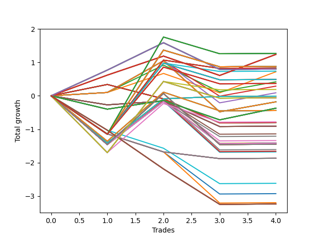

# Long HLT 502 
- Symbol: TSLA
- Date Range: 05/16/2022 - 05/17/2024
- Trading Period: 8:30-12:30
- Number of Trades: 4



| Id. | Name | Win Percent | Profit | Avg Profit / Trade | Avg Time / Trade | Std |      | Name | Win Percent | Profit | Avg Profit / Trade | Avg Time / Trade | Std |
| --- | ---- | ----------- | ------ | ------------------ | ---------------- | --- | ---- | ---- | ----------- | ------ | ------------------ | ---------------- | --- |
| | Sorted By <br> Profit | | | | | | | Sorted By <br> Win Percentage |||||
|0| TP-2.75 180m | 50.00 | 1.27 | 0.32 | 84:15 | 1.55 |     | TP-0.5 180m | 75.00 | 1.24 | 0.31 | 10:45 | 0.51 |
|1| TP-2.75 165m | 50.00 | 1.27 | 0.32 | 84:15 | 1.55 |     | TP-0.5 165m | 75.00 | 1.24 | 0.31 | 10:45 | 0.51 |
|2| TP-2.75 150m | 50.00 | 1.27 | 0.32 | 84:15 | 1.55 |     | TP-0.5 150m | 75.00 | 1.24 | 0.31 | 10:45 | 0.51 |
|3| TP-2.75 135m | 50.00 | 1.27 | 0.32 | 84:15 | 1.55 |     | TP-0.5 135m | 75.00 | 1.24 | 0.31 | 10:45 | 0.51 |
|4| TP-2.75 120m | 50.00 | 1.27 | 0.32 | 84:15 | 1.55 |     | TP-0.5 120m | 75.00 | 1.24 | 0.31 | 10:45 | 0.51 |
|5| TP-0.5 180m | 75.00 | 1.24 | 0.31 | 10:45 | 0.51 |     | TP-0.5 105m | 75.00 | 1.24 | 0.31 | 10:45 | 0.51 |
|6| TP-0.5 165m | 75.00 | 1.24 | 0.31 | 10:45 | 0.51 |     | TP-0.5 90m | 75.00 | 1.24 | 0.31 | 10:45 | 0.51 |
|7| TP-0.5 150m | 75.00 | 1.24 | 0.31 | 10:45 | 0.51 |     | TP-0.5 75m | 75.00 | 1.24 | 0.31 | 10:45 | 0.51 |
|8| TP-0.5 135m | 75.00 | 1.24 | 0.31 | 10:45 | 0.51 |     | TP-0.5 60m | 75.00 | 1.24 | 0.31 | 10:45 | 0.51 |
|9| TP-0.5 120m | 75.00 | 1.24 | 0.31 | 10:45 | 0.51 |     | TP-0.5 45m | 75.00 | 1.24 | 0.31 | 10:45 | 0.51 |
|10| TP-0.5 105m | 75.00 | 1.24 | 0.31 | 10:45 | 0.51 |     | TP-0.5 30m | 75.00 | 1.24 | 0.31 | 10:45 | 0.51 |
|11| TP-0.5 90m | 75.00 | 1.24 | 0.31 | 10:45 | 0.51 |     | TP-0.75 180m | 75.00 | 0.80 | 0.20 | 16:00 | 0.66 |
|12| TP-0.5 75m | 75.00 | 1.24 | 0.31 | 10:45 | 0.51 |     | TP-0.75 165m | 75.00 | 0.80 | 0.20 | 16:00 | 0.66 |
|13| TP-0.5 60m | 75.00 | 1.24 | 0.31 | 10:45 | 0.51 |     | TP-0.75 150m | 75.00 | 0.80 | 0.20 | 16:00 | 0.66 |
|14| TP-0.5 45m | 75.00 | 1.24 | 0.31 | 10:45 | 0.51 |     | TP-0.75 135m | 75.00 | 0.80 | 0.20 | 16:00 | 0.66 |
|15| TP-0.5 30m | 75.00 | 1.24 | 0.31 | 10:45 | 0.51 |     | TP-0.75 120m | 75.00 | 0.80 | 0.20 | 16:00 | 0.66 |
|16| TP-2.5 180m | 50.00 | 0.88 | 0.22 | 84:00 | 1.39 |     | TP-0.75 105m | 75.00 | 0.80 | 0.20 | 16:00 | 0.66 |
|17| TP-2.25 180m | 50.00 | 0.88 | 0.22 | 84:00 | 1.39 |     | TP-0.75 90m | 75.00 | 0.80 | 0.20 | 16:00 | 0.66 |
|18| TP-2.5 165m | 50.00 | 0.88 | 0.22 | 84:00 | 1.39 |     | TP-0.75 75m | 75.00 | 0.80 | 0.20 | 16:00 | 0.66 |
|19| TP-2.25 165m | 50.00 | 0.88 | 0.22 | 84:00 | 1.39 |     | TP-0.75 60m | 75.00 | 0.80 | 0.20 | 16:00 | 0.66 |
|20| TP-2.5 150m | 50.00 | 0.88 | 0.22 | 84:00 | 1.39 |     | TP-0.75 45m | 75.00 | 0.80 | 0.20 | 16:00 | 0.66 |
|21| TP-2.25 150m | 50.00 | 0.88 | 0.22 | 84:00 | 1.39 |     | TP-0.75 30m | 75.00 | 0.80 | 0.20 | 16:00 | 0.66 |
|22| TP-2.5 135m | 50.00 | 0.88 | 0.22 | 84:00 | 1.39 |     | TP-0.5 15m | 75.00 | 0.72 | 0.18 | 09:00 | 0.48 |
|23| TP-2.25 135m | 50.00 | 0.88 | 0.22 | 84:00 | 1.39 |     | TP-0.75 15m | 75.00 | 0.42 | 0.10 | 11:15 | 0.58 |
|24| TP-2.5 120m | 50.00 | 0.88 | 0.22 | 84:00 | 1.39 |     | TP-1 15m | 75.00 | 0.29 | 0.07 | 12:30 | 0.73 |
|25| TP-2.25 120m | 50.00 | 0.88 | 0.22 | 84:00 | 1.39 |     | TP-1.25 15m | 75.00 | 0.09 | 0.02 | 13:15 | 0.80 |
|26| TP-3 105m | 50.00 | 0.83 | 0.21 | 82:00 | 1.24 |     | TP-3 75m | 75.00 | -0.01 | -0.00 | 61:45 | 0.97 |
|27| TP-2.75 105m | 50.00 | 0.83 | 0.21 | 82:00 | 1.24 |     | TP-2.75 75m | 75.00 | -0.01 | -0.00 | 61:45 | 0.97 |
|28| TP-2.5 105m | 50.00 | 0.83 | 0.21 | 82:00 | 1.24 |     | TP-2.5 75m | 75.00 | -0.01 | -0.00 | 61:45 | 0.97 |
|29| TP-2.25 105m | 50.00 | 0.83 | 0.21 | 82:00 | 1.24 |     | TP-2.25 75m | 75.00 | -0.01 | -0.00 | 61:45 | 0.97 |
|30| TP-0.75 180m | 75.00 | 0.80 | 0.20 | 16:00 | 0.66 |     | TP-2 75m | 75.00 | -0.01 | -0.00 | 61:45 | 0.97 |
|31| TP-0.75 165m | 75.00 | 0.80 | 0.20 | 16:00 | 0.66 |     | TP-1.75 75m | 75.00 | -0.01 | -0.00 | 61:45 | 0.97 |
|32| TP-0.75 150m | 75.00 | 0.80 | 0.20 | 16:00 | 0.66 |     | TP-3 15m | 75.00 | -0.18 | -0.05 | 14:00 | 0.91 |
|33| TP-0.75 135m | 75.00 | 0.80 | 0.20 | 16:00 | 0.66 |     | TP-2.75 15m | 75.00 | -0.18 | -0.05 | 14:00 | 0.91 |
|34| TP-0.75 120m | 75.00 | 0.80 | 0.20 | 16:00 | 0.66 |     | TP-2.5 15m | 75.00 | -0.18 | -0.05 | 14:00 | 0.91 |
|35| TP-0.75 105m | 75.00 | 0.80 | 0.20 | 16:00 | 0.66 |     | TP-2.25 15m | 75.00 | -0.18 | -0.05 | 14:00 | 0.91 |
|36| TP-0.75 90m | 75.00 | 0.80 | 0.20 | 16:00 | 0.66 |     | TP-2 15m | 75.00 | -0.18 | -0.05 | 14:00 | 0.91 |
|37| TP-0.75 75m | 75.00 | 0.80 | 0.20 | 16:00 | 0.66 |     | TP-1.75 15m | 75.00 | -0.18 | -0.05 | 14:00 | 0.91 |
|38| TP-0.75 60m | 75.00 | 0.80 | 0.20 | 16:00 | 0.66 |     | TP-1.5 15m | 75.00 | -0.18 | -0.05 | 14:00 | 0.91 |
|39| TP-0.75 45m | 75.00 | 0.80 | 0.20 | 16:00 | 0.66 |     | TP-2.75 180m | 50.00 | 1.27 | 0.32 | 84:15 | 1.55 |
|40| TP-0.75 30m | 75.00 | 0.80 | 0.20 | 16:00 | 0.66 |     | TP-2.75 165m | 50.00 | 1.27 | 0.32 | 84:15 | 1.55 |
|41| TP-2 105m | 50.00 | 0.74 | 0.18 | 81:15 | 1.20 |     | TP-2.75 150m | 50.00 | 1.27 | 0.32 | 84:15 | 1.55 |
|42| TP-0.5 15m | 75.00 | 0.72 | 0.18 | 09:00 | 0.48 |     | TP-2.75 135m | 50.00 | 1.27 | 0.32 | 84:15 | 1.55 |
|43| TP-2 180m | 50.00 | 0.49 | 0.12 | 82:45 | 1.23 |     | TP-2.75 120m | 50.00 | 1.27 | 0.32 | 84:15 | 1.55 |
|44| TP-2 165m | 50.00 | 0.49 | 0.12 | 82:45 | 1.23 |     | TP-2.5 180m | 50.00 | 0.88 | 0.22 | 84:00 | 1.39 |
|45| TP-2 150m | 50.00 | 0.49 | 0.12 | 82:45 | 1.23 |     | TP-2.25 180m | 50.00 | 0.88 | 0.22 | 84:00 | 1.39 |
|46| TP-2 135m | 50.00 | 0.49 | 0.12 | 82:45 | 1.23 |     | TP-2.5 165m | 50.00 | 0.88 | 0.22 | 84:00 | 1.39 |
|47| TP-2 120m | 50.00 | 0.49 | 0.12 | 82:45 | 1.23 |     | TP-2.25 165m | 50.00 | 0.88 | 0.22 | 84:00 | 1.39 |
|48| TP-0.75 15m | 75.00 | 0.42 | 0.10 | 11:15 | 0.58 |     | TP-2.5 150m | 50.00 | 0.88 | 0.22 | 84:00 | 1.39 |
|49| TP-3 180m | 50.00 | 0.37 | 0.09 | 87:15 | 1.18 |     | TP-2.25 150m | 50.00 | 0.88 | 0.22 | 84:00 | 1.39 |
|50| TP-3 165m | 50.00 | 0.37 | 0.09 | 87:15 | 1.18 |     | TP-2.5 135m | 50.00 | 0.88 | 0.22 | 84:00 | 1.39 |
|51| TP-3 150m | 50.00 | 0.37 | 0.09 | 87:15 | 1.18 |     | TP-2.25 135m | 50.00 | 0.88 | 0.22 | 84:00 | 1.39 |
|52| TP-3 135m | 50.00 | 0.37 | 0.09 | 87:15 | 1.18 |     | TP-2.5 120m | 50.00 | 0.88 | 0.22 | 84:00 | 1.39 |
|53| TP-3 120m | 50.00 | 0.37 | 0.09 | 87:15 | 1.18 |     | TP-2.25 120m | 50.00 | 0.88 | 0.22 | 84:00 | 1.39 |
|54| TP-1 15m | 75.00 | 0.29 | 0.07 | 12:30 | 0.73 |     | TP-3 105m | 50.00 | 0.83 | 0.21 | 82:00 | 1.24 |
|55| TP-1.75 105m | 50.00 | 0.19 | 0.05 | 77:00 | 1.37 |     | TP-2.75 105m | 50.00 | 0.83 | 0.21 | 82:00 | 1.24 |
|56| TP-1.25 15m | 75.00 | 0.09 | 0.02 | 13:15 | 0.80 |     | TP-2.5 105m | 50.00 | 0.83 | 0.21 | 82:00 | 1.24 |
|57| TP-3 75m | 75.00 | -0.01 | -0.00 | 61:45 | 0.97 |     | TP-2.25 105m | 50.00 | 0.83 | 0.21 | 82:00 | 1.24 |
|58| TP-2.75 75m | 75.00 | -0.01 | -0.00 | 61:45 | 0.97 |     | TP-2 105m | 50.00 | 0.74 | 0.18 | 81:15 | 1.20 |
|59| TP-2.5 75m | 75.00 | -0.01 | -0.00 | 61:45 | 0.97 |     | TP-2 180m | 50.00 | 0.49 | 0.12 | 82:45 | 1.23 |
|60| TP-2.25 75m | 75.00 | -0.01 | -0.00 | 61:45 | 0.97 |     | TP-2 165m | 50.00 | 0.49 | 0.12 | 82:45 | 1.23 |
|61| TP-2 75m | 75.00 | -0.01 | -0.00 | 61:45 | 0.97 |     | TP-2 150m | 50.00 | 0.49 | 0.12 | 82:45 | 1.23 |
|62| TP-1.75 75m | 75.00 | -0.01 | -0.00 | 61:45 | 0.97 |     | TP-2 135m | 50.00 | 0.49 | 0.12 | 82:45 | 1.23 |
|63| TP-1.75 180m | 50.00 | -0.06 | -0.01 | 78:30 | 1.39 |     | TP-2 120m | 50.00 | 0.49 | 0.12 | 82:45 | 1.23 |
|64| TP-1.75 165m | 50.00 | -0.06 | -0.01 | 78:30 | 1.39 |     | TP-3 180m | 50.00 | 0.37 | 0.09 | 87:15 | 1.18 |
|65| TP-1.75 150m | 50.00 | -0.06 | -0.01 | 78:30 | 1.39 |     | TP-3 165m | 50.00 | 0.37 | 0.09 | 87:15 | 1.18 |
|66| TP-1.75 135m | 50.00 | -0.06 | -0.01 | 78:30 | 1.39 |     | TP-3 150m | 50.00 | 0.37 | 0.09 | 87:15 | 1.18 |
|67| TP-1.75 120m | 50.00 | -0.06 | -0.01 | 78:30 | 1.39 |     | TP-3 135m | 50.00 | 0.37 | 0.09 | 87:15 | 1.18 |
|68| TP-3 15m | 75.00 | -0.18 | -0.05 | 14:00 | 0.91 |     | TP-3 120m | 50.00 | 0.37 | 0.09 | 87:15 | 1.18 |
|69| TP-2.75 15m | 75.00 | -0.18 | -0.05 | 14:00 | 0.91 |     | TP-1.75 105m | 50.00 | 0.19 | 0.05 | 77:00 | 1.37 |
|70| TP-2.5 15m | 75.00 | -0.18 | -0.05 | 14:00 | 0.91 |     | TP-1.75 180m | 50.00 | -0.06 | -0.01 | 78:30 | 1.39 |
|71| TP-2.25 15m | 75.00 | -0.18 | -0.05 | 14:00 | 0.91 |     | TP-1.75 165m | 50.00 | -0.06 | -0.01 | 78:30 | 1.39 |
|72| TP-2 15m | 75.00 | -0.18 | -0.05 | 14:00 | 0.91 |     | TP-1.75 150m | 50.00 | -0.06 | -0.01 | 78:30 | 1.39 |
|73| TP-1.75 15m | 75.00 | -0.18 | -0.05 | 14:00 | 0.91 |     | TP-1.75 135m | 50.00 | -0.06 | -0.01 | 78:30 | 1.39 |
|74| TP-1.5 15m | 75.00 | -0.18 | -0.05 | 14:00 | 0.91 |     | TP-1.75 120m | 50.00 | -0.06 | -0.01 | 78:30 | 1.39 |
|75| TP-0.25 180m | 50.00 | -0.37 | -0.09 | 03:15 | 0.40 |     | TP-0.25 180m | 50.00 | -0.37 | -0.09 | 03:15 | 0.40 |
|76| TP-0.25 165m | 50.00 | -0.37 | -0.09 | 03:15 | 0.40 |     | TP-0.25 165m | 50.00 | -0.37 | -0.09 | 03:15 | 0.40 |
|77| TP-0.25 150m | 50.00 | -0.37 | -0.09 | 03:15 | 0.40 |     | TP-0.25 150m | 50.00 | -0.37 | -0.09 | 03:15 | 0.40 |
|78| TP-0.25 135m | 50.00 | -0.37 | -0.09 | 03:15 | 0.40 |     | TP-0.25 135m | 50.00 | -0.37 | -0.09 | 03:15 | 0.40 |
|79| TP-0.25 120m | 50.00 | -0.37 | -0.09 | 03:15 | 0.40 |     | TP-0.25 120m | 50.00 | -0.37 | -0.09 | 03:15 | 0.40 |
|80| TP-0.25 105m | 50.00 | -0.37 | -0.09 | 03:15 | 0.40 |     | TP-0.25 105m | 50.00 | -0.37 | -0.09 | 03:15 | 0.40 |
|81| TP-0.25 90m | 50.00 | -0.37 | -0.09 | 03:15 | 0.40 |     | TP-0.25 90m | 50.00 | -0.37 | -0.09 | 03:15 | 0.40 |
|82| TP-0.25 75m | 50.00 | -0.37 | -0.09 | 03:15 | 0.40 |     | TP-0.25 75m | 50.00 | -0.37 | -0.09 | 03:15 | 0.40 |
|83| TP-0.25 60m | 50.00 | -0.37 | -0.09 | 03:15 | 0.40 |     | TP-0.25 60m | 50.00 | -0.37 | -0.09 | 03:15 | 0.40 |
|84| TP-0.25 45m | 50.00 | -0.37 | -0.09 | 03:15 | 0.40 |     | TP-0.25 45m | 50.00 | -0.37 | -0.09 | 03:15 | 0.40 |
|85| TP-0.25 30m | 50.00 | -0.37 | -0.09 | 03:15 | 0.40 |     | TP-0.25 30m | 50.00 | -0.37 | -0.09 | 03:15 | 0.40 |
|86| TP-0.25 15m | 50.00 | -0.37 | -0.09 | 03:15 | 0.40 |     | TP-0.25 15m | 50.00 | -0.37 | -0.09 | 03:15 | 0.40 |
|87| TP-3 90m | 50.00 | -0.44 | -0.11 | 73:00 | 1.03 |     | TP-3 90m | 50.00 | -0.44 | -0.11 | 73:00 | 1.03 |
|88| TP-2.75 90m | 50.00 | -0.44 | -0.11 | 73:00 | 1.03 |     | TP-2.75 90m | 50.00 | -0.44 | -0.11 | 73:00 | 1.03 |
|89| TP-2.5 90m | 50.00 | -0.44 | -0.11 | 73:00 | 1.03 |     | TP-2.5 90m | 50.00 | -0.44 | -0.11 | 73:00 | 1.03 |
|90| TP-2.25 90m | 50.00 | -0.44 | -0.11 | 73:00 | 1.03 |     | TP-2.25 90m | 50.00 | -0.44 | -0.11 | 73:00 | 1.03 |
|91| TP-2 90m | 50.00 | -0.44 | -0.11 | 73:00 | 1.03 |     | TP-2 90m | 50.00 | -0.44 | -0.11 | 73:00 | 1.03 |
|92| TP-1.75 90m | 50.00 | -0.78 | -0.19 | 70:15 | 1.14 |     | TP-1.75 90m | 50.00 | -0.78 | -0.19 | 70:15 | 1.14 |
|93| TP-3 30m | 50.00 | -0.80 | -0.20 | 28:00 | 0.41 |     | TP-3 30m | 50.00 | -0.80 | -0.20 | 28:00 | 0.41 |
|94| TP-2.75 30m | 50.00 | -0.80 | -0.20 | 28:00 | 0.41 |     | TP-2.75 30m | 50.00 | -0.80 | -0.20 | 28:00 | 0.41 |
|95| TP-2.5 30m | 50.00 | -0.80 | -0.20 | 28:00 | 0.41 |     | TP-2.5 30m | 50.00 | -0.80 | -0.20 | 28:00 | 0.41 |
|96| TP-2.25 30m | 50.00 | -0.80 | -0.20 | 28:00 | 0.41 |     | TP-2.25 30m | 50.00 | -0.80 | -0.20 | 28:00 | 0.41 |
|97| TP-2 30m | 50.00 | -0.80 | -0.20 | 28:00 | 0.41 |     | TP-2 30m | 50.00 | -0.80 | -0.20 | 28:00 | 0.41 |
|98| TP-1.75 30m | 50.00 | -0.80 | -0.20 | 28:00 | 0.41 |     | TP-1.75 30m | 50.00 | -0.80 | -0.20 | 28:00 | 0.41 |
|99| TP-3 45m | 50.00 | -0.91 | -0.23 | 39:15 | 0.34 |     | TP-3 45m | 50.00 | -0.91 | -0.23 | 39:15 | 0.34 |
|100| TP-2.75 45m | 50.00 | -0.91 | -0.23 | 39:15 | 0.34 |     | TP-2.75 45m | 50.00 | -0.91 | -0.23 | 39:15 | 0.34 |
|101| TP-2.5 45m | 50.00 | -0.91 | -0.23 | 39:15 | 0.34 |     | TP-2.5 45m | 50.00 | -0.91 | -0.23 | 39:15 | 0.34 |
|102| TP-2.25 45m | 50.00 | -0.91 | -0.23 | 39:15 | 0.34 |     | TP-2.25 45m | 50.00 | -0.91 | -0.23 | 39:15 | 0.34 |
|103| TP-2 45m | 50.00 | -0.91 | -0.23 | 39:15 | 0.34 |     | TP-2 45m | 50.00 | -0.91 | -0.23 | 39:15 | 0.34 |
|104| TP-1.75 45m | 50.00 | -0.91 | -0.23 | 39:15 | 0.34 |     | TP-1.75 45m | 50.00 | -0.91 | -0.23 | 39:15 | 0.34 |
|105| TP-1 30m | 50.00 | -1.14 | -0.29 | 22:45 | 0.52 |     | TP-1 30m | 50.00 | -1.14 | -0.29 | 22:45 | 0.52 |
|106| TP-1 45m | 50.00 | -1.21 | -0.30 | 30:15 | 0.46 |     | TP-1 45m | 50.00 | -1.21 | -0.30 | 30:15 | 0.46 |
|107| TP-1.25 30m | 50.00 | -1.34 | -0.34 | 23:30 | 0.60 |     | TP-1.25 30m | 50.00 | -1.34 | -0.34 | 23:30 | 0.60 |
|108| TP-1.25 45m | 50.00 | -1.41 | -0.35 | 31:00 | 0.54 |     | TP-1.25 45m | 50.00 | -1.41 | -0.35 | 31:00 | 0.54 |
|109| TP-1.25 180m | 50.00 | -1.42 | -0.36 | 43:00 | 1.10 |     | TP-1.25 180m | 50.00 | -1.42 | -0.36 | 43:00 | 1.10 |
|110| TP-1.25 165m | 50.00 | -1.42 | -0.36 | 43:00 | 1.10 |     | TP-1.25 165m | 50.00 | -1.42 | -0.36 | 43:00 | 1.10 |
|111| TP-1.25 150m | 50.00 | -1.42 | -0.36 | 43:00 | 1.10 |     | TP-1.25 150m | 50.00 | -1.42 | -0.36 | 43:00 | 1.10 |
|112| TP-1.25 135m | 50.00 | -1.42 | -0.36 | 43:00 | 1.10 |     | TP-1.25 135m | 50.00 | -1.42 | -0.36 | 43:00 | 1.10 |
|113| TP-1.25 120m | 50.00 | -1.42 | -0.36 | 43:00 | 1.10 |     | TP-1.25 120m | 50.00 | -1.42 | -0.36 | 43:00 | 1.10 |
|114| TP-1.25 105m | 50.00 | -1.42 | -0.36 | 43:00 | 1.10 |     | TP-1.25 105m | 50.00 | -1.42 | -0.36 | 43:00 | 1.10 |
|115| TP-1.25 90m | 50.00 | -1.42 | -0.36 | 43:00 | 1.10 |     | TP-1.25 90m | 50.00 | -1.42 | -0.36 | 43:00 | 1.10 |
|116| TP-1.25 75m | 50.00 | -1.42 | -0.36 | 43:00 | 1.10 |     | TP-1.25 75m | 50.00 | -1.42 | -0.36 | 43:00 | 1.10 |
|117| TP-1.5 180m | 50.00 | -1.45 | -0.36 | 44:30 | 1.25 |     | TP-1.5 180m | 50.00 | -1.45 | -0.36 | 44:30 | 1.25 |
|118| TP-1.5 165m | 50.00 | -1.45 | -0.36 | 44:30 | 1.25 |     | TP-1.5 165m | 50.00 | -1.45 | -0.36 | 44:30 | 1.25 |
|119| TP-1.5 150m | 50.00 | -1.45 | -0.36 | 44:30 | 1.25 |     | TP-1.5 150m | 50.00 | -1.45 | -0.36 | 44:30 | 1.25 |
|120| TP-1.5 135m | 50.00 | -1.45 | -0.36 | 44:30 | 1.25 |     | TP-1.5 135m | 50.00 | -1.45 | -0.36 | 44:30 | 1.25 |
|121| TP-1.5 120m | 50.00 | -1.45 | -0.36 | 44:30 | 1.25 |     | TP-1.5 120m | 50.00 | -1.45 | -0.36 | 44:30 | 1.25 |
|122| TP-1.5 105m | 50.00 | -1.45 | -0.36 | 44:30 | 1.25 |     | TP-1.5 105m | 50.00 | -1.45 | -0.36 | 44:30 | 1.25 |
|123| TP-1.5 90m | 50.00 | -1.45 | -0.36 | 44:30 | 1.25 |     | TP-1.5 90m | 50.00 | -1.45 | -0.36 | 44:30 | 1.25 |
|124| TP-1.5 30m | 50.00 | -1.61 | -0.40 | 24:15 | 0.71 |     | TP-1.5 30m | 50.00 | -1.61 | -0.40 | 24:15 | 0.71 |
|125| TP-1.5 75m | 50.00 | -1.66 | -0.42 | 44:00 | 1.18 |     | TP-1.5 75m | 50.00 | -1.66 | -0.42 | 44:00 | 1.18 |
|126| TP-1.5 45m | 50.00 | -1.68 | -0.42 | 31:45 | 0.66 |     | TP-1.5 45m | 50.00 | -1.68 | -0.42 | 31:45 | 0.66 |
|127| TP-3 60m | 25.00 | -1.87 | -0.47 | 50:30 | 0.44 |     | TP-3 60m | 25.00 | -1.87 | -0.47 | 50:30 | 0.44 |
|128| TP-2.75 60m | 25.00 | -1.87 | -0.47 | 50:30 | 0.44 |     | TP-2.75 60m | 25.00 | -1.87 | -0.47 | 50:30 | 0.44 |
|129| TP-2.5 60m | 25.00 | -1.87 | -0.47 | 50:30 | 0.44 |     | TP-2.5 60m | 25.00 | -1.87 | -0.47 | 50:30 | 0.44 |
|130| TP-2.25 60m | 25.00 | -1.87 | -0.47 | 50:30 | 0.44 |     | TP-2.25 60m | 25.00 | -1.87 | -0.47 | 50:30 | 0.44 |
|131| TP-2 60m | 25.00 | -1.87 | -0.47 | 50:30 | 0.44 |     | TP-2 60m | 25.00 | -1.87 | -0.47 | 50:30 | 0.44 |
|132| TP-1.75 60m | 25.00 | -1.87 | -0.47 | 50:30 | 0.44 |     | TP-1.75 60m | 25.00 | -1.87 | -0.47 | 50:30 | 0.44 |
|133| TP-1 60m | 25.00 | -2.62 | -0.66 | 35:45 | 0.44 |     | TP-1 60m | 25.00 | -2.62 | -0.66 | 35:45 | 0.44 |
|134| TP-1.25 60m | 25.00 | -2.93 | -0.73 | 38:30 | 0.51 |     | TP-1.25 60m | 25.00 | -2.93 | -0.73 | 38:30 | 0.51 |
|135| TP-1.5 60m | 25.00 | -3.20 | -0.80 | 39:15 | 0.59 |     | TP-1.5 60m | 25.00 | -3.20 | -0.80 | 39:15 | 0.59 |
|136| TP-1 180m | 25.00 | -3.24 | -0.81 | 36:15 | 0.48 |     | TP-1 180m | 25.00 | -3.24 | -0.81 | 36:15 | 0.48 |
|137| TP-1 165m | 25.00 | -3.24 | -0.81 | 36:15 | 0.48 |     | TP-1 165m | 25.00 | -3.24 | -0.81 | 36:15 | 0.48 |
|138| TP-1 150m | 25.00 | -3.24 | -0.81 | 36:15 | 0.48 |     | TP-1 150m | 25.00 | -3.24 | -0.81 | 36:15 | 0.48 |
|139| TP-1 135m | 25.00 | -3.24 | -0.81 | 36:15 | 0.48 |     | TP-1 135m | 25.00 | -3.24 | -0.81 | 36:15 | 0.48 |
|140| TP-1 120m | 25.00 | -3.24 | -0.81 | 36:15 | 0.48 |     | TP-1 120m | 25.00 | -3.24 | -0.81 | 36:15 | 0.48 |
|141| TP-1 105m | 25.00 | -3.24 | -0.81 | 36:15 | 0.48 |     | TP-1 105m | 25.00 | -3.24 | -0.81 | 36:15 | 0.48 |
|142| TP-1 90m | 25.00 | -3.24 | -0.81 | 36:15 | 0.48 |     | TP-1 90m | 25.00 | -3.24 | -0.81 | 36:15 | 0.48 |
|143| TP-1 75m | 25.00 | -3.24 | -0.81 | 36:15 | 0.48 |     | TP-1 75m | 25.00 | -3.24 | -0.81 | 36:15 | 0.48 |

### Test TP-0.25 15m
* Take Profit of 0.25 Point
* 0.25 Stoploss
* Results:
```
Total Trades: 4
Percent Up: 50.00
Percent Down: 50.00
Total Points Moved Up: -0.37
Potential Profit: -185.00
Total Points Ups: 0.61 Count Ups: 2
Total Points Downs: -0.98 Count Downs: 2
```

<details><summary>Trades</summary>

<code>In: 2022-07-25 11:15:00		Out: 2022-07-25 11:17:00		Total Position Time: 02:00		Total Move Up: -0.40		Total to Date: -0.40</code> <br />
<code>In: 2023-03-15 10:15:00		Out: 2023-03-15 10:17:00		Total Position Time: 02:00		Total Move Up: 0.26		Total to Date: -0.14</code> <br />
<code>In: 2023-09-26 11:00:00		Out: 2023-09-26 11:02:00		Total Position Time: 02:00		Total Move Up: -0.58		Total to Date: -0.72</code> <br />
<code>In: 2023-12-28 12:25:00		Out: 2023-12-28 12:32:00		Total Position Time: 07:00		Total Move Up: 0.35		Total to Date: -0.37</code> <br />


</details>

### Test TP-0.5 15m
* Take Profit of 0.5 Point
* 0.5 Stoploss
* Results:
```
Total Trades: 4
Percent Up: 75.00
Percent Down: 25.00
Total Points Moved Up: 0.72
Potential Profit: 360.00
Total Points Ups: 1.30 Count Ups: 3
Total Points Downs: -0.58 Count Downs: 1
```

<details><summary>Trades</summary>

<code>In: 2022-07-25 11:15:00		Out: 2022-07-25 11:29:00		Total Position Time: 14:00		Total Move Up: 0.10		Total to Date: 0.10</code> <br />
<code>In: 2023-03-15 10:15:00		Out: 2023-03-15 10:27:00		Total Position Time: 12:00		Total Move Up: 0.57		Total to Date: 0.67</code> <br />
<code>In: 2023-09-26 11:00:00		Out: 2023-09-26 11:02:00		Total Position Time: 02:00		Total Move Up: -0.58		Total to Date: 0.09</code> <br />
<code>In: 2023-12-28 12:25:00		Out: 2023-12-28 12:33:00		Total Position Time: 08:00		Total Move Up: 0.63		Total to Date: 0.72</code> <br />


</details>

### Test TP-0.75 15m
* Take Profit of 0.75 Point
* 0.75 Stoploss
* Results:
```
Total Trades: 4
Percent Up: 75.00
Percent Down: 25.00
Total Points Moved Up: 0.42
Potential Profit: 210.00
Total Points Ups: 1.22 Count Ups: 3
Total Points Downs: -0.80 Count Downs: 1
```

<details><summary>Trades</summary>

<code>In: 2022-07-25 11:15:00		Out: 2022-07-25 11:29:00		Total Position Time: 14:00		Total Move Up: 0.10		Total to Date: 0.10</code> <br />
<code>In: 2023-03-15 10:15:00		Out: 2023-03-15 10:28:00		Total Position Time: 13:00		Total Move Up: 0.82		Total to Date: 0.92</code> <br />
<code>In: 2023-09-26 11:00:00		Out: 2023-09-26 11:04:00		Total Position Time: 04:00		Total Move Up: -0.80		Total to Date: 0.12</code> <br />
<code>In: 2023-12-28 12:25:00		Out: 2023-12-28 12:39:00		Total Position Time: 14:00		Total Move Up: 0.30		Total to Date: 0.42</code> <br />


</details>

### Test TP-1 15m
* Take Profit of 1 Point
* 1 Stoploss
* Results:
```
Total Trades: 4
Percent Up: 75.00
Percent Down: 25.00
Total Points Moved Up: 0.29
Potential Profit: 145.00
Total Points Ups: 1.35 Count Ups: 3
Total Points Downs: -1.06 Count Downs: 1
```

<details><summary>Trades</summary>

<code>In: 2022-07-25 11:15:00		Out: 2022-07-25 11:29:00		Total Position Time: 14:00		Total Move Up: 0.10		Total to Date: 0.10</code> <br />
<code>In: 2023-03-15 10:15:00		Out: 2023-03-15 10:29:00		Total Position Time: 14:00		Total Move Up: 0.95		Total to Date: 1.05</code> <br />
<code>In: 2023-09-26 11:00:00		Out: 2023-09-26 11:08:00		Total Position Time: 08:00		Total Move Up: -1.06		Total to Date: -0.01</code> <br />
<code>In: 2023-12-28 12:25:00		Out: 2023-12-28 12:39:00		Total Position Time: 14:00		Total Move Up: 0.30		Total to Date: 0.29</code> <br />


</details>

### Test TP-1.25 15m
* Take Profit of 1.25 Point
* 1.25 Stoploss
* Results:
```
Total Trades: 4
Percent Up: 75.00
Percent Down: 25.00
Total Points Moved Up: 0.09
Potential Profit: 45.00
Total Points Ups: 1.35 Count Ups: 3
Total Points Downs: -1.26 Count Downs: 1
```

<details><summary>Trades</summary>

<code>In: 2022-07-25 11:15:00		Out: 2022-07-25 11:29:00		Total Position Time: 14:00		Total Move Up: 0.10		Total to Date: 0.10</code> <br />
<code>In: 2023-03-15 10:15:00		Out: 2023-03-15 10:29:00		Total Position Time: 14:00		Total Move Up: 0.95		Total to Date: 1.05</code> <br />
<code>In: 2023-09-26 11:00:00		Out: 2023-09-26 11:11:00		Total Position Time: 11:00		Total Move Up: -1.26		Total to Date: -0.21</code> <br />
<code>In: 2023-12-28 12:25:00		Out: 2023-12-28 12:39:00		Total Position Time: 14:00		Total Move Up: 0.30		Total to Date: 0.09</code> <br />


</details>

### Test TP-1.5 15m
* Take Profit of 1.5 Point
* 1.5 Stoploss
* Results:
```
Total Trades: 4
Percent Up: 75.00
Percent Down: 25.00
Total Points Moved Up: -0.18
Potential Profit: -90.00
Total Points Ups: 1.35 Count Ups: 3
Total Points Downs: -1.53 Count Downs: 1
```

<details><summary>Trades</summary>

<code>In: 2022-07-25 11:15:00		Out: 2022-07-25 11:29:00		Total Position Time: 14:00		Total Move Up: 0.10		Total to Date: 0.10</code> <br />
<code>In: 2023-03-15 10:15:00		Out: 2023-03-15 10:29:00		Total Position Time: 14:00		Total Move Up: 0.95		Total to Date: 1.05</code> <br />
<code>In: 2023-09-26 11:00:00		Out: 2023-09-26 11:14:00		Total Position Time: 14:00		Total Move Up: -1.53		Total to Date: -0.48</code> <br />
<code>In: 2023-12-28 12:25:00		Out: 2023-12-28 12:39:00		Total Position Time: 14:00		Total Move Up: 0.30		Total to Date: -0.18</code> <br />


</details>

### Test TP-1.75 15m
* Take Profit of 1.75 Point
* 1.75 Stoploss
* Results:
```
Total Trades: 4
Percent Up: 75.00
Percent Down: 25.00
Total Points Moved Up: -0.18
Potential Profit: -90.00
Total Points Ups: 1.35 Count Ups: 3
Total Points Downs: -1.53 Count Downs: 1
```

<details><summary>Trades</summary>

<code>In: 2022-07-25 11:15:00		Out: 2022-07-25 11:29:00		Total Position Time: 14:00		Total Move Up: 0.10		Total to Date: 0.10</code> <br />
<code>In: 2023-03-15 10:15:00		Out: 2023-03-15 10:29:00		Total Position Time: 14:00		Total Move Up: 0.95		Total to Date: 1.05</code> <br />
<code>In: 2023-09-26 11:00:00		Out: 2023-09-26 11:14:00		Total Position Time: 14:00		Total Move Up: -1.53		Total to Date: -0.48</code> <br />
<code>In: 2023-12-28 12:25:00		Out: 2023-12-28 12:39:00		Total Position Time: 14:00		Total Move Up: 0.30		Total to Date: -0.18</code> <br />


</details>

### Test TP-2 15m
* Take Profit of 2 Point
* 2 Stoploss
* Results:
```
Total Trades: 4
Percent Up: 75.00
Percent Down: 25.00
Total Points Moved Up: -0.18
Potential Profit: -90.00
Total Points Ups: 1.35 Count Ups: 3
Total Points Downs: -1.53 Count Downs: 1
```

<details><summary>Trades</summary>

<code>In: 2022-07-25 11:15:00		Out: 2022-07-25 11:29:00		Total Position Time: 14:00		Total Move Up: 0.10		Total to Date: 0.10</code> <br />
<code>In: 2023-03-15 10:15:00		Out: 2023-03-15 10:29:00		Total Position Time: 14:00		Total Move Up: 0.95		Total to Date: 1.05</code> <br />
<code>In: 2023-09-26 11:00:00		Out: 2023-09-26 11:14:00		Total Position Time: 14:00		Total Move Up: -1.53		Total to Date: -0.48</code> <br />
<code>In: 2023-12-28 12:25:00		Out: 2023-12-28 12:39:00		Total Position Time: 14:00		Total Move Up: 0.30		Total to Date: -0.18</code> <br />


</details>

### Test TP-2.25 15m
* Take Profit of 2.25 Point
* 2.25 Stoploss
* Results:
```
Total Trades: 4
Percent Up: 75.00
Percent Down: 25.00
Total Points Moved Up: -0.18
Potential Profit: -90.00
Total Points Ups: 1.35 Count Ups: 3
Total Points Downs: -1.53 Count Downs: 1
```

<details><summary>Trades</summary>

<code>In: 2022-07-25 11:15:00		Out: 2022-07-25 11:29:00		Total Position Time: 14:00		Total Move Up: 0.10		Total to Date: 0.10</code> <br />
<code>In: 2023-03-15 10:15:00		Out: 2023-03-15 10:29:00		Total Position Time: 14:00		Total Move Up: 0.95		Total to Date: 1.05</code> <br />
<code>In: 2023-09-26 11:00:00		Out: 2023-09-26 11:14:00		Total Position Time: 14:00		Total Move Up: -1.53		Total to Date: -0.48</code> <br />
<code>In: 2023-12-28 12:25:00		Out: 2023-12-28 12:39:00		Total Position Time: 14:00		Total Move Up: 0.30		Total to Date: -0.18</code> <br />


</details>

### Test TP-2.5 15m
* Take Profit of 2.5 Point
* 2.5 Stoploss
* Results:
```
Total Trades: 4
Percent Up: 75.00
Percent Down: 25.00
Total Points Moved Up: -0.18
Potential Profit: -90.00
Total Points Ups: 1.35 Count Ups: 3
Total Points Downs: -1.53 Count Downs: 1
```

<details><summary>Trades</summary>

<code>In: 2022-07-25 11:15:00		Out: 2022-07-25 11:29:00		Total Position Time: 14:00		Total Move Up: 0.10		Total to Date: 0.10</code> <br />
<code>In: 2023-03-15 10:15:00		Out: 2023-03-15 10:29:00		Total Position Time: 14:00		Total Move Up: 0.95		Total to Date: 1.05</code> <br />
<code>In: 2023-09-26 11:00:00		Out: 2023-09-26 11:14:00		Total Position Time: 14:00		Total Move Up: -1.53		Total to Date: -0.48</code> <br />
<code>In: 2023-12-28 12:25:00		Out: 2023-12-28 12:39:00		Total Position Time: 14:00		Total Move Up: 0.30		Total to Date: -0.18</code> <br />


</details>

### Test TP-2.75 15m
* Take Profit of 2.75 Point
* 2.75 Stoploss
* Results:
```
Total Trades: 4
Percent Up: 75.00
Percent Down: 25.00
Total Points Moved Up: -0.18
Potential Profit: -90.00
Total Points Ups: 1.35 Count Ups: 3
Total Points Downs: -1.53 Count Downs: 1
```

<details><summary>Trades</summary>

<code>In: 2022-07-25 11:15:00		Out: 2022-07-25 11:29:00		Total Position Time: 14:00		Total Move Up: 0.10		Total to Date: 0.10</code> <br />
<code>In: 2023-03-15 10:15:00		Out: 2023-03-15 10:29:00		Total Position Time: 14:00		Total Move Up: 0.95		Total to Date: 1.05</code> <br />
<code>In: 2023-09-26 11:00:00		Out: 2023-09-26 11:14:00		Total Position Time: 14:00		Total Move Up: -1.53		Total to Date: -0.48</code> <br />
<code>In: 2023-12-28 12:25:00		Out: 2023-12-28 12:39:00		Total Position Time: 14:00		Total Move Up: 0.30		Total to Date: -0.18</code> <br />


</details>

### Test TP-3 15m
* Take Profit of 3 Point
* 3 Stoploss
* Results:
```
Total Trades: 4
Percent Up: 75.00
Percent Down: 25.00
Total Points Moved Up: -0.18
Potential Profit: -90.00
Total Points Ups: 1.35 Count Ups: 3
Total Points Downs: -1.53 Count Downs: 1
```

<details><summary>Trades</summary>

<code>In: 2022-07-25 11:15:00		Out: 2022-07-25 11:29:00		Total Position Time: 14:00		Total Move Up: 0.10		Total to Date: 0.10</code> <br />
<code>In: 2023-03-15 10:15:00		Out: 2023-03-15 10:29:00		Total Position Time: 14:00		Total Move Up: 0.95		Total to Date: 1.05</code> <br />
<code>In: 2023-09-26 11:00:00		Out: 2023-09-26 11:14:00		Total Position Time: 14:00		Total Move Up: -1.53		Total to Date: -0.48</code> <br />
<code>In: 2023-12-28 12:25:00		Out: 2023-12-28 12:39:00		Total Position Time: 14:00		Total Move Up: 0.30		Total to Date: -0.18</code> <br />


</details>

### Test TP-0.25 30m
* Take Profit of 0.25 Point
* 0.25 Stoploss
* Results:
```
Total Trades: 4
Percent Up: 50.00
Percent Down: 50.00
Total Points Moved Up: -0.37
Potential Profit: -185.00
Total Points Ups: 0.61 Count Ups: 2
Total Points Downs: -0.98 Count Downs: 2
```

<details><summary>Trades</summary>

<code>In: 2022-07-25 11:15:00		Out: 2022-07-25 11:17:00		Total Position Time: 02:00		Total Move Up: -0.40		Total to Date: -0.40</code> <br />
<code>In: 2023-03-15 10:15:00		Out: 2023-03-15 10:17:00		Total Position Time: 02:00		Total Move Up: 0.26		Total to Date: -0.14</code> <br />
<code>In: 2023-09-26 11:00:00		Out: 2023-09-26 11:02:00		Total Position Time: 02:00		Total Move Up: -0.58		Total to Date: -0.72</code> <br />
<code>In: 2023-12-28 12:25:00		Out: 2023-12-28 12:32:00		Total Position Time: 07:00		Total Move Up: 0.35		Total to Date: -0.37</code> <br />


</details>

### Test TP-0.5 30m
* Take Profit of 0.5 Point
* 0.5 Stoploss
* Results:
```
Total Trades: 4
Percent Up: 75.00
Percent Down: 25.00
Total Points Moved Up: 1.24
Potential Profit: 620.00
Total Points Ups: 1.82 Count Ups: 3
Total Points Downs: -0.58 Count Downs: 1
```

<details><summary>Trades</summary>

<code>In: 2022-07-25 11:15:00		Out: 2022-07-25 11:36:00		Total Position Time: 21:00		Total Move Up: 0.62		Total to Date: 0.62</code> <br />
<code>In: 2023-03-15 10:15:00		Out: 2023-03-15 10:27:00		Total Position Time: 12:00		Total Move Up: 0.57		Total to Date: 1.19</code> <br />
<code>In: 2023-09-26 11:00:00		Out: 2023-09-26 11:02:00		Total Position Time: 02:00		Total Move Up: -0.58		Total to Date: 0.61</code> <br />
<code>In: 2023-12-28 12:25:00		Out: 2023-12-28 12:33:00		Total Position Time: 08:00		Total Move Up: 0.63		Total to Date: 1.24</code> <br />


</details>

### Test TP-0.75 30m
* Take Profit of 0.75 Point
* 0.75 Stoploss
* Results:
```
Total Trades: 4
Percent Up: 75.00
Percent Down: 25.00
Total Points Moved Up: 0.80
Potential Profit: 400.00
Total Points Ups: 1.60 Count Ups: 3
Total Points Downs: -0.80 Count Downs: 1
```

<details><summary>Trades</summary>

<code>In: 2022-07-25 11:15:00		Out: 2022-07-25 11:37:00		Total Position Time: 22:00		Total Move Up: 0.77		Total to Date: 0.77</code> <br />
<code>In: 2023-03-15 10:15:00		Out: 2023-03-15 10:28:00		Total Position Time: 13:00		Total Move Up: 0.82		Total to Date: 1.59</code> <br />
<code>In: 2023-09-26 11:00:00		Out: 2023-09-26 11:04:00		Total Position Time: 04:00		Total Move Up: -0.80		Total to Date: 0.79</code> <br />
<code>In: 2023-12-28 12:25:00		Out: 2023-12-28 12:50:00		Total Position Time: 25:00		Total Move Up: 0.01		Total to Date: 0.80</code> <br />


</details>

### Test TP-1 30m
* Take Profit of 1 Point
* 1 Stoploss
* Results:
```
Total Trades: 4
Percent Up: 50.00
Percent Down: 50.00
Total Points Moved Up: -1.14
Potential Profit: -570.00
Total Points Ups: 0.35 Count Ups: 2
Total Points Downs: -1.49 Count Downs: 2
```

<details><summary>Trades</summary>

<code>In: 2022-07-25 11:15:00		Out: 2022-07-25 11:44:00		Total Position Time: 29:00		Total Move Up: 0.34		Total to Date: 0.34</code> <br />
<code>In: 2023-03-15 10:15:00		Out: 2023-03-15 10:44:00		Total Position Time: 29:00		Total Move Up: -0.43		Total to Date: -0.09</code> <br />
<code>In: 2023-09-26 11:00:00		Out: 2023-09-26 11:08:00		Total Position Time: 08:00		Total Move Up: -1.06		Total to Date: -1.15</code> <br />
<code>In: 2023-12-28 12:25:00		Out: 2023-12-28 12:50:00		Total Position Time: 25:00		Total Move Up: 0.01		Total to Date: -1.14</code> <br />


</details>

### Test TP-1.25 30m
* Take Profit of 1.25 Point
* 1.25 Stoploss
* Results:
```
Total Trades: 4
Percent Up: 50.00
Percent Down: 50.00
Total Points Moved Up: -1.34
Potential Profit: -670.00
Total Points Ups: 0.35 Count Ups: 2
Total Points Downs: -1.69 Count Downs: 2
```

<details><summary>Trades</summary>

<code>In: 2022-07-25 11:15:00		Out: 2022-07-25 11:44:00		Total Position Time: 29:00		Total Move Up: 0.34		Total to Date: 0.34</code> <br />
<code>In: 2023-03-15 10:15:00		Out: 2023-03-15 10:44:00		Total Position Time: 29:00		Total Move Up: -0.43		Total to Date: -0.09</code> <br />
<code>In: 2023-09-26 11:00:00		Out: 2023-09-26 11:11:00		Total Position Time: 11:00		Total Move Up: -1.26		Total to Date: -1.35</code> <br />
<code>In: 2023-12-28 12:25:00		Out: 2023-12-28 12:50:00		Total Position Time: 25:00		Total Move Up: 0.01		Total to Date: -1.34</code> <br />


</details>

### Test TP-1.5 30m
* Take Profit of 1.5 Point
* 1.5 Stoploss
* Results:
```
Total Trades: 4
Percent Up: 50.00
Percent Down: 50.00
Total Points Moved Up: -1.61
Potential Profit: -805.00
Total Points Ups: 0.35 Count Ups: 2
Total Points Downs: -1.96 Count Downs: 2
```

<details><summary>Trades</summary>

<code>In: 2022-07-25 11:15:00		Out: 2022-07-25 11:44:00		Total Position Time: 29:00		Total Move Up: 0.34		Total to Date: 0.34</code> <br />
<code>In: 2023-03-15 10:15:00		Out: 2023-03-15 10:44:00		Total Position Time: 29:00		Total Move Up: -0.43		Total to Date: -0.09</code> <br />
<code>In: 2023-09-26 11:00:00		Out: 2023-09-26 11:14:00		Total Position Time: 14:00		Total Move Up: -1.53		Total to Date: -1.62</code> <br />
<code>In: 2023-12-28 12:25:00		Out: 2023-12-28 12:50:00		Total Position Time: 25:00		Total Move Up: 0.01		Total to Date: -1.61</code> <br />


</details>

### Test TP-1.75 30m
* Take Profit of 1.75 Point
* 1.75 Stoploss
* Results:
```
Total Trades: 4
Percent Up: 50.00
Percent Down: 50.00
Total Points Moved Up: -0.80
Potential Profit: -400.00
Total Points Ups: 0.35 Count Ups: 2
Total Points Downs: -1.15 Count Downs: 2
```

<details><summary>Trades</summary>

<code>In: 2022-07-25 11:15:00		Out: 2022-07-25 11:44:00		Total Position Time: 29:00		Total Move Up: 0.34		Total to Date: 0.34</code> <br />
<code>In: 2023-03-15 10:15:00		Out: 2023-03-15 10:44:00		Total Position Time: 29:00		Total Move Up: -0.43		Total to Date: -0.09</code> <br />
<code>In: 2023-09-26 11:00:00		Out: 2023-09-26 11:29:00		Total Position Time: 29:00		Total Move Up: -0.72		Total to Date: -0.81</code> <br />
<code>In: 2023-12-28 12:25:00		Out: 2023-12-28 12:50:00		Total Position Time: 25:00		Total Move Up: 0.01		Total to Date: -0.80</code> <br />


</details>

### Test TP-2 30m
* Take Profit of 2 Point
* 2 Stoploss
* Results:
```
Total Trades: 4
Percent Up: 50.00
Percent Down: 50.00
Total Points Moved Up: -0.80
Potential Profit: -400.00
Total Points Ups: 0.35 Count Ups: 2
Total Points Downs: -1.15 Count Downs: 2
```

<details><summary>Trades</summary>

<code>In: 2022-07-25 11:15:00		Out: 2022-07-25 11:44:00		Total Position Time: 29:00		Total Move Up: 0.34		Total to Date: 0.34</code> <br />
<code>In: 2023-03-15 10:15:00		Out: 2023-03-15 10:44:00		Total Position Time: 29:00		Total Move Up: -0.43		Total to Date: -0.09</code> <br />
<code>In: 2023-09-26 11:00:00		Out: 2023-09-26 11:29:00		Total Position Time: 29:00		Total Move Up: -0.72		Total to Date: -0.81</code> <br />
<code>In: 2023-12-28 12:25:00		Out: 2023-12-28 12:50:00		Total Position Time: 25:00		Total Move Up: 0.01		Total to Date: -0.80</code> <br />


</details>

### Test TP-2.25 30m
* Take Profit of 2.25 Point
* 2.25 Stoploss
* Results:
```
Total Trades: 4
Percent Up: 50.00
Percent Down: 50.00
Total Points Moved Up: -0.80
Potential Profit: -400.00
Total Points Ups: 0.35 Count Ups: 2
Total Points Downs: -1.15 Count Downs: 2
```

<details><summary>Trades</summary>

<code>In: 2022-07-25 11:15:00		Out: 2022-07-25 11:44:00		Total Position Time: 29:00		Total Move Up: 0.34		Total to Date: 0.34</code> <br />
<code>In: 2023-03-15 10:15:00		Out: 2023-03-15 10:44:00		Total Position Time: 29:00		Total Move Up: -0.43		Total to Date: -0.09</code> <br />
<code>In: 2023-09-26 11:00:00		Out: 2023-09-26 11:29:00		Total Position Time: 29:00		Total Move Up: -0.72		Total to Date: -0.81</code> <br />
<code>In: 2023-12-28 12:25:00		Out: 2023-12-28 12:50:00		Total Position Time: 25:00		Total Move Up: 0.01		Total to Date: -0.80</code> <br />


</details>

### Test TP-2.5 30m
* Take Profit of 2.5 Point
* 2.5 Stoploss
* Results:
```
Total Trades: 4
Percent Up: 50.00
Percent Down: 50.00
Total Points Moved Up: -0.80
Potential Profit: -400.00
Total Points Ups: 0.35 Count Ups: 2
Total Points Downs: -1.15 Count Downs: 2
```

<details><summary>Trades</summary>

<code>In: 2022-07-25 11:15:00		Out: 2022-07-25 11:44:00		Total Position Time: 29:00		Total Move Up: 0.34		Total to Date: 0.34</code> <br />
<code>In: 2023-03-15 10:15:00		Out: 2023-03-15 10:44:00		Total Position Time: 29:00		Total Move Up: -0.43		Total to Date: -0.09</code> <br />
<code>In: 2023-09-26 11:00:00		Out: 2023-09-26 11:29:00		Total Position Time: 29:00		Total Move Up: -0.72		Total to Date: -0.81</code> <br />
<code>In: 2023-12-28 12:25:00		Out: 2023-12-28 12:50:00		Total Position Time: 25:00		Total Move Up: 0.01		Total to Date: -0.80</code> <br />


</details>

### Test TP-2.75 30m
* Take Profit of 2.75 Point
* 2.75 Stoploss
* Results:
```
Total Trades: 4
Percent Up: 50.00
Percent Down: 50.00
Total Points Moved Up: -0.80
Potential Profit: -400.00
Total Points Ups: 0.35 Count Ups: 2
Total Points Downs: -1.15 Count Downs: 2
```

<details><summary>Trades</summary>

<code>In: 2022-07-25 11:15:00		Out: 2022-07-25 11:44:00		Total Position Time: 29:00		Total Move Up: 0.34		Total to Date: 0.34</code> <br />
<code>In: 2023-03-15 10:15:00		Out: 2023-03-15 10:44:00		Total Position Time: 29:00		Total Move Up: -0.43		Total to Date: -0.09</code> <br />
<code>In: 2023-09-26 11:00:00		Out: 2023-09-26 11:29:00		Total Position Time: 29:00		Total Move Up: -0.72		Total to Date: -0.81</code> <br />
<code>In: 2023-12-28 12:25:00		Out: 2023-12-28 12:50:00		Total Position Time: 25:00		Total Move Up: 0.01		Total to Date: -0.80</code> <br />


</details>

### Test TP-3 30m
* Take Profit of 3 Point
* 3 Stoploss
* Results:
```
Total Trades: 4
Percent Up: 50.00
Percent Down: 50.00
Total Points Moved Up: -0.80
Potential Profit: -400.00
Total Points Ups: 0.35 Count Ups: 2
Total Points Downs: -1.15 Count Downs: 2
```

<details><summary>Trades</summary>

<code>In: 2022-07-25 11:15:00		Out: 2022-07-25 11:44:00		Total Position Time: 29:00		Total Move Up: 0.34		Total to Date: 0.34</code> <br />
<code>In: 2023-03-15 10:15:00		Out: 2023-03-15 10:44:00		Total Position Time: 29:00		Total Move Up: -0.43		Total to Date: -0.09</code> <br />
<code>In: 2023-09-26 11:00:00		Out: 2023-09-26 11:29:00		Total Position Time: 29:00		Total Move Up: -0.72		Total to Date: -0.81</code> <br />
<code>In: 2023-12-28 12:25:00		Out: 2023-12-28 12:50:00		Total Position Time: 25:00		Total Move Up: 0.01		Total to Date: -0.80</code> <br />


</details>

### Test TP-0.25 45m
* Take Profit of 0.25 Point
* 0.25 Stoploss
* Results:
```
Total Trades: 4
Percent Up: 50.00
Percent Down: 50.00
Total Points Moved Up: -0.37
Potential Profit: -185.00
Total Points Ups: 0.61 Count Ups: 2
Total Points Downs: -0.98 Count Downs: 2
```

<details><summary>Trades</summary>

<code>In: 2022-07-25 11:15:00		Out: 2022-07-25 11:17:00		Total Position Time: 02:00		Total Move Up: -0.40		Total to Date: -0.40</code> <br />
<code>In: 2023-03-15 10:15:00		Out: 2023-03-15 10:17:00		Total Position Time: 02:00		Total Move Up: 0.26		Total to Date: -0.14</code> <br />
<code>In: 2023-09-26 11:00:00		Out: 2023-09-26 11:02:00		Total Position Time: 02:00		Total Move Up: -0.58		Total to Date: -0.72</code> <br />
<code>In: 2023-12-28 12:25:00		Out: 2023-12-28 12:32:00		Total Position Time: 07:00		Total Move Up: 0.35		Total to Date: -0.37</code> <br />


</details>

### Test TP-0.5 45m
* Take Profit of 0.5 Point
* 0.5 Stoploss
* Results:
```
Total Trades: 4
Percent Up: 75.00
Percent Down: 25.00
Total Points Moved Up: 1.24
Potential Profit: 620.00
Total Points Ups: 1.82 Count Ups: 3
Total Points Downs: -0.58 Count Downs: 1
```

<details><summary>Trades</summary>

<code>In: 2022-07-25 11:15:00		Out: 2022-07-25 11:36:00		Total Position Time: 21:00		Total Move Up: 0.62		Total to Date: 0.62</code> <br />
<code>In: 2023-03-15 10:15:00		Out: 2023-03-15 10:27:00		Total Position Time: 12:00		Total Move Up: 0.57		Total to Date: 1.19</code> <br />
<code>In: 2023-09-26 11:00:00		Out: 2023-09-26 11:02:00		Total Position Time: 02:00		Total Move Up: -0.58		Total to Date: 0.61</code> <br />
<code>In: 2023-12-28 12:25:00		Out: 2023-12-28 12:33:00		Total Position Time: 08:00		Total Move Up: 0.63		Total to Date: 1.24</code> <br />


</details>

### Test TP-0.75 45m
* Take Profit of 0.75 Point
* 0.75 Stoploss
* Results:
```
Total Trades: 4
Percent Up: 75.00
Percent Down: 25.00
Total Points Moved Up: 0.80
Potential Profit: 400.00
Total Points Ups: 1.60 Count Ups: 3
Total Points Downs: -0.80 Count Downs: 1
```

<details><summary>Trades</summary>

<code>In: 2022-07-25 11:15:00		Out: 2022-07-25 11:37:00		Total Position Time: 22:00		Total Move Up: 0.77		Total to Date: 0.77</code> <br />
<code>In: 2023-03-15 10:15:00		Out: 2023-03-15 10:28:00		Total Position Time: 13:00		Total Move Up: 0.82		Total to Date: 1.59</code> <br />
<code>In: 2023-09-26 11:00:00		Out: 2023-09-26 11:04:00		Total Position Time: 04:00		Total Move Up: -0.80		Total to Date: 0.79</code> <br />
<code>In: 2023-12-28 12:25:00		Out: 2023-12-28 12:50:00		Total Position Time: 25:00		Total Move Up: 0.01		Total to Date: 0.80</code> <br />


</details>

### Test TP-1 45m
* Take Profit of 1 Point
* 1 Stoploss
* Results:
```
Total Trades: 4
Percent Up: 50.00
Percent Down: 50.00
Total Points Moved Up: -1.21
Potential Profit: -605.00
Total Points Ups: 0.12 Count Ups: 2
Total Points Downs: -1.33 Count Downs: 2
```

<details><summary>Trades</summary>

<code>In: 2022-07-25 11:15:00		Out: 2022-07-25 11:59:00		Total Position Time: 44:00		Total Move Up: -0.27		Total to Date: -0.27</code> <br />
<code>In: 2023-03-15 10:15:00		Out: 2023-03-15 10:59:00		Total Position Time: 44:00		Total Move Up: 0.11		Total to Date: -0.16</code> <br />
<code>In: 2023-09-26 11:00:00		Out: 2023-09-26 11:08:00		Total Position Time: 08:00		Total Move Up: -1.06		Total to Date: -1.22</code> <br />
<code>In: 2023-12-28 12:25:00		Out: 2023-12-28 12:50:00		Total Position Time: 25:00		Total Move Up: 0.01		Total to Date: -1.21</code> <br />


</details>

### Test TP-1.25 45m
* Take Profit of 1.25 Point
* 1.25 Stoploss
* Results:
```
Total Trades: 4
Percent Up: 50.00
Percent Down: 50.00
Total Points Moved Up: -1.41
Potential Profit: -705.00
Total Points Ups: 0.12 Count Ups: 2
Total Points Downs: -1.53 Count Downs: 2
```

<details><summary>Trades</summary>

<code>In: 2022-07-25 11:15:00		Out: 2022-07-25 11:59:00		Total Position Time: 44:00		Total Move Up: -0.27		Total to Date: -0.27</code> <br />
<code>In: 2023-03-15 10:15:00		Out: 2023-03-15 10:59:00		Total Position Time: 44:00		Total Move Up: 0.11		Total to Date: -0.16</code> <br />
<code>In: 2023-09-26 11:00:00		Out: 2023-09-26 11:11:00		Total Position Time: 11:00		Total Move Up: -1.26		Total to Date: -1.42</code> <br />
<code>In: 2023-12-28 12:25:00		Out: 2023-12-28 12:50:00		Total Position Time: 25:00		Total Move Up: 0.01		Total to Date: -1.41</code> <br />


</details>

### Test TP-1.5 45m
* Take Profit of 1.5 Point
* 1.5 Stoploss
* Results:
```
Total Trades: 4
Percent Up: 50.00
Percent Down: 50.00
Total Points Moved Up: -1.68
Potential Profit: -840.00
Total Points Ups: 0.12 Count Ups: 2
Total Points Downs: -1.80 Count Downs: 2
```

<details><summary>Trades</summary>

<code>In: 2022-07-25 11:15:00		Out: 2022-07-25 11:59:00		Total Position Time: 44:00		Total Move Up: -0.27		Total to Date: -0.27</code> <br />
<code>In: 2023-03-15 10:15:00		Out: 2023-03-15 10:59:00		Total Position Time: 44:00		Total Move Up: 0.11		Total to Date: -0.16</code> <br />
<code>In: 2023-09-26 11:00:00		Out: 2023-09-26 11:14:00		Total Position Time: 14:00		Total Move Up: -1.53		Total to Date: -1.69</code> <br />
<code>In: 2023-12-28 12:25:00		Out: 2023-12-28 12:50:00		Total Position Time: 25:00		Total Move Up: 0.01		Total to Date: -1.68</code> <br />


</details>

### Test TP-1.75 45m
* Take Profit of 1.75 Point
* 1.75 Stoploss
* Results:
```
Total Trades: 4
Percent Up: 50.00
Percent Down: 50.00
Total Points Moved Up: -0.91
Potential Profit: -455.00
Total Points Ups: 0.12 Count Ups: 2
Total Points Downs: -1.03 Count Downs: 2
```

<details><summary>Trades</summary>

<code>In: 2022-07-25 11:15:00		Out: 2022-07-25 11:59:00		Total Position Time: 44:00		Total Move Up: -0.27		Total to Date: -0.27</code> <br />
<code>In: 2023-03-15 10:15:00		Out: 2023-03-15 10:59:00		Total Position Time: 44:00		Total Move Up: 0.11		Total to Date: -0.16</code> <br />
<code>In: 2023-09-26 11:00:00		Out: 2023-09-26 11:44:00		Total Position Time: 44:00		Total Move Up: -0.76		Total to Date: -0.92</code> <br />
<code>In: 2023-12-28 12:25:00		Out: 2023-12-28 12:50:00		Total Position Time: 25:00		Total Move Up: 0.01		Total to Date: -0.91</code> <br />


</details>

### Test TP-2 45m
* Take Profit of 2 Point
* 2 Stoploss
* Results:
```
Total Trades: 4
Percent Up: 50.00
Percent Down: 50.00
Total Points Moved Up: -0.91
Potential Profit: -455.00
Total Points Ups: 0.12 Count Ups: 2
Total Points Downs: -1.03 Count Downs: 2
```

<details><summary>Trades</summary>

<code>In: 2022-07-25 11:15:00		Out: 2022-07-25 11:59:00		Total Position Time: 44:00		Total Move Up: -0.27		Total to Date: -0.27</code> <br />
<code>In: 2023-03-15 10:15:00		Out: 2023-03-15 10:59:00		Total Position Time: 44:00		Total Move Up: 0.11		Total to Date: -0.16</code> <br />
<code>In: 2023-09-26 11:00:00		Out: 2023-09-26 11:44:00		Total Position Time: 44:00		Total Move Up: -0.76		Total to Date: -0.92</code> <br />
<code>In: 2023-12-28 12:25:00		Out: 2023-12-28 12:50:00		Total Position Time: 25:00		Total Move Up: 0.01		Total to Date: -0.91</code> <br />


</details>

### Test TP-2.25 45m
* Take Profit of 2.25 Point
* 2.25 Stoploss
* Results:
```
Total Trades: 4
Percent Up: 50.00
Percent Down: 50.00
Total Points Moved Up: -0.91
Potential Profit: -455.00
Total Points Ups: 0.12 Count Ups: 2
Total Points Downs: -1.03 Count Downs: 2
```

<details><summary>Trades</summary>

<code>In: 2022-07-25 11:15:00		Out: 2022-07-25 11:59:00		Total Position Time: 44:00		Total Move Up: -0.27		Total to Date: -0.27</code> <br />
<code>In: 2023-03-15 10:15:00		Out: 2023-03-15 10:59:00		Total Position Time: 44:00		Total Move Up: 0.11		Total to Date: -0.16</code> <br />
<code>In: 2023-09-26 11:00:00		Out: 2023-09-26 11:44:00		Total Position Time: 44:00		Total Move Up: -0.76		Total to Date: -0.92</code> <br />
<code>In: 2023-12-28 12:25:00		Out: 2023-12-28 12:50:00		Total Position Time: 25:00		Total Move Up: 0.01		Total to Date: -0.91</code> <br />


</details>

### Test TP-2.5 45m
* Take Profit of 2.5 Point
* 2.5 Stoploss
* Results:
```
Total Trades: 4
Percent Up: 50.00
Percent Down: 50.00
Total Points Moved Up: -0.91
Potential Profit: -455.00
Total Points Ups: 0.12 Count Ups: 2
Total Points Downs: -1.03 Count Downs: 2
```

<details><summary>Trades</summary>

<code>In: 2022-07-25 11:15:00		Out: 2022-07-25 11:59:00		Total Position Time: 44:00		Total Move Up: -0.27		Total to Date: -0.27</code> <br />
<code>In: 2023-03-15 10:15:00		Out: 2023-03-15 10:59:00		Total Position Time: 44:00		Total Move Up: 0.11		Total to Date: -0.16</code> <br />
<code>In: 2023-09-26 11:00:00		Out: 2023-09-26 11:44:00		Total Position Time: 44:00		Total Move Up: -0.76		Total to Date: -0.92</code> <br />
<code>In: 2023-12-28 12:25:00		Out: 2023-12-28 12:50:00		Total Position Time: 25:00		Total Move Up: 0.01		Total to Date: -0.91</code> <br />


</details>

### Test TP-2.75 45m
* Take Profit of 2.75 Point
* 2.75 Stoploss
* Results:
```
Total Trades: 4
Percent Up: 50.00
Percent Down: 50.00
Total Points Moved Up: -0.91
Potential Profit: -455.00
Total Points Ups: 0.12 Count Ups: 2
Total Points Downs: -1.03 Count Downs: 2
```

<details><summary>Trades</summary>

<code>In: 2022-07-25 11:15:00		Out: 2022-07-25 11:59:00		Total Position Time: 44:00		Total Move Up: -0.27		Total to Date: -0.27</code> <br />
<code>In: 2023-03-15 10:15:00		Out: 2023-03-15 10:59:00		Total Position Time: 44:00		Total Move Up: 0.11		Total to Date: -0.16</code> <br />
<code>In: 2023-09-26 11:00:00		Out: 2023-09-26 11:44:00		Total Position Time: 44:00		Total Move Up: -0.76		Total to Date: -0.92</code> <br />
<code>In: 2023-12-28 12:25:00		Out: 2023-12-28 12:50:00		Total Position Time: 25:00		Total Move Up: 0.01		Total to Date: -0.91</code> <br />


</details>

### Test TP-3 45m
* Take Profit of 3 Point
* 3 Stoploss
* Results:
```
Total Trades: 4
Percent Up: 50.00
Percent Down: 50.00
Total Points Moved Up: -0.91
Potential Profit: -455.00
Total Points Ups: 0.12 Count Ups: 2
Total Points Downs: -1.03 Count Downs: 2
```

<details><summary>Trades</summary>

<code>In: 2022-07-25 11:15:00		Out: 2022-07-25 11:59:00		Total Position Time: 44:00		Total Move Up: -0.27		Total to Date: -0.27</code> <br />
<code>In: 2023-03-15 10:15:00		Out: 2023-03-15 10:59:00		Total Position Time: 44:00		Total Move Up: 0.11		Total to Date: -0.16</code> <br />
<code>In: 2023-09-26 11:00:00		Out: 2023-09-26 11:44:00		Total Position Time: 44:00		Total Move Up: -0.76		Total to Date: -0.92</code> <br />
<code>In: 2023-12-28 12:25:00		Out: 2023-12-28 12:50:00		Total Position Time: 25:00		Total Move Up: 0.01		Total to Date: -0.91</code> <br />


</details>

### Test TP-0.25 60m
* Take Profit of 0.25 Point
* 0.25 Stoploss
* Results:
```
Total Trades: 4
Percent Up: 50.00
Percent Down: 50.00
Total Points Moved Up: -0.37
Potential Profit: -185.00
Total Points Ups: 0.61 Count Ups: 2
Total Points Downs: -0.98 Count Downs: 2
```

<details><summary>Trades</summary>

<code>In: 2022-07-25 11:15:00		Out: 2022-07-25 11:17:00		Total Position Time: 02:00		Total Move Up: -0.40		Total to Date: -0.40</code> <br />
<code>In: 2023-03-15 10:15:00		Out: 2023-03-15 10:17:00		Total Position Time: 02:00		Total Move Up: 0.26		Total to Date: -0.14</code> <br />
<code>In: 2023-09-26 11:00:00		Out: 2023-09-26 11:02:00		Total Position Time: 02:00		Total Move Up: -0.58		Total to Date: -0.72</code> <br />
<code>In: 2023-12-28 12:25:00		Out: 2023-12-28 12:32:00		Total Position Time: 07:00		Total Move Up: 0.35		Total to Date: -0.37</code> <br />


</details>

### Test TP-0.5 60m
* Take Profit of 0.5 Point
* 0.5 Stoploss
* Results:
```
Total Trades: 4
Percent Up: 75.00
Percent Down: 25.00
Total Points Moved Up: 1.24
Potential Profit: 620.00
Total Points Ups: 1.82 Count Ups: 3
Total Points Downs: -0.58 Count Downs: 1
```

<details><summary>Trades</summary>

<code>In: 2022-07-25 11:15:00		Out: 2022-07-25 11:36:00		Total Position Time: 21:00		Total Move Up: 0.62		Total to Date: 0.62</code> <br />
<code>In: 2023-03-15 10:15:00		Out: 2023-03-15 10:27:00		Total Position Time: 12:00		Total Move Up: 0.57		Total to Date: 1.19</code> <br />
<code>In: 2023-09-26 11:00:00		Out: 2023-09-26 11:02:00		Total Position Time: 02:00		Total Move Up: -0.58		Total to Date: 0.61</code> <br />
<code>In: 2023-12-28 12:25:00		Out: 2023-12-28 12:33:00		Total Position Time: 08:00		Total Move Up: 0.63		Total to Date: 1.24</code> <br />


</details>

### Test TP-0.75 60m
* Take Profit of 0.75 Point
* 0.75 Stoploss
* Results:
```
Total Trades: 4
Percent Up: 75.00
Percent Down: 25.00
Total Points Moved Up: 0.80
Potential Profit: 400.00
Total Points Ups: 1.60 Count Ups: 3
Total Points Downs: -0.80 Count Downs: 1
```

<details><summary>Trades</summary>

<code>In: 2022-07-25 11:15:00		Out: 2022-07-25 11:37:00		Total Position Time: 22:00		Total Move Up: 0.77		Total to Date: 0.77</code> <br />
<code>In: 2023-03-15 10:15:00		Out: 2023-03-15 10:28:00		Total Position Time: 13:00		Total Move Up: 0.82		Total to Date: 1.59</code> <br />
<code>In: 2023-09-26 11:00:00		Out: 2023-09-26 11:04:00		Total Position Time: 04:00		Total Move Up: -0.80		Total to Date: 0.79</code> <br />
<code>In: 2023-12-28 12:25:00		Out: 2023-12-28 12:50:00		Total Position Time: 25:00		Total Move Up: 0.01		Total to Date: 0.80</code> <br />


</details>

### Test TP-1 60m
* Take Profit of 1 Point
* 1 Stoploss
* Results:
```
Total Trades: 4
Percent Up: 25.00
Percent Down: 75.00
Total Points Moved Up: -2.62
Potential Profit: -1310.00
Total Points Ups: 0.01 Count Ups: 1
Total Points Downs: -2.63 Count Downs: 3
```

<details><summary>Trades</summary>

<code>In: 2022-07-25 11:15:00		Out: 2022-07-25 12:06:00		Total Position Time: 51:00		Total Move Up: -1.03		Total to Date: -1.03</code> <br />
<code>In: 2023-03-15 10:15:00		Out: 2023-03-15 11:14:00		Total Position Time: 59:00		Total Move Up: -0.54		Total to Date: -1.57</code> <br />
<code>In: 2023-09-26 11:00:00		Out: 2023-09-26 11:08:00		Total Position Time: 08:00		Total Move Up: -1.06		Total to Date: -2.63</code> <br />
<code>In: 2023-12-28 12:25:00		Out: 2023-12-28 12:50:00		Total Position Time: 25:00		Total Move Up: 0.01		Total to Date: -2.62</code> <br />


</details>

### Test TP-1.25 60m
* Take Profit of 1.25 Point
* 1.25 Stoploss
* Results:
```
Total Trades: 4
Percent Up: 25.00
Percent Down: 75.00
Total Points Moved Up: -2.93
Potential Profit: -1465.00
Total Points Ups: 0.01 Count Ups: 1
Total Points Downs: -2.94 Count Downs: 3
```

<details><summary>Trades</summary>

<code>In: 2022-07-25 11:15:00		Out: 2022-07-25 12:14:00		Total Position Time: 59:00		Total Move Up: -1.14		Total to Date: -1.14</code> <br />
<code>In: 2023-03-15 10:15:00		Out: 2023-03-15 11:14:00		Total Position Time: 59:00		Total Move Up: -0.54		Total to Date: -1.68</code> <br />
<code>In: 2023-09-26 11:00:00		Out: 2023-09-26 11:11:00		Total Position Time: 11:00		Total Move Up: -1.26		Total to Date: -2.94</code> <br />
<code>In: 2023-12-28 12:25:00		Out: 2023-12-28 12:50:00		Total Position Time: 25:00		Total Move Up: 0.01		Total to Date: -2.93</code> <br />


</details>

### Test TP-1.5 60m
* Take Profit of 1.5 Point
* 1.5 Stoploss
* Results:
```
Total Trades: 4
Percent Up: 25.00
Percent Down: 75.00
Total Points Moved Up: -3.20
Potential Profit: -1600.00
Total Points Ups: 0.01 Count Ups: 1
Total Points Downs: -3.21 Count Downs: 3
```

<details><summary>Trades</summary>

<code>In: 2022-07-25 11:15:00		Out: 2022-07-25 12:14:00		Total Position Time: 59:00		Total Move Up: -1.14		Total to Date: -1.14</code> <br />
<code>In: 2023-03-15 10:15:00		Out: 2023-03-15 11:14:00		Total Position Time: 59:00		Total Move Up: -0.54		Total to Date: -1.68</code> <br />
<code>In: 2023-09-26 11:00:00		Out: 2023-09-26 11:14:00		Total Position Time: 14:00		Total Move Up: -1.53		Total to Date: -3.21</code> <br />
<code>In: 2023-12-28 12:25:00		Out: 2023-12-28 12:50:00		Total Position Time: 25:00		Total Move Up: 0.01		Total to Date: -3.20</code> <br />


</details>

### Test TP-1.75 60m
* Take Profit of 1.75 Point
* 1.75 Stoploss
* Results:
```
Total Trades: 4
Percent Up: 25.00
Percent Down: 75.00
Total Points Moved Up: -1.87
Potential Profit: -935.00
Total Points Ups: 0.01 Count Ups: 1
Total Points Downs: -1.88 Count Downs: 3
```

<details><summary>Trades</summary>

<code>In: 2022-07-25 11:15:00		Out: 2022-07-25 12:14:00		Total Position Time: 59:00		Total Move Up: -1.14		Total to Date: -1.14</code> <br />
<code>In: 2023-03-15 10:15:00		Out: 2023-03-15 11:14:00		Total Position Time: 59:00		Total Move Up: -0.54		Total to Date: -1.68</code> <br />
<code>In: 2023-09-26 11:00:00		Out: 2023-09-26 11:59:00		Total Position Time: 59:00		Total Move Up: -0.20		Total to Date: -1.88</code> <br />
<code>In: 2023-12-28 12:25:00		Out: 2023-12-28 12:50:00		Total Position Time: 25:00		Total Move Up: 0.01		Total to Date: -1.87</code> <br />


</details>

### Test TP-2 60m
* Take Profit of 2 Point
* 2 Stoploss
* Results:
```
Total Trades: 4
Percent Up: 25.00
Percent Down: 75.00
Total Points Moved Up: -1.87
Potential Profit: -935.00
Total Points Ups: 0.01 Count Ups: 1
Total Points Downs: -1.88 Count Downs: 3
```

<details><summary>Trades</summary>

<code>In: 2022-07-25 11:15:00		Out: 2022-07-25 12:14:00		Total Position Time: 59:00		Total Move Up: -1.14		Total to Date: -1.14</code> <br />
<code>In: 2023-03-15 10:15:00		Out: 2023-03-15 11:14:00		Total Position Time: 59:00		Total Move Up: -0.54		Total to Date: -1.68</code> <br />
<code>In: 2023-09-26 11:00:00		Out: 2023-09-26 11:59:00		Total Position Time: 59:00		Total Move Up: -0.20		Total to Date: -1.88</code> <br />
<code>In: 2023-12-28 12:25:00		Out: 2023-12-28 12:50:00		Total Position Time: 25:00		Total Move Up: 0.01		Total to Date: -1.87</code> <br />


</details>

### Test TP-2.25 60m
* Take Profit of 2.25 Point
* 2.25 Stoploss
* Results:
```
Total Trades: 4
Percent Up: 25.00
Percent Down: 75.00
Total Points Moved Up: -1.87
Potential Profit: -935.00
Total Points Ups: 0.01 Count Ups: 1
Total Points Downs: -1.88 Count Downs: 3
```

<details><summary>Trades</summary>

<code>In: 2022-07-25 11:15:00		Out: 2022-07-25 12:14:00		Total Position Time: 59:00		Total Move Up: -1.14		Total to Date: -1.14</code> <br />
<code>In: 2023-03-15 10:15:00		Out: 2023-03-15 11:14:00		Total Position Time: 59:00		Total Move Up: -0.54		Total to Date: -1.68</code> <br />
<code>In: 2023-09-26 11:00:00		Out: 2023-09-26 11:59:00		Total Position Time: 59:00		Total Move Up: -0.20		Total to Date: -1.88</code> <br />
<code>In: 2023-12-28 12:25:00		Out: 2023-12-28 12:50:00		Total Position Time: 25:00		Total Move Up: 0.01		Total to Date: -1.87</code> <br />


</details>

### Test TP-2.5 60m
* Take Profit of 2.5 Point
* 2.5 Stoploss
* Results:
```
Total Trades: 4
Percent Up: 25.00
Percent Down: 75.00
Total Points Moved Up: -1.87
Potential Profit: -935.00
Total Points Ups: 0.01 Count Ups: 1
Total Points Downs: -1.88 Count Downs: 3
```

<details><summary>Trades</summary>

<code>In: 2022-07-25 11:15:00		Out: 2022-07-25 12:14:00		Total Position Time: 59:00		Total Move Up: -1.14		Total to Date: -1.14</code> <br />
<code>In: 2023-03-15 10:15:00		Out: 2023-03-15 11:14:00		Total Position Time: 59:00		Total Move Up: -0.54		Total to Date: -1.68</code> <br />
<code>In: 2023-09-26 11:00:00		Out: 2023-09-26 11:59:00		Total Position Time: 59:00		Total Move Up: -0.20		Total to Date: -1.88</code> <br />
<code>In: 2023-12-28 12:25:00		Out: 2023-12-28 12:50:00		Total Position Time: 25:00		Total Move Up: 0.01		Total to Date: -1.87</code> <br />


</details>

### Test TP-2.75 60m
* Take Profit of 2.75 Point
* 2.75 Stoploss
* Results:
```
Total Trades: 4
Percent Up: 25.00
Percent Down: 75.00
Total Points Moved Up: -1.87
Potential Profit: -935.00
Total Points Ups: 0.01 Count Ups: 1
Total Points Downs: -1.88 Count Downs: 3
```

<details><summary>Trades</summary>

<code>In: 2022-07-25 11:15:00		Out: 2022-07-25 12:14:00		Total Position Time: 59:00		Total Move Up: -1.14		Total to Date: -1.14</code> <br />
<code>In: 2023-03-15 10:15:00		Out: 2023-03-15 11:14:00		Total Position Time: 59:00		Total Move Up: -0.54		Total to Date: -1.68</code> <br />
<code>In: 2023-09-26 11:00:00		Out: 2023-09-26 11:59:00		Total Position Time: 59:00		Total Move Up: -0.20		Total to Date: -1.88</code> <br />
<code>In: 2023-12-28 12:25:00		Out: 2023-12-28 12:50:00		Total Position Time: 25:00		Total Move Up: 0.01		Total to Date: -1.87</code> <br />


</details>

### Test TP-3 60m
* Take Profit of 3 Point
* 3 Stoploss
* Results:
```
Total Trades: 4
Percent Up: 25.00
Percent Down: 75.00
Total Points Moved Up: -1.87
Potential Profit: -935.00
Total Points Ups: 0.01 Count Ups: 1
Total Points Downs: -1.88 Count Downs: 3
```

<details><summary>Trades</summary>

<code>In: 2022-07-25 11:15:00		Out: 2022-07-25 12:14:00		Total Position Time: 59:00		Total Move Up: -1.14		Total to Date: -1.14</code> <br />
<code>In: 2023-03-15 10:15:00		Out: 2023-03-15 11:14:00		Total Position Time: 59:00		Total Move Up: -0.54		Total to Date: -1.68</code> <br />
<code>In: 2023-09-26 11:00:00		Out: 2023-09-26 11:59:00		Total Position Time: 59:00		Total Move Up: -0.20		Total to Date: -1.88</code> <br />
<code>In: 2023-12-28 12:25:00		Out: 2023-12-28 12:50:00		Total Position Time: 25:00		Total Move Up: 0.01		Total to Date: -1.87</code> <br />


</details>

### Test TP-0.25 75m
* Take Profit of 0.25 Point
* 0.25 Stoploss
* Results:
```
Total Trades: 4
Percent Up: 50.00
Percent Down: 50.00
Total Points Moved Up: -0.37
Potential Profit: -185.00
Total Points Ups: 0.61 Count Ups: 2
Total Points Downs: -0.98 Count Downs: 2
```

<details><summary>Trades</summary>

<code>In: 2022-07-25 11:15:00		Out: 2022-07-25 11:17:00		Total Position Time: 02:00		Total Move Up: -0.40		Total to Date: -0.40</code> <br />
<code>In: 2023-03-15 10:15:00		Out: 2023-03-15 10:17:00		Total Position Time: 02:00		Total Move Up: 0.26		Total to Date: -0.14</code> <br />
<code>In: 2023-09-26 11:00:00		Out: 2023-09-26 11:02:00		Total Position Time: 02:00		Total Move Up: -0.58		Total to Date: -0.72</code> <br />
<code>In: 2023-12-28 12:25:00		Out: 2023-12-28 12:32:00		Total Position Time: 07:00		Total Move Up: 0.35		Total to Date: -0.37</code> <br />


</details>

### Test TP-0.5 75m
* Take Profit of 0.5 Point
* 0.5 Stoploss
* Results:
```
Total Trades: 4
Percent Up: 75.00
Percent Down: 25.00
Total Points Moved Up: 1.24
Potential Profit: 620.00
Total Points Ups: 1.82 Count Ups: 3
Total Points Downs: -0.58 Count Downs: 1
```

<details><summary>Trades</summary>

<code>In: 2022-07-25 11:15:00		Out: 2022-07-25 11:36:00		Total Position Time: 21:00		Total Move Up: 0.62		Total to Date: 0.62</code> <br />
<code>In: 2023-03-15 10:15:00		Out: 2023-03-15 10:27:00		Total Position Time: 12:00		Total Move Up: 0.57		Total to Date: 1.19</code> <br />
<code>In: 2023-09-26 11:00:00		Out: 2023-09-26 11:02:00		Total Position Time: 02:00		Total Move Up: -0.58		Total to Date: 0.61</code> <br />
<code>In: 2023-12-28 12:25:00		Out: 2023-12-28 12:33:00		Total Position Time: 08:00		Total Move Up: 0.63		Total to Date: 1.24</code> <br />


</details>

### Test TP-0.75 75m
* Take Profit of 0.75 Point
* 0.75 Stoploss
* Results:
```
Total Trades: 4
Percent Up: 75.00
Percent Down: 25.00
Total Points Moved Up: 0.80
Potential Profit: 400.00
Total Points Ups: 1.60 Count Ups: 3
Total Points Downs: -0.80 Count Downs: 1
```

<details><summary>Trades</summary>

<code>In: 2022-07-25 11:15:00		Out: 2022-07-25 11:37:00		Total Position Time: 22:00		Total Move Up: 0.77		Total to Date: 0.77</code> <br />
<code>In: 2023-03-15 10:15:00		Out: 2023-03-15 10:28:00		Total Position Time: 13:00		Total Move Up: 0.82		Total to Date: 1.59</code> <br />
<code>In: 2023-09-26 11:00:00		Out: 2023-09-26 11:04:00		Total Position Time: 04:00		Total Move Up: -0.80		Total to Date: 0.79</code> <br />
<code>In: 2023-12-28 12:25:00		Out: 2023-12-28 12:50:00		Total Position Time: 25:00		Total Move Up: 0.01		Total to Date: 0.80</code> <br />


</details>

### Test TP-1 75m
* Take Profit of 1 Point
* 1 Stoploss
* Results:
```
Total Trades: 4
Percent Up: 25.00
Percent Down: 75.00
Total Points Moved Up: -3.24
Potential Profit: -1620.00
Total Points Ups: 0.01 Count Ups: 1
Total Points Downs: -3.25 Count Downs: 3
```

<details><summary>Trades</summary>

<code>In: 2022-07-25 11:15:00		Out: 2022-07-25 12:06:00		Total Position Time: 51:00		Total Move Up: -1.03		Total to Date: -1.03</code> <br />
<code>In: 2023-03-15 10:15:00		Out: 2023-03-15 11:16:00		Total Position Time: 61:00		Total Move Up: -1.16		Total to Date: -2.19</code> <br />
<code>In: 2023-09-26 11:00:00		Out: 2023-09-26 11:08:00		Total Position Time: 08:00		Total Move Up: -1.06		Total to Date: -3.25</code> <br />
<code>In: 2023-12-28 12:25:00		Out: 2023-12-28 12:50:00		Total Position Time: 25:00		Total Move Up: 0.01		Total to Date: -3.24</code> <br />


</details>

### Test TP-1.25 75m
* Take Profit of 1.25 Point
* 1.25 Stoploss
* Results:
```
Total Trades: 4
Percent Up: 50.00
Percent Down: 50.00
Total Points Moved Up: -1.42
Potential Profit: -710.00
Total Points Ups: 1.30 Count Ups: 2
Total Points Downs: -2.72 Count Downs: 2
```

<details><summary>Trades</summary>

<code>In: 2022-07-25 11:15:00		Out: 2022-07-25 12:18:00		Total Position Time: 63:00		Total Move Up: -1.46		Total to Date: -1.46</code> <br />
<code>In: 2023-03-15 10:15:00		Out: 2023-03-15 11:28:00		Total Position Time: 73:00		Total Move Up: 1.29		Total to Date: -0.17</code> <br />
<code>In: 2023-09-26 11:00:00		Out: 2023-09-26 11:11:00		Total Position Time: 11:00		Total Move Up: -1.26		Total to Date: -1.43</code> <br />
<code>In: 2023-12-28 12:25:00		Out: 2023-12-28 12:50:00		Total Position Time: 25:00		Total Move Up: 0.01		Total to Date: -1.42</code> <br />


</details>

### Test TP-1.5 75m
* Take Profit of 1.5 Point
* 1.5 Stoploss
* Results:
```
Total Trades: 4
Percent Up: 50.00
Percent Down: 50.00
Total Points Moved Up: -1.66
Potential Profit: -830.00
Total Points Ups: 1.33 Count Ups: 2
Total Points Downs: -2.99 Count Downs: 2
```

<details><summary>Trades</summary>

<code>In: 2022-07-25 11:15:00		Out: 2022-07-25 12:18:00		Total Position Time: 63:00		Total Move Up: -1.46		Total to Date: -1.46</code> <br />
<code>In: 2023-03-15 10:15:00		Out: 2023-03-15 11:29:00		Total Position Time: 74:00		Total Move Up: 1.32		Total to Date: -0.14</code> <br />
<code>In: 2023-09-26 11:00:00		Out: 2023-09-26 11:14:00		Total Position Time: 14:00		Total Move Up: -1.53		Total to Date: -1.67</code> <br />
<code>In: 2023-12-28 12:25:00		Out: 2023-12-28 12:50:00		Total Position Time: 25:00		Total Move Up: 0.01		Total to Date: -1.66</code> <br />


</details>

### Test TP-1.75 75m
* Take Profit of 1.75 Point
* 1.75 Stoploss
* Results:
```
Total Trades: 4
Percent Up: 75.00
Percent Down: 25.00
Total Points Moved Up: -0.01
Potential Profit: -5.00
Total Points Ups: 1.40 Count Ups: 3
Total Points Downs: -1.41 Count Downs: 1
```

<details><summary>Trades</summary>

<code>In: 2022-07-25 11:15:00		Out: 2022-07-25 12:29:00		Total Position Time: 74:00		Total Move Up: -1.41		Total to Date: -1.41</code> <br />
<code>In: 2023-03-15 10:15:00		Out: 2023-03-15 11:29:00		Total Position Time: 74:00		Total Move Up: 1.32		Total to Date: -0.09</code> <br />
<code>In: 2023-09-26 11:00:00		Out: 2023-09-26 12:14:00		Total Position Time: 74:00		Total Move Up: 0.07		Total to Date: -0.02</code> <br />
<code>In: 2023-12-28 12:25:00		Out: 2023-12-28 12:50:00		Total Position Time: 25:00		Total Move Up: 0.01		Total to Date: -0.01</code> <br />


</details>

### Test TP-2 75m
* Take Profit of 2 Point
* 2 Stoploss
* Results:
```
Total Trades: 4
Percent Up: 75.00
Percent Down: 25.00
Total Points Moved Up: -0.01
Potential Profit: -5.00
Total Points Ups: 1.40 Count Ups: 3
Total Points Downs: -1.41 Count Downs: 1
```

<details><summary>Trades</summary>

<code>In: 2022-07-25 11:15:00		Out: 2022-07-25 12:29:00		Total Position Time: 74:00		Total Move Up: -1.41		Total to Date: -1.41</code> <br />
<code>In: 2023-03-15 10:15:00		Out: 2023-03-15 11:29:00		Total Position Time: 74:00		Total Move Up: 1.32		Total to Date: -0.09</code> <br />
<code>In: 2023-09-26 11:00:00		Out: 2023-09-26 12:14:00		Total Position Time: 74:00		Total Move Up: 0.07		Total to Date: -0.02</code> <br />
<code>In: 2023-12-28 12:25:00		Out: 2023-12-28 12:50:00		Total Position Time: 25:00		Total Move Up: 0.01		Total to Date: -0.01</code> <br />


</details>

### Test TP-2.25 75m
* Take Profit of 2.25 Point
* 2.25 Stoploss
* Results:
```
Total Trades: 4
Percent Up: 75.00
Percent Down: 25.00
Total Points Moved Up: -0.01
Potential Profit: -5.00
Total Points Ups: 1.40 Count Ups: 3
Total Points Downs: -1.41 Count Downs: 1
```

<details><summary>Trades</summary>

<code>In: 2022-07-25 11:15:00		Out: 2022-07-25 12:29:00		Total Position Time: 74:00		Total Move Up: -1.41		Total to Date: -1.41</code> <br />
<code>In: 2023-03-15 10:15:00		Out: 2023-03-15 11:29:00		Total Position Time: 74:00		Total Move Up: 1.32		Total to Date: -0.09</code> <br />
<code>In: 2023-09-26 11:00:00		Out: 2023-09-26 12:14:00		Total Position Time: 74:00		Total Move Up: 0.07		Total to Date: -0.02</code> <br />
<code>In: 2023-12-28 12:25:00		Out: 2023-12-28 12:50:00		Total Position Time: 25:00		Total Move Up: 0.01		Total to Date: -0.01</code> <br />


</details>

### Test TP-2.5 75m
* Take Profit of 2.5 Point
* 2.5 Stoploss
* Results:
```
Total Trades: 4
Percent Up: 75.00
Percent Down: 25.00
Total Points Moved Up: -0.01
Potential Profit: -5.00
Total Points Ups: 1.40 Count Ups: 3
Total Points Downs: -1.41 Count Downs: 1
```

<details><summary>Trades</summary>

<code>In: 2022-07-25 11:15:00		Out: 2022-07-25 12:29:00		Total Position Time: 74:00		Total Move Up: -1.41		Total to Date: -1.41</code> <br />
<code>In: 2023-03-15 10:15:00		Out: 2023-03-15 11:29:00		Total Position Time: 74:00		Total Move Up: 1.32		Total to Date: -0.09</code> <br />
<code>In: 2023-09-26 11:00:00		Out: 2023-09-26 12:14:00		Total Position Time: 74:00		Total Move Up: 0.07		Total to Date: -0.02</code> <br />
<code>In: 2023-12-28 12:25:00		Out: 2023-12-28 12:50:00		Total Position Time: 25:00		Total Move Up: 0.01		Total to Date: -0.01</code> <br />


</details>

### Test TP-2.75 75m
* Take Profit of 2.75 Point
* 2.75 Stoploss
* Results:
```
Total Trades: 4
Percent Up: 75.00
Percent Down: 25.00
Total Points Moved Up: -0.01
Potential Profit: -5.00
Total Points Ups: 1.40 Count Ups: 3
Total Points Downs: -1.41 Count Downs: 1
```

<details><summary>Trades</summary>

<code>In: 2022-07-25 11:15:00		Out: 2022-07-25 12:29:00		Total Position Time: 74:00		Total Move Up: -1.41		Total to Date: -1.41</code> <br />
<code>In: 2023-03-15 10:15:00		Out: 2023-03-15 11:29:00		Total Position Time: 74:00		Total Move Up: 1.32		Total to Date: -0.09</code> <br />
<code>In: 2023-09-26 11:00:00		Out: 2023-09-26 12:14:00		Total Position Time: 74:00		Total Move Up: 0.07		Total to Date: -0.02</code> <br />
<code>In: 2023-12-28 12:25:00		Out: 2023-12-28 12:50:00		Total Position Time: 25:00		Total Move Up: 0.01		Total to Date: -0.01</code> <br />


</details>

### Test TP-3 75m
* Take Profit of 3 Point
* 3 Stoploss
* Results:
```
Total Trades: 4
Percent Up: 75.00
Percent Down: 25.00
Total Points Moved Up: -0.01
Potential Profit: -5.00
Total Points Ups: 1.40 Count Ups: 3
Total Points Downs: -1.41 Count Downs: 1
```

<details><summary>Trades</summary>

<code>In: 2022-07-25 11:15:00		Out: 2022-07-25 12:29:00		Total Position Time: 74:00		Total Move Up: -1.41		Total to Date: -1.41</code> <br />
<code>In: 2023-03-15 10:15:00		Out: 2023-03-15 11:29:00		Total Position Time: 74:00		Total Move Up: 1.32		Total to Date: -0.09</code> <br />
<code>In: 2023-09-26 11:00:00		Out: 2023-09-26 12:14:00		Total Position Time: 74:00		Total Move Up: 0.07		Total to Date: -0.02</code> <br />
<code>In: 2023-12-28 12:25:00		Out: 2023-12-28 12:50:00		Total Position Time: 25:00		Total Move Up: 0.01		Total to Date: -0.01</code> <br />


</details>

### Test TP-0.25 90m
* Take Profit of 0.25 Point
* 0.25 Stoploss
* Results:
```
Total Trades: 4
Percent Up: 50.00
Percent Down: 50.00
Total Points Moved Up: -0.37
Potential Profit: -185.00
Total Points Ups: 0.61 Count Ups: 2
Total Points Downs: -0.98 Count Downs: 2
```

<details><summary>Trades</summary>

<code>In: 2022-07-25 11:15:00		Out: 2022-07-25 11:17:00		Total Position Time: 02:00		Total Move Up: -0.40		Total to Date: -0.40</code> <br />
<code>In: 2023-03-15 10:15:00		Out: 2023-03-15 10:17:00		Total Position Time: 02:00		Total Move Up: 0.26		Total to Date: -0.14</code> <br />
<code>In: 2023-09-26 11:00:00		Out: 2023-09-26 11:02:00		Total Position Time: 02:00		Total Move Up: -0.58		Total to Date: -0.72</code> <br />
<code>In: 2023-12-28 12:25:00		Out: 2023-12-28 12:32:00		Total Position Time: 07:00		Total Move Up: 0.35		Total to Date: -0.37</code> <br />


</details>

### Test TP-0.5 90m
* Take Profit of 0.5 Point
* 0.5 Stoploss
* Results:
```
Total Trades: 4
Percent Up: 75.00
Percent Down: 25.00
Total Points Moved Up: 1.24
Potential Profit: 620.00
Total Points Ups: 1.82 Count Ups: 3
Total Points Downs: -0.58 Count Downs: 1
```

<details><summary>Trades</summary>

<code>In: 2022-07-25 11:15:00		Out: 2022-07-25 11:36:00		Total Position Time: 21:00		Total Move Up: 0.62		Total to Date: 0.62</code> <br />
<code>In: 2023-03-15 10:15:00		Out: 2023-03-15 10:27:00		Total Position Time: 12:00		Total Move Up: 0.57		Total to Date: 1.19</code> <br />
<code>In: 2023-09-26 11:00:00		Out: 2023-09-26 11:02:00		Total Position Time: 02:00		Total Move Up: -0.58		Total to Date: 0.61</code> <br />
<code>In: 2023-12-28 12:25:00		Out: 2023-12-28 12:33:00		Total Position Time: 08:00		Total Move Up: 0.63		Total to Date: 1.24</code> <br />


</details>

### Test TP-0.75 90m
* Take Profit of 0.75 Point
* 0.75 Stoploss
* Results:
```
Total Trades: 4
Percent Up: 75.00
Percent Down: 25.00
Total Points Moved Up: 0.80
Potential Profit: 400.00
Total Points Ups: 1.60 Count Ups: 3
Total Points Downs: -0.80 Count Downs: 1
```

<details><summary>Trades</summary>

<code>In: 2022-07-25 11:15:00		Out: 2022-07-25 11:37:00		Total Position Time: 22:00		Total Move Up: 0.77		Total to Date: 0.77</code> <br />
<code>In: 2023-03-15 10:15:00		Out: 2023-03-15 10:28:00		Total Position Time: 13:00		Total Move Up: 0.82		Total to Date: 1.59</code> <br />
<code>In: 2023-09-26 11:00:00		Out: 2023-09-26 11:04:00		Total Position Time: 04:00		Total Move Up: -0.80		Total to Date: 0.79</code> <br />
<code>In: 2023-12-28 12:25:00		Out: 2023-12-28 12:50:00		Total Position Time: 25:00		Total Move Up: 0.01		Total to Date: 0.80</code> <br />


</details>

### Test TP-1 90m
* Take Profit of 1 Point
* 1 Stoploss
* Results:
```
Total Trades: 4
Percent Up: 25.00
Percent Down: 75.00
Total Points Moved Up: -3.24
Potential Profit: -1620.00
Total Points Ups: 0.01 Count Ups: 1
Total Points Downs: -3.25 Count Downs: 3
```

<details><summary>Trades</summary>

<code>In: 2022-07-25 11:15:00		Out: 2022-07-25 12:06:00		Total Position Time: 51:00		Total Move Up: -1.03		Total to Date: -1.03</code> <br />
<code>In: 2023-03-15 10:15:00		Out: 2023-03-15 11:16:00		Total Position Time: 61:00		Total Move Up: -1.16		Total to Date: -2.19</code> <br />
<code>In: 2023-09-26 11:00:00		Out: 2023-09-26 11:08:00		Total Position Time: 08:00		Total Move Up: -1.06		Total to Date: -3.25</code> <br />
<code>In: 2023-12-28 12:25:00		Out: 2023-12-28 12:50:00		Total Position Time: 25:00		Total Move Up: 0.01		Total to Date: -3.24</code> <br />


</details>

### Test TP-1.25 90m
* Take Profit of 1.25 Point
* 1.25 Stoploss
* Results:
```
Total Trades: 4
Percent Up: 50.00
Percent Down: 50.00
Total Points Moved Up: -1.42
Potential Profit: -710.00
Total Points Ups: 1.30 Count Ups: 2
Total Points Downs: -2.72 Count Downs: 2
```

<details><summary>Trades</summary>

<code>In: 2022-07-25 11:15:00		Out: 2022-07-25 12:18:00		Total Position Time: 63:00		Total Move Up: -1.46		Total to Date: -1.46</code> <br />
<code>In: 2023-03-15 10:15:00		Out: 2023-03-15 11:28:00		Total Position Time: 73:00		Total Move Up: 1.29		Total to Date: -0.17</code> <br />
<code>In: 2023-09-26 11:00:00		Out: 2023-09-26 11:11:00		Total Position Time: 11:00		Total Move Up: -1.26		Total to Date: -1.43</code> <br />
<code>In: 2023-12-28 12:25:00		Out: 2023-12-28 12:50:00		Total Position Time: 25:00		Total Move Up: 0.01		Total to Date: -1.42</code> <br />


</details>

### Test TP-1.5 90m
* Take Profit of 1.5 Point
* 1.5 Stoploss
* Results:
```
Total Trades: 4
Percent Up: 50.00
Percent Down: 50.00
Total Points Moved Up: -1.45
Potential Profit: -725.00
Total Points Ups: 1.54 Count Ups: 2
Total Points Downs: -2.99 Count Downs: 2
```

<details><summary>Trades</summary>

<code>In: 2022-07-25 11:15:00		Out: 2022-07-25 12:18:00		Total Position Time: 63:00		Total Move Up: -1.46		Total to Date: -1.46</code> <br />
<code>In: 2023-03-15 10:15:00		Out: 2023-03-15 11:31:00		Total Position Time: 76:00		Total Move Up: 1.53		Total to Date: 0.07</code> <br />
<code>In: 2023-09-26 11:00:00		Out: 2023-09-26 11:14:00		Total Position Time: 14:00		Total Move Up: -1.53		Total to Date: -1.46</code> <br />
<code>In: 2023-12-28 12:25:00		Out: 2023-12-28 12:50:00		Total Position Time: 25:00		Total Move Up: 0.01		Total to Date: -1.45</code> <br />


</details>

### Test TP-1.75 90m
* Take Profit of 1.75 Point
* 1.75 Stoploss
* Results:
```
Total Trades: 4
Percent Up: 50.00
Percent Down: 50.00
Total Points Moved Up: -0.78
Potential Profit: -390.00
Total Points Ups: 1.48 Count Ups: 2
Total Points Downs: -2.26 Count Downs: 2
```

<details><summary>Trades</summary>

<code>In: 2022-07-25 11:15:00		Out: 2022-07-25 12:33:00		Total Position Time: 78:00		Total Move Up: -1.70		Total to Date: -1.70</code> <br />
<code>In: 2023-03-15 10:15:00		Out: 2023-03-15 11:44:00		Total Position Time: 89:00		Total Move Up: 1.47		Total to Date: -0.23</code> <br />
<code>In: 2023-09-26 11:00:00		Out: 2023-09-26 12:29:00		Total Position Time: 89:00		Total Move Up: -0.56		Total to Date: -0.79</code> <br />
<code>In: 2023-12-28 12:25:00		Out: 2023-12-28 12:50:00		Total Position Time: 25:00		Total Move Up: 0.01		Total to Date: -0.78</code> <br />


</details>

### Test TP-2 90m
* Take Profit of 2 Point
* 2 Stoploss
* Results:
```
Total Trades: 4
Percent Up: 50.00
Percent Down: 50.00
Total Points Moved Up: -0.44
Potential Profit: -220.00
Total Points Ups: 1.48 Count Ups: 2
Total Points Downs: -1.92 Count Downs: 2
```

<details><summary>Trades</summary>

<code>In: 2022-07-25 11:15:00		Out: 2022-07-25 12:44:00		Total Position Time: 89:00		Total Move Up: -1.36		Total to Date: -1.36</code> <br />
<code>In: 2023-03-15 10:15:00		Out: 2023-03-15 11:44:00		Total Position Time: 89:00		Total Move Up: 1.47		Total to Date: 0.11</code> <br />
<code>In: 2023-09-26 11:00:00		Out: 2023-09-26 12:29:00		Total Position Time: 89:00		Total Move Up: -0.56		Total to Date: -0.45</code> <br />
<code>In: 2023-12-28 12:25:00		Out: 2023-12-28 12:50:00		Total Position Time: 25:00		Total Move Up: 0.01		Total to Date: -0.44</code> <br />


</details>

### Test TP-2.25 90m
* Take Profit of 2.25 Point
* 2.25 Stoploss
* Results:
```
Total Trades: 4
Percent Up: 50.00
Percent Down: 50.00
Total Points Moved Up: -0.44
Potential Profit: -220.00
Total Points Ups: 1.48 Count Ups: 2
Total Points Downs: -1.92 Count Downs: 2
```

<details><summary>Trades</summary>

<code>In: 2022-07-25 11:15:00		Out: 2022-07-25 12:44:00		Total Position Time: 89:00		Total Move Up: -1.36		Total to Date: -1.36</code> <br />
<code>In: 2023-03-15 10:15:00		Out: 2023-03-15 11:44:00		Total Position Time: 89:00		Total Move Up: 1.47		Total to Date: 0.11</code> <br />
<code>In: 2023-09-26 11:00:00		Out: 2023-09-26 12:29:00		Total Position Time: 89:00		Total Move Up: -0.56		Total to Date: -0.45</code> <br />
<code>In: 2023-12-28 12:25:00		Out: 2023-12-28 12:50:00		Total Position Time: 25:00		Total Move Up: 0.01		Total to Date: -0.44</code> <br />


</details>

### Test TP-2.5 90m
* Take Profit of 2.5 Point
* 2.5 Stoploss
* Results:
```
Total Trades: 4
Percent Up: 50.00
Percent Down: 50.00
Total Points Moved Up: -0.44
Potential Profit: -220.00
Total Points Ups: 1.48 Count Ups: 2
Total Points Downs: -1.92 Count Downs: 2
```

<details><summary>Trades</summary>

<code>In: 2022-07-25 11:15:00		Out: 2022-07-25 12:44:00		Total Position Time: 89:00		Total Move Up: -1.36		Total to Date: -1.36</code> <br />
<code>In: 2023-03-15 10:15:00		Out: 2023-03-15 11:44:00		Total Position Time: 89:00		Total Move Up: 1.47		Total to Date: 0.11</code> <br />
<code>In: 2023-09-26 11:00:00		Out: 2023-09-26 12:29:00		Total Position Time: 89:00		Total Move Up: -0.56		Total to Date: -0.45</code> <br />
<code>In: 2023-12-28 12:25:00		Out: 2023-12-28 12:50:00		Total Position Time: 25:00		Total Move Up: 0.01		Total to Date: -0.44</code> <br />


</details>

### Test TP-2.75 90m
* Take Profit of 2.75 Point
* 2.75 Stoploss
* Results:
```
Total Trades: 4
Percent Up: 50.00
Percent Down: 50.00
Total Points Moved Up: -0.44
Potential Profit: -220.00
Total Points Ups: 1.48 Count Ups: 2
Total Points Downs: -1.92 Count Downs: 2
```

<details><summary>Trades</summary>

<code>In: 2022-07-25 11:15:00		Out: 2022-07-25 12:44:00		Total Position Time: 89:00		Total Move Up: -1.36		Total to Date: -1.36</code> <br />
<code>In: 2023-03-15 10:15:00		Out: 2023-03-15 11:44:00		Total Position Time: 89:00		Total Move Up: 1.47		Total to Date: 0.11</code> <br />
<code>In: 2023-09-26 11:00:00		Out: 2023-09-26 12:29:00		Total Position Time: 89:00		Total Move Up: -0.56		Total to Date: -0.45</code> <br />
<code>In: 2023-12-28 12:25:00		Out: 2023-12-28 12:50:00		Total Position Time: 25:00		Total Move Up: 0.01		Total to Date: -0.44</code> <br />


</details>

### Test TP-3 90m
* Take Profit of 3 Point
* 3 Stoploss
* Results:
```
Total Trades: 4
Percent Up: 50.00
Percent Down: 50.00
Total Points Moved Up: -0.44
Potential Profit: -220.00
Total Points Ups: 1.48 Count Ups: 2
Total Points Downs: -1.92 Count Downs: 2
```

<details><summary>Trades</summary>

<code>In: 2022-07-25 11:15:00		Out: 2022-07-25 12:44:00		Total Position Time: 89:00		Total Move Up: -1.36		Total to Date: -1.36</code> <br />
<code>In: 2023-03-15 10:15:00		Out: 2023-03-15 11:44:00		Total Position Time: 89:00		Total Move Up: 1.47		Total to Date: 0.11</code> <br />
<code>In: 2023-09-26 11:00:00		Out: 2023-09-26 12:29:00		Total Position Time: 89:00		Total Move Up: -0.56		Total to Date: -0.45</code> <br />
<code>In: 2023-12-28 12:25:00		Out: 2023-12-28 12:50:00		Total Position Time: 25:00		Total Move Up: 0.01		Total to Date: -0.44</code> <br />


</details>

### Test TP-0.25 105m
* Take Profit of 0.25 Point
* 0.25 Stoploss
* Results:
```
Total Trades: 4
Percent Up: 50.00
Percent Down: 50.00
Total Points Moved Up: -0.37
Potential Profit: -185.00
Total Points Ups: 0.61 Count Ups: 2
Total Points Downs: -0.98 Count Downs: 2
```

<details><summary>Trades</summary>

<code>In: 2022-07-25 11:15:00		Out: 2022-07-25 11:17:00		Total Position Time: 02:00		Total Move Up: -0.40		Total to Date: -0.40</code> <br />
<code>In: 2023-03-15 10:15:00		Out: 2023-03-15 10:17:00		Total Position Time: 02:00		Total Move Up: 0.26		Total to Date: -0.14</code> <br />
<code>In: 2023-09-26 11:00:00		Out: 2023-09-26 11:02:00		Total Position Time: 02:00		Total Move Up: -0.58		Total to Date: -0.72</code> <br />
<code>In: 2023-12-28 12:25:00		Out: 2023-12-28 12:32:00		Total Position Time: 07:00		Total Move Up: 0.35		Total to Date: -0.37</code> <br />


</details>

### Test TP-0.5 105m
* Take Profit of 0.5 Point
* 0.5 Stoploss
* Results:
```
Total Trades: 4
Percent Up: 75.00
Percent Down: 25.00
Total Points Moved Up: 1.24
Potential Profit: 620.00
Total Points Ups: 1.82 Count Ups: 3
Total Points Downs: -0.58 Count Downs: 1
```

<details><summary>Trades</summary>

<code>In: 2022-07-25 11:15:00		Out: 2022-07-25 11:36:00		Total Position Time: 21:00		Total Move Up: 0.62		Total to Date: 0.62</code> <br />
<code>In: 2023-03-15 10:15:00		Out: 2023-03-15 10:27:00		Total Position Time: 12:00		Total Move Up: 0.57		Total to Date: 1.19</code> <br />
<code>In: 2023-09-26 11:00:00		Out: 2023-09-26 11:02:00		Total Position Time: 02:00		Total Move Up: -0.58		Total to Date: 0.61</code> <br />
<code>In: 2023-12-28 12:25:00		Out: 2023-12-28 12:33:00		Total Position Time: 08:00		Total Move Up: 0.63		Total to Date: 1.24</code> <br />


</details>

### Test TP-0.75 105m
* Take Profit of 0.75 Point
* 0.75 Stoploss
* Results:
```
Total Trades: 4
Percent Up: 75.00
Percent Down: 25.00
Total Points Moved Up: 0.80
Potential Profit: 400.00
Total Points Ups: 1.60 Count Ups: 3
Total Points Downs: -0.80 Count Downs: 1
```

<details><summary>Trades</summary>

<code>In: 2022-07-25 11:15:00		Out: 2022-07-25 11:37:00		Total Position Time: 22:00		Total Move Up: 0.77		Total to Date: 0.77</code> <br />
<code>In: 2023-03-15 10:15:00		Out: 2023-03-15 10:28:00		Total Position Time: 13:00		Total Move Up: 0.82		Total to Date: 1.59</code> <br />
<code>In: 2023-09-26 11:00:00		Out: 2023-09-26 11:04:00		Total Position Time: 04:00		Total Move Up: -0.80		Total to Date: 0.79</code> <br />
<code>In: 2023-12-28 12:25:00		Out: 2023-12-28 12:50:00		Total Position Time: 25:00		Total Move Up: 0.01		Total to Date: 0.80</code> <br />


</details>

### Test TP-1 105m
* Take Profit of 1 Point
* 1 Stoploss
* Results:
```
Total Trades: 4
Percent Up: 25.00
Percent Down: 75.00
Total Points Moved Up: -3.24
Potential Profit: -1620.00
Total Points Ups: 0.01 Count Ups: 1
Total Points Downs: -3.25 Count Downs: 3
```

<details><summary>Trades</summary>

<code>In: 2022-07-25 11:15:00		Out: 2022-07-25 12:06:00		Total Position Time: 51:00		Total Move Up: -1.03		Total to Date: -1.03</code> <br />
<code>In: 2023-03-15 10:15:00		Out: 2023-03-15 11:16:00		Total Position Time: 61:00		Total Move Up: -1.16		Total to Date: -2.19</code> <br />
<code>In: 2023-09-26 11:00:00		Out: 2023-09-26 11:08:00		Total Position Time: 08:00		Total Move Up: -1.06		Total to Date: -3.25</code> <br />
<code>In: 2023-12-28 12:25:00		Out: 2023-12-28 12:50:00		Total Position Time: 25:00		Total Move Up: 0.01		Total to Date: -3.24</code> <br />


</details>

### Test TP-1.25 105m
* Take Profit of 1.25 Point
* 1.25 Stoploss
* Results:
```
Total Trades: 4
Percent Up: 50.00
Percent Down: 50.00
Total Points Moved Up: -1.42
Potential Profit: -710.00
Total Points Ups: 1.30 Count Ups: 2
Total Points Downs: -2.72 Count Downs: 2
```

<details><summary>Trades</summary>

<code>In: 2022-07-25 11:15:00		Out: 2022-07-25 12:18:00		Total Position Time: 63:00		Total Move Up: -1.46		Total to Date: -1.46</code> <br />
<code>In: 2023-03-15 10:15:00		Out: 2023-03-15 11:28:00		Total Position Time: 73:00		Total Move Up: 1.29		Total to Date: -0.17</code> <br />
<code>In: 2023-09-26 11:00:00		Out: 2023-09-26 11:11:00		Total Position Time: 11:00		Total Move Up: -1.26		Total to Date: -1.43</code> <br />
<code>In: 2023-12-28 12:25:00		Out: 2023-12-28 12:50:00		Total Position Time: 25:00		Total Move Up: 0.01		Total to Date: -1.42</code> <br />


</details>

### Test TP-1.5 105m
* Take Profit of 1.5 Point
* 1.5 Stoploss
* Results:
```
Total Trades: 4
Percent Up: 50.00
Percent Down: 50.00
Total Points Moved Up: -1.45
Potential Profit: -725.00
Total Points Ups: 1.54 Count Ups: 2
Total Points Downs: -2.99 Count Downs: 2
```

<details><summary>Trades</summary>

<code>In: 2022-07-25 11:15:00		Out: 2022-07-25 12:18:00		Total Position Time: 63:00		Total Move Up: -1.46		Total to Date: -1.46</code> <br />
<code>In: 2023-03-15 10:15:00		Out: 2023-03-15 11:31:00		Total Position Time: 76:00		Total Move Up: 1.53		Total to Date: 0.07</code> <br />
<code>In: 2023-09-26 11:00:00		Out: 2023-09-26 11:14:00		Total Position Time: 14:00		Total Move Up: -1.53		Total to Date: -1.46</code> <br />
<code>In: 2023-12-28 12:25:00		Out: 2023-12-28 12:50:00		Total Position Time: 25:00		Total Move Up: 0.01		Total to Date: -1.45</code> <br />


</details>

### Test TP-1.75 105m
* Take Profit of 1.75 Point
* 1.75 Stoploss
* Results:
```
Total Trades: 4
Percent Up: 50.00
Percent Down: 50.00
Total Points Moved Up: 0.19
Potential Profit: 95.00
Total Points Ups: 2.14 Count Ups: 2
Total Points Downs: -1.95 Count Downs: 2
```

<details><summary>Trades</summary>

<code>In: 2022-07-25 11:15:00		Out: 2022-07-25 12:33:00		Total Position Time: 78:00		Total Move Up: -1.70		Total to Date: -1.70</code> <br />
<code>In: 2023-03-15 10:15:00		Out: 2023-03-15 11:56:00		Total Position Time: 101:00		Total Move Up: 2.13		Total to Date: 0.43</code> <br />
<code>In: 2023-09-26 11:00:00		Out: 2023-09-26 12:44:00		Total Position Time: 104:00		Total Move Up: -0.25		Total to Date: 0.18</code> <br />
<code>In: 2023-12-28 12:25:00		Out: 2023-12-28 12:50:00		Total Position Time: 25:00		Total Move Up: 0.01		Total to Date: 0.19</code> <br />


</details>

### Test TP-2 105m
* Take Profit of 2 Point
* 2 Stoploss
* Results:
```
Total Trades: 4
Percent Up: 50.00
Percent Down: 50.00
Total Points Moved Up: 0.74
Potential Profit: 370.00
Total Points Ups: 2.14 Count Ups: 2
Total Points Downs: -1.40 Count Downs: 2
```

<details><summary>Trades</summary>

<code>In: 2022-07-25 11:15:00		Out: 2022-07-25 12:50:00		Total Position Time: 95:00		Total Move Up: -1.15		Total to Date: -1.15</code> <br />
<code>In: 2023-03-15 10:15:00		Out: 2023-03-15 11:56:00		Total Position Time: 101:00		Total Move Up: 2.13		Total to Date: 0.98</code> <br />
<code>In: 2023-09-26 11:00:00		Out: 2023-09-26 12:44:00		Total Position Time: 104:00		Total Move Up: -0.25		Total to Date: 0.73</code> <br />
<code>In: 2023-12-28 12:25:00		Out: 2023-12-28 12:50:00		Total Position Time: 25:00		Total Move Up: 0.01		Total to Date: 0.74</code> <br />


</details>

### Test TP-2.25 105m
* Take Profit of 2.25 Point
* 2.25 Stoploss
* Results:
```
Total Trades: 4
Percent Up: 50.00
Percent Down: 50.00
Total Points Moved Up: 0.83
Potential Profit: 415.00
Total Points Ups: 2.23 Count Ups: 2
Total Points Downs: -1.40 Count Downs: 2
```

<details><summary>Trades</summary>

<code>In: 2022-07-25 11:15:00		Out: 2022-07-25 12:50:00		Total Position Time: 95:00		Total Move Up: -1.15		Total to Date: -1.15</code> <br />
<code>In: 2023-03-15 10:15:00		Out: 2023-03-15 11:59:00		Total Position Time: 104:00		Total Move Up: 2.22		Total to Date: 1.07</code> <br />
<code>In: 2023-09-26 11:00:00		Out: 2023-09-26 12:44:00		Total Position Time: 104:00		Total Move Up: -0.25		Total to Date: 0.82</code> <br />
<code>In: 2023-12-28 12:25:00		Out: 2023-12-28 12:50:00		Total Position Time: 25:00		Total Move Up: 0.01		Total to Date: 0.83</code> <br />


</details>

### Test TP-2.5 105m
* Take Profit of 2.5 Point
* 2.5 Stoploss
* Results:
```
Total Trades: 4
Percent Up: 50.00
Percent Down: 50.00
Total Points Moved Up: 0.83
Potential Profit: 415.00
Total Points Ups: 2.23 Count Ups: 2
Total Points Downs: -1.40 Count Downs: 2
```

<details><summary>Trades</summary>

<code>In: 2022-07-25 11:15:00		Out: 2022-07-25 12:50:00		Total Position Time: 95:00		Total Move Up: -1.15		Total to Date: -1.15</code> <br />
<code>In: 2023-03-15 10:15:00		Out: 2023-03-15 11:59:00		Total Position Time: 104:00		Total Move Up: 2.22		Total to Date: 1.07</code> <br />
<code>In: 2023-09-26 11:00:00		Out: 2023-09-26 12:44:00		Total Position Time: 104:00		Total Move Up: -0.25		Total to Date: 0.82</code> <br />
<code>In: 2023-12-28 12:25:00		Out: 2023-12-28 12:50:00		Total Position Time: 25:00		Total Move Up: 0.01		Total to Date: 0.83</code> <br />


</details>

### Test TP-2.75 105m
* Take Profit of 2.75 Point
* 2.75 Stoploss
* Results:
```
Total Trades: 4
Percent Up: 50.00
Percent Down: 50.00
Total Points Moved Up: 0.83
Potential Profit: 415.00
Total Points Ups: 2.23 Count Ups: 2
Total Points Downs: -1.40 Count Downs: 2
```

<details><summary>Trades</summary>

<code>In: 2022-07-25 11:15:00		Out: 2022-07-25 12:50:00		Total Position Time: 95:00		Total Move Up: -1.15		Total to Date: -1.15</code> <br />
<code>In: 2023-03-15 10:15:00		Out: 2023-03-15 11:59:00		Total Position Time: 104:00		Total Move Up: 2.22		Total to Date: 1.07</code> <br />
<code>In: 2023-09-26 11:00:00		Out: 2023-09-26 12:44:00		Total Position Time: 104:00		Total Move Up: -0.25		Total to Date: 0.82</code> <br />
<code>In: 2023-12-28 12:25:00		Out: 2023-12-28 12:50:00		Total Position Time: 25:00		Total Move Up: 0.01		Total to Date: 0.83</code> <br />


</details>

### Test TP-3 105m
* Take Profit of 3 Point
* 3 Stoploss
* Results:
```
Total Trades: 4
Percent Up: 50.00
Percent Down: 50.00
Total Points Moved Up: 0.83
Potential Profit: 415.00
Total Points Ups: 2.23 Count Ups: 2
Total Points Downs: -1.40 Count Downs: 2
```

<details><summary>Trades</summary>

<code>In: 2022-07-25 11:15:00		Out: 2022-07-25 12:50:00		Total Position Time: 95:00		Total Move Up: -1.15		Total to Date: -1.15</code> <br />
<code>In: 2023-03-15 10:15:00		Out: 2023-03-15 11:59:00		Total Position Time: 104:00		Total Move Up: 2.22		Total to Date: 1.07</code> <br />
<code>In: 2023-09-26 11:00:00		Out: 2023-09-26 12:44:00		Total Position Time: 104:00		Total Move Up: -0.25		Total to Date: 0.82</code> <br />
<code>In: 2023-12-28 12:25:00		Out: 2023-12-28 12:50:00		Total Position Time: 25:00		Total Move Up: 0.01		Total to Date: 0.83</code> <br />


</details>

### Test TP-0.25 120m
* Take Profit of 0.25 Point
* 0.25 Stoploss
* Results:
```
Total Trades: 4
Percent Up: 50.00
Percent Down: 50.00
Total Points Moved Up: -0.37
Potential Profit: -185.00
Total Points Ups: 0.61 Count Ups: 2
Total Points Downs: -0.98 Count Downs: 2
```

<details><summary>Trades</summary>

<code>In: 2022-07-25 11:15:00		Out: 2022-07-25 11:17:00		Total Position Time: 02:00		Total Move Up: -0.40		Total to Date: -0.40</code> <br />
<code>In: 2023-03-15 10:15:00		Out: 2023-03-15 10:17:00		Total Position Time: 02:00		Total Move Up: 0.26		Total to Date: -0.14</code> <br />
<code>In: 2023-09-26 11:00:00		Out: 2023-09-26 11:02:00		Total Position Time: 02:00		Total Move Up: -0.58		Total to Date: -0.72</code> <br />
<code>In: 2023-12-28 12:25:00		Out: 2023-12-28 12:32:00		Total Position Time: 07:00		Total Move Up: 0.35		Total to Date: -0.37</code> <br />


</details>

### Test TP-0.5 120m
* Take Profit of 0.5 Point
* 0.5 Stoploss
* Results:
```
Total Trades: 4
Percent Up: 75.00
Percent Down: 25.00
Total Points Moved Up: 1.24
Potential Profit: 620.00
Total Points Ups: 1.82 Count Ups: 3
Total Points Downs: -0.58 Count Downs: 1
```

<details><summary>Trades</summary>

<code>In: 2022-07-25 11:15:00		Out: 2022-07-25 11:36:00		Total Position Time: 21:00		Total Move Up: 0.62		Total to Date: 0.62</code> <br />
<code>In: 2023-03-15 10:15:00		Out: 2023-03-15 10:27:00		Total Position Time: 12:00		Total Move Up: 0.57		Total to Date: 1.19</code> <br />
<code>In: 2023-09-26 11:00:00		Out: 2023-09-26 11:02:00		Total Position Time: 02:00		Total Move Up: -0.58		Total to Date: 0.61</code> <br />
<code>In: 2023-12-28 12:25:00		Out: 2023-12-28 12:33:00		Total Position Time: 08:00		Total Move Up: 0.63		Total to Date: 1.24</code> <br />


</details>

### Test TP-0.75 120m
* Take Profit of 0.75 Point
* 0.75 Stoploss
* Results:
```
Total Trades: 4
Percent Up: 75.00
Percent Down: 25.00
Total Points Moved Up: 0.80
Potential Profit: 400.00
Total Points Ups: 1.60 Count Ups: 3
Total Points Downs: -0.80 Count Downs: 1
```

<details><summary>Trades</summary>

<code>In: 2022-07-25 11:15:00		Out: 2022-07-25 11:37:00		Total Position Time: 22:00		Total Move Up: 0.77		Total to Date: 0.77</code> <br />
<code>In: 2023-03-15 10:15:00		Out: 2023-03-15 10:28:00		Total Position Time: 13:00		Total Move Up: 0.82		Total to Date: 1.59</code> <br />
<code>In: 2023-09-26 11:00:00		Out: 2023-09-26 11:04:00		Total Position Time: 04:00		Total Move Up: -0.80		Total to Date: 0.79</code> <br />
<code>In: 2023-12-28 12:25:00		Out: 2023-12-28 12:50:00		Total Position Time: 25:00		Total Move Up: 0.01		Total to Date: 0.80</code> <br />


</details>

### Test TP-1 120m
* Take Profit of 1 Point
* 1 Stoploss
* Results:
```
Total Trades: 4
Percent Up: 25.00
Percent Down: 75.00
Total Points Moved Up: -3.24
Potential Profit: -1620.00
Total Points Ups: 0.01 Count Ups: 1
Total Points Downs: -3.25 Count Downs: 3
```

<details><summary>Trades</summary>

<code>In: 2022-07-25 11:15:00		Out: 2022-07-25 12:06:00		Total Position Time: 51:00		Total Move Up: -1.03		Total to Date: -1.03</code> <br />
<code>In: 2023-03-15 10:15:00		Out: 2023-03-15 11:16:00		Total Position Time: 61:00		Total Move Up: -1.16		Total to Date: -2.19</code> <br />
<code>In: 2023-09-26 11:00:00		Out: 2023-09-26 11:08:00		Total Position Time: 08:00		Total Move Up: -1.06		Total to Date: -3.25</code> <br />
<code>In: 2023-12-28 12:25:00		Out: 2023-12-28 12:50:00		Total Position Time: 25:00		Total Move Up: 0.01		Total to Date: -3.24</code> <br />


</details>

### Test TP-1.25 120m
* Take Profit of 1.25 Point
* 1.25 Stoploss
* Results:
```
Total Trades: 4
Percent Up: 50.00
Percent Down: 50.00
Total Points Moved Up: -1.42
Potential Profit: -710.00
Total Points Ups: 1.30 Count Ups: 2
Total Points Downs: -2.72 Count Downs: 2
```

<details><summary>Trades</summary>

<code>In: 2022-07-25 11:15:00		Out: 2022-07-25 12:18:00		Total Position Time: 63:00		Total Move Up: -1.46		Total to Date: -1.46</code> <br />
<code>In: 2023-03-15 10:15:00		Out: 2023-03-15 11:28:00		Total Position Time: 73:00		Total Move Up: 1.29		Total to Date: -0.17</code> <br />
<code>In: 2023-09-26 11:00:00		Out: 2023-09-26 11:11:00		Total Position Time: 11:00		Total Move Up: -1.26		Total to Date: -1.43</code> <br />
<code>In: 2023-12-28 12:25:00		Out: 2023-12-28 12:50:00		Total Position Time: 25:00		Total Move Up: 0.01		Total to Date: -1.42</code> <br />


</details>

### Test TP-1.5 120m
* Take Profit of 1.5 Point
* 1.5 Stoploss
* Results:
```
Total Trades: 4
Percent Up: 50.00
Percent Down: 50.00
Total Points Moved Up: -1.45
Potential Profit: -725.00
Total Points Ups: 1.54 Count Ups: 2
Total Points Downs: -2.99 Count Downs: 2
```

<details><summary>Trades</summary>

<code>In: 2022-07-25 11:15:00		Out: 2022-07-25 12:18:00		Total Position Time: 63:00		Total Move Up: -1.46		Total to Date: -1.46</code> <br />
<code>In: 2023-03-15 10:15:00		Out: 2023-03-15 11:31:00		Total Position Time: 76:00		Total Move Up: 1.53		Total to Date: 0.07</code> <br />
<code>In: 2023-09-26 11:00:00		Out: 2023-09-26 11:14:00		Total Position Time: 14:00		Total Move Up: -1.53		Total to Date: -1.46</code> <br />
<code>In: 2023-12-28 12:25:00		Out: 2023-12-28 12:50:00		Total Position Time: 25:00		Total Move Up: 0.01		Total to Date: -1.45</code> <br />


</details>

### Test TP-1.75 120m
* Take Profit of 1.75 Point
* 1.75 Stoploss
* Results:
```
Total Trades: 4
Percent Up: 50.00
Percent Down: 50.00
Total Points Moved Up: -0.06
Potential Profit: -30.00
Total Points Ups: 2.14 Count Ups: 2
Total Points Downs: -2.20 Count Downs: 2
```

<details><summary>Trades</summary>

<code>In: 2022-07-25 11:15:00		Out: 2022-07-25 12:33:00		Total Position Time: 78:00		Total Move Up: -1.70		Total to Date: -1.70</code> <br />
<code>In: 2023-03-15 10:15:00		Out: 2023-03-15 11:56:00		Total Position Time: 101:00		Total Move Up: 2.13		Total to Date: 0.43</code> <br />
<code>In: 2023-09-26 11:00:00		Out: 2023-09-26 12:50:00		Total Position Time: 110:00		Total Move Up: -0.50		Total to Date: -0.07</code> <br />
<code>In: 2023-12-28 12:25:00		Out: 2023-12-28 12:50:00		Total Position Time: 25:00		Total Move Up: 0.01		Total to Date: -0.06</code> <br />


</details>

### Test TP-2 120m
* Take Profit of 2 Point
* 2 Stoploss
* Results:
```
Total Trades: 4
Percent Up: 50.00
Percent Down: 50.00
Total Points Moved Up: 0.49
Potential Profit: 245.00
Total Points Ups: 2.14 Count Ups: 2
Total Points Downs: -1.65 Count Downs: 2
```

<details><summary>Trades</summary>

<code>In: 2022-07-25 11:15:00		Out: 2022-07-25 12:50:00		Total Position Time: 95:00		Total Move Up: -1.15		Total to Date: -1.15</code> <br />
<code>In: 2023-03-15 10:15:00		Out: 2023-03-15 11:56:00		Total Position Time: 101:00		Total Move Up: 2.13		Total to Date: 0.98</code> <br />
<code>In: 2023-09-26 11:00:00		Out: 2023-09-26 12:50:00		Total Position Time: 110:00		Total Move Up: -0.50		Total to Date: 0.48</code> <br />
<code>In: 2023-12-28 12:25:00		Out: 2023-12-28 12:50:00		Total Position Time: 25:00		Total Move Up: 0.01		Total to Date: 0.49</code> <br />


</details>

### Test TP-2.25 120m
* Take Profit of 2.25 Point
* 2.25 Stoploss
* Results:
```
Total Trades: 4
Percent Up: 50.00
Percent Down: 50.00
Total Points Moved Up: 0.88
Potential Profit: 440.00
Total Points Ups: 2.53 Count Ups: 2
Total Points Downs: -1.65 Count Downs: 2
```

<details><summary>Trades</summary>

<code>In: 2022-07-25 11:15:00		Out: 2022-07-25 12:50:00		Total Position Time: 95:00		Total Move Up: -1.15		Total to Date: -1.15</code> <br />
<code>In: 2023-03-15 10:15:00		Out: 2023-03-15 12:01:00		Total Position Time: 106:00		Total Move Up: 2.52		Total to Date: 1.37</code> <br />
<code>In: 2023-09-26 11:00:00		Out: 2023-09-26 12:50:00		Total Position Time: 110:00		Total Move Up: -0.50		Total to Date: 0.87</code> <br />
<code>In: 2023-12-28 12:25:00		Out: 2023-12-28 12:50:00		Total Position Time: 25:00		Total Move Up: 0.01		Total to Date: 0.88</code> <br />


</details>

### Test TP-2.5 120m
* Take Profit of 2.5 Point
* 2.5 Stoploss
* Results:
```
Total Trades: 4
Percent Up: 50.00
Percent Down: 50.00
Total Points Moved Up: 0.88
Potential Profit: 440.00
Total Points Ups: 2.53 Count Ups: 2
Total Points Downs: -1.65 Count Downs: 2
```

<details><summary>Trades</summary>

<code>In: 2022-07-25 11:15:00		Out: 2022-07-25 12:50:00		Total Position Time: 95:00		Total Move Up: -1.15		Total to Date: -1.15</code> <br />
<code>In: 2023-03-15 10:15:00		Out: 2023-03-15 12:01:00		Total Position Time: 106:00		Total Move Up: 2.52		Total to Date: 1.37</code> <br />
<code>In: 2023-09-26 11:00:00		Out: 2023-09-26 12:50:00		Total Position Time: 110:00		Total Move Up: -0.50		Total to Date: 0.87</code> <br />
<code>In: 2023-12-28 12:25:00		Out: 2023-12-28 12:50:00		Total Position Time: 25:00		Total Move Up: 0.01		Total to Date: 0.88</code> <br />


</details>

### Test TP-2.75 120m
* Take Profit of 2.75 Point
* 2.75 Stoploss
* Results:
```
Total Trades: 4
Percent Up: 50.00
Percent Down: 50.00
Total Points Moved Up: 1.27
Potential Profit: 635.00
Total Points Ups: 2.92 Count Ups: 2
Total Points Downs: -1.65 Count Downs: 2
```

<details><summary>Trades</summary>

<code>In: 2022-07-25 11:15:00		Out: 2022-07-25 12:50:00		Total Position Time: 95:00		Total Move Up: -1.15		Total to Date: -1.15</code> <br />
<code>In: 2023-03-15 10:15:00		Out: 2023-03-15 12:02:00		Total Position Time: 107:00		Total Move Up: 2.91		Total to Date: 1.76</code> <br />
<code>In: 2023-09-26 11:00:00		Out: 2023-09-26 12:50:00		Total Position Time: 110:00		Total Move Up: -0.50		Total to Date: 1.26</code> <br />
<code>In: 2023-12-28 12:25:00		Out: 2023-12-28 12:50:00		Total Position Time: 25:00		Total Move Up: 0.01		Total to Date: 1.27</code> <br />


</details>

### Test TP-3 120m
* Take Profit of 3 Point
* 3 Stoploss
* Results:
```
Total Trades: 4
Percent Up: 50.00
Percent Down: 50.00
Total Points Moved Up: 0.37
Potential Profit: 185.00
Total Points Ups: 2.02 Count Ups: 2
Total Points Downs: -1.65 Count Downs: 2
```

<details><summary>Trades</summary>

<code>In: 2022-07-25 11:15:00		Out: 2022-07-25 12:50:00		Total Position Time: 95:00		Total Move Up: -1.15		Total to Date: -1.15</code> <br />
<code>In: 2023-03-15 10:15:00		Out: 2023-03-15 12:14:00		Total Position Time: 119:00		Total Move Up: 2.01		Total to Date: 0.86</code> <br />
<code>In: 2023-09-26 11:00:00		Out: 2023-09-26 12:50:00		Total Position Time: 110:00		Total Move Up: -0.50		Total to Date: 0.36</code> <br />
<code>In: 2023-12-28 12:25:00		Out: 2023-12-28 12:50:00		Total Position Time: 25:00		Total Move Up: 0.01		Total to Date: 0.37</code> <br />


</details>

### Test TP-0.25 135m
* Take Profit of 0.25 Point
* 0.25 Stoploss
* Results:
```
Total Trades: 4
Percent Up: 50.00
Percent Down: 50.00
Total Points Moved Up: -0.37
Potential Profit: -185.00
Total Points Ups: 0.61 Count Ups: 2
Total Points Downs: -0.98 Count Downs: 2
```

<details><summary>Trades</summary>

<code>In: 2022-07-25 11:15:00		Out: 2022-07-25 11:17:00		Total Position Time: 02:00		Total Move Up: -0.40		Total to Date: -0.40</code> <br />
<code>In: 2023-03-15 10:15:00		Out: 2023-03-15 10:17:00		Total Position Time: 02:00		Total Move Up: 0.26		Total to Date: -0.14</code> <br />
<code>In: 2023-09-26 11:00:00		Out: 2023-09-26 11:02:00		Total Position Time: 02:00		Total Move Up: -0.58		Total to Date: -0.72</code> <br />
<code>In: 2023-12-28 12:25:00		Out: 2023-12-28 12:32:00		Total Position Time: 07:00		Total Move Up: 0.35		Total to Date: -0.37</code> <br />


</details>

### Test TP-0.5 135m
* Take Profit of 0.5 Point
* 0.5 Stoploss
* Results:
```
Total Trades: 4
Percent Up: 75.00
Percent Down: 25.00
Total Points Moved Up: 1.24
Potential Profit: 620.00
Total Points Ups: 1.82 Count Ups: 3
Total Points Downs: -0.58 Count Downs: 1
```

<details><summary>Trades</summary>

<code>In: 2022-07-25 11:15:00		Out: 2022-07-25 11:36:00		Total Position Time: 21:00		Total Move Up: 0.62		Total to Date: 0.62</code> <br />
<code>In: 2023-03-15 10:15:00		Out: 2023-03-15 10:27:00		Total Position Time: 12:00		Total Move Up: 0.57		Total to Date: 1.19</code> <br />
<code>In: 2023-09-26 11:00:00		Out: 2023-09-26 11:02:00		Total Position Time: 02:00		Total Move Up: -0.58		Total to Date: 0.61</code> <br />
<code>In: 2023-12-28 12:25:00		Out: 2023-12-28 12:33:00		Total Position Time: 08:00		Total Move Up: 0.63		Total to Date: 1.24</code> <br />


</details>

### Test TP-0.75 135m
* Take Profit of 0.75 Point
* 0.75 Stoploss
* Results:
```
Total Trades: 4
Percent Up: 75.00
Percent Down: 25.00
Total Points Moved Up: 0.80
Potential Profit: 400.00
Total Points Ups: 1.60 Count Ups: 3
Total Points Downs: -0.80 Count Downs: 1
```

<details><summary>Trades</summary>

<code>In: 2022-07-25 11:15:00		Out: 2022-07-25 11:37:00		Total Position Time: 22:00		Total Move Up: 0.77		Total to Date: 0.77</code> <br />
<code>In: 2023-03-15 10:15:00		Out: 2023-03-15 10:28:00		Total Position Time: 13:00		Total Move Up: 0.82		Total to Date: 1.59</code> <br />
<code>In: 2023-09-26 11:00:00		Out: 2023-09-26 11:04:00		Total Position Time: 04:00		Total Move Up: -0.80		Total to Date: 0.79</code> <br />
<code>In: 2023-12-28 12:25:00		Out: 2023-12-28 12:50:00		Total Position Time: 25:00		Total Move Up: 0.01		Total to Date: 0.80</code> <br />


</details>

### Test TP-1 135m
* Take Profit of 1 Point
* 1 Stoploss
* Results:
```
Total Trades: 4
Percent Up: 25.00
Percent Down: 75.00
Total Points Moved Up: -3.24
Potential Profit: -1620.00
Total Points Ups: 0.01 Count Ups: 1
Total Points Downs: -3.25 Count Downs: 3
```

<details><summary>Trades</summary>

<code>In: 2022-07-25 11:15:00		Out: 2022-07-25 12:06:00		Total Position Time: 51:00		Total Move Up: -1.03		Total to Date: -1.03</code> <br />
<code>In: 2023-03-15 10:15:00		Out: 2023-03-15 11:16:00		Total Position Time: 61:00		Total Move Up: -1.16		Total to Date: -2.19</code> <br />
<code>In: 2023-09-26 11:00:00		Out: 2023-09-26 11:08:00		Total Position Time: 08:00		Total Move Up: -1.06		Total to Date: -3.25</code> <br />
<code>In: 2023-12-28 12:25:00		Out: 2023-12-28 12:50:00		Total Position Time: 25:00		Total Move Up: 0.01		Total to Date: -3.24</code> <br />


</details>

### Test TP-1.25 135m
* Take Profit of 1.25 Point
* 1.25 Stoploss
* Results:
```
Total Trades: 4
Percent Up: 50.00
Percent Down: 50.00
Total Points Moved Up: -1.42
Potential Profit: -710.00
Total Points Ups: 1.30 Count Ups: 2
Total Points Downs: -2.72 Count Downs: 2
```

<details><summary>Trades</summary>

<code>In: 2022-07-25 11:15:00		Out: 2022-07-25 12:18:00		Total Position Time: 63:00		Total Move Up: -1.46		Total to Date: -1.46</code> <br />
<code>In: 2023-03-15 10:15:00		Out: 2023-03-15 11:28:00		Total Position Time: 73:00		Total Move Up: 1.29		Total to Date: -0.17</code> <br />
<code>In: 2023-09-26 11:00:00		Out: 2023-09-26 11:11:00		Total Position Time: 11:00		Total Move Up: -1.26		Total to Date: -1.43</code> <br />
<code>In: 2023-12-28 12:25:00		Out: 2023-12-28 12:50:00		Total Position Time: 25:00		Total Move Up: 0.01		Total to Date: -1.42</code> <br />


</details>

### Test TP-1.5 135m
* Take Profit of 1.5 Point
* 1.5 Stoploss
* Results:
```
Total Trades: 4
Percent Up: 50.00
Percent Down: 50.00
Total Points Moved Up: -1.45
Potential Profit: -725.00
Total Points Ups: 1.54 Count Ups: 2
Total Points Downs: -2.99 Count Downs: 2
```

<details><summary>Trades</summary>

<code>In: 2022-07-25 11:15:00		Out: 2022-07-25 12:18:00		Total Position Time: 63:00		Total Move Up: -1.46		Total to Date: -1.46</code> <br />
<code>In: 2023-03-15 10:15:00		Out: 2023-03-15 11:31:00		Total Position Time: 76:00		Total Move Up: 1.53		Total to Date: 0.07</code> <br />
<code>In: 2023-09-26 11:00:00		Out: 2023-09-26 11:14:00		Total Position Time: 14:00		Total Move Up: -1.53		Total to Date: -1.46</code> <br />
<code>In: 2023-12-28 12:25:00		Out: 2023-12-28 12:50:00		Total Position Time: 25:00		Total Move Up: 0.01		Total to Date: -1.45</code> <br />


</details>

### Test TP-1.75 135m
* Take Profit of 1.75 Point
* 1.75 Stoploss
* Results:
```
Total Trades: 4
Percent Up: 50.00
Percent Down: 50.00
Total Points Moved Up: -0.06
Potential Profit: -30.00
Total Points Ups: 2.14 Count Ups: 2
Total Points Downs: -2.20 Count Downs: 2
```

<details><summary>Trades</summary>

<code>In: 2022-07-25 11:15:00		Out: 2022-07-25 12:33:00		Total Position Time: 78:00		Total Move Up: -1.70		Total to Date: -1.70</code> <br />
<code>In: 2023-03-15 10:15:00		Out: 2023-03-15 11:56:00		Total Position Time: 101:00		Total Move Up: 2.13		Total to Date: 0.43</code> <br />
<code>In: 2023-09-26 11:00:00		Out: 2023-09-26 12:50:00		Total Position Time: 110:00		Total Move Up: -0.50		Total to Date: -0.07</code> <br />
<code>In: 2023-12-28 12:25:00		Out: 2023-12-28 12:50:00		Total Position Time: 25:00		Total Move Up: 0.01		Total to Date: -0.06</code> <br />


</details>

### Test TP-2 135m
* Take Profit of 2 Point
* 2 Stoploss
* Results:
```
Total Trades: 4
Percent Up: 50.00
Percent Down: 50.00
Total Points Moved Up: 0.49
Potential Profit: 245.00
Total Points Ups: 2.14 Count Ups: 2
Total Points Downs: -1.65 Count Downs: 2
```

<details><summary>Trades</summary>

<code>In: 2022-07-25 11:15:00		Out: 2022-07-25 12:50:00		Total Position Time: 95:00		Total Move Up: -1.15		Total to Date: -1.15</code> <br />
<code>In: 2023-03-15 10:15:00		Out: 2023-03-15 11:56:00		Total Position Time: 101:00		Total Move Up: 2.13		Total to Date: 0.98</code> <br />
<code>In: 2023-09-26 11:00:00		Out: 2023-09-26 12:50:00		Total Position Time: 110:00		Total Move Up: -0.50		Total to Date: 0.48</code> <br />
<code>In: 2023-12-28 12:25:00		Out: 2023-12-28 12:50:00		Total Position Time: 25:00		Total Move Up: 0.01		Total to Date: 0.49</code> <br />


</details>

### Test TP-2.25 135m
* Take Profit of 2.25 Point
* 2.25 Stoploss
* Results:
```
Total Trades: 4
Percent Up: 50.00
Percent Down: 50.00
Total Points Moved Up: 0.88
Potential Profit: 440.00
Total Points Ups: 2.53 Count Ups: 2
Total Points Downs: -1.65 Count Downs: 2
```

<details><summary>Trades</summary>

<code>In: 2022-07-25 11:15:00		Out: 2022-07-25 12:50:00		Total Position Time: 95:00		Total Move Up: -1.15		Total to Date: -1.15</code> <br />
<code>In: 2023-03-15 10:15:00		Out: 2023-03-15 12:01:00		Total Position Time: 106:00		Total Move Up: 2.52		Total to Date: 1.37</code> <br />
<code>In: 2023-09-26 11:00:00		Out: 2023-09-26 12:50:00		Total Position Time: 110:00		Total Move Up: -0.50		Total to Date: 0.87</code> <br />
<code>In: 2023-12-28 12:25:00		Out: 2023-12-28 12:50:00		Total Position Time: 25:00		Total Move Up: 0.01		Total to Date: 0.88</code> <br />


</details>

### Test TP-2.5 135m
* Take Profit of 2.5 Point
* 2.5 Stoploss
* Results:
```
Total Trades: 4
Percent Up: 50.00
Percent Down: 50.00
Total Points Moved Up: 0.88
Potential Profit: 440.00
Total Points Ups: 2.53 Count Ups: 2
Total Points Downs: -1.65 Count Downs: 2
```

<details><summary>Trades</summary>

<code>In: 2022-07-25 11:15:00		Out: 2022-07-25 12:50:00		Total Position Time: 95:00		Total Move Up: -1.15		Total to Date: -1.15</code> <br />
<code>In: 2023-03-15 10:15:00		Out: 2023-03-15 12:01:00		Total Position Time: 106:00		Total Move Up: 2.52		Total to Date: 1.37</code> <br />
<code>In: 2023-09-26 11:00:00		Out: 2023-09-26 12:50:00		Total Position Time: 110:00		Total Move Up: -0.50		Total to Date: 0.87</code> <br />
<code>In: 2023-12-28 12:25:00		Out: 2023-12-28 12:50:00		Total Position Time: 25:00		Total Move Up: 0.01		Total to Date: 0.88</code> <br />


</details>

### Test TP-2.75 135m
* Take Profit of 2.75 Point
* 2.75 Stoploss
* Results:
```
Total Trades: 4
Percent Up: 50.00
Percent Down: 50.00
Total Points Moved Up: 1.27
Potential Profit: 635.00
Total Points Ups: 2.92 Count Ups: 2
Total Points Downs: -1.65 Count Downs: 2
```

<details><summary>Trades</summary>

<code>In: 2022-07-25 11:15:00		Out: 2022-07-25 12:50:00		Total Position Time: 95:00		Total Move Up: -1.15		Total to Date: -1.15</code> <br />
<code>In: 2023-03-15 10:15:00		Out: 2023-03-15 12:02:00		Total Position Time: 107:00		Total Move Up: 2.91		Total to Date: 1.76</code> <br />
<code>In: 2023-09-26 11:00:00		Out: 2023-09-26 12:50:00		Total Position Time: 110:00		Total Move Up: -0.50		Total to Date: 1.26</code> <br />
<code>In: 2023-12-28 12:25:00		Out: 2023-12-28 12:50:00		Total Position Time: 25:00		Total Move Up: 0.01		Total to Date: 1.27</code> <br />


</details>

### Test TP-3 135m
* Take Profit of 3 Point
* 3 Stoploss
* Results:
```
Total Trades: 4
Percent Up: 50.00
Percent Down: 50.00
Total Points Moved Up: 0.37
Potential Profit: 185.00
Total Points Ups: 2.02 Count Ups: 2
Total Points Downs: -1.65 Count Downs: 2
```

<details><summary>Trades</summary>

<code>In: 2022-07-25 11:15:00		Out: 2022-07-25 12:50:00		Total Position Time: 95:00		Total Move Up: -1.15		Total to Date: -1.15</code> <br />
<code>In: 2023-03-15 10:15:00		Out: 2023-03-15 12:14:00		Total Position Time: 119:00		Total Move Up: 2.01		Total to Date: 0.86</code> <br />
<code>In: 2023-09-26 11:00:00		Out: 2023-09-26 12:50:00		Total Position Time: 110:00		Total Move Up: -0.50		Total to Date: 0.36</code> <br />
<code>In: 2023-12-28 12:25:00		Out: 2023-12-28 12:50:00		Total Position Time: 25:00		Total Move Up: 0.01		Total to Date: 0.37</code> <br />


</details>

### Test TP-0.25 150m
* Take Profit of 0.25 Point
* 0.25 Stoploss
* Results:
```
Total Trades: 4
Percent Up: 50.00
Percent Down: 50.00
Total Points Moved Up: -0.37
Potential Profit: -185.00
Total Points Ups: 0.61 Count Ups: 2
Total Points Downs: -0.98 Count Downs: 2
```

<details><summary>Trades</summary>

<code>In: 2022-07-25 11:15:00		Out: 2022-07-25 11:17:00		Total Position Time: 02:00		Total Move Up: -0.40		Total to Date: -0.40</code> <br />
<code>In: 2023-03-15 10:15:00		Out: 2023-03-15 10:17:00		Total Position Time: 02:00		Total Move Up: 0.26		Total to Date: -0.14</code> <br />
<code>In: 2023-09-26 11:00:00		Out: 2023-09-26 11:02:00		Total Position Time: 02:00		Total Move Up: -0.58		Total to Date: -0.72</code> <br />
<code>In: 2023-12-28 12:25:00		Out: 2023-12-28 12:32:00		Total Position Time: 07:00		Total Move Up: 0.35		Total to Date: -0.37</code> <br />


</details>

### Test TP-0.5 150m
* Take Profit of 0.5 Point
* 0.5 Stoploss
* Results:
```
Total Trades: 4
Percent Up: 75.00
Percent Down: 25.00
Total Points Moved Up: 1.24
Potential Profit: 620.00
Total Points Ups: 1.82 Count Ups: 3
Total Points Downs: -0.58 Count Downs: 1
```

<details><summary>Trades</summary>

<code>In: 2022-07-25 11:15:00		Out: 2022-07-25 11:36:00		Total Position Time: 21:00		Total Move Up: 0.62		Total to Date: 0.62</code> <br />
<code>In: 2023-03-15 10:15:00		Out: 2023-03-15 10:27:00		Total Position Time: 12:00		Total Move Up: 0.57		Total to Date: 1.19</code> <br />
<code>In: 2023-09-26 11:00:00		Out: 2023-09-26 11:02:00		Total Position Time: 02:00		Total Move Up: -0.58		Total to Date: 0.61</code> <br />
<code>In: 2023-12-28 12:25:00		Out: 2023-12-28 12:33:00		Total Position Time: 08:00		Total Move Up: 0.63		Total to Date: 1.24</code> <br />


</details>

### Test TP-0.75 150m
* Take Profit of 0.75 Point
* 0.75 Stoploss
* Results:
```
Total Trades: 4
Percent Up: 75.00
Percent Down: 25.00
Total Points Moved Up: 0.80
Potential Profit: 400.00
Total Points Ups: 1.60 Count Ups: 3
Total Points Downs: -0.80 Count Downs: 1
```

<details><summary>Trades</summary>

<code>In: 2022-07-25 11:15:00		Out: 2022-07-25 11:37:00		Total Position Time: 22:00		Total Move Up: 0.77		Total to Date: 0.77</code> <br />
<code>In: 2023-03-15 10:15:00		Out: 2023-03-15 10:28:00		Total Position Time: 13:00		Total Move Up: 0.82		Total to Date: 1.59</code> <br />
<code>In: 2023-09-26 11:00:00		Out: 2023-09-26 11:04:00		Total Position Time: 04:00		Total Move Up: -0.80		Total to Date: 0.79</code> <br />
<code>In: 2023-12-28 12:25:00		Out: 2023-12-28 12:50:00		Total Position Time: 25:00		Total Move Up: 0.01		Total to Date: 0.80</code> <br />


</details>

### Test TP-1 150m
* Take Profit of 1 Point
* 1 Stoploss
* Results:
```
Total Trades: 4
Percent Up: 25.00
Percent Down: 75.00
Total Points Moved Up: -3.24
Potential Profit: -1620.00
Total Points Ups: 0.01 Count Ups: 1
Total Points Downs: -3.25 Count Downs: 3
```

<details><summary>Trades</summary>

<code>In: 2022-07-25 11:15:00		Out: 2022-07-25 12:06:00		Total Position Time: 51:00		Total Move Up: -1.03		Total to Date: -1.03</code> <br />
<code>In: 2023-03-15 10:15:00		Out: 2023-03-15 11:16:00		Total Position Time: 61:00		Total Move Up: -1.16		Total to Date: -2.19</code> <br />
<code>In: 2023-09-26 11:00:00		Out: 2023-09-26 11:08:00		Total Position Time: 08:00		Total Move Up: -1.06		Total to Date: -3.25</code> <br />
<code>In: 2023-12-28 12:25:00		Out: 2023-12-28 12:50:00		Total Position Time: 25:00		Total Move Up: 0.01		Total to Date: -3.24</code> <br />


</details>

### Test TP-1.25 150m
* Take Profit of 1.25 Point
* 1.25 Stoploss
* Results:
```
Total Trades: 4
Percent Up: 50.00
Percent Down: 50.00
Total Points Moved Up: -1.42
Potential Profit: -710.00
Total Points Ups: 1.30 Count Ups: 2
Total Points Downs: -2.72 Count Downs: 2
```

<details><summary>Trades</summary>

<code>In: 2022-07-25 11:15:00		Out: 2022-07-25 12:18:00		Total Position Time: 63:00		Total Move Up: -1.46		Total to Date: -1.46</code> <br />
<code>In: 2023-03-15 10:15:00		Out: 2023-03-15 11:28:00		Total Position Time: 73:00		Total Move Up: 1.29		Total to Date: -0.17</code> <br />
<code>In: 2023-09-26 11:00:00		Out: 2023-09-26 11:11:00		Total Position Time: 11:00		Total Move Up: -1.26		Total to Date: -1.43</code> <br />
<code>In: 2023-12-28 12:25:00		Out: 2023-12-28 12:50:00		Total Position Time: 25:00		Total Move Up: 0.01		Total to Date: -1.42</code> <br />


</details>

### Test TP-1.5 150m
* Take Profit of 1.5 Point
* 1.5 Stoploss
* Results:
```
Total Trades: 4
Percent Up: 50.00
Percent Down: 50.00
Total Points Moved Up: -1.45
Potential Profit: -725.00
Total Points Ups: 1.54 Count Ups: 2
Total Points Downs: -2.99 Count Downs: 2
```

<details><summary>Trades</summary>

<code>In: 2022-07-25 11:15:00		Out: 2022-07-25 12:18:00		Total Position Time: 63:00		Total Move Up: -1.46		Total to Date: -1.46</code> <br />
<code>In: 2023-03-15 10:15:00		Out: 2023-03-15 11:31:00		Total Position Time: 76:00		Total Move Up: 1.53		Total to Date: 0.07</code> <br />
<code>In: 2023-09-26 11:00:00		Out: 2023-09-26 11:14:00		Total Position Time: 14:00		Total Move Up: -1.53		Total to Date: -1.46</code> <br />
<code>In: 2023-12-28 12:25:00		Out: 2023-12-28 12:50:00		Total Position Time: 25:00		Total Move Up: 0.01		Total to Date: -1.45</code> <br />


</details>

### Test TP-1.75 150m
* Take Profit of 1.75 Point
* 1.75 Stoploss
* Results:
```
Total Trades: 4
Percent Up: 50.00
Percent Down: 50.00
Total Points Moved Up: -0.06
Potential Profit: -30.00
Total Points Ups: 2.14 Count Ups: 2
Total Points Downs: -2.20 Count Downs: 2
```

<details><summary>Trades</summary>

<code>In: 2022-07-25 11:15:00		Out: 2022-07-25 12:33:00		Total Position Time: 78:00		Total Move Up: -1.70		Total to Date: -1.70</code> <br />
<code>In: 2023-03-15 10:15:00		Out: 2023-03-15 11:56:00		Total Position Time: 101:00		Total Move Up: 2.13		Total to Date: 0.43</code> <br />
<code>In: 2023-09-26 11:00:00		Out: 2023-09-26 12:50:00		Total Position Time: 110:00		Total Move Up: -0.50		Total to Date: -0.07</code> <br />
<code>In: 2023-12-28 12:25:00		Out: 2023-12-28 12:50:00		Total Position Time: 25:00		Total Move Up: 0.01		Total to Date: -0.06</code> <br />


</details>

### Test TP-2 150m
* Take Profit of 2 Point
* 2 Stoploss
* Results:
```
Total Trades: 4
Percent Up: 50.00
Percent Down: 50.00
Total Points Moved Up: 0.49
Potential Profit: 245.00
Total Points Ups: 2.14 Count Ups: 2
Total Points Downs: -1.65 Count Downs: 2
```

<details><summary>Trades</summary>

<code>In: 2022-07-25 11:15:00		Out: 2022-07-25 12:50:00		Total Position Time: 95:00		Total Move Up: -1.15		Total to Date: -1.15</code> <br />
<code>In: 2023-03-15 10:15:00		Out: 2023-03-15 11:56:00		Total Position Time: 101:00		Total Move Up: 2.13		Total to Date: 0.98</code> <br />
<code>In: 2023-09-26 11:00:00		Out: 2023-09-26 12:50:00		Total Position Time: 110:00		Total Move Up: -0.50		Total to Date: 0.48</code> <br />
<code>In: 2023-12-28 12:25:00		Out: 2023-12-28 12:50:00		Total Position Time: 25:00		Total Move Up: 0.01		Total to Date: 0.49</code> <br />


</details>

### Test TP-2.25 150m
* Take Profit of 2.25 Point
* 2.25 Stoploss
* Results:
```
Total Trades: 4
Percent Up: 50.00
Percent Down: 50.00
Total Points Moved Up: 0.88
Potential Profit: 440.00
Total Points Ups: 2.53 Count Ups: 2
Total Points Downs: -1.65 Count Downs: 2
```

<details><summary>Trades</summary>

<code>In: 2022-07-25 11:15:00		Out: 2022-07-25 12:50:00		Total Position Time: 95:00		Total Move Up: -1.15		Total to Date: -1.15</code> <br />
<code>In: 2023-03-15 10:15:00		Out: 2023-03-15 12:01:00		Total Position Time: 106:00		Total Move Up: 2.52		Total to Date: 1.37</code> <br />
<code>In: 2023-09-26 11:00:00		Out: 2023-09-26 12:50:00		Total Position Time: 110:00		Total Move Up: -0.50		Total to Date: 0.87</code> <br />
<code>In: 2023-12-28 12:25:00		Out: 2023-12-28 12:50:00		Total Position Time: 25:00		Total Move Up: 0.01		Total to Date: 0.88</code> <br />


</details>

### Test TP-2.5 150m
* Take Profit of 2.5 Point
* 2.5 Stoploss
* Results:
```
Total Trades: 4
Percent Up: 50.00
Percent Down: 50.00
Total Points Moved Up: 0.88
Potential Profit: 440.00
Total Points Ups: 2.53 Count Ups: 2
Total Points Downs: -1.65 Count Downs: 2
```

<details><summary>Trades</summary>

<code>In: 2022-07-25 11:15:00		Out: 2022-07-25 12:50:00		Total Position Time: 95:00		Total Move Up: -1.15		Total to Date: -1.15</code> <br />
<code>In: 2023-03-15 10:15:00		Out: 2023-03-15 12:01:00		Total Position Time: 106:00		Total Move Up: 2.52		Total to Date: 1.37</code> <br />
<code>In: 2023-09-26 11:00:00		Out: 2023-09-26 12:50:00		Total Position Time: 110:00		Total Move Up: -0.50		Total to Date: 0.87</code> <br />
<code>In: 2023-12-28 12:25:00		Out: 2023-12-28 12:50:00		Total Position Time: 25:00		Total Move Up: 0.01		Total to Date: 0.88</code> <br />


</details>

### Test TP-2.75 150m
* Take Profit of 2.75 Point
* 2.75 Stoploss
* Results:
```
Total Trades: 4
Percent Up: 50.00
Percent Down: 50.00
Total Points Moved Up: 1.27
Potential Profit: 635.00
Total Points Ups: 2.92 Count Ups: 2
Total Points Downs: -1.65 Count Downs: 2
```

<details><summary>Trades</summary>

<code>In: 2022-07-25 11:15:00		Out: 2022-07-25 12:50:00		Total Position Time: 95:00		Total Move Up: -1.15		Total to Date: -1.15</code> <br />
<code>In: 2023-03-15 10:15:00		Out: 2023-03-15 12:02:00		Total Position Time: 107:00		Total Move Up: 2.91		Total to Date: 1.76</code> <br />
<code>In: 2023-09-26 11:00:00		Out: 2023-09-26 12:50:00		Total Position Time: 110:00		Total Move Up: -0.50		Total to Date: 1.26</code> <br />
<code>In: 2023-12-28 12:25:00		Out: 2023-12-28 12:50:00		Total Position Time: 25:00		Total Move Up: 0.01		Total to Date: 1.27</code> <br />


</details>

### Test TP-3 150m
* Take Profit of 3 Point
* 3 Stoploss
* Results:
```
Total Trades: 4
Percent Up: 50.00
Percent Down: 50.00
Total Points Moved Up: 0.37
Potential Profit: 185.00
Total Points Ups: 2.02 Count Ups: 2
Total Points Downs: -1.65 Count Downs: 2
```

<details><summary>Trades</summary>

<code>In: 2022-07-25 11:15:00		Out: 2022-07-25 12:50:00		Total Position Time: 95:00		Total Move Up: -1.15		Total to Date: -1.15</code> <br />
<code>In: 2023-03-15 10:15:00		Out: 2023-03-15 12:14:00		Total Position Time: 119:00		Total Move Up: 2.01		Total to Date: 0.86</code> <br />
<code>In: 2023-09-26 11:00:00		Out: 2023-09-26 12:50:00		Total Position Time: 110:00		Total Move Up: -0.50		Total to Date: 0.36</code> <br />
<code>In: 2023-12-28 12:25:00		Out: 2023-12-28 12:50:00		Total Position Time: 25:00		Total Move Up: 0.01		Total to Date: 0.37</code> <br />


</details>

### Test TP-0.25 165m
* Take Profit of 0.25 Point
* 0.25 Stoploss
* Results:
```
Total Trades: 4
Percent Up: 50.00
Percent Down: 50.00
Total Points Moved Up: -0.37
Potential Profit: -185.00
Total Points Ups: 0.61 Count Ups: 2
Total Points Downs: -0.98 Count Downs: 2
```

<details><summary>Trades</summary>

<code>In: 2022-07-25 11:15:00		Out: 2022-07-25 11:17:00		Total Position Time: 02:00		Total Move Up: -0.40		Total to Date: -0.40</code> <br />
<code>In: 2023-03-15 10:15:00		Out: 2023-03-15 10:17:00		Total Position Time: 02:00		Total Move Up: 0.26		Total to Date: -0.14</code> <br />
<code>In: 2023-09-26 11:00:00		Out: 2023-09-26 11:02:00		Total Position Time: 02:00		Total Move Up: -0.58		Total to Date: -0.72</code> <br />
<code>In: 2023-12-28 12:25:00		Out: 2023-12-28 12:32:00		Total Position Time: 07:00		Total Move Up: 0.35		Total to Date: -0.37</code> <br />


</details>

### Test TP-0.5 165m
* Take Profit of 0.5 Point
* 0.5 Stoploss
* Results:
```
Total Trades: 4
Percent Up: 75.00
Percent Down: 25.00
Total Points Moved Up: 1.24
Potential Profit: 620.00
Total Points Ups: 1.82 Count Ups: 3
Total Points Downs: -0.58 Count Downs: 1
```

<details><summary>Trades</summary>

<code>In: 2022-07-25 11:15:00		Out: 2022-07-25 11:36:00		Total Position Time: 21:00		Total Move Up: 0.62		Total to Date: 0.62</code> <br />
<code>In: 2023-03-15 10:15:00		Out: 2023-03-15 10:27:00		Total Position Time: 12:00		Total Move Up: 0.57		Total to Date: 1.19</code> <br />
<code>In: 2023-09-26 11:00:00		Out: 2023-09-26 11:02:00		Total Position Time: 02:00		Total Move Up: -0.58		Total to Date: 0.61</code> <br />
<code>In: 2023-12-28 12:25:00		Out: 2023-12-28 12:33:00		Total Position Time: 08:00		Total Move Up: 0.63		Total to Date: 1.24</code> <br />


</details>

### Test TP-0.75 165m
* Take Profit of 0.75 Point
* 0.75 Stoploss
* Results:
```
Total Trades: 4
Percent Up: 75.00
Percent Down: 25.00
Total Points Moved Up: 0.80
Potential Profit: 400.00
Total Points Ups: 1.60 Count Ups: 3
Total Points Downs: -0.80 Count Downs: 1
```

<details><summary>Trades</summary>

<code>In: 2022-07-25 11:15:00		Out: 2022-07-25 11:37:00		Total Position Time: 22:00		Total Move Up: 0.77		Total to Date: 0.77</code> <br />
<code>In: 2023-03-15 10:15:00		Out: 2023-03-15 10:28:00		Total Position Time: 13:00		Total Move Up: 0.82		Total to Date: 1.59</code> <br />
<code>In: 2023-09-26 11:00:00		Out: 2023-09-26 11:04:00		Total Position Time: 04:00		Total Move Up: -0.80		Total to Date: 0.79</code> <br />
<code>In: 2023-12-28 12:25:00		Out: 2023-12-28 12:50:00		Total Position Time: 25:00		Total Move Up: 0.01		Total to Date: 0.80</code> <br />


</details>

### Test TP-1 165m
* Take Profit of 1 Point
* 1 Stoploss
* Results:
```
Total Trades: 4
Percent Up: 25.00
Percent Down: 75.00
Total Points Moved Up: -3.24
Potential Profit: -1620.00
Total Points Ups: 0.01 Count Ups: 1
Total Points Downs: -3.25 Count Downs: 3
```

<details><summary>Trades</summary>

<code>In: 2022-07-25 11:15:00		Out: 2022-07-25 12:06:00		Total Position Time: 51:00		Total Move Up: -1.03		Total to Date: -1.03</code> <br />
<code>In: 2023-03-15 10:15:00		Out: 2023-03-15 11:16:00		Total Position Time: 61:00		Total Move Up: -1.16		Total to Date: -2.19</code> <br />
<code>In: 2023-09-26 11:00:00		Out: 2023-09-26 11:08:00		Total Position Time: 08:00		Total Move Up: -1.06		Total to Date: -3.25</code> <br />
<code>In: 2023-12-28 12:25:00		Out: 2023-12-28 12:50:00		Total Position Time: 25:00		Total Move Up: 0.01		Total to Date: -3.24</code> <br />


</details>

### Test TP-1.25 165m
* Take Profit of 1.25 Point
* 1.25 Stoploss
* Results:
```
Total Trades: 4
Percent Up: 50.00
Percent Down: 50.00
Total Points Moved Up: -1.42
Potential Profit: -710.00
Total Points Ups: 1.30 Count Ups: 2
Total Points Downs: -2.72 Count Downs: 2
```

<details><summary>Trades</summary>

<code>In: 2022-07-25 11:15:00		Out: 2022-07-25 12:18:00		Total Position Time: 63:00		Total Move Up: -1.46		Total to Date: -1.46</code> <br />
<code>In: 2023-03-15 10:15:00		Out: 2023-03-15 11:28:00		Total Position Time: 73:00		Total Move Up: 1.29		Total to Date: -0.17</code> <br />
<code>In: 2023-09-26 11:00:00		Out: 2023-09-26 11:11:00		Total Position Time: 11:00		Total Move Up: -1.26		Total to Date: -1.43</code> <br />
<code>In: 2023-12-28 12:25:00		Out: 2023-12-28 12:50:00		Total Position Time: 25:00		Total Move Up: 0.01		Total to Date: -1.42</code> <br />


</details>

### Test TP-1.5 165m
* Take Profit of 1.5 Point
* 1.5 Stoploss
* Results:
```
Total Trades: 4
Percent Up: 50.00
Percent Down: 50.00
Total Points Moved Up: -1.45
Potential Profit: -725.00
Total Points Ups: 1.54 Count Ups: 2
Total Points Downs: -2.99 Count Downs: 2
```

<details><summary>Trades</summary>

<code>In: 2022-07-25 11:15:00		Out: 2022-07-25 12:18:00		Total Position Time: 63:00		Total Move Up: -1.46		Total to Date: -1.46</code> <br />
<code>In: 2023-03-15 10:15:00		Out: 2023-03-15 11:31:00		Total Position Time: 76:00		Total Move Up: 1.53		Total to Date: 0.07</code> <br />
<code>In: 2023-09-26 11:00:00		Out: 2023-09-26 11:14:00		Total Position Time: 14:00		Total Move Up: -1.53		Total to Date: -1.46</code> <br />
<code>In: 2023-12-28 12:25:00		Out: 2023-12-28 12:50:00		Total Position Time: 25:00		Total Move Up: 0.01		Total to Date: -1.45</code> <br />


</details>

### Test TP-1.75 165m
* Take Profit of 1.75 Point
* 1.75 Stoploss
* Results:
```
Total Trades: 4
Percent Up: 50.00
Percent Down: 50.00
Total Points Moved Up: -0.06
Potential Profit: -30.00
Total Points Ups: 2.14 Count Ups: 2
Total Points Downs: -2.20 Count Downs: 2
```

<details><summary>Trades</summary>

<code>In: 2022-07-25 11:15:00		Out: 2022-07-25 12:33:00		Total Position Time: 78:00		Total Move Up: -1.70		Total to Date: -1.70</code> <br />
<code>In: 2023-03-15 10:15:00		Out: 2023-03-15 11:56:00		Total Position Time: 101:00		Total Move Up: 2.13		Total to Date: 0.43</code> <br />
<code>In: 2023-09-26 11:00:00		Out: 2023-09-26 12:50:00		Total Position Time: 110:00		Total Move Up: -0.50		Total to Date: -0.07</code> <br />
<code>In: 2023-12-28 12:25:00		Out: 2023-12-28 12:50:00		Total Position Time: 25:00		Total Move Up: 0.01		Total to Date: -0.06</code> <br />


</details>

### Test TP-2 165m
* Take Profit of 2 Point
* 2 Stoploss
* Results:
```
Total Trades: 4
Percent Up: 50.00
Percent Down: 50.00
Total Points Moved Up: 0.49
Potential Profit: 245.00
Total Points Ups: 2.14 Count Ups: 2
Total Points Downs: -1.65 Count Downs: 2
```

<details><summary>Trades</summary>

<code>In: 2022-07-25 11:15:00		Out: 2022-07-25 12:50:00		Total Position Time: 95:00		Total Move Up: -1.15		Total to Date: -1.15</code> <br />
<code>In: 2023-03-15 10:15:00		Out: 2023-03-15 11:56:00		Total Position Time: 101:00		Total Move Up: 2.13		Total to Date: 0.98</code> <br />
<code>In: 2023-09-26 11:00:00		Out: 2023-09-26 12:50:00		Total Position Time: 110:00		Total Move Up: -0.50		Total to Date: 0.48</code> <br />
<code>In: 2023-12-28 12:25:00		Out: 2023-12-28 12:50:00		Total Position Time: 25:00		Total Move Up: 0.01		Total to Date: 0.49</code> <br />


</details>

### Test TP-2.25 165m
* Take Profit of 2.25 Point
* 2.25 Stoploss
* Results:
```
Total Trades: 4
Percent Up: 50.00
Percent Down: 50.00
Total Points Moved Up: 0.88
Potential Profit: 440.00
Total Points Ups: 2.53 Count Ups: 2
Total Points Downs: -1.65 Count Downs: 2
```

<details><summary>Trades</summary>

<code>In: 2022-07-25 11:15:00		Out: 2022-07-25 12:50:00		Total Position Time: 95:00		Total Move Up: -1.15		Total to Date: -1.15</code> <br />
<code>In: 2023-03-15 10:15:00		Out: 2023-03-15 12:01:00		Total Position Time: 106:00		Total Move Up: 2.52		Total to Date: 1.37</code> <br />
<code>In: 2023-09-26 11:00:00		Out: 2023-09-26 12:50:00		Total Position Time: 110:00		Total Move Up: -0.50		Total to Date: 0.87</code> <br />
<code>In: 2023-12-28 12:25:00		Out: 2023-12-28 12:50:00		Total Position Time: 25:00		Total Move Up: 0.01		Total to Date: 0.88</code> <br />


</details>

### Test TP-2.5 165m
* Take Profit of 2.5 Point
* 2.5 Stoploss
* Results:
```
Total Trades: 4
Percent Up: 50.00
Percent Down: 50.00
Total Points Moved Up: 0.88
Potential Profit: 440.00
Total Points Ups: 2.53 Count Ups: 2
Total Points Downs: -1.65 Count Downs: 2
```

<details><summary>Trades</summary>

<code>In: 2022-07-25 11:15:00		Out: 2022-07-25 12:50:00		Total Position Time: 95:00		Total Move Up: -1.15		Total to Date: -1.15</code> <br />
<code>In: 2023-03-15 10:15:00		Out: 2023-03-15 12:01:00		Total Position Time: 106:00		Total Move Up: 2.52		Total to Date: 1.37</code> <br />
<code>In: 2023-09-26 11:00:00		Out: 2023-09-26 12:50:00		Total Position Time: 110:00		Total Move Up: -0.50		Total to Date: 0.87</code> <br />
<code>In: 2023-12-28 12:25:00		Out: 2023-12-28 12:50:00		Total Position Time: 25:00		Total Move Up: 0.01		Total to Date: 0.88</code> <br />


</details>

### Test TP-2.75 165m
* Take Profit of 2.75 Point
* 2.75 Stoploss
* Results:
```
Total Trades: 4
Percent Up: 50.00
Percent Down: 50.00
Total Points Moved Up: 1.27
Potential Profit: 635.00
Total Points Ups: 2.92 Count Ups: 2
Total Points Downs: -1.65 Count Downs: 2
```

<details><summary>Trades</summary>

<code>In: 2022-07-25 11:15:00		Out: 2022-07-25 12:50:00		Total Position Time: 95:00		Total Move Up: -1.15		Total to Date: -1.15</code> <br />
<code>In: 2023-03-15 10:15:00		Out: 2023-03-15 12:02:00		Total Position Time: 107:00		Total Move Up: 2.91		Total to Date: 1.76</code> <br />
<code>In: 2023-09-26 11:00:00		Out: 2023-09-26 12:50:00		Total Position Time: 110:00		Total Move Up: -0.50		Total to Date: 1.26</code> <br />
<code>In: 2023-12-28 12:25:00		Out: 2023-12-28 12:50:00		Total Position Time: 25:00		Total Move Up: 0.01		Total to Date: 1.27</code> <br />


</details>

### Test TP-3 165m
* Take Profit of 3 Point
* 3 Stoploss
* Results:
```
Total Trades: 4
Percent Up: 50.00
Percent Down: 50.00
Total Points Moved Up: 0.37
Potential Profit: 185.00
Total Points Ups: 2.02 Count Ups: 2
Total Points Downs: -1.65 Count Downs: 2
```

<details><summary>Trades</summary>

<code>In: 2022-07-25 11:15:00		Out: 2022-07-25 12:50:00		Total Position Time: 95:00		Total Move Up: -1.15		Total to Date: -1.15</code> <br />
<code>In: 2023-03-15 10:15:00		Out: 2023-03-15 12:14:00		Total Position Time: 119:00		Total Move Up: 2.01		Total to Date: 0.86</code> <br />
<code>In: 2023-09-26 11:00:00		Out: 2023-09-26 12:50:00		Total Position Time: 110:00		Total Move Up: -0.50		Total to Date: 0.36</code> <br />
<code>In: 2023-12-28 12:25:00		Out: 2023-12-28 12:50:00		Total Position Time: 25:00		Total Move Up: 0.01		Total to Date: 0.37</code> <br />


</details>

### Test TP-0.25 180m
* Take Profit of 0.25 Point
* 0.25 Stoploss
* Results:
```
Total Trades: 4
Percent Up: 50.00
Percent Down: 50.00
Total Points Moved Up: -0.37
Potential Profit: -185.00
Total Points Ups: 0.61 Count Ups: 2
Total Points Downs: -0.98 Count Downs: 2
```

<details><summary>Trades</summary>

<code>In: 2022-07-25 11:15:00		Out: 2022-07-25 11:17:00		Total Position Time: 02:00		Total Move Up: -0.40		Total to Date: -0.40</code> <br />
<code>In: 2023-03-15 10:15:00		Out: 2023-03-15 10:17:00		Total Position Time: 02:00		Total Move Up: 0.26		Total to Date: -0.14</code> <br />
<code>In: 2023-09-26 11:00:00		Out: 2023-09-26 11:02:00		Total Position Time: 02:00		Total Move Up: -0.58		Total to Date: -0.72</code> <br />
<code>In: 2023-12-28 12:25:00		Out: 2023-12-28 12:32:00		Total Position Time: 07:00		Total Move Up: 0.35		Total to Date: -0.37</code> <br />


</details>

### Test TP-0.5 180m
* Take Profit of 0.5 Point
* 0.5 Stoploss
* Results:
```
Total Trades: 4
Percent Up: 75.00
Percent Down: 25.00
Total Points Moved Up: 1.24
Potential Profit: 620.00
Total Points Ups: 1.82 Count Ups: 3
Total Points Downs: -0.58 Count Downs: 1
```

<details><summary>Trades</summary>

<code>In: 2022-07-25 11:15:00		Out: 2022-07-25 11:36:00		Total Position Time: 21:00		Total Move Up: 0.62		Total to Date: 0.62</code> <br />
<code>In: 2023-03-15 10:15:00		Out: 2023-03-15 10:27:00		Total Position Time: 12:00		Total Move Up: 0.57		Total to Date: 1.19</code> <br />
<code>In: 2023-09-26 11:00:00		Out: 2023-09-26 11:02:00		Total Position Time: 02:00		Total Move Up: -0.58		Total to Date: 0.61</code> <br />
<code>In: 2023-12-28 12:25:00		Out: 2023-12-28 12:33:00		Total Position Time: 08:00		Total Move Up: 0.63		Total to Date: 1.24</code> <br />


</details>

### Test TP-0.75 180m
* Take Profit of 0.75 Point
* 0.75 Stoploss
* Results:
```
Total Trades: 4
Percent Up: 75.00
Percent Down: 25.00
Total Points Moved Up: 0.80
Potential Profit: 400.00
Total Points Ups: 1.60 Count Ups: 3
Total Points Downs: -0.80 Count Downs: 1
```

<details><summary>Trades</summary>

<code>In: 2022-07-25 11:15:00		Out: 2022-07-25 11:37:00		Total Position Time: 22:00		Total Move Up: 0.77		Total to Date: 0.77</code> <br />
<code>In: 2023-03-15 10:15:00		Out: 2023-03-15 10:28:00		Total Position Time: 13:00		Total Move Up: 0.82		Total to Date: 1.59</code> <br />
<code>In: 2023-09-26 11:00:00		Out: 2023-09-26 11:04:00		Total Position Time: 04:00		Total Move Up: -0.80		Total to Date: 0.79</code> <br />
<code>In: 2023-12-28 12:25:00		Out: 2023-12-28 12:50:00		Total Position Time: 25:00		Total Move Up: 0.01		Total to Date: 0.80</code> <br />


</details>

### Test TP-1 180m
* Take Profit of 1 Point
* 1 Stoploss
* Results:
```
Total Trades: 4
Percent Up: 25.00
Percent Down: 75.00
Total Points Moved Up: -3.24
Potential Profit: -1620.00
Total Points Ups: 0.01 Count Ups: 1
Total Points Downs: -3.25 Count Downs: 3
```

<details><summary>Trades</summary>

<code>In: 2022-07-25 11:15:00		Out: 2022-07-25 12:06:00		Total Position Time: 51:00		Total Move Up: -1.03		Total to Date: -1.03</code> <br />
<code>In: 2023-03-15 10:15:00		Out: 2023-03-15 11:16:00		Total Position Time: 61:00		Total Move Up: -1.16		Total to Date: -2.19</code> <br />
<code>In: 2023-09-26 11:00:00		Out: 2023-09-26 11:08:00		Total Position Time: 08:00		Total Move Up: -1.06		Total to Date: -3.25</code> <br />
<code>In: 2023-12-28 12:25:00		Out: 2023-12-28 12:50:00		Total Position Time: 25:00		Total Move Up: 0.01		Total to Date: -3.24</code> <br />


</details>

### Test TP-1.25 180m
* Take Profit of 1.25 Point
* 1.25 Stoploss
* Results:
```
Total Trades: 4
Percent Up: 50.00
Percent Down: 50.00
Total Points Moved Up: -1.42
Potential Profit: -710.00
Total Points Ups: 1.30 Count Ups: 2
Total Points Downs: -2.72 Count Downs: 2
```

<details><summary>Trades</summary>

<code>In: 2022-07-25 11:15:00		Out: 2022-07-25 12:18:00		Total Position Time: 63:00		Total Move Up: -1.46		Total to Date: -1.46</code> <br />
<code>In: 2023-03-15 10:15:00		Out: 2023-03-15 11:28:00		Total Position Time: 73:00		Total Move Up: 1.29		Total to Date: -0.17</code> <br />
<code>In: 2023-09-26 11:00:00		Out: 2023-09-26 11:11:00		Total Position Time: 11:00		Total Move Up: -1.26		Total to Date: -1.43</code> <br />
<code>In: 2023-12-28 12:25:00		Out: 2023-12-28 12:50:00		Total Position Time: 25:00		Total Move Up: 0.01		Total to Date: -1.42</code> <br />


</details>

### Test TP-1.5 180m
* Take Profit of 1.5 Point
* 1.5 Stoploss
* Results:
```
Total Trades: 4
Percent Up: 50.00
Percent Down: 50.00
Total Points Moved Up: -1.45
Potential Profit: -725.00
Total Points Ups: 1.54 Count Ups: 2
Total Points Downs: -2.99 Count Downs: 2
```

<details><summary>Trades</summary>

<code>In: 2022-07-25 11:15:00		Out: 2022-07-25 12:18:00		Total Position Time: 63:00		Total Move Up: -1.46		Total to Date: -1.46</code> <br />
<code>In: 2023-03-15 10:15:00		Out: 2023-03-15 11:31:00		Total Position Time: 76:00		Total Move Up: 1.53		Total to Date: 0.07</code> <br />
<code>In: 2023-09-26 11:00:00		Out: 2023-09-26 11:14:00		Total Position Time: 14:00		Total Move Up: -1.53		Total to Date: -1.46</code> <br />
<code>In: 2023-12-28 12:25:00		Out: 2023-12-28 12:50:00		Total Position Time: 25:00		Total Move Up: 0.01		Total to Date: -1.45</code> <br />


</details>

### Test TP-1.75 180m
* Take Profit of 1.75 Point
* 1.75 Stoploss
* Results:
```
Total Trades: 4
Percent Up: 50.00
Percent Down: 50.00
Total Points Moved Up: -0.06
Potential Profit: -30.00
Total Points Ups: 2.14 Count Ups: 2
Total Points Downs: -2.20 Count Downs: 2
```

<details><summary>Trades</summary>

<code>In: 2022-07-25 11:15:00		Out: 2022-07-25 12:33:00		Total Position Time: 78:00		Total Move Up: -1.70		Total to Date: -1.70</code> <br />
<code>In: 2023-03-15 10:15:00		Out: 2023-03-15 11:56:00		Total Position Time: 101:00		Total Move Up: 2.13		Total to Date: 0.43</code> <br />
<code>In: 2023-09-26 11:00:00		Out: 2023-09-26 12:50:00		Total Position Time: 110:00		Total Move Up: -0.50		Total to Date: -0.07</code> <br />
<code>In: 2023-12-28 12:25:00		Out: 2023-12-28 12:50:00		Total Position Time: 25:00		Total Move Up: 0.01		Total to Date: -0.06</code> <br />


</details>

### Test TP-2 180m
* Take Profit of 2 Point
* 2 Stoploss
* Results:
```
Total Trades: 4
Percent Up: 50.00
Percent Down: 50.00
Total Points Moved Up: 0.49
Potential Profit: 245.00
Total Points Ups: 2.14 Count Ups: 2
Total Points Downs: -1.65 Count Downs: 2
```

<details><summary>Trades</summary>

<code>In: 2022-07-25 11:15:00		Out: 2022-07-25 12:50:00		Total Position Time: 95:00		Total Move Up: -1.15		Total to Date: -1.15</code> <br />
<code>In: 2023-03-15 10:15:00		Out: 2023-03-15 11:56:00		Total Position Time: 101:00		Total Move Up: 2.13		Total to Date: 0.98</code> <br />
<code>In: 2023-09-26 11:00:00		Out: 2023-09-26 12:50:00		Total Position Time: 110:00		Total Move Up: -0.50		Total to Date: 0.48</code> <br />
<code>In: 2023-12-28 12:25:00		Out: 2023-12-28 12:50:00		Total Position Time: 25:00		Total Move Up: 0.01		Total to Date: 0.49</code> <br />


</details>

### Test TP-2.25 180m
* Take Profit of 2.25 Point
* 2.25 Stoploss
* Results:
```
Total Trades: 4
Percent Up: 50.00
Percent Down: 50.00
Total Points Moved Up: 0.88
Potential Profit: 440.00
Total Points Ups: 2.53 Count Ups: 2
Total Points Downs: -1.65 Count Downs: 2
```

<details><summary>Trades</summary>

<code>In: 2022-07-25 11:15:00		Out: 2022-07-25 12:50:00		Total Position Time: 95:00		Total Move Up: -1.15		Total to Date: -1.15</code> <br />
<code>In: 2023-03-15 10:15:00		Out: 2023-03-15 12:01:00		Total Position Time: 106:00		Total Move Up: 2.52		Total to Date: 1.37</code> <br />
<code>In: 2023-09-26 11:00:00		Out: 2023-09-26 12:50:00		Total Position Time: 110:00		Total Move Up: -0.50		Total to Date: 0.87</code> <br />
<code>In: 2023-12-28 12:25:00		Out: 2023-12-28 12:50:00		Total Position Time: 25:00		Total Move Up: 0.01		Total to Date: 0.88</code> <br />


</details>

### Test TP-2.5 180m
* Take Profit of 2.5 Point
* 2.5 Stoploss
* Results:
```
Total Trades: 4
Percent Up: 50.00
Percent Down: 50.00
Total Points Moved Up: 0.88
Potential Profit: 440.00
Total Points Ups: 2.53 Count Ups: 2
Total Points Downs: -1.65 Count Downs: 2
```

<details><summary>Trades</summary>

<code>In: 2022-07-25 11:15:00		Out: 2022-07-25 12:50:00		Total Position Time: 95:00		Total Move Up: -1.15		Total to Date: -1.15</code> <br />
<code>In: 2023-03-15 10:15:00		Out: 2023-03-15 12:01:00		Total Position Time: 106:00		Total Move Up: 2.52		Total to Date: 1.37</code> <br />
<code>In: 2023-09-26 11:00:00		Out: 2023-09-26 12:50:00		Total Position Time: 110:00		Total Move Up: -0.50		Total to Date: 0.87</code> <br />
<code>In: 2023-12-28 12:25:00		Out: 2023-12-28 12:50:00		Total Position Time: 25:00		Total Move Up: 0.01		Total to Date: 0.88</code> <br />


</details>

### Test TP-2.75 180m
* Take Profit of 2.75 Point
* 2.75 Stoploss
* Results:
```
Total Trades: 4
Percent Up: 50.00
Percent Down: 50.00
Total Points Moved Up: 1.27
Potential Profit: 635.00
Total Points Ups: 2.92 Count Ups: 2
Total Points Downs: -1.65 Count Downs: 2
```

<details><summary>Trades</summary>

<code>In: 2022-07-25 11:15:00		Out: 2022-07-25 12:50:00		Total Position Time: 95:00		Total Move Up: -1.15		Total to Date: -1.15</code> <br />
<code>In: 2023-03-15 10:15:00		Out: 2023-03-15 12:02:00		Total Position Time: 107:00		Total Move Up: 2.91		Total to Date: 1.76</code> <br />
<code>In: 2023-09-26 11:00:00		Out: 2023-09-26 12:50:00		Total Position Time: 110:00		Total Move Up: -0.50		Total to Date: 1.26</code> <br />
<code>In: 2023-12-28 12:25:00		Out: 2023-12-28 12:50:00		Total Position Time: 25:00		Total Move Up: 0.01		Total to Date: 1.27</code> <br />


</details>

### Test TP-3 180m
* Take Profit of 3 Point
* 3 Stoploss
* Results:
```
Total Trades: 4
Percent Up: 50.00
Percent Down: 50.00
Total Points Moved Up: 0.37
Potential Profit: 185.00
Total Points Ups: 2.02 Count Ups: 2
Total Points Downs: -1.65 Count Downs: 2
```

<details><summary>Trades</summary>

<code>In: 2022-07-25 11:15:00		Out: 2022-07-25 12:50:00		Total Position Time: 95:00		Total Move Up: -1.15		Total to Date: -1.15</code> <br />
<code>In: 2023-03-15 10:15:00		Out: 2023-03-15 12:14:00		Total Position Time: 119:00		Total Move Up: 2.01		Total to Date: 0.86</code> <br />
<code>In: 2023-09-26 11:00:00		Out: 2023-09-26 12:50:00		Total Position Time: 110:00		Total Move Up: -0.50		Total to Date: 0.36</code> <br />
<code>In: 2023-12-28 12:25:00		Out: 2023-12-28 12:50:00		Total Position Time: 25:00		Total Move Up: 0.01		Total to Date: 0.37</code> <br />


</details>