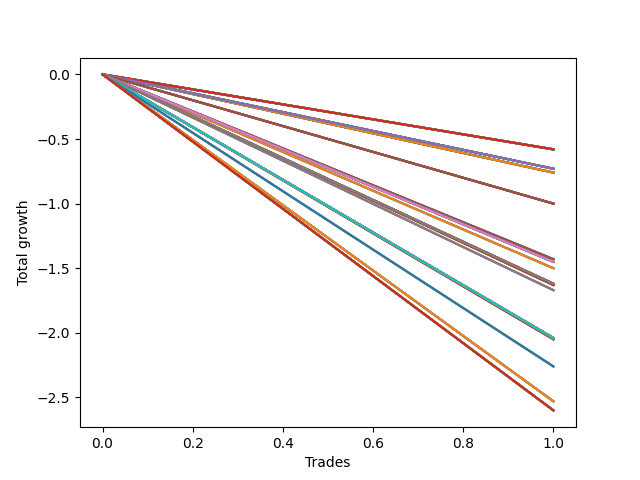

# Long HLT 505 
- Symbol: TSLA
- Date Range: 05/16/2022 - 05/17/2024
- Trading Period: 8:30-12:30
- Number of Trades: 1



| Id. | Name | Win Percent | Profit | Avg Profit / Trade | Avg Time / Trade | Std |      | Name | Win Percent | Profit | Avg Profit / Trade | Avg Time / Trade | Std |
| --- | ---- | ----------- | ------ | ------------------ | ---------------- | --- | ---- | ---- | ----------- | ------ | ------------------ | ---------------- | --- |
| | Sorted By <br> Profit | | | | | | | Sorted By <br> Win Percentage |||||
|0| TP-0.5 180m | 0.00 | -0.58 | -0.58 | 09:00 | 0.00 |     | TP-0.5 180m | 0.00 | -0.58 | -0.58 | 09:00 | 0.00 |
|1| TP-0.25 180m | 0.00 | -0.58 | -0.58 | 09:00 | 0.00 |     | TP-0.25 180m | 0.00 | -0.58 | -0.58 | 09:00 | 0.00 |
|2| TP-0.5 165m | 0.00 | -0.58 | -0.58 | 09:00 | 0.00 |     | TP-0.5 165m | 0.00 | -0.58 | -0.58 | 09:00 | 0.00 |
|3| TP-0.25 165m | 0.00 | -0.58 | -0.58 | 09:00 | 0.00 |     | TP-0.25 165m | 0.00 | -0.58 | -0.58 | 09:00 | 0.00 |
|4| TP-0.5 150m | 0.00 | -0.58 | -0.58 | 09:00 | 0.00 |     | TP-0.5 150m | 0.00 | -0.58 | -0.58 | 09:00 | 0.00 |
|5| TP-0.25 150m | 0.00 | -0.58 | -0.58 | 09:00 | 0.00 |     | TP-0.25 150m | 0.00 | -0.58 | -0.58 | 09:00 | 0.00 |
|6| TP-0.5 135m | 0.00 | -0.58 | -0.58 | 09:00 | 0.00 |     | TP-0.5 135m | 0.00 | -0.58 | -0.58 | 09:00 | 0.00 |
|7| TP-0.25 135m | 0.00 | -0.58 | -0.58 | 09:00 | 0.00 |     | TP-0.25 135m | 0.00 | -0.58 | -0.58 | 09:00 | 0.00 |
|8| TP-0.5 120m | 0.00 | -0.58 | -0.58 | 09:00 | 0.00 |     | TP-0.5 120m | 0.00 | -0.58 | -0.58 | 09:00 | 0.00 |
|9| TP-0.25 120m | 0.00 | -0.58 | -0.58 | 09:00 | 0.00 |     | TP-0.25 120m | 0.00 | -0.58 | -0.58 | 09:00 | 0.00 |
|10| TP-0.5 105m | 0.00 | -0.58 | -0.58 | 09:00 | 0.00 |     | TP-0.5 105m | 0.00 | -0.58 | -0.58 | 09:00 | 0.00 |
|11| TP-0.25 105m | 0.00 | -0.58 | -0.58 | 09:00 | 0.00 |     | TP-0.25 105m | 0.00 | -0.58 | -0.58 | 09:00 | 0.00 |
|12| TP-0.5 90m | 0.00 | -0.58 | -0.58 | 09:00 | 0.00 |     | TP-0.5 90m | 0.00 | -0.58 | -0.58 | 09:00 | 0.00 |
|13| TP-0.25 90m | 0.00 | -0.58 | -0.58 | 09:00 | 0.00 |     | TP-0.25 90m | 0.00 | -0.58 | -0.58 | 09:00 | 0.00 |
|14| TP-0.5 75m | 0.00 | -0.58 | -0.58 | 09:00 | 0.00 |     | TP-0.5 75m | 0.00 | -0.58 | -0.58 | 09:00 | 0.00 |
|15| TP-0.25 75m | 0.00 | -0.58 | -0.58 | 09:00 | 0.00 |     | TP-0.25 75m | 0.00 | -0.58 | -0.58 | 09:00 | 0.00 |
|16| TP-0.5 60m | 0.00 | -0.58 | -0.58 | 09:00 | 0.00 |     | TP-0.5 60m | 0.00 | -0.58 | -0.58 | 09:00 | 0.00 |
|17| TP-0.25 60m | 0.00 | -0.58 | -0.58 | 09:00 | 0.00 |     | TP-0.25 60m | 0.00 | -0.58 | -0.58 | 09:00 | 0.00 |
|18| TP-0.5 45m | 0.00 | -0.58 | -0.58 | 09:00 | 0.00 |     | TP-0.5 45m | 0.00 | -0.58 | -0.58 | 09:00 | 0.00 |
|19| TP-0.25 45m | 0.00 | -0.58 | -0.58 | 09:00 | 0.00 |     | TP-0.25 45m | 0.00 | -0.58 | -0.58 | 09:00 | 0.00 |
|20| TP-0.5 30m | 0.00 | -0.58 | -0.58 | 09:00 | 0.00 |     | TP-0.5 30m | 0.00 | -0.58 | -0.58 | 09:00 | 0.00 |
|21| TP-0.25 30m | 0.00 | -0.58 | -0.58 | 09:00 | 0.00 |     | TP-0.25 30m | 0.00 | -0.58 | -0.58 | 09:00 | 0.00 |
|22| TP-0.5 15m | 0.00 | -0.58 | -0.58 | 09:00 | 0.00 |     | TP-0.5 15m | 0.00 | -0.58 | -0.58 | 09:00 | 0.00 |
|23| TP-0.25 15m | 0.00 | -0.58 | -0.58 | 09:00 | 0.00 |     | TP-0.25 15m | 0.00 | -0.58 | -0.58 | 09:00 | 0.00 |
|24| TP-0.75 180m | 0.00 | -0.73 | -0.73 | 11:00 | 0.00 |     | TP-0.75 180m | 0.00 | -0.73 | -0.73 | 11:00 | 0.00 |
|25| TP-0.75 165m | 0.00 | -0.73 | -0.73 | 11:00 | 0.00 |     | TP-0.75 165m | 0.00 | -0.73 | -0.73 | 11:00 | 0.00 |
|26| TP-0.75 150m | 0.00 | -0.73 | -0.73 | 11:00 | 0.00 |     | TP-0.75 150m | 0.00 | -0.73 | -0.73 | 11:00 | 0.00 |
|27| TP-0.75 135m | 0.00 | -0.73 | -0.73 | 11:00 | 0.00 |     | TP-0.75 135m | 0.00 | -0.73 | -0.73 | 11:00 | 0.00 |
|28| TP-0.75 120m | 0.00 | -0.73 | -0.73 | 11:00 | 0.00 |     | TP-0.75 120m | 0.00 | -0.73 | -0.73 | 11:00 | 0.00 |
|29| TP-0.75 105m | 0.00 | -0.73 | -0.73 | 11:00 | 0.00 |     | TP-0.75 105m | 0.00 | -0.73 | -0.73 | 11:00 | 0.00 |
|30| TP-0.75 90m | 0.00 | -0.73 | -0.73 | 11:00 | 0.00 |     | TP-0.75 90m | 0.00 | -0.73 | -0.73 | 11:00 | 0.00 |
|31| TP-0.75 75m | 0.00 | -0.73 | -0.73 | 11:00 | 0.00 |     | TP-0.75 75m | 0.00 | -0.73 | -0.73 | 11:00 | 0.00 |
|32| TP-0.75 60m | 0.00 | -0.73 | -0.73 | 11:00 | 0.00 |     | TP-0.75 60m | 0.00 | -0.73 | -0.73 | 11:00 | 0.00 |
|33| TP-0.75 45m | 0.00 | -0.73 | -0.73 | 11:00 | 0.00 |     | TP-0.75 45m | 0.00 | -0.73 | -0.73 | 11:00 | 0.00 |
|34| TP-0.75 30m | 0.00 | -0.73 | -0.73 | 11:00 | 0.00 |     | TP-0.75 30m | 0.00 | -0.73 | -0.73 | 11:00 | 0.00 |
|35| TP-0.75 15m | 0.00 | -0.73 | -0.73 | 11:00 | 0.00 |     | TP-0.75 15m | 0.00 | -0.73 | -0.73 | 11:00 | 0.00 |
|36| TP-3 15m | 0.00 | -0.76 | -0.76 | 14:00 | 0.00 |     | TP-3 15m | 0.00 | -0.76 | -0.76 | 14:00 | 0.00 |
|37| TP-2.75 15m | 0.00 | -0.76 | -0.76 | 14:00 | 0.00 |     | TP-2.75 15m | 0.00 | -0.76 | -0.76 | 14:00 | 0.00 |
|38| TP-2.5 15m | 0.00 | -0.76 | -0.76 | 14:00 | 0.00 |     | TP-2.5 15m | 0.00 | -0.76 | -0.76 | 14:00 | 0.00 |
|39| TP-2.25 15m | 0.00 | -0.76 | -0.76 | 14:00 | 0.00 |     | TP-2.25 15m | 0.00 | -0.76 | -0.76 | 14:00 | 0.00 |
|40| TP-2 15m | 0.00 | -0.76 | -0.76 | 14:00 | 0.00 |     | TP-2 15m | 0.00 | -0.76 | -0.76 | 14:00 | 0.00 |
|41| TP-1.75 15m | 0.00 | -0.76 | -0.76 | 14:00 | 0.00 |     | TP-1.75 15m | 0.00 | -0.76 | -0.76 | 14:00 | 0.00 |
|42| TP-1.5 15m | 0.00 | -0.76 | -0.76 | 14:00 | 0.00 |     | TP-1.5 15m | 0.00 | -0.76 | -0.76 | 14:00 | 0.00 |
|43| TP-1.25 15m | 0.00 | -0.76 | -0.76 | 14:00 | 0.00 |     | TP-1.25 15m | 0.00 | -0.76 | -0.76 | 14:00 | 0.00 |
|44| TP-1 15m | 0.00 | -0.76 | -0.76 | 14:00 | 0.00 |     | TP-1 15m | 0.00 | -0.76 | -0.76 | 14:00 | 0.00 |
|45| TP-1 180m | 0.00 | -1.00 | -1.00 | 17:00 | 0.00 |     | TP-1 180m | 0.00 | -1.00 | -1.00 | 17:00 | 0.00 |
|46| TP-1 165m | 0.00 | -1.00 | -1.00 | 17:00 | 0.00 |     | TP-1 165m | 0.00 | -1.00 | -1.00 | 17:00 | 0.00 |
|47| TP-1 150m | 0.00 | -1.00 | -1.00 | 17:00 | 0.00 |     | TP-1 150m | 0.00 | -1.00 | -1.00 | 17:00 | 0.00 |
|48| TP-1 135m | 0.00 | -1.00 | -1.00 | 17:00 | 0.00 |     | TP-1 135m | 0.00 | -1.00 | -1.00 | 17:00 | 0.00 |
|49| TP-1 120m | 0.00 | -1.00 | -1.00 | 17:00 | 0.00 |     | TP-1 120m | 0.00 | -1.00 | -1.00 | 17:00 | 0.00 |
|50| TP-1 105m | 0.00 | -1.00 | -1.00 | 17:00 | 0.00 |     | TP-1 105m | 0.00 | -1.00 | -1.00 | 17:00 | 0.00 |
|51| TP-1 90m | 0.00 | -1.00 | -1.00 | 17:00 | 0.00 |     | TP-1 90m | 0.00 | -1.00 | -1.00 | 17:00 | 0.00 |
|52| TP-1 75m | 0.00 | -1.00 | -1.00 | 17:00 | 0.00 |     | TP-1 75m | 0.00 | -1.00 | -1.00 | 17:00 | 0.00 |
|53| TP-1 60m | 0.00 | -1.00 | -1.00 | 17:00 | 0.00 |     | TP-1 60m | 0.00 | -1.00 | -1.00 | 17:00 | 0.00 |
|54| TP-1 45m | 0.00 | -1.00 | -1.00 | 17:00 | 0.00 |     | TP-1 45m | 0.00 | -1.00 | -1.00 | 17:00 | 0.00 |
|55| TP-1 30m | 0.00 | -1.00 | -1.00 | 17:00 | 0.00 |     | TP-1 30m | 0.00 | -1.00 | -1.00 | 17:00 | 0.00 |
|56| TP-3 45m | 0.00 | -1.43 | -1.43 | 44:00 | 0.00 |     | TP-3 45m | 0.00 | -1.43 | -1.43 | 44:00 | 0.00 |
|57| TP-2.75 45m | 0.00 | -1.43 | -1.43 | 44:00 | 0.00 |     | TP-2.75 45m | 0.00 | -1.43 | -1.43 | 44:00 | 0.00 |
|58| TP-2.5 45m | 0.00 | -1.43 | -1.43 | 44:00 | 0.00 |     | TP-2.5 45m | 0.00 | -1.43 | -1.43 | 44:00 | 0.00 |
|59| TP-2.25 45m | 0.00 | -1.43 | -1.43 | 44:00 | 0.00 |     | TP-2.25 45m | 0.00 | -1.43 | -1.43 | 44:00 | 0.00 |
|60| TP-1.25 180m | 0.00 | -1.45 | -1.45 | 19:00 | 0.00 |     | TP-1.25 180m | 0.00 | -1.45 | -1.45 | 19:00 | 0.00 |
|61| TP-1.25 165m | 0.00 | -1.45 | -1.45 | 19:00 | 0.00 |     | TP-1.25 165m | 0.00 | -1.45 | -1.45 | 19:00 | 0.00 |
|62| TP-1.25 150m | 0.00 | -1.45 | -1.45 | 19:00 | 0.00 |     | TP-1.25 150m | 0.00 | -1.45 | -1.45 | 19:00 | 0.00 |
|63| TP-1.25 135m | 0.00 | -1.45 | -1.45 | 19:00 | 0.00 |     | TP-1.25 135m | 0.00 | -1.45 | -1.45 | 19:00 | 0.00 |
|64| TP-1.25 120m | 0.00 | -1.45 | -1.45 | 19:00 | 0.00 |     | TP-1.25 120m | 0.00 | -1.45 | -1.45 | 19:00 | 0.00 |
|65| TP-1.25 105m | 0.00 | -1.45 | -1.45 | 19:00 | 0.00 |     | TP-1.25 105m | 0.00 | -1.45 | -1.45 | 19:00 | 0.00 |
|66| TP-1.25 90m | 0.00 | -1.45 | -1.45 | 19:00 | 0.00 |     | TP-1.25 90m | 0.00 | -1.45 | -1.45 | 19:00 | 0.00 |
|67| TP-1.25 75m | 0.00 | -1.45 | -1.45 | 19:00 | 0.00 |     | TP-1.25 75m | 0.00 | -1.45 | -1.45 | 19:00 | 0.00 |
|68| TP-1.25 60m | 0.00 | -1.45 | -1.45 | 19:00 | 0.00 |     | TP-1.25 60m | 0.00 | -1.45 | -1.45 | 19:00 | 0.00 |
|69| TP-1.25 45m | 0.00 | -1.45 | -1.45 | 19:00 | 0.00 |     | TP-1.25 45m | 0.00 | -1.45 | -1.45 | 19:00 | 0.00 |
|70| TP-1.25 30m | 0.00 | -1.45 | -1.45 | 19:00 | 0.00 |     | TP-1.25 30m | 0.00 | -1.45 | -1.45 | 19:00 | 0.00 |
|71| TP-3 90m | 0.00 | -1.50 | -1.50 | 89:00 | 0.00 |     | TP-3 90m | 0.00 | -1.50 | -1.50 | 89:00 | 0.00 |
|72| TP-2.75 90m | 0.00 | -1.50 | -1.50 | 89:00 | 0.00 |     | TP-2.75 90m | 0.00 | -1.50 | -1.50 | 89:00 | 0.00 |
|73| TP-2.5 90m | 0.00 | -1.50 | -1.50 | 89:00 | 0.00 |     | TP-2.5 90m | 0.00 | -1.50 | -1.50 | 89:00 | 0.00 |
|74| TP-2.25 90m | 0.00 | -1.50 | -1.50 | 89:00 | 0.00 |     | TP-2.25 90m | 0.00 | -1.50 | -1.50 | 89:00 | 0.00 |
|75| TP-1.5 180m | 0.00 | -1.62 | -1.62 | 20:00 | 0.00 |     | TP-1.5 180m | 0.00 | -1.62 | -1.62 | 20:00 | 0.00 |
|76| TP-1.5 165m | 0.00 | -1.62 | -1.62 | 20:00 | 0.00 |     | TP-1.5 165m | 0.00 | -1.62 | -1.62 | 20:00 | 0.00 |
|77| TP-1.5 150m | 0.00 | -1.62 | -1.62 | 20:00 | 0.00 |     | TP-1.5 150m | 0.00 | -1.62 | -1.62 | 20:00 | 0.00 |
|78| TP-1.5 135m | 0.00 | -1.62 | -1.62 | 20:00 | 0.00 |     | TP-1.5 135m | 0.00 | -1.62 | -1.62 | 20:00 | 0.00 |
|79| TP-1.5 120m | 0.00 | -1.62 | -1.62 | 20:00 | 0.00 |     | TP-1.5 120m | 0.00 | -1.62 | -1.62 | 20:00 | 0.00 |
|80| TP-1.5 105m | 0.00 | -1.62 | -1.62 | 20:00 | 0.00 |     | TP-1.5 105m | 0.00 | -1.62 | -1.62 | 20:00 | 0.00 |
|81| TP-1.5 90m | 0.00 | -1.62 | -1.62 | 20:00 | 0.00 |     | TP-1.5 90m | 0.00 | -1.62 | -1.62 | 20:00 | 0.00 |
|82| TP-1.5 75m | 0.00 | -1.62 | -1.62 | 20:00 | 0.00 |     | TP-1.5 75m | 0.00 | -1.62 | -1.62 | 20:00 | 0.00 |
|83| TP-1.5 60m | 0.00 | -1.62 | -1.62 | 20:00 | 0.00 |     | TP-1.5 60m | 0.00 | -1.62 | -1.62 | 20:00 | 0.00 |
|84| TP-1.5 45m | 0.00 | -1.62 | -1.62 | 20:00 | 0.00 |     | TP-1.5 45m | 0.00 | -1.62 | -1.62 | 20:00 | 0.00 |
|85| TP-1.5 30m | 0.00 | -1.62 | -1.62 | 20:00 | 0.00 |     | TP-1.5 30m | 0.00 | -1.62 | -1.62 | 20:00 | 0.00 |
|86| TP-3 30m | 0.00 | -1.63 | -1.63 | 29:00 | 0.00 |     | TP-3 30m | 0.00 | -1.63 | -1.63 | 29:00 | 0.00 |
|87| TP-2.75 30m | 0.00 | -1.63 | -1.63 | 29:00 | 0.00 |     | TP-2.75 30m | 0.00 | -1.63 | -1.63 | 29:00 | 0.00 |
|88| TP-2.5 30m | 0.00 | -1.63 | -1.63 | 29:00 | 0.00 |     | TP-2.5 30m | 0.00 | -1.63 | -1.63 | 29:00 | 0.00 |
|89| TP-2.25 30m | 0.00 | -1.63 | -1.63 | 29:00 | 0.00 |     | TP-2.25 30m | 0.00 | -1.63 | -1.63 | 29:00 | 0.00 |
|90| TP-3 60m | 0.00 | -1.67 | -1.67 | 59:00 | 0.00 |     | TP-3 60m | 0.00 | -1.67 | -1.67 | 59:00 | 0.00 |
|91| TP-2.75 60m | 0.00 | -1.67 | -1.67 | 59:00 | 0.00 |     | TP-2.75 60m | 0.00 | -1.67 | -1.67 | 59:00 | 0.00 |
|92| TP-2.5 60m | 0.00 | -1.67 | -1.67 | 59:00 | 0.00 |     | TP-2.5 60m | 0.00 | -1.67 | -1.67 | 59:00 | 0.00 |
|93| TP-2.25 60m | 0.00 | -1.67 | -1.67 | 59:00 | 0.00 |     | TP-2.25 60m | 0.00 | -1.67 | -1.67 | 59:00 | 0.00 |
|94| TP-2 180m | 0.00 | -2.04 | -2.04 | 21:00 | 0.00 |     | TP-2 180m | 0.00 | -2.04 | -2.04 | 21:00 | 0.00 |
|95| TP-1.75 180m | 0.00 | -2.04 | -2.04 | 21:00 | 0.00 |     | TP-1.75 180m | 0.00 | -2.04 | -2.04 | 21:00 | 0.00 |
|96| TP-2 165m | 0.00 | -2.04 | -2.04 | 21:00 | 0.00 |     | TP-2 165m | 0.00 | -2.04 | -2.04 | 21:00 | 0.00 |
|97| TP-1.75 165m | 0.00 | -2.04 | -2.04 | 21:00 | 0.00 |     | TP-1.75 165m | 0.00 | -2.04 | -2.04 | 21:00 | 0.00 |
|98| TP-2 150m | 0.00 | -2.04 | -2.04 | 21:00 | 0.00 |     | TP-2 150m | 0.00 | -2.04 | -2.04 | 21:00 | 0.00 |
|99| TP-1.75 150m | 0.00 | -2.04 | -2.04 | 21:00 | 0.00 |     | TP-1.75 150m | 0.00 | -2.04 | -2.04 | 21:00 | 0.00 |
|100| TP-2 135m | 0.00 | -2.04 | -2.04 | 21:00 | 0.00 |     | TP-2 135m | 0.00 | -2.04 | -2.04 | 21:00 | 0.00 |
|101| TP-1.75 135m | 0.00 | -2.04 | -2.04 | 21:00 | 0.00 |     | TP-1.75 135m | 0.00 | -2.04 | -2.04 | 21:00 | 0.00 |
|102| TP-2 120m | 0.00 | -2.04 | -2.04 | 21:00 | 0.00 |     | TP-2 120m | 0.00 | -2.04 | -2.04 | 21:00 | 0.00 |
|103| TP-1.75 120m | 0.00 | -2.04 | -2.04 | 21:00 | 0.00 |     | TP-1.75 120m | 0.00 | -2.04 | -2.04 | 21:00 | 0.00 |
|104| TP-2 105m | 0.00 | -2.04 | -2.04 | 21:00 | 0.00 |     | TP-2 105m | 0.00 | -2.04 | -2.04 | 21:00 | 0.00 |
|105| TP-1.75 105m | 0.00 | -2.04 | -2.04 | 21:00 | 0.00 |     | TP-1.75 105m | 0.00 | -2.04 | -2.04 | 21:00 | 0.00 |
|106| TP-2 90m | 0.00 | -2.04 | -2.04 | 21:00 | 0.00 |     | TP-2 90m | 0.00 | -2.04 | -2.04 | 21:00 | 0.00 |
|107| TP-1.75 90m | 0.00 | -2.04 | -2.04 | 21:00 | 0.00 |     | TP-1.75 90m | 0.00 | -2.04 | -2.04 | 21:00 | 0.00 |
|108| TP-3 75m | 0.00 | -2.04 | -2.04 | 74:00 | 0.00 |     | TP-3 75m | 0.00 | -2.04 | -2.04 | 74:00 | 0.00 |
|109| TP-2.75 75m | 0.00 | -2.04 | -2.04 | 74:00 | 0.00 |     | TP-2.75 75m | 0.00 | -2.04 | -2.04 | 74:00 | 0.00 |
|110| TP-2.5 75m | 0.00 | -2.04 | -2.04 | 74:00 | 0.00 |     | TP-2.5 75m | 0.00 | -2.04 | -2.04 | 74:00 | 0.00 |
|111| TP-2.25 75m | 0.00 | -2.04 | -2.04 | 74:00 | 0.00 |     | TP-2.25 75m | 0.00 | -2.04 | -2.04 | 74:00 | 0.00 |
|112| TP-2 75m | 0.00 | -2.04 | -2.04 | 21:00 | 0.00 |     | TP-2 75m | 0.00 | -2.04 | -2.04 | 21:00 | 0.00 |
|113| TP-1.75 75m | 0.00 | -2.04 | -2.04 | 21:00 | 0.00 |     | TP-1.75 75m | 0.00 | -2.04 | -2.04 | 21:00 | 0.00 |
|114| TP-2 60m | 0.00 | -2.04 | -2.04 | 21:00 | 0.00 |     | TP-2 60m | 0.00 | -2.04 | -2.04 | 21:00 | 0.00 |
|115| TP-1.75 60m | 0.00 | -2.04 | -2.04 | 21:00 | 0.00 |     | TP-1.75 60m | 0.00 | -2.04 | -2.04 | 21:00 | 0.00 |
|116| TP-2 45m | 0.00 | -2.04 | -2.04 | 21:00 | 0.00 |     | TP-2 45m | 0.00 | -2.04 | -2.04 | 21:00 | 0.00 |
|117| TP-1.75 45m | 0.00 | -2.04 | -2.04 | 21:00 | 0.00 |     | TP-1.75 45m | 0.00 | -2.04 | -2.04 | 21:00 | 0.00 |
|118| TP-2 30m | 0.00 | -2.04 | -2.04 | 21:00 | 0.00 |     | TP-2 30m | 0.00 | -2.04 | -2.04 | 21:00 | 0.00 |
|119| TP-1.75 30m | 0.00 | -2.04 | -2.04 | 21:00 | 0.00 |     | TP-1.75 30m | 0.00 | -2.04 | -2.04 | 21:00 | 0.00 |
|120| TP-3 105m | 0.00 | -2.05 | -2.05 | 104:00 | 0.00 |     | TP-3 105m | 0.00 | -2.05 | -2.05 | 104:00 | 0.00 |
|121| TP-2.75 105m | 0.00 | -2.05 | -2.05 | 104:00 | 0.00 |     | TP-2.75 105m | 0.00 | -2.05 | -2.05 | 104:00 | 0.00 |
|122| TP-2.5 105m | 0.00 | -2.05 | -2.05 | 104:00 | 0.00 |     | TP-2.5 105m | 0.00 | -2.05 | -2.05 | 104:00 | 0.00 |
|123| TP-2.25 105m | 0.00 | -2.05 | -2.05 | 104:00 | 0.00 |     | TP-2.25 105m | 0.00 | -2.05 | -2.05 | 104:00 | 0.00 |
|124| TP-2.25 180m | 0.00 | -2.26 | -2.26 | 112:00 | 0.00 |     | TP-2.25 180m | 0.00 | -2.26 | -2.26 | 112:00 | 0.00 |
|125| TP-2.25 165m | 0.00 | -2.26 | -2.26 | 112:00 | 0.00 |     | TP-2.25 165m | 0.00 | -2.26 | -2.26 | 112:00 | 0.00 |
|126| TP-2.25 150m | 0.00 | -2.26 | -2.26 | 112:00 | 0.00 |     | TP-2.25 150m | 0.00 | -2.26 | -2.26 | 112:00 | 0.00 |
|127| TP-2.25 135m | 0.00 | -2.26 | -2.26 | 112:00 | 0.00 |     | TP-2.25 135m | 0.00 | -2.26 | -2.26 | 112:00 | 0.00 |
|128| TP-2.25 120m | 0.00 | -2.26 | -2.26 | 112:00 | 0.00 |     | TP-2.25 120m | 0.00 | -2.26 | -2.26 | 112:00 | 0.00 |
|129| TP-2.5 180m | 0.00 | -2.53 | -2.53 | 117:00 | 0.00 |     | TP-2.5 180m | 0.00 | -2.53 | -2.53 | 117:00 | 0.00 |
|130| TP-2.5 165m | 0.00 | -2.53 | -2.53 | 117:00 | 0.00 |     | TP-2.5 165m | 0.00 | -2.53 | -2.53 | 117:00 | 0.00 |
|131| TP-2.5 150m | 0.00 | -2.53 | -2.53 | 117:00 | 0.00 |     | TP-2.5 150m | 0.00 | -2.53 | -2.53 | 117:00 | 0.00 |
|132| TP-2.5 135m | 0.00 | -2.53 | -2.53 | 117:00 | 0.00 |     | TP-2.5 135m | 0.00 | -2.53 | -2.53 | 117:00 | 0.00 |
|133| TP-2.5 120m | 0.00 | -2.53 | -2.53 | 117:00 | 0.00 |     | TP-2.5 120m | 0.00 | -2.53 | -2.53 | 117:00 | 0.00 |
|134| TP-3 180m | 0.00 | -2.60 | -2.60 | 119:00 | 0.00 |     | TP-3 180m | 0.00 | -2.60 | -2.60 | 119:00 | 0.00 |
|135| TP-2.75 180m | 0.00 | -2.60 | -2.60 | 119:00 | 0.00 |     | TP-2.75 180m | 0.00 | -2.60 | -2.60 | 119:00 | 0.00 |
|136| TP-3 165m | 0.00 | -2.60 | -2.60 | 119:00 | 0.00 |     | TP-3 165m | 0.00 | -2.60 | -2.60 | 119:00 | 0.00 |
|137| TP-2.75 165m | 0.00 | -2.60 | -2.60 | 119:00 | 0.00 |     | TP-2.75 165m | 0.00 | -2.60 | -2.60 | 119:00 | 0.00 |
|138| TP-3 150m | 0.00 | -2.60 | -2.60 | 119:00 | 0.00 |     | TP-3 150m | 0.00 | -2.60 | -2.60 | 119:00 | 0.00 |
|139| TP-2.75 150m | 0.00 | -2.60 | -2.60 | 119:00 | 0.00 |     | TP-2.75 150m | 0.00 | -2.60 | -2.60 | 119:00 | 0.00 |
|140| TP-3 135m | 0.00 | -2.60 | -2.60 | 119:00 | 0.00 |     | TP-3 135m | 0.00 | -2.60 | -2.60 | 119:00 | 0.00 |
|141| TP-2.75 135m | 0.00 | -2.60 | -2.60 | 119:00 | 0.00 |     | TP-2.75 135m | 0.00 | -2.60 | -2.60 | 119:00 | 0.00 |
|142| TP-3 120m | 0.00 | -2.60 | -2.60 | 119:00 | 0.00 |     | TP-3 120m | 0.00 | -2.60 | -2.60 | 119:00 | 0.00 |
|143| TP-2.75 120m | 0.00 | -2.60 | -2.60 | 119:00 | 0.00 |     | TP-2.75 120m | 0.00 | -2.60 | -2.60 | 119:00 | 0.00 |

### Test TP-0.25 15m
* Take Profit of 0.25 Point
* 0.25 Stoploss
* Results:
```
Total Trades: 1
Percent Up: 0.00
Percent Down: 100.00
Total Points Moved Up: -0.58
Potential Profit: -290.00
Total Points Ups: 0.00 Count Ups: 0
Total Points Downs: -0.58 Count Downs: 1
```

<details><summary>Trades</summary>

<code>In: 2024-04-15 10:10:00		Out: 2024-04-15 10:19:00		Total Position Time: 09:00		Total Move Up: -0.58		Total to Date: -0.58</code> <br />


</details>

### Test TP-0.5 15m
* Take Profit of 0.5 Point
* 0.5 Stoploss
* Results:
```
Total Trades: 1
Percent Up: 0.00
Percent Down: 100.00
Total Points Moved Up: -0.58
Potential Profit: -290.00
Total Points Ups: 0.00 Count Ups: 0
Total Points Downs: -0.58 Count Downs: 1
```

<details><summary>Trades</summary>

<code>In: 2024-04-15 10:10:00		Out: 2024-04-15 10:19:00		Total Position Time: 09:00		Total Move Up: -0.58		Total to Date: -0.58</code> <br />


</details>

### Test TP-0.75 15m
* Take Profit of 0.75 Point
* 0.75 Stoploss
* Results:
```
Total Trades: 1
Percent Up: 0.00
Percent Down: 100.00
Total Points Moved Up: -0.73
Potential Profit: -365.00
Total Points Ups: 0.00 Count Ups: 0
Total Points Downs: -0.73 Count Downs: 1
```

<details><summary>Trades</summary>

<code>In: 2024-04-15 10:10:00		Out: 2024-04-15 10:21:00		Total Position Time: 11:00		Total Move Up: -0.73		Total to Date: -0.73</code> <br />


</details>

### Test TP-1 15m
* Take Profit of 1 Point
* 1 Stoploss
* Results:
```
Total Trades: 1
Percent Up: 0.00
Percent Down: 100.00
Total Points Moved Up: -0.76
Potential Profit: -380.00
Total Points Ups: 0.00 Count Ups: 0
Total Points Downs: -0.76 Count Downs: 1
```

<details><summary>Trades</summary>

<code>In: 2024-04-15 10:10:00		Out: 2024-04-15 10:24:00		Total Position Time: 14:00		Total Move Up: -0.76		Total to Date: -0.76</code> <br />


</details>

### Test TP-1.25 15m
* Take Profit of 1.25 Point
* 1.25 Stoploss
* Results:
```
Total Trades: 1
Percent Up: 0.00
Percent Down: 100.00
Total Points Moved Up: -0.76
Potential Profit: -380.00
Total Points Ups: 0.00 Count Ups: 0
Total Points Downs: -0.76 Count Downs: 1
```

<details><summary>Trades</summary>

<code>In: 2024-04-15 10:10:00		Out: 2024-04-15 10:24:00		Total Position Time: 14:00		Total Move Up: -0.76		Total to Date: -0.76</code> <br />


</details>

### Test TP-1.5 15m
* Take Profit of 1.5 Point
* 1.5 Stoploss
* Results:
```
Total Trades: 1
Percent Up: 0.00
Percent Down: 100.00
Total Points Moved Up: -0.76
Potential Profit: -380.00
Total Points Ups: 0.00 Count Ups: 0
Total Points Downs: -0.76 Count Downs: 1
```

<details><summary>Trades</summary>

<code>In: 2024-04-15 10:10:00		Out: 2024-04-15 10:24:00		Total Position Time: 14:00		Total Move Up: -0.76		Total to Date: -0.76</code> <br />


</details>

### Test TP-1.75 15m
* Take Profit of 1.75 Point
* 1.75 Stoploss
* Results:
```
Total Trades: 1
Percent Up: 0.00
Percent Down: 100.00
Total Points Moved Up: -0.76
Potential Profit: -380.00
Total Points Ups: 0.00 Count Ups: 0
Total Points Downs: -0.76 Count Downs: 1
```

<details><summary>Trades</summary>

<code>In: 2024-04-15 10:10:00		Out: 2024-04-15 10:24:00		Total Position Time: 14:00		Total Move Up: -0.76		Total to Date: -0.76</code> <br />


</details>

### Test TP-2 15m
* Take Profit of 2 Point
* 2 Stoploss
* Results:
```
Total Trades: 1
Percent Up: 0.00
Percent Down: 100.00
Total Points Moved Up: -0.76
Potential Profit: -380.00
Total Points Ups: 0.00 Count Ups: 0
Total Points Downs: -0.76 Count Downs: 1
```

<details><summary>Trades</summary>

<code>In: 2024-04-15 10:10:00		Out: 2024-04-15 10:24:00		Total Position Time: 14:00		Total Move Up: -0.76		Total to Date: -0.76</code> <br />


</details>

### Test TP-2.25 15m
* Take Profit of 2.25 Point
* 2.25 Stoploss
* Results:
```
Total Trades: 1
Percent Up: 0.00
Percent Down: 100.00
Total Points Moved Up: -0.76
Potential Profit: -380.00
Total Points Ups: 0.00 Count Ups: 0
Total Points Downs: -0.76 Count Downs: 1
```

<details><summary>Trades</summary>

<code>In: 2024-04-15 10:10:00		Out: 2024-04-15 10:24:00		Total Position Time: 14:00		Total Move Up: -0.76		Total to Date: -0.76</code> <br />


</details>

### Test TP-2.5 15m
* Take Profit of 2.5 Point
* 2.5 Stoploss
* Results:
```
Total Trades: 1
Percent Up: 0.00
Percent Down: 100.00
Total Points Moved Up: -0.76
Potential Profit: -380.00
Total Points Ups: 0.00 Count Ups: 0
Total Points Downs: -0.76 Count Downs: 1
```

<details><summary>Trades</summary>

<code>In: 2024-04-15 10:10:00		Out: 2024-04-15 10:24:00		Total Position Time: 14:00		Total Move Up: -0.76		Total to Date: -0.76</code> <br />


</details>

### Test TP-2.75 15m
* Take Profit of 2.75 Point
* 2.75 Stoploss
* Results:
```
Total Trades: 1
Percent Up: 0.00
Percent Down: 100.00
Total Points Moved Up: -0.76
Potential Profit: -380.00
Total Points Ups: 0.00 Count Ups: 0
Total Points Downs: -0.76 Count Downs: 1
```

<details><summary>Trades</summary>

<code>In: 2024-04-15 10:10:00		Out: 2024-04-15 10:24:00		Total Position Time: 14:00		Total Move Up: -0.76		Total to Date: -0.76</code> <br />


</details>

### Test TP-3 15m
* Take Profit of 3 Point
* 3 Stoploss
* Results:
```
Total Trades: 1
Percent Up: 0.00
Percent Down: 100.00
Total Points Moved Up: -0.76
Potential Profit: -380.00
Total Points Ups: 0.00 Count Ups: 0
Total Points Downs: -0.76 Count Downs: 1
```

<details><summary>Trades</summary>

<code>In: 2024-04-15 10:10:00		Out: 2024-04-15 10:24:00		Total Position Time: 14:00		Total Move Up: -0.76		Total to Date: -0.76</code> <br />


</details>

### Test TP-0.25 30m
* Take Profit of 0.25 Point
* 0.25 Stoploss
* Results:
```
Total Trades: 1
Percent Up: 0.00
Percent Down: 100.00
Total Points Moved Up: -0.58
Potential Profit: -290.00
Total Points Ups: 0.00 Count Ups: 0
Total Points Downs: -0.58 Count Downs: 1
```

<details><summary>Trades</summary>

<code>In: 2024-04-15 10:10:00		Out: 2024-04-15 10:19:00		Total Position Time: 09:00		Total Move Up: -0.58		Total to Date: -0.58</code> <br />


</details>

### Test TP-0.5 30m
* Take Profit of 0.5 Point
* 0.5 Stoploss
* Results:
```
Total Trades: 1
Percent Up: 0.00
Percent Down: 100.00
Total Points Moved Up: -0.58
Potential Profit: -290.00
Total Points Ups: 0.00 Count Ups: 0
Total Points Downs: -0.58 Count Downs: 1
```

<details><summary>Trades</summary>

<code>In: 2024-04-15 10:10:00		Out: 2024-04-15 10:19:00		Total Position Time: 09:00		Total Move Up: -0.58		Total to Date: -0.58</code> <br />


</details>

### Test TP-0.75 30m
* Take Profit of 0.75 Point
* 0.75 Stoploss
* Results:
```
Total Trades: 1
Percent Up: 0.00
Percent Down: 100.00
Total Points Moved Up: -0.73
Potential Profit: -365.00
Total Points Ups: 0.00 Count Ups: 0
Total Points Downs: -0.73 Count Downs: 1
```

<details><summary>Trades</summary>

<code>In: 2024-04-15 10:10:00		Out: 2024-04-15 10:21:00		Total Position Time: 11:00		Total Move Up: -0.73		Total to Date: -0.73</code> <br />


</details>

### Test TP-1 30m
* Take Profit of 1 Point
* 1 Stoploss
* Results:
```
Total Trades: 1
Percent Up: 0.00
Percent Down: 100.00
Total Points Moved Up: -1.00
Potential Profit: -500.00
Total Points Ups: 0.00 Count Ups: 0
Total Points Downs: -1.00 Count Downs: 1
```

<details><summary>Trades</summary>

<code>In: 2024-04-15 10:10:00		Out: 2024-04-15 10:27:00		Total Position Time: 17:00		Total Move Up: -1.00		Total to Date: -1.00</code> <br />


</details>

### Test TP-1.25 30m
* Take Profit of 1.25 Point
* 1.25 Stoploss
* Results:
```
Total Trades: 1
Percent Up: 0.00
Percent Down: 100.00
Total Points Moved Up: -1.45
Potential Profit: -725.00
Total Points Ups: 0.00 Count Ups: 0
Total Points Downs: -1.45 Count Downs: 1
```

<details><summary>Trades</summary>

<code>In: 2024-04-15 10:10:00		Out: 2024-04-15 10:29:00		Total Position Time: 19:00		Total Move Up: -1.45		Total to Date: -1.45</code> <br />


</details>

### Test TP-1.5 30m
* Take Profit of 1.5 Point
* 1.5 Stoploss
* Results:
```
Total Trades: 1
Percent Up: 0.00
Percent Down: 100.00
Total Points Moved Up: -1.62
Potential Profit: -810.00
Total Points Ups: 0.00 Count Ups: 0
Total Points Downs: -1.62 Count Downs: 1
```

<details><summary>Trades</summary>

<code>In: 2024-04-15 10:10:00		Out: 2024-04-15 10:30:00		Total Position Time: 20:00		Total Move Up: -1.62		Total to Date: -1.62</code> <br />


</details>

### Test TP-1.75 30m
* Take Profit of 1.75 Point
* 1.75 Stoploss
* Results:
```
Total Trades: 1
Percent Up: 0.00
Percent Down: 100.00
Total Points Moved Up: -2.04
Potential Profit: -1020.00
Total Points Ups: 0.00 Count Ups: 0
Total Points Downs: -2.04 Count Downs: 1
```

<details><summary>Trades</summary>

<code>In: 2024-04-15 10:10:00		Out: 2024-04-15 10:31:00		Total Position Time: 21:00		Total Move Up: -2.04		Total to Date: -2.04</code> <br />


</details>

### Test TP-2 30m
* Take Profit of 2 Point
* 2 Stoploss
* Results:
```
Total Trades: 1
Percent Up: 0.00
Percent Down: 100.00
Total Points Moved Up: -2.04
Potential Profit: -1020.00
Total Points Ups: 0.00 Count Ups: 0
Total Points Downs: -2.04 Count Downs: 1
```

<details><summary>Trades</summary>

<code>In: 2024-04-15 10:10:00		Out: 2024-04-15 10:31:00		Total Position Time: 21:00		Total Move Up: -2.04		Total to Date: -2.04</code> <br />


</details>

### Test TP-2.25 30m
* Take Profit of 2.25 Point
* 2.25 Stoploss
* Results:
```
Total Trades: 1
Percent Up: 0.00
Percent Down: 100.00
Total Points Moved Up: -1.63
Potential Profit: -815.00
Total Points Ups: 0.00 Count Ups: 0
Total Points Downs: -1.63 Count Downs: 1
```

<details><summary>Trades</summary>

<code>In: 2024-04-15 10:10:00		Out: 2024-04-15 10:39:00		Total Position Time: 29:00		Total Move Up: -1.63		Total to Date: -1.63</code> <br />


</details>

### Test TP-2.5 30m
* Take Profit of 2.5 Point
* 2.5 Stoploss
* Results:
```
Total Trades: 1
Percent Up: 0.00
Percent Down: 100.00
Total Points Moved Up: -1.63
Potential Profit: -815.00
Total Points Ups: 0.00 Count Ups: 0
Total Points Downs: -1.63 Count Downs: 1
```

<details><summary>Trades</summary>

<code>In: 2024-04-15 10:10:00		Out: 2024-04-15 10:39:00		Total Position Time: 29:00		Total Move Up: -1.63		Total to Date: -1.63</code> <br />


</details>

### Test TP-2.75 30m
* Take Profit of 2.75 Point
* 2.75 Stoploss
* Results:
```
Total Trades: 1
Percent Up: 0.00
Percent Down: 100.00
Total Points Moved Up: -1.63
Potential Profit: -815.00
Total Points Ups: 0.00 Count Ups: 0
Total Points Downs: -1.63 Count Downs: 1
```

<details><summary>Trades</summary>

<code>In: 2024-04-15 10:10:00		Out: 2024-04-15 10:39:00		Total Position Time: 29:00		Total Move Up: -1.63		Total to Date: -1.63</code> <br />


</details>

### Test TP-3 30m
* Take Profit of 3 Point
* 3 Stoploss
* Results:
```
Total Trades: 1
Percent Up: 0.00
Percent Down: 100.00
Total Points Moved Up: -1.63
Potential Profit: -815.00
Total Points Ups: 0.00 Count Ups: 0
Total Points Downs: -1.63 Count Downs: 1
```

<details><summary>Trades</summary>

<code>In: 2024-04-15 10:10:00		Out: 2024-04-15 10:39:00		Total Position Time: 29:00		Total Move Up: -1.63		Total to Date: -1.63</code> <br />


</details>

### Test TP-0.25 45m
* Take Profit of 0.25 Point
* 0.25 Stoploss
* Results:
```
Total Trades: 1
Percent Up: 0.00
Percent Down: 100.00
Total Points Moved Up: -0.58
Potential Profit: -290.00
Total Points Ups: 0.00 Count Ups: 0
Total Points Downs: -0.58 Count Downs: 1
```

<details><summary>Trades</summary>

<code>In: 2024-04-15 10:10:00		Out: 2024-04-15 10:19:00		Total Position Time: 09:00		Total Move Up: -0.58		Total to Date: -0.58</code> <br />


</details>

### Test TP-0.5 45m
* Take Profit of 0.5 Point
* 0.5 Stoploss
* Results:
```
Total Trades: 1
Percent Up: 0.00
Percent Down: 100.00
Total Points Moved Up: -0.58
Potential Profit: -290.00
Total Points Ups: 0.00 Count Ups: 0
Total Points Downs: -0.58 Count Downs: 1
```

<details><summary>Trades</summary>

<code>In: 2024-04-15 10:10:00		Out: 2024-04-15 10:19:00		Total Position Time: 09:00		Total Move Up: -0.58		Total to Date: -0.58</code> <br />


</details>

### Test TP-0.75 45m
* Take Profit of 0.75 Point
* 0.75 Stoploss
* Results:
```
Total Trades: 1
Percent Up: 0.00
Percent Down: 100.00
Total Points Moved Up: -0.73
Potential Profit: -365.00
Total Points Ups: 0.00 Count Ups: 0
Total Points Downs: -0.73 Count Downs: 1
```

<details><summary>Trades</summary>

<code>In: 2024-04-15 10:10:00		Out: 2024-04-15 10:21:00		Total Position Time: 11:00		Total Move Up: -0.73		Total to Date: -0.73</code> <br />


</details>

### Test TP-1 45m
* Take Profit of 1 Point
* 1 Stoploss
* Results:
```
Total Trades: 1
Percent Up: 0.00
Percent Down: 100.00
Total Points Moved Up: -1.00
Potential Profit: -500.00
Total Points Ups: 0.00 Count Ups: 0
Total Points Downs: -1.00 Count Downs: 1
```

<details><summary>Trades</summary>

<code>In: 2024-04-15 10:10:00		Out: 2024-04-15 10:27:00		Total Position Time: 17:00		Total Move Up: -1.00		Total to Date: -1.00</code> <br />


</details>

### Test TP-1.25 45m
* Take Profit of 1.25 Point
* 1.25 Stoploss
* Results:
```
Total Trades: 1
Percent Up: 0.00
Percent Down: 100.00
Total Points Moved Up: -1.45
Potential Profit: -725.00
Total Points Ups: 0.00 Count Ups: 0
Total Points Downs: -1.45 Count Downs: 1
```

<details><summary>Trades</summary>

<code>In: 2024-04-15 10:10:00		Out: 2024-04-15 10:29:00		Total Position Time: 19:00		Total Move Up: -1.45		Total to Date: -1.45</code> <br />


</details>

### Test TP-1.5 45m
* Take Profit of 1.5 Point
* 1.5 Stoploss
* Results:
```
Total Trades: 1
Percent Up: 0.00
Percent Down: 100.00
Total Points Moved Up: -1.62
Potential Profit: -810.00
Total Points Ups: 0.00 Count Ups: 0
Total Points Downs: -1.62 Count Downs: 1
```

<details><summary>Trades</summary>

<code>In: 2024-04-15 10:10:00		Out: 2024-04-15 10:30:00		Total Position Time: 20:00		Total Move Up: -1.62		Total to Date: -1.62</code> <br />


</details>

### Test TP-1.75 45m
* Take Profit of 1.75 Point
* 1.75 Stoploss
* Results:
```
Total Trades: 1
Percent Up: 0.00
Percent Down: 100.00
Total Points Moved Up: -2.04
Potential Profit: -1020.00
Total Points Ups: 0.00 Count Ups: 0
Total Points Downs: -2.04 Count Downs: 1
```

<details><summary>Trades</summary>

<code>In: 2024-04-15 10:10:00		Out: 2024-04-15 10:31:00		Total Position Time: 21:00		Total Move Up: -2.04		Total to Date: -2.04</code> <br />


</details>

### Test TP-2 45m
* Take Profit of 2 Point
* 2 Stoploss
* Results:
```
Total Trades: 1
Percent Up: 0.00
Percent Down: 100.00
Total Points Moved Up: -2.04
Potential Profit: -1020.00
Total Points Ups: 0.00 Count Ups: 0
Total Points Downs: -2.04 Count Downs: 1
```

<details><summary>Trades</summary>

<code>In: 2024-04-15 10:10:00		Out: 2024-04-15 10:31:00		Total Position Time: 21:00		Total Move Up: -2.04		Total to Date: -2.04</code> <br />


</details>

### Test TP-2.25 45m
* Take Profit of 2.25 Point
* 2.25 Stoploss
* Results:
```
Total Trades: 1
Percent Up: 0.00
Percent Down: 100.00
Total Points Moved Up: -1.43
Potential Profit: -715.00
Total Points Ups: 0.00 Count Ups: 0
Total Points Downs: -1.43 Count Downs: 1
```

<details><summary>Trades</summary>

<code>In: 2024-04-15 10:10:00		Out: 2024-04-15 10:54:00		Total Position Time: 44:00		Total Move Up: -1.43		Total to Date: -1.43</code> <br />


</details>

### Test TP-2.5 45m
* Take Profit of 2.5 Point
* 2.5 Stoploss
* Results:
```
Total Trades: 1
Percent Up: 0.00
Percent Down: 100.00
Total Points Moved Up: -1.43
Potential Profit: -715.00
Total Points Ups: 0.00 Count Ups: 0
Total Points Downs: -1.43 Count Downs: 1
```

<details><summary>Trades</summary>

<code>In: 2024-04-15 10:10:00		Out: 2024-04-15 10:54:00		Total Position Time: 44:00		Total Move Up: -1.43		Total to Date: -1.43</code> <br />


</details>

### Test TP-2.75 45m
* Take Profit of 2.75 Point
* 2.75 Stoploss
* Results:
```
Total Trades: 1
Percent Up: 0.00
Percent Down: 100.00
Total Points Moved Up: -1.43
Potential Profit: -715.00
Total Points Ups: 0.00 Count Ups: 0
Total Points Downs: -1.43 Count Downs: 1
```

<details><summary>Trades</summary>

<code>In: 2024-04-15 10:10:00		Out: 2024-04-15 10:54:00		Total Position Time: 44:00		Total Move Up: -1.43		Total to Date: -1.43</code> <br />


</details>

### Test TP-3 45m
* Take Profit of 3 Point
* 3 Stoploss
* Results:
```
Total Trades: 1
Percent Up: 0.00
Percent Down: 100.00
Total Points Moved Up: -1.43
Potential Profit: -715.00
Total Points Ups: 0.00 Count Ups: 0
Total Points Downs: -1.43 Count Downs: 1
```

<details><summary>Trades</summary>

<code>In: 2024-04-15 10:10:00		Out: 2024-04-15 10:54:00		Total Position Time: 44:00		Total Move Up: -1.43		Total to Date: -1.43</code> <br />


</details>

### Test TP-0.25 60m
* Take Profit of 0.25 Point
* 0.25 Stoploss
* Results:
```
Total Trades: 1
Percent Up: 0.00
Percent Down: 100.00
Total Points Moved Up: -0.58
Potential Profit: -290.00
Total Points Ups: 0.00 Count Ups: 0
Total Points Downs: -0.58 Count Downs: 1
```

<details><summary>Trades</summary>

<code>In: 2024-04-15 10:10:00		Out: 2024-04-15 10:19:00		Total Position Time: 09:00		Total Move Up: -0.58		Total to Date: -0.58</code> <br />


</details>

### Test TP-0.5 60m
* Take Profit of 0.5 Point
* 0.5 Stoploss
* Results:
```
Total Trades: 1
Percent Up: 0.00
Percent Down: 100.00
Total Points Moved Up: -0.58
Potential Profit: -290.00
Total Points Ups: 0.00 Count Ups: 0
Total Points Downs: -0.58 Count Downs: 1
```

<details><summary>Trades</summary>

<code>In: 2024-04-15 10:10:00		Out: 2024-04-15 10:19:00		Total Position Time: 09:00		Total Move Up: -0.58		Total to Date: -0.58</code> <br />


</details>

### Test TP-0.75 60m
* Take Profit of 0.75 Point
* 0.75 Stoploss
* Results:
```
Total Trades: 1
Percent Up: 0.00
Percent Down: 100.00
Total Points Moved Up: -0.73
Potential Profit: -365.00
Total Points Ups: 0.00 Count Ups: 0
Total Points Downs: -0.73 Count Downs: 1
```

<details><summary>Trades</summary>

<code>In: 2024-04-15 10:10:00		Out: 2024-04-15 10:21:00		Total Position Time: 11:00		Total Move Up: -0.73		Total to Date: -0.73</code> <br />


</details>

### Test TP-1 60m
* Take Profit of 1 Point
* 1 Stoploss
* Results:
```
Total Trades: 1
Percent Up: 0.00
Percent Down: 100.00
Total Points Moved Up: -1.00
Potential Profit: -500.00
Total Points Ups: 0.00 Count Ups: 0
Total Points Downs: -1.00 Count Downs: 1
```

<details><summary>Trades</summary>

<code>In: 2024-04-15 10:10:00		Out: 2024-04-15 10:27:00		Total Position Time: 17:00		Total Move Up: -1.00		Total to Date: -1.00</code> <br />


</details>

### Test TP-1.25 60m
* Take Profit of 1.25 Point
* 1.25 Stoploss
* Results:
```
Total Trades: 1
Percent Up: 0.00
Percent Down: 100.00
Total Points Moved Up: -1.45
Potential Profit: -725.00
Total Points Ups: 0.00 Count Ups: 0
Total Points Downs: -1.45 Count Downs: 1
```

<details><summary>Trades</summary>

<code>In: 2024-04-15 10:10:00		Out: 2024-04-15 10:29:00		Total Position Time: 19:00		Total Move Up: -1.45		Total to Date: -1.45</code> <br />


</details>

### Test TP-1.5 60m
* Take Profit of 1.5 Point
* 1.5 Stoploss
* Results:
```
Total Trades: 1
Percent Up: 0.00
Percent Down: 100.00
Total Points Moved Up: -1.62
Potential Profit: -810.00
Total Points Ups: 0.00 Count Ups: 0
Total Points Downs: -1.62 Count Downs: 1
```

<details><summary>Trades</summary>

<code>In: 2024-04-15 10:10:00		Out: 2024-04-15 10:30:00		Total Position Time: 20:00		Total Move Up: -1.62		Total to Date: -1.62</code> <br />


</details>

### Test TP-1.75 60m
* Take Profit of 1.75 Point
* 1.75 Stoploss
* Results:
```
Total Trades: 1
Percent Up: 0.00
Percent Down: 100.00
Total Points Moved Up: -2.04
Potential Profit: -1020.00
Total Points Ups: 0.00 Count Ups: 0
Total Points Downs: -2.04 Count Downs: 1
```

<details><summary>Trades</summary>

<code>In: 2024-04-15 10:10:00		Out: 2024-04-15 10:31:00		Total Position Time: 21:00		Total Move Up: -2.04		Total to Date: -2.04</code> <br />


</details>

### Test TP-2 60m
* Take Profit of 2 Point
* 2 Stoploss
* Results:
```
Total Trades: 1
Percent Up: 0.00
Percent Down: 100.00
Total Points Moved Up: -2.04
Potential Profit: -1020.00
Total Points Ups: 0.00 Count Ups: 0
Total Points Downs: -2.04 Count Downs: 1
```

<details><summary>Trades</summary>

<code>In: 2024-04-15 10:10:00		Out: 2024-04-15 10:31:00		Total Position Time: 21:00		Total Move Up: -2.04		Total to Date: -2.04</code> <br />


</details>

### Test TP-2.25 60m
* Take Profit of 2.25 Point
* 2.25 Stoploss
* Results:
```
Total Trades: 1
Percent Up: 0.00
Percent Down: 100.00
Total Points Moved Up: -1.67
Potential Profit: -835.00
Total Points Ups: 0.00 Count Ups: 0
Total Points Downs: -1.67 Count Downs: 1
```

<details><summary>Trades</summary>

<code>In: 2024-04-15 10:10:00		Out: 2024-04-15 11:09:00		Total Position Time: 59:00		Total Move Up: -1.67		Total to Date: -1.67</code> <br />


</details>

### Test TP-2.5 60m
* Take Profit of 2.5 Point
* 2.5 Stoploss
* Results:
```
Total Trades: 1
Percent Up: 0.00
Percent Down: 100.00
Total Points Moved Up: -1.67
Potential Profit: -835.00
Total Points Ups: 0.00 Count Ups: 0
Total Points Downs: -1.67 Count Downs: 1
```

<details><summary>Trades</summary>

<code>In: 2024-04-15 10:10:00		Out: 2024-04-15 11:09:00		Total Position Time: 59:00		Total Move Up: -1.67		Total to Date: -1.67</code> <br />


</details>

### Test TP-2.75 60m
* Take Profit of 2.75 Point
* 2.75 Stoploss
* Results:
```
Total Trades: 1
Percent Up: 0.00
Percent Down: 100.00
Total Points Moved Up: -1.67
Potential Profit: -835.00
Total Points Ups: 0.00 Count Ups: 0
Total Points Downs: -1.67 Count Downs: 1
```

<details><summary>Trades</summary>

<code>In: 2024-04-15 10:10:00		Out: 2024-04-15 11:09:00		Total Position Time: 59:00		Total Move Up: -1.67		Total to Date: -1.67</code> <br />


</details>

### Test TP-3 60m
* Take Profit of 3 Point
* 3 Stoploss
* Results:
```
Total Trades: 1
Percent Up: 0.00
Percent Down: 100.00
Total Points Moved Up: -1.67
Potential Profit: -835.00
Total Points Ups: 0.00 Count Ups: 0
Total Points Downs: -1.67 Count Downs: 1
```

<details><summary>Trades</summary>

<code>In: 2024-04-15 10:10:00		Out: 2024-04-15 11:09:00		Total Position Time: 59:00		Total Move Up: -1.67		Total to Date: -1.67</code> <br />


</details>

### Test TP-0.25 75m
* Take Profit of 0.25 Point
* 0.25 Stoploss
* Results:
```
Total Trades: 1
Percent Up: 0.00
Percent Down: 100.00
Total Points Moved Up: -0.58
Potential Profit: -290.00
Total Points Ups: 0.00 Count Ups: 0
Total Points Downs: -0.58 Count Downs: 1
```

<details><summary>Trades</summary>

<code>In: 2024-04-15 10:10:00		Out: 2024-04-15 10:19:00		Total Position Time: 09:00		Total Move Up: -0.58		Total to Date: -0.58</code> <br />


</details>

### Test TP-0.5 75m
* Take Profit of 0.5 Point
* 0.5 Stoploss
* Results:
```
Total Trades: 1
Percent Up: 0.00
Percent Down: 100.00
Total Points Moved Up: -0.58
Potential Profit: -290.00
Total Points Ups: 0.00 Count Ups: 0
Total Points Downs: -0.58 Count Downs: 1
```

<details><summary>Trades</summary>

<code>In: 2024-04-15 10:10:00		Out: 2024-04-15 10:19:00		Total Position Time: 09:00		Total Move Up: -0.58		Total to Date: -0.58</code> <br />


</details>

### Test TP-0.75 75m
* Take Profit of 0.75 Point
* 0.75 Stoploss
* Results:
```
Total Trades: 1
Percent Up: 0.00
Percent Down: 100.00
Total Points Moved Up: -0.73
Potential Profit: -365.00
Total Points Ups: 0.00 Count Ups: 0
Total Points Downs: -0.73 Count Downs: 1
```

<details><summary>Trades</summary>

<code>In: 2024-04-15 10:10:00		Out: 2024-04-15 10:21:00		Total Position Time: 11:00		Total Move Up: -0.73		Total to Date: -0.73</code> <br />


</details>

### Test TP-1 75m
* Take Profit of 1 Point
* 1 Stoploss
* Results:
```
Total Trades: 1
Percent Up: 0.00
Percent Down: 100.00
Total Points Moved Up: -1.00
Potential Profit: -500.00
Total Points Ups: 0.00 Count Ups: 0
Total Points Downs: -1.00 Count Downs: 1
```

<details><summary>Trades</summary>

<code>In: 2024-04-15 10:10:00		Out: 2024-04-15 10:27:00		Total Position Time: 17:00		Total Move Up: -1.00		Total to Date: -1.00</code> <br />


</details>

### Test TP-1.25 75m
* Take Profit of 1.25 Point
* 1.25 Stoploss
* Results:
```
Total Trades: 1
Percent Up: 0.00
Percent Down: 100.00
Total Points Moved Up: -1.45
Potential Profit: -725.00
Total Points Ups: 0.00 Count Ups: 0
Total Points Downs: -1.45 Count Downs: 1
```

<details><summary>Trades</summary>

<code>In: 2024-04-15 10:10:00		Out: 2024-04-15 10:29:00		Total Position Time: 19:00		Total Move Up: -1.45		Total to Date: -1.45</code> <br />


</details>

### Test TP-1.5 75m
* Take Profit of 1.5 Point
* 1.5 Stoploss
* Results:
```
Total Trades: 1
Percent Up: 0.00
Percent Down: 100.00
Total Points Moved Up: -1.62
Potential Profit: -810.00
Total Points Ups: 0.00 Count Ups: 0
Total Points Downs: -1.62 Count Downs: 1
```

<details><summary>Trades</summary>

<code>In: 2024-04-15 10:10:00		Out: 2024-04-15 10:30:00		Total Position Time: 20:00		Total Move Up: -1.62		Total to Date: -1.62</code> <br />


</details>

### Test TP-1.75 75m
* Take Profit of 1.75 Point
* 1.75 Stoploss
* Results:
```
Total Trades: 1
Percent Up: 0.00
Percent Down: 100.00
Total Points Moved Up: -2.04
Potential Profit: -1020.00
Total Points Ups: 0.00 Count Ups: 0
Total Points Downs: -2.04 Count Downs: 1
```

<details><summary>Trades</summary>

<code>In: 2024-04-15 10:10:00		Out: 2024-04-15 10:31:00		Total Position Time: 21:00		Total Move Up: -2.04		Total to Date: -2.04</code> <br />


</details>

### Test TP-2 75m
* Take Profit of 2 Point
* 2 Stoploss
* Results:
```
Total Trades: 1
Percent Up: 0.00
Percent Down: 100.00
Total Points Moved Up: -2.04
Potential Profit: -1020.00
Total Points Ups: 0.00 Count Ups: 0
Total Points Downs: -2.04 Count Downs: 1
```

<details><summary>Trades</summary>

<code>In: 2024-04-15 10:10:00		Out: 2024-04-15 10:31:00		Total Position Time: 21:00		Total Move Up: -2.04		Total to Date: -2.04</code> <br />


</details>

### Test TP-2.25 75m
* Take Profit of 2.25 Point
* 2.25 Stoploss
* Results:
```
Total Trades: 1
Percent Up: 0.00
Percent Down: 100.00
Total Points Moved Up: -2.04
Potential Profit: -1020.00
Total Points Ups: 0.00 Count Ups: 0
Total Points Downs: -2.04 Count Downs: 1
```

<details><summary>Trades</summary>

<code>In: 2024-04-15 10:10:00		Out: 2024-04-15 11:24:00		Total Position Time: 74:00		Total Move Up: -2.04		Total to Date: -2.04</code> <br />


</details>

### Test TP-2.5 75m
* Take Profit of 2.5 Point
* 2.5 Stoploss
* Results:
```
Total Trades: 1
Percent Up: 0.00
Percent Down: 100.00
Total Points Moved Up: -2.04
Potential Profit: -1020.00
Total Points Ups: 0.00 Count Ups: 0
Total Points Downs: -2.04 Count Downs: 1
```

<details><summary>Trades</summary>

<code>In: 2024-04-15 10:10:00		Out: 2024-04-15 11:24:00		Total Position Time: 74:00		Total Move Up: -2.04		Total to Date: -2.04</code> <br />


</details>

### Test TP-2.75 75m
* Take Profit of 2.75 Point
* 2.75 Stoploss
* Results:
```
Total Trades: 1
Percent Up: 0.00
Percent Down: 100.00
Total Points Moved Up: -2.04
Potential Profit: -1020.00
Total Points Ups: 0.00 Count Ups: 0
Total Points Downs: -2.04 Count Downs: 1
```

<details><summary>Trades</summary>

<code>In: 2024-04-15 10:10:00		Out: 2024-04-15 11:24:00		Total Position Time: 74:00		Total Move Up: -2.04		Total to Date: -2.04</code> <br />


</details>

### Test TP-3 75m
* Take Profit of 3 Point
* 3 Stoploss
* Results:
```
Total Trades: 1
Percent Up: 0.00
Percent Down: 100.00
Total Points Moved Up: -2.04
Potential Profit: -1020.00
Total Points Ups: 0.00 Count Ups: 0
Total Points Downs: -2.04 Count Downs: 1
```

<details><summary>Trades</summary>

<code>In: 2024-04-15 10:10:00		Out: 2024-04-15 11:24:00		Total Position Time: 74:00		Total Move Up: -2.04		Total to Date: -2.04</code> <br />


</details>

### Test TP-0.25 90m
* Take Profit of 0.25 Point
* 0.25 Stoploss
* Results:
```
Total Trades: 1
Percent Up: 0.00
Percent Down: 100.00
Total Points Moved Up: -0.58
Potential Profit: -290.00
Total Points Ups: 0.00 Count Ups: 0
Total Points Downs: -0.58 Count Downs: 1
```

<details><summary>Trades</summary>

<code>In: 2024-04-15 10:10:00		Out: 2024-04-15 10:19:00		Total Position Time: 09:00		Total Move Up: -0.58		Total to Date: -0.58</code> <br />


</details>

### Test TP-0.5 90m
* Take Profit of 0.5 Point
* 0.5 Stoploss
* Results:
```
Total Trades: 1
Percent Up: 0.00
Percent Down: 100.00
Total Points Moved Up: -0.58
Potential Profit: -290.00
Total Points Ups: 0.00 Count Ups: 0
Total Points Downs: -0.58 Count Downs: 1
```

<details><summary>Trades</summary>

<code>In: 2024-04-15 10:10:00		Out: 2024-04-15 10:19:00		Total Position Time: 09:00		Total Move Up: -0.58		Total to Date: -0.58</code> <br />


</details>

### Test TP-0.75 90m
* Take Profit of 0.75 Point
* 0.75 Stoploss
* Results:
```
Total Trades: 1
Percent Up: 0.00
Percent Down: 100.00
Total Points Moved Up: -0.73
Potential Profit: -365.00
Total Points Ups: 0.00 Count Ups: 0
Total Points Downs: -0.73 Count Downs: 1
```

<details><summary>Trades</summary>

<code>In: 2024-04-15 10:10:00		Out: 2024-04-15 10:21:00		Total Position Time: 11:00		Total Move Up: -0.73		Total to Date: -0.73</code> <br />


</details>

### Test TP-1 90m
* Take Profit of 1 Point
* 1 Stoploss
* Results:
```
Total Trades: 1
Percent Up: 0.00
Percent Down: 100.00
Total Points Moved Up: -1.00
Potential Profit: -500.00
Total Points Ups: 0.00 Count Ups: 0
Total Points Downs: -1.00 Count Downs: 1
```

<details><summary>Trades</summary>

<code>In: 2024-04-15 10:10:00		Out: 2024-04-15 10:27:00		Total Position Time: 17:00		Total Move Up: -1.00		Total to Date: -1.00</code> <br />


</details>

### Test TP-1.25 90m
* Take Profit of 1.25 Point
* 1.25 Stoploss
* Results:
```
Total Trades: 1
Percent Up: 0.00
Percent Down: 100.00
Total Points Moved Up: -1.45
Potential Profit: -725.00
Total Points Ups: 0.00 Count Ups: 0
Total Points Downs: -1.45 Count Downs: 1
```

<details><summary>Trades</summary>

<code>In: 2024-04-15 10:10:00		Out: 2024-04-15 10:29:00		Total Position Time: 19:00		Total Move Up: -1.45		Total to Date: -1.45</code> <br />


</details>

### Test TP-1.5 90m
* Take Profit of 1.5 Point
* 1.5 Stoploss
* Results:
```
Total Trades: 1
Percent Up: 0.00
Percent Down: 100.00
Total Points Moved Up: -1.62
Potential Profit: -810.00
Total Points Ups: 0.00 Count Ups: 0
Total Points Downs: -1.62 Count Downs: 1
```

<details><summary>Trades</summary>

<code>In: 2024-04-15 10:10:00		Out: 2024-04-15 10:30:00		Total Position Time: 20:00		Total Move Up: -1.62		Total to Date: -1.62</code> <br />


</details>

### Test TP-1.75 90m
* Take Profit of 1.75 Point
* 1.75 Stoploss
* Results:
```
Total Trades: 1
Percent Up: 0.00
Percent Down: 100.00
Total Points Moved Up: -2.04
Potential Profit: -1020.00
Total Points Ups: 0.00 Count Ups: 0
Total Points Downs: -2.04 Count Downs: 1
```

<details><summary>Trades</summary>

<code>In: 2024-04-15 10:10:00		Out: 2024-04-15 10:31:00		Total Position Time: 21:00		Total Move Up: -2.04		Total to Date: -2.04</code> <br />


</details>

### Test TP-2 90m
* Take Profit of 2 Point
* 2 Stoploss
* Results:
```
Total Trades: 1
Percent Up: 0.00
Percent Down: 100.00
Total Points Moved Up: -2.04
Potential Profit: -1020.00
Total Points Ups: 0.00 Count Ups: 0
Total Points Downs: -2.04 Count Downs: 1
```

<details><summary>Trades</summary>

<code>In: 2024-04-15 10:10:00		Out: 2024-04-15 10:31:00		Total Position Time: 21:00		Total Move Up: -2.04		Total to Date: -2.04</code> <br />


</details>

### Test TP-2.25 90m
* Take Profit of 2.25 Point
* 2.25 Stoploss
* Results:
```
Total Trades: 1
Percent Up: 0.00
Percent Down: 100.00
Total Points Moved Up: -1.50
Potential Profit: -750.00
Total Points Ups: 0.00 Count Ups: 0
Total Points Downs: -1.50 Count Downs: 1
```

<details><summary>Trades</summary>

<code>In: 2024-04-15 10:10:00		Out: 2024-04-15 11:39:00		Total Position Time: 89:00		Total Move Up: -1.50		Total to Date: -1.50</code> <br />


</details>

### Test TP-2.5 90m
* Take Profit of 2.5 Point
* 2.5 Stoploss
* Results:
```
Total Trades: 1
Percent Up: 0.00
Percent Down: 100.00
Total Points Moved Up: -1.50
Potential Profit: -750.00
Total Points Ups: 0.00 Count Ups: 0
Total Points Downs: -1.50 Count Downs: 1
```

<details><summary>Trades</summary>

<code>In: 2024-04-15 10:10:00		Out: 2024-04-15 11:39:00		Total Position Time: 89:00		Total Move Up: -1.50		Total to Date: -1.50</code> <br />


</details>

### Test TP-2.75 90m
* Take Profit of 2.75 Point
* 2.75 Stoploss
* Results:
```
Total Trades: 1
Percent Up: 0.00
Percent Down: 100.00
Total Points Moved Up: -1.50
Potential Profit: -750.00
Total Points Ups: 0.00 Count Ups: 0
Total Points Downs: -1.50 Count Downs: 1
```

<details><summary>Trades</summary>

<code>In: 2024-04-15 10:10:00		Out: 2024-04-15 11:39:00		Total Position Time: 89:00		Total Move Up: -1.50		Total to Date: -1.50</code> <br />


</details>

### Test TP-3 90m
* Take Profit of 3 Point
* 3 Stoploss
* Results:
```
Total Trades: 1
Percent Up: 0.00
Percent Down: 100.00
Total Points Moved Up: -1.50
Potential Profit: -750.00
Total Points Ups: 0.00 Count Ups: 0
Total Points Downs: -1.50 Count Downs: 1
```

<details><summary>Trades</summary>

<code>In: 2024-04-15 10:10:00		Out: 2024-04-15 11:39:00		Total Position Time: 89:00		Total Move Up: -1.50		Total to Date: -1.50</code> <br />


</details>

### Test TP-0.25 105m
* Take Profit of 0.25 Point
* 0.25 Stoploss
* Results:
```
Total Trades: 1
Percent Up: 0.00
Percent Down: 100.00
Total Points Moved Up: -0.58
Potential Profit: -290.00
Total Points Ups: 0.00 Count Ups: 0
Total Points Downs: -0.58 Count Downs: 1
```

<details><summary>Trades</summary>

<code>In: 2024-04-15 10:10:00		Out: 2024-04-15 10:19:00		Total Position Time: 09:00		Total Move Up: -0.58		Total to Date: -0.58</code> <br />


</details>

### Test TP-0.5 105m
* Take Profit of 0.5 Point
* 0.5 Stoploss
* Results:
```
Total Trades: 1
Percent Up: 0.00
Percent Down: 100.00
Total Points Moved Up: -0.58
Potential Profit: -290.00
Total Points Ups: 0.00 Count Ups: 0
Total Points Downs: -0.58 Count Downs: 1
```

<details><summary>Trades</summary>

<code>In: 2024-04-15 10:10:00		Out: 2024-04-15 10:19:00		Total Position Time: 09:00		Total Move Up: -0.58		Total to Date: -0.58</code> <br />


</details>

### Test TP-0.75 105m
* Take Profit of 0.75 Point
* 0.75 Stoploss
* Results:
```
Total Trades: 1
Percent Up: 0.00
Percent Down: 100.00
Total Points Moved Up: -0.73
Potential Profit: -365.00
Total Points Ups: 0.00 Count Ups: 0
Total Points Downs: -0.73 Count Downs: 1
```

<details><summary>Trades</summary>

<code>In: 2024-04-15 10:10:00		Out: 2024-04-15 10:21:00		Total Position Time: 11:00		Total Move Up: -0.73		Total to Date: -0.73</code> <br />


</details>

### Test TP-1 105m
* Take Profit of 1 Point
* 1 Stoploss
* Results:
```
Total Trades: 1
Percent Up: 0.00
Percent Down: 100.00
Total Points Moved Up: -1.00
Potential Profit: -500.00
Total Points Ups: 0.00 Count Ups: 0
Total Points Downs: -1.00 Count Downs: 1
```

<details><summary>Trades</summary>

<code>In: 2024-04-15 10:10:00		Out: 2024-04-15 10:27:00		Total Position Time: 17:00		Total Move Up: -1.00		Total to Date: -1.00</code> <br />


</details>

### Test TP-1.25 105m
* Take Profit of 1.25 Point
* 1.25 Stoploss
* Results:
```
Total Trades: 1
Percent Up: 0.00
Percent Down: 100.00
Total Points Moved Up: -1.45
Potential Profit: -725.00
Total Points Ups: 0.00 Count Ups: 0
Total Points Downs: -1.45 Count Downs: 1
```

<details><summary>Trades</summary>

<code>In: 2024-04-15 10:10:00		Out: 2024-04-15 10:29:00		Total Position Time: 19:00		Total Move Up: -1.45		Total to Date: -1.45</code> <br />


</details>

### Test TP-1.5 105m
* Take Profit of 1.5 Point
* 1.5 Stoploss
* Results:
```
Total Trades: 1
Percent Up: 0.00
Percent Down: 100.00
Total Points Moved Up: -1.62
Potential Profit: -810.00
Total Points Ups: 0.00 Count Ups: 0
Total Points Downs: -1.62 Count Downs: 1
```

<details><summary>Trades</summary>

<code>In: 2024-04-15 10:10:00		Out: 2024-04-15 10:30:00		Total Position Time: 20:00		Total Move Up: -1.62		Total to Date: -1.62</code> <br />


</details>

### Test TP-1.75 105m
* Take Profit of 1.75 Point
* 1.75 Stoploss
* Results:
```
Total Trades: 1
Percent Up: 0.00
Percent Down: 100.00
Total Points Moved Up: -2.04
Potential Profit: -1020.00
Total Points Ups: 0.00 Count Ups: 0
Total Points Downs: -2.04 Count Downs: 1
```

<details><summary>Trades</summary>

<code>In: 2024-04-15 10:10:00		Out: 2024-04-15 10:31:00		Total Position Time: 21:00		Total Move Up: -2.04		Total to Date: -2.04</code> <br />


</details>

### Test TP-2 105m
* Take Profit of 2 Point
* 2 Stoploss
* Results:
```
Total Trades: 1
Percent Up: 0.00
Percent Down: 100.00
Total Points Moved Up: -2.04
Potential Profit: -1020.00
Total Points Ups: 0.00 Count Ups: 0
Total Points Downs: -2.04 Count Downs: 1
```

<details><summary>Trades</summary>

<code>In: 2024-04-15 10:10:00		Out: 2024-04-15 10:31:00		Total Position Time: 21:00		Total Move Up: -2.04		Total to Date: -2.04</code> <br />


</details>

### Test TP-2.25 105m
* Take Profit of 2.25 Point
* 2.25 Stoploss
* Results:
```
Total Trades: 1
Percent Up: 0.00
Percent Down: 100.00
Total Points Moved Up: -2.05
Potential Profit: -1025.00
Total Points Ups: 0.00 Count Ups: 0
Total Points Downs: -2.05 Count Downs: 1
```

<details><summary>Trades</summary>

<code>In: 2024-04-15 10:10:00		Out: 2024-04-15 11:54:00		Total Position Time: 104:00		Total Move Up: -2.05		Total to Date: -2.05</code> <br />


</details>

### Test TP-2.5 105m
* Take Profit of 2.5 Point
* 2.5 Stoploss
* Results:
```
Total Trades: 1
Percent Up: 0.00
Percent Down: 100.00
Total Points Moved Up: -2.05
Potential Profit: -1025.00
Total Points Ups: 0.00 Count Ups: 0
Total Points Downs: -2.05 Count Downs: 1
```

<details><summary>Trades</summary>

<code>In: 2024-04-15 10:10:00		Out: 2024-04-15 11:54:00		Total Position Time: 104:00		Total Move Up: -2.05		Total to Date: -2.05</code> <br />


</details>

### Test TP-2.75 105m
* Take Profit of 2.75 Point
* 2.75 Stoploss
* Results:
```
Total Trades: 1
Percent Up: 0.00
Percent Down: 100.00
Total Points Moved Up: -2.05
Potential Profit: -1025.00
Total Points Ups: 0.00 Count Ups: 0
Total Points Downs: -2.05 Count Downs: 1
```

<details><summary>Trades</summary>

<code>In: 2024-04-15 10:10:00		Out: 2024-04-15 11:54:00		Total Position Time: 104:00		Total Move Up: -2.05		Total to Date: -2.05</code> <br />


</details>

### Test TP-3 105m
* Take Profit of 3 Point
* 3 Stoploss
* Results:
```
Total Trades: 1
Percent Up: 0.00
Percent Down: 100.00
Total Points Moved Up: -2.05
Potential Profit: -1025.00
Total Points Ups: 0.00 Count Ups: 0
Total Points Downs: -2.05 Count Downs: 1
```

<details><summary>Trades</summary>

<code>In: 2024-04-15 10:10:00		Out: 2024-04-15 11:54:00		Total Position Time: 104:00		Total Move Up: -2.05		Total to Date: -2.05</code> <br />


</details>

### Test TP-0.25 120m
* Take Profit of 0.25 Point
* 0.25 Stoploss
* Results:
```
Total Trades: 1
Percent Up: 0.00
Percent Down: 100.00
Total Points Moved Up: -0.58
Potential Profit: -290.00
Total Points Ups: 0.00 Count Ups: 0
Total Points Downs: -0.58 Count Downs: 1
```

<details><summary>Trades</summary>

<code>In: 2024-04-15 10:10:00		Out: 2024-04-15 10:19:00		Total Position Time: 09:00		Total Move Up: -0.58		Total to Date: -0.58</code> <br />


</details>

### Test TP-0.5 120m
* Take Profit of 0.5 Point
* 0.5 Stoploss
* Results:
```
Total Trades: 1
Percent Up: 0.00
Percent Down: 100.00
Total Points Moved Up: -0.58
Potential Profit: -290.00
Total Points Ups: 0.00 Count Ups: 0
Total Points Downs: -0.58 Count Downs: 1
```

<details><summary>Trades</summary>

<code>In: 2024-04-15 10:10:00		Out: 2024-04-15 10:19:00		Total Position Time: 09:00		Total Move Up: -0.58		Total to Date: -0.58</code> <br />


</details>

### Test TP-0.75 120m
* Take Profit of 0.75 Point
* 0.75 Stoploss
* Results:
```
Total Trades: 1
Percent Up: 0.00
Percent Down: 100.00
Total Points Moved Up: -0.73
Potential Profit: -365.00
Total Points Ups: 0.00 Count Ups: 0
Total Points Downs: -0.73 Count Downs: 1
```

<details><summary>Trades</summary>

<code>In: 2024-04-15 10:10:00		Out: 2024-04-15 10:21:00		Total Position Time: 11:00		Total Move Up: -0.73		Total to Date: -0.73</code> <br />


</details>

### Test TP-1 120m
* Take Profit of 1 Point
* 1 Stoploss
* Results:
```
Total Trades: 1
Percent Up: 0.00
Percent Down: 100.00
Total Points Moved Up: -1.00
Potential Profit: -500.00
Total Points Ups: 0.00 Count Ups: 0
Total Points Downs: -1.00 Count Downs: 1
```

<details><summary>Trades</summary>

<code>In: 2024-04-15 10:10:00		Out: 2024-04-15 10:27:00		Total Position Time: 17:00		Total Move Up: -1.00		Total to Date: -1.00</code> <br />


</details>

### Test TP-1.25 120m
* Take Profit of 1.25 Point
* 1.25 Stoploss
* Results:
```
Total Trades: 1
Percent Up: 0.00
Percent Down: 100.00
Total Points Moved Up: -1.45
Potential Profit: -725.00
Total Points Ups: 0.00 Count Ups: 0
Total Points Downs: -1.45 Count Downs: 1
```

<details><summary>Trades</summary>

<code>In: 2024-04-15 10:10:00		Out: 2024-04-15 10:29:00		Total Position Time: 19:00		Total Move Up: -1.45		Total to Date: -1.45</code> <br />


</details>

### Test TP-1.5 120m
* Take Profit of 1.5 Point
* 1.5 Stoploss
* Results:
```
Total Trades: 1
Percent Up: 0.00
Percent Down: 100.00
Total Points Moved Up: -1.62
Potential Profit: -810.00
Total Points Ups: 0.00 Count Ups: 0
Total Points Downs: -1.62 Count Downs: 1
```

<details><summary>Trades</summary>

<code>In: 2024-04-15 10:10:00		Out: 2024-04-15 10:30:00		Total Position Time: 20:00		Total Move Up: -1.62		Total to Date: -1.62</code> <br />


</details>

### Test TP-1.75 120m
* Take Profit of 1.75 Point
* 1.75 Stoploss
* Results:
```
Total Trades: 1
Percent Up: 0.00
Percent Down: 100.00
Total Points Moved Up: -2.04
Potential Profit: -1020.00
Total Points Ups: 0.00 Count Ups: 0
Total Points Downs: -2.04 Count Downs: 1
```

<details><summary>Trades</summary>

<code>In: 2024-04-15 10:10:00		Out: 2024-04-15 10:31:00		Total Position Time: 21:00		Total Move Up: -2.04		Total to Date: -2.04</code> <br />


</details>

### Test TP-2 120m
* Take Profit of 2 Point
* 2 Stoploss
* Results:
```
Total Trades: 1
Percent Up: 0.00
Percent Down: 100.00
Total Points Moved Up: -2.04
Potential Profit: -1020.00
Total Points Ups: 0.00 Count Ups: 0
Total Points Downs: -2.04 Count Downs: 1
```

<details><summary>Trades</summary>

<code>In: 2024-04-15 10:10:00		Out: 2024-04-15 10:31:00		Total Position Time: 21:00		Total Move Up: -2.04		Total to Date: -2.04</code> <br />


</details>

### Test TP-2.25 120m
* Take Profit of 2.25 Point
* 2.25 Stoploss
* Results:
```
Total Trades: 1
Percent Up: 0.00
Percent Down: 100.00
Total Points Moved Up: -2.26
Potential Profit: -1130.00
Total Points Ups: 0.00 Count Ups: 0
Total Points Downs: -2.26 Count Downs: 1
```

<details><summary>Trades</summary>

<code>In: 2024-04-15 10:10:00		Out: 2024-04-15 12:02:00		Total Position Time: 112:00		Total Move Up: -2.26		Total to Date: -2.26</code> <br />


</details>

### Test TP-2.5 120m
* Take Profit of 2.5 Point
* 2.5 Stoploss
* Results:
```
Total Trades: 1
Percent Up: 0.00
Percent Down: 100.00
Total Points Moved Up: -2.53
Potential Profit: -1265.00
Total Points Ups: 0.00 Count Ups: 0
Total Points Downs: -2.53 Count Downs: 1
```

<details><summary>Trades</summary>

<code>In: 2024-04-15 10:10:00		Out: 2024-04-15 12:07:00		Total Position Time: 117:00		Total Move Up: -2.53		Total to Date: -2.53</code> <br />


</details>

### Test TP-2.75 120m
* Take Profit of 2.75 Point
* 2.75 Stoploss
* Results:
```
Total Trades: 1
Percent Up: 0.00
Percent Down: 100.00
Total Points Moved Up: -2.60
Potential Profit: -1300.00
Total Points Ups: 0.00 Count Ups: 0
Total Points Downs: -2.60 Count Downs: 1
```

<details><summary>Trades</summary>

<code>In: 2024-04-15 10:10:00		Out: 2024-04-15 12:09:00		Total Position Time: 119:00		Total Move Up: -2.60		Total to Date: -2.60</code> <br />


</details>

### Test TP-3 120m
* Take Profit of 3 Point
* 3 Stoploss
* Results:
```
Total Trades: 1
Percent Up: 0.00
Percent Down: 100.00
Total Points Moved Up: -2.60
Potential Profit: -1300.00
Total Points Ups: 0.00 Count Ups: 0
Total Points Downs: -2.60 Count Downs: 1
```

<details><summary>Trades</summary>

<code>In: 2024-04-15 10:10:00		Out: 2024-04-15 12:09:00		Total Position Time: 119:00		Total Move Up: -2.60		Total to Date: -2.60</code> <br />


</details>

### Test TP-0.25 135m
* Take Profit of 0.25 Point
* 0.25 Stoploss
* Results:
```
Total Trades: 1
Percent Up: 0.00
Percent Down: 100.00
Total Points Moved Up: -0.58
Potential Profit: -290.00
Total Points Ups: 0.00 Count Ups: 0
Total Points Downs: -0.58 Count Downs: 1
```

<details><summary>Trades</summary>

<code>In: 2024-04-15 10:10:00		Out: 2024-04-15 10:19:00		Total Position Time: 09:00		Total Move Up: -0.58		Total to Date: -0.58</code> <br />


</details>

### Test TP-0.5 135m
* Take Profit of 0.5 Point
* 0.5 Stoploss
* Results:
```
Total Trades: 1
Percent Up: 0.00
Percent Down: 100.00
Total Points Moved Up: -0.58
Potential Profit: -290.00
Total Points Ups: 0.00 Count Ups: 0
Total Points Downs: -0.58 Count Downs: 1
```

<details><summary>Trades</summary>

<code>In: 2024-04-15 10:10:00		Out: 2024-04-15 10:19:00		Total Position Time: 09:00		Total Move Up: -0.58		Total to Date: -0.58</code> <br />


</details>

### Test TP-0.75 135m
* Take Profit of 0.75 Point
* 0.75 Stoploss
* Results:
```
Total Trades: 1
Percent Up: 0.00
Percent Down: 100.00
Total Points Moved Up: -0.73
Potential Profit: -365.00
Total Points Ups: 0.00 Count Ups: 0
Total Points Downs: -0.73 Count Downs: 1
```

<details><summary>Trades</summary>

<code>In: 2024-04-15 10:10:00		Out: 2024-04-15 10:21:00		Total Position Time: 11:00		Total Move Up: -0.73		Total to Date: -0.73</code> <br />


</details>

### Test TP-1 135m
* Take Profit of 1 Point
* 1 Stoploss
* Results:
```
Total Trades: 1
Percent Up: 0.00
Percent Down: 100.00
Total Points Moved Up: -1.00
Potential Profit: -500.00
Total Points Ups: 0.00 Count Ups: 0
Total Points Downs: -1.00 Count Downs: 1
```

<details><summary>Trades</summary>

<code>In: 2024-04-15 10:10:00		Out: 2024-04-15 10:27:00		Total Position Time: 17:00		Total Move Up: -1.00		Total to Date: -1.00</code> <br />


</details>

### Test TP-1.25 135m
* Take Profit of 1.25 Point
* 1.25 Stoploss
* Results:
```
Total Trades: 1
Percent Up: 0.00
Percent Down: 100.00
Total Points Moved Up: -1.45
Potential Profit: -725.00
Total Points Ups: 0.00 Count Ups: 0
Total Points Downs: -1.45 Count Downs: 1
```

<details><summary>Trades</summary>

<code>In: 2024-04-15 10:10:00		Out: 2024-04-15 10:29:00		Total Position Time: 19:00		Total Move Up: -1.45		Total to Date: -1.45</code> <br />


</details>

### Test TP-1.5 135m
* Take Profit of 1.5 Point
* 1.5 Stoploss
* Results:
```
Total Trades: 1
Percent Up: 0.00
Percent Down: 100.00
Total Points Moved Up: -1.62
Potential Profit: -810.00
Total Points Ups: 0.00 Count Ups: 0
Total Points Downs: -1.62 Count Downs: 1
```

<details><summary>Trades</summary>

<code>In: 2024-04-15 10:10:00		Out: 2024-04-15 10:30:00		Total Position Time: 20:00		Total Move Up: -1.62		Total to Date: -1.62</code> <br />


</details>

### Test TP-1.75 135m
* Take Profit of 1.75 Point
* 1.75 Stoploss
* Results:
```
Total Trades: 1
Percent Up: 0.00
Percent Down: 100.00
Total Points Moved Up: -2.04
Potential Profit: -1020.00
Total Points Ups: 0.00 Count Ups: 0
Total Points Downs: -2.04 Count Downs: 1
```

<details><summary>Trades</summary>

<code>In: 2024-04-15 10:10:00		Out: 2024-04-15 10:31:00		Total Position Time: 21:00		Total Move Up: -2.04		Total to Date: -2.04</code> <br />


</details>

### Test TP-2 135m
* Take Profit of 2 Point
* 2 Stoploss
* Results:
```
Total Trades: 1
Percent Up: 0.00
Percent Down: 100.00
Total Points Moved Up: -2.04
Potential Profit: -1020.00
Total Points Ups: 0.00 Count Ups: 0
Total Points Downs: -2.04 Count Downs: 1
```

<details><summary>Trades</summary>

<code>In: 2024-04-15 10:10:00		Out: 2024-04-15 10:31:00		Total Position Time: 21:00		Total Move Up: -2.04		Total to Date: -2.04</code> <br />


</details>

### Test TP-2.25 135m
* Take Profit of 2.25 Point
* 2.25 Stoploss
* Results:
```
Total Trades: 1
Percent Up: 0.00
Percent Down: 100.00
Total Points Moved Up: -2.26
Potential Profit: -1130.00
Total Points Ups: 0.00 Count Ups: 0
Total Points Downs: -2.26 Count Downs: 1
```

<details><summary>Trades</summary>

<code>In: 2024-04-15 10:10:00		Out: 2024-04-15 12:02:00		Total Position Time: 112:00		Total Move Up: -2.26		Total to Date: -2.26</code> <br />


</details>

### Test TP-2.5 135m
* Take Profit of 2.5 Point
* 2.5 Stoploss
* Results:
```
Total Trades: 1
Percent Up: 0.00
Percent Down: 100.00
Total Points Moved Up: -2.53
Potential Profit: -1265.00
Total Points Ups: 0.00 Count Ups: 0
Total Points Downs: -2.53 Count Downs: 1
```

<details><summary>Trades</summary>

<code>In: 2024-04-15 10:10:00		Out: 2024-04-15 12:07:00		Total Position Time: 117:00		Total Move Up: -2.53		Total to Date: -2.53</code> <br />


</details>

### Test TP-2.75 135m
* Take Profit of 2.75 Point
* 2.75 Stoploss
* Results:
```
Total Trades: 1
Percent Up: 0.00
Percent Down: 100.00
Total Points Moved Up: -2.60
Potential Profit: -1300.00
Total Points Ups: 0.00 Count Ups: 0
Total Points Downs: -2.60 Count Downs: 1
```

<details><summary>Trades</summary>

<code>In: 2024-04-15 10:10:00		Out: 2024-04-15 12:09:00		Total Position Time: 119:00		Total Move Up: -2.60		Total to Date: -2.60</code> <br />


</details>

### Test TP-3 135m
* Take Profit of 3 Point
* 3 Stoploss
* Results:
```
Total Trades: 1
Percent Up: 0.00
Percent Down: 100.00
Total Points Moved Up: -2.60
Potential Profit: -1300.00
Total Points Ups: 0.00 Count Ups: 0
Total Points Downs: -2.60 Count Downs: 1
```

<details><summary>Trades</summary>

<code>In: 2024-04-15 10:10:00		Out: 2024-04-15 12:09:00		Total Position Time: 119:00		Total Move Up: -2.60		Total to Date: -2.60</code> <br />


</details>

### Test TP-0.25 150m
* Take Profit of 0.25 Point
* 0.25 Stoploss
* Results:
```
Total Trades: 1
Percent Up: 0.00
Percent Down: 100.00
Total Points Moved Up: -0.58
Potential Profit: -290.00
Total Points Ups: 0.00 Count Ups: 0
Total Points Downs: -0.58 Count Downs: 1
```

<details><summary>Trades</summary>

<code>In: 2024-04-15 10:10:00		Out: 2024-04-15 10:19:00		Total Position Time: 09:00		Total Move Up: -0.58		Total to Date: -0.58</code> <br />


</details>

### Test TP-0.5 150m
* Take Profit of 0.5 Point
* 0.5 Stoploss
* Results:
```
Total Trades: 1
Percent Up: 0.00
Percent Down: 100.00
Total Points Moved Up: -0.58
Potential Profit: -290.00
Total Points Ups: 0.00 Count Ups: 0
Total Points Downs: -0.58 Count Downs: 1
```

<details><summary>Trades</summary>

<code>In: 2024-04-15 10:10:00		Out: 2024-04-15 10:19:00		Total Position Time: 09:00		Total Move Up: -0.58		Total to Date: -0.58</code> <br />


</details>

### Test TP-0.75 150m
* Take Profit of 0.75 Point
* 0.75 Stoploss
* Results:
```
Total Trades: 1
Percent Up: 0.00
Percent Down: 100.00
Total Points Moved Up: -0.73
Potential Profit: -365.00
Total Points Ups: 0.00 Count Ups: 0
Total Points Downs: -0.73 Count Downs: 1
```

<details><summary>Trades</summary>

<code>In: 2024-04-15 10:10:00		Out: 2024-04-15 10:21:00		Total Position Time: 11:00		Total Move Up: -0.73		Total to Date: -0.73</code> <br />


</details>

### Test TP-1 150m
* Take Profit of 1 Point
* 1 Stoploss
* Results:
```
Total Trades: 1
Percent Up: 0.00
Percent Down: 100.00
Total Points Moved Up: -1.00
Potential Profit: -500.00
Total Points Ups: 0.00 Count Ups: 0
Total Points Downs: -1.00 Count Downs: 1
```

<details><summary>Trades</summary>

<code>In: 2024-04-15 10:10:00		Out: 2024-04-15 10:27:00		Total Position Time: 17:00		Total Move Up: -1.00		Total to Date: -1.00</code> <br />


</details>

### Test TP-1.25 150m
* Take Profit of 1.25 Point
* 1.25 Stoploss
* Results:
```
Total Trades: 1
Percent Up: 0.00
Percent Down: 100.00
Total Points Moved Up: -1.45
Potential Profit: -725.00
Total Points Ups: 0.00 Count Ups: 0
Total Points Downs: -1.45 Count Downs: 1
```

<details><summary>Trades</summary>

<code>In: 2024-04-15 10:10:00		Out: 2024-04-15 10:29:00		Total Position Time: 19:00		Total Move Up: -1.45		Total to Date: -1.45</code> <br />


</details>

### Test TP-1.5 150m
* Take Profit of 1.5 Point
* 1.5 Stoploss
* Results:
```
Total Trades: 1
Percent Up: 0.00
Percent Down: 100.00
Total Points Moved Up: -1.62
Potential Profit: -810.00
Total Points Ups: 0.00 Count Ups: 0
Total Points Downs: -1.62 Count Downs: 1
```

<details><summary>Trades</summary>

<code>In: 2024-04-15 10:10:00		Out: 2024-04-15 10:30:00		Total Position Time: 20:00		Total Move Up: -1.62		Total to Date: -1.62</code> <br />


</details>

### Test TP-1.75 150m
* Take Profit of 1.75 Point
* 1.75 Stoploss
* Results:
```
Total Trades: 1
Percent Up: 0.00
Percent Down: 100.00
Total Points Moved Up: -2.04
Potential Profit: -1020.00
Total Points Ups: 0.00 Count Ups: 0
Total Points Downs: -2.04 Count Downs: 1
```

<details><summary>Trades</summary>

<code>In: 2024-04-15 10:10:00		Out: 2024-04-15 10:31:00		Total Position Time: 21:00		Total Move Up: -2.04		Total to Date: -2.04</code> <br />


</details>

### Test TP-2 150m
* Take Profit of 2 Point
* 2 Stoploss
* Results:
```
Total Trades: 1
Percent Up: 0.00
Percent Down: 100.00
Total Points Moved Up: -2.04
Potential Profit: -1020.00
Total Points Ups: 0.00 Count Ups: 0
Total Points Downs: -2.04 Count Downs: 1
```

<details><summary>Trades</summary>

<code>In: 2024-04-15 10:10:00		Out: 2024-04-15 10:31:00		Total Position Time: 21:00		Total Move Up: -2.04		Total to Date: -2.04</code> <br />


</details>

### Test TP-2.25 150m
* Take Profit of 2.25 Point
* 2.25 Stoploss
* Results:
```
Total Trades: 1
Percent Up: 0.00
Percent Down: 100.00
Total Points Moved Up: -2.26
Potential Profit: -1130.00
Total Points Ups: 0.00 Count Ups: 0
Total Points Downs: -2.26 Count Downs: 1
```

<details><summary>Trades</summary>

<code>In: 2024-04-15 10:10:00		Out: 2024-04-15 12:02:00		Total Position Time: 112:00		Total Move Up: -2.26		Total to Date: -2.26</code> <br />


</details>

### Test TP-2.5 150m
* Take Profit of 2.5 Point
* 2.5 Stoploss
* Results:
```
Total Trades: 1
Percent Up: 0.00
Percent Down: 100.00
Total Points Moved Up: -2.53
Potential Profit: -1265.00
Total Points Ups: 0.00 Count Ups: 0
Total Points Downs: -2.53 Count Downs: 1
```

<details><summary>Trades</summary>

<code>In: 2024-04-15 10:10:00		Out: 2024-04-15 12:07:00		Total Position Time: 117:00		Total Move Up: -2.53		Total to Date: -2.53</code> <br />


</details>

### Test TP-2.75 150m
* Take Profit of 2.75 Point
* 2.75 Stoploss
* Results:
```
Total Trades: 1
Percent Up: 0.00
Percent Down: 100.00
Total Points Moved Up: -2.60
Potential Profit: -1300.00
Total Points Ups: 0.00 Count Ups: 0
Total Points Downs: -2.60 Count Downs: 1
```

<details><summary>Trades</summary>

<code>In: 2024-04-15 10:10:00		Out: 2024-04-15 12:09:00		Total Position Time: 119:00		Total Move Up: -2.60		Total to Date: -2.60</code> <br />


</details>

### Test TP-3 150m
* Take Profit of 3 Point
* 3 Stoploss
* Results:
```
Total Trades: 1
Percent Up: 0.00
Percent Down: 100.00
Total Points Moved Up: -2.60
Potential Profit: -1300.00
Total Points Ups: 0.00 Count Ups: 0
Total Points Downs: -2.60 Count Downs: 1
```

<details><summary>Trades</summary>

<code>In: 2024-04-15 10:10:00		Out: 2024-04-15 12:09:00		Total Position Time: 119:00		Total Move Up: -2.60		Total to Date: -2.60</code> <br />


</details>

### Test TP-0.25 165m
* Take Profit of 0.25 Point
* 0.25 Stoploss
* Results:
```
Total Trades: 1
Percent Up: 0.00
Percent Down: 100.00
Total Points Moved Up: -0.58
Potential Profit: -290.00
Total Points Ups: 0.00 Count Ups: 0
Total Points Downs: -0.58 Count Downs: 1
```

<details><summary>Trades</summary>

<code>In: 2024-04-15 10:10:00		Out: 2024-04-15 10:19:00		Total Position Time: 09:00		Total Move Up: -0.58		Total to Date: -0.58</code> <br />


</details>

### Test TP-0.5 165m
* Take Profit of 0.5 Point
* 0.5 Stoploss
* Results:
```
Total Trades: 1
Percent Up: 0.00
Percent Down: 100.00
Total Points Moved Up: -0.58
Potential Profit: -290.00
Total Points Ups: 0.00 Count Ups: 0
Total Points Downs: -0.58 Count Downs: 1
```

<details><summary>Trades</summary>

<code>In: 2024-04-15 10:10:00		Out: 2024-04-15 10:19:00		Total Position Time: 09:00		Total Move Up: -0.58		Total to Date: -0.58</code> <br />


</details>

### Test TP-0.75 165m
* Take Profit of 0.75 Point
* 0.75 Stoploss
* Results:
```
Total Trades: 1
Percent Up: 0.00
Percent Down: 100.00
Total Points Moved Up: -0.73
Potential Profit: -365.00
Total Points Ups: 0.00 Count Ups: 0
Total Points Downs: -0.73 Count Downs: 1
```

<details><summary>Trades</summary>

<code>In: 2024-04-15 10:10:00		Out: 2024-04-15 10:21:00		Total Position Time: 11:00		Total Move Up: -0.73		Total to Date: -0.73</code> <br />


</details>

### Test TP-1 165m
* Take Profit of 1 Point
* 1 Stoploss
* Results:
```
Total Trades: 1
Percent Up: 0.00
Percent Down: 100.00
Total Points Moved Up: -1.00
Potential Profit: -500.00
Total Points Ups: 0.00 Count Ups: 0
Total Points Downs: -1.00 Count Downs: 1
```

<details><summary>Trades</summary>

<code>In: 2024-04-15 10:10:00		Out: 2024-04-15 10:27:00		Total Position Time: 17:00		Total Move Up: -1.00		Total to Date: -1.00</code> <br />


</details>

### Test TP-1.25 165m
* Take Profit of 1.25 Point
* 1.25 Stoploss
* Results:
```
Total Trades: 1
Percent Up: 0.00
Percent Down: 100.00
Total Points Moved Up: -1.45
Potential Profit: -725.00
Total Points Ups: 0.00 Count Ups: 0
Total Points Downs: -1.45 Count Downs: 1
```

<details><summary>Trades</summary>

<code>In: 2024-04-15 10:10:00		Out: 2024-04-15 10:29:00		Total Position Time: 19:00		Total Move Up: -1.45		Total to Date: -1.45</code> <br />


</details>

### Test TP-1.5 165m
* Take Profit of 1.5 Point
* 1.5 Stoploss
* Results:
```
Total Trades: 1
Percent Up: 0.00
Percent Down: 100.00
Total Points Moved Up: -1.62
Potential Profit: -810.00
Total Points Ups: 0.00 Count Ups: 0
Total Points Downs: -1.62 Count Downs: 1
```

<details><summary>Trades</summary>

<code>In: 2024-04-15 10:10:00		Out: 2024-04-15 10:30:00		Total Position Time: 20:00		Total Move Up: -1.62		Total to Date: -1.62</code> <br />


</details>

### Test TP-1.75 165m
* Take Profit of 1.75 Point
* 1.75 Stoploss
* Results:
```
Total Trades: 1
Percent Up: 0.00
Percent Down: 100.00
Total Points Moved Up: -2.04
Potential Profit: -1020.00
Total Points Ups: 0.00 Count Ups: 0
Total Points Downs: -2.04 Count Downs: 1
```

<details><summary>Trades</summary>

<code>In: 2024-04-15 10:10:00		Out: 2024-04-15 10:31:00		Total Position Time: 21:00		Total Move Up: -2.04		Total to Date: -2.04</code> <br />


</details>

### Test TP-2 165m
* Take Profit of 2 Point
* 2 Stoploss
* Results:
```
Total Trades: 1
Percent Up: 0.00
Percent Down: 100.00
Total Points Moved Up: -2.04
Potential Profit: -1020.00
Total Points Ups: 0.00 Count Ups: 0
Total Points Downs: -2.04 Count Downs: 1
```

<details><summary>Trades</summary>

<code>In: 2024-04-15 10:10:00		Out: 2024-04-15 10:31:00		Total Position Time: 21:00		Total Move Up: -2.04		Total to Date: -2.04</code> <br />


</details>

### Test TP-2.25 165m
* Take Profit of 2.25 Point
* 2.25 Stoploss
* Results:
```
Total Trades: 1
Percent Up: 0.00
Percent Down: 100.00
Total Points Moved Up: -2.26
Potential Profit: -1130.00
Total Points Ups: 0.00 Count Ups: 0
Total Points Downs: -2.26 Count Downs: 1
```

<details><summary>Trades</summary>

<code>In: 2024-04-15 10:10:00		Out: 2024-04-15 12:02:00		Total Position Time: 112:00		Total Move Up: -2.26		Total to Date: -2.26</code> <br />


</details>

### Test TP-2.5 165m
* Take Profit of 2.5 Point
* 2.5 Stoploss
* Results:
```
Total Trades: 1
Percent Up: 0.00
Percent Down: 100.00
Total Points Moved Up: -2.53
Potential Profit: -1265.00
Total Points Ups: 0.00 Count Ups: 0
Total Points Downs: -2.53 Count Downs: 1
```

<details><summary>Trades</summary>

<code>In: 2024-04-15 10:10:00		Out: 2024-04-15 12:07:00		Total Position Time: 117:00		Total Move Up: -2.53		Total to Date: -2.53</code> <br />


</details>

### Test TP-2.75 165m
* Take Profit of 2.75 Point
* 2.75 Stoploss
* Results:
```
Total Trades: 1
Percent Up: 0.00
Percent Down: 100.00
Total Points Moved Up: -2.60
Potential Profit: -1300.00
Total Points Ups: 0.00 Count Ups: 0
Total Points Downs: -2.60 Count Downs: 1
```

<details><summary>Trades</summary>

<code>In: 2024-04-15 10:10:00		Out: 2024-04-15 12:09:00		Total Position Time: 119:00		Total Move Up: -2.60		Total to Date: -2.60</code> <br />


</details>

### Test TP-3 165m
* Take Profit of 3 Point
* 3 Stoploss
* Results:
```
Total Trades: 1
Percent Up: 0.00
Percent Down: 100.00
Total Points Moved Up: -2.60
Potential Profit: -1300.00
Total Points Ups: 0.00 Count Ups: 0
Total Points Downs: -2.60 Count Downs: 1
```

<details><summary>Trades</summary>

<code>In: 2024-04-15 10:10:00		Out: 2024-04-15 12:09:00		Total Position Time: 119:00		Total Move Up: -2.60		Total to Date: -2.60</code> <br />


</details>

### Test TP-0.25 180m
* Take Profit of 0.25 Point
* 0.25 Stoploss
* Results:
```
Total Trades: 1
Percent Up: 0.00
Percent Down: 100.00
Total Points Moved Up: -0.58
Potential Profit: -290.00
Total Points Ups: 0.00 Count Ups: 0
Total Points Downs: -0.58 Count Downs: 1
```

<details><summary>Trades</summary>

<code>In: 2024-04-15 10:10:00		Out: 2024-04-15 10:19:00		Total Position Time: 09:00		Total Move Up: -0.58		Total to Date: -0.58</code> <br />


</details>

### Test TP-0.5 180m
* Take Profit of 0.5 Point
* 0.5 Stoploss
* Results:
```
Total Trades: 1
Percent Up: 0.00
Percent Down: 100.00
Total Points Moved Up: -0.58
Potential Profit: -290.00
Total Points Ups: 0.00 Count Ups: 0
Total Points Downs: -0.58 Count Downs: 1
```

<details><summary>Trades</summary>

<code>In: 2024-04-15 10:10:00		Out: 2024-04-15 10:19:00		Total Position Time: 09:00		Total Move Up: -0.58		Total to Date: -0.58</code> <br />


</details>

### Test TP-0.75 180m
* Take Profit of 0.75 Point
* 0.75 Stoploss
* Results:
```
Total Trades: 1
Percent Up: 0.00
Percent Down: 100.00
Total Points Moved Up: -0.73
Potential Profit: -365.00
Total Points Ups: 0.00 Count Ups: 0
Total Points Downs: -0.73 Count Downs: 1
```

<details><summary>Trades</summary>

<code>In: 2024-04-15 10:10:00		Out: 2024-04-15 10:21:00		Total Position Time: 11:00		Total Move Up: -0.73		Total to Date: -0.73</code> <br />


</details>

### Test TP-1 180m
* Take Profit of 1 Point
* 1 Stoploss
* Results:
```
Total Trades: 1
Percent Up: 0.00
Percent Down: 100.00
Total Points Moved Up: -1.00
Potential Profit: -500.00
Total Points Ups: 0.00 Count Ups: 0
Total Points Downs: -1.00 Count Downs: 1
```

<details><summary>Trades</summary>

<code>In: 2024-04-15 10:10:00		Out: 2024-04-15 10:27:00		Total Position Time: 17:00		Total Move Up: -1.00		Total to Date: -1.00</code> <br />


</details>

### Test TP-1.25 180m
* Take Profit of 1.25 Point
* 1.25 Stoploss
* Results:
```
Total Trades: 1
Percent Up: 0.00
Percent Down: 100.00
Total Points Moved Up: -1.45
Potential Profit: -725.00
Total Points Ups: 0.00 Count Ups: 0
Total Points Downs: -1.45 Count Downs: 1
```

<details><summary>Trades</summary>

<code>In: 2024-04-15 10:10:00		Out: 2024-04-15 10:29:00		Total Position Time: 19:00		Total Move Up: -1.45		Total to Date: -1.45</code> <br />


</details>

### Test TP-1.5 180m
* Take Profit of 1.5 Point
* 1.5 Stoploss
* Results:
```
Total Trades: 1
Percent Up: 0.00
Percent Down: 100.00
Total Points Moved Up: -1.62
Potential Profit: -810.00
Total Points Ups: 0.00 Count Ups: 0
Total Points Downs: -1.62 Count Downs: 1
```

<details><summary>Trades</summary>

<code>In: 2024-04-15 10:10:00		Out: 2024-04-15 10:30:00		Total Position Time: 20:00		Total Move Up: -1.62		Total to Date: -1.62</code> <br />


</details>

### Test TP-1.75 180m
* Take Profit of 1.75 Point
* 1.75 Stoploss
* Results:
```
Total Trades: 1
Percent Up: 0.00
Percent Down: 100.00
Total Points Moved Up: -2.04
Potential Profit: -1020.00
Total Points Ups: 0.00 Count Ups: 0
Total Points Downs: -2.04 Count Downs: 1
```

<details><summary>Trades</summary>

<code>In: 2024-04-15 10:10:00		Out: 2024-04-15 10:31:00		Total Position Time: 21:00		Total Move Up: -2.04		Total to Date: -2.04</code> <br />


</details>

### Test TP-2 180m
* Take Profit of 2 Point
* 2 Stoploss
* Results:
```
Total Trades: 1
Percent Up: 0.00
Percent Down: 100.00
Total Points Moved Up: -2.04
Potential Profit: -1020.00
Total Points Ups: 0.00 Count Ups: 0
Total Points Downs: -2.04 Count Downs: 1
```

<details><summary>Trades</summary>

<code>In: 2024-04-15 10:10:00		Out: 2024-04-15 10:31:00		Total Position Time: 21:00		Total Move Up: -2.04		Total to Date: -2.04</code> <br />


</details>

### Test TP-2.25 180m
* Take Profit of 2.25 Point
* 2.25 Stoploss
* Results:
```
Total Trades: 1
Percent Up: 0.00
Percent Down: 100.00
Total Points Moved Up: -2.26
Potential Profit: -1130.00
Total Points Ups: 0.00 Count Ups: 0
Total Points Downs: -2.26 Count Downs: 1
```

<details><summary>Trades</summary>

<code>In: 2024-04-15 10:10:00		Out: 2024-04-15 12:02:00		Total Position Time: 112:00		Total Move Up: -2.26		Total to Date: -2.26</code> <br />


</details>

### Test TP-2.5 180m
* Take Profit of 2.5 Point
* 2.5 Stoploss
* Results:
```
Total Trades: 1
Percent Up: 0.00
Percent Down: 100.00
Total Points Moved Up: -2.53
Potential Profit: -1265.00
Total Points Ups: 0.00 Count Ups: 0
Total Points Downs: -2.53 Count Downs: 1
```

<details><summary>Trades</summary>

<code>In: 2024-04-15 10:10:00		Out: 2024-04-15 12:07:00		Total Position Time: 117:00		Total Move Up: -2.53		Total to Date: -2.53</code> <br />


</details>

### Test TP-2.75 180m
* Take Profit of 2.75 Point
* 2.75 Stoploss
* Results:
```
Total Trades: 1
Percent Up: 0.00
Percent Down: 100.00
Total Points Moved Up: -2.60
Potential Profit: -1300.00
Total Points Ups: 0.00 Count Ups: 0
Total Points Downs: -2.60 Count Downs: 1
```

<details><summary>Trades</summary>

<code>In: 2024-04-15 10:10:00		Out: 2024-04-15 12:09:00		Total Position Time: 119:00		Total Move Up: -2.60		Total to Date: -2.60</code> <br />


</details>

### Test TP-3 180m
* Take Profit of 3 Point
* 3 Stoploss
* Results:
```
Total Trades: 1
Percent Up: 0.00
Percent Down: 100.00
Total Points Moved Up: -2.60
Potential Profit: -1300.00
Total Points Ups: 0.00 Count Ups: 0
Total Points Downs: -2.60 Count Downs: 1
```

<details><summary>Trades</summary>

<code>In: 2024-04-15 10:10:00		Out: 2024-04-15 12:09:00		Total Position Time: 119:00		Total Move Up: -2.60		Total to Date: -2.60</code> <br />


</details>