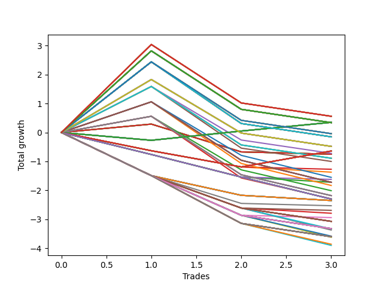

# Long HLT 507 
- Symbol: TSLA
- Date Range: 05/16/2022 - 05/17/2024
- Trading Period: 8:30-12:30
- Number of Trades: 3



| Id. | Name | Win Percent | Profit | Avg Profit / Trade | Avg Time / Trade | Std |      | Name | Win Percent | Profit | Avg Profit / Trade | Avg Time / Trade | Std |
| --- | ---- | ----------- | ------ | ------------------ | ---------------- | --- | ---- | ---- | ----------- | ------ | ------------------ | ---------------- | --- |
| | Sorted By <br> Profit | | | | | | | Sorted By <br> Win Percentage |||||
|0| TP-3 180m | 33.33 | 0.56 | 0.19 | 60:20 | 2.12 |     | TP-0.25 180m | 66.67 | 0.35 | 0.12 | 05:20 | 0.27 |
|1| TP-3 165m | 33.33 | 0.56 | 0.19 | 60:20 | 2.12 |     | TP-0.25 165m | 66.67 | 0.35 | 0.12 | 05:20 | 0.27 |
|2| TP-3 150m | 33.33 | 0.56 | 0.19 | 60:20 | 2.12 |     | TP-0.25 150m | 66.67 | 0.35 | 0.12 | 05:20 | 0.27 |
|3| TP-3 135m | 33.33 | 0.56 | 0.19 | 60:20 | 2.12 |     | TP-0.25 135m | 66.67 | 0.35 | 0.12 | 05:20 | 0.27 |
|4| TP-3 120m | 33.33 | 0.56 | 0.19 | 60:20 | 2.12 |     | TP-0.25 120m | 66.67 | 0.35 | 0.12 | 05:20 | 0.27 |
|5| TP-3 105m | 33.33 | 0.56 | 0.19 | 60:20 | 2.12 |     | TP-0.25 105m | 66.67 | 0.35 | 0.12 | 05:20 | 0.27 |
|6| TP-3 90m | 33.33 | 0.56 | 0.19 | 60:20 | 2.12 |     | TP-0.25 90m | 66.67 | 0.35 | 0.12 | 05:20 | 0.27 |
|7| TP-0.25 180m | 66.67 | 0.35 | 0.12 | 05:20 | 0.27 |     | TP-0.25 75m | 66.67 | 0.35 | 0.12 | 05:20 | 0.27 |
|8| TP-0.25 165m | 66.67 | 0.35 | 0.12 | 05:20 | 0.27 |     | TP-0.25 60m | 66.67 | 0.35 | 0.12 | 05:20 | 0.27 |
|9| TP-0.25 150m | 66.67 | 0.35 | 0.12 | 05:20 | 0.27 |     | TP-0.25 45m | 66.67 | 0.35 | 0.12 | 05:20 | 0.27 |
|10| TP-0.25 135m | 66.67 | 0.35 | 0.12 | 05:20 | 0.27 |     | TP-0.25 30m | 66.67 | 0.35 | 0.12 | 05:20 | 0.27 |
|11| TP-0.25 120m | 66.67 | 0.35 | 0.12 | 05:20 | 0.27 |     | TP-0.25 15m | 66.67 | 0.35 | 0.12 | 05:20 | 0.27 |
|12| TP-0.25 105m | 66.67 | 0.35 | 0.12 | 05:20 | 0.27 |     | TP-3 180m | 33.33 | 0.56 | 0.19 | 60:20 | 2.12 |
|13| TP-0.25 90m | 66.67 | 0.35 | 0.12 | 05:20 | 0.27 |     | TP-3 165m | 33.33 | 0.56 | 0.19 | 60:20 | 2.12 |
|14| TP-0.25 75m | 66.67 | 0.35 | 0.12 | 05:20 | 0.27 |     | TP-3 150m | 33.33 | 0.56 | 0.19 | 60:20 | 2.12 |
|15| TP-0.25 60m | 66.67 | 0.35 | 0.12 | 05:20 | 0.27 |     | TP-3 135m | 33.33 | 0.56 | 0.19 | 60:20 | 2.12 |
|16| TP-0.25 45m | 66.67 | 0.35 | 0.12 | 05:20 | 0.27 |     | TP-3 120m | 33.33 | 0.56 | 0.19 | 60:20 | 2.12 |
|17| TP-0.25 30m | 66.67 | 0.35 | 0.12 | 05:20 | 0.27 |     | TP-3 105m | 33.33 | 0.56 | 0.19 | 60:20 | 2.12 |
|18| TP-0.25 15m | 66.67 | 0.35 | 0.12 | 05:20 | 0.27 |     | TP-3 90m | 33.33 | 0.56 | 0.19 | 60:20 | 2.12 |
|19| TP-2.75 180m | 33.33 | 0.34 | 0.11 | 60:00 | 2.02 |     | TP-2.75 180m | 33.33 | 0.34 | 0.11 | 60:00 | 2.02 |
|20| TP-2.5 180m | 33.33 | 0.34 | 0.11 | 60:00 | 2.02 |     | TP-2.5 180m | 33.33 | 0.34 | 0.11 | 60:00 | 2.02 |
|21| TP-2.75 165m | 33.33 | 0.34 | 0.11 | 60:00 | 2.02 |     | TP-2.75 165m | 33.33 | 0.34 | 0.11 | 60:00 | 2.02 |
|22| TP-2.5 165m | 33.33 | 0.34 | 0.11 | 60:00 | 2.02 |     | TP-2.5 165m | 33.33 | 0.34 | 0.11 | 60:00 | 2.02 |
|23| TP-2.75 150m | 33.33 | 0.34 | 0.11 | 60:00 | 2.02 |     | TP-2.75 150m | 33.33 | 0.34 | 0.11 | 60:00 | 2.02 |
|24| TP-2.5 150m | 33.33 | 0.34 | 0.11 | 60:00 | 2.02 |     | TP-2.5 150m | 33.33 | 0.34 | 0.11 | 60:00 | 2.02 |
|25| TP-2.75 135m | 33.33 | 0.34 | 0.11 | 60:00 | 2.02 |     | TP-2.75 135m | 33.33 | 0.34 | 0.11 | 60:00 | 2.02 |
|26| TP-2.5 135m | 33.33 | 0.34 | 0.11 | 60:00 | 2.02 |     | TP-2.5 135m | 33.33 | 0.34 | 0.11 | 60:00 | 2.02 |
|27| TP-2.75 120m | 33.33 | 0.34 | 0.11 | 60:00 | 2.02 |     | TP-2.75 120m | 33.33 | 0.34 | 0.11 | 60:00 | 2.02 |
|28| TP-2.5 120m | 33.33 | 0.34 | 0.11 | 60:00 | 2.02 |     | TP-2.5 120m | 33.33 | 0.34 | 0.11 | 60:00 | 2.02 |
|29| TP-2.75 105m | 33.33 | 0.34 | 0.11 | 60:00 | 2.02 |     | TP-2.75 105m | 33.33 | 0.34 | 0.11 | 60:00 | 2.02 |
|30| TP-2.5 105m | 33.33 | 0.34 | 0.11 | 60:00 | 2.02 |     | TP-2.5 105m | 33.33 | 0.34 | 0.11 | 60:00 | 2.02 |
|31| TP-2.75 90m | 33.33 | 0.34 | 0.11 | 60:00 | 2.02 |     | TP-2.75 90m | 33.33 | 0.34 | 0.11 | 60:00 | 2.02 |
|32| TP-2.5 90m | 33.33 | 0.34 | 0.11 | 60:00 | 2.02 |     | TP-2.5 90m | 33.33 | 0.34 | 0.11 | 60:00 | 2.02 |
|33| TP-2.25 180m | 33.33 | -0.04 | -0.01 | 59:00 | 1.85 |     | TP-2.25 180m | 33.33 | -0.04 | -0.01 | 59:00 | 1.85 |
|34| TP-2.25 165m | 33.33 | -0.04 | -0.01 | 59:00 | 1.85 |     | TP-2.25 165m | 33.33 | -0.04 | -0.01 | 59:00 | 1.85 |
|35| TP-2.25 150m | 33.33 | -0.04 | -0.01 | 59:00 | 1.85 |     | TP-2.25 150m | 33.33 | -0.04 | -0.01 | 59:00 | 1.85 |
|36| TP-2.25 135m | 33.33 | -0.04 | -0.01 | 59:00 | 1.85 |     | TP-2.25 135m | 33.33 | -0.04 | -0.01 | 59:00 | 1.85 |
|37| TP-2.25 120m | 33.33 | -0.04 | -0.01 | 59:00 | 1.85 |     | TP-2.25 120m | 33.33 | -0.04 | -0.01 | 59:00 | 1.85 |
|38| TP-2.25 105m | 33.33 | -0.04 | -0.01 | 59:00 | 1.85 |     | TP-2.25 105m | 33.33 | -0.04 | -0.01 | 59:00 | 1.85 |
|39| TP-2.25 90m | 33.33 | -0.04 | -0.01 | 59:00 | 1.85 |     | TP-2.25 90m | 33.33 | -0.04 | -0.01 | 59:00 | 1.85 |
|40| TP-2 180m | 33.33 | -0.15 | -0.05 | 58:20 | 1.89 |     | TP-2 180m | 33.33 | -0.15 | -0.05 | 58:20 | 1.89 |
|41| TP-2 165m | 33.33 | -0.15 | -0.05 | 58:20 | 1.89 |     | TP-2 165m | 33.33 | -0.15 | -0.05 | 58:20 | 1.89 |
|42| TP-2 150m | 33.33 | -0.15 | -0.05 | 58:20 | 1.89 |     | TP-2 150m | 33.33 | -0.15 | -0.05 | 58:20 | 1.89 |
|43| TP-2 135m | 33.33 | -0.15 | -0.05 | 58:20 | 1.89 |     | TP-2 135m | 33.33 | -0.15 | -0.05 | 58:20 | 1.89 |
|44| TP-2 120m | 33.33 | -0.15 | -0.05 | 58:20 | 1.89 |     | TP-2 120m | 33.33 | -0.15 | -0.05 | 58:20 | 1.89 |
|45| TP-2 105m | 33.33 | -0.15 | -0.05 | 58:20 | 1.89 |     | TP-2 105m | 33.33 | -0.15 | -0.05 | 58:20 | 1.89 |
|46| TP-2 90m | 33.33 | -0.15 | -0.05 | 58:20 | 1.89 |     | TP-2 90m | 33.33 | -0.15 | -0.05 | 58:20 | 1.89 |
|47| TP-1.75 180m | 33.33 | -0.48 | -0.16 | 57:40 | 1.52 |     | TP-1.75 180m | 33.33 | -0.48 | -0.16 | 57:40 | 1.52 |
|48| TP-1.75 165m | 33.33 | -0.48 | -0.16 | 57:40 | 1.52 |     | TP-1.75 165m | 33.33 | -0.48 | -0.16 | 57:40 | 1.52 |
|49| TP-1.75 150m | 33.33 | -0.48 | -0.16 | 57:40 | 1.52 |     | TP-1.75 150m | 33.33 | -0.48 | -0.16 | 57:40 | 1.52 |
|50| TP-1.75 135m | 33.33 | -0.48 | -0.16 | 57:40 | 1.52 |     | TP-1.75 135m | 33.33 | -0.48 | -0.16 | 57:40 | 1.52 |
|51| TP-1.75 120m | 33.33 | -0.48 | -0.16 | 57:40 | 1.52 |     | TP-1.75 120m | 33.33 | -0.48 | -0.16 | 57:40 | 1.52 |
|52| TP-1.75 105m | 33.33 | -0.48 | -0.16 | 57:40 | 1.52 |     | TP-1.75 105m | 33.33 | -0.48 | -0.16 | 57:40 | 1.52 |
|53| TP-1.75 90m | 33.33 | -0.48 | -0.16 | 57:40 | 1.52 |     | TP-1.75 90m | 33.33 | -0.48 | -0.16 | 57:40 | 1.52 |
|54| TP-0.5 180m | 33.33 | -0.64 | -0.21 | 17:00 | 0.54 |     | TP-0.5 180m | 33.33 | -0.64 | -0.21 | 17:00 | 0.54 |
|55| TP-0.5 165m | 33.33 | -0.64 | -0.21 | 17:00 | 0.54 |     | TP-0.5 165m | 33.33 | -0.64 | -0.21 | 17:00 | 0.54 |
|56| TP-0.5 150m | 33.33 | -0.64 | -0.21 | 17:00 | 0.54 |     | TP-0.5 150m | 33.33 | -0.64 | -0.21 | 17:00 | 0.54 |
|57| TP-0.5 135m | 33.33 | -0.64 | -0.21 | 17:00 | 0.54 |     | TP-0.5 135m | 33.33 | -0.64 | -0.21 | 17:00 | 0.54 |
|58| TP-0.5 120m | 33.33 | -0.64 | -0.21 | 17:00 | 0.54 |     | TP-0.5 120m | 33.33 | -0.64 | -0.21 | 17:00 | 0.54 |
|59| TP-0.5 105m | 33.33 | -0.64 | -0.21 | 17:00 | 0.54 |     | TP-0.5 105m | 33.33 | -0.64 | -0.21 | 17:00 | 0.54 |
|60| TP-0.5 90m | 33.33 | -0.64 | -0.21 | 17:00 | 0.54 |     | TP-0.5 90m | 33.33 | -0.64 | -0.21 | 17:00 | 0.54 |
|61| TP-0.5 75m | 33.33 | -0.64 | -0.21 | 17:00 | 0.54 |     | TP-0.5 75m | 33.33 | -0.64 | -0.21 | 17:00 | 0.54 |
|62| TP-0.5 60m | 33.33 | -0.64 | -0.21 | 17:00 | 0.54 |     | TP-0.5 60m | 33.33 | -0.64 | -0.21 | 17:00 | 0.54 |
|63| TP-0.5 45m | 33.33 | -0.64 | -0.21 | 17:00 | 0.54 |     | TP-0.5 45m | 33.33 | -0.64 | -0.21 | 17:00 | 0.54 |
|64| TP-1.75 75m | 33.33 | -0.72 | -0.24 | 57:00 | 1.41 |     | TP-1.75 75m | 33.33 | -0.72 | -0.24 | 57:00 | 1.41 |
|65| TP-3 30m | 33.33 | -0.75 | -0.25 | 29:00 | 0.52 |     | TP-3 30m | 33.33 | -0.75 | -0.25 | 29:00 | 0.52 |
|66| TP-2.75 30m | 33.33 | -0.75 | -0.25 | 29:00 | 0.52 |     | TP-2.75 30m | 33.33 | -0.75 | -0.25 | 29:00 | 0.52 |
|67| TP-2.5 30m | 33.33 | -0.75 | -0.25 | 29:00 | 0.52 |     | TP-2.5 30m | 33.33 | -0.75 | -0.25 | 29:00 | 0.52 |
|68| TP-2.25 30m | 33.33 | -0.75 | -0.25 | 29:00 | 0.52 |     | TP-2.25 30m | 33.33 | -0.75 | -0.25 | 29:00 | 0.52 |
|69| TP-2 30m | 33.33 | -0.75 | -0.25 | 29:00 | 0.52 |     | TP-2 30m | 33.33 | -0.75 | -0.25 | 29:00 | 0.52 |
|70| TP-1.75 30m | 33.33 | -0.75 | -0.25 | 29:00 | 0.52 |     | TP-1.75 30m | 33.33 | -0.75 | -0.25 | 29:00 | 0.52 |
|71| TP-3 75m | 33.33 | -0.89 | -0.30 | 58:00 | 1.48 |     | TP-3 75m | 33.33 | -0.89 | -0.30 | 58:00 | 1.48 |
|72| TP-2.75 75m | 33.33 | -0.89 | -0.30 | 58:00 | 1.48 |     | TP-2.75 75m | 33.33 | -0.89 | -0.30 | 58:00 | 1.48 |
|73| TP-2.5 75m | 33.33 | -0.89 | -0.30 | 58:00 | 1.48 |     | TP-2.5 75m | 33.33 | -0.89 | -0.30 | 58:00 | 1.48 |
|74| TP-2.25 75m | 33.33 | -0.89 | -0.30 | 58:00 | 1.48 |     | TP-2.25 75m | 33.33 | -0.89 | -0.30 | 58:00 | 1.48 |
|75| TP-2 75m | 33.33 | -1.00 | -0.33 | 57:20 | 1.52 |     | TP-2 75m | 33.33 | -1.00 | -0.33 | 57:20 | 1.52 |
|76| TP-0.5 30m | 0.00 | -1.27 | -0.42 | 14:40 | 0.24 |     | TP-1.75 45m | 33.33 | -1.55 | -0.52 | 40:00 | 1.20 |
|77| TP-0.5 15m | 0.00 | -1.37 | -0.46 | 09:40 | 0.20 |     | TP-3 45m | 33.33 | -1.72 | -0.57 | 41:00 | 1.26 |
|78| TP-1.75 45m | 33.33 | -1.55 | -0.52 | 40:00 | 1.20 |     | TP-2.75 45m | 33.33 | -1.72 | -0.57 | 41:00 | 1.26 |
|79| TP-0.75 30m | 0.00 | -1.62 | -0.54 | 16:00 | 0.33 |     | TP-2.5 45m | 33.33 | -1.72 | -0.57 | 41:00 | 1.26 |
|80| TP-3 45m | 33.33 | -1.72 | -0.57 | 41:00 | 1.26 |     | TP-2.25 45m | 33.33 | -1.72 | -0.57 | 41:00 | 1.26 |
|81| TP-2.75 45m | 33.33 | -1.72 | -0.57 | 41:00 | 1.26 |     | TP-2 45m | 33.33 | -1.83 | -0.61 | 40:20 | 1.31 |
|82| TP-2.5 45m | 33.33 | -1.72 | -0.57 | 41:00 | 1.26 |     | TP-1.75 60m | 33.33 | -2.01 | -0.67 | 50:00 | 0.98 |
|83| TP-2.25 45m | 33.33 | -1.72 | -0.57 | 41:00 | 1.26 |     | TP-3 60m | 33.33 | -2.18 | -0.73 | 51:00 | 1.05 |
|84| TP-0.75 15m | 0.00 | -1.72 | -0.57 | 11:00 | 0.28 |     | TP-2.75 60m | 33.33 | -2.18 | -0.73 | 51:00 | 1.05 |
|85| TP-2 45m | 33.33 | -1.83 | -0.61 | 40:20 | 1.31 |     | TP-2.5 60m | 33.33 | -2.18 | -0.73 | 51:00 | 1.05 |
|86| TP-1.75 60m | 33.33 | -2.01 | -0.67 | 50:00 | 0.98 |     | TP-2.25 60m | 33.33 | -2.18 | -0.73 | 51:00 | 1.05 |
|87| TP-3 60m | 33.33 | -2.18 | -0.73 | 51:00 | 1.05 |     | TP-2 60m | 33.33 | -2.29 | -0.76 | 50:20 | 1.10 |
|88| TP-2.75 60m | 33.33 | -2.18 | -0.73 | 51:00 | 1.05 |     | TP-0.5 30m | 0.00 | -1.27 | -0.42 | 14:40 | 0.24 |
|89| TP-2.5 60m | 33.33 | -2.18 | -0.73 | 51:00 | 1.05 |     | TP-0.5 15m | 0.00 | -1.37 | -0.46 | 09:40 | 0.20 |
|90| TP-2.25 60m | 33.33 | -2.18 | -0.73 | 51:00 | 1.05 |     | TP-0.75 30m | 0.00 | -1.62 | -0.54 | 16:00 | 0.33 |
|91| TP-2 60m | 33.33 | -2.29 | -0.76 | 50:20 | 1.10 |     | TP-0.75 15m | 0.00 | -1.72 | -0.57 | 11:00 | 0.28 |
|92| TP-0.75 180m | 0.00 | -2.30 | -0.77 | 21:00 | 0.01 |     | TP-0.75 180m | 0.00 | -2.30 | -0.77 | 21:00 | 0.01 |
|93| TP-0.75 165m | 0.00 | -2.30 | -0.77 | 21:00 | 0.01 |     | TP-0.75 165m | 0.00 | -2.30 | -0.77 | 21:00 | 0.01 |
|94| TP-0.75 150m | 0.00 | -2.30 | -0.77 | 21:00 | 0.01 |     | TP-0.75 150m | 0.00 | -2.30 | -0.77 | 21:00 | 0.01 |
|95| TP-0.75 135m | 0.00 | -2.30 | -0.77 | 21:00 | 0.01 |     | TP-0.75 135m | 0.00 | -2.30 | -0.77 | 21:00 | 0.01 |
|96| TP-0.75 120m | 0.00 | -2.30 | -0.77 | 21:00 | 0.01 |     | TP-0.75 120m | 0.00 | -2.30 | -0.77 | 21:00 | 0.01 |
|97| TP-0.75 105m | 0.00 | -2.30 | -0.77 | 21:00 | 0.01 |     | TP-0.75 105m | 0.00 | -2.30 | -0.77 | 21:00 | 0.01 |
|98| TP-0.75 90m | 0.00 | -2.30 | -0.77 | 21:00 | 0.01 |     | TP-0.75 90m | 0.00 | -2.30 | -0.77 | 21:00 | 0.01 |
|99| TP-0.75 75m | 0.00 | -2.30 | -0.77 | 21:00 | 0.01 |     | TP-0.75 75m | 0.00 | -2.30 | -0.77 | 21:00 | 0.01 |
|100| TP-0.75 60m | 0.00 | -2.30 | -0.77 | 21:00 | 0.01 |     | TP-0.75 60m | 0.00 | -2.30 | -0.77 | 21:00 | 0.01 |
|101| TP-0.75 45m | 0.00 | -2.30 | -0.77 | 21:00 | 0.01 |     | TP-0.75 45m | 0.00 | -2.30 | -0.77 | 21:00 | 0.01 |
|102| TP-3 15m | 0.00 | -2.35 | -0.78 | 14:00 | 0.54 |     | TP-3 15m | 0.00 | -2.35 | -0.78 | 14:00 | 0.54 |
|103| TP-2.75 15m | 0.00 | -2.35 | -0.78 | 14:00 | 0.54 |     | TP-2.75 15m | 0.00 | -2.35 | -0.78 | 14:00 | 0.54 |
|104| TP-2.5 15m | 0.00 | -2.35 | -0.78 | 14:00 | 0.54 |     | TP-2.5 15m | 0.00 | -2.35 | -0.78 | 14:00 | 0.54 |
|105| TP-2.25 15m | 0.00 | -2.35 | -0.78 | 14:00 | 0.54 |     | TP-2.25 15m | 0.00 | -2.35 | -0.78 | 14:00 | 0.54 |
|106| TP-2 15m | 0.00 | -2.35 | -0.78 | 14:00 | 0.54 |     | TP-2 15m | 0.00 | -2.35 | -0.78 | 14:00 | 0.54 |
|107| TP-1.75 15m | 0.00 | -2.35 | -0.78 | 14:00 | 0.54 |     | TP-1.75 15m | 0.00 | -2.35 | -0.78 | 14:00 | 0.54 |
|108| TP-1.5 15m | 0.00 | -2.35 | -0.78 | 13:40 | 0.54 |     | TP-1.5 15m | 0.00 | -2.35 | -0.78 | 13:40 | 0.54 |
|109| TP-1.25 15m | 0.00 | -2.35 | -0.78 | 13:40 | 0.54 |     | TP-1.25 15m | 0.00 | -2.35 | -0.78 | 13:40 | 0.54 |
|110| TP-1.5 30m | 0.00 | -2.53 | -0.84 | 23:40 | 0.58 |     | TP-1.5 30m | 0.00 | -2.53 | -0.84 | 23:40 | 0.58 |
|111| TP-1 30m | 0.00 | -2.69 | -0.90 | 18:00 | 0.60 |     | TP-1 30m | 0.00 | -2.69 | -0.90 | 18:00 | 0.60 |
|112| TP-1 15m | 0.00 | -2.79 | -0.93 | 13:00 | 0.55 |     | TP-1 15m | 0.00 | -2.79 | -0.93 | 13:00 | 0.55 |
|113| TP-1.25 30m | 0.00 | -2.94 | -0.98 | 21:00 | 0.64 |     | TP-1.25 30m | 0.00 | -2.94 | -0.98 | 21:00 | 0.64 |
|114| TP-1 180m | 0.00 | -3.07 | -1.02 | 30:00 | 0.43 |     | TP-1 180m | 0.00 | -3.07 | -1.02 | 30:00 | 0.43 |
|115| TP-1 165m | 0.00 | -3.07 | -1.02 | 30:00 | 0.43 |     | TP-1 165m | 0.00 | -3.07 | -1.02 | 30:00 | 0.43 |
|116| TP-1 150m | 0.00 | -3.07 | -1.02 | 30:00 | 0.43 |     | TP-1 150m | 0.00 | -3.07 | -1.02 | 30:00 | 0.43 |
|117| TP-1 135m | 0.00 | -3.07 | -1.02 | 30:00 | 0.43 |     | TP-1 135m | 0.00 | -3.07 | -1.02 | 30:00 | 0.43 |
|118| TP-1 120m | 0.00 | -3.07 | -1.02 | 30:00 | 0.43 |     | TP-1 120m | 0.00 | -3.07 | -1.02 | 30:00 | 0.43 |
|119| TP-1 105m | 0.00 | -3.07 | -1.02 | 30:00 | 0.43 |     | TP-1 105m | 0.00 | -3.07 | -1.02 | 30:00 | 0.43 |
|120| TP-1 90m | 0.00 | -3.07 | -1.02 | 30:00 | 0.43 |     | TP-1 90m | 0.00 | -3.07 | -1.02 | 30:00 | 0.43 |
|121| TP-1 75m | 0.00 | -3.07 | -1.02 | 30:00 | 0.43 |     | TP-1 75m | 0.00 | -3.07 | -1.02 | 30:00 | 0.43 |
|122| TP-1.25 180m | 0.00 | -3.32 | -1.11 | 33:00 | 0.46 |     | TP-1.25 180m | 0.00 | -3.32 | -1.11 | 33:00 | 0.46 |
|123| TP-1.25 165m | 0.00 | -3.32 | -1.11 | 33:00 | 0.46 |     | TP-1.25 165m | 0.00 | -3.32 | -1.11 | 33:00 | 0.46 |
|124| TP-1.25 150m | 0.00 | -3.32 | -1.11 | 33:00 | 0.46 |     | TP-1.25 150m | 0.00 | -3.32 | -1.11 | 33:00 | 0.46 |
|125| TP-1.25 135m | 0.00 | -3.32 | -1.11 | 33:00 | 0.46 |     | TP-1.25 135m | 0.00 | -3.32 | -1.11 | 33:00 | 0.46 |
|126| TP-1.25 120m | 0.00 | -3.32 | -1.11 | 33:00 | 0.46 |     | TP-1.25 120m | 0.00 | -3.32 | -1.11 | 33:00 | 0.46 |
|127| TP-1.25 105m | 0.00 | -3.32 | -1.11 | 33:00 | 0.46 |     | TP-1.25 105m | 0.00 | -3.32 | -1.11 | 33:00 | 0.46 |
|128| TP-1.25 90m | 0.00 | -3.32 | -1.11 | 33:00 | 0.46 |     | TP-1.25 90m | 0.00 | -3.32 | -1.11 | 33:00 | 0.46 |
|129| TP-1.25 75m | 0.00 | -3.32 | -1.11 | 33:00 | 0.46 |     | TP-1.25 75m | 0.00 | -3.32 | -1.11 | 33:00 | 0.46 |
|130| TP-1 60m | 0.00 | -3.33 | -1.11 | 28:00 | 0.31 |     | TP-1 60m | 0.00 | -3.33 | -1.11 | 28:00 | 0.31 |
|131| TP-1 45m | 0.00 | -3.37 | -1.12 | 23:00 | 0.30 |     | TP-1 45m | 0.00 | -3.37 | -1.12 | 23:00 | 0.30 |
|132| TP-1.25 60m | 0.00 | -3.58 | -1.19 | 31:00 | 0.34 |     | TP-1.25 60m | 0.00 | -3.58 | -1.19 | 31:00 | 0.34 |
|133| TP-1.5 180m | 0.00 | -3.60 | -1.20 | 36:20 | 0.53 |     | TP-1.5 180m | 0.00 | -3.60 | -1.20 | 36:20 | 0.53 |
|134| TP-1.5 165m | 0.00 | -3.60 | -1.20 | 36:20 | 0.53 |     | TP-1.5 165m | 0.00 | -3.60 | -1.20 | 36:20 | 0.53 |
|135| TP-1.5 150m | 0.00 | -3.60 | -1.20 | 36:20 | 0.53 |     | TP-1.5 150m | 0.00 | -3.60 | -1.20 | 36:20 | 0.53 |
|136| TP-1.5 135m | 0.00 | -3.60 | -1.20 | 36:20 | 0.53 |     | TP-1.5 135m | 0.00 | -3.60 | -1.20 | 36:20 | 0.53 |
|137| TP-1.5 120m | 0.00 | -3.60 | -1.20 | 36:20 | 0.53 |     | TP-1.5 120m | 0.00 | -3.60 | -1.20 | 36:20 | 0.53 |
|138| TP-1.5 105m | 0.00 | -3.60 | -1.20 | 36:20 | 0.53 |     | TP-1.5 105m | 0.00 | -3.60 | -1.20 | 36:20 | 0.53 |
|139| TP-1.5 90m | 0.00 | -3.60 | -1.20 | 36:20 | 0.53 |     | TP-1.5 90m | 0.00 | -3.60 | -1.20 | 36:20 | 0.53 |
|140| TP-1.5 75m | 0.00 | -3.60 | -1.20 | 36:20 | 0.53 |     | TP-1.5 75m | 0.00 | -3.60 | -1.20 | 36:20 | 0.53 |
|141| TP-1.25 45m | 0.00 | -3.62 | -1.21 | 26:00 | 0.32 |     | TP-1.25 45m | 0.00 | -3.62 | -1.21 | 26:00 | 0.32 |
|142| TP-1.5 60m | 0.00 | -3.86 | -1.29 | 34:20 | 0.41 |     | TP-1.5 60m | 0.00 | -3.86 | -1.29 | 34:20 | 0.41 |
|143| TP-1.5 45m | 0.00 | -3.90 | -1.30 | 29:20 | 0.39 |     | TP-1.5 45m | 0.00 | -3.90 | -1.30 | 29:20 | 0.39 |

### Test TP-0.25 15m
* Take Profit of 0.25 Point
* 0.25 Stoploss
* Results:
```
Total Trades: 3
Percent Up: 66.67
Percent Down: 33.33
Total Points Moved Up: 0.35
Potential Profit: 175.00
Total Points Ups: 0.62 Count Ups: 2
Total Points Downs: -0.27 Count Downs: 1
```

<details><summary>Trades</summary>

<code>In: 2022-08-09 09:40:00		Out: 2022-08-09 09:43:00		Total Position Time: 03:00		Total Move Up: -0.27		Total to Date: -0.27</code> <br />
<code>In: 2023-07-27 12:15:00		Out: 2023-07-27 12:20:00		Total Position Time: 05:00		Total Move Up: 0.32		Total to Date: 0.05</code> <br />
<code>In: 2024-03-13 11:45:00		Out: 2024-03-13 11:53:00		Total Position Time: 08:00		Total Move Up: 0.30		Total to Date: 0.35</code> <br />


</details>

### Test TP-0.5 15m
* Take Profit of 0.5 Point
* 0.5 Stoploss
* Results:
```
Total Trades: 3
Percent Up: 0.00
Percent Down: 100.00
Total Points Moved Up: -1.37
Potential Profit: -685.00
Total Points Ups: 0.00 Count Ups: 0
Total Points Downs: -1.37 Count Downs: 3
```

<details><summary>Trades</summary>

<code>In: 2022-08-09 09:40:00		Out: 2022-08-09 09:46:00		Total Position Time: 06:00		Total Move Up: -0.63		Total to Date: -0.63</code> <br />
<code>In: 2023-07-27 12:15:00		Out: 2023-07-27 12:24:00		Total Position Time: 09:00		Total Move Up: -0.56		Total to Date: -1.19</code> <br />
<code>In: 2024-03-13 11:45:00		Out: 2024-03-13 11:59:00		Total Position Time: 14:00		Total Move Up: -0.18		Total to Date: -1.37</code> <br />


</details>

### Test TP-0.75 15m
* Take Profit of 0.75 Point
* 0.75 Stoploss
* Results:
```
Total Trades: 3
Percent Up: 0.00
Percent Down: 100.00
Total Points Moved Up: -1.72
Potential Profit: -860.00
Total Points Ups: 0.00 Count Ups: 0
Total Points Downs: -1.72 Count Downs: 3
```

<details><summary>Trades</summary>

<code>In: 2022-08-09 09:40:00		Out: 2022-08-09 09:49:00		Total Position Time: 09:00		Total Move Up: -0.76		Total to Date: -0.76</code> <br />
<code>In: 2023-07-27 12:15:00		Out: 2023-07-27 12:25:00		Total Position Time: 10:00		Total Move Up: -0.78		Total to Date: -1.54</code> <br />
<code>In: 2024-03-13 11:45:00		Out: 2024-03-13 11:59:00		Total Position Time: 14:00		Total Move Up: -0.18		Total to Date: -1.72</code> <br />


</details>

### Test TP-1 15m
* Take Profit of 1 Point
* 1 Stoploss
* Results:
```
Total Trades: 3
Percent Up: 0.00
Percent Down: 100.00
Total Points Moved Up: -2.79
Potential Profit: -1395.00
Total Points Ups: 0.00 Count Ups: 0
Total Points Downs: -2.79 Count Downs: 3
```

<details><summary>Trades</summary>

<code>In: 2022-08-09 09:40:00		Out: 2022-08-09 09:53:00		Total Position Time: 13:00		Total Move Up: -1.49		Total to Date: -1.49</code> <br />
<code>In: 2023-07-27 12:15:00		Out: 2023-07-27 12:27:00		Total Position Time: 12:00		Total Move Up: -1.12		Total to Date: -2.61</code> <br />
<code>In: 2024-03-13 11:45:00		Out: 2024-03-13 11:59:00		Total Position Time: 14:00		Total Move Up: -0.18		Total to Date: -2.79</code> <br />


</details>

### Test TP-1.25 15m
* Take Profit of 1.25 Point
* 1.25 Stoploss
* Results:
```
Total Trades: 3
Percent Up: 0.00
Percent Down: 100.00
Total Points Moved Up: -2.35
Potential Profit: -1175.00
Total Points Ups: 0.00 Count Ups: 0
Total Points Downs: -2.35 Count Downs: 3
```

<details><summary>Trades</summary>

<code>In: 2022-08-09 09:40:00		Out: 2022-08-09 09:53:00		Total Position Time: 13:00		Total Move Up: -1.49		Total to Date: -1.49</code> <br />
<code>In: 2023-07-27 12:15:00		Out: 2023-07-27 12:29:00		Total Position Time: 14:00		Total Move Up: -0.68		Total to Date: -2.17</code> <br />
<code>In: 2024-03-13 11:45:00		Out: 2024-03-13 11:59:00		Total Position Time: 14:00		Total Move Up: -0.18		Total to Date: -2.35</code> <br />


</details>

### Test TP-1.5 15m
* Take Profit of 1.5 Point
* 1.5 Stoploss
* Results:
```
Total Trades: 3
Percent Up: 0.00
Percent Down: 100.00
Total Points Moved Up: -2.35
Potential Profit: -1175.00
Total Points Ups: 0.00 Count Ups: 0
Total Points Downs: -2.35 Count Downs: 3
```

<details><summary>Trades</summary>

<code>In: 2022-08-09 09:40:00		Out: 2022-08-09 09:53:00		Total Position Time: 13:00		Total Move Up: -1.49		Total to Date: -1.49</code> <br />
<code>In: 2023-07-27 12:15:00		Out: 2023-07-27 12:29:00		Total Position Time: 14:00		Total Move Up: -0.68		Total to Date: -2.17</code> <br />
<code>In: 2024-03-13 11:45:00		Out: 2024-03-13 11:59:00		Total Position Time: 14:00		Total Move Up: -0.18		Total to Date: -2.35</code> <br />


</details>

### Test TP-1.75 15m
* Take Profit of 1.75 Point
* 1.75 Stoploss
* Results:
```
Total Trades: 3
Percent Up: 0.00
Percent Down: 100.00
Total Points Moved Up: -2.35
Potential Profit: -1175.00
Total Points Ups: 0.00 Count Ups: 0
Total Points Downs: -2.35 Count Downs: 3
```

<details><summary>Trades</summary>

<code>In: 2022-08-09 09:40:00		Out: 2022-08-09 09:54:00		Total Position Time: 14:00		Total Move Up: -1.49		Total to Date: -1.49</code> <br />
<code>In: 2023-07-27 12:15:00		Out: 2023-07-27 12:29:00		Total Position Time: 14:00		Total Move Up: -0.68		Total to Date: -2.17</code> <br />
<code>In: 2024-03-13 11:45:00		Out: 2024-03-13 11:59:00		Total Position Time: 14:00		Total Move Up: -0.18		Total to Date: -2.35</code> <br />


</details>

### Test TP-2 15m
* Take Profit of 2 Point
* 2 Stoploss
* Results:
```
Total Trades: 3
Percent Up: 0.00
Percent Down: 100.00
Total Points Moved Up: -2.35
Potential Profit: -1175.00
Total Points Ups: 0.00 Count Ups: 0
Total Points Downs: -2.35 Count Downs: 3
```

<details><summary>Trades</summary>

<code>In: 2022-08-09 09:40:00		Out: 2022-08-09 09:54:00		Total Position Time: 14:00		Total Move Up: -1.49		Total to Date: -1.49</code> <br />
<code>In: 2023-07-27 12:15:00		Out: 2023-07-27 12:29:00		Total Position Time: 14:00		Total Move Up: -0.68		Total to Date: -2.17</code> <br />
<code>In: 2024-03-13 11:45:00		Out: 2024-03-13 11:59:00		Total Position Time: 14:00		Total Move Up: -0.18		Total to Date: -2.35</code> <br />


</details>

### Test TP-2.25 15m
* Take Profit of 2.25 Point
* 2.25 Stoploss
* Results:
```
Total Trades: 3
Percent Up: 0.00
Percent Down: 100.00
Total Points Moved Up: -2.35
Potential Profit: -1175.00
Total Points Ups: 0.00 Count Ups: 0
Total Points Downs: -2.35 Count Downs: 3
```

<details><summary>Trades</summary>

<code>In: 2022-08-09 09:40:00		Out: 2022-08-09 09:54:00		Total Position Time: 14:00		Total Move Up: -1.49		Total to Date: -1.49</code> <br />
<code>In: 2023-07-27 12:15:00		Out: 2023-07-27 12:29:00		Total Position Time: 14:00		Total Move Up: -0.68		Total to Date: -2.17</code> <br />
<code>In: 2024-03-13 11:45:00		Out: 2024-03-13 11:59:00		Total Position Time: 14:00		Total Move Up: -0.18		Total to Date: -2.35</code> <br />


</details>

### Test TP-2.5 15m
* Take Profit of 2.5 Point
* 2.5 Stoploss
* Results:
```
Total Trades: 3
Percent Up: 0.00
Percent Down: 100.00
Total Points Moved Up: -2.35
Potential Profit: -1175.00
Total Points Ups: 0.00 Count Ups: 0
Total Points Downs: -2.35 Count Downs: 3
```

<details><summary>Trades</summary>

<code>In: 2022-08-09 09:40:00		Out: 2022-08-09 09:54:00		Total Position Time: 14:00		Total Move Up: -1.49		Total to Date: -1.49</code> <br />
<code>In: 2023-07-27 12:15:00		Out: 2023-07-27 12:29:00		Total Position Time: 14:00		Total Move Up: -0.68		Total to Date: -2.17</code> <br />
<code>In: 2024-03-13 11:45:00		Out: 2024-03-13 11:59:00		Total Position Time: 14:00		Total Move Up: -0.18		Total to Date: -2.35</code> <br />


</details>

### Test TP-2.75 15m
* Take Profit of 2.75 Point
* 2.75 Stoploss
* Results:
```
Total Trades: 3
Percent Up: 0.00
Percent Down: 100.00
Total Points Moved Up: -2.35
Potential Profit: -1175.00
Total Points Ups: 0.00 Count Ups: 0
Total Points Downs: -2.35 Count Downs: 3
```

<details><summary>Trades</summary>

<code>In: 2022-08-09 09:40:00		Out: 2022-08-09 09:54:00		Total Position Time: 14:00		Total Move Up: -1.49		Total to Date: -1.49</code> <br />
<code>In: 2023-07-27 12:15:00		Out: 2023-07-27 12:29:00		Total Position Time: 14:00		Total Move Up: -0.68		Total to Date: -2.17</code> <br />
<code>In: 2024-03-13 11:45:00		Out: 2024-03-13 11:59:00		Total Position Time: 14:00		Total Move Up: -0.18		Total to Date: -2.35</code> <br />


</details>

### Test TP-3 15m
* Take Profit of 3 Point
* 3 Stoploss
* Results:
```
Total Trades: 3
Percent Up: 0.00
Percent Down: 100.00
Total Points Moved Up: -2.35
Potential Profit: -1175.00
Total Points Ups: 0.00 Count Ups: 0
Total Points Downs: -2.35 Count Downs: 3
```

<details><summary>Trades</summary>

<code>In: 2022-08-09 09:40:00		Out: 2022-08-09 09:54:00		Total Position Time: 14:00		Total Move Up: -1.49		Total to Date: -1.49</code> <br />
<code>In: 2023-07-27 12:15:00		Out: 2023-07-27 12:29:00		Total Position Time: 14:00		Total Move Up: -0.68		Total to Date: -2.17</code> <br />
<code>In: 2024-03-13 11:45:00		Out: 2024-03-13 11:59:00		Total Position Time: 14:00		Total Move Up: -0.18		Total to Date: -2.35</code> <br />


</details>

### Test TP-0.25 30m
* Take Profit of 0.25 Point
* 0.25 Stoploss
* Results:
```
Total Trades: 3
Percent Up: 66.67
Percent Down: 33.33
Total Points Moved Up: 0.35
Potential Profit: 175.00
Total Points Ups: 0.62 Count Ups: 2
Total Points Downs: -0.27 Count Downs: 1
```

<details><summary>Trades</summary>

<code>In: 2022-08-09 09:40:00		Out: 2022-08-09 09:43:00		Total Position Time: 03:00		Total Move Up: -0.27		Total to Date: -0.27</code> <br />
<code>In: 2023-07-27 12:15:00		Out: 2023-07-27 12:20:00		Total Position Time: 05:00		Total Move Up: 0.32		Total to Date: 0.05</code> <br />
<code>In: 2024-03-13 11:45:00		Out: 2024-03-13 11:53:00		Total Position Time: 08:00		Total Move Up: 0.30		Total to Date: 0.35</code> <br />


</details>

### Test TP-0.5 30m
* Take Profit of 0.5 Point
* 0.5 Stoploss
* Results:
```
Total Trades: 3
Percent Up: 0.00
Percent Down: 100.00
Total Points Moved Up: -1.27
Potential Profit: -635.00
Total Points Ups: 0.00 Count Ups: 0
Total Points Downs: -1.27 Count Downs: 3
```

<details><summary>Trades</summary>

<code>In: 2022-08-09 09:40:00		Out: 2022-08-09 09:46:00		Total Position Time: 06:00		Total Move Up: -0.63		Total to Date: -0.63</code> <br />
<code>In: 2023-07-27 12:15:00		Out: 2023-07-27 12:24:00		Total Position Time: 09:00		Total Move Up: -0.56		Total to Date: -1.19</code> <br />
<code>In: 2024-03-13 11:45:00		Out: 2024-03-13 12:14:00		Total Position Time: 29:00		Total Move Up: -0.08		Total to Date: -1.27</code> <br />


</details>

### Test TP-0.75 30m
* Take Profit of 0.75 Point
* 0.75 Stoploss
* Results:
```
Total Trades: 3
Percent Up: 0.00
Percent Down: 100.00
Total Points Moved Up: -1.62
Potential Profit: -810.00
Total Points Ups: 0.00 Count Ups: 0
Total Points Downs: -1.62 Count Downs: 3
```

<details><summary>Trades</summary>

<code>In: 2022-08-09 09:40:00		Out: 2022-08-09 09:49:00		Total Position Time: 09:00		Total Move Up: -0.76		Total to Date: -0.76</code> <br />
<code>In: 2023-07-27 12:15:00		Out: 2023-07-27 12:25:00		Total Position Time: 10:00		Total Move Up: -0.78		Total to Date: -1.54</code> <br />
<code>In: 2024-03-13 11:45:00		Out: 2024-03-13 12:14:00		Total Position Time: 29:00		Total Move Up: -0.08		Total to Date: -1.62</code> <br />


</details>

### Test TP-1 30m
* Take Profit of 1 Point
* 1 Stoploss
* Results:
```
Total Trades: 3
Percent Up: 0.00
Percent Down: 100.00
Total Points Moved Up: -2.69
Potential Profit: -1345.00
Total Points Ups: 0.00 Count Ups: 0
Total Points Downs: -2.69 Count Downs: 3
```

<details><summary>Trades</summary>

<code>In: 2022-08-09 09:40:00		Out: 2022-08-09 09:53:00		Total Position Time: 13:00		Total Move Up: -1.49		Total to Date: -1.49</code> <br />
<code>In: 2023-07-27 12:15:00		Out: 2023-07-27 12:27:00		Total Position Time: 12:00		Total Move Up: -1.12		Total to Date: -2.61</code> <br />
<code>In: 2024-03-13 11:45:00		Out: 2024-03-13 12:14:00		Total Position Time: 29:00		Total Move Up: -0.08		Total to Date: -2.69</code> <br />


</details>

### Test TP-1.25 30m
* Take Profit of 1.25 Point
* 1.25 Stoploss
* Results:
```
Total Trades: 3
Percent Up: 0.00
Percent Down: 100.00
Total Points Moved Up: -2.94
Potential Profit: -1470.00
Total Points Ups: 0.00 Count Ups: 0
Total Points Downs: -2.94 Count Downs: 3
```

<details><summary>Trades</summary>

<code>In: 2022-08-09 09:40:00		Out: 2022-08-09 09:53:00		Total Position Time: 13:00		Total Move Up: -1.49		Total to Date: -1.49</code> <br />
<code>In: 2023-07-27 12:15:00		Out: 2023-07-27 12:36:00		Total Position Time: 21:00		Total Move Up: -1.37		Total to Date: -2.86</code> <br />
<code>In: 2024-03-13 11:45:00		Out: 2024-03-13 12:14:00		Total Position Time: 29:00		Total Move Up: -0.08		Total to Date: -2.94</code> <br />


</details>

### Test TP-1.5 30m
* Take Profit of 1.5 Point
* 1.5 Stoploss
* Results:
```
Total Trades: 3
Percent Up: 0.00
Percent Down: 100.00
Total Points Moved Up: -2.53
Potential Profit: -1265.00
Total Points Ups: 0.00 Count Ups: 0
Total Points Downs: -2.53 Count Downs: 3
```

<details><summary>Trades</summary>

<code>In: 2022-08-09 09:40:00		Out: 2022-08-09 09:53:00		Total Position Time: 13:00		Total Move Up: -1.49		Total to Date: -1.49</code> <br />
<code>In: 2023-07-27 12:15:00		Out: 2023-07-27 12:44:00		Total Position Time: 29:00		Total Move Up: -0.96		Total to Date: -2.45</code> <br />
<code>In: 2024-03-13 11:45:00		Out: 2024-03-13 12:14:00		Total Position Time: 29:00		Total Move Up: -0.08		Total to Date: -2.53</code> <br />


</details>

### Test TP-1.75 30m
* Take Profit of 1.75 Point
* 1.75 Stoploss
* Results:
```
Total Trades: 3
Percent Up: 33.33
Percent Down: 66.67
Total Points Moved Up: -0.75
Potential Profit: -375.00
Total Points Ups: 0.29 Count Ups: 1
Total Points Downs: -1.04 Count Downs: 2
```

<details><summary>Trades</summary>

<code>In: 2022-08-09 09:40:00		Out: 2022-08-09 10:09:00		Total Position Time: 29:00		Total Move Up: 0.29		Total to Date: 0.29</code> <br />
<code>In: 2023-07-27 12:15:00		Out: 2023-07-27 12:44:00		Total Position Time: 29:00		Total Move Up: -0.96		Total to Date: -0.67</code> <br />
<code>In: 2024-03-13 11:45:00		Out: 2024-03-13 12:14:00		Total Position Time: 29:00		Total Move Up: -0.08		Total to Date: -0.75</code> <br />


</details>

### Test TP-2 30m
* Take Profit of 2 Point
* 2 Stoploss
* Results:
```
Total Trades: 3
Percent Up: 33.33
Percent Down: 66.67
Total Points Moved Up: -0.75
Potential Profit: -375.00
Total Points Ups: 0.29 Count Ups: 1
Total Points Downs: -1.04 Count Downs: 2
```

<details><summary>Trades</summary>

<code>In: 2022-08-09 09:40:00		Out: 2022-08-09 10:09:00		Total Position Time: 29:00		Total Move Up: 0.29		Total to Date: 0.29</code> <br />
<code>In: 2023-07-27 12:15:00		Out: 2023-07-27 12:44:00		Total Position Time: 29:00		Total Move Up: -0.96		Total to Date: -0.67</code> <br />
<code>In: 2024-03-13 11:45:00		Out: 2024-03-13 12:14:00		Total Position Time: 29:00		Total Move Up: -0.08		Total to Date: -0.75</code> <br />


</details>

### Test TP-2.25 30m
* Take Profit of 2.25 Point
* 2.25 Stoploss
* Results:
```
Total Trades: 3
Percent Up: 33.33
Percent Down: 66.67
Total Points Moved Up: -0.75
Potential Profit: -375.00
Total Points Ups: 0.29 Count Ups: 1
Total Points Downs: -1.04 Count Downs: 2
```

<details><summary>Trades</summary>

<code>In: 2022-08-09 09:40:00		Out: 2022-08-09 10:09:00		Total Position Time: 29:00		Total Move Up: 0.29		Total to Date: 0.29</code> <br />
<code>In: 2023-07-27 12:15:00		Out: 2023-07-27 12:44:00		Total Position Time: 29:00		Total Move Up: -0.96		Total to Date: -0.67</code> <br />
<code>In: 2024-03-13 11:45:00		Out: 2024-03-13 12:14:00		Total Position Time: 29:00		Total Move Up: -0.08		Total to Date: -0.75</code> <br />


</details>

### Test TP-2.5 30m
* Take Profit of 2.5 Point
* 2.5 Stoploss
* Results:
```
Total Trades: 3
Percent Up: 33.33
Percent Down: 66.67
Total Points Moved Up: -0.75
Potential Profit: -375.00
Total Points Ups: 0.29 Count Ups: 1
Total Points Downs: -1.04 Count Downs: 2
```

<details><summary>Trades</summary>

<code>In: 2022-08-09 09:40:00		Out: 2022-08-09 10:09:00		Total Position Time: 29:00		Total Move Up: 0.29		Total to Date: 0.29</code> <br />
<code>In: 2023-07-27 12:15:00		Out: 2023-07-27 12:44:00		Total Position Time: 29:00		Total Move Up: -0.96		Total to Date: -0.67</code> <br />
<code>In: 2024-03-13 11:45:00		Out: 2024-03-13 12:14:00		Total Position Time: 29:00		Total Move Up: -0.08		Total to Date: -0.75</code> <br />


</details>

### Test TP-2.75 30m
* Take Profit of 2.75 Point
* 2.75 Stoploss
* Results:
```
Total Trades: 3
Percent Up: 33.33
Percent Down: 66.67
Total Points Moved Up: -0.75
Potential Profit: -375.00
Total Points Ups: 0.29 Count Ups: 1
Total Points Downs: -1.04 Count Downs: 2
```

<details><summary>Trades</summary>

<code>In: 2022-08-09 09:40:00		Out: 2022-08-09 10:09:00		Total Position Time: 29:00		Total Move Up: 0.29		Total to Date: 0.29</code> <br />
<code>In: 2023-07-27 12:15:00		Out: 2023-07-27 12:44:00		Total Position Time: 29:00		Total Move Up: -0.96		Total to Date: -0.67</code> <br />
<code>In: 2024-03-13 11:45:00		Out: 2024-03-13 12:14:00		Total Position Time: 29:00		Total Move Up: -0.08		Total to Date: -0.75</code> <br />


</details>

### Test TP-3 30m
* Take Profit of 3 Point
* 3 Stoploss
* Results:
```
Total Trades: 3
Percent Up: 33.33
Percent Down: 66.67
Total Points Moved Up: -0.75
Potential Profit: -375.00
Total Points Ups: 0.29 Count Ups: 1
Total Points Downs: -1.04 Count Downs: 2
```

<details><summary>Trades</summary>

<code>In: 2022-08-09 09:40:00		Out: 2022-08-09 10:09:00		Total Position Time: 29:00		Total Move Up: 0.29		Total to Date: 0.29</code> <br />
<code>In: 2023-07-27 12:15:00		Out: 2023-07-27 12:44:00		Total Position Time: 29:00		Total Move Up: -0.96		Total to Date: -0.67</code> <br />
<code>In: 2024-03-13 11:45:00		Out: 2024-03-13 12:14:00		Total Position Time: 29:00		Total Move Up: -0.08		Total to Date: -0.75</code> <br />


</details>

### Test TP-0.25 45m
* Take Profit of 0.25 Point
* 0.25 Stoploss
* Results:
```
Total Trades: 3
Percent Up: 66.67
Percent Down: 33.33
Total Points Moved Up: 0.35
Potential Profit: 175.00
Total Points Ups: 0.62 Count Ups: 2
Total Points Downs: -0.27 Count Downs: 1
```

<details><summary>Trades</summary>

<code>In: 2022-08-09 09:40:00		Out: 2022-08-09 09:43:00		Total Position Time: 03:00		Total Move Up: -0.27		Total to Date: -0.27</code> <br />
<code>In: 2023-07-27 12:15:00		Out: 2023-07-27 12:20:00		Total Position Time: 05:00		Total Move Up: 0.32		Total to Date: 0.05</code> <br />
<code>In: 2024-03-13 11:45:00		Out: 2024-03-13 11:53:00		Total Position Time: 08:00		Total Move Up: 0.30		Total to Date: 0.35</code> <br />


</details>

### Test TP-0.5 45m
* Take Profit of 0.5 Point
* 0.5 Stoploss
* Results:
```
Total Trades: 3
Percent Up: 33.33
Percent Down: 66.67
Total Points Moved Up: -0.64
Potential Profit: -320.00
Total Points Ups: 0.55 Count Ups: 1
Total Points Downs: -1.19 Count Downs: 2
```

<details><summary>Trades</summary>

<code>In: 2022-08-09 09:40:00		Out: 2022-08-09 09:46:00		Total Position Time: 06:00		Total Move Up: -0.63		Total to Date: -0.63</code> <br />
<code>In: 2023-07-27 12:15:00		Out: 2023-07-27 12:24:00		Total Position Time: 09:00		Total Move Up: -0.56		Total to Date: -1.19</code> <br />
<code>In: 2024-03-13 11:45:00		Out: 2024-03-13 12:21:00		Total Position Time: 36:00		Total Move Up: 0.55		Total to Date: -0.64</code> <br />


</details>

### Test TP-0.75 45m
* Take Profit of 0.75 Point
* 0.75 Stoploss
* Results:
```
Total Trades: 3
Percent Up: 0.00
Percent Down: 100.00
Total Points Moved Up: -2.30
Potential Profit: -1150.00
Total Points Ups: 0.00 Count Ups: 0
Total Points Downs: -2.30 Count Downs: 3
```

<details><summary>Trades</summary>

<code>In: 2022-08-09 09:40:00		Out: 2022-08-09 09:49:00		Total Position Time: 09:00		Total Move Up: -0.76		Total to Date: -0.76</code> <br />
<code>In: 2023-07-27 12:15:00		Out: 2023-07-27 12:25:00		Total Position Time: 10:00		Total Move Up: -0.78		Total to Date: -1.54</code> <br />
<code>In: 2024-03-13 11:45:00		Out: 2024-03-13 12:29:00		Total Position Time: 44:00		Total Move Up: -0.76		Total to Date: -2.30</code> <br />


</details>

### Test TP-1 45m
* Take Profit of 1 Point
* 1 Stoploss
* Results:
```
Total Trades: 3
Percent Up: 0.00
Percent Down: 100.00
Total Points Moved Up: -3.37
Potential Profit: -1685.00
Total Points Ups: 0.00 Count Ups: 0
Total Points Downs: -3.37 Count Downs: 3
```

<details><summary>Trades</summary>

<code>In: 2022-08-09 09:40:00		Out: 2022-08-09 09:53:00		Total Position Time: 13:00		Total Move Up: -1.49		Total to Date: -1.49</code> <br />
<code>In: 2023-07-27 12:15:00		Out: 2023-07-27 12:27:00		Total Position Time: 12:00		Total Move Up: -1.12		Total to Date: -2.61</code> <br />
<code>In: 2024-03-13 11:45:00		Out: 2024-03-13 12:29:00		Total Position Time: 44:00		Total Move Up: -0.76		Total to Date: -3.37</code> <br />


</details>

### Test TP-1.25 45m
* Take Profit of 1.25 Point
* 1.25 Stoploss
* Results:
```
Total Trades: 3
Percent Up: 0.00
Percent Down: 100.00
Total Points Moved Up: -3.62
Potential Profit: -1810.00
Total Points Ups: 0.00 Count Ups: 0
Total Points Downs: -3.62 Count Downs: 3
```

<details><summary>Trades</summary>

<code>In: 2022-08-09 09:40:00		Out: 2022-08-09 09:53:00		Total Position Time: 13:00		Total Move Up: -1.49		Total to Date: -1.49</code> <br />
<code>In: 2023-07-27 12:15:00		Out: 2023-07-27 12:36:00		Total Position Time: 21:00		Total Move Up: -1.37		Total to Date: -2.86</code> <br />
<code>In: 2024-03-13 11:45:00		Out: 2024-03-13 12:29:00		Total Position Time: 44:00		Total Move Up: -0.76		Total to Date: -3.62</code> <br />


</details>

### Test TP-1.5 45m
* Take Profit of 1.5 Point
* 1.5 Stoploss
* Results:
```
Total Trades: 3
Percent Up: 0.00
Percent Down: 100.00
Total Points Moved Up: -3.90
Potential Profit: -1950.00
Total Points Ups: 0.00 Count Ups: 0
Total Points Downs: -3.90 Count Downs: 3
```

<details><summary>Trades</summary>

<code>In: 2022-08-09 09:40:00		Out: 2022-08-09 09:53:00		Total Position Time: 13:00		Total Move Up: -1.49		Total to Date: -1.49</code> <br />
<code>In: 2023-07-27 12:15:00		Out: 2023-07-27 12:46:00		Total Position Time: 31:00		Total Move Up: -1.65		Total to Date: -3.14</code> <br />
<code>In: 2024-03-13 11:45:00		Out: 2024-03-13 12:29:00		Total Position Time: 44:00		Total Move Up: -0.76		Total to Date: -3.90</code> <br />


</details>

### Test TP-1.75 45m
* Take Profit of 1.75 Point
* 1.75 Stoploss
* Results:
```
Total Trades: 3
Percent Up: 33.33
Percent Down: 66.67
Total Points Moved Up: -1.55
Potential Profit: -775.00
Total Points Ups: 1.06 Count Ups: 1
Total Points Downs: -2.61 Count Downs: 2
```

<details><summary>Trades</summary>

<code>In: 2022-08-09 09:40:00		Out: 2022-08-09 10:24:00		Total Position Time: 44:00		Total Move Up: 1.06		Total to Date: 1.06</code> <br />
<code>In: 2023-07-27 12:15:00		Out: 2023-07-27 12:47:00		Total Position Time: 32:00		Total Move Up: -1.85		Total to Date: -0.79</code> <br />
<code>In: 2024-03-13 11:45:00		Out: 2024-03-13 12:29:00		Total Position Time: 44:00		Total Move Up: -0.76		Total to Date: -1.55</code> <br />


</details>

### Test TP-2 45m
* Take Profit of 2 Point
* 2 Stoploss
* Results:
```
Total Trades: 3
Percent Up: 33.33
Percent Down: 66.67
Total Points Moved Up: -1.83
Potential Profit: -915.00
Total Points Ups: 1.06 Count Ups: 1
Total Points Downs: -2.89 Count Downs: 2
```

<details><summary>Trades</summary>

<code>In: 2022-08-09 09:40:00		Out: 2022-08-09 10:24:00		Total Position Time: 44:00		Total Move Up: 1.06		Total to Date: 1.06</code> <br />
<code>In: 2023-07-27 12:15:00		Out: 2023-07-27 12:48:00		Total Position Time: 33:00		Total Move Up: -2.13		Total to Date: -1.07</code> <br />
<code>In: 2024-03-13 11:45:00		Out: 2024-03-13 12:29:00		Total Position Time: 44:00		Total Move Up: -0.76		Total to Date: -1.83</code> <br />


</details>

### Test TP-2.25 45m
* Take Profit of 2.25 Point
* 2.25 Stoploss
* Results:
```
Total Trades: 3
Percent Up: 33.33
Percent Down: 66.67
Total Points Moved Up: -1.72
Potential Profit: -860.00
Total Points Ups: 1.06 Count Ups: 1
Total Points Downs: -2.78 Count Downs: 2
```

<details><summary>Trades</summary>

<code>In: 2022-08-09 09:40:00		Out: 2022-08-09 10:24:00		Total Position Time: 44:00		Total Move Up: 1.06		Total to Date: 1.06</code> <br />
<code>In: 2023-07-27 12:15:00		Out: 2023-07-27 12:50:00		Total Position Time: 35:00		Total Move Up: -2.02		Total to Date: -0.96</code> <br />
<code>In: 2024-03-13 11:45:00		Out: 2024-03-13 12:29:00		Total Position Time: 44:00		Total Move Up: -0.76		Total to Date: -1.72</code> <br />


</details>

### Test TP-2.5 45m
* Take Profit of 2.5 Point
* 2.5 Stoploss
* Results:
```
Total Trades: 3
Percent Up: 33.33
Percent Down: 66.67
Total Points Moved Up: -1.72
Potential Profit: -860.00
Total Points Ups: 1.06 Count Ups: 1
Total Points Downs: -2.78 Count Downs: 2
```

<details><summary>Trades</summary>

<code>In: 2022-08-09 09:40:00		Out: 2022-08-09 10:24:00		Total Position Time: 44:00		Total Move Up: 1.06		Total to Date: 1.06</code> <br />
<code>In: 2023-07-27 12:15:00		Out: 2023-07-27 12:50:00		Total Position Time: 35:00		Total Move Up: -2.02		Total to Date: -0.96</code> <br />
<code>In: 2024-03-13 11:45:00		Out: 2024-03-13 12:29:00		Total Position Time: 44:00		Total Move Up: -0.76		Total to Date: -1.72</code> <br />


</details>

### Test TP-2.75 45m
* Take Profit of 2.75 Point
* 2.75 Stoploss
* Results:
```
Total Trades: 3
Percent Up: 33.33
Percent Down: 66.67
Total Points Moved Up: -1.72
Potential Profit: -860.00
Total Points Ups: 1.06 Count Ups: 1
Total Points Downs: -2.78 Count Downs: 2
```

<details><summary>Trades</summary>

<code>In: 2022-08-09 09:40:00		Out: 2022-08-09 10:24:00		Total Position Time: 44:00		Total Move Up: 1.06		Total to Date: 1.06</code> <br />
<code>In: 2023-07-27 12:15:00		Out: 2023-07-27 12:50:00		Total Position Time: 35:00		Total Move Up: -2.02		Total to Date: -0.96</code> <br />
<code>In: 2024-03-13 11:45:00		Out: 2024-03-13 12:29:00		Total Position Time: 44:00		Total Move Up: -0.76		Total to Date: -1.72</code> <br />


</details>

### Test TP-3 45m
* Take Profit of 3 Point
* 3 Stoploss
* Results:
```
Total Trades: 3
Percent Up: 33.33
Percent Down: 66.67
Total Points Moved Up: -1.72
Potential Profit: -860.00
Total Points Ups: 1.06 Count Ups: 1
Total Points Downs: -2.78 Count Downs: 2
```

<details><summary>Trades</summary>

<code>In: 2022-08-09 09:40:00		Out: 2022-08-09 10:24:00		Total Position Time: 44:00		Total Move Up: 1.06		Total to Date: 1.06</code> <br />
<code>In: 2023-07-27 12:15:00		Out: 2023-07-27 12:50:00		Total Position Time: 35:00		Total Move Up: -2.02		Total to Date: -0.96</code> <br />
<code>In: 2024-03-13 11:45:00		Out: 2024-03-13 12:29:00		Total Position Time: 44:00		Total Move Up: -0.76		Total to Date: -1.72</code> <br />


</details>

### Test TP-0.25 60m
* Take Profit of 0.25 Point
* 0.25 Stoploss
* Results:
```
Total Trades: 3
Percent Up: 66.67
Percent Down: 33.33
Total Points Moved Up: 0.35
Potential Profit: 175.00
Total Points Ups: 0.62 Count Ups: 2
Total Points Downs: -0.27 Count Downs: 1
```

<details><summary>Trades</summary>

<code>In: 2022-08-09 09:40:00		Out: 2022-08-09 09:43:00		Total Position Time: 03:00		Total Move Up: -0.27		Total to Date: -0.27</code> <br />
<code>In: 2023-07-27 12:15:00		Out: 2023-07-27 12:20:00		Total Position Time: 05:00		Total Move Up: 0.32		Total to Date: 0.05</code> <br />
<code>In: 2024-03-13 11:45:00		Out: 2024-03-13 11:53:00		Total Position Time: 08:00		Total Move Up: 0.30		Total to Date: 0.35</code> <br />


</details>

### Test TP-0.5 60m
* Take Profit of 0.5 Point
* 0.5 Stoploss
* Results:
```
Total Trades: 3
Percent Up: 33.33
Percent Down: 66.67
Total Points Moved Up: -0.64
Potential Profit: -320.00
Total Points Ups: 0.55 Count Ups: 1
Total Points Downs: -1.19 Count Downs: 2
```

<details><summary>Trades</summary>

<code>In: 2022-08-09 09:40:00		Out: 2022-08-09 09:46:00		Total Position Time: 06:00		Total Move Up: -0.63		Total to Date: -0.63</code> <br />
<code>In: 2023-07-27 12:15:00		Out: 2023-07-27 12:24:00		Total Position Time: 09:00		Total Move Up: -0.56		Total to Date: -1.19</code> <br />
<code>In: 2024-03-13 11:45:00		Out: 2024-03-13 12:21:00		Total Position Time: 36:00		Total Move Up: 0.55		Total to Date: -0.64</code> <br />


</details>

### Test TP-0.75 60m
* Take Profit of 0.75 Point
* 0.75 Stoploss
* Results:
```
Total Trades: 3
Percent Up: 0.00
Percent Down: 100.00
Total Points Moved Up: -2.30
Potential Profit: -1150.00
Total Points Ups: 0.00 Count Ups: 0
Total Points Downs: -2.30 Count Downs: 3
```

<details><summary>Trades</summary>

<code>In: 2022-08-09 09:40:00		Out: 2022-08-09 09:49:00		Total Position Time: 09:00		Total Move Up: -0.76		Total to Date: -0.76</code> <br />
<code>In: 2023-07-27 12:15:00		Out: 2023-07-27 12:25:00		Total Position Time: 10:00		Total Move Up: -0.78		Total to Date: -1.54</code> <br />
<code>In: 2024-03-13 11:45:00		Out: 2024-03-13 12:29:00		Total Position Time: 44:00		Total Move Up: -0.76		Total to Date: -2.30</code> <br />


</details>

### Test TP-1 60m
* Take Profit of 1 Point
* 1 Stoploss
* Results:
```
Total Trades: 3
Percent Up: 0.00
Percent Down: 100.00
Total Points Moved Up: -3.33
Potential Profit: -1665.00
Total Points Ups: 0.00 Count Ups: 0
Total Points Downs: -3.33 Count Downs: 3
```

<details><summary>Trades</summary>

<code>In: 2022-08-09 09:40:00		Out: 2022-08-09 09:53:00		Total Position Time: 13:00		Total Move Up: -1.49		Total to Date: -1.49</code> <br />
<code>In: 2023-07-27 12:15:00		Out: 2023-07-27 12:27:00		Total Position Time: 12:00		Total Move Up: -1.12		Total to Date: -2.61</code> <br />
<code>In: 2024-03-13 11:45:00		Out: 2024-03-13 12:44:00		Total Position Time: 59:00		Total Move Up: -0.72		Total to Date: -3.33</code> <br />


</details>

### Test TP-1.25 60m
* Take Profit of 1.25 Point
* 1.25 Stoploss
* Results:
```
Total Trades: 3
Percent Up: 0.00
Percent Down: 100.00
Total Points Moved Up: -3.58
Potential Profit: -1790.00
Total Points Ups: 0.00 Count Ups: 0
Total Points Downs: -3.58 Count Downs: 3
```

<details><summary>Trades</summary>

<code>In: 2022-08-09 09:40:00		Out: 2022-08-09 09:53:00		Total Position Time: 13:00		Total Move Up: -1.49		Total to Date: -1.49</code> <br />
<code>In: 2023-07-27 12:15:00		Out: 2023-07-27 12:36:00		Total Position Time: 21:00		Total Move Up: -1.37		Total to Date: -2.86</code> <br />
<code>In: 2024-03-13 11:45:00		Out: 2024-03-13 12:44:00		Total Position Time: 59:00		Total Move Up: -0.72		Total to Date: -3.58</code> <br />


</details>

### Test TP-1.5 60m
* Take Profit of 1.5 Point
* 1.5 Stoploss
* Results:
```
Total Trades: 3
Percent Up: 0.00
Percent Down: 100.00
Total Points Moved Up: -3.86
Potential Profit: -1930.00
Total Points Ups: 0.00 Count Ups: 0
Total Points Downs: -3.86 Count Downs: 3
```

<details><summary>Trades</summary>

<code>In: 2022-08-09 09:40:00		Out: 2022-08-09 09:53:00		Total Position Time: 13:00		Total Move Up: -1.49		Total to Date: -1.49</code> <br />
<code>In: 2023-07-27 12:15:00		Out: 2023-07-27 12:46:00		Total Position Time: 31:00		Total Move Up: -1.65		Total to Date: -3.14</code> <br />
<code>In: 2024-03-13 11:45:00		Out: 2024-03-13 12:44:00		Total Position Time: 59:00		Total Move Up: -0.72		Total to Date: -3.86</code> <br />


</details>

### Test TP-1.75 60m
* Take Profit of 1.75 Point
* 1.75 Stoploss
* Results:
```
Total Trades: 3
Percent Up: 33.33
Percent Down: 66.67
Total Points Moved Up: -2.01
Potential Profit: -1005.00
Total Points Ups: 0.56 Count Ups: 1
Total Points Downs: -2.57 Count Downs: 2
```

<details><summary>Trades</summary>

<code>In: 2022-08-09 09:40:00		Out: 2022-08-09 10:39:00		Total Position Time: 59:00		Total Move Up: 0.56		Total to Date: 0.56</code> <br />
<code>In: 2023-07-27 12:15:00		Out: 2023-07-27 12:47:00		Total Position Time: 32:00		Total Move Up: -1.85		Total to Date: -1.29</code> <br />
<code>In: 2024-03-13 11:45:00		Out: 2024-03-13 12:44:00		Total Position Time: 59:00		Total Move Up: -0.72		Total to Date: -2.01</code> <br />


</details>

### Test TP-2 60m
* Take Profit of 2 Point
* 2 Stoploss
* Results:
```
Total Trades: 3
Percent Up: 33.33
Percent Down: 66.67
Total Points Moved Up: -2.29
Potential Profit: -1145.00
Total Points Ups: 0.56 Count Ups: 1
Total Points Downs: -2.85 Count Downs: 2
```

<details><summary>Trades</summary>

<code>In: 2022-08-09 09:40:00		Out: 2022-08-09 10:39:00		Total Position Time: 59:00		Total Move Up: 0.56		Total to Date: 0.56</code> <br />
<code>In: 2023-07-27 12:15:00		Out: 2023-07-27 12:48:00		Total Position Time: 33:00		Total Move Up: -2.13		Total to Date: -1.57</code> <br />
<code>In: 2024-03-13 11:45:00		Out: 2024-03-13 12:44:00		Total Position Time: 59:00		Total Move Up: -0.72		Total to Date: -2.29</code> <br />


</details>

### Test TP-2.25 60m
* Take Profit of 2.25 Point
* 2.25 Stoploss
* Results:
```
Total Trades: 3
Percent Up: 33.33
Percent Down: 66.67
Total Points Moved Up: -2.18
Potential Profit: -1090.00
Total Points Ups: 0.56 Count Ups: 1
Total Points Downs: -2.74 Count Downs: 2
```

<details><summary>Trades</summary>

<code>In: 2022-08-09 09:40:00		Out: 2022-08-09 10:39:00		Total Position Time: 59:00		Total Move Up: 0.56		Total to Date: 0.56</code> <br />
<code>In: 2023-07-27 12:15:00		Out: 2023-07-27 12:50:00		Total Position Time: 35:00		Total Move Up: -2.02		Total to Date: -1.46</code> <br />
<code>In: 2024-03-13 11:45:00		Out: 2024-03-13 12:44:00		Total Position Time: 59:00		Total Move Up: -0.72		Total to Date: -2.18</code> <br />


</details>

### Test TP-2.5 60m
* Take Profit of 2.5 Point
* 2.5 Stoploss
* Results:
```
Total Trades: 3
Percent Up: 33.33
Percent Down: 66.67
Total Points Moved Up: -2.18
Potential Profit: -1090.00
Total Points Ups: 0.56 Count Ups: 1
Total Points Downs: -2.74 Count Downs: 2
```

<details><summary>Trades</summary>

<code>In: 2022-08-09 09:40:00		Out: 2022-08-09 10:39:00		Total Position Time: 59:00		Total Move Up: 0.56		Total to Date: 0.56</code> <br />
<code>In: 2023-07-27 12:15:00		Out: 2023-07-27 12:50:00		Total Position Time: 35:00		Total Move Up: -2.02		Total to Date: -1.46</code> <br />
<code>In: 2024-03-13 11:45:00		Out: 2024-03-13 12:44:00		Total Position Time: 59:00		Total Move Up: -0.72		Total to Date: -2.18</code> <br />


</details>

### Test TP-2.75 60m
* Take Profit of 2.75 Point
* 2.75 Stoploss
* Results:
```
Total Trades: 3
Percent Up: 33.33
Percent Down: 66.67
Total Points Moved Up: -2.18
Potential Profit: -1090.00
Total Points Ups: 0.56 Count Ups: 1
Total Points Downs: -2.74 Count Downs: 2
```

<details><summary>Trades</summary>

<code>In: 2022-08-09 09:40:00		Out: 2022-08-09 10:39:00		Total Position Time: 59:00		Total Move Up: 0.56		Total to Date: 0.56</code> <br />
<code>In: 2023-07-27 12:15:00		Out: 2023-07-27 12:50:00		Total Position Time: 35:00		Total Move Up: -2.02		Total to Date: -1.46</code> <br />
<code>In: 2024-03-13 11:45:00		Out: 2024-03-13 12:44:00		Total Position Time: 59:00		Total Move Up: -0.72		Total to Date: -2.18</code> <br />


</details>

### Test TP-3 60m
* Take Profit of 3 Point
* 3 Stoploss
* Results:
```
Total Trades: 3
Percent Up: 33.33
Percent Down: 66.67
Total Points Moved Up: -2.18
Potential Profit: -1090.00
Total Points Ups: 0.56 Count Ups: 1
Total Points Downs: -2.74 Count Downs: 2
```

<details><summary>Trades</summary>

<code>In: 2022-08-09 09:40:00		Out: 2022-08-09 10:39:00		Total Position Time: 59:00		Total Move Up: 0.56		Total to Date: 0.56</code> <br />
<code>In: 2023-07-27 12:15:00		Out: 2023-07-27 12:50:00		Total Position Time: 35:00		Total Move Up: -2.02		Total to Date: -1.46</code> <br />
<code>In: 2024-03-13 11:45:00		Out: 2024-03-13 12:44:00		Total Position Time: 59:00		Total Move Up: -0.72		Total to Date: -2.18</code> <br />


</details>

### Test TP-0.25 75m
* Take Profit of 0.25 Point
* 0.25 Stoploss
* Results:
```
Total Trades: 3
Percent Up: 66.67
Percent Down: 33.33
Total Points Moved Up: 0.35
Potential Profit: 175.00
Total Points Ups: 0.62 Count Ups: 2
Total Points Downs: -0.27 Count Downs: 1
```

<details><summary>Trades</summary>

<code>In: 2022-08-09 09:40:00		Out: 2022-08-09 09:43:00		Total Position Time: 03:00		Total Move Up: -0.27		Total to Date: -0.27</code> <br />
<code>In: 2023-07-27 12:15:00		Out: 2023-07-27 12:20:00		Total Position Time: 05:00		Total Move Up: 0.32		Total to Date: 0.05</code> <br />
<code>In: 2024-03-13 11:45:00		Out: 2024-03-13 11:53:00		Total Position Time: 08:00		Total Move Up: 0.30		Total to Date: 0.35</code> <br />


</details>

### Test TP-0.5 75m
* Take Profit of 0.5 Point
* 0.5 Stoploss
* Results:
```
Total Trades: 3
Percent Up: 33.33
Percent Down: 66.67
Total Points Moved Up: -0.64
Potential Profit: -320.00
Total Points Ups: 0.55 Count Ups: 1
Total Points Downs: -1.19 Count Downs: 2
```

<details><summary>Trades</summary>

<code>In: 2022-08-09 09:40:00		Out: 2022-08-09 09:46:00		Total Position Time: 06:00		Total Move Up: -0.63		Total to Date: -0.63</code> <br />
<code>In: 2023-07-27 12:15:00		Out: 2023-07-27 12:24:00		Total Position Time: 09:00		Total Move Up: -0.56		Total to Date: -1.19</code> <br />
<code>In: 2024-03-13 11:45:00		Out: 2024-03-13 12:21:00		Total Position Time: 36:00		Total Move Up: 0.55		Total to Date: -0.64</code> <br />


</details>

### Test TP-0.75 75m
* Take Profit of 0.75 Point
* 0.75 Stoploss
* Results:
```
Total Trades: 3
Percent Up: 0.00
Percent Down: 100.00
Total Points Moved Up: -2.30
Potential Profit: -1150.00
Total Points Ups: 0.00 Count Ups: 0
Total Points Downs: -2.30 Count Downs: 3
```

<details><summary>Trades</summary>

<code>In: 2022-08-09 09:40:00		Out: 2022-08-09 09:49:00		Total Position Time: 09:00		Total Move Up: -0.76		Total to Date: -0.76</code> <br />
<code>In: 2023-07-27 12:15:00		Out: 2023-07-27 12:25:00		Total Position Time: 10:00		Total Move Up: -0.78		Total to Date: -1.54</code> <br />
<code>In: 2024-03-13 11:45:00		Out: 2024-03-13 12:29:00		Total Position Time: 44:00		Total Move Up: -0.76		Total to Date: -2.30</code> <br />


</details>

### Test TP-1 75m
* Take Profit of 1 Point
* 1 Stoploss
* Results:
```
Total Trades: 3
Percent Up: 0.00
Percent Down: 100.00
Total Points Moved Up: -3.07
Potential Profit: -1535.00
Total Points Ups: 0.00 Count Ups: 0
Total Points Downs: -3.07 Count Downs: 3
```

<details><summary>Trades</summary>

<code>In: 2022-08-09 09:40:00		Out: 2022-08-09 09:53:00		Total Position Time: 13:00		Total Move Up: -1.49		Total to Date: -1.49</code> <br />
<code>In: 2023-07-27 12:15:00		Out: 2023-07-27 12:27:00		Total Position Time: 12:00		Total Move Up: -1.12		Total to Date: -2.61</code> <br />
<code>In: 2024-03-13 11:45:00		Out: 2024-03-13 12:50:00		Total Position Time: 65:00		Total Move Up: -0.46		Total to Date: -3.07</code> <br />


</details>

### Test TP-1.25 75m
* Take Profit of 1.25 Point
* 1.25 Stoploss
* Results:
```
Total Trades: 3
Percent Up: 0.00
Percent Down: 100.00
Total Points Moved Up: -3.32
Potential Profit: -1660.00
Total Points Ups: 0.00 Count Ups: 0
Total Points Downs: -3.32 Count Downs: 3
```

<details><summary>Trades</summary>

<code>In: 2022-08-09 09:40:00		Out: 2022-08-09 09:53:00		Total Position Time: 13:00		Total Move Up: -1.49		Total to Date: -1.49</code> <br />
<code>In: 2023-07-27 12:15:00		Out: 2023-07-27 12:36:00		Total Position Time: 21:00		Total Move Up: -1.37		Total to Date: -2.86</code> <br />
<code>In: 2024-03-13 11:45:00		Out: 2024-03-13 12:50:00		Total Position Time: 65:00		Total Move Up: -0.46		Total to Date: -3.32</code> <br />


</details>

### Test TP-1.5 75m
* Take Profit of 1.5 Point
* 1.5 Stoploss
* Results:
```
Total Trades: 3
Percent Up: 0.00
Percent Down: 100.00
Total Points Moved Up: -3.60
Potential Profit: -1800.00
Total Points Ups: 0.00 Count Ups: 0
Total Points Downs: -3.60 Count Downs: 3
```

<details><summary>Trades</summary>

<code>In: 2022-08-09 09:40:00		Out: 2022-08-09 09:53:00		Total Position Time: 13:00		Total Move Up: -1.49		Total to Date: -1.49</code> <br />
<code>In: 2023-07-27 12:15:00		Out: 2023-07-27 12:46:00		Total Position Time: 31:00		Total Move Up: -1.65		Total to Date: -3.14</code> <br />
<code>In: 2024-03-13 11:45:00		Out: 2024-03-13 12:50:00		Total Position Time: 65:00		Total Move Up: -0.46		Total to Date: -3.60</code> <br />


</details>

### Test TP-1.75 75m
* Take Profit of 1.75 Point
* 1.75 Stoploss
* Results:
```
Total Trades: 3
Percent Up: 33.33
Percent Down: 66.67
Total Points Moved Up: -0.72
Potential Profit: -360.00
Total Points Ups: 1.59 Count Ups: 1
Total Points Downs: -2.31 Count Downs: 2
```

<details><summary>Trades</summary>

<code>In: 2022-08-09 09:40:00		Out: 2022-08-09 10:54:00		Total Position Time: 74:00		Total Move Up: 1.59		Total to Date: 1.59</code> <br />
<code>In: 2023-07-27 12:15:00		Out: 2023-07-27 12:47:00		Total Position Time: 32:00		Total Move Up: -1.85		Total to Date: -0.26</code> <br />
<code>In: 2024-03-13 11:45:00		Out: 2024-03-13 12:50:00		Total Position Time: 65:00		Total Move Up: -0.46		Total to Date: -0.72</code> <br />


</details>

### Test TP-2 75m
* Take Profit of 2 Point
* 2 Stoploss
* Results:
```
Total Trades: 3
Percent Up: 33.33
Percent Down: 66.67
Total Points Moved Up: -1.00
Potential Profit: -500.00
Total Points Ups: 1.59 Count Ups: 1
Total Points Downs: -2.59 Count Downs: 2
```

<details><summary>Trades</summary>

<code>In: 2022-08-09 09:40:00		Out: 2022-08-09 10:54:00		Total Position Time: 74:00		Total Move Up: 1.59		Total to Date: 1.59</code> <br />
<code>In: 2023-07-27 12:15:00		Out: 2023-07-27 12:48:00		Total Position Time: 33:00		Total Move Up: -2.13		Total to Date: -0.54</code> <br />
<code>In: 2024-03-13 11:45:00		Out: 2024-03-13 12:50:00		Total Position Time: 65:00		Total Move Up: -0.46		Total to Date: -1.00</code> <br />


</details>

### Test TP-2.25 75m
* Take Profit of 2.25 Point
* 2.25 Stoploss
* Results:
```
Total Trades: 3
Percent Up: 33.33
Percent Down: 66.67
Total Points Moved Up: -0.89
Potential Profit: -445.00
Total Points Ups: 1.59 Count Ups: 1
Total Points Downs: -2.48 Count Downs: 2
```

<details><summary>Trades</summary>

<code>In: 2022-08-09 09:40:00		Out: 2022-08-09 10:54:00		Total Position Time: 74:00		Total Move Up: 1.59		Total to Date: 1.59</code> <br />
<code>In: 2023-07-27 12:15:00		Out: 2023-07-27 12:50:00		Total Position Time: 35:00		Total Move Up: -2.02		Total to Date: -0.43</code> <br />
<code>In: 2024-03-13 11:45:00		Out: 2024-03-13 12:50:00		Total Position Time: 65:00		Total Move Up: -0.46		Total to Date: -0.89</code> <br />


</details>

### Test TP-2.5 75m
* Take Profit of 2.5 Point
* 2.5 Stoploss
* Results:
```
Total Trades: 3
Percent Up: 33.33
Percent Down: 66.67
Total Points Moved Up: -0.89
Potential Profit: -445.00
Total Points Ups: 1.59 Count Ups: 1
Total Points Downs: -2.48 Count Downs: 2
```

<details><summary>Trades</summary>

<code>In: 2022-08-09 09:40:00		Out: 2022-08-09 10:54:00		Total Position Time: 74:00		Total Move Up: 1.59		Total to Date: 1.59</code> <br />
<code>In: 2023-07-27 12:15:00		Out: 2023-07-27 12:50:00		Total Position Time: 35:00		Total Move Up: -2.02		Total to Date: -0.43</code> <br />
<code>In: 2024-03-13 11:45:00		Out: 2024-03-13 12:50:00		Total Position Time: 65:00		Total Move Up: -0.46		Total to Date: -0.89</code> <br />


</details>

### Test TP-2.75 75m
* Take Profit of 2.75 Point
* 2.75 Stoploss
* Results:
```
Total Trades: 3
Percent Up: 33.33
Percent Down: 66.67
Total Points Moved Up: -0.89
Potential Profit: -445.00
Total Points Ups: 1.59 Count Ups: 1
Total Points Downs: -2.48 Count Downs: 2
```

<details><summary>Trades</summary>

<code>In: 2022-08-09 09:40:00		Out: 2022-08-09 10:54:00		Total Position Time: 74:00		Total Move Up: 1.59		Total to Date: 1.59</code> <br />
<code>In: 2023-07-27 12:15:00		Out: 2023-07-27 12:50:00		Total Position Time: 35:00		Total Move Up: -2.02		Total to Date: -0.43</code> <br />
<code>In: 2024-03-13 11:45:00		Out: 2024-03-13 12:50:00		Total Position Time: 65:00		Total Move Up: -0.46		Total to Date: -0.89</code> <br />


</details>

### Test TP-3 75m
* Take Profit of 3 Point
* 3 Stoploss
* Results:
```
Total Trades: 3
Percent Up: 33.33
Percent Down: 66.67
Total Points Moved Up: -0.89
Potential Profit: -445.00
Total Points Ups: 1.59 Count Ups: 1
Total Points Downs: -2.48 Count Downs: 2
```

<details><summary>Trades</summary>

<code>In: 2022-08-09 09:40:00		Out: 2022-08-09 10:54:00		Total Position Time: 74:00		Total Move Up: 1.59		Total to Date: 1.59</code> <br />
<code>In: 2023-07-27 12:15:00		Out: 2023-07-27 12:50:00		Total Position Time: 35:00		Total Move Up: -2.02		Total to Date: -0.43</code> <br />
<code>In: 2024-03-13 11:45:00		Out: 2024-03-13 12:50:00		Total Position Time: 65:00		Total Move Up: -0.46		Total to Date: -0.89</code> <br />


</details>

### Test TP-0.25 90m
* Take Profit of 0.25 Point
* 0.25 Stoploss
* Results:
```
Total Trades: 3
Percent Up: 66.67
Percent Down: 33.33
Total Points Moved Up: 0.35
Potential Profit: 175.00
Total Points Ups: 0.62 Count Ups: 2
Total Points Downs: -0.27 Count Downs: 1
```

<details><summary>Trades</summary>

<code>In: 2022-08-09 09:40:00		Out: 2022-08-09 09:43:00		Total Position Time: 03:00		Total Move Up: -0.27		Total to Date: -0.27</code> <br />
<code>In: 2023-07-27 12:15:00		Out: 2023-07-27 12:20:00		Total Position Time: 05:00		Total Move Up: 0.32		Total to Date: 0.05</code> <br />
<code>In: 2024-03-13 11:45:00		Out: 2024-03-13 11:53:00		Total Position Time: 08:00		Total Move Up: 0.30		Total to Date: 0.35</code> <br />


</details>

### Test TP-0.5 90m
* Take Profit of 0.5 Point
* 0.5 Stoploss
* Results:
```
Total Trades: 3
Percent Up: 33.33
Percent Down: 66.67
Total Points Moved Up: -0.64
Potential Profit: -320.00
Total Points Ups: 0.55 Count Ups: 1
Total Points Downs: -1.19 Count Downs: 2
```

<details><summary>Trades</summary>

<code>In: 2022-08-09 09:40:00		Out: 2022-08-09 09:46:00		Total Position Time: 06:00		Total Move Up: -0.63		Total to Date: -0.63</code> <br />
<code>In: 2023-07-27 12:15:00		Out: 2023-07-27 12:24:00		Total Position Time: 09:00		Total Move Up: -0.56		Total to Date: -1.19</code> <br />
<code>In: 2024-03-13 11:45:00		Out: 2024-03-13 12:21:00		Total Position Time: 36:00		Total Move Up: 0.55		Total to Date: -0.64</code> <br />


</details>

### Test TP-0.75 90m
* Take Profit of 0.75 Point
* 0.75 Stoploss
* Results:
```
Total Trades: 3
Percent Up: 0.00
Percent Down: 100.00
Total Points Moved Up: -2.30
Potential Profit: -1150.00
Total Points Ups: 0.00 Count Ups: 0
Total Points Downs: -2.30 Count Downs: 3
```

<details><summary>Trades</summary>

<code>In: 2022-08-09 09:40:00		Out: 2022-08-09 09:49:00		Total Position Time: 09:00		Total Move Up: -0.76		Total to Date: -0.76</code> <br />
<code>In: 2023-07-27 12:15:00		Out: 2023-07-27 12:25:00		Total Position Time: 10:00		Total Move Up: -0.78		Total to Date: -1.54</code> <br />
<code>In: 2024-03-13 11:45:00		Out: 2024-03-13 12:29:00		Total Position Time: 44:00		Total Move Up: -0.76		Total to Date: -2.30</code> <br />


</details>

### Test TP-1 90m
* Take Profit of 1 Point
* 1 Stoploss
* Results:
```
Total Trades: 3
Percent Up: 0.00
Percent Down: 100.00
Total Points Moved Up: -3.07
Potential Profit: -1535.00
Total Points Ups: 0.00 Count Ups: 0
Total Points Downs: -3.07 Count Downs: 3
```

<details><summary>Trades</summary>

<code>In: 2022-08-09 09:40:00		Out: 2022-08-09 09:53:00		Total Position Time: 13:00		Total Move Up: -1.49		Total to Date: -1.49</code> <br />
<code>In: 2023-07-27 12:15:00		Out: 2023-07-27 12:27:00		Total Position Time: 12:00		Total Move Up: -1.12		Total to Date: -2.61</code> <br />
<code>In: 2024-03-13 11:45:00		Out: 2024-03-13 12:50:00		Total Position Time: 65:00		Total Move Up: -0.46		Total to Date: -3.07</code> <br />


</details>

### Test TP-1.25 90m
* Take Profit of 1.25 Point
* 1.25 Stoploss
* Results:
```
Total Trades: 3
Percent Up: 0.00
Percent Down: 100.00
Total Points Moved Up: -3.32
Potential Profit: -1660.00
Total Points Ups: 0.00 Count Ups: 0
Total Points Downs: -3.32 Count Downs: 3
```

<details><summary>Trades</summary>

<code>In: 2022-08-09 09:40:00		Out: 2022-08-09 09:53:00		Total Position Time: 13:00		Total Move Up: -1.49		Total to Date: -1.49</code> <br />
<code>In: 2023-07-27 12:15:00		Out: 2023-07-27 12:36:00		Total Position Time: 21:00		Total Move Up: -1.37		Total to Date: -2.86</code> <br />
<code>In: 2024-03-13 11:45:00		Out: 2024-03-13 12:50:00		Total Position Time: 65:00		Total Move Up: -0.46		Total to Date: -3.32</code> <br />


</details>

### Test TP-1.5 90m
* Take Profit of 1.5 Point
* 1.5 Stoploss
* Results:
```
Total Trades: 3
Percent Up: 0.00
Percent Down: 100.00
Total Points Moved Up: -3.60
Potential Profit: -1800.00
Total Points Ups: 0.00 Count Ups: 0
Total Points Downs: -3.60 Count Downs: 3
```

<details><summary>Trades</summary>

<code>In: 2022-08-09 09:40:00		Out: 2022-08-09 09:53:00		Total Position Time: 13:00		Total Move Up: -1.49		Total to Date: -1.49</code> <br />
<code>In: 2023-07-27 12:15:00		Out: 2023-07-27 12:46:00		Total Position Time: 31:00		Total Move Up: -1.65		Total to Date: -3.14</code> <br />
<code>In: 2024-03-13 11:45:00		Out: 2024-03-13 12:50:00		Total Position Time: 65:00		Total Move Up: -0.46		Total to Date: -3.60</code> <br />


</details>

### Test TP-1.75 90m
* Take Profit of 1.75 Point
* 1.75 Stoploss
* Results:
```
Total Trades: 3
Percent Up: 33.33
Percent Down: 66.67
Total Points Moved Up: -0.48
Potential Profit: -240.00
Total Points Ups: 1.83 Count Ups: 1
Total Points Downs: -2.31 Count Downs: 2
```

<details><summary>Trades</summary>

<code>In: 2022-08-09 09:40:00		Out: 2022-08-09 10:56:00		Total Position Time: 76:00		Total Move Up: 1.83		Total to Date: 1.83</code> <br />
<code>In: 2023-07-27 12:15:00		Out: 2023-07-27 12:47:00		Total Position Time: 32:00		Total Move Up: -1.85		Total to Date: -0.02</code> <br />
<code>In: 2024-03-13 11:45:00		Out: 2024-03-13 12:50:00		Total Position Time: 65:00		Total Move Up: -0.46		Total to Date: -0.48</code> <br />


</details>

### Test TP-2 90m
* Take Profit of 2 Point
* 2 Stoploss
* Results:
```
Total Trades: 3
Percent Up: 33.33
Percent Down: 66.67
Total Points Moved Up: -0.15
Potential Profit: -75.00
Total Points Ups: 2.44 Count Ups: 1
Total Points Downs: -2.59 Count Downs: 2
```

<details><summary>Trades</summary>

<code>In: 2022-08-09 09:40:00		Out: 2022-08-09 10:57:00		Total Position Time: 77:00		Total Move Up: 2.44		Total to Date: 2.44</code> <br />
<code>In: 2023-07-27 12:15:00		Out: 2023-07-27 12:48:00		Total Position Time: 33:00		Total Move Up: -2.13		Total to Date: 0.31</code> <br />
<code>In: 2024-03-13 11:45:00		Out: 2024-03-13 12:50:00		Total Position Time: 65:00		Total Move Up: -0.46		Total to Date: -0.15</code> <br />


</details>

### Test TP-2.25 90m
* Take Profit of 2.25 Point
* 2.25 Stoploss
* Results:
```
Total Trades: 3
Percent Up: 33.33
Percent Down: 66.67
Total Points Moved Up: -0.04
Potential Profit: -20.00
Total Points Ups: 2.44 Count Ups: 1
Total Points Downs: -2.48 Count Downs: 2
```

<details><summary>Trades</summary>

<code>In: 2022-08-09 09:40:00		Out: 2022-08-09 10:57:00		Total Position Time: 77:00		Total Move Up: 2.44		Total to Date: 2.44</code> <br />
<code>In: 2023-07-27 12:15:00		Out: 2023-07-27 12:50:00		Total Position Time: 35:00		Total Move Up: -2.02		Total to Date: 0.42</code> <br />
<code>In: 2024-03-13 11:45:00		Out: 2024-03-13 12:50:00		Total Position Time: 65:00		Total Move Up: -0.46		Total to Date: -0.04</code> <br />


</details>

### Test TP-2.5 90m
* Take Profit of 2.5 Point
* 2.5 Stoploss
* Results:
```
Total Trades: 3
Percent Up: 33.33
Percent Down: 66.67
Total Points Moved Up: 0.34
Potential Profit: 170.00
Total Points Ups: 2.82 Count Ups: 1
Total Points Downs: -2.48 Count Downs: 2
```

<details><summary>Trades</summary>

<code>In: 2022-08-09 09:40:00		Out: 2022-08-09 11:00:00		Total Position Time: 80:00		Total Move Up: 2.82		Total to Date: 2.82</code> <br />
<code>In: 2023-07-27 12:15:00		Out: 2023-07-27 12:50:00		Total Position Time: 35:00		Total Move Up: -2.02		Total to Date: 0.80</code> <br />
<code>In: 2024-03-13 11:45:00		Out: 2024-03-13 12:50:00		Total Position Time: 65:00		Total Move Up: -0.46		Total to Date: 0.34</code> <br />


</details>

### Test TP-2.75 90m
* Take Profit of 2.75 Point
* 2.75 Stoploss
* Results:
```
Total Trades: 3
Percent Up: 33.33
Percent Down: 66.67
Total Points Moved Up: 0.34
Potential Profit: 170.00
Total Points Ups: 2.82 Count Ups: 1
Total Points Downs: -2.48 Count Downs: 2
```

<details><summary>Trades</summary>

<code>In: 2022-08-09 09:40:00		Out: 2022-08-09 11:00:00		Total Position Time: 80:00		Total Move Up: 2.82		Total to Date: 2.82</code> <br />
<code>In: 2023-07-27 12:15:00		Out: 2023-07-27 12:50:00		Total Position Time: 35:00		Total Move Up: -2.02		Total to Date: 0.80</code> <br />
<code>In: 2024-03-13 11:45:00		Out: 2024-03-13 12:50:00		Total Position Time: 65:00		Total Move Up: -0.46		Total to Date: 0.34</code> <br />


</details>

### Test TP-3 90m
* Take Profit of 3 Point
* 3 Stoploss
* Results:
```
Total Trades: 3
Percent Up: 33.33
Percent Down: 66.67
Total Points Moved Up: 0.56
Potential Profit: 280.00
Total Points Ups: 3.04 Count Ups: 1
Total Points Downs: -2.48 Count Downs: 2
```

<details><summary>Trades</summary>

<code>In: 2022-08-09 09:40:00		Out: 2022-08-09 11:01:00		Total Position Time: 81:00		Total Move Up: 3.04		Total to Date: 3.04</code> <br />
<code>In: 2023-07-27 12:15:00		Out: 2023-07-27 12:50:00		Total Position Time: 35:00		Total Move Up: -2.02		Total to Date: 1.02</code> <br />
<code>In: 2024-03-13 11:45:00		Out: 2024-03-13 12:50:00		Total Position Time: 65:00		Total Move Up: -0.46		Total to Date: 0.56</code> <br />


</details>

### Test TP-0.25 105m
* Take Profit of 0.25 Point
* 0.25 Stoploss
* Results:
```
Total Trades: 3
Percent Up: 66.67
Percent Down: 33.33
Total Points Moved Up: 0.35
Potential Profit: 175.00
Total Points Ups: 0.62 Count Ups: 2
Total Points Downs: -0.27 Count Downs: 1
```

<details><summary>Trades</summary>

<code>In: 2022-08-09 09:40:00		Out: 2022-08-09 09:43:00		Total Position Time: 03:00		Total Move Up: -0.27		Total to Date: -0.27</code> <br />
<code>In: 2023-07-27 12:15:00		Out: 2023-07-27 12:20:00		Total Position Time: 05:00		Total Move Up: 0.32		Total to Date: 0.05</code> <br />
<code>In: 2024-03-13 11:45:00		Out: 2024-03-13 11:53:00		Total Position Time: 08:00		Total Move Up: 0.30		Total to Date: 0.35</code> <br />


</details>

### Test TP-0.5 105m
* Take Profit of 0.5 Point
* 0.5 Stoploss
* Results:
```
Total Trades: 3
Percent Up: 33.33
Percent Down: 66.67
Total Points Moved Up: -0.64
Potential Profit: -320.00
Total Points Ups: 0.55 Count Ups: 1
Total Points Downs: -1.19 Count Downs: 2
```

<details><summary>Trades</summary>

<code>In: 2022-08-09 09:40:00		Out: 2022-08-09 09:46:00		Total Position Time: 06:00		Total Move Up: -0.63		Total to Date: -0.63</code> <br />
<code>In: 2023-07-27 12:15:00		Out: 2023-07-27 12:24:00		Total Position Time: 09:00		Total Move Up: -0.56		Total to Date: -1.19</code> <br />
<code>In: 2024-03-13 11:45:00		Out: 2024-03-13 12:21:00		Total Position Time: 36:00		Total Move Up: 0.55		Total to Date: -0.64</code> <br />


</details>

### Test TP-0.75 105m
* Take Profit of 0.75 Point
* 0.75 Stoploss
* Results:
```
Total Trades: 3
Percent Up: 0.00
Percent Down: 100.00
Total Points Moved Up: -2.30
Potential Profit: -1150.00
Total Points Ups: 0.00 Count Ups: 0
Total Points Downs: -2.30 Count Downs: 3
```

<details><summary>Trades</summary>

<code>In: 2022-08-09 09:40:00		Out: 2022-08-09 09:49:00		Total Position Time: 09:00		Total Move Up: -0.76		Total to Date: -0.76</code> <br />
<code>In: 2023-07-27 12:15:00		Out: 2023-07-27 12:25:00		Total Position Time: 10:00		Total Move Up: -0.78		Total to Date: -1.54</code> <br />
<code>In: 2024-03-13 11:45:00		Out: 2024-03-13 12:29:00		Total Position Time: 44:00		Total Move Up: -0.76		Total to Date: -2.30</code> <br />


</details>

### Test TP-1 105m
* Take Profit of 1 Point
* 1 Stoploss
* Results:
```
Total Trades: 3
Percent Up: 0.00
Percent Down: 100.00
Total Points Moved Up: -3.07
Potential Profit: -1535.00
Total Points Ups: 0.00 Count Ups: 0
Total Points Downs: -3.07 Count Downs: 3
```

<details><summary>Trades</summary>

<code>In: 2022-08-09 09:40:00		Out: 2022-08-09 09:53:00		Total Position Time: 13:00		Total Move Up: -1.49		Total to Date: -1.49</code> <br />
<code>In: 2023-07-27 12:15:00		Out: 2023-07-27 12:27:00		Total Position Time: 12:00		Total Move Up: -1.12		Total to Date: -2.61</code> <br />
<code>In: 2024-03-13 11:45:00		Out: 2024-03-13 12:50:00		Total Position Time: 65:00		Total Move Up: -0.46		Total to Date: -3.07</code> <br />


</details>

### Test TP-1.25 105m
* Take Profit of 1.25 Point
* 1.25 Stoploss
* Results:
```
Total Trades: 3
Percent Up: 0.00
Percent Down: 100.00
Total Points Moved Up: -3.32
Potential Profit: -1660.00
Total Points Ups: 0.00 Count Ups: 0
Total Points Downs: -3.32 Count Downs: 3
```

<details><summary>Trades</summary>

<code>In: 2022-08-09 09:40:00		Out: 2022-08-09 09:53:00		Total Position Time: 13:00		Total Move Up: -1.49		Total to Date: -1.49</code> <br />
<code>In: 2023-07-27 12:15:00		Out: 2023-07-27 12:36:00		Total Position Time: 21:00		Total Move Up: -1.37		Total to Date: -2.86</code> <br />
<code>In: 2024-03-13 11:45:00		Out: 2024-03-13 12:50:00		Total Position Time: 65:00		Total Move Up: -0.46		Total to Date: -3.32</code> <br />


</details>

### Test TP-1.5 105m
* Take Profit of 1.5 Point
* 1.5 Stoploss
* Results:
```
Total Trades: 3
Percent Up: 0.00
Percent Down: 100.00
Total Points Moved Up: -3.60
Potential Profit: -1800.00
Total Points Ups: 0.00 Count Ups: 0
Total Points Downs: -3.60 Count Downs: 3
```

<details><summary>Trades</summary>

<code>In: 2022-08-09 09:40:00		Out: 2022-08-09 09:53:00		Total Position Time: 13:00		Total Move Up: -1.49		Total to Date: -1.49</code> <br />
<code>In: 2023-07-27 12:15:00		Out: 2023-07-27 12:46:00		Total Position Time: 31:00		Total Move Up: -1.65		Total to Date: -3.14</code> <br />
<code>In: 2024-03-13 11:45:00		Out: 2024-03-13 12:50:00		Total Position Time: 65:00		Total Move Up: -0.46		Total to Date: -3.60</code> <br />


</details>

### Test TP-1.75 105m
* Take Profit of 1.75 Point
* 1.75 Stoploss
* Results:
```
Total Trades: 3
Percent Up: 33.33
Percent Down: 66.67
Total Points Moved Up: -0.48
Potential Profit: -240.00
Total Points Ups: 1.83 Count Ups: 1
Total Points Downs: -2.31 Count Downs: 2
```

<details><summary>Trades</summary>

<code>In: 2022-08-09 09:40:00		Out: 2022-08-09 10:56:00		Total Position Time: 76:00		Total Move Up: 1.83		Total to Date: 1.83</code> <br />
<code>In: 2023-07-27 12:15:00		Out: 2023-07-27 12:47:00		Total Position Time: 32:00		Total Move Up: -1.85		Total to Date: -0.02</code> <br />
<code>In: 2024-03-13 11:45:00		Out: 2024-03-13 12:50:00		Total Position Time: 65:00		Total Move Up: -0.46		Total to Date: -0.48</code> <br />


</details>

### Test TP-2 105m
* Take Profit of 2 Point
* 2 Stoploss
* Results:
```
Total Trades: 3
Percent Up: 33.33
Percent Down: 66.67
Total Points Moved Up: -0.15
Potential Profit: -75.00
Total Points Ups: 2.44 Count Ups: 1
Total Points Downs: -2.59 Count Downs: 2
```

<details><summary>Trades</summary>

<code>In: 2022-08-09 09:40:00		Out: 2022-08-09 10:57:00		Total Position Time: 77:00		Total Move Up: 2.44		Total to Date: 2.44</code> <br />
<code>In: 2023-07-27 12:15:00		Out: 2023-07-27 12:48:00		Total Position Time: 33:00		Total Move Up: -2.13		Total to Date: 0.31</code> <br />
<code>In: 2024-03-13 11:45:00		Out: 2024-03-13 12:50:00		Total Position Time: 65:00		Total Move Up: -0.46		Total to Date: -0.15</code> <br />


</details>

### Test TP-2.25 105m
* Take Profit of 2.25 Point
* 2.25 Stoploss
* Results:
```
Total Trades: 3
Percent Up: 33.33
Percent Down: 66.67
Total Points Moved Up: -0.04
Potential Profit: -20.00
Total Points Ups: 2.44 Count Ups: 1
Total Points Downs: -2.48 Count Downs: 2
```

<details><summary>Trades</summary>

<code>In: 2022-08-09 09:40:00		Out: 2022-08-09 10:57:00		Total Position Time: 77:00		Total Move Up: 2.44		Total to Date: 2.44</code> <br />
<code>In: 2023-07-27 12:15:00		Out: 2023-07-27 12:50:00		Total Position Time: 35:00		Total Move Up: -2.02		Total to Date: 0.42</code> <br />
<code>In: 2024-03-13 11:45:00		Out: 2024-03-13 12:50:00		Total Position Time: 65:00		Total Move Up: -0.46		Total to Date: -0.04</code> <br />


</details>

### Test TP-2.5 105m
* Take Profit of 2.5 Point
* 2.5 Stoploss
* Results:
```
Total Trades: 3
Percent Up: 33.33
Percent Down: 66.67
Total Points Moved Up: 0.34
Potential Profit: 170.00
Total Points Ups: 2.82 Count Ups: 1
Total Points Downs: -2.48 Count Downs: 2
```

<details><summary>Trades</summary>

<code>In: 2022-08-09 09:40:00		Out: 2022-08-09 11:00:00		Total Position Time: 80:00		Total Move Up: 2.82		Total to Date: 2.82</code> <br />
<code>In: 2023-07-27 12:15:00		Out: 2023-07-27 12:50:00		Total Position Time: 35:00		Total Move Up: -2.02		Total to Date: 0.80</code> <br />
<code>In: 2024-03-13 11:45:00		Out: 2024-03-13 12:50:00		Total Position Time: 65:00		Total Move Up: -0.46		Total to Date: 0.34</code> <br />


</details>

### Test TP-2.75 105m
* Take Profit of 2.75 Point
* 2.75 Stoploss
* Results:
```
Total Trades: 3
Percent Up: 33.33
Percent Down: 66.67
Total Points Moved Up: 0.34
Potential Profit: 170.00
Total Points Ups: 2.82 Count Ups: 1
Total Points Downs: -2.48 Count Downs: 2
```

<details><summary>Trades</summary>

<code>In: 2022-08-09 09:40:00		Out: 2022-08-09 11:00:00		Total Position Time: 80:00		Total Move Up: 2.82		Total to Date: 2.82</code> <br />
<code>In: 2023-07-27 12:15:00		Out: 2023-07-27 12:50:00		Total Position Time: 35:00		Total Move Up: -2.02		Total to Date: 0.80</code> <br />
<code>In: 2024-03-13 11:45:00		Out: 2024-03-13 12:50:00		Total Position Time: 65:00		Total Move Up: -0.46		Total to Date: 0.34</code> <br />


</details>

### Test TP-3 105m
* Take Profit of 3 Point
* 3 Stoploss
* Results:
```
Total Trades: 3
Percent Up: 33.33
Percent Down: 66.67
Total Points Moved Up: 0.56
Potential Profit: 280.00
Total Points Ups: 3.04 Count Ups: 1
Total Points Downs: -2.48 Count Downs: 2
```

<details><summary>Trades</summary>

<code>In: 2022-08-09 09:40:00		Out: 2022-08-09 11:01:00		Total Position Time: 81:00		Total Move Up: 3.04		Total to Date: 3.04</code> <br />
<code>In: 2023-07-27 12:15:00		Out: 2023-07-27 12:50:00		Total Position Time: 35:00		Total Move Up: -2.02		Total to Date: 1.02</code> <br />
<code>In: 2024-03-13 11:45:00		Out: 2024-03-13 12:50:00		Total Position Time: 65:00		Total Move Up: -0.46		Total to Date: 0.56</code> <br />


</details>

### Test TP-0.25 120m
* Take Profit of 0.25 Point
* 0.25 Stoploss
* Results:
```
Total Trades: 3
Percent Up: 66.67
Percent Down: 33.33
Total Points Moved Up: 0.35
Potential Profit: 175.00
Total Points Ups: 0.62 Count Ups: 2
Total Points Downs: -0.27 Count Downs: 1
```

<details><summary>Trades</summary>

<code>In: 2022-08-09 09:40:00		Out: 2022-08-09 09:43:00		Total Position Time: 03:00		Total Move Up: -0.27		Total to Date: -0.27</code> <br />
<code>In: 2023-07-27 12:15:00		Out: 2023-07-27 12:20:00		Total Position Time: 05:00		Total Move Up: 0.32		Total to Date: 0.05</code> <br />
<code>In: 2024-03-13 11:45:00		Out: 2024-03-13 11:53:00		Total Position Time: 08:00		Total Move Up: 0.30		Total to Date: 0.35</code> <br />


</details>

### Test TP-0.5 120m
* Take Profit of 0.5 Point
* 0.5 Stoploss
* Results:
```
Total Trades: 3
Percent Up: 33.33
Percent Down: 66.67
Total Points Moved Up: -0.64
Potential Profit: -320.00
Total Points Ups: 0.55 Count Ups: 1
Total Points Downs: -1.19 Count Downs: 2
```

<details><summary>Trades</summary>

<code>In: 2022-08-09 09:40:00		Out: 2022-08-09 09:46:00		Total Position Time: 06:00		Total Move Up: -0.63		Total to Date: -0.63</code> <br />
<code>In: 2023-07-27 12:15:00		Out: 2023-07-27 12:24:00		Total Position Time: 09:00		Total Move Up: -0.56		Total to Date: -1.19</code> <br />
<code>In: 2024-03-13 11:45:00		Out: 2024-03-13 12:21:00		Total Position Time: 36:00		Total Move Up: 0.55		Total to Date: -0.64</code> <br />


</details>

### Test TP-0.75 120m
* Take Profit of 0.75 Point
* 0.75 Stoploss
* Results:
```
Total Trades: 3
Percent Up: 0.00
Percent Down: 100.00
Total Points Moved Up: -2.30
Potential Profit: -1150.00
Total Points Ups: 0.00 Count Ups: 0
Total Points Downs: -2.30 Count Downs: 3
```

<details><summary>Trades</summary>

<code>In: 2022-08-09 09:40:00		Out: 2022-08-09 09:49:00		Total Position Time: 09:00		Total Move Up: -0.76		Total to Date: -0.76</code> <br />
<code>In: 2023-07-27 12:15:00		Out: 2023-07-27 12:25:00		Total Position Time: 10:00		Total Move Up: -0.78		Total to Date: -1.54</code> <br />
<code>In: 2024-03-13 11:45:00		Out: 2024-03-13 12:29:00		Total Position Time: 44:00		Total Move Up: -0.76		Total to Date: -2.30</code> <br />


</details>

### Test TP-1 120m
* Take Profit of 1 Point
* 1 Stoploss
* Results:
```
Total Trades: 3
Percent Up: 0.00
Percent Down: 100.00
Total Points Moved Up: -3.07
Potential Profit: -1535.00
Total Points Ups: 0.00 Count Ups: 0
Total Points Downs: -3.07 Count Downs: 3
```

<details><summary>Trades</summary>

<code>In: 2022-08-09 09:40:00		Out: 2022-08-09 09:53:00		Total Position Time: 13:00		Total Move Up: -1.49		Total to Date: -1.49</code> <br />
<code>In: 2023-07-27 12:15:00		Out: 2023-07-27 12:27:00		Total Position Time: 12:00		Total Move Up: -1.12		Total to Date: -2.61</code> <br />
<code>In: 2024-03-13 11:45:00		Out: 2024-03-13 12:50:00		Total Position Time: 65:00		Total Move Up: -0.46		Total to Date: -3.07</code> <br />


</details>

### Test TP-1.25 120m
* Take Profit of 1.25 Point
* 1.25 Stoploss
* Results:
```
Total Trades: 3
Percent Up: 0.00
Percent Down: 100.00
Total Points Moved Up: -3.32
Potential Profit: -1660.00
Total Points Ups: 0.00 Count Ups: 0
Total Points Downs: -3.32 Count Downs: 3
```

<details><summary>Trades</summary>

<code>In: 2022-08-09 09:40:00		Out: 2022-08-09 09:53:00		Total Position Time: 13:00		Total Move Up: -1.49		Total to Date: -1.49</code> <br />
<code>In: 2023-07-27 12:15:00		Out: 2023-07-27 12:36:00		Total Position Time: 21:00		Total Move Up: -1.37		Total to Date: -2.86</code> <br />
<code>In: 2024-03-13 11:45:00		Out: 2024-03-13 12:50:00		Total Position Time: 65:00		Total Move Up: -0.46		Total to Date: -3.32</code> <br />


</details>

### Test TP-1.5 120m
* Take Profit of 1.5 Point
* 1.5 Stoploss
* Results:
```
Total Trades: 3
Percent Up: 0.00
Percent Down: 100.00
Total Points Moved Up: -3.60
Potential Profit: -1800.00
Total Points Ups: 0.00 Count Ups: 0
Total Points Downs: -3.60 Count Downs: 3
```

<details><summary>Trades</summary>

<code>In: 2022-08-09 09:40:00		Out: 2022-08-09 09:53:00		Total Position Time: 13:00		Total Move Up: -1.49		Total to Date: -1.49</code> <br />
<code>In: 2023-07-27 12:15:00		Out: 2023-07-27 12:46:00		Total Position Time: 31:00		Total Move Up: -1.65		Total to Date: -3.14</code> <br />
<code>In: 2024-03-13 11:45:00		Out: 2024-03-13 12:50:00		Total Position Time: 65:00		Total Move Up: -0.46		Total to Date: -3.60</code> <br />


</details>

### Test TP-1.75 120m
* Take Profit of 1.75 Point
* 1.75 Stoploss
* Results:
```
Total Trades: 3
Percent Up: 33.33
Percent Down: 66.67
Total Points Moved Up: -0.48
Potential Profit: -240.00
Total Points Ups: 1.83 Count Ups: 1
Total Points Downs: -2.31 Count Downs: 2
```

<details><summary>Trades</summary>

<code>In: 2022-08-09 09:40:00		Out: 2022-08-09 10:56:00		Total Position Time: 76:00		Total Move Up: 1.83		Total to Date: 1.83</code> <br />
<code>In: 2023-07-27 12:15:00		Out: 2023-07-27 12:47:00		Total Position Time: 32:00		Total Move Up: -1.85		Total to Date: -0.02</code> <br />
<code>In: 2024-03-13 11:45:00		Out: 2024-03-13 12:50:00		Total Position Time: 65:00		Total Move Up: -0.46		Total to Date: -0.48</code> <br />


</details>

### Test TP-2 120m
* Take Profit of 2 Point
* 2 Stoploss
* Results:
```
Total Trades: 3
Percent Up: 33.33
Percent Down: 66.67
Total Points Moved Up: -0.15
Potential Profit: -75.00
Total Points Ups: 2.44 Count Ups: 1
Total Points Downs: -2.59 Count Downs: 2
```

<details><summary>Trades</summary>

<code>In: 2022-08-09 09:40:00		Out: 2022-08-09 10:57:00		Total Position Time: 77:00		Total Move Up: 2.44		Total to Date: 2.44</code> <br />
<code>In: 2023-07-27 12:15:00		Out: 2023-07-27 12:48:00		Total Position Time: 33:00		Total Move Up: -2.13		Total to Date: 0.31</code> <br />
<code>In: 2024-03-13 11:45:00		Out: 2024-03-13 12:50:00		Total Position Time: 65:00		Total Move Up: -0.46		Total to Date: -0.15</code> <br />


</details>

### Test TP-2.25 120m
* Take Profit of 2.25 Point
* 2.25 Stoploss
* Results:
```
Total Trades: 3
Percent Up: 33.33
Percent Down: 66.67
Total Points Moved Up: -0.04
Potential Profit: -20.00
Total Points Ups: 2.44 Count Ups: 1
Total Points Downs: -2.48 Count Downs: 2
```

<details><summary>Trades</summary>

<code>In: 2022-08-09 09:40:00		Out: 2022-08-09 10:57:00		Total Position Time: 77:00		Total Move Up: 2.44		Total to Date: 2.44</code> <br />
<code>In: 2023-07-27 12:15:00		Out: 2023-07-27 12:50:00		Total Position Time: 35:00		Total Move Up: -2.02		Total to Date: 0.42</code> <br />
<code>In: 2024-03-13 11:45:00		Out: 2024-03-13 12:50:00		Total Position Time: 65:00		Total Move Up: -0.46		Total to Date: -0.04</code> <br />


</details>

### Test TP-2.5 120m
* Take Profit of 2.5 Point
* 2.5 Stoploss
* Results:
```
Total Trades: 3
Percent Up: 33.33
Percent Down: 66.67
Total Points Moved Up: 0.34
Potential Profit: 170.00
Total Points Ups: 2.82 Count Ups: 1
Total Points Downs: -2.48 Count Downs: 2
```

<details><summary>Trades</summary>

<code>In: 2022-08-09 09:40:00		Out: 2022-08-09 11:00:00		Total Position Time: 80:00		Total Move Up: 2.82		Total to Date: 2.82</code> <br />
<code>In: 2023-07-27 12:15:00		Out: 2023-07-27 12:50:00		Total Position Time: 35:00		Total Move Up: -2.02		Total to Date: 0.80</code> <br />
<code>In: 2024-03-13 11:45:00		Out: 2024-03-13 12:50:00		Total Position Time: 65:00		Total Move Up: -0.46		Total to Date: 0.34</code> <br />


</details>

### Test TP-2.75 120m
* Take Profit of 2.75 Point
* 2.75 Stoploss
* Results:
```
Total Trades: 3
Percent Up: 33.33
Percent Down: 66.67
Total Points Moved Up: 0.34
Potential Profit: 170.00
Total Points Ups: 2.82 Count Ups: 1
Total Points Downs: -2.48 Count Downs: 2
```

<details><summary>Trades</summary>

<code>In: 2022-08-09 09:40:00		Out: 2022-08-09 11:00:00		Total Position Time: 80:00		Total Move Up: 2.82		Total to Date: 2.82</code> <br />
<code>In: 2023-07-27 12:15:00		Out: 2023-07-27 12:50:00		Total Position Time: 35:00		Total Move Up: -2.02		Total to Date: 0.80</code> <br />
<code>In: 2024-03-13 11:45:00		Out: 2024-03-13 12:50:00		Total Position Time: 65:00		Total Move Up: -0.46		Total to Date: 0.34</code> <br />


</details>

### Test TP-3 120m
* Take Profit of 3 Point
* 3 Stoploss
* Results:
```
Total Trades: 3
Percent Up: 33.33
Percent Down: 66.67
Total Points Moved Up: 0.56
Potential Profit: 280.00
Total Points Ups: 3.04 Count Ups: 1
Total Points Downs: -2.48 Count Downs: 2
```

<details><summary>Trades</summary>

<code>In: 2022-08-09 09:40:00		Out: 2022-08-09 11:01:00		Total Position Time: 81:00		Total Move Up: 3.04		Total to Date: 3.04</code> <br />
<code>In: 2023-07-27 12:15:00		Out: 2023-07-27 12:50:00		Total Position Time: 35:00		Total Move Up: -2.02		Total to Date: 1.02</code> <br />
<code>In: 2024-03-13 11:45:00		Out: 2024-03-13 12:50:00		Total Position Time: 65:00		Total Move Up: -0.46		Total to Date: 0.56</code> <br />


</details>

### Test TP-0.25 135m
* Take Profit of 0.25 Point
* 0.25 Stoploss
* Results:
```
Total Trades: 3
Percent Up: 66.67
Percent Down: 33.33
Total Points Moved Up: 0.35
Potential Profit: 175.00
Total Points Ups: 0.62 Count Ups: 2
Total Points Downs: -0.27 Count Downs: 1
```

<details><summary>Trades</summary>

<code>In: 2022-08-09 09:40:00		Out: 2022-08-09 09:43:00		Total Position Time: 03:00		Total Move Up: -0.27		Total to Date: -0.27</code> <br />
<code>In: 2023-07-27 12:15:00		Out: 2023-07-27 12:20:00		Total Position Time: 05:00		Total Move Up: 0.32		Total to Date: 0.05</code> <br />
<code>In: 2024-03-13 11:45:00		Out: 2024-03-13 11:53:00		Total Position Time: 08:00		Total Move Up: 0.30		Total to Date: 0.35</code> <br />


</details>

### Test TP-0.5 135m
* Take Profit of 0.5 Point
* 0.5 Stoploss
* Results:
```
Total Trades: 3
Percent Up: 33.33
Percent Down: 66.67
Total Points Moved Up: -0.64
Potential Profit: -320.00
Total Points Ups: 0.55 Count Ups: 1
Total Points Downs: -1.19 Count Downs: 2
```

<details><summary>Trades</summary>

<code>In: 2022-08-09 09:40:00		Out: 2022-08-09 09:46:00		Total Position Time: 06:00		Total Move Up: -0.63		Total to Date: -0.63</code> <br />
<code>In: 2023-07-27 12:15:00		Out: 2023-07-27 12:24:00		Total Position Time: 09:00		Total Move Up: -0.56		Total to Date: -1.19</code> <br />
<code>In: 2024-03-13 11:45:00		Out: 2024-03-13 12:21:00		Total Position Time: 36:00		Total Move Up: 0.55		Total to Date: -0.64</code> <br />


</details>

### Test TP-0.75 135m
* Take Profit of 0.75 Point
* 0.75 Stoploss
* Results:
```
Total Trades: 3
Percent Up: 0.00
Percent Down: 100.00
Total Points Moved Up: -2.30
Potential Profit: -1150.00
Total Points Ups: 0.00 Count Ups: 0
Total Points Downs: -2.30 Count Downs: 3
```

<details><summary>Trades</summary>

<code>In: 2022-08-09 09:40:00		Out: 2022-08-09 09:49:00		Total Position Time: 09:00		Total Move Up: -0.76		Total to Date: -0.76</code> <br />
<code>In: 2023-07-27 12:15:00		Out: 2023-07-27 12:25:00		Total Position Time: 10:00		Total Move Up: -0.78		Total to Date: -1.54</code> <br />
<code>In: 2024-03-13 11:45:00		Out: 2024-03-13 12:29:00		Total Position Time: 44:00		Total Move Up: -0.76		Total to Date: -2.30</code> <br />


</details>

### Test TP-1 135m
* Take Profit of 1 Point
* 1 Stoploss
* Results:
```
Total Trades: 3
Percent Up: 0.00
Percent Down: 100.00
Total Points Moved Up: -3.07
Potential Profit: -1535.00
Total Points Ups: 0.00 Count Ups: 0
Total Points Downs: -3.07 Count Downs: 3
```

<details><summary>Trades</summary>

<code>In: 2022-08-09 09:40:00		Out: 2022-08-09 09:53:00		Total Position Time: 13:00		Total Move Up: -1.49		Total to Date: -1.49</code> <br />
<code>In: 2023-07-27 12:15:00		Out: 2023-07-27 12:27:00		Total Position Time: 12:00		Total Move Up: -1.12		Total to Date: -2.61</code> <br />
<code>In: 2024-03-13 11:45:00		Out: 2024-03-13 12:50:00		Total Position Time: 65:00		Total Move Up: -0.46		Total to Date: -3.07</code> <br />


</details>

### Test TP-1.25 135m
* Take Profit of 1.25 Point
* 1.25 Stoploss
* Results:
```
Total Trades: 3
Percent Up: 0.00
Percent Down: 100.00
Total Points Moved Up: -3.32
Potential Profit: -1660.00
Total Points Ups: 0.00 Count Ups: 0
Total Points Downs: -3.32 Count Downs: 3
```

<details><summary>Trades</summary>

<code>In: 2022-08-09 09:40:00		Out: 2022-08-09 09:53:00		Total Position Time: 13:00		Total Move Up: -1.49		Total to Date: -1.49</code> <br />
<code>In: 2023-07-27 12:15:00		Out: 2023-07-27 12:36:00		Total Position Time: 21:00		Total Move Up: -1.37		Total to Date: -2.86</code> <br />
<code>In: 2024-03-13 11:45:00		Out: 2024-03-13 12:50:00		Total Position Time: 65:00		Total Move Up: -0.46		Total to Date: -3.32</code> <br />


</details>

### Test TP-1.5 135m
* Take Profit of 1.5 Point
* 1.5 Stoploss
* Results:
```
Total Trades: 3
Percent Up: 0.00
Percent Down: 100.00
Total Points Moved Up: -3.60
Potential Profit: -1800.00
Total Points Ups: 0.00 Count Ups: 0
Total Points Downs: -3.60 Count Downs: 3
```

<details><summary>Trades</summary>

<code>In: 2022-08-09 09:40:00		Out: 2022-08-09 09:53:00		Total Position Time: 13:00		Total Move Up: -1.49		Total to Date: -1.49</code> <br />
<code>In: 2023-07-27 12:15:00		Out: 2023-07-27 12:46:00		Total Position Time: 31:00		Total Move Up: -1.65		Total to Date: -3.14</code> <br />
<code>In: 2024-03-13 11:45:00		Out: 2024-03-13 12:50:00		Total Position Time: 65:00		Total Move Up: -0.46		Total to Date: -3.60</code> <br />


</details>

### Test TP-1.75 135m
* Take Profit of 1.75 Point
* 1.75 Stoploss
* Results:
```
Total Trades: 3
Percent Up: 33.33
Percent Down: 66.67
Total Points Moved Up: -0.48
Potential Profit: -240.00
Total Points Ups: 1.83 Count Ups: 1
Total Points Downs: -2.31 Count Downs: 2
```

<details><summary>Trades</summary>

<code>In: 2022-08-09 09:40:00		Out: 2022-08-09 10:56:00		Total Position Time: 76:00		Total Move Up: 1.83		Total to Date: 1.83</code> <br />
<code>In: 2023-07-27 12:15:00		Out: 2023-07-27 12:47:00		Total Position Time: 32:00		Total Move Up: -1.85		Total to Date: -0.02</code> <br />
<code>In: 2024-03-13 11:45:00		Out: 2024-03-13 12:50:00		Total Position Time: 65:00		Total Move Up: -0.46		Total to Date: -0.48</code> <br />


</details>

### Test TP-2 135m
* Take Profit of 2 Point
* 2 Stoploss
* Results:
```
Total Trades: 3
Percent Up: 33.33
Percent Down: 66.67
Total Points Moved Up: -0.15
Potential Profit: -75.00
Total Points Ups: 2.44 Count Ups: 1
Total Points Downs: -2.59 Count Downs: 2
```

<details><summary>Trades</summary>

<code>In: 2022-08-09 09:40:00		Out: 2022-08-09 10:57:00		Total Position Time: 77:00		Total Move Up: 2.44		Total to Date: 2.44</code> <br />
<code>In: 2023-07-27 12:15:00		Out: 2023-07-27 12:48:00		Total Position Time: 33:00		Total Move Up: -2.13		Total to Date: 0.31</code> <br />
<code>In: 2024-03-13 11:45:00		Out: 2024-03-13 12:50:00		Total Position Time: 65:00		Total Move Up: -0.46		Total to Date: -0.15</code> <br />


</details>

### Test TP-2.25 135m
* Take Profit of 2.25 Point
* 2.25 Stoploss
* Results:
```
Total Trades: 3
Percent Up: 33.33
Percent Down: 66.67
Total Points Moved Up: -0.04
Potential Profit: -20.00
Total Points Ups: 2.44 Count Ups: 1
Total Points Downs: -2.48 Count Downs: 2
```

<details><summary>Trades</summary>

<code>In: 2022-08-09 09:40:00		Out: 2022-08-09 10:57:00		Total Position Time: 77:00		Total Move Up: 2.44		Total to Date: 2.44</code> <br />
<code>In: 2023-07-27 12:15:00		Out: 2023-07-27 12:50:00		Total Position Time: 35:00		Total Move Up: -2.02		Total to Date: 0.42</code> <br />
<code>In: 2024-03-13 11:45:00		Out: 2024-03-13 12:50:00		Total Position Time: 65:00		Total Move Up: -0.46		Total to Date: -0.04</code> <br />


</details>

### Test TP-2.5 135m
* Take Profit of 2.5 Point
* 2.5 Stoploss
* Results:
```
Total Trades: 3
Percent Up: 33.33
Percent Down: 66.67
Total Points Moved Up: 0.34
Potential Profit: 170.00
Total Points Ups: 2.82 Count Ups: 1
Total Points Downs: -2.48 Count Downs: 2
```

<details><summary>Trades</summary>

<code>In: 2022-08-09 09:40:00		Out: 2022-08-09 11:00:00		Total Position Time: 80:00		Total Move Up: 2.82		Total to Date: 2.82</code> <br />
<code>In: 2023-07-27 12:15:00		Out: 2023-07-27 12:50:00		Total Position Time: 35:00		Total Move Up: -2.02		Total to Date: 0.80</code> <br />
<code>In: 2024-03-13 11:45:00		Out: 2024-03-13 12:50:00		Total Position Time: 65:00		Total Move Up: -0.46		Total to Date: 0.34</code> <br />


</details>

### Test TP-2.75 135m
* Take Profit of 2.75 Point
* 2.75 Stoploss
* Results:
```
Total Trades: 3
Percent Up: 33.33
Percent Down: 66.67
Total Points Moved Up: 0.34
Potential Profit: 170.00
Total Points Ups: 2.82 Count Ups: 1
Total Points Downs: -2.48 Count Downs: 2
```

<details><summary>Trades</summary>

<code>In: 2022-08-09 09:40:00		Out: 2022-08-09 11:00:00		Total Position Time: 80:00		Total Move Up: 2.82		Total to Date: 2.82</code> <br />
<code>In: 2023-07-27 12:15:00		Out: 2023-07-27 12:50:00		Total Position Time: 35:00		Total Move Up: -2.02		Total to Date: 0.80</code> <br />
<code>In: 2024-03-13 11:45:00		Out: 2024-03-13 12:50:00		Total Position Time: 65:00		Total Move Up: -0.46		Total to Date: 0.34</code> <br />


</details>

### Test TP-3 135m
* Take Profit of 3 Point
* 3 Stoploss
* Results:
```
Total Trades: 3
Percent Up: 33.33
Percent Down: 66.67
Total Points Moved Up: 0.56
Potential Profit: 280.00
Total Points Ups: 3.04 Count Ups: 1
Total Points Downs: -2.48 Count Downs: 2
```

<details><summary>Trades</summary>

<code>In: 2022-08-09 09:40:00		Out: 2022-08-09 11:01:00		Total Position Time: 81:00		Total Move Up: 3.04		Total to Date: 3.04</code> <br />
<code>In: 2023-07-27 12:15:00		Out: 2023-07-27 12:50:00		Total Position Time: 35:00		Total Move Up: -2.02		Total to Date: 1.02</code> <br />
<code>In: 2024-03-13 11:45:00		Out: 2024-03-13 12:50:00		Total Position Time: 65:00		Total Move Up: -0.46		Total to Date: 0.56</code> <br />


</details>

### Test TP-0.25 150m
* Take Profit of 0.25 Point
* 0.25 Stoploss
* Results:
```
Total Trades: 3
Percent Up: 66.67
Percent Down: 33.33
Total Points Moved Up: 0.35
Potential Profit: 175.00
Total Points Ups: 0.62 Count Ups: 2
Total Points Downs: -0.27 Count Downs: 1
```

<details><summary>Trades</summary>

<code>In: 2022-08-09 09:40:00		Out: 2022-08-09 09:43:00		Total Position Time: 03:00		Total Move Up: -0.27		Total to Date: -0.27</code> <br />
<code>In: 2023-07-27 12:15:00		Out: 2023-07-27 12:20:00		Total Position Time: 05:00		Total Move Up: 0.32		Total to Date: 0.05</code> <br />
<code>In: 2024-03-13 11:45:00		Out: 2024-03-13 11:53:00		Total Position Time: 08:00		Total Move Up: 0.30		Total to Date: 0.35</code> <br />


</details>

### Test TP-0.5 150m
* Take Profit of 0.5 Point
* 0.5 Stoploss
* Results:
```
Total Trades: 3
Percent Up: 33.33
Percent Down: 66.67
Total Points Moved Up: -0.64
Potential Profit: -320.00
Total Points Ups: 0.55 Count Ups: 1
Total Points Downs: -1.19 Count Downs: 2
```

<details><summary>Trades</summary>

<code>In: 2022-08-09 09:40:00		Out: 2022-08-09 09:46:00		Total Position Time: 06:00		Total Move Up: -0.63		Total to Date: -0.63</code> <br />
<code>In: 2023-07-27 12:15:00		Out: 2023-07-27 12:24:00		Total Position Time: 09:00		Total Move Up: -0.56		Total to Date: -1.19</code> <br />
<code>In: 2024-03-13 11:45:00		Out: 2024-03-13 12:21:00		Total Position Time: 36:00		Total Move Up: 0.55		Total to Date: -0.64</code> <br />


</details>

### Test TP-0.75 150m
* Take Profit of 0.75 Point
* 0.75 Stoploss
* Results:
```
Total Trades: 3
Percent Up: 0.00
Percent Down: 100.00
Total Points Moved Up: -2.30
Potential Profit: -1150.00
Total Points Ups: 0.00 Count Ups: 0
Total Points Downs: -2.30 Count Downs: 3
```

<details><summary>Trades</summary>

<code>In: 2022-08-09 09:40:00		Out: 2022-08-09 09:49:00		Total Position Time: 09:00		Total Move Up: -0.76		Total to Date: -0.76</code> <br />
<code>In: 2023-07-27 12:15:00		Out: 2023-07-27 12:25:00		Total Position Time: 10:00		Total Move Up: -0.78		Total to Date: -1.54</code> <br />
<code>In: 2024-03-13 11:45:00		Out: 2024-03-13 12:29:00		Total Position Time: 44:00		Total Move Up: -0.76		Total to Date: -2.30</code> <br />


</details>

### Test TP-1 150m
* Take Profit of 1 Point
* 1 Stoploss
* Results:
```
Total Trades: 3
Percent Up: 0.00
Percent Down: 100.00
Total Points Moved Up: -3.07
Potential Profit: -1535.00
Total Points Ups: 0.00 Count Ups: 0
Total Points Downs: -3.07 Count Downs: 3
```

<details><summary>Trades</summary>

<code>In: 2022-08-09 09:40:00		Out: 2022-08-09 09:53:00		Total Position Time: 13:00		Total Move Up: -1.49		Total to Date: -1.49</code> <br />
<code>In: 2023-07-27 12:15:00		Out: 2023-07-27 12:27:00		Total Position Time: 12:00		Total Move Up: -1.12		Total to Date: -2.61</code> <br />
<code>In: 2024-03-13 11:45:00		Out: 2024-03-13 12:50:00		Total Position Time: 65:00		Total Move Up: -0.46		Total to Date: -3.07</code> <br />


</details>

### Test TP-1.25 150m
* Take Profit of 1.25 Point
* 1.25 Stoploss
* Results:
```
Total Trades: 3
Percent Up: 0.00
Percent Down: 100.00
Total Points Moved Up: -3.32
Potential Profit: -1660.00
Total Points Ups: 0.00 Count Ups: 0
Total Points Downs: -3.32 Count Downs: 3
```

<details><summary>Trades</summary>

<code>In: 2022-08-09 09:40:00		Out: 2022-08-09 09:53:00		Total Position Time: 13:00		Total Move Up: -1.49		Total to Date: -1.49</code> <br />
<code>In: 2023-07-27 12:15:00		Out: 2023-07-27 12:36:00		Total Position Time: 21:00		Total Move Up: -1.37		Total to Date: -2.86</code> <br />
<code>In: 2024-03-13 11:45:00		Out: 2024-03-13 12:50:00		Total Position Time: 65:00		Total Move Up: -0.46		Total to Date: -3.32</code> <br />


</details>

### Test TP-1.5 150m
* Take Profit of 1.5 Point
* 1.5 Stoploss
* Results:
```
Total Trades: 3
Percent Up: 0.00
Percent Down: 100.00
Total Points Moved Up: -3.60
Potential Profit: -1800.00
Total Points Ups: 0.00 Count Ups: 0
Total Points Downs: -3.60 Count Downs: 3
```

<details><summary>Trades</summary>

<code>In: 2022-08-09 09:40:00		Out: 2022-08-09 09:53:00		Total Position Time: 13:00		Total Move Up: -1.49		Total to Date: -1.49</code> <br />
<code>In: 2023-07-27 12:15:00		Out: 2023-07-27 12:46:00		Total Position Time: 31:00		Total Move Up: -1.65		Total to Date: -3.14</code> <br />
<code>In: 2024-03-13 11:45:00		Out: 2024-03-13 12:50:00		Total Position Time: 65:00		Total Move Up: -0.46		Total to Date: -3.60</code> <br />


</details>

### Test TP-1.75 150m
* Take Profit of 1.75 Point
* 1.75 Stoploss
* Results:
```
Total Trades: 3
Percent Up: 33.33
Percent Down: 66.67
Total Points Moved Up: -0.48
Potential Profit: -240.00
Total Points Ups: 1.83 Count Ups: 1
Total Points Downs: -2.31 Count Downs: 2
```

<details><summary>Trades</summary>

<code>In: 2022-08-09 09:40:00		Out: 2022-08-09 10:56:00		Total Position Time: 76:00		Total Move Up: 1.83		Total to Date: 1.83</code> <br />
<code>In: 2023-07-27 12:15:00		Out: 2023-07-27 12:47:00		Total Position Time: 32:00		Total Move Up: -1.85		Total to Date: -0.02</code> <br />
<code>In: 2024-03-13 11:45:00		Out: 2024-03-13 12:50:00		Total Position Time: 65:00		Total Move Up: -0.46		Total to Date: -0.48</code> <br />


</details>

### Test TP-2 150m
* Take Profit of 2 Point
* 2 Stoploss
* Results:
```
Total Trades: 3
Percent Up: 33.33
Percent Down: 66.67
Total Points Moved Up: -0.15
Potential Profit: -75.00
Total Points Ups: 2.44 Count Ups: 1
Total Points Downs: -2.59 Count Downs: 2
```

<details><summary>Trades</summary>

<code>In: 2022-08-09 09:40:00		Out: 2022-08-09 10:57:00		Total Position Time: 77:00		Total Move Up: 2.44		Total to Date: 2.44</code> <br />
<code>In: 2023-07-27 12:15:00		Out: 2023-07-27 12:48:00		Total Position Time: 33:00		Total Move Up: -2.13		Total to Date: 0.31</code> <br />
<code>In: 2024-03-13 11:45:00		Out: 2024-03-13 12:50:00		Total Position Time: 65:00		Total Move Up: -0.46		Total to Date: -0.15</code> <br />


</details>

### Test TP-2.25 150m
* Take Profit of 2.25 Point
* 2.25 Stoploss
* Results:
```
Total Trades: 3
Percent Up: 33.33
Percent Down: 66.67
Total Points Moved Up: -0.04
Potential Profit: -20.00
Total Points Ups: 2.44 Count Ups: 1
Total Points Downs: -2.48 Count Downs: 2
```

<details><summary>Trades</summary>

<code>In: 2022-08-09 09:40:00		Out: 2022-08-09 10:57:00		Total Position Time: 77:00		Total Move Up: 2.44		Total to Date: 2.44</code> <br />
<code>In: 2023-07-27 12:15:00		Out: 2023-07-27 12:50:00		Total Position Time: 35:00		Total Move Up: -2.02		Total to Date: 0.42</code> <br />
<code>In: 2024-03-13 11:45:00		Out: 2024-03-13 12:50:00		Total Position Time: 65:00		Total Move Up: -0.46		Total to Date: -0.04</code> <br />


</details>

### Test TP-2.5 150m
* Take Profit of 2.5 Point
* 2.5 Stoploss
* Results:
```
Total Trades: 3
Percent Up: 33.33
Percent Down: 66.67
Total Points Moved Up: 0.34
Potential Profit: 170.00
Total Points Ups: 2.82 Count Ups: 1
Total Points Downs: -2.48 Count Downs: 2
```

<details><summary>Trades</summary>

<code>In: 2022-08-09 09:40:00		Out: 2022-08-09 11:00:00		Total Position Time: 80:00		Total Move Up: 2.82		Total to Date: 2.82</code> <br />
<code>In: 2023-07-27 12:15:00		Out: 2023-07-27 12:50:00		Total Position Time: 35:00		Total Move Up: -2.02		Total to Date: 0.80</code> <br />
<code>In: 2024-03-13 11:45:00		Out: 2024-03-13 12:50:00		Total Position Time: 65:00		Total Move Up: -0.46		Total to Date: 0.34</code> <br />


</details>

### Test TP-2.75 150m
* Take Profit of 2.75 Point
* 2.75 Stoploss
* Results:
```
Total Trades: 3
Percent Up: 33.33
Percent Down: 66.67
Total Points Moved Up: 0.34
Potential Profit: 170.00
Total Points Ups: 2.82 Count Ups: 1
Total Points Downs: -2.48 Count Downs: 2
```

<details><summary>Trades</summary>

<code>In: 2022-08-09 09:40:00		Out: 2022-08-09 11:00:00		Total Position Time: 80:00		Total Move Up: 2.82		Total to Date: 2.82</code> <br />
<code>In: 2023-07-27 12:15:00		Out: 2023-07-27 12:50:00		Total Position Time: 35:00		Total Move Up: -2.02		Total to Date: 0.80</code> <br />
<code>In: 2024-03-13 11:45:00		Out: 2024-03-13 12:50:00		Total Position Time: 65:00		Total Move Up: -0.46		Total to Date: 0.34</code> <br />


</details>

### Test TP-3 150m
* Take Profit of 3 Point
* 3 Stoploss
* Results:
```
Total Trades: 3
Percent Up: 33.33
Percent Down: 66.67
Total Points Moved Up: 0.56
Potential Profit: 280.00
Total Points Ups: 3.04 Count Ups: 1
Total Points Downs: -2.48 Count Downs: 2
```

<details><summary>Trades</summary>

<code>In: 2022-08-09 09:40:00		Out: 2022-08-09 11:01:00		Total Position Time: 81:00		Total Move Up: 3.04		Total to Date: 3.04</code> <br />
<code>In: 2023-07-27 12:15:00		Out: 2023-07-27 12:50:00		Total Position Time: 35:00		Total Move Up: -2.02		Total to Date: 1.02</code> <br />
<code>In: 2024-03-13 11:45:00		Out: 2024-03-13 12:50:00		Total Position Time: 65:00		Total Move Up: -0.46		Total to Date: 0.56</code> <br />


</details>

### Test TP-0.25 165m
* Take Profit of 0.25 Point
* 0.25 Stoploss
* Results:
```
Total Trades: 3
Percent Up: 66.67
Percent Down: 33.33
Total Points Moved Up: 0.35
Potential Profit: 175.00
Total Points Ups: 0.62 Count Ups: 2
Total Points Downs: -0.27 Count Downs: 1
```

<details><summary>Trades</summary>

<code>In: 2022-08-09 09:40:00		Out: 2022-08-09 09:43:00		Total Position Time: 03:00		Total Move Up: -0.27		Total to Date: -0.27</code> <br />
<code>In: 2023-07-27 12:15:00		Out: 2023-07-27 12:20:00		Total Position Time: 05:00		Total Move Up: 0.32		Total to Date: 0.05</code> <br />
<code>In: 2024-03-13 11:45:00		Out: 2024-03-13 11:53:00		Total Position Time: 08:00		Total Move Up: 0.30		Total to Date: 0.35</code> <br />


</details>

### Test TP-0.5 165m
* Take Profit of 0.5 Point
* 0.5 Stoploss
* Results:
```
Total Trades: 3
Percent Up: 33.33
Percent Down: 66.67
Total Points Moved Up: -0.64
Potential Profit: -320.00
Total Points Ups: 0.55 Count Ups: 1
Total Points Downs: -1.19 Count Downs: 2
```

<details><summary>Trades</summary>

<code>In: 2022-08-09 09:40:00		Out: 2022-08-09 09:46:00		Total Position Time: 06:00		Total Move Up: -0.63		Total to Date: -0.63</code> <br />
<code>In: 2023-07-27 12:15:00		Out: 2023-07-27 12:24:00		Total Position Time: 09:00		Total Move Up: -0.56		Total to Date: -1.19</code> <br />
<code>In: 2024-03-13 11:45:00		Out: 2024-03-13 12:21:00		Total Position Time: 36:00		Total Move Up: 0.55		Total to Date: -0.64</code> <br />


</details>

### Test TP-0.75 165m
* Take Profit of 0.75 Point
* 0.75 Stoploss
* Results:
```
Total Trades: 3
Percent Up: 0.00
Percent Down: 100.00
Total Points Moved Up: -2.30
Potential Profit: -1150.00
Total Points Ups: 0.00 Count Ups: 0
Total Points Downs: -2.30 Count Downs: 3
```

<details><summary>Trades</summary>

<code>In: 2022-08-09 09:40:00		Out: 2022-08-09 09:49:00		Total Position Time: 09:00		Total Move Up: -0.76		Total to Date: -0.76</code> <br />
<code>In: 2023-07-27 12:15:00		Out: 2023-07-27 12:25:00		Total Position Time: 10:00		Total Move Up: -0.78		Total to Date: -1.54</code> <br />
<code>In: 2024-03-13 11:45:00		Out: 2024-03-13 12:29:00		Total Position Time: 44:00		Total Move Up: -0.76		Total to Date: -2.30</code> <br />


</details>

### Test TP-1 165m
* Take Profit of 1 Point
* 1 Stoploss
* Results:
```
Total Trades: 3
Percent Up: 0.00
Percent Down: 100.00
Total Points Moved Up: -3.07
Potential Profit: -1535.00
Total Points Ups: 0.00 Count Ups: 0
Total Points Downs: -3.07 Count Downs: 3
```

<details><summary>Trades</summary>

<code>In: 2022-08-09 09:40:00		Out: 2022-08-09 09:53:00		Total Position Time: 13:00		Total Move Up: -1.49		Total to Date: -1.49</code> <br />
<code>In: 2023-07-27 12:15:00		Out: 2023-07-27 12:27:00		Total Position Time: 12:00		Total Move Up: -1.12		Total to Date: -2.61</code> <br />
<code>In: 2024-03-13 11:45:00		Out: 2024-03-13 12:50:00		Total Position Time: 65:00		Total Move Up: -0.46		Total to Date: -3.07</code> <br />


</details>

### Test TP-1.25 165m
* Take Profit of 1.25 Point
* 1.25 Stoploss
* Results:
```
Total Trades: 3
Percent Up: 0.00
Percent Down: 100.00
Total Points Moved Up: -3.32
Potential Profit: -1660.00
Total Points Ups: 0.00 Count Ups: 0
Total Points Downs: -3.32 Count Downs: 3
```

<details><summary>Trades</summary>

<code>In: 2022-08-09 09:40:00		Out: 2022-08-09 09:53:00		Total Position Time: 13:00		Total Move Up: -1.49		Total to Date: -1.49</code> <br />
<code>In: 2023-07-27 12:15:00		Out: 2023-07-27 12:36:00		Total Position Time: 21:00		Total Move Up: -1.37		Total to Date: -2.86</code> <br />
<code>In: 2024-03-13 11:45:00		Out: 2024-03-13 12:50:00		Total Position Time: 65:00		Total Move Up: -0.46		Total to Date: -3.32</code> <br />


</details>

### Test TP-1.5 165m
* Take Profit of 1.5 Point
* 1.5 Stoploss
* Results:
```
Total Trades: 3
Percent Up: 0.00
Percent Down: 100.00
Total Points Moved Up: -3.60
Potential Profit: -1800.00
Total Points Ups: 0.00 Count Ups: 0
Total Points Downs: -3.60 Count Downs: 3
```

<details><summary>Trades</summary>

<code>In: 2022-08-09 09:40:00		Out: 2022-08-09 09:53:00		Total Position Time: 13:00		Total Move Up: -1.49		Total to Date: -1.49</code> <br />
<code>In: 2023-07-27 12:15:00		Out: 2023-07-27 12:46:00		Total Position Time: 31:00		Total Move Up: -1.65		Total to Date: -3.14</code> <br />
<code>In: 2024-03-13 11:45:00		Out: 2024-03-13 12:50:00		Total Position Time: 65:00		Total Move Up: -0.46		Total to Date: -3.60</code> <br />


</details>

### Test TP-1.75 165m
* Take Profit of 1.75 Point
* 1.75 Stoploss
* Results:
```
Total Trades: 3
Percent Up: 33.33
Percent Down: 66.67
Total Points Moved Up: -0.48
Potential Profit: -240.00
Total Points Ups: 1.83 Count Ups: 1
Total Points Downs: -2.31 Count Downs: 2
```

<details><summary>Trades</summary>

<code>In: 2022-08-09 09:40:00		Out: 2022-08-09 10:56:00		Total Position Time: 76:00		Total Move Up: 1.83		Total to Date: 1.83</code> <br />
<code>In: 2023-07-27 12:15:00		Out: 2023-07-27 12:47:00		Total Position Time: 32:00		Total Move Up: -1.85		Total to Date: -0.02</code> <br />
<code>In: 2024-03-13 11:45:00		Out: 2024-03-13 12:50:00		Total Position Time: 65:00		Total Move Up: -0.46		Total to Date: -0.48</code> <br />


</details>

### Test TP-2 165m
* Take Profit of 2 Point
* 2 Stoploss
* Results:
```
Total Trades: 3
Percent Up: 33.33
Percent Down: 66.67
Total Points Moved Up: -0.15
Potential Profit: -75.00
Total Points Ups: 2.44 Count Ups: 1
Total Points Downs: -2.59 Count Downs: 2
```

<details><summary>Trades</summary>

<code>In: 2022-08-09 09:40:00		Out: 2022-08-09 10:57:00		Total Position Time: 77:00		Total Move Up: 2.44		Total to Date: 2.44</code> <br />
<code>In: 2023-07-27 12:15:00		Out: 2023-07-27 12:48:00		Total Position Time: 33:00		Total Move Up: -2.13		Total to Date: 0.31</code> <br />
<code>In: 2024-03-13 11:45:00		Out: 2024-03-13 12:50:00		Total Position Time: 65:00		Total Move Up: -0.46		Total to Date: -0.15</code> <br />


</details>

### Test TP-2.25 165m
* Take Profit of 2.25 Point
* 2.25 Stoploss
* Results:
```
Total Trades: 3
Percent Up: 33.33
Percent Down: 66.67
Total Points Moved Up: -0.04
Potential Profit: -20.00
Total Points Ups: 2.44 Count Ups: 1
Total Points Downs: -2.48 Count Downs: 2
```

<details><summary>Trades</summary>

<code>In: 2022-08-09 09:40:00		Out: 2022-08-09 10:57:00		Total Position Time: 77:00		Total Move Up: 2.44		Total to Date: 2.44</code> <br />
<code>In: 2023-07-27 12:15:00		Out: 2023-07-27 12:50:00		Total Position Time: 35:00		Total Move Up: -2.02		Total to Date: 0.42</code> <br />
<code>In: 2024-03-13 11:45:00		Out: 2024-03-13 12:50:00		Total Position Time: 65:00		Total Move Up: -0.46		Total to Date: -0.04</code> <br />


</details>

### Test TP-2.5 165m
* Take Profit of 2.5 Point
* 2.5 Stoploss
* Results:
```
Total Trades: 3
Percent Up: 33.33
Percent Down: 66.67
Total Points Moved Up: 0.34
Potential Profit: 170.00
Total Points Ups: 2.82 Count Ups: 1
Total Points Downs: -2.48 Count Downs: 2
```

<details><summary>Trades</summary>

<code>In: 2022-08-09 09:40:00		Out: 2022-08-09 11:00:00		Total Position Time: 80:00		Total Move Up: 2.82		Total to Date: 2.82</code> <br />
<code>In: 2023-07-27 12:15:00		Out: 2023-07-27 12:50:00		Total Position Time: 35:00		Total Move Up: -2.02		Total to Date: 0.80</code> <br />
<code>In: 2024-03-13 11:45:00		Out: 2024-03-13 12:50:00		Total Position Time: 65:00		Total Move Up: -0.46		Total to Date: 0.34</code> <br />


</details>

### Test TP-2.75 165m
* Take Profit of 2.75 Point
* 2.75 Stoploss
* Results:
```
Total Trades: 3
Percent Up: 33.33
Percent Down: 66.67
Total Points Moved Up: 0.34
Potential Profit: 170.00
Total Points Ups: 2.82 Count Ups: 1
Total Points Downs: -2.48 Count Downs: 2
```

<details><summary>Trades</summary>

<code>In: 2022-08-09 09:40:00		Out: 2022-08-09 11:00:00		Total Position Time: 80:00		Total Move Up: 2.82		Total to Date: 2.82</code> <br />
<code>In: 2023-07-27 12:15:00		Out: 2023-07-27 12:50:00		Total Position Time: 35:00		Total Move Up: -2.02		Total to Date: 0.80</code> <br />
<code>In: 2024-03-13 11:45:00		Out: 2024-03-13 12:50:00		Total Position Time: 65:00		Total Move Up: -0.46		Total to Date: 0.34</code> <br />


</details>

### Test TP-3 165m
* Take Profit of 3 Point
* 3 Stoploss
* Results:
```
Total Trades: 3
Percent Up: 33.33
Percent Down: 66.67
Total Points Moved Up: 0.56
Potential Profit: 280.00
Total Points Ups: 3.04 Count Ups: 1
Total Points Downs: -2.48 Count Downs: 2
```

<details><summary>Trades</summary>

<code>In: 2022-08-09 09:40:00		Out: 2022-08-09 11:01:00		Total Position Time: 81:00		Total Move Up: 3.04		Total to Date: 3.04</code> <br />
<code>In: 2023-07-27 12:15:00		Out: 2023-07-27 12:50:00		Total Position Time: 35:00		Total Move Up: -2.02		Total to Date: 1.02</code> <br />
<code>In: 2024-03-13 11:45:00		Out: 2024-03-13 12:50:00		Total Position Time: 65:00		Total Move Up: -0.46		Total to Date: 0.56</code> <br />


</details>

### Test TP-0.25 180m
* Take Profit of 0.25 Point
* 0.25 Stoploss
* Results:
```
Total Trades: 3
Percent Up: 66.67
Percent Down: 33.33
Total Points Moved Up: 0.35
Potential Profit: 175.00
Total Points Ups: 0.62 Count Ups: 2
Total Points Downs: -0.27 Count Downs: 1
```

<details><summary>Trades</summary>

<code>In: 2022-08-09 09:40:00		Out: 2022-08-09 09:43:00		Total Position Time: 03:00		Total Move Up: -0.27		Total to Date: -0.27</code> <br />
<code>In: 2023-07-27 12:15:00		Out: 2023-07-27 12:20:00		Total Position Time: 05:00		Total Move Up: 0.32		Total to Date: 0.05</code> <br />
<code>In: 2024-03-13 11:45:00		Out: 2024-03-13 11:53:00		Total Position Time: 08:00		Total Move Up: 0.30		Total to Date: 0.35</code> <br />


</details>

### Test TP-0.5 180m
* Take Profit of 0.5 Point
* 0.5 Stoploss
* Results:
```
Total Trades: 3
Percent Up: 33.33
Percent Down: 66.67
Total Points Moved Up: -0.64
Potential Profit: -320.00
Total Points Ups: 0.55 Count Ups: 1
Total Points Downs: -1.19 Count Downs: 2
```

<details><summary>Trades</summary>

<code>In: 2022-08-09 09:40:00		Out: 2022-08-09 09:46:00		Total Position Time: 06:00		Total Move Up: -0.63		Total to Date: -0.63</code> <br />
<code>In: 2023-07-27 12:15:00		Out: 2023-07-27 12:24:00		Total Position Time: 09:00		Total Move Up: -0.56		Total to Date: -1.19</code> <br />
<code>In: 2024-03-13 11:45:00		Out: 2024-03-13 12:21:00		Total Position Time: 36:00		Total Move Up: 0.55		Total to Date: -0.64</code> <br />


</details>

### Test TP-0.75 180m
* Take Profit of 0.75 Point
* 0.75 Stoploss
* Results:
```
Total Trades: 3
Percent Up: 0.00
Percent Down: 100.00
Total Points Moved Up: -2.30
Potential Profit: -1150.00
Total Points Ups: 0.00 Count Ups: 0
Total Points Downs: -2.30 Count Downs: 3
```

<details><summary>Trades</summary>

<code>In: 2022-08-09 09:40:00		Out: 2022-08-09 09:49:00		Total Position Time: 09:00		Total Move Up: -0.76		Total to Date: -0.76</code> <br />
<code>In: 2023-07-27 12:15:00		Out: 2023-07-27 12:25:00		Total Position Time: 10:00		Total Move Up: -0.78		Total to Date: -1.54</code> <br />
<code>In: 2024-03-13 11:45:00		Out: 2024-03-13 12:29:00		Total Position Time: 44:00		Total Move Up: -0.76		Total to Date: -2.30</code> <br />


</details>

### Test TP-1 180m
* Take Profit of 1 Point
* 1 Stoploss
* Results:
```
Total Trades: 3
Percent Up: 0.00
Percent Down: 100.00
Total Points Moved Up: -3.07
Potential Profit: -1535.00
Total Points Ups: 0.00 Count Ups: 0
Total Points Downs: -3.07 Count Downs: 3
```

<details><summary>Trades</summary>

<code>In: 2022-08-09 09:40:00		Out: 2022-08-09 09:53:00		Total Position Time: 13:00		Total Move Up: -1.49		Total to Date: -1.49</code> <br />
<code>In: 2023-07-27 12:15:00		Out: 2023-07-27 12:27:00		Total Position Time: 12:00		Total Move Up: -1.12		Total to Date: -2.61</code> <br />
<code>In: 2024-03-13 11:45:00		Out: 2024-03-13 12:50:00		Total Position Time: 65:00		Total Move Up: -0.46		Total to Date: -3.07</code> <br />


</details>

### Test TP-1.25 180m
* Take Profit of 1.25 Point
* 1.25 Stoploss
* Results:
```
Total Trades: 3
Percent Up: 0.00
Percent Down: 100.00
Total Points Moved Up: -3.32
Potential Profit: -1660.00
Total Points Ups: 0.00 Count Ups: 0
Total Points Downs: -3.32 Count Downs: 3
```

<details><summary>Trades</summary>

<code>In: 2022-08-09 09:40:00		Out: 2022-08-09 09:53:00		Total Position Time: 13:00		Total Move Up: -1.49		Total to Date: -1.49</code> <br />
<code>In: 2023-07-27 12:15:00		Out: 2023-07-27 12:36:00		Total Position Time: 21:00		Total Move Up: -1.37		Total to Date: -2.86</code> <br />
<code>In: 2024-03-13 11:45:00		Out: 2024-03-13 12:50:00		Total Position Time: 65:00		Total Move Up: -0.46		Total to Date: -3.32</code> <br />


</details>

### Test TP-1.5 180m
* Take Profit of 1.5 Point
* 1.5 Stoploss
* Results:
```
Total Trades: 3
Percent Up: 0.00
Percent Down: 100.00
Total Points Moved Up: -3.60
Potential Profit: -1800.00
Total Points Ups: 0.00 Count Ups: 0
Total Points Downs: -3.60 Count Downs: 3
```

<details><summary>Trades</summary>

<code>In: 2022-08-09 09:40:00		Out: 2022-08-09 09:53:00		Total Position Time: 13:00		Total Move Up: -1.49		Total to Date: -1.49</code> <br />
<code>In: 2023-07-27 12:15:00		Out: 2023-07-27 12:46:00		Total Position Time: 31:00		Total Move Up: -1.65		Total to Date: -3.14</code> <br />
<code>In: 2024-03-13 11:45:00		Out: 2024-03-13 12:50:00		Total Position Time: 65:00		Total Move Up: -0.46		Total to Date: -3.60</code> <br />


</details>

### Test TP-1.75 180m
* Take Profit of 1.75 Point
* 1.75 Stoploss
* Results:
```
Total Trades: 3
Percent Up: 33.33
Percent Down: 66.67
Total Points Moved Up: -0.48
Potential Profit: -240.00
Total Points Ups: 1.83 Count Ups: 1
Total Points Downs: -2.31 Count Downs: 2
```

<details><summary>Trades</summary>

<code>In: 2022-08-09 09:40:00		Out: 2022-08-09 10:56:00		Total Position Time: 76:00		Total Move Up: 1.83		Total to Date: 1.83</code> <br />
<code>In: 2023-07-27 12:15:00		Out: 2023-07-27 12:47:00		Total Position Time: 32:00		Total Move Up: -1.85		Total to Date: -0.02</code> <br />
<code>In: 2024-03-13 11:45:00		Out: 2024-03-13 12:50:00		Total Position Time: 65:00		Total Move Up: -0.46		Total to Date: -0.48</code> <br />


</details>

### Test TP-2 180m
* Take Profit of 2 Point
* 2 Stoploss
* Results:
```
Total Trades: 3
Percent Up: 33.33
Percent Down: 66.67
Total Points Moved Up: -0.15
Potential Profit: -75.00
Total Points Ups: 2.44 Count Ups: 1
Total Points Downs: -2.59 Count Downs: 2
```

<details><summary>Trades</summary>

<code>In: 2022-08-09 09:40:00		Out: 2022-08-09 10:57:00		Total Position Time: 77:00		Total Move Up: 2.44		Total to Date: 2.44</code> <br />
<code>In: 2023-07-27 12:15:00		Out: 2023-07-27 12:48:00		Total Position Time: 33:00		Total Move Up: -2.13		Total to Date: 0.31</code> <br />
<code>In: 2024-03-13 11:45:00		Out: 2024-03-13 12:50:00		Total Position Time: 65:00		Total Move Up: -0.46		Total to Date: -0.15</code> <br />


</details>

### Test TP-2.25 180m
* Take Profit of 2.25 Point
* 2.25 Stoploss
* Results:
```
Total Trades: 3
Percent Up: 33.33
Percent Down: 66.67
Total Points Moved Up: -0.04
Potential Profit: -20.00
Total Points Ups: 2.44 Count Ups: 1
Total Points Downs: -2.48 Count Downs: 2
```

<details><summary>Trades</summary>

<code>In: 2022-08-09 09:40:00		Out: 2022-08-09 10:57:00		Total Position Time: 77:00		Total Move Up: 2.44		Total to Date: 2.44</code> <br />
<code>In: 2023-07-27 12:15:00		Out: 2023-07-27 12:50:00		Total Position Time: 35:00		Total Move Up: -2.02		Total to Date: 0.42</code> <br />
<code>In: 2024-03-13 11:45:00		Out: 2024-03-13 12:50:00		Total Position Time: 65:00		Total Move Up: -0.46		Total to Date: -0.04</code> <br />


</details>

### Test TP-2.5 180m
* Take Profit of 2.5 Point
* 2.5 Stoploss
* Results:
```
Total Trades: 3
Percent Up: 33.33
Percent Down: 66.67
Total Points Moved Up: 0.34
Potential Profit: 170.00
Total Points Ups: 2.82 Count Ups: 1
Total Points Downs: -2.48 Count Downs: 2
```

<details><summary>Trades</summary>

<code>In: 2022-08-09 09:40:00		Out: 2022-08-09 11:00:00		Total Position Time: 80:00		Total Move Up: 2.82		Total to Date: 2.82</code> <br />
<code>In: 2023-07-27 12:15:00		Out: 2023-07-27 12:50:00		Total Position Time: 35:00		Total Move Up: -2.02		Total to Date: 0.80</code> <br />
<code>In: 2024-03-13 11:45:00		Out: 2024-03-13 12:50:00		Total Position Time: 65:00		Total Move Up: -0.46		Total to Date: 0.34</code> <br />


</details>

### Test TP-2.75 180m
* Take Profit of 2.75 Point
* 2.75 Stoploss
* Results:
```
Total Trades: 3
Percent Up: 33.33
Percent Down: 66.67
Total Points Moved Up: 0.34
Potential Profit: 170.00
Total Points Ups: 2.82 Count Ups: 1
Total Points Downs: -2.48 Count Downs: 2
```

<details><summary>Trades</summary>

<code>In: 2022-08-09 09:40:00		Out: 2022-08-09 11:00:00		Total Position Time: 80:00		Total Move Up: 2.82		Total to Date: 2.82</code> <br />
<code>In: 2023-07-27 12:15:00		Out: 2023-07-27 12:50:00		Total Position Time: 35:00		Total Move Up: -2.02		Total to Date: 0.80</code> <br />
<code>In: 2024-03-13 11:45:00		Out: 2024-03-13 12:50:00		Total Position Time: 65:00		Total Move Up: -0.46		Total to Date: 0.34</code> <br />


</details>

### Test TP-3 180m
* Take Profit of 3 Point
* 3 Stoploss
* Results:
```
Total Trades: 3
Percent Up: 33.33
Percent Down: 66.67
Total Points Moved Up: 0.56
Potential Profit: 280.00
Total Points Ups: 3.04 Count Ups: 1
Total Points Downs: -2.48 Count Downs: 2
```

<details><summary>Trades</summary>

<code>In: 2022-08-09 09:40:00		Out: 2022-08-09 11:01:00		Total Position Time: 81:00		Total Move Up: 3.04		Total to Date: 3.04</code> <br />
<code>In: 2023-07-27 12:15:00		Out: 2023-07-27 12:50:00		Total Position Time: 35:00		Total Move Up: -2.02		Total to Date: 1.02</code> <br />
<code>In: 2024-03-13 11:45:00		Out: 2024-03-13 12:50:00		Total Position Time: 65:00		Total Move Up: -0.46		Total to Date: 0.56</code> <br />


</details>