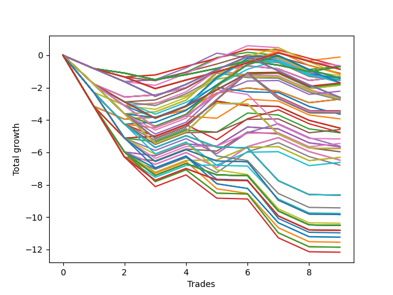

# Long HLT 508 
- Symbol: TSLA
- Date Range: 05/16/2022 - 05/17/2024
- Trading Period: 8:30-12:30
- Number of Trades: 9



| Id. | Name | Win Percent | Profit | Avg Profit / Trade | Avg Time / Trade | Std |      | Name | Win Percent | Profit | Avg Profit / Trade | Avg Time / Trade | Std |
| --- | ---- | ----------- | ------ | ------------------ | ---------------- | --- | ---- | ---- | ----------- | ------ | ------------------ | ---------------- | --- |
| | Sorted By <br> Profit | | | | | | | Sorted By <br> Win Percentage |||||
|0| TP-0.5 15m | 55.56 | -0.11 | -0.01 | 08:40 | 0.49 |     | TP-0.5 15m | 55.56 | -0.11 | -0.01 | 08:40 | 0.49 |
|1| TP-0.75 45m | 33.33 | -0.64 | -0.07 | 24:26 | 0.68 |     | TP-0.75 15m | 55.56 | -0.66 | -0.07 | 11:40 | 0.60 |
|2| TP-0.75 15m | 55.56 | -0.66 | -0.07 | 11:40 | 0.60 |     | TP-1.75 15m | 55.56 | -1.34 | -0.15 | 12:46 | 0.79 |
|3| TP-0.5 30m | 44.44 | -0.68 | -0.08 | 13:00 | 0.50 |     | TP-1.5 15m | 55.56 | -1.34 | -0.15 | 12:46 | 0.79 |
|4| TP-0.25 180m | 44.44 | -0.70 | -0.08 | 03:13 | 0.43 |     | TP-1.25 15m | 55.56 | -1.34 | -0.15 | 12:46 | 0.79 |
|5| TP-0.25 165m | 44.44 | -0.70 | -0.08 | 03:13 | 0.43 |     | TP-1 15m | 55.56 | -1.34 | -0.15 | 12:46 | 0.79 |
|6| TP-0.25 150m | 44.44 | -0.70 | -0.08 | 03:13 | 0.43 |     | TP-1.5 75m | 55.56 | -1.71 | -0.19 | 38:26 | 1.31 |
|7| TP-0.25 135m | 44.44 | -0.70 | -0.08 | 03:13 | 0.43 |     | TP-1 75m | 55.56 | -1.74 | -0.19 | 35:40 | 0.97 |
|8| TP-0.25 120m | 44.44 | -0.70 | -0.08 | 03:13 | 0.43 |     | TP-1.25 75m | 55.56 | -1.78 | -0.20 | 37:00 | 1.11 |
|9| TP-0.25 105m | 44.44 | -0.70 | -0.08 | 03:13 | 0.43 |     | TP-2.25 15m | 55.56 | -1.85 | -0.21 | 13:26 | 0.91 |
|10| TP-0.25 90m | 44.44 | -0.70 | -0.08 | 03:13 | 0.43 |     | TP-2 15m | 55.56 | -1.85 | -0.21 | 13:26 | 0.91 |
|11| TP-0.25 75m | 44.44 | -0.70 | -0.08 | 03:13 | 0.43 |     | TP-1.75 75m | 55.56 | -2.22 | -0.25 | 41:53 | 1.18 |
|12| TP-0.25 60m | 44.44 | -0.70 | -0.08 | 03:13 | 0.43 |     | TP-3 15m | 55.56 | -2.71 | -0.30 | 13:33 | 1.14 |
|13| TP-0.25 45m | 44.44 | -0.70 | -0.08 | 03:13 | 0.43 |     | TP-2.75 15m | 55.56 | -2.71 | -0.30 | 13:33 | 1.14 |
|14| TP-0.25 30m | 44.44 | -0.70 | -0.08 | 03:13 | 0.43 |     | TP-2.5 15m | 55.56 | -2.71 | -0.30 | 13:33 | 1.14 |
|15| TP-0.25 15m | 44.44 | -0.70 | -0.08 | 03:13 | 0.43 |     | TP-2 75m | 55.56 | -4.59 | -0.51 | 48:40 | 1.07 |
|16| TP-0.5 180m | 44.44 | -0.86 | -0.10 | 18:06 | 0.59 |     | TP-2.25 75m | 55.56 | -5.45 | -0.61 | 48:53 | 1.22 |
|17| TP-0.5 165m | 44.44 | -0.86 | -0.10 | 18:06 | 0.59 |     | TP-2.75 75m | 55.56 | -6.31 | -0.70 | 49:00 | 1.37 |
|18| TP-0.5 150m | 44.44 | -0.86 | -0.10 | 18:06 | 0.59 |     | TP-2.5 75m | 55.56 | -6.31 | -0.70 | 49:00 | 1.37 |
|19| TP-0.5 135m | 44.44 | -0.86 | -0.10 | 18:06 | 0.59 |     | TP-3 75m | 55.56 | -6.62 | -0.74 | 49:40 | 1.43 |
|20| TP-0.5 120m | 44.44 | -0.86 | -0.10 | 18:06 | 0.59 |     | TP-0.5 30m | 44.44 | -0.68 | -0.08 | 13:00 | 0.50 |
|21| TP-0.5 105m | 44.44 | -0.86 | -0.10 | 18:06 | 0.59 |     | TP-0.25 180m | 44.44 | -0.70 | -0.08 | 03:13 | 0.43 |
|22| TP-0.5 90m | 44.44 | -0.86 | -0.10 | 18:06 | 0.59 |     | TP-0.25 165m | 44.44 | -0.70 | -0.08 | 03:13 | 0.43 |
|23| TP-0.5 75m | 44.44 | -0.86 | -0.10 | 18:06 | 0.59 |     | TP-0.25 150m | 44.44 | -0.70 | -0.08 | 03:13 | 0.43 |
|24| TP-0.5 60m | 44.44 | -0.86 | -0.10 | 18:06 | 0.59 |     | TP-0.25 135m | 44.44 | -0.70 | -0.08 | 03:13 | 0.43 |
|25| TP-0.5 45m | 33.33 | -1.11 | -0.12 | 16:20 | 0.50 |     | TP-0.25 120m | 44.44 | -0.70 | -0.08 | 03:13 | 0.43 |
|26| TP-1.5 60m | 44.44 | -1.16 | -0.13 | 33:53 | 1.26 |     | TP-0.25 105m | 44.44 | -0.70 | -0.08 | 03:13 | 0.43 |
|27| TP-0.75 60m | 44.44 | -1.17 | -0.13 | 28:46 | 0.79 |     | TP-0.25 90m | 44.44 | -0.70 | -0.08 | 03:13 | 0.43 |
|28| TP-1.25 45m | 33.33 | -1.25 | -0.14 | 27:40 | 1.03 |     | TP-0.25 75m | 44.44 | -0.70 | -0.08 | 03:13 | 0.43 |
|29| TP-1.75 15m | 55.56 | -1.34 | -0.15 | 12:46 | 0.79 |     | TP-0.25 60m | 44.44 | -0.70 | -0.08 | 03:13 | 0.43 |
|30| TP-1.5 15m | 55.56 | -1.34 | -0.15 | 12:46 | 0.79 |     | TP-0.25 45m | 44.44 | -0.70 | -0.08 | 03:13 | 0.43 |
|31| TP-1.25 15m | 55.56 | -1.34 | -0.15 | 12:46 | 0.79 |     | TP-0.25 30m | 44.44 | -0.70 | -0.08 | 03:13 | 0.43 |
|32| TP-1 15m | 55.56 | -1.34 | -0.15 | 12:46 | 0.79 |     | TP-0.25 15m | 44.44 | -0.70 | -0.08 | 03:13 | 0.43 |
|33| TP-1.25 60m | 44.44 | -1.40 | -0.16 | 32:40 | 1.08 |     | TP-0.5 180m | 44.44 | -0.86 | -0.10 | 18:06 | 0.59 |
|34| TP-1.75 45m | 33.33 | -1.40 | -0.16 | 28:33 | 1.17 |     | TP-0.5 165m | 44.44 | -0.86 | -0.10 | 18:06 | 0.59 |
|35| TP-1.75 60m | 44.44 | -1.43 | -0.16 | 35:13 | 1.23 |     | TP-0.5 150m | 44.44 | -0.86 | -0.10 | 18:06 | 0.59 |
|36| TP-1.5 45m | 33.33 | -1.49 | -0.17 | 28:26 | 1.15 |     | TP-0.5 135m | 44.44 | -0.86 | -0.10 | 18:06 | 0.59 |
|37| TP-0.75 30m | 33.33 | -1.54 | -0.17 | 18:26 | 0.62 |     | TP-0.5 120m | 44.44 | -0.86 | -0.10 | 18:06 | 0.59 |
|38| TP-1 45m | 33.33 | -1.55 | -0.17 | 26:53 | 0.92 |     | TP-0.5 105m | 44.44 | -0.86 | -0.10 | 18:06 | 0.59 |
|39| TP-0.75 75m | 44.44 | -1.69 | -0.19 | 30:26 | 0.76 |     | TP-0.5 90m | 44.44 | -0.86 | -0.10 | 18:06 | 0.59 |
|40| TP-1 60m | 44.44 | -1.70 | -0.19 | 31:53 | 0.98 |     | TP-0.5 75m | 44.44 | -0.86 | -0.10 | 18:06 | 0.59 |
|41| TP-1.5 75m | 55.56 | -1.71 | -0.19 | 38:26 | 1.31 |     | TP-0.5 60m | 44.44 | -0.86 | -0.10 | 18:06 | 0.59 |
|42| TP-1 75m | 55.56 | -1.74 | -0.19 | 35:40 | 0.97 |     | TP-1.5 60m | 44.44 | -1.16 | -0.13 | 33:53 | 1.26 |
|43| TP-1.25 75m | 55.56 | -1.78 | -0.20 | 37:00 | 1.11 |     | TP-0.75 60m | 44.44 | -1.17 | -0.13 | 28:46 | 0.79 |
|44| TP-2.25 15m | 55.56 | -1.85 | -0.21 | 13:26 | 0.91 |     | TP-1.25 60m | 44.44 | -1.40 | -0.16 | 32:40 | 1.08 |
|45| TP-2 15m | 55.56 | -1.85 | -0.21 | 13:26 | 0.91 |     | TP-1.75 60m | 44.44 | -1.43 | -0.16 | 35:13 | 1.23 |
|46| TP-1.75 75m | 55.56 | -2.22 | -0.25 | 41:53 | 1.18 |     | TP-0.75 75m | 44.44 | -1.69 | -0.19 | 30:26 | 0.76 |
|47| TP-0.75 180m | 33.33 | -2.60 | -0.29 | 30:53 | 0.78 |     | TP-1 60m | 44.44 | -1.70 | -0.19 | 31:53 | 0.98 |
|48| TP-0.75 165m | 33.33 | -2.60 | -0.29 | 30:53 | 0.78 |     | TP-0.75 45m | 33.33 | -0.64 | -0.07 | 24:26 | 0.68 |
|49| TP-0.75 150m | 33.33 | -2.60 | -0.29 | 30:53 | 0.78 |     | TP-0.5 45m | 33.33 | -1.11 | -0.12 | 16:20 | 0.50 |
|50| TP-0.75 135m | 33.33 | -2.60 | -0.29 | 30:53 | 0.78 |     | TP-1.25 45m | 33.33 | -1.25 | -0.14 | 27:40 | 1.03 |
|51| TP-0.75 120m | 33.33 | -2.60 | -0.29 | 30:53 | 0.78 |     | TP-1.75 45m | 33.33 | -1.40 | -0.16 | 28:33 | 1.17 |
|52| TP-0.75 105m | 33.33 | -2.60 | -0.29 | 30:53 | 0.78 |     | TP-1.5 45m | 33.33 | -1.49 | -0.17 | 28:26 | 1.15 |
|53| TP-0.75 90m | 33.33 | -2.60 | -0.29 | 30:53 | 0.78 |     | TP-0.75 30m | 33.33 | -1.54 | -0.17 | 18:26 | 0.62 |
|54| TP-1.25 30m | 33.33 | -2.60 | -0.29 | 21:06 | 0.91 |     | TP-1 45m | 33.33 | -1.55 | -0.17 | 26:53 | 0.92 |
|55| TP-1 30m | 33.33 | -2.66 | -0.30 | 20:26 | 0.83 |     | TP-0.75 180m | 33.33 | -2.60 | -0.29 | 30:53 | 0.78 |
|56| TP-1.75 30m | 33.33 | -2.67 | -0.30 | 21:53 | 1.08 |     | TP-0.75 165m | 33.33 | -2.60 | -0.29 | 30:53 | 0.78 |
|57| TP-3 15m | 55.56 | -2.71 | -0.30 | 13:33 | 1.14 |     | TP-0.75 150m | 33.33 | -2.60 | -0.29 | 30:53 | 0.78 |
|58| TP-2.75 15m | 55.56 | -2.71 | -0.30 | 13:33 | 1.14 |     | TP-0.75 135m | 33.33 | -2.60 | -0.29 | 30:53 | 0.78 |
|59| TP-2.5 15m | 55.56 | -2.71 | -0.30 | 13:33 | 1.14 |     | TP-0.75 120m | 33.33 | -2.60 | -0.29 | 30:53 | 0.78 |
|60| TP-1.5 30m | 33.33 | -2.76 | -0.31 | 21:46 | 1.06 |     | TP-0.75 105m | 33.33 | -2.60 | -0.29 | 30:53 | 0.78 |
|61| TP-1 180m | 33.33 | -3.45 | -0.38 | 36:53 | 1.03 |     | TP-0.75 90m | 33.33 | -2.60 | -0.29 | 30:53 | 0.78 |
|62| TP-1 165m | 33.33 | -3.45 | -0.38 | 36:53 | 1.03 |     | TP-1.25 30m | 33.33 | -2.60 | -0.29 | 21:06 | 0.91 |
|63| TP-1 150m | 33.33 | -3.45 | -0.38 | 36:53 | 1.03 |     | TP-1 30m | 33.33 | -2.66 | -0.30 | 20:26 | 0.83 |
|64| TP-1 135m | 33.33 | -3.45 | -0.38 | 36:53 | 1.03 |     | TP-1.75 30m | 33.33 | -2.67 | -0.30 | 21:53 | 1.08 |
|65| TP-1 120m | 33.33 | -3.45 | -0.38 | 36:53 | 1.03 |     | TP-1.5 30m | 33.33 | -2.76 | -0.31 | 21:46 | 1.06 |
|66| TP-1 105m | 33.33 | -3.45 | -0.38 | 36:53 | 1.03 |     | TP-1 180m | 33.33 | -3.45 | -0.38 | 36:53 | 1.03 |
|67| TP-1 90m | 33.33 | -3.45 | -0.38 | 36:53 | 1.03 |     | TP-1 165m | 33.33 | -3.45 | -0.38 | 36:53 | 1.03 |
|68| TP-1.25 180m | 33.33 | -3.49 | -0.39 | 38:13 | 1.16 |     | TP-1 150m | 33.33 | -3.45 | -0.38 | 36:53 | 1.03 |
|69| TP-1.25 165m | 33.33 | -3.49 | -0.39 | 38:13 | 1.16 |     | TP-1 135m | 33.33 | -3.45 | -0.38 | 36:53 | 1.03 |
|70| TP-1.25 150m | 33.33 | -3.49 | -0.39 | 38:13 | 1.16 |     | TP-1 120m | 33.33 | -3.45 | -0.38 | 36:53 | 1.03 |
|71| TP-1.25 135m | 33.33 | -3.49 | -0.39 | 38:13 | 1.16 |     | TP-1 105m | 33.33 | -3.45 | -0.38 | 36:53 | 1.03 |
|72| TP-1.25 120m | 33.33 | -3.49 | -0.39 | 38:13 | 1.16 |     | TP-1 90m | 33.33 | -3.45 | -0.38 | 36:53 | 1.03 |
|73| TP-1.25 105m | 33.33 | -3.49 | -0.39 | 38:13 | 1.16 |     | TP-1.25 180m | 33.33 | -3.49 | -0.39 | 38:13 | 1.16 |
|74| TP-1.25 90m | 33.33 | -3.49 | -0.39 | 38:13 | 1.16 |     | TP-1.25 165m | 33.33 | -3.49 | -0.39 | 38:13 | 1.16 |
|75| TP-1.5 180m | 33.33 | -3.57 | -0.40 | 40:00 | 1.37 |     | TP-1.25 150m | 33.33 | -3.49 | -0.39 | 38:13 | 1.16 |
|76| TP-1.5 165m | 33.33 | -3.57 | -0.40 | 40:00 | 1.37 |     | TP-1.25 135m | 33.33 | -3.49 | -0.39 | 38:13 | 1.16 |
|77| TP-1.5 150m | 33.33 | -3.57 | -0.40 | 40:00 | 1.37 |     | TP-1.25 120m | 33.33 | -3.49 | -0.39 | 38:13 | 1.16 |
|78| TP-1.5 135m | 33.33 | -3.57 | -0.40 | 40:00 | 1.37 |     | TP-1.25 105m | 33.33 | -3.49 | -0.39 | 38:13 | 1.16 |
|79| TP-1.5 120m | 33.33 | -3.57 | -0.40 | 40:00 | 1.37 |     | TP-1.25 90m | 33.33 | -3.49 | -0.39 | 38:13 | 1.16 |
|80| TP-1.5 105m | 33.33 | -3.57 | -0.40 | 40:00 | 1.37 |     | TP-1.5 180m | 33.33 | -3.57 | -0.40 | 40:00 | 1.37 |
|81| TP-1.5 90m | 33.33 | -3.57 | -0.40 | 40:00 | 1.37 |     | TP-1.5 165m | 33.33 | -3.57 | -0.40 | 40:00 | 1.37 |
|82| TP-2.25 30m | 33.33 | -3.64 | -0.40 | 23:40 | 1.12 |     | TP-1.5 150m | 33.33 | -3.57 | -0.40 | 40:00 | 1.37 |
|83| TP-2 30m | 33.33 | -3.64 | -0.40 | 23:40 | 1.12 |     | TP-1.5 135m | 33.33 | -3.57 | -0.40 | 40:00 | 1.37 |
|84| TP-2 45m | 22.22 | -3.93 | -0.44 | 32:00 | 1.07 |     | TP-1.5 120m | 33.33 | -3.57 | -0.40 | 40:00 | 1.37 |
|85| TP-3 30m | 33.33 | -4.50 | -0.50 | 23:46 | 1.30 |     | TP-1.5 105m | 33.33 | -3.57 | -0.40 | 40:00 | 1.37 |
|86| TP-2.75 30m | 33.33 | -4.50 | -0.50 | 23:46 | 1.30 |     | TP-1.5 90m | 33.33 | -3.57 | -0.40 | 40:00 | 1.37 |
|87| TP-2.5 30m | 33.33 | -4.50 | -0.50 | 23:46 | 1.30 |     | TP-2.25 30m | 33.33 | -3.64 | -0.40 | 23:40 | 1.12 |
|88| TP-2 75m | 55.56 | -4.59 | -0.51 | 48:40 | 1.07 |     | TP-2 30m | 33.33 | -3.64 | -0.40 | 23:40 | 1.12 |
|89| TP-2 60m | 33.33 | -4.76 | -0.53 | 40:20 | 1.14 |     | TP-3 30m | 33.33 | -4.50 | -0.50 | 23:46 | 1.30 |
|90| TP-2.25 45m | 22.22 | -4.79 | -0.53 | 32:13 | 1.23 |     | TP-2.75 30m | 33.33 | -4.50 | -0.50 | 23:46 | 1.30 |
|91| TP-1.75 90m | 22.22 | -5.17 | -0.57 | 47:13 | 1.18 |     | TP-2.5 30m | 33.33 | -4.50 | -0.50 | 23:46 | 1.30 |
|92| TP-2.25 75m | 55.56 | -5.45 | -0.61 | 48:53 | 1.22 |     | TP-2 60m | 33.33 | -4.76 | -0.53 | 40:20 | 1.14 |
|93| TP-2.25 60m | 33.33 | -5.62 | -0.62 | 40:33 | 1.28 |     | TP-2.25 60m | 33.33 | -5.62 | -0.62 | 40:33 | 1.28 |
|94| TP-2.75 45m | 22.22 | -5.65 | -0.63 | 32:20 | 1.38 |     | TP-2.75 60m | 33.33 | -6.48 | -0.72 | 40:40 | 1.42 |
|95| TP-2.5 45m | 22.22 | -5.65 | -0.63 | 32:20 | 1.38 |     | TP-2.5 60m | 33.33 | -6.48 | -0.72 | 40:40 | 1.42 |
|96| TP-1.75 180m | 22.22 | -5.76 | -0.64 | 49:33 | 1.25 |     | TP-3 60m | 33.33 | -6.79 | -0.75 | 41:20 | 1.48 |
|97| TP-1.75 165m | 22.22 | -5.76 | -0.64 | 49:33 | 1.25 |     | TP-2 45m | 22.22 | -3.93 | -0.44 | 32:00 | 1.07 |
|98| TP-1.75 150m | 22.22 | -5.76 | -0.64 | 49:33 | 1.25 |     | TP-2.25 45m | 22.22 | -4.79 | -0.53 | 32:13 | 1.23 |
|99| TP-1.75 135m | 22.22 | -5.76 | -0.64 | 49:33 | 1.25 |     | TP-1.75 90m | 22.22 | -5.17 | -0.57 | 47:13 | 1.18 |
|100| TP-1.75 120m | 22.22 | -5.76 | -0.64 | 49:33 | 1.25 |     | TP-2.75 45m | 22.22 | -5.65 | -0.63 | 32:20 | 1.38 |
|101| TP-1.75 105m | 22.22 | -5.76 | -0.64 | 49:33 | 1.25 |     | TP-2.5 45m | 22.22 | -5.65 | -0.63 | 32:20 | 1.38 |
|102| TP-3 45m | 22.22 | -5.96 | -0.66 | 33:00 | 1.44 |     | TP-1.75 180m | 22.22 | -5.76 | -0.64 | 49:33 | 1.25 |
|103| TP-2.75 75m | 55.56 | -6.31 | -0.70 | 49:00 | 1.37 |     | TP-1.75 165m | 22.22 | -5.76 | -0.64 | 49:33 | 1.25 |
|104| TP-2.5 75m | 55.56 | -6.31 | -0.70 | 49:00 | 1.37 |     | TP-1.75 150m | 22.22 | -5.76 | -0.64 | 49:33 | 1.25 |
|105| TP-2.75 60m | 33.33 | -6.48 | -0.72 | 40:40 | 1.42 |     | TP-1.75 135m | 22.22 | -5.76 | -0.64 | 49:33 | 1.25 |
|106| TP-2.5 60m | 33.33 | -6.48 | -0.72 | 40:40 | 1.42 |     | TP-1.75 120m | 22.22 | -5.76 | -0.64 | 49:33 | 1.25 |
|107| TP-3 75m | 55.56 | -6.62 | -0.74 | 49:40 | 1.43 |     | TP-1.75 105m | 22.22 | -5.76 | -0.64 | 49:33 | 1.25 |
|108| TP-3 60m | 33.33 | -6.79 | -0.75 | 41:20 | 1.48 |     | TP-3 45m | 22.22 | -5.96 | -0.66 | 33:00 | 1.44 |
|109| TP-2 180m | 11.11 | -8.64 | -0.96 | 61:33 | 0.99 |     | TP-2 180m | 11.11 | -8.64 | -0.96 | 61:33 | 0.99 |
|110| TP-2 165m | 11.11 | -8.64 | -0.96 | 61:33 | 0.99 |     | TP-2 165m | 11.11 | -8.64 | -0.96 | 61:33 | 0.99 |
|111| TP-2 150m | 11.11 | -8.64 | -0.96 | 61:33 | 0.99 |     | TP-2 150m | 11.11 | -8.64 | -0.96 | 61:33 | 0.99 |
|112| TP-2 135m | 11.11 | -8.64 | -0.96 | 61:33 | 0.99 |     | TP-2 135m | 11.11 | -8.64 | -0.96 | 61:33 | 0.99 |
|113| TP-2 120m | 11.11 | -8.64 | -0.96 | 61:33 | 0.99 |     | TP-2 120m | 11.11 | -8.64 | -0.96 | 61:33 | 0.99 |
|114| TP-2 90m | 11.11 | -9.43 | -1.05 | 55:46 | 0.98 |     | TP-2 90m | 11.11 | -9.43 | -1.05 | 55:46 | 0.98 |
|115| TP-2 105m | 11.11 | -9.77 | -1.09 | 59:46 | 1.02 |     | TP-2 105m | 11.11 | -9.77 | -1.09 | 59:46 | 1.02 |
|116| TP-2.25 180m | 11.11 | -9.84 | -1.09 | 62:26 | 1.15 |     | TP-2.25 180m | 11.11 | -9.84 | -1.09 | 62:26 | 1.15 |
|117| TP-2.25 165m | 11.11 | -9.84 | -1.09 | 62:26 | 1.15 |     | TP-2.25 165m | 11.11 | -9.84 | -1.09 | 62:26 | 1.15 |
|118| TP-2.25 150m | 11.11 | -9.84 | -1.09 | 62:26 | 1.15 |     | TP-2.25 150m | 11.11 | -9.84 | -1.09 | 62:26 | 1.15 |
|119| TP-2.25 135m | 11.11 | -9.84 | -1.09 | 62:26 | 1.15 |     | TP-2.25 135m | 11.11 | -9.84 | -1.09 | 62:26 | 1.15 |
|120| TP-2.25 120m | 11.11 | -9.84 | -1.09 | 62:26 | 1.15 |     | TP-2.25 120m | 11.11 | -9.84 | -1.09 | 62:26 | 1.15 |
|121| TP-2.25 90m | 11.11 | -10.38 | -1.15 | 56:13 | 1.11 |     | TP-2.25 90m | 11.11 | -10.38 | -1.15 | 56:13 | 1.11 |
|122| TP-2.75 180m | 11.11 | -10.51 | -1.17 | 65:26 | 1.26 |     | TP-2.75 180m | 11.11 | -10.51 | -1.17 | 65:26 | 1.26 |
|123| TP-2.5 180m | 11.11 | -10.51 | -1.17 | 65:26 | 1.26 |     | TP-2.5 180m | 11.11 | -10.51 | -1.17 | 65:26 | 1.26 |
|124| TP-2.75 165m | 11.11 | -10.51 | -1.17 | 65:26 | 1.26 |     | TP-2.75 165m | 11.11 | -10.51 | -1.17 | 65:26 | 1.26 |
|125| TP-2.5 165m | 11.11 | -10.51 | -1.17 | 65:26 | 1.26 |     | TP-2.5 165m | 11.11 | -10.51 | -1.17 | 65:26 | 1.26 |
|126| TP-2.75 150m | 11.11 | -10.51 | -1.17 | 65:26 | 1.26 |     | TP-2.75 150m | 11.11 | -10.51 | -1.17 | 65:26 | 1.26 |
|127| TP-2.5 150m | 11.11 | -10.51 | -1.17 | 65:26 | 1.26 |     | TP-2.5 150m | 11.11 | -10.51 | -1.17 | 65:26 | 1.26 |
|128| TP-2.75 135m | 11.11 | -10.51 | -1.17 | 65:26 | 1.26 |     | TP-2.75 135m | 11.11 | -10.51 | -1.17 | 65:26 | 1.26 |
|129| TP-2.5 135m | 11.11 | -10.51 | -1.17 | 65:26 | 1.26 |     | TP-2.5 135m | 11.11 | -10.51 | -1.17 | 65:26 | 1.26 |
|130| TP-2.75 120m | 11.11 | -10.51 | -1.17 | 65:26 | 1.26 |     | TP-2.75 120m | 11.11 | -10.51 | -1.17 | 65:26 | 1.26 |
|131| TP-2.5 120m | 11.11 | -10.51 | -1.17 | 65:26 | 1.26 |     | TP-2.5 120m | 11.11 | -10.51 | -1.17 | 65:26 | 1.26 |
|132| TP-3 180m | 11.11 | -10.82 | -1.20 | 66:06 | 1.31 |     | TP-3 180m | 11.11 | -10.82 | -1.20 | 66:06 | 1.31 |
|133| TP-3 165m | 11.11 | -10.82 | -1.20 | 66:06 | 1.31 |     | TP-3 165m | 11.11 | -10.82 | -1.20 | 66:06 | 1.31 |
|134| TP-3 150m | 11.11 | -10.82 | -1.20 | 66:06 | 1.31 |     | TP-3 150m | 11.11 | -10.82 | -1.20 | 66:06 | 1.31 |
|135| TP-3 135m | 11.11 | -10.82 | -1.20 | 66:06 | 1.31 |     | TP-3 135m | 11.11 | -10.82 | -1.20 | 66:06 | 1.31 |
|136| TP-3 120m | 11.11 | -10.82 | -1.20 | 66:06 | 1.31 |     | TP-3 120m | 11.11 | -10.82 | -1.20 | 66:06 | 1.31 |
|137| TP-2.25 105m | 11.11 | -10.97 | -1.22 | 60:40 | 1.16 |     | TP-2.25 105m | 11.11 | -10.97 | -1.22 | 60:40 | 1.16 |
|138| TP-2.75 90m | 11.11 | -11.24 | -1.25 | 56:20 | 1.23 |     | TP-2.75 90m | 11.11 | -11.24 | -1.25 | 56:20 | 1.23 |
|139| TP-2.5 90m | 11.11 | -11.24 | -1.25 | 56:20 | 1.23 |     | TP-2.5 90m | 11.11 | -11.24 | -1.25 | 56:20 | 1.23 |
|140| TP-3 90m | 11.11 | -11.55 | -1.28 | 57:00 | 1.28 |     | TP-3 90m | 11.11 | -11.55 | -1.28 | 57:00 | 1.28 |
|141| TP-2.75 105m | 11.11 | -11.86 | -1.32 | 62:00 | 1.28 |     | TP-2.75 105m | 11.11 | -11.86 | -1.32 | 62:00 | 1.28 |
|142| TP-2.5 105m | 11.11 | -11.86 | -1.32 | 62:00 | 1.28 |     | TP-2.5 105m | 11.11 | -11.86 | -1.32 | 62:00 | 1.28 |
|143| TP-3 105m | 11.11 | -12.17 | -1.35 | 62:40 | 1.32 |     | TP-3 105m | 11.11 | -12.17 | -1.35 | 62:40 | 1.32 |

### Test TP-0.25 15m
* Take Profit of 0.25 Point
* 0.25 Stoploss
* Results:
```
Total Trades: 9
Percent Up: 44.44
Percent Down: 55.56
Total Points Moved Up: -0.70
Potential Profit: -350.00
Total Points Ups: 1.47 Count Ups: 4
Total Points Downs: -2.17 Count Downs: 5
```

<details><summary>Trades</summary>

<code>In: 2022-05-18 08:45:00		Out: 2022-05-18 08:47:00		Total Position Time: 02:00		Total Move Up: -0.82		Total to Date: -0.82</code> <br />
<code>In: 2022-07-18 11:20:00		Out: 2022-07-18 11:23:00		Total Position Time: 03:00		Total Move Up: -0.28		Total to Date: -1.10</code> <br />
<code>In: 2023-01-09 11:05:00		Out: 2023-01-09 11:07:00		Total Position Time: 02:00		Total Move Up: -0.41		Total to Date: -1.51</code> <br />
<code>In: 2023-03-14 12:35:00		Out: 2023-03-14 12:38:00		Total Position Time: 03:00		Total Move Up: 0.31		Total to Date: -1.20</code> <br />
<code>In: 2023-05-23 09:55:00		Out: 2023-05-23 09:57:00		Total Position Time: 02:00		Total Move Up: 0.39		Total to Date: -0.81</code> <br />
<code>In: 2023-12-05 11:15:00		Out: 2023-12-05 11:17:00		Total Position Time: 02:00		Total Move Up: 0.46		Total to Date: -0.35</code> <br />
<code>In: 2023-12-28 08:45:00		Out: 2023-12-28 08:52:00		Total Position Time: 07:00		Total Move Up: -0.26		Total to Date: -0.61</code> <br />
<code>In: 2024-01-03 12:35:00		Out: 2024-01-03 12:38:00		Total Position Time: 03:00		Total Move Up: -0.40		Total to Date: -1.01</code> <br />
<code>In: 2024-02-13 11:30:00		Out: 2024-02-13 11:35:00		Total Position Time: 05:00		Total Move Up: 0.31		Total to Date: -0.70</code> <br />


</details>

### Test TP-0.5 15m
* Take Profit of 0.5 Point
* 0.5 Stoploss
* Results:
```
Total Trades: 9
Percent Up: 55.56
Percent Down: 44.44
Total Points Moved Up: -0.11
Potential Profit: -55.00
Total Points Ups: 1.94 Count Ups: 5
Total Points Downs: -2.05 Count Downs: 4
```

<details><summary>Trades</summary>

<code>In: 2022-05-18 08:45:00		Out: 2022-05-18 08:47:00		Total Position Time: 02:00		Total Move Up: -0.82		Total to Date: -0.82</code> <br />
<code>In: 2022-07-18 11:20:00		Out: 2022-07-18 11:27:00		Total Position Time: 07:00		Total Move Up: -0.52		Total to Date: -1.34</code> <br />
<code>In: 2023-01-09 11:05:00		Out: 2023-01-09 11:19:00		Total Position Time: 14:00		Total Move Up: 0.13		Total to Date: -1.21</code> <br />
<code>In: 2023-03-14 12:35:00		Out: 2023-03-14 12:47:00		Total Position Time: 12:00		Total Move Up: 0.53		Total to Date: -0.68</code> <br />
<code>In: 2023-05-23 09:55:00		Out: 2023-05-23 09:58:00		Total Position Time: 03:00		Total Move Up: 0.50		Total to Date: -0.18</code> <br />
<code>In: 2023-12-05 11:15:00		Out: 2023-12-05 11:18:00		Total Position Time: 03:00		Total Move Up: 0.56		Total to Date: 0.38</code> <br />
<code>In: 2023-12-28 08:45:00		Out: 2023-12-28 08:59:00		Total Position Time: 14:00		Total Move Up: -0.19		Total to Date: 0.19</code> <br />
<code>In: 2024-01-03 12:35:00		Out: 2024-01-03 12:44:00		Total Position Time: 09:00		Total Move Up: -0.52		Total to Date: -0.33</code> <br />
<code>In: 2024-02-13 11:30:00		Out: 2024-02-13 11:44:00		Total Position Time: 14:00		Total Move Up: 0.22		Total to Date: -0.11</code> <br />


</details>

### Test TP-0.75 15m
* Take Profit of 0.75 Point
* 0.75 Stoploss
* Results:
```
Total Trades: 9
Percent Up: 55.56
Percent Down: 44.44
Total Points Moved Up: -0.66
Potential Profit: -330.00
Total Points Ups: 2.03 Count Ups: 5
Total Points Downs: -2.69 Count Downs: 4
```

<details><summary>Trades</summary>

<code>In: 2022-05-18 08:45:00		Out: 2022-05-18 08:47:00		Total Position Time: 02:00		Total Move Up: -0.82		Total to Date: -0.82</code> <br />
<code>In: 2022-07-18 11:20:00		Out: 2022-07-18 11:30:00		Total Position Time: 10:00		Total Move Up: -0.81		Total to Date: -1.63</code> <br />
<code>In: 2023-01-09 11:05:00		Out: 2023-01-09 11:19:00		Total Position Time: 14:00		Total Move Up: 0.13		Total to Date: -1.50</code> <br />
<code>In: 2023-03-14 12:35:00		Out: 2023-03-14 12:49:00		Total Position Time: 14:00		Total Move Up: 0.45		Total to Date: -1.05</code> <br />
<code>In: 2023-05-23 09:55:00		Out: 2023-05-23 10:08:00		Total Position Time: 13:00		Total Move Up: 0.91		Total to Date: -0.14</code> <br />
<code>In: 2023-12-05 11:15:00		Out: 2023-12-05 11:29:00		Total Position Time: 14:00		Total Move Up: 0.32		Total to Date: 0.18</code> <br />
<code>In: 2023-12-28 08:45:00		Out: 2023-12-28 08:59:00		Total Position Time: 14:00		Total Move Up: -0.19		Total to Date: -0.01</code> <br />
<code>In: 2024-01-03 12:35:00		Out: 2024-01-03 12:45:00		Total Position Time: 10:00		Total Move Up: -0.87		Total to Date: -0.88</code> <br />
<code>In: 2024-02-13 11:30:00		Out: 2024-02-13 11:44:00		Total Position Time: 14:00		Total Move Up: 0.22		Total to Date: -0.66</code> <br />


</details>

### Test TP-1 15m
* Take Profit of 1 Point
* 1 Stoploss
* Results:
```
Total Trades: 9
Percent Up: 55.56
Percent Down: 44.44
Total Points Moved Up: -1.34
Potential Profit: -670.00
Total Points Ups: 2.15 Count Ups: 5
Total Points Downs: -3.49 Count Downs: 4
```

<details><summary>Trades</summary>

<code>In: 2022-05-18 08:45:00		Out: 2022-05-18 08:48:00		Total Position Time: 03:00		Total Move Up: -1.78		Total to Date: -1.78</code> <br />
<code>In: 2022-07-18 11:20:00		Out: 2022-07-18 11:34:00		Total Position Time: 14:00		Total Move Up: -0.80		Total to Date: -2.58</code> <br />
<code>In: 2023-01-09 11:05:00		Out: 2023-01-09 11:19:00		Total Position Time: 14:00		Total Move Up: 0.13		Total to Date: -2.45</code> <br />
<code>In: 2023-03-14 12:35:00		Out: 2023-03-14 12:49:00		Total Position Time: 14:00		Total Move Up: 0.45		Total to Date: -2.00</code> <br />
<code>In: 2023-05-23 09:55:00		Out: 2023-05-23 10:09:00		Total Position Time: 14:00		Total Move Up: 1.03		Total to Date: -0.97</code> <br />
<code>In: 2023-12-05 11:15:00		Out: 2023-12-05 11:29:00		Total Position Time: 14:00		Total Move Up: 0.32		Total to Date: -0.65</code> <br />
<code>In: 2023-12-28 08:45:00		Out: 2023-12-28 08:59:00		Total Position Time: 14:00		Total Move Up: -0.19		Total to Date: -0.84</code> <br />
<code>In: 2024-01-03 12:35:00		Out: 2024-01-03 12:49:00		Total Position Time: 14:00		Total Move Up: -0.72		Total to Date: -1.56</code> <br />
<code>In: 2024-02-13 11:30:00		Out: 2024-02-13 11:44:00		Total Position Time: 14:00		Total Move Up: 0.22		Total to Date: -1.34</code> <br />


</details>

### Test TP-1.25 15m
* Take Profit of 1.25 Point
* 1.25 Stoploss
* Results:
```
Total Trades: 9
Percent Up: 55.56
Percent Down: 44.44
Total Points Moved Up: -1.34
Potential Profit: -670.00
Total Points Ups: 2.15 Count Ups: 5
Total Points Downs: -3.49 Count Downs: 4
```

<details><summary>Trades</summary>

<code>In: 2022-05-18 08:45:00		Out: 2022-05-18 08:48:00		Total Position Time: 03:00		Total Move Up: -1.78		Total to Date: -1.78</code> <br />
<code>In: 2022-07-18 11:20:00		Out: 2022-07-18 11:34:00		Total Position Time: 14:00		Total Move Up: -0.80		Total to Date: -2.58</code> <br />
<code>In: 2023-01-09 11:05:00		Out: 2023-01-09 11:19:00		Total Position Time: 14:00		Total Move Up: 0.13		Total to Date: -2.45</code> <br />
<code>In: 2023-03-14 12:35:00		Out: 2023-03-14 12:49:00		Total Position Time: 14:00		Total Move Up: 0.45		Total to Date: -2.00</code> <br />
<code>In: 2023-05-23 09:55:00		Out: 2023-05-23 10:09:00		Total Position Time: 14:00		Total Move Up: 1.03		Total to Date: -0.97</code> <br />
<code>In: 2023-12-05 11:15:00		Out: 2023-12-05 11:29:00		Total Position Time: 14:00		Total Move Up: 0.32		Total to Date: -0.65</code> <br />
<code>In: 2023-12-28 08:45:00		Out: 2023-12-28 08:59:00		Total Position Time: 14:00		Total Move Up: -0.19		Total to Date: -0.84</code> <br />
<code>In: 2024-01-03 12:35:00		Out: 2024-01-03 12:49:00		Total Position Time: 14:00		Total Move Up: -0.72		Total to Date: -1.56</code> <br />
<code>In: 2024-02-13 11:30:00		Out: 2024-02-13 11:44:00		Total Position Time: 14:00		Total Move Up: 0.22		Total to Date: -1.34</code> <br />


</details>

### Test TP-1.5 15m
* Take Profit of 1.5 Point
* 1.5 Stoploss
* Results:
```
Total Trades: 9
Percent Up: 55.56
Percent Down: 44.44
Total Points Moved Up: -1.34
Potential Profit: -670.00
Total Points Ups: 2.15 Count Ups: 5
Total Points Downs: -3.49 Count Downs: 4
```

<details><summary>Trades</summary>

<code>In: 2022-05-18 08:45:00		Out: 2022-05-18 08:48:00		Total Position Time: 03:00		Total Move Up: -1.78		Total to Date: -1.78</code> <br />
<code>In: 2022-07-18 11:20:00		Out: 2022-07-18 11:34:00		Total Position Time: 14:00		Total Move Up: -0.80		Total to Date: -2.58</code> <br />
<code>In: 2023-01-09 11:05:00		Out: 2023-01-09 11:19:00		Total Position Time: 14:00		Total Move Up: 0.13		Total to Date: -2.45</code> <br />
<code>In: 2023-03-14 12:35:00		Out: 2023-03-14 12:49:00		Total Position Time: 14:00		Total Move Up: 0.45		Total to Date: -2.00</code> <br />
<code>In: 2023-05-23 09:55:00		Out: 2023-05-23 10:09:00		Total Position Time: 14:00		Total Move Up: 1.03		Total to Date: -0.97</code> <br />
<code>In: 2023-12-05 11:15:00		Out: 2023-12-05 11:29:00		Total Position Time: 14:00		Total Move Up: 0.32		Total to Date: -0.65</code> <br />
<code>In: 2023-12-28 08:45:00		Out: 2023-12-28 08:59:00		Total Position Time: 14:00		Total Move Up: -0.19		Total to Date: -0.84</code> <br />
<code>In: 2024-01-03 12:35:00		Out: 2024-01-03 12:49:00		Total Position Time: 14:00		Total Move Up: -0.72		Total to Date: -1.56</code> <br />
<code>In: 2024-02-13 11:30:00		Out: 2024-02-13 11:44:00		Total Position Time: 14:00		Total Move Up: 0.22		Total to Date: -1.34</code> <br />


</details>

### Test TP-1.75 15m
* Take Profit of 1.75 Point
* 1.75 Stoploss
* Results:
```
Total Trades: 9
Percent Up: 55.56
Percent Down: 44.44
Total Points Moved Up: -1.34
Potential Profit: -670.00
Total Points Ups: 2.15 Count Ups: 5
Total Points Downs: -3.49 Count Downs: 4
```

<details><summary>Trades</summary>

<code>In: 2022-05-18 08:45:00		Out: 2022-05-18 08:48:00		Total Position Time: 03:00		Total Move Up: -1.78		Total to Date: -1.78</code> <br />
<code>In: 2022-07-18 11:20:00		Out: 2022-07-18 11:34:00		Total Position Time: 14:00		Total Move Up: -0.80		Total to Date: -2.58</code> <br />
<code>In: 2023-01-09 11:05:00		Out: 2023-01-09 11:19:00		Total Position Time: 14:00		Total Move Up: 0.13		Total to Date: -2.45</code> <br />
<code>In: 2023-03-14 12:35:00		Out: 2023-03-14 12:49:00		Total Position Time: 14:00		Total Move Up: 0.45		Total to Date: -2.00</code> <br />
<code>In: 2023-05-23 09:55:00		Out: 2023-05-23 10:09:00		Total Position Time: 14:00		Total Move Up: 1.03		Total to Date: -0.97</code> <br />
<code>In: 2023-12-05 11:15:00		Out: 2023-12-05 11:29:00		Total Position Time: 14:00		Total Move Up: 0.32		Total to Date: -0.65</code> <br />
<code>In: 2023-12-28 08:45:00		Out: 2023-12-28 08:59:00		Total Position Time: 14:00		Total Move Up: -0.19		Total to Date: -0.84</code> <br />
<code>In: 2024-01-03 12:35:00		Out: 2024-01-03 12:49:00		Total Position Time: 14:00		Total Move Up: -0.72		Total to Date: -1.56</code> <br />
<code>In: 2024-02-13 11:30:00		Out: 2024-02-13 11:44:00		Total Position Time: 14:00		Total Move Up: 0.22		Total to Date: -1.34</code> <br />


</details>

### Test TP-2 15m
* Take Profit of 2 Point
* 2 Stoploss
* Results:
```
Total Trades: 9
Percent Up: 55.56
Percent Down: 44.44
Total Points Moved Up: -1.85
Potential Profit: -925.00
Total Points Ups: 2.15 Count Ups: 5
Total Points Downs: -4.00 Count Downs: 4
```

<details><summary>Trades</summary>

<code>In: 2022-05-18 08:45:00		Out: 2022-05-18 08:54:00		Total Position Time: 09:00		Total Move Up: -2.29		Total to Date: -2.29</code> <br />
<code>In: 2022-07-18 11:20:00		Out: 2022-07-18 11:34:00		Total Position Time: 14:00		Total Move Up: -0.80		Total to Date: -3.09</code> <br />
<code>In: 2023-01-09 11:05:00		Out: 2023-01-09 11:19:00		Total Position Time: 14:00		Total Move Up: 0.13		Total to Date: -2.96</code> <br />
<code>In: 2023-03-14 12:35:00		Out: 2023-03-14 12:49:00		Total Position Time: 14:00		Total Move Up: 0.45		Total to Date: -2.51</code> <br />
<code>In: 2023-05-23 09:55:00		Out: 2023-05-23 10:09:00		Total Position Time: 14:00		Total Move Up: 1.03		Total to Date: -1.48</code> <br />
<code>In: 2023-12-05 11:15:00		Out: 2023-12-05 11:29:00		Total Position Time: 14:00		Total Move Up: 0.32		Total to Date: -1.16</code> <br />
<code>In: 2023-12-28 08:45:00		Out: 2023-12-28 08:59:00		Total Position Time: 14:00		Total Move Up: -0.19		Total to Date: -1.35</code> <br />
<code>In: 2024-01-03 12:35:00		Out: 2024-01-03 12:49:00		Total Position Time: 14:00		Total Move Up: -0.72		Total to Date: -2.07</code> <br />
<code>In: 2024-02-13 11:30:00		Out: 2024-02-13 11:44:00		Total Position Time: 14:00		Total Move Up: 0.22		Total to Date: -1.85</code> <br />


</details>

### Test TP-2.25 15m
* Take Profit of 2.25 Point
* 2.25 Stoploss
* Results:
```
Total Trades: 9
Percent Up: 55.56
Percent Down: 44.44
Total Points Moved Up: -1.85
Potential Profit: -925.00
Total Points Ups: 2.15 Count Ups: 5
Total Points Downs: -4.00 Count Downs: 4
```

<details><summary>Trades</summary>

<code>In: 2022-05-18 08:45:00		Out: 2022-05-18 08:54:00		Total Position Time: 09:00		Total Move Up: -2.29		Total to Date: -2.29</code> <br />
<code>In: 2022-07-18 11:20:00		Out: 2022-07-18 11:34:00		Total Position Time: 14:00		Total Move Up: -0.80		Total to Date: -3.09</code> <br />
<code>In: 2023-01-09 11:05:00		Out: 2023-01-09 11:19:00		Total Position Time: 14:00		Total Move Up: 0.13		Total to Date: -2.96</code> <br />
<code>In: 2023-03-14 12:35:00		Out: 2023-03-14 12:49:00		Total Position Time: 14:00		Total Move Up: 0.45		Total to Date: -2.51</code> <br />
<code>In: 2023-05-23 09:55:00		Out: 2023-05-23 10:09:00		Total Position Time: 14:00		Total Move Up: 1.03		Total to Date: -1.48</code> <br />
<code>In: 2023-12-05 11:15:00		Out: 2023-12-05 11:29:00		Total Position Time: 14:00		Total Move Up: 0.32		Total to Date: -1.16</code> <br />
<code>In: 2023-12-28 08:45:00		Out: 2023-12-28 08:59:00		Total Position Time: 14:00		Total Move Up: -0.19		Total to Date: -1.35</code> <br />
<code>In: 2024-01-03 12:35:00		Out: 2024-01-03 12:49:00		Total Position Time: 14:00		Total Move Up: -0.72		Total to Date: -2.07</code> <br />
<code>In: 2024-02-13 11:30:00		Out: 2024-02-13 11:44:00		Total Position Time: 14:00		Total Move Up: 0.22		Total to Date: -1.85</code> <br />


</details>

### Test TP-2.5 15m
* Take Profit of 2.5 Point
* 2.5 Stoploss
* Results:
```
Total Trades: 9
Percent Up: 55.56
Percent Down: 44.44
Total Points Moved Up: -2.71
Potential Profit: -1355.00
Total Points Ups: 2.15 Count Ups: 5
Total Points Downs: -4.86 Count Downs: 4
```

<details><summary>Trades</summary>

<code>In: 2022-05-18 08:45:00		Out: 2022-05-18 08:55:00		Total Position Time: 10:00		Total Move Up: -3.15		Total to Date: -3.15</code> <br />
<code>In: 2022-07-18 11:20:00		Out: 2022-07-18 11:34:00		Total Position Time: 14:00		Total Move Up: -0.80		Total to Date: -3.95</code> <br />
<code>In: 2023-01-09 11:05:00		Out: 2023-01-09 11:19:00		Total Position Time: 14:00		Total Move Up: 0.13		Total to Date: -3.82</code> <br />
<code>In: 2023-03-14 12:35:00		Out: 2023-03-14 12:49:00		Total Position Time: 14:00		Total Move Up: 0.45		Total to Date: -3.37</code> <br />
<code>In: 2023-05-23 09:55:00		Out: 2023-05-23 10:09:00		Total Position Time: 14:00		Total Move Up: 1.03		Total to Date: -2.34</code> <br />
<code>In: 2023-12-05 11:15:00		Out: 2023-12-05 11:29:00		Total Position Time: 14:00		Total Move Up: 0.32		Total to Date: -2.02</code> <br />
<code>In: 2023-12-28 08:45:00		Out: 2023-12-28 08:59:00		Total Position Time: 14:00		Total Move Up: -0.19		Total to Date: -2.21</code> <br />
<code>In: 2024-01-03 12:35:00		Out: 2024-01-03 12:49:00		Total Position Time: 14:00		Total Move Up: -0.72		Total to Date: -2.93</code> <br />
<code>In: 2024-02-13 11:30:00		Out: 2024-02-13 11:44:00		Total Position Time: 14:00		Total Move Up: 0.22		Total to Date: -2.71</code> <br />


</details>

### Test TP-2.75 15m
* Take Profit of 2.75 Point
* 2.75 Stoploss
* Results:
```
Total Trades: 9
Percent Up: 55.56
Percent Down: 44.44
Total Points Moved Up: -2.71
Potential Profit: -1355.00
Total Points Ups: 2.15 Count Ups: 5
Total Points Downs: -4.86 Count Downs: 4
```

<details><summary>Trades</summary>

<code>In: 2022-05-18 08:45:00		Out: 2022-05-18 08:55:00		Total Position Time: 10:00		Total Move Up: -3.15		Total to Date: -3.15</code> <br />
<code>In: 2022-07-18 11:20:00		Out: 2022-07-18 11:34:00		Total Position Time: 14:00		Total Move Up: -0.80		Total to Date: -3.95</code> <br />
<code>In: 2023-01-09 11:05:00		Out: 2023-01-09 11:19:00		Total Position Time: 14:00		Total Move Up: 0.13		Total to Date: -3.82</code> <br />
<code>In: 2023-03-14 12:35:00		Out: 2023-03-14 12:49:00		Total Position Time: 14:00		Total Move Up: 0.45		Total to Date: -3.37</code> <br />
<code>In: 2023-05-23 09:55:00		Out: 2023-05-23 10:09:00		Total Position Time: 14:00		Total Move Up: 1.03		Total to Date: -2.34</code> <br />
<code>In: 2023-12-05 11:15:00		Out: 2023-12-05 11:29:00		Total Position Time: 14:00		Total Move Up: 0.32		Total to Date: -2.02</code> <br />
<code>In: 2023-12-28 08:45:00		Out: 2023-12-28 08:59:00		Total Position Time: 14:00		Total Move Up: -0.19		Total to Date: -2.21</code> <br />
<code>In: 2024-01-03 12:35:00		Out: 2024-01-03 12:49:00		Total Position Time: 14:00		Total Move Up: -0.72		Total to Date: -2.93</code> <br />
<code>In: 2024-02-13 11:30:00		Out: 2024-02-13 11:44:00		Total Position Time: 14:00		Total Move Up: 0.22		Total to Date: -2.71</code> <br />


</details>

### Test TP-3 15m
* Take Profit of 3 Point
* 3 Stoploss
* Results:
```
Total Trades: 9
Percent Up: 55.56
Percent Down: 44.44
Total Points Moved Up: -2.71
Potential Profit: -1355.00
Total Points Ups: 2.15 Count Ups: 5
Total Points Downs: -4.86 Count Downs: 4
```

<details><summary>Trades</summary>

<code>In: 2022-05-18 08:45:00		Out: 2022-05-18 08:55:00		Total Position Time: 10:00		Total Move Up: -3.15		Total to Date: -3.15</code> <br />
<code>In: 2022-07-18 11:20:00		Out: 2022-07-18 11:34:00		Total Position Time: 14:00		Total Move Up: -0.80		Total to Date: -3.95</code> <br />
<code>In: 2023-01-09 11:05:00		Out: 2023-01-09 11:19:00		Total Position Time: 14:00		Total Move Up: 0.13		Total to Date: -3.82</code> <br />
<code>In: 2023-03-14 12:35:00		Out: 2023-03-14 12:49:00		Total Position Time: 14:00		Total Move Up: 0.45		Total to Date: -3.37</code> <br />
<code>In: 2023-05-23 09:55:00		Out: 2023-05-23 10:09:00		Total Position Time: 14:00		Total Move Up: 1.03		Total to Date: -2.34</code> <br />
<code>In: 2023-12-05 11:15:00		Out: 2023-12-05 11:29:00		Total Position Time: 14:00		Total Move Up: 0.32		Total to Date: -2.02</code> <br />
<code>In: 2023-12-28 08:45:00		Out: 2023-12-28 08:59:00		Total Position Time: 14:00		Total Move Up: -0.19		Total to Date: -2.21</code> <br />
<code>In: 2024-01-03 12:35:00		Out: 2024-01-03 12:49:00		Total Position Time: 14:00		Total Move Up: -0.72		Total to Date: -2.93</code> <br />
<code>In: 2024-02-13 11:30:00		Out: 2024-02-13 11:44:00		Total Position Time: 14:00		Total Move Up: 0.22		Total to Date: -2.71</code> <br />


</details>

### Test TP-0.25 30m
* Take Profit of 0.25 Point
* 0.25 Stoploss
* Results:
```
Total Trades: 9
Percent Up: 44.44
Percent Down: 55.56
Total Points Moved Up: -0.70
Potential Profit: -350.00
Total Points Ups: 1.47 Count Ups: 4
Total Points Downs: -2.17 Count Downs: 5
```

<details><summary>Trades</summary>

<code>In: 2022-05-18 08:45:00		Out: 2022-05-18 08:47:00		Total Position Time: 02:00		Total Move Up: -0.82		Total to Date: -0.82</code> <br />
<code>In: 2022-07-18 11:20:00		Out: 2022-07-18 11:23:00		Total Position Time: 03:00		Total Move Up: -0.28		Total to Date: -1.10</code> <br />
<code>In: 2023-01-09 11:05:00		Out: 2023-01-09 11:07:00		Total Position Time: 02:00		Total Move Up: -0.41		Total to Date: -1.51</code> <br />
<code>In: 2023-03-14 12:35:00		Out: 2023-03-14 12:38:00		Total Position Time: 03:00		Total Move Up: 0.31		Total to Date: -1.20</code> <br />
<code>In: 2023-05-23 09:55:00		Out: 2023-05-23 09:57:00		Total Position Time: 02:00		Total Move Up: 0.39		Total to Date: -0.81</code> <br />
<code>In: 2023-12-05 11:15:00		Out: 2023-12-05 11:17:00		Total Position Time: 02:00		Total Move Up: 0.46		Total to Date: -0.35</code> <br />
<code>In: 2023-12-28 08:45:00		Out: 2023-12-28 08:52:00		Total Position Time: 07:00		Total Move Up: -0.26		Total to Date: -0.61</code> <br />
<code>In: 2024-01-03 12:35:00		Out: 2024-01-03 12:38:00		Total Position Time: 03:00		Total Move Up: -0.40		Total to Date: -1.01</code> <br />
<code>In: 2024-02-13 11:30:00		Out: 2024-02-13 11:35:00		Total Position Time: 05:00		Total Move Up: 0.31		Total to Date: -0.70</code> <br />


</details>

### Test TP-0.5 30m
* Take Profit of 0.5 Point
* 0.5 Stoploss
* Results:
```
Total Trades: 9
Percent Up: 44.44
Percent Down: 55.56
Total Points Moved Up: -0.68
Potential Profit: -340.00
Total Points Ups: 1.71 Count Ups: 4
Total Points Downs: -2.39 Count Downs: 5
```

<details><summary>Trades</summary>

<code>In: 2022-05-18 08:45:00		Out: 2022-05-18 08:47:00		Total Position Time: 02:00		Total Move Up: -0.82		Total to Date: -0.82</code> <br />
<code>In: 2022-07-18 11:20:00		Out: 2022-07-18 11:27:00		Total Position Time: 07:00		Total Move Up: -0.52		Total to Date: -1.34</code> <br />
<code>In: 2023-01-09 11:05:00		Out: 2023-01-09 11:34:00		Total Position Time: 29:00		Total Move Up: 0.12		Total to Date: -1.22</code> <br />
<code>In: 2023-03-14 12:35:00		Out: 2023-03-14 12:47:00		Total Position Time: 12:00		Total Move Up: 0.53		Total to Date: -0.69</code> <br />
<code>In: 2023-05-23 09:55:00		Out: 2023-05-23 09:58:00		Total Position Time: 03:00		Total Move Up: 0.50		Total to Date: -0.19</code> <br />
<code>In: 2023-12-05 11:15:00		Out: 2023-12-05 11:18:00		Total Position Time: 03:00		Total Move Up: 0.56		Total to Date: 0.37</code> <br />
<code>In: 2023-12-28 08:45:00		Out: 2023-12-28 09:14:00		Total Position Time: 29:00		Total Move Up: -0.04		Total to Date: 0.33</code> <br />
<code>In: 2024-01-03 12:35:00		Out: 2024-01-03 12:44:00		Total Position Time: 09:00		Total Move Up: -0.52		Total to Date: -0.19</code> <br />
<code>In: 2024-02-13 11:30:00		Out: 2024-02-13 11:53:00		Total Position Time: 23:00		Total Move Up: -0.49		Total to Date: -0.68</code> <br />


</details>

### Test TP-0.75 30m
* Take Profit of 0.75 Point
* 0.75 Stoploss
* Results:
```
Total Trades: 9
Percent Up: 33.33
Percent Down: 66.67
Total Points Moved Up: -1.54
Potential Profit: -770.00
Total Points Ups: 1.76 Count Ups: 3
Total Points Downs: -3.30 Count Downs: 6
```

<details><summary>Trades</summary>

<code>In: 2022-05-18 08:45:00		Out: 2022-05-18 08:47:00		Total Position Time: 02:00		Total Move Up: -0.82		Total to Date: -0.82</code> <br />
<code>In: 2022-07-18 11:20:00		Out: 2022-07-18 11:30:00		Total Position Time: 10:00		Total Move Up: -0.81		Total to Date: -1.63</code> <br />
<code>In: 2023-01-09 11:05:00		Out: 2023-01-09 11:34:00		Total Position Time: 29:00		Total Move Up: 0.12		Total to Date: -1.51</code> <br />
<code>In: 2023-03-14 12:35:00		Out: 2023-03-14 12:50:00		Total Position Time: 15:00		Total Move Up: 0.73		Total to Date: -0.78</code> <br />
<code>In: 2023-05-23 09:55:00		Out: 2023-05-23 10:08:00		Total Position Time: 13:00		Total Move Up: 0.91		Total to Date: 0.13</code> <br />
<code>In: 2023-12-05 11:15:00		Out: 2023-12-05 11:44:00		Total Position Time: 29:00		Total Move Up: -0.28		Total to Date: -0.15</code> <br />
<code>In: 2023-12-28 08:45:00		Out: 2023-12-28 09:14:00		Total Position Time: 29:00		Total Move Up: -0.04		Total to Date: -0.19</code> <br />
<code>In: 2024-01-03 12:35:00		Out: 2024-01-03 12:45:00		Total Position Time: 10:00		Total Move Up: -0.87		Total to Date: -1.06</code> <br />
<code>In: 2024-02-13 11:30:00		Out: 2024-02-13 11:59:00		Total Position Time: 29:00		Total Move Up: -0.48		Total to Date: -1.54</code> <br />


</details>

### Test TP-1 30m
* Take Profit of 1 Point
* 1 Stoploss
* Results:
```
Total Trades: 9
Percent Up: 33.33
Percent Down: 66.67
Total Points Moved Up: -2.66
Potential Profit: -1330.00
Total Points Ups: 1.88 Count Ups: 3
Total Points Downs: -4.54 Count Downs: 6
```

<details><summary>Trades</summary>

<code>In: 2022-05-18 08:45:00		Out: 2022-05-18 08:48:00		Total Position Time: 03:00		Total Move Up: -1.78		Total to Date: -1.78</code> <br />
<code>In: 2022-07-18 11:20:00		Out: 2022-07-18 11:41:00		Total Position Time: 21:00		Total Move Up: -1.10		Total to Date: -2.88</code> <br />
<code>In: 2023-01-09 11:05:00		Out: 2023-01-09 11:34:00		Total Position Time: 29:00		Total Move Up: 0.12		Total to Date: -2.76</code> <br />
<code>In: 2023-03-14 12:35:00		Out: 2023-03-14 12:50:00		Total Position Time: 15:00		Total Move Up: 0.73		Total to Date: -2.03</code> <br />
<code>In: 2023-05-23 09:55:00		Out: 2023-05-23 10:09:00		Total Position Time: 14:00		Total Move Up: 1.03		Total to Date: -1.00</code> <br />
<code>In: 2023-12-05 11:15:00		Out: 2023-12-05 11:44:00		Total Position Time: 29:00		Total Move Up: -0.28		Total to Date: -1.28</code> <br />
<code>In: 2023-12-28 08:45:00		Out: 2023-12-28 09:14:00		Total Position Time: 29:00		Total Move Up: -0.04		Total to Date: -1.32</code> <br />
<code>In: 2024-01-03 12:35:00		Out: 2024-01-03 12:50:00		Total Position Time: 15:00		Total Move Up: -0.86		Total to Date: -2.18</code> <br />
<code>In: 2024-02-13 11:30:00		Out: 2024-02-13 11:59:00		Total Position Time: 29:00		Total Move Up: -0.48		Total to Date: -2.66</code> <br />


</details>

### Test TP-1.25 30m
* Take Profit of 1.25 Point
* 1.25 Stoploss
* Results:
```
Total Trades: 9
Percent Up: 33.33
Percent Down: 66.67
Total Points Moved Up: -2.60
Potential Profit: -1300.00
Total Points Ups: 2.17 Count Ups: 3
Total Points Downs: -4.77 Count Downs: 6
```

<details><summary>Trades</summary>

<code>In: 2022-05-18 08:45:00		Out: 2022-05-18 08:48:00		Total Position Time: 03:00		Total Move Up: -1.78		Total to Date: -1.78</code> <br />
<code>In: 2022-07-18 11:20:00		Out: 2022-07-18 11:43:00		Total Position Time: 23:00		Total Move Up: -1.33		Total to Date: -3.11</code> <br />
<code>In: 2023-01-09 11:05:00		Out: 2023-01-09 11:34:00		Total Position Time: 29:00		Total Move Up: 0.12		Total to Date: -2.99</code> <br />
<code>In: 2023-03-14 12:35:00		Out: 2023-03-14 12:50:00		Total Position Time: 15:00		Total Move Up: 0.73		Total to Date: -2.26</code> <br />
<code>In: 2023-05-23 09:55:00		Out: 2023-05-23 10:13:00		Total Position Time: 18:00		Total Move Up: 1.32		Total to Date: -0.94</code> <br />
<code>In: 2023-12-05 11:15:00		Out: 2023-12-05 11:44:00		Total Position Time: 29:00		Total Move Up: -0.28		Total to Date: -1.22</code> <br />
<code>In: 2023-12-28 08:45:00		Out: 2023-12-28 09:14:00		Total Position Time: 29:00		Total Move Up: -0.04		Total to Date: -1.26</code> <br />
<code>In: 2024-01-03 12:35:00		Out: 2024-01-03 12:50:00		Total Position Time: 15:00		Total Move Up: -0.86		Total to Date: -2.12</code> <br />
<code>In: 2024-02-13 11:30:00		Out: 2024-02-13 11:59:00		Total Position Time: 29:00		Total Move Up: -0.48		Total to Date: -2.60</code> <br />


</details>

### Test TP-1.5 30m
* Take Profit of 1.5 Point
* 1.5 Stoploss
* Results:
```
Total Trades: 9
Percent Up: 33.33
Percent Down: 66.67
Total Points Moved Up: -2.76
Potential Profit: -1380.00
Total Points Ups: 2.52 Count Ups: 3
Total Points Downs: -5.28 Count Downs: 6
```

<details><summary>Trades</summary>

<code>In: 2022-05-18 08:45:00		Out: 2022-05-18 08:48:00		Total Position Time: 03:00		Total Move Up: -1.78		Total to Date: -1.78</code> <br />
<code>In: 2022-07-18 11:20:00		Out: 2022-07-18 11:44:00		Total Position Time: 24:00		Total Move Up: -1.84		Total to Date: -3.62</code> <br />
<code>In: 2023-01-09 11:05:00		Out: 2023-01-09 11:34:00		Total Position Time: 29:00		Total Move Up: 0.12		Total to Date: -3.50</code> <br />
<code>In: 2023-03-14 12:35:00		Out: 2023-03-14 12:50:00		Total Position Time: 15:00		Total Move Up: 0.73		Total to Date: -2.77</code> <br />
<code>In: 2023-05-23 09:55:00		Out: 2023-05-23 10:18:00		Total Position Time: 23:00		Total Move Up: 1.67		Total to Date: -1.10</code> <br />
<code>In: 2023-12-05 11:15:00		Out: 2023-12-05 11:44:00		Total Position Time: 29:00		Total Move Up: -0.28		Total to Date: -1.38</code> <br />
<code>In: 2023-12-28 08:45:00		Out: 2023-12-28 09:14:00		Total Position Time: 29:00		Total Move Up: -0.04		Total to Date: -1.42</code> <br />
<code>In: 2024-01-03 12:35:00		Out: 2024-01-03 12:50:00		Total Position Time: 15:00		Total Move Up: -0.86		Total to Date: -2.28</code> <br />
<code>In: 2024-02-13 11:30:00		Out: 2024-02-13 11:59:00		Total Position Time: 29:00		Total Move Up: -0.48		Total to Date: -2.76</code> <br />


</details>

### Test TP-1.75 30m
* Take Profit of 1.75 Point
* 1.75 Stoploss
* Results:
```
Total Trades: 9
Percent Up: 33.33
Percent Down: 66.67
Total Points Moved Up: -2.67
Potential Profit: -1335.00
Total Points Ups: 2.61 Count Ups: 3
Total Points Downs: -5.28 Count Downs: 6
```

<details><summary>Trades</summary>

<code>In: 2022-05-18 08:45:00		Out: 2022-05-18 08:48:00		Total Position Time: 03:00		Total Move Up: -1.78		Total to Date: -1.78</code> <br />
<code>In: 2022-07-18 11:20:00		Out: 2022-07-18 11:44:00		Total Position Time: 24:00		Total Move Up: -1.84		Total to Date: -3.62</code> <br />
<code>In: 2023-01-09 11:05:00		Out: 2023-01-09 11:34:00		Total Position Time: 29:00		Total Move Up: 0.12		Total to Date: -3.50</code> <br />
<code>In: 2023-03-14 12:35:00		Out: 2023-03-14 12:50:00		Total Position Time: 15:00		Total Move Up: 0.73		Total to Date: -2.77</code> <br />
<code>In: 2023-05-23 09:55:00		Out: 2023-05-23 10:19:00		Total Position Time: 24:00		Total Move Up: 1.76		Total to Date: -1.01</code> <br />
<code>In: 2023-12-05 11:15:00		Out: 2023-12-05 11:44:00		Total Position Time: 29:00		Total Move Up: -0.28		Total to Date: -1.29</code> <br />
<code>In: 2023-12-28 08:45:00		Out: 2023-12-28 09:14:00		Total Position Time: 29:00		Total Move Up: -0.04		Total to Date: -1.33</code> <br />
<code>In: 2024-01-03 12:35:00		Out: 2024-01-03 12:50:00		Total Position Time: 15:00		Total Move Up: -0.86		Total to Date: -2.19</code> <br />
<code>In: 2024-02-13 11:30:00		Out: 2024-02-13 11:59:00		Total Position Time: 29:00		Total Move Up: -0.48		Total to Date: -2.67</code> <br />


</details>

### Test TP-2 30m
* Take Profit of 2 Point
* 2 Stoploss
* Results:
```
Total Trades: 9
Percent Up: 33.33
Percent Down: 66.67
Total Points Moved Up: -3.64
Potential Profit: -1820.00
Total Points Ups: 2.28 Count Ups: 3
Total Points Downs: -5.92 Count Downs: 6
```

<details><summary>Trades</summary>

<code>In: 2022-05-18 08:45:00		Out: 2022-05-18 08:54:00		Total Position Time: 09:00		Total Move Up: -2.29		Total to Date: -2.29</code> <br />
<code>In: 2022-07-18 11:20:00		Out: 2022-07-18 11:49:00		Total Position Time: 29:00		Total Move Up: -1.97		Total to Date: -4.26</code> <br />
<code>In: 2023-01-09 11:05:00		Out: 2023-01-09 11:34:00		Total Position Time: 29:00		Total Move Up: 0.12		Total to Date: -4.14</code> <br />
<code>In: 2023-03-14 12:35:00		Out: 2023-03-14 12:50:00		Total Position Time: 15:00		Total Move Up: 0.73		Total to Date: -3.41</code> <br />
<code>In: 2023-05-23 09:55:00		Out: 2023-05-23 10:24:00		Total Position Time: 29:00		Total Move Up: 1.43		Total to Date: -1.98</code> <br />
<code>In: 2023-12-05 11:15:00		Out: 2023-12-05 11:44:00		Total Position Time: 29:00		Total Move Up: -0.28		Total to Date: -2.26</code> <br />
<code>In: 2023-12-28 08:45:00		Out: 2023-12-28 09:14:00		Total Position Time: 29:00		Total Move Up: -0.04		Total to Date: -2.30</code> <br />
<code>In: 2024-01-03 12:35:00		Out: 2024-01-03 12:50:00		Total Position Time: 15:00		Total Move Up: -0.86		Total to Date: -3.16</code> <br />
<code>In: 2024-02-13 11:30:00		Out: 2024-02-13 11:59:00		Total Position Time: 29:00		Total Move Up: -0.48		Total to Date: -3.64</code> <br />


</details>

### Test TP-2.25 30m
* Take Profit of 2.25 Point
* 2.25 Stoploss
* Results:
```
Total Trades: 9
Percent Up: 33.33
Percent Down: 66.67
Total Points Moved Up: -3.64
Potential Profit: -1820.00
Total Points Ups: 2.28 Count Ups: 3
Total Points Downs: -5.92 Count Downs: 6
```

<details><summary>Trades</summary>

<code>In: 2022-05-18 08:45:00		Out: 2022-05-18 08:54:00		Total Position Time: 09:00		Total Move Up: -2.29		Total to Date: -2.29</code> <br />
<code>In: 2022-07-18 11:20:00		Out: 2022-07-18 11:49:00		Total Position Time: 29:00		Total Move Up: -1.97		Total to Date: -4.26</code> <br />
<code>In: 2023-01-09 11:05:00		Out: 2023-01-09 11:34:00		Total Position Time: 29:00		Total Move Up: 0.12		Total to Date: -4.14</code> <br />
<code>In: 2023-03-14 12:35:00		Out: 2023-03-14 12:50:00		Total Position Time: 15:00		Total Move Up: 0.73		Total to Date: -3.41</code> <br />
<code>In: 2023-05-23 09:55:00		Out: 2023-05-23 10:24:00		Total Position Time: 29:00		Total Move Up: 1.43		Total to Date: -1.98</code> <br />
<code>In: 2023-12-05 11:15:00		Out: 2023-12-05 11:44:00		Total Position Time: 29:00		Total Move Up: -0.28		Total to Date: -2.26</code> <br />
<code>In: 2023-12-28 08:45:00		Out: 2023-12-28 09:14:00		Total Position Time: 29:00		Total Move Up: -0.04		Total to Date: -2.30</code> <br />
<code>In: 2024-01-03 12:35:00		Out: 2024-01-03 12:50:00		Total Position Time: 15:00		Total Move Up: -0.86		Total to Date: -3.16</code> <br />
<code>In: 2024-02-13 11:30:00		Out: 2024-02-13 11:59:00		Total Position Time: 29:00		Total Move Up: -0.48		Total to Date: -3.64</code> <br />


</details>

### Test TP-2.5 30m
* Take Profit of 2.5 Point
* 2.5 Stoploss
* Results:
```
Total Trades: 9
Percent Up: 33.33
Percent Down: 66.67
Total Points Moved Up: -4.50
Potential Profit: -2250.00
Total Points Ups: 2.28 Count Ups: 3
Total Points Downs: -6.78 Count Downs: 6
```

<details><summary>Trades</summary>

<code>In: 2022-05-18 08:45:00		Out: 2022-05-18 08:55:00		Total Position Time: 10:00		Total Move Up: -3.15		Total to Date: -3.15</code> <br />
<code>In: 2022-07-18 11:20:00		Out: 2022-07-18 11:49:00		Total Position Time: 29:00		Total Move Up: -1.97		Total to Date: -5.12</code> <br />
<code>In: 2023-01-09 11:05:00		Out: 2023-01-09 11:34:00		Total Position Time: 29:00		Total Move Up: 0.12		Total to Date: -5.00</code> <br />
<code>In: 2023-03-14 12:35:00		Out: 2023-03-14 12:50:00		Total Position Time: 15:00		Total Move Up: 0.73		Total to Date: -4.27</code> <br />
<code>In: 2023-05-23 09:55:00		Out: 2023-05-23 10:24:00		Total Position Time: 29:00		Total Move Up: 1.43		Total to Date: -2.84</code> <br />
<code>In: 2023-12-05 11:15:00		Out: 2023-12-05 11:44:00		Total Position Time: 29:00		Total Move Up: -0.28		Total to Date: -3.12</code> <br />
<code>In: 2023-12-28 08:45:00		Out: 2023-12-28 09:14:00		Total Position Time: 29:00		Total Move Up: -0.04		Total to Date: -3.16</code> <br />
<code>In: 2024-01-03 12:35:00		Out: 2024-01-03 12:50:00		Total Position Time: 15:00		Total Move Up: -0.86		Total to Date: -4.02</code> <br />
<code>In: 2024-02-13 11:30:00		Out: 2024-02-13 11:59:00		Total Position Time: 29:00		Total Move Up: -0.48		Total to Date: -4.50</code> <br />


</details>

### Test TP-2.75 30m
* Take Profit of 2.75 Point
* 2.75 Stoploss
* Results:
```
Total Trades: 9
Percent Up: 33.33
Percent Down: 66.67
Total Points Moved Up: -4.50
Potential Profit: -2250.00
Total Points Ups: 2.28 Count Ups: 3
Total Points Downs: -6.78 Count Downs: 6
```

<details><summary>Trades</summary>

<code>In: 2022-05-18 08:45:00		Out: 2022-05-18 08:55:00		Total Position Time: 10:00		Total Move Up: -3.15		Total to Date: -3.15</code> <br />
<code>In: 2022-07-18 11:20:00		Out: 2022-07-18 11:49:00		Total Position Time: 29:00		Total Move Up: -1.97		Total to Date: -5.12</code> <br />
<code>In: 2023-01-09 11:05:00		Out: 2023-01-09 11:34:00		Total Position Time: 29:00		Total Move Up: 0.12		Total to Date: -5.00</code> <br />
<code>In: 2023-03-14 12:35:00		Out: 2023-03-14 12:50:00		Total Position Time: 15:00		Total Move Up: 0.73		Total to Date: -4.27</code> <br />
<code>In: 2023-05-23 09:55:00		Out: 2023-05-23 10:24:00		Total Position Time: 29:00		Total Move Up: 1.43		Total to Date: -2.84</code> <br />
<code>In: 2023-12-05 11:15:00		Out: 2023-12-05 11:44:00		Total Position Time: 29:00		Total Move Up: -0.28		Total to Date: -3.12</code> <br />
<code>In: 2023-12-28 08:45:00		Out: 2023-12-28 09:14:00		Total Position Time: 29:00		Total Move Up: -0.04		Total to Date: -3.16</code> <br />
<code>In: 2024-01-03 12:35:00		Out: 2024-01-03 12:50:00		Total Position Time: 15:00		Total Move Up: -0.86		Total to Date: -4.02</code> <br />
<code>In: 2024-02-13 11:30:00		Out: 2024-02-13 11:59:00		Total Position Time: 29:00		Total Move Up: -0.48		Total to Date: -4.50</code> <br />


</details>

### Test TP-3 30m
* Take Profit of 3 Point
* 3 Stoploss
* Results:
```
Total Trades: 9
Percent Up: 33.33
Percent Down: 66.67
Total Points Moved Up: -4.50
Potential Profit: -2250.00
Total Points Ups: 2.28 Count Ups: 3
Total Points Downs: -6.78 Count Downs: 6
```

<details><summary>Trades</summary>

<code>In: 2022-05-18 08:45:00		Out: 2022-05-18 08:55:00		Total Position Time: 10:00		Total Move Up: -3.15		Total to Date: -3.15</code> <br />
<code>In: 2022-07-18 11:20:00		Out: 2022-07-18 11:49:00		Total Position Time: 29:00		Total Move Up: -1.97		Total to Date: -5.12</code> <br />
<code>In: 2023-01-09 11:05:00		Out: 2023-01-09 11:34:00		Total Position Time: 29:00		Total Move Up: 0.12		Total to Date: -5.00</code> <br />
<code>In: 2023-03-14 12:35:00		Out: 2023-03-14 12:50:00		Total Position Time: 15:00		Total Move Up: 0.73		Total to Date: -4.27</code> <br />
<code>In: 2023-05-23 09:55:00		Out: 2023-05-23 10:24:00		Total Position Time: 29:00		Total Move Up: 1.43		Total to Date: -2.84</code> <br />
<code>In: 2023-12-05 11:15:00		Out: 2023-12-05 11:44:00		Total Position Time: 29:00		Total Move Up: -0.28		Total to Date: -3.12</code> <br />
<code>In: 2023-12-28 08:45:00		Out: 2023-12-28 09:14:00		Total Position Time: 29:00		Total Move Up: -0.04		Total to Date: -3.16</code> <br />
<code>In: 2024-01-03 12:35:00		Out: 2024-01-03 12:50:00		Total Position Time: 15:00		Total Move Up: -0.86		Total to Date: -4.02</code> <br />
<code>In: 2024-02-13 11:30:00		Out: 2024-02-13 11:59:00		Total Position Time: 29:00		Total Move Up: -0.48		Total to Date: -4.50</code> <br />


</details>

### Test TP-0.25 45m
* Take Profit of 0.25 Point
* 0.25 Stoploss
* Results:
```
Total Trades: 9
Percent Up: 44.44
Percent Down: 55.56
Total Points Moved Up: -0.70
Potential Profit: -350.00
Total Points Ups: 1.47 Count Ups: 4
Total Points Downs: -2.17 Count Downs: 5
```

<details><summary>Trades</summary>

<code>In: 2022-05-18 08:45:00		Out: 2022-05-18 08:47:00		Total Position Time: 02:00		Total Move Up: -0.82		Total to Date: -0.82</code> <br />
<code>In: 2022-07-18 11:20:00		Out: 2022-07-18 11:23:00		Total Position Time: 03:00		Total Move Up: -0.28		Total to Date: -1.10</code> <br />
<code>In: 2023-01-09 11:05:00		Out: 2023-01-09 11:07:00		Total Position Time: 02:00		Total Move Up: -0.41		Total to Date: -1.51</code> <br />
<code>In: 2023-03-14 12:35:00		Out: 2023-03-14 12:38:00		Total Position Time: 03:00		Total Move Up: 0.31		Total to Date: -1.20</code> <br />
<code>In: 2023-05-23 09:55:00		Out: 2023-05-23 09:57:00		Total Position Time: 02:00		Total Move Up: 0.39		Total to Date: -0.81</code> <br />
<code>In: 2023-12-05 11:15:00		Out: 2023-12-05 11:17:00		Total Position Time: 02:00		Total Move Up: 0.46		Total to Date: -0.35</code> <br />
<code>In: 2023-12-28 08:45:00		Out: 2023-12-28 08:52:00		Total Position Time: 07:00		Total Move Up: -0.26		Total to Date: -0.61</code> <br />
<code>In: 2024-01-03 12:35:00		Out: 2024-01-03 12:38:00		Total Position Time: 03:00		Total Move Up: -0.40		Total to Date: -1.01</code> <br />
<code>In: 2024-02-13 11:30:00		Out: 2024-02-13 11:35:00		Total Position Time: 05:00		Total Move Up: 0.31		Total to Date: -0.70</code> <br />


</details>

### Test TP-0.5 45m
* Take Profit of 0.5 Point
* 0.5 Stoploss
* Results:
```
Total Trades: 9
Percent Up: 33.33
Percent Down: 66.67
Total Points Moved Up: -1.11
Potential Profit: -555.00
Total Points Ups: 1.59 Count Ups: 3
Total Points Downs: -2.70 Count Downs: 6
```

<details><summary>Trades</summary>

<code>In: 2022-05-18 08:45:00		Out: 2022-05-18 08:47:00		Total Position Time: 02:00		Total Move Up: -0.82		Total to Date: -0.82</code> <br />
<code>In: 2022-07-18 11:20:00		Out: 2022-07-18 11:27:00		Total Position Time: 07:00		Total Move Up: -0.52		Total to Date: -1.34</code> <br />
<code>In: 2023-01-09 11:05:00		Out: 2023-01-09 11:49:00		Total Position Time: 44:00		Total Move Up: -0.23		Total to Date: -1.57</code> <br />
<code>In: 2023-03-14 12:35:00		Out: 2023-03-14 12:47:00		Total Position Time: 12:00		Total Move Up: 0.53		Total to Date: -1.04</code> <br />
<code>In: 2023-05-23 09:55:00		Out: 2023-05-23 09:58:00		Total Position Time: 03:00		Total Move Up: 0.50		Total to Date: -0.54</code> <br />
<code>In: 2023-12-05 11:15:00		Out: 2023-12-05 11:18:00		Total Position Time: 03:00		Total Move Up: 0.56		Total to Date: 0.02</code> <br />
<code>In: 2023-12-28 08:45:00		Out: 2023-12-28 09:29:00		Total Position Time: 44:00		Total Move Up: -0.12		Total to Date: -0.10</code> <br />
<code>In: 2024-01-03 12:35:00		Out: 2024-01-03 12:44:00		Total Position Time: 09:00		Total Move Up: -0.52		Total to Date: -0.62</code> <br />
<code>In: 2024-02-13 11:30:00		Out: 2024-02-13 11:53:00		Total Position Time: 23:00		Total Move Up: -0.49		Total to Date: -1.11</code> <br />


</details>

### Test TP-0.75 45m
* Take Profit of 0.75 Point
* 0.75 Stoploss
* Results:
```
Total Trades: 9
Percent Up: 33.33
Percent Down: 66.67
Total Points Moved Up: -0.64
Potential Profit: -320.00
Total Points Ups: 2.45 Count Ups: 3
Total Points Downs: -3.09 Count Downs: 6
```

<details><summary>Trades</summary>

<code>In: 2022-05-18 08:45:00		Out: 2022-05-18 08:47:00		Total Position Time: 02:00		Total Move Up: -0.82		Total to Date: -0.82</code> <br />
<code>In: 2022-07-18 11:20:00		Out: 2022-07-18 11:30:00		Total Position Time: 10:00		Total Move Up: -0.81		Total to Date: -1.63</code> <br />
<code>In: 2023-01-09 11:05:00		Out: 2023-01-09 11:49:00		Total Position Time: 44:00		Total Move Up: -0.23		Total to Date: -1.86</code> <br />
<code>In: 2023-03-14 12:35:00		Out: 2023-03-14 12:50:00		Total Position Time: 15:00		Total Move Up: 0.73		Total to Date: -1.13</code> <br />
<code>In: 2023-05-23 09:55:00		Out: 2023-05-23 10:08:00		Total Position Time: 13:00		Total Move Up: 0.91		Total to Date: -0.22</code> <br />
<code>In: 2023-12-05 11:15:00		Out: 2023-12-05 11:53:00		Total Position Time: 38:00		Total Move Up: 0.81		Total to Date: 0.59</code> <br />
<code>In: 2023-12-28 08:45:00		Out: 2023-12-28 09:29:00		Total Position Time: 44:00		Total Move Up: -0.12		Total to Date: 0.47</code> <br />
<code>In: 2024-01-03 12:35:00		Out: 2024-01-03 12:45:00		Total Position Time: 10:00		Total Move Up: -0.87		Total to Date: -0.40</code> <br />
<code>In: 2024-02-13 11:30:00		Out: 2024-02-13 12:14:00		Total Position Time: 44:00		Total Move Up: -0.24		Total to Date: -0.64</code> <br />


</details>

### Test TP-1 45m
* Take Profit of 1 Point
* 1 Stoploss
* Results:
```
Total Trades: 9
Percent Up: 33.33
Percent Down: 66.67
Total Points Moved Up: -1.55
Potential Profit: -775.00
Total Points Ups: 2.78 Count Ups: 3
Total Points Downs: -4.33 Count Downs: 6
```

<details><summary>Trades</summary>

<code>In: 2022-05-18 08:45:00		Out: 2022-05-18 08:48:00		Total Position Time: 03:00		Total Move Up: -1.78		Total to Date: -1.78</code> <br />
<code>In: 2022-07-18 11:20:00		Out: 2022-07-18 11:41:00		Total Position Time: 21:00		Total Move Up: -1.10		Total to Date: -2.88</code> <br />
<code>In: 2023-01-09 11:05:00		Out: 2023-01-09 11:49:00		Total Position Time: 44:00		Total Move Up: -0.23		Total to Date: -3.11</code> <br />
<code>In: 2023-03-14 12:35:00		Out: 2023-03-14 12:50:00		Total Position Time: 15:00		Total Move Up: 0.73		Total to Date: -2.38</code> <br />
<code>In: 2023-05-23 09:55:00		Out: 2023-05-23 10:09:00		Total Position Time: 14:00		Total Move Up: 1.03		Total to Date: -1.35</code> <br />
<code>In: 2023-12-05 11:15:00		Out: 2023-12-05 11:57:00		Total Position Time: 42:00		Total Move Up: 1.02		Total to Date: -0.33</code> <br />
<code>In: 2023-12-28 08:45:00		Out: 2023-12-28 09:29:00		Total Position Time: 44:00		Total Move Up: -0.12		Total to Date: -0.45</code> <br />
<code>In: 2024-01-03 12:35:00		Out: 2024-01-03 12:50:00		Total Position Time: 15:00		Total Move Up: -0.86		Total to Date: -1.31</code> <br />
<code>In: 2024-02-13 11:30:00		Out: 2024-02-13 12:14:00		Total Position Time: 44:00		Total Move Up: -0.24		Total to Date: -1.55</code> <br />


</details>

### Test TP-1.25 45m
* Take Profit of 1.25 Point
* 1.25 Stoploss
* Results:
```
Total Trades: 9
Percent Up: 33.33
Percent Down: 66.67
Total Points Moved Up: -1.25
Potential Profit: -625.00
Total Points Ups: 3.31 Count Ups: 3
Total Points Downs: -4.56 Count Downs: 6
```

<details><summary>Trades</summary>

<code>In: 2022-05-18 08:45:00		Out: 2022-05-18 08:48:00		Total Position Time: 03:00		Total Move Up: -1.78		Total to Date: -1.78</code> <br />
<code>In: 2022-07-18 11:20:00		Out: 2022-07-18 11:43:00		Total Position Time: 23:00		Total Move Up: -1.33		Total to Date: -3.11</code> <br />
<code>In: 2023-01-09 11:05:00		Out: 2023-01-09 11:49:00		Total Position Time: 44:00		Total Move Up: -0.23		Total to Date: -3.34</code> <br />
<code>In: 2023-03-14 12:35:00		Out: 2023-03-14 12:50:00		Total Position Time: 15:00		Total Move Up: 0.73		Total to Date: -2.61</code> <br />
<code>In: 2023-05-23 09:55:00		Out: 2023-05-23 10:13:00		Total Position Time: 18:00		Total Move Up: 1.32		Total to Date: -1.29</code> <br />
<code>In: 2023-12-05 11:15:00		Out: 2023-12-05 11:58:00		Total Position Time: 43:00		Total Move Up: 1.26		Total to Date: -0.03</code> <br />
<code>In: 2023-12-28 08:45:00		Out: 2023-12-28 09:29:00		Total Position Time: 44:00		Total Move Up: -0.12		Total to Date: -0.15</code> <br />
<code>In: 2024-01-03 12:35:00		Out: 2024-01-03 12:50:00		Total Position Time: 15:00		Total Move Up: -0.86		Total to Date: -1.01</code> <br />
<code>In: 2024-02-13 11:30:00		Out: 2024-02-13 12:14:00		Total Position Time: 44:00		Total Move Up: -0.24		Total to Date: -1.25</code> <br />


</details>

### Test TP-1.5 45m
* Take Profit of 1.5 Point
* 1.5 Stoploss
* Results:
```
Total Trades: 9
Percent Up: 33.33
Percent Down: 66.67
Total Points Moved Up: -1.49
Potential Profit: -745.00
Total Points Ups: 3.58 Count Ups: 3
Total Points Downs: -5.07 Count Downs: 6
```

<details><summary>Trades</summary>

<code>In: 2022-05-18 08:45:00		Out: 2022-05-18 08:48:00		Total Position Time: 03:00		Total Move Up: -1.78		Total to Date: -1.78</code> <br />
<code>In: 2022-07-18 11:20:00		Out: 2022-07-18 11:44:00		Total Position Time: 24:00		Total Move Up: -1.84		Total to Date: -3.62</code> <br />
<code>In: 2023-01-09 11:05:00		Out: 2023-01-09 11:49:00		Total Position Time: 44:00		Total Move Up: -0.23		Total to Date: -3.85</code> <br />
<code>In: 2023-03-14 12:35:00		Out: 2023-03-14 12:50:00		Total Position Time: 15:00		Total Move Up: 0.73		Total to Date: -3.12</code> <br />
<code>In: 2023-05-23 09:55:00		Out: 2023-05-23 10:18:00		Total Position Time: 23:00		Total Move Up: 1.67		Total to Date: -1.45</code> <br />
<code>In: 2023-12-05 11:15:00		Out: 2023-12-05 11:59:00		Total Position Time: 44:00		Total Move Up: 1.18		Total to Date: -0.27</code> <br />
<code>In: 2023-12-28 08:45:00		Out: 2023-12-28 09:29:00		Total Position Time: 44:00		Total Move Up: -0.12		Total to Date: -0.39</code> <br />
<code>In: 2024-01-03 12:35:00		Out: 2024-01-03 12:50:00		Total Position Time: 15:00		Total Move Up: -0.86		Total to Date: -1.25</code> <br />
<code>In: 2024-02-13 11:30:00		Out: 2024-02-13 12:14:00		Total Position Time: 44:00		Total Move Up: -0.24		Total to Date: -1.49</code> <br />


</details>

### Test TP-1.75 45m
* Take Profit of 1.75 Point
* 1.75 Stoploss
* Results:
```
Total Trades: 9
Percent Up: 33.33
Percent Down: 66.67
Total Points Moved Up: -1.40
Potential Profit: -700.00
Total Points Ups: 3.67 Count Ups: 3
Total Points Downs: -5.07 Count Downs: 6
```

<details><summary>Trades</summary>

<code>In: 2022-05-18 08:45:00		Out: 2022-05-18 08:48:00		Total Position Time: 03:00		Total Move Up: -1.78		Total to Date: -1.78</code> <br />
<code>In: 2022-07-18 11:20:00		Out: 2022-07-18 11:44:00		Total Position Time: 24:00		Total Move Up: -1.84		Total to Date: -3.62</code> <br />
<code>In: 2023-01-09 11:05:00		Out: 2023-01-09 11:49:00		Total Position Time: 44:00		Total Move Up: -0.23		Total to Date: -3.85</code> <br />
<code>In: 2023-03-14 12:35:00		Out: 2023-03-14 12:50:00		Total Position Time: 15:00		Total Move Up: 0.73		Total to Date: -3.12</code> <br />
<code>In: 2023-05-23 09:55:00		Out: 2023-05-23 10:19:00		Total Position Time: 24:00		Total Move Up: 1.76		Total to Date: -1.36</code> <br />
<code>In: 2023-12-05 11:15:00		Out: 2023-12-05 11:59:00		Total Position Time: 44:00		Total Move Up: 1.18		Total to Date: -0.18</code> <br />
<code>In: 2023-12-28 08:45:00		Out: 2023-12-28 09:29:00		Total Position Time: 44:00		Total Move Up: -0.12		Total to Date: -0.30</code> <br />
<code>In: 2024-01-03 12:35:00		Out: 2024-01-03 12:50:00		Total Position Time: 15:00		Total Move Up: -0.86		Total to Date: -1.16</code> <br />
<code>In: 2024-02-13 11:30:00		Out: 2024-02-13 12:14:00		Total Position Time: 44:00		Total Move Up: -0.24		Total to Date: -1.40</code> <br />


</details>

### Test TP-2 45m
* Take Profit of 2 Point
* 2 Stoploss
* Results:
```
Total Trades: 9
Percent Up: 22.22
Percent Down: 77.78
Total Points Moved Up: -3.93
Potential Profit: -1965.00
Total Points Ups: 1.91 Count Ups: 2
Total Points Downs: -5.84 Count Downs: 7
```

<details><summary>Trades</summary>

<code>In: 2022-05-18 08:45:00		Out: 2022-05-18 08:54:00		Total Position Time: 09:00		Total Move Up: -2.29		Total to Date: -2.29</code> <br />
<code>In: 2022-07-18 11:20:00		Out: 2022-07-18 11:49:00		Total Position Time: 29:00		Total Move Up: -1.97		Total to Date: -4.26</code> <br />
<code>In: 2023-01-09 11:05:00		Out: 2023-01-09 11:49:00		Total Position Time: 44:00		Total Move Up: -0.23		Total to Date: -4.49</code> <br />
<code>In: 2023-03-14 12:35:00		Out: 2023-03-14 12:50:00		Total Position Time: 15:00		Total Move Up: 0.73		Total to Date: -3.76</code> <br />
<code>In: 2023-05-23 09:55:00		Out: 2023-05-23 10:39:00		Total Position Time: 44:00		Total Move Up: -0.13		Total to Date: -3.89</code> <br />
<code>In: 2023-12-05 11:15:00		Out: 2023-12-05 11:59:00		Total Position Time: 44:00		Total Move Up: 1.18		Total to Date: -2.71</code> <br />
<code>In: 2023-12-28 08:45:00		Out: 2023-12-28 09:29:00		Total Position Time: 44:00		Total Move Up: -0.12		Total to Date: -2.83</code> <br />
<code>In: 2024-01-03 12:35:00		Out: 2024-01-03 12:50:00		Total Position Time: 15:00		Total Move Up: -0.86		Total to Date: -3.69</code> <br />
<code>In: 2024-02-13 11:30:00		Out: 2024-02-13 12:14:00		Total Position Time: 44:00		Total Move Up: -0.24		Total to Date: -3.93</code> <br />


</details>

### Test TP-2.25 45m
* Take Profit of 2.25 Point
* 2.25 Stoploss
* Results:
```
Total Trades: 9
Percent Up: 22.22
Percent Down: 77.78
Total Points Moved Up: -4.79
Potential Profit: -2395.00
Total Points Ups: 1.91 Count Ups: 2
Total Points Downs: -6.70 Count Downs: 7
```

<details><summary>Trades</summary>

<code>In: 2022-05-18 08:45:00		Out: 2022-05-18 08:54:00		Total Position Time: 09:00		Total Move Up: -2.29		Total to Date: -2.29</code> <br />
<code>In: 2022-07-18 11:20:00		Out: 2022-07-18 11:51:00		Total Position Time: 31:00		Total Move Up: -2.83		Total to Date: -5.12</code> <br />
<code>In: 2023-01-09 11:05:00		Out: 2023-01-09 11:49:00		Total Position Time: 44:00		Total Move Up: -0.23		Total to Date: -5.35</code> <br />
<code>In: 2023-03-14 12:35:00		Out: 2023-03-14 12:50:00		Total Position Time: 15:00		Total Move Up: 0.73		Total to Date: -4.62</code> <br />
<code>In: 2023-05-23 09:55:00		Out: 2023-05-23 10:39:00		Total Position Time: 44:00		Total Move Up: -0.13		Total to Date: -4.75</code> <br />
<code>In: 2023-12-05 11:15:00		Out: 2023-12-05 11:59:00		Total Position Time: 44:00		Total Move Up: 1.18		Total to Date: -3.57</code> <br />
<code>In: 2023-12-28 08:45:00		Out: 2023-12-28 09:29:00		Total Position Time: 44:00		Total Move Up: -0.12		Total to Date: -3.69</code> <br />
<code>In: 2024-01-03 12:35:00		Out: 2024-01-03 12:50:00		Total Position Time: 15:00		Total Move Up: -0.86		Total to Date: -4.55</code> <br />
<code>In: 2024-02-13 11:30:00		Out: 2024-02-13 12:14:00		Total Position Time: 44:00		Total Move Up: -0.24		Total to Date: -4.79</code> <br />


</details>

### Test TP-2.5 45m
* Take Profit of 2.5 Point
* 2.5 Stoploss
* Results:
```
Total Trades: 9
Percent Up: 22.22
Percent Down: 77.78
Total Points Moved Up: -5.65
Potential Profit: -2825.00
Total Points Ups: 1.91 Count Ups: 2
Total Points Downs: -7.56 Count Downs: 7
```

<details><summary>Trades</summary>

<code>In: 2022-05-18 08:45:00		Out: 2022-05-18 08:55:00		Total Position Time: 10:00		Total Move Up: -3.15		Total to Date: -3.15</code> <br />
<code>In: 2022-07-18 11:20:00		Out: 2022-07-18 11:51:00		Total Position Time: 31:00		Total Move Up: -2.83		Total to Date: -5.98</code> <br />
<code>In: 2023-01-09 11:05:00		Out: 2023-01-09 11:49:00		Total Position Time: 44:00		Total Move Up: -0.23		Total to Date: -6.21</code> <br />
<code>In: 2023-03-14 12:35:00		Out: 2023-03-14 12:50:00		Total Position Time: 15:00		Total Move Up: 0.73		Total to Date: -5.48</code> <br />
<code>In: 2023-05-23 09:55:00		Out: 2023-05-23 10:39:00		Total Position Time: 44:00		Total Move Up: -0.13		Total to Date: -5.61</code> <br />
<code>In: 2023-12-05 11:15:00		Out: 2023-12-05 11:59:00		Total Position Time: 44:00		Total Move Up: 1.18		Total to Date: -4.43</code> <br />
<code>In: 2023-12-28 08:45:00		Out: 2023-12-28 09:29:00		Total Position Time: 44:00		Total Move Up: -0.12		Total to Date: -4.55</code> <br />
<code>In: 2024-01-03 12:35:00		Out: 2024-01-03 12:50:00		Total Position Time: 15:00		Total Move Up: -0.86		Total to Date: -5.41</code> <br />
<code>In: 2024-02-13 11:30:00		Out: 2024-02-13 12:14:00		Total Position Time: 44:00		Total Move Up: -0.24		Total to Date: -5.65</code> <br />


</details>

### Test TP-2.75 45m
* Take Profit of 2.75 Point
* 2.75 Stoploss
* Results:
```
Total Trades: 9
Percent Up: 22.22
Percent Down: 77.78
Total Points Moved Up: -5.65
Potential Profit: -2825.00
Total Points Ups: 1.91 Count Ups: 2
Total Points Downs: -7.56 Count Downs: 7
```

<details><summary>Trades</summary>

<code>In: 2022-05-18 08:45:00		Out: 2022-05-18 08:55:00		Total Position Time: 10:00		Total Move Up: -3.15		Total to Date: -3.15</code> <br />
<code>In: 2022-07-18 11:20:00		Out: 2022-07-18 11:51:00		Total Position Time: 31:00		Total Move Up: -2.83		Total to Date: -5.98</code> <br />
<code>In: 2023-01-09 11:05:00		Out: 2023-01-09 11:49:00		Total Position Time: 44:00		Total Move Up: -0.23		Total to Date: -6.21</code> <br />
<code>In: 2023-03-14 12:35:00		Out: 2023-03-14 12:50:00		Total Position Time: 15:00		Total Move Up: 0.73		Total to Date: -5.48</code> <br />
<code>In: 2023-05-23 09:55:00		Out: 2023-05-23 10:39:00		Total Position Time: 44:00		Total Move Up: -0.13		Total to Date: -5.61</code> <br />
<code>In: 2023-12-05 11:15:00		Out: 2023-12-05 11:59:00		Total Position Time: 44:00		Total Move Up: 1.18		Total to Date: -4.43</code> <br />
<code>In: 2023-12-28 08:45:00		Out: 2023-12-28 09:29:00		Total Position Time: 44:00		Total Move Up: -0.12		Total to Date: -4.55</code> <br />
<code>In: 2024-01-03 12:35:00		Out: 2024-01-03 12:50:00		Total Position Time: 15:00		Total Move Up: -0.86		Total to Date: -5.41</code> <br />
<code>In: 2024-02-13 11:30:00		Out: 2024-02-13 12:14:00		Total Position Time: 44:00		Total Move Up: -0.24		Total to Date: -5.65</code> <br />


</details>

### Test TP-3 45m
* Take Profit of 3 Point
* 3 Stoploss
* Results:
```
Total Trades: 9
Percent Up: 22.22
Percent Down: 77.78
Total Points Moved Up: -5.96
Potential Profit: -2980.00
Total Points Ups: 1.91 Count Ups: 2
Total Points Downs: -7.87 Count Downs: 7
```

<details><summary>Trades</summary>

<code>In: 2022-05-18 08:45:00		Out: 2022-05-18 08:55:00		Total Position Time: 10:00		Total Move Up: -3.15		Total to Date: -3.15</code> <br />
<code>In: 2022-07-18 11:20:00		Out: 2022-07-18 11:57:00		Total Position Time: 37:00		Total Move Up: -3.14		Total to Date: -6.29</code> <br />
<code>In: 2023-01-09 11:05:00		Out: 2023-01-09 11:49:00		Total Position Time: 44:00		Total Move Up: -0.23		Total to Date: -6.52</code> <br />
<code>In: 2023-03-14 12:35:00		Out: 2023-03-14 12:50:00		Total Position Time: 15:00		Total Move Up: 0.73		Total to Date: -5.79</code> <br />
<code>In: 2023-05-23 09:55:00		Out: 2023-05-23 10:39:00		Total Position Time: 44:00		Total Move Up: -0.13		Total to Date: -5.92</code> <br />
<code>In: 2023-12-05 11:15:00		Out: 2023-12-05 11:59:00		Total Position Time: 44:00		Total Move Up: 1.18		Total to Date: -4.74</code> <br />
<code>In: 2023-12-28 08:45:00		Out: 2023-12-28 09:29:00		Total Position Time: 44:00		Total Move Up: -0.12		Total to Date: -4.86</code> <br />
<code>In: 2024-01-03 12:35:00		Out: 2024-01-03 12:50:00		Total Position Time: 15:00		Total Move Up: -0.86		Total to Date: -5.72</code> <br />
<code>In: 2024-02-13 11:30:00		Out: 2024-02-13 12:14:00		Total Position Time: 44:00		Total Move Up: -0.24		Total to Date: -5.96</code> <br />


</details>

### Test TP-0.25 60m
* Take Profit of 0.25 Point
* 0.25 Stoploss
* Results:
```
Total Trades: 9
Percent Up: 44.44
Percent Down: 55.56
Total Points Moved Up: -0.70
Potential Profit: -350.00
Total Points Ups: 1.47 Count Ups: 4
Total Points Downs: -2.17 Count Downs: 5
```

<details><summary>Trades</summary>

<code>In: 2022-05-18 08:45:00		Out: 2022-05-18 08:47:00		Total Position Time: 02:00		Total Move Up: -0.82		Total to Date: -0.82</code> <br />
<code>In: 2022-07-18 11:20:00		Out: 2022-07-18 11:23:00		Total Position Time: 03:00		Total Move Up: -0.28		Total to Date: -1.10</code> <br />
<code>In: 2023-01-09 11:05:00		Out: 2023-01-09 11:07:00		Total Position Time: 02:00		Total Move Up: -0.41		Total to Date: -1.51</code> <br />
<code>In: 2023-03-14 12:35:00		Out: 2023-03-14 12:38:00		Total Position Time: 03:00		Total Move Up: 0.31		Total to Date: -1.20</code> <br />
<code>In: 2023-05-23 09:55:00		Out: 2023-05-23 09:57:00		Total Position Time: 02:00		Total Move Up: 0.39		Total to Date: -0.81</code> <br />
<code>In: 2023-12-05 11:15:00		Out: 2023-12-05 11:17:00		Total Position Time: 02:00		Total Move Up: 0.46		Total to Date: -0.35</code> <br />
<code>In: 2023-12-28 08:45:00		Out: 2023-12-28 08:52:00		Total Position Time: 07:00		Total Move Up: -0.26		Total to Date: -0.61</code> <br />
<code>In: 2024-01-03 12:35:00		Out: 2024-01-03 12:38:00		Total Position Time: 03:00		Total Move Up: -0.40		Total to Date: -1.01</code> <br />
<code>In: 2024-02-13 11:30:00		Out: 2024-02-13 11:35:00		Total Position Time: 05:00		Total Move Up: 0.31		Total to Date: -0.70</code> <br />


</details>

### Test TP-0.5 60m
* Take Profit of 0.5 Point
* 0.5 Stoploss
* Results:
```
Total Trades: 9
Percent Up: 44.44
Percent Down: 55.56
Total Points Moved Up: -0.86
Potential Profit: -430.00
Total Points Ups: 2.21 Count Ups: 4
Total Points Downs: -3.07 Count Downs: 5
```

<details><summary>Trades</summary>

<code>In: 2022-05-18 08:45:00		Out: 2022-05-18 08:47:00		Total Position Time: 02:00		Total Move Up: -0.82		Total to Date: -0.82</code> <br />
<code>In: 2022-07-18 11:20:00		Out: 2022-07-18 11:27:00		Total Position Time: 07:00		Total Move Up: -0.52		Total to Date: -1.34</code> <br />
<code>In: 2023-01-09 11:05:00		Out: 2023-01-09 11:59:00		Total Position Time: 54:00		Total Move Up: -0.72		Total to Date: -2.06</code> <br />
<code>In: 2023-03-14 12:35:00		Out: 2023-03-14 12:47:00		Total Position Time: 12:00		Total Move Up: 0.53		Total to Date: -1.53</code> <br />
<code>In: 2023-05-23 09:55:00		Out: 2023-05-23 09:58:00		Total Position Time: 03:00		Total Move Up: 0.50		Total to Date: -1.03</code> <br />
<code>In: 2023-12-05 11:15:00		Out: 2023-12-05 11:18:00		Total Position Time: 03:00		Total Move Up: 0.56		Total to Date: -0.47</code> <br />
<code>In: 2023-12-28 08:45:00		Out: 2023-12-28 09:35:00		Total Position Time: 50:00		Total Move Up: 0.62		Total to Date: 0.15</code> <br />
<code>In: 2024-01-03 12:35:00		Out: 2024-01-03 12:44:00		Total Position Time: 09:00		Total Move Up: -0.52		Total to Date: -0.37</code> <br />
<code>In: 2024-02-13 11:30:00		Out: 2024-02-13 11:53:00		Total Position Time: 23:00		Total Move Up: -0.49		Total to Date: -0.86</code> <br />


</details>

### Test TP-0.75 60m
* Take Profit of 0.75 Point
* 0.75 Stoploss
* Results:
```
Total Trades: 9
Percent Up: 44.44
Percent Down: 55.56
Total Points Moved Up: -1.17
Potential Profit: -585.00
Total Points Ups: 3.00 Count Ups: 4
Total Points Downs: -4.17 Count Downs: 5
```

<details><summary>Trades</summary>

<code>In: 2022-05-18 08:45:00		Out: 2022-05-18 08:47:00		Total Position Time: 02:00		Total Move Up: -0.82		Total to Date: -0.82</code> <br />
<code>In: 2022-07-18 11:20:00		Out: 2022-07-18 11:30:00		Total Position Time: 10:00		Total Move Up: -0.81		Total to Date: -1.63</code> <br />
<code>In: 2023-01-09 11:05:00		Out: 2023-01-09 12:00:00		Total Position Time: 55:00		Total Move Up: -0.90		Total to Date: -2.53</code> <br />
<code>In: 2023-03-14 12:35:00		Out: 2023-03-14 12:50:00		Total Position Time: 15:00		Total Move Up: 0.73		Total to Date: -1.80</code> <br />
<code>In: 2023-05-23 09:55:00		Out: 2023-05-23 10:08:00		Total Position Time: 13:00		Total Move Up: 0.91		Total to Date: -0.89</code> <br />
<code>In: 2023-12-05 11:15:00		Out: 2023-12-05 11:53:00		Total Position Time: 38:00		Total Move Up: 0.81		Total to Date: -0.08</code> <br />
<code>In: 2023-12-28 08:45:00		Out: 2023-12-28 09:44:00		Total Position Time: 59:00		Total Move Up: 0.55		Total to Date: 0.47</code> <br />
<code>In: 2024-01-03 12:35:00		Out: 2024-01-03 12:45:00		Total Position Time: 10:00		Total Move Up: -0.87		Total to Date: -0.40</code> <br />
<code>In: 2024-02-13 11:30:00		Out: 2024-02-13 12:27:00		Total Position Time: 57:00		Total Move Up: -0.77		Total to Date: -1.17</code> <br />


</details>

### Test TP-1 60m
* Take Profit of 1 Point
* 1 Stoploss
* Results:
```
Total Trades: 9
Percent Up: 44.44
Percent Down: 55.56
Total Points Moved Up: -1.70
Potential Profit: -850.00
Total Points Ups: 3.33 Count Ups: 4
Total Points Downs: -5.03 Count Downs: 5
```

<details><summary>Trades</summary>

<code>In: 2022-05-18 08:45:00		Out: 2022-05-18 08:48:00		Total Position Time: 03:00		Total Move Up: -1.78		Total to Date: -1.78</code> <br />
<code>In: 2022-07-18 11:20:00		Out: 2022-07-18 11:41:00		Total Position Time: 21:00		Total Move Up: -1.10		Total to Date: -2.88</code> <br />
<code>In: 2023-01-09 11:05:00		Out: 2023-01-09 12:04:00		Total Position Time: 59:00		Total Move Up: -0.76		Total to Date: -3.64</code> <br />
<code>In: 2023-03-14 12:35:00		Out: 2023-03-14 12:50:00		Total Position Time: 15:00		Total Move Up: 0.73		Total to Date: -2.91</code> <br />
<code>In: 2023-05-23 09:55:00		Out: 2023-05-23 10:09:00		Total Position Time: 14:00		Total Move Up: 1.03		Total to Date: -1.88</code> <br />
<code>In: 2023-12-05 11:15:00		Out: 2023-12-05 11:57:00		Total Position Time: 42:00		Total Move Up: 1.02		Total to Date: -0.86</code> <br />
<code>In: 2023-12-28 08:45:00		Out: 2023-12-28 09:44:00		Total Position Time: 59:00		Total Move Up: 0.55		Total to Date: -0.31</code> <br />
<code>In: 2024-01-03 12:35:00		Out: 2024-01-03 12:50:00		Total Position Time: 15:00		Total Move Up: -0.86		Total to Date: -1.17</code> <br />
<code>In: 2024-02-13 11:30:00		Out: 2024-02-13 12:29:00		Total Position Time: 59:00		Total Move Up: -0.53		Total to Date: -1.70</code> <br />


</details>

### Test TP-1.25 60m
* Take Profit of 1.25 Point
* 1.25 Stoploss
* Results:
```
Total Trades: 9
Percent Up: 44.44
Percent Down: 55.56
Total Points Moved Up: -1.40
Potential Profit: -700.00
Total Points Ups: 3.86 Count Ups: 4
Total Points Downs: -5.26 Count Downs: 5
```

<details><summary>Trades</summary>

<code>In: 2022-05-18 08:45:00		Out: 2022-05-18 08:48:00		Total Position Time: 03:00		Total Move Up: -1.78		Total to Date: -1.78</code> <br />
<code>In: 2022-07-18 11:20:00		Out: 2022-07-18 11:43:00		Total Position Time: 23:00		Total Move Up: -1.33		Total to Date: -3.11</code> <br />
<code>In: 2023-01-09 11:05:00		Out: 2023-01-09 12:04:00		Total Position Time: 59:00		Total Move Up: -0.76		Total to Date: -3.87</code> <br />
<code>In: 2023-03-14 12:35:00		Out: 2023-03-14 12:50:00		Total Position Time: 15:00		Total Move Up: 0.73		Total to Date: -3.14</code> <br />
<code>In: 2023-05-23 09:55:00		Out: 2023-05-23 10:13:00		Total Position Time: 18:00		Total Move Up: 1.32		Total to Date: -1.82</code> <br />
<code>In: 2023-12-05 11:15:00		Out: 2023-12-05 11:58:00		Total Position Time: 43:00		Total Move Up: 1.26		Total to Date: -0.56</code> <br />
<code>In: 2023-12-28 08:45:00		Out: 2023-12-28 09:44:00		Total Position Time: 59:00		Total Move Up: 0.55		Total to Date: -0.01</code> <br />
<code>In: 2024-01-03 12:35:00		Out: 2024-01-03 12:50:00		Total Position Time: 15:00		Total Move Up: -0.86		Total to Date: -0.87</code> <br />
<code>In: 2024-02-13 11:30:00		Out: 2024-02-13 12:29:00		Total Position Time: 59:00		Total Move Up: -0.53		Total to Date: -1.40</code> <br />


</details>

### Test TP-1.5 60m
* Take Profit of 1.5 Point
* 1.5 Stoploss
* Results:
```
Total Trades: 9
Percent Up: 44.44
Percent Down: 55.56
Total Points Moved Up: -1.16
Potential Profit: -580.00
Total Points Ups: 4.61 Count Ups: 4
Total Points Downs: -5.77 Count Downs: 5
```

<details><summary>Trades</summary>

<code>In: 2022-05-18 08:45:00		Out: 2022-05-18 08:48:00		Total Position Time: 03:00		Total Move Up: -1.78		Total to Date: -1.78</code> <br />
<code>In: 2022-07-18 11:20:00		Out: 2022-07-18 11:44:00		Total Position Time: 24:00		Total Move Up: -1.84		Total to Date: -3.62</code> <br />
<code>In: 2023-01-09 11:05:00		Out: 2023-01-09 12:04:00		Total Position Time: 59:00		Total Move Up: -0.76		Total to Date: -4.38</code> <br />
<code>In: 2023-03-14 12:35:00		Out: 2023-03-14 12:50:00		Total Position Time: 15:00		Total Move Up: 0.73		Total to Date: -3.65</code> <br />
<code>In: 2023-05-23 09:55:00		Out: 2023-05-23 10:18:00		Total Position Time: 23:00		Total Move Up: 1.67		Total to Date: -1.98</code> <br />
<code>In: 2023-12-05 11:15:00		Out: 2023-12-05 12:03:00		Total Position Time: 48:00		Total Move Up: 1.66		Total to Date: -0.32</code> <br />
<code>In: 2023-12-28 08:45:00		Out: 2023-12-28 09:44:00		Total Position Time: 59:00		Total Move Up: 0.55		Total to Date: 0.23</code> <br />
<code>In: 2024-01-03 12:35:00		Out: 2024-01-03 12:50:00		Total Position Time: 15:00		Total Move Up: -0.86		Total to Date: -0.63</code> <br />
<code>In: 2024-02-13 11:30:00		Out: 2024-02-13 12:29:00		Total Position Time: 59:00		Total Move Up: -0.53		Total to Date: -1.16</code> <br />


</details>

### Test TP-1.75 60m
* Take Profit of 1.75 Point
* 1.75 Stoploss
* Results:
```
Total Trades: 9
Percent Up: 44.44
Percent Down: 55.56
Total Points Moved Up: -1.43
Potential Profit: -715.00
Total Points Ups: 4.34 Count Ups: 4
Total Points Downs: -5.77 Count Downs: 5
```

<details><summary>Trades</summary>

<code>In: 2022-05-18 08:45:00		Out: 2022-05-18 08:48:00		Total Position Time: 03:00		Total Move Up: -1.78		Total to Date: -1.78</code> <br />
<code>In: 2022-07-18 11:20:00		Out: 2022-07-18 11:44:00		Total Position Time: 24:00		Total Move Up: -1.84		Total to Date: -3.62</code> <br />
<code>In: 2023-01-09 11:05:00		Out: 2023-01-09 12:04:00		Total Position Time: 59:00		Total Move Up: -0.76		Total to Date: -4.38</code> <br />
<code>In: 2023-03-14 12:35:00		Out: 2023-03-14 12:50:00		Total Position Time: 15:00		Total Move Up: 0.73		Total to Date: -3.65</code> <br />
<code>In: 2023-05-23 09:55:00		Out: 2023-05-23 10:19:00		Total Position Time: 24:00		Total Move Up: 1.76		Total to Date: -1.89</code> <br />
<code>In: 2023-12-05 11:15:00		Out: 2023-12-05 12:14:00		Total Position Time: 59:00		Total Move Up: 1.30		Total to Date: -0.59</code> <br />
<code>In: 2023-12-28 08:45:00		Out: 2023-12-28 09:44:00		Total Position Time: 59:00		Total Move Up: 0.55		Total to Date: -0.04</code> <br />
<code>In: 2024-01-03 12:35:00		Out: 2024-01-03 12:50:00		Total Position Time: 15:00		Total Move Up: -0.86		Total to Date: -0.90</code> <br />
<code>In: 2024-02-13 11:30:00		Out: 2024-02-13 12:29:00		Total Position Time: 59:00		Total Move Up: -0.53		Total to Date: -1.43</code> <br />


</details>

### Test TP-2 60m
* Take Profit of 2 Point
* 2 Stoploss
* Results:
```
Total Trades: 9
Percent Up: 33.33
Percent Down: 66.67
Total Points Moved Up: -4.76
Potential Profit: -2380.00
Total Points Ups: 2.58 Count Ups: 3
Total Points Downs: -7.34 Count Downs: 6
```

<details><summary>Trades</summary>

<code>In: 2022-05-18 08:45:00		Out: 2022-05-18 08:54:00		Total Position Time: 09:00		Total Move Up: -2.29		Total to Date: -2.29</code> <br />
<code>In: 2022-07-18 11:20:00		Out: 2022-07-18 11:49:00		Total Position Time: 29:00		Total Move Up: -1.97		Total to Date: -4.26</code> <br />
<code>In: 2023-01-09 11:05:00		Out: 2023-01-09 12:04:00		Total Position Time: 59:00		Total Move Up: -0.76		Total to Date: -5.02</code> <br />
<code>In: 2023-03-14 12:35:00		Out: 2023-03-14 12:50:00		Total Position Time: 15:00		Total Move Up: 0.73		Total to Date: -4.29</code> <br />
<code>In: 2023-05-23 09:55:00		Out: 2023-05-23 10:54:00		Total Position Time: 59:00		Total Move Up: -0.93		Total to Date: -5.22</code> <br />
<code>In: 2023-12-05 11:15:00		Out: 2023-12-05 12:14:00		Total Position Time: 59:00		Total Move Up: 1.30		Total to Date: -3.92</code> <br />
<code>In: 2023-12-28 08:45:00		Out: 2023-12-28 09:44:00		Total Position Time: 59:00		Total Move Up: 0.55		Total to Date: -3.37</code> <br />
<code>In: 2024-01-03 12:35:00		Out: 2024-01-03 12:50:00		Total Position Time: 15:00		Total Move Up: -0.86		Total to Date: -4.23</code> <br />
<code>In: 2024-02-13 11:30:00		Out: 2024-02-13 12:29:00		Total Position Time: 59:00		Total Move Up: -0.53		Total to Date: -4.76</code> <br />


</details>

### Test TP-2.25 60m
* Take Profit of 2.25 Point
* 2.25 Stoploss
* Results:
```
Total Trades: 9
Percent Up: 33.33
Percent Down: 66.67
Total Points Moved Up: -5.62
Potential Profit: -2810.00
Total Points Ups: 2.58 Count Ups: 3
Total Points Downs: -8.20 Count Downs: 6
```

<details><summary>Trades</summary>

<code>In: 2022-05-18 08:45:00		Out: 2022-05-18 08:54:00		Total Position Time: 09:00		Total Move Up: -2.29		Total to Date: -2.29</code> <br />
<code>In: 2022-07-18 11:20:00		Out: 2022-07-18 11:51:00		Total Position Time: 31:00		Total Move Up: -2.83		Total to Date: -5.12</code> <br />
<code>In: 2023-01-09 11:05:00		Out: 2023-01-09 12:04:00		Total Position Time: 59:00		Total Move Up: -0.76		Total to Date: -5.88</code> <br />
<code>In: 2023-03-14 12:35:00		Out: 2023-03-14 12:50:00		Total Position Time: 15:00		Total Move Up: 0.73		Total to Date: -5.15</code> <br />
<code>In: 2023-05-23 09:55:00		Out: 2023-05-23 10:54:00		Total Position Time: 59:00		Total Move Up: -0.93		Total to Date: -6.08</code> <br />
<code>In: 2023-12-05 11:15:00		Out: 2023-12-05 12:14:00		Total Position Time: 59:00		Total Move Up: 1.30		Total to Date: -4.78</code> <br />
<code>In: 2023-12-28 08:45:00		Out: 2023-12-28 09:44:00		Total Position Time: 59:00		Total Move Up: 0.55		Total to Date: -4.23</code> <br />
<code>In: 2024-01-03 12:35:00		Out: 2024-01-03 12:50:00		Total Position Time: 15:00		Total Move Up: -0.86		Total to Date: -5.09</code> <br />
<code>In: 2024-02-13 11:30:00		Out: 2024-02-13 12:29:00		Total Position Time: 59:00		Total Move Up: -0.53		Total to Date: -5.62</code> <br />


</details>

### Test TP-2.5 60m
* Take Profit of 2.5 Point
* 2.5 Stoploss
* Results:
```
Total Trades: 9
Percent Up: 33.33
Percent Down: 66.67
Total Points Moved Up: -6.48
Potential Profit: -3240.00
Total Points Ups: 2.58 Count Ups: 3
Total Points Downs: -9.06 Count Downs: 6
```

<details><summary>Trades</summary>

<code>In: 2022-05-18 08:45:00		Out: 2022-05-18 08:55:00		Total Position Time: 10:00		Total Move Up: -3.15		Total to Date: -3.15</code> <br />
<code>In: 2022-07-18 11:20:00		Out: 2022-07-18 11:51:00		Total Position Time: 31:00		Total Move Up: -2.83		Total to Date: -5.98</code> <br />
<code>In: 2023-01-09 11:05:00		Out: 2023-01-09 12:04:00		Total Position Time: 59:00		Total Move Up: -0.76		Total to Date: -6.74</code> <br />
<code>In: 2023-03-14 12:35:00		Out: 2023-03-14 12:50:00		Total Position Time: 15:00		Total Move Up: 0.73		Total to Date: -6.01</code> <br />
<code>In: 2023-05-23 09:55:00		Out: 2023-05-23 10:54:00		Total Position Time: 59:00		Total Move Up: -0.93		Total to Date: -6.94</code> <br />
<code>In: 2023-12-05 11:15:00		Out: 2023-12-05 12:14:00		Total Position Time: 59:00		Total Move Up: 1.30		Total to Date: -5.64</code> <br />
<code>In: 2023-12-28 08:45:00		Out: 2023-12-28 09:44:00		Total Position Time: 59:00		Total Move Up: 0.55		Total to Date: -5.09</code> <br />
<code>In: 2024-01-03 12:35:00		Out: 2024-01-03 12:50:00		Total Position Time: 15:00		Total Move Up: -0.86		Total to Date: -5.95</code> <br />
<code>In: 2024-02-13 11:30:00		Out: 2024-02-13 12:29:00		Total Position Time: 59:00		Total Move Up: -0.53		Total to Date: -6.48</code> <br />


</details>

### Test TP-2.75 60m
* Take Profit of 2.75 Point
* 2.75 Stoploss
* Results:
```
Total Trades: 9
Percent Up: 33.33
Percent Down: 66.67
Total Points Moved Up: -6.48
Potential Profit: -3240.00
Total Points Ups: 2.58 Count Ups: 3
Total Points Downs: -9.06 Count Downs: 6
```

<details><summary>Trades</summary>

<code>In: 2022-05-18 08:45:00		Out: 2022-05-18 08:55:00		Total Position Time: 10:00		Total Move Up: -3.15		Total to Date: -3.15</code> <br />
<code>In: 2022-07-18 11:20:00		Out: 2022-07-18 11:51:00		Total Position Time: 31:00		Total Move Up: -2.83		Total to Date: -5.98</code> <br />
<code>In: 2023-01-09 11:05:00		Out: 2023-01-09 12:04:00		Total Position Time: 59:00		Total Move Up: -0.76		Total to Date: -6.74</code> <br />
<code>In: 2023-03-14 12:35:00		Out: 2023-03-14 12:50:00		Total Position Time: 15:00		Total Move Up: 0.73		Total to Date: -6.01</code> <br />
<code>In: 2023-05-23 09:55:00		Out: 2023-05-23 10:54:00		Total Position Time: 59:00		Total Move Up: -0.93		Total to Date: -6.94</code> <br />
<code>In: 2023-12-05 11:15:00		Out: 2023-12-05 12:14:00		Total Position Time: 59:00		Total Move Up: 1.30		Total to Date: -5.64</code> <br />
<code>In: 2023-12-28 08:45:00		Out: 2023-12-28 09:44:00		Total Position Time: 59:00		Total Move Up: 0.55		Total to Date: -5.09</code> <br />
<code>In: 2024-01-03 12:35:00		Out: 2024-01-03 12:50:00		Total Position Time: 15:00		Total Move Up: -0.86		Total to Date: -5.95</code> <br />
<code>In: 2024-02-13 11:30:00		Out: 2024-02-13 12:29:00		Total Position Time: 59:00		Total Move Up: -0.53		Total to Date: -6.48</code> <br />


</details>

### Test TP-3 60m
* Take Profit of 3 Point
* 3 Stoploss
* Results:
```
Total Trades: 9
Percent Up: 33.33
Percent Down: 66.67
Total Points Moved Up: -6.79
Potential Profit: -3395.00
Total Points Ups: 2.58 Count Ups: 3
Total Points Downs: -9.37 Count Downs: 6
```

<details><summary>Trades</summary>

<code>In: 2022-05-18 08:45:00		Out: 2022-05-18 08:55:00		Total Position Time: 10:00		Total Move Up: -3.15		Total to Date: -3.15</code> <br />
<code>In: 2022-07-18 11:20:00		Out: 2022-07-18 11:57:00		Total Position Time: 37:00		Total Move Up: -3.14		Total to Date: -6.29</code> <br />
<code>In: 2023-01-09 11:05:00		Out: 2023-01-09 12:04:00		Total Position Time: 59:00		Total Move Up: -0.76		Total to Date: -7.05</code> <br />
<code>In: 2023-03-14 12:35:00		Out: 2023-03-14 12:50:00		Total Position Time: 15:00		Total Move Up: 0.73		Total to Date: -6.32</code> <br />
<code>In: 2023-05-23 09:55:00		Out: 2023-05-23 10:54:00		Total Position Time: 59:00		Total Move Up: -0.93		Total to Date: -7.25</code> <br />
<code>In: 2023-12-05 11:15:00		Out: 2023-12-05 12:14:00		Total Position Time: 59:00		Total Move Up: 1.30		Total to Date: -5.95</code> <br />
<code>In: 2023-12-28 08:45:00		Out: 2023-12-28 09:44:00		Total Position Time: 59:00		Total Move Up: 0.55		Total to Date: -5.40</code> <br />
<code>In: 2024-01-03 12:35:00		Out: 2024-01-03 12:50:00		Total Position Time: 15:00		Total Move Up: -0.86		Total to Date: -6.26</code> <br />
<code>In: 2024-02-13 11:30:00		Out: 2024-02-13 12:29:00		Total Position Time: 59:00		Total Move Up: -0.53		Total to Date: -6.79</code> <br />


</details>

### Test TP-0.25 75m
* Take Profit of 0.25 Point
* 0.25 Stoploss
* Results:
```
Total Trades: 9
Percent Up: 44.44
Percent Down: 55.56
Total Points Moved Up: -0.70
Potential Profit: -350.00
Total Points Ups: 1.47 Count Ups: 4
Total Points Downs: -2.17 Count Downs: 5
```

<details><summary>Trades</summary>

<code>In: 2022-05-18 08:45:00		Out: 2022-05-18 08:47:00		Total Position Time: 02:00		Total Move Up: -0.82		Total to Date: -0.82</code> <br />
<code>In: 2022-07-18 11:20:00		Out: 2022-07-18 11:23:00		Total Position Time: 03:00		Total Move Up: -0.28		Total to Date: -1.10</code> <br />
<code>In: 2023-01-09 11:05:00		Out: 2023-01-09 11:07:00		Total Position Time: 02:00		Total Move Up: -0.41		Total to Date: -1.51</code> <br />
<code>In: 2023-03-14 12:35:00		Out: 2023-03-14 12:38:00		Total Position Time: 03:00		Total Move Up: 0.31		Total to Date: -1.20</code> <br />
<code>In: 2023-05-23 09:55:00		Out: 2023-05-23 09:57:00		Total Position Time: 02:00		Total Move Up: 0.39		Total to Date: -0.81</code> <br />
<code>In: 2023-12-05 11:15:00		Out: 2023-12-05 11:17:00		Total Position Time: 02:00		Total Move Up: 0.46		Total to Date: -0.35</code> <br />
<code>In: 2023-12-28 08:45:00		Out: 2023-12-28 08:52:00		Total Position Time: 07:00		Total Move Up: -0.26		Total to Date: -0.61</code> <br />
<code>In: 2024-01-03 12:35:00		Out: 2024-01-03 12:38:00		Total Position Time: 03:00		Total Move Up: -0.40		Total to Date: -1.01</code> <br />
<code>In: 2024-02-13 11:30:00		Out: 2024-02-13 11:35:00		Total Position Time: 05:00		Total Move Up: 0.31		Total to Date: -0.70</code> <br />


</details>

### Test TP-0.5 75m
* Take Profit of 0.5 Point
* 0.5 Stoploss
* Results:
```
Total Trades: 9
Percent Up: 44.44
Percent Down: 55.56
Total Points Moved Up: -0.86
Potential Profit: -430.00
Total Points Ups: 2.21 Count Ups: 4
Total Points Downs: -3.07 Count Downs: 5
```

<details><summary>Trades</summary>

<code>In: 2022-05-18 08:45:00		Out: 2022-05-18 08:47:00		Total Position Time: 02:00		Total Move Up: -0.82		Total to Date: -0.82</code> <br />
<code>In: 2022-07-18 11:20:00		Out: 2022-07-18 11:27:00		Total Position Time: 07:00		Total Move Up: -0.52		Total to Date: -1.34</code> <br />
<code>In: 2023-01-09 11:05:00		Out: 2023-01-09 11:59:00		Total Position Time: 54:00		Total Move Up: -0.72		Total to Date: -2.06</code> <br />
<code>In: 2023-03-14 12:35:00		Out: 2023-03-14 12:47:00		Total Position Time: 12:00		Total Move Up: 0.53		Total to Date: -1.53</code> <br />
<code>In: 2023-05-23 09:55:00		Out: 2023-05-23 09:58:00		Total Position Time: 03:00		Total Move Up: 0.50		Total to Date: -1.03</code> <br />
<code>In: 2023-12-05 11:15:00		Out: 2023-12-05 11:18:00		Total Position Time: 03:00		Total Move Up: 0.56		Total to Date: -0.47</code> <br />
<code>In: 2023-12-28 08:45:00		Out: 2023-12-28 09:35:00		Total Position Time: 50:00		Total Move Up: 0.62		Total to Date: 0.15</code> <br />
<code>In: 2024-01-03 12:35:00		Out: 2024-01-03 12:44:00		Total Position Time: 09:00		Total Move Up: -0.52		Total to Date: -0.37</code> <br />
<code>In: 2024-02-13 11:30:00		Out: 2024-02-13 11:53:00		Total Position Time: 23:00		Total Move Up: -0.49		Total to Date: -0.86</code> <br />


</details>

### Test TP-0.75 75m
* Take Profit of 0.75 Point
* 0.75 Stoploss
* Results:
```
Total Trades: 9
Percent Up: 44.44
Percent Down: 55.56
Total Points Moved Up: -1.69
Potential Profit: -845.00
Total Points Ups: 2.48 Count Ups: 4
Total Points Downs: -4.17 Count Downs: 5
```

<details><summary>Trades</summary>

<code>In: 2022-05-18 08:45:00		Out: 2022-05-18 08:47:00		Total Position Time: 02:00		Total Move Up: -0.82		Total to Date: -0.82</code> <br />
<code>In: 2022-07-18 11:20:00		Out: 2022-07-18 11:30:00		Total Position Time: 10:00		Total Move Up: -0.81		Total to Date: -1.63</code> <br />
<code>In: 2023-01-09 11:05:00		Out: 2023-01-09 12:00:00		Total Position Time: 55:00		Total Move Up: -0.90		Total to Date: -2.53</code> <br />
<code>In: 2023-03-14 12:35:00		Out: 2023-03-14 12:50:00		Total Position Time: 15:00		Total Move Up: 0.73		Total to Date: -1.80</code> <br />
<code>In: 2023-05-23 09:55:00		Out: 2023-05-23 10:08:00		Total Position Time: 13:00		Total Move Up: 0.91		Total to Date: -0.89</code> <br />
<code>In: 2023-12-05 11:15:00		Out: 2023-12-05 11:53:00		Total Position Time: 38:00		Total Move Up: 0.81		Total to Date: -0.08</code> <br />
<code>In: 2023-12-28 08:45:00		Out: 2023-12-28 09:59:00		Total Position Time: 74:00		Total Move Up: 0.03		Total to Date: -0.05</code> <br />
<code>In: 2024-01-03 12:35:00		Out: 2024-01-03 12:45:00		Total Position Time: 10:00		Total Move Up: -0.87		Total to Date: -0.92</code> <br />
<code>In: 2024-02-13 11:30:00		Out: 2024-02-13 12:27:00		Total Position Time: 57:00		Total Move Up: -0.77		Total to Date: -1.69</code> <br />


</details>

### Test TP-1 75m
* Take Profit of 1 Point
* 1 Stoploss
* Results:
```
Total Trades: 9
Percent Up: 55.56
Percent Down: 44.44
Total Points Moved Up: -1.74
Potential Profit: -870.00
Total Points Ups: 3.01 Count Ups: 5
Total Points Downs: -4.75 Count Downs: 4
```

<details><summary>Trades</summary>

<code>In: 2022-05-18 08:45:00		Out: 2022-05-18 08:48:00		Total Position Time: 03:00		Total Move Up: -1.78		Total to Date: -1.78</code> <br />
<code>In: 2022-07-18 11:20:00		Out: 2022-07-18 11:41:00		Total Position Time: 21:00		Total Move Up: -1.10		Total to Date: -2.88</code> <br />
<code>In: 2023-01-09 11:05:00		Out: 2023-01-09 12:08:00		Total Position Time: 63:00		Total Move Up: -1.01		Total to Date: -3.89</code> <br />
<code>In: 2023-03-14 12:35:00		Out: 2023-03-14 12:50:00		Total Position Time: 15:00		Total Move Up: 0.73		Total to Date: -3.16</code> <br />
<code>In: 2023-05-23 09:55:00		Out: 2023-05-23 10:09:00		Total Position Time: 14:00		Total Move Up: 1.03		Total to Date: -2.13</code> <br />
<code>In: 2023-12-05 11:15:00		Out: 2023-12-05 11:57:00		Total Position Time: 42:00		Total Move Up: 1.02		Total to Date: -1.11</code> <br />
<code>In: 2023-12-28 08:45:00		Out: 2023-12-28 09:59:00		Total Position Time: 74:00		Total Move Up: 0.03		Total to Date: -1.08</code> <br />
<code>In: 2024-01-03 12:35:00		Out: 2024-01-03 12:50:00		Total Position Time: 15:00		Total Move Up: -0.86		Total to Date: -1.94</code> <br />
<code>In: 2024-02-13 11:30:00		Out: 2024-02-13 12:44:00		Total Position Time: 74:00		Total Move Up: 0.20		Total to Date: -1.74</code> <br />


</details>

### Test TP-1.25 75m
* Take Profit of 1.25 Point
* 1.25 Stoploss
* Results:
```
Total Trades: 9
Percent Up: 55.56
Percent Down: 44.44
Total Points Moved Up: -1.78
Potential Profit: -890.00
Total Points Ups: 3.54 Count Ups: 5
Total Points Downs: -5.32 Count Downs: 4
```

<details><summary>Trades</summary>

<code>In: 2022-05-18 08:45:00		Out: 2022-05-18 08:48:00		Total Position Time: 03:00		Total Move Up: -1.78		Total to Date: -1.78</code> <br />
<code>In: 2022-07-18 11:20:00		Out: 2022-07-18 11:43:00		Total Position Time: 23:00		Total Move Up: -1.33		Total to Date: -3.11</code> <br />
<code>In: 2023-01-09 11:05:00		Out: 2023-01-09 12:13:00		Total Position Time: 68:00		Total Move Up: -1.35		Total to Date: -4.46</code> <br />
<code>In: 2023-03-14 12:35:00		Out: 2023-03-14 12:50:00		Total Position Time: 15:00		Total Move Up: 0.73		Total to Date: -3.73</code> <br />
<code>In: 2023-05-23 09:55:00		Out: 2023-05-23 10:13:00		Total Position Time: 18:00		Total Move Up: 1.32		Total to Date: -2.41</code> <br />
<code>In: 2023-12-05 11:15:00		Out: 2023-12-05 11:58:00		Total Position Time: 43:00		Total Move Up: 1.26		Total to Date: -1.15</code> <br />
<code>In: 2023-12-28 08:45:00		Out: 2023-12-28 09:59:00		Total Position Time: 74:00		Total Move Up: 0.03		Total to Date: -1.12</code> <br />
<code>In: 2024-01-03 12:35:00		Out: 2024-01-03 12:50:00		Total Position Time: 15:00		Total Move Up: -0.86		Total to Date: -1.98</code> <br />
<code>In: 2024-02-13 11:30:00		Out: 2024-02-13 12:44:00		Total Position Time: 74:00		Total Move Up: 0.20		Total to Date: -1.78</code> <br />


</details>

### Test TP-1.5 75m
* Take Profit of 1.5 Point
* 1.5 Stoploss
* Results:
```
Total Trades: 9
Percent Up: 55.56
Percent Down: 44.44
Total Points Moved Up: -1.71
Potential Profit: -855.00
Total Points Ups: 4.29 Count Ups: 5
Total Points Downs: -6.00 Count Downs: 4
```

<details><summary>Trades</summary>

<code>In: 2022-05-18 08:45:00		Out: 2022-05-18 08:48:00		Total Position Time: 03:00		Total Move Up: -1.78		Total to Date: -1.78</code> <br />
<code>In: 2022-07-18 11:20:00		Out: 2022-07-18 11:44:00		Total Position Time: 24:00		Total Move Up: -1.84		Total to Date: -3.62</code> <br />
<code>In: 2023-01-09 11:05:00		Out: 2023-01-09 12:15:00		Total Position Time: 70:00		Total Move Up: -1.52		Total to Date: -5.14</code> <br />
<code>In: 2023-03-14 12:35:00		Out: 2023-03-14 12:50:00		Total Position Time: 15:00		Total Move Up: 0.73		Total to Date: -4.41</code> <br />
<code>In: 2023-05-23 09:55:00		Out: 2023-05-23 10:18:00		Total Position Time: 23:00		Total Move Up: 1.67		Total to Date: -2.74</code> <br />
<code>In: 2023-12-05 11:15:00		Out: 2023-12-05 12:03:00		Total Position Time: 48:00		Total Move Up: 1.66		Total to Date: -1.08</code> <br />
<code>In: 2023-12-28 08:45:00		Out: 2023-12-28 09:59:00		Total Position Time: 74:00		Total Move Up: 0.03		Total to Date: -1.05</code> <br />
<code>In: 2024-01-03 12:35:00		Out: 2024-01-03 12:50:00		Total Position Time: 15:00		Total Move Up: -0.86		Total to Date: -1.91</code> <br />
<code>In: 2024-02-13 11:30:00		Out: 2024-02-13 12:44:00		Total Position Time: 74:00		Total Move Up: 0.20		Total to Date: -1.71</code> <br />


</details>

### Test TP-1.75 75m
* Take Profit of 1.75 Point
* 1.75 Stoploss
* Results:
```
Total Trades: 9
Percent Up: 55.56
Percent Down: 44.44
Total Points Moved Up: -2.22
Potential Profit: -1110.00
Total Points Ups: 3.51 Count Ups: 5
Total Points Downs: -5.73 Count Downs: 4
```

<details><summary>Trades</summary>

<code>In: 2022-05-18 08:45:00		Out: 2022-05-18 08:48:00		Total Position Time: 03:00		Total Move Up: -1.78		Total to Date: -1.78</code> <br />
<code>In: 2022-07-18 11:20:00		Out: 2022-07-18 11:44:00		Total Position Time: 24:00		Total Move Up: -1.84		Total to Date: -3.62</code> <br />
<code>In: 2023-01-09 11:05:00		Out: 2023-01-09 12:19:00		Total Position Time: 74:00		Total Move Up: -1.25		Total to Date: -4.87</code> <br />
<code>In: 2023-03-14 12:35:00		Out: 2023-03-14 12:50:00		Total Position Time: 15:00		Total Move Up: 0.73		Total to Date: -4.14</code> <br />
<code>In: 2023-05-23 09:55:00		Out: 2023-05-23 10:19:00		Total Position Time: 24:00		Total Move Up: 1.76		Total to Date: -2.38</code> <br />
<code>In: 2023-12-05 11:15:00		Out: 2023-12-05 12:29:00		Total Position Time: 74:00		Total Move Up: 0.79		Total to Date: -1.59</code> <br />
<code>In: 2023-12-28 08:45:00		Out: 2023-12-28 09:59:00		Total Position Time: 74:00		Total Move Up: 0.03		Total to Date: -1.56</code> <br />
<code>In: 2024-01-03 12:35:00		Out: 2024-01-03 12:50:00		Total Position Time: 15:00		Total Move Up: -0.86		Total to Date: -2.42</code> <br />
<code>In: 2024-02-13 11:30:00		Out: 2024-02-13 12:44:00		Total Position Time: 74:00		Total Move Up: 0.20		Total to Date: -2.22</code> <br />


</details>

### Test TP-2 75m
* Take Profit of 2 Point
* 2 Stoploss
* Results:
```
Total Trades: 9
Percent Up: 55.56
Percent Down: 44.44
Total Points Moved Up: -4.59
Potential Profit: -2295.00
Total Points Ups: 1.78 Count Ups: 5
Total Points Downs: -6.37 Count Downs: 4
```

<details><summary>Trades</summary>

<code>In: 2022-05-18 08:45:00		Out: 2022-05-18 08:54:00		Total Position Time: 09:00		Total Move Up: -2.29		Total to Date: -2.29</code> <br />
<code>In: 2022-07-18 11:20:00		Out: 2022-07-18 11:49:00		Total Position Time: 29:00		Total Move Up: -1.97		Total to Date: -4.26</code> <br />
<code>In: 2023-01-09 11:05:00		Out: 2023-01-09 12:19:00		Total Position Time: 74:00		Total Move Up: -1.25		Total to Date: -5.51</code> <br />
<code>In: 2023-03-14 12:35:00		Out: 2023-03-14 12:50:00		Total Position Time: 15:00		Total Move Up: 0.73		Total to Date: -4.78</code> <br />
<code>In: 2023-05-23 09:55:00		Out: 2023-05-23 11:09:00		Total Position Time: 74:00		Total Move Up: 0.03		Total to Date: -4.75</code> <br />
<code>In: 2023-12-05 11:15:00		Out: 2023-12-05 12:29:00		Total Position Time: 74:00		Total Move Up: 0.79		Total to Date: -3.96</code> <br />
<code>In: 2023-12-28 08:45:00		Out: 2023-12-28 09:59:00		Total Position Time: 74:00		Total Move Up: 0.03		Total to Date: -3.93</code> <br />
<code>In: 2024-01-03 12:35:00		Out: 2024-01-03 12:50:00		Total Position Time: 15:00		Total Move Up: -0.86		Total to Date: -4.79</code> <br />
<code>In: 2024-02-13 11:30:00		Out: 2024-02-13 12:44:00		Total Position Time: 74:00		Total Move Up: 0.20		Total to Date: -4.59</code> <br />


</details>

### Test TP-2.25 75m
* Take Profit of 2.25 Point
* 2.25 Stoploss
* Results:
```
Total Trades: 9
Percent Up: 55.56
Percent Down: 44.44
Total Points Moved Up: -5.45
Potential Profit: -2725.00
Total Points Ups: 1.78 Count Ups: 5
Total Points Downs: -7.23 Count Downs: 4
```

<details><summary>Trades</summary>

<code>In: 2022-05-18 08:45:00		Out: 2022-05-18 08:54:00		Total Position Time: 09:00		Total Move Up: -2.29		Total to Date: -2.29</code> <br />
<code>In: 2022-07-18 11:20:00		Out: 2022-07-18 11:51:00		Total Position Time: 31:00		Total Move Up: -2.83		Total to Date: -5.12</code> <br />
<code>In: 2023-01-09 11:05:00		Out: 2023-01-09 12:19:00		Total Position Time: 74:00		Total Move Up: -1.25		Total to Date: -6.37</code> <br />
<code>In: 2023-03-14 12:35:00		Out: 2023-03-14 12:50:00		Total Position Time: 15:00		Total Move Up: 0.73		Total to Date: -5.64</code> <br />
<code>In: 2023-05-23 09:55:00		Out: 2023-05-23 11:09:00		Total Position Time: 74:00		Total Move Up: 0.03		Total to Date: -5.61</code> <br />
<code>In: 2023-12-05 11:15:00		Out: 2023-12-05 12:29:00		Total Position Time: 74:00		Total Move Up: 0.79		Total to Date: -4.82</code> <br />
<code>In: 2023-12-28 08:45:00		Out: 2023-12-28 09:59:00		Total Position Time: 74:00		Total Move Up: 0.03		Total to Date: -4.79</code> <br />
<code>In: 2024-01-03 12:35:00		Out: 2024-01-03 12:50:00		Total Position Time: 15:00		Total Move Up: -0.86		Total to Date: -5.65</code> <br />
<code>In: 2024-02-13 11:30:00		Out: 2024-02-13 12:44:00		Total Position Time: 74:00		Total Move Up: 0.20		Total to Date: -5.45</code> <br />


</details>

### Test TP-2.5 75m
* Take Profit of 2.5 Point
* 2.5 Stoploss
* Results:
```
Total Trades: 9
Percent Up: 55.56
Percent Down: 44.44
Total Points Moved Up: -6.31
Potential Profit: -3155.00
Total Points Ups: 1.78 Count Ups: 5
Total Points Downs: -8.09 Count Downs: 4
```

<details><summary>Trades</summary>

<code>In: 2022-05-18 08:45:00		Out: 2022-05-18 08:55:00		Total Position Time: 10:00		Total Move Up: -3.15		Total to Date: -3.15</code> <br />
<code>In: 2022-07-18 11:20:00		Out: 2022-07-18 11:51:00		Total Position Time: 31:00		Total Move Up: -2.83		Total to Date: -5.98</code> <br />
<code>In: 2023-01-09 11:05:00		Out: 2023-01-09 12:19:00		Total Position Time: 74:00		Total Move Up: -1.25		Total to Date: -7.23</code> <br />
<code>In: 2023-03-14 12:35:00		Out: 2023-03-14 12:50:00		Total Position Time: 15:00		Total Move Up: 0.73		Total to Date: -6.50</code> <br />
<code>In: 2023-05-23 09:55:00		Out: 2023-05-23 11:09:00		Total Position Time: 74:00		Total Move Up: 0.03		Total to Date: -6.47</code> <br />
<code>In: 2023-12-05 11:15:00		Out: 2023-12-05 12:29:00		Total Position Time: 74:00		Total Move Up: 0.79		Total to Date: -5.68</code> <br />
<code>In: 2023-12-28 08:45:00		Out: 2023-12-28 09:59:00		Total Position Time: 74:00		Total Move Up: 0.03		Total to Date: -5.65</code> <br />
<code>In: 2024-01-03 12:35:00		Out: 2024-01-03 12:50:00		Total Position Time: 15:00		Total Move Up: -0.86		Total to Date: -6.51</code> <br />
<code>In: 2024-02-13 11:30:00		Out: 2024-02-13 12:44:00		Total Position Time: 74:00		Total Move Up: 0.20		Total to Date: -6.31</code> <br />


</details>

### Test TP-2.75 75m
* Take Profit of 2.75 Point
* 2.75 Stoploss
* Results:
```
Total Trades: 9
Percent Up: 55.56
Percent Down: 44.44
Total Points Moved Up: -6.31
Potential Profit: -3155.00
Total Points Ups: 1.78 Count Ups: 5
Total Points Downs: -8.09 Count Downs: 4
```

<details><summary>Trades</summary>

<code>In: 2022-05-18 08:45:00		Out: 2022-05-18 08:55:00		Total Position Time: 10:00		Total Move Up: -3.15		Total to Date: -3.15</code> <br />
<code>In: 2022-07-18 11:20:00		Out: 2022-07-18 11:51:00		Total Position Time: 31:00		Total Move Up: -2.83		Total to Date: -5.98</code> <br />
<code>In: 2023-01-09 11:05:00		Out: 2023-01-09 12:19:00		Total Position Time: 74:00		Total Move Up: -1.25		Total to Date: -7.23</code> <br />
<code>In: 2023-03-14 12:35:00		Out: 2023-03-14 12:50:00		Total Position Time: 15:00		Total Move Up: 0.73		Total to Date: -6.50</code> <br />
<code>In: 2023-05-23 09:55:00		Out: 2023-05-23 11:09:00		Total Position Time: 74:00		Total Move Up: 0.03		Total to Date: -6.47</code> <br />
<code>In: 2023-12-05 11:15:00		Out: 2023-12-05 12:29:00		Total Position Time: 74:00		Total Move Up: 0.79		Total to Date: -5.68</code> <br />
<code>In: 2023-12-28 08:45:00		Out: 2023-12-28 09:59:00		Total Position Time: 74:00		Total Move Up: 0.03		Total to Date: -5.65</code> <br />
<code>In: 2024-01-03 12:35:00		Out: 2024-01-03 12:50:00		Total Position Time: 15:00		Total Move Up: -0.86		Total to Date: -6.51</code> <br />
<code>In: 2024-02-13 11:30:00		Out: 2024-02-13 12:44:00		Total Position Time: 74:00		Total Move Up: 0.20		Total to Date: -6.31</code> <br />


</details>

### Test TP-3 75m
* Take Profit of 3 Point
* 3 Stoploss
* Results:
```
Total Trades: 9
Percent Up: 55.56
Percent Down: 44.44
Total Points Moved Up: -6.62
Potential Profit: -3310.00
Total Points Ups: 1.78 Count Ups: 5
Total Points Downs: -8.40 Count Downs: 4
```

<details><summary>Trades</summary>

<code>In: 2022-05-18 08:45:00		Out: 2022-05-18 08:55:00		Total Position Time: 10:00		Total Move Up: -3.15		Total to Date: -3.15</code> <br />
<code>In: 2022-07-18 11:20:00		Out: 2022-07-18 11:57:00		Total Position Time: 37:00		Total Move Up: -3.14		Total to Date: -6.29</code> <br />
<code>In: 2023-01-09 11:05:00		Out: 2023-01-09 12:19:00		Total Position Time: 74:00		Total Move Up: -1.25		Total to Date: -7.54</code> <br />
<code>In: 2023-03-14 12:35:00		Out: 2023-03-14 12:50:00		Total Position Time: 15:00		Total Move Up: 0.73		Total to Date: -6.81</code> <br />
<code>In: 2023-05-23 09:55:00		Out: 2023-05-23 11:09:00		Total Position Time: 74:00		Total Move Up: 0.03		Total to Date: -6.78</code> <br />
<code>In: 2023-12-05 11:15:00		Out: 2023-12-05 12:29:00		Total Position Time: 74:00		Total Move Up: 0.79		Total to Date: -5.99</code> <br />
<code>In: 2023-12-28 08:45:00		Out: 2023-12-28 09:59:00		Total Position Time: 74:00		Total Move Up: 0.03		Total to Date: -5.96</code> <br />
<code>In: 2024-01-03 12:35:00		Out: 2024-01-03 12:50:00		Total Position Time: 15:00		Total Move Up: -0.86		Total to Date: -6.82</code> <br />
<code>In: 2024-02-13 11:30:00		Out: 2024-02-13 12:44:00		Total Position Time: 74:00		Total Move Up: 0.20		Total to Date: -6.62</code> <br />


</details>

### Test TP-0.25 90m
* Take Profit of 0.25 Point
* 0.25 Stoploss
* Results:
```
Total Trades: 9
Percent Up: 44.44
Percent Down: 55.56
Total Points Moved Up: -0.70
Potential Profit: -350.00
Total Points Ups: 1.47 Count Ups: 4
Total Points Downs: -2.17 Count Downs: 5
```

<details><summary>Trades</summary>

<code>In: 2022-05-18 08:45:00		Out: 2022-05-18 08:47:00		Total Position Time: 02:00		Total Move Up: -0.82		Total to Date: -0.82</code> <br />
<code>In: 2022-07-18 11:20:00		Out: 2022-07-18 11:23:00		Total Position Time: 03:00		Total Move Up: -0.28		Total to Date: -1.10</code> <br />
<code>In: 2023-01-09 11:05:00		Out: 2023-01-09 11:07:00		Total Position Time: 02:00		Total Move Up: -0.41		Total to Date: -1.51</code> <br />
<code>In: 2023-03-14 12:35:00		Out: 2023-03-14 12:38:00		Total Position Time: 03:00		Total Move Up: 0.31		Total to Date: -1.20</code> <br />
<code>In: 2023-05-23 09:55:00		Out: 2023-05-23 09:57:00		Total Position Time: 02:00		Total Move Up: 0.39		Total to Date: -0.81</code> <br />
<code>In: 2023-12-05 11:15:00		Out: 2023-12-05 11:17:00		Total Position Time: 02:00		Total Move Up: 0.46		Total to Date: -0.35</code> <br />
<code>In: 2023-12-28 08:45:00		Out: 2023-12-28 08:52:00		Total Position Time: 07:00		Total Move Up: -0.26		Total to Date: -0.61</code> <br />
<code>In: 2024-01-03 12:35:00		Out: 2024-01-03 12:38:00		Total Position Time: 03:00		Total Move Up: -0.40		Total to Date: -1.01</code> <br />
<code>In: 2024-02-13 11:30:00		Out: 2024-02-13 11:35:00		Total Position Time: 05:00		Total Move Up: 0.31		Total to Date: -0.70</code> <br />


</details>

### Test TP-0.5 90m
* Take Profit of 0.5 Point
* 0.5 Stoploss
* Results:
```
Total Trades: 9
Percent Up: 44.44
Percent Down: 55.56
Total Points Moved Up: -0.86
Potential Profit: -430.00
Total Points Ups: 2.21 Count Ups: 4
Total Points Downs: -3.07 Count Downs: 5
```

<details><summary>Trades</summary>

<code>In: 2022-05-18 08:45:00		Out: 2022-05-18 08:47:00		Total Position Time: 02:00		Total Move Up: -0.82		Total to Date: -0.82</code> <br />
<code>In: 2022-07-18 11:20:00		Out: 2022-07-18 11:27:00		Total Position Time: 07:00		Total Move Up: -0.52		Total to Date: -1.34</code> <br />
<code>In: 2023-01-09 11:05:00		Out: 2023-01-09 11:59:00		Total Position Time: 54:00		Total Move Up: -0.72		Total to Date: -2.06</code> <br />
<code>In: 2023-03-14 12:35:00		Out: 2023-03-14 12:47:00		Total Position Time: 12:00		Total Move Up: 0.53		Total to Date: -1.53</code> <br />
<code>In: 2023-05-23 09:55:00		Out: 2023-05-23 09:58:00		Total Position Time: 03:00		Total Move Up: 0.50		Total to Date: -1.03</code> <br />
<code>In: 2023-12-05 11:15:00		Out: 2023-12-05 11:18:00		Total Position Time: 03:00		Total Move Up: 0.56		Total to Date: -0.47</code> <br />
<code>In: 2023-12-28 08:45:00		Out: 2023-12-28 09:35:00		Total Position Time: 50:00		Total Move Up: 0.62		Total to Date: 0.15</code> <br />
<code>In: 2024-01-03 12:35:00		Out: 2024-01-03 12:44:00		Total Position Time: 09:00		Total Move Up: -0.52		Total to Date: -0.37</code> <br />
<code>In: 2024-02-13 11:30:00		Out: 2024-02-13 11:53:00		Total Position Time: 23:00		Total Move Up: -0.49		Total to Date: -0.86</code> <br />


</details>

### Test TP-0.75 90m
* Take Profit of 0.75 Point
* 0.75 Stoploss
* Results:
```
Total Trades: 9
Percent Up: 33.33
Percent Down: 66.67
Total Points Moved Up: -2.60
Potential Profit: -1300.00
Total Points Ups: 2.45 Count Ups: 3
Total Points Downs: -5.05 Count Downs: 6
```

<details><summary>Trades</summary>

<code>In: 2022-05-18 08:45:00		Out: 2022-05-18 08:47:00		Total Position Time: 02:00		Total Move Up: -0.82		Total to Date: -0.82</code> <br />
<code>In: 2022-07-18 11:20:00		Out: 2022-07-18 11:30:00		Total Position Time: 10:00		Total Move Up: -0.81		Total to Date: -1.63</code> <br />
<code>In: 2023-01-09 11:05:00		Out: 2023-01-09 12:00:00		Total Position Time: 55:00		Total Move Up: -0.90		Total to Date: -2.53</code> <br />
<code>In: 2023-03-14 12:35:00		Out: 2023-03-14 12:50:00		Total Position Time: 15:00		Total Move Up: 0.73		Total to Date: -1.80</code> <br />
<code>In: 2023-05-23 09:55:00		Out: 2023-05-23 10:08:00		Total Position Time: 13:00		Total Move Up: 0.91		Total to Date: -0.89</code> <br />
<code>In: 2023-12-05 11:15:00		Out: 2023-12-05 11:53:00		Total Position Time: 38:00		Total Move Up: 0.81		Total to Date: -0.08</code> <br />
<code>In: 2023-12-28 08:45:00		Out: 2023-12-28 10:03:00		Total Position Time: 78:00		Total Move Up: -0.88		Total to Date: -0.96</code> <br />
<code>In: 2024-01-03 12:35:00		Out: 2024-01-03 12:45:00		Total Position Time: 10:00		Total Move Up: -0.87		Total to Date: -1.83</code> <br />
<code>In: 2024-02-13 11:30:00		Out: 2024-02-13 12:27:00		Total Position Time: 57:00		Total Move Up: -0.77		Total to Date: -2.60</code> <br />


</details>

### Test TP-1 90m
* Take Profit of 1 Point
* 1 Stoploss
* Results:
```
Total Trades: 9
Percent Up: 33.33
Percent Down: 66.67
Total Points Moved Up: -3.45
Potential Profit: -1725.00
Total Points Ups: 2.78 Count Ups: 3
Total Points Downs: -6.23 Count Downs: 6
```

<details><summary>Trades</summary>

<code>In: 2022-05-18 08:45:00		Out: 2022-05-18 08:48:00		Total Position Time: 03:00		Total Move Up: -1.78		Total to Date: -1.78</code> <br />
<code>In: 2022-07-18 11:20:00		Out: 2022-07-18 11:41:00		Total Position Time: 21:00		Total Move Up: -1.10		Total to Date: -2.88</code> <br />
<code>In: 2023-01-09 11:05:00		Out: 2023-01-09 12:08:00		Total Position Time: 63:00		Total Move Up: -1.01		Total to Date: -3.89</code> <br />
<code>In: 2023-03-14 12:35:00		Out: 2023-03-14 12:50:00		Total Position Time: 15:00		Total Move Up: 0.73		Total to Date: -3.16</code> <br />
<code>In: 2023-05-23 09:55:00		Out: 2023-05-23 10:09:00		Total Position Time: 14:00		Total Move Up: 1.03		Total to Date: -2.13</code> <br />
<code>In: 2023-12-05 11:15:00		Out: 2023-12-05 11:57:00		Total Position Time: 42:00		Total Move Up: 1.02		Total to Date: -1.11</code> <br />
<code>In: 2023-12-28 08:45:00		Out: 2023-12-28 10:04:00		Total Position Time: 79:00		Total Move Up: -1.45		Total to Date: -2.56</code> <br />
<code>In: 2024-01-03 12:35:00		Out: 2024-01-03 12:50:00		Total Position Time: 15:00		Total Move Up: -0.86		Total to Date: -3.42</code> <br />
<code>In: 2024-02-13 11:30:00		Out: 2024-02-13 12:50:00		Total Position Time: 80:00		Total Move Up: -0.03		Total to Date: -3.45</code> <br />


</details>

### Test TP-1.25 90m
* Take Profit of 1.25 Point
* 1.25 Stoploss
* Results:
```
Total Trades: 9
Percent Up: 33.33
Percent Down: 66.67
Total Points Moved Up: -3.49
Potential Profit: -1745.00
Total Points Ups: 3.31 Count Ups: 3
Total Points Downs: -6.80 Count Downs: 6
```

<details><summary>Trades</summary>

<code>In: 2022-05-18 08:45:00		Out: 2022-05-18 08:48:00		Total Position Time: 03:00		Total Move Up: -1.78		Total to Date: -1.78</code> <br />
<code>In: 2022-07-18 11:20:00		Out: 2022-07-18 11:43:00		Total Position Time: 23:00		Total Move Up: -1.33		Total to Date: -3.11</code> <br />
<code>In: 2023-01-09 11:05:00		Out: 2023-01-09 12:13:00		Total Position Time: 68:00		Total Move Up: -1.35		Total to Date: -4.46</code> <br />
<code>In: 2023-03-14 12:35:00		Out: 2023-03-14 12:50:00		Total Position Time: 15:00		Total Move Up: 0.73		Total to Date: -3.73</code> <br />
<code>In: 2023-05-23 09:55:00		Out: 2023-05-23 10:13:00		Total Position Time: 18:00		Total Move Up: 1.32		Total to Date: -2.41</code> <br />
<code>In: 2023-12-05 11:15:00		Out: 2023-12-05 11:58:00		Total Position Time: 43:00		Total Move Up: 1.26		Total to Date: -1.15</code> <br />
<code>In: 2023-12-28 08:45:00		Out: 2023-12-28 10:04:00		Total Position Time: 79:00		Total Move Up: -1.45		Total to Date: -2.60</code> <br />
<code>In: 2024-01-03 12:35:00		Out: 2024-01-03 12:50:00		Total Position Time: 15:00		Total Move Up: -0.86		Total to Date: -3.46</code> <br />
<code>In: 2024-02-13 11:30:00		Out: 2024-02-13 12:50:00		Total Position Time: 80:00		Total Move Up: -0.03		Total to Date: -3.49</code> <br />


</details>

### Test TP-1.5 90m
* Take Profit of 1.5 Point
* 1.5 Stoploss
* Results:
```
Total Trades: 9
Percent Up: 33.33
Percent Down: 66.67
Total Points Moved Up: -3.57
Potential Profit: -1785.00
Total Points Ups: 4.06 Count Ups: 3
Total Points Downs: -7.63 Count Downs: 6
```

<details><summary>Trades</summary>

<code>In: 2022-05-18 08:45:00		Out: 2022-05-18 08:48:00		Total Position Time: 03:00		Total Move Up: -1.78		Total to Date: -1.78</code> <br />
<code>In: 2022-07-18 11:20:00		Out: 2022-07-18 11:44:00		Total Position Time: 24:00		Total Move Up: -1.84		Total to Date: -3.62</code> <br />
<code>In: 2023-01-09 11:05:00		Out: 2023-01-09 12:15:00		Total Position Time: 70:00		Total Move Up: -1.52		Total to Date: -5.14</code> <br />
<code>In: 2023-03-14 12:35:00		Out: 2023-03-14 12:50:00		Total Position Time: 15:00		Total Move Up: 0.73		Total to Date: -4.41</code> <br />
<code>In: 2023-05-23 09:55:00		Out: 2023-05-23 10:18:00		Total Position Time: 23:00		Total Move Up: 1.67		Total to Date: -2.74</code> <br />
<code>In: 2023-12-05 11:15:00		Out: 2023-12-05 12:03:00		Total Position Time: 48:00		Total Move Up: 1.66		Total to Date: -1.08</code> <br />
<code>In: 2023-12-28 08:45:00		Out: 2023-12-28 10:07:00		Total Position Time: 82:00		Total Move Up: -1.60		Total to Date: -2.68</code> <br />
<code>In: 2024-01-03 12:35:00		Out: 2024-01-03 12:50:00		Total Position Time: 15:00		Total Move Up: -0.86		Total to Date: -3.54</code> <br />
<code>In: 2024-02-13 11:30:00		Out: 2024-02-13 12:50:00		Total Position Time: 80:00		Total Move Up: -0.03		Total to Date: -3.57</code> <br />


</details>

### Test TP-1.75 90m
* Take Profit of 1.75 Point
* 1.75 Stoploss
* Results:
```
Total Trades: 9
Percent Up: 22.22
Percent Down: 77.78
Total Points Moved Up: -5.17
Potential Profit: -2585.00
Total Points Ups: 2.49 Count Ups: 2
Total Points Downs: -7.66 Count Downs: 7
```

<details><summary>Trades</summary>

<code>In: 2022-05-18 08:45:00		Out: 2022-05-18 08:48:00		Total Position Time: 03:00		Total Move Up: -1.78		Total to Date: -1.78</code> <br />
<code>In: 2022-07-18 11:20:00		Out: 2022-07-18 11:44:00		Total Position Time: 24:00		Total Move Up: -1.84		Total to Date: -3.62</code> <br />
<code>In: 2023-01-09 11:05:00		Out: 2023-01-09 12:34:00		Total Position Time: 89:00		Total Move Up: -1.00		Total to Date: -4.62</code> <br />
<code>In: 2023-03-14 12:35:00		Out: 2023-03-14 12:50:00		Total Position Time: 15:00		Total Move Up: 0.73		Total to Date: -3.89</code> <br />
<code>In: 2023-05-23 09:55:00		Out: 2023-05-23 10:19:00		Total Position Time: 24:00		Total Move Up: 1.76		Total to Date: -2.13</code> <br />
<code>In: 2023-12-05 11:15:00		Out: 2023-12-05 12:44:00		Total Position Time: 89:00		Total Move Up: -0.29		Total to Date: -2.42</code> <br />
<code>In: 2023-12-28 08:45:00		Out: 2023-12-28 10:11:00		Total Position Time: 86:00		Total Move Up: -1.86		Total to Date: -4.28</code> <br />
<code>In: 2024-01-03 12:35:00		Out: 2024-01-03 12:50:00		Total Position Time: 15:00		Total Move Up: -0.86		Total to Date: -5.14</code> <br />
<code>In: 2024-02-13 11:30:00		Out: 2024-02-13 12:50:00		Total Position Time: 80:00		Total Move Up: -0.03		Total to Date: -5.17</code> <br />


</details>

### Test TP-2 90m
* Take Profit of 2 Point
* 2 Stoploss
* Results:
```
Total Trades: 9
Percent Up: 11.11
Percent Down: 88.89
Total Points Moved Up: -9.43
Potential Profit: -4715.00
Total Points Ups: 0.73 Count Ups: 1
Total Points Downs: -10.16 Count Downs: 8
```

<details><summary>Trades</summary>

<code>In: 2022-05-18 08:45:00		Out: 2022-05-18 08:54:00		Total Position Time: 09:00		Total Move Up: -2.29		Total to Date: -2.29</code> <br />
<code>In: 2022-07-18 11:20:00		Out: 2022-07-18 11:49:00		Total Position Time: 29:00		Total Move Up: -1.97		Total to Date: -4.26</code> <br />
<code>In: 2023-01-09 11:05:00		Out: 2023-01-09 12:34:00		Total Position Time: 89:00		Total Move Up: -1.00		Total to Date: -5.26</code> <br />
<code>In: 2023-03-14 12:35:00		Out: 2023-03-14 12:50:00		Total Position Time: 15:00		Total Move Up: 0.73		Total to Date: -4.53</code> <br />
<code>In: 2023-05-23 09:55:00		Out: 2023-05-23 11:24:00		Total Position Time: 89:00		Total Move Up: -1.69		Total to Date: -6.22</code> <br />
<code>In: 2023-12-05 11:15:00		Out: 2023-12-05 12:44:00		Total Position Time: 89:00		Total Move Up: -0.29		Total to Date: -6.51</code> <br />
<code>In: 2023-12-28 08:45:00		Out: 2023-12-28 10:12:00		Total Position Time: 87:00		Total Move Up: -2.03		Total to Date: -8.54</code> <br />
<code>In: 2024-01-03 12:35:00		Out: 2024-01-03 12:50:00		Total Position Time: 15:00		Total Move Up: -0.86		Total to Date: -9.40</code> <br />
<code>In: 2024-02-13 11:30:00		Out: 2024-02-13 12:50:00		Total Position Time: 80:00		Total Move Up: -0.03		Total to Date: -9.43</code> <br />


</details>

### Test TP-2.25 90m
* Take Profit of 2.25 Point
* 2.25 Stoploss
* Results:
```
Total Trades: 9
Percent Up: 11.11
Percent Down: 88.89
Total Points Moved Up: -10.38
Potential Profit: -5190.00
Total Points Ups: 0.73 Count Ups: 1
Total Points Downs: -11.11 Count Downs: 8
```

<details><summary>Trades</summary>

<code>In: 2022-05-18 08:45:00		Out: 2022-05-18 08:54:00		Total Position Time: 09:00		Total Move Up: -2.29		Total to Date: -2.29</code> <br />
<code>In: 2022-07-18 11:20:00		Out: 2022-07-18 11:51:00		Total Position Time: 31:00		Total Move Up: -2.83		Total to Date: -5.12</code> <br />
<code>In: 2023-01-09 11:05:00		Out: 2023-01-09 12:34:00		Total Position Time: 89:00		Total Move Up: -1.00		Total to Date: -6.12</code> <br />
<code>In: 2023-03-14 12:35:00		Out: 2023-03-14 12:50:00		Total Position Time: 15:00		Total Move Up: 0.73		Total to Date: -5.39</code> <br />
<code>In: 2023-05-23 09:55:00		Out: 2023-05-23 11:24:00		Total Position Time: 89:00		Total Move Up: -1.69		Total to Date: -7.08</code> <br />
<code>In: 2023-12-05 11:15:00		Out: 2023-12-05 12:44:00		Total Position Time: 89:00		Total Move Up: -0.29		Total to Date: -7.37</code> <br />
<code>In: 2023-12-28 08:45:00		Out: 2023-12-28 10:14:00		Total Position Time: 89:00		Total Move Up: -2.12		Total to Date: -9.49</code> <br />
<code>In: 2024-01-03 12:35:00		Out: 2024-01-03 12:50:00		Total Position Time: 15:00		Total Move Up: -0.86		Total to Date: -10.35</code> <br />
<code>In: 2024-02-13 11:30:00		Out: 2024-02-13 12:50:00		Total Position Time: 80:00		Total Move Up: -0.03		Total to Date: -10.38</code> <br />


</details>

### Test TP-2.5 90m
* Take Profit of 2.5 Point
* 2.5 Stoploss
* Results:
```
Total Trades: 9
Percent Up: 11.11
Percent Down: 88.89
Total Points Moved Up: -11.24
Potential Profit: -5620.00
Total Points Ups: 0.73 Count Ups: 1
Total Points Downs: -11.97 Count Downs: 8
```

<details><summary>Trades</summary>

<code>In: 2022-05-18 08:45:00		Out: 2022-05-18 08:55:00		Total Position Time: 10:00		Total Move Up: -3.15		Total to Date: -3.15</code> <br />
<code>In: 2022-07-18 11:20:00		Out: 2022-07-18 11:51:00		Total Position Time: 31:00		Total Move Up: -2.83		Total to Date: -5.98</code> <br />
<code>In: 2023-01-09 11:05:00		Out: 2023-01-09 12:34:00		Total Position Time: 89:00		Total Move Up: -1.00		Total to Date: -6.98</code> <br />
<code>In: 2023-03-14 12:35:00		Out: 2023-03-14 12:50:00		Total Position Time: 15:00		Total Move Up: 0.73		Total to Date: -6.25</code> <br />
<code>In: 2023-05-23 09:55:00		Out: 2023-05-23 11:24:00		Total Position Time: 89:00		Total Move Up: -1.69		Total to Date: -7.94</code> <br />
<code>In: 2023-12-05 11:15:00		Out: 2023-12-05 12:44:00		Total Position Time: 89:00		Total Move Up: -0.29		Total to Date: -8.23</code> <br />
<code>In: 2023-12-28 08:45:00		Out: 2023-12-28 10:14:00		Total Position Time: 89:00		Total Move Up: -2.12		Total to Date: -10.35</code> <br />
<code>In: 2024-01-03 12:35:00		Out: 2024-01-03 12:50:00		Total Position Time: 15:00		Total Move Up: -0.86		Total to Date: -11.21</code> <br />
<code>In: 2024-02-13 11:30:00		Out: 2024-02-13 12:50:00		Total Position Time: 80:00		Total Move Up: -0.03		Total to Date: -11.24</code> <br />


</details>

### Test TP-2.75 90m
* Take Profit of 2.75 Point
* 2.75 Stoploss
* Results:
```
Total Trades: 9
Percent Up: 11.11
Percent Down: 88.89
Total Points Moved Up: -11.24
Potential Profit: -5620.00
Total Points Ups: 0.73 Count Ups: 1
Total Points Downs: -11.97 Count Downs: 8
```

<details><summary>Trades</summary>

<code>In: 2022-05-18 08:45:00		Out: 2022-05-18 08:55:00		Total Position Time: 10:00		Total Move Up: -3.15		Total to Date: -3.15</code> <br />
<code>In: 2022-07-18 11:20:00		Out: 2022-07-18 11:51:00		Total Position Time: 31:00		Total Move Up: -2.83		Total to Date: -5.98</code> <br />
<code>In: 2023-01-09 11:05:00		Out: 2023-01-09 12:34:00		Total Position Time: 89:00		Total Move Up: -1.00		Total to Date: -6.98</code> <br />
<code>In: 2023-03-14 12:35:00		Out: 2023-03-14 12:50:00		Total Position Time: 15:00		Total Move Up: 0.73		Total to Date: -6.25</code> <br />
<code>In: 2023-05-23 09:55:00		Out: 2023-05-23 11:24:00		Total Position Time: 89:00		Total Move Up: -1.69		Total to Date: -7.94</code> <br />
<code>In: 2023-12-05 11:15:00		Out: 2023-12-05 12:44:00		Total Position Time: 89:00		Total Move Up: -0.29		Total to Date: -8.23</code> <br />
<code>In: 2023-12-28 08:45:00		Out: 2023-12-28 10:14:00		Total Position Time: 89:00		Total Move Up: -2.12		Total to Date: -10.35</code> <br />
<code>In: 2024-01-03 12:35:00		Out: 2024-01-03 12:50:00		Total Position Time: 15:00		Total Move Up: -0.86		Total to Date: -11.21</code> <br />
<code>In: 2024-02-13 11:30:00		Out: 2024-02-13 12:50:00		Total Position Time: 80:00		Total Move Up: -0.03		Total to Date: -11.24</code> <br />


</details>

### Test TP-3 90m
* Take Profit of 3 Point
* 3 Stoploss
* Results:
```
Total Trades: 9
Percent Up: 11.11
Percent Down: 88.89
Total Points Moved Up: -11.55
Potential Profit: -5775.00
Total Points Ups: 0.73 Count Ups: 1
Total Points Downs: -12.28 Count Downs: 8
```

<details><summary>Trades</summary>

<code>In: 2022-05-18 08:45:00		Out: 2022-05-18 08:55:00		Total Position Time: 10:00		Total Move Up: -3.15		Total to Date: -3.15</code> <br />
<code>In: 2022-07-18 11:20:00		Out: 2022-07-18 11:57:00		Total Position Time: 37:00		Total Move Up: -3.14		Total to Date: -6.29</code> <br />
<code>In: 2023-01-09 11:05:00		Out: 2023-01-09 12:34:00		Total Position Time: 89:00		Total Move Up: -1.00		Total to Date: -7.29</code> <br />
<code>In: 2023-03-14 12:35:00		Out: 2023-03-14 12:50:00		Total Position Time: 15:00		Total Move Up: 0.73		Total to Date: -6.56</code> <br />
<code>In: 2023-05-23 09:55:00		Out: 2023-05-23 11:24:00		Total Position Time: 89:00		Total Move Up: -1.69		Total to Date: -8.25</code> <br />
<code>In: 2023-12-05 11:15:00		Out: 2023-12-05 12:44:00		Total Position Time: 89:00		Total Move Up: -0.29		Total to Date: -8.54</code> <br />
<code>In: 2023-12-28 08:45:00		Out: 2023-12-28 10:14:00		Total Position Time: 89:00		Total Move Up: -2.12		Total to Date: -10.66</code> <br />
<code>In: 2024-01-03 12:35:00		Out: 2024-01-03 12:50:00		Total Position Time: 15:00		Total Move Up: -0.86		Total to Date: -11.52</code> <br />
<code>In: 2024-02-13 11:30:00		Out: 2024-02-13 12:50:00		Total Position Time: 80:00		Total Move Up: -0.03		Total to Date: -11.55</code> <br />


</details>

### Test TP-0.25 105m
* Take Profit of 0.25 Point
* 0.25 Stoploss
* Results:
```
Total Trades: 9
Percent Up: 44.44
Percent Down: 55.56
Total Points Moved Up: -0.70
Potential Profit: -350.00
Total Points Ups: 1.47 Count Ups: 4
Total Points Downs: -2.17 Count Downs: 5
```

<details><summary>Trades</summary>

<code>In: 2022-05-18 08:45:00		Out: 2022-05-18 08:47:00		Total Position Time: 02:00		Total Move Up: -0.82		Total to Date: -0.82</code> <br />
<code>In: 2022-07-18 11:20:00		Out: 2022-07-18 11:23:00		Total Position Time: 03:00		Total Move Up: -0.28		Total to Date: -1.10</code> <br />
<code>In: 2023-01-09 11:05:00		Out: 2023-01-09 11:07:00		Total Position Time: 02:00		Total Move Up: -0.41		Total to Date: -1.51</code> <br />
<code>In: 2023-03-14 12:35:00		Out: 2023-03-14 12:38:00		Total Position Time: 03:00		Total Move Up: 0.31		Total to Date: -1.20</code> <br />
<code>In: 2023-05-23 09:55:00		Out: 2023-05-23 09:57:00		Total Position Time: 02:00		Total Move Up: 0.39		Total to Date: -0.81</code> <br />
<code>In: 2023-12-05 11:15:00		Out: 2023-12-05 11:17:00		Total Position Time: 02:00		Total Move Up: 0.46		Total to Date: -0.35</code> <br />
<code>In: 2023-12-28 08:45:00		Out: 2023-12-28 08:52:00		Total Position Time: 07:00		Total Move Up: -0.26		Total to Date: -0.61</code> <br />
<code>In: 2024-01-03 12:35:00		Out: 2024-01-03 12:38:00		Total Position Time: 03:00		Total Move Up: -0.40		Total to Date: -1.01</code> <br />
<code>In: 2024-02-13 11:30:00		Out: 2024-02-13 11:35:00		Total Position Time: 05:00		Total Move Up: 0.31		Total to Date: -0.70</code> <br />


</details>

### Test TP-0.5 105m
* Take Profit of 0.5 Point
* 0.5 Stoploss
* Results:
```
Total Trades: 9
Percent Up: 44.44
Percent Down: 55.56
Total Points Moved Up: -0.86
Potential Profit: -430.00
Total Points Ups: 2.21 Count Ups: 4
Total Points Downs: -3.07 Count Downs: 5
```

<details><summary>Trades</summary>

<code>In: 2022-05-18 08:45:00		Out: 2022-05-18 08:47:00		Total Position Time: 02:00		Total Move Up: -0.82		Total to Date: -0.82</code> <br />
<code>In: 2022-07-18 11:20:00		Out: 2022-07-18 11:27:00		Total Position Time: 07:00		Total Move Up: -0.52		Total to Date: -1.34</code> <br />
<code>In: 2023-01-09 11:05:00		Out: 2023-01-09 11:59:00		Total Position Time: 54:00		Total Move Up: -0.72		Total to Date: -2.06</code> <br />
<code>In: 2023-03-14 12:35:00		Out: 2023-03-14 12:47:00		Total Position Time: 12:00		Total Move Up: 0.53		Total to Date: -1.53</code> <br />
<code>In: 2023-05-23 09:55:00		Out: 2023-05-23 09:58:00		Total Position Time: 03:00		Total Move Up: 0.50		Total to Date: -1.03</code> <br />
<code>In: 2023-12-05 11:15:00		Out: 2023-12-05 11:18:00		Total Position Time: 03:00		Total Move Up: 0.56		Total to Date: -0.47</code> <br />
<code>In: 2023-12-28 08:45:00		Out: 2023-12-28 09:35:00		Total Position Time: 50:00		Total Move Up: 0.62		Total to Date: 0.15</code> <br />
<code>In: 2024-01-03 12:35:00		Out: 2024-01-03 12:44:00		Total Position Time: 09:00		Total Move Up: -0.52		Total to Date: -0.37</code> <br />
<code>In: 2024-02-13 11:30:00		Out: 2024-02-13 11:53:00		Total Position Time: 23:00		Total Move Up: -0.49		Total to Date: -0.86</code> <br />


</details>

### Test TP-0.75 105m
* Take Profit of 0.75 Point
* 0.75 Stoploss
* Results:
```
Total Trades: 9
Percent Up: 33.33
Percent Down: 66.67
Total Points Moved Up: -2.60
Potential Profit: -1300.00
Total Points Ups: 2.45 Count Ups: 3
Total Points Downs: -5.05 Count Downs: 6
```

<details><summary>Trades</summary>

<code>In: 2022-05-18 08:45:00		Out: 2022-05-18 08:47:00		Total Position Time: 02:00		Total Move Up: -0.82		Total to Date: -0.82</code> <br />
<code>In: 2022-07-18 11:20:00		Out: 2022-07-18 11:30:00		Total Position Time: 10:00		Total Move Up: -0.81		Total to Date: -1.63</code> <br />
<code>In: 2023-01-09 11:05:00		Out: 2023-01-09 12:00:00		Total Position Time: 55:00		Total Move Up: -0.90		Total to Date: -2.53</code> <br />
<code>In: 2023-03-14 12:35:00		Out: 2023-03-14 12:50:00		Total Position Time: 15:00		Total Move Up: 0.73		Total to Date: -1.80</code> <br />
<code>In: 2023-05-23 09:55:00		Out: 2023-05-23 10:08:00		Total Position Time: 13:00		Total Move Up: 0.91		Total to Date: -0.89</code> <br />
<code>In: 2023-12-05 11:15:00		Out: 2023-12-05 11:53:00		Total Position Time: 38:00		Total Move Up: 0.81		Total to Date: -0.08</code> <br />
<code>In: 2023-12-28 08:45:00		Out: 2023-12-28 10:03:00		Total Position Time: 78:00		Total Move Up: -0.88		Total to Date: -0.96</code> <br />
<code>In: 2024-01-03 12:35:00		Out: 2024-01-03 12:45:00		Total Position Time: 10:00		Total Move Up: -0.87		Total to Date: -1.83</code> <br />
<code>In: 2024-02-13 11:30:00		Out: 2024-02-13 12:27:00		Total Position Time: 57:00		Total Move Up: -0.77		Total to Date: -2.60</code> <br />


</details>

### Test TP-1 105m
* Take Profit of 1 Point
* 1 Stoploss
* Results:
```
Total Trades: 9
Percent Up: 33.33
Percent Down: 66.67
Total Points Moved Up: -3.45
Potential Profit: -1725.00
Total Points Ups: 2.78 Count Ups: 3
Total Points Downs: -6.23 Count Downs: 6
```

<details><summary>Trades</summary>

<code>In: 2022-05-18 08:45:00		Out: 2022-05-18 08:48:00		Total Position Time: 03:00		Total Move Up: -1.78		Total to Date: -1.78</code> <br />
<code>In: 2022-07-18 11:20:00		Out: 2022-07-18 11:41:00		Total Position Time: 21:00		Total Move Up: -1.10		Total to Date: -2.88</code> <br />
<code>In: 2023-01-09 11:05:00		Out: 2023-01-09 12:08:00		Total Position Time: 63:00		Total Move Up: -1.01		Total to Date: -3.89</code> <br />
<code>In: 2023-03-14 12:35:00		Out: 2023-03-14 12:50:00		Total Position Time: 15:00		Total Move Up: 0.73		Total to Date: -3.16</code> <br />
<code>In: 2023-05-23 09:55:00		Out: 2023-05-23 10:09:00		Total Position Time: 14:00		Total Move Up: 1.03		Total to Date: -2.13</code> <br />
<code>In: 2023-12-05 11:15:00		Out: 2023-12-05 11:57:00		Total Position Time: 42:00		Total Move Up: 1.02		Total to Date: -1.11</code> <br />
<code>In: 2023-12-28 08:45:00		Out: 2023-12-28 10:04:00		Total Position Time: 79:00		Total Move Up: -1.45		Total to Date: -2.56</code> <br />
<code>In: 2024-01-03 12:35:00		Out: 2024-01-03 12:50:00		Total Position Time: 15:00		Total Move Up: -0.86		Total to Date: -3.42</code> <br />
<code>In: 2024-02-13 11:30:00		Out: 2024-02-13 12:50:00		Total Position Time: 80:00		Total Move Up: -0.03		Total to Date: -3.45</code> <br />


</details>

### Test TP-1.25 105m
* Take Profit of 1.25 Point
* 1.25 Stoploss
* Results:
```
Total Trades: 9
Percent Up: 33.33
Percent Down: 66.67
Total Points Moved Up: -3.49
Potential Profit: -1745.00
Total Points Ups: 3.31 Count Ups: 3
Total Points Downs: -6.80 Count Downs: 6
```

<details><summary>Trades</summary>

<code>In: 2022-05-18 08:45:00		Out: 2022-05-18 08:48:00		Total Position Time: 03:00		Total Move Up: -1.78		Total to Date: -1.78</code> <br />
<code>In: 2022-07-18 11:20:00		Out: 2022-07-18 11:43:00		Total Position Time: 23:00		Total Move Up: -1.33		Total to Date: -3.11</code> <br />
<code>In: 2023-01-09 11:05:00		Out: 2023-01-09 12:13:00		Total Position Time: 68:00		Total Move Up: -1.35		Total to Date: -4.46</code> <br />
<code>In: 2023-03-14 12:35:00		Out: 2023-03-14 12:50:00		Total Position Time: 15:00		Total Move Up: 0.73		Total to Date: -3.73</code> <br />
<code>In: 2023-05-23 09:55:00		Out: 2023-05-23 10:13:00		Total Position Time: 18:00		Total Move Up: 1.32		Total to Date: -2.41</code> <br />
<code>In: 2023-12-05 11:15:00		Out: 2023-12-05 11:58:00		Total Position Time: 43:00		Total Move Up: 1.26		Total to Date: -1.15</code> <br />
<code>In: 2023-12-28 08:45:00		Out: 2023-12-28 10:04:00		Total Position Time: 79:00		Total Move Up: -1.45		Total to Date: -2.60</code> <br />
<code>In: 2024-01-03 12:35:00		Out: 2024-01-03 12:50:00		Total Position Time: 15:00		Total Move Up: -0.86		Total to Date: -3.46</code> <br />
<code>In: 2024-02-13 11:30:00		Out: 2024-02-13 12:50:00		Total Position Time: 80:00		Total Move Up: -0.03		Total to Date: -3.49</code> <br />


</details>

### Test TP-1.5 105m
* Take Profit of 1.5 Point
* 1.5 Stoploss
* Results:
```
Total Trades: 9
Percent Up: 33.33
Percent Down: 66.67
Total Points Moved Up: -3.57
Potential Profit: -1785.00
Total Points Ups: 4.06 Count Ups: 3
Total Points Downs: -7.63 Count Downs: 6
```

<details><summary>Trades</summary>

<code>In: 2022-05-18 08:45:00		Out: 2022-05-18 08:48:00		Total Position Time: 03:00		Total Move Up: -1.78		Total to Date: -1.78</code> <br />
<code>In: 2022-07-18 11:20:00		Out: 2022-07-18 11:44:00		Total Position Time: 24:00		Total Move Up: -1.84		Total to Date: -3.62</code> <br />
<code>In: 2023-01-09 11:05:00		Out: 2023-01-09 12:15:00		Total Position Time: 70:00		Total Move Up: -1.52		Total to Date: -5.14</code> <br />
<code>In: 2023-03-14 12:35:00		Out: 2023-03-14 12:50:00		Total Position Time: 15:00		Total Move Up: 0.73		Total to Date: -4.41</code> <br />
<code>In: 2023-05-23 09:55:00		Out: 2023-05-23 10:18:00		Total Position Time: 23:00		Total Move Up: 1.67		Total to Date: -2.74</code> <br />
<code>In: 2023-12-05 11:15:00		Out: 2023-12-05 12:03:00		Total Position Time: 48:00		Total Move Up: 1.66		Total to Date: -1.08</code> <br />
<code>In: 2023-12-28 08:45:00		Out: 2023-12-28 10:07:00		Total Position Time: 82:00		Total Move Up: -1.60		Total to Date: -2.68</code> <br />
<code>In: 2024-01-03 12:35:00		Out: 2024-01-03 12:50:00		Total Position Time: 15:00		Total Move Up: -0.86		Total to Date: -3.54</code> <br />
<code>In: 2024-02-13 11:30:00		Out: 2024-02-13 12:50:00		Total Position Time: 80:00		Total Move Up: -0.03		Total to Date: -3.57</code> <br />


</details>

### Test TP-1.75 105m
* Take Profit of 1.75 Point
* 1.75 Stoploss
* Results:
```
Total Trades: 9
Percent Up: 22.22
Percent Down: 77.78
Total Points Moved Up: -5.76
Potential Profit: -2880.00
Total Points Ups: 2.49 Count Ups: 2
Total Points Downs: -8.25 Count Downs: 7
```

<details><summary>Trades</summary>

<code>In: 2022-05-18 08:45:00		Out: 2022-05-18 08:48:00		Total Position Time: 03:00		Total Move Up: -1.78		Total to Date: -1.78</code> <br />
<code>In: 2022-07-18 11:20:00		Out: 2022-07-18 11:44:00		Total Position Time: 24:00		Total Move Up: -1.84		Total to Date: -3.62</code> <br />
<code>In: 2023-01-09 11:05:00		Out: 2023-01-09 12:49:00		Total Position Time: 104:00		Total Move Up: -1.83		Total to Date: -5.45</code> <br />
<code>In: 2023-03-14 12:35:00		Out: 2023-03-14 12:50:00		Total Position Time: 15:00		Total Move Up: 0.73		Total to Date: -4.72</code> <br />
<code>In: 2023-05-23 09:55:00		Out: 2023-05-23 10:19:00		Total Position Time: 24:00		Total Move Up: 1.76		Total to Date: -2.96</code> <br />
<code>In: 2023-12-05 11:15:00		Out: 2023-12-05 12:50:00		Total Position Time: 95:00		Total Move Up: -0.05		Total to Date: -3.01</code> <br />
<code>In: 2023-12-28 08:45:00		Out: 2023-12-28 10:11:00		Total Position Time: 86:00		Total Move Up: -1.86		Total to Date: -4.87</code> <br />
<code>In: 2024-01-03 12:35:00		Out: 2024-01-03 12:50:00		Total Position Time: 15:00		Total Move Up: -0.86		Total to Date: -5.73</code> <br />
<code>In: 2024-02-13 11:30:00		Out: 2024-02-13 12:50:00		Total Position Time: 80:00		Total Move Up: -0.03		Total to Date: -5.76</code> <br />


</details>

### Test TP-2 105m
* Take Profit of 2 Point
* 2 Stoploss
* Results:
```
Total Trades: 9
Percent Up: 11.11
Percent Down: 88.89
Total Points Moved Up: -9.77
Potential Profit: -4885.00
Total Points Ups: 0.73 Count Ups: 1
Total Points Downs: -10.50 Count Downs: 8
```

<details><summary>Trades</summary>

<code>In: 2022-05-18 08:45:00		Out: 2022-05-18 08:54:00		Total Position Time: 09:00		Total Move Up: -2.29		Total to Date: -2.29</code> <br />
<code>In: 2022-07-18 11:20:00		Out: 2022-07-18 11:49:00		Total Position Time: 29:00		Total Move Up: -1.97		Total to Date: -4.26</code> <br />
<code>In: 2023-01-09 11:05:00		Out: 2023-01-09 12:49:00		Total Position Time: 104:00		Total Move Up: -1.83		Total to Date: -6.09</code> <br />
<code>In: 2023-03-14 12:35:00		Out: 2023-03-14 12:50:00		Total Position Time: 15:00		Total Move Up: 0.73		Total to Date: -5.36</code> <br />
<code>In: 2023-05-23 09:55:00		Out: 2023-05-23 11:39:00		Total Position Time: 104:00		Total Move Up: -1.44		Total to Date: -6.80</code> <br />
<code>In: 2023-12-05 11:15:00		Out: 2023-12-05 12:50:00		Total Position Time: 95:00		Total Move Up: -0.05		Total to Date: -6.85</code> <br />
<code>In: 2023-12-28 08:45:00		Out: 2023-12-28 10:12:00		Total Position Time: 87:00		Total Move Up: -2.03		Total to Date: -8.88</code> <br />
<code>In: 2024-01-03 12:35:00		Out: 2024-01-03 12:50:00		Total Position Time: 15:00		Total Move Up: -0.86		Total to Date: -9.74</code> <br />
<code>In: 2024-02-13 11:30:00		Out: 2024-02-13 12:50:00		Total Position Time: 80:00		Total Move Up: -0.03		Total to Date: -9.77</code> <br />


</details>

### Test TP-2.25 105m
* Take Profit of 2.25 Point
* 2.25 Stoploss
* Results:
```
Total Trades: 9
Percent Up: 11.11
Percent Down: 88.89
Total Points Moved Up: -10.97
Potential Profit: -5485.00
Total Points Ups: 0.73 Count Ups: 1
Total Points Downs: -11.70 Count Downs: 8
```

<details><summary>Trades</summary>

<code>In: 2022-05-18 08:45:00		Out: 2022-05-18 08:54:00		Total Position Time: 09:00		Total Move Up: -2.29		Total to Date: -2.29</code> <br />
<code>In: 2022-07-18 11:20:00		Out: 2022-07-18 11:51:00		Total Position Time: 31:00		Total Move Up: -2.83		Total to Date: -5.12</code> <br />
<code>In: 2023-01-09 11:05:00		Out: 2023-01-09 12:49:00		Total Position Time: 104:00		Total Move Up: -1.83		Total to Date: -6.95</code> <br />
<code>In: 2023-03-14 12:35:00		Out: 2023-03-14 12:50:00		Total Position Time: 15:00		Total Move Up: 0.73		Total to Date: -6.22</code> <br />
<code>In: 2023-05-23 09:55:00		Out: 2023-05-23 11:39:00		Total Position Time: 104:00		Total Move Up: -1.44		Total to Date: -7.66</code> <br />
<code>In: 2023-12-05 11:15:00		Out: 2023-12-05 12:50:00		Total Position Time: 95:00		Total Move Up: -0.05		Total to Date: -7.71</code> <br />
<code>In: 2023-12-28 08:45:00		Out: 2023-12-28 10:18:00		Total Position Time: 93:00		Total Move Up: -2.37		Total to Date: -10.08</code> <br />
<code>In: 2024-01-03 12:35:00		Out: 2024-01-03 12:50:00		Total Position Time: 15:00		Total Move Up: -0.86		Total to Date: -10.94</code> <br />
<code>In: 2024-02-13 11:30:00		Out: 2024-02-13 12:50:00		Total Position Time: 80:00		Total Move Up: -0.03		Total to Date: -10.97</code> <br />


</details>

### Test TP-2.5 105m
* Take Profit of 2.5 Point
* 2.5 Stoploss
* Results:
```
Total Trades: 9
Percent Up: 11.11
Percent Down: 88.89
Total Points Moved Up: -11.86
Potential Profit: -5930.00
Total Points Ups: 0.73 Count Ups: 1
Total Points Downs: -12.59 Count Downs: 8
```

<details><summary>Trades</summary>

<code>In: 2022-05-18 08:45:00		Out: 2022-05-18 08:55:00		Total Position Time: 10:00		Total Move Up: -3.15		Total to Date: -3.15</code> <br />
<code>In: 2022-07-18 11:20:00		Out: 2022-07-18 11:51:00		Total Position Time: 31:00		Total Move Up: -2.83		Total to Date: -5.98</code> <br />
<code>In: 2023-01-09 11:05:00		Out: 2023-01-09 12:49:00		Total Position Time: 104:00		Total Move Up: -1.83		Total to Date: -7.81</code> <br />
<code>In: 2023-03-14 12:35:00		Out: 2023-03-14 12:50:00		Total Position Time: 15:00		Total Move Up: 0.73		Total to Date: -7.08</code> <br />
<code>In: 2023-05-23 09:55:00		Out: 2023-05-23 11:39:00		Total Position Time: 104:00		Total Move Up: -1.44		Total to Date: -8.52</code> <br />
<code>In: 2023-12-05 11:15:00		Out: 2023-12-05 12:50:00		Total Position Time: 95:00		Total Move Up: -0.05		Total to Date: -8.57</code> <br />
<code>In: 2023-12-28 08:45:00		Out: 2023-12-28 10:29:00		Total Position Time: 104:00		Total Move Up: -2.40		Total to Date: -10.97</code> <br />
<code>In: 2024-01-03 12:35:00		Out: 2024-01-03 12:50:00		Total Position Time: 15:00		Total Move Up: -0.86		Total to Date: -11.83</code> <br />
<code>In: 2024-02-13 11:30:00		Out: 2024-02-13 12:50:00		Total Position Time: 80:00		Total Move Up: -0.03		Total to Date: -11.86</code> <br />


</details>

### Test TP-2.75 105m
* Take Profit of 2.75 Point
* 2.75 Stoploss
* Results:
```
Total Trades: 9
Percent Up: 11.11
Percent Down: 88.89
Total Points Moved Up: -11.86
Potential Profit: -5930.00
Total Points Ups: 0.73 Count Ups: 1
Total Points Downs: -12.59 Count Downs: 8
```

<details><summary>Trades</summary>

<code>In: 2022-05-18 08:45:00		Out: 2022-05-18 08:55:00		Total Position Time: 10:00		Total Move Up: -3.15		Total to Date: -3.15</code> <br />
<code>In: 2022-07-18 11:20:00		Out: 2022-07-18 11:51:00		Total Position Time: 31:00		Total Move Up: -2.83		Total to Date: -5.98</code> <br />
<code>In: 2023-01-09 11:05:00		Out: 2023-01-09 12:49:00		Total Position Time: 104:00		Total Move Up: -1.83		Total to Date: -7.81</code> <br />
<code>In: 2023-03-14 12:35:00		Out: 2023-03-14 12:50:00		Total Position Time: 15:00		Total Move Up: 0.73		Total to Date: -7.08</code> <br />
<code>In: 2023-05-23 09:55:00		Out: 2023-05-23 11:39:00		Total Position Time: 104:00		Total Move Up: -1.44		Total to Date: -8.52</code> <br />
<code>In: 2023-12-05 11:15:00		Out: 2023-12-05 12:50:00		Total Position Time: 95:00		Total Move Up: -0.05		Total to Date: -8.57</code> <br />
<code>In: 2023-12-28 08:45:00		Out: 2023-12-28 10:29:00		Total Position Time: 104:00		Total Move Up: -2.40		Total to Date: -10.97</code> <br />
<code>In: 2024-01-03 12:35:00		Out: 2024-01-03 12:50:00		Total Position Time: 15:00		Total Move Up: -0.86		Total to Date: -11.83</code> <br />
<code>In: 2024-02-13 11:30:00		Out: 2024-02-13 12:50:00		Total Position Time: 80:00		Total Move Up: -0.03		Total to Date: -11.86</code> <br />


</details>

### Test TP-3 105m
* Take Profit of 3 Point
* 3 Stoploss
* Results:
```
Total Trades: 9
Percent Up: 11.11
Percent Down: 88.89
Total Points Moved Up: -12.17
Potential Profit: -6085.00
Total Points Ups: 0.73 Count Ups: 1
Total Points Downs: -12.90 Count Downs: 8
```

<details><summary>Trades</summary>

<code>In: 2022-05-18 08:45:00		Out: 2022-05-18 08:55:00		Total Position Time: 10:00		Total Move Up: -3.15		Total to Date: -3.15</code> <br />
<code>In: 2022-07-18 11:20:00		Out: 2022-07-18 11:57:00		Total Position Time: 37:00		Total Move Up: -3.14		Total to Date: -6.29</code> <br />
<code>In: 2023-01-09 11:05:00		Out: 2023-01-09 12:49:00		Total Position Time: 104:00		Total Move Up: -1.83		Total to Date: -8.12</code> <br />
<code>In: 2023-03-14 12:35:00		Out: 2023-03-14 12:50:00		Total Position Time: 15:00		Total Move Up: 0.73		Total to Date: -7.39</code> <br />
<code>In: 2023-05-23 09:55:00		Out: 2023-05-23 11:39:00		Total Position Time: 104:00		Total Move Up: -1.44		Total to Date: -8.83</code> <br />
<code>In: 2023-12-05 11:15:00		Out: 2023-12-05 12:50:00		Total Position Time: 95:00		Total Move Up: -0.05		Total to Date: -8.88</code> <br />
<code>In: 2023-12-28 08:45:00		Out: 2023-12-28 10:29:00		Total Position Time: 104:00		Total Move Up: -2.40		Total to Date: -11.28</code> <br />
<code>In: 2024-01-03 12:35:00		Out: 2024-01-03 12:50:00		Total Position Time: 15:00		Total Move Up: -0.86		Total to Date: -12.14</code> <br />
<code>In: 2024-02-13 11:30:00		Out: 2024-02-13 12:50:00		Total Position Time: 80:00		Total Move Up: -0.03		Total to Date: -12.17</code> <br />


</details>

### Test TP-0.25 120m
* Take Profit of 0.25 Point
* 0.25 Stoploss
* Results:
```
Total Trades: 9
Percent Up: 44.44
Percent Down: 55.56
Total Points Moved Up: -0.70
Potential Profit: -350.00
Total Points Ups: 1.47 Count Ups: 4
Total Points Downs: -2.17 Count Downs: 5
```

<details><summary>Trades</summary>

<code>In: 2022-05-18 08:45:00		Out: 2022-05-18 08:47:00		Total Position Time: 02:00		Total Move Up: -0.82		Total to Date: -0.82</code> <br />
<code>In: 2022-07-18 11:20:00		Out: 2022-07-18 11:23:00		Total Position Time: 03:00		Total Move Up: -0.28		Total to Date: -1.10</code> <br />
<code>In: 2023-01-09 11:05:00		Out: 2023-01-09 11:07:00		Total Position Time: 02:00		Total Move Up: -0.41		Total to Date: -1.51</code> <br />
<code>In: 2023-03-14 12:35:00		Out: 2023-03-14 12:38:00		Total Position Time: 03:00		Total Move Up: 0.31		Total to Date: -1.20</code> <br />
<code>In: 2023-05-23 09:55:00		Out: 2023-05-23 09:57:00		Total Position Time: 02:00		Total Move Up: 0.39		Total to Date: -0.81</code> <br />
<code>In: 2023-12-05 11:15:00		Out: 2023-12-05 11:17:00		Total Position Time: 02:00		Total Move Up: 0.46		Total to Date: -0.35</code> <br />
<code>In: 2023-12-28 08:45:00		Out: 2023-12-28 08:52:00		Total Position Time: 07:00		Total Move Up: -0.26		Total to Date: -0.61</code> <br />
<code>In: 2024-01-03 12:35:00		Out: 2024-01-03 12:38:00		Total Position Time: 03:00		Total Move Up: -0.40		Total to Date: -1.01</code> <br />
<code>In: 2024-02-13 11:30:00		Out: 2024-02-13 11:35:00		Total Position Time: 05:00		Total Move Up: 0.31		Total to Date: -0.70</code> <br />


</details>

### Test TP-0.5 120m
* Take Profit of 0.5 Point
* 0.5 Stoploss
* Results:
```
Total Trades: 9
Percent Up: 44.44
Percent Down: 55.56
Total Points Moved Up: -0.86
Potential Profit: -430.00
Total Points Ups: 2.21 Count Ups: 4
Total Points Downs: -3.07 Count Downs: 5
```

<details><summary>Trades</summary>

<code>In: 2022-05-18 08:45:00		Out: 2022-05-18 08:47:00		Total Position Time: 02:00		Total Move Up: -0.82		Total to Date: -0.82</code> <br />
<code>In: 2022-07-18 11:20:00		Out: 2022-07-18 11:27:00		Total Position Time: 07:00		Total Move Up: -0.52		Total to Date: -1.34</code> <br />
<code>In: 2023-01-09 11:05:00		Out: 2023-01-09 11:59:00		Total Position Time: 54:00		Total Move Up: -0.72		Total to Date: -2.06</code> <br />
<code>In: 2023-03-14 12:35:00		Out: 2023-03-14 12:47:00		Total Position Time: 12:00		Total Move Up: 0.53		Total to Date: -1.53</code> <br />
<code>In: 2023-05-23 09:55:00		Out: 2023-05-23 09:58:00		Total Position Time: 03:00		Total Move Up: 0.50		Total to Date: -1.03</code> <br />
<code>In: 2023-12-05 11:15:00		Out: 2023-12-05 11:18:00		Total Position Time: 03:00		Total Move Up: 0.56		Total to Date: -0.47</code> <br />
<code>In: 2023-12-28 08:45:00		Out: 2023-12-28 09:35:00		Total Position Time: 50:00		Total Move Up: 0.62		Total to Date: 0.15</code> <br />
<code>In: 2024-01-03 12:35:00		Out: 2024-01-03 12:44:00		Total Position Time: 09:00		Total Move Up: -0.52		Total to Date: -0.37</code> <br />
<code>In: 2024-02-13 11:30:00		Out: 2024-02-13 11:53:00		Total Position Time: 23:00		Total Move Up: -0.49		Total to Date: -0.86</code> <br />


</details>

### Test TP-0.75 120m
* Take Profit of 0.75 Point
* 0.75 Stoploss
* Results:
```
Total Trades: 9
Percent Up: 33.33
Percent Down: 66.67
Total Points Moved Up: -2.60
Potential Profit: -1300.00
Total Points Ups: 2.45 Count Ups: 3
Total Points Downs: -5.05 Count Downs: 6
```

<details><summary>Trades</summary>

<code>In: 2022-05-18 08:45:00		Out: 2022-05-18 08:47:00		Total Position Time: 02:00		Total Move Up: -0.82		Total to Date: -0.82</code> <br />
<code>In: 2022-07-18 11:20:00		Out: 2022-07-18 11:30:00		Total Position Time: 10:00		Total Move Up: -0.81		Total to Date: -1.63</code> <br />
<code>In: 2023-01-09 11:05:00		Out: 2023-01-09 12:00:00		Total Position Time: 55:00		Total Move Up: -0.90		Total to Date: -2.53</code> <br />
<code>In: 2023-03-14 12:35:00		Out: 2023-03-14 12:50:00		Total Position Time: 15:00		Total Move Up: 0.73		Total to Date: -1.80</code> <br />
<code>In: 2023-05-23 09:55:00		Out: 2023-05-23 10:08:00		Total Position Time: 13:00		Total Move Up: 0.91		Total to Date: -0.89</code> <br />
<code>In: 2023-12-05 11:15:00		Out: 2023-12-05 11:53:00		Total Position Time: 38:00		Total Move Up: 0.81		Total to Date: -0.08</code> <br />
<code>In: 2023-12-28 08:45:00		Out: 2023-12-28 10:03:00		Total Position Time: 78:00		Total Move Up: -0.88		Total to Date: -0.96</code> <br />
<code>In: 2024-01-03 12:35:00		Out: 2024-01-03 12:45:00		Total Position Time: 10:00		Total Move Up: -0.87		Total to Date: -1.83</code> <br />
<code>In: 2024-02-13 11:30:00		Out: 2024-02-13 12:27:00		Total Position Time: 57:00		Total Move Up: -0.77		Total to Date: -2.60</code> <br />


</details>

### Test TP-1 120m
* Take Profit of 1 Point
* 1 Stoploss
* Results:
```
Total Trades: 9
Percent Up: 33.33
Percent Down: 66.67
Total Points Moved Up: -3.45
Potential Profit: -1725.00
Total Points Ups: 2.78 Count Ups: 3
Total Points Downs: -6.23 Count Downs: 6
```

<details><summary>Trades</summary>

<code>In: 2022-05-18 08:45:00		Out: 2022-05-18 08:48:00		Total Position Time: 03:00		Total Move Up: -1.78		Total to Date: -1.78</code> <br />
<code>In: 2022-07-18 11:20:00		Out: 2022-07-18 11:41:00		Total Position Time: 21:00		Total Move Up: -1.10		Total to Date: -2.88</code> <br />
<code>In: 2023-01-09 11:05:00		Out: 2023-01-09 12:08:00		Total Position Time: 63:00		Total Move Up: -1.01		Total to Date: -3.89</code> <br />
<code>In: 2023-03-14 12:35:00		Out: 2023-03-14 12:50:00		Total Position Time: 15:00		Total Move Up: 0.73		Total to Date: -3.16</code> <br />
<code>In: 2023-05-23 09:55:00		Out: 2023-05-23 10:09:00		Total Position Time: 14:00		Total Move Up: 1.03		Total to Date: -2.13</code> <br />
<code>In: 2023-12-05 11:15:00		Out: 2023-12-05 11:57:00		Total Position Time: 42:00		Total Move Up: 1.02		Total to Date: -1.11</code> <br />
<code>In: 2023-12-28 08:45:00		Out: 2023-12-28 10:04:00		Total Position Time: 79:00		Total Move Up: -1.45		Total to Date: -2.56</code> <br />
<code>In: 2024-01-03 12:35:00		Out: 2024-01-03 12:50:00		Total Position Time: 15:00		Total Move Up: -0.86		Total to Date: -3.42</code> <br />
<code>In: 2024-02-13 11:30:00		Out: 2024-02-13 12:50:00		Total Position Time: 80:00		Total Move Up: -0.03		Total to Date: -3.45</code> <br />


</details>

### Test TP-1.25 120m
* Take Profit of 1.25 Point
* 1.25 Stoploss
* Results:
```
Total Trades: 9
Percent Up: 33.33
Percent Down: 66.67
Total Points Moved Up: -3.49
Potential Profit: -1745.00
Total Points Ups: 3.31 Count Ups: 3
Total Points Downs: -6.80 Count Downs: 6
```

<details><summary>Trades</summary>

<code>In: 2022-05-18 08:45:00		Out: 2022-05-18 08:48:00		Total Position Time: 03:00		Total Move Up: -1.78		Total to Date: -1.78</code> <br />
<code>In: 2022-07-18 11:20:00		Out: 2022-07-18 11:43:00		Total Position Time: 23:00		Total Move Up: -1.33		Total to Date: -3.11</code> <br />
<code>In: 2023-01-09 11:05:00		Out: 2023-01-09 12:13:00		Total Position Time: 68:00		Total Move Up: -1.35		Total to Date: -4.46</code> <br />
<code>In: 2023-03-14 12:35:00		Out: 2023-03-14 12:50:00		Total Position Time: 15:00		Total Move Up: 0.73		Total to Date: -3.73</code> <br />
<code>In: 2023-05-23 09:55:00		Out: 2023-05-23 10:13:00		Total Position Time: 18:00		Total Move Up: 1.32		Total to Date: -2.41</code> <br />
<code>In: 2023-12-05 11:15:00		Out: 2023-12-05 11:58:00		Total Position Time: 43:00		Total Move Up: 1.26		Total to Date: -1.15</code> <br />
<code>In: 2023-12-28 08:45:00		Out: 2023-12-28 10:04:00		Total Position Time: 79:00		Total Move Up: -1.45		Total to Date: -2.60</code> <br />
<code>In: 2024-01-03 12:35:00		Out: 2024-01-03 12:50:00		Total Position Time: 15:00		Total Move Up: -0.86		Total to Date: -3.46</code> <br />
<code>In: 2024-02-13 11:30:00		Out: 2024-02-13 12:50:00		Total Position Time: 80:00		Total Move Up: -0.03		Total to Date: -3.49</code> <br />


</details>

### Test TP-1.5 120m
* Take Profit of 1.5 Point
* 1.5 Stoploss
* Results:
```
Total Trades: 9
Percent Up: 33.33
Percent Down: 66.67
Total Points Moved Up: -3.57
Potential Profit: -1785.00
Total Points Ups: 4.06 Count Ups: 3
Total Points Downs: -7.63 Count Downs: 6
```

<details><summary>Trades</summary>

<code>In: 2022-05-18 08:45:00		Out: 2022-05-18 08:48:00		Total Position Time: 03:00		Total Move Up: -1.78		Total to Date: -1.78</code> <br />
<code>In: 2022-07-18 11:20:00		Out: 2022-07-18 11:44:00		Total Position Time: 24:00		Total Move Up: -1.84		Total to Date: -3.62</code> <br />
<code>In: 2023-01-09 11:05:00		Out: 2023-01-09 12:15:00		Total Position Time: 70:00		Total Move Up: -1.52		Total to Date: -5.14</code> <br />
<code>In: 2023-03-14 12:35:00		Out: 2023-03-14 12:50:00		Total Position Time: 15:00		Total Move Up: 0.73		Total to Date: -4.41</code> <br />
<code>In: 2023-05-23 09:55:00		Out: 2023-05-23 10:18:00		Total Position Time: 23:00		Total Move Up: 1.67		Total to Date: -2.74</code> <br />
<code>In: 2023-12-05 11:15:00		Out: 2023-12-05 12:03:00		Total Position Time: 48:00		Total Move Up: 1.66		Total to Date: -1.08</code> <br />
<code>In: 2023-12-28 08:45:00		Out: 2023-12-28 10:07:00		Total Position Time: 82:00		Total Move Up: -1.60		Total to Date: -2.68</code> <br />
<code>In: 2024-01-03 12:35:00		Out: 2024-01-03 12:50:00		Total Position Time: 15:00		Total Move Up: -0.86		Total to Date: -3.54</code> <br />
<code>In: 2024-02-13 11:30:00		Out: 2024-02-13 12:50:00		Total Position Time: 80:00		Total Move Up: -0.03		Total to Date: -3.57</code> <br />


</details>

### Test TP-1.75 120m
* Take Profit of 1.75 Point
* 1.75 Stoploss
* Results:
```
Total Trades: 9
Percent Up: 22.22
Percent Down: 77.78
Total Points Moved Up: -5.76
Potential Profit: -2880.00
Total Points Ups: 2.49 Count Ups: 2
Total Points Downs: -8.25 Count Downs: 7
```

<details><summary>Trades</summary>

<code>In: 2022-05-18 08:45:00		Out: 2022-05-18 08:48:00		Total Position Time: 03:00		Total Move Up: -1.78		Total to Date: -1.78</code> <br />
<code>In: 2022-07-18 11:20:00		Out: 2022-07-18 11:44:00		Total Position Time: 24:00		Total Move Up: -1.84		Total to Date: -3.62</code> <br />
<code>In: 2023-01-09 11:05:00		Out: 2023-01-09 12:49:00		Total Position Time: 104:00		Total Move Up: -1.83		Total to Date: -5.45</code> <br />
<code>In: 2023-03-14 12:35:00		Out: 2023-03-14 12:50:00		Total Position Time: 15:00		Total Move Up: 0.73		Total to Date: -4.72</code> <br />
<code>In: 2023-05-23 09:55:00		Out: 2023-05-23 10:19:00		Total Position Time: 24:00		Total Move Up: 1.76		Total to Date: -2.96</code> <br />
<code>In: 2023-12-05 11:15:00		Out: 2023-12-05 12:50:00		Total Position Time: 95:00		Total Move Up: -0.05		Total to Date: -3.01</code> <br />
<code>In: 2023-12-28 08:45:00		Out: 2023-12-28 10:11:00		Total Position Time: 86:00		Total Move Up: -1.86		Total to Date: -4.87</code> <br />
<code>In: 2024-01-03 12:35:00		Out: 2024-01-03 12:50:00		Total Position Time: 15:00		Total Move Up: -0.86		Total to Date: -5.73</code> <br />
<code>In: 2024-02-13 11:30:00		Out: 2024-02-13 12:50:00		Total Position Time: 80:00		Total Move Up: -0.03		Total to Date: -5.76</code> <br />


</details>

### Test TP-2 120m
* Take Profit of 2 Point
* 2 Stoploss
* Results:
```
Total Trades: 9
Percent Up: 11.11
Percent Down: 88.89
Total Points Moved Up: -8.64
Potential Profit: -4320.00
Total Points Ups: 0.73 Count Ups: 1
Total Points Downs: -9.37 Count Downs: 8
```

<details><summary>Trades</summary>

<code>In: 2022-05-18 08:45:00		Out: 2022-05-18 08:54:00		Total Position Time: 09:00		Total Move Up: -2.29		Total to Date: -2.29</code> <br />
<code>In: 2022-07-18 11:20:00		Out: 2022-07-18 11:49:00		Total Position Time: 29:00		Total Move Up: -1.97		Total to Date: -4.26</code> <br />
<code>In: 2023-01-09 11:05:00		Out: 2023-01-09 12:50:00		Total Position Time: 105:00		Total Move Up: -1.44		Total to Date: -5.70</code> <br />
<code>In: 2023-03-14 12:35:00		Out: 2023-03-14 12:50:00		Total Position Time: 15:00		Total Move Up: 0.73		Total to Date: -4.97</code> <br />
<code>In: 2023-05-23 09:55:00		Out: 2023-05-23 11:54:00		Total Position Time: 119:00		Total Move Up: -0.70		Total to Date: -5.67</code> <br />
<code>In: 2023-12-05 11:15:00		Out: 2023-12-05 12:50:00		Total Position Time: 95:00		Total Move Up: -0.05		Total to Date: -5.72</code> <br />
<code>In: 2023-12-28 08:45:00		Out: 2023-12-28 10:12:00		Total Position Time: 87:00		Total Move Up: -2.03		Total to Date: -7.75</code> <br />
<code>In: 2024-01-03 12:35:00		Out: 2024-01-03 12:50:00		Total Position Time: 15:00		Total Move Up: -0.86		Total to Date: -8.61</code> <br />
<code>In: 2024-02-13 11:30:00		Out: 2024-02-13 12:50:00		Total Position Time: 80:00		Total Move Up: -0.03		Total to Date: -8.64</code> <br />


</details>

### Test TP-2.25 120m
* Take Profit of 2.25 Point
* 2.25 Stoploss
* Results:
```
Total Trades: 9
Percent Up: 11.11
Percent Down: 88.89
Total Points Moved Up: -9.84
Potential Profit: -4920.00
Total Points Ups: 0.73 Count Ups: 1
Total Points Downs: -10.57 Count Downs: 8
```

<details><summary>Trades</summary>

<code>In: 2022-05-18 08:45:00		Out: 2022-05-18 08:54:00		Total Position Time: 09:00		Total Move Up: -2.29		Total to Date: -2.29</code> <br />
<code>In: 2022-07-18 11:20:00		Out: 2022-07-18 11:51:00		Total Position Time: 31:00		Total Move Up: -2.83		Total to Date: -5.12</code> <br />
<code>In: 2023-01-09 11:05:00		Out: 2023-01-09 12:50:00		Total Position Time: 105:00		Total Move Up: -1.44		Total to Date: -6.56</code> <br />
<code>In: 2023-03-14 12:35:00		Out: 2023-03-14 12:50:00		Total Position Time: 15:00		Total Move Up: 0.73		Total to Date: -5.83</code> <br />
<code>In: 2023-05-23 09:55:00		Out: 2023-05-23 11:54:00		Total Position Time: 119:00		Total Move Up: -0.70		Total to Date: -6.53</code> <br />
<code>In: 2023-12-05 11:15:00		Out: 2023-12-05 12:50:00		Total Position Time: 95:00		Total Move Up: -0.05		Total to Date: -6.58</code> <br />
<code>In: 2023-12-28 08:45:00		Out: 2023-12-28 10:18:00		Total Position Time: 93:00		Total Move Up: -2.37		Total to Date: -8.95</code> <br />
<code>In: 2024-01-03 12:35:00		Out: 2024-01-03 12:50:00		Total Position Time: 15:00		Total Move Up: -0.86		Total to Date: -9.81</code> <br />
<code>In: 2024-02-13 11:30:00		Out: 2024-02-13 12:50:00		Total Position Time: 80:00		Total Move Up: -0.03		Total to Date: -9.84</code> <br />


</details>

### Test TP-2.5 120m
* Take Profit of 2.5 Point
* 2.5 Stoploss
* Results:
```
Total Trades: 9
Percent Up: 11.11
Percent Down: 88.89
Total Points Moved Up: -10.51
Potential Profit: -5255.00
Total Points Ups: 0.73 Count Ups: 1
Total Points Downs: -11.24 Count Downs: 8
```

<details><summary>Trades</summary>

<code>In: 2022-05-18 08:45:00		Out: 2022-05-18 08:55:00		Total Position Time: 10:00		Total Move Up: -3.15		Total to Date: -3.15</code> <br />
<code>In: 2022-07-18 11:20:00		Out: 2022-07-18 11:51:00		Total Position Time: 31:00		Total Move Up: -2.83		Total to Date: -5.98</code> <br />
<code>In: 2023-01-09 11:05:00		Out: 2023-01-09 12:50:00		Total Position Time: 105:00		Total Move Up: -1.44		Total to Date: -7.42</code> <br />
<code>In: 2023-03-14 12:35:00		Out: 2023-03-14 12:50:00		Total Position Time: 15:00		Total Move Up: 0.73		Total to Date: -6.69</code> <br />
<code>In: 2023-05-23 09:55:00		Out: 2023-05-23 11:54:00		Total Position Time: 119:00		Total Move Up: -0.70		Total to Date: -7.39</code> <br />
<code>In: 2023-12-05 11:15:00		Out: 2023-12-05 12:50:00		Total Position Time: 95:00		Total Move Up: -0.05		Total to Date: -7.44</code> <br />
<code>In: 2023-12-28 08:45:00		Out: 2023-12-28 10:44:00		Total Position Time: 119:00		Total Move Up: -2.18		Total to Date: -9.62</code> <br />
<code>In: 2024-01-03 12:35:00		Out: 2024-01-03 12:50:00		Total Position Time: 15:00		Total Move Up: -0.86		Total to Date: -10.48</code> <br />
<code>In: 2024-02-13 11:30:00		Out: 2024-02-13 12:50:00		Total Position Time: 80:00		Total Move Up: -0.03		Total to Date: -10.51</code> <br />


</details>

### Test TP-2.75 120m
* Take Profit of 2.75 Point
* 2.75 Stoploss
* Results:
```
Total Trades: 9
Percent Up: 11.11
Percent Down: 88.89
Total Points Moved Up: -10.51
Potential Profit: -5255.00
Total Points Ups: 0.73 Count Ups: 1
Total Points Downs: -11.24 Count Downs: 8
```

<details><summary>Trades</summary>

<code>In: 2022-05-18 08:45:00		Out: 2022-05-18 08:55:00		Total Position Time: 10:00		Total Move Up: -3.15		Total to Date: -3.15</code> <br />
<code>In: 2022-07-18 11:20:00		Out: 2022-07-18 11:51:00		Total Position Time: 31:00		Total Move Up: -2.83		Total to Date: -5.98</code> <br />
<code>In: 2023-01-09 11:05:00		Out: 2023-01-09 12:50:00		Total Position Time: 105:00		Total Move Up: -1.44		Total to Date: -7.42</code> <br />
<code>In: 2023-03-14 12:35:00		Out: 2023-03-14 12:50:00		Total Position Time: 15:00		Total Move Up: 0.73		Total to Date: -6.69</code> <br />
<code>In: 2023-05-23 09:55:00		Out: 2023-05-23 11:54:00		Total Position Time: 119:00		Total Move Up: -0.70		Total to Date: -7.39</code> <br />
<code>In: 2023-12-05 11:15:00		Out: 2023-12-05 12:50:00		Total Position Time: 95:00		Total Move Up: -0.05		Total to Date: -7.44</code> <br />
<code>In: 2023-12-28 08:45:00		Out: 2023-12-28 10:44:00		Total Position Time: 119:00		Total Move Up: -2.18		Total to Date: -9.62</code> <br />
<code>In: 2024-01-03 12:35:00		Out: 2024-01-03 12:50:00		Total Position Time: 15:00		Total Move Up: -0.86		Total to Date: -10.48</code> <br />
<code>In: 2024-02-13 11:30:00		Out: 2024-02-13 12:50:00		Total Position Time: 80:00		Total Move Up: -0.03		Total to Date: -10.51</code> <br />


</details>

### Test TP-3 120m
* Take Profit of 3 Point
* 3 Stoploss
* Results:
```
Total Trades: 9
Percent Up: 11.11
Percent Down: 88.89
Total Points Moved Up: -10.82
Potential Profit: -5410.00
Total Points Ups: 0.73 Count Ups: 1
Total Points Downs: -11.55 Count Downs: 8
```

<details><summary>Trades</summary>

<code>In: 2022-05-18 08:45:00		Out: 2022-05-18 08:55:00		Total Position Time: 10:00		Total Move Up: -3.15		Total to Date: -3.15</code> <br />
<code>In: 2022-07-18 11:20:00		Out: 2022-07-18 11:57:00		Total Position Time: 37:00		Total Move Up: -3.14		Total to Date: -6.29</code> <br />
<code>In: 2023-01-09 11:05:00		Out: 2023-01-09 12:50:00		Total Position Time: 105:00		Total Move Up: -1.44		Total to Date: -7.73</code> <br />
<code>In: 2023-03-14 12:35:00		Out: 2023-03-14 12:50:00		Total Position Time: 15:00		Total Move Up: 0.73		Total to Date: -7.00</code> <br />
<code>In: 2023-05-23 09:55:00		Out: 2023-05-23 11:54:00		Total Position Time: 119:00		Total Move Up: -0.70		Total to Date: -7.70</code> <br />
<code>In: 2023-12-05 11:15:00		Out: 2023-12-05 12:50:00		Total Position Time: 95:00		Total Move Up: -0.05		Total to Date: -7.75</code> <br />
<code>In: 2023-12-28 08:45:00		Out: 2023-12-28 10:44:00		Total Position Time: 119:00		Total Move Up: -2.18		Total to Date: -9.93</code> <br />
<code>In: 2024-01-03 12:35:00		Out: 2024-01-03 12:50:00		Total Position Time: 15:00		Total Move Up: -0.86		Total to Date: -10.79</code> <br />
<code>In: 2024-02-13 11:30:00		Out: 2024-02-13 12:50:00		Total Position Time: 80:00		Total Move Up: -0.03		Total to Date: -10.82</code> <br />


</details>

### Test TP-0.25 135m
* Take Profit of 0.25 Point
* 0.25 Stoploss
* Results:
```
Total Trades: 9
Percent Up: 44.44
Percent Down: 55.56
Total Points Moved Up: -0.70
Potential Profit: -350.00
Total Points Ups: 1.47 Count Ups: 4
Total Points Downs: -2.17 Count Downs: 5
```

<details><summary>Trades</summary>

<code>In: 2022-05-18 08:45:00		Out: 2022-05-18 08:47:00		Total Position Time: 02:00		Total Move Up: -0.82		Total to Date: -0.82</code> <br />
<code>In: 2022-07-18 11:20:00		Out: 2022-07-18 11:23:00		Total Position Time: 03:00		Total Move Up: -0.28		Total to Date: -1.10</code> <br />
<code>In: 2023-01-09 11:05:00		Out: 2023-01-09 11:07:00		Total Position Time: 02:00		Total Move Up: -0.41		Total to Date: -1.51</code> <br />
<code>In: 2023-03-14 12:35:00		Out: 2023-03-14 12:38:00		Total Position Time: 03:00		Total Move Up: 0.31		Total to Date: -1.20</code> <br />
<code>In: 2023-05-23 09:55:00		Out: 2023-05-23 09:57:00		Total Position Time: 02:00		Total Move Up: 0.39		Total to Date: -0.81</code> <br />
<code>In: 2023-12-05 11:15:00		Out: 2023-12-05 11:17:00		Total Position Time: 02:00		Total Move Up: 0.46		Total to Date: -0.35</code> <br />
<code>In: 2023-12-28 08:45:00		Out: 2023-12-28 08:52:00		Total Position Time: 07:00		Total Move Up: -0.26		Total to Date: -0.61</code> <br />
<code>In: 2024-01-03 12:35:00		Out: 2024-01-03 12:38:00		Total Position Time: 03:00		Total Move Up: -0.40		Total to Date: -1.01</code> <br />
<code>In: 2024-02-13 11:30:00		Out: 2024-02-13 11:35:00		Total Position Time: 05:00		Total Move Up: 0.31		Total to Date: -0.70</code> <br />


</details>

### Test TP-0.5 135m
* Take Profit of 0.5 Point
* 0.5 Stoploss
* Results:
```
Total Trades: 9
Percent Up: 44.44
Percent Down: 55.56
Total Points Moved Up: -0.86
Potential Profit: -430.00
Total Points Ups: 2.21 Count Ups: 4
Total Points Downs: -3.07 Count Downs: 5
```

<details><summary>Trades</summary>

<code>In: 2022-05-18 08:45:00		Out: 2022-05-18 08:47:00		Total Position Time: 02:00		Total Move Up: -0.82		Total to Date: -0.82</code> <br />
<code>In: 2022-07-18 11:20:00		Out: 2022-07-18 11:27:00		Total Position Time: 07:00		Total Move Up: -0.52		Total to Date: -1.34</code> <br />
<code>In: 2023-01-09 11:05:00		Out: 2023-01-09 11:59:00		Total Position Time: 54:00		Total Move Up: -0.72		Total to Date: -2.06</code> <br />
<code>In: 2023-03-14 12:35:00		Out: 2023-03-14 12:47:00		Total Position Time: 12:00		Total Move Up: 0.53		Total to Date: -1.53</code> <br />
<code>In: 2023-05-23 09:55:00		Out: 2023-05-23 09:58:00		Total Position Time: 03:00		Total Move Up: 0.50		Total to Date: -1.03</code> <br />
<code>In: 2023-12-05 11:15:00		Out: 2023-12-05 11:18:00		Total Position Time: 03:00		Total Move Up: 0.56		Total to Date: -0.47</code> <br />
<code>In: 2023-12-28 08:45:00		Out: 2023-12-28 09:35:00		Total Position Time: 50:00		Total Move Up: 0.62		Total to Date: 0.15</code> <br />
<code>In: 2024-01-03 12:35:00		Out: 2024-01-03 12:44:00		Total Position Time: 09:00		Total Move Up: -0.52		Total to Date: -0.37</code> <br />
<code>In: 2024-02-13 11:30:00		Out: 2024-02-13 11:53:00		Total Position Time: 23:00		Total Move Up: -0.49		Total to Date: -0.86</code> <br />


</details>

### Test TP-0.75 135m
* Take Profit of 0.75 Point
* 0.75 Stoploss
* Results:
```
Total Trades: 9
Percent Up: 33.33
Percent Down: 66.67
Total Points Moved Up: -2.60
Potential Profit: -1300.00
Total Points Ups: 2.45 Count Ups: 3
Total Points Downs: -5.05 Count Downs: 6
```

<details><summary>Trades</summary>

<code>In: 2022-05-18 08:45:00		Out: 2022-05-18 08:47:00		Total Position Time: 02:00		Total Move Up: -0.82		Total to Date: -0.82</code> <br />
<code>In: 2022-07-18 11:20:00		Out: 2022-07-18 11:30:00		Total Position Time: 10:00		Total Move Up: -0.81		Total to Date: -1.63</code> <br />
<code>In: 2023-01-09 11:05:00		Out: 2023-01-09 12:00:00		Total Position Time: 55:00		Total Move Up: -0.90		Total to Date: -2.53</code> <br />
<code>In: 2023-03-14 12:35:00		Out: 2023-03-14 12:50:00		Total Position Time: 15:00		Total Move Up: 0.73		Total to Date: -1.80</code> <br />
<code>In: 2023-05-23 09:55:00		Out: 2023-05-23 10:08:00		Total Position Time: 13:00		Total Move Up: 0.91		Total to Date: -0.89</code> <br />
<code>In: 2023-12-05 11:15:00		Out: 2023-12-05 11:53:00		Total Position Time: 38:00		Total Move Up: 0.81		Total to Date: -0.08</code> <br />
<code>In: 2023-12-28 08:45:00		Out: 2023-12-28 10:03:00		Total Position Time: 78:00		Total Move Up: -0.88		Total to Date: -0.96</code> <br />
<code>In: 2024-01-03 12:35:00		Out: 2024-01-03 12:45:00		Total Position Time: 10:00		Total Move Up: -0.87		Total to Date: -1.83</code> <br />
<code>In: 2024-02-13 11:30:00		Out: 2024-02-13 12:27:00		Total Position Time: 57:00		Total Move Up: -0.77		Total to Date: -2.60</code> <br />


</details>

### Test TP-1 135m
* Take Profit of 1 Point
* 1 Stoploss
* Results:
```
Total Trades: 9
Percent Up: 33.33
Percent Down: 66.67
Total Points Moved Up: -3.45
Potential Profit: -1725.00
Total Points Ups: 2.78 Count Ups: 3
Total Points Downs: -6.23 Count Downs: 6
```

<details><summary>Trades</summary>

<code>In: 2022-05-18 08:45:00		Out: 2022-05-18 08:48:00		Total Position Time: 03:00		Total Move Up: -1.78		Total to Date: -1.78</code> <br />
<code>In: 2022-07-18 11:20:00		Out: 2022-07-18 11:41:00		Total Position Time: 21:00		Total Move Up: -1.10		Total to Date: -2.88</code> <br />
<code>In: 2023-01-09 11:05:00		Out: 2023-01-09 12:08:00		Total Position Time: 63:00		Total Move Up: -1.01		Total to Date: -3.89</code> <br />
<code>In: 2023-03-14 12:35:00		Out: 2023-03-14 12:50:00		Total Position Time: 15:00		Total Move Up: 0.73		Total to Date: -3.16</code> <br />
<code>In: 2023-05-23 09:55:00		Out: 2023-05-23 10:09:00		Total Position Time: 14:00		Total Move Up: 1.03		Total to Date: -2.13</code> <br />
<code>In: 2023-12-05 11:15:00		Out: 2023-12-05 11:57:00		Total Position Time: 42:00		Total Move Up: 1.02		Total to Date: -1.11</code> <br />
<code>In: 2023-12-28 08:45:00		Out: 2023-12-28 10:04:00		Total Position Time: 79:00		Total Move Up: -1.45		Total to Date: -2.56</code> <br />
<code>In: 2024-01-03 12:35:00		Out: 2024-01-03 12:50:00		Total Position Time: 15:00		Total Move Up: -0.86		Total to Date: -3.42</code> <br />
<code>In: 2024-02-13 11:30:00		Out: 2024-02-13 12:50:00		Total Position Time: 80:00		Total Move Up: -0.03		Total to Date: -3.45</code> <br />


</details>

### Test TP-1.25 135m
* Take Profit of 1.25 Point
* 1.25 Stoploss
* Results:
```
Total Trades: 9
Percent Up: 33.33
Percent Down: 66.67
Total Points Moved Up: -3.49
Potential Profit: -1745.00
Total Points Ups: 3.31 Count Ups: 3
Total Points Downs: -6.80 Count Downs: 6
```

<details><summary>Trades</summary>

<code>In: 2022-05-18 08:45:00		Out: 2022-05-18 08:48:00		Total Position Time: 03:00		Total Move Up: -1.78		Total to Date: -1.78</code> <br />
<code>In: 2022-07-18 11:20:00		Out: 2022-07-18 11:43:00		Total Position Time: 23:00		Total Move Up: -1.33		Total to Date: -3.11</code> <br />
<code>In: 2023-01-09 11:05:00		Out: 2023-01-09 12:13:00		Total Position Time: 68:00		Total Move Up: -1.35		Total to Date: -4.46</code> <br />
<code>In: 2023-03-14 12:35:00		Out: 2023-03-14 12:50:00		Total Position Time: 15:00		Total Move Up: 0.73		Total to Date: -3.73</code> <br />
<code>In: 2023-05-23 09:55:00		Out: 2023-05-23 10:13:00		Total Position Time: 18:00		Total Move Up: 1.32		Total to Date: -2.41</code> <br />
<code>In: 2023-12-05 11:15:00		Out: 2023-12-05 11:58:00		Total Position Time: 43:00		Total Move Up: 1.26		Total to Date: -1.15</code> <br />
<code>In: 2023-12-28 08:45:00		Out: 2023-12-28 10:04:00		Total Position Time: 79:00		Total Move Up: -1.45		Total to Date: -2.60</code> <br />
<code>In: 2024-01-03 12:35:00		Out: 2024-01-03 12:50:00		Total Position Time: 15:00		Total Move Up: -0.86		Total to Date: -3.46</code> <br />
<code>In: 2024-02-13 11:30:00		Out: 2024-02-13 12:50:00		Total Position Time: 80:00		Total Move Up: -0.03		Total to Date: -3.49</code> <br />


</details>

### Test TP-1.5 135m
* Take Profit of 1.5 Point
* 1.5 Stoploss
* Results:
```
Total Trades: 9
Percent Up: 33.33
Percent Down: 66.67
Total Points Moved Up: -3.57
Potential Profit: -1785.00
Total Points Ups: 4.06 Count Ups: 3
Total Points Downs: -7.63 Count Downs: 6
```

<details><summary>Trades</summary>

<code>In: 2022-05-18 08:45:00		Out: 2022-05-18 08:48:00		Total Position Time: 03:00		Total Move Up: -1.78		Total to Date: -1.78</code> <br />
<code>In: 2022-07-18 11:20:00		Out: 2022-07-18 11:44:00		Total Position Time: 24:00		Total Move Up: -1.84		Total to Date: -3.62</code> <br />
<code>In: 2023-01-09 11:05:00		Out: 2023-01-09 12:15:00		Total Position Time: 70:00		Total Move Up: -1.52		Total to Date: -5.14</code> <br />
<code>In: 2023-03-14 12:35:00		Out: 2023-03-14 12:50:00		Total Position Time: 15:00		Total Move Up: 0.73		Total to Date: -4.41</code> <br />
<code>In: 2023-05-23 09:55:00		Out: 2023-05-23 10:18:00		Total Position Time: 23:00		Total Move Up: 1.67		Total to Date: -2.74</code> <br />
<code>In: 2023-12-05 11:15:00		Out: 2023-12-05 12:03:00		Total Position Time: 48:00		Total Move Up: 1.66		Total to Date: -1.08</code> <br />
<code>In: 2023-12-28 08:45:00		Out: 2023-12-28 10:07:00		Total Position Time: 82:00		Total Move Up: -1.60		Total to Date: -2.68</code> <br />
<code>In: 2024-01-03 12:35:00		Out: 2024-01-03 12:50:00		Total Position Time: 15:00		Total Move Up: -0.86		Total to Date: -3.54</code> <br />
<code>In: 2024-02-13 11:30:00		Out: 2024-02-13 12:50:00		Total Position Time: 80:00		Total Move Up: -0.03		Total to Date: -3.57</code> <br />


</details>

### Test TP-1.75 135m
* Take Profit of 1.75 Point
* 1.75 Stoploss
* Results:
```
Total Trades: 9
Percent Up: 22.22
Percent Down: 77.78
Total Points Moved Up: -5.76
Potential Profit: -2880.00
Total Points Ups: 2.49 Count Ups: 2
Total Points Downs: -8.25 Count Downs: 7
```

<details><summary>Trades</summary>

<code>In: 2022-05-18 08:45:00		Out: 2022-05-18 08:48:00		Total Position Time: 03:00		Total Move Up: -1.78		Total to Date: -1.78</code> <br />
<code>In: 2022-07-18 11:20:00		Out: 2022-07-18 11:44:00		Total Position Time: 24:00		Total Move Up: -1.84		Total to Date: -3.62</code> <br />
<code>In: 2023-01-09 11:05:00		Out: 2023-01-09 12:49:00		Total Position Time: 104:00		Total Move Up: -1.83		Total to Date: -5.45</code> <br />
<code>In: 2023-03-14 12:35:00		Out: 2023-03-14 12:50:00		Total Position Time: 15:00		Total Move Up: 0.73		Total to Date: -4.72</code> <br />
<code>In: 2023-05-23 09:55:00		Out: 2023-05-23 10:19:00		Total Position Time: 24:00		Total Move Up: 1.76		Total to Date: -2.96</code> <br />
<code>In: 2023-12-05 11:15:00		Out: 2023-12-05 12:50:00		Total Position Time: 95:00		Total Move Up: -0.05		Total to Date: -3.01</code> <br />
<code>In: 2023-12-28 08:45:00		Out: 2023-12-28 10:11:00		Total Position Time: 86:00		Total Move Up: -1.86		Total to Date: -4.87</code> <br />
<code>In: 2024-01-03 12:35:00		Out: 2024-01-03 12:50:00		Total Position Time: 15:00		Total Move Up: -0.86		Total to Date: -5.73</code> <br />
<code>In: 2024-02-13 11:30:00		Out: 2024-02-13 12:50:00		Total Position Time: 80:00		Total Move Up: -0.03		Total to Date: -5.76</code> <br />


</details>

### Test TP-2 135m
* Take Profit of 2 Point
* 2 Stoploss
* Results:
```
Total Trades: 9
Percent Up: 11.11
Percent Down: 88.89
Total Points Moved Up: -8.64
Potential Profit: -4320.00
Total Points Ups: 0.73 Count Ups: 1
Total Points Downs: -9.37 Count Downs: 8
```

<details><summary>Trades</summary>

<code>In: 2022-05-18 08:45:00		Out: 2022-05-18 08:54:00		Total Position Time: 09:00		Total Move Up: -2.29		Total to Date: -2.29</code> <br />
<code>In: 2022-07-18 11:20:00		Out: 2022-07-18 11:49:00		Total Position Time: 29:00		Total Move Up: -1.97		Total to Date: -4.26</code> <br />
<code>In: 2023-01-09 11:05:00		Out: 2023-01-09 12:50:00		Total Position Time: 105:00		Total Move Up: -1.44		Total to Date: -5.70</code> <br />
<code>In: 2023-03-14 12:35:00		Out: 2023-03-14 12:50:00		Total Position Time: 15:00		Total Move Up: 0.73		Total to Date: -4.97</code> <br />
<code>In: 2023-05-23 09:55:00		Out: 2023-05-23 11:54:00		Total Position Time: 119:00		Total Move Up: -0.70		Total to Date: -5.67</code> <br />
<code>In: 2023-12-05 11:15:00		Out: 2023-12-05 12:50:00		Total Position Time: 95:00		Total Move Up: -0.05		Total to Date: -5.72</code> <br />
<code>In: 2023-12-28 08:45:00		Out: 2023-12-28 10:12:00		Total Position Time: 87:00		Total Move Up: -2.03		Total to Date: -7.75</code> <br />
<code>In: 2024-01-03 12:35:00		Out: 2024-01-03 12:50:00		Total Position Time: 15:00		Total Move Up: -0.86		Total to Date: -8.61</code> <br />
<code>In: 2024-02-13 11:30:00		Out: 2024-02-13 12:50:00		Total Position Time: 80:00		Total Move Up: -0.03		Total to Date: -8.64</code> <br />


</details>

### Test TP-2.25 135m
* Take Profit of 2.25 Point
* 2.25 Stoploss
* Results:
```
Total Trades: 9
Percent Up: 11.11
Percent Down: 88.89
Total Points Moved Up: -9.84
Potential Profit: -4920.00
Total Points Ups: 0.73 Count Ups: 1
Total Points Downs: -10.57 Count Downs: 8
```

<details><summary>Trades</summary>

<code>In: 2022-05-18 08:45:00		Out: 2022-05-18 08:54:00		Total Position Time: 09:00		Total Move Up: -2.29		Total to Date: -2.29</code> <br />
<code>In: 2022-07-18 11:20:00		Out: 2022-07-18 11:51:00		Total Position Time: 31:00		Total Move Up: -2.83		Total to Date: -5.12</code> <br />
<code>In: 2023-01-09 11:05:00		Out: 2023-01-09 12:50:00		Total Position Time: 105:00		Total Move Up: -1.44		Total to Date: -6.56</code> <br />
<code>In: 2023-03-14 12:35:00		Out: 2023-03-14 12:50:00		Total Position Time: 15:00		Total Move Up: 0.73		Total to Date: -5.83</code> <br />
<code>In: 2023-05-23 09:55:00		Out: 2023-05-23 11:54:00		Total Position Time: 119:00		Total Move Up: -0.70		Total to Date: -6.53</code> <br />
<code>In: 2023-12-05 11:15:00		Out: 2023-12-05 12:50:00		Total Position Time: 95:00		Total Move Up: -0.05		Total to Date: -6.58</code> <br />
<code>In: 2023-12-28 08:45:00		Out: 2023-12-28 10:18:00		Total Position Time: 93:00		Total Move Up: -2.37		Total to Date: -8.95</code> <br />
<code>In: 2024-01-03 12:35:00		Out: 2024-01-03 12:50:00		Total Position Time: 15:00		Total Move Up: -0.86		Total to Date: -9.81</code> <br />
<code>In: 2024-02-13 11:30:00		Out: 2024-02-13 12:50:00		Total Position Time: 80:00		Total Move Up: -0.03		Total to Date: -9.84</code> <br />


</details>

### Test TP-2.5 135m
* Take Profit of 2.5 Point
* 2.5 Stoploss
* Results:
```
Total Trades: 9
Percent Up: 11.11
Percent Down: 88.89
Total Points Moved Up: -10.51
Potential Profit: -5255.00
Total Points Ups: 0.73 Count Ups: 1
Total Points Downs: -11.24 Count Downs: 8
```

<details><summary>Trades</summary>

<code>In: 2022-05-18 08:45:00		Out: 2022-05-18 08:55:00		Total Position Time: 10:00		Total Move Up: -3.15		Total to Date: -3.15</code> <br />
<code>In: 2022-07-18 11:20:00		Out: 2022-07-18 11:51:00		Total Position Time: 31:00		Total Move Up: -2.83		Total to Date: -5.98</code> <br />
<code>In: 2023-01-09 11:05:00		Out: 2023-01-09 12:50:00		Total Position Time: 105:00		Total Move Up: -1.44		Total to Date: -7.42</code> <br />
<code>In: 2023-03-14 12:35:00		Out: 2023-03-14 12:50:00		Total Position Time: 15:00		Total Move Up: 0.73		Total to Date: -6.69</code> <br />
<code>In: 2023-05-23 09:55:00		Out: 2023-05-23 11:54:00		Total Position Time: 119:00		Total Move Up: -0.70		Total to Date: -7.39</code> <br />
<code>In: 2023-12-05 11:15:00		Out: 2023-12-05 12:50:00		Total Position Time: 95:00		Total Move Up: -0.05		Total to Date: -7.44</code> <br />
<code>In: 2023-12-28 08:45:00		Out: 2023-12-28 10:44:00		Total Position Time: 119:00		Total Move Up: -2.18		Total to Date: -9.62</code> <br />
<code>In: 2024-01-03 12:35:00		Out: 2024-01-03 12:50:00		Total Position Time: 15:00		Total Move Up: -0.86		Total to Date: -10.48</code> <br />
<code>In: 2024-02-13 11:30:00		Out: 2024-02-13 12:50:00		Total Position Time: 80:00		Total Move Up: -0.03		Total to Date: -10.51</code> <br />


</details>

### Test TP-2.75 135m
* Take Profit of 2.75 Point
* 2.75 Stoploss
* Results:
```
Total Trades: 9
Percent Up: 11.11
Percent Down: 88.89
Total Points Moved Up: -10.51
Potential Profit: -5255.00
Total Points Ups: 0.73 Count Ups: 1
Total Points Downs: -11.24 Count Downs: 8
```

<details><summary>Trades</summary>

<code>In: 2022-05-18 08:45:00		Out: 2022-05-18 08:55:00		Total Position Time: 10:00		Total Move Up: -3.15		Total to Date: -3.15</code> <br />
<code>In: 2022-07-18 11:20:00		Out: 2022-07-18 11:51:00		Total Position Time: 31:00		Total Move Up: -2.83		Total to Date: -5.98</code> <br />
<code>In: 2023-01-09 11:05:00		Out: 2023-01-09 12:50:00		Total Position Time: 105:00		Total Move Up: -1.44		Total to Date: -7.42</code> <br />
<code>In: 2023-03-14 12:35:00		Out: 2023-03-14 12:50:00		Total Position Time: 15:00		Total Move Up: 0.73		Total to Date: -6.69</code> <br />
<code>In: 2023-05-23 09:55:00		Out: 2023-05-23 11:54:00		Total Position Time: 119:00		Total Move Up: -0.70		Total to Date: -7.39</code> <br />
<code>In: 2023-12-05 11:15:00		Out: 2023-12-05 12:50:00		Total Position Time: 95:00		Total Move Up: -0.05		Total to Date: -7.44</code> <br />
<code>In: 2023-12-28 08:45:00		Out: 2023-12-28 10:44:00		Total Position Time: 119:00		Total Move Up: -2.18		Total to Date: -9.62</code> <br />
<code>In: 2024-01-03 12:35:00		Out: 2024-01-03 12:50:00		Total Position Time: 15:00		Total Move Up: -0.86		Total to Date: -10.48</code> <br />
<code>In: 2024-02-13 11:30:00		Out: 2024-02-13 12:50:00		Total Position Time: 80:00		Total Move Up: -0.03		Total to Date: -10.51</code> <br />


</details>

### Test TP-3 135m
* Take Profit of 3 Point
* 3 Stoploss
* Results:
```
Total Trades: 9
Percent Up: 11.11
Percent Down: 88.89
Total Points Moved Up: -10.82
Potential Profit: -5410.00
Total Points Ups: 0.73 Count Ups: 1
Total Points Downs: -11.55 Count Downs: 8
```

<details><summary>Trades</summary>

<code>In: 2022-05-18 08:45:00		Out: 2022-05-18 08:55:00		Total Position Time: 10:00		Total Move Up: -3.15		Total to Date: -3.15</code> <br />
<code>In: 2022-07-18 11:20:00		Out: 2022-07-18 11:57:00		Total Position Time: 37:00		Total Move Up: -3.14		Total to Date: -6.29</code> <br />
<code>In: 2023-01-09 11:05:00		Out: 2023-01-09 12:50:00		Total Position Time: 105:00		Total Move Up: -1.44		Total to Date: -7.73</code> <br />
<code>In: 2023-03-14 12:35:00		Out: 2023-03-14 12:50:00		Total Position Time: 15:00		Total Move Up: 0.73		Total to Date: -7.00</code> <br />
<code>In: 2023-05-23 09:55:00		Out: 2023-05-23 11:54:00		Total Position Time: 119:00		Total Move Up: -0.70		Total to Date: -7.70</code> <br />
<code>In: 2023-12-05 11:15:00		Out: 2023-12-05 12:50:00		Total Position Time: 95:00		Total Move Up: -0.05		Total to Date: -7.75</code> <br />
<code>In: 2023-12-28 08:45:00		Out: 2023-12-28 10:44:00		Total Position Time: 119:00		Total Move Up: -2.18		Total to Date: -9.93</code> <br />
<code>In: 2024-01-03 12:35:00		Out: 2024-01-03 12:50:00		Total Position Time: 15:00		Total Move Up: -0.86		Total to Date: -10.79</code> <br />
<code>In: 2024-02-13 11:30:00		Out: 2024-02-13 12:50:00		Total Position Time: 80:00		Total Move Up: -0.03		Total to Date: -10.82</code> <br />


</details>

### Test TP-0.25 150m
* Take Profit of 0.25 Point
* 0.25 Stoploss
* Results:
```
Total Trades: 9
Percent Up: 44.44
Percent Down: 55.56
Total Points Moved Up: -0.70
Potential Profit: -350.00
Total Points Ups: 1.47 Count Ups: 4
Total Points Downs: -2.17 Count Downs: 5
```

<details><summary>Trades</summary>

<code>In: 2022-05-18 08:45:00		Out: 2022-05-18 08:47:00		Total Position Time: 02:00		Total Move Up: -0.82		Total to Date: -0.82</code> <br />
<code>In: 2022-07-18 11:20:00		Out: 2022-07-18 11:23:00		Total Position Time: 03:00		Total Move Up: -0.28		Total to Date: -1.10</code> <br />
<code>In: 2023-01-09 11:05:00		Out: 2023-01-09 11:07:00		Total Position Time: 02:00		Total Move Up: -0.41		Total to Date: -1.51</code> <br />
<code>In: 2023-03-14 12:35:00		Out: 2023-03-14 12:38:00		Total Position Time: 03:00		Total Move Up: 0.31		Total to Date: -1.20</code> <br />
<code>In: 2023-05-23 09:55:00		Out: 2023-05-23 09:57:00		Total Position Time: 02:00		Total Move Up: 0.39		Total to Date: -0.81</code> <br />
<code>In: 2023-12-05 11:15:00		Out: 2023-12-05 11:17:00		Total Position Time: 02:00		Total Move Up: 0.46		Total to Date: -0.35</code> <br />
<code>In: 2023-12-28 08:45:00		Out: 2023-12-28 08:52:00		Total Position Time: 07:00		Total Move Up: -0.26		Total to Date: -0.61</code> <br />
<code>In: 2024-01-03 12:35:00		Out: 2024-01-03 12:38:00		Total Position Time: 03:00		Total Move Up: -0.40		Total to Date: -1.01</code> <br />
<code>In: 2024-02-13 11:30:00		Out: 2024-02-13 11:35:00		Total Position Time: 05:00		Total Move Up: 0.31		Total to Date: -0.70</code> <br />


</details>

### Test TP-0.5 150m
* Take Profit of 0.5 Point
* 0.5 Stoploss
* Results:
```
Total Trades: 9
Percent Up: 44.44
Percent Down: 55.56
Total Points Moved Up: -0.86
Potential Profit: -430.00
Total Points Ups: 2.21 Count Ups: 4
Total Points Downs: -3.07 Count Downs: 5
```

<details><summary>Trades</summary>

<code>In: 2022-05-18 08:45:00		Out: 2022-05-18 08:47:00		Total Position Time: 02:00		Total Move Up: -0.82		Total to Date: -0.82</code> <br />
<code>In: 2022-07-18 11:20:00		Out: 2022-07-18 11:27:00		Total Position Time: 07:00		Total Move Up: -0.52		Total to Date: -1.34</code> <br />
<code>In: 2023-01-09 11:05:00		Out: 2023-01-09 11:59:00		Total Position Time: 54:00		Total Move Up: -0.72		Total to Date: -2.06</code> <br />
<code>In: 2023-03-14 12:35:00		Out: 2023-03-14 12:47:00		Total Position Time: 12:00		Total Move Up: 0.53		Total to Date: -1.53</code> <br />
<code>In: 2023-05-23 09:55:00		Out: 2023-05-23 09:58:00		Total Position Time: 03:00		Total Move Up: 0.50		Total to Date: -1.03</code> <br />
<code>In: 2023-12-05 11:15:00		Out: 2023-12-05 11:18:00		Total Position Time: 03:00		Total Move Up: 0.56		Total to Date: -0.47</code> <br />
<code>In: 2023-12-28 08:45:00		Out: 2023-12-28 09:35:00		Total Position Time: 50:00		Total Move Up: 0.62		Total to Date: 0.15</code> <br />
<code>In: 2024-01-03 12:35:00		Out: 2024-01-03 12:44:00		Total Position Time: 09:00		Total Move Up: -0.52		Total to Date: -0.37</code> <br />
<code>In: 2024-02-13 11:30:00		Out: 2024-02-13 11:53:00		Total Position Time: 23:00		Total Move Up: -0.49		Total to Date: -0.86</code> <br />


</details>

### Test TP-0.75 150m
* Take Profit of 0.75 Point
* 0.75 Stoploss
* Results:
```
Total Trades: 9
Percent Up: 33.33
Percent Down: 66.67
Total Points Moved Up: -2.60
Potential Profit: -1300.00
Total Points Ups: 2.45 Count Ups: 3
Total Points Downs: -5.05 Count Downs: 6
```

<details><summary>Trades</summary>

<code>In: 2022-05-18 08:45:00		Out: 2022-05-18 08:47:00		Total Position Time: 02:00		Total Move Up: -0.82		Total to Date: -0.82</code> <br />
<code>In: 2022-07-18 11:20:00		Out: 2022-07-18 11:30:00		Total Position Time: 10:00		Total Move Up: -0.81		Total to Date: -1.63</code> <br />
<code>In: 2023-01-09 11:05:00		Out: 2023-01-09 12:00:00		Total Position Time: 55:00		Total Move Up: -0.90		Total to Date: -2.53</code> <br />
<code>In: 2023-03-14 12:35:00		Out: 2023-03-14 12:50:00		Total Position Time: 15:00		Total Move Up: 0.73		Total to Date: -1.80</code> <br />
<code>In: 2023-05-23 09:55:00		Out: 2023-05-23 10:08:00		Total Position Time: 13:00		Total Move Up: 0.91		Total to Date: -0.89</code> <br />
<code>In: 2023-12-05 11:15:00		Out: 2023-12-05 11:53:00		Total Position Time: 38:00		Total Move Up: 0.81		Total to Date: -0.08</code> <br />
<code>In: 2023-12-28 08:45:00		Out: 2023-12-28 10:03:00		Total Position Time: 78:00		Total Move Up: -0.88		Total to Date: -0.96</code> <br />
<code>In: 2024-01-03 12:35:00		Out: 2024-01-03 12:45:00		Total Position Time: 10:00		Total Move Up: -0.87		Total to Date: -1.83</code> <br />
<code>In: 2024-02-13 11:30:00		Out: 2024-02-13 12:27:00		Total Position Time: 57:00		Total Move Up: -0.77		Total to Date: -2.60</code> <br />


</details>

### Test TP-1 150m
* Take Profit of 1 Point
* 1 Stoploss
* Results:
```
Total Trades: 9
Percent Up: 33.33
Percent Down: 66.67
Total Points Moved Up: -3.45
Potential Profit: -1725.00
Total Points Ups: 2.78 Count Ups: 3
Total Points Downs: -6.23 Count Downs: 6
```

<details><summary>Trades</summary>

<code>In: 2022-05-18 08:45:00		Out: 2022-05-18 08:48:00		Total Position Time: 03:00		Total Move Up: -1.78		Total to Date: -1.78</code> <br />
<code>In: 2022-07-18 11:20:00		Out: 2022-07-18 11:41:00		Total Position Time: 21:00		Total Move Up: -1.10		Total to Date: -2.88</code> <br />
<code>In: 2023-01-09 11:05:00		Out: 2023-01-09 12:08:00		Total Position Time: 63:00		Total Move Up: -1.01		Total to Date: -3.89</code> <br />
<code>In: 2023-03-14 12:35:00		Out: 2023-03-14 12:50:00		Total Position Time: 15:00		Total Move Up: 0.73		Total to Date: -3.16</code> <br />
<code>In: 2023-05-23 09:55:00		Out: 2023-05-23 10:09:00		Total Position Time: 14:00		Total Move Up: 1.03		Total to Date: -2.13</code> <br />
<code>In: 2023-12-05 11:15:00		Out: 2023-12-05 11:57:00		Total Position Time: 42:00		Total Move Up: 1.02		Total to Date: -1.11</code> <br />
<code>In: 2023-12-28 08:45:00		Out: 2023-12-28 10:04:00		Total Position Time: 79:00		Total Move Up: -1.45		Total to Date: -2.56</code> <br />
<code>In: 2024-01-03 12:35:00		Out: 2024-01-03 12:50:00		Total Position Time: 15:00		Total Move Up: -0.86		Total to Date: -3.42</code> <br />
<code>In: 2024-02-13 11:30:00		Out: 2024-02-13 12:50:00		Total Position Time: 80:00		Total Move Up: -0.03		Total to Date: -3.45</code> <br />


</details>

### Test TP-1.25 150m
* Take Profit of 1.25 Point
* 1.25 Stoploss
* Results:
```
Total Trades: 9
Percent Up: 33.33
Percent Down: 66.67
Total Points Moved Up: -3.49
Potential Profit: -1745.00
Total Points Ups: 3.31 Count Ups: 3
Total Points Downs: -6.80 Count Downs: 6
```

<details><summary>Trades</summary>

<code>In: 2022-05-18 08:45:00		Out: 2022-05-18 08:48:00		Total Position Time: 03:00		Total Move Up: -1.78		Total to Date: -1.78</code> <br />
<code>In: 2022-07-18 11:20:00		Out: 2022-07-18 11:43:00		Total Position Time: 23:00		Total Move Up: -1.33		Total to Date: -3.11</code> <br />
<code>In: 2023-01-09 11:05:00		Out: 2023-01-09 12:13:00		Total Position Time: 68:00		Total Move Up: -1.35		Total to Date: -4.46</code> <br />
<code>In: 2023-03-14 12:35:00		Out: 2023-03-14 12:50:00		Total Position Time: 15:00		Total Move Up: 0.73		Total to Date: -3.73</code> <br />
<code>In: 2023-05-23 09:55:00		Out: 2023-05-23 10:13:00		Total Position Time: 18:00		Total Move Up: 1.32		Total to Date: -2.41</code> <br />
<code>In: 2023-12-05 11:15:00		Out: 2023-12-05 11:58:00		Total Position Time: 43:00		Total Move Up: 1.26		Total to Date: -1.15</code> <br />
<code>In: 2023-12-28 08:45:00		Out: 2023-12-28 10:04:00		Total Position Time: 79:00		Total Move Up: -1.45		Total to Date: -2.60</code> <br />
<code>In: 2024-01-03 12:35:00		Out: 2024-01-03 12:50:00		Total Position Time: 15:00		Total Move Up: -0.86		Total to Date: -3.46</code> <br />
<code>In: 2024-02-13 11:30:00		Out: 2024-02-13 12:50:00		Total Position Time: 80:00		Total Move Up: -0.03		Total to Date: -3.49</code> <br />


</details>

### Test TP-1.5 150m
* Take Profit of 1.5 Point
* 1.5 Stoploss
* Results:
```
Total Trades: 9
Percent Up: 33.33
Percent Down: 66.67
Total Points Moved Up: -3.57
Potential Profit: -1785.00
Total Points Ups: 4.06 Count Ups: 3
Total Points Downs: -7.63 Count Downs: 6
```

<details><summary>Trades</summary>

<code>In: 2022-05-18 08:45:00		Out: 2022-05-18 08:48:00		Total Position Time: 03:00		Total Move Up: -1.78		Total to Date: -1.78</code> <br />
<code>In: 2022-07-18 11:20:00		Out: 2022-07-18 11:44:00		Total Position Time: 24:00		Total Move Up: -1.84		Total to Date: -3.62</code> <br />
<code>In: 2023-01-09 11:05:00		Out: 2023-01-09 12:15:00		Total Position Time: 70:00		Total Move Up: -1.52		Total to Date: -5.14</code> <br />
<code>In: 2023-03-14 12:35:00		Out: 2023-03-14 12:50:00		Total Position Time: 15:00		Total Move Up: 0.73		Total to Date: -4.41</code> <br />
<code>In: 2023-05-23 09:55:00		Out: 2023-05-23 10:18:00		Total Position Time: 23:00		Total Move Up: 1.67		Total to Date: -2.74</code> <br />
<code>In: 2023-12-05 11:15:00		Out: 2023-12-05 12:03:00		Total Position Time: 48:00		Total Move Up: 1.66		Total to Date: -1.08</code> <br />
<code>In: 2023-12-28 08:45:00		Out: 2023-12-28 10:07:00		Total Position Time: 82:00		Total Move Up: -1.60		Total to Date: -2.68</code> <br />
<code>In: 2024-01-03 12:35:00		Out: 2024-01-03 12:50:00		Total Position Time: 15:00		Total Move Up: -0.86		Total to Date: -3.54</code> <br />
<code>In: 2024-02-13 11:30:00		Out: 2024-02-13 12:50:00		Total Position Time: 80:00		Total Move Up: -0.03		Total to Date: -3.57</code> <br />


</details>

### Test TP-1.75 150m
* Take Profit of 1.75 Point
* 1.75 Stoploss
* Results:
```
Total Trades: 9
Percent Up: 22.22
Percent Down: 77.78
Total Points Moved Up: -5.76
Potential Profit: -2880.00
Total Points Ups: 2.49 Count Ups: 2
Total Points Downs: -8.25 Count Downs: 7
```

<details><summary>Trades</summary>

<code>In: 2022-05-18 08:45:00		Out: 2022-05-18 08:48:00		Total Position Time: 03:00		Total Move Up: -1.78		Total to Date: -1.78</code> <br />
<code>In: 2022-07-18 11:20:00		Out: 2022-07-18 11:44:00		Total Position Time: 24:00		Total Move Up: -1.84		Total to Date: -3.62</code> <br />
<code>In: 2023-01-09 11:05:00		Out: 2023-01-09 12:49:00		Total Position Time: 104:00		Total Move Up: -1.83		Total to Date: -5.45</code> <br />
<code>In: 2023-03-14 12:35:00		Out: 2023-03-14 12:50:00		Total Position Time: 15:00		Total Move Up: 0.73		Total to Date: -4.72</code> <br />
<code>In: 2023-05-23 09:55:00		Out: 2023-05-23 10:19:00		Total Position Time: 24:00		Total Move Up: 1.76		Total to Date: -2.96</code> <br />
<code>In: 2023-12-05 11:15:00		Out: 2023-12-05 12:50:00		Total Position Time: 95:00		Total Move Up: -0.05		Total to Date: -3.01</code> <br />
<code>In: 2023-12-28 08:45:00		Out: 2023-12-28 10:11:00		Total Position Time: 86:00		Total Move Up: -1.86		Total to Date: -4.87</code> <br />
<code>In: 2024-01-03 12:35:00		Out: 2024-01-03 12:50:00		Total Position Time: 15:00		Total Move Up: -0.86		Total to Date: -5.73</code> <br />
<code>In: 2024-02-13 11:30:00		Out: 2024-02-13 12:50:00		Total Position Time: 80:00		Total Move Up: -0.03		Total to Date: -5.76</code> <br />


</details>

### Test TP-2 150m
* Take Profit of 2 Point
* 2 Stoploss
* Results:
```
Total Trades: 9
Percent Up: 11.11
Percent Down: 88.89
Total Points Moved Up: -8.64
Potential Profit: -4320.00
Total Points Ups: 0.73 Count Ups: 1
Total Points Downs: -9.37 Count Downs: 8
```

<details><summary>Trades</summary>

<code>In: 2022-05-18 08:45:00		Out: 2022-05-18 08:54:00		Total Position Time: 09:00		Total Move Up: -2.29		Total to Date: -2.29</code> <br />
<code>In: 2022-07-18 11:20:00		Out: 2022-07-18 11:49:00		Total Position Time: 29:00		Total Move Up: -1.97		Total to Date: -4.26</code> <br />
<code>In: 2023-01-09 11:05:00		Out: 2023-01-09 12:50:00		Total Position Time: 105:00		Total Move Up: -1.44		Total to Date: -5.70</code> <br />
<code>In: 2023-03-14 12:35:00		Out: 2023-03-14 12:50:00		Total Position Time: 15:00		Total Move Up: 0.73		Total to Date: -4.97</code> <br />
<code>In: 2023-05-23 09:55:00		Out: 2023-05-23 11:54:00		Total Position Time: 119:00		Total Move Up: -0.70		Total to Date: -5.67</code> <br />
<code>In: 2023-12-05 11:15:00		Out: 2023-12-05 12:50:00		Total Position Time: 95:00		Total Move Up: -0.05		Total to Date: -5.72</code> <br />
<code>In: 2023-12-28 08:45:00		Out: 2023-12-28 10:12:00		Total Position Time: 87:00		Total Move Up: -2.03		Total to Date: -7.75</code> <br />
<code>In: 2024-01-03 12:35:00		Out: 2024-01-03 12:50:00		Total Position Time: 15:00		Total Move Up: -0.86		Total to Date: -8.61</code> <br />
<code>In: 2024-02-13 11:30:00		Out: 2024-02-13 12:50:00		Total Position Time: 80:00		Total Move Up: -0.03		Total to Date: -8.64</code> <br />


</details>

### Test TP-2.25 150m
* Take Profit of 2.25 Point
* 2.25 Stoploss
* Results:
```
Total Trades: 9
Percent Up: 11.11
Percent Down: 88.89
Total Points Moved Up: -9.84
Potential Profit: -4920.00
Total Points Ups: 0.73 Count Ups: 1
Total Points Downs: -10.57 Count Downs: 8
```

<details><summary>Trades</summary>

<code>In: 2022-05-18 08:45:00		Out: 2022-05-18 08:54:00		Total Position Time: 09:00		Total Move Up: -2.29		Total to Date: -2.29</code> <br />
<code>In: 2022-07-18 11:20:00		Out: 2022-07-18 11:51:00		Total Position Time: 31:00		Total Move Up: -2.83		Total to Date: -5.12</code> <br />
<code>In: 2023-01-09 11:05:00		Out: 2023-01-09 12:50:00		Total Position Time: 105:00		Total Move Up: -1.44		Total to Date: -6.56</code> <br />
<code>In: 2023-03-14 12:35:00		Out: 2023-03-14 12:50:00		Total Position Time: 15:00		Total Move Up: 0.73		Total to Date: -5.83</code> <br />
<code>In: 2023-05-23 09:55:00		Out: 2023-05-23 11:54:00		Total Position Time: 119:00		Total Move Up: -0.70		Total to Date: -6.53</code> <br />
<code>In: 2023-12-05 11:15:00		Out: 2023-12-05 12:50:00		Total Position Time: 95:00		Total Move Up: -0.05		Total to Date: -6.58</code> <br />
<code>In: 2023-12-28 08:45:00		Out: 2023-12-28 10:18:00		Total Position Time: 93:00		Total Move Up: -2.37		Total to Date: -8.95</code> <br />
<code>In: 2024-01-03 12:35:00		Out: 2024-01-03 12:50:00		Total Position Time: 15:00		Total Move Up: -0.86		Total to Date: -9.81</code> <br />
<code>In: 2024-02-13 11:30:00		Out: 2024-02-13 12:50:00		Total Position Time: 80:00		Total Move Up: -0.03		Total to Date: -9.84</code> <br />


</details>

### Test TP-2.5 150m
* Take Profit of 2.5 Point
* 2.5 Stoploss
* Results:
```
Total Trades: 9
Percent Up: 11.11
Percent Down: 88.89
Total Points Moved Up: -10.51
Potential Profit: -5255.00
Total Points Ups: 0.73 Count Ups: 1
Total Points Downs: -11.24 Count Downs: 8
```

<details><summary>Trades</summary>

<code>In: 2022-05-18 08:45:00		Out: 2022-05-18 08:55:00		Total Position Time: 10:00		Total Move Up: -3.15		Total to Date: -3.15</code> <br />
<code>In: 2022-07-18 11:20:00		Out: 2022-07-18 11:51:00		Total Position Time: 31:00		Total Move Up: -2.83		Total to Date: -5.98</code> <br />
<code>In: 2023-01-09 11:05:00		Out: 2023-01-09 12:50:00		Total Position Time: 105:00		Total Move Up: -1.44		Total to Date: -7.42</code> <br />
<code>In: 2023-03-14 12:35:00		Out: 2023-03-14 12:50:00		Total Position Time: 15:00		Total Move Up: 0.73		Total to Date: -6.69</code> <br />
<code>In: 2023-05-23 09:55:00		Out: 2023-05-23 11:54:00		Total Position Time: 119:00		Total Move Up: -0.70		Total to Date: -7.39</code> <br />
<code>In: 2023-12-05 11:15:00		Out: 2023-12-05 12:50:00		Total Position Time: 95:00		Total Move Up: -0.05		Total to Date: -7.44</code> <br />
<code>In: 2023-12-28 08:45:00		Out: 2023-12-28 10:44:00		Total Position Time: 119:00		Total Move Up: -2.18		Total to Date: -9.62</code> <br />
<code>In: 2024-01-03 12:35:00		Out: 2024-01-03 12:50:00		Total Position Time: 15:00		Total Move Up: -0.86		Total to Date: -10.48</code> <br />
<code>In: 2024-02-13 11:30:00		Out: 2024-02-13 12:50:00		Total Position Time: 80:00		Total Move Up: -0.03		Total to Date: -10.51</code> <br />


</details>

### Test TP-2.75 150m
* Take Profit of 2.75 Point
* 2.75 Stoploss
* Results:
```
Total Trades: 9
Percent Up: 11.11
Percent Down: 88.89
Total Points Moved Up: -10.51
Potential Profit: -5255.00
Total Points Ups: 0.73 Count Ups: 1
Total Points Downs: -11.24 Count Downs: 8
```

<details><summary>Trades</summary>

<code>In: 2022-05-18 08:45:00		Out: 2022-05-18 08:55:00		Total Position Time: 10:00		Total Move Up: -3.15		Total to Date: -3.15</code> <br />
<code>In: 2022-07-18 11:20:00		Out: 2022-07-18 11:51:00		Total Position Time: 31:00		Total Move Up: -2.83		Total to Date: -5.98</code> <br />
<code>In: 2023-01-09 11:05:00		Out: 2023-01-09 12:50:00		Total Position Time: 105:00		Total Move Up: -1.44		Total to Date: -7.42</code> <br />
<code>In: 2023-03-14 12:35:00		Out: 2023-03-14 12:50:00		Total Position Time: 15:00		Total Move Up: 0.73		Total to Date: -6.69</code> <br />
<code>In: 2023-05-23 09:55:00		Out: 2023-05-23 11:54:00		Total Position Time: 119:00		Total Move Up: -0.70		Total to Date: -7.39</code> <br />
<code>In: 2023-12-05 11:15:00		Out: 2023-12-05 12:50:00		Total Position Time: 95:00		Total Move Up: -0.05		Total to Date: -7.44</code> <br />
<code>In: 2023-12-28 08:45:00		Out: 2023-12-28 10:44:00		Total Position Time: 119:00		Total Move Up: -2.18		Total to Date: -9.62</code> <br />
<code>In: 2024-01-03 12:35:00		Out: 2024-01-03 12:50:00		Total Position Time: 15:00		Total Move Up: -0.86		Total to Date: -10.48</code> <br />
<code>In: 2024-02-13 11:30:00		Out: 2024-02-13 12:50:00		Total Position Time: 80:00		Total Move Up: -0.03		Total to Date: -10.51</code> <br />


</details>

### Test TP-3 150m
* Take Profit of 3 Point
* 3 Stoploss
* Results:
```
Total Trades: 9
Percent Up: 11.11
Percent Down: 88.89
Total Points Moved Up: -10.82
Potential Profit: -5410.00
Total Points Ups: 0.73 Count Ups: 1
Total Points Downs: -11.55 Count Downs: 8
```

<details><summary>Trades</summary>

<code>In: 2022-05-18 08:45:00		Out: 2022-05-18 08:55:00		Total Position Time: 10:00		Total Move Up: -3.15		Total to Date: -3.15</code> <br />
<code>In: 2022-07-18 11:20:00		Out: 2022-07-18 11:57:00		Total Position Time: 37:00		Total Move Up: -3.14		Total to Date: -6.29</code> <br />
<code>In: 2023-01-09 11:05:00		Out: 2023-01-09 12:50:00		Total Position Time: 105:00		Total Move Up: -1.44		Total to Date: -7.73</code> <br />
<code>In: 2023-03-14 12:35:00		Out: 2023-03-14 12:50:00		Total Position Time: 15:00		Total Move Up: 0.73		Total to Date: -7.00</code> <br />
<code>In: 2023-05-23 09:55:00		Out: 2023-05-23 11:54:00		Total Position Time: 119:00		Total Move Up: -0.70		Total to Date: -7.70</code> <br />
<code>In: 2023-12-05 11:15:00		Out: 2023-12-05 12:50:00		Total Position Time: 95:00		Total Move Up: -0.05		Total to Date: -7.75</code> <br />
<code>In: 2023-12-28 08:45:00		Out: 2023-12-28 10:44:00		Total Position Time: 119:00		Total Move Up: -2.18		Total to Date: -9.93</code> <br />
<code>In: 2024-01-03 12:35:00		Out: 2024-01-03 12:50:00		Total Position Time: 15:00		Total Move Up: -0.86		Total to Date: -10.79</code> <br />
<code>In: 2024-02-13 11:30:00		Out: 2024-02-13 12:50:00		Total Position Time: 80:00		Total Move Up: -0.03		Total to Date: -10.82</code> <br />


</details>

### Test TP-0.25 165m
* Take Profit of 0.25 Point
* 0.25 Stoploss
* Results:
```
Total Trades: 9
Percent Up: 44.44
Percent Down: 55.56
Total Points Moved Up: -0.70
Potential Profit: -350.00
Total Points Ups: 1.47 Count Ups: 4
Total Points Downs: -2.17 Count Downs: 5
```

<details><summary>Trades</summary>

<code>In: 2022-05-18 08:45:00		Out: 2022-05-18 08:47:00		Total Position Time: 02:00		Total Move Up: -0.82		Total to Date: -0.82</code> <br />
<code>In: 2022-07-18 11:20:00		Out: 2022-07-18 11:23:00		Total Position Time: 03:00		Total Move Up: -0.28		Total to Date: -1.10</code> <br />
<code>In: 2023-01-09 11:05:00		Out: 2023-01-09 11:07:00		Total Position Time: 02:00		Total Move Up: -0.41		Total to Date: -1.51</code> <br />
<code>In: 2023-03-14 12:35:00		Out: 2023-03-14 12:38:00		Total Position Time: 03:00		Total Move Up: 0.31		Total to Date: -1.20</code> <br />
<code>In: 2023-05-23 09:55:00		Out: 2023-05-23 09:57:00		Total Position Time: 02:00		Total Move Up: 0.39		Total to Date: -0.81</code> <br />
<code>In: 2023-12-05 11:15:00		Out: 2023-12-05 11:17:00		Total Position Time: 02:00		Total Move Up: 0.46		Total to Date: -0.35</code> <br />
<code>In: 2023-12-28 08:45:00		Out: 2023-12-28 08:52:00		Total Position Time: 07:00		Total Move Up: -0.26		Total to Date: -0.61</code> <br />
<code>In: 2024-01-03 12:35:00		Out: 2024-01-03 12:38:00		Total Position Time: 03:00		Total Move Up: -0.40		Total to Date: -1.01</code> <br />
<code>In: 2024-02-13 11:30:00		Out: 2024-02-13 11:35:00		Total Position Time: 05:00		Total Move Up: 0.31		Total to Date: -0.70</code> <br />


</details>

### Test TP-0.5 165m
* Take Profit of 0.5 Point
* 0.5 Stoploss
* Results:
```
Total Trades: 9
Percent Up: 44.44
Percent Down: 55.56
Total Points Moved Up: -0.86
Potential Profit: -430.00
Total Points Ups: 2.21 Count Ups: 4
Total Points Downs: -3.07 Count Downs: 5
```

<details><summary>Trades</summary>

<code>In: 2022-05-18 08:45:00		Out: 2022-05-18 08:47:00		Total Position Time: 02:00		Total Move Up: -0.82		Total to Date: -0.82</code> <br />
<code>In: 2022-07-18 11:20:00		Out: 2022-07-18 11:27:00		Total Position Time: 07:00		Total Move Up: -0.52		Total to Date: -1.34</code> <br />
<code>In: 2023-01-09 11:05:00		Out: 2023-01-09 11:59:00		Total Position Time: 54:00		Total Move Up: -0.72		Total to Date: -2.06</code> <br />
<code>In: 2023-03-14 12:35:00		Out: 2023-03-14 12:47:00		Total Position Time: 12:00		Total Move Up: 0.53		Total to Date: -1.53</code> <br />
<code>In: 2023-05-23 09:55:00		Out: 2023-05-23 09:58:00		Total Position Time: 03:00		Total Move Up: 0.50		Total to Date: -1.03</code> <br />
<code>In: 2023-12-05 11:15:00		Out: 2023-12-05 11:18:00		Total Position Time: 03:00		Total Move Up: 0.56		Total to Date: -0.47</code> <br />
<code>In: 2023-12-28 08:45:00		Out: 2023-12-28 09:35:00		Total Position Time: 50:00		Total Move Up: 0.62		Total to Date: 0.15</code> <br />
<code>In: 2024-01-03 12:35:00		Out: 2024-01-03 12:44:00		Total Position Time: 09:00		Total Move Up: -0.52		Total to Date: -0.37</code> <br />
<code>In: 2024-02-13 11:30:00		Out: 2024-02-13 11:53:00		Total Position Time: 23:00		Total Move Up: -0.49		Total to Date: -0.86</code> <br />


</details>

### Test TP-0.75 165m
* Take Profit of 0.75 Point
* 0.75 Stoploss
* Results:
```
Total Trades: 9
Percent Up: 33.33
Percent Down: 66.67
Total Points Moved Up: -2.60
Potential Profit: -1300.00
Total Points Ups: 2.45 Count Ups: 3
Total Points Downs: -5.05 Count Downs: 6
```

<details><summary>Trades</summary>

<code>In: 2022-05-18 08:45:00		Out: 2022-05-18 08:47:00		Total Position Time: 02:00		Total Move Up: -0.82		Total to Date: -0.82</code> <br />
<code>In: 2022-07-18 11:20:00		Out: 2022-07-18 11:30:00		Total Position Time: 10:00		Total Move Up: -0.81		Total to Date: -1.63</code> <br />
<code>In: 2023-01-09 11:05:00		Out: 2023-01-09 12:00:00		Total Position Time: 55:00		Total Move Up: -0.90		Total to Date: -2.53</code> <br />
<code>In: 2023-03-14 12:35:00		Out: 2023-03-14 12:50:00		Total Position Time: 15:00		Total Move Up: 0.73		Total to Date: -1.80</code> <br />
<code>In: 2023-05-23 09:55:00		Out: 2023-05-23 10:08:00		Total Position Time: 13:00		Total Move Up: 0.91		Total to Date: -0.89</code> <br />
<code>In: 2023-12-05 11:15:00		Out: 2023-12-05 11:53:00		Total Position Time: 38:00		Total Move Up: 0.81		Total to Date: -0.08</code> <br />
<code>In: 2023-12-28 08:45:00		Out: 2023-12-28 10:03:00		Total Position Time: 78:00		Total Move Up: -0.88		Total to Date: -0.96</code> <br />
<code>In: 2024-01-03 12:35:00		Out: 2024-01-03 12:45:00		Total Position Time: 10:00		Total Move Up: -0.87		Total to Date: -1.83</code> <br />
<code>In: 2024-02-13 11:30:00		Out: 2024-02-13 12:27:00		Total Position Time: 57:00		Total Move Up: -0.77		Total to Date: -2.60</code> <br />


</details>

### Test TP-1 165m
* Take Profit of 1 Point
* 1 Stoploss
* Results:
```
Total Trades: 9
Percent Up: 33.33
Percent Down: 66.67
Total Points Moved Up: -3.45
Potential Profit: -1725.00
Total Points Ups: 2.78 Count Ups: 3
Total Points Downs: -6.23 Count Downs: 6
```

<details><summary>Trades</summary>

<code>In: 2022-05-18 08:45:00		Out: 2022-05-18 08:48:00		Total Position Time: 03:00		Total Move Up: -1.78		Total to Date: -1.78</code> <br />
<code>In: 2022-07-18 11:20:00		Out: 2022-07-18 11:41:00		Total Position Time: 21:00		Total Move Up: -1.10		Total to Date: -2.88</code> <br />
<code>In: 2023-01-09 11:05:00		Out: 2023-01-09 12:08:00		Total Position Time: 63:00		Total Move Up: -1.01		Total to Date: -3.89</code> <br />
<code>In: 2023-03-14 12:35:00		Out: 2023-03-14 12:50:00		Total Position Time: 15:00		Total Move Up: 0.73		Total to Date: -3.16</code> <br />
<code>In: 2023-05-23 09:55:00		Out: 2023-05-23 10:09:00		Total Position Time: 14:00		Total Move Up: 1.03		Total to Date: -2.13</code> <br />
<code>In: 2023-12-05 11:15:00		Out: 2023-12-05 11:57:00		Total Position Time: 42:00		Total Move Up: 1.02		Total to Date: -1.11</code> <br />
<code>In: 2023-12-28 08:45:00		Out: 2023-12-28 10:04:00		Total Position Time: 79:00		Total Move Up: -1.45		Total to Date: -2.56</code> <br />
<code>In: 2024-01-03 12:35:00		Out: 2024-01-03 12:50:00		Total Position Time: 15:00		Total Move Up: -0.86		Total to Date: -3.42</code> <br />
<code>In: 2024-02-13 11:30:00		Out: 2024-02-13 12:50:00		Total Position Time: 80:00		Total Move Up: -0.03		Total to Date: -3.45</code> <br />


</details>

### Test TP-1.25 165m
* Take Profit of 1.25 Point
* 1.25 Stoploss
* Results:
```
Total Trades: 9
Percent Up: 33.33
Percent Down: 66.67
Total Points Moved Up: -3.49
Potential Profit: -1745.00
Total Points Ups: 3.31 Count Ups: 3
Total Points Downs: -6.80 Count Downs: 6
```

<details><summary>Trades</summary>

<code>In: 2022-05-18 08:45:00		Out: 2022-05-18 08:48:00		Total Position Time: 03:00		Total Move Up: -1.78		Total to Date: -1.78</code> <br />
<code>In: 2022-07-18 11:20:00		Out: 2022-07-18 11:43:00		Total Position Time: 23:00		Total Move Up: -1.33		Total to Date: -3.11</code> <br />
<code>In: 2023-01-09 11:05:00		Out: 2023-01-09 12:13:00		Total Position Time: 68:00		Total Move Up: -1.35		Total to Date: -4.46</code> <br />
<code>In: 2023-03-14 12:35:00		Out: 2023-03-14 12:50:00		Total Position Time: 15:00		Total Move Up: 0.73		Total to Date: -3.73</code> <br />
<code>In: 2023-05-23 09:55:00		Out: 2023-05-23 10:13:00		Total Position Time: 18:00		Total Move Up: 1.32		Total to Date: -2.41</code> <br />
<code>In: 2023-12-05 11:15:00		Out: 2023-12-05 11:58:00		Total Position Time: 43:00		Total Move Up: 1.26		Total to Date: -1.15</code> <br />
<code>In: 2023-12-28 08:45:00		Out: 2023-12-28 10:04:00		Total Position Time: 79:00		Total Move Up: -1.45		Total to Date: -2.60</code> <br />
<code>In: 2024-01-03 12:35:00		Out: 2024-01-03 12:50:00		Total Position Time: 15:00		Total Move Up: -0.86		Total to Date: -3.46</code> <br />
<code>In: 2024-02-13 11:30:00		Out: 2024-02-13 12:50:00		Total Position Time: 80:00		Total Move Up: -0.03		Total to Date: -3.49</code> <br />


</details>

### Test TP-1.5 165m
* Take Profit of 1.5 Point
* 1.5 Stoploss
* Results:
```
Total Trades: 9
Percent Up: 33.33
Percent Down: 66.67
Total Points Moved Up: -3.57
Potential Profit: -1785.00
Total Points Ups: 4.06 Count Ups: 3
Total Points Downs: -7.63 Count Downs: 6
```

<details><summary>Trades</summary>

<code>In: 2022-05-18 08:45:00		Out: 2022-05-18 08:48:00		Total Position Time: 03:00		Total Move Up: -1.78		Total to Date: -1.78</code> <br />
<code>In: 2022-07-18 11:20:00		Out: 2022-07-18 11:44:00		Total Position Time: 24:00		Total Move Up: -1.84		Total to Date: -3.62</code> <br />
<code>In: 2023-01-09 11:05:00		Out: 2023-01-09 12:15:00		Total Position Time: 70:00		Total Move Up: -1.52		Total to Date: -5.14</code> <br />
<code>In: 2023-03-14 12:35:00		Out: 2023-03-14 12:50:00		Total Position Time: 15:00		Total Move Up: 0.73		Total to Date: -4.41</code> <br />
<code>In: 2023-05-23 09:55:00		Out: 2023-05-23 10:18:00		Total Position Time: 23:00		Total Move Up: 1.67		Total to Date: -2.74</code> <br />
<code>In: 2023-12-05 11:15:00		Out: 2023-12-05 12:03:00		Total Position Time: 48:00		Total Move Up: 1.66		Total to Date: -1.08</code> <br />
<code>In: 2023-12-28 08:45:00		Out: 2023-12-28 10:07:00		Total Position Time: 82:00		Total Move Up: -1.60		Total to Date: -2.68</code> <br />
<code>In: 2024-01-03 12:35:00		Out: 2024-01-03 12:50:00		Total Position Time: 15:00		Total Move Up: -0.86		Total to Date: -3.54</code> <br />
<code>In: 2024-02-13 11:30:00		Out: 2024-02-13 12:50:00		Total Position Time: 80:00		Total Move Up: -0.03		Total to Date: -3.57</code> <br />


</details>

### Test TP-1.75 165m
* Take Profit of 1.75 Point
* 1.75 Stoploss
* Results:
```
Total Trades: 9
Percent Up: 22.22
Percent Down: 77.78
Total Points Moved Up: -5.76
Potential Profit: -2880.00
Total Points Ups: 2.49 Count Ups: 2
Total Points Downs: -8.25 Count Downs: 7
```

<details><summary>Trades</summary>

<code>In: 2022-05-18 08:45:00		Out: 2022-05-18 08:48:00		Total Position Time: 03:00		Total Move Up: -1.78		Total to Date: -1.78</code> <br />
<code>In: 2022-07-18 11:20:00		Out: 2022-07-18 11:44:00		Total Position Time: 24:00		Total Move Up: -1.84		Total to Date: -3.62</code> <br />
<code>In: 2023-01-09 11:05:00		Out: 2023-01-09 12:49:00		Total Position Time: 104:00		Total Move Up: -1.83		Total to Date: -5.45</code> <br />
<code>In: 2023-03-14 12:35:00		Out: 2023-03-14 12:50:00		Total Position Time: 15:00		Total Move Up: 0.73		Total to Date: -4.72</code> <br />
<code>In: 2023-05-23 09:55:00		Out: 2023-05-23 10:19:00		Total Position Time: 24:00		Total Move Up: 1.76		Total to Date: -2.96</code> <br />
<code>In: 2023-12-05 11:15:00		Out: 2023-12-05 12:50:00		Total Position Time: 95:00		Total Move Up: -0.05		Total to Date: -3.01</code> <br />
<code>In: 2023-12-28 08:45:00		Out: 2023-12-28 10:11:00		Total Position Time: 86:00		Total Move Up: -1.86		Total to Date: -4.87</code> <br />
<code>In: 2024-01-03 12:35:00		Out: 2024-01-03 12:50:00		Total Position Time: 15:00		Total Move Up: -0.86		Total to Date: -5.73</code> <br />
<code>In: 2024-02-13 11:30:00		Out: 2024-02-13 12:50:00		Total Position Time: 80:00		Total Move Up: -0.03		Total to Date: -5.76</code> <br />


</details>

### Test TP-2 165m
* Take Profit of 2 Point
* 2 Stoploss
* Results:
```
Total Trades: 9
Percent Up: 11.11
Percent Down: 88.89
Total Points Moved Up: -8.64
Potential Profit: -4320.00
Total Points Ups: 0.73 Count Ups: 1
Total Points Downs: -9.37 Count Downs: 8
```

<details><summary>Trades</summary>

<code>In: 2022-05-18 08:45:00		Out: 2022-05-18 08:54:00		Total Position Time: 09:00		Total Move Up: -2.29		Total to Date: -2.29</code> <br />
<code>In: 2022-07-18 11:20:00		Out: 2022-07-18 11:49:00		Total Position Time: 29:00		Total Move Up: -1.97		Total to Date: -4.26</code> <br />
<code>In: 2023-01-09 11:05:00		Out: 2023-01-09 12:50:00		Total Position Time: 105:00		Total Move Up: -1.44		Total to Date: -5.70</code> <br />
<code>In: 2023-03-14 12:35:00		Out: 2023-03-14 12:50:00		Total Position Time: 15:00		Total Move Up: 0.73		Total to Date: -4.97</code> <br />
<code>In: 2023-05-23 09:55:00		Out: 2023-05-23 11:54:00		Total Position Time: 119:00		Total Move Up: -0.70		Total to Date: -5.67</code> <br />
<code>In: 2023-12-05 11:15:00		Out: 2023-12-05 12:50:00		Total Position Time: 95:00		Total Move Up: -0.05		Total to Date: -5.72</code> <br />
<code>In: 2023-12-28 08:45:00		Out: 2023-12-28 10:12:00		Total Position Time: 87:00		Total Move Up: -2.03		Total to Date: -7.75</code> <br />
<code>In: 2024-01-03 12:35:00		Out: 2024-01-03 12:50:00		Total Position Time: 15:00		Total Move Up: -0.86		Total to Date: -8.61</code> <br />
<code>In: 2024-02-13 11:30:00		Out: 2024-02-13 12:50:00		Total Position Time: 80:00		Total Move Up: -0.03		Total to Date: -8.64</code> <br />


</details>

### Test TP-2.25 165m
* Take Profit of 2.25 Point
* 2.25 Stoploss
* Results:
```
Total Trades: 9
Percent Up: 11.11
Percent Down: 88.89
Total Points Moved Up: -9.84
Potential Profit: -4920.00
Total Points Ups: 0.73 Count Ups: 1
Total Points Downs: -10.57 Count Downs: 8
```

<details><summary>Trades</summary>

<code>In: 2022-05-18 08:45:00		Out: 2022-05-18 08:54:00		Total Position Time: 09:00		Total Move Up: -2.29		Total to Date: -2.29</code> <br />
<code>In: 2022-07-18 11:20:00		Out: 2022-07-18 11:51:00		Total Position Time: 31:00		Total Move Up: -2.83		Total to Date: -5.12</code> <br />
<code>In: 2023-01-09 11:05:00		Out: 2023-01-09 12:50:00		Total Position Time: 105:00		Total Move Up: -1.44		Total to Date: -6.56</code> <br />
<code>In: 2023-03-14 12:35:00		Out: 2023-03-14 12:50:00		Total Position Time: 15:00		Total Move Up: 0.73		Total to Date: -5.83</code> <br />
<code>In: 2023-05-23 09:55:00		Out: 2023-05-23 11:54:00		Total Position Time: 119:00		Total Move Up: -0.70		Total to Date: -6.53</code> <br />
<code>In: 2023-12-05 11:15:00		Out: 2023-12-05 12:50:00		Total Position Time: 95:00		Total Move Up: -0.05		Total to Date: -6.58</code> <br />
<code>In: 2023-12-28 08:45:00		Out: 2023-12-28 10:18:00		Total Position Time: 93:00		Total Move Up: -2.37		Total to Date: -8.95</code> <br />
<code>In: 2024-01-03 12:35:00		Out: 2024-01-03 12:50:00		Total Position Time: 15:00		Total Move Up: -0.86		Total to Date: -9.81</code> <br />
<code>In: 2024-02-13 11:30:00		Out: 2024-02-13 12:50:00		Total Position Time: 80:00		Total Move Up: -0.03		Total to Date: -9.84</code> <br />


</details>

### Test TP-2.5 165m
* Take Profit of 2.5 Point
* 2.5 Stoploss
* Results:
```
Total Trades: 9
Percent Up: 11.11
Percent Down: 88.89
Total Points Moved Up: -10.51
Potential Profit: -5255.00
Total Points Ups: 0.73 Count Ups: 1
Total Points Downs: -11.24 Count Downs: 8
```

<details><summary>Trades</summary>

<code>In: 2022-05-18 08:45:00		Out: 2022-05-18 08:55:00		Total Position Time: 10:00		Total Move Up: -3.15		Total to Date: -3.15</code> <br />
<code>In: 2022-07-18 11:20:00		Out: 2022-07-18 11:51:00		Total Position Time: 31:00		Total Move Up: -2.83		Total to Date: -5.98</code> <br />
<code>In: 2023-01-09 11:05:00		Out: 2023-01-09 12:50:00		Total Position Time: 105:00		Total Move Up: -1.44		Total to Date: -7.42</code> <br />
<code>In: 2023-03-14 12:35:00		Out: 2023-03-14 12:50:00		Total Position Time: 15:00		Total Move Up: 0.73		Total to Date: -6.69</code> <br />
<code>In: 2023-05-23 09:55:00		Out: 2023-05-23 11:54:00		Total Position Time: 119:00		Total Move Up: -0.70		Total to Date: -7.39</code> <br />
<code>In: 2023-12-05 11:15:00		Out: 2023-12-05 12:50:00		Total Position Time: 95:00		Total Move Up: -0.05		Total to Date: -7.44</code> <br />
<code>In: 2023-12-28 08:45:00		Out: 2023-12-28 10:44:00		Total Position Time: 119:00		Total Move Up: -2.18		Total to Date: -9.62</code> <br />
<code>In: 2024-01-03 12:35:00		Out: 2024-01-03 12:50:00		Total Position Time: 15:00		Total Move Up: -0.86		Total to Date: -10.48</code> <br />
<code>In: 2024-02-13 11:30:00		Out: 2024-02-13 12:50:00		Total Position Time: 80:00		Total Move Up: -0.03		Total to Date: -10.51</code> <br />


</details>

### Test TP-2.75 165m
* Take Profit of 2.75 Point
* 2.75 Stoploss
* Results:
```
Total Trades: 9
Percent Up: 11.11
Percent Down: 88.89
Total Points Moved Up: -10.51
Potential Profit: -5255.00
Total Points Ups: 0.73 Count Ups: 1
Total Points Downs: -11.24 Count Downs: 8
```

<details><summary>Trades</summary>

<code>In: 2022-05-18 08:45:00		Out: 2022-05-18 08:55:00		Total Position Time: 10:00		Total Move Up: -3.15		Total to Date: -3.15</code> <br />
<code>In: 2022-07-18 11:20:00		Out: 2022-07-18 11:51:00		Total Position Time: 31:00		Total Move Up: -2.83		Total to Date: -5.98</code> <br />
<code>In: 2023-01-09 11:05:00		Out: 2023-01-09 12:50:00		Total Position Time: 105:00		Total Move Up: -1.44		Total to Date: -7.42</code> <br />
<code>In: 2023-03-14 12:35:00		Out: 2023-03-14 12:50:00		Total Position Time: 15:00		Total Move Up: 0.73		Total to Date: -6.69</code> <br />
<code>In: 2023-05-23 09:55:00		Out: 2023-05-23 11:54:00		Total Position Time: 119:00		Total Move Up: -0.70		Total to Date: -7.39</code> <br />
<code>In: 2023-12-05 11:15:00		Out: 2023-12-05 12:50:00		Total Position Time: 95:00		Total Move Up: -0.05		Total to Date: -7.44</code> <br />
<code>In: 2023-12-28 08:45:00		Out: 2023-12-28 10:44:00		Total Position Time: 119:00		Total Move Up: -2.18		Total to Date: -9.62</code> <br />
<code>In: 2024-01-03 12:35:00		Out: 2024-01-03 12:50:00		Total Position Time: 15:00		Total Move Up: -0.86		Total to Date: -10.48</code> <br />
<code>In: 2024-02-13 11:30:00		Out: 2024-02-13 12:50:00		Total Position Time: 80:00		Total Move Up: -0.03		Total to Date: -10.51</code> <br />


</details>

### Test TP-3 165m
* Take Profit of 3 Point
* 3 Stoploss
* Results:
```
Total Trades: 9
Percent Up: 11.11
Percent Down: 88.89
Total Points Moved Up: -10.82
Potential Profit: -5410.00
Total Points Ups: 0.73 Count Ups: 1
Total Points Downs: -11.55 Count Downs: 8
```

<details><summary>Trades</summary>

<code>In: 2022-05-18 08:45:00		Out: 2022-05-18 08:55:00		Total Position Time: 10:00		Total Move Up: -3.15		Total to Date: -3.15</code> <br />
<code>In: 2022-07-18 11:20:00		Out: 2022-07-18 11:57:00		Total Position Time: 37:00		Total Move Up: -3.14		Total to Date: -6.29</code> <br />
<code>In: 2023-01-09 11:05:00		Out: 2023-01-09 12:50:00		Total Position Time: 105:00		Total Move Up: -1.44		Total to Date: -7.73</code> <br />
<code>In: 2023-03-14 12:35:00		Out: 2023-03-14 12:50:00		Total Position Time: 15:00		Total Move Up: 0.73		Total to Date: -7.00</code> <br />
<code>In: 2023-05-23 09:55:00		Out: 2023-05-23 11:54:00		Total Position Time: 119:00		Total Move Up: -0.70		Total to Date: -7.70</code> <br />
<code>In: 2023-12-05 11:15:00		Out: 2023-12-05 12:50:00		Total Position Time: 95:00		Total Move Up: -0.05		Total to Date: -7.75</code> <br />
<code>In: 2023-12-28 08:45:00		Out: 2023-12-28 10:44:00		Total Position Time: 119:00		Total Move Up: -2.18		Total to Date: -9.93</code> <br />
<code>In: 2024-01-03 12:35:00		Out: 2024-01-03 12:50:00		Total Position Time: 15:00		Total Move Up: -0.86		Total to Date: -10.79</code> <br />
<code>In: 2024-02-13 11:30:00		Out: 2024-02-13 12:50:00		Total Position Time: 80:00		Total Move Up: -0.03		Total to Date: -10.82</code> <br />


</details>

### Test TP-0.25 180m
* Take Profit of 0.25 Point
* 0.25 Stoploss
* Results:
```
Total Trades: 9
Percent Up: 44.44
Percent Down: 55.56
Total Points Moved Up: -0.70
Potential Profit: -350.00
Total Points Ups: 1.47 Count Ups: 4
Total Points Downs: -2.17 Count Downs: 5
```

<details><summary>Trades</summary>

<code>In: 2022-05-18 08:45:00		Out: 2022-05-18 08:47:00		Total Position Time: 02:00		Total Move Up: -0.82		Total to Date: -0.82</code> <br />
<code>In: 2022-07-18 11:20:00		Out: 2022-07-18 11:23:00		Total Position Time: 03:00		Total Move Up: -0.28		Total to Date: -1.10</code> <br />
<code>In: 2023-01-09 11:05:00		Out: 2023-01-09 11:07:00		Total Position Time: 02:00		Total Move Up: -0.41		Total to Date: -1.51</code> <br />
<code>In: 2023-03-14 12:35:00		Out: 2023-03-14 12:38:00		Total Position Time: 03:00		Total Move Up: 0.31		Total to Date: -1.20</code> <br />
<code>In: 2023-05-23 09:55:00		Out: 2023-05-23 09:57:00		Total Position Time: 02:00		Total Move Up: 0.39		Total to Date: -0.81</code> <br />
<code>In: 2023-12-05 11:15:00		Out: 2023-12-05 11:17:00		Total Position Time: 02:00		Total Move Up: 0.46		Total to Date: -0.35</code> <br />
<code>In: 2023-12-28 08:45:00		Out: 2023-12-28 08:52:00		Total Position Time: 07:00		Total Move Up: -0.26		Total to Date: -0.61</code> <br />
<code>In: 2024-01-03 12:35:00		Out: 2024-01-03 12:38:00		Total Position Time: 03:00		Total Move Up: -0.40		Total to Date: -1.01</code> <br />
<code>In: 2024-02-13 11:30:00		Out: 2024-02-13 11:35:00		Total Position Time: 05:00		Total Move Up: 0.31		Total to Date: -0.70</code> <br />


</details>

### Test TP-0.5 180m
* Take Profit of 0.5 Point
* 0.5 Stoploss
* Results:
```
Total Trades: 9
Percent Up: 44.44
Percent Down: 55.56
Total Points Moved Up: -0.86
Potential Profit: -430.00
Total Points Ups: 2.21 Count Ups: 4
Total Points Downs: -3.07 Count Downs: 5
```

<details><summary>Trades</summary>

<code>In: 2022-05-18 08:45:00		Out: 2022-05-18 08:47:00		Total Position Time: 02:00		Total Move Up: -0.82		Total to Date: -0.82</code> <br />
<code>In: 2022-07-18 11:20:00		Out: 2022-07-18 11:27:00		Total Position Time: 07:00		Total Move Up: -0.52		Total to Date: -1.34</code> <br />
<code>In: 2023-01-09 11:05:00		Out: 2023-01-09 11:59:00		Total Position Time: 54:00		Total Move Up: -0.72		Total to Date: -2.06</code> <br />
<code>In: 2023-03-14 12:35:00		Out: 2023-03-14 12:47:00		Total Position Time: 12:00		Total Move Up: 0.53		Total to Date: -1.53</code> <br />
<code>In: 2023-05-23 09:55:00		Out: 2023-05-23 09:58:00		Total Position Time: 03:00		Total Move Up: 0.50		Total to Date: -1.03</code> <br />
<code>In: 2023-12-05 11:15:00		Out: 2023-12-05 11:18:00		Total Position Time: 03:00		Total Move Up: 0.56		Total to Date: -0.47</code> <br />
<code>In: 2023-12-28 08:45:00		Out: 2023-12-28 09:35:00		Total Position Time: 50:00		Total Move Up: 0.62		Total to Date: 0.15</code> <br />
<code>In: 2024-01-03 12:35:00		Out: 2024-01-03 12:44:00		Total Position Time: 09:00		Total Move Up: -0.52		Total to Date: -0.37</code> <br />
<code>In: 2024-02-13 11:30:00		Out: 2024-02-13 11:53:00		Total Position Time: 23:00		Total Move Up: -0.49		Total to Date: -0.86</code> <br />


</details>

### Test TP-0.75 180m
* Take Profit of 0.75 Point
* 0.75 Stoploss
* Results:
```
Total Trades: 9
Percent Up: 33.33
Percent Down: 66.67
Total Points Moved Up: -2.60
Potential Profit: -1300.00
Total Points Ups: 2.45 Count Ups: 3
Total Points Downs: -5.05 Count Downs: 6
```

<details><summary>Trades</summary>

<code>In: 2022-05-18 08:45:00		Out: 2022-05-18 08:47:00		Total Position Time: 02:00		Total Move Up: -0.82		Total to Date: -0.82</code> <br />
<code>In: 2022-07-18 11:20:00		Out: 2022-07-18 11:30:00		Total Position Time: 10:00		Total Move Up: -0.81		Total to Date: -1.63</code> <br />
<code>In: 2023-01-09 11:05:00		Out: 2023-01-09 12:00:00		Total Position Time: 55:00		Total Move Up: -0.90		Total to Date: -2.53</code> <br />
<code>In: 2023-03-14 12:35:00		Out: 2023-03-14 12:50:00		Total Position Time: 15:00		Total Move Up: 0.73		Total to Date: -1.80</code> <br />
<code>In: 2023-05-23 09:55:00		Out: 2023-05-23 10:08:00		Total Position Time: 13:00		Total Move Up: 0.91		Total to Date: -0.89</code> <br />
<code>In: 2023-12-05 11:15:00		Out: 2023-12-05 11:53:00		Total Position Time: 38:00		Total Move Up: 0.81		Total to Date: -0.08</code> <br />
<code>In: 2023-12-28 08:45:00		Out: 2023-12-28 10:03:00		Total Position Time: 78:00		Total Move Up: -0.88		Total to Date: -0.96</code> <br />
<code>In: 2024-01-03 12:35:00		Out: 2024-01-03 12:45:00		Total Position Time: 10:00		Total Move Up: -0.87		Total to Date: -1.83</code> <br />
<code>In: 2024-02-13 11:30:00		Out: 2024-02-13 12:27:00		Total Position Time: 57:00		Total Move Up: -0.77		Total to Date: -2.60</code> <br />


</details>

### Test TP-1 180m
* Take Profit of 1 Point
* 1 Stoploss
* Results:
```
Total Trades: 9
Percent Up: 33.33
Percent Down: 66.67
Total Points Moved Up: -3.45
Potential Profit: -1725.00
Total Points Ups: 2.78 Count Ups: 3
Total Points Downs: -6.23 Count Downs: 6
```

<details><summary>Trades</summary>

<code>In: 2022-05-18 08:45:00		Out: 2022-05-18 08:48:00		Total Position Time: 03:00		Total Move Up: -1.78		Total to Date: -1.78</code> <br />
<code>In: 2022-07-18 11:20:00		Out: 2022-07-18 11:41:00		Total Position Time: 21:00		Total Move Up: -1.10		Total to Date: -2.88</code> <br />
<code>In: 2023-01-09 11:05:00		Out: 2023-01-09 12:08:00		Total Position Time: 63:00		Total Move Up: -1.01		Total to Date: -3.89</code> <br />
<code>In: 2023-03-14 12:35:00		Out: 2023-03-14 12:50:00		Total Position Time: 15:00		Total Move Up: 0.73		Total to Date: -3.16</code> <br />
<code>In: 2023-05-23 09:55:00		Out: 2023-05-23 10:09:00		Total Position Time: 14:00		Total Move Up: 1.03		Total to Date: -2.13</code> <br />
<code>In: 2023-12-05 11:15:00		Out: 2023-12-05 11:57:00		Total Position Time: 42:00		Total Move Up: 1.02		Total to Date: -1.11</code> <br />
<code>In: 2023-12-28 08:45:00		Out: 2023-12-28 10:04:00		Total Position Time: 79:00		Total Move Up: -1.45		Total to Date: -2.56</code> <br />
<code>In: 2024-01-03 12:35:00		Out: 2024-01-03 12:50:00		Total Position Time: 15:00		Total Move Up: -0.86		Total to Date: -3.42</code> <br />
<code>In: 2024-02-13 11:30:00		Out: 2024-02-13 12:50:00		Total Position Time: 80:00		Total Move Up: -0.03		Total to Date: -3.45</code> <br />


</details>

### Test TP-1.25 180m
* Take Profit of 1.25 Point
* 1.25 Stoploss
* Results:
```
Total Trades: 9
Percent Up: 33.33
Percent Down: 66.67
Total Points Moved Up: -3.49
Potential Profit: -1745.00
Total Points Ups: 3.31 Count Ups: 3
Total Points Downs: -6.80 Count Downs: 6
```

<details><summary>Trades</summary>

<code>In: 2022-05-18 08:45:00		Out: 2022-05-18 08:48:00		Total Position Time: 03:00		Total Move Up: -1.78		Total to Date: -1.78</code> <br />
<code>In: 2022-07-18 11:20:00		Out: 2022-07-18 11:43:00		Total Position Time: 23:00		Total Move Up: -1.33		Total to Date: -3.11</code> <br />
<code>In: 2023-01-09 11:05:00		Out: 2023-01-09 12:13:00		Total Position Time: 68:00		Total Move Up: -1.35		Total to Date: -4.46</code> <br />
<code>In: 2023-03-14 12:35:00		Out: 2023-03-14 12:50:00		Total Position Time: 15:00		Total Move Up: 0.73		Total to Date: -3.73</code> <br />
<code>In: 2023-05-23 09:55:00		Out: 2023-05-23 10:13:00		Total Position Time: 18:00		Total Move Up: 1.32		Total to Date: -2.41</code> <br />
<code>In: 2023-12-05 11:15:00		Out: 2023-12-05 11:58:00		Total Position Time: 43:00		Total Move Up: 1.26		Total to Date: -1.15</code> <br />
<code>In: 2023-12-28 08:45:00		Out: 2023-12-28 10:04:00		Total Position Time: 79:00		Total Move Up: -1.45		Total to Date: -2.60</code> <br />
<code>In: 2024-01-03 12:35:00		Out: 2024-01-03 12:50:00		Total Position Time: 15:00		Total Move Up: -0.86		Total to Date: -3.46</code> <br />
<code>In: 2024-02-13 11:30:00		Out: 2024-02-13 12:50:00		Total Position Time: 80:00		Total Move Up: -0.03		Total to Date: -3.49</code> <br />


</details>

### Test TP-1.5 180m
* Take Profit of 1.5 Point
* 1.5 Stoploss
* Results:
```
Total Trades: 9
Percent Up: 33.33
Percent Down: 66.67
Total Points Moved Up: -3.57
Potential Profit: -1785.00
Total Points Ups: 4.06 Count Ups: 3
Total Points Downs: -7.63 Count Downs: 6
```

<details><summary>Trades</summary>

<code>In: 2022-05-18 08:45:00		Out: 2022-05-18 08:48:00		Total Position Time: 03:00		Total Move Up: -1.78		Total to Date: -1.78</code> <br />
<code>In: 2022-07-18 11:20:00		Out: 2022-07-18 11:44:00		Total Position Time: 24:00		Total Move Up: -1.84		Total to Date: -3.62</code> <br />
<code>In: 2023-01-09 11:05:00		Out: 2023-01-09 12:15:00		Total Position Time: 70:00		Total Move Up: -1.52		Total to Date: -5.14</code> <br />
<code>In: 2023-03-14 12:35:00		Out: 2023-03-14 12:50:00		Total Position Time: 15:00		Total Move Up: 0.73		Total to Date: -4.41</code> <br />
<code>In: 2023-05-23 09:55:00		Out: 2023-05-23 10:18:00		Total Position Time: 23:00		Total Move Up: 1.67		Total to Date: -2.74</code> <br />
<code>In: 2023-12-05 11:15:00		Out: 2023-12-05 12:03:00		Total Position Time: 48:00		Total Move Up: 1.66		Total to Date: -1.08</code> <br />
<code>In: 2023-12-28 08:45:00		Out: 2023-12-28 10:07:00		Total Position Time: 82:00		Total Move Up: -1.60		Total to Date: -2.68</code> <br />
<code>In: 2024-01-03 12:35:00		Out: 2024-01-03 12:50:00		Total Position Time: 15:00		Total Move Up: -0.86		Total to Date: -3.54</code> <br />
<code>In: 2024-02-13 11:30:00		Out: 2024-02-13 12:50:00		Total Position Time: 80:00		Total Move Up: -0.03		Total to Date: -3.57</code> <br />


</details>

### Test TP-1.75 180m
* Take Profit of 1.75 Point
* 1.75 Stoploss
* Results:
```
Total Trades: 9
Percent Up: 22.22
Percent Down: 77.78
Total Points Moved Up: -5.76
Potential Profit: -2880.00
Total Points Ups: 2.49 Count Ups: 2
Total Points Downs: -8.25 Count Downs: 7
```

<details><summary>Trades</summary>

<code>In: 2022-05-18 08:45:00		Out: 2022-05-18 08:48:00		Total Position Time: 03:00		Total Move Up: -1.78		Total to Date: -1.78</code> <br />
<code>In: 2022-07-18 11:20:00		Out: 2022-07-18 11:44:00		Total Position Time: 24:00		Total Move Up: -1.84		Total to Date: -3.62</code> <br />
<code>In: 2023-01-09 11:05:00		Out: 2023-01-09 12:49:00		Total Position Time: 104:00		Total Move Up: -1.83		Total to Date: -5.45</code> <br />
<code>In: 2023-03-14 12:35:00		Out: 2023-03-14 12:50:00		Total Position Time: 15:00		Total Move Up: 0.73		Total to Date: -4.72</code> <br />
<code>In: 2023-05-23 09:55:00		Out: 2023-05-23 10:19:00		Total Position Time: 24:00		Total Move Up: 1.76		Total to Date: -2.96</code> <br />
<code>In: 2023-12-05 11:15:00		Out: 2023-12-05 12:50:00		Total Position Time: 95:00		Total Move Up: -0.05		Total to Date: -3.01</code> <br />
<code>In: 2023-12-28 08:45:00		Out: 2023-12-28 10:11:00		Total Position Time: 86:00		Total Move Up: -1.86		Total to Date: -4.87</code> <br />
<code>In: 2024-01-03 12:35:00		Out: 2024-01-03 12:50:00		Total Position Time: 15:00		Total Move Up: -0.86		Total to Date: -5.73</code> <br />
<code>In: 2024-02-13 11:30:00		Out: 2024-02-13 12:50:00		Total Position Time: 80:00		Total Move Up: -0.03		Total to Date: -5.76</code> <br />


</details>

### Test TP-2 180m
* Take Profit of 2 Point
* 2 Stoploss
* Results:
```
Total Trades: 9
Percent Up: 11.11
Percent Down: 88.89
Total Points Moved Up: -8.64
Potential Profit: -4320.00
Total Points Ups: 0.73 Count Ups: 1
Total Points Downs: -9.37 Count Downs: 8
```

<details><summary>Trades</summary>

<code>In: 2022-05-18 08:45:00		Out: 2022-05-18 08:54:00		Total Position Time: 09:00		Total Move Up: -2.29		Total to Date: -2.29</code> <br />
<code>In: 2022-07-18 11:20:00		Out: 2022-07-18 11:49:00		Total Position Time: 29:00		Total Move Up: -1.97		Total to Date: -4.26</code> <br />
<code>In: 2023-01-09 11:05:00		Out: 2023-01-09 12:50:00		Total Position Time: 105:00		Total Move Up: -1.44		Total to Date: -5.70</code> <br />
<code>In: 2023-03-14 12:35:00		Out: 2023-03-14 12:50:00		Total Position Time: 15:00		Total Move Up: 0.73		Total to Date: -4.97</code> <br />
<code>In: 2023-05-23 09:55:00		Out: 2023-05-23 11:54:00		Total Position Time: 119:00		Total Move Up: -0.70		Total to Date: -5.67</code> <br />
<code>In: 2023-12-05 11:15:00		Out: 2023-12-05 12:50:00		Total Position Time: 95:00		Total Move Up: -0.05		Total to Date: -5.72</code> <br />
<code>In: 2023-12-28 08:45:00		Out: 2023-12-28 10:12:00		Total Position Time: 87:00		Total Move Up: -2.03		Total to Date: -7.75</code> <br />
<code>In: 2024-01-03 12:35:00		Out: 2024-01-03 12:50:00		Total Position Time: 15:00		Total Move Up: -0.86		Total to Date: -8.61</code> <br />
<code>In: 2024-02-13 11:30:00		Out: 2024-02-13 12:50:00		Total Position Time: 80:00		Total Move Up: -0.03		Total to Date: -8.64</code> <br />


</details>

### Test TP-2.25 180m
* Take Profit of 2.25 Point
* 2.25 Stoploss
* Results:
```
Total Trades: 9
Percent Up: 11.11
Percent Down: 88.89
Total Points Moved Up: -9.84
Potential Profit: -4920.00
Total Points Ups: 0.73 Count Ups: 1
Total Points Downs: -10.57 Count Downs: 8
```

<details><summary>Trades</summary>

<code>In: 2022-05-18 08:45:00		Out: 2022-05-18 08:54:00		Total Position Time: 09:00		Total Move Up: -2.29		Total to Date: -2.29</code> <br />
<code>In: 2022-07-18 11:20:00		Out: 2022-07-18 11:51:00		Total Position Time: 31:00		Total Move Up: -2.83		Total to Date: -5.12</code> <br />
<code>In: 2023-01-09 11:05:00		Out: 2023-01-09 12:50:00		Total Position Time: 105:00		Total Move Up: -1.44		Total to Date: -6.56</code> <br />
<code>In: 2023-03-14 12:35:00		Out: 2023-03-14 12:50:00		Total Position Time: 15:00		Total Move Up: 0.73		Total to Date: -5.83</code> <br />
<code>In: 2023-05-23 09:55:00		Out: 2023-05-23 11:54:00		Total Position Time: 119:00		Total Move Up: -0.70		Total to Date: -6.53</code> <br />
<code>In: 2023-12-05 11:15:00		Out: 2023-12-05 12:50:00		Total Position Time: 95:00		Total Move Up: -0.05		Total to Date: -6.58</code> <br />
<code>In: 2023-12-28 08:45:00		Out: 2023-12-28 10:18:00		Total Position Time: 93:00		Total Move Up: -2.37		Total to Date: -8.95</code> <br />
<code>In: 2024-01-03 12:35:00		Out: 2024-01-03 12:50:00		Total Position Time: 15:00		Total Move Up: -0.86		Total to Date: -9.81</code> <br />
<code>In: 2024-02-13 11:30:00		Out: 2024-02-13 12:50:00		Total Position Time: 80:00		Total Move Up: -0.03		Total to Date: -9.84</code> <br />


</details>

### Test TP-2.5 180m
* Take Profit of 2.5 Point
* 2.5 Stoploss
* Results:
```
Total Trades: 9
Percent Up: 11.11
Percent Down: 88.89
Total Points Moved Up: -10.51
Potential Profit: -5255.00
Total Points Ups: 0.73 Count Ups: 1
Total Points Downs: -11.24 Count Downs: 8
```

<details><summary>Trades</summary>

<code>In: 2022-05-18 08:45:00		Out: 2022-05-18 08:55:00		Total Position Time: 10:00		Total Move Up: -3.15		Total to Date: -3.15</code> <br />
<code>In: 2022-07-18 11:20:00		Out: 2022-07-18 11:51:00		Total Position Time: 31:00		Total Move Up: -2.83		Total to Date: -5.98</code> <br />
<code>In: 2023-01-09 11:05:00		Out: 2023-01-09 12:50:00		Total Position Time: 105:00		Total Move Up: -1.44		Total to Date: -7.42</code> <br />
<code>In: 2023-03-14 12:35:00		Out: 2023-03-14 12:50:00		Total Position Time: 15:00		Total Move Up: 0.73		Total to Date: -6.69</code> <br />
<code>In: 2023-05-23 09:55:00		Out: 2023-05-23 11:54:00		Total Position Time: 119:00		Total Move Up: -0.70		Total to Date: -7.39</code> <br />
<code>In: 2023-12-05 11:15:00		Out: 2023-12-05 12:50:00		Total Position Time: 95:00		Total Move Up: -0.05		Total to Date: -7.44</code> <br />
<code>In: 2023-12-28 08:45:00		Out: 2023-12-28 10:44:00		Total Position Time: 119:00		Total Move Up: -2.18		Total to Date: -9.62</code> <br />
<code>In: 2024-01-03 12:35:00		Out: 2024-01-03 12:50:00		Total Position Time: 15:00		Total Move Up: -0.86		Total to Date: -10.48</code> <br />
<code>In: 2024-02-13 11:30:00		Out: 2024-02-13 12:50:00		Total Position Time: 80:00		Total Move Up: -0.03		Total to Date: -10.51</code> <br />


</details>

### Test TP-2.75 180m
* Take Profit of 2.75 Point
* 2.75 Stoploss
* Results:
```
Total Trades: 9
Percent Up: 11.11
Percent Down: 88.89
Total Points Moved Up: -10.51
Potential Profit: -5255.00
Total Points Ups: 0.73 Count Ups: 1
Total Points Downs: -11.24 Count Downs: 8
```

<details><summary>Trades</summary>

<code>In: 2022-05-18 08:45:00		Out: 2022-05-18 08:55:00		Total Position Time: 10:00		Total Move Up: -3.15		Total to Date: -3.15</code> <br />
<code>In: 2022-07-18 11:20:00		Out: 2022-07-18 11:51:00		Total Position Time: 31:00		Total Move Up: -2.83		Total to Date: -5.98</code> <br />
<code>In: 2023-01-09 11:05:00		Out: 2023-01-09 12:50:00		Total Position Time: 105:00		Total Move Up: -1.44		Total to Date: -7.42</code> <br />
<code>In: 2023-03-14 12:35:00		Out: 2023-03-14 12:50:00		Total Position Time: 15:00		Total Move Up: 0.73		Total to Date: -6.69</code> <br />
<code>In: 2023-05-23 09:55:00		Out: 2023-05-23 11:54:00		Total Position Time: 119:00		Total Move Up: -0.70		Total to Date: -7.39</code> <br />
<code>In: 2023-12-05 11:15:00		Out: 2023-12-05 12:50:00		Total Position Time: 95:00		Total Move Up: -0.05		Total to Date: -7.44</code> <br />
<code>In: 2023-12-28 08:45:00		Out: 2023-12-28 10:44:00		Total Position Time: 119:00		Total Move Up: -2.18		Total to Date: -9.62</code> <br />
<code>In: 2024-01-03 12:35:00		Out: 2024-01-03 12:50:00		Total Position Time: 15:00		Total Move Up: -0.86		Total to Date: -10.48</code> <br />
<code>In: 2024-02-13 11:30:00		Out: 2024-02-13 12:50:00		Total Position Time: 80:00		Total Move Up: -0.03		Total to Date: -10.51</code> <br />


</details>

### Test TP-3 180m
* Take Profit of 3 Point
* 3 Stoploss
* Results:
```
Total Trades: 9
Percent Up: 11.11
Percent Down: 88.89
Total Points Moved Up: -10.82
Potential Profit: -5410.00
Total Points Ups: 0.73 Count Ups: 1
Total Points Downs: -11.55 Count Downs: 8
```

<details><summary>Trades</summary>

<code>In: 2022-05-18 08:45:00		Out: 2022-05-18 08:55:00		Total Position Time: 10:00		Total Move Up: -3.15		Total to Date: -3.15</code> <br />
<code>In: 2022-07-18 11:20:00		Out: 2022-07-18 11:57:00		Total Position Time: 37:00		Total Move Up: -3.14		Total to Date: -6.29</code> <br />
<code>In: 2023-01-09 11:05:00		Out: 2023-01-09 12:50:00		Total Position Time: 105:00		Total Move Up: -1.44		Total to Date: -7.73</code> <br />
<code>In: 2023-03-14 12:35:00		Out: 2023-03-14 12:50:00		Total Position Time: 15:00		Total Move Up: 0.73		Total to Date: -7.00</code> <br />
<code>In: 2023-05-23 09:55:00		Out: 2023-05-23 11:54:00		Total Position Time: 119:00		Total Move Up: -0.70		Total to Date: -7.70</code> <br />
<code>In: 2023-12-05 11:15:00		Out: 2023-12-05 12:50:00		Total Position Time: 95:00		Total Move Up: -0.05		Total to Date: -7.75</code> <br />
<code>In: 2023-12-28 08:45:00		Out: 2023-12-28 10:44:00		Total Position Time: 119:00		Total Move Up: -2.18		Total to Date: -9.93</code> <br />
<code>In: 2024-01-03 12:35:00		Out: 2024-01-03 12:50:00		Total Position Time: 15:00		Total Move Up: -0.86		Total to Date: -10.79</code> <br />
<code>In: 2024-02-13 11:30:00		Out: 2024-02-13 12:50:00		Total Position Time: 80:00		Total Move Up: -0.03		Total to Date: -10.82</code> <br />


</details>