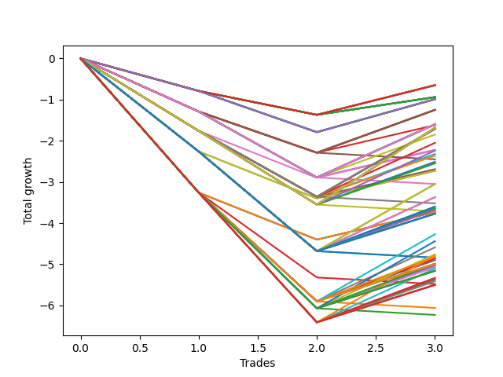

# Long HLT 509 
- Symbol: TSLA
- Date Range: 05/16/2022 - 05/17/2024
- Trading Period: 8:30-12:30
- Number of Trades: 3



| Id. | Name | Win Percent | Profit | Avg Profit / Trade | Avg Time / Trade | Std |      | Name | Win Percent | Profit | Avg Profit / Trade | Avg Time / Trade | Std |
| --- | ---- | ----------- | ------ | ------------------ | ---------------- | --- | ---- | ---- | ----------- | ------ | ------------------ | ---------------- | --- |
| | Sorted By <br> Profit | | | | | | | Sorted By <br> Win Percentage |||||
|0| TP-0.5 180m | 33.33 | -0.65 | -0.22 | 02:40 | 0.67 |     | TP-0.5 180m | 33.33 | -0.65 | -0.22 | 02:40 | 0.67 |
|1| TP-0.5 165m | 33.33 | -0.65 | -0.22 | 02:40 | 0.67 |     | TP-0.5 165m | 33.33 | -0.65 | -0.22 | 02:40 | 0.67 |
|2| TP-0.5 150m | 33.33 | -0.65 | -0.22 | 02:40 | 0.67 |     | TP-0.5 150m | 33.33 | -0.65 | -0.22 | 02:40 | 0.67 |
|3| TP-0.5 135m | 33.33 | -0.65 | -0.22 | 02:40 | 0.67 |     | TP-0.5 135m | 33.33 | -0.65 | -0.22 | 02:40 | 0.67 |
|4| TP-0.5 120m | 33.33 | -0.65 | -0.22 | 02:40 | 0.67 |     | TP-0.5 120m | 33.33 | -0.65 | -0.22 | 02:40 | 0.67 |
|5| TP-0.5 105m | 33.33 | -0.65 | -0.22 | 02:40 | 0.67 |     | TP-0.5 105m | 33.33 | -0.65 | -0.22 | 02:40 | 0.67 |
|6| TP-0.5 90m | 33.33 | -0.65 | -0.22 | 02:40 | 0.67 |     | TP-0.5 90m | 33.33 | -0.65 | -0.22 | 02:40 | 0.67 |
|7| TP-0.5 75m | 33.33 | -0.65 | -0.22 | 02:40 | 0.67 |     | TP-0.5 75m | 33.33 | -0.65 | -0.22 | 02:40 | 0.67 |
|8| TP-0.5 60m | 33.33 | -0.65 | -0.22 | 02:40 | 0.67 |     | TP-0.5 60m | 33.33 | -0.65 | -0.22 | 02:40 | 0.67 |
|9| TP-0.5 45m | 33.33 | -0.65 | -0.22 | 02:40 | 0.67 |     | TP-0.5 45m | 33.33 | -0.65 | -0.22 | 02:40 | 0.67 |
|10| TP-0.5 30m | 33.33 | -0.65 | -0.22 | 02:40 | 0.67 |     | TP-0.5 30m | 33.33 | -0.65 | -0.22 | 02:40 | 0.67 |
|11| TP-0.5 15m | 33.33 | -0.65 | -0.22 | 02:40 | 0.67 |     | TP-0.5 15m | 33.33 | -0.65 | -0.22 | 02:40 | 0.67 |
|12| TP-0.25 180m | 33.33 | -0.94 | -0.31 | 02:20 | 0.53 |     | TP-0.25 180m | 33.33 | -0.94 | -0.31 | 02:20 | 0.53 |
|13| TP-0.25 165m | 33.33 | -0.94 | -0.31 | 02:20 | 0.53 |     | TP-0.25 165m | 33.33 | -0.94 | -0.31 | 02:20 | 0.53 |
|14| TP-0.25 150m | 33.33 | -0.94 | -0.31 | 02:20 | 0.53 |     | TP-0.25 150m | 33.33 | -0.94 | -0.31 | 02:20 | 0.53 |
|15| TP-0.25 135m | 33.33 | -0.94 | -0.31 | 02:20 | 0.53 |     | TP-0.25 135m | 33.33 | -0.94 | -0.31 | 02:20 | 0.53 |
|16| TP-0.25 120m | 33.33 | -0.94 | -0.31 | 02:20 | 0.53 |     | TP-0.25 120m | 33.33 | -0.94 | -0.31 | 02:20 | 0.53 |
|17| TP-0.25 105m | 33.33 | -0.94 | -0.31 | 02:20 | 0.53 |     | TP-0.25 105m | 33.33 | -0.94 | -0.31 | 02:20 | 0.53 |
|18| TP-0.25 90m | 33.33 | -0.94 | -0.31 | 02:20 | 0.53 |     | TP-0.25 90m | 33.33 | -0.94 | -0.31 | 02:20 | 0.53 |
|19| TP-0.25 75m | 33.33 | -0.94 | -0.31 | 02:20 | 0.53 |     | TP-0.25 75m | 33.33 | -0.94 | -0.31 | 02:20 | 0.53 |
|20| TP-0.25 60m | 33.33 | -0.94 | -0.31 | 02:20 | 0.53 |     | TP-0.25 60m | 33.33 | -0.94 | -0.31 | 02:20 | 0.53 |
|21| TP-0.25 45m | 33.33 | -0.94 | -0.31 | 02:20 | 0.53 |     | TP-0.25 45m | 33.33 | -0.94 | -0.31 | 02:20 | 0.53 |
|22| TP-0.25 30m | 33.33 | -0.94 | -0.31 | 02:20 | 0.53 |     | TP-0.25 30m | 33.33 | -0.94 | -0.31 | 02:20 | 0.53 |
|23| TP-0.25 15m | 33.33 | -0.94 | -0.31 | 02:20 | 0.53 |     | TP-0.25 15m | 33.33 | -0.94 | -0.31 | 02:20 | 0.53 |
|24| TP-0.75 180m | 33.33 | -0.99 | -0.33 | 05:40 | 0.80 |     | TP-0.75 180m | 33.33 | -0.99 | -0.33 | 05:40 | 0.80 |
|25| TP-0.75 165m | 33.33 | -0.99 | -0.33 | 05:40 | 0.80 |     | TP-0.75 165m | 33.33 | -0.99 | -0.33 | 05:40 | 0.80 |
|26| TP-0.75 150m | 33.33 | -0.99 | -0.33 | 05:40 | 0.80 |     | TP-0.75 150m | 33.33 | -0.99 | -0.33 | 05:40 | 0.80 |
|27| TP-0.75 135m | 33.33 | -0.99 | -0.33 | 05:40 | 0.80 |     | TP-0.75 135m | 33.33 | -0.99 | -0.33 | 05:40 | 0.80 |
|28| TP-0.75 120m | 33.33 | -0.99 | -0.33 | 05:40 | 0.80 |     | TP-0.75 120m | 33.33 | -0.99 | -0.33 | 05:40 | 0.80 |
|29| TP-0.75 105m | 33.33 | -0.99 | -0.33 | 05:40 | 0.80 |     | TP-0.75 105m | 33.33 | -0.99 | -0.33 | 05:40 | 0.80 |
|30| TP-0.75 90m | 33.33 | -0.99 | -0.33 | 05:40 | 0.80 |     | TP-0.75 90m | 33.33 | -0.99 | -0.33 | 05:40 | 0.80 |
|31| TP-0.75 75m | 33.33 | -0.99 | -0.33 | 05:40 | 0.80 |     | TP-0.75 75m | 33.33 | -0.99 | -0.33 | 05:40 | 0.80 |
|32| TP-0.75 60m | 33.33 | -0.99 | -0.33 | 05:40 | 0.80 |     | TP-0.75 60m | 33.33 | -0.99 | -0.33 | 05:40 | 0.80 |
|33| TP-0.75 45m | 33.33 | -0.99 | -0.33 | 05:40 | 0.80 |     | TP-0.75 45m | 33.33 | -0.99 | -0.33 | 05:40 | 0.80 |
|34| TP-0.75 30m | 33.33 | -0.99 | -0.33 | 05:40 | 0.80 |     | TP-0.75 30m | 33.33 | -0.99 | -0.33 | 05:40 | 0.80 |
|35| TP-0.75 15m | 33.33 | -0.99 | -0.33 | 05:40 | 0.80 |     | TP-0.75 15m | 33.33 | -0.99 | -0.33 | 05:40 | 0.80 |
|36| TP-1 180m | 33.33 | -1.25 | -0.42 | 18:00 | 1.04 |     | TP-1 180m | 33.33 | -1.25 | -0.42 | 18:00 | 1.04 |
|37| TP-1 165m | 33.33 | -1.25 | -0.42 | 18:00 | 1.04 |     | TP-1 165m | 33.33 | -1.25 | -0.42 | 18:00 | 1.04 |
|38| TP-1 150m | 33.33 | -1.25 | -0.42 | 18:00 | 1.04 |     | TP-1 150m | 33.33 | -1.25 | -0.42 | 18:00 | 1.04 |
|39| TP-1 135m | 33.33 | -1.25 | -0.42 | 18:00 | 1.04 |     | TP-1 135m | 33.33 | -1.25 | -0.42 | 18:00 | 1.04 |
|40| TP-1 120m | 33.33 | -1.25 | -0.42 | 18:00 | 1.04 |     | TP-1 120m | 33.33 | -1.25 | -0.42 | 18:00 | 1.04 |
|41| TP-1 105m | 33.33 | -1.25 | -0.42 | 18:00 | 1.04 |     | TP-1 105m | 33.33 | -1.25 | -0.42 | 18:00 | 1.04 |
|42| TP-1 90m | 33.33 | -1.25 | -0.42 | 18:00 | 1.04 |     | TP-1 90m | 33.33 | -1.25 | -0.42 | 18:00 | 1.04 |
|43| TP-1 75m | 33.33 | -1.25 | -0.42 | 18:00 | 1.04 |     | TP-1 75m | 33.33 | -1.25 | -0.42 | 18:00 | 1.04 |
|44| TP-1 60m | 33.33 | -1.25 | -0.42 | 18:00 | 1.04 |     | TP-1 60m | 33.33 | -1.25 | -0.42 | 18:00 | 1.04 |
|45| TP-1 45m | 33.33 | -1.25 | -0.42 | 18:00 | 1.04 |     | TP-1 45m | 33.33 | -1.25 | -0.42 | 18:00 | 1.04 |
|46| TP-1.25 180m | 33.33 | -1.60 | -0.53 | 19:40 | 1.30 |     | TP-1.25 180m | 33.33 | -1.60 | -0.53 | 19:40 | 1.30 |
|47| TP-1.25 165m | 33.33 | -1.60 | -0.53 | 19:40 | 1.30 |     | TP-1.25 165m | 33.33 | -1.60 | -0.53 | 19:40 | 1.30 |
|48| TP-1.25 150m | 33.33 | -1.60 | -0.53 | 19:40 | 1.30 |     | TP-1.25 150m | 33.33 | -1.60 | -0.53 | 19:40 | 1.30 |
|49| TP-1.25 135m | 33.33 | -1.60 | -0.53 | 19:40 | 1.30 |     | TP-1.25 135m | 33.33 | -1.60 | -0.53 | 19:40 | 1.30 |
|50| TP-1.25 120m | 33.33 | -1.60 | -0.53 | 19:40 | 1.30 |     | TP-1.25 120m | 33.33 | -1.60 | -0.53 | 19:40 | 1.30 |
|51| TP-1.25 105m | 33.33 | -1.60 | -0.53 | 19:40 | 1.30 |     | TP-1.25 105m | 33.33 | -1.60 | -0.53 | 19:40 | 1.30 |
|52| TP-1.25 90m | 33.33 | -1.60 | -0.53 | 19:40 | 1.30 |     | TP-1.25 90m | 33.33 | -1.60 | -0.53 | 19:40 | 1.30 |
|53| TP-1.25 75m | 33.33 | -1.60 | -0.53 | 19:40 | 1.30 |     | TP-1.25 75m | 33.33 | -1.60 | -0.53 | 19:40 | 1.30 |
|54| TP-1.25 60m | 33.33 | -1.60 | -0.53 | 19:40 | 1.30 |     | TP-1.25 60m | 33.33 | -1.60 | -0.53 | 19:40 | 1.30 |
|55| TP-1 15m | 33.33 | -1.62 | -0.54 | 08:00 | 0.86 |     | TP-1 15m | 33.33 | -1.62 | -0.54 | 08:00 | 0.86 |
|56| TP-1.75 180m | 33.33 | -1.68 | -0.56 | 35:20 | 1.72 |     | TP-1.75 180m | 33.33 | -1.68 | -0.56 | 35:20 | 1.72 |
|57| TP-1.75 165m | 33.33 | -1.68 | -0.56 | 35:20 | 1.72 |     | TP-1.75 165m | 33.33 | -1.68 | -0.56 | 35:20 | 1.72 |
|58| TP-1.75 150m | 33.33 | -1.68 | -0.56 | 35:20 | 1.72 |     | TP-1.75 150m | 33.33 | -1.68 | -0.56 | 35:20 | 1.72 |
|59| TP-1.75 135m | 33.33 | -1.68 | -0.56 | 35:20 | 1.72 |     | TP-1.75 135m | 33.33 | -1.68 | -0.56 | 35:20 | 1.72 |
|60| TP-1.75 120m | 33.33 | -1.68 | -0.56 | 35:20 | 1.72 |     | TP-1.75 120m | 33.33 | -1.68 | -0.56 | 35:20 | 1.72 |
|61| TP-1.75 105m | 33.33 | -1.68 | -0.56 | 35:20 | 1.72 |     | TP-1.75 105m | 33.33 | -1.68 | -0.56 | 35:20 | 1.72 |
|62| TP-1.75 90m | 33.33 | -1.68 | -0.56 | 35:20 | 1.72 |     | TP-1.75 90m | 33.33 | -1.68 | -0.56 | 35:20 | 1.72 |
|63| TP-1.5 180m | 33.33 | -1.71 | -0.57 | 31:40 | 1.57 |     | TP-1.5 180m | 33.33 | -1.71 | -0.57 | 31:40 | 1.57 |
|64| TP-1.5 165m | 33.33 | -1.71 | -0.57 | 31:40 | 1.57 |     | TP-1.5 165m | 33.33 | -1.71 | -0.57 | 31:40 | 1.57 |
|65| TP-1.5 150m | 33.33 | -1.71 | -0.57 | 31:40 | 1.57 |     | TP-1.5 150m | 33.33 | -1.71 | -0.57 | 31:40 | 1.57 |
|66| TP-1.5 135m | 33.33 | -1.71 | -0.57 | 31:40 | 1.57 |     | TP-1.5 135m | 33.33 | -1.71 | -0.57 | 31:40 | 1.57 |
|67| TP-1.5 120m | 33.33 | -1.71 | -0.57 | 31:40 | 1.57 |     | TP-1.5 120m | 33.33 | -1.71 | -0.57 | 31:40 | 1.57 |
|68| TP-1.5 105m | 33.33 | -1.71 | -0.57 | 31:40 | 1.57 |     | TP-1.5 105m | 33.33 | -1.71 | -0.57 | 31:40 | 1.57 |
|69| TP-1.5 90m | 33.33 | -1.71 | -0.57 | 31:40 | 1.57 |     | TP-1.5 90m | 33.33 | -1.71 | -0.57 | 31:40 | 1.57 |
|70| TP-1.25 45m | 33.33 | -1.85 | -0.62 | 19:00 | 1.18 |     | TP-1.25 45m | 33.33 | -1.85 | -0.62 | 19:00 | 1.18 |
|71| TP-1.5 75m | 33.33 | -2.05 | -0.68 | 29:20 | 1.41 |     | TP-1.5 75m | 33.33 | -2.05 | -0.68 | 29:20 | 1.41 |
|72| TP-1.25 15m | 33.33 | -2.22 | -0.74 | 09:00 | 1.01 |     | TP-1.25 15m | 33.33 | -2.22 | -0.74 | 09:00 | 1.01 |
|73| TP-1.75 15m | 33.33 | -2.23 | -0.74 | 11:00 | 1.03 |     | TP-1.75 15m | 33.33 | -2.23 | -0.74 | 11:00 | 1.03 |
|74| TP-1.75 75m | 33.33 | -2.24 | -0.75 | 32:20 | 1.45 |     | TP-1.75 75m | 33.33 | -2.24 | -0.75 | 32:20 | 1.45 |
|75| TP-1.5 45m | 33.33 | -2.32 | -0.77 | 19:20 | 1.28 |     | TP-1.5 45m | 33.33 | -2.32 | -0.77 | 19:20 | 1.28 |
|76| TP-1.5 60m | 33.33 | -2.36 | -0.79 | 24:20 | 1.27 |     | TP-1.5 60m | 33.33 | -2.36 | -0.79 | 24:20 | 1.27 |
|77| TP-1 30m | 0.00 | -2.45 | -0.82 | 13:00 | 0.48 |     | TP-1.75 45m | 33.33 | -2.51 | -0.84 | 22:20 | 1.33 |
|78| TP-1.75 45m | 33.33 | -2.51 | -0.84 | 22:20 | 1.33 |     | TP-1.75 60m | 33.33 | -2.55 | -0.85 | 27:20 | 1.31 |
|79| TP-1.75 60m | 33.33 | -2.55 | -0.85 | 27:20 | 1.31 |     | TP-1.5 15m | 33.33 | -2.69 | -0.90 | 09:20 | 1.11 |
|80| TP-1.5 15m | 33.33 | -2.69 | -0.90 | 09:20 | 1.11 |     | TP-2.25 15m | 33.33 | -2.73 | -0.91 | 11:20 | 1.21 |
|81| TP-2.25 15m | 33.33 | -2.73 | -0.91 | 11:20 | 1.21 |     | TP-2 15m | 33.33 | -2.73 | -0.91 | 11:20 | 1.21 |
|82| TP-2 15m | 33.33 | -2.73 | -0.91 | 11:20 | 1.21 |     | TP-2.25 90m | 33.33 | -3.05 | -1.02 | 39:00 | 1.87 |
|83| TP-2.25 90m | 33.33 | -3.05 | -1.02 | 39:00 | 1.87 |     | TP-2 90m | 33.33 | -3.05 | -1.02 | 39:00 | 1.87 |
|84| TP-2 90m | 33.33 | -3.05 | -1.02 | 39:00 | 1.87 |     | TP-2.25 75m | 33.33 | -3.37 | -1.12 | 34:00 | 1.72 |
|85| TP-1.25 30m | 0.00 | -3.05 | -1.02 | 14:00 | 0.62 |     | TP-2 75m | 33.33 | -3.37 | -1.12 | 34:00 | 1.72 |
|86| TP-2.25 75m | 33.33 | -3.37 | -1.12 | 34:00 | 1.72 |     | TP-2.25 105m | 33.33 | -3.60 | -1.20 | 44:00 | 1.61 |
|87| TP-2 75m | 33.33 | -3.37 | -1.12 | 34:00 | 1.72 |     | TP-2 105m | 33.33 | -3.60 | -1.20 | 44:00 | 1.61 |
|88| TP-1.5 30m | 0.00 | -3.52 | -1.17 | 14:20 | 0.72 |     | TP-2.25 45m | 33.33 | -3.64 | -1.21 | 24:00 | 1.59 |
|89| TP-2.25 105m | 33.33 | -3.60 | -1.20 | 44:00 | 1.61 |     | TP-2 45m | 33.33 | -3.64 | -1.21 | 24:00 | 1.59 |
|90| TP-2 105m | 33.33 | -3.60 | -1.20 | 44:00 | 1.61 |     | TP-2.25 60m | 33.33 | -3.68 | -1.23 | 29:00 | 1.58 |
|91| TP-2.25 45m | 33.33 | -3.64 | -1.21 | 24:00 | 1.59 |     | TP-2 60m | 33.33 | -3.68 | -1.23 | 29:00 | 1.58 |
|92| TP-2 45m | 33.33 | -3.64 | -1.21 | 24:00 | 1.59 |     | TP-3 15m | 33.33 | -3.73 | -1.24 | 13:00 | 1.61 |
|93| TP-2.25 60m | 33.33 | -3.68 | -1.23 | 29:00 | 1.58 |     | TP-2.75 15m | 33.33 | -3.73 | -1.24 | 13:00 | 1.61 |
|94| TP-2 60m | 33.33 | -3.68 | -1.23 | 29:00 | 1.58 |     | TP-2.5 15m | 33.33 | -3.73 | -1.24 | 13:00 | 1.61 |
|95| TP-1.75 30m | 0.00 | -3.71 | -1.24 | 17:20 | 0.76 |     | TP-2.25 180m | 33.33 | -3.77 | -1.26 | 49:00 | 1.53 |
|96| TP-3 15m | 33.33 | -3.73 | -1.24 | 13:00 | 1.61 |     | TP-2 180m | 33.33 | -3.77 | -1.26 | 49:00 | 1.53 |
|97| TP-2.75 15m | 33.33 | -3.73 | -1.24 | 13:00 | 1.61 |     | TP-2.25 165m | 33.33 | -3.77 | -1.26 | 49:00 | 1.53 |
|98| TP-2.5 15m | 33.33 | -3.73 | -1.24 | 13:00 | 1.61 |     | TP-2 165m | 33.33 | -3.77 | -1.26 | 49:00 | 1.53 |
|99| TP-2.25 180m | 33.33 | -3.77 | -1.26 | 49:00 | 1.53 |     | TP-2.25 150m | 33.33 | -3.77 | -1.26 | 49:00 | 1.53 |
|100| TP-2 180m | 33.33 | -3.77 | -1.26 | 49:00 | 1.53 |     | TP-2 150m | 33.33 | -3.77 | -1.26 | 49:00 | 1.53 |
|101| TP-2.25 165m | 33.33 | -3.77 | -1.26 | 49:00 | 1.53 |     | TP-2.25 135m | 33.33 | -3.77 | -1.26 | 49:00 | 1.53 |
|102| TP-2 165m | 33.33 | -3.77 | -1.26 | 49:00 | 1.53 |     | TP-2 135m | 33.33 | -3.77 | -1.26 | 49:00 | 1.53 |
|103| TP-2.25 150m | 33.33 | -3.77 | -1.26 | 49:00 | 1.53 |     | TP-2.25 120m | 33.33 | -3.77 | -1.26 | 49:00 | 1.53 |
|104| TP-2 150m | 33.33 | -3.77 | -1.26 | 49:00 | 1.53 |     | TP-2 120m | 33.33 | -3.77 | -1.26 | 49:00 | 1.53 |
|105| TP-2.25 135m | 33.33 | -3.77 | -1.26 | 49:00 | 1.53 |     | TP-2.5 90m | 33.33 | -4.27 | -1.42 | 41:20 | 2.17 |
|106| TP-2 135m | 33.33 | -3.77 | -1.26 | 49:00 | 1.53 |     | TP-2.75 90m | 33.33 | -4.44 | -1.48 | 41:40 | 2.21 |
|107| TP-2.25 120m | 33.33 | -3.77 | -1.26 | 49:00 | 1.53 |     | TP-2.5 75m | 33.33 | -4.59 | -1.53 | 36:20 | 2.02 |
|108| TP-2 120m | 33.33 | -3.77 | -1.26 | 49:00 | 1.53 |     | TP-2.75 75m | 33.33 | -4.76 | -1.59 | 36:40 | 2.06 |
|109| TP-2.5 90m | 33.33 | -4.27 | -1.42 | 41:20 | 2.17 |     | TP-3 90m | 33.33 | -4.78 | -1.59 | 46:20 | 2.28 |
|110| TP-2.75 90m | 33.33 | -4.44 | -1.48 | 41:40 | 2.21 |     | TP-2.5 105m | 33.33 | -4.82 | -1.61 | 46:20 | 1.92 |
|111| TP-2.5 75m | 33.33 | -4.59 | -1.53 | 36:20 | 2.02 |     | TP-2.5 45m | 33.33 | -4.86 | -1.62 | 26:20 | 1.90 |
|112| TP-2.75 75m | 33.33 | -4.76 | -1.59 | 36:40 | 2.06 |     | TP-2.5 60m | 33.33 | -4.90 | -1.63 | 31:20 | 1.88 |
|113| TP-3 90m | 33.33 | -4.78 | -1.59 | 46:20 | 2.28 |     | TP-2.5 180m | 33.33 | -4.99 | -1.66 | 51:20 | 1.84 |
|114| TP-2.5 105m | 33.33 | -4.82 | -1.61 | 46:20 | 1.92 |     | TP-2.5 165m | 33.33 | -4.99 | -1.66 | 51:20 | 1.84 |
|115| TP-2.25 30m | 0.00 | -4.84 | -1.61 | 19:00 | 1.03 |     | TP-2.5 150m | 33.33 | -4.99 | -1.66 | 51:20 | 1.84 |
|116| TP-2 30m | 0.00 | -4.84 | -1.61 | 19:00 | 1.03 |     | TP-2.5 135m | 33.33 | -4.99 | -1.66 | 51:20 | 1.84 |
|117| TP-2.5 45m | 33.33 | -4.86 | -1.62 | 26:20 | 1.90 |     | TP-2.5 120m | 33.33 | -4.99 | -1.66 | 51:20 | 1.84 |
|118| TP-2.5 60m | 33.33 | -4.90 | -1.63 | 31:20 | 1.88 |     | TP-2.75 105m | 33.33 | -4.99 | -1.66 | 46:40 | 1.95 |
|119| TP-2.5 180m | 33.33 | -4.99 | -1.66 | 51:20 | 1.84 |     | TP-2.75 45m | 33.33 | -5.03 | -1.68 | 26:40 | 1.93 |
|120| TP-2.5 165m | 33.33 | -4.99 | -1.66 | 51:20 | 1.84 |     | TP-2.75 60m | 33.33 | -5.07 | -1.69 | 31:40 | 1.91 |
|121| TP-2.5 150m | 33.33 | -4.99 | -1.66 | 51:20 | 1.84 |     | TP-3 75m | 33.33 | -5.10 | -1.70 | 41:20 | 2.13 |
|122| TP-2.5 135m | 33.33 | -4.99 | -1.66 | 51:20 | 1.84 |     | TP-2.75 180m | 33.33 | -5.16 | -1.72 | 51:40 | 1.87 |
|123| TP-2.5 120m | 33.33 | -4.99 | -1.66 | 51:20 | 1.84 |     | TP-2.75 165m | 33.33 | -5.16 | -1.72 | 51:40 | 1.87 |
|124| TP-2.75 105m | 33.33 | -4.99 | -1.66 | 46:40 | 1.95 |     | TP-2.75 150m | 33.33 | -5.16 | -1.72 | 51:40 | 1.87 |
|125| TP-2.75 45m | 33.33 | -5.03 | -1.68 | 26:40 | 1.93 |     | TP-2.75 135m | 33.33 | -5.16 | -1.72 | 51:40 | 1.87 |
|126| TP-2.75 60m | 33.33 | -5.07 | -1.69 | 31:40 | 1.91 |     | TP-2.75 120m | 33.33 | -5.16 | -1.72 | 51:40 | 1.87 |
|127| TP-3 75m | 33.33 | -5.10 | -1.70 | 41:20 | 2.13 |     | TP-3 105m | 33.33 | -5.33 | -1.78 | 51:20 | 2.02 |
|128| TP-2.75 180m | 33.33 | -5.16 | -1.72 | 51:40 | 1.87 |     | TP-3 45m | 33.33 | -5.37 | -1.79 | 31:20 | 2.00 |
|129| TP-2.75 165m | 33.33 | -5.16 | -1.72 | 51:40 | 1.87 |     | TP-3 60m | 33.33 | -5.41 | -1.80 | 36:20 | 1.98 |
|130| TP-2.75 150m | 33.33 | -5.16 | -1.72 | 51:40 | 1.87 |     | TP-3 180m | 33.33 | -5.50 | -1.83 | 56:20 | 1.94 |
|131| TP-2.75 135m | 33.33 | -5.16 | -1.72 | 51:40 | 1.87 |     | TP-3 165m | 33.33 | -5.50 | -1.83 | 56:20 | 1.94 |
|132| TP-2.75 120m | 33.33 | -5.16 | -1.72 | 51:40 | 1.87 |     | TP-3 150m | 33.33 | -5.50 | -1.83 | 56:20 | 1.94 |
|133| TP-3 105m | 33.33 | -5.33 | -1.78 | 51:20 | 2.02 |     | TP-3 135m | 33.33 | -5.50 | -1.83 | 56:20 | 1.94 |
|134| TP-3 45m | 33.33 | -5.37 | -1.79 | 31:20 | 2.00 |     | TP-3 120m | 33.33 | -5.50 | -1.83 | 56:20 | 1.94 |
|135| TP-3 60m | 33.33 | -5.41 | -1.80 | 36:20 | 1.98 |     | TP-1 30m | 0.00 | -2.45 | -0.82 | 13:00 | 0.48 |
|136| TP-3 30m | 0.00 | -5.48 | -1.83 | 23:00 | 1.28 |     | TP-1.25 30m | 0.00 | -3.05 | -1.02 | 14:00 | 0.62 |
|137| TP-3 180m | 33.33 | -5.50 | -1.83 | 56:20 | 1.94 |     | TP-1.5 30m | 0.00 | -3.52 | -1.17 | 14:20 | 0.72 |
|138| TP-3 165m | 33.33 | -5.50 | -1.83 | 56:20 | 1.94 |     | TP-1.75 30m | 0.00 | -3.71 | -1.24 | 17:20 | 0.76 |
|139| TP-3 150m | 33.33 | -5.50 | -1.83 | 56:20 | 1.94 |     | TP-2.25 30m | 0.00 | -4.84 | -1.61 | 19:00 | 1.03 |
|140| TP-3 135m | 33.33 | -5.50 | -1.83 | 56:20 | 1.94 |     | TP-2 30m | 0.00 | -4.84 | -1.61 | 19:00 | 1.03 |
|141| TP-3 120m | 33.33 | -5.50 | -1.83 | 56:20 | 1.94 |     | TP-3 30m | 0.00 | -5.48 | -1.83 | 23:00 | 1.28 |
|142| TP-2.5 30m | 0.00 | -6.06 | -2.02 | 21:20 | 1.34 |     | TP-2.5 30m | 0.00 | -6.06 | -2.02 | 21:20 | 1.34 |
|143| TP-2.75 30m | 0.00 | -6.23 | -2.08 | 21:40 | 1.37 |     | TP-2.75 30m | 0.00 | -6.23 | -2.08 | 21:40 | 1.37 |

### Test TP-0.25 15m
* Take Profit of 0.25 Point
* 0.25 Stoploss
* Results:
```
Total Trades: 3
Percent Up: 33.33
Percent Down: 66.67
Total Points Moved Up: -0.94
Potential Profit: -470.00
Total Points Ups: 0.43 Count Ups: 1
Total Points Downs: -1.37 Count Downs: 2
```

<details><summary>Trades</summary>

<code>In: 2022-11-02 12:10:00		Out: 2022-11-02 12:12:00		Total Position Time: 02:00		Total Move Up: -0.79		Total to Date: -0.79</code> <br />
<code>In: 2023-09-27 09:35:00		Out: 2023-09-27 09:38:00		Total Position Time: 03:00		Total Move Up: -0.58		Total to Date: -1.37</code> <br />
<code>In: 2023-12-13 08:35:00		Out: 2023-12-13 08:37:00		Total Position Time: 02:00		Total Move Up: 0.43		Total to Date: -0.94</code> <br />


</details>

### Test TP-0.5 15m
* Take Profit of 0.5 Point
* 0.5 Stoploss
* Results:
```
Total Trades: 3
Percent Up: 33.33
Percent Down: 66.67
Total Points Moved Up: -0.65
Potential Profit: -325.00
Total Points Ups: 0.72 Count Ups: 1
Total Points Downs: -1.37 Count Downs: 2
```

<details><summary>Trades</summary>

<code>In: 2022-11-02 12:10:00		Out: 2022-11-02 12:12:00		Total Position Time: 02:00		Total Move Up: -0.79		Total to Date: -0.79</code> <br />
<code>In: 2023-09-27 09:35:00		Out: 2023-09-27 09:38:00		Total Position Time: 03:00		Total Move Up: -0.58		Total to Date: -1.37</code> <br />
<code>In: 2023-12-13 08:35:00		Out: 2023-12-13 08:38:00		Total Position Time: 03:00		Total Move Up: 0.72		Total to Date: -0.65</code> <br />


</details>

### Test TP-0.75 15m
* Take Profit of 0.75 Point
* 0.75 Stoploss
* Results:
```
Total Trades: 3
Percent Up: 33.33
Percent Down: 66.67
Total Points Moved Up: -0.99
Potential Profit: -495.00
Total Points Ups: 0.80 Count Ups: 1
Total Points Downs: -1.79 Count Downs: 2
```

<details><summary>Trades</summary>

<code>In: 2022-11-02 12:10:00		Out: 2022-11-02 12:12:00		Total Position Time: 02:00		Total Move Up: -0.79		Total to Date: -0.79</code> <br />
<code>In: 2023-09-27 09:35:00		Out: 2023-09-27 09:41:00		Total Position Time: 06:00		Total Move Up: -1.00		Total to Date: -1.79</code> <br />
<code>In: 2023-12-13 08:35:00		Out: 2023-12-13 08:44:00		Total Position Time: 09:00		Total Move Up: 0.80		Total to Date: -0.99</code> <br />


</details>

### Test TP-1 15m
* Take Profit of 1 Point
* 1 Stoploss
* Results:
```
Total Trades: 3
Percent Up: 33.33
Percent Down: 66.67
Total Points Moved Up: -1.62
Potential Profit: -810.00
Total Points Ups: 0.67 Count Ups: 1
Total Points Downs: -2.29 Count Downs: 2
```

<details><summary>Trades</summary>

<code>In: 2022-11-02 12:10:00		Out: 2022-11-02 12:14:00		Total Position Time: 04:00		Total Move Up: -1.29		Total to Date: -1.29</code> <br />
<code>In: 2023-09-27 09:35:00		Out: 2023-09-27 09:41:00		Total Position Time: 06:00		Total Move Up: -1.00		Total to Date: -2.29</code> <br />
<code>In: 2023-12-13 08:35:00		Out: 2023-12-13 08:49:00		Total Position Time: 14:00		Total Move Up: 0.67		Total to Date: -1.62</code> <br />


</details>

### Test TP-1.25 15m
* Take Profit of 1.25 Point
* 1.25 Stoploss
* Results:
```
Total Trades: 3
Percent Up: 33.33
Percent Down: 66.67
Total Points Moved Up: -2.22
Potential Profit: -1110.00
Total Points Ups: 0.67 Count Ups: 1
Total Points Downs: -2.89 Count Downs: 2
```

<details><summary>Trades</summary>

<code>In: 2022-11-02 12:10:00		Out: 2022-11-02 12:14:00		Total Position Time: 04:00		Total Move Up: -1.29		Total to Date: -1.29</code> <br />
<code>In: 2023-09-27 09:35:00		Out: 2023-09-27 09:44:00		Total Position Time: 09:00		Total Move Up: -1.60		Total to Date: -2.89</code> <br />
<code>In: 2023-12-13 08:35:00		Out: 2023-12-13 08:49:00		Total Position Time: 14:00		Total Move Up: 0.67		Total to Date: -2.22</code> <br />


</details>

### Test TP-1.5 15m
* Take Profit of 1.5 Point
* 1.5 Stoploss
* Results:
```
Total Trades: 3
Percent Up: 33.33
Percent Down: 66.67
Total Points Moved Up: -2.69
Potential Profit: -1345.00
Total Points Ups: 0.67 Count Ups: 1
Total Points Downs: -3.36 Count Downs: 2
```

<details><summary>Trades</summary>

<code>In: 2022-11-02 12:10:00		Out: 2022-11-02 12:15:00		Total Position Time: 05:00		Total Move Up: -1.76		Total to Date: -1.76</code> <br />
<code>In: 2023-09-27 09:35:00		Out: 2023-09-27 09:44:00		Total Position Time: 09:00		Total Move Up: -1.60		Total to Date: -3.36</code> <br />
<code>In: 2023-12-13 08:35:00		Out: 2023-12-13 08:49:00		Total Position Time: 14:00		Total Move Up: 0.67		Total to Date: -2.69</code> <br />


</details>

### Test TP-1.75 15m
* Take Profit of 1.75 Point
* 1.75 Stoploss
* Results:
```
Total Trades: 3
Percent Up: 33.33
Percent Down: 66.67
Total Points Moved Up: -2.23
Potential Profit: -1115.00
Total Points Ups: 0.67 Count Ups: 1
Total Points Downs: -2.90 Count Downs: 2
```

<details><summary>Trades</summary>

<code>In: 2022-11-02 12:10:00		Out: 2022-11-02 12:15:00		Total Position Time: 05:00		Total Move Up: -1.76		Total to Date: -1.76</code> <br />
<code>In: 2023-09-27 09:35:00		Out: 2023-09-27 09:49:00		Total Position Time: 14:00		Total Move Up: -1.14		Total to Date: -2.90</code> <br />
<code>In: 2023-12-13 08:35:00		Out: 2023-12-13 08:49:00		Total Position Time: 14:00		Total Move Up: 0.67		Total to Date: -2.23</code> <br />


</details>

### Test TP-2 15m
* Take Profit of 2 Point
* 2 Stoploss
* Results:
```
Total Trades: 3
Percent Up: 33.33
Percent Down: 66.67
Total Points Moved Up: -2.73
Potential Profit: -1365.00
Total Points Ups: 0.67 Count Ups: 1
Total Points Downs: -3.40 Count Downs: 2
```

<details><summary>Trades</summary>

<code>In: 2022-11-02 12:10:00		Out: 2022-11-02 12:16:00		Total Position Time: 06:00		Total Move Up: -2.26		Total to Date: -2.26</code> <br />
<code>In: 2023-09-27 09:35:00		Out: 2023-09-27 09:49:00		Total Position Time: 14:00		Total Move Up: -1.14		Total to Date: -3.40</code> <br />
<code>In: 2023-12-13 08:35:00		Out: 2023-12-13 08:49:00		Total Position Time: 14:00		Total Move Up: 0.67		Total to Date: -2.73</code> <br />


</details>

### Test TP-2.25 15m
* Take Profit of 2.25 Point
* 2.25 Stoploss
* Results:
```
Total Trades: 3
Percent Up: 33.33
Percent Down: 66.67
Total Points Moved Up: -2.73
Potential Profit: -1365.00
Total Points Ups: 0.67 Count Ups: 1
Total Points Downs: -3.40 Count Downs: 2
```

<details><summary>Trades</summary>

<code>In: 2022-11-02 12:10:00		Out: 2022-11-02 12:16:00		Total Position Time: 06:00		Total Move Up: -2.26		Total to Date: -2.26</code> <br />
<code>In: 2023-09-27 09:35:00		Out: 2023-09-27 09:49:00		Total Position Time: 14:00		Total Move Up: -1.14		Total to Date: -3.40</code> <br />
<code>In: 2023-12-13 08:35:00		Out: 2023-12-13 08:49:00		Total Position Time: 14:00		Total Move Up: 0.67		Total to Date: -2.73</code> <br />


</details>

### Test TP-2.5 15m
* Take Profit of 2.5 Point
* 2.5 Stoploss
* Results:
```
Total Trades: 3
Percent Up: 33.33
Percent Down: 66.67
Total Points Moved Up: -3.73
Potential Profit: -1865.00
Total Points Ups: 0.67 Count Ups: 1
Total Points Downs: -4.40 Count Downs: 2
```

<details><summary>Trades</summary>

<code>In: 2022-11-02 12:10:00		Out: 2022-11-02 12:21:00		Total Position Time: 11:00		Total Move Up: -3.26		Total to Date: -3.26</code> <br />
<code>In: 2023-09-27 09:35:00		Out: 2023-09-27 09:49:00		Total Position Time: 14:00		Total Move Up: -1.14		Total to Date: -4.40</code> <br />
<code>In: 2023-12-13 08:35:00		Out: 2023-12-13 08:49:00		Total Position Time: 14:00		Total Move Up: 0.67		Total to Date: -3.73</code> <br />


</details>

### Test TP-2.75 15m
* Take Profit of 2.75 Point
* 2.75 Stoploss
* Results:
```
Total Trades: 3
Percent Up: 33.33
Percent Down: 66.67
Total Points Moved Up: -3.73
Potential Profit: -1865.00
Total Points Ups: 0.67 Count Ups: 1
Total Points Downs: -4.40 Count Downs: 2
```

<details><summary>Trades</summary>

<code>In: 2022-11-02 12:10:00		Out: 2022-11-02 12:21:00		Total Position Time: 11:00		Total Move Up: -3.26		Total to Date: -3.26</code> <br />
<code>In: 2023-09-27 09:35:00		Out: 2023-09-27 09:49:00		Total Position Time: 14:00		Total Move Up: -1.14		Total to Date: -4.40</code> <br />
<code>In: 2023-12-13 08:35:00		Out: 2023-12-13 08:49:00		Total Position Time: 14:00		Total Move Up: 0.67		Total to Date: -3.73</code> <br />


</details>

### Test TP-3 15m
* Take Profit of 3 Point
* 3 Stoploss
* Results:
```
Total Trades: 3
Percent Up: 33.33
Percent Down: 66.67
Total Points Moved Up: -3.73
Potential Profit: -1865.00
Total Points Ups: 0.67 Count Ups: 1
Total Points Downs: -4.40 Count Downs: 2
```

<details><summary>Trades</summary>

<code>In: 2022-11-02 12:10:00		Out: 2022-11-02 12:21:00		Total Position Time: 11:00		Total Move Up: -3.26		Total to Date: -3.26</code> <br />
<code>In: 2023-09-27 09:35:00		Out: 2023-09-27 09:49:00		Total Position Time: 14:00		Total Move Up: -1.14		Total to Date: -4.40</code> <br />
<code>In: 2023-12-13 08:35:00		Out: 2023-12-13 08:49:00		Total Position Time: 14:00		Total Move Up: 0.67		Total to Date: -3.73</code> <br />


</details>

### Test TP-0.25 30m
* Take Profit of 0.25 Point
* 0.25 Stoploss
* Results:
```
Total Trades: 3
Percent Up: 33.33
Percent Down: 66.67
Total Points Moved Up: -0.94
Potential Profit: -470.00
Total Points Ups: 0.43 Count Ups: 1
Total Points Downs: -1.37 Count Downs: 2
```

<details><summary>Trades</summary>

<code>In: 2022-11-02 12:10:00		Out: 2022-11-02 12:12:00		Total Position Time: 02:00		Total Move Up: -0.79		Total to Date: -0.79</code> <br />
<code>In: 2023-09-27 09:35:00		Out: 2023-09-27 09:38:00		Total Position Time: 03:00		Total Move Up: -0.58		Total to Date: -1.37</code> <br />
<code>In: 2023-12-13 08:35:00		Out: 2023-12-13 08:37:00		Total Position Time: 02:00		Total Move Up: 0.43		Total to Date: -0.94</code> <br />


</details>

### Test TP-0.5 30m
* Take Profit of 0.5 Point
* 0.5 Stoploss
* Results:
```
Total Trades: 3
Percent Up: 33.33
Percent Down: 66.67
Total Points Moved Up: -0.65
Potential Profit: -325.00
Total Points Ups: 0.72 Count Ups: 1
Total Points Downs: -1.37 Count Downs: 2
```

<details><summary>Trades</summary>

<code>In: 2022-11-02 12:10:00		Out: 2022-11-02 12:12:00		Total Position Time: 02:00		Total Move Up: -0.79		Total to Date: -0.79</code> <br />
<code>In: 2023-09-27 09:35:00		Out: 2023-09-27 09:38:00		Total Position Time: 03:00		Total Move Up: -0.58		Total to Date: -1.37</code> <br />
<code>In: 2023-12-13 08:35:00		Out: 2023-12-13 08:38:00		Total Position Time: 03:00		Total Move Up: 0.72		Total to Date: -0.65</code> <br />


</details>

### Test TP-0.75 30m
* Take Profit of 0.75 Point
* 0.75 Stoploss
* Results:
```
Total Trades: 3
Percent Up: 33.33
Percent Down: 66.67
Total Points Moved Up: -0.99
Potential Profit: -495.00
Total Points Ups: 0.80 Count Ups: 1
Total Points Downs: -1.79 Count Downs: 2
```

<details><summary>Trades</summary>

<code>In: 2022-11-02 12:10:00		Out: 2022-11-02 12:12:00		Total Position Time: 02:00		Total Move Up: -0.79		Total to Date: -0.79</code> <br />
<code>In: 2023-09-27 09:35:00		Out: 2023-09-27 09:41:00		Total Position Time: 06:00		Total Move Up: -1.00		Total to Date: -1.79</code> <br />
<code>In: 2023-12-13 08:35:00		Out: 2023-12-13 08:44:00		Total Position Time: 09:00		Total Move Up: 0.80		Total to Date: -0.99</code> <br />


</details>

### Test TP-1 30m
* Take Profit of 1 Point
* 1 Stoploss
* Results:
```
Total Trades: 3
Percent Up: 0.00
Percent Down: 100.00
Total Points Moved Up: -2.45
Potential Profit: -1225.00
Total Points Ups: 0.00 Count Ups: 0
Total Points Downs: -2.45 Count Downs: 3
```

<details><summary>Trades</summary>

<code>In: 2022-11-02 12:10:00		Out: 2022-11-02 12:14:00		Total Position Time: 04:00		Total Move Up: -1.29		Total to Date: -1.29</code> <br />
<code>In: 2023-09-27 09:35:00		Out: 2023-09-27 09:41:00		Total Position Time: 06:00		Total Move Up: -1.00		Total to Date: -2.29</code> <br />
<code>In: 2023-12-13 08:35:00		Out: 2023-12-13 09:04:00		Total Position Time: 29:00		Total Move Up: -0.16		Total to Date: -2.45</code> <br />


</details>

### Test TP-1.25 30m
* Take Profit of 1.25 Point
* 1.25 Stoploss
* Results:
```
Total Trades: 3
Percent Up: 0.00
Percent Down: 100.00
Total Points Moved Up: -3.05
Potential Profit: -1525.00
Total Points Ups: 0.00 Count Ups: 0
Total Points Downs: -3.05 Count Downs: 3
```

<details><summary>Trades</summary>

<code>In: 2022-11-02 12:10:00		Out: 2022-11-02 12:14:00		Total Position Time: 04:00		Total Move Up: -1.29		Total to Date: -1.29</code> <br />
<code>In: 2023-09-27 09:35:00		Out: 2023-09-27 09:44:00		Total Position Time: 09:00		Total Move Up: -1.60		Total to Date: -2.89</code> <br />
<code>In: 2023-12-13 08:35:00		Out: 2023-12-13 09:04:00		Total Position Time: 29:00		Total Move Up: -0.16		Total to Date: -3.05</code> <br />


</details>

### Test TP-1.5 30m
* Take Profit of 1.5 Point
* 1.5 Stoploss
* Results:
```
Total Trades: 3
Percent Up: 0.00
Percent Down: 100.00
Total Points Moved Up: -3.52
Potential Profit: -1760.00
Total Points Ups: 0.00 Count Ups: 0
Total Points Downs: -3.52 Count Downs: 3
```

<details><summary>Trades</summary>

<code>In: 2022-11-02 12:10:00		Out: 2022-11-02 12:15:00		Total Position Time: 05:00		Total Move Up: -1.76		Total to Date: -1.76</code> <br />
<code>In: 2023-09-27 09:35:00		Out: 2023-09-27 09:44:00		Total Position Time: 09:00		Total Move Up: -1.60		Total to Date: -3.36</code> <br />
<code>In: 2023-12-13 08:35:00		Out: 2023-12-13 09:04:00		Total Position Time: 29:00		Total Move Up: -0.16		Total to Date: -3.52</code> <br />


</details>

### Test TP-1.75 30m
* Take Profit of 1.75 Point
* 1.75 Stoploss
* Results:
```
Total Trades: 3
Percent Up: 0.00
Percent Down: 100.00
Total Points Moved Up: -3.71
Potential Profit: -1855.00
Total Points Ups: 0.00 Count Ups: 0
Total Points Downs: -3.71 Count Downs: 3
```

<details><summary>Trades</summary>

<code>In: 2022-11-02 12:10:00		Out: 2022-11-02 12:15:00		Total Position Time: 05:00		Total Move Up: -1.76		Total to Date: -1.76</code> <br />
<code>In: 2023-09-27 09:35:00		Out: 2023-09-27 09:53:00		Total Position Time: 18:00		Total Move Up: -1.79		Total to Date: -3.55</code> <br />
<code>In: 2023-12-13 08:35:00		Out: 2023-12-13 09:04:00		Total Position Time: 29:00		Total Move Up: -0.16		Total to Date: -3.71</code> <br />


</details>

### Test TP-2 30m
* Take Profit of 2 Point
* 2 Stoploss
* Results:
```
Total Trades: 3
Percent Up: 0.00
Percent Down: 100.00
Total Points Moved Up: -4.84
Potential Profit: -2420.00
Total Points Ups: 0.00 Count Ups: 0
Total Points Downs: -4.84 Count Downs: 3
```

<details><summary>Trades</summary>

<code>In: 2022-11-02 12:10:00		Out: 2022-11-02 12:16:00		Total Position Time: 06:00		Total Move Up: -2.26		Total to Date: -2.26</code> <br />
<code>In: 2023-09-27 09:35:00		Out: 2023-09-27 09:57:00		Total Position Time: 22:00		Total Move Up: -2.42		Total to Date: -4.68</code> <br />
<code>In: 2023-12-13 08:35:00		Out: 2023-12-13 09:04:00		Total Position Time: 29:00		Total Move Up: -0.16		Total to Date: -4.84</code> <br />


</details>

### Test TP-2.25 30m
* Take Profit of 2.25 Point
* 2.25 Stoploss
* Results:
```
Total Trades: 3
Percent Up: 0.00
Percent Down: 100.00
Total Points Moved Up: -4.84
Potential Profit: -2420.00
Total Points Ups: 0.00 Count Ups: 0
Total Points Downs: -4.84 Count Downs: 3
```

<details><summary>Trades</summary>

<code>In: 2022-11-02 12:10:00		Out: 2022-11-02 12:16:00		Total Position Time: 06:00		Total Move Up: -2.26		Total to Date: -2.26</code> <br />
<code>In: 2023-09-27 09:35:00		Out: 2023-09-27 09:57:00		Total Position Time: 22:00		Total Move Up: -2.42		Total to Date: -4.68</code> <br />
<code>In: 2023-12-13 08:35:00		Out: 2023-12-13 09:04:00		Total Position Time: 29:00		Total Move Up: -0.16		Total to Date: -4.84</code> <br />


</details>

### Test TP-2.5 30m
* Take Profit of 2.5 Point
* 2.5 Stoploss
* Results:
```
Total Trades: 3
Percent Up: 0.00
Percent Down: 100.00
Total Points Moved Up: -6.06
Potential Profit: -3030.00
Total Points Ups: 0.00 Count Ups: 0
Total Points Downs: -6.06 Count Downs: 3
```

<details><summary>Trades</summary>

<code>In: 2022-11-02 12:10:00		Out: 2022-11-02 12:21:00		Total Position Time: 11:00		Total Move Up: -3.26		Total to Date: -3.26</code> <br />
<code>In: 2023-09-27 09:35:00		Out: 2023-09-27 09:59:00		Total Position Time: 24:00		Total Move Up: -2.64		Total to Date: -5.90</code> <br />
<code>In: 2023-12-13 08:35:00		Out: 2023-12-13 09:04:00		Total Position Time: 29:00		Total Move Up: -0.16		Total to Date: -6.06</code> <br />


</details>

### Test TP-2.75 30m
* Take Profit of 2.75 Point
* 2.75 Stoploss
* Results:
```
Total Trades: 3
Percent Up: 0.00
Percent Down: 100.00
Total Points Moved Up: -6.23
Potential Profit: -3115.00
Total Points Ups: 0.00 Count Ups: 0
Total Points Downs: -6.23 Count Downs: 3
```

<details><summary>Trades</summary>

<code>In: 2022-11-02 12:10:00		Out: 2022-11-02 12:21:00		Total Position Time: 11:00		Total Move Up: -3.26		Total to Date: -3.26</code> <br />
<code>In: 2023-09-27 09:35:00		Out: 2023-09-27 10:00:00		Total Position Time: 25:00		Total Move Up: -2.81		Total to Date: -6.07</code> <br />
<code>In: 2023-12-13 08:35:00		Out: 2023-12-13 09:04:00		Total Position Time: 29:00		Total Move Up: -0.16		Total to Date: -6.23</code> <br />


</details>

### Test TP-3 30m
* Take Profit of 3 Point
* 3 Stoploss
* Results:
```
Total Trades: 3
Percent Up: 0.00
Percent Down: 100.00
Total Points Moved Up: -5.48
Potential Profit: -2740.00
Total Points Ups: 0.00 Count Ups: 0
Total Points Downs: -5.48 Count Downs: 3
```

<details><summary>Trades</summary>

<code>In: 2022-11-02 12:10:00		Out: 2022-11-02 12:21:00		Total Position Time: 11:00		Total Move Up: -3.26		Total to Date: -3.26</code> <br />
<code>In: 2023-09-27 09:35:00		Out: 2023-09-27 10:04:00		Total Position Time: 29:00		Total Move Up: -2.06		Total to Date: -5.32</code> <br />
<code>In: 2023-12-13 08:35:00		Out: 2023-12-13 09:04:00		Total Position Time: 29:00		Total Move Up: -0.16		Total to Date: -5.48</code> <br />


</details>

### Test TP-0.25 45m
* Take Profit of 0.25 Point
* 0.25 Stoploss
* Results:
```
Total Trades: 3
Percent Up: 33.33
Percent Down: 66.67
Total Points Moved Up: -0.94
Potential Profit: -470.00
Total Points Ups: 0.43 Count Ups: 1
Total Points Downs: -1.37 Count Downs: 2
```

<details><summary>Trades</summary>

<code>In: 2022-11-02 12:10:00		Out: 2022-11-02 12:12:00		Total Position Time: 02:00		Total Move Up: -0.79		Total to Date: -0.79</code> <br />
<code>In: 2023-09-27 09:35:00		Out: 2023-09-27 09:38:00		Total Position Time: 03:00		Total Move Up: -0.58		Total to Date: -1.37</code> <br />
<code>In: 2023-12-13 08:35:00		Out: 2023-12-13 08:37:00		Total Position Time: 02:00		Total Move Up: 0.43		Total to Date: -0.94</code> <br />


</details>

### Test TP-0.5 45m
* Take Profit of 0.5 Point
* 0.5 Stoploss
* Results:
```
Total Trades: 3
Percent Up: 33.33
Percent Down: 66.67
Total Points Moved Up: -0.65
Potential Profit: -325.00
Total Points Ups: 0.72 Count Ups: 1
Total Points Downs: -1.37 Count Downs: 2
```

<details><summary>Trades</summary>

<code>In: 2022-11-02 12:10:00		Out: 2022-11-02 12:12:00		Total Position Time: 02:00		Total Move Up: -0.79		Total to Date: -0.79</code> <br />
<code>In: 2023-09-27 09:35:00		Out: 2023-09-27 09:38:00		Total Position Time: 03:00		Total Move Up: -0.58		Total to Date: -1.37</code> <br />
<code>In: 2023-12-13 08:35:00		Out: 2023-12-13 08:38:00		Total Position Time: 03:00		Total Move Up: 0.72		Total to Date: -0.65</code> <br />


</details>

### Test TP-0.75 45m
* Take Profit of 0.75 Point
* 0.75 Stoploss
* Results:
```
Total Trades: 3
Percent Up: 33.33
Percent Down: 66.67
Total Points Moved Up: -0.99
Potential Profit: -495.00
Total Points Ups: 0.80 Count Ups: 1
Total Points Downs: -1.79 Count Downs: 2
```

<details><summary>Trades</summary>

<code>In: 2022-11-02 12:10:00		Out: 2022-11-02 12:12:00		Total Position Time: 02:00		Total Move Up: -0.79		Total to Date: -0.79</code> <br />
<code>In: 2023-09-27 09:35:00		Out: 2023-09-27 09:41:00		Total Position Time: 06:00		Total Move Up: -1.00		Total to Date: -1.79</code> <br />
<code>In: 2023-12-13 08:35:00		Out: 2023-12-13 08:44:00		Total Position Time: 09:00		Total Move Up: 0.80		Total to Date: -0.99</code> <br />


</details>

### Test TP-1 45m
* Take Profit of 1 Point
* 1 Stoploss
* Results:
```
Total Trades: 3
Percent Up: 33.33
Percent Down: 66.67
Total Points Moved Up: -1.25
Potential Profit: -625.00
Total Points Ups: 1.04 Count Ups: 1
Total Points Downs: -2.29 Count Downs: 2
```

<details><summary>Trades</summary>

<code>In: 2022-11-02 12:10:00		Out: 2022-11-02 12:14:00		Total Position Time: 04:00		Total Move Up: -1.29		Total to Date: -1.29</code> <br />
<code>In: 2023-09-27 09:35:00		Out: 2023-09-27 09:41:00		Total Position Time: 06:00		Total Move Up: -1.00		Total to Date: -2.29</code> <br />
<code>In: 2023-12-13 08:35:00		Out: 2023-12-13 09:19:00		Total Position Time: 44:00		Total Move Up: 1.04		Total to Date: -1.25</code> <br />


</details>

### Test TP-1.25 45m
* Take Profit of 1.25 Point
* 1.25 Stoploss
* Results:
```
Total Trades: 3
Percent Up: 33.33
Percent Down: 66.67
Total Points Moved Up: -1.85
Potential Profit: -925.00
Total Points Ups: 1.04 Count Ups: 1
Total Points Downs: -2.89 Count Downs: 2
```

<details><summary>Trades</summary>

<code>In: 2022-11-02 12:10:00		Out: 2022-11-02 12:14:00		Total Position Time: 04:00		Total Move Up: -1.29		Total to Date: -1.29</code> <br />
<code>In: 2023-09-27 09:35:00		Out: 2023-09-27 09:44:00		Total Position Time: 09:00		Total Move Up: -1.60		Total to Date: -2.89</code> <br />
<code>In: 2023-12-13 08:35:00		Out: 2023-12-13 09:19:00		Total Position Time: 44:00		Total Move Up: 1.04		Total to Date: -1.85</code> <br />


</details>

### Test TP-1.5 45m
* Take Profit of 1.5 Point
* 1.5 Stoploss
* Results:
```
Total Trades: 3
Percent Up: 33.33
Percent Down: 66.67
Total Points Moved Up: -2.32
Potential Profit: -1160.00
Total Points Ups: 1.04 Count Ups: 1
Total Points Downs: -3.36 Count Downs: 2
```

<details><summary>Trades</summary>

<code>In: 2022-11-02 12:10:00		Out: 2022-11-02 12:15:00		Total Position Time: 05:00		Total Move Up: -1.76		Total to Date: -1.76</code> <br />
<code>In: 2023-09-27 09:35:00		Out: 2023-09-27 09:44:00		Total Position Time: 09:00		Total Move Up: -1.60		Total to Date: -3.36</code> <br />
<code>In: 2023-12-13 08:35:00		Out: 2023-12-13 09:19:00		Total Position Time: 44:00		Total Move Up: 1.04		Total to Date: -2.32</code> <br />


</details>

### Test TP-1.75 45m
* Take Profit of 1.75 Point
* 1.75 Stoploss
* Results:
```
Total Trades: 3
Percent Up: 33.33
Percent Down: 66.67
Total Points Moved Up: -2.51
Potential Profit: -1255.00
Total Points Ups: 1.04 Count Ups: 1
Total Points Downs: -3.55 Count Downs: 2
```

<details><summary>Trades</summary>

<code>In: 2022-11-02 12:10:00		Out: 2022-11-02 12:15:00		Total Position Time: 05:00		Total Move Up: -1.76		Total to Date: -1.76</code> <br />
<code>In: 2023-09-27 09:35:00		Out: 2023-09-27 09:53:00		Total Position Time: 18:00		Total Move Up: -1.79		Total to Date: -3.55</code> <br />
<code>In: 2023-12-13 08:35:00		Out: 2023-12-13 09:19:00		Total Position Time: 44:00		Total Move Up: 1.04		Total to Date: -2.51</code> <br />


</details>

### Test TP-2 45m
* Take Profit of 2 Point
* 2 Stoploss
* Results:
```
Total Trades: 3
Percent Up: 33.33
Percent Down: 66.67
Total Points Moved Up: -3.64
Potential Profit: -1820.00
Total Points Ups: 1.04 Count Ups: 1
Total Points Downs: -4.68 Count Downs: 2
```

<details><summary>Trades</summary>

<code>In: 2022-11-02 12:10:00		Out: 2022-11-02 12:16:00		Total Position Time: 06:00		Total Move Up: -2.26		Total to Date: -2.26</code> <br />
<code>In: 2023-09-27 09:35:00		Out: 2023-09-27 09:57:00		Total Position Time: 22:00		Total Move Up: -2.42		Total to Date: -4.68</code> <br />
<code>In: 2023-12-13 08:35:00		Out: 2023-12-13 09:19:00		Total Position Time: 44:00		Total Move Up: 1.04		Total to Date: -3.64</code> <br />


</details>

### Test TP-2.25 45m
* Take Profit of 2.25 Point
* 2.25 Stoploss
* Results:
```
Total Trades: 3
Percent Up: 33.33
Percent Down: 66.67
Total Points Moved Up: -3.64
Potential Profit: -1820.00
Total Points Ups: 1.04 Count Ups: 1
Total Points Downs: -4.68 Count Downs: 2
```

<details><summary>Trades</summary>

<code>In: 2022-11-02 12:10:00		Out: 2022-11-02 12:16:00		Total Position Time: 06:00		Total Move Up: -2.26		Total to Date: -2.26</code> <br />
<code>In: 2023-09-27 09:35:00		Out: 2023-09-27 09:57:00		Total Position Time: 22:00		Total Move Up: -2.42		Total to Date: -4.68</code> <br />
<code>In: 2023-12-13 08:35:00		Out: 2023-12-13 09:19:00		Total Position Time: 44:00		Total Move Up: 1.04		Total to Date: -3.64</code> <br />


</details>

### Test TP-2.5 45m
* Take Profit of 2.5 Point
* 2.5 Stoploss
* Results:
```
Total Trades: 3
Percent Up: 33.33
Percent Down: 66.67
Total Points Moved Up: -4.86
Potential Profit: -2430.00
Total Points Ups: 1.04 Count Ups: 1
Total Points Downs: -5.90 Count Downs: 2
```

<details><summary>Trades</summary>

<code>In: 2022-11-02 12:10:00		Out: 2022-11-02 12:21:00		Total Position Time: 11:00		Total Move Up: -3.26		Total to Date: -3.26</code> <br />
<code>In: 2023-09-27 09:35:00		Out: 2023-09-27 09:59:00		Total Position Time: 24:00		Total Move Up: -2.64		Total to Date: -5.90</code> <br />
<code>In: 2023-12-13 08:35:00		Out: 2023-12-13 09:19:00		Total Position Time: 44:00		Total Move Up: 1.04		Total to Date: -4.86</code> <br />


</details>

### Test TP-2.75 45m
* Take Profit of 2.75 Point
* 2.75 Stoploss
* Results:
```
Total Trades: 3
Percent Up: 33.33
Percent Down: 66.67
Total Points Moved Up: -5.03
Potential Profit: -2515.00
Total Points Ups: 1.04 Count Ups: 1
Total Points Downs: -6.07 Count Downs: 2
```

<details><summary>Trades</summary>

<code>In: 2022-11-02 12:10:00		Out: 2022-11-02 12:21:00		Total Position Time: 11:00		Total Move Up: -3.26		Total to Date: -3.26</code> <br />
<code>In: 2023-09-27 09:35:00		Out: 2023-09-27 10:00:00		Total Position Time: 25:00		Total Move Up: -2.81		Total to Date: -6.07</code> <br />
<code>In: 2023-12-13 08:35:00		Out: 2023-12-13 09:19:00		Total Position Time: 44:00		Total Move Up: 1.04		Total to Date: -5.03</code> <br />


</details>

### Test TP-3 45m
* Take Profit of 3 Point
* 3 Stoploss
* Results:
```
Total Trades: 3
Percent Up: 33.33
Percent Down: 66.67
Total Points Moved Up: -5.37
Potential Profit: -2685.00
Total Points Ups: 1.04 Count Ups: 1
Total Points Downs: -6.41 Count Downs: 2
```

<details><summary>Trades</summary>

<code>In: 2022-11-02 12:10:00		Out: 2022-11-02 12:21:00		Total Position Time: 11:00		Total Move Up: -3.26		Total to Date: -3.26</code> <br />
<code>In: 2023-09-27 09:35:00		Out: 2023-09-27 10:14:00		Total Position Time: 39:00		Total Move Up: -3.15		Total to Date: -6.41</code> <br />
<code>In: 2023-12-13 08:35:00		Out: 2023-12-13 09:19:00		Total Position Time: 44:00		Total Move Up: 1.04		Total to Date: -5.37</code> <br />


</details>

### Test TP-0.25 60m
* Take Profit of 0.25 Point
* 0.25 Stoploss
* Results:
```
Total Trades: 3
Percent Up: 33.33
Percent Down: 66.67
Total Points Moved Up: -0.94
Potential Profit: -470.00
Total Points Ups: 0.43 Count Ups: 1
Total Points Downs: -1.37 Count Downs: 2
```

<details><summary>Trades</summary>

<code>In: 2022-11-02 12:10:00		Out: 2022-11-02 12:12:00		Total Position Time: 02:00		Total Move Up: -0.79		Total to Date: -0.79</code> <br />
<code>In: 2023-09-27 09:35:00		Out: 2023-09-27 09:38:00		Total Position Time: 03:00		Total Move Up: -0.58		Total to Date: -1.37</code> <br />
<code>In: 2023-12-13 08:35:00		Out: 2023-12-13 08:37:00		Total Position Time: 02:00		Total Move Up: 0.43		Total to Date: -0.94</code> <br />


</details>

### Test TP-0.5 60m
* Take Profit of 0.5 Point
* 0.5 Stoploss
* Results:
```
Total Trades: 3
Percent Up: 33.33
Percent Down: 66.67
Total Points Moved Up: -0.65
Potential Profit: -325.00
Total Points Ups: 0.72 Count Ups: 1
Total Points Downs: -1.37 Count Downs: 2
```

<details><summary>Trades</summary>

<code>In: 2022-11-02 12:10:00		Out: 2022-11-02 12:12:00		Total Position Time: 02:00		Total Move Up: -0.79		Total to Date: -0.79</code> <br />
<code>In: 2023-09-27 09:35:00		Out: 2023-09-27 09:38:00		Total Position Time: 03:00		Total Move Up: -0.58		Total to Date: -1.37</code> <br />
<code>In: 2023-12-13 08:35:00		Out: 2023-12-13 08:38:00		Total Position Time: 03:00		Total Move Up: 0.72		Total to Date: -0.65</code> <br />


</details>

### Test TP-0.75 60m
* Take Profit of 0.75 Point
* 0.75 Stoploss
* Results:
```
Total Trades: 3
Percent Up: 33.33
Percent Down: 66.67
Total Points Moved Up: -0.99
Potential Profit: -495.00
Total Points Ups: 0.80 Count Ups: 1
Total Points Downs: -1.79 Count Downs: 2
```

<details><summary>Trades</summary>

<code>In: 2022-11-02 12:10:00		Out: 2022-11-02 12:12:00		Total Position Time: 02:00		Total Move Up: -0.79		Total to Date: -0.79</code> <br />
<code>In: 2023-09-27 09:35:00		Out: 2023-09-27 09:41:00		Total Position Time: 06:00		Total Move Up: -1.00		Total to Date: -1.79</code> <br />
<code>In: 2023-12-13 08:35:00		Out: 2023-12-13 08:44:00		Total Position Time: 09:00		Total Move Up: 0.80		Total to Date: -0.99</code> <br />


</details>

### Test TP-1 60m
* Take Profit of 1 Point
* 1 Stoploss
* Results:
```
Total Trades: 3
Percent Up: 33.33
Percent Down: 66.67
Total Points Moved Up: -1.25
Potential Profit: -625.00
Total Points Ups: 1.04 Count Ups: 1
Total Points Downs: -2.29 Count Downs: 2
```

<details><summary>Trades</summary>

<code>In: 2022-11-02 12:10:00		Out: 2022-11-02 12:14:00		Total Position Time: 04:00		Total Move Up: -1.29		Total to Date: -1.29</code> <br />
<code>In: 2023-09-27 09:35:00		Out: 2023-09-27 09:41:00		Total Position Time: 06:00		Total Move Up: -1.00		Total to Date: -2.29</code> <br />
<code>In: 2023-12-13 08:35:00		Out: 2023-12-13 09:19:00		Total Position Time: 44:00		Total Move Up: 1.04		Total to Date: -1.25</code> <br />


</details>

### Test TP-1.25 60m
* Take Profit of 1.25 Point
* 1.25 Stoploss
* Results:
```
Total Trades: 3
Percent Up: 33.33
Percent Down: 66.67
Total Points Moved Up: -1.60
Potential Profit: -800.00
Total Points Ups: 1.29 Count Ups: 1
Total Points Downs: -2.89 Count Downs: 2
```

<details><summary>Trades</summary>

<code>In: 2022-11-02 12:10:00		Out: 2022-11-02 12:14:00		Total Position Time: 04:00		Total Move Up: -1.29		Total to Date: -1.29</code> <br />
<code>In: 2023-09-27 09:35:00		Out: 2023-09-27 09:44:00		Total Position Time: 09:00		Total Move Up: -1.60		Total to Date: -2.89</code> <br />
<code>In: 2023-12-13 08:35:00		Out: 2023-12-13 09:21:00		Total Position Time: 46:00		Total Move Up: 1.29		Total to Date: -1.60</code> <br />


</details>

### Test TP-1.5 60m
* Take Profit of 1.5 Point
* 1.5 Stoploss
* Results:
```
Total Trades: 3
Percent Up: 33.33
Percent Down: 66.67
Total Points Moved Up: -2.36
Potential Profit: -1180.00
Total Points Ups: 1.00 Count Ups: 1
Total Points Downs: -3.36 Count Downs: 2
```

<details><summary>Trades</summary>

<code>In: 2022-11-02 12:10:00		Out: 2022-11-02 12:15:00		Total Position Time: 05:00		Total Move Up: -1.76		Total to Date: -1.76</code> <br />
<code>In: 2023-09-27 09:35:00		Out: 2023-09-27 09:44:00		Total Position Time: 09:00		Total Move Up: -1.60		Total to Date: -3.36</code> <br />
<code>In: 2023-12-13 08:35:00		Out: 2023-12-13 09:34:00		Total Position Time: 59:00		Total Move Up: 1.00		Total to Date: -2.36</code> <br />


</details>

### Test TP-1.75 60m
* Take Profit of 1.75 Point
* 1.75 Stoploss
* Results:
```
Total Trades: 3
Percent Up: 33.33
Percent Down: 66.67
Total Points Moved Up: -2.55
Potential Profit: -1275.00
Total Points Ups: 1.00 Count Ups: 1
Total Points Downs: -3.55 Count Downs: 2
```

<details><summary>Trades</summary>

<code>In: 2022-11-02 12:10:00		Out: 2022-11-02 12:15:00		Total Position Time: 05:00		Total Move Up: -1.76		Total to Date: -1.76</code> <br />
<code>In: 2023-09-27 09:35:00		Out: 2023-09-27 09:53:00		Total Position Time: 18:00		Total Move Up: -1.79		Total to Date: -3.55</code> <br />
<code>In: 2023-12-13 08:35:00		Out: 2023-12-13 09:34:00		Total Position Time: 59:00		Total Move Up: 1.00		Total to Date: -2.55</code> <br />


</details>

### Test TP-2 60m
* Take Profit of 2 Point
* 2 Stoploss
* Results:
```
Total Trades: 3
Percent Up: 33.33
Percent Down: 66.67
Total Points Moved Up: -3.68
Potential Profit: -1840.00
Total Points Ups: 1.00 Count Ups: 1
Total Points Downs: -4.68 Count Downs: 2
```

<details><summary>Trades</summary>

<code>In: 2022-11-02 12:10:00		Out: 2022-11-02 12:16:00		Total Position Time: 06:00		Total Move Up: -2.26		Total to Date: -2.26</code> <br />
<code>In: 2023-09-27 09:35:00		Out: 2023-09-27 09:57:00		Total Position Time: 22:00		Total Move Up: -2.42		Total to Date: -4.68</code> <br />
<code>In: 2023-12-13 08:35:00		Out: 2023-12-13 09:34:00		Total Position Time: 59:00		Total Move Up: 1.00		Total to Date: -3.68</code> <br />


</details>

### Test TP-2.25 60m
* Take Profit of 2.25 Point
* 2.25 Stoploss
* Results:
```
Total Trades: 3
Percent Up: 33.33
Percent Down: 66.67
Total Points Moved Up: -3.68
Potential Profit: -1840.00
Total Points Ups: 1.00 Count Ups: 1
Total Points Downs: -4.68 Count Downs: 2
```

<details><summary>Trades</summary>

<code>In: 2022-11-02 12:10:00		Out: 2022-11-02 12:16:00		Total Position Time: 06:00		Total Move Up: -2.26		Total to Date: -2.26</code> <br />
<code>In: 2023-09-27 09:35:00		Out: 2023-09-27 09:57:00		Total Position Time: 22:00		Total Move Up: -2.42		Total to Date: -4.68</code> <br />
<code>In: 2023-12-13 08:35:00		Out: 2023-12-13 09:34:00		Total Position Time: 59:00		Total Move Up: 1.00		Total to Date: -3.68</code> <br />


</details>

### Test TP-2.5 60m
* Take Profit of 2.5 Point
* 2.5 Stoploss
* Results:
```
Total Trades: 3
Percent Up: 33.33
Percent Down: 66.67
Total Points Moved Up: -4.90
Potential Profit: -2450.00
Total Points Ups: 1.00 Count Ups: 1
Total Points Downs: -5.90 Count Downs: 2
```

<details><summary>Trades</summary>

<code>In: 2022-11-02 12:10:00		Out: 2022-11-02 12:21:00		Total Position Time: 11:00		Total Move Up: -3.26		Total to Date: -3.26</code> <br />
<code>In: 2023-09-27 09:35:00		Out: 2023-09-27 09:59:00		Total Position Time: 24:00		Total Move Up: -2.64		Total to Date: -5.90</code> <br />
<code>In: 2023-12-13 08:35:00		Out: 2023-12-13 09:34:00		Total Position Time: 59:00		Total Move Up: 1.00		Total to Date: -4.90</code> <br />


</details>

### Test TP-2.75 60m
* Take Profit of 2.75 Point
* 2.75 Stoploss
* Results:
```
Total Trades: 3
Percent Up: 33.33
Percent Down: 66.67
Total Points Moved Up: -5.07
Potential Profit: -2535.00
Total Points Ups: 1.00 Count Ups: 1
Total Points Downs: -6.07 Count Downs: 2
```

<details><summary>Trades</summary>

<code>In: 2022-11-02 12:10:00		Out: 2022-11-02 12:21:00		Total Position Time: 11:00		Total Move Up: -3.26		Total to Date: -3.26</code> <br />
<code>In: 2023-09-27 09:35:00		Out: 2023-09-27 10:00:00		Total Position Time: 25:00		Total Move Up: -2.81		Total to Date: -6.07</code> <br />
<code>In: 2023-12-13 08:35:00		Out: 2023-12-13 09:34:00		Total Position Time: 59:00		Total Move Up: 1.00		Total to Date: -5.07</code> <br />


</details>

### Test TP-3 60m
* Take Profit of 3 Point
* 3 Stoploss
* Results:
```
Total Trades: 3
Percent Up: 33.33
Percent Down: 66.67
Total Points Moved Up: -5.41
Potential Profit: -2705.00
Total Points Ups: 1.00 Count Ups: 1
Total Points Downs: -6.41 Count Downs: 2
```

<details><summary>Trades</summary>

<code>In: 2022-11-02 12:10:00		Out: 2022-11-02 12:21:00		Total Position Time: 11:00		Total Move Up: -3.26		Total to Date: -3.26</code> <br />
<code>In: 2023-09-27 09:35:00		Out: 2023-09-27 10:14:00		Total Position Time: 39:00		Total Move Up: -3.15		Total to Date: -6.41</code> <br />
<code>In: 2023-12-13 08:35:00		Out: 2023-12-13 09:34:00		Total Position Time: 59:00		Total Move Up: 1.00		Total to Date: -5.41</code> <br />


</details>

### Test TP-0.25 75m
* Take Profit of 0.25 Point
* 0.25 Stoploss
* Results:
```
Total Trades: 3
Percent Up: 33.33
Percent Down: 66.67
Total Points Moved Up: -0.94
Potential Profit: -470.00
Total Points Ups: 0.43 Count Ups: 1
Total Points Downs: -1.37 Count Downs: 2
```

<details><summary>Trades</summary>

<code>In: 2022-11-02 12:10:00		Out: 2022-11-02 12:12:00		Total Position Time: 02:00		Total Move Up: -0.79		Total to Date: -0.79</code> <br />
<code>In: 2023-09-27 09:35:00		Out: 2023-09-27 09:38:00		Total Position Time: 03:00		Total Move Up: -0.58		Total to Date: -1.37</code> <br />
<code>In: 2023-12-13 08:35:00		Out: 2023-12-13 08:37:00		Total Position Time: 02:00		Total Move Up: 0.43		Total to Date: -0.94</code> <br />


</details>

### Test TP-0.5 75m
* Take Profit of 0.5 Point
* 0.5 Stoploss
* Results:
```
Total Trades: 3
Percent Up: 33.33
Percent Down: 66.67
Total Points Moved Up: -0.65
Potential Profit: -325.00
Total Points Ups: 0.72 Count Ups: 1
Total Points Downs: -1.37 Count Downs: 2
```

<details><summary>Trades</summary>

<code>In: 2022-11-02 12:10:00		Out: 2022-11-02 12:12:00		Total Position Time: 02:00		Total Move Up: -0.79		Total to Date: -0.79</code> <br />
<code>In: 2023-09-27 09:35:00		Out: 2023-09-27 09:38:00		Total Position Time: 03:00		Total Move Up: -0.58		Total to Date: -1.37</code> <br />
<code>In: 2023-12-13 08:35:00		Out: 2023-12-13 08:38:00		Total Position Time: 03:00		Total Move Up: 0.72		Total to Date: -0.65</code> <br />


</details>

### Test TP-0.75 75m
* Take Profit of 0.75 Point
* 0.75 Stoploss
* Results:
```
Total Trades: 3
Percent Up: 33.33
Percent Down: 66.67
Total Points Moved Up: -0.99
Potential Profit: -495.00
Total Points Ups: 0.80 Count Ups: 1
Total Points Downs: -1.79 Count Downs: 2
```

<details><summary>Trades</summary>

<code>In: 2022-11-02 12:10:00		Out: 2022-11-02 12:12:00		Total Position Time: 02:00		Total Move Up: -0.79		Total to Date: -0.79</code> <br />
<code>In: 2023-09-27 09:35:00		Out: 2023-09-27 09:41:00		Total Position Time: 06:00		Total Move Up: -1.00		Total to Date: -1.79</code> <br />
<code>In: 2023-12-13 08:35:00		Out: 2023-12-13 08:44:00		Total Position Time: 09:00		Total Move Up: 0.80		Total to Date: -0.99</code> <br />


</details>

### Test TP-1 75m
* Take Profit of 1 Point
* 1 Stoploss
* Results:
```
Total Trades: 3
Percent Up: 33.33
Percent Down: 66.67
Total Points Moved Up: -1.25
Potential Profit: -625.00
Total Points Ups: 1.04 Count Ups: 1
Total Points Downs: -2.29 Count Downs: 2
```

<details><summary>Trades</summary>

<code>In: 2022-11-02 12:10:00		Out: 2022-11-02 12:14:00		Total Position Time: 04:00		Total Move Up: -1.29		Total to Date: -1.29</code> <br />
<code>In: 2023-09-27 09:35:00		Out: 2023-09-27 09:41:00		Total Position Time: 06:00		Total Move Up: -1.00		Total to Date: -2.29</code> <br />
<code>In: 2023-12-13 08:35:00		Out: 2023-12-13 09:19:00		Total Position Time: 44:00		Total Move Up: 1.04		Total to Date: -1.25</code> <br />


</details>

### Test TP-1.25 75m
* Take Profit of 1.25 Point
* 1.25 Stoploss
* Results:
```
Total Trades: 3
Percent Up: 33.33
Percent Down: 66.67
Total Points Moved Up: -1.60
Potential Profit: -800.00
Total Points Ups: 1.29 Count Ups: 1
Total Points Downs: -2.89 Count Downs: 2
```

<details><summary>Trades</summary>

<code>In: 2022-11-02 12:10:00		Out: 2022-11-02 12:14:00		Total Position Time: 04:00		Total Move Up: -1.29		Total to Date: -1.29</code> <br />
<code>In: 2023-09-27 09:35:00		Out: 2023-09-27 09:44:00		Total Position Time: 09:00		Total Move Up: -1.60		Total to Date: -2.89</code> <br />
<code>In: 2023-12-13 08:35:00		Out: 2023-12-13 09:21:00		Total Position Time: 46:00		Total Move Up: 1.29		Total to Date: -1.60</code> <br />


</details>

### Test TP-1.5 75m
* Take Profit of 1.5 Point
* 1.5 Stoploss
* Results:
```
Total Trades: 3
Percent Up: 33.33
Percent Down: 66.67
Total Points Moved Up: -2.05
Potential Profit: -1025.00
Total Points Ups: 1.31 Count Ups: 1
Total Points Downs: -3.36 Count Downs: 2
```

<details><summary>Trades</summary>

<code>In: 2022-11-02 12:10:00		Out: 2022-11-02 12:15:00		Total Position Time: 05:00		Total Move Up: -1.76		Total to Date: -1.76</code> <br />
<code>In: 2023-09-27 09:35:00		Out: 2023-09-27 09:44:00		Total Position Time: 09:00		Total Move Up: -1.60		Total to Date: -3.36</code> <br />
<code>In: 2023-12-13 08:35:00		Out: 2023-12-13 09:49:00		Total Position Time: 74:00		Total Move Up: 1.31		Total to Date: -2.05</code> <br />


</details>

### Test TP-1.75 75m
* Take Profit of 1.75 Point
* 1.75 Stoploss
* Results:
```
Total Trades: 3
Percent Up: 33.33
Percent Down: 66.67
Total Points Moved Up: -2.24
Potential Profit: -1120.00
Total Points Ups: 1.31 Count Ups: 1
Total Points Downs: -3.55 Count Downs: 2
```

<details><summary>Trades</summary>

<code>In: 2022-11-02 12:10:00		Out: 2022-11-02 12:15:00		Total Position Time: 05:00		Total Move Up: -1.76		Total to Date: -1.76</code> <br />
<code>In: 2023-09-27 09:35:00		Out: 2023-09-27 09:53:00		Total Position Time: 18:00		Total Move Up: -1.79		Total to Date: -3.55</code> <br />
<code>In: 2023-12-13 08:35:00		Out: 2023-12-13 09:49:00		Total Position Time: 74:00		Total Move Up: 1.31		Total to Date: -2.24</code> <br />


</details>

### Test TP-2 75m
* Take Profit of 2 Point
* 2 Stoploss
* Results:
```
Total Trades: 3
Percent Up: 33.33
Percent Down: 66.67
Total Points Moved Up: -3.37
Potential Profit: -1685.00
Total Points Ups: 1.31 Count Ups: 1
Total Points Downs: -4.68 Count Downs: 2
```

<details><summary>Trades</summary>

<code>In: 2022-11-02 12:10:00		Out: 2022-11-02 12:16:00		Total Position Time: 06:00		Total Move Up: -2.26		Total to Date: -2.26</code> <br />
<code>In: 2023-09-27 09:35:00		Out: 2023-09-27 09:57:00		Total Position Time: 22:00		Total Move Up: -2.42		Total to Date: -4.68</code> <br />
<code>In: 2023-12-13 08:35:00		Out: 2023-12-13 09:49:00		Total Position Time: 74:00		Total Move Up: 1.31		Total to Date: -3.37</code> <br />


</details>

### Test TP-2.25 75m
* Take Profit of 2.25 Point
* 2.25 Stoploss
* Results:
```
Total Trades: 3
Percent Up: 33.33
Percent Down: 66.67
Total Points Moved Up: -3.37
Potential Profit: -1685.00
Total Points Ups: 1.31 Count Ups: 1
Total Points Downs: -4.68 Count Downs: 2
```

<details><summary>Trades</summary>

<code>In: 2022-11-02 12:10:00		Out: 2022-11-02 12:16:00		Total Position Time: 06:00		Total Move Up: -2.26		Total to Date: -2.26</code> <br />
<code>In: 2023-09-27 09:35:00		Out: 2023-09-27 09:57:00		Total Position Time: 22:00		Total Move Up: -2.42		Total to Date: -4.68</code> <br />
<code>In: 2023-12-13 08:35:00		Out: 2023-12-13 09:49:00		Total Position Time: 74:00		Total Move Up: 1.31		Total to Date: -3.37</code> <br />


</details>

### Test TP-2.5 75m
* Take Profit of 2.5 Point
* 2.5 Stoploss
* Results:
```
Total Trades: 3
Percent Up: 33.33
Percent Down: 66.67
Total Points Moved Up: -4.59
Potential Profit: -2295.00
Total Points Ups: 1.31 Count Ups: 1
Total Points Downs: -5.90 Count Downs: 2
```

<details><summary>Trades</summary>

<code>In: 2022-11-02 12:10:00		Out: 2022-11-02 12:21:00		Total Position Time: 11:00		Total Move Up: -3.26		Total to Date: -3.26</code> <br />
<code>In: 2023-09-27 09:35:00		Out: 2023-09-27 09:59:00		Total Position Time: 24:00		Total Move Up: -2.64		Total to Date: -5.90</code> <br />
<code>In: 2023-12-13 08:35:00		Out: 2023-12-13 09:49:00		Total Position Time: 74:00		Total Move Up: 1.31		Total to Date: -4.59</code> <br />


</details>

### Test TP-2.75 75m
* Take Profit of 2.75 Point
* 2.75 Stoploss
* Results:
```
Total Trades: 3
Percent Up: 33.33
Percent Down: 66.67
Total Points Moved Up: -4.76
Potential Profit: -2380.00
Total Points Ups: 1.31 Count Ups: 1
Total Points Downs: -6.07 Count Downs: 2
```

<details><summary>Trades</summary>

<code>In: 2022-11-02 12:10:00		Out: 2022-11-02 12:21:00		Total Position Time: 11:00		Total Move Up: -3.26		Total to Date: -3.26</code> <br />
<code>In: 2023-09-27 09:35:00		Out: 2023-09-27 10:00:00		Total Position Time: 25:00		Total Move Up: -2.81		Total to Date: -6.07</code> <br />
<code>In: 2023-12-13 08:35:00		Out: 2023-12-13 09:49:00		Total Position Time: 74:00		Total Move Up: 1.31		Total to Date: -4.76</code> <br />


</details>

### Test TP-3 75m
* Take Profit of 3 Point
* 3 Stoploss
* Results:
```
Total Trades: 3
Percent Up: 33.33
Percent Down: 66.67
Total Points Moved Up: -5.10
Potential Profit: -2550.00
Total Points Ups: 1.31 Count Ups: 1
Total Points Downs: -6.41 Count Downs: 2
```

<details><summary>Trades</summary>

<code>In: 2022-11-02 12:10:00		Out: 2022-11-02 12:21:00		Total Position Time: 11:00		Total Move Up: -3.26		Total to Date: -3.26</code> <br />
<code>In: 2023-09-27 09:35:00		Out: 2023-09-27 10:14:00		Total Position Time: 39:00		Total Move Up: -3.15		Total to Date: -6.41</code> <br />
<code>In: 2023-12-13 08:35:00		Out: 2023-12-13 09:49:00		Total Position Time: 74:00		Total Move Up: 1.31		Total to Date: -5.10</code> <br />


</details>

### Test TP-0.25 90m
* Take Profit of 0.25 Point
* 0.25 Stoploss
* Results:
```
Total Trades: 3
Percent Up: 33.33
Percent Down: 66.67
Total Points Moved Up: -0.94
Potential Profit: -470.00
Total Points Ups: 0.43 Count Ups: 1
Total Points Downs: -1.37 Count Downs: 2
```

<details><summary>Trades</summary>

<code>In: 2022-11-02 12:10:00		Out: 2022-11-02 12:12:00		Total Position Time: 02:00		Total Move Up: -0.79		Total to Date: -0.79</code> <br />
<code>In: 2023-09-27 09:35:00		Out: 2023-09-27 09:38:00		Total Position Time: 03:00		Total Move Up: -0.58		Total to Date: -1.37</code> <br />
<code>In: 2023-12-13 08:35:00		Out: 2023-12-13 08:37:00		Total Position Time: 02:00		Total Move Up: 0.43		Total to Date: -0.94</code> <br />


</details>

### Test TP-0.5 90m
* Take Profit of 0.5 Point
* 0.5 Stoploss
* Results:
```
Total Trades: 3
Percent Up: 33.33
Percent Down: 66.67
Total Points Moved Up: -0.65
Potential Profit: -325.00
Total Points Ups: 0.72 Count Ups: 1
Total Points Downs: -1.37 Count Downs: 2
```

<details><summary>Trades</summary>

<code>In: 2022-11-02 12:10:00		Out: 2022-11-02 12:12:00		Total Position Time: 02:00		Total Move Up: -0.79		Total to Date: -0.79</code> <br />
<code>In: 2023-09-27 09:35:00		Out: 2023-09-27 09:38:00		Total Position Time: 03:00		Total Move Up: -0.58		Total to Date: -1.37</code> <br />
<code>In: 2023-12-13 08:35:00		Out: 2023-12-13 08:38:00		Total Position Time: 03:00		Total Move Up: 0.72		Total to Date: -0.65</code> <br />


</details>

### Test TP-0.75 90m
* Take Profit of 0.75 Point
* 0.75 Stoploss
* Results:
```
Total Trades: 3
Percent Up: 33.33
Percent Down: 66.67
Total Points Moved Up: -0.99
Potential Profit: -495.00
Total Points Ups: 0.80 Count Ups: 1
Total Points Downs: -1.79 Count Downs: 2
```

<details><summary>Trades</summary>

<code>In: 2022-11-02 12:10:00		Out: 2022-11-02 12:12:00		Total Position Time: 02:00		Total Move Up: -0.79		Total to Date: -0.79</code> <br />
<code>In: 2023-09-27 09:35:00		Out: 2023-09-27 09:41:00		Total Position Time: 06:00		Total Move Up: -1.00		Total to Date: -1.79</code> <br />
<code>In: 2023-12-13 08:35:00		Out: 2023-12-13 08:44:00		Total Position Time: 09:00		Total Move Up: 0.80		Total to Date: -0.99</code> <br />


</details>

### Test TP-1 90m
* Take Profit of 1 Point
* 1 Stoploss
* Results:
```
Total Trades: 3
Percent Up: 33.33
Percent Down: 66.67
Total Points Moved Up: -1.25
Potential Profit: -625.00
Total Points Ups: 1.04 Count Ups: 1
Total Points Downs: -2.29 Count Downs: 2
```

<details><summary>Trades</summary>

<code>In: 2022-11-02 12:10:00		Out: 2022-11-02 12:14:00		Total Position Time: 04:00		Total Move Up: -1.29		Total to Date: -1.29</code> <br />
<code>In: 2023-09-27 09:35:00		Out: 2023-09-27 09:41:00		Total Position Time: 06:00		Total Move Up: -1.00		Total to Date: -2.29</code> <br />
<code>In: 2023-12-13 08:35:00		Out: 2023-12-13 09:19:00		Total Position Time: 44:00		Total Move Up: 1.04		Total to Date: -1.25</code> <br />


</details>

### Test TP-1.25 90m
* Take Profit of 1.25 Point
* 1.25 Stoploss
* Results:
```
Total Trades: 3
Percent Up: 33.33
Percent Down: 66.67
Total Points Moved Up: -1.60
Potential Profit: -800.00
Total Points Ups: 1.29 Count Ups: 1
Total Points Downs: -2.89 Count Downs: 2
```

<details><summary>Trades</summary>

<code>In: 2022-11-02 12:10:00		Out: 2022-11-02 12:14:00		Total Position Time: 04:00		Total Move Up: -1.29		Total to Date: -1.29</code> <br />
<code>In: 2023-09-27 09:35:00		Out: 2023-09-27 09:44:00		Total Position Time: 09:00		Total Move Up: -1.60		Total to Date: -2.89</code> <br />
<code>In: 2023-12-13 08:35:00		Out: 2023-12-13 09:21:00		Total Position Time: 46:00		Total Move Up: 1.29		Total to Date: -1.60</code> <br />


</details>

### Test TP-1.5 90m
* Take Profit of 1.5 Point
* 1.5 Stoploss
* Results:
```
Total Trades: 3
Percent Up: 33.33
Percent Down: 66.67
Total Points Moved Up: -1.71
Potential Profit: -855.00
Total Points Ups: 1.65 Count Ups: 1
Total Points Downs: -3.36 Count Downs: 2
```

<details><summary>Trades</summary>

<code>In: 2022-11-02 12:10:00		Out: 2022-11-02 12:15:00		Total Position Time: 05:00		Total Move Up: -1.76		Total to Date: -1.76</code> <br />
<code>In: 2023-09-27 09:35:00		Out: 2023-09-27 09:44:00		Total Position Time: 09:00		Total Move Up: -1.60		Total to Date: -3.36</code> <br />
<code>In: 2023-12-13 08:35:00		Out: 2023-12-13 09:56:00		Total Position Time: 81:00		Total Move Up: 1.65		Total to Date: -1.71</code> <br />


</details>

### Test TP-1.75 90m
* Take Profit of 1.75 Point
* 1.75 Stoploss
* Results:
```
Total Trades: 3
Percent Up: 33.33
Percent Down: 66.67
Total Points Moved Up: -1.68
Potential Profit: -840.00
Total Points Ups: 1.87 Count Ups: 1
Total Points Downs: -3.55 Count Downs: 2
```

<details><summary>Trades</summary>

<code>In: 2022-11-02 12:10:00		Out: 2022-11-02 12:15:00		Total Position Time: 05:00		Total Move Up: -1.76		Total to Date: -1.76</code> <br />
<code>In: 2023-09-27 09:35:00		Out: 2023-09-27 09:53:00		Total Position Time: 18:00		Total Move Up: -1.79		Total to Date: -3.55</code> <br />
<code>In: 2023-12-13 08:35:00		Out: 2023-12-13 09:58:00		Total Position Time: 83:00		Total Move Up: 1.87		Total to Date: -1.68</code> <br />


</details>

### Test TP-2 90m
* Take Profit of 2 Point
* 2 Stoploss
* Results:
```
Total Trades: 3
Percent Up: 33.33
Percent Down: 66.67
Total Points Moved Up: -3.05
Potential Profit: -1525.00
Total Points Ups: 1.63 Count Ups: 1
Total Points Downs: -4.68 Count Downs: 2
```

<details><summary>Trades</summary>

<code>In: 2022-11-02 12:10:00		Out: 2022-11-02 12:16:00		Total Position Time: 06:00		Total Move Up: -2.26		Total to Date: -2.26</code> <br />
<code>In: 2023-09-27 09:35:00		Out: 2023-09-27 09:57:00		Total Position Time: 22:00		Total Move Up: -2.42		Total to Date: -4.68</code> <br />
<code>In: 2023-12-13 08:35:00		Out: 2023-12-13 10:04:00		Total Position Time: 89:00		Total Move Up: 1.63		Total to Date: -3.05</code> <br />


</details>

### Test TP-2.25 90m
* Take Profit of 2.25 Point
* 2.25 Stoploss
* Results:
```
Total Trades: 3
Percent Up: 33.33
Percent Down: 66.67
Total Points Moved Up: -3.05
Potential Profit: -1525.00
Total Points Ups: 1.63 Count Ups: 1
Total Points Downs: -4.68 Count Downs: 2
```

<details><summary>Trades</summary>

<code>In: 2022-11-02 12:10:00		Out: 2022-11-02 12:16:00		Total Position Time: 06:00		Total Move Up: -2.26		Total to Date: -2.26</code> <br />
<code>In: 2023-09-27 09:35:00		Out: 2023-09-27 09:57:00		Total Position Time: 22:00		Total Move Up: -2.42		Total to Date: -4.68</code> <br />
<code>In: 2023-12-13 08:35:00		Out: 2023-12-13 10:04:00		Total Position Time: 89:00		Total Move Up: 1.63		Total to Date: -3.05</code> <br />


</details>

### Test TP-2.5 90m
* Take Profit of 2.5 Point
* 2.5 Stoploss
* Results:
```
Total Trades: 3
Percent Up: 33.33
Percent Down: 66.67
Total Points Moved Up: -4.27
Potential Profit: -2135.00
Total Points Ups: 1.63 Count Ups: 1
Total Points Downs: -5.90 Count Downs: 2
```

<details><summary>Trades</summary>

<code>In: 2022-11-02 12:10:00		Out: 2022-11-02 12:21:00		Total Position Time: 11:00		Total Move Up: -3.26		Total to Date: -3.26</code> <br />
<code>In: 2023-09-27 09:35:00		Out: 2023-09-27 09:59:00		Total Position Time: 24:00		Total Move Up: -2.64		Total to Date: -5.90</code> <br />
<code>In: 2023-12-13 08:35:00		Out: 2023-12-13 10:04:00		Total Position Time: 89:00		Total Move Up: 1.63		Total to Date: -4.27</code> <br />


</details>

### Test TP-2.75 90m
* Take Profit of 2.75 Point
* 2.75 Stoploss
* Results:
```
Total Trades: 3
Percent Up: 33.33
Percent Down: 66.67
Total Points Moved Up: -4.44
Potential Profit: -2220.00
Total Points Ups: 1.63 Count Ups: 1
Total Points Downs: -6.07 Count Downs: 2
```

<details><summary>Trades</summary>

<code>In: 2022-11-02 12:10:00		Out: 2022-11-02 12:21:00		Total Position Time: 11:00		Total Move Up: -3.26		Total to Date: -3.26</code> <br />
<code>In: 2023-09-27 09:35:00		Out: 2023-09-27 10:00:00		Total Position Time: 25:00		Total Move Up: -2.81		Total to Date: -6.07</code> <br />
<code>In: 2023-12-13 08:35:00		Out: 2023-12-13 10:04:00		Total Position Time: 89:00		Total Move Up: 1.63		Total to Date: -4.44</code> <br />


</details>

### Test TP-3 90m
* Take Profit of 3 Point
* 3 Stoploss
* Results:
```
Total Trades: 3
Percent Up: 33.33
Percent Down: 66.67
Total Points Moved Up: -4.78
Potential Profit: -2390.00
Total Points Ups: 1.63 Count Ups: 1
Total Points Downs: -6.41 Count Downs: 2
```

<details><summary>Trades</summary>

<code>In: 2022-11-02 12:10:00		Out: 2022-11-02 12:21:00		Total Position Time: 11:00		Total Move Up: -3.26		Total to Date: -3.26</code> <br />
<code>In: 2023-09-27 09:35:00		Out: 2023-09-27 10:14:00		Total Position Time: 39:00		Total Move Up: -3.15		Total to Date: -6.41</code> <br />
<code>In: 2023-12-13 08:35:00		Out: 2023-12-13 10:04:00		Total Position Time: 89:00		Total Move Up: 1.63		Total to Date: -4.78</code> <br />


</details>

### Test TP-0.25 105m
* Take Profit of 0.25 Point
* 0.25 Stoploss
* Results:
```
Total Trades: 3
Percent Up: 33.33
Percent Down: 66.67
Total Points Moved Up: -0.94
Potential Profit: -470.00
Total Points Ups: 0.43 Count Ups: 1
Total Points Downs: -1.37 Count Downs: 2
```

<details><summary>Trades</summary>

<code>In: 2022-11-02 12:10:00		Out: 2022-11-02 12:12:00		Total Position Time: 02:00		Total Move Up: -0.79		Total to Date: -0.79</code> <br />
<code>In: 2023-09-27 09:35:00		Out: 2023-09-27 09:38:00		Total Position Time: 03:00		Total Move Up: -0.58		Total to Date: -1.37</code> <br />
<code>In: 2023-12-13 08:35:00		Out: 2023-12-13 08:37:00		Total Position Time: 02:00		Total Move Up: 0.43		Total to Date: -0.94</code> <br />


</details>

### Test TP-0.5 105m
* Take Profit of 0.5 Point
* 0.5 Stoploss
* Results:
```
Total Trades: 3
Percent Up: 33.33
Percent Down: 66.67
Total Points Moved Up: -0.65
Potential Profit: -325.00
Total Points Ups: 0.72 Count Ups: 1
Total Points Downs: -1.37 Count Downs: 2
```

<details><summary>Trades</summary>

<code>In: 2022-11-02 12:10:00		Out: 2022-11-02 12:12:00		Total Position Time: 02:00		Total Move Up: -0.79		Total to Date: -0.79</code> <br />
<code>In: 2023-09-27 09:35:00		Out: 2023-09-27 09:38:00		Total Position Time: 03:00		Total Move Up: -0.58		Total to Date: -1.37</code> <br />
<code>In: 2023-12-13 08:35:00		Out: 2023-12-13 08:38:00		Total Position Time: 03:00		Total Move Up: 0.72		Total to Date: -0.65</code> <br />


</details>

### Test TP-0.75 105m
* Take Profit of 0.75 Point
* 0.75 Stoploss
* Results:
```
Total Trades: 3
Percent Up: 33.33
Percent Down: 66.67
Total Points Moved Up: -0.99
Potential Profit: -495.00
Total Points Ups: 0.80 Count Ups: 1
Total Points Downs: -1.79 Count Downs: 2
```

<details><summary>Trades</summary>

<code>In: 2022-11-02 12:10:00		Out: 2022-11-02 12:12:00		Total Position Time: 02:00		Total Move Up: -0.79		Total to Date: -0.79</code> <br />
<code>In: 2023-09-27 09:35:00		Out: 2023-09-27 09:41:00		Total Position Time: 06:00		Total Move Up: -1.00		Total to Date: -1.79</code> <br />
<code>In: 2023-12-13 08:35:00		Out: 2023-12-13 08:44:00		Total Position Time: 09:00		Total Move Up: 0.80		Total to Date: -0.99</code> <br />


</details>

### Test TP-1 105m
* Take Profit of 1 Point
* 1 Stoploss
* Results:
```
Total Trades: 3
Percent Up: 33.33
Percent Down: 66.67
Total Points Moved Up: -1.25
Potential Profit: -625.00
Total Points Ups: 1.04 Count Ups: 1
Total Points Downs: -2.29 Count Downs: 2
```

<details><summary>Trades</summary>

<code>In: 2022-11-02 12:10:00		Out: 2022-11-02 12:14:00		Total Position Time: 04:00		Total Move Up: -1.29		Total to Date: -1.29</code> <br />
<code>In: 2023-09-27 09:35:00		Out: 2023-09-27 09:41:00		Total Position Time: 06:00		Total Move Up: -1.00		Total to Date: -2.29</code> <br />
<code>In: 2023-12-13 08:35:00		Out: 2023-12-13 09:19:00		Total Position Time: 44:00		Total Move Up: 1.04		Total to Date: -1.25</code> <br />


</details>

### Test TP-1.25 105m
* Take Profit of 1.25 Point
* 1.25 Stoploss
* Results:
```
Total Trades: 3
Percent Up: 33.33
Percent Down: 66.67
Total Points Moved Up: -1.60
Potential Profit: -800.00
Total Points Ups: 1.29 Count Ups: 1
Total Points Downs: -2.89 Count Downs: 2
```

<details><summary>Trades</summary>

<code>In: 2022-11-02 12:10:00		Out: 2022-11-02 12:14:00		Total Position Time: 04:00		Total Move Up: -1.29		Total to Date: -1.29</code> <br />
<code>In: 2023-09-27 09:35:00		Out: 2023-09-27 09:44:00		Total Position Time: 09:00		Total Move Up: -1.60		Total to Date: -2.89</code> <br />
<code>In: 2023-12-13 08:35:00		Out: 2023-12-13 09:21:00		Total Position Time: 46:00		Total Move Up: 1.29		Total to Date: -1.60</code> <br />


</details>

### Test TP-1.5 105m
* Take Profit of 1.5 Point
* 1.5 Stoploss
* Results:
```
Total Trades: 3
Percent Up: 33.33
Percent Down: 66.67
Total Points Moved Up: -1.71
Potential Profit: -855.00
Total Points Ups: 1.65 Count Ups: 1
Total Points Downs: -3.36 Count Downs: 2
```

<details><summary>Trades</summary>

<code>In: 2022-11-02 12:10:00		Out: 2022-11-02 12:15:00		Total Position Time: 05:00		Total Move Up: -1.76		Total to Date: -1.76</code> <br />
<code>In: 2023-09-27 09:35:00		Out: 2023-09-27 09:44:00		Total Position Time: 09:00		Total Move Up: -1.60		Total to Date: -3.36</code> <br />
<code>In: 2023-12-13 08:35:00		Out: 2023-12-13 09:56:00		Total Position Time: 81:00		Total Move Up: 1.65		Total to Date: -1.71</code> <br />


</details>

### Test TP-1.75 105m
* Take Profit of 1.75 Point
* 1.75 Stoploss
* Results:
```
Total Trades: 3
Percent Up: 33.33
Percent Down: 66.67
Total Points Moved Up: -1.68
Potential Profit: -840.00
Total Points Ups: 1.87 Count Ups: 1
Total Points Downs: -3.55 Count Downs: 2
```

<details><summary>Trades</summary>

<code>In: 2022-11-02 12:10:00		Out: 2022-11-02 12:15:00		Total Position Time: 05:00		Total Move Up: -1.76		Total to Date: -1.76</code> <br />
<code>In: 2023-09-27 09:35:00		Out: 2023-09-27 09:53:00		Total Position Time: 18:00		Total Move Up: -1.79		Total to Date: -3.55</code> <br />
<code>In: 2023-12-13 08:35:00		Out: 2023-12-13 09:58:00		Total Position Time: 83:00		Total Move Up: 1.87		Total to Date: -1.68</code> <br />


</details>

### Test TP-2 105m
* Take Profit of 2 Point
* 2 Stoploss
* Results:
```
Total Trades: 3
Percent Up: 33.33
Percent Down: 66.67
Total Points Moved Up: -3.60
Potential Profit: -1800.00
Total Points Ups: 1.08 Count Ups: 1
Total Points Downs: -4.68 Count Downs: 2
```

<details><summary>Trades</summary>

<code>In: 2022-11-02 12:10:00		Out: 2022-11-02 12:16:00		Total Position Time: 06:00		Total Move Up: -2.26		Total to Date: -2.26</code> <br />
<code>In: 2023-09-27 09:35:00		Out: 2023-09-27 09:57:00		Total Position Time: 22:00		Total Move Up: -2.42		Total to Date: -4.68</code> <br />
<code>In: 2023-12-13 08:35:00		Out: 2023-12-13 10:19:00		Total Position Time: 104:00		Total Move Up: 1.08		Total to Date: -3.60</code> <br />


</details>

### Test TP-2.25 105m
* Take Profit of 2.25 Point
* 2.25 Stoploss
* Results:
```
Total Trades: 3
Percent Up: 33.33
Percent Down: 66.67
Total Points Moved Up: -3.60
Potential Profit: -1800.00
Total Points Ups: 1.08 Count Ups: 1
Total Points Downs: -4.68 Count Downs: 2
```

<details><summary>Trades</summary>

<code>In: 2022-11-02 12:10:00		Out: 2022-11-02 12:16:00		Total Position Time: 06:00		Total Move Up: -2.26		Total to Date: -2.26</code> <br />
<code>In: 2023-09-27 09:35:00		Out: 2023-09-27 09:57:00		Total Position Time: 22:00		Total Move Up: -2.42		Total to Date: -4.68</code> <br />
<code>In: 2023-12-13 08:35:00		Out: 2023-12-13 10:19:00		Total Position Time: 104:00		Total Move Up: 1.08		Total to Date: -3.60</code> <br />


</details>

### Test TP-2.5 105m
* Take Profit of 2.5 Point
* 2.5 Stoploss
* Results:
```
Total Trades: 3
Percent Up: 33.33
Percent Down: 66.67
Total Points Moved Up: -4.82
Potential Profit: -2410.00
Total Points Ups: 1.08 Count Ups: 1
Total Points Downs: -5.90 Count Downs: 2
```

<details><summary>Trades</summary>

<code>In: 2022-11-02 12:10:00		Out: 2022-11-02 12:21:00		Total Position Time: 11:00		Total Move Up: -3.26		Total to Date: -3.26</code> <br />
<code>In: 2023-09-27 09:35:00		Out: 2023-09-27 09:59:00		Total Position Time: 24:00		Total Move Up: -2.64		Total to Date: -5.90</code> <br />
<code>In: 2023-12-13 08:35:00		Out: 2023-12-13 10:19:00		Total Position Time: 104:00		Total Move Up: 1.08		Total to Date: -4.82</code> <br />


</details>

### Test TP-2.75 105m
* Take Profit of 2.75 Point
* 2.75 Stoploss
* Results:
```
Total Trades: 3
Percent Up: 33.33
Percent Down: 66.67
Total Points Moved Up: -4.99
Potential Profit: -2495.00
Total Points Ups: 1.08 Count Ups: 1
Total Points Downs: -6.07 Count Downs: 2
```

<details><summary>Trades</summary>

<code>In: 2022-11-02 12:10:00		Out: 2022-11-02 12:21:00		Total Position Time: 11:00		Total Move Up: -3.26		Total to Date: -3.26</code> <br />
<code>In: 2023-09-27 09:35:00		Out: 2023-09-27 10:00:00		Total Position Time: 25:00		Total Move Up: -2.81		Total to Date: -6.07</code> <br />
<code>In: 2023-12-13 08:35:00		Out: 2023-12-13 10:19:00		Total Position Time: 104:00		Total Move Up: 1.08		Total to Date: -4.99</code> <br />


</details>

### Test TP-3 105m
* Take Profit of 3 Point
* 3 Stoploss
* Results:
```
Total Trades: 3
Percent Up: 33.33
Percent Down: 66.67
Total Points Moved Up: -5.33
Potential Profit: -2665.00
Total Points Ups: 1.08 Count Ups: 1
Total Points Downs: -6.41 Count Downs: 2
```

<details><summary>Trades</summary>

<code>In: 2022-11-02 12:10:00		Out: 2022-11-02 12:21:00		Total Position Time: 11:00		Total Move Up: -3.26		Total to Date: -3.26</code> <br />
<code>In: 2023-09-27 09:35:00		Out: 2023-09-27 10:14:00		Total Position Time: 39:00		Total Move Up: -3.15		Total to Date: -6.41</code> <br />
<code>In: 2023-12-13 08:35:00		Out: 2023-12-13 10:19:00		Total Position Time: 104:00		Total Move Up: 1.08		Total to Date: -5.33</code> <br />


</details>

### Test TP-0.25 120m
* Take Profit of 0.25 Point
* 0.25 Stoploss
* Results:
```
Total Trades: 3
Percent Up: 33.33
Percent Down: 66.67
Total Points Moved Up: -0.94
Potential Profit: -470.00
Total Points Ups: 0.43 Count Ups: 1
Total Points Downs: -1.37 Count Downs: 2
```

<details><summary>Trades</summary>

<code>In: 2022-11-02 12:10:00		Out: 2022-11-02 12:12:00		Total Position Time: 02:00		Total Move Up: -0.79		Total to Date: -0.79</code> <br />
<code>In: 2023-09-27 09:35:00		Out: 2023-09-27 09:38:00		Total Position Time: 03:00		Total Move Up: -0.58		Total to Date: -1.37</code> <br />
<code>In: 2023-12-13 08:35:00		Out: 2023-12-13 08:37:00		Total Position Time: 02:00		Total Move Up: 0.43		Total to Date: -0.94</code> <br />


</details>

### Test TP-0.5 120m
* Take Profit of 0.5 Point
* 0.5 Stoploss
* Results:
```
Total Trades: 3
Percent Up: 33.33
Percent Down: 66.67
Total Points Moved Up: -0.65
Potential Profit: -325.00
Total Points Ups: 0.72 Count Ups: 1
Total Points Downs: -1.37 Count Downs: 2
```

<details><summary>Trades</summary>

<code>In: 2022-11-02 12:10:00		Out: 2022-11-02 12:12:00		Total Position Time: 02:00		Total Move Up: -0.79		Total to Date: -0.79</code> <br />
<code>In: 2023-09-27 09:35:00		Out: 2023-09-27 09:38:00		Total Position Time: 03:00		Total Move Up: -0.58		Total to Date: -1.37</code> <br />
<code>In: 2023-12-13 08:35:00		Out: 2023-12-13 08:38:00		Total Position Time: 03:00		Total Move Up: 0.72		Total to Date: -0.65</code> <br />


</details>

### Test TP-0.75 120m
* Take Profit of 0.75 Point
* 0.75 Stoploss
* Results:
```
Total Trades: 3
Percent Up: 33.33
Percent Down: 66.67
Total Points Moved Up: -0.99
Potential Profit: -495.00
Total Points Ups: 0.80 Count Ups: 1
Total Points Downs: -1.79 Count Downs: 2
```

<details><summary>Trades</summary>

<code>In: 2022-11-02 12:10:00		Out: 2022-11-02 12:12:00		Total Position Time: 02:00		Total Move Up: -0.79		Total to Date: -0.79</code> <br />
<code>In: 2023-09-27 09:35:00		Out: 2023-09-27 09:41:00		Total Position Time: 06:00		Total Move Up: -1.00		Total to Date: -1.79</code> <br />
<code>In: 2023-12-13 08:35:00		Out: 2023-12-13 08:44:00		Total Position Time: 09:00		Total Move Up: 0.80		Total to Date: -0.99</code> <br />


</details>

### Test TP-1 120m
* Take Profit of 1 Point
* 1 Stoploss
* Results:
```
Total Trades: 3
Percent Up: 33.33
Percent Down: 66.67
Total Points Moved Up: -1.25
Potential Profit: -625.00
Total Points Ups: 1.04 Count Ups: 1
Total Points Downs: -2.29 Count Downs: 2
```

<details><summary>Trades</summary>

<code>In: 2022-11-02 12:10:00		Out: 2022-11-02 12:14:00		Total Position Time: 04:00		Total Move Up: -1.29		Total to Date: -1.29</code> <br />
<code>In: 2023-09-27 09:35:00		Out: 2023-09-27 09:41:00		Total Position Time: 06:00		Total Move Up: -1.00		Total to Date: -2.29</code> <br />
<code>In: 2023-12-13 08:35:00		Out: 2023-12-13 09:19:00		Total Position Time: 44:00		Total Move Up: 1.04		Total to Date: -1.25</code> <br />


</details>

### Test TP-1.25 120m
* Take Profit of 1.25 Point
* 1.25 Stoploss
* Results:
```
Total Trades: 3
Percent Up: 33.33
Percent Down: 66.67
Total Points Moved Up: -1.60
Potential Profit: -800.00
Total Points Ups: 1.29 Count Ups: 1
Total Points Downs: -2.89 Count Downs: 2
```

<details><summary>Trades</summary>

<code>In: 2022-11-02 12:10:00		Out: 2022-11-02 12:14:00		Total Position Time: 04:00		Total Move Up: -1.29		Total to Date: -1.29</code> <br />
<code>In: 2023-09-27 09:35:00		Out: 2023-09-27 09:44:00		Total Position Time: 09:00		Total Move Up: -1.60		Total to Date: -2.89</code> <br />
<code>In: 2023-12-13 08:35:00		Out: 2023-12-13 09:21:00		Total Position Time: 46:00		Total Move Up: 1.29		Total to Date: -1.60</code> <br />


</details>

### Test TP-1.5 120m
* Take Profit of 1.5 Point
* 1.5 Stoploss
* Results:
```
Total Trades: 3
Percent Up: 33.33
Percent Down: 66.67
Total Points Moved Up: -1.71
Potential Profit: -855.00
Total Points Ups: 1.65 Count Ups: 1
Total Points Downs: -3.36 Count Downs: 2
```

<details><summary>Trades</summary>

<code>In: 2022-11-02 12:10:00		Out: 2022-11-02 12:15:00		Total Position Time: 05:00		Total Move Up: -1.76		Total to Date: -1.76</code> <br />
<code>In: 2023-09-27 09:35:00		Out: 2023-09-27 09:44:00		Total Position Time: 09:00		Total Move Up: -1.60		Total to Date: -3.36</code> <br />
<code>In: 2023-12-13 08:35:00		Out: 2023-12-13 09:56:00		Total Position Time: 81:00		Total Move Up: 1.65		Total to Date: -1.71</code> <br />


</details>

### Test TP-1.75 120m
* Take Profit of 1.75 Point
* 1.75 Stoploss
* Results:
```
Total Trades: 3
Percent Up: 33.33
Percent Down: 66.67
Total Points Moved Up: -1.68
Potential Profit: -840.00
Total Points Ups: 1.87 Count Ups: 1
Total Points Downs: -3.55 Count Downs: 2
```

<details><summary>Trades</summary>

<code>In: 2022-11-02 12:10:00		Out: 2022-11-02 12:15:00		Total Position Time: 05:00		Total Move Up: -1.76		Total to Date: -1.76</code> <br />
<code>In: 2023-09-27 09:35:00		Out: 2023-09-27 09:53:00		Total Position Time: 18:00		Total Move Up: -1.79		Total to Date: -3.55</code> <br />
<code>In: 2023-12-13 08:35:00		Out: 2023-12-13 09:58:00		Total Position Time: 83:00		Total Move Up: 1.87		Total to Date: -1.68</code> <br />


</details>

### Test TP-2 120m
* Take Profit of 2 Point
* 2 Stoploss
* Results:
```
Total Trades: 3
Percent Up: 33.33
Percent Down: 66.67
Total Points Moved Up: -3.77
Potential Profit: -1885.00
Total Points Ups: 0.91 Count Ups: 1
Total Points Downs: -4.68 Count Downs: 2
```

<details><summary>Trades</summary>

<code>In: 2022-11-02 12:10:00		Out: 2022-11-02 12:16:00		Total Position Time: 06:00		Total Move Up: -2.26		Total to Date: -2.26</code> <br />
<code>In: 2023-09-27 09:35:00		Out: 2023-09-27 09:57:00		Total Position Time: 22:00		Total Move Up: -2.42		Total to Date: -4.68</code> <br />
<code>In: 2023-12-13 08:35:00		Out: 2023-12-13 10:34:00		Total Position Time: 119:00		Total Move Up: 0.91		Total to Date: -3.77</code> <br />


</details>

### Test TP-2.25 120m
* Take Profit of 2.25 Point
* 2.25 Stoploss
* Results:
```
Total Trades: 3
Percent Up: 33.33
Percent Down: 66.67
Total Points Moved Up: -3.77
Potential Profit: -1885.00
Total Points Ups: 0.91 Count Ups: 1
Total Points Downs: -4.68 Count Downs: 2
```

<details><summary>Trades</summary>

<code>In: 2022-11-02 12:10:00		Out: 2022-11-02 12:16:00		Total Position Time: 06:00		Total Move Up: -2.26		Total to Date: -2.26</code> <br />
<code>In: 2023-09-27 09:35:00		Out: 2023-09-27 09:57:00		Total Position Time: 22:00		Total Move Up: -2.42		Total to Date: -4.68</code> <br />
<code>In: 2023-12-13 08:35:00		Out: 2023-12-13 10:34:00		Total Position Time: 119:00		Total Move Up: 0.91		Total to Date: -3.77</code> <br />


</details>

### Test TP-2.5 120m
* Take Profit of 2.5 Point
* 2.5 Stoploss
* Results:
```
Total Trades: 3
Percent Up: 33.33
Percent Down: 66.67
Total Points Moved Up: -4.99
Potential Profit: -2495.00
Total Points Ups: 0.91 Count Ups: 1
Total Points Downs: -5.90 Count Downs: 2
```

<details><summary>Trades</summary>

<code>In: 2022-11-02 12:10:00		Out: 2022-11-02 12:21:00		Total Position Time: 11:00		Total Move Up: -3.26		Total to Date: -3.26</code> <br />
<code>In: 2023-09-27 09:35:00		Out: 2023-09-27 09:59:00		Total Position Time: 24:00		Total Move Up: -2.64		Total to Date: -5.90</code> <br />
<code>In: 2023-12-13 08:35:00		Out: 2023-12-13 10:34:00		Total Position Time: 119:00		Total Move Up: 0.91		Total to Date: -4.99</code> <br />


</details>

### Test TP-2.75 120m
* Take Profit of 2.75 Point
* 2.75 Stoploss
* Results:
```
Total Trades: 3
Percent Up: 33.33
Percent Down: 66.67
Total Points Moved Up: -5.16
Potential Profit: -2580.00
Total Points Ups: 0.91 Count Ups: 1
Total Points Downs: -6.07 Count Downs: 2
```

<details><summary>Trades</summary>

<code>In: 2022-11-02 12:10:00		Out: 2022-11-02 12:21:00		Total Position Time: 11:00		Total Move Up: -3.26		Total to Date: -3.26</code> <br />
<code>In: 2023-09-27 09:35:00		Out: 2023-09-27 10:00:00		Total Position Time: 25:00		Total Move Up: -2.81		Total to Date: -6.07</code> <br />
<code>In: 2023-12-13 08:35:00		Out: 2023-12-13 10:34:00		Total Position Time: 119:00		Total Move Up: 0.91		Total to Date: -5.16</code> <br />


</details>

### Test TP-3 120m
* Take Profit of 3 Point
* 3 Stoploss
* Results:
```
Total Trades: 3
Percent Up: 33.33
Percent Down: 66.67
Total Points Moved Up: -5.50
Potential Profit: -2750.00
Total Points Ups: 0.91 Count Ups: 1
Total Points Downs: -6.41 Count Downs: 2
```

<details><summary>Trades</summary>

<code>In: 2022-11-02 12:10:00		Out: 2022-11-02 12:21:00		Total Position Time: 11:00		Total Move Up: -3.26		Total to Date: -3.26</code> <br />
<code>In: 2023-09-27 09:35:00		Out: 2023-09-27 10:14:00		Total Position Time: 39:00		Total Move Up: -3.15		Total to Date: -6.41</code> <br />
<code>In: 2023-12-13 08:35:00		Out: 2023-12-13 10:34:00		Total Position Time: 119:00		Total Move Up: 0.91		Total to Date: -5.50</code> <br />


</details>

### Test TP-0.25 135m
* Take Profit of 0.25 Point
* 0.25 Stoploss
* Results:
```
Total Trades: 3
Percent Up: 33.33
Percent Down: 66.67
Total Points Moved Up: -0.94
Potential Profit: -470.00
Total Points Ups: 0.43 Count Ups: 1
Total Points Downs: -1.37 Count Downs: 2
```

<details><summary>Trades</summary>

<code>In: 2022-11-02 12:10:00		Out: 2022-11-02 12:12:00		Total Position Time: 02:00		Total Move Up: -0.79		Total to Date: -0.79</code> <br />
<code>In: 2023-09-27 09:35:00		Out: 2023-09-27 09:38:00		Total Position Time: 03:00		Total Move Up: -0.58		Total to Date: -1.37</code> <br />
<code>In: 2023-12-13 08:35:00		Out: 2023-12-13 08:37:00		Total Position Time: 02:00		Total Move Up: 0.43		Total to Date: -0.94</code> <br />


</details>

### Test TP-0.5 135m
* Take Profit of 0.5 Point
* 0.5 Stoploss
* Results:
```
Total Trades: 3
Percent Up: 33.33
Percent Down: 66.67
Total Points Moved Up: -0.65
Potential Profit: -325.00
Total Points Ups: 0.72 Count Ups: 1
Total Points Downs: -1.37 Count Downs: 2
```

<details><summary>Trades</summary>

<code>In: 2022-11-02 12:10:00		Out: 2022-11-02 12:12:00		Total Position Time: 02:00		Total Move Up: -0.79		Total to Date: -0.79</code> <br />
<code>In: 2023-09-27 09:35:00		Out: 2023-09-27 09:38:00		Total Position Time: 03:00		Total Move Up: -0.58		Total to Date: -1.37</code> <br />
<code>In: 2023-12-13 08:35:00		Out: 2023-12-13 08:38:00		Total Position Time: 03:00		Total Move Up: 0.72		Total to Date: -0.65</code> <br />


</details>

### Test TP-0.75 135m
* Take Profit of 0.75 Point
* 0.75 Stoploss
* Results:
```
Total Trades: 3
Percent Up: 33.33
Percent Down: 66.67
Total Points Moved Up: -0.99
Potential Profit: -495.00
Total Points Ups: 0.80 Count Ups: 1
Total Points Downs: -1.79 Count Downs: 2
```

<details><summary>Trades</summary>

<code>In: 2022-11-02 12:10:00		Out: 2022-11-02 12:12:00		Total Position Time: 02:00		Total Move Up: -0.79		Total to Date: -0.79</code> <br />
<code>In: 2023-09-27 09:35:00		Out: 2023-09-27 09:41:00		Total Position Time: 06:00		Total Move Up: -1.00		Total to Date: -1.79</code> <br />
<code>In: 2023-12-13 08:35:00		Out: 2023-12-13 08:44:00		Total Position Time: 09:00		Total Move Up: 0.80		Total to Date: -0.99</code> <br />


</details>

### Test TP-1 135m
* Take Profit of 1 Point
* 1 Stoploss
* Results:
```
Total Trades: 3
Percent Up: 33.33
Percent Down: 66.67
Total Points Moved Up: -1.25
Potential Profit: -625.00
Total Points Ups: 1.04 Count Ups: 1
Total Points Downs: -2.29 Count Downs: 2
```

<details><summary>Trades</summary>

<code>In: 2022-11-02 12:10:00		Out: 2022-11-02 12:14:00		Total Position Time: 04:00		Total Move Up: -1.29		Total to Date: -1.29</code> <br />
<code>In: 2023-09-27 09:35:00		Out: 2023-09-27 09:41:00		Total Position Time: 06:00		Total Move Up: -1.00		Total to Date: -2.29</code> <br />
<code>In: 2023-12-13 08:35:00		Out: 2023-12-13 09:19:00		Total Position Time: 44:00		Total Move Up: 1.04		Total to Date: -1.25</code> <br />


</details>

### Test TP-1.25 135m
* Take Profit of 1.25 Point
* 1.25 Stoploss
* Results:
```
Total Trades: 3
Percent Up: 33.33
Percent Down: 66.67
Total Points Moved Up: -1.60
Potential Profit: -800.00
Total Points Ups: 1.29 Count Ups: 1
Total Points Downs: -2.89 Count Downs: 2
```

<details><summary>Trades</summary>

<code>In: 2022-11-02 12:10:00		Out: 2022-11-02 12:14:00		Total Position Time: 04:00		Total Move Up: -1.29		Total to Date: -1.29</code> <br />
<code>In: 2023-09-27 09:35:00		Out: 2023-09-27 09:44:00		Total Position Time: 09:00		Total Move Up: -1.60		Total to Date: -2.89</code> <br />
<code>In: 2023-12-13 08:35:00		Out: 2023-12-13 09:21:00		Total Position Time: 46:00		Total Move Up: 1.29		Total to Date: -1.60</code> <br />


</details>

### Test TP-1.5 135m
* Take Profit of 1.5 Point
* 1.5 Stoploss
* Results:
```
Total Trades: 3
Percent Up: 33.33
Percent Down: 66.67
Total Points Moved Up: -1.71
Potential Profit: -855.00
Total Points Ups: 1.65 Count Ups: 1
Total Points Downs: -3.36 Count Downs: 2
```

<details><summary>Trades</summary>

<code>In: 2022-11-02 12:10:00		Out: 2022-11-02 12:15:00		Total Position Time: 05:00		Total Move Up: -1.76		Total to Date: -1.76</code> <br />
<code>In: 2023-09-27 09:35:00		Out: 2023-09-27 09:44:00		Total Position Time: 09:00		Total Move Up: -1.60		Total to Date: -3.36</code> <br />
<code>In: 2023-12-13 08:35:00		Out: 2023-12-13 09:56:00		Total Position Time: 81:00		Total Move Up: 1.65		Total to Date: -1.71</code> <br />


</details>

### Test TP-1.75 135m
* Take Profit of 1.75 Point
* 1.75 Stoploss
* Results:
```
Total Trades: 3
Percent Up: 33.33
Percent Down: 66.67
Total Points Moved Up: -1.68
Potential Profit: -840.00
Total Points Ups: 1.87 Count Ups: 1
Total Points Downs: -3.55 Count Downs: 2
```

<details><summary>Trades</summary>

<code>In: 2022-11-02 12:10:00		Out: 2022-11-02 12:15:00		Total Position Time: 05:00		Total Move Up: -1.76		Total to Date: -1.76</code> <br />
<code>In: 2023-09-27 09:35:00		Out: 2023-09-27 09:53:00		Total Position Time: 18:00		Total Move Up: -1.79		Total to Date: -3.55</code> <br />
<code>In: 2023-12-13 08:35:00		Out: 2023-12-13 09:58:00		Total Position Time: 83:00		Total Move Up: 1.87		Total to Date: -1.68</code> <br />


</details>

### Test TP-2 135m
* Take Profit of 2 Point
* 2 Stoploss
* Results:
```
Total Trades: 3
Percent Up: 33.33
Percent Down: 66.67
Total Points Moved Up: -3.77
Potential Profit: -1885.00
Total Points Ups: 0.91 Count Ups: 1
Total Points Downs: -4.68 Count Downs: 2
```

<details><summary>Trades</summary>

<code>In: 2022-11-02 12:10:00		Out: 2022-11-02 12:16:00		Total Position Time: 06:00		Total Move Up: -2.26		Total to Date: -2.26</code> <br />
<code>In: 2023-09-27 09:35:00		Out: 2023-09-27 09:57:00		Total Position Time: 22:00		Total Move Up: -2.42		Total to Date: -4.68</code> <br />
<code>In: 2023-12-13 08:35:00		Out: 2023-12-13 10:34:00		Total Position Time: 119:00		Total Move Up: 0.91		Total to Date: -3.77</code> <br />


</details>

### Test TP-2.25 135m
* Take Profit of 2.25 Point
* 2.25 Stoploss
* Results:
```
Total Trades: 3
Percent Up: 33.33
Percent Down: 66.67
Total Points Moved Up: -3.77
Potential Profit: -1885.00
Total Points Ups: 0.91 Count Ups: 1
Total Points Downs: -4.68 Count Downs: 2
```

<details><summary>Trades</summary>

<code>In: 2022-11-02 12:10:00		Out: 2022-11-02 12:16:00		Total Position Time: 06:00		Total Move Up: -2.26		Total to Date: -2.26</code> <br />
<code>In: 2023-09-27 09:35:00		Out: 2023-09-27 09:57:00		Total Position Time: 22:00		Total Move Up: -2.42		Total to Date: -4.68</code> <br />
<code>In: 2023-12-13 08:35:00		Out: 2023-12-13 10:34:00		Total Position Time: 119:00		Total Move Up: 0.91		Total to Date: -3.77</code> <br />


</details>

### Test TP-2.5 135m
* Take Profit of 2.5 Point
* 2.5 Stoploss
* Results:
```
Total Trades: 3
Percent Up: 33.33
Percent Down: 66.67
Total Points Moved Up: -4.99
Potential Profit: -2495.00
Total Points Ups: 0.91 Count Ups: 1
Total Points Downs: -5.90 Count Downs: 2
```

<details><summary>Trades</summary>

<code>In: 2022-11-02 12:10:00		Out: 2022-11-02 12:21:00		Total Position Time: 11:00		Total Move Up: -3.26		Total to Date: -3.26</code> <br />
<code>In: 2023-09-27 09:35:00		Out: 2023-09-27 09:59:00		Total Position Time: 24:00		Total Move Up: -2.64		Total to Date: -5.90</code> <br />
<code>In: 2023-12-13 08:35:00		Out: 2023-12-13 10:34:00		Total Position Time: 119:00		Total Move Up: 0.91		Total to Date: -4.99</code> <br />


</details>

### Test TP-2.75 135m
* Take Profit of 2.75 Point
* 2.75 Stoploss
* Results:
```
Total Trades: 3
Percent Up: 33.33
Percent Down: 66.67
Total Points Moved Up: -5.16
Potential Profit: -2580.00
Total Points Ups: 0.91 Count Ups: 1
Total Points Downs: -6.07 Count Downs: 2
```

<details><summary>Trades</summary>

<code>In: 2022-11-02 12:10:00		Out: 2022-11-02 12:21:00		Total Position Time: 11:00		Total Move Up: -3.26		Total to Date: -3.26</code> <br />
<code>In: 2023-09-27 09:35:00		Out: 2023-09-27 10:00:00		Total Position Time: 25:00		Total Move Up: -2.81		Total to Date: -6.07</code> <br />
<code>In: 2023-12-13 08:35:00		Out: 2023-12-13 10:34:00		Total Position Time: 119:00		Total Move Up: 0.91		Total to Date: -5.16</code> <br />


</details>

### Test TP-3 135m
* Take Profit of 3 Point
* 3 Stoploss
* Results:
```
Total Trades: 3
Percent Up: 33.33
Percent Down: 66.67
Total Points Moved Up: -5.50
Potential Profit: -2750.00
Total Points Ups: 0.91 Count Ups: 1
Total Points Downs: -6.41 Count Downs: 2
```

<details><summary>Trades</summary>

<code>In: 2022-11-02 12:10:00		Out: 2022-11-02 12:21:00		Total Position Time: 11:00		Total Move Up: -3.26		Total to Date: -3.26</code> <br />
<code>In: 2023-09-27 09:35:00		Out: 2023-09-27 10:14:00		Total Position Time: 39:00		Total Move Up: -3.15		Total to Date: -6.41</code> <br />
<code>In: 2023-12-13 08:35:00		Out: 2023-12-13 10:34:00		Total Position Time: 119:00		Total Move Up: 0.91		Total to Date: -5.50</code> <br />


</details>

### Test TP-0.25 150m
* Take Profit of 0.25 Point
* 0.25 Stoploss
* Results:
```
Total Trades: 3
Percent Up: 33.33
Percent Down: 66.67
Total Points Moved Up: -0.94
Potential Profit: -470.00
Total Points Ups: 0.43 Count Ups: 1
Total Points Downs: -1.37 Count Downs: 2
```

<details><summary>Trades</summary>

<code>In: 2022-11-02 12:10:00		Out: 2022-11-02 12:12:00		Total Position Time: 02:00		Total Move Up: -0.79		Total to Date: -0.79</code> <br />
<code>In: 2023-09-27 09:35:00		Out: 2023-09-27 09:38:00		Total Position Time: 03:00		Total Move Up: -0.58		Total to Date: -1.37</code> <br />
<code>In: 2023-12-13 08:35:00		Out: 2023-12-13 08:37:00		Total Position Time: 02:00		Total Move Up: 0.43		Total to Date: -0.94</code> <br />


</details>

### Test TP-0.5 150m
* Take Profit of 0.5 Point
* 0.5 Stoploss
* Results:
```
Total Trades: 3
Percent Up: 33.33
Percent Down: 66.67
Total Points Moved Up: -0.65
Potential Profit: -325.00
Total Points Ups: 0.72 Count Ups: 1
Total Points Downs: -1.37 Count Downs: 2
```

<details><summary>Trades</summary>

<code>In: 2022-11-02 12:10:00		Out: 2022-11-02 12:12:00		Total Position Time: 02:00		Total Move Up: -0.79		Total to Date: -0.79</code> <br />
<code>In: 2023-09-27 09:35:00		Out: 2023-09-27 09:38:00		Total Position Time: 03:00		Total Move Up: -0.58		Total to Date: -1.37</code> <br />
<code>In: 2023-12-13 08:35:00		Out: 2023-12-13 08:38:00		Total Position Time: 03:00		Total Move Up: 0.72		Total to Date: -0.65</code> <br />


</details>

### Test TP-0.75 150m
* Take Profit of 0.75 Point
* 0.75 Stoploss
* Results:
```
Total Trades: 3
Percent Up: 33.33
Percent Down: 66.67
Total Points Moved Up: -0.99
Potential Profit: -495.00
Total Points Ups: 0.80 Count Ups: 1
Total Points Downs: -1.79 Count Downs: 2
```

<details><summary>Trades</summary>

<code>In: 2022-11-02 12:10:00		Out: 2022-11-02 12:12:00		Total Position Time: 02:00		Total Move Up: -0.79		Total to Date: -0.79</code> <br />
<code>In: 2023-09-27 09:35:00		Out: 2023-09-27 09:41:00		Total Position Time: 06:00		Total Move Up: -1.00		Total to Date: -1.79</code> <br />
<code>In: 2023-12-13 08:35:00		Out: 2023-12-13 08:44:00		Total Position Time: 09:00		Total Move Up: 0.80		Total to Date: -0.99</code> <br />


</details>

### Test TP-1 150m
* Take Profit of 1 Point
* 1 Stoploss
* Results:
```
Total Trades: 3
Percent Up: 33.33
Percent Down: 66.67
Total Points Moved Up: -1.25
Potential Profit: -625.00
Total Points Ups: 1.04 Count Ups: 1
Total Points Downs: -2.29 Count Downs: 2
```

<details><summary>Trades</summary>

<code>In: 2022-11-02 12:10:00		Out: 2022-11-02 12:14:00		Total Position Time: 04:00		Total Move Up: -1.29		Total to Date: -1.29</code> <br />
<code>In: 2023-09-27 09:35:00		Out: 2023-09-27 09:41:00		Total Position Time: 06:00		Total Move Up: -1.00		Total to Date: -2.29</code> <br />
<code>In: 2023-12-13 08:35:00		Out: 2023-12-13 09:19:00		Total Position Time: 44:00		Total Move Up: 1.04		Total to Date: -1.25</code> <br />


</details>

### Test TP-1.25 150m
* Take Profit of 1.25 Point
* 1.25 Stoploss
* Results:
```
Total Trades: 3
Percent Up: 33.33
Percent Down: 66.67
Total Points Moved Up: -1.60
Potential Profit: -800.00
Total Points Ups: 1.29 Count Ups: 1
Total Points Downs: -2.89 Count Downs: 2
```

<details><summary>Trades</summary>

<code>In: 2022-11-02 12:10:00		Out: 2022-11-02 12:14:00		Total Position Time: 04:00		Total Move Up: -1.29		Total to Date: -1.29</code> <br />
<code>In: 2023-09-27 09:35:00		Out: 2023-09-27 09:44:00		Total Position Time: 09:00		Total Move Up: -1.60		Total to Date: -2.89</code> <br />
<code>In: 2023-12-13 08:35:00		Out: 2023-12-13 09:21:00		Total Position Time: 46:00		Total Move Up: 1.29		Total to Date: -1.60</code> <br />


</details>

### Test TP-1.5 150m
* Take Profit of 1.5 Point
* 1.5 Stoploss
* Results:
```
Total Trades: 3
Percent Up: 33.33
Percent Down: 66.67
Total Points Moved Up: -1.71
Potential Profit: -855.00
Total Points Ups: 1.65 Count Ups: 1
Total Points Downs: -3.36 Count Downs: 2
```

<details><summary>Trades</summary>

<code>In: 2022-11-02 12:10:00		Out: 2022-11-02 12:15:00		Total Position Time: 05:00		Total Move Up: -1.76		Total to Date: -1.76</code> <br />
<code>In: 2023-09-27 09:35:00		Out: 2023-09-27 09:44:00		Total Position Time: 09:00		Total Move Up: -1.60		Total to Date: -3.36</code> <br />
<code>In: 2023-12-13 08:35:00		Out: 2023-12-13 09:56:00		Total Position Time: 81:00		Total Move Up: 1.65		Total to Date: -1.71</code> <br />


</details>

### Test TP-1.75 150m
* Take Profit of 1.75 Point
* 1.75 Stoploss
* Results:
```
Total Trades: 3
Percent Up: 33.33
Percent Down: 66.67
Total Points Moved Up: -1.68
Potential Profit: -840.00
Total Points Ups: 1.87 Count Ups: 1
Total Points Downs: -3.55 Count Downs: 2
```

<details><summary>Trades</summary>

<code>In: 2022-11-02 12:10:00		Out: 2022-11-02 12:15:00		Total Position Time: 05:00		Total Move Up: -1.76		Total to Date: -1.76</code> <br />
<code>In: 2023-09-27 09:35:00		Out: 2023-09-27 09:53:00		Total Position Time: 18:00		Total Move Up: -1.79		Total to Date: -3.55</code> <br />
<code>In: 2023-12-13 08:35:00		Out: 2023-12-13 09:58:00		Total Position Time: 83:00		Total Move Up: 1.87		Total to Date: -1.68</code> <br />


</details>

### Test TP-2 150m
* Take Profit of 2 Point
* 2 Stoploss
* Results:
```
Total Trades: 3
Percent Up: 33.33
Percent Down: 66.67
Total Points Moved Up: -3.77
Potential Profit: -1885.00
Total Points Ups: 0.91 Count Ups: 1
Total Points Downs: -4.68 Count Downs: 2
```

<details><summary>Trades</summary>

<code>In: 2022-11-02 12:10:00		Out: 2022-11-02 12:16:00		Total Position Time: 06:00		Total Move Up: -2.26		Total to Date: -2.26</code> <br />
<code>In: 2023-09-27 09:35:00		Out: 2023-09-27 09:57:00		Total Position Time: 22:00		Total Move Up: -2.42		Total to Date: -4.68</code> <br />
<code>In: 2023-12-13 08:35:00		Out: 2023-12-13 10:34:00		Total Position Time: 119:00		Total Move Up: 0.91		Total to Date: -3.77</code> <br />


</details>

### Test TP-2.25 150m
* Take Profit of 2.25 Point
* 2.25 Stoploss
* Results:
```
Total Trades: 3
Percent Up: 33.33
Percent Down: 66.67
Total Points Moved Up: -3.77
Potential Profit: -1885.00
Total Points Ups: 0.91 Count Ups: 1
Total Points Downs: -4.68 Count Downs: 2
```

<details><summary>Trades</summary>

<code>In: 2022-11-02 12:10:00		Out: 2022-11-02 12:16:00		Total Position Time: 06:00		Total Move Up: -2.26		Total to Date: -2.26</code> <br />
<code>In: 2023-09-27 09:35:00		Out: 2023-09-27 09:57:00		Total Position Time: 22:00		Total Move Up: -2.42		Total to Date: -4.68</code> <br />
<code>In: 2023-12-13 08:35:00		Out: 2023-12-13 10:34:00		Total Position Time: 119:00		Total Move Up: 0.91		Total to Date: -3.77</code> <br />


</details>

### Test TP-2.5 150m
* Take Profit of 2.5 Point
* 2.5 Stoploss
* Results:
```
Total Trades: 3
Percent Up: 33.33
Percent Down: 66.67
Total Points Moved Up: -4.99
Potential Profit: -2495.00
Total Points Ups: 0.91 Count Ups: 1
Total Points Downs: -5.90 Count Downs: 2
```

<details><summary>Trades</summary>

<code>In: 2022-11-02 12:10:00		Out: 2022-11-02 12:21:00		Total Position Time: 11:00		Total Move Up: -3.26		Total to Date: -3.26</code> <br />
<code>In: 2023-09-27 09:35:00		Out: 2023-09-27 09:59:00		Total Position Time: 24:00		Total Move Up: -2.64		Total to Date: -5.90</code> <br />
<code>In: 2023-12-13 08:35:00		Out: 2023-12-13 10:34:00		Total Position Time: 119:00		Total Move Up: 0.91		Total to Date: -4.99</code> <br />


</details>

### Test TP-2.75 150m
* Take Profit of 2.75 Point
* 2.75 Stoploss
* Results:
```
Total Trades: 3
Percent Up: 33.33
Percent Down: 66.67
Total Points Moved Up: -5.16
Potential Profit: -2580.00
Total Points Ups: 0.91 Count Ups: 1
Total Points Downs: -6.07 Count Downs: 2
```

<details><summary>Trades</summary>

<code>In: 2022-11-02 12:10:00		Out: 2022-11-02 12:21:00		Total Position Time: 11:00		Total Move Up: -3.26		Total to Date: -3.26</code> <br />
<code>In: 2023-09-27 09:35:00		Out: 2023-09-27 10:00:00		Total Position Time: 25:00		Total Move Up: -2.81		Total to Date: -6.07</code> <br />
<code>In: 2023-12-13 08:35:00		Out: 2023-12-13 10:34:00		Total Position Time: 119:00		Total Move Up: 0.91		Total to Date: -5.16</code> <br />


</details>

### Test TP-3 150m
* Take Profit of 3 Point
* 3 Stoploss
* Results:
```
Total Trades: 3
Percent Up: 33.33
Percent Down: 66.67
Total Points Moved Up: -5.50
Potential Profit: -2750.00
Total Points Ups: 0.91 Count Ups: 1
Total Points Downs: -6.41 Count Downs: 2
```

<details><summary>Trades</summary>

<code>In: 2022-11-02 12:10:00		Out: 2022-11-02 12:21:00		Total Position Time: 11:00		Total Move Up: -3.26		Total to Date: -3.26</code> <br />
<code>In: 2023-09-27 09:35:00		Out: 2023-09-27 10:14:00		Total Position Time: 39:00		Total Move Up: -3.15		Total to Date: -6.41</code> <br />
<code>In: 2023-12-13 08:35:00		Out: 2023-12-13 10:34:00		Total Position Time: 119:00		Total Move Up: 0.91		Total to Date: -5.50</code> <br />


</details>

### Test TP-0.25 165m
* Take Profit of 0.25 Point
* 0.25 Stoploss
* Results:
```
Total Trades: 3
Percent Up: 33.33
Percent Down: 66.67
Total Points Moved Up: -0.94
Potential Profit: -470.00
Total Points Ups: 0.43 Count Ups: 1
Total Points Downs: -1.37 Count Downs: 2
```

<details><summary>Trades</summary>

<code>In: 2022-11-02 12:10:00		Out: 2022-11-02 12:12:00		Total Position Time: 02:00		Total Move Up: -0.79		Total to Date: -0.79</code> <br />
<code>In: 2023-09-27 09:35:00		Out: 2023-09-27 09:38:00		Total Position Time: 03:00		Total Move Up: -0.58		Total to Date: -1.37</code> <br />
<code>In: 2023-12-13 08:35:00		Out: 2023-12-13 08:37:00		Total Position Time: 02:00		Total Move Up: 0.43		Total to Date: -0.94</code> <br />


</details>

### Test TP-0.5 165m
* Take Profit of 0.5 Point
* 0.5 Stoploss
* Results:
```
Total Trades: 3
Percent Up: 33.33
Percent Down: 66.67
Total Points Moved Up: -0.65
Potential Profit: -325.00
Total Points Ups: 0.72 Count Ups: 1
Total Points Downs: -1.37 Count Downs: 2
```

<details><summary>Trades</summary>

<code>In: 2022-11-02 12:10:00		Out: 2022-11-02 12:12:00		Total Position Time: 02:00		Total Move Up: -0.79		Total to Date: -0.79</code> <br />
<code>In: 2023-09-27 09:35:00		Out: 2023-09-27 09:38:00		Total Position Time: 03:00		Total Move Up: -0.58		Total to Date: -1.37</code> <br />
<code>In: 2023-12-13 08:35:00		Out: 2023-12-13 08:38:00		Total Position Time: 03:00		Total Move Up: 0.72		Total to Date: -0.65</code> <br />


</details>

### Test TP-0.75 165m
* Take Profit of 0.75 Point
* 0.75 Stoploss
* Results:
```
Total Trades: 3
Percent Up: 33.33
Percent Down: 66.67
Total Points Moved Up: -0.99
Potential Profit: -495.00
Total Points Ups: 0.80 Count Ups: 1
Total Points Downs: -1.79 Count Downs: 2
```

<details><summary>Trades</summary>

<code>In: 2022-11-02 12:10:00		Out: 2022-11-02 12:12:00		Total Position Time: 02:00		Total Move Up: -0.79		Total to Date: -0.79</code> <br />
<code>In: 2023-09-27 09:35:00		Out: 2023-09-27 09:41:00		Total Position Time: 06:00		Total Move Up: -1.00		Total to Date: -1.79</code> <br />
<code>In: 2023-12-13 08:35:00		Out: 2023-12-13 08:44:00		Total Position Time: 09:00		Total Move Up: 0.80		Total to Date: -0.99</code> <br />


</details>

### Test TP-1 165m
* Take Profit of 1 Point
* 1 Stoploss
* Results:
```
Total Trades: 3
Percent Up: 33.33
Percent Down: 66.67
Total Points Moved Up: -1.25
Potential Profit: -625.00
Total Points Ups: 1.04 Count Ups: 1
Total Points Downs: -2.29 Count Downs: 2
```

<details><summary>Trades</summary>

<code>In: 2022-11-02 12:10:00		Out: 2022-11-02 12:14:00		Total Position Time: 04:00		Total Move Up: -1.29		Total to Date: -1.29</code> <br />
<code>In: 2023-09-27 09:35:00		Out: 2023-09-27 09:41:00		Total Position Time: 06:00		Total Move Up: -1.00		Total to Date: -2.29</code> <br />
<code>In: 2023-12-13 08:35:00		Out: 2023-12-13 09:19:00		Total Position Time: 44:00		Total Move Up: 1.04		Total to Date: -1.25</code> <br />


</details>

### Test TP-1.25 165m
* Take Profit of 1.25 Point
* 1.25 Stoploss
* Results:
```
Total Trades: 3
Percent Up: 33.33
Percent Down: 66.67
Total Points Moved Up: -1.60
Potential Profit: -800.00
Total Points Ups: 1.29 Count Ups: 1
Total Points Downs: -2.89 Count Downs: 2
```

<details><summary>Trades</summary>

<code>In: 2022-11-02 12:10:00		Out: 2022-11-02 12:14:00		Total Position Time: 04:00		Total Move Up: -1.29		Total to Date: -1.29</code> <br />
<code>In: 2023-09-27 09:35:00		Out: 2023-09-27 09:44:00		Total Position Time: 09:00		Total Move Up: -1.60		Total to Date: -2.89</code> <br />
<code>In: 2023-12-13 08:35:00		Out: 2023-12-13 09:21:00		Total Position Time: 46:00		Total Move Up: 1.29		Total to Date: -1.60</code> <br />


</details>

### Test TP-1.5 165m
* Take Profit of 1.5 Point
* 1.5 Stoploss
* Results:
```
Total Trades: 3
Percent Up: 33.33
Percent Down: 66.67
Total Points Moved Up: -1.71
Potential Profit: -855.00
Total Points Ups: 1.65 Count Ups: 1
Total Points Downs: -3.36 Count Downs: 2
```

<details><summary>Trades</summary>

<code>In: 2022-11-02 12:10:00		Out: 2022-11-02 12:15:00		Total Position Time: 05:00		Total Move Up: -1.76		Total to Date: -1.76</code> <br />
<code>In: 2023-09-27 09:35:00		Out: 2023-09-27 09:44:00		Total Position Time: 09:00		Total Move Up: -1.60		Total to Date: -3.36</code> <br />
<code>In: 2023-12-13 08:35:00		Out: 2023-12-13 09:56:00		Total Position Time: 81:00		Total Move Up: 1.65		Total to Date: -1.71</code> <br />


</details>

### Test TP-1.75 165m
* Take Profit of 1.75 Point
* 1.75 Stoploss
* Results:
```
Total Trades: 3
Percent Up: 33.33
Percent Down: 66.67
Total Points Moved Up: -1.68
Potential Profit: -840.00
Total Points Ups: 1.87 Count Ups: 1
Total Points Downs: -3.55 Count Downs: 2
```

<details><summary>Trades</summary>

<code>In: 2022-11-02 12:10:00		Out: 2022-11-02 12:15:00		Total Position Time: 05:00		Total Move Up: -1.76		Total to Date: -1.76</code> <br />
<code>In: 2023-09-27 09:35:00		Out: 2023-09-27 09:53:00		Total Position Time: 18:00		Total Move Up: -1.79		Total to Date: -3.55</code> <br />
<code>In: 2023-12-13 08:35:00		Out: 2023-12-13 09:58:00		Total Position Time: 83:00		Total Move Up: 1.87		Total to Date: -1.68</code> <br />


</details>

### Test TP-2 165m
* Take Profit of 2 Point
* 2 Stoploss
* Results:
```
Total Trades: 3
Percent Up: 33.33
Percent Down: 66.67
Total Points Moved Up: -3.77
Potential Profit: -1885.00
Total Points Ups: 0.91 Count Ups: 1
Total Points Downs: -4.68 Count Downs: 2
```

<details><summary>Trades</summary>

<code>In: 2022-11-02 12:10:00		Out: 2022-11-02 12:16:00		Total Position Time: 06:00		Total Move Up: -2.26		Total to Date: -2.26</code> <br />
<code>In: 2023-09-27 09:35:00		Out: 2023-09-27 09:57:00		Total Position Time: 22:00		Total Move Up: -2.42		Total to Date: -4.68</code> <br />
<code>In: 2023-12-13 08:35:00		Out: 2023-12-13 10:34:00		Total Position Time: 119:00		Total Move Up: 0.91		Total to Date: -3.77</code> <br />


</details>

### Test TP-2.25 165m
* Take Profit of 2.25 Point
* 2.25 Stoploss
* Results:
```
Total Trades: 3
Percent Up: 33.33
Percent Down: 66.67
Total Points Moved Up: -3.77
Potential Profit: -1885.00
Total Points Ups: 0.91 Count Ups: 1
Total Points Downs: -4.68 Count Downs: 2
```

<details><summary>Trades</summary>

<code>In: 2022-11-02 12:10:00		Out: 2022-11-02 12:16:00		Total Position Time: 06:00		Total Move Up: -2.26		Total to Date: -2.26</code> <br />
<code>In: 2023-09-27 09:35:00		Out: 2023-09-27 09:57:00		Total Position Time: 22:00		Total Move Up: -2.42		Total to Date: -4.68</code> <br />
<code>In: 2023-12-13 08:35:00		Out: 2023-12-13 10:34:00		Total Position Time: 119:00		Total Move Up: 0.91		Total to Date: -3.77</code> <br />


</details>

### Test TP-2.5 165m
* Take Profit of 2.5 Point
* 2.5 Stoploss
* Results:
```
Total Trades: 3
Percent Up: 33.33
Percent Down: 66.67
Total Points Moved Up: -4.99
Potential Profit: -2495.00
Total Points Ups: 0.91 Count Ups: 1
Total Points Downs: -5.90 Count Downs: 2
```

<details><summary>Trades</summary>

<code>In: 2022-11-02 12:10:00		Out: 2022-11-02 12:21:00		Total Position Time: 11:00		Total Move Up: -3.26		Total to Date: -3.26</code> <br />
<code>In: 2023-09-27 09:35:00		Out: 2023-09-27 09:59:00		Total Position Time: 24:00		Total Move Up: -2.64		Total to Date: -5.90</code> <br />
<code>In: 2023-12-13 08:35:00		Out: 2023-12-13 10:34:00		Total Position Time: 119:00		Total Move Up: 0.91		Total to Date: -4.99</code> <br />


</details>

### Test TP-2.75 165m
* Take Profit of 2.75 Point
* 2.75 Stoploss
* Results:
```
Total Trades: 3
Percent Up: 33.33
Percent Down: 66.67
Total Points Moved Up: -5.16
Potential Profit: -2580.00
Total Points Ups: 0.91 Count Ups: 1
Total Points Downs: -6.07 Count Downs: 2
```

<details><summary>Trades</summary>

<code>In: 2022-11-02 12:10:00		Out: 2022-11-02 12:21:00		Total Position Time: 11:00		Total Move Up: -3.26		Total to Date: -3.26</code> <br />
<code>In: 2023-09-27 09:35:00		Out: 2023-09-27 10:00:00		Total Position Time: 25:00		Total Move Up: -2.81		Total to Date: -6.07</code> <br />
<code>In: 2023-12-13 08:35:00		Out: 2023-12-13 10:34:00		Total Position Time: 119:00		Total Move Up: 0.91		Total to Date: -5.16</code> <br />


</details>

### Test TP-3 165m
* Take Profit of 3 Point
* 3 Stoploss
* Results:
```
Total Trades: 3
Percent Up: 33.33
Percent Down: 66.67
Total Points Moved Up: -5.50
Potential Profit: -2750.00
Total Points Ups: 0.91 Count Ups: 1
Total Points Downs: -6.41 Count Downs: 2
```

<details><summary>Trades</summary>

<code>In: 2022-11-02 12:10:00		Out: 2022-11-02 12:21:00		Total Position Time: 11:00		Total Move Up: -3.26		Total to Date: -3.26</code> <br />
<code>In: 2023-09-27 09:35:00		Out: 2023-09-27 10:14:00		Total Position Time: 39:00		Total Move Up: -3.15		Total to Date: -6.41</code> <br />
<code>In: 2023-12-13 08:35:00		Out: 2023-12-13 10:34:00		Total Position Time: 119:00		Total Move Up: 0.91		Total to Date: -5.50</code> <br />


</details>

### Test TP-0.25 180m
* Take Profit of 0.25 Point
* 0.25 Stoploss
* Results:
```
Total Trades: 3
Percent Up: 33.33
Percent Down: 66.67
Total Points Moved Up: -0.94
Potential Profit: -470.00
Total Points Ups: 0.43 Count Ups: 1
Total Points Downs: -1.37 Count Downs: 2
```

<details><summary>Trades</summary>

<code>In: 2022-11-02 12:10:00		Out: 2022-11-02 12:12:00		Total Position Time: 02:00		Total Move Up: -0.79		Total to Date: -0.79</code> <br />
<code>In: 2023-09-27 09:35:00		Out: 2023-09-27 09:38:00		Total Position Time: 03:00		Total Move Up: -0.58		Total to Date: -1.37</code> <br />
<code>In: 2023-12-13 08:35:00		Out: 2023-12-13 08:37:00		Total Position Time: 02:00		Total Move Up: 0.43		Total to Date: -0.94</code> <br />


</details>

### Test TP-0.5 180m
* Take Profit of 0.5 Point
* 0.5 Stoploss
* Results:
```
Total Trades: 3
Percent Up: 33.33
Percent Down: 66.67
Total Points Moved Up: -0.65
Potential Profit: -325.00
Total Points Ups: 0.72 Count Ups: 1
Total Points Downs: -1.37 Count Downs: 2
```

<details><summary>Trades</summary>

<code>In: 2022-11-02 12:10:00		Out: 2022-11-02 12:12:00		Total Position Time: 02:00		Total Move Up: -0.79		Total to Date: -0.79</code> <br />
<code>In: 2023-09-27 09:35:00		Out: 2023-09-27 09:38:00		Total Position Time: 03:00		Total Move Up: -0.58		Total to Date: -1.37</code> <br />
<code>In: 2023-12-13 08:35:00		Out: 2023-12-13 08:38:00		Total Position Time: 03:00		Total Move Up: 0.72		Total to Date: -0.65</code> <br />


</details>

### Test TP-0.75 180m
* Take Profit of 0.75 Point
* 0.75 Stoploss
* Results:
```
Total Trades: 3
Percent Up: 33.33
Percent Down: 66.67
Total Points Moved Up: -0.99
Potential Profit: -495.00
Total Points Ups: 0.80 Count Ups: 1
Total Points Downs: -1.79 Count Downs: 2
```

<details><summary>Trades</summary>

<code>In: 2022-11-02 12:10:00		Out: 2022-11-02 12:12:00		Total Position Time: 02:00		Total Move Up: -0.79		Total to Date: -0.79</code> <br />
<code>In: 2023-09-27 09:35:00		Out: 2023-09-27 09:41:00		Total Position Time: 06:00		Total Move Up: -1.00		Total to Date: -1.79</code> <br />
<code>In: 2023-12-13 08:35:00		Out: 2023-12-13 08:44:00		Total Position Time: 09:00		Total Move Up: 0.80		Total to Date: -0.99</code> <br />


</details>

### Test TP-1 180m
* Take Profit of 1 Point
* 1 Stoploss
* Results:
```
Total Trades: 3
Percent Up: 33.33
Percent Down: 66.67
Total Points Moved Up: -1.25
Potential Profit: -625.00
Total Points Ups: 1.04 Count Ups: 1
Total Points Downs: -2.29 Count Downs: 2
```

<details><summary>Trades</summary>

<code>In: 2022-11-02 12:10:00		Out: 2022-11-02 12:14:00		Total Position Time: 04:00		Total Move Up: -1.29		Total to Date: -1.29</code> <br />
<code>In: 2023-09-27 09:35:00		Out: 2023-09-27 09:41:00		Total Position Time: 06:00		Total Move Up: -1.00		Total to Date: -2.29</code> <br />
<code>In: 2023-12-13 08:35:00		Out: 2023-12-13 09:19:00		Total Position Time: 44:00		Total Move Up: 1.04		Total to Date: -1.25</code> <br />


</details>

### Test TP-1.25 180m
* Take Profit of 1.25 Point
* 1.25 Stoploss
* Results:
```
Total Trades: 3
Percent Up: 33.33
Percent Down: 66.67
Total Points Moved Up: -1.60
Potential Profit: -800.00
Total Points Ups: 1.29 Count Ups: 1
Total Points Downs: -2.89 Count Downs: 2
```

<details><summary>Trades</summary>

<code>In: 2022-11-02 12:10:00		Out: 2022-11-02 12:14:00		Total Position Time: 04:00		Total Move Up: -1.29		Total to Date: -1.29</code> <br />
<code>In: 2023-09-27 09:35:00		Out: 2023-09-27 09:44:00		Total Position Time: 09:00		Total Move Up: -1.60		Total to Date: -2.89</code> <br />
<code>In: 2023-12-13 08:35:00		Out: 2023-12-13 09:21:00		Total Position Time: 46:00		Total Move Up: 1.29		Total to Date: -1.60</code> <br />


</details>

### Test TP-1.5 180m
* Take Profit of 1.5 Point
* 1.5 Stoploss
* Results:
```
Total Trades: 3
Percent Up: 33.33
Percent Down: 66.67
Total Points Moved Up: -1.71
Potential Profit: -855.00
Total Points Ups: 1.65 Count Ups: 1
Total Points Downs: -3.36 Count Downs: 2
```

<details><summary>Trades</summary>

<code>In: 2022-11-02 12:10:00		Out: 2022-11-02 12:15:00		Total Position Time: 05:00		Total Move Up: -1.76		Total to Date: -1.76</code> <br />
<code>In: 2023-09-27 09:35:00		Out: 2023-09-27 09:44:00		Total Position Time: 09:00		Total Move Up: -1.60		Total to Date: -3.36</code> <br />
<code>In: 2023-12-13 08:35:00		Out: 2023-12-13 09:56:00		Total Position Time: 81:00		Total Move Up: 1.65		Total to Date: -1.71</code> <br />


</details>

### Test TP-1.75 180m
* Take Profit of 1.75 Point
* 1.75 Stoploss
* Results:
```
Total Trades: 3
Percent Up: 33.33
Percent Down: 66.67
Total Points Moved Up: -1.68
Potential Profit: -840.00
Total Points Ups: 1.87 Count Ups: 1
Total Points Downs: -3.55 Count Downs: 2
```

<details><summary>Trades</summary>

<code>In: 2022-11-02 12:10:00		Out: 2022-11-02 12:15:00		Total Position Time: 05:00		Total Move Up: -1.76		Total to Date: -1.76</code> <br />
<code>In: 2023-09-27 09:35:00		Out: 2023-09-27 09:53:00		Total Position Time: 18:00		Total Move Up: -1.79		Total to Date: -3.55</code> <br />
<code>In: 2023-12-13 08:35:00		Out: 2023-12-13 09:58:00		Total Position Time: 83:00		Total Move Up: 1.87		Total to Date: -1.68</code> <br />


</details>

### Test TP-2 180m
* Take Profit of 2 Point
* 2 Stoploss
* Results:
```
Total Trades: 3
Percent Up: 33.33
Percent Down: 66.67
Total Points Moved Up: -3.77
Potential Profit: -1885.00
Total Points Ups: 0.91 Count Ups: 1
Total Points Downs: -4.68 Count Downs: 2
```

<details><summary>Trades</summary>

<code>In: 2022-11-02 12:10:00		Out: 2022-11-02 12:16:00		Total Position Time: 06:00		Total Move Up: -2.26		Total to Date: -2.26</code> <br />
<code>In: 2023-09-27 09:35:00		Out: 2023-09-27 09:57:00		Total Position Time: 22:00		Total Move Up: -2.42		Total to Date: -4.68</code> <br />
<code>In: 2023-12-13 08:35:00		Out: 2023-12-13 10:34:00		Total Position Time: 119:00		Total Move Up: 0.91		Total to Date: -3.77</code> <br />


</details>

### Test TP-2.25 180m
* Take Profit of 2.25 Point
* 2.25 Stoploss
* Results:
```
Total Trades: 3
Percent Up: 33.33
Percent Down: 66.67
Total Points Moved Up: -3.77
Potential Profit: -1885.00
Total Points Ups: 0.91 Count Ups: 1
Total Points Downs: -4.68 Count Downs: 2
```

<details><summary>Trades</summary>

<code>In: 2022-11-02 12:10:00		Out: 2022-11-02 12:16:00		Total Position Time: 06:00		Total Move Up: -2.26		Total to Date: -2.26</code> <br />
<code>In: 2023-09-27 09:35:00		Out: 2023-09-27 09:57:00		Total Position Time: 22:00		Total Move Up: -2.42		Total to Date: -4.68</code> <br />
<code>In: 2023-12-13 08:35:00		Out: 2023-12-13 10:34:00		Total Position Time: 119:00		Total Move Up: 0.91		Total to Date: -3.77</code> <br />


</details>

### Test TP-2.5 180m
* Take Profit of 2.5 Point
* 2.5 Stoploss
* Results:
```
Total Trades: 3
Percent Up: 33.33
Percent Down: 66.67
Total Points Moved Up: -4.99
Potential Profit: -2495.00
Total Points Ups: 0.91 Count Ups: 1
Total Points Downs: -5.90 Count Downs: 2
```

<details><summary>Trades</summary>

<code>In: 2022-11-02 12:10:00		Out: 2022-11-02 12:21:00		Total Position Time: 11:00		Total Move Up: -3.26		Total to Date: -3.26</code> <br />
<code>In: 2023-09-27 09:35:00		Out: 2023-09-27 09:59:00		Total Position Time: 24:00		Total Move Up: -2.64		Total to Date: -5.90</code> <br />
<code>In: 2023-12-13 08:35:00		Out: 2023-12-13 10:34:00		Total Position Time: 119:00		Total Move Up: 0.91		Total to Date: -4.99</code> <br />


</details>

### Test TP-2.75 180m
* Take Profit of 2.75 Point
* 2.75 Stoploss
* Results:
```
Total Trades: 3
Percent Up: 33.33
Percent Down: 66.67
Total Points Moved Up: -5.16
Potential Profit: -2580.00
Total Points Ups: 0.91 Count Ups: 1
Total Points Downs: -6.07 Count Downs: 2
```

<details><summary>Trades</summary>

<code>In: 2022-11-02 12:10:00		Out: 2022-11-02 12:21:00		Total Position Time: 11:00		Total Move Up: -3.26		Total to Date: -3.26</code> <br />
<code>In: 2023-09-27 09:35:00		Out: 2023-09-27 10:00:00		Total Position Time: 25:00		Total Move Up: -2.81		Total to Date: -6.07</code> <br />
<code>In: 2023-12-13 08:35:00		Out: 2023-12-13 10:34:00		Total Position Time: 119:00		Total Move Up: 0.91		Total to Date: -5.16</code> <br />


</details>

### Test TP-3 180m
* Take Profit of 3 Point
* 3 Stoploss
* Results:
```
Total Trades: 3
Percent Up: 33.33
Percent Down: 66.67
Total Points Moved Up: -5.50
Potential Profit: -2750.00
Total Points Ups: 0.91 Count Ups: 1
Total Points Downs: -6.41 Count Downs: 2
```

<details><summary>Trades</summary>

<code>In: 2022-11-02 12:10:00		Out: 2022-11-02 12:21:00		Total Position Time: 11:00		Total Move Up: -3.26		Total to Date: -3.26</code> <br />
<code>In: 2023-09-27 09:35:00		Out: 2023-09-27 10:14:00		Total Position Time: 39:00		Total Move Up: -3.15		Total to Date: -6.41</code> <br />
<code>In: 2023-12-13 08:35:00		Out: 2023-12-13 10:34:00		Total Position Time: 119:00		Total Move Up: 0.91		Total to Date: -5.50</code> <br />


</details>